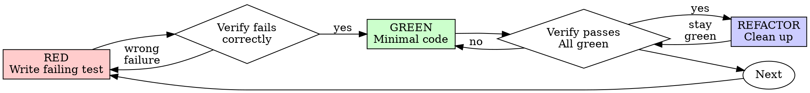

# Codex conversation 019ec6ce

> This archive contains visible conversation activity and tool records. Private model reasoning and system/developer instructions are not available here.
<!-- codex-event:{"kind":"state","timestamp":"2026-06-14T15:44:21.157Z","phase":null} -->
## Task state: task_started · 2026-06-14T15:44:21.157Z

```text
{
  "type": "task_started",
  "turn_id": "019ec6ce-2c88-7bc0-839a-c2e8451f0eba",
  "started_at": 1781451861,
  "model_context_window": 258400,
  "collaboration_mode_kind": "default"
}
```

<!-- /codex-event -->

<!-- codex-event:{"kind":"user","timestamp":"2026-06-14T15:44:22.832Z","phase":null} -->
## User · 2026-06-14T15:44:22.832Z

We have these options to automatically commit and push after some milestone is reached. That milestone will often just be the agent finishing the work we gave it, whatever that was. I don't get the feeling That it is currently working. I don't see it happening. Please check

<!-- /codex-event -->

<!-- codex-event:{"kind":"progress","timestamp":"2026-06-14T15:44:29.652Z","phase":"commentary"} -->
## Codex progress · 2026-06-14T15:44:29.652Z

I’ll trace the auto-commit/push path from configuration through milestone detection to the actual git action, then verify whether the current behavior has a missing trigger or a silent failure.

<!-- /codex-event -->

<!-- codex-event:{"kind":"tool-call","timestamp":"2026-06-14T15:44:29.654Z","phase":null} -->
## Tool call: exec_command · 2026-06-14T15:44:29.654Z

```json
{
  "cmd": "sed -n '1,220p' /Users/masterman/.agents/skills/using-ultrapowers/SKILL.md",
  "workdir": "/Users/masterman/NLP/omniharness",
  "yield_time_ms": 1000,
  "max_output_tokens": 12000
}
```

<!-- /codex-event -->

<!-- codex-event:{"kind":"tool-call","timestamp":"2026-06-14T15:44:29.707Z","phase":null} -->
## Tool call: exec_command · 2026-06-14T15:44:29.707Z

```json
{
  "cmd": "sed -n '1,260p' /Users/masterman/.agents/skills/systematic-debugging/SKILL.md",
  "workdir": "/Users/masterman/NLP/omniharness",
  "yield_time_ms": 1000,
  "max_output_tokens": 16000
}
```

<!-- /codex-event -->

<!-- codex-event:{"kind":"tool-result","timestamp":"2026-06-14T15:44:29.737Z","phase":null} -->
## Tool result: call_xswm9xktwcevuyFXtEAiJ8gk · 2026-06-14T15:44:29.737Z

```text
Chunk ID: 9f6cfd
Wall time: 0.0000 seconds
Process exited with code 0
Original token count: 2019
Output:
---
name: using-ultrapowers
description: Use when starting any conversation - establishes how to find and use skills, requiring skill invocation before acting
---

<SUBAGENT-STOP>
If you were dispatched as a subagent to execute a specific task, skip this skill.
</SUBAGENT-STOP>

# Using Ultrapowers

Use relevant skills before acting, but keep process proportional to the task.

## Instruction Priority

1. User instructions and local repo instructions
2. Ultrapowers skills
3. Default model behavior

If the user says not to create extra repository isolation, or says to work directly in the current repository, follow that instruction.

## Core Rule

Before responding, ask:

1. Is there a process skill that governs how to approach this?
2. Is there an implementation skill that governs how to execute it?
3. Is the request substantial enough to justify that process, or is it a tiny mechanical edit?

If a skill applies and the task is substantial enough to justify it, use it before continuing. If the request is a tiny mechanical edit, make the edit directly with targeted verification.

## Proportional Skill Use

Do the smallest responsible workflow that matches the request.

For tiny, unambiguous mechanical edits, do the edit directly:

- changing a color value,
- fixing a typo,
- tweaking short copy,
- changing a prompt sentence,
- renaming a label,
- adjusting obvious spacing or formatting,
- making a one-line config or docs correction.

For these, do not run brainstorming, write a plan, or force TDD unless the change affects product behavior, data, persistence, control flow, user journeys, or non-obvious architecture.

Use the heavier process when the request is ambiguous, user-facing behavior changes, multiple files/modules are involved, the user journey can change, or the change could create regressions that are not obvious from a quick targeted check.

## Default Posture

- Work in the current repository by default.
- YOU WILL NEVER CREATE A BRANCH unless explicitly instructed.
- Ask the user whether we should work in worktrees as part of the planning.
- YOU WILL ONLY CREATE A WORKTREE if explicitly instructed.
- Keep skill use proportional. Tiny mechanical edits should stay tiny.
- Every project should have a `.gitignore`.
- Never commit or push secrets, credentials, local environment files, `node_modules`, dependency caches, build outputs, coverage output, logs, temporary files, or intermediate/generated artifacts unless the human explicitly asks to version a specific generated artifact.
- Deliver full product functionality by default. NO FAKE COMPONENTS, NO MOCKS, NO PLACEHOLDERS, NO FALLBACKS as substitutes for the requested functionality unless the human explicitly asks for a prototype or scaffold.
- For app, UI, and product-surface work, run a PM pass during planning. Treat it as mandatory default behavior, not optional polish.
- For app, UI, and product-surface work, consider `agentic-user-journey-testing` for important user stories, but do not run it without explicit user approval.
- Use `second-opinion` for substantial saved implementation plans, and for unusually hard, creative, high-risk, or architecture-heavy specs when an independent external review could improve the artifact. Prefer a different available coding harness for that review, such as Codex asking Claude Code or Claude Code asking Codex. If no different harness is available, the same harness is fine; the second opinion is still mandatory for matching artifacts.
- Refactor code when a file passes 1200 lines. Do not normalize oversized files as the default end state.
- Use user stories in specs and plans when they clarify behavior or value.
- Default UI work to `shadcn/ui` unless the user says otherwise.
- When designing UI from scratch, first inspect the available ShadCN Blocks at https://ui.shadcn.com/blocks for each screen, form, or major surface. Start from the closest matching block with `npx shadcn add <block-name>` or the block's source in https://github.com/shadcn-ui/ui, then edit it by adding, removing, or adapting controls. Do not invent a fresh layout before doing this block-selection pass.
- Before adding any individual UI control, check whether `shadcn/ui` already provides a control that does what is needed. Use the available shadcn control first, then customize it, instead of hand-building a one-off control.
- Treat desktop and mobile responsiveness as first-class from the beginning.
- Prefer explicit routing unless the framework strongly defaults to file-based routes.
- For React apps, use `building-react-apps` for state managers, explicit transitions, routing, refs, imports, package-manager defaults, and frontend configuration defaults.
- For React apps with server state, optimistic UI, caches, polling, SSE/WebSocket streams, background jobs, persistence, or client/server synchronization, use `client-server-state-invariants` during planning and verification.
- For React or Next.js slowness, root-load, compile-time, SSR/hydration, bundle, import-bloat, or UI dependency cleanup work, use `optimizing-react-next-apps`.
- Prefer strong instrumentation and auditability for backend behavior.
- When a project has backend or agent workflows, prefer a fully instrumented control plane: persist meaningful events, tool calls, actions, results, errors, and state transitions, and expose them through a CLI or other scriptable interface so the full system can be inspected and tested without the UI.
- Use `instrumenting-control-planes` when building, planning, reviewing, or debugging backend decisions, agent workflows, recovery paths, retries, deletes, long-running jobs, SSE/WebSocket streams, or user-visible failures.
- Use `learning-from-bugs` after diagnosing or fixing meaningful architecture, storage, memory, persistence, control-plane, or system-level bugs so reusable lessons become durable.
- Do not default to silent, masked, or over-abstracted errors.
- When a project has a frontend, prefer surfacing full backend error details and stack traces to the frontend so failures stay visible, debuggable, and testable end-to-end.
- Treat persistence of settings and preferences as explicit design work.
- For every meaningful UI setting, define whether it persists, where it is stored, how it is read and written, who owns it, and how reset, sync, migration, and testing are handled.

See `docs/ultrapowers-defaults.md` for the canonical fork defaults.

## Skill Priority

1. Process skills first
2. Implementation skills second

Examples:

- "Make this button blue" -> inspect the relevant file, make the small edit, do targeted verification
- "Update this prompt sentence" -> edit the prompt directly and verify the final text
- "Build a feature" -> `brainstorming` with a PM pass first, then `writing-plans`, then execution; consider approval-gated `agentic-user-journey-testing` for app workflows
- "Fix this bug" -> `systematic-debugging`, then the relevant implementation skill; if the root cause is meaningful or systemic, finish with `learning-from-bugs`
- "Review this change" -> `requesting-code-review`

## Examples Of User Override

- If a task feels risky and the user did not ask for extra repository isolation, keep working in the current repository unless the user explicitly instructs otherwise.
- If a stack supports file-based routing but the user says not to use it, choose an explicit routing approach instead.
- If a framework strongly defaults to file-based routing, such as Next.js App Router, use the framework-native routing model unless there is a good reason not to.
- If a frontend skill suggests `shadcn/ui` but the user wants another design system, follow the user.

## Red Flags

- "I need a whole workflow for this tiny edit" -> no. Use the smallest responsible process.
- "This is simple, so I need the whole process anyway" -> no. Tiny mechanical edits should stay tiny.
- "I'll create extra repository isolation just to be safe" -> forbidden unless the user clearly asked for it.
- "I already know the skill" -> read the current version before relying on it

```

<!-- /codex-event -->

<!-- codex-event:{"kind":"tool-result","timestamp":"2026-06-14T15:44:29.787Z","phase":null} -->
## Tool result: call_GTUhncZxczrTaVcNRMRkrDbl · 2026-06-14T15:44:29.787Z

````text
Chunk ID: 66f3ba
Wall time: 0.0000 seconds
Process exited with code 0
Original token count: 2092
Output:
---
name: systematic-debugging
description: Use when encountering any bug, test failure, or unexpected behavior, before proposing fixes
---

# Systematic Debugging

## Overview

Random fixes waste time and create new bugs. Quick patches mask underlying issues.

**Core principle:** ALWAYS find root cause before attempting fixes. Symptom fixes are failure.

**Violating the letter of this process is violating the spirit of debugging.**

## The Iron Law

```
NO FIXES WITHOUT ROOT CAUSE INVESTIGATION FIRST
```

If you haven't completed Phase 1, you cannot propose fixes.

## When to Use

Use for ANY technical issue:
- Test failures
- Bugs in production
- Unexpected behavior
- Performance problems
- Build failures
- Integration issues

**Use this ESPECIALLY when:**
- Under time pressure (emergencies make guessing tempting)
- "Just one quick fix" seems obvious
- You've already tried multiple fixes
- Previous fix didn't work
- You don't fully understand the issue

**Don't skip when:**
- Issue seems simple (simple bugs have root causes too)
- You're in a hurry (rushing guarantees rework)
- Manager wants it fixed NOW (systematic is faster than thrashing)

## The Four Phases

You MUST complete each phase before proceeding to the next.

### Phase 1: Root Cause Investigation

**BEFORE attempting ANY fix:**

1. **Read Error Messages Carefully**
   - Don't skip past errors or warnings
   - They often contain the exact solution
   - Read stack traces completely
   - Note line numbers, file paths, error codes

2. **Reproduce Consistently**
   - Can you trigger it reliably?
   - What are the exact steps?
   - Does it happen every time?
   - If not reproducible → gather more data, don't guess

3. **Check Recent Changes**
   - What changed that could cause this?
   - Git diff, recent commits
   - New dependencies, config changes
   - Environmental differences

4. **Gather Evidence in Multi-Component Systems**

   **WHEN system has multiple components (CI → build → signing, API → service → database):**

   **BEFORE proposing fixes, add diagnostic instrumentation:**
   ```
   For EACH component boundary:
     - Log what data enters component
     - Log what data exits component
     - Verify environment/config propagation
     - Check state at each layer

   Run once to gather evidence showing WHERE it breaks
   THEN analyze evidence to identify failing component
   THEN investigate that specific component
   ```

   **Example (multi-layer system):**
   ```bash
   # Layer 1: Workflow
   echo "=== Secrets available in workflow: ==="
   echo "IDENTITY: ${IDENTITY:+SET}${IDENTITY:-UNSET}"

   # Layer 2: Build script
   echo "=== Env vars in build script: ==="
   env | grep IDENTITY || echo "IDENTITY not in environment"

   # Layer 3: Signing script
   echo "=== Keychain state: ==="
   security list-keychains
   security find-identity -v

   # Layer 4: Actual signing
   codesign --sign "$IDENTITY" --verbose=4 "$APP"
   ```

   **This reveals:** Which layer fails (secrets → workflow ✓, workflow → build ✗)

5. **Trace Data Flow**

   **WHEN error is deep in call stack:**

   See `root-cause-tracing.md` in this directory for the complete backward tracing technique.

   **Quick version:**
   - Where does bad value originate?
   - What called this with bad value?
   - Keep tracing up until you find the source
   - Fix at source, not at symptom

### Phase 2: Pattern Analysis

**Find the pattern before fixing:**

1. **Find Working Examples**
   - Locate similar working code in same codebase
   - What works that's similar to what's broken?

2. **Compare Against References**
   - If implementing pattern, read reference implementation COMPLETELY
   - Don't skim - read every line
   - Understand the pattern fully before applying

3. **Identify Differences**
   - What's different between working and broken?
   - List every difference, however small
   - Don't assume "that can't matter"

4. **Understand Dependencies**
   - What other components does this need?
   - What settings, config, environment?
   - What assumptions does it make?

### Phase 3: Hypothesis and Testing

**Scientific method:**

1. **Form Single Hypothesis**
   - State clearly: "I think X is the root cause because Y"
   - Write it down
   - Be specific, not vague

2. **Test Minimally**
   - Make the SMALLEST possible change to test hypothesis
   - One variable at a time
   - Don't fix multiple things at once

3. **Verify Before Continuing**
   - Did it work? Yes → Phase 4
   - Didn't work? Form NEW hypothesis
   - DON'T add more fixes on top

4. **When You Don't Know**
   - Say "I don't understand X"
   - Don't pretend to know
   - Ask for help
   - Research more

### Phase 4: Implementation

**Fix the root cause, not the symptom:**

1. **Create Failing Test Case**
   - Simplest possible reproduction
   - Automated test if possible
   - One-off test script if no framework
   - MUST have before fixing
   - Use the `ultrapowers:test-driven-development` skill for writing proper failing tests

2. **Implement Single Fix**
   - Address the root cause identified
   - ONE change at a time
   - No "while I'm here" improvements
   - No bundled refactoring

3. **Verify Fix**
   - Test passes now?
   - No other tests broken?
   - Issue actually resolved?
   - If the bug was meaningful or systemic, use `ultrapowers:learning-from-bugs` before declaring the fix complete.

4. **If Fix Doesn't Work**
   - STOP
   - Count: How many fixes have you tried?
   - If < 3: Return to Phase 1, re-analyze with new information
   - **If ≥ 3: STOP and question the architecture (step 5 below)**
   - DON'T attempt Fix #4 without architectural discussion

5. **If 3+ Fixes Failed: Question Architecture**

   **Pattern indicating architectural problem:**
   - Each fix reveals new shared state/coupling/problem in different place
   - Fixes require "massive refactoring" to implement
   - Each fix creates new symptoms elsewhere

   **STOP and question fundamentals:**
   - Is this pattern fundamentally sound?
   - Are we "sticking with it through sheer inertia"?
   - Should we refactor architecture vs. continue fixing symptoms?

   **Discuss with your human partner before attempting more fixes**

   This is NOT a failed hypothesis - this is a wrong architecture.

## Red Flags - STOP and Follow Process

If you catch yourself thinking:
- "Quick fix for now, investigate later"
- "Just try changing X and see if it works"
- "Add multiple changes, run tests"
- "Skip the test, I'll manually verify"
- "It's probably X, let me fix that"
- "I don't fully understand but this might work"
- "Pattern says X but I'll adapt it differently"
- "Here are the main problems: [lists fixes without investigation]"
- Proposing solutions before tracing data flow
- **"One more fix attempt" (when already tried 2+)**
- **Each fix reveals new problem in different place**

**ALL of these mean: STOP. Return to Phase 1.**

**If 3+ fixes failed:** Question the architecture (see Phase 4.5)

## your human partner's Signals You're Doing It Wrong

**Watch for these redirections:**
- "Is that not happening?" - You assumed without verifying
- "Will it show us...?" - You should have added evidence gathering
- "Stop guessing" - You're proposing fixes without understanding
- "Ultrathink this" - Question fundamentals, not just symptoms
- "We're stuck?" (frustrated) - Your approach isn't working

**When you see these:** STOP. Return to Phase 1.

## Common Rationalizations

| Excuse | Reality |
|--------|---------|
| "Issue is simple, don't need process" | Simple issues have root causes too. Process is fast for simple bugs. |
| "Emergency, no time for process" | Systematic debugging is FASTER than guess-and-check thrashing. |
| "Just try this first, then investigate" | First fix sets the pattern. Do it right from the start. |
| "I'll write test after confirming fix works" | Untested fixes don't stick. Test first proves it. |
| "Multiple fixes at once saves time" | Can't isolate what worked. Causes new bugs. |
| "Reference too long, I'll adapt the pattern" | Partial understanding guarantees bugs. Read it completely. |
| "I see the problem, let me fix it" | Seeing symptoms ≠ understanding root cause. |
| "One more fix attempt" (after 2+ failures) | 3+ failures = architectural problem. Question pattern, don't fix again. |

## Quick Reference


````

<!-- /codex-event -->

<!-- codex-event:{"kind":"progress","timestamp":"2026-06-14T15:44:34.267Z","phase":"commentary"} -->
## Codex progress · 2026-06-14T15:44:34.267Z

I’m using `systematic-debugging` here because this is a behavior gap, and the repository rules make the lifecycle/event path important. Next I’m going to find the setting, the milestone evaluator, and any server-side git action code before changing anything.

<!-- /codex-event -->

<!-- codex-event:{"kind":"tool-call","timestamp":"2026-06-14T15:44:35.081Z","phase":null} -->
## Tool call: exec_command · 2026-06-14T15:44:35.081Z

```json
{
  "cmd": "sed -n '1,260p' /Users/masterman/.agents/skills/instrumenting-control-planes/SKILL.md",
  "workdir": "/Users/masterman/NLP/omniharness",
  "yield_time_ms": 1000,
  "max_output_tokens": 16000
}
```

<!-- /codex-event -->

<!-- codex-event:{"kind":"tool-result","timestamp":"2026-06-14T15:44:35.150Z","phase":null} -->
## Tool result: call_5VV5Y4Q1rxdagbrDEmN8TcBK · 2026-06-14T15:44:35.150Z

````text
Chunk ID: 547d7d
Wall time: 0.0000 seconds
Process exited with code 0
Original token count: 1303
Output:
---
name: instrumenting-control-planes
description: Use when building, planning, reviewing, or debugging apps with backend decisions, agent workflows, long-running jobs, SSE/WebSocket streams, recovery paths, deletes, retries, or user-visible failures
---

# Instrumenting Control Planes

Build the control plane as a product surface. If the server decides, refuses, retries, spawns, deletes, recovers, gives up, or fails, that decision must be observable by users, operators, and tests.

If a React UI consumes the control plane through server state, optimistic UI, caches, polling, SSE/WebSocket streams, or persisted runtime state, also use `client-server-state-invariants`.

## Core Rule

Every meaningful server-side state transition emits a named, durable event. The UI and tests consume the same production event surface.

Do not rely on snapshot diffs, rendered DOM state, logs only, or client-side re-derivation to prove what the server decided.

## Hot Path Rule

No user bootstrap, catalog, status, reconnect, or recovery request may depend on a lock-prone database write path or external health probe finishing. Serve these paths from a bounded read model, memory cache, append-only event log, or stale-but-marked snapshot; queue reconciliation writes outside the request. Every dependency on a database or bridge call in a hot path needs a short timeout, cancellation, and an explicit degraded response.

If SQLite, local files, or a single-writer store is used, assume writer contention can freeze readers at the worst moment. Use one writer, WAL/busy-timeout discipline, short transactions, bounded queues, and headless chaos tests that run bootstrap/reload while writes are active. A 25s UI request is a control-plane failure, even if the database eventually returns.

## Event Contract

For each backend or agent workflow, define:

- named events for decisions: `worker.spawned`, `worker.reattached`, `plan.ready`, `plan.review.blocked`, `recovery.gave_up`, `conversation.delete_failed`;
- payloads with stable ids, `prev`/`next` status when relevant, reason codes, and enough context to debug;
- `error.surfaced` or an equivalent user-facing failure event for every failure the user should know about;
- durable persistence or a bounded replay buffer so short disconnects do not erase history;
- a scriptable read path: CLI, HTTP endpoint, sqlite query, or event log command.

If a decision cannot be asserted from this surface, the design is incomplete.

If debugging a control-plane failure reveals a reusable lesson, use `ultrapowers:learning-from-bugs` after the fix is verified.

## Streaming Requirements

For SSE or WebSocket-like streams:

- emit named events alongside any snapshot/update frame;
- include monotonic event ids;
- support resume from the last seen id;
- replay missed events from a bounded buffer;
- emit an explicit resync-required event when replay is impossible;
- bootstrap from a snapshot, then tail events.

Snapshots show current truth. Named events show why it became true.

## Testing Standard

Control-plane tests should usually be headless HTTP/SSE scenario tests, not browser tests. Browser automation is for UI behavior; control-plane tests assert server decisions directly.

Write scenario assertions as event transcripts:

```ts
expect(events).toHaveEmitted("worker.spawned", { runId });
expect(events).toHaveEmitted("worker.status", { next: "running" });
chaos.killServer();
chaos.restartServer();
expect(events).toHaveEmitted("worker.reattached", { runId });
expect(events).not.toHaveEmitted("worker.recreated", { runId });
```

Chaos belongs outside production code paths: drop connections in the client, fail fetches in the harness, restart the server process, and use seeds for reproducibility.

## Refuse These Shapes

- silent early returns in server methods;
- swallowed `catch` blocks;
- client-side derivation of server decisions;
- response-code-only user failures;
- event streams without ids or resume;
- tests that infer control-plane behavior from rendered state;
- delete handlers that do not enumerate dependent rows or emit typed failure events;
- recovery loops without terminal events such as `gave_up` or `abandoned`;
- request handlers that wait on inline reconciliation writes, SQLite contention, or bridge `/doctor` checks before returning bootstrap data;
- test-only behavior branches in production code.

## Design Checklist

Before implementing a backend or agent workflow, answer:

1. What decisions can this workflow make?
2. What named event is emitted for each decision, including refusal and failure?
3. Where are events persisted or buffered?
4. How does a client resume after disconnect?
5. Which request paths must keep working while persistence or bridge dependencies are slow, locked, or stale?
6. How can a CLI or test harness inspect the exact event sequence without the UI?
7. Which headless scenario proves the happy path, failure path, recovery path, terminal state, and hot-path timeout/degraded path?
8. Which client state consumes these events, and how does it prove ownership, freshness, completeness, ordering, and replay/resync?

If the answer is "the UI can figure it out", name the missing event instead.

````

<!-- /codex-event -->

<!-- codex-event:{"kind":"progress","timestamp":"2026-06-14T15:44:42.026Z","phase":"commentary"} -->
## Codex progress · 2026-06-14T15:44:42.026Z

I’ll keep this read-only until the root cause is clear. I’m also going to check the lifecycle spec if this touches a server-side transition, because this codebase treats silent control-plane decisions as bugs.

<!-- /codex-event -->

<!-- codex-event:{"kind":"tool-call","timestamp":"2026-06-14T15:44:42.028Z","phase":null} -->
## Tool call: exec_command · 2026-06-14T15:44:42.028Z

```json
{
  "cmd": "rg -n \"auto.?commit|autocommit|commit.*push|push.*commit|milestone|auto.*push|git push|git commit|post.*completion|completion.*commit\" -S .",
  "workdir": "/Users/masterman/NLP/omniharness",
  "yield_time_ms": 1000,
  "max_output_tokens": 30000
}
```

<!-- /codex-event -->

<!-- codex-event:{"kind":"tool-call","timestamp":"2026-06-14T15:44:42.028Z","phase":null} -->
## Tool call: exec_command · 2026-06-14T15:44:42.028Z

```json
{
  "cmd": "sed -n '1,260p' docs/architecture/lifecycle-observability-and-testing.md",
  "workdir": "/Users/masterman/NLP/omniharness",
  "yield_time_ms": 1000,
  "max_output_tokens": 20000
}
```

<!-- /codex-event -->

<!-- codex-event:{"kind":"tool-call","timestamp":"2026-06-14T15:44:42.073Z","phase":null} -->
## Tool call: exec_command · 2026-06-14T15:44:42.073Z

```json
{
  "cmd": "git status --short",
  "workdir": "/Users/masterman/NLP/omniharness",
  "yield_time_ms": 1000,
  "max_output_tokens": 12000
}
```

<!-- /codex-event -->

<!-- codex-event:{"kind":"tool-result","timestamp":"2026-06-14T15:44:42.133Z","phase":null} -->
## Tool result: call_NHbhZhWFk3D18s5M1zIu8DbZ · 2026-06-14T15:44:42.133Z

```text
Chunk ID: a320ec
Wall time: 0.0000 seconds
Process exited with code 0
Original token count: 25081
Output:
Total output lines: 645

./src/lib/commit-workflow.ts:1:export const GIT_AUTO_COMMIT_MILESTONES_SETTING = "GIT_AUTO_COMMIT_MILESTONES";
./src/lib/commit-workflow.ts:2:export const GIT_PUSH_ON_COMMIT_SETTING = "GIT_PUSH_ON_COMMIT";
./src/lib/commit-workflow.ts:4:export type ManualCommitAction = "commit" | "commit-push";
./src/lib/commit-workflow.ts:6:export const MANUAL_COMMIT_CHAT_PROMPT = "Group the modified files from this conversation into logical git commits. Do not run tests. Do not modify files or do anything else. Only inspect the modified files as needed, create commits, and stop.";
./src/lib/commit-workflow.ts:7:export const MANUAL_COMMIT_CHAT_PUSH_PROMPT = "Group the modified files from this conversation into logical git commits, then push the current branch. Do not run tests. Do not modify files or do anything else. Only inspect the modified files as needed, create commits, push, and stop.";
./src/lib/commit-workflow.ts:9:export const MANUAL_COMMIT_PROJECT_PROMPT = "Group all currently modified files into logical git commits. Do not run tests. Do not modify files or do anything else. Only inspect the modified files as needed, create commits, and stop.";
./src/lib/commit-workflow.ts:10:export const MANUAL_COMMIT_PROJECT_PUSH_PROMPT = "Group all currently modified files into logical git commits, then push the current branch. Do not run tests. Do not modify files or do anything else. Only inspect the modified files as needed, create commits, push, and stop.";
./src/lib/commit-workflow.ts:38:  return action === "commit-push" ? MANUAL_COMMIT_CHAT_PUSH_PROMPT : MANUAL_COMMIT_CHAT_PROMPT;
./src/lib/commit-workflow.ts:42:  return action === "commit-push" ? MANUAL_COMMIT_PROJECT_PUSH_PROMPT : MANUAL_COMMIT_PROJECT_PROMPT;
./src/lib/conversation-visuals.ts:1:import { MANUAL_COMMIT_PROJECT_PROMPT, MANUAL_COMMIT_PROJECT_PUSH_PROMPT } from "@/lib/commit-workflow";
./src/lib/conversation-visuals.ts:5:export const AUTO_COMMIT_PROJECT_PROMPT = MANUAL_COMMIT_PROJECT_PROMPT;
./src/lib/conversation-visuals.ts:8:  MANUAL_COMMIT_PROJECT_PUSH_PROMPT,
./shared/locales/es.json:149:  "commit.menu.autoCommitMilestones": "Auto-commit milestones",
./shared/locales/es.json:150:  "commit.menu.alwaysPushOnCommit": "Always push on commit",
./shared/locales/es.json:152:  "commit.menu.commitAndPushNow": "Commit and push now",
./shared/locales/es.json:154:  "commit.menu.commitAndPushProject": "Commit and push project",
./shared/locales/es.json:162:  "commit.status.autoCommitCreated": "Auto-commit created: {commit}",
./shared/locales/es.json:163:  "commit.status.autoCommitSkipped": "Auto-commit skipped: {reason}",
./shared/locales/es.json:164:  "commit.status.autoCommitFailed": "Auto-commit failed: {reason}",
./shared/locales/es.json:165:  "commit.status.pushCreated": "Auto-commit pushed: {commit}",
./shared/locales/es.json:166:  "commit.status.pushFailed": "Auto-commit push failed: {reason}",
./shared/locales/ko.json:149:  "commit.menu.autoCommitMilestones": "Auto-commit milestones",
./shared/locales/ko.json:150:  "commit.menu.alwaysPushOnCommit": "Always push on commit",
./shared/locales/ko.json:152:  "commit.menu.commitAndPushNow": "Commit and push now",
./shared/locales/ko.json:154:  "commit.menu.commitAndPushProject": "Commit and push project",
./shared/locales/ko.json:162:  "commit.status.autoCommitCreated": "Auto-commit created: {commit}",
./shared/locales/ko.json:163:  "commit.status.autoCommitSkipped": "Auto-commit skipped: {reason}",
./shared/locales/ko.json:164:  "commit.status.autoCommitFailed": "Auto-commit failed: {reason}",
./shared/locales/ko.json:165:  "commit.status.pushCreated": "Auto-commit pushed: {commit}",
./shared/locales/ko.json:166:  "commit.status.pushFailed": "Auto-commit push failed: {reason}",
./shared/locales/fr.json:149:  "commit.menu.autoCommitMilestones": "Auto-commit milestones",
./shared/locales/fr.json:150:  "commit.menu.alwaysPushOnCommit": "Always push on commit",
./shared/locales/fr.json:152:  "commit.menu.commitAndPushNow": "Commit and push now",
./shared/locales/fr.json:154:  "commit.menu.commitAndPushProject": "Commit and push project",
./shared/locales/fr.json:162:  "commit.status.autoCommitCreated": "Auto-commit created: {commit}",
./shared/locales/fr.json:163:  "commit.status.autoCommitSkipped": "Auto-commit skipped: {reason}",
./shared/locales/fr.json:164:  "commit.status.autoCommitFailed": "Auto-commit failed: {reason}",
./shared/locales/fr.json:165:  "commit.status.pushCreated": "Auto-commit pushed: {commit}",
./shared/locales/fr.json:166:  "commit.status.pushFailed": "Auto-commit push failed: {reason}",
./shared/locales/it.json:149:  "commit.menu.autoCommitMilestones": "Auto-commit milestones",
./shared/locales/it.json:150:  "commit.menu.alwaysPushOnCommit": "Always push on commit",
./shared/locales/it.json:152:  "commit.menu.commitAndPushNow": "Commit and push now",
./shared/locales/it.json:154:  "commit.menu.commitAndPushProject": "Commit and push project",
./shared/locales/it.json:162:  "commit.status.autoCommitCreated": "Auto-commit created: {commit}",
./shared/locales/it.json:163:  "commit.status.autoCommitSkipped": "Auto-commit skipped: {reason}",
./shared/locales/it.json:164:  "commit.status.autoCommitFailed": "Auto-commit failed: {reason}",
./shared/locales/it.json:165:  "commit.status.pushCreated": "Auto-commit pushed: {commit}",
./shared/locales/it.json:166:  "commit.status.pushFailed": "Auto-commit push failed: {reason}",
./shared/locales/en.json:179:  "commit.menu.autoCommitMilestones": "Auto-commit milestones",
./shared/locales/en.json:180:  "commit.menu.alwaysPushOnCommit": "Always push on commit",
./shared/locales/en.json:182:  "commit.menu.commitAndPushNow": "Commit and push now",
./shared/locales/en.json:184:  "commit.menu.commitAndPushProject": "Commit and push project",
./shared/locales/en.json:192:  "commit.status.autoCommitCreated": "Auto-commit created: {commit}",
./shared/locales/en.json:193:  "commit.status.autoCommitSkipped": "Auto-commit skipped: {reason}",
./shared/locales/en.json:194:  "commit.status.autoCommitFailed": "Auto-commit failed: {reason}",
./shared/locales/en.json:195:  "commit.status.pushCreated": "Auto-commit pushed: {commit}",
./shared/locales/en.json:196:  "commit.status.pushFailed": "Auto-commit push failed: {reason}",
./shared/locales/pt.json:149:  "commit.menu.autoCommitMilestones": "Auto-commit milestones",
./shared/locales/pt.json:150:  "commit.menu.alwaysPushOnCommit": "Always push on commit",
./shared/locales/pt.json:152:  "commit.menu.commitAndPushNow": "Commit and push now",
./shared/locales/pt.json:154:  "commit.menu.commitAndPushProject": "Commit and push project",
./shared/locales/pt.json:162:  "commit.status.autoCommitCreated": "Auto-commit created: {commit}",
./shared/locales/pt.json:163:  "commit.status.autoCommitSkipped": "Auto-commit skipped: {reason}",
./shared/locales/pt.json:164:  "commit.status.autoCommitFailed": "Auto-commit failed: {reason}",
./shared/locales/pt.json:165:  "commit.status.pushCreated": "Auto-commit pushed: {commit}",
./shared/locales/pt.json:166:  "commit.status.pushFailed": "Auto-commit push failed: {reason}",
./shared/locales/zh-CN.json:149:  "commit.menu.autoCommitMilestones": "Auto-commit milestones",
./shared/locales/zh-CN.json:150:  "commit.menu.alwaysPushOnCommit": "Always push on commit",
./shared/locales/zh-CN.json:152:  "commit.menu.commitAndPushNow": "Commit and push now",
./shared/locales/zh-CN.json:154:  "commit.menu.commitAndPushProject": "Commit and push project",
./shared/locales/zh-CN.json:162:  "commit.status.autoCommitCreated": "Auto-commit created: {commit}",
./shared/locales/zh-CN.json:163:  "commit.status.autoCommitSkipped": "Auto-commit skipped: {reason}",
./shared/locales/zh-CN.json:164:  "commit.status.autoCommitFailed": "Auto-commit failed: {reason}",
./shared/locales/zh-CN.json:165:  "commit.status.pushCreated": "Auto-commit pushed: {commit}",
./shared/locales/zh-CN.json:166:  "commit.status.pushFailed": "Auto-commit push failed: {reason}",
./shared/locales/de.json:149:  "commit.menu.autoCommitMilestones": "Auto-commit milestones",
./shared/locales/de.json:150:  "commit.menu.alwaysPushOnCommit": "Always push on commit",
./shared/locales/de.json:152:  "commit.menu.commitAndPushNow": "Commit and push now",
./shared/locales/de.json:154:  "commit.menu.commitAndPushProject": "Commit and push project",
./shared/locales/de.json:162:  "commit.status.autoCommitCreated": "Auto-commit created: {commit}",
./shared/locales/de.json:163:  "commit.status.autoCommitSkipped": "Auto-commit skipped: {reason}",
./shared/locales/de.json:164:  "commit.status.autoCommitFailed": "Auto-commit failed: {reason}",
./shared/locales/de.json:165:  "commit.status.pushCreated": "Auto-commit pushed: {commit}",
./shared/locales/de.json:166:  "commit.status.pushFailed": "Auto-commit push failed: {reason}",
./shared/locales/ja.json:149:  "commit.menu.autoCommitMilestones": "Auto-commit milestones",
./shared/locales/ja.json:150:  "commit.menu.alwaysPushOnCommit": "Always push on commit",
./shared/locales/ja.json:152:  "commit.menu.commitAndPushNow": "Commit and push now",
./shared/locales/ja.json:154:  "commit.menu.commitAndPushProject": "Commit and push project",
./shared/locales/ja.json:162:  "commit.status.autoCommitCreated": "Auto-commit created: {commit}",
./shared/locales/ja.json:163:  "commit.status.autoCommitSkipped": "Auto-commit skipped: {reason}",
./shared/locales/ja.json:164:  "commit.status.autoCommitFailed": "Auto-commit failed: {reason}",
./shared/locales/ja.json:165:  "commit.status.pushCreated": "Auto-commit pushed: {commit}",
./shared/locales/ja.json:166:  "commit.status.pushFailed": "Auto-commit push failed: {reason}",
./vibes/2026-04-20-autonomous-implementation-plan.md:171:git commit -m "feat: add autonomous run schema and test harness"
./vibes/2026-04-20-autonomous-implementation-plan.md:238:git commit -m "feat: parse markdown plans into structured items"
./vibes/2026-04-20-autonomous-implementation-plan.md:309:git commit -m "feat: add plan readiness assessment and clarification storage"
./vibes/2026-04-20-autonomous-implementation-plan.md:374:git commit -m "feat: add clarification answer and resume flow"
./vibes/2026-04-20-autonomous-implementation-plan.md:441:git commit -m "refactor: turn supervisor loop into durable state machine"
./vibes/2026-04-20-autonomous-implementation-plan.md:505:git commit -m "feat: add parallel worker orchestration and monitoring"
./vibes/2026-04-20-autonomous-implementation-plan.md:578:git commit -m "feat: add independent validation before run completion"
./vibes/2026-04-20-autonomous-implementation-plan.md:619:  if (/npm install|curl|wget|git push/i.test(text)) return "escalate";
./vibes/2026-04-20-autonomous-implementation-plan.md:643:git commit -m "feat: add permission handling and credit recovery"
./vibes/2026-04-20-autonomous-implementation-plan.md:701:git commit -m "feat: surface clarifications progress and validation in ui"
./vibes/2026-04-20-autonomous-implementation-plan.md:743:git commit -m "test: add autonomous supervisor end-to-end coverage"
./tests/api/conversations-route.test.ts:6:import { AUTO_COMMIT_PROJECT_PROMPT } from "@/lib/conversation-visuals";
./tests/api/conversations-route.test.ts:921:        command: AUTO_COMMIT_PROJECT_PROMPT,
./tests/api/conversations-route.test.ts:1020:        command: AUTO_COMMIT_PROJECT_PROMPT,
./tests/api/conversations-route.test.ts:1043:  it("keeps project auto-commit conversations titled Commit", async () => {
./tests/api/conversations-route.test.ts:1048:        command: AUTO_COMMIT_PROJECT_PROMPT,
./src/components/home/ConversationSidebar.tsx:93:  autoCommitProject: (projectPath: string, action?: import("@/lib/commit-workflow").ManualCommitAction) => void;
./src/components/home/ConversationSidebar.tsx:94:  isAutoCommitProjectPending: boolean;
./src/components/home/ConversationSidebar.tsx:120:  autoCommitProject,
./src/components/home/ConversationSidebar.tsx:121:  isAutoCommitProjectPending,
./src/components/home/ConversationSidebar.tsx:182:                        disabled={isAutoCommitProjectPending}
./src/components/home/ConversationSidebar.tsx:183:                        onClick={() => autoCommitProject(group.path)}
./src/components/home/ConversationSidebar.tsx:189:                        disabled={isAutoCommitProjectPending}
./src/components/home/ConversationSidebar.tsx:190:                        onClick={() => autoCommitProject(group.path, "commit-push")}
./src/components/home/ConversationSidebar.tsx:192:                        <GitCommitHorizontal className="mr-2 h-4 w-4" /> {t("commit.menu.commitAndPushProject")}
./src/components/home/ConversationSidebar.tsx:431:  autoCommitProject: (projectPath: string, action?: ManualCommitAction) => void;
./src/components/home/ConversationSidebar.tsx:432:  isAutoCommitProjectPending: boolean;
./src/components/home/ConversationSidebar.tsx:473:  autoCommitProject,
./src/components/home/ConversationSidebar.tsx:474:  isAutoCommitProjectPending,
./src/components/home/ConversationSidebar.tsx:621:              autoCommitProject={autoCommitProject}
./src/components/home/ConversationSidebar.tsx:622:              isAutoCommitProjectPending={isAutoCommitProjectPending}
./src/components/home/ConversationSidebar.tsx:648:              autoCommitProject={autoCommitProject}
./src/components/home/ConversationSidebar.tsx:649:              isAutoCommitProjectPending={isAutoCommitProjectPending}
./src/components/home/HomeHeader.tsx:55:  autoCommitProject: (projectPath: string) => void;
./src/components/home/HomeHeader.tsx:56:  isAutoCommitProjectPending: boolean;
./src/components/home/HomeHeader.tsx:87:  onCommitAndPushNow: () => void;
./src/components/home/HomeHeader.tsx:88:  autoCommitMilestonesEnabled: boolean;
./src/components/home/HomeHeader.tsx:89:  pushOnCommitEnabled: boolean;
./src/components/home/HomeHeader.tsx:90:  onAutoCommitMilestonesChange: (checked: boolean) => void;
./src/components/home/HomeHeader.tsx:91:  onPushOnCommitChange: (checked: boolean) => void;
./src/components/home/HomeHeader.tsx:92:  isAutoCommitChatPending: boolean;
./src/components/home/HomeHeader.tsx:129:  autoCommitProject,
./src/components/home/HomeHeader.tsx:130:  isAutoCommitProjectPending,
./src/components/home/HomeHeader.tsx:161:  onCommitAndPushNow,
./src/components/home/HomeHeader.tsx:162:  autoCommitMilestonesEnabled,
./src/components/home/HomeHeader.tsx:163:  pushOnCommitEnabled,
./src/components/home/HomeHeader.tsx:164:  onAutoCommitMilestonesChange,
./src/components/home/HomeHeader.tsx:165:  onPushOnCommitChange,
./src/components/home/HomeHeader.tsx:166:  isAutoCommitChatPending,
./src/components/home/HomeHeader.tsx:185:  const commitButtonLabel = pushOnCommitEnabled ? t("commit.menu.commitAndPushNow") : t("commit.menu.commitNow");
./src/components/home/HomeHeader.tsx:287:              autoCommitProject={autoCommitProject}
./src/components/home/HomeHeader.tsx:288:              isAutoCommitProjectPending={isAutoCommitProjectPending}
./src/components/home/HomeHeader.tsx:414:                  <DropdownMenuItem onClick={onCommitNow} disabled={isAutoCommitChatPending} className="sm:hidden">
./src/components/home/HomeHeader.tsx:418:                  <DropdownMenuItem onClick={onCommitAndPushNow} disabled={isAutoCommitChatPending} className="sm:hidden">
./src/components/home/HomeHeader.tsx:420:                    <span>{t("commit.menu.commitAndPushNow")}</span>
./src/components/home/HomeHeader.tsx:445:            disabled={isAutoCommitChatPending}
./src/components/home/HomeHeader.tsx:458:                  disabled={isAutoCommitChatPending}
./src/components/home/HomeHeader.tsx:468:                  onAutoCommitMilestonesChange(!autoCommitMilestonesEnabled);
./src/components/home/HomeHeader.tsx:473:                  checked={autoCommitMilestonesEnabled}
./src/components/home/HomeHeader.tsx:474:                  onCheckedChange={onAutoCommitMilestonesChange}
./src/components/home/HomeHeader.tsx:477:                    onAutoCommitMilestonesChange(!autoCommitMilestonesEnabled);
./src/components/home/HomeHeader.tsx:479:                  aria-label={t("commit.menu.autoCommitMilestones")}
./src/components/home/HomeHeader.tsx:481:                <span>{t("commit.menu.autoCommitMilestones")}</span>
./src/components/home/HomeHeader.tsx:486:                  onPushOnCommitChange(!pushOnCommitEnabled);
./src/components/home/HomeHeader.tsx:491:                  checked={pushOnCommitEnabled}
./src/components/home/HomeHeader.tsx:492:                  onCheckedChange={onPushOnCommitChange}
./src/components/home/HomeHeader.tsx:495:                    onPushOnCommitChange(!pushOnCommitEnabled);
./src/components/home/HomeHeader.tsx:497:                  aria-label={t("commit.menu.alwaysPushOnCommit")}
./src/components/home/HomeHeader.tsx:499:                <span>{t("commit.menu.alwaysPushOnCommit")}</span>
./src/components/home/HomeHeader.tsx:502:              <DropdownMenuItem onClick={onCommitNow} disabled={isAutoCommitChatPending}>
./src/components/home/HomeHeader.tsx:506:              <DropdownMenuItem onClick={onCommitAndPushNow} disabled={isAutoCommitChatPending}>
./src/components/home/HomeHeader.tsx:508:                <span>{t("commit.menu.commitAndPushNow")}</span>
./docs/superpowers/learnings/2026-05-20-direct-active-stream-stop-and-refresh.md:8:**Verification:** Added failing regression coverage first, then passed `pnpm vitest run tests/app/worker-entries-manager.test.ts tests/ui/composer-shell.test.ts` with 27 tests passing. Also passed `pnpm vitest run tests/app/worker-entries-manager.test.ts tests/ui/composer-shell.test.ts tests/app/direct-worker-stream-loading.test.ts tests/app/busy-message-behavior.test.ts tests/api/conversation-messages-route.test.ts` with 60 tests passing, `pnpm vitest run tests/server/git/auto-commit.test.ts` with 5 tests passing, `pnpm lint` with 0 errors and existing warnings, and `git diff --check`.
./docs/superpowers/specs/2026-04-23-remote-access-pwa-design.md:25:- OmniHarness remains a single-user system in this milestone. There is no multi-user account model, invitation model, or RBAC.
./docs/superpowers/specs/2026-04-23-remote-access-pwa-design.md:36:## Current Milestone
./docs/superpowers/specs/2026-04-23-remote-access-pwa-design.md:48:## Later Milestones / Deferred But Intentional
./docs/superpowers/specs/2026-04-23-remote-access-pwa-design.md:134:- optional short re-auth gate for destructive actions in a later milestone.
./docs/superpowers/specs/2026-04-23-remote-access-pwa-design.md:401:- Password-only is accepted for this milestone because the product is single-user, but the implementation should not block adding a second factor later.
./docs/superpowers/specs/2026-05-11-organic-planning-interface-design.md:32:- A ready plan is a milestone, not the end of the conversation.
./docs/superpowers/specs/2026-04-23-worker-detail-streaming-design.md:184:### Milestone 1
./docs/superpowers/specs/2026-04-23-worker-detail-streaming-design.md:188:### Milestone 2
./docs/superpowers/specs/2026-04-23-worker-detail-streaming-design.md:192:### Milestone 3
./docs/superpowers/specs/2026-04-23-worker-detail-streaming-design.md:196:### Milestone 4
./docs/superpowers/specs/2026-04-28-interactive-planning-handoff-design.md:28:- Adding multi-agent planning review in this milestone.
./docs/superpowers/specs/2026-04-28-interactive-planning-handoff-design.md:39:### Current Milestone
./docs/superpowers/specs/2026-04-28-interactive-planning-handoff-design.md:41:This milestone redesigns planning mode as an interactive direct-agent surface with a clear promotion gate. It does not add plan review agents or a dedicated markdown editor.
./docs/superpowers/specs/2026-04-28-interactive-planning-handoff-design.md:43:### Later Milestones
./src/server/supervisor/observer.ts:498:    autoApprovedRequestIds.push(permission.requestId);
./docs/superpowers/specs/2026-05-06-project-wide-supervisor-memory-design.md:29:- Building a memory editing U…15081 tokens truncated…* The Omni Relay Worker/Durable Object network, relay billing/quotas, optional Omni-managed identity, device sharing, read-only remote mode, end-to-end encrypted tunnel payloads beyond TLS, multi-Mac fleet management, and mobile native apps.
./docs/superpowers/plans/2026-05-02-native-macos-remote-wrapper.md:17:**Final Functionality Standard:** The first complete milestone must run OmniHarness from a signed-ish local macOS app, show accurate local/runtime/remote status, configure `OMNIHARNESS_PUBLIC_ORIGIN` automatically when a provider is active, generate existing pairing QR codes against the active public origin, recover cleanly from process and tunnel failures, and provide deterministic diagnostics. The custom Cloudflare relay is not presented as delivered until real remote browser traffic can traverse the relay to a local OmniHarness instance without mock tunnels, canned responses, or fake success states.
./docs/superpowers/plans/2026-05-02-native-macos-remote-wrapper.md:167:- `macos/OmniHarnessMac/Package.swift`: SwiftPM package for the native app if SwiftPM is chosen for the first wrapper milestone.
./tests/lifecycle/scenarios/session-types.test.ts:79:vi.mock("@/server/git/auto-commit", () => ({
./docs/superpowers/plans/2026-05-03-acp-worker-terminal-processes.md:13:**Current Milestone:** Display ACP-reported shell/terminal tool calls as compact active/recent process rows in worker cards and direct terminal surfaces, with command, status, timestamps, and output tail derived from real worker snapshots.
./docs/superpowers/plans/2026-05-03-acp-worker-terminal-processes.md:15:**Later Milestones / Deferred But Intentional:** OS-level child process tables with PIDs, process trees, signal controls, CPU/memory metrics, terminal stream multiplexing, and bridge-level push updates are intentionally deferred. Those require adapter/runtime support beyond generic ACP tool-call events and must not be presented as delivered in this milestone.
./docs/superpowers/plans/2026-05-03-acp-worker-terminal-processes.md:17:**Final Functionality Standard:** This milestone delivers real end-to-end functionality for ACP-reported terminal commands: worker ACP updates enter the runtime, persist in worker snapshots, derive deterministic process state, and render in the worker UI. It does not fake process data, infer nonexistent PIDs, or claim visibility into commands the ACP adapter does not report.
./docs/superpowers/plans/2026-05-03-acp-worker-terminal-processes.md:82:Current milestone behavior:
./docs/superpowers/plans/2026-05-03-acp-worker-terminal-processes.md:206:- OS-level process tables are clearly deferred and not presented as part of this milestone.
./tests/lifecycle/scenarios/flaky-network.test.ts:52:vi.mock("@/server/git/auto-commit", () => ({ captureGitBaseline: vi.fn(() => null) }));
./docs/superpowers/plans/2026-05-10-hosted-remote-access-control-plane.md:13:**Current Milestone:** Ship a real hosted control-plane service and local-app integration path for one-account/one-installation paid managed Cloudflare Tunnel provisioning under `omniharness.dev`, including Supabase-backed registration/login, account records, managed-tunnel entitlement checks, installation records, slug reservation, Cloudflare resource creation, token issuance, local connector handshake, health checks, diagnostics, and revocation.
./docs/superpowers/plans/2026-05-10-hosted-remote-access-control-plane.md:400:  Confirm where paid managed-tunnel entitlement state comes from for v1. The implementation must support a real account entitlement in Supabase before provisioning; if Stripe or another billing provider is not wired in this milestone, operator-granted paid entitlements are acceptable for a private beta only when the API still enforces the entitlement gate.
./docs/superpowers/plans/2026-05-02-chat-file-attachments.md:9:**Current Milestone:** Ship the first complete attachment loop for new and existing conversations: select/paste, preview, remove, upload, send, persist, render after reload, and include file paths in agent-visible context.
./docs/superpowers/plans/2026-06-14-multi-server-standalone-interface.md:13:**Current Milestone:** Ship a complete standalone interface mode for multiple HTTP OmniHarness server origins: users can add/edit/remove servers, select an active server, authenticate per server, browse conversations from the active server, switch servers without stale data bleed, reconnect/resync SSE per server, fetch worker entries from the correct server, and see clear per-server health/auth/error state.
./docs/superpowers/plans/2026-06-14-multi-server-standalone-interface.md:15:**Future Product Direction:** Later surfaces can add hosted account sync for the server directory, richer fleet monitoring across many servers at once, native discovery through desktop/editor shells, and admin dashboards. These are context only; the checklist below delivers the current milestone completely.
./docs/superpowers/plans/2026-06-14-multi-server-standalone-interface.md:49:**User Segmentation And Role Clarity:** This milestone is still a single-user builder tool. Multi-user permissioning, team server directories, and shared fleet administration are not part of the milestone.
./docs/superpowers/plans/2026-06-14-multi-server-standalone-interface.md:477:- The checklist delivers the complete current milestone; future product ideas remain context only.
./docs/superpowers/plans/2026-05-19-session-provider-decoupling.md:13:**Current Milestone:** Ship a provider abstraction with two production providers: `omni` for the existing behavior and `process` for local command/script sessions whose stdout, stderr, stdin prompts, exit state, cancellation, and errors render through the same transcript surface.
./docs/superpowers/plans/2026-05-19-session-provider-decoupling.md:15:**Future Product Direction:** After this milestone, the same provider contract can support remote ACP sessions, notebooks, test runners, shell jobs, or task-specific tools. That direction is context only; the checklist below delivers the current `omni` plus `process` milestone end-to-end.
./docs/superpowers/plans/2026-05-19-session-provider-decoupling.md:29:- Use the existing `runs`/`workers`/worker JSONL model for this milestone. Do not introduce an alternate transcript store or an ambiguous parallel `sessions` table.
./docs/superpowers/plans/2026-05-19-session-provider-decoupling.md:181:- Use `spawn(file, args, { cwd, shell: false })` for the first implementation. Do not accept raw shell mode in this milestone.
./docs/superpowers/plans/2026-05-19-session-provider-decoupling.md:396:- The final checklist completes the approved milestone without hiding required behavior in a deferred section.
./tests/lifecycle/scenarios/conversation-continuation.test.ts:69:vi.mock("@/server/git/auto-commit", () => ({
./docs/superpowers/plans/2026-05-16-codex-subscription-supervisor.md:36:## Current milestone
./docs/superpowers/plans/2026-04-23-worker-detail-streaming.md:13:**Current Milestone:** Ship the first worker-detail streaming slice by eliminating steady-state per-worker polling while preserving rich worker cards, degraded fallback behavior, and explicit error visibility.
./docs/superpowers/plans/2026-04-23-worker-detail-streaming.md:15:**Later Milestones / Deferred But Intentional:** add explicit detail refresh controls, deeper worker inspection surfaces, richer stream diagnostics, and potentially bridge-driven push updates if the current server-polled SSE model becomes the bottleneck.
./docs/superpowers/plans/2026-05-14-planning-review-agents.md:13:**Current Milestone:** Ship a manual inline review flow for ready planning handoffs: remembered review options, Auto reviewer selection, persisted review rounds/findings, planner revision, artifact refresh, and visible progress/status in the handoff area.
./docs/superpowers/plans/2026-05-14-planning-review-agents.md:15:**Future Product Direction:** Later product direction can include reviewer role presets, parallel reviewer panels, plan diff previews, and manual accept/reject of individual findings. Those are product direction only and are not part of this milestone.
./docs/superpowers/plans/2026-05-14-planning-review-agents.md:433:- Starting a user message while review is running should either be blocked with a clear inline notice or queued only if existing planning busy behavior already supports it. For this milestone, block review start when the planner is already working and block planner user messages while `reviewing_plan`/`revising_plan` unless current busy queue logic safely supports them.
./docs/superpowers/plans/2026-05-14-planning-review-agents.md:494:- The user must still expand the inline section before starting review unless a separate one-click start affordance is intentionally added. For this milestone, keep `Start review` inside the expanded section to satisfy the requested structure.
./docs/superpowers/plans/2026-05-14-planning-review-agents.md:661:- The final checklist covers the complete milestone.
./docs/architecture/routing-decision.md:47:This is out of scope for the current refactor milestone.
./docs/architecture/routing-decision.md:57:No new `src/app/api/**/route.ts` files are being added in this milestone unless required by already-approved current work.
./docs/architecture/timing-determinism-audit.md:281:- `autoCommitProject.onSuccess` unconditionally selects `data.runId`.
./docs/superpowers/plans/2026-05-26-active-sessions-sidebar-tabs.md:13:**Current Milestone:** Deliver the sidebar tabs and active filter completely using existing snapshot data. Do not introduce new persistence, new server endpoints, or a parallel worker-stream reader for the sidebar.
./docs/superpowers/plans/2026-05-26-active-sessions-sidebar-tabs.md:28:- "Recent activity" for this milestone means user input and worker output. Do not include generic execution events or supervisor interventions as recent activity unless they directly correspond to user input or worker output.
./docs/superpowers/plans/2026-05-26-active-sessions-sidebar-tabs.md:100:  - Hydrate/persist the tab choice only if product review decides it should survive reloads. For this milestone, prefer session-local tab state unless the user asks for persistence.
./docs/superpowers/plans/2026-05-26-active-sessions-sidebar-tabs.md:173:  - Reuse the existing project collapse state for both tabs in this milestone.
./docs/superpowers/plans/2026-05-26-active-sessions-sidebar-tabs.md:221:  - The rendered active view only needs a boolean include/exclude and `activeSortAt`; reason badges are out of scope for this milestone.
./docs/superpowers/plans/2026-05-11-supervisor-memory.md:417:  `runMilestoneAutoCommit` so the auto-commit picks up new memory files.
./docs/superpowers/plans/2026-05-11-supervisor-memory.md:550:  consolidate → auto-commit → run_completed event.
./docs/superpowers/plans/2026-05-11-supervisor-memory.md:561:Per spec §"Later Milestones":
./docs/superpowers/plans/2026-05-20-append-only-artifact-storage.md:13:**Current Milestone:** Migrate execution events, supervisor interventions, and planning review finding details to artifact-backed append-only streams without losing existing API behavior or lifecycle observability.
./docs/superpowers/plans/2026-05-20-append-only-artifact-storage.md:15:**Future Product Direction:** The same artifact framework can later absorb other append-heavy logs, trace payloads, and archival transcripts. This is context only; the checklist below delivers the current milestone.
./docs/superpowers/plans/2026-05-20-append-only-artifact-storage.md:99:- Planning review findings use one run-level stream per run for the current milestone: `(run_id, kind="planning_review_findings", owner_id=NULL)`. If review-round-level paging becomes necessary, introduce it deliberately with a schema/test change rather than ad hoc extra files.
./docs/superpowers/plans/2026-05-20-append-only-artifact-storage.md:112:- A follow-up migration can drop legacy body columns only after all supported local DBs have been backfilled. Do not drop columns in the same milestone unless tests and product requirements explicitly allow it.
./docs/superpowers/plans/2026-04-24-page-refactor.md:13:**Current Milestone:** Pure refactor: no intentional behavior or route changes, no file-based routing additions, no branch/worktree use.
./docs/superpowers/plans/2026-04-24-page-refactor.md:15:**Later Milestones / Deferred But Intentional:** Further hook extraction may be useful once the conversation controller stabilizes, but this slice only modularizes the oversized file.
./docs/superpowers/plans/2026-05-11-app-architecture-react-performance.md:13:**Current Milestone:** Refactor the existing app shell and supporting checks so the current product behaves the same but is easier to maintain, less prone to React race conditions, cleaner under lint/build, and measurably faster in local development.
./docs/superpowers/plans/2026-05-11-app-architecture-react-performance.md:17:**Final Functionality Standard:** The milestone is complete only when existing user journeys still work end-to-end, production build passes, targeted tests pass, lint has no app warnings, i18n hardcoded-string checks cover frontend copy, and measured local startup/warm-response baselines are documented.
./docs/superpowers/plans/2026-05-11-app-architecture-react-performance.md:80:  - Reduce to composition and layout wiring. Target under 700 lines in this milestone.
./docs/superpowers/plans/2026-05-11-app-architecture-react-performance.md:280:  - auto-commit chat/project.
./docs/superpowers/plans/2026-05-11-app-architecture-react-performance.md:361:- [ ] Target under 700 lines for this milestone.
./docs/superpowers/plans/2026-05-11-app-architecture-react-performance.md:405:- [ ] Replace `window.confirm` and `window.prompt` copy in `HomeApp` with translated strings. If prompt/confirm behavior needs richer UX, keep the functional equivalent for this milestone and record a separate decision in docs, not in the checklist.
./docs/superpowers/plans/2026-05-11-app-architecture-react-performance.md:434:  - The terminal root file moves toward the 1,200-line threshold or below it if practical in this milestone.
./docs/superpowers/plans/2026-05-11-app-architecture-react-performance.md:490:- [ ] Do not migrate routing in this milestone unless the user explicitly approves that scope.
./docs/superpowers/plans/2026-05-11-app-architecture-react-performance.md:493:  - No new API route files are added for this milestone unless needed by already-approved current work.
./src/app/home/types.ts:60:  autoCommitMilestones?: boolean | null;
./src/app/home/types.ts:61:  pushOnCommit?: boolean | null;
./src/app/home/types.ts:64:  completionCommitSha?: string | null;
./src/app/home/useHomeMutations.ts:846:  const autoCommitChat = useMutation({
./src/app/home/useHomeMutations.ts:869:  const autoCommitProject = useMutation({
./src/app/home/useHomeMutations.ts:1076:    autoCommitChat,
./src/app/home/useHomeMutations.ts:1077:    autoCommitProject,
./src/app/home/useAppErrors.ts:15:  autoCommitChatError?: unknown;
./src/app/home/useAppErrors.ts:16:  autoCommitProjectError?: unknown;
./src/app/home/useAppErrors.ts:38:  autoCommitChatError,
./src/app/home/useAppErrors.ts:39:  autoCommitProjectError,
./src/app/home/useAppErrors.ts:68:      errors.push(buildInlineError(commitWorkflowSettingsError, {
./src/app/home/useAppErrors.ts:95:    if (autoCommitChatError) {
./src/app/home/useAppErrors.ts:96:      errors.push(buildInlineError(autoCommitChatError, {
./src/app/home/useAppErrors.ts:102:    if (autoCommitProjectError) {
./src/app/home/useAppErrors.ts:103:      errors.push(buildInlineError(autoCommitProjectError, {
./src/app/home/useAppErrors.ts:153:    autoCommitChatError,
./src/app/home/useAppErrors.ts:154:    autoCommitProjectError,
./src/app/home/useConversationActions.ts:7:  GIT_AUTO_COMMIT_MILESTONES_SETTING,
./src/app/home/useConversationActions.ts:8:  GIT_PUSH_ON_COMMIT_SETTING,
./src/app/home/useConversationActions.ts:28:  autoCommitChat: { mutate: (vars: { runId: string; action: ManualCommitAction }) => void; isPending: boolean };
./src/app/home/useConversationActions.ts:29:  autoCommitProject: { mutate: (vars: { projectPath: string; action: ManualCommitAction }) => void; isPending: boolean };
./src/app/home/useConversationActions.ts:77:  const autoCommitMilestonesEnabled = parseBooleanSetting(apiKeys[GIT_AUTO_COMMIT_MILESTONES_SETTING], false);
./src/app/home/useConversationActions.ts:78:  const pushOnCommitEnabled = parseBooleanSetting(apiKeys[GIT_PUSH_ON_COMMIT_SETTING], false);
./src/app/home/useConversationActions.ts:117:  const handleManualCommitChat = (action: ManualCommitAction = pushOnCommitEnabled ? "commit-push" : "commit") => {
./src/app/home/useConversationActions.ts:119:    mutations.autoCommitChat.mutate({ runId: selectedRunId, action });
./src/app/home/useConversationActions.ts:123:    mutations.autoCommitProject.mutate({ projectPath, action });
./src/app/home/useConversationActions.ts:326:    autoCommitMilestonesEnabled,
./src/app/home/useConversationActions.ts:327:    pushOnCommitEnabled,
./src/app/home/utils.ts:534:  "auto_commit_created",
./src/app/home/utils.ts:535:  "auto_commit_failed",
./src/app/home/utils.ts:536:  "auto_commit_push_created",
./src/app/home/utils.ts:537:  "auto_commit_push_failed",
./src/app/home/utils.ts:538:  "auto_commit_skipped",
./src/app/home/utils.ts:1094:  if (event.eventType === "auto_commit_created") {
./src/app/home/utils.ts:1097:    return t("commit.status.autoCommitCreated", { commit: [shortSha, subject].filter(Boolean).join(" ") });
./src/app/home/utils.ts:1100:  if (event.eventType === "auto_commit_skipped") {
./src/app/home/utils.ts:1101:    return t("commit.status.autoCommitSkipped", { reason: reason || summary || "skipped" });
./src/app/home/utils.ts:1104:  if (event.eventType === "auto_commit_failed") {
./src/app/home/utils.ts:1105:    return t("commit.status.autoCommitFailed", { reason: reason || summary || error || "failed" });
./src/app/home/utils.ts:1108:  if (event.eventType === "auto_commit_push_created") {
./src/app/home/utils.ts:1110:    return t("commit.status.pushCreated", { commit: shortSha });
./src/app/home/utils.ts:1113:  if (event.eventType === "auto_commit_push_failed") {
./src/app/home/utils.ts:1114:    return t("commit.status.pushFailed", { reason: error || summary || "failed" });
./src/app/home/HomeApp.tsx:612:    autoCommitChat,
./src/app/home/HomeApp.tsx:613:    autoCommitProject,
./src/app/home/HomeApp.tsx:630:      autoCommitChat,
./src/app/home/HomeApp.tsx:631:      autoCommitProject,
./src/app/home/HomeApp.tsx:952:    autoCommitChatError: autoCommitChat.error,
./src/app/home/HomeApp.tsx:953:    autoCommitProjectError: autoCommitProject.error,
./src/app/home/HomeApp.tsx:1151:    autoCommitProject: actions.handleManualCommitProject,
./src/app/home/HomeApp.tsx:1152:    isAutoCommitProjectPending: autoCommitProject.isPending,
./src/app/home/HomeApp.tsx:1217:          onCommitAndPushNow={() => actions.handleManualCommitChat("commit-push")}
./src/app/home/HomeApp.tsx:1219:          autoCommitMilestonesEnabled={actions.autoCommitMilestonesEnabled}
./src/app/home/HomeApp.tsx:1220:          pushOnCommitEnabled={actions.pushOnCommitEnabled}
./src/app/home/HomeApp.tsx:1221:          onAutoCommitMilestonesChange={(checked) => actions.updateCommitWorkflowSetting("GIT_AUTO_COMMIT_MILESTONES", checked)}
./src/app/home/HomeApp.tsx:1222:          onPushOnCommitChange={(checked) => actions.updateCommitWorkflowSetting("GIT_PUSH_ON_COMMIT", checked)}
./src/app/home/HomeApp.tsx:1223:          isAutoCommitChatPending={autoCommitChat.isPending}
./src/app/home/constants.ts:2:import { GIT_AUTO_COMMIT_MILESTONES_SETTING, GIT_PUSH_ON_COMMIT_SETTING } from "@/lib/commit-workflow";
./src/app/home/constants.ts:109:  [GIT_AUTO_COMMIT_MILESTONES_SETTING]: "false",
./src/app/home/constants.ts:110:  [GIT_PUSH_ON_COMMIT_SETTING]: "false",

```

<!-- /codex-event -->

<!-- codex-event:{"kind":"tool-result","timestamp":"2026-06-14T15:44:42.133Z","phase":null} -->
## Tool result: call_UpJVYpPoooCBwqhRbjTaqCVW · 2026-06-14T15:44:42.133Z

````text
Chunk ID: a5ede6
Wall time: 0.0000 seconds
Process exited with code 0
Original token count: 3126
Output:
# Lifecycle Observability & Resilience Testing

> What we keep getting wrong, why our tests don't catch it, and the discipline that fixes it.

Related: `docs/architecture/hot-path-responsiveness-and-resource-leaks.md`
documents the May 2026 reload/worker-streaming latency incident and the
resource-ownership rules for keeping page bootstrap, SSE, and worker stream
paths responsive while agents are running.

Related: `docs/architecture/timing-determinism-audit.md` records the May 20,
2026 audit of race-prone frontend and control-plane patterns: cached snapshots
pretending to be authoritative, stale async callbacks, timer-owned actions,
timestamp-only ordering, and silent wake/lease contention.

## Why this document exists

Over a single afternoon we hit three production-class bugs that the existing test
suite did not catch and could not have caught:

1. **Session fails to reconnect after a server restart and gives up after the
   first attempt.** No user-visible message, no telemetry event, no recovery
   incident — just a silently dead session.
2. **`DELETE /conversations/:id` fails with a foreign-key constraint** because
   related rows in dependent tables were not cleared first. The error surfaces
   as an opaque 500.
3. **Running plan-improvement agents fails because leftover state blocks the
   new run.** The block is silent; the user sees nothing happen and assumes the
   button is broken.

These are not unrelated bugs. They share a single root cause:

> **The server makes state transitions that nobody observes.** Neither the user,
> nor the UI, nor any test client can tell what the server decided. So bugs in
> the *decision* (gave up too early, took the wrong branch, refused silently)
> are invisible.

This document records what we learned and the rules we now follow so that this
class of bug stops shipping.

Related incident note: `docs/architecture/supervisor-worker-switching-incident.md`
records the worker-switching failure from session `690d2fa9f2a7`, where
`awaiting_user` was treated as runnable, Gemini workers were live but persisted
as `starting`, and duplicate continuation workers were spawned.

Related direct-control note:
`docs/architecture/direct-control-session-regressions.md` records the
`ffb912d4d5d7`, `937e642f3535`, and `734cc38f4d7f` regressions around
lifecycle noise, stale queued send-now state, missing unified-stream worker
output, and permanent "Thinking..." indicators.

Related state-staleness note:
`docs/architecture/state-staleness-and-session-lifecycle-lessons.md` records
the `0785684884fa`, `14260d2a2df0`, `ecea142f7344`, and `18fc406457f3`
regressions around stale SSE/cache payloads, queued-message races, direct-run
status classification, unread markers, and worker-stream loading.

---

## What we found in the audit

A targeted audit of `src/app/api/events/route.ts` plus the planning, recovery,
and bridge-client subsystems revealed the structural gaps.

### 1. The SSE stream is a snapshot stream, not an event stream

`/api/events` emits exactly one named event: `update`, whose payload is the
*entire* current state of the world for the selected run (messages, plans,
runs, workers, planItems, clarifications, executionEvents, supervisor
interventions, queued messages, recovery incidents, review runs/rounds/findings).

There are no other named events. An observer cannot ask "did a worker spawn?"
or "was a recovery attempted?" — only "is the state now different?" To answer
the first kind of question the client must **diff snapshots**, which is:

- **Ambiguous** — many transitions produce identical visible state (a worker
  that was reattached and a worker that was recreated both end up as
  `status="running"`).
- **Lossy** — fast transitions can be coalesced inside a single snapshot
  interval and disappear entirely. (e.g. `starting → running → completed`
  inside one 15s window.)
- **Forced to re-derive server decisions** — the client has to reconstruct
  *why* state changed, which requires duplicating server logic.

### 2. There is no event ID and no resume

The SSE frames have no `id:` field. There is no `Last-Event-ID` handling on the
server. A client that disconnects and reconnects gets a fresh snapshot and has
*no way to know* whether events fired during the gap. For chaos testing (where
we deliberately drop the connection) this is fatal — we cannot assert
"between t0 and t1 the server emitted [X, Y, Z]" because the wire format does
not carry that information.

There is a `?snapshot=1` bootstrap endpoint, which is good. There is no
"give me the events I missed since id N" endpoint, which is the gap.

### 3. Several decisions are invisible to the wire

Concrete state transitions that **the server makes** but **never tells anyone
about**:

| Transition | Where it happens | Wire visibility |
|---|---|---|
| Worker spawned | `bridge-client/index.ts spawnAgent` | None — inferred from a row appearing |
| Worker reattached vs recreated after restart | `restart-control.ts` / recovery path | **None** — both look like `status="running"` |
| Recovery gave up after N attempts | `recoveryIncidents.autoAttemptCount` increments | Partial — count is visible but there is no terminal "abandoned" state |
| Plan readiness reached | `derivePlanningStatus()` — runs **client-side** | **None** — it is a client-side derivation, not a server event |
| Plan-improvement blocked by leftover state | `planning/review.ts` early-return | **None** — silent refusal |
| Conversation delete FK violation | `/api/conversations/[id]` DELETE | None as a typed event — only a 500 response |
| Message ack / persisted / streaming chunk | `conversations/send-message.ts` | Partial — only the resulting queued-message status |

Every row in this table is a bug class waiting to ship. If the server can
silently decide "I gave up", "I refused", "I took branch B not A", and the
test harness has no way to assert which branch it took, the test harness is
structurally incapable of catching the bug.

### 4. The user-facing surface mirrors the test-facing surface

The reason "leftover state blocked the run" did not show a user message is the
**same reason** no test could detect it: there was no event for it. Make the
state transitions observable, and both the UI fix and the test coverage
follow. Conversely, if a transition is observable only by re-deriving from a
snapshot diff, both the UI and tests will be brittle in the same ways.

This is the central insight: **observability for users and observability for
tests are the same problem**.

### 5. Playwright e2e is the wrong layer for resilience

The existing `tests/e2e/*.spec.ts` files boot Chromium. They are slow (tens of
seconds per scenario), flaky against real subprocess restarts, and they
exercise UI rendering rather than control-plane decisions. The bugs we are
hitting are not UI bugs — they are control-plane bugs. We should be hitting
HTTP/SSE directly, in Node, with no browser. The UI is one consumer of the
control plane; the chaos harness is another.

---

## The rules we now follow

These are not suggestions. They are the discipline that makes this class of
bug stop happening.

### Rule 1: every server-side state transition emits a named event

If the server makes a decision — spawn, reattach, recreate, give up, refuse,
delete, fail — that decision is published on the event stream with a
**named event type**, not just a state delta. Examples:

- `worker.spawned`, `worker.status` (with `prev` and `next`), `worker.terminal`
- `worker.reattached`, `worker.recreated`
- `plan.ready`, `plan.review.started`, `plan.review.finished`,
  `plan.review.blocked` (with a `reason`)
- `recovery.opened`, `recovery.attempt`, `recovery.gave_up`, `recovery.resolved`
- `conversation.deleted`, `conversation.delete_failed` (with FK details)
- `error.surfaced` — the catch-all for anything the user should know about

**Rule of thumb:** if a server method has an early-return, a try/catch that
swallows, or a branch that depends on a state check, it emits an event.
"Silent" is a code smell.

### Rule 2: errors that affect the user are events, not just response codes

A 500 with a body is not enough. A 200 that quietly did nothing is worse. Every
user-relevant failure publishes `error.surfaced` with a stable code, a
human-readable message, and the relevant run/worker/conversation ids. The UI's
job is to render `error.surfaced` events into toasts/banners. The test
harness's job is to assert that the expected `error.surfaced` event fired.

A failure that does not produce an `error.surfaced` event is a bug — even if
the underlying behaviour is technically correct — because it is invisible to
the user and to the tests.

### Rule 3: the event stream is SSE-spec compliant

- Every frame has an `id:` field. IDs are monotonic.
- The server keeps a bounded **ring buffer** (≥ 500 entries) of recent events.
- The server honours `Last-Event-ID` on reconnect: it replays everything after
  that id from the buffer, then resumes live streaming.
- If the requested id has fallen out of the buffer, the server emits a
  `stream.resync_required` event so the client knows to re-bootstrap from
  `?snapshot=1` rather than silently miss events.

This is the SSE spec. We were not following it. We are now.

### Rule 4: named events alongside, not instead of, snapshots

The existing `update` snapshot event stays. The UI keeps consuming it. The new
named events are *additional* frames on the same stream. Clients that don't
care about a given event type ignore it. There is no `?test=1` flag, no
separate test endpoint, no parallel surface that can drift.

If a transition is worth emitting for tests, it is worth emitting in
production. Anything else creates a second observability surface that will
diverge from reality.

### Rule 5: chaos testing belongs in the client, not the server

We do **not** add fault-injection code paths to the server. We do not add a
"random failure" mode. The server stays clean. Chaos lives in the test
client as middleware:

- An SSE wrapper that can drop the connection on command.
- A `fetch` wrapper that can fail a configurable percentage of requests.
- A harness that can SIGKILL the spawned server process and restart it.

Faults are seeded for reproducibility. Every failure has a seed; replaying
the seed reproduces the failure.

### Rule 6: tests assert on event sequences, not on rendered state

A scenario test reads like a transcript:

```
expect(events).toHaveEmitted("worker.spawned", { runId });
expect(events).toHaveEmitted("worker.status", { next: "running" });
chaos.killServer();
chaos.restartServer();
expect(events).toHaveEmitted("worker.reattached", { runId });
// not "worker.recreated", not absence — explicitly reattached
```

### Rule 7: cleanup waits for server-owned background work

Lifecycle scenarios may call routes that intentionally return before a direct
worker turn finishes. That is fine for product latency, but it is not fine for
test cleanup to delete `OMNIHARNESS_ROOT` while those server-owned tasks are
still writing worker JSONL, recovery rows, or named events.

Required shape:

- Fire-and-forget direct/planning turns are registered as background
  conversation tasks.
- The lifecycle harness waits for registered background tasks before deleting
  its temp root.
- A timeout while waiting is a test failure, not harmless stderr after the test
  already passed.
- Do not paper over storage `ENOENT` from cleanup races by retrying file writes;
  the ownership bug is untracked background work.

Asserting on rendered DOM state is the wrong granularity. We assert on the
server's *decisions*, which are now first-class events.

### Rule 7: the test harness runs in isolation

A separate Node process. A temporary `OMNI_HOME`. A fresh sqlite. A dedicated
port. No collision with the real dev server. Tear it all down on exit.
Scenarios can run in parallel because each one owns its own server.

### Rule 8: snapshot bootstrap, event tail thereafter

Every harness client starts by calling `GET /api/events?snapshot=1` for state
truth, then opens the SSE stream with `Last-Event-ID` set to the id at
snapshot time. This is the canonical pattern. The UI should do this too;
right now it doesn't, which is a latent bug.

### Rule 9: snapshots declare scoped completeness

An event snapshot may be a full replacement for a selected run's transcript,
or it may be only a partial update. The payload must say which one it is.


````

<!-- /codex-event -->

<!-- codex-event:{"kind":"tool-result","timestamp":"2026-06-14T15:44:42.151Z","phase":null} -->
## Tool result: call_s4PptwjFYXcVUdWTYEeo2zPO · 2026-06-14T15:44:42.151Z

```text
Chunk ID: a16623
Wall time: 0.0000 seconds
Process exited with code 0
Original token count: 561
Output:
 M package.json
 M pnpm-lock.yaml
 M pnpm-workspace.yaml
 M scripts/agent-runtime.ts
 M scripts/check-pnpm.mjs
 M shared/locales/de.json
 M shared/locales/en.json
 M shared/locales/es.json
 M shared/locales/fr.json
 M shared/locales/it.json
 M shared/locales/ja.json
 M shared/locales/ko.json
 M shared/locales/pt.json
 M shared/locales/zh-CN.json
 M src/app/home/BusyMessageQueueManager.ts
 M src/app/home/ComposerContainer.tsx
 M src/app/home/HomeApp.tsx
 M src/app/home/composer-keyboard.ts
 M src/app/home/types.ts
 M src/app/home/useComposerController.ts
 M src/app/home/useHomeMutations.ts
 M src/app/home/useRunSelectionEffects.ts
 M src/components/Terminal.tsx
 M src/components/home/ConversationComposer.tsx
 M src/components/home/QueuedMessageDrawer.tsx
 M src/runtime/http/routes/conversation-messages.ts
 M src/runtime/http/routes/index.ts
 M src/server/agent-runtime/codex.ts
 M src/server/agent-runtime/output-store.ts
 M src/server/agent-runtime/tool-env.ts
 M src/server/agent-runtime/types.ts
 M src/server/bridge-client/index.ts
 M src/server/conversations/create.ts
 M src/server/conversations/queued-messages.ts
 M src/server/conversations/worker-turn-gate.ts
 M src/server/db/index.ts
 M src/server/db/schema.ts
 M src/server/events/named-events.ts
 D src/server/workers/orchestrator.ts
 M tests/api/conversation-messages-route.test.ts
 M tests/api/conversations-route.test.ts
 M tests/server/bridge-client.test.ts
 M tests/ui/composer-shell.test.ts
 M tests/ui/sidebar-layout.test.ts
?? docs/superpowers/learnings/2026-06-14-direct-conversation-title-generation.md
?? docs/superpowers/plans/2026-06-14-escape-interrupt-queued-message.md
?? docs/superpowers/plans/2026-06-14-multi-server-standalone-interface.md
?? scripts/install-restarter.sh
?? src/app/api/conversations/[id]/queued-messages/[messageId]/interrupt/
?? src/app/api/conversations/[id]/queued-messages/interrupt-next/
?? src/app/home/upload-attachments.ts
?? src/app/home/useFrozenRecentOrder.ts
?? src/app/home/useQueuedMessageMutations.ts
?? src/server/conversations/queued-message-interrupt.ts
?? tests/app/composer-interrupt-keyboard.test.ts
?? tests/server/agent-runtime/manager-permission-mode.test.ts
?? tests/server/queued-message-interrupt.test.ts

```

<!-- /codex-event -->

<!-- codex-event:{"kind":"progress","timestamp":"2026-06-14T15:44:51.875Z","phase":"commentary"} -->
## Codex progress · 2026-06-14T15:44:51.875Z

There’s already a large dirty worktree, so I’ll avoid broad rewrites and only touch files if the root cause is isolated. The first search found the commit workflow constants, UI toggles, server tests, and `src/server/git/auto-commit`, so I’m narrowing into that path now.

<!-- /codex-event -->

<!-- codex-event:{"kind":"tool-call","timestamp":"2026-06-14T15:44:51.880Z","phase":null} -->
## Tool call: exec_command · 2026-06-14T15:44:51.880Z

```json
{
  "cmd": "rg --files src/server src/app tests | rg \"auto-commit|commit|workflow|conversation\"",
  "workdir": "/Users/masterman/NLP/omniharness",
  "yield_time_ms": 1000,
  "max_output_tokens": 20000
}
```

<!-- /codex-event -->

<!-- codex-event:{"kind":"tool-call","timestamp":"2026-06-14T15:44:51.882Z","phase":null} -->
## Tool call: exec_command · 2026-06-14T15:44:51.882Z

```json
{
  "cmd": "sed -n '1,260p' src/server/git/auto-commit.ts",
  "workdir": "/Users/masterman/NLP/omniharness",
  "yield_time_ms": 1000,
  "max_output_tokens": 20000
}
```

<!-- /codex-event -->

<!-- codex-event:{"kind":"tool-call","timestamp":"2026-06-14T15:44:51.882Z","phase":null} -->
## Tool call: exec_command · 2026-06-14T15:44:51.882Z

```json
{
  "cmd": "sed -n '1,180p' src/lib/commit-workflow.ts",
  "workdir": "/Users/masterman/NLP/omniharness",
  "yield_time_ms": 1000,
  "max_output_tokens": 12000
}
```

<!-- /codex-event -->

<!-- codex-event:{"kind":"tool-call","timestamp":"2026-06-14T15:44:52.061Z","phase":null} -->
## Tool call: exec_command · 2026-06-14T15:44:52.061Z

```json
{
  "cmd": "sed -n '820,910p' src/app/home/useHomeMutations.ts",
  "workdir": "/Users/masterman/NLP/omniharness",
  "yield_time_ms": 1000,
  "max_output_tokens": 12000
}
```

<!-- /codex-event -->

<!-- codex-event:{"kind":"tool-result","timestamp":"2026-06-14T15:44:52.088Z","phase":null} -->
## Tool result: call_9Pv9F3VVZZPTQdtCaKKmXchQ · 2026-06-14T15:44:52.088Z

```text
Chunk ID: e080e0
Wall time: 0.0000 seconds
Process exited with code 0
Original token count: 529
Output:
src/server/conversation-title.ts
tests/supervisor/conversation-bootstrap.test.ts
src/server/supervisor/conversation-bootstrap.ts
src/server/git/auto-commit.ts
src/server/git/run-auto-commit.ts
tests/api/conversation-messages-route.test.ts
tests/api/conversations-route.test.ts
tests/api/conversation-load-coverage.test.ts
src/server/prompts/conversation-title.md
src/app/api/conversations/[id]/transcript/route.ts
tests/lib/conversations.test.ts
tests/lib/conversation-visuals.test.ts
tests/lib/conversation-workers.test.ts
tests/lib/conversation-state.test.ts
src/server/conversations/sync.ts
src/server/conversations/create.ts
src/server/conversations/send-message.ts
src/server/conversations/worker-turn-gate.ts
src/server/conversations/message-records.ts
src/server/conversations/queued-messages.ts
src/server/conversations/modes.ts
src/server/conversations/queued-message-interrupt.ts
src/server/conversations/direct-run-status.ts
src/server/conversations/queued-message-records.ts
tests/scripts/delete-conversations.test.ts
src/app/api/conversations/[id]/queued-messages/[messageId]/route.ts
tests/conversations/direct-run-status.test.ts
src/app/api/conversations/[id]/queued-messages/[messageId]/interrupt/route.ts
src/app/api/conversations/[id]/queued-messages/interrupt-next/route.ts
src/app/api/conversations/[id]/messages/route.ts
src/app/api/conversations/route.ts
tests/server/conversation-title.test.ts
tests/server/conversations-sync.test.ts
tests/server/git/auto-commit.test.ts
tests/app/conversation-execution-status.test.ts
tests/app/conversation-copy-notice-manager.test.ts
tests/app/conversation-transcript-pipeline.test.ts
tests/app/conversation-notification-manager.test.ts
tests/ui/conversation-actions.test.ts
tests/ui/reload-conversation.test.ts
tests/lifecycle/scenarios/conversation-continuation.test.ts
tests/lifecycle/scenarios/delete-conversation-fk.test.ts
tests/server/conversations/workspace-orphan-recovery.test.ts
tests/server/conversations/reconcile-user-messages.test.ts
tests/server/conversations/worker-turn-gate.test.ts
tests/server/events/conversation-delete-events.test.ts

```

<!-- /codex-event -->

<!-- codex-event:{"kind":"tool-result","timestamp":"2026-06-14T15:44:52.088Z","phase":null} -->
## Tool result: call_9s33yk9nGYna9v2tZLvdH0Fh · 2026-06-14T15:44:52.088Z

```text
Chunk ID: f68d95
Wall time: 0.0000 seconds
Process exited with code 0
Original token count: 1730
Output:
import { spawnSync } from "child_process";
import { existsSync, statSync } from "fs";
import * as path from "path";

export type GitBaseline =
  | {
      status: "ok";
      repoRoot: string;
      headSha: string | null;
      clean: boolean;
      porcelain: string;
      capturedAt?: number;
    }
  | {
      status: "not_git";
      reason: string;
    };

export type AutoCommitResult =
  | {
      status: "created";
      commitSha: string;
      subject: string;
      pushStatus: "not_requested" | "pushed" | "failed";
      pushError?: string;
    }
  | {
      status: "skipped";
      reason: "disabled" | "not_git" | "no_changes";
      details?: string;
    }
  | {
      status: "failed";
      reason: string;
      stderr?: string;
    };

type GitCommandResult = {
  ok: boolean;
  stdout: string;
  stderr: string;
  status: number | null;
};

function runGit(cwd: string, args: string[]): GitCommandResult {
  const result = spawnSync("git", args, {
    cwd,
    encoding: "utf8",
    shell: false,
    maxBuffer: 1024 * 1024,
  });

  const stdout = typeof result.stdout === "string" ? result.stdout.trim() : "";
  const stderr = typeof result.stderr === "string" ? result.stderr.trim() : "";

  return {
    ok: !result.error && result.status === 0,
    stdout,
    stderr: result.error instanceof Error ? [stderr, result.error.message].filter(Boolean).join("\n") : stderr,
    status: result.status,
  };
}

function formatGitFailure(command: string, result: GitCommandResult) {
  return [
    `git ${command} failed`,
    result.stderr,
    result.stdout,
  ].filter(Boolean).join(": ");
}

export function captureGitBaseline(cwd: string): GitBaseline {
  const repoRoot = runGit(cwd, ["rev-parse", "--show-toplevel"]);
  if (!repoRoot.ok || !repoRoot.stdout) {
    return {
      status: "not_git",
      reason: repoRoot.stderr || "Not inside a git repository.",
    };
  }

  const head = runGit(repoRoot.stdout, ["rev-parse", "HEAD"]);
  const status = runGit(repoRoot.stdout, ["status", "--porcelain"]);

  return {
    status: "ok",
    repoRoot: repoRoot.stdout,
    headSha: head.ok ? head.stdout : null,
    clean: status.ok && status.stdout.length === 0,
    porcelain: status.stdout,
    capturedAt: Date.now(),
  };
}

export function parseGitBaselineJson(value: string | null | undefined): GitBaseline | null {
  if (!value?.trim()) {
    return null;
  }

  try {
    const parsed = JSON.parse(value) as GitBaseline;
    if (parsed.status === "ok" || parsed.status === "not_git") {
      return parsed;
    }
  } catch {
    return null;
  }

  return null;
}

function parsePorcelain(stdout: string): Map<string, string> {
  const fileMap = new Map<string, string>();
  if (!stdout) return fileMap;

  const lines = stdout.split("\n");
  for (const line of lines) {
    if (line.length < 4) continue;
    const status = line.slice(0, 2);
    let pathPart = line.slice(3).trim();

    // Remove quotes if git quoted the path
    if (pathPart.startsWith('"') && pathPart.endsWith('"')) {
      pathPart = pathPart.slice(1, -1);
    }

    if (status.includes("R")) {
      const parts = pathPart.split(" -> ");
      if (parts.length === 2) {
        const oldPath = parts[0].trim();
        const newPath = parts[1].trim();
        fileMap.set(oldPath, status);
        fileMap.set(newPath, status);
        continue;
      }
    }

    fileMap.set(pathPart, status);
  }
  return fileMap;
}

export function autoCommitMilestone({
  cwd,
  baseline,
  autoCommitMilestones,
  pushOnCommit,
  subject,
  body,
}: {
  cwd: string;
  baseline: GitBaseline | null;
  autoCommitMilestones: boolean;
  pushOnCommit: boolean;
  subject: string;
  body: string;
}): AutoCommitResult {
  if (!autoCommitMilestones) {
    return { status: "skipped", reason: "disabled" };
  }

  if (!baseline || baseline.status === "not_git") {
    return { status: "skipped", reason: "not_git", details: baseline?.reason };
  }

  const current = captureGitBaseline(cwd);
  if (current.status === "not_git") {
    return { status: "skipped", reason: "not_git", details: current.reason };
  }

  const status = runGit(current.repoRoot, ["status", "--porcelain"]);
  if (!status.ok) {
    return { status: "failed", reason: "status_failed", stderr: formatGitFailure("status --porcelain", status) };
  }

  if (!status.stdout) {
    return { status: "skipped", reason: "no_changes" };
  }

  const baselineFiles = parsePorcelain(baseline.status === "ok" ? baseline.porcelain : "");
  const currentFiles = parsePorcelain(status.stdout);

  const touchedFiles: string[] = [];

  for (const [file, currentStatus] of currentFiles.entries()) {
    const baselineStatus = baselineFiles.get(file);

    if (baselineStatus === undefined) {
      // File was clean at baseline and is now dirty -> touched
      touchedFiles.push(file);
    } else if (baselineStatus !== currentStatus) {
      // Status changed (e.g. staged vs unstaged, or untracked to modified, etc.) -> touched
      touchedFiles.push(file);
    } else {
      // Status is exactly the same. Check mtime if we have capturedAt.
      if (baseline.status === "ok" && typeof baseline.capturedAt === "number") {
        const absPath = path.resolve(current.repoRoot, file);
        if (existsSync(absPath)) {
          try {
            const stat = statSync(absPath);
            if (stat.mtimeMs >= baseline.capturedAt) {
              touchedFiles.push(file);
            }
          } catch {
            // Be conservative, don't assume touched if stat fails
          }
        }
      }
    }
  }

  if (touchedFiles.length === 0) {
    return { status: "skipped", reason: "no_changes" };
  }

  if (baseline.status === "ok" && baseline.headSha) {
    const reset = runGit(current.repoRoot, ["reset"]);
    if (!reset.ok) {
      return { status: "failed", reason: "reset_failed", stderr: formatGitFailure("reset", reset) };
    }
  }

  const add = runGit(current.repoRoot, ["add", "--", ...touchedFiles]);
  if (!add.ok) {
    return { status: "failed", reason: "add_failed", stderr: formatGitFailure("add", add) };
  }

  const commit = runGit(current.repoRoot, ["commit", "-m", subject, "-m", body]);
  if (!commit.ok) {
    return { status: "failed", reason: "commit_failed", stderr: formatGitFailure("commit", commit) };
  }

  const sha = runGit(current.repoRoot, ["rev-parse", "HEAD"]);
  if (!sha.ok || !sha.stdout) {
    return { status: "failed", reason: "rev_parse_failed", stderr: formatGitFailure("rev-parse HEAD", sha) };
  }

  if (!pushOnCommit) {
    return {
      status: "created",
      commitSha: sha.stdout,
      subject,
      pushStatus: "not_requested",
    };
  }

  const push = runGit(current.repoRoot, ["push"]);
  return {
    status: "created",
    commitSha: sha.stdout,
    subject,
    pushStatus: push.ok ? "pushed" : "failed",
    ...(push.ok ? {} : { pushError: formatGitFailure("push", push) }),
  };
}

```

<!-- /codex-event -->

<!-- codex-event:{"kind":"tool-result","timestamp":"2026-06-14T15:44:52.088Z","phase":null} -->
## Tool result: call_L5JtqRnEkZEQ2h2F8xDnBPeG · 2026-06-14T15:44:52.088Z

```text
Chunk ID: 8218a8
Wall time: 0.0000 seconds
Process exited with code 0
Original token count: 535
Output:
export const GIT_AUTO_COMMIT_MILESTONES_SETTING = "GIT_AUTO_COMMIT_MILESTONES";
export const GIT_PUSH_ON_COMMIT_SETTING = "GIT_PUSH_ON_COMMIT";

export type ManualCommitAction = "commit" | "commit-push";

export const MANUAL_COMMIT_CHAT_PROMPT = "Group the modified files from this conversation into logical git commits. Do not run tests. Do not modify files or do anything else. Only inspect the modified files as needed, create commits, and stop.";
export const MANUAL_COMMIT_CHAT_PUSH_PROMPT = "Group the modified files from this conversation into logical git commits, then push the current branch. Do not run tests. Do not modify files or do anything else. Only inspect the modified files as needed, create commits, push, and stop.";

export const MANUAL_COMMIT_PROJECT_PROMPT = "Group all currently modified files into logical git commits. Do not run tests. Do not modify files or do anything else. Only inspect the modified files as needed, create commits, and stop.";
export const MANUAL_COMMIT_PROJECT_PUSH_PROMPT = "Group all currently modified files into logical git commits, then push the current branch. Do not run tests. Do not modify files or do anything else. Only inspect the modified files as needed, create commits, push, and stop.";

export function parseBooleanSetting(value: string | null | undefined, defaultValue = false) {
  if (typeof value !== "string") {
    return defaultValue;
  }

  const normalized = value.trim().toLowerCase();
  if (!normalized) {
    return defaultValue;
  }

  if (["1", "true", "yes", "on"].includes(normalized)) {
    return true;
  }

  if (["0", "false", "no", "off"].includes(normalized)) {
    return false;
  }

  return defaultValue;
}

export function serializeBooleanSetting(value: boolean) {
  return value ? "true" : "false";
}

export function getManualCommitPrompt(action: ManualCommitAction) {
  return action === "commit-push" ? MANUAL_COMMIT_CHAT_PUSH_PROMPT : MANUAL_COMMIT_CHAT_PROMPT;
}

export function getManualProjectCommitPrompt(action: ManualCommitAction) {
  return action === "commit-push" ? MANUAL_COMMIT_PROJECT_PUSH_PROMPT : MANUAL_COMMIT_PROJECT_PROMPT;
}

```

<!-- /codex-event -->

<!-- codex-event:{"kind":"tool-result","timestamp":"2026-06-14T15:44:52.113Z","phase":null} -->
## Tool result: call_sN2yU8M2WHzUY45On9Fn02sc · 2026-06-14T15:44:52.113Z

```text
Chunk ID: edd564
Wall time: 0.0000 seconds
Process exited with code 0
Original token count: 943
Output:
      const ownsSideEffects = ownsConversationSideEffects({
        runId: variables.runId,
        currentSelectedRunId: snapshot.selectedRunId,
      });
      if (ownsSideEffects && context && shouldClearSubmittedComposer({
        submittedContent: variables.content,
        commandAtStart: context.commandAtStart,
        currentCommand: snapshot.command,
        attachmentsAtStart: context.attachmentsAtStart,
        currentAttachments: snapshot.attachments,
      })) {
        setCommand("");
        clearAttachments();
      }
      if (ownsSideEffects) {
        scrollConversationToBottom();
      }
    },
  });

  const { cancelQueuedMessage, sendQueuedMessageNow, interruptQueuedMessage } = useQueuedMessageMutations({
    setState,
    pendingSentConversationMessagesRef,
    scrollConversationToBottom,
  });

  const autoCommitChat = useMutation({
    mutationFn: async ({ runId, action }: { runId: string; action: ManualCommitAction }) => requestJson<{ ok: true; message?: MessageRecord }>(`/api/conversations/${runId}/messages`, {
      method: "POST",
      headers: { "Content-Type": "application/json" },
      body: JSON.stringify({ content: getManualCommitPrompt(action) }),
    }, {
      source: "Conversations",
      action: "Commit chat",
    }),
    onSuccess: (data, variables) => {
      if (data.message) {
        pendingSentConversationMessagesRef.current.set(data.message.id, data.message);
      }
      setState((current) => appendSentConversationMessageSnapshot(current, data.message));
      if (ownsConversationSideEffects({
        runId: variables.runId,
        currentSelectedRunId: homeUiStateManager.getSnapshot().selectedRunId,
      })) {
        scrollConversationToBottom();
      }
    },
  });

  const autoCommitProject = useMutation({
    onMutate: () => ({
      selectedRunIdAtStart: homeUiStateManager.getSnapshot().selectedRunId,
      commandAtStart: homeUiStateManager.getSnapshot().command,
      attachmentsAtStart: homeUiStateManager.getSnapshot().attachments,
    }),
    mutationFn: async (payload: { projectPath: string; action: ManualCommitAction }) => {
      const isAutoWorkerSelection = selectedCliAgent === "auto";
      const resolvedSelectedModel = isAutoWorkerSelection ? null : resolveSelectedWorkerModel(selectedCliAgent, selectedModel);
      return requestJson<{ runId?: string } & CreatedConversationSnapshot>("/api/conversations", {
        method: "POST",
        headers: { "Content-Type": "application/json" },
        body: JSON.stringify({
          mode: "commit",
          command: getManualProjectCommitPrompt(payload.action),
          projectPath: payload.projectPath,
          preferredWorkerType: isAutoWorkerSelection ? autoSelectedWorkerType : selectedCliAgent,
          preferredWorkerModel: resolvedSelectedModel,
          preferredWorkerEffort: selectedEffort.toLowerCase(),
          allowedWorkerTypes: isAutoWorkerSelection ? activeAllowedWorkerTypes : [selectedCliAgent],
        }),
      }, {
        source: "Conversations",
        action: "Commit project",
      });
    },
    onSuccess: (data, _variables, context) => {
      const ownsSelection = shouldSelectProjectMutationResult({
        selectedRunIdAtStart: context?.selectedRunIdAtStart ?? null,
        currentSelectedRunId: homeUiStateManager.getSnapshot().selectedRunId,
        resultRunId: data.runId,
      });
      const snapshot = homeUiStateManager.getSnapshot();
      const composerStillOwned = ownsSelection
        && snapshot.command === context?.commandAtStart
        && snapshot.attachments === context?.attachmentsAtStart;
      if (composerStillOwned) {
        setCommand("");
        clearAttachments();
      }
      if (ownsSelection) {
        setMobileNavOpen(false);

```

<!-- /codex-event -->

<!-- codex-event:{"kind":"progress","timestamp":"2026-06-14T15:44:58.879Z","phase":"commentary"} -->
## Codex progress · 2026-06-14T15:44:58.879Z

The implementation has two separate mechanisms: manual commit prompts are sent as chat/project conversations, while automatic milestone commits are server-side `autoCommitMilestone` calls keyed off a captured git baseline. I’m checking where that automatic function is actually invoked.

<!-- /codex-event -->

<!-- codex-event:{"kind":"tool-call","timestamp":"2026-06-14T15:44:58.884Z","phase":null} -->
## Tool call: exec_command · 2026-06-14T15:44:58.884Z

```json
{
  "cmd": "rg -n \"runMilestoneAutoCommit|autoCommitMilestone|captureGitBaseline|gitBaseline|auto_commit_|completionCommitSha|autoCommitMilestones|pushOnCommit\" src tests -S",
  "workdir": "/Users/masterman/NLP/omniharness",
  "yield_time_ms": 1000,
  "max_output_tokens": 30000
}
```

<!-- /codex-event -->

<!-- codex-event:{"kind":"tool-call","timestamp":"2026-06-14T15:44:58.885Z","phase":null} -->
## Tool call: exec_command · 2026-06-14T15:44:58.885Z

```json
{
  "cmd": "sed -n '1,260p' src/server/git/run-auto-commit.ts",
  "workdir": "/Users/masterman/NLP/omniharness",
  "yield_time_ms": 1000,
  "max_output_tokens": 20000
}
```

<!-- /codex-event -->

<!-- codex-event:{"kind":"tool-call","timestamp":"2026-06-14T15:44:58.940Z","phase":null} -->
## Tool call: exec_command · 2026-06-14T15:44:58.940Z

```json
{
  "cmd": "sed -n '1,280p' tests/server/git/auto-commit.test.ts",
  "workdir": "/Users/masterman/NLP/omniharness",
  "yield_time_ms": 1000,
  "max_output_tokens": 22000
}
```

<!-- /codex-event -->

<!-- codex-event:{"kind":"tool-result","timestamp":"2026-06-14T15:44:58.965Z","phase":null} -->
## Tool result: call_XOqPsnLfvFaEcIdk9UfuKGMh · 2026-06-14T15:44:58.965Z

```text
Chunk ID: ebcfc4
Wall time: 0.0000 seconds
Process exited with code 0
Original token count: 2372
Output:
tests/lifecycle/scenarios/direct-mode-rerun.test.ts:71:  captureGitBaseline: vi.fn(() => null),
tests/lifecycle/scenarios/worker-spawn-failure.test.ts:38:vi.mock("@/server/git/auto-commit", () => ({ captureGitBaseline: vi.fn(() => null) }));
tests/lifecycle/scenarios/session-types.test.ts:80:  captureGitBaseline: vi.fn(() => null),
tests/lifecycle/scenarios/flaky-network.test.ts:52:vi.mock("@/server/git/auto-commit", () => ({ captureGitBaseline: vi.fn(() => null) }));
tests/lifecycle/scenarios/conversation-continuation.test.ts:70:  captureGitBaseline: vi.fn(() => null),
tests/ui/conversation-actions.test.ts:102:  expect(pageSource).toContain("autoCommitMilestonesEnabled");
tests/db/schema.test.ts:46:    expect(schema.runs).toHaveProperty("autoCommitMilestones");
tests/db/schema.test.ts:47:    expect(schema.runs).toHaveProperty("pushOnCommit");
tests/db/schema.test.ts:48:    expect(schema.runs).toHaveProperty("gitBaselineJson");
tests/db/schema.test.ts:49:    expect(schema.runs).toHaveProperty("completionCommitSha");
src/components/home/HomeHeader.tsx:88:  autoCommitMilestonesEnabled: boolean;
src/components/home/HomeHeader.tsx:89:  pushOnCommitEnabled: boolean;
src/components/home/HomeHeader.tsx:162:  autoCommitMilestonesEnabled,
src/components/home/HomeHeader.tsx:163:  pushOnCommitEnabled,
src/components/home/HomeHeader.tsx:185:  const commitButtonLabel = pushOnCommitEnabled ? t("commit.menu.commitAndPushNow") : t("commit.menu.commitNow");
src/components/home/HomeHeader.tsx:468:                  onAutoCommitMilestonesChange(!autoCommitMilestonesEnabled);
src/components/home/HomeHeader.tsx:473:                  checked={autoCommitMilestonesEnabled}
src/components/home/HomeHeader.tsx:477:                    onAutoCommitMilestonesChange(!autoCommitMilestonesEnabled);
src/components/home/HomeHeader.tsx:479:                  aria-label={t("commit.menu.autoCommitMilestones")}
src/components/home/HomeHeader.tsx:481:                <span>{t("commit.menu.autoCommitMilestones")}</span>
src/components/home/HomeHeader.tsx:486:                  onPushOnCommitChange(!pushOnCommitEnabled);
src/components/home/HomeHeader.tsx:491:                  checked={pushOnCommitEnabled}
src/components/home/HomeHeader.tsx:495:                    onPushOnCommitChange(!pushOnCommitEnabled);
tests/server/git/auto-commit.test.ts:6:import { autoCommitMilestone, captureGitBaseline } from "@/server/git/auto-commit";
tests/server/git/auto-commit.test.ts:33:describe("autoCommitMilestone", () => {
tests/server/git/auto-commit.test.ts:36:    const baseline = captureGitBaseline(repo);
tests/server/git/auto-commit.test.ts:39:    const result = autoCommitMilestone({
tests/server/git/auto-commit.test.ts:42:      autoCommitMilestones: true,
tests/server/git/auto-commit.test.ts:43:      pushOnCommit: false,
tests/server/git/auto-commit.test.ts:61:    const baseline = captureGitBaseline(repo);
tests/server/git/auto-commit.test.ts:65:    const result = autoCommitMilestone({
tests/server/git/auto-commit.test.ts:68:      autoCommitMilestones: true,
tests/server/git/auto-commit.test.ts:69:      pushOnCommit: false,
tests/server/git/auto-commit.test.ts:88:    const baseline = captureGitBaseline(repo);
tests/server/git/auto-commit.test.ts:90:    const result = autoCommitMilestone({
tests/server/git/auto-commit.test.ts:93:      autoCommitMilestones: true,
tests/server/git/auto-commit.test.ts:94:      pushOnCommit: false,
tests/server/git/auto-commit.test.ts:113:    const baseline = captureGitBaseline(repo);
tests/server/git/auto-commit.test.ts:116:    const result = autoCommitMilestone({
tests/server/git/auto-commit.test.ts:119:      autoCommitMilestones: true,
tests/server/git/auto-commit.test.ts:120:      pushOnCommit: true,
tests/server/git/auto-commit.test.ts:135:    const baseline = captureGitBaseline(repo);
tests/server/git/auto-commit.test.ts:138:    const result = autoCommitMilestone({
tests/server/git/auto-commit.test.ts:141:      autoCommitMilestones: true,
tests/server/git/auto-commit.test.ts:142:      pushOnCommit: true,
src/server/supervisor/index.ts:39:import { runMilestoneAutoCommit } from "@/server/git/run-auto-commit";
src/server/supervisor/index.ts:1928:          await runMilestoneAutoCommit(this.runId, summary);
src/app/home/types.ts:60:  autoCommitMilestones?: boolean | null;
src/app/home/types.ts:61:  pushOnCommit?: boolean | null;
src/app/home/types.ts:62:  gitBaselineJson?: string | null;
src/app/home/types.ts:64:  completionCommitSha?: string | null;
src/app/home/HomeApp.tsx:1219:          autoCommitMilestonesEnabled={actions.autoCommitMilestonesEnabled}
src/app/home/HomeApp.tsx:1220:          pushOnCommitEnabled={actions.pushOnCommitEnabled}
src/app/home/useConversationActions.ts:77:  const autoCommitMilestonesEnabled = parseBooleanSetting(apiKeys[GIT_AUTO_COMMIT_MILESTONES_SETTING], false);
src/app/home/useConversationActions.ts:78:  const pushOnCommitEnabled = parseBooleanSetting(apiKeys[GIT_PUSH_ON_COMMIT_SETTING], false);
src/app/home/useConversationActions.ts:117:  const handleManualCommitChat = (action: ManualCommitAction = pushOnCommitEnabled ? "commit-push" : "commit") => {
src/app/home/useConversationActions.ts:326:    autoCommitMilestonesEnabled,
src/app/home/useConversationActions.ts:327:    pushOnCommitEnabled,
src/app/home/utils.ts:534:  "auto_commit_created",
src/app/home/utils.ts:535:  "auto_commit_failed",
src/app/home/utils.ts:536:  "auto_commit_push_created",
src/app/home/utils.ts:537:  "auto_commit_push_failed",
src/app/home/utils.ts:538:  "auto_commit_skipped",
src/app/home/utils.ts:1094:  if (event.eventType === "auto_commit_created") {
src/app/home/utils.ts:1100:  if (event.eventType === "auto_commit_skipped") {
src/app/home/utils.ts:1104:  if (event.eventType === "auto_commit_failed") {
src/app/home/utils.ts:1108:  if (event.eventType === "auto_commit_push_created") {
src/app/home/utils.ts:1113:  if (event.eventType === "auto_commit_push_failed") {
src/server/db/index.ts:61:  auto_commit_milestones integer NOT NULL DEFAULT 0,
src/server/db/index.ts:519:if (!runColumnNames.has("auto_commit_milestones")) {
src/server/db/index.ts:520:  await client.execute("ALTER TABLE runs ADD COLUMN auto_commit_milestones integer NOT NULL DEFAULT 0;");
src/server/db/schema.ts:28:  autoCommitMilestones: integer('auto_commit_milestones', { mode: 'boolean' }).notNull().default(false),
src/server/db/schema.ts:29:  pushOnCommit: integer('push_on_commit', { mode: 'boolean' }).notNull().default(false),
src/server/db/schema.ts:30:  gitBaselineJson: text('git_baseline_json'),
src/server/db/schema.ts:32:  completionCommitSha: text('completion_commit_sha'),
src/server/conversations/create.ts:30:import { captureGitBaseline } from "@/server/git/auto-commit";
src/server/conversations/create.ts:166:    autoCommitMilestones: parseBooleanSetting(values[GIT_AUTO_COMMIT_MILESTONES_SETTING], false),
src/server/conversations/create.ts:167:    pushOnCommit: parseBooleanSetting(values[GIT_PUSH_ON_COMMIT_SETTING], false),
src/server/conversations/create.ts:564:      : { autoCommitMilestones: false, pushOnCommit: false };
src/server/conversations/create.ts:565:    const gitBaseline = mode === "implementation" && commitWorkflowSettings.autoCommitMilestones
src/server/conversations/create.ts:566:      ? captureGitBaseline(projectPath)
src/server/conversations/create.ts:592:      autoCommitMilestones: commitWorkflowSettings.autoCommitMilestones,
src/server/conversations/create.ts:593:      pushOnCommit: commitWorkflowSettings.pushOnCommit,
src/server/conversations/create.ts:594:      gitBaselineJson: gitBaseline ? JSON.stringify(gitBaseline) : null,
src/server/conversations/create.ts:596:      completionCommitSha: null,
src/server/git/auto-commit.ts:72:export function captureGitBaseline(cwd: string): GitBaseline {
src/server/git/auto-commit.ts:142:export function autoCommitMilestone({
src/server/git/auto-commit.ts:145:  autoCommitMilestones,
src/server/git/auto-commit.ts:146:  pushOnCommit,
src/server/git/auto-commit.ts:152:  autoCommitMilestones: boolean;
src/server/git/auto-commit.ts:153:  pushOnCommit: boolean;
src/server/git/auto-commit.ts:157:  if (!autoCommitMilestones) {
src/server/git/auto-commit.ts:165:  const current = captureGitBaseline(cwd);
src/server/git/auto-commit.ts:237:  if (!pushOnCommit) {
src/server/git/run-auto-commit.ts:6:import { autoCommitMilestone, parseGitBaselineJson, type AutoCommitResult } from "./auto-commit";
src/server/git/run-auto-commit.ts:53:export async function runMilestoneAutoCommit(runId: string, summary: string) {
src/server/git/run-auto-commit.ts:59:  const result = autoCommitMilestone({
src/server/git/run-auto-commit.ts:61:    baseline: parseGitBaselineJson(run.gitBaselineJson),
src/server/git/run-auto-commit.ts:62:    autoCommitMilestones: Boolean(run.autoCommitMilestones),
src/server/git/run-auto-commit.ts:63:    pushOnCommit: Boolean(run.pushOnCommit),
src/server/git/run-auto-commit.ts:70:      .set({ completionCommitSha: result.commitSha, updatedAt: new Date() })
src/server/git/run-auto-commit.ts:72:    await insertCommitEvent(runId, "auto_commit_created", {
src/server/git/run-auto-commit.ts:81:      await insertCommitEvent(runId, "auto_commit_push_created", {
src/server/git/run-auto-commit.ts:87:      await insertCommitEvent(runId, "auto_commit_push_failed", {
src/server/git/run-auto-commit.ts:97:  await insertCommitEvent(runId, result.status === "skipped" ? "auto_commit_skipped" : "auto_commit_failed", {

```

<!-- /codex-event -->

<!-- codex-event:{"kind":"tool-result","timestamp":"2026-06-14T15:44:58.966Z","phase":null} -->
## Tool result: call_V3336DYBeyWHQgBp6hATfkjb · 2026-06-14T15:44:58.966Z

```text
Chunk ID: ff025e
Wall time: 0.0000 seconds
Process exited with code 0
Original token count: 858
Output:
import { recordExecutionEvent } from "@/server/events/execution-event-store";
import { eq } from "drizzle-orm";
import { db } from "@/server/db";
import { runs } from "@/server/db/schema";
import { notifyEventStreamSubscribers } from "@/server/events/live-updates";
import { autoCommitMilestone, parseGitBaselineJson, type AutoCommitResult } from "./auto-commit";

type RunRecord = typeof runs.$inferSelect;

function sanitizeCommitSubject(value: string | null | undefined) {
  const normalized = (value ?? "")
    .replace(/\s+/g, " ")
    .replace(/[\r\n]/g, " ")
    .trim();
  const title = normalized || "completed implementation run";
  return `OmniHarness: ${title.length > 64 ? `${title.slice(0, 61).trimEnd()}...` : title}`;
}

function buildCommitBody(run: RunRecord, summary: string) {
  return [
    summary.trim() ? summary.trim() : "Implementation run completed.",
    "",
    `Run: ${run.id}`,
    `Plan: ${run.planId}`,
    "Created by OmniHarness milestone auto-commit.",
    "No branch or worktree was created by this workflow.",
  ].join("\n");
}

async function insertCommitEvent(runId: string, eventType: string, details: Record<string, unknown>) {
  await recordExecutionEvent({
    runId,
    workerId: null,
    planItemId: null,
    eventType,
    details,
  });
  notifyEventStreamSubscribers();
}

function resultSummary(result: AutoCommitResult) {
  if (result.status === "created") {
    return `Auto-commit created: ${result.commitSha.slice(0, 12)} ${result.subject}`;
  }

  if (result.status === "skipped") {
    return `Auto-commit skipped: ${result.reason}`;
  }

  return `Auto-commit failed: ${result.reason}`;
}

export async function runMilestoneAutoCommit(runId: string, summary: string) {
  const run = await db.select().from(runs).where(eq(runs.id, runId)).get();
  if (!run || run.mode !== "implementation" || !run.projectPath) {
    return null;
  }

  const result = autoCommitMilestone({
    cwd: run.projectPath,
    baseline: parseGitBaselineJson(run.gitBaselineJson),
    autoCommitMilestones: Boolean(run.autoCommitMilestones),
    pushOnCommit: Boolean(run.pushOnCommit),
    subject: sanitizeCommitSubject(run.title),
    body: buildCommitBody(run, summary),
  });

  if (result.status === "created") {
    await db.update(runs)
      .set({ completionCommitSha: result.commitSha, updatedAt: new Date() })
      .where(eq(runs.id, runId));
    await insertCommitEvent(runId, "auto_commit_created", {
      summary: resultSummary(result),
      commitSha: result.commitSha,
      shortSha: result.commitSha.slice(0, 12),
      subject: result.subject,
      pushStatus: result.pushStatus,
    });

    if (result.pushStatus === "pushed") {
      await insertCommitEvent(runId, "auto_commit_push_created", {
        summary: `Auto-commit pushed: ${result.commitSha.slice(0, 12)}`,
        commitSha: result.commitSha,
        shortSha: result.commitSha.slice(0, 12),
      });
    } else if (result.pushStatus === "failed") {
      await insertCommitEvent(runId, "auto_commit_push_failed", {
        summary: "Auto-commit push failed.",
        commitSha: result.commitSha,
        shortSha: result.commitSha.slice(0, 12),
        error: result.pushError,
      });
    }
    return result;
  }

  await insertCommitEvent(runId, result.status === "skipped" ? "auto_commit_skipped" : "auto_commit_failed", {
    summary: resultSummary(result),
    ...result,
  });
  return result;
}

```

<!-- /codex-event -->

<!-- codex-event:{"kind":"tool-result","timestamp":"2026-06-14T15:44:59.007Z","phase":null} -->
## Tool result: call_18BLzvYwoKfiI6Xcy49K8iJh · 2026-06-14T15:44:59.007Z

```text
Chunk ID: 38ef54
Wall time: 0.0000 seconds
Process exited with code 0
Original token count: 1395
Output:
import { execFileSync } from "child_process";
import { mkdtempSync, writeFileSync } from "fs";
import { tmpdir } from "os";
import path from "path";
import { describe, expect, it } from "vitest";
import { autoCommitMilestone, captureGitBaseline } from "@/server/git/auto-commit";

const GIT_AUTO_COMMIT_TEST_TIMEOUT_MS = 30_000;

function git(cwd: string, args: string[]) {
  return execFileSync("git", args, {
    cwd,
    encoding: "utf8",
    stdio: ["ignore", "pipe", "pipe"],
  }).trim();
}

function createTempDir(name: string) {
  return mkdtempSync(path.join(tmpdir(), `omni-${name}-`));
}

function createRepo(name: string) {
  const repo = createTempDir(name);
  git(repo, ["init"]);
  git(repo, ["config", "user.name", "OmniHarness Test"]);
  git(repo, ["config", "user.email", "omni@example.test"]);
  writeFileSync(path.join(repo, "README.md"), "# Test\n");
  git(repo, ["add", "README.md"]);
  git(repo, ["commit", "-m", "initial"]);
  return repo;
}

describe("autoCommitMilestone", () => {
  it("creates a commit when a clean baseline has changes", () => {
    const repo = createRepo("auto-commit");
    const baseline = captureGitBaseline(repo);
    writeFileSync(path.join(repo, "feature.txt"), "implemented\n");

    const result = autoCommitMilestone({
      cwd: repo,
      baseline,
      autoCommitMilestones: true,
      pushOnCommit: false,
      subject: "OmniHarness: test milestone",
      body: "run id: test-run",
    });

    expect(result.status).toBe("created");
    if (result.status !== "created") {
      throw new Error(`Expected created result, got ${result.status}`);
    }
    expect(result.commitSha).toMatch(/^[0-9a-f]{7,40}$/);
    expect(result.pushStatus).toBe("not_requested");
    expect(git(repo, ["log", "-1", "--pretty=%s"])).toBe("OmniHarness: test milestone");
    expect(git(repo, ["status", "--porcelain"])).toBe("");
  }, GIT_AUTO_COMMIT_TEST_TIMEOUT_MS);

  it("commits only touched files when the baseline was dirty", () => {
    const repo = createRepo("dirty-baseline");
    writeFileSync(path.join(repo, "dirty.txt"), "already dirty\n");
    const baseline = captureGitBaseline(repo);
    // Write feature.txt after baseline capture. This is the touched file.
    writeFileSync(path.join(repo, "feature.txt"), "implemented\n");

    const result = autoCommitMilestone({
      cwd: repo,
      baseline,
      autoCommitMilestones: true,
      pushOnCommit: false,
      subject: "OmniHarness: test milestone",
      body: "run id: test-run",
    });

    expect(result.status).toBe("created");
    if (result.status !== "created") {
      throw new Error(`Expected created result, got ${result.status}`);
    }
    expect(result.commitSha).toMatch(/^[0-9a-f]{7,40}$/);
    expect(git(repo, ["log", "-1", "--pretty=%s"])).toBe("OmniHarness: test milestone");

    // Check that dirty.txt remains unstaged/dirty, but feature.txt is now clean (since it was committed)
    const statusOutput = git(repo, ["status", "--porcelain"]);
    expect(statusOutput).toBe("?? dirty.txt");
  }, GIT_AUTO_COMMIT_TEST_TIMEOUT_MS);

  it("skips when there are no changes", () => {
    const repo = createRepo("no-changes");
    const baseline = captureGitBaseline(repo);

    const result = autoCommitMilestone({
      cwd: repo,
      baseline,
      autoCommitMilestones: true,
      pushOnCommit: false,
      subject: "OmniHarness: test milestone",
      body: "run id: test-run",
    });

    expect(result.status).toBe("skipped");
    if (result.status !== "skipped") {
      throw new Error(`Expected skipped result, got ${result.status}`);
    }
    expect(result.reason).toBe("no_changes");
    expect(git(repo, ["log", "-1", "--pretty=%s"])).toBe("initial");
  }, GIT_AUTO_COMMIT_TEST_TIMEOUT_MS);

  it("pushes after creating a commit when push on commit is enabled", () => {
    const remote = createTempDir("remote");
    git(remote, ["init", "--bare"]);
    const repo = createRepo("push-on-commit");
    git(repo, ["remote", "add", "origin", remote]);
    git(repo, ["push", "-u", "origin", "HEAD"]);
    const baseline = captureGitBaseline(repo);
    writeFileSync(path.join(repo, "feature.txt"), "implemented\n");

    const result = autoCommitMilestone({
      cwd: repo,
      baseline,
      autoCommitMilestones: true,
      pushOnCommit: true,
      subject: "OmniHarness: pushed milestone",
      body: "run id: test-run",
    });

    expect(result.status).toBe("created");
    if (result.status !== "created") {
      throw new Error(`Expected created result, got ${result.status}`);
    }
    expect(result.pushStatus).toBe("pushed");
    expect(git(remote, ["log", "-1", "--pretty=%s"])).toBe("OmniHarness: pushed milestone");
  }, GIT_AUTO_COMMIT_TEST_TIMEOUT_MS);

  it("reports push failure without hiding the commit", () => {
    const repo = createRepo("push-failure");
    const baseline = captureGitBaseline(repo);
    writeFileSync(path.join(repo, "feature.txt"), "implemented\n");

    const result = autoCommitMilestone({
      cwd: repo,
      baseline,
      autoCommitMilestones: true,
      pushOnCommit: true,
      subject: "OmniHarness: unpushed milestone",
      body: "run id: test-run",
    });

    expect(result.status).toBe("created");
    if (result.status !== "created") {
      throw new Error(`Expected created result, got ${result.status}`);
    }
    expect(result.pushStatus).toBe("failed");
    expect(result.pushError).toContain("fatal");
    expect(git(repo, ["log", "-1", "--pretty=%s"])).toBe("OmniHarness: unpushed milestone");
  }, GIT_AUTO_COMMIT_TEST_TIMEOUT_MS);
});

```

<!-- /codex-event -->

<!-- codex-event:{"kind":"tool-call","timestamp":"2026-06-14T15:45:06.776Z","phase":null} -->
## Tool call: exec_command · 2026-06-14T15:45:06.776Z

```json
{
  "cmd": "sed -n '1880,1955p' src/server/supervisor/index.ts",
  "workdir": "/Users/masterman/NLP/omniharness",
  "yield_time_ms": 1000,
  "max_output_tokens": 12000
}
```

<!-- /codex-event -->

<!-- codex-event:{"kind":"tool-call","timestamp":"2026-06-14T15:45:06.776Z","phase":null} -->
## Tool call: exec_command · 2026-06-14T15:45:06.776Z

```json
{
  "cmd": "sed -n '130,190p' src/server/conversations/create.ts",
  "workdir": "/Users/masterman/NLP/omniharness",
  "yield_time_ms": 1000,
  "max_output_tokens": 12000
}
```

<!-- /codex-event -->

<!-- codex-event:{"kind":"tool-call","timestamp":"2026-06-14T15:45:06.776Z","phase":null} -->
## Tool call: exec_command · 2026-06-14T15:45:06.776Z

```json
{
  "cmd": "sed -n '540,610p' src/server/conversations/create.ts",
  "workdir": "/Users/masterman/NLP/omniharness",
  "yield_time_ms": 1000,
  "max_output_tokens": 12000
}
```

<!-- /codex-event -->

<!-- codex-event:{"kind":"tool-call","timestamp":"2026-06-14T15:45:06.935Z","phase":null} -->
## Tool call: exec_command · 2026-06-14T15:45:06.935Z

```json
{
  "cmd": "sed -n '50,80p' src/app/home/types.ts",
  "workdir": "/Users/masterman/NLP/omniharness",
  "yield_time_ms": 1000,
  "max_output_tokens": 8000
}
```

<!-- /codex-event -->

<!-- codex-event:{"kind":"tool-result","timestamp":"2026-06-14T15:45:06.964Z","phase":null} -->
## Tool result: call_ZQ4L4nQFhkVA4tyKm86DpkA8 · 2026-06-14T15:45:06.964Z

```text
Chunk ID: c5c66d
Wall time: 0.0000 seconds
Process exited with code 0
Original token count: 836
Output:
            nextCheckSeconds,
          });
          return { state: "wait", delayMs: nextCheckSeconds * 1000 };
        }

        case "mark_complete": {
          const summary = asString(action.args.summary, "summary");
          await cancelRunWorkers(this.runId);
          const completeHalt = await this.haltResultIfRunCannotContinue();
          if (completeHalt) {
            return completeHalt;
          }
          if (memoryEnabled) {
            try {
              await consolidateProjectMemory({
                runId: this.runId,
                trigger: "completion",
                outcomeSummary: summary,
              });
            } catch (consolidationError) {
              await insertExecutionEvent(this.runId, "supervisor_memory_consolidation_failed", {
                summary: "Memory consolidation failed during run completion; continuing.",
                trigger: "completion",
                error: formatSupervisorError(consolidationError),
              });
            }
          }
          const interventions = await db
            .select()
            .from(supervisorInterventions)
            .where(eq(supervisorInterventions.runId, this.runId));
          const interventionSummary = interventions
            .map((intervention, index) => `${index + 1}. ${intervention.workerId ?? "worker"}: ${intervention.prompt}`)
            .join("\n");
          const completionSummary = interventionSummary
            ? `${summary}\n\nSupervisor interventions (${interventions.length}):\n${interventionSummary}`
            : summary;
          await db.update(runs).set({ status: "done", updatedAt: new Date() }).where(eq(runs.id, this.runId));
          await insertExecutionEvent(this.runId, "run_completed", {
            summary,
            interventionCount: interventions.length,
            interventions: interventions.map((intervention) => ({
              workerId: intervention.workerId,
              interventionType: intervention.interventionType,
              prompt: intervention.prompt,
              createdAt: intervention.createdAt.toISOString(),
            })),
          });
          await runMilestoneAutoCommit(this.runId, summary);
          await insertRunMessage(this.runId, "supervisor", completionSummary, "completion");
          return { state: "completed" };
        }

        case "mark_failed": {
          const reason = asString(action.args.reason, "reason");
          await cancelRunWorkers(this.runId);
          const failHalt = await this.haltResultIfRunCannotContinue();
          if (failHalt) {
            return failHalt;
          }
          if (memoryEnabled && !isInfraFailureReason(reason)) {
            try {
              await consolidateProjectMemory({
                runId: this.runId,
                trigger: "failure",
                outcomeSummary: reason,
              });
            } catch (consolidationError) {
              await insertExecutionEvent(this.runId, "supervisor_memory_consolidation_failed", {
                summary: "Memory consolidation failed during run failure; continuing.",
                trigger: "failure",
                error: formatSupervisorError(consolidationError),
              });
            }
          }
          await insertExecutionEvent(this.runId, "run_failed", { reason });

```

<!-- /codex-event -->

<!-- codex-event:{"kind":"tool-result","timestamp":"2026-06-14T15:45:06.968Z","phase":null} -->
## Tool result: call_CD9KVkacB9omGyL8GEWrq2y8 · 2026-06-14T15:45:06.968Z

```text
Chunk ID: 08eb24
Wall time: 0.0000 seconds
Process exited with code 0
Original token count: 451
Output:
  });
  emitNamedEvent({
    kind: "error.surfaced",
    code: isResourceAdmissionError(args.error)
      ? "worker.spawn.resource_exhausted"
      : "worker.spawn.failed",
    message: `Failed to spawn worker for ${args.mode} conversation: ${cause.message}`,
    surface: "toast",
    runId: args.runId,
    workerId: args.workerId,
    cause,
  });
  notifyEventStreamSubscribers();
}

function getDefaultConversationTitle(mode: ConversationMode, command: string) {
  if (mode === "commit") {
    return "Commit";
  }

  return buildInitialConversationTitle(command);
}

function shouldGenerateConversationTitle(mode: ConversationMode, command: string) {
  // Commit conversations have a stable product label; other modes can replace
  // the first-line fallback with a generated sidebar title.
  if (mode === "commit") {
    return false;
  }
  return Boolean(command.trim());
}

async function readCommitWorkflowSettings() {
  const rows = await db.select().from(settings);
  const values = Object.fromEntries(rows.map((row) => [row.key, row.value]));
  return {
    autoCommitMilestones: parseBooleanSetting(values[GIT_AUTO_COMMIT_MILESTONES_SETTING], false),
    pushOnCommit: parseBooleanSetting(values[GIT_PUSH_ON_COMMIT_SETTING], false),
  };
}

type GitWorkspaceLaunchRequest = {
  mode: "new_worktree";
  projectPath: string;
  newBranchName: string;
  checkoutPath: string;
  startPoint?: string;
  worktreeParent?: string;
  expectedHeadSha: string | null;
  expectedStatusFingerprint: string;
};

type ResolvedConversationWorkspace = {
  projectPath: string;
  runSnapshot: GitWorkspaceRunSnapshot | null;
  createdWorktree?: { projectPath: string; target: GitWorkspaceTarget };
};

function buildRunWorkspaceSnapshot(args: {
  target: GitWorkspaceTarget;
  snapshot: GitWorkspaceSnapshot;

```

<!-- /codex-event -->

<!-- codex-event:{"kind":"tool-result","timestamp":"2026-06-14T15:45:06.968Z","phase":null} -->
## Tool result: call_0Wr6YktRYINBNaBJPuvoPAoa · 2026-06-14T15:45:06.968Z

```text
Chunk ID: b326f2
Wall time: 0.0000 seconds
Process exited with code 0
Original token count: 761
Output:
    });
    createdWorktree = resolvedWorkspace.createdWorktree ?? null;
    const projectPath = resolvedWorkspace.projectPath;
    const attachments = normalizeChatAttachments(args.attachments ?? []);
    const attachmentsJson = serializeChatAttachments(attachments);
    const workerPrompt = appendAttachmentContext(command, attachments, {
      resolvePath: (storagePath) => getAppDataPath(storagePath),
    });
    const preferredWorkerType = args.preferredWorkerType?.trim()
      ? normalizeWorkerType(args.preferredWorkerType)
      : null;
    const defaultTitle = getDefaultConversationTitle(mode, command);
    const generateTitle = shouldGenerateConversationTitle(mode, command);
    const allowedWorkerTypes = parseAllowedWorkerTypes(
      Array.isArray(args.allowedWorkerTypes)
        ? JSON.stringify(args.allowedWorkerTypes)
        : typeof args.allowedWorkerTypes === "string"
          ? args.allowedWorkerTypes
          : null,
    );

    const planPath = createAdHocPlan(command, attachments);
    const commitWorkflowSettings = mode === "implementation"
      ? await readCommitWorkflowSettings()
      : { autoCommitMilestones: false, pushOnCommit: false };
    const gitBaseline = mode === "implementation" && commitWorkflowSettings.autoCommitMilestones
      ? captureGitBaseline(projectPath)
      : null;
    const planId = randomUUID();
    const requestedRunId = args.requestedRunId?.trim() || null;
    if (requestedRunId && !RUN_ID_PATTERN.test(requestedRunId)) {
      throw Object.assign(new Error("Invalid requested run id."), { status: 400 });
    }
    await db.insert(plans).values({
      id: planId,
      path: planPath,
      status: mode === "planning" ? "starting" : "running",
      createdAt: new Date(),
      updatedAt: new Date(),
    });

    const runId = requestedRunId || createRunId();
    await db.insert(runs).values({
      id: runId,
      planId,
      mode,
      projectPath,
      title: defaultTitle,
      preferredWorkerType,
      preferredWorkerModel: args.preferredWorkerModel?.trim() || null,
      preferredWorkerEffort: args.preferredWorkerEffort?.trim().toLowerCase() || null,
      allowedWorkerTypes: JSON.stringify(allowedWorkerTypes),
      autoCommitMilestones: commitWorkflowSettings.autoCommitMilestones,
      pushOnCommit: commitWorkflowSettings.pushOnCommit,
      gitBaselineJson: gitBaseline ? JSON.stringify(gitBaseline) : null,
      gitWorkspaceJson: resolvedWorkspace.runSnapshot ? JSON.stringify(resolvedWorkspace.runSnapshot) : null,
      completionCommitSha: null,
      status: mode === "planning" ? "starting" : "running",
      createdAt: new Date(),
      updatedAt: new Date(),
    });
    runCreated = true;

    if (resolvedWorkspace.runSnapshot) {
      await recordExecutionEvent({
        runId,
        eventType: "git_workspace_selected",
        details: {
          target: resolvedWorkspace.runSnapshot.target,
          headSha: resolvedWorkspace.runSnapshot.headSha,
          branchName: resolvedWorkspace.runSnapshot.branchName,

```

<!-- /codex-event -->

<!-- codex-event:{"kind":"tool-result","timestamp":"2026-06-14T15:45:07.016Z","phase":null} -->
## Tool result: call_LxavKBUuxJI1rFPgIwJ5svQi · 2026-06-14T15:45:07.016Z

```text
Chunk ID: 67ccc7
Wall time: 0.0000 seconds
Process exited with code 0
Original token count: 235
Output:
  parentRunId?: string | null;
  projectPath: string | null;
  title: string | null;
  preferredWorkerType?: string | null;
  preferredWorkerModel?: string | null;
  preferredWorkerEffort?: string | null;
  allowedWorkerTypes?: string | null;
  specPath?: string | null;
  artifactPlanPath?: string | null;
  plannerArtifactsJson?: string | null;
  autoCommitMilestones?: boolean | null;
  pushOnCommit?: boolean | null;
  gitBaselineJson?: string | null;
  gitWorkspaceJson?: string | null;
  completionCommitSha?: string | null;
};
export type PlanItemRecord = { id: string; planId: string; title: string; phase: string | null; status: string };
export type ClarificationRecord = {
  id: string;
  runId: string;
  question: string;
  answer: string | null;
  status: string;
  createdAt?: string | null;
  updatedAt?: string | null;
};
export type MessageRecord = {
  id: string;
  runId: string;
  role: string;
  kind?: string | null;

```

<!-- /codex-event -->

<!-- codex-event:{"kind":"progress","timestamp":"2026-06-14T15:45:15.838Z","phase":"commentary"} -->
## Codex progress · 2026-06-14T15:45:15.838Z

A likely gap is showing up: automatic milestone commits are only wired for `mode === "implementation"` runs and only when the supervisor executes `mark_complete`. Direct chat sessions, manual commit sessions, planning sessions, and possibly other agent-finished workflows do not capture a git baseline and do not call the auto-commit path. I’m going to confirm the run modes and completion paths before deciding whether that’s the whole issue.

<!-- /codex-event -->

<!-- codex-event:{"kind":"tool-call","timestamp":"2026-06-14T15:45:15.842Z","phase":null} -->
## Tool call: exec_command · 2026-06-14T15:45:15.842Z

```json
{
  "cmd": "sed -n '1,180p' src/server/conversations/modes.ts",
  "workdir": "/Users/masterman/NLP/omniharness",
  "yield_time_ms": 1000,
  "max_output_tokens": 12000
}
```

<!-- /codex-event -->

<!-- codex-event:{"kind":"tool-call","timestamp":"2026-06-14T15:45:15.842Z","phase":null} -->
## Tool call: exec_command · 2026-06-14T15:45:15.842Z

```json
{
  "cmd": "rg -n \"mode: \\\"|mode ===|ConversationMode|implementation|planning|direct|commit|mark_complete|status: \\\"done\\\"|run_completed|completion\" src/server src/runtime/http src/app/api tests -S",
  "workdir": "/Users/masterman/NLP/omniharness",
  "yield_time_ms": 1000,
  "max_output_tokens": 30000
}
```

<!-- /codex-event -->

<!-- codex-event:{"kind":"tool-call","timestamp":"2026-06-14T15:45:15.921Z","phase":null} -->
## Tool call: exec_command · 2026-06-14T15:45:15.921Z

```json
{
  "cmd": "sed -n '1,160p' src/server/db/schema.ts",
  "workdir": "/Users/masterman/NLP/omniharness",
  "yield_time_ms": 1000,
  "max_output_tokens": 12000
}
```

<!-- /codex-event -->

<!-- codex-event:{"kind":"tool-result","timestamp":"2026-06-14T15:45:15.946Z","phase":null} -->
## Tool result: call_rOpd0sXiAQDWvOPvPdBvIHAi · 2026-06-14T15:45:15.946Z

```text
Chunk ID: 5b80db
Wall time: 0.0000 seconds
Process exited with code 0
Original token count: 135
Output:
export const CONVERSATION_MODES = ["implementation", "planning", "direct", "commit"] as const;

export type ConversationMode = (typeof CONVERSATION_MODES)[number];

export function normalizeConversationMode(value: unknown): ConversationMode {
  return typeof value === "string" && CONVERSATION_MODES.includes(value as ConversationMode)
    ? (value as ConversationMode)
    : "implementation";
}

export function isDirectConversationMode(mode: ConversationMode) {
  return mode === "planning" || mode === "direct" || mode === "commit";
}

```

<!-- /codex-event -->

<!-- codex-event:{"kind":"tool-result","timestamp":"2026-06-14T15:45:15.947Z","phase":null} -->
## Tool result: call_3eky5Gd3xJ9vpdN16UjfcpXF · 2026-06-14T15:45:15.947Z

```text
Chunk ID: ec420c
Wall time: 0.0001 seconds
Process exited with code 0
Original token count: 50892
Output:
Total output lines: 1941

src/server/conversation-title.ts:55:    const completion = await agent.generate(command, {
src/server/conversation-title.ts:65:    if (!completion.object?.title) {
src/server/conversation-title.ts:69:    return { title: (completion.object.title || fallbackTitle(command)).trim(), error: null };
src/server/agent-runtime/external-credentials.ts:220:    throw new RuntimeHttpError(400, `Credential profile env path is not a directory: ${envDir}`);
src/server/agent-runtime/external-credentials.ts:346:    throw new RuntimeHttpError(400, `Credential profile path is not a directory: ${profileDir}`);
src/server/agent-runtime/external-credentials.ts:420:  // Convention: a profile directory named after the worker type.
src/runtime/http/routes/index.ts:20:import { handlePlanningPromoteRequest, handlePlanningReviewRequest } from "./planning";
src/runtime/http/routes/index.ts:68:    .route("POST", "/api/planning/:id/review", handlePlanningReviewRequest)
src/runtime/http/routes/index.ts:69:    .route("POST", "/api/planning/:id/promote", handlePlanningPromoteRequest)
src/runtime/http/routes/index.ts:111:export { handlePlanningPromoteRequest, handlePlanningReviewRequest } from "./planning";
tests/supervisor/worker-failover-spawn-retry.test.ts:45:    await db.delete(schema.planningReviewFindings);
tests/supervisor/worker-failover-spawn-retry.test.ts:46:    await db.delete(schema.planningReviewRounds);
tests/supervisor/worker-failover-spawn-retry.test.ts:47:    await db.delete(schema.planningReviewRuns);
tests/supervisor/worker-failover-spawn-retry.test.ts:86:      mode: "implementation",
tests/supervisor/worker-failover-no-replacement.test.ts:38:    await db.delete(schema.planningReviewFindings);
tests/supervisor/worker-failover-no-replacement.test.ts:39:    await db.delete(schema.planningReviewRounds);
tests/supervisor/worker-failover-no-replacement.test.ts:40:    await db.delete(schema.planningReviewRuns);
tests/supervisor/worker-failover-no-replacement.test.ts:79:      mode: "implementation",
tests/supervisor/runtime-watchdog.test.ts:25:  it("reattaches supervision only for implementation runs that are still marked running", async () => {
tests/supervisor/runtime-watchdog.test.ts:28:    const directPlanId = randomUUID();
tests/supervisor/runtime-watchdog.test.ts:29:    const planningPlanId = randomUUID();
tests/supervisor/runtime-watchdog.test.ts:32:    const directRunId = randomUUID();
tests/supervisor/runtime-watchdog.test.ts:33:    const planningRunId = randomUUID();
tests/supervisor/runtime-watchdog.test.ts:38:      { id: donePlanId, path: "vibes/ad-hoc/done.md", status: "done", createdAt: now, updatedAt: now },
tests/supervisor/runtime-watchdog.test.ts:39:      { id: directPlanId, path: "vibes/ad-hoc/direct.md", status: "running", createdAt: now, updatedAt: now },
tests/supervisor/runtime-watchdog.test.ts:40:      { id: planningPlanId, path: "vibes/ad-hoc/planning.md", status: "running", createdAt: now, updatedAt: now },
tests/supervisor/runtime-watchdog.test.ts:44:      { id: runningRunId, planId: runningPlanId, mode: "implementation", status: "running", createdAt: now, updatedAt: now },
tests/supervisor/runtime-watchdog.test.ts:45:      { id: doneRunId, planId: donePlanId, mode: "implementation", status: "done", createdAt: now, updatedAt: now },
tests/supervisor/runtime-watchdog.test.ts:46:      { id: directRunId, planId: directPlanId, mode: "direct", status: "running", createdAt: now, updatedAt: now },
tests/supervisor/runtime-watchdog.test.ts:47:      { id: planningRunId, planId: planningPlanId, mode: "planning", status: "running", createdAt: now, updatedAt: now },
tests/supervisor/runtime-watchdog.test.ts:57:  it("recovers stale implementation failures from temporary worker unavailability without waiting for UI selection", async () => {
tests/supervisor/runtime-watchdog.test.ts:73:      mode: "implementation",
tests/supervisor/runtime-watchdog.test.ts:112:  it("recovers stale implementation failures from restart session handshakes without waiting for UI selection", async () => {
tests/supervisor/runtime-watchdog.test.ts:128:      mode: "implementation",
tests/supervisor/runtime-watchdog.test.ts:158:  it("leaves non-recoverable implementation failures stopped", async () => {
tests/supervisor/runtime-watchdog.test.ts:173:      mode: "implementation",
src/runtime/http/routes/supervisor.ts:47:      mode: "implementation",
tests/supervisor/observer.test.ts:193:        currentText: "still reasoning through the implementation",
tests/supervisor/observer.test.ts:194:        lastText: "still reasoning through the implementation",
tests/supervisor/observer.test.ts:202:          currentText: "still reasoning through the implementation",
tests/supervisor/observer.test.ts:203:          lastText: "still reasoning through the implementation",
tests/supervisor/observer.test.ts:212:          currentText: "still reasoning through the implementation",
tests/supervisor/observer.test.ts:213:          lastText: "still reasoning through the implementation",
tests/supervisor/observer.test.ts:257:        completionHintNotified: true,
tests/supervisor/observer.test.ts:307:    expect(nextState.completionHintNotified).toBe(true);
tests/supervisor/observer.test.ts:310:  it("uses long final-looking text as a completion fallback before the idle threshold", () => {
tests/supervisor/observer.test.ts:367:  it("does not re-emit long final-looking completion while the same answer keeps streaming", () => {
tests/supervisor/observer.test.ts:414:    expect(nextState.completionHintNotified).toBe(true);
tests/supervisor/observer.test.ts:418:  it("does not reuse stale last text as a fresh completion while the worker is already working", () => {
tests/supervisor/observer.test.ts:468:        completionHintNotified: true,
tests/supervisor/observer.test.ts:533:        currentText: "Let me assess the current implementation details.",
tests/supervisor/observer.test.ts:534:        lastText: "Let me assess the current implementation details..",
tests/supervisor/observer.test.ts:542:          currentText: "Let me assess the current implementation details",
tests/supervisor/observer.test.ts:543:          lastText: "Let me assess the current implementation details.",
tests/supervisor/observer.test.ts:552:          currentText: "Let me assess the current implementation details.",
tests/supervisor/observer.test.ts:553:          lastText: "Let me assess the current implementation details..",
tests/supervisor/observer.test.ts:767:    expect(failedRun?.lastError).toContain("Worker launched outside run project directory");
tests/supervisor/observer.test.ts:769:    expect(runMessages.some((message) => message.content.includes("Worker launched outside run project directory"))).toBe(true);
tests/supervisor/observer.test.ts:1193:  it("does not persist duplicate worker turn completion events for the same prompt", async () => {
tests/supervisor/observer.test.ts:1209:      "- No placeholder implementation paths remain in the quota recovery code.",
tests/supervisor/observer.test.ts:1271:      "Implemented the planning review agents feature and verified the critical path.",
tests/supervisor/observer.test.ts:1274:      "- Focused planning review tests passed.",
tests/supervisor/observer.test.ts:1279:      "- No placeholder paths or fake review agents remain in the implementation.",
tests/supervisor/observer.test.ts:1280:      "- The supervisor can continue after this result because the worker has provided a complete implementation summary.",
tests/supervisor/observer.test.ts:1281:      "- The implementation covered the server route, persisted review rounds, review status refresh, translated frontend copy, and the panel controls.",
tests/supervisor/observer.test.ts:1869:      mode: "full-access",
tests/supervisor/observer.test.ts:1953:      mode: "full-access",
tests/supervisor/observer.test.ts:2086:  it("does not fail an implementation run when a superseded worker resume fails", async () => {
tests/supervisor/observer.test.ts:2104:      mode: "implementation",
src/server/supervisor/observer.ts:16:import { isLongWorkerCompletionText, normalizeWorkerStatus } from "@/server/supervisor/worker-completion";
src/server/supervisor/observer.ts:67:  completionHintNotified?: boolean;
src/server/supervisor/observer.ts:136:  if (args.run.mode !== "implementation") {
src/server/supervisor/observer.ts:193:      summary: `Worker launched outside run project directory: worker cwd "${args.workerCwd}" is not absolute; run project is "${projectPath}".`,
src/server/supervisor/observer.ts:205:    summary: `Worker launched outside run project directory: worker cwd "${resolvedWorkerCwd}" is outside run project "${projectPath}".`,
src/server/supervisor/observer.ts:550:  let completionHintNotified = previous?.completionHintNotified ?? false;
src/server/supervisor/observer.ts:569:        completionHintNotified = false;
src/server/supervisor/observer.ts:574:  if (!completionHintNotified && (completedByAcpState || longCompletionText)) {
src/server/supervisor/observer.ts:583:    completionHintNotified = true;
src/server/supervisor/observer.ts:651:      completionHintNotified,
src/server/supervisor/observer.ts:893:        summary: `Skipping ${worker.id} because newer implementation worker ${supersedingWorker.id} superseded it.`,
tests/supervisor/context.test.ts:30:    const planContent = "# Plan\n\n## Objective\n\nMake completion objective-gated.\n\n- [ ] Update supervisor";
tests/supervisor/context.test.ts:45:      mode: "implementation",
tests/supervisor/context.test.ts:56:      content: "Ensure completion is gated by the original intent.",
tests/supervisor/context.test.ts:62:    expect(context.goal).toBe("Ensure completion is gated by the original intent.");
tests/supervisor/context.test.ts:82:      mode: "implementation",
tests/supervisor/context.test.ts:138:      mode: "implementation",
tests/supervisor/context.test.ts:185:      mode: "implementation",
tests/supervisor/context.test.ts:237:      mode: "implementation",
tests/supervisor/index.test.ts:8:import { clarifications, conversationReadMarkers, creditEvents, executionEvents, messages, planItems, planningReviewFindings, planningReviewRounds, planningReviewRuns, plans, processSessions, queuedConversationMessages, recoveryIncidents, runs, settings, supervisorInterventions, supervisorScheduledWakes, workerAssignments, workerCounters, workers } from "@/server/db/schema";
tests/supervisor/index.test.ts:125:    await db.delete(planningReviewFindings);
tests/supervisor/index.test.ts:126:    await db.delete(planningReviewRounds);
tests/supervisor/index.test.ts:127:    await db.delete(planningReviewRuns);
tests/supervisor/index.test.ts:167:        title: "Main implementation",
tests/supervisor/index.test.ts:169:        mode: "auto",
tests/supervisor/index.test.ts:225:  it("requires user-visible preflight confirmation before the first implementation worker spawn", async () => {
tests/supervisor/index.test.ts:270:      kind: "implementation_confirmation",
tests/supervisor/index.test.ts:272:    expect(persistedMessages[1]?.content).toContain("Before I start implementation");
tests/supervisor/index.test.ts:349:        title: "Main implementation",
tests/supervisor/index.test.ts:351:        mode: "auto",
tests/supervisor/index.test.ts:573:    const largeInstruction = "old implementation detail ".repeat(1_200);
tests/supervisor/index.test.ts:574:    const latestInstruction = "Validate the final implementation now.";
tests/supervisor/index.test.ts:628:  it("does not mutate direct conversations if a wake reaches the supervisor", async () => {
tests/supervisor/index.test.ts:635:      path: "vibes/ad-hoc/direct.md",
tests/supervisor/index.test.ts:643:      mode: "direct",
tests/supervisor/index.test.ts:645:      lastError: "direct worker failed",
tests/supervisor/index.test.ts:655:    expect(run?.lastError).toBe("direct worker failed");
tests/supervisor/index.test.ts:659:  it("does not resurrect a cancelled implementation run", async () => {
tests/supervisor/index.test.ts:675:      mode: "implementation",
tests/supervisor/index.test.ts:747:    fs.writeFileSync(specPath, "# Spec\n\nOutcome: understand the why before implementation.", "utf8");
tests/supervisor/index.test.ts:783:    expect(event?.details).toContain("understand the why before implementation");
tests/supervisor/index.test.ts:823:          title: "Main implementation",
tests/supervisor/index.test.ts:825:          mode: "auto",
tests/supervisor/index.test.ts:877:      title: "Main implementation",
tests/supervisor/index.test.ts:1059:    expect(persistedWorker?.title).toBe("Main implementation");
tests/supervisor/index.test.ts:1068:      mode: "full-access",
tests/supervisor/index.test.ts:1087:    expect(spawnEvent?.details).toContain("Title: Main implementation");
tests/supervisor/index.test.ts:1119:        title: "Main implementation",
tests/supervisor/index.test.ts:1180:        title: "Main implementation",
tests/supervisor/index.test.ts:1208:  it("blocks a second main implementation worker while another active main worker exists", async () => {
tests/supervisor/index.test.ts:1236:      title: "Main implementation",
tests/supervisor/index.test.ts:1249:        title: "Main implementation",
tests/supervisor/index.test.ts:1264:    expect(event?.details).toContain("already has active implementation worker");
tests/supervisor/index.test.ts:1267:  it("does not block a new worker behind a completed idle implementation worker", async () => {
tests/supervisor/index.test.ts:1295:      title: "Main implementation",
tests/supervisor/index.test.ts:1309:        title: "Main implementation retry",
tests/supervisor/index.test.ts:1326:  it("parks a final-looking active implementation worker before spawning a validator", async () => {
tests/supervisor/index.test.ts:1354:      title: "Main implementation",
tests/supervisor/index.test.ts:1366:      id: "tool-validator-after-completion",
tests/supervisor/index.test.ts:1371:        title: "Validate completed implementation",
tests/supervisor/index.test.ts:1372:        prompt: "Validate the implementation and report any regressions.",
tests/supervisor/index.test.ts:1373:        purpose: "Validate the implementation of the plan.",
tests/supervisor/index.test.ts:1404:  it("blocks validator spawn while the implementation worker is still actively working", async () => {
tests/supervisor/index.test.ts:1432:      workerRole: "implementation",
tests/supervisor/index.test.ts:1434:      title: "Main implementation",
tests/supervisor/index.test.ts:1448:        title: "Validate implementation",
tests/supervisor/index.test.ts:1449:        prompt: "Validate the implementation and report gaps.",
tests/supervisor/index.test.ts:1450:        purpose: "Validate the implementation.",
tests/supervisor/index.test.ts:1462:    expect(event?.details).toContain('"activeWorkerRole":"implementation"');
tests/supervisor/index.test.ts:1494:        workerRole: "implementation",
tests/supervisor/index.test.ts:1496:        title: "Main implementation",
tests/supervisor/index.test.ts:1511:        title: "Validate implementation",
tests/supervisor/index.test.ts:1520:      id: "tool-completion-gap",
tests/supervisor/index.test.ts:1525:        interventionType: "completion_gap",
tests/supervisor/index.test.ts:1545:  it("allows an independent implementation slice while the main implementation is active", async () => {
tests/supervisor/index.test.ts:1573:      workerRole: "implementation",
tests/supervisor/index.test.ts:1575:      title: "Main implementation",
tests/supervisor/index.test.ts:1603:      workerRole: "implementation",
tests/supervisor/index.test.ts:1638:      title: "Main implementation",
tests/supervisor/index.test.ts:1652:        title: "Main implementation",
tests/supervisor/index.test.ts:1667:    expect(event?.details).toContain("resumable implementation worker");
tests/supervisor/index.test.ts:1699:      initialPrompt: "A previous worker was stopped, so please review the current state of the repository and continue the implementation from where it left off.",
tests/supervisor/index.test.ts:1713:        prompt: "Check the current state of the repository and continue the implementation.",
tests/supervisor/index.test.ts:1727:    expect(event?.details).toContain("already has active implementation worker");
tests/supervisor/index.test.ts:1774:        purpose: "Check implementation status of the mobile ultrapilot copilot hardening plan.",
tests/supervisor/index.test.ts:2025:      title: "Main implementation",
tests/supervisor/index.test.ts:2051:      interventionType: "completion_gap",
tests/supervisor/index.test.ts:2084:      title: "Main implementation",
tests/supervisor/index.test.ts:2151:      title: "Main implementation",
tests/supervisor/index.test.ts:2219:      title: "Main implementation",
tests/supervisor/index.test.ts:2293:      title: "Main implementation",
tests/supervisor/index.test.ts:2335:      mode: "full-access",
tests/supervisor/index.test.ts:2383:      title: "Main implementation",
tests/supervisor/index.test.ts:2470:      title: "Main implementation",
tests/supervisor/index.test.ts:2558:        title: "Main implementation",
tests/supervisor/index.test.ts:2560:        mode: "full-access",
tests/supervisor/index.test.ts:2642:      title: "Main implementation",
tests/supervisor/index.test.ts:2653:      interventionType: "completion_gap",
tests/supervisor/index.test.ts:2661:      name: "mark_complete",
tests/supervisor/index.test.ts:2671:    const completionMessage = await db.select().from(messages).where(eq(messages.runId, runId)).get();
tests/supervisor/index.test.ts:2672:    expect(completionMessage?.content).toContain("Done.");
tests/supervisor/index.test.ts:2673:    expect(completionMessage?.content).toContain("Supervisor interventions (1):");
tests/supervisor/index.test.ts:2674:    expect(completionMessage?.content).toContain("worker-steered: The plan is not fully implemented yet. Continue.");
tests/supervisor/index.test.ts:2676:    const completionEvent = await db.select().from(executionEvents).where(eq(executionEvents.runId, runId)).get();
tests/supervisor/index.test.ts:2677:    expect(completionEvent?.details).toContain('"interventionCount":1');
tests/supervisor/index.test.ts:2678:    expect(completionEvent?.details).toContain('"interventionType":"completion_gap"');
tests/supervisor/index.test.ts:2716:      name: "mark_complete",
tests/supervisor/index.test.ts:2718:        summary: "The supervisor checked the worker evidence and accepted completion.",
tests/supervisor/index.test.ts:2729:    const completionEvent = await db.select().from(executionEvents).where(eq(executionEvents.runId, runId)).get();
tests/supervisor/index.test.ts:2730:    expect(completionEvent?.eventType).toBe("run_completed");
tests/supervisor/memory-tools.test.ts:20:  it("returns empty list when no memory directory exists", () => {
tests/supervisor/prompt.test.ts:23:  it("gates completion on the original objective and allows repeated clarification", () => {
tests/supervisor/prompt.test.ts:24:    expect(SUPERVISOR_SYSTEM_PROMPT).toContain("Objective and completion gate");
tests/supervisor/prompt.test.ts:36:    expect(SUPERVISOR_SYSTEM_PROMPT).toContain("interventionType \"completion_gap\"");
tests/supervisor/prompt.test.ts:43:    expect(SUPERVISOR_SYSTEM_PROMPT).toContain("separate role from implementation workers");
tests/supervisor/prompt.test.ts:78:  it("directs targeted repository inspection instead of repeated full-file reads", () => {
tests/supervisor/worker-failover.test.ts:75:      mode: "implementation",
tests/supervisor/wake.test.ts:12:  planningReviewFindings,
tests/supervisor/wake.test.ts:13:  planningReviewRounds,
tests/supervisor/wake.test.ts:14:  planningReviewRuns,
tests/supervisor/wake.test.ts:69:    await db.delete(planningReviewFindings);
tests/supervisor/wake.test.ts:70:    await db.delete(planningReviewRounds);
tests/supervisor/wake.test.ts:71:    await db.delete(planningReviewRuns);
tests/supervisor…40892 tokens truncated…eued-messages.test.ts:412:    const runId = await createRun("direct");
tests/server/queued-messages.test.ts:468:  it("persists send-now queued worker responses and clears direct running state", async () => {
tests/server/queued-messages.test.ts:469:    const runId = await createRun("direct");
tests/server/queued-messages.test.ts:520:    expect(storedRun).toMatchObject({ status: "done" });
tests/server/queued-messages.test.ts:524:    const runId = await createRun("direct");
tests/server/queued-messages.test.ts:621:    const runId = await createRun("direct");
tests/ui/conversation-actions.test.ts:18:  "src/lib/commit-workflow.ts",
tests/ui/conversation-actions.test.ts:52:test("conversation rows expose archive in the overflow menu and commit rows expose an inline archive icon", () => {
tests/ui/conversation-actions.test.ts:90:test("top bar exposes an auto commit action for the selected chat", () => {
tests/ui/conversation-actions.test.ts:93:  expect(pageSource).toContain('"Group the modified files from this conversation into logical git commits. Do not run tests. Do not modify files or do anything else. Only inspect the modified files as needed, create commits, and stop."');
tests/ui/conversation-actions.test.ts:94:  expect(pageSource).toContain('"Group the modified files from this conversation into logical git commits, then push the current branch. Do not run tests. Do not modify files or do anything else. Only inspect the modified files as needed, create commits, push, and stop."');
tests/ui/conversation-actions.test.ts:98:  expect(pageSource).toContain("commit.menu.label");
tests/ui/conversation-actions.test.ts:99:  expect(pageSource).toContain("commit.menu.commitAndPushNow");
tests/ui/conversation-actions.test.ts:136:test("project menus expose an auto commit action that starts a commit conversation", () => {
tests/ui/conversation-actions.test.ts:139:  expect(pageSource).toContain("mode: \"commit\"");
tests/ui/conversation-actions.test.ts:142:  expect(pageSource).toContain('autoCommitProject(group.path, "commit-push")');
tests/ui/conversation-actions.test.ts:143:  expect(pageSource).toContain("commit.menu.commitProjectNow");
tests/ui/conversation-actions.test.ts:144:  expect(pageSource).toContain("commit.menu.commitAndPushProject");
tests/ui/conversation-actions.test.ts:178:test("direct control user messages expose retry, edit, and fork recovery controls", () => {
tests/ui/conversation-actions.test.ts:188:test("implementation failures expose retry without direct-control edit and fork actions", () => {
tests/ui/conversation-actions.test.ts:200:test("user input messages share the direct-control bubble renderer", () => {
tests/ui/conversation-actions.test.ts:243:test("direct-control terminal user messages render attachment metadata", () => {
tests/ui/conversation-actions.test.ts:269:test("direct conversations keep the terminal mounted during worker stream refreshes", () => {
tests/ui/conversation-actions.test.ts:281:  expect(loadingGate).not.toContain("directWorkerStream.isLoaded");
tests/ui/conversation-actions.test.ts:283:  expect(conversationMainSource).toContain("shouldShowDirectConversationLoading(directConversationLoadState)");
tests/ui/conversation-actions.test.ts:316:test("direct-control terminal user messages can render the inline edit form", () => {
tests/ui/conversation-actions.test.ts:352:test("preflight implementation confirmations expose remembered quick actions", () => {
tests/ui/conversation-actions.test.ts:399:test("send queued now hides accepted direct messages from the queued drawer", () => {
tests/ui/conversation-actions.test.ts:422:test("direct control conversations show a tiny animated working indicator while stoppable", () => {
tests/ui/conversation-actions.test.ts:432:  expect(pageSource).toContain("directControlPendingAssistantStatus={directControlPendingAssistantStatus}");
tests/ui/conversation-actions.test.ts:434:  expect(pageSource).toContain("pendingAssistantStatus={directControlPendingAssistantStatus ?? undefined}");
tests/ui/conversation-actions.test.ts:436:  expect(pageSource).toContain("const directControlPendingAssistantStatus = resolveDirectControlPendingAssistantStatus({");
tests/ui/conversation-actions.test.ts:437:  expect(pageSource).toContain("const showDirectControlWorkingIndicator = directControlPendingAssistantStatus !== null;");
tests/ui/conversation-actions.test.ts:462:test("direct control pending state does not reserve blank scrollable transcript height", () => {
tests/ui/conversation-actions.test.ts:510:test("active direct conversations with no activity show a loading state", () => {
tests/ui/conversation-actions.test.ts:513:  expect(conversationMainSource).toContain("directConversationMessages.length === 0");
tests/ui/conversation-actions.test.ts:514:  expect(conversationMainSource).toContain("!directWorkerStream.entries || directWorkerStream.entries.length === 0");
tests/server/notifications-triggers.test.ts:51:      mode: "implementation",
tests/server/notifications-triggers.test.ts:65:      eventType: "run_completed",
tests/server/events/plan-ready-event.test.ts:8:import { refreshPlanningArtifactsForRun } from "@/server/planning/refresh";
tests/server/events/plan-ready-event.test.ts:47:    mode: "planning",
tests/server/dual-write-stream.test.ts:12:  planningReviewFindings,
tests/server/dual-write-stream.test.ts:13:  planningReviewRounds,
tests/server/dual-write-stream.test.ts:14:  planningReviewRuns,
tests/server/dual-write-stream.test.ts:63:    mode: "direct",
tests/server/dual-write-stream.test.ts:84:    mode: "implementation",
tests/server/dual-write-stream.test.ts:120:    await db.delete(planningReviewFindings);
tests/server/dual-write-stream.test.ts:121:    await db.delete(planningReviewRounds);
tests/server/dual-write-stream.test.ts:122:    await db.delete(planningReviewRuns);
tests/server/dual-write-stream.test.ts:189:  it("implementation steering delivery appends user_input exactly once", async () => {
tests/server/supervisor-ordering-source.test.ts:53:const planningPromoteSource = fs.readFileSync(
tests/server/supervisor-ordering-source.test.ts:54:  path.resolve(process.cwd(), "src/server/planning/promote.ts"),
tests/server/supervisor-ordering-source.test.ts:107:    expect(planningPromoteSource).toContain("orderBy(asc(messages.createdAt), asc(messages.id))");
tests/config/next-config.test.ts:10:test("next config rewrites direct conversation ids onto the app shell", () => {
tests/server/planning/review-agent-selection.test.ts:2:import { resolvePlanningReviewWorkerType } from "@/server/planning/review-agent-selection";
tests/server/planning/review-agent-selection.test.ts:26:describe("planning review agent selection", () => {
tests/server/events/conversation-delete-events.test.ts:40:    mode: "direct",
tests/server/dev/managed-bridge.test.ts:24:  it("uses the OmniHarness repo root as the managed runtime directory by default", () => {
tests/server/dev/managed-bridge.test.ts:28:  it("honors an explicit runtime directory override", () => {
tests/server/dev/managed-bridge.test.ts:50:  it("still honors the legacy bridge directory override during migration", () => {
tests/server/conversations/workspace-orphan-recovery.test.ts:142:      mode: "direct",
tests/server/conversations/workspace-orphan-recovery.test.ts:148:        mode: "new_worktree",
tests/server/prompts.test.ts:22:    expect(PLANNER_SYSTEM_PROMPT).toContain("Do not start implementation");
tests/server/planning/review.test.ts:2:import { startPlanningReview } from "@/server/planning/review";
tests/server/planning/review.test.ts:43:vi.mock("@/server/planning/refresh", () => ({
tests/server/planning/review.test.ts:54:describe("planning review orchestration", () => {
tests/server/planning/review.test.ts:59:  it("rejects non-planning runs", async () => {
tests/server/planning/review.test.ts:60:    const mockGet = vi.fn().mockReturnValueOnce({ mode: "implementation" });
tests/server/planning/review.test.ts:77:      mode: "planning",
tests/server/planning/review.test.ts:87:    // when checking for an existing planningReviewRuns row.
tests/server/planning/review.test.ts:93:    //   5. existing-planningReviewRuns check → null
tests/server/planning/review-prompts.test.ts:2:import { buildReviewerPrompt, buildPlannerRevisionPrompt } from "@/server/planning/review-prompts";
tests/server/planning/review-prompts.test.ts:4:describe("planning review prompts", () => {
tests/server/planning/review-prompts.test.ts:14:    expect(prompt).toContain("READ-ONLY planning reviewer");
tests/server/planning/review-prompts.test.ts:38:    expect(prompt).toContain("revise the specification and implementation plan");
tests/server/planning/review-prompts.test.ts:39:    expect(prompt).toContain("READY planning handoff block");
tests/ui/planning-review-controls.test.ts:5:describe("planning review UI implementation", () => {
tests/ui/planning-review-controls.test.ts:8:    expect(src).toContain("planning.review.expand");
tests/ui/planning-review-controls.test.ts:9:    expect(src).toContain("planning.review.start");
tests/ui/planning-review-controls.test.ts:10:    expect(src).toContain("planningReviewPreferencesManager");
tests/server/quota/recovery.test.ts:35:    mode: "implementation",
tests/server/quota/type-blocking.test.ts:29:    mode: "implementation",
tests/server/events/execution-event-store.test.ts:43:    mode: "direct",
tests/server/planning/artifacts.test.ts:9:} from "@/server/planning/artifacts";
tests/server/planning/artifacts.test.ts:18:plan_path: docs/superpowers/plans/2026-04-23-conversation-modes-implementation.md
tests/server/planning/artifacts.test.ts:26:      planPath: "docs/superpowers/plans/2026-04-23-conversation-modes-implementation.md",
tests/server/planning/artifacts.test.ts:33:    const cwd = fs.mkdtempSync(path.join(os.tmpdir(), "omni-planning-"));
tests/server/planning/artifacts.test.ts:59:    const cwd = fs.mkdtempSync(path.join(os.tmpdir(), "omni-planning-"));
tests/server/planning/artifacts.test.ts:90:    const cwd = fs.mkdtempSync(path.join(os.tmpdir(), "omni-planning-"));
tests/server/planning/artifacts.test.ts:109:    const cwd = fs.mkdtempSync(path.join(os.tmpdir(), "omni-planning-"));
tests/server/planning/artifacts.test.ts:118:I created these planning artifacts:
tests/server/planning/artifacts.test.ts:127:    const cwd = fs.mkdtempSync(path.join(os.tmpdir(), "omni-planning-"));
tests/server/planning/artifacts.test.ts:147:    const cwd = fs.mkdtempSync(path.join(os.tmpdir(), "omni-planning-"));
tests/server/planning/artifacts.test.ts:168:    const cwd = fs.mkdtempSync(path.join(os.tmpdir(), "omni-planning-"));
tests/server/planning/artifacts.test.ts:206:    const cwd = fs.mkdtempSync(path.join(os.tmpdir(), "omni-planning-"));
tests/server/planning/refresh.test.ts:8:import { messages, planningReviewRuns, plans, runs, workerCounters, workers } from "@/server/db/schema";
tests/server/planning/refresh.test.ts:9:import { refreshPlanningArtifactsForRun } from "@/server/planning/refresh";
tests/server/planning/refresh.test.ts:14:    await db.delete(planningReviewRuns);
tests/server/planning/refresh.test.ts:21:  it("does not derive planning artifacts from user prompts or tool output entries", async () => {
tests/server/planning/refresh.test.ts:23:    const cwd = fs.mkdtempSync(path.join(os.tmpdir(), "omni-planning-refresh-"));
tests/server/planning/refresh.test.ts:39:      mode: "planning",
tests/server/planning/refresh.test.ts:74:      kind: "planning",
tests/server/planning/refresh.test.ts:75:      content: "Please inspect docs/superpowers/plans/old-plan.md before planning.",
tests/server/planning/refresh.test.ts:119:    const cwd = fs.mkdtempSync(path.join(os.tmpdir(), "omni-planning-ready-"));
tests/server/planning/refresh.test.ts:138:      mode: "planning",
tests/server/planning/refresh.test.ts:140:      title: "Ready planning run",
tests/server/planning/refresh.test.ts:159:      currentText: "Still planning.",
tests/server/planning/refresh.test.ts:160:      lastText: "Still planning.",
tests/server/planning/refresh.test.ts:215:    const cwd = fs.mkdtempSync(path.join(os.tmpdir(), "omni-planning-revising-"));
tests/server/planning/refresh.test.ts:233:      mode: "planning",
tests/server/planning/refresh.test.ts:265:    await db.insert(planningReviewRuns).values({
tests/server/planning/refresh.test.ts:297:    await db.update(planningReviewRuns)
tests/server/planning/refresh.test.ts:299:      .where(eq(planningReviewRuns.id, "review-active"));
tests/server/planning/review-preferences.test.ts:6:} from "@/server/planning/review-preferences";
tests/server/planning/review-preferences.test.ts:8:describe("planning review preferences", () => {
tests/server/slow-probe.test.ts:38:    // Under the current static implementation, this assertion will fail because
tests/server/conversations/reconcile-user-messages.test.ts:27:    mode: "direct",
tests/ui/feedback-entrypoints.test.ts:21:test("mobile header prioritizes feedback and workspace over commit and theme controls", () => {
tests/ui/feedback-entrypoints.test.ts:22:  expect(homeHeaderSource).toContain('<ButtonGroup aria-label={t("commit.menu.label")} className="hidden sm:flex">');
tests/ui/composer-shell.test.ts:93:test("direct mode requires an explicit cli agent and tightens dropdown alignment", () => {
tests/ui/composer-shell.test.ts:94:  expect(pageSource).toContain('const shouldOfferAutoWorkerOption = activeComposerMode !== "direct"');
tests/ui/composer-shell.test.ts:96:  expect(pageSource).toContain('if (activeComposerMode === "direct") {');
tests/ui/composer-shell.test.ts:164:  expect(pageSource).toContain("const isSupervisorRunning = Boolean(selectedRun && selectedRun.mode === \"implementation\" && selectedRun.status === \"running\")");
tests/ui/composer-shell.test.ts:170:  expect(pageSource).toContain("const directRunningConversationWorkerId = isDirectConversation");
tests/ui/composer-shell.test.ts:171:  expect(pageSource).toContain("const stoppableConversationWorkerId = busyConversationWorkerId ?? pendingConversationWorkerId ?? directRunningConversationWorkerId");
tests/ui/composer-shell.test.ts:178:  expect(pageSource).toContain('forceSteer: selectedConversationMode === "implementation"');
tests/ui/composer-shell.test.ts:218:    path.resolve(process.cwd(), "src/components/ConversationModePicker.tsx"),
tests/server/planning/review-resume-source.test.ts:6:  path.resolve(process.cwd(), "src/server/planning/review.ts"),
tests/server/planning/review-resume-source.test.ts:10:describe("planning review planner recovery source guards", () => {
tests/ui/folder-picker-dialog.test.ts:23:  expect(dialogSource).toContain('action: "Browse directories"');
tests/ui/sidebar-layout.test.ts:44:  path.resolve(process.cwd(), "src/components/ConversationModePicker.tsx"),
tests/ui/sidebar-layout.test.ts:71:const planningArtifactsSource = fs.readFileSync(
tests/ui/sidebar-layout.test.ts:515:test("main conversation does not duplicate worker panes from the sidebar or planning transcript", () => {
tests/ui/sidebar-layout.test.ts:527:  expect(pageSource).not.toContain('t("planning.agent.thinking")');
tests/ui/sidebar-layout.test.ts:529:  expect(pageSource).toContain('const isPlanningWorkerMessage = msg.role === "worker" && msg.kind === "planning";');
tests/ui/sidebar-layout.test.ts:541:test("terminal renderer owns reusable planning transcript behavior", () => {
tests/ui/sidebar-layout.test.ts:602:test("implementation worker messages show a compact latest turn with expandable full output", () => {
tests/ui/sidebar-layout.test.ts:611:test("direct conversations render the user transcript next to the worker surface", () => {
tests/ui/sidebar-layout.test.ts:612:  expect(pageSource).toContain("const directConversationMessages = useMemo(() => {");
tests/ui/sidebar-layout.test.ts:618:  expect(pageSource).toContain('userMessages={directConversationMessages}');
tests/ui/sidebar-layout.test.ts:700:  expect(pageSource).not.toContain("No working directory");
tests/ui/sidebar-layout.test.ts:703:test("command input uses mode-aware helper placeholders instead of echoing the selected directory", () => {
tests/ui/sidebar-layout.test.ts:705:  expect(pageSource).toContain('t("conversation.composer.placeholder.planning")');
tests/ui/sidebar-layout.test.ts:706:  expect(pageSource).toContain('t("conversation.composer.placeholder.direct")');
tests/ui/sidebar-layout.test.ts:707:  expect(pageSource).toContain('t("conversation.composer.placeholder.implementation")');
tests/ui/sidebar-layout.test.ts:777:  expect(pageSource).toContain("Starting (?:worker \\d+|planning agent)|Steering worker \\d+");
tests/ui/sidebar-layout.test.ts:778:  expect(pageSource).toContain('text.startsWith("Starting planning agent")');
tests/ui/sidebar-layout.test.ts:820:test("planning artifacts are shown as relative file links without card chrome", () => {
tests/ui/sidebar-layout.test.ts:821:  expect(planningArtifactsSource).toContain("function displayProjectPath");
tests/ui/sidebar-layout.test.ts:822:  expect(planningArtifactsSource).toContain("reference.relativePath");
tests/ui/sidebar-layout.test.ts:823:  expect(planningArtifactsSource).toContain("displayPath");
tests/ui/sidebar-layout.test.ts:824:  expect(planningArtifactsSource).toContain('role="note"');
tests/ui/sidebar-layout.test.ts:825:  expect(planningArtifactsSource).toContain('text-sm leading-relaxed text-foreground');
tests/ui/sidebar-layout.test.ts:826:  expect(planningArtifactsSource).not.toContain("rounded-xl border");
tests/ui/sidebar-layout.test.ts:827:  expect(planningArtifactsSource).not.toContain("shadow-sm");
tests/ui/sidebar-layout.test.ts:828:  expect(planningArtifactsSource).not.toContain(">{candidate.path}<");
tests/ui/sidebar-layout.test.ts:831:test("new conversations expose a mode picker and only existing direct runs lock the worker type", () => {
tests/ui/sidebar-layout.test.ts:832:  expect(pageSource).toContain('import { ConversationModePicker, type ConversationModeOption } from "@/components/ConversationModePicker"');
tests/ui/sidebar-layout.test.ts:833:  expect(pageSource).toContain('selectedConversationMode={activeComposerMode}');
tests/ui/sidebar-layout.test.ts:834:  expect(pageSource).toContain('value={selectedConversationMode}');
tests/ui/sidebar-layout.test.ts:835:  expect(conversationModePickerSource).toContain("conversation.mode.planning.label");
tests/ui/sidebar-layout.test.ts:836:  expect(conversationModePickerSource).toContain("conversation.mode.implementation.label");
tests/ui/sidebar-layout.test.ts:837:  expect(conversationModePickerSource).toContain("conversation.mode.direct.label");
tests/ui/sidebar-layout.test.ts:839:  expect(conversationModePickerSource).toContain('const MODE_ORDER: ConversationModeOption[] = ["direct", "planning", "implementation"]');
tests/ui/sidebar-layout.test.ts:844:  expect(pageSource).toContain('const shouldLockDirectWorker = Boolean(selectedRunId) && activeComposerMode === "direct"');
tests/ui/sidebar-layout.test.ts:847:  expect(pageSource).toContain('mode: selectedConversationMode');
tests/ui/sidebar-layout.test.ts:864:  expect(pageSource).not.toContain("{getConversationModeCopy(selectedConversationMode).description}");
tests/server/agent-runtime/http.test.ts:415:            { optionId: 'reject_once', kind: 'reject_once', name: 'No, keep planning' },
tests/server/agent-runtime/http.test.ts:1358:        mode: "full-access",
tests/server/agent-runtime/http.test.ts:1419:        mode: "full-access",
tests/ui/pwa-bootstrap.test.ts:77:    expect(serviceWorkerSource).toContain('request.mode === "navigate"');
tests/ui/terminal-unified-stream-order.test.ts:109:test("unified stream falls back to direct user messages when stale entries lack user_input", () => {
tests/ui/terminal-unified-stream-order.test.ts:189:test("unified stream hides worker spawned lifecycle noise from direct output", () => {
tests/ui/terminal-unified-stream-order.test.ts:231:test("unified stream hides arbitrary lifecycle entries from direct output", () => {

```

<!-- /codex-event -->

<!-- codex-event:{"kind":"tool-result","timestamp":"2026-06-14T15:45:15.969Z","phase":null} -->
## Tool result: call_m1nFeuqnctAQp3az3HQH8qTf · 2026-06-14T15:45:15.969Z

```text
Chunk ID: a4391f
Wall time: 0.0000 seconds
Process exited with code 0
Original token count: 1949
Output:
import { sqliteTable, text, integer } from 'drizzle-orm/sqlite-core';

export const plans = sqliteTable('plans', {
  id: text('id').primaryKey(),
  path: text('path').notNull(),
  status: text('status').notNull(), // 'pending', 'running', 'done', 'failed'
  createdAt: integer('created_at', { mode: 'timestamp' }).notNull(),
  updatedAt: integer('updated_at', { mode: 'timestamp' }).notNull(),
});

export const runs = sqliteTable('runs', {
  id: text('id').primaryKey(),
  planId: text('plan_id').references(() => plans.id).notNull(),
  sessionType: text('session_type').notNull().default('omni'),
  mode: text('mode').notNull().default('implementation'),
  projectPath: text('project_path'),
  title: text('title'),
  preferredWorkerType: text('preferred_worker_type'),
  preferredWorkerModel: text('preferred_worker_model'),
  preferredWorkerEffort: text('preferred_worker_effort'),
  allowedWorkerTypes: text('allowed_worker_types'),
  specPath: text('spec_path'),
  artifactPlanPath: text('artifact_plan_path'),
  plannerArtifactsJson: text('planner_artifacts_json'),
  plannerReadinessVerdictJson: text('planner_readiness_verdict_json'),
  parentRunId: text('parent_run_id'),
  forkedFromMessageId: text('forked_from_message_id'),
  autoCommitMilestones: integer('auto_commit_milestones', { mode: 'boolean' }).notNull().default(false),
  pushOnCommit: integer('push_on_commit', { mode: 'boolean' }).notNull().default(false),
  gitBaselineJson: text('git_baseline_json'),
  gitWorkspaceJson: text('git_workspace_json'),
  completionCommitSha: text('completion_commit_sha'),
  status: text('status').notNull(), // 'running', 'done', 'failed'
  failedAt: integer('failed_at', { mode: 'timestamp' }),
  lastError: text('last_error'),
  archivedAt: integer('archived_at', { mode: 'timestamp' }),
  memoryMetadataRevision: integer('memory_metadata_revision').notNull().default(0),
  lastMemoryConsolidationAt: integer('last_memory_consolidation_at', { mode: 'timestamp' }),
  createdAt: integer('created_at', { mode: 'timestamp' }).notNull(),
  updatedAt: integer('updated_at', { mode: 'timestamp' }).notNull(),
});

export const workers = sqliteTable('workers', {
  id: text('id').primaryKey(),
  runId: text('run_id').references(() => runs.id).notNull(),
  type: text('type').notNull(),
  status: text('status').notNull(), // 'idle', 'working', 'stuck', 'cred-exhausted'
  cwd: text('cwd').notNull(),
  workerNumber: integer('worker_number'),
  workerRole: text('worker_role'),
  allocationKey: text('allocation_key'),
  title: text('title').notNull().default(''),
  initialPrompt: text('initial_prompt').notNull().default(''),
  outputLog: text('output_log').notNull().default(''),
  outputEntriesJson: text('output_entries_json').notNull().default(''),
  currentText: text('current_text').notNull().default(''),
  lastText: text('last_text').notNull().default(''),
  bridgeSessionId: text('bridge_session_id'),
  bridgeSessionMode: text('bridge_session_mode'),
  // Monotonic fence advanced every time a turn is interrupted. A delivery
  // captures the generation it started under; stale completions from an
  // interrupted (older) turn compare their captured value and refuse to
  // persist terminal status/queue/response updates when it no longer matches.
  turnGeneration: integer('turn_generation').notNull().default(0),
  activeWorkStartedAt: integer('active_work_started_at', { mode: 'timestamp' }),
  activeWorkDurationMs: integer('active_work_duration_ms').notNull().default(0),
  createdAt: integer('created_at', { mode: 'timestamp' }).notNull(),
  updatedAt: integer('updated_at', { mode: 'timestamp' }).notNull(),
});

export const processSessions = sqliteTable('process_sessions', {
  runId: text('run_id').primaryKey().references(() => runs.id),
  workerId: text('worker_id').references(() => workers.id).notNull(),
  cwd: text('cwd').notNull(),
  commandJson: text('command_json').notNull(),
  commandPreview: text('command_preview').notNull(),
  envPolicy: text('env_policy').notNull().default('minimal'),
  pid: integer('pid'),
  status: text('status').notNull(),
  exitCode: integer('exit_code'),
  signal: text('signal'),
  startedAt: integer('started_at', { mode: 'timestamp' }),
  exitedAt: integer('exited_at', { mode: 'timestamp' }),
  killEscalatedAt: integer('kill_escalated_at', { mode: 'timestamp' }),
  lastError: text('last_error'),
  createdAt: integer('created_at', { mode: 'timestamp' }).notNull(),
  updatedAt: integer('updated_at', { mode: 'timestamp' }).notNull(),
});

export const workerCounters = sqliteTable('worker_counters', {
  runId: text('run_id').primaryKey().references(() => runs.id),
  nextNumber: integer('next_number').notNull(),
  updatedAt: integer('updated_at', { mode: 'timestamp' }).notNull(),
});

export const messages = sqliteTable('messages', {
  id: text('id').primaryKey(),
  runId: text('run_id').references(() => runs.id).notNull(),
  role: text('role').notNull(), // 'user', 'supervisor', 'worker'
  kind: text('kind'),
  content: text('content').notNull(),
  attachmentsJson: text('attachments_json'),
  workerId: text('worker_id').references(() => workers.id),
  supersededAt: integer('superseded_at', { mode: 'timestamp' }),
  editedFromMessageId: text('edited_from_message_id'),
  createdAt: integer('created_at', { mode: 'timestamp' }).notNull(),
});

export const conversationReadMarkers = sqliteTable('conversation_read_markers', {
  runId: text('run_id').primaryKey().references(() => runs.id),
  lastReadAt: integer('last_read_at', { mode: 'timestamp' }).notNull(),
  createdAt: integer('created_at', { mode: 'timestamp' }).notNull(),
  updatedAt: integer('updated_at', { mode: 'timestamp' }).notNull(),
});

export const queuedConversationMessages = sqliteTable('queued_conversation_messages', {
  id: text('id').primaryKey(),
  runId: text('run_id').references(() => runs.id).notNull(),
  targetWorkerId: text('target_worker_id').references(() => workers.id),
  action: text('action').notNull(),
  content: text('content').notNull(),
  attachmentsJson: text('attachments_json'),
  status: text('status').notNull(),
  lastError: text('last_error'),
  createdAt: integer('created_at', { mode: 'timestamp' }).notNull(),
  updatedAt: integer('updated_at', { mode: 'timestamp' }).notNull(),
  deliveredAt: integer('delivered_at', { mode: 'timestamp' }),
});

export const recoveryIncidents = sqliteTable('recovery_incidents', {
  id: text('id').primaryKey(),
  runId: text('run_id').references(() => runs.id).notNull(),
  workerId: text('worker_id').references(() => workers.id),
  queuedMessageId: text('queued_message_id').references(() => queuedConversationMessages.id),
  kind: text('kind').notNull(),
  status: text('status').notNull(),
  autoAttemptCount: integer('auto_attempt_count').notNull().default(0),
  lastError: text('last_error'),
  details: text('details'),
  detectedAt: integer('detected_at', { mode: 'timestamp' }).notNull(),
  updatedAt: integer('updated_at', { mode: 'timestamp' }).notNull(),
  resolvedAt: integer('resolved_at', { mode: 'timestamp' }),
});

export const supervisorScheduledWakes = sqliteTable('supervisor_scheduled_wakes', {
  runId: text('run_id').primaryKey().references(() => runs.id),
  wakeAt: integer('wake_at', { mode: 'timestamp' }).notNull(),
  reason: text('reason').notNull(),
  source: text('source'),
  incidentId: text('incident_id').references(() => recoveryIncidents.id),
  details: text('details'),
  createdAt: integer('created_at', { mode: 'timestamp' }).notNull(),
  updatedAt: integer('updated_at', { mode: 'timestamp' }).notNull(),
});

export const accounts = sqliteTable('accounts', {
  id: text('id').primaryKey(),
  provider: text('provider').notNull(),
  type: text('type').notNull(), // 'subscription' | 'api'
  authRef: text('auth_ref').notNull(),

```

<!-- /codex-event -->

<!-- codex-event:{"kind":"progress","timestamp":"2026-06-14T15:45:24.329Z","phase":"commentary"} -->
## Codex progress · 2026-06-14T15:45:24.329Z

Confirmed run modes are `implementation`, `planning`, `direct`, and `commit`. The automatic path is currently scoped to implementation runs, which explains why “agent finished the work I gave it” would often produce no auto-commit when that work was done in direct mode. I’m checking if direct-mode completion has any existing hook where the milestone action belongs.

<!-- /codex-event -->

<!-- codex-event:{"kind":"tool-call","timestamp":"2026-06-14T15:45:24.331Z","phase":null} -->
## Tool call: exec_command · 2026-06-14T15:45:24.331Z

```json
{
  "cmd": "rg -n \"status: \\\"done\\\"|set\\(\\{ status: \\\"done|status.*done|direct.*done|worker.*completed|appendWorkerEntry|deliver|queued\" src/server/conversations src/server/bridge-client src/server/agent-runtime src/runtime/http/routes -S",
  "workdir": "/Users/masterman/NLP/omniharness",
  "yield_time_ms": 1000,
  "max_output_tokens": 24000
}
```

<!-- /codex-event -->

<!-- codex-event:{"kind":"tool-call","timestamp":"2026-06-14T15:45:24.332Z","phase":null} -->
## Tool call: exec_command · 2026-06-14T15:45:24.332Z

```json
{
  "cmd": "sed -n '1,260p' src/server/conversations/send-message.ts",
  "workdir": "/Users/masterman/NLP/omniharness",
  "yield_time_ms": 1000,
  "max_output_tokens": 22000
}
```

<!-- /codex-event -->

<!-- codex-event:{"kind":"tool-call","timestamp":"2026-06-14T15:45:24.576Z","phase":null} -->
## Tool call: exec_command · 2026-06-14T15:45:24.576Z

```json
{
  "cmd": "sed -n '1,260p' src/server/conversations/queued-messages.ts",
  "workdir": "/Users/masterman/NLP/omniharness",
  "yield_time_ms": 1000,
  "max_output_tokens": 22000
}
```

<!-- /codex-event -->

<!-- codex-event:{"kind":"tool-result","timestamp":"2026-06-14T15:45:24.601Z","phase":null} -->
## Tool result: call_kJfhvmiSHuQfBPSoheqfRpKj · 2026-06-14T15:45:24.601Z

```text
Chunk ID: 076570
Wall time: 0.0000 seconds
Process exited with code 0
Original token count: 8281
Output:
src/server/conversations/sync.ts:3:import { messages, queuedConversationMessages, runs, workers } from "@/server/db/schema";
src/server/conversations/sync.ts:16:import { drainQueuedWorkerMessages } from "./queued-messages";
src/server/conversations/sync.ts:216:  const records = await db.select({ id: queuedConversationMessages.id })
src/server/conversations/sync.ts:217:    .from(queuedConversationMessages)
src/server/conversations/sync.ts:219:      eq(queuedConversationMessages.runId, runId),
src/server/conversations/sync.ts:220:      eq(queuedConversationMessages.targetWorkerId, workerId),
src/server/conversations/sync.ts:221:      eq(queuedConversationMessages.status, "pending"),
src/server/conversations/sync.ts:251:        ? `Draining ${args.pendingCount} queued message(s) for ${args.workerId}.`
src/server/conversations/sync.ts:284:  const deliveredCount = await drainQueuedWorkerMessages({ runId: args.runId, workerId: args.workerId });
src/server/conversations/sync.ts:291:    deliveredCount,
src/server/conversations/sync.ts:298:      summary: `Queue drain finished for ${args.workerId}: delivered ${deliveredCount} of ${pendingCount}.`,
src/server/conversations/sync.ts:301:      deliveredCount,
src/server/conversations/sync.ts:304:  return deliveredCount;
src/server/conversations/sync.ts:393: * ago, and the stuck-worker reaper keeps cancelling and re-delivering the
src/runtime/http/routes/index.ts:76:    .route("PATCH", "/api/conversations/:id/queued-messages/:messageId", handleQueuedConversationMessageRequest)
src/runtime/http/routes/index.ts:77:    .route("DELETE", "/api/conversations/:id/queued-messages/:messageId", handleQueuedConversationMessageRequest)
src/runtime/http/routes/index.ts:78:    .route("POST", "/api/conversations/:id/queued-messages/interrupt-next", handleQueuedConversationMessageInterruptNextRequest)
src/runtime/http/routes/index.ts:79:    .route("POST", "/api/conversations/:id/queued-messages/:messageId/interrupt", handleQueuedConversationMessageInterruptRequest)
src/server/conversations/create.ts:669:          deliveredAt: initialMessageCreatedAt,
src/server/conversations/send-message.ts:23:import { createQueuedConversationMessage, type BusyMessageAction } from "./queued-messages";
src/server/conversations/send-message.ts:133:        deliveredAt: message.createdAt instanceof Date
src/server/conversations/send-message.ts:430:    const appendDeliveredUserInput = async (deliveredAt: Date) => {
src/server/conversations/send-message.ts:436:        deliveredAt,
src/server/conversations/send-message.ts:455:      // Append user_input on delivery — `askDirectWorkerWithResume` has
src/server/conversations/send-message.ts:840:    const queuedMessage = await createQueuedConversationMessage({
src/server/conversations/send-message.ts:847:    return { ok: true, queuedMessage };
src/server/conversations/send-message.ts:859:    const queuedMessage = await createQueuedConversationMessage({
src/server/conversations/send-message.ts:866:    return { ok: true, queuedMessage };
src/server/conversations/send-message.ts:923:    const queuedMessage = await createQueuedConversationMessage({
src/server/conversations/send-message.ts:930:    return { ok: true, queuedMessage };
src/server/conversations/send-message.ts:956:      deliveredAt: userMessageCreatedAt,
src/server/conversations/send-message.ts:993:          const queuedMessage = await createQueuedConversationMessage({
src/server/conversations/send-message.ts:1003:            queuedMessage,
src/server/conversations/send-message.ts:1054:      const queuedMessage = await createQueuedConversationMessage({
src/server/conversations/send-message.ts:1064:        queuedMessage,
src/server/bridge-client/index.ts:602: * stays ready to receive the queued/draft follow-up immediately.
src/server/conversations/worker-turn-gate.ts:44: * worker state into a delivery-safe shape in the SAME mutation, so an
src/server/conversations/worker-turn-gate.ts:45: * immediate queued delivery cannot observe stale `working` state after a
src/server/conversations/worker-turn-gate.ts:48: * Callers capture the returned generation for the new delivery; any older
src/server/conversations/worker-turn-gate.ts:67: * i.e. no newer interrupt delivery has superseded the captured turn. A missing
src/server/agent-runtime/manager.ts:1801:    // auto-approved (see requestPermission). Permission requests that queued up
src/server/agent-runtime/manager.ts:2190:  // Approve every queued permission using the auto-approve option a live
src/runtime/http/routes/events.ts:2:import { messages, plans, runs, accounts, workers, planItems, clarifications, queuedConversationMessages, recoveryIncidents, planningReviewRuns, planningReviewRounds, processSessions, conversationReadMarkers } from "@/server/db/schema";
src/runtime/http/routes/events.ts:22:import { serializeQueuedConversationMessage } from "@/server/conversations/queued-message-records";
src/runtime/http/routes/events.ts:150:      ? db.select().from(queuedConversationMessages)
src/runtime/http/routes/events.ts:152:          eq(queuedConversationMessages.runId, selectedRunId),
src/runtime/http/routes/events.ts:153:          inArray(queuedConversationMessages.status, ["pending", "delivering"]),
src/runtime/http/routes/events.ts:155:        .orderBy(desc(queuedConversationMessages.createdAt), desc(queuedConversationMessages.id))
src/runtime/http/routes/events.ts:345:    queuedMessageId: incident.queuedMessageId,
src/runtime/http/routes/events.ts:379:    queuedMessageId: active.queuedMessageId,
src/runtime/http/routes/events.ts:492:    queuedMessages: records.allQueuedMessages
src/runtime/http/routes/events.ts:493:      .filter((message) => message.status === "pending" || message.status === "delivering")
src/runtime/http/routes/events.ts:865:        // them as already-delivered, silently dropping them.
src/runtime/http/routes/events.ts:875:        // emitted after the marker are delivered by the post-snapshot
src/server/conversations/queued-messages.ts:5:import { messages, queuedConversationMessages, runs, supervisorInterventions, workers } from "@/server/db/schema";
src/server/conversations/queued-messages.ts:25:} from "./queued-message-records";
src/server/conversations/queued-messages.ts:26:export type { BusyMessageAction, QueuedConversationMessageStatus } from "./queued-message-records";
src/server/conversations/queued-messages.ts:28:type QueuedConversationMessageRecord = typeof queuedConversationMessages.$inferSelect;
src/server/conversations/queued-messages.ts:73:    .select({ createdAt: queuedConversationMessages.createdAt })
src/server/conversations/queued-messages.ts:74:    .from(queuedConversationMessages)
src/server/conversations/queued-messages.ts:75:    .where(eq(queuedConversationMessages.runId, runId))
src/server/conversations/queued-messages.ts:76:    .orderBy(desc(queuedConversationMessages.createdAt), desc(queuedConversationMessages.id))
src/server/conversations/queued-messages.ts:90:async function queuedMessageStatus(messageId: string) {
src/server/conversations/queued-messages.ts:92:    .select({ status: queuedConversationMessages.status })
src/server/conversations/queued-messages.ts:93:    .from(queuedConversationMessages)
src/server/conversations/queued-messages.ts:94:    .where(eq(queuedConversationMessages.id, messageId))
src/server/conversations/queued-messages.ts:198:  deliveredAt,
src/server/conversations/queued-messages.ts:204:  deliveredAt: Date;
src/server/conversations/queued-messages.ts:227:    updatedAt: deliveredAt,
src/server/conversations/queued-messages.ts:260:    .from(queuedConversationMessages)
src/server/conversations/queued-messages.ts:261:    .where(eq(queuedConversationMessages.runId, runId))
src/server/conversations/queued-messages.ts:262:    .orderBy(asc(queuedConversationMessages.createdAt), asc(queuedConversationMessages.id));
src/server/conversations/queued-messages.ts:265:    .filter((record) => record.status === "pending" || record.status === "delivering")
src/server/conversations/queued-messages.ts:300:    deliveredAt: null,
src/server/conversations/queued-messages.ts:303:  await db.insert(queuedConversationMessages).values(record);
src/server/conversations/queued-messages.ts:304:  await insertQueueExecutionEvent(runId, "queued_message_created", {
src/server/conversations/queued-messages.ts:305:    summary: action === "steer" ? "Steering message was deferred into the queue." : "Message queued for the next safe turn.",
src/server/conversations/queued-messages.ts:306:    queuedMessageId: record.id,
src/server/conversations/queued-messages.ts:322:    .from(queuedConversationMessages)
src/server/conversations/queued-messages.ts:323:    .where(eq(queuedConversationMessages.id, messageId))
src/server/conversations/queued-messages.ts:330:  if (record.status === "delivered") {
src/server/conversations/queued-messages.ts:331:    throw Object.assign(new Error("Queued message was already delivered and cannot be cancelled"), { status: 409 });
src/server/conversations/queued-messages.ts:339:  await db.update(queuedConversationMessages).set({
src/server/conversations/queued-messages.ts:342:  }).where(eq(queuedConversationMessages.id, messageId));
src/server/conversations/queued-messages.ts:343:  await insertQueueExecutionEvent(runId, "queued_message_cancelled", {
src/server/conversations/queued-messages.ts:344:    summary: "Cancelled queued message.",
src/server/conversations/queued-messages.ts:345:    queuedMessageId: messageId,
src/server/conversations/queued-messages.ts:356:async function deliverQueuedWorkerSteering(args: {
src/server/conversations/queued-messages.ts:367:    const appendQueuedUserInput = async (deliveredAt: Date) => {
src/server/conversations/queued-messages.ts:373:        deliveredAt,
src/server/conversations/queued-messages.ts:384:    if (await queuedMessageStatus(args.messageId) !== "delivering") {
src/server/conversations/queued-messages.ts:392:    if (await queuedMessageStatus(args.messageId) !== "delivering") {
src/server/conversations/queued-messages.ts:398:    const deliveredAt = new Date();
src/server/conversations/queued-messages.ts:399:    if (await queuedMessageStatus(args.messageId) !== "delivering") {
src/server/conversations/queued-messages.ts:406:      await appendQueuedUserInput(deliveredAt);
src/server/conversations/queued-messages.ts:412:      deliveredAt,
src/server/conversations/queued-messages.ts:417:    await db.update(queuedConversationMessages).set({
src/server/conversations/queued-messages.ts:418:      status: "delivered",
src/server/conversations/queued-messages.ts:420:      updatedAt: deliveredAt,
src/server/conversations/queued-messages.ts:421:      deliveredAt,
src/server/conversations/queued-messages.ts:422:    }).where(eq(queuedConversationMessages.id, args.messageId));
src/server/conversations/queued-messages.ts:423:    await insertQueueExecutionEvent(args.run.id, "queued_message_delivered", {
src/server/conversations/queued-messages.ts:424:      summary: `Delivered immediate queued steering to ${args.worker.id}.`,
src/server/conversations/queued-messages.ts:425:      queuedMessageId: args.messageId,
src/server/conversations/queued-messages.ts:442:    await deliverQueuedWorkerSteering(args);
src/server/conversations/queued-messages.ts:449:          await db.update(queuedConversationMessages).set({
src/server/conversations/queued-messages.ts:452:          }).where(eq(queuedConversationMessages.id, args.messageId));
src/server/conversations/queued-messages.ts:453:          await deliverQueuedWorkerSteering({
src/server/conversations/queued-messages.ts:465:    if (await queuedMessageStatus(args.messageId) !== "delivering") {
src/server/conversations/queued-messages.ts:469:    await db.update(queuedConversationMessages).set({
src/server/conversations/queued-messages.ts:473:    }).where(eq(queuedConversationMessages.id, args.messageId));
src/server/conversations/queued-messages.ts:489:    await insertQueueExecutionEvent(args.run.id, isAgentBusyError(error) ? "queued_message_deferred" : "queued_message_failed", {
src/server/conversations/queued-messages.ts:491:        ? `Worker ${args.worker.id} is still busy; queued message will be retried.`
src/server/conversations/queued-messages.ts:492:        : `Immediate queued steering failed for ${args.worker.id}.`,
src/server/conversations/queued-messages.ts:493:      queuedMessageId: args.messageId,
src/server/conversations/queued-messages.ts:498:      await insertQueueExecutionEvent(args.run.id, "queued_message_recovery_blocked", {
src/server/conversations/queued-messages.ts:500:        queuedMessageId: args.messageId,
src/server/conversations/queued-messages.ts:507:        source: "queued-message-delivery",
src/server/conversations/queued-messages.ts:523:    .from(queuedConversationMessages)
src/server/conversations/queued-messages.ts:524:    .where(eq(queuedConversationMessages.id, messageId))
src/server/conversations/queued-messages.ts:542:  await db.update(queuedConversationMessages).set({
src/server/conversations/queued-messages.ts:544:    status: "delivering",
src/server/conversations/queued-messages.ts:547:  }).where(eq(queuedConversationMessages.id, messageId));
src/server/conversations/queued-messages.ts:556:    await db.update(queuedConversationMessages).set({
src/server/conversations/queued-messages.ts:561:      deliveredAt: null,
src/server/conversations/queued-messages.ts:562:    }).where(eq(queuedConversationMessages.id, messageId));
src/server/conversations/queued-messages.ts:563:    await insertQueueExecutionEvent(runId, "queued_message_sent_now", {
src/server/conversations/queued-messages.ts:564:      summary: "Accepted queued message for implementation worker steering.",
src/server/conversations/queued-messages.ts:565:      queuedMessageId: messageId,
src/server/conversations/queued-messages.ts:573:      queuedMessage: serializeQueuedConversationMessage({
src/server/conversations/queued-messages.ts:579:        deliveredAt: null,
src/server/conversations/queued-messages.ts:591:    await db.update(queuedConversationMessages).set({
src/server/conversations/queued-messages.ts:594:    }).where(eq(queuedConversationMessages.id, messageId));
src/server/conversations/queued-messages.ts:600:    await db.update(queuedConversationMessages).set({
src/server/conversations/queued-messages.ts:606:    }).where(eq(queuedConversationMessages.id, messageId));
src/server/conversations/queued-messages.ts:607:    await insertQueueExecutionEvent(runId, "queued_message_deferred", {
src/server/conversations/queued-messages.ts:608:      summary: `Worker ${worker.id} is still busy; queued message will be retried.`,
src/server/conversations/queued-messages.ts:609:      queuedMessageId: messageId,
src/server/conversations/queued-messages.ts:617:      queuedMessage: serializeQueuedConversationMessage({
src/server/conversations/queued-messages.ts:624:        deliveredAt: null,
src/server/conversations/queued-messages.ts:651:  await insertQueueExecutionEvent(runId, "queued_message_sent_now", {
src/server/conversations/queued-messages.ts:652:    summary: `Accepted queued message for immediate steering to ${worker.id}.`,
src/server/conversations/queued-messages.ts:653:    queuedMessageId: messageId,
src/server/conversations/queued-messages.ts:673:    queuedMessage: serializeQueuedConversationMessage({
src/server/conversations/queued-messages.ts:677:      status: "delivering",
src/server/conversations/queued-messages.ts:680:      deliveredAt: null,
src/server/conversations/queued-messages.ts:688:    .from(queuedConversationMessages)
src/server/conversations/queued-messages.ts:689:    .where(eq(queuedConversationMessages.runId, runId))
src/server/conversations/queued-messages.ts:690:    .orderBy(asc(queuedConversationMessages.createdAt), asc(queuedConversationMessages.id));
src/server/conversations/queued-messages.ts:707:  let deliveredCount = 0;
src/server/conversations/queued-messages.ts:711:    await db.update(queuedConversationMessages).set({
src/server/conversations/queued-messages.ts:712:      status: "delivering",
src/server/conversations/queued-messages.ts:714:    }).where(eq(queuedConversationMessages.id, record.id));
src/server/conversations/queued-messages.ts:725:        await db.update(queuedConversationMessages).set({
src/server/conversations/queued-messages.ts:729:        }).where(eq(queuedConversationMessages.id, record.id));
src/server/conversations/queued-messages.ts:730:        await insertQueueExecutionEvent(runId, "queued_message_deferred", {
src/server/conversations/queued-messages.ts:731:          summary: "No active implementation worker is available; queued steering will be retried.",
src/server/conversations/queued-messages.ts:732:          queuedMessageId: record.id,
src/server/conversations/queued-messages.ts:760:          const deliveredAt = new Date();
src/server/conversations/queued-messages.ts:775:            deliveredAt,
src/server/conversations/queued-messages.ts:791:            createdAt: deliveredAt,
src/server/conversations/queued-messages.ts:797:            deliveredAt,
src/server/conversations/queued-messages.ts:801:          await db.update(queuedConversationMessages).set({
src/server/conversations/queued-messages.ts:803:            status: "delivered",
src/server/conversations/queued-messages.ts:804:            updatedAt: deliveredAt,
src/server/conversations/queued-messages.ts:805:            deliveredAt,
src/server/conversations/queued-messages.ts:807:          }).where(eq(queuedConversationMessages.id, record.id));
src/server/conversations/queued-messages.ts:808:          await insertQueueExecutionEvent(runId, "queued_message_delivered", {
src/server/conversations/queued-messages.ts:809:            summary: `Delivered queued steering to ${worker.id}.`,
src/server/conversations/queued-messages.ts:810:            queuedMessageId: record.id,
src/server/conversations/queued-messages.ts:814:        deliveredCount += 1;
src/server/conversations/queued-messages.ts:817:        await db.update(queuedConversationMessages).set({
src/server/conversations/queued-messages.ts:822:        }).where(eq(queuedConversationMessages.id, record.id));
src/server/conversations/queued-messages.ts:828:        await insertQueueExecutionEvent(runId, isAgentBusyError(error) ? "queued_message_deferred" : "queued_message_failed", {
src/server/conversations/queued-messages.ts:830:            ? `Worker ${worker.id} is still busy; queued steering will be retried.`
src/server/conversations/queued-messages.ts:831:            : `Queued steering delivery failed for ${worker.id}.`,
src/server/conversations/queued-messages.ts:832:          queuedMessageId: record.id,
src/server/conversations/queued-messages.ts:850:    await db.update(queuedConversationMessages).set({
src/server/conversations/queued-messages.ts:851:      status: "delivered",
src/server/conversations/queued-messages.ts:853:      deliveredAt: now,
src/server/conversations/queued-messages.ts:855:    }).where(eq(queuedConversationMessages.id, record.id));
src/server/conversations/queued-messages.ts:856:    await insertQueueExecutionEvent(runId, "queued_message_delivered", {
src/server/conversations/queued-messages.ts:857:      summary: "Delivered queued message into the supervisor conversation.",
src/server/conversations/queued-messages.ts:858:      queuedMessageId: record.id,
src/server/conversations/queued-messages.ts:860:    deliveredCount += 1;
src/server/conversations/queued-messages.ts:863:  if (deliveredCount > 0) {
src/server/conversations/queued-messages.ts:867:  return deliveredCount;
src/server/conversations/queued-messages.ts:888:  let deliveredCount = 0;
src/server/conversations/queued-messages.ts:906:    await db.update(queuedConversationMessages).set({
src/server/conversations/queued-messages.ts:907:      status: "delivering",
src/server/conversations/queued-messages.ts:910:    }).where(eq(queuedConversationMessages.id, record.id));
src/server/conversations/queued-messages.ts:925:        const deliveredAt = new Date();
src/server/conversations/queued-messages.ts:931:          deliveredAt,
src/server/conversations/queued-messages.ts:944:          deliveredAt,
src/server/conversations/queued-messages.ts:948:        await db.update(queuedConversationMessages).set({
src/server/conversations/queued-messages.ts:949:          status: "delivered",
src/server/conversations/queued-messages.ts:951:          updatedAt: deliveredAt,
src/server/conversations/queued-messages.ts:952:          deliveredAt,
src/server/conversations/queued-messages.ts:953:        }).where(eq(queuedConversationMessages.id, record.id));
src/server/conversations/queued-messages.ts:954:        await insertQueueExecutionEvent(runId, "queued_message_delivered", {
src/server/conversations/queued-messages.ts:955:          summary: `Delivered queued message to ${workerId}.`,
src/server/conversations/queued-messages.ts:956:          queuedMessageId: record.id,
src/server/conversations/queued-messages.ts:959:      deliveredCount += 1;
src/server/conversations/queued-messages.ts:962:      await db.update(queuedConversationMessages).set({
src/server/conversations/queued-messages.ts:966:      }).where(eq(queuedConversationMessages.id, record.id));
src/server/conversations/queued-messages.ts:967:      await insertQueueExecutionEvent(runId, isAgentBusyError(error) ? "queued_message_deferred" : "queued_message_failed", {
src/server/conversations/queued-messages.ts:969:          ? `Worker ${workerId} is still busy; queued message will be retried.`
src/server/conversations/queued-messages.ts:970:          : `Queued message delivery failed for ${workerId}.`,
src/server/conversations/queued-messages.ts:971:        queuedMessageId: record.id,
src/server/conversations/queued-messages.ts:976:        await insertQueueExecutionEvent(runId, "queued_message_recovery_blocked", {
src/server/conversations/queued-messages.ts:978:          queuedMessageId: record.id,
src/server/conversations/queued-messages.ts:984:          source: "queued-message-drain",
src/server/conversations/queued-messages.ts:994:  if (deliveredCount > 0 || records.length > 0) {
src/server/conversations/queued-messages.ts:998:  return deliveredCount;
src/server/conversations/direct-run-status.ts:90:  return directWorkerOutputRequestsUserInput(source) ? "awaiting_user" : "done";
src/runtime/http/routes/conversation-messages.ts:14:} from "@/server/conversations/queued-messages";
src/runtime/http/routes/conversation-messages.ts:19:} from "@/server/conversations/queued-message-interrupt";
src/runtime/http/routes/conversation-messages.ts:126:  const action = request.method === "DELETE" ? "Cancel queued message" : "Send queued message now";
src/runtime/http/routes/conversation-messages.ts:150:    const queuedMessage = await cancelQueuedConversationMessage({ runId, messageId });
src/runtime/http/routes/conversation-messages.ts:151:    return Response.json({ ok: true, queuedMessage });
src/runtime/http/routes/conversation-messages.ts:172:      queuedMessageId: null,
src/runtime/http/routes/conversation-messages.ts:181:  const action = "Interrupt and send queued message";
src/runtime/http/routes/conversation-messages.ts:213:  const action = "Interrupt and send next queued message";
src/server/conversations/queued-message-records.ts:2:import type { queuedConversationMessages } from "@/server/db/schema";
src/server/conversations/queued-message-records.ts:5:export type QueuedConversationMessageStatus = "pending" | "delivering" | "delivered" | "cancelled" | "failed";
src/server/conversations/queued-message-records.ts:7:type QueuedConversationMessageRecord = typeof queuedConversationMessages.$inferSelect;
src/server/conversations/queued-message-records.ts:21:    deliveredAt: record.deliveredAt?.toISOString() ?? null,
src/server/conversations/queued-message-interrupt.ts:5:import { messages, queuedConversationMessages, runs, workers } from "@/server/db/schema";
src/server/conversations/queued-message-interrupt.ts:15:import { serializeQueuedConversationMessage } from "./queued-message-records";
src/server/conversations/queued-message-interrupt.ts:25:} from "./queued-messages";
src/server/conversations/queued-message-interrupt.ts:35:type QueuedRecord = typeof queuedConversationMessages.$inferSelect;
src/server/conversations/queued-message-interrupt.ts:42:  queuedMessage: ReturnType<typeof serializeQueuedConversationMessage>;
src/server/conversations/queued-message-interrupt.ts:44:    status: "delivering" | "deferred";
src/server/conversations/queued-message-interrupt.ts:54:async function queuedRowStatus(messageId: string) {
src/server/conversations/queued-message-interrupt.ts:56:    .select({ status: queuedConversationMessages.status })
src/server/conversations/queued-message-interrupt.ts:57:    .from(queuedConversationMessages)
src/server/conversations/queued-message-interrupt.ts:58:    .where(eq(queuedConversationMessages.id, messageId))
src/server/conversations/queued-message-interrupt.ts:74:    .from(queuedConversationMessages)
src/server/conversations/queued-message-interrupt.ts:75:    .where(eq(queuedConversationMessages.id, messageId))
src/server/conversations/queued-message-interrupt.ts:80:  if (record.status === "delivered") {
src/server/conversations/queued-message-interrupt.ts:81:    throw refusal(409, "Queued message was already delivered");
src/server/conversations/queued-message-interrupt.ts:92:    .from(queuedConversationMessages)
src/server/conversations/queued-message-interrupt.ts:93:    .where(eq(queuedConversationMessages.runId, runId))
src/server/conversations/queued-message-interrupt.ts:94:    .orderBy(asc(queuedConversationMessages.createdAt), asc(queuedConversationMessages.id));
src/server/conversations/queued-message-interrupt.ts:101:      queuedMessageId: null,
src/server/conversations/queued-message-interrupt.ts:105:    throw refusal(409, "No queued message to interrupt");
src/server/conversations/queued-message-interrupt.ts:126: * cancel the active turn, advance the worker turn fence into a delivery-safe
src/server/conversations/queued-message-interrupt.ts:127: * state, then deliver exactly one queued user message through the unified
src/server/conversations/queued-message-interrupt.ts:143:    queuedMessageId: record.id,
src/server/conversations/queued-message-interrupt.ts:149:    eventType: "queued_message_interrupt_requested",
src/server/conversations/queued-message-interrupt.ts:151:      summary: "User requested an interrupt-and-send for a queued message.",
src/server/conversations/queued-message-interrupt.ts:152:      queuedMessageId: record.id,
src/server/conversations/queued-message-interrupt.ts:163:      queuedMessageId: record.id,
src/server/conversations/queued-message-interrupt.ts:183:      kind: "queue.interrupt_delivery_failed",
src/server/conversations/queued-message-interrupt.ts:186:      queuedMessageId: record.id,
src/server/conversations/queued-message-interrupt.ts:203:      eventType: "queued_message_interrupt_failed",
src/server/conversations/queued-message-interrupt.ts:206:        queuedMessageId: record.id,
src/server/conversations/queued-message-interrupt.ts:211:    // Keep the queued row pending so user intent is not lost.
src/server/conversations/queued-message-interrupt.ts:217:  // Advance the fence and reset persisted worker state into a delivery-safe
src/server/conversations/queued-message-interrupt.ts:218:  // shape in one mutation so immediate delivery cannot observe stale `working`.
src/server/conversations/queued-message-interrupt.ts:230:    queuedMessageId: record.id,
src/server/conversations/queued-message-interrupt.ts:237:    eventType: "queued_message_turn_cancelled",
src/server/conversations/queued-message-interrupt.ts:240:      queuedMessageId: record.id,
src/server/conversations/queued-message-interrupt.ts:246:  // Mark the row delivering and move the run back into an active state.
src/server/conversations/queued-message-interrupt.ts:248:  await db.update(queuedConversationMessages).set({
src/server/conversations/queued-message-interrupt.ts:251:    status: "delivering",
src/server/conversations/queued-message-interrupt.ts:254:  }).where(eq(queuedConversationMessages.id, record.id));
src/server/conversations/queued-message-interrupt.ts:263:    kind: "queue.interrupt_delivery_started",
src/server/conversations/queued-message-interrupt.ts:266:    queuedMessageId: record.id,
src/server/conversations/queued-message-interrupt.ts:290:    deliverInterruptedQueuedMessage({
src/server/conversations/queued-message-interrupt.ts:301:      console.error("Queued message interrupt delivery failed:", error);
src/server/conversations/queued-message-interrupt.ts:308:    queuedMessage: serializeQueuedConversationMessage({
src/server/conversations/queued-message-interrupt.ts:312:      status: "delivering",
src/server/conversations/queued-message-interrupt.ts:315:      deliveredAt: null,
src/server/conversations/queued-message-interrupt.ts:318:      status: "delivering",
src/server/conversations/queued-message-interrupt.ts:325:async function deliverInterruptedQueuedMessage(args: {
src/server/conversations/queued-message-interrupt.ts:347:  // A stale terminal write must never overwrite a newer interrupt delivery or a
src/server/conversations/queued-message-interrupt.ts:350:    if (await queuedRowStatus(record.id) !== "delivering") {
src/server/conversations/queued-message-interrupt.ts:368:      const deliveredAt = new Date();
src/server/conversations/queued-message-interrupt.ts:374:        deliveredAt,
src/server/conversations/queued-message-interrupt.ts:394:      // superseded this delivery and the row was not cancelled.
src/server/conversations/queued-message-interrupt.ts:404:        deliveredAt: finishedAt,
src/server/conversations/queued-message-interrupt.ts:413:      await db.update(queuedConversationMessages).set({
src/server/conversations/queued-message-interrupt.ts:414:        status: "delivered",
src/server/conversations/queued-message-interrupt.ts:417:        deliveredAt: finishedAt,
src/server/conversations/queued-message-interrupt.ts:418:      }).where(eq(queuedConversationMessages.id, record.id));
src/server/conversations/queued-message-interrupt.ts:422:        eventType: "queued_message_interrupt_delivered",
src/server/conversations/queued-message-interrupt.ts:424:          summary: `Delivered interrupted queued message to ${worker.id}.`,
src/server/conversations/queued-message-interrupt.ts:425:          queuedMessageId: record.id,
src/server/conversations/queued-message-interrupt.ts:430:        kind: "queue.interrupt_delivery_finished",
src/server/conversations/queued-message-interrupt.ts:433:        queuedMessageId: record.id,
src/server/conversations/queued-message-interrupt.ts:460:  if (await queuedRowStatus(record.id) !== "delivering") {
src/server/conversations/queued-message-interrupt.ts:470:  await db.update(queuedConversationMessages).set({
src/server/conversations/queued-message-interrupt.ts:474:  }).where(eq(queuedConversationMessages.id, record.id));
src/server/conversations/queued-message-interrupt.ts:493:      eventType: "queued_message_interrupt_deferred",
src/server/conversations/queued-message-interrupt.ts:495:        summary: `Worker ${worker.id} was still busy after cancel; queued message kept pending.`,
src/server/conversations/queued-message-interrupt.ts:496:        queuedMessageId: record.id,
src/server/conversations/queued-message-interrupt.ts:505:      eventType: "queued_message_interrupt_failed",
src/server/conversations/queued-message-interrupt.ts:507:        summary: `Interrupt delivery failed for ${worker.id}.`,
src/server/conversations/queued-message-interrupt.ts:508:        queuedMessageId: record.id,
src/server/conversations/queued-message-interrupt.ts:515:      code: "queue.interrupt.delivery_failed",
src/server/conversations/queued-message-interrupt.ts:516:      message: `Interrupt delivery failed: ${errorMessage(error)}`,
src/server/conversations/queued-message-interrupt.ts:524:    kind: "queue.interrupt_delivery_failed",
src/server/conversations/queued-message-interrupt.ts:527:    queuedMessageId: record.id,
src/server/conversations/queued-message-interrupt.ts:528:    reason: busy ? "busy_after_cancel" : "delivery_failed",
src/server/conversations/queued-message-interrupt.ts:538:      eventType: "queued_message_recovery_blocked",
src/server/conversations/queued-message-interrupt.ts:541:        queuedMessageId: record.id,
src/server/conversations/queued-message-interrupt.ts:549:      source: "queued-message-interrupt",
src/server/conversations/queued-message-interrupt.ts:553:  // A busy delivery already removed nothing; non-recoverable failures keep the
src/server/conversations/queued-message-interrupt.ts:601:      queuedMessageId: null,
src/server/conversations/queued-message-interrupt.ts:608:  // Persist the draft as exactly one queued row, then deliver that same id.
src/runtime/http/routes/runs.ts:30:  queuedConversationMessages,
src/runtime/http/routes/runs.ts:689:    await db.delete(queuedConversationMessages).where(eq(queuedConversationMessages.runId, runId));

```

<!-- /codex-event -->

<!-- codex-event:{"kind":"tool-result","timestamp":"2026-06-14T15:45:24.602Z","phase":null} -->
## Tool result: call_iWjn6hHV5WF0uYQZ3MsEtQR6 · 2026-06-14T15:45:24.602Z

```text
Chunk ID: 0587bd
Wall time: 0.0000 seconds
Process exited with code 0
Original token count: 2753
Output:
import { randomUUID } from "crypto";
import { and, asc, eq } from "drizzle-orm";
import { askAgent, cancelAgent, getAgent, spawnAgent } from "@/server/bridge-client";
import { db } from "@/server/db";
import { clarifications, messages, runs, workers } from "@/server/db/schema";
import { recordExecutionEvent } from "@/server/events/execution-event-store";
import { answerClarification } from "@/server/clarifications/store";
import { resumeRunAfterClarification } from "@/server/clarifications/loop";
import { startSupervisorRun } from "@/server/supervisor/start";
import { notifyEventStreamSubscribers } from "@/server/events/live-updates";
import { persistWorkerSnapshot } from "@/server/workers/snapshots";
import { readWorkerOutputEntries } from "@/server/workers/output-store";
import { appendWorkerSessionMetadata, readWorkerSessionMetadata } from "@/server/workers/session-metadata";
import { buildTranscriptReplayPrompt, canRecreateRejectedSavedSession, isRejectedSavedSessionErrorMessage, materializeProviderSessionFromWorkerStream } from "@/server/workers/session-recovery";
import { appendAskResponseFallbackEntry } from "@/server/workers/response-fallback";
import { formatErrorMessage, persistRunFailure } from "@/server/runs/failures";
import { refreshPlanningArtifactsForRun } from "@/server/planning/refresh";
import { readWorkerYoloModeEnabled, resolveWorkerLaunchMode } from "@/server/worker-launch-mode";
import { readRuntimeEnvFromSettings } from "@/server/supervisor/runtime-settings";
import { appendAttachmentContext, normalizeChatAttachments, serializeChatAttachments, type ChatAttachment } from "@/lib/chat-attachments";
import { getAppDataPath } from "@/server/app-root";
import { normalizeWorkerType, SUPPORTED_WORKER_TYPES, type SupportedWorkerType } from "@/server/supervisor/worker-types";
import { createQueuedConversationMessage, type BusyMessageAction } from "./queued-messages";
import { serializeMessageRecord } from "./message-records";
import { appendUserInputOnDelivery } from "@/server/workers/stream-writer";
import { runConversationMutation, runWorkerTurn, trackConversationBackgroundTask } from "./worker-turn-gate";
import { updateDirectRunStatusFromWorkerOutput } from "./direct-run-status";
import { isManualStopCommand } from "@/app/home/busy-message-behavior";
import { emitNamedEvent } from "@/server/events/named-events";
import { cancelSupervisorWake } from "@/server/supervisor/wake";
import { clearSupervisorWakeLease } from "@/server/supervisor/lease";
import { stopRunObserver } from "@/server/supervisor/observer";

type RunRecord = typeof runs.$inferSelect;
type WorkerRecord = typeof workers.$inferSelect;

function isDirectRunMode(mode: string | null | undefined) {
  return mode === "direct" || mode === "commit";
}

function isAgentBusyError(error: unknown) {
  return /\bagent is busy\b/i.test(formatErrorMessage(error));
}

function isAgentNotFoundError(error: unknown) {
  return /\b(agent not found|not_found|session not found|invalid session identifier|failed to load resumed session data from file|404)\b/i.test(formatErrorMessage(error));
}

function isAgentAlreadyExistsError(error: unknown, workerId: string) {
  const message = formatErrorMessage(error).toLowerCase();
  return message.includes("agent already exists") && message.includes(workerId.toLowerCase());
}

function normalizeWorkerStatus(status: string | null | undefined) {
  return status?.trim().toLowerCase().split(":")[0]?.trim() ?? "";
}

function isWorkerCancelled(worker: WorkerRecord | null | undefined) {
  const status = normalizeWorkerStatus(worker?.status);
  return status === "cancelled" || status === "canceled";
}

function isStoppableRunStatus(status: string | null | undefined) {
  return ["running", "working", "stuck", "needs_recovery"].includes(normalizeWorkerStatus(status));
}

function isStoppableWorkerStatus(status: string | null | undefined) {
  return ["starting", "working", "idle", "stuck"].includes(normalizeWorkerStatus(status));
}

function workerCreatedAtMs(worker: WorkerRecord) {
  const createdAt = worker.createdAt;
  const value = createdAt instanceof Date ? createdAt.getTime() : new Date(createdAt).getTime();
  return Number.isFinite(value) ? value : 0;
}

function compareWorkersForFollowUp(a: WorkerRecord, b: WorkerRecord) {
  const workerNumberDiff = (b.workerNumber ?? 0) - (a.workerNumber ?? 0);
  if (workerNumberDiff !== 0) {
    return workerNumberDiff;
  }

  const createdAtDiff = workerCreatedAtMs(b) - workerCreatedAtMs(a);
  if (createdAtDiff !== 0) {
    return createdAtDiff;
  }

  return b.id.localeCompare(a.id);
}

async function selectConversationWorker(runId: string) {
  const runWorkers = await db.select().from(workers).where(eq(workers.runId, runId));
  const sortedWorkers = [...runWorkers].sort(compareWorkersForFollowUp);
  return sortedWorkers.find((worker) => !isWorkerCancelled(worker)) ?? sortedWorkers[0] ?? null;
}

/**
 * Reconcile the DB user-message list against the worker output stream.
 *
 * Historically this asserted the invariant and threw a 409 if any DB row
 * was missing from the stream. That surfaced as "Previous message is
 * still being persisted..." in the UI whenever the send-message flow
 * crashed between the DB insert and the stream write — and the only way
 * out was to hand-edit the DB.
 *
 * New contract: if a row is missing, silently backfill the stream entry
 * from the DB row. The stream is append-only and the user_input entry is
 * keyed by the message id, so the write is idempotent. We never block
 * the caller on this — at worst we log the failure and continue.
 */
export async function reconcileWorkerUserMessagesInStream(runId: string, workerId: string) {
  const [storedUserMessages, entries] = await Promise.all([
    db
      .select()
      .from(messages)
      .where(and(eq(messages.runId, runId), eq(messages.role, "user")))
      .orderBy(asc(messages.createdAt), asc(messages.id)),
    readWorkerOutputEntries(runId, workerId),
  ]);
  const streamUserInputIds = new Set(
    entries
      .filter((entry) => (entry as { type?: string }).type === "user_input")
      .map((entry) => entry.id),
  );
  for (const message of storedUserMessages) {
    if (streamUserInputIds.has(message.id)) continue;
    try {
      await appendUserInputOnDelivery({
        id: message.id,
        runId,
        workerId,
        text: message.content ?? "",
        deliveredAt: message.createdAt instanceof Date
          ? message.createdAt
          : new Date(message.createdAt as unknown as string | number),
      });
    } catch (error) {
      process.stderr.write(
        `[send-message] failed to backfill user_input for message ${message.id} on worker ${workerId}: ${error instanceof Error ? error.message : String(error)}\n`,
      );
    }
  }
}

export async function resumeMissingDirectWorker(run: RunRecord, worker: WorkerRecord) {
  let sessionId = worker.bridgeSessionId?.trim();
  let sessionMode = worker.bridgeSessionMode?.trim();
  if (!sessionId) {
    const metadata = await readWorkerSessionMetadata(worker.runId, worker.id);
    if (metadata) {
      sessionId = metadata.sessionId;
      sessionMode = metadata.sessionMode ?? sessionMode;
      await db.update(workers).set({
        bridgeSessionId: metadata.sessionId,
        bridgeSessionMode: metadata.sessionMode ?? worker.bridgeSessionMode,
        updatedAt: new Date(),
      }).where(eq(workers.id, worker.id));
      emitNamedEvent({
        kind: "worker.session_metadata_repaired",
        runId: worker.runId,
        workerId: worker.id,
      });
    }
  }
  if (!sessionId) {
    const message = `Direct worker ${worker.id} is missing persisted ACP session metadata.`;
    emitNamedEvent({
      kind: "error.surfaced",
      code: "worker.resume.failed",
      message,
      surface: "banner",
      runId: run.id,
      workerId: worker.id,
      cause: null,
    });
    throw Object.assign(new Error(message), { status: 500 });
  }

  const yoloModeEnabled = await readWorkerYoloModeEnabled();
  const workerMode = resolveWorkerLaunchMode(sessionMode, yoloModeEnabled);
  const { env: envParams } = await readRuntimeEnvFromSettings();
  const spawnParams = {
    type: worker.type,
    cwd: worker.cwd,
    name: worker.id,
    ...(workerMode ? { mode: workerMode } : {}),
    env: envParams,
    ...(run.preferredWorkerModel ? { model: run.preferredWorkerModel } : {}),
    ...(run.preferredWorkerEffort ? { effort: run.preferredWorkerEffort } : {}),
  };
  let resumedWorker;
  let recreatedFromRejectedEmptySession = false;
  let transcriptReplayRequired = false;
  try {
    resumedWorker = await spawnAgent({
      ...spawnParams,
      resumeSessionId: sessionId,
    });
  } catch (error) {
    if (isAgentAlreadyExistsError(error, worker.id)) {
      resumedWorker = await getAgent(worker.id);
    } else if (
      isRejectedSavedSessionErrorMessage(formatErrorMessage(error))
      && await canRecreateRejectedSavedSession(run.id, worker.id)
    ) {
      await recordExecutionEvent({
        runId: run.id,
        workerId: worker.id,
        planItemId: null,
        eventType: "worker_session_missing",
        details: {
          summary: `Saved bridge session for ${worker.id} is not recoverable, and the worker stream has no provider transcript.`,
          sessionId,
          reason: formatErrorMessage(error),
        },
      });
      await db.update(workers).set({
        status: "starting",
        bridgeSessionId: null,
        bridgeSessionMode: null,
        updatedAt: new Date(),
      }).where(eq(workers.id, worker.id));
      resumedWorker = await spawnAgent(spawnParams);
      recreatedFromRejectedEmptySession = true;
    } else if (isRejectedSavedSessionErrorMessage(formatErrorMessage(error))) {
      const materialized = await materializeProviderSessionFromWorkerStream({
        runId: run.id,
        workerId: worker.id,
        type: worker.type,
        sessionId,
        cwd: worker.cwd,
        errorMessage: formatErrorMessage(error),
        env: envParams,
      });
      if (materialized) {
        await recordExecutionEvent({
          runId: run.id,
          workerId: worker.id,
          planItemId: null,
          eventType: "worker_session_materialized",
          details: {
            summary: `Materialized ${materialized.provider} session ${sessionId} from the saved OmniHarness transcript.`,
            provider: materialized.provider,
            sessionId,
            filePath: materialized.filePath,
            messageCount: materialized.messageCount,
          },
        });
        try {
          resumedWorker = await spawnAgent({
            ...spawnParams,
            resumeSessionId: sessionId,
          });
        } catch (materializedResumeError) {
          await recordExecutionEvent({
            runId: run.id,
            workerId: worker.id,
            planItemId: null,
            eventType: "worker_session_materialized_resume_failed",
            details: {

```

<!-- /codex-event -->

<!-- codex-event:{"kind":"tool-result","timestamp":"2026-06-14T15:45:24.651Z","phase":null} -->
## Tool result: call_l8Tsqc52t0d5Jkd3jVAO4AoR · 2026-06-14T15:45:24.651Z

```text
Chunk ID: ae5f8b
Wall time: 0.0000 seconds
Process exited with code 0
Original token count: 2149
Output:
import { randomUUID } from "crypto";
import { asc, desc, eq } from "drizzle-orm";
import { askAgent, getAgent } from "@/server/bridge-client";
import { db } from "@/server/db";
import { messages, queuedConversationMessages, runs, supervisorInterventions, workers } from "@/server/db/schema";
import { recordExecutionEvent } from "@/server/events/execution-event-store";
import { notifyEventStreamSubscribers } from "@/server/events/live-updates";
import { startSupervisorRun } from "@/server/supervisor/start";
import { recordSupervisorIntervention } from "@/server/supervisor/interventions";
import { reconcileRunRecovery } from "@/server/runs/recovery-reconciler";
import { appendAttachmentContext, normalizeChatAttachments, serializeChatAttachments, type ChatAttachment } from "@/lib/chat-attachments";
import { getAppDataPath } from "@/server/app-root";
import { serializeMessageRecord } from "./message-records";
import { appendUserInputOnDelivery } from "@/server/workers/stream-writer";
import { appendAskResponseFallbackEntry } from "@/server/workers/response-fallback";
import { readWorkerOutputEntries } from "@/server/workers/output-store";
import { persistWorkerSnapshot } from "@/server/workers/snapshots";
import { runWorkerTurn } from "./worker-turn-gate";
import { updateDirectRunStatusFromWorkerOutput } from "./direct-run-status";
import { persistRunFailure } from "@/server/runs/failures";
import {
  serializeQueuedConversationMessage,
  type BusyMessageAction,
  type QueuedConversationMessageStatus,
} from "./queued-message-records";
export type { BusyMessageAction, QueuedConversationMessageStatus } from "./queued-message-records";

type QueuedConversationMessageRecord = typeof queuedConversationMessages.$inferSelect;
export type WorkerAskResponse = Awaited<ReturnType<typeof askAgent>>;
type WorkerSnapshot = Awaited<ReturnType<typeof getAgent>>;
export type WorkerResponseRun = Pick<typeof runs.$inferSelect, "id" | "mode">;

export class EmptyQueuedWorkerOutputError extends Error {
  constructor(
    readonly runId: string,
    readonly workerId: string,
    readonly responseState: string,
    readonly stopReason?: string | null,
  ) {
    const suffix = stopReason?.trim()
      ? `Stop reason: ${stopReason.trim()}.`
      : `Final state: ${responseState || "unknown"}.`;
    super(`Agent stopped without producing output. ${suffix}`);
    this.name = "EmptyQueuedWorkerOutputError";
  }
}

const lastQueuedMessageCreatedAtByRun = new Map<string, number>();

export function parseBusyMessageAction(value: unknown): BusyMessageAction | null {
  return value === "queue" || value === "steer" ? value : null;
}

export function isAgentBusyError(error: unknown) {
  const message = error instanceof Error ? error.message : String(error);
  return /\bagent is busy\b/i.test(message);
}

export function errorMessage(error: unknown) {
  return error instanceof Error ? error.message : String(error);
}

function timestampMs(value: Date | string | number | null | undefined) {
  if (value instanceof Date) {
    return value.getTime();
  }
  const parsed = new Date(value ?? 0).getTime();
  return Number.isFinite(parsed) ? parsed : 0;
}

async function nextQueuedMessageCreatedAt(runId: string) {
  const latest = await db
    .select({ createdAt: queuedConversationMessages.createdAt })
    .from(queuedConversationMessages)
    .where(eq(queuedConversationMessages.runId, runId))
    .orderBy(desc(queuedConversationMessages.createdAt), desc(queuedConversationMessages.id))
    .get();
  const previousMs = Math.max(
    timestampMs(latest?.createdAt),
    lastQueuedMessageCreatedAtByRun.get(runId) ?? 0,
  );
  // Drizzle's SQLite timestamp mode stores integer seconds in this schema,
  // so use a one-second logical tick to preserve FIFO order through DB reads
  // that sort only by createdAt.
  const nextMs = Math.max(Date.now(), previousMs + 1_000);
  lastQueuedMessageCreatedAtByRun.set(runId, nextMs);
  return new Date(nextMs);
}

async function queuedMessageStatus(messageId: string) {
  const record = await db
    .select({ status: queuedConversationMessages.status })
    .from(queuedConversationMessages)
    .where(eq(queuedConversationMessages.id, messageId))
    .get();
  return record?.status ?? null;
}

export function isAgentNotFoundError(error: unknown) {
  return /\bagent not found\b/i.test(errorMessage(error));
}

export function isEmptyQueuedWorkerOutputError(error: unknown): error is EmptyQueuedWorkerOutputError {
  return error instanceof EmptyQueuedWorkerOutputError;
}

function workerStreamHasOutputAfterInput(
  entries: Awaited<ReturnType<typeof readWorkerOutputEntries>>,
  userInputEntryId: string,
) {
  const inputEntry = entries.find((entry) => entry.id === userInputEntryId);
  if (!inputEntry) {
    return false;
  }

  return entries.some((entry) => (
    entry.seq > inputEntry.seq
    && entry.type !== "user_input"
    && entry.text.trim().length > 0
  ));
}

async function assertQueuedDeliveryProducedOutput({
  runId,
  workerId,
  userInputEntryId,
  response,
  snapshot,
}: {
  runId: string;
  workerId: string;
  userInputEntryId: string;
  response: WorkerAskResponse;
  snapshot: WorkerSnapshot | null;
}) {
  if (response.response.trim()) {
    return;
  }

  const entries = await readWorkerOutputEntries(runId, workerId);
  if (workerStreamHasOutputAfterInput(entries, userInputEntryId)) {
    return;
  }

  throw new EmptyQueuedWorkerOutputError(
    runId,
    workerId,
    response.state,
    snapshot?.stopReason,
  );
}

export async function getLatestRunWorker(runId: string, excludedWorkerId?: string | null) {
  const records = await db
    .select()
    .from(workers)
    .where(eq(workers.runId, runId))
    .orderBy(desc(workers.createdAt), desc(workers.id));

  return records.find((worker) => worker.id !== excludedWorkerId) ?? null;
}

export function isCancelledWorkerStatus(status: string | null | undefined) {
  const normalized = status?.trim().toLowerCase().split(":")[0]?.trim() ?? "";
  return normalized === "cancelled" || normalized === "canceled";
}

function isActiveWorkerStatus(status: string | null | undefined) {
  const normalized = status?.trim().toLowerCase().split(":")[0]?.trim() ?? "";
  return normalized === "starting" || normalized === "working" || normalized === "stuck";
}

function hasVisibleWorkerProgress(worker: typeof workers.$inferSelect) {
  return Boolean(
    worker.currentText.trim()
      || worker.lastText.trim()
      || worker.outputLog.trim(),
  );
}

export function isWorkerClearlyBusy(worker: typeof workers.$inferSelect) {
  return isActiveWorkerStatus(worker.status) && hasVisibleWorkerProgress(worker);
}

function formatWorkerLabel(worker: typeof workers.$inferSelect) {
  if (typeof worker.workerNumber === "number" && Number.isFinite(worker.workerNumber)) {
    return `worker ${worker.workerNumber}`;
  }

  const match = worker.id.match(/-worker-(\d+)$/);
  return match ? `worker ${match[1]}` : "the active worker";
}

export async function persistDeliveredWorkerResponse({
  run,
  workerId,
  response,
  deliveredAt,
  userInputEntryId,
}: {
  run: WorkerResponseRun;
  workerId: string;
  response: WorkerAskResponse;
  deliveredAt: Date;
  userInputEntryId: string;
}) {
  const snapshot = await Promise.resolve(getAgent(workerId)).catch(() => null);
  if (snapshot) {
    await persistWorkerSnapshot(workerId, snapshot);
  }
  await appendAskResponseFallbackEntry({
    runId: run.id,
    workerId,
    responseText: response.response,
    snapshot,
  });
  await assertQueuedDeliveryProducedOutput({
    runId: run.id,
    workerId,
    userInputEntryId,
    response,
    snapshot,
  });

  await db.update(workers).set({
    status: snapshot?.state ?? response.state,
    updatedAt: deliveredAt,
  }).where(eq(workers.id, workerId));

  if (run.mode === "direct" || run.mode === "commit") {
    await updateDirectRunStatusFromWorkerOutput({
      runId: run.id,
      workerId,
      responseText: response.response,
      renderedOutput: snapshot?.renderedOutput,
      currentText: snapshot?.currentText,
      lastText: snapshot?.lastText,
      outputEntries: snapshot?.outputEntries,
    });
  }
}

async function insertQueueExecutionEvent(
  runId: string,
  eventType: string,
  details: Record<string, unknown>,
  workerId?: string | null,
) {
  await recordExecutionEvent({
    runId,
    workerId: workerId ?? null,
    eventType,
    details,
  });
}

export async function listPendingQueuedConversationMessages(runId: string) {
  const records = await db
    .select()
    .from(queuedConversationMessages)

```

<!-- /codex-event -->

<!-- codex-event:{"kind":"progress","timestamp":"2026-06-14T15:45:34.652Z","phase":"commentary"} -->
## Codex progress · 2026-06-14T15:45:34.652Z

Direct-mode completion is owned by `updateDirectRunStatusFromWorkerOutput`, not by the supervisor. That means the server can mark a direct run `done` without ever entering the supervisor’s `mark_complete` branch where auto-commit currently runs.

<!-- /codex-event -->

<!-- codex-event:{"kind":"tool-call","timestamp":"2026-06-14T15:45:34.658Z","phase":null} -->
## Tool call: exec_command · 2026-06-14T15:45:34.658Z

```json
{
  "cmd": "sed -n '1,150p' src/server/conversations/direct-run-status.ts",
  "workdir": "/Users/masterman/NLP/omniharness",
  "yield_time_ms": 1000,
  "max_output_tokens": 12000
}
```

<!-- /codex-event -->

<!-- codex-event:{"kind":"tool-call","timestamp":"2026-06-14T15:45:34.658Z","phase":null} -->
## Tool call: exec_command · 2026-06-14T15:45:34.658Z

```json
{
  "cmd": "sed -n '400,560p' src/server/conversations/send-message.ts",
  "workdir": "/Users/masterman/NLP/omniharness",
  "yield_time_ms": 1000,
  "max_output_tokens": 16000
}
```

<!-- /codex-event -->

<!-- codex-event:{"kind":"tool-call","timestamp":"2026-06-14T15:45:34.663Z","phase":null} -->
## Tool call: exec_command · 2026-06-14T15:45:34.663Z

```json
{
  "cmd": "sed -n '920,1015p' src/server/conversations/send-message.ts",
  "workdir": "/Users/masterman/NLP/omniharness",
  "yield_time_ms": 1000,
  "max_output_tokens": 16000
}
```

<!-- /codex-event -->

<!-- codex-event:{"kind":"tool-call","timestamp":"2026-06-14T15:45:34.744Z","phase":null} -->
## Tool call: exec_command · 2026-06-14T15:45:34.744Z

```json
{
  "cmd": "sed -n '180,240p' src/server/conversations/queued-messages.ts",
  "workdir": "/Users/masterman/NLP/omniharness",
  "yield_time_ms": 1000,
  "max_output_tokens": 12000
}
```

<!-- /codex-event -->

<!-- codex-event:{"kind":"tool-result","timestamp":"2026-06-14T15:45:34.824Z","phase":null} -->
## Tool result: call_D4fAvNzA9chxmQnpj018XEab · 2026-06-14T15:45:34.824Z

```text
Chunk ID: 605ea9
Wall time: 0.0000 seconds
Process exited with code 0
Original token count: 1174
Output:
import { eq } from "drizzle-orm";
import { db } from "@/server/db";
import { runs } from "@/server/db/schema";
import { notifyEventStreamSubscribers } from "@/server/events/live-updates";
import { emitNamedEvent } from "@/server/events/named-events";
import { recordExecutionEvent } from "@/server/events/execution-event-store";

type OutputEntryLike = {
  type?: string | null;
  text?: string | null;
};

type WorkerOutputSource = {
  responseText?: string | null;
  renderedOutput?: string | null;
  currentText?: string | null;
  lastText?: string | null;
  outputLog?: string | null;
  outputEntries?: readonly OutputEntryLike[] | null;
  outputEntriesJson?: string | null;
};

const USER_INPUT_REQUEST_PATTERNS = [
  /\bwhich\s+(?:approach|option|path|one|choice|of these)\b.{0,120}\b(?:do you want|would you like|should i|should we)\b/i,
  /\b(?:what|how)\b.{0,120}\b(?:do you want|would you like)\b/i,
  /\bshould\s+(?:i|we)\b/i,
  /\bdo you want me to\b/i,
  /\bwould you like me to\b/i,
  /\bplease\s+(?:confirm|choose|pick|select|tell me|let me know)\b/i,
  /\b(?:choose|pick|select)\s+(?:an?\s+)?(?:option|approach|path|choice)\b/i,
  /\blet me know\s+(?:which|whether|how|what|if)\b/i,
  /\bneed\s+(?:your|a)\s+(?:confirmation|decision|approval|input|direction)\b/i,
  /\bwaiting for\s+(?:your|user)\s+(?:confirmation|decision|approval|input|direction)\b/i,
  /\bbefore\s+(?:i|we)\s+(?:proceed|continue|do that|make|merge|delete|change|apply|commit|stash)\b/i,
];

function normalizeOutputText(text: string) {
  return text.replace(/\s+/g, " ").trim();
}

function parseOutputEntriesJson(value: string | null | undefined): OutputEntryLike[] {
  if (!value?.trim()) {
    return [];
  }

  try {
    const parsed = JSON.parse(value) as unknown;
    return Array.isArray(parsed) ? parsed.filter((entry): entry is OutputEntryLike => {
      return typeof entry === "object" && entry !== null;
    }) : [];
  } catch {
    return [];
  }
}

function visibleEntryText(entries: readonly OutputEntryLike[] | null | undefined) {
  return (entries ?? [])
    .filter((entry) => !entry.type || entry.type === "message")
    .map((entry) => entry.text ?? "")
    .filter((text) => text.trim().length > 0);
}

function latestVisibleEntryText(entries: readonly OutputEntryLike[] | null | undefined) {
  return visibleEntryText(entries).at(-1) ?? "";
}

function firstNonEmptyText(values: ReadonlyArray<string | null | undefined>) {
  return values.find((value) => typeof value === "string" && value.trim().length > 0) ?? "";
}

export function directWorkerOutputRequestsUserInput(source: WorkerOutputSource) {
  const text = normalizeOutputText(firstNonEmptyText([
    source.responseText,
    source.currentText,
    source.lastText,
    latestVisibleEntryText(source.outputEntries),
    latestVisibleEntryText(parseOutputEntriesJson(source.outputEntriesJson)),
    source.renderedOutput,
    source.outputLog,
  ]));

  if (!text) {
    return false;
  }

  return USER_INPUT_REQUEST_PATTERNS.some((pattern) => pattern.test(text));
}

export function resolveDirectRunStatusFromWorkerOutput(source: WorkerOutputSource) {
  return directWorkerOutputRequestsUserInput(source) ? "awaiting_user" : "done";
}

export async function updateDirectRunStatusFromWorkerOutput(args: WorkerOutputSource & {
  runId: string;
  workerId?: string | null;
}) {
  const run = await db.select().from(runs).where(eq(runs.id, args.runId)).get();
  if (!run || (run.mode !== "direct" && run.mode !== "commit")) {
    return null;
  }

  const nextStatus = resolveDirectRunStatusFromWorkerOutput(args);
  const now = new Date();
  await db.update(runs).set({
    status: nextStatus,
    failedAt: null,
    lastError: null,
    updatedAt: now,
  }).where(eq(runs.id, args.runId));

  if (nextStatus === "awaiting_user" && run.status !== "awaiting_user") {
    emitNamedEvent({
      kind: "conversation.awaiting_user",
      runId: args.runId,
      workerId: args.workerId ?? undefined,
      reason: "worker_requested_input",
    });
    await recordExecutionEvent({
      runId: args.runId,
      workerId: args.workerId ?? null,
      planItemId: null,
      eventType: "direct_worker_awaiting_user",
      details: { reason: "worker_requested_input" },
      createdAt: now,
    });
  } else if (nextStatus !== run.status || run.failedAt || run.lastError) {
    notifyEventStreamSubscribers();
  }

  return nextStatus;
}

export async function updateDirectRunAwaitingUserInputIfRequested(args: WorkerOutputSource & {
  runId: string;
  workerId?: string | null;
}) {
  if (!directWorkerOutputRequestsUserInput(args)) {
    return false;
  }

  await updateDirectRunStatusFromWorkerOutput(args);
  return true;
}

```

<!-- /codex-event -->

<!-- codex-event:{"kind":"tool-result","timestamp":"2026-06-14T15:45:34.824Z","phase":null} -->
## Tool result: call_VZpIyy5x1tdZBdIhJFPnIO9q · 2026-06-14T15:45:34.824Z

```text
Chunk ID: ef31e1
Wall time: 0.0000 seconds
Process exited with code 0
Original token count: 1315
Output:
  content,
  userInputText,
  userInputId,
  attachments,
  appendUserInputBeforeAsk = false,
  onUserInputAppended,
}: {
  run: RunRecord;
  worker: WorkerRecord;
  content: string;
  userInputText: string;
  userInputId?: string;
  attachments: ChatAttachment[];
  appendUserInputBeforeAsk?: boolean;
  onUserInputAppended?: () => void;
}) {
  try {
    const currentWorker = await db.select().from(workers).where(eq(workers.id, worker.id)).get();
    if (isWorkerCancelled(currentWorker)) {
      onUserInputAppended?.();
      return;
    }

    await db.update(workers).set({
      status: "working",
      updatedAt: new Date(),
    }).where(eq(workers.id, worker.id));
    notifyEventStreamSubscribers();

    let userInputAppended = false;
    const appendDeliveredUserInput = async (deliveredAt: Date) => {
      await appendUserInputOnDelivery({
        id: userInputId,
        runId: run.id,
        workerId: worker.id,
        text: userInputText,
        deliveredAt,
        attachments: attachments.map((attachment) => ({
          id: attachment.id,
          filename: attachment.name,
          mimeType: attachment.mimeType,
          sizeBytes: attachment.size,
        })),
      });
      userInputAppended = true;
      onUserInputAppended?.();
    };

    if (appendUserInputBeforeAsk) {
      await appendDeliveredUserInput(new Date());
      notifyEventStreamSubscribers();
    }

    const response = await askDirectWorkerWithResume(run, worker, content);
    if (!userInputAppended) {
      // Append user_input on delivery — `askDirectWorkerWithResume` has
      // resolved successfully, so the prompt definitely reached the
      // worker. Direct fire-and-forget follow-ups opt into pre-ask
      // appending above because the HTTP response returns immediately
      // while the bridge turn is still in flight.
      await appendDeliveredUserInput(new Date());
    }
    const workerAfterResponse = await db.select().from(workers).where(eq(workers.id, worker.id)).get();
    if (isWorkerCancelled(workerAfterResponse)) {
      notifyEventStreamSubscribers();
      return;
    }

    const snapshot = await Promise.resolve(getAgent(worker.id)).catch(() => null);
    if (snapshot) {
      await persistWorkerSnapshot(worker.id, snapshot);
    }
    await appendAskResponseFallbackEntry({
      runId: run.id,
      workerId: worker.id,
      responseText: response.response,
      snapshot,
    });

    const workerAfterSnapshot = await db.select().from(workers).where(eq(workers.id, worker.id)).get();
    if (isWorkerCancelled(workerAfterSnapshot)) {
      notifyEventStreamSubscribers();
      return;
    }

    await db.update(workers).set({
      status: snapshot?.state ?? response.state,
      updatedAt: new Date(),
    }).where(eq(workers.id, worker.id));

    // Worker response now lives in the unified worker stream — the
    // bridge entries written by persistWorkerSnapshot above carry the
    // response text. The legacy role:"worker" messages row is gone.

    if (run.mode === "planning") {
      const latestRun = await db.select().from(runs).where(eq(runs.id, run.id)).get();
      const latestWorker = await db.select().from(workers).where(eq(workers.id, worker.id)).get();
      if (latestRun) {
        await refreshPlanningArtifactsForRun({
          run: latestRun,
          worker: latestWorker,
          snapshot,
          responseText: response.response,
        });
      }
    } else if (isDirectRunMode(run.mode)) {
      await updateDirectRunStatusFromWorkerOutput({
        runId: run.id,
        workerId: worker.id,
        responseText: response.response,
        renderedOutput: snapshot?.renderedOutput,
        currentText: snapshot?.currentText,
        lastText: snapshot?.lastText,
        outputEntries: snapshot?.outputEntries,
      });
    }

    notifyEventStreamSubscribers();
  } catch (error) {
    const currentWorker = await db.select().from(workers).where(eq(workers.id, worker.id)).get();
    if (isWorkerCancelled(currentWorker)) {
      notifyEventStreamSubscribers();
      return;
    }

    if (isAgentBusyError(error)) {
      const now = new Date();
      await db.update(workers).set({
        status: "working",
        updatedAt: now,
      }).where(eq(workers.id, worker.id));
      await db.update(runs).set({
        status: run.mode === "planning" ? "working" : "running",
        failedAt: null,
        lastError: null,
        updatedAt: now,
      }).where(eq(runs.id, run.id));
      notifyEventStreamSubscribers();
      throw Object.assign(error instanceof Error ? error : new Error(formatErrorMessage(error)), { status: 409 });
    }

    await db.update(workers).set({
      status: "error",
      updatedAt: new Date(),
    }).where(eq(workers.id, worker.id));
    await persistRunFailure(run.id, error, {
      surface: { code: "conversation.continue.failed", workerId: worker.id },
    });
    throw error;
  }
}

type SendConversationMessageArgs = {
  runId: string;
  content: string;
  attachments?: ChatAttachment[];
  busyAction?: BusyMessageAction | null;
  preferredWorkerType?: string | null;
  preferredWorkerModel?: string | null;
  preferredWorkerEffort?: string | null;
  allowedWorkerTypes?: string[] | string | null;

```

<!-- /codex-event -->

<!-- codex-event:{"kind":"tool-result","timestamp":"2026-06-14T15:45:34.824Z","phase":null} -->
## Tool result: call_cTT5KRpEuMiaH9bu5QLwyKpU · 2026-06-14T15:45:34.824Z

```text
Chunk ID: fe74bd
Wall time: 0.0000 seconds
Process exited with code 0
Original token count: 747
Output:
  }

  if (busyAction === "steer" && ["starting", "working", "stuck"].includes(worker.status.trim().toLowerCase().split(":")[0] ?? "")) {
    const queuedMessage = await createQueuedConversationMessage({
      runId,
      targetWorkerId: worker.id,
      action: "steer",
      content: trimmedContent,
      attachments: normalizedAttachments,
    });
    return { ok: true, queuedMessage };
  }

  const userMessageCreatedAt = new Date();
  const userMessage = {
    id: randomUUID(),
    runId,
    role: "user",
    kind: "checkpoint",
    content: trimmedContent,
    attachmentsJson,
    createdAt: userMessageCreatedAt,
  };

  // Stream-first: append the user_input entry BEFORE the DB insert so that
  // a crash between the two writes leaves at most a harmless orphan stream
  // entry rather than a DB row the worker can never see. The stream entry
  // is keyed by message id so the write is idempotent — if a retry lands on
  // a row that already exists in the stream, appendUserInputOnDelivery
  // dedups instead of double-appending.
  if (isDirectRunMode(run.mode)) {
    await appendUserInputOnDelivery({
      id: userMessage.id,
      runId: run.id,
      workerId: worker.id,
      text: trimmedContent,
      deliveredAt: userMessageCreatedAt,
      attachments: normalizedAttachments.map((attachment) => ({
        id: attachment.id,
        filename: attachment.name,
        mimeType: attachment.mimeType,
        sizeBytes: attachment.size,
      })),
    });
  }

  await db.insert(messages).values(userMessage);
  await db.update(runs).set({
    status: run.mode === "planning" ? "working" : "running",
    failedAt: null,
    lastError: null,
    updatedAt: userMessageCreatedAt,
  }).where(eq(runs.id, runId));
  notifyEventStreamSubscribers();

  if (isDirectRunMode(run.mode)) {
    notifyEventStreamSubscribers();

    if (busyAction === "steer") {
      try {
        await runWorkerTurn(worker.id, () => continueWorkerConversation({
          run,
          worker,
          content: workerContent,
          userInputText: trimmedContent,
          userInputId: userMessage.id,
          attachments: normalizedAttachments,
          // Already appended above.
          appendUserInputBeforeAsk: false,
        }));
      } catch (error) {
        if (isAgentBusyError(error)) {
          await db.delete(messages).where(eq(messages.id, userMessage.id));
          const queuedMessage = await createQueuedConversationMessage({
            runId,
            targetWorkerId: worker.id,
            action: "steer",
            content: trimmedContent,
            attachments: normalizedAttachments,
          });
          return {
            ok: true,
            message: serializeMessageRecord({ ...userMessage, attachmentsJson }),
            queuedMessage,
          };
        }

        throw error;
      }

      return {
        ok: true,
        message: serializeMessageRecord({ ...userMessage, attachmentsJson }),
      };
    }


```

<!-- /codex-event -->

<!-- codex-event:{"kind":"tool-result","timestamp":"2026-06-14T15:45:34.824Z","phase":null} -->
## Tool result: call_e38iGD7BWqm7xUlGRzZrPDR1 · 2026-06-14T15:45:34.824Z

```text
Chunk ID: a13603
Wall time: 0.0000 seconds
Process exited with code 0
Original token count: 418
Output:

export function isWorkerClearlyBusy(worker: typeof workers.$inferSelect) {
  return isActiveWorkerStatus(worker.status) && hasVisibleWorkerProgress(worker);
}

function formatWorkerLabel(worker: typeof workers.$inferSelect) {
  if (typeof worker.workerNumber === "number" && Number.isFinite(worker.workerNumber)) {
    return `worker ${worker.workerNumber}`;
  }

  const match = worker.id.match(/-worker-(\d+)$/);
  return match ? `worker ${match[1]}` : "the active worker";
}

export async function persistDeliveredWorkerResponse({
  run,
  workerId,
  response,
  deliveredAt,
  userInputEntryId,
}: {
  run: WorkerResponseRun;
  workerId: string;
  response: WorkerAskResponse;
  deliveredAt: Date;
  userInputEntryId: string;
}) {
  const snapshot = await Promise.resolve(getAgent(workerId)).catch(() => null);
  if (snapshot) {
    await persistWorkerSnapshot(workerId, snapshot);
  }
  await appendAskResponseFallbackEntry({
    runId: run.id,
    workerId,
    responseText: response.response,
    snapshot,
  });
  await assertQueuedDeliveryProducedOutput({
    runId: run.id,
    workerId,
    userInputEntryId,
    response,
    snapshot,
  });

  await db.update(workers).set({
    status: snapshot?.state ?? response.state,
    updatedAt: deliveredAt,
  }).where(eq(workers.id, workerId));

  if (run.mode === "direct" || run.mode === "commit") {
    await updateDirectRunStatusFromWorkerOutput({
      runId: run.id,
      workerId,
      responseText: response.response,
      renderedOutput: snapshot?.renderedOutput,
      currentText: snapshot?.currentText,
      lastText: snapshot?.lastText,
      outputEntries: snapshot?.outputEntries,
    });
  }

```

<!-- /codex-event -->

<!-- codex-event:{"kind":"progress","timestamp":"2026-06-14T15:45:43.440Z","phase":"commentary"} -->
## Codex progress · 2026-06-14T15:45:43.440Z

The direct-mode status helper has no commit hook: it updates `runs.status` to `done` or `awaiting_user`, emits only awaiting-user events, and returns. So the missing behavior is not a UI visibility issue; the server path that detects a direct milestone simply never invokes auto-commit.

<!-- /codex-event -->

<!-- codex-event:{"kind":"tool-call","timestamp":"2026-06-14T15:45:43.444Z","phase":null} -->
## Tool call: exec_command · 2026-06-14T15:45:43.444Z

```json
{
  "cmd": "sed -n '1015,1090p' src/server/conversations/send-message.ts",
  "workdir": "/Users/masterman/NLP/omniharness",
  "yield_time_ms": 1000,
  "max_output_tokens": 12000
}
```

<!-- /codex-event -->

<!-- codex-event:{"kind":"tool-call","timestamp":"2026-06-14T15:45:43.444Z","phase":null} -->
## Tool call: exec_command · 2026-06-14T15:45:43.444Z

```json
{
  "cmd": "sed -n '660,735p' src/server/conversations/queued-messages.ts",
  "workdir": "/Users/masterman/NLP/omniharness",
  "yield_time_ms": 1000,
  "max_output_tokens": 12000
}
```

<!-- /codex-event -->

<!-- codex-event:{"kind":"tool-call","timestamp":"2026-06-14T15:45:43.444Z","phase":null} -->
## Tool call: exec_command · 2026-06-14T15:45:43.444Z

```json
{
  "cmd": "sed -n '888,982p' src/server/conversations/queued-messages.ts",
  "workdir": "/Users/masterman/NLP/omniharness",
  "yield_time_ms": 1000,
  "max_output_tokens": 14000
}
```

<!-- /codex-event -->

<!-- codex-event:{"kind":"tool-call","timestamp":"2026-06-14T15:45:43.520Z","phase":null} -->
## Tool call: exec_command · 2026-06-14T15:45:43.520Z

```json
{
  "cmd": "sed -n '325,440p' src/server/conversations/queued-message-interrupt.ts",
  "workdir": "/Users/masterman/NLP/omniharness",
  "yield_time_ms": 1000,
  "max_output_tokens": 14000
}
```

<!-- /codex-event -->

<!-- codex-event:{"kind":"tool-result","timestamp":"2026-06-14T15:45:43.546Z","phase":null} -->
## Tool result: call_UqAUA2M8i19urHFeCr55luTM · 2026-06-14T15:45:43.546Z

```text
Chunk ID: 6b1b0b
Wall time: 0.0000 seconds
Process exited with code 0
Original token count: 418
Output:

    // Direct follow-up follows the same "append-immediately" path. The
    // turn runs in the background.
    const turn = trackConversationBackgroundTask(runWorkerTurn(worker.id, () => continueWorkerConversation({
      run,
      worker,
      content: workerContent,
      userInputText: trimmedContent,
      userInputId: userMessage.id,
      attachments: normalizedAttachments,
      // Already appended above.
      appendUserInputBeforeAsk: false,
    })));
    turn.catch((error) => {
      if (isAgentBusyError(error)) {
        return;
      }

      console.error("Direct conversation follow-up failed:", error);
    });

    return {
      ok: true,
      message: serializeMessageRecord({ ...userMessage, attachmentsJson }),
    };
  }

  try {
    await runWorkerTurn(worker.id, () => continueWorkerConversation({
      run,
      worker,
      content: workerContent,
      userInputText: trimmedContent,
      userInputId: userMessage.id,
      attachments: normalizedAttachments,
    }));
  } catch (error) {
    if (busyAction === "steer" && isAgentBusyError(error)) {
      await db.delete(messages).where(eq(messages.id, userMessage.id));
      const queuedMessage = await createQueuedConversationMessage({
        runId,
        targetWorkerId: worker.id,
        action: "steer",
        content: trimmedContent,
        attachments: normalizedAttachments,
      });
      return {
        ok: true,
        message: serializeMessageRecord({ ...userMessage, attachmentsJson }),
        queuedMessage,
      };
    }

    throw error;
  }

  return {
    ok: true,
    message: serializeMessageRecord({ ...userMessage, attachmentsJson }),
  };
}

```

<!-- /codex-event -->

<!-- codex-event:{"kind":"tool-result","timestamp":"2026-06-14T15:45:43.546Z","phase":null} -->
## Tool result: call_h7qg1Vuno9pM74S4Vz1MHPSK · 2026-06-14T15:45:43.546Z

```text
Chunk ID: d9a86d
Wall time: 0.0000 seconds
Process exited with code 0
Original token count: 638
Output:
    worker,
    messageId,
    userMessageId: userMessage.id,
    content: workerContent,
    userText: record.content,
    attachments: normalizedAttachments,
  }).catch((error) => {
    console.error("Queued message immediate steering failed:", error);
  });

  return {
    ok: true,
    message: serializeMessageRecord(userMessage),
    queuedMessage: serializeQueuedConversationMessage({
      ...record,
      targetWorkerId: worker.id,
      action: "steer",
      status: "delivering",
      lastError: null,
      updatedAt: startedAt,
      deliveredAt: null,
    }),
  };
}

async function pendingQueueRecords(runId: string, workerId?: string | null) {
  const records = await db
    .select()
    .from(queuedConversationMessages)
    .where(eq(queuedConversationMessages.runId, runId))
    .orderBy(asc(queuedConversationMessages.createdAt), asc(queuedConversationMessages.id));

  return records.filter((record) => {
    if (record.status !== "pending") {
      return false;
    }

    if (workerId === undefined) {
      return record.targetWorkerId === null;
    }

    return record.targetWorkerId === workerId;
  });
}

export async function drainQueuedImplementationMessages(runId: string) {
  const records = await pendingQueueRecords(runId);
  let deliveredCount = 0;

  for (const record of records) {
    const now = new Date();
    await db.update(queuedConversationMessages).set({
      status: "delivering",
      updatedAt: now,
    }).where(eq(queuedConversationMessages.id, record.id));

    if (record.action === "steer") {
      const targetWorker = record.targetWorkerId
        ? await db.select().from(workers).where(eq(workers.id, record.targetWorkerId)).get()
        : null;
      const worker = targetWorker && targetWorker.runId === runId && !isCancelledWorkerStatus(targetWorker.status)
        ? targetWorker
        : await getLatestRunWorker(runId, record.targetWorkerId);

      if (!worker || worker.runId !== runId || isCancelledWorkerStatus(worker.status)) {
        await db.update(queuedConversationMessages).set({
          status: "pending",
          lastError: "Conversation worker not found",
          updatedAt: new Date(),
        }).where(eq(queuedConversationMessages.id, record.id));
        await insertQueueExecutionEvent(runId, "queued_message_deferred", {
          summary: "No active implementation worker is available; queued steering will be retried.",
          queuedMessageId: record.id,
          action: "steer",
          error: "Conversation worker not found",
        });

```

<!-- /codex-event -->

<!-- codex-event:{"kind":"tool-result","timestamp":"2026-06-14T15:45:43.546Z","phase":null} -->
## Tool result: call_Ab95TG55I7O0J8Tm3V73S5r9 · 2026-06-14T15:45:43.546Z

```text
Chunk ID: 0ad10e
Wall time: 0.0000 seconds
Process exited with code 0
Original token count: 901
Output:
  let deliveredCount = 0;

  for (const record of records) {
    const normalizedAttachments = normalizeChatAttachments(record.attachmentsJson ? JSON.parse(record.attachmentsJson) : []);
    const workerContent = appendAttachmentContext(record.content, normalizedAttachments, {
      resolvePath: (storagePath) => getAppDataPath(storagePath),
    });
    const startedAt = new Date();

    const userMessage = {
      id: randomUUID(),
      runId,
      role: "user" as const,
      kind: "checkpoint" as const,
      content: record.content,
      attachmentsJson: record.attachmentsJson,
      createdAt: startedAt,
    };
    await db.update(queuedConversationMessages).set({
      status: "delivering",
      updatedAt: startedAt,
      lastError: null,
    }).where(eq(queuedConversationMessages.id, record.id));
    await db.update(runs).set({
      status: run.mode === "planning" ? "working" : "running",
      failedAt: null,
      lastError: null,
      updatedAt: startedAt,
    }).where(eq(runs.id, runId));

    try {
      await runWorkerTurn(workerId, async () => {
        await db.update(workers).set({
          status: "working",
          updatedAt: startedAt,
        }).where(eq(workers.id, workerId));
        const response = await askAgent(workerId, workerContent);
        const deliveredAt = new Date();
        await appendUserInputOnDelivery({
          id: userMessage.id,
          runId,
          workerId,
          text: record.content,
          deliveredAt,
          attachments: normalizedAttachments.map((attachment) => ({
            id: attachment.id,
            filename: attachment.name,
            mimeType: attachment.mimeType,
            sizeBytes: attachment.size,
          })),
        });
        await db.insert(messages).values(userMessage);
        await persistDeliveredWorkerResponse({
          run,
          workerId,
          response,
          deliveredAt,
          userInputEntryId: userMessage.id,
        });
        // Worker response now lives in the unified worker stream.
        await db.update(queuedConversationMessages).set({
          status: "delivered",
          lastError: null,
          updatedAt: deliveredAt,
          deliveredAt,
        }).where(eq(queuedConversationMessages.id, record.id));
        await insertQueueExecutionEvent(runId, "queued_message_delivered", {
          summary: `Delivered queued message to ${workerId}.`,
          queuedMessageId: record.id,
        }, workerId);
      });
      deliveredCount += 1;
    } catch (error) {
      const failedAt = new Date();
      await db.update(queuedConversationMessages).set({
        status: isAgentBusyError(error) ? "pending" : "failed",
        lastError: errorMessage(error),
        updatedAt: failedAt,
      }).where(eq(queuedConversationMessages.id, record.id));
      await insertQueueExecutionEvent(runId, isAgentBusyError(error) ? "queued_message_deferred" : "queued_message_failed", {
        summary: isAgentBusyError(error)
          ? `Worker ${workerId} is still busy; queued message will be retried.`
          : `Queued message delivery failed for ${workerId}.`,
        queuedMessageId: record.id,
        error: errorMessage(error),
      }, workerId);

      if (isAgentNotFoundError(error)) {
        await insertQueueExecutionEvent(runId, "queued_message_recovery_blocked", {
          summary: `Queued message ${record.id} is blocked because ${workerId} is missing.`,
          queuedMessageId: record.id,
          error: errorMessage(error),
        }, workerId);
        await reconcileRunRecovery({
          runId,

```

<!-- /codex-event -->

<!-- codex-event:{"kind":"tool-result","timestamp":"2026-06-14T15:45:43.570Z","phase":null} -->
## Tool result: call_8hyYbkgXnPElM7wr6ZXQ7sPF · 2026-06-14T15:45:43.570Z

```text
Chunk ID: af8dc8
Wall time: 0.0000 seconds
Process exited with code 0
Original token count: 873
Output:
async function deliverInterruptedQueuedMessage(args: {
  run: RunRecord;
  worker: WorkerRecord;
  record: QueuedRecord;
  userMessage: {
    id: string;
    runId: string;
    role: "user";
    kind: "checkpoint";
    content: string;
    attachmentsJson: string | null;
    createdAt: Date;
  };
  workerContent: string;
  attachments: ChatAttachment[];
  generation: number;
  source: InterruptSource;
  requestedAt: number;
}) {
  const { run, worker, record, userMessage, workerContent, attachments, generation, source, requestedAt } = args;
  const runId = run.id;

  // A stale terminal write must never overwrite a newer interrupt delivery or a
  // row the user cancelled mid-flight. Every terminal mutation re-checks both.
  const isStillCurrent = async () => {
    if (await queuedRowStatus(record.id) !== "delivering") {
      return false;
    }
    return isWorkerTurnGenerationCurrent(worker.id, generation);
  };

  try {
    await runWorkerTurn(worker.id, async () => {
      if (!(await isStillCurrent())) {
        notifyEventStreamSubscribers();
        return;
      }

      await db.update(workers).set({
        status: "working",
        updatedAt: new Date(),
      }).where(eq(workers.id, worker.id));

      const deliveredAt = new Date();
      await appendUserInputOnDelivery({
        id: userMessage.id,
        runId,
        workerId: worker.id,
        text: record.content,
        deliveredAt,
        attachments: attachments.map((attachment) => ({
          id: attachment.id,
          filename: attachment.name,
          mimeType: attachment.mimeType,
          sizeBytes: attachment.size,
        })),
      });
      await db.insert(messages).values(userMessage);
      notifyEventStreamSubscribers();

      if (!(await isStillCurrent())) {
        notifyEventStreamSubscribers();
        return;
      }

      const response = await askAgent(worker.id, workerContent);
      const finishedAt = new Date();

      // Before any terminal persistence, confirm a newer interrupt has not
      // superseded this delivery and the row was not cancelled.
      if (!(await isStillCurrent())) {
        notifyEventStreamSubscribers();
        return;
      }

      await persistDeliveredWorkerResponse({
        run: { id: runId, mode: run.mode },
        workerId: worker.id,
        response,
        deliveredAt: finishedAt,
        userInputEntryId: userMessage.id,
      });

      if (!(await isStillCurrent())) {
        notifyEventStreamSubscribers();
        return;
      }

      await db.update(queuedConversationMessages).set({
        status: "delivered",
        lastError: null,
        updatedAt: finishedAt,
        deliveredAt: finishedAt,
      }).where(eq(queuedConversationMessages.id, record.id));
      await recordExecutionEvent({
        runId,
        workerId: worker.id,
        eventType: "queued_message_interrupt_delivered",
        details: {
          summary: `Delivered interrupted queued message to ${worker.id}.`,
          queuedMessageId: record.id,
          source,
        },
      });
      emitNamedEvent({
        kind: "queue.interrupt_delivery_finished",
        runId,
        workerId: worker.id,
        queuedMessageId: record.id,
        totalInterruptLatencyMs: Date.now() - requestedAt,
        source,
      });
      notifyEventStreamSubscribers();
    });
  } catch (error) {
    await handleInterruptDeliveryError({ run, worker, record, userMessage, error, generation, source, requestedAt });

```

<!-- /codex-event -->

<!-- codex-event:{"kind":"progress","timestamp":"2026-06-14T15:45:54.041Z","phase":"commentary"} -->
## Codex progress · 2026-06-14T15:45:54.041Z

Root cause is now specific enough to test: settings and baseline capture are limited to implementation runs, and the direct completion transition has no call to `runMilestoneAutoCommit`. I’m going to add a focused failing test around direct completion before making the fix.

<!-- /codex-event -->

<!-- codex-event:{"kind":"tool-call","timestamp":"2026-06-14T15:45:56.154Z","phase":null} -->
## Tool call: exec_command · 2026-06-14T15:45:56.154Z

```json
{
  "cmd": "sed -n '1,260p' /Users/masterman/.agents/skills/test-driven-development/SKILL.md",
  "workdir": "/Users/masterman/NLP/omniharness",
  "yield_time_ms": 1000,
  "max_output_tokens": 16000
}
```

<!-- /codex-event -->

<!-- codex-event:{"kind":"tool-result","timestamp":"2026-06-14T15:45:56.235Z","phase":null} -->
## Tool result: call_9l3Cm6EAxJq7sYqj6FAUnkFm · 2026-06-14T15:45:56.235Z

````text
Chunk ID: 2141ce
Wall time: 0.0000 seconds
Process exited with code 0
Original token count: 1795
Output:
---
name: test-driven-development
description: Use when implementing any feature or bugfix, before writing implementation code
---

# Test-Driven Development (TDD)

## Overview

Write the test first. Watch it fail. Write minimal code to pass.

**Core principle:** If you didn't watch the test fail, you don't know if it tests the right thing.

**Violating the letter of the rules is violating the spirit of the rules.**

## When to Use

**Always:**
- New features
- Bug fixes
- Refactoring
- Behavior changes

**Exceptions (ask your human partner):**
- Throwaway prototypes
- Generated code
- Configuration files

**Do directly with targeted verification:**
- tiny color, spacing, copy, or label changes,
- one-line prompt wording changes,
- docs-only wording changes,
- mechanical edits where the expected result is obvious from the diff.

Do not perform a full red-green cycle for a tiny mechanical edit unless it changes behavior or there is a real regression risk. For example, changing a button from gray to blue usually needs the edit plus a targeted visual or code check, not a new failing test.

Thinking "skip TDD just this once"? Stop. That's rationalization.

## UI-Specific Note

When the task is UI work, choose the design system and starting block before writing tests around the intended behavior and rendering. In Ultrapowers, that means `shadcn/ui` plus the closest available ShadCN Block for each new screen, form, or major surface unless the user says otherwise. Inspect https://ui.shadcn.com/blocks first, install or copy the selected block, and then adapt it. Before adding any individual control, check whether `shadcn/ui` already provides a suitable control and use/customize that control first.

For important app workflows, also consider whether `agentic-user-journey-testing` should be proposed. Do not run that higher-cost black-box test mode without explicit user approval.

## The Iron Law

```
NO PRODUCTION CODE WITHOUT A FAILING TEST FIRST
```

Write code before the test? Delete it. Start over.

**No exceptions:**
- Don't keep it as "reference"
- Don't "adapt" it while writing tests
- Don't look at it
- Delete means delete

Implement fresh from tests. Period.

## Red-Green-Refactor



### RED - Write Failing Test

Write one minimal test showing what should happen.

<Good>
```typescript
test('retries failed operations 3 times', async () => {
  let attempts = 0;
  const operation = () => {
    attempts++;
    if (attempts < 3) throw new Error('fail');
    return 'success';
  };

  const result = await retryOperation(operation);

  expect(result).toBe('success');
  expect(attempts).toBe(3);
});
```
Clear name, tests real behavior, one thing
</Good>

<Bad>
```typescript
test('retry works', async () => {
  const mock = jest.fn()
    .mockRejectedValueOnce(new Error())
    .mockRejectedValueOnce(new Error())
    .mockResolvedValueOnce('success');
  await retryOperation(mock);
  expect(mock).toHaveBeenCalledTimes(3);
});
```
Vague name, tests mock not code
</Bad>

**Requirements:**
- One behavior
- Clear name
- Real code (no mocks unless unavoidable)
- Real product behavior is the target. Mocked behavior can never be the final deliverable or proof that the feature works.

### Verify RED - Watch It Fail

**MANDATORY. Never skip.**

```bash
npm test path/to/test.test.ts
```

Confirm:
- Test fails (not errors)
- Failure message is expected
- Fails because feature missing (not typos)

**Test passes?** You're testing existing behavior. Fix test.

**Test errors?** Fix error, re-run until it fails correctly.

### GREEN - Minimal Code

Write simplest code to pass the test.

<Good>
```typescript
async function retryOperation<T>(fn: () => Promise<T>): Promise<T> {
  for (let i = 0; i < 3; i++) {
    try {
      return await fn();
    } catch (e) {
      if (i === 2) throw e;
    }
  }
  throw new Error('unreachable');
}
```
Just enough to pass
</Good>

<Bad>
```typescript
async function retryOperation<T>(
  fn: () => Promise<T>,
  options?: {
    maxRetries?: number;
    backoff?: 'linear' | 'exponential';
    onRetry?: (attempt: number) => void;
  }
): Promise<T> {
  // YAGNI
}
```
Over-engineered
</Bad>

Don't add features, refactor other code, or "improve" beyond the test.

### Verify GREEN - Watch It Pass

**MANDATORY.**

```bash
npm test path/to/test.test.ts
```

Confirm:
- Test passes
- Other tests still pass
- Output pristine (no errors, warnings)

**Test fails?** Fix code, not test.

**Other tests fail?** Fix now.

### REFACTOR - Clean Up

After green only:
- Remove duplication
- Improve names
- Extract helpers

Keep tests green. Don't add behavior.

### Repeat

Next failing test for next feature.

## Good Tests

| Quality | Good | Bad |
|---------|------|-----|
| **Minimal** | One thing. "and" in name? Split it. | `test('validates email and domain and whitespace')` |
| **Clear** | Name describes behavior | `test('test1')` |
| **Shows intent** | Demonstrates desired API | Obscures what code should do |

## Why Order Matters

**"I'll write tests after to verify it works"**

Tests written after code pass immediately. Passing immediately proves nothing:
- Might test wrong thing
- Might test implementation, not behavior
- Might miss edge cases you forgot
- You never saw it catch the bug

Test-first forces you to see the test fail, proving it actually tests something.

**"I already manually tested all the edge cases"**

Manual testing is ad-hoc. You think you tested everything but:
- No record of what you tested
- Can't re-run when code changes
- Easy to forget cases under pressure
- "It worked when I tried it" ≠ comprehensive

Automated tests are systematic. They run the same way every time.

**"Deleting X hours of work is wasteful"**

Sunk cost fallacy. The time is already gone. Your choice now:
- Delete and rewrite with TDD (X more hours, high confidence)
- Keep it and add tests after (30 min, low confidence, likely bugs)

The "waste" is keeping code you can't trust. Working code without real tests is technical debt.

**"TDD is dogmatic, being pragmatic means adapting"**

TDD IS pragmatic:
- Finds bugs before commit (faster than debugging after)
- Prevents regressions (tests catch breaks immediately)
- Documents behavior (tests show how to use code)
- Enables refactoring (change freely, tests catch breaks)

"Pragmatic" shortcuts = debugging in production = slower.


````

<!-- /codex-event -->

<!-- codex-event:{"kind":"tool-call","timestamp":"2026-06-14T15:46:03.639Z","phase":null} -->
## Tool call: exec_command · 2026-06-14T15:46:03.639Z

```json
{
  "cmd": "sed -n '1,220p' tests/conversations/direct-run-status.test.ts",
  "workdir": "/Users/masterman/NLP/omniharness",
  "yield_time_ms": 1000,
  "max_output_tokens": 18000
}
```

<!-- /codex-event -->

<!-- codex-event:{"kind":"tool-call","timestamp":"2026-06-14T15:46:03.647Z","phase":null} -->
## Tool call: exec_command · 2026-06-14T15:46:03.647Z

```json
{
  "cmd": "sed -n '1,160p' tests/server/notifications-triggers.test.ts",
  "workdir": "/Users/masterman/NLP/omniharness",
  "yield_time_ms": 1000,
  "max_output_tokens": 12000
}
```

<!-- /codex-event -->

<!-- codex-event:{"kind":"tool-call","timestamp":"2026-06-14T15:46:03.970Z","phase":null} -->
## Tool call: exec_command · 2026-06-14T15:46:03.970Z

```json
{
  "cmd": "sed -n '1,120p' tests/db/schema.test.ts",
  "workdir": "/Users/masterman/NLP/omniharness",
  "yield_time_ms": 1000,
  "max_output_tokens": 10000
}
```

<!-- /codex-event -->

<!-- codex-event:{"kind":"tool-result","timestamp":"2026-06-14T15:46:03.995Z","phase":null} -->
## Tool result: call_hhVH6q4pWDp6QAM5M4cEIW8w · 2026-06-14T15:46:03.995Z

```text
Chunk ID: c2773d
Wall time: 0.0000 seconds
Process exited with code 0
Original token count: 180
Output:
import { describe, expect, it } from "vitest";
import { directWorkerOutputRequestsUserInput } from "@/server/conversations/direct-run-status";

describe("directWorkerOutputRequestsUserInput", () => {
  it("does not treat quoted product copy as a request for user input", () => {
    expect(directWorkerOutputRequestsUserInput({
      currentText: "I replaced the empty-state heading with a translated \"What shall we build, Network School?\" line and the logo above it.",
    })).toBe(false);
  });

  it("detects explicit requests for user direction", () => {
    expect(directWorkerOutputRequestsUserInput({
      currentText: "Before I proceed, please confirm which approach you want.",
    })).toBe(true);
  });
});

```

<!-- /codex-event -->

<!-- codex-event:{"kind":"tool-result","timestamp":"2026-06-14T15:46:03.995Z","phase":null} -->
## Tool result: call_TJo1hiMoPjX2VNJFwGFQx5GB · 2026-06-14T15:46:03.995Z

```text
Chunk ID: 0091ec
Wall time: 0.0000 seconds
Process exited with code 0
Original token count: 628
Output:
import { beforeEach, describe, expect, it, vi } from "vitest";
import { db } from "@/server/db";
import {
  authEvents,
  authPairTokens,
  authSessions,
  notificationSubscriptions,
  plans,
  runs,
  settings,
} from "@/server/db/schema";

const { deliverNotificationToSubscriptions } = vi.hoisted(() => ({
  deliverNotificationToSubscriptions: vi.fn().mockResolvedValue({
    attempted: 1,
    delivered: 1,
    failed: 0,
  }),
}));

vi.mock("@/server/notifications/deliver", () => ({
  deliverNotificationToSubscriptions,
}));

import { notifyRunLifecycleEvent } from "@/server/notifications/triggers";

describe("notification lifecycle triggers", () => {
  beforeEach(async () => {
    deliverNotificationToSubscriptions.mockClear();
    await db.delete(notificationSubscriptions);
    await db.delete(authEvents);
    await db.delete(authPairTokens);
    await db.delete(authSessions);
    await db.delete(runs);
    await db.delete(plans);
    await db.delete(settings);
  });

  async function createRun(status: string) {
    const now = new Date();
    await db.insert(plans).values({
      id: "plan-1",
      path: "docs/plan.md",
      status: "running",
      createdAt: now,
      updatedAt: now,
    });
    await db.insert(runs).values({
      id: "run-1",
      planId: "plan-1",
      mode: "implementation",
      projectPath: "/repo",
      title: "Build phone notifications",
      status,
      createdAt: now,
      updatedAt: now,
    });
  }

  it("sends a push payload when a run completes", async () => {
    await createRun("done");

    await notifyRunLifecycleEvent({
      runId: "run-1",
      eventType: "run_completed",
      details: { summary: "All checks passed." },
    });

    expect(deliverNotificationToSubscriptions).toHaveBeenCalledWith({
      title: "Conversation complete",
      body: "Build phone notifications is complete.",
      tag: "omniharness-run-1-complete",
      url: "/session/run-1",
    });
  });

  it("sends a push payload when a run starts waiting for input", async () => {
    await createRun("awaiting_user");

    await notifyRunLifecycleEvent({
      runId: "run-1",
      eventType: "clarification_requested",
      details: { summary: "Which deployment target?" },
    });

    expect(deliverNotificationToSubscriptions).toHaveBeenCalledWith({
      title: "OmniHarness needs input",
      body: "Build phone notifications is waiting for your input.",
      tag: "omniharness-run-1-input",
      url: "/session/run-1",
    });
  });
});

```

<!-- /codex-event -->

<!-- codex-event:{"kind":"tool-result","timestamp":"2026-06-14T15:46:04.027Z","phase":null} -->
## Tool result: call_fsVzZAvecvKuLR3WMp9VnAL7 · 2026-06-14T15:46:04.027Z

```text
Chunk ID: 0b88ca
Wall time: 0.0000 seconds
Process exited with code 0
Original token count: 691
Output:
import { describe, expect, it } from "vitest";
import * as schema from "@/server/db/schema";

describe("db schema", () => {
  it("defines autonomous execution tables", () => {
    expect(schema).toHaveProperty("planItems");
    expect(schema).toHaveProperty("clarifications");
    expect(schema).toHaveProperty("executionEvents");
    expect(schema).toHaveProperty("workerAssignments");
    expect(schema).toHaveProperty("supervisorInterventions");
    expect(schema).toHaveProperty("queuedConversationMessages");
    expect(schema).toHaveProperty("recoveryIncidents");
    expect(schema).toHaveProperty("supervisorScheduledWakes");
  });

  it("persists durable worker terminal snapshots", () => {
    expect(schema).toHaveProperty("workerCounters");
    expect(schema.workers).toHaveProperty("workerNumber");
    expect(schema.workers).toHaveProperty("workerRole");
    expect(schema.workers).toHaveProperty("allocationKey");
    expect(schema.workers).toHaveProperty("outputEntriesJson");
    expect(schema.workers).toHaveProperty("currentText");
    expect(schema.workers).toHaveProperty("lastText");
  });

  it("persists structured message attachments", () => {
    expect(schema.messages).toHaveProperty("attachmentsJson");
  });

  it("persists conversation read markers server-side", () => {
    expect(schema).toHaveProperty("conversationReadMarkers");
    expect(schema.conversationReadMarkers).toHaveProperty("runId");
    expect(schema.conversationReadMarkers).toHaveProperty("lastReadAt");
  });

  it("persists mode-aware conversation metadata on runs", () => {
    expect(schema.runs).toHaveProperty("mode");
    expect(schema.runs).toHaveProperty("sessionType");
    expect(schema.runs).toHaveProperty("specPath");
    expect(schema.runs).toHaveProperty("artifactPlanPath");
    expect(schema.runs).toHaveProperty("plannerArtifactsJson");
    expect(schema.runs).toHaveProperty("archivedAt");
  });

  it("persists commit workflow metadata on runs", () => {
    expect(schema.runs).toHaveProperty("autoCommitMilestones");
    expect(schema.runs).toHaveProperty("pushOnCommit");
    expect(schema.runs).toHaveProperty("gitBaselineJson");
    expect(schema.runs).toHaveProperty("completionCommitSha");
  });

  it("defines planning review tables", () => {
    expect(schema).toHaveProperty("planningReviewRuns");
    expect(schema).toHaveProperty("planningReviewRounds");
    expect(schema).toHaveProperty("planningReviewFindings");
  });

  it("defines process session metadata", () => {
    expect(schema).toHaveProperty("processSessions");
    expect(schema.processSessions).toHaveProperty("commandJson");
    expect(schema.processSessions).toHaveProperty("commandPreview");
    expect(schema.processSessions).toHaveProperty("status");
  });
});

```

<!-- /codex-event -->

<!-- codex-event:{"kind":"progress","timestamp":"2026-06-14T15:46:18.663Z","phase":"commentary"} -->
## Codex progress · 2026-06-14T15:46:18.663Z

There are two fixes needed for the direct case: direct runs must store the auto-commit settings/baseline at creation, and the direct `done` transition must invoke the same milestone commit runner. I’ll write the tests to cover both, so the hook can’t fire with empty metadata.

<!-- /codex-event -->

<!-- codex-event:{"kind":"tool-call","timestamp":"2026-06-14T15:46:18.666Z","phase":null} -->
## Tool call: exec_command · 2026-06-14T15:46:18.666Z

```json
{
  "cmd": "sed -n '1,220p' src/server/events/named-events.ts",
  "workdir": "/Users/masterman/NLP/omniharness",
  "yield_time_ms": 1000,
  "max_output_tokens": 18000
}
```

<!-- /codex-event -->

<!-- codex-event:{"kind":"tool-call","timestamp":"2026-06-14T15:46:18.667Z","phase":null} -->
## Tool call: exec_command · 2026-06-14T15:46:18.667Z

```json
{
  "cmd": "sed -n '1,140p' tests/api/conversations-route.test.ts",
  "workdir": "/Users/masterman/NLP/omniharness",
  "yield_time_ms": 1000,
  "max_output_tokens": 14000
}
```

<!-- /codex-event -->

<!-- codex-event:{"kind":"tool-call","timestamp":"2026-06-14T15:46:18.733Z","phase":null} -->
## Tool call: exec_command · 2026-06-14T15:46:18.733Z

```json
{
  "cmd": "rg -n \"createConversation|handleConversations|mode.*direct|GIT_AUTO_COMMIT|settings\" tests/api/conversations-route.test.ts tests/server -S",
  "workdir": "/Users/masterman/NLP/omniharness",
  "yield_time_ms": 1000,
  "max_output_tokens": 20000
}
```

<!-- /codex-event -->

<!-- codex-event:{"kind":"tool-result","timestamp":"2026-06-14T15:46:18.757Z","phase":null} -->
## Tool result: call_lvLXmDCJVsH6bh09lg0AI2dt · 2026-06-14T15:46:18.757Z

```text
Chunk ID: b705c1
Wall time: 0.0000 seconds
Process exited with code 0
Original token count: 1670
Output:
/**
 * Named lifecycle events emitted alongside the snapshot stream.
 *
 * See docs/architecture/lifecycle-observability-and-testing.md for the
 * design rationale. The short version:
 *
 *   - Every server-side decision that the user, the UI, or a test client
 *     might want to observe is published here as a typed event.
 *   - Events share a single monotonic id namespace with the `update`
 *     snapshot frames emitted by /api/events. That keeps SSE
 *     `Last-Event-ID` resume unambiguous.
 *   - A bounded ring buffer remembers recent emissions so reconnecting
 *     clients can replay events they missed during disconnect.
 *
 * This module is intentionally synchronous and in-process. The ring
 * resets when the server restarts; clients then bootstrap via
 * `/api/events?snapshot=1` and resume from the new cursor.
 */
import { notifyEventStreamSubscribers } from "./live-updates";

// ---------------------------------------------------------------------------
// Event union
// ---------------------------------------------------------------------------

export type SurfacedErrorCode =
  | "plan.review.leftover_state"
  | "plan.review.failed"
  | "conversation.delete.foreign_key"
  | "conversation.delete.failed"
  | "conversation.continue.failed"
  | "process.spawn.failed"
  | "process.cwd.invalid"
  | "process.stdin.closed"
  | "process.stop.failed"
  | "process.orphaned_after_restart"
  | "recovery.gave_up"
  | "recovery.needs_user"
  | "recovery.run_failed"
  | "runtime.resource_pressure"
  | "runtime.settings_apply_failed"
  | "runtime.start_failed"
  | "session.provider.unknown"
  | "session.action.unsupported"
  | "queue.interrupt.refused"
  | "queue.interrupt.cancel_failed"
  | "queue.interrupt.delivery_failed"
  | "supervisor.gave_up"
  | "supervisor.wake.failed"
  | "surface.bridge_failed"
  | "worker.spawn.failed"
  | "worker.spawn.resource_exhausted"
  | "worker.failover.failed"
  | "worker.bridge.fatal_stderr"
  | "worker.environment_mismatch"
  | "worker.idle.empty_output"
  | "worker.idle.missing_output"
  | "worker.initial.empty_output"
  | "worker.initial.turn_failed"
  | "worker.observer.failed"
  | "worker.poll.failed"
  | "worker.resume.failed"
  | "worker.snapshot.invalid"
  | "codex_auth_missing"
  | "codex_auth_refresh_failed"
  | "codex_auth_unavailable"
  | "internal";

export type FailoverStage = "selection" | "handoff" | "spawn";
export type HandoffSource = "worker" | "synthetic";

export type ErrorSurface = "toast" | "banner" | "log";

export type RuntimeSurface = "web" | "electron" | "vscode" | "cli" | "test";

export type RuntimeStopReason =
  | "shutdown"
  | "test_complete"
  | "restart"
  | "surface_closed"
  | "error";

export type RuntimeEvent =
  | {
      kind: "runtime.started";
      surface: RuntimeSurface;
      label: string;
      startedAt: string;
    }
  | {
      kind: "runtime.start_failed";
      surface: RuntimeSurface;
      label: string;
      reason: string;
    }
  | {
      kind: "runtime.stopped";
      surface: RuntimeSurface;
      reason: RuntimeStopReason;
    }
  | {
      kind: "runtime.resource_pressure";
      level: "warning" | "critical";
      memoryFreePercent: number | null;
      diskFreeMb: number | null;
      activeAgents: number;
      poolMembers: number;
      evictedPoolMembers: number;
      reasons: string[];
    }
  | {
      kind: "runtime.settings_updated";
      keys: string[];
    }
  | {
      kind: "runtime.settings_apply_failed";
      keys: string[];
      reason: string;
    }
  | {
      kind: "runtime.idle_cleanup";
      idleMs: number;
      activeAgents: number;
      evictedPoolMembers: number;
    }
  | {
      kind: "surface.connected";
      surface: RuntimeSurface;
      label: string;
    }
  | {
      kind: "surface.disconnected";
      surface: RuntimeSurface;
      reason: string;
    }
  | {
      kind: "surface.bridge_failed";
      surface: RuntimeSurface;
      reason: string;
    };

export type WorkerEvent =
  | { kind: "worker.spawned"; runId: string; workerId: string; workerType: string }
  | { kind: "worker.status"; runId: string; workerId: string; prev: string; next: string }
  | { kind: "worker.terminal"; runId: string; workerId: string; status: string }
  | { kind: "worker.reattached"; runId: string; workerId: string }
  | { kind: "worker.recreated"; runId: string; workerId: string }
  | { kind: "worker.session_metadata_repaired"; runId: string; workerId: string }
  // Wake-up frame for the unified worker conversation stream. Carries
  // only (workerId, seq); clients fetch the entry via
  // GET /api/workers/:workerId/entries?afterSeq=. See
  // docs/architecture/worker-conversation-stream.md.
  | { kind: "worker.entry_appended"; runId: string; workerId: string; seq: number }
  | {
      kind: "worker.failover_started";
      runId: string;
      outgoingWorkerId: string;
      outgoingType: string;
      reason: string;
    }
  | {
      kind: "worker.handoff_emitted";
      runId: string;
      outgoingWorkerId: string;
      source: HandoffSource;
    }
  | {
      kind: "worker.failover_completed";
      runId: string;
      outgoingWorkerId: string;
      newWorkerId: string;
      newType: string;
    }
  | {
      kind: "worker.failover_failed";
      runId: string;
      outgoingWorkerId: string;
      stage: FailoverStage;
      reason: string;
    };

export type SupervisorStopReason =
  | "run_terminated"
  | "run_failed"
  | "cwd_mismatch"
  | "snapshot_invalid"
  | "quota_exhausted"
  | "fatal_bridge_error"
  | "explicit";

export type SupervisorEvent =
  | { kind: "supervisor.stopped"; runId: string; reason: SupervisorStopReason }
  | {
      kind: "supervisor.wake_lease_acquired";
      runId: string;
      source: "insert" | "replace_expired" | "replace_malformed";
    }
  | {
      kind: "supervisor.wake_lease_blocked";
      runId: string;
      reason: "active_lease" | "insert_conflict" | "claim_race";
    }
  | { kind: "supervisor.wake_lease_released"; runId: string }
  | {
      kind: "supervisor.wake_lease_release_skipped";
      runId: string;
      reason: "missing" | "malformed" | "not_owner";
    }
  | { kind: "supervisor.wake_lease_recovered"; runId: string; reason: "orphaned_completion" }
  | {
      kind: "supervisor.wake_skipped";
      runId: string;
      reason: "in_flight" | "lease_blocked" | "quota_wait_future_wake" | "run_not_runnable";
    }
  | { kind: "supervisor.wake_scheduled"; runId: string; delayMs: number; source: "volatile" | "lease_retry" }
  | {
      kind: "supervisor.durable_wake_schedule_failed";
      runId: string;
      reason: string;
      source: string | null;
      error: string;

```

<!-- /codex-event -->

<!-- codex-event:{"kind":"tool-result","timestamp":"2026-06-14T15:46:18.757Z","phase":null} -->
## Tool result: call_d6dtVyIf3WlrCj767RSXoMzb · 2026-06-14T15:46:18.757Z

```text
Chunk ID: a74cc0
Wall time: 0.0000 seconds
Process exited with code 0
Original token count: 1120
Output:
import { afterEach, beforeEach, describe, expect, it, vi } from "vitest";
import { NextRequest } from "next/server";
import { db } from "@/server/db";
import { eq } from "drizzle-orm";
import { artifactStreams, executionEvents, messages, plans, runs, settings, workerCounters, workers } from "@/server/db/schema";
import { AUTO_COMMIT_PROJECT_PROMPT } from "@/lib/conversation-visuals";
import { getAppDataPath, getAppRoot } from "@/server/app-root";
import type { GitWorkspaceSnapshot, GitWorkspaceTarget } from "@/lib/git-workspace";
import {
  __resetOutputStoreCachesForTests,
  readWorkerOutputEntries,
  writeWorkerOutputEntries,
} from "@/server/workers/output-store";
import { __resetNamedEventsForTests, getNamedEventsSince } from "@/server/events/named-events";
import {
  __resetWorkerTurnChainsForTests,
  waitForConversationBackgroundTasksForTests,
} from "@/server/conversations/worker-turn-gate";
import { ResourceAdmissionError } from "@/server/agent-runtime/resource-admission";
import { __resetArtifactStreamCachesForTests } from "@/server/artifacts/stream-metadata";

const {
  mockStartSupervisorRun,
  mockQueueConversationTitleGeneration,
  mockEnsureSupervisorRuntimeStarted,
  mockSpawnAgent,
  mockAskAgent,
  mockGetAgent,
  mockNotifyEventStreamSubscribers,
  mockValidateWorkspaceTarget,
  mockCreateBranchWorktree,
} = vi.hoisted(() => ({
  mockStartSupervisorRun: vi.fn(),
  mockQueueConversationTitleGeneration: vi.fn().mockResolvedValue(undefined),
  mockEnsureSupervisorRuntimeStarted: vi.fn().mockResolvedValue(undefined),
  mockNotifyEventStreamSubscribers: vi.fn(),
  mockValidateWorkspaceTarget: vi.fn(),
  mockCreateBranchWorktree: vi.fn(),
  mockSpawnAgent: vi.fn().mockResolvedValue({
    name: "worker-1",
    type: "codex",
    state: "idle",
    cwd: "/workspace/app",
    lastText: "",
    currentText: "",
    stderrBuffer: [],
    stopReason: null,
  }),
  mockAskAgent: vi.fn().mockResolvedValue({
    response: "Acknowledged.",
    state: "working",
  }),
  mockGetAgent: vi.fn().mockResolvedValue({
    name: "worker-1",
    type: "codex",
    state: "working",
    cwd: "/workspace/app",
    lastText: "Acknowledged.",
    currentText: "",
    renderedOutput: "",
    outputEntries: [
      {
        id: "entry-1",
        type: "message",
        text: "Acknowledged.",
        timestamp: new Date(0).toISOString(),
      },
    ],
    stderrBuffer: [],
    stopReason: null,
  }),
}));

vi.mock("@/server/supervisor/start", () => ({
  startSupervisorRun: mockStartSupervisorRun,
}));

vi.mock("@/server/conversation-title", () => ({
  queueConversationTitleGeneration: mockQueueConversationTitleGeneration,
}));

vi.mock("@/server/supervisor/runtime-watchdog", () => ({
  ensureSupervisorRuntimeStarted: mockEnsureSupervisorRuntimeStarted,
}));

vi.mock("@/server/bridge-client", () => ({
  spawnAgent: mockSpawnAgent,
  askAgent: mockAskAgent,
  getAgent: mockGetAgent,
}));

vi.mock("@/server/events/live-updates", () => ({
  notifyEventStreamSubscribers: mockNotifyEventStreamSubscribers,
}));

vi.mock("@/server/git/workspaces", () => ({
  validateWorkspaceTarget: mockValidateWorkspaceTarget,
  createBranchWorktree: mockCreateBranchWorktree,
  GitWorkspaceError: class GitWorkspaceError extends Error {
    code: string;
    details: Record<string, unknown>;

    constructor(code: string, message: string, details: Record<string, unknown> = {}) {
      super(message);
      this.name = "GitWorkspaceError";
      this.code = code;
      this.details = details;
    }
  },
}));

import { POST } from "@/app/api/conversations/route";

function delay(ms: number) {
  return new Promise<void>((resolve) => setTimeout(resolve, ms));
}

async function waitFor<T>(read: () => T | Promise<T>, predicate: (value: T) => boolean, timeoutMs = 1_000) {
  const startedAt = Date.now();
  let latest = await read();

  while (!predicate(latest)) {
    if (Date.now() - startedAt > timeoutMs) {
      throw new Error(`Timed out waiting for expected state. Last value: ${JSON.stringify(latest)}`);
    }

    await delay(10);
    latest = await read();
  }

  return latest;
}

function buildWorkspaceSnapshot(overrides: Partial<GitWorkspaceSnapshot> = {}): GitWorkspaceSnapshot {
  const branchName = overrides.branchName === undefined ? "feature/test" : overrides.branchName;
  return {
    repoRoot: "/workspace/app",
    gitCommonDir: "/workspace/app/.git",
    checkoutPath: "/workspace/app-feature",
    headSha: "abc1234567890",

```

<!-- /codex-event -->

<!-- codex-event:{"kind":"tool-result","timestamp":"2026-06-14T15:46:18.799Z","phase":null} -->
## Tool result: call_aIIsgV6G7ZKDckrs1Ai7GfK9 · 2026-06-14T15:46:18.799Z

```text
Chunk ID: ef3594
Wall time: 0.0000 seconds
Process exited with code 0
Original token count: 2538
Output:
tests/api/conversations-route.test.ts:5:import { artifactStreams, executionEvents, messages, plans, runs, settings, workerCounters, workers } from "@/server/db/schema";
tests/api/conversations-route.test.ts:194:    await db.delete(settings);
tests/api/conversations-route.test.ts:241:        mode: "direct",
tests/api/conversations-route.test.ts:288:        mode: "direct",
tests/api/conversations-route.test.ts:341:        mode: "direct",
tests/api/conversations-route.test.ts:483:        mode: "direct",
tests/api/conversations-route.test.ts:785:        mode: "direct",
tests/api/conversations-route.test.ts:811:        mode: "direct",
tests/api/conversations-route.test.ts:826:    expect(createdRun?.mode).toBe("direct");
tests/api/conversations-route.test.ts:841:        mode: "direct",
tests/api/conversations-route.test.ts:854:    expect(payload.run.mode).toBe("direct");
tests/api/conversations-route.test.ts:859:  it("passes runtime credential settings into direct worker spawns", async () => {
tests/api/conversations-route.test.ts:860:    await db.insert(settings).values([
tests/api/conversations-route.test.ts:876:        mode: "direct",
tests/api/conversations-route.test.ts:920:        mode: "direct",
tests/api/conversations-route.test.ts:968:        mode: "direct",
tests/api/conversations-route.test.ts:1019:        mode: "direct",
tests/api/conversations-route.test.ts:1095:        mode: "direct",
tests/api/conversations-route.test.ts:1174:        mode: "direct",
tests/api/conversations-route.test.ts:1235:        mode: "direct",
tests/api/conversations-route.test.ts:1274:        mode: "direct",
tests/api/conversations-route.test.ts:1338:        mode: "direct",
tests/api/conversations-route.test.ts:1379:        mode: "direct",
tests/server/queued-messages.test.ts:62:async function createRun(mode: "implementation" | "planning" | "direct" = "implementation") {
tests/server/conversations-sync.test.ts:5:import { clarifications, conversationReadMarkers, creditEvents, executionEvents, messages, planItems, planningReviewFindings, planningReviewRounds, planningReviewRuns, plans, processSessions, queuedConversationMessages, recoveryIncidents, runs, settings, supervisorInterventions, supervisorScheduledWakes, workerAssignments, workerCounters, workers } from "@/server/db/schema";
tests/server/conversations-sync.test.ts:58:    await db.delete(settings);
tests/server/conversations-sync.test.ts:77:      mode: "direct",
tests/server/conversations-sync.test.ts:212:      mode: "direct",
tests/server/conversations-sync.test.ts:312:      mode: "direct",
tests/server/conversations-sync.test.ts:357:      mode: "direct",
tests/server/conversations-sync.test.ts:432:      mode: "direct",
tests/server/conversations-sync.test.ts:527:      mode: "direct",
tests/server/conversations-sync.test.ts:631:      mode: "direct",
tests/server/conversations-sync.test.ts:705:      mode: "direct",
tests/server/conversations-sync.test.ts:836:      mode: "direct",
tests/server/conversations-sync.test.ts:907:      mode: "direct",
tests/server/conversations-sync.test.ts:1018:      mode: "direct",
tests/server/dual-write-stream.test.ts:63:    mode: "direct",
tests/server/conversation-title.test.ts:3:import { settings } from "@/server/db/schema";
tests/server/conversation-title.test.ts:21:vi.mock("@/server/supervisor/runtime-settings", () => ({
tests/server/conversation-title.test.ts:45:    await db.delete(settings);
tests/server/conversation-title.test.ts:57:    await db.insert(settings).values([
tests/server/runs/workspace-orphan-recovery.test.ts:147:      mode: "direct",
tests/server/conversations/workspace-orphan-recovery.test.ts:63:import { createConversation } from "@/server/conversations/create";
tests/server/conversations/workspace-orphan-recovery.test.ts:141:    await expect(createConversation({
tests/server/conversations/workspace-orphan-recovery.test.ts:142:      mode: "direct",
tests/server/events/recovery-incident-events.test.ts:43:    mode: "direct",
tests/server/git/auto-commit.test.ts:8:const GIT_AUTO_COMMIT_TEST_TIMEOUT_MS = 30_000;
tests/server/git/auto-commit.test.ts:56:  }, GIT_AUTO_COMMIT_TEST_TIMEOUT_MS);
tests/server/git/auto-commit.test.ts:84:  }, GIT_AUTO_COMMIT_TEST_TIMEOUT_MS);
tests/server/git/auto-commit.test.ts:105:  }, GIT_AUTO_COMMIT_TEST_TIMEOUT_MS);
tests/server/git/auto-commit.test.ts:131:  }, GIT_AUTO_COMMIT_TEST_TIMEOUT_MS);
tests/server/git/auto-commit.test.ts:154:  }, GIT_AUTO_COMMIT_TEST_TIMEOUT_MS);
tests/server/runs/persisted-zombie-reconciler.test.ts:42:    mode: opts.runMode ?? "direct",
tests/server/runs/persisted-zombie-reconciler.test.ts:186:      mode: "direct",
tests/server/worker-snapshot-initial-prompt.test.ts:19:  settings,
tests/server/worker-snapshot-initial-prompt.test.ts:51:    await db.delete(settings);
tests/server/worker-snapshot-initial-prompt.test.ts:75:      mode: "direct",
tests/server/conversations/reconcile-user-messages.test.ts:27:    mode: "direct",
tests/server/agent-runtime/http.test.ts:862:          settings: {
tests/server/agent-runtime/http.test.ts:999:  it("applies settings-backed credential commands before folder profiles", async () => {
tests/server/agent-runtime/http.test.ts:1000:    const projectDir = createTempDir("omni-runtime-settings-credential-project-");
tests/server/agent-runtime/http.test.ts:1001:    const binDir = createTempDir("omni-runtime-settings-credential-bin-");
tests/server/agent-runtime/http.test.ts:1006:    ANTHROPIC_AUTH_TOKEN: "settings-secret",
tests/server/agent-runtime/http.test.ts:1007:    ANTHROPIC_BASE_URL: "https://settings.example.test"
tests/server/agent-runtime/http.test.ts:1035:        name: "settings-credential-worker",
tests/server/agent-runtime/http.test.ts:1050:    expect(JSON.stringify(spawned)).not.toContain("settings-secret");
tests/server/agent-runtime/http.test.ts:1055:      ANTHROPIC_AUTH_TOKEN: "settings-secret",
tests/server/agent-runtime/http.test.ts:1056:      ANTHROPIC_BASE_URL: "https://settings.example.test",
tests/server/agent-runtime/http.test.ts:1785:    writeFileSync(join(globalGeminiHome, "settings.json"), "{\"theme\":\"dark\"}\n");
tests/server/agent-runtime/http.test.ts:1815:    expect(existsSync(join(scopedGeminiConfigDir, "settings.json"))).toBe(true);
tests/server/live-worker-snapshots.test.ts:49:        mode: "direct",
tests/server/live-worker-snapshots.test.ts:113:        mode: "direct",
tests/server/live-worker-snapshots.test.ts:656:        mode: "direct",
tests/server/live-worker-snapshots.test.ts:705:        mode: "direct",
tests/server/runs/recovery-policy.test.ts:4:import { settings } from "@/server/db/schema";
tests/server/runs/recovery-policy.test.ts:16:    await db.delete(settings).where(eq(settings.key, RECOVERY_POLICY_SETTING_KEY));
tests/server/runs/recovery-policy.test.ts:43:  it("persists normalized policy settings", async () => {
tests/server/queued-message-interrupt.test.ts:50:async function createRun(mode: "implementation" | "planning" | "direct" = "direct") {
tests/server/events/conversation-delete-events.test.ts:40:    mode: "direct",
tests/server/runs/recovery-state.test.ts:129:      run: { ...run, mode: "direct" },
tests/server/runs/recovery-state.test.ts:152:      run: { ...run, mode: "direct" },
tests/server/agent-runtime/manager-reaper.test.ts:512:        kind: "runtime.settings_updated",
tests/server/notifications-triggers.test.ts:10:  settings,
tests/server/notifications-triggers.test.ts:36:    await db.delete(settings);
tests/server/events/execution-event-store.test.ts:43:    mode: "direct",
tests/server/runs/recovery-reconciler.test.ts:5:import { executionEvents, messages, plans, queuedConversationMessages, recoveryIncidents, runs, settings, workers } from "@/server/db/schema";
tests/server/runs/recovery-reconciler.test.ts:83:    mode: "direct",
tests/server/runs/recovery-reconciler.test.ts:127:    await db.delete(settings);
tests/server/runs/recovery-reconciler.test.ts:341:    await db.insert(settings).values({
tests/server/omni-acp-agent.test.ts:31:      mode: "direct",
tests/server/omni-acp-agent.test.ts:82:    const createConversation = vi.fn().mockResolvedValue({
tests/server/omni-acp-agent.test.ts:93:      createConversation,
tests/server/omni-acp-agent.test.ts:103:    expect(createConversation).toHaveBeenCalledWith(expect.objectContaining({
tests/server/omni-acp-agent.test.ts:122:    const createConversation = vi.fn().mockResolvedValue({
tests/server/omni-acp-agent.test.ts:125:      mode: "direct",
tests/server/omni-acp-agent.test.ts:129:      createConversation,
tests/server/omni-acp-agent.test.ts:134:    await agent.setSessionMode({ sessionId: session.sessionId, modeId: "direct" });
tests/server/omni-acp-agent.test.ts:139:    expect(createConversation).toHaveBeenCalledTimes(1);
tests/server/omni-acp-agent.test.ts:213:    const runId = await insertRun({ mode: "direct" });
tests/server/omni-acp-agent.test.ts:227:    expect(response?.modes?.currentModeId).toBe("direct");
tests/server/omni-acp-agent.test.ts:236:    const createConversation = vi.fn().mockResolvedValue({
tests/server/omni-acp-agent.test.ts:242:      createConversation,
tests/server/omni-acp-agent.test.ts:256:    expect(createConversation).toHaveBeenCalledWith(expect.objectContaining({
tests/server/workers/stuck-worker-reaper.test.ts:35:// touch the filesystem and settings. For unit tests we just want to verify the
tests/server/workers/stuck-worker-reaper.test.ts:54:  mode?: "direct" | "implementation";
tests/server/workers/stuck-worker-reaper.test.ts:72:    mode: opts.mode ?? "direct",
tests/server/workers/stuck-worker-reaper.test.ts:126:      mode: "direct",
tests/server/workers/stuck-worker-reaper.test.ts:164:      mode: "direct",
tests/server/workers/stuck-worker-reaper.test.ts:219:      mode: "direct",
tests/server/workers/stuck-worker-reaper.test.ts:239:      mode: "direct",
tests/server/workers/stuck-worker-reaper.test.ts:269:      mode: "direct",
tests/server/workers/stuck-worker-reaper.test.ts:306:      mode: "direct",
tests/server/workers/stuck-worker-reaper.test.ts:362:      mode: "direct",
tests/server/workers/stuck-worker-reaper.test.ts:413:      mode: "direct",

```

<!-- /codex-event -->

<!-- codex-event:{"kind":"tool-call","timestamp":"2026-06-14T15:46:22.900Z","phase":null} -->
## Tool call: exec_command · 2026-06-14T15:46:22.900Z

```json
{
  "cmd": "rg -n \"type Conversation|conversation\\.\" src/server/events/named-events.ts",
  "workdir": "/Users/masterman/NLP/omniharness",
  "yield_time_ms": 1000,
  "max_output_tokens": 12000
}
```

<!-- /codex-event -->

<!-- codex-event:{"kind":"tool-result","timestamp":"2026-06-14T15:46:22.960Z","phase":null} -->
## Tool result: call_skmqjV8yBUNIOtoV06Jk1q7R · 2026-06-14T15:46:22.960Z

```text
Chunk ID: 9f9dc1
Wall time: 0.0000 seconds
Process exited with code 0
Original token count: 122
Output:
28:  | "conversation.delete.foreign_key"
29:  | "conversation.delete.failed"
30:  | "conversation.continue.failed"
236:export type ConversationEvent =
237:  | { kind: "conversation.awaiting_user"; runId: string; workerId?: string; reason: "worker_requested_input" }
238:  | { kind: "conversation.read"; runId: string; lastReadAt: string }
239:  | { kind: "conversation.deleted"; runId: string }
240:  | { kind: "conversation.delete_failed"; runId: string; blockingTable: string | null }

```

<!-- /codex-event -->

<!-- codex-event:{"kind":"tool-call","timestamp":"2026-06-14T15:46:26.588Z","phase":null} -->
## Tool call: exec_command · 2026-06-14T15:46:26.588Z

```json
{
  "cmd": "sed -n '228,270p' src/server/events/named-events.ts",
  "workdir": "/Users/masterman/NLP/omniharness",
  "yield_time_ms": 1000,
  "max_output_tokens": 8000
}
```

<!-- /codex-event -->

<!-- codex-event:{"kind":"tool-result","timestamp":"2026-06-14T15:46:26.647Z","phase":null} -->
## Tool result: call_Cwc5SKYOghyFkTuYMqdoyCqz · 2026-06-14T15:46:26.647Z

```text
Chunk ID: f423c4
Wall time: 0.0000 seconds
Process exited with code 0
Original token count: 383
Output:
  | { kind: "plan.review.blocked"; runId: string; reason: string };

export type RecoveryEvent =
  | { kind: "recovery.opened"; runId: string; incidentId: string; recoveryKind: string }
  | { kind: "recovery.attempt"; runId: string; incidentId: string; attempt: number }
  | { kind: "recovery.gave_up"; runId: string; incidentId: string; attempts: number }
  | { kind: "recovery.resolved"; runId: string; incidentId: string };

export type ConversationEvent =
  | { kind: "conversation.awaiting_user"; runId: string; workerId?: string; reason: "worker_requested_input" }
  | { kind: "conversation.read"; runId: string; lastReadAt: string }
  | { kind: "conversation.deleted"; runId: string }
  | { kind: "conversation.delete_failed"; runId: string; blockingTable: string | null }
  | {
      kind: "queue.drain_decision";
      runId: string;
      workerId: string;
      source: string;
      workerStatus: string;
      pendingCount: number;
      decision: "drain" | "skip";
      reason: string;
    }
  | {
      kind: "queue.drain_finished";
      runId: string;
      workerId: string;
      source: string;
      pendingCount: number;
      deliveredCount: number;
    }
  // Escape / force-send interruption control plane. See
  // docs/architecture/lifecycle-observability-and-testing.md.
  | {
      kind: "queue.interrupt_requested";
      runId: string;
      workerId: string | null;
      queuedMessageId: string | null;
      source: string;
    }
  | {
      kind: "queue.interrupt_refused";
      runId: string;

```

<!-- /codex-event -->

<!-- codex-event:{"kind":"progress","timestamp":"2026-06-14T15:46:32.406Z","phase":"commentary"} -->
## Codex progress · 2026-06-14T15:46:32.406Z

I found existing API coverage around direct conversation creation, so I can add a regression there for persisting the auto-commit metadata. For the completion hook, I’ll keep it closer to `direct-run-status` and mock only the git runner to prove the transition calls it.

<!-- /codex-event -->

<!-- codex-event:{"kind":"tool-call","timestamp":"2026-06-14T15:46:33.385Z","phase":null} -->
## Tool call: exec_command · 2026-06-14T15:46:33.385Z

```json
{
  "cmd": "sed -n '170,260p' tests/api/conversations-route.test.ts",
  "workdir": "/Users/masterman/NLP/omniharness",
  "yield_time_ms": 1000,
  "max_output_tokens": 12000
}
```

<!-- /codex-event -->

<!-- codex-event:{"kind":"tool-result","timestamp":"2026-06-14T15:46:33.463Z","phase":null} -->
## Tool result: call_n6HaYcThktIiAtjn9v5gM7gs · 2026-06-14T15:46:33.463Z

```text
Chunk ID: c9cdd3
Wall time: 0.0000 seconds
Process exited with code 0
Original token count: 780
Output:
describe("POST /api/conversations", () => {
  beforeEach(async () => {
    await waitForConversationBackgroundTasksForTests();
    mockStartSupervisorRun.mockClear();
    mockQueueConversationTitleGeneration.mockClear();
    mockEnsureSupervisorRuntimeStarted.mockClear();
    mockSpawnAgent.mockClear();
    mockAskAgent.mockClear();
    mockGetAgent.mockClear();
    mockNotifyEventStreamSubscribers.mockClear();
    mockValidateWorkspaceTarget.mockReset();
    mockCreateBranchWorktree.mockReset();
    __resetOutputStoreCachesForTests();
    __resetNamedEventsForTests();
    __resetWorkerTurnChainsForTests();
    __resetArtifactStreamCachesForTests();

    await db.delete(executionEvents);
    await db.delete(artifactStreams);
    await db.delete(messages);
    await db.delete(workers);
    await db.delete(workerCounters);
    await db.delete(runs);
    await db.delete(plans);
    await db.delete(settings);
  });

  afterEach(async () => {
    await waitForConversationBackgroundTasksForTests();
  });

  it("writes the direct initial prompt before bridge activity emitted during askAgent", async () => {
    const command = "Investigate why the CLI is hiding a new model.";
    mockAskAgent.mockImplementationOnce(async (workerId: string) => {
      const runId = workerId.replace(/-worker-\d+$/, "");
      await writeWorkerOutputEntries(runId, workerId, [
        {
          id: "bridge-during-initial-ask",
          type: "message",
          text: "Checking the CLI model catalog.",
          timestamp: new Date(0).toISOString(),
        },
      ]);
      return {
        response: "Checking the CLI model catalog.",
        state: "idle",
      };
    });
    mockGetAgent.mockResolvedValueOnce({
      name: "worker-1",
      type: "codex",
      state: "idle",
      cwd: "/workspace/app",
      lastText: "Checking the CLI model catalog.",
      currentText: "",
      renderedOutput: "",
      outputEntries: [
        {
          id: "bridge-during-initial-ask",
          type: "message",
          text: "Checking the CLI model catalog.",
          timestamp: new Date(0).toISOString(),
        },
      ],
      stderrBuffer: [],
      stopReason: null,
    });

    const response = await POST(new NextRequest("http://localhost/api/conversations", {
      method: "POST",
      body: JSON.stringify({
        mode: "direct",
        command,
        projectPath: "/workspace/app",
        preferredWorkerType: "codex",
      }),
    }));

    expect(response.status).toBe(200);
    const payload = await response.json();
    const workerId = `${payload.runId}-worker-1`;
    const entries = await waitFor(
      () => readWorkerOutputEntries(payload.runId, workerId),
      (items) => items.some((entry) => entry.type === "user_input")
        && items.some((entry) => entry.id === "bridge-during-initial-ask"),
    );

    const userIndex = entries.findIndex((entry) => entry.type === "user_input");
    const bridgeIndex = entries.findIndex((entry) => entry.id === "bridge-during-initial-ask");
    expect(userIndex).toBeGreaterThan(-1);
    expect(bridgeIndex).toBeGreaterThan(-1);

```

<!-- /codex-event -->

<!-- codex-event:{"kind":"progress","timestamp":"2026-06-14T15:46:39.227Z","phase":"commentary"} -->
## Codex progress · 2026-06-14T15:46:39.227Z

I’m adding the regression tests now. These are intentionally narrow: one test for direct run metadata at creation, one for direct `done` invoking the milestone commit runner.

<!-- /codex-event -->

<!-- codex-event:{"kind":"tool-call","timestamp":"2026-06-14T15:46:50.449Z","phase":null} -->
## Tool call: apply_patch · 2026-06-14T15:46:50.449Z

```json
*** Begin Patch
*** Update File: tests/conversations/direct-run-status.test.ts
@@
-import { describe, expect, it } from "vitest";
-import { directWorkerOutputRequestsUserInput } from "@/server/conversations/direct-run-status";
+import { beforeEach, describe, expect, it, vi } from "vitest";
+import { db } from "@/server/db";
+import { plans, runs } from "@/server/db/schema";
+
+const { mockRunMilestoneAutoCommit } = vi.hoisted(() => ({
+  mockRunMilestoneAutoCommit: vi.fn(),
+}));
+
+vi.mock("@/server/git/run-auto-commit", () => ({
+  runMilestoneAutoCommit: mockRunMilestoneAutoCommit,
+}));
+
+import {
+  directWorkerOutputRequestsUserInput,
+  updateDirectRunStatusFromWorkerOutput,
+} from "@/server/conversations/direct-run-status";
@@
 describe("directWorkerOutputRequestsUserInput", () => {
+  beforeEach(async () => {
+    mockRunMilestoneAutoCommit.mockReset();
+    await db.delete(runs);
+    await db.delete(plans);
+  });
+
   it("does not treat quoted product copy as a request for user input", () => {
     expect(directWorkerOutputRequestsUserInput({
       currentText: "I replaced the empty-state heading with a translated \"What shall we build, Network School?\" line and the logo above it.",
     })).toBe(false);
@@
       currentText: "Before I proceed, please confirm which approach you want.",
     })).toBe(true);
   });
+
+  it("runs milestone auto-commit when a direct run finishes", async () => {
+    const now = new Date();
+    await db.insert(plans).values({
+      id: "plan-direct-auto-commit",
+      path: "vibes/ad-hoc/direct-auto-commit.md",
+      status: "running",
+      createdAt: now,
+      updatedAt: now,
+    });
+    await db.insert(runs).values({
+      id: "run-direct-auto-commit",
+      planId: "plan-direct-auto-commit",
+      mode: "direct",
+      projectPath: "/workspace/app",
+      title: "Direct change",
+      status: "running",
+      autoCommitMilestones: true,
+      pushOnCommit: true,
+      gitBaselineJson: JSON.stringify({ status: "not_git", reason: "test baseline" }),
+      createdAt: now,
+      updatedAt: now,
+    });
+
+    await updateDirectRunStatusFromWorkerOutput({
+      runId: "run-direct-auto-commit",
+      workerId: "worker-1",
+      responseText: "Done.",
+    });
+
+    expect(mockRunMilestoneAutoCommit).toHaveBeenCalledWith("run-direct-auto-commit", "Done.");
+  });
 });
*** End Patch

```

<!-- /codex-event -->

<!-- codex-event:{"kind":"tool-result","timestamp":"2026-06-14T15:46:50.582Z","phase":null} -->
## Tool result: call_o5FnALt7cTat4arO7RswRueE · 2026-06-14T15:46:50.582Z

```text
Exit code: 0
Wall time: 0.1 seconds
Output:
Success. Updated the following files:
M tests/conversations/direct-run-status.test.ts

```

<!-- /codex-event -->

<!-- codex-event:{"kind":"tool-call","timestamp":"2026-06-14T15:47:00.156Z","phase":null} -->
## Tool call: apply_patch · 2026-06-14T15:47:00.156Z

```json
*** Begin Patch
*** Update File: tests/api/conversations-route.test.ts
@@
 import { AUTO_COMMIT_PROJECT_PROMPT } from "@/lib/conversation-visuals";
+import { GIT_AUTO_COMMIT_MILESTONES_SETTING, GIT_PUSH_ON_COMMIT_SETTING } from "@/lib/commit-workflow";
 import { getAppDataPath, getAppRoot } from "@/server/app-root";
@@
   it("writes the direct initial prompt before bridge activity emitted during askAgent", async () => {
@@
   });
+
+  it("captures commit workflow metadata for direct conversations", async () => {
+    await db.insert(settings).values([
+      { key: GIT_AUTO_COMMIT_MILESTONES_SETTING, value: "true" },
+      { key: GIT_PUSH_ON_COMMIT_SETTING, value: "true" },
+    ]);
+
+    const response = await POST(new NextRequest("http://localhost/api/conversations", {
+      method: "POST",
+      body: JSON.stringify({
+        mode: "direct",
+        command: "Update the settings panel.",
+        projectPath: "/workspace/app",
+        preferredWorkerType: "codex",
+      }),
+    }));
+
+    expect(response.status).toBe(200);
+    const payload = await response.json();
+    const createdRun = await db.select().from(runs).where(eq(runs.id, payload.runId)).get();
+
+    expect(createdRun?.mode).toBe("direct");
+    expect(createdRun?.autoCommitMilestones).toBe(true);
+    expect(createdRun?.pushOnCommit).toBe(true);
+    expect(createdRun?.gitBaselineJson).toBeTruthy();
+  });
*** End Patch

```

<!-- /codex-event -->

<!-- codex-event:{"kind":"tool-result","timestamp":"2026-06-14T15:47:00.293Z","phase":null} -->
## Tool result: call_CDuBqpYMMMowqugcBA3Tnj50 · 2026-06-14T15:47:00.293Z

```text
Exit code: 0
Wall time: 0.1 seconds
Output:
Success. Updated the following files:
M tests/api/conversations-route.test.ts

```

<!-- /codex-event -->

<!-- codex-event:{"kind":"progress","timestamp":"2026-06-14T15:47:05.329Z","phase":"commentary"} -->
## Codex progress · 2026-06-14T15:47:05.329Z

The tests are in place. I’m running them now to make sure they fail for the missing behavior rather than for a setup mistake.

<!-- /codex-event -->

<!-- codex-event:{"kind":"tool-call","timestamp":"2026-06-14T15:47:05.335Z","phase":null} -->
## Tool call: exec_command · 2026-06-14T15:47:05.335Z

```json
{
  "cmd": "pnpm vitest run tests/conversations/direct-run-status.test.ts",
  "workdir": "/Users/masterman/NLP/omniharness",
  "yield_time_ms": 30000,
  "max_output_tokens": 20000
}
```

<!-- /codex-event -->

<!-- codex-event:{"kind":"tool-call","timestamp":"2026-06-14T15:47:05.397Z","phase":null} -->
## Tool call: exec_command · 2026-06-14T15:47:05.397Z

```json
{
  "cmd": "pnpm vitest run tests/api/conversations-route.test.ts --runInBand",
  "workdir": "/Users/masterman/NLP/omniharness",
  "yield_time_ms": 30000,
  "max_output_tokens": 24000
}
```

<!-- /codex-event -->

<!-- codex-event:{"kind":"tool-result","timestamp":"2026-06-14T15:47:35.504Z","phase":null} -->
## Tool result: call_TkOQz7gHXNcQ4YA4Pl9ZJHlM · 2026-06-14T15:47:35.504Z

```text
Chunk ID: aebecc
Wall time: 30.0036 seconds
Process running with session ID 80815
Original token count: 0
Output:

```

<!-- /codex-event -->

<!-- codex-event:{"kind":"tool-result","timestamp":"2026-06-14T15:47:35.561Z","phase":null} -->
## Tool result: call_I2VTOC5vsISYZ0iDVxDCaFcf · 2026-06-14T15:47:35.561Z

```text
Chunk ID: e80b61
Wall time: 30.0033 seconds
Process running with session ID 14666
Original token count: 0
Output:

```

<!-- /codex-event -->

<!-- codex-event:{"kind":"progress","timestamp":"2026-06-14T15:47:41.490Z","phase":"commentary"} -->
## Codex progress · 2026-06-14T15:47:41.490Z

Both targeted suites are still running; the API route suite is heavier because it exercises conversation creation and background worker tasks.

<!-- /codex-event -->

<!-- codex-event:{"kind":"tool-call","timestamp":"2026-06-14T15:47:41.493Z","phase":null} -->
## Tool call: write_stdin · 2026-06-14T15:47:41.493Z

```json
{
  "session_id": 80815,
  "chars": "",
  "yield_time_ms": 30000,
  "max_output_tokens": 20000
}
```

<!-- /codex-event -->

<!-- codex-event:{"kind":"tool-call","timestamp":"2026-06-14T15:47:41.552Z","phase":null} -->
## Tool call: write_stdin · 2026-06-14T15:47:41.552Z

```json
{
  "session_id": 14666,
  "chars": "",
  "yield_time_ms": 30000,
  "max_output_tokens": 24000
}
```

<!-- /codex-event -->

<!-- codex-event:{"kind":"tool-result","timestamp":"2026-06-14T15:48:11.495Z","phase":null} -->
## Tool result: call_rfdkCot2dDaWTkVWMnhKq5bA · 2026-06-14T15:48:11.495Z

```text
Chunk ID: 7a9e91
Wall time: 30.0014 seconds
Process running with session ID 80815
Original token count: 0
Output:

```

<!-- /codex-event -->

<!-- codex-event:{"kind":"tool-result","timestamp":"2026-06-14T15:48:41.499Z","phase":null} -->
## Tool result: call_fFf7X7zSUQX7mZXJjYjdkfdB · 2026-06-14T15:48:41.499Z

```text
Chunk ID: b6d343
Wall time: 30.0023 seconds
Process running with session ID 14666
Original token count: 0
Output:

```

<!-- /codex-event -->

<!-- codex-event:{"kind":"progress","timestamp":"2026-06-14T15:48:46.538Z","phase":"commentary"} -->
## Codex progress · 2026-06-14T15:48:46.538Z

These two suites share the test database, so running them concurrently was too aggressive. I’m going to let them finish if they’re close; if they stay hung I’ll interrupt and rerun sequentially.

<!-- /codex-event -->

<!-- codex-event:{"kind":"tool-call","timestamp":"2026-06-14T15:48:46.540Z","phase":null} -->
## Tool call: write_stdin · 2026-06-14T15:48:46.540Z

```json
{
  "session_id": 80815,
  "chars": "",
  "yield_time_ms": 30000,
  "max_output_tokens": 20000
}
```

<!-- /codex-event -->

<!-- codex-event:{"kind":"tool-call","timestamp":"2026-06-14T15:48:46.633Z","phase":null} -->
## Tool call: write_stdin · 2026-06-14T15:48:46.633Z

```json
{
  "session_id": 14666,
  "chars": "",
  "yield_time_ms": 30000,
  "max_output_tokens": 24000
}
```

<!-- /codex-event -->

<!-- codex-event:{"kind":"tool-result","timestamp":"2026-06-14T15:49:16.544Z","phase":null} -->
## Tool result: call_RPaqplAiUDU86kDwlmG4Nhl0 · 2026-06-14T15:49:16.544Z

```text
Chunk ID: 660704
Wall time: 30.0021 seconds
Process running with session ID 80815
Original token count: 0
Output:

```

<!-- /codex-event -->

<!-- codex-event:{"kind":"tool-result","timestamp":"2026-06-14T15:49:25.786Z","phase":null} -->
## Tool result: call_VmsJVadQko2avXmy5Oc8S0gr · 2026-06-14T15:49:25.786Z

```text
Chunk ID: db18d2
Wall time: 9.2403 seconds
Process exited with code 1
Original token count: 111
Output:
[ERROR] Refusing to run pnpm@11.2.2: its npm registry signature could not be verified (@pnpm/exe@11.2.2: fetch failed; @pnpm/macos-arm64@11.2.2: fetch failed; pnpm@11.2.2: fetch failed). The bytes selected by this project's lockfile/registry do not match a published, signed pnpm release.
This can indicate a tampered lockfile or a malicious/unreachable registry. Set `pmOnFail` to `ignore` to skip the version switch if this is unexpected.

```

<!-- /codex-event -->

<!-- codex-event:{"kind":"progress","timestamp":"2026-06-14T15:49:29.740Z","phase":"commentary"} -->
## Codex progress · 2026-06-14T15:49:29.740Z

The API test did not reach the regression; the project’s pnpm guard tried to verify pnpm from the registry and failed under restricted network. Per the sandbox rules I’ll rerun important verification with escalation after checking the other process.

<!-- /codex-event -->

<!-- codex-event:{"kind":"tool-call","timestamp":"2026-06-14T15:49:30.212Z","phase":null} -->
## Tool call: write_stdin · 2026-06-14T15:49:30.212Z

```json
{
  "session_id": 80815,
  "chars": "",
  "yield_time_ms": 30000,
  "max_output_tokens": 20000
}
```

<!-- /codex-event -->

<!-- codex-event:{"kind":"tool-result","timestamp":"2026-06-14T15:49:30.239Z","phase":null} -->
## Tool result: call_iplpZ8tZW85E7rWGRoBRNxFr · 2026-06-14T15:49:30.239Z

```text
Chunk ID: 3c5468
Wall time: 0.0000 seconds
Process exited with code 1
Original token count: 111
Output:
[ERROR] Refusing to run pnpm@11.2.2: its npm registry signature could not be verified (@pnpm/exe@11.2.2: fetch failed; @pnpm/macos-arm64@11.2.2: fetch failed; pnpm@11.2.2: fetch failed). The bytes selected by this project's lockfile/registry do not match a published, signed pnpm release.
This can indicate a tampered lockfile or a malicious/unreachable registry. Set `pmOnFail` to `ignore` to skip the version switch if this is unexpected.

```

<!-- /codex-event -->

<!-- codex-event:{"kind":"progress","timestamp":"2026-06-14T15:49:33.563Z","phase":"commentary"} -->
## Codex progress · 2026-06-14T15:49:33.563Z

I’ll rerun the two targeted test commands sequentially with network access so the project’s package-manager verification can complete.

<!-- /codex-event -->

<!-- codex-event:{"kind":"tool-call","timestamp":"2026-06-14T15:49:35.235Z","phase":null} -->
## Tool call: exec_command · 2026-06-14T15:49:35.235Z

```json
{
  "cmd": "pnpm vitest run tests/conversations/direct-run-status.test.ts",
  "workdir": "/Users/masterman/NLP/omniharness",
  "yield_time_ms": 30000,
  "max_output_tokens": 20000,
  "sandbox_permissions": "require_escalated",
  "justification": "Allow network access so the project's pnpm version/signature verification can complete before running the targeted regression test.",
  "prefix_rule": [
    "pnpm",
    "vitest"
  ]
}
```

<!-- /codex-event -->

<!-- codex-event:{"kind":"tool-result","timestamp":"2026-06-14T15:50:04.972Z","phase":null} -->
## Tool result: call_v9mfdmah9F5tdfm2c6ch4amk · 2026-06-14T15:50:04.972Z

```text
aborted by user after 29.7s
```

<!-- /codex-event -->

<!-- codex-event:{"kind":"state","timestamp":"2026-06-14T15:50:04.982Z","phase":null} -->
## Task state: turn_aborted · 2026-06-14T15:50:04.982Z

```text
{
  "type": "turn_aborted",
  "turn_id": "019ec6ce-2c88-7bc0-839a-c2e8451f0eba",
  "reason": "interrupted",
  "completed_at": 1781452204,
  "duration_ms": 343851
}
```

<!-- /codex-event -->

<!-- codex-event:{"kind":"state","timestamp":"2026-06-14T15:50:15.842Z","phase":null} -->
## Task state: task_started · 2026-06-14T15:50:15.842Z

```text
{
  "type": "task_started",
  "turn_id": "019ec6d3-961f-7081-b046-28bfbee20ae0",
  "started_at": 1781452215,
  "model_context_window": 258400,
  "collaboration_mode_kind": "default"
}
```

<!-- /codex-event -->

<!-- codex-event:{"kind":"user","timestamp":"2026-06-14T15:50:15.850Z","phase":null} -->
## User · 2026-06-14T15:50:15.850Z

Okay continue

<!-- /codex-event -->

<!-- codex-event:{"kind":"progress","timestamp":"2026-06-14T15:50:24.619Z","phase":"commentary"} -->
## Codex progress · 2026-06-14T15:50:24.619Z

Continuing from the regression tests. The prior verification was interrupted during package-manager setup, so I’ll rerun the targeted tests sequentially now that network/filesystem access is unrestricted.

<!-- /codex-event -->

<!-- codex-event:{"kind":"tool-call","timestamp":"2026-06-14T15:50:25.357Z","phase":null} -->
## Tool call: exec_command · 2026-06-14T15:50:25.357Z

```json
{
  "cmd": "pnpm vitest run tests/conversations/direct-run-status.test.ts",
  "workdir": "/Users/masterman/NLP/omniharness",
  "yield_time_ms": 30000,
  "max_output_tokens": 24000
}
```

<!-- /codex-event -->

<!-- codex-event:{"kind":"tool-result","timestamp":"2026-06-14T15:50:26.804Z","phase":null} -->
## Tool result: call_yuNzyUUV6qFgGZj22e8v1DYm · 2026-06-14T15:50:26.804Z

```text
Chunk ID: 5b742c
Wall time: 1.2822 seconds
Process exited with code 1
Original token count: 785
Output:
[WARN] Unsupported engine: wanted: {"node":">=22.13 <26"} (current: {"node":"v26.3.0","pnpm":"11.2.2"})
Lockfile is up to date, resolution step is skipped
Already up to date

. preinstall$ node ./scripts/check-pnpm.mjs
. preinstall: OmniHarness requires Node.js >=22.13.0 <26.0.0.
. preinstall: Current runtime: v26.3.0 at /opt/homebrew/Cellar/node/26.3.0/bin/node
. preinstall: This repo uses native dependencies, so unsupported Node versions can fail during install or runtime.
. preinstall: Switch to a supported Node version, then run `pnpm rebuild better-sqlite3 @node-rs/argon2 sharp` if node_modules already exists.
. preinstall: Failed
[ELIFECYCLE] Command failed with exit code 1.
[ERROR] Command failed with exit code 1: /opt/homebrew/Cellar/node/26.3.0/bin/node '/Users/masterman/Library/pnpm/store/v11/links/@/pnpm/11.2.2/e33168da9f20c39744207ae93b38ad649d10a9feda3bbeea2d739ac9d0fd2d17/node_modules/pnpm/bin/pnpm.mjs' install

pnpm: Command failed with exit code 1: /opt/homebrew/Cellar/node/26.3.0/bin/node '/Users/masterman/Library/pnpm/store/v11/links/@/pnpm/11.2.2/e33168da9f20c39744207ae93b38ad649d10a9feda3bbeea2d739ac9d0fd2d17/node_modules/pnpm/bin/pnpm.mjs' install
    at getFinalError (file:///Users/masterman/Library/pnpm/store/v11/links/@/pnpm/11.2.2/e33168da9f20c39744207ae93b38ad649d10a9feda3bbeea2d739ac9d0fd2d17/node_modules/pnpm/dist/pnpm.mjs:29448:14)
    at makeError (file:///Users/masterman/Library/pnpm/store/v11/links/@/pnpm/11.2.2/e33168da9f20c39744207ae93b38ad649d10a9feda3bbeea2d739ac9d0fd2d17/node_modules/pnpm/dist/pnpm.mjs:31755:21)
    at getSyncResult (file:///Users/masterman/Library/pnpm/store/v11/links/@/pnpm/11.2.2/e33168da9f20c39744207ae93b38ad649d10a9feda3bbeea2d739ac9d0fd2d17/node_modules/pnpm/dist/pnpm.mjs:33599:10)
    at spawnSubprocessSync (file:///Users/masterman/Library/pnpm/store/v11/links/@/pnpm/11.2.2/e33168da9f20c39744207ae93b38ad649d10a9feda3bbeea2d739ac9d0fd2d17/node_modules/pnpm/dist/pnpm.mjs:33559:14)
    at execaCoreSync (file:///Users/masterman/Library/pnpm/store/v11/links/@/pnpm/11.2.2/e33168da9f20c39744207ae93b38ad649d10a9feda3bbeea2d739ac9d0fd2d17/node_modules/pnpm/dist/pnpm.mjs:33489:23)
    at callBoundExeca (file:///Users/masterman/Library/pnpm/store/v11/links/@/pnpm/11.2.2/e33168da9f20c39744207ae93b38ad649d10a9feda3bbeea2d739ac9d0fd2d17/node_modules/pnpm/dist/pnpm.mjs:36017:23)
    at boundExeca (file:///Users/masterman/Library/pnpm/store/v11/links/@/pnpm/11.2.2/e33168da9f20c39744207ae93b38ad649d10a9feda3bbeea2d739ac9d0fd2d17/node_modules/pnpm/dist/pnpm.mjs:35994:49)
    at sync (file:///Users/masterman/Library/pnpm/store/v11/links/@/pnpm/11.2.2/e33168da9f20c39744207ae93b38ad649d10a9feda3bbeea2d739ac9d0fd2d17/node_modules/pnpm/dist/pnpm.mjs:36153:10)
    at runPnpmCli (file:///Users/masterman/Library/pnpm/store/v11/links/@/pnpm/11.2.2/e33168da9f20c39744207ae93b38ad649d10a9feda3bbeea2d739ac9d0fd2d17/node_modules/pnpm/dist/pnpm.mjs:213261:5)
    at runDepsStatusCheck (file:///Users/masterman/Library/pnpm/store/v11/links/@/pnpm/11.2.2/e33168da9f20c39744207ae93b38ad649d10a9feda3bbeea2d739ac9d0fd2d17/node_modules/pnpm/dist/pnpm.mjs:214967:7)

```

<!-- /codex-event -->

<!-- codex-event:{"kind":"progress","timestamp":"2026-06-14T15:50:35.657Z","phase":"commentary"} -->
## Codex progress · 2026-06-14T15:50:35.657Z

The test command is now blocked by the repo’s Node guard: current shell is Node `v26.3.0`, while this repo requires `>=22.13 <26`. I’ll look for the repo’s intended Node launcher/version manager and use that instead of bypassing the guard.

<!-- /codex-event -->

<!-- codex-event:{"kind":"tool-call","timestamp":"2026-06-14T15:50:35.661Z","phase":null} -->
## Tool call: exec_command · 2026-06-14T15:50:35.661Z

```json
{
  "cmd": "rg -n \"node.*22|NODE_VERSION|volta|nvm|mise|fnm|corepack|check-pnpm|engines|packageManager\" package.json .nvmrc .node-version .tool-versions mise.toml .mise.toml scripts -S",
  "workdir": "/Users/masterman/NLP/omniharness",
  "yield_time_ms": 1000,
  "max_output_tokens": 20000
}
```

<!-- /codex-event -->

<!-- codex-event:{"kind":"tool-call","timestamp":"2026-06-14T15:50:35.662Z","phase":null} -->
## Tool call: exec_command · 2026-06-14T15:50:35.662Z

```json
{
  "cmd": "command -v node && node -v && command -v node22 || true && command -v mise || true && command -v fnm || true && command -v nvm || true && command -v volta || true",
  "workdir": "/Users/masterman/NLP/omniharness",
  "yield_time_ms": 1000,
  "max_output_tokens": 12000
}
```

<!-- /codex-event -->

<!-- codex-event:{"kind":"tool-call","timestamp":"2026-06-14T15:50:35.735Z","phase":null} -->
## Tool call: exec_command · 2026-06-14T15:50:35.735Z

```json
{
  "cmd": "sed -n '1,140p' package.json",
  "workdir": "/Users/masterman/NLP/omniharness",
  "yield_time_ms": 1000,
  "max_output_tokens": 12000
}
```

<!-- /codex-event -->

<!-- codex-event:{"kind":"tool-result","timestamp":"2026-06-14T15:50:35.752Z","phase":null} -->
## Tool result: call_7UBnxSLTChaWBQmQrsDaJDuo · 2026-06-14T15:50:35.752Z

```text
Chunk ID: c1f986
Wall time: 0.0000 seconds
Process exited with code 2
Original token count: 848
Output:
rg: .node-version: No such file or directory (os error 2)
rg: .tool-versions: No such file or directory (os error 2)
rg: mise.toml: No such file or directory (os error 2)
rg: .mise.toml: No such file or directory (os error 2)
package.json:11:  "packageManager": "pnpm@11.2.2",
package.json:12:  "engines": {
package.json:13:    "node": ">=22.13 <26"
package.json:16:    "preinstall": "node ./scripts/check-pnpm.mjs",
package.json:17:    "predev": "node ./scripts/check-pnpm.mjs --verify-native",
package.json:21:    "prebuild": "node ./scripts/check-pnpm.mjs --verify-native",
scripts/time-worker-pool.ts:46:  await new Promise((r) => setTimeout(r, 50));
scripts/backfill-runtime-output-to-worker-stream.ts:82:): Promise<FileStats> {
scripts/time-gemini-pool.ts:29:  await new Promise((r) => setTimeout(r, 50));
scripts/time-gemini-pool.ts:41:  await new Promise((r) => setTimeout(r, 50));
scripts/dev-prewarm.ts:73:): Promise<DevPrewarmResult> {
scripts/install-restarter.sh:61:# Build a PATH that includes the node (nvm) bin dir plus common locations.
scripts/setup-auth.mjs:74:  return new Promise((resolve, reject) => {
scripts/check-pnpm.mjs:1:import { readFile } from "node:fs/promises";
scripts/check-pnpm.mjs:8:const expectedPnpmVersion = String(packageJson.packageManager || "").match(/^pnpm@(.+)$/)?.[1];
scripts/check-pnpm.mjs:11:const isCorepackPnpm = /(?:^|[/\\])corepack(?:[/\\]|$)/.test(npmExecPath) || /[/\\]corepack[/\\]v\d+[/\\]pnpm[/\\]/.test(npmExecPath);
scripts/check-pnpm.mjs:13:const minimumNodeVersion = process.env.OMNIHARNESS_MIN_NODE_VERSION || "22.13.0";
scripts/check-pnpm.mjs:14:const maximumNodeVersionExclusive = process.env.OMNIHARNESS_MAX_NODE_VERSION_EXCLUSIVE || "26.0.0";
scripts/check-pnpm.mjs:25:  const corepackPathVersion = npmExecPath.match(/[/\\]corepack[/\\]v\d+[/\\]pnpm[/\\]([^/\\]+)[/\\]/)?.[1];
scripts/check-pnpm.mjs:26:  if (corepackPathVersion) {
scripts/check-pnpm.mjs:27:    return corepackPathVersion;
scripts/check-pnpm.mjs:51:    console.error(`The launcher can use ${packageJson.packageManager} as a known-good default when Corepack is available.`);
scripts/backfill-append-only-artifacts.ts:74:async function backfillExecutionEvents(options: BackfillOptions): Promise<BackfillCounters> {
scripts/backfill-append-only-artifacts.ts:141:async function backfillSupervisorInterventions(options: BackfillOptions): Promise<BackfillCounters> {
scripts/backfill-append-only-artifacts.ts:188:async function backfillPlanningReviewFindings(options: BackfillOptions): Promise<BackfillCounters> {
scripts/backfill-append-only-artifacts.ts:242:  commitRow: (seq: number, hash: string, preview: string) => Promise<void>;
scripts/backfill-append-only-artifacts.ts:243:}): Promise<void> {
scripts/backfill-worker-entries.ts:81:}): Promise<{ workerId: string; reason: "direct_single" | "active_window" } | null> {
scripts/artifact-repair.ts:21:import { promises as fs, existsSync } from "node:fs";
scripts/artifact-repair.ts:57:async function diagnoseStream(row: typeof artifactStreams.$inferSelect, projectPath: string | null): Promise<{
scripts/dev.ts:83:  return new Promise<void>((resolve, reject) => {
scripts/dev.ts:166:    await new Promise((resolve) => setTimeout(resolve, 200));
scripts/dev.ts:214:    await new Promise((resolve) => setTimeout(resolve, 250));
scripts/remote-restart.ts:725:let activeRestart: Promise<unknown> | null = null;

```

<!-- /codex-event -->

<!-- codex-event:{"kind":"tool-result","timestamp":"2026-06-14T15:50:35.752Z","phase":null} -->
## Tool result: call_chq5ThSPe9JPJ9YxjKgn6pJf · 2026-06-14T15:50:35.752Z

```text
Chunk ID: 804746
Wall time: 0.0000 seconds
Process exited with code 0
Original token count: 8
Output:
/opt/homebrew/bin/node
v26.3.0

```

<!-- /codex-event -->

<!-- codex-event:{"kind":"tool-result","timestamp":"2026-06-14T15:50:35.778Z","phase":null} -->
## Tool result: call_rfxCT0aB5qp4rDRqdQmrYfdX · 2026-06-14T15:50:35.778Z

```text
Chunk ID: ce132e
Wall time: 0.0000 seconds
Process exited with code 0
Original token count: 764
Output:
{
  "name": "omniharness",
  "version": "0.1.0",
  "description": "Local web UI, CLI, and ACP control plane for supervising coding agents.",
  "license": "AGPL-3.0-only",
  "private": true,
  "bin": {
    "omni": "./omni",
    "omniharness": "./omniharness"
  },
  "packageManager": "pnpm@11.2.2",
  "engines": {
    "node": ">=22.13 <26"
  },
  "scripts": {
    "preinstall": "node ./scripts/check-pnpm.mjs",
    "predev": "node ./scripts/check-pnpm.mjs --verify-native",
    "dev": "pnpm exec tsx scripts/dev.ts",
    "dev:proxy": "pnpm exec tsx scripts/dev-compression-proxy.ts",
    "restart:control": "pnpm exec tsx scripts/remote-restart.ts",
    "prebuild": "node ./scripts/check-pnpm.mjs --verify-native",
    "dev:web": "next dev --turbo",
    "setup:agents": "./scripts/install-agent-acp.sh",
    "build": "next build",
    "start": "pnpm exec tsx scripts/start.ts",
    "lint": "eslint",
    "test": "vitest run",
    "test:watch": "vitest",
    "test:e2e": "playwright test",
    "electron:build": "node ./apps/electron/scripts/build.mjs",
    "vscode:build": "node ./apps/vscode/scripts/build.mjs",
    "test:lifecycle": "vitest run tests/lifecycle",
    "measure:dev": "node ./scripts/measure-local-dev.mjs"
  },
  "dependencies": {
    "@agentclientprotocol/sdk": "^0.14.1",
    "@ai-sdk/openai": "^3.0.64",
    "@base-ui/react": "^1.4.1",
    "@danduma/i18n": "github:danduma/i18n#5684747b61b748173d0c1e1fb1e0d241083e3de0",
    "@libsql/client": "^0.17.3",
    "@mastra/core": "^1.28.0",
    "@node-rs/argon2": "^2.0.2",
    "@tanstack/react-query": "^5.99.1",
    "@xterm/addon-fit": "^0.11.0",
    "@xterm/xterm": "^6.0.0",
    "adm-zip": "^0.5.17",
    "better-sqlite3": "^12.9.0",
    "class-variance-authority": "^0.7.1",
    "clsx": "^2.1.1",
    "drizzle-orm": "^0.45.2",
    "highlight.js": "^11.11.1",
    "js-yaml": "^4.1.1",
    "lucide-react": "^1.8.0",
    "next": "15.5.15",
    "node-pty": "^1.1.0",
    "proper-lockfile": "^4.1.2",
    "qrcode": "^1.5.4",
    "react": "19.1.0",
    "react-dom": "19.1.0",
    "shadcn": "^4.3.0",
    "tailwind-merge": "^3.5.0",
    "tw-animate-css": "^1.4.0",
    "web-push": "^3.6.7",
    "xterm": "^5.3.0",
    "xterm-addon-fit": "^0.8.0",
    "zod": "^3.25.76",
    "zustand": "^5.0.12"
  },
  "devDependencies": {
    "@eslint/eslintrc": "^3",
    "@playwright/test": "^1.53.0",
    "@tailwindcss/postcss": "^4",
    "@types/adm-zip": "^0.5.8",
    "@types/better-sqlite3": "^7.6.13",
    "@types/blessed": "^0.1.27",
    "@types/js-yaml": "^4.0.9",
    "@types/node": "^20",
    "@types/proper-lockfile": "^4.1.4",
    "@types/qrcode": "^1.5.6",
    "@types/react": "^19",
    "@types/react-dom": "^19",
    "@types/vscode": "^1.120.0",
    "@types/web-push": "^3.6.4",
    "blessed": "^0.1.81",
    "blessed-contrib": "^4.11.0",
    "drizzle-kit": "^0.31.10",
    "electron": "^42.2.0",
    "eslint": "^9",
    "eslint-config-next": "15.5.15",
    "tailwindcss": "^4",
    "tsx": "^4.21.0",
    "typescript": "^5",
    "vite-tsconfig-paths": "^5.1.4",
    "vitest": "^3.1.0"
  }
}

```

<!-- /codex-event -->

<!-- codex-event:{"kind":"progress","timestamp":"2026-06-14T15:50:42.911Z","phase":"commentary"} -->
## Codex progress · 2026-06-14T15:50:42.911Z

No version-manager file is present, but Homebrew often keeps supported Node lines under `node@22`. I’ll check for an installed Node 22 binary and run pnpm with that PATH if available.

<!-- /codex-event -->

<!-- codex-event:{"kind":"tool-call","timestamp":"2026-06-14T15:50:44.719Z","phase":null} -->
## Tool call: exec_command · 2026-06-14T15:50:44.719Z

```json
{
  "cmd": "ls -d /opt/homebrew/opt/node@22 /opt/homebrew/Cellar/node@22/* /usr/local/opt/node@22 /usr/local/Cellar/node@22/* 2>/dev/null || true",
  "workdir": "/Users/masterman/NLP/omniharness",
  "yield_time_ms": 1000,
  "max_output_tokens": 12000
}
```

<!-- /codex-event -->

<!-- codex-event:{"kind":"tool-result","timestamp":"2026-06-14T15:50:44.784Z","phase":null} -->
## Tool result: call_gtGGO88lElcle6dlioR4hloS · 2026-06-14T15:50:44.784Z

```text
Chunk ID: bcba1b
Wall time: 0.0000 seconds
Process exited with code 0
Original token count: 14
Output:
zsh:1: no matches found: /opt/homebrew/Cellar/node@22/*

```

<!-- /codex-event -->

<!-- codex-event:{"kind":"progress","timestamp":"2026-06-14T15:50:51.947Z","phase":"commentary"} -->
## Codex progress · 2026-06-14T15:50:51.947Z

The first check hit zsh’s strict glob behavior, so I’ll use `find`/explicit paths instead.

<!-- /codex-event -->

<!-- codex-event:{"kind":"tool-call","timestamp":"2026-06-14T15:50:51.951Z","phase":null} -->
## Tool call: exec_command · 2026-06-14T15:50:51.951Z

```json
{
  "cmd": "test -x /opt/homebrew/opt/node@22/bin/node && /opt/homebrew/opt/node@22/bin/node -v || true",
  "workdir": "/Users/masterman/NLP/omniharness",
  "yield_time_ms": 1000,
  "max_output_tokens": 8000
}
```

<!-- /codex-event -->

<!-- codex-event:{"kind":"tool-call","timestamp":"2026-06-14T15:50:51.952Z","phase":null} -->
## Tool call: exec_command · 2026-06-14T15:50:51.952Z

```json
{
  "cmd": "find /opt/homebrew /usr/local -path '*node@22*' -name node -type f -maxdepth 6 2>/dev/null | head -20",
  "workdir": "/Users/masterman/NLP/omniharness",
  "yield_time_ms": 1000,
  "max_output_tokens": 12000
}
```

<!-- /codex-event -->

<!-- codex-event:{"kind":"tool-call","timestamp":"2026-06-14T15:50:52.039Z","phase":null} -->
## Tool call: exec_command · 2026-06-14T15:50:52.039Z

```json
{
  "cmd": "find \"$HOME\" -path '*node*22*' -name node -type f -maxdepth 6 2>/dev/null | head -20",
  "workdir": "/Users/masterman/NLP/omniharness",
  "yield_time_ms": 1000,
  "max_output_tokens": 12000
}
```

<!-- /codex-event -->

<!-- codex-event:{"kind":"tool-result","timestamp":"2026-06-14T15:50:52.064Z","phase":null} -->
## Tool result: call_Xx9o5MuWiQRlzahn4gmoSSNY · 2026-06-14T15:50:52.064Z

```text
Chunk ID: fe89d6
Wall time: 0.0000 seconds
Process exited with code 0
Original token count: 0
Output:

```

<!-- /codex-event -->

<!-- codex-event:{"kind":"tool-result","timestamp":"2026-06-14T15:50:52.241Z","phase":null} -->
## Tool result: call_5WB6btdw8ZPTNc8xocpOhXCo · 2026-06-14T15:50:52.241Z

```text
Chunk ID: e05ea1
Wall time: 0.1144 seconds
Process exited with code 0
Original token count: 0
Output:

```

<!-- /codex-event -->

<!-- codex-event:{"kind":"tool-result","timestamp":"2026-06-14T15:50:53.199Z","phase":null} -->
## Tool result: call_CNlzfW11EL93P0zz4M65I6hM · 2026-06-14T15:50:53.199Z

```text
Chunk ID: 6d30cb
Wall time: 1.0030 seconds
Process running with session ID 89326
Original token count: 0
Output:

```

<!-- /codex-event -->

<!-- codex-event:{"kind":"tool-call","timestamp":"2026-06-14T15:50:59.127Z","phase":null} -->
## Tool call: write_stdin · 2026-06-14T15:50:59.127Z

```json
{
  "session_id": 89326,
  "chars": "",
  "yield_time_ms": 5000,
  "max_output_tokens": 12000
}
```

<!-- /codex-event -->

<!-- codex-event:{"kind":"tool-result","timestamp":"2026-06-14T15:51:04.131Z","phase":null} -->
## Tool result: call_gk9x4yrWIhQyIyOLJbQPrm2S · 2026-06-14T15:51:04.131Z

```text
Chunk ID: 25a8c1
Wall time: 5.0018 seconds
Process running with session ID 89326
Original token count: 0
Output:

```

<!-- /codex-event -->

<!-- codex-event:{"kind":"progress","timestamp":"2026-06-14T15:51:09.833Z","phase":"commentary"} -->
## Codex progress · 2026-06-14T15:51:09.833Z

A broad home-directory search is taking too long and is not needed. I’m stopping that and using a narrower path check.

<!-- /codex-event -->

<!-- codex-event:{"kind":"tool-call","timestamp":"2026-06-14T15:51:10.647Z","phase":null} -->
## Tool call: write_stdin · 2026-06-14T15:51:10.647Z

```json
{
  "session_id": 89326,
  "chars": "\u0003",
  "yield_time_ms": 1000,
  "max_output_tokens": 12000
}
```

<!-- /codex-event -->

<!-- codex-event:{"kind":"tool-result","timestamp":"2026-06-14T15:51:10.670Z","phase":null} -->
## Tool result: call_DwVou3geelXThVOjF4oeo8ct · 2026-06-14T15:51:10.670Z

```text
Chunk ID: e04bd1
Wall time: 0.0035 seconds
Process exited with code 130
Original token count: 0
Output:

```

<!-- /codex-event -->

<!-- codex-event:{"kind":"tool-call","timestamp":"2026-06-14T15:51:18.883Z","phase":null} -->
## Tool call: exec_command · 2026-06-14T15:51:18.883Z

```json
{
  "cmd": "find \"$HOME/.nvm\" \"$HOME/.fnm\" \"$HOME/.volta\" \"$HOME/.local/share/mise\" -path '*bin/node' -type f 2>/dev/null | sort | head -50",
  "workdir": "/Users/masterman/NLP/omniharness",
  "yield_time_ms": 1000,
  "max_output_tokens": 12000
}
```

<!-- /codex-event -->

<!-- codex-event:{"kind":"tool-call","timestamp":"2026-06-14T15:51:18.883Z","phase":null} -->
## Tool call: exec_command · 2026-06-14T15:51:18.883Z

```json
{
  "cmd": "ls -la /opt/homebrew/bin | rg \"node|pnpm\"",
  "workdir": "/Users/masterman/NLP/omniharness",
  "yield_time_ms": 1000,
  "max_output_tokens": 12000
}
```

<!-- /codex-event -->

<!-- codex-event:{"kind":"tool-call","timestamp":"2026-06-14T15:51:18.965Z","phase":null} -->
## Tool call: exec_command · 2026-06-14T15:51:18.965Z

```json
{
  "cmd": "ls -la \"$HOME/.nvm/versions/node\" \"$HOME/.fnm/node-versions\" \"$HOME/.volta/tools/image/node\" 2>/dev/null || true",
  "workdir": "/Users/masterman/NLP/omniharness",
  "yield_time_ms": 1000,
  "max_output_tokens": 12000
}
```

<!-- /codex-event -->

<!-- codex-event:{"kind":"tool-result","timestamp":"2026-06-14T15:51:19.248Z","phase":null} -->
## Tool result: call_RDKfxiqQfoZcF9HMm1ChVn94 · 2026-06-14T15:51:19.248Z

```text
Chunk ID: 582e42
Wall time: 0.1856 seconds
Process exited with code 0
Original token count: 14
Output:
/Users/masterman/.nvm/versions/node/v22.22.3/bin/node

```

<!-- /codex-event -->

<!-- codex-event:{"kind":"tool-result","timestamp":"2026-06-14T15:51:19.248Z","phase":null} -->
## Tool result: call_w0zX63tGGsNrFc7ZfxZgMtz3 · 2026-06-14T15:51:19.248Z

```text
Chunk ID: f6cbbb
Wall time: 0.0000 seconds
Process exited with code 0
Original token count: 169
Output:
lrwxr-xr-x@  1 masterman  admin    30 Jun 13 19:19 node -> ../Cellar/node/26.3.0/bin/node
lrwxr-xr-x@  1 masterman  admin    40 Jun 13 19:19 npm -> /opt/homebrew/Cellar/node/26.3.0/bin/npm
lrwxr-xr-x@  1 masterman  admin    40 Jun 13 19:19 npx -> /opt/homebrew/Cellar/node/26.3.0/bin/npx
lrwxr-xr-x@  1 masterman  admin    37 Jun 14 12:09 pn -> ../lib/node_modules/pnpm/bin/pnpm.mjs
lrwxr-xr-x@  1 masterman  admin    37 Jun 14 12:09 pnpm -> ../lib/node_modules/pnpm/bin/pnpm.mjs
lrwxr-xr-x@  1 masterman  admin    37 Jun 14 12:09 pnpx -> ../lib/node_modules/pnpm/bin/pnpx.mjs
lrwxr-xr-x@  1 masterman  admin    37 Jun 14 12:09 pnx -> ../lib/node_modules/pnpm/bin/pnpx.mjs

```

<!-- /codex-event -->

<!-- codex-event:{"kind":"tool-result","timestamp":"2026-06-14T15:51:19.248Z","phase":null} -->
## Tool result: call_dGj9038XtMfVZ2HBLPxsSjEJ · 2026-06-14T15:51:19.248Z

```text
Chunk ID: 5fb037
Wall time: 0.0000 seconds
Process exited with code 0
Original token count: 52
Output:
/Users/masterman/.nvm/versions/node:
total 0
drwxr-xr-x@ 3 masterman  staff   96 Jun 14 12:25 .
drwxr-xr-x@ 3 masterman  staff   96 Jun 14 12:25 ..
drwxr-xr-x@ 9 masterman  staff  288 Jun 14 12:25 v22.22.3

```

<!-- /codex-event -->

<!-- codex-event:{"kind":"progress","timestamp":"2026-06-14T15:51:22.856Z","phase":"commentary"} -->
## Codex progress · 2026-06-14T15:51:22.856Z

Found Node `v22.22.3` under nvm. I’ll prefix PATH with that binary for test commands so the repo guard and native dependencies see the supported runtime.

<!-- /codex-event -->

<!-- codex-event:{"kind":"tool-call","timestamp":"2026-06-14T15:51:24.326Z","phase":null} -->
## Tool call: exec_command · 2026-06-14T15:51:24.326Z

```json
{
  "cmd": "PATH=\"$HOME/.nvm/versions/node/v22.22.3/bin:$PATH\" pnpm vitest run tests/conversations/direct-run-status.test.ts",
  "workdir": "/Users/masterman/NLP/omniharness",
  "yield_time_ms": 30000,
  "max_output_tokens": 24000
}
```

<!-- /codex-event -->

<!-- codex-event:{"kind":"tool-result","timestamp":"2026-06-14T15:51:25.521Z","phase":null} -->
## Tool result: call_n55hABk9e7VYvFHVAqJXRW98 · 2026-06-14T15:51:25.521Z

```text
Chunk ID: f52ac8
Wall time: 1.0251 seconds
Process exited with code 1
Original token count: 690
Output:
Lockfile is up to date, resolution step is skipped
Already up to date

. preinstall$ node ./scripts/check-pnpm.mjs
. preinstall: Done
[ERR_PNPM_IGNORED_BUILDS] Ignored build scripts: node-pty@1.1.0

Run "pnpm approve-builds" to pick which dependencies should be allowed to run scripts.
[ERROR] Command failed with exit code 1: /Users/masterman/.nvm/versions/node/v22.22.3/bin/node '/Users/masterman/Library/pnpm/store/v11/links/@/pnpm/11.2.2/e33168da9f20c39744207ae93b38ad649d10a9feda3bbeea2d739ac9d0fd2d17/node_modules/pnpm/bin/pnpm.mjs' install

pnpm: Command failed with exit code 1: /Users/masterman/.nvm/versions/node/v22.22.3/bin/node '/Users/masterman/Library/pnpm/store/v11/links/@/pnpm/11.2.2/e33168da9f20c39744207ae93b38ad649d10a9feda3bbeea2d739ac9d0fd2d17/node_modules/pnpm/bin/pnpm.mjs' install
    at getFinalError (file:///Users/masterman/Library/pnpm/store/v11/links/@/pnpm/11.2.2/e33168da9f20c39744207ae93b38ad649d10a9feda3bbeea2d739ac9d0fd2d17/node_modules/pnpm/dist/pnpm.mjs:29448:14)
    at makeError (file:///Users/masterman/Library/pnpm/store/v11/links/@/pnpm/11.2.2/e33168da9f20c39744207ae93b38ad649d10a9feda3bbeea2d739ac9d0fd2d17/node_modules/pnpm/dist/pnpm.mjs:31755:21)
    at getSyncResult (file:///Users/masterman/Library/pnpm/store/v11/links/@/pnpm/11.2.2/e33168da9f20c39744207ae93b38ad649d10a9feda3bbeea2d739ac9d0fd2d17/node_modules/pnpm/dist/pnpm.mjs:33599:10)
    at spawnSubprocessSync (file:///Users/masterman/Library/pnpm/store/v11/links/@/pnpm/11.2.2/e33168da9f20c39744207ae93b38ad649d10a9feda3bbeea2d739ac9d0fd2d17/node_modules/pnpm/dist/pnpm.mjs:33559:14)
    at execaCoreSync (file:///Users/masterman/Library/pnpm/store/v11/links/@/pnpm/11.2.2/e33168da9f20c39744207ae93b38ad649d10a9feda3bbeea2d739ac9d0fd2d17/node_modules/pnpm/dist/pnpm.mjs:33489:23)
    at callBoundExeca (file:///Users/masterman/Library/pnpm/store/v11/links/@/pnpm/11.2.2/e33168da9f20c39744207ae93b38ad649d10a9feda3bbeea2d739ac9d0fd2d17/node_modules/pnpm/dist/pnpm.mjs:36017:23)
    at boundExeca (file:///Users/masterman/Library/pnpm/store/v11/links/@/pnpm/11.2.2/e33168da9f20c39744207ae93b38ad649d10a9feda3bbeea2d739ac9d0fd2d17/node_modules/pnpm/dist/pnpm.mjs:35994:49)
    at sync (file:///Users/masterman/Library/pnpm/store/v11/links/@/pnpm/11.2.2/e33168da9f20c39744207ae93b38ad649d10a9feda3bbeea2d739ac9d0fd2d17/node_modules/pnpm/dist/pnpm.mjs:36153:10)
    at runPnpmCli (file:///Users/masterman/Library/pnpm/store/v11/links/@/pnpm/11.2.2/e33168da9f20c39744207ae93b38ad649d10a9feda3bbeea2d739ac9d0fd2d17/node_modules/pnpm/dist/pnpm.mjs:213261:5)
    at runDepsStatusCheck (file:///Users/masterman/Library/pnpm/store/v11/links/@/pnpm/11.2.2/e33168da9f20c39744207ae93b38ad649d10a9feda3bbeea2d739ac9d0fd2d17/node_modules/pnpm/dist/pnpm.mjs:214967:7)

```

<!-- /codex-event -->

<!-- codex-event:{"kind":"progress","timestamp":"2026-06-14T15:51:33.606Z","phase":"commentary"} -->
## Codex progress · 2026-06-14T15:51:33.606Z

Node is now correct, but pnpm is stopping because a dependency build approval is pending for `node-pty`. I’ll inspect the guard and package-manager config before choosing the least invasive way to run the existing tests.

<!-- /codex-event -->

<!-- codex-event:{"kind":"tool-call","timestamp":"2026-06-14T15:51:33.610Z","phase":null} -->
## Tool call: exec_command · 2026-06-14T15:51:33.610Z

```json
{
  "cmd": "sed -n '1,220p' scripts/check-pnpm.mjs",
  "workdir": "/Users/masterman/NLP/omniharness",
  "yield_time_ms": 1000,
  "max_output_tokens": 18000
}
```

<!-- /codex-event -->

<!-- codex-event:{"kind":"tool-call","timestamp":"2026-06-14T15:51:33.610Z","phase":null} -->
## Tool call: exec_command · 2026-06-14T15:51:33.610Z

```json
{
  "cmd": "rg -n \"approve-builds|ignored-builds|onlyBuiltDependencies|node-pty|pmOnFail|verify-native\" .npmrc package.json pnpm-workspace.yaml pnpm-lock.yaml scripts -S",
  "workdir": "/Users/masterman/NLP/omniharness",
  "yield_time_ms": 1000,
  "max_output_tokens": 20000
}
```

<!-- /codex-event -->

<!-- codex-event:{"kind":"tool-call","timestamp":"2026-06-14T15:51:34.237Z","phase":null} -->
## Tool call: exec_command · 2026-06-14T15:51:34.237Z

```json
{
  "cmd": "PATH=\"$HOME/.nvm/versions/node/v22.22.3/bin:$PATH\" pnpm exec vitest run tests/conversations/direct-run-status.test.ts",
  "workdir": "/Users/masterman/NLP/omniharness",
  "yield_time_ms": 30000,
  "max_output_tokens": 20000
}
```

<!-- /codex-event -->

<!-- codex-event:{"kind":"tool-result","timestamp":"2026-06-14T15:51:34.260Z","phase":null} -->
## Tool result: call_0zI60n2LUf6cBAaGtVrXnyqw · 2026-06-14T15:51:34.260Z

```text
Chunk ID: b7535d
Wall time: 0.0000 seconds
Process exited with code 0
Original token count: 1112
Output:
import { readFile } from "node:fs/promises";
import { execFileSync } from "node:child_process";

const userAgent = process.env.npm_config_user_agent || "";
const npmExecPath = process.env.npm_execpath || "";
const args = new Set(process.argv.slice(2));
const packageJson = JSON.parse(await readFile(new URL("../package.json", import.meta.url), "utf8"));
const expectedPnpmVersion = String(packageJson.packageManager || "").match(/^pnpm@(.+)$/)?.[1];
const currentPnpmVersion = userAgent.match(/^pnpm\/([^\s]+)/)?.[1] ?? readPnpmExecVersion();
const isPnpm = userAgent ? userAgent.startsWith("pnpm/") : isPnpmExecPath(npmExecPath);
const isCorepackPnpm = /(?:^|[/\\])corepack(?:[/\\]|$)/.test(npmExecPath) || /[/\\]corepack[/\\]v\d+[/\\]pnpm[/\\]/.test(npmExecPath);
const minimumPnpmMajor = Number(process.env.OMNIHARNESS_MIN_PNPM_MAJOR || "9");
const minimumNodeVersion = process.env.OMNIHARNESS_MIN_NODE_VERSION || "22.13.0";
const maximumNodeVersionExclusive = process.env.OMNIHARNESS_MAX_NODE_VERSION_EXCLUSIVE || "26.0.0";

function isPnpmExecPath(execPath) {
  return /(?:^|[/\\])pnpm(?:\.cjs|\.js|\.mjs|\.cmd)?$/.test(execPath);
}

function readPnpmExecVersion() {
  if (!isPnpmExecPath(npmExecPath)) {
    return undefined;
  }

  const corepackPathVersion = npmExecPath.match(/[/\\]corepack[/\\]v\d+[/\\]pnpm[/\\]([^/\\]+)[/\\]/)?.[1];
  if (corepackPathVersion) {
    return corepackPathVersion;
  }

  try {
    const command = /\.(?:c|m)?js$/.test(npmExecPath) ? process.execPath : npmExecPath;
    const commandArgs = command === process.execPath ? [npmExecPath, "--version"] : ["--version"];
    return execFileSync(command, commandArgs, {
      encoding: "utf8",
      stdio: ["ignore", "pipe", "ignore"],
    }).trim();
  } catch {
    return undefined;
  }
}

if (!isPnpm) {
  console.error("This repository is pnpm-only. Please use pnpm.");
  process.exit(1);
}

if (currentPnpmVersion && getMajor(currentPnpmVersion) < minimumPnpmMajor) {
  console.error(`OmniHarness requires pnpm ${minimumPnpmMajor} or newer.`);
  console.error(`Current pnpm: ${currentPnpmVersion}`);
  if (expectedPnpmVersion) {
    console.error(`The launcher can use ${packageJson.packageManager} as a known-good default when Corepack is available.`);
  }
  process.exit(1);
}

if (!currentPnpmVersion && !isCorepackPnpm) {
  console.warn(`OmniHarness could not determine the pnpm version. Continuing because the command is running through pnpm.`);
}

if (!isVersionAtLeast(process.versions.node, minimumNodeVersion) || !isVersionLessThan(process.versions.node, maximumNodeVersionExclusive)) {
  console.error(`OmniHarness requires Node.js >=${minimumNodeVersion} <${maximumNodeVersionExclusive}.`);
  console.error(`Current runtime: ${process.version} at ${process.execPath}`);
  console.error("This repo uses native dependencies, so unsupported Node versions can fail during install or runtime.");
  console.error("Switch to a supported Node version, then run `pnpm rebuild better-sqlite3 @node-rs/argon2 sharp` if node_modules already exists.");
  process.exit(1);
}

if (args.has("--verify-native")) {
  for (const nativeModule of ["better-sqlite3", "node-pty"]) {
    try {
      await import(nativeModule);
    } catch (error) {
      const message = error instanceof Error ? error.message : String(error);
      console.error(`Failed to load ${nativeModule} with Node ${process.version} (${process.arch}).`);
      console.error(message);
      console.error(`Run \`pnpm rebuild ${nativeModule}\`, or reinstall dependencies under the current Node version, then retry.`);
      process.exit(1);
    }
  }
}

function getMajor(version) {
  return Number(String(version).replace(/^v/, "").split(".")[0]);
}

function parseVersion(version) {
  return String(version).replace(/^v/, "").split(".").map((part) => Number(part) || 0);
}

function compareVersions(left, right) {
  const leftParts = parseVersion(left);
  const rightParts = parseVersion(right);
  const length = Math.max(leftParts.length, rightParts.length);
  for (let index = 0; index < length; index += 1) {
    const leftPart = leftParts[index] || 0;
    const rightPart = rightParts[index] || 0;
    if (leftPart !== rightPart) {
      return leftPart - rightPart;
    }
  }
  return 0;
}

function isVersionAtLeast(version, minimum) {
  return compareVersions(version, minimum) >= 0;
}

function isVersionLessThan(version, maximum) {
  return compareVersions(version, maximum) < 0;
}

```

<!-- /codex-event -->

<!-- codex-event:{"kind":"tool-result","timestamp":"2026-06-14T15:51:34.260Z","phase":null} -->
## Tool result: call_BF8EULbnvGaEcpE6qdqurwrQ · 2026-06-14T15:51:34.260Z

```text
Chunk ID: 473366
Wall time: 0.0000 seconds
Process exited with code 2
Original token count: 144
Output:
rg: .npmrc: No such file or directory (os error 2)
pnpm-workspace.yaml:19:  node-pty: set this to true or false
package.json:17:    "predev": "node ./scripts/check-pnpm.mjs --verify-native",
package.json:21:    "prebuild": "node ./scripts/check-pnpm.mjs --verify-native",
package.json:55:    "node-pty": "^1.1.0",
pnpm-lock.yaml:79:      node-pty:
pnpm-lock.yaml:3881:  node-pty@1.1.0:
pnpm-lock.yaml:8823:  node-pty@1.1.0:
scripts/check-pnpm.mjs:68:if (args.has("--verify-native")) {
scripts/check-pnpm.mjs:69:  for (const nativeModule of ["better-sqlite3", "node-pty"]) {

```

<!-- /codex-event -->

<!-- codex-event:{"kind":"tool-result","timestamp":"2026-06-14T15:51:35.548Z","phase":null} -->
## Tool result: call_lXjnqkkC46tRdoR7yKRgsDaz · 2026-06-14T15:51:35.548Z

```text
Chunk ID: f16770
Wall time: 1.1455 seconds
Process exited with code 1
Original token count: 690
Output:
Lockfile is up to date, resolution step is skipped
Already up to date

. preinstall$ node ./scripts/check-pnpm.mjs
. preinstall: Done
[ERR_PNPM_IGNORED_BUILDS] Ignored build scripts: node-pty@1.1.0

Run "pnpm approve-builds" to pick which dependencies should be allowed to run scripts.
[ERROR] Command failed with exit code 1: /Users/masterman/.nvm/versions/node/v22.22.3/bin/node '/Users/masterman/Library/pnpm/store/v11/links/@/pnpm/11.2.2/e33168da9f20c39744207ae93b38ad649d10a9feda3bbeea2d739ac9d0fd2d17/node_modules/pnpm/bin/pnpm.mjs' install

pnpm: Command failed with exit code 1: /Users/masterman/.nvm/versions/node/v22.22.3/bin/node '/Users/masterman/Library/pnpm/store/v11/links/@/pnpm/11.2.2/e33168da9f20c39744207ae93b38ad649d10a9feda3bbeea2d739ac9d0fd2d17/node_modules/pnpm/bin/pnpm.mjs' install
    at getFinalError (file:///Users/masterman/Library/pnpm/store/v11/links/@/pnpm/11.2.2/e33168da9f20c39744207ae93b38ad649d10a9feda3bbeea2d739ac9d0fd2d17/node_modules/pnpm/dist/pnpm.mjs:29448:14)
    at makeError (file:///Users/masterman/Library/pnpm/store/v11/links/@/pnpm/11.2.2/e33168da9f20c39744207ae93b38ad649d10a9feda3bbeea2d739ac9d0fd2d17/node_modules/pnpm/dist/pnpm.mjs:31755:21)
    at getSyncResult (file:///Users/masterman/Library/pnpm/store/v11/links/@/pnpm/11.2.2/e33168da9f20c39744207ae93b38ad649d10a9feda3bbeea2d739ac9d0fd2d17/node_modules/pnpm/dist/pnpm.mjs:33599:10)
    at spawnSubprocessSync (file:///Users/masterman/Library/pnpm/store/v11/links/@/pnpm/11.2.2/e33168da9f20c39744207ae93b38ad649d10a9feda3bbeea2d739ac9d0fd2d17/node_modules/pnpm/dist/pnpm.mjs:33559:14)
    at execaCoreSync (file:///Users/masterman/Library/pnpm/store/v11/links/@/pnpm/11.2.2/e33168da9f20c39744207ae93b38ad649d10a9feda3bbeea2d739ac9d0fd2d17/node_modules/pnpm/dist/pnpm.mjs:33489:23)
    at callBoundExeca (file:///Users/masterman/Library/pnpm/store/v11/links/@/pnpm/11.2.2/e33168da9f20c39744207ae93b38ad649d10a9feda3bbeea2d739ac9d0fd2d17/node_modules/pnpm/dist/pnpm.mjs:36017:23)
    at boundExeca (file:///Users/masterman/Library/pnpm/store/v11/links/@/pnpm/11.2.2/e33168da9f20c39744207ae93b38ad649d10a9feda3bbeea2d739ac9d0fd2d17/node_modules/pnpm/dist/pnpm.mjs:35994:49)
    at sync (file:///Users/masterman/Library/pnpm/store/v11/links/@/pnpm/11.2.2/e33168da9f20c39744207ae93b38ad649d10a9feda3bbeea2d739ac9d0fd2d17/node_modules/pnpm/dist/pnpm.mjs:36153:10)
    at runPnpmCli (file:///Users/masterman/Library/pnpm/store/v11/links/@/pnpm/11.2.2/e33168da9f20c39744207ae93b38ad649d10a9feda3bbeea2d739ac9d0fd2d17/node_modules/pnpm/dist/pnpm.mjs:213261:5)
    at runDepsStatusCheck (file:///Users/masterman/Library/pnpm/store/v11/links/@/pnpm/11.2.2/e33168da9f20c39744207ae93b38ad649d10a9feda3bbeea2d739ac9d0fd2d17/node_modules/pnpm/dist/pnpm.mjs:214967:7)

```

<!-- /codex-event -->

<!-- codex-event:{"kind":"progress","timestamp":"2026-06-14T15:51:47.822Z","phase":"commentary"} -->
## Codex progress · 2026-06-14T15:51:47.822Z

`pnpm exec` still performs the same dependency status check before running. The workspace config mentions `node-pty` approval, so I’ll inspect that file; if the config is intentionally incomplete in the dirty tree, I’ll run Vitest through the local binary directly with the supported Node.

<!-- /codex-event -->

<!-- codex-event:{"kind":"tool-call","timestamp":"2026-06-14T15:51:47.826Z","phase":null} -->
## Tool call: exec_command · 2026-06-14T15:51:47.826Z

```json
{
  "cmd": "sed -n '1,80p' pnpm-workspace.yaml",
  "workdir": "/Users/masterman/NLP/omniharness",
  "yield_time_ms": 1000,
  "max_output_tokens": 10000
}
```

<!-- /codex-event -->

<!-- codex-event:{"kind":"tool-call","timestamp":"2026-06-14T15:51:47.826Z","phase":null} -->
## Tool call: exec_command · 2026-06-14T15:51:47.826Z

```json
{
  "cmd": "PATH=\"$HOME/.nvm/versions/node/v22.22.3/bin:$PATH\" pnpm config list",
  "workdir": "/Users/masterman/NLP/omniharness",
  "yield_time_ms": 1000,
  "max_output_tokens": 12000
}
```

<!-- /codex-event -->

<!-- codex-event:{"kind":"tool-call","timestamp":"2026-06-14T15:51:47.890Z","phase":null} -->
## Tool call: exec_command · 2026-06-14T15:51:47.890Z

```json
{
  "cmd": "ls -l node_modules/.bin/vitest node_modules/vitest/vitest.mjs 2>/dev/null || true",
  "workdir": "/Users/masterman/NLP/omniharness",
  "yield_time_ms": 1000,
  "max_output_tokens": 8000
}
```

<!-- /codex-event -->

<!-- codex-event:{"kind":"tool-result","timestamp":"2026-06-14T15:51:47.904Z","phase":null} -->
## Tool result: call_V7YsXSgz68mhII9MVoNJ03vZ · 2026-06-14T15:51:47.904Z

```text
Chunk ID: deb99d
Wall time: 0.0000 seconds
Process exited with code 0
Original token count: 97
Output:
packageManagerStrict: warn

overrides:
  fast-xml-parser: ^5.7.2
  esbuild: ^0.28.0
  form-data: ^4.0.5
  lodash: ^4.18.1
  postcss: ^8.5.12
  qs: ^6.15.1
  "@smithy/config-resolver": ^4.4.17
  uuid: ^14.0.0
  xml2js: ^0.6.2

allowBuilds:
  "@danduma/i18n": true
  better-sqlite3: true
  esbuild: true
  msw: true
  node-pty: set this to true or false
  sharp: true
  unrs-resolver: true

```

<!-- /codex-event -->

<!-- codex-event:{"kind":"tool-result","timestamp":"2026-06-14T15:51:48.331Z","phase":null} -->
## Tool result: call_rkTXgsiHoFCfTXHYiNyyptMM · 2026-06-14T15:51:48.331Z

```text
Chunk ID: d5a9b7
Wall time: 0.3312 seconds
Process exited with code 0
Original token count: 166
Output:
{
  "@jsr:registry": "https://npm.jsr.io/",
  "allowBuilds": {
    "@danduma/i18n": true,
    "better-sqlite3": true,
    "esbuild": true,
    "msw": true,
    "node-pty": "set this to true or false",
    "sharp": true,
    "unrs-resolver": true
  },
  "overrides": {
    "fast-xml-parser": "^5.7.2",
    "esbuild": "^0.28.0",
    "form-data": "^4.0.5",
    "lodash": "^4.18.1",
    "postcss": "^8.5.12",
    "qs": "^6.15.1",
    "@smithy/config-resolver": "^4.4.17",
    "uuid": "^14.0.0",
    "xml2js": "^0.6.2"
  },
  "packageManagerStrict": "warn",
  "registry": "https://registry.npmjs.org/",
  "userAgent": "pnpm/11.2.2 npm/? node/v22.22.3 darwin arm64"
}

```

<!-- /codex-event -->

<!-- codex-event:{"kind":"tool-result","timestamp":"2026-06-14T15:51:48.331Z","phase":null} -->
## Tool result: call_3kYA3gKaILwgLqZ6ZAo6LYU0 · 2026-06-14T15:51:48.331Z

```text
Chunk ID: 232951
Wall time: 0.0000 seconds
Process exited with code 0
Original token count: 39
Output:
-rwxr-xr-x@ 1 masterman  staff  1468 Jun 14 17:51 node_modules/.bin/vitest
-rwxr-xr-x@ 1 masterman  staff    43 Jun 14 12:23 node_modules/vitest/vitest.mjs

```

<!-- /codex-event -->

<!-- codex-event:{"kind":"progress","timestamp":"2026-06-14T15:51:52.954Z","phase":"commentary"} -->
## Codex progress · 2026-06-14T15:51:52.954Z

The workspace config currently has `node-pty: set this to true or false`, which is why pnpm refuses to proceed. I’m not going to normalize that unrelated dirty config in this task; I’ll run the installed Vitest binary directly under Node 22 to get the regression signal.

<!-- /codex-event -->

<!-- codex-event:{"kind":"tool-call","timestamp":"2026-06-14T15:51:55.093Z","phase":null} -->
## Tool call: exec_command · 2026-06-14T15:51:55.093Z

```json
{
  "cmd": "PATH=\"$HOME/.nvm/versions/node/v22.22.3/bin:$PATH\" node_modules/.bin/vitest run tests/conversations/direct-run-status.test.ts",
  "workdir": "/Users/masterman/NLP/omniharness",
  "yield_time_ms": 30000,
  "max_output_tokens": 24000
}
```

<!-- /codex-event -->

<!-- codex-event:{"kind":"tool-result","timestamp":"2026-06-14T15:51:56.025Z","phase":null} -->
## Tool result: call_HcIKf5tiyd3mq7nxsAepNuMm · 2026-06-14T15:51:56.025Z

```text
Chunk ID: b609ba
Wall time: 0.7610 seconds
Process exited with code 1
Original token count: 368
Output:

 RUN  v3.2.4 /Users/masterman/NLP/omniharness

stdout | tests/conversations/direct-run-status.test.ts
[db] schema ready in 7ms

 ❯ tests/conversations/direct-run-status.test.ts (3 tests | 1 failed) 6ms
   ✓ directWorkerOutputRequestsUserInput > does not treat quoted product copy as a request for user input 2ms
   ✓ directWorkerOutputRequestsUserInput > detects explicit requests for user direction 0ms
   × directWorkerOutputRequestsUserInput > runs milestone auto-commit when a direct run finishes 4ms
     → expected "spy" to be called with arguments: [ 'run-direct-auto-commit', 'Done.' ]

Number of calls: 0


⎯⎯⎯⎯⎯⎯⎯ Failed Tests 1 ⎯⎯⎯⎯⎯⎯⎯

 FAIL  tests/conversations/direct-run-status.test.ts > directWorkerOutputRequestsUserInput > runs milestone auto-commit when a direct run finishes
AssertionError: expected "spy" to be called with arguments: [ 'run-direct-auto-commit', 'Done.' ]

Number of calls: 0

 ❯ tests/conversations/direct-run-status.test.ts:66:40
     64|     });
     65| 
     66|     expect(mockRunMilestoneAutoCommit).toHaveBeenCalledWith("run-direc…
       |                                        ^
     67|   });
     68| });

⎯⎯⎯⎯⎯⎯⎯⎯⎯⎯⎯⎯⎯⎯⎯⎯⎯⎯⎯⎯⎯⎯⎯⎯[1/1]⎯


 Test Files  1 failed (1)
      Tests  1 failed | 2 passed (3)
   Start at  17:51:55
   Duration  427ms (transform 68ms, setup 9ms, collect 259ms, tests 6ms, environment 0ms, prepare 38ms)


```

<!-- /codex-event -->

<!-- codex-event:{"kind":"tool-call","timestamp":"2026-06-14T15:51:59.932Z","phase":null} -->
## Tool call: exec_command · 2026-06-14T15:51:59.932Z

```json
{
  "cmd": "PATH=\"$HOME/.nvm/versions/node/v22.22.3/bin:$PATH\" node_modules/.bin/vitest run tests/api/conversations-route.test.ts --runInBand",
  "workdir": "/Users/masterman/NLP/omniharness",
  "yield_time_ms": 30000,
  "max_output_tokens": 24000
}
```

<!-- /codex-event -->

<!-- codex-event:{"kind":"tool-result","timestamp":"2026-06-14T15:52:00.114Z","phase":null} -->
## Tool result: call_DQZthfzdARuwiPKJiq0mK3jF · 2026-06-14T15:52:00.114Z

```text
Chunk ID: d487e2
Wall time: 0.0000 seconds
Process exited with code 1
Original token count: 416
Output:
file:///Users/masterman/NLP/omniharness/node_modules/.pnpm/vitest@3.2.4_@types+debug@4.1.13_@types+node@20.19.39_jiti@2.6.1_lightningcss@1.32.0_ms_c9fa72d7421c207de87f8ea841a955f0/node_modules/vitest/dist/chunks/cac.Cb-PYCCB.js:404
          throw new CACError(`Unknown option \`${name.length > 1 ? `--${name}` : `-${name}`}\``);
                ^

CACError: Unknown option `--runInBand`
    at Command.checkUnknownOptions (file:///Users/masterman/NLP/omniharness/node_modules/.pnpm/vitest@3.2.4_@types+debug@4.1.13_@types+node@20.19.39_jiti@2.6.1_lightningcss@1.32.0_ms_c9fa72d7421c207de87f8ea841a955f0/node_modules/vitest/dist/chunks/cac.Cb-PYCCB.js:404:17)
    at CAC.runMatchedCommand (file:///Users/masterman/NLP/omniharness/node_modules/.pnpm/vitest@3.2.4_@types+debug@4.1.13_@types+node@20.19.39_jiti@2.6.1_lightningcss@1.32.0_ms_c9fa72d7421c207de87f8ea841a955f0/node_modules/vitest/dist/chunks/cac.Cb-PYCCB.js:604:13)
    at CAC.parse (file:///Users/masterman/NLP/omniharness/node_modules/.pnpm/vitest@3.2.4_@types+debug@4.1.13_@types+node@20.19.39_jiti@2.6.1_lightningcss@1.32.0_ms_c9fa72d7421c207de87f8ea841a955f0/node_modules/vitest/dist/chunks/cac.Cb-PYCCB.js:545:12)
    at file:///Users/masterman/NLP/omniharness/node_modules/.pnpm/vitest@3.2.4_@types+debug@4.1.13_@types+node@20.19.39_jiti@2.6.1_lightningcss@1.32.0_ms_c9fa72d7421c207de87f8ea841a955f0/node_modules/vitest/dist/cli.js:27:13
    at ModuleJob.run (node:internal/modules/esm/module_job:343:25)
    at async onImport.tracePromise.__proto__ (node:internal/modules/esm/loader:681:26)
    at async asyncRunEntryPointWithESMLoader (node:internal/modules/run_main:117:5)

Node.js v22.22.3

```

<!-- /codex-event -->

<!-- codex-event:{"kind":"progress","timestamp":"2026-06-14T15:52:03.327Z","phase":"commentary"} -->
## Codex progress · 2026-06-14T15:52:03.327Z

The first regression fails for the expected reason: no auto-commit call on direct completion. The second command used a Jest-only flag, so I’ll rerun the API suite with Vitest’s supported options.

<!-- /codex-event -->

<!-- codex-event:{"kind":"tool-call","timestamp":"2026-06-14T15:52:04.527Z","phase":null} -->
## Tool call: exec_command · 2026-06-14T15:52:04.527Z

```json
{
  "cmd": "PATH=\"$HOME/.nvm/versions/node/v22.22.3/bin:$PATH\" node_modules/.bin/vitest run tests/api/conversations-route.test.ts",
  "workdir": "/Users/masterman/NLP/omniharness",
  "yield_time_ms": 30000,
  "max_output_tokens": 30000
}
```

<!-- /codex-event -->

<!-- codex-event:{"kind":"tool-result","timestamp":"2026-06-14T15:52:06.422Z","phase":null} -->
## Tool result: call_bwLjRsfQy20YGTGoCNBKPqj5 · 2026-06-14T15:52:06.422Z

```text
Chunk ID: 08a374
Wall time: 1.7233 seconds
Process exited with code 1
Original token count: 3286
Output:

 RUN  v3.2.4 /Users/masterman/NLP/omniharness

stdout | tests/api/conversations-route.test.ts
[db] schema ready in 7ms

stderr | tests/api/conversations-route.test.ts > POST /api/conversations > marks a planning conversation failed and emits a surfaced error when initial spawn rejects
Spawn for planning conversation failed: Error: planner bridge unreachable
    at /Users/masterman/NLP/omniharness/tests/api/conversations-route.test.ts:753:42
    at file:///Users/masterman/NLP/omniharness/node_modules/.pnpm/@vitest+runner@3.2.4/node_modules/@vitest/runner/dist/chunk-hooks.js:155:11
    at file:///Users/masterman/NLP/omniharness/node_modules/.pnpm/@vitest+runner@3.2.4/node_modules/@vitest/runner/dist/chunk-hooks.js:752:26
    at file:///Users/masterman/NLP/omniharness/node_modules/.pnpm/@vitest+runner@3.2.4/node_modules/@vitest/runner/dist/chunk-hooks.js:1897:20
    at new Promise (<anonymous>)
    at runWithTimeout (file:///Users/masterman/NLP/omniharness/node_modules/.pnpm/@vitest+runner@3.2.4/node_modules/@vitest/runner/dist/chunk-hooks.js:1863:10)
    at runTest (file:///Users/masterman/NLP/omniharness/node_modules/.pnpm/@vitest+runner@3.2.4/node_modules/@vitest/runner/dist/chunk-hooks.js:1574:12)
    at runNextTicks (node:internal/process/task_queues:64:5)
    at processTimers (node:internal/timers:518:9)
    at runSuite (file:///Users/masterman/NLP/omniharness/node_modules/.pnpm/@vitest+runner@3.2.4/node_modules/@vitest/runner/dist/chunk-hooks.js:1729:8)

stderr | tests/api/conversations-route.test.ts > POST /api/conversations > emits a specific surfaced error when initial spawn is refused for low resources
Initial direct conversation worker spawn failed: ResourceAdmissionError: Cannot spawn worker because system resources are low (memory available 10%, below 25%). Free memory before retrying. If other workers are running, you can also wait for them to finish.
    at /Users/masterman/NLP/omniharness/tests/api/conversations-route.test.ts:801:42
    at file:///Users/masterman/NLP/omniharness/node_modules/.pnpm/@vitest+runner@3.2.4/node_modules/@vitest/runner/dist/chunk-hooks.js:155:11
    at file:///Users/masterman/NLP/omniharness/node_modules/.pnpm/@vitest+runner@3.2.4/node_modules/@vitest/runner/dist/chunk-hooks.js:752:26
    at file:///Users/masterman/NLP/omniharness/node_modules/.pnpm/@vitest+runner@3.2.4/node_modules/@vitest/runner/dist/chunk-hooks.js:1897:20
    at new Promise (<anonymous>)
    at runWithTimeout (file:///Users/masterman/NLP/omniharness/node_modules/.pnpm/@vitest+runner@3.2.4/node_modules/@vitest/runner/dist/chunk-hooks.js:1863:10)
    at runTest (file:///Users/masterman/NLP/omniharness/node_modules/.pnpm/@vitest+runner@3.2.4/node_modules/@vitest/runner/dist/chunk-hooks.js:1574:12)
    at runSuite (file:///Users/masterman/NLP/omniharness/node_modules/.pnpm/@vitest+runner@3.2.4/node_modules/@vitest/runner/dist/chunk-hooks.js:1729:8)
    at runSuite (file:///Users/masterman/NLP/omniharness/node_modules/.pnpm/@vitest+runner@3.2.4/node_modules/@vitest/runner/dist/chunk-hooks.js:1729:8)
    at runFiles (file:///Users/masterman/NLP/omniharness/node_modules/.pnpm/@vitest+runner@3.2.4/node_modules/@vitest/runner/dist/chunk-hooks.js:1787:3) {
  statusCode: 503,
  details: { memoryFreePercent: 10, minMemoryFreePercent: 25 },
  code: 'worker.spawn.resource_exhausted'
}

stderr | tests/api/conversations-route.test.ts > POST /api/conversations > marks a direct conversation failed and emits a surfaced error when initial spawn rejects
Initial direct conversation worker spawn failed: Error: bridge unreachable
    at /Users/masterman/NLP/omniharness/tests/api/conversations-route.test.ts:990:42
    at file:///Users/masterman/NLP/omniharness/node_modules/.pnpm/@vitest+runner@3.2.4/node_modules/@vitest/runner/dist/chunk-hooks.js:155:11
    at file:///Users/masterman/NLP/omniharness/node_modules/.pnpm/@vitest+runner@3.2.4/node_modules/@vitest/runner/dist/chunk-hooks.js:752:26
    at file:///Users/masterman/NLP/omniharness/node_modules/.pnpm/@vitest+runner@3.2.4/node_modules/@vitest/runner/dist/chunk-hooks.js:1897:20
    at new Promise (<anonymous>)
    at runWithTimeout (file:///Users/masterman/NLP/omniharness/node_modules/.pnpm/@vitest+runner@3.2.4/node_modules/@vitest/runner/dist/chunk-hooks.js:1863:10)
    at runTest (file:///Users/masterman/NLP/omniharness/node_modules/.pnpm/@vitest+runner@3.2.4/node_modules/@vitest/runner/dist/chunk-hooks.js:1574:12)
    at runSuite (file:///Users/masterman/NLP/omniharness/node_modules/.pnpm/@vitest+runner@3.2.4/node_modules/@vitest/runner/dist/chunk-hooks.js:1729:8)
    at runSuite (file:///Users/masterman/NLP/omniharness/node_modules/.pnpm/@vitest+runner@3.2.4/node_modules/@vitest/runner/dist/chunk-hooks.js:1729:8)
    at runFiles (file:///Users/masterman/NLP/omniharness/node_modules/.pnpm/@vitest+runner@3.2.4/node_modules/@vitest/runner/dist/chunk-hooks.js:1787:3)

 ❯ tests/api/conversations-route.test.ts (28 tests | 1 failed) 551ms
   ✓ POST /api/conversations > writes the direct initial prompt before bridge activity emitted during askAgent 42ms
   × POST /api/conversations > captures commit workflow metadata for direct conversations 6ms
     → Failed query: insert into "settings" ("key", "value", "updated_at") values (?, ?, null), (?, ?, null)
params: GIT_AUTO_COMMIT_MILESTONES,true,GIT_PUSH_ON_COMMIT,true
   ✓ POST /api/conversations > persists the direct initial worker response when the bridge snapshot has no output entries 24ms
   ✓ POST /api/conversations > pins a new direct conversation to a selected git workspace target 24ms
   ✓ POST /api/conversations > creates a branch-backed worktree at submit time and pins the run there 9ms
   ✓ POST /api/conversations > starts an implementation conversation and wakes the supervisor 3ms
   ✓ POST /api/conversations > honors a requested run id for immediate client-side session routing 18ms
   ✓ POST /api/conversations > persists and returns a new implementation conversation before supervisor startup completes 2ms
   ✓ POST /api/conversations > uses the first prompt line as the temporary conversation title 2ms
   ✓ POST /api/conversations > stores the app root as the project path when no project is selected 2ms
   ✓ POST /api/conversations > starts a planning conversation with one direct worker and no supervisor 24ms
   ✓ POST /api/conversations > returns a planning conversation before the first planner turn completes 27ms
   ✓ POST /api/conversations > does not mark a new planning conversation failed when the first planner turn is already busy 24ms
   ✓ POST /api/conversations > marks a planning conversation failed and emits a surfaced error when initial spawn rejects 25ms
   ✓ POST /api/conversations > emits a specific surfaced error when initial spawn is refused for low resources 22ms
   ✓ POST /api/conversations > starts a direct conversation with one direct worker and no supervisor 25ms
   ✓ POST /api/conversations > queues title generation for direct Claude conversations 18ms
   ✓ POST /api/conversations > passes runtime credential settings into direct worker spawns 23ms
   ✓ POST /api/conversations > returns a direct conversation before worker spawn completes 21ms
   ✓ POST /api/conversations > marks a direct conversation failed and emits a surfaced error when initial spawn rejects 21ms
   ✓ POST /api/conversations > returns a direct conversation without waiting for supervisor runtime startup 21ms
   ✓ POST /api/conversations > keeps project auto-commit conversations titled Commit 20ms
   ✓ POST /api/conversations > returns a direct conversation before the first worker turn completes 26ms
   ✓ POST /api/conversations > marks a direct conversation awaiting user input when the initial worker turn asks a blocking question 25ms
   ✓ POST /api/conversations > persists direct worker session metadata before the first worker turn completes 35ms
   ✓ POST /api/conversations > does not mark a new direct conversation failed when the first worker turn is already busy 23ms
   ✓ POST /api/conversations > records a visible failure when a direct worker returns no output 24ms
   ✓ POST /api/conversations > starts an attachment-only direct conversation with persisted attachment metadata 17ms

⎯⎯⎯⎯⎯⎯⎯ Failed Tests 1 ⎯⎯⎯⎯⎯⎯⎯

 FAIL  tests/api/conversations-route.test.ts > POST /api/conversations > captures commit workflow metadata for direct conversations
Error: Failed query: insert into "settings" ("key", "value", "updated_at") values (?, ?, null), (?, ?, null)
params: GIT_AUTO_COMMIT_MILESTONES,true,GIT_PUSH_ON_COMMIT,true
 ❯ LibSQLPreparedQuery.queryWithCache node_modules/.pnpm/drizzle-orm@0.45.2_@libsql+client@0.17.3_@types+better-sqlite3@7.6.13_better-sqlite3@12.9.0/node_modules/src/sqlite-core/session.ts:80:11
 ❯ LibSQLPreparedQuery.run node_modules/.pnpm/drizzle-orm@0.45.2_@libsql+client@0.17.3_@types+better-sqlite3@7.6.13_better-sqlite3@12.9.0/node_modules/src/libsql/session.ts:197:10
 ❯ tests/api/conversations-route.test.ts:268:5
    266| 
    267|   it("captures commit workflow metadata for direct conversations", asy…
    268|     await db.insert(settings).values([
       |     ^
    269|       { key: GIT_AUTO_COMMIT_MILESTONES_SETTING, value: "true" },
    270|       { key: GIT_PUSH_ON_COMMIT_SETTING, value: "true" },

Caused by: LibsqlError: SQLITE_CONSTRAINT: NOT NULL constraint failed: settings.updated_at
 ❯ mapSqliteError node_modules/.pnpm/@libsql+client@0.17.3/node_modules/@libsql/client/lib-esm/sqlite3.js:434:16
 ❯ executeStmt node_modules/.pnpm/@libsql+client@0.17.3/node_modules/@libsql/client/lib-esm/sqlite3.js:337:15
 ❯ Sqlite3Client.execute node_modules/.pnpm/@libsql+client@0.17.3/node_modules/@libsql/client/lib-esm/sqlite3.js:82:16
 ❯ node_modules/.pnpm/drizzle-orm@0.45.2_@libsql+client@0.17.3_@types+better-sqlite3@7.6.13_better-sqlite3@12.9.0/node_modules/src/libsql/session.ts:199:57
 ❯ LibSQLPreparedQuery.queryWithCache node_modules/.pnpm/drizzle-orm@0.45.2_@libsql+client@0.17.3_@types+better-sqlite3@7.6.13_better-sqlite3@12.9.0/node_modules/src/sqlite-core/session.ts:78:18
 ❯ LibSQLPreparedQuery.run node_modules/.pnpm/drizzle-orm@0.45.2_@libsql+client@0.17.3_@types+better-sqlite3@7.6.13_better-sqlite3@12.9.0/node_modules/src/libsql/session.ts:197:21
 ❯ QueryPromise.run node_modules/.pnpm/drizzle-orm@0.45.2_@libsql+client@0.17.3_@types+better-sqlite3@7.6.13_better-sqlite3@12.9.0/node_modules/src/sqlite-core/query-builders/insert.ts:398:26
 ❯ QueryPromise.execute node_modules/.pnpm/drizzle-orm@0.45.2_@libsql+client@0.17.3_@types+better-sqlite3@7.6.13_better-sqlite3@12.9.0/node_modules/src/sqlite-core/query-builders/insert.ts:414:53
 ❯ QueryPromise.then node_modules/.pnpm/drizzle-orm@0.45.2_@libsql+client@0.17.3_@types+better-sqlite3@7.6.13_better-sqlite3@12.9.0/node_modules/src/query-promise.ts:31:15

⎯⎯⎯⎯⎯⎯⎯⎯⎯⎯⎯⎯⎯⎯⎯⎯⎯⎯⎯⎯⎯⎯⎯⎯⎯⎯⎯⎯⎯⎯
Serialized Error: { code: 'SQLITE_CONSTRAINT', extendedCode: 'SQLITE_CONSTRAINT_NOTNULL', rawCode: 1299 }
Caused by: SqliteError: NOT NULL constraint failed: settings.updated_at
 ❯ convertError node_modules/.pnpm/libsql@0.5.29/node_modules/libsql/index.js:59:12
 ❯ Statement.run node_modules/.pnpm/libsql@0.5.29/node_modules/libsql/index.js:335:13
 ❯ executeStmt node_modules/.pnpm/@libsql+client@0.17.3/node_modules/@libsql/client/lib-esm/sqlite3.js:330:34
 ❯ Sqlite3Client.execute node_modules/.pnpm/@libsql+client@0.17.3/node_modules/@libsql/client/lib-esm/sqlite3.js:82:16
 ❯ node_modules/.pnpm/drizzle-orm@0.45.2_@libsql+client@0.17.3_@types+better-sqlite3@7.6.13_better-sqlite3@12.9.0/node_modules/src/libsql/session.ts:199:57
 ❯ LibSQLPreparedQuery.queryWithCache node_modules/.pnpm/drizzle-orm@0.45.2_@libsql+client@0.17.3_@types+better-sqlite3@7.6.13_better-sqlite3@12.9.0/node_modules/src/sqlite-core/session.ts:78:18
 ❯ LibSQLPreparedQuery.run node_modules/.pnpm/drizzle-orm@0.45.2_@libsql+client@0.17.3_@types+better-sqlite3@7.6.13_better-sqlite3@12.9.0/node_modules/src/libsql/session.ts:197:21
 ❯ QueryPromise.run node_modules/.pnpm/drizzle-orm@0.45.2_@libsql+client@0.17.3_@types+better-sqlite3@7.6.13_better-sqlite3@12.9.0/node_modules/src/sqlite-core/query-builders/insert.ts:398:26
 ❯ QueryPromise.execute node_modules/.pnpm/drizzle-orm@0.45.2_@libsql+client@0.17.3_@types+better-sqlite3@7.6.13_better-sqlite3@12.9.0/node_modules/src/sqlite-core/query-builders/insert.ts:414:53
 ❯ QueryPromise.then node_modules/.pnpm/drizzle-orm@0.45.2_@libsql+client@0.17.3_@types+better-sqlite3@7.6.13_better-sqlite3@12.9.0/node_modules/src/query-promise.ts:31:15

⎯⎯⎯⎯⎯⎯⎯⎯⎯⎯⎯⎯⎯⎯⎯⎯⎯⎯⎯⎯⎯⎯⎯⎯⎯⎯⎯⎯⎯⎯
Serialized Error: { code: 'SQLITE_CONSTRAINT_NOTNULL', rawCode: 1299 }
⎯⎯⎯⎯⎯⎯⎯⎯⎯⎯⎯⎯⎯⎯⎯⎯⎯⎯⎯⎯⎯⎯⎯⎯[1/1]⎯


 Test Files  1 failed (1)
      Tests  1 failed | 27 passed (28)
   Start at  17:52:04
   Duration  1.59s (transform 315ms, setup 11ms, collect 833ms, tests 551ms, environment 0ms, prepare 36ms)


```

<!-- /codex-event -->

<!-- codex-event:{"kind":"progress","timestamp":"2026-06-14T15:52:09.394Z","phase":"commentary"} -->
## Codex progress · 2026-06-14T15:52:09.394Z

The API regression test had a setup bug: the `settings` table requires `updatedAt`. I’ll fix that and rerun so it fails or passes on product behavior, not test setup.

<!-- /codex-event -->

<!-- codex-event:{"kind":"tool-call","timestamp":"2026-06-14T15:52:12.336Z","phase":null} -->
## Tool call: apply_patch · 2026-06-14T15:52:12.336Z

```json
*** Begin Patch
*** Update File: tests/api/conversations-route.test.ts
@@
   it("captures commit workflow metadata for direct conversations", async () => {
+    const now = new Date();
     await db.insert(settings).values([
-      { key: GIT_AUTO_COMMIT_MILESTONES_SETTING, value: "true" },
-      { key: GIT_PUSH_ON_COMMIT_SETTING, value: "true" },
+      { key: GIT_AUTO_COMMIT_MILESTONES_SETTING, value: "true", updatedAt: now },
+      { key: GIT_PUSH_ON_COMMIT_SETTING, value: "true", updatedAt: now },
     ]);
*** End Patch

```

<!-- /codex-event -->

<!-- codex-event:{"kind":"tool-result","timestamp":"2026-06-14T15:52:12.368Z","phase":null} -->
## Tool result: call_ThqpMPCSxcJ2UOw6apxI2TgJ · 2026-06-14T15:52:12.368Z

```text
Exit code: 0
Wall time: 0 seconds
Output:
Success. Updated the following files:
M tests/api/conversations-route.test.ts

```

<!-- /codex-event -->

<!-- codex-event:{"kind":"tool-call","timestamp":"2026-06-14T15:52:21.647Z","phase":null} -->
## Tool call: exec_command · 2026-06-14T15:52:21.647Z

```json
{
  "cmd": "PATH=\"$HOME/.nvm/versions/node/v22.22.3/bin:$PATH\" node_modules/.bin/vitest run tests/api/conversations-route.test.ts -t \"captures commit workflow metadata for direct conversations\"",
  "workdir": "/Users/masterman/NLP/omniharness",
  "yield_time_ms": 30000,
  "max_output_tokens": 18000
}
```

<!-- /codex-event -->

<!-- codex-event:{"kind":"tool-result","timestamp":"2026-06-14T15:52:23.219Z","phase":null} -->
## Tool result: call_NKnm8hsKjqnky8hrJAElzANQ · 2026-06-14T15:52:23.219Z

```text
Chunk ID: 45d1d6
Wall time: 1.4053 seconds
Process exited with code 1
Original token count: 1051
Output:

 RUN  v3.2.4 /Users/masterman/NLP/omniharness

stdout | tests/api/conversations-route.test.ts
[db] schema ready in 7ms

 ❯ tests/api/conversations-route.test.ts (28 tests | 1 failed | 27 skipped) 38ms
   ↓ POST /api/conversations > writes the direct initial prompt before bridge activity emitted during askAgent
   × POST /api/conversations > captures commit workflow metadata for direct conversations 37ms
     → expected false to be true // Object.is equality
   ↓ POST /api/conversations > persists the direct initial worker response when the bridge snapshot has no output entries
   ↓ POST /api/conversations > pins a new direct conversation to a selected git workspace target
   ↓ POST /api/conversations > creates a branch-backed worktree at submit time and pins the run there
   ↓ POST /api/conversations > starts an implementation conversation and wakes the supervisor
   ↓ POST /api/conversations > honors a requested run id for immediate client-side session routing
   ↓ POST /api/conversations > persists and returns a new implementation conversation before supervisor startup completes
   ↓ POST /api/conversations > uses the first prompt line as the temporary conversation title
   ↓ POST /api/conversations > stores the app root as the project path when no project is selected
   ↓ POST /api/conversations > starts a planning conversation with one direct worker and no supervisor
   ↓ POST /api/conversations > returns a planning conversation before the first planner turn completes
   ↓ POST /api/conversations > does not mark a new planning conversation failed when the first planner turn is already busy
   ↓ POST /api/conversations > marks a planning conversation failed and emits a surfaced error when initial spawn rejects
   ↓ POST /api/conversations > emits a specific surfaced error when initial spawn is refused for low resources
   ↓ POST /api/conversations > starts a direct conversation with one direct worker and no supervisor
   ↓ POST /api/conversations > queues title generation for direct Claude conversations
   ↓ POST /api/conversations > passes runtime credential settings into direct worker spawns
   ↓ POST /api/conversations > returns a direct conversation before worker spawn completes
   ↓ POST /api/conversations > marks a direct conversation failed and emits a surfaced error when initial spawn rejects
   ↓ POST /api/conversations > returns a direct conversation without waiting for supervisor runtime startup
   ↓ POST /api/conversations > keeps project auto-commit conversations titled Commit
   ↓ POST /api/conversations > returns a direct conversation before the first worker turn completes
   ↓ POST /api/conversations > marks a direct conversation awaiting user input when the initial worker turn asks a blocking question
   ↓ POST /api/conversations > persists direct worker session metadata before the first worker turn completes
   ↓ POST /api/conversations > does not mark a new direct conversation failed when the first worker turn is already busy
   ↓ POST /api/conversations > records a visible failure when a direct worker returns no output
   ↓ POST /api/conversations > starts an attachment-only direct conversation with persisted attachment metadata

⎯⎯⎯⎯⎯⎯⎯ Failed Tests 1 ⎯⎯⎯⎯⎯⎯⎯

 FAIL  tests/api/conversations-route.test.ts > POST /api/conversations > captures commit workflow metadata for direct conversations
AssertionError: expected false to be true // Object.is equality

- Expected
+ Received

- true
+ false

 ❯ tests/api/conversations-route.test.ts:289:46
    287| 
    288|     expect(createdRun?.mode).toBe("direct");
    289|     expect(createdRun?.autoCommitMilestones).toBe(true);
       |                                              ^
    290|     expect(createdRun?.pushOnCommit).toBe(true);
    291|     expect(createdRun?.gitBaselineJson).toBeTruthy();

⎯⎯⎯⎯⎯⎯⎯⎯⎯⎯⎯⎯⎯⎯⎯⎯⎯⎯⎯⎯⎯⎯⎯⎯[1/1]⎯


 Test Files  1 failed (1)
      Tests  1 failed | 27 skipped (28)
   Start at  17:52:21
   Duration  1.20s (transform 363ms, setup 14ms, collect 895ms, tests 38ms, environment 0ms, prepare 43ms)


```

<!-- /codex-event -->

<!-- codex-event:{"kind":"progress","timestamp":"2026-06-14T15:52:38.737Z","phase":"commentary"} -->
## Codex progress · 2026-06-14T15:52:38.737Z

Both regressions now fail for the intended behavior: direct conversations do not store commit workflow metadata, and direct completion does not run milestone auto-commit. I’m making the minimal server change: treat `direct` runs like implementation runs for baseline capture, and invoke milestone auto-commit only when a direct run transitions into `done`.

<!-- /codex-event -->

<!-- codex-event:{"kind":"tool-call","timestamp":"2026-06-14T15:52:42.545Z","phase":null} -->
## Tool call: apply_patch · 2026-06-14T15:52:42.545Z

```json
*** Begin Patch
*** Update File: src/server/conversations/create.ts
@@
 function shouldGenerateConversationTitle(mode: ConversationMode, command: string) {
@@
   return Boolean(command.trim());
 }
+
+function shouldCaptureCommitWorkflowForMode(mode: ConversationMode) {
+  return mode === "implementation" || mode === "direct";
+}
@@
-    const commitWorkflowSettings = mode === "implementation"
+    const commitWorkflowSettings = shouldCaptureCommitWorkflowForMode(mode)
       ? await readCommitWorkflowSettings()
       : { autoCommitMilestones: false, pushOnCommit: false };
-    const gitBaseline = mode === "implementation" && commitWorkflowSettings.autoCommitMilestones
+    const gitBaseline = shouldCaptureCommitWorkflowForMode(mode) && commitWorkflowSettings.autoCommitMilestones
       ? captureGitBaseline(projectPath)
       : null;
*** End Patch

```

<!-- /codex-event -->

<!-- codex-event:{"kind":"tool-result","timestamp":"2026-06-14T15:52:42.561Z","phase":null} -->
## Tool result: call_Yd4uqDIbwAVEPaqsaQxXkLYQ · 2026-06-14T15:52:42.561Z

```text
Exit code: 0
Wall time: 0 seconds
Output:
Success. Updated the following files:
M src/server/conversations/create.ts

```

<!-- /codex-event -->

<!-- codex-event:{"kind":"tool-call","timestamp":"2026-06-14T15:52:53.853Z","phase":null} -->
## Tool call: apply_patch · 2026-06-14T15:52:53.853Z

```json
*** Begin Patch
*** Update File: src/server/conversations/direct-run-status.ts
@@
 import { notifyEventStreamSubscribers } from "@/server/events/live-updates";
 import { emitNamedEvent } from "@/server/events/named-events";
 import { recordExecutionEvent } from "@/server/events/execution-event-store";
+import { runMilestoneAutoCommit } from "@/server/git/run-auto-commit";
@@
   if (nextStatus === "awaiting_user" && run.status !== "awaiting_user") {
@@
       createdAt: now,
     });
+  } else if (nextStatus === "done" && run.status !== "done") {
+    await runMilestoneAutoCommit(args.runId, firstNonEmptyText([
+      args.responseText,
+      args.currentText,
+      args.lastText,
+      latestVisibleEntryText(args.outputEntries),
+      latestVisibleEntryText(parseOutputEntriesJson(args.outputEntriesJson)),
+      args.renderedOutput,
+      args.outputLog,
+    ]));
   } else if (nextStatus !== run.status || run.failedAt || run.lastError) {
     notifyEventStreamSubscribers();
   }
*** End Patch

```

<!-- /codex-event -->

<!-- codex-event:{"kind":"tool-result","timestamp":"2026-06-14T15:52:53.871Z","phase":null} -->
## Tool result: call_1MYSqOjNIs4vmyDTs6U8oXQ9 · 2026-06-14T15:52:53.871Z

```text
Exit code: 0
Wall time: 0 seconds
Output:
Success. Updated the following files:
M src/server/conversations/direct-run-status.ts

```

<!-- /codex-event -->

<!-- codex-event:{"kind":"progress","timestamp":"2026-06-14T15:53:02.889Z","phase":"commentary"} -->
## Codex progress · 2026-06-14T15:53:02.889Z

The production change is deliberately small. I’m rerunning the two regression tests now under Node 22 through the local Vitest binary, because `pnpm` itself is currently blocked by the unrelated `node-pty` build approval config.

<!-- /codex-event -->

<!-- codex-event:{"kind":"tool-call","timestamp":"2026-06-14T15:53:02.891Z","phase":null} -->
## Tool call: exec_command · 2026-06-14T15:53:02.891Z

```json
{
  "cmd": "PATH=\"$HOME/.nvm/versions/node/v22.22.3/bin:$PATH\" node_modules/.bin/vitest run tests/conversations/direct-run-status.test.ts",
  "workdir": "/Users/masterman/NLP/omniharness",
  "yield_time_ms": 30000,
  "max_output_tokens": 24000
}
```

<!-- /codex-event -->

<!-- codex-event:{"kind":"tool-call","timestamp":"2026-06-14T15:53:02.961Z","phase":null} -->
## Tool call: exec_command · 2026-06-14T15:53:02.961Z

```json
{
  "cmd": "PATH=\"$HOME/.nvm/versions/node/v22.22.3/bin:$PATH\" node_modules/.bin/vitest run tests/api/conversations-route.test.ts -t \"captures commit workflow metadata for direct conversations\"",
  "workdir": "/Users/masterman/NLP/omniharness",
  "yield_time_ms": 30000,
  "max_output_tokens": 18000
}
```

<!-- /codex-event -->

<!-- codex-event:{"kind":"tool-result","timestamp":"2026-06-14T15:53:03.956Z","phase":null} -->
## Tool result: call_dcoHCsMBWCVsDvzT7QvgBuOd · 2026-06-14T15:53:03.956Z

```text
Chunk ID: 51ec4e
Wall time: 0.9044 seconds
Process exited with code 0
Original token count: 94
Output:

 RUN  v3.2.4 /Users/masterman/NLP/omniharness

stdout | tests/conversations/direct-run-status.test.ts
[db] schema ready in 7ms

 ✓ tests/conversations/direct-run-status.test.ts (3 tests) 6ms

 Test Files  1 passed (1)
      Tests  3 passed (3)
   Start at  17:53:03
   Duration  695ms (transform 90ms, setup 12ms, collect 298ms, tests 6ms, environment 0ms, prepare 52ms)


```

<!-- /codex-event -->

<!-- codex-event:{"kind":"tool-result","timestamp":"2026-06-14T15:53:04.608Z","phase":null} -->
## Tool result: call_T57sTeIaagLTXSqvPgD5N5ol · 2026-06-14T15:53:04.608Z

```text
Chunk ID: a76571
Wall time: 1.4889 seconds
Process exited with code 0
Original token count: 98
Output:

 RUN  v3.2.4 /Users/masterman/NLP/omniharness

stdout | tests/api/conversations-route.test.ts
[db] schema ready in 7ms

 ✓ tests/api/conversations-route.test.ts (28 tests | 27 skipped) 49ms

 Test Files  1 passed (1)
      Tests  1 passed | 27 skipped (28)
   Start at  17:53:03
   Duration  1.33s (transform 370ms, setup 11ms, collect 886ms, tests 49ms, environment 0ms, prepare 55ms)


```

<!-- /codex-event -->

<!-- codex-event:{"kind":"progress","timestamp":"2026-06-14T15:53:18.117Z","phase":"commentary"} -->
## Codex progress · 2026-06-14T15:53:18.117Z

One more root-cause layer showed up while reviewing the call chain: `runMilestoneAutoCommit` itself still refuses any run whose mode is not `implementation`. The direct completion hook would call it, but it would immediately return. I’m adding a real integration regression for direct runs against a temp git repo, then I’ll loosen that guard.

<!-- /codex-event -->

<!-- codex-event:{"kind":"tool-call","timestamp":"2026-06-14T15:53:30.338Z","phase":null} -->
## Tool call: apply_patch · 2026-06-14T15:53:30.338Z

```json
*** Begin Patch
*** Add File: tests/server/git/run-auto-commit.test.ts
+import { execFileSync } from "child_process";
+import { mkdtempSync, writeFileSync } from "fs";
+import { tmpdir } from "os";
+import path from "path";
+import { beforeEach, describe, expect, it } from "vitest";
+import { db } from "@/server/db";
+import { executionEvents, plans, runs } from "@/server/db/schema";
+import { captureGitBaseline } from "@/server/git/auto-commit";
+import { runMilestoneAutoCommit } from "@/server/git/run-auto-commit";
+
+function git(cwd: string, args: string[]) {
+  return execFileSync("git", args, {
+    cwd,
+    encoding: "utf8",
+    stdio: ["ignore", "pipe", "pipe"],
+  }).trim();
+}
+
+function createRepo(name: string) {
+  const repo = mkdtempSync(path.join(tmpdir(), `omni-${name}-`));
+  git(repo, ["init"]);
+  git(repo, ["config", "user.name", "OmniHarness Test"]);
+  git(repo, ["config", "user.email", "omni@example.test"]);
+  writeFileSync(path.join(repo, "README.md"), "# Test\n");
+  git(repo, ["add", "README.md"]);
+  git(repo, ["commit", "-m", "initial"]);
+  return repo;
+}
+
+describe("runMilestoneAutoCommit", () => {
+  beforeEach(async () => {
+    await db.delete(executionEvents);
+    await db.delete(runs);
+    await db.delete(plans);
+  });
+
+  it("creates a milestone commit for completed direct runs", async () => {
+    const repo = createRepo("direct-run-auto-commit");
+    const baseline = captureGitBaseline(repo);
+    writeFileSync(path.join(repo, "feature.txt"), "implemented\n");
+    const now = new Date();
+    await db.insert(plans).values({
+      id: "plan-direct-commit",
+      path: "vibes/ad-hoc/direct-commit.md",
+      status: "running",
+      createdAt: now,
+      updatedAt: now,
+    });
+    await db.insert(runs).values({
+      id: "run-direct-commit",
+      planId: "plan-direct-commit",
+      mode: "direct",
+      projectPath: repo,
+      title: "Direct implementation",
+      status: "done",
+      autoCommitMilestones: true,
+      pushOnCommit: false,
+      gitBaselineJson: JSON.stringify(baseline),
+      createdAt: now,
+      updatedAt: now,
+    });
+
+    const result = await runMilestoneAutoCommit("run-direct-commit", "Direct run completed.");
+
+    expect(result?.status).toBe("created");
+    expect(git(repo, ["log", "-1", "--pretty=%s"])).toBe("OmniHarness: Direct implementation");
+    const event = await db.select().from(executionEvents).get();
+    expect(event?.eventType).toBe("auto_commit_created");
+  });
+});
*** End Patch

```

<!-- /codex-event -->

<!-- codex-event:{"kind":"tool-result","timestamp":"2026-06-14T15:53:30.364Z","phase":null} -->
## Tool result: call_tAHi35iGqYyD0OTlcDcDsrWs · 2026-06-14T15:53:30.364Z

```text
Exit code: 0
Wall time: 0 seconds
Output:
Success. Updated the following files:
A tests/server/git/run-auto-commit.test.ts

```

<!-- /codex-event -->

<!-- codex-event:{"kind":"progress","timestamp":"2026-06-14T15:53:32.939Z","phase":"commentary"} -->
## Codex progress · 2026-06-14T15:53:32.939Z

The integration test is in place. I’m running it once before changing the guard to confirm it catches the direct-mode refusal.

<!-- /codex-event -->

<!-- codex-event:{"kind":"tool-call","timestamp":"2026-06-14T15:53:34.397Z","phase":null} -->
## Tool call: exec_command · 2026-06-14T15:53:34.397Z

```json
{
  "cmd": "PATH=\"$HOME/.nvm/versions/node/v22.22.3/bin:$PATH\" node_modules/.bin/vitest run tests/server/git/run-auto-commit.test.ts",
  "workdir": "/Users/masterman/NLP/omniharness",
  "yield_time_ms": 30000,
  "max_output_tokens": 20000
}
```

<!-- /codex-event -->

<!-- codex-event:{"kind":"tool-result","timestamp":"2026-06-14T15:53:35.342Z","phase":null} -->
## Tool result: call_BciS4m52Nmh0kJUUnU1q56QP · 2026-06-14T15:53:35.342Z

```text
Chunk ID: 8d16e1
Wall time: 0.7810 seconds
Process exited with code 1
Original token count: 330
Output:

 RUN  v3.2.4 /Users/masterman/NLP/omniharness

stdout | tests/server/git/run-auto-commit.test.ts
[db] schema ready in 7ms

 ❯ tests/server/git/run-auto-commit.test.ts (1 test | 1 failed) 95ms
   × runMilestoneAutoCommit > creates a milestone commit for completed direct runs 94ms
     → expected undefined to be 'created' // Object.is equality

⎯⎯⎯⎯⎯⎯⎯ Failed Tests 1 ⎯⎯⎯⎯⎯⎯⎯

 FAIL  tests/server/git/run-auto-commit.test.ts > runMilestoneAutoCommit > creates a milestone commit for completed direct runs
AssertionError: expected undefined to be 'created' // Object.is equality

- Expected: 
"created"

+ Received: 
undefined

 ❯ tests/server/git/run-auto-commit.test.ts:65:28
     63|     const result = await runMilestoneAutoCommit("run-direct-commit", "…
     64| 
     65|     expect(result?.status).toBe("created");
       |                            ^
     66|     expect(git(repo, ["log", "-1", "--pretty=%s"])).toBe("OmniHarness:…
     67|     const event = await db.select().from(executionEvents).get();

⎯⎯⎯⎯⎯⎯⎯⎯⎯⎯⎯⎯⎯⎯⎯⎯⎯⎯⎯⎯⎯⎯⎯⎯[1/1]⎯


 Test Files  1 failed (1)
      Tests  1 failed (1)
   Start at  17:53:34
   Duration  613ms (transform 79ms, setup 9ms, collect 287ms, tests 95ms, environment 0ms, prepare 38ms)


```

<!-- /codex-event -->

<!-- codex-event:{"kind":"progress","timestamp":"2026-06-14T15:53:38.693Z","phase":"commentary"} -->
## Codex progress · 2026-06-14T15:53:38.693Z

The integration test fails exactly at the direct-mode guard. I’m updating `runMilestoneAutoCommit` to accept `direct` as well as `implementation`, while still excluding planning and commit conversations.

<!-- /codex-event -->

<!-- codex-event:{"kind":"tool-call","timestamp":"2026-06-14T15:53:41.892Z","phase":null} -->
## Tool call: apply_patch · 2026-06-14T15:53:41.892Z

```json
*** Begin Patch
*** Update File: src/server/git/run-auto-commit.ts
@@
 export async function runMilestoneAutoCommit(runId: string, summary: string) {
   const run = await db.select().from(runs).where(eq(runs.id, runId)).get();
-  if (!run || run.mode !== "implementation" || !run.projectPath) {
+  if (!run || (run.mode !== "implementation" && run.mode !== "direct") || !run.projectPath) {
     return null;
   }
*** End Patch

```

<!-- /codex-event -->

<!-- codex-event:{"kind":"tool-result","timestamp":"2026-06-14T15:53:41.904Z","phase":null} -->
## Tool result: call_o00EYSAWb8cAeJrVLt7bCe46 · 2026-06-14T15:53:41.904Z

```text
Exit code: 0
Wall time: 0 seconds
Output:
Success. Updated the following files:
M src/server/git/run-auto-commit.ts

```

<!-- /codex-event -->

<!-- codex-event:{"kind":"progress","timestamp":"2026-06-14T15:53:49.432Z","phase":"commentary"} -->
## Codex progress · 2026-06-14T15:53:49.432Z

The direct-mode guard is fixed. I’m rerunning the new integration test plus the earlier targeted regressions.

<!-- /codex-event -->

<!-- codex-event:{"kind":"tool-call","timestamp":"2026-06-14T15:53:49.436Z","phase":null} -->
## Tool call: exec_command · 2026-06-14T15:53:49.436Z

```json
{
  "cmd": "PATH=\"$HOME/.nvm/versions/node/v22.22.3/bin:$PATH\" node_modules/.bin/vitest run tests/server/git/run-auto-commit.test.ts",
  "workdir": "/Users/masterman/NLP/omniharness",
  "yield_time_ms": 30000,
  "max_output_tokens": 22000
}
```

<!-- /codex-event -->

<!-- codex-event:{"kind":"tool-call","timestamp":"2026-06-14T15:53:49.436Z","phase":null} -->
## Tool call: exec_command · 2026-06-14T15:53:49.436Z

```json
{
  "cmd": "PATH=\"$HOME/.nvm/versions/node/v22.22.3/bin:$PATH\" node_modules/.bin/vitest run tests/conversations/direct-run-status.test.ts",
  "workdir": "/Users/masterman/NLP/omniharness",
  "yield_time_ms": 30000,
  "max_output_tokens": 20000
}
```

<!-- /codex-event -->

<!-- codex-event:{"kind":"tool-call","timestamp":"2026-06-14T15:53:49.496Z","phase":null} -->
## Tool call: exec_command · 2026-06-14T15:53:49.496Z

```json
{
  "cmd": "PATH=\"$HOME/.nvm/versions/node/v22.22.3/bin:$PATH\" node_modules/.bin/vitest run tests/api/conversations-route.test.ts -t \"captures commit workflow metadata for direct conversations\"",
  "workdir": "/Users/masterman/NLP/omniharness",
  "yield_time_ms": 30000,
  "max_output_tokens": 18000
}
```

<!-- /codex-event -->

<!-- codex-event:{"kind":"tool-result","timestamp":"2026-06-14T15:53:50.849Z","phase":null} -->
## Tool result: call_IlXNhfIuWc1swdoSgkRNqxE9 · 2026-06-14T15:53:50.849Z

```text
Chunk ID: 3e243d
Wall time: 1.2401 seconds
Process exited with code 0
Original token count: 93
Output:

 RUN  v3.2.4 /Users/masterman/NLP/omniharness

stdout | tests/server/git/run-auto-commit.test.ts
[db] schema ready in 7ms

 ✓ tests/server/git/run-auto-commit.test.ts (1 test) 236ms

 Test Files  1 passed (1)
      Tests  1 passed (1)
   Start at  17:53:49
   Duration  1.08s (transform 108ms, setup 19ms, collect 356ms, tests 236ms, environment 0ms, prepare 193ms)


```

<!-- /codex-event -->

<!-- codex-event:{"kind":"tool-result","timestamp":"2026-06-14T15:53:50.849Z","phase":null} -->
## Tool result: call_QCkFg88j9ACnzQSWGKf5Xocn · 2026-06-14T15:53:50.849Z

```text
Chunk ID: d2c178
Wall time: 1.0125 seconds
Process exited with code 0
Original token count: 95
Output:

 RUN  v3.2.4 /Users/masterman/NLP/omniharness

stdout | tests/conversations/direct-run-status.test.ts
[db] schema ready in 8ms

 ✓ tests/conversations/direct-run-status.test.ts (3 tests) 6ms

 Test Files  1 passed (1)
      Tests  3 passed (3)
   Start at  17:53:49
   Duration  845ms (transform 129ms, setup 84ms, collect 350ms, tests 6ms, environment 0ms, prepare 122ms)


```

<!-- /codex-event -->

<!-- codex-event:{"kind":"tool-result","timestamp":"2026-06-14T15:53:51.237Z","phase":null} -->
## Tool result: call_x7lIiuuKBHeKVYAIGeWq5FC0 · 2026-06-14T15:53:51.237Z

```text
Chunk ID: 079afd
Wall time: 1.5817 seconds
Process exited with code 0
Original token count: 98
Output:

 RUN  v3.2.4 /Users/masterman/NLP/omniharness

stdout | tests/api/conversations-route.test.ts
[db] schema ready in 8ms

 ✓ tests/api/conversations-route.test.ts (28 tests | 27 skipped) 40ms

 Test Files  1 passed (1)
      Tests  1 passed | 27 skipped (28)
   Start at  17:53:49
   Duration  1.42s (transform 358ms, setup 19ms, collect 900ms, tests 40ms, environment 0ms, prepare 40ms)


```

<!-- /codex-event -->

<!-- codex-event:{"kind":"progress","timestamp":"2026-06-14T15:54:00.390Z","phase":"commentary"} -->
## Codex progress · 2026-06-14T15:54:00.390Z

The focused regressions pass now. I’ll run the broader nearby suites next: full conversation creation coverage plus both git auto-commit suites.

<!-- /codex-event -->

<!-- codex-event:{"kind":"tool-call","timestamp":"2026-06-14T15:54:00.390Z","phase":null} -->
## Tool call: exec_command · 2026-06-14T15:54:00.390Z

```json
{
  "cmd": "PATH=\"$HOME/.nvm/versions/node/v22.22.3/bin:$PATH\" node_modules/.bin/vitest run tests/api/conversations-route.test.ts",
  "workdir": "/Users/masterman/NLP/omniharness",
  "yield_time_ms": 30000,
  "max_output_tokens": 30000
}
```

<!-- /codex-event -->

<!-- codex-event:{"kind":"tool-call","timestamp":"2026-06-14T15:54:00.460Z","phase":null} -->
## Tool call: exec_command · 2026-06-14T15:54:00.460Z

```json
{
  "cmd": "PATH=\"$HOME/.nvm/versions/node/v22.22.3/bin:$PATH\" node_modules/.bin/vitest run tests/server/git/auto-commit.test.ts tests/server/git/run-auto-commit.test.ts tests/conversations/direct-run-status.test.ts",
  "workdir": "/Users/masterman/NLP/omniharness",
  "yield_time_ms": 30000,
  "max_output_tokens": 26000
}
```

<!-- /codex-event -->

<!-- codex-event:{"kind":"tool-result","timestamp":"2026-06-14T15:54:02.830Z","phase":null} -->
## Tool result: call_ziIkFmA3nEkXl7jm6dkWgwkb · 2026-06-14T15:54:02.830Z

```text
Chunk ID: 9d8628
Wall time: 2.2768 seconds
Process exited with code 0
Original token count: 1336
Output:

 RUN  v3.2.4 /Users/masterman/NLP/omniharness

stdout | tests/api/conversations-route.test.ts
[db] schema ready in 9ms

stderr | tests/api/conversations-route.test.ts > POST /api/conversations > marks a planning conversation failed and emits a surfaced error when initial spawn rejects
Spawn for planning conversation failed: Error: planner bridge unreachable
    at /Users/masterman/NLP/omniharness/tests/api/conversations-route.test.ts:754:42
    at file:///Users/masterman/NLP/omniharness/node_modules/.pnpm/@vitest+runner@3.2.4/node_modules/@vitest/runner/dist/chunk-hooks.js:155:11
    at file:///Users/masterman/NLP/omniharness/node_modules/.pnpm/@vitest+runner@3.2.4/node_modules/@vitest/runner/dist/chunk-hooks.js:752:26
    at file:///Users/masterman/NLP/omniharness/node_modules/.pnpm/@vitest+runner@3.2.4/node_modules/@vitest/runner/dist/chunk-hooks.js:1897:20
    at new Promise (<anonymous>)
    at runWithTimeout (file:///Users/masterman/NLP/omniharness/node_modules/.pnpm/@vitest+runner@3.2.4/node_modules/@vitest/runner/dist/chunk-hooks.js:1863:10)
    at runTest (file:///Users/masterman/NLP/omniharness/node_modules/.pnpm/@vitest+runner@3.2.4/node_modules/@vitest/runner/dist/chunk-hooks.js:1574:12)
    at runSuite (file:///Users/masterman/NLP/omniharness/node_modules/.pnpm/@vitest+runner@3.2.4/node_modules/@vitest/runner/dist/chunk-hooks.js:1729:8)
    at runSuite (file:///Users/masterman/NLP/omniharness/node_modules/.pnpm/@vitest+runner@3.2.4/node_modules/@vitest/runner/dist/chunk-hooks.js:1729:8)
    at runFiles (file:///Users/masterman/NLP/omniharness/node_modules/.pnpm/@vitest+runner@3.2.4/node_modules/@vitest/runner/dist/chunk-hooks.js:1787:3)

stderr | tests/api/conversations-route.test.ts > POST /api/conversations > emits a specific surfaced error when initial spawn is refused for low resources
Initial direct conversation worker spawn failed: ResourceAdmissionError: Cannot spawn worker because system resources are low (memory available 10%, below 25%). Free memory before retrying. If other workers are running, you can also wait for them to finish.
    at /Users/masterman/NLP/omniharness/tests/api/conversations-route.test.ts:802:42
    at file:///Users/masterman/NLP/omniharness/node_modules/.pnpm/@vitest+runner@3.2.4/node_modules/@vitest/runner/dist/chunk-hooks.js:155:11
    at file:///Users/masterman/NLP/omniharness/node_modules/.pnpm/@vitest+runner@3.2.4/node_modules/@vitest/runner/dist/chunk-hooks.js:752:26
    at file:///Users/masterman/NLP/omniharness/node_modules/.pnpm/@vitest+runner@3.2.4/node_modules/@vitest/runner/dist/chunk-hooks.js:1897:20
    at new Promise (<anonymous>)
    at runWithTimeout (file:///Users/masterman/NLP/omniharness/node_modules/.pnpm/@vitest+runner@3.2.4/node_modules/@vitest/runner/dist/chunk-hooks.js:1863:10)
    at runTest (file:///Users/masterman/NLP/omniharness/node_modules/.pnpm/@vitest+runner@3.2.4/node_modules/@vitest/runner/dist/chunk-hooks.js:1574:12)
    at runSuite (file:///Users/masterman/NLP/omniharness/node_modules/.pnpm/@vitest+runner@3.2.4/node_modules/@vitest/runner/dist/chunk-hooks.js:1729:8)
    at runSuite (file:///Users/masterman/NLP/omniharness/node_modules/.pnpm/@vitest+runner@3.2.4/node_modules/@vitest/runner/dist/chunk-hooks.js:1729:8)
    at runFiles (file:///Users/masterman/NLP/omniharness/node_modules/.pnpm/@vitest+runner@3.2.4/node_modules/@vitest/runner/dist/chunk-hooks.js:1787:3) {
  statusCode: 503,
  details: { memoryFreePercent: 10, minMemoryFreePercent: 25 },
  code: 'worker.spawn.resource_exhausted'
}

stderr | tests/api/conversations-route.test.ts > POST /api/conversations > marks a direct conversation failed and emits a surfaced error when initial spawn rejects
Initial direct conversation worker spawn failed: Error: bridge unreachable
    at /Users/masterman/NLP/omniharness/tests/api/conversations-route.test.ts:991:42
    at file:///Users/masterman/NLP/omniharness/node_modules/.pnpm/@vitest+runner@3.2.4/node_modules/@vitest/runner/dist/chunk-hooks.js:155:11
    at file:///Users/masterman/NLP/omniharness/node_modules/.pnpm/@vitest+runner@3.2.4/node_modules/@vitest/runner/dist/chunk-hooks.js:752:26
    at file:///Users/masterman/NLP/omniharness/node_modules/.pnpm/@vitest+runner@3.2.4/node_modules/@vitest/runner/dist/chunk-hooks.js:1897:20
    at new Promise (<anonymous>)
    at runWithTimeout (file:///Users/masterman/NLP/omniharness/node_modules/.pnpm/@vitest+runner@3.2.4/node_modules/@vitest/runner/dist/chunk-hooks.js:1863:10)
    at runTest (file:///Users/masterman/NLP/omniharness/node_modules/.pnpm/@vitest+runner@3.2.4/node_modules/@vitest/runner/dist/chunk-hooks.js:1574:12)
    at runSuite (file:///Users/masterman/NLP/omniharness/node_modules/.pnpm/@vitest+runner@3.2.4/node_modules/@vitest/runner/dist/chunk-hooks.js:1729:8)
    at runSuite (file:///Users/masterman/NLP/omniharness/node_modules/.pnpm/@vitest+runner@3.2.4/node_modules/@vitest/runner/dist/chunk-hooks.js:1729:8)
    at runFiles (file:///Users/masterman/NLP/omniharness/node_modules/.pnpm/@vitest+runner@3.2.4/node_modules/@vitest/runner/dist/chunk-hooks.js:1787:3)

 ✓ tests/api/conversations-route.test.ts (28 tests) 686ms

 Test Files  1 passed (1)
      Tests  28 passed (28)
   Start at  17:54:00
   Duration  2.14s (transform 467ms, setup 115ms, collect 1.11s, tests 686ms, environment 0ms, prepare 59ms)


```

<!-- /codex-event -->

<!-- codex-event:{"kind":"tool-result","timestamp":"2026-06-14T15:54:02.830Z","phase":null} -->
## Tool result: call_66h81j1PlhMVW4Ssup4T0kFQ · 2026-06-14T15:54:02.830Z

```text
Chunk ID: f0074d
Wall time: 1.9285 seconds
Process exited with code 0
Original token count: 214
Output:

 RUN  v3.2.4 /Users/masterman/NLP/omniharness

stdout | tests/server/git/run-auto-commit.test.ts
[db] schema ready in 8ms

stdout | tests/conversations/direct-run-status.test.ts
[db] schema ready in 8ms

 ✓ tests/conversations/direct-run-status.test.ts (3 tests) 6ms
 ✓ tests/server/git/run-auto-commit.test.ts (1 test) 364ms
   ✓ runMilestoneAutoCommit > creates a milestone commit for completed direct runs  363ms
 ✓ tests/server/git/auto-commit.test.ts (5 tests) 1401ms
   ✓ autoCommitMilestone > commits only touched files when the baseline was dirty  351ms
   ✓ autoCommitMilestone > pushes after creating a commit when push on commit is enabled  337ms

 Test Files  3 passed (3)
      Tests  9 passed (9)
   Start at  17:54:00
   Duration  1.75s (transform 106ms, setup 38ms, collect 649ms, tests 1.77s, environment 0ms, prepare 173ms)


```

<!-- /codex-event -->

<!-- codex-event:{"kind":"progress","timestamp":"2026-06-14T15:54:13.761Z","phase":"commentary"} -->
## Codex progress · 2026-06-14T15:54:13.761Z

Nearby test coverage is green. I’m doing a final diff and whitespace check now, and I’ll call out the pnpm config issue separately since it affected the normal `pnpm vitest` path.

<!-- /codex-event -->

<!-- codex-event:{"kind":"tool-call","timestamp":"2026-06-14T15:54:13.777Z","phase":null} -->
## Tool call: exec_command · 2026-06-14T15:54:13.777Z

```json
{
  "cmd": "git diff -- src/server/conversations/create.ts src/server/conversations/direct-run-status.ts src/server/git/run-auto-commit.ts tests/conversations/direct-run-status.test.ts tests/api/conversations-route.test.ts tests/server/git/run-auto-commit.test.ts",
  "workdir": "/Users/masterman/NLP/omniharness",
  "yield_time_ms": 1000,
  "max_output_tokens": 30000
}
```

<!-- /codex-event -->

<!-- codex-event:{"kind":"tool-call","timestamp":"2026-06-14T15:54:13.777Z","phase":null} -->
## Tool call: exec_command · 2026-06-14T15:54:13.777Z

```json
{
  "cmd": "git diff --check -- src/server/conversations/create.ts src/server/conversations/direct-run-status.ts src/server/git/run-auto-commit.ts tests/conversations/direct-run-status.test.ts tests/api/conversations-route.test.ts tests/server/git/run-auto-commit.test.ts",
  "workdir": "/Users/masterman/NLP/omniharness",
  "yield_time_ms": 1000,
  "max_output_tokens": 16000
}
```

<!-- /codex-event -->

<!-- codex-event:{"kind":"tool-call","timestamp":"2026-06-14T15:54:13.842Z","phase":null} -->
## Tool call: exec_command · 2026-06-14T15:54:13.842Z

```json
{
  "cmd": "git status --short -- src/server/conversations/create.ts src/server/conversations/direct-run-status.ts src/server/git/run-auto-commit.ts tests/conversations/direct-run-status.test.ts tests/api/conversations-route.test.ts tests/server/git/run-auto-commit.test.ts pnpm-workspace.yaml",
  "workdir": "/Users/masterman/NLP/omniharness",
  "yield_time_ms": 1000,
  "max_output_tokens": 12000
}
```

<!-- /codex-event -->

<!-- codex-event:{"kind":"tool-result","timestamp":"2026-06-14T15:54:13.859Z","phase":null} -->
## Tool result: call_B4An4zBt16u5OhUX6fJ9auKS · 2026-06-14T15:54:13.859Z

```text
Chunk ID: 311e3e
Wall time: 0.0000 seconds
Process exited with code 0
Original token count: 2465
Output:
diff --git a/src/server/conversations/create.ts b/src/server/conversations/create.ts
index 9dd8251..e6bca76 100644
--- a/src/server/conversations/create.ts
+++ b/src/server/conversations/create.ts
@@ -151,16 +151,18 @@ function getDefaultConversationTitle(mode: ConversationMode, command: string) {
 }
 
 function shouldGenerateConversationTitle(mode: ConversationMode, command: string) {
-  // Direct and commit conversations are user-controlled; they should not
-  // trigger the supervisor LLM (mastra/OpenAI) just to summarize a title.
-  // The run already has the trimmed command as its title, which is fine
-  // for the sidebar.
-  if (mode === "commit" || mode === "direct") {
+  // Commit conversations have a stable product label; other modes can replace
+  // the first-line fallback with a generated sidebar title.
+  if (mode === "commit") {
     return false;
   }
   return Boolean(command.trim());
 }
 
+function shouldCaptureCommitWorkflowForMode(mode: ConversationMode) {
+  return mode === "implementation" || mode === "direct";
+}
+
 async function readCommitWorkflowSettings() {
   const rows = await db.select().from(settings);
   const values = Object.fromEntries(rows.map((row) => [row.key, row.value]));
@@ -561,10 +563,10 @@ export async function createConversation(args: {
     );
 
     const planPath = createAdHocPlan(command, attachments);
-    const commitWorkflowSettings = mode === "implementation"
+    const commitWorkflowSettings = shouldCaptureCommitWorkflowForMode(mode)
       ? await readCommitWorkflowSettings()
       : { autoCommitMilestones: false, pushOnCommit: false };
-    const gitBaseline = mode === "implementation" && commitWorkflowSettings.autoCommitMilestones
+    const gitBaseline = shouldCaptureCommitWorkflowForMode(mode) && commitWorkflowSettings.autoCommitMilestones
       ? captureGitBaseline(projectPath)
       : null;
     const planId = randomUUID();
diff --git a/src/server/conversations/direct-run-status.ts b/src/server/conversations/direct-run-status.ts
index 56138ce..9c1aa9a 100644
--- a/src/server/conversations/direct-run-status.ts
+++ b/src/server/conversations/direct-run-status.ts
@@ -4,6 +4,7 @@ import { runs } from "@/server/db/schema";
 import { notifyEventStreamSubscribers } from "@/server/events/live-updates";
 import { emitNamedEvent } from "@/server/events/named-events";
 import { recordExecutionEvent } from "@/server/events/execution-event-store";
+import { runMilestoneAutoCommit } from "@/server/git/run-auto-commit";
 
 type OutputEntryLike = {
   type?: string | null;
@@ -123,6 +124,16 @@ export async function updateDirectRunStatusFromWorkerOutput(args: WorkerOutputSo
       details: { reason: "worker_requested_input" },
       createdAt: now,
     });
+  } else if (nextStatus === "done" && run.status !== "done") {
+    await runMilestoneAutoCommit(args.runId, firstNonEmptyText([
+      args.responseText,
+      args.currentText,
+      args.lastText,
+      latestVisibleEntryText(args.outputEntries),
+      latestVisibleEntryText(parseOutputEntriesJson(args.outputEntriesJson)),
+      args.renderedOutput,
+      args.outputLog,
+    ]));
   } else if (nextStatus !== run.status || run.failedAt || run.lastError) {
     notifyEventStreamSubscribers();
   }
diff --git a/src/server/git/run-auto-commit.ts b/src/server/git/run-auto-commit.ts
index 7cc884d..5bcd28d 100644
--- a/src/server/git/run-auto-commit.ts
+++ b/src/server/git/run-auto-commit.ts
@@ -52,7 +52,7 @@ function resultSummary(result: AutoCommitResult) {
 
 export async function runMilestoneAutoCommit(runId: string, summary: string) {
   const run = await db.select().from(runs).where(eq(runs.id, runId)).get();
-  if (!run || run.mode !== "implementation" || !run.projectPath) {
+  if (!run || (run.mode !== "implementation" && run.mode !== "direct") || !run.projectPath) {
     return null;
   }
 
diff --git a/tests/api/conversations-route.test.ts b/tests/api/conversations-route.test.ts
index 41dcbb9..03fe4c0 100644
--- a/tests/api/conversations-route.test.ts
+++ b/tests/api/conversations-route.test.ts
@@ -4,6 +4,7 @@ import { db } from "@/server/db";
 import { eq } from "drizzle-orm";
 import { artifactStreams, executionEvents, messages, plans, runs, settings, workerCounters, workers } from "@/server/db/schema";
 import { AUTO_COMMIT_PROJECT_PROMPT } from "@/lib/conversation-visuals";
+import { GIT_AUTO_COMMIT_MILESTONES_SETTING, GIT_PUSH_ON_COMMIT_SETTING } from "@/lib/commit-workflow";
 import { getAppDataPath, getAppRoot } from "@/server/app-root";
 import type { GitWorkspaceSnapshot, GitWorkspaceTarget } from "@/lib/git-workspace";
 import {
@@ -263,6 +264,33 @@ describe("POST /api/conversations", () => {
     expect(entries[userIndex]?.text).toBe(command);
   });
 
+  it("captures commit workflow metadata for direct conversations", async () => {
+    const now = new Date();
+    await db.insert(settings).values([
+      { key: GIT_AUTO_COMMIT_MILESTONES_SETTING, value: "true", updatedAt: now },
+      { key: GIT_PUSH_ON_COMMIT_SETTING, value: "true", updatedAt: now },
+    ]);
+
+    const response = await POST(new NextRequest("http://localhost/api/conversations", {
+      method: "POST",
+      body: JSON.stringify({
+        mode: "direct",
+        command: "Update the settings panel.",
+        projectPath: "/workspace/app",
+        preferredWorkerType: "codex",
+      }),
+    }));
+
+    expect(response.status).toBe(200);
+    const payload = await response.json();
+    const createdRun = await db.select().from(runs).where(eq(runs.id, payload.runId)).get();
+
+    expect(createdRun?.mode).toBe("direct");
+    expect(createdRun?.autoCommitMilestones).toBe(true);
+    expect(createdRun?.pushOnCommit).toBe(true);
+    expect(createdRun?.gitBaselineJson).toBeTruthy();
+  });
+
   it("persists the direct initial worker response when the bridge snapshot has no output entries", async () => {
     const command = "Explain supervisor tools.";
     mockAskAgent.mockResolvedValueOnce({
@@ -830,6 +858,32 @@ describe("POST /api/conversations", () => {
     expect(mockStartSupervisorRun).not.toHaveBeenCalled();
   });
 
+  it("queues title generation for direct Claude conversations", async () => {
+    const command = [
+      "session ef25debddace keeps showing a spinner even tho it finishd",
+      "and we can see that on clicking on it to load it",
+    ].join(" ");
+    const request = new NextRequest("http://localhost/api/conversations", {
+      method: "POST",
+      body: JSON.stringify({
+        mode: "direct",
+        command,
+        projectPath: "/workspace/app",
+        preferredWorkerType: "claude",
+        allowedWorkerTypes: ["claude"],
+      }),
+    });
+
+    const response = await POST(request);
+    expect(response.status).toBe(200);
+
+    const payload = await response.json();
+
+    expect(payload.run.mode).toBe("direct");
+    expect(payload.run.title).toBe("session ef25debddace keeps showing a spinner even tho it finishd and we can s...");
+    expect(mockQueueConversationTitleGeneration).toHaveBeenCalledWith({ runId: payload.runId, command });
+  });
+
   it("passes runtime credential settings into direct worker spawns", async () => {
     await db.insert(settings).values([
       {
diff --git a/tests/conversations/direct-run-status.test.ts b/tests/conversations/direct-run-status.test.ts
index b20282f..d9b0f7c 100644
--- a/tests/conversations/direct-run-status.test.ts
+++ b/tests/conversations/direct-run-status.test.ts
@@ -1,7 +1,27 @@
-import { describe, expect, it } from "vitest";
-import { directWorkerOutputRequestsUserInput } from "@/server/conversations/direct-run-status";
+import { beforeEach, describe, expect, it, vi } from "vitest";
+import { db } from "@/server/db";
+import { plans, runs } from "@/server/db/schema";
+
+const { mockRunMilestoneAutoCommit } = vi.hoisted(() => ({
+  mockRunMilestoneAutoCommit: vi.fn(),
+}));
+
+vi.mock("@/server/git/run-auto-commit", () => ({
+  runMilestoneAutoCommit: mockRunMilestoneAutoCommit,
+}));
+
+import {
+  directWorkerOutputRequestsUserInput,
+  updateDirectRunStatusFromWorkerOutput,
+} from "@/server/conversations/direct-run-status";
 
 describe("directWorkerOutputRequestsUserInput", () => {
+  beforeEach(async () => {
+    mockRunMilestoneAutoCommit.mockReset();
+    await db.delete(runs);
+    await db.delete(plans);
+  });
+
   it("does not treat quoted product copy as a request for user input", () => {
     expect(directWorkerOutputRequestsUserInput({
       currentText: "I replaced the empty-state heading with a translated \"What shall we build, Network School?\" line and the logo above it.",
@@ -13,4 +33,36 @@ describe("directWorkerOutputRequestsUserInput", () => {
       currentText: "Before I proceed, please confirm which approach you want.",
     })).toBe(true);
   });
+
+  it("runs milestone auto-commit when a direct run finishes", async () => {
+    const now = new Date();
+    await db.insert(plans).values({
+      id: "plan-direct-auto-commit",
+      path: "vibes/ad-hoc/direct-auto-commit.md",
+      status: "running",
+      createdAt: now,
+      updatedAt: now,
+    });
+    await db.insert(runs).values({
+      id: "run-direct-auto-commit",
+      planId: "plan-direct-auto-commit",
+      mode: "direct",
+      projectPath: "/workspace/app",
+      title: "Direct change",
+      status: "running",
+      autoCommitMilestones: true,
+      pushOnCommit: true,
+      gitBaselineJson: JSON.stringify({ status: "not_git", reason: "test baseline" }),
+      createdAt: now,
+      updatedAt: now,
+    });
+
+    await updateDirectRunStatusFromWorkerOutput({
+      runId: "run-direct-auto-commit",
+      workerId: "worker-1",
+      responseText: "Done.",
+    });
+
+    expect(mockRunMilestoneAutoCommit).toHaveBeenCalledWith("run-direct-auto-commit", "Done.");
+  });
 });

```

<!-- /codex-event -->

<!-- codex-event:{"kind":"tool-result","timestamp":"2026-06-14T15:54:13.859Z","phase":null} -->
## Tool result: call_zMSTLzgiDD8PywSxpHFaDHE0 · 2026-06-14T15:54:13.859Z

```text
Chunk ID: 8c58d7
Wall time: 0.0000 seconds
Process exited with code 0
Original token count: 0
Output:

```

<!-- /codex-event -->

<!-- codex-event:{"kind":"tool-result","timestamp":"2026-06-14T15:54:13.896Z","phase":null} -->
## Tool result: call_z3tBJVheGiu7ZidENEjdbEuz · 2026-06-14T15:54:13.896Z

```text
Chunk ID: ad1818
Wall time: 0.0000 seconds
Process exited with code 0
Original token count: 71
Output:
 M pnpm-workspace.yaml
 M src/server/conversations/create.ts
 M src/server/conversations/direct-run-status.ts
 M src/server/git/run-auto-commit.ts
 M tests/api/conversations-route.test.ts
 M tests/conversations/direct-run-status.test.ts
?? tests/server/git/run-auto-commit.test.ts

```

<!-- /codex-event -->

<!-- codex-event:{"kind":"progress","timestamp":"2026-06-14T15:54:31.773Z","phase":"commentary"} -->
## Codex progress · 2026-06-14T15:54:31.773Z

I noticed the direct status helper also handles `commit` conversations. To avoid even a no-op milestone call after manual commit conversations, I’m tightening that condition to direct runs only.

<!-- /codex-event -->

<!-- codex-event:{"kind":"tool-call","timestamp":"2026-06-14T15:54:32.752Z","phase":null} -->
## Tool call: apply_patch · 2026-06-14T15:54:32.752Z

```json
*** Begin Patch
*** Update File: src/server/conversations/direct-run-status.ts
@@
-  } else if (nextStatus === "done" && run.status !== "done") {
+  } else if (run.mode === "direct" && nextStatus === "done" && run.status !== "done") {
*** End Patch

```

<!-- /codex-event -->

<!-- codex-event:{"kind":"tool-result","timestamp":"2026-06-14T15:54:32.779Z","phase":null} -->
## Tool result: call_73OiYzij2RFOJKSz9gFld5iR · 2026-06-14T15:54:32.779Z

```text
Exit code: 0
Wall time: 0 seconds
Output:
Success. Updated the following files:
M src/server/conversations/direct-run-status.ts

```

<!-- /codex-event -->

<!-- codex-event:{"kind":"progress","timestamp":"2026-06-14T15:54:40.398Z","phase":"commentary"} -->
## Codex progress · 2026-06-14T15:54:40.398Z

That tightening is in. I’m rerunning the same focused suites once more.

<!-- /codex-event -->

<!-- codex-event:{"kind":"tool-call","timestamp":"2026-06-14T15:54:40.402Z","phase":null} -->
## Tool call: exec_command · 2026-06-14T15:54:40.402Z

```json
{
  "cmd": "PATH=\"$HOME/.nvm/versions/node/v22.22.3/bin:$PATH\" node_modules/.bin/vitest run tests/conversations/direct-run-status.test.ts tests/server/git/run-auto-commit.test.ts",
  "workdir": "/Users/masterman/NLP/omniharness",
  "yield_time_ms": 30000,
  "max_output_tokens": 22000
}
```

<!-- /codex-event -->

<!-- codex-event:{"kind":"tool-call","timestamp":"2026-06-14T15:54:40.402Z","phase":null} -->
## Tool call: exec_command · 2026-06-14T15:54:40.402Z

```json
{
  "cmd": "PATH=\"$HOME/.nvm/versions/node/v22.22.3/bin:$PATH\" node_modules/.bin/vitest run tests/api/conversations-route.test.ts",
  "workdir": "/Users/masterman/NLP/omniharness",
  "yield_time_ms": 30000,
  "max_output_tokens": 30000
}
```

<!-- /codex-event -->

<!-- codex-event:{"kind":"tool-call","timestamp":"2026-06-14T15:54:40.541Z","phase":null} -->
## Tool call: exec_command · 2026-06-14T15:54:40.541Z

```json
{
  "cmd": "git diff --check -- src/server/conversations/create.ts src/server/conversations/direct-run-status.ts src/server/git/run-auto-commit.ts tests/conversations/direct-run-status.test.ts tests/api/conversations-route.test.ts tests/server/git/run-auto-commit.test.ts",
  "workdir": "/Users/masterman/NLP/omniharness",
  "yield_time_ms": 1000,
  "max_output_tokens": 12000
}
```

<!-- /codex-event -->

<!-- codex-event:{"kind":"tool-result","timestamp":"2026-06-14T15:54:41.580Z","phase":null} -->
## Tool result: call_Uh1S26BAPgQ4mFyBctM0hiuX · 2026-06-14T15:54:41.580Z

```text
Chunk ID: 4292e3
Wall time: 1.0041 seconds
Process exited with code 0
Original token count: 129
Output:

 RUN  v3.2.4 /Users/masterman/NLP/omniharness

stdout | tests/conversations/direct-run-status.test.ts
[db] schema ready in 7ms

stdout | tests/server/git/run-auto-commit.test.ts
[db] schema ready in 8ms

 ✓ tests/conversations/direct-run-status.test.ts (3 tests) 6ms
 ✓ tests/server/git/run-auto-commit.test.ts (1 test) 232ms

 Test Files  2 passed (2)
      Tests  4 passed (4)
   Start at  17:54:40
   Duration  803ms (transform 88ms, setup 30ms, collect 508ms, tests 238ms, environment 0ms, prepare 84ms)


```

<!-- /codex-event -->

<!-- codex-event:{"kind":"tool-result","timestamp":"2026-06-14T15:54:42.556Z","phase":null} -->
## Tool result: call_BtMa3EodeiQPrzeoqWIYm44u · 2026-06-14T15:54:42.556Z

```text
Chunk ID: ac3c14
Wall time: 1.9808 seconds
Process exited with code 0
Original token count: 1336
Output:

 RUN  v3.2.4 /Users/masterman/NLP/omniharness

stdout | tests/api/conversations-route.test.ts
[db] schema ready in 8ms

stderr | tests/api/conversations-route.test.ts > POST /api/conversations > marks a planning conversation failed and emits a surfaced error when initial spawn rejects
Spawn for planning conversation failed: Error: planner bridge unreachable
    at /Users/masterman/NLP/omniharness/tests/api/conversations-route.test.ts:754:42
    at file:///Users/masterman/NLP/omniharness/node_modules/.pnpm/@vitest+runner@3.2.4/node_modules/@vitest/runner/dist/chunk-hooks.js:155:11
    at file:///Users/masterman/NLP/omniharness/node_modules/.pnpm/@vitest+runner@3.2.4/node_modules/@vitest/runner/dist/chunk-hooks.js:752:26
    at file:///Users/masterman/NLP/omniharness/node_modules/.pnpm/@vitest+runner@3.2.4/node_modules/@vitest/runner/dist/chunk-hooks.js:1897:20
    at new Promise (<anonymous>)
    at runWithTimeout (file:///Users/masterman/NLP/omniharness/node_modules/.pnpm/@vitest+runner@3.2.4/node_modules/@vitest/runner/dist/chunk-hooks.js:1863:10)
    at runTest (file:///Users/masterman/NLP/omniharness/node_modules/.pnpm/@vitest+runner@3.2.4/node_modules/@vitest/runner/dist/chunk-hooks.js:1574:12)
    at runSuite (file:///Users/masterman/NLP/omniharness/node_modules/.pnpm/@vitest+runner@3.2.4/node_modules/@vitest/runner/dist/chunk-hooks.js:1729:8)
    at runSuite (file:///Users/masterman/NLP/omniharness/node_modules/.pnpm/@vitest+runner@3.2.4/node_modules/@vitest/runner/dist/chunk-hooks.js:1729:8)
    at runFiles (file:///Users/masterman/NLP/omniharness/node_modules/.pnpm/@vitest+runner@3.2.4/node_modules/@vitest/runner/dist/chunk-hooks.js:1787:3)

stderr | tests/api/conversations-route.test.ts > POST /api/conversations > emits a specific surfaced error when initial spawn is refused for low resources
Initial direct conversation worker spawn failed: ResourceAdmissionError: Cannot spawn worker because system resources are low (memory available 10%, below 25%). Free memory before retrying. If other workers are running, you can also wait for them to finish.
    at /Users/masterman/NLP/omniharness/tests/api/conversations-route.test.ts:802:42
    at file:///Users/masterman/NLP/omniharness/node_modules/.pnpm/@vitest+runner@3.2.4/node_modules/@vitest/runner/dist/chunk-hooks.js:155:11
    at file:///Users/masterman/NLP/omniharness/node_modules/.pnpm/@vitest+runner@3.2.4/node_modules/@vitest/runner/dist/chunk-hooks.js:752:26
    at file:///Users/masterman/NLP/omniharness/node_modules/.pnpm/@vitest+runner@3.2.4/node_modules/@vitest/runner/dist/chunk-hooks.js:1897:20
    at new Promise (<anonymous>)
    at runWithTimeout (file:///Users/masterman/NLP/omniharness/node_modules/.pnpm/@vitest+runner@3.2.4/node_modules/@vitest/runner/dist/chunk-hooks.js:1863:10)
    at runTest (file:///Users/masterman/NLP/omniharness/node_modules/.pnpm/@vitest+runner@3.2.4/node_modules/@vitest/runner/dist/chunk-hooks.js:1574:12)
    at runSuite (file:///Users/masterman/NLP/omniharness/node_modules/.pnpm/@vitest+runner@3.2.4/node_modules/@vitest/runner/dist/chunk-hooks.js:1729:8)
    at runSuite (file:///Users/masterman/NLP/omniharness/node_modules/.pnpm/@vitest+runner@3.2.4/node_modules/@vitest/runner/dist/chunk-hooks.js:1729:8)
    at runFiles (file:///Users/masterman/NLP/omniharness/node_modules/.pnpm/@vitest+runner@3.2.4/node_modules/@vitest/runner/dist/chunk-hooks.js:1787:3) {
  statusCode: 503,
  details: { memoryFreePercent: 10, minMemoryFreePercent: 25 },
  code: 'worker.spawn.resource_exhausted'
}

stderr | tests/api/conversations-route.test.ts > POST /api/conversations > marks a direct conversation failed and emits a surfaced error when initial spawn rejects
Initial direct conversation worker spawn failed: Error: bridge unreachable
    at /Users/masterman/NLP/omniharness/tests/api/conversations-route.test.ts:991:42
    at file:///Users/masterman/NLP/omniharness/node_modules/.pnpm/@vitest+runner@3.2.4/node_modules/@vitest/runner/dist/chunk-hooks.js:155:11
    at file:///Users/masterman/NLP/omniharness/node_modules/.pnpm/@vitest+runner@3.2.4/node_modules/@vitest/runner/dist/chunk-hooks.js:752:26
    at file:///Users/masterman/NLP/omniharness/node_modules/.pnpm/@vitest+runner@3.2.4/node_modules/@vitest/runner/dist/chunk-hooks.js:1897:20
    at new Promise (<anonymous>)
    at runWithTimeout (file:///Users/masterman/NLP/omniharness/node_modules/.pnpm/@vitest+runner@3.2.4/node_modules/@vitest/runner/dist/chunk-hooks.js:1863:10)
    at runTest (file:///Users/masterman/NLP/omniharness/node_modules/.pnpm/@vitest+runner@3.2.4/node_modules/@vitest/runner/dist/chunk-hooks.js:1574:12)
    at runSuite (file:///Users/masterman/NLP/omniharness/node_modules/.pnpm/@vitest+runner@3.2.4/node_modules/@vitest/runner/dist/chunk-hooks.js:1729:8)
    at runSuite (file:///Users/masterman/NLP/omniharness/node_modules/.pnpm/@vitest+runner@3.2.4/node_modules/@vitest/runner/dist/chunk-hooks.js:1729:8)
    at runFiles (file:///Users/masterman/NLP/omniharness/node_modules/.pnpm/@vitest+runner@3.2.4/node_modules/@vitest/runner/dist/chunk-hooks.js:1787:3)

 ✓ tests/api/conversations-route.test.ts (28 tests) 637ms

 Test Files  1 passed (1)
      Tests  28 passed (28)
   Start at  17:54:40
   Duration  1.78s (transform 337ms, setup 12ms, collect 832ms, tests 637ms, environment 0ms, prepare 67ms)


```

<!-- /codex-event -->

<!-- codex-event:{"kind":"tool-result","timestamp":"2026-06-14T15:54:42.556Z","phase":null} -->
## Tool result: call_jvWJgf6diTY8LSRTqUWJO7Mn · 2026-06-14T15:54:42.556Z

```text
Chunk ID: 557ccf
Wall time: 0.0000 seconds
Process exited with code 0
Original token count: 0
Output:

```

<!-- /codex-event -->

<!-- codex-event:{"kind":"progress","timestamp":"2026-06-14T15:54:45.410Z","phase":"commentary"} -->
## Codex progress · 2026-06-14T15:54:45.410Z

Verification passed for the affected suites and the whitespace check. I’m doing the required final verification pass now so I don’t overstate anything.

<!-- /codex-event -->

<!-- codex-event:{"kind":"tool-call","timestamp":"2026-06-14T15:54:46.783Z","phase":null} -->
## Tool call: exec_command · 2026-06-14T15:54:46.783Z

```json
{
  "cmd": "sed -n '1,240p' /Users/masterman/.agents/skills/verification-before-completion/SKILL.md",
  "workdir": "/Users/masterman/NLP/omniharness",
  "yield_time_ms": 1000,
  "max_output_tokens": 16000
}
```

<!-- /codex-event -->

<!-- codex-event:{"kind":"tool-result","timestamp":"2026-06-14T15:54:46.810Z","phase":null} -->
## Tool result: call_Iq057yZcSGBtb1ZppeIrcqWA · 2026-06-14T15:54:46.810Z

````text
Chunk ID: 52a3fe
Wall time: 0.0000 seconds
Process exited with code 0
Original token count: 2230
Output:
---
name: verification-before-completion
description: Use when about to claim work is complete, fixed, or passing, before committing or creating PRs - requires running verification commands and confirming output before making any success claims; evidence before assertions always
---

# Verification Before Completion

## Overview

Claiming work is complete without verification is dishonesty, not efficiency.

**Core principle:** Evidence before claims, always.

**Violating the letter of this rule is violating the spirit of this rule.**

## The Iron Law

```
NO COMPLETION CLAIMS WITHOUT FRESH VERIFICATION EVIDENCE
```

If you haven't run the verification command in this message, you cannot claim it passes.

## The Gate Function

```
BEFORE claiming any status or expressing satisfaction:

1. IDENTIFY: What command proves this claim?
2. RUN: Execute the FULL command (fresh, complete)
3. READ: Full output, check exit code, count failures
4. VERIFY: Does output confirm the claim?
   - If NO: State actual status with evidence
   - If YES: State claim WITH evidence
5. ONLY THEN: Make the claim

Skip any step = lying, not verifying
```

## Product-Surface Verification

When the work involves an app, UI, or product surface, verification must cover more than whether a single requested feature works.

Keep verification proportional. For tiny mechanical edits, targeted verification is enough: inspect the diff, confirm the changed value/text, and run only the smallest relevant check. Do not escalate to full product-surface verification unless the change can affect behavior, state, navigation, persistence, or the user journey.

Also verify:

- required functionality is real end-to-end, not a fake component, mock, placeholder, canned response, or fallback path,
- the primary user stories are actually supported,
- the primary user journey works end-to-end,
- any approved agentic user journey tests have been run, or clearly state that they were proposed but not run because approval was not given,
- return/revisit flows work when they are part of the product,
- expected empty states are present,
- expected loading, waiting, or in-progress states are visible,
- expected error and recovery states are present,
- expected completed or success states are understandable,
- expected status-awareness flows are present,
- the state model is represented correctly,
- React/server-state invariants are verified when the app uses server state, optimistic UI, caches, polling, streams, background jobs, or persisted runtime state,
- persistence behavior for settings, preferences, drafts, and other user-managed state matches the approved design,
- operational readiness expectations are met for the approved scope,
- instrumentation and observability exist where the approved scope depends on them,
- backend or agent workflow decisions emit the planned named events, and a headless/scriptable check can assert the event sequence without relying on UI snapshots,
- real errors are surfaced rather than silently swallowed or replaced with vague placeholders,
- onboarding and discoverability work for first-run or empty-state use,
- risk and trust surfaces are handled well enough to avoid silent failure, ambiguous state, or obvious loss of confidence,
- when the scope includes a frontend/backend boundary, frontend-visible failures preserve the real error details and stack traces expected by the approved design,
- baseline expected v1 surfaces and inferred behaviors from the approved story set, spec, or plan are actually present.

When the scope includes settings or preferences, also verify:

- each meaningful setting persists or does not persist exactly as designed,
- the storage location and ownership model match the approved plan,
- refresh, restart, sign-out, reset, and migration behavior work as intended for the approved scope,
- settings dialogs avoid redundant section titles, subtitles, explanatory filler, and decorative chrome that does not help the user make a decision.

Do not confuse "the requested control exists" with "the product is usable."

For app, UI, and product-surface work, consider whether an agentic user journey test is the right proof. This mode is approval-gated because it can spend significant tokens: propose it when useful, but only run it if the user explicitly approves.

## Common Failures

| Claim | Requires | Not Sufficient |
|-------|----------|----------------|
| Tests pass | Test command output: 0 failures | Previous run, "should pass" |
| Linter clean | Linter output: 0 errors | Partial check, extrapolation |
| Build succeeds | Build command: exit 0 | Linter passing, logs look good |
| Bug fixed | Test original symptom: passes | Code changed, assumed fixed |
| Meaningful system bug fixed | Learning note plus verification | Fix committed with no durable lesson |
| React/server state sync works | Stale-response, merge, event-sequence, and ownership tests relevant to the change | UI looked right once |
| Regression test works | Red-green cycle verified | Test passes once |
| Agent completed | VCS diff shows changes | Agent reports "success" |
| Requirements met | Line-by-line checklist | Tests passing |
| Feature complete | Real end-to-end behavior in the product | Mocked component, canned data, placeholder UI, fallback path |

## Red Flags - STOP

- Using "should", "probably", "seems to"
- Expressing satisfaction before verification ("Great!", "Perfect!", "Done!", etc.)
- About to commit/push/PR without verification
- Trusting agent success reports
- Accepting "validated with mocks" or "placeholder works" as completion
- Relying on partial verification
- Thinking "just this once"
- Tired and wanting work over
- **ANY wording implying success without having run verification**

## Rationalization Prevention

| Excuse | Reality |
|--------|---------|
| "Should work now" | RUN the verification |
| "I'm confident" | Confidence ≠ evidence |
| "Just this once" | No exceptions |
| "Linter passed" | Linter ≠ compiler |
| "Agent said success" | Verify independently |
| "I'm tired" | Exhaustion ≠ excuse |
| "Partial check is enough" | Partial proves nothing |
| "Different words so rule doesn't apply" | Spirit over letter |

## Key Patterns

**Tests:**
```
✅ [Run test command] [See: 34/34 pass] "All tests pass"
❌ "Should pass now" / "Looks correct"
```

**Regression tests (TDD Red-Green):**
```
✅ Write → Run (pass) → Revert fix → Run (MUST FAIL) → Restore → Run (pass)
❌ "I've written a regression test" (without red-green verification)
```

**Build:**
```
✅ [Run build] [See: exit 0] "Build passes"
❌ "Linter passed" (linter doesn't check compilation)
```

**Requirements:**
```
✅ Re-read plan → Create checklist → Verify each → Report gaps or completion
❌ "Tests pass, phase complete"
```

**Agent delegation:**
```
✅ Agent reports success → Check VCS diff → Verify changes → Report actual state
❌ Trust agent report
```

## Why This Matters

From 24 failure memories:
- your human partner said "I don't believe you" - trust broken
- Undefined functions shipped - would crash
- Missing requirements shipped - incomplete features
- Time wasted on false completion → redirect → rework
- Violates: "Honesty is a core value. If you lie, you'll be replaced."

## When To Apply

**ALWAYS before:**
- ANY variation of success/completion claims
- ANY expression of satisfaction
- ANY positive statement about work state
- Committing, PR creation, task completion
- Staging, committing, pushing, or opening a PR when the work could include secrets, local environment files, dependencies, caches, build outputs, logs, temporary files, or generated/intermediate artifacts
- Moving to next task
- Delegating to agents

When a meaningful bug involved architecture, storage, memory, persistence, control planes, background workers, recovery, data loss, security, or a repeated wrong assumption, use `ultrapowers:learning-from-bugs` before claiming the fix is complete.

When a React app has server state, optimistic UI, caches, polling, SSE/WebSocket streams, background jobs, or persisted runtime state, use `ultrapowers:client-server-state-invariants` to decide which race and synchronization tests are required before claiming completion.

Before any git publish step, verify `.gitignore` exists for the project and that `git status` does not include secrets, credentials, local environment files, `node_modules`, dependency caches, build outputs, coverage output, logs, temporary files, or intermediate/generated artifacts unless the human explicitly asked to version a specific generated artifact.

**Rule applies to:**
- Exact phrases
- Paraphrases and synonyms
- Implications of success
- ANY communication suggesting completion/correctness

## The Bottom Line

**No shortcuts for verification.**

Run the command. Read the output. THEN claim the result.

This is non-negotiable.

````

<!-- /codex-event -->

<!-- codex-event:{"kind":"progress","timestamp":"2026-06-14T15:54:52.580Z","phase":"commentary"} -->
## Codex progress · 2026-06-14T15:54:52.580Z

This was a meaningful control-plane bug, so I’m also checking the learning note process before I decide whether a durable note is warranted for this specific fix.

<!-- /codex-event -->

<!-- codex-event:{"kind":"tool-call","timestamp":"2026-06-14T15:54:53.976Z","phase":null} -->
## Tool call: exec_command · 2026-06-14T15:54:53.976Z

```json
{
  "cmd": "sed -n '1,220p' /Users/masterman/.agents/skills/learning-from-bugs/SKILL.md",
  "workdir": "/Users/masterman/NLP/omniharness",
  "yield_time_ms": 1000,
  "max_output_tokens": 16000
}
```

<!-- /codex-event -->

<!-- codex-event:{"kind":"tool-result","timestamp":"2026-06-14T15:54:54.035Z","phase":null} -->
## Tool result: call_87AowVds2Ns3ldvbQFgVSp5f · 2026-06-14T15:54:54.035Z

````text
Chunk ID: 840af0
Wall time: 0.0000 seconds
Process exited with code 0
Original token count: 635
Output:
---
name: learning-from-bugs
description: Use when a meaningful bug, regression, architecture flaw, storage issue, memory problem, persistence failure, control-plane failure, or system-level failure has been diagnosed or fixed
---

# Learning From Bugs

When a bug teaches something reusable, capture the lesson before moving on.

## Use This For

Use this after diagnosing or fixing bugs that involve:

- architecture or ownership boundaries,
- storage, persistence, migrations, caching, or file paths,
- memory management, leaks, lifecycle, cleanup, or resource pressure,
- concurrency, queues, retries, resumability, or recovery,
- control planes, event streams, background workers, or long-running jobs,
- security, data loss, user trust, or incident-like failures,
- any bug that took repeated attempts or revealed a wrong mental model.

Skip it for typos, obvious one-line UI mistakes, throwaway test fixture fixes, or purely local churn that will not help future work.

## Required Output

Write a short learning note to:

`docs/superpowers/learnings/YYYY-MM-DD-<bug-or-lesson-slug>.md`

Create the directory if needed.

Use this shape:

```markdown
# [Lesson Title]

**Date:** YYYY-MM-DD
**Context:** [project, feature, or subsystem]
**Symptom:** [what failed]
**Root Cause:** [the real cause, not the symptom]
**Fix:** [what changed]
**Verification:** [commands, tests, or checks that proved it]
**Prevention:** [what future agents should do differently]
**Skill/Doc Updates:** [nearby skills or docs updated, or why no general update was needed]
```

Keep it concrete. Future agents should be able to read the note and avoid the same mistake.

## Update The System When The Lesson Generalizes

If the bug reveals a reusable rule, update the nearest skill or defaults doc in the same change. Examples:

- debugging lesson -> `systematic-debugging`
- verification gap -> `verification-before-completion`
- control-plane or eventing lesson -> `instrumenting-control-planes`
- React lifecycle or routing lesson -> `building-react-apps`
- planning omission -> `writing-plans` or `brainstorming`

Do not bury a general lesson only in a project note. The learning note records the case; the skill update changes future behavior.

## Completion Gate

Before saying a meaningful bug is fixed, check:

1. Is this lesson reusable?
2. Is there a learning note?
3. Did any skill or defaults doc need an update?
4. Did verification prove the fix?

If the answer to 1 is yes, do not skip the note. If the answer to 3 is no, say why in the note.

````

<!-- /codex-event -->

<!-- codex-event:{"kind":"progress","timestamp":"2026-06-14T15:54:57.850Z","phase":"commentary"} -->
## Codex progress · 2026-06-14T15:54:57.850Z

The lesson is reusable: the system had a persisted setting and a commit executor, but a newer completion path bypassed both. I’m adding a short learning note under `docs/superpowers/learnings/` before wrapping up.

<!-- /codex-event -->

<!-- codex-event:{"kind":"tool-call","timestamp":"2026-06-14T15:55:06.148Z","phase":null} -->
## Tool call: apply_patch · 2026-06-14T15:55:06.148Z

```json
*** Begin Patch
*** Add File: docs/superpowers/learnings/2026-06-14-direct-runs-auto-commit.md
+# Direct Runs Must Enter Milestone Workflows
+
+**Date:** 2026-06-14
+**Context:** OmniHarness commit workflow for agent conversations
+**Symptom:** Enabling auto-commit milestones and push-on-commit did not commit when a direct agent finished its work.
+**Root Cause:** Commit workflow settings, git baseline capture, and `runMilestoneAutoCommit` were scoped to `implementation` runs. Direct runs reached completion through `updateDirectRunStatusFromWorkerOutput`, bypassing the supervisor `mark_complete` path where milestone auto-commit was invoked.
+**Fix:** Direct conversations now capture commit workflow metadata at creation, direct `done` transitions invoke milestone auto-commit, and the milestone runner accepts direct runs while still excluding planning and manual commit conversations.
+**Verification:** Ran `PATH="$HOME/.nvm/versions/node/v22.22.3/bin:$PATH" node_modules/.bin/vitest run tests/conversations/direct-run-status.test.ts tests/server/git/run-auto-commit.test.ts`, `PATH="$HOME/.nvm/versions/node/v22.22.3/bin:$PATH" node_modules/.bin/vitest run tests/api/conversations-route.test.ts`, and `git diff --check -- src/server/conversations/create.ts src/server/conversations/direct-run-status.ts src/server/git/run-auto-commit.ts tests/conversations/direct-run-status.test.ts tests/api/conversations-route.test.ts tests/server/git/run-auto-commit.test.ts`.
+**Prevention:** When adding or debugging run lifecycle features, audit every completion path by mode. A workflow wired only through supervisor completion does not automatically cover direct, planning, or manual commit conversations.
+**Skill/Doc Updates:** No skill update needed; `instrumenting-control-planes` already requires auditing server-side decisions and non-silent branches. This note records the project-specific mode split.
*** End Patch

```

<!-- /codex-event -->

<!-- codex-event:{"kind":"tool-result","timestamp":"2026-06-14T15:55:06.169Z","phase":null} -->
## Tool result: call_9f8vC8LVMeqvLjfIdBSZ6j3m · 2026-06-14T15:55:06.169Z

```text
Exit code: 0
Wall time: 0 seconds
Output:
Success. Updated the following files:
A docs/superpowers/learnings/2026-06-14-direct-runs-auto-commit.md

```

<!-- /codex-event -->

<!-- codex-event:{"kind":"progress","timestamp":"2026-06-14T15:55:21.063Z","phase":"commentary"} -->
## Codex progress · 2026-06-14T15:55:21.063Z

The learning note is added. I’m running one final whitespace check including the note and checking the exact files touched for this task.

<!-- /codex-event -->

<!-- codex-event:{"kind":"tool-call","timestamp":"2026-06-14T15:55:21.069Z","phase":null} -->
## Tool call: exec_command · 2026-06-14T15:55:21.069Z

```json
{
  "cmd": "git diff --check -- src/server/conversations/create.ts src/server/conversations/direct-run-status.ts src/server/git/run-auto-commit.ts tests/conversations/direct-run-status.test.ts tests/api/conversations-route.test.ts tests/server/git/run-auto-commit.test.ts docs/superpowers/learnings/2026-06-14-direct-runs-auto-commit.md",
  "workdir": "/Users/masterman/NLP/omniharness",
  "yield_time_ms": 1000,
  "max_output_tokens": 16000
}
```

<!-- /codex-event -->

<!-- codex-event:{"kind":"tool-call","timestamp":"2026-06-14T15:55:21.069Z","phase":null} -->
## Tool call: exec_command · 2026-06-14T15:55:21.069Z

```json
{
  "cmd": "git status --short -- src/server/conversations/create.ts src/server/conversations/direct-run-status.ts src/server/git/run-auto-commit.ts tests/conversations/direct-run-status.test.ts tests/api/conversations-route.test.ts tests/server/git/run-auto-commit.test.ts docs/superpowers/learnings/2026-06-14-direct-runs-auto-commit.md pnpm-workspace.yaml",
  "workdir": "/Users/masterman/NLP/omniharness",
  "yield_time_ms": 1000,
  "max_output_tokens": 12000
}
```

<!-- /codex-event -->

<!-- codex-event:{"kind":"tool-call","timestamp":"2026-06-14T15:55:21.114Z","phase":null} -->
## Tool call: exec_command · 2026-06-14T15:55:21.114Z

```json
{
  "cmd": "nl -ba src/server/conversations/create.ts | sed -n '150,175p;558,570p' && nl -ba src/server/conversations/direct-run-status.ts | sed -n '1,12p;108,140p' && nl -ba src/server/git/run-auto-commit.ts | sed -n '50,62p'",
  "workdir": "/Users/masterman/NLP/omniharness",
  "yield_time_ms": 1000,
  "max_output_tokens": 16000
}
```

<!-- /codex-event -->

<!-- codex-event:{"kind":"tool-result","timestamp":"2026-06-14T15:55:21.145Z","phase":null} -->
## Tool result: call_OU0SN2vNuD5eLSWTYx3R4Tow · 2026-06-14T15:55:21.145Z

```text
Chunk ID: 1a92f9
Wall time: 0.0000 seconds
Process exited with code 0
Original token count: 0
Output:

```

<!-- /codex-event -->

<!-- codex-event:{"kind":"tool-result","timestamp":"2026-06-14T15:55:21.145Z","phase":null} -->
## Tool result: call_hC0LBfVCC06ruL6CjeqEyHWx · 2026-06-14T15:55:21.145Z

```text
Chunk ID: 7adf40
Wall time: 0.0000 seconds
Process exited with code 0
Original token count: 88
Output:
 M pnpm-workspace.yaml
 M src/server/conversations/create.ts
 M src/server/conversations/direct-run-status.ts
 M src/server/git/run-auto-commit.ts
 M tests/api/conversations-route.test.ts
 M tests/conversations/direct-run-status.test.ts
?? docs/superpowers/learnings/2026-06-14-direct-runs-auto-commit.md
?? tests/server/git/run-auto-commit.test.ts

```

<!-- /codex-event -->

<!-- codex-event:{"kind":"tool-result","timestamp":"2026-06-14T15:55:21.164Z","phase":null} -->
## Tool result: call_6aXIAGzVKLO6a0m5jUL25ZIZ · 2026-06-14T15:55:21.164Z

```text
Chunk ID: 4719cc
Wall time: 0.0000 seconds
Process exited with code 0
Original token count: 1069
Output:
   150	  return buildInitialConversationTitle(command);
   151	}
   152	
   153	function shouldGenerateConversationTitle(mode: ConversationMode, command: string) {
   154	  // Commit conversations have a stable product label; other modes can replace
   155	  // the first-line fallback with a generated sidebar title.
   156	  if (mode === "commit") {
   157	    return false;
   158	  }
   159	  return Boolean(command.trim());
   160	}
   161	
   162	function shouldCaptureCommitWorkflowForMode(mode: ConversationMode) {
   163	  return mode === "implementation" || mode === "direct";
   164	}
   165	
   166	async function readCommitWorkflowSettings() {
   167	  const rows = await db.select().from(settings);
   168	  const values = Object.fromEntries(rows.map((row) => [row.key, row.value]));
   169	  return {
   170	    autoCommitMilestones: parseBooleanSetting(values[GIT_AUTO_COMMIT_MILESTONES_SETTING], false),
   171	    pushOnCommit: parseBooleanSetting(values[GIT_PUSH_ON_COMMIT_SETTING], false),
   172	  };
   173	}
   174	
   175	type GitWorkspaceLaunchRequest = {
   558	      Array.isArray(args.allowedWorkerTypes)
   559	        ? JSON.stringify(args.allowedWorkerTypes)
   560	        : typeof args.allowedWorkerTypes === "string"
   561	          ? args.allowedWorkerTypes
   562	          : null,
   563	    );
   564	
   565	    const planPath = createAdHocPlan(command, attachments);
   566	    const commitWorkflowSettings = shouldCaptureCommitWorkflowForMode(mode)
   567	      ? await readCommitWorkflowSettings()
   568	      : { autoCommitMilestones: false, pushOnCommit: false };
   569	    const gitBaseline = shouldCaptureCommitWorkflowForMode(mode) && commitWorkflowSettings.autoCommitMilestones
   570	      ? captureGitBaseline(projectPath)
     1	import { eq } from "drizzle-orm";
     2	import { db } from "@/server/db";
     3	import { runs } from "@/server/db/schema";
     4	import { notifyEventStreamSubscribers } from "@/server/events/live-updates";
     5	import { emitNamedEvent } from "@/server/events/named-events";
     6	import { recordExecutionEvent } from "@/server/events/execution-event-store";
     7	import { runMilestoneAutoCommit } from "@/server/git/run-auto-commit";
     8	
     9	type OutputEntryLike = {
    10	  type?: string | null;
    11	  text?: string | null;
    12	};
   108	    lastError: null,
   109	    updatedAt: now,
   110	  }).where(eq(runs.id, args.runId));
   111	
   112	  if (nextStatus === "awaiting_user" && run.status !== "awaiting_user") {
   113	    emitNamedEvent({
   114	      kind: "conversation.awaiting_user",
   115	      runId: args.runId,
   116	      workerId: args.workerId ?? undefined,
   117	      reason: "worker_requested_input",
   118	    });
   119	    await recordExecutionEvent({
   120	      runId: args.runId,
   121	      workerId: args.workerId ?? null,
   122	      planItemId: null,
   123	      eventType: "direct_worker_awaiting_user",
   124	      details: { reason: "worker_requested_input" },
   125	      createdAt: now,
   126	    });
   127	  } else if (run.mode === "direct" && nextStatus === "done" && run.status !== "done") {
   128	    await runMilestoneAutoCommit(args.runId, firstNonEmptyText([
   129	      args.responseText,
   130	      args.currentText,
   131	      args.lastText,
   132	      latestVisibleEntryText(args.outputEntries),
   133	      latestVisibleEntryText(parseOutputEntriesJson(args.outputEntriesJson)),
   134	      args.renderedOutput,
   135	      args.outputLog,
   136	    ]));
   137	  } else if (nextStatus !== run.status || run.failedAt || run.lastError) {
   138	    notifyEventStreamSubscribers();
   139	  }
   140	
    50	  return `Auto-commit failed: ${result.reason}`;
    51	}
    52	
    53	export async function runMilestoneAutoCommit(runId: string, summary: string) {
    54	  const run = await db.select().from(runs).where(eq(runs.id, runId)).get();
    55	  if (!run || (run.mode !== "implementation" && run.mode !== "direct") || !run.projectPath) {
    56	    return null;
    57	  }
    58	
    59	  const result = autoCommitMilestone({
    60	    cwd: run.projectPath,
    61	    baseline: parseGitBaselineJson(run.gitBaselineJson),
    62	    autoCommitMilestones: Boolean(run.autoCommitMilestones),

```

<!-- /codex-event -->

<!-- codex-event:{"kind":"final","timestamp":"2026-06-14T15:55:37.375Z","phase":"final_answer"} -->
## Codex final · 2026-06-14T15:55:37.375Z

Found the problem: auto-commit milestones were only wired for `implementation` runs. Direct agent conversations can finish through `updateDirectRunStatusFromWorkerOutput`, so they never captured commit settings/baseline and never reached `runMilestoneAutoCommit`.

Changed:
- [create.ts](/Users/masterman/NLP/omniharness/src/server/conversations/create.ts:162): direct runs now capture commit workflow settings and git baseline.
- [direct-run-status.ts](/Users/masterman/NLP/omniharness/src/server/conversations/direct-run-status.ts:127): direct `done` transitions now invoke milestone auto-commit.
- [run-auto-commit.ts](/Users/masterman/NLP/omniharness/src/server/git/run-auto-commit.ts:53): milestone auto-commit now accepts `direct` runs as well as `implementation`.
- Added regression coverage, including a real temp-git integration test in [run-auto-commit.test.ts](/Users/masterman/NLP/omniharness/tests/server/git/run-auto-commit.test.ts:1).
- Added a learning note: [2026-06-14-direct-runs-auto-commit.md](/Users/masterman/NLP/omniharness/docs/superpowers/learnings/2026-06-14-direct-runs-auto-commit.md:1).

Verified with Node 22:
- `node_modules/.bin/vitest run tests/conversations/direct-run-status.test.ts tests/server/git/run-auto-commit.test.ts`
- `node_modules/.bin/vitest run tests/api/conversations-route.test.ts`
- `git diff --check ...`

Note: normal `pnpm vitest ...` is currently blocked by the existing dirty `pnpm-workspace.yaml` value `node-pty: set this to true or false`, so I used the local Vitest binary directly under `/Users/masterman/.nvm/versions/node/v22.22.3/bin`.

<!-- /codex-event -->

<!-- codex-event:{"kind":"state","timestamp":"2026-06-14T15:55:37.405Z","phase":null} -->
## Task state: task_complete · 2026-06-14T15:55:37.405Z

```text
{
  "type": "task_complete",
  "turn_id": "019ec6d3-961f-7081-b046-28bfbee20ae0",
  "last_agent_message": "Found the problem: auto-commit milestones were only wired for `implementation` runs. Direct agent conversations can finish through `updateDirectRunStatusFromWorkerOutput`, so they never captured commit settings/baseline and never reached `runMilestoneAutoCommit`.\n\nChanged:\n- [create.ts](/Users/masterman/NLP/omniharness/src/server/conversations/create.ts:162): direct runs now capture commit workflow settings and git baseline.\n- [direct-run-status.ts](/Users/masterman/NLP/omniharness/src/server/conversations/direct-run-status.ts:127): direct `done` transitions now invoke milestone auto-commit.\n- [run-auto-commit.ts](/Users/masterman/NLP/omniharness/src/server/git/run-auto-commit.ts:53): milestone auto-commit now accepts `direct` runs as well as `implementation`.\n- Added regression coverage, including a real temp-git integration test in [run-auto-commit.test.ts](/Users/masterman/NLP/omniharness/tests/server/git/run-auto-commit.test.ts:1).\n- Added a learning note: [2026-06-14-direct-runs-auto-commit.md](/Users/masterman/NLP/omniharness/docs/superpowers/learnings/2026-06-14-direct-runs-auto-commit.md:1).\n\nVerified with Node 22:\n- `node_modules/.bin/vitest run tests/conversations/direct-run-status.test.ts tests/server/git/run-auto-commit.test.ts`\n- `node_modules/.bin/vitest run tests/api/conversations-route.test.ts`\n- `git diff --check ...`\n\nNote: normal `pnpm vitest ...` is currently blocked by the existing dirty `pnpm-workspace.yaml` value `node-pty: set this to true or false`, so I used the local Vitest binary directly under `/Users/masterman/.nvm/versions/node/v22.22.3/bin`.",
  "completed_at": 1781452537,
  "duration_ms": 321561,
  "time_to_first_token_ms": 8406
}
```

<!-- /codex-event -->
