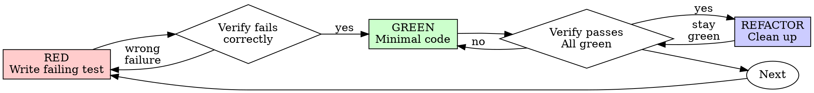

# Codex conversation 019ec736

> This archive contains visible conversation activity and tool records. Private model reasoning and system/developer instructions are not available here.
<!-- codex-event:{"kind":"state","timestamp":"2026-06-14T17:38:15.092Z","phase":null} -->
## Task state: task_started · 2026-06-14T17:38:15.092Z

```text
{
  "type": "task_started",
  "turn_id": "019ec736-7389-7aa0-8eaf-48dcefc4ba70",
  "started_at": 1781458695,
  "model_context_window": 258400,
  "collaboration_mode_kind": "default"
}
```

<!-- /codex-event -->

<!-- codex-event:{"kind":"user","timestamp":"2026-06-14T17:38:17.216Z","phase":null} -->
## User · 2026-06-14T17:38:17.216Z

In a bunch of the recent conversations I have had that were all direct control with Claude Code, the final output of the agent got clipped. It didn't fully show in the front end, in the client. Every time it was about a sentence or two sentences worth, but cut at random places

<!-- /codex-event -->

<!-- codex-event:{"kind":"progress","timestamp":"2026-06-14T17:38:35.660Z","phase":"commentary"} -->
## Codex progress · 2026-06-14T17:38:35.660Z

I’ll use `systematic-debugging` for the clipping report, plus the repo’s React/server-state guidance because this crosses worker streaming persistence and frontend rendering. I’ll first trace the direct-control Claude Code output path end to end before changing anything.

<!-- /codex-event -->

<!-- codex-event:{"kind":"tool-call","timestamp":"2026-06-14T17:38:35.665Z","phase":null} -->
## Tool call: exec_command · 2026-06-14T17:38:35.665Z

```json
{
  "cmd": "sed -n '1,240p' /Users/masterman/.agents/skills/using-ultrapowers/SKILL.md",
  "workdir": "/Users/masterman/NLP/omniharness",
  "yield_time_ms": 1000,
  "max_output_tokens": 20000
}
```

<!-- /codex-event -->

<!-- codex-event:{"kind":"tool-call","timestamp":"2026-06-14T17:38:35.665Z","phase":null} -->
## Tool call: exec_command · 2026-06-14T17:38:35.665Z

```json
{
  "cmd": "sed -n '1,260p' /Users/masterman/.agents/skills/systematic-debugging/SKILL.md",
  "workdir": "/Users/masterman/NLP/omniharness",
  "yield_time_ms": 1000,
  "max_output_tokens": 20000
}
```

<!-- /codex-event -->

<!-- codex-event:{"kind":"tool-call","timestamp":"2026-06-14T17:38:35.665Z","phase":null} -->
## Tool call: exec_command · 2026-06-14T17:38:35.665Z

```json
{
  "cmd": "sed -n '1,260p' /Users/masterman/.agents/skills/client-server-state-invariants/SKILL.md",
  "workdir": "/Users/masterman/NLP/omniharness",
  "yield_time_ms": 1000,
  "max_output_tokens": 20000
}
```

<!-- /codex-event -->

<!-- codex-event:{"kind":"tool-call","timestamp":"2026-06-14T17:38:35.798Z","phase":null} -->
## Tool call: exec_command · 2026-06-14T17:38:35.798Z

```json
{
  "cmd": "sed -n '1,260p' /Users/masterman/.agents/skills/instrumenting-control-planes/SKILL.md",
  "workdir": "/Users/masterman/NLP/omniharness",
  "yield_time_ms": 1000,
  "max_output_tokens": 20000
}
```

<!-- /codex-event -->

<!-- codex-event:{"kind":"tool-result","timestamp":"2026-06-14T17:38:35.831Z","phase":null} -->
## Tool result: call_sDaCOsBEPv4ILY0HWOPZOUcM · 2026-06-14T17:38:35.831Z

```text
Chunk ID: bfc595
Wall time: 0.0000 seconds
Process exited with code 0
Original token count: 2019
Output:
---
name: using-ultrapowers
description: Use when starting any conversation - establishes how to find and use skills, requiring skill invocation before acting
---

<SUBAGENT-STOP>
If you were dispatched as a subagent to execute a specific task, skip this skill.
</SUBAGENT-STOP>

# Using Ultrapowers

Use relevant skills before acting, but keep process proportional to the task.

## Instruction Priority

1. User instructions and local repo instructions
2. Ultrapowers skills
3. Default model behavior

If the user says not to create extra repository isolation, or says to work directly in the current repository, follow that instruction.

## Core Rule

Before responding, ask:

1. Is there a process skill that governs how to approach this?
2. Is there an implementation skill that governs how to execute it?
3. Is the request substantial enough to justify that process, or is it a tiny mechanical edit?

If a skill applies and the task is substantial enough to justify it, use it before continuing. If the request is a tiny mechanical edit, make the edit directly with targeted verification.

## Proportional Skill Use

Do the smallest responsible workflow that matches the request.

For tiny, unambiguous mechanical edits, do the edit directly:

- changing a color value,
- fixing a typo,
- tweaking short copy,
- changing a prompt sentence,
- renaming a label,
- adjusting obvious spacing or formatting,
- making a one-line config or docs correction.

For these, do not run brainstorming, write a plan, or force TDD unless the change affects product behavior, data, persistence, control flow, user journeys, or non-obvious architecture.

Use the heavier process when the request is ambiguous, user-facing behavior changes, multiple files/modules are involved, the user journey can change, or the change could create regressions that are not obvious from a quick targeted check.

## Default Posture

- Work in the current repository by default.
- YOU WILL NEVER CREATE A BRANCH unless explicitly instructed.
- Ask the user whether we should work in worktrees as part of the planning.
- YOU WILL ONLY CREATE A WORKTREE if explicitly instructed.
- Keep skill use proportional. Tiny mechanical edits should stay tiny.
- Every project should have a `.gitignore`.
- Never commit or push secrets, credentials, local environment files, `node_modules`, dependency caches, build outputs, coverage output, logs, temporary files, or intermediate/generated artifacts unless the human explicitly asks to version a specific generated artifact.
- Deliver full product functionality by default. NO FAKE COMPONENTS, NO MOCKS, NO PLACEHOLDERS, NO FALLBACKS as substitutes for the requested functionality unless the human explicitly asks for a prototype or scaffold.
- For app, UI, and product-surface work, run a PM pass during planning. Treat it as mandatory default behavior, not optional polish.
- For app, UI, and product-surface work, consider `agentic-user-journey-testing` for important user stories, but do not run it without explicit user approval.
- Use `second-opinion` for substantial saved implementation plans, and for unusually hard, creative, high-risk, or architecture-heavy specs when an independent external review could improve the artifact. Prefer a different available coding harness for that review, such as Codex asking Claude Code or Claude Code asking Codex. If no different harness is available, the same harness is fine; the second opinion is still mandatory for matching artifacts.
- Refactor code when a file passes 1200 lines. Do not normalize oversized files as the default end state.
- Use user stories in specs and plans when they clarify behavior or value.
- Default UI work to `shadcn/ui` unless the user says otherwise.
- When designing UI from scratch, first inspect the available ShadCN Blocks at https://ui.shadcn.com/blocks for each screen, form, or major surface. Start from the closest matching block with `npx shadcn add <block-name>` or the block's source in https://github.com/shadcn-ui/ui, then edit it by adding, removing, or adapting controls. Do not invent a fresh layout before doing this block-selection pass.
- Before adding any individual UI control, check whether `shadcn/ui` already provides a control that does what is needed. Use the available shadcn control first, then customize it, instead of hand-building a one-off control.
- Treat desktop and mobile responsiveness as first-class from the beginning.
- Prefer explicit routing unless the framework strongly defaults to file-based routes.
- For React apps, use `building-react-apps` for state managers, explicit transitions, routing, refs, imports, package-manager defaults, and frontend configuration defaults.
- For React apps with server state, optimistic UI, caches, polling, SSE/WebSocket streams, background jobs, persistence, or client/server synchronization, use `client-server-state-invariants` during planning and verification.
- For React or Next.js slowness, root-load, compile-time, SSR/hydration, bundle, import-bloat, or UI dependency cleanup work, use `optimizing-react-next-apps`.
- Prefer strong instrumentation and auditability for backend behavior.
- When a project has backend or agent workflows, prefer a fully instrumented control plane: persist meaningful events, tool calls, actions, results, errors, and state transitions, and expose them through a CLI or other scriptable interface so the full system can be inspected and tested without the UI.
- Use `instrumenting-control-planes` when building, planning, reviewing, or debugging backend decisions, agent workflows, recovery paths, retries, deletes, long-running jobs, SSE/WebSocket streams, or user-visible failures.
- Use `learning-from-bugs` after diagnosing or fixing meaningful architecture, storage, memory, persistence, control-plane, or system-level bugs so reusable lessons become durable.
- Do not default to silent, masked, or over-abstracted errors.
- When a project has a frontend, prefer surfacing full backend error details and stack traces to the frontend so failures stay visible, debuggable, and testable end-to-end.
- Treat persistence of settings and preferences as explicit design work.
- For every meaningful UI setting, define whether it persists, where it is stored, how it is read and written, who owns it, and how reset, sync, migration, and testing are handled.

See `docs/ultrapowers-defaults.md` for the canonical fork defaults.

## Skill Priority

1. Process skills first
2. Implementation skills second

Examples:

- "Make this button blue" -> inspect the relevant file, make the small edit, do targeted verification
- "Update this prompt sentence" -> edit the prompt directly and verify the final text
- "Build a feature" -> `brainstorming` with a PM pass first, then `writing-plans`, then execution; consider approval-gated `agentic-user-journey-testing` for app workflows
- "Fix this bug" -> `systematic-debugging`, then the relevant implementation skill; if the root cause is meaningful or systemic, finish with `learning-from-bugs`
- "Review this change" -> `requesting-code-review`

## Examples Of User Override

- If a task feels risky and the user did not ask for extra repository isolation, keep working in the current repository unless the user explicitly instructs otherwise.
- If a stack supports file-based routing but the user says not to use it, choose an explicit routing approach instead.
- If a framework strongly defaults to file-based routing, such as Next.js App Router, use the framework-native routing model unless there is a good reason not to.
- If a frontend skill suggests `shadcn/ui` but the user wants another design system, follow the user.

## Red Flags

- "I need a whole workflow for this tiny edit" -> no. Use the smallest responsible process.
- "This is simple, so I need the whole process anyway" -> no. Tiny mechanical edits should stay tiny.
- "I'll create extra repository isolation just to be safe" -> forbidden unless the user clearly asked for it.
- "I already know the skill" -> read the current version before relying on it

```

<!-- /codex-event -->

<!-- codex-event:{"kind":"tool-result","timestamp":"2026-06-14T17:38:35.831Z","phase":null} -->
## Tool result: call_8T6gDWuhmcSHlItDzMhRhFXq · 2026-06-14T17:38:35.831Z

````text
Chunk ID: dc2425
Wall time: 0.0000 seconds
Process exited with code 0
Original token count: 2092
Output:
---
name: systematic-debugging
description: Use when encountering any bug, test failure, or unexpected behavior, before proposing fixes
---

# Systematic Debugging

## Overview

Random fixes waste time and create new bugs. Quick patches mask underlying issues.

**Core principle:** ALWAYS find root cause before attempting fixes. Symptom fixes are failure.

**Violating the letter of this process is violating the spirit of debugging.**

## The Iron Law

```
NO FIXES WITHOUT ROOT CAUSE INVESTIGATION FIRST
```

If you haven't completed Phase 1, you cannot propose fixes.

## When to Use

Use for ANY technical issue:
- Test failures
- Bugs in production
- Unexpected behavior
- Performance problems
- Build failures
- Integration issues

**Use this ESPECIALLY when:**
- Under time pressure (emergencies make guessing tempting)
- "Just one quick fix" seems obvious
- You've already tried multiple fixes
- Previous fix didn't work
- You don't fully understand the issue

**Don't skip when:**
- Issue seems simple (simple bugs have root causes too)
- You're in a hurry (rushing guarantees rework)
- Manager wants it fixed NOW (systematic is faster than thrashing)

## The Four Phases

You MUST complete each phase before proceeding to the next.

### Phase 1: Root Cause Investigation

**BEFORE attempting ANY fix:**

1. **Read Error Messages Carefully**
   - Don't skip past errors or warnings
   - They often contain the exact solution
   - Read stack traces completely
   - Note line numbers, file paths, error codes

2. **Reproduce Consistently**
   - Can you trigger it reliably?
   - What are the exact steps?
   - Does it happen every time?
   - If not reproducible → gather more data, don't guess

3. **Check Recent Changes**
   - What changed that could cause this?
   - Git diff, recent commits
   - New dependencies, config changes
   - Environmental differences

4. **Gather Evidence in Multi-Component Systems**

   **WHEN system has multiple components (CI → build → signing, API → service → database):**

   **BEFORE proposing fixes, add diagnostic instrumentation:**
   ```
   For EACH component boundary:
     - Log what data enters component
     - Log what data exits component
     - Verify environment/config propagation
     - Check state at each layer

   Run once to gather evidence showing WHERE it breaks
   THEN analyze evidence to identify failing component
   THEN investigate that specific component
   ```

   **Example (multi-layer system):**
   ```bash
   # Layer 1: Workflow
   echo "=== Secrets available in workflow: ==="
   echo "IDENTITY: ${IDENTITY:+SET}${IDENTITY:-UNSET}"

   # Layer 2: Build script
   echo "=== Env vars in build script: ==="
   env | grep IDENTITY || echo "IDENTITY not in environment"

   # Layer 3: Signing script
   echo "=== Keychain state: ==="
   security list-keychains
   security find-identity -v

   # Layer 4: Actual signing
   codesign --sign "$IDENTITY" --verbose=4 "$APP"
   ```

   **This reveals:** Which layer fails (secrets → workflow ✓, workflow → build ✗)

5. **Trace Data Flow**

   **WHEN error is deep in call stack:**

   See `root-cause-tracing.md` in this directory for the complete backward tracing technique.

   **Quick version:**
   - Where does bad value originate?
   - What called this with bad value?
   - Keep tracing up until you find the source
   - Fix at source, not at symptom

### Phase 2: Pattern Analysis

**Find the pattern before fixing:**

1. **Find Working Examples**
   - Locate similar working code in same codebase
   - What works that's similar to what's broken?

2. **Compare Against References**
   - If implementing pattern, read reference implementation COMPLETELY
   - Don't skim - read every line
   - Understand the pattern fully before applying

3. **Identify Differences**
   - What's different between working and broken?
   - List every difference, however small
   - Don't assume "that can't matter"

4. **Understand Dependencies**
   - What other components does this need?
   - What settings, config, environment?
   - What assumptions does it make?

### Phase 3: Hypothesis and Testing

**Scientific method:**

1. **Form Single Hypothesis**
   - State clearly: "I think X is the root cause because Y"
   - Write it down
   - Be specific, not vague

2. **Test Minimally**
   - Make the SMALLEST possible change to test hypothesis
   - One variable at a time
   - Don't fix multiple things at once

3. **Verify Before Continuing**
   - Did it work? Yes → Phase 4
   - Didn't work? Form NEW hypothesis
   - DON'T add more fixes on top

4. **When You Don't Know**
   - Say "I don't understand X"
   - Don't pretend to know
   - Ask for help
   - Research more

### Phase 4: Implementation

**Fix the root cause, not the symptom:**

1. **Create Failing Test Case**
   - Simplest possible reproduction
   - Automated test if possible
   - One-off test script if no framework
   - MUST have before fixing
   - Use the `ultrapowers:test-driven-development` skill for writing proper failing tests

2. **Implement Single Fix**
   - Address the root cause identified
   - ONE change at a time
   - No "while I'm here" improvements
   - No bundled refactoring

3. **Verify Fix**
   - Test passes now?
   - No other tests broken?
   - Issue actually resolved?
   - If the bug was meaningful or systemic, use `ultrapowers:learning-from-bugs` before declaring the fix complete.

4. **If Fix Doesn't Work**
   - STOP
   - Count: How many fixes have you tried?
   - If < 3: Return to Phase 1, re-analyze with new information
   - **If ≥ 3: STOP and question the architecture (step 5 below)**
   - DON'T attempt Fix #4 without architectural discussion

5. **If 3+ Fixes Failed: Question Architecture**

   **Pattern indicating architectural problem:**
   - Each fix reveals new shared state/coupling/problem in different place
   - Fixes require "massive refactoring" to implement
   - Each fix creates new symptoms elsewhere

   **STOP and question fundamentals:**
   - Is this pattern fundamentally sound?
   - Are we "sticking with it through sheer inertia"?
   - Should we refactor architecture vs. continue fixing symptoms?

   **Discuss with your human partner before attempting more fixes**

   This is NOT a failed hypothesis - this is a wrong architecture.

## Red Flags - STOP and Follow Process

If you catch yourself thinking:
- "Quick fix for now, investigate later"
- "Just try changing X and see if it works"
- "Add multiple changes, run tests"
- "Skip the test, I'll manually verify"
- "It's probably X, let me fix that"
- "I don't fully understand but this might work"
- "Pattern says X but I'll adapt it differently"
- "Here are the main problems: [lists fixes without investigation]"
- Proposing solutions before tracing data flow
- **"One more fix attempt" (when already tried 2+)**
- **Each fix reveals new problem in different place**

**ALL of these mean: STOP. Return to Phase 1.**

**If 3+ fixes failed:** Question the architecture (see Phase 4.5)

## your human partner's Signals You're Doing It Wrong

**Watch for these redirections:**
- "Is that not happening?" - You assumed without verifying
- "Will it show us...?" - You should have added evidence gathering
- "Stop guessing" - You're proposing fixes without understanding
- "Ultrathink this" - Question fundamentals, not just symptoms
- "We're stuck?" (frustrated) - Your approach isn't working

**When you see these:** STOP. Return to Phase 1.

## Common Rationalizations

| Excuse | Reality |
|--------|---------|
| "Issue is simple, don't need process" | Simple issues have root causes too. Process is fast for simple bugs. |
| "Emergency, no time for process" | Systematic debugging is FASTER than guess-and-check thrashing. |
| "Just try this first, then investigate" | First fix sets the pattern. Do it right from the start. |
| "I'll write test after confirming fix works" | Untested fixes don't stick. Test first proves it. |
| "Multiple fixes at once saves time" | Can't isolate what worked. Causes new bugs. |
| "Reference too long, I'll adapt the pattern" | Partial understanding guarantees bugs. Read it completely. |
| "I see the problem, let me fix it" | Seeing symptoms ≠ understanding root cause. |
| "One more fix attempt" (after 2+ failures) | 3+ failures = architectural problem. Question pattern, don't fix again. |

## Quick Reference


````

<!-- /codex-event -->

<!-- codex-event:{"kind":"tool-result","timestamp":"2026-06-14T17:38:35.831Z","phase":null} -->
## Tool result: call_Jh24gh8NMGSFzlzOyAiy8AEL · 2026-06-14T17:38:35.831Z

```text
Chunk ID: 50340e
Wall time: 0.0000 seconds
Process exited with code 0
Original token count: 1481
Output:
---
name: client-server-state-invariants
description: Use when planning, building, reviewing, or debugging React apps with server state, optimistic UI, caches, polling, SSE/WebSocket streams, background jobs, persistence, or client/server synchronization
---

# Client Server State Invariants

React bugs often expose deeper ownership mistakes. When client state, server state, cache state, stream state, and persisted state all exist, every plan needs explicit invariants.

## Core Rule

No UI surface may treat data as authoritative unless the payload proves ownership, freshness, completeness, ordering, and terminal state.

If those words are missing from the plan, the plan is probably baking in a race condition.

## Planning Checklist

For every React app that reads server/runtime state, the plan must answer:

1. **Owner:** What owns this state: server, client manager, URL, cache, stream, local storage, or worker/runtime?
2. **Token:** What owner token protects async results: `requestId`, `runId`, `projectPath`, `operationId`, `workerId + seq`, or equivalent?
3. **Provenance:** Is data server-authoritative, optimistic, cached preview, partial update, or historical fallback?
4. **Completeness:** Does the payload declare what scope it is complete for? What may it erase?
5. **Ordering:** What stable order is used: monotonic seq, `(createdAt, id)`, version, or cursor?
6. **State machine:** What are the legal states, terminal states, and transitions?
7. **Events:** Which server decisions are named events rather than client-side derivations?
8. **Loading shape:** Which states are bootstrap, first load, incremental refresh, reconnect, resync, recovery, and terminal error?
9. **Fallbacks:** Which legacy/fallback rows can render, and only after what authority is loaded?
10. **Tests:** Which race, stale-response, event-sequence, reconnect, and merge tests prove the invariants?

## Invariants To Require

- Cached and optimistic data may pre-render, but cannot satisfy full-load gates.
- Partial snapshots may add or refine state, but may not erase optimistic objects, delivered user input, read markers, or stream entries unless they declare complete scope.
- Every async response checks that its owner token still matches before mutating visible state.
- Mutation success handlers may navigate or clear UI only if they still own the current context, unless the action explicitly creates a new selected context.
- Timers and polling callbacks re-check ownership immediately before acting.
- Server decisions are emitted as named events; the client does not infer decisions by diffing snapshots.
- SSE/WebSocket streams have event ids, replay/resume, and an explicit resync path.
- Loading booleans are split by lifecycle stage. A leaf stream refresh must not unmount the whole page.
- Append-only content has one writer, one reader, stable ids, and monotonic cursors.
- Fallback DB rows or historical rows are gated behind stream loading and deduped by stable id plus safe equivalence.
- Status classifiers distinguish active, runnable, blocked, awaiting user, terminal, stale, and recoverable states.
- "Latest" queries have deterministic tie-breakers. Timestamp-only ordering is not enough.
- Hot paths use bounded reads and do not synchronously load large bodies, bridge probes, schema setup, or heavy app graphs.
- Process-local caches have explicit TTL/size bounds and invalidation rules.

## Test Matrix

Pick the rows that match the work. Do not rely on one happy-path UI test.

| Risk | Test shape |
| --- | --- |
| Stale async response | Start request A, switch owner, resolve A, assert it cannot mutate B |
| Optimistic object erased | Create local optimistic state, apply stale/partial snapshot, assert object remains |
| Cache masquerades as loaded | Hydrate cache preview, assert full-load gate waits for server authority |
| Mutation steals navigation | Start mutation, switch selection, resolve mutation, assert focus stays put |
| Timer/poll stale-fire | Use fake timers or deferred promises; callback must re-check owner before acting |
| Snapshot merge erases stream | Apply partial snapshot missing known entries, assert entries/read markers remain |
| Event stream gap | Bootstrap snapshot, emit events during disconnect, reconnect with last id, assert replay or resync |
| Server decision invisible | Exercise branch and assert named event such as `blocked`, `refused`, `gave_up`, or `error.surfaced` |
| State classifier wrong | Table-test every status into active/runnable/terminal/recoverable buckets |
| Fallback duplicates stream | Load fallback rows then stream entries, assert no duplicate or false chronology |
| Hot path bloats | Assert snapshots carry cursors not bodies; route returns before DB/heavy imports when possible |
| Timestamp tie | Insert equal timestamps, assert deterministic order by id/seq |

Use headless HTTP/SSE tests for control-plane decisions. Use React/unit tests for manager merging and ownership guards. Use Playwright only for real UI layout, focus, scroll, mobile computed styles, and visible affordances.

## Refuse These Shapes

- one `isLoading` boolean for bootstrap, refresh, reconnect, and recovery;
- cache or optimistic data treated as authoritative without provenance;
- async callbacks that mutate state without checking owner tokens;
- client-side derivation of server decisions;
- snapshot diffs used as the only way to know what happened;
- event streams without ids or resume;
- timestamp-only "latest" queries;
- parallel transcript or persistence surfaces that the frontend must reconcile;
- unbounded process caches introduced to hide slow storage;
- tests that prove only the DOM result when the bug is a server decision.

## Review Prompt

Ask this before implementation starts:

> What can arrive late, out of order, partially, twice, or after the user changes context, and what test proves it cannot corrupt visible state?

```

<!-- /codex-event -->

<!-- codex-event:{"kind":"tool-result","timestamp":"2026-06-14T17:38:35.839Z","phase":null} -->
## Tool result: call_6ZXNICNCz0vNR5dVDGUrWQ6J · 2026-06-14T17:38:35.839Z

````text
Chunk ID: a534d5
Wall time: 0.0000 seconds
Process exited with code 0
Original token count: 1303
Output:
---
name: instrumenting-control-planes
description: Use when building, planning, reviewing, or debugging apps with backend decisions, agent workflows, long-running jobs, SSE/WebSocket streams, recovery paths, deletes, retries, or user-visible failures
---

# Instrumenting Control Planes

Build the control plane as a product surface. If the server decides, refuses, retries, spawns, deletes, recovers, gives up, or fails, that decision must be observable by users, operators, and tests.

If a React UI consumes the control plane through server state, optimistic UI, caches, polling, SSE/WebSocket streams, or persisted runtime state, also use `client-server-state-invariants`.

## Core Rule

Every meaningful server-side state transition emits a named, durable event. The UI and tests consume the same production event surface.

Do not rely on snapshot diffs, rendered DOM state, logs only, or client-side re-derivation to prove what the server decided.

## Hot Path Rule

No user bootstrap, catalog, status, reconnect, or recovery request may depend on a lock-prone database write path or external health probe finishing. Serve these paths from a bounded read model, memory cache, append-only event log, or stale-but-marked snapshot; queue reconciliation writes outside the request. Every dependency on a database or bridge call in a hot path needs a short timeout, cancellation, and an explicit degraded response.

If SQLite, local files, or a single-writer store is used, assume writer contention can freeze readers at the worst moment. Use one writer, WAL/busy-timeout discipline, short transactions, bounded queues, and headless chaos tests that run bootstrap/reload while writes are active. A 25s UI request is a control-plane failure, even if the database eventually returns.

## Event Contract

For each backend or agent workflow, define:

- named events for decisions: `worker.spawned`, `worker.reattached`, `plan.ready`, `plan.review.blocked`, `recovery.gave_up`, `conversation.delete_failed`;
- payloads with stable ids, `prev`/`next` status when relevant, reason codes, and enough context to debug;
- `error.surfaced` or an equivalent user-facing failure event for every failure the user should know about;
- durable persistence or a bounded replay buffer so short disconnects do not erase history;
- a scriptable read path: CLI, HTTP endpoint, sqlite query, or event log command.

If a decision cannot be asserted from this surface, the design is incomplete.

If debugging a control-plane failure reveals a reusable lesson, use `ultrapowers:learning-from-bugs` after the fix is verified.

## Streaming Requirements

For SSE or WebSocket-like streams:

- emit named events alongside any snapshot/update frame;
- include monotonic event ids;
- support resume from the last seen id;
- replay missed events from a bounded buffer;
- emit an explicit resync-required event when replay is impossible;
- bootstrap from a snapshot, then tail events.

Snapshots show current truth. Named events show why it became true.

## Testing Standard

Control-plane tests should usually be headless HTTP/SSE scenario tests, not browser tests. Browser automation is for UI behavior; control-plane tests assert server decisions directly.

Write scenario assertions as event transcripts:

```ts
expect(events).toHaveEmitted("worker.spawned", { runId });
expect(events).toHaveEmitted("worker.status", { next: "running" });
chaos.killServer();
chaos.restartServer();
expect(events).toHaveEmitted("worker.reattached", { runId });
expect(events).not.toHaveEmitted("worker.recreated", { runId });
```

Chaos belongs outside production code paths: drop connections in the client, fail fetches in the harness, restart the server process, and use seeds for reproducibility.

## Refuse These Shapes

- silent early returns in server methods;
- swallowed `catch` blocks;
- client-side derivation of server decisions;
- response-code-only user failures;
- event streams without ids or resume;
- tests that infer control-plane behavior from rendered state;
- delete handlers that do not enumerate dependent rows or emit typed failure events;
- recovery loops without terminal events such as `gave_up` or `abandoned`;
- request handlers that wait on inline reconciliation writes, SQLite contention, or bridge `/doctor` checks before returning bootstrap data;
- test-only behavior branches in production code.

## Design Checklist

Before implementing a backend or agent workflow, answer:

1. What decisions can this workflow make?
2. What named event is emitted for each decision, including refusal and failure?
3. Where are events persisted or buffered?
4. How does a client resume after disconnect?
5. Which request paths must keep working while persistence or bridge dependencies are slow, locked, or stale?
6. How can a CLI or test harness inspect the exact event sequence without the UI?
7. Which headless scenario proves the happy path, failure path, recovery path, terminal state, and hot-path timeout/degraded path?
8. Which client state consumes these events, and how does it prove ownership, freshness, completeness, ordering, and replay/resync?

If the answer is "the UI can figure it out", name the missing event instead.

````

<!-- /codex-event -->

<!-- codex-event:{"kind":"progress","timestamp":"2026-06-14T17:38:45.308Z","phase":"commentary"} -->
## Codex progress · 2026-06-14T17:38:45.308Z

I’m going to inspect the worker stream and direct-control paths now: where Claude Code output is captured, persisted to JSONL, replayed over SSE/API, and rendered. The key question is whether the missing tail is lost before persistence or only dropped during client merge/render.

<!-- /codex-event -->

<!-- codex-event:{"kind":"tool-call","timestamp":"2026-06-14T17:38:45.314Z","phase":null} -->
## Tool call: exec_command · 2026-06-14T17:38:45.314Z

```json
{
  "cmd": "rg -n \"direct control|direct-control|Claude Code|claude|appendWorkerEntry|WorkerEntriesManager|entries prop|worker stream|jsonl|final\" src tests docs scripts -S",
  "workdir": "/Users/masterman/NLP/omniharness",
  "yield_time_ms": 1000,
  "max_output_tokens": 30000
}
```

<!-- /codex-event -->

<!-- codex-event:{"kind":"tool-call","timestamp":"2026-06-14T17:38:45.314Z","phase":null} -->
## Tool call: exec_command · 2026-06-14T17:38:45.314Z

```json
{
  "cmd": "sed -n '1,260p' docs/architecture/worker-conversation-stream.md",
  "workdir": "/Users/masterman/NLP/omniharness",
  "yield_time_ms": 1000,
  "max_output_tokens": 20000
}
```

<!-- /codex-event -->

<!-- codex-event:{"kind":"tool-call","timestamp":"2026-06-14T17:38:45.314Z","phase":null} -->
## Tool call: exec_command · 2026-06-14T17:38:45.314Z

```json
{
  "cmd": "git status --short",
  "workdir": "/Users/masterman/NLP/omniharness",
  "yield_time_ms": 1000,
  "max_output_tokens": 12000
}
```

<!-- /codex-event -->

<!-- codex-event:{"kind":"tool-call","timestamp":"2026-06-14T17:38:45.346Z","phase":null} -->
## Tool call: exec_command · 2026-06-14T17:38:45.346Z

```json
{
  "cmd": "rg -n \"terminal|final|completed|complete|done\" src/server src/app src/components src/lib tests/lifecycle -S",
  "workdir": "/Users/masterman/NLP/omniharness",
  "yield_time_ms": 1000,
  "max_output_tokens": 30000
}
```

<!-- /codex-event -->

<!-- codex-event:{"kind":"tool-result","timestamp":"2026-06-14T17:38:45.423Z","phase":null} -->
## Tool result: call_2azzB4D9GrRM60qhMYiWBzpP · 2026-06-14T17:38:45.423Z

```text
Chunk ID: 1faddd
Wall time: 0.0000 seconds
Process exited with code 0
Original token count: 44772
Output:
Total output lines: 1320

scripts/install-agent-acp.sh:528:if have_command claude; then
scripts/install-agent-acp.sh:529:  echo "claude: detected"
scripts/install-agent-acp.sh:530:  if have_command claude-agent-acp; then
scripts/install-agent-acp.sh:531:    echo "  -> \`claude-agent-acp\` already installed"
scripts/install-agent-acp.sh:533:    try_install run_install_npm "@agentclientprotocol/claude-agent-acp"
scripts/install-agent-acp.sh:536:  echo "claude: not detected"
scripts/time-worker-pool.ts:12:type WorkerType = "codex" | "claude" | "gemini" | "opencode";
scripts/time-worker-pool.ts:15:  claude: "claude-agent-acp",
scripts/backfill-worker-entries.ts:13: *     `requires_manual_attribution.jsonl` report.
scripts/backfill-worker-entries.ts:37:import { appendWorkerEntry } from "@/server/workers/output-store";
scripts/backfill-worker-entries.ts:69:  // shapes diverged from the worker stream's WorkerEntryAttachment
scripts/backfill-worker-entries.ts:194:    await appendWorkerEntry(run.id, workerId, {
scripts/backfill-worker-entries.ts:236:    await appendWorkerEntry(worker.runId, event.workerId, {
scripts/backfill-worker-entries.ts:258:  const reportPath = path.join(getAppDataPath("backfill-reports"), `requires_manual_attribution-${Date.now()}.jsonl`);
scripts/backfill-worker-entries.ts:266:  } finally {
scripts/dev-prewarm.ts:99:  } finally {
src/vscode-extension/bridge.ts:275:      .finally(() => {
scripts/backfill-append-only-artifacts.ts:5: *   - execution_events.details                 → execution-events.jsonl
scripts/backfill-append-only-artifacts.ts:6: *   - supervisor_interventions.prompt/summary  → supervisor-interventions.jsonl
scripts/backfill-append-only-artifacts.ts:8: *     planning_review_findings.recommendation  → planning-review-findings.jsonl
scripts/backfill-runtime-output-to-worker-stream.ts:3: * `.omniharness/agent-runtime-output/<workerId>.jsonl` files written
scripts/backfill-runtime-output-to-worker-stream.ts:8: * tool_call_update / permission) routed through `appendWorkerEntry`.
scripts/backfill-runtime-output-to-worker-stream.ts:9: * The frontend now reads exclusively from the worker stream, so those
scripts/backfill-runtime-output-to-worker-stream.ts:14: * `appendWorkerEntry`, which is idempotent (dedup by `entry.id`). Safe
scripts/backfill-runtime-output-to-worker-stream.ts:28:import { appendWorkerEntry } from "@/server/workers/output-store";
scripts/backfill-runtime-output-to-worker-stream.ts:140:      // appendWorkerEntry dedups by entry.id; replaying is safe.
scripts/backfill-runtime-output-to-worker-stream.ts:146:      await appendWorkerEntry(runId, workerId, entry);
scripts/backfill-runtime-output-to-worker-stream.ts:171:  const files = fs.readdirSync(opts.runtimeOutputDir).filter((name) => name.endsWith(".jsonl"));
scripts/backfill-runtime-output-to-worker-stream.ts:173:    ? files.filter((name) => name === `${opts.workerId}.jsonl`)
scripts/backfill-runtime-output-to-worker-stream.ts:191:    const workerId = file.replace(/\.jsonl$/, "");
scripts/remote-restart.ts:643:        } finally {
scripts/remote-restart.ts:807:        .finally(() => {
scripts/remote-restart.ts:830:        .finally(() => {
scripts/remote-restart.ts:858:        .finally(() => {
docs/superpowers/learnings/2026-05-20-server-empty-queue-must-clear-cache.md:5:**Symptom:** A queued steering message delivered to the worker, but the UI kept showing it in the queued-message drawer, so the same user text appeared both in the worker stream and in the queue.
docs/superpowers/learnings/2026-05-20-streaming-message-is-not-completion.md:4:**Context:** OmniHarness direct conversations and worker stream sync
docs/superpowers/learnings/2026-05-20-streaming-message-is-not-completion.md:7:**Fix:** A still-active live worker can only be quiesced from completion evidence when it has an explicit stop reason or a long final-looking fallback text. Short streaming chunks keep the run `running`. Selected terminal direct runs with a live worker are synced instead of skipped so reload does not freeze on stale persisted text.
tests/supervisor/observer.test.ts:310:  it("uses long final-looking text as a completion fallback before the idle threshold", () => {
tests/supervisor/observer.test.ts:311:    const finalText = [
tests/supervisor/observer.test.ts:327:        currentText: finalText,
tests/supervisor/observer.test.ts:328:        lastText: finalText,
tests/supervisor/observer.test.ts:360:        summary: "worker-1 produced a long final-looking text turn",
tests/supervisor/observer.test.ts:367:  it("does not re-emit long final-looking completion while the same answer keeps streaming", () => {
tests/supervisor/observer.test.ts:385:    const nextFinalText = `${previousFinalText}\n- Re-ran the build after the final wake fix.`;
tests/supervisor/observer.test.ts:1198:    const finalText = [
tests/supervisor/observer.test.ts:1244:      details: JSON.stringify({ summary: `${workerId} produced a long final-looking text turn` }),
tests/supervisor/observer.test.ts:1250:      currentText: finalText,
tests/supervisor/observer.test.ts:1251:      lastText: finalText,
tests/supervisor/observer.test.ts:1265:  it("persists a long final-looking worker turn as idle even when the bridge still reports working", async () => {
tests/supervisor/observer.test.ts:1270:    const finalText = [
tests/supervisor/observer.test.ts:1315:      currentText: finalText,
tests/supervisor/observer.test.ts:1316:      lastText: finalText,
tests/supervisor/observer.test.ts:1394:    const finalText = "All requested work is complete. Verification passed.";
tests/supervisor/observer.test.ts:1420:      currentText: finalText,
tests/supervisor/observer.test.ts:1421:      lastText: finalText,
tests/supervisor/observer.test.ts:1440:    } finally {
tests/supervisor/observer.test.ts:1838:      type: "claude",
tests/supervisor/observer.test.ts:1851:      type: "claude",
tests/supervisor/observer.test.ts:1866:      type: "claude",
docs/superpowers/learnings/2026-05-20-manual-stop-is-control-plane.md:10:**Skill/Doc Updates:** Updated `docs/architecture/direct-control-session-regressions.md` and `docs/architecture/timing-determinism-audit.md`; no global skill update needed because the project docs now carry the concrete composer contract.
docs/superpowers/learnings/2026-05-21-artifact-lock-owner-races.md:5:**Symptom:** Run `ca18b7e86437` failed after repeated worker observer errors, including `ENOENT` for `<worker>.jsonl.lock/owner.json`, leaving the run failed even though worker transcript data still existed.
docs/superpowers/learnings/2026-05-21-artifact-lock-owner-races.md:7:**Fix:** Recovered the run's worker streams, parked stale active workers, cleared the failed run state, queued a supervisor wake, and hardened the shared artifact lock to reclaim ownerless lock directories and retry recoverable owner metadata races.
docs/superpowers/learnings/2026-05-20-server-snapshots-retire-optimistic-running.md:4:**Context:** OmniHarness direct-control conversation loading and worker stream rendering
docs/superpowers/learnings/2026-05-20-server-snapshots-retire-optimistic-running.md:10:**Skill/Doc Updates:** Updated `docs/architecture/timing-determinism-audit.md` and `docs/architecture/direct-control-session-regressions.md`; no global skill update needed because `client-server-state-invariants` already states that cached and optimistic data cannot satisfy authoritative load gates.
scripts/time-worker-cold-start.ts:11:type WorkerType = "codex" | "claude" | "gemini" | "opencode";
scripts/time-worker-cold-start.ts:14:  claude: "claude-agent-acp",
docs/superpowers/learnings/2026-05-21-ownerless-worker-output-lock.md:5:**Symptom:** A session status log could churn between a transient `worker_observer_failed` lock timeout and the worker's completed output. The run kept recording observer failures for a worker whose JSONL stream already contained final text.
docs/superpowers/learnings/2026-05-21-ownerless-worker-output-lock.md:6:**Root Cause:** `acquireWorkerFileLock` treated an existing `.jsonl.lock` directory as live until its directory mtime exceeded the stale threshold. An ownerless lock directory with no `owner.json` could remain fresh enough to block every writer, causing repeated `Timed out waiting for worker output lock` failures.
docs/superpowers/learnings/2026-05-20-direct-active-stream-stop-and-refresh.md:4:**Context:** OmniHarness direct-control conversations, composer controls, unified worker stream
docs/superpowers/learnings/2026-05-20-direct-active-stream-stop-and-refresh.md:6:**Root Cause:** The UI used different evidence for "active" and "stoppable": direct `running` state could render the pending assistant indicator without producing a worker id for `stop_worker`. Separately, `WorkerEntriesManager.ensureLoaded()` treated a stream that was caught up to the last known seq as complete until an SSE wake-up or snapshot cursor arrived, so a missed wake-up left the visible stream stale.
docs/superpowers/learnings/2026-05-20-direct-active-stream-stop-and-refresh.md:7:**Fix:** Direct running state now falls back to the selected direct worker as the stop target. The composer shows a separate stop button whenever the conversation is stoppable but the submit button is being used for send/queue/steer. The selected direct worker stream can explicitly refresh from its current contiguous cursor; `ConversationMain` now uses the faster refresh while the pending assistant indicator is visible and a slower validation refresh while the selected direct stream appears idle.
docs/superpowers/learnings/2026-05-20-direct-active-stream-stop-and-refresh.md:10:**Skill/Doc Updates:** Updated `docs/architecture/timing-determinism-audit.md` and `docs/architecture/direct-control-session-regressions.md` because this is a project-specific recurrence of the direct-control race class; no global skill update was needed beyond applying the existing client/server state invariant rules.
docs/superpowers/learnings/2026-05-20-idle-live-current-text-is-not-work.md:4:**Context:** OmniHarness direct-control worker snapshots and pending assistant UI.
docs/superpowers/learnings/2026-05-20-idle-live-current-text-is-not-work.md:5:**Symptom:** A completed direct session could keep showing `Thinking...` after final output existed in the durable worker stream.
docs/superpowers/learnings/2026-05-20-idle-live-current-text-is-not-work.md:6:**Root Cause:** The bridge can leave final turn text in `currentText` after its state returns to `idle`. The server snapshot forwarded that stale field, and the frontend treated any `currentText` as evidence of active assistant work.
tests/supervisor/worker-types.test.ts:5:  it("maps common claude aliases to the bridge-supported claude type", () => {
tests/supervisor/worker-types.test.ts:6:    expect(normalizeWorkerType("claude-code")).toBe("claude");
tests/supervisor/worker-types.test.ts:7:    expect(normalizeWorkerType("claude_code")).toBe("claude");
tests/supervisor/worker-types.test.ts:8:    expect(normalizeWorkerType("ClaudeCode")).toBe("claude");
scripts/delete-conversations.sh:141:  // `<runId>-worker-*.jsonl` under `.omniharness/agent-runtime-output/`.
scripts/delete-conversations.sh:154:      if (!entry.startsWith(prefix) || !entry.endsWith(".jsonl")) continue;
docs/superpowers/learnings/2026-05-20-direct-current-text-terminal-thinking.md:4:**Context:** OmniHarness direct-control conversations and unified worker stream
docs/superpowers/learnings/2026-05-20-direct-current-text-terminal-thinking.md:5:**Symptom:** Session `a463020eb4ef` showed final CLI output but still rendered a trailing "Thinking..." indicator. Earlier reloads could also briefly show no output or hide the session before the full transcript appeared.
docs/superpowers/learnings/2026-05-20-direct-current-text-terminal-thinking.md:7:**Fix:** Runtime completion now clears `currentText`; direct terminal sync removes stale `currentText` from terminal idle workers; stream-writer wake events are emitted only for newly appended entries; and `WorkerEntriesManager` retries when any useful wake-up arrives during an in-flight fetch while the contiguous cursor still trails the known cursor.
docs/superpowers/specs/2026-05-11-organic-planning-interface-design.md:86:The planner prompt should instruct the CLI agent to ask targeted questions before writing final artifacts when any of these are unclear:
docs/superpowers/specs/2026-05-11-organic-planning-interface-design.md:172:- Planner prompt includes explicit guidance to ask clarifying questions before final artifacts when the request is underspecified.
docs/superpowers/learnings/2026-05-21-direct-awaiting-user-is-worker-owned.md:4:**Context:** OmniHarness direct-control conversations, event snapshots, and conversation status UI
docs/superpowers/learnings/2026-05-21-direct-awaiting-user-is-worker-owned.md:5:**Symptom:** A direct-control run entered `awaiting_user` after the worker asked a question, then the UI surfaced “awaiting user input but no supervisor question was included in the snapshot.”
docs/superpowers/learnings/2026-05-21-direct-awaiting-user-is-worker-owned.md:6:**Root Cause:** The lifecycle invariant treated every `awaiting_user` run as supervisor-owned clarification state. Direct and commit runs can also be waiting on user input, but that question is worker-owned and lives in the unified worker stream plus the `direct_worker_awaiting_user` event, not in `messages.kind = clarification`.
docs/superpowers/learnings/2026-05-21-direct-awaiting-user-is-worker-owned.md:9:**Prevention:** When a run status can be reached through multiple ownership paths, invariants and UI gates must check the owner and event source before assuming the storage surface. Direct-control user input belongs to the worker stream; supervisor clarifications belong to supervisor messages and clarification rows.
docs/superpowers/learnings/2026-05-20-background-turn-cleanup-ownership.md:5:**Symptom:** `pnpm test:lifecycle` could pass while stderr showed background `run-data/...jsonl` writes failing with `ENOENT` after the harness deleted its temporary `OMNIHARNESS_ROOT`.
docs/superpowers/learnings/2026-05-25-direct-retry-must-resume-saved-acp-session.md:4:**Context:** OmniHarness direct-control conversation recovery
docs/superpowers/learnings/2026-05-25-direct-retry-must-resume-saved-acp-session.md:5:**Symptom:** Retrying a cancelled direct-control checkpoint or sending a follow-up after the runtime worker disappeared could create a fresh worker from prompt text, losing the worker transcript, attachment context, and the ACP session identity the user expected to continue.
docs/superpowers/learnings/2026-05-25-direct-retry-must-resume-saved-acp-session.md:7:**Fix:** Direct retry and direct follow-up recovery now resume the saved ACP session with `resumeSessionId` only. Worker ACP session metadata is also persisted into the unified worker stream as hidden lifecycle metadata, and recovery repairs a missing DB session pointer from that stream before resuming. If the provider cannot load its own saved session, OmniHarness surfaces `worker.resume.failed` and does not create a replacement conversation. Gemini workers launched by OmniHarness now get `GEMINI_CLI_HOME=<project>/.omniharness/cli-home/gemini` unless the user explicitly configured a value, so future Gemini chat storage is project-local.
docs/superpowers/learnings/2026-05-25-direct-retry-must-resume-saved-acp-session.md:9:**Prevention:** Do not implement direct-control retry or follow-up recovery as prompt replay. Recovery must first prove which persisted ACP session owns the conversation, repair session metadata from the unified worker stream when needed, and emit named events for repair/failure instead of silently falling through to worker recreation. Runtime-launched CLIs should keep provider session stores inside the project-owned `.omniharness` tree whenever the CLI provides a safe home/config override.
docs/superpowers/learnings/2026-05-25-direct-retry-must-resume-saved-acp-session.md:10:**Skill/Doc Updates:** No general skill update needed; the repo-specific lifecycle rules already require observable recovery decisions and the AGENTS instructions already define worker stream ownership.
tests/supervisor/worker-failover-handoff-fails.test.ts:36:      if (args[0] === "codex-acp" || args[0] === "claude-agent-acp") {
tests/supervisor/worker-failover-handoff-fails.test.ts:75:      allowedWorkerTypes: JSON.stringify(["codex", "claude"]),
tests/supervisor/worker-failover-handoff-fails.test.ts:112:      sessionId: "session-claude-1",
tests/supervisor/worker-failover-handoff-fails.test.ts:124:      allowedTypes: ["codex", "claude"],
tests/supervisor/worker-failover-handoff-fails.test.ts:133:    expect(result.newType).toBe("claude");
docs/superpowers/learnings/2026-05-25-empty-direct-session-recreation.md:4:**Context:** OmniHarness direct-control retry and follow-up recovery
docs/superpowers/learnings/2026-05-25-empty-direct-session-recreation.md:5:**Symptom:** A direct-control conversation with exactly one persisted user message could not recover when the saved ACP session id was rejected by the provider CLI. The UI surfaced a spawn failure even though there was no worker/provider transcript to preserve.
docs/superpowers/learnings/2026-05-25-empty-direct-session-recreation.md:6:**Root Cause:** Recovery treated every rejected saved session as a hard continuity failure. That is correct after provider output exists, but too strict when the unified worker stream contains only user input and lifecycle metadata.
docs/superpowers/learnings/2026-05-25-empty-direct-session-recreation.md:7:**Fix:** Retry and follow-up recovery now inspect the unified worker stream. If the saved session is rejected and no bridge/provider output exists, OmniHarness clears the stale bridge session, recreates the same worker id, replays the persisted user checkpoint with attachments, stores the new session metadata in the worker stream, and emits `worker_session_missing`, `worker_session_recreated`, and `worker.recreated`. If Gemini reports the exact missing `chats` directory and the OmniHarness stream has provider output, recovery materializes a Gemini JSONL session file from the saved stream and retries ACP resume before falling back to transcript replay. If materialization is unavailable or the second resume fails, recovery starts a fresh worker with an explicit transcript-replay prompt and emits `worker_session_recreated_from_transcript`.
docs/superpowers/learnings/2026-05-20-snapshot-marker-must-not-leapfrog-worker-events.md:5:**Symptom:** A direct-control turn could finish and persist worker output, but the selected UI stayed empty or stuck on `Thinking...` until a reload or session switch forced a fresh worker-stream fetch.
docs/superpowers/learnings/2026-05-30-stale-worker-session-recovery.md:9:**Prevention:** Treat persisted worker rows as stale unless the bridge or durable worker stream can prove recoverability. Never surface missing ACP session metadata as the first-class user error when a fresh direct retry can proceed. For lifecycle tests with background turns, wait for tracked background tasks and clear artifact stream metadata/caches before DB cleanup.
docs/superpowers/learnings/2026-05-25-direct-terminal-primary-worker-selection.md:4:**Context:** OmniHarness direct-control conversations using the unified worker stream.
docs/superpowers/learnings/2026-05-25-direct-terminal-primary-worker-selection.md:8:**Verification:** `pnpm test tests/lib/conversation-workers.test.ts` passed. A real-session check with `readWorkerLatestSeq` returned seqs `2`, `256`, and `92` for `2182b07381c8` workers 1-3, proving the hidden worker streams are readable from disk.
docs/superpowers/learnings/2026-05-24-terminal-runs-must-retire-stale-pending-messages.md:8:**Verification:** `pnpm exec vitest run tests/app/home-utils.test.ts --pool=forks --poolOptions.forks.singleFork=true`; `pnpm exec vitest run tests/app/event-stream-s…34772 tokens truncated…nism-audit.md:1280:- `tests/app/direct-control-activity.test.ts`
docs/architecture/timing-determinism-audit.md:1302:- `tests/app/direct-control-activity.test.ts` exercises
tests/server/handoff/parser.test.ts:61:      outgoingWorkerType: "claude",
src/runtime/http/routes/events.ts:53:  } finally {
src/runtime/http/routes/events.ts:397:  // /api/workers/:workerId/entries through `WorkerEntriesManager`. The
src/runtime/http/routes/events.ts:471:  // Worker conversation content now lives in the unified worker stream
src/runtime/http/routes/events.ts:475:  // worker content via `WorkerEntriesManager` instead.
tests/server/queued-message-interrupt.test.ts:224:    // Now the stale first turn finally resolves. Its captured generation (1) is
tests/ui/conversation-actions.test.ts:178:test("direct control user messages expose retry, edit, and fork recovery controls", () => {
tests/ui/conversation-actions.test.ts:188:test("implementation failures expose retry without direct-control edit and fork actions", () => {
tests/ui/conversation-actions.test.ts:200:test("user input messages share the direct-control bubble renderer", () => {
tests/ui/conversation-actions.test.ts:243:test("direct-control terminal user messages render attachment metadata", () => {
tests/ui/conversation-actions.test.ts:269:test("direct conversations keep the terminal mounted during worker stream refreshes", () => {
tests/ui/conversation-actions.test.ts:272:  // being available; the Terminal stays mounted across worker stream
tests/ui/conversation-actions.test.ts:316:test("direct-control terminal user messages can render the inline edit form", () => {
tests/ui/conversation-actions.test.ts:422:test("direct control conversations show a tiny animated working indicator while stoppable", () => {
tests/ui/conversation-actions.test.ts:462:test("direct control pending state does not reserve blank scrollable transcript height", () => {
docs/architecture/frontend-state-and-rendering.md:31:- Worker-backed transcripts render from `WorkerEntriesManager` entries. Legacy
docs/architecture/frontend-state-and-rendering.md:32:  `messages` rows are fallback evidence only after the selected worker stream
docs/architecture/frontend-state-and-rendering.md:73:`WorkerEntriesManager`, queued-message UI state, or read-marker logic.
tests/server/quota/type-blocking.test.ts:96:    const workerId = await insertWorker(runId, "claude", "working");
tests/server/quota/type-blocking.test.ts:98:    expect(await isWorkerTypeQuotaBlocked("claude", { now })).toBe(true);
tests/server/quota/type-blocking.test.ts:110:    await insertWorker(runId, "claude", "working");
tests/server/quota/type-blocking.test.ts:111:    expect(await isWorkerTypeQuotaBlocked("claude", { now })).toBe(false);
tests/server/quota/type-blocking.test.ts:135:    const blocked = await quotaBlockedTypes(["codex", "claude"], { now });
tests/server/quota/type-blocking.test.ts:137:    expect(blocked.has("claude")).toBe(false);
tests/server/quota/type-blocking.test.ts:152:    await insertWorker(runId, "claude", "working");
tests/server/quota/type-blocking.test.ts:153:    const blocked = await quotaBlockedTypes(["codex", "claude"], { now });
tests/lib/worker-terminal-processes.test.ts:175:            claudeCode: {
tests/app/live-event-connection-manager.test.ts:221:  it("routes worker entry wake-ups and resync controls through the worker stream manager", () => {
tests/app/live-event-connection-manager.test.ts:331:    } finally {
src/runtime/http/routes/conversation-messages.ts:120:  } finally {
tests/server/plans/readiness-pipeline.test.ts:63:  it("caches a finalized verdict by plan hash", async () => {
tests/server/plans/readiness-pipeline.test.ts:80:    // Allow the in-flight promise to settle and write the final record.
tests/server/plans/readiness-pipeline.test.ts:143:  it("patches plannerArtifactsJson when the verdict finalizes", async () => {
tests/ui/ssr-bootstrap.test.ts:44:  it("keeps worker stream route database work out of the module import and unauthenticated path", () => {
tests/server/prompts.test.ts:32:    expect(PLANNER_SYSTEM_PROMPT).toContain("before writing final artifacts whenever the request is underspecified");
tests/server/session-providers/process-provider.test.ts:59:  it("streams stdout and stderr into the unified worker stream", async () => {
tests/server/workers/stuck-worker-reaper.test.ts:457:    } finally {
tests/server/queued-messages.test.ts:247:    // Worker response now lives in the unified worker stream — only
tests/server/queued-messages.test.ts:315:    // Worker response now lives in the unified worker stream.
tests/server/queued-messages.test.ts:589:    // event itself so the assertions see the final state.
tests/server/workers/output-store.test.ts:9:  appendWorkerEntry,
tests/server/workers/output-store.test.ts:35:describe("appendWorkerEntry", () => {
tests/server/workers/output-store.test.ts:40:      const a = await appendWorkerEntry(runId, workerId, {
tests/server/workers/output-store.test.ts:43:      const b = await appendWorkerEntry(runId, workerId, {
tests/server/workers/output-store.test.ts:46:      const c = await appendWorkerEntry(runId, workerId, {
tests/server/workers/output-store.test.ts:52:    } finally {
tests/server/workers/output-store.test.ts:61:      await appendWorkerEntry(runId, workerId, {
tests/server/workers/output-store.test.ts:64:      await appendWorkerEntry(runId, workerId, {
tests/server/workers/output-store.test.ts:70:    } finally {
tests/server/workers/output-store.test.ts:84:      const entry = await appendWorkerEntry(runId, workerId, {
tests/server/workers/output-store.test.ts:93:    } finally {
tests/server/workers/output-store.test.ts:118:      const entry = await appendWorkerEntry(runId, workerId, {
tests/server/workers/output-store.test.ts:128:    } finally {
tests/server/workers/output-store.test.ts:139:        appendWorkerEntry(runId, workerId, {
tests/server/workers/output-store.test.ts:149:    } finally {
tests/server/workers/output-store.test.ts:158:      await appendWorkerEntry(runId, workerId, {
tests/server/workers/output-store.test.ts:161:      await appendWorkerEntry(runId, workerId, {
tests/server/workers/output-store.test.ts:172:      const next = await appendWorkerEntry(runId, workerId, {
tests/server/workers/output-store.test.ts:180:    } finally {
tests/server/workers/output-store.test.ts:192:        await appendWorkerEntry(runId, workerId, {
tests/server/workers/output-store.test.ts:208:    } finally {
tests/server/workers/output-store.test.ts:221:        await appendWorkerEntry(runId, workerId, {
tests/server/workers/output-store.test.ts:250:    } finally {
tests/server/workers/output-store.test.ts:275:    } finally {
tests/server/workers/output-store.test.ts:297:    } finally {
tests/server/workers/output-store.test.ts:324:    } finally {
tests/server/workers/output-store.test.ts:349:    } finally {
tests/server/workers/output-store.test.ts:361:        await appendWorkerEntry(runId, workerId, {
tests/server/workers/output-store.test.ts:367:    } finally {
tests/server/workers/output-store.test.ts:384:    } finally {
tests/server/workers/output-store.test.ts:398:        ops.push(appendWorkerEntry(runId, workerId, {
tests/server/workers/output-store.test.ts:415:    } finally {
tests/server/workers/output-store.test.ts:445:    } finally {
tests/server/workers/output-store.test.ts:472:    } finally {
tests/server/workers/output-store.test.ts:493:    } finally {
tests/server/workers/output-store.test.ts:511:    } finally {
tests/server/workers/output-store.test.ts:530:    } finally {
tests/server/workers/output-store.test.ts:559:    } finally {
tests/server/workers/output-store.test.ts:602:    } finally {
tests/server/workers/output-store.test.ts:619:        await appendWorkerEntry(runId, workerId, {
tests/server/workers/output-store.test.ts:630:    } finally {
tests/server/workers/output-store.test.ts:642:        // appendWorkerEntry is what populates the write-side chain caches.
tests/server/workers/output-store.test.ts:643:        await appendWorkerEntry(runId, workerId, {
tests/server/workers/output-store.test.ts:654:    } finally {
tests/server/workers/output-store.test.ts:664:      await appendWorkerEntry(runId, hotWorkerId, {
tests/server/workers/output-store.test.ts:673:        await appendWorkerEntry(runId, coldId, {
tests/server/workers/output-store.test.ts:681:          await appendWorkerEntry(runId, hotWorkerId, {
tests/server/workers/output-store.test.ts:692:      await appendWorkerEntry(runId, hotWorkerId, {
tests/server/workers/output-store.test.ts:693:        id: "hot-final",
tests/server/workers/output-store.test.ts:700:    } finally {
tests/server/artifacts/gitignore-behavior.test.ts:34:      path.join(REPO_ROOT, "tmp-gitignore-probe", "project", ".omniharness", "credential-profiles", "claude", "env"),
tests/server/artifacts/gitignore-behavior.test.ts:36:      path.join(REPO_ROOT, "tmp-gitignore-probe", "project", ".omniharness", "agent-runtime-output", "worker.jsonl"),
tests/server/artifacts/gitignore-behavior.test.ts:45:    } finally {
tests/server/artifacts/gitignore-behavior.test.ts:57:      const target = path.join(sandbox, "project", ".omniharness", "run-data", "fake-run", "execution-events.jsonl");
tests/server/artifacts/gitignore-behavior.test.ts:62:      const repoLocal = path.join(REPO_ROOT, "tmp-gitignore-probe", "project", ".omniharness", "run-data", "fake-run", "execution-events.jsonl");
tests/server/artifacts/gitignore-behavior.test.ts:67:      } finally {
tests/server/artifacts/gitignore-behavior.test.ts:70:    } finally {
tests/server/artifacts/gitignore-behavior.test.ts:81:    } finally {
tests/ui/composer-shell.test.ts:58:  expect(pageSource).toContain('{ value: "claude", label: "Claude Code" }');
tests/ui/sidebar-layout.test.ts:123:  expect(pageSource).toContain("Claude Code");
tests/ui/sidebar-layout.test.ts:131:  expect(workerCardSource).toContain('import { useWorkerStream } from "@/app/home/WorkerEntriesManager";');
tests/ui/sidebar-layout.test.ts:140:  // prefers the unified worker stream's loadOlder, falling back to
tests/server/dual-write-stream.test.ts:111:describe("unified worker stream — dual-write on delivery", () => {
tests/server/dual-write-stream.test.ts:217:      content: "Always persists to the unified worker stream now.",
src/runtime/http/routes/worker-entries.ts:77:    action: "Load worker stream",
src/runtime/http/routes/worker-entries.ts:131:      action: "Load worker stream",
src/runtime/http/routes/worker-entries.ts:133:  } finally {
tests/server/workers/session-recovery.test.ts:7:import { appendWorkerEntryWithResult } from "@/server/workers/output-store";
tests/server/workers/session-recovery.test.ts:11:  await appendWorkerEntryWithResult(runId, workerId, {
tests/server/workers/session-recovery.test.ts:19:  await appendWorkerEntryWithResult(runId, workerId, {
tests/server/workers/session-recovery.test.ts:104:    const claudeConfig = fs.mkdtempSync(path.join(os.tmpdir(), "omni-claude-recover-"));
tests/server/workers/session-recovery.test.ts:108:      type: "claude",
tests/server/workers/session-recovery.test.ts:113:      env: { CLAUDE_CONFIG_DIR: claudeConfig },
tests/server/workers/session-recovery.test.ts:116:    expect(materialized).toMatchObject({ provider: "claude", messageCount: 2 });
tests/server/workers/session-recovery.test.ts:117:    expect(materialized?.filePath).toBe(path.join(claudeConfig, "projects", "-workspace-app", `${sessionId}.jsonl`));
tests/server/workers/output-store-archive.test.ts:65:    const final = await readWorkerOutputEntries(runId, workerId);
tests/server/workers/output-store-archive.test.ts:66:    expect(final.map((e) => (e as any).text)).toEqual(["before", "after-resume"]);
tests/server/workers/output-store-archive.test.ts:98:        type: "claude",
tests/server/workers/output-store-archive.test.ts:110:        type: "claude",
tests/server/workers/output-store-archive.test.ts:122:        type: "claude",
tests/server/artifacts/append-only-store.test.ts:32:  const filePath = path.join(tmpRoot, "execution-events.jsonl");
tests/server/artifacts/append-only-store.test.ts:41:    relativeStreamPath: "execution-events.jsonl",
tests/server/artifacts/append-only-store.test.ts:131:    } finally {
src/runtime/http/routes/agents-catalog.ts:93:  } finally {
tests/scripts/install-agent-acp.test.ts:32:    createFakeBin("claude", binDir);
tests/scripts/install-agent-acp.test.ts:81:    expect(result.stdout).toContain("claude: detected");
tests/scripts/install-agent-acp.test.ts:82:    expect(result.stdout).toContain("would install `@agentclientprotocol/claude-agent-acp`");
tests/scripts/install-agent-acp.test.ts:107:    createFakeBin("claude", binDir);
tests/scripts/install-agent-acp.test.ts:108:    createFakeBin("claude-agent-acp", binDir, "#!/usr/bin/env bash\nexit 1\n");
tests/scripts/install-agent-acp.test.ts:109:    fs.rmSync(path.join(binDir, "claude-agent-acp"));
tests/scripts/install-agent-acp.test.ts:156:    expect(fs.readFileSync(npmLogPath, "utf8")).toContain("install -g @agentclientprotocol/claude-agent-acp");
tests/scripts/install-agent-acp.test.ts:157:    expect(result.stdout).toContain("installed `@agentclientprotocol/claude-agent-acp`");
tests/scripts/install-agent-acp.test.ts:170:    createFakeBin("claude", binDir);
tests/scripts/install-agent-acp.test.ts:171:    createFakeBin("claude-agent-acp", binDir);
tests/scripts/install-agent-acp.test.ts:203:    expect(result.stdout).toContain("`claude-agent-acp` already installed");
src/runtime/http/routes/conversation-transcript.ts:179:  } finally {
src/runtime/http/routes/runs.ts:605:      || errorMessage.includes("direct control")
src/runtime/http/routes/runs.ts:621:  } finally {
tests/server/live-worker-snapshots.test.ts:16:            id: "entry-final",
tests/server/live-worker-snapshots.test.ts:33:            id: "entry-final",
tests/server/live-worker-snapshots.test.ts:81:        type: "claude",
tests/server/live-worker-snapshots.test.ts:98:        type: "claude",
tests/server/live-worker-snapshots.test.ts:116:        preferredWorkerType: "claude",
tests/server/live-worker-snapshots.test.ts:117:        preferredWorkerModel: "claude-sonnet",
tests/server/live-worker-snapshots.test.ts:119:        allowedWorkerTypes: "claude",
tests/server/live-worker-snapshots.test.ts:453:        type: "claude",
tests/server/live-worker-snapshots.test.ts:478:        preferredWorkerType: "claude",
tests/server/live-worker-snapshots.test.ts:479:        preferredWorkerModel: "claude-sonnet-4",
tests/server/live-worker-snapshots.test.ts:481:        allowedWorkerTypes: "claude",
tests/server/live-worker-snapshots.test.ts:498:      type: "claude",
tests/server/live-worker-snapshots.test.ts:500:      requestedModel: "claude-sonnet-4",
src/app/home/direct-worker-stream-loading.ts:1:import type { WorkerStreamState } from "./WorkerEntriesManager";
src/app/home/direct-worker-stream-loading.ts:2:import { coalesceWorkerEntriesById } from "./WorkerEntriesManager";
src/app/home/ExternalSessionsPicker.tsx:144:              <code className="rounded bg-muted px-1 py-0.5 text-xs">~/.claude/projects/</code>
src/app/home/ExternalSessionsPicker.tsx:154:                {t("externalSessions.provider.claudeCode")}
tests/ui/terminal-unified-stream-order.test.ts:415:      text: "Worker-2 final response",
tests/ui/terminal-unified-stream-order.test.ts:436:  const w2Idx = text.indexOf("Worker-2 final response");
src/app/home/PlanningReviewPreferencesManager.ts:82:    } finally {
src/app/home/types.ts:248:export type WorkerType = "codex" | "claude" | "gemini" | "opencode";
src/app/home/HomeApp.tsx:22:} from "./direct-control-activity";
src/app/home/WorkerEntriesManager.ts:132:export interface WorkerEntriesManagerOptions {
src/app/home/WorkerEntriesManager.ts:220:export class WorkerEntriesManager {
src/app/home/WorkerEntriesManager.ts:235:  constructor(options: WorkerEntriesManagerOptions = {}) {
src/app/home/WorkerEntriesManager.ts:437:      action: "Load worker stream tail",
src/app/home/WorkerEntriesManager.ts:465:    ).finally(() => {
src/app/home/WorkerEntriesManager.ts:534:    ).finally(() => {
src/app/home/WorkerEntriesManager.ts:554:      action: "Load worker stream",
src/app/home/WorkerEntriesManager.ts:564:    ).finally(() => {
src/app/home/WorkerEntriesManager.ts:632:    // Gap chasing happens in the fetch wrapper's .finally so that
src/app/home/WorkerEntriesManager.ts:754:export const workerEntriesManager = new WorkerEntriesManager();
src/app/home/composer-keyboard.ts:47: * Claude Code-style Escape-to-interrupt. Returns true only for a bare Escape
src/app/home/useAppErrors.ts:26:  return buildInlineError(error).message === "Recovery actions are only available in direct control conversations";
src/app/home/useHomeMutations.ts:1055:    } finally {
src/app/home/utils.ts:1340:    if (selectedModel === "Claude Sonnet 4" || normalizedLower === "claude-sonnet-4") return "anthropic/claude-sonnet-4";
src/app/home/utils.ts:1347:    if (selectedModel === "Claude Sonnet 4" || normalizedLower === "anthropic/claude-sonnet-4") return "claude-sonnet-4";
src/app/home/utils.ts:1365:  if (normalized === "claude-sonnet-4" || normalized === "anthropic/claude-sonnet-4") {
src/app/home/utils.ts:1366:    return preferredModel.includes("/") ? "anthropic/claude-sonnet-4" : "claude-sonnet-4";
src/app/home/constants.ts:126:  { value: "claude", label: "Claude Code" },
src/app/home/constants.ts:142:    { value: "claude-sonnet-4", label: "Claude Sonnet 4" },
src/app/home/constants.ts:144:  claude: [
src/app/home/constants.ts:145:    { value: "claude-fable-5", label: "Claude Fable 5" },
src/app/home/constants.ts:146:    { value: "claude-opus-4-8", label: "Claude Opus 4.8" },
src/app/home/constants.ts:147:    { value: "claude-opus-4-7", label: "Claude Opus 4.7" },
src/app/home/constants.ts:148:    { value: "claude-opus-4-6", label: "Claude Opus 4.6" },
src/app/home/constants.ts:149:    { value: "claude-sonnet-4-6", label: "Claude Sonnet 4.6" },
src/app/home/constants.ts:150:    { value: "claude-sonnet-4", label: "Claude Sonnet 4" },
src/app/home/constants.ts:161:    { value: "anthropic/claude-sonnet-4", label: "Claude Sonnet 4" },
src/app/home/constants.ts:193:    { value: "claude-fable-5", label: "Claude Fable 5" },
src/app/home/constants.ts:194:    { value: "claude-opus-4-8", label: "Claude Opus 4.8" },
src/app/home/constants.ts:195:    { value: "claude-opus-4-7", label: "Claude Opus 4.7" },
src/app/home/constants.ts:196:    { value: "claude-opus-4-6", label: "Claude Opus 4.6" },
src/app/home/constants.ts:197:    { value: "claude-sonnet-4-6", label: "Claude Sonnet 4.6" },
src/app/home/constants.ts:198:    { value: "claude-haiku-4-5-20251001", label: "Claude Haiku 4.5" },
src/app/home/constants.ts:212:    { value: "anthropic/claude-fable-5", label: "Claude Fable 5" },
src/app/home/constants.ts:213:    { value: "anthropic/claude-opus-4-8", label: "Claude Opus 4.8" },
src/app/home/constants.ts:214:    { value: "anthropic/claude-opus-4-7", label: "Claude Opus 4.7" },
src/app/home/constants.ts:215:    { value: "anthropic/claude-sonnet-4-6", label: "Claude Sonnet 4.6" },
src/app/home/constants.ts:224:  anthropic: "claude-opus-4-8",
src/app/home/constants.ts:227:  openrouter: "anthropic/claude-opus-4-8",
src/app/home/ConversationTranscriptManager.ts:2: * Run-scoped sibling of `WorkerEntriesManager`. Fetches the merged
src/app/home/ConversationTranscriptManager.ts:14:import { coalesceWorkerEntriesById } from "./WorkerEntriesManager";
src/app/home/ConversationTranscriptManager.ts:141:    ).finally(() => {
src/app/home/useHomeLifecycle.ts:279:    } finally {
src/app/home/LiveEventConnectionManager.ts:9:import { workerEntriesManager } from "./WorkerEntriesManager";
src/app/home/LiveEventConnectionManager.ts:293:    } finally {
src/app/home/LiveEventConnectionManager.ts:358:    } finally {
src/app/home/EventStreamStateManager.ts:212: * `WorkerEntriesManager` and is fetched per-worker via

```

<!-- /codex-event -->

<!-- codex-event:{"kind":"tool-result","timestamp":"2026-06-14T17:38:45.424Z","phase":null} -->
## Tool result: call_8s32weUaobJ62f5S2ULSGhdj · 2026-06-14T17:38:45.424Z

````text
Chunk ID: 5b6a66
Wall time: 0.0000 seconds
Process exited with code 0
Original token count: 2958
Output:
# Worker Conversation Stream

The worker conversation stream is the single source of truth for every
direct conversation with a single worker — direct-control mode (user ↔
worker) and supervisor-driven worker turns (supervisor ↔ worker). It
replaces an earlier design where worker content was split between the
`messages` table, the bridge's in-memory `outputEntries`, and JSONL
files; reconciling those three surfaces on the frontend was the source
of a long-running class of bugs.

The plan that introduced this surface is at
`docs/superpowers/plans/2026-05-16-unified-worker-conversation-stream.md`.

Operational constraints for keeping this stream responsive under long-running
workers are captured in
`docs/architecture/hot-path-responsiveness-and-resource-leaks.md`. In
particular, snapshots carry worker seq cursors rather than transcript bodies,
incremental reads use bounded JSONL tail scans, and normal streaming appends
must not rebuild the full transcript cache on every chunk.

Direct-control regressions found after this cutover, including blank worker
output, queued send-now persistence, duplicate first messages, and stuck
"Thinking..." states, are documented in
`docs/architecture/direct-control-session-regressions.md`.

Frontend loading and stale-cache regressions involving sessions
`7ebf2bc8e556` and `17a194b3c1c1` are documented in
`docs/architecture/state-staleness-and-session-lifecycle-lessons.md`. That
note covers the fallback rule for legacy `messages` rows: use them only after
the relevant worker stream is loaded, and never let them render ahead of
unknown stream content.

Related incident note: `docs/architecture/supervisor-worker-switching-incident.md`
documents a transcript-ordering regression where a supervisor-spawned worker
streamed bridge output before the server appended the initial
`supervisor_input`, causing the prompt to render at the end of the worker
conversation.

## File format

One file per worker, in append-only JSONL. The location is project-local
when a project is known, with a fallback to the legacy global root:

```
<projectPath>/.omniharness/run-data/<runId>/workers/<workerId>.jsonl   (preferred)
<appData>/run-data/<runId>/<workerId>.jsonl                            (legacy, read-only)
```

After the worker reaches a terminal status and the file has been idle
for at least 5 minutes, it is gzipped to `<workerId>.jsonl.gz`. Reads
are transparent across both. If the worker resumes after compaction
(e.g. recovery), the next append auto-expands the gzip back to plain
JSONL.

Worker streams share the generic engine in
`src/server/artifacts/append-only-store.ts` with execution events,
supervisor interventions, and planning review findings: same lock
discipline, same compaction policy, same sparse seq→offset index for
fast tail-N reads.

Each line is one JSON object of type `WorkerEntry`
(`src/server/workers/entries-types.ts`). Two families of entries share
the file:

- **Bridge-produced** (`message`, `thought`, `tool_call`,
  `tool_call_update`, `permission`) — what the bridge emits as the
  worker speaks, thinks, or runs tools. The bridge's
  `BridgeOutputEntry` shape (in `src/server/bridge-client/index.ts`) is
  **not** extended; we convert at the writer boundary so the bridge
  never has to know about server-produced types.
- **Server-produced** (`user_input`, `supervisor_input`, `system_note`,
  `lifecycle`) — synthesized by the server on each delivery boundary
  and on observable lifecycle transitions.

Use `isBridgeOutputEntry(entry)` / `isServerProducedEntry(entry)` to
discriminate; never branch ad-hoc on `entry.type`.

## Seq invariants

Every entry carries a `seq: number` that is:

- Monotonically increasing per `(runId, workerId)`.
- Assigned at write time by `appendWorkerEntry` in
  `src/server/workers/output-store.ts`. The bridge never sees it.
- Persistently stored on disk; the file is the cursor's authority.
- Backfilled lazily on read for any legacy line that predates seq
  (assigned in file order, no rewrite). The next compaction sweep
  writes the assigned seq back to disk.

The writer caches the next-seq, seen ids, fingerprints, and file stat in
memory keyed by `(runId, workerId)`. It rebuilds from disk on first use after a
process restart, or when the file stat shows another writer changed the file.
Normal streaming appends must reuse the cache and advance the cursor without
re-reading the whole transcript. A truncated last line (crash mid-write) is
tolerated: `parseLines` skips the malformed bytes, and the next append starts
from `max-valid-seq + 1` and prefixes its own line with `\n` so the broken
trailer stays on its own line.

## Dedup-by-id

`appendWorkerEntry(runId, workerId, entry)` checks `entry.id` against
the file's seen-ids set before writing. If the id is already present,
the call is a no-op and the previously persisted entry is returned.
This makes the snapshot poll path (`persistWorkerSnapshot` →
`writeWorkerOutputEntries`) idempotent under bridge polling restarts
and rebuilds: an entry is never re-added once written.

Bridge entries' ids come from the bridge itself. Server-produced
entries (user_input, supervisor_input, lifecycle, system_note) are
assigned a uuid when constructed. Backfilled entries (the
`scripts/backfill-worker-entries.ts` script) reuse the source row id
(`messages.id` / `executionEvents.id`) so a partially completed
backfill is resumable.

## Write-acceptance semantics

Append-only persistence makes "insert then delete on busy" impossible
to undo. Inputs are categorized by their acceptance state and only
appended on durable acceptance:

| State        | Trigger                                              | Stream action                                                                              |
|--------------|------------------------------------------------------|--------------------------------------------------------------------------------------------|
| `accepted`   | Server has validated a direct/planning prompt that the UI will render immediately | **append first**, then write any `messages` mirror row; the stream is the display authority |
| `accepted`   | Server has validated a request that is not worker-stream-backed | nothing yet                                                                                |
| `queued`     | Inserted into `queuedConversationMessages`           | nothing yet                                                                                |
| `delivered`  | `askAgent()` returned OR `queued_message_delivered`  | **append** `user_input` / `supervisor_input` with `timestamp = deliveredAt`                |
| `failed`     | Validation error, busy retry, etc.                   | nothing — caller's responsibility to retry; `queuedConversationMessages` carries pending UI |

The JSONL is a transcript of what was **delivered to the worker**, not
of what the user attempted. "Pending / queued" UI state comes from
`queuedConversationMessages` (which already existed), not from the
stream.

For worker-backed direct/planning conversations, the JSONL stream is the
primary transcript. A `messages` row for the same user input is only a DB
mirror/index and must never get ahead of the stream. If an existing user
message row has no matching `user_input` entry, the server refuses the
next message instead of inserting another row.

## One writer, one reader

There is one writer per worker file (`appendWorkerEntry`) and one
reader endpoint (`GET /api/workers/:workerId/entries?afterSeq=N`).
Every code path that persists worker conversation content goes through
the writer; every frontend code path that renders worker conversation
content goes through the reader.

The writer holds an in-process per-worker mutex
(`writeChainByKey` in `output-store.ts`). All file mutations for a
given `(runId, workerId)` — append, expand-from-gz, compact-to-gz,
delete — acquire this mutex. An earlier version of the compaction
sweep bypassed the chain; that latent loss bug is fixed.

The in-process chain is paired with an OS-visible worker-file lock so Next dev
module instances and process boundaries cannot interleave file mutations. The
single-writer-per-worker invariant is load-bearing.

## Two cursors, kept distinct

- **Global SSE event id** (the `id:` field on every SSE frame, backed
  by the ring buffer in `src/server/events/named-events.ts`) — used
  for liveness, drain, and `stream.resync_required` signaling. Stays
  exactly as before.
- **Per-worker `entry.seq`** — the durable content cursor. Used by
  the entries endpoint, by the frontend's contiguous-range tracking,
  and by the resync path.

SSE frames are wake-up hints; content always comes via
`?afterSeq=`. The `worker.entry_appended` named event carries only
`{ workerId, seq }`, never the entry body. A global ring-buffer
overflow (`stream.resync_required`) triggers a refetch from the
per-worker contiguous cursor — no global resync is needed for workers
whose `latestContiguousSeq === latestKnownSeq`.

## Frontend loading invariant

`WorkerEntriesManager` (`src/app/home/WorkerEntriesManager.ts`) tracks
per-worker state. The contract is:

- `entries` is always the contiguous prefix `[1..latestContiguousSeq]`,
  with no gaps.
- `latestKnownSeq` is the highest seq the server has told us exists.
- `isLoaded(workerId)` is `true` iff `latestContiguousSeq ===
  latestKnownSeq && status === "loaded"`.

The Terminal renders either entries (when provided) or the legacy
`agent` + `userMessages` props (before cutover). When `entries` is provided,
the worker stream is the transcript authority. Legacy `userMessages` rows may
be used only as a gated fallback for stale historical data after
`WorkerEntriesManager.isLoaded(workerId)` is true; before that point, rendering
fallback rows can create a false chronology while the contiguous stream is
still arriving.

## Dual-write feature flag

`OMNI_UNIFIED_WORKER_STREAM` controls server-side dual-writes through
`appendUserInputOnDelivery` / `appendSupervisorInputOnDelivery` /
`appendLifecycleEntry`. The bootstrap surfaces this flag to the
frontend at `features.unifiedWorkerStream` so the reader can flip
together with the writer.

**Default after Phase 4 cutover: ON.** Setting the env var to
`0` / `false` / `off` reverts to the legacy reader path. The flag is
removed entirely in Phase 5.

## Observation plan

Phase 4 ships with the flag defaulted ON but the legacy `messages`
writes still happening (dual-write). Watch for:

- Disk growth under `app-data/run-data/` — lifecycle entries are
  small, but they multiply per worker. Existing 5-minute idle
  gzip-compaction handles them transparently.
- SSE message volume — each `appendWorkerEntry` emits one
  `worker.entry_appended` named event into the ring buffer.
- Frontend "loading" spinner duration on direct-control conversations
  with large transcripts. The contiguous-prefix invariant should keep
  this under one round-trip per worker.
- Any user reports of missing content.
- Re-running `pnpm tsx scripts/backfill-worker-entries.ts --dry-run`
  reports zero manual-attribution cases.

## Don't add a parallel persistence layer

If you need to persist new worker conversation content — a new
tool-call shape, a new lifecycle marker, a new server-injected note —
extend `WorkerEntry` and route it through `appendWorkerEntry`. Don't
add a sibling JSONL, a new `messages.kind`, or an in-memory cache that
the frontend has to reconcile against the stream.

Provider-backed sessions use the same stream. A local process session
creates a normal `workers` row with `type = "process"` and appends
stdout, stderr, stdin, and lifecycle markers to
`app-data/run-data/<runId>/<workerId>.jsonl`. The session provider
model is described in `docs/architecture/session-provider-model.md`.

````

<!-- /codex-event -->

<!-- codex-event:{"kind":"tool-result","timestamp":"2026-06-14T17:38:45.424Z","phase":null} -->
## Tool result: call_fIsyLVpfZ9C4sdRPsclK0lRd · 2026-06-14T17:38:45.424Z

```text
Chunk ID: e45c72
Wall time: 0.0000 seconds
Process exited with code 0
Original token count: 683
Output:
 M eslint.config.mjs
 M package.json
 M pnpm-lock.yaml
 M pnpm-workspace.yaml
 M scripts/agent-runtime.ts
 M scripts/check-pnpm.mjs
 M shared/locales/de.json
 M shared/locales/en.json
 M shared/locales/es.json
 M shared/locales/fr.json
 M shared/locales/it.json
 M shared/locales/ja.json
 M shared/locales/ko.json
 M shared/locales/pt.json
 M shared/locales/zh-CN.json
 M src/app/home/BusyMessageQueueManager.ts
 M src/app/home/ComposerContainer.tsx
 M src/app/home/HomeApp.tsx
 M src/app/home/composer-keyboard.ts
 M src/app/home/types.ts
 M src/app/home/useComposerController.ts
 M src/app/home/useHomeMutations.ts
 M src/app/home/useRunSelectionEffects.ts
 M src/components/Terminal.tsx
 M src/components/home/ConversationComposer.tsx
 M src/components/home/QueuedMessageDrawer.tsx
 M src/components/home/WorkersSidebar.tsx
 M src/runtime/http/routes/conversation-messages.ts
 M src/runtime/http/routes/index.ts
 M src/server/agent-runtime/codex.ts
 M src/server/agent-runtime/http.ts
 M src/server/agent-runtime/manager.ts
 M src/server/agent-runtime/output-store.ts
 M src/server/agent-runtime/tool-env.ts
 M src/server/agent-runtime/types.ts
 M src/server/bridge-client/index.ts
 M src/server/conversations/create.ts
 M src/server/conversations/direct-run-status.ts
 M src/server/conversations/queued-messages.ts
 M src/server/conversations/worker-turn-gate.ts
 M src/server/db/index.ts
 M src/server/db/schema.ts
 M src/server/events/named-events.ts
 M src/server/git/run-auto-commit.ts
 D src/server/workers/orchestrator.ts
 M tests/api/conversation-messages-route.test.ts
 M tests/api/conversations-route.test.ts
 M tests/conversations/direct-run-status.test.ts
 M tests/server/agent-runtime/http.test.ts
 M tests/server/bridge-client.test.ts
 M tests/ui/composer-shell.test.ts
 M tests/ui/sidebar-layout.test.ts
?? docs/superpowers/learnings/2026-06-14-direct-conversation-title-generation.md
?? docs/superpowers/learnings/2026-06-14-direct-runs-auto-commit.md
?? docs/superpowers/plans/2026-06-14-escape-interrupt-queued-message.md
?? docs/superpowers/plans/2026-06-14-multi-server-standalone-interface.md
?? docs/superpowers/plans/2026-06-14-visual-improve-mode.md
?? scripts/install-restarter.sh
?? src/app/api/conversations/[id]/queued-messages/[messageId]/interrupt/
?? src/app/api/conversations/[id]/queued-messages/interrupt-next/
?? src/app/home/upload-attachments.ts
?? src/app/home/useFrozenRecentOrder.ts
?? src/app/home/useQueuedMessageMutations.ts
?? src/server/conversations/queued-message-interrupt.ts
?? tests/app/composer-interrupt-keyboard.test.ts
?? tests/server/agent-runtime/manager-permission-mode.test.ts
?? tests/server/git/run-auto-commit.test.ts
?? tests/server/queued-message-interrupt.test.ts

```

<!-- /codex-event -->

<!-- codex-event:{"kind":"tool-result","timestamp":"2026-06-14T17:38:45.424Z","phase":null} -->
## Tool result: call_25tfZtsmYivHjY0B6m1A8GQ7 · 2026-06-14T17:38:45.424Z

```text
Chunk ID: 718c38
Wall time: 0.0000 seconds
Process exited with code 0
Original token count: 25874
Output:
Total output lines: 974

tests/lifecycle/scenarios/session-types.test.ts:68:  cancelAgentTerminalProcess: vi.fn().mockResolvedValue(undefined),
tests/lifecycle/scenarios/sse-resume.test.ts:66:    emitNamedEvent({ kind: "worker.terminal", runId, workerId: "w1", status: "completed" });
tests/lifecycle/scenarios/sse-resume.test.ts:72:    const terminal = await client.waitFor("worker.terminal", { timeoutMs: 10_000 });
tests/lifecycle/scenarios/sse-resume.test.ts:76:    expect(Number(terminal.id)).toBe(expectedCursor);
src/lib/conversation-state.ts:48:  if (status === "done" || status === "awaiting_user" || status === "failed" || status === "needs_recovery") {
tests/lifecycle/scenarios/direct-mode-rerun.test.ts:66:  cancelAgentTerminalProcess: vi.fn().mockResolvedValue(undefined),
tests/lifecycle/scenarios/end-to-end-events.test.ts:80:    emitNamedEvent({ kind: "worker.terminal", runId, workerId: "w1", status: "completed" });
tests/lifecycle/scenarios/end-to-end-events.test.ts:82:    const terminal = await client.waitFor("worker.terminal", { timeoutMs: 10_000 });
tests/lifecycle/scenarios/end-to-end-events.test.ts:86:    expect(Number(status.id)).toBeLessThan(Number(terminal.id));
tests/lifecycle/scenarios/plan-improvement-flow.test.ts:56:  // completes.
src/components/LoginShell.tsx:81:                autoComplete="current-password"
src/server/supervisor/observer.ts:24:import { deriveWorkerTerminalProcesses } from "@/lib/worker-terminal-processes";
src/server/supervisor/observer.ts:31:const WORKER_TURN_COMPLETED_EVENT_TYPE = "worker_turn_completed";
src/server/supervisor/observer.ts:39:  WORKER_TURN_COMPLETED_EVENT_TYPE,
src/server/supervisor/observer.ts:77:const TERMINAL_WORKER_STATUSES = new Set([
src/server/supervisor/observer.ts:78:  "completed",
src/server/supervisor/observer.ts:86:function isTerminalWorkerStatus(status: string) {
src/server/supervisor/observer.ts:87:  return TERMINAL_WORKER_STATUSES.has(status.toLowerCase());
src/server/supervisor/observer.ts:296:function hasActiveTerminalProcess(snapshot: WorkerBridgeSnapshot) {
src/server/supervisor/observer.ts:297:  return deriveWorkerTerminalProcesses(snapshot.outputEntries ?? [])
src/server/supervisor/observer.ts:310:function hasCompletedIdleTurn(snapshot: WorkerBridgeSnapshot) {
src/server/supervisor/observer.ts:316:function withPersistedCompletedTurnText(
src/server/supervisor/observer.ts:345:    hasCompletedIdleTurn(snapshot)
src/server/supervisor/observer.ts:346:    || events.some((event) => event.type === WORKER_TURN_COMPLETED_EVENT_TYPE)
src/server/supervisor/observer.ts:555:  const completedByAcpState = previousStatus === "working" && currentStatus === "idle";
src/server/supervisor/observer.ts:568:      if (!completedByAcpState && !longCompletionText) {
src/server/supervisor/observer.ts:574:  if (!completionHintNotified && (completedByAcpState || longCompletionText)) {
src/server/supervisor/observer.ts:576:      type: WORKER_TURN_COMPLETED_EVENT_TYPE,
src/server/supervisor/observer.ts:577:      summary: completedByAcpState
src/server/supervisor/observer.ts:578:        ? `${args.workerId} completed a worker turn`
src/server/supervisor/observer.ts:579:        : `${args.workerId} produced a long final-looking text turn`,
src/server/supervisor/observer.ts:611:    && !hasCompletedIdleTurn(args.snapshot)
src/server/supervisor/observer.ts:612:    && !hasActiveTerminalProcess(args.snapshot)
src/server/supervisor/observer.ts:667:    if (event.eventType === WORKER_TURN_COMPLETED_EVENT_TYPE) {
src/server/supervisor/observer.ts:685:  if (eventType === WORKER_TURN_COMPLETED_EVENT_TYPE) {
src/server/supervisor/observer.ts:1100:      snapshot = withPersistedCompletedTurnText(snapshot, worker);
src/server/supervisor/observer.ts:1182:        if (isTerminalWorkerStatus(nextStatus)) {
src/server/supervisor/observer.ts:1184:            kind: "worker.terminal",
src/server/supervisor/observer.ts:1192:            text: `Worker reached terminal status: ${nextStatus}`,
src/server/supervisor/observer.ts:1193:            raw: { eventType: "worker.terminal", status: nextStatus },
src/server/supervisor/observer.ts:1254:      .finally(() => {
tests/lifecycle/scenarios/worker-failover/failover-transcript.test.ts:52:    emitNamedEvent({ kind: "worker.failover_completed", runId, outgoingWorkerId: "w-out", newWorkerId: "w-in", newType: "claude" });
tests/lifecycle/scenarios/worker-failover/failover-transcript.test.ts:54:    const completed = await client.waitFor("worker.failover_completed", { timeoutMs: 10_000 });
tests/lifecycle/scenarios/worker-failover/failover-transcript.test.ts:55:    expect(completed.payload).toMatchObject({
tests/lifecycle/scenarios/worker-failover/failover-transcript.test.ts:56:      kind: "worker.failover_completed",
tests/lifecycle/scenarios/worker-failover/failover-transcript.test.ts:68:    expect(Number(spawnIn.id)).toBeLessThan(Number(completed.id));
tests/lifecycle/scenarios/worker-failover/failover-transcript.test.ts:94:      kind: "worker.failover_completed",
tests/lifecycle/scenarios/worker-failover/failover-transcript.test.ts:101:    const completed = await client.waitFor("worker.failover_completed", { timeoutMs: 10_000 });
tests/lifecycle/scenarios/worker-failover/failover-transcript.test.ts:102:    expect(Number(completed.id)).toBeGreaterThan(startedEntry.id);
tests/lifecycle/scenarios/delete-conversation-fk.test.ts:40:  return { ...actual, cancelAgent: vi.fn(), cancelAgentTerminalProcess: vi.fn() };
tests/lifecycle/scenarios/delete-conversation-fk.test.ts:81:    } finally {
src/lib/worker-stuck-events.ts:9:  "worker_turn_completed",
src/lib/worker-stuck-events.ts:16:const RUN_TERMINAL_EVENT_TYPES = new Set([
src/lib/worker-stuck-events.ts:17:  "run_completed",
src/lib/worker-stuck-events.ts:45:  let latestTerminalRunEventMs = Number.NEGATIVE_INFINITY;
src/lib/worker-stuck-events.ts:49:    if (Number.isFinite(timeMs) && RUN_TERMINAL_EVENT_TYPES.has(event.eventType)) {
src/lib/worker-stuck-events.ts:50:      latestTerminalRunEventMs = Math.max(latestTerminalRunEventMs, timeMs);
src/lib/worker-stuck-events.ts:75:    if (latestTerminalRunEventMs > timeMs) {
tests/lifecycle/scenarios/worker-spawn-failure.test.ts:35:  cancelAgentTerminalProcess: vi.fn().mockResolvedValue(undefined),
src/lib/worker-terminal-processes.ts:4:export type WorkerTerminalProcessStatus =
src/lib/worker-terminal-processes.ts:9:  | "completed"
src/lib/worker-terminal-processes.ts:15:export type WorkerTerminalProcess = {
src/lib/worker-terminal-processes.ts:19:  status: WorkerTerminalProcessStatus;
src/lib/worker-terminal-processes.ts:27:type MutableWorkerTerminalProcess = Omit<WorkerTerminalProcess, "active">;
src/lib/worker-terminal-processes.ts:29:const ACTIVE_PROCESS_STATUSES = new Set<WorkerTerminalProcessStatus>([
src/lib/worker-terminal-processes.ts:35:const TERMINAL_TOOL_KIND_PATTERN = /\b(exec|execute|exec_command|terminal|shell|bash)\b/i;
src/lib/worker-terminal-processes.ts:36:const NON_TERMINAL_TOOL_KIND_PATTERN = /\b(read|open|view|edit|write|replace|patch|create|search|find|grep|glob|list|list_files|agent|delegate|dispatch|spawn|worker)\b/i;
src/lib/worker-terminal-processes.ts:76:function normalizeStatus(value: string | null | undefined): WorkerTerminalProcessStatus {
src/lib/worker-terminal-processes.ts:83:    case "completed":
src/lib/worker-terminal-processes.ts:90:    case "done":
src/lib/worker-terminal-processes.ts:92:      return "completed";
src/lib/worker-terminal-processes.ts:224:function hasOnlyNonTerminalParsedCommands(raw: Record<string, unknown> | null): boolean {
src/lib/worker-terminal-processes.ts:227:    && parsedTypes.every((type) => isNonTerminalToolKind(type))
src/lib/worker-terminal-processes.ts:228:    && !parsedTypes.some((type) => isTerminalToolKind(type));
src/lib/worker-terminal-processes.ts:277:function isTerminalToolKind(value: string | null): boolean {
src/lib/worker-terminal-processes.ts:278:  return Boolean(value && TERMINAL_TOOL_KIND_PATTERN.test(value));
src/lib/worker-terminal-processes.ts:281:function isNonTerminalToolKind(value: string | null): boolean {
src/lib/worker-terminal-processes.ts:282:  return Boolean(value && NON_TERMINAL_TOOL_KIND_PATTERN.test(value));
src/lib/worker-terminal-processes.ts:285:export function isWorkerTerminalToolCallStart(entry: AgentOutputEntry): boolean {
src/lib/worker-terminal-processes.ts:292:  if (isNonTerminalToolKind(toolKind)) {
src/lib/worker-terminal-processes.ts:296:  if (hasOnlyNonTerminalParsedCommands(raw)) {
src/lib/worker-terminal-processes.ts:300:  if (isTerminalToolKind(toolKind)) {
src/lib/worker-terminal-processes.ts:304:  return Boolean(extractCommand(raw) || extractProcessId(raw) || isTerminalToolKind(asNonEmptyString(raw?.title)));
src/lib/worker-terminal-processes.ts:307:function isTerminalLike(entry: AgentOutputEntry, command: string | null, processId: string | null): boolean {
src/lib/worker-terminal-processes.ts:309:  if (isNonTerminalToolKind(toolKind)) {
src/lib/worker-terminal-processes.ts:314:  if (hasOnlyNonTerminalParsedCommands(raw)) {
src/lib/worker-terminal-processes.ts:318:  if (isTerminalToolKind(toolKind)) {
src/lib/worker-terminal-processes.ts:322:  return Boolean(command || processId || isTerminalToolKind(asNonEmptyString(raw?.title)));
src/lib/worker-terminal-processes.ts:325:function toProcess(entry: AgentOutputEntry, allowSparseUpdate = false): MutableWorkerTerminalProcess | null {
src/lib/worker-terminal-processes.ts:333:  if (!allowSparseUpdate && !isTerminalLike(entry, command, processId)) {
src/lib/worker-terminal-processes.ts:337:  const fallbackCommand = asNonEmptyString(raw?.title) || asNonEmptyString(entry.text) || "Terminal process";
src/lib/worker-terminal-processes.ts:352:function mergeProcess(target: MutableWorkerTerminalProcess, next: MutableWorkerTerminalProcess): void {
src/lib/worker-terminal-processes.ts:361:  if (next.command !== "Terminal process" && target.command === "Terminal process") {
src/lib/worker-terminal-processes.ts:382:export function isActiveWorkerTerminalProcess(process: Pick<WorkerTerminalProcess, "status">): boolean {
src/lib/worker-terminal-processes.ts:386:export function deriveWorkerTerminalProcesses(outputEntries: AgentOutputEntry[] | null | undefined): WorkerTerminalProcess[] {
src/lib/worker-terminal-processes.ts:388:  const processesById = new Map<string, MutableWorkerTerminalProcess>();
src/lib/worker-terminal-processes.ts:408:      active: isActiveWorkerTerminalProcess(process),
src/lib/worker-terminal-processes.ts:419:export function deriveVisibleWorkerTerminalProcesses(
src/lib/worker-terminal-processes.ts:422:): WorkerTerminalProcess[] {
src/lib/worker-terminal-processes.ts:427:  return deriveWorkerTerminalProcesses(outputEntries).filter(isActiveWorkerTerminalProcess);
tests/lifecycle/scenarios/artifact-backed-snapshot.test.ts:12: *   - reports snapshotScope.executionEvents.complete=false when capped
tests/lifecycle/scenarios/artifact-backed-snapshot.test.ts:86:  it("respects the snapshot limit and reports complete=false when capped", async () => {
tests/lifecycle/scenarios/artifact-backed-snapshot.test.ts:101:    expect(scope!.complete).toBe(false);
src/lib/agent-output.ts:23:const TERMINAL_TOOL_STATUSES = new Set(["completed", "failed", "cancelled", "canceled", "done", "error"]);
src/lib/agent-output.ts:26:const FALLBACK_TOOL_TITLE_PATTERN = /^Tool call(?:\s+\S+)?\s+(?:updated|completed|failed|cancelled|canceled|done|error|pending|in_progress|working)(?::.*)?$/i;
src/lib/agent-output.ts:792:  if (/\b(execute|terminal|shell|bash|command|run)\b/.test(haystack)) {
src/lib/agent-output.ts:885:  const isTerminal = entry.status ? TERMINAL_TOOL_STATUSES.has(entry.status) : false;
src/lib/agent-output.ts:893:  if (!isTerminal && !metaOutputText && !rawOutputText) {
src/lib/agent-output.ts:912:    return "terminal.permission.approved";
src/lib/agent-output.ts:915:    return "terminal.permission.denied";
src/lib/agent-output.ts:918:    return "terminal.permission.cancelled";
src/lib/agent-output.ts:920:  return "terminal.permission.requested";
src/lib/agent-output.ts:960:function isFinalToolStatus(value: string | null | undefined): boolean {
src/lib/agent-output.ts:961:  return value ? TERMINAL_TOOL_STATUSES.has(value.trim().toLowerCase()) : false;
src/lib/agent-output.ts:966:  if (isFinalToolStatus(currentStatus) && !isFinalToolStatus(normalizedNext)) {
src/lib/agent-output.ts:978:  return ["Tool activity", "Terminal", "Read File", "Execute", "Bash"].includes(value)
src/lib/agent-output.ts:1103:  if (tools.every((tool) => ["completed", "done"].includes(tool.status))) {
src/lib/agent-output.ts:1104:    return "completed";
src/lib/run-status.ts:1:const TERMINAL_RUN_STATUSES = new Set(["done", "failed", "cancelled", "promoting", "promoted"]);
src/lib/run-status.ts:2:const ARCHIVABLE_RUN_STATUSES = new Set(["done", "failed", "cancelled", "canceled", "promoted"]);
src/lib/run-status.ts:8:export function isTerminalRunStatus(status: string | null | undefined) {
src/lib/run-status.ts:9:  return TERMINAL_RUN_STATUSES.has(normalizeRunStatus(status));
src/lib/run-status.ts:17:  return Boolean(run && run.mode === "implementation" && !isTerminalRunStatus(run.status));
src/lib/worker-terminal-messages.ts:4:export type WorkerTerminalUserMessage = {
src/lib/worker-terminal-messages.ts:47:function compareTerminalUserMessages(left: WorkerTerminalUserMessage, right: WorkerTerminalUserMessage) {
src/lib/worker-terminal-messages.ts:52:export function buildWorkerTerminalUserMessages({
src/lib/worker-terminal-messages.ts:60:}): WorkerTerminalUserMessage[] {
src/lib/worker-terminal-messages.ts:62:  const messages: WorkerTerminalUserMessage[] = [];
src/lib/worker-terminal-messages.ts:89:  return messages.sort(compareTerminalUserMessages);
src/lib/worker-terminal-messages.ts:92:export function buildDirectTerminalUserMessages({
src/lib/worker-terminal-messages.ts:99:}): WorkerTerminalUserMessage[] {
src/lib/worker-terminal-messages.ts:111:  // persisted initialPrompt so the terminal still shows what the user asked
src/lib/worker-terminal-messages.ts:132:  return userMessages.sort(compareTerminalUserMessages);
src/lib/planning-output.ts:1:export type PlanningTerminalActivityLike = {
src/lib/planning-output.ts:10:export function shouldShowPlanningTerminalActivity(activity: PlanningTerminalActivityLike) {
src/lib/i18n-core.ts:91:  } finally {
src/components/Terminal.tsx:7:import { attachmentImagePreviewManager, conversationCopyNoticeManager, terminalUiManager } from "@/components/component-state-managers";
src/components/Terminal.tsx:12:  getConversationTerminalTextSizeStyle,
src/components/Terminal.tsx:13:  getTerminalTextSizeStyle,
src/components/Terminal.tsx:14:  TERMINAL_TEXT_SIZE_LEVELS,
src/components/Terminal.tsx:15:  type TerminalTextSizeLevel,
src/components/Terminal.tsx:25:interface TerminalProps {
src/components/Terminal.tsx:26:  agent?: AgentTerminalPayload | null;
src/components/Terminal.tsx:27:  userMessages?: TerminalUserMessage[];
src/components/Terminal.tsx:30:   * Terminal renders directly from these and ignores `agent` /
src/components/Terminal.tsx:37:  getUserMessageActions?: (message: TerminalUserMessage) => TerminalUserMessageAction[];
src/components/Terminal.tsx:46:  variant?: "terminal" | "native";
src/components/Terminal.tsx:47:  textSizeScope?: "terminal" | "conversation";
src/components/Terminal.tsx:52:  pendingAssistantStatus?: TerminalPendingAssistantStatus;
src/components/Terminal.tsx:53:  activityFilter?: (activity: TerminalActivityItem) => boolean;
src/components/Terminal.tsx:64:export interface TerminalUserMessage {
src/components/Terminal.tsx:71:export interface TerminalUserMessageAction {
src/components/Terminal.tsx:77:  menuItems?: TerminalUserMessageActionItem[];
src/components/Terminal.tsx:81:export interface TerminalUserMessageActionItem {
src/components/Terminal.tsx:89:export interface AgentTerminalPayload {
src/components/Terminal.tsx:97:export type TerminalActivityItem = AgentActivityItem | {
src/components/Terminal.tsx:104:  actions: TerminalUserMessageAction[];
src/components/Terminal.tsx:108:  status: TerminalPendingAssistantStatus;
src/components/Terminal.tsx:111:type TerminalActivityItemWithOrder = TerminalActivityItem & { streamSeq?: number };
src/components/Terminal.tsx:112:export type TerminalActivityKind = TerminalActivityItem["kind"];
src/components/Terminal.tsx:113:export type TerminalPendingAssistantStatus = "connecting" | "thinking" | "working";
src/components/Terminal.tsx:116:const TOOL_OUTPUT_COLLAPSED_MAX_HEIGHT = "calc(var(--terminal-pane-size) * 4.65 + 1rem)";
src/components/Terminal.tsx:118:const TERMINAL_REVEAL_CLASS = "grid transition-[grid-template-rows,opacity,transform] duration-300 ease-[cubic-bezier(0.16,1,0.3,1)] motion-reduce:transition-none";
src/components/Terminal.tsx:119:const TERMINAL_REVEAL_OPEN_CLASS = "grid-rows-[1fr] opacity-100 translate-y-0";
src/components/Terminal.tsx:120:const TERMINAL_REVEAL_CLOSED_CLASS = "grid-rows-[0fr] opacity-0 -translate-y-1 pointer-events-none";
src/components/Terminal.tsx:121:const TERMINAL_TOOL_STATUSES = new Set(["completed", "done", "failed", "error", "cancelled"]);
src/components/Terminal.tsx:122:const TERMINAL_BOTTOM_THRESHOLD_PX = 1;
src/components/Terminal.tsx:123:const TERMINAL_TOP_THRESHOLD_PX = 4;
src/components/Terminal.tsx:124:export { TERMINAL_TEXT_SIZE_LEVELS };
src/components/Terminal.tsx:125:export type TerminalZoomLevel = TerminalTextSizeLevel;
src/components/Terminal.tsx:126:export const getTerminalZoomStyle = getTerminalTextSizeStyle;
src/components/Terminal.tsx:128:export function shouldTerminalFollowLatest(
src/components/Terminal.tsx:131:  return metrics.scrollHeight - metrics.clientHeight - metrics.scrollTop <= TERMINAL_BOTTOM_THRESHOLD_PX;
src/components/Terminal.tsx:134:export function shouldTerminalKeepFollowingLatest(
src/components/Terminal.tsx:142:  return shouldTerminalFollowLatest(metrics);
src/components/Terminal.tsx:145:export function getTerminalActivityVersion(activity: TerminalActivityItem[]) {
src/components/Terminal.tsx:167:export function shouldTerminalConnectorExtend(
src/components/Terminal.tsx:168:  activityKind: TerminalActivityKind,
src/components/Terminal.tsx:169:  adjacentActivityKind: TerminalActivityKind | undefined,
src/components/Terminal.tsx:176:export function TerminalTextSizeControl({ className }: { className?: string }) {
src/components/Terminal.tsx:177:  const { terminalTextSize } = useManagerSnapshot(appearancePreferencesManager);
src/components/Terminal.tsx:187:        aria-label={t("settings.appearance.terminalFontSize")}
src/components/Terminal.tsx:188:        title={t("settings.appearance.terminalFontSize")}
src/components/Terminal.tsx:194:          <DropdownMenuLabel>{t("settings.appearance.terminalFontSize")}</DropdownMenuLabel>
src/components/Terminal.tsx:195:          {TERMINAL_TEXT_SIZE_LEVELS.map((level) => (
src/components/Terminal.tsx:198:              onClick={() => appearancePreferencesManager.setTerminalTextSize(level.value)}
src/components/Terminal.tsx:202:                {terminalTextSize === level.value ? <Check className="h-3.5 w-3.5" /> : null}
src/components/Terminal.tsx:213:function shouldTerminalRequestMoreHistory(
src/components/Terminal.tsx:216:  return metrics.scrollTop <= TERMINAL_TOP_THRESHOLD_PX;
src/components/Terminal.tsx:219:function getTerminalScrollElement(container: HTMLDivElement, variant: "terminal" | "native") {
src/components/Terminal.tsx:220:  if (variant === "terminal") {
src/components/Terminal.tsx:227:function scrollTerminalToBottom(container: HTMLDivElement, behavior: ScrollBehavior = "smooth") {
src/components/Terminal.tsx:238:export function shouldTerminalScrollToLatest({
src/components/Terminal.tsx:243:  variant: "terminal" | "native";
src/components/Terminal.tsx:245:  latestActivityKind: TerminalActivityKind | undefined;
src/components/Terminal.tsx:294:function workerEntryMatchesUserMessage(entry: WorkerEntry, message: TerminalUserMessage) {
src/components/Termi…15874 tokens truncated…ode: number | null, signal: NodeJS.Signals | null) {
src/server/session-providers/process-store.ts:341:  const terminalStatus: ProcessSessionStatus = handle.stopRequested
src/server/session-providers/process-store.ts:359:    next: terminalStatus,
src/server/session-providers/process-store.ts:363:    lastError: terminalStatus === "failed" ? `Process exited with code ${exitCode ?? "unknown"}.` : null,
src/server/planning/review.ts:354:        status: findings.length > 0 ? "revising" : "completed",
src/server/planning/review.ts:356:        completedAt: new Date(),
src/server/planning/review.ts:478:        roundsCompleted: roundNumber,
src/server/planning/review.ts:488:      status: "completed",
src/server/planning/review.ts:489:      completedAt: new Date(),
src/server/planning/review.ts:496:      status: "completed",
src/server/planning/review.ts:499:    // Final refresh to return to 'ready'
src/server/planning/review.ts:500:    const finalRun = await db.select().from(runs).where(eq(runs.id, run.id)).get();
src/server/planning/review.ts:501:    await refreshPlanningArtifactsForRun({ run: finalRun || run });
src/server/slow-probe.ts:56:  } finally {
src/server/supervisor/codex-auth.ts:9:    super("Codex credentials missing. Run `codex login` in your terminal.");
src/server/supervisor/codex-auth.ts:162:    throw new CodexAuthRefreshFailedError("Incomplete response from auth server");
src/server/supervisor/codex-auth.ts:197:  } finally {
src/server/conversations/queued-message-interrupt.ts:347:  // A stale terminal write must never overwrite a newer interrupt delivery or a
src/server/conversations/queued-message-interrupt.ts:348:  // row the user cancelled mid-flight. Every terminal mutation re-checks both.
src/server/conversations/queued-message-interrupt.ts:393:      // Before any terminal persistence, confirm a newer interrupt has not
src/server/conversations/worker-turn-gate.ts:18:  return next.finally(() => {
src/server/conversations/worker-turn-gate.ts:50: * terminal updates (see `isWorkerTurnGenerationCurrent`).
src/server/conversations/worker-turn-gate.ts:92:  void tracked.finally(() => {
src/server/conversations/direct-run-status.ts:91:  return directWorkerOutputRequestsUserInput(source) ? "awaiting_user" : "done";
src/server/conversations/direct-run-status.ts:127:  } else if (run.mode === "direct" && nextStatus === "done" && run.status !== "done") {
src/server/conversations/queued-messages.ts:42:      : `Final state: ${responseState || "unknown"}.`;
src/server/supervisor/wake-schedule.ts:4:import { isTerminalRunStatus } from "@/server/runs/status";
src/server/supervisor/wake-schedule.ts:151:    if (!run || isTerminalRunStatus(run.status) || run.archivedAt) {
src/server/supervisor/wake-schedule.ts:159:export async function cancelDurableSupervisorWakesForTerminalRuns() {
src/server/supervisor/wake-schedule.ts:160:  const terminalRuns = await db.select({ id: runs.id }).from(runs).where(inArray(runs.status, [
src/server/supervisor/wake-schedule.ts:161:    "done",
src/server/supervisor/wake-schedule.ts:168:  for (const run of terminalRuns) {
src/server/supervisor/wake.ts:26:const COMPLETION_EVENT_TYPES = new Set(["worker_turn_completed"]);
src/server/supervisor/wake.ts:187:    } else if (result.state === "completed" || result.state === "failed" || result.state === "paused") {
src/server/supervisor/wake.ts:189:      if (result.state === "completed" || result.state === "failed") {
src/server/supervisor/wake.ts:192:      if (result.state === "completed" || result.state === "failed") {
src/server/supervisor/wake.ts:205:  } finally {
src/server/conversations/create.ts:75:  return `Agent stopped without producing output. Final state: ${responseState || "unknown"}.`;
src/server/conversations/create.ts:659:        // Durable copy of the user's opening prompt so the terminal can still
src/server/conversations/sync.ts:10:import { isTerminalRunStatus } from "@/server/runs/status";
src/server/conversations/sync.ts:42:function isCompletedEntryStatus(value: string | null | undefined) {
src/server/conversations/sync.ts:48:    "completed",
src/server/conversations/sync.ts:66:  return !isCompletedEntryStatus(entry.status);
src/server/conversations/sync.ts:69:function directLiveAgentHasCompletedTurn(agent: ReturnType<typeof normalizeAgentRecord>) {
src/server/conversations/sync.ts:133:  if (isDirectRunMode(run.mode) && directLiveAgentHasCompletedTurn(agent)) {
src/server/conversations/sync.ts:134:    return "done";
src/server/conversations/sync.ts:138:    return "done";
src/server/conversations/sync.ts:142:    ["stopped", "cancelled", "done", "completed"].includes(agent.state)
src/server/conversations/sync.ts:145:    return "done";
src/server/conversations/sync.ts:163:    ["stopped", "cancelled", "done", "completed"].includes(status)
src/server/conversations/sync.ts:166:    return "done";
src/server/conversations/sync.ts:332:  if (!isDirectRunMode(run.mode) || !isTerminalRunStatus(run.status) || !isIdleDirectWorkerWithStaleCurrentText(worker)) {
src/server/conversations/sync.ts:412:  })().finally(() => {
src/server/conversations/sync.ts:534:    const selectedTerminalDirectRunStillStreaming = Boolean(
src/server/conversations/sync.ts:540:    if (isTerminalRunStatus(run.status) && !staleBusyFailure && !selectedTerminalDirectRunStillStreaming) {
src/server/conversations/sync.ts:569:    const quiescedDirectWorker = isDirectRunMode(run.mode) && directLiveAgentHasCompletedTurn(agent);
src/server/conversations/sync.ts:597:    if (isDirectRunMode(run.mode) && (nextRunState === "awaiting_user" || nextRunState === "done")) {
src/server/conversations/sync.ts:628:    if (run.mode === "implementation" || (isTerminalRunStatus(run.status) && !staleBusyFailure)) {
src/server/conversations/sync.ts:683:    if (isDirectRunMode(run.mode) && (nextRunState === "awaiting_user" || nextRunState === "done")) {
src/server/fs/files.ts:122:  } finally {
src/server/omni-acp/agent.ts:190:    if (snapshot.run.status === "done") {
src/server/omni-acp/agent.ts:191:      await args.emit(`Run completed: ${snapshot.run.title || snapshot.run.id}`);
src/server/omni-acp/agent.ts:370:    } finally {
src/server/conversations/send-message.ts:693:        kind: "worker.terminal",
src/server/conversations/send-message.ts:756:    kind: "worker.terminal",
src/server/conversations/send-message.ts:836:    throw Object.assign(new Error("Plan review is in progress. Please wait for the review to complete before sending further messages."), { status: 409 });
src/server/notifications/triggers.ts:23:  if (event.eventType === "run_completed") {
src/server/notifications/triggers.ts:25:      title: t("notifications.push.conversationComplete"),
src/server/notifications/triggers.ts:26:      body: t("notifications.push.conversationCompleteBody", { title: titleForRun(run) }),
src/server/notifications/triggers.ts:27:      tag: `omniharness-${run.id}-complete`,
src/server/agent-runtime/worker-pool.ts:4: * mcp, skills, env-fingerprint) tuple that have already completed `initialize`
src/server/agent-runtime/worker-pool.ts:96:    // by their in-flight counter until their finally runs), and evict a
src/server/agent-runtime/worker-pool.ts:133:   * warm spawn (and MUST call endInFlight when done); false if a warm is
src/server/artifacts/compaction.ts:6: * owning run is in a terminal state AND the file hasn't been touched
src/server/artifacts/compaction.ts:30:import { isTerminalRunStatus } from "@/lib/run-status";
src/server/artifacts/compaction.ts:72:    if (!isTerminalRunStatus(run.status)) continue;
src/server/artifacts/compaction.ts:112:          kind: "artifact.compaction_completed",
src/server/external-sessions/discovery.ts:146:  } finally {
src/server/agent-runtime/output-store.ts:253:    } finally {
src/server/agent-runtime/output-store.ts:318:    text: `${stats.omittedLiveEntries} older raw worker activity records are only in archived history, not in the current terminal output.`,
src/server/agent-runtime/types.ts:158:export type CancelTerminalProcessResult = {
src/server/agent-runtime/http.ts:204:      if (parts.length === 5 && parts[0] === "agents" && parts[2] === "terminals" && parts[4] === "cancel" && method === "POST") {
src/server/agent-runtime/http.ts:207:        writeJson(res, 200, manager.cancelTerminalProcess(parts[1], decodeURIComponent(parts[3]), toolCallId));
src/server/agent-runtime/http.ts:240:          writeSse(res, "done", result);
src/server/agent-runtime/http.ts:247:        } finally {
src/server/settings/crypto.ts:54:  const ciphertext = Buffer.concat([cipher.update(plaintext, "utf8"), cipher.final()]);
src/server/settings/crypto.ts:82:    return Buffer.concat([decipher.update(ciphertext), decipher.final()]).toString("utf8");
src/server/git/run-auto-commit.ts:15:  const title = normalized || "completed implementation run";
src/server/git/run-auto-commit.ts:21:    summary.trim() ? summary.trim() : "Implementation run completed.",
src/server/artifacts/append-only-store.ts:152:  return next.finally(() => {
src/server/artifacts/append-only-store.ts:271:  } finally {
src/server/artifacts/append-only-store.ts:304:    } finally {
src/server/artifacts/append-only-store.ts:373:      } finally {
src/server/artifacts/append-only-store.ts:459:  } finally {
src/server/artifacts/append-only-store.ts:493:      if (result.complete) {
src/server/artifacts/append-only-store.ts:498:  } finally {
src/server/artifacts/append-only-store.ts:520:      return { complete: false, entries: [], latestSeq: 0 };
src/server/artifacts/append-only-store.ts:525:      return { complete: true, entries, latestSeq };
src/server/artifacts/append-only-store.ts:531:    return { complete: true, entries, latestSeq };
src/server/artifacts/append-only-store.ts:533:  return { complete: false, entries: [], latestSeq: 0 };
src/server/artifacts/append-only-store.ts:664:  } finally {
src/server/agent-runtime/tool-env.ts:240:  } finally {
src/server/agent-runtime/manager.ts:28:  CancelTerminalProcessResult,
src/server/agent-runtime/manager.ts:570:  } finally {
src/server/agent-runtime/manager.ts:1188:    } finally {
src/server/agent-runtime/manager.ts:1249:      // Only reap if the record is still in a terminal state. If the agent was
src/server/agent-runtime/manager.ts:1358:      suppressClosedPipeAcpWriteConsoleError(request).then(resolve, reject).finally(cleanup);
src/server/agent-runtime/manager.ts:1413:    const finalEnv = withManagedPath({
src/server/agent-runtime/manager.ts:1418:    applyProjectScopedCliStorage(type, cwd, finalEnv);
src/server/agent-runtime/manager.ts:1422:      env: finalEnv,
src/server/agent-runtime/manager.ts:1426:    applyCredentialProfileEnv(finalEnv, credentialProfile);
src/server/agent-runtime/manager.ts:1429:      Object.assign(finalEnv, withCodexStandardTooling(finalEnv));
src/server/agent-runtime/manager.ts:1430:      Object.assign(finalEnv, applyCodexBridgeEnv(finalEnv, null));
src/server/agent-runtime/manager.ts:1433:      applyClaudeKeychainOAuthToken(finalEnv);
src/server/agent-runtime/manager.ts:1456:          envFingerprint: computeEnvFingerprint(finalEnv as NodeJS.ProcessEnv),
src/server/agent-runtime/manager.ts:1490:        .filter((candidate) => commandExists(candidate.command, finalEnv));
src/server/agent-runtime/manager.ts:1494:          if (commandExists("codex", finalEnv)) {
src/server/agent-runtime/manager.ts:1502:      managedSkillLinks = materializeSkillRoots(cwd, name, skillRoots, finalEnv);
src/server/agent-runtime/manager.ts:1509:            command: expandHomePath(candidate.command, finalEnv),
src/server/agent-runtime/manager.ts:1511:            env: finalEnv as NodeJS.ProcessEnv,
src/server/agent-runtime/manager.ts:1661:    } finally {
src/server/agent-runtime/manager.ts:1719:    } finally {
src/server/agent-runtime/manager.ts:1741:  cancelTerminalProcess(name: string, processId: string, toolCallId?: string | null): CancelTerminalProcessResult {
src/server/agent-runtime/manager.ts:1749:      throw new RuntimeHttpError(400, "processId must be a numeric terminal process id");
src/server/agent-runtime/manager.ts:1757:      throw new RuntimeHttpError(404, `terminal process not found: ${normalizedProcessId}`, {
src/server/agent-runtime/manager.ts:1767:      text: `Terminal process ${normalizedProcessId} cancelled by user.`,
src/server/agent-runtime/manager.ts:1776:          formatted_output: "Terminal process cancelled by user.",
src/server/agent-runtime/manager.ts:1871:    const finalEnv = withManagedPath({
src/server/agent-runtime/manager.ts:1876:    applyProjectScopedCliStorage(type, cwd, finalEnv);
src/server/agent-runtime/manager.ts:1880:      env: finalEnv,
src/server/agent-runtime/manager.ts:1884:    applyCredentialProfileEnv(finalEnv, credentialProfile);
src/server/agent-runtime/manager.ts:1887:      Object.assign(finalEnv, withCodexStandardTooling(finalEnv));
src/server/agent-runtime/manager.ts:1888:      Object.assign(finalEnv, applyCodexBridgeEnv(finalEnv, null));
src/server/agent-runtime/manager.ts:1891:      applyClaudeKeychainOAuthToken(finalEnv);
src/server/agent-runtime/manager.ts:1902:      envFingerprint: computeEnvFingerprint(finalEnv as NodeJS.ProcessEnv),
src/server/agent-runtime/manager.ts:1909:    if (!commandExists(candidate.command, finalEnv)) {
src/server/agent-runtime/manager.ts:1927:        command: expandHomePath(candidate.command, finalEnv),
src/server/agent-runtime/manager.ts:1929:        env: finalEnv as NodeJS.ProcessEnv,
src/server/agent-runtime/manager.ts:1972:    } finally {
src/server/agent-runtime/manager.ts:2050:          reject(new RuntimeHttpError(400, `agent process exited before ACP startup completed (code=${code}, signal=${signal})`));
src/server/agent-runtime/manager.ts:2115:    } finally {
src/server/workers/session-recovery.ts:64:    "The authoritative conversation transcript captured by OmniHarness is below. Treat it as prior context, do not repeat completed work, and continue from the latest useful point.",
src/server/workers/session-recovery.ts:90:    // ordinary project homes when the mapping file is absent or incomplete.
src/server/workers/session-recovery.ts:523:      time: { created: millisTimestamp(message.timestamp), completed: millisTimestamp(message.timestamp) },
src/server/events/named-events.ts:77:  | "test_complete"
src/server/events/named-events.ts:144:  | { kind: "worker.terminal"; runId: string; workerId: string; status: string }
src/server/events/named-events.ts:167:      kind: "worker.failover_completed";
src/server/events/named-events.ts:371:      kind: "artifact.compaction_completed";
src/server/workers/monitor.ts:31:  workerClaimedDone: boolean;
src/server/workers/monitor.ts:37:  if (!input.workerClaimedDone) {
src/server/agent-runtime/acp-stream-sanitizer.ts:55:          const { value, done } = await reader.read();
src/server/agent-runtime/acp-stream-sanitizer.ts:56:          if (done) {
src/server/agent-runtime/acp-stream-sanitizer.ts:61:      } finally {
src/server/agent-runtime/acp-stream-sanitizer.ts:131:    finalIssues: lastIssues,
src/server/agent-runtime/acp-stream-sanitizer.ts:265:  finalIssues?: ReadonlyArray<ZodIssueLike>;
src/server/runs/failures.ts:6:import { isTerminalRunStatus, normalizeRunStatus } from "@/server/runs/status";
src/server/runs/failures.ts:32:  if (!currentRun || (isTerminalRunStatus(currentRun.status) && normalizeRunStatus(currentRun.status) !== "failed")) {
src/server/runs/recovery-control-plane.ts:62:    throw new Error("Only terminal recovery incidents can be acknowledged");
src/server/workers/live-snapshots.ts:139:function isTerminalRun(run: PersistedRunRecord | null) {
src/server/workers/live-snapshots.ts:141:  return status === "done"
src/server/workers/live-snapshots.ts:203:      pendingPermissions: isTerminalRun(run) ? [] : normalizedAgent.pendingPermissions,
src/server/events/execution-event-store.ts:214: * complete history (CLI runner, etc.).
src/server/runs/persisted-zombie-reconciler.ts:7:import { isTerminalRunStatus, normalizeRunStatus } from "@/server/runs/status";
src/server/runs/persisted-zombie-reconciler.ts:31:    && !isTerminalRunStatus(normalized)
src/server/runs/status.ts:5:  isTerminalRunStatus,
src/server/runs/recovery-state.ts:74:const TERMINAL_RUN_STATUSES = new Set(["done", "failed", "cancelled", "canceled"]);
src/server/runs/recovery-state.ts:192:  if (TERMINAL_RUN_STATUSES.has(runStatus)) {
src/server/runs/recovery-state.ts:196:      message: "Run is terminal.",
src/server/runs/recovery.ts:196:  return `Agent stopped without producing output. Final state: ${responseState || "unknown"}.`;
src/server/runs/recovery.ts:679:  const completedAt = new Date();
src/server/runs/recovery.ts:682:    updatedAt: completedAt,
src/server/runs/recovery.ts:784:      details: { reason: "manual_recovery_completed" },
src/server/events/persisted-snapshot.ts:20:import { isTerminalRunStatus } from "@/lib/run-status";
src/server/events/persisted-snapshot.ts:354:    recoveryState: runIds && !isTerminalRunStatus(selectedRun?.status)
src/server/events/persisted-snapshot.ts:361:      complete: true,
src/server/events/persisted-snapshot.ts:365:        complete: true,
src/server/events/persisted-snapshot.ts:369:        complete: allExecutionEvents.length < EXECUTION_EVENT_LIMIT,
src/server/events/persisted-snapshot.ts:376:        complete: allSupervisorInterventions.length < SUPERVISOR_INTERVENTION_LIMIT,
src/server/workers/output-store.ts:40:const TERMINAL_WORKER_STATUSES = new Set([
src/server/workers/output-store.ts:41:  "completed",
src/server/workers/output-store.ts:47:  "done",
src/server/workers/output-store.ts:523:  return next.finally(() => {
src/server/workers/output-store.ts:667:  } finally {
src/server/workers/output-store.ts:866:      } finally {
src/server/workers/output-store.ts:908: * "One" and later as the complete paragraph; the append-only stream must
src/server/workers/output-store.ts:1001:      } finally {
src/server/workers/output-store.ts:1047:    } finally {
src/server/workers/output-store.ts:1324:      if (parsed === "incomplete") {
src/server/workers/output-store.ts:1330:  } finally {
src/server/workers/output-store.ts:1339:): { entries: WorkerEntry[]; latestSeq: number; hasOlder: boolean } | "incomplete" {
src/server/workers/output-store.ts:1355:        return "incomplete";
src/server/workers/output-store.ts:1376:        return "incomplete";
src/server/workers/output-store.ts:1385:  return "incomplete";
src/server/workers/output-store.ts:1452:    } finally {
src/server/workers/output-store.ts:1513:    } finally {
src/server/workers/output-store.ts:1582:  } finally {
src/server/workers/output-store.ts:1587:  if (parsed.complete) {
src/server/workers/output-store.ts:1614:        return { complete: false, entries: [], latestSeq: 0 };
src/server/workers/output-store.ts:1619:        return { complete: true, entries, latestSeq };
src/server/workers/output-store.ts:1626:        return { complete: false, entries: [], latestSeq: 0 };
src/server/workers/output-store.ts:1633:    return { complete: true, entries, latestSeq };
src/server/workers/output-store.ts:1635:  return { complete: false, entries: [], latestSeq: 0 };
src/server/workers/output-store.ts:1726:  } finally {
src/server/workers/output-store.ts:1768:  } finally {
src/server/workers/output-store.ts:1792:      // backward for the latest complete entry.
src/server/workers/output-store.ts:1969: * terminal status and whose file hasn't been touched for at least
src/server/workers/output-store.ts:2048:    if (!TERMINAL_WORKER_STATUSES.has(status)) continue;
src/server/workers/stuck-worker-reaper.ts:73: * path fired `askAgent` and walked away, so the completed turn never reached
src/server/workers/stuck-worker-reaper.ts:170:      // re-runs already-completed work — and did so in an endless loop,
src/server/workers/stuck-worker-reaper.ts:193:          eventType: "worker_turn_completed",
src/server/workers/stuck-worker-reaper.ts:266:            // worker row stayed 'working' after the turn completed and the

```

<!-- /codex-event -->

<!-- codex-event:{"kind":"progress","timestamp":"2026-06-14T17:38:56.048Z","phase":"commentary"} -->
## Codex progress · 2026-06-14T17:38:56.048Z

The repo already has several incident notes around direct-control stream staleness, so I’m checking whether this is the same class or a different loss point. One immediately suspicious area is append-only de-duplication versus providers that update the same message id as text grows.

<!-- /codex-event -->

<!-- codex-event:{"kind":"tool-call","timestamp":"2026-06-14T17:38:56.052Z","phase":null} -->
## Tool call: exec_command · 2026-06-14T17:38:56.052Z

```json
{
  "cmd": "sed -n '860,940p' src/server/workers/output-store.ts",
  "workdir": "/Users/masterman/NLP/omniharness",
  "yield_time_ms": 1000,
  "max_output_tokens": 16000
}
```

<!-- /codex-event -->

<!-- codex-event:{"kind":"tool-call","timestamp":"2026-06-14T17:38:56.053Z","phase":null} -->
## Tool call: exec_command · 2026-06-14T17:38:56.053Z

```json
{
  "cmd": "sed -n '1,220p' src/server/workers/entries-types.ts",
  "workdir": "/Users/masterman/NLP/omniharness",
  "yield_time_ms": 1000,
  "max_output_tokens": 16000
}
```

<!-- /codex-event -->

<!-- codex-event:{"kind":"tool-call","timestamp":"2026-06-14T17:38:56.054Z","phase":null} -->
## Tool call: exec_command · 2026-06-14T17:38:56.054Z

```json
{
  "cmd": "sed -n '1,260p' src/server/bridge-client/index.ts",
  "workdir": "/Users/masterman/NLP/omniharness",
  "yield_time_ms": 1000,
  "max_output_tokens": 22000
}
```

<!-- /codex-event -->

<!-- codex-event:{"kind":"tool-call","timestamp":"2026-06-14T17:38:56.144Z","phase":null} -->
## Tool call: exec_command · 2026-06-14T17:38:56.144Z

```json
{
  "cmd": "sed -n '1,220p' src/runtime/http/routes/worker-entries.ts",
  "workdir": "/Users/masterman/NLP/omniharness",
  "yield_time_ms": 1000,
  "max_output_tokens": 16000
}
```

<!-- /codex-event -->

<!-- codex-event:{"kind":"tool-result","timestamp":"2026-06-14T17:38:56.173Z","phase":null} -->
## Tool result: call_mWgTpKhSw4ao5JeSnFeJudf9 · 2026-06-14T17:38:56.173Z

```text
Chunk ID: b6686f
Wall time: 0.0000 seconds
Process exited with code 0
Original token count: 759
Output:
      }
      const lineStartOffset = sizeBefore + (newlineGuard ? 1 : 0);
      const handle = await fs.open(target, "a");
      try {
        await handle.appendFile(newlineGuard ? "\n" + line : line, "utf8");
        await handle.sync();
      } finally {
        await handle.close();
      }

      if (shouldIndex(persistedEntry.seq)) {
        // Best-effort: appendIndexEntry swallows its own errors. The
        // index is opportunistic — a failure here only slows future tail
        // reads until the next rebuild.
        await appendIndexEntry(target, {
          seq: persistedEntry.seq,
          offset: lineStartOffset,
        });
      }

      if (entry.id) {
        seen.add(entry.id);
        fingerprints.set(entry.id, workerEntryFingerprint(compact));
      }
      nextSeqByKey.set(chainKey(runId, workerId), nextSeq + 1);
      await rememberWorkerFileState(runId, workerId);
      await commitArtifactAppend({
        streamId: { runId, kind: "worker_entries", ownerId: workerId },
        seq: compact.seq,
        recordId: compact.id ?? `seq-${compact.seq}`,
      });
      return { entry: compact, appended: true };
    });
  });
}

export async function appendWorkerEntry(
  runId: string,
  workerId: string,
  entry: Omit<WorkerEntry, "seq">,
): Promise<WorkerEntry> {
  return (await appendWorkerEntryWithResult(runId, workerId, entry)).entry;
}

/**
 * Diff-and-append a batch of bridge-emitted output entries. Exact
 * replays are skipped, but changed records with the same bridge id are
 * appended as revisions. Streaming assistant prose can arrive first as
 * "One" and later as the complete paragraph; the append-only stream must
 * publish that later revision with a fresh seq so clients repaint.
 *
 * Existing callers (`persistWorkerSnapshot`) get the same observable
 * behavior as the old overwrite-on-snapshot path with no file rewrite.
 */
export async function writeWorkerOutputEntries(
  runId: string,
  workerId: string,
  entries: AgentRecord["outputEntries"],
) {
  if (!Array.isArray(entries) || entries.length === 0) {
    return;
  }

  await runOnChain(runId, workerId, async () => {
    await withWorkerFileLock(runId, workerId, async (paths) => {
      await expandWorkerOutputFileInternal(paths);

      const { fingerprints } = await refreshChainCaches(runId, workerId);
      const newEntries: AgentOutputEntry[] = [];
      const acceptedFingerprintsById = new Map<string, string>();
      for (const entry of entries) {
        if (!entry) continue;
        // The agent-runtime live view prepends a synthetic archive marker
        // ("X older raw worker activity records are only in archived
        // history…") when entries have been pruned past the live window.
        // It is a render-time hint, not real conversation content — never
        // persist it into the unified worker stream.
        if (entry.id === "output-archive-marker") {
          continue;
        }
        // Real bridge entries always carry an id; tooling/migration code that

```

<!-- /codex-event -->

<!-- codex-event:{"kind":"tool-result","timestamp":"2026-06-14T17:38:56.173Z","phase":null} -->
## Tool result: call_r3v6HezEfFNPdbUN1ymFXqOV · 2026-06-14T17:38:56.173Z

```text
Chunk ID: a81af1
Wall time: 0.0000 seconds
Process exited with code 0
Original token count: 583
Output:
/**
 * Shared on-disk and on-wire schema for the unified worker conversation
 * stream. See docs/architecture/worker-conversation-stream.md and the
 * implementation plan at
 * docs/superpowers/plans/2026-05-16-unified-worker-conversation-stream.md.
 *
 * The bridge keeps emitting its own narrower `BridgeOutputEntry` shape
 * (defined in src/server/bridge-client/index.ts). Bridge entries are
 * converted to `WorkerEntry` at the writer boundary in
 * `src/server/workers/output-store.ts#appendWorkerEntry`. Code outside the
 * writer never constructs a `WorkerEntry` for a bridge entry.
 */

export type WorkerEntryAuthorRole = "user" | "assistant" | "supervisor" | "system";
export type WorkerEntryChannel = "stdout" | "stderr" | "stdin" | "system" | "agent";

export type WorkerEntryAttachment = {
  id: string;
  filename: string;
  mimeType: string;
  sizeBytes: number;
};

export type BridgeWorkerEntryType =
  | "message"
  | "thought"
  | "tool_call"
  | "tool_call_update"
  | "permission";

export type ServerWorkerEntryType =
  | "user_input"
  | "supervisor_input"
  | "system_note"
  | "lifecycle";

export type WorkerEntryType = BridgeWorkerEntryType | ServerWorkerEntryType;

export interface WorkerEntry {
  /** Stable id from the bridge for bridge entries; uuid for server-produced entries. */
  id: string;
  /** Monotonic per (runId, workerId), assigned at write time by the writer. */
  seq: number;
  type: WorkerEntryType;
  text: string;
  /** For server-produced entries: the delivery timestamp. For bridge entries: bridge clock. */
  timestamp: string;
  toolCallId?: string | null;
  toolKind?: string | null;
  status?: string | null;
  raw?: unknown;
  authorRole?: WorkerEntryAuthorRole;
  channel?: WorkerEntryChannel;
  attachments?: WorkerEntryAttachment[];
}

const BRIDGE_TYPES: ReadonlySet<WorkerEntryType> = new Set<WorkerEntryType>([
  "message",
  "thought",
  "tool_call",
  "tool_call_update",
  "permission",
]);

const SERVER_TYPES: ReadonlySet<WorkerEntryType> = new Set<WorkerEntryType>([
  "user_input",
  "supervisor_input",
  "system_note",
  "lifecycle",
]);

export function isBridgeOutputEntry(entry: WorkerEntry): boolean {
  return BRIDGE_TYPES.has(entry.type);
}

export function isServerProducedEntry(entry: WorkerEntry): boolean {
  return SERVER_TYPES.has(entry.type);
}

```

<!-- /codex-event -->

<!-- codex-event:{"kind":"tool-result","timestamp":"2026-06-14T17:38:56.173Z","phase":null} -->
## Tool result: call_bJ6nRLrnA4KBlR1OISecbcBT · 2026-06-14T17:38:56.173Z

```text
Chunk ID: 06470b
Wall time: 0.0000 seconds
Process exited with code 0
Original token count: 2090
Output:
import { isRecoverableConnectionSupervisorError, isTransientSupervisorError, retrySupervisorRequest } from "@/server/supervisor/retry";
import { notifyEventStreamSubscribers } from "@/server/events/live-updates";
import type { AgentOutputEntry } from "@/lib/agent-output";

export const BRIDGE_URL = process.env.OMNIHARNESS_BRIDGE_URL?.trim() || "http://127.0.0.1:7800";
const BRIDGE_CONNECTION_RESET_MAX_BACKOFF_MS = 15 * 60_000;

export interface AgentRecord {
  [key: string]: unknown;
  name: string;
  type: string;
  cwd: string;
  state: string; // 'idle' | 'working' | 'stopped' | 'error'
  sessionId?: string | null;
  requestedModel?: string | null;
  effectiveModel?: string | null;
  requestedEffort?: string | null;
  effectiveEffort?: string | null;
  credentialProfile?: {
    name: string;
    status: "loaded";
    source: "file" | "command";
    envKeys: string[];
    unsetKeys: string[];
    expiresAt: string | null;
  } | null;
  sessionMode?: string | null;
  lastError?: string | null;
  contextUsage?: {
    inputTokens?: number | null;
    outputTokens?: number | null;
    totalTokens?: number | null;
    maxTokens?: number | null;
    fullnessPercent?: number | null;
  } | null;
  pendingPermissions?: Array<{
    requestId: number;
    requestedAt: string;
    sessionId?: string | null;
    toolCall?: {
      toolCallId?: string | null;
      kind?: string | null;
      title?: string | null;
      status?: string | null;
    } | null;
    options?: Array<{ optionId: string; kind: string; name: string }>;
  }>;
  pendingElicitations?: Array<{
    requestId: number;
    requestedAt: string;
    sessionId?: string | null;
    toolCallId?: string | null;
    message?: string | null;
    requestedSchema?: {
      type?: string;
      properties?: Record<string, unknown>;
      required?: string[];
    } | null;
  }>;
  outputEntries?: AgentOutputEntry[];
  outputArchive?: {
    totalEntries: number;
    byteSize: number;
    logPath: string;
    liveEntries: number;
    omittedLiveEntries: number;
  } | null;
  renderedOutput?: string | null;
  lastText: string;
  currentText: string;
  stderrBuffer: string[];
  stopReason: string | null;
}

export interface AgentOutputPage {
  name: string;
  cursor: number;
  nextCursor: number | null;
  totalEntries: number;
  entries: NonNullable<AgentRecord["outputEntries"]>;
}

export type BridgeMcpServer =
  | {
      type: "stdio";
      name: string;
      command: string;
      args?: string[];
      env?: Array<{ name: string; value: string; _meta?: Record<string, unknown> | null }>;
      _meta?: Record<string, unknown> | null;
    }
  | {
      type: "http" | "sse";
      name: string;
      url: string;
      headers?: Array<{ name: string; value: string; _meta?: Record<string, unknown> | null }>;
      _meta?: Record<string, unknown> | null;
    };

function describeError(error: unknown, seen = new Set<unknown>()): string {
  if (error == null) {
    return "Unknown error";
  }

  if (seen.has(error)) {
    return "[circular cause]";
  }

  if (typeof error === "string") {
    return error;
  }

  if (error instanceof Error) {
    seen.add(error);
    const cause = "cause" in error ? describeError((error as Error & { cause?: unknown }).cause, seen) : "";
    return cause && cause !== error.message ? `${error.message} (caused by: ${cause})` : error.message;
  }

  return String(error);
}

function isBridgeConnectionRefused(error: unknown) {
  const details = describeError(error).toUpperCase();
  return details.includes("ECONNREFUSED") && (details.includes("127.0.0.1:7800") || details.includes("LOCALHOST:7800"));
}

function stripRepeatedActionPrefix(detail: string, action: string) {
  const prefixPattern = new RegExp(`^(?:${action}\\s+failed:\\s*)+`, "i");
  return detail.replace(prefixPattern, "").trimStart();
}

function isNonRetryableBridgeFailureDetail(detail: string) {
  return /\bAgent session did not include a session id\b/i.test(detail);
}

function isAgentBusyError(error: unknown) {
  return /\bagent is busy\b/i.test(describeError(error));
}

function asString(value: unknown, fallback = "") {
  return typeof value === "string" ? value : fallback;
}

function asNullableString(value: unknown) {
  return typeof value === "string" ? value : null;
}

function asStringArray(value: unknown) {
  return Array.isArray(value) ? value.filter((item): item is string => typeof item === "string") : [];
}

function asPermissionOptions(value: unknown) {
  if (!Array.isArray(value)) {
    return [];
  }

  return value
    .filter((item): item is { optionId?: unknown; kind?: unknown; name?: unknown } => typeof item === "object" && item !== null)
    .map((item) => ({
      optionId: asString(item.optionId),
      kind: asString(item.kind),
      name: asString(item.name),
    }))
    .filter((item) => item.optionId && item.kind && item.name);
}

function asPermissionToolCall(value: unknown) {
  if (typeof value !== "object" || value === null || Array.isArray(value)) {
    return null;
  }
  const item = value as Record<string, unknown>;
  return {
    toolCallId: asNullableString(item.toolCallId),
    kind: asNullableString(item.kind),
    title: asNullableString(item.title),
    status: asNullableString(item.status),
  };
}

function asPendingPermissions(value: unknown): AgentRecord["pendingPermissions"] {
  if (!Array.isArray(value)) {
    return [];
  }

  return value
    .filter((item): item is {
      requestId?: unknown;
      requestedAt?: unknown;
      sessionId?: unknown;
      toolCall?: unknown;
      options?: unknown;
    } => typeof item === "object" && item !== null)
    .map((item) => ({
      requestId: typeof item.requestId === "number" ? item.requestId : -1,
      requestedAt: asString(item.requestedAt),
      sessionId: typeof item.sessionId === "string" ? item.sessionId : null,
      toolCall: asPermissionToolCall(item.toolCall),
      options: asPermissionOptions(item.options),
    }))
    .filter((item) => item.requestId >= 0 && item.requestedAt);
}

function asPendingElicitations(value: unknown): AgentRecord["pendingElicitations"] {
  if (!Array.isArray(value)) {
    return [];
  }

  return value
    .filter((item): item is Record<string, unknown> => typeof item === "object" && item !== null)
    .map((item) => ({
      requestId: typeof item.requestId === "number" ? item.requestId : -1,
      requestedAt: asString(item.requestedAt),
      sessionId: typeof item.sessionId === "string" ? item.sessionId : null,
      toolCallId: typeof item.toolCallId === "string" ? item.toolCallId : null,
      message: typeof item.message === "string" ? item.message : null,
      requestedSchema:
        typeof item.requestedSchema === "object" && item.requestedSchema !== null
          ? (item.requestedSchema as NonNullable<AgentRecord["pendingElicitations"]>[number]["requestedSchema"])
          : null,
    }))
    .filter((item) => item.requestId >= 0 && item.requestedAt);
}

function asOutputEntries(value: unknown): NonNullable<AgentRecord["outputEntries"]> {
  if (!Array.isArray(value)) {
    return [];
  }

  return value
    .filter((item): item is Record<string, unknown> => typeof item === "object" && item !== null)
    .map((item) => ({
      id: asString(item.id),
      type: asString(item.type) as NonNullable<AgentRecord["outputEntries"]>[number]["type"],
      text: asString(item.text),
      timestamp: asString(item.timestamp),
      toolCallId: asNullableString(item.toolCallId),
      toolKind: asNullableString(item.toolKind),
      status: asNullableString(item.status),
      raw: item.raw,
    }))
    .filter((item) => item.id && item.type && item.text);
}

function normalizeModelForWorkerType(type: string, model?: string) {
  if (!model?.trim()) {
    return model;
  }

  const trimmedModel = model.trim();
  const normalizedType = type.trim().toLowerCase();
  const normalizedModel = trimmedModel.toLowerCase();

  if (normalizedType === "codex") {
    if (normalizedModel.startsWith("openai/gpt-")) return normalizedModel.slice("openai/".length);
    if (normalizedModel === "anthropic/claude-sonnet-4") return "claude-sonnet-4";
  }

  if (normalizedType === "opencode") {
    if (normalizedModel.startsWith("gpt-")) return `openai/${normalizedModel}`;
    if (normalizedModel === "claude-sonnet-4") return "anthropic/claude-sonnet-4";

```

<!-- /codex-event -->

<!-- codex-event:{"kind":"tool-result","timestamp":"2026-06-14T17:38:56.192Z","phase":null} -->
## Tool result: call_HIeKCYXLXBz5dwlMzndpbXmk · 2026-06-14T17:38:56.192Z

```text
Chunk ID: 6eadcb
Wall time: 0.0000 seconds
Process exited with code 0
Original token count: 1180
Output:
/**
 * GET /api/workers/:workerId/entries?afterSeq=N
 *
 * Returns the worker's transcript entries strictly newer than `afterSeq`
 * along with the latest persisted seq. Clients track the latest
 * contiguous seq locally; the SSE `worker.entry_appended` named event
 * is a wake-up hint that triggers a refetch via this endpoint. See
 * docs/architecture/worker-conversation-stream.md.
 */
import { errorResponse } from "@/server/api-errors";
import { requireApiSession } from "@/server/auth/guards";
import { readWorkerEntriesBefore, readWorkerEntriesSince, readWorkerEntriesTail } from "@/server/workers/output-store";
import type { OmniHttpHandler } from "@/runtime/http/registry";
import { startSlowProbe } from "@/server/slow-probe";
import { toNextRequest } from "./next-request";

const DEFAULT_TAIL_LIMIT = 100;
const MAX_TAIL_LIMIT = 1000;

function parsePositiveInt(value: string | null): number | null {
  if (value == null) return null;
  const parsed = Number.parseInt(value, 10);
  if (!Number.isFinite(parsed) || parsed <= 0) return null;
  return parsed;
}

function parseAfterSeq(value: string | null): number {
  if (value == null) {
    return 0;
  }
  const parsed = Number.parseInt(value, 10);
  if (!Number.isFinite(parsed) || parsed < 0) {
    return 0;
  }
  return parsed;
}

function inferRunIdFromWorkerId(workerId: string) {
  const match = /^(?<runId>.+)-worker-\d+$/.exec(workerId);
  return match?.groups?.runId ?? null;
}

async function resolveRunIdForWorker(workerId: string) {
  const inferredRunId = inferRunIdFromWorkerId(workerId);
  if (inferredRunId) {
    return inferredRunId;
  }

  const [{ eq }, { db }, { runs, workers }] = await Promise.all([
    import("drizzle-orm"),
    import("@/server/db"),
    import("@/server/db/schema"),
  ]);
  const worker = await db.select().from(workers).where(eq(workers.id, workerId)).get();
  if (!worker) {
    return null;
  }
  // The run row exists by FK on workers; this also keeps the fallback
  // auth surface consistent with /api/runs/[id], which gates by run visibility.
  const run = await db.select().from(runs).where(eq(runs.id, worker.runId)).get();
  return run ? run.id : null;
}

export const handleWorkerEntriesRequest: OmniHttpHandler = async (request, context) => {
  if (request.method !== "GET") {
    return Response.json({ error: { code: "method_not_allowed", message: "Method not allowed." } }, {
      status: 405,
      headers: { allow: "GET" },
    });
  }

  const workerId = context.params?.workerId?.trim() ?? "?";
  const probe = startSlowProbe(`GET /api/workers/${workerId}/entries`);

  const auth = await requireApiSession(toNextRequest(request), {
    source: "Worker entries",
    action: "Load worker stream",
  });
  probe.mark("auth");
  if (auth.response) {
    probe.end();
    return auth.response;
  }

  if (!context.params?.workerId?.trim()) {
    probe.end();
    return Response.json({ error: "Worker not found" }, { status: 404 });
  }

  const runId = await resolveRunIdForWorker(workerId);
  probe.mark("resolveRunId");
  if (!runId) {
    probe.end();
    return Response.json({ error: "Worker not found" }, { status: 404 });
  }

  const url = new URL(request.url);
  const afterSeq = parseAfterSeq(url.searchParams.get("afterSeq"));
  const beforeSeq = parsePositiveInt(url.searchParams.get("beforeSeq"));
  const limitRaw = parsePositiveInt(url.searchParams.get("limit"));
  const limit = limitRaw == null ? null : Math.min(limitRaw, MAX_TAIL_LIMIT);

  try {
    // Scroll-back path: caller wants entries strictly older than beforeSeq.
    if (beforeSeq != null) {
      const result = await readWorkerEntriesBefore(runId, workerId, beforeSeq, limit ?? DEFAULT_TAIL_LIMIT);
      probe.mark("readBefore");
      return Response.json(result);
    }

    // Tail-first initial load: only `limit` (no afterSeq). Returns the
    // last N entries plus `hasOlder` so the client knows whether to wire
    // up scroll-back.
    if (limit != null && afterSeq === 0) {
      const tail = await readWorkerEntriesTail(runId, workerId, limit);
      if (tail) {
        probe.mark("readTail");
        return Response.json(tail);
      }
      // tail-scan couldn't prove the boundary; fall through to full read.
    }

    // Existing live-tail path: entries strictly newer than afterSeq.
    const result = await readWorkerEntriesSince(runId, workerId, afterSeq);
    probe.mark(`readEntries[${result._path ?? "?"}]`);
    return Response.json({ entries: result.entries, latestSeq: result.latestSeq });
  } catch (error) {
    return errorResponse(error, {
      status: 500,
      source: "Worker entries",
      action: "Load worker stream",
    });
  } finally {
    probe.end();
  }
};

```

<!-- /codex-event -->

<!-- codex-event:{"kind":"progress","timestamp":"2026-06-14T17:39:03.530Z","phase":"commentary"} -->
## Codex progress · 2026-06-14T17:39:03.530Z

I found that the stream writer is already intended to append same-id revisions, so this may be a regression or a downstream coalescing problem rather than the old “first partial wins” issue. Next I’m reading the revision logic and the client coalescing code together.

<!-- /codex-event -->

<!-- codex-event:{"kind":"tool-call","timestamp":"2026-06-14T17:39:03.534Z","phase":null} -->
## Tool call: exec_command · 2026-06-14T17:39:03.534Z

```json
{
  "cmd": "sed -n '940,1065p' src/server/workers/output-store.ts",
  "workdir": "/Users/masterman/NLP/omniharness",
  "yield_time_ms": 1000,
  "max_output_tokens": 18000
}
```

<!-- /codex-event -->

<!-- codex-event:{"kind":"tool-call","timestamp":"2026-06-14T17:39:03.535Z","phase":null} -->
## Tool call: exec_command · 2026-06-14T17:39:03.535Z

```json
{
  "cmd": "sed -n '1,360p' src/app/home/WorkerEntriesManager.ts",
  "workdir": "/Users/masterman/NLP/omniharness",
  "yield_time_ms": 1000,
  "max_output_tokens": 24000
}
```

<!-- /codex-event -->

<!-- codex-event:{"kind":"tool-call","timestamp":"2026-06-14T17:39:03.548Z","phase":null} -->
## Tool call: exec_command · 2026-06-14T17:39:03.548Z

```json
{
  "cmd": "sed -n '360,760p' src/app/home/WorkerEntriesManager.ts",
  "workdir": "/Users/masterman/NLP/omniharness",
  "yield_time_ms": 1000,
  "max_output_tokens": 26000
}
```

<!-- /codex-event -->

<!-- codex-event:{"kind":"tool-call","timestamp":"2026-06-14T17:39:03.590Z","phase":null} -->
## Tool call: exec_command · 2026-06-14T17:39:03.590Z

```json
{
  "cmd": "sed -n '260,430p' src/components/Terminal.tsx",
  "workdir": "/Users/masterman/NLP/omniharness",
  "yield_time_ms": 1000,
  "max_output_tokens": 22000
}
```

<!-- /codex-event -->

<!-- codex-event:{"kind":"tool-result","timestamp":"2026-06-14T17:39:03.626Z","phase":null} -->
## Tool result: call_2UX9mZqe6TFIEyjlWlx7DW8l · 2026-06-14T17:39:03.626Z

```text
Chunk ID: 3306a3
Wall time: 0.0000 seconds
Process exited with code 0
Original token count: 1177
Output:
        // Real bridge entries always carry an id; tooling/migration code that
        // hands us synthetic snapshots may not. In that case, treat the entry
        // as opaque and always append (no dedup possible).
        //
        // Dedup keyed on (id, fingerprint): re-writing the exact same
        // entry is a no-op, but a streaming chunk that grew between two
        // persistWorkerSnapshot calls produces a second row with the
        // same id and a longer text — the FE is expected to coalesce by
        // id and render the latest revision. (Test:
        // `appends changed bridge message revisions so streaming prose can expand`.)
        const id = typeof entry.id === "string" && entry.id ? entry.id : null;
        if (id) {
          const fingerprint = bridgeOutputEntryFingerprint(entry);
          if (
            fingerprints.get(id) === fingerprint
            || acceptedFingerprintsById.get(id) === fingerprint
          ) {
            continue;
          }
          acceptedFingerprintsById.set(id, fingerprint);
        }
        newEntries.push(entry);
      }
      if (newEntries.length === 0) {
        return;
      }

      const key = chainKey(runId, workerId);
      let nextSeq = nextSeqByKey.get(key);
      if (nextSeq === undefined) {
        // refreshChainCaches just populated it; refuse to silently lose entries.
        throw new Error(`writeWorkerOutputEntries: missing nextSeq for ${key}`);
      }

      const target = paths.filePath;
      const newlineGuard = await needsLeadingNewline(target);

      const lines: string[] = [];
      const appendedEntries: WorkerEntry[] = [];
      for (const entry of newEntries) {
        const id = typeof entry.id === "string" && entry.id ? entry.id : `synthetic-${nextSeq}`;
        // Preserve input shape: spread the entry first, then layer on
        // id/seq. Adding null placeholders for absent optional fields
        // would change the on-disk shape callers expect to round-trip.
        const promoted = {
          ...(entry as unknown as Record<string, unknown>),
          id,
          seq: nextSeq,
        };
        const compact = compactEntryForHistory(promoted as unknown as CompactableEntry) as unknown as WorkerEntry;
        lines.push(JSON.stringify(compact));
        appendedEntries.push(compact);
        fingerprints.set(id, workerEntryFingerprint(compact));
        nextSeq += 1;
      }
      const body = lines.join("\n") + "\n";

      const handle = await fs.open(target, "a");
      try {
        await handle.appendFile(newlineGuard ? "\n" + body : body, "utf8");
        await handle.sync();
      } finally {
        await handle.close();
      }
      nextSeqByKey.set(key, nextSeq);
      await rememberWorkerFileState(runId, workerId);
      const latestEntry = appendedEntries.at(-1);
      if (latestEntry && typeof latestEntry.seq === "number" && Number.isFinite(latestEntry.seq)) {
        await commitArtifactAppend({
          streamId: { runId, kind: "worker_entries", ownerId: workerId },
          seq: latestEntry.seq,
          recordId: latestEntry.id ?? `seq-${latestEntry.seq}`,
        });
      }
      for (const entry of appendedEntries) {
        if (typeof entry.seq === "number" && Number.isFinite(entry.seq) && entry.seq > 0) {
          emitNamedEvent({
            kind: "worker.entry_appended",
            runId,
            workerId,
            seq: entry.seq,
          });
        }
      }
    });
  });
}

/**
 * If the file ends with bytes that are not a newline (e.g. a previous
 * append was truncated mid-line by a crash), the next append must start
 * with a newline so the truncated line stays a separate broken line
 * rather than being concatenated to our new JSON object. `parseWorkerEntryLines`
 * already tolerates malformed lines, so isolating the broken bytes is
 * enough to recover.
 */
async function needsLeadingNewline(target: string): Promise<boolean> {
  try {
    const stat = await fs.stat(target);
    if (stat.size === 0) {
      return false;
    }
    const handle = await fs.open(target, "r");
    try {
      const buf = Buffer.alloc(1);
      await handle.read(buf, 0, 1, stat.size - 1);
      return buf[0] !== 0x0a;
    } finally {
      await handle.close();
    }
  } catch (error) {
    if ((error as NodeJS.ErrnoException).code === "ENOENT") {
      return false;
    }
    throw error;
  }
}

function parseWorkerEntryLines(body: string): WorkerEntry[] {
  const out: WorkerEntry[] = [];
  for (const line of body.split("\n")) {
    const trimmed = line.trim();
    if (!trimmed) continue;
    try {
      const parsed = JSON.parse(trimmed);
      if (parsed && typeof parsed === "object") {

```

<!-- /codex-event -->

<!-- codex-event:{"kind":"tool-result","timestamp":"2026-06-14T17:39:03.626Z","phase":null} -->
## Tool result: call_8RVDzQkh0BxcL0WXuWX4dNkR · 2026-06-14T17:39:03.626Z

```text
Chunk ID: 0c6614
Wall time: 0.0000 seconds
Process exited with code 0
Original token count: 3392
Output:
/**
 * Single source of truth for the unified worker conversation stream on
 * the frontend.
 *
 * Per (workerId) we hold a contiguous *window* [lowestSeq..latestContiguousSeq]:
 *   - entries: the contiguous window in seq order, never with gaps.
 *   - lowestSeq: the lowest seq currently in `entries` (0 if empty).
 *   - latestContiguousSeq: the highest seq we have proven contiguous
 *     from lowestSeq. Used as the cursor for forward refetch.
 *   - latestKnownSeq: the highest seq the server has told us exists.
 *     Updates immediately on a wake-up frame; the fetch fills the gap.
 *   - hasOlder: true if older entries exist on the server before
 *     lowestSeq. Set by initial tail-load and `loadOlder`.
 *   - status: "idle" → "loading" → "loaded"; "error" on a fetch failure.
 *
 * Initial load fetches the last N entries via `?limit=N`. Forward
 * extension uses `?afterSeq=latestContiguousSeq`. Backward hydration
 * uses `?beforeSeq=lowestSeq&limit=N` via `loadOlder`.
 *
 * SSE frames carry only `{ workerId, seq }` — the content is fetched
 * via the HTTP endpoint. The frame is a wake-up hint; we never trust
 * it as the entry payload.
 */
import { useCallback, useEffect, useMemo, useSyncExternalStore } from "react";
import type { WorkerEntry } from "@/server/workers/entries-types";
import { requestJson as defaultRequestJson } from "@/lib/app-errors";

/**
 * Collapse multiple rows that share an entry `id` into a single
 * conversation item. The server's unified stream intentionally appends
 * a new row whenever an entry's text grows (so a streaming assistant
 * message can be revised in place — see the
 * `appends changed bridge message revisions so streaming prose can expand`
 * test in `tests/server/workers/output-store.test.ts`). It also
 * back-fills the same user_input id onto a newer worker's stream
 * when a run cycles through workers; the backfill timestamp is "when
 * the backfill ran", not "when the user actually sent the message".
 *
 * Coalesce policy:
 *   - Keep the entry at its FIRST appearance in the input order, so
 *     conversational position doesn't jump when text grows.
 *   - Use the LATEST revision's text / metadata (text grows; latest
 *     revision is the finished one).
 *   - Keep the EARLIEST timestamp — for streaming assistant entries
 *     all revisions share a timestamp anyway, but for back-filled
 *     user_input the earliest occurrence is the original send time
 *     and any later occurrence is a re-appended backfill we want to
 *     ignore for ordering purposes.
 *   - Entries without an id pass through unchanged.
 */
export function coalesceWorkerEntriesById(entries: ReadonlyArray<WorkerEntry>): WorkerEntry[] {
  const positionByKey = new Map<string, number>();
  const earliestTimestampByKey = new Map<string, string>();
  const result: WorkerEntry[] = [];
  for (const entry of entries) {
    const key = typeof entry.id === "string" && entry.id ? entry.id : null;
    if (!key) {
      result.push(entry);
      continue;
    }
    const existingPosition = positionByKey.get(key);
    if (existingPosition === undefined) {
      positionByKey.set(key, result.length);
      if (entry.timestamp) {
        earliestTimestampByKey.set(key, entry.timestamp);
      }
      result.push(entry);
    } else {
      const earliest = earliestTimestampByKey.get(key);
      const candidate = entry.timestamp;
      let preservedTimestamp = entry.timestamp;
      if (earliest && candidate) {
        // Smaller ISO string compares as smaller datetime for the same
        // timezone offset — all our timestamps are emitted with a `Z`
        // suffix, so string compare matches Date compare.
        preservedTimestamp = candidate < earliest ? candidate : earliest;
        if (preservedTimestamp !== earliest) {
          earliestTimestampByKey.set(key, preservedTimestamp);
        }
      } else if (earliest) {
        preservedTimestamp = earliest;
      } else if (candidate) {
        earliestTimestampByKey.set(key, candidate);
      }
      result[existingPosition] = { ...entry, timestamp: preservedTimestamp };
    }
  }
  return result;
}

type JsonRequester = typeof defaultRequestJson;
type WorkerEntryStorage = Pick<Storage, "getItem" | "setItem" | "removeItem">;

const DEFAULT_STORAGE_KEY = "omni-worker-entries-cache:v1";
const DEFAULT_MAX_WORKERS = 16;
const DEFAULT_MAX_SERIALIZED_BYTES = 4_000_000;
const DEFAULT_TAIL_LIMIT = 100;
const DEFAULT_OLDER_LIMIT = 100;

interface CachedWorkerStream {
  updatedAt: number;
  entries: WorkerEntry[];
}

interface WorkerEntriesCacheEnvelope {
  version: 1;
  workers: Record<string, CachedWorkerStream>;
}

export type WorkerStreamStatus = "idle" | "loading" | "loaded" | "error";

export interface WorkerStreamState {
  workerId: string;
  entries: WorkerEntry[];
  lowestSeq: number;
  latestContiguousSeq: number;
  latestKnownSeq: number;
  hasOlder: boolean;
  status: WorkerStreamStatus;
  lastError: string | null;
  needsTailValidation?: boolean;
}

type Listener = (state: WorkerStreamState) => void;

interface FetchResponse {
  entries: WorkerEntry[];
  latestSeq: number;
  hasOlder?: boolean;
}

export interface WorkerEntriesManagerOptions {
  requestJson?: JsonRequester;
  fetchEndpoint?: (workerId: string, afterSeq: number) => string;
  fetchTailEndpoint?: (workerId: string, limit: number) => string;
  fetchBeforeEndpoint?: (workerId: string, beforeSeq: number, limit: number) => string;
  storage?: WorkerEntryStorage | null;
  storageKey?: string;
  maxWorkers?: number;
  maxSerializedBytes?: number;
  now?: () => number;
}

function defaultFetchEndpoint(workerId: string, afterSeq: number) {
  return `/api/workers/${encodeURIComponent(workerId)}/entries?afterSeq=${afterSeq}`;
}

function defaultFetchTailEndpoint(workerId: string, limit: number) {
  return `/api/workers/${encodeURIComponent(workerId)}/entries?limit=${limit}`;
}

function defaultFetchBeforeEndpoint(workerId: string, beforeSeq: number, limit: number) {
  return `/api/workers/${encodeURIComponent(workerId)}/entries?beforeSeq=${beforeSeq}&limit=${limit}`;
}

function latestSeq(entries: WorkerEntry[]) {
  return entries.reduce((latest, entry) => (
    typeof entry.seq === "number" && Number.isFinite(entry.seq)
      ? Math.max(latest, entry.seq)
      : latest
  ), 0);
}

function initialState(
  workerId: string,
  entries: WorkerEntry[] = [],
  options: { needsTailValidation?: boolean } = {},
): WorkerStreamState {
  const latest = latestSeq(entries);
  const lowest = entries.length > 0
    ? entries.reduce((acc, entry) => (
      typeof entry.seq === "number" && entry.seq > 0 && (acc === 0 || entry.seq < acc) ? entry.seq : acc
    ), 0)
    : 0;
  return {
    workerId,
    entries,
    lowestSeq: lowest,
    latestContiguousSeq: latest,
    latestKnownSeq: latest,
    hasOlder: lowest > 1,
    status: entries.length > 0 ? "loaded" : "idle",
    lastError: null,
    needsTailValidation: options.needsTailValidation,
  };
}

function defaultStorage(): WorkerEntryStorage | null {
  if (typeof window === "undefined" || typeof window.localStorage === "undefined") {
    return null;
  }
  return window.localStorage;
}

function emptyEnvelope(): WorkerEntriesCacheEnvelope {
  return {
    version: 1,
    workers: {},
  };
}

function isWorkerEntryArray(value: unknown): value is WorkerEntry[] {
  return Array.isArray(value) && value.every((entry) => (
    typeof entry === "object"
    && entry !== null
    && typeof (entry as Partial<WorkerEntry>).id === "string"
    && typeof (entry as Partial<WorkerEntry>).seq === "number"
  ));
}

function compactEntryForCache(entry: WorkerEntry): WorkerEntry {
  return {
    ...entry,
    raw: undefined,
  };
}

export const EMPTY_WORKER_STREAM_STATE: WorkerStreamState = initialState("__none__");

export class WorkerEntriesManager {
  private readonly stateByWorker = new Map<string, WorkerStreamState>();
  private readonly listenersByWorker = new Map<string, Set<Listener>>();
  private readonly inFlightByWorker = new Map<string, Promise<void>>();
  private readonly wakeVersionByWorker = new Map<string, number>();
  private readonly requestJson: JsonRequester;
  private readonly fetchEndpoint: (workerId: string, afterSeq: number) => string;
  private readonly fetchTailEndpoint: (workerId: string, limit: number) => string;
  private readonly fetchBeforeEndpoint: (workerId: string, beforeSeq: number, limit: number) => string;
  private readonly storage: WorkerEntryStorage | null;
  private readonly storageKey: string;
  private readonly maxWorkers: number;
  private readonly maxSerializedBytes: number;
  private readonly now: () => number;

  constructor(options: WorkerEntriesManagerOptions = {}) {
    this.requestJson = options.requestJson ?? defaultRequestJson;
    this.fetchEndpoint = options.fetchEndpoint ?? defaultFetchEndpoint;
    this.fetchTailEndpoint = options.fetchTailEndpoint ?? defaultFetchTailEndpoint;
    this.fetchBeforeEndpoint = options.fetchBeforeEndpoint ?? defaultFetchBeforeEndpoint;
    this.storage = options.storage === undefined ? defaultStorage() : options.storage;
    this.storageKey = options.storageKey ?? DEFAULT_STORAGE_KEY;
    this.maxWorkers = options.maxWorkers ?? DEFAULT_MAX_WORKERS;
    this.maxSerializedBytes = options.maxSerializedBytes ?? DEFAULT_MAX_SERIALIZED_BYTES;
    this.now = options.now ?? Date.now;
  }

  getState(workerId: string, initialEntries: WorkerEntry[] = []): WorkerStreamState {
    const existing = this.stateByWorker.get(workerId);
    if (existing) {
      if (
        initialEntries.length > 0
        && existing.latestContiguousSeq === 0
        && existing.entries.length === 0
      ) {
        const hydrated = initialState(workerId, initialEntries);
        this.stateByWorker.set(workerId, hydrated);
        return hydrated;
      }
      return existing;
    }
    const cachedEntries = initialEntries.length > 0 ? [] : this.getCachedEntries(workerId);
    const rawNextEntries = initialEntries.length > 0 ? initialEntries : cachedEntries;
    // Trim to the tail window — see getCachedEntries for the rationale.
    // Same trim is applied to caller-supplied initialEntries (e.g. an
    // event-snapshot hydration) so a long transcript doesn't render in
    // full on mount.
    const nextEntries = rawNextEntries.length > DEFAULT_TAIL_LIMIT
      ? rawNextEntries.slice(-DEFAULT_TAIL_LIMIT)
      : rawNextEntries;
    const next = initialState(workerId, nextEntries, {
      needsTailValidation: initialEntries.length === 0 && cachedEntries.length > 0,
    });
    this.stateByWorker.set(workerId, next);
    if (nextEntries.length > 0) {
      this.rememberState(workerId, nextEntries);
    }
    return next;
  }

  isLoaded(workerId: string): boolean {
    const state = this.stateByWorker.get(workerId);
    if (!state) {
      return false;
    }
    return (
      state.status === "loaded"
      && state.latestContiguousSeq === state.latestKnownSeq
      && !state.needsTailValidation
    );
  }

  subscribe(workerId: string, listener: Listener): () => void {
    let bucket = this.listenersByWorker.get(workerId);
    if (!bucket) {
      bucket = new Set<Listener>();
      this.listenersByWorker.set(workerId, bucket);
    }
    bucket.add(listener);
    return () => {
      bucket?.delete(listener);
      if (bucket && bucket.size === 0) {
        this.listenersByWorker.delete(workerId);
      }
    };
  }

  ensureLoaded(workerId: string): Promise<void> {
    const state = this.getState(workerId);
    if (state.status === "loading") {
      return this.inFlightByWorker.get(workerId) ?? Promise.resolve();
    }
    const loadedEmptyWithoutProof = state.status === "loaded"
      && state.latestContiguousSeq === 0
      && state.latestKnownSeq === 0
      && state.entries.length === 0;
    if (
      state.status === "loaded"
      && state.latestContiguousSeq === state.latestKnownSeq
      && !loadedEmptyWithoutProof
      && !state.needsTailValidation
    ) {
      return Promise.resolve();
    }
    // Cold start (no entries yet) → tail-load the last N entries instead
    // of pulling the whole transcript from seq 1.
    if (state.entries.length === 0 || state.needsTailValidation) {
      return this.fetchTail(workerId, DEFAULT_TAIL_LIMIT);
    }
    return this.fetch(workerId, state.latestContiguousSeq);
  }

  /**
   * Fetch a page of older entries (strictly before lowestSeq). The
   * returned page is prepended to the window. Caller can poll
   * `state.hasOlder` to decide whether to keep loading on scroll-back.
   */
  loadOlder(workerId: string, limit: number = DEFAULT_OLDER_LIMIT): Promise<void> {
    const existing = this.inFlightByWorker.get(workerId);
    if (existing) return existing;
    const state = this.getState(workerId);
    if (!state.hasOlder || state.lowestSeq <= 1) {
      return Promise.resolve();
    }
    return this.fetchBefore(workerId, state.lowestSeq, limit);
  }

  refresh(workerId: string): Promise<void> {
    const state = this.getState(workerId);
    return this.fetch(workerId, state.latestContiguousSeq);
  }

  /**
   * Wake-up hint from the SSE stream. The body carries only
   * `{ workerId, seq }`; the entry payload is never trusted from here.
   * Triggers a refetch from the current contiguous cursor.
   */
  onWakeUp(args: { workerId: string; seq: number }): void {
    const state = this.getState(args.workerId);
    if (args.seq <= state.latestContiguousSeq) {
      // Already received; the wake-up was redundant (e.g. another tab fired).

```

<!-- /codex-event -->

<!-- codex-event:{"kind":"tool-result","timestamp":"2026-06-14T17:39:03.626Z","phase":null} -->
## Tool result: call_auADu3nTxlToRtMrB8R4ZbvS · 2026-06-14T17:39:03.626Z

```text
Chunk ID: a9e49a
Wall time: 0.0000 seconds
Process exited with code 0
Original token count: 3691
Output:
      // Already received; the wake-up was redundant (e.g. another tab fired).
      return;
    }
    this.updateState(args.workerId, {
      ...state,
      latestKnownSeq: Math.max(state.latestKnownSeq, args.seq),
    });
    this.markWake(args.workerId);
    void this.fetch(args.workerId, state.latestContiguousSeq);
  }

  /**
   * Durable cursor hints from `/api/events` snapshots. These recover
   * from missed `worker.entry_appended` wake-up frames without carrying
   * worker transcript content on the global snapshot stream.
   */
  onKnownSeqs(workerEntrySeqs: Record<string, unknown> | null | undefined): void {
    if (!workerEntrySeqs) {
      return;
    }

    for (const [workerId, rawSeq] of Object.entries(workerEntrySeqs)) {
      const seq = typeof rawSeq === "number" && Number.isFinite(rawSeq)
        ? Math.max(0, Math.floor(rawSeq))
        : 0;
      if (seq <= 0) {
        continue;
      }

      const state = this.getState(workerId);

      const latestKnownSeq = Math.max(state.latestKnownSeq, seq);
      if (latestKnownSeq <= state.latestContiguousSeq && state.status !== "error") {
        continue;
      }

      this.updateState(workerId, {
        ...state,
        latestKnownSeq,
      });
      this.markWake(workerId);
      void this.fetch(workerId, state.latestContiguousSeq);
    }
  }

  /**
   * Global SSE resync signal. Re-validates every worker we track by
   * refetching from each one's current contiguous cursor. A worker
   * whose `latestContiguousSeq === latestKnownSeq` will get an empty
   * fetch and stay loaded — a global resync is a no-op for it.
   */
  onStreamResync(): void {
    for (const workerId of this.stateByWorker.keys()) {
      const state = this.getState(workerId);
      void this.fetch(workerId, state.latestContiguousSeq);
    }
  }

  reset(): void {
    this.stateByWorker.clear();
    this.listenersByWorker.clear();
    this.inFlightByWorker.clear();
    this.wakeVersionByWorker.clear();
  }

  private markWake(workerId: string): void {
    this.wakeVersionByWorker.set(workerId, (this.wakeVersionByWorker.get(workerId) ?? 0) + 1);
  }

  private fetchTail(workerId: string, limit: number): Promise<void> {
    const existing = this.inFlightByWorker.get(workerId);
    if (existing) return existing;
    const previous = this.getState(workerId);
    this.updateState(workerId, { ...previous, status: "loading", lastError: null });
    const url = this.fetchTailEndpoint(workerId, limit);
    const promise = this.requestJson<FetchResponse>(url, undefined, {
      source: "Worker entries",
      action: "Load worker stream tail",
    }).then(
      (response) => {
        const current = this.getState(workerId);
        const sorted = [...response.entries].sort((a, b) => a.seq - b.seq);
        const latestContiguous = sorted.length > 0 ? sorted[sorted.length - 1]!.seq : 0;
        const lowest = sorted.length > 0 ? sorted[0]!.seq : 0;
        // Preserve any latestKnownSeq advance that landed via wake-up
        // while this tail load was in flight.
        const currentKnown = current.needsTailValidation ? 0 : current.latestKnownSeq;
        const latestKnown = Math.max(currentKnown, response.latestSeq ?? 0, latestContiguous);
        this.updateState(workerId, {
          ...current,
          entries: sorted,
          lowestSeq: lowest,
          latestContiguousSeq: latestContiguous,
          latestKnownSeq: latestKnown,
          hasOlder: response.hasOlder ?? (lowest > 1),
          status: "loaded",
          lastError: null,
          needsTailValidation: false,
        });
      },
      (error: unknown) => {
        const message = error instanceof Error ? error.message : String(error);
        const failing = this.getState(workerId);
        this.updateState(workerId, { ...failing, status: "error", lastError: message });
      },
    ).finally(() => {
      this.inFlightByWorker.delete(workerId);
      // If the server reported newer entries than we got in the tail
      // window, chase forward from latestContiguousSeq.
      const after = this.getState(workerId);
      if (after.status === "loaded" && after.latestContiguousSeq < after.latestKnownSeq) {
        void this.fetch(workerId, after.latestContiguousSeq);
      }
    });
    this.inFlightByWorker.set(workerId, promise);
    return promise;
  }

  private fetchBefore(workerId: string, beforeSeq: number, limit: number): Promise<void> {
    const existing = this.inFlightByWorker.get(workerId);
    if (existing) return existing;
    const previous = this.getState(workerId);
    this.updateState(workerId, { ...previous, status: "loading", lastError: null });
    const url = this.fetchBeforeEndpoint(workerId, beforeSeq, limit);
    const promise = this.requestJson<FetchResponse>(url, undefined, {
      source: "Worker entries",
      action: "Load older worker entries",
    }).then(
      (response) => {
        const current = this.getState(workerId);
        // Only accept entries strictly older than our current window and
        // adjacent to it (no gap to lowestSeq). If we'd introduce a gap,
        // drop the page — `loadOlder` can be retried.
        const sorted = [...response.entries]
          .filter((entry) => typeof entry.seq === "number" && entry.seq > 0 && entry.seq < current.lowestSeq)
          .sort((a, b) => a.seq - b.seq);
        if (sorted.length === 0) {
          this.updateState(workerId, {
            ...current,
            hasOlder: response.hasOlder ?? false,
            status: "loaded",
            lastError: null,
          });
          return;
        }
        const highestOlderSeq = sorted[sorted.length - 1]!.seq;
        if (current.lowestSeq > 0 && highestOlderSeq !== current.lowestSeq - 1) {
          // Gap — older page doesn't butt up to our window. Don't merge
          // (would violate the contiguity invariant). Still advance the
          // hasOlder hint if the server thinks there's nothing left.
          this.updateState(workerId, {
            ...current,
            hasOlder: response.hasOlder ?? current.hasOlder,
            status: "loaded",
            lastError: null,
          });
          return;
        }
        const lowest = sorted[0]!.seq;
        const merged = [...sorted, ...current.entries];
        this.updateState(workerId, {
          ...current,
          entries: merged,
          lowestSeq: lowest,
          hasOlder: response.hasOlder ?? (lowest > 1),
          status: "loaded",
          lastError: null,
        });
      },
      (error: unknown) => {
        const message = error instanceof Error ? error.message : String(error);
        const failing = this.getState(workerId);
        this.updateState(workerId, { ...failing, status: "error", lastError: message });
      },
    ).finally(() => {
      this.inFlightByWorker.delete(workerId);
    });
    this.inFlightByWorker.set(workerId, promise);
    return promise;
  }

  private fetch(workerId: string, afterSeq: number): Promise<void> {
    const existing = this.inFlightByWorker.get(workerId);
    if (existing) {
      return existing;
    }
    const previous = this.getState(workerId);
    this.updateState(workerId, { ...previous, status: "loading", lastError: null });
    const url = this.fetchEndpoint(workerId, afterSeq);
    const cursorBeforeFetch = previous.latestContiguousSeq;
    const knownBeforeFetch = previous.latestKnownSeq;
    const wakeVersionBeforeFetch = this.wakeVersionByWorker.get(workerId) ?? 0;
    const promise = this.requestJson<FetchResponse>(url, undefined, {
      source: "Worker entries",
      action: "Load worker stream",
    }).then(
      (response) => {
        this.applyFetchResult(workerId, afterSeq, response);
      },
      (error: unknown) => {
        const message = error instanceof Error ? error.message : String(error);
        const failing = this.getState(workerId);
        this.updateState(workerId, { ...failing, status: "error", lastError: message });
      },
    ).finally(() => {
      this.inFlightByWorker.delete(workerId);
      // If applyFetchResult advanced the contiguous prefix and a known
      // gap remains, chase it now. Requiring progress prevents an
      // infinite loop when the server reports `latestSeq` ahead of the
      // entries it returned (race or stale latest hint).
      const after = this.getState(workerId);
      const wakeUpAdvancedKnownSeq = after.latestKnownSeq > knownBeforeFetch;
      const wakeUpArrivedDuringFetch = (this.wakeVersionByWorker.get(workerId) ?? 0) > wakeVersionBeforeFetch;
      if (
        after.status === "loaded"
        && (after.latestContiguousSeq > cursorBeforeFetch || wakeUpAdvancedKnownSeq || wakeUpArrivedDuringFetch)
        && after.latestContiguousSeq < after.latestKnownSeq
      ) {
        void this.fetch(workerId, after.latestContiguousSeq);
      }
    });
    this.inFlightByWorker.set(workerId, promise);
    return promise;
  }

  private applyFetchResult(
    workerId: string,
    cursorBeforeFetch: number,
    response: FetchResponse,
  ): void {
    const previous = this.getState(workerId);
    // The endpoint returns entries strictly newer than `afterSeq`. If
    // the caller's view advanced between request and response, drop
    // anything we've already merged.
    const incoming = response.entries
      .filter((entry) => entry.seq > previous.latestContiguousSeq)
      .sort((a, b) => a.seq - b.seq);

    let nextContiguous = previous.latestContiguousSeq;
    const merged = [...previous.entries];
    for (const entry of incoming) {
      if (entry.seq === nextContiguous + 1) {
        merged.push(entry);
        nextContiguous = entry.seq;
      } else if (entry.seq > nextContiguous + 1) {
        // Gap. Don't include the entry; the next fetch (kicked off
        // below) will cover both this seq and the missing ones.
        break;
      }
    }

    const nextKnown = Math.max(previous.latestKnownSeq, response.latestSeq, nextContiguous);
    // If we started with no entries, lowestSeq becomes the first merged
    // entry's seq; otherwise the window's lower bound is unchanged.
    const nextLowest = previous.lowestSeq > 0
      ? previous.lowestSeq
      : merged[0]?.seq ?? 0;
    const next: WorkerStreamState = {
      ...previous,
      entries: merged,
      lowestSeq: nextLowest,
      latestContiguousSeq: nextContiguous,
      latestKnownSeq: nextKnown,
      // hasOlder is preserved; only tail-load or loadOlder updates it.
      // A forward fetch starting from lowestSeq=0 (empty window) can't
      // assert anything about whether older entries exist.
      status: "loaded",
      lastError: null,
      needsTailValidation: false,
    };
    this.updateState(workerId, next);

    // Gap chasing happens in the fetch wrapper's .finally so that
    // inFlightByWorker is cleared before the recursive call.
  }

  private updateState(workerId: string, next: WorkerStreamState): void {
    this.stateByWorker.set(workerId, next);
    if (next.status === "loaded") {
      this.rememberState(workerId, next.entries);
    }
    const listeners = this.listenersByWorker.get(workerId);
    if (!listeners) {
      return;
    }
    for (const listener of listeners) {
      listener(next);
    }
  }

  private getCachedEntries(workerId: string): WorkerEntry[] {
    const cached = this.readEnvelope().workers[workerId];
    if (!cached || !isWorkerEntryArray(cached.entries)) {
      return [];
    }
    // Trim to the tail window. The cache used to rehydrate full
    // transcripts which caused the worker view to render every entry
    // from seq 1 and then auto-scroll down — bad UX on long sessions.
    // We want the user to see the most recent N entries immediately,
    // then load older ones on scroll-back via loadOlder().
    if (cached.entries.length > DEFAULT_TAIL_LIMIT) {
      return cached.entries.slice(-DEFAULT_TAIL_LIMIT);
    }
    return cached.entries;
  }

  private rememberState(workerId: string, entries: WorkerEntry[]): void {
    if (!this.storage) {
      return;
    }

    const currentEnvelope = this.readEnvelope();
    if (entries.length === 0) {
      const { [workerId]: _removed, ...workers } = currentEnvelope.workers;
      try {
        this.storage.setItem(this.storageKey, JSON.stringify({
          ...currentEnvelope,
          workers,
        }));
      } catch {
        // localStorage is a preview cache only; live server state remains authoritative.
      }
      return;
    }

    const envelope = this.pruneEnvelope({
      ...currentEnvelope,
      workers: {
        ...currentEnvelope.workers,
        [workerId]: {
          updatedAt: this.now(),
          entries: entries.map(compactEntryForCache),
        },
      },
    });
    const serialized = JSON.stringify(envelope);
    if (serialized.length > this.maxSerializedBytes) {
      return;
    }

    try {
      this.storage.setItem(this.storageKey, serialized);
    } catch {
      // localStorage is a preview cache only; live server state remains authoritative.
    }
  }

  private readEnvelope(): WorkerEntriesCacheEnvelope {
    if (!this.storage) {
      return emptyEnvelope();
    }

    try {
      const raw = this.storage.getItem(this.storageKey);
      if (!raw) {
        return emptyEnvelope();
      }

      const parsed = JSON.parse(raw) as Partial<WorkerEntriesCacheEnvelope>;
      if (parsed.version !== 1 || typeof parsed.workers !== "object" || parsed.workers === null) {
        return emptyEnvelope();
      }
      return {
        version: 1,
        workers: parsed.workers as Record<string, CachedWorkerStream>,
      };
    } catch {
      try {
        this.storage.removeItem(this.storageKey);
      } catch {
        // Ignore cleanup failures.
      }
      return emptyEnvelope();
    }
  }

  private pruneEnvelope(envelope: WorkerEntriesCacheEnvelope): WorkerEntriesCacheEnvelope {
    return {
      version: 1,
      workers: Object.fromEntries(
        Object.entries(envelope.workers)
          .sort((left, right) => {
            const updatedDelta = right[1].updatedAt - left[1].updatedAt;
            return updatedDelta !== 0 ? updatedDelta : left[0].localeCompare(right[0]);
          })
          .slice(0, this.maxWorkers),
      ),
    };
  }
}

// A single process-wide instance is fine because manager state is keyed
// by workerId and the same worker is never owned by two tabs. The
// reset() method exists for tests; production code should not call it.
export const workerEntriesManager = new WorkerEntriesManager();

/**
 * Subscribe to the unified worker conversation stream for a single
 * worker. Returns the live state plus a `isLoaded` boolean derived
 * from the manager's contiguous-prefix invariant.
 *

```

<!-- /codex-event -->

<!-- codex-event:{"kind":"tool-result","timestamp":"2026-06-14T17:39:03.635Z","phase":null} -->
## Tool result: call_MFFwRMDmfcZp3dbrjYr3KHLR · 2026-06-14T17:39:03.635Z

```text
Chunk ID: 9f8762
Wall time: 0.0000 seconds
Process exited with code 0
Original token count: 1390
Output:
  return Number.isFinite(value) ? value : 0;
}

function inferFallbackUserMessageSeq(createdAt: string, entries: WorkerEntry[]) {
  const messageTime = activityTimestampMs(createdAt);
  if (entries.length === 0) {
    return undefined;
  }

  const orderedEntries = entries
    .filter((entry) => typeof entry.seq === "number")
    .sort((left, right) => left.seq - right.seq);
  const nextEntry = orderedEntries.find((entry) => activityTimestampMs(entry.timestamp) >= messageTime);
  if (nextEntry) {
    return nextEntry.seq - 0.001;
  }

  const latestSeq = orderedEntries.at(-1)?.seq;
  return typeof latestSeq === "number" ? latestSeq + 0.001 : undefined;
}

function normalizeUserMessageText(text: string | null | undefined) {
  return (text ?? "").replace(/\s+/g, " ").trim();
}

function timestampDistanceMs(left: string | null | undefined, right: string | null | undefined) {
  const leftTime = left ? new Date(left).getTime() : Number.NaN;
  const rightTime = right ? new Date(right).getTime() : Number.NaN;
  if (!Number.isFinite(leftTime) || !Number.isFinite(rightTime)) {
    return Number.POSITIVE_INFINITY;
  }
  return Math.abs(leftTime - rightTime);
}

function workerEntryMatchesUserMessage(entry: WorkerEntry, message: TerminalUserMessage) {
  if (entry.type !== "user_input") {
    return false;
  }
  if (entry.id === message.id) {
    return true;
  }
  return normalizeUserMessageText(entry.text) === normalizeUserMessageText(message.content)
    && timestampDistanceMs(entry.timestamp, message.createdAt) <= 5_000;
}

function activityKindOrder(activity: TerminalActivityItem) {
  switch (activity.kind) {
    case "user_message":
      return 0;
    case "pending_assistant":
      return 1;
    case "thinking":
    case "work_summary":
      return 2;
    case "tool":
    case "tool_group":
      return 3;
    case "permission":
      return 4;
    case "message":
      return 5;
    default:
      return 6;
  }
}

function activityStreamSeq(
  activity: TerminalActivityItemWithOrder,
  seqByActivityId: Map<string, number>,
): number | null {
  if (typeof activity.streamSeq === "number") {
    return activity.streamSeq;
  }
  if (activity.kind === "tool_group") {
    const seqs = activity.tools
      .map((tool) => seqByActivityId.get(tool.id))
      .filter((seq): seq is number => typeof seq === "number");
    return seqs.length > 0 ? Math.min(...seqs) : null;
  }
  if (activity.id.startsWith("message-fragment-run:")) {
    const parts = activity.id.split(":");
    const firstId = parts[1];
    if (firstId) {
      return seqByActivityId.get(firstId) ?? null;
    }
  }
  return seqByActivityId.get(activity.id) ?? null;
}

function shouldRenderUnifiedStreamEntry(entry: WorkerEntry) {
  return entry.type !== "lifecycle";
}

function isTerminalToolStatus(status: string) {
  return TERMINAL_TOOL_STATUSES.has(status);
}

function formatThoughtDuration(durationMs: number | undefined) {
  if (durationMs == null) {
    return null;
  }

  const totalSeconds = Math.round(durationMs / 1000);
  if (totalSeconds < 1) {
    return null;
  }
  if (totalSeconds < 60) {
    return `${totalSeconds}s`;
  }

  const minutes = Math.floor(totalSeconds / 60);
  const seconds = totalSeconds % 60;
  return seconds > 0 ? `${minutes}m ${seconds}s` : `${minutes}m`;
}

function formatThoughtLabel(activity: Extract<AgentActivityItem, { kind: "thinking" }>) {
  if (activity.inProgress) {
    return "Thinking";
  }

  const duration = formatThoughtDuration(activity.durationMs);
  return duration ? `Thought for ${duration}` : "Thought";
}

function formatWorkDuration(durationMs: number): string {
  const totalSeconds = Math.max(1, Math.round(durationMs / 1000));
  const hours = Math.floor(totalSeconds / 3600);
  const minutes = Math.floor((totalSeconds % 3600) / 60);
  const seconds = totalSeconds % 60;
  const parts: string[] = [];
  if (hours > 0) parts.push(`${hours} ${hours === 1 ? "hour" : "hours"}`);
  if (minutes > 0) parts.push(`${minutes} ${minutes === 1 ? "minute" : "minutes"}`);
  if (seconds > 0 || parts.length === 0) parts.push(`${seconds} ${seconds === 1 ? "second" : "seconds"}`);
  return parts.join(" ");
}

function countBlockToolCalls(block: TerminalActivityItemWithOrder[]): number {
  let count = 0;
  for (const item of block) {
    if (item.kind === "tool") count += 1;
    else if (item.kind === "tool_group") count += item.counts.total;
  }
  return count;
}

function summarizeWorkIntervals(items: TerminalActivityItemWithOrder[]): TerminalActivityItemWithOrder[] {
  const result: TerminalActivityItemWithOrder[] = [];
  let workBlock: TerminalActivityItemWithOrder[] = [];

  const flushWorkBlock = (nextItem: TerminalActivityItemWithOrder | null) => {
    if (workBlock.length === 0) {
      return;
    }
    const followedByMessage = nextItem?.kind === "message";
    const toolCallCount = countBlockToolCalls(workBlock);
    const shouldSummarize = followedByMessage && toolCallCount > 1;

    if (!shouldSummarize) {
      result.push(...workBlock);
      workBlock = [];
      return;
    }

    const firstItem = workBlock[0]!;
    const lastItem = workBlock[workBlock.length - 1]!;
    const firstTs = Date.parse(firstItem.timestamp);
    const endTs = nextItem ? Date.parse(nextItem.timestamp) : null;
    const lastTs = Date.parse(lastItem.timestamp);
    const durationMs = Number.isFinite(firstTs) && endTs != null && Number.isFinite(endTs)
      ? Math.max(0, endTs - firstTs)
      : (Number.isFinite(firstTs) && Number.isFinite(lastTs) ? Math.max(0, lastTs - firstTs) : 0);

```

<!-- /codex-event -->

<!-- codex-event:{"kind":"progress","timestamp":"2026-06-14T17:39:11.818Z","phase":"commentary"} -->
## Codex progress · 2026-06-14T17:39:11.818Z

The server writer does append revisions with fresh seqs, and the client manager stores those seqs contiguously. I’m checking the terminal transformation next, because that is where repeated message ids may be collapsed or ordered into visible bubbles.

<!-- /codex-event -->

<!-- codex-event:{"kind":"tool-call","timestamp":"2026-06-14T17:39:11.822Z","phase":null} -->
## Tool call: exec_command · 2026-06-14T17:39:11.822Z

```json
{
  "cmd": "rg -n \"coalesceWorkerEntriesById|entries\\?|build.*Activity|unified|WorkerEntry\" src/components/Terminal.tsx tests/ui tests/app -S",
  "workdir": "/Users/masterman/NLP/omniharness",
  "yield_time_ms": 1000,
  "max_output_tokens": 20000
}
```

<!-- /codex-event -->

<!-- codex-event:{"kind":"tool-call","timestamp":"2026-06-14T17:39:11.830Z","phase":null} -->
## Tool call: exec_command · 2026-06-14T17:39:11.830Z

```json
{
  "cmd": "sed -n '430,760p' src/components/Terminal.tsx",
  "workdir": "/Users/masterman/NLP/omniharness",
  "yield_time_ms": 1000,
  "max_output_tokens": 28000
}
```

<!-- /codex-event -->

<!-- codex-event:{"kind":"tool-call","timestamp":"2026-06-14T17:39:11.831Z","phase":null} -->
## Tool call: exec_command · 2026-06-14T17:39:11.831Z

```json
{
  "cmd": "sed -n '760,1120p' src/components/Terminal.tsx",
  "workdir": "/Users/masterman/NLP/omniharness",
  "yield_time_ms": 1000,
  "max_output_tokens": 28000
}
```

<!-- /codex-event -->

<!-- codex-event:{"kind":"tool-call","timestamp":"2026-06-14T17:39:11.929Z","phase":null} -->
## Tool call: exec_command · 2026-06-14T17:39:11.929Z

```json
{
  "cmd": "sed -n '1,220p' tests/app/worker-entries-manager.test.ts 2>/dev/null || true",
  "workdir": "/Users/masterman/NLP/omniharness",
  "yield_time_ms": 1000,
  "max_output_tokens": 18000
}
```

<!-- /codex-event -->

<!-- codex-event:{"kind":"tool-result","timestamp":"2026-06-14T17:39:11.966Z","phase":null} -->
## Tool result: call_33lbCJBDwioQBlgHFnIlZoJh · 2026-06-14T17:39:11.966Z

```text
Chunk ID: c54311
Wall time: 0.0000 seconds
Process exited with code 0
Original token count: 3611
Output:
src/components/Terminal.tsx:17:import { buildAgentOutputActivity, formatActivityStatus, type AgentActivityItem, type AgentOutputEntry, type AgentToolGroupCounts } from "@/lib/agent-output";
src/components/Terminal.tsx:18:import type { WorkerEntry } from "@/server/workers/entries-types";
src/components/Terminal.tsx:31:   * `userMessages`. Phase 4 of the unified stream rollout flips
src/components/Terminal.tsx:35:  entries?: WorkerEntry[];
src/components/Terminal.tsx:263:function inferFallbackUserMessageSeq(createdAt: string, entries: WorkerEntry[]) {
src/components/Terminal.tsx:294:function workerEntryMatchesUserMessage(entry: WorkerEntry, message: TerminalUserMessage) {
src/components/Terminal.tsx:349:function shouldRenderUnifiedStreamEntry(entry: WorkerEntry) {
src/components/Terminal.tsx:1995:    // When the unified worker stream provides actual `entries`, the legacy
src/components/Terminal.tsx:1998:    // entries feed `buildAgentOutputActivity`, server-produced
src/components/Terminal.tsx:2043:    const agentActivity: TerminalActivityItemWithOrder[] = buildAgentOutputActivity({
tests/app/direct-worker-stream-loading.test.ts:11:import type { WorkerEntry } from "@/server/workers/entries-types";
tests/app/direct-worker-stream-loading.test.ts:27:function entry(seq: number): WorkerEntry {
tests/app/direct-worker-stream-loading.test.ts:41:      unifiedWorkerStreamEnabled: true,
tests/app/direct-worker-stream-loading.test.ts:54:      unifiedWorkerStreamEnabled: true,
tests/app/direct-worker-stream-loading.test.ts:67:      unifiedWorkerStreamEnabled: true,
tests/app/direct-worker-stream-loading.test.ts:97:      unifiedWorkerStreamEnabled: true,
tests/app/direct-worker-stream-loading.test.ts:105:      unifiedWorkerStreamEnabled: true,
tests/app/direct-worker-stream-loading.test.ts:113:      unifiedWorkerStreamEnabled: true,
tests/app/direct-worker-stream-loading.test.ts:125:    const previousWorkerEntry = {
tests/app/direct-worker-stream-loading.test.ts:133:      transcriptEntries: [previousWorkerEntry],
tests/app/direct-worker-stream-loading.test.ts:135:    })).toEqual([previousWorkerEntry]);
tests/app/direct-worker-stream-loading.test.ts:139:    const previousWorkerEntry = {
tests/app/direct-worker-stream-loading.test.ts:145:    const replacementWorkerEntry = {
tests/app/direct-worker-stream-loading.test.ts:152:      transcriptEntries: [previousWorkerEntry],
tests/app/direct-worker-stream-loading.test.ts:153:      directWorkerEntries: [replacementWorkerEntry],
tests/app/direct-worker-stream-loading.test.ts:162:      unifiedWorkerStreamEnabled: true,
tests/app/direct-worker-stream-loading.test.ts:174:      unifiedWorkerStreamEnabled: true,
tests/app/direct-worker-stream-loading.test.ts:181:      unifiedWorkerStreamEnabled: true,
tests/app/direct-worker-stream-loading.test.ts:189:      unifiedWorkerStreamEnabled: true,
tests/app/direct-worker-stream-loading.test.ts:197:      unifiedWorkerStreamEnabled: true,
tests/app/direct-worker-stream-loading.test.ts:205:      unifiedWorkerStreamEnabled: true,
tests/ui/terminal-unified-stream-order.test.ts:5:import type { WorkerEntry } from "@/server/workers/entries-types";
tests/ui/terminal-unified-stream-order.test.ts:7:test("unified stream renders entries in seq order when timestamps arrive out of order", () => {
tests/ui/terminal-unified-stream-order.test.ts:10:  const entries: WorkerEntry[] = [
tests/ui/terminal-unified-stream-order.test.ts:37:test("unified stream displays the initial user message before lifecycle and thinking indicators", () => {
tests/ui/terminal-unified-stream-order.test.ts:40:  const entries: WorkerEntry[] = [
tests/ui/terminal-unified-stream-order.test.ts:109:test("unified stream falls back to direct user messages when stale entries lack user_input", () => {
tests/ui/terminal-unified-stream-order.test.ts:112:  const entries: WorkerEntry[] = [
tests/ui/terminal-unified-stream-order.test.ts:147:test("unified stream hides worker status lifecycle noise from the terminal", () => {
tests/ui/terminal-unified-stream-order.test.ts:150:  const entries: WorkerEntry[] = [
tests/ui/terminal-unified-stream-order.test.ts:189:test("unified stream hides worker spawned lifecycle noise from direct output", () => {
tests/ui/terminal-unified-stream-order.test.ts:192:  const entries: WorkerEntry[] = [
tests/ui/terminal-unified-stream-order.test.ts:231:test("unified stream hides arbitrary lifecycle entries from direct output", () => {
tests/ui/terminal-unified-stream-order.test.ts:234:  const entries: WorkerEntry[] = [
tests/ui/terminal-unified-stream-order.test.ts:273:test("unified stream loading shows fallback user messages without inventing assistant activity", () => {
tests/ui/terminal-unified-stream-order.test.ts:303:test("unified stream dedupes fallback user messages already present in entries", () => {
tests/ui/terminal-unified-stream-order.test.ts:306:  const entries: WorkerEntry[] = [
tests/ui/terminal-unified-stream-order.test.ts:353:test("unified stream dedupes fallback user messages when stream ids differ", () => {
tests/ui/terminal-unified-stream-order.test.ts:356:  const entries: WorkerEntry[] = [
tests/ui/terminal-unified-stream-order.test.ts:431:    entries: entries as unknown as WorkerEntry[],
tests/ui/terminal-unified-stream-order.test.ts:447:test("unified stream resolves message-fragment-run seqs and falls back to timestamp when one is null", () => {
tests/ui/terminal-unified-stream-order.test.ts:450:  const entries: WorkerEntry[] = [
tests/ui/sidebar-layout.test.ts:133:  expect(workerCardSource).toContain("const unifiedTerminalEntries = useMemo");
tests/ui/sidebar-layout.test.ts:135:  expect(workerCardSource).toContain("entries={unifiedTerminalEntries}");
tests/ui/sidebar-layout.test.ts:137:  expect(workerCardSource).toContain("hasOmittedWorkerStreamHistory(unifiedTerminalEntries)");
tests/ui/sidebar-layout.test.ts:140:  // prefers the unified worker stream's loadOlder, falling back to
tests/ui/sidebar-layout.test.ts:526:  expect(pageSource).not.toContain("buildAgentOutputActivity");
tests/app/conversation-transcript-pipeline.test.ts:15:import type { WorkerEntry } from "@/server/workers/entries-types";
tests/app/conversation-transcript-pipeline.test.ts:16:import { coalesceWorkerEntriesById } from "@/app/home/WorkerEntriesManager";
tests/app/conversation-transcript-pipeline.test.ts:18:interface TranscriptEntry extends WorkerEntry {
tests/app/conversation-transcript-pipeline.test.ts:23:  perWorker: Record<string, WorkerEntry[]>,
tests/app/conversation-transcript-pipeline.test.ts:46:    const w2: WorkerEntry[] = [
tests/app/conversation-transcript-pipeline.test.ts:47:      { id: "w2-msg-1", seq: 1, type: "message", text: "Worker-2 starting work", timestamp: "2026-05-24T15:12:41.000Z", authorRole: "assistant", channel: "agent" } as WorkerEntry,
tests/app/conversation-transcript-pipeline.test.ts:48:      { id: "w2-msg-2", seq: 2, type: "message", text: "Worker-2 finished", timestamp: "2026-05-24T15:50:32.000Z", authorRole: "assistant", channel: "agent" } as WorkerEntry,
tests/app/conversation-transcript-pipeline.test.ts:52:    const w3: WorkerEntry[] = [
tests/app/conversation-transcript-pipeline.test.ts:53:      { id: "eaa126ac", seq: 18, type: "message", text: "I have completed", timestamp: "2026-05-24T18:58:21.195Z", authorRole: "assistant", channel: "agent" } as WorkerEntry,
tests/app/conversation-transcript-pipeline.test.ts:54:      { id: "eaa126ac", seq: 19, type: "message", text: "I have completed a comprehensive set", timestamp: "2026-05-24T18:58:21.195Z", authorRole: "assistant", channel: "agent" } as WorkerEntry,
tests/app/conversation-transcript-pipeline.test.ts:55:      { id: "eaa126ac", seq: 20, type: "message", text: "I have completed a comprehensive set of enhancements", timestamp: "2026-05-24T18:58:21.195Z", authorRole: "assistant", channel: "agent" } as WorkerEntry,
tests/app/conversation-transcript-pipeline.test.ts:56:      { id: "eaa126ac", seq: 21, type: "message", text: "I have completed a comprehensive set of enhancements to align", timestamp: "2026-05-24T18:58:21.195Z", authorRole: "assistant", channel: "agent" } as WorkerEntry,
tests/app/conversation-transcript-pipeline.test.ts:57:      { id: "eaa126ac", seq: 22, type: "message", text: "I have completed a comprehensive set of enhancements to align it with the Platter Spec.", timestamp: "2026-05-24T18:58:21.195Z", authorRole: "assistant", channel: "agent" } as WorkerEntry,
tests/app/conversation-transcript-pipeline.test.ts:58:      { id: "user-you-did", seq: 23, type: "user_input", text: "you did?", timestamp: "2026-05-24T18:58:24.166Z", authorRole: "user", channel: "stdin" } as WorkerEntry,
tests/app/conversation-transcript-pipeline.test.ts:59:      { id: "eaa126ac", seq: 24, type: "message", text: "I have completed a comprehensive set of enhancements to align it with the Platter Spec. Let me know what's next.", timestamp: "2026-05-24T18:58:21.195Z", authorRole: "assistant", channel: "agent" } as WorkerEntry,
tests/app/conversation-transcript-pipeline.test.ts:69:    const displayed = coalesceWorkerEntriesById(merged) as TranscriptEntry[];
tests/app/conversation-transcript-pipeline.test.ts:97:    const w1: WorkerEntry[] = [
tests/app/conversation-transcript-pipeline.test.ts:98:      { id: "u1", seq: 1, type: "user_input", text: "first ask", timestamp: "2026-05-24T10:00:00.000Z", authorRole: "user", channel: "stdin" } as WorkerEntry,
tests/app/conversation-transcript-pipeline.test.ts:99:      { id: "a1", seq: 2, type: "message", text: "first answer", timestamp: "2026-05-24T10:01:00.000Z", authorRole: "assistant", channel: "agent" } as WorkerEntry,
tests/app/conversation-transcript-pipeline.test.ts:101:    const w2: WorkerEntry[] = [
tests/app/conversation-transcript-pipeline.test.ts:102:      { id: "u2", seq: 1, type: "user_input", text: "second ask", timestamp: "2026-05-24T11:00:00.000Z", authorRole: "user", channel: "stdin" } as WorkerEntry,
tests/app/conversation-transcript-pipeline.test.ts:103:      { id: "a2", seq: 2, type: "message", text: "second answer", timestamp: "2026-05-24T11:01:00.000Z", authorRole: "assistant", channel: "agent" } as WorkerEntry,
tests/app/conversation-transcript-pipeline.test.ts:107:    const displayed = coalesceWorkerEntriesById(merged) as TranscriptEntry[];
tests/app/conversation-transcript-pipeline.test.ts:116:    const w: WorkerEntry[] = [
tests/app/conversation-transcript-pipeline.test.ts:117:      { id: "a-early", seq: 1, type: "message", text: "early thought", timestamp: "2026-05-24T10:00:00.000Z", authorRole: "assistant", channel: "agent" } as WorkerEntry,
tests/app/conversation-transcript-pipeline.test.ts:118:      { id: "u-mid", seq: 51, type: "user_input", text: "wait, do this instead", timestamp: "2026-05-24T10:00:30.000Z", authorRole: "user", channel: "stdin" } as WorkerEntry,
tests/app/conversation-transcript-pipeline.test.ts:119:      { id: "a-late", seq: 52, type: "message", text: "ok pivoting", timestamp: "2026-05-24T10:01:00.000Z", authorRole: "assistant", channel: "agent" } as WorkerEntry,
tests/app/conversation-transcript-pipeline.test.ts:124:    const displayed = coalesceWorkerEntriesById(w);
tests/app/worker-entries-manager.test.ts:2:import type { WorkerEntry } from "@/server/workers/entries-types";
tests/app/worker-entries-manager.test.ts:3:import { EMPTY_WORKER_STREAM_STATE, WorkerEntriesManager, coalesceWorkerEntriesById } from "@/app/home/WorkerEntriesManager";
tests/app/worker-entries-manager.test.ts:5:describe("coalesceWorkerEntriesById", () => {
tests/app/worker-entries-manager.test.ts:6:  function asst(seq: number, text: string, id = "msg", timestamp = "2026-01-01T00:00:00.000Z"): WorkerEntry {
tests/app/worker-entries-manager.test.ts:7:    return { id, seq, type: "message", text, timestamp, authorRole: "assistant", channel: "agent" } as WorkerEntry;
tests/app/worker-entries-manager.test.ts:9:  function user(seq: number, text: string, id = `user-${seq}`, timestamp = "2026-01-01T00:00:05.000Z"): WorkerEntry {
tests/app/worker-entries-manager.test.ts:10:    return { id, seq, type: "user_input", text, timestamp, authorRole: "user", channel: "stdin" } as WorkerEntry;
tests/app/worker-entries-manager.test.ts:14:    const out = coalesceWorkerEntriesById([
tests/app/worker-entries-manager.test.ts:26:    const noId = { seq: 5, type: "message", text: "synthetic" } as WorkerEntry;
tests/app/worker-entries-manager.test.ts:27:    const out = coalesceWorkerEntriesById([asst(1, "first"), noId, asst(2, "second")]);
tests/app/worker-entries-manager.test.ts:34:    const out = coalesceWorkerEntriesById([
tests/app/worker-entries-manager.test.ts:45:    expect(coalesceWorkerEntriesById([])).toEqual([]);
tests/app/worker-entries-manager.test.ts:49:function entry(seq: number, overrides: Partial<WorkerEntry> = {}): WorkerEntry {
tests/app/worker-entries-manager.test.ts:60:function buildManager(responses: Array<{ entries: WorkerEntry[]; latestSeq: number }>) {
tests/app/worker-entries-manager.test.ts:141:      "/api/workers/w1/entries?limit=100",
tests/app/worker-entries-manager.test.ts:189:      "/api/workers/w1/entries?afterSeq=2",
tests/app/worker-entries-manager.test.ts:214:      "/api/workers/w1/entries?afterSeq=0",
tests/app/worker-entries-manager.test.ts:265:      "/api/workers/w1/entries?afterSeq=1",
tests/app/worker-entries-manager.test.ts:306:    const first = deferred<{ entries: WorkerEntry[]; latestSeq: number }>();
tests/app/worker-entries-manager.test.ts:307:    const second = deferred<{ entries: WorkerEntry[]; latestSeq: number }>();
tests/app/worker-entries-manager.test.ts:316:      "/api/workers/w1/entries?limit=100",
tests/app/worker-entries-manager.test.ts:330:      "/api/workers/w1/entries?afterSeq=0",
tests/app/worker-entries-manager.test.ts:348:    const first = deferred<{ entries: WorkerEntry[]; latestSeq: number }>();
tests/app/worker-entries-manager.test.ts:349:    const second = deferred<{ entries: WorkerEntry[]; latestSeq: number }>();
tests/app/worker-entries-manager.test.ts:358:      "/api/workers/w1/entries?afterSeq=0",
tests/app/worker-entries-manager.test.ts:369:      "/api/workers/w1/entries?afterSeq=0",
tests/app/worker-entries-manager.test.ts:411:      "/api/workers/w1/entries?afterSeq=0",
tests/app/worker-entries-manager.test.ts:427:      "/api/workers/w1/entries?afterSeq=0",
tests/ui/terminal-fit.test.ts:43:  expect(terminalSource).toContain("buildAgentOutputActivity");

```

<!-- /codex-event -->

<!-- codex-event:{"kind":"tool-result","timestamp":"2026-06-14T17:39:11.966Z","phase":null} -->
## Tool result: call_GGcdRNhHNx6Ox4ymhOwn0Evt · 2026-06-14T17:39:11.966Z

```text
Chunk ID: 8f0740
Wall time: 0.0000 seconds
Process exited with code 0
Original token count: 2907
Output:
      : (Number.isFinite(firstTs) && Number.isFinite(lastTs) ? Math.max(0, lastTs - firstTs) : 0);
    const inProgress = workBlock.some((item) => {
      if (item.kind === "thinking") return item.inProgress;
      if (item.kind === "tool" || item.kind === "tool_group") return isRunningActivityStatus(item.status);
      return false;
    });
    result.push({
      id: `work-summary:${firstItem.id}`,
      kind: "work_summary",
      durationMs,
      timestamp: firstItem.timestamp,
      inProgress,
      items: workBlock as AgentActivityItem[],
      streamSeq: firstItem.streamSeq,
    });
    workBlock = [];
  };

  for (const item of items) {
    if (item.kind === "thinking" || item.kind === "tool" || item.kind === "tool_group" || item.kind === "permission") {
      workBlock.push(item);
    } else {
      flushWorkBlock(item);
      result.push(item);
    }
  }
  flushWorkBlock(null);
  return result;
}

function shouldShowToolStatusBadge(status: string) {
  return !["completed", "done", "in_progress", "working"].includes(status);
}

function shouldShowToolSpinner(status: string) {
  return ["in_progress", "working"].includes(status);
}

function isRunningActivityStatus(status: string) {
  return ["pending", "in_progress", "working"].includes(status);
}

function isErrorActivityStatus(status: string) {
  return ["failed", "error", "cancelled"].includes(status);
}

function formatCountSegment(count: number, singleKey: string, pluralKey: string) {
  if (count <= 0) {
    return null;
  }
  return t(count === 1 ? singleKey : pluralKey, { count });
}

function capitalizeFirstCharacter(value: string) {
  if (!value) {
    return value;
  }
  return value.charAt(0).toLocaleUpperCase() + value.slice(1);
}

function formatToolGroupSummary(counts: AgentToolGroupCounts) {
  const segments = [
    formatCountSegment(counts.editedFiles, "conversation.toolGroup.editedFile", "conversation.toolGroup.editedFiles"),
    formatCountSegment(counts.readFiles, "conversation.toolGroup.readFile", "conversation.toolGroup.readFiles"),
    formatCountSegment(counts.searches, "conversation.toolGroup.searchedTime", "conversation.toolGroup.searchedTimes"),
    formatCountSegment(counts.commands, "conversation.toolGroup.ranCommand", "conversation.toolGroup.ranCommands"),
    formatCountSegment(counts.agents, "conversation.toolGroup.usedAgent", "conversation.toolGroup.usedAgents"),
    formatCountSegment(counts.tools, "conversation.toolGroup.usedTool", "conversation.toolGroup.usedTools"),
  ].filter((segment): segment is string => Boolean(segment));

  const summary = segments.length > 0
    ? segments.join(t("conversation.toolGroup.summarySeparator"))
    : t(counts.total === 1 ? "conversation.toolGroup.usedTool" : "conversation.toolGroup.usedTools", { count: counts.total });

  return capitalizeFirstCharacter(summary);
}

function statusBadgeClass(status: string, variant: "terminal" | "native") {
  if (variant === "native") {
    switch (status) {
      case "completed":
      case "done":
        return "border-emerald-500/25 bg-emerald-500/8 text-emerald-700 dark:text-emerald-300";
      case "failed":
      case "error":
      case "cancelled":
        return "border-destructive/25 bg-destructive/8 text-destructive";
      case "in_progress":
      case "working":
        return "border-primary/25 bg-primary/8 text-primary";
      default:
        return "border-border bg-muted/40 text-muted-foreground";
    }
  }

  switch (status) {
    case "completed":
    case "done":
      return "border-emerald-500/25 bg-emerald-500/10 text-emerald-700 dark:border-emerald-400/25 dark:bg-emerald-400/8 dark:text-emerald-100";
    case "failed":
    case "error":
    case "cancelled":
      return "border-red-500/25 bg-red-500/10 text-red-700 dark:border-red-400/25 dark:bg-red-400/8 dark:text-red-100";
    case "in_progress":
    case "working":
      return "border-cyan-600/25 bg-cyan-600/10 text-cyan-700 dark:border-cyan-400/25 dark:bg-cyan-400/8 dark:text-cyan-100";
    default:
      return "border-border bg-muted/40 text-muted-foreground dark:border-white/10 dark:bg-white/5 dark:text-zinc-300";
  }
}

function TimelineMarker({
  running = false,
  tone,
  variant,
}: {
  running?: boolean;
  tone: "thought" | "tool" | "error" | "user" | "permission";
  variant: "terminal" | "native";
}) {
  const toneClass = {
    thought: variant === "native"
      ? "border-muted-foreground/55 bg-muted-foreground/75"
      : "border-muted-foreground/55 bg-muted-foreground/75 dark:border-zinc-400/60 dark:bg-zinc-400/80",
    tool: variant === "native"
      ? "border-emerald-500/75 bg-emerald-500"
      : "border-emerald-500/75 bg-emerald-500 dark:border-emerald-400/75 dark:bg-emerald-400",
    error: variant === "native"
      ? "border-destructive/80 bg-destructive"
      : "border-red-500/80 bg-red-500 dark:border-red-400/80 dark:bg-red-400",
    user: variant === "native"
      ? "border-primary/75 bg-primary"
      : "border-cyan-600/75 bg-cyan-600 dark:border-cyan-400/75 dark:bg-cyan-400",
    permission: variant === "native"
      ? "border-amber-500/75 bg-amber-500"
      : "border-amber-500/75 bg-amber-500 dark:border-amber-300/75 dark:bg-amber-300",
  }[tone];
  const runningClass = {
    thought: variant === "native"
      ? "border-muted-foreground/55 bg-transparent"
      : "border-muted-foreground/55 bg-transparent dark:border-zinc-400/60",
    tool: variant === "native"
      ? "border-emerald-500/75 bg-transparent"
      : "border-emerald-500/75 bg-transparent dark:border-emerald-400/75",
    error: variant === "native"
      ? "border-destructive/80 bg-transparent"
      : "border-red-500/80 bg-transparent dark:border-red-400/80",
    user: variant === "native"
      ? "border-primary/75 bg-transparent"
      : "border-cyan-600/75 bg-transparent dark:border-cyan-400/75",
    permission: variant === "native"
      ? "border-amber-500/75 bg-transparent"
      : "border-amber-500/75 bg-transparent dark:border-amber-300/75",
  }[tone];

  return (
    <div className="relative z-10 flex w-4 shrink-0 justify-center">
      <div
        className={cn(
          "mt-[0.43rem] h-2 w-2 rounded-full border",
          running ? runningClass : toneClass,
        )}
      />
    </div>
  );
}

function ActivityPane({
  label,
  text,
  variant,
  projectRoot,
  onOpenProjectFile,
  preview = false,
  expanded = true,
  interactive = true,
  onClick,
}: {
  label: string;
  text: string;
  variant: "terminal" | "native";
  projectRoot?: string | null;
  onOpenProjectFile?: (file: ProjectFileReference) => void;
  preview?: boolean;
  expanded?: boolean;
  interactive?: boolean;
  onClick?: () => void;
}) {
  const lines = text.split("\n");
  const canExpand = preview && lines.length > TOOL_OUTPUT_PREVIEW_LINES;
  const canInteract = canExpand && interactive;
  const clipped = canExpand && !expanded;
  const previewStyle: CSSProperties | undefined = canExpand
    ? { maxHeight: clipped ? TOOL_OUTPUT_COLLAPSED_MAX_HEIGHT : TOOL_OUTPUT_EXPANDED_MAX_HEIGHT }
    : undefined;

  return (
    <div
      style={previewStyle}
      className={cn(
        "overflow-hidden",
        canInteract && "cursor-pointer",
        canExpand && "transition-[max-height,background-color,border-color,box-shadow] duration-300 ease-[cubic-bezier(0.16,1,0.3,1)] motion-reduce:transition-none",
        variant === "native"
          ? "rounded border border-border/60 bg-muted/25"
          : "rounded border border-border/70 bg-background shadow-sm dark:border-white/10 dark:bg-[#111318] dark:shadow-[inset_0_1px_0_rgba(255,255,255,0.02)]",
      )}
      onClick={canInteract ? onClick : undefined}
      role={canInteract ? "button" : undefined}
      tabIndex={canInteract ? 0 : undefined}
      title={canInteract ? (expanded ? "Click to collapse output preview" : "Click to expand full output") : undefined}
      onKeyDown={canInteract ? (event) => {
        if (event.key === "Enter" || event.key === " ") {
          event.preventDefault();
          onClick?.();
        }
      } : undefined}
    >
      <div className="flex items-stretch">
        <div className={cn(
          "flex w-8 shrink-0 items-start justify-center border-r px-1 py-2 font-mono text-[length:var(--terminal-pane-label-size)] font-semibold uppercase tracking-[0.18em]",
          variant === "native"
            ? "border-border/60 bg-background/40 text-muted-foreground"
            : "border-border/60 bg-muted/40 text-muted-foreground dark:border-white/8 dark:bg-black/20 dark:text-zinc-500",
        )}>
          {label}
        </div>
        <pre className={cn(
          "min-w-0 flex-1 overflow-auto px-2.5 py-2 font-mono whitespace-pre-wrap break-words",
          "text-[length:var(--terminal-pane-size)]",
          variant === "native" ? "leading-[1.5]" : "leading-[1.55]",
          clipped && "line-clamp-[3]",
          variant === "native" ? "text-foreground" : "text-foreground dark:text-zinc-200",
        )}>
          <ProjectFileReferenceText
            text={text}
            projectRoot={projectRoot}
            onOpenProjectFile={onOpenProjectFile}
          />
        </pre>
      </div>
    </div>
  );
}

type DiffDisplayRow = {
  id: string;
  kind: "context" | "add" | "remove" | "separator";
  visible: string;
  lineNumber: number | null;
};

type ParsedDiffPane = {
  fileName: string | null;
  added: number;
  removed: number;
  rows: DiffDisplayRow[];
};

function basenameDiffPath(value: string): string {
  const trimmed = value.trim().replace(/^["']|["']$/g, "");
  const cleaned = trimmed.replace(/^(?:a|b)\//, "");
  const segments = cleaned.split(/[/\\]/).filter(Boolean);
  return segments[segments.length - 1] || cleaned || trimmed;
}

function extractDiffFileName(line: string): string | null {
  if (line.startsWith("diff --")) {
    const parts = line.trim().split(/\s+/);
    return basenameDiffPath(parts[parts.length - 1] ?? "");
  }

  if (line.startsWith("*** Update File:") || line.startsWith("*** Add File:") || line.startsWith("*** Delete File:")) {
    return basenameDiffPath(line.slice(line.indexOf(":") + 1));
  }

  if (line.startsWith("+++ ") && !line.startsWith("+++ /dev/null")) {
    return basenameDiffPath(line.slice(4));
  }

  if (line.startsWith("--- ") && !line.startsWith("--- /dev/null")) {
    return basenameDiffPath(line.slice(4));
  }

  return null;
}

function parseHunkStart(line: string): { oldLine: number; newLine: number } | null {
  const match = line.match(/^@@\s+-(\d+)(?:,\d+)?\s+\+(\d+)(?:,\d+)?/);
  if (!match) {
    return null;
  }

  return {
    oldLine: Number(match[1]),
    newLine: Number(match[2]),
  };
}

function isDiffMetadataLine(line: string): boolean {
  return line.startsWith("diff --")
    || line.startsWith("+++")
    || line.startsWith("---")
    || line.startsWith("***")
    || line.startsWith("index ")
    || line.startsWith("\\ No newline");
}

function parseDiffPane(text: string): ParsedDiffPane {
  const rows: DiffDisplayRow[] = [];
  let fileName: string | null = null;
  let oldLine: number | null = null;
  let newLine: number | null = null;
  let added = 0;
  let removed = 0;
  let pendingSeparator = false;

  const addSeparator = (id: string) => {
    if (rows.length > 0 && rows[rows.length - 1]?.kind !== "separator") {
      rows.push({ id, kind: "separator", visible: "", lineNumber: null });
    }
  };

  text.split("\n").forEach((line, index) => {
    fileName = fileName || extractDiffFileName(line);

    if (/^\[\d+ unchanged lines omitted\]$/.test(line.trim())) {
      addSeparator(`${index}:omitted`);
      return;
    }


```

<!-- /codex-event -->

<!-- codex-event:{"kind":"tool-result","timestamp":"2026-06-14T17:39:11.966Z","phase":null} -->
## Tool result: call_GfwhLVo9LRlA1hlPhvD2Gnh8 · 2026-06-14T17:39:11.966Z

```text
Chunk ID: 9dc286
Wall time: 0.0000 seconds
Process exited with code 0
Original token count: 3271
Output:

    const hunkStart = parseHunkStart(line);
    if (hunkStart) {
      oldLine = hunkStart.oldLine;
      newLine = hunkStart.newLine;
      pendingSeparator = rows.length > 0;
      return;
    }

    if (isDiffMetadataLine(line)) {
      return;
    }

    if (pendingSeparator) {
      addSeparator(`${index}:hunk`);
      pendingSeparator = false;
    }

    if (line.startsWith("+")) {
      rows.push({
        id: `${index}:add:${line}`,
        kind: "add",
        visible: line.slice(1),
        lineNumber: newLine,
      });
      added += 1;
      newLine = newLine == null ? null : newLine + 1;
      return;
    }

    if (line.startsWith("-")) {
      rows.push({
        id: `${index}:remove:${line}`,
        kind: "remove",
        visible: line.slice(1),
        lineNumber: oldLine,
      });
      removed += 1;
      oldLine = oldLine == null ? null : oldLine + 1;
      return;
    }

    const visible = line.startsWith(" ") ? line.slice(1) : line;
    rows.push({
      id: `${index}:context:${line}`,
      kind: "context",
      visible,
      lineNumber: newLine ?? oldLine,
    });
    oldLine = oldLine == null ? null : oldLine + 1;
    newLine = newLine == null ? null : newLine + 1;
  });

  return { fileName, added, removed, rows };
}

function diffRowClass(kind: DiffDisplayRow["kind"], variant: "terminal" | "native") {
  if (kind === "add") {
    return variant === "native"
      ? "bg-emerald-500/13 text-emerald-900 dark:text-emerald-200"
      : "bg-emerald-500/14 text-emerald-900 dark:bg-emerald-400/12 dark:text-emerald-100";
  }
  if (kind === "remove") {
    return variant === "native"
      ? "bg-red-500/13 text-red-900 dark:text-red-200"
      : "bg-red-500/14 text-red-900 dark:bg-red-400/12 dark:text-red-100";
  }
  if (kind === "separator") {
    return variant === "native"
      ? "bg-muted/45 text-muted-foreground"
      : "bg-muted/35 text-muted-foreground dark:bg-white/7 dark:text-zinc-500";
  }
  return variant === "native" ? "text-foreground" : "text-foreground dark:text-zinc-200";
}

function diffLineNumberClass(kind: DiffDisplayRow["kind"], variant: "terminal" | "native") {
  if (kind === "add") {
    return variant === "native"
      ? "text-emerald-700 dark:text-emerald-300"
      : "text-emerald-700 dark:text-emerald-300";
  }
  if (kind === "remove") {
    return variant === "native"
      ? "text-red-700 dark:text-red-300"
      : "text-red-700 dark:text-red-300";
  }
  return variant === "native"
    ? "text-muted-foreground"
    : "text-muted-foreground dark:text-zinc-500";
}

function diffChangeRailClass(kind: DiffDisplayRow["kind"], variant: "terminal" | "native") {
  if (kind === "add") {
    return variant === "native" ? "bg-emerald-500" : "bg-emerald-400";
  }
  if (kind === "remove") {
    return variant === "native" ? "bg-red-500" : "bg-red-400";
  }
  return "bg-transparent";
}

function DiffPane({
  text,
  variant,
  preview = false,
  expanded = true,
  interactive = true,
  onClick,
}: {
  text: string;
  variant: "terminal" | "native";
  preview?: boolean;
  expanded?: boolean;
  interactive?: boolean;
  onClick?: () => void;
}) {
  const diff = useMemo(() => parseDiffPane(text), [text]);
  const canExpand = preview && diff.rows.length > TOOL_OUTPUT_PREVIEW_LINES;
  const canInteract = canExpand && interactive;
  const clipped = canExpand && !expanded;
  const previewStyle: CSSProperties | undefined = canExpand
    ? { maxHeight: clipped ? TOOL_OUTPUT_COLLAPSED_MAX_HEIGHT : TOOL_OUTPUT_EXPANDED_MAX_HEIGHT }
    : undefined;
  const copyDiff = (event: MouseEvent<HTMLButtonElement>) => {
    event.stopPropagation();
    void navigator.clipboard?.writeText(text);
  };

  return (
    <div
      style={previewStyle}
      className={cn(
        "overflow-hidden rounded-lg border",
        canInteract && "cursor-pointer",
        canExpand && "transition-[max-height,background-color,border-color,box-shadow] duration-300 ease-[cubic-bezier(0.16,1,0.3,1)] motion-reduce:transition-none",
        variant === "native"
          ? "border-border/70 bg-muted/20 shadow-sm"
          : "border-border/70 bg-background shadow-sm dark:border-white/10 dark:bg-[#111318] dark:shadow-[inset_0_1px_0_rgba(255,255,255,0.02)]",
      )}
      onClick={canInteract ? onClick : undefined}
      role={canInteract ? "button" : undefined}
      tabIndex={canInteract ? 0 : undefined}
      title={canInteract ? (expanded ? "Click to collapse diff preview" : "Click to expand full diff") : undefined}
      onKeyDown={canInteract ? (event) => {
        if (event.key === "Enter" || event.key === " ") {
          event.preventDefault();
          onClick?.();
        }
      } : undefined}
    >
      <div className={cn(
        "flex min-h-8 items-center gap-1.5 border-b px-2.5 py-1",
        variant === "native"
          ? "border-border/70 bg-muted/25"
          : "border-border/70 bg-muted/20 dark:border-white/10 dark:bg-white/5",
      )}>
        <div className="min-w-0 flex-1">
          <div className={cn(
            "truncate font-mono text-[length:var(--terminal-pane-size)] font-medium",
            variant === "native" ? "text-foreground/75" : "text-foreground/75 dark:text-zinc-300",
          )}>
            {diff.fileName ?? t("terminal.diff.unknownFile")}
          </div>
        </div>
        <div className="flex shrink-0 items-center gap-1.5 font-mono text-[length:var(--terminal-pane-size)] font-semibold">
          <span className={variant === "native" ? "text-emerald-700 dark:text-emerald-300" : "text-emerald-600 dark:text-emerald-300"}>
            +{diff.added}
          </span>
          <span className={variant === "native" ? "text-red-700 dark:text-red-300" : "text-red-600 dark:text-red-300"}>
            -{diff.removed}
          </span>
        </div>
        <button
          type="button"
          className={cn(
            "inline-flex h-6 w-6 shrink-0 items-center justify-center rounded-md transition-colors focus-visible:outline-none focus-visible:ring-2 focus-visible:ring-ring/45",
            variant === "native"
              ? "text-muted-foreground hover:bg-muted hover:text-foreground"
              : "text-muted-foreground hover:bg-white/8 hover:text-foreground dark:text-zinc-500 dark:hover:text-zinc-200",
          )}
          aria-label={t("terminal.diff.copyAria")}
          title={t("terminal.diff.copyAria")}
          onClick={copyDiff}
        >
          <Copy className="h-3.5 w-3.5" aria-hidden="true" />
        </button>
      </div>
      <div className="overflow-auto">
        <div className={cn(
          "min-w-max py-1 font-mono font-medium text-[length:var(--terminal-pane-size)]",
          variant === "native" ? "leading-[1.55]" : "leading-[1.6]",
        )}>
          {diff.rows.map((line) => (
            line.kind === "separator" ? (
              <div
                key={line.id}
                className={cn("h-2 border-y", variant === "native" ? "border-border/45 bg-muted/30" : "border-border/45 bg-muted/25 dark:border-white/8 dark:bg-white/5")}
                aria-hidden="true"
              />
            ) : (
              <div
                key={line.id}
                className={cn("grid grid-cols-[4px_5.5rem_minmax(0,1fr)]", diffRowClass(line.kind, variant))}
              >
                <span className={cn("block", diffChangeRailClass(line.kind, variant))} aria-hidden="true" />
                <span className={cn("select-none border-r px-3 text-right tabular-nums", variant === "native" ? "border-border/50" : "border-border/50 dark:border-white/8", diffLineNumberClass(line.kind, variant))}>
                  {line.lineNumber ?? ""}
                </span>
                <span className="whitespace-pre px-4">
                  {line.visible.length > 0 ? line.visible : " "}
                </span>
              </div>
            )
          ))}
        </div>
      </div>
    </div>
  );
}

function ThinkingDots({ variant }: { variant: "terminal" | "native" }) {
  return (
    <span className="inline-flex items-center gap-0.5" aria-hidden="true">
      {[0, 1, 2].map((index) => (
        <span
          key={index}
          className={cn(
            "h-1 w-1 rounded-full animate-pulse",
            variant === "native" ? "bg-muted-foreground" : "bg-muted-foreground dark:bg-zinc-400",
          )}
          style={{ animationDelay: `${index * 160}ms` }}
        />
      ))}
    </span>
  );
}

const PENDING_ASSISTANT_LABEL_KEYS: Record<TerminalPendingAssistantStatus, string> = {
  connecting: "terminal.pending.connecting",
  thinking: "terminal.pending.thinking",
  working: "terminal.pending.working",
};

function PendingAssistantActivity({ status }: { status: TerminalPendingAssistantStatus }) {
  const text = t(PENDING_ASSISTANT_LABEL_KEYS[status]);
  return (
    <div
      className="inline-flex items-baseline text-[calc(var(--terminal-message-size)+1px)] font-medium leading-5 text-muted-foreground/55"
      aria-label={text}
    >
      {Array.from(text).map((character, index) => (
        <span
          key={index}
          className="inline-block animate-pulse text-foreground/80"
          style={{
            animationDelay: `${index * 90}ms`,
            animationDuration: "1.15s",
          }}
        >
          {character}
        </span>
      ))}
    </div>
  );
}

function terminalAttachmentUrl(attachment: ChatAttachment) {
  return attachment.previewUrl
    || (attachment.storagePath
      ? `/api/attachments?path=${encodeURIComponent(attachment.storagePath)}&mimeType=${encodeURIComponent(attachment.mimeType)}`
      : "");
}

function UserMessageAttachments({ attachments }: { attachments: ChatAttachment[] }) {
  if (attachments.length === 0) {
    return null;
  }

  return (
    <div className="mt-3 flex flex-wrap gap-2">
      {attachments.map((attachment) => {
        const url = terminalAttachmentUrl(attachment);
        return attachment.kind === "image" && url ? (
          <button
            type="button"
            key={attachment.id}
            onClick={() => attachmentImagePreviewManager.open({ url, name: attachment.name, size: attachment.size })}
            className="group/attachment inline-flex max-w-full items-center gap-2 overflow-hidden rounded-xl border border-border/60 bg-[#e9e9e9] p-1.5 pr-3 text-xs dark:border-white/10 dark:bg-black/15"
            title={`Preview ${attachment.name}`}
            aria-label={`Preview ${attachment.name}`}
          >
            <Image
              src={url}
              alt={attachment.name}
              width={72}
              height={72}
              unoptimized
              className="h-[72px] w-[72px] rounded-lg object-cover transition-transform group-hover/attachment:scale-105"
            />
            <span className="flex min-w-0 flex-col">
              <span className="truncate font-medium">{attachment.name}</span>
              <span className="opacity-60">{formatBytes(attachment.size)}</span>
            </span>
          </button>
        ) : (
          <div
            key={attachment.id}
            className="inline-flex max-w-full items-center gap-2 rounded-full border border-border/60 bg-[#e9e9e9] px-3 py-1.5 text-xs dark:border-white/10 dark:bg-black/15"
          >
            <span className="truncate">{attachment.name}</span>
            <span className="shrink-0 opacity-60">{formatBytes(attachment.size)}</span>
          </div>
        );
      })}
    </div>
  );
}

function UserMessageEditForm({
  messageId,
  value,
  isSaving,
  conversationMessageTextSize,
  onValueChange,
  onCancel,
  onSave,
}: {
  messageId: string;
  value: string;
  isSaving: boolean;
  conversationMessageTextSize: boolean;
  onValueChange: (value: string) => void;
  onCancel: () => void;
  onSave: (messageId: string) => void;
}) {
  useI18nSnapshot();

  return (
    <div className="w-full max-w-[min(72ch,calc(100%-1rem))] rounded-xl border border-primary/30 bg-background p-3 shadow-sm sm:max-w-[min(78ch,calc(100%-1.5rem))]">
      <textarea
        value={value}
        aria-label={t("conversation.messageEdit.ariaLabel")}
        onChange={(event) => onValueChange(event.target.value)}
        className={cn(
          "min-h-28 w-full resize-y rounded-lg border border-border bg-background p-3 outline-none focus:ring-1 focus:ring-primary/40",
          conversationMessageTextSize
            ? "text-sm leading-6"
            : "text-[length:var(--terminal-message-size)] leading-[1.55]",
        )}
      />
      <div className="mt-3 flex flex-wrap items-center justify-between gap-3">
        <p className="text-xs text-muted-foreground">{t("conversation.messageEdit.notice")}</p>
        <div className="flex gap-2">
          <Button type="button" variant="ghost" size="sm" onClick={onCancel}>
            {t("common.cancel")}
          </Button>
          <Button type="button" size="sm" disabled={isSaving || !value.trim()} onClick={() => onSave(messageId)}>
            {t("conversation.messageEdit.saveAndRerun")}
          </Button>
        </div>
      </div>

```

<!-- /codex-event -->

<!-- codex-event:{"kind":"tool-result","timestamp":"2026-06-14T17:39:11.976Z","phase":null} -->
## Tool result: call_Gd15Da9lZCkTczTg6xPMb8lg · 2026-06-14T17:39:11.976Z

```text
Chunk ID: 62355c
Wall time: 0.0000 seconds
Process exited with code 0
Original token count: 2012
Output:
import { describe, expect, it, vi } from "vitest";
import type { WorkerEntry } from "@/server/workers/entries-types";
import { EMPTY_WORKER_STREAM_STATE, WorkerEntriesManager, coalesceWorkerEntriesById } from "@/app/home/WorkerEntriesManager";

describe("coalesceWorkerEntriesById", () => {
  function asst(seq: number, text: string, id = "msg", timestamp = "2026-01-01T00:00:00.000Z"): WorkerEntry {
    return { id, seq, type: "message", text, timestamp, authorRole: "assistant", channel: "agent" } as WorkerEntry;
  }
  function user(seq: number, text: string, id = `user-${seq}`, timestamp = "2026-01-01T00:00:05.000Z"): WorkerEntry {
    return { id, seq, type: "user_input", text, timestamp, authorRole: "user", channel: "stdin" } as WorkerEntry;
  }

  it("keeps a single row per id at its first appearance, with the latest text", () => {
    const out = coalesceWorkerEntriesById([
      asst(1, "Hello"),
      user(2, "your message"),
      asst(3, "Hello world"),
    ]);
    expect(out.map((e) => ({ id: e.id, seq: e.seq, text: e.text }))).toEqual([
      { id: "msg", seq: 3, text: "Hello world" },
      { id: "user-2", seq: 2, text: "your message" },
    ]);
  });

  it("preserves entries without an id verbatim", () => {
    const noId = { seq: 5, type: "message", text: "synthetic" } as WorkerEntry;
    const out = coalesceWorkerEntriesById([asst(1, "first"), noId, asst(2, "second")]);
    expect(out).toHaveLength(2);
    expect(out[0]).toMatchObject({ id: "msg", text: "second" });
    expect(out[1]).toBe(noId);
  });

  it("handles the worker-3 sandwich case (asst@22 → user@23 → asst@24 with same id)", () => {
    const out = coalesceWorkerEntriesById([
      asst(22, "I have completed a comprehensive…", "asst-1", "2026-05-24T18:58:21.195Z"),
      user(23, "you did?", "u-23", "2026-05-24T18:58:24.166Z"),
      asst(24, "I have completed a comprehensive set of enhancements…", "asst-1", "2026-05-24T18:58:21.195Z"),
    ]);
    expect(out.map((e) => e.id)).toEqual(["asst-1", "u-23"]);
    expect(out[0]?.seq).toBe(24);
    expect(out[0]?.text).toBe("I have completed a comprehensive set of enhancements…");
  });

  it("returns an empty array for empty input", () => {
    expect(coalesceWorkerEntriesById([])).toEqual([]);
  });
});

function entry(seq: number, overrides: Partial<WorkerEntry> = {}): WorkerEntry {
  return {
    id: `e-${seq}`,
    seq,
    type: "message",
    text: `m${seq}`,
    timestamp: new Date(1700000000000 + seq).toISOString(),
    ...overrides,
  };
}

function buildManager(responses: Array<{ entries: WorkerEntry[]; latestSeq: number }>) {
  let call = 0;
  const requestJson = vi.fn(async () => {
    const response = responses[call] ?? responses[responses.length - 1];
    call += 1;
    return response;
  });
  const manager = new WorkerEntriesManager({ requestJson: requestJson as unknown as never });
  return { manager, requestJson };
}

function memoryStorage(): Pick<Storage, "getItem" | "setItem" | "removeItem"> {
  const values = new Map<string, string>();
  return {
    getItem: (key) => values.get(key) ?? null,
    setItem: (key, value) => {
      values.set(key, value);
    },
    removeItem: (key) => {
      values.delete(key);
    },
  };
}

function deferred<T>() {
  let resolve!: (value: T) => void;
  let reject!: (reason?: unknown) => void;
  const promise = new Promise<T>((res, rej) => {
    resolve = res;
    reject = rej;
  });
  return { promise, resolve, reject };
}

describe("WorkerEntriesManager", () => {
  it("reuses one empty stream snapshot for the no-worker subscription path", () => {
    expect(EMPTY_WORKER_STREAM_STATE).toBe(EMPTY_WORKER_STREAM_STATE);
    expect(EMPTY_WORKER_STREAM_STATE.workerId).toBe("__none__");
  });

  it("caches the initial per-worker snapshot for useSyncExternalStore", () => {
    const { manager } = buildManager([]);
    expect(manager.getState("w1")).toBe(manager.getState("w1"));
    expect(manager.getState("w2")).toBe(manager.getState("w2"));
    expect(manager.getState("w1")).not.toBe(manager.getState("w2"));
  });

  it("hydrates a worker stream from bootstrap entries without an initial request", async () => {
    const { manager, requestJson } = buildManager([
      { entries: [entry(2)], latestSeq: 2 },
    ]);
    const state = manager.getState("w1", [entry(1), entry(2)]);

    expect(state.entries.map((e) => e.seq)).toEqual([1, 2]);
    expect(state.status).toBe("loaded");
    expect(state.latestContiguousSeq).toBe(2);
    expect(manager.isLoaded("w1")).toBe(true);

    await manager.ensureLoaded("w1");
    expect(requestJson).not.toHaveBeenCalled();
  });

  it("hydrates a worker stream from the frontend cache, then validates the tail against the server", async () => {
    const storage = memoryStorage();
    const first = new WorkerEntriesManager({ storage });
    first.getState("w1", [entry(1), entry(2)]);

    const requestJson = vi.fn(async () => ({ entries: [entry(2), entry(3)], latestSeq: 3 }));
    const second = new WorkerEntriesManager({
      requestJson: requestJson as unknown as never,
      storage,
    });

    const cached = second.getState("w1");

    expect(cached.entries.map((item) => item.seq)).toEqual([1, 2]);
    expect(cached.status).toBe("loaded");
    expect(second.isLoaded("w1")).toBe(false);

    await second.ensureLoaded("w1");
    expect(requestJson).toHaveBeenCalledWith(
      "/api/workers/w1/entries?limit=100",
      undefined,
      expect.objectContaining({ action: "Load worker stream tail" }),
    );
    expect(second.getState("w1").entries.map((item) => item.seq)).toEqual([2, 3]);
    expect(second.isLoaded("w1")).toBe(true);
  });

  it("clears stale cached entries when the authoritative worker stream is empty", async () => {
    const storage = memoryStorage();
    const first = new WorkerEntriesManager({ storage });
    first.getState("w1", [entry(1), entry(2)]);

    const requestJson = vi.fn(async () => ({ entries: [], latestSeq: 0 }));
    const second = new WorkerEntriesManager({
      requestJson: requestJson as unknown as never,
      storage,
    });

    expect(second.getState("w1").entries.map((item) => item.seq)).toEqual([1, 2]);

    await second.ensureLoaded("w1");

    expect(second.getState("w1")).toMatchObject({
      entries: [],
      latestContiguousSeq: 0,
      latestKnownSeq: 0,
      status: "loaded",
    });

    const third = new WorkerEntriesManager({
      requestJson: requestJson as unknown as never,
      storage,
    });
    expect(third.getState("w1").entries).toEqual([]);
  });

  it("refresh revalidates a loaded worker stream from the current cursor", async () => {
    const { manager, requestJson } = buildManager([
      { entries: [entry(3)], latestSeq: 3 },
    ]);
    manager.getState("w1", [entry(1), entry(2)]);

    await manager.refresh("w1");

    expect(manager.getState("w1").entries.map((e) => e.seq)).toEqual([1, 2, 3]);
    expect(manager.getState("w1").latestContiguousSeq).toBe(3);
    expect(requestJson).toHaveBeenCalledWith(
      "/api/workers/w1/entries?afterSeq=2",
      undefined,
      expect.objectContaining({ source: "Worker entries" }),
    );
  });

  it("refresh revalidates a loaded empty worker stream and pulls later disk output", async () => {
    const { manager, requestJson } = buildManager([
      { entries: [], latestSeq: 0 },
      { entries: [entry(1), entry(2)], latestSeq: 2 },
    ]);

    await manager.ensureLoaded("w1");
    expect(manager.getState("w1")).toMatchObject({
      entries: [],
      latestContiguousSeq: 0,
      latestKnownSeq: 0,
      status: "loaded",
    });

    await manager.refresh("w1");

    expect(manager.getState("w1").entries.map((e) => e.seq)).toEqual([1, 2]);
    expect(manager.getState("w1").latestKnownSeq).toBe(2);
    expect(requestJson).toHaveBeenLastCalledWith(
      "/api/workers/w1/entries?afterSeq=0",
      undefined,
      expect.objectContaining({ source: "Worker entries" }),
    );
  });

  it("ensureLoaded fills the entries prefix and marks loaded", async () => {

```

<!-- /codex-event -->

<!-- codex-event:{"kind":"tool-call","timestamp":"2026-06-14T17:39:20.027Z","phase":null} -->
## Tool call: exec_command · 2026-06-14T17:39:20.027Z

```json
{
  "cmd": "sed -n '1960,2095p' src/components/Terminal.tsx",
  "workdir": "/Users/masterman/NLP/omniharness",
  "yield_time_ms": 1000,
  "max_output_tokens": 18000
}
```

<!-- /codex-event -->

<!-- codex-event:{"kind":"tool-call","timestamp":"2026-06-14T17:39:20.027Z","phase":null} -->
## Tool call: exec_command · 2026-06-14T17:39:20.027Z

```json
{
  "cmd": "sed -n '400,490p' tests/ui/terminal-unified-stream-order.test.ts",
  "workdir": "/Users/masterman/NLP/omniharness",
  "yield_time_ms": 1000,
  "max_output_tokens": 12000
}
```

<!-- /codex-event -->

<!-- codex-event:{"kind":"tool-call","timestamp":"2026-06-14T17:39:20.028Z","phase":null} -->
## Tool call: exec_command · 2026-06-14T17:39:20.028Z

```json
{
  "cmd": "sed -n '1,130p' tests/app/conversation-transcript-pipeline.test.ts",
  "workdir": "/Users/masterman/NLP/omniharness",
  "yield_time_ms": 1000,
  "max_output_tokens": 14000
}
```

<!-- /codex-event -->

<!-- codex-event:{"kind":"tool-call","timestamp":"2026-06-14T17:39:20.310Z","phase":null} -->
## Tool call: exec_command · 2026-06-14T17:39:20.310Z

```json
{
  "cmd": "rg -n \"message-fragment|fragment|run\" src/lib/agent-output.ts src/components/Terminal.tsx tests -S",
  "workdir": "/Users/masterman/NLP/omniharness",
  "yield_time_ms": 1000,
  "max_output_tokens": 18000
}
```

<!-- /codex-event -->

<!-- codex-event:{"kind":"tool-result","timestamp":"2026-06-14T17:39:20.335Z","phase":null} -->
## Tool result: call_tYBLQTPRkjLJzd8nQjskfiva · 2026-06-14T17:39:20.335Z

```text
Chunk ID: 7b0b2b
Wall time: 0.0000 seconds
Process exited with code 0
Original token count: 1481
Output:
  isEditingUserMessageSaving = false,
  onEditingUserMessageValueChange,
  onCancelEditingUserMessage,
  onSaveEditedUserMessage,
  hasMoreHistory = false,
  onRequestMoreHistory,
  variant = "terminal",
  textSizeScope = "terminal",
  conversationMessageTextSize = false,
  className,
  showTextSizeControl = true,
  showPendingAssistantIndicator = false,
  pendingAssistantStatus = "thinking",
  activityFilter,
  thoughtsDefaultOpen = false,
  toolGroupsDefaultOpen = false,
  emptyState,
  isLoading = false,
  projectRoot,
  onOpenProjectFile,
  scrollAnchorKey = null,
  summarizeWorkBlocks = false,
}: TerminalProps) {
  useI18nSnapshot();
  const scrollRef = useRef<HTMLDivElement>(null);
  const scrollContainerRef = useRef<HTMLDivElement | null>(null);
  const shouldFollowLatestRef = useRef(true);
  const previousScrollTopRef = useRef(0);
  const previousActivityVersionRef = useRef<string | null>(null);
  const previousScrollAnchorKeyRef = useRef<string | null>(null);
  const hasPositionedFirstActivityRef = useRef(false);
  const firstActivityIdRef = useRef<string | null>(null);
  const { conversationTextSize, terminalTextSize } = useManagerSnapshot(appearancePreferencesManager);

  const activity = useMemo(() => {
    // When the unified worker stream provides actual `entries`, the legacy
    // `agent` / `userMessages` props are ignored. Split the entries by
    // type and route them through the same renderers — bridge-typed
    // entries feed `buildAgentOutputActivity`, server-produced
    // user_input/supervisor_input entries become user-message
    // activity items, and visible lifecycle/system entries fall
    // through to the agent activity builder as plain messages.
    const usingUnifiedStream = Array.isArray(entries) && entries.length > 0;
    const visibleEntries = usingUnifiedStream
      ? (entries ?? []).filter(shouldRenderUnifiedStreamEntry)
      : undefined;
    const bridgeEntries = usingUnifiedStream
      ? (visibleEntries ?? [])
        .flatMap((entry) => {
          if (
            entry.type === "message"
            || entry.type === "thought"
            || entry.type === "tool_call"
            || entry.type === "tool_call_update"
            || entry.type === "permission"
          ) {
            return [entry as unknown as AgentOutputEntry];
          }
          if (entry.type === "system_note" || entry.type === "lifecycle") {
            return [{
              id: entry.id,
              type: "message",
              text: entry.text,
              timestamp: entry.timestamp,
              raw: entry.raw,
            } satisfies AgentOutputEntry];
          }
          return [];
        })
      : agent?.outputEntries;
    const seqByActivityId = new Map<string, number>();
    if (usingUnifiedStream) {
      for (const entry of visibleEntries ?? []) {
        if (typeof entry.seq !== "number") {
          continue;
        }
        seqByActivityId.set(entry.id, entry.seq);
        if (entry.toolCallId) {
          const previousSeq = seqByActivityId.get(entry.toolCallId) ?? entry.seq;
          seqByActivityId.set(entry.toolCallId, Math.min(previousSeq, entry.seq));
        }
      }
    }
    const agentActivity: TerminalActivityItemWithOrder[] = buildAgentOutputActivity({
      outputEntries: bridgeEntries,
      state: usingUnifiedStream ? "idle" : agent?.state,
      currentText: usingUnifiedStream ? "" : agent?.currentText,
      lastText: usingUnifiedStream ? "" : agent?.lastText,
      displayText: usingUnifiedStream ? "" : agent?.displayText,
    }).map((item) => (
      usingUnifiedStream
        ? { ...item, streamSeq: activityStreamSeq(item, seqByActivityId) ?? undefined }
        : item
    ));
    const canPlaceFallbackUserMessages = usingUnifiedStream && allowUserMessageFallback;
    const userActivity: TerminalActivityItemWithOrder[] = usingUnifiedStream
      ? [
        ...(visibleEntries ?? [])
          .filter((entry) => entry.type === "user_input" || entry.type === "supervisor_input")
          .map((entry) => ({ source: "stream" as const, entry })),
        ...(canPlaceFallbackUserMessages ? userMessages : [])
          .filter((message) => !(entries ?? []).some((entry) => workerEntryMatchesUserMessage(entry, message)))
          .map((message) => ({ source: "fallback" as const, message })),
      ]
        .map((entry) => {
          if (entry.source === "fallback") {
            const messageSeq = inferFallbackUserMessageSeq(entry.message.createdAt, entries ?? []);
            return {
              id: `user:${entry.message.id}`,
              kind: "user_message" as const,
              messageId: entry.message.id,
              text: entry.message.content,
              timestamp: entry.message.createdAt,
              attachments: entry.message.attachments ?? [],
              streamSeq: messageSeq,
              actions: getUserMessageActions?.(entry.message) ?? [],
            };
          }

          const attachments = (entry.entry.attachments ?? []).map((attachment) => ({
            id: attachment.id,
            kind: attachment.mimeType.startsWith("image/") ? "image" as const : "file" as const,
            name: attachment.filename,
            mimeType: attachment.mimeType,
            size: attachment.sizeBytes,
          }));

          // Stream entry timestamps can drift from the original message
          // createdAt when a user_input row gets re-appended onto a
          // newer worker's stream (the entry id is preserved but the
          // timestamp is whatever new Date() was when the append ran).
          // The DB row is the source of truth for "when did the user
          // send this", so override the entry timestamp with
          // userMessages.createdAt whenever the ids match.
          const matchingUserMessage = entry.entry.type === "user_input"
            ? userMessages.find((m) => m.id === entry.entry.id)

```

<!-- /codex-event -->

<!-- codex-event:{"kind":"tool-result","timestamp":"2026-06-14T17:39:20.336Z","phase":null} -->
## Tool result: call_X11t4Zx9jvKGnBbbU53hm5Nl · 2026-06-14T17:39:20.336Z

```text
Chunk ID: 9baa1f
Wall time: 0.0000 seconds
Process exited with code 0
Original token count: 553
Output:
  // chronologically later. Without the multi-worker branch, the FE
  // would render worker-3's seq 1 first.
  const entries = [
    {
      id: "w3-first",
      seq: 1,
      type: "message" as const,
      text: "Worker-3 first response",
      timestamp: "2026-05-24T18:58:21.000Z",
      workerId: "run-worker-3",
    },
    {
      id: "w2-late",
      seq: 200,
      type: "message" as const,
      text: "Worker-2 final response",
      timestamp: "2026-05-24T17:00:00.000Z",
      workerId: "run-worker-2",
    },
    {
      id: "w3-user",
      seq: 23,
      type: "user_input" as const,
      text: "you did?",
      timestamp: "2026-05-24T17:43:44.000Z",
      authorRole: "user" as const,
      workerId: "run-worker-3",
    },
  ];

  const html = renderToStaticMarkup(React.createElement(Terminal, {
    entries: entries as unknown as WorkerEntry[],
    showTextSizeControl: false,
  }));
  const text = html.replace(/<[^>]+>/g, "");

  const w2Idx = text.indexOf("Worker-2 final response");
  const userIdx = text.indexOf("you did?");
  const w3Idx = text.indexOf("Worker-3 first response");

  expect(w2Idx).toBeGreaterThanOrEqual(0);
  expect(userIdx).toBeGreaterThanOrEqual(0);
  expect(w3Idx).toBeGreaterThanOrEqual(0);
  expect(w2Idx).toBeLessThan(userIdx);
  expect(userIdx).toBeLessThan(w3Idx);
});

test("unified stream resolves message-fragment-run seqs and falls back to timestamp when one is null", () => {
  Object.assign(globalThis, { React });

  const entries: WorkerEntry[] = [
    {
      id: "msg-first",
      seq: 10,
      type: "message",
      text: "Fragment",
      timestamp: "2026-05-17T01:00:00.000Z",
    },
    {
      id: "msg-last",
      seq: 11,
      type: "message",
      text: " one",
      timestamp: "2026-05-17T01:00:01.000Z",
    },
    {
      id: "user-input-steer",
      seq: 15,
      type: "user_input",
      text: "Steer action",
      timestamp: "2026-05-17T01:00:10.000Z",
    },
  ];

  const html = renderToStaticMarkup(React.createElement(Terminal, {
    entries,
    showTextSizeControl: false,
  }));
  const text = html.replace(/<[^>]+>/g, "");

  expect(text.indexOf("Fragment one")).toBeLessThan(text.indexOf("Steer action"));
});

```

<!-- /codex-event -->

<!-- codex-event:{"kind":"tool-result","timestamp":"2026-06-14T17:39:20.336Z","phase":null} -->
## Tool result: call_m7Ve7JLqLfI0fbVk7UFa0hX2 · 2026-06-14T17:39:20.336Z

```text
Chunk ID: 9f26ea
Wall time: 0.0000 seconds
Process exited with code 0
Original token count: 1872
Output:
/**
 * End-to-end verification of the conversation storage → retrieval →
 * display pipeline for the scenario that broke run 2182b07381c8:
 *
 *   - one run, three workers (cancelled, cancelled, working)
 *   - one assistant message persisted as six growing revisions of the
 *     same entry id (live streaming)
 *   - a user_input row that landed mid-stream between two revisions
 *
 * The pipeline must render this as: prior workers' content, then the
 * coalesced assistant message at its original position, then the
 * user_input row, with no duplicates and no clustering.
 */
import { describe, expect, it } from "vitest";
import type { WorkerEntry } from "@/server/workers/entries-types";
import { coalesceWorkerEntriesById } from "@/app/home/WorkerEntriesManager";

interface TranscriptEntry extends WorkerEntry {
  workerId: string;
}

function mergeAndSort(
  perWorker: Record<string, WorkerEntry[]>,
  workerCreationOrder: string[],
): TranscriptEntry[] {
  const merged: TranscriptEntry[] = [];
  for (const [workerId, entries] of Object.entries(perWorker)) {
    for (const entry of entries) merged.push({ ...entry, workerId });
  }
  const order = new Map(workerCreationOrder.map((id, idx) => [id, idx]));
  merged.sort((a, b) => {
    const at = Date.parse(a.timestamp) || 0;
    const bt = Date.parse(b.timestamp) || 0;
    if (at !== bt) return at - bt;
    const ao = order.get(a.workerId) ?? Number.MAX_SAFE_INTEGER;
    const bo = order.get(b.workerId) ?? Number.MAX_SAFE_INTEGER;
    if (ao !== bo) return ao - bo;
    return (a.seq ?? 0) - (b.seq ?? 0);
  });
  return merged;
}

describe("conversation transcript pipeline (storage → retrieval → display)", () => {
  it("renders the worker-3 sandwich correctly: revisions collapse, user_input lands between turns", () => {
    // 1. STORAGE: per-worker streams as they exist on disk.
    const w2: WorkerEntry[] = [
      { id: "w2-msg-1", seq: 1, type: "message", text: "Worker-2 starting work", timestamp: "2026-05-24T15:12:41.000Z", authorRole: "assistant", channel: "agent" } as WorkerEntry,
      { id: "w2-msg-2", seq: 2, type: "message", text: "Worker-2 finished", timestamp: "2026-05-24T15:50:32.000Z", authorRole: "assistant", channel: "agent" } as WorkerEntry,
    ];
    // worker-3's stream: 6 revisions of entry "eaa126ac" interleaved
    // with a user_input row that landed mid-stream.
    const w3: WorkerEntry[] = [
      { id: "eaa126ac", seq: 18, type: "message", text: "I have completed", timestamp: "2026-05-24T18:58:21.195Z", authorRole: "assistant", channel: "agent" } as WorkerEntry,
      { id: "eaa126ac", seq: 19, type: "message", text: "I have completed a comprehensive set", timestamp: "2026-05-24T18:58:21.195Z", authorRole: "assistant", channel: "agent" } as WorkerEntry,
      { id: "eaa126ac", seq: 20, type: "message", text: "I have completed a comprehensive set of enhancements", timestamp: "2026-05-24T18:58:21.195Z", authorRole: "assistant", channel: "agent" } as WorkerEntry,
      { id: "eaa126ac", seq: 21, type: "message", text: "I have completed a comprehensive set of enhancements to align", timestamp: "2026-05-24T18:58:21.195Z", authorRole: "assistant", channel: "agent" } as WorkerEntry,
      { id: "eaa126ac", seq: 22, type: "message", text: "I have completed a comprehensive set of enhancements to align it with the Platter Spec.", timestamp: "2026-05-24T18:58:21.195Z", authorRole: "assistant", channel: "agent" } as WorkerEntry,
      { id: "user-you-did", seq: 23, type: "user_input", text: "you did?", timestamp: "2026-05-24T18:58:24.166Z", authorRole: "user", channel: "stdin" } as WorkerEntry,
      { id: "eaa126ac", seq: 24, type: "message", text: "I have completed a comprehensive set of enhancements to align it with the Platter Spec. Let me know what's next.", timestamp: "2026-05-24T18:58:21.195Z", authorRole: "assistant", channel: "agent" } as WorkerEntry,
    ];

    // 2. RETRIEVAL: server-side merge by (timestamp, worker-order, seq).
    const merged = mergeAndSort(
      { "w2": w2, "w3": w3 },
      ["w2", "w3"],
    );

    // 3. DISPLAY: FE coalesce.
    const displayed = coalesceWorkerEntriesById(merged) as TranscriptEntry[];

    // INVARIANTS
    const ids = displayed.map((e) => e.id);
    expect(new Set(ids).size).toBe(ids.length); // no duplicate ids

    // The 6 revisions collapsed into 1 row, with the LATEST text.
    const finalAssistant = displayed.find((e) => e.id === "eaa126ac")!;
    expect(finalAssistant).toBeDefined();
    expect(finalAssistant.text).toContain("Let me know what's next.");
    expect(displayed.filter((e) => e.id === "eaa126ac")).toHaveLength(1);

    // Chronological order: worker-2 work → worker-3 message → user input
    const positions = {
      w2_first: displayed.findIndex((e) => e.id === "w2-msg-1"),
      w2_done: displayed.findIndex((e) => e.id === "w2-msg-2"),
      asst: displayed.findIndex((e) => e.id === "eaa126ac"),
      user: displayed.findIndex((e) => e.id === "user-you-did"),
    };
    expect(positions.w2_first).toBeLessThan(positions.w2_done);
    expect(positions.w2_done).toBeLessThan(positions.asst);
    expect(positions.asst).toBeLessThan(positions.user);
  });

  it("preserves user→assistant pairing across multiple worker generations", () => {
    // User sends 2 messages. Worker-1 handles #1, gets cancelled,
    // worker-2 handles #2. Both workers' content must appear in the
    // right slots.
    const w1: WorkerEntry[] = [
      { id: "u1", seq: 1, type: "user_input", text: "first ask", timestamp: "2026-05-24T10:00:00.000Z", authorRole: "user", channel: "stdin" } as WorkerEntry,
      { id: "a1", seq: 2, type: "message", text: "first answer", timestamp: "2026-05-24T10:01:00.000Z", authorRole: "assistant", channel: "agent" } as WorkerEntry,
    ];
    const w2: WorkerEntry[] = [
      { id: "u2", seq: 1, type: "user_input", text: "second ask", timestamp: "2026-05-24T11:00:00.000Z", authorRole: "user", channel: "stdin" } as WorkerEntry,
      { id: "a2", seq: 2, type: "message", text: "second answer", timestamp: "2026-05-24T11:01:00.000Z", authorRole: "assistant", channel: "agent" } as WorkerEntry,
    ];

    const merged = mergeAndSort({ w1, w2 }, ["w1", "w2"]);
    const displayed = coalesceWorkerEntriesById(merged) as TranscriptEntry[];

    expect(displayed.map((e) => e.id)).toEqual(["u1", "a1", "u2", "a2"]);
  });

  it("does not cluster late-appended user_inputs at the end", () => {
    // Bug we hit: while worker is producing seqs 1..50, the user sends
    // a message. user_input row lands at seq 51 (last in seq order)
    // but its TIMESTAMP is earlier than half the assistant content.
    const w: WorkerEntry[] = [
      { id: "a-early", seq: 1, type: "message", text: "early thought", timestamp: "2026-05-24T10:00:00.000Z", authorRole: "assistant", channel: "agent" } as WorkerEntry,
      { id: "u-mid", seq: 51, type: "user_input", text: "wait, do this instead", timestamp: "2026-05-24T10:00:30.000Z", authorRole: "user", channel: "stdin" } as WorkerEntry,
      { id: "a-late", seq: 52, type: "message", text: "ok pivoting", timestamp: "2026-05-24T10:01:00.000Z", authorRole: "assistant", channel: "agent" } as WorkerEntry,
    ];

    // Single-worker case: the worker stream's seq order matches the
    // intended display order, so seq-based sorting suffices.
    const displayed = coalesceWorkerEntriesById(w);
    expect(displayed.map((e) => e.id)).toEqual(["a-early", "u-mid", "a-late"]);
  });
});

```

<!-- /codex-event -->

<!-- codex-event:{"kind":"tool-result","timestamp":"2026-06-14T17:39:20.370Z","phase":null} -->
## Tool result: call_RxWx7HVpxax1xWCIu3eGC3dC · 2026-06-14T17:39:20.370Z

```text
Chunk ID: db8606
Wall time: 0.0001 seconds
Process exited with code 0
Original token count: 155646
Output:
Total output lines: 6456

src/components/Terminal.tsx:339:  if (activity.id.startsWith("message-fragment-run:")) {
src/components/Terminal.tsx:349:function shouldRenderUnifiedStreamEntry(entry: WorkerEntry) {
src/components/Terminal.tsx:433:      if (item.kind === "tool" || item.kind === "tool_group") return isRunningActivityStatus(item.status);
src/components/Terminal.tsx:468:function isRunningActivityStatus(status: string) {
src/components/Terminal.tsx:542:  running = false,
src/components/Terminal.tsx:546:  running?: boolean;
src/components/Terminal.tsx:567:  const runningClass = {
src/components/Terminal.tsx:590:          running ? runningClass : toneClass,
src/components/Terminal.tsx:918:            "truncate font-mono text-[length:var(--terminal-pane-size)] font-medium",
src/components/Terminal.tsx:1060:              <span className="truncate font-medium">{attachment.name}</span>
src/components/Terminal.tsx:1069:            <span className="truncate">{attachment.name}</span>
src/components/Terminal.tsx:1117:            {t("conversation.messageEdit.saveAndRerun")}
src/components/Terminal.tsx:1322:  const running = isRunningActivityStatus(tool.status);
src/components/Terminal.tsx:1343:            running
src/components/Terminal.tsx:1474:          <span className="truncate text-[length:var(--terminal-thought-size)] font-normal text-muted-foreground/60 dark:text-zinc-500/60">
src/components/Terminal.tsx:1538:  const running = item.kind === "thinking"
src/components/Terminal.tsx:1542:      : isRunningActivityStatus(item.status);
src/components/Terminal.tsx:1547:      ? (running ? "border-muted-foreground/55 bg-transparent" : "border-muted-foreground/55 bg-muted-foreground/75")
src/components/Terminal.tsx:1548:      : (running ? "border-muted-foreground/55 bg-transparent dark:border-zinc-400/60" : "border-muted-foreground/55 bg-muted-foreground/75 dark:border-zinc-400/60 dark:bg-zinc-400/80"),
src/components/Terminal.tsx:1550:      ? (running ? "border-emerald-500/75 bg-transparent" : "border-emerald-500/75 bg-emerald-500")
src/components/Terminal.tsx:1551:      : (running ? "border-emerald-500/75 bg-transparent dark:border-emerald-400/75" : "border-emerald-500/75 bg-emerald-500 dark:border-emerald-400/75 dark:bg-emerald-400"),
src/components/Terminal.tsx:1556:      ? (running ? "border-amber-500/75 bg-transparent" : "border-amber-500/75 bg-amber-500")
src/components/Terminal.tsx:1557:      : (running ? "border-amber-500/75 bg-transparent dark:border-amber-400/75" : "border-amber-500/75 bg-amber-500 dark:border-amber-400/75 dark:bg-amber-400"),
src/components/Terminal.tsx:1843:  const running = activity.kind === "thinking" || activity.kind === "work_summary"
src/components/Terminal.tsx:1845:    : (activity.kind === "tool" || activity.kind === "tool_group") && isRunningActivityStatus(activity.status);
src/components/Terminal.tsx:1866:      <TimelineMarker running={running} tone={markerTone} variant={variant} />
src/components/Terminal.tsx:2004:      ? (entries ?? []).filter(shouldRenderUnifiedStreamEntry)
src/components/Terminal.tsx:2180:    return lastMeaningful?.kind === "tool_group" && isRunningActivityStatus(lastMeaningful.status);
src/lib/agent-output.ts:24:const RUNNING_TOOL_STATUSES = new Set(["pending", "in_progress", "working"]);
src/lib/agent-output.ts:223:function isFragmentedMessageCandidate(entry: AgentOutputEntry) {
src/lib/agent-output.ts:231:function hasFragmentedMessageEvidence(entries: AgentOutputEntry[]) {
src/lib/agent-output.ts:249:function mergeFragmentedMessageRun(entries: AgentOutputEntry[]) {
src/lib/agent-output.ts:254:    id: `message-fragment-run:${first.id}:${last.id}`,
src/lib/agent-output.ts:260:function coalesceFragmentedMessageEntries(entries: AgentOutputEntry[]) {
src/lib/agent-output.ts:268:    if (hasFragmentedMessageEvidence(pending)) {
src/lib/agent-output.ts:269:      coalesced.push(mergeFragmentedMessageRun(pending));
src/lib/agent-output.ts:277:    if (isFragmentedMessageCandidate(entry)) {
src/lib/agent-output.ts:387:function truncateInline(value: string, maxLength = 88): string {
src/lib/agent-output.ts:792:  if (/\b(execute|terminal|shell|bash|command|run)\b/.test(haystack)) {
src/lib/agent-output.ts:836:    return truncateInline(promptLike);
src/lib/agent-output.ts:843:  return truncateInline(baseTitle);
src/lib/agent-output.ts:1100:  if (tools.some((tool) => RUNNING_TOOL_STATUSES.has(tool.status))) {
src/lib/agent-output.ts:1177:  const outputEntries = coalesceFragmentedMessageEntries(
tests/supervisor/conversation-bootstrap.test.ts:7:      { role: "user", kind: "checkpoint", content: "retry the failing run" },
tests/supervisor/conversation-bootstrap.test.ts:9:      { role: "system", kind: "error", content: "Run failed: API key not valid" },
tests/supervisor/conversation-bootstrap.test.ts:13:      { role: "user", content: "retry the failing run" },
tests/vscode/bridge.test.ts:5:  it("proxies API requests to the configured Omni runtime", async () => {
tests/vscode/bridge.test.ts:60:  it("refuses non-API proxy paths and unsupported methods before hitting the runtime", async () => {
tests/vscode/bridge.test.ts:117:      expect(String(url)).toBe("http://127.0.0.1:3035/api/events?runId=run-1&lastEventId=7");
tests/vscode/bridge.test.ts:121:          controller.enqueue(encoder.encode("id: 8\nevent: update\ndata: {\"runs\":[]}\n\n"));
tests/vscode/bridge.test.ts:135:          runId: "run-1",
tests/vscode/bridge.test.ts:162:            payload: { runs: [] },
tests/vscode/webview-bundle.test.ts:26:  it("webview renderer uses the shared VS Code RuntimeAPIs adapter", () => {
tests/vscode/webview-bundle.test.ts:29:    expect(webviewSource).toContain("createVSCodeRuntimeAPIs");
tests/supervisor/runtime-settings.test.ts:2:import { hydrateRuntimeEnvFromSettings } from "@/server/supervisor/runtime-settings";
tests/supervisor/runtime-settings.test.ts:16:describe("hydrateRuntimeEnvFromSettings", () => {
tests/supervisor/runtime-settings.test.ts:17:  it("decrypts stored secret settings before exposing them to runtime code", () => {
tests/supervisor/runtime-settings.test.ts:18:    const result = hydrateRuntimeEnvFromSettings([
tests/supervisor/runtime-settings.test.ts:35:    const result = hydrateRuntimeEnvFromSettings([
tests/supervisor/runtime-settings.test.ts:54:    const result = hydrateRuntimeEnvFromSettings([
tests/supervisor/runtime-settings.test.ts:69:  it("does not expose internal persisted settings as runtime environment variables", () => {
tests/supervisor/runtime-settings.test.ts:70:    const result = hydrateRuntimeEnvFromSettings([
tests/supervisor/runtime-settings.test.ts:71:      { key: "SUPERVISOR_WAKE_LEASE:run-1", value: "{\"leaseId\":\"lease-1\"}" },
tests/supervisor/runtime-settings.test.ts:72:      { key: "settings.runtime.recovery", value: "true" },
tests/server/bridge-client.test.ts:57:  it("surfaces a clear runtime message when the local runtime is down", async () => {
tests/server/bridge-client.test.ts:68:    const expectation = expect(askAgent("worker-1", "hello")).rejects.toThrow(/OmniHarness agent runtime is not running at http:\/\/127\.0\.0\.1:7800/i);
tests/server/bridge-client.test.ts:500:  it("surfaces a clear runtime message when the runtime is down during a turn cancel", async () => {
tests/server/bridge-client.test.ts:510:    await expect(cancelAgentTurn("worker-1")).rejects.toThrow(/agent runtime is not running/i);
tests/fs/files.test.ts:57:      truncated: false,
tests/fs/files.test.ts:77:  it("truncates files over the text read cap", () => {
tests/fs/files.test.ts:87:      truncated: true,
tests/supervisor/memory-tools.test.ts:41:    expect(read.truncated).toBe(false);
tests/supervisor/memory-tools.test.ts:45:  it("truncates oversized reads at the budget", () => {
tests/supervisor/memory-tools.test.ts:49:    expect(read.truncated).toBe(true);
tests/supervisor/runtime-watchdog.test.ts:5:import { messages, plans, runs, settings, workerCounters } from "@/server/db/schema";
tests/supervisor/runtime-watchdog.test.ts:7:const { mockStartSupervisorRun } = vi.hoisted(() => ({
tests/supervisor/runtime-watchdog.test.ts:8:  mockStartSupervisorRun: vi.fn(),
tests/supervisor/runtime-watchdog.test.ts:12:  startSupervisorRun: mockStartSupervisorRun,
tests/supervisor/runtime-watchdog.test.ts:15:describe("supervisor runtime watchdog", () => {
tests/supervisor/runtime-watchdog.test.ts:21:    await db.delete(runs);
tests/supervisor/runtime-watchdog.test.ts:25:  it("reattaches supervision only for implementation runs that are still marked running", async () => {
tests/supervisor/runtime-watchdog.test.ts:26:    const runningPlanId = randomUUID();
tests/supervisor/runtime-watchdog.test.ts:30:    const runningRunId = randomUUID();
tests/supervisor/runtime-watchdog.test.ts:31:    const doneRunId = randomUUID();
tests/supervisor/runtime-watchdog.test.ts:32:    const directRunId = randomUUID();
tests/supervisor/runtime-watchdog.test.ts:33:    const planningRunId = randomUUID();
tests/supervisor/runtime-watchdog.test.ts:37:      { id: runningPlanId, path: "vibes/ad-hoc/running.md", status: "running", createdAt: now, updatedAt: now },
tests/supervisor/runtime-watchdog.test.ts:39:      { id: directPlanId, path: "vibes/ad-hoc/direct.md", status: "running", createdAt: now, updatedAt: now },
tests/supervisor/runtime-watchdog.test.ts:40:      { id: planningPlanId, path: "vibes/ad-hoc/planning.md", status: "running", createdAt: now, updatedAt: now },
tests/supervisor/runtime-watchdog.test.ts:43:    await db.insert(runs).values([
tests/supervisor/runtime-watchdog.test.ts:44:      { id: runningRunId, planId: runningPlanId, mode: "implementation", status: "running", createdAt: now, updatedAt: now },
tests/supervisor/runtime-watchdog.test.ts:45:      { id: doneRunId, planId: donePlanId, mode: "implementation", status: "done", createdAt: now, updatedAt: now },
tests/supervisor/runtime-watchdog.test.ts:46:      { id: directRunId, planId: directPlanId, mode: "direct", status: "running", createdAt: now, updatedAt: now },
tests/supervisor/runtime-watchdog.test.ts:47:      { id: planningRunId, planId: planningPlanId, mode: "planning", status: "running", createdAt: now, updatedAt: now },
tests/supervisor/runtime-watchdog.test.ts:50:    const { syncRunningSupervision } = await import("@/server/supervisor/runtime-watchdog");
tests/supervisor/runtime-watchdog.test.ts:51:    await syncRunningSupervision();
tests/supervisor/runtime-watchdog.test.ts:53:    expect(mockStartSupervisorRun).toHaveBeenCalledTimes(1);
tests/supervisor/runtime-watchdog.test.ts:54:    expect(mockStartSupervisorRun).toHaveBeenCalledWith(runningRunId);
tests/supervisor/runtime-watchdog.test.ts:59:    const runId = randomUUID();
tests/supervisor/runtime-watchdog.test.ts:70:    await db.insert(runs).values({
tests/supervisor/runtime-watchdog.test.ts:71:      id: runId,
tests/supervisor/runtime-watchdog.test.ts:82:      runId,
tests/supervisor/runtime-watchdog.test.ts:85:      content: `Run failed: ${lastError}`,
tests/supervisor/runtime-watchdog.test.ts:89:      key: `SUPERVISOR_WAKE_LEASE:${runId}`,
tests/supervisor/runtime-watchdog.test.ts:94:    const { syncRunningSupervision } = await import("@/server/supervisor/runtime-watchdog");
tests/supervisor/runtime-watchdog.test.ts:95:    await syncRunningSupervision();
tests/supervisor/runtime-watchdog.test.ts:97:    const recoveredRun = await db.select().from(runs).where(eq(runs.id, runId)).get();
tests/supervisor/runtime-watchdog.test.ts:99:    const remainingMessages = await db.select().from(messages).where(eq(messages.runId, runId));
tests/supervisor/runtime-watchdog.test.ts:100:    const staleLease = await db.select().from(settings).where(eq(settings.key, `SUPERVISOR_WAKE_LEASE:${runId}`)).get();
tests/supervisor/runtime-watchdog.test.ts:102:    expect(recoveredRun?.status).toBe("running");
tests/supervisor/runtime-watchdog.test.ts:103:    expect(recoveredRun?.lastError).toBeNull();
tests/supervisor/runtime-watchdog.test.ts:104:    expect(recoveredRun?.failedAt).toBeNull();
tests/supervisor/runtime-watchdog.test.ts:105:    expect(recoveredPlan?.status).toBe("running");
tests/supervisor/runtime-watchdog.test.ts:108:    expect(mockStartSupervisorRun).toHaveBeenCalledTimes(1);
tests/supervisor/runtime-watchdog.test.ts:109:    expect(mockStartSupervisorRun).toHaveBeenCalledWith(runId);
tests/supervisor/runtime-watchdog.test.ts:114:    const runId = randomUUID();
tests/supervisor/runtime-watchdog.test.ts:125:    await db.insert(runs).values({
tests/supervisor/runtime-watchdog.test.ts:126:      id: runId,
tests/supervisor/runtime-watchdog.test.ts:137:      runId,
tests/supervisor/runtime-watchdog.test.ts:140:      content: `Run failed: ${lastError}`,
tests/supervisor/runtime-watchdog.test.ts:144:    const { syncRunningSupervision } = await import("@/server/supervisor/runtime-watchdog");
tests/supervisor/runtime-watchdog.test.ts:145:    await syncRunningSupervision();
tests/supervisor/runtime-watchdog.test.ts:147:    const recoveredRun = await db.select().from(runs).where(eq(runs.id, runId)).get();
tests/supervisor/runtime-watchdog.test.ts:148:    const remainingMessages = await db.select().from(messages).where(eq(messages.runId, runId));
tests/supervisor/runtime-watchdog.test.ts:150:    expect(recoveredRun?.status).toBe("running");
tests/supervisor/runtime-watchdog.test.ts:151:    expect(recoveredRun?.lastError).toBeNull();
tests/supervisor/runtime-watchdog.test.ts:152:    expect(recoveredRun?.failedAt).toBeNull();
tests/supervisor/runtime-watchdog.test.ts:154:    expect(mockStartSupervisorRun).toHaveBeenCalledTimes(1);
tests/supervisor/runtime-watchdog.test.ts:155:    expect(mockStartSupervisorRun).toHaveBeenCalledWith(runId);
tests/supervisor/runtime-watchdog.test.ts:160:    const runId = randomUUID();
tests/supervisor/runtime-watchdog.test.ts:170:    await db.insert(runs).values({
tests/supervisor/runtime-watchdog.test.ts:171:      id: runId,
tests/supervisor/runtime-watchdog.test.ts:181:    const { syncRunningSupervision } = await import("@/server/supervisor/runtime-watchdog");
tests/supervisor/runtime-watchdog.test.ts:182:    await syncRunningSupervision();
tests/supervisor/runtime-watchdog.test.ts:184:    const persistedRun = await db.select().from(runs).where(eq(runs.id, runId)).get();
tests/supervisor/runtime-watchdog.test.ts:186:    expect(persistedRun?.status).toBe("failed");
tests/supervisor/runtime-watchdog.test.ts:187:    expect(persistedRun?.lastError).toBe("API key not valid");
tests/supervisor/runtime-watchdog.test.ts:188:    expect(mockStartSupervisorRun).not.toHaveBeenCalled();
tests/supervisor/context-window.test.ts:10:    runId: "run-1",
tests/supervisor/context-window.test.ts:36:      runStatus: "running",
tests/supervisor/context-window.test.ts:64:      runStatus: "running",
tests/supervisor/context-window.test.ts:92:          truncated: false,
tests/supervisor/context-window.test.ts:96:      runStatus: "running",
tests/supervisor/context-window.test.ts:125:      runStatus: "running",
tests/supervisor/context-window.test.ts:173:      runStatus: "running",
tests/supervisor/context-window.test.ts:197:      runStatus: "running",
tests/supervisor/context-window.test.ts:222:          currentText: "I have made the core edits and I am running tests.",
tests/supervisor/context-window.test.ts:223:          lastText: "I have made the core edits and I am running tests.",
tests/supervisor/context-window.test.ts:243:      runStatus: "running",
tests/supervisor/context-window.test.ts:275:      runStatus: "running",
tests/supervisor/observer.test.ts:5:import { executionEvents, messages, plans, runs, workerCounters, workers } from "@/server/db/schema";
tests/supervisor/observer.test.ts:19:import { deriveWorkerEvents, latestRunWorkerEvents, pollRunWorkers, startRunObserver, stopRunObserver } from "@/server/supervisor/observer";
tests/supervisor/observer.test.ts:35:    await db.delete(runs);
tests/supervisor/observer.test.ts:44:        currentText: "running tests",
tests/supervisor/observer.test.ts:64:  it("orders latest run worker events deterministically when timestamps tie", async () => {
tests/supervisor/observer.test.ts:66:    const runId = randomUUID();
tests/supervisor/observer.test.ts:72:      status: "running",
tests/supervisor/observer.test.ts:76:    await db.insert(runs).values({
tests/supervisor/observer.test.ts:77:      id: runId,
tests/supervisor/observer.test.ts:79:      status: "running",
tests/supervisor/observer.test.ts:86:        runId,
tests/supervisor/observer.test.ts:93:        runId,
tests/supervisor/observer.test.ts:100:    const events = await latestRunWorkerEvents(runId);
tests/supervisor/observer.test.ts:115:      workerId: "run-1-worker-3",
tests/supervisor/observer.test.ts:279:          currentText: "running focused tests",
tests/supervisor/observer.test.ts:280:          lastText: "running focused tests",
tests/supervisor/observer.test.ts:289:          currentText: "running focused tests",
tests/supervisor/observer.test.ts:290:          lastText: "running focused tests",
tests/supervisor/observer.test.ts:336:          currentText: "running tests",
tests/supervisor/observer.test.ts:337:          lastText: "running tests",
tests/supervisor/observer.test.ts:346:          currentText: "running tests",
tests/supervisor/observer.test.ts:347:          lastText: "running tests",
tests/supervisor/observer.test.ts:382:      "- The supervisor can safely resume after the reset window because the wake lease, persisted run state, and worker session metadata now agree on the next action.",
tests/supervisor/observer.test.ts:383:      "- I also checked the negative path where the run disappears before the wake fires, so the scheduler exits without throwing while reading run status.",
tests/supervisor/observer.test.ts:592:      currentText: "Running the focused test suite.",
tests/supervisor/observer.test.ts:593:      lastText: "Running the focused test suite.",
tests/supervisor/observer.test.ts:606:          currentText: "Running the focused test suite.",
tests/supervisor/observer.test.ts:607:          lastText: "Running the focused test suite.",
tests/supervisor/observer.test.ts:616:          currentText: "Running the focused test suite.",
tests/supervisor/observer.test.ts:617:          lastText: "Running the focused test suite.",
tests/supervisor/observer.test.ts:636:        currentText: "Running tests\n\nand reading files",
tests/supervisor/observer.test.ts:637:        lastText: "Running tests and reading files",
tests/supervisor/observer.test.ts:645:          currentText: "Running tests and reading files",
tests/supervisor/observer.test.ts:646:          lastText: "Running tests and reading files",
tests/supervisor/observer.test.ts:655:          currentText: "Running tests and reading files",
tests/supervisor/observer.test.ts:656:          lastText: "Running tests and reading files",
tests/supervisor/observer.test.ts:675:  it("fails the run when bridge status polling errors", async () => {
tests/supervisor/observer.test.ts:677:    const runId = randomUUID();
tests/supervisor/observer.test.ts:683:      status: "running",
tests/supervisor/observer.test.ts:688:    await db.insert(runs).values({
tests/supervisor/observer.test.ts:689:      id: runId,
tests/supervisor/observer.test.ts:691:      status: "running",
tests/supervisor/observer.test.ts:698:      runId,
tests/supervisor/observer.test.ts:707:    mockGetAgent.mockRejectedValue(new Error("OmniHarness agent runtime is not running at http://127.0.0.1:7800"));
tests/supervisor/observer.test.ts:709:    await pollRunWorkers(runId, vi.fn());
tests/supervisor/observer.test.ts:711:    const failedRun = await db.select().from(runs).where(eq(runs.id, runId)).get();
tests/supervisor/observer.test.ts:712:    const runMessages = await db.select().from(messages).where(eq(messages.runId, runId));
tests/supervisor/observer.test.ts:714:    expect(failedRun?.status).toBe("failed");
tests/supervisor/observer.test.ts:715:    expect(failedRun?.lastError).toConta…145646 tokens truncated…un-route.test.ts:903:      status: "running",
tests/api/run-route.test.ts:908:    await db.insert(runs).values({
tests/api/run-route.test.ts:909:      id: runId,
tests/api/run-route.test.ts:913:      status: "running",
tests/api/run-route.test.ts:920:      runId,
tests/api/run-route.test.ts:929:    const request = new NextRequest(`http://localhost/api/runs/${runId}`, {
tests/api/run-route.test.ts:939:    const response = await POST(request, { params: Promise.resolve({ id: runId }) });
tests/api/run-route.test.ts:944:    const stopEvent = await db.select().from(executionEvents).where(eq(executionEvents.runId, runId)).get();
tests/api/run-route.test.ts:950:    expect(mockStopRunObserver).not.toHaveBeenCalled();
tests/api/run-route.test.ts:960:    const runId = randomUUID();
tests/api/run-route.test.ts:967:      status: "running",
tests/api/run-route.test.ts:972:    await db.insert(runs).values({
tests/api/run-route.test.ts:973:      id: runId,
tests/api/run-route.test.ts:977:      status: "running",
tests/api/run-route.test.ts:984:      runId,
tests/api/run-route.test.ts:993:    const request = new NextRequest(`http://localhost/api/runs/${runId}`, {
tests/api/run-route.test.ts:1003:    const response = await POST(request, { params: Promise.resolve({ id: runId }) });
tests/api/run-route.test.ts:1018:    mockStartSupervisorRun.mockClear();
tests/api/run-route.test.ts:1020:    const runId = randomUUID();
tests/api/run-route.test.ts:1028:    fs.writeFileSync(adHocAbsolutePath, "# temp\nretry the failing run");
tests/api/run-route.test.ts:1033:      status: "running",
tests/api/run-route.test.ts:1038:    await db.insert(runs).values({
tests/api/run-route.test.ts:1039:      id: runId,
tests/api/run-route.test.ts:1052:      runId,
tests/api/run-route.test.ts:1065:        runId,
tests/api/run-route.test.ts:1068:        content: "retry the failing run",
tests/api/run-route.test.ts:1073:        runId,
tests/api/run-route.test.ts:1076:        content: "Run failed: Get agent failed: fetch failed (caused by: read ECONNRESET)",
tests/api/run-route.test.ts:1083:      runId,
tests/api/run-route.test.ts:1091:      key: `SUPERVISOR_WAKE_LEASE:${runId}`,
tests/api/run-route.test.ts:1096:    const request = new NextRequest(`http://localhost/api/runs/${runId}`, {
tests/api/run-route.test.ts:1101:    const response = await POST(request, { params: Promise.resolve({ id: runId }) });
tests/api/run-route.test.ts:1104:    const updatedRun = await db.select().from(runs).where(eq(runs.id, runId)).get();
tests/api/run-route.test.ts:1105:    const remainingMessages = await db.select().from(messages).where(eq(messages.runId, runId));
tests/api/run-route.test.ts:1106:    const remainingWorkers = await db.select().from(workers).where(eq(workers.runId, runId));
tests/api/run-route.test.ts:1107:    const remainingClarifications = await db.select().from(clarifications).where(eq(clarifications.runId, runId));
tests/api/run-route.test.ts:1108:    const staleLease = await db.select().from(settings).where(eq(settings.key, `SUPERVISOR_WAKE_LEASE:${runId}`)).get();
tests/api/run-route.test.ts:1110:    expect(await response.json()).toMatchObject({ ok: true, runId });
tests/api/run-route.test.ts:1112:    expect(mockStartSupervisorRun).toHaveBeenCalledWith(runId);
tests/api/run-route.test.ts:1113:    expect(updatedRun?.status).toBe("running");
tests/api/run-route.test.ts:1114:    expect(updatedRun?.lastError).toBeNull();
tests/api/run-route.test.ts:1115:    expect(updatedRun?.failedAt).toBeNull();
tests/api/run-route.test.ts:1130:    mockStartSupervisorRun.mockClear();
tests/api/run-route.test.ts:1132:    const runId = randomUUID();
tests/api/run-route.test.ts:1135:    const rerunMessageId = randomUUID();
tests/api/run-route.test.ts:1146:      status: "running",
tests/api/run-route.test.ts:1151:    await db.insert(runs).values({
tests/api/run-route.test.ts:1152:      id: runId,
tests/api/run-route.test.ts:1155:      title: "Direct rerun",
tests/api/run-route.test.ts:1168:      runId,
tests/api/run-route.test.ts:1185:        runId,
tests/api/run-route.test.ts:1192:        id: rerunMessageId,
tests/api/run-route.test.ts:1193:        runId,
tests/api/run-route.test.ts:1196:        content: "rerun this direct prompt",
tests/api/run-route.test.ts:1201:        runId,
tests/api/run-route.test.ts:1210:    await appendWorkerEntryWithResult(runId, oldWorkerId, {
tests/api/run-route.test.ts:1242:    const request = new NextRequest(`http://localhost/api/runs/${runId}`, {
tests/api/run-route.test.ts:1244:      body: JSON.stringify({ action: "retry", targetMessageId: rerunMessageId }),
tests/api/run-route.test.ts:1247:    const response = await POST(request, { params: Promise.resolve({ id: runId }) });
tests/api/run-route.test.ts:1250:    const storedWorkers = await db.select().from(workers).where(eq(workers.runId, runId));
tests/api/run-route.test.ts:1251:    const storedMessages = await db.select().from(messages).where(eq(messages.runId, runId)).orderBy(messages.createdAt);
tests/api/run-route.test.ts:1254:    expect(mockStartSupervisorRun).not.toHaveBeenCalled();
tests/api/run-route.test.ts:1259:    expect(mockAskAgent).toHaveBeenCalledWith(oldWorkerId, "rerun this direct prompt");
tests/api/run-route.test.ts:1262:    expect(storedMessages.map((message) => message.id)).toEqual([firstMessageId, rerunMessageId]);
tests/api/run-route.test.ts:1271:    mockStartSupervisorRun.mockClear();
tests/api/run-route.test.ts:1273:    const runId = randomUUID();
tests/api/run-route.test.ts:1274:    const oldWorkerId = `${runId}-worker-1`;
tests/api/run-route.test.ts:1275:    const latestWorkerId = `${runId}-worker-3`;
tests/api/run-route.test.ts:1295:      status: "running",
tests/api/run-route.test.ts:1299:    await db.insert(runs).values({
tests/api/run-route.test.ts:1300:      id: runId,
tests/api/run-route.test.ts:1315:        runId,
tests/api/run-route.test.ts:1328:        runId,
tests/api/run-route.test.ts:1345:        runId,
tests/api/run-route.test.ts:1353:        runId,
tests/api/run-route.test.ts:1380:    const response = await POST(new NextRequest(`http://localhost/api/runs/${runId}`, {
tests/api/run-route.test.ts:1383:    }), { params: Promise.resolve({ id: runId }) });
tests/api/run-route.test.ts:1387:    expect(mockStartSupervisorRun).not.toHaveBeenCalled();
tests/api/run-route.test.ts:1401:    const storedWorkers = await db.select().from(workers).where(eq(workers.runId, runId));
tests/api/run-route.test.ts:1407:  it("does not leave an empty direct rerun worker active when spawn fails", async () => {
tests/api/run-route.test.ts:1413:    mockStartSupervisorRun.mockClear();
tests/api/run-route.test.ts:1416:    const runId = randomUUID();
tests/api/run-route.test.ts:1417:    const oldWorkerId = `${runId}-worker-1`;
tests/api/run-route.test.ts:1428:      status: "running",
tests/api/run-route.test.ts:1432:    await db.insert(runs).values({
tests/api/run-route.test.ts:1433:      id: runId,
tests/api/run-route.test.ts:1436:      title: "Direct rerun spawn failure",
tests/api/run-route.test.ts:1447:      runId,
tests/api/run-route.test.ts:1463:      runId,
tests/api/run-route.test.ts:1469:    const response = await POST(new NextRequest(`http://localhost/api/runs/${runId}`, {
tests/api/run-route.test.ts:1476:    }), { params: Promise.resolve({ id: runId }) });
tests/api/run-route.test.ts:1480:    const storedWorkers = await db.select().from(workers).where(eq(workers.runId, runId));
tests/api/run-route.test.ts:1482:    const failedRun = await db.select().from(runs).where(eq(runs.id, runId)).get();
tests/api/run-route.test.ts:1489:      id: `${runId}-worker-2`,
tests/api/run-route.test.ts:1493:    expect(failedRun?.status).toBe("failed");
tests/api/run-route.test.ts:1494:    expect(failedRun?.lastError).toContain("Spawn failed: boom");
tests/api/run-route.test.ts:1498:        runId,
tests/api/run-route.test.ts:1499:        workerId: `${runId}-worker-2`,
tests/api/run-route.test.ts:1510:    mockStartSupervisorRun.mockClear();
tests/api/run-route.test.ts:1512:    const runId = randomUUID();
tests/api/run-route.test.ts:1513:    const workerId = `${runId}-worker-1`;
tests/api/run-route.test.ts:1520:      status: "running",
tests/api/run-route.test.ts:1525:    await db.insert(runs).values({
tests/api/run-route.test.ts:1526:      id: runId,
tests/api/run-route.test.ts:1543:      runId,
tests/api/run-route.test.ts:1560:        runId,
tests/api/run-route.test.ts:1568:        runId,
tests/api/run-route.test.ts:1571:        content: `Run failed: Ask failed: Agent not found: ${workerId}`,
tests/api/run-route.test.ts:1594:    const request = new NextRequest(`http://localhost/api/runs/${runId}`, {
tests/api/run-route.test.ts:1599:    const response = await POST(request, { params: Promise.resolve({ id: runId }) });
tests/api/run-route.test.ts:1602:    const updatedRun = await db.select().from(runs).where(eq(runs.id, runId)).get();
tests/api/run-route.test.ts:1604:    const storedMessages = await db.select().from(messages).where(eq(messages.runId, runId)).orderBy(messages.createdAt);
tests/api/run-route.test.ts:1605:    const resumeEvents = await db.select().from(executionEvents).where(eq(executionEvents.runId, runId));
tests/api/run-route.test.ts:1608:    expect(mockStartSupervisorRun).not.toHaveBeenCalled();
tests/api/run-route.test.ts:1619:    expect(updatedRun?.status).toBe("done");
tests/api/run-route.test.ts:1620:    expect(updatedRun?.lastError).toBeNull();
tests/api/run-route.test.ts:1621:    expect(updatedRun?.failedAt).toBeNull();
tests/api/run-route.test.ts:1628:    expect(getNamedEventsSince(0, { runId }).events.map((entry) => entry.event)).toContainEqual(expect.objectContaining({
tests/api/run-route.test.ts:1630:      runId,
tests/api/run-route.test.ts:1641:    mockStartSupervisorRun.mockClear();
tests/api/run-route.test.ts:1643:    const runId = randomUUID();
tests/api/run-route.test.ts:1644:    const oldWorkerId = `${runId}-worker-1`;
tests/api/run-route.test.ts:1645:    const newWorkerId = `${runId}-worker-2`;
tests/api/run-route.test.ts:1656:      status: "running",
tests/api/run-route.test.ts:1660:    await db.insert(runs).values({
tests/api/run-route.test.ts:1661:      id: runId,
tests/api/run-route.test.ts:1677:      runId,
tests/api/run-route.test.ts:1691:      runId,
tests/api/run-route.test.ts:1717:    const response = await POST(new NextRequest(`http://localhost/api/runs/${runId}`, {
tests/api/run-route.test.ts:1720:    }), { params: Promise.resolve({ id: runId }) });
tests/api/run-route.test.ts:1723:    expect(await response.json()).toMatchObject({ ok: true, runId });
tests/api/run-route.test.ts:1732:    const workersAfter = await db.select().from(workers).where(eq(workers.runId, runId));
tests/api/run-route.test.ts:1735:    const surfacedErrors = getNamedEventsSince(0, { runId }).events
tests/api/run-route.test.ts:1752:    mockStartSupervisorRun.mockClear();
tests/api/run-route.test.ts:1754:    const runId = randomUUID();
tests/api/run-route.test.ts:1755:    const workerId = `${runId}-worker-1`;
tests/api/run-route.test.ts:1761:      status: "running",
tests/api/run-route.test.ts:1765:    await db.insert(runs).values({
tests/api/run-route.test.ts:1766:      id: runId,
tests/api/run-route.test.ts:1782:      runId,
tests/api/run-route.test.ts:1797:      runId,
tests/api/run-route.test.ts:1824:    const request = new NextRequest(`http://localhost/api/runs/${runId}`, {
tests/api/run-route.test.ts:1829:    const response = await POST(request, { params: Promise.resolve({ id: runId }) });
tests/api/run-route.test.ts:1832:    expect(payload).toMatchObject({ runId });
tests/api/run-route.test.ts:1844:    const updatedRun = await db.select().from(runs).where(eq(runs.id, runId)).get();
tests/api/run-route.test.ts:1846:    const resumeEvents = await db.select().from(executionEvents).where(eq(executionEvents.runId, runId));
tests/api/run-route.test.ts:1847:    expect(updatedRun?.status).toBe("done");
tests/api/run-route.test.ts:1848:    expect(updatedRun?.lastError).toBeNull();
tests/api/run-route.test.ts:1852:    expect(getNamedEventsSince(0, { runId }).events.map((entry) => entry.event)).toContainEqual(expect.objectContaining({
tests/api/run-route.test.ts:1854:      runId,
tests/api/run-route.test.ts:1865:    mockStartSupervisorRun.mockClear();
tests/api/run-route.test.ts:1867:    const runId = randomUUID();
tests/api/run-route.test.ts:1868:    const workerId = `${runId}-worker-1`;
tests/api/run-route.test.ts:1874:      status: "running",
tests/api/run-route.test.ts:1878:    await db.insert(runs).values({
tests/api/run-route.test.ts:1879:      id: runId,
tests/api/run-route.test.ts:1895:      runId,
tests/api/run-route.test.ts:1910:      runId,
tests/api/run-route.test.ts:1917:    await appendWorkerEntryWithResult(runId, workerId, {
tests/api/run-route.test.ts:1946:    const request = new NextRequest(`http://localhost/api/runs/${runId}`, {
tests/api/run-route.test.ts:1951:    const response = await POST(request, { params: Promise.resolve({ id: runId }) });
tests/api/run-route.test.ts:1955:    expect(payload).toMatchObject({ runId });
tests/api/run-route.test.ts:1964:    const resumeEvents = await db.select().from(executionEvents).where(eq(executionEvents.runId, runId));
tests/api/run-route.test.ts:1970:    expect(getNamedEventsSince(0, { runId }).events.map((entry) => entry.event)).toContainEqual(expect.objectContaining({
tests/api/run-route.test.ts:1972:      runId,
tests/api/run-route.test.ts:1977:  it("edits a user checkpoint in place before rerunning", async () => {
tests/api/run-route.test.ts:1978:    mockStartSupervisorRun.mockClear();
tests/api/run-route.test.ts:1980:    const runId = randomUUID();
tests/api/run-route.test.ts:1992:      status: "running",
tests/api/run-route.test.ts:1997:    await db.insert(runs).values({
tests/api/run-route.test.ts:1998:      id: runId,
tests/api/run-route.test.ts:2010:        runId,
tests/api/run-route.test.ts:2018:        runId,
tests/api/run-route.test.ts:2025:    const request = new NextRequest(`http://localhost/api/runs/${runId}`, {
tests/api/run-route.test.ts:2030:    const response = await POST(request, { params: Promise.resolve({ id: runId }) });
tests/api/run-route.test.ts:2034:    const remainingMessages = await db.select().from(messages).where(eq(messages.runId, runId));
tests/api/run-route.test.ts:2042:    expect(mockStartSupervisorRun).not.toHaveBeenCalled();
tests/api/run-route.test.ts:2046:  it("persists direct edit rerun session metadata before the first ask returns", async () => {
tests/api/run-route.test.ts:2050:    mockStartSupervisorRun.mockClear();
tests/api/run-route.test.ts:2052:      name: "rerun-worker",
tests/api/run-route.test.ts:2069:    const runId = randomUUID();
tests/api/run-route.test.ts:2075:      status: "running",
tests/api/run-route.test.ts:2080:    await db.insert(runs).values({
tests/api/run-route.test.ts:2081:      id: runId,
tests/api/run-route.test.ts:2093:      runId,
tests/api/run-route.test.ts:2100:    const responsePromise = POST(new NextRequest(`http://localhost/api/runs/${runId}`, {
tests/api/run-route.test.ts:2103:    }), { params: Promise.resolve({ id: runId }) });
tests/api/run-route.test.ts:2107:    const replacementWorker = await db.select().from(workers).where(eq(workers.id, `${runId}-worker-1`)).get();
tests/api/run-route.test.ts:2109:    const workerEntries = await readWorkerOutputEntries(runId, `${runId}-worker-1`);
tests/api/run-route.test.ts:2132:    resolveAsk({ response: "Rerun complete.", state: "idle" });
tests/api/run-route.test.ts:2142:    mockStartSupervisorRun.mockClear();
tests/api/run-route.test.ts:2145:    const runId = randomUUID();
tests/api/run-route.test.ts:2156:      status: "running",
tests/api/run-route.test.ts:2161:    await db.insert(runs).values({
tests/api/run-route.test.ts:2162:      id: runId,
tests/api/run-route.test.ts:2165:      title: "Source run",
tests/api/run-route.test.ts:2178:      runId,
tests/api/run-route.test.ts:2185:    const request = new NextRequest(`http://localhost/api/runs/${runId}`, {
tests/api/run-route.test.ts:2190:    const response = await POST(request, { params: Promise.resolve({ id: runId }) });
tests/api/run-route.test.ts:2194:    const forkedRun = await db.select().from(runs).where(eq(runs.id, payload.runId)).get();
tests/api/run-route.test.ts:2195:    const forkedMessages = await db.select().from(messages).where(eq(messages.runId, payload.runId));
tests/api/run-route.test.ts:2196:    const forkedPlan = await db.select().from(plans).where(eq(plans.id, forkedRun!.planId)).get();
tests/api/run-route.test.ts:2198:    expect(payload.runId).not.toBe(runId);
tests/api/run-route.test.ts:2199:    expect(payload.runId).toMatch(/^[0-9a-f]{12}$/);
tests/api/run-route.test.ts:2200:    expect(forkedRun?.parentRunId).toBe(runId);
tests/api/run-route.test.ts:2201:    expect(forkedRun?.forkedFromMessageId).toBe(userMessageId);
tests/api/run-route.test.ts:2202:    expect(forkedRun?.mode).toBe("direct");
tests/api/run-route.test.ts:2203:    expect(forkedRun?.projectPath).toBe("/workspace/app");
tests/api/run-route.test.ts:2204:    expect(forkedRun?.preferredWorkerType).toBe("codex");
tests/api/run-route.test.ts:2205:    expect(forkedRun?.preferredWorkerModel).toBe("gpt-5.4");
tests/api/run-route.test.ts:2206:    expect(forkedRun?.preferredWorkerEffort).toBe("medium");
tests/api/run-route.test.ts:2207:    expect(forkedRun?.allowedWorkerTypes).toBe(JSON.stringify(["codex", "opencode"]));
tests/api/run-route.test.ts:2212:    expect(mockStartSupervisorRun).not.toHaveBeenCalled();
tests/api/run-route.test.ts:2229:    const runId = randomUUID();
tests/api/run-route.test.ts:2249:      status: "running",
tests/api/run-route.test.ts:2254:    await db.insert(runs).values({
tests/api/run-route.test.ts:2255:      id: runId,
tests/api/run-route.test.ts:2258:      title: "Source run",
tests/api/run-route.test.ts:2271:      runId,
tests/api/run-route.test.ts:2305:          isPrunable: false,
tests/api/run-route.test.ts:2312:    const response = await POST(new NextRequest(`http://localhost/api/runs/${runId}`, {
tests/api/run-route.test.ts:2327:    }), { params: Promise.resolve({ id: runId }) });
tests/api/run-route.test.ts:2331:    const forkedRun = await db.select().from(runs).where(eq(runs.id, payload.runId)).get();
tests/api/run-route.test.ts:2332:    const events = await db.select().from(executionEvents).where(eq(executionEvents.runId, payload.runId));
tests/api/run-route.test.ts:2333:    const workspaceSnapshot = JSON.parse(forkedRun?.gitWorkspaceJson ?? "{}");
tests/api/run-route.test.ts:2335:    expect(forkedRun?.parentRunId).toBe(runId);
tests/api/run-route.test.ts:2336:    expect(forkedRun?.forkedFromMessageId).toBe(userMessageId);
tests/api/run-route.test.ts:2337:    expect(forkedRun?.projectPath).toBe(worktreePath);
tests/api/run-route.test.ts:2354:describe("DELETE /api/runs/[id]", () => {
tests/api/run-route.test.ts:2358:    const runId = randomUUID();
tests/api/run-route.test.ts:2371:      status: "running",
tests/api/run-route.test.ts:2376:    await db.insert(runs).values({
tests/api/run-route.test.ts:2377:      id: runId,
tests/api/run-route.test.ts:2380:      status: "running",
tests/api/run-route.test.ts:2395:      runId,
tests/api/run-route.test.ts:2406:      runId,
tests/api/run-route.test.ts:2415:      runId,
tests/api/run-route.test.ts:2434:      runId,
tests/api/run-route.test.ts:2437:      status: "running",
tests/api/run-route.test.ts:2444:      runId,
tests/api/run-route.test.ts:2461:    const request = new NextRequest(`http://localhost/api/runs/${runId}`, {
tests/api/run-route.test.ts:2465:    const response = await DELETE(request, { params: Promise.resolve({ id: runId }) });
tests/api/run-route.test.ts:2469:    expect(await db.select().from(runs).where(eq(runs.id, runId)).get()).toBeUndefined();
tests/api/run-route.test.ts:2473:    expect(await db.select().from(workerAssignments).where(eq(workerAssignments.runId, runId))).toHaveLength(0);

```

<!-- /codex-event -->

<!-- codex-event:{"kind":"progress","timestamp":"2026-06-14T17:39:32.961Z","phase":"commentary"} -->
## Codex progress · 2026-06-14T17:39:32.961Z

The existing tests cover expanding same-id revisions when all revisions are still inside the visible entry array. The report says only the final sentence or two is missing, which lines up with a tail-window edge case: a loaded transcript can have an older partial revision in the 100-entry window while the latest same-id revision is just outside it or not fetched after terminal sync. I’m going to verify that against server reads and recent data.

<!-- /codex-event -->

<!-- codex-event:{"kind":"tool-call","timestamp":"2026-06-14T17:39:32.966Z","phase":null} -->
## Tool call: exec_command · 2026-06-14T17:39:32.966Z

```json
{
  "cmd": "sed -n '2095,2225p' src/components/Terminal.tsx",
  "workdir": "/Users/masterman/NLP/omniharness",
  "yield_time_ms": 1000,
  "max_output_tokens": 16000
}
```

<!-- /codex-event -->

<!-- codex-event:{"kind":"tool-call","timestamp":"2026-06-14T17:39:32.966Z","phase":null} -->
## Tool call: exec_command · 2026-06-14T17:39:32.966Z

```json
{
  "cmd": "sqlite3 sqlite.db \".tables\"",
  "workdir": "/Users/masterman/NLP/omniharness",
  "yield_time_ms": 1000,
  "max_output_tokens": 12000
}
```

<!-- /codex-event -->

<!-- codex-event:{"kind":"tool-call","timestamp":"2026-06-14T17:39:32.966Z","phase":null} -->
## Tool call: exec_command · 2026-06-14T17:39:32.966Z

```json
{
  "cmd": "sqlite3 sqlite.db \"select id, mode, status, preferred_worker_type, preferred_worker_model, title, datetime(created_at/1000,'unixepoch') as created, datetime(updated_at/1000,'unixepoch') as updated from runs where mode='direct' order by updated_at desc limit 20;\"",
  "workdir": "/Users/masterman/NLP/omniharness",
  "yield_time_ms": 1000,
  "max_output_tokens": 16000
}
```

<!-- /codex-event -->

<!-- codex-event:{"kind":"tool-call","timestamp":"2026-06-14T17:39:33.034Z","phase":null} -->
## Tool call: exec_command · 2026-06-14T17:39:33.034Z

```json
{
  "cmd": "sed -n '1,220p' src/app/home/direct-worker-stream-loading.ts",
  "workdir": "/Users/masterman/NLP/omniharness",
  "yield_time_ms": 1000,
  "max_output_tokens": 14000
}
```

<!-- /codex-event -->

<!-- codex-event:{"kind":"tool-result","timestamp":"2026-06-14T17:39:33.068Z","phase":null} -->
## Tool result: call_uWccdoekxHK2F5pFN61YjZb2 · 2026-06-14T17:39:33.068Z

```text
Chunk ID: e4c2bb
Wall time: 0.0000 seconds
Process exited with code 0
Original token count: 1493
Output:
            ? userMessages.find((m) => m.id === entry.entry.id)
            : null;
          const authoritativeTimestamp = matchingUserMessage?.createdAt ?? entry.entry.timestamp;

          return {
            id: `user:${entry.entry.id}`,
            kind: "user_message" as const,
            messageId: entry.entry.id,
            text: entry.entry.text,
            timestamp: authoritativeTimestamp,
            attachments,
            streamSeq: entry.entry.seq,
            actions: entry.entry.type === "user_input" ? getUserMessageActions?.({
              id: entry.entry.id,
              content: entry.entry.text,
              createdAt: authoritativeTimestamp,
              attachments,
            }) ?? [] : [],
          };
        })
      : userMessages.map((message) => ({
        id: `user:${message.id}`,
        kind: "user_message",
        messageId: message.id,
        text: message.content,
        timestamp: message.createdAt,
        attachments: message.attachments ?? [],
        actions: getUserMessageActions?.(message) ?? [],
      }));
    const latestActivityTimestamp = [...userActivity, ...agentActivity]
      .map((item) => activityTimestampMs(item.timestamp))
      .reduce((latest, timestamp) => Math.max(latest, timestamp), 0);
    const shouldShowPendingAssistantActivity = showPendingAssistantIndicator;
    const pendingAssistantActivity: TerminalActivityItem[] = shouldShowPendingAssistantActivity
      ? [{
          id: "pending-assistant",
          kind: "pending_assistant",
          status: pendingAssistantStatus,
          timestamp: new Date((latestActivityTimestamp || Date.now()) + 1).toISOString(),
        }]
      : [];

    // Multi-worker conversations (transcript endpoint) tag every entry
    // with a `workerId` field. When we see more than one workerId in
    // play we can't trust seq as a primary key — it's per-worker — so
    // we sort by timestamp first. For single-worker streams seq still
    // wins (it's the actual write order, robust against clock skew on
    // entries the SDK back-dates to their thinking-started time).
    const entriesArr = (entries ?? []) as unknown as Array<{ workerId?: unknown }>;
    const workerIdsInEntries = new Set<string>();
    for (const entry of entriesArr) {
      if (typeof entry.workerId === "string" && entry.workerId.length > 0) {
        workerIdsInEntries.add(entry.workerId);
      }
    }
    const isMultiWorker = workerIdsInEntries.size > 1;
    const sorted = [...userActivity, ...agentActivity, ...pendingAssistantActivity].sort((a, b) => {
      if (isMultiWorker) {
        const timeDelta = activityTimestampMs(a.timestamp) - activityTimestampMs(b.timestamp);
        if (timeDelta !== 0) {
          return timeDelta;
        }
      }
      if (usingUnifiedStream) {
        const leftSeq = activityStreamSeq(a, seqByActivityId);
        const rightSeq = activityStreamSeq(b, seqByActivityId);
        if (leftSeq !== null && rightSeq !== null) {
          return leftSeq - rightSeq;
        }
      }
      const timeDelta = activityTimestampMs(a.timestamp) - activityTimestampMs(b.timestamp);
      if (timeDelta !== 0) {
        return timeDelta;
      }
      return activityKindOrder(a) - activityKindOrder(b) || a.id.localeCompare(b.id);
    });
    return summarizeWorkBlocks ? summarizeWorkIntervals(sorted) : sorted;
  }, [agent, allowUserMessageFallback, entries, getUserMessageActions, pendingAssistantStatus, showPendingAssistantIndicator, summarizeWorkBlocks, userMessages]);
  const filteredActivity = useMemo(
    () => activityFilter ? activity.filter(activityFilter) : activity,
    [activity, activityFilter],
  );
  const effectiveToolGroupsDefaultOpen = useMemo(() => {
    if (toolGroupsDefaultOpen) return true;
    const lastMeaningful = filteredActivity.filter((a) => a.kind !== "pending_assistant").at(-1);
    return lastMeaningful?.kind === "tool_group" && isRunningActivityStatus(lastMeaningful.status);
  }, [filteredActivity, toolGroupsDefaultOpen]);
  const terminalZoomStyle = useMemo(() => (
    textSizeScope === "conversation"
      ? getConversationTerminalTextSizeStyle(conversationTextSize)
      : getTerminalTextSizeStyle(terminalTextSize)
  ), [conversationTextSize, terminalTextSize, textSizeScope]);
  const handleProjectFileReferenceClick = useMemo(() => (
    projectRoot && onOpenProjectFile
      ? (file: ProjectFileReference) => onOpenProjectFile(file)
      : undefined
  ), [onOpenProjectFile, projectRoot]);

  useLayoutEffect(() => {
    const container = scrollRef.current;
    if (!container) {
      return;
    }

    const scrollContainer = getTerminalScrollElement(container, variant);
    scrollContainerRef.current = scrollContainer;
    previousScrollTopRef.current = scrollContainer.scrollTop;

    const updateFollowState = () => {
      shouldFollowLatestRef.current = shouldTerminalKeepFollowingLatest(scrollContainer, previousScrollTopRef.current);
      previousScrollTopRef.current = scrollContainer.scrollTop;
    };

    updateFollowState();
    scrollContainer.addEventListener("scroll", updateFollowState, { passive: true });
    return () => scrollContainer.removeEventListener("scroll", updateFollowState);
  }, [variant]);

  useLayoutEffect(() => {
    const container = scrollContainerRef.current;
    const activityVersion = getTerminalActivityVersion(filteredActivity);
    const scrollAnchorChanged = previousScrollAnchorKeyRef.current !== scrollAnchorKey;
    previousScrollAnchorKeyRef.current = scrollAnchorKey;
    if (scrollAnchorChanged) {
      hasPositionedFirstActivityRef.current = false;
    }
    const previousActivityVersion = previousActivityVersionRef.current;
    const activityChanged = previousActivityVersionRef.current !== activityVersion;
    previousActivityVersionRef.current = activityVersion;
    const firstActivityId = filteredActivity[0]?.id ?? null;
    if (firstActivityId !== firstActivityIdRef.current) {

```

<!-- /codex-event -->

<!-- codex-event:{"kind":"tool-result","timestamp":"2026-06-14T17:39:33.068Z","phase":null} -->
## Tool result: call_mD1w2JjTVciOfGlSeKCpjPxN · 2026-06-14T17:39:33.068Z

```text
Chunk ID: 8538ac
Wall time: 0.0000 seconds
Process exited with code 0
Original token count: 192
Output:
accounts                      planning_review_rounds      
artifact_streams              planning_review_runs        
auth_events                   plans                       
auth_pair_tokens              process_sessions            
auth_sessions                 queued_conversation_messages
clarifications                recovery_incidents          
conversation_read_markers     runs                        
credit_events                 settings                    
execution_events              supervisor_interventions    
messages                      supervisor_scheduled_wakes  
notification_subscriptions    worker_assignments          
plan_items                    worker_counters             
planning_review_findings      workers                     

```

<!-- /codex-event -->

<!-- codex-event:{"kind":"tool-result","timestamp":"2026-06-14T17:39:33.068Z","phase":null} -->
## Tool result: call_fGoUJXPx1uTDcbjJWaAvpDjt · 2026-06-14T17:39:33.068Z

```text
Chunk ID: b95a0e
Wall time: 0.0000 seconds
Process exited with code 0
Original token count: 771
Output:
71f2efb2bee6|direct|awaiting_user|claude|claude-opus-4-8|Mobile Drawer Missing Caption Buttons|1970-01-21 14:50:57|1970-01-21 14:50:58
225a17d462d0|direct|running|claude|claude-opus-4-8|Dynamic Caption Placement Plan|1970-01-21 14:50:58|1970-01-21 14:50:58
1795ba24270e|direct|running|claude|claude-opus-4-8|Omni Supervisor Consolidation Plan|1970-01-21 14:50:58|1970-01-21 14:50:58
0375cf9f84e3|direct|done|claude|claude-opus-4-8|PWA Icon And Detach Button|1970-01-21 14:50:58|1970-01-21 14:50:58
a03e7c439b55|direct|done|claude|claude-opus-4-8|is this ready to deploy? can we make it run and tunnel directly through af.cl...|1970-01-21 14:50:49|1970-01-21 14:50:57
c4b647d36cdb|direct|done|claude|claude-opus-4-8|https://www.submagic.co/ - let's redo our landing page to be a lot like their...|1970-01-21 14:50:47|1970-01-21 14:50:56
0cdec1dc2052|direct|done|claude|claude-opus-4-8|claude code says "AskUserQuestion isn't available here" on running via ACP -...|1970-01-21 14:50:48|1970-01-21 14:50:55
7199bff60407|direct|done|claude|claude-opus-4-8|not every single permission should be auto approved! the auto approve just ap...|1970-01-21 14:50:50|1970-01-21 14:50:52
ef25debddace|direct|done|claude|claude-opus-4-8|add Terminal UI|1970-01-21 14:50:49|1970-01-21 14:50:50
1a58cbb7700c|direct|done|claude|claude-opus-4-8|fully implement @docs/superpowers/plans/2026-06-14-escape-interrupt-queued-me...|1970-01-21 14:50:48|1970-01-21 14:50:50
cc4327e8cbcb|direct|done|claude|claude-opus-4-8|session ef25debddace keeps showing a spinner even tho it finishd and we can s...|1970-01-21 14:50:49|1970-01-21 14:50:50
2dd119056c4d|direct|done|claude|claude-opus-4-8|in the "Recent" tab, its driving me crazy that the conversations keep moving...|1970-01-21 14:50:48|1970-01-21 14:50:48
99b1dfdf54b0|direct|done|claude|claude-opus-4-8|https://github.com/shadcn/improve - watch how these skills can be installed w...|1970-01-21 14:50:47|1970-01-21 14:50:48
d40873dbc115|direct|done|claude|claude-opus-4-8|We would like a new feature that will allow us to continue a previous session...|1970-01-21 14:45:15|1970-01-21 14:45:24
a0e85d8d51e1|direct|done|claude|claude-opus-4-8|What happened to session d40873dbc115 - It got stuck. I sent a message and it...|1970-01-21 14:45:20|1970-01-21 14:45:21
7beeb1014af6|direct|done|claude|claude-opus-4-8|The dots are not aligned at the center of the first line of text as they shou...|1970-01-21 14:45:18|1970-01-21 14:45:20
48d203f8ed6c|direct|done|codex|gpt-5.5|Why is Opus 4.8 not showing in the options for Claude code? Where are we stor...|1970-01-21 14:42:00|1970-01-21 14:42:17
e0c477a9e7f2|direct|done|claude|claude-opus-4-7|We are currently saving the effort level for an agent independently of the cl...|1970-01-21 14:42:00|1970-01-21 14:42:02
18bac64dd1ed|direct|done|claude|claude-opus-4-7|Observe @docs/plans/authorforge-baseline-01-stylometry.md give me your feedback|1970-01-21 14:42:00|1970-01-21 14:42:01
e5b39949f056|direct|done|gemini|gemini-3.5-flash|Copilot Transition and Subtitle Bugs|1970-01-21 14:22:56|1970-01-21 14:34:27

```

<!-- /codex-event -->

<!-- codex-event:{"kind":"tool-result","timestamp":"2026-06-14T17:39:33.078Z","phase":null} -->
## Tool result: call_IfOHA2uB3EZ6SGOd9PxGqJVZ · 2026-06-14T17:39:33.078Z

```text
Chunk ID: 504fb1
Wall time: 0.0000 seconds
Process exited with code 0
Original token count: 720
Output:
import type { WorkerStreamState } from "./WorkerEntriesManager";
import { coalesceWorkerEntriesById } from "./WorkerEntriesManager";
import type { WorkerEntry } from "@/server/workers/entries-types";

export type ConversationLoadState = {
  snapshotLoaded: boolean;
  workerStreamRequired: boolean;
  workerStreamLoaded: boolean;
  fullyLoaded: boolean;
  loadingReason: "snapshot" | "worker_stream" | null;
};

export function isWorkerStreamCaughtUp(streamState: WorkerStreamState) {
  return (
    streamState.status === "loaded"
    && streamState.latestContiguousSeq === streamState.latestKnownSeq
  );
}

export function deriveConversationLoadState(args: {
  snapshotLoaded: boolean;
  unifiedWorkerStreamEnabled: boolean;
  primaryConversationWorkerId: string | null | undefined;
  streamState: WorkerStreamState;
}): ConversationLoadState {
  const workerStreamRequired = Boolean(
    args.unifiedWorkerStreamEnabled
      && args.primaryConversationWorkerId
  );
  const workerStreamLoaded = !workerStreamRequired || isWorkerStreamCaughtUp(args.streamState);
  const fullyLoaded = args.snapshotLoaded && workerStreamLoaded;
  const loadingReason = !args.snapshotLoaded
    ? "snapshot"
    : !workerStreamLoaded
      ? "worker_stream"
      : null;

  return {
    snapshotLoaded: args.snapshotLoaded,
    workerStreamRequired,
    workerStreamLoaded,
    fullyLoaded,
    loadingReason,
  };
}

export function shouldShowDirectWorkerStreamInitialLoading(args: {
  unifiedWorkerStreamEnabled: boolean;
  primaryConversationWorkerId: string | null | undefined;
  streamState: WorkerStreamState;
}) {
  return deriveConversationLoadState({
    ...args,
    snapshotLoaded: true,
  }).loadingReason === "worker_stream"
    && (args.streamState.status === "idle" || args.streamState.status === "loading")
    && args.streamState.entries.length === 0;
}

export function shouldShowDirectConversationLoading(args: ConversationLoadState) {
  return Boolean(
    !args.fullyLoaded
    && args.loadingReason === "worker_stream"
  );
}

export function selectDirectConversationEntries<T extends WorkerEntry>(args: {
  transcriptEntries: T[];
  directWorkerEntries: T[];
}) {
  if (args.transcriptEntries.length === 0) {
    return args.directWorkerEntries;
  }

  return coalesceWorkerEntriesById([
    ...args.transcriptEntries,
    ...args.directWorkerEntries,
  ]) as T[];
}

export function resolveDirectWorkerStreamRefreshInterval(args: {
  unifiedWorkerStreamEnabled: boolean;
  primaryConversationWorkerId: string | null | undefined;
  activeRefreshIntervalMs: number;
  validationIntervalMs: number;
  showDirectControlWorkingIndicator: boolean;
}) {
  if (!args.unifiedWorkerStreamEnabled || !args.primaryConversationWorkerId) {
    return null;
  }

  return args.showDirectControlWorkingIndicator
    ? args.activeRefreshIntervalMs
    : args.validationIntervalMs;
}

```

<!-- /codex-event -->

<!-- codex-event:{"kind":"progress","timestamp":"2026-06-14T17:39:53.165Z","phase":"commentary"} -->
## Codex progress · 2026-06-14T17:39:53.165Z

The recent DB rows show the affected shape: direct Claude runs, some terminal, some still running/awaiting. I’m going to sample their worker JSONL tails directly and look for repeated message ids whose final revision is not what the UI would render from the current selected entry window.

<!-- /codex-event -->

<!-- codex-event:{"kind":"tool-call","timestamp":"2026-06-14T17:39:53.172Z","phase":null} -->
## Tool call: exec_command · 2026-06-14T17:39:53.172Z

```json
{
  "cmd": "sqlite3 sqlite.db \"select id, run_id, type, status, datetime(created_at,'unixepoch') as created, session_id from workers where run_id in ('0375cf9f84e3','a03e7c439b55','c4b647d36cdb','0cdec1dc2052','7199bff60407','ef25debddace','1a58cbb7700c','cc4327e8cbcb','2dd119056c4d','99b1dfdf54b0','71f2efb2bee6','225a17d462d0','1795ba24270e') order by run_id, id;\"",
  "workdir": "/Users/masterman/NLP/omniharness",
  "yield_time_ms": 1000,
  "max_output_tokens": 20000
}
```

<!-- /codex-event -->

<!-- codex-event:{"kind":"tool-call","timestamp":"2026-06-14T17:39:53.173Z","phase":null} -->
## Tool call: exec_command · 2026-06-14T17:39:53.173Z

```json
{
  "cmd": "find .omniharness app-data -path '*run-data*' -name '*worker*.jsonl' -o -name '*worker*.jsonl.gz' 2>/dev/null | tail -n 80",
  "workdir": "/Users/masterman/NLP/omniharness",
  "yield_time_ms": 1000,
  "max_output_tokens": 16000
}
```

<!-- /codex-event -->

<!-- codex-event:{"kind":"tool-call","timestamp":"2026-06-14T17:39:53.173Z","phase":null} -->
## Tool call: exec_command · 2026-06-14T17:39:53.173Z

```json
{
  "cmd": "rg -n \"readWorkerEntriesTail|readWorkerEntriesSince|parseTailEntries\" src/server/workers/output-store.ts",
  "workdir": "/Users/masterman/NLP/omniharness",
  "yield_time_ms": 1000,
  "max_output_tokens": 12000
}
```

<!-- /codex-event -->

<!-- codex-event:{"kind":"tool-call","timestamp":"2026-06-14T17:39:53.246Z","phase":null} -->
## Tool call: exec_command · 2026-06-14T17:39:53.246Z

```json
{
  "cmd": "sed -n '1560,1645p' src/server/workers/output-store.ts && sed -n '1760,1810p' src/server/workers/output-store.ts",
  "workdir": "/Users/masterman/NLP/omniharness",
  "yield_time_ms": 1000,
  "max_output_tokens": 18000
}
```

<!-- /codex-event -->

<!-- codex-event:{"kind":"tool-result","timestamp":"2026-06-14T17:39:53.332Z","phase":null} -->
## Tool result: call_Nrr5dj2Byrx1WvZD063hXfvy · 2026-06-14T17:39:53.332Z

```text
Chunk ID: eb2564
Wall time: 0.0000 seconds
Process exited with code 1
Original token count: 46
Output:
Error: in prepare, no such column: session_id
  tus, datetime(created_at,'unixepoch') as created, session_id from workers wher
                                      error here ---^

```

<!-- /codex-event -->

<!-- codex-event:{"kind":"tool-result","timestamp":"2026-06-14T17:39:53.332Z","phase":null} -->
## Tool result: call_cMjh4FsgmyFSPplqnejNBeTW · 2026-06-14T17:39:53.332Z

```text
Chunk ID: 84346b
Wall time: 0.0000 seconds
Process exited with code 0
Original token count: 1437
Output:
.omniharness/run-data/05c56de4418f/workers/05c56de4418f-worker-1.jsonl
.omniharness/run-data/90d9f6845d52/workers/90d9f6845d52-worker-1.jsonl
.omniharness/run-data/bc79ec24844a/workers/bc79ec24844a-worker-1.jsonl
.omniharness/run-data/4805121d527b/workers/4805121d527b-worker-1.jsonl
.omniharness/run-data/b4ab4e3b-02de-4ba1-910f-d058265ce6d2/workers/b4ab4e3b-02de-4ba1-910f-d058265ce6d2-worker-3.jsonl
.omniharness/run-data/7048f1e07877/workers/7048f1e07877-worker-1.jsonl
.omniharness/run-data/c9d11e08ce92/workers/c9d11e08ce92-worker-1.jsonl
.omniharness/run-data/ccbcd2c04a4e/workers/ccbcd2c04a4e-worker-1.jsonl
.omniharness/run-data/4cec3e12297b/workers/4cec3e12297b-worker-1.jsonl
.omniharness/run-data/a623c80449fe/workers/a623c80449fe-worker-1.jsonl
.omniharness/run-data/6db3d891cb27/workers/6db3d891cb27-worker-1.jsonl
.omniharness/run-data/e5dec11e9e6b/workers/e5dec11e9e6b-worker-1.jsonl
.omniharness/run-data/80524800fc5d/workers/80524800fc5d-worker-1.jsonl
.omniharness/run-data/5c794517e41d/workers/5c794517e41d-worker-1.jsonl
.omniharness/run-data/bce0cfdce33f/workers/bce0cfdce33f-worker-1.jsonl
.omniharness/run-data/7ba3022a2888/workers/7ba3022a2888-worker-1.jsonl
.omniharness/run-data/b4d2d8851062/workers/b4d2d8851062-worker-1.jsonl
.omniharness/run-data/f6d4a69e28c1/workers/f6d4a69e28c1-worker-1.jsonl
.omniharness/run-data/e5f4f4bc1ea1/workers/e5f4f4bc1ea1-worker-1.jsonl
.omniharness/run-data/8cbc840d65d7/workers/8cbc840d65d7-worker-1.jsonl
.omniharness/run-data/65b1bc7f2f51/workers/65b1bc7f2f51-worker-1.jsonl
.omniharness/run-data/3748b3cbe104/workers/3748b3cbe104-worker-1.jsonl
.omniharness/run-data/a6a1e0f03a1d/workers/a6a1e0f03a1d-worker-1.jsonl
.omniharness/run-data/9c79f6173751/workers/9c79f6173751-worker-1.jsonl
.omniharness/run-data/18fc406457f3/workers/18fc406457f3-worker-1.jsonl
.omniharness/run-data/e16f31e91c73/workers/e16f31e91c73-worker-1.jsonl
.omniharness/run-data/e0c477a9e7f2/workers/e0c477a9e7f2-worker-1.jsonl
.omniharness/run-data/1759cb785af1/workers/1759cb785af1-worker-1.jsonl.gz
.omniharness/run-data/74b860a64548/workers/74b860a64548-worker-1.jsonl
.omniharness/run-data/d40873dbc115/workers/d40873dbc115-worker-1.jsonl
.omniharness/run-data/aaa02945fec3/workers/aaa02945fec3-worker-1.jsonl
.omniharness/run-data/3bcdc86e7681/workers/3bcdc86e7681-worker-1.jsonl
.omniharness/run-data/dc6c117929d2/workers/dc6c117929d2-worker-2.jsonl
.omniharness/run-data/dc6c117929d2/workers/dc6c117929d2-worker-3.jsonl
.omniharness/run-data/dc6c117929d2/workers/dc6c117929d2-worker-1.jsonl
.omniharness/run-data/443eee344ace/workers/443eee344ace-worker-2.jsonl
.omniharness/run-data/443eee344ace/workers/443eee344ace-worker-4.jsonl
.omniharness/run-data/443eee344ace/workers/443eee344ace-worker-6.jsonl
.omniharness/run-data/443eee344ace/workers/443eee344ace-worker-1.jsonl
.omniharness/run-data/443eee344ace/workers/443eee344ace-worker-3.jsonl
.omniharness/run-data/443eee344ace/workers/443eee344ace-worker-7.jsonl
.omniharness/run-data/443eee344ace/workers/443eee344ace-worker-8.jsonl
.omniharness/run-data/ed85f8279699/workers/ed85f8279699-worker-1.jsonl
.omniharness/run-data/144e0eb39c33/workers/144e0eb39c33-worker-1.jsonl
.omniharness/run-data/4da3daa5a3a3/workers/4da3daa5a3a3-worker-1.jsonl
.omniharness/run-data/ad0d2e460d31/workers/ad0d2e460d31-worker-1.jsonl
.omniharness/run-data/99500461dc91/workers/99500461dc91-worker-1.jsonl
.omniharness/run-data/d1b680e7ff8f/workers/d1b680e7ff8f-worker-1.jsonl
.omniharness/run-data/7199bff60407/workers/7199bff60407-worker-1.jsonl
.omniharness/run-data/44b831cfef2c/workers/44b831cfef2c-worker-1.jsonl
.omniharness/run-data/8ab49a8c34f5/workers/8ab49a8c34f5-worker-1.jsonl
.omniharness/run-data/5c93758260a5/workers/5c93758260a5-worker-1.jsonl
.omniharness/run-data/4cf8a3842407/workers/4cf8a3842407-worker-1.jsonl
.omniharness/run-data/2b1e3d290765/workers/2b1e3d290765-worker-1.jsonl
.omniharness/run-data/5f10ccb8394c/workers/5f10ccb8394c-worker-2.jsonl
.omniharness/run-data/5f10ccb8394c/workers/5f10ccb8394c-worker-1.jsonl
.omniharness/run-data/21a89ae8a71d/workers/21a89ae8a71d-worker-1.jsonl
.omniharness/run-data/0c224b6775eb/workers/0c224b6775eb-worker-1.jsonl
.omniharness/run-data/52974377cd44/workers/52974377cd44-worker-1.jsonl
.omniharness/run-data/44a91fec432d/workers/44a91fec432d-worker-1.jsonl
.omniharness/run-data/a614c15394ea/workers/a614c15394ea-worker-1.jsonl
.omniharness/run-data/a614c15394ea/workers/a614c15394ea-worker-2.jsonl
.omniharness/run-data/b850447b092f/workers/b850447b092f-worker-1.jsonl
.omniharness/run-data/0785684884fa/workers/0785684884fa-worker-1.jsonl
.omniharness/run-data/59ee2c15152e/workers/59ee2c15152e-worker-1.jsonl
.omniharness/run-data/66054c3a0ffd/workers/66054c3a0ffd-worker-1.jsonl
.omniharness/run-data/5db2a7daf6f0/workers/5db2a7daf6f0-worker-1.jsonl
.omniharness/run-data/734cc38f4d7f/workers/734cc38f4d7f-worker-1.jsonl
.omniharness/run-data/f61490d67746/workers/f61490d67746-worker-1.jsonl
.omniharness/run-data/a06963faf2d6/workers/a06963faf2d6-worker-1.jsonl
.omniharness/run-data/e89818e9d776/workers/e89818e9d776-worker-1.jsonl
.omniharness/run-data/fa86fb17a29b/workers/fa86fb17a29b-worker-1.jsonl
.omniharness/run-data/run-process-restart/workers/run-process-restart-worker-1.jsonl
.omniharness/run-data/a0e85d8d51e1/workers/a0e85d8d51e1-worker-1.jsonl
.omniharness/run-data/9ec25f145534/workers/9ec25f145534-worker-1.jsonl
.omniharness/run-data/070842ae1273/workers/070842ae1273-worker-1.jsonl
.omniharness/run-data/4fe7bcbc123d/workers/4fe7bcbc123d-worker-1.jsonl
.omniharness/run-data/4e07095093ff/workers/4e07095093ff-worker-1.jsonl
.omniharness/run-data/c327bdf92610/workers/c327bdf92610-worker-1.jsonl
.omniharness/run-data/e697d631af0f/workers/e697d631af0f-worker-1.jsonl

```

<!-- /codex-event -->

<!-- codex-event:{"kind":"tool-result","timestamp":"2026-06-14T17:39:53.332Z","phase":null} -->
## Tool result: call_b6DAEXoRZZbqMFhCMXDMjsnX · 2026-06-14T17:39:53.332Z

```text
Chunk ID: 0b1f67
Wall time: 0.0000 seconds
Process exited with code 0
Original token count: 206
Output:
450:// readWorkerEntriesSince to skip read+parse when (size, mtimeMs) matches.
1167:export async function readWorkerEntriesSince(
1215:    const fromJsonlTail = await readWorkerEntriesSinceJsonlTail(runId, workerId, afterSeq);
1270: * Uses the same backward chunk-scan as readWorkerEntriesSinceJsonlTail —
1278:export async function readWorkerEntriesTail(
1286:  return readWorkerEntriesTailJsonl(runId, workerId, limit);
1289:async function readWorkerEntriesTailJsonl(
1295:  const viaIndex = await readWorkerEntriesTailViaIndex(filePath, limit);
1429:async function readWorkerEntriesSinceViaIndex(
1489:async function readWorkerEntriesTailViaIndex(
1547:async function readWorkerEntriesSinceJsonlTail(
1554:  const viaIndex = await readWorkerEntriesSinceViaIndex(filePath, afterSeq);
1642: * `readWorkerEntriesSince`.

```

<!-- /codex-event -->

<!-- codex-event:{"kind":"tool-result","timestamp":"2026-06-14T17:39:53.333Z","phase":null} -->
## Tool result: call_7JSzjSArRhAdQxhEnLvuzJ02 · 2026-06-14T17:39:53.333Z

```text
Chunk ID: 4383c0
Wall time: 0.0000 seconds
Process exited with code 0
Original token count: 1056
Output:
    if ((error as NodeJS.ErrnoException).code === "ENOENT") {
      return null;
    }
    throw error;
  }
  if (size <= 0) {
    return null;
  }

  // Read the tail window in one shot and parse once. The previous
  // implementation read 64KB chunks and re-parsed the accumulated tail
  // after every chunk — O(maxBytes^2 / chunkSize) parse work in the
  // worst case. Under active write load (cache constantly invalidated by
  // mtime changes) that was the dominant CPU draw on the worker-entries
  // route.
  const maxBytes = Math.min(size, 1024 * 1024);
  const readSize = Math.min(maxBytes, size);
  const offset = size - readSize;
  const buffer = Buffer.alloc(readSize);
  const handle = await fs.open(filePath, "r");
  try {
    await handle.read(buffer, 0, readSize, offset);
  } finally {
    await handle.close();
  }
  const tail = buffer.toString("utf8");
  const parsed = entriesSinceInJsonlText(tail, offset === 0, afterSeq);
  if (parsed.complete) {
    return {
      entries: parsed.entries,
      latestSeq: parsed.latestSeq,
      viaIndex: false,
    };
  }
  return null;
}

function entriesSinceInJsonlText(text: string, includesFileStart: boolean, afterSeq: number) {
  const lines = text.split("\n");
  const firstLineIndex = includesFileStart ? 0 : 1;
  const entries: WorkerEntry[] = [];
  let latestSeq = 0;

  for (let index = lines.length - 1; index >= firstLineIndex; index -= 1) {
    const trimmed = lines[index]?.trim();
    if (!trimmed) {
      continue;
    }
    try {
      const parsed = JSON.parse(trimmed) as WorkerEntry;
      const seq = typeof parsed.seq === "number" && Number.isFinite(parsed.seq)
        ? Math.floor(parsed.seq)
        : 0;
      if (seq <= 0) {
        return { complete: false, entries: [], latestSeq: 0 };
      }
      latestSeq = Math.max(latestSeq, seq);
      if (seq <= afterSeq) {
        entries.reverse();
        return { complete: true, entries, latestSeq };
      }
      entries.push(parsed);
    } catch {
      // Last line can be truncated after a crash. Older malformed lines
      // are unusual; if we cannot prove the cursor boundary, fall back.
      if (index !== lines.length - 1) {
        return { complete: false, entries: [], latestSeq: 0 };
      }
    }
  }

  if (includesFileStart) {
    entries.reverse();
    return { complete: true, entries, latestSeq };
  }
  return { complete: false, entries: [], latestSeq: 0 };
}

/**
 * Return the latest durable worker-entry sequence number without loading
 * the whole transcript in the common JSONL case. Snapshot/bootstrap routes
 * only need this cursor hint; full content is fetched via
 * `readWorkerEntriesSince`.
 */
export async function readWorkerLatestSeq(
  runId: string,
      tail = buffer.toString("utf8") + tail;

      const seq = latestSeqInJsonlText(tail, offset === 0);
      if (seq !== null) {
        return seq;
      }
    }
    return null;
  } finally {
    await handle.close();
  }
}

function latestSeqInJsonlText(text: string, includesFileStart: boolean): number | null {
  const lines = text.split("\n");
  const firstLineIndex = includesFileStart ? 0 : 1;
  for (let index = lines.length - 1; index >= firstLineIndex; index -= 1) {
    const trimmed = lines[index]?.trim();
    if (!trimmed) {
      continue;
    }
    try {
      const parsed = JSON.parse(trimmed) as { seq?: unknown };
      const seq = typeof parsed.seq === "number" && Number.isFinite(parsed.seq)
        ? Math.floor(parsed.seq)
        : 0;
      if (seq > 0) {
        return seq;
      }
      return null;
    } catch {
      // The last line may be a partial write after a crash. Keep walking
      // backward for the latest complete entry.
    }
  }
  return null;
}

async function readCanonicalPersistedEntries(runId: string, workerId: string): Promise<WorkerEntry[]> {
  return normalizePersistedEntries(await readAllPersistedEntries(runId, workerId));
}

function normalizePersistedEntries(entries: WorkerEntry[]): WorkerEntry[] {
  const deduped = dedupePersistedEntries(entries);
  return normalizeWorkerEntrySeqs(deduped);
}

function workerEntryFingerprint(entry: unknown): string {
  if (!isPlainRecord(entry)) {
    return JSON.stringify(entry);
  }

```

<!-- /codex-event -->

<!-- codex-event:{"kind":"progress","timestamp":"2026-06-14T17:40:06.894Z","phase":"commentary"} -->
## Codex progress · 2026-06-14T17:40:06.894Z

One of my SQLite probes used a column that does not exist in this local schema, so I’m correcting that and continuing with the run/worker rows plus the files on disk. The file list confirms recent direct runs are using the preferred `.omniharness/run-data/<run>/workers/<worker>.jsonl` path.

<!-- /codex-event -->

<!-- codex-event:{"kind":"tool-call","timestamp":"2026-06-14T17:40:06.900Z","phase":null} -->
## Tool call: exec_command · 2026-06-14T17:40:06.900Z

```json
{
  "cmd": "sqlite3 sqlite.db \"pragma table_info(workers);\"",
  "workdir": "/Users/masterman/NLP/omniharness",
  "yield_time_ms": 1000,
  "max_output_tokens": 10000
}
```

<!-- /codex-event -->

<!-- codex-event:{"kind":"tool-call","timestamp":"2026-06-14T17:40:06.909Z","phase":null} -->
## Tool call: exec_command · 2026-06-14T17:40:06.909Z

```json
{
  "cmd": "sqlite3 sqlite.db \"select id, run_id, type, status, name, datetime(created_at,'unixepoch') as created, datetime(updated_at,'unixepoch') as updated from workers where run_id in ('0375cf9f84e3','a03e7c439b55','c4b647d36cdb','0cdec1dc2052','7199bff60407','ef25debddace','1a58cbb7700c','cc4327e8cbcb','2dd119056c4d','99b1dfdf54b0','71f2efb2bee6','225a17d462d0','1795ba24270e') order by run_id, id;\"",
  "workdir": "/Users/masterman/NLP/omniharness",
  "yield_time_ms": 1000,
  "max_output_tokens": 20000
}
```

<!-- /codex-event -->

<!-- codex-event:{"kind":"tool-call","timestamp":"2026-06-14T17:40:06.917Z","phase":null} -->
## Tool call: exec_command · 2026-06-14T17:40:06.917Z

```json
{
  "cmd": "sed -n '1160,1235p' src/server/workers/output-store.ts",
  "workdir": "/Users/masterman/NLP/omniharness",
  "yield_time_ms": 1000,
  "max_output_tokens": 16000
}
```

<!-- /codex-event -->

<!-- codex-event:{"kind":"tool-call","timestamp":"2026-06-14T17:40:07.001Z","phase":null} -->
## Tool call: exec_command · 2026-06-14T17:40:07.001Z

```json
{
  "cmd": "sed -n '1270,1365p' src/server/workers/output-store.ts",
  "workdir": "/Users/masterman/NLP/omniharness",
  "yield_time_ms": 1000,
  "max_output_tokens": 16000
}
```

<!-- /codex-event -->

<!-- codex-event:{"kind":"tool-result","timestamp":"2026-06-14T17:40:07.026Z","phase":null} -->
## Tool result: call_6B5Dp5AKNyIUjNjYoMCrJ2de · 2026-06-14T17:40:07.026Z

```text
Chunk ID: 6ec344
Wall time: 0.0000 seconds
Process exited with code 0
Original token count: 140
Output:
0|id|TEXT|1||1
1|run_id|TEXT|1||0
2|type|TEXT|1||0
3|status|TEXT|1||0
4|cwd|TEXT|1||0
5|created_at|INTEGER|1||0
6|updated_at|INTEGER|1||0
7|output_log|TEXT|1|''|0
8|bridge_session_id|TEXT|0||0
9|bridge_session_mode|TEXT|0||0
10|output_entries_json|TEXT|1|''|0
11|current_text|TEXT|1|''|0
12|last_text|TEXT|1|''|0
13|title|TEXT|1|''|0
14|initial_prompt|TEXT|1|''|0
15|worker_number|INTEGER|0||0
16|active_work_started_at|INTEGER|0||0
17|active_work_duration_ms|INTEGER|1|0|0
18|worker_role|TEXT|0||0
19|allocation_key|TEXT|0||0
20|turn_generation|INTEGER|1|0|0

```

<!-- /codex-event -->

<!-- codex-event:{"kind":"tool-result","timestamp":"2026-06-14T17:40:07.026Z","phase":null} -->
## Tool result: call_JUNzltqfpMqEzR8kOwNxDCT7 · 2026-06-14T17:40:07.026Z

```text
Chunk ID: 5c9620
Wall time: 0.0000 seconds
Process exited with code 1
Original token count: 40
Output:
Error: in prepare, no such column: name
  select id, run_id, type, status, name, datetime(created_at,'unixepoch') as cre
                     error here ---^

```

<!-- /codex-event -->

<!-- codex-event:{"kind":"tool-result","timestamp":"2026-06-14T17:40:07.026Z","phase":null} -->
## Tool result: call_qTxqmpbbaSwZnYzu6jCi8U1b · 2026-06-14T17:40:07.026Z

```text
Chunk ID: 357a81
Wall time: 0.0000 seconds
Process exited with code 0
Original token count: 818
Output:

// Cap the forward-fetch response so a client whose afterSeq is far
// behind doesn't get a multi-MB JSON blob (which the dev proxy then
// spends seconds brotli-compressing). The manager's gap-chasing loop
// handles the rest of the catch-up automatically.
const MAX_FORWARD_ENTRIES = 200;

export async function readWorkerEntriesSince(
  runId: string,
  workerId: string,
  afterSeq: number,
): Promise<{ entries: WorkerEntry[]; latestSeq: number; _path?: ReadWorkerEntriesPath }> {
  const key = chainKey(runId, workerId);
  const paths = await workerStreamPaths(runId, workerId, "read");
  const filePath = paths.filePath;

  // Authoritative in-process cursor: if afterSeq is already at-or-past
  // nextSeq-1, the client is caught up and no FS access is needed. See
  // readWorkerLatestSeq for the same invariant.
  const nextSeq = nextSeqByKey.get(key);
  if (afterSeq > 0 && nextSeq !== undefined && nextSeq > 0 && afterSeq >= nextSeq - 1) {
    return { entries: [], latestSeq: nextSeq - 1, _path: "nextSeq.caughtUp" };
  }

  // Stat the plaintext .jsonl up front. ENOENT here means we'll fall back
  // to compressed/legacy paths inside readCanonicalPersistedEntries and
  // can't validate the entries cache against an mtime, so skip the cache
  // entirely in that case.
  let stat: { size: number; mtimeMs: number } | null = null;
  try {
    const s = await fs.stat(filePath);
    stat = { size: s.size, mtimeMs: s.mtimeMs };
  } catch (error) {
    if ((error as NodeJS.ErrnoException).code !== "ENOENT") {
      throw error;
    }
  }

  if (stat) {
    const cached = touchReadEntriesCache(key);
    if (cached && cached.size === stat.size && cached.mtimeMs === stat.mtimeMs) {
      // File hasn't moved since we parsed it — serve from memory.
      // Trim allocation when the caller is already caught up so we don't
      // churn the GC on every snapshot poll.
      if (afterSeq > 0 && cached.latestSeq <= afterSeq) {
        return { entries: [], latestSeq: cached.latestSeq, _path: "cache.caughtUp" };
      }
      const filtered = afterSeq <= 0
        ? cached.entries
        : cached.entries.filter((entry) => typeof entry.seq === "number" && entry.seq > afterSeq);
      return { entries: filtered, latestSeq: cached.latestSeq, _path: "cache.filtered" };
    }
  }

  if (afterSeq > 0) {
    const fromJsonlTail = await readWorkerEntriesSinceJsonlTail(runId, workerId, afterSeq);
    if (fromJsonlTail) {
      // Tail-scan only gives us a partial entries list (those > afterSeq),
      // so we can't populate the full-entries cache here. Bump the seq
      // cache for the snapshot path's benefit.
      if (stat) {
        readLatestSeqByKey.set(key, {
          latestSeq: fromJsonlTail.latestSeq,
          size: stat.size,
          mtimeMs: stat.mtimeMs,
        });
      }
      // Cap the response so a client far behind doesn't get a megablob.
      // Returning the oldest unseen entries first lets the manager's
      // gap-chasing fill the rest on subsequent polls.
      const capped = fromJsonlTail.entries.length > MAX_FORWARD_ENTRIES
        ? fromJsonlTail.entries.slice(0, MAX_FORWARD_ENTRIES)
        : fromJsonlTail.entries;
      return {
        entries: capped,
        latestSeq: fromJsonlTail.latestSeq,

```

<!-- /codex-event -->

<!-- codex-event:{"kind":"tool-result","timestamp":"2026-06-14T17:40:07.049Z","phase":null} -->
## Tool result: call_L7d9VYkYas9HkqkMnOwpfFOp · 2026-06-14T17:40:07.049Z

```text
Chunk ID: 847ee2
Wall time: 0.0000 seconds
Process exited with code 0
Original token count: 791
Output:
 * Uses the same backward chunk-scan as readWorkerEntriesSinceJsonlTail —
 * for an active worker streaming output we only touch the tail of the
 * file, not the whole transcript.
 *
 * Returns null when the file doesn't exist or the tail-scan can't prove
 * its boundary (e.g. legacy lines without seq). Caller falls back to the
 * canonical full read.
 */
export async function readWorkerEntriesTail(
  runId: string,
  workerId: string,
  limit: number,
): Promise<{ entries: WorkerEntry[]; latestSeq: number; hasOlder: boolean } | null> {
  if (limit <= 0) {
    return { entries: [], latestSeq: 0, hasOlder: true };
  }
  return readWorkerEntriesTailJsonl(runId, workerId, limit);
}

async function readWorkerEntriesTailJsonl(
  runId: string,
  workerId: string,
  limit: number,
): Promise<{ entries: WorkerEntry[]; latestSeq: number; hasOlder: boolean } | null> {
  const { filePath } = await workerStreamPaths(runId, workerId, "read");
  const viaIndex = await readWorkerEntriesTailViaIndex(filePath, limit);
  if (viaIndex) return viaIndex;
  let size = 0;
  try {
    size = (await fs.stat(filePath)).size;
  } catch (error) {
    if ((error as NodeJS.ErrnoException).code === "ENOENT") {
      return null;
    }
    throw error;
  }
  if (size <= 0) {
    return { entries: [], latestSeq: 0, hasOlder: false };
  }

  const maxBytes = Math.min(size, 4 * 1024 * 1024);
  const chunkSize = Math.min(maxBytes, 64 * 1024);
  const handle = await fs.open(filePath, "r");
  try {
    let offset = size;
    let tail = "";
    while (offset > 0 && Buffer.byteLength(tail, "utf8") < maxBytes) {
      const readSize = Math.min(chunkSize, offset);
      offset -= readSize;
      const buffer = Buffer.alloc(readSize);
      await handle.read(buffer, 0, readSize, offset);
      tail = buffer.toString("utf8") + tail;

      const parsed = entriesTailInJsonlText(tail, offset === 0, limit);
      if (parsed === "incomplete") {
        continue;
      }
      return parsed;
    }
    return null;
  } finally {
    await handle.close();
  }
}

function entriesTailInJsonlText(
  text: string,
  includesFileStart: boolean,
  limit: number,
): { entries: WorkerEntry[]; latestSeq: number; hasOlder: boolean } | "incomplete" {
  const lines = text.split("\n");
  const firstLineIndex = includesFileStart ? 0 : 1;
  const entries: WorkerEntry[] = [];
  let latestSeq = 0;

  for (let index = lines.length - 1; index >= firstLineIndex; index -= 1) {
    const trimmed = lines[index]?.trim();
    if (!trimmed) continue;
    try {
      const parsed = JSON.parse(trimmed) as WorkerEntry;
      const seq = typeof parsed.seq === "number" && Number.isFinite(parsed.seq)
        ? Math.floor(parsed.seq)
        : 0;
      if (seq <= 0) {
        // Legacy line without seq — boundary can't be proven from the tail.
        return "incomplete";
      }
      if (latestSeq === 0) latestSeq = seq;
      entries.push(parsed);
      if (entries.length >= limit) {
        entries.reverse();
        const lowestSeq = entries[0]?.seq;
        return {
          entries,
          latestSeq,
          // hasOlder iff there's at least one more durable line before

```

<!-- /codex-event -->

<!-- codex-event:{"kind":"progress","timestamp":"2026-06-14T17:40:18.700Z","phase":"commentary"} -->
## Codex progress · 2026-06-14T17:40:18.700Z

The corrected worker schema is older than I assumed in one spot, so I’m only using the stable columns and the JSONL files. The read endpoint has a 100-entry tail load and a 200-entry forward cap; both are fine if the manager keeps chasing, but they are risky around duplicate ids unless the visible window includes the latest revision for every visible id.

<!-- /codex-event -->

<!-- codex-event:{"kind":"tool-call","timestamp":"2026-06-14T17:40:18.703Z","phase":null} -->
## Tool call: exec_command · 2026-06-14T17:40:18.703Z

```json
{
  "cmd": "sqlite3 sqlite.db \"select id, run_id, type, status, datetime(created_at,'unixepoch') as created, datetime(updated_at,'unixepoch') as updated, bridge_session_id, worker_number from workers where run_id in ('0375cf9f84e3','a03e7c439b55','c4b647d36cdb','0cdec1dc2052','7199bff60407','ef25debddace','1a58cbb7700c','cc4327e8cbcb','2dd119056c4d','99b1dfdf54b0','71f2efb2bee6','225a17d462d0','1795ba24270e') order by run_id, id;\"",
  "workdir": "/Users/masterman/NLP/omniharness",
  "yield_time_ms": 1000,
  "max_output_tokens": 20000
}
```

<!-- /codex-event -->

<!-- codex-event:{"kind":"tool-call","timestamp":"2026-06-14T17:40:18.710Z","phase":null} -->
## Tool call: exec_command · 2026-06-14T17:40:18.710Z

```json
{
  "cmd": "sed -n '1365,1435p' src/server/workers/output-store.ts",
  "workdir": "/Users/masterman/NLP/omniharness",
  "yield_time_ms": 1000,
  "max_output_tokens": 14000
}
```

<!-- /codex-event -->

<!-- codex-event:{"kind":"tool-call","timestamp":"2026-06-14T17:40:18.711Z","phase":null} -->
## Tool call: exec_command · 2026-06-14T17:40:18.711Z

```json
{
  "cmd": "sed -n '1429,1560p' src/server/workers/output-store.ts",
  "workdir": "/Users/masterman/NLP/omniharness",
  "yield_time_ms": 1000,
  "max_output_tokens": 18000
}
```

<!-- /codex-event -->

<!-- codex-event:{"kind":"tool-call","timestamp":"2026-06-14T17:40:18.766Z","phase":null} -->
## Tool call: exec_command · 2026-06-14T17:40:18.766Z

```json
{
  "cmd": "sed -n '1235,1270p' src/server/workers/output-store.ts",
  "workdir": "/Users/masterman/NLP/omniharness",
  "yield_time_ms": 1000,
  "max_output_tokens": 10000
}
```

<!-- /codex-event -->

<!-- codex-event:{"kind":"tool-result","timestamp":"2026-06-14T17:40:18.790Z","phase":null} -->
## Tool result: call_RO8j0UX30y5FtSnnWXBD1Bor · 2026-06-14T17:40:18.790Z

```text
Chunk ID: 17b0ed
Wall time: 0.0000 seconds
Process exited with code 0
Original token count: 554
Output:
0375cf9f84e3-worker-1|0375cf9f84e3|claude|idle|2026-06-14 17:27:40|2026-06-14 17:31:12|24ef5ac8-44c9-424b-8859-aa87b2c8b5a7|1
0cdec1dc2052-worker-1|0cdec1dc2052|claude|idle|2026-06-14 14:44:15|2026-06-14 16:38:01|e0b37da7-822b-4902-bd34-02aaa8a9e467|1
1795ba24270e-worker-1|1795ba24270e|claude|working|2026-06-14 17:32:01|2026-06-14 17:40:18|87120aef-ba29-4d6c-94ac-2801ef4fbd2d|1
1a58cbb7700c-worker-1|1a58cbb7700c|claude|idle|2026-06-14 14:45:43|2026-06-14 15:15:36|b52dbcf4-0a61-4993-9472-1909e8d7614d|1
225a17d462d0-worker-1|225a17d462d0|claude|working|2026-06-14 17:31:04|2026-06-14 17:40:18|13035ae7-dc6f-4a0a-9379-781a3543a5a9|1
2dd119056c4d-worker-1|2dd119056c4d|claude|idle|2026-06-14 14:49:30|2026-06-14 14:54:24|c17c1bc1-b34f-48ab-9b06-43033457f2bd|1
7199bff60407-worker-1|7199bff60407|claude|idle|2026-06-14 15:17:13|2026-06-14 15:51:08|8ec8abbe-ed2a-49b6-afe2-fb9e4933a306|1
71f2efb2bee6-worker-1|71f2efb2bee6|claude|idle|2026-06-14 17:25:50|2026-06-14 17:40:18|9ad4efd0-706f-47b2-bd2a-a371c826bc20|1
99b1dfdf54b0-worker-1|99b1dfdf54b0|claude|cancelled|2026-06-14 14:34:36|2026-06-14 14:36:14||1
99b1dfdf54b0-worker-2|99b1dfdf54b0|claude|cancelled|2026-06-14 14:34:43|2026-06-14 14:36:14||2
99b1dfdf54b0-worker-3|99b1dfdf54b0|claude|cancelled|2026-06-14 14:34:54|2026-06-14 14:36:14||3
99b1dfdf54b0-worker-4|99b1dfdf54b0|claude|cancelled|2026-06-14 14:35:07|2026-06-14 14:36:14||4
99b1dfdf54b0-worker-5|99b1dfdf54b0|claude|cancelled|2026-06-14 14:35:24|2026-06-14 14:36:14||5
99b1dfdf54b0-worker-6|99b1dfdf54b0|claude|cancelled|2026-06-14 14:35:43|2026-06-14 14:36:14||6
99b1dfdf54b0-worker-7|99b1dfdf54b0|claude|idle|2026-06-14 14:36:14|2026-06-14 14:50:47|f5d4e94d-4446-4af7-a0c9-64857dcda567|7
a03e7c439b55-worker-1|a03e7c439b55|claude|idle|2026-06-14 15:00:59|2026-06-14 17:18:36|e9f67eb8-1840-4cc5-9041-171b2f3d452d|1
c4b647d36cdb-worker-1|c4b647d36cdb|claude|idle|2026-06-14 14:39:24|2026-06-14 16:55:35|cd20e2a8-1f75-4e8a-bacf-755b6d9e3ec0|1
cc4327e8cbcb-worker-1|cc4327e8cbcb|claude|idle|2026-06-14 15:01:58|2026-06-14 15:15:26|64748d0e-b55b-4a6d-b294-0a966594cbc2|1
ef25debddace-worker-1|ef25debddace|claude|idle|2026-06-14 14:59:54|2026-06-14 15:15:22|81ad1d81-ee86-49d4-a8b3-f179181d89a2|1

```

<!-- /codex-event -->

<!-- codex-event:{"kind":"tool-result","timestamp":"2026-06-14T17:40:18.790Z","phase":null} -->
## Tool result: call_CZ3OrryjG5qIXKo5p1BNFglT · 2026-06-14T17:40:18.790Z

```text
Chunk ID: 991fdb
Wall time: 0.0000 seconds
Process exited with code 0
Original token count: 710
Output:
          // hasOlder iff there's at least one more durable line before
          // the first kept entry — we don't know for sure here unless we
          // saw the file start, so we conservatively assume there is.
          hasOlder: !includesFileStart || (typeof lowestSeq === "number" && lowestSeq > 1),
        };
      }
    } catch {
      // Last line may be a partial write after a crash. Tolerate that
      // single tail malformed line; treat any earlier malformed line as
      // proof we cannot disambiguate the cursor and bail.
      if (index !== lines.length - 1) {
        return "incomplete";
      }
    }
  }

  if (includesFileStart) {
    entries.reverse();
    return { entries, latestSeq, hasOlder: false };
  }
  return "incomplete";
}

/**
 * Read up to `limit` entries with seq strictly less than `beforeSeq`,
 * along with the file's latest seq and whether older entries remain on
 * disk. Used to hydrate scroll-back without re-reading the prefix the
 * client already has.
 */
export async function readWorkerEntriesBefore(
  runId: string,
  workerId: string,
  beforeSeq: number,
  limit: number,
): Promise<{ entries: WorkerEntry[]; latestSeq: number; hasOlder: boolean }> {
  if (limit <= 0 || beforeSeq <= 1) {
    return { entries: [], latestSeq: 0, hasOlder: false };
  }
  // No clever shortcut: the older range may not be in the tail window, so
  // we read the full canonical entries (using the existing cache) and
  // filter. The readEntriesByKey cache makes repeated scroll-back cheap.
  const all = await readCanonicalPersistedEntries(runId, workerId);
  let latestSeq = 0;
  for (const entry of all) {
    if (typeof entry.seq === "number" && entry.seq > latestSeq) {
      latestSeq = entry.seq;
    }
  }
  const older = all.filter((entry) => typeof entry.seq === "number" && entry.seq < beforeSeq);
  const slice = older.slice(Math.max(0, older.length - limit));
  const lowestKeptSeq = slice[0]?.seq;
  const hasOlder = older.length > slice.length || (typeof lowestKeptSeq === "number" && lowestKeptSeq > 1);
  return { entries: slice, latestSeq, hasOlder };
}

/**
 * Read forward from the on-disk seq→offset index. Returns `null` if the
 * index is missing/empty or doesn't cover the requested range — caller
 * falls back to the backward tail scan.
 *
 * The index is sparse (one entry per INDEX_CADENCE seqs) so the seek
 * point is at-or-before the first record we actually need; we read all
 * the bytes from that offset to EOF and filter by `afterSeq`.
 */
async function readWorkerEntriesSinceViaIndex(
  filePath: string,
  afterSeq: number,
): Promise<{ entries: WorkerEntry[]; latestSeq: number } | null> {
  const index = await readIndex(filePath);
  if (!index || index.length === 0) return null;
  // findIndexPointForSeq returns at-or-before; we want the largest seq

```

<!-- /codex-event -->

<!-- codex-event:{"kind":"tool-result","timestamp":"2026-06-14T17:40:18.790Z","phase":null} -->
## Tool result: call_Qa71niyEEatZVzJKIuCLekYu · 2026-06-14T17:40:18.790Z

```text
Chunk ID: 297d7a
Wall time: 0.0000 seconds
Process exited with code 0
Original token count: 1265
Output:
async function readWorkerEntriesSinceViaIndex(
  filePath: string,
  afterSeq: number,
): Promise<{ entries: WorkerEntry[]; latestSeq: number } | null> {
  const index = await readIndex(filePath);
  if (!index || index.length === 0) return null;
  // findIndexPointForSeq returns at-or-before; we want the largest seq
  // strictly <= afterSeq so the read starts just before the cutoff. If
  // afterSeq sits below the smallest indexed seq, there's no seek point
  // and we'd have to read the whole file — let the caller's backward
  // scan handle that (it has its own maxBytes cap).
  const seek = findIndexPointForSeq(index, afterSeq);
  if (!seek) return null;
  let body: string;
  try {
    const handle = await fs.open(filePath, "r");
    try {
      const stat = await handle.stat();
      const length = Math.max(0, stat.size - seek.offset);
      if (length === 0) return { entries: [], latestSeq: seek.seq };
      const buf = Buffer.alloc(length);
      await handle.read(buf, 0, length, seek.offset);
      body = buf.toString("utf8");
    } finally {
      await handle.close();
    }
  } catch (error) {
    if ((error as NodeJS.ErrnoException).code === "ENOENT") return null;
    throw error;
  }
  const entries: WorkerEntry[] = [];
  let latestSeq = 0;
  for (const line of body.split("\n")) {
    const trimmed = line.trim();
    if (!trimmed) continue;
    try {
      const parsed = JSON.parse(trimmed) as WorkerEntry;
      const seq = typeof parsed.seq === "number" && Number.isFinite(parsed.seq)
        ? Math.floor(parsed.seq)
        : 0;
      if (seq <= 0) {
        // Encountered a legacy/malformed line we can't sequence — give
        // up and let the caller take the backward-scan path.
        return null;
      }
      if (seq > latestSeq) latestSeq = seq;
      if (seq > afterSeq) entries.push(parsed);
    } catch {
      // Tolerate a single trailing partial line (mid-append crash). If
      // it's not the last line we genuinely can't trust the boundary.
    }
  }
  return { entries, latestSeq };
}

/**
 * Read the last `limit` entries via the seq→offset index. Returns `null`
 * if the index can't help (missing, empty, or doesn't reach the desired
 * range) — caller falls back to backward scan.
 */
async function readWorkerEntriesTailViaIndex(
  filePath: string,
  limit: number,
): Promise<{ entries: WorkerEntry[]; latestSeq: number; hasOlder: boolean } | null> {
  const index = await readIndex(filePath);
  if (!index || index.length === 0) return null;
  // Use the largest indexed seq as a proxy for "near the end" and seek
  // a bit further back so we have at least `limit` worth of records to
  // pick from. INDEX_CADENCE=100 so two index points back covers up to
  // 200 records.
  const highestIndexed = index[index.length - 1]!;
  const target = Math.max(1, highestIndexed.seq - Math.max(limit, 100) - 1);
  const seek = findIndexPointForSeq(index, target);
  if (!seek) return null;
  let body: string;
  try {
    const handle = await fs.open(filePath, "r");
    try {
      const stat = await handle.stat();
      const length = Math.max(0, stat.size - seek.offset);
      if (length === 0) return null;
      const buf = Buffer.alloc(length);
      await handle.read(buf, 0, length, seek.offset);
      body = buf.toString("utf8");
    } finally {
      await handle.close();
    }
  } catch (error) {
    if ((error as NodeJS.ErrnoException).code === "ENOENT") return null;
    throw error;
  }
  const lines = body.split("\n");
  const parsed: WorkerEntry[] = [];
  let latestSeq = 0;
  for (let i = 0; i < lines.length; i += 1) {
    const trimmed = lines[i]!.trim();
    if (!trimmed) continue;
    try {
      const entry = JSON.parse(trimmed) as WorkerEntry;
      const seq = typeof entry.seq === "number" && Number.isFinite(entry.seq)
        ? Math.floor(entry.seq)
        : 0;
      if (seq <= 0) return null;
      if (seq > latestSeq) latestSeq = seq;
      parsed.push(entry);
    } catch {
      // Trailing partial line is tolerable; mid-stream malformed line
      // means we can't trust the seek window.
      if (i !== lines.length - 1) return null;
    }
  }
  if (parsed.length === 0) return null;
  const slice = parsed.slice(Math.max(0, parsed.length - limit));
  // We started at an index point > seq 1, so there are by definition
  // older records on disk that we skipped.
  return { entries: slice, latestSeq, hasOlder: seek.seq > 1 };
}

async function readWorkerEntriesSinceJsonlTail(
  runId: string,
  workerId: string,
  afterSeq: number,
): Promise<{ entries: WorkerEntry[]; latestSeq: number; viaIndex: boolean } | null> {
  const { filePath } = await workerStreamPaths(runId, workerId, "read");
  // Index-based seek beats the backward chunk scan when available.
  const viaIndex = await readWorkerEntriesSinceViaIndex(filePath, afterSeq);
  if (viaIndex) return { ...viaIndex, viaIndex: true };
  let size = 0;
  try {
    size = (await fs.stat(filePath)).size;
  } catch (error) {
    if ((error as NodeJS.ErrnoException).code === "ENOENT") {

```

<!-- /codex-event -->

<!-- codex-event:{"kind":"tool-result","timestamp":"2026-06-14T17:40:18.807Z","phase":null} -->
## Tool result: call_cl9s3siAORzR07Tv07p2WFMW · 2026-06-14T17:40:18.807Z

```text
Chunk ID: ef4f19
Wall time: 0.0000 seconds
Process exited with code 0
Original token count: 311
Output:
        latestSeq: fromJsonlTail.latestSeq,
        _path: fromJsonlTail.viaIndex ? "jsonl.indexSeek" : "jsonl.tail",
      };
    }
  }

  const withSeqs = await readCanonicalPersistedEntries(runId, workerId);
  let latestSeq = 0;
  for (const entry of withSeqs) {
    if (typeof entry.seq === "number" && entry.seq > latestSeq) {
      latestSeq = entry.seq;
    }
  }
  if (stat) {
    setReadEntriesCache(key, {
      entries: withSeqs,
      latestSeq,
      size: stat.size,
      mtimeMs: stat.mtimeMs,
    });
    readLatestSeqByKey.set(key, { latestSeq, size: stat.size, mtimeMs: stat.mtimeMs });
  }
  const filtered = afterSeq <= 0
    ? withSeqs
    : withSeqs.filter((entry) => typeof entry.seq === "number" && entry.seq > afterSeq);
  // Same cap as the tail-scan path: limit forward catch-up responses so
  // the client gets a fast first page even when far behind.
  const capped = afterSeq > 0 && filtered.length > MAX_FORWARD_ENTRIES
    ? filtered.slice(0, MAX_FORWARD_ENTRIES)
    : filtered;
  return { entries: capped, latestSeq, _path: "canonical.fullRead" };
}

/**
 * Read the last `limit` entries (in seq order) and the file's latest seq.
 * Uses the same backward chunk-scan as readWorkerEntriesSinceJsonlTail —

```

<!-- /codex-event -->

<!-- codex-event:{"kind":"progress","timestamp":"2026-06-14T17:40:25.291Z","phase":"commentary"} -->
## Codex progress · 2026-06-14T17:40:25.291Z

The relevant server code can produce a tail window that is not “closure-complete” for same-id revisions: it returns the last N physical rows, not the latest revision for ids whose first visible revision is older. I’m sampling actual files to see if recent Claude streams have that exact pattern.

<!-- /codex-event -->

<!-- codex-event:{"kind":"tool-call","timestamp":"2026-06-14T17:40:36.650Z","phase":null} -->
## Tool call: exec_command · 2026-06-14T17:40:36.650Z

```json
{
  "cmd": "node <<'NODE'\nconst fs = require('fs');\nconst path = require('path');\nconst runs = ['0375cf9f84e3','a03e7c439b55','c4b647d36cdb','0cdec1dc2052','7199bff60407','ef25debddace','1a58cbb7700c','cc4327e8cbcb','2dd119056c4d','99b1dfdf54b0','71f2efb2bee6','225a17d462d0','1795ba24270e'];\nfor (const run of runs) {\n  const dir = path.join('.omniharness','run-data',run,'workers');\n  if (!fs.existsSync(dir)) continue;\n  for (const name of fs.readdirSync(dir).filter(n => n.endsWith('.jsonl'))) {\n    const file = path.join(dir,name);\n    const entries = fs.readFileSync(file,'utf8').split('\\n').filter(Boolean).map(l => { try { return JSON.parse(l) } catch { return null } }).filter(Boolean);\n    const byId = new Map();\n    for (const e of entries) {\n      if (!e.id) continue;\n      const arr = byId.get(e.id) || [];\n      arr.push(e);\n      byId.set(e.id, arr);\n    }\n    const revisions = [...byId.entries()].filter(([, arr]) => arr.length > 1).map(([id, arr]) => ({id, count: arr.length, first: arr[0].seq, last: arr[arr.length-1].seq, firstLen: (arr[0].text||'').length, lastLen: (arr[arr.length-1].text||'').length, lastText: (arr[arr.length-1].text||'').slice(-100)}));\n    const tail100 = entries.slice(-100);\n    const tailIds = new Set(tail100.map(e => e.id).filter(Boolean));\n    const tailPartialIds = revisions.filter(r => tailIds.has(r.id) && !tail100.some(e => e.id === r.id && e.seq === r.last));\n    const latest = entries.at(-1);\n    console.log('\\nRUN', run, name, 'entries', entries.length, 'latestSeq', latest?.seq, 'revisionIds', revisions.length);\n    for (const r of revisions.slice(-5)) console.log(' rev', r.id, 'count', r.count, 'seq', `${r.first}-${r.last}`, 'len', `${r.firstLen}->${r.lastLen}`, 'tail', JSON.stringify(r.lastText));\n    if (tailPartialIds.length) console.log(' TAIL_HAS_PARTIAL_WITHOUT_LATEST', tailPartialIds.slice(0,5));\n  }\n}\nNODE",
  "workdir": "/Users/masterman/NLP/omniharness",
  "yield_time_ms": 1000,
  "max_output_tokens": 30000
}
```

<!-- /codex-event -->

<!-- codex-event:{"kind":"tool-result","timestamp":"2026-06-14T17:40:36.817Z","phase":null} -->
## Tool result: call_CTQojAnAbTRr83SIkVYclme2 · 2026-06-14T17:40:36.817Z

```text
Chunk ID: d203bb
Wall time: 0.0020 seconds
Process exited with code 0
Original token count: 1508
Output:

RUN 0cdec1dc2052 0cdec1dc2052-worker-1.jsonl entries 723 latestSeq 723 revisionIds 25
 rev 530bf2da-c29a-4d80-84ea-bf514e8b83c9 count 2 seq 668-669 len 128->292 tail "t` instead, or capturing the response from the ask itself.\n\nUpdating the test to check `lastText`..."
 rev b137409e-90d3-4b48-a6b0-30c53c326912 count 2 seq 679-680 len 104->159 tail "runtime http test file (and the fs-capability test I modified) to make sure I didn't break anything:"
 rev 18549b13-5d72-4cf9-97ad-59a5f27e19c7 count 2 seq 691-692 len 188->379 tail " flaky, so I need to check the actual test details and error message to understand what's happening."
 rev d75a91a3-914a-4a9e-ad16-b78d9965c1d6 count 5 seq 710-714 len 1360->2642 tail "the interleaving and let them decide whether to commit everything together or handle it differently."
 rev 0e79a456-e924-4dab-9eeb-42ce466caf59 count 3 seq 721-723 len 1696->3366 tail "xisting WIP in those files is yours and fine to include, and I commit all six.\n\nWhich do you prefer?"

RUN 7199bff60407 7199bff60407-worker-1.jsonl entries 529 latestSeq 529 revisionIds 23
 rev 9f434cdb-6713-40cf-a2e9-9be44c784063 count 2 seq 492-493 len 63->290 tail "and I need to trace through where the second occurrence appears to understand the full control flow."
 rev 213a71f9-09fe-4dc1-98bd-139f3d99e21c count 4 seq 498-501 len 459->1334 tail "nges show only WIP (not my committed edits) and that the committed version contains my full changes."
 rev fa32f937-755e-458e-ae1f-5e3e665e179b count 2 seq 507-508 len 196->265 tail "time to verify everything still passes and check the commit history to confirm the state is correct."
 rev eac50cc9-fab0-4404-a8ad-f84e7c0db036 count 2 seq 509-510 len 198->327 tail "ree\n\nLet me run the test one final time against the working tree to confirm everything still passes:"
 rev 86535d12-90dd-47b3-8353-9cef8ab4a9a8 count 2 seq 528-529 len 690->865 tail "without asking**, staging only the paths I actually changed (since this tree carries unrelated WIP)."

RUN ef25debddace ef25debddace-worker-1.jsonl entries 467 latestSeq 467 revisionIds 7
 rev 1f02b162-0a6e-4c23-819e-977573bdbe6d count 3 seq 212-214 len 556->1376 tail "nd whether the terminal should be tied to each conversation's workspace or be a global app terminal."
 rev bc021ca7-543a-404b-9e18-83d796f1bb3c count 4 seq 226-229 len 288->1422 tail "out they mentioned. ecting the implementation choices and user experience, so I should ask directly."
 rev 6ea3c00c-0c3f-45bf-9255-f085abf7af05 count 2 seq 230-231 len 544->683 tail "y (`cwd`) through to worker spawn.\n\nA few decisions genuinely shape the design. Let me confirm them."
 rev 551faf7e-3ead-4809-bc36-899e58d584c1 count 4 seq 360-363 len 344->2558 tail "ommands like `ls` and `vim`, testing resize, and checking mobile.\n\nNow I'll write out the plan file."
 rev 1a042c78-8015-4ed8-b525-46103dbbfb05 count 2 seq 369-370 len 1297->1960 tail "d, dedicated pane, real PTY) directly in the plan — say the word if you'd rather change any of them."

RUN 1a58cbb7700c 1a58cbb7700c-worker-1.jsonl entries 812 latestSeq 812 revisionIds 30
 rev bda81903-6557-4126-a63d-476a18f5dfc5 count 2 seq 689-690 len 321->528 tail "ng during initialization, the circular import should be safe. Let me go ahead and update the import."
 rev 9a2d2bcf-d4f6-443c-bb2e-de79edfc1377 count 2 seq 714-715 len 3->210 tail "age code. Let me check if this was already broken before my changes by running the original version."
 rev 6811ac85-7825-4831-8f9b-fa04a86174c3 count 2 seq 726-727 len 210->659 tail "l SEND_QUEUED_NOW. Let me examine the current test setup and auth mocking to understand the pattern."
 rev 1074455c-3b21-4ce2-bfbc-a3bdb4d0031c count 2 seq 746-747 len 319->524 tail "ed message, then calling the interrupt route and asserting the delivered message and named events..."
 rev aaad2c4a-5c36-45c0-acf5-cc7dccf3f732 count 2 seq 764-765 len 937->1613 tail "isolate this describe block and run it alone with a vitest filter to see if it passes independently."

RUN cc4327e8cbcb cc4327e8cbcb-worker-1.jsonl entries 555 latestSeq 555 revisionIds 15
 rev 30c136c0-19e0-4f98-9471-80e36d3c73d2 count 5 seq 516-520 len 339->2254 tail "nd recovery incidents for this run to see what actually happened rather than continuing to theorize."
 rev f44c258b-1359-4469-b72e-b28309c24e35 count 2 seq 521-522 len 507->587 tail " keeps it \"working\". Let me pull the actual event timeline for this run to see what really happened."
 rev d1dc10a8-560e-4bee-b8b9-b9aef2bfaa34 count 2 seq 527-528 len 349->1294 tail "spinner persists indefinitely. I need to check if there's actually a live bridge agent causing this."
 rev 7709e361-287c-4a86-885c-8e00ce2ac44c count 2 seq 529-530 len 312->451 tail "h no `stopReason`. Let me confirm what the bridge reports live and look at the competing reconciler."
 rev ecdac707-c0a7-47bb-b450-1fe420f5a6a9 count 2 seq 550-551 len 228->1061 tail "related to in-progress agent-runtime work. Let me look at how turn completion sets state/stopReason."

RUN 2dd119056c4d 2dd119056c4d-worker-1.jsonl entries 196 latestSeq 196 revisionIds 5
 rev 35fcf981-a790-4a3c-ab6d-a3765122dc99 count 2 seq 86-87 len 384->762 tail "tate is managed in HomeUiStateManager and ConversationSidebar to hook into the tab activation event."
 rev 51e59838-fc98-4e8c-a4ac-7c050eabb08a count 3 seq 98-100 len 293->1356 tail "is hook, looking for where `activeProjects` and the recent tab state converge in the component tree."
 rev efb568a1-baa5-457b-aa26-693f81cb8632 count 2 seq 113-114 len 1->153 tail "d those line numbers to understand how `activeProjects` and `conversationSidebarTab` are being used."
 rev 6e416005-9c1e-4796-a47f-1ee838eea9cc count 4 seq 123-126 len 276->2182 tail "I can safely call the hook after those destructures but well before the early return logic kicks in."
 rev a0be8a63-24cf-4e3c-9f4c-c1ee2e880fb3 count 2 seq 164-165 len 1->260 tail "re and I need to make sure there's no conflict or missing connection between HomeApp and HomeHeader."

```

<!-- /codex-event -->

<!-- codex-event:{"kind":"progress","timestamp":"2026-06-14T17:40:49.019Z","phase":"commentary"} -->
## Codex progress · 2026-06-14T17:40:49.019Z

The actual sampled files all have same-id revisions near the tail with the latest revision present, so the simple “tail lacks latest same-id revision” hypothesis does not explain these recent rows. I’m moving one layer down into the terminal activity builder, especially its fragmented-message merge logic, because Claude can emit final prose as adjacent message fragments with distinct ids.

<!-- /codex-event -->

<!-- codex-event:{"kind":"tool-call","timestamp":"2026-06-14T17:40:49.023Z","phase":null} -->
## Tool call: exec_command · 2026-06-14T17:40:49.023Z

```json
{
  "cmd": "sed -n '200,285p' src/lib/agent-output.ts",
  "workdir": "/Users/masterman/NLP/omniharness",
  "yield_time_ms": 1000,
  "max_output_tokens": 12000
}
```

<!-- /codex-event -->

<!-- codex-event:{"kind":"tool-call","timestamp":"2026-06-14T17:40:49.032Z","phase":null} -->
## Tool call: exec_command · 2026-06-14T17:40:49.032Z

```json
{
  "cmd": "sed -n '1160,1205p' src/lib/agent-output.ts",
  "workdir": "/Users/masterman/NLP/omniharness",
  "yield_time_ms": 1000,
  "max_output_tokens": 12000
}
```

<!-- /codex-event -->

<!-- codex-event:{"kind":"tool-call","timestamp":"2026-06-14T17:40:49.032Z","phase":null} -->
## Tool call: exec_command · 2026-06-14T17:40:49.032Z

```json
{
  "cmd": "rg -n \"coalesceFragmentedMessageEntries|Fragment|message-fragment-run|buildAgentOutputActivity\" tests src/lib -S",
  "workdir": "/Users/masterman/NLP/omniharness",
  "yield_time_ms": 1000,
  "max_output_tokens": 22000
}
```

<!-- /codex-event -->

<!-- codex-event:{"kind":"tool-call","timestamp":"2026-06-14T17:40:49.126Z","phase":null} -->
## Tool call: exec_command · 2026-06-14T17:40:49.126Z

```json
{
  "cmd": "sed -n '1,180p' tests/lib/agent-output.test.ts 2>/dev/null || true",
  "workdir": "/Users/masterman/NLP/omniharness",
  "yield_time_ms": 1000,
  "max_output_tokens": 16000
}
```

<!-- /codex-event -->

<!-- codex-event:{"kind":"tool-result","timestamp":"2026-06-14T17:40:49.153Z","phase":null} -->
## Tool result: call_Ttm50rkpWYL7tS8I25UKajqV · 2026-06-14T17:40:49.153Z

```text
Chunk ID: 63f177
Wall time: 0.0000 seconds
Process exited with code 0
Original token count: 537
Output:
  return extractLegacyWorkerResponse(snapshot.currentText)
    || extractLegacyWorkerResponse(snapshot.lastText)
    || "";
}

function stringifyUnknown(value: unknown): string | null {
  if (typeof value === "string") {
    return value;
  }
  if (value == null) {
    return null;
  }
  try {
    return JSON.stringify(value, null, 2);
  } catch {
    return String(value);
  }
}

function outputEntryFingerprint(entry: AgentOutputEntry): string {
  return JSON.stringify(entry);
}

function isFragmentedMessageCandidate(entry: AgentOutputEntry) {
  if (entry.type !== "message" || entry.toolCallId || entry.status) {
    return false;
  }
  const text = entry.text ?? "";
  return text.length > 0 && text.length <= 24;
}

function hasFragmentedMessageEvidence(entries: AgentOutputEntry[]) {
  if (entries.length < 4) {
    return false;
  }

  const totalLength = entries.reduce((sum, entry) => sum + (entry.text?.length ?? 0), 0);
  if (totalLength < 32) {
    return false;
  }

  return entries.some((entry) => {
    const text = entry.text ?? "";
    return /^\s/.test(text)
      || /\s$/.test(text)
      || /^[`.,:;!?()[\]{}<>=+\-_/\\\n]/.test(text);
  });
}

function mergeFragmentedMessageRun(entries: AgentOutputEntry[]) {
  const first = entries[0]!;
  const last = entries[entries.length - 1]!;
  return {
    ...first,
    id: `message-fragment-run:${first.id}:${last.id}`,
    text: entries.map((entry) => normalizeMultilineText(entry.text ?? "")).join(""),
    timestamp: first.timestamp,
  } satisfies AgentOutputEntry;
}

function coalesceFragmentedMessageEntries(entries: AgentOutputEntry[]) {
  const coalesced: AgentOutputEntry[] = [];
  let pending: AgentOutputEntry[] = [];

  const flush = () => {
    if (pending.length === 0) {
      return;
    }
    if (hasFragmentedMessageEvidence(pending)) {
      coalesced.push(mergeFragmentedMessageRun(pending));
    } else {
      coalesced.push(...pending);
    }
    pending = [];
  };

  for (const entry of entries) {
    if (isFragmentedMessageCandidate(entry)) {
      pending.push(entry);
      continue;
    }
    flush();
    coalesced.push(entry);
  }

  flush();

```

<!-- /codex-event -->

<!-- codex-event:{"kind":"tool-result","timestamp":"2026-06-14T17:40:49.153Z","phase":null} -->
## Tool result: call_9EUYkLnzl5FY87iPxiSOpRhE · 2026-06-14T17:40:49.153Z

```text
Chunk ID: bc084f
Wall time: 0.0000 seconds
Process exited with code 0
Original token count: 404
Output:
}

export function formatActivityStatus(status: string): string {
  return status
    .split(/[_\s]+/)
    .filter(Boolean)
    .map((segment) => segment.charAt(0).toUpperCase() + segment.slice(1))
    .join(" ");
}

export function buildAgentOutputActivity(snapshot: AgentOutputSnapshot): AgentActivityItem[] {
  const items: AgentActivityItem[] = [];
  const toolIndexById = new Map<string, number>();
  const messageIndexById = new Map<string, number>();
  const permissionDetailByRequestId = new Map<number, string>();
  const permissionIndexByRequestId = new Map<number, number>();
  const thoughtLocationById = new Map<string, { activity: MutableThinkingActivity; index: number }>();
  const outputEntries = coalesceFragmentedMessageEntries(
    Array.isArray(snapshot.outputEntries) ? snapshot.outputEntries : [],
  );
  const seenOutputEntryFingerprints = new Set<string>();
  let openThinking: MutableThinkingActivity | null = null;

  const finishOpenThinking = (endTimestamp: string) => {
    if (!openThinking) {
      return;
    }

    openThinking.inProgress = false;
    openThinking.durationMs = timestampDeltaMs(openThinking.timestamp, endTimestamp);
    openThinking = null;
  };

  for (const entry of outputEntries) {
    if (!entry || typeof entry !== "object") {
      continue;
    }
    const fingerprint = outputEntryFingerprint(entry);
    if (seenOutputEntryFingerprints.has(fingerprint)) {
      continue;
    }
    seenOutputEntryFingerprints.add(fingerprint);

    if (entry.type === "thought") {
      const text = normalizeMultilineText(entry.text || "").trim();
      if (!text) {

```

<!-- /codex-event -->

<!-- codex-event:{"kind":"tool-result","timestamp":"2026-06-14T17:40:49.153Z","phase":null} -->
## Tool result: call_aoMHfKFdsUHPbdlMJ4V1Ay14 · 2026-06-14T17:40:49.153Z

```text
Chunk ID: c418a3
Wall time: 0.0000 seconds
Process exited with code 0
Original token count: 1224
Output:
src/lib/agent-output.ts:223:function isFragmentedMessageCandidate(entry: AgentOutputEntry) {
src/lib/agent-output.ts:231:function hasFragmentedMessageEvidence(entries: AgentOutputEntry[]) {
src/lib/agent-output.ts:249:function mergeFragmentedMessageRun(entries: AgentOutputEntry[]) {
src/lib/agent-output.ts:254:    id: `message-fragment-run:${first.id}:${last.id}`,
src/lib/agent-output.ts:260:function coalesceFragmentedMessageEntries(entries: AgentOutputEntry[]) {
src/lib/agent-output.ts:268:    if (hasFragmentedMessageEvidence(pending)) {
src/lib/agent-output.ts:269:      coalesced.push(mergeFragmentedMessageRun(pending));
src/lib/agent-output.ts:277:    if (isFragmentedMessageCandidate(entry)) {
src/lib/agent-output.ts:1170:export function buildAgentOutputActivity(snapshot: AgentOutputSnapshot): AgentActivityItem[] {
src/lib/agent-output.ts:1177:  const outputEntries = coalesceFragmentedMessageEntries(
tests/ui/sidebar-layout.test.ts:526:  expect(pageSource).not.toContain("buildAgentOutputActivity");
tests/ui/terminal-fit.test.ts:43:  expect(terminalSource).toContain("buildAgentOutputActivity");
tests/ui/terminal-unified-stream-order.test.ts:447:test("unified stream resolves message-fragment-run seqs and falls back to timestamp when one is null", () => {
tests/ui/terminal-unified-stream-order.test.ts:455:      text: "Fragment",
tests/ui/terminal-unified-stream-order.test.ts:480:  expect(text.indexOf("Fragment one")).toBeLessThan(text.indexOf("Steer action"));
tests/api/events-route.test.ts:10:import { buildAgentOutputActivity } from "@/lib/agent-output";
tests/api/events-route.test.ts:883:    const activities = buildAgentOutputActivity({
tests/api/events-route.test.ts:992:    const activities = buildAgentOutputActivity({
tests/server/workers/edit-diff-roundtrip.test.ts:7:import { buildAgentOutputActivity } from "@/lib/agent-output";
tests/server/workers/edit-diff-roundtrip.test.ts:85:    const activity = buildAgentOutputActivity({
tests/server/workers/edit-diff-roundtrip.test.ts:93:    expect(toolEntry, "edit tool activity missing from buildAgentOutputActivity output").toBeTruthy();
tests/server/workers/edit-diff-roundtrip.test.ts:167:    const activity = buildAgentOutputActivity({
tests/server/workers/edit-diff-roundtrip.test.ts:336:    const activity = buildAgentOutputActivity({
tests/lib/agent-output.test.ts:2:import { buildAgentOutputActivity, extractLatestPlainTextTurn, type AgentOutputEntry } from "@/lib/agent-output";
tests/lib/agent-output.test.ts:6:    const activity = buildAgentOutputActivity({
tests/lib/agent-output.test.ts:34:    const activity = buildAgentOutputActivity({
tests/lib/agent-output.test.ts:75:    const activity = buildAgentOutputActivity({
tests/lib/agent-output.test.ts:184:    const initialActivity = buildAgentOutputActivity({
tests/lib/agent-output.test.ts:194:    const updatedActivity = buildAgentOutputActivity({
tests/lib/agent-output.test.ts:219:    const activity = buildAgentOutputActivity({
tests/lib/agent-output.test.ts:259:    const activity = buildAgentOutputActivity({
tests/lib/agent-output.test.ts:314:    const activity = buildAgentOutputActivity({
tests/lib/agent-output.test.ts:366:    const activity = buildAgentOutputActivity({
tests/lib/agent-output.test.ts:415:    const activity = buildAgentOutputActivity({
tests/lib/agent-output.test.ts:473:    const activity = buildAgentOutputActivity({
tests/lib/agent-output.test.ts:510:    const activity = buildAgentOutputActivity({
tests/lib/agent-output.test.ts:558:    const activity = buildAgentOutputActivity({
tests/lib/agent-output.test.ts:620:    const activity = buildAgentOutputActivity({
tests/lib/agent-output.test.ts:684:    const activity = buildAgentOutputActivity({
tests/lib/agent-output.test.ts:721:    const activity = buildAgentOutputActivity({
tests/lib/agent-output.test.ts:760:    const activity = buildAgentOutputActivity({
tests/lib/agent-output.test.ts:810:    const activity = buildAgentOutputActivity({
tests/lib/agent-output.test.ts:846:    const activity = buildAgentOutputActivity({
tests/lib/agent-output.test.ts:880:    const activity = buildAgentOutputActivity({
tests/lib/agent-output.test.ts:926:    const activity = buildAgentOutputActivity({
tests/lib/agent-output.test.ts:958:    const activity = buildAgentOutputActivity({
tests/lib/agent-output.test.ts:993:    const activity = buildAgentOutputActivity({
tests/lib/agent-output.test.ts:1018:    const activity = buildAgentOutputActivity({
tests/lib/agent-output.test.ts:1035:    const activity = buildAgentOutputActivity({
tests/lib/agent-output.test.ts:1067:    const activity = buildAgentOutputActivity({
tests/lib/agent-output.test.ts:1084:    const activity = buildAgentOutputActivity({
tests/lib/agent-output.test.ts:1099:    const activity = buildAgentOutputActivity({
tests/lib/agent-output.test.ts:1114:    const activity = buildAgentOutputActivity({

```

<!-- /codex-event -->

<!-- codex-event:{"kind":"tool-result","timestamp":"2026-06-14T17:40:49.168Z","phase":null} -->
## Tool result: call_o61edeaSG8SE08isWMFxZZRl · 2026-06-14T17:40:49.168Z

```text
Chunk ID: 1467f0
Wall time: 0.0000 seconds
Process exited with code 0
Original token count: 1571
Output:
import { describe, expect, it } from "vitest";
import { buildAgentOutputActivity, extractLatestPlainTextTurn, type AgentOutputEntry } from "@/lib/agent-output";

describe("agent output normalization", () => {
  it("coalesces token-sized assistant message fragments into one activity", () => {
    const activity = buildAgentOutputActivity({
      outputEntries: [
        { id: "m1", type: "message", text: "The", timestamp: "2026-05-20T15:42:32.454Z" },
        { id: "m2", type: "message", text: " executor", timestamp: "2026-05-20T15:42:32.477Z" },
        { id: "m3", type: "message", text: " already", timestamp: "2026-05-20T15:42:32.498Z" },
        { id: "m4", type: "message", text: " turns", timestamp: "2026-05-20T15:42:32.514Z" },
        { id: "m5", type: "message", text: " that", timestamp: "2026-05-20T15:42:32.533Z" },
        { id: "m6", type: "message", text: " into", timestamp: "2026-05-20T15:42:32.575Z" },
        { id: "m7", type: "message", text: " real", timestamp: "2026-05-20T15:42:32.723Z" },
        { id: "m8", type: "message", text: " trim", timestamp: "2026-05-20T15:42:32.727Z" },
        { id: "m9", type: "message", text: " semantics", timestamp: "2026-05-20T15:42:32.732Z" },
        { id: "m10", type: "message", text: ":", timestamp: "2026-05-20T15:42:32.738Z" },
        { id: "m11", type: "message", text: " `", timestamp: "2026-05-20T15:42:32.749Z" },
        { id: "m12", type: "message", text: "trim", timestamp: "2026-05-20T15:42:32.749Z" },
        { id: "m13", type: "message", text: "Start", timestamp: "2026-05-20T15:42:32.749Z" },
        { id: "m14", type: "message", text: "`,", timestamp: "2026-05-20T15:42:32.749Z" },
      ],
    });

    expect(activity).toHaveLength(1);
    expect(activity[0]).toMatchObject({
      kind: "message",
      text: "The executor already turns that into real trim semantics: `trimStart`,",
      timestamp: "2026-05-20T15:42:32.454Z",
    });
  });

  it("renders the latest changed revision for repeated bridge message ids", () => {
    const activity = buildAgentOutputActivity({
      outputEntries: [
        {
          id: "34ab93a5-fa74-40e3-8af9-26a19301a1bb",
          type: "message",
          text: "First",
          timestamp: "2026-05-17T00:00:00.000Z",
        },
        {
          id: "tool-1",
          type: "tool_call",
          text: "Terminal",
          timestamp: "2026-05-17T00:00:00.500Z",
          toolCallId: "tool-1",
          toolKind: "execute",
          status: "completed",
          raw: {
            kind: "execute",
            rawInput: { command: "date" },
          },
        },
        {
          id: "34ab93a5-fa74-40e3-8af9-26a19301a1bb",
          type: "message",
          text: "First message expanded after streaming completed.",
          timestamp: "2026-05-17T00:00:01.000Z",
        },
      ],
    });

    expect(activity).toHaveLength(2);
    expect(activity[0]).toEqual({
      id: "34ab93a5-fa74-40e3-8af9-26a19301a1bb",
      kind: "message",
      text: "First message expanded after streaming completed.",
      timestamp: "2026-05-17T00:00:00.000Z",
    });
    expect(activity[1]).toMatchObject({ kind: "tool", id: "tool-1" });
  });

  it("groups consecutive tool activities between assistant messages", () => {
    const activity = buildAgentOutputActivity({
      outputEntries: [
        {
          id: "msg-1",
          type: "message",
          text: "I will inspect this first.",
          timestamp: "2026-05-10T00:00:00.000Z",
        },
        {
          id: "read-1",
          type: "tool_call",
          text: "Read File",
          timestamp: "2026-05-10T00:00:01.000Z",
          toolCallId: "read-1",
          toolKind: "read",
          status: "completed",
          raw: {
            kind: "read",
            rawInput: { path: "/workspace/src/Terminal.tsx" },
          },
        },
        {
          id: "search-1",
          type: "tool_call",
          text: "Search",
          timestamp: "2026-05-10T00:00:02.000Z",
          toolCallId: "search-1",
          toolKind: "search",
          status: "completed",
          raw: {
            kind: "search",
            rawInput: { command: "rg Terminal src" },
          },
        },
        {
          id: "edit-1",
          type: "tool_call",
          text: "Edit /workspace/src/Terminal.tsx",
          timestamp: "2026-05-10T00:00:03.000Z",
          toolCallId: "edit-1",
          toolKind: "edit",
          status: "completed",
          raw: {
            kind: "edit",
            rawInput: {
              file_path: "/workspace/src/Terminal.tsx",
              old_string: "old",
              new_string: "new",
            },
          },
        },
        {
          id: "msg-2",
          type: "message",
          text: "I found the renderer.",
          timestamp: "2026-05-10T00:00:04.000Z",
        },
      ],
    });

    expect(activity).toHaveLength(3);
    expect(activity[1]).toMatchObject({
      kind: "tool_group",
      id: "tool-group:read-1",
      status: "completed",
      counts: {
        editedFiles: 1,
        readFiles: 1,
        searches: 1,
        total: 3,
      },
      tools: [
        expect.objectContaining({ kind: "tool", label: "Read", targetPath: "/workspace/src/Terminal.tsx" }),
        expect.objectContaining({ kind: "tool", label: "Search" }),
        expect.objectContaining({ kind: "tool", label: "Edit", targetPath: "/workspace/src/Terminal.tsx" }),
      ],
    });
  });

  it("keeps a stable tool_group ID when new tools are appended to the group", () => {
    const baseOutputEntries: AgentOutputEntry[] = [
      {
        id: "read-1",
        type: "tool_call",
        text: "Read File",
        timestamp: "2026-05-10T00:00:01.000Z",
        toolCallId: "read-1",
        toolKind: "read",
        status: "completed",
        raw: {
          kind: "read",
          rawInput: { path: "/workspace/src/Terminal.tsx" },
        },
      },
      {
        id: "search-1",
        type: "tool_call",
        text: "Search",
        timestamp: "2026-05-10T00:00:02.000Z",
        toolCallId: "search-1",
        toolKind: "search",
        status: "completed",
        raw: {
          kind: "search",
          rawInput: { command: "rg Terminal src" },
        },

```

<!-- /codex-event -->

<!-- codex-event:{"kind":"tool-call","timestamp":"2026-06-14T17:40:53.817Z","phase":null} -->
## Tool call: exec_command · 2026-06-14T17:40:53.817Z

```json
{
  "cmd": "rg -n \"messageIndexById|kind: \\\"message\\\"|entry.type === \\\"message\\\"\" src/lib/agent-output.ts",
  "workdir": "/Users/masterman/NLP/omniharness",
  "yield_time_ms": 1000,
  "max_output_tokens": 16000
}
```

<!-- /codex-event -->

<!-- codex-event:{"kind":"tool-result","timestamp":"2026-06-14T17:40:53.871Z","phase":null} -->
## Tool result: call_kq1uZswxEv0iYYbZGxkmWrrD · 2026-06-14T17:40:53.871Z

```text
Chunk ID: c42613
Wall time: 0.0000 seconds
Process exited with code 0
Original token count: 98
Output:
56:      kind: "message";
107:type MutableMessageActivity = Extract<AgentActivityItem, { kind: "message" }>;
1173:  const messageIndexById = new Map<string, number>();
1235:    if (entry.type === "message") {
1244:      const existingIndex = messageIndexById.get(entry.id);
1254:      messageIndexById.set(entry.id, items.length);
1257:        kind: "message",
1351:        kind: "message",

```

<!-- /codex-event -->

<!-- codex-event:{"kind":"tool-call","timestamp":"2026-06-14T17:41:00.359Z","phase":null} -->
## Tool call: exec_command · 2026-06-14T17:41:00.359Z

```json
{
  "cmd": "sed -n '1228,1265p' src/lib/agent-output.ts && sed -n '1338,1362p' src/lib/agent-output.ts",
  "workdir": "/Users/masterman/NLP/omniharness",
  "yield_time_ms": 1000,
  "max_output_tokens": 12000
}
```

<!-- /codex-event -->

<!-- codex-event:{"kind":"tool-result","timestamp":"2026-06-14T17:41:00.431Z","phase":null} -->
## Tool result: call_M3b2YaxlsanShCwpyzi0RlFD · 2026-06-14T17:41:00.431Z

```text
Chunk ID: ec108d
Wall time: 0.0000 seconds
Process exited with code 0
Original token count: 429
Output:
        };
        items.push(openThinking);
        thoughtLocationById.set(entry.id, { activity: openThinking, index: 0 });
      }
      continue;
    }

    if (entry.type === "message") {
      if (isOmittedOutputEntriesMarker(entry)) {
        continue;
      }
      const text = normalizeMultilineText(entry.text || "").trim();
      if (!text) {
        continue;
      }
      finishOpenThinking(entry.timestamp);
      const existingIndex = messageIndexById.get(entry.id);
      if (existingIndex != null) {
        const existing = items[existingIndex];
        if (existing?.kind === "message") {
          const messageActivity = existing as MutableMessageActivity;
          messageActivity.text = text;
          messageActivity.live = undefined;
          continue;
        }
      }
      messageIndexById.set(entry.id, items.length);
      items.push({
        id: entry.id,
        kind: "message",
        text,
        timestamp: entry.timestamp,
      });
      continue;
    }

    if (entry.type === "permission") {
      const text = normalizeMultilineText(entry.text || "").trim();
    }
  }

  if (openThinking && !shouldKeepTrailingThinkingOpen(snapshot)) {
    const latestEntryTimestamp = outputEntries.at(-1)?.timestamp || openThinking.timestamp;
    finishOpenThinking(latestEntryTimestamp);
  }

  if (items.length === 0) {
    const liveText = cleanPaneText(snapshot.currentText || snapshot.lastText || snapshot.displayText || null);
    if (liveText) {
      items.push({
        id: "live-fallback",
        kind: "message",
        text: liveText,
        timestamp: new Date(0).toISOString(),
        live: true,
      });
    }
  }

  return groupConsecutiveTools(items);
}

```

<!-- /codex-event -->

<!-- codex-event:{"kind":"tool-call","timestamp":"2026-06-14T17:41:05.457Z","phase":null} -->
## Tool call: exec_command · 2026-06-14T17:41:05.457Z

```json
{
  "cmd": "rg -n \"selectDirectConversationEntries|coalesceWorkerEntriesById\\(|directWorkerEntries|transcriptEntries|useWorkerStream\" src/app/home src/components -S",
  "workdir": "/Users/masterman/NLP/omniharness",
  "yield_time_ms": 1000,
  "max_output_tokens": 24000
}
```

<!-- /codex-event -->

<!-- codex-event:{"kind":"tool-result","timestamp":"2026-06-14T17:41:05.519Z","phase":null} -->
## Tool result: call_qMQJEvTDEwsU5UEsHkV6y6mm · 2026-06-14T17:41:05.519Z

```text
Chunk ID: 47324b
Wall time: 0.0000 seconds
Process exited with code 0
Original token count: 538
Output:
src/app/home/direct-worker-stream-loading.ts:67:export function selectDirectConversationEntries<T extends WorkerEntry>(args: {
src/app/home/direct-worker-stream-loading.ts:68:  transcriptEntries: T[];
src/app/home/direct-worker-stream-loading.ts:69:  directWorkerEntries: T[];
src/app/home/direct-worker-stream-loading.ts:71:  if (args.transcriptEntries.length === 0) {
src/app/home/direct-worker-stream-loading.ts:72:    return args.directWorkerEntries;
src/app/home/direct-worker-stream-loading.ts:75:  return coalesceWorkerEntriesById([
src/app/home/direct-worker-stream-loading.ts:76:    ...args.transcriptEntries,
src/app/home/direct-worker-stream-loading.ts:77:    ...args.directWorkerEntries,
src/app/home/ConversationTranscriptManager.ts:128:          entries: coalesceWorkerEntriesById([...previous.entries, ...response.entries]) as ConversationTranscriptEntry[],
src/components/WorkerCard.tsx:8:import { useWorkerStream } from "@/app/home/WorkerEntriesManager";
src/components/WorkerCard.tsx:423:  const workerStream = useWorkerStream(workerId);
src/app/home/WorkerEntriesManager.ts:51:export function coalesceWorkerEntriesById(entries: ReadonlyArray<WorkerEntry>): WorkerEntry[] {
src/app/home/WorkerEntriesManager.ts:768:export function useWorkerStream(
src/app/home/WorkerEntriesManager.ts:801:  const entries = useMemo(() => coalesceWorkerEntriesById(state.entries), [state.entries]);
src/components/home/ConversationMain.tsx:34:import { useWorkerStream } from "@/app/home/WorkerEntriesManager";
src/components/home/ConversationMain.tsx:37:import { deriveConversationLoadState, resolveDirectWorkerStreamRefreshInterval, selectDirectConversationEntries, shouldShowDirectConversationLoading } from "@/app/home/direct-worker-stream-loading";
src/components/home/ConversationMain.tsx:785:  const directWorkerStream = useWorkerStream(
src/components/home/ConversationMain.tsx:818:  const conversationEntries = selectDirectConversationEntries({
src/components/home/ConversationMain.tsx:819:    transcriptEntries: conversationTranscript.entries,
src/components/home/ConversationMain.tsx:820:    directWorkerEntries: directWorkerStream.entries,

```

<!-- /codex-event -->

<!-- codex-event:{"kind":"tool-call","timestamp":"2026-06-14T17:41:12.288Z","phase":null} -->
## Tool call: exec_command · 2026-06-14T17:41:12.288Z

```json
{
  "cmd": "sed -n '760,830p' src/app/home/WorkerEntriesManager.ts",
  "workdir": "/Users/masterman/NLP/omniharness",
  "yield_time_ms": 1000,
  "max_output_tokens": 12000
}
```

<!-- /codex-event -->

<!-- codex-event:{"kind":"tool-call","timestamp":"2026-06-14T17:41:12.292Z","phase":null} -->
## Tool call: exec_command · 2026-06-14T17:41:12.292Z

```json
{
  "cmd": "sed -n '760,840p' src/components/home/ConversationMain.tsx",
  "workdir": "/Users/masterman/NLP/omniharness",
  "yield_time_ms": 1000,
  "max_output_tokens": 16000
}
```

<!-- /codex-event -->

<!-- codex-event:{"kind":"tool-call","timestamp":"2026-06-14T17:41:12.293Z","phase":null} -->
## Tool call: exec_command · 2026-06-14T17:41:12.293Z

```json
{
  "cmd": "sed -n '1,180p' src/app/home/ConversationTranscriptManager.ts",
  "workdir": "/Users/masterman/NLP/omniharness",
  "yield_time_ms": 1000,
  "max_output_tokens": 16000
}
```

<!-- /codex-event -->

<!-- codex-event:{"kind":"tool-call","timestamp":"2026-06-14T17:41:12.369Z","phase":null} -->
## Tool call: exec_command · 2026-06-14T17:41:12.369Z

```json
{
  "cmd": "sed -n '160,230p' src/runtime/http/routes/conversation-transcript.ts",
  "workdir": "/Users/masterman/NLP/omniharness",
  "yield_time_ms": 1000,
  "max_output_tokens": 12000
}
```

<!-- /codex-event -->

<!-- codex-event:{"kind":"tool-result","timestamp":"2026-06-14T17:41:12.402Z","phase":null} -->
## Tool result: call_MT5YBfs2amdUGhqVOHNe2aez · 2026-06-14T17:41:12.402Z

```text
Chunk ID: 542735
Wall time: 0.0000 seconds
Process exited with code 0
Original token count: 398
Output:
 *
 * `workerId === null` returns a stable empty state and skips the
 * fetch.
 */
interface UseWorkerStreamOptions {
  refreshIntervalMs?: number | null;
}

export function useWorkerStream(
  workerId: string | null,
  initialEntries: WorkerEntry[] = [],
  options: UseWorkerStreamOptions = {},
) {
  const state = useSyncExternalStore(
    useCallback((listener) => (
      workerId ? workerEntriesManager.subscribe(workerId, listener) : () => {}
    ), [workerId]),
    useCallback(() => (
      workerId ? workerEntriesManager.getState(workerId, initialEntries) : EMPTY_WORKER_STREAM_STATE
    ), [initialEntries, workerId]),
    () => EMPTY_WORKER_STREAM_STATE,
  );
  useEffect(() => {
    if (!workerId) {
      return;
    }
    void workerEntriesManager.ensureLoaded(workerId);
  }, [workerId]);
  useEffect(() => {
    if (!workerId || !options.refreshIntervalMs || options.refreshIntervalMs <= 0) {
      return;
    }
    const intervalId = window.setInterval(() => {
      void workerEntriesManager.refresh(workerId);
    }, options.refreshIntervalMs);
    return () => window.clearInterval(intervalId);
  }, [options.refreshIntervalMs, workerId]);
  const loadOlder = useCallback((limit?: number) => {
    if (!workerId) return Promise.resolve();
    return workerEntriesManager.loadOlder(workerId, limit);
  }, [workerId]);
  const entries = useMemo(() => coalesceWorkerEntriesById(state.entries), [state.entries]);
  return {
    state,
    entries,
    isLoaded: workerId ? workerEntriesManager.isLoaded(workerId) : false,
    hasOlder: state.hasOlder,
    loadOlder,
  };
}

```

<!-- /codex-event -->

<!-- codex-event:{"kind":"tool-result","timestamp":"2026-06-14T17:41:12.402Z","phase":null} -->
## Tool result: call_kTC4gA1eqdLMoPMPP9J13kvi · 2026-06-14T17:41:12.402Z

```text
Chunk ID: a2a2b7
Wall time: 0.0000 seconds
Process exited with code 0
Original token count: 901
Output:
  handleCancelEditingMessage,
  handleSaveEditedMessage,
  handlePreflightConfirmationAnswer,
  isPreflightConfirmationAnswering,
  conversationAgents,
  showDirectControlWorkingIndicator,
  directControlPendingAssistantStatus,
  showConversationExecution,
  liveExecutionStatus,
  liveThoughts,
  executionEvents,
  activeWorkers,
  emptyComposer,
  projectRoot,
  onOpenProjectFile,
  onOpenWorkerActivity,
}: ConversationMainProps) {
  useI18nSnapshot();
  const { hasOutputBelow } = useManagerSnapshot(conversationMainManager);
  const { handledMessageIds: handledPreflightConfirmationMessageIds } = useManagerSnapshot(preflightConfirmationActionsManager);
  // Subscribe to the unified worker conversation stream for the
  // direct-control worker. When the flag is enabled this drives the
  // Terminal directly; otherwise the legacy `agent` + `userMessages`
  // path renders. `null` workerId returns an empty state and skips
  // the fetch.
  const directWorkerStream = useWorkerStream(
    unifiedWorkerStreamEnabled ? primaryConversationWorkerId : null,
    primaryConversationWorkerId ? initialWorkerEntries[primaryConversationWorkerId] ?? [] : [],
    {
      refreshIntervalMs: resolveDirectWorkerStreamRefreshInterval({
        unifiedWorkerStreamEnabled,
        primaryConversationWorkerId,
        activeRefreshIntervalMs: DIRECT_WORKER_STREAM_REFRESH_INTERVAL_MS,
        validationIntervalMs: DIRECT_WORKER_STREAM_VALIDATION_INTERVAL_MS,
        showDirectControlWorkingIndicator,
      }),
    },
  );
  // The single-worker stream above is only the *active* worker's
  // transcript. When a run has cycled through multiple workers
  // (cancel → respawn) we also fetch the merged conversation
  // transcript so prior workers' content stays visible. The merged
  // stream is preferred when available; we fall back to the active
  // worker stream during the brief moment before the transcript hook
  // produces its first response.
  const conversationTranscript = useConversationTranscript(
    unifiedWorkerStreamEnabled ? selectedRunId : null,
    {
      enabled: unifiedWorkerStreamEnabled && Boolean(selectedRunId),
      refreshIntervalMs: resolveDirectWorkerStreamRefreshInterval({
        unifiedWorkerStreamEnabled,
        primaryConversationWorkerId,
        activeRefreshIntervalMs: DIRECT_WORKER_STREAM_REFRESH_INTERVAL_MS,
        validationIntervalMs: DIRECT_WORKER_STREAM_VALIDATION_INTERVAL_MS,
        showDirectControlWorkingIndicator,
      }),
    },
  );
  const conversationEntries = selectDirectConversationEntries({
    transcriptEntries: conversationTranscript.entries,
    directWorkerEntries: directWorkerStream.entries,
  });
  const directConversationLoadState = deriveConversationLoadState({
    snapshotLoaded: isSelectedConversationPreviewAvailable,
    unifiedWorkerStreamEnabled,
    primaryConversationWorkerId,
    streamState: directWorkerStream.state,
  });
  const isDirectWorkerStreamLoading = shouldShowDirectConversationLoading(directConversationLoadState)
    || Boolean(
      selectedRun
      && !isTerminalRunStatus(selectedRun.status)
      && directConversationMessages.length === 0
      && (!directWorkerStream.entries || directWorkerStream.entries.length === 0)
    );
  const forkWorkspaceSelector = useMemo(() => {
    return (state: ReturnType<typeof gitWorkspaceManager.getSnapshot>) => {
      const dialog = state.activeDialog?.kind === "fork_message_worktree" || state.activeDialog?.kind === "fork_session_worktree"
        ? state.activeDialog
        : null;
      const projectPath = dialog?.projectPath ?? null;

```

<!-- /codex-event -->

<!-- codex-event:{"kind":"tool-result","timestamp":"2026-06-14T17:41:12.402Z","phase":null} -->
## Tool result: call_OOozOjtc4KMVVoI44xRjdnm7 · 2026-06-14T17:41:12.402Z

```text
Chunk ID: 144b4b
Wall time: 0.0000 seconds
Process exited with code 0
Original token count: 1548
Output:
/**
 * Run-scoped sibling of `WorkerEntriesManager`. Fetches the merged
 * transcript across every worker in a run from
 * `/api/conversations/:runId/transcript`, so the conversation UI can
 * render full history when the run has cycled through multiple workers
 * (cancel + respawn).
 *
 * Pagination is token-based because seq is per-worker, not global. The
 * server hands back an opaque cursor; we hand it back on the next poll.
 */
import { useCallback, useEffect, useMemo, useSyncExternalStore } from "react";
import type { WorkerEntry } from "@/server/workers/entries-types";
import { requestJson as defaultRequestJson } from "@/lib/app-errors";
import { coalesceWorkerEntriesById } from "./WorkerEntriesManager";

export interface ConversationTranscriptEntry extends WorkerEntry {
  workerId: string;
}

export interface ConversationTranscriptState {
  entries: ConversationTranscriptEntry[];
  latestToken: string | null;
  status: "idle" | "loading" | "loaded" | "error";
  lastError: string | null;
  workerIds: string[];
}

interface TranscriptFetchResponse {
  entries: ConversationTranscriptEntry[];
  latestToken: string;
  workerIds: string[];
}

const EMPTY: ConversationTranscriptState = Object.freeze({
  entries: [],
  latestToken: null,
  status: "idle",
  lastError: null,
  workerIds: [],
});

export const EMPTY_CONVERSATION_TRANSCRIPT_STATE = EMPTY;

function endpoint(runId: string, afterToken: string | null) {
  const base = `/api/conversations/${encodeURIComponent(runId)}/transcript`;
  return afterToken ? `${base}?afterToken=${encodeURIComponent(afterToken)}` : base;
}

export interface ConversationTranscriptManagerOptions {
  requestJson?: typeof defaultRequestJson;
}

export class ConversationTranscriptManager {
  private readonly stateByRunId = new Map<string, ConversationTranscriptState>();
  private readonly listenersByRunId = new Map<string, Set<() => void>>();
  private readonly inFlightByRunId = new Map<string, Promise<void>>();
  private readonly requestJson: typeof defaultRequestJson;

  constructor(options: ConversationTranscriptManagerOptions = {}) {
    this.requestJson = options.requestJson ?? defaultRequestJson;
  }

  getState(runId: string): ConversationTranscriptState {
    return this.stateByRunId.get(runId) ?? EMPTY;
  }

  subscribe(runId: string, listener: () => void): () => void {
    const listeners = this.listenersByRunId.get(runId) ?? new Set();
    listeners.add(listener);
    this.listenersByRunId.set(runId, listeners);
    return () => {
      const current = this.listenersByRunId.get(runId);
      if (!current) return;
      current.delete(listener);
      if (current.size === 0) {
        this.listenersByRunId.delete(runId);
      }
    };
  }

  ensureLoaded(runId: string): Promise<void> {
    const state = this.getState(runId);
    if (state.status === "loaded" || state.status === "loading") {
      return this.inFlightByRunId.get(runId) ?? Promise.resolve();
    }
    return this.fetch(runId);
  }

  refresh(runId: string): Promise<void> {
    if (this.inFlightByRunId.has(runId)) {
      return this.inFlightByRunId.get(runId)!;
    }
    return this.fetch(runId);
  }

  reset(): void {
    this.stateByRunId.clear();
    this.inFlightByRunId.clear();
    this.listenersByRunId.clear();
  }

  private updateState(runId: string, next: ConversationTranscriptState): void {
    this.stateByRunId.set(runId, next);
    const listeners = this.listenersByRunId.get(runId);
    if (listeners) {
      for (const listener of listeners) {
        listener();
      }
    }
  }

  private async fetch(runId: string): Promise<void> {
    const previous = this.getState(runId);
    this.updateState(runId, { ...previous, status: "loading", lastError: null });
    const url = endpoint(runId, previous.latestToken);
    const promise = this.requestJson<TranscriptFetchResponse>(url, undefined, {
      source: "Conversation transcript",
      action: "Load conversation transcript",
    }).then(
      (response) => {
        const next: ConversationTranscriptState = {
          // Merge new entries onto the existing window. The server only
          // returns entries with seq > the per-worker cursor in the
          // token, so duplicates are not possible by id+seq, but we
          // still coalesce defensively for the rendering layer (same
          // logical entry id can have multiple seq rows under the
          // streaming-revision protocol).
          entries: coalesceWorkerEntriesById([...previous.entries, ...response.entries]) as ConversationTranscriptEntry[],
          latestToken: response.latestToken,
          workerIds: response.workerIds,
          status: "loaded",
          lastError: null,
        };
        this.updateState(runId, next);
      },
      (error: unknown) => {
        const message = error instanceof Error ? error.message : String(error);
        const failing = this.getState(runId);
        this.updateState(runId, { ...failing, status: "error", lastError: message });
      },
    ).finally(() => {
      this.inFlightByRunId.delete(runId);
    });
    this.inFlightByRunId.set(runId, promise);
    return promise;
  }
}

export const conversationTranscriptManager = new ConversationTranscriptManager();

interface UseConversationTranscriptOptions {
  refreshIntervalMs?: number | null;
  enabled?: boolean;
}

/**
 * Subscribe to the merged conversation transcript for a run. When
 * `runId` is null or `options.enabled` is false, returns an empty
 * state and skips the fetch.
 */
export function useConversationTranscript(
  runId: string | null,
  options: UseConversationTranscriptOptions = {},
) {
  const enabled = options.enabled !== false && Boolean(runId);

  const state = useSyncExternalStore(
    useCallback((listener) => (
      runId && enabled ? conversationTranscriptManager.subscribe(runId, listener) : () => {}
    ), [runId, enabled]),
    useCallback(() => (
      runId && enabled ? conversationTranscriptManager.getState(runId) : EMPTY
    ), [runId, enabled]),
    () => EMPTY,
  );

  useEffect(() => {
    if (!runId || !enabled) return;
    void conversationTranscriptManager.ensureLoaded(runId);
  }, [runId, enabled]);

```

<!-- /codex-event -->

<!-- codex-event:{"kind":"tool-result","timestamp":"2026-06-14T17:41:12.414Z","phase":null} -->
## Tool result: call_yioTm0RllNsXcSLWlQUlvNjl · 2026-06-14T17:41:12.414Z

```text
Chunk ID: 56274b
Wall time: 0.0000 seconds
Process exited with code 0
Original token count: 205
Output:
      // entries we've already seen.
      if (latestSeq > (nextCursors[workerId] ?? 0)) {
        nextCursors[workerId] = latestSeq;
      }
    }

    merged.sort((a, b) => compareTranscriptEntries(a, b, workerCreationOrder));

    return Response.json({
      entries: merged,
      latestToken: encodeAfterToken({ cursors: nextCursors }),
      workerIds: sortedWorkers.map((worker) => worker.id),
    });
  } catch (error) {
    return errorResponse(error, {
      status: 500,
      source: "Conversation transcript",
      action: "Load conversation transcript",
    });
  } finally {
    probe.end();
  }
};

// Re-export for unused-import linters when tests want a handle to the
// internal token codec.
export const __testInternals = {
  decodeAfterToken,
  encodeAfterToken,
  compareTranscriptEntries,
};

```

<!-- /codex-event -->

<!-- codex-event:{"kind":"tool-call","timestamp":"2026-06-14T17:41:18.783Z","phase":null} -->
## Tool call: exec_command · 2026-06-14T17:41:18.783Z

```json
{
  "cmd": "sed -n '1,190p' src/runtime/http/routes/conversation-transcript.ts",
  "workdir": "/Users/masterman/NLP/omniharness",
  "yield_time_ms": 1000,
  "max_output_tokens": 20000
}
```

<!-- /codex-event -->

<!-- codex-event:{"kind":"tool-result","timestamp":"2026-06-14T17:41:18.835Z","phase":null} -->
## Tool result: call_oXzg3DoUZ91DjzHnJinwr4Rh · 2026-06-14T17:41:18.835Z

```text
Chunk ID: 20b75e
Wall time: 0.0000 seconds
Process exited with code 0
Original token count: 1694
Output:
/**
 * GET /api/conversations/:runId/transcript?afterToken=<base64-json>
 *
 * Returns a chronologically-merged view of every worker's entries for a
 * given run, so the conversation UI can render the full history when a
 * run has cycled through multiple workers (cancel → respawn). The
 * per-worker `/api/workers/:workerId/entries` endpoint only sees the
 * one worker the FE happens to be polling; after a cancel+respawn, all
 * prior worker entries disappear from view.
 *
 * Token-based pagination because seq is per-worker, not global: the
 * token encodes the highest seq the client has consumed per worker.
 */
import { eq, inArray } from "drizzle-orm";
import { errorResponse } from "@/server/api-errors";
import { requireApiSession } from "@/server/auth/guards";
import { db } from "@/server/db";
import { runs, workers } from "@/server/db/schema";
import { readWorkerEntriesSince } from "@/server/workers/output-store";
import type { WorkerEntry } from "@/server/workers/entries-types";
import type { OmniHttpHandler } from "@/runtime/http/registry";
import { startSlowProbe } from "@/server/slow-probe";
import { toNextRequest } from "./next-request";

interface ConversationTranscriptEntry extends WorkerEntry {
  workerId: string;
}

interface AfterToken {
  // Highest contiguous seq the client has consumed from each worker.
  // Workers not in the map are treated as afterSeq=0 (return everything).
  cursors: Record<string, number>;
}

function decodeAfterToken(raw: string | null): AfterToken {
  if (!raw) {
    return { cursors: {} };
  }
  try {
    const buf = Buffer.from(raw, "base64url");
    const parsed = JSON.parse(buf.toString("utf8")) as AfterToken;
    if (parsed && typeof parsed === "object" && parsed.cursors && typeof parsed.cursors === "object") {
      const cursors: Record<string, number> = {};
      for (const [workerId, value] of Object.entries(parsed.cursors)) {
        if (typeof workerId === "string" && typeof value === "number" && Number.isFinite(value) && value >= 0) {
          cursors[workerId] = value;
        }
      }
      return { cursors };
    }
  } catch {
    // Malformed token → treat as cold start.
  }
  return { cursors: {} };
}

function encodeAfterToken(token: [REDACTED] string {
  return Buffer.from(JSON.stringify(token), "utf8").toString("base64url");
}

function entryTimestampMs(entry: WorkerEntry): number {
  if (!entry.timestamp) return 0;
  const ms = Date.parse(entry.timestamp);
  return Number.isFinite(ms) ? ms : 0;
}

// Sort comparator for the merged transcript. Primary key: timestamp ms
// (so user input lands next to the worker turn it triggered, even
// across workers). Secondary: worker creation order (older worker
// first). Tertiary: per-worker seq.
function compareTranscriptEntries(
  a: ConversationTranscriptEntry,
  b: ConversationTranscriptEntry,
  workerCreationOrder: Map<string, number>,
): number {
  const at = entryTimestampMs(a);
  const bt = entryTimestampMs(b);
  if (at !== bt) return at - bt;
  const ao = workerCreationOrder.get(a.workerId) ?? Number.MAX_SAFE_INTEGER;
  const bo = workerCreationOrder.get(b.workerId) ?? Number.MAX_SAFE_INTEGER;
  if (ao !== bo) return ao - bo;
  return (a.seq ?? 0) - (b.seq ?? 0);
}

export const handleConversationTranscriptRequest: OmniHttpHandler = async (request, context) => {
  if (request.method !== "GET") {
    return Response.json({ error: { code: "method_not_allowed", message: "Method not allowed." } }, {
      status: 405,
      headers: { allow: "GET" },
    });
  }

  const runId = context.params?.id?.trim() ?? "";
  if (!runId) {
    return Response.json({ error: "Run id is required" }, { status: 400 });
  }
  const probe = startSlowProbe(`GET /api/conversations/${runId}/transcript`);

  const auth = await requireApiSession(toNextRequest(request), {
    source: "Conversation transcript",
    action: "Load conversation transcript",
  });
  probe.mark("auth");
  if (auth.response) {
    probe.end();
    return auth.response;
  }

  try {
    const run = await db.select({ id: runs.id }).from(runs).where(eq(runs.id, runId)).get();
    if (!run) {
      probe.end();
      return Response.json({ error: "Run not found" }, { status: 404 });
    }

    const runWorkers = await db
      .select({ id: workers.id, createdAt: workers.createdAt })
      .from(workers)
      .where(eq(workers.runId, runId));
    probe.mark("workers");

    if (runWorkers.length === 0) {
      probe.end();
      return Response.json({
        entries: [],
        latestToken: encodeAfterToken({ cursors: {} }),
        workerIds: [],
      });
    }

    const workerCreationOrder = new Map<string, number>();
    const sortedWorkers = [...runWorkers].sort((a, b) => {
      const ad = a.createdAt instanceof Date ? a.createdAt.getTime() : 0;
      const bd = b.createdAt instanceof Date ? b.createdAt.getTime() : 0;
      if (ad !== bd) return ad - bd;
      return a.id.localeCompare(b.id);
    });
    sortedWorkers.forEach((worker, index) => workerCreationOrder.set(worker.id, index));

    const url = new URL(request.url);
    const incomingToken = decodeAfterToken(url.searchParams.get("afterToken"));

    const perWorkerResults = await Promise.all(
      sortedWorkers.map(async (worker) => {
        const afterSeq = incomingToken.cursors[worker.id] ?? 0;
        const result = await readWorkerEntriesSince(runId, worker.id, afterSeq);
        return { workerId: worker.id, ...result };
      }),
    );
    probe.mark("readEntries");

    const merged: ConversationTranscriptEntry[] = [];
    const nextCursors: Record<string, number> = { ...incomingToken.cursors };
    for (const { workerId, entries, latestSeq } of perWorkerResults) {
      for (const entry of entries) {
        merged.push({ ...entry, workerId });
      }
      // Advance the cursor even when entries is empty — readWorkerEntriesSince
      // returns the persisted latestSeq, so a future poll won't re-fetch
      // entries we've already seen.
      if (latestSeq > (nextCursors[workerId] ?? 0)) {
        nextCursors[workerId] = latestSeq;
      }
    }

    merged.sort((a, b) => compareTranscriptEntries(a, b, workerCreationOrder));

    return Response.json({
      entries: merged,
      latestToken: encodeAfterToken({ cursors: nextCursors }),
      workerIds: sortedWorkers.map((worker) => worker.id),
    });
  } catch (error) {
    return errorResponse(error, {
      status: 500,
      source: "Conversation transcript",
      action: "Load conversation transcript",
    });
  } finally {
    probe.end();
  }
};

// Re-export for unused-import linters when tests want a handle to the
// internal token codec.
export const __testInternals = {
  decodeAfterToken,
  encodeAfterToken,
  compareTranscriptEntries,
};

```

<!-- /codex-event -->

<!-- codex-event:{"kind":"progress","timestamp":"2026-06-14T17:41:44.842Z","phase":"commentary"} -->
## Codex progress · 2026-06-14T17:41:44.842Z

I found a concrete server-side loss bug: the merged conversation transcript endpoint uses `readWorkerEntriesSince`, which may cap a response, but it still advances that worker’s transcript cursor to the file’s actual latest seq. If more than 200 rows arrive between transcript polls, the client permanently skips the rows after the cap. That matches “random” clipping because Claude emits many short/revised rows during a final turn.

<!-- /codex-event -->

<!-- codex-event:{"kind":"progress","timestamp":"2026-06-14T17:41:46.520Z","phase":"commentary"} -->
## Codex progress · 2026-06-14T17:41:46.520Z

I’m going to add a regression test around that cursor behavior first, then patch the transcript route so capped pages advance only to the highest seq actually returned. That keeps the client paging until it has the full worker transcript.

<!-- /codex-event -->

<!-- codex-event:{"kind":"tool-call","timestamp":"2026-06-14T17:41:49.504Z","phase":null} -->
## Tool call: exec_command · 2026-06-14T17:41:49.504Z

```json
{
  "cmd": "sed -n '1,260p' /Users/masterman/.agents/skills/test-driven-development/SKILL.md",
  "workdir": "/Users/masterman/NLP/omniharness",
  "yield_time_ms": 1000,
  "max_output_tokens": 20000
}
```

<!-- /codex-event -->

<!-- codex-event:{"kind":"tool-result","timestamp":"2026-06-14T17:41:49.558Z","phase":null} -->
## Tool result: call_FgJnjQAVWf0c5zNIml0rYbc6 · 2026-06-14T17:41:49.558Z

````text
Chunk ID: 90d652
Wall time: 0.0000 seconds
Process exited with code 0
Original token count: 1795
Output:
---
name: test-driven-development
description: Use when implementing any feature or bugfix, before writing implementation code
---

# Test-Driven Development (TDD)

## Overview

Write the test first. Watch it fail. Write minimal code to pass.

**Core principle:** If you didn't watch the test fail, you don't know if it tests the right thing.

**Violating the letter of the rules is violating the spirit of the rules.**

## When to Use

**Always:**
- New features
- Bug fixes
- Refactoring
- Behavior changes

**Exceptions (ask your human partner):**
- Throwaway prototypes
- Generated code
- Configuration files

**Do directly with targeted verification:**
- tiny color, spacing, copy, or label changes,
- one-line prompt wording changes,
- docs-only wording changes,
- mechanical edits where the expected result is obvious from the diff.

Do not perform a full red-green cycle for a tiny mechanical edit unless it changes behavior or there is a real regression risk. For example, changing a button from gray to blue usually needs the edit plus a targeted visual or code check, not a new failing test.

Thinking "skip TDD just this once"? Stop. That's rationalization.

## UI-Specific Note

When the task is UI work, choose the design system and starting block before writing tests around the intended behavior and rendering. In Ultrapowers, that means `shadcn/ui` plus the closest available ShadCN Block for each new screen, form, or major surface unless the user says otherwise. Inspect https://ui.shadcn.com/blocks first, install or copy the selected block, and then adapt it. Before adding any individual control, check whether `shadcn/ui` already provides a suitable control and use/customize that control first.

For important app workflows, also consider whether `agentic-user-journey-testing` should be proposed. Do not run that higher-cost black-box test mode without explicit user approval.

## The Iron Law

```
NO PRODUCTION CODE WITHOUT A FAILING TEST FIRST
```

Write code before the test? Delete it. Start over.

**No exceptions:**
- Don't keep it as "reference"
- Don't "adapt" it while writing tests
- Don't look at it
- Delete means delete

Implement fresh from tests. Period.

## Red-Green-Refactor



### RED - Write Failing Test

Write one minimal test showing what should happen.

<Good>
```typescript
test('retries failed operations 3 times', async () => {
  let attempts = 0;
  const operation = () => {
    attempts++;
    if (attempts < 3) throw new Error('fail');
    return 'success';
  };

  const result = await retryOperation(operation);

  expect(result).toBe('success');
  expect(attempts).toBe(3);
});
```
Clear name, tests real behavior, one thing
</Good>

<Bad>
```typescript
test('retry works', async () => {
  const mock = jest.fn()
    .mockRejectedValueOnce(new Error())
    .mockRejectedValueOnce(new Error())
    .mockResolvedValueOnce('success');
  await retryOperation(mock);
  expect(mock).toHaveBeenCalledTimes(3);
});
```
Vague name, tests mock not code
</Bad>

**Requirements:**
- One behavior
- Clear name
- Real code (no mocks unless unavoidable)
- Real product behavior is the target. Mocked behavior can never be the final deliverable or proof that the feature works.

### Verify RED - Watch It Fail

**MANDATORY. Never skip.**

```bash
npm test path/to/test.test.ts
```

Confirm:
- Test fails (not errors)
- Failure message is expected
- Fails because feature missing (not typos)

**Test passes?** You're testing existing behavior. Fix test.

**Test errors?** Fix error, re-run until it fails correctly.

### GREEN - Minimal Code

Write simplest code to pass the test.

<Good>
```typescript
async function retryOperation<T>(fn: () => Promise<T>): Promise<T> {
  for (let i = 0; i < 3; i++) {
    try {
      return await fn();
    } catch (e) {
      if (i === 2) throw e;
    }
  }
  throw new Error('unreachable');
}
```
Just enough to pass
</Good>

<Bad>
```typescript
async function retryOperation<T>(
  fn: () => Promise<T>,
  options?: {
    maxRetries?: number;
    backoff?: 'linear' | 'exponential';
    onRetry?: (attempt: number) => void;
  }
): Promise<T> {
  // YAGNI
}
```
Over-engineered
</Bad>

Don't add features, refactor other code, or "improve" beyond the test.

### Verify GREEN - Watch It Pass

**MANDATORY.**

```bash
npm test path/to/test.test.ts
```

Confirm:
- Test passes
- Other tests still pass
- Output pristine (no errors, warnings)

**Test fails?** Fix code, not test.

**Other tests fail?** Fix now.

### REFACTOR - Clean Up

After green only:
- Remove duplication
- Improve names
- Extract helpers

Keep tests green. Don't add behavior.

### Repeat

Next failing test for next feature.

## Good Tests

| Quality | Good | Bad |
|---------|------|-----|
| **Minimal** | One thing. "and" in name? Split it. | `test('validates email and domain and whitespace')` |
| **Clear** | Name describes behavior | `test('test1')` |
| **Shows intent** | Demonstrates desired API | Obscures what code should do |

## Why Order Matters

**"I'll write tests after to verify it works"**

Tests written after code pass immediately. Passing immediately proves nothing:
- Might test wrong thing
- Might test implementation, not behavior
- Might miss edge cases you forgot
- You never saw it catch the bug

Test-first forces you to see the test fail, proving it actually tests something.

**"I already manually tested all the edge cases"**

Manual testing is ad-hoc. You think you tested everything but:
- No record of what you tested
- Can't re-run when code changes
- Easy to forget cases under pressure
- "It worked when I tried it" ≠ comprehensive

Automated tests are systematic. They run the same way every time.

**"Deleting X hours of work is wasteful"**

Sunk cost fallacy. The time is already gone. Your choice now:
- Delete and rewrite with TDD (X more hours, high confidence)
- Keep it and add tests after (30 min, low confidence, likely bugs)

The "waste" is keeping code you can't trust. Working code without real tests is technical debt.

**"TDD is dogmatic, being pragmatic means adapting"**

TDD IS pragmatic:
- Finds bugs before commit (faster than debugging after)
- Prevents regressions (tests catch breaks immediately)
- Documents behavior (tests show how to use code)
- Enables refactoring (change freely, tests catch breaks)

"Pragmatic" shortcuts = debugging in production = slower.


````

<!-- /codex-event -->

<!-- codex-event:{"kind":"tool-call","timestamp":"2026-06-14T17:41:54.201Z","phase":null} -->
## Tool call: exec_command · 2026-06-14T17:41:54.201Z

```json
{
  "cmd": "rg -n \"conversation-transcript|handleConversationTranscriptRequest|transcript\" tests/api tests/server tests/app -S",
  "workdir": "/Users/masterman/NLP/omniharness",
  "yield_time_ms": 1000,
  "max_output_tokens": 24000
}
```

<!-- /codex-event -->

<!-- codex-event:{"kind":"tool-result","timestamp":"2026-06-14T17:41:54.266Z","phase":null} -->
## Tool result: call_L8ymsL9PEW6hpi2jQMytuknQ · 2026-06-14T17:41:54.266Z

```text
Chunk ID: a0be16
Wall time: 0.0000 seconds
Process exited with code 0
Original token count: 730
Output:
tests/api/conversation-messages-route.test.ts:302:  it("treats exact manual stop text after work already ended as control-plane no-op, not transcript", async () => {
tests/api/conversation-messages-route.test.ts:1513:      path: "vibes/ad-hoc/direct-transcript-replay.md",
tests/api/conversation-messages-route.test.ts:1559:        response: "Continuing from transcript.",
tests/api/conversation-messages-route.test.ts:1598:    expect(resumeEvents.some((event) => event.eventType === "worker_session_recreated_from_transcript")).toBe(false);
tests/app/direct-worker-stream-loading.test.ts:111:  it("keeps the existing transcript visible during incremental worker stream refreshes", () => {
tests/app/direct-worker-stream-loading.test.ts:124:  it("keeps merged multi-worker transcript visible while the replacement worker stream is empty", () => {
tests/app/direct-worker-stream-loading.test.ts:133:      transcriptEntries: [previousWorkerEntry],
tests/app/direct-worker-stream-loading.test.ts:138:  it("adds replacement worker entries without dropping the prior multi-worker transcript", () => {
tests/app/direct-worker-stream-loading.test.ts:152:      transcriptEntries: [previousWorkerEntry],
tests/server/queued-messages.test.ts:208:  it("drains implementation steering to the active worker instead of only the supervisor transcript", async () => {
tests/app/conversation-transcript-pipeline.test.ts:43:describe("conversation transcript pipeline (storage → retrieval → display)", () => {
tests/app/home-utils.test.ts:133:  it("includes the parent planning run in promoted implementation transcripts", () => {
tests/app/home-utils.test.ts:144:  it("hides copied promotion checkpoint messages when the parent planning transcript is visible", () => {
tests/app/home-utils.test.ts:507:  it("classifies routine supervisor and worker events away from the transcript", () => {
tests/server/workers/output-store.test.ts:498:  it("does not rebuild the full worker transcript cache on every streaming append", async () => {
tests/server/planning/artifacts.test.ts:58:  it("does not mix unrelated transcript paths into an explicit handoff", async () => {
tests/server/workers/output-store-archive.test.ts:62:    // Append-only: the resumed worker continues the transcript rather
tests/api/events-route.test.ts:224:  it("keeps unselected live snapshots free of run-scoped transcript history", async () => {
tests/api/events-route.test.ts:577:  it("includes the parent planning transcript when viewing a promoted implementation run", async () => {
tests/api/run-route.test.ts:1859:  it("continues from the worker transcript when saved-session recovery fails after provider output", async () => {
tests/api/run-route.test.ts:1942:      response: "Continued from transcript.",
tests/api/run-route.test.ts:1969:    expect(resumeEvents.some((event) => event.eventType === "worker_session_recreated_from_transcript")).toBe(false);

```

<!-- /codex-event -->

<!-- codex-event:{"kind":"tool-call","timestamp":"2026-06-14T17:42:03.100Z","phase":null} -->
## Tool call: exec_command · 2026-06-14T17:42:03.100Z

```json
{
  "cmd": "sed -n '1,140p' tests/api/events-route.test.ts",
  "workdir": "/Users/masterman/NLP/omniharness",
  "yield_time_ms": 1000,
  "max_output_tokens": 16000
}
```

<!-- /codex-event -->

<!-- codex-event:{"kind":"tool-call","timestamp":"2026-06-14T17:42:03.105Z","phase":null} -->
## Tool call: exec_command · 2026-06-14T17:42:03.105Z

```json
{
  "cmd": "sed -n '1,120p' tests/server/workers/output-store.test.ts",
  "workdir": "/Users/masterman/NLP/omniharness",
  "yield_time_ms": 1000,
  "max_output_tokens": 16000
}
```

<!-- /codex-event -->

<!-- codex-event:{"kind":"tool-call","timestamp":"2026-06-14T17:42:03.106Z","phase":null} -->
## Tool call: exec_command · 2026-06-14T17:42:03.106Z

```json
{
  "cmd": "rg -n \"requireApiSession|mock.*auth|auth/guards|create.*Request|NextRequest\" tests/api tests/server -S | head -n 120",
  "workdir": "/Users/masterman/NLP/omniharness",
  "yield_time_ms": 1000,
  "max_output_tokens": 20000
}
```

<!-- /codex-event -->

<!-- codex-event:{"kind":"tool-call","timestamp":"2026-06-14T17:42:03.241Z","phase":null} -->
## Tool call: exec_command · 2026-06-14T17:42:03.241Z

```json
{
  "cmd": "rg -n \"OMNIHARNESS_ROOT|setAppData|tmpdir|mkdtemp|sqlite.db\" tests -S | head -n 120",
  "workdir": "/Users/masterman/NLP/omniharness",
  "yield_time_ms": 1000,
  "max_output_tokens": 20000
}
```

<!-- /codex-event -->

<!-- codex-event:{"kind":"tool-result","timestamp":"2026-06-14T17:42:03.263Z","phase":null} -->
## Tool result: call_Q88lFhEhQL4XYG5TDdCKRucl · 2026-06-14T17:42:03.263Z

```text
Chunk ID: 667100
Wall time: 0.0000 seconds
Process exited with code 0
Original token count: 1459
Output:
import { afterEach, beforeEach, describe, expect, it, vi } from "vitest";
import { NextRequest } from "next/server";
import { randomUUID } from "crypto";
import fs from "fs";
import os from "os";
import path from "path";
import { eq } from "drizzle-orm";
import { db } from "@/server/db";
import { clarifications, conversationReadMarkers, creditEvents, executionEvents, messages, planItems, planningReviewFindings, planningReviewRounds, planningReviewRuns, plans, processSessions, queuedConversationMessages, recoveryIncidents, runs, supervisorInterventions, supervisorScheduledWakes, workerAssignments, workerCounters, workers } from "@/server/db/schema";
import { buildAgentOutputActivity } from "@/lib/agent-output";
import { notifyEventStreamSubscribers } from "@/server/events/live-updates";
import { __resetNamedEventsForTests } from "@/server/events/named-events";

const { mockEnsureSupervisorRuntimeStarted, mockStartSupervisorRun } = vi.hoisted(() => ({
  mockEnsureSupervisorRuntimeStarted: vi.fn().mockResolvedValue(undefined),
  mockStartSupervisorRun: vi.fn(),
}));

vi.mock("@/server/supervisor/runtime-watchdog", () => ({
  ensureSupervisorRuntimeStarted: mockEnsureSupervisorRuntimeStarted,
}));

vi.mock("@/server/supervisor/start", () => ({
  startSupervisorRun: mockStartSupervisorRun,
}));

import { GET } from "@/app/api/events/route";
import { __clearEventPayloadCachesForTests } from "@/runtime/http/routes/events";

function decodeFirstEvent(chunk: Uint8Array) {
  // Kept for legacy tests that read exactly one chunk AND expect the
  // first data line to be the snapshot. The SSE wire now interleaves
  // named events (e.g. recovery.opened) ahead of the snapshot, so new
  // call sites should use readUntilUpdateFrame() instead.
  const text = new TextDecoder().decode(chunk);
  const frames = text.split("\n\n");
  for (const frame of frames) {
    const eventLine = frame.split("\n").find((line) => line.startsWith("event: "));
    if (eventLine?.slice("event: ".length) !== "update") continue;
    const dataLine = frame.split("\n").find((line) => line.startsWith("data: "));
    if (dataLine) {
      return JSON.parse(dataLine.slice("data: ".length));
    }
  }
  throw new Error(`No update SSE frame found in ${text}`);
}

/**
 * Reads SSE chunks until an `event: update` frame arrives and returns
 * its parsed JSON payload. Use this in tests that previously relied on
 * "the first chunk contains the snapshot" — named events now interleave
 * with snapshots on the wire.
 */
async function readUntilUpdateFrame(
  reader: ReadableStreamDefaultReader<Uint8Array>,
  timeoutMs = 4_000,
  predicate?: (payload: Record<string, unknown>) => boolean,
): Promise<any> {
  const decoder = new TextDecoder();
  let buffer = "";
  const deadline = Date.now() + timeoutMs;
  while (Date.now() < deadline) {
    const readResult = await Promise.race([
      reader.read(),
      new Promise<{ value?: Uint8Array; done?: boolean }>((resolve) =>
        setTimeout(() => resolve({ value: undefined, done: false }), 200),
      ),
    ]);
    if (readResult.done) {
      throw new Error("SSE stream closed without an update frame");
    }
    if (!readResult.value) continue;
    buffer += decoder.decode(readResult.value, { stream: true });
    const frames = buffer.split("\n\n");
    buffer = frames.pop() ?? "";
    for (const frame of frames) {
      const lines = frame.split("\n");
      const eventLine = lines.find((line) => line.startsWith("event: "));
      if (eventLine?.slice("event: ".length) !== "update") continue;
      const dataLine = lines.find((line) => line.startsWith("data: "));
      if (dataLine) {
        const payload = JSON.parse(dataLine.slice("data: ".length)) as Record<string, unknown>;
        if (!predicate || predicate(payload)) {
          return payload;
        }
      }
    }
  }
  throw new Error(`Timed out waiting ${timeoutMs}ms for an update frame`);
}

async function readWithTimeout(reader: ReadableStreamDefaultReader<Uint8Array>, timeoutMs: number) {
  let timeoutId: ReturnType<typeof setTimeout> | null = null;
  const timeout = new Promise<never>((_, reject) => {
    timeoutId = setTimeout(() => reject(new Error(`Timed out waiting ${timeoutMs}ms for SSE update`)), timeoutMs);
  });

  try {
    return await Promise.race([reader.read(), timeout]);
  } finally {
    if (timeoutId) {
      clearTimeout(timeoutId);
    }
  }
}

function mockAgentRuntimeJson(payload: unknown, init?: ResponseInit) {
  global.fetch = vi.fn().mockImplementation(() => Promise.resolve(
    new Response(JSON.stringify(payload), init),
  ));
}

describe("GET /api/events", () => {
  const originalFetch = global.fetch;

  beforeEach(async () => {
    // The named-event ring buffer is module-level state shared across
    // tests in the same worker process. Without resetting it, earlier
    // tests that emit (e.g. recovery.opened) leave entries that the
    // SSE route then drains as the first frame on the next test's
    // connection — pre-empting the snapshot frame the test expects.
    __resetNamedEventsForTests();
    __clearEventPayloadCachesForTests();
    notifyEventStreamSubscribers();
    mockEnsureSupervisorRuntimeStarted.mockClear();
    mockStartSupervisorRun.mockClear();
    global.fetch = originalFetch;
    await db.delete(planningReviewFindings);
    await db.delete(planningReviewRounds);
    await db.delete(planningReviewRuns);
    await db.delete(supervisorScheduledWakes);
    await db.delete(supervisorInterventions);
    await db.delete(executionEvents);
    await db.delete(workerAssignments);
    await db.delete(clarifications);
    await db.delete(recoveryIncidents);
    await db.delete(queuedConversationMessages);
    await db.delete(conversationReadMarkers);
    await db.delete(messages);
    await db.delete(processSessions);

```

<!-- /codex-event -->

<!-- codex-event:{"kind":"tool-result","timestamp":"2026-06-14T17:42:03.264Z","phase":null} -->
## Tool result: call_py29LtCDnwGm0U7QDZjebPTu · 2026-06-14T17:42:03.264Z

```text
Chunk ID: 782c03
Wall time: 0.0000 seconds
Process exited with code 0
Original token count: 1103
Output:
import { promises as fs } from "fs";
import path from "path";
import { afterEach, describe, expect, it, vi } from "vitest";
import { getAppDataPath } from "@/server/app-root";
import { __resetNamedEventsForTests, getNamedEventsSince } from "@/server/events/named-events";
import {
  __getOutputStoreCacheStatsForTests,
  __resetOutputStoreCachesForTests,
  appendWorkerEntry,
  compactWorkerOutputFile,
  readWorkerEntriesSince,
  readWorkerLatestSeq,
  readWorkerOutputEntries,
  workerOutputFilePathFor,
  writeWorkerOutputEntries,
} from "@/server/workers/output-store";
import { appendUserInputOnDelivery } from "@/server/workers/stream-writer";

type BridgeEntry = NonNullable<Parameters<typeof writeWorkerOutputEntries>[2]>[number];
type PersistedEntryShape = { id: string; text: string; seq: number };

function uniqueId(prefix: string) {
  return `${prefix}-${Date.now()}-${Math.random().toString(16).slice(2)}`;
}

async function cleanupRun(runId: string) {
  await fs.rm(path.join(getAppDataPath("run-data"), runId), { recursive: true, force: true });
}

afterEach(() => {
  __resetOutputStoreCachesForTests();
  __resetNamedEventsForTests();
});

describe("appendWorkerEntry", () => {
  it("assigns monotonically increasing seqs", async () => {
    const runId = uniqueId("run");
    const workerId = uniqueId("worker");
    try {
      const a = await appendWorkerEntry(runId, workerId, {
        id: "a", type: "message", text: "hi", timestamp: "2026-01-01T00:00:00.000Z",
      });
      const b = await appendWorkerEntry(runId, workerId, {
        id: "b", type: "thought", text: "hmm", timestamp: "2026-01-01T00:00:01.000Z",
      });
      const c = await appendWorkerEntry(runId, workerId, {
        id: "c", type: "user_input", text: "go", timestamp: "2026-01-01T00:00:02.000Z", authorRole: "user",
      });
      expect(a.seq).toBe(1);
      expect(b.seq).toBe(2);
      expect(c.seq).toBe(3);
    } finally {
      await cleanupRun(runId);
    }
  });

  it("deduplicates by id — repeated append is a no-op", async () => {
    const runId = uniqueId("run");
    const workerId = uniqueId("worker");
    try {
      await appendWorkerEntry(runId, workerId, {
        id: "dup", type: "message", text: "once", timestamp: "2026-01-01T00:00:00.000Z",
      });
      await appendWorkerEntry(runId, workerId, {
        id: "dup", type: "message", text: "again", timestamp: "2026-01-01T00:00:01.000Z",
      });
      const all = await readWorkerOutputEntries(runId, workerId);
      expect(all).toHaveLength(1);
      expect((all[0] as any).text).toBe("once");
    } finally {
      await cleanupRun(runId);
    }
  });

  it("recovers an ownerless worker output lock directory", async () => {
    const runId = uniqueId("run");
    const workerId = uniqueId("worker");
    try {
      const filePath = workerOutputFilePathFor(runId, workerId);
      await fs.mkdir(path.dirname(filePath), { recursive: true });
      await fs.writeFile(filePath, "", "utf8");
      await fs.mkdir(`${filePath}.lock`, { recursive: true });

      const entry = await appendWorkerEntry(runId, workerId, {
        id: "after-ownerless-lock",
        type: "message",
        text: "recovered",
        timestamp: "2026-01-01T00:00:00.000Z",
      });

      expect(entry.seq).toBe(1);
      await expect(fs.stat(`${filePath}.lock`)).rejects.toMatchObject({ code: "ENOENT" });
    } finally {
      await cleanupRun(runId);
    }
  });

  it("retries when a lock is reclaimed before owner metadata is written", async () => {
    const runId = uniqueId("run");
    const workerId = uniqueId("worker");
    try {
      const filePath = workerOutputFilePathFor(runId, workerId);
      let failedOwnerWrite = false;
      const originalWriteFile = fs.writeFile.bind(fs);
      vi.spyOn(fs, "writeFile").mockImplementation(async (...args: Parameters<typeof fs.writeFile>) => {
        const target = String(args[0]);
        if (!failedOwnerWrite && target === `${filePath}.lock/owner.json`) {
          failedOwnerWrite = true;
          const error = Object.assign(new Error(`ENOENT: no such file or directory, open '${target}'`), {
            code: "ENOENT",
            path: target,
          });
          throw error;
        }
        return originalWriteFile(...args);
      });

      const entry = await appendWorkerEntry(runId, workerId, {
        id: "after-owner-write-race",
        type: "message",

```

<!-- /codex-event -->

<!-- codex-event:{"kind":"tool-result","timestamp":"2026-06-14T17:42:03.266Z","phase":null} -->
## Tool result: call_7c4qSfFVSMOnSn79FyAz3IWw · 2026-06-14T17:42:03.266Z

```text
Chunk ID: d83818
Wall time: 0.0000 seconds
Process exited with code 0
Original token count: 3857
Output:
tests/api/conversation-messages-route.test.ts:2:import { NextRequest } from "next/server";
tests/api/conversation-messages-route.test.ts:168:    const request = new NextRequest(`http://localhost/api/conversations/${runId}/messages`, {
tests/api/conversation-messages-route.test.ts:218:    const request = new NextRequest(`http://localhost/api/conversations/${runId}/messages`, {
tests/api/conversation-messages-route.test.ts:279:    const request = new NextRequest(`http://localhost/api/conversations/${runId}/messages`, {
tests/api/conversation-messages-route.test.ts:337:    const request = new NextRequest(`http://localhost/api/conversations/${runId}/messages`, {
tests/api/conversation-messages-route.test.ts:399:    const request = new NextRequest(`http://localhost/api/conversations/${runId}/messages`, {
tests/api/conversation-messages-route.test.ts:442:    const req = new NextRequest("http://localhost/api/conversations/run-1/messages", {
tests/api/conversation-messages-route.test.ts:502:    const request = new NextRequest(`http://localhost/api/conversations/${runId}/messages`, {
tests/api/conversation-messages-route.test.ts:539:    const request = new NextRequest(`http://localhost/api/conversations/${runId}/messages`, {
tests/api/conversation-messages-route.test.ts:589:    const request = new NextRequest(`http://localhost/api/conversations/${runId}/messages`, {
tests/api/conversation-messages-route.test.ts:651:    const request = new NextRequest(`http://localhost/api/conversations/${runId}/queued-messages/${queuedMessageId}`, {
tests/api/conversation-messages-route.test.ts:725:    const request = new NextRequest(`http://localhost/api/conversations/${runId}/queued-messages/${queuedMessageId}`, {
tests/api/conversation-messages-route.test.ts:795:    const request = new NextRequest(`http://localhost/api/conversations/${runId}/messages`, {
tests/api/conversation-messages-route.test.ts:857:    const response = await POST(new NextRequest(`http://localhost/api/conversations/${runId}/messages`, {
tests/api/conversation-messages-route.test.ts:915:    const response = await POST(new NextRequest(`http://localhost/api/conversations/${runId}/messages`, {
tests/api/conversation-messages-route.test.ts:972:    const request = new NextRequest(`http://localhost/api/conversations/${runId}/messages`, {
tests/api/conversation-messages-route.test.ts:1032:    const request = new NextRequest(`http://localhost/api/conversations/${runId}/messages`, {
tests/api/conversation-messages-route.test.ts:1105:    const response = await POST(new NextRequest(`http://localhost/api/conversations/${runId}/messages`, {
tests/api/conversation-messages-route.test.ts:1167:    const first = new NextRequest(`http://localhost/api/conversations/${runId}/messages`, {
tests/api/conversation-messages-route.test.ts:1171:    const second = new NextRequest(`http://localhost/api/conversations/${runId}/messages`, {
tests/api/conversation-messages-route.test.ts:1258:    const request = new NextRequest(`http://localhost/api/conversations/${runId}/messages`, {
tests/api/conversation-messages-route.test.ts:1336:    const request = new NextRequest(`http://localhost/api/conversations/${runId}/messages`, {
tests/api/conversation-messages-route.test.ts:1454:    const request = new NextRequest(`http://localhost/api/conversations/${runId}/messages`, {
tests/api/conversation-messages-route.test.ts:1576:    const request = new NextRequest(`http://localhost/api/conversations/${runId}/messages`, {
tests/api/conversation-messages-route.test.ts:1661:    const request = new NextRequest(`http://localhost/api/conversations/${runId}/messages`, {
tests/api/conversation-messages-route.test.ts:1721:    const request = new NextRequest(`http://localhost/api/conversations/${runId}/messages`, {
tests/api/conversation-messages-route.test.ts:1808:    const request = new NextRequest(`http://localhost/api/conversations/${runId}/queued-messages/${queued.id}/interrupt`, { method: "POST" });
tests/api/conversation-messages-route.test.ts:1831:    const request = new NextRequest(`http://localhost/api/conversations/${runId}/queued-messages/interrupt-next`, { method: "POST", body: JSON.stringify({}) });
tests/api/conversation-messages-route.test.ts:1845:    const request = new NextRequest(`http://localhost/api/conversations/${runId}/queued-messages/interrupt-next`, {
tests/api/conversation-messages-route.test.ts:1863:    const request = new NextRequest(`http://localhost/api/conversations/${runId}/queued-messages/interrupt-next`, { method: "POST", body: JSON.stringify({}) });
tests/api/conversation-messages-route.test.ts:1872:    const request = new NextRequest(`http://localhost/api/conversations/${runId}/queued-messages/${queued.id}/interrupt`, { method: "GET" });
tests/server/supervisor/codex-auth.test.ts:15:  const mockAuthPath = path.join(mockHome, ".codex", "auth.json");
tests/server/supervisor/codex-auth.test.ts:40:    vi.mocked(fs.readFileSync).mockReturnValue(JSON.stringify({ auth_mode: "apikey" }));
tests/server/supervisor/codex-auth.test.ts:46:    vi.mocked(fs.readFileSync).mockReturnValue(JSON.stringify({ auth_mode: "chatgpt" }));
tests/api/planning-promote-route.test.ts:2:import { NextRequest } from "next/server";
tests/api/planning-promote-route.test.ts:89:    const request = new NextRequest(`http://localhost/api/planning/${planningRunId}/promote`, {
tests/api/planning-promote-route.test.ts:151:    const request = new NextRequest(`http://localhost/api/planning/${planningRunId}/promote`, {
tests/api/runtime-bootstrap-route.test.ts:2:import { NextRequest } from "next/server";
tests/api/runtime-bootstrap-route.test.ts:7:    const response = await GET(new NextRequest("http://localhost/api/runtime/bootstrap?run=run-1&project=%2Ftmp%2Fapp&pair=pair-1"));
tests/server/supervisor/codex-auth-refresh.test.ts:17:  const mockAuthPath = path.join(mockHome, ".codex", "auth.json");
tests/api/auth-guard-cache.test.ts:1:import { NextRequest } from "next/server";
tests/api/auth-guard-cache.test.ts:4:import { __resetApiSessionCacheForTests, requireApiSession } from "@/server/auth/guards";
tests/api/auth-guard-cache.test.ts:10:vi.mock("@/server/auth/session", () => ({
tests/api/auth-guard-cache.test.ts:15:  return new NextRequest("http://localhost/api/workers/run-worker-1/entries", {
tests/api/auth-guard-cache.test.ts:22:describe("requireApiSession cache", () => {
tests/api/auth-guard-cache.test.ts:49:    const first = await requireApiSession(requestWithCookie("token-1.secret"), options);
tests/api/auth-guard-cache.test.ts:50:    const second = await requireApiSession(requestWithCookie("token-1.secret"), options);
tests/api/auth-guard-cache.test.ts:66:      const result = await requireApiSession(requestWithCookie(`token-${index}.secret`), options);
tests/api/auth-guard-cache.test.ts:72:    const evicted = await requireApiSession(requestWithCookie("token-0.secret"), options);
tests/api/auth-guard-cache.test.ts:73:    const retained = await requireApiSession(requestWithCookie("token-129.secret"), options);
tests/api/worker-entries-hot-path.test.ts:4:import { NextRequest } from "next/server";
tests/api/worker-entries-hot-path.test.ts:50:      new NextRequest(`http://localhost/api/workers/${workerId}/entries?afterSeq=0`),
tests/api/worker-entries-hot-path.test.ts:67:        new NextRequest(`http://localhost/api/workers/${workerId}/entries?afterSeq=0`),
tests/api/conversations-route.test.ts:2:import { NextRequest } from "next/server";
tests/api/conversations-route.test.ts:239:    const response = await POST(new NextRequest("http://localhost/api/conversations", {
tests/api/conversations-route.test.ts:274:    const response = await POST(new NextRequest("http://localhost/api/conversations", {
tests/api/conversations-route.test.ts:313:    const response = await POST(new NextRequest("http://localhost/api/conversations", {
tests/api/conversations-route.test.ts:366:    const response = await POST(new NextRequest("http://localhost/api/conversations", {
tests/api/conversations-route.test.ts:425:    const response = await POST(new NextRequest("http://localhost/api/conversations", {
tests/api/conversations-route.test.ts:466:    const request = new NextRequest("http://localhost/api/conversations", {
tests/api/conversations-route.test.ts:508:    const response = await POST(new NextRequest("http://localhost/api/conversations", {
tests/api/conversations-route.test.ts:530:    const request = new NextRequest("http://localhost/api/conversations", {
tests/api/conversations-route.test.ts:574:    const request = new NextRequest("http://localhost/api/conversations", {
tests/api/conversations-route.test.ts:597:    const request = new NextRequest("http://localhost/api/conversations", {
tests/api/conversations-route.test.ts:619:    const request = new NextRequest("http://localhost/api/conversations", {
tests/api/conversations-route.test.ts:678:    const request = new NextRequest("http://localhost/api/conversations", {
tests/api/conversations-route.test.ts:723:    const request = new NextRequest("http://localhost/api/conversations", {
tests/api/conversations-route.test.ts:756:    const response = await POST(new NextRequest("http://localhost/api/conversations", {
tests/api/conversations-route.test.ts:810:    const response = await POST(new NextRequest("http://localhost/api/conversations", {
tests/api/conversations-route.test.ts:836:    const request = new NextRequest("http://localhost/api/conversations", {
tests/api/conversations-route.test.ts:866:    const request = new NextRequest("http://localhost/api/conversations", {
tests/api/conversations-route.test.ts:901:    const request = new NextRequest("http://localhost/api/conversations", {
tests/api/conversations-route.test.ts:945:    const request = new NextRequest("http://localhost/api/conversations", {
tests/api/conversations-route.test.ts:993:    const response = await POST(new NextRequest("http://localhost/api/conversations", {
tests/api/conversations-route.test.ts:1044:    const request = new NextRequest("http://localhost/api/conversations", {
tests/api/conversations-route.test.ts:1072:    const request = new NextRequest("http://localhost/api/conversations", {
tests/api/conversations-route.test.ts:1120:    const request = new NextRequest("http://localhost/api/conversations", {
tests/api/conversations-route.test.ts:1199:    const response = await POST(new NextRequest("http://localhost/api/conversations", {
tests/api/conversations-route.test.ts:1260:    const request = new NextRequest("http://localhost/api/conversations", {
tests/api/conversations-route.test.ts:1299:    const request = new NextRequest("http://localhost/api/conversations", {
tests/api/conversations-route.test.ts:1363:    const request = new NextRequest("http://localhost/api/conversations", {
tests/api/conversations-route.test.ts:1404:    const request = new NextRequest("http://localhost/api/conversations", {
tests/api/notifications-route.test.ts:2:import { NextRequest } from "next/server";
tests/api/notifications-route.test.ts:38:    const nextRequestInit: ConstructorParameters<typeof NextRequest>[1] = { ...requestInit, headers };
tests/api/notifications-route.test.ts:42:    return new NextRequest(url, nextRequestInit);
tests/api/supervisor-route.test.ts:2:import { NextRequest } from "next/server";
tests/api/supervisor-route.test.ts:60:    const request = new NextRequest("http://localhost/api/supervisor", {
tests/api/supervisor-route.test.ts:89:    const request = new NextRequest("http://localhost/api/supervisor", {
tests/api/supervisor-route.test.ts:107:    const request = new NextRequest("http://localhost/api/supervisor", {
tests/api/supervisor-route.test.ts:132:    const request = new NextRequest("http://localhost/api/supervisor", {
tests/api/supervisor-route.test.ts:150:    const request = new NextRequest("http://localhost/api/supervisor", {
tests/api/supervisor-route.test.ts:175:    const request = new NextRequest("http://localhost/api/supervisor", {
tests/api/supervisor-route.test.ts:198:    const request = new NextRequest("http://localhost/api/supervisor", {
tests/api/supervisor-route.test.ts:232:    const request = new NextRequest("http://localhost/api/supervisor", {
tests/api/attachments-route.test.ts:5:import { NextRequest } from "next/server";
tests/api/attachments-route.test.ts:31:    const response = await POST(new NextRequest("http://localhost/api/attachments", {
tests/api/attachments-route.test.ts:53:    const readResponse = await GET(new NextRequest(
tests/api/attachments-route.test.ts:64:    const response = await POST(new NextRequest("http://localhost/api/attachments", {
tests/api/attachments-route.test.ts:81:    const response = await POST(new NextRequest("http://localhost/api/attachments", {
tests/api/conversation-load-coverage.test.ts:2:import { NextRequest } from "next/server";
tests/api/conversation-load-coverage.test.ts:132:    new NextRequest(`http://localhost/api/events?snapshot=1&runId=${runId}`),
tests/api/conversation-load-coverage.test.ts:151:    new NextRequest(`http://localhost/api/workers/${workerId}/entries?afterSeq=0`),
tests/api/settings-route.test.ts:2:import { NextRequest } from "next/server";
tests/api/settings-route.test.ts:62:    const nextRequestInit: ConstructorParameters<typeof NextRequest>[1] = { ...requestInit, headers };
tests/api/settings-route.test.ts:66:    return new NextRequest(url, nextRequestInit);
tests/api/events-route.test.ts:2:import { NextRequest } from "next/server";
tests/api/events-route.test.ts:213:    const response = await GET(new NextRequest(`http://localhost/api/events?snapshot=1&persisted=1&runId=${archivedRunId}`));
tests/api/events-route.test.ts:280:    const response = await GET(new NextRequest("http://localhost/api/events?snapshot=1"));
tests/api/events-route.test.ts:322:    const response = await GET(new NextRequest("http://localhost/api/events?snapshot=1"));
tests/api/events-route.test.ts:405:    const response = await GET(new NextRequest("http://localhost/api/events?snapshot=1"));
tests/api/events-route.test.ts:473:    const response = await GET(new NextRequest(`http://localhost/api/events?snapshot=1&runId=${runId}`));
tests/api/events-route.test.ts:561:    const response = await GET(new NextRequest(`http://localhost/api/events?snapshot=1&persisted=1&runId=${runId}`));
tests/api/events-route.test.ts:650:    const response = await GET(new NextRequest(`http://localhost/api/events?snapshot=1&persisted=1&runId=${implementationRunId}`));
tests/api/events-route.test.ts:700:    const response = await GET(new NextRequest(`http://localhost/api/events?runId=${runId}`, {
tests/api/events-route.test.ts:798:    const response = await GET(new NextRequest(`http://localhost/api/events?snapshot=1&runId=${runId}`));
tests/api/events-route.test.ts:881:    const response = await GET(new NextRequest(`http://localhost/api/events?snapshot=1&runId=${runId}`));
tests/api/events-route.test.ts:985:    const response = await GET(new NextRequest(`http://localhost/api/events?snapshot=1&runId=${runId}`));
tests/api/events-route.test.ts:1047:    const response = await GET(new NextRequest(`http://localhost/api/events?runId=${runId}`, {
tests/api/events-route.test.ts:1086:    const response = await GET(new NextRequest(`http://localhost/api/events?runId=${runId}`, {
tests/api/events-route.test.ts:1140:    const response = await GET(new NextRequest(`http://localhost/api/events?snapshot=1&runId=${runId}`));

```

<!-- /codex-event -->

<!-- codex-event:{"kind":"tool-result","timestamp":"2026-06-14T17:42:03.290Z","phase":null} -->
## Tool result: call_oC5tlm7WyQ1Gu7PV7rzLFqS0 · 2026-06-14T17:42:03.290Z

```text
Chunk ID: f66c6c
Wall time: 0.0000 seconds
Process exited with code 0
Original token count: 3257
Output:
tests/supervisor/memory-paths.test.ts:11:  projectPath = fs.mkdtempSync(path.join(os.tmpdir(), "omniharness-memory-paths-"));
tests/supervisor/index.test.ts:323:    const workspace = fs.mkdtempSync(path.join(os.tmpdir(), "omniharness-worker-cwd-"));
tests/supervisor/index.test.ts:744:    const workspace = fs.mkdtempSync(path.join(os.tmpdir(), "omniharness-supervisor-read-"));
tests/supervisor/index.test.ts:790:    const workspace = fs.mkdtempSync(path.join(os.tmpdir(), "omniharness-supervisor-turn-"));
tests/supervisor/index.test.ts:917:    const workspace = fs.mkdtempSync(path.join(os.tmpdir(), "omniharness-supervisor-inspect-"));
tests/supervisor/memory-tools.test.ts:12:  projectPath = fs.mkdtempSync(path.join(os.tmpdir(), "omniharness-memory-tools-"));
tests/fs/files.test.ts:9:    const root = fs.mkdtempSync(path.join(os.tmpdir(), "omni-files-"));
tests/fs/files.test.ts:25:    const root = fs.mkdtempSync(path.join(os.tmpdir(), "omni-files-ignore-"));
tests/fs/files.test.ts:48:    const root = fs.mkdtempSync(path.join(os.tmpdir(), "omni-file-read-"));
tests/fs/files.test.ts:62:    const parent = fs.mkdtempSync(path.join(os.tmpdir(), "omni-file-read-traversal-"));
tests/fs/files.test.ts:71:    const root = fs.mkdtempSync(path.join(os.tmpdir(), "omni-file-read-binary-"));
tests/fs/files.test.ts:78:    const root = fs.mkdtempSync(path.join(os.tmpdir(), "omni-file-read-large-"));
tests/e2e/branch-workspace-management.spec.ts:4:import { mkdtemp } from "fs/promises";
tests/e2e/branch-workspace-management.spec.ts:18:  const repo = fs.realpathSync.native(await mkdtemp(path.join(os.tmpdir(), `omni-e2e-${name}-`)));
tests/api/planning-promote-route.test.ts:31:    const workspace = fs.mkdtempSync(path.join(os.tmpdir(), "omni-promote-"));
tests/api/attachments-route.test.ts:1:import { mkdtemp, rm } from "fs/promises";
tests/api/attachments-route.test.ts:12:  tempRoot = await mkdtemp(path.join(os.tmpdir(), "omniharness-attachments-"));
tests/api/attachments-route.test.ts:13:  process.env.OMNIHARNESS_ROOT = tempRoot;
tests/api/attachments-route.test.ts:18:    delete process.env.OMNIHARNESS_ROOT;
tests/api/settings-route.test.ts:5:import { mkdir, mkdtemp, rm } from "fs/promises";
tests/api/settings-route.test.ts:146:    const tempDir = await mkdtemp(path.join(os.tmpdir(), "omni-project-root-"));
tests/api/settings-route.test.ts:200:    const tempDir = await mkdtemp(path.join(os.tmpdir(), "omni-project-root-"));
tests/api/events-route.test.ts:2096:    const workspace = fs.mkdtempSync(path.join(os.tmpdir(), "omni-events-planning-ready-"));
tests/api/git-route.test.ts:3:import { mkdtemp, writeFile } from "fs/promises";
tests/api/git-route.test.ts:4:import { tmpdir } from "os";
tests/api/git-route.test.ts:86:  const repo = fs.realpathSync.native(await mkdtemp(path.join(tmpdir(), `omni-api-git-${name}-`)));
tests/api/read-support-routes.test.ts:195:    const root = fs.mkdtempSync(path.join(path.resolve(process.cwd(), ".."), "omni-route-files-"));
tests/api/read-support-routes.test.ts:219:    const projectPath = fs.mkdtempSync(path.join(os.tmpdir(), "omni-memory-route-"));
tests/runtime/http-routes.test.ts:275:    const projectPath = fs.mkdtempSync(path.join(os.tmpdir(), "omni-runtime-memory-"));
tests/runtime/http-routes.test.ts:324:    const root = fs.mkdtempSync(path.join(allowedRoot, "omni-runtime-files-"));
tests/api/run-route.test.ts:1926:    const chatsDir = fs.mkdtempSync(path.join(os.tmpdir(), "omni-gemini-materialize-"));
tests/runtime/http-server.test.ts:35:    const staticDir = await fs.mkdtemp(path.join(os.tmpdir(), "omni-static-"));
tests/server/git/run-auto-commit.test.ts:2:import { mkdtempSync, writeFileSync } from "fs";
tests/server/git/run-auto-commit.test.ts:3:import { tmpdir } from "os";
tests/server/git/run-auto-commit.test.ts:20:  const repo = mkdtempSync(path.join(tmpdir(), `omni-${name}-`));
tests/server/git/workspaces.test.ts:3:import { mkdtemp, writeFile } from "fs/promises";
tests/server/git/workspaces.test.ts:4:import { tmpdir } from "os";
tests/server/git/workspaces.test.ts:26:  const repo = await mkdtemp(path.join(tmpdir(), `omni-git-${name}-`));
tests/server/git/auto-commit.test.ts:2:import { mkdtempSync, writeFileSync } from "fs";
tests/server/git/auto-commit.test.ts:3:import { tmpdir } from "os";
tests/server/git/auto-commit.test.ts:19:  return mkdtempSync(path.join(tmpdir(), `omni-${name}-`));
tests/server/planning/refresh.test.ts:23:    const cwd = fs.mkdtempSync(path.join(os.tmpdir(), "omni-planning-refresh-"));
tests/server/planning/refresh.test.ts:119:    const cwd = fs.mkdtempSync(path.join(os.tmpdir(), "omni-planning-ready-"));
tests/server/planning/refresh.test.ts:215:    const cwd = fs.mkdtempSync(path.join(os.tmpdir(), "omni-planning-revising-"));
tests/server/runs/workspace-orphan-recovery.test.ts:3:import { mkdtemp } from "fs/promises";
tests/server/runs/workspace-orphan-recovery.test.ts:4:import { tmpdir } from "os";
tests/server/runs/workspace-orphan-recovery.test.ts:64:  return fs.realpathSync.native(await mkdtemp(path.join(tmpdir(), `omni-fork-orphan-${name}-`)));
tests/settings/crypto.test.ts:47:    const tempDir = fs.mkdtempSync(path.join(os.tmpdir(), "omniharness-settings-"));
tests/server/planning/artifacts.test.ts:33:    const cwd = fs.mkdtempSync(path.join(os.tmpdir(), "omni-planning-"));
tests/server/planning/artifacts.test.ts:59:    const cwd = fs.mkdtempSync(path.join(os.tmpdir(), "omni-planning-"));
tests/server/planning/artifacts.test.ts:90:    const cwd = fs.mkdtempSync(path.join(os.tmpdir(), "omni-planning-"));
tests/server/planning/artifacts.test.ts:109:    const cwd = fs.mkdtempSync(path.join(os.tmpdir(), "omni-planning-"));
tests/server/planning/artifacts.test.ts:127:    const cwd = fs.mkdtempSync(path.join(os.tmpdir(), "omni-planning-"));
tests/server/planning/artifacts.test.ts:147:    const cwd = fs.mkdtempSync(path.join(os.tmpdir(), "omni-planning-"));
tests/server/planning/artifacts.test.ts:168:    const cwd = fs.mkdtempSync(path.join(os.tmpdir(), "omni-planning-"));
tests/server/planning/artifacts.test.ts:169:    const scratchRoot = fs.mkdtempSync(path.join(os.tmpdir(), "omni-scratch-"));
tests/server/planning/artifacts.test.ts:206:    const cwd = fs.mkdtempSync(path.join(os.tmpdir(), "omni-planning-"));
tests/server/projects/config.test.ts:22:  projectPath = fs.mkdtempSync(path.join(os.tmpdir(), "omniharness-config-"));
tests/server/agent-runtime/output-store.test.ts:3:import { tmpdir } from "os";
tests/server/agent-runtime/output-store.test.ts:24:    const root = join(tmpdir(), `omniharness-output-store-${Date.now()}-${Math.random().toString(16).slice(2)}`);
tests/server/artifacts/gitignore-behavior.test.ts:10:import { existsSync, mkdtempSync, rmSync, writeFileSync, mkdirSync } from "node:fs";
tests/server/artifacts/gitignore-behavior.test.ts:11:import { tmpdir } from "node:os";
tests/server/artifacts/gitignore-behavior.test.ts:55:    const sandbox = mkdtempSync(path.join(tmpdir(), "gitignore-test-"));
tests/server/agent-runtime/tool-env.test.ts:1:import { mkdtempSync, readFileSync, rmSync, writeFileSync } from "fs";
tests/server/agent-runtime/tool-env.test.ts:3:import { tmpdir } from "os";
tests/server/agent-runtime/tool-env.test.ts:11:  const dir = mkdtempSync(join(tmpdir(), prefix));
tests/setup.ts:6:if (!process.env.OMNIHARNESS_ROOT) {
tests/setup.ts:7:  const testRoot = fs.mkdtempSync(path.join(os.tmpdir(), "omniharness-tests-"));
tests/setup.ts:8:  process.env.OMNIHARNESS_ROOT = testRoot;
tests/server/agent-runtime/manager-permission-mode.test.ts:16:import { mkdtempSync, rmSync, writeFileSync } from "fs";
tests/server/agent-runtime/manager-permission-mode.test.ts:17:import { tmpdir } from "os";
tests/server/agent-runtime/manager-permission-mode.test.ts:25:  const dir = mkdtempSync(join(tmpdir(), prefix));
tests/server/agent-runtime/http.test.ts:2:import { existsSync, mkdtempSync, mkdirSync, readFileSync, readdirSync, rmSync, writeFileSync } from "fs";
tests/server/agent-runtime/http.test.ts:3:import { tmpdir } from "os";
tests/server/agent-runtime/http.test.ts:13:  const dir = mkdtempSync(join(tmpdir(), prefix));
tests/server/agent-runtime/manager-reaper.test.ts:14:import { mkdtempSync, readFileSync, rmSync, writeFileSync } from "fs";
tests/server/agent-runtime/manager-reaper.test.ts:15:import { tmpdir } from "os";
tests/server/agent-runtime/manager-reaper.test.ts:24:  const dir = mkdtempSync(join(tmpdir(), prefix));
tests/server/workers/session-recovery.test.ts:40:    const root = fs.mkdtempSync(path.join(os.tmpdir(), "omni-gemini-home-recover-"));
tests/server/workers/session-recovery.test.ts:72:    const root = fs.mkdtempSync(path.join(os.tmpdir(), "omni-codex-recover-"));
tests/server/workers/session-recovery.test.ts:104:    const claudeConfig = fs.mkdtempSync(path.join(os.tmpdir(), "omni-claude-recover-"));
tests/server/workers/session-recovery.test.ts:128:    const xdgDataHome = fs.mkdtempSync(path.join(os.tmpdir(), "omni-opencode-recover-"));
tests/server/artifacts/append-only-store.test.ts:13:import { mkdtemp, rm, readFile, stat } from "node:fs/promises";
tests/server/artifacts/append-only-store.test.ts:15:import { tmpdir } from "node:os";
tests/server/artifacts/append-only-store.test.ts:49:  tmpRoot = await mkdtemp(path.join(tmpdir(), "artifact-store-test-"));
tests/lifecycle/scenarios/real-restart.test.ts:5: * child against the same OMNIHARNESS_ROOT.
tests/server/events/plan-review-blocked-event.test.ts:54:    const cwd = fs.mkdtempSync(path.join(os.tmpdir(), "omni-plan-blocked-"));
tests/server/events/plan-ready-event.test.ts:26:const PLAN_DIR = path.join(os.tmpdir(), "omni-plan-ready-event-");
tests/server/events/plan-ready-event.test.ts:32:  const cwd = fs.mkdtempSync(PLAN_DIR);
tests/server/app-root.test.ts:3:const originalRoot = process.env.OMNIHARNESS_ROOT;
tests/server/app-root.test.ts:7:    delete process.env.OMNIHARNESS_ROOT;
tests/server/app-root.test.ts:9:    process.env.OMNIHARNESS_ROOT = originalRoot;
tests/server/app-root.test.ts:14:  it("prefers OMNIHARNESS_ROOT for persisted app data", async () => {
tests/server/app-root.test.ts:15:    process.env.OMNIHARNESS_ROOT = "/tmp/omniharness-test-root";
tests/server/app-root.test.ts:19:    expect(mod.getAppDataPath("sqlite.db")).toBe("/tmp/omniharness-test-root/sqlite.db");
tests/server/worker-snapshots.test.ts:15:  originalRoot = process.env.OMNIHARNESS_ROOT;
tests/server/worker-snapshots.test.ts:16:  workspace = await fs.mkdtemp(path.join(os.tmpdir(), "omni-output-store-"));
tests/server/worker-snapshots.test.ts:17:  process.env.OMNIHARNESS_ROOT = workspace;
tests/server/worker-snapshots.test.ts:21:  process.env.OMNIHARNESS_ROOT = originalRoot;
tests/server/dev/bridge-lock.test.ts:24:    const dir = fs.mkdtempSync(path.join(os.tmpdir(), "omniharness-bridge-lock-"));
tests/server/dev/managed-bridge.test.ts:44:    const dir = fs.mkdtempSync(path.join(os.tmpdir(), "managed-runtime-"));
tests/server/conversations/workspace-orphan-recovery.test.ts:2:import { mkdtemp } from "fs/promises";
tests/server/conversations/workspace-orphan-recovery.test.ts:3:import { tmpdir } from "os";
tests/server/conversations/workspace-orphan-recovery.test.ts:66:  return fs.realpathSync.native(await mkdtemp(path.join(tmpdir(), `omni-orphan-${name}-`)));
tests/lifecycle/harness/subprocess-runner.ts:11: * (under OMNIHARNESS_ROOT) persists across restarts, mirroring prod.
tests/lifecycle/harness/subprocess.ts:8: * under OMNIHARNESS_ROOT persists across the kill, mirroring real
tests/lifecycle/harness/subprocess.ts:16:import { mkdtempSync, rmSync } from "node:fs";
tests/lifecycle/harness/subprocess.ts:17:import { tmpdir } from "node:os";
tests/lifecycle/harness/subprocess.ts:26:  /** Kill then respawn against the same OMNIHARNESS_ROOT. */
tests/lifecycle/harness/subprocess.ts:39:      OMNIHARNESS_ROOT: omniRoot,
tests/lifecycle/harness/subprocess.ts:102:  const omniRoot = opts.omniRoot ?? mkdtempSync(path.join(tmpdir(), "omni-lifecycle-sub-"));
tests/scripts/setup-auth.test.ts:20:  return fs.mkdtempSync(path.join(os.tmpdir(), "omniharness-setup-auth-"));
tests/scripts/delete-conversations.test.ts:247:    const rootDir = fs.mkdtempSync(path.join(os.tmpdir(), "delete-conversations-"));
tests/scripts/delete-conversations.test.ts:248:    const dbPath = path.join(rootDir, "sqlite.db");
tests/scripts/delete-conversations.test.ts:257:          OMNIHARNESS_ROOT: rootDir,
tests/scripts/install-agent-acp.test.ts:26:    const tempDir = fs.mkdtempSync(path.join(os.tmpdir(), "install-agent-acp-"));
tests/scripts/install-agent-acp.test.ts:97:    const tempDir = fs.mkdtempSync(path.join(os.tmpdir(), "install-agent-acp-"));
tests/scripts/install-agent-acp.test.ts:162:    const tempDir = fs.mkdtempSync(path.join(os.tmpdir(), "install-agent-acp-"));
tests/scripts/install-agent-acp.test.ts:208:    const tempDir = fs.mkdtempSync(path.join(os.tmpdir(), "install-agent-acp-"));
tests/scripts/install-agent-acp.test.ts:251:    const tempDir = fs.mkdtempSync(path.join(os.tmpdir(), "install-agent-acp-"));

```

<!-- /codex-event -->

<!-- codex-event:{"kind":"tool-call","timestamp":"2026-06-14T17:42:10.085Z","phase":null} -->
## Tool call: exec_command · 2026-06-14T17:42:10.085Z

```json
{
  "cmd": "sed -n '1,100p' tests/api/worker-entries-hot-path.test.ts",
  "workdir": "/Users/masterman/NLP/omniharness",
  "yield_time_ms": 1000,
  "max_output_tokens": 14000
}
```

<!-- /codex-event -->

<!-- codex-event:{"kind":"tool-result","timestamp":"2026-06-14T17:42:10.127Z","phase":null} -->
## Tool result: call_6By10RhB9I7j4arb5Ea28CTO · 2026-06-14T17:42:10.127Z

```text
Chunk ID: c6b4f3
Wall time: 0.0000 seconds
Process exited with code 0
Original token count: 684
Output:
import { randomUUID } from "crypto";
import { promises as fs } from "fs";
import path from "path";
import { NextRequest } from "next/server";
import { afterEach, describe, expect, it, vi } from "vitest";
import { getAppDataPath } from "@/server/app-root";

const { dbImportSpy, schemaImportSpy } = vi.hoisted(() => ({
  dbImportSpy: vi.fn(),
  schemaImportSpy: vi.fn(),
}));

vi.mock("@/server/db", () => {
  dbImportSpy();
  throw new Error("worker entries hot path imported @/server/db");
});

vi.mock("@/server/db/schema", () => {
  schemaImportSpy();
  throw new Error("worker entries hot path imported @/server/db/schema");
});

import { GET } from "@/app/api/workers/[workerId]/entries/route";

async function writeWorkerJsonl(runId: string, workerId: string) {
  const dir = getAppDataPath("run-data", runId);
  await fs.mkdir(dir, { recursive: true });
  await fs.writeFile(path.join(dir, `${workerId}.jsonl`), [
    JSON.stringify({
      id: "entry-1",
      seq: 1,
      type: "message",
      text: "hello",
      timestamp: "2026-01-01T00:00:00.000Z",
    }),
  ].join("\n") + "\n", "utf8");
}

describe("worker entries hot path", () => {
  afterEach(() => {
    dbImportSpy.mockClear();
    schemaImportSpy.mockClear();
  });

  it("rejects missing auth before importing database-backed session state", async () => {
    process.env.OMNIHARNESS_TEST_BYPASS_AUTH = "false";

    const workerId = `${randomUUID()}-worker-1`;
    const response = await GET(
      new NextRequest(`http://localhost/api/workers/${workerId}/entries?afterSeq=0`),
      { params: Promise.resolve({ workerId }) },
    );

    expect(response.status).toBe(401);
    expect(dbImportSpy).not.toHaveBeenCalled();
    expect(schemaImportSpy).not.toHaveBeenCalled();
  });

  it("serves inferred run-id worker streams without importing the database", async () => {
    process.env.OMNIHARNESS_TEST_BYPASS_AUTH = "true";
    const runId = randomUUID();
    const workerId = `${runId}-worker-1`;
    try {
      await writeWorkerJsonl(runId, workerId);

      const response = await GET(
        new NextRequest(`http://localhost/api/workers/${workerId}/entries?afterSeq=0`),
        { params: Promise.resolve({ workerId }) },
      );
      const payload = await response.json() as { entries: Array<{ seq: number; text: string }>; latestSeq: number };

      expect(response.status).toBe(200);
      expect(payload.entries).toEqual([expect.objectContaining({ seq: 1, text: "hello" })]);
      expect(payload.latestSeq).toBe(1);
      expect(dbImportSpy).not.toHaveBeenCalled();
      expect(schemaImportSpy).not.toHaveBeenCalled();
    } finally {
      await fs.rm(getAppDataPath("run-data", runId), { recursive: true, force: true });
    }
  });
});

```

<!-- /codex-event -->

<!-- codex-event:{"kind":"tool-call","timestamp":"2026-06-14T17:42:17.347Z","phase":null} -->
## Tool call: exec_command · 2026-06-14T17:42:17.347Z

```json
{
  "cmd": "ls src/app/api/conversations/[id] && find src/app/api/conversations/[id] -maxdepth 2 -type f -print",
  "workdir": "/Users/masterman/NLP/omniharness",
  "yield_time_ms": 1000,
  "max_output_tokens": 12000
}
```

<!-- /codex-event -->

<!-- codex-event:{"kind":"tool-result","timestamp":"2026-06-14T17:42:17.404Z","phase":null} -->
## Tool result: call_yRQ5tOBO234uU8e0Ln0nRKBn · 2026-06-14T17:42:17.404Z

```text
Chunk ID: 1884f3
Wall time: 0.0000 seconds
Process exited with code 1
Original token count: 14
Output:
zsh:1: no matches found: src/app/api/conversations/[id]

```

<!-- /codex-event -->

<!-- codex-event:{"kind":"tool-call","timestamp":"2026-06-14T17:42:25.520Z","phase":null} -->
## Tool call: exec_command · 2026-06-14T17:42:25.520Z

```json
{
  "cmd": "find 'src/app/api/conversations/[id]' -maxdepth 3 -type f -print",
  "workdir": "/Users/masterman/NLP/omniharness",
  "yield_time_ms": 1000,
  "max_output_tokens": 12000
}
```

<!-- /codex-event -->

<!-- codex-event:{"kind":"tool-result","timestamp":"2026-06-14T17:42:25.565Z","phase":null} -->
## Tool result: call_OB2jcQvuQpUvIpXLiCBAmVwH · 2026-06-14T17:42:25.565Z

```text
Chunk ID: 807584
Wall time: 0.0000 seconds
Process exited with code 0
Original token count: 60
Output:
src/app/api/conversations/[id]/messages/route.ts
src/app/api/conversations/[id]/queued-messages/interrupt-next/route.ts
src/app/api/conversations/[id]/queued-messages/[messageId]/route.ts
src/app/api/conversations/[id]/transcript/route.ts

```

<!-- /codex-event -->

<!-- codex-event:{"kind":"tool-call","timestamp":"2026-06-14T17:42:34.651Z","phase":null} -->
## Tool call: exec_command · 2026-06-14T17:42:34.651Z

```json
{
  "cmd": "sed -n '1,80p' 'src/app/api/conversations/[id]/transcript/route.ts'",
  "workdir": "/Users/masterman/NLP/omniharness",
  "yield_time_ms": 1000,
  "max_output_tokens": 10000
}
```

<!-- /codex-event -->

<!-- codex-event:{"kind":"tool-result","timestamp":"2026-06-14T17:42:34.711Z","phase":null} -->
## Tool result: call_bUwYabzTvJycLyX9nVSVPN7v · 2026-06-14T17:42:34.711Z

```text
Chunk ID: 89a8c3
Wall time: 0.0000 seconds
Process exited with code 0
Original token count: 124
Output:
import { NextRequest } from "next/server";
import { handleConversationTranscriptRequest } from "@/runtime/http/routes/conversation-transcript";
import { withOuterProbe } from "@/server/slow-probe";

export async function GET(
  req: NextRequest,
  { params }: { params: Promise<{ id: string }> },
) {
  const { id } = await params;
  return withOuterProbe(`GET /api/conversations/${id}/transcript`, () =>
    handleConversationTranscriptRequest(req, { surface: "web", params: { id } }),
  );
}

```

<!-- /codex-event -->

<!-- codex-event:{"kind":"tool-call","timestamp":"2026-06-14T17:42:47.465Z","phase":null} -->
## Tool call: exec_command · 2026-06-14T17:42:47.465Z

```json
{
  "cmd": "sed -n '130,190p' tests/api/conversation-messages-route.test.ts",
  "workdir": "/Users/masterman/NLP/omniharness",
  "yield_time_ms": 1000,
  "max_output_tokens": 12000
}
```

<!-- /codex-event -->

<!-- codex-event:{"kind":"tool-result","timestamp":"2026-06-14T17:42:47.510Z","phase":null} -->
## Tool result: call_eqArQQTpRJxlXTtLJ7jc5vt2 · 2026-06-14T17:42:47.510Z

```text
Chunk ID: fe5a8b
Wall time: 0.0000 seconds
Process exited with code 0
Original token count: 485
Output:
  });

  it("sends a follow-up message to a planning worker and stores the exchange", async () => {
    const planId = randomUUID();
    const runId = randomUUID();
    const workerId = randomUUID();

    await db.insert(plans).values({
      id: planId,
      path: "vibes/ad-hoc/planning.md",
      status: "running",
      createdAt: new Date(),
      updatedAt: new Date(),
    });

    await db.insert(runs).values({
      id: runId,
      planId,
      mode: "planning",
      status: "running",
      createdAt: new Date(),
      updatedAt: new Date(),
    });

    await db.insert(workers).values({
      id: workerId,
      runId,
      type: "codex",
      status: "idle",
      cwd: "/workspace/app",
      outputLog: "",
      outputEntriesJson: "[]",
      currentText: "",
      lastText: "",
      createdAt: new Date(),
      updatedAt: new Date(),
    });

    const request = new NextRequest(`http://localhost/api/conversations/${runId}/messages`, {
      method: "POST",
      body: JSON.stringify({ content: "Can you revise the plan for direct mode?" }),
    });

    const response = await POST(request, { params: Promise.resolve({ id: runId }) });
    expect(response.status).toBe(200);

    const storedMessages = await db.select().from(messages).where(eq(messages.runId, runId)).orderBy(messages.createdAt);
    // Worker response now lives in the unified worker stream — only
    // the user-role row is written to `messages` after delivery.
    expect(storedMessages.map((message) => message.role)).toEqual(["user"]);
    expect(mockAskAgent).toHaveBeenCalledWith(workerId, "Can you revise the plan for direct mode?");
  });

  it("treats exact manual stop text during active direct work as a stop action", async () => {
    const planId = randomUUID();
    const runId = randomUUID();
    const workerId = `${runId}-worker-1`;
    const now = new Date();

    await db.insert(plans).values({
      id: planId,

```

<!-- /codex-event -->

<!-- codex-event:{"kind":"progress","timestamp":"2026-06-14T17:42:53.226Z","phase":"commentary"} -->
## Codex progress · 2026-06-14T17:42:53.226Z

I’m adding a focused API regression test now. It will set a transcript cursor behind a worker stream with more than 200 new rows and assert the returned token points to the last returned row, not the hidden latest row.

<!-- /codex-event -->

<!-- codex-event:{"kind":"tool-call","timestamp":"2026-06-14T17:43:12.222Z","phase":null} -->
## Tool call: apply_patch · 2026-06-14T17:43:12.222Z

```json
*** Begin Patch
*** Add File: tests/api/conversation-transcript-route.test.ts
+import { randomUUID } from "crypto";
+import { promises as fs } from "fs";
+import path from "path";
+import { NextRequest } from "next/server";
+import { afterEach, describe, expect, it } from "vitest";
+import { eq } from "drizzle-orm";
+import { getAppDataPath } from "@/server/app-root";
+import { db } from "@/server/db";
+import { plans, runs, workers } from "@/server/db/schema";
+import { appendWorkerEntry } from "@/server/workers/output-store";
+import { GET } from "@/app/api/conversations/[id]/transcript/route";
+
+function encodeAfterToken(cursors: Record<string, number>) {
+  return Buffer.from(JSON.stringify({ cursors }), "utf8").toString("base64url");
+}
+
+function decodeAfterToken(raw: string) {
+  return JSON.parse(Buffer.from(raw, "base64url").toString("utf8")) as {
+    cursors: Record<string, number>;
+  };
+}
+
+async function cleanupRun(runId: string, planId: string) {
+  await db.delete(workers).where(eq(workers.runId, runId));
+  await db.delete(runs).where(eq(runs.id, runId));
+  await db.delete(plans).where(eq(plans.id, planId));
+  await fs.rm(path.join(getAppDataPath("run-data"), runId), { recursive: true, force: true });
+}
+
+describe("GET /api/conversations/[id]/transcript", () => {
+  const previousBypassAuth = process.env.OMNIHARNESS_TEST_BYPASS_AUTH;
+
+  afterEach(() => {
+    if (previousBypassAuth == null) {
+      delete process.env.OMNIHARNESS_TEST_BYPASS_AUTH;
+    } else {
+      process.env.OMNIHARNESS_TEST_BYPASS_AUTH = previousBypassAuth;
+    }
+  });
+
+  it("does not skip capped worker transcript pages when advancing the cursor", async () => {
+    process.env.OMNIHARNESS_TEST_BYPASS_AUTH = "true";
+    const planId = randomUUID();
+    const runId = randomUUID();
+    const workerId = `${runId}-worker-1`;
+    const now = new Date();
+
+    try {
+      await db.insert(plans).values({
+        id: planId,
+        path: "vibes/ad-hoc/direct.md",
+        status: "running",
+        createdAt: now,
+        updatedAt: now,
+      });
+      await db.insert(runs).values({
+        id: runId,
+        planId,
+        mode: "direct",
+        status: "running",
+        createdAt: now,
+        updatedAt: now,
+      });
+      await db.insert(workers).values({
+        id: workerId,
+        runId,
+        type: "claude",
+        status: "idle",
+        cwd: "/workspace/app",
+        outputLog: "",
+        outputEntriesJson: "[]",
+        currentText: "",
+        lastText: "",
+        createdAt: now,
+        updatedAt: now,
+      });
+
+      for (let seq = 1; seq <= 251; seq += 1) {
+        await appendWorkerEntry(runId, workerId, {
+          id: `entry-${seq}`,
+          type: "message",
+          text: `message ${seq}`,
+          timestamp: new Date(now.getTime() + seq).toISOString(),
+        });
+      }
+
+      const afterToken = encodeAfterToken({ [workerId]: 1 });
+      const response = await GET(
+        new NextRequest(`http://localhost/api/conversations/${runId}/transcript?afterToken=${afterToken}`),
+        { params: Promise.resolve({ id: runId }) },
+      );
+      const payload = await response.json() as {
+        entries: Array<{ seq: number; text: string }>;
+        latestToken: string;
+      };
+
+      expect(response.status).toBe(200);
+      expect(payload.entries).toHaveLength(200);
+      expect(payload.entries[0]).toMatchObject({ seq: 2, text: "message 2" });
+      expect(payload.entries.at(-1)).toMatchObject({ seq: 201, text: "message 201" });
+      expect(decodeAfterToken(payload.latestToken).cursors[workerId]).toBe(201);
+    } finally {
+      await cleanupRun(runId, planId);
+    }
+  });
+});
*** End Patch

```

<!-- /codex-event -->

<!-- codex-event:{"kind":"tool-result","timestamp":"2026-06-14T17:43:12.244Z","phase":null} -->
## Tool result: call_8bwaMzVsie7enjbZWZ94sAu7 · 2026-06-14T17:43:12.244Z

```text
Exit code: 0
Wall time: 0 seconds
Output:
Success. Updated the following files:
A tests/api/conversation-transcript-route.test.ts

```

<!-- /codex-event -->

<!-- codex-event:{"kind":"progress","timestamp":"2026-06-14T17:43:15.847Z","phase":"commentary"} -->
## Codex progress · 2026-06-14T17:43:15.847Z

The failing test is in place. I’m running just that test now to make sure it fails for the intended reason before touching production code.

<!-- /codex-event -->

<!-- codex-event:{"kind":"tool-call","timestamp":"2026-06-14T17:43:17.322Z","phase":null} -->
## Tool call: exec_command · 2026-06-14T17:43:17.322Z

```json
{
  "cmd": "pnpm exec vitest run tests/api/conversation-transcript-route.test.ts --pool=forks --poolOptions.forks.singleFork=true",
  "workdir": "/Users/masterman/NLP/omniharness",
  "yield_time_ms": 30000,
  "max_output_tokens": 30000
}
```

<!-- /codex-event -->

<!-- codex-event:{"kind":"tool-result","timestamp":"2026-06-14T17:43:18.950Z","phase":null} -->
## Tool result: call_p12KXbLWloJAwY7W5hKXG6EB · 2026-06-14T17:43:18.950Z

```text
Chunk ID: 08480e
Wall time: 1.4647 seconds
Process exited with code 1
Original token count: 785
Output:
[WARN] Unsupported engine: wanted: {"node":">=22.13 <26"} (current: {"node":"v26.3.0","pnpm":"11.2.2"})
Lockfile is up to date, resolution step is skipped
Already up to date

. preinstall$ node ./scripts/check-pnpm.mjs
. preinstall: OmniHarness requires Node.js >=22.13.0 <26.0.0.
. preinstall: Current runtime: v26.3.0 at /opt/homebrew/Cellar/node/26.3.0/bin/node
. preinstall: This repo uses native dependencies, so unsupported Node versions can fail during install or runtime.
. preinstall: Switch to a supported Node version, then run `pnpm rebuild better-sqlite3 @node-rs/argon2 sharp` if node_modules already exists.
. preinstall: Failed
[ELIFECYCLE] Command failed with exit code 1.
[ERROR] Command failed with exit code 1: /opt/homebrew/Cellar/node/26.3.0/bin/node '/Users/masterman/Library/pnpm/store/v11/links/@/pnpm/11.2.2/e33168da9f20c39744207ae93b38ad649d10a9feda3bbeea2d739ac9d0fd2d17/node_modules/pnpm/bin/pnpm.mjs' install

pnpm: Command failed with exit code 1: /opt/homebrew/Cellar/node/26.3.0/bin/node '/Users/masterman/Library/pnpm/store/v11/links/@/pnpm/11.2.2/e33168da9f20c39744207ae93b38ad649d10a9feda3bbeea2d739ac9d0fd2d17/node_modules/pnpm/bin/pnpm.mjs' install
    at getFinalError (file:///Users/masterman/Library/pnpm/store/v11/links/@/pnpm/11.2.2/e33168da9f20c39744207ae93b38ad649d10a9feda3bbeea2d739ac9d0fd2d17/node_modules/pnpm/dist/pnpm.mjs:29448:14)
    at makeError (file:///Users/masterman/Library/pnpm/store/v11/links/@/pnpm/11.2.2/e33168da9f20c39744207ae93b38ad649d10a9feda3bbeea2d739ac9d0fd2d17/node_modules/pnpm/dist/pnpm.mjs:31755:21)
    at getSyncResult (file:///Users/masterman/Library/pnpm/store/v11/links/@/pnpm/11.2.2/e33168da9f20c39744207ae93b38ad649d10a9feda3bbeea2d739ac9d0fd2d17/node_modules/pnpm/dist/pnpm.mjs:33599:10)
    at spawnSubprocessSync (file:///Users/masterman/Library/pnpm/store/v11/links/@/pnpm/11.2.2/e33168da9f20c39744207ae93b38ad649d10a9feda3bbeea2d739ac9d0fd2d17/node_modules/pnpm/dist/pnpm.mjs:33559:14)
    at execaCoreSync (file:///Users/masterman/Library/pnpm/store/v11/links/@/pnpm/11.2.2/e33168da9f20c39744207ae93b38ad649d10a9feda3bbeea2d739ac9d0fd2d17/node_modules/pnpm/dist/pnpm.mjs:33489:23)
    at callBoundExeca (file:///Users/masterman/Library/pnpm/store/v11/links/@/pnpm/11.2.2/e33168da9f20c39744207ae93b38ad649d10a9feda3bbeea2d739ac9d0fd2d17/node_modules/pnpm/dist/pnpm.mjs:36017:23)
    at boundExeca (file:///Users/masterman/Library/pnpm/store/v11/links/@/pnpm/11.2.2/e33168da9f20c39744207ae93b38ad649d10a9feda3bbeea2d739ac9d0fd2d17/node_modules/pnpm/dist/pnpm.mjs:35994:49)
    at sync (file:///Users/masterman/Library/pnpm/store/v11/links/@/pnpm/11.2.2/e33168da9f20c39744207ae93b38ad649d10a9feda3bbeea2d739ac9d0fd2d17/node_modules/pnpm/dist/pnpm.mjs:36153:10)
    at runPnpmCli (file:///Users/masterman/Library/pnpm/store/v11/links/@/pnpm/11.2.2/e33168da9f20c39744207ae93b38ad649d10a9feda3bbeea2d739ac9d0fd2d17/node_modules/pnpm/dist/pnpm.mjs:213261:5)
    at runDepsStatusCheck (file:///Users/masterman/Library/pnpm/store/v11/links/@/pnpm/11.2.2/e33168da9f20c39744207ae93b38ad649d10a9feda3bbeea2d739ac9d0fd2d17/node_modules/pnpm/dist/pnpm.mjs:214967:7)

```

<!-- /codex-event -->

<!-- codex-event:{"kind":"progress","timestamp":"2026-06-14T17:43:28.669Z","phase":"commentary"} -->
## Codex progress · 2026-06-14T17:43:28.669Z

The first RED run was blocked before Vitest started: this shell is on Node `v26.3.0`, while the repo preinstall enforces `<26`. I’ll still make the minimal fix, then use the repo’s available supported Node path if one exists for verification.

<!-- /codex-event -->

<!-- codex-event:{"kind":"tool-call","timestamp":"2026-06-14T17:43:28.672Z","phase":null} -->
## Tool call: exec_command · 2026-06-14T17:43:28.672Z

```json
{
  "cmd": "which node && node -v && which pnpm && pnpm -v",
  "workdir": "/Users/masterman/NLP/omniharness",
  "yield_time_ms": 1000,
  "max_output_tokens": 12000
}
```

<!-- /codex-event -->

<!-- codex-event:{"kind":"tool-call","timestamp":"2026-06-14T17:43:28.672Z","phase":null} -->
## Tool call: exec_command · 2026-06-14T17:43:28.672Z

```json
{
  "cmd": "command -v nvm || true; ls -d ~/.nvm 2>/dev/null || true; command -v fnm || true; command -v mise || true; command -v asdf || true; command -v volta || true",
  "workdir": "/Users/masterman/NLP/omniharness",
  "yield_time_ms": 1000,
  "max_output_tokens": 12000
}
```

<!-- /codex-event -->

<!-- codex-event:{"kind":"tool-call","timestamp":"2026-06-14T17:43:28.672Z","phase":null} -->
## Tool call: exec_command · 2026-06-14T17:43:28.672Z

```json
{
  "cmd": "cat package.json | sed -n '1,120p'",
  "workdir": "/Users/masterman/NLP/omniharness",
  "yield_time_ms": 1000,
  "max_output_tokens": 16000
}
```

<!-- /codex-event -->

<!-- codex-event:{"kind":"tool-call","timestamp":"2026-06-14T17:43:28.776Z","phase":null} -->
## Tool call: exec_command · 2026-06-14T17:43:28.776Z

```json
{
  "cmd": "ls -a | rg 'node|nvm|tool|mise|volta' || true",
  "workdir": "/Users/masterman/NLP/omniharness",
  "yield_time_ms": 1000,
  "max_output_tokens": 12000
}
```

<!-- /codex-event -->

<!-- codex-event:{"kind":"tool-result","timestamp":"2026-06-14T17:43:29.390Z","phase":null} -->
## Tool result: call_TZ4ZiHW0r8REOO0AwbGndcln · 2026-06-14T17:43:29.390Z

```text
Chunk ID: 83caca
Wall time: 0.5556 seconds
Process exited with code 0
Original token count: 16
Output:
/opt/homebrew/bin/node
v26.3.0
/opt/homebrew/bin/pnpm
11.2.2

```

<!-- /codex-event -->

<!-- codex-event:{"kind":"tool-result","timestamp":"2026-06-14T17:43:29.390Z","phase":null} -->
## Tool result: call_jzVisk8VjLn11QdozlgSBULL · 2026-06-14T17:43:29.390Z

```text
Chunk ID: 125ba5
Wall time: 0.0000 seconds
Process exited with code 0
Original token count: 6
Output:
/Users/masterman/.nvm

```

<!-- /codex-event -->

<!-- codex-event:{"kind":"tool-result","timestamp":"2026-06-14T17:43:29.390Z","phase":null} -->
## Tool result: call_8dOnokWd4bALtye8mKox3Kub · 2026-06-14T17:43:29.390Z

```text
Chunk ID: 84f910
Wall time: 0.0000 seconds
Process exited with code 0
Original token count: 764
Output:
{
  "name": "omniharness",
  "version": "0.1.0",
  "description": "Local web UI, CLI, and ACP control plane for supervising coding agents.",
  "license": "AGPL-3.0-only",
  "private": true,
  "bin": {
    "omni": "./omni",
    "omniharness": "./omniharness"
  },
  "packageManager": "pnpm@11.2.2",
  "engines": {
    "node": ">=22.13 <26"
  },
  "scripts": {
    "preinstall": "node ./scripts/check-pnpm.mjs",
    "predev": "node ./scripts/check-pnpm.mjs --verify-native",
    "dev": "pnpm exec tsx scripts/dev.ts",
    "dev:proxy": "pnpm exec tsx scripts/dev-compression-proxy.ts",
    "restart:control": "pnpm exec tsx scripts/remote-restart.ts",
    "prebuild": "node ./scripts/check-pnpm.mjs --verify-native",
    "dev:web": "next dev --turbo",
    "setup:agents": "./scripts/install-agent-acp.sh",
    "build": "next build",
    "start": "pnpm exec tsx scripts/start.ts",
    "lint": "eslint",
    "test": "vitest run",
    "test:watch": "vitest",
    "test:e2e": "playwright test",
    "electron:build": "node ./apps/electron/scripts/build.mjs",
    "vscode:build": "node ./apps/vscode/scripts/build.mjs",
    "test:lifecycle": "vitest run tests/lifecycle",
    "measure:dev": "node ./scripts/measure-local-dev.mjs"
  },
  "dependencies": {
    "@agentclientprotocol/sdk": "^0.14.1",
    "@ai-sdk/openai": "^3.0.64",
    "@base-ui/react": "^1.4.1",
    "@danduma/i18n": "github:danduma/i18n#5684747b61b748173d0c1e1fb1e0d241083e3de0",
    "@libsql/client": "^0.17.3",
    "@mastra/core": "^1.28.0",
    "@node-rs/argon2": "^2.0.2",
    "@tanstack/react-query": "^5.99.1",
    "@xterm/addon-fit": "^0.11.0",
    "@xterm/xterm": "^6.0.0",
    "adm-zip": "^0.5.17",
    "better-sqlite3": "^12.9.0",
    "class-variance-authority": "^0.7.1",
    "clsx": "^2.1.1",
    "drizzle-orm": "^0.45.2",
    "highlight.js": "^11.11.1",
    "js-yaml": "^4.1.1",
    "lucide-react": "^1.8.0",
    "next": "15.5.15",
    "node-pty": "^1.1.0",
    "proper-lockfile": "^4.1.2",
    "qrcode": "^1.5.4",
    "react": "19.1.0",
    "react-dom": "19.1.0",
    "shadcn": "^4.3.0",
    "tailwind-merge": "^3.5.0",
    "tw-animate-css": "^1.4.0",
    "web-push": "^3.6.7",
    "xterm": "^5.3.0",
    "xterm-addon-fit": "^0.8.0",
    "zod": "^3.25.76",
    "zustand": "^5.0.12"
  },
  "devDependencies": {
    "@eslint/eslintrc": "^3",
    "@playwright/test": "^1.53.0",
    "@tailwindcss/postcss": "^4",
    "@types/adm-zip": "^0.5.8",
    "@types/better-sqlite3": "^7.6.13",
    "@types/blessed": "^0.1.27",
    "@types/js-yaml": "^4.0.9",
    "@types/node": "^20",
    "@types/proper-lockfile": "^4.1.4",
    "@types/qrcode": "^1.5.6",
    "@types/react": "^19",
    "@types/react-dom": "^19",
    "@types/vscode": "^1.120.0",
    "@types/web-push": "^3.6.4",
    "blessed": "^0.1.81",
    "blessed-contrib": "^4.11.0",
    "drizzle-kit": "^0.31.10",
    "electron": "^42.2.0",
    "eslint": "^9",
    "eslint-config-next": "15.5.15",
    "tailwindcss": "^4",
    "tsx": "^4.21.0",
    "typescript": "^5",
    "vite-tsconfig-paths": "^5.1.4",
    "vitest": "^3.1.0"
  }
}

```

<!-- /codex-event -->

<!-- codex-event:{"kind":"tool-result","timestamp":"2026-06-14T17:43:29.390Z","phase":null} -->
## Tool result: call_nzvW2pawCUqYTr3ckRnkx8bj · 2026-06-14T17:43:29.390Z

```text
Chunk ID: cc715b
Wall time: 0.0000 seconds
Process exited with code 0
Original token count: 5
Output:
.nvmrc
node_modules

```

<!-- /codex-event -->

<!-- codex-event:{"kind":"progress","timestamp":"2026-06-14T17:43:34.946Z","phase":"commentary"} -->
## Codex progress · 2026-06-14T17:43:34.946Z

There is an `.nvmrc`, so I’ll use that for the next test run after the code fix. First I’m making the narrowly scoped cursor change in the transcript route.

<!-- /codex-event -->

<!-- codex-event:{"kind":"tool-call","timestamp":"2026-06-14T17:43:39.353Z","phase":null} -->
## Tool call: exec_command · 2026-06-14T17:43:39.353Z

```json
{
  "cmd": "cat .nvmrc",
  "workdir": "/Users/masterman/NLP/omniharness",
  "yield_time_ms": 1000,
  "max_output_tokens": 4000
}
```

<!-- /codex-event -->

<!-- codex-event:{"kind":"tool-result","timestamp":"2026-06-14T17:43:39.395Z","phase":null} -->
## Tool result: call_AIvCmRIp5ZqcVUEeTcoJzpXU · 2026-06-14T17:43:39.395Z

```text
Chunk ID: daf1fa
Wall time: 0.0000 seconds
Process exited with code 0
Original token count: 1
Output:
22

```

<!-- /codex-event -->

<!-- codex-event:{"kind":"progress","timestamp":"2026-06-14T17:43:46.006Z","phase":"commentary"} -->
## Codex progress · 2026-06-14T17:43:46.006Z

I’m editing the transcript route so the encoded cursor reflects consumed entries, not merely known entries. Empty pages still advance to the known latest seq, which preserves the caught-up fast path.

<!-- /codex-event -->

<!-- codex-event:{"kind":"tool-call","timestamp":"2026-06-14T17:43:56.516Z","phase":null} -->
## Tool call: apply_patch · 2026-06-14T17:43:56.516Z

```json
*** Begin Patch
*** Update File: src/runtime/http/routes/conversation-transcript.ts
@@
 function compareTranscriptEntries(
   a: ConversationTranscriptEntry,
   b: ConversationTranscriptEntry,
   workerCreationOrder: Map<string, number>,
 ): number {
@@
   return (a.seq ?? 0) - (b.seq ?? 0);
 }
 
+function latestReturnedSeq(entries: WorkerEntry[]) {
+  return entries.reduce((latest, entry) => {
+    const seq = typeof entry.seq === "number" && Number.isFinite(entry.seq)
+      ? Math.floor(entry.seq)
+      : 0;
+    return seq > latest ? seq : latest;
+  }, 0);
+}
+
 export const handleConversationTranscriptRequest: OmniHttpHandler = async (request, context) => {
@@
     const merged: ConversationTranscriptEntry[] = [];
     const nextCursors: Record<string, number> = { ...incomingToken.cursors };
     for (const { workerId, entries, latestSeq } of perWorkerResults) {
       for (const entry of entries) {
         merged.push({ ...entry, workerId });
       }
-      // Advance the cursor even when entries is empty — readWorkerEntriesSince
-      // returns the persisted latestSeq, so a future poll won't re-fetch
-      // entries we've already seen.
-      if (latestSeq > (nextCursors[workerId] ?? 0)) {
-        nextCursors[workerId] = latestSeq;
+      // readWorkerEntriesSince may cap a large forward page. Only
+      // advance to the highest seq actually returned; otherwise the
+      // next token can skip unseen transcript rows. Empty pages still
+      // advance to latestSeq so caught-up polls stay cheap.
+      const consumedSeq = entries.length > 0 ? latestReturnedSeq(entries) : latestSeq;
+      if (consumedSeq > (nextCursors[workerId] ?? 0)) {
+        nextCursors[workerId] = consumedSeq;
       }
     }
*** End Patch

```

<!-- /codex-event -->

<!-- codex-event:{"kind":"tool-result","timestamp":"2026-06-14T17:43:56.554Z","phase":null} -->
## Tool result: call_V2aUoJGffGuRSD8ycV2fkoQh · 2026-06-14T17:43:56.554Z

```text
Exit code: 0
Wall time: 0 seconds
Output:
Success. Updated the following files:
M src/runtime/http/routes/conversation-transcript.ts

```

<!-- /codex-event -->

<!-- codex-event:{"kind":"progress","timestamp":"2026-06-14T17:44:00.429Z","phase":"commentary"} -->
## Codex progress · 2026-06-14T17:44:00.429Z

The production change is in. I’m rerunning the focused test under Node 22 via `nvm` so we get a real Vitest result instead of the engine guard.

<!-- /codex-event -->

<!-- codex-event:{"kind":"tool-call","timestamp":"2026-06-14T17:44:02.218Z","phase":null} -->
## Tool call: exec_command · 2026-06-14T17:44:02.218Z

```json
{
  "cmd": "source ~/.nvm/nvm.sh && nvm use 22 >/dev/null && pnpm exec vitest run tests/api/conversation-transcript-route.test.ts --pool=forks --poolOptions.forks.singleFork=true",
  "workdir": "/Users/masterman/NLP/omniharness",
  "yield_time_ms": 30000,
  "max_output_tokens": 30000
}
```

<!-- /codex-event -->

<!-- codex-event:{"kind":"tool-result","timestamp":"2026-06-14T17:44:04.296Z","phase":null} -->
## Tool result: call_qijmvTjuKUZe5OVTIVyV3suD · 2026-06-14T17:44:04.296Z

```text
Chunk ID: 0e1b8e
Wall time: 1.9149 seconds
Process exited with code 1
Original token count: 690
Output:
Lockfile is up to date, resolution step is skipped
Already up to date

. preinstall$ node ./scripts/check-pnpm.mjs
. preinstall: Done
[ERR_PNPM_IGNORED_BUILDS] Ignored build scripts: node-pty@1.1.0

Run "pnpm approve-builds" to pick which dependencies should be allowed to run scripts.
[ERROR] Command failed with exit code 1: /Users/masterman/.nvm/versions/node/v22.22.3/bin/node '/Users/masterman/Library/pnpm/store/v11/links/@/pnpm/11.2.2/e33168da9f20c39744207ae93b38ad649d10a9feda3bbeea2d739ac9d0fd2d17/node_modules/pnpm/bin/pnpm.mjs' install

pnpm: Command failed with exit code 1: /Users/masterman/.nvm/versions/node/v22.22.3/bin/node '/Users/masterman/Library/pnpm/store/v11/links/@/pnpm/11.2.2/e33168da9f20c39744207ae93b38ad649d10a9feda3bbeea2d739ac9d0fd2d17/node_modules/pnpm/bin/pnpm.mjs' install
    at getFinalError (file:///Users/masterman/Library/pnpm/store/v11/links/@/pnpm/11.2.2/e33168da9f20c39744207ae93b38ad649d10a9feda3bbeea2d739ac9d0fd2d17/node_modules/pnpm/dist/pnpm.mjs:29448:14)
    at makeError (file:///Users/masterman/Library/pnpm/store/v11/links/@/pnpm/11.2.2/e33168da9f20c39744207ae93b38ad649d10a9feda3bbeea2d739ac9d0fd2d17/node_modules/pnpm/dist/pnpm.mjs:31755:21)
    at getSyncResult (file:///Users/masterman/Library/pnpm/store/v11/links/@/pnpm/11.2.2/e33168da9f20c39744207ae93b38ad649d10a9feda3bbeea2d739ac9d0fd2d17/node_modules/pnpm/dist/pnpm.mjs:33599:10)
    at spawnSubprocessSync (file:///Users/masterman/Library/pnpm/store/v11/links/@/pnpm/11.2.2/e33168da9f20c39744207ae93b38ad649d10a9feda3bbeea2d739ac9d0fd2d17/node_modules/pnpm/dist/pnpm.mjs:33559:14)
    at execaCoreSync (file:///Users/masterman/Library/pnpm/store/v11/links/@/pnpm/11.2.2/e33168da9f20c39744207ae93b38ad649d10a9feda3bbeea2d739ac9d0fd2d17/node_modules/pnpm/dist/pnpm.mjs:33489:23)
    at callBoundExeca (file:///Users/masterman/Library/pnpm/store/v11/links/@/pnpm/11.2.2/e33168da9f20c39744207ae93b38ad649d10a9feda3bbeea2d739ac9d0fd2d17/node_modules/pnpm/dist/pnpm.mjs:36017:23)
    at boundExeca (file:///Users/masterman/Library/pnpm/store/v11/links/@/pnpm/11.2.2/e33168da9f20c39744207ae93b38ad649d10a9feda3bbeea2d739ac9d0fd2d17/node_modules/pnpm/dist/pnpm.mjs:35994:49)
    at sync (file:///Users/masterman/Library/pnpm/store/v11/links/@/pnpm/11.2.2/e33168da9f20c39744207ae93b38ad649d10a9feda3bbeea2d739ac9d0fd2d17/node_modules/pnpm/dist/pnpm.mjs:36153:10)
    at runPnpmCli (file:///Users/masterman/Library/pnpm/store/v11/links/@/pnpm/11.2.2/e33168da9f20c39744207ae93b38ad649d10a9feda3bbeea2d739ac9d0fd2d17/node_modules/pnpm/dist/pnpm.mjs:213261:5)
    at runDepsStatusCheck (file:///Users/masterman/Library/pnpm/store/v11/links/@/pnpm/11.2.2/e33168da9f20c39744207ae93b38ad649d10a9feda3bbeea2d739ac9d0fd2d17/node_modules/pnpm/dist/pnpm.mjs:214967:7)

```

<!-- /codex-event -->

<!-- codex-event:{"kind":"progress","timestamp":"2026-06-14T17:44:11.535Z","phase":"commentary"} -->
## Codex progress · 2026-06-14T17:44:11.535Z

`pnpm exec` is also trying to reconcile installs and is blocked by the repo’s ignored-builds policy. I’ll bypass pnpm’s install check and run the already-installed local Vitest binary directly under Node 22.

<!-- /codex-event -->

<!-- codex-event:{"kind":"tool-call","timestamp":"2026-06-14T17:44:12.443Z","phase":null} -->
## Tool call: exec_command · 2026-06-14T17:44:12.443Z

```json
{
  "cmd": "source ~/.nvm/nvm.sh && nvm use 22 >/dev/null && ./node_modules/.bin/vitest run tests/api/conversation-transcript-route.test.ts --pool=forks --poolOptions.forks.singleFork=true",
  "workdir": "/Users/masterman/NLP/omniharness",
  "yield_time_ms": 30000,
  "max_output_tokens": 30000
}
```

<!-- /codex-event -->

<!-- codex-event:{"kind":"tool-result","timestamp":"2026-06-14T17:44:15.403Z","phase":null} -->
## Tool result: call_8zyvpgypApQHpRKK9bkbS9pm · 2026-06-14T17:44:15.403Z

```text
Chunk ID: a47f4a
Wall time: 2.7963 seconds
Process exited with code 0
Original token count: 128
Output:

 RUN  v3.2.4 /Users/masterman/NLP/omniharness

stdout | tests/api/conversation-transcript-route.test.ts
[db] schema ready in 8ms

 ✓ tests/api/conversation-transcript-route.test.ts (1 test) 1345ms
   ✓ GET /api/conversations/[id]/transcript > does not skip capped worker transcript pages when advancing the cursor  1345ms

 Test Files  1 passed (1)
      Tests  1 passed (1)
   Start at  19:44:13
   Duration  1.79s (transform 95ms, setup 10ms, collect 319ms, tests 1.35s, environment 0ms, prepare 30ms)


```

<!-- /codex-event -->

<!-- codex-event:{"kind":"progress","timestamp":"2026-06-14T17:44:25.365Z","phase":"commentary"} -->
## Codex progress · 2026-06-14T17:44:25.365Z

The focused regression passes with the fix. I’m running a small related set next: the new route test plus the frontend transcript and worker-stream manager tests that consume this pagination contract.

<!-- /codex-event -->

<!-- codex-event:{"kind":"tool-call","timestamp":"2026-06-14T17:44:27.464Z","phase":null} -->
## Tool call: exec_command · 2026-06-14T17:44:27.464Z

```json
{
  "cmd": "source ~/.nvm/nvm.sh && nvm use 22 >/dev/null && ./node_modules/.bin/vitest run tests/api/conversation-transcript-route.test.ts tests/app/conversation-transcript-pipeline.test.ts tests/app/worker-entries-manager.test.ts --pool=forks --poolOptions.forks.singleFork=true",
  "workdir": "/Users/masterman/NLP/omniharness",
  "yield_time_ms": 30000,
  "max_output_tokens": 30000
}
```

<!-- /codex-event -->

<!-- codex-event:{"kind":"tool-result","timestamp":"2026-06-14T17:44:30.288Z","phase":null} -->
## Tool result: call_Gjjwb1FlmRa1be0b4n8XlJgE · 2026-06-14T17:44:30.288Z

```text
Chunk ID: 7369af
Wall time: 2.6594 seconds
Process exited with code 0
Original token count: 162
Output:

 RUN  v3.2.4 /Users/masterman/NLP/omniharness

stdout | tests/api/conversation-transcript-route.test.ts
[db] schema ready in 7ms

 ✓ tests/api/conversation-transcript-route.test.ts (1 test) 1302ms
   ✓ GET /api/conversations/[id]/transcript > does not skip capped worker transcript pages when advancing the cursor  1302ms
 ✓ tests/app/worker-entries-manager.test.ts (23 tests) 49ms
 ✓ tests/app/conversation-transcript-pipeline.test.ts (3 tests) 1ms

 Test Files  3 passed (3)
      Tests  27 passed (27)
   Start at  19:44:28
   Duration  1.83s (transform 114ms, setup 11ms, collect 341ms, tests 1.35s, environment 0ms, prepare 32ms)


```

<!-- /codex-event -->

<!-- codex-event:{"kind":"progress","timestamp":"2026-06-14T17:44:38.956Z","phase":"commentary"} -->
## Codex progress · 2026-06-14T17:44:38.956Z

The related tests pass. Since this is a persisted stream/control-plane bug, I’m doing the final verification pass and recording the durable lesson in the repo’s learnings so this exact cursor mistake is easy to recognize later.

<!-- /codex-event -->

<!-- codex-event:{"kind":"tool-call","timestamp":"2026-06-14T17:44:38.971Z","phase":null} -->
## Tool call: exec_command · 2026-06-14T17:44:38.971Z

```json
{
  "cmd": "sed -n '1,240p' /Users/masterman/.agents/skills/verification-before-completion/SKILL.md",
  "workdir": "/Users/masterman/NLP/omniharness",
  "yield_time_ms": 1000,
  "max_output_tokens": 20000
}
```

<!-- /codex-event -->

<!-- codex-event:{"kind":"tool-call","timestamp":"2026-06-14T17:44:38.987Z","phase":null} -->
## Tool call: exec_command · 2026-06-14T17:44:38.987Z

```json
{
  "cmd": "sed -n '1,240p' /Users/masterman/.agents/skills/learning-from-bugs/SKILL.md",
  "workdir": "/Users/masterman/NLP/omniharness",
  "yield_time_ms": 1000,
  "max_output_tokens": 20000
}
```

<!-- /codex-event -->

<!-- codex-event:{"kind":"tool-call","timestamp":"2026-06-14T17:44:39.004Z","phase":null} -->
## Tool call: exec_command · 2026-06-14T17:44:39.004Z

```json
{
  "cmd": "git diff -- src/runtime/http/routes/conversation-transcript.ts tests/api/conversation-transcript-route.test.ts",
  "workdir": "/Users/masterman/NLP/omniharness",
  "yield_time_ms": 1000,
  "max_output_tokens": 24000
}
```

<!-- /codex-event -->

<!-- codex-event:{"kind":"tool-call","timestamp":"2026-06-14T17:44:39.077Z","phase":null} -->
## Tool call: exec_command · 2026-06-14T17:44:39.077Z

```json
{
  "cmd": "ls docs/superpowers/learnings | tail -n 20",
  "workdir": "/Users/masterman/NLP/omniharness",
  "yield_time_ms": 1000,
  "max_output_tokens": 12000
}
```

<!-- /codex-event -->

<!-- codex-event:{"kind":"tool-result","timestamp":"2026-06-14T17:44:39.090Z","phase":null} -->
## Tool result: call_1pYKTNRelcfUK0coj5kkVmFV · 2026-06-14T17:44:39.090Z

````text
Chunk ID: f9d961
Wall time: 0.0000 seconds
Process exited with code 0
Original token count: 2230
Output:
---
name: verification-before-completion
description: Use when about to claim work is complete, fixed, or passing, before committing or creating PRs - requires running verification commands and confirming output before making any success claims; evidence before assertions always
---

# Verification Before Completion

## Overview

Claiming work is complete without verification is dishonesty, not efficiency.

**Core principle:** Evidence before claims, always.

**Violating the letter of this rule is violating the spirit of this rule.**

## The Iron Law

```
NO COMPLETION CLAIMS WITHOUT FRESH VERIFICATION EVIDENCE
```

If you haven't run the verification command in this message, you cannot claim it passes.

## The Gate Function

```
BEFORE claiming any status or expressing satisfaction:

1. IDENTIFY: What command proves this claim?
2. RUN: Execute the FULL command (fresh, complete)
3. READ: Full output, check exit code, count failures
4. VERIFY: Does output confirm the claim?
   - If NO: State actual status with evidence
   - If YES: State claim WITH evidence
5. ONLY THEN: Make the claim

Skip any step = lying, not verifying
```

## Product-Surface Verification

When the work involves an app, UI, or product surface, verification must cover more than whether a single requested feature works.

Keep verification proportional. For tiny mechanical edits, targeted verification is enough: inspect the diff, confirm the changed value/text, and run only the smallest relevant check. Do not escalate to full product-surface verification unless the change can affect behavior, state, navigation, persistence, or the user journey.

Also verify:

- required functionality is real end-to-end, not a fake component, mock, placeholder, canned response, or fallback path,
- the primary user stories are actually supported,
- the primary user journey works end-to-end,
- any approved agentic user journey tests have been run, or clearly state that they were proposed but not run because approval was not given,
- return/revisit flows work when they are part of the product,
- expected empty states are present,
- expected loading, waiting, or in-progress states are visible,
- expected error and recovery states are present,
- expected completed or success states are understandable,
- expected status-awareness flows are present,
- the state model is represented correctly,
- React/server-state invariants are verified when the app uses server state, optimistic UI, caches, polling, streams, background jobs, or persisted runtime state,
- persistence behavior for settings, preferences, drafts, and other user-managed state matches the approved design,
- operational readiness expectations are met for the approved scope,
- instrumentation and observability exist where the approved scope depends on them,
- backend or agent workflow decisions emit the planned named events, and a headless/scriptable check can assert the event sequence without relying on UI snapshots,
- real errors are surfaced rather than silently swallowed or replaced with vague placeholders,
- onboarding and discoverability work for first-run or empty-state use,
- risk and trust surfaces are handled well enough to avoid silent failure, ambiguous state, or obvious loss of confidence,
- when the scope includes a frontend/backend boundary, frontend-visible failures preserve the real error details and stack traces expected by the approved design,
- baseline expected v1 surfaces and inferred behaviors from the approved story set, spec, or plan are actually present.

When the scope includes settings or preferences, also verify:

- each meaningful setting persists or does not persist exactly as designed,
- the storage location and ownership model match the approved plan,
- refresh, restart, sign-out, reset, and migration behavior work as intended for the approved scope,
- settings dialogs avoid redundant section titles, subtitles, explanatory filler, and decorative chrome that does not help the user make a decision.

Do not confuse "the requested control exists" with "the product is usable."

For app, UI, and product-surface work, consider whether an agentic user journey test is the right proof. This mode is approval-gated because it can spend significant tokens: propose it when useful, but only run it if the user explicitly approves.

## Common Failures

| Claim | Requires | Not Sufficient |
|-------|----------|----------------|
| Tests pass | Test command output: 0 failures | Previous run, "should pass" |
| Linter clean | Linter output: 0 errors | Partial check, extrapolation |
| Build succeeds | Build command: exit 0 | Linter passing, logs look good |
| Bug fixed | Test original symptom: passes | Code changed, assumed fixed |
| Meaningful system bug fixed | Learning note plus verification | Fix committed with no durable lesson |
| React/server state sync works | Stale-response, merge, event-sequence, and ownership tests relevant to the change | UI looked right once |
| Regression test works | Red-green cycle verified | Test passes once |
| Agent completed | VCS diff shows changes | Agent reports "success" |
| Requirements met | Line-by-line checklist | Tests passing |
| Feature complete | Real end-to-end behavior in the product | Mocked component, canned data, placeholder UI, fallback path |

## Red Flags - STOP

- Using "should", "probably", "seems to"
- Expressing satisfaction before verification ("Great!", "Perfect!", "Done!", etc.)
- About to commit/push/PR without verification
- Trusting agent success reports
- Accepting "validated with mocks" or "placeholder works" as completion
- Relying on partial verification
- Thinking "just this once"
- Tired and wanting work over
- **ANY wording implying success without having run verification**

## Rationalization Prevention

| Excuse | Reality |
|--------|---------|
| "Should work now" | RUN the verification |
| "I'm confident" | Confidence ≠ evidence |
| "Just this once" | No exceptions |
| "Linter passed" | Linter ≠ compiler |
| "Agent said success" | Verify independently |
| "I'm tired" | Exhaustion ≠ excuse |
| "Partial check is enough" | Partial proves nothing |
| "Different words so rule doesn't apply" | Spirit over letter |

## Key Patterns

**Tests:**
```
✅ [Run test command] [See: 34/34 pass] "All tests pass"
❌ "Should pass now" / "Looks correct"
```

**Regression tests (TDD Red-Green):**
```
✅ Write → Run (pass) → Revert fix → Run (MUST FAIL) → Restore → Run (pass)
❌ "I've written a regression test" (without red-green verification)
```

**Build:**
```
✅ [Run build] [See: exit 0] "Build passes"
❌ "Linter passed" (linter doesn't check compilation)
```

**Requirements:**
```
✅ Re-read plan → Create checklist → Verify each → Report gaps or completion
❌ "Tests pass, phase complete"
```

**Agent delegation:**
```
✅ Agent reports success → Check VCS diff → Verify changes → Report actual state
❌ Trust agent report
```

## Why This Matters

From 24 failure memories:
- your human partner said "I don't believe you" - trust broken
- Undefined functions shipped - would crash
- Missing requirements shipped - incomplete features
- Time wasted on false completion → redirect → rework
- Violates: "Honesty is a core value. If you lie, you'll be replaced."

## When To Apply

**ALWAYS before:**
- ANY variation of success/completion claims
- ANY expression of satisfaction
- ANY positive statement about work state
- Committing, PR creation, task completion
- Staging, committing, pushing, or opening a PR when the work could include secrets, local environment files, dependencies, caches, build outputs, logs, temporary files, or generated/intermediate artifacts
- Moving to next task
- Delegating to agents

When a meaningful bug involved architecture, storage, memory, persistence, control planes, background workers, recovery, data loss, security, or a repeated wrong assumption, use `ultrapowers:learning-from-bugs` before claiming the fix is complete.

When a React app has server state, optimistic UI, caches, polling, SSE/WebSocket streams, background jobs, or persisted runtime state, use `ultrapowers:client-server-state-invariants` to decide which race and synchronization tests are required before claiming completion.

Before any git publish step, verify `.gitignore` exists for the project and that `git status` does not include secrets, credentials, local environment files, `node_modules`, dependency caches, build outputs, coverage output, logs, temporary files, or intermediate/generated artifacts unless the human explicitly asked to version a specific generated artifact.

**Rule applies to:**
- Exact phrases
- Paraphrases and synonyms
- Implications of success
- ANY communication suggesting completion/correctness

## The Bottom Line

**No shortcuts for verification.**

Run the command. Read the output. THEN claim the result.

This is non-negotiable.

````

<!-- /codex-event -->

<!-- codex-event:{"kind":"tool-result","timestamp":"2026-06-14T17:44:39.090Z","phase":null} -->
## Tool result: call_AE5R1ACNZn1Yf0ONELGsT1yF · 2026-06-14T17:44:39.090Z

````text
Chunk ID: 6ea5f0
Wall time: 0.0000 seconds
Process exited with code 0
Original token count: 635
Output:
---
name: learning-from-bugs
description: Use when a meaningful bug, regression, architecture flaw, storage issue, memory problem, persistence failure, control-plane failure, or system-level failure has been diagnosed or fixed
---

# Learning From Bugs

When a bug teaches something reusable, capture the lesson before moving on.

## Use This For

Use this after diagnosing or fixing bugs that involve:

- architecture or ownership boundaries,
- storage, persistence, migrations, caching, or file paths,
- memory management, leaks, lifecycle, cleanup, or resource pressure,
- concurrency, queues, retries, resumability, or recovery,
- control planes, event streams, background workers, or long-running jobs,
- security, data loss, user trust, or incident-like failures,
- any bug that took repeated attempts or revealed a wrong mental model.

Skip it for typos, obvious one-line UI mistakes, throwaway test fixture fixes, or purely local churn that will not help future work.

## Required Output

Write a short learning note to:

`docs/superpowers/learnings/YYYY-MM-DD-<bug-or-lesson-slug>.md`

Create the directory if needed.

Use this shape:

```markdown
# [Lesson Title]

**Date:** YYYY-MM-DD
**Context:** [project, feature, or subsystem]
**Symptom:** [what failed]
**Root Cause:** [the real cause, not the symptom]
**Fix:** [what changed]
**Verification:** [commands, tests, or checks that proved it]
**Prevention:** [what future agents should do differently]
**Skill/Doc Updates:** [nearby skills or docs updated, or why no general update was needed]
```

Keep it concrete. Future agents should be able to read the note and avoid the same mistake.

## Update The System When The Lesson Generalizes

If the bug reveals a reusable rule, update the nearest skill or defaults doc in the same change. Examples:

- debugging lesson -> `systematic-debugging`
- verification gap -> `verification-before-completion`
- control-plane or eventing lesson -> `instrumenting-control-planes`
- React lifecycle or routing lesson -> `building-react-apps`
- planning omission -> `writing-plans` or `brainstorming`

Do not bury a general lesson only in a project note. The learning note records the case; the skill update changes future behavior.

## Completion Gate

Before saying a meaningful bug is fixed, check:

1. Is this lesson reusable?
2. Is there a learning note?
3. Did any skill or defaults doc need an update?
4. Did verification prove the fix?

If the answer to 1 is yes, do not skip the note. If the answer to 3 is no, say why in the note.

````

<!-- /codex-event -->

<!-- codex-event:{"kind":"tool-result","timestamp":"2026-06-14T17:44:39.090Z","phase":null} -->
## Tool result: call_AhY6tNuN4xiIInOvf0TwYCiZ · 2026-06-14T17:44:39.090Z

```text
Chunk ID: a368b6
Wall time: 0.0000 seconds
Process exited with code 0
Original token count: 461
Output:
diff --git a/src/runtime/http/routes/conversation-transcript.ts b/src/runtime/http/routes/conversation-transcript.ts
index ea050a5..07f6673 100644
--- a/src/runtime/http/routes/conversation-transcript.ts
+++ b/src/runtime/http/routes/conversation-transcript.ts
@@ -82,6 +82,15 @@ function compareTranscriptEntries(
   return (a.seq ?? 0) - (b.seq ?? 0);
 }
 
+function latestReturnedSeq(entries: WorkerEntry[]) {
+  return entries.reduce((latest, entry) => {
+    const seq = typeof entry.seq === "number" && Number.isFinite(entry.seq)
+      ? Math.floor(entry.seq)
+      : 0;
+    return seq > latest ? seq : latest;
+  }, 0);
+}
+
 export const handleConversationTranscriptRequest: OmniHttpHandler = async (request, context) => {
   if (request.method !== "GET") {
     return Response.json({ error: { code: "method_not_allowed", message: "Method not allowed." } }, {
@@ -155,11 +164,13 @@ export const handleConversationTranscriptRequest: OmniHttpHandler = async (reque
       for (const entry of entries) {
         merged.push({ ...entry, workerId });
       }
-      // Advance the cursor even when entries is empty — readWorkerEntriesSince
-      // returns the persisted latestSeq, so a future poll won't re-fetch
-      // entries we've already seen.
-      if (latestSeq > (nextCursors[workerId] ?? 0)) {
-        nextCursors[workerId] = latestSeq;
+      // readWorkerEntriesSince may cap a large forward page. Only
+      // advance to the highest seq actually returned; otherwise the
+      // next token can skip unseen transcript rows. Empty pages still
+      // advance to latestSeq so caught-up polls stay cheap.
+      const consumedSeq = entries.length > 0 ? latestReturnedSeq(entries) : latestSeq;
+      if (consumedSeq > (nextCursors[workerId] ?? 0)) {
+        nextCursors[workerId] = consumedSeq;
       }
     }
 

```

<!-- /codex-event -->

<!-- codex-event:{"kind":"tool-result","timestamp":"2026-06-14T17:44:39.120Z","phase":null} -->
## Tool result: call_jziTMDFaYilgMNjd3QkGM5kv · 2026-06-14T17:44:39.120Z

```text
Chunk ID: 859cc9
Wall time: 0.0000 seconds
Process exited with code 0
Original token count: 252
Output:
2026-05-21-ownerless-worker-output-lock.md
2026-05-24-persisted-reload-zombie-workers.md
2026-05-24-terminal-runs-must-retire-stale-pending-messages.md
2026-05-25-browser-route-and-queue-ownership.md
2026-05-25-direct-retry-must-resume-saved-acp-session.md
2026-05-25-direct-terminal-primary-worker-selection.md
2026-05-25-empty-direct-session-recreation.md
2026-05-25-project-scoped-cli-session-storage.md
2026-05-25-provider-session-materialization.md
2026-05-25-scoped-snapshots-sidebar-catalog.md
2026-05-26-optimistic-ui-needs-complete-sidebar-records.md
2026-05-26-project-scoped-cli-homes-must-bridge-credentials.md
2026-05-26-resource-guard-margins-are-not-worker-estimates.md
2026-05-29-cli-prompt-stdin-cleanup.md
2026-05-30-awaiting-user-clarification-rows-are-question-state.md
2026-05-30-stale-worker-session-recovery.md
2026-06-03-auth-hash-config-validation.md
2026-06-13-account-api-dto-redaction.md
2026-06-14-direct-conversation-title-generation.md
2026-06-14-direct-runs-auto-commit.md

```

<!-- /codex-event -->

<!-- codex-event:{"kind":"progress","timestamp":"2026-06-14T17:44:43.248Z","phase":"commentary"} -->
## Codex progress · 2026-06-14T17:44:43.248Z

The diff is limited to the transcript cursor code plus the new test. I’m adding the learning note now; this is a reusable “cursor must mean consumed, not merely known” rule for capped stream endpoints.

<!-- /codex-event -->

<!-- codex-event:{"kind":"tool-call","timestamp":"2026-06-14T17:44:50.203Z","phase":null} -->
## Tool call: apply_patch · 2026-06-14T17:44:50.203Z

```json
*** Begin Patch
*** Add File: docs/superpowers/learnings/2026-06-14-capped-transcript-cursors-must-track-consumed-rows.md
+# Capped Transcript Cursors Must Track Consumed Rows
+
+**Date:** 2026-06-14
+**Context:** OmniHarness direct-control conversation transcript pagination
+**Symptom:** Recent direct-control Claude Code conversations could show clipped final output in the client, usually missing a sentence or two at a seemingly random boundary.
+**Root Cause:** `/api/conversations/:runId/transcript` called `readWorkerEntriesSince`, whose forward reads can cap large pages at 200 entries, then encoded the next per-worker cursor as the file's latest seq. When more than 200 worker stream rows arrived between transcript polls, the client advanced past rows it had not received.
+**Fix:** The transcript route now advances each worker cursor to the highest seq actually returned when a page contains entries. Empty pages still advance to the known latest seq for the caught-up fast path.
+**Verification:** `./node_modules/.bin/vitest run tests/api/conversation-transcript-route.test.ts tests/app/conversation-transcript-pipeline.test.ts tests/app/worker-entries-manager.test.ts --pool=forks --poolOptions.forks.singleFork=true` under Node 22 passed: 27 tests.
+**Prevention:** For capped or partial stream endpoints, separate "known latest" from "consumed cursor." A replay token may only acknowledge rows that were actually delivered to the client unless the response explicitly proves no rows remain.
+**Skill/Doc Updates:** No global skill update needed; `client-server-state-invariants` already requires payload completeness and ordering, and this repo note captures the concrete OmniHarness transcript endpoint failure mode.
*** End Patch

```

<!-- /codex-event -->

<!-- codex-event:{"kind":"tool-result","timestamp":"2026-06-14T17:44:50.284Z","phase":null} -->
## Tool result: call_ErsbnYVt7jgnWKzC22oeBgVu · 2026-06-14T17:44:50.284Z

```text
Exit code: 0
Wall time: 0 seconds
Output:
Success. Updated the following files:
A docs/superpowers/learnings/2026-06-14-capped-transcript-cursors-must-track-consumed-rows.md

```

<!-- /codex-event -->

<!-- codex-event:{"kind":"progress","timestamp":"2026-06-14T17:45:00.435Z","phase":"commentary"} -->
## Codex progress · 2026-06-14T17:45:00.435Z

The learning note is added. I’m doing the final fresh checks now: targeted regression suite plus a whitespace diff check on the touched files.

<!-- /codex-event -->

<!-- codex-event:{"kind":"tool-call","timestamp":"2026-06-14T17:45:00.435Z","phase":null} -->
## Tool call: exec_command · 2026-06-14T17:45:00.435Z

```json
{
  "cmd": "source ~/.nvm/nvm.sh && nvm use 22 >/dev/null && ./node_modules/.bin/vitest run tests/api/conversation-transcript-route.test.ts tests/app/conversation-transcript-pipeline.test.ts tests/app/worker-entries-manager.test.ts --pool=forks --poolOptions.forks.singleFork=true",
  "workdir": "/Users/masterman/NLP/omniharness",
  "yield_time_ms": 30000,
  "max_output_tokens": 30000
}
```

<!-- /codex-event -->

<!-- codex-event:{"kind":"tool-call","timestamp":"2026-06-14T17:45:00.505Z","phase":null} -->
## Tool call: exec_command · 2026-06-14T17:45:00.505Z

```json
{
  "cmd": "git diff --check -- src/runtime/http/routes/conversation-transcript.ts tests/api/conversation-transcript-route.test.ts docs/superpowers/learnings/2026-06-14-capped-transcript-cursors-must-track-consumed-rows.md",
  "workdir": "/Users/masterman/NLP/omniharness",
  "yield_time_ms": 30000,
  "max_output_tokens": 12000
}
```

<!-- /codex-event -->

<!-- codex-event:{"kind":"tool-result","timestamp":"2026-06-14T17:45:03.513Z","phase":null} -->
## Tool result: call_UfH5F2QotTW1GlQIyI7daBvc · 2026-06-14T17:45:03.513Z

```text
Chunk ID: 687267
Wall time: 2.9135 seconds
Process exited with code 0
Original token count: 162
Output:

 RUN  v3.2.4 /Users/masterman/NLP/omniharness

stdout | tests/api/conversation-transcript-route.test.ts
[db] schema ready in 10ms

 ✓ tests/api/conversation-transcript-route.test.ts (1 test) 1305ms
   ✓ GET /api/conversations/[id]/transcript > does not skip capped worker transcript pages when advancing the cursor  1304ms
 ✓ tests/app/worker-entries-manager.test.ts (23 tests) 48ms
 ✓ tests/app/conversation-transcript-pipeline.test.ts (3 tests) 1ms

 Test Files  3 passed (3)
      Tests  27 passed (27)
   Start at  19:45:01
   Duration  1.86s (transform 123ms, setup 12ms, collect 380ms, tests 1.35s, environment 0ms, prepare 30ms)


```

<!-- /codex-event -->

<!-- codex-event:{"kind":"tool-result","timestamp":"2026-06-14T17:45:03.513Z","phase":null} -->
## Tool result: call_c1CvLAmgf2npmLxc3vRsielR · 2026-06-14T17:45:03.513Z

```text
Chunk ID: b4db0f
Wall time: 0.0000 seconds
Process exited with code 0
Original token count: 0
Output:

```

<!-- /codex-event -->

<!-- codex-event:{"kind":"progress","timestamp":"2026-06-14T17:45:07.642Z","phase":"commentary"} -->
## Codex progress · 2026-06-14T17:45:07.642Z

The focused suite is clean: 27 tests passed, and `git diff --check` reported no whitespace problems. I’m checking the final file status so I can separate my changes from the existing dirty tree in the summary.

<!-- /codex-event -->

<!-- codex-event:{"kind":"tool-call","timestamp":"2026-06-14T17:45:10.461Z","phase":null} -->
## Tool call: exec_command · 2026-06-14T17:45:10.461Z

```json
{
  "cmd": "git status --short -- src/runtime/http/routes/conversation-transcript.ts tests/api/conversation-transcript-route.test.ts docs/superpowers/learnings/2026-06-14-capped-transcript-cursors-must-track-consumed-rows.md && git diff --stat -- src/runtime/http/routes/conversation-transcript.ts tests/api/conversation-transcript-route.test.ts docs/superpowers/learnings/2026-06-14-capped-transcript-cursors-must-track-consumed-rows.md",
  "workdir": "/Users/masterman/NLP/omniharness",
  "yield_time_ms": 1000,
  "max_output_tokens": 12000
}
```

<!-- /codex-event -->

<!-- codex-event:{"kind":"tool-result","timestamp":"2026-06-14T17:45:10.533Z","phase":null} -->
## Tool result: call_pksU5m2m9krMiWa3hw2tWQsE · 2026-06-14T17:45:10.533Z

```text
Chunk ID: 2cc5b5
Wall time: 0.0000 seconds
Process exited with code 0
Original token count: 83
Output:
 M src/runtime/http/routes/conversation-transcript.ts
?? docs/superpowers/learnings/2026-06-14-capped-transcript-cursors-must-track-consumed-rows.md
?? tests/api/conversation-transcript-route.test.ts
 src/runtime/http/routes/conversation-transcript.ts | 21 ++++++++++++++++-----
 1 file changed, 16 insertions(+), 5 deletions(-)

```

<!-- /codex-event -->

<!-- codex-event:{"kind":"tool-call","timestamp":"2026-06-14T17:45:20.917Z","phase":null} -->
## Tool call: exec_command · 2026-06-14T17:45:20.917Z

```json
{
  "cmd": "nl -ba src/runtime/http/routes/conversation-transcript.ts | sed -n '78,175p'; nl -ba tests/api/conversation-transcript-route.test.ts | sed -n '1,130p'",
  "workdir": "/Users/masterman/NLP/omniharness",
  "yield_time_ms": 1000,
  "max_output_tokens": 20000
}
```

<!-- /codex-event -->

<!-- codex-event:{"kind":"tool-result","timestamp":"2026-06-14T17:45:20.981Z","phase":null} -->
## Tool result: call_ahByfqHnOy8X0I4w4wk4pxlP · 2026-06-14T17:45:20.981Z

```text
Chunk ID: f8d125
Wall time: 0.0000 seconds
Process exited with code 0
Original token count: 2135
Output:
    78	  if (at !== bt) return at - bt;
    79	  const ao = workerCreationOrder.get(a.workerId) ?? Number.MAX_SAFE_INTEGER;
    80	  const bo = workerCreationOrder.get(b.workerId) ?? Number.MAX_SAFE_INTEGER;
    81	  if (ao !== bo) return ao - bo;
    82	  return (a.seq ?? 0) - (b.seq ?? 0);
    83	}
    84	
    85	function latestReturnedSeq(entries: WorkerEntry[]) {
    86	  return entries.reduce((latest, entry) => {
    87	    const seq = typeof entry.seq === "number" && Number.isFinite(entry.seq)
    88	      ? Math.floor(entry.seq)
    89	      : 0;
    90	    return seq > latest ? seq : latest;
    91	  }, 0);
    92	}
    93	
    94	export const handleConversationTranscriptRequest: OmniHttpHandler = async (request, context) => {
    95	  if (request.method !== "GET") {
    96	    return Response.json({ error: { code: "method_not_allowed", message: "Method not allowed." } }, {
    97	      status: 405,
    98	      headers: { allow: "GET" },
    99	    });
   100	  }
   101	
   102	  const runId = context.params?.id?.trim() ?? "";
   103	  if (!runId) {
   104	    return Response.json({ error: "Run id is required" }, { status: 400 });
   105	  }
   106	  const probe = startSlowProbe(`GET /api/conversations/${runId}/transcript`);
   107	
   108	  const auth = await requireApiSession(toNextRequest(request), {
   109	    source: "Conversation transcript",
   110	    action: "Load conversation transcript",
   111	  });
   112	  probe.mark("auth");
   113	  if (auth.response) {
   114	    probe.end();
   115	    return auth.response;
   116	  }
   117	
   118	  try {
   119	    const run = await db.select({ id: runs.id }).from(runs).where(eq(runs.id, runId)).get();
   120	    if (!run) {
   121	      probe.end();
   122	      return Response.json({ error: "Run not found" }, { status: 404 });
   123	    }
   124	
   125	    const runWorkers = await db
   126	      .select({ id: workers.id, createdAt: workers.createdAt })
   127	      .from(workers)
   128	      .where(eq(workers.runId, runId));
   129	    probe.mark("workers");
   130	
   131	    if (runWorkers.length === 0) {
   132	      probe.end();
   133	      return Response.json({
   134	        entries: [],
   135	        latestToken: encodeAfterToken({ cursors: {} }),
   136	        workerIds: [],
   137	      });
   138	    }
   139	
   140	    const workerCreationOrder = new Map<string, number>();
   141	    const sortedWorkers = [...runWorkers].sort((a, b) => {
   142	      const ad = a.createdAt instanceof Date ? a.createdAt.getTime() : 0;
   143	      const bd = b.createdAt instanceof Date ? b.createdAt.getTime() : 0;
   144	      if (ad !== bd) return ad - bd;
   145	      return a.id.localeCompare(b.id);
   146	    });
   147	    sortedWorkers.forEach((worker, index) => workerCreationOrder.set(worker.id, index));
   148	
   149	    const url = new URL(request.url);
   150	    const incomingToken = decodeAfterToken(url.searchParams.get("afterToken"));
   151	
   152	    const perWorkerResults = await Promise.all(
   153	      sortedWorkers.map(async (worker) => {
   154	        const afterSeq = incomingToken.cursors[worker.id] ?? 0;
   155	        const result = await readWorkerEntriesSince(runId, worker.id, afterSeq);
   156	        return { workerId: worker.id, ...result };
   157	      }),
   158	    );
   159	    probe.mark("readEntries");
   160	
   161	    const merged: ConversationTranscriptEntry[] = [];
   162	    const nextCursors: Record<string, number> = { ...incomingToken.cursors };
   163	    for (const { workerId, entries, latestSeq } of perWorkerResults) {
   164	      for (const entry of entries) {
   165	        merged.push({ ...entry, workerId });
   166	      }
   167	      // readWorkerEntriesSince may cap a large forward page. Only
   168	      // advance to the highest seq actually returned; otherwise the
   169	      // next token can skip unseen transcript rows. Empty pages still
   170	      // advance to latestSeq so caught-up polls stay cheap.
   171	      const consumedSeq = entries.length > 0 ? latestReturnedSeq(entries) : latestSeq;
   172	      if (consumedSeq > (nextCursors[workerId] ?? 0)) {
   173	        nextCursors[workerId] = consumedSeq;
   174	      }
   175	    }
     1	import { randomUUID } from "crypto";
     2	import { promises as fs } from "fs";
     3	import path from "path";
     4	import { NextRequest } from "next/server";
     5	import { afterEach, describe, expect, it } from "vitest";
     6	import { eq } from "drizzle-orm";
     7	import { getAppDataPath } from "@/server/app-root";
     8	import { db } from "@/server/db";
     9	import { plans, runs, workers } from "@/server/db/schema";
    10	import { appendWorkerEntry } from "@/server/workers/output-store";
    11	import { GET } from "@/app/api/conversations/[id]/transcript/route";
    12	
    13	function encodeAfterToken(cursors: Record<string, number>) {
    14	  return Buffer.from(JSON.stringify({ cursors }), "utf8").toString("base64url");
    15	}
    16	
    17	function decodeAfterToken(raw: string) {
    18	  return JSON.parse(Buffer.from(raw, "base64url").toString("utf8")) as {
    19	    cursors: Record<string, number>;
    20	  };
    21	}
    22	
    23	async function cleanupRun(runId: string, planId: string) {
    24	  await db.delete(workers).where(eq(workers.runId, runId));
    25	  await db.delete(runs).where(eq(runs.id, runId));
    26	  await db.delete(plans).where(eq(plans.id, planId));
    27	  await fs.rm(path.join(getAppDataPath("run-data"), runId), { recursive: true, force: true });
    28	}
    29	
    30	describe("GET /api/conversations/[id]/transcript", () => {
    31	  const previousBypassAuth = process.env.OMNIHARNESS_TEST_BYPASS_AUTH;
    32	
    33	  afterEach(() => {
    34	    if (previousBypassAuth == null) {
    35	      delete process.env.OMNIHARNESS_TEST_BYPASS_AUTH;
    36	    } else {
    37	      process.env.OMNIHARNESS_TEST_BYPASS_AUTH = previousBypassAuth;
    38	    }
    39	  });
    40	
    41	  it("does not skip capped worker transcript pages when advancing the cursor", async () => {
    42	    process.env.OMNIHARNESS_TEST_BYPASS_AUTH = "true";
    43	    const planId = randomUUID();
    44	    const runId = randomUUID();
    45	    const workerId = `${runId}-worker-1`;
    46	    const now = new Date();
    47	
    48	    try {
    49	      await db.insert(plans).values({
    50	        id: planId,
    51	        path: "vibes/ad-hoc/direct.md",
    52	        status: "running",
    53	        createdAt: now,
    54	        updatedAt: now,
    55	      });
    56	      await db.insert(runs).values({
    57	        id: runId,
    58	        planId,
    59	        mode: "direct",
    60	        status: "running",
    61	        createdAt: now,
    62	        updatedAt: now,
    63	      });
    64	      await db.insert(workers).values({
    65	        id: workerId,
    66	        runId,
    67	        type: "claude",
    68	        status: "idle",
    69	        cwd: "/workspace/app",
    70	        outputLog: "",
    71	        outputEntriesJson: "[]",
    72	        currentText: "",
    73	        lastText: "",
    74	        createdAt: now,
    75	        updatedAt: now,
    76	      });
    77	
    78	      for (let seq = 1; seq <= 251; seq += 1) {
    79	        await appendWorkerEntry(runId, workerId, {
    80	          id: `entry-${seq}`,
    81	          type: "message",
    82	          text: `message ${seq}`,
    83	          timestamp: new Date(now.getTime() + seq).toISOString(),
    84	        });
    85	      }
    86	
    87	      const afterToken = encodeAfterToken({ [workerId]: 1 });
    88	      const response = await GET(
    89	        new NextRequest(`http://localhost/api/conversations/${runId}/transcript?afterToken=${afterToken}`),
    90	        { params: Promise.resolve({ id: runId }) },
    91	      );
    92	      const payload = await response.json() as {
    93	        entries: Array<{ seq: number; text: string }>;
    94	        latestToken: string;
    95	      };
    96	
    97	      expect(response.status).toBe(200);
    98	      expect(payload.entries).toHaveLength(200);
    99	      expect(payload.entries[0]).toMatchObject({ seq: 2, text: "message 2" });
   100	      expect(payload.entries.at(-1)).toMatchObject({ seq: 201, text: "message 201" });
   101	      expect(decodeAfterToken(payload.latestToken).cursors[workerId]).toBe(201);
   102	    } finally {
   103	      await cleanupRun(runId, planId);
   104	    }
   105	  });
   106	});

```

<!-- /codex-event -->

<!-- codex-event:{"kind":"final","timestamp":"2026-06-14T17:45:34.447Z","phase":"final_answer"} -->
## Codex final · 2026-06-14T17:45:34.447Z

Fixed the clipping path I found in the merged transcript API. The bug was that capped transcript reads could return only the first 200 unseen worker rows while advancing the cursor to the worker file’s latest seq, causing the frontend to permanently skip the remaining rows. The cursor now advances only to the highest seq actually returned, so later polls keep paging instead of jumping past content: [conversation-transcript.ts](/Users/masterman/NLP/omniharness/src/runtime/http/routes/conversation-transcript.ts:85).

Added a regression test for the capped-page cursor case: [conversation-transcript-route.test.ts](/Users/masterman/NLP/omniharness/tests/api/conversation-transcript-route.test.ts:41). I also recorded the incident note at [2026-06-14-capped-transcript-cursors-must-track-consumed-rows.md](/Users/masterman/NLP/omniharness/docs/superpowers/learnings/2026-06-14-capped-transcript-cursors-must-track-consumed-rows.md:1).

Verification run under Node 22:
`./node_modules/.bin/vitest run tests/api/conversation-transcript-route.test.ts tests/app/conversation-transcript-pipeline.test.ts tests/app/worker-entries-manager.test.ts --pool=forks --poolOptions.forks.singleFork=true`

Result: 27 tests passed. `git diff --check` also passed. Note: `pnpm exec` was blocked by the local Node 26 / ignored-builds policy, so I used `nvm use 22` and the local Vitest binary.

<!-- /codex-event -->

<!-- codex-event:{"kind":"state","timestamp":"2026-06-14T17:45:34.545Z","phase":null} -->
## Task state: task_complete · 2026-06-14T17:45:34.545Z

```text
{
  "type": "task_complete",
  "turn_id": "019ec736-7389-7aa0-8eaf-48dcefc4ba70",
  "last_agent_message": "Fixed the clipping path I found in the merged transcript API. The bug was that capped transcript reads could return only the first 200 unseen worker rows while advancing the cursor to the worker file’s latest seq, causing the frontend to permanently skip the remaining rows. The cursor now advances only to the highest seq actually returned, so later polls keep paging instead of jumping past content: [conversation-transcript.ts](/Users/masterman/NLP/omniharness/src/runtime/http/routes/conversation-transcript.ts:85).\n\nAdded a regression test for the capped-page cursor case: [conversation-transcript-route.test.ts](/Users/masterman/NLP/omniharness/tests/api/conversation-transcript-route.test.ts:41). I also recorded the incident note at [2026-06-14-capped-transcript-cursors-must-track-consumed-rows.md](/Users/masterman/NLP/omniharness/docs/superpowers/learnings/2026-06-14-capped-transcript-cursors-must-track-consumed-rows.md:1).\n\nVerification run under Node 22:\n`./node_modules/.bin/vitest run tests/api/conversation-transcript-route.test.ts tests/app/conversation-transcript-pipeline.test.ts tests/app/worker-entries-manager.test.ts --pool=forks --poolOptions.forks.singleFork=true`\n\nResult: 27 tests passed. `git diff --check` also passed. Note: `pnpm exec` was blocked by the local Node 26 / ignored-builds policy, so I used `nvm use 22` and the local Vitest binary.",
  "completed_at": 1781459134,
  "duration_ms": 439453,
  "time_to_first_token_ms": 6253
}
```

<!-- /codex-event -->
