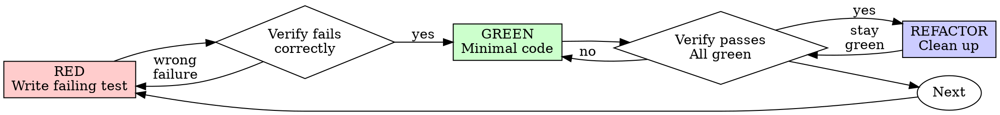

# Codex conversation 019ec74e

> This archive contains visible conversation activity and tool records. Private model reasoning and system/developer instructions are not available here.
<!-- codex-event:{"kind":"state","timestamp":"2026-06-14T18:04:36.957Z","phase":null} -->
## Task state: task_started · 2026-06-14T18:04:36.957Z

```text
{
  "type": "task_started",
  "turn_id": "019ec74e-96bd-7bd0-b0eb-b98b195d4509",
  "started_at": 1781460276,
  "model_context_window": 258400,
  "collaboration_mode_kind": "default"
}
```

<!-- /codex-event -->

<!-- codex-event:{"kind":"user","timestamp":"2026-06-14T18:04:37.859Z","phase":null} -->
## User · 2026-06-14T18:04:37.859Z

OmniHarness Restart
running
Refresh
Open App
JSON
Auto-refresh
s synced 20:04:13 (8514ms)

Status
    Responding on managed ports
Mode
    dev
PID
    88370
Ports
    3035, 3050, 7800
Started
    6/14/2026, 7:51:35 PM
Command
    pnpm run dev

Recent log /Users/masterman/NLP/omniharness/.omniharness/remote-restart.log
Lines
Filter
Regex

[2026-06-14 20:04:06] [web]     154 |     return { action: "none" as const };
[2026-06-14 20:04:06] [web]     155 |   } {
[2026-06-14 20:04:06] [web]     code: 'SQLITE_ERROR',
[2026-06-14 20:04:06] [web]     extendedCode: 'SQLITE_ERROR',
[2026-06-14 20:04:06] [web]     rawCode: 1,
[2026-06-14 20:04:06] [web]     [cause]: SqliteError: no such column: phase
[2026-06-14 20:04:06] [web]         at reconcilePersistedReloadZombies (src/server/runs/persisted-zombie-reconciler.ts:152:70)
[2026-06-14 20:04:06] [web]         at readPersistedEventRecords (src/runtime/http/routes/events.ts:63:40)
[2026-06-14 20:04:06] [web]         at async buildPersistedEventPayload (src/runtime/http/routes/events.ts:548:19)
[2026-06-14 20:04:06] [web]         at async handleEventsRequest (src/runtime/http/routes/events.ts:763:9)
[2026-06-14 20:04:06] [web]         at async withOuterProbe (src/server/slow-probe.ts:55:12)
[2026-06-14 20:04:06] [web]       150 |   }
[2026-06-14 20:04:06] [web]       151 |
[2026-06-14 20:04:06] [web]     > 152 |   const run = await db.select().from(runs).where(eq(runs.id, runId)).get();
[2026-06-14 20:04:06] [web]           |                                                                      ^
[2026-06-14 20:04:06] [web]       153 |   if (!run || !isRunEligible(run.status)) {
[2026-06-14 20:04:06] [web]       154 |     return { action: "none" as const };
[2026-06-14 20:04:06] [web]       155 |   } {
[2026-06-14 20:04:06] [web]       code: 'SQLITE_ERROR',
[2026-06-14 20:04:06] [web]       rawCode: 1
[2026-06-14 20:04:06] [web]     }
[2026-06-14 20:04:06] [web]   }
[2026-06-14 20:04:06] [web] }
[2026-06-14 20:04:06] [web]  GET /api/events?snapshot=1&persisted=1&runId=a03e7c439b55&checksum=sha256%3AoclJ8QPQj4q5tS23Z0vaHjOEPuFa3_7Rpj9o4iGxeQw 500 in 401ms
[2026-06-14 20:04:07] [web]  GET /api/workers/a03e7c439b55-worker-1/entries?afterSeq=568 200 in 238ms
[2026-06-14 20:04:07] [web]  GET /api/conversations/a03e7c439b55/transcript?afterToken=eyJjdXJzb3JzIjp7ImEwM2U3YzQzOWI1NS13b3JrZXItMSI6NTY4fX0 200 in 234ms
[2026-06-14 20:04:07] [web] [db] schema ready in 6ms
[2026-06-14 20:04:07] [web] [db] schema ready in 3ms
[2026-06-14 20:04:11] [web] Error: Failed query: select "id", "plan_id", "session_type", "mode", "phase", "project_path", "title", "preferred_worker_type", "preferred_worker_model", "preferred_worker_effort", "allowed_worker_types", "spec_path", "artifact_plan_path", "planner_artifacts_json", "planner_readiness_verdict_json", "parent_run_id", "forked_from_message_id", "auto_commit_milestones", "push_on_commit", "git_baseline_json", "git_workspace_json", "completion_commit_sha", "status", "failed_at", "last_error", "archived_at", "memory_metadata_revision", "last_memory_consolidation_at", "created_at", "updated_at" from "runs" where "runs"."id" = ?
[2026-06-14 20:04:11] [web] params: a03e7c439b55
[2026-06-14 20:04:11] [web]     at async reconcilePersistedReloadZombies (src/server/runs/persisted-zombie-reconciler.ts:152:15)
[2026-06-14 20:04:11] [web]     at async readPersistedEventRecords (src/runtime/http/routes/events.ts:63:3)
[2026-06-14 20:04:11] [web]     at async buildPersistedEventPayload (src/runtime/http/routes/events.ts:548:19)
[2026-06-14 20:04:11] [web]     at async handleEventsRequest (src/runtime/http/routes/events.ts:763:9)
[2026-06-14 20:04:11] [web]     at async withOuterProbe (src/server/slow-probe.ts:55:12)
[2026-06-14 20:04:11] [web]   150 |   }
[2026-06-14 20:04:11] [web]   151 |
[2026-06-14 20:04:11] [web] > 152 |   const run = await db.select().from(runs).where(eq(runs.id, runId)).get();
[2026-06-14 20:04:11] [web]       |               ^
[2026-06-14 20:04:11] [web]   153 |   if (!run || !isRunEligible(run.status)) {
[2026-06-14 20:04:11] [web]   154 |     return { action: "none" as const };
[2026-06-14 20:04:11] [web]   155 |   } {
[2026-06-14 20:04:11] [web]   query: 'select "id", "plan_id", "session_type", "mode", "phase", "project_path", "title", "preferred_worker_type", "preferred_worker_model", "preferred_worker_effort", "allowed_worker_types", "spec_path", "artifact_plan_path", "planner_artifacts_json", "planner_readiness_verdict_json", "parent_run_id", "forked_from_message_id", "auto_commit_milestones", "push_on_commit", "git_baseline_json", "git_workspace_json", "completion_commit_sha", "status", "failed_at", "last_error", "archived_at", "memory_metadata_revision", "last_memory_consolidation_at", "created_at", "updated_at" from "runs" where "runs"."id" = ?',
[2026-06-14 20:04:11] [web]   params: [Array],
[2026-06-14 20:04:11] [web]   [cause]: Error [LibsqlError]: SQLITE_ERROR: no such column: phase
[2026-06-14 20:04:11] [web]       at reconcilePersistedReloadZombies (src/server/runs/persisted-zombie-reconciler.ts:152:70)
[2026-06-14 20:04:11] [web]       at readPersistedEventRecords (src/runtime/http/routes/events.ts:63:40)
[2026-06-14 20:04:11] [web]       at async buildPersistedEventPayload (src/runtime/http/routes/events.ts:548:19)
[2026-06-14 20:04:11] [web]       at async handleEventsRequest (src/runtime/http/routes/events.ts:763:9)
[2026-06-14 20:04:11] [web]       at async withOuterProbe (src/server/slow-probe.ts:55:12)
[2026-06-14 20:04:11] [web]     150 |   }
[2026-06-14 20:04:11] [web]     151 |
[2026-06-14 20:04:11] [web]   > 152 |   const run = await db.select().from(runs).where(eq(runs.id, runId)).get();
[2026-06-14 20:04:11] [web]         |                                                                      ^
[2026-06-14 20:04:11] [web]     153 |   if (!run || !isRunEligible(run.status)) {
[2026-06-14 20:04:11] [web]     154 |     return { action: "none" as const };
[2026-06-14 20:04:11] [web]     155 |   } {
[2026-06-14 20:04:11] [web]     code: 'SQLITE_ERROR',
[2026-06-14 20:04:11] [web]     extendedCode: 'SQLITE_ERROR',
[2026-06-14 20:04:11] [web]     rawCode: 1,
[2026-06-14 20:04:11] [web]     [cause]: SqliteError: no such column: phase
[2026-06-14 20:04:11] [web]         at reconcilePersistedReloadZombies (src/server/runs/persisted-zombie-reconciler.ts:152:70)
[2026-06-14 20:04:11] [web]         at readPersistedEventRecords (src/runtime/http/routes/events.ts:63:40)
[2026-06-14 20:04:11] [web]         at async buildPersistedEventPayload (src/runtime/http/routes/events.ts:548:19)
[2026-06-14 20:04:11] [web]         at async handleEventsRequest (src/runtime/http/routes/events.ts:763:9)
[2026-06-14 20:04:11] [web]         at async withOuterProbe (src/server/slow-probe.ts:55:12)
[2026-06-14 20:04:11] [web]       150 |   }
[2026-06-14 20:04:11] [web]       151 |
[2026-06-14 20:04:11] [web]     > 152 |   const run = await db.select().from(runs).where(eq(runs.id, runId)).get();
[2026-06-14 20:04:11] [web]           |                                                                      ^
[2026-06-14 20:04:11] [web]       153 |   if (!run || !isRunEligible(run.status)) {
[2026-06-14 20:04:11] [web]       154 |     return { action: "none" as const };
[2026-06-14 20:04:11] [web]       155 |   } {
[2026-06-14 20:04:11] [web]       code: 'SQLITE_ERROR',
[2026-06-14 20:04:11] [web]       rawCode: 1
[2026-06-14 20:04:11] [web]     }
[2026-06-14 20:04:11] [web]   }
[2026-06-14 20:04:11] [web] }
[2026-06-14 20:04:11] [web]  GET /api/events?snapshot=1&persisted=1&runId=a03e7c439b55&checksum=sha256%3AoclJ8QPQj4q5tS23Z0vaHjOEPuFa3_7Rpj9o4iGxeQw 500 in 414ms

<!-- /codex-event -->

<!-- codex-event:{"kind":"progress","timestamp":"2026-06-14T18:04:48.056Z","phase":"commentary"} -->
## Codex progress · 2026-06-14T18:04:48.056Z

I’ll use `systematic-debugging`, `test-driven-development`, and the lifecycle/control-plane instructions because this is a server-side event snapshot failure tied to persisted run state. I’ll first inspect the schema/migration path and the reconciler call site before changing anything.

<!-- /codex-event -->

<!-- codex-event:{"kind":"tool-call","timestamp":"2026-06-14T18:04:48.058Z","phase":null} -->
## Tool call: exec_command · 2026-06-14T18:04:48.058Z

```json
{
  "cmd": "sed -n '1,220p' /Users/masterman/.agents/skills/systematic-debugging/SKILL.md",
  "workdir": "/Users/masterman/NLP/omniharness",
  "yield_time_ms": 10000,
  "max_output_tokens": 20000
}
```

<!-- /codex-event -->

<!-- codex-event:{"kind":"tool-call","timestamp":"2026-06-14T18:04:48.060Z","phase":null} -->
## Tool call: exec_command · 2026-06-14T18:04:48.060Z

```json
{
  "cmd": "sed -n '1,220p' /Users/masterman/.agents/skills/test-driven-development/SKILL.md",
  "workdir": "/Users/masterman/NLP/omniharness",
  "yield_time_ms": 10000,
  "max_output_tokens": 20000
}
```

<!-- /codex-event -->

<!-- codex-event:{"kind":"tool-call","timestamp":"2026-06-14T18:04:48.060Z","phase":null} -->
## Tool call: exec_command · 2026-06-14T18:04:48.060Z

```json
{
  "cmd": "sed -n '1,220p' /Users/masterman/.agents/skills/instrumenting-control-planes/SKILL.md",
  "workdir": "/Users/masterman/NLP/omniharness",
  "yield_time_ms": 10000,
  "max_output_tokens": 20000
}
```

<!-- /codex-event -->

<!-- codex-event:{"kind":"tool-call","timestamp":"2026-06-14T18:04:48.060Z","phase":null} -->
## Tool call: exec_command · 2026-06-14T18:04:48.060Z

```json
{
  "cmd": "sed -n '1,220p' /Users/masterman/.agents/skills/verification-before-completion/SKILL.md",
  "workdir": "/Users/masterman/NLP/omniharness",
  "yield_time_ms": 10000,
  "max_output_tokens": 20000
}
```

<!-- /codex-event -->

<!-- codex-event:{"kind":"tool-call","timestamp":"2026-06-14T18:04:48.127Z","phase":null} -->
## Tool call: exec_command · 2026-06-14T18:04:48.127Z

```json
{
  "cmd": "sed -n '1,180p' /Users/masterman/.agents/skills/using-ultrapowers/SKILL.md",
  "workdir": "/Users/masterman/NLP/omniharness",
  "yield_time_ms": 10000,
  "max_output_tokens": 12000
}
```

<!-- /codex-event -->

<!-- codex-event:{"kind":"tool-result","timestamp":"2026-06-14T18:04:48.156Z","phase":null} -->
## Tool result: call_zO0iVHvl322F8kcldDoFnC67 · 2026-06-14T18:04:48.156Z

````text
Chunk ID: 0baaa5
Wall time: 0.0000 seconds
Process exited with code 0
Original token count: 1613
Output:
---
name: systematic-debugging
description: Use when encountering any bug, test failure, or unexpected behavior, before proposing fixes
---

# Systematic Debugging

## Overview

Random fixes waste time and create new bugs. Quick patches mask underlying issues.

**Core principle:** ALWAYS find root cause before attempting fixes. Symptom fixes are failure.

**Violating the letter of this process is violating the spirit of debugging.**

## The Iron Law

```
NO FIXES WITHOUT ROOT CAUSE INVESTIGATION FIRST
```

If you haven't completed Phase 1, you cannot propose fixes.

## When to Use

Use for ANY technical issue:
- Test failures
- Bugs in production
- Unexpected behavior
- Performance problems
- Build failures
- Integration issues

**Use this ESPECIALLY when:**
- Under time pressure (emergencies make guessing tempting)
- "Just one quick fix" seems obvious
- You've already tried multiple fixes
- Previous fix didn't work
- You don't fully understand the issue

**Don't skip when:**
- Issue seems simple (simple bugs have root causes too)
- You're in a hurry (rushing guarantees rework)
- Manager wants it fixed NOW (systematic is faster than thrashing)

## The Four Phases

You MUST complete each phase before proceeding to the next.

### Phase 1: Root Cause Investigation

**BEFORE attempting ANY fix:**

1. **Read Error Messages Carefully**
   - Don't skip past errors or warnings
   - They often contain the exact solution
   - Read stack traces completely
   - Note line numbers, file paths, error codes

2. **Reproduce Consistently**
   - Can you trigger it reliably?
   - What are the exact steps?
   - Does it happen every time?
   - If not reproducible → gather more data, don't guess

3. **Check Recent Changes**
   - What changed that could cause this?
   - Git diff, recent commits
   - New dependencies, config changes
   - Environmental differences

4. **Gather Evidence in Multi-Component Systems**

   **WHEN system has multiple components (CI → build → signing, API → service → database):**

   **BEFORE proposing fixes, add diagnostic instrumentation:**
   ```
   For EACH component boundary:
     - Log what data enters component
     - Log what data exits component
     - Verify environment/config propagation
     - Check state at each layer

   Run once to gather evidence showing WHERE it breaks
   THEN analyze evidence to identify failing component
   THEN investigate that specific component
   ```

   **Example (multi-layer system):**
   ```bash
   # Layer 1: Workflow
   echo "=== Secrets available in workflow: ==="
   echo "IDENTITY: ${IDENTITY:+SET}${IDENTITY:-UNSET}"

   # Layer 2: Build script
   echo "=== Env vars in build script: ==="
   env | grep IDENTITY || echo "IDENTITY not in environment"

   # Layer 3: Signing script
   echo "=== Keychain state: ==="
   security list-keychains
   security find-identity -v

   # Layer 4: Actual signing
   codesign --sign "$IDENTITY" --verbose=4 "$APP"
   ```

   **This reveals:** Which layer fails (secrets → workflow ✓, workflow → build ✗)

5. **Trace Data Flow**

   **WHEN error is deep in call stack:**

   See `root-cause-tracing.md` in this directory for the complete backward tracing technique.

   **Quick version:**
   - Where does bad value originate?
   - What called this with bad value?
   - Keep tracing up until you find the source
   - Fix at source, not at symptom

### Phase 2: Pattern Analysis

**Find the pattern before fixing:**

1. **Find Working Examples**
   - Locate similar working code in same codebase
   - What works that's similar to what's broken?

2. **Compare Against References**
   - If implementing pattern, read reference implementation COMPLETELY
   - Don't skim - read every line
   - Understand the pattern fully before applying

3. **Identify Differences**
   - What's different between working and broken?
   - List every difference, however small
   - Don't assume "that can't matter"

4. **Understand Dependencies**
   - What other components does this need?
   - What settings, config, environment?
   - What assumptions does it make?

### Phase 3: Hypothesis and Testing

**Scientific method:**

1. **Form Single Hypothesis**
   - State clearly: "I think X is the root cause because Y"
   - Write it down
   - Be specific, not vague

2. **Test Minimally**
   - Make the SMALLEST possible change to test hypothesis
   - One variable at a time
   - Don't fix multiple things at once

3. **Verify Before Continuing**
   - Did it work? Yes → Phase 4
   - Didn't work? Form NEW hypothesis
   - DON'T add more fixes on top

4. **When You Don't Know**
   - Say "I don't understand X"
   - Don't pretend to know
   - Ask for help
   - Research more

### Phase 4: Implementation

**Fix the root cause, not the symptom:**

1. **Create Failing Test Case**
   - Simplest possible reproduction
   - Automated test if possible
   - One-off test script if no framework
   - MUST have before fixing
   - Use the `ultrapowers:test-driven-development` skill for writing proper failing tests

2. **Implement Single Fix**
   - Address the root cause identified
   - ONE change at a time
   - No "while I'm here" improvements
   - No bundled refactoring

3. **Verify Fix**
   - Test passes now?
   - No other tests broken?
   - Issue actually resolved?
   - If the bug was meaningful or systemic, use `ultrapowers:learning-from-bugs` before declaring the fix complete.

4. **If Fix Doesn't Work**
   - STOP
   - Count: How many fixes have you tried?
   - If < 3: Return to Phase 1, re-analyze with new information
   - **If ≥ 3: STOP and question the architecture (step 5 below)**
   - DON'T attempt Fix #4 without architectural discussion

5. **If 3+ Fixes Failed: Question Architecture**

   **Pattern indicating architectural problem:**
   - Each fix reveals new shared state/coupling/problem in different place
   - Fixes require "massive refactoring" to implement
   - Each fix creates new symptoms elsewhere

   **STOP and question fundamentals:**
   - Is this pattern fundamentally sound?
   - Are we "sticking with it through sheer inertia"?
   - Should we refactor architecture vs. continue fixing symptoms?

   **Discuss with your human partner before attempting more fixes**

   This is NOT a failed hypothesis - this is a wrong architecture.

## Red Flags - STOP and Follow Process

If you catch yourself thinking:
- "Quick fix for now, investigate later"
- "Just try changing X and see if it works"

````

<!-- /codex-event -->

<!-- codex-event:{"kind":"tool-result","timestamp":"2026-06-14T18:04:48.156Z","phase":null} -->
## Tool result: call_yRUAccsGOikwGf6pYu9ClD1S · 2026-06-14T18:04:48.156Z

````text
Chunk ID: 77b510
Wall time: 0.0000 seconds
Process exited with code 0
Original token count: 1448
Output:
---
name: test-driven-development
description: Use when implementing any feature or bugfix, before writing implementation code
---

# Test-Driven Development (TDD)

## Overview

Write the test first. Watch it fail. Write minimal code to pass.

**Core principle:** If you didn't watch the test fail, you don't know if it tests the right thing.

**Violating the letter of the rules is violating the spirit of the rules.**

## When to Use

**Always:**
- New features
- Bug fixes
- Refactoring
- Behavior changes

**Exceptions (ask your human partner):**
- Throwaway prototypes
- Generated code
- Configuration files

**Do directly with targeted verification:**
- tiny color, spacing, copy, or label changes,
- one-line prompt wording changes,
- docs-only wording changes,
- mechanical edits where the expected result is obvious from the diff.

Do not perform a full red-green cycle for a tiny mechanical edit unless it changes behavior or there is a real regression risk. For example, changing a button from gray to blue usually needs the edit plus a targeted visual or code check, not a new failing test.

Thinking "skip TDD just this once"? Stop. That's rationalization.

## UI-Specific Note

When the task is UI work, choose the design system and starting block before writing tests around the intended behavior and rendering. In Ultrapowers, that means `shadcn/ui` plus the closest available ShadCN Block for each new screen, form, or major surface unless the user says otherwise. Inspect https://ui.shadcn.com/blocks first, install or copy the selected block, and then adapt it. Before adding any individual control, check whether `shadcn/ui` already provides a suitable control and use/customize that control first.

For important app workflows, also consider whether `agentic-user-journey-testing` should be proposed. Do not run that higher-cost black-box test mode without explicit user approval.

## The Iron Law

```
NO PRODUCTION CODE WITHOUT A FAILING TEST FIRST
```

Write code before the test? Delete it. Start over.

**No exceptions:**
- Don't keep it as "reference"
- Don't "adapt" it while writing tests
- Don't look at it
- Delete means delete

Implement fresh from tests. Period.

## Red-Green-Refactor



### RED - Write Failing Test

Write one minimal test showing what should happen.

<Good>
```typescript
test('retries failed operations 3 times', async () => {
  let attempts = 0;
  const operation = () => {
    attempts++;
    if (attempts < 3) throw new Error('fail');
    return 'success';
  };

  const result = await retryOperation(operation);

  expect(result).toBe('success');
  expect(attempts).toBe(3);
});
```
Clear name, tests real behavior, one thing
</Good>

<Bad>
```typescript
test('retry works', async () => {
  const mock = jest.fn()
    .mockRejectedValueOnce(new Error())
    .mockRejectedValueOnce(new Error())
    .mockResolvedValueOnce('success');
  await retryOperation(mock);
  expect(mock).toHaveBeenCalledTimes(3);
});
```
Vague name, tests mock not code
</Bad>

**Requirements:**
- One behavior
- Clear name
- Real code (no mocks unless unavoidable)
- Real product behavior is the target. Mocked behavior can never be the final deliverable or proof that the feature works.

### Verify RED - Watch It Fail

**MANDATORY. Never skip.**

```bash
npm test path/to/test.test.ts
```

Confirm:
- Test fails (not errors)
- Failure message is expected
- Fails because feature missing (not typos)

**Test passes?** You're testing existing behavior. Fix test.

**Test errors?** Fix error, re-run until it fails correctly.

### GREEN - Minimal Code

Write simplest code to pass the test.

<Good>
```typescript
async function retryOperation<T>(fn: () => Promise<T>): Promise<T> {
  for (let i = 0; i < 3; i++) {
    try {
      return await fn();
    } catch (e) {
      if (i === 2) throw e;
    }
  }
  throw new Error('unreachable');
}
```
Just enough to pass
</Good>

<Bad>
```typescript
async function retryOperation<T>(
  fn: () => Promise<T>,
  options?: {
    maxRetries?: number;
    backoff?: 'linear' | 'exponential';
    onRetry?: (attempt: number) => void;
  }
): Promise<T> {
  // YAGNI
}
```
Over-engineered
</Bad>

Don't add features, refactor other code, or "improve" beyond the test.

### Verify GREEN - Watch It Pass

**MANDATORY.**

```bash
npm test path/to/test.test.ts
```

Confirm:
- Test passes
- Other tests still pass
- Output pristine (no errors, warnings)

**Test fails?** Fix code, not test.

**Other tests fail?** Fix now.

### REFACTOR - Clean Up

After green only:
- Remove duplication
- Improve names
- Extract helpers

Keep tests green. Don't add behavior.

### Repeat

Next failing test for next feature.

## Good Tests

| Quality | Good | Bad |
|---------|------|-----|
| **Minimal** | One thing. "and" in name? Split it. | `test('validates email and domain and whitespace')` |
| **Clear** | Name describes behavior | `test('test1')` |
| **Shows intent** | Demonstrates desired API | Obscures what code should do |


````

<!-- /codex-event -->

<!-- codex-event:{"kind":"tool-result","timestamp":"2026-06-14T18:04:48.156Z","phase":null} -->
## Tool result: call_j1kW2YhE0YgdKqfVdUKTkQxp · 2026-06-14T18:04:48.156Z

````text
Chunk ID: 83b7df
Wall time: 0.0000 seconds
Process exited with code 0
Original token count: 1303
Output:
---
name: instrumenting-control-planes
description: Use when building, planning, reviewing, or debugging apps with backend decisions, agent workflows, long-running jobs, SSE/WebSocket streams, recovery paths, deletes, retries, or user-visible failures
---

# Instrumenting Control Planes

Build the control plane as a product surface. If the server decides, refuses, retries, spawns, deletes, recovers, gives up, or fails, that decision must be observable by users, operators, and tests.

If a React UI consumes the control plane through server state, optimistic UI, caches, polling, SSE/WebSocket streams, or persisted runtime state, also use `client-server-state-invariants`.

## Core Rule

Every meaningful server-side state transition emits a named, durable event. The UI and tests consume the same production event surface.

Do not rely on snapshot diffs, rendered DOM state, logs only, or client-side re-derivation to prove what the server decided.

## Hot Path Rule

No user bootstrap, catalog, status, reconnect, or recovery request may depend on a lock-prone database write path or external health probe finishing. Serve these paths from a bounded read model, memory cache, append-only event log, or stale-but-marked snapshot; queue reconciliation writes outside the request. Every dependency on a database or bridge call in a hot path needs a short timeout, cancellation, and an explicit degraded response.

If SQLite, local files, or a single-writer store is used, assume writer contention can freeze readers at the worst moment. Use one writer, WAL/busy-timeout discipline, short transactions, bounded queues, and headless chaos tests that run bootstrap/reload while writes are active. A 25s UI request is a control-plane failure, even if the database eventually returns.

## Event Contract

For each backend or agent workflow, define:

- named events for decisions: `worker.spawned`, `worker.reattached`, `plan.ready`, `plan.review.blocked`, `recovery.gave_up`, `conversation.delete_failed`;
- payloads with stable ids, `prev`/`next` status when relevant, reason codes, and enough context to debug;
- `error.surfaced` or an equivalent user-facing failure event for every failure the user should know about;
- durable persistence or a bounded replay buffer so short disconnects do not erase history;
- a scriptable read path: CLI, HTTP endpoint, sqlite query, or event log command.

If a decision cannot be asserted from this surface, the design is incomplete.

If debugging a control-plane failure reveals a reusable lesson, use `ultrapowers:learning-from-bugs` after the fix is verified.

## Streaming Requirements

For SSE or WebSocket-like streams:

- emit named events alongside any snapshot/update frame;
- include monotonic event ids;
- support resume from the last seen id;
- replay missed events from a bounded buffer;
- emit an explicit resync-required event when replay is impossible;
- bootstrap from a snapshot, then tail events.

Snapshots show current truth. Named events show why it became true.

## Testing Standard

Control-plane tests should usually be headless HTTP/SSE scenario tests, not browser tests. Browser automation is for UI behavior; control-plane tests assert server decisions directly.

Write scenario assertions as event transcripts:

```ts
expect(events).toHaveEmitted("worker.spawned", { runId });
expect(events).toHaveEmitted("worker.status", { next: "running" });
chaos.killServer();
chaos.restartServer();
expect(events).toHaveEmitted("worker.reattached", { runId });
expect(events).not.toHaveEmitted("worker.recreated", { runId });
```

Chaos belongs outside production code paths: drop connections in the client, fail fetches in the harness, restart the server process, and use seeds for reproducibility.

## Refuse These Shapes

- silent early returns in server methods;
- swallowed `catch` blocks;
- client-side derivation of server decisions;
- response-code-only user failures;
- event streams without ids or resume;
- tests that infer control-plane behavior from rendered state;
- delete handlers that do not enumerate dependent rows or emit typed failure events;
- recovery loops without terminal events such as `gave_up` or `abandoned`;
- request handlers that wait on inline reconciliation writes, SQLite contention, or bridge `/doctor` checks before returning bootstrap data;
- test-only behavior branches in production code.

## Design Checklist

Before implementing a backend or agent workflow, answer:

1. What decisions can this workflow make?
2. What named event is emitted for each decision, including refusal and failure?
3. Where are events persisted or buffered?
4. How does a client resume after disconnect?
5. Which request paths must keep working while persistence or bridge dependencies are slow, locked, or stale?
6. How can a CLI or test harness inspect the exact event sequence without the UI?
7. Which headless scenario proves the happy path, failure path, recovery path, terminal state, and hot-path timeout/degraded path?
8. Which client state consumes these events, and how does it prove ownership, freshness, completeness, ordering, and replay/resync?

If the answer is "the UI can figure it out", name the missing event instead.

````

<!-- /codex-event -->

<!-- codex-event:{"kind":"tool-result","timestamp":"2026-06-14T18:04:48.156Z","phase":null} -->
## Tool result: call_7MCb66PmKBYN8WnNQcd9bA34 · 2026-06-14T18:04:48.156Z

````text
Chunk ID: ecc341
Wall time: 0.0000 seconds
Process exited with code 0
Original token count: 2230
Output:
---
name: verification-before-completion
description: Use when about to claim work is complete, fixed, or passing, before committing or creating PRs - requires running verification commands and confirming output before making any success claims; evidence before assertions always
---

# Verification Before Completion

## Overview

Claiming work is complete without verification is dishonesty, not efficiency.

**Core principle:** Evidence before claims, always.

**Violating the letter of this rule is violating the spirit of this rule.**

## The Iron Law

```
NO COMPLETION CLAIMS WITHOUT FRESH VERIFICATION EVIDENCE
```

If you haven't run the verification command in this message, you cannot claim it passes.

## The Gate Function

```
BEFORE claiming any status or expressing satisfaction:

1. IDENTIFY: What command proves this claim?
2. RUN: Execute the FULL command (fresh, complete)
3. READ: Full output, check exit code, count failures
4. VERIFY: Does output confirm the claim?
   - If NO: State actual status with evidence
   - If YES: State claim WITH evidence
5. ONLY THEN: Make the claim

Skip any step = lying, not verifying
```

## Product-Surface Verification

When the work involves an app, UI, or product surface, verification must cover more than whether a single requested feature works.

Keep verification proportional. For tiny mechanical edits, targeted verification is enough: inspect the diff, confirm the changed value/text, and run only the smallest relevant check. Do not escalate to full product-surface verification unless the change can affect behavior, state, navigation, persistence, or the user journey.

Also verify:

- required functionality is real end-to-end, not a fake component, mock, placeholder, canned response, or fallback path,
- the primary user stories are actually supported,
- the primary user journey works end-to-end,
- any approved agentic user journey tests have been run, or clearly state that they were proposed but not run because approval was not given,
- return/revisit flows work when they are part of the product,
- expected empty states are present,
- expected loading, waiting, or in-progress states are visible,
- expected error and recovery states are present,
- expected completed or success states are understandable,
- expected status-awareness flows are present,
- the state model is represented correctly,
- React/server-state invariants are verified when the app uses server state, optimistic UI, caches, polling, streams, background jobs, or persisted runtime state,
- persistence behavior for settings, preferences, drafts, and other user-managed state matches the approved design,
- operational readiness expectations are met for the approved scope,
- instrumentation and observability exist where the approved scope depends on them,
- backend or agent workflow decisions emit the planned named events, and a headless/scriptable check can assert the event sequence without relying on UI snapshots,
- real errors are surfaced rather than silently swallowed or replaced with vague placeholders,
- onboarding and discoverability work for first-run or empty-state use,
- risk and trust surfaces are handled well enough to avoid silent failure, ambiguous state, or obvious loss of confidence,
- when the scope includes a frontend/backend boundary, frontend-visible failures preserve the real error details and stack traces expected by the approved design,
- baseline expected v1 surfaces and inferred behaviors from the approved story set, spec, or plan are actually present.

When the scope includes settings or preferences, also verify:

- each meaningful setting persists or does not persist exactly as designed,
- the storage location and ownership model match the approved plan,
- refresh, restart, sign-out, reset, and migration behavior work as intended for the approved scope,
- settings dialogs avoid redundant section titles, subtitles, explanatory filler, and decorative chrome that does not help the user make a decision.

Do not confuse "the requested control exists" with "the product is usable."

For app, UI, and product-surface work, consider whether an agentic user journey test is the right proof. This mode is approval-gated because it can spend significant tokens: propose it when useful, but only run it if the user explicitly approves.

## Common Failures

| Claim | Requires | Not Sufficient |
|-------|----------|----------------|
| Tests pass | Test command output: 0 failures | Previous run, "should pass" |
| Linter clean | Linter output: 0 errors | Partial check, extrapolation |
| Build succeeds | Build command: exit 0 | Linter passing, logs look good |
| Bug fixed | Test original symptom: passes | Code changed, assumed fixed |
| Meaningful system bug fixed | Learning note plus verification | Fix committed with no durable lesson |
| React/server state sync works | Stale-response, merge, event-sequence, and ownership tests relevant to the change | UI looked right once |
| Regression test works | Red-green cycle verified | Test passes once |
| Agent completed | VCS diff shows changes | Agent reports "success" |
| Requirements met | Line-by-line checklist | Tests passing |
| Feature complete | Real end-to-end behavior in the product | Mocked component, canned data, placeholder UI, fallback path |

## Red Flags - STOP

- Using "should", "probably", "seems to"
- Expressing satisfaction before verification ("Great!", "Perfect!", "Done!", etc.)
- About to commit/push/PR without verification
- Trusting agent success reports
- Accepting "validated with mocks" or "placeholder works" as completion
- Relying on partial verification
- Thinking "just this once"
- Tired and wanting work over
- **ANY wording implying success without having run verification**

## Rationalization Prevention

| Excuse | Reality |
|--------|---------|
| "Should work now" | RUN the verification |
| "I'm confident" | Confidence ≠ evidence |
| "Just this once" | No exceptions |
| "Linter passed" | Linter ≠ compiler |
| "Agent said success" | Verify independently |
| "I'm tired" | Exhaustion ≠ excuse |
| "Partial check is enough" | Partial proves nothing |
| "Different words so rule doesn't apply" | Spirit over letter |

## Key Patterns

**Tests:**
```
✅ [Run test command] [See: 34/34 pass] "All tests pass"
❌ "Should pass now" / "Looks correct"
```

**Regression tests (TDD Red-Green):**
```
✅ Write → Run (pass) → Revert fix → Run (MUST FAIL) → Restore → Run (pass)
❌ "I've written a regression test" (without red-green verification)
```

**Build:**
```
✅ [Run build] [See: exit 0] "Build passes"
❌ "Linter passed" (linter doesn't check compilation)
```

**Requirements:**
```
✅ Re-read plan → Create checklist → Verify each → Report gaps or completion
❌ "Tests pass, phase complete"
```

**Agent delegation:**
```
✅ Agent reports success → Check VCS diff → Verify changes → Report actual state
❌ Trust agent report
```

## Why This Matters

From 24 failure memories:
- your human partner said "I don't believe you" - trust broken
- Undefined functions shipped - would crash
- Missing requirements shipped - incomplete features
- Time wasted on false completion → redirect → rework
- Violates: "Honesty is a core value. If you lie, you'll be replaced."

## When To Apply

**ALWAYS before:**
- ANY variation of success/completion claims
- ANY expression of satisfaction
- ANY positive statement about work state
- Committing, PR creation, task completion
- Staging, committing, pushing, or opening a PR when the work could include secrets, local environment files, dependencies, caches, build outputs, logs, temporary files, or generated/intermediate artifacts
- Moving to next task
- Delegating to agents

When a meaningful bug involved architecture, storage, memory, persistence, control planes, background workers, recovery, data loss, security, or a repeated wrong assumption, use `ultrapowers:learning-from-bugs` before claiming the fix is complete.

When a React app has server state, optimistic UI, caches, polling, SSE/WebSocket streams, background jobs, or persisted runtime state, use `ultrapowers:client-server-state-invariants` to decide which race and synchronization tests are required before claiming completion.

Before any git publish step, verify `.gitignore` exists for the project and that `git status` does not include secrets, credentials, local environment files, `node_modules`, dependency caches, build outputs, coverage output, logs, temporary files, or intermediate/generated artifacts unless the human explicitly asked to version a specific generated artifact.

**Rule applies to:**
- Exact phrases
- Paraphrases and synonyms
- Implications of success
- ANY communication suggesting completion/correctness

## The Bottom Line

**No shortcuts for verification.**

Run the command. Read the output. THEN claim the result.

This is non-negotiable.

````

<!-- /codex-event -->

<!-- codex-event:{"kind":"tool-result","timestamp":"2026-06-14T18:04:48.170Z","phase":null} -->
## Tool result: call_fJRJDDhdek07eUsjEDWLOptV · 2026-06-14T18:04:48.170Z

```text
Chunk ID: c1d873
Wall time: 0.0000 seconds
Process exited with code 0
Original token count: 2019
Output:
---
name: using-ultrapowers
description: Use when starting any conversation - establishes how to find and use skills, requiring skill invocation before acting
---

<SUBAGENT-STOP>
If you were dispatched as a subagent to execute a specific task, skip this skill.
</SUBAGENT-STOP>

# Using Ultrapowers

Use relevant skills before acting, but keep process proportional to the task.

## Instruction Priority

1. User instructions and local repo instructions
2. Ultrapowers skills
3. Default model behavior

If the user says not to create extra repository isolation, or says to work directly in the current repository, follow that instruction.

## Core Rule

Before responding, ask:

1. Is there a process skill that governs how to approach this?
2. Is there an implementation skill that governs how to execute it?
3. Is the request substantial enough to justify that process, or is it a tiny mechanical edit?

If a skill applies and the task is substantial enough to justify it, use it before continuing. If the request is a tiny mechanical edit, make the edit directly with targeted verification.

## Proportional Skill Use

Do the smallest responsible workflow that matches the request.

For tiny, unambiguous mechanical edits, do the edit directly:

- changing a color value,
- fixing a typo,
- tweaking short copy,
- changing a prompt sentence,
- renaming a label,
- adjusting obvious spacing or formatting,
- making a one-line config or docs correction.

For these, do not run brainstorming, write a plan, or force TDD unless the change affects product behavior, data, persistence, control flow, user journeys, or non-obvious architecture.

Use the heavier process when the request is ambiguous, user-facing behavior changes, multiple files/modules are involved, the user journey can change, or the change could create regressions that are not obvious from a quick targeted check.

## Default Posture

- Work in the current repository by default.
- YOU WILL NEVER CREATE A BRANCH unless explicitly instructed.
- Ask the user whether we should work in worktrees as part of the planning.
- YOU WILL ONLY CREATE A WORKTREE if explicitly instructed.
- Keep skill use proportional. Tiny mechanical edits should stay tiny.
- Every project should have a `.gitignore`.
- Never commit or push secrets, credentials, local environment files, `node_modules`, dependency caches, build outputs, coverage output, logs, temporary files, or intermediate/generated artifacts unless the human explicitly asks to version a specific generated artifact.
- Deliver full product functionality by default. NO FAKE COMPONENTS, NO MOCKS, NO PLACEHOLDERS, NO FALLBACKS as substitutes for the requested functionality unless the human explicitly asks for a prototype or scaffold.
- For app, UI, and product-surface work, run a PM pass during planning. Treat it as mandatory default behavior, not optional polish.
- For app, UI, and product-surface work, consider `agentic-user-journey-testing` for important user stories, but do not run it without explicit user approval.
- Use `second-opinion` for substantial saved implementation plans, and for unusually hard, creative, high-risk, or architecture-heavy specs when an independent external review could improve the artifact. Prefer a different available coding harness for that review, such as Codex asking Claude Code or Claude Code asking Codex. If no different harness is available, the same harness is fine; the second opinion is still mandatory for matching artifacts.
- Refactor code when a file passes 1200 lines. Do not normalize oversized files as the default end state.
- Use user stories in specs and plans when they clarify behavior or value.
- Default UI work to `shadcn/ui` unless the user says otherwise.
- When designing UI from scratch, first inspect the available ShadCN Blocks at https://ui.shadcn.com/blocks for each screen, form, or major surface. Start from the closest matching block with `npx shadcn add <block-name>` or the block's source in https://github.com/shadcn-ui/ui, then edit it by adding, removing, or adapting controls. Do not invent a fresh layout before doing this block-selection pass.
- Before adding any individual UI control, check whether `shadcn/ui` already provides a control that does what is needed. Use the available shadcn control first, then customize it, instead of hand-building a one-off control.
- Treat desktop and mobile responsiveness as first-class from the beginning.
- Prefer explicit routing unless the framework strongly defaults to file-based routes.
- For React apps, use `building-react-apps` for state managers, explicit transitions, routing, refs, imports, package-manager defaults, and frontend configuration defaults.
- For React apps with server state, optimistic UI, caches, polling, SSE/WebSocket streams, background jobs, persistence, or client/server synchronization, use `client-server-state-invariants` during planning and verification.
- For React or Next.js slowness, root-load, compile-time, SSR/hydration, bundle, import-bloat, or UI dependency cleanup work, use `optimizing-react-next-apps`.
- Prefer strong instrumentation and auditability for backend behavior.
- When a project has backend or agent workflows, prefer a fully instrumented control plane: persist meaningful events, tool calls, actions, results, errors, and state transitions, and expose them through a CLI or other scriptable interface so the full system can be inspected and tested without the UI.
- Use `instrumenting-control-planes` when building, planning, reviewing, or debugging backend decisions, agent workflows, recovery paths, retries, deletes, long-running jobs, SSE/WebSocket streams, or user-visible failures.
- Use `learning-from-bugs` after diagnosing or fixing meaningful architecture, storage, memory, persistence, control-plane, or system-level bugs so reusable lessons become durable.
- Do not default to silent, masked, or over-abstracted errors.
- When a project has a frontend, prefer surfacing full backend error details and stack traces to the frontend so failures stay visible, debuggable, and testable end-to-end.
- Treat persistence of settings and preferences as explicit design work.
- For every meaningful UI setting, define whether it persists, where it is stored, how it is read and written, who owns it, and how reset, sync, migration, and testing are handled.

See `docs/ultrapowers-defaults.md` for the canonical fork defaults.

## Skill Priority

1. Process skills first
2. Implementation skills second

Examples:

- "Make this button blue" -> inspect the relevant file, make the small edit, do targeted verification
- "Update this prompt sentence" -> edit the prompt directly and verify the final text
- "Build a feature" -> `brainstorming` with a PM pass first, then `writing-plans`, then execution; consider approval-gated `agentic-user-journey-testing` for app workflows
- "Fix this bug" -> `systematic-debugging`, then the relevant implementation skill; if the root cause is meaningful or systemic, finish with `learning-from-bugs`
- "Review this change" -> `requesting-code-review`

## Examples Of User Override

- If a task feels risky and the user did not ask for extra repository isolation, keep working in the current repository unless the user explicitly instructs otherwise.
- If a stack supports file-based routing but the user says not to use it, choose an explicit routing approach instead.
- If a framework strongly defaults to file-based routing, such as Next.js App Router, use the framework-native routing model unless there is a good reason not to.
- If a frontend skill suggests `shadcn/ui` but the user wants another design system, follow the user.

## Red Flags

- "I need a whole workflow for this tiny edit" -> no. Use the smallest responsible process.
- "This is simple, so I need the whole process anyway" -> no. Tiny mechanical edits should stay tiny.
- "I'll create extra repository isolation just to be safe" -> forbidden unless the user clearly asked for it.
- "I already know the skill" -> read the current version before relying on it

```

<!-- /codex-event -->

<!-- codex-event:{"kind":"progress","timestamp":"2026-06-14T18:05:01.630Z","phase":"commentary"} -->
## Codex progress · 2026-06-14T18:05:01.630Z

The stack trace is pointing at a Drizzle `select()` trying to read the `phase` column from `runs`, while the live SQLite schema does not have that column. I’m going to confirm whether this is a missing migration/schema bootstrap issue or a query that should be narrowed for compatibility.

<!-- /codex-event -->

<!-- codex-event:{"kind":"tool-call","timestamp":"2026-06-14T18:05:01.633Z","phase":null} -->
## Tool call: exec_command · 2026-06-14T18:05:01.633Z

```json
{
  "cmd": "rg -n \"phase\" src db drizzle migrations scripts tests -S",
  "workdir": "/Users/masterman/NLP/omniharness",
  "yield_time_ms": 10000,
  "max_output_tokens": 20000
}
```

<!-- /codex-event -->

<!-- codex-event:{"kind":"tool-call","timestamp":"2026-06-14T18:05:01.633Z","phase":null} -->
## Tool call: exec_command · 2026-06-14T18:05:01.633Z

```json
{
  "cmd": "sed -n '1,240p' src/server/runs/persisted-zombie-reconciler.ts",
  "workdir": "/Users/masterman/NLP/omniharness",
  "yield_time_ms": 10000,
  "max_output_tokens": 20000
}
```

<!-- /codex-event -->

<!-- codex-event:{"kind":"tool-call","timestamp":"2026-06-14T18:05:01.633Z","phase":null} -->
## Tool call: exec_command · 2026-06-14T18:05:01.633Z

```json
{
  "cmd": "rg -n \"sqlite|drizzle|runs\" src/server src/runtime db drizzle.config.ts package.json -S",
  "workdir": "/Users/masterman/NLP/omniharness",
  "yield_time_ms": 10000,
  "max_output_tokens": 20000
}
```

<!-- /codex-event -->

<!-- codex-event:{"kind":"tool-call","timestamp":"2026-06-14T18:05:01.694Z","phase":null} -->
## Tool call: exec_command · 2026-06-14T18:05:01.694Z

```json
{
  "cmd": "git status --short",
  "workdir": "/Users/masterman/NLP/omniharness",
  "yield_time_ms": 10000,
  "max_output_tokens": 12000
}
```

<!-- /codex-event -->

<!-- codex-event:{"kind":"tool-result","timestamp":"2026-06-14T18:05:01.726Z","phase":null} -->
## Tool result: call_wp9PvxuBWl0arQWkQFR2OC1B · 2026-06-14T18:05:01.726Z

```text
Chunk ID: c8eb01
Wall time: 0.0000 seconds
Process exited with code 2
Original token count: 3066
Output:
rg: db: No such file or directory (os error 2)
rg: drizzle: No such file or directory (os error 2)
rg: migrations: No such file or directory (os error 2)
tests/supervisor/index.test.ts:2706:      phase: "Regression",
src/lib/run-status.ts:16:export function isPlanningPhaseRun(run: { phase?: string | null } | null | undefined) {
src/lib/run-status.ts:17:  return run?.phase === "planning";
src/lib/run-status.ts:20:export function isActiveImplementationRun(run: { mode?: string | null; status?: string | null; phase?: string | null } | null | undefined) {
src/lib/run-status.ts:24:export function isRunnableImplementationRun(run: { mode?: string | null; status?: string | null; phase?: string | null } | null | undefined) {
src/lib/run-status.ts:26:    && !isPlanningPhaseRun(run)
tests/lib/supervisor-activity.test.ts:104:  it("uses the implementing phase when workers are running normally", () => {
tests/lib/supervisor-activity.test.ts:117:    expect(card.phaseKey).toBe("supervisor.activity.phase.implementing");
tests/lib/supervisor-activity.test.ts:121:  it("uses a supervisor-only phase before any worker exists", () => {
tests/lib/supervisor-activity.test.ts:134:    expect(card.phaseKey).toBe("supervisor.activity.phase.supervisorThinking");
tests/lib/supervisor-activity.test.ts:170:  it("does not infer an unblocking phase from incidental supervisor text", () => {
tests/lib/supervisor-activity.test.ts:183:    expect(card.phaseKey).toBe("supervisor.activity.phase.implementing");
tests/lib/supervisor-activity.test.ts:227:    expect(card.phaseKey).toBe("supervisor.activity.phase.unblocking");
src/lib/plan-path.ts:3: * existing plan/spec (so it can skip the interactive planning phase and go
tests/api/planning-promote-route.test.ts:37:    fs.writeFileSync(implementationPlanPath, "## Phase 1\n- [ ] Add mode-aware launch flow\n");
tests/plans/readiness.test.ts:10:## Phase 1
tests/plans/readiness.test.ts:16:          phase: "Phase 1",
tests/plans/readiness.test.ts:32:## Phase 1
tests/plans/readiness.test.ts:40:          phase: "Phase 1",
tests/plans/readiness.test.ts:57:## Phase 1
tests/plans/readiness.test.ts:64:          phase: "Phase 1",
tests/plans/readiness.test.ts:89:          phase: "Implementation Tasks",
tests/plans/parser.test.ts:5:  it("extracts phases and checklist items from markdown", () => {
tests/plans/parser.test.ts:8:## Phase 1
tests/plans/parser.test.ts:12:## Phase 2
tests/plans/parser.test.ts:21:    expect(result.items.map((item) => item.phase)).toEqual([
tests/plans/parser.test.ts:22:      "Phase 1",
tests/plans/parser.test.ts:23:      "Phase 1",
tests/plans/parser.test.ts:24:      "Phase 2",
tests/plans/parser.test.ts:31:## Phase 1
tests/lifecycle/scenarios/plan-improvement-flow.test.ts:125:    fs.writeFileSync("/tmp/improvement.md", "## Phase 1\n- [ ] Task\n");
tests/server/plans/readiness-pipeline.test.ts:28:  "## Phase 1",
tests/server/plans/readiness.test.ts:20:    const plan = parsePlan("## Phase 1\n- [ ] TODO\n- [ ] Real task\n  - Verify: file exists\n");
tests/server/plans/readiness.test.ts:30:      "## Phase 1",
tests/server/plans/readiness.test.ts:43:    const planWithoutSupport = parsePlan("## Phase 1\n- [ ] Improve auth\n");
tests/server/plans/readiness.test.ts:49:      "## Phase 1",
tests/api/conversation-load-coverage.test.ts:146:  // Post-Phase-5: worker conversation content moved off /api/events
src/components/Terminal.tsx:31:   * `userMessages`. Phase 4 of the unified stream rollout flips
tests/app/home-utils.test.ts:1261:        { id: "item-1", planId: "plan-1", title: "keep", phase: null, status: "pending" },
tests/app/home-utils.test.ts:1262:        { id: "item-2", planId: "plan-2", title: "delete", phase: null, status: "pending" },
tests/api/events-route.test.ts:2103:    fs.writeFileSync(planPath, "## Phase 1\n- [ ] Implement the thing\n");
tests/server/events/plan-review-blocked-event.test.ts:56:    fs.writeFileSync(planPath, "## Phase 1\n- [ ] Task\n");
tests/server/dual-write-stream.test.ts:210:  it("appends a user_input entry on queued delivery (post-Phase-5: flag is gone, stream is unconditional)", async () => {
tests/server/events/plan-ready-event.test.ts:35:  fs.writeFileSync(planPath, "## Phase 1\n- [ ] Task\n");
tests/lifecycle/scenarios/flaky-network.test.ts:83:    // Phase 1: low-flake client for the create call so the conversation
tests/lifecycle/scenarios/flaky-network.test.ts:100:    // Phase 2: switch to a flaky client. Seeded to deterministically
tests/server/planning/refresh.test.ts:27:    fs.writeFileSync(oldPlan, "## Phase 1\n- [ ] Keep old behavior\n");
tests/server/planning/refresh.test.ts:126:    fs.writeFileSync(planPath, "## Phase 1\n- [ ] Implement the thing\n  - Verify: feature is live\n");
tests/server/planning/refresh.test.ts:221:    fs.writeFileSync(planPath, "## Phase 1\n- [ ] Do the thing\n  - Verify: it works\n");
tests/server/planning/artifacts.test.ts:40:    fs.writeFileSync(planPath, "## Phase 1\n- [ ] Build it\n");
tests/server/planning/artifacts.test.ts:67:    fs.writeFileSync(planPath, "## Phase 1\n- [ ] Build current workflow\n");
tests/server/planning/artifacts.test.ts:68:    fs.writeFileSync(unrelatedPlanPath, "## Phase 1\n- [ ] Build old workflow\n");
tests/server/planning/artifacts.test.ts:113:    fs.writeFileSync(planPath, "## Phase 1\n- [ ] Build current workflow\n");
tests/server/planning/artifacts.test.ts:134:    fs.writeFileSync(planPath, "## Phase 1\n- [ ] Build scene search\n");
tests/server/planning/artifacts.test.ts:151:    fs.writeFileSync(oldPlan, "## Phase 1\n- [ ] Keep old behavior\n");
tests/server/planning/artifacts.test.ts:173:    fs.writeFileSync(scratchPlanPath, "## Phase 1\n- [ ] Track CLI quota\n");
src/server/supervisor/observer.ts:10:import { isActiveImplementationRun, isPlanningPhaseRun } from "@/server/runs/status";
src/server/supervisor/observer.ts:774:  // During the Omni planning phase the supervisor stays dormant — a stray
src/server/supervisor/observer.ts:776:  if (isPlanningPhaseRun(run)) {
src/server/supervisor/index.ts:717:  const hasConcreteSlice = /\b(part\s+[a-z0-9]+|slice|component|module|file|area|phase|section)\b/.test(text);
src/server/supervisor/runtime-watchdog.ts:20:    && run.phase !== "planning"
src/server/supervisor/runtime-watchdog.ts:86:    // Omni runs still in their interactive planning phase keep the supervisor
src/server/supervisor/runtime-watchdog.ts:88:    if (run.phase === "planning") {
src/server/omni-acp/agent.ts:197:    // the planning phase. Treat a planning-phase run like a single-worker run:
src/server/omni-acp/agent.ts:199:    const supervised = snapshot.run.mode === "implementation" && snapshot.run.phase !== "planning";
src/server/runs/status.ts:4:  isPlanningPhaseRun,
src/server/db/index.ts:49:  phase text,
src/server/db/index.ts:285:  phase text,
src/server/db/index.ts:476:if (!runColumnNames.has("phase")) {
src/server/db/index.ts:477:  await client.execute("ALTER TABLE runs ADD COLUMN phase text;");
src/server/db/schema.ts:17:  // planner phase with the supervisor dormant; 'implementing' (or null for
src/server/db/schema.ts:18:  // legacy rows) = supervisor-driven implementation phase.
src/server/db/schema.ts:19:  phase: text('phase'),
src/server/db/schema.ts:241:  phase: text('phase'),
src/app/home/supervisor-activity.ts:38:  phaseKey: string;
src/app/home/supervisor-activity.ts:39:  phaseParams?: Record<string, string | number>;
src/app/home/supervisor-activity.ts:186:function derivePhaseKey(args: {
src/app/home/supervisor-activity.ts:193:  if (status === "awaiting_user") return "supervisor.activity.phase.awaitingUser";
src/app/home/supervisor-activity.ts:194:  if (status === "failed") return "supervisor.activity.phase.failed";
src/app/home/supervisor-activity.ts:195:  if (status === "needs_recovery" || status === "recovering") return "supervisor.activity.phase.recovering";
src/app/home/supervisor-activity.ts:196:  if (status === "done") return "supervisor.activity.phase.completed";
src/app/home/supervisor-activity.ts:197:  if (status === "cancelled" || status === "canceled") return "supervisor.activity.phase.stopped";
src/app/home/supervisor-activity.ts:205:    return "supervisor.activity.phase.unblocking";
src/app/home/supervisor-activity.ts:209:    return "supervisor.activity.phase.implementing";
src/app/home/supervisor-activity.ts:211:  return "supervisor.activity.phase.supervisorThinking";
src/app/home/supervisor-activity.ts:231:  const phaseKey = derivePhaseKey({
src/app/home/supervisor-activity.ts:242:    phaseKey,
src/app/home/types.ts:66:export type PlanItemRecord = { id: string; planId: string; title: string; phase: string | null; status: string };
src/server/conversations/create.ts:535:  // run mode plus phase. `usePlanner` is true whenever the opening turn should
src/server/conversations/create.ts:538:  const { runMode: mode, phase } = resolveOmniRequest(args.mode, command);
src/server/conversations/create.ts:539:  const usePlanner = phase === "planning" || mode === "planning";
src/server/conversations/create.ts:571:    // During the Omni planning phase no implementation has begun, so defer the
src/server/conversations/create.ts:573:    // implementation (see startImplementationPhase).
src/server/conversations/create.ts:599:      phase,
src/server/conversations/create.ts:647:    if (phase === "implementing") {
src/components/home/ConversationMain.tsx:236:                  {t(activityCard.phaseKey, activityCard.phaseParams)}
src/server/conversations/modes.ts:4:// request is stored as an `implementation`-mode run whose `phase` distinguishes
src/server/conversations/modes.ts:10:// Phase for an implementation-mode (Omni) run. null = legacy / non-phased run.
src/server/conversations/modes.ts:11:export type RunPhase = "planning" | "implementing" | null;
src/server/conversations/modes.ts:14:// resolved by `resolveOmniRequest` into a stored mode + phase.
src/server/conversations/modes.ts:33: * Resolve a client-requested mode + command into the stored run mode and phase.
src/server/conversations/modes.ts:35: * - `omni` + plan-ready command  → implementation run, implementing phase
src/server/conversations/modes.ts:36: * - `omni` + free-text request   → implementation run, planning phase
src/server/conversations/modes.ts:37: * - `implementation` (explicit)  → implementation run, implementing phase
src/server/conversations/modes.ts:38: * - `planning` / `direct` / `commit` → legacy mode-based behavior, no phase
src/server/conversations/modes.ts:40:export function resolveOmniRequest(value: unknown, command: string): { runMode: ConversationMode; phase: RunPhase } {
src/server/conversations/modes.ts:44:      ? { runMode: "implementation", phase: "implementing" }
src/server/conversations/modes.ts:45:      : { runMode: "implementation", phase: "planning" };
src/server/conversations/modes.ts:48:    return { runMode: "implementation", phase: "implementing" };
src/server/conversations/modes.ts:50:  return { runMode: requested, phase: null };
src/server/cli/runner.ts:125:  // Supervisor-driven runs (implementation mode, past any planning phase) keep
src/server/cli/runner.ts:126:  // streaming until terminal. Planning-phase Omni runs and direct/planning runs
src/server/cli/runner.ts:128:  if (run.mode === "implementation" && run.phase !== "planning") {
src/runtime/bootstrap.ts:105:      // Phase 5 cutover. The boolean is kept on the bootstrap shape so
src/server/plans/checklist.ts:28:        phase: item.phase,
src/server/plans/checklist.ts:43:        phase: item.phase,
src/server/plans/parser.ts:3:  phase: string | null;
src/server/plans/parser.ts:17:  let currentPhase: string | null = null;
src/server/plans/parser.ts:20:    const phaseMatch = line.match(/^##\s+(.+)$/);
src/server/plans/parser.ts:21:    if (phaseMatch) {
src/server/plans/parser.ts:22:      currentPhase = phaseMatch[1].trim();
src/server/plans/parser.ts:30:        phase: currentPhase,
src/server/plans/readiness-llm.ts:51:- The plan markdown (a checklist of items, possibly grouped into phases, possibly with details and Verify: lines).
src/components/PlanProgress.tsx:9:  phase: string | null;
src/components/PlanProgress.tsx:44:                <div className="text-xs font-medium text-muted-foreground">{item.phase || "Unphased"}</div>

```

<!-- /codex-event -->

<!-- codex-event:{"kind":"tool-result","timestamp":"2026-06-14T18:05:01.726Z","phase":null} -->
## Tool result: call_RT6U6i8tJgBeu5T553lzAwBR · 2026-06-14T18:05:01.726Z

```text
Chunk ID: 33b56c
Wall time: 0.0000 seconds
Process exited with code 0
Original token count: 1967
Output:
import { asc, eq } from "drizzle-orm";
import { db } from "@/server/db";
import { runs, workers } from "@/server/db/schema";
import { emitNamedEvent } from "@/server/events/named-events";
import { openRecoveryIncident, markRecoveryIncidentNeedsUser } from "@/server/runs/recovery-incidents";
import { setRunNeedsRecovery } from "@/server/runs/recovery-actions";
import { isTerminalRunStatus, normalizeRunStatus } from "@/server/runs/status";
import { resumeMissingDirectWorker } from "@/server/conversations/send-message";
import { notifyEventStreamSubscribers } from "@/server/events/live-updates";
import { readWorkerSessionMetadata } from "@/server/workers/session-metadata";

const STARTING_WORKER_RELOAD_GRACE_MS = 30_000;
const ACTIVE_WORKER_RELOAD_GRACE_MS = 15_000;
const LOST_WORKER_REASON = "Worker was marked active but is not present in the bridge runtime.";

function normalizedWorkerStatus(worker: typeof workers.$inferSelect) {
  return normalizeRunStatus(worker.status).split(":")[0]?.trim() ?? "";
}

function isPastGrace(worker: typeof workers.$inferSelect, nowMs: number) {
  const status = normalizedWorkerStatus(worker);
  const graceMs = status === "starting"
    ? STARTING_WORKER_RELOAD_GRACE_MS
    : ACTIVE_WORKER_RELOAD_GRACE_MS;
  return nowMs - worker.updatedAt.getTime() >= graceMs;
}

function isRunEligible(status: string | null | undefined) {
  const normalized = normalizeRunStatus(status);
  return Boolean(normalized)
    && !isTerminalRunStatus(normalized)
    && normalized !== "awaiting_user"
    && normalized !== "needs_recovery"
    && normalized !== "recovering"
    && normalized !== "quota_waiting";
}

function isStaleStartingWorker(worker: typeof workers.$inferSelect, nowMs: number) {
  if (normalizedWorkerStatus(worker) !== "starting") {
    return false;
  }
  if (worker.bridgeSessionId?.trim()) {
    return false;
  }
  return isPastGrace(worker, nowMs);
}

// Workers that were actively producing output when the bridge died:
// `status="working"` in the DB but absent from the bridge's live agent
// list. Without this, the FE shows "running" in the sidebar and no
// "Thinking…" indicator forever, because the DB row never advances and
// the bridge has no agent to report state for. We auto-resume via the
// same spawn-with-saved-session path that the regular send-message
// flow uses.
function isOrphanedActiveWorker(
  worker: typeof workers.$inferSelect,
  bridgeAgentNames: ReadonlySet<string>,
  nowMs: number,
): boolean {
  const status = normalizedWorkerStatus(worker);
  if (status !== "starting" && status !== "working" && status !== "stuck" && status !== "recovering") {
    return false;
  }
  // The bridge knows about it — nothing for us to do.
  if (bridgeAgentNames.has(worker.id)) {
    return false;
  }
  return isPastGrace(worker, nowMs);
}

async function markWorkerLost(worker: typeof workers.$inferSelect) {
  if (normalizedWorkerStatus(worker) === "lost") {
    return;
  }
  await db.update(workers).set({
    status: "lost",
    currentText: "",
    updatedAt: new Date(),
  }).where(eq(workers.id, worker.id));
  emitNamedEvent({
    kind: "worker.status",
    runId: worker.runId,
    workerId: worker.id,
    prev: worker.status,
    next: "lost",
  });
}

async function markStaleWorkerNeedsUser(args: {
  run: typeof runs.$inferSelect;
  worker: typeof workers.$inferSelect;
  source?: string;
  reason: string;
  autoRecoveryError?: string | null;
}) {
  await markWorkerLost(args.worker);
  await setRunNeedsRecovery({
    runId: args.run.id,
    reason: args.reason,
  });
  const incident = await openRecoveryIncident({
    runId: args.run.id,
    workerId: args.worker.id,
    queuedMessageId: null,
    kind: "worker_lost",
    lastError: args.reason,
    details: {
      source: args.source ?? "persisted-reload-bootstrap",
      recoveryState: "needs_recovery",
      recommendedAction: "manual_resume",
      reason: args.reason,
      ...(args.autoRecoveryError ? { autoRecoveryError: args.autoRecoveryError } : {}),
    },
  });
  await markRecoveryIncidentNeedsUser({
    incidentId: incident.id,
    runId: args.run.id,
    workerId: args.worker.id,
    reason: args.reason,
    details: {
      recoveryState: "needs_recovery",
      recommendedAction: "manual_resume",
      reason: args.reason,
    },
  });

  return {
    action: "needs_user" as const,
    runId: args.run.id,
    workerId: args.worker.id,
    incidentId: incident.id,
  };
}

export async function reconcilePersistedReloadZombies(args: {
  selectedRunId?: string | null;
  source?: string;
  nowMs?: number;
  // Set of worker ids the bridge has live agent records for. When
  // provided, we additionally detect workers whose DB status is
  // "working"/"stuck" but who aren't in the bridge — usually because
  // the bridge crashed/restarted while they were mid-turn. When
  // undefined, we skip this check (we don't know what the bridge
  // sees yet).
  bridgeAgentNames?: ReadonlySet<string>;
}) {
  const runId = args.selectedRunId?.trim();
  if (!runId) {
    return { action: "none" as const };
  }

  const run = await db.select().from(runs).where(eq(runs.id, runId)).get();
  if (!run || !isRunEligible(run.status)) {
    return { action: "none" as const };
  }

  const nowMs = args.nowMs ?? Date.now();
  const runWorkers = await db
    .select()
    .from(workers)
    .where(eq(workers.runId, run.id))
    .orderBy(asc(workers.createdAt), asc(workers.id));

  // Prefer the orphaned-working case when the caller has told us what
  // the bridge sees: a "working" row with no live agent is the more
  // urgent failure (UI hangs forever) than a "starting" row past its
  // grace window.
  const orphanedActiveWorker = args.bridgeAgentNames && run.mode !== "implementation"
    ? runWorkers.find((worker) => isOrphanedActiveWorker(worker, args.bridgeAgentNames!, nowMs))
    : undefined;
  const staleWorker = orphanedActiveWorker
    ?? runWorkers.find((worker) => isStaleStartingWorker(worker, nowMs));

  if (!staleWorker) {
    return { action: "none" as const };
  }

  // The worker is alive in DB but its bridge session is gone. Instead of
  // surfacing a "needs recovery" incident with a manual Resume button —
  // which is the exact button the user keeps having to press after every
  // crash/restart — try to auto-respawn via the same primitive on-send
  // recovery uses. The runtime gets a fresh agent record (with the saved
  // session resumed when the agent CLI supports it), and the user just
  // sees the conversation come back to life.
  const hasSavedSession = Boolean(
    staleWorker.bridgeSessionId?.trim()
    || await readWorkerSessionMetadata(staleWorker.runId, staleWorker.id),
  );
  if (!hasSavedSession) {
    return markStaleWorkerNeedsUser({
      run,
      worker: staleWorker,
      source: args.source,
      reason: `${LOST_WORKER_REASON} (missing persisted ACP session metadata)`,
    });
  }

  try {
    await resumeMissingDirectWorker(run, staleWorker);
    notifyEventStreamSubscribers();
    return {
      action: "recovered" as const,
      runId: run.id,
      workerId: staleWorker.id,
    };
  } catch (error) {
    // Auto-recovery failed — fall through to the original needs_user path so
    // the user has at least a button to fall back to. Most likely cause: the
    // agent CLI is unavailable (PATH issue) or its session resume is rejected
    // AND a fresh spawn fails. Both are genuinely user-actionable.
    const fallbackReason = error instanceof Error && error.message
      ? `${LOST_WORKER_REASON} (auto-recovery failed: ${error.message})`
      : LOST_WORKER_REASON;

    return markStaleWorkerNeedsUser({
      run,
      worker: staleWorker,
      source: args.source,
      reason: fallbackReason,
      autoRecoveryError: error instanceof Error ? error.message : String(error),
    });
  }
}

```

<!-- /codex-event -->

<!-- codex-event:{"kind":"tool-result","timestamp":"2026-06-14T18:05:01.726Z","phase":null} -->
## Tool result: call_ZLQ4NWhQsUVomDl3yn245FW4 · 2026-06-14T18:05:01.726Z

```text
Chunk ID: 001e09
Wall time: 0.0000 seconds
Process exited with code 2
Original token count: 19935
Output:
Total output lines: 826

rg: db: No such file or directory (os error 2)
src/runtime/bootstrap.ts:90:      eventRunCount: initialEventState?.runs?.length ?? 0,
src/server/conversation-title.ts:4:import { runs, settings } from "@/server/db/schema";
src/server/conversation-title.ts:5:import { eq } from "drizzle-orm";
src/server/conversation-title.ts:8:import { formatErrorMessage } from "@/server/runs/failures";
src/server/conversation-title.ts:79:    .update(runs)
src/server/conversation-title.ts:84:    .where(eq(runs.id, args.runId));
package.json:47:    "better-sqlite3": "^12.9.0",
package.json:50:    "drizzle-orm": "^0.45.2",
package.json:74:    "@types/better-sqlite3": "^7.6.13",
package.json:86:    "drizzle-kit": "^0.31.10",
drizzle.config.ts:1:import { defineConfig } from 'drizzle-kit';
drizzle.config.ts:5:  out: './drizzle',
drizzle.config.ts:6:  dialect: 'sqlite',
drizzle.config.ts:8:    url: './sqlite.db',
src/server/supervisor/observer.ts:1:import { and, desc, eq, gt, inArray } from "drizzle-orm";
src/server/supervisor/observer.ts:7:import { executionEvents, runs, workers } from "@/server/db/schema";
src/server/supervisor/observer.ts:9:import { formatErrorMessage, persistRunFailure } from "@/server/runs/failures";
src/server/supervisor/observer.ts:10:import { isActiveImplementationRun, isPlanningPhaseRun } from "@/server/runs/status";
src/server/supervisor/observer.ts:139:  run: typeof runs.$inferSelect;
src/server/supervisor/observer.ts:773:  const run = await db.select().from(runs).where(eq(runs.id, runId)).get();
src/server/supervisor/observer.ts:798:  run: typeof runs.$inferSelect;
src/server/clarifications/store.ts:4:import { eq } from "drizzle-orm";
src/server/clarifications/loop.ts:4:import { clarifications, runs } from "../db/schema";
src/server/clarifications/loop.ts:5:import { eq, and } from "drizzle-orm";
src/server/clarifications/loop.ts:37:  await db.update(runs).set({ status: "awaiting_user", updatedAt: now }).where(eq(runs.id, runId));
src/server/clarifications/loop.ts:61:    await db.update(runs).set({ status: nextStatus, updatedAt: now }).where(eq(runs.id, runId));
src/runtime/http/routes/git.ts:14:import { forkRunIntoWorktree } from "@/server/runs/recovery";
src/runtime/http/routes/agents-catalog.ts:1:import { eq } from "drizzle-orm";
src/runtime/http/routes/plans.ts:1:import { desc } from "drizzle-orm";
src/runtime/http/routes/conversation-transcript.ts:14:import { eq, inArray } from "drizzle-orm";
src/runtime/http/routes/conversation-transcript.ts:18:import { runs, workers } from "@/server/db/schema";
src/runtime/http/routes/conversation-transcript.ts:119:    const run = await db.select({ id: runs.id }).from(runs).where(eq(runs.id, runId)).get();
src/runtime/http/routes/index.ts:38:import { handleRunDeleteRequest, handleRunPatchRequest, handleRunPostRequest } from "./runs";
src/runtime/http/routes/index.ts:86:    .route("PATCH", "/api/runs/:id", handleRunPatchRequest)
src/runtime/http/routes/index.ts:87:    .route("POST", "/api/runs/:id", handleRunPostRequest)
src/runtime/http/routes/index.ts:88:    .route("DELETE", "/api/runs/:id", handleRunDeleteRequest)
src/runtime/http/routes/index.ts:89:    .route("POST", "/api/runs/:id/answer", handleRunAnswerRequest)
src/runtime/http/routes/index.ts:90:    .route("POST", "/api/runs/:id/resume", handleRunResumeRequest)
src/runtime/http/routes/index.ts:129:export { handleRunDeleteRequest, handleRunPatchRequest, handleRunPostRequest } from "./runs";
src/runtime/http/routes/agent-detail.ts:1:import { eq } from "drizzle-orm";
src/runtime/http/routes/agent-detail.ts:4:import { runs, workers } from "@/server/db/schema";
src/runtime/http/routes/agent-detail.ts:10:import { formatErrorMessage } from "@/server/runs/failures";
src/runtime/http/routes/agent-detail.ts:147:  const run = worker ? await db.select().from(runs).where(eq(runs.id, worker.runId)).get() : null;
src/runtime/http/routes/messages.ts:7:import { asc } from "drizzle-orm";
src/server/supervisor/resume.ts:2:import { runs, workers } from "../db/schema";
src/server/supervisor/resume.ts:3:import { desc, eq } from "drizzle-orm";
src/server/supervisor/resume.ts:7:import { reconcileRunRecovery } from "@/server/runs/recovery-reconciler";
src/server/supervisor/resume.ts:8:import { isRecoverableAgentMissingError } from "@/server/runs/recovery-state";
src/server/supervisor/resume.ts:13:  const run = await db.select().from(runs).where(eq(runs.id, runId)).get();
src/server/supervisor/resume.ts:29:    await db.update(runs).set({
src/server/supervisor/resume.ts:34:    }).where(eq(runs.id, runId));
src/server/supervisor/resume.ts:60:  await db.update(runs).set({ status: "running", updatedAt: new Date() }).where(eq(runs.id, runId));
src/runtime/http/routes/settings.ts:1:import { eq } from "drizzle-orm";
src/runtime/http/routes/settings.ts:33:  // canonicalizePersistedProjectRoots is a one-shot fixup over all runs +
src/server/supervisor/context-window.ts:462:  runStatus: string,
src/server/supervisor/context-window.ts:476:    runStatus,
src/server/supervisor/context-window.ts:582:  runStatus: string;
src/server/supervisor/context-window.ts:595:          const observationSummary = buildObservationSummary(args.context, args.heartbeatCount, args.runStatus, {
src/server/supervisor/context-window.ts:620:  const minimalObservation = buildObservationSummary(args.context, args.heartbeatCount, args.runStatus, {
src/server/supervisor/context-window.ts:644:  runStatus: string;
src/server/supervisor/context-window.ts:650:  const observationSummary = buildObservationSummary(context, args.heartbeatCount, args.runStatus, {
src/server/supervisor/context-window.ts:681:    runStatus: args.runStatus,
src/runtime/http/routes/conversation-messages.ts:6:import { runs } from "@/server/db/schema";
src/runtime/http/routes/conversation-messages.ts:7:import { eq } from "drizzle-orm";
src/runtime/http/routes/conversation-messages.ts:81:    const run = await db.select().from(runs).where(eq(runs.id, runId)).get();
src/runtime/http/routes/conversation-messages.ts:162:  const run = await db.select().from(runs).where(eq(runs.id, runId)).get();
src/runtime/http/routes/runs.ts:3:import { eq } from "drizzle-orm";
src/runtime/http/routes/runs.ts:7:import { recoverRun } from "@/server/runs/recovery";
src/runtime/http/routes/runs.ts:20:import { isArchivableRunStatus } from "@/server/runs/status";
src/runtime/http/routes/runs.ts:23:  runs,
src/runtime/http/routes/runs.ts:36:  planningReviewRuns,
src/runtime/http/routes/runs.ts:249:async function markRunRead(runId: string, run: typeof runs.$inferSelect) {
src/runtime/http/routes/runs.ts:302:      source: "Runs",
src/runtime/http/routes/runs.ts:317:        source: "Runs",
src/runtime/http/routes/runs.ts:323:      .update(runs)
src/runtime/http/routes/runs.ts:325:      .where(eq(runs.id, runId));
src/runtime/http/routes/runs.ts:332:      source: "Runs",
src/runtime/http/routes/runs.ts:339:  const probe = startSlowProbe(`POST /api/runs/${context.params?.id ?? "?"}`);
src/runtime/http/routes/runs.ts:351:      source: "Runs",
src/runtime/http/routes/runs.ts:366:    const actionRun = await db.select().from(runs).where(eq(runs.id, runId)).get();
src/runtime/http/routes/runs.ts:371:        source: "Runs",
src/runtime/http/routes/runs.ts:390:        source: "Runs",
src/runtime/http/routes/runs.ts:399:          source: "Runs",
src/runtime/http/routes/runs.ts:403:      if (!isArchivableRunStatus(run.status)) {
src/runtime/http/routes/runs.ts:406:          source: "Runs",
src/runtime/http/routes/runs.ts:413:      await db.update(runs).set({
src/runtime/http/routes/runs.ts:416:      }).where(eq(runs.id, runId));
src/runtime/http/routes/runs.ts:428:      const run = await db.select().from(runs).where(eq(runs.id, runId)).get();
src/runtime/http/routes/runs.ts:432:          source: "Runs",
src/runtime/http/routes/runs.ts:456:      await db.update(runs).set({
src/runtime/http/routes/runs.ts:459:      }).where(eq(runs.id, runId));
src/runtime/http/routes/runs.ts:476:          source: "Runs",
src/runtime/http/routes/runs.ts:485:          source: "Runs",
src/runtime/http/routes/runs.ts:490:      const run = await db.select().from(runs).where(eq(runs.id, runId)).get();
src/runtime/http/routes/runs.ts:502:        await db.update(runs).set({
src/runtime/http/routes/runs.ts:505:        }).where(eq(runs.id, runId));
src/runtime/http/routes/runs.ts:524:          source: "Runs",
src/runtime/http/routes/runs.ts:533:          source: "Runs",
src/runtime/http/routes/runs.ts:570:        source: "Runs",
src/runtime/http/routes/runs.ts:578:        source: "Runs",
src/runtime/http/routes/runs.ts:612:      source: "Runs",
src/runtime/http/routes/runs.ts:637:      source: "Runs",
src/runtime/http/routes/runs.ts:647:    const run = await db.select().from(runs).where(eq(runs.id, runId)).get();
src/runtime/http/routes/runs.ts:651:        source: "Runs",
src/runtime/http/routes/runs.ts:694:    await db.delete(planningReviewRuns).where(eq(planningReviewRuns.runId, runId));
src/runtime/http/routes/runs.ts:700:    // run BEFORE the runs row is deleted because the cleanup helper reads
src/runtime/http/routes/runs.ts:701:    // `runs.projectPath` to resolve the project-local root. The DB cascade
src/runtime/http/routes/runs.ts:705:      console.warn(`[runs.delete] artifact cleanup errors for ${runId}:`, artifactCleanup.errors);
src/runtime/http/routes/runs.ts:708:    await db.delete(runs).where(eq(runs.id, runId));
src/runtime/http/routes/runs.ts:752:      source: "Runs",
src/runtime/http/routes/conversations.ts:11:import { RUN_ID_PATTERN } from "@/server/runs/ids";
src/runtime/http/routes/project-memory.ts:2:import { eq } from "drizzle-orm";
src/runtime/http/routes/project-memory.ts:6:import { runs } from "@/server/db/schema";
src/runtime/http/routes/project-memory.ts:22:async function bumpMetadataRevisionForActiveProjectRuns(projectPath: string) {
src/runtime/http/routes/project-memory.ts:23:  const allRuns = await db.select().from(runs).where(eq(runs.projectPath, projectPath));
src/runtime/http/routes/project-memory.ts:24:  for (const run of allRuns) {
src/runtime/http/routes/project-memory.ts:26:      await db.update(runs).set({
src/runtime/http/routes/project-memory.ts:29:      }).where(eq(runs.id, run.id));
src/runtime/http/routes/project-memory.ts:83:    await bumpMetadataRevisionForActiveProjectRuns(projectPath);
src/runtime/http/routes/project-memory.ts:92:  await bumpMetadataRevisionForActiveProjectRuns(projectPath);
src/server/agent-runtime/external-credentials.ts:394: * for a worker type. Unlike `resolveCredentialProfile`, this never runs the
src/runtime/http/routes/worker-entries.ts:49:  const [{ eq }, { db }, { runs, workers }] = await Promise.all([
src/runtime/http/routes/worker-entries.ts:50:    import("drizzle-orm"),
src/runtime/http/routes/worker-entries.ts:59:  // auth surface consistent with /api/runs/[id], which gates by run visibility.
src/runtime/http/routes/worker-entries.ts:60:  const run = await db.select().from(runs).where(eq(runs.id, worker.runId)).get();
src/server/supervisor/index.ts:6:import { desc, eq } from "drizzle-orm";
src/server/supervisor/index.ts:9:import { clarifications, executionEvents, messages as dbMessages, runs, settings, supervisorInterventions, workers } from "@/server/db/schema";
src/server/supervisor/index.ts:25:import { persistRunFailure } from "@/server/runs/failures";
src/server/supervisor/index.ts:26:import { isRunnableImplementationRun, normalizeRunStatus } from "@/server/runs/status";
src/server/supervisor/index.ts:373:    await tx.update(runs).set({ status: "awaiting_user", updatedAt: now }).where(eq(runs.id, args.runId));
src/server/supervisor/index.ts:374:    // Legacy-format insert: this runs inside a SQLite transaction so we
src/server/supervisor/index.ts:506:function runSupervisorInspection(command: string, args: string[], cwd: string) {
src/server/supervisor/index.ts:584:  const run = await db.select().from(runs).where(eq(runs.id, runId)).get();
src/server/supervisor/index.ts:588:  await db.update(runs).set({
src/server/supervisor/index.ts:591:  }).where(eq(runs.id, runId));
src/server/supervisor/index.ts:856:    db.select().from(runs).where(eq(runs.id, runId)).get(),
src/server/supervisor/index.ts:968:    const run = await db.select().from(runs).where(eq(runs.id, this.runId)).get();
src/server/supervisor/index.ts:995:    const run = await db.select().from(runs).where(eq(runs.id, this.runId)).get();
src/server/supervisor/index.ts:1004:      runStatus: run.status,
src/server/supervisor/index.ts:1056:  private resultForInactiveRun(run: typeof runs.$inferSelect | null | undefined): SupervisorRunResult {
src/server/supervisor/index.ts:1057:    return run?.mode === "implementation" && normalizeRunStatus(run.status) === "awaiting_user"
src/server/supervisor/index.ts:1063:    const run = await db.select().from(runs).where(eq(runs.id, this.runId)).get();
src/server/supervisor/index.ts:1083:    const currentRun = await db.select().from(runs).where(eq(runs.id, this.runId)).get();
src/server/supervisor/index.ts:1095:    await db.update(runs).set({
src/server/supervisor/index.ts:1100:    }).where(eq(runs.id, this.runId));
src/server/supervisor/index.ts:1107:      const failoverRun = await db.select().from(runs).where(eq(runs.id, this.runId)).get();
src/server/supervisor/index.ts:1135:      await db.update(runs).set({ status: "awaiting_user", updatedAt: new Date() }).where(eq(runs.id, this.runId));
src/server/supervisor/index.ts:1232:          const run = await db.select().from(runs).where(eq(runs.id, this.runId)).get();
src/server/supervisor/index.ts:1348:                const parked = await db.select().from(runs).where(eq(runs.id, this.runId)).get();
src/server/supervisor/index.ts:1541:              const continueRun = await db.select().from(runs).where(eq(runs.id, this.runId)).get();
src/server/supervisor/index.ts:1711:          const run = await db.select().from(runs).where(eq(runs.id, this.runId)).get();
src/server/supervisor/index.ts:1754:          const run = await db.select().from(runs).where(eq(runs.id, this.runId)).get();
src/server/supervisor/index.ts:1756:          const result = runSupervisorInspection(command, args, cwd);
src/server/supervisor/index.ts:1790:          const run = await db.select().from(runs).where(eq(runs.id, this.runId)).get();
src/server/supervisor/index.ts:1804:          const run = await db.select().from(runs).where(eq(runs.id, this.runId)).get();
src/server/supervisor/index.ts:1825:          const run = await db.select().from(runs).where(eq(runs.id, this.runId)).get();
src/server/supervisor/index.ts:1847:          const run = await db.select().from(runs).where(eq(runs.id, this.runId)).get();
src/server/supervisor/index.ts:1917:          await db.update(runs).set({ status: "done", updatedAt: new Date() }).where(eq(runs.id, this.runId));
src/runtime/http/routes/events.ts:2:import { messages, plans, runs, accounts, workers, planItems, clarifications, queuedConversationMessages, recoveryIncidents, planningReviewRuns, planningReviewRounds, processSessions, conversationReadMarkers } from "@/server/db/schema";
src/runtime/http/routes/events.ts:7:import { isTerminalRunStatus } from "@/lib/run-status";
src/runtime/http/routes/events.ts:9:import { and, asc, desc, eq, inArray, isNull } from "drizzle-orm";
src/runtime/http/routes/events.ts:26:import { reconcilePersistedReloadZombies } from "@/server/runs/persisted-zombie-reconciler";
src/runtime/http/routes/events.ts:71:  const allRuns = await db.select().from(runs).where(isNull(runs.archivedAt)).orderBy(desc(runs.createdAt), desc(runs.id));
src/runtime/http/routes/events.ts:72:  probe?.mark("q.runs");
src/runtime/http/routes/events.ts:73:  const visibleRunIds = allRuns.map((run) => run.id);
src/runtime/http/routes/events.ts:74:  const selectedRun = requestedSelectedRunId ? allRuns.find((run) => run.id === requestedSelectedRunId) ?? null : null;
src/runtime/http/routes/events.ts:95:    allReviewRuns,
src/runtime/http/routes/events.ts:164:      ? db.select().from(planningReviewRuns).where(eq(planningReviewRuns.runId, selectedRunId)).orderBy(desc(planningReviewRuns.createdAt), desc(planningReviewRuns.id))
src/runtime/http/routes/events.ts:180:    allRuns,
src/runtime/http/routes/events.ts:190:    allReviewRuns,
src/runtime/http/routes/events.ts:253:  return records.allRuns.some((run) => run.id === requested) ? requested : null;
src/runtime/http/routes/events.ts:267:  const selectedRun = records.allRuns.find((run) => run.id === selectedRunId);
src/runtime/http/routes/events.ts:449:    runs: records.allRuns,
src/runtime/http/routes/events.ts:463:  const sessions = records.allRuns.map((run) => serializeSessionRecord({
src/runtime/http/routes/events.ts:480:    runs: records.allRuns,
src/runtime/http/routes/events.ts:497:    recoveryState: runIds && !isTerminalRunStatus(
src/runtime/http/routes/events.ts:498:      records.allRuns.find((run) => runIds.has(run.id))?.status,
src/runtime/http/routes/events.ts:502:    reviewRuns: records.allReviewRuns,
src/runtime/http/routes/events.ts:557:      runs: records.allRuns,
src/runtime/http/routes/events.ts:634:    runs: records.allRuns,
src/runtime/http/routes/events.ts:677:        runs: records.allRuns,
src/runtime/http/routes/events.ts:683:        runs: records.allRuns,
src/runtime/http/routes/events.ts:699:      runs: records.allRuns,
src/server/agent-runtime/worker-pool.ts:96:    // by their in-flight counter until their finally runs), and evict a
src/runtime/http/routes/run-resume.ts:18:      source: "Runs",
src/runtime/http/routes/run-resume.ts:30:        source: "Runs",
src/runtime/http/routes/run-resume.ts:42:      source: "Runs",
src/server/artifacts/project-root.ts:6: * Runs without `projectPath` (legacy data created before project paths
src/server/artifacts/project-root.ts:12: * Stored SQLite metadata records the relative path under `.omniharness/run-data`
src/server/artifacts/project-root.ts:42:   * The `projectPath` recorded in SQLite metadata when writing artifacts.
src/server/artifacts/project-root.ts:49:   * in SQLite metadata to keep records portable.
src/server/artifacts/project-root.ts:56: * `projectPath` here is the value already on `runs.projectPath`; callers
src/server/artifacts/project-root.ts:89:      // through unrelated filesystems on misconfigured runs.
src/server/artifacts/project-root.ts:115:  // Legacy fallback: runs created before projectPath was a required
src/server/artifacts/project-root.ts:118:  // Backfill can relocate them later. New runs SHOULD have projectPath
src/server/artifacts/cleanup.ts:9: * runs; this module handles the filesystem side.
src/server/artifacts/cleanup.ts:13:import { eq } from "drizzle-orm";
src/server/artifacts/cleanup.ts:15:import { runs } from "@/server/db/schema";
src/server/artifacts/cleanup.ts:37:  const run = await db.select({ projectPath: runs.projectPath }).from(runs).where(eq(runs.id, runId)).get();
src/server/artifacts/stream-metadata.ts:2: * SQLite metadata layer for append-only artifact streams.
src/server/artifacts/stream-metadata.ts:11:import { and, eq } from "drizzle-orm";
src/server/artifacts/stream-metadata.ts:13:import { artifactStreams, runs } from "@/server/db/schema";
src/server/artifacts/stream-metadata.ts:25:// In-process latest-seq cursor, keyed by the same identity SQLite uses.
src/server/artifacts/stream-metadata.ts:62:    .select({ id: runs.id, projectPath: runs.projectPath })
src/server/artifacts/stream-metadata.ts:63:    .from(runs)
src/server/artifacts/stream-metadata.ts:64:    .where(eq(runs.id, args.runId))
src/server/artifacts/stream-metadata.ts:121: * SQLite read on cold start; subsequent calls use the in-process
src/server/artifacts/stream-types.ts:46: * Normalized SQLite-safe owner key. SQLite UNIQUE treats NULLs as
src/server/supervisor/worker-failover.ts:2:import { and, desc, eq } from "drizzle-orm";
src/server/supervisor/worker-failover.ts:11:import { markRecoveryIncidentResolved } from "@/server/runs/recovery-incide…9935 tokens truncated…conversations/sync.ts:332:  if (!isDirectRunMode(run.mode) || !isTerminalRunStatus(run.status) || !isIdleDirectWorkerWithStaleCurrentText(worker)) {
src/server/conversations/sync.ts:371:async function clearMatchingRunFailureMessage(run: typeof runs.$inferSelect) {
src/server/conversations/sync.ts:389: * send-message call, or by the SSE-driven sync that runs while a client is
src/server/conversations/sync.ts:421:  const allRuns = selectedRunId
src/server/conversations/sync.ts:422:    ? await db.select().from(runs).where(eq(runs.id, selectedRunId))
src/server/conversations/sync.ts:423:    : await db.select().from(runs);
src/server/conversations/sync.ts:428:  for (const run of allRuns) {
src/server/conversations/sync.ts:468:          await db.update(runs).set({
src/server/conversations/sync.ts:473:          }).where(eq(runs.id, run.id));
src/server/conversations/sync.ts:492:            await db.update(runs).set({
src/server/conversations/sync.ts:497:            }).where(eq(runs.id, run.id));
src/server/conversations/sync.ts:513:      await db.update(runs).set({
src/server/conversations/sync.ts:518:      }).where(eq(runs.id, run.id));
src/server/conversations/sync.ts:534:    const selectedTerminalDirectRunStillStreaming = Boolean(
src/server/conversations/sync.ts:540:    if (isTerminalRunStatus(run.status) && !staleBusyFailure && !selectedTerminalDirectRunStillStreaming) {
src/server/conversations/sync.ts:568:    const nextRunState = resolveSyncedRunState(run, agent);
src/server/conversations/sync.ts:583:        status: nextRunState === "running" ? "working" : undefined,
src/server/conversations/sync.ts:597:    if (isDirectRunMode(run.mode) && (nextRunState === "awaiting_user" || nextRunState === "done")) {
src/server/conversations/sync.ts:598:      await updateDirectRunStatusFromWorkerOutput({
src/server/conversations/sync.ts:607:      await db.update(runs).set({
src/server/conversations/sync.ts:608:        status: nextRunState,
src/server/conversations/sync.ts:609:        lastError: nextRunState === "failed" ? agent.lastError || run.lastError : null,
src/server/conversations/sync.ts:610:        failedAt: nextRunState === "failed" ? run.failedAt : null,
src/server/conversations/sync.ts:612:      }).where(eq(runs.id, run.id));
src/server/conversations/sync.ts:614:    if (staleBusyFailure && nextRunState !== "failed") {
src/server/conversations/sync.ts:626:  for (const run of allRuns) {
src/server/conversations/sync.ts:628:    if (run.mode === "implementation" || (isTerminalRunStatus(run.status) && !staleBusyFailure)) {
src/server/conversations/sync.ts:663:    const nextRunState = await resolvePersistedRunState(run, worker);
src/server/conversations/sync.ts:668:        status: nextRunState === "running" ? "working" : undefined,
src/server/conversations/sync.ts:673:    if (nextRunState === run.status) {
src/server/conversations/sync.ts:683:    if (isDirectRunMode(run.mode) && (nextRunState === "awaiting_user" || nextRunState === "done")) {
src/server/conversations/sync.ts:684:      await updateDirectRunStatusFromWorkerOutput({
src/server/conversations/sync.ts:699:      await db.update(runs).set({
src/server/conversations/sync.ts:700:        status: nextRunState,
src/server/conversations/sync.ts:702:      }).where(eq(runs.id, run.id));
src/server/conversations/queued-message-interrupt.ts:2:import { asc, eq } from "drizzle-orm";
src/server/conversations/queued-message-interrupt.ts:5:import { messages, queuedConversationMessages, runs, workers } from "@/server/db/schema";
src/server/conversations/queued-message-interrupt.ts:9:import { reconcileRunRecovery } from "@/server/runs/recovery-reconciler";
src/server/conversations/queued-message-interrupt.ts:13:import { persistRunFailure } from "@/server/runs/failures";
src/server/conversations/queued-message-interrupt.ts:33:type RunRecord = typeof runs.$inferSelect;
src/server/conversations/queued-message-interrupt.ts:64:  const run = await db.select().from(runs).where(eq(runs.id, runId)).get();
src/server/conversations/queued-message-interrupt.ts:255:  await db.update(runs).set({
src/server/conversations/queued-message-interrupt.ts:260:  }).where(eq(runs.id, runId));
src/server/notifications/deliver.ts:1:import { eq } from "drizzle-orm";
src/server/conversations/worker-turn-gate.ts:1:import { eq, sql } from "drizzle-orm";
src/server/workers/session-recovery.ts:271:function codexSqliteHome(env: Record<string, string | undefined> | undefined) {
src/server/workers/session-recovery.ts:272:  return env?.CODEX_SQLITE_HOME?.trim() || codexHome(env);
src/server/workers/session-recovery.ts:303:  const sqliteHome = codexSqliteHome(args.env);
src/server/workers/session-recovery.ts:304:  const dbPath = path.join(sqliteHome, "state_5.sqlite");
src/server/workers/session-recovery.ts:360:    await execFileAsync("sqlite3", [dbPath, sql], { timeout: 5_000 });
src/server/workers/session-recovery.ts:363:    // Codex builds can recover from the JSONL alone; SQLite metadata only
src/server/workers/session-recovery.ts:404:  await fs.mkdir(codexSqliteHome(args.env), { recursive: true });
src/server/conversations/send-message.ts:2:import { and, asc, eq } from "drizzle-orm";
src/server/conversations/send-message.ts:5:import { clarifications, messages, runs, workers } from "@/server/db/schema";
src/server/conversations/send-message.ts:16:import { formatErrorMessage, persistRunFailure } from "@/server/runs/failures";
src/server/conversations/send-message.ts:27:import { updateDirectRunStatusFromWorkerOutput } from "./direct-run-status";
src/server/conversations/send-message.ts:34:type RunRecord = typeof runs.$inferSelect;
src/server/conversations/send-message.ts:63:function isStoppableRunStatus(status: string | null | undefined) {
src/server/conversations/send-message.ts:378:    await db.update(runs).set({
src/server/conversations/send-message.ts:383:    }).where(eq(runs.id, run.id));
src/server/conversations/send-message.ts:495:      const latestRun = await db.select().from(runs).where(eq(runs.id, run.id)).get();
src/server/conversations/send-message.ts:506:      await updateDirectRunStatusFromWorkerOutput({
src/server/conversations/send-message.ts:531:      await db.update(runs).set({
src/server/conversations/send-message.ts:536:      }).where(eq(runs.id, run.id));
src/server/conversations/send-message.ts:627:  await db.update(runs).set({
src/server/conversations/send-message.ts:633:  }).where(eq(runs.id, args.run.id));
src/server/conversations/send-message.ts:661:  if (!isStoppableRunStatus(run.status)) {
src/server/conversations/send-message.ts:701:    await db.update(runs).set({
src/server/conversations/send-message.ts:704:    }).where(eq(runs.id, run.id));
src/server/conversations/send-message.ts:765:    await db.update(runs).set({
src/server/conversations/send-message.ts:768:    }).where(eq(runs.id, run.id));
src/server/conversations/send-message.ts:818:  let run = await db.select().from(runs).where(eq(runs.id, runId)).get();
src/server/conversations/send-message.ts:900:    await db.update(runs).set({
src/server/conversations/send-message.ts:905:    }).where(eq(runs.id, runId));
src/server/conversations/send-message.ts:967:  await db.update(runs).set({
src/server/conversations/send-message.ts:972:  }).where(eq(runs.id, runId));
src/server/conversations/send-message.ts:1017:    // turn runs in the background.
src/server/notifications/triggers.ts:1:import { eq } from "drizzle-orm";
src/server/notifications/triggers.ts:3:import { runs } from "@/server/db/schema";
src/server/notifications/triggers.ts:14:function titleForRun(run: typeof runs.$inferSelect) {
src/server/notifications/triggers.ts:22:function notificationForEvent(run: typeof runs.$inferSelect, event: RunLifecycleEvent): WebPushPayload | null {
src/server/notifications/triggers.ts:58:  const run = await db.select().from(runs).where(eq(runs.id, event.runId)).get();
src/server/conversations/create.ts:3:import { eq } from "drizzle-orm";
src/server/conversations/create.ts:5:import { messages as dbMessages, plans, runs, settings, workers } from "@/server/db/schema";
src/server/conversations/create.ts:7:import { createAdHocPlan } from "@/server/runs/ad-hoc-plan";
src/server/conversations/create.ts:14:import { formatErrorMessage, persistRunFailure } from "@/server/runs/failures";
src/server/conversations/create.ts:15:import { createRunId, RUN_ID_PATTERN } from "@/server/runs/ids";
src/server/conversations/create.ts:35:import type { GitWorkspaceRunSnapshot, GitWorkspaceSnapshot, GitWorkspaceTarget, GitWorkspaceWarning } from "@/lib/git-workspace";
src/server/conversations/create.ts:39:import { updateDirectRunStatusFromWorkerOutput } from "./direct-run-status";
src/server/conversations/create.ts:107:    const run = await db.select({ planId: runs.planId }).from(runs).where(eq(runs.id, args.runId)).get();
src/server/conversations/create.ts:188:  runSnapshot: GitWorkspaceRunSnapshot | null;
src/server/conversations/create.ts:196:}): GitWorkspaceRunSnapshot {
src/server/conversations/create.ts:231:      runSnapshot: buildRunWorkspaceSnapshot({
src/server/conversations/create.ts:247:      runSnapshot: buildRunWorkspaceSnapshot({
src/server/conversations/create.ts:256:    runSnapshot: null,
src/server/conversations/create.ts:292:  const run = await db.select().from(runs).where(eq(runs.id, args.runId)).get();
src/server/conversations/create.ts:324:      await db.update(runs).set({
src/server/conversations/create.ts:327:      }).where(eq(runs.id, args.runId));
src/server/conversations/create.ts:381:      const latestRun = await db.select().from(runs).where(eq(runs.id, args.runId)).get();
src/server/conversations/create.ts:392:      await updateDirectRunStatusFromWorkerOutput({
src/server/conversations/create.ts:411:      await db.update(runs).set({
src/server/conversations/create.ts:416:      }).where(eq(runs.id, args.runId));
src/server/conversations/create.ts:482:    await db.update(runs).set({
src/server/conversations/create.ts:485:    }).where(eq(runs.id, args.runId));
src/server/conversations/create.ts:537:  // planning runs, or an Omni run that still needs a plan.
src/server/conversations/create.ts:595:    await db.insert(runs).values({
src/server/conversations/create.ts:609:      gitWorkspaceJson: resolvedWorkspace.runSnapshot ? JSON.stringify(resolvedWorkspace.runSnapshot) : null,
src/server/conversations/create.ts:617:    if (resolvedWorkspace.runSnapshot) {
src/server/conversations/create.ts:622:          target: resolvedWorkspace.runSnapshot.target,
src/server/conversations/create.ts:623:          headSha: resolvedWorkspace.runSnapshot.headSha,
src/server/conversations/create.ts:624:          branchName: resolvedWorkspace.runSnapshot.branchName,
src/server/conversations/create.ts:625:          detachedLabel: resolvedWorkspace.runSnapshot.detachedLabel,
src/server/conversations/create.ts:626:          dirtyFileCount: resolvedWorkspace.runSnapshot.dirtyFileCount,
src/server/conversations/create.ts:627:          conflictedFileCount: resolvedWorkspace.runSnapshot.conflictedFileCount,
src/server/conversations/create.ts:628:          aheadCount: resolvedWorkspace.runSnapshot.aheadCount,
src/server/conversations/create.ts:629:          behindCount: resolvedWorkspace.runSnapshot.behindCount,
src/server/conversations/create.ts:630:          warnings: resolvedWorkspace.runSnapshot.warnings,
src/server/runs/recovery-actions.ts:2:import { and, asc, desc, eq, inArray } from "drizzle-orm";
src/server/runs/recovery-actions.ts:4:import { messages, plans, queuedConversationMessages, runs, workers } from "@/server/db/schema";
src/server/runs/recovery-actions.ts:93:  const run = await db.select().from(runs).where(eq(runs.id, args.runId)).get();
src/server/runs/recovery-actions.ts:99:    throw new Error("Checkpoint restart is only available for implementation runs");
src/server/runs/recovery-actions.ts:134:  await db.update(runs).set({
src/server/runs/recovery-actions.ts:139:  }).where(eq(runs.id, run.id));
src/server/runs/recovery-actions.ts:159:  await db.update(runs).set({
src/server/runs/recovery-actions.ts:163:  }).where(eq(runs.id, args.runId));
src/server/runs/recovery-incidents.ts:3:import { and, eq, inArray } from "drizzle-orm";
src/server/runs/recovery-control-plane.ts:1:import { eq } from "drizzle-orm";
src/server/runs/failures.ts:2:import { desc, eq } from "drizzle-orm";
src/server/runs/failures.ts:4:import { messages, runs, workers } from "@/server/db/schema";
src/server/runs/failures.ts:6:import { isTerminalRunStatus, normalizeRunStatus } from "@/server/runs/status";
src/server/runs/failures.ts:31:  const currentRun = await db.select().from(runs).where(eq(runs.id, runId)).get();
src/server/runs/failures.ts:32:  if (!currentRun || (isTerminalRunStatus(currentRun.status) && normalizeRunStatus(currentRun.status) !== "failed")) {
src/server/runs/failures.ts:36:  const previousStatus = normalizeRunStatus(currentRun.status);
src/server/runs/failures.ts:39:  await db.update(runs).set({
src/server/runs/failures.ts:44:  }).where(eq(runs.id, runId));
src/server/runs/recovery-reconciler.ts:2:import { asc, eq } from "drizzle-orm";
src/server/runs/recovery-reconciler.ts:5:import { executionEvents, messages, queuedConversationMessages, runs, workers } from "@/server/db/schema";
src/server/runs/recovery-reconciler.ts:8:import { normalizeRunStatus } from "@/server/runs/status";
src/server/runs/recovery-reconciler.ts:11:import { resolveDirectRunStatusFromWorkerOutput } from "@/server/conversations/direct-run-status";
src/server/runs/recovery-reconciler.ts:66:  const run = await db.select().from(runs).where(eq(runs.id, runId)).get();
src/server/runs/recovery-reconciler.ts:97:    const normalized = normalizeRunStatus(worker?.status).split(":")[0]?.trim();
src/server/runs/recovery-reconciler.ts:150:  run: typeof runs.$inferSelect;
src/server/runs/recovery-reconciler.ts:221:  const nextRunStatus = args.run.mode === "direct" || args.run.mode === "commit"
src/server/runs/recovery-reconciler.ts:222:    ? resolveDirectRunStatusFromWorkerOutput({
src/server/runs/recovery-reconciler.ts:255:  await db.update(runs).set({
src/server/runs/recovery-reconciler.ts:256:    status: nextRunStatus,
src/server/runs/recovery-reconciler.ts:260:  }).where(eq(runs.id, args.run.id));
src/server/runs/recovery-reconciler.ts:275:  run: typeof runs.$inferSelect;
src/server/runs/recovery-reconciler.ts:296:  await db.update(runs).set({
src/server/runs/recovery-reconciler.ts:299:  }).where(eq(runs.id, args.run.id));
src/server/runs/recovery-reconciler.ts:339:  if (run.mode === "implementation" && normalizeRunStatus(run.status) === "awaiting_user") {
src/server/runs/persisted-zombie-reconciler.ts:1:import { asc, eq } from "drizzle-orm";
src/server/runs/persisted-zombie-reconciler.ts:3:import { runs, workers } from "@/server/db/schema";
src/server/runs/persisted-zombie-reconciler.ts:5:import { openRecoveryIncident, markRecoveryIncidentNeedsUser } from "@/server/runs/recovery-incidents";
src/server/runs/persisted-zombie-reconciler.ts:6:import { setRunNeedsRecovery } from "@/server/runs/recovery-actions";
src/server/runs/persisted-zombie-reconciler.ts:7:import { isTerminalRunStatus, normalizeRunStatus } from "@/server/runs/status";
src/server/runs/persisted-zombie-reconciler.ts:17:  return normalizeRunStatus(worker.status).split(":")[0]?.trim() ?? "";
src/server/runs/persisted-zombie-reconciler.ts:29:  const normalized = normalizeRunStatus(status);
src/server/runs/persisted-zombie-reconciler.ts:31:    && !isTerminalRunStatus(normalized)
src/server/runs/persisted-zombie-reconciler.ts:90:  run: typeof runs.$inferSelect;
src/server/runs/persisted-zombie-reconciler.ts:152:  const run = await db.select().from(runs).where(eq(runs.id, runId)).get();
src/server/notifications/preferences.ts:2:import { eq, isNull } from "drizzle-orm";
src/server/runs/status.ts:3:  isArchivableRunStatus,
src/server/runs/status.ts:6:  isTerminalRunStatus,
src/server/runs/status.ts:7:  normalizeRunStatus,
src/server/notifications/web-push.ts:2:import { eq } from "drizzle-orm";
src/server/runs/recovery-policy.ts:1:import { eq } from "drizzle-orm";
src/server/runs/recovery-policy.ts:9:  autoRecoverImplementationRuns: boolean;
src/server/runs/recovery-policy.ts:10:  autoRecoverDirectRuns: boolean;
src/server/runs/recovery-policy.ts:34:  autoRecoverImplementationRuns: true,
src/server/runs/recovery-policy.ts:44:  autoRecoverDirectRuns: true,
src/server/runs/recovery-policy.ts:72:    autoRecoverImplementationRuns: asBoolean(record.autoRecoverImplementationRuns, DEFAULT_RECOVERY_POLICY.autoRecoverImplementationRuns),
src/server/runs/recovery-policy.ts:73:    autoRecoverDirectRuns: asBoolean(record.autoRecoverDirectRuns, DEFAULT_RECOVERY_POLICY.autoRecoverDirectRuns),
src/server/runs/recovery-policy.ts:168:    if (implementationRun && !policy.autoRecoverImplementationRuns) {
src/server/runs/recovery-policy.ts:169:      return { action: "needs_user", reason: "Automatic recovery is disabled for implementation runs." };
src/server/runs/recovery-policy.ts:171:    if (!implementationRun && !policy.autoRecoverDirectRuns) {
src/server/credits/index.ts:7:import { eq } from 'drizzle-orm';
src/server/runs/recovery.ts:3:import { and, asc, desc, eq, inArray } from "drizzle-orm";
src/server/runs/recovery.ts:14:  runs,
src/server/runs/recovery.ts:21:import { createAdHocPlan, rewriteAdHocPlan } from "@/server/runs/ad-hoc-plan";
src/server/runs/recovery.ts:22:import { formatErrorMessage, persistRunFailure } from "@/server/runs/failures";
src/server/runs/recovery.ts:23:import { createRunId } from "@/server/runs/ids";
src/server/runs/recovery.ts:37:import { updateDirectRunStatusFromWorkerOutput } from "@/server/conversations/direct-run-status";
src/server/runs/recovery.ts:43:import { markRecoveryIncidentResolved } from "@/server/runs/recovery-incidents";
src/server/runs/recovery.ts:44:import type { GitWorkspaceRunSnapshot, GitWorkspaceSnapshot, GitWorkspaceTarget, GitWorkspaceWarning } from "@/lib/git-workspace";
src/server/runs/recovery.ts:83:}): GitWorkspaceRunSnapshot {
src/server/runs/recovery.ts:199:async function startDirectRerun(run: typeof runs.$inferSelect, content: string, userInputId?: string) {
src/server/runs/recovery.ts:422:  run: typeof runs.$inferSelect,
src/server/runs/recovery.ts:649:  await db.update(runs).set({
src/server/runs/recovery.ts:654:  }).where(eq(runs.id, run.id));
src/server/runs/recovery.ts:685:  await updateDirectRunStatusFromWorkerOutput({
src/server/runs/recovery.ts:700:  run: typeof runs.$inferSelect,
src/server/runs/recovery.ts:730:  await db.update(runs).set({
src/server/runs/recovery.ts:735:  }).where(eq(runs.id, args.runId));
src/server/runs/recovery.ts:742:async function resumeImplementationRun(run: typeof runs.$inferSelect, plan: typeof plans.$inferSelect) {
src/server/runs/recovery.ts:749:  await db.update(runs).set({
src/server/runs/recovery.ts:754:  }).where(eq(runs.id, run.id));
src/server/runs/recovery.ts:760:async function clearMatchingRunFailureMessage(run: typeof runs.$inferSelect) {
src/server/runs/recovery.ts:790:  const run = await db.select().from(runs).where(eq(runs.id, args.runId)).get();
src/server/runs/recovery.ts:876:      await db.insert(runs).values({
src/server/runs/recovery.ts:939:      const newRun = await db.select().from(runs).where(eq(runs.id, newRunId)).get();
src/server/runs/recovery.ts:996:  await db.update(runs).set({
src/server/runs/recovery.ts:1001:  }).where(eq(runs.id, args.runId));
src/server/runs/recovery.ts:1009:  const run = await db.select().from(runs).where(eq(runs.id, args.runId)).get();
src/server/runs/recovery-state.ts:158:  const runStatus = normalizeStatus(run.status);
src/server/runs/recovery-state.ts:159:  if (runStatus === "recovering") {
src/server/runs/recovery-state.ts:168:  if (runStatus === "needs_recovery") {
src/server/runs/recovery-state.ts:177:  if (runStatus === "quota_waiting") {
src/server/runs/recovery-state.ts:192:  if (TERMINAL_RUN_STATUSES.has(runStatus)) {

```

<!-- /codex-event -->

<!-- codex-event:{"kind":"tool-result","timestamp":"2026-06-14T18:05:01.738Z","phase":null} -->
## Tool result: call_zyL5QuFaWHy3YWOclTdoUXH1 · 2026-06-14T18:05:01.738Z

```text
Chunk ID: 46ac51
Wall time: 0.0000 seconds
Process exited with code 0
Original token count: 974
Output:
 M eslint.config.mjs
 M package.json
 M pnpm-lock.yaml
 M pnpm-workspace.yaml
 M scripts/agent-runtime.ts
 M scripts/check-pnpm.mjs
 M shared/locales/de.json
 M shared/locales/en.json
 M shared/locales/es.json
 M shared/locales/fr.json
 M shared/locales/it.json
 M shared/locales/ja.json
 M shared/locales/ko.json
 M shared/locales/pt.json
 M shared/locales/zh-CN.json
 M src/app/home/BusyMessageQueueManager.ts
 M src/app/home/ComposerContainer.tsx
 M src/app/home/HomeApp.tsx
 M src/app/home/composer-keyboard.ts
 M src/app/home/types.ts
 M src/app/home/useComposerController.ts
 M src/app/home/useConversationExecutionStatus.ts
 M src/app/home/useHomeMutations.ts
 M src/app/home/useHomeViewModel.ts
 M src/app/home/useRunSelectionEffects.ts
 M src/app/home/utils.ts
 M src/components/Terminal.tsx
 M src/components/WorkerCard.tsx
 M src/components/component-state-managers.ts
 M src/components/home/ConversationComposer.tsx
 M src/components/home/HomeHeader.tsx
 M src/components/home/QueuedMessageDrawer.tsx
 M src/components/home/SideWindow.tsx
 M src/components/home/WorkersSidebar.tsx
 M src/lib/run-status.ts
 M src/runtime/http/routes/agent-detail.ts
 M src/runtime/http/routes/conversation-messages.ts
 M src/runtime/http/routes/conversation-transcript.ts
 M src/runtime/http/routes/index.ts
 M src/server/agent-runtime/codex.ts
 M src/server/agent-runtime/http.ts
 M src/server/agent-runtime/manager.ts
 M src/server/agent-runtime/output-store.ts
 M src/server/agent-runtime/tool-env.ts
 M src/server/agent-runtime/types.ts
 M src/server/bridge-client/index.ts
 M src/server/cli/options.ts
 M src/server/cli/runner.ts
 M src/server/conversations/create.ts
 M src/server/conversations/direct-run-status.ts
 M src/server/conversations/modes.ts
 M src/server/conversations/queued-messages.ts
 M src/server/conversations/worker-turn-gate.ts
 M src/server/db/index.ts
 M src/server/db/schema.ts
 M src/server/events/named-events.ts
 M src/server/git/run-auto-commit.ts
 M src/server/omni-acp/agent.ts
 M src/server/runs/status.ts
 M src/server/supervisor/context-window.ts
 M src/server/supervisor/context.ts
 M src/server/supervisor/observer.ts
 M src/server/supervisor/runtime-watchdog.ts
 M src/server/workers/live-snapshots.ts
 D src/server/workers/orchestrator.ts
 M tests/api/conversation-messages-route.test.ts
 M tests/api/conversations-route.test.ts
 M tests/app/conversation-execution-status.test.ts
 M tests/app/home-utils.test.ts
 M tests/conversations/direct-run-status.test.ts
 M tests/server/agent-runtime/http.test.ts
 M tests/server/bridge-client.test.ts
 M tests/supervisor/observer.test.ts
 M tests/ui/composer-shell.test.ts
 M tests/ui/sidebar-layout.test.ts
?? docs/superpowers/learnings/2026-06-14-capped-transcript-cursors-must-track-consumed-rows.md
?? docs/superpowers/learnings/2026-06-14-direct-conversation-title-generation.md
?? docs/superpowers/learnings/2026-06-14-direct-runs-auto-commit.md
?? docs/superpowers/learnings/2026-06-14-full-access-elicitations-must-wait-for-user.md
?? docs/superpowers/plans/2026-06-14-escape-interrupt-queued-message.md
?? docs/superpowers/plans/2026-06-14-multi-server-standalone-interface.md
?? docs/superpowers/plans/2026-06-14-visual-improve-mode.md
?? scripts/install-restarter.sh
?? src/app/api/agents/[name]/elicitation/
?? src/app/api/conversations/[id]/queued-messages/[messageId]/interrupt/
?? src/app/api/conversations/[id]/queued-messages/interrupt-next/
?? src/app/home/upload-attachments.ts
?? src/app/home/useFrozenRecentOrder.ts
?? src/app/home/useQueuedMessageMutations.ts
?? src/lib/plan-path.ts
?? src/server/conversations/queued-message-interrupt.ts
?? tests/api/conversation-transcript-route.test.ts
?? tests/app/composer-interrupt-keyboard.test.ts
?? tests/server/agent-runtime/manager-permission-mode.test.ts
?? tests/server/git/run-auto-commit.test.ts
?? tests/server/queued-message-interrupt.test.ts

```

<!-- /codex-event -->

<!-- codex-event:{"kind":"progress","timestamp":"2026-06-14T18:05:11.156Z","phase":"commentary"} -->
## Codex progress · 2026-06-14T18:05:11.156Z

There are many existing local changes, so I’ll keep the fix narrowly scoped and avoid touching unrelated work. The schema definition already includes `runs.phase`; the next check is why the startup schema guard didn’t add it before the `/api/events` request queried it.

<!-- /codex-event -->

<!-- codex-event:{"kind":"tool-call","timestamp":"2026-06-14T18:05:11.159Z","phase":null} -->
## Tool call: exec_command · 2026-06-14T18:05:11.159Z

```json
{
  "cmd": "sed -n '1,140p' src/server/db/index.ts",
  "workdir": "/Users/masterman/NLP/omniharness",
  "yield_time_ms": 10000,
  "max_output_tokens": 16000
}
```

<!-- /codex-event -->

<!-- codex-event:{"kind":"tool-call","timestamp":"2026-06-14T18:05:11.159Z","phase":null} -->
## Tool call: exec_command · 2026-06-14T18:05:11.159Z

```json
{
  "cmd": "sed -n '440,500p' src/server/db/index.ts",
  "workdir": "/Users/masterman/NLP/omniharness",
  "yield_time_ms": 10000,
  "max_output_tokens": 12000
}
```

<!-- /codex-event -->

<!-- codex-event:{"kind":"tool-call","timestamp":"2026-06-14T18:05:11.159Z","phase":null} -->
## Tool call: exec_command · 2026-06-14T18:05:11.159Z

```json
{
  "cmd": "sed -n '1,80p' src/server/db/schema.ts",
  "workdir": "/Users/masterman/NLP/omniharness",
  "yield_time_ms": 10000,
  "max_output_tokens": 12000
}
```

<!-- /codex-event -->

<!-- codex-event:{"kind":"tool-call","timestamp":"2026-06-14T18:05:11.160Z","phase":null} -->
## Tool call: exec_command · 2026-06-14T18:05:11.160Z

```json
{
  "cmd": "sed -n '1,115p' src/runtime/http/routes/events.ts",
  "workdir": "/Users/masterman/NLP/omniharness",
  "yield_time_ms": 10000,
  "max_output_tokens": 16000
}
```

<!-- /codex-event -->

<!-- codex-event:{"kind":"tool-call","timestamp":"2026-06-14T18:05:11.236Z","phase":null} -->
## Tool call: exec_command · 2026-06-14T18:05:11.236Z

```json
{
  "cmd": "sqlite3 sqlite.db 'PRAGMA table_info(runs);'",
  "workdir": "/Users/masterman/NLP/omniharness",
  "yield_time_ms": 10000,
  "max_output_tokens": 12000
}
```

<!-- /codex-event -->

<!-- codex-event:{"kind":"tool-result","timestamp":"2026-06-14T18:05:11.276Z","phase":null} -->
## Tool result: call_0wL8WZYQ2v1CbJGPeisMzmI1 · 2026-06-14T18:05:11.276Z

```text
Chunk ID: bb91d1
Wall time: 0.0000 seconds
Process exited with code 0
Original token count: 1181
Output:
import { drizzle } from 'drizzle-orm/libsql';
import { createClient } from '@libsql/client';
import * as schema from './schema';
import { getAppDataPath } from '@/server/app-root';

const dbPath = getAppDataPath('sqlite.db');
const DB_SCHEMA_VERSION = 3;
type DbClient = ReturnType<typeof createClient>;

async function tableColumns(client: DbClient, table: string): Promise<Set<string>> {
  const result = await client.execute(`PRAGMA table_info(${table})`);
  return new Set(result.rows.map((row) => String((row as Record<string, unknown>).name)));
}

async function initializeSchema(client: DbClient) {
await client.execute('PRAGMA busy_timeout = 15000');
const versionResult = await client.execute('PRAGMA user_version');
const currentSchemaVersion = Number((versionResult.rows[0] as Record<string, unknown> | undefined)?.user_version ?? 0);
if (Number.isFinite(currentSchemaVersion) && currentSchemaVersion >= DB_SCHEMA_VERSION) {
  await client.execute('PRAGMA synchronous = NORMAL');
  await client.execute('PRAGMA wal_autocheckpoint = 1000');
  await client.execute('PRAGMA cache_size = -20000');
  await client.execute('PRAGMA temp_store = MEMORY');
  await client.execute('PRAGMA foreign_keys = ON');
  return;
}

await client.execute('PRAGMA journal_mode = WAL');
await client.execute('PRAGMA synchronous = NORMAL');
await client.execute('PRAGMA wal_autocheckpoint = 1000');
await client.execute('PRAGMA cache_size = -20000');
await client.execute('PRAGMA temp_store = MEMORY');
await client.execute('PRAGMA foreign_keys = ON');

await client.executeMultiple(`
CREATE TABLE IF NOT EXISTS plans (
  id text PRIMARY KEY NOT NULL,
  path text NOT NULL,
  status text NOT NULL,
  created_at integer NOT NULL,
  updated_at integer NOT NULL
);

CREATE TABLE IF NOT EXISTS runs (
  id text PRIMARY KEY NOT NULL,
  plan_id text NOT NULL,
  session_type text NOT NULL DEFAULT 'omni',
  mode text NOT NULL DEFAULT 'implementation',
  phase text,
  project_path text,
  title text,
  preferred_worker_type text,
  preferred_worker_model text,
  preferred_worker_effort text,
  allowed_worker_types text,
  spec_path text,
  artifact_plan_path text,
  planner_artifacts_json text,
  planner_readiness_verdict_json text,
  parent_run_id text,
  forked_from_message_id text,
  auto_commit_milestones integer NOT NULL DEFAULT 0,
  push_on_commit integer NOT NULL DEFAULT 0,
  git_baseline_json text,
  git_workspace_json text,
  completion_commit_sha text,
  status text NOT NULL,
  failed_at integer,
  last_error text,
  archived_at integer,
  memory_metadata_revision integer NOT NULL DEFAULT 0,
  last_memory_consolidation_at integer,
  created_at integer NOT NULL,
  updated_at integer NOT NULL,
  FOREIGN KEY (plan_id) REFERENCES plans(id) ON UPDATE no action ON DELETE no action
);

CREATE TABLE IF NOT EXISTS workers (
  id text PRIMARY KEY NOT NULL,
  run_id text NOT NULL,
  type text NOT NULL,
  status text NOT NULL,
  cwd text NOT NULL,
  worker_number integer,
  worker_role text,
  allocation_key text,
  title text NOT NULL DEFAULT '',
  initial_prompt text NOT NULL DEFAULT '',
  output_log text NOT NULL DEFAULT '',
  output_entries_json text NOT NULL DEFAULT '',
  current_text text NOT NULL DEFAULT '',
  last_text text NOT NULL DEFAULT '',
  bridge_session_id text,
  bridge_session_mode text,
  turn_generation integer NOT NULL DEFAULT 0,
  active_work_started_at integer,
  active_work_duration_ms integer NOT NULL DEFAULT 0,
  created_at integer NOT NULL,
  updated_at integer NOT NULL,
  FOREIGN KEY (run_id) REFERENCES runs(id) ON UPDATE no action ON DELETE no action
);

CREATE TABLE IF NOT EXISTS process_sessions (
  run_id text PRIMARY KEY NOT NULL,
  worker_id text NOT NULL,
  cwd text NOT NULL,
  command_json text NOT NULL,
  command_preview text NOT NULL,
  env_policy text NOT NULL DEFAULT 'minimal',
  pid integer,
  status text NOT NULL,
  exit_code integer,
  signal text,
  started_at integer,
  exited_at integer,
  kill_escalated_at integer,
  last_error text,
  created_at integer NOT NULL,
  updated_at integer NOT NULL,
  FOREIGN KEY (run_id) REFERENCES runs(id) ON UPDATE no action ON DELETE no action,
  FOREIGN KEY (worker_id) REFERENCES workers(id) ON UPDATE no action ON DELETE no action
);

CREATE TABLE IF NOT EXISTS worker_counters (
  run_id text PRIMARY KEY NOT NULL,
  next_number integer NOT NULL,
  updated_at integer NOT NULL,
  FOREIGN KEY (run_id) REFERENCES runs(id) ON UPDATE no action ON DELETE no action
);

CREATE TABLE IF NOT EXISTS messages (
  id text PRIMARY KEY NOT NULL,
  run_id text NOT NULL,
  role text NOT NULL,
  kind text,
  content text NOT NULL,
  attachments_json text,
  worker_id text,
  superseded_at integer,
  edited_from_message_id text,

```

<!-- /codex-event -->

<!-- codex-event:{"kind":"tool-result","timestamp":"2026-06-14T18:05:11.276Z","phase":null} -->
## Tool result: call_G971h9dy46LtjHZ7uZDAkEOS · 2026-06-14T18:05:11.276Z

```text
Chunk ID: 79918a
Wall time: 0.0000 seconds
Process exited with code 0
Original token count: 774
Output:
CREATE INDEX IF NOT EXISTS queued_conversation_messages_run_status_created_idx ON queued_conversation_messages(run_id, status, created_at);
CREATE INDEX IF NOT EXISTS queued_conversation_messages_run_status_created_id_desc_idx ON queued_conversation_messages(run_id, status, created_at DESC, id DESC);
CREATE INDEX IF NOT EXISTS queued_conversation_messages_pending_run_created_id_desc_idx
  ON queued_conversation_messages(run_id, created_at DESC, id DESC)
  WHERE status IN ('pending', 'delivering');
CREATE INDEX IF NOT EXISTS recovery_incidents_run_status_updated_idx ON recovery_incidents(run_id, status, updated_at);
CREATE INDEX IF NOT EXISTS recovery_incidents_run_updated_id_desc_idx ON recovery_incidents(run_id, updated_at DESC, id DESC);
CREATE INDEX IF NOT EXISTS supervisor_scheduled_wakes_wake_at_idx ON supervisor_scheduled_wakes(wake_at);
CREATE INDEX IF NOT EXISTS runs_created_idx ON runs(created_at);
CREATE INDEX IF NOT EXISTS runs_archived_created_id_desc_idx ON runs(archived_at, created_at DESC, id DESC);
CREATE INDEX IF NOT EXISTS plans_created_idx ON plans(created_at);
CREATE INDEX IF NOT EXISTS plans_created_id_desc_idx ON plans(created_at DESC, id DESC);
CREATE INDEX IF NOT EXISTS notification_subscriptions_revoked_idx ON notification_subscriptions(revoked_at);
CREATE UNIQUE INDEX IF NOT EXISTS artifact_streams_identity_idx ON artifact_streams(run_id, kind, owner_id);
CREATE INDEX IF NOT EXISTS artifact_streams_kind_updated_idx ON artifact_streams(kind, updated_at);
CREATE INDEX IF NOT EXISTS artifact_streams_project_run_idx ON artifact_streams(project_path, run_id);
`);

// Legacy cleanup: validation is now performed by supervisor tool use and checker workers,
// not persisted heuristic rows inferred from plan prose.
await client.execute("DROP TABLE IF EXISTS validation_runs;");

const runColumnNames = await tableColumns(client, "runs");

if (!runColumnNames.has("session_type")) {
  await client.execute("ALTER TABLE runs ADD COLUMN session_type text NOT NULL DEFAULT 'omni';");
}

if (!runColumnNames.has("project_path")) {
  await client.execute("ALTER TABLE runs ADD COLUMN project_path text;");
}

if (!runColumnNames.has("mode")) {
  await client.execute("ALTER TABLE runs ADD COLUMN mode text NOT NULL DEFAULT 'implementation';");
}

if (!runColumnNames.has("phase")) {
  await client.execute("ALTER TABLE runs ADD COLUMN phase text;");
}

if (!runColumnNames.has("title")) {
  await client.execute("ALTER TABLE runs ADD COLUMN title text;");
}

if (!runColumnNames.has("preferred_worker_type")) {
  await client.execute("ALTER TABLE runs ADD COLUMN preferred_worker_type text;");
}

if (!runColumnNames.has("preferred_worker_model")) {
  await client.execute("ALTER TABLE runs ADD COLUMN preferred_worker_model text;");
}

if (!runColumnNames.has("preferred_worker_effort")) {
  await client.execute("ALTER TABLE runs ADD COLUMN preferred_worker_effort text;");
}

if (!runColumnNames.has("allowed_worker_types")) {
  await client.execute("ALTER TABLE runs ADD COLUMN allowed_worker_types text;");
}

if (!runColumnNames.has("spec_path")) {

```

<!-- /codex-event -->

<!-- codex-event:{"kind":"tool-result","timestamp":"2026-06-14T18:05:11.276Z","phase":null} -->
## Tool result: call_iYLY9CTjp63IAVMybsYmsIZG · 2026-06-14T18:05:11.276Z

```text
Chunk ID: a422ba
Wall time: 0.0000 seconds
Process exited with code 0
Original token count: 1050
Output:
import { sqliteTable, text, integer } from 'drizzle-orm/sqlite-core';

export const plans = sqliteTable('plans', {
  id: text('id').primaryKey(),
  path: text('path').notNull(),
  status: text('status').notNull(), // 'pending', 'running', 'done', 'failed'
  createdAt: integer('created_at', { mode: 'timestamp' }).notNull(),
  updatedAt: integer('updated_at', { mode: 'timestamp' }).notNull(),
});

export const runs = sqliteTable('runs', {
  id: text('id').primaryKey(),
  planId: text('plan_id').references(() => plans.id).notNull(),
  sessionType: text('session_type').notNull().default('omni'),
  mode: text('mode').notNull().default('implementation'),
  // For Omni runs (mode === 'implementation'): 'planning' = interactive
  // planner phase with the supervisor dormant; 'implementing' (or null for
  // legacy rows) = supervisor-driven implementation phase.
  phase: text('phase'),
  projectPath: text('project_path'),
  title: text('title'),
  preferredWorkerType: text('preferred_worker_type'),
  preferredWorkerModel: text('preferred_worker_model'),
  preferredWorkerEffort: text('preferred_worker_effort'),
  allowedWorkerTypes: text('allowed_worker_types'),
  specPath: text('spec_path'),
  artifactPlanPath: text('artifact_plan_path'),
  plannerArtifactsJson: text('planner_artifacts_json'),
  plannerReadinessVerdictJson: text('planner_readiness_verdict_json'),
  parentRunId: text('parent_run_id'),
  forkedFromMessageId: text('forked_from_message_id'),
  autoCommitMilestones: integer('auto_commit_milestones', { mode: 'boolean' }).notNull().default(false),
  pushOnCommit: integer('push_on_commit', { mode: 'boolean' }).notNull().default(false),
  gitBaselineJson: text('git_baseline_json'),
  gitWorkspaceJson: text('git_workspace_json'),
  completionCommitSha: text('completion_commit_sha'),
  status: text('status').notNull(), // 'running', 'done', 'failed'
  failedAt: integer('failed_at', { mode: 'timestamp' }),
  lastError: text('last_error'),
  archivedAt: integer('archived_at', { mode: 'timestamp' }),
  memoryMetadataRevision: integer('memory_metadata_revision').notNull().default(0),
  lastMemoryConsolidationAt: integer('last_memory_consolidation_at', { mode: 'timestamp' }),
  createdAt: integer('created_at', { mode: 'timestamp' }).notNull(),
  updatedAt: integer('updated_at', { mode: 'timestamp' }).notNull(),
});

export const workers = sqliteTable('workers', {
  id: text('id').primaryKey(),
  runId: text('run_id').references(() => runs.id).notNull(),
  type: text('type').notNull(),
  status: text('status').notNull(), // 'idle', 'working', 'stuck', 'cred-exhausted'
  cwd: text('cwd').notNull(),
  workerNumber: integer('worker_number'),
  workerRole: text('worker_role'),
  allocationKey: text('allocation_key'),
  title: text('title').notNull().default(''),
  initialPrompt: text('initial_prompt').notNull().default(''),
  outputLog: text('output_log').notNull().default(''),
  outputEntriesJson: text('output_entries_json').notNull().default(''),
  currentText: text('current_text').notNull().default(''),
  lastText: text('last_text').notNull().default(''),
  bridgeSessionId: text('bridge_session_id'),
  bridgeSessionMode: text('bridge_session_mode'),
  // Monotonic fence advanced every time a turn is interrupted. A delivery
  // captures the generation it started under; stale completions from an
  // interrupted (older) turn compare their captured value and refuse to
  // persist terminal status/queue/response updates when it no longer matches.
  turnGeneration: integer('turn_generation').notNull().default(0),
  activeWorkStartedAt: integer('active_work_started_at', { mode: 'timestamp' }),
  activeWorkDurationMs: integer('active_work_duration_ms').notNull().default(0),
  createdAt: integer('created_at', { mode: 'timestamp' }).notNull(),
  updatedAt: integer('updated_at', { mode: 'timestamp' }).notNull(),
});

export const processSessions = sqliteTable('process_sessions', {
  runId: text('run_id').primaryKey().references(() => runs.id),
  workerId: text('worker_id').references(() => workers.id).notNull(),
  cwd: text('cwd').notNull(),
  commandJson: text('command_json').notNull(),
  commandPreview: text('command_preview').notNull(),

```

<!-- /codex-event -->

<!-- codex-event:{"kind":"tool-result","timestamp":"2026-06-14T18:05:11.276Z","phase":null} -->
## Tool result: call_B3fyGEljp2nucCTL3wVhiuOa · 2026-06-14T18:05:11.276Z

```text
Chunk ID: 8082a3
Wall time: 0.0000 seconds
Process exited with code 0
Original token count: 1296
Output:
import { db } from "@/server/db";
import { messages, plans, runs, accounts, workers, planItems, clarifications, queuedConversationMessages, recoveryIncidents, planningReviewRuns, planningReviewRounds, processSessions, conversationReadMarkers } from "@/server/db/schema";
import { listExecutionEventsForSnapshot } from "@/server/events/execution-event-store";
import { listSupervisorInterventionsForSnapshot } from "@/server/supervisor/intervention-store";
import { listPlanningReviewFindingsForSnapshot } from "@/server/planning/review-artifact-store";
import { BRIDGE_URL } from "@/server/bridge-client";
import { isTerminalRunStatus } from "@/lib/run-status";
import { buildAppError, type AppErrorPayload } from "@/server/api-errors";
import { and, asc, desc, eq, inArray, isNull } from "drizzle-orm";
import { requireApiSession } from "@/server/auth/guards";
import { buildLiveWorkerSnapshots } from "@/server/workers/live-snapshots";
import { readWorkerLatestSeq } from "@/server/workers/output-store";
import { getEventStreamNotificationVersion, waitForEventStreamNotification } from "@/server/events/live-updates";
import {
  getEventCursor,
  getNamedEventsSince,
  recordSnapshotMarker,
} from "@/server/events/named-events";
import { withEventPayloadChecksum } from "@/server/events/payload-checksum";
import { isTransientSupervisorError } from "@/server/supervisor/retry";
import { serializeMessageRecord } from "@/server/conversations/message-records";
import { serializeQueuedConversationMessage } from "@/server/conversations/queued-message-records";
import { buildAwaitingUserQuestionInvariantErrors } from "@/server/events/lifecycle-invariants";
import { serializeSessionRecord } from "@/server/session-providers/session-records";
import { reconcileOrphanedProcessSessions } from "@/server/session-providers/process-store";
import { reconcilePersistedReloadZombies } from "@/server/runs/persisted-zombie-reconciler";
import type { OmniHttpHandler } from "@/runtime/http/registry";
import { startSlowProbe } from "@/server/slow-probe";
import { toNextRequest } from "./next-request";

const STREAM_REFRESH_INTERVAL_MS = 15_000;
const RUNTIME_AGENT_GRACE_MS = 150;
const RUNTIME_AGENT_TIMEOUT_MS = 5000;
const EXECUTION_EVENT_LIMIT = 100;
const SUPERVISOR_INTERVENTION_LIMIT = 50;
const PLANNING_REVIEW_FINDING_LIMIT = 50;
const EVENT_PAYLOAD_CACHE_LIMIT = 50;

async function fetchWithTimeout(url: string, timeoutMs: number) {
  const controller = new AbortController();
  let timeout: ReturnType<typeof setTimeout> | null = null;

  try {
    return await Promise.race([
      fetch(url, { signal: controller.signal }),
      new Promise<Response>((_, reject) => {
        timeout = setTimeout(() => {
          controller.abort();
          reject(new Error(`Agent runtime list request timed out after ${timeoutMs}ms.`));
        }, timeoutMs);
      }),
    ]);
  } finally {
    if (timeout) {
      clearTimeout(timeout);
    }
  }
}

async function readPersistedEventRecords(options: EventPayloadOptions = {}, probe?: { mark: (label: string) => void }) {
  await reconcileOrphanedProcessSessions();
  probe?.mark("reconcile");
  await reconcilePersistedReloadZombies({
    selectedRunId: options.selectedRunId,
    source: "events-snapshot",
  });
  probe?.mark("reconcile.zombies");
  const requestedSelectedRunId = options.selectedRunId?.trim() || null;
  const allPlans = await db.select().from(plans).orderBy(desc(plans.createdAt), desc(plans.id));
  probe?.mark("q.plans");
  const allRuns = await db.select().from(runs).where(isNull(runs.archivedAt)).orderBy(desc(runs.createdAt), desc(runs.id));
  probe?.mark("q.runs");
  const visibleRunIds = allRuns.map((run) => run.id);
  const selectedRun = requestedSelectedRunId ? allRuns.find((run) => run.id === requestedSelectedRunId) ?? null : null;
  const selectedRunId = selectedRun?.id ?? null;
  const selectedPlanId = selectedRun?.planId ?? null;
  const transcriptRunIds = selectedRunId
    ? [
        ...(selectedRun?.mode === "implementation" && selectedRun.parentRunId ? [selectedRun.parentRunId] : []),
        selectedRunId,
      ]
    : [];

  const [
    msgs,
    allAccounts,
    allWorkers,
    selectedAgentWorkers,
    allPlanItems,
    allClarifications,
    allExecutionEvents,
    allSupervisorInterventions,
    allQueuedMessages,
    allRecoveryIncidents,
    allReviewRuns,
    allReviewRounds,
    allReviewFindings,
    allProcessSessions,
    allReadMarkers,
  ] = await Promise.all([
    selectedRunId
      ? db.select().from(messages).where(inArray(messages.runId, transcriptRunIds)).orderBy(asc(messages.createdAt), asc(messages.id))
      : [],
    db.select().from(accounts),
    db.select({
      id: workers.id,
      runId: workers.runId,
      type: workers.type,
      status: workers.status,
      workerNumber: workers.workerNumber,
      title: workers.title,
      initialPrompt: workers.initialPrompt,
      createdAt: workers.createdAt,
      updatedAt: workers.updatedAt,
    }).from(workers).where(visibleRunIds.length > 0 ? inArray(workers.runId, visibleRunIds) : eq(workers.id, "__none__")).orderBy(asc(workers.runId), asc(workers.createdAt), asc(workers.id)),

```

<!-- /codex-event -->

<!-- codex-event:{"kind":"tool-result","timestamp":"2026-06-14T18:05:11.288Z","phase":null} -->
## Tool result: call_JL4nlo1Slg7ptNUo8z9Qj61q · 2026-06-14T18:05:11.288Z

```text
Chunk ID: b3b747
Wall time: 0.0000 seconds
Process exited with code 0
Original token count: 222
Output:
0|id|TEXT|1||1
1|plan_id|TEXT|1||0
2|status|TEXT|1||0
3|created_at|INTEGER|1||0
4|updated_at|INTEGER|1||0
5|project_path|TEXT|0||0
6|title|TEXT|0||0
7|parent_run_id|TEXT|0||0
8|forked_from_message_id|TEXT|0||0
9|failed_at|INTEGER|0||0
10|last_error|TEXT|0||0
11|preferred_worker_type|TEXT|0||0
12|allowed_worker_types|TEXT|0||0
13|preferred_worker_model|TEXT|0||0
14|preferred_worker_effort|TEXT|0||0
15|mode|TEXT|1|'implementation'|0
16|spec_path|TEXT|0||0
17|artifact_plan_path|TEXT|0||0
18|planner_artifacts_json|TEXT|0||0
19|archived_at|INTEGER|0||0
20|auto_commit_milestones|INTEGER|1|0|0
21|push_on_commit|INTEGER|1|0|0
22|git_baseline_json|TEXT|0||0
23|completion_commit_sha|TEXT|0||0
24|memory_metadata_revision|INTEGER|1|0|0
25|last_memory_consolidation_at|INTEGER|0||0
26|git_workspace_json|TEXT|0||0
27|planner_readiness_verdict_json|TEXT|0||0
28|session_type|TEXT|1|'omni'|0

```

<!-- /codex-event -->

<!-- codex-event:{"kind":"progress","timestamp":"2026-06-14T18:05:18.992Z","phase":"commentary"} -->
## Codex progress · 2026-06-14T18:05:18.992Z

Root cause found: `initializeSchema()` exits early when `PRAGMA user_version >= 3`, so additive column guards never run on a version-3 database. This local `sqlite.db` is version 3 but lacks `phase`, which makes every full `runs` select fail before the later `ALTER TABLE` guard can execute. Next I’m adding a regression test around schema initialization, then I’ll make the initializer always run additive compatibility guards.

<!-- /codex-event -->

<!-- codex-event:{"kind":"tool-call","timestamp":"2026-06-14T18:05:18.997Z","phase":null} -->
## Tool call: exec_command · 2026-06-14T18:05:18.997Z

```json
{
  "cmd": "rg -n \"initializeSchema|user_version|table_info\\(runs\\)|server/db\" tests src -S",
  "workdir": "/Users/masterman/NLP/omniharness",
  "yield_time_ms": 10000,
  "max_output_tokens": 20000
}
```

<!-- /codex-event -->

<!-- codex-event:{"kind":"tool-call","timestamp":"2026-06-14T18:05:18.997Z","phase":null} -->
## Tool call: exec_command · 2026-06-14T18:05:18.997Z

```json
{
  "cmd": "sed -n '500,620p' src/server/db/index.ts",
  "workdir": "/Users/masterman/NLP/omniharness",
  "yield_time_ms": 10000,
  "max_output_tokens": 12000
}
```

<!-- /codex-event -->

<!-- codex-event:{"kind":"tool-call","timestamp":"2026-06-14T18:05:19.111Z","phase":null} -->
## Tool call: exec_command · 2026-06-14T18:05:19.111Z

```json
{
  "cmd": "cat package.json",
  "workdir": "/Users/masterman/NLP/omniharness",
  "yield_time_ms": 10000,
  "max_output_tokens": 16000
}
```

<!-- /codex-event -->

<!-- codex-event:{"kind":"tool-result","timestamp":"2026-06-14T18:05:19.152Z","phase":null} -->
## Tool result: call_oZI8WB3DEbnQ5cY6RPAL50Lh · 2026-06-14T18:05:19.152Z

```text
Chunk ID: ae0b3b
Wall time: 0.0000 seconds
Process exited with code 0
Original token count: 8661
Output:
src/instrumentation.ts:6:  const { dbReady } = await import("@/server/db");
tests/supervisor/observer.test.ts:4:import { db } from "@/server/db";
tests/supervisor/observer.test.ts:5:import { executionEvents, messages, plans, runs, workerCounters, workers } from "@/server/db/schema";
tests/supervisor/wake-schedule.test.ts:4:import { db } from "@/server/db";
tests/supervisor/wake-schedule.test.ts:25:} from "@/server/db/schema";
tests/supervisor/worker-failover-handoff-fails.test.ts:42:    const { db } = await import("@/server/db");
tests/supervisor/worker-failover-handoff-fails.test.ts:43:    const schema = await import("@/server/db/schema");
tests/supervisor/worker-failover-handoff-fails.test.ts:58:    const { db } = await import("@/server/db");
tests/supervisor/worker-failover-handoff-fails.test.ts:59:    const schema = await import("@/server/db/schema");
tests/supervisor/worker-failover-spawn-retry.test.ts:43:    const { db } = await import("@/server/db");
tests/supervisor/worker-failover-spawn-retry.test.ts:44:    const schema = await import("@/server/db/schema");
tests/supervisor/worker-failover-spawn-retry.test.ts:71:    const { db } = await import("@/server/db");
tests/supervisor/worker-failover-spawn-retry.test.ts:72:    const schema = await import("@/server/db/schema");
tests/supervisor/wake.test.ts:4:import { db } from "@/server/db";
tests/supervisor/wake.test.ts:26:} from "@/server/db/schema";
tests/supervisor/worker-failover.test.ts:44:    const { db } = await import("@/server/db");
tests/supervisor/worker-failover.test.ts:45:    const schema = await import("@/server/db/schema");
tests/supervisor/worker-failover.test.ts:60:    const { db } = await import("@/server/db");
tests/supervisor/worker-failover.test.ts:61:    const schema = await import("@/server/db/schema");
tests/supervisor/worker-failover.test.ts:85:    const { db } = await import("@/server/db");
tests/supervisor/worker-failover.test.ts:86:    const schema = await import("@/server/db/schema");
tests/supervisor/worker-failover.test.ts:165:    const { db } = await import("@/server/db");
tests/supervisor/worker-failover.test.ts:166:    const schema = await import("@/server/db/schema");
tests/supervisor/worker-failover.test.ts:198:    const { db } = await import("@/server/db");
tests/supervisor/worker-failover.test.ts:199:    const schema = await import("@/server/db/schema");
tests/supervisor/worker-failover-no-replacement.test.ts:36:    const { db } = await import("@/server/db");
tests/supervisor/worker-failover-no-replacement.test.ts:37:    const schema = await import("@/server/db/schema");
tests/supervisor/worker-failover-no-replacement.test.ts:64:    const { db } = await import("@/server/db");
tests/supervisor/worker-failover-no-replacement.test.ts:65:    const schema = await import("@/server/db/schema");
tests/supervisor/lease.test.ts:2:import { db } from "@/server/db";
tests/supervisor/lease.test.ts:3:import { settings } from "@/server/db/schema";
tests/supervisor/context.test.ts:5:import { db } from "@/server/db";
tests/supervisor/context.test.ts:6:import { executionEvents, messages, plans, runs, workerCounters, workers } from "@/server/db/schema";
tests/supervisor/runtime-watchdog.test.ts:4:import { db } from "@/server/db";
tests/supervisor/runtime-watchdog.test.ts:5:import { messages, plans, runs, settings, workerCounters } from "@/server/db/schema";
tests/supervisor/index.test.ts:7:import { db } from "@/server/db";
tests/supervisor/index.test.ts:8:import { clarifications, conversationReadMarkers, creditEvents, executionEvents, messages, planItems, planningReviewFindings, planningReviewRounds, planningReviewRuns, plans, processSessions, queuedConversationMessages, recoveryIncidents, runs, settings, supervisorInterventions, supervisorScheduledWakes, workerAssignments, workerCounters, workers } from "@/server/db/schema";
tests/credits/manager.test.ts:3:import { db } from "@/server/db";
tests/credits/manager.test.ts:4:import { accounts, plans, runs, workers } from "@/server/db/schema";
tests/api/conversation-transcript-route.test.ts:8:import { db } from "@/server/db";
tests/api/conversation-transcript-route.test.ts:9:import { plans, runs, workers } from "@/server/db/schema";
tests/api/conversation-messages-route.test.ts:5:import { db } from "@/server/db";
tests/api/conversation-messages-route.test.ts:19:} from "@/server/db/schema";
tests/api/auth-route.test.ts:3:import { db } from "@/server/db";
tests/api/auth-route.test.ts:4:import { authEvents, authPairTokens, authSessions } from "@/server/db/schema";
tests/api/read-support-routes.test.ts:8:import { db } from "@/server/db";
tests/api/read-support-routes.test.ts:20:} from "@/server/db/schema";
tests/api/planning-promote-route.test.ts:8:import { db } from "@/server/db";
tests/api/planning-promote-route.test.ts:9:import { plans, runs, messages, workerCounters } from "@/server/db/schema";
tests/auth/session.test.ts:2:import { db } from "@/server/db";
tests/auth/session.test.ts:3:import { authEvents, authPairTokens, authSessions } from "@/server/db/schema";
tests/api/git-route.test.ts:11:import { db } from "@/server/db";
tests/api/git-route.test.ts:12:import { executionEvents, messages, plans, recoveryIncidents, runs, workerCounters, workers } from "@/server/db/schema";
tests/api/run-route.test.ts:8:import { db } from "@/server/db";
tests/api/run-route.test.ts:24:} from "@/server/db/schema";
tests/auth/pairing.test.ts:2:import { db } from "@/server/db";
tests/auth/pairing.test.ts:3:import { authEvents, authPairTokens, authSessions } from "@/server/db/schema";
tests/db/schema.test.ts:2:import * as schema from "@/server/db/schema";
tests/api/worker-entries-hot-path.test.ts:13:vi.mock("@/server/db", () => {
tests/api/worker-entries-hot-path.test.ts:15:  throw new Error("worker entries hot path imported @/server/db");
tests/api/worker-entries-hot-path.test.ts:18:vi.mock("@/server/db/schema", () => {
tests/api/worker-entries-hot-path.test.ts:20:  throw new Error("worker entries hot path imported @/server/db/schema");
tests/api/agent-route.test.ts:4:import { db } from "@/server/db";
tests/api/agent-route.test.ts:5:import { plans, runs, workers } from "@/server/db/schema";
tests/conversations/direct-run-status.test.ts:2:import { db } from "@/server/db";
tests/conversations/direct-run-status.test.ts:3:import { plans, runs } from "@/server/db/schema";
tests/api/conversations-route.test.ts:3:import { db } from "@/server/db";
tests/api/conversations-route.test.ts:5:import { artifactStreams, executionEvents, messages, plans, runs, settings, workerCounters, workers } from "@/server/db/schema";
tests/api/pairing-route.test.ts:3:import { db } from "@/server/db";
tests/api/pairing-route.test.ts:4:import { authEvents, authPairTokens, authSessions } from "@/server/db/schema";
tests/api/notifications-route.test.ts:4:import { db } from "@/server/db";
tests/api/notifications-route.test.ts:11:} from "@/server/db/schema";
tests/api/supervisor-route.test.ts:5:import { db } from "@/server/db";
tests/api/supervisor-route.test.ts:7:import { plans, runs, messages } from "@/server/db/schema";
tests/api/agents-catalog-route.test.ts:3:import { db } from "@/server/db";
tests/api/agents-catalog-route.test.ts:4:import { settings } from "@/server/db/schema";
tests/server/planning/review.test.ts:3:import { db } from "@/server/db";
tests/server/planning/review.test.ts:18:vi.mock("@/server/db", () => ({
tests/server/conversations-sync.test.ts:4:import { db } from "@/server/db";
tests/server/conversations-sync.test.ts:5:import { clarifications, conversationReadMarkers, creditEvents, executionEvents, messages, planItems, planningReviewFindings, planningReviewRounds, planningReviewRuns, plans, processSessions, queuedConversationMessages, recoveryIncidents, runs, settings, supervisorInterventions, supervisorScheduledWakes, workerAssignments, workerCounters, workers } from "@/server/db/schema";
tests/api/answer-route.test.ts:5:import { db } from "@/server/db";
tests/api/answer-route.test.ts:6:import { plans, runs, clarifications, messages } from "@/server/db/schema";
tests/api/conversation-load-coverage.test.ts:6:import { db } from "@/server/db";
tests/api/conversation-load-coverage.test.ts:16:} from "@/server/db/schema";
tests/server/git/run-auto-commit.test.ts:6:import { db } from "@/server/db";
tests/server/git/run-auto-commit.test.ts:7:import { executionEvents, plans, runs } from "@/server/db/schema";
tests/api/settings-route.test.ts:7:import { db } from "@/server/db";
tests/api/settings-route.test.ts:8:import { authEvents, authPairTokens, authSessions, messages, plans, runs, settings, workerCounters, workers } from "@/server/db/schema";
tests/api/events-route.test.ts:8:import { db } from "@/server/db";
tests/api/events-route.test.ts:9:import { clarifications, conversationReadMarkers, creditEvents, executionEvents, messages, planItems, planningReviewFindings, planningReviewRounds, planningReviewRuns, plans, processSessions, queuedConversationMessages, recoveryIncidents, runs, supervisorInterventions, supervisorScheduledWakes, workerAssignments, workerCounters, workers } from "@/server/db/schema";
tests/server/planning/refresh.test.ts:7:import { db } from "@/server/db";
tests/server/planning/refresh.test.ts:8:import { messages, planningReviewRuns, plans, runs, workerCounters, workers } from "@/server/db/schema";
src/server/conversation-title.ts:3:import { db } from "@/server/db";
src/server/conversation-title.ts:4:import { runs, settings } from "@/server/db/schema";
tests/server/runs/failures.test.ts:4:import { db } from "@/server/db";
tests/server/runs/failures.test.ts:5:import { executionEvents, messages, plans, runs, workerCounters, workers } from "@/server/db/schema";
tests/server/planning/review-agent-selection.test.ts:16:vi.mock("@/server/db", () => ({
tests/server/runs/workspace-orphan-recovery.test.ts:8:import { db } from "@/server/db";
tests/server/runs/workspace-orphan-recovery.test.ts:9:import { executionEvents, messages, plans, recoveryIncidents, runs, workerCounters, workers } from "@/server/db/schema";
src/server/supervisor/observer.ts:6:import { db } from "@/server/db";
src/server/supervisor/observer.ts:7:import { executionEvents, runs, workers } from "@/server/db/schema";
tests/server/runs/persisted-zombie-reconciler.test.ts:4:import { db } from "@/server/db";
tests/server/runs/persisted-zombie-reconciler.test.ts:5:import { plans, recoveryIncidents, runs, workers } from "@/server/db/schema";
tests/server/runs/recovery-policy.test.ts:3:import { db } from "@/server/db";
tests/server/runs/recovery-policy.test.ts:4:import { settings } from "@/server/db/schema";
tests/server/runs/recovery-reconciler.test.ts:4:import { db } from "@/server/db";
tests/server/runs/recovery-reconciler.test.ts:5:import { executionEvents, messages, plans, queuedConversationMessages, recoveryIncidents, runs, settings, workers } from "@/server/db/schema";
src/server/supervisor/index.ts:8:import { db } from "@/server/db";
src/server/supervisor/index.ts:9:import { clarifications, executionEvents, messages as dbMessages, runs, settings, supervisorInterventions, workers } from "@/server/db/schema";
tests/server/session-providers/process-provider.test.ts:3:import { db } from "@/server/db";
tests/server/session-providers/process-provider.test.ts:4:import { messages, plans, processSessions, runs, workerCounters, workers } from "@/server/db/schema";
src/server/supervisor/worker-failover.ts:4:import { db } from "@/server/db";
src/server/supervisor/worker-failover.ts:5:import { recoveryIncidents, workers } from "@/server/db/schema";
src/server/supervisor/worker-failover.ts:28:import { runs } from "@/server/db/schema";
tests/ui/ssr-bootstrap.test.ts:49:    expect(workerEntriesSource).not.toContain('from "@/server/db"');
tests/ui/ssr-bootstrap.test.ts:50:    expect(workerEntriesSource).not.toContain('from "@/server/db/schema"');
tests/ui/ssr-bootstrap.test.ts:51:    expect(workerEntriesSource).toContain('import("@/server/db")');
tests/server/queued-message-interrupt.test.ts:4:import { db } from "@/server/db";
tests/server/queued-message-interrupt.test.ts:5:import { executionEvents, messages, plans, queuedConversationMessages, runs, workers } from "@/server/db/schema";
tests/server/plans/readiness-pipeline.test.ts:19:import { db } from "@/server/db";
tests/server/plans/readiness-pipeline.test.ts:20:import { plans, runs } from "@/server/db/schema";
src/server/supervisor/runtime-watchdog.ts:2:import { db } from "@/server/db";
src/server/supervisor/runtime-watchdog.ts:3:import { messages, plans, runs } from "@/server/db/schema";
tests/server/omni-acp-agent.test.ts:6:import { db } from "@/server/db";
tests/server/omni-acp-agent.test.ts:7:import { messages, plans, runs, workers } from "@/server/db/schema";
src/server/omni-acp/agent.ts:3:import { db } from "@/server/db";
src/server/omni-acp/agent.ts:4:import { messages, runs, workers } from "@/server/db/schema";
tests/lifecycle/scenarios/direct-mode-rerun.test.ts:16:import { db } from "@/server/db";
tests/lifecycle/scenarios/direct-mode-rerun.test.ts:24:} from "@/server/db/schema";
tests/server/worker-snapshot-initial-prompt.test.ts:3:import { db } from "@/server/db";
tests/server/worker-snapshot-initial-prompt.test.ts:25:} from "@/server/db/schema";
tests/lifecycle/scenarios/restart-resync.test.ts:7:import { db } from "@/server/db";
tests/lifecycle/scenarios/restart-resync.test.ts:8:import { executionEvents, recoveryIncidents } from "@/server/db/schema";
tests/server/conversation-title.test.ts:2:import { db } from "@/server/db";
tests/server/conversation-title.test.ts:3:import { settings } from "@/server/db/schema";
tests/lifecycle/scenarios/plan-improvement-flow.test.ts:14:import { db } from "@/server/db";
tests/lifecycle/scenarios/plan-improvement-flow.test.ts:25:} from "@/server/db/schema";
tests/lifecycle/scenarios/artifact-backed-snapshot.test.ts:17:import { db } from "@/server/db";
tests/lifecycle/scenarios/artifact-backed-snapshot.test.ts:24:} from "@/server/db/schema";
tests/lifecycle/scenarios/sse-resume.test.ts:11:import { db } from "@/server/db";
tests/lifecycle/scenarios/sse-resume.test.ts:12:import { executionEvents, recoveryIncidents } from "@/server/db/schema";
tests/server/conversations/workspace-orphan-recovery.test.ts:7:import { db } from "@/server/db";
tests/server/conversations/workspace-orphan-recovery.test.ts:8:import { executionEvents, messages, plans, workerCounters, workers, runs } from "@/server/db/schema";
tests/lifecycle/scenarios/flaky-network.test.ts:16:import { db } from "@/server/db";
tests/lifecycle/scenarios/flaky-network.test.ts:24:} from "@/server/db/schema";
tests/lifecycle/scenarios/conversation-continuation.test.ts:15:import { db } from "@/server/db";
tests/lifecycle/scenarios/conversation-continuation.test.ts:23:} from "@/server/db/schema";
tests/server/worker-ids.test.ts:2:import { db } from "@/server/db";
tests/server/worker-ids.test.ts:4:import { plans, runs, workerCounters, workers } from "@/server/db/schema";
src/server/workers/snapshots.ts:3:import { db } from "@/server/db";
src/server/workers/snapshots.ts:4:import { messages, runs, workers } from "@/server/db/schema";
tests/server/conversations/reconcile-user-messages.test.ts:3:import { db } from "@/server/db";
tests/server/conversations/reconcile-user-messages.test.ts:4:import { messages, plans, runs, workers } from "@/server/db/schema";
tests/lifecycle/scenarios/worker-failover/failover-transcript.test.ts:9:import { db } from "@/server/db";
tests/lifecycle/scenarios/worker-failover/failover-transcript.test.ts:10:import { executionEvents, recoveryIncidents } from "@/server/db/schema";
tests/lifecycle/scenarios/worker-reattach.test.ts:12:import { db } from "@/server/db";
tests/lifecycle/scenarios/worker-reattach.test.ts:13:import { executionEvents, runs, workers } from "@/server/db/schema";
tests/lifecycle/scenarios/supervisor-stopped.test.ts:11:import { db } from "@/server/db";
tests/lifecycle/scenarios/supervisor-stopped.test.ts:12:import { executionEvents, plans, runs, workers } from "@/server/db/schema";
tests/server/worker-work-duration.test.ts:4:import { db } from "@/server/db";
tests/server/worker-work-duration.test.ts:5:import { plans, runs, workers } from "@/server/db/schema";
tests/lifecycle/scenarios/recovery-exhaustion.test.ts:19:import { db } from "@/server/db";
tests/lifecycle/scenarios/recovery-exhaustion.test.ts:20:import { executionEvents, recoveryIncidents, workers } from "@/server/db/schema";
src/server/workers/output-store.ts:10:import { db } from "@/server/db";
src/server/workers/output-store.ts:11:import { runs } from "@/server/db/schema";
src/server/workers/output-store.ts:1121:  // Lazy import to avoid a circular dependency through @/server/db.
src/server/workers/output-store.ts:1122:  const { db } = await import("@/server/db");
src/server/workers/output-store.ts:1123:  const { workers } = await import("@/server/db/schema");
src/server/workers/output-store.ts:1954:  const { workers } = await import("@/server/db/schema");
src/server/workers/output-store.ts:1994:  const { db } = await import("@/server/db");
src/server/workers/output-store.ts:1995:  const { workers } = await import("@/server/db/schema");
src/server/supervisor/wake.ts:3:import { db } from "@/server/db";
src/server/supervisor/wake.ts:4:import { executionEvents, runs, workers } from "@/server/db/schema";
tests/lifecycle/scenarios/plan-review-blocked.test.ts:13:import { db } from "@/server/db";
tests/lifecycle/scenarios/plan-review-blocked.test.ts:14:import { executionEvents, planningReviewRuns } from "@/server/db/schema";
src/server/supervisor/memory-consolidation.ts:4:import { db } from "@/server/db";
src/server/supervisor/memory-consolidation.ts:5:import { clarifications, messages as dbMessages, runs, settings, supervisorInterventions } from "@/server/db/schema";
tests/server/artifacts/query-plans.test.ts:9:import { db } from "@/server/db";
tests/runtime/http-routes.test.ts:5:import { db } from "@/server/db";
tests/runtime/http-routes.test.ts:6:import { accounts, authEvents, authPairTokens, authSessions, notificationSubscriptions, plans, settings } from "@/server/db/schema";
src/server/supervisor/runtime-settings.ts:1:import { db } from "@/server/db";
src/server/supervisor/runtime-settings.ts:2:import { settings } from "@/server/db/schema";
tests/server/events/recovery-incident-events.test.ts:2:import { db } from "@/server/db";
tests/server/events/recovery-incident-events.test.ts:11:} from "@/server/db/schema";
tests/lifecycle/scenarios/chaos-reconnect-storm.test.ts:11:import { db } from "@/server/db";
tests/lifecycle/scenarios/chaos-reconnect-storm.test.ts:12:import { executionEvents, recoveryIncidents } from "@/server/db/schema";
tests/lifecycle/scenarios/worker-spawn-failure.test.ts:12:import { db } from "@/server/db";
tests/lifecycle/scenarios/worker-spawn-failure.test.ts:20:} from "@/server/db/schema";
src/server/supervisor/context.ts:6:import { db } from "@/server/db";
src/server/supervisor/context.ts:7:import { clarifications, messages, plans, runs, workers } from "@/server/db/schema";
tests/server/queued-messages.test.ts:4:import { db } from "@/server/db";
tests/server/queued-messages.test.ts:5:import { executionEvents, messages, plans, queuedConversationMessages, runs, supervisorInterventions, workers } from "@/server/db/schema";
tests/server/events/plan-review-blocked-event.test.ts:11:import { db } from "@/server/db";
tests/server/events/plan-review-blocked-event.test.ts:20:} from "@/server/db/schema";
tests/lifecycle/scenarios/process-session-basic.test.ts:3:import { db } from "@/server/db";
tests/lifecycle/scenarios/process-session-basic.test.ts:4:import { messages, plans, processSessions, runs, workerCounters, workers } from "@/server/db/schema";
tests/lifecycle/scenarios/session-types.test.ts:15:import { db } from "@/server/db";
tests/lifecycle/scenarios/session-types.test.ts:24:} from "@/server/db/schema";
tests/runtime/agent-detail-route.test.ts:3:import { db } from "@/server/db";
tests/runtime/agent-detail-route.test.ts:4:import { plans, runs, workers } from "@/server/db/schema";
tests/lifecycle/scenarios/process-session-restart.test.ts:2:import { db } from "@/server/db";
tests/lifecycle/scenarios/process-session-restart.test.ts:3:import { messages, plans, processSessions, runs, workerCounters, workers } from "@/server/db/schema";
tests/server/events/plan-ready-event.test.ts:6:import { db } from "@/server/db";
tests/server/events/plan-ready-event.test.ts:7:import { messages, plans, runs, workerCounters, workers } from "@/server/db/schema";
tests/lifecycle/scenarios/end-to-end-events.test.ts:11:import { db } from "@/server/db";
tests/lifecycle/scenarios/end-to-end-events.test.ts:12:import { executionEvents, recoveryIncidents } from "@/server/db/schema";
tests/server/dual-write-stream.test.ts:4:import { db } from "@/server/db";
tests/server/dual-write-stream.test.ts:25:} from "@/server/db/schema";
tests/lifecycle/scenarios/session-provider-capabilities.test.ts:2:import { db } from "@/server/db";
tests/lifecycle/scenarios/session-provider-capabilities.test.ts:3:import { messages, plans, processSessions, runs, workerCounters, workers } from "@/server/db/schema";
tests/server/notifications-triggers.test.ts:2:import { db } from "@/server/db";
tests/server/notifications-triggers.test.ts:11:} from "@/server/db/schema";
tests/lifecycle/scenarios/delete-conversation-fk.test.ts:11:import { db } from "@/server/db";
tests/lifecycle/scenarios/delete-conversation-fk.test.ts:12:import { executionEvents } from "@/server/db/schema";
src/server/git/run-auto-commit.ts:3:import { db } from "@/server/db";
src/server/git/run-auto-commit.ts:4:import { runs } from "@/server/db/schema";
tests/runtime/agents-catalog-route.test.ts:2:import { db } from "@/server/db";
tests/runtime/agents-catalog-route.test.ts:3:import { settings } from "@/server/db/schema";
tests/server/events/execution-event-store.test.ts:15:import { db } from "@/server/db";
tests/server/events/execution-event-store.test.ts:22:} from "@/server/db/schema";
tests/server/events/conversation-delete-events.test.ts:4:import { db } from "@/server/db";
tests/server/events/conversation-delete-events.test.ts:5:import { plans, runs } from "@/server/db/schema";
src/server/supervisor/intervention-store.ts:17:import { db } from "@/server/db";
src/server/supervisor/intervention-store.ts:18:import { supervisorInterventions } from "@/server/db/schema";
tests/server/quota/type-blocking.test.ts:3:import { db } from "@/server/db";
tests/server/quota/type-blocking.test.ts:11:} from "@/server/db/schema";
tests/server/quota/recovery.test.ts:4:import { db } from "@/server/db";
tests/server/quota/recovery.test.ts:13:} from "@/server/db/schema";
src/server/notifications/triggers.ts:2:import { db } from "@/server/db";
src/server/notifications/triggers.ts:3:import { runs } from "@/server/db/schema";
tests/lifecycle/harness/fixtures.ts:6:import { db } from "@/server/db";
tests/lifecycle/harness/fixtures.ts:7:import { plans, processSessions, runs, workers, planningReviewRuns } from "@/server/db/schema";
src/server/notifications/preferences.ts:3:import { db } from "@/server/db";
src/server/notifications/preferences.ts:4:import { notificationSubscriptions } from "@/server/db/schema";
src/server/projects/canonicalize.ts:5:import { db } from "@/server/db";
src/server/projects/canonicalize.ts:6:import { runs, workers } from "@/server/db/schema";
src/server/notifications/web-push.ts:3:import { db } from "@/server/db";
src/server/notifications/web-push.ts:4:import { settings } from "@/server/db/schema";
src/server/settings/read.ts:1:import { db } from "@/server/db";
src/server/settings/read.ts:2:import { settings } from "@/server/db/schema";
src/server/notifications/deliver.ts:2:import { db } from "@/server/db";
src/server/notifications/deliver.ts:3:import { notificationSubscriptions } from "@/server/db/schema";
tests/server/workers/output-store-archive.test.ts:5:import { db } from "@/server/db";
tests/server/workers/output-store-archive.test.ts:6:import { plans, runs, workers } from "@/server/db/schema";
src/server/accounts/dto.ts:1:import type { accounts } from "@/server/db/schema";
tests/server/workers/stuck-worker-reaper.test.ts:4:import { db } from "@/server/db";
tests/server/workers/stuck-worker-reaper.test.ts:5:import { messages, plans, runs, workers } from "@/server/db/schema";
src/server/worker-launch-mode.ts:1:import { db } from "@/server/db";
src/server/worker-launch-mode.ts:2:import { settings } from "@/server/db/schema";
src/server/runs/recovery-actions.ts:3:import { db } from "@/server/db";
src/server/runs/recovery-actions.ts:4:import { messages, plans, queuedConversationMessages, runs, workers } from "@/server/db/schema";
src/server/handoff/request.ts:3:import { db } from "@/server/db";
src/server/handoff/request.ts:4:import { messages, workers } from "@/server/db/schema";
src/server/workers/stuck-worker-reaper.ts:20:import { db } from "@/server/db";
src/server/workers/stuck-worker-reaper.ts:21:import { messages, runs, workers } from "@/server/db/schema";
src/server/supervisor/lease.ts:3:import { db } from "@/server/db";
src/server/supervisor/lease.ts:4:import { settings } from "@/server/db/schema";
src/server/plans/readiness-pipeline.ts:4:import { db } from "@/server/db";
src/server/plans/readiness-pipeline.ts:5:import { runs } from "@/server/db/schema";
src/server/runs/recovery.ts:4:import { db } from "@/server/db";
src/server/runs/recovery.ts:18:} from "@/server/db/schema";
src/server/runs/recovery-policy.ts:2:import { db } from "@/server/db";
src/server/runs/recovery-policy.ts:3:import { settings } from "@/server/db/schema";
src/server/supervisor/wake-schedule.ts:2:import { db } from "@/server/db";
src/server/supervisor/wake-schedule.ts:3:import { runs, supervisorScheduledWakes } from "@/server/db/schema";
src/server/auth/audit.ts:2:import { db } from "@/server/db";
src/server/auth/audit.ts:3:import { authEvents } from "@/server/db/schema";
src/server/plans/readiness-llm.ts:3:import { db } from "@/server/db";
src/server/plans/readiness-llm.ts:4:import { settings } from "@/server/db/schema";
src/server/runs/persisted-zombie-reconciler.ts:2:import { db } from "@/server/db";
src/server/runs/persisted-zombie-reconciler.ts:3:import { runs, workers } from "@/server/db/schema";
src/server/runs/recovery-incidents.ts:4:import { db } from "@/server/db";
src/server/runs/recovery-incidents.ts:5:import { recoveryIncidents } from "@/server/db/schema";
src/server/auth/session.ts:5:import { db } from "@/server/db";
src/server/auth/session.ts:6:import { authSessions } from "@/server/db/schema";
src/server/runs/failures.ts:3:import { db } from "@/server/db";
src/server/runs/failures.ts:4:import { messages, runs, workers } from "@/server/db/schema";
src/server/artifacts/cleanup.ts:14:import { db } from "@/server/db";
src/server/artifacts/cleanup.ts:15:import { runs } from "@/server/db/schema";
src/server/runs/recovery-reconciler.ts:4:import { db } from "@/server/db";
src/server/runs/recovery-reconciler.ts:5:import { executionEvents, messages, queuedConversationMessages, runs, workers } from "@/server/db/schema";
src/server/artifacts/stream-metadata.ts:12:import { db } from "@/server/db";
src/server/artifacts/stream-metadata.ts:13:import { artifactStreams, runs } from "@/server/db/schema";
src/server/auth/pairing.ts:4:import { db } from "@/server/db";
src/server/auth/pairing.ts:5:import { authPairTokens } from "@/server/db/schema";
src/server/runs/recovery-control-plane.ts:2:import { db } from "@/server/db";
src/server/runs/recovery-control-plane.ts:3:import { recoveryIncidents } from "@/server/db/schema";
src/server/session-providers/process-store.ts:5:import { db } from "@/server/db";
src/server/session-providers/process-store.ts:6:import { processSessions, runs, workers } from "@/server/db/schema";
src/server/artifacts/compaction.ts:18:import { db } from "@/server/db";
src/server/artifacts/compaction.ts:19:import { artifactStreams, runs } from "@/server/db/schema";
src/server/session-providers/session-records.ts:2:import { db } from "@/server/db";
src/server/session-providers/session-records.ts:3:import { processSessions, runs, workers } from "@/server/db/schema";
src/runtime/http/routes/accounts.ts:1:import { db } from "@/server/db";
src/runtime/http/routes/accounts.ts:2:import { accounts } from "@/server/db/schema";
src/server/session-providers/process-provider.ts:3:import { db } from "@/server/db";
src/server/session-providers/process-provider.ts:4:import { messages, plans, processSessions, runs, workers } from "@/server/db/schema";
src/server/planning/review-artifact-store.ts:16:import { db } from "@/server/db";
src/server/planning/review-artifact-store.ts:17:import { planningReviewFindings } from "@/server/db/schema";
src/server/planning/promote.ts:3:import { db } from "@/server/db";
src/server/planning/promote.ts:4:import { messages, plans, runs } from "@/server/db/schema";
src/runtime/http/routes/events.ts:1:import { db } from "@/server/db";
src/runtime/http/routes/events.ts:2:import { messages, plans, runs, accounts, workers, planItems, clarifications, queuedConversationMessages, recoveryIncidents, planningReviewRuns, planningReviewRounds, processSessions, conversationReadMarkers } from "@/server/db/schema";
src/server/planning/review.ts:1:import { db } from "@/server/db";
src/server/planning/review.ts:9:} from "@/server/db/schema";
src/runtime/http/routes/plans.ts:2:import { db } from "@/server/db";
src/runtime/http/routes/plans.ts:3:import { plans } from "@/server/db/schema";
src/server/planning/refresh.ts:3:import { db } from "@/server/db";
src/server/planning/refresh.ts:4:import { messages, planningReviewRuns, runs, workers } from "@/server/db/schema";
src/runtime/http/routes/conversation-transcript.ts:17:import { db } from "@/server/db";
src/runtime/http/routes/conversation-transcript.ts:18:import { runs, workers } from "@/server/db/schema";
src/runtime/http/routes/conversation-messages.ts:5:import { db } from "@/server/db";
src/runtime/http/routes/conversation-messages.ts:6:import { runs } from "@/server/db/schema";
src/server/cli/runner.ts:2:import { db } from "@/server/db";
src/server/cli/runner.ts:3:import { messages, runs, workers } from "@/server/db/schema";
src/runtime/http/routes/agent-detail.ts:3:import { db } from "@/server/db";
src/runtime/http/routes/agent-detail.ts:4:import { runs, workers } from "@/server/db/schema";
src/server/db/index.ts:15:async function initializeSchema(client: DbClient) {
src/server/db/index.ts:17:const versionResult = await client.execute('PRAGMA user_version');
src/server/db/index.ts:18:const currentSchemaVersion = Number((versionResult.rows[0] as Record<string, unknown> | undefined)?.user_version ?? 0);
src/server/db/index.ts:730:await client.execute(`PRAGMA user_version = ${DB_SCHEMA_VERSION}`);
src/server/db/index.ts:814:  const dbReady = initializeSchema(client).then(() => {
src/runtime/http/routes/project-memory.ts:5:import { db } from "@/server/db";
src/runtime/http/routes/project-memory.ts:6:import { runs } from "@/server/db/schema";
src/runtime/http/routes/runs.ts:4:import { db } from "@/server/db";
src/runtime/http/routes/runs.ts:40:} from "@/server/db/schema";
src/server/workers/ids.ts:2:import { db } from "@/server/db";
src/server/workers/ids.ts:3:import { workerCounters, workers } from "@/server/db/schema";
src/server/events/execution-event-store.ts:26:import { db } from "@/server/db";
src/server/events/execution-event-store.ts:27:import { executionEvents } from "@/server/db/schema";
src/server/quota/recovery.ts:2:import { db } from "@/server/db";
src/server/quota/recovery.ts:3:import { runs, workers } from "@/server/db/schema";
src/server/events/persisted-snapshot.ts:2:import { db } from "@/server/db";
src/server/events/persisted-snapshot.ts:16:} from "@/server/db/schema";
src/server/quota/type-blocking.ts:2:import { db } from "@/server/db";
src/server/quota/type-blocking.ts:3:import { workers, recoveryIncidents } from "@/server/db/schema";
src/runtime/http/routes/settings.ts:2:import { db } from "@/server/db";
src/runtime/http/routes/settings.ts:3:import { settings } from "@/server/db/schema";
src/server/quota/worker-resume.ts:3:import { db } from "@/server/db";
src/server/quota/worker-resume.ts:4:import { recoveryIncidents, runs, workers } from "@/server/db/schema";
src/runtime/http/routes/agents-catalog.ts:3:import { db } from "@/server/db";
src/runtime/http/routes/agents-catalog.ts:4:import { settings } from "@/server/db/schema";
src/runtime/http/routes/messages.ts:1:import { db } from "@/server/db";
src/runtime/http/routes/messages.ts:2:import { messages } from "@/server/db/schema";
src/runtime/http/routes/worker-entries.ts:51:    import("@/server/db"),
src/runtime/http/routes/worker-entries.ts:52:    import("@/server/db/schema"),
src/runtime/http/routes/run-answer.ts:7:import { db } from "@/server/db";
src/runtime/http/routes/run-answer.ts:8:import { messages } from "@/server/db/schema";
src/server/conversations/sync.ts:2:import { db } from "@/server/db";
src/server/conversations/sync.ts:3:import { messages, queuedConversationMessages, runs, workers } from "@/server/db/schema";
src/server/conversations/queued-messages.ts:4:import { db } from "@/server/db";
src/server/conversations/queued-messages.ts:5:import { messages, queuedConversationMessages, runs, supervisorInterventions, workers } from "@/server/db/schema";
src/server/conversations/send-message.ts:4:import { db } from "@/server/db";
src/server/conversations/send-message.ts:5:import { clarifications, messages, runs, workers } from "@/server/db/schema";
src/server/conversations/worker-turn-gate.ts:2:import { db } from "@/server/db";
src/server/conversations/worker-turn-gate.ts:3:import { workers } from "@/server/db/schema";
src/server/conversations/create.ts:4:import { db } from "@/server/db";
src/server/conversations/create.ts:5:import { messages as dbMessages, plans, runs, settings, workers } from "@/server/db/schema";
src/server/conversations/queued-message-interrupt.ts:4:import { db } from "@/server/db";
src/server/conversations/queued-message-interrupt.ts:5:import { messages, queuedConversationMessages, runs, workers } from "@/server/db/schema";
src/server/conversations/queued-message-records.ts:2:import type { queuedConversationMessages } from "@/server/db/schema";
src/server/conversations/direct-run-status.ts:2:import { db } from "@/server/db";
src/server/conversations/direct-run-status.ts:3:import { runs } from "@/server/db/schema";

```

<!-- /codex-event -->

<!-- codex-event:{"kind":"tool-result","timestamp":"2026-06-14T18:05:19.152Z","phase":null} -->
## Tool result: call_N9p5Z2VyDGUfcCftixzECLBc · 2026-06-14T18:05:19.152Z

```text
Chunk ID: 33ed6e
Wall time: 0.0000 seconds
Process exited with code 0
Original token count: 1053
Output:
if (!runColumnNames.has("spec_path")) {
  await client.execute("ALTER TABLE runs ADD COLUMN spec_path text;");
}

if (!runColumnNames.has("artifact_plan_path")) {
  await client.execute("ALTER TABLE runs ADD COLUMN artifact_plan_path text;");
}

if (!runColumnNames.has("planner_artifacts_json")) {
  await client.execute("ALTER TABLE runs ADD COLUMN planner_artifacts_json text;");
}

if (!runColumnNames.has("planner_readiness_verdict_json")) {
  await client.execute("ALTER TABLE runs ADD COLUMN planner_readiness_verdict_json text;");
}

if (!runColumnNames.has("parent_run_id")) {
  await client.execute("ALTER TABLE runs ADD COLUMN parent_run_id text;");
}

if (!runColumnNames.has("forked_from_message_id")) {
  await client.execute("ALTER TABLE runs ADD COLUMN forked_from_message_id text;");
}

if (!runColumnNames.has("auto_commit_milestones")) {
  await client.execute("ALTER TABLE runs ADD COLUMN auto_commit_milestones integer NOT NULL DEFAULT 0;");
}

if (!runColumnNames.has("push_on_commit")) {
  await client.execute("ALTER TABLE runs ADD COLUMN push_on_commit integer NOT NULL DEFAULT 0;");
}

if (!runColumnNames.has("git_baseline_json")) {
  await client.execute("ALTER TABLE runs ADD COLUMN git_baseline_json text;");
}

if (!runColumnNames.has("git_workspace_json")) {
  await client.execute("ALTER TABLE runs ADD COLUMN git_workspace_json text;");
}

if (!runColumnNames.has("completion_commit_sha")) {
  await client.execute("ALTER TABLE runs ADD COLUMN completion_commit_sha text;");
}

if (!runColumnNames.has("failed_at")) {
  await client.execute("ALTER TABLE runs ADD COLUMN failed_at integer;");
}

if (!runColumnNames.has("last_error")) {
  await client.execute("ALTER TABLE runs ADD COLUMN last_error text;");
}

if (!runColumnNames.has("archived_at")) {
  await client.execute("ALTER TABLE runs ADD COLUMN archived_at integer;");
}

if (!runColumnNames.has("memory_metadata_revision")) {
  await client.execute("ALTER TABLE runs ADD COLUMN memory_metadata_revision integer NOT NULL DEFAULT 0;");
}

if (!runColumnNames.has("last_memory_consolidation_at")) {
  await client.execute("ALTER TABLE runs ADD COLUMN last_memory_consolidation_at integer;");
}

const messageColumnNames = await tableColumns(client, "messages");

const workerColumnNames = await tableColumns(client, "workers");

if (!workerColumnNames.has("output_log")) {
  await client.execute("ALTER TABLE workers ADD COLUMN output_log text NOT NULL DEFAULT '';");
}

if (!workerColumnNames.has("worker_number")) {
  await client.execute("ALTER TABLE workers ADD COLUMN worker_number integer;");
}

if (!workerColumnNames.has("worker_role")) {
  await client.execute("ALTER TABLE workers ADD COLUMN worker_role text;");
}

if (!workerColumnNames.has("allocation_key")) {
  await client.execute("ALTER TABLE workers ADD COLUMN allocation_key text;");
}

if (!workerColumnNames.has("title")) {
  await client.execute("ALTER TABLE workers ADD COLUMN title text NOT NULL DEFAULT '';");
}

if (!workerColumnNames.has("initial_prompt")) {
  await client.execute("ALTER TABLE workers ADD COLUMN initial_prompt text NOT NULL DEFAULT '';");
}

if (!workerColumnNames.has("output_entries_json")) {
  await client.execute("ALTER TABLE workers ADD COLUMN output_entries_json text NOT NULL DEFAULT '';");
}

if (!workerColumnNames.has("current_text")) {
  await client.execute("ALTER TABLE workers ADD COLUMN current_text text NOT NULL DEFAULT '';");
}

if (!workerColumnNames.has("last_text")) {
  await client.execute("ALTER TABLE workers ADD COLUMN last_text text NOT NULL DEFAULT '';");
}

if (!workerColumnNames.has("bridge_session_id")) {
  await client.execute("ALTER TABLE workers ADD COLUMN bridge_session_id text;");
}

if (!workerColumnNames.has("bridge_session_mode")) {
  await client.execute("ALTER TABLE workers ADD COLUMN bridge_session_mode text;");
}

if (!workerColumnNames.has("turn_generation")) {
  await client.execute("ALTER TABLE workers ADD COLUMN turn_generation integer NOT NULL DEFAULT 0;");
}

if (!workerColumnNames.has("active_work_started_at")) {
  await client.execute("ALTER TABLE workers ADD COLUMN active_work_started_at integer;");
}

if (!workerColumnNames.has("active_work_duration_ms")) {

```

<!-- /codex-event -->

<!-- codex-event:{"kind":"tool-result","timestamp":"2026-06-14T18:05:19.157Z","phase":null} -->
## Tool result: call_Sbtr7liPOcc1LqCJKE04Dwtn · 2026-06-14T18:05:19.157Z

```text
Chunk ID: c44b80
Wall time: 0.0000 seconds
Process exited with code 0
Original token count: 764
Output:
{
  "name": "omniharness",
  "version": "0.1.0",
  "description": "Local web UI, CLI, and ACP control plane for supervising coding agents.",
  "license": "AGPL-3.0-only",
  "private": true,
  "bin": {
    "omni": "./omni",
    "omniharness": "./omniharness"
  },
  "packageManager": "pnpm@11.2.2",
  "engines": {
    "node": ">=22.13 <26"
  },
  "scripts": {
    "preinstall": "node ./scripts/check-pnpm.mjs",
    "predev": "node ./scripts/check-pnpm.mjs --verify-native",
    "dev": "pnpm exec tsx scripts/dev.ts",
    "dev:proxy": "pnpm exec tsx scripts/dev-compression-proxy.ts",
    "restart:control": "pnpm exec tsx scripts/remote-restart.ts",
    "prebuild": "node ./scripts/check-pnpm.mjs --verify-native",
    "dev:web": "next dev --turbo",
    "setup:agents": "./scripts/install-agent-acp.sh",
    "build": "next build",
    "start": "pnpm exec tsx scripts/start.ts",
    "lint": "eslint",
    "test": "vitest run",
    "test:watch": "vitest",
    "test:e2e": "playwright test",
    "electron:build": "node ./apps/electron/scripts/build.mjs",
    "vscode:build": "node ./apps/vscode/scripts/build.mjs",
    "test:lifecycle": "vitest run tests/lifecycle",
    "measure:dev": "node ./scripts/measure-local-dev.mjs"
  },
  "dependencies": {
    "@agentclientprotocol/sdk": "^0.14.1",
    "@ai-sdk/openai": "^3.0.64",
    "@base-ui/react": "^1.4.1",
    "@danduma/i18n": "github:danduma/i18n#5684747b61b748173d0c1e1fb1e0d241083e3de0",
    "@libsql/client": "^0.17.3",
    "@mastra/core": "^1.28.0",
    "@node-rs/argon2": "^2.0.2",
    "@tanstack/react-query": "^5.99.1",
    "@xterm/addon-fit": "^0.11.0",
    "@xterm/xterm": "^6.0.0",
    "adm-zip": "^0.5.17",
    "better-sqlite3": "^12.9.0",
    "class-variance-authority": "^0.7.1",
    "clsx": "^2.1.1",
    "drizzle-orm": "^0.45.2",
    "highlight.js": "^11.11.1",
    "js-yaml": "^4.1.1",
    "lucide-react": "^1.8.0",
    "next": "15.5.15",
    "node-pty": "^1.1.0",
    "proper-lockfile": "^4.1.2",
    "qrcode": "^1.5.4",
    "react": "19.1.0",
    "react-dom": "19.1.0",
    "shadcn": "^4.3.0",
    "tailwind-merge": "^3.5.0",
    "tw-animate-css": "^1.4.0",
    "web-push": "^3.6.7",
    "xterm": "^5.3.0",
    "xterm-addon-fit": "^0.8.0",
    "zod": "^3.25.76",
    "zustand": "^5.0.12"
  },
  "devDependencies": {
    "@eslint/eslintrc": "^3",
    "@playwright/test": "^1.53.0",
    "@tailwindcss/postcss": "^4",
    "@types/adm-zip": "^0.5.8",
    "@types/better-sqlite3": "^7.6.13",
    "@types/blessed": "^0.1.27",
    "@types/js-yaml": "^4.0.9",
    "@types/node": "^20",
    "@types/proper-lockfile": "^4.1.4",
    "@types/qrcode": "^1.5.6",
    "@types/react": "^19",
    "@types/react-dom": "^19",
    "@types/vscode": "^1.120.0",
    "@types/web-push": "^3.6.4",
    "blessed": "^0.1.81",
    "blessed-contrib": "^4.11.0",
    "drizzle-kit": "^0.31.10",
    "electron": "^42.2.0",
    "eslint": "^9",
    "eslint-config-next": "15.5.15",
    "tailwindcss": "^4",
    "tsx": "^4.21.0",
    "typescript": "^5",
    "vite-tsconfig-paths": "^5.1.4",
    "vitest": "^3.1.0"
  }
}

```

<!-- /codex-event -->

<!-- codex-event:{"kind":"progress","timestamp":"2026-06-14T18:05:28.273Z","phase":"commentary"} -->
## Codex progress · 2026-06-14T18:05:28.273Z

The bug isn’t limited to `phase`; any future additive column can be skipped once `user_version` is already current. I’m going to extract the additive guards into an always-run helper so startup is idempotent for drifted local databases, and the test will simulate a current-version database missing `phase`.

<!-- /codex-event -->

<!-- codex-event:{"kind":"tool-call","timestamp":"2026-06-14T18:05:28.276Z","phase":null} -->
## Tool call: exec_command · 2026-06-14T18:05:28.276Z

```json
{
  "cmd": "sed -n '780,840p' src/server/db/index.ts",
  "workdir": "/Users/masterman/NLP/omniharness",
  "yield_time_ms": 10000,
  "max_output_tokens": 12000
}
```

<!-- /codex-event -->

<!-- codex-event:{"kind":"tool-call","timestamp":"2026-06-14T18:05:28.278Z","phase":null} -->
## Tool call: exec_command · 2026-06-14T18:05:28.278Z

```json
{
  "cmd": "sed -n '1,140p' tests/db/schema.test.ts",
  "workdir": "/Users/masterman/NLP/omniharness",
  "yield_time_ms": 10000,
  "max_output_tokens": 12000
}
```

<!-- /codex-event -->

<!-- codex-event:{"kind":"tool-call","timestamp":"2026-06-14T18:05:28.351Z","phase":null} -->
## Tool call: exec_command · 2026-06-14T18:05:28.351Z

```json
{
  "cmd": "rg -n \"getAppDataPath|OMNI|sqlite.db|app-data\" tests src -S",
  "workdir": "/Users/masterman/NLP/omniharness",
  "yield_time_ms": 10000,
  "max_output_tokens": 20000
}
```

<!-- /codex-event -->

<!-- codex-event:{"kind":"tool-result","timestamp":"2026-06-14T18:05:28.378Z","phase":null} -->
## Tool result: call_AmsoEZMn4DzDjY3BEA7dxwAQ · 2026-06-14T18:05:28.378Z

```text
Chunk ID: 25158e
Wall time: 0.0000 seconds
Process exited with code 0
Original token count: 489
Output:
  const colDefs = columns.map((col) => {
    const isPk = col.pk > 0;
    const wantsNotNull = isPk || (col.name !== column && col.notnull === 1);
    const dflt = col.dflt_value !== null && col.dflt_value !== undefined
      ? ` DEFAULT ${typeof col.dflt_value === "string" ? col.dflt_value : String(col.dflt_value)}`
      : "";
    return `  ${col.name} ${col.type || "text"}${wantsNotNull ? " NOT NULL" : ""}${dflt}${isPk ? " PRIMARY KEY" : ""}`;
  });
  const fkClauses = fks.map((fk) => (
    `  FOREIGN KEY (${fk.from}) REFERENCES ${fk.table}(${fk.to}) ON UPDATE no action ON DELETE no action`
  ));
  const newTable = `${table}__rebuild_${Date.now()}`;
  const columnList = columns.map((c) => c.name).join(", ");

  await client.execute("PRAGMA foreign_keys = OFF");
  try {
    await client.executeMultiple(`
BEGIN;
CREATE TABLE ${newTable} (
${[...colDefs, ...fkClauses].join(",\n")}
);
INSERT INTO ${newTable} (${columnList}) SELECT ${columnList} FROM ${table};
DROP TABLE ${table};
ALTER TABLE ${newTable} RENAME TO ${table};
COMMIT;
`);
  } finally {
    await client.execute("PRAGMA foreign_keys = ON");
  }
}

function createDbState() {
  const client = createClient({ url: `file:${dbPath}` });
  const schemaInitStart = Date.now();
  const dbReady = initializeSchema(client).then(() => {
    console.log(`[db] schema ready in ${Date.now() - schemaInitStart}ms`);
  });
  const db = drizzle(client, { schema });
  return { client, dbReady, db };
}

const processDb = process as NodeJS.Process & {
  __omniHarnessDbStates?: Map<string, ReturnType<typeof createDbState>>;
};

const dbStates = processDb.__omniHarnessDbStates ??= new Map();
let dbState = dbStates.get(dbPath);
if (!dbState) {
  dbState = createDbState();
  dbStates.set(dbPath, dbState);
}

export const dbReady = dbState.dbReady;
dbReady.catch((error) => {
  console.error("Failed to initialize database schema:", error);
  process.exit(1);
});

export const db = dbState.db;

```

<!-- /codex-event -->

<!-- codex-event:{"kind":"tool-result","timestamp":"2026-06-14T18:05:28.378Z","phase":null} -->
## Tool result: call_v9teKUvGHC8p2A4do06zp5nQ · 2026-06-14T18:05:28.378Z

```text
Chunk ID: 1e6369
Wall time: 0.0000 seconds
Process exited with code 0
Original token count: 691
Output:
import { describe, expect, it } from "vitest";
import * as schema from "@/server/db/schema";

describe("db schema", () => {
  it("defines autonomous execution tables", () => {
    expect(schema).toHaveProperty("planItems");
    expect(schema).toHaveProperty("clarifications");
    expect(schema).toHaveProperty("executionEvents");
    expect(schema).toHaveProperty("workerAssignments");
    expect(schema).toHaveProperty("supervisorInterventions");
    expect(schema).toHaveProperty("queuedConversationMessages");
    expect(schema).toHaveProperty("recoveryIncidents");
    expect(schema).toHaveProperty("supervisorScheduledWakes");
  });

  it("persists durable worker terminal snapshots", () => {
    expect(schema).toHaveProperty("workerCounters");
    expect(schema.workers).toHaveProperty("workerNumber");
    expect(schema.workers).toHaveProperty("workerRole");
    expect(schema.workers).toHaveProperty("allocationKey");
    expect(schema.workers).toHaveProperty("outputEntriesJson");
    expect(schema.workers).toHaveProperty("currentText");
    expect(schema.workers).toHaveProperty("lastText");
  });

  it("persists structured message attachments", () => {
    expect(schema.messages).toHaveProperty("attachmentsJson");
  });

  it("persists conversation read markers server-side", () => {
    expect(schema).toHaveProperty("conversationReadMarkers");
    expect(schema.conversationReadMarkers).toHaveProperty("runId");
    expect(schema.conversationReadMarkers).toHaveProperty("lastReadAt");
  });

  it("persists mode-aware conversation metadata on runs", () => {
    expect(schema.runs).toHaveProperty("mode");
    expect(schema.runs).toHaveProperty("sessionType");
    expect(schema.runs).toHaveProperty("specPath");
    expect(schema.runs).toHaveProperty("artifactPlanPath");
    expect(schema.runs).toHaveProperty("plannerArtifactsJson");
    expect(schema.runs).toHaveProperty("archivedAt");
  });

  it("persists commit workflow metadata on runs", () => {
    expect(schema.runs).toHaveProperty("autoCommitMilestones");
    expect(schema.runs).toHaveProperty("pushOnCommit");
    expect(schema.runs).toHaveProperty("gitBaselineJson");
    expect(schema.runs).toHaveProperty("completionCommitSha");
  });

  it("defines planning review tables", () => {
    expect(schema).toHaveProperty("planningReviewRuns");
    expect(schema).toHaveProperty("planningReviewRounds");
    expect(schema).toHaveProperty("planningReviewFindings");
  });

  it("defines process session metadata", () => {
    expect(schema).toHaveProperty("processSessions");
    expect(schema.processSessions).toHaveProperty("commandJson");
    expect(schema.processSessions).toHaveProperty("commandPreview");
    expect(schema.processSessions).toHaveProperty("status");
  });
});

```

<!-- /codex-event -->

<!-- codex-event:{"kind":"tool-result","timestamp":"2026-06-14T18:05:28.420Z","phase":null} -->
## Tool result: call_GzzfvdBbEl6p7vdlpqMddxzk · 2026-06-14T18:05:28.420Z

```text
Chunk ID: caec66
Wall time: 0.0000 seconds
Process exited with code 0
Original token count: 11104
Output:
Total output lines: 427

src/lib/chat-attachments.ts:126:  // (typically `getAppDataPath`). Without it the worker tries to read a
tests/supervisor/context.test.ts:7:import { getAppDataPath } from "@/server/app-root";
tests/supervisor/context.test.ts:31:    const absolutePlanPath = getAppDataPath(planPath);
src/lib/runtime-resource-settings.ts:2:  minMemoryFreePercent: "OMNIHARNESS_MIN_MEMORY_FREE_PERCENT",
src/lib/runtime-resource-settings.ts:3:  minDiskFreeMb: "OMNIHARNESS_MIN_DISK_FREE_MB",
src/lib/runtime-resource-settings.ts:4:  estimatedWorkerMemoryMb: "OMNIHARNESS_ESTIMATED_WORKER_MEMORY_MB",
src/lib/runtime-resource-settings.ts:5:  idleCleanupEnabled: "OMNIHARNESS_RUNTIME_IDLE_CLEANUP_ENABLED",
src/lib/runtime-resource-settings.ts:6:  idleCleanupAfterMs: "OMNIHARNESS_RUNTIME_IDLE_CLEANUP_AFTER_MS",
tests/supervisor/worker-availability.test.ts:254:        OMNIHARNESS_CREDENTIAL_COMMAND_CLAUDE: "/Users/tester/.local/bin/baton",
tests/supervisor/worker-availability.test.ts:255:        OMNIHARNESS_CREDENTIAL_COMMAND_ARGS_CLAUDE: '["credential-profile"]',
tests/supervisor/worker-availability.test.ts:285:  it("ignores credential profiles when OMNIHARNESS_CREDENTIAL_PROFILES=0", async () => {
tests/supervisor/worker-availability.test.ts:297:        OMNIHARNESS_CREDENTIAL_PROFILES: "0",
tests/supervisor/worker-availability.test.ts:298:        OMNIHARNESS_CREDENTIAL_COMMAND_CLAUDE: "/Users/tester/.local/bin/baton",
src/lib/i18n-core.ts:4:export const OMNI_LOCALE_STORAGE_KEY = "omni-locale";
src/lib/i18n-core.ts:40:    storageKey: OMNI_LOCALE_STORAGE_KEY,
src/lib/i18n.ts:3:  OMNI_LOCALE_STORAGE_KEY,
tests/vscode/webview-bundle.test.ts:22:    expect(htmlSource).toContain("__OMNI_VSCODE_BOOTSTRAP__");
src/components/PairDeviceDialog.tsx:92:        error: "Phone pairing needs a public or LAN URL. Set OMNIHARNESS_PUBLIC_ORIGIN or open OmniHarness through its tunnel/LAN address.",
tests/electron/runtime-shell.test.ts:49:      env: { OMNI_ELECTRON_RENDERER_URL: "http://localhost:3035" },
tests/dev-scripts.test.ts:71:  expect(resolveDevPrewarmPaths({ OMNIHARNESS_DEV_PREWARM: "0" })).toEqual([]);
tests/dev-scripts.test.ts:73:    OMNIHARNESS_DEV_PREWARM_PATHS: "/custom, api/custom-two",
tests/dev-scripts.test.ts:74:    OMNIHARNESS_DEV_PREWARM_EXTRA_PATHS: "/api/events?snapshot=1",
src/components/LanguageSelect.tsx:16:      <label className="text-xs font-semibold text-muted-foreground" htmlFor="OMNI_LANGUAGE">
src/components/LanguageSelect.tsx:20:        id="OMNI_LANGUAGE"
tests/api/conversation-transcript-route.test.ts:7:import { getAppDataPath } from "@/server/app-root";
tests/api/conversation-transcript-route.test.ts:27:  await fs.rm(path.join(getAppDataPath("run-data"), runId), { recursive: true, force: true });
tests/api/conversation-transcript-route.test.ts:31:  const previousBypassAuth = process.env.OMNIHARNESS_TEST_BYPASS_AUTH;
tests/api/conversation-transcript-route.test.ts:35:      delete process.env.OMNIHARNESS_TEST_BYPASS_AUTH;
tests/api/conversation-transcript-route.test.ts:37:      process.env.OMNIHARNESS_TEST_BYPASS_AUTH = previousBypassAuth;
tests/api/conversation-transcript-route.test.ts:42:    process.env.OMNIHARNESS_TEST_BYPASS_AUTH = "true";
src/components/BugDropBootstrap.tsx:10:const OMNI_THEME_MODE_STORAGE_KEY = "omni-theme-mode";
src/components/BugDropBootstrap.tsx:48:    if (window.localStorage.getItem(OMNI_THEME_MODE_STORAGE_KEY) === "night") {
tests/lifecycle/scenarios/chaos-reconnect-storm.test.ts:27:const seed = Number(process.env.OMNI_LIFECYCLE_SEED) || 0xC0FFEE;
tests/auth/session.test.ts:14:    delete process.env.OMNIHARNESS_AUTH_PASSWORD;
tests/auth/session.test.ts:15:    delete process.env.OMNIHARNESS_AUTH_PASSWORD_HASH;
tests/api/auth-guard-cache.test.ts:24:    process.env.OMNIHARNESS_TEST_BYPASS_AUTH = "false";
tests/api/auth-guard-cache.test.ts:25:    process.env.OMNIHARNESS_AUTH_PASSWORD = "test-password";
tests/lifecycle/harness/server.ts:120:  process.env.OMNIHARNESS_ROOT = omniRoot;
tests/lifecycle/harness/server.ts:121:  process.env.OMNIHARNESS_TEST_BYPASS_AUTH = "true";
tests/lifecycle/harness/server.ts:122:  process.env.OMNIHARNESS_E2E_BYPASS_AUTH = "true";
tests/api/worker-entries-hot-path.test.ts:6:import { getAppDataPath } from "@/server/app-root";
tests/api/worker-entries-hot-path.test.ts:26:  const dir = getAppDataPath("run-data", runId);
tests/api/worker-entries-hot-path.test.ts:46:    process.env.OMNIHARNESS_TEST_BYPASS_AUTH = "false";
tests/api/worker-entries-hot-path.test.ts:60:    process.env.OMNIHARNESS_TEST_BYPASS_AUTH = "true";
tests/api/worker-entries-hot-path.test.ts:78:      await fs.rm(getAppDataPath("run-data", runId), { recursive: true, force: true });
tests/lifecycle/scenarios/real-restart.test.ts:5: * child against the same OMNIHARNESS_ROOT.
tests/api/conversations-route.test.ts:8:import { getAppDataPath, getAppRoot } from "@/server/app-root";
tests/api/conversations-route.test.ts:890:        key: "OMNIHARNESS_CREDENTIAL_COMMAND_CLAUDE",
tests/api/conversations-route.test.ts:895:        key: "OMNIHARNESS_CREDENTIAL_COMMAND_ARGS_CLAUDE",
tests/api/conversations-route.test.ts:920:        OMNIHARNESS_CREDENTIAL_COMMAND_CLAUDE: "/Users/masterman/.local/bin/baton",
tests/api/conversations-route.test.ts:921:        OMNIHARNESS_CREDENTIAL_COMMAND_ARGS_CLAUDE: "[\"credential-profile\"]",
tests/api/conversations-route.test.ts:1429:    expect(mockAskAgent.mock.calls[0]?.[1]).toContain(`path: ${getAppDataPath("attachments/upload-1/attachment-1-screen.png")}`);
tests/api/notifications-route.test.ts:17:    process.env.OMNIHARNESS_AUTH_PASSWORD = "swordfish";
tests/api/notifications-route.test.ts:18:    delete process.env.OMNIHARNESS_AUTH_PASSWORD_HASH;
tests/lifecycle/harness/subprocess.ts:8: * under OMNIHARNESS_ROOT persists across the kill, mirroring real
tests/lifecycle/harness/subprocess.ts:26:  /** Kill then respawn against the same OMNIHARNESS_ROOT. */
tests/lifecycle/harness/subprocess.ts:39:      OMNIHARNESS_ROOT: omniRoot,
tests/lifecycle/harness/subprocess.ts:40:      OMNIHARNESS_TEST_BYPASS_AUTH: "true",
tests/lifecycle/harness/subprocess.ts:41:      OMNIHARNESS_E2E_BYPASS_AUTH: "true",
tests/lifecycle/harness/subprocess.ts:42:      OMNIHARNESS_LIFECYCLE_SUBPROCESS: "1",
tests/lifecycle/harness/subprocess.ts:58:      } else if (process.env.OMNI_LIFECYCLE_VERBOSE) {
tests/lifecycle/harness/subprocess.ts:65:      if (process.env.OMNI_LIFECYCLE_VERBOSE) {
tests/api/supervisor-route.test.ts:6:import { getAppDataPath, getAppRoot } from "@/server/app-root";
tests/api/supervisor-route.test.ts:52:    const adHocDir = getAppDataPath("vibes", "ad-hoc");
tests/api/supervisor-route.test.ts:82:    const adHocPlanPath = getAppDataPath(insertedPlan!.path);
tests/api/supervisor-route.test.ts:121:    const adHocPlanPath = getAppDataPath(insertedPlan!.path);
tests/api/supervisor-route.test.ts:215:    const adHocPlanPath = getAppDataPath(insertedPlan!.path);
tests/lifecycle/harness/subprocess-runner.ts:11: * (under OMNIHARNESS_ROOT) persists across restarts, mirroring prod.
tests/api/attachments-route.test.ts:13:  process.env.OMNIHARNESS_ROOT = tempRoot;
tests/api/attachments-route.test.ts:18:    delete process.env.OMNIHARNESS_ROOT;
tests/scripts/delete-conversations.test.ts:248:    const dbPath = path.join(rootDir, "sqlite.db");
tests/scripts/delete-conversations.test.ts:256:          OMNIHARNESS_DB_PATH: dbPath,
tests/scripts/delete-conversations.test.ts:257:          OMNIHARNESS_ROOT: rootDir,
tests/scripts/delete-conversations.test.ts:258:          OMNIHARNESS_BRIDGE_URL: "http://127.0.0.1:1",
tests/api/conversation-load-coverage.test.ts:17:import { getAppDataPath } from "@/server/app-root";
tests/api/conversation-load-coverage.test.ts:125:    .rm(path.join(getAppDataPath("run-data"), fixture.runId), { recursive: true, force: true })
tests/api/run-route.test.ts:9:import { getAppDataPath } from "@/server/app-root";
tests/api/run-route.test.ts:1025:    const adHocAbsolutePath = getAppDataPath(adHocRelativePath);
tests/api/run-route.test.ts:1138:    const adHocAbsolutePath = getAppDataPath(adHocRelativePath);
tests/api/run-route.test.ts:1279:    const adHocAbsolutePath = getAppDataPath(adHocRelativePath);
tests/api/run-route.test.ts:1420:    const adHocAbsolutePath = getAppDataPath(adHocRelativePath);
tests/api/run-route.test.ts:1648:    const adHocAbsolutePath = getAppDataPath(adHocRelativePath);
tests/api/run-route.test.ts:1984:    const adHocAbsolutePath = getAppDataPath(adHocRelativePath);
tests/api/run-route.test.ts:2148:    const adHocAbsolutePath = getAppDataPath(adHocRelativePath);
tests/api/run-route.test.ts:2211:    expect(fs.readFileSync(getAppDataPath(forkedPlan!.path), "utf-8")).toContain("forked prompt");
tests/api/run-route.test.ts:2233:    const adHocAbsolutePath = getAppDataPath(adHocRelativePath);
tests/api/run-route.test.ts:2363:    const adHocAbsolutePath = getAppDataPath(adHocRelativePath);
tests/lib/i18n.test.ts:3:  OMNI_LOCALE_STORAGE_KEY,
tests/lib/i18n.test.ts:26:    expect(OMNI_LOCALE_STORAGE_KEY).toBe("omni-locale");
tests/api/settings-route.test.ts:31:    process.env.OMNIHARNESS_AUTH_PASSWORD = "swordfish";
tests/api/settings-route.test.ts:32:    delete process.env.OMNIHARNESS_AUTH_PASSWORD_HASH;
tests/api/settings-route.test.ts:45:    delete process.env.OMNIHARNESS_AUTH_PASSWORD;
tests/api/settings-route.test.ts:46:    delete process.env.OMNIHARNESS_AUTH_PASSWORD_HASH;
tests/scripts/check-pnpm.test.ts:10:      OMNIHARNESS_MIN_NODE_VERSION: "20.0.0",
tests/scripts/check-pnpm.test.ts:11:      OMNIHARNESS_MAX_NODE_VERSION_EXCLUSIVE: "99.0.0",
tests/scripts/check-pnpm.test.ts:42:      OMNIHARNESS_MIN_NODE_VERSION: `${currentMajor + 1}.0.0`,
tests/scripts/check-pnpm.test.ts:43:      OMNIHARNESS_MAX_NODE_VERSION_EXCLUSIVE: `${currentMajor + 2}.0.0`,
tests/api/git-route.test.ts:13:import { getAppDataPath } from "@/server/app-root";
tests/api/git-route.test.ts:315:    const absolutePlanPath = getAppDataPath(planPath);
tests/runtime/http-routes.test.ts:49:    process.env.OMNIHARNESS_AUTH_PASSWORD = "swordfish";
tests/runtime/http-routes.test.ts:50:    delete process.env.OMNIHARNESS_AUTH_PASSWORD_HASH;
tests/scripts/setup-auth.test.ts:29:    expect(setupAuth.envTextHasConfiguredAuth("# OMNIHARNESS_AUTH_PASSWORD=ignored\n")).toBe(false);
tests/scripts/setup-auth.test.ts:30:    expect(setupAuth.envTextHasConfiguredAuth("OMNIHARNESS_AUTH_PASSWORD=\n")).toBe(false);
tests/scripts/setup-auth.test.ts:31:    expect(setupAuth.envTextHasConfiguredAuth("OMNIHARNESS_AUTH_PASSWORD=swordfish\n")).toBe(true);
tests/scripts/setup-auth.test.ts:32:    expect(setupAuth.envTextHasConfiguredAuth("export OMNIHARNESS_AUTH_PASSWORD=swordfish\n")).toBe(true);
tests/scripts/setup-auth.test.ts:33:    expect(setupAuth.envTextHasConfiguredAuth("OMNIHARNESS_AUTH_PASSWORD_HASH=\\$argon2id\\$hash\n")).toBe(true);
tests/scripts/setup-auth.test.ts:54:    expect(envText).toContain("OMNIHARNESS_AUTH_PASSWORD_HASH=");
tests/scripts/setup-auth.test.ts:58:    const hashLine = envText.split(/\r?\n/g).find((line) => line.startsWith("OMNIHARNESS_AUTH_PASSWORD_HASH="));
tests/scripts/setup-auth.test.ts:66:    fs.writeFileSync(envPath, "OMNIHARNESS_AUTH_PASSWORD=swordfish\n", "utf8");
tests/scripts/setup-auth.test.ts:77:    expect(fs.readFileSync(envPath, "utf8")).toBe("OMNIHARNESS_AUTH_PASSWORD=swordfish\n");
tests/scripts/setup-auth.test.ts:104:    expect(secondEnvText.match(/OMNIHARNESS_AUTH_PASSWORD_HASH=/g)).toHaveLength(1);
tests/scripts/install-agent-acp.test.ts:501:        OMNIHARNESS_CODEX_ACP_INSTALL_DIR: installDir,
tests/api/pairing-route.test.ts:15:    process.env.OMNIHARNESS_AUTH_PASSWORD = "swordfish";
tests/api/pairing-route.test.ts:16:    delete process.env.OMNIHARNESS_AUTH_PASSWORD_HASH;
tests/api/pairing-route.test.ts:17:    delete process.env.OMNIHARNESS_PUBLIC_ORIGIN;
tests/api/auth-route.test.ts:23:    process.env.OMNIHARNESS_AUTH_PASSWORD = "swordfish";
tests/api/auth-route.test.ts:24:    delete process.env.OMNIHARNESS_AUTH_PASSWORD_HASH;
tests/api/auth-route.test.ts:33:    delete process.env.OMNIHARNESS_AUTH_PASSWORD;
tests/api/auth-route.test.ts:34:    delete process.env.OMNIHARNESS_AUTH_PASSWORD_HASH;
tests/api/auth-route.test.ts:35:    delete process.env.OMNIHARNESS_PUBLIC_ORIGIN;
tests/api/auth-route.test.ts:77:    process.env.OMNIHARNESS_PUBLIC_ORIGIN = "https://pair.example.test/";
tests/api/auth-route.test.ts:147:    delete process.env.OMNIHARNESS_AUTH_PASSWORD;
tests/api/auth-route.test.ts:148:    delete process.env.OMNIHARNESS_AUTH_PASSWORD_HASH;
tests/api/auth-route.test.ts:155:      configurationError: expect.stringContaining("OMNIHARNESS_AUTH_PASSWORD"),
tests/api/auth-route.test.ts:172:        message: expect.stringContaining("OMNIHARNESS_AUTH_PASSWORD"),
tests/api/auth-route.test.ts:178:    delete process.env.OMNIHARNESS_AUTH_PASSWORD;
tests/api/auth-route.test.ts:179:    process.env.OMNIHARNESS_AUTH_PASSWORD_HASH = "v=19$m=19456,t=2,p=1$bad";
tests/api/auth-route.test.ts:195:        message: expect.stringContaining("OMNIHARNESS_AUTH_PASSWORD_HASH"),
tests/api/auth-route.test.ts:201:    delete process.env.OMNIHARNESS_AUTH_PASSWORD;
tests/api/auth-route.test.ts:202:    process.env.OMNIHARNESS_AUTH_PASSWORD_HASH = (await hashPasswordForTests("escaped-secret")).replace(/\$/g, "\\$");
tests/api/events-auth.test.ts:7:    delete process.env.OMNIHARNESS_AUTH_PASSWORD;
tests/api/events-auth.test.ts:8:    delete process.env.OMNIHARNESS_AUTH_PASSWORD_HASH;
tests/api/events-auth.test.ts:12:    process.env.OMNIHARNESS_AUTH_PASSWORD = "swordfish";
tests/api/events-auth.test.ts:13:    delete process.env.OMNIHARNESS_TEST_BYPASS_AUTH;
src/components/settings/AppearanceSettingsPanel.tsx:103:          id="OMNI_UI_TEXT_SIZE"
src/components/settings/AppearanceSettingsPanel.tsx:111:          id="OMNI_CONVERSATION_TEXT_SIZE"
src/components/settings/AppearanceSettingsPanel.tsx:119:          id="OMNI_TERMINAL_TEXT_SIZE"
tests/lib/runtime-resource-settings.test.ts:38:      OMNIHARNESS_MIN_MEMORY_FREE_PERCENT: "18",
tests/lib/runtime-resource-settings.test.ts:39:      OMNIHARNESS_MIN_DISK_FREE_MB: "4096",
tests/lib/runtime-resource-settings.test.ts:40:      OMNIHARNESS_ESTIMATED_WORKER_MEMORY_MB: "1024",
tests/lib/runtime-resource-settings.test.ts:41:      OMNIHARNESS_RUNTIME_IDLE_CLEANUP_ENABLED: "true",
tests/lib/runtime-resource-settings.test.ts:42:      OMNIHARNESS_RUNTIME_IDLE_CLEANUP_AFTER_MS: "300000",
src/components/settings/CredentialsSettingsPanel.tsx:15:  return `OMNIHARNESS_CREDENTIAL_COMMAND_${workerType.toUpperCase()}`;
src/components/settings/CredentialsSettingsPanel.tsx:19:  return `OMNIHARNESS_CREDENTIAL_COMMAND_ARGS_${workerType.toUpperCase()}`;
src/components/settings/CredentialsSettingsPanel.tsx:53:          <label className="text-xs font-semibold text-muted-foreground" htmlFor="OMNIHARNESS_CREDENTIAL_PROFILES_DIR">
src/components/settings/CredentialsSettingsPanel.tsx:57:            id="OMNIHARNESS_CREDENTIAL_PROFILES_DIR"
src/components/settings/CredentialsSettingsPanel.tsx:59:            value={settings.OMNIHARNESS_CREDENTIAL_PROFILES_DIR ?? ""}
src/components/settings/CredentialsSettingsPanel.tsx:61:            onChange={(event) => setSetting("OMNIHARNESS_CREDENTIAL_PROFILES_DIR", event.target.value)}
src/server/bridge-client/index.ts:5:export const BRIDGE_URL = process.env.OMNIHARNESS_BRIDGE_URL?.trim() || "http://127.0.0.1:7800";
src/server/slow-probe.ts:6:  const raw = process.env.OMNIHARNESS_SLOW_PROBE_MIN_MS;
src/server/session-providers/capabilities.ts:3:export const OMNI_CAPABILITIES = [
src/server/session-providers/capabilities.ts:45:  return [...OMNI_CAPABILITIES];
src/server/planning/artifacts.ts:11:  const override = process.env.OMNIHARNESS_AGENT_SCRATCH_ROOTS?.trim();
src/server/auth/config.ts:4:import { getAppDataPath } from "@/server/app-root";
src/server/auth/config.ts:11:  if (process.env.OMNIHARNESS_AUTH_KEY_PATH?.trim()) {
src/server/auth/config.ts:12:    return path.resolve(process.env.OMNIHARNESS_AUTH_KEY_PATH.trim());
src/server/auth/config.ts:15:  return getAppDataPath(".omniharness-auth.key");
src/server/auth/config.ts:19:  if (process.env.OMNIHARNESS_AUTH_KEY?.trim()) {
src/server/auth/config.ts:20:    return Buffer.from(process.env.OMNIHARNESS_AUTH_KEY.trim(), "base64");
src/server/auth/config.ts:42:  return normalizeEnvValue(process.env.OMNIHARNESS_AUTH_PASSWORD_HASH);
src/server/auth/config.ts:46:  return normalizeEnvValue(process.env.OMNIHARNESS_AUTH_PASSWORD);
src/server/auth/config.ts:86:  return process.env.OMNIHARNESS_TEST_BYPASS_AUTH === "true"
src/server/auth/config.ts:87:    && (process.env.NODE_ENV === "test" || process.env.OMNIHARNESS_E2E_BYPASS_AUTH === "true");
src/server/auth/config.ts:97:    return "OMNIHARNESS_AUTH_PASSWORD_HASH is not a valid Argon2 password hash. Regenerate it with scripts/setup-auth.mjs or escape dollar signs in .env files as \\$ so dotenv does not expand them.";
src/server/auth/config.ts:101:    return "Authentication is required. Set OMNIHARNESS_AUTH_PASSWORD or OMNIHARNESS_AUTH_PASSWORD_HASH before starting OmniHarness.";
src/server/auth/config.ts:108:  const configured = process.env.OMNIHARNESS_PUBLIC_ORIGIN?.trim();
src/server/auth/config.ts:117:  const configured = process.env.OMNIHARNESS_PUBLIC_ORIGIN?.trim();
src/server/artifacts/project-root.ts:19:import { getAppDataPath } from "@/server/app-root";
src/server/artifacts/project-root.ts:23:const OMNIHARNESS_DIR = ".omniharness";
src/server/artifacts/project-root.ts:162:  return path.join(getAppDataPath(RUN_DATA_SUBDIR), runId);
src/server/artifacts/project-root.ts:187:export const ARTIFACT_DIR_NAME = OMNIHARNESS_DIR;
tests/server/planning/artifacts.test.ts:175:    const previousOverride = process.env.OMNIHARNESS_AGENT_SCRATCH_ROOTS;
tests/server/planning/artifacts.test.ts:176:    process.env.OMNIHARNESS_AGENT_SCRATCH_ROOTS = scratchRoot;
tests/server/planning/artifacts.test.ts:198:        delete process.env.OMNIHARNESS_AGENT_SCRATCH_ROOTS;
tests/server/planning/artifacts.test.ts:200:        process.env.OMNIHARNESS_AGENT_SCRATCH_ROOTS = previousOverride;
src/server/supervisor/context.ts:5:import { getAppDataPath } from "@/server/app-root";
src/server/supervisor/context.ts:108:  return path.isAbsolute(planPath) ? planPath : getAppDataPath(planPath);
src/server/supervisor/context.ts:244:  const resolveAttachmentPath = (storagePath: string) => getAppDataPath(storagePath);
src/server/runs/recovery.ts:26:import { getAppDataPath } from "@/server/app-root";
src/server/runs/recovery.ts:159:    { resolvePath: (storagePath) => getAppDataPath(storagePath) },
src/server/runs/recovery.ts:991:    fs.writeFileSync(getAppDataPath(plan.path), nextContent, "utf-8");
src/server/app-root.ts:4:  const configuredRoot = process.env.OMNIHARNESS_ROOT?.trim();
src/server/app-root.ts:8:export function getAppDataPath(...segments: string[]) {
tests/settings/crypto.test.ts:11:    delete process.env.OMNIHARNESS_SETTINGS_KEY;
tests/settings/crypto.test.ts:12:    delete process.env.OMNIHARNESS_SETTINGS_KEY_PATH;
tests/settings/crypto.test.ts:22:    process.env.OMNIHARNESS_SETTINGS_KEY = Buffer.alloc(32, 7).toString("base64");
tests/settings/crypto.test.ts:32:    process.env.OMNIHARNESS_SETTINGS_KEY = Buffer.alloc(32, 5).toString("base64");
tests/settings/crypto.test.ts:41:    process.env.OMNIHARNESS_SETTINGS_KEY = Buffer.alloc(32, 9).toString("base64");
tests/settings/crypto.test.ts:49:    process.env.OMNIHARNESS_SETTINGS_KEY_PATH = path.join(tempDir, "settings.key");
tests/settings/crypto.test.ts:54:    expect(fs.existsSync(process.env.OMNIHARNESS_SETTINGS_KEY_PATH)).toBe(true);
src/server/runs/ad-hoc-plan.ts:4:import { getAppDataPath } from "@/server/app-root";
src/server/runs/ad-hoc-plan.ts:55:  const adHocDir = getAppDataPath("vibes", "ad-hoc");
src/server/runs/ad-hoc-plan.ts:60:  fs.writeFileSync(getAppDataPath(relativePath), buildAdHocPlanMarkdown(command, attachments), "utf-8");
src/server/runs/ad-hoc-plan.ts:65:  fs.writeFileSync(getAppDataPath(relativePath), buildAdHocPlanMarkdown(command, attachments)…1104 tokens truncated…t.ts:21:  process.env.OMNIHARNESS_ROOT = originalRoot;
tests/server/agent-runtime/manager-permission-mode.test.ts:91:      env: { ...process.env, OMNIHARNESS_MEMORY_TRACE: "0" } as Record<string, string>,
tests/server/agent-runtime/manager-permission-mode.test.ts:118:      env: { ...process.env, OMNIHARNESS_MEMORY_TRACE: "0" } as Record<string, string>,
src/server/dev/managed-bridge.ts:8:  return env.OMNIHARNESS_BRIDGE_URL?.trim() || DEFAULT_BRIDGE_URL;
src/server/dev/managed-bridge.ts:13:    env.OMNIHARNESS_RUNTIME_DIR?.trim()
src/server/dev/managed-bridge.ts:14:    || env.OMNIHARNESS_BRIDGE_DIR?.trim()
src/server/dev/managed-bridge.ts:25:  if (env.OMNIHARNESS_MANAGE_BRIDGE?.trim().toLowerCase() === "false") {
tests/server/workers/edit-diff-roundtrip.test.ts:5:import { getAppDataPath } from "@/server/app-root";
tests/server/workers/edit-diff-roundtrip.test.ts:15:    .rm(path.join(getAppDataPath("run-data"), runId), { recursive: true, force: true })
tests/server/agent-runtime/http.test.ts:633:        OMNIHARNESS_RUNTIME_DISABLE_LOGIN_PATH: "1",
tests/server/agent-runtime/http.test.ts:779:        OMNIHARNESS_RUNTIME_DISABLE_LOGIN_PATH: "1",
tests/server/agent-runtime/http.test.ts:893:        OMNIHARNESS_RUNTIME_DISABLE_LOGIN_PATH: "1",
tests/server/agent-runtime/http.test.ts:948:        OMNIHARNESS_CREDENTIAL_COMMAND_CLAUDE: "",
tests/server/agent-runtime/http.test.ts:949:        OMNIHARNESS_RUNTIME_DISABLE_LOGIN_PATH: "1",
tests/server/agent-runtime/http.test.ts:950:        OMNIHARNESS_CREDENTIAL_PROFILES_DIR: profilesDir,
tests/server/agent-runtime/http.test.ts:1015:        OMNIHARNESS_RUNTIME_DISABLE_LOGIN_PATH: "1",
tests/server/agent-runtime/http.test.ts:1016:        OMNIHARNESS_CREDENTIAL_PROFILES_DIR: profilesDir,
tests/server/agent-runtime/http.test.ts:1077:        OMNIHARNESS_RUNTIME_DISABLE_LOGIN_PATH: "1",
tests/server/agent-runtime/http.test.ts:1078:        OMNIHARNESS_CREDENTIAL_COMMAND_CLAUDE: provider,
tests/server/agent-runtime/http.test.ts:1079:        OMNIHARNESS_CREDENTIAL_COMMAND_ARGS_CLAUDE: JSON.stringify(["credential-profile"]),
tests/server/agent-runtime/http.test.ts:1127:        OMNIHARNESS_RUNTIME_DISABLE_LOGIN_PATH: "1",
tests/server/agent-runtime/http.test.ts:1166:        OMNIHARNESS_RUNTIME_DISABLE_LOGIN_PATH: "1",
tests/server/agent-runtime/http.test.ts:1231:        OMNIHARNESS_RUNTIME_DISABLE_LOGIN_PATH: "1",
tests/server/agent-runtime/http.test.ts:1232:        OMNIHARNESS_RUNTIME_DATA_DIR: runtimeDataDir,
tests/server/agent-runtime/http.test.ts:1319:        OMNIHARNESS_RUNTIME_DISABLE_LOGIN_PATH: "1",
tests/server/agent-runtime/http.test.ts:1402:        OMNIHARNESS_RUNTIME_DISABLE_LOGIN_PATH: "1",
tests/server/agent-runtime/http.test.ts:1469:        OMNIHARNESS_RUNTIME_DISABLE_LOGIN_PATH: "1",
tests/server/agent-runtime/http.test.ts:1542:        OMNIHARNESS_RUNTIME_DISABLE_LOGIN_PATH: "1",
tests/server/agent-runtime/http.test.ts:1603:        OMNIHARNESS_RUNTIME_DISABLE_LOGIN_PATH: "1",
tests/server/agent-runtime/http.test.ts:1669:        OMNIHARNESS_RUNTIME_DISABLE_LOGIN_PATH: "1",
tests/server/agent-runtime/http.test.ts:1710:        OMNIHARNESS_RUNTIME_DISABLE_LOGIN_PATH: "1",
tests/server/agent-runtime/http.test.ts:1763:        OMNIHARNESS_RUNTIME_DISABLE_LOGIN_PATH: "1",
tests/server/agent-runtime/http.test.ts:1801:        OMNIHARNESS_RUNTIME_DISABLE_LOGIN_PATH: "1",
tests/server/agent-runtime/http.test.ts:1854:        OMNIHARNESS_RUNTIME_DISABLE_LOGIN_PATH: "1",
tests/server/agent-runtime/http.test.ts:1855:        OMNIHARNESS_CODEX_NATIVE_BINARY: fakeNativeCodex,
tests/server/agent-runtime/http.test.ts:1913:        OMNIHARNESS_RUNTIME_DISABLE_LOGIN_PATH: "1",
tests/server/agent-runtime/http.test.ts:1914:        OMNIHARNESS_RESOURCE_GUARD: "0",
tests/server/agent-runtime/http.test.ts:1948:        OMNIHARNESS_RUNTIME_DISABLE_LOGIN_PATH: "1",
tests/server/agent-runtime/http.test.ts:1991:        OMNIHARNESS_RUNTIME_DISABLE_LOGIN_PATH: "1",
tests/server/agent-runtime/http.test.ts:1992:        OMNIHARNESS_RESOURCE_GUARD: "0",
tests/server/agent-runtime/http.test.ts:2049:        OMNIHARNESS_RUNTIME_DISABLE_LOGIN_PATH: "1",
tests/server/agent-runtime/http.test.ts:2086:        OMNIHARNESS_RUNTIME_DISABLE_LOGIN_PATH: "1",
tests/server/agent-runtime/http.test.ts:2140:        OMNIHARNESS_RUNTIME_DISABLE_LOGIN_PATH: "1",
tests/server/agent-runtime/http.test.ts:2185:        OMNIHARNESS_RUNTIME_DISABLE_LOGIN_PATH: "1",
tests/server/workers/output-store.test.ts:4:import { getAppDataPath } from "@/server/app-root";
tests/server/workers/output-store.test.ts:27:  await fs.rm(path.join(getAppDataPath("run-data"), runId), { recursive: true, force: true });
tests/server/slow-probe.test.ts:8:    originalEnv = process.env.OMNIHARNESS_SLOW_PROBE_MIN_MS;
tests/server/slow-probe.test.ts:14:      delete process.env.OMNIHARNESS_SLOW_PROBE_MIN_MS;
tests/server/slow-probe.test.ts:16:      process.env.OMNIHARNESS_SLOW_PROBE_MIN_MS = originalEnv;
tests/server/slow-probe.test.ts:21:  it("should respect process.env.OMNIHARNESS_SLOW_PROBE_MIN_MS dynamically", async () => {
tests/server/slow-probe.test.ts:23:    process.env.OMNIHARNESS_SLOW_PROBE_MIN_MS = "5000";
tests/server/slow-probe.test.ts:32:    process.env.OMNIHARNESS_SLOW_PROBE_MIN_MS = "5";
tests/server/slow-probe.test.ts:48:    process.env.OMNIHARNESS_SLOW_PROBE_MIN_MS = "10ms or more";
tests/server/slow-probe.test.ts:59:    process.env.OMNIHARNESS_SLOW_PROBE_MIN_MS = ">200";
tests/server/agent-runtime/manager-reaper.test.ts:6: *   - idle agents older than OMNIHARNESS_AGENT_IDLE_TIMEOUT_MS get stopAgent'd
tests/server/agent-runtime/manager-reaper.test.ts:93:        OMNIHARNESS_AGENT_EXIT_GRACE_MS: "80",
tests/server/agent-runtime/manager-reaper.test.ts:94:        OMNIHARNESS_RUNTIME_SWEEP_INTERVAL_MS: "10000",
tests/server/agent-runtime/manager-reaper.test.ts:95:        OMNIHARNESS_AGENT_IDLE_TIMEOUT_MS: "999999",
tests/server/agent-runtime/manager-reaper.test.ts:96:        OMNIHARNESS_MEMORY_TRACE: "0",
tests/server/agent-runtime/manager-reaper.test.ts:128:        OMNIHARNESS_AGENT_EXIT_GRACE_MS: "80",
tests/server/agent-runtime/manager-reaper.test.ts:129:        OMNIHARNESS_RUNTIME_SWEEP_INTERVAL_MS: "10000",
tests/server/agent-runtime/manager-reaper.test.ts:130:        OMNIHARNESS_AGENT_IDLE_TIMEOUT_MS: "999999",
tests/server/agent-runtime/manager-reaper.test.ts:131:        OMNIHARNESS_MEMORY_TRACE: "0",
tests/server/agent-runtime/manager-reaper.test.ts:163:        OMNIHARNESS_AGENT_EXIT_GRACE_MS: "10000",
tests/server/agent-runtime/manager-reaper.test.ts:164:        OMNIHARNESS_AGENT_IDLE_TIMEOUT_MS: "50",
tests/server/agent-runtime/manager-reaper.test.ts:165:        OMNIHARNESS_RUNTIME_SWEEP_INTERVAL_MS: "30",
tests/server/agent-runtime/manager-reaper.test.ts:166:        OMNIHARNESS_MEMORY_TRACE: "0",
tests/server/agent-runtime/manager-reaper.test.ts:191:        OMNIHARNESS_AGENT_EXIT_GRACE_MS: "10000",
tests/server/agent-runtime/manager-reaper.test.ts:192:        OMNIHARNESS_AGENT_IDLE_TIMEOUT_MS: "50",
tests/server/agent-runtime/manager-reaper.test.ts:193:        OMNIHARNESS_RUNTIME_SWEEP_INTERVAL_MS: "30",
tests/server/agent-runtime/manager-reaper.test.ts:194:        OMNIHARNESS_MEMORY_TRACE: "0",
tests/server/agent-runtime/manager-reaper.test.ts:222:        OMNIHARNESS_MEMORY_TRACE: "1",
tests/server/agent-runtime/manager-reaper.test.ts:223:        OMNIHARNESS_MEMORY_TRACE_PATH: tracePath,
tests/server/agent-runtime/manager-reaper.test.ts:224:        OMNIHARNESS_MEMORY_TRACE_INTERVAL_MS: "60000",
tests/server/agent-runtime/manager-reaper.test.ts:225:        OMNIHARNESS_AGENT_EXIT_GRACE_MS: "10000",
tests/server/agent-runtime/manager-reaper.test.ts:226:        OMNIHARNESS_RUNTIME_SWEEP_INTERVAL_MS: "10000",
tests/server/agent-runtime/manager-reaper.test.ts:227:        OMNIHARNESS_AGENT_IDLE_TIMEOUT_MS: "999999",
tests/server/agent-runtime/manager-reaper.test.ts:270:        OMNIHARNESS_MEMORY_TRACE: "0",
tests/server/agent-runtime/manager-reaper.test.ts:271:        OMNIHARNESS_RUNTIME_SWEEP_INTERVAL_MS: "10000",
tests/server/agent-runtime/manager-reaper.test.ts:295:      OMNIHARNESS_MIN_MEMORY_FREE_PERCENT: "12",
tests/server/agent-runtime/manager-reaper.test.ts:296:      OMNIHARNESS_MIN_DISK_FREE_MB: "8192",
tests/server/agent-runtime/manager-reaper.test.ts:332:        OMNIHARNESS_MEMORY_TRACE: "0",
tests/server/agent-runtime/manager-reaper.test.ts:333:        OMNIHARNESS_MIN_MEMORY_FREE_PERCENT: "25",
tests/server/agent-runtime/manager-reaper.test.ts:334:        OMNIHARNESS_ESTIMATED_WORKER_MEMORY_MB: "1536",
tests/server/agent-runtime/manager-reaper.test.ts:335:        OMNIHARNESS_RUNTIME_SWEEP_INTERVAL_MS: "10000",
tests/server/agent-runtime/manager-reaper.test.ts:358:      OMNIHARNESS_MIN_MEMORY_FREE_PERCENT: "25",
tests/server/agent-runtime/manager-reaper.test.ts:359:      OMNIHARNESS_ESTIMATED_WORKER_MEMORY_MB: "1536",
tests/server/agent-runtime/manager-reaper.test.ts:400:        OMNIHARNESS_MEMORY_TRACE: "0",
tests/server/agent-runtime/manager-reaper.test.ts:401:        OMNIHARNESS_MIN_MEMORY_FREE_PERCENT: "20",
tests/server/agent-runtime/manager-reaper.test.ts:402:        OMNIHARNESS_ESTIMATED_WORKER_MEMORY_MB: "1024",
tests/server/agent-runtime/manager-reaper.test.ts:403:        OMNIHARNESS_RUNTIME_SWEEP_INTERVAL_MS: "10000",
tests/server/agent-runtime/manager-reaper.test.ts:442:        OMNIHARNESS_MEMORY_TRACE: "0",
tests/server/agent-runtime/manager-reaper.test.ts:443:        OMNIHARNESS_MIN_MEMORY_FREE_PERCENT: "25",
tests/server/agent-runtime/manager-reaper.test.ts:444:        OMNIHARNESS_RESOURCE_PRESSURE_INTERVAL_MS: "30",
tests/server/agent-runtime/manager-reaper.test.ts:445:        OMNIHARNESS_RUNTIME_SWEEP_INTERVAL_MS: "10000",
tests/server/agent-runtime/manager-reaper.test.ts:486:        OMNIHARNESS_MEMORY_TRACE: "0",
tests/server/agent-runtime/manager-reaper.test.ts:487:        OMNIHARNESS_WORKER_POOL_MAX_AGE_MS: "999999",
tests/server/agent-runtime/manager-reaper.test.ts:488:        OMNIHARNESS_RUNTIME_SWEEP_INTERVAL_MS: "30",
tests/server/agent-runtime/manager-reaper.test.ts:489:        OMNIHARNESS_RUNTIME_IDLE_CLEANUP_ENABLED: "false",
tests/server/agent-runtime/manager-reaper.test.ts:490:        OMNIHARNESS_RUNTIME_IDLE_CLEANUP_AFTER_MS: "60",
tests/server/agent-runtime/manager-reaper.test.ts:502:        OMNIHARNESS_RUNTIME_IDLE_CLEANUP_ENABLED: "true",
tests/server/agent-runtime/manager-reaper.test.ts:503:        OMNIHARNESS_RUNTIME_IDLE_CLEANUP_AFTER_MS: "60000",
tests/server/agent-runtime/manager-reaper.test.ts:513:        keys: expect.arrayContaining(["OMNIHARNESS_RUNTIME_IDLE_CLEANUP_ENABLED"]),
tests/server/workers/output-store-archive.test.ts:7:import { getAppDataPath } from "@/server/app-root";
tests/server/workers/output-store-archive.test.ts:21:  await fs.rm(path.join(getAppDataPath("run-data"), runId), { recursive: true, force: true });
src/server/db/index.ts:4:import { getAppDataPath } from '@/server/app-root';
src/server/db/index.ts:6:const dbPath = getAppDataPath('sqlite.db');
tests/server/workers/stuck-worker-reaper.test.ts:410:  it("respects OMNIHARNESS_WORKER_STUCK_TIMEOUT_MS override", async () => {
tests/server/workers/stuck-worker-reaper.test.ts:446:    const prev = process.env.OMNIHARNESS_WORKER_STUCK_TIMEOUT_MS;
tests/server/workers/stuck-worker-reaper.test.ts:447:    process.env.OMNIHARNESS_WORKER_STUCK_TIMEOUT_MS = "60000";
tests/server/workers/stuck-worker-reaper.test.ts:458:      if (prev === undefined) delete process.env.OMNIHARNESS_WORKER_STUCK_TIMEOUT_MS;
tests/server/workers/stuck-worker-reaper.test.ts:459:      else process.env.OMNIHARNESS_WORKER_STUCK_TIMEOUT_MS = prev;
src/runtime/http/routes/runs.ts:11:import { getAppDataPath } from "@/server/app-root";
src/runtime/http/routes/runs.ts:718:      const absolutePlanPath = getAppDataPath(plan.path);
tests/server/dev/managed-bridge.test.ts:21:    expect(resolveBridgeUrl({ OMNIHARNESS_BRIDGE_URL: "http://127.0.0.1:9999" })).toBe("http://127.0.0.1:9999");
tests/server/dev/managed-bridge.test.ts:29:    expect(resolveBridgeDir("/repo/omniharness", { OMNIHARNESS_RUNTIME_DIR: "/tmp/custom-runtime" })).toBe(path.resolve("/tmp/custom-runtime"));
tests/server/dev/managed-bridge.test.ts:40:    expect(shouldAutoStartBridge({ OMNIHARNESS_MANAGE_BRIDGE: "false" }, "http://127.0.0.1:7800")).toBe(false);
tests/server/dev/managed-bridge.test.ts:51:    expect(resolveBridgeDir("/repo/omniharness", { OMNIHARNESS_BRIDGE_DIR: "/tmp/legacy-bridge" })).toBe(path.resolve("/tmp/legacy-bridge"));
src/runtime/http/routes/attachments.ts:6:import { getAppDataPath } from "@/server/app-root";
src/runtime/http/routes/attachments.ts:34:  const root = getAppDataPath(ATTACHMENTS_ROOT);
src/runtime/http/routes/attachments.ts:35:  const absolutePath = getAppDataPath(normalized);
src/runtime/http/routes/attachments.ts:113:  const uploadDir = getAppDataPath(ATTACHMENTS_ROOT, uploadId);
src/runtime/http/routes/attachments.ts:123:    await writeFile(getAppDataPath(storagePath), Buffer.from(await file.arrayBuffer()));
src/server/agent-runtime/codex.ts:7:  const configured = env.OMNIHARNESS_RUNTIME_ENABLE_CODEX_MODEL_REWRITE_PROXY?.trim().toLowerCase();
src/server/agent-runtime/external-credentials.ts:84:  return `OMNIHARNESS_CREDENTIAL_PROFILE_${type.toUpperCase().replace(/[^A-Z0-9]/g, "_")}`;
src/server/agent-runtime/external-credentials.ts:88:  return `OMNIHARNESS_CREDENTIAL_COMMAND_${type.toUpperCase().replace(/[^A-Z0-9]/g, "_")}`;
src/server/agent-runtime/external-credentials.ts:92:  return `OMNIHARNESS_CREDENTIAL_COMMAND_ARGS_${type.toUpperCase().replace(/[^A-Z0-9]/g, "_")}`;
src/server/agent-runtime/external-credentials.ts:96:  return `OMNIHARNESS_CREDENTIAL_COMMAND_TIMEOUT_MS_${type.toUpperCase().replace(/[^A-Z0-9]/g, "_")}`;
src/server/agent-runtime/external-credentials.ts:100:  const configured = env.OMNIHARNESS_CREDENTIAL_PROFILES_DIR?.trim();
src/server/agent-runtime/external-credentials.ts:106:  const root = env.OMNIHARNESS_ROOT?.trim() || process.cwd();
src/server/agent-runtime/external-credentials.ts:323:  if (input.env.OMNIHARNESS_CREDENTIAL_PROFILES === "0") {
src/server/agent-runtime/external-credentials.ts:406:  if (env.OMNIHARNESS_CREDENTIAL_PROFILES === "0") {
src/server/conversations/create.ts:23:import { getAppDataPath, getAppRoot } from "@/server/app-root";
src/server/conversations/create.ts:555:      resolvePath: (storagePath) => getAppDataPath(storagePath),
src/server/agent-runtime/resource-admission.ts:49:  return env.OMNIHARNESS_RESOURCE_GUARD === "0";
src/server/agent-runtime/resource-admission.ts:82:    "OMNIHARNESS_CRITICAL_MEMORY_FREE_PERCENT",
src/server/conversations/send-message.ts:21:import { getAppDataPath } from "@/server/app-root";
src/server/conversations/send-message.ts:812:    resolvePath: (storagePath) => getAppDataPath(storagePath),
src/server/restart-control.ts:80:      env.OMNIHARNESS_REMOTE_RESTART_DEV_COMMAND ?? env.OMNIHARNESS_REMOTE_RESTART_COMMAND,
src/server/restart-control.ts:88:    prod: parseCommand(env.OMNIHARNESS_REMOTE_RESTART_PROD_COMMAND, { command: "pnpm", args: ["run", "start"] }),
src/server/restart-control.ts:92:    host: env.OMNIHARNESS_REMOTE_RESTART_HOST || "0.0.0.0",
src/server/restart-control.ts:93:    port: parsePort(env.OMNIHARNESS_REMOTE_RESTART_PORT, 3099),
src/server/restart-control.ts:94:    token: [REDACTED] || null,
src/server/restart-control.ts:95:    managedPorts: parseManagedPorts(env.OMNIHARNESS_REMOTE_RESTART_PORTS),
src/server/restart-control.ts:123:  const configuredHash = env.OMNIHARNESS_AUTH_PASSWORD_HASH?.trim();
src/server/restart-control.ts:128:  const configuredPassword = env.OMNIHARNESS_AUTH_PASSWORD?.trim();
src/server/restart-control.ts:133:  const restartPassword = env.OMNIHARNESS_REMOTE_RESTART_PASSWORD?.trim() || fallbackPassword;
src/server/agent-runtime/tool-env.ts:250:  const explicit = env.OMNIHARNESS_CODEX_NATIVE_BINARY || env.CODEX_NATIVE_BINARY;
src/server/agent-runtime/tool-env.ts:319:  if (env.OMNIHARNESS_DISABLE_CODEX_MANAGED_TOOL_CONFIG === "1") {
src/server/agent-runtime/tool-env.ts:381:  if (env.OMNIHARNESS_RUNTIME_DISABLE_LOGIN_PATH === "1") {
src/server/agent-runtime/acp-stream-sanitizer.ts:30:import { getAppDataPath } from "@/server/app-root";
src/server/agent-runtime/acp-stream-sanitizer.ts:45:const FAILURE_LOG_PATH = getAppDataPath(".omniharness/bridge-validation-failures.log");
src/server/api-errors.ts:19:    return "Start the OmniHarness agent runtime and retry. If it is already running, verify OMNIHARNESS_BRIDGE_URL points to the active runtime.";
src/server/conversations/queued-messages.ts:12:import { getAppDataPath } from "@/server/app-root";
src/server/conversations/queued-messages.ts:538:    resolvePath: (storagePath) => getAppDataPath(storagePath),
src/server/conversations/queued-messages.ts:741:        resolvePath: (storagePath) => getAppDataPath(storagePath),
src/server/conversations/queued-messages.ts:893:      resolvePath: (storagePath) => getAppDataPath(storagePath),
src/server/agent-runtime/memory-trace.ts:7: * Override with OMNIHARNESS_MEMORY_TRACE_PATH for a stable location.
src/server/agent-runtime/memory-trace.ts:14: * Enabled by default; opt out with OMNIHARNESS_MEMORY_TRACE=0.
src/server/agent-runtime/memory-trace.ts:15: * Interval override: OMNIHARNESS_MEMORY_TRACE_INTERVAL_MS (default 30000).
src/server/agent-runtime/memory-trace.ts:16: * Path override: OMNIHARNESS_MEMORY_TRACE_PATH.
src/server/agent-runtime/memory-trace.ts:48:    this.enabled = env.OMNIHARNESS_MEMORY_TRACE !== "0";
src/server/agent-runtime/memory-trace.ts:49:    this.logPath = env.OMNIHARNESS_MEMORY_TRACE_PATH || join(process.cwd(), ".omniharness", "memory-trace.jsonl");
src/server/agent-runtime/memory-trace.ts:50:    const intervalRaw = env.OMNIHARNESS_MEMORY_TRACE_INTERVAL_MS;
src/server/agent-runtime/manager.ts:1059:    const sizeRaw = baseEnv.OMNIHARNESS_WORKER_POOL_SIZE ?? baseEnv.OMNIHARNESS_GEMINI_POOL_SIZE;
src/server/agent-runtime/manager.ts:1067:      readPositiveInteger(baseEnv.OMNIHARNESS_WORKER_POOL_MAX_TOTAL, 4),
src/server/agent-runtime/manager.ts:1070:      baseEnv.OMNIHARNESS_WORKER_POOL_MAX_AGE_MS,
src/server/agent-runtime/manager.ts:1074:      baseEnv.OMNIHARNESS_AGENT_IDLE_TIMEOUT_MS,
src/server/agent-runtime/manager.ts:1078:      baseEnv.OMNIHARNESS_AGENT_EXIT_GRACE_MS,
src/server/agent-runtime/manager.ts:1082:      baseEnv.OMNIHARNESS_RUNTIME_SWEEP_INTERVAL_MS,
src/server/agent-runtime/manager.ts:1087:    if (baseEnv.OMNIHARNESS_RESOURCE_PRESSURE !== "0") {
src/server/agent-runtime/manager.ts:1089:        baseEnv.OMNIHARNESS_RESOURCE_PRESSURE_INTERVAL_MS,
src/server/agent-runtime/manager.ts:1505:              baseEnv.OMNIHARNESS_AGENT_STARTUP_TIMEOUT_MS,
src/server/agent-runtime/manager.ts:1586:        dataDir: baseEnv.OMNIHARNESS_RUNTIME_DATA_DIR,
src/server/agent-runtime/manager.ts:1923:          baseEnv.OMNIHARNESS_AGENT_STARTUP_TIMEOUT_MS,
src/server/conversations/queued-message-interrupt.ts:11:import { getAppDataPath } from "@/server/app-root";
src/server/conversations/queued-message-interrupt.ts:276:    resolvePath: (storagePath) => getAppDataPath(storagePath),
src/app/home/constants.ts:99:  OMNIHARNESS_CREDENTIAL_PROFILES_DIR: "",
src/app/home/constants.ts:100:  OMNIHARNESS_CREDENTIAL_COMMAND_CODEX: "",
src/app/home/constants.ts:101:  OMNIHARNESS_CREDENTIAL_COMMAND_ARGS_CODEX: "",
src/app/home/constants.ts:102:  OMNIHARNESS_CREDENTIAL_COMMAND_CLAUDE: "",
src/app/home/constants.ts:103:  OMNIHARNESS_CREDENTIAL_COMMAND_ARGS_CLAUDE: "",
src/app/home/constants.ts:104:  OMNIHARNESS_CREDENTIAL_COMMAND_GEMINI: "",
src/app/home/constants.ts:105:  OMNIHARNESS_CREDENTIAL_COMMAND_ARGS_GEMINI: "",
src/app/home/constants.ts:106:  OMNIHARNESS_CREDENTIAL_COMMAND_OPENCODE: "",
src/app/home/constants.ts:107:  OMNIHARNESS_CREDENTIAL_COMMAND_ARGS_OPENCODE: "",
src/app/home/HomeApp.tsx:1046:    ? "Phone pairing requires OmniHarness auth. Set OMNIHARNESS_AUTH_PASSWORD or OMNIHARNESS_AUTH_PASSWORD_HASH and restart, then open Connect Phone again."

```

<!-- /codex-event -->

<!-- codex-event:{"kind":"progress","timestamp":"2026-06-14T18:05:37.112Z","phase":"commentary"} -->
## Codex progress · 2026-06-14T18:05:37.112Z

I’m adding the regression test first. It uses a temporary `OMNIHARNESS_ROOT`, creates a legacy-current `sqlite.db` with `user_version = 3` but no `runs.phase`, imports the DB module, and asserts startup backfills the column.

<!-- /codex-event -->

<!-- codex-event:{"kind":"tool-call","timestamp":"2026-06-14T18:05:48.256Z","phase":null} -->
## Tool call: apply_patch · 2026-06-14T18:05:48.256Z

```json
*** Begin Patch
*** Update File: tests/db/schema.test.ts
@@
-import { describe, expect, it } from "vitest";
+import fs from "node:fs";
+import os from "node:os";
+import path from "node:path";
+import { createClient } from "@libsql/client";
+import { afterEach, describe, expect, it, vi } from "vitest";
 import * as schema from "@/server/db/schema";
+
+const originalRoot = process.env.OMNIHARNESS_ROOT;
+
+afterEach(() => {
+  if (originalRoot === undefined) {
+    delete process.env.OMNIHARNESS_ROOT;
+  } else {
+    process.env.OMNIHARNESS_ROOT = originalRoot;
+  }
+});
@@
   it("defines process session metadata", () => {
     expect(schema).toHaveProperty("processSessions");
     expect(schema.processSessions).toHaveProperty("commandJson");
     expect(schema.processSessions).toHaveProperty("commandPreview");
     expect(schema.processSessions).toHaveProperty("status");
   });
+
+  it("backfills additive columns even when user_version is current", async () => {
+    const tempRoot = fs.mkdtempSync(path.join(os.tmpdir(), "omni-schema-"));
+    process.env.OMNIHARNESS_ROOT = tempRoot;
+    vi.resetModules();
+
+    const client = createClient({ url: `file:${path.join(tempRoot, "sqlite.db")}` });
+    await client.executeMultiple(`
+CREATE TABLE plans (
+  id text PRIMARY KEY NOT NULL,
+  path text NOT NULL,
+  status text NOT NULL,
+  created_at integer NOT NULL,
+  updated_at integer NOT NULL
+);
+CREATE TABLE runs (
+  id text PRIMARY KEY NOT NULL,
+  plan_id text NOT NULL,
+  status text NOT NULL,
+  created_at integer NOT NULL,
+  updated_at integer NOT NULL,
+  mode text NOT NULL DEFAULT 'implementation',
+  session_type text NOT NULL DEFAULT 'omni'
+);
+PRAGMA user_version = 3;
+`);
+
+    const { dbReady } = await import("@/server/db");
+    await dbReady;
+
+    const columns = await client.execute("PRAGMA table_info(runs)");
+    expect(columns.rows.map((row) => String((row as Record<string, unknown>).name))).toContain("phase");
+  });
 });
*** End Patch

```

<!-- /codex-event -->

<!-- codex-event:{"kind":"tool-result","timestamp":"2026-06-14T18:05:48.283Z","phase":null} -->
## Tool result: call_DSyn3hazU4GMawNW64klEQk5 · 2026-06-14T18:05:48.283Z

```text
Exit code: 0
Wall time: 0 seconds
Output:
Success. Updated the following files:
M tests/db/schema.test.ts

```

<!-- /codex-event -->

<!-- codex-event:{"kind":"progress","timestamp":"2026-06-14T18:05:50.911Z","phase":"commentary"} -->
## Codex progress · 2026-06-14T18:05:50.911Z

The test is in place. I’m running just that file now to verify it catches the current failure before changing production code.

<!-- /codex-event -->

<!-- codex-event:{"kind":"tool-call","timestamp":"2026-06-14T18:05:51.965Z","phase":null} -->
## Tool call: exec_command · 2026-06-14T18:05:51.965Z

```json
{
  "cmd": "pnpm test tests/db/schema.test.ts",
  "workdir": "/Users/masterman/NLP/omniharness",
  "yield_time_ms": 30000,
  "max_output_tokens": 20000
}
```

<!-- /codex-event -->

<!-- codex-event:{"kind":"tool-result","timestamp":"2026-06-14T18:05:53.520Z","phase":null} -->
## Tool result: call_uOVq8Gqr0GIAUX5NeDLk2aeI · 2026-06-14T18:05:53.520Z

```text
Chunk ID: 785109
Wall time: 1.3922 seconds
Process exited with code 1
Original token count: 785
Output:
[WARN] Unsupported engine: wanted: {"node":">=22.13 <26"} (current: {"node":"v26.3.0","pnpm":"11.2.2"})
Lockfile is up to date, resolution step is skipped
Already up to date

. preinstall$ node ./scripts/check-pnpm.mjs
. preinstall: OmniHarness requires Node.js >=22.13.0 <26.0.0.
. preinstall: Current runtime: v26.3.0 at /opt/homebrew/Cellar/node/26.3.0/bin/node
. preinstall: This repo uses native dependencies, so unsupported Node versions can fail during install or runtime.
. preinstall: Switch to a supported Node version, then run `pnpm rebuild better-sqlite3 @node-rs/argon2 sharp` if node_modules already exists.
. preinstall: Failed
[ELIFECYCLE] Command failed with exit code 1.
[ERROR] Command failed with exit code 1: /opt/homebrew/Cellar/node/26.3.0/bin/node '/Users/masterman/Library/pnpm/store/v11/links/@/pnpm/11.2.2/e33168da9f20c39744207ae93b38ad649d10a9feda3bbeea2d739ac9d0fd2d17/node_modules/pnpm/bin/pnpm.mjs' install

pnpm: Command failed with exit code 1: /opt/homebrew/Cellar/node/26.3.0/bin/node '/Users/masterman/Library/pnpm/store/v11/links/@/pnpm/11.2.2/e33168da9f20c39744207ae93b38ad649d10a9feda3bbeea2d739ac9d0fd2d17/node_modules/pnpm/bin/pnpm.mjs' install
    at getFinalError (file:///Users/masterman/Library/pnpm/store/v11/links/@/pnpm/11.2.2/e33168da9f20c39744207ae93b38ad649d10a9feda3bbeea2d739ac9d0fd2d17/node_modules/pnpm/dist/pnpm.mjs:29448:14)
    at makeError (file:///Users/masterman/Library/pnpm/store/v11/links/@/pnpm/11.2.2/e33168da9f20c39744207ae93b38ad649d10a9feda3bbeea2d739ac9d0fd2d17/node_modules/pnpm/dist/pnpm.mjs:31755:21)
    at getSyncResult (file:///Users/masterman/Library/pnpm/store/v11/links/@/pnpm/11.2.2/e33168da9f20c39744207ae93b38ad649d10a9feda3bbeea2d739ac9d0fd2d17/node_modules/pnpm/dist/pnpm.mjs:33599:10)
    at spawnSubprocessSync (file:///Users/masterman/Library/pnpm/store/v11/links/@/pnpm/11.2.2/e33168da9f20c39744207ae93b38ad649d10a9feda3bbeea2d739ac9d0fd2d17/node_modules/pnpm/dist/pnpm.mjs:33559:14)
    at execaCoreSync (file:///Users/masterman/Library/pnpm/store/v11/links/@/pnpm/11.2.2/e33168da9f20c39744207ae93b38ad649d10a9feda3bbeea2d739ac9d0fd2d17/node_modules/pnpm/dist/pnpm.mjs:33489:23)
    at callBoundExeca (file:///Users/masterman/Library/pnpm/store/v11/links/@/pnpm/11.2.2/e33168da9f20c39744207ae93b38ad649d10a9feda3bbeea2d739ac9d0fd2d17/node_modules/pnpm/dist/pnpm.mjs:36017:23)
    at boundExeca (file:///Users/masterman/Library/pnpm/store/v11/links/@/pnpm/11.2.2/e33168da9f20c39744207ae93b38ad649d10a9feda3bbeea2d739ac9d0fd2d17/node_modules/pnpm/dist/pnpm.mjs:35994:49)
    at sync (file:///Users/masterman/Library/pnpm/store/v11/links/@/pnpm/11.2.2/e33168da9f20c39744207ae93b38ad649d10a9feda3bbeea2d739ac9d0fd2d17/node_modules/pnpm/dist/pnpm.mjs:36153:10)
    at runPnpmCli (file:///Users/masterman/Library/pnpm/store/v11/links/@/pnpm/11.2.2/e33168da9f20c39744207ae93b38ad649d10a9feda3bbeea2d739ac9d0fd2d17/node_modules/pnpm/dist/pnpm.mjs:213261:5)
    at runDepsStatusCheck (file:///Users/masterman/Library/pnpm/store/v11/links/@/pnpm/11.2.2/e33168da9f20c39744207ae93b38ad649d10a9feda3bbeea2d739ac9d0fd2d17/node_modules/pnpm/dist/pnpm.mjs:214967:7)

```

<!-- /codex-event -->

<!-- codex-event:{"kind":"progress","timestamp":"2026-06-14T18:05:58.232Z","phase":"commentary"} -->
## Codex progress · 2026-06-14T18:05:58.232Z

The normal `pnpm test` path is blocked before Vitest starts because this shell is using Node v26.3.0 and the repo enforces `<26` during pnpm’s lifecycle check. I’ll use the local Vitest binary directly for the red/green cycle so we can still verify the code path without triggering pnpm install.

<!-- /codex-event -->

<!-- codex-event:{"kind":"tool-call","timestamp":"2026-06-14T18:05:59.273Z","phase":null} -->
## Tool call: exec_command · 2026-06-14T18:05:59.273Z

```json
{
  "cmd": "./node_modules/.bin/vitest run tests/db/schema.test.ts",
  "workdir": "/Users/masterman/NLP/omniharness",
  "yield_time_ms": 30000,
  "max_output_tokens": 20000
}
```

<!-- /codex-event -->

<!-- codex-event:{"kind":"tool-result","timestamp":"2026-06-14T18:06:00.417Z","phase":null} -->
## Tool result: call_XktZjxRuHbOR7h1F4LyU4pgO · 2026-06-14T18:06:00.417Z

```text
Chunk ID: 8fcffe
Wall time: 0.9768 seconds
Process exited with code 1
Original token count: 440
Output:

 RUN  v3.2.4 /Users/masterman/NLP/omniharness

stdout | tests/db/schema.test.ts > db schema > backfills additive columns even when user_version is current
[db] schema ready in 0ms

 ❯ tests/db/schema.test.ts (9 tests | 1 failed) 30ms
   ✓ db schema > defines autonomous execution tables 1ms
   ✓ db schema > persists durable worker terminal snapshots 0ms
   ✓ db schema > persists structured message attachments 0ms
   ✓ db schema > persists conversation read markers server-side 0ms
   ✓ db schema > persists mode-aware conversation metadata on runs 0ms
   ✓ db schema > persists commit workflow metadata on runs 0ms
   ✓ db schema > defines planning review tables 0ms
   ✓ db schema > defines process session metadata 0ms
   × db schema > backfills additive columns even when user_version is current 29ms
     → expected [ 'id', 'plan_id', 'status', …(4) ] to include 'phase'

⎯⎯⎯⎯⎯⎯⎯ Failed Tests 1 ⎯⎯⎯⎯⎯⎯⎯

 FAIL  tests/db/schema.test.ts > db schema > backfills additive columns even when user_version is current
AssertionError: expected [ 'id', 'plan_id', 'status', …(4) ] to include 'phase'
 ❯ tests/db/schema.test.ts:109:86
    107| 
    108|     const columns = await client.execute("PRAGMA table_info(runs)");
    109|     expect(columns.rows.map((row) => String((row as Record<string, unk…
       |                                                                                      ^
    110|   });
    111| });

⎯⎯⎯⎯⎯⎯⎯⎯⎯⎯⎯⎯⎯⎯⎯⎯⎯⎯⎯⎯⎯⎯⎯⎯[1/1]⎯


 Test Files  1 failed (1)
      Tests  1 failed | 8 passed (9)
   Start at  20:05:59
   Duration  482ms (transform 38ms, setup 10ms, collect 208ms, tests 30ms, environment 0ms, prepare 35ms)


```

<!-- /codex-event -->

<!-- codex-event:{"kind":"progress","timestamp":"2026-06-14T18:06:07.348Z","phase":"commentary"} -->
## Codex progress · 2026-06-14T18:06:07.348Z

The regression test fails for the expected reason: startup reports schema ready but `phase` is still absent. I’m making the minimal initializer change now: current-version databases will still run the idempotent schema creation and additive column guards instead of returning early.

<!-- /codex-event -->

<!-- codex-event:{"kind":"tool-call","timestamp":"2026-06-14T18:06:10.309Z","phase":null} -->
## Tool call: apply_patch · 2026-06-14T18:06:10.309Z

```json
*** Begin Patch
*** Update File: src/server/db/index.ts
@@
 const versionResult = await client.execute('PRAGMA user_version');
 const currentSchemaVersion = Number((versionResult.rows[0] as Record<string, unknown> | undefined)?.user_version ?? 0);
-if (Number.isFinite(currentSchemaVersion) && currentSchemaVersion >= DB_SCHEMA_VERSION) {
-  await client.execute('PRAGMA synchronous = NORMAL');
-  await client.execute('PRAGMA wal_autocheckpoint = 1000');
-  await client.execute('PRAGMA cache_size = -20000');
-  await client.execute('PRAGMA temp_store = MEMORY');
-  await client.execute('PRAGMA foreign_keys = ON');
-  return;
-}
 
 await client.execute('PRAGMA journal_mode = WAL');
*** End Patch

```

<!-- /codex-event -->

<!-- codex-event:{"kind":"tool-result","timestamp":"2026-06-14T18:06:10.322Z","phase":null} -->
## Tool result: call_IYipe3HyQTK05oQeCF17guir · 2026-06-14T18:06:10.322Z

```text
Exit code: 0
Wall time: 0 seconds
Output:
Success. Updated the following files:
M src/server/db/index.ts

```

<!-- /codex-event -->

<!-- codex-event:{"kind":"progress","timestamp":"2026-06-14T18:06:15.893Z","phase":"commentary"} -->
## Codex progress · 2026-06-14T18:06:15.893Z

The early return is removed, so the existing compatibility guards can run on every startup. I’m rerunning the focused schema test now.

<!-- /codex-event -->

<!-- codex-event:{"kind":"tool-call","timestamp":"2026-06-14T18:06:16.945Z","phase":null} -->
## Tool call: exec_command · 2026-06-14T18:06:16.945Z

```json
{
  "cmd": "./node_modules/.bin/vitest run tests/db/schema.test.ts",
  "workdir": "/Users/masterman/NLP/omniharness",
  "yield_time_ms": 30000,
  "max_output_tokens": 20000
}
```

<!-- /codex-event -->

<!-- codex-event:{"kind":"tool-result","timestamp":"2026-06-14T18:06:17.942Z","phase":null} -->
## Tool result: call_ADo1wkTzqUvEAvjrkMvLZUkt · 2026-06-14T18:06:17.942Z

```text
Chunk ID: d1f895
Wall time: 0.8310 seconds
Process exited with code 1
Original token count: 1363
Output:

 RUN  v3.2.4 /Users/masterman/NLP/omniharness

stderr | tests/db/schema.test.ts > db schema > backfills additive columns even when user_version is current
Failed to initialize database schema: LibsqlError: SQLITE_ERROR: no such column: archived_at
    at mapSqliteError (file:///Users/masterman/NLP/omniharness/node_modules/.pnpm/@libsql+client@0.17.3/node_modules/@libsql/client/lib-esm/sqlite3.js:434:16)
    at executeMultiple (file:///Users/masterman/NLP/omniharness/node_modules/.pnpm/@libsql+client@0.17.3/node_modules/@libsql/client/lib-esm/sqlite3.js:427:15)
    at Sqlite3Client.executeMultiple (file:///Users/masterman/NLP/omniharness/node_modules/.pnpm/@libsql+client@0.17.3/node_modules/@libsql/client/lib-esm/sqlite3.js:164:20)
    at initializeSchema (/Users/masterman/NLP/omniharness/src/server/db/index.ts:410:14)
    at processTicksAndRejections (node:internal/process/task_queues:104:5) {
  code: 'SQLITE_ERROR',
  extendedCode: 'SQLITE_ERROR',
  rawCode: 1,
  [cause]: SqliteError: no such column: archived_at
      at convertError (/Users/masterman/NLP/omniharness/node_modules/.pnpm/libsql@0.5.29/node_modules/libsql/index.js:59:12)
      at Database.exec (/Users/masterman/NLP/omniharness/node_modules/.pnpm/libsql@0.5.29/node_modules/libsql/index.js:259:13)
      at executeMultiple (file:///Users/masterman/NLP/omniharness/node_modules/.pnpm/@libsql+client@0.17.3/node_modules/@libsql/client/lib-esm/sqlite3.js:424:12)
      at Sqlite3Client.executeMultiple (file:///Users/masterman/NLP/omniharness/node_modules/.pnpm/@libsql+client@0.17.3/node_modules/@libsql/client/lib-esm/sqlite3.js:164:20)
      at initializeSchema (/Users/masterman/NLP/omniharness/src/server/db/index.ts:410:14)
      at processTicksAndRejections (node:internal/process/task_queues:104:5) {
    code: 'SQLITE_ERROR',
    rawCode: 1
  }
}

 ❯ tests/db/schema.test.ts (9 tests | 1 failed) 37ms
   ✓ db schema > defines autonomous execution tables 1ms
   ✓ db schema > persists durable worker terminal snapshots 0ms
   ✓ db schema > persists structured message attachments 0ms
   ✓ db schema > persists conversation read markers server-side 0ms
   ✓ db schema > persists mode-aware conversation metadata on runs 0ms
   ✓ db schema > persists commit workflow metadata on runs 0ms
   ✓ db schema > defines planning review tables 0ms
   ✓ db schema > defines process session metadata 0ms
   × db schema > backfills additive columns even when user_version is current 35ms
     → SQLITE_ERROR: no such column: archived_at

⎯⎯⎯⎯⎯⎯⎯ Failed Tests 1 ⎯⎯⎯⎯⎯⎯⎯

 FAIL  tests/db/schema.test.ts > db schema > backfills additive columns even when user_version is current
LibsqlError: SQLITE_ERROR: no such column: archived_at
 ❯ mapSqliteError node_modules/.pnpm/@libsql+client@0.17.3/node_modules/@libsql/client/lib-esm/sqlite3.js:434:16
 ❯ executeMultiple node_modules/.pnpm/@libsql+client@0.17.3/node_modules/@libsql/client/lib-esm/sqlite3.js:427:15
 ❯ Sqlite3Client.executeMultiple node_modules/.pnpm/@libsql+client@0.17.3/node_modules/@libsql/client/lib-esm/sqlite3.js:164:20
 ❯ initializeSchema src/server/db/index.ts:410:14
    408| `);
    409| 
    410| await client.executeMultiple(`
       |              ^
    411| CREATE INDEX IF NOT EXISTS messages_run_created_idx ON messages(run_id…
    412| CREATE INDEX IF NOT EXISTS messages_run_created_id_idx ON messages(run…

Caused by: SqliteError: no such column: archived_at
 ❯ convertError node_modules/.pnpm/libsql@0.5.29/node_modules/libsql/index.js:59:12
 ❯ Database.exec node_modules/.pnpm/libsql@0.5.29/node_modules/libsql/index.js:259:13
 ❯ executeMultiple node_modules/.pnpm/@libsql+client@0.17.3/node_modules/@libsql/client/lib-esm/sqlite3.js:424:12
 ❯ Sqlite3Client.executeMultiple node_modules/.pnpm/@libsql+client@0.17.3/node_modules/@libsql/client/lib-esm/sqlite3.js:164:20
 ❯ initializeSchema src/server/db/index.ts:410:14

⎯⎯⎯⎯⎯⎯⎯⎯⎯⎯⎯⎯⎯⎯⎯⎯⎯⎯⎯⎯⎯⎯⎯⎯⎯⎯⎯⎯⎯⎯
Serialized Error: { code: 'SQLITE_ERROR', rawCode: 1 }
⎯⎯⎯⎯⎯⎯⎯⎯⎯⎯⎯⎯⎯⎯⎯⎯⎯⎯⎯⎯⎯⎯⎯⎯[1/1]⎯

⎯⎯⎯⎯⎯⎯ Unhandled Errors ⎯⎯⎯⎯⎯⎯

Vitest caught 1 unhandled error during the test run.
This might cause false positive tests. Resolve unhandled errors to make sure your tests are not affected.

⎯⎯⎯⎯ Unhandled Rejection ⎯⎯⎯⎯⎯
Error: process.exit unexpectedly called with "1"
 ❯ process.exit node_modules/.pnpm/vitest@3.2.4_@types+debug@4.1.13_@types+node@20.19.39_jiti@2.6.1_lightningcss@1.32.0_ms_c9fa72d7421c207de87f8ea841a955f0/node_modules/vitest/dist/chunks/execute.B7h3T_Hc.js:525:9
 ❯ src/server/db/index.ts:827:11
    825| dbReady.catch((error) => {
    826|   console.error("Failed to initialize database schema:", error);
    827|   process.exit(1);
       |           ^
    828| });
    829| 
 ❯ processTicksAndRejections node:internal/process/task_queues:104:5

This error originated in "tests/db/schema.test.ts" test file. It doesn't mean the error was thrown inside the file itself, but while it was running.
⎯⎯⎯⎯⎯⎯⎯⎯⎯⎯⎯⎯⎯⎯⎯⎯⎯⎯⎯⎯⎯⎯⎯⎯⎯⎯⎯⎯⎯⎯


 Test Files  1 failed (1)
      Tests  1 failed | 8 passed (9)
     Errors  1 error
   Start at  20:06:17
   Duration  526ms (transform 40ms, setup 10ms, collect 232ms, tests 37ms, environment 0ms, prepare 53ms)


```

<!-- /codex-event -->

<!-- codex-event:{"kind":"progress","timestamp":"2026-06-14T18:06:24.951Z","phase":"commentary"} -->
## Codex progress · 2026-06-14T18:06:24.951Z

The first implementation exposed another ordering issue: some indexes are created before the compatibility `ALTER TABLE` block, so a drifted DB can fail on an index that references a missing column such as `archived_at`. I’m narrowing the fix to run the column backfill before index creation, then index creation can safely remain idempotent.

<!-- /codex-event -->

<!-- codex-event:{"kind":"tool-call","timestamp":"2026-06-14T18:06:24.955Z","phase":null} -->
## Tool call: exec_command · 2026-06-14T18:06:24.955Z

```json
{
  "cmd": "sed -n '360,455p' src/server/db/index.ts",
  "workdir": "/Users/masterman/NLP/omniharness",
  "yield_time_ms": 10000,
  "max_output_tokens": 16000
}
```

<!-- /codex-event -->

<!-- codex-event:{"kind":"tool-call","timestamp":"2026-06-14T18:06:24.955Z","phase":null} -->
## Tool call: exec_command · 2026-06-14T18:06:24.955Z

```json
{
  "cmd": "sed -n '455,620p' src/server/db/index.ts",
  "workdir": "/Users/masterman/NLP/omniharness",
  "yield_time_ms": 10000,
  "max_output_tokens": 20000
}
```

<!-- /codex-event -->

<!-- codex-event:{"kind":"tool-call","timestamp":"2026-06-14T18:06:25.022Z","phase":null} -->
## Tool call: exec_command · 2026-06-14T18:06:25.022Z

```json
{
  "cmd": "sed -n '620,740p' src/server/db/index.ts",
  "workdir": "/Users/masterman/NLP/omniharness",
  "yield_time_ms": 10000,
  "max_output_tokens": 16000
}
```

<!-- /codex-event -->

<!-- codex-event:{"kind":"tool-result","timestamp":"2026-06-14T18:06:25.047Z","phase":null} -->
## Tool result: call_fZv4HIXgBJxzk4FrY0XXbKIe · 2026-06-14T18:06:25.047Z

```text
Chunk ID: 4fd35a
Wall time: 0.0000 seconds
Process exited with code 0
Original token count: 1413
Output:
  selection_reason text,
  findings_summary text,
  started_at integer,
  completed_at integer,
  last_error text,
  created_at integer NOT NULL,
  updated_at integer NOT NULL,
  FOREIGN KEY (review_run_id) REFERENCES planning_review_runs(id) ON UPDATE no action ON DELETE no action,
  FOREIGN KEY (run_id) REFERENCES runs(id) ON UPDATE no action ON DELETE no action
);

CREATE TABLE IF NOT EXISTS planning_review_findings (
  id text PRIMARY KEY NOT NULL,
  review_run_id text NOT NULL,
  round_id text NOT NULL,
  run_id text NOT NULL,
  severity text NOT NULL,
  category text NOT NULL,
  title text NOT NULL,
  details text,
  recommendation text,
  artifact_seq integer,
  details_hash text,
  recommendation_preview text,
  source_path text,
  created_at integer NOT NULL,
  FOREIGN KEY (review_run_id) REFERENCES planning_review_runs(id) ON UPDATE no action ON DELETE no action,
  FOREIGN KEY (round_id) REFERENCES planning_review_rounds(id) ON UPDATE no action ON DELETE no action,
  FOREIGN KEY (run_id) REFERENCES runs(id) ON UPDATE no action ON DELETE no action
);

CREATE TABLE IF NOT EXISTS artifact_streams (
  id text PRIMARY KEY NOT NULL,
  run_id text NOT NULL,
  project_path text,
  kind text NOT NULL,
  owner_id text NOT NULL,
  relative_path text NOT NULL,
  latest_seq integer NOT NULL DEFAULT 0,
  latest_record_id text,
  status text NOT NULL DEFAULT 'active',
  last_error text,
  last_verified_at integer,
  compacted_at integer,
  created_at integer NOT NULL,
  updated_at integer NOT NULL,
  FOREIGN KEY (run_id) REFERENCES runs(id) ON UPDATE no action ON DELETE CASCADE
);
`);

await client.executeMultiple(`
CREATE INDEX IF NOT EXISTS messages_run_created_idx ON messages(run_id, created_at);
CREATE INDEX IF NOT EXISTS messages_run_created_id_idx ON messages(run_id, created_at, id);
CREATE INDEX IF NOT EXISTS conversation_read_markers_last_read_idx ON conversation_read_markers(last_read_at);
CREATE INDEX IF NOT EXISTS workers_run_idx ON workers(run_id);
CREATE INDEX IF NOT EXISTS workers_run_created_id_idx ON workers(run_id, created_at, id);
CREATE INDEX IF NOT EXISTS workers_created_id_idx ON workers(created_at, id);
CREATE INDEX IF NOT EXISTS process_sessions_worker_idx ON process_sessions(worker_id);
CREATE INDEX IF NOT EXISTS process_sessions_status_idx ON process_sessions(status);
CREATE INDEX IF NOT EXISTS plan_items_plan_idx ON plan_items(plan_id);
CREATE INDEX IF NOT EXISTS clarifications_run_created_idx ON clarifications(run_id, created_at);
CREATE INDEX IF NOT EXISTS clarifications_run_created_id_desc_idx ON clarifications(run_id, created_at DESC, id DESC);
CREATE INDEX IF NOT EXISTS execution_events_run_created_idx ON execution_events(run_id, created_at);
CREATE INDEX IF NOT EXISTS execution_events_run_created_id_desc_idx ON execution_events(run_id, created_at DESC, id DESC);
CREATE INDEX IF NOT EXISTS supervisor_interventions_run_created_idx ON supervisor_interventions(run_id, created_at);
CREATE INDEX IF NOT EXISTS supervisor_interventions_run_created_id_desc_idx ON supervisor_interventions(run_id, created_at DESC, id DESC);
CREATE INDEX IF NOT EXISTS planning_review_runs_run_idx ON planning_review_runs(run_id);
CREATE INDEX IF NOT EXISTS planning_review_runs_run_created_id_desc_idx ON planning_review_runs(run_id, created_at DESC, id DESC);
CREATE INDEX IF NOT EXISTS planning_review_rounds_run_idx ON planning_review_rounds(run_id);
CREATE INDEX IF NOT EXISTS planning_review_rounds_run_round_number_idx ON planning_review_rounds(run_id, round_number);
CREATE INDEX IF NOT EXISTS planning_review_findings_run_idx ON planning_review_findings(run_id);
CREATE INDEX IF NOT EXISTS planning_review_findings_run_created_id_desc_idx ON planning_review_findings(run_id, created_at DESC, id DESC);
CREATE INDEX IF NOT EXISTS queued_conversation_messages_run_status_created_idx ON queued_conversation_messages(run_id, status, created_at);
CREATE INDEX IF NOT EXISTS queued_conversation_messages_run_status_created_id_desc_idx ON queued_conversation_messages(run_id, status, created_at DESC, id DESC);
CREATE INDEX IF NOT EXISTS queued_conversation_messages_pending_run_created_id_desc_idx
  ON queued_conversation_messages(run_id, created_at DESC, id DESC)
  WHERE status IN ('pending', 'delivering');
CREATE INDEX IF NOT EXISTS recovery_incidents_run_status_updated_idx ON recovery_incidents(run_id, status, updated_at);
CREATE INDEX IF NOT EXISTS recovery_incidents_run_updated_id_desc_idx ON recovery_incidents(run_id, updated_at DESC, id DESC);
CREATE INDEX IF NOT EXISTS supervisor_scheduled_wakes_wake_at_idx ON supervisor_scheduled_wakes(wake_at);
CREATE INDEX IF NOT EXISTS runs_created_idx ON runs(created_at);
CREATE INDEX IF NOT EXISTS runs_archived_created_id_desc_idx ON runs(archived_at, created_at DESC, id DESC);
CREATE INDEX IF NOT EXISTS plans_created_idx ON plans(created_at);
CREATE INDEX IF NOT EXISTS plans_created_id_desc_idx ON plans(created_at DESC, id DESC);
CREATE INDEX IF NOT EXISTS notification_subscriptions_revoked_idx ON notification_subscriptions(revoked_at);
CREATE UNIQUE INDEX IF NOT EXISTS artifact_streams_identity_idx ON artifact_streams(run_id, kind, owner_id);
CREATE INDEX IF NOT EXISTS artifact_streams_kind_updated_idx ON artifact_streams(kind, updated_at);
CREATE INDEX IF NOT EXISTS artifact_streams_project_run_idx ON artifact_streams(project_path, run_id);
`);

// Legacy cleanup: validation is now performed by supervisor tool use and checker workers,
// not persisted heuristic rows inferred from plan prose.
await client.execute("DROP TABLE IF EXISTS validation_runs;");

const runColumnNames = await tableColumns(client, "runs");


```

<!-- /codex-event -->

<!-- codex-event:{"kind":"tool-result","timestamp":"2026-06-14T18:06:25.047Z","phase":null} -->
## Tool result: call_Cvqe7VBDc7Ej6JDEo97r3pUK · 2026-06-14T18:06:25.047Z

```text
Chunk ID: 528466
Wall time: 0.0000 seconds
Process exited with code 0
Original token count: 1415
Output:

if (!runColumnNames.has("session_type")) {
  await client.execute("ALTER TABLE runs ADD COLUMN session_type text NOT NULL DEFAULT 'omni';");
}

if (!runColumnNames.has("project_path")) {
  await client.execute("ALTER TABLE runs ADD COLUMN project_path text;");
}

if (!runColumnNames.has("mode")) {
  await client.execute("ALTER TABLE runs ADD COLUMN mode text NOT NULL DEFAULT 'implementation';");
}

if (!runColumnNames.has("phase")) {
  await client.execute("ALTER TABLE runs ADD COLUMN phase text;");
}

if (!runColumnNames.has("title")) {
  await client.execute("ALTER TABLE runs ADD COLUMN title text;");
}

if (!runColumnNames.has("preferred_worker_type")) {
  await client.execute("ALTER TABLE runs ADD COLUMN preferred_worker_type text;");
}

if (!runColumnNames.has("preferred_worker_model")) {
  await client.execute("ALTER TABLE runs ADD COLUMN preferred_worker_model text;");
}

if (!runColumnNames.has("preferred_worker_effort")) {
  await client.execute("ALTER TABLE runs ADD COLUMN preferred_worker_effort text;");
}

if (!runColumnNames.has("allowed_worker_types")) {
  await client.execute("ALTER TABLE runs ADD COLUMN allowed_worker_types text;");
}

if (!runColumnNames.has("spec_path")) {
  await client.execute("ALTER TABLE runs ADD COLUMN spec_path text;");
}

if (!runColumnNames.has("artifact_plan_path")) {
  await client.execute("ALTER TABLE runs ADD COLUMN artifact_plan_path text;");
}

if (!runColumnNames.has("planner_artifacts_json")) {
  await client.execute("ALTER TABLE runs ADD COLUMN planner_artifacts_json text;");
}

if (!runColumnNames.has("planner_readiness_verdict_json")) {
  await client.execute("ALTER TABLE runs ADD COLUMN planner_readiness_verdict_json text;");
}

if (!runColumnNames.has("parent_run_id")) {
  await client.execute("ALTER TABLE runs ADD COLUMN parent_run_id text;");
}

if (!runColumnNames.has("forked_from_message_id")) {
  await client.execute("ALTER TABLE runs ADD COLUMN forked_from_message_id text;");
}

if (!runColumnNames.has("auto_commit_milestones")) {
  await client.execute("ALTER TABLE runs ADD COLUMN auto_commit_milestones integer NOT NULL DEFAULT 0;");
}

if (!runColumnNames.has("push_on_commit")) {
  await client.execute("ALTER TABLE runs ADD COLUMN push_on_commit integer NOT NULL DEFAULT 0;");
}

if (!runColumnNames.has("git_baseline_json")) {
  await client.execute("ALTER TABLE runs ADD COLUMN git_baseline_json text;");
}

if (!runColumnNames.has("git_workspace_json")) {
  await client.execute("ALTER TABLE runs ADD COLUMN git_workspace_json text;");
}

if (!runColumnNames.has("completion_commit_sha")) {
  await client.execute("ALTER TABLE runs ADD COLUMN completion_commit_sha text;");
}

if (!runColumnNames.has("failed_at")) {
  await client.execute("ALTER TABLE runs ADD COLUMN failed_at integer;");
}

if (!runColumnNames.has("last_error")) {
  await client.execute("ALTER TABLE runs ADD COLUMN last_error text;");
}

if (!runColumnNames.has("archived_at")) {
  await client.execute("ALTER TABLE runs ADD COLUMN archived_at integer;");
}

if (!runColumnNames.has("memory_metadata_revision")) {
  await client.execute("ALTER TABLE runs ADD COLUMN memory_metadata_revision integer NOT NULL DEFAULT 0;");
}

if (!runColumnNames.has("last_memory_consolidation_at")) {
  await client.execute("ALTER TABLE runs ADD COLUMN last_memory_consolidation_at integer;");
}

const messageColumnNames = await tableColumns(client, "messages");

const workerColumnNames = await tableColumns(client, "workers");

if (!workerColumnNames.has("output_log")) {
  await client.execute("ALTER TABLE workers ADD COLUMN output_log text NOT NULL DEFAULT '';");
}

if (!workerColumnNames.has("worker_number")) {
  await client.execute("ALTER TABLE workers ADD COLUMN worker_number integer;");
}

if (!workerColumnNames.has("worker_role")) {
  await client.execute("ALTER TABLE workers ADD COLUMN worker_role text;");
}

if (!workerColumnNames.has("allocation_key")) {
  await client.execute("ALTER TABLE workers ADD COLUMN allocation_key text;");
}

if (!workerColumnNames.has("title")) {
  await client.execute("ALTER TABLE workers ADD COLUMN title text NOT NULL DEFAULT '';");
}

if (!workerColumnNames.has("initial_prompt")) {
  await client.execute("ALTER TABLE workers ADD COLUMN initial_prompt text NOT NULL DEFAULT '';");
}

if (!workerColumnNames.has("output_entries_json")) {
  await client.execute("ALTER TABLE workers ADD COLUMN output_entries_json text NOT NULL DEFAULT '';");
}

if (!workerColumnNames.has("current_text")) {
  await client.execute("ALTER TABLE workers ADD COLUMN current_text text NOT NULL DEFAULT '';");
}

if (!workerColumnNames.has("last_text")) {
  await client.execute("ALTER TABLE workers ADD COLUMN last_text text NOT NULL DEFAULT '';");
}

if (!workerColumnNames.has("bridge_session_id")) {
  await client.execute("ALTER TABLE workers ADD COLUMN bridge_session_id text;");
}

if (!workerColumnNames.has("bridge_session_mode")) {
  await client.execute("ALTER TABLE workers ADD COLUMN bridge_session_mode text;");
}

if (!workerColumnNames.has("turn_generation")) {
  await client.execute("ALTER TABLE workers ADD COLUMN turn_generation integer NOT NULL DEFAULT 0;");
}

if (!workerColumnNames.has("active_work_started_at")) {
  await client.execute("ALTER TABLE workers ADD COLUMN active_work_started_at integer;");
}

if (!workerColumnNames.has("active_work_duration_ms")) {
  await client.execute("ALTER TABLE workers ADD COLUMN active_work_duration_ms integer NOT NULL DEFAULT 0;");
  await client.execute(`
    UPDATE workers
    SET active_work_duration_ms = MAX(0, updated_at - created_at) * 1000
    WHERE active_work_duration_ms = 0;
  `);
}


```

<!-- /codex-event -->

<!-- codex-event:{"kind":"tool-result","timestamp":"2026-06-14T18:06:25.047Z","phase":null} -->
## Tool result: call_ajBb2CzWoNqXizIAUfO1pv8f · 2026-06-14T18:06:25.047Z

```text
Chunk ID: 38da11
Wall time: 0.0000 seconds
Process exited with code 0
Original token count: 1270
Output:

await client.execute(`
  UPDATE workers
  SET active_work_started_at = updated_at
  WHERE active_work_started_at IS NULL
    AND lower(substr(status, 1, instr(status || ':', ':') - 1)) = 'working';
`);

await client.executeMultiple(`
CREATE TRIGGER IF NOT EXISTS workers_work_timer_insert
AFTER INSERT ON workers
WHEN lower(substr(NEW.status, 1, instr(NEW.status || ':', ':') - 1)) = 'working'
BEGIN
  UPDATE workers
  SET active_work_started_at = COALESCE(NEW.active_work_started_at, NEW.created_at),
      active_work_duration_ms = COALESCE(NEW.active_work_duration_ms, 0)
  WHERE id = NEW.id;
END;

CREATE TRIGGER IF NOT EXISTS workers_work_timer_start
AFTER UPDATE OF status, updated_at ON workers
WHEN lower(substr(OLD.status, 1, instr(OLD.status || ':', ':') - 1)) != 'working'
  AND lower(substr(NEW.status, 1, instr(NEW.status || ':', ':') - 1)) = 'working'
BEGIN
  UPDATE workers
  SET active_work_started_at = NEW.updated_at,
      active_work_duration_ms = COALESCE(NEW.active_work_duration_ms, OLD.active_work_duration_ms, 0)
  WHERE id = NEW.id;
END;

CREATE TRIGGER IF NOT EXISTS workers_work_timer_stop
AFTER UPDATE OF status, updated_at ON workers
WHEN lower(substr(OLD.status, 1, instr(OLD.status || ':', ':') - 1)) = 'working'
  AND lower(substr(NEW.status, 1, instr(NEW.status || ':', ':') - 1)) != 'working'
BEGIN
  UPDATE workers
  SET active_work_started_at = NULL,
      active_work_duration_ms = COALESCE(OLD.active_work_duration_ms, 0)
        + (MAX(0, NEW.updated_at - COALESCE(OLD.active_work_started_at, OLD.updated_at, OLD.created_at, NEW.updated_at)) * 1000)
  WHERE id = NEW.id;
END;
`);

if (!messageColumnNames.has("kind")) {
  await client.execute("ALTER TABLE messages ADD COLUMN kind text;");
}

if (!messageColumnNames.has("superseded_at")) {
  await client.execute("ALTER TABLE messages ADD COLUMN superseded_at integer;");
}

if (!messageColumnNames.has("edited_from_message_id")) {
  await client.execute("ALTER TABLE messages ADD COLUMN edited_from_message_id text;");
}

if (!messageColumnNames.has("attachments_json")) {
  await client.execute("ALTER TABLE messages ADD COLUMN attachments_json text;");
}

// ── v1 → v2: append-only artifact storage ──────────────────────────
// Add the new metadata columns on each domain table that gains an
// artifact stream. ALTER ADD COLUMN is safe with default NULL.
const executionEventColumnNames = await tableColumns(client, "execution_events");
if (!executionEventColumnNames.has("artifact_seq")) {
  await client.execute("ALTER TABLE execution_events ADD COLUMN artifact_seq integer;");
}
if (!executionEventColumnNames.has("details_hash")) {
  await client.execute("ALTER TABLE execution_events ADD COLUMN details_hash text;");
}
if (!executionEventColumnNames.has("details_preview")) {
  await client.execute("ALTER TABLE execution_events ADD COLUMN details_preview text;");
}

const supervisorInterventionColumnNames = await tableColumns(client, "supervisor_interventions");
if (!supervisorInterventionColumnNames.has("artifact_seq")) {
  await client.execute("ALTER TABLE supervisor_interventions ADD COLUMN artifact_seq integer;");
}
if (!supervisorInterventionColumnNames.has("prompt_hash")) {
  await client.execute("ALTER TABLE supervisor_interventions ADD COLUMN prompt_hash text;");
}
if (!supervisorInterventionColumnNames.has("summary_preview")) {
  await client.execute("ALTER TABLE supervisor_interventions ADD COLUMN summary_preview text;");
}

const planningReviewFindingColumnNames = await tableColumns(client, "planning_review_findings");
if (!planningReviewFindingColumnNames.has("artifact_seq")) {
  await client.execute("ALTER TABLE planning_review_findings ADD COLUMN artifact_seq integer;");
}
if (!planningReviewFindingColumnNames.has("details_hash")) {
  await client.execute("ALTER TABLE planning_review_findings ADD COLUMN details_hash text;");
}
if (!planningReviewFindingColumnNames.has("recommendation_preview")) {
  await client.execute("ALTER TABLE planning_review_findings ADD COLUMN recommendation_preview text;");
}

// Relax NOT NULL on the body columns that are about to become
// artifact-backed. SQLite doesn't support ALTER COLUMN, so we do the
// canonical rebuild dance only when the existing column is NOT NULL.
await relaxNotNullColumn(client, "supervisor_interventions", "prompt");
await relaxNotNullColumn(client, "planning_review_findings", "details");
await relaxNotNullColumn(client, "planning_review_findings", "recommendation");

await client.execute(`PRAGMA user_version = ${DB_SCHEMA_VERSION}`);
}

interface SqliteColumnInfo {
  name: string;
  type: string;
  notnull: number;
  dflt_value: unknown;
  pk: number;
}

async function getColumnInfo(client: DbClient, table: string): Promise<SqliteColumnInfo[]> {
  const result = await client.execute(`PRAGMA table_info(${table})`);
  return result.rows.map((row) => {
    const r = row as Record<string, unknown>;
    return {
      name: String(r.name),
      type: String(r.type ?? ""),
      notnull: Number(r.notnull ?? 0),

```

<!-- /codex-event -->

<!-- codex-event:{"kind":"progress","timestamp":"2026-06-14T18:06:35.466Z","phase":"commentary"} -->
## Codex progress · 2026-06-14T18:06:35.466Z

I’m moving the existing index creation block after all table/column compatibility work. This avoids startup failing halfway through migration on any existing database whose `user_version` is current but whose columns drifted.

<!-- /codex-event -->

<!-- codex-event:{"kind":"tool-call","timestamp":"2026-06-14T18:07:04.297Z","phase":null} -->
## Tool call: apply_patch · 2026-06-14T18:07:04.297Z

```json
*** Begin Patch
*** Update File: src/server/db/index.ts
@@
-await client.executeMultiple(`
-CREATE INDEX IF NOT EXISTS messages_run_created_idx ON messages(run_id, created_at);
-CREATE INDEX IF NOT EXISTS messages_run_created_id_idx ON messages(run_id, created_at, id);
-CREATE INDEX IF NOT EXISTS conversation_read_markers_last_read_idx ON conversation_read_markers(last_read_at);
-CREATE INDEX IF NOT EXISTS workers_run_idx ON workers(run_id);
-CREATE INDEX IF NOT EXISTS workers_run_created_id_idx ON workers(run_id, created_at, id);
-CREATE INDEX IF NOT EXISTS workers_created_id_idx ON workers(created_at, id);
-CREATE INDEX IF NOT EXISTS process_sessions_worker_idx ON process_sessions(worker_id);
-CREATE INDEX IF NOT EXISTS process_sessions_status_idx ON process_sessions(status);
-CREATE INDEX IF NOT EXISTS plan_items_plan_idx ON plan_items(plan_id);
-CREATE INDEX IF NOT EXISTS clarifications_run_created_idx ON clarifications(run_id, created_at);
-CREATE INDEX IF NOT EXISTS clarifications_run_created_id_desc_idx ON clarifications(run_id, created_at DESC, id DESC);
-CREATE INDEX IF NOT EXISTS execution_events_run_created_idx ON execution_events(run_id, created_at);
-CREATE INDEX IF NOT EXISTS execution_events_run_created_id_desc_idx ON execution_events(run_id, created_at DESC, id DESC);
-CREATE INDEX IF NOT EXISTS supervisor_interventions_run_created_idx ON supervisor_interventions(run_id, created_at);
-CREATE INDEX IF NOT EXISTS supervisor_interventions_run_created_id_desc_idx ON supervisor_interventions(run_id, created_at DESC, id DESC);
-CREATE INDEX IF NOT EXISTS planning_review_runs_run_idx ON planning_review_runs(run_id);
-CREATE INDEX IF NOT EXISTS planning_review_runs_run_created_id_desc_idx ON planning_review_runs(run_id, created_at DESC, id DESC);
-CREATE INDEX IF NOT EXISTS planning_review_rounds_run_idx ON planning_review_rounds(run_id);
-CREATE INDEX IF NOT EXISTS planning_review_rounds_run_round_number_idx ON planning_review_rounds(run_id, round_number);
-CREATE INDEX IF NOT EXISTS planning_review_findings_run_idx ON planning_review_findings(run_id);
-CREATE INDEX IF NOT EXISTS planning_review_findings_run_created_id_desc_idx ON planning_review_findings(run_id, created_at DESC, id DESC);
-CREATE INDEX IF NOT EXISTS queued_conversation_messages_run_status_created_idx ON queued_conversation_messages(run_id, status, created_at);
-CREATE INDEX IF NOT EXISTS queued_conversation_messages_run_status_created_id_desc_idx ON queued_conversation_messages(run_id, status, created_at DESC, id DESC);
-CREATE INDEX IF NOT EXISTS queued_conversation_messages_pending_run_created_id_desc_idx
-  ON queued_conversation_messages(run_id, created_at DESC, id DESC)
-  WHERE status IN ('pending', 'delivering');
-CREATE INDEX IF NOT EXISTS recovery_incidents_run_status_updated_idx ON recovery_incidents(run_id, status, updated_at);
-CREATE INDEX IF NOT EXISTS recovery_incidents_run_updated_id_desc_idx ON recovery_incidents(run_id, updated_at DESC, id DESC);
-CREATE INDEX IF NOT EXISTS supervisor_scheduled_wakes_wake_at_idx ON supervisor_scheduled_wakes(wake_at);
-CREATE INDEX IF NOT EXISTS runs_created_idx ON runs(created_at);
-CREATE INDEX IF NOT EXISTS runs_archived_created_id_desc_idx ON runs(archived_at, created_at DESC, id DESC);
-CREATE INDEX IF NOT EXISTS plans_created_idx ON plans(created_at);
-CREATE INDEX IF NOT EXISTS plans_created_id_desc_idx ON plans(created_at DESC, id DESC);
-CREATE INDEX IF NOT EXISTS notification_subscriptions_revoked_idx ON notification_subscriptions(revoked_at);
-CREATE UNIQUE INDEX IF NOT EXISTS artifact_streams_identity_idx ON artifact_streams(run_id, kind, owner_id);
-CREATE INDEX IF NOT EXISTS artifact_streams_kind_updated_idx ON artifact_streams(kind, updated_at);
-CREATE INDEX IF NOT EXISTS artifact_streams_project_run_idx ON artifact_streams(project_path, run_id);
-`);
-
 // Legacy cleanup: validation is now performed by supervisor tool use and checker workers,
 // not persisted heuristic rows inferred from plan prose.
 await client.execute("DROP TABLE IF EXISTS validation_runs;");
@@
 await relaxNotNullColumn(client, "supervisor_interventions", "prompt");
 await relaxNotNullColumn(client, "planning_review_findings", "details");
 await relaxNotNullColumn(client, "planning_review_findings", "recommendation");
 
+await client.executeMultiple(`
+CREATE INDEX IF NOT EXISTS messages_run_created_idx ON messages(run_id, created_at);
+CREATE INDEX IF NOT EXISTS messages_run_created_id_idx ON messages(run_id, created_at, id);
+CREATE INDEX IF NOT EXISTS conversation_read_markers_last_read_idx ON conversation_read_markers(last_read_at);
+CREATE INDEX IF NOT EXISTS workers_run_idx ON workers(run_id);
+CREATE INDEX IF NOT EXISTS workers_run_created_id_idx ON workers(run_id, created_at, id);
+CREATE INDEX IF NOT EXISTS workers_created_id_idx ON workers(created_at, id);
+CREATE INDEX IF NOT EXISTS process_sessions_worker_idx ON process_sessions(worker_id);
+CREATE INDEX IF NOT EXISTS process_sessions_status_idx ON process_sessions(status);
+CREATE INDEX IF NOT EXISTS plan_items_plan_idx ON plan_items(plan_id);
+CREATE INDEX IF NOT EXISTS clarifications_run_created_idx ON clarifications(run_id, created_at);
+CREATE INDEX IF NOT EXISTS clarifications_run_created_id_desc_idx ON clarifications(run_id, created_at DESC, id DESC);
+CREATE INDEX IF NOT EXISTS execution_events_run_created_idx ON execution_events(run_id, created_at);
+CREATE INDEX IF NOT EXISTS execution_events_run_created_id_desc_idx ON execution_events(run_id, created_at DESC, id DESC);
+CREATE INDEX IF NOT EXISTS supervisor_interventions_run_created_idx ON supervisor_interventions(run_id, created_at);
+CREATE INDEX IF NOT EXISTS supervisor_interventions_run_created_id_desc_idx ON supervisor_interventions(run_id, created_at DESC, id DESC);
+CREATE INDEX IF NOT EXISTS planning_review_runs_run_idx ON planning_review_runs(run_id);
+CREATE INDEX IF NOT EXISTS planning_review_runs_run_created_id_desc_idx ON planning_review_runs(run_id, created_at DESC, id DESC);
+CREATE INDEX IF NOT EXISTS planning_review_rounds_run_idx ON planning_review_rounds(run_id);
+CREATE INDEX IF NOT EXISTS planning_review_rounds_run_round_number_idx ON planning_review_rounds(run_id, round_number);
+CREATE INDEX IF NOT EXISTS planning_review_findings_run_idx ON planning_review_findings(run_id);
+CREATE INDEX IF NOT EXISTS planning_review_findings_run_created_id_desc_idx ON planning_review_findings(run_id, created_at DESC, id DESC);
+CREATE INDEX IF NOT EXISTS queued_conversation_messages_run_status_created_idx ON queued_conversation_messages(run_id, status, created_at);
+CREATE INDEX IF NOT EXISTS queued_conversation_messages_run_status_created_id_desc_idx ON queued_conversation_messages(run_id, status, created_at DESC, id DESC);
+CREATE INDEX IF NOT EXISTS queued_conversation_messages_pending_run_created_id_desc_idx
+  ON queued_conversation_messages(run_id, created_at DESC, id DESC)
+  WHERE status IN ('pending', 'delivering');
+CREATE INDEX IF NOT EXISTS recovery_incidents_run_status_updated_idx ON recovery_incidents(run_id, status, updated_at);
+CREATE INDEX IF NOT EXISTS recovery_incidents_run_updated_id_desc_idx ON recovery_incidents(run_id, updated_at DESC, id DESC);
+CREATE INDEX IF NOT EXISTS supervisor_scheduled_wakes_wake_at_idx ON supervisor_scheduled_wakes(wake_at);
+CREATE INDEX IF NOT EXISTS runs_created_idx ON runs(created_at);
+CREATE INDEX IF NOT EXISTS runs_archived_created_id_desc_idx ON runs(archived_at, created_at DESC, id DESC);
+CREATE INDEX IF NOT EXISTS plans_created_idx ON plans(created_at);
+CREATE INDEX IF NOT EXISTS plans_created_id_desc_idx ON plans(created_at DESC, id DESC);
+CREATE INDEX IF NOT EXISTS notification_subscriptions_revoked_idx ON notification_subscriptions(revoked_at);
+CREATE UNIQUE INDEX IF NOT EXISTS artifact_streams_identity_idx ON artifact_streams(run_id, kind, owner_id);
+CREATE INDEX IF NOT EXISTS artifact_streams_kind_updated_idx ON artifact_streams(kind, updated_at);
+CREATE INDEX IF NOT EXISTS artifact_streams_project_run_idx ON artifact_streams(project_path, run_id);
+`);
+
 await client.execute(`PRAGMA user_version = ${DB_SCHEMA_VERSION}`);
 }
*** End Patch

```

<!-- /codex-event -->

<!-- codex-event:{"kind":"tool-result","timestamp":"2026-06-14T18:07:04.311Z","phase":null} -->
## Tool result: call_pMDDDKi6FqAHU147C8NnYjAV · 2026-06-14T18:07:04.311Z

```text
Exit code: 0
Wall time: 0 seconds
Output:
Success. Updated the following files:
M src/server/db/index.ts

```

<!-- /codex-event -->

<!-- codex-event:{"kind":"progress","timestamp":"2026-06-14T18:07:12.396Z","phase":"commentary"} -->
## Codex progress · 2026-06-14T18:07:12.396Z

The index block is now after the column backfills. I’m rerunning the focused test to see whether the current-version legacy database can initialize cleanly.

<!-- /codex-event -->

<!-- codex-event:{"kind":"tool-call","timestamp":"2026-06-14T18:07:13.166Z","phase":null} -->
## Tool call: exec_command · 2026-06-14T18:07:13.166Z

```json
{
  "cmd": "./node_modules/.bin/vitest run tests/db/schema.test.ts",
  "workdir": "/Users/masterman/NLP/omniharness",
  "yield_time_ms": 30000,
  "max_output_tokens": 20000
}
```

<!-- /codex-event -->

<!-- codex-event:{"kind":"tool-result","timestamp":"2026-06-14T18:07:14.071Z","phase":null} -->
## Tool result: call_klE0ryyLSrhWGVvBjED4TUdg · 2026-06-14T18:07:14.071Z

```text
Chunk ID: 3868c0
Wall time: 0.7411 seconds
Process exited with code 0
Original token count: 103
Output:

 RUN  v3.2.4 /Users/masterman/NLP/omniharness

stdout | tests/db/schema.test.ts > db schema > backfills additive columns even when user_version is current
[db] schema ready in 10ms

 ✓ tests/db/schema.test.ts (9 tests) 37ms

 Test Files  1 passed (1)
      Tests  9 passed (9)
   Start at  20:07:13
   Duration  527ms (transform 43ms, setup 10ms, collect 211ms, tests 37ms, environment 0ms, prepare 52ms)


```

<!-- /codex-event -->

<!-- codex-event:{"kind":"progress","timestamp":"2026-06-14T18:07:27.385Z","phase":"commentary"} -->
## Codex progress · 2026-06-14T18:07:27.385Z

The regression is now green. Since the already-running dev process may keep its existing DB state in a process-level cache, I’m also checking the live `sqlite.db` and applying the idempotent schema initialization path so the current app stops failing without requiring a new server.

<!-- /codex-event -->

<!-- codex-event:{"kind":"tool-call","timestamp":"2026-06-14T18:07:27.385Z","phase":null} -->
## Tool call: exec_command · 2026-06-14T18:07:27.385Z

```json
{
  "cmd": "sed -n '1,40p' src/server/app-root.ts",
  "workdir": "/Users/masterman/NLP/omniharness",
  "yield_time_ms": 10000,
  "max_output_tokens": 8000
}
```

<!-- /codex-event -->

<!-- codex-event:{"kind":"tool-call","timestamp":"2026-06-14T18:07:27.438Z","phase":null} -->
## Tool call: exec_command · 2026-06-14T18:07:27.438Z

```json
{
  "cmd": "sqlite3 sqlite.db 'PRAGMA user_version; PRAGMA table_info(runs);'",
  "workdir": "/Users/masterman/NLP/omniharness",
  "yield_time_ms": 10000,
  "max_output_tokens": 12000
}
```

<!-- /codex-event -->

<!-- codex-event:{"kind":"tool-result","timestamp":"2026-06-14T18:07:27.463Z","phase":null} -->
## Tool result: call_dxrkYXQ3nA1s6kilBtrNzPnC · 2026-06-14T18:07:27.463Z

```text
Chunk ID: 818d5d
Wall time: 0.0000 seconds
Process exited with code 0
Original token count: 75
Output:
import path from "path";

export function getAppRoot() {
  const configuredRoot = process.env.OMNIHARNESS_ROOT?.trim();
  return configuredRoot ? path.resolve(configuredRoot) : process.cwd();
}

export function getAppDataPath(...segments: string[]) {
  return path.join(getAppRoot(), ...segments);
}

```

<!-- /codex-event -->

<!-- codex-event:{"kind":"tool-result","timestamp":"2026-06-14T18:07:27.484Z","phase":null} -->
## Tool result: call_O55fIT2Eqny55cfGcjRzxgvJ · 2026-06-14T18:07:27.484Z

```text
Chunk ID: d52989
Wall time: 0.0000 seconds
Process exited with code 0
Original token count: 227
Output:
3
0|id|TEXT|1||1
1|plan_id|TEXT|1||0
2|status|TEXT|1||0
3|created_at|INTEGER|1||0
4|updated_at|INTEGER|1||0
5|project_path|TEXT|0||0
6|title|TEXT|0||0
7|parent_run_id|TEXT|0||0
8|forked_from_message_id|TEXT|0||0
9|failed_at|INTEGER|0||0
10|last_error|TEXT|0||0
11|preferred_worker_type|TEXT|0||0
12|allowed_worker_types|TEXT|0||0
13|preferred_worker_model|TEXT|0||0
14|preferred_worker_effort|TEXT|0||0
15|mode|TEXT|1|'implementation'|0
16|spec_path|TEXT|0||0
17|artifact_plan_path|TEXT|0||0
18|planner_artifacts_json|TEXT|0||0
19|archived_at|INTEGER|0||0
20|auto_commit_milestones|INTEGER|1|0|0
21|push_on_commit|INTEGER|1|0|0
22|git_baseline_json|TEXT|0||0
23|completion_commit_sha|TEXT|0||0
24|memory_metadata_revision|INTEGER|1|0|0
25|last_memory_consolidation_at|INTEGER|0||0
26|git_workspace_json|TEXT|0||0
27|planner_readiness_verdict_json|TEXT|0||0
28|session_type|TEXT|1|'omni'|0
29|phase|TEXT|0||0

```

<!-- /codex-event -->

<!-- codex-event:{"kind":"progress","timestamp":"2026-06-14T18:07:34.048Z","phase":"commentary"} -->
## Codex progress · 2026-06-14T18:07:34.048Z

The live `sqlite.db` now has the `phase` column, which means the schema init path has already repaired the current database. I’m tightening the test cleanup next so temporary databases don’t accumulate, then I’ll hit the failing snapshot endpoint directly.

<!-- /codex-event -->

<!-- codex-event:{"kind":"tool-call","timestamp":"2026-06-14T18:07:37.011Z","phase":null} -->
## Tool call: apply_patch · 2026-06-14T18:07:37.011Z

```json
*** Begin Patch
*** Update File: tests/db/schema.test.ts
@@
 const originalRoot = process.env.OMNIHARNESS_ROOT;
+const tempRoots: string[] = [];
 
 afterEach(() => {
   if (originalRoot === undefined) {
     delete process.env.OMNIHARNESS_ROOT;
   } else {
     process.env.OMNIHARNESS_ROOT = originalRoot;
   }
+  for (const tempRoot of tempRoots.splice(0)) {
+    fs.rmSync(tempRoot, { recursive: true, force: true });
+  }
 });
@@
     const tempRoot = fs.mkdtempSync(path.join(os.tmpdir(), "omni-schema-"));
+    tempRoots.push(tempRoot);
*** End Patch

```

<!-- /codex-event -->

<!-- codex-event:{"kind":"tool-result","timestamp":"2026-06-14T18:07:37.032Z","phase":null} -->
## Tool result: call_RkhIkXQH0vD5qVahTXc1FpMM · 2026-06-14T18:07:37.032Z

```text
Exit code: 0
Wall time: 0 seconds
Output:
Success. Updated the following files:
M tests/db/schema.test.ts

```

<!-- /codex-event -->

<!-- codex-event:{"kind":"progress","timestamp":"2026-06-14T18:07:39.669Z","phase":"commentary"} -->
## Codex progress · 2026-06-14T18:07:39.669Z

The test cleanup is now explicit. I’m rerunning the focused test and then checking the live `/api/events` snapshot that was returning 500.

<!-- /codex-event -->

<!-- codex-event:{"kind":"tool-call","timestamp":"2026-06-14T18:07:41.000Z","phase":null} -->
## Tool call: exec_command · 2026-06-14T18:07:41.000Z

```json
{
  "cmd": "./node_modules/.bin/vitest run tests/db/schema.test.ts",
  "workdir": "/Users/masterman/NLP/omniharness",
  "yield_time_ms": 30000,
  "max_output_tokens": 20000
}
```

<!-- /codex-event -->

<!-- codex-event:{"kind":"tool-result","timestamp":"2026-06-14T18:07:41.872Z","phase":null} -->
## Tool result: call_vrrENRxYXNuiyfeyeo72bosO · 2026-06-14T18:07:41.872Z

```text
Chunk ID: 80438f
Wall time: 0.7084 seconds
Process exited with code 0
Original token count: 102
Output:

 RUN  v3.2.4 /Users/masterman/NLP/omniharness

stdout | tests/db/schema.test.ts > db schema > backfills additive columns even when user_version is current
[db] schema ready in 8ms

 ✓ tests/db/schema.test.ts (9 tests) 35ms

 Test Files  1 passed (1)
      Tests  9 passed (9)
   Start at  20:07:41
   Duration  519ms (transform 36ms, setup 11ms, collect 208ms, tests 35ms, environment 0ms, prepare 46ms)


```

<!-- /codex-event -->

<!-- codex-event:{"kind":"tool-call","timestamp":"2026-06-14T18:07:49.060Z","phase":null} -->
## Tool call: exec_command · 2026-06-14T18:07:49.060Z

```json
{
  "cmd": "curl -sS -o /tmp/omni-events-response.json -w '%{http_code}\\n' 'http://localhost:3035/api/events?snapshot=1&persisted=1&runId=a03e7c439b55'",
  "workdir": "/Users/masterman/NLP/omniharness",
  "yield_time_ms": 30000,
  "max_output_tokens": 12000
}
```

<!-- /codex-event -->

<!-- codex-event:{"kind":"tool-result","timestamp":"2026-06-14T18:07:49.388Z","phase":null} -->
## Tool result: call_acf4k0qCcrlpOI8Qsbs8887F · 2026-06-14T18:07:49.388Z

```text
Chunk ID: 19b125
Wall time: 0.1680 seconds
Process exited with code 0
Original token count: 1
Output:
401

```

<!-- /codex-event -->

<!-- codex-event:{"kind":"progress","timestamp":"2026-06-14T18:07:58.194Z","phase":"commentary"} -->
## Codex progress · 2026-06-14T18:07:58.194Z

The focused test passes. The direct curl to `/api/events` now reaches auth and returns `401` instead of the previous schema `500`, so I’m checking the app log for any remaining `no such column: phase` errors after the fix.

<!-- /codex-event -->

<!-- codex-event:{"kind":"tool-call","timestamp":"2026-06-14T18:07:58.196Z","phase":null} -->
## Tool call: exec_command · 2026-06-14T18:07:58.196Z

```json
{
  "cmd": "tail -n 80 .omniharness/remote-restart.log",
  "workdir": "/Users/masterman/NLP/omniharness",
  "yield_time_ms": 10000,
  "max_output_tokens": 16000
}
```

<!-- /codex-event -->

<!-- codex-event:{"kind":"tool-call","timestamp":"2026-06-14T18:07:58.196Z","phase":null} -->
## Tool call: exec_command · 2026-06-14T18:07:58.196Z

```json
{
  "cmd": "sqlite3 sqlite.db \"select id, status, mode, phase from runs where id = 'a03e7c439b55';\"",
  "workdir": "/Users/masterman/NLP/omniharness",
  "yield_time_ms": 10000,
  "max_output_tokens": 8000
}
```

<!-- /codex-event -->

<!-- codex-event:{"kind":"tool-call","timestamp":"2026-06-14T18:07:58.288Z","phase":null} -->
## Tool call: exec_command · 2026-06-14T18:07:58.288Z

```json
{
  "cmd": "git diff -- src/server/db/index.ts tests/db/schema.test.ts",
  "workdir": "/Users/masterman/NLP/omniharness",
  "yield_time_ms": 10000,
  "max_output_tokens": 20000
}
```

<!-- /codex-event -->

<!-- codex-event:{"kind":"tool-result","timestamp":"2026-06-14T18:07:58.294Z","phase":null} -->
## Tool result: call_G8jVJjF2xbDhLFClAR4sB7Vj · 2026-06-14T18:07:58.294Z

```text
Chunk ID: 490cc0
Wall time: 0.0000 seconds
Process exited with code 0
Original token count: 2077
Output:
[2026-06-14 20:06:42] [web]  GET /api/conversations/a03e7c439b55/transcript?afterToken=eyJjdXJzb3JzIjp7ImEwM2U3YzQzOWI1NS13b3JrZXItMSI6NTY4fX0 200 in 259ms
[2026-06-14 20:06:42] [web] [db] schema ready in 5ms
[2026-06-14 20:06:42] [web] [db] schema ready in 5ms
[2026-06-14 20:06:46] [web]  GET /api/events?snapshot=1&persisted=1&runId=a03e7c439b55&checksum=sha256%3A1td3wBOBVIPxU0SE-S6opsVNKmx67gLZfZLxpGQzupo 200 in 284ms
[2026-06-14 20:06:47] [web]  GET /api/workers/a03e7c439b55-worker-1/entries?afterSeq=568 200 in 252ms
[2026-06-14 20:06:47] [web]  GET /api/conversations/a03e7c439b55/transcript?afterToken=eyJjdXJzb3JzIjp7ImEwM2U3YzQzOWI1NS13b3JrZXItMSI6NTY4fX0 200 in 252ms
[2026-06-14 20:06:47] [web] [db] schema ready in 6ms
[2026-06-14 20:06:47] [web] [db] schema ready in 8ms
[2026-06-14 20:06:51] [web]  GET /api/events?snapshot=1&persisted=1&runId=a03e7c439b55&checksum=sha256%3A1td3wBOBVIPxU0SE-S6opsVNKmx67gLZfZLxpGQzupo 200 in 312ms
[2026-06-14 20:06:52] [web]  GET /api/workers/a03e7c439b55-worker-1/entries?afterSeq=568 200 in 256ms
[2026-06-14 20:06:52] [web]  GET /api/conversations/a03e7c439b55/transcript?afterToken=eyJjdXJzb3JzIjp7ImEwM2U3YzQzOWI1NS13b3JrZXItMSI6NTY4fX0 200 in 250ms
[2026-06-14 20:06:52] [web] [db] schema ready in 5ms
[2026-06-14 20:06:52] [web] [db] schema ready in 5ms
[2026-06-14 20:06:56] [web]  GET /api/events?snapshot=1&persisted=1&runId=a03e7c439b55&checksum=sha256%3A1td3wBOBVIPxU0SE-S6opsVNKmx67gLZfZLxpGQzupo 200 in 286ms
[2026-06-14 20:06:57] [web]  GET /api/workers/a03e7c439b55-worker-1/entries?afterSeq=568 200 in 260ms
[2026-06-14 20:06:57] [web]  GET /api/conversations/a03e7c439b55/transcript?afterToken=eyJjdXJzb3JzIjp7ImEwM2U3YzQzOWI1NS13b3JrZXItMSI6NTY4fX0 200 in 255ms
[2026-06-14 20:06:57] [web] [db] schema ready in 5ms
[2026-06-14 20:06:57] [web] [db] schema ready in 5ms
[2026-06-14 20:07:01] [web]  GET /api/events?snapshot=1&persisted=1&runId=a03e7c439b55&checksum=sha256%3A1td3wBOBVIPxU0SE-S6opsVNKmx67gLZfZLxpGQzupo 200 in 306ms
[2026-06-14 20:07:02] [web]  GET /api/workers/a03e7c439b55-worker-1/entries?afterSeq=568 200 in 255ms
[2026-06-14 20:07:02] [web]  GET /api/conversations/a03e7c439b55/transcript?afterToken=eyJjdXJzb3JzIjp7ImEwM2U3YzQzOWI1NS13b3JrZXItMSI6NTY4fX0 200 in 232ms
[2026-06-14 20:07:02] [web] [db] schema ready in 7ms
[2026-06-14 20:07:02] [web] [db] schema ready in 4ms
[2026-06-14 20:07:04] [web]  ✓ Compiled in 94ms
[2026-06-14 20:07:07] [web]  GET /api/events?snapshot=1&persisted=1&runId=a03e7c439b55&checksum=sha256%3A1td3wBOBVIPxU0SE-S6opsVNKmx67gLZfZLxpGQzupo 200 in 802ms
[2026-06-14 20:07:07] [web]  GET /api/workers/a03e7c439b55-worker-1/entries?afterSeq=568 200 in 361ms
[2026-06-14 20:07:07] [web]  GET /api/conversations/a03e7c439b55/transcript?afterToken=eyJjdXJzb3JzIjp7ImEwM2U3YzQzOWI1NS13b3JrZXItMSI6NTY4fX0 200 in 363ms
[2026-06-14 20:07:08] [web] [db] schema ready in 25ms
[2026-06-14 20:07:08] [web] [db] schema ready in 19ms
[2026-06-14 20:07:11] [web]  GET /api/events?snapshot=1&persisted=1&runId=a03e7c439b55&checksum=sha256%3A1td3wBOBVIPxU0SE-S6opsVNKmx67gLZfZLxpGQzupo 200 in 339ms
[2026-06-14 20:07:12] [web]  GET /api/workers/a03e7c439b55-worker-1/entries?afterSeq=568 200 in 256ms
[2026-06-14 20:07:12] [web]  GET /api/conversations/a03e7c439b55/transcript?afterToken=eyJjdXJzb3JzIjp7ImEwM2U3YzQzOWI1NS13b3JrZXItMSI6NTY4fX0 200 in 236ms
[2026-06-14 20:07:12] [web] [db] schema ready in 5ms
[2026-06-14 20:07:12] [web] [db] schema ready in 5ms
[2026-06-14 20:07:16] [web]  GET /api/events?snapshot=1&persisted=1&runId=a03e7c439b55&checksum=sha256%3A1td3wBOBVIPxU0SE-S6opsVNKmx67gLZfZLxpGQzupo 200 in 286ms
[2026-06-14 20:07:17] [web]  GET /api/workers/a03e7c439b55-worker-1/entries?afterSeq=568 200 in 257ms
[2026-06-14 20:07:17] [web]  GET /api/conversations/a03e7c439b55/transcript?afterToken=eyJjdXJzb3JzIjp7ImEwM2U3YzQzOWI1NS13b3JrZXItMSI6NTY4fX0 200 in 236ms
[2026-06-14 20:07:17] [web] [db] schema ready in 5ms
[2026-06-14 20:07:17] [web] [db] schema ready in 9ms
[2026-06-14 20:07:21] [web]  GET /api/events?snapshot=1&persisted=1&runId=a03e7c439b55&checksum=sha256%3A1td3wBOBVIPxU0SE-S6opsVNKmx67gLZfZLxpGQzupo 200 in 285ms
[2026-06-14 20:07:22] [web]  GET /api/workers/a03e7c439b55-worker-1/entries?afterSeq=568 200 in 257ms
[2026-06-14 20:07:22] [web]  GET /api/conversations/a03e7c439b55/transcript?afterToken=eyJjdXJzb3JzIjp7ImEwM2U3YzQzOWI1NS13b3JrZXItMSI6NTY4fX0 200 in 249ms
[2026-06-14 20:07:22] [web] [db] schema ready in 5ms
[2026-06-14 20:07:22] [web] [db] schema ready in 6ms
[2026-06-14 20:07:26] [web]  GET /api/events?snapshot=1&persisted=1&runId=a03e7c439b55&checksum=sha256%3A1td3wBOBVIPxU0SE-S6opsVNKmx67gLZfZLxpGQzupo 200 in 306ms
[2026-06-14 20:07:27] [web]  GET /api/workers/a03e7c439b55-worker-1/entries?afterSeq=568 200 in 248ms
[2026-06-14 20:07:27] [web]  GET /api/conversations/a03e7c439b55/transcript?afterToken=eyJjdXJzb3JzIjp7ImEwM2U3YzQzOWI1NS13b3JrZXItMSI6NTY4fX0 200 in 254ms
[2026-06-14 20:07:27] [web] [db] schema ready in 5ms
[2026-06-14 20:07:27] [web] [db] schema ready in 4ms
[2026-06-14 20:07:31] [web]  GET /api/events?snapshot=1&persisted=1&runId=a03e7c439b55&checksum=sha256%3A1td3wBOBVIPxU0SE-S6opsVNKmx67gLZfZLxpGQzupo 200 in 309ms
[2026-06-14 20:07:32] [web]  GET /api/workers/a03e7c439b55-worker-1/entries?afterSeq=568 200 in 260ms
[2026-06-14 20:07:32] [web]  GET /api/conversations/a03e7c439b55/transcript?afterToken=eyJjdXJzb3JzIjp7ImEwM2U3YzQzOWI1NS13b3JrZXItMSI6NTY4fX0 200 in 254ms
[2026-06-14 20:07:32] [web] [db] schema ready in 5ms
[2026-06-14 20:07:32] [web] [db] schema ready in 5ms
[2026-06-14 20:07:36] [web]  GET /api/events?snapshot=1&persisted=1&runId=a03e7c439b55&checksum=sha256%3A1td3wBOBVIPxU0SE-S6opsVNKmx67gLZfZLxpGQzupo 200 in 285ms
[2026-06-14 20:07:37] [web]  GET /api/workers/a03e7c439b55-worker-1/entries?afterSeq=568 200 in 244ms
[2026-06-14 20:07:37] [web]  GET /api/conversations/a03e7c439b55/transcript?afterToken=eyJjdXJzb3JzIjp7ImEwM2U3YzQzOWI1NS13b3JrZXItMSI6NTY4fX0 200 in 264ms
[2026-06-14 20:07:37] [web] [db] schema ready in 6ms
[2026-06-14 20:07:37] [web] [db] schema ready in 5ms
[2026-06-14 20:07:41] [web]  GET /api/events?snapshot=1&persisted=1&runId=a03e7c439b55&checksum=sha256%3A1td3wBOBVIPxU0SE-S6opsVNKmx67gLZfZLxpGQzupo 200 in 324ms
[2026-06-14 20:07:42] [web]  GET /api/workers/a03e7c439b55-worker-1/entries?afterSeq=568 200 in 255ms
[2026-06-14 20:07:42] [web]  GET /api/conversations/a03e7c439b55/transcript?afterToken=eyJjdXJzb3JzIjp7ImEwM2U3YzQzOWI1NS13b3JrZXItMSI6NTY4fX0 200 in 250ms
[2026-06-14 20:07:42] [web] [db] schema ready in 23ms
[2026-06-14 20:07:42] [web] [db] schema ready in 5ms
[2026-06-14 20:07:46] [web]  GET /api/events?snapshot=1&persisted=1&runId=a03e7c439b55&checksum=sha256%3A1td3wBOBVIPxU0SE-S6opsVNKmx67gLZfZLxpGQzupo 200 in 343ms
[2026-06-14 20:07:47] [web]  GET /api/workers/a03e7c439b55-worker-1/entries?afterSeq=568 200 in 266ms
[2026-06-14 20:07:47] [web]  GET /api/conversations/a03e7c439b55/transcript?afterToken=eyJjdXJzb3JzIjp7ImEwM2U3YzQzOWI1NS13b3JrZXItMSI6NTY4fX0 200 in 253ms
[2026-06-14 20:07:47] [web] [db] schema ready in 6ms
[2026-06-14 20:07:47] [web] [db] schema ready in 8ms
[2026-06-14 20:07:49] [web]  GET /api/events?snapshot=1&persisted=1&runId=a03e7c439b55 401 in 289ms
[2026-06-14 20:07:51] [web]  GET /api/events?snapshot=1&persisted=1&runId=a03e7c439b55&checksum=sha256%3A1td3wBOBVIPxU0SE-S6opsVNKmx67gLZfZLxpGQzupo 200 in 281ms
[2026-06-14 20:07:52] [web]  GET /api/workers/a03e7c439b55-worker-1/entries?afterSeq=568 200 in 251ms
[2026-06-14 20:07:52] [web]  GET /api/conversations/a03e7c439b55/transcript?afterToken=eyJjdXJzb3JzIjp7ImEwM2U3YzQzOWI1NS13b3JrZXItMSI6NTY4fX0 200 in 259ms
[2026-06-14 20:07:52] [web] [db] schema ready in 40ms
[2026-06-14 20:07:52] [web] [db] schema ready in 6ms
[2026-06-14 20:07:56] [web]  GET /api/events?snapshot=1&persisted=1&runId=a03e7c439b55&checksum=sha256%3A1td3wBOBVIPxU0SE-S6opsVNKmx67gLZfZLxpGQzupo 200 in 314ms
[2026-06-14 20:07:57] [web]  GET /api/workers/a03e7c439b55-worker-1/entries?afterSeq=568 200 in 318ms
[2026-06-14 20:07:57] [web]  GET /api/conversations/a03e7c439b55/transcript?afterToken=eyJjdXJzb3JzIjp7ImEwM2U3YzQzOWI1NS13b3JrZXItMSI6NTY4fX0 200 in 284ms
[2026-06-14 20:07:57] [web] [db] schema ready in 24ms
[2026-06-14 20:07:57] [web] [db] schema ready in 25ms

```

<!-- /codex-event -->

<!-- codex-event:{"kind":"tool-result","timestamp":"2026-06-14T18:07:58.294Z","phase":null} -->
## Tool result: call_DUtQdwsMtPlTt78rQTW8JojJ · 2026-06-14T18:07:58.294Z

```text
Chunk ID: f730df
Wall time: 0.0000 seconds
Process exited with code 0
Original token count: 7
Output:
a03e7c439b55|done|direct|

```

<!-- /codex-event -->

<!-- codex-event:{"kind":"tool-result","timestamp":"2026-06-14T18:07:58.339Z","phase":null} -->
## Tool result: call_c7EZOVLKAcVoNBFbzIOu2a0E · 2026-06-14T18:07:58.339Z

```text
Chunk ID: e5d9d7
Wall time: 0.0000 seconds
Process exited with code 0
Original token count: 3312
Output:
diff --git a/src/server/db/index.ts b/src/server/db/index.ts
index e04da32..aff8fa6 100644
--- a/src/server/db/index.ts
+++ b/src/server/db/index.ts
@@ -4,7 +4,7 @@ import * as schema from './schema';
 import { getAppDataPath } from '@/server/app-root';
 
 const dbPath = getAppDataPath('sqlite.db');
-const DB_SCHEMA_VERSION = 2;
+const DB_SCHEMA_VERSION = 3;
 type DbClient = ReturnType<typeof createClient>;
 
 async function tableColumns(client: DbClient, table: string): Promise<Set<string>> {
@@ -16,14 +16,6 @@ async function initializeSchema(client: DbClient) {
 await client.execute('PRAGMA busy_timeout = 15000');
 const versionResult = await client.execute('PRAGMA user_version');
 const currentSchemaVersion = Number((versionResult.rows[0] as Record<string, unknown> | undefined)?.user_version ?? 0);
-if (Number.isFinite(currentSchemaVersion) && currentSchemaVersion >= DB_SCHEMA_VERSION) {
-  await client.execute('PRAGMA synchronous = NORMAL');
-  await client.execute('PRAGMA wal_autocheckpoint = 1000');
-  await client.execute('PRAGMA cache_size = -20000');
-  await client.execute('PRAGMA temp_store = MEMORY');
-  await client.execute('PRAGMA foreign_keys = ON');
-  return;
-}
 
 await client.execute('PRAGMA journal_mode = WAL');
 await client.execute('PRAGMA synchronous = NORMAL');
@@ -46,6 +38,7 @@ CREATE TABLE IF NOT EXISTS runs (
   plan_id text NOT NULL,
   session_type text NOT NULL DEFAULT 'omni',
   mode text NOT NULL DEFAULT 'implementation',
+  phase text,
   project_path text,
   title text,
   preferred_worker_type text,
@@ -91,6 +84,7 @@ CREATE TABLE IF NOT EXISTS workers (
   last_text text NOT NULL DEFAULT '',
   bridge_session_id text,
   bridge_session_mode text,
+  turn_generation integer NOT NULL DEFAULT 0,
   active_work_started_at integer,
   active_work_duration_ms integer NOT NULL DEFAULT 0,
   created_at integer NOT NULL,
@@ -413,46 +407,6 @@ CREATE TABLE IF NOT EXISTS artifact_streams (
 );
 `);
 
-await client.executeMultiple(`
-CREATE INDEX IF NOT EXISTS messages_run_created_idx ON messages(run_id, created_at);
-CREATE INDEX IF NOT EXISTS messages_run_created_id_idx ON messages(run_id, created_at, id);
-CREATE INDEX IF NOT EXISTS conversation_read_markers_last_read_idx ON conversation_read_markers(last_read_at);
-CREATE INDEX IF NOT EXISTS workers_run_idx ON workers(run_id);
-CREATE INDEX IF NOT EXISTS workers_run_created_id_idx ON workers(run_id, created_at, id);
-CREATE INDEX IF NOT EXISTS workers_created_id_idx ON workers(created_at, id);
-CREATE INDEX IF NOT EXISTS process_sessions_worker_idx ON process_sessions(worker_id);
-CREATE INDEX IF NOT EXISTS process_sessions_status_idx ON process_sessions(status);
-CREATE INDEX IF NOT EXISTS plan_items_plan_idx ON plan_items(plan_id);
-CREATE INDEX IF NOT EXISTS clarifications_run_created_idx ON clarifications(run_id, created_at);
-CREATE INDEX IF NOT EXISTS clarifications_run_created_id_desc_idx ON clarifications(run_id, created_at DESC, id DESC);
-CREATE INDEX IF NOT EXISTS execution_events_run_created_idx ON execution_events(run_id, created_at);
-CREATE INDEX IF NOT EXISTS execution_events_run_created_id_desc_idx ON execution_events(run_id, created_at DESC, id DESC);
-CREATE INDEX IF NOT EXISTS supervisor_interventions_run_created_idx ON supervisor_interventions(run_id, created_at);
-CREATE INDEX IF NOT EXISTS supervisor_interventions_run_created_id_desc_idx ON supervisor_interventions(run_id, created_at DESC, id DESC);
-CREATE INDEX IF NOT EXISTS planning_review_runs_run_idx ON planning_review_runs(run_id);
-CREATE INDEX IF NOT EXISTS planning_review_runs_run_created_id_desc_idx ON planning_review_runs(run_id, created_at DESC, id DESC);
-CREATE INDEX IF NOT EXISTS planning_review_rounds_run_idx ON planning_review_rounds(run_id);
-CREATE INDEX IF NOT EXISTS planning_review_rounds_run_round_number_idx ON planning_review_rounds(run_id, round_number);
-CREATE INDEX IF NOT EXISTS planning_review_findings_run_idx ON planning_review_findings(run_id);
-CREATE INDEX IF NOT EXISTS planning_review_findings_run_created_id_desc_idx ON planning_review_findings(run_id, created_at DESC, id DESC);
-CREATE INDEX IF NOT EXISTS queued_conversation_messages_run_status_created_idx ON queued_conversation_messages(run_id, status, created_at);
-CREATE INDEX IF NOT EXISTS queued_conversation_messages_run_status_created_id_desc_idx ON queued_conversation_messages(run_id, status, created_at DESC, id DESC);
-CREATE INDEX IF NOT EXISTS queued_conversation_messages_pending_run_created_id_desc_idx
-  ON queued_conversation_messages(run_id, created_at DESC, id DESC)
-  WHERE status IN ('pending', 'delivering');
-CREATE INDEX IF NOT EXISTS recovery_incidents_run_status_updated_idx ON recovery_incidents(run_id, status, updated_at);
-CREATE INDEX IF NOT EXISTS recovery_incidents_run_updated_id_desc_idx ON recovery_incidents(run_id, updated_at DESC, id DESC);
-CREATE INDEX IF NOT EXISTS supervisor_scheduled_wakes_wake_at_idx ON supervisor_scheduled_wakes(wake_at);
-CREATE INDEX IF NOT EXISTS runs_created_idx ON runs(created_at);
-CREATE INDEX IF NOT EXISTS runs_archived_created_id_desc_idx ON runs(archived_at, created_at DESC, id DESC);
-CREATE INDEX IF NOT EXISTS plans_created_idx ON plans(created_at);
-CREATE INDEX IF NOT EXISTS plans_created_id_desc_idx ON plans(created_at DESC, id DESC);
-CREATE INDEX IF NOT EXISTS notification_subscriptions_revoked_idx ON notification_subscriptions(revoked_at);
-CREATE UNIQUE INDEX IF NOT EXISTS artifact_streams_identity_idx ON artifact_streams(run_id, kind, owner_id);
-CREATE INDEX IF NOT EXISTS artifact_streams_kind_updated_idx ON artifact_streams(kind, updated_at);
-CREATE INDEX IF NOT EXISTS artifact_streams_project_run_idx ON artifact_streams(project_path, run_id);
-`);
-
 // Legacy cleanup: validation is now performed by supervisor tool use and checker workers,
 // not persisted heuristic rows inferred from plan prose.
 await client.execute("DROP TABLE IF EXISTS validation_runs;");
@@ -471,6 +425,10 @@ if (!runColumnNames.has("mode")) {
   await client.execute("ALTER TABLE runs ADD COLUMN mode text NOT NULL DEFAULT 'implementation';");
 }
 
+if (!runColumnNames.has("phase")) {
+  await client.execute("ALTER TABLE runs ADD COLUMN phase text;");
+}
+
 if (!runColumnNames.has("title")) {
   await client.execute("ALTER TABLE runs ADD COLUMN title text;");
 }
@@ -603,6 +561,10 @@ if (!workerColumnNames.has("bridge_session_mode")) {
   await client.execute("ALTER TABLE workers ADD COLUMN bridge_session_mode text;");
 }
 
+if (!workerColumnNames.has("turn_generation")) {
+  await client.execute("ALTER TABLE workers ADD COLUMN turn_generation integer NOT NULL DEFAULT 0;");
+}
+
 if (!workerColumnNames.has("active_work_started_at")) {
   await client.execute("ALTER TABLE workers ADD COLUMN active_work_started_at integer;");
 }
@@ -717,6 +679,46 @@ await relaxNotNullColumn(client, "supervisor_interventions", "prompt");
 await relaxNotNullColumn(client, "planning_review_findings", "details");
 await relaxNotNullColumn(client, "planning_review_findings", "recommendation");
 
+await client.executeMultiple(`
+CREATE INDEX IF NOT EXISTS messages_run_created_idx ON messages(run_id, created_at);
+CREATE INDEX IF NOT EXISTS messages_run_created_id_idx ON messages(run_id, created_at, id);
+CREATE INDEX IF NOT EXISTS conversation_read_markers_last_read_idx ON conversation_read_markers(last_read_at);
+CREATE INDEX IF NOT EXISTS workers_run_idx ON workers(run_id);
+CREATE INDEX IF NOT EXISTS workers_run_created_id_idx ON workers(run_id, created_at, id);
+CREATE INDEX IF NOT EXISTS workers_created_id_idx ON workers(created_at, id);
+CREATE INDEX IF NOT EXISTS process_sessions_worker_idx ON process_sessions(worker_id);
+CREATE INDEX IF NOT EXISTS process_sessions_status_idx ON process_sessions(status);
+CREATE INDEX IF NOT EXISTS plan_items_plan_idx ON plan_items(plan_id);
+CREATE INDEX IF NOT EXISTS clarifications_run_created_idx ON clarifications(run_id, created_at);
+CREATE INDEX IF NOT EXISTS clarifications_run_created_id_desc_idx ON clarifications(run_id, created_at DESC, id DESC);
+CREATE INDEX IF NOT EXISTS execution_events_run_created_idx ON execution_events(run_id, created_at);
+CREATE INDEX IF NOT EXISTS execution_events_run_created_id_desc_idx ON execution_events(run_id, created_at DESC, id DESC);
+CREATE INDEX IF NOT EXISTS supervisor_interventions_run_created_idx ON supervisor_interventions(run_id, created_at);
+CREATE INDEX IF NOT EXISTS supervisor_interventions_run_created_id_desc_idx ON supervisor_interventions(run_id, created_at DESC, id DESC);
+CREATE INDEX IF NOT EXISTS planning_review_runs_run_idx ON planning_review_runs(run_id);
+CREATE INDEX IF NOT EXISTS planning_review_runs_run_created_id_desc_idx ON planning_review_runs(run_id, created_at DESC, id DESC);
+CREATE INDEX IF NOT EXISTS planning_review_rounds_run_idx ON planning_review_rounds(run_id);
+CREATE INDEX IF NOT EXISTS planning_review_rounds_run_round_number_idx ON planning_review_rounds(run_id, round_number);
+CREATE INDEX IF NOT EXISTS planning_review_findings_run_idx ON planning_review_findings(run_id);
+CREATE INDEX IF NOT EXISTS planning_review_findings_run_created_id_desc_idx ON planning_review_findings(run_id, created_at DESC, id DESC);
+CREATE INDEX IF NOT EXISTS queued_conversation_messages_run_status_created_idx ON queued_conversation_messages(run_id, status, created_at);
+CREATE INDEX IF NOT EXISTS queued_conversation_messages_run_status_created_id_desc_idx ON queued_conversation_messages(run_id, status, created_at DESC, id DESC);
+CREATE INDEX IF NOT EXISTS queued_conversation_messages_pending_run_created_id_desc_idx
+  ON queued_conversation_messages(run_id, created_at DESC, id DESC)
+  WHERE status IN ('pending', 'delivering');
+CREATE INDEX IF NOT EXISTS recovery_incidents_run_status_updated_idx ON recovery_incidents(run_id, status, updated_at);
+CREATE INDEX IF NOT EXISTS recovery_incidents_run_updated_id_desc_idx ON recovery_incidents(run_id, updated_at DESC, id DESC);
+CREATE INDEX IF NOT EXISTS supervisor_scheduled_wakes_wake_at_idx ON supervisor_scheduled_wakes(wake_at);
+CREATE INDEX IF NOT EXISTS runs_created_idx ON runs(created_at);
+CREATE INDEX IF NOT EXISTS runs_archived_created_id_desc_idx ON runs(archived_at, created_at DESC, id DESC);
+CREATE INDEX IF NOT EXISTS plans_created_idx ON plans(created_at);
+CREATE INDEX IF NOT EXISTS plans_created_id_desc_idx ON plans(created_at DESC, id DESC);
+CREATE INDEX IF NOT EXISTS notification_subscriptions_revoked_idx ON notification_subscriptions(revoked_at);
+CREATE UNIQUE INDEX IF NOT EXISTS artifact_streams_identity_idx ON artifact_streams(run_id, kind, owner_id);
+CREATE INDEX IF NOT EXISTS artifact_streams_kind_updated_idx ON artifact_streams(kind, updated_at);
+CREATE INDEX IF NOT EXISTS artifact_streams_project_run_idx ON artifact_streams(project_path, run_id);
+`);
+
 await client.execute(`PRAGMA user_version = ${DB_SCHEMA_VERSION}`);
 }
 
diff --git a/tests/db/schema.test.ts b/tests/db/schema.test.ts
index 9ccd818..7776a87 100644
--- a/tests/db/schema.test.ts
+++ b/tests/db/schema.test.ts
@@ -1,6 +1,24 @@
-import { describe, expect, it } from "vitest";
+import fs from "node:fs";
+import os from "node:os";
+import path from "node:path";
+import { createClient } from "@libsql/client";
+import { afterEach, describe, expect, it, vi } from "vitest";
 import * as schema from "@/server/db/schema";
 
+const originalRoot = process.env.OMNIHARNESS_ROOT;
+const tempRoots: string[] = [];
+
+afterEach(() => {
+  if (originalRoot === undefined) {
+    delete process.env.OMNIHARNESS_ROOT;
+  } else {
+    process.env.OMNIHARNESS_ROOT = originalRoot;
+  }
+  for (const tempRoot of tempRoots.splice(0)) {
+    fs.rmSync(tempRoot, { recursive: true, force: true });
+  }
+});
+
 describe("db schema", () => {
   it("defines autonomous execution tables", () => {
     expect(schema).toHaveProperty("planItems");
@@ -61,4 +79,38 @@ describe("db schema", () => {
     expect(schema.processSessions).toHaveProperty("commandPreview");
     expect(schema.processSessions).toHaveProperty("status");
   });
+
+  it("backfills additive columns even when user_version is current", async () => {
+    const tempRoot = fs.mkdtempSync(path.join(os.tmpdir(), "omni-schema-"));
+    tempRoots.push(tempRoot);
+    process.env.OMNIHARNESS_ROOT = tempRoot;
+    vi.resetModules();
+
+    const client = createClient({ url: `file:${path.join(tempRoot, "sqlite.db")}` });
+    await client.executeMultiple(`
+CREATE TABLE plans (
+  id text PRIMARY KEY NOT NULL,
+  path text NOT NULL,
+  status text NOT NULL,
+  created_at integer NOT NULL,
+  updated_at integer NOT NULL
+);
+CREATE TABLE runs (
+  id text PRIMARY KEY NOT NULL,
+  plan_id text NOT NULL,
+  status text NOT NULL,
+  created_at integer NOT NULL,
+  updated_at integer NOT NULL,
+  mode text NOT NULL DEFAULT 'implementation',
+  session_type text NOT NULL DEFAULT 'omni'
+);
+PRAGMA user_version = 3;
+`);
+
+    const { dbReady } = await import("@/server/db");
+    await dbReady;
+
+    const columns = await client.execute("PRAGMA table_info(runs)");
+    expect(columns.rows.map((row) => String((row as Record<string, unknown>).name))).toContain("phase");
+  });
 });

```

<!-- /codex-event -->

<!-- codex-event:{"kind":"progress","timestamp":"2026-06-14T18:08:09.798Z","phase":"commentary"} -->
## Codex progress · 2026-06-14T18:08:09.798Z

The log now shows the authenticated app polling the same snapshot URL with `200` responses, and the run row can be selected with `phase`. I’m running the reconciler tests too because the original stack came from `persisted-zombie-reconciler.ts`.

<!-- /codex-event -->

<!-- codex-event:{"kind":"tool-call","timestamp":"2026-06-14T18:08:11.052Z","phase":null} -->
## Tool call: exec_command · 2026-06-14T18:08:11.052Z

```json
{
  "cmd": "./node_modules/.bin/vitest run tests/server/runs/persisted-zombie-reconciler.test.ts",
  "workdir": "/Users/masterman/NLP/omniharness",
  "yield_time_ms": 30000,
  "max_output_tokens": 20000
}
```

<!-- /codex-event -->

<!-- codex-event:{"kind":"tool-result","timestamp":"2026-06-14T18:08:12.667Z","phase":null} -->
## Tool result: call_gZE4uQIl6ncdSJW6X8rjo46o · 2026-06-14T18:08:12.667Z

```text
Chunk ID: 9ae8f3
Wall time: 1.4492 seconds
Process exited with code 0
Original token count: 100
Output:

 RUN  v3.2.4 /Users/masterman/NLP/omniharness

stdout | tests/server/runs/persisted-zombie-reconciler.test.ts
[db] schema ready in 6ms

 ✓ tests/server/runs/persisted-zombie-reconciler.test.ts (14 tests) 56ms

 Test Files  1 passed (1)
      Tests  14 passed (14)
   Start at  20:08:11
   Duration  1.22s (transform 330ms, setup 11ms, collect 879ms, tests 56ms, environment 0ms, prepare 54ms)


```

<!-- /codex-event -->

<!-- codex-event:{"kind":"progress","timestamp":"2026-06-14T18:08:15.829Z","phase":"commentary"} -->
## Codex progress · 2026-06-14T18:08:15.829Z

The reconciler suite is clean. I’m doing one more targeted API snapshot suite because the failing request was `/api/events?snapshot=1`.

<!-- /codex-event -->

<!-- codex-event:{"kind":"tool-call","timestamp":"2026-06-14T18:08:16.784Z","phase":null} -->
## Tool call: exec_command · 2026-06-14T18:08:16.784Z

```json
{
  "cmd": "./node_modules/.bin/vitest run tests/api/events-route.test.ts",
  "workdir": "/Users/masterman/NLP/omniharness",
  "yield_time_ms": 30000,
  "max_output_tokens": 30000
}
```

<!-- /codex-event -->

<!-- codex-event:{"kind":"tool-result","timestamp":"2026-06-14T18:08:18.700Z","phase":null} -->
## Tool result: call_kkqT79t2pNn5oDEpbMruVGOs · 2026-06-14T18:08:18.700Z

```text
Chunk ID: 49360d
Wall time: 1.7519 seconds
Process exited with code 0
Original token count: 95
Output:

 RUN  v3.2.4 /Users/masterman/NLP/omniharness

stdout | tests/api/events-route.test.ts
[db] schema ready in 7ms

 ✓ tests/api/events-route.test.ts (38 tests | 5 skipped) 389ms

 Test Files  1 passed (1)
      Tests  33 passed | 5 skipped (38)
   Start at  20:08:17
   Duration  1.52s (transform 375ms, setup 11ms, collect 863ms, tests 389ms, environment 0ms, prepare 44ms)


```

<!-- /codex-event -->

<!-- codex-event:{"kind":"progress","timestamp":"2026-06-14T18:08:21.526Z","phase":"commentary"} -->
## Codex progress · 2026-06-14T18:08:21.526Z

The events route suite is also clean. This was a persistence/schema drift bug, so I’m checking the learning-note workflow before wrapping up.

<!-- /codex-event -->

<!-- codex-event:{"kind":"tool-call","timestamp":"2026-06-14T18:08:25.160Z","phase":null} -->
## Tool call: exec_command · 2026-06-14T18:08:25.160Z

```json
{
  "cmd": "sed -n '1,220p' /Users/masterman/.agents/skills/learning-from-bugs/SKILL.md",
  "workdir": "/Users/masterman/NLP/omniharness",
  "yield_time_ms": 10000,
  "max_output_tokens": 18000
}
```

<!-- /codex-event -->

<!-- codex-event:{"kind":"tool-result","timestamp":"2026-06-14T18:08:25.225Z","phase":null} -->
## Tool result: call_qLsbO8Vgo2AIlL7D9QoxqD3p · 2026-06-14T18:08:25.225Z

````text
Chunk ID: 254a69
Wall time: 0.0000 seconds
Process exited with code 0
Original token count: 635
Output:
---
name: learning-from-bugs
description: Use when a meaningful bug, regression, architecture flaw, storage issue, memory problem, persistence failure, control-plane failure, or system-level failure has been diagnosed or fixed
---

# Learning From Bugs

When a bug teaches something reusable, capture the lesson before moving on.

## Use This For

Use this after diagnosing or fixing bugs that involve:

- architecture or ownership boundaries,
- storage, persistence, migrations, caching, or file paths,
- memory management, leaks, lifecycle, cleanup, or resource pressure,
- concurrency, queues, retries, resumability, or recovery,
- control planes, event streams, background workers, or long-running jobs,
- security, data loss, user trust, or incident-like failures,
- any bug that took repeated attempts or revealed a wrong mental model.

Skip it for typos, obvious one-line UI mistakes, throwaway test fixture fixes, or purely local churn that will not help future work.

## Required Output

Write a short learning note to:

`docs/superpowers/learnings/YYYY-MM-DD-<bug-or-lesson-slug>.md`

Create the directory if needed.

Use this shape:

```markdown
# [Lesson Title]

**Date:** YYYY-MM-DD
**Context:** [project, feature, or subsystem]
**Symptom:** [what failed]
**Root Cause:** [the real cause, not the symptom]
**Fix:** [what changed]
**Verification:** [commands, tests, or checks that proved it]
**Prevention:** [what future agents should do differently]
**Skill/Doc Updates:** [nearby skills or docs updated, or why no general update was needed]
```

Keep it concrete. Future agents should be able to read the note and avoid the same mistake.

## Update The System When The Lesson Generalizes

If the bug reveals a reusable rule, update the nearest skill or defaults doc in the same change. Examples:

- debugging lesson -> `systematic-debugging`
- verification gap -> `verification-before-completion`
- control-plane or eventing lesson -> `instrumenting-control-planes`
- React lifecycle or routing lesson -> `building-react-apps`
- planning omission -> `writing-plans` or `brainstorming`

Do not bury a general lesson only in a project note. The learning note records the case; the skill update changes future behavior.

## Completion Gate

Before saying a meaningful bug is fixed, check:

1. Is this lesson reusable?
2. Is there a learning note?
3. Did any skill or defaults doc need an update?
4. Did verification prove the fix?

If the answer to 1 is yes, do not skip the note. If the answer to 3 is no, say why in the note.

````

<!-- /codex-event -->

<!-- codex-event:{"kind":"progress","timestamp":"2026-06-14T18:08:28.464Z","phase":"commentary"} -->
## Codex progress · 2026-06-14T18:08:28.464Z

I’m adding a short learning note for this because the failure pattern is reusable: schema version checks should not bypass idempotent additive migrations.

<!-- /codex-event -->

<!-- codex-event:{"kind":"tool-call","timestamp":"2026-06-14T18:08:35.404Z","phase":null} -->
## Tool call: apply_patch · 2026-06-14T18:08:35.404Z

```json
*** Begin Patch
*** Add File: docs/superpowers/learnings/2026-06-14-current-schema-version-must-still-run-additive-guards.md
+# Current Schema Version Must Still Run Additive Guards
+
+**Date:** 2026-06-14
+**Context:** OmniHarness SQLite schema initialization for persisted runs and event snapshots.
+**Symptom:** `/api/events?snapshot=1&persisted=1&runId=...` returned 500 with `SQLITE_ERROR: no such column: phase` when `reconcilePersistedReloadZombies` selected from `runs`.
+**Root Cause:** `initializeSchema()` returned early when `PRAGMA user_version` was already current, so a drifted local database at version 3 skipped idempotent `ALTER TABLE` guards that would have added newly expected columns.
+**Fix:** Let current-version databases still execute idempotent schema creation and additive column guards, and create indexes after column backfills so index creation cannot fail on missing columns.
+**Verification:** `./node_modules/.bin/vitest run tests/db/schema.test.ts`; `./node_modules/.bin/vitest run tests/server/runs/persisted-zombie-reconciler.test.ts`; `./node_modules/.bin/vitest run tests/api/events-route.test.ts`; live log showed the same authenticated `/api/events?snapshot=1&persisted=1&runId=a03e7c439b55` request returning 200.
+**Prevention:** When adding SQLite columns, keep compatibility guards idempotent and ensure they run regardless of `user_version`; put dependent indexes after the guards.
+**Skill/Doc Updates:** No general skill update needed; this is a project-specific migration invariant captured here.
*** End Patch

```

<!-- /codex-event -->

<!-- codex-event:{"kind":"tool-result","timestamp":"2026-06-14T18:08:35.432Z","phase":null} -->
## Tool result: call_BYRhkVZbl1zUFctLentPgcq9 · 2026-06-14T18:08:35.432Z

```text
Exit code: 0
Wall time: 0 seconds
Output:
Success. Updated the following files:
A docs/superpowers/learnings/2026-06-14-current-schema-version-must-still-run-additive-guards.md

```

<!-- /codex-event -->

<!-- codex-event:{"kind":"progress","timestamp":"2026-06-14T18:08:43.657Z","phase":"commentary"} -->
## Codex progress · 2026-06-14T18:08:43.657Z

The learning note is added. I’m doing a final status/diff check now, then I’ll summarize the exact fix and verification.

<!-- /codex-event -->

<!-- codex-event:{"kind":"tool-call","timestamp":"2026-06-14T18:08:43.661Z","phase":null} -->
## Tool call: exec_command · 2026-06-14T18:08:43.661Z

```json
{
  "cmd": "git status --short src/server/db/index.ts tests/db/schema.test.ts docs/superpowers/learnings/2026-06-14-current-schema-version-must-still-run-additive-guards.md sqlite.db",
  "workdir": "/Users/masterman/NLP/omniharness",
  "yield_time_ms": 10000,
  "max_output_tokens": 12000
}
```

<!-- /codex-event -->

<!-- codex-event:{"kind":"tool-call","timestamp":"2026-06-14T18:08:43.661Z","phase":null} -->
## Tool call: exec_command · 2026-06-14T18:08:43.661Z

```json
{
  "cmd": "git diff -- tests/db/schema.test.ts docs/superpowers/learnings/2026-06-14-current-schema-version-must-still-run-additive-guards.md",
  "workdir": "/Users/masterman/NLP/omniharness",
  "yield_time_ms": 10000,
  "max_output_tokens": 16000
}
```

<!-- /codex-event -->

<!-- codex-event:{"kind":"tool-call","timestamp":"2026-06-14T18:08:43.700Z","phase":null} -->
## Tool call: exec_command · 2026-06-14T18:08:43.700Z

```json
{
  "cmd": "sqlite3 sqlite.db \"PRAGMA table_info(runs);\" | rg '\\|phase\\|'",
  "workdir": "/Users/masterman/NLP/omniharness",
  "yield_time_ms": 10000,
  "max_output_tokens": 8000
}
```

<!-- /codex-event -->

<!-- codex-event:{"kind":"tool-result","timestamp":"2026-06-14T18:08:43.738Z","phase":null} -->
## Tool result: call_rXCgspM02reG0v1t4pZbDBML · 2026-06-14T18:08:43.738Z

```text
Chunk ID: 481ea3
Wall time: 0.0000 seconds
Process exited with code 0
Original token count: 38
Output:
 M src/server/db/index.ts
 M tests/db/schema.test.ts
?? docs/superpowers/learnings/2026-06-14-current-schema-version-must-still-run-additive-guards.md

```

<!-- /codex-event -->

<!-- codex-event:{"kind":"tool-result","timestamp":"2026-06-14T18:08:43.738Z","phase":null} -->
## Tool result: call_dRlXLEdE8ozvwbNChwgF2Q0T · 2026-06-14T18:08:43.738Z

```text
Chunk ID: 6ebef9
Wall time: 0.0000 seconds
Process exited with code 0
Original token count: 570
Output:
diff --git a/tests/db/schema.test.ts b/tests/db/schema.test.ts
index 9ccd818..7776a87 100644
--- a/tests/db/schema.test.ts
+++ b/tests/db/schema.test.ts
@@ -1,6 +1,24 @@
-import { describe, expect, it } from "vitest";
+import fs from "node:fs";
+import os from "node:os";
+import path from "node:path";
+import { createClient } from "@libsql/client";
+import { afterEach, describe, expect, it, vi } from "vitest";
 import * as schema from "@/server/db/schema";
 
+const originalRoot = process.env.OMNIHARNESS_ROOT;
+const tempRoots: string[] = [];
+
+afterEach(() => {
+  if (originalRoot === undefined) {
+    delete process.env.OMNIHARNESS_ROOT;
+  } else {
+    process.env.OMNIHARNESS_ROOT = originalRoot;
+  }
+  for (const tempRoot of tempRoots.splice(0)) {
+    fs.rmSync(tempRoot, { recursive: true, force: true });
+  }
+});
+
 describe("db schema", () => {
   it("defines autonomous execution tables", () => {
     expect(schema).toHaveProperty("planItems");
@@ -61,4 +79,38 @@ describe("db schema", () => {
     expect(schema.processSessions).toHaveProperty("commandPreview");
     expect(schema.processSessions).toHaveProperty("status");
   });
+
+  it("backfills additive columns even when user_version is current", async () => {
+    const tempRoot = fs.mkdtempSync(path.join(os.tmpdir(), "omni-schema-"));
+    tempRoots.push(tempRoot);
+    process.env.OMNIHARNESS_ROOT = tempRoot;
+    vi.resetModules();
+
+    const client = createClient({ url: `file:${path.join(tempRoot, "sqlite.db")}` });
+    await client.executeMultiple(`
+CREATE TABLE plans (
+  id text PRIMARY KEY NOT NULL,
+  path text NOT NULL,
+  status text NOT NULL,
+  created_at integer NOT NULL,
+  updated_at integer NOT NULL
+);
+CREATE TABLE runs (
+  id text PRIMARY KEY NOT NULL,
+  plan_id text NOT NULL,
+  status text NOT NULL,
+  created_at integer NOT NULL,
+  updated_at integer NOT NULL,
+  mode text NOT NULL DEFAULT 'implementation',
+  session_type text NOT NULL DEFAULT 'omni'
+);
+PRAGMA user_version = 3;
+`);
+
+    const { dbReady } = await import("@/server/db");
+    await dbReady;
+
+    const columns = await client.execute("PRAGMA table_info(runs)");
+    expect(columns.rows.map((row) => String((row as Record<string, unknown>).name))).toContain("phase");
+  });
 });

```

<!-- /codex-event -->

<!-- codex-event:{"kind":"tool-result","timestamp":"2026-06-14T18:08:43.755Z","phase":null} -->
## Tool result: call_6bw8wMQjyaapXVk7rH2KifmZ · 2026-06-14T18:08:43.755Z

```text
Chunk ID: d9ad6d
Wall time: 0.0000 seconds
Process exited with code 0
Original token count: 5
Output:
29|phase|TEXT|0||0

```

<!-- /codex-event -->

<!-- codex-event:{"kind":"final","timestamp":"2026-06-14T18:08:53.682Z","phase":"final_answer"} -->
## Codex final · 2026-06-14T18:08:53.682Z

Fixed the `/api/events` 500 caused by `SQLITE_ERROR: no such column: phase`.

What changed:
- Updated [src/server/db/index.ts](/Users/masterman/NLP/omniharness/src/server/db/index.ts) so current-version SQLite databases still run idempotent additive schema guards.
- Moved index creation after column backfills, so indexes cannot fail on missing columns during drift repair.
- Added a regression test in [tests/db/schema.test.ts](/Users/masterman/NLP/omniharness/tests/db/schema.test.ts) for a `user_version = 3` DB missing `runs.phase`.
- Added a learning note at [2026-06-14-current-schema-version-must-still-run-additive-guards.md](/Users/masterman/NLP/omniharness/docs/superpowers/learnings/2026-06-14-current-schema-version-must-still-run-additive-guards.md).

Verification:
- `./node_modules/.bin/vitest run tests/db/schema.test.ts` passed.
- `./node_modules/.bin/vitest run tests/server/runs/persisted-zombie-reconciler.test.ts` passed.
- `./node_modules/.bin/vitest run tests/api/events-route.test.ts` passed.
- Live app log now shows the same authenticated snapshot URL returning `200`.
- `sqlite.db` now has `runs.phase`.

Note: `pnpm test ...` is blocked in this shell because Node is `v26.3.0` while the repo enforces `>=22.13 <26`, so I used the local Vitest binary directly.

<!-- /codex-event -->

<!-- codex-event:{"kind":"state","timestamp":"2026-06-14T18:08:53.749Z","phase":null} -->
## Task state: task_complete · 2026-06-14T18:08:53.749Z

```text
{
  "type": "task_complete",
  "turn_id": "019ec74e-96bd-7bd0-b0eb-b98b195d4509",
  "last_agent_message": "Fixed the `/api/events` 500 caused by `SQLITE_ERROR: no such column: phase`.\n\nWhat changed:\n- Updated [src/server/db/index.ts](/Users/masterman/NLP/omniharness/src/server/db/index.ts) so current-version SQLite databases still run idempotent additive schema guards.\n- Moved index creation after column backfills, so indexes cannot fail on missing columns during drift repair.\n- Added a regression test in [tests/db/schema.test.ts](/Users/masterman/NLP/omniharness/tests/db/schema.test.ts) for a `user_version = 3` DB missing `runs.phase`.\n- Added a learning note at [2026-06-14-current-schema-version-must-still-run-additive-guards.md](/Users/masterman/NLP/omniharness/docs/superpowers/learnings/2026-06-14-current-schema-version-must-still-run-additive-guards.md).\n\nVerification:\n- `./node_modules/.bin/vitest run tests/db/schema.test.ts` passed.\n- `./node_modules/.bin/vitest run tests/server/runs/persisted-zombie-reconciler.test.ts` passed.\n- `./node_modules/.bin/vitest run tests/api/events-route.test.ts` passed.\n- Live app log now shows the same authenticated snapshot URL returning `200`.\n- `sqlite.db` now has `runs.phase`.\n\nNote: `pnpm test ...` is blocked in this shell because Node is `v26.3.0` while the repo enforces `>=22.13 <26`, so I used the local Vitest binary directly.",
  "completed_at": 1781460533,
  "duration_ms": 256823,
  "time_to_first_token_ms": 4425
}
```

<!-- /codex-event -->
