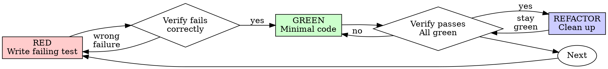

# Freeze recent tab list

> This archive contains visible conversation activity and tool records. Private model reasoning and system/developer instructions are not available here.
<!-- codex-event:{"kind":"state","timestamp":"2026-06-15T13:49:57.679Z","phase":null} -->
## Task state: task_started · 2026-06-15T13:49:57.679Z

```text
{
  "type": "task_started",
  "turn_id": "019ecb8b-cdfb-77b3-9268-699b96dc3a06",
  "started_at": 1781531397,
  "model_context_window": 258400,
  "collaboration_mode_kind": "default"
}
```

<!-- /codex-event -->

<!-- codex-event:{"kind":"user","timestamp":"2026-06-15T13:49:57.692Z","phase":null} -->
## User · 2026-06-15T13:49:57.692Z

I go to the recent tab and I click on an old conversation that was unread, not recent, but unread, and I read it and then I switch to another session, and then that session disappears because it's now read and is no longer recent. We need to fix what recent items we show on moving to that tab. That list must be fixed on loading the tab. It does not update while the tab is shown. It updates only in the state of each of them, like it just shows that it's working, that it's done, etc., but it doesn't move them around and it doesn't add or remove items while we are in the recent tab.


<!-- /codex-event -->

<!-- codex-event:{"kind":"progress","timestamp":"2026-06-15T13:50:04.590Z","phase":"commentary"} -->
## Codex progress · 2026-06-15T13:50:04.590Z

I’ll trace how the recent tab’s list is derived and updated, then make the list membership/order snapshot when that tab is entered while allowing per-item status updates to keep flowing. I’ll read the local guidance first so I can stay inside the project’s patterns.

<!-- /codex-event -->

<!-- codex-event:{"kind":"tool-call","timestamp":"2026-06-15T13:50:04.592Z","phase":null} -->
## Tool call: exec_command · 2026-06-15T13:50:04.592Z

```json
{
  "cmd": "sed -n '1,240p' AGENTS.md",
  "workdir": "/Users/masterman/NLP/omniharness",
  "max_output_tokens": 12000
}
```

<!-- /codex-event -->

<!-- codex-event:{"kind":"tool-call","timestamp":"2026-06-15T13:50:04.593Z","phase":null} -->
## Tool call: exec_command · 2026-06-15T13:50:04.593Z

```json
{
  "cmd": "sed -n '1,220p' /Users/masterman/.agents/skills/systematic-debugging/SKILL.md",
  "workdir": "/Users/masterman/NLP/omniharness",
  "max_output_tokens": 12000
}
```

<!-- /codex-event -->

<!-- codex-event:{"kind":"tool-call","timestamp":"2026-06-15T13:50:04.715Z","phase":null} -->
## Tool call: exec_command · 2026-06-15T13:50:04.715Z

```json
{
  "cmd": "sed -n '1,220p' /Users/masterman/.agents/skills/test-driven-development/SKILL.md",
  "workdir": "/Users/masterman/NLP/omniharness",
  "max_output_tokens": 12000
}
```

<!-- /codex-event -->

<!-- codex-event:{"kind":"tool-call","timestamp":"2026-06-15T13:50:04.715Z","phase":null} -->
## Tool call: exec_command · 2026-06-15T13:50:04.715Z

```json
{
  "cmd": "pwd && rg --files | head -200",
  "workdir": "/Users/masterman/NLP/omniharness",
  "max_output_tokens": 12000
}
```

<!-- /codex-event -->

<!-- codex-event:{"kind":"tool-result","timestamp":"2026-06-15T13:50:04.724Z","phase":null} -->
## Tool result: call_qZB3zxC0gplA10uzudxGydQ7 · 2026-06-15T13:50:04.724Z

```text
Chunk ID: 3d9135
Wall time: 0.0000 seconds
Process exited with code 0
Original token count: 1408
Output:
CRITICAL!!: 
- NEVER EVER EVER create a branch!!! branches are FORBIDDEN!!!
- NEVER create a worktree, UNLESS the user has specifically asked for it!
- NEVER delete files unless the user has specifically asked for it. If you think a file is misplaced, unrelated, or stale, that is an entirely separate request — ask first. "Looks unrelated to this task" is not authorization to delete.

- When the user gives a UUID and asks what is going on with it, treat it as an OmniHarness conversation/session lookup: check `sqlite.db`, starting with the `runs` row for that UUID, then inspect related `workers`, `messages`, `execution_events`, queued messages, and validation/plan records as needed.
- To delete all conversations and associated persisted artifacts, use `scripts/delete-conversations.sh`

Testing:
- When testing the app, use the already-running process if one exists instead of starting another server.
- The normal local app URL is `http://localhost:3035`; the compressed Next dev server is usually at `http://localhost:3050`.
- Clean up any test sessions/conversations and their associated persisted artifacts before finishing.
- For lifecycle / chaos-style regressions (reconnect, restart, FK-on-delete, plan-review leftover state), use `pnpm test:lifecycle`. Scenarios live under `tests/lifecycle/scenarios/` and drive the control plane via HTTP/SSE — no Chromium. To debug a specific reported bug, mirror it as a new scenario file.
- Read `docs/architecture/lifecycle-observability-and-testing.md` before adding new server-side state transitions. It is the spec all new code is held to.
- Worker conversation content (direct-control and supervisor-driven worker turns) lives in the unified worker stream — one append-only JSONL per worker at `app-data/run-data/<runId>/<workerId>.jsonl`. Persist new worker content through `appendWorkerEntry` in `src/server/workers/output-store.ts`; render it through `WorkerEntriesManager` and the `entries` prop on `Terminal`. Do NOT add a parallel persistence layer (a sibling JSONL, a new `messages.kind`, an in-memory cache that the frontend reconciles against the stream). See `docs/architecture/worker-conversation-stream.md`.

Lifecycle observability rules (full doc: `docs/architecture/lifecycle-observability-and-testing.md`):
- Every server-side decision (spawn, reattach, recreate, give up, refuse, delete, fail) emits a typed named event via `emitNamedEvent` from `@/server/events/named-events`. Silent early returns and bare `catch {}` are bugs.
- User-relevant failures additionally emit `error.surfaced` with a stable `code` (typed union in `named-events.ts`), `surface`, and at least one of `runId`/`workerId`/`conversationId`. Never funnel through a blanket wrapper in `api-errors.ts`.
- All SSE frames carry an `id:`. Clients reconnect with `Last-Event-ID`; the server replays from the ring buffer or emits `stream.resync_required`. Snapshot bootstrap is `GET /api/events?snapshot=1` (anchor id in the `x-omni-last-event-id` response header).
- Dev-only event log: `GET /api/events/log?since=<id>&runId=<id>` returns the ring buffer as JSON. Use this when triaging "X didn't happen" bug reports — if the event isn't there, the server didn't do the thing, and the next step is finding the silent branch.
- Chaos is a client-side concern. Never add fault-injection code paths to server code.

Frontend i18n:
- EVERY user-facing frontend string MUST live in `shared/locales/*.json` and be rendered with the `t()` function from `@/lib/i18n`.
- NEVER hardcode user-facing JSX text, button labels, dialog titles, aria-labels, titles, placeholders, empty states, status labels, help text, error fallback text, or visible option labels directly in components.
- For every new user-facing string, add the key to `shared/locales/en.json` and every other locale file in `shared/locales/` in the same change. Use stable dotted keys like `settings.runtime.recovery` or `conversation.sidebar.search`.
- Components that render translated strings and need to update when the language changes MUST subscribe to the i18n manager by calling `useI18nSnapshot()` from `@/lib/i18n`; then render text with the existing `t("key", params?)` function. The hook is only for re-rendering; `t()` is the translation API.
- Non-React modules that produce user-visible text must still use `t("key", params?)` at the boundary where text is produced. Protocol values, storage keys, API paths, CSS classes, model ids, and database values are not translation keys unless they are displayed as copy.
- Do not pass translated strings through transactions or persist translated UI copy. Store stable ids/values and translate at render time.

React Best Practices:
- MutableRefObject is deprecated in React; use RefObject instead.
- NEVER use require() to import modules. Use import instead.
- ALWAYS centralize all state in global single source of truth Manager classes. Components/listeners subscribe to updates from Managers and use Manager methods to update data.
- Always implement a custom data manager for any data structure. NEVER use separate state variables and arrays as the source of truth.
- NEVER send data around in transactions.
- Avoid using useEffect() to update state. Prefer useCallback() or Manager methods for explicit state transitions.
- Avoid callback hell, race conditions, and infinite loops.
- NEVER store string literals or UI settings for the frontend in the .env file. Use literals in files, inline arrays, or .json files instead.
- When debugging React: if a fix did not work, think hard about whether this is a race condition. Race conditions are common in React.

```

<!-- /codex-event -->

<!-- codex-event:{"kind":"tool-result","timestamp":"2026-06-15T13:50:04.724Z","phase":null} -->
## Tool result: call_zBy7KCneSp0oWqjSy22PJdTu · 2026-06-15T13:50:04.724Z

````text
Chunk ID: b95c53
Wall time: 0.0000 seconds
Process exited with code 0
Original token count: 1613
Output:
---
name: systematic-debugging
description: Use when encountering any bug, test failure, or unexpected behavior, before proposing fixes
---

# Systematic Debugging

## Overview

Random fixes waste time and create new bugs. Quick patches mask underlying issues.

**Core principle:** ALWAYS find root cause before attempting fixes. Symptom fixes are failure.

**Violating the letter of this process is violating the spirit of debugging.**

## The Iron Law

```
NO FIXES WITHOUT ROOT CAUSE INVESTIGATION FIRST
```

If you haven't completed Phase 1, you cannot propose fixes.

## When to Use

Use for ANY technical issue:
- Test failures
- Bugs in production
- Unexpected behavior
- Performance problems
- Build failures
- Integration issues

**Use this ESPECIALLY when:**
- Under time pressure (emergencies make guessing tempting)
- "Just one quick fix" seems obvious
- You've already tried multiple fixes
- Previous fix didn't work
- You don't fully understand the issue

**Don't skip when:**
- Issue seems simple (simple bugs have root causes too)
- You're in a hurry (rushing guarantees rework)
- Manager wants it fixed NOW (systematic is faster than thrashing)

## The Four Phases

You MUST complete each phase before proceeding to the next.

### Phase 1: Root Cause Investigation

**BEFORE attempting ANY fix:**

1. **Read Error Messages Carefully**
   - Don't skip past errors or warnings
   - They often contain the exact solution
   - Read stack traces completely
   - Note line numbers, file paths, error codes

2. **Reproduce Consistently**
   - Can you trigger it reliably?
   - What are the exact steps?
   - Does it happen every time?
   - If not reproducible → gather more data, don't guess

3. **Check Recent Changes**
   - What changed that could cause this?
   - Git diff, recent commits
   - New dependencies, config changes
   - Environmental differences

4. **Gather Evidence in Multi-Component Systems**

   **WHEN system has multiple components (CI → build → signing, API → service → database):**

   **BEFORE proposing fixes, add diagnostic instrumentation:**
   ```
   For EACH component boundary:
     - Log what data enters component
     - Log what data exits component
     - Verify environment/config propagation
     - Check state at each layer

   Run once to gather evidence showing WHERE it breaks
   THEN analyze evidence to identify failing component
   THEN investigate that specific component
   ```

   **Example (multi-layer system):**
   ```bash
   # Layer 1: Workflow
   echo "=== Secrets available in workflow: ==="
   echo "IDENTITY: ${IDENTITY:+SET}${IDENTITY:-UNSET}"

   # Layer 2: Build script
   echo "=== Env vars in build script: ==="
   env | grep IDENTITY || echo "IDENTITY not in environment"

   # Layer 3: Signing script
   echo "=== Keychain state: ==="
   security list-keychains
   security find-identity -v

   # Layer 4: Actual signing
   codesign --sign "$IDENTITY" --verbose=4 "$APP"
   ```

   **This reveals:** Which layer fails (secrets → workflow ✓, workflow → build ✗)

5. **Trace Data Flow**

   **WHEN error is deep in call stack:**

   See `root-cause-tracing.md` in this directory for the complete backward tracing technique.

   **Quick version:**
   - Where does bad value originate?
   - What called this with bad value?
   - Keep tracing up until you find the source
   - Fix at source, not at symptom

### Phase 2: Pattern Analysis

**Find the pattern before fixing:**

1. **Find Working Examples**
   - Locate similar working code in same codebase
   - What works that's similar to what's broken?

2. **Compare Against References**
   - If implementing pattern, read reference implementation COMPLETELY
   - Don't skim - read every line
   - Understand the pattern fully before applying

3. **Identify Differences**
   - What's different between working and broken?
   - List every difference, however small
   - Don't assume "that can't matter"

4. **Understand Dependencies**
   - What other components does this need?
   - What settings, config, environment?
   - What assumptions does it make?

### Phase 3: Hypothesis and Testing

**Scientific method:**

1. **Form Single Hypothesis**
   - State clearly: "I think X is the root cause because Y"
   - Write it down
   - Be specific, not vague

2. **Test Minimally**
   - Make the SMALLEST possible change to test hypothesis
   - One variable at a time
   - Don't fix multiple things at once

3. **Verify Before Continuing**
   - Did it work? Yes → Phase 4
   - Didn't work? Form NEW hypothesis
   - DON'T add more fixes on top

4. **When You Don't Know**
   - Say "I don't understand X"
   - Don't pretend to know
   - Ask for help
   - Research more

### Phase 4: Implementation

**Fix the root cause, not the symptom:**

1. **Create Failing Test Case**
   - Simplest possible reproduction
   - Automated test if possible
   - One-off test script if no framework
   - MUST have before fixing
   - Use the `ultrapowers:test-driven-development` skill for writing proper failing tests

2. **Implement Single Fix**
   - Address the root cause identified
   - ONE change at a time
   - No "while I'm here" improvements
   - No bundled refactoring

3. **Verify Fix**
   - Test passes now?
   - No other tests broken?
   - Issue actually resolved?
   - If the bug was meaningful or systemic, use `ultrapowers:learning-from-bugs` before declaring the fix complete.

4. **If Fix Doesn't Work**
   - STOP
   - Count: How many fixes have you tried?
   - If < 3: Return to Phase 1, re-analyze with new information
   - **If ≥ 3: STOP and question the architecture (step 5 below)**
   - DON'T attempt Fix #4 without architectural discussion

5. **If 3+ Fixes Failed: Question Architecture**

   **Pattern indicating architectural problem:**
   - Each fix reveals new shared state/coupling/problem in different place
   - Fixes require "massive refactoring" to implement
   - Each fix creates new symptoms elsewhere

   **STOP and question fundamentals:**
   - Is this pattern fundamentally sound?
   - Are we "sticking with it through sheer inertia"?
   - Should we refactor architecture vs. continue fixing symptoms?

   **Discuss with your human partner before attempting more fixes**

   This is NOT a failed hypothesis - this is a wrong architecture.

## Red Flags - STOP and Follow Process

If you catch yourself thinking:
- "Quick fix for now, investigate later"
- "Just try changing X and see if it works"

````

<!-- /codex-event -->

<!-- codex-event:{"kind":"tool-result","timestamp":"2026-06-15T13:50:04.762Z","phase":null} -->
## Tool result: call_Eb3bVoF6kXc1ZbYTbLoLxq5T · 2026-06-15T13:50:04.762Z

````text
Chunk ID: 6f7d20
Wall time: 0.0000 seconds
Process exited with code 0
Original token count: 1448
Output:
---
name: test-driven-development
description: Use when implementing any feature or bugfix, before writing implementation code
---

# Test-Driven Development (TDD)

## Overview

Write the test first. Watch it fail. Write minimal code to pass.

**Core principle:** If you didn't watch the test fail, you don't know if it tests the right thing.

**Violating the letter of the rules is violating the spirit of the rules.**

## When to Use

**Always:**
- New features
- Bug fixes
- Refactoring
- Behavior changes

**Exceptions (ask your human partner):**
- Throwaway prototypes
- Generated code
- Configuration files

**Do directly with targeted verification:**
- tiny color, spacing, copy, or label changes,
- one-line prompt wording changes,
- docs-only wording changes,
- mechanical edits where the expected result is obvious from the diff.

Do not perform a full red-green cycle for a tiny mechanical edit unless it changes behavior or there is a real regression risk. For example, changing a button from gray to blue usually needs the edit plus a targeted visual or code check, not a new failing test.

Thinking "skip TDD just this once"? Stop. That's rationalization.

## UI-Specific Note

When the task is UI work, choose the design system and starting block before writing tests around the intended behavior and rendering. In Ultrapowers, that means `shadcn/ui` plus the closest available ShadCN Block for each new screen, form, or major surface unless the user says otherwise. Inspect https://ui.shadcn.com/blocks first, install or copy the selected block, and then adapt it. Before adding any individual control, check whether `shadcn/ui` already provides a suitable control and use/customize that control first.

For important app workflows, also consider whether `agentic-user-journey-testing` should be proposed. Do not run that higher-cost black-box test mode without explicit user approval.

## The Iron Law

```
NO PRODUCTION CODE WITHOUT A FAILING TEST FIRST
```

Write code before the test? Delete it. Start over.

**No exceptions:**
- Don't keep it as "reference"
- Don't "adapt" it while writing tests
- Don't look at it
- Delete means delete

Implement fresh from tests. Period.

## Red-Green-Refactor



### RED - Write Failing Test

Write one minimal test showing what should happen.

<Good>
```typescript
test('retries failed operations 3 times', async () => {
  let attempts = 0;
  const operation = () => {
    attempts++;
    if (attempts < 3) throw new Error('fail');
    return 'success';
  };

  const result = await retryOperation(operation);

  expect(result).toBe('success');
  expect(attempts).toBe(3);
});
```
Clear name, tests real behavior, one thing
</Good>

<Bad>
```typescript
test('retry works', async () => {
  const mock = jest.fn()
    .mockRejectedValueOnce(new Error())
    .mockRejectedValueOnce(new Error())
    .mockResolvedValueOnce('success');
  await retryOperation(mock);
  expect(mock).toHaveBeenCalledTimes(3);
});
```
Vague name, tests mock not code
</Bad>

**Requirements:**
- One behavior
- Clear name
- Real code (no mocks unless unavoidable)
- Real product behavior is the target. Mocked behavior can never be the final deliverable or proof that the feature works.

### Verify RED - Watch It Fail

**MANDATORY. Never skip.**

```bash
npm test path/to/test.test.ts
```

Confirm:
- Test fails (not errors)
- Failure message is expected
- Fails because feature missing (not typos)

**Test passes?** You're testing existing behavior. Fix test.

**Test errors?** Fix error, re-run until it fails correctly.

### GREEN - Minimal Code

Write simplest code to pass the test.

<Good>
```typescript
async function retryOperation<T>(fn: () => Promise<T>): Promise<T> {
  for (let i = 0; i < 3; i++) {
    try {
      return await fn();
    } catch (e) {
      if (i === 2) throw e;
    }
  }
  throw new Error('unreachable');
}
```
Just enough to pass
</Good>

<Bad>
```typescript
async function retryOperation<T>(
  fn: () => Promise<T>,
  options?: {
    maxRetries?: number;
    backoff?: 'linear' | 'exponential';
    onRetry?: (attempt: number) => void;
  }
): Promise<T> {
  // YAGNI
}
```
Over-engineered
</Bad>

Don't add features, refactor other code, or "improve" beyond the test.

### Verify GREEN - Watch It Pass

**MANDATORY.**

```bash
npm test path/to/test.test.ts
```

Confirm:
- Test passes
- Other tests still pass
- Output pristine (no errors, warnings)

**Test fails?** Fix code, not test.

**Other tests fail?** Fix now.

### REFACTOR - Clean Up

After green only:
- Remove duplication
- Improve names
- Extract helpers

Keep tests green. Don't add behavior.

### Repeat

Next failing test for next feature.

## Good Tests

| Quality | Good | Bad |
|---------|------|-----|
| **Minimal** | One thing. "and" in name? Split it. | `test('validates email and domain and whitespace')` |
| **Clear** | Name describes behavior | `test('test1')` |
| **Shows intent** | Demonstrates desired API | Obscures what code should do |


````

<!-- /codex-event -->

<!-- codex-event:{"kind":"tool-result","timestamp":"2026-06-15T13:50:04.772Z","phase":null} -->
## Tool result: call_yLBG2bgwswMUA3ctkzHADBVb · 2026-06-15T13:50:04.772Z

```text
Chunk ID: fe01cc
Wall time: 0.0000 seconds
Process exited with code 0
Original token count: 1736
Output:
/Users/masterman/NLP/omniharness
src/instrumentation.ts
src/vscode-extension/bridge.ts
src/lib/conversation-state.ts
src/lib/state-manager.ts
src/lib/worker-stuck-events.ts
src/lib/chat-attachments.ts
src/lib/run-status.ts
src/lib/app-errors.ts
src/lib/git-workspace.ts
src/lib/local-pairing-token.ts
src/lib/syntax-highlighting.ts
src/lib/project-paths.ts
src/lib/plan-path.ts
src/lib/auth-constants.ts
src/lib/worker-terminal-messages.ts
src/lib/runtime-resource-settings.ts
src/lib/agent-output.ts
src/lib/run-recovery-state.ts
src/lib/utils.ts
src/lib/use-manager-snapshot.ts
src/lib/worker-terminal-processes.ts
src/lib/pwa.ts
src/lib/i18n-core.ts
src/lib/project-file-links.ts
src/lib/project-scope.ts
src/lib/i18n.ts
src/lib/mentions.ts
src/lib/planning-output.ts
src/lib/commit-workflow.ts
src/lib/conversations.ts
src/lib/conversation-visuals.ts
src/lib/conversation-workers.ts
src/shims/empty-encoding.ts
src/components/OmniHarnessMark.tsx
src/components/PairDeviceDialog.tsx
src/components/FolderPickerDialog.tsx
src/components/LoginShell.tsx
src/components/FileAttachmentPickerDialog.tsx
src/components/PlanningArtifactsPanel.tsx
src/components/AttachmentImagePreviewDialog.tsx
src/components/Terminal.tsx
src/components/AgentSurface.tsx
src/components/composer/ComposerSelect.tsx
src/components/composer/ComposerModelPicker.tsx
src/components/cli-brand-icons.tsx
src/components/BugDropBootstrap.tsx
src/components/PlanningReviewControls.tsx
src/components/BootShell.tsx
src/components/component-state-managers.ts
src/components/WorkerCard.tsx
src/components/ConversationModePicker.tsx
src/components/LanguageSelect.tsx
src/components/InteractiveTerminal.tsx
src/components/PwaBootstrap.tsx
src/components/home/RecoveryIncidentInspector.tsx
src/components/home/ConversationSidebar.tsx
src/components/home/RunRecoveryNotice.tsx
src/components/home/HomeHeader.tsx
src/components/home/BranchWorkspaceButton.tsx
src/components/home/SideWindow.tsx
src/components/home/RunWorkspaceBadge.tsx
src/components/home/SettingsDialog.tsx
src/components/home/UserInputMessage.tsx
src/components/home/WorkersSidebar.tsx
src/components/home/ConversationComposer.tsx
src/components/home/ThemeModeToggle.tsx
src/components/home/FileViewerPanel.tsx
src/components/home/QueuedMessageDrawer.tsx
src/components/home/ConversationMain.tsx
src/components/home/OnboardingSetupDialog.tsx
src/components/home/ErrorNotice.tsx
src/components/settings/AppearanceSettingsPanel.tsx
src/components/settings/CredentialsSettingsPanel.tsx
src/components/settings/ModelProfileForm.tsx
src/components/settings/SettingsDialog.tsx
src/components/settings/RuntimeSettingsPanel.tsx
src/components/settings/AgentsSettingsPanel.tsx
src/components/settings/ProjectMemorySettingsPanel.tsx
src/components/settings/worker-availability-copy.ts
src/components/settings/GeneralSettingsPanel.tsx
src/components/settings/ModelsSettingsPanel.tsx
src/components/settings/NotificationsSettingsPanel.tsx
src/components/ui/input.tsx
src/components/ui/textarea.tsx
src/components/ui/select.tsx
src/components/ui/dropdown-menu.tsx
src/components/ui/collapsible.tsx
src/components/ui/button.tsx
src/components/ui/separator.tsx
src/components/ui/badge.tsx
src/components/ui/dialog.tsx
src/components/ui/switch.tsx
src/components/ui/combobox.tsx
src/components/ui/tooltip.tsx
src/components/ui/scroll-area.tsx
src/components/ui/sheet.tsx
src/components/ui/input-group.tsx
src/components/ui/card.tsx
src/components/ui/button-group.tsx
src/components/PlanProgress.tsx
src/components/MarkdownContent.tsx
src/server/conversation-title.ts
src/server/supervisor/observer.ts
src/server/supervisor/model-config.ts
src/server/supervisor/resume.ts
src/server/supervisor/context-window.ts
src/server/supervisor/index.ts
src/server/supervisor/worker-failover.ts
src/server/supervisor/tools.ts
src/server/supervisor/protocol.ts
src/server/supervisor/runtime-watchdog.ts
src/server/supervisor/runtime.ts
src/server/supervisor/worker-types.ts
src/server/supervisor/start.ts
src/server/supervisor/conversation-bootstrap.ts
src/server/supervisor/retry.ts
src/server/supervisor/worker-completion.ts
src/server/supervisor/memory-consolidation.ts
src/server/supervisor/context.ts
src/server/supervisor/memory-tools.ts
src/server/supervisor/interventions.ts
src/server/supervisor/intervention-store.ts
src/server/supervisor/worker-availability.ts
src/server/supervisor/prompt.ts
src/server/supervisor/memory-paths.ts
src/server/supervisor/lease.ts
src/server/supervisor/codex-auth.ts
src/server/supervisor/wake-schedule.ts
src/server/supervisor/wake.ts
src/server/supervisor/runtime-settings.ts
src/server/git/command.ts
src/server/git/auto-commit.ts
src/server/git/orphan-recovery.ts
src/server/git/run-auto-commit.ts
src/server/git/status.ts
src/server/git/workspaces.ts
src/server/notifications/triggers.ts
src/server/notifications/preferences.ts
src/server/notifications/web-push.ts
src/server/notifications/deliver.ts
src/server/credits/index.ts
src/server/runs/recovery-actions.ts
src/server/runs/recovery.ts
src/server/runs/recovery-policy.ts
src/server/runs/ad-hoc-plan.ts
src/server/runs/persisted-zombie-reconciler.ts
src/server/runs/recovery-state.ts
src/server/runs/recovery-incidents.ts
src/server/runs/failures.ts
src/server/runs/recovery-reconciler.ts
src/server/runs/ids.ts
src/server/runs/recovery-control-plane.ts
src/server/runs/status.ts
src/server/clarifications/store.ts
src/server/clarifications/loop.ts
src/server/fs/files.ts
src/server/agent-runtime/codex.ts
src/server/agent-runtime/external-credentials.ts
src/server/agent-runtime/worker-pool.ts
src/server/agent-runtime/output-store.ts
src/server/agent-runtime/types.ts
src/server/agent-runtime/http.ts
src/server/agent-runtime/resource-admission.ts
src/server/agent-runtime/tool-env.ts
src/server/agent-runtime/acp-stream-sanitizer.ts
src/server/agent-runtime/memory-trace.ts
src/server/agent-runtime/manager.ts
src/server/events/live-updates.ts
src/server/events/named-events.ts
src/server/events/lifecycle-invariants.ts
src/server/events/execution-event-store.ts
src/server/events/payload-checksum.ts
src/server/events/persisted-snapshot.ts
src/server/quota/reset-parser.ts
src/server/quota/recovery.ts
src/server/quota/type-blocking.ts
src/server/quota/worker-resume.ts
src/server/omni-acp/agent.ts
src/server/omni-acp/stdio.ts
src/server/workers/stream-writer.ts
src/server/workers/snapshots.ts
src/server/workers/monitor.ts
src/server/workers/output-store.ts
src/server/workers/response-fallback.ts
src/server/workers/entries-types.ts
src/server/workers/session-recovery.ts
src/server/workers/session-metadata.ts
src/server/workers/stuck-worker-reaper.ts
src/server/workers/live-snapshots.ts
src/server/workers/ids.ts
src/server/error-format.ts
src/server/dev/managed-bridge.ts
src/server/dev/bridge-lock.ts
src/server/dev/bridge-health.ts
CLAUDE.md
start.sh
eslint.config.mjs
omni.sh
src/server/worker-launch-mode.ts
components.json

```

<!-- /codex-event -->

<!-- codex-event:{"kind":"progress","timestamp":"2026-06-15T13:50:15.676Z","phase":"commentary"} -->
## Codex progress · 2026-06-15T13:50:15.676Z

I’m using the project’s debugging and TDD guidance here because this is a real UI state regression. The important shape I’m looking for is: where “recent” membership is computed, where read status mutates, and whether the tab view currently re-filters from live data.

<!-- /codex-event -->

<!-- codex-event:{"kind":"tool-call","timestamp":"2026-06-15T13:50:15.677Z","phase":null} -->
## Tool call: exec_command · 2026-06-15T13:50:15.677Z

```json
{
  "cmd": "sed -n '221,520p' /Users/masterman/.agents/skills/systematic-debugging/SKILL.md",
  "workdir": "/Users/masterman/NLP/omniharness",
  "max_output_tokens": 12000
}
```

<!-- /codex-event -->

<!-- codex-event:{"kind":"tool-call","timestamp":"2026-06-15T13:50:15.677Z","phase":null} -->
## Tool call: exec_command · 2026-06-15T13:50:15.677Z

```json
{
  "cmd": "sed -n '221,520p' /Users/masterman/.agents/skills/test-driven-development/SKILL.md",
  "workdir": "/Users/masterman/NLP/omniharness",
  "max_output_tokens": 12000
}
```

<!-- /codex-event -->

<!-- codex-event:{"kind":"tool-call","timestamp":"2026-06-15T13:50:15.786Z","phase":null} -->
## Tool call: exec_command · 2026-06-15T13:50:15.786Z

```json
{
  "cmd": "sed -n '1,260p' /Users/masterman/.agents/skills/building-react-apps/SKILL.md",
  "workdir": "/Users/masterman/NLP/omniharness",
  "max_output_tokens": 12000
}
```

<!-- /codex-event -->

<!-- codex-event:{"kind":"tool-call","timestamp":"2026-06-15T13:50:15.786Z","phase":null} -->
## Tool call: exec_command · 2026-06-15T13:50:15.786Z

```json
{
  "cmd": "sed -n '1,220p' /Users/masterman/.agents/skills/client-server-state-invariants/SKILL.md",
  "workdir": "/Users/masterman/NLP/omniharness",
  "max_output_tokens": 12000
}
```

<!-- /codex-event -->

<!-- codex-event:{"kind":"tool-result","timestamp":"2026-06-15T13:50:15.804Z","phase":null} -->
## Tool result: call_yASHNqlskl6IRnk7FdRpxLwC · 2026-06-15T13:50:15.804Z

```text
Chunk ID: c6ef27
Wall time: 0.0000 seconds
Process exited with code 0
Original token count: 928
Output:
- "Add multiple changes, run tests"
- "Skip the test, I'll manually verify"
- "It's probably X, let me fix that"
- "I don't fully understand but this might work"
- "Pattern says X but I'll adapt it differently"
- "Here are the main problems: [lists fixes without investigation]"
- Proposing solutions before tracing data flow
- **"One more fix attempt" (when already tried 2+)**
- **Each fix reveals new problem in different place**

**ALL of these mean: STOP. Return to Phase 1.**

**If 3+ fixes failed:** Question the architecture (see Phase 4.5)

## your human partner's Signals You're Doing It Wrong

**Watch for these redirections:**
- "Is that not happening?" - You assumed without verifying
- "Will it show us...?" - You should have added evidence gathering
- "Stop guessing" - You're proposing fixes without understanding
- "Ultrathink this" - Question fundamentals, not just symptoms
- "We're stuck?" (frustrated) - Your approach isn't working

**When you see these:** STOP. Return to Phase 1.

## Common Rationalizations

| Excuse | Reality |
|--------|---------|
| "Issue is simple, don't need process" | Simple issues have root causes too. Process is fast for simple bugs. |
| "Emergency, no time for process" | Systematic debugging is FASTER than guess-and-check thrashing. |
| "Just try this first, then investigate" | First fix sets the pattern. Do it right from the start. |
| "I'll write test after confirming fix works" | Untested fixes don't stick. Test first proves it. |
| "Multiple fixes at once saves time" | Can't isolate what worked. Causes new bugs. |
| "Reference too long, I'll adapt the pattern" | Partial understanding guarantees bugs. Read it completely. |
| "I see the problem, let me fix it" | Seeing symptoms ≠ understanding root cause. |
| "One more fix attempt" (after 2+ failures) | 3+ failures = architectural problem. Question pattern, don't fix again. |

## Quick Reference

| Phase | Key Activities | Success Criteria |
|-------|---------------|------------------|
| **1. Root Cause** | Read errors, reproduce, check changes, gather evidence | Understand WHAT and WHY |
| **2. Pattern** | Find working examples, compare | Identify differences |
| **3. Hypothesis** | Form theory, test minimally | Confirmed or new hypothesis |
| **4. Implementation** | Create test, fix, verify | Bug resolved, tests pass |

## When Process Reveals "No Root Cause"

If systematic investigation reveals issue is truly environmental, timing-dependent, or external:

1. You've completed the process
2. Document what you investigated
3. Implement appropriate handling (retry, timeout, error message)
4. Add monitoring/logging for future investigation

**But:** 95% of "no root cause" cases are incomplete investigation.

## Supporting Techniques

These techniques are part of systematic debugging and available in this directory:

- **`root-cause-tracing.md`** - Trace bugs backward through call stack to find original trigger
- **`defense-in-depth.md`** - Add validation at multiple layers after finding root cause
- **`condition-based-waiting.md`** - Replace arbitrary timeouts with condition polling

**Related skills:**
- **ultrapowers:test-driven-development** - For creating failing test case (Phase 4, Step 1)
- **ultrapowers:learning-from-bugs** - Record reusable lessons from meaningful architecture, storage, memory, persistence, control-plane, and system-level bugs
- **ultrapowers:verification-before-completion** - Verify fix worked before claiming success

## Real-World Impact

From debugging sessions:
- Systematic approach: 15-30 minutes to fix
- Random fixes approach: 2-3 hours of thrashing
- First-time fix rate: 95% vs 40%
- New bugs introduced: Near zero vs common

```

<!-- /codex-event -->

<!-- codex-event:{"kind":"tool-result","timestamp":"2026-06-15T13:50:15.804Z","phase":null} -->
## Tool result: call_eVLwzvAWnYlgDVSrJT0pOK2t · 2026-06-15T13:50:15.804Z

````text
Chunk ID: b49420
Wall time: 0.0000 seconds
Process exited with code 0
Original token count: 1388
Output:
## Why Order Matters

**"I'll write tests after to verify it works"**

Tests written after code pass immediately. Passing immediately proves nothing:
- Might test wrong thing
- Might test implementation, not behavior
- Might miss edge cases you forgot
- You never saw it catch the bug

Test-first forces you to see the test fail, proving it actually tests something.

**"I already manually tested all the edge cases"**

Manual testing is ad-hoc. You think you tested everything but:
- No record of what you tested
- Can't re-run when code changes
- Easy to forget cases under pressure
- "It worked when I tried it" ≠ comprehensive

Automated tests are systematic. They run the same way every time.

**"Deleting X hours of work is wasteful"**

Sunk cost fallacy. The time is already gone. Your choice now:
- Delete and rewrite with TDD (X more hours, high confidence)
- Keep it and add tests after (30 min, low confidence, likely bugs)

The "waste" is keeping code you can't trust. Working code without real tests is technical debt.

**"TDD is dogmatic, being pragmatic means adapting"**

TDD IS pragmatic:
- Finds bugs before commit (faster than debugging after)
- Prevents regressions (tests catch breaks immediately)
- Documents behavior (tests show how to use code)
- Enables refactoring (change freely, tests catch breaks)

"Pragmatic" shortcuts = debugging in production = slower.

**"Tests after achieve the same goals - it's spirit not ritual"**

No. Tests-after answer "What does this do?" Tests-first answer "What should this do?"

Tests-after are biased by your implementation. You test what you built, not what's required. You verify remembered edge cases, not discovered ones.

Tests-first force edge case discovery before implementing. Tests-after verify you remembered everything (you didn't).

30 minutes of tests after ≠ TDD. You get coverage, lose proof tests work.

## Common Rationalizations

| Excuse | Reality |
|--------|---------|
| "Too simple to test" | Simple code breaks. Test takes 30 seconds. |
| "I'll test after" | Tests passing immediately prove nothing. |
| "Tests after achieve same goals" | Tests-after = "what does this do?" Tests-first = "what should this do?" |
| "Already manually tested" | Ad-hoc ≠ systematic. No record, can't re-run. |
| "Deleting X hours is wasteful" | Sunk cost fallacy. Keeping unverified code is technical debt. |
| "Keep as reference, write tests first" | You'll adapt it. That's testing after. Delete means delete. |
| "Need to explore first" | Fine. Throw away exploration, start with TDD. |
| "Test hard = design unclear" | Listen to test. Hard to test = hard to use. |
| "TDD will slow me down" | TDD faster than debugging. Pragmatic = test-first. |
| "Manual test faster" | Manual doesn't prove edge cases. You'll re-test every change. |
| "Existing code has no tests" | You're improving it. Add tests for existing code. |

## Red Flags - STOP and Start Over

- Code before test
- Test after implementation
- Test passes immediately
- Can't explain why test failed
- Tests added "later"
- Rationalizing "just this once"
- "I already manually tested it"
- "Tests after achieve the same purpose"
- "It's about spirit not ritual"
- "Keep as reference" or "adapt existing code"
- "Already spent X hours, deleting is wasteful"
- "TDD is dogmatic, I'm being pragmatic"
- "This is different because..."

**All of these mean: Delete code. Start over with TDD.**

## Example: Bug Fix

**Bug:** Empty email accepted

**RED**
```typescript
test('rejects empty email', async () => {
  const result = await submitForm({ email: '' });
  expect(result.error).toBe('Email required');
});
```

**Verify RED**
```bash
$ npm test
FAIL: expected 'Email required', got undefined
```

**GREEN**
```typescript
function submitForm(data: FormData) {
  if (!data.email?.trim()) {
    return { error: 'Email required' };
  }
  // ...
}
```

**Verify GREEN**
```bash
$ npm test
PASS
```

**REFACTOR**
Extract validation for multiple fields if needed.

## Verification Checklist

Before marking work complete:

- [ ] Every new function/method has a test
- [ ] Watched each test fail before implementing
- [ ] Each test failed for expected reason (feature missing, not typo)
- [ ] Wrote minimal code to pass each test
- [ ] All tests pass
- [ ] Output pristine (no errors, warnings)
- [ ] Tests use real code (mocks only if unavoidable)
- [ ] The delivered functionality is real, not a fake component, placeholder, canned response, or fallback pretending to work
- [ ] Edge cases and errors covered

Can't check all boxes? You skipped TDD. Start over.

## When Stuck

| Problem | Solution |
|---------|----------|
| Don't know how to test | Write wished-for API. Write assertion first. Ask your human partner. |
| Test too complicated | Design too complicated. Simplify interface. |
| Must mock everything | Code too coupled. Use dependency injection. |
| Test setup huge | Extract helpers. Still complex? Simplify design. |

## Debugging Integration

Bug found? Write failing test reproducing it. Follow TDD cycle. Test proves fix and prevents regression.

Never fix bugs without a test.

## Testing Anti-Patterns

When adding mocks or test utilities, read @testing-anti-patterns.md to avoid common pitfalls:
- Testing mock behavior instead of real behavior
- Adding test-only methods to production classes
- Mocking without understanding dependencies

## Final Rule

```
Production code → test exists and failed first
Otherwise → not TDD
```

No exceptions without your human partner's permission.

````

<!-- /codex-event -->

<!-- codex-event:{"kind":"tool-result","timestamp":"2026-06-15T13:50:15.836Z","phase":null} -->
## Tool result: call_RYOEV3t2CEprQ9Nr8RHAAzu3 · 2026-06-15T13:50:15.836Z

```text
Chunk ID: 00eac0
Wall time: 0.0000 seconds
Process exited with code 0
Original token count: 2034
Output:
---
name: building-react-apps
description: Use when building, refactoring, planning, or debugging React or Next.js apps, React components, hooks, routing, frontend state, SSR, hydration, bundles, imports, or UI settings
---

# Building React Apps

Use these defaults for React app work unless the user or existing codebase explicitly chooses another architecture.

If the work is specifically about slowness, root-load time, compile time, SSR effectiveness, hydration cost, bundle size, import bloat, or decluttering heavy UI dependencies, use `optimizing-react-next-apps` as the focused workflow.

If the app has server state, optimistic UI, caches, polling, SSE/WebSocket streams, background jobs, persisted runtime state, or client/server synchronization, use `client-server-state-invariants` before planning or changing the state model.

## UI Starting Point

- For new React app screens, forms, and major surfaces, use `shadcn/ui` unless the user or existing app has chosen another design system.
- Before inventing layout, inspect the available ShadCN Blocks at https://ui.shadcn.com/blocks for the specific screen or form category.
- Start from the closest matching block with `npx shadcn add <block-name>` or the official source in https://github.com/shadcn-ui/ui, then add, remove, and adapt controls to fit the product.
- Do not use a blank custom layout as the first implementation path when a relevant ShadCN Block exists.
- Before adding any individual control, check whether `shadcn/ui` already provides a suitable control. Use/customize the shadcn control before hand-building a one-off control.

## State And Data

- Always centralize React app state in global single-source-of-truth Manager classes.
- Components, hooks, and listeners subscribe to Manager updates and use Manager methods to update data.
- Centralized state does not mean broad subscriptions. Components must subscribe to the smallest slice they need, preferably with selector hooks and equality checks, so unrelated UI does not re-render.
- Never let app shells, page roots, sidebars, timelines, or other broad containers subscribe to an entire high-churn Manager snapshot when they only need stable fields. Draft text, cursors, hover/open state, search text, and other per-keystroke or per-pointer state need narrow component-level subscriptions.
- If typing in an input, moving a cursor, toggling a hover/open flag, or editing a small draft makes the whole app repaint, the subscription boundary is wrong even if the data source is centralized.
- Always implement a custom data manager for any app data structure.
- Never use separate state variables or arrays as the source of truth.
- Never send data around in transactions. Pass intent, ids, commands, or Manager method calls instead.

## React Control Flow

- Avoid using `useEffect()` to update state. Prefer `useCallback()` handlers or Manager methods for explicit state transitions.
- Work ahead of time to avoid callback hell, race conditions, and infinite loops.
- When debugging React and a fix does not work, explicitly consider whether the root cause is a race condition. Race conditions are common in React.
- Every async callback, mutation result, timer, poll, or stream message that can update visible state must prove it still owns the current context before mutating Managers or navigation.
- Use `RefObject` instead of `MutableRefObject`.

## Routing And Modules

- Prefer explicit routing over file-based routing when the framework does not strongly default to file-based routes. Framework-native file routing, such as Next.js App Router, is fine.
- Never use `require()` to import modules. Use `import` instead.
- Avoid `npm` by default. Use `pnpm` for package installation, scripts, and lockfiles unless the user or existing project explicitly chooses another package manager.

## Next.js And SSR Defaults

- Treat `"use client"` as a boundary with a cost. Do not put an entire page, app shell, sidebar, timeline, composer, settings surface, and data boot path behind one giant client component unless there is a deliberate reason.
- SSR is only useful if the initial HTML contains meaningful above-the-fold UI or data. If `curl` for the route only shows a boot shell, script payloads, or empty placeholders, the route is not meaningfully server-rendered even if SSR is technically enabled.
- Server-render the first useful screen by fetching route-stable bootstrap data on the server: auth/session state, settings needed to choose the shell, selected route ids, and initial page/snapshot data. Hydrate Managers or query caches from that bootstrap data; do not wait for client `useEffect()` plus client fetches before the first meaningful paint.
- Use client effects for browser-only concerns: localStorage-only preferences, notifications, SSE/WebSocket subscriptions, focus management, and post-paint refreshes. Do not use effects as the only path for data required to decide what the initial screen is.
- In Next dev, first request time includes compilation. Distinguish cold compile cost from runtime slowness before optimizing the wrong layer.

## Import And Bundle Hygiene

- Keep imports proportional to the UI being rendered. Do not import an entire complex surface for a tiny control; split shared tiny controls into their own files instead of importing them from heavy feature modules.
- Lazy-load rarely opened or route-conditional surfaces with dynamic imports: settings dialogs, side panels, file viewers, terminals, worker inspectors, onboarding flows, QR/pairing dialogs, and large markdown/code viewers.
- Avoid package and barrel imports that drag in whole icon packs, design systems, syntax highlighters, markdown stacks, charting libraries, or component suites for one glyph or one primitive. Inline small SVG paths or use local assets when that is cheaper and stable.
- Prefer native browser controls for small, ordinary selects and pickers. Do not import a popover/dialog/menu stack for a low-value dropdown unless search, virtualization, or rich item rendering is genuinely needed.
- Use subpath imports when a package supports them. Avoid root package imports from large UI libraries if a narrower entrypoint exists.
- After dependency or UI-shell changes, inspect the emitted dev chunks or traces. Verify whether heavy modules moved out of the root chunk rather than assuming dynamic import worked.

## Performance Debugging

- Start with evidence: dev server logs, route timings, emitted chunk sizes, module counts, and initial HTML content.
- Separate long-lived requests from slow requests. SSE, streaming, and hanging fetches can show huge durations in logs without blocking page paint.
- Check recent dependency additions first when compile time suddenly explodes. A single icon, markdown, chart, or UI package can add thousands of modules.
- For Next.js root-load complaints, answer three questions before changing code: what compiled, what HTML was returned, and what client-side requests gated the first useful paint?

## Frontend Configuration

- Never store frontend string literals or UI settings in `.env` files.
- Put frontend strings and settings in normal source files, inline arrays, or `.json` files so they remain reviewable, testable, and versioned with the UI.

## Internationalization

- For meaningful React UI work, offer language support as an option when the user has not already decided: "Should we support other languages? If yes, I will wire user-facing copy through i18n resources now instead of hardcoding strings."
- If the user says yes, asks for translation/i18n/language/locale support, or reports that language switching only updates part of the UI, use `implementing-react-i18n`.
- Use the i18n library's `t("key", params?)` function for every user-facing string. Use `useI18nSnapshot()` only to subscribe React components so language changes repaint.
- Never name variables with locale codes or locale-like names such as `it`, `en`, `enUS`, `locIt`, or `locEnUs`.

## Settings UI

- For settings dialogs, preferences panels, configuration modals, option tabs, or UI settings surfaces, use `designing-settings-dialogs`.

```

<!-- /codex-event -->

<!-- codex-event:{"kind":"tool-result","timestamp":"2026-06-15T13:50:15.836Z","phase":null} -->
## Tool result: call_e9oImlCZGYgLeG3jASWxli71 · 2026-06-15T13:50:15.836Z

```text
Chunk ID: ccda5f
Wall time: 0.0000 seconds
Process exited with code 0
Original token count: 1481
Output:
---
name: client-server-state-invariants
description: Use when planning, building, reviewing, or debugging React apps with server state, optimistic UI, caches, polling, SSE/WebSocket streams, background jobs, persistence, or client/server synchronization
---

# Client Server State Invariants

React bugs often expose deeper ownership mistakes. When client state, server state, cache state, stream state, and persisted state all exist, every plan needs explicit invariants.

## Core Rule

No UI surface may treat data as authoritative unless the payload proves ownership, freshness, completeness, ordering, and terminal state.

If those words are missing from the plan, the plan is probably baking in a race condition.

## Planning Checklist

For every React app that reads server/runtime state, the plan must answer:

1. **Owner:** What owns this state: server, client manager, URL, cache, stream, local storage, or worker/runtime?
2. **Token:** What owner token protects async results: `requestId`, `runId`, `projectPath`, `operationId`, `workerId + seq`, or equivalent?
3. **Provenance:** Is data server-authoritative, optimistic, cached preview, partial update, or historical fallback?
4. **Completeness:** Does the payload declare what scope it is complete for? What may it erase?
5. **Ordering:** What stable order is used: monotonic seq, `(createdAt, id)`, version, or cursor?
6. **State machine:** What are the legal states, terminal states, and transitions?
7. **Events:** Which server decisions are named events rather than client-side derivations?
8. **Loading shape:** Which states are bootstrap, first load, incremental refresh, reconnect, resync, recovery, and terminal error?
9. **Fallbacks:** Which legacy/fallback rows can render, and only after what authority is loaded?
10. **Tests:** Which race, stale-response, event-sequence, reconnect, and merge tests prove the invariants?

## Invariants To Require

- Cached and optimistic data may pre-render, but cannot satisfy full-load gates.
- Partial snapshots may add or refine state, but may not erase optimistic objects, delivered user input, read markers, or stream entries unless they declare complete scope.
- Every async response checks that its owner token still matches before mutating visible state.
- Mutation success handlers may navigate or clear UI only if they still own the current context, unless the action explicitly creates a new selected context.
- Timers and polling callbacks re-check ownership immediately before acting.
- Server decisions are emitted as named events; the client does not infer decisions by diffing snapshots.
- SSE/WebSocket streams have event ids, replay/resume, and an explicit resync path.
- Loading booleans are split by lifecycle stage. A leaf stream refresh must not unmount the whole page.
- Append-only content has one writer, one reader, stable ids, and monotonic cursors.
- Fallback DB rows or historical rows are gated behind stream loading and deduped by stable id plus safe equivalence.
- Status classifiers distinguish active, runnable, blocked, awaiting user, terminal, stale, and recoverable states.
- "Latest" queries have deterministic tie-breakers. Timestamp-only ordering is not enough.
- Hot paths use bounded reads and do not synchronously load large bodies, bridge probes, schema setup, or heavy app graphs.
- Process-local caches have explicit TTL/size bounds and invalidation rules.

## Test Matrix

Pick the rows that match the work. Do not rely on one happy-path UI test.

| Risk | Test shape |
| --- | --- |
| Stale async response | Start request A, switch owner, resolve A, assert it cannot mutate B |
| Optimistic object erased | Create local optimistic state, apply stale/partial snapshot, assert object remains |
| Cache masquerades as loaded | Hydrate cache preview, assert full-load gate waits for server authority |
| Mutation steals navigation | Start mutation, switch selection, resolve mutation, assert focus stays put |
| Timer/poll stale-fire | Use fake timers or deferred promises; callback must re-check owner before acting |
| Snapshot merge erases stream | Apply partial snapshot missing known entries, assert entries/read markers remain |
| Event stream gap | Bootstrap snapshot, emit events during disconnect, reconnect with last id, assert replay or resync |
| Server decision invisible | Exercise branch and assert named event such as `blocked`, `refused`, `gave_up`, or `error.surfaced` |
| State classifier wrong | Table-test every status into active/runnable/terminal/recoverable buckets |
| Fallback duplicates stream | Load fallback rows then stream entries, assert no duplicate or false chronology |
| Hot path bloats | Assert snapshots carry cursors not bodies; route returns before DB/heavy imports when possible |
| Timestamp tie | Insert equal timestamps, assert deterministic order by id/seq |

Use headless HTTP/SSE tests for control-plane decisions. Use React/unit tests for manager merging and ownership guards. Use Playwright only for real UI layout, focus, scroll, mobile computed styles, and visible affordances.

## Refuse These Shapes

- one `isLoading` boolean for bootstrap, refresh, reconnect, and recovery;
- cache or optimistic data treated as authoritative without provenance;
- async callbacks that mutate state without checking owner tokens;
- client-side derivation of server decisions;
- snapshot diffs used as the only way to know what happened;
- event streams without ids or resume;
- timestamp-only "latest" queries;
- parallel transcript or persistence surfaces that the frontend must reconcile;
- unbounded process caches introduced to hide slow storage;
- tests that prove only the DOM result when the bug is a server decision.

## Review Prompt

Ask this before implementation starts:

> What can arrive late, out of order, partially, twice, or after the user changes context, and what test proves it cannot corrupt visible state?

```

<!-- /codex-event -->

<!-- codex-event:{"kind":"tool-call","timestamp":"2026-06-15T13:50:19.121Z","phase":null} -->
## Tool call: exec_command · 2026-06-15T13:50:19.121Z

```json
{
  "cmd": "sed -n '1,220p' /Users/masterman/.agents/skills/using-ultrapowers/SKILL.md",
  "workdir": "/Users/masterman/NLP/omniharness",
  "max_output_tokens": 12000
}
```

<!-- /codex-event -->

<!-- codex-event:{"kind":"tool-result","timestamp":"2026-06-15T13:50:19.188Z","phase":null} -->
## Tool result: call_vShK2li72EN0spUxhajqoxaz · 2026-06-15T13:50:19.188Z

```text
Chunk ID: e92807
Wall time: 0.0000 seconds
Process exited with code 0
Original token count: 2019
Output:
---
name: using-ultrapowers
description: Use when starting any conversation - establishes how to find and use skills, requiring skill invocation before acting
---

<SUBAGENT-STOP>
If you were dispatched as a subagent to execute a specific task, skip this skill.
</SUBAGENT-STOP>

# Using Ultrapowers

Use relevant skills before acting, but keep process proportional to the task.

## Instruction Priority

1. User instructions and local repo instructions
2. Ultrapowers skills
3. Default model behavior

If the user says not to create extra repository isolation, or says to work directly in the current repository, follow that instruction.

## Core Rule

Before responding, ask:

1. Is there a process skill that governs how to approach this?
2. Is there an implementation skill that governs how to execute it?
3. Is the request substantial enough to justify that process, or is it a tiny mechanical edit?

If a skill applies and the task is substantial enough to justify it, use it before continuing. If the request is a tiny mechanical edit, make the edit directly with targeted verification.

## Proportional Skill Use

Do the smallest responsible workflow that matches the request.

For tiny, unambiguous mechanical edits, do the edit directly:

- changing a color value,
- fixing a typo,
- tweaking short copy,
- changing a prompt sentence,
- renaming a label,
- adjusting obvious spacing or formatting,
- making a one-line config or docs correction.

For these, do not run brainstorming, write a plan, or force TDD unless the change affects product behavior, data, persistence, control flow, user journeys, or non-obvious architecture.

Use the heavier process when the request is ambiguous, user-facing behavior changes, multiple files/modules are involved, the user journey can change, or the change could create regressions that are not obvious from a quick targeted check.

## Default Posture

- Work in the current repository by default.
- YOU WILL NEVER CREATE A BRANCH unless explicitly instructed.
- Ask the user whether we should work in worktrees as part of the planning.
- YOU WILL ONLY CREATE A WORKTREE if explicitly instructed.
- Keep skill use proportional. Tiny mechanical edits should stay tiny.
- Every project should have a `.gitignore`.
- Never commit or push secrets, credentials, local environment files, `node_modules`, dependency caches, build outputs, coverage output, logs, temporary files, or intermediate/generated artifacts unless the human explicitly asks to version a specific generated artifact.
- Deliver full product functionality by default. NO FAKE COMPONENTS, NO MOCKS, NO PLACEHOLDERS, NO FALLBACKS as substitutes for the requested functionality unless the human explicitly asks for a prototype or scaffold.
- For app, UI, and product-surface work, run a PM pass during planning. Treat it as mandatory default behavior, not optional polish.
- For app, UI, and product-surface work, consider `agentic-user-journey-testing` for important user stories, but do not run it without explicit user approval.
- Use `second-opinion` for substantial saved implementation plans, and for unusually hard, creative, high-risk, or architecture-heavy specs when an independent external review could improve the artifact. Prefer a different available coding harness for that review, such as Codex asking Claude Code or Claude Code asking Codex. If no different harness is available, the same harness is fine; the second opinion is still mandatory for matching artifacts.
- Refactor code when a file passes 1200 lines. Do not normalize oversized files as the default end state.
- Use user stories in specs and plans when they clarify behavior or value.
- Default UI work to `shadcn/ui` unless the user says otherwise.
- When designing UI from scratch, first inspect the available ShadCN Blocks at https://ui.shadcn.com/blocks for each screen, form, or major surface. Start from the closest matching block with `npx shadcn add <block-name>` or the block's source in https://github.com/shadcn-ui/ui, then edit it by adding, removing, or adapting controls. Do not invent a fresh layout before doing this block-selection pass.
- Before adding any individual UI control, check whether `shadcn/ui` already provides a control that does what is needed. Use the available shadcn control first, then customize it, instead of hand-building a one-off control.
- Treat desktop and mobile responsiveness as first-class from the beginning.
- Prefer explicit routing unless the framework strongly defaults to file-based routes.
- For React apps, use `building-react-apps` for state managers, explicit transitions, routing, refs, imports, package-manager defaults, and frontend configuration defaults.
- For React apps with server state, optimistic UI, caches, polling, SSE/WebSocket streams, background jobs, persistence, or client/server synchronization, use `client-server-state-invariants` during planning and verification.
- For React or Next.js slowness, root-load, compile-time, SSR/hydration, bundle, import-bloat, or UI dependency cleanup work, use `optimizing-react-next-apps`.
- Prefer strong instrumentation and auditability for backend behavior.
- When a project has backend or agent workflows, prefer a fully instrumented control plane: persist meaningful events, tool calls, actions, results, errors, and state transitions, and expose them through a CLI or other scriptable interface so the full system can be inspected and tested without the UI.
- Use `instrumenting-control-planes` when building, planning, reviewing, or debugging backend decisions, agent workflows, recovery paths, retries, deletes, long-running jobs, SSE/WebSocket streams, or user-visible failures.
- Use `learning-from-bugs` after diagnosing or fixing meaningful architecture, storage, memory, persistence, control-plane, or system-level bugs so reusable lessons become durable.
- Do not default to silent, masked, or over-abstracted errors.
- When a project has a frontend, prefer surfacing full backend error details and stack traces to the frontend so failures stay visible, debuggable, and testable end-to-end.
- Treat persistence of settings and preferences as explicit design work.
- For every meaningful UI setting, define whether it persists, where it is stored, how it is read and written, who owns it, and how reset, sync, migration, and testing are handled.

See `docs/ultrapowers-defaults.md` for the canonical fork defaults.

## Skill Priority

1. Process skills first
2. Implementation skills second

Examples:

- "Make this button blue" -> inspect the relevant file, make the small edit, do targeted verification
- "Update this prompt sentence" -> edit the prompt directly and verify the final text
- "Build a feature" -> `brainstorming` with a PM pass first, then `writing-plans`, then execution; consider approval-gated `agentic-user-journey-testing` for app workflows
- "Fix this bug" -> `systematic-debugging`, then the relevant implementation skill; if the root cause is meaningful or systemic, finish with `learning-from-bugs`
- "Review this change" -> `requesting-code-review`

## Examples Of User Override

- If a task feels risky and the user did not ask for extra repository isolation, keep working in the current repository unless the user explicitly instructs otherwise.
- If a stack supports file-based routing but the user says not to use it, choose an explicit routing approach instead.
- If a framework strongly defaults to file-based routing, such as Next.js App Router, use the framework-native routing model unless there is a good reason not to.
- If a frontend skill suggests `shadcn/ui` but the user wants another design system, follow the user.

## Red Flags

- "I need a whole workflow for this tiny edit" -> no. Use the smallest responsible process.
- "This is simple, so I need the whole process anyway" -> no. Tiny mechanical edits should stay tiny.
- "I'll create extra repository isolation just to be safe" -> forbidden unless the user clearly asked for it.
- "I already know the skill" -> read the current version before relying on it

```

<!-- /codex-event -->

<!-- codex-event:{"kind":"progress","timestamp":"2026-06-15T13:50:28.699Z","phase":"commentary"} -->
## Codex progress · 2026-06-15T13:50:28.699Z

I’ve got the constraints: no branches, no worktrees, and this is probably a client-side state ownership bug. Next I’m locating the sidebar/tab manager and tests, then I’ll write a failing regression test before touching production code.

<!-- /codex-event -->

<!-- codex-event:{"kind":"tool-call","timestamp":"2026-06-15T13:50:28.700Z","phase":null} -->
## Tool call: exec_command · 2026-06-15T13:50:28.700Z

```json
{
  "cmd": "git status --short",
  "workdir": "/Users/masterman/NLP/omniharness",
  "max_output_tokens": 12000
}
```

<!-- /codex-event -->

<!-- codex-event:{"kind":"tool-call","timestamp":"2026-06-15T13:50:28.818Z","phase":null} -->
## Tool call: exec_command · 2026-06-15T13:50:28.818Z

```json
{
  "cmd": "rg -n \"recent|unread|read|tab|ConversationSidebar|sidebar\" src tests --glob '!node_modules'",
  "workdir": "/Users/masterman/NLP/omniharness",
  "max_output_tokens": 30000
}
```

<!-- /codex-event -->

<!-- codex-event:{"kind":"tool-call","timestamp":"2026-06-15T13:50:28.818Z","phase":null} -->
## Tool call: exec_command · 2026-06-15T13:50:28.818Z

```json
{
  "cmd": "rg --files | rg '(test|spec)\\.(ts|tsx)$|(__tests__)'",
  "workdir": "/Users/masterman/NLP/omniharness",
  "max_output_tokens": 20000
}
```

<!-- /codex-event -->

<!-- codex-event:{"kind":"tool-call","timestamp":"2026-06-15T13:50:28.833Z","phase":null} -->
## Tool call: exec_command · 2026-06-15T13:50:28.833Z

```json
{
  "cmd": "find . -maxdepth 2 -name package.json -o -name vitest.config.* -o -name jest.config.* -o -name playwright.config.*",
  "workdir": "/Users/masterman/NLP/omniharness",
  "max_output_tokens": 12000
}
```

<!-- /codex-event -->

<!-- codex-event:{"kind":"tool-result","timestamp":"2026-06-15T13:50:28.833Z","phase":null} -->
## Tool result: call_YDOrcJ89FEMQoGpMEl1nIfe3 · 2026-06-15T13:50:28.833Z

```text
Chunk ID: f8c238
Wall time: 0.0000 seconds
Process exited with code 0
Original token count: 1153
Output:
 M eslint.config.mjs
 M package.json
 M pnpm-lock.yaml
 M pnpm-workspace.yaml
 M scripts/agent-runtime.ts
 M scripts/check-pnpm.mjs
 M shared/locales/de.json
 M shared/locales/en.json
 M shared/locales/es.json
 M shared/locales/fr.json
 M shared/locales/it.json
 M shared/locales/ja.json
 M shared/locales/ko.json
 M shared/locales/pt.json
 M shared/locales/zh-CN.json
 M src/app/home/BusyMessageQueueManager.ts
 M src/app/home/ComposerContainer.tsx
 M src/app/home/ConversationTranscriptManager.ts
 M src/app/home/HomeApp.tsx
 M src/app/home/HomeUiStateManager.ts
 M src/app/home/composer-keyboard.ts
 M src/app/home/constants.ts
 M src/app/home/types.ts
 M src/app/home/useComposerController.ts
 M src/app/home/useConversationExecutionStatus.ts
 M src/app/home/useHomeLayoutController.ts
 M src/app/home/useHomeViewModel.ts
 M src/app/home/useRunSelectionEffects.ts
 M src/app/home/utils.ts
 M src/components/Terminal.tsx
 M src/components/component-state-managers.ts
 M src/components/home/ConversationComposer.tsx
 M src/components/home/ConversationMain.tsx
 M src/components/home/ConversationSidebar.tsx
 M src/components/home/HomeHeader.tsx
 M src/components/home/QueuedMessageDrawer.tsx
 M src/lib/run-status.ts
 M src/runtime/http/routes/conversation-messages.ts
 M src/runtime/http/routes/conversation-transcript.ts
 M src/runtime/http/routes/index.ts
 M src/server/agent-runtime/codex.ts
 M src/server/agent-runtime/http.ts
 M src/server/agent-runtime/manager.ts
 M src/server/agent-runtime/output-store.ts
 M src/server/agent-runtime/tool-env.ts
 M src/server/agent-runtime/types.ts
 M src/server/bridge-client/index.ts
 M src/server/cli/options.ts
 M src/server/cli/runner.ts
 M src/server/conversations/create.ts
 M src/server/conversations/direct-run-status.ts
 M src/server/conversations/modes.ts
 M src/server/conversations/queued-messages.ts
 M src/server/conversations/send-message.ts
 M src/server/conversations/worker-turn-gate.ts
 M src/server/db/index.ts
 M src/server/db/schema.ts
 M src/server/events/named-events.ts
 M src/server/git/run-auto-commit.ts
 M src/server/omni-acp/agent.ts
 M src/server/planning/review.ts
 M src/server/runs/status.ts
 M src/server/supervisor/context-window.ts
 M src/server/supervisor/context.ts
 M src/server/supervisor/index.ts
 M src/server/supervisor/observer.ts
 M src/server/supervisor/runtime-watchdog.ts
 M src/server/workers/live-snapshots.ts
 D src/server/workers/orchestrator.ts
 M tests/api/conversation-messages-route.test.ts
 M tests/api/conversations-route.test.ts
 M tests/app/busy-message-queue-manager.test.ts
 M tests/app/conversation-execution-status.test.ts
 M tests/app/home-ui-state-manager.test.ts
 M tests/app/home-utils.test.ts
 M tests/conversations/direct-run-status.test.ts
 M tests/db/schema.test.ts
 M tests/server/agent-runtime/http.test.ts
 M tests/server/bridge-client.test.ts
 M tests/supervisor/observer.test.ts
 M tests/ui/composer-shell.test.ts
 M tests/ui/sidebar-layout.test.ts
?? docs/superpowers/learnings/2026-06-14-capped-transcript-cursors-must-track-consumed-rows.md
?? docs/superpowers/learnings/2026-06-14-current-schema-version-must-still-run-additive-guards.md
?? docs/superpowers/learnings/2026-06-14-direct-conversation-title-generation.md
?? docs/superpowers/learnings/2026-06-14-direct-runs-auto-commit.md
?? docs/superpowers/learnings/2026-06-14-full-access-elicitations-must-wait-for-user.md
?? docs/superpowers/learnings/2026-06-15-partial-queue-mutations-must-not-revive-server-absent-rows.md
?? docs/superpowers/plans/2026-06-14-escape-interrupt-queued-message.md
?? docs/superpowers/plans/2026-06-14-multi-server-standalone-interface.md
?? docs/superpowers/plans/2026-06-14-visual-improve-mode.md
?? scripts/install-restarter.sh
?? src/app/api/agents/[name]/elicitation/
?? src/app/api/conversations/[id]/queued-messages/[messageId]/interrupt/
?? src/app/api/conversations/[id]/queued-messages/interrupt-next/
?? src/app/api/terminals/
?? src/app/home/upload-attachments.ts
?? src/app/home/useFrozenRecentOrder.ts
?? src/app/home/useQueuedMessageMutations.ts
?? src/app/home/useTerminalPanelResize.ts
?? src/components/InteractiveTerminal.tsx
?? src/lib/plan-path.ts
?? src/runtime/http/routes/terminals.ts
?? src/server/conversations/queued-message-interrupt.ts
?? src/server/terminal/
?? tests/api/conversation-transcript-route.test.ts
?? tests/app/composer-interrupt-keyboard.test.ts
?? tests/app/conversation-transcript-manager.test.ts
?? tests/server/agent-runtime/manager-permission-mode.test.ts
?? tests/server/git/run-auto-commit.test.ts
?? tests/server/queued-message-interrupt.test.ts

```

<!-- /codex-event -->

<!-- codex-event:{"kind":"tool-result","timestamp":"2026-06-15T13:50:28.909Z","phase":null} -->
## Tool result: call_plZVXq4Ca3QuC1IzXj8lbEPh · 2026-06-15T13:50:28.909Z

```text
Chunk ID: 46249a
Wall time: 0.0001 seconds
Process exited with code 0
Original token count: 74874
Output:
Total output lines: 2800

tests/supervisor/context.test.ts:123:  it("includes files read by the supervisor as reusable context", async () => {
tests/supervisor/context.test.ts:149:      eventType: "supervisor_file_read",
tests/supervisor/context.test.ts:153:        content: "# Spec\n\nThe goal is to stop asking users to paste readable files.",
tests/supervisor/context.test.ts:161:    expect(context.readFiles).toEqual([
tests/supervisor/context.test.ts:164:        content: "# Spec\n\nThe goal is to stop asking users to paste readable files.",
tests/supervisor/context.test.ts:221:  it("does not indefinitely retry worker snapshot reads while building context", async () => {
tests/db/schema.test.ts:23:  it("defines autonomous execution tables", () => {
tests/db/schema.test.ts:48:  it("persists conversation read markers server-side", () => {
tests/db/schema.test.ts:70:  it("defines planning review tables", () => {
tests/db/schema.test.ts:113:    const columns = await client.execute("PRAGMA table_info(runs)");
tests/server/bridge-client.test.ts:46:        { cause: Object.assign(new Error("read ECONNRESET"), { code: "ECONNRESET" }) },
tests/server/bridge-client.test.ts:171:  it("does not duplicate the action prefix when the bridge already returned one", async () => {
tests/server/bridge-client.test.ts:441:    const reset = Object.assign(new Error("read ECONNRESET"), { code: "ECONNRESET" });
tests/supervisor/runtime-settings.test.ts:32:  it("tracks undecryptable secret settings instead of passing ciphertext through", () => {
tests/server/supervisor/codex-auth.test.ts:6:  readCodexCredentialsSync, 
tests/server/supervisor/codex-auth.test.ts:20:    vi.mocked(fs.readFileSync).mockReset();
tests/server/supervisor/codex-auth.test.ts:35:    expect(readCodexCredentialsSync()).toBeNull();
tests/server/supervisor/codex-auth.test.ts:40:    vi.mocked(fs.readFileSync).mockReturnValue(JSON.stringify({ auth_mode: "apikey" }));
tests/server/supervisor/codex-auth.test.ts:41:    expect(readCodexCredentialsSync()).toBeNull();
tests/server/supervisor/codex-auth.test.ts:46:    vi.mocked(fs.readFileSync).mockReturnValue(JSON.stringify({ auth_mode: "chatgpt" }));
tests/server/supervisor/codex-auth.test.ts:47:    expect(readCodexCredentialsSync()).toBeNull();
tests/server/supervisor/codex-auth.test.ts:73:    vi.mocked(fs.readFileSync).mockReturnValue(JSON.stringify(mockAuthData));
tests/server/supervisor/codex-auth.test.ts:75:    const creds = readCodexCredentialsSync();
src/vscode-extension/bridge.ts:158:    throw new Error("Runtime SSE response did not include a readable body.");
src/vscode-extension/bridge.ts:160:  const reader = response.body.getReader();
src/vscode-extension/bridge.ts:165:    const result = await reader.read();
tests/supervisor/model-config-codex.test.ts:9:    vi.mocked(codexAuth.readCodexCredentialsSync).mockReset();
tests/supervisor/model-config-codex.test.ts:15:      vi.mocked(codexAuth.readCodexCredentialsSync).mockReturnValue({} as any);
tests/supervisor/model-config-codex.test.ts:25:      vi.mocked(codexAuth.readCodexCredentialsSync).mockReturnValue(null);
tests/supervisor/model-config-codex.test.ts:41:      vi.mocked(codexAuth.readCodexCredentialsSync).mockReturnValue(null);
tests/supervisor/model-config-codex.test.ts:48:      vi.mocked(codexAuth.readCodexCredentialsSync).mockReturnValue({} as any);
tests/permissions/classifier.test.ts:9:  it("approves routine local read-only inspection commands", () => {
tests/server/supervisor/codex-auth-refresh.test.ts:22:    vi.mocked(fs.readFileSync).mockReset();
tests/server/supervisor/codex-auth-refresh.test.ts:67:    vi.mocked(fs.readFileSync).mockReturnValueOnce(JSON.stringify({
tests/server/supervisor/codex-auth-refresh.test.ts:106:    vi.mocked(fs.readFileSync).mockReturnValue(JSON.stringify({
tests/server/supervisor/codex-auth-import.test.ts:10:  it("does not load the locking dependency for sync credential reads", async () => {
tests/server/supervisor/codex-auth-import.test.ts:12:    const readFileSync = vi.fn();
tests/server/supervisor/codex-auth-import.test.ts:17:        readFileSync,
tests/server/supervisor/codex-auth-import.test.ts:24:    const { readCodexCredentialsSync } = await import("../../../src/server/supervisor/codex-auth");
tests/server/supervisor/codex-auth-import.test.ts:26:    expect(readCodexCredentialsSync()).toBeNull();
tests/server/supervisor/codex-auth-import.test.ts:28:    expect(readFileSync).not.toHaveBeenCalled();
tests/lib/i18n.test.ts:22:    expect(t("settings.appearance.uiFontSizeDescription")).toBe("Navigation, sidebars, buttons, and settings.");
tests/lib/i18n.test.ts:41:  it("keeps the i18n snapshot reference stable between locale updates", () => {
tests/supervisor/observer.test.ts:23:import { readWorkerOutputEntries } from "@/server/workers/output-store";
tests/supervisor/observer.test.ts:383:      "- I also checked the negative path where the run disappears before the wake fires, so the scheduler exits without throwing while reading run status.",
tests/supervisor/observer.test.ts:418:  it("does not reuse stale last text as a fresh completion while the worker is already working", () => {
tests/supervisor/observer.test.ts:691:        currentText: "Running tests\n\nand reading files",
tests/supervisor/observer.test.ts:692:        lastText: "Running tests and reading files",
tests/supervisor/observer.test.ts:700:          currentText: "Running tests and reading files",
tests/supervisor/observer.test.ts:701:          lastText: "Running tests and reading files",
tests/supervisor/observer.test.ts:710:          currentText: "Running tests and reading files",
tests/supervisor/observer.test.ts:711:          lastText: "Running tests and reading files",
tests/supervisor/observer.test.ts:864:      { cause: Object.assign(new Error("read ECONNRESET"), { code: "ECONNRESET" }) },
tests/supervisor/observer.test.ts:1025:  it("polls a stale starting worker that already has a bridge session", async () => {
tests/supervisor/observer.test.ts:1081:    const entries = await readWorkerOutputEntries(runId, workerId);
tests/supervisor/observer.test.ts:1180:        "Provider request failed: read ECONNRESET",
tests/supervisor/observer.test.ts:1263:      "- Missing run records are handled before reading status.",
tests/supervisor/observer.test.ts:1333:      "- The plan artifact panel shows review controls only when ready.",
tests/supervisor/observer.test.ts:1444:  it("does not mark an idle completed turn stuck when the bridge snapshot omits text already persisted for the worker", async () => {
tests/supervisor/observer.test.ts:2074:    vi.mocked(mockSpawnAgent).mockRejectedValue(new Error(`Spawn failed: Agent already exists: ${workerId}`));
tests/supervisor/observer.test.ts:2537:      ? await readWorkerOutputEntries(persistedWorker.runId, persistedWorker.id)
tests/supervisor/worker-availability.test.ts:377:  it("detects gemini login from local oauth state without reading credentials", async () => {
tests/supervisor/wake.test.ts:119:      { cause: Object.assign(new Error("read ECONNRESET"), { code: "ECONNRESET" }) },
tests/supervisor/wake.test.ts:210:      .mockRejectedValueOnce(new Error("SQLITE_BUSY: database is locked"));
tests/supervisor/wake.test.ts:223:      error: "SQLITE_BUSY: database is locked",
tests/supervisor/wake.test.ts:412:  it("breaks an orphaned lease when an idle worker already produced completion evidence", async () => {
tests/vscode/webview-bundle.test.ts:5:const readSource = (relativePath: string) => fs.readFileSync(path.resolve(process.cwd(), relativePath), "utf8");
tests/vscode/webview-bundle.test.ts:9:    const buildSource = readSource("apps/vscode/scripts/build.mjs");
tests/vscode/webview-bundle.test.ts:16:    const extensionSource = readSource("apps/vscode/src/extension.ts");
tests/vscode/webview-bundle.test.ts:17:    const htmlSource = readSource("apps/vscode/src/webviewHtml.ts");
tests/vscode/webview-bundle.test.ts:27:    const webviewSource = readSource("apps/vscode/webview/main.tsx");
tests/supervisor/worker-types.test.ts:16:  it("passes already-supported types through", () => {
src/lib/conversation-state.ts:41:export function getRunLatestUnreadTimestamp(
src/lib/conversation-state.ts:55:export function isRunUnread(args: {
tests/supervisor/worker-failover.test.ts:171:    const { readWorkerOutputEntries } = await import("@/server/workers/output-store");
tests/supervisor/worker-failover.test.ts:172:    const entries = await readWorkerOutputEntries(runId, result.newWorkerId);
tests/server/conversations-sync.test.ts:7:import { readWorkerOutputEntries } from "@/server/workers/output-store";
tests/server/conversations-sync.test.ts:418:      "This deliberately long final-looking text mirrors the fallback path for adapters that keep reporting working even after a complete response has already been emitted.",
tests/server/conversations-sync.test.ts:512:      "It includes a complete summary, concrete verification notes, and enough stable prose to clear the long-completion threshold used for direct worker quiescence.",
tests/server/conversations-sync.test.ts:678:    const entries = await readWorkerOutputEntries(runId, workerId);
tests/server/conversations-sync.test.ts:752:    const entries = await readWorkerOutputEntries(runId, workerId);
tests/server/conversations-sync.test.ts:1006:    const finalAnswer = "Final answer already rendered in the worker stream.";
src/lib/state-manager.ts:6:  private readonly listeners = new Set<StateListener>();
tests/fs/files.test.ts:5:import { listProjectFiles, readProjectTextFile } from "@/server/fs/files";
tests/fs/files.test.ts:46:describe("readProjectTextFile", () => {
tests/fs/files.test.ts:47:  it("reads nested text files relative to the project root", () => {
tests/fs/files.test.ts:48:    const root = fs.mkdtempSync(path.join(os.tmpdir(), "omni-file-read-"));
tests/fs/files.test.ts:52:    expect(readProjectTextFile(root, "src/app.ts")).toEqual({
tests/fs/files.test.ts:62:    const parent = fs.mkdtempSync(path.join(os.tmpdir(), "omni-file-read-traversal-"));
tests/fs/files.test.ts:67:    expect(() => readProjectTextFile(root, "../outside.txt")).toThrow(/outside the project root/i);
tests/fs/files.test.ts:71:    const root = fs.mkdtempSync(path.join(os.tmpdir(), "omni-file-read-binary-"));
tests/fs/files.test.ts:74:    expect(() => readProjectTextFile(root, "image.bin")).toThrow(/binary/i);
tests/fs/files.test.ts:77:  it("truncates files over the text read cap", () => {
tests/fs/files.test.ts:78:    const root = fs.mkdtempSync(path.join(os.tmpdir(), "omni-file-read-large-"));
tests/fs/files.test.ts:81:    const result = readProjectTextFile(root, "large.txt", { maxBytes: 32 });
tests/lib/worker-terminal-processes.test.ts:10:  it("merges ACP terminal tool calls into a single recent process", () => {
tests/lib/worker-terminal-processes.test.ts:196:        id: "read-1",
tests/lib/worker-terminal-processes.test.ts:200:        toolCallId: "read-1",
tests/lib/worker-terminal-processes.test.ts:201:        toolKind: "read",
tests/lib/worker-terminal-processes.test.ts:232:  it("does not create terminal processes from completed sparse read and search updates", () => {
tests/lib/worker-terminal-processes.test.ts:235:        id: "read-update",
tests/lib/worker-terminal-processes.test.ts:237:        text: "Tool call call_read completed",
tests/lib/worker-terminal-processes.test.ts:239:        toolCallId: "call_read",
tests/lib/worker-terminal-processes.test.ts:248:                type: "read",
tests/supervisor/prompt.test.ts:53:    expect(SUPERVISOR_SYSTEM_PROMPT).toContain("confirm_ready_to_implement");
tests/supervisor/prompt.test.ts:71:  it("requires reading referenced files before asking the user to summarize them", () => {
tests/supervisor/prompt.test.ts:72:    expect(SUPERVISOR_SYSTEM_PROMPT).toContain("use read_file");
tests/supervisor/prompt.test.ts:75:    expect(SUPERVISOR_SYSTEM_PROMPT).toContain("file you can read");
tests/supervisor/prompt.test.ts:78:  it("directs targeted repository inspection instead of repeated full-file reads", () => {
tests/supervisor/prompt.test.ts:82:    expect(SUPERVISOR_SYSTEM_PROMPT).toContain("repeated full-file reads");
tests/supervisor/retry.test.ts:26:    expect(isTransientSupervisorError(new Error("Get agent failed: read ECONNRESET"))).toBe(true);
tests/supervisor/retry.test.ts:34:    expect(isTransientSupervisorError(new Error("Lock file is already being held"))).toBe(true);
tests/supervisor/retry.test.ts:40:      { cause: Object.assign(new Error("read ECONNRESET"), { code: "ECONNRESET" }) },
tests/supervisor/retry.test.ts:67:    const reset = Object.assign(new Error("read ECONNRESET"), { code: "ECONNRESET" });
tests/supervisor/retry.test.ts:85:    expect(warnSpy).toHaveBeenCalledWith(expect.stringContaining("ECONNRESET: read ECONNRESET"));
tests/supervisor/retry.test.ts:126:    const reset = Object.assign(new Error("read ECONNRESET"), { code: "ECONNRESET" });
tests/server/git/auto-commit.test.ts:60:    writeFileSync(path.join(repo, "dirty.txt"), "already dirty\n");
tests/lib/conversation-state.test.ts:2:import { getRunLatestMessageTimestamp, getRunLatestUnreadTimestamp, isRunUnread } from "@/lib/conversation-state";
tests/lib/conversation-state.test.ts:15:  it("treats a run as unread when there are newer messages than the last read marker", () => {
tests/lib/conversation-state.test.ts:17:      isRunUnread({
tests/lib/conversation-state.test.ts:24:  it("treats a run as read when the last read marker is current", () => {
tests/lib/conversation-state.test.ts:26:      isRunUnread({
tests/lib/conversation-state.test.ts:33:  it("uses completed run updates as unread activity when no worker message row is written", () => {
tests/lib/conversation-state.test.ts:34:    const latest = getRunLatestUnreadTimestamp(
tests/lib/conversation-state.test.ts:49:  it("keeps running run unread activity tied to messages instead of sync churn", () => {
tests/lib/conversation-state.test.ts:50:    const latest = getRunLatestUnreadTimestamp(
tests/lib/state-manager.test.ts:6:    const manager = new StateManager({ count: 1, label: "ready" });
tests/lib/planning-output.test.ts:6:    expect(isPlannerHandoffText("<omniharness-plan-handoff>ready</omniharness-plan-handoff>")).toBe(true);
tests/lib/planning-output.test.ts:13:      text: "<omniharness-plan-handoff>ready</omniharness-plan-handoff>",
tests/server/runs/failures.test.ts:198:  it("does not re-emit error.surfaced when persistRunFailure is called twice on an already-failed run", async () => {
tests/server/runs/failures.test.ts:212:  it("does not emit error.surfaced when the run is already terminal in a non-failed state", async () => {
src/lib/worker-stuck-events.ts:43:export function filterResolvedWorkerStuckEvents<T extends WorkerStatusEvent>(events: readonly T[]): T[] {
src/lib/worker-stuck-events.ts:84:export function getLatestUnresolvedWorkerStuckEvent<T extends WorkerStatusEvent>(events: readonly T[]): T | null {
src/lib/i18n-core.ts:23:function sameItems<T>(left: readonly T[], right: readonly T[]) {
src/lib/i18n-core.ts:35:const createStableI18nManager = () => {
src/lib/i18n-core.ts:59:export const i18nManager = createStableI18nManager();
tests/scripts/delete-conversations.test.ts:7:import Database from "better-sqlite3";
tests/scripts/delete-conversations.test.ts:10:  const db = new Database(dbPath);
tests/scripts/delete-conversations.test.ts:264:    const count = (table: string) => (
tests/scripts/delete-conversations.test.ts:265:      db.prepare(`select count(*) as count from ${table}`).get() as { count: number }
tests/e2e/autonomous-run.spec.ts:21:async function readSnapshot(page: Page, runId?: string): Promise<{ runs: E2ERunRecord[]; clarifications: E2EClarificationRecord[] }> {
tests/e2e/autonomous-run.spec.ts:34:async function readRuns(page: Page): Promise<E2ERunRecord[]> {
tests/e2e/autonomous-run.spec.ts:35:  return (await readSnapshot(page)).runs;
tests/e2e/autonomous-run.spec.ts:80:    const createdRun = (await readRuns(page)).find((run) => run.id === createdRunId);
tests/e2e/autonomous-run.spec.ts:89:    const snapshot = await readSnapshot(page, createdRunId);
tests/e2e/autonomous-run.spec.ts:109:    const createdRun = (await readRuns(page)).find((run) => run.id === createdRunId);
tests/e2e/autonomous-run.spec.ts:121:  expect(fs.readFileSync(path.resolve(process.cwd(), "hello.txt"), "utf8").trim()).toBe("Hello World");
tests/e2e/autonomous-run.spec.ts:122:  expect(fs.readFileSync(path.resolve(process.cwd(), "hi.txt"), "utf8").trim()).toBe("Hi World");
tests/e2e/autonomous-run.spec.ts:123:  expect(fs.readFileSync(path.resolve(process.cwd(), "greetings.txt"), "utf8").trim()).toBe("Greetings");
tests/e2e/autonomous-run.spec.ts:126:    const createdRun = (await readRuns(page)).find((run) => run.id === createdRunId);
tests/lib/run-recovery-state.test.ts:179:          lastError: "Get agent failed: fetch failed (caused by: read ECONNRESET)",
tests/lib/run-recovery-state.test.ts:196:          content: "Run failed: Get agent failed: fetch failed (caused by: read ECONNRESET)",
tests/server/runs/workspace-orphan-recovery.test.ts:38:    readonly code: string;
tests/server/runs/workspace-orphan-recovery.test.ts:39:    readonly details: Record<string, unknown>;
src/lib/chat-attachments.ts:126:  // (typically `getAppDataPath`). Without it the worker tries to read a
tests/server/projects/config.test.ts:10:  readProjectConfig,
tests/server/projects/config.test.ts:31:    const config = readProjectConfig(projectPath);
tests/server/projects/config.test.ts:38:    const config = readProjectConfig(projectPath);
tests/server/projects/config.test.ts:45:    expect(readProjectConfig(projectPath)).toEqual({ version: 1 });
tests/scripts/ensure-recommended-tools.test.ts:7:function writeExecutable(filePath: string, contents: string) {
tests/scripts/ensure-recommended-tools.test.ts:21:  it("skips installation when rg is already available", () => {
tests/scripts/ensure-recommended-tools.test.ts:26:    writeExecutable(path.join(binDir, "rg"), "#!/bin/sh\nexit 0\n");
tests/scripts/ensure-recommended-tools.test.ts:44:    writeExecutable(path.join(binDir, "brew"), `#!/bin/sh
tests/scripts/ensure-recommended-tools.test.ts:61:    expect(fs.readFileSync(logPath, "utf8")).toContain("install ripgrep");
tests/lib/runtime-resource-settings.test.ts:10:  it("uses stable defaults for resource admission and idle cleanup", () => {
tests/server/runs/persisted-zombie-reconciler.test.ts:157:  it("does nothing for runs already in a terminal state", async () => {
tests/server/runs/persisted-zombie-reconciler.test.ts:175:    const recent = opts.updatedAt ?? new Date(Date.now() - 60_000);
tests/server/runs/persisted-zombie-reconciler.test.ts:180:      createdAt: recent,
tests/server/runs/persisted-zombie-reconciler.test.ts:181:      updatedAt: recent,
tests/server/runs/persisted-zombie-reconciler.test.ts:188:      createdAt: recent,
tests/server/runs/persisted-zombie-reconciler.test.ts:189:      updatedAt: recent,
tests/server/runs/persisted-zombie-reconciler.test.ts:199:      createdAt: recent,
tests/server/runs/persisted-zombie-reconciler.test.ts:200:      updatedAt: recent,
tests/server/session-providers/process-provider.test.ts:9:import { readWorkerOutputEntries, __resetOutputStoreCachesForTests } from "@/server/workers/output-store";
tests/server/session-providers/process-provider.test.ts:24:async function waitFor<T>(read: () => T | Promise<T>, predicate: (value: T) => boolean, timeoutMs = 2_000) {
tests/server/session-providers/process-provider.test.ts:26:  let latest = await read();
tests/server/session-providers/process-provider.test.ts:32:    latest = await read();
tests/server/session-providers/process-provider.test.ts:71:    const entries = await readWorkerOutputEntries(runId, row!.workerId);
tests/server/session-providers/process-provider.test.ts:98:    const entries = await readWorkerOutputEntries(runId, row!.workerId);
tests/supervisor/index.test.ts:10:import { readWorkerOutputEntries, writeWorkerOutputEnt…64874 tokens truncated…r,
src/server/agent-runtime/types.ts:180:    readonly details?: unknown,
src/server/agent-runtime/http.ts:22:async function readJson<T = Record<string, unknown>>(req: IncomingMessage): Promise<T> {
src/server/agent-runtime/http.ts:82:        const body = await readJson<{ env?: Record<string, string> }>(req);
src/server/agent-runtime/http.ts:90:        const body = await readJson<StartAgentInput>(req);
src/server/agent-runtime/http.ts:96:        const body = await readJson<{
src/server/agent-runtime/http.ts:145:        writeJson(res, 200, await manager.readAgentOutput(parts[1], { cursor, limit }));
src/server/agent-runtime/http.ts:161:        const body = await readJson(req);
src/server/agent-runtime/http.ts:171:        const body = await readJson<{ action?: unknown; content?: unknown }>(req);
src/server/agent-runtime/http.ts:190:        const body = await readJson(req);
src/server/agent-runtime/http.ts:192:          writeJson(res, 400, { error: "missing 'mode' field (e.g. 'full-access', 'auto', 'read-only')" });
src/server/agent-runtime/http.ts:205:        const body = await readJson(req);
src/server/agent-runtime/http.ts:212:        const body = await readJson(req);
src/server/agent-runtime/output-store.ts:2:import { appendFileSync, closeSync, createReadStream, existsSync, mkdirSync, openSync, readSync, rmSync, statSync } from "fs";
src/server/agent-runtime/output-store.ts:4:import { createInterface } from "readline";
src/server/agent-runtime/output-store.ts:163:    readonly name: string,
src/server/agent-runtime/output-store.ts:164:    readonly filePath: string,
src/server/agent-runtime/output-store.ts:195:  async readPage(input: { cursor?: number; limit?: number } = {}): Promise<OutputArchivePage> {
src/server/agent-runtime/output-store.ts:246:        bytesRead = readSync(fd, buffer, 0, buffer.length, null);
src/server/runs/recovery-incidents.ts:190:  const alreadyNeedsUser = existing?.status === "needs_user";
src/server/runs/recovery-incidents.ts:197:  if (alreadyNeedsUser && existing?.lastError === args.reason) {
src/server/agent-runtime/memory-trace.ts:7: * Override with OMNIHARNESS_MEMORY_TRACE_PATH for a stable location.
src/server/agent-runtime/memory-trace.ts:38:  private readonly enabled: boolean;
src/server/agent-runtime/memory-trace.ts:39:  private readonly logPath: string;
src/server/agent-runtime/memory-trace.ts:40:  private readonly intervalMs: number;
src/server/agent-runtime/memory-trace.ts:41:  private readonly getCounts: () => MemoryTracerCounts;
src/server/agent-runtime/memory-trace.ts:42:  private readonly trackedPids = new Set<number>();
src/server/agent-runtime/memory-trace.ts:43:  private readonly pidMeta = new Map<number, ChildMeta>();
src/server/agent-runtime/memory-trace.ts:130:      const rssByPid = pids.length > 0 ? await this.readChildRss(pids) : new Map<number, number>();
src/server/agent-runtime/memory-trace.ts:156:  private async readChildRss(pids: number[]): Promise<Map<number, number>> {
src/server/agent-runtime/memory-trace.ts:171:      // ps fails when every requested pid has already exited; safe to ignore
src/app/home/useRunSelectionEffects.ts:4:import { getRunLatestUnreadTimestamp } from "@/lib/conversation-state";
src/app/home/useRunSelectionEffects.ts:123:  readMarkers: Record<string, string>;
src/app/home/useRunSelectionEffects.ts:147:  readMarkers,
src/app/home/useRunSelectionEffects.ts:338:    const latestForSelected = getRunLatestUnreadTimestamp(selectedRun, state.messages || []);
src/app/home/useRunSelectionEffects.ts:343:    if (readMarkers[selectedRunId] === latestForSelected) {
src/app/home/useRunSelectionEffects.ts:363:      body: JSON.stringify({ action: "mark_read" }),
src/app/home/useRunSelectionEffects.ts:366:      console.warn("Failed to persist conversation read marker:", error);
src/app/home/useRunSelectionEffects.ts:368:  }, [readMarkers, selectedRunId, selectedRun, state.messages, setReadMarkers]);
src/server/agent-runtime/worker-pool.ts:4: * mcp, skills, env-fingerprint) tuple that have already completed `initialize`
src/server/agent-runtime/worker-pool.ts:83:  private readonly members = new Map<string, WorkerPoolMember[]>();
src/server/agent-runtime/worker-pool.ts:84:  private readonly inFlight = new Map<string, number>();
src/server/agent-runtime/worker-pool.ts:98:    // already accounted for.
src/server/agent-runtime/worker-pool.ts:134:   * already in flight or the per-key/global cap is reached. Eliminates the
src/app/home/direct-control-activity.ts:8:function hasWorkingStatus(statuses: readonly (string | null | undefined)[]) {
src/app/home/direct-control-activity.ts:17:  workerStatuses: readonly (string | null | undefined)[];
src/app/home/direct-control-activity.ts:18:  agentStates: readonly (string | null | undefined)[];
src/app/home/direct-control-activity.ts:65:  selectedWorkerIds: readonly string[];
src/app/home/sidebar-activity.ts:1:// Pure helpers for sidebar activity classification. No React imports.
src/app/home/sidebar-activity.ts:2:// Used by useHomeViewModel to build the Active tab dataset.
src/app/home/sidebar-activity.ts:6:import { getRunLatestUnreadTimestamp, isRunUnread } from "@/lib/conversation-state";
src/app/home/sidebar-activity.ts:75:  readMarkers: Record<string, string>;
src/app/home/sidebar-activity.ts:109:// recentActivityAt: max of eligible user-input and worker-output signals
src/app/home/sidebar-activity.ts:159:  isUnread: boolean;
src/app/home/sidebar-activity.ts:162:  recentActivityAt: string | null;
src/app/home/sidebar-activity.ts:167:  const { run, readMarkers, nowMs } = args;
src/app/home/sidebar-activity.ts:168:  const lastReadAt = readMarkers[run.id] ?? null;
src/app/home/sidebar-activity.ts:170:  const latestUnreadAt = getRunLatestUnreadTimestamp(run, args.messages);
src/app/home/sidebar-activity.ts:171:  const isUnread = isRunUnread({ latestMessageAt: latestUnreadAt, lastReadAt });
src/app/home/sidebar-activity.ts:175:  const recentActivityAt = getSidebarRunLastActivityAt(args);
src/app/home/sidebar-activity.ts:177:    recentActivityAt !== null &&
src/app/home/sidebar-activity.ts:178:    nowMs - parseTimestampMs(recentActivityAt) <= ACTIVE_SESSION_ACTIVITY_WINDOW_MS;
src/app/home/sidebar-activity.ts:181:  const isActive = isUnread || isWorking || isRecent || isSelected;
src/app/home/sidebar-activity.ts:183:  let activeSortAt: string | null = recentActivityAt;
src/app/home/sidebar-activity.ts:184:  if (isUnread && latestUnreadAt) {
src/app/home/sidebar-activity.ts:185:    activeSortAt = maxTimestamp(activeSortAt, latestUnreadAt);
src/app/home/sidebar-activity.ts:192:  return { isActive, isUnread, isWorking, isRecent, recentActivityAt, activeSortAt };
src/app/home/sidebar-activity.ts:209:  readMarkers: Record<string, string>;
src/app/home/sidebar-activity.ts:219:  const { groups, messages, readMarkers, workers, agents, queuedMessages, workerOutputObservedAtByRunId, nowMs, selectedRunId } = args;
src/app/home/sidebar-activity.ts:236:        readMarkers,
src/server/runs/recovery-reconciler.ts:9:import { readWorkerYoloModeEnabled, resolveWorkerLaunchMode } from "@/server/worker-launch-mode";
src/server/runs/recovery-reconciler.ts:10:import { readRuntimeEnvFromSettings } from "@/server/supervisor/runtime-settings";
src/server/runs/recovery-reconciler.ts:133:  const alreadyRecorded = existing.some((event) => (
src/server/runs/recovery-reconciler.ts:137:  if (alreadyRecorded) {
src/server/runs/recovery-reconciler.ts:159:  const yoloModeEnabled = await readWorkerYoloModeEnabled();
src/server/runs/recovery-reconciler.ts:161:  const { env: envParams } = await readRuntimeEnvFromSettings();
src/runtime/http/routes/runs.ts:16:import { getRunLatestUnreadTimestamp } from "@/lib/conversation-state";
src/runtime/http/routes/runs.ts:65:function isSupervisorStopAlreadySettled(status: string | null | undefined) {
src/runtime/http/routes/runs.ts:79:    case "mark_read":
src/runtime/http/routes/runs.ts:80:      return "Mark read";
src/runtime/http/routes/runs.ts:133:function readGitWorkspaceLaunch(value: unknown) {
src/runtime/http/routes/runs.ts:189:    // best effort: the bridge process may already be gone or wedged
src/runtime/http/routes/runs.ts:254:  const lastReadAtIso = getRunLatestUnreadTimestamp(
src/runtime/http/routes/runs.ts:288:  emitNamedEvent({ kind: "conversation.read", runId, lastReadAt: lastReadAt.toISOString() });
src/runtime/http/routes/runs.ts:375:    if (action === "mark_read") {
src/runtime/http/routes/runs.ts:437:      if (isSupervisorStopAlreadySettled(run.status)) {
src/runtime/http/routes/runs.ts:441:          alreadyStopped: true,
src/runtime/http/routes/runs.ts:538:      let alreadyStopped = false;
src/runtime/http/routes/runs.ts:545:        alreadyStopped = true;
src/runtime/http/routes/runs.ts:549:        summary: alreadyStopped
src/runtime/http/routes/runs.ts:550:          ? `Terminal ${terminalProcessId} for ${workerId} was already stopped`
src/runtime/http/routes/runs.ts:552:        reason: alreadyStopped
src/runtime/http/routes/runs.ts:553:          ? "User stopped this terminal process, but it was already gone."
src/runtime/http/routes/runs.ts:557:        alreadyStopped,
src/runtime/http/routes/runs.ts:561:      return Response.json({ ok: true, runId, workerId, terminalProcessId, processId, alreadyStopped });
src/runtime/http/routes/runs.ts:588:      gitWorkspaceLaunch: readGitWorkspaceLaunch(body?.gitWorkspaceLaunch),
src/runtime/http/routes/runs.ts:673:        // best-effort: still remove persisted records even if bridge process is already gone
src/runtime/http/routes/runs.ts:700:    // run BEFORE the runs row is deleted because the cleanup helper reads
src/runtime/http/routes/runs.ts:731:      ? cause.message.match(/table[: ]\s*([a-z_]+)/i)?.[1] ?? null
src/runtime/http/routes/runs.ts:743:          ? `Could not delete conversation: a related row in ${blockingTable ?? "another table"} blocks the deletion. This is an OmniHarness bug; please report it.`
src/app/home/EventStreamStateManager.ts:65:  for (const [runId, readAt] of Object.entries(current.readMarkers ?? {})) {
src/app/home/EventStreamStateManager.ts:67:      merged[runId] = readAt;
src/app/home/EventStreamStateManager.ts:71:  for (const [runId, readAt] of Object.entries(incoming.readMarkers ?? {})) {
src/app/home/EventStreamStateManager.ts:75:    if (timestampMs(readAt) >= timestampMs(merged[runId])) {
src/app/home/EventStreamStateManager.ts:76:      merged[runId] = readAt;
src/app/home/EventStreamStateManager.ts:89:      readMarkers: mergeReadMarkersForVisibleRuns(current, incoming),
src/app/home/EventStreamStateManager.ts:100:    readMarkers: mergeReadMarkersForVisibleRuns(current, {
src/app/home/EventStreamStateManager.ts:140: * table (worker-attributed messages moved to the unified worker
src/app/home/EventStreamStateManager.ts:143: * conversation messages the client already knows about.
src/app/home/EventStreamStateManager.ts:179:  // queuedMessages/executionEvents are a strict subset of what we already
src/app/home/EventStreamStateManager.ts:181:  // briefly empties any cross-run sidebar view (notably the Active tab,
src/app/home/EventStreamStateManager.ts:185:  // → snapshotCache.hydrateState) that already prefers current values when
src/app/home/EventStreamStateManager.ts:219:  private readonly listeners = new Set<EventStreamStateListener>();
src/app/home/EventStreamStateManager.ts:220:  private readonly snapshotCache: EventStreamSnapshotCacheManager;
src/server/agent-runtime/external-credentials.ts:4:  readdirSync,
src/server/agent-runtime/external-credentials.ts:5:  readFileSync,
src/server/agent-runtime/external-credentials.ts:110:function readTextFileIfPresent(filePath: string) {
src/server/agent-runtime/external-credentials.ts:112:    return readFileSync(filePath, "utf8");
src/server/agent-runtime/external-credentials.ts:186:function readProfileConfig(profileDir: string): CredentialProfileConfig {
src/server/agent-runtime/external-credentials.ts:187:  const raw = readTextFileIfPresent(join(profileDir, "profile.json"));
src/server/agent-runtime/external-credentials.ts:214:function readEnvDir(profileDir: string) {
src/server/agent-runtime/external-credentials.ts:224:  for (const entry of readdirSync(envDir)) {
src/server/agent-runtime/external-credentials.ts:230:    env[name] = readFileSync(filePath, "utf8").replace(/\r?\n$/, "");
src/server/agent-runtime/external-credentials.ts:235:function readUnsetFile(profileDir: string) {
src/server/agent-runtime/external-credentials.ts:236:  const raw = readTextFileIfPresent(join(profileDir, "unset"));
src/server/agent-runtime/external-credentials.ts:247:function readExpiresAtFile(profileDir: string) {
src/server/agent-runtime/external-credentials.ts:248:  return readTextFileIfPresent(join(profileDir, "expires_at"))?.trim() || undefined;
src/server/agent-runtime/external-credentials.ts:349:  const config = readProfileConfig(profileDir);
src/server/agent-runtime/external-credentials.ts:351:    ...readEnvDir(profileDir),
src/server/agent-runtime/external-credentials.ts:354:  const fileUnset = [...readUnsetFile(profileDir), ...(config.unset || [])];
src/server/agent-runtime/external-credentials.ts:355:  const fileExpiresAt = config.expiresAt || readExpiresAtFile(profileDir);
src/server/events/persisted-snapshot.ts:23:import { readWorkerLatestSeq } from "@/server/workers/output-store";
src/server/events/persisted-snapshot.ts:317:          const latestSeq = await readWorkerLatestSeq(selectedRunId, worker.id);
src/server/events/persisted-snapshot.ts:333:  const readMarkers = Object.fromEntries(
src/server/events/persisted-snapshot.ts:339:    readMarkers,
src/app/home/HomeUiStateManager.ts:5:import type { ComposerWorkerOption, ConversationModeOption, ConversationSidebarTab, EventStreamState, LlmProfileTab, MessageRecord, SettingsTab } from "./types";
src/app/home/HomeUiStateManager.ts:9:export type RenameSource = "sidebar" | "topbar";
src/app/home/HomeUiStateManager.ts:13:  readMarkers: {},
src/app/home/HomeUiStateManager.ts:72:  readMarkers: Record<string, string>;
src/app/home/HomeUiStateManager.ts:96:  conversationSidebarTab: ConversationSidebarTab;
src/app/home/HomeUiStateManager.ts:126:  readMarkers: {},
src/app/home/HomeUiStateManager.ts:358:  setReadMarkers: homeUiStateManager.createSetter("readMarkers"),
src/app/home/HomeUiStateManager.ts:389:  setConversationSidebarTab: homeUiStateManager.createSetter("conversationSidebarTab"),
src/app/home/LiveEventConnectionManager.ts:10:import { sidebarWorkerActivityManager, type SidebarWorkerActivityManager } from "./SidebarWorkerActivityManager";
src/app/home/LiveEventConnectionManager.ts:31:  sidebarWorkerActivity?: Pick<SidebarWorkerActivityManager, "onKnownSeqs" | "onWakeUp">;
src/app/home/LiveEventConnectionManager.ts:131:  private readonly selectedRunId?: string | null;
src/app/home/LiveEventConnectionManager.ts:132:  private readonly EventSourceConstructor: typeof EventSource;
src/app/home/LiveEventConnectionManager.ts:133:  private readonly requestSnapshot: SnapshotRequester;
src/app/home/LiveEventConnectionManager.ts:134:  private readonly getSnapshotChecksum?: () => string | null | undefined;
src/app/home/LiveEventConnectionManager.ts:135:  private readonly workerEntries: Pick<typeof workerEntriesManager, "onKnownSeqs" | "onStreamResync" | "onWakeUp">;
src/app/home/LiveEventConnectionManager.ts:136:  private readonly sidebarWorkerActivity: Pick<SidebarWorkerActivityManager, "onKnownSeqs" | "onWakeUp">;
src/app/home/LiveEventConnectionManager.ts:137:  private readonly applyUpdate: (state: EventStreamState) => void;
src/app/home/LiveEventConnectionManager.ts:138:  private readonly reportError: (error: AppErrorDescriptor) => void;
src/app/home/LiveEventConnectionManager.ts:139:  private readonly fallbackIntervalMs: number;
src/app/home/LiveEventConnectionManager.ts:140:  private readonly fallbackCooldownMs: number;
src/app/home/LiveEventConnectionManager.ts:141:  private readonly snapshotValidationIntervalMs: number | null;
src/app/home/LiveEventConnectionManager.ts:166:    this.sidebarWorkerActivity = options.sidebarWorkerActivity ?? sidebarWorkerActivityManager;
src/app/home/LiveEventConnectionManager.ts:230:      this.sidebarWorkerActivity.onKnownSeqs(data.workerEntrySeqs);
src/app/home/LiveEventConnectionManager.ts:251:      this.sidebarWorkerActivity.onWakeUp({ workerId, seq, runId });
src/app/home/LiveEventConnectionManager.ts:381:        this.sidebarWorkerActivity.onKnownSeqs(data.workerEntrySeqs);
src/app/home/LiveEventConnectionManager.ts:386:      this.sidebarWorkerActivity.onKnownSeqs(data?.workerEntrySeqs);
src/app/home/utils.ts:79:    readMarkers: Object.fromEntries(
src/app/home/utils.ts:80:      Object.entries(current.readMarkers ?? {}).filter(([candidateRunId]) => candidateRunId !== runId),
src/app/home/utils.ts:378:  // even if the derived signals (active workers, recent events) flicker
src/app/home/utils.ts:509:  "supervisor_file_read",
src/app/home/utils.ts:1075:  if (event.eventType === "supervisor_file_read") {
src/app/home/utils.ts:1076:    const readPath = extractSupervisorReadPath(details, summary);
src/app/home/utils.ts:1077:    return readPath ? `Read ${readPath}` : "Read file";
src/app/home/GitWorkspaceManager.ts:128:function readCache(): CachedGitWorkspaceState {
src/app/home/GitWorkspaceManager.ts:203:  private readonly api: GitWorkspaceApiClient;
src/app/home/GitWorkspaceManager.ts:205:  private readonly activeStatusRequestsByProject = new Map<string, number>();
src/app/home/GitWorkspaceManager.ts:206:  private readonly activeOperationsByProject = new Map<string, { id: number; operation: GitWorkspaceApiRequest["operation"] }>();
src/app/home/GitWorkspaceManager.ts:227:    const cached = readCache().projects[projectPath];
src/app/home/GitWorkspaceManager.ts:455:    const cache = readCache();
src/app/home/WorkerEntriesManager.ts:221:  private readonly stateByWorker = new Map<string, WorkerStreamState>();
src/app/home/WorkerEntriesManager.ts:222:  private readonly listenersByWorker = new Map<string, Set<Listener>>();
src/app/home/WorkerEntriesManager.ts:223:  private readonly inFlightByWorker = new Map<string, Promise<void>>();
src/app/home/WorkerEntriesManager.ts:224:  private readonly wakeVersionByWorker = new Map<string, number>();
src/app/home/WorkerEntriesManager.ts:225:  private readonly requestJson: JsonRequester;
src/app/home/WorkerEntriesManager.ts:226:  private readonly fetchEndpoint: (workerId: string, afterSeq: number) => string;
src/app/home/WorkerEntriesManager.ts:227:  private readonly fetchTailEndpoint: (workerId: string, limit: number) => string;
src/app/home/WorkerEntriesManager.ts:228:  private readonly fetchBeforeEndpoint: (workerId: string, beforeSeq: number, limit: number) => string;
src/app/home/WorkerEntriesManager.ts:229:  private readonly storage: WorkerEntryStorage | null;
src/app/home/WorkerEntriesManager.ts:230:  private readonly storageKey: string;
src/app/home/WorkerEntriesManager.ts:231:  private readonly maxWorkers: number;
src/app/home/WorkerEntriesManager.ts:232:  private readonly maxSerializedBytes: number;
src/app/home/WorkerEntriesManager.ts:233:  private readonly now: () => number;
src/app/home/WorkerEntriesManager.ts:360:      // Already received; the wake-up was redundant (e.g. another tab fired).
src/app/home/WorkerEntriesManager.ts:593:    // anything we've already merged.
src/app/home/WorkerEntriesManager.ts:651:    const cached = this.readEnvelope().workers[workerId];
src/app/home/WorkerEntriesManager.ts:658:    // We want the user to see the most recent N entries immediately,
src/app/home/WorkerEntriesManager.ts:671:    const currentEnvelope = this.readEnvelope();
src/app/home/WorkerEntriesManager.ts:707:  private readEnvelope(): WorkerEntriesCacheEnvelope {
src/app/home/WorkerEntriesManager.ts:752:// by workerId and the same worker is never owned by two tabs. The
src/app/home/WorkerEntriesManager.ts:761: * `workerId === null` returns a stable empty state and skips the

```

<!-- /codex-event -->

<!-- codex-event:{"kind":"tool-result","timestamp":"2026-06-15T13:50:28.909Z","phase":null} -->
## Tool result: call_hoIrgB3Zwn0nreuhgTtInbyC · 2026-06-15T13:50:28.909Z

```text
Chunk ID: 302f9c
Wall time: 0.0000 seconds
Process exited with code 0
Original token count: 2686
Output:
tests/supervisor/conversation-bootstrap.test.ts
tests/supervisor/runtime-settings.test.ts
tests/supervisor/observer.test.ts
tests/supervisor/worker-types.test.ts
tests/supervisor/wake-schedule.test.ts
tests/supervisor/worker-failover-handoff-fails.test.ts
tests/supervisor/runtime.test.ts
tests/supervisor/model-config.test.ts
tests/supervisor/worker-failover-spawn-retry.test.ts
tests/supervisor/wake.test.ts
tests/supervisor/worker-failover.test.ts
tests/supervisor/worker-failover-no-replacement.test.ts
tests/supervisor/lease.test.ts
tests/supervisor/context.test.ts
tests/supervisor/model-config-codex.test.ts
tests/supervisor/memory-paths.test.ts
tests/supervisor/runtime-watchdog.test.ts
tests/supervisor/prompt.test.ts
tests/supervisor/retry.test.ts
tests/supervisor/worker-availability.test.ts
tests/supervisor/index.test.ts
tests/supervisor/memory-tools.test.ts
tests/supervisor/context-window.test.ts
tests/supervisor/protocol.test.ts
tests/credits/manager.test.ts
tests/cli/runner.test.ts
tests/cli/options.test.ts
tests/vscode/bridge.test.ts
tests/vscode/webview-bundle.test.ts
tests/fs/files.test.ts
tests/e2e/mobile-layout.spec.ts
tests/e2e/autonomous-run.spec.ts
tests/e2e/branch-workspace-management.spec.ts
tests/server/bridge-client.test.ts
tests/electron/runtime-shell.test.ts
tests/dev-scripts.test.ts
tests/server/projects/config.test.ts
tests/server/supervisor/codex-auth.test.ts
tests/server/supervisor/codex-auth-refresh.test.ts
tests/server/supervisor/codex-auth-import.test.ts
tests/server/worker-models.test.ts
tests/server/conversations-sync.test.ts
tests/workers/monitor.test.ts
tests/server/session-providers/process-provider.test.ts
tests/server/handoff/parser.test.ts
tests/server/queued-message-interrupt.test.ts
tests/server/git/run-auto-commit.test.ts
tests/server/git/workspaces.test.ts
tests/server/git/auto-commit.test.ts
tests/api/conversation-transcript-route.test.ts
tests/api/conversation-messages-route.test.ts
tests/api/planning-promote-route.test.ts
tests/api/runtime-bootstrap-route.test.ts
tests/api/auth-guard-cache.test.ts
tests/api/worker-entries-hot-path.test.ts
tests/api/conversations-route.test.ts
tests/api/notifications-route.test.ts
tests/api/supervisor-route.test.ts
tests/api/attachments-route.test.ts
tests/api/conversation-load-coverage.test.ts
tests/api/settings-route.test.ts
tests/api/events-route.test.ts
tests/api/llm-models-route.test.ts
tests/api/planning-review-route.test.ts
tests/api/auth-route.test.ts
tests/api/git-route.test.ts
tests/api/codex-auth-status-route.security.test.ts
tests/api/agent-route.test.ts
tests/api/pairing-route.test.ts
tests/api/events-auth.test.ts
tests/api/agents-catalog-route.test.ts
tests/api/answer-route.test.ts
tests/api/read-support-routes.test.ts
tests/api/run-route.test.ts
tests/lifecycle/scenarios/direct-mode-rerun.test.ts
tests/lifecycle/scenarios/restart-resync.test.ts
tests/lifecycle/scenarios/plan-improvement-flow.test.ts
tests/lifecycle/scenarios/sse-resume.test.ts
tests/db/schema.test.ts
tests/lifecycle/scenarios/worker-failover/failover-transcript.test.ts
tests/lifecycle/scenarios/real-restart.test.ts
tests/lifecycle/scenarios/plan-review-blocked.test.ts
tests/lifecycle/scenarios/worker-spawn-failure.test.ts
tests/lifecycle/scenarios/session-types.test.ts
tests/lifecycle/scenarios/end-to-end-events.test.ts
tests/lifecycle/scenarios/delete-conversation-fk.test.ts
tests/lifecycle/scenarios/process-session-restart.test.ts
tests/lifecycle/scenarios/session-provider-capabilities.test.ts
tests/lifecycle/scenarios/artifact-backed-snapshot.test.ts
tests/lifecycle/scenarios/conversation-continuation.test.ts
tests/lifecycle/scenarios/worker-reattach.test.ts
tests/lifecycle/scenarios/recovery-exhaustion.test.ts
tests/lifecycle/scenarios/chaos-reconnect-storm.test.ts
tests/lifecycle/scenarios/process-session-basic.test.ts
tests/lifecycle/scenarios/flaky-network.test.ts
tests/lifecycle/scenarios/supervisor-stopped.test.ts
tests/server/runs/failures.test.ts
tests/server/runs/workspace-orphan-recovery.test.ts
tests/server/runs/persisted-zombie-reconciler.test.ts
tests/server/runs/recovery-policy.test.ts
tests/server/runs/recovery-state.test.ts
tests/server/runs/recovery-reconciler.test.ts
tests/server/supervisor-ordering-source.test.ts
tests/server/agent-runtime/output-store.test.ts
tests/server/agent-runtime/tool-env.test.ts
tests/server/agent-runtime/acp-stream-sanitizer.test.ts
tests/server/agent-runtime/manager-permission-mode.test.ts
tests/server/agent-runtime/worker-pool.test.ts
tests/server/agent-runtime/http.test.ts
tests/server/agent-runtime/manager-reaper.test.ts
tests/server/worker-ids.test.ts
tests/server/worker-work-duration.test.ts
tests/server/plans/readiness-pipeline.test.ts
tests/server/plans/readiness.test.ts
tests/server/worker-snapshot-initial-prompt.test.ts
tests/server/live-updates.test.ts
tests/server/omni-acp-agent.test.ts
tests/server/conversation-title.test.ts
tests/server/events/sse-resume.test.ts
tests/server/events/recovery-incident-events.test.ts
tests/server/events/plan-review-blocked-event.test.ts
tests/server/events/plan-ready-event.test.ts
tests/server/events/conversation-delete-events.test.ts
tests/server/events/log-endpoint.test.ts
tests/server/events/named-events.test.ts
tests/server/events/execution-event-store.test.ts
tests/server/slow-probe.test.ts
tests/lib/syntax-highlighting.test.ts
tests/server/artifacts/gitignore-behavior.test.ts
tests/lib/i18n.test.ts
tests/lib/mentions.test.ts
tests/lib/conversations.test.ts
tests/lib/state-manager.test.ts
tests/lib/supervisor-activity.test.ts
tests/lib/run-recovery-state.test.ts
tests/lib/agent-output.test.ts
tests/lib/runtime-resource-settings.test.ts
tests/lib/conversation-visuals.test.ts
tests/lib/conversation-workers.test.ts
tests/lib/project-file-links.test.ts
tests/lib/conversation-state.test.ts
tests/lib/app-errors.test.ts
tests/server/artifacts/append-only-store.test.ts
tests/lib/project-scope.test.ts
tests/server/artifacts/query-plans.test.ts
tests/lib/worker-terminal-messages.test.ts
tests/lib/worker-terminal-processes.test.ts
tests/lib/planning-output.test.ts
tests/server/live-worker-snapshots.test.ts
tests/server/restart-control.test.ts
tests/server/app-root.test.ts
tests/server/queued-messages.test.ts
tests/server/dual-write-stream.test.ts
tests/runtime/http-routes.test.ts
tests/runtime/standalone-server.test.ts
tests/runtime/http-registry.test.ts
tests/runtime/agent-detail-route.test.ts
tests/runtime/http-server.test.ts
tests/runtime/runtime-lifecycle.test.ts
tests/server/quota/reset-parser.test.ts
tests/runtime/http-adapters.test.ts
tests/server/quota/recovery.test.ts
tests/runtime/agents-catalog-route.test.ts
tests/server/quota/type-blocking.test.ts
tests/server/workers/edit-diff-roundtrip.test.ts
tests/server/workers/output-store.test.ts
tests/server/workers/session-recovery.test.ts
tests/server/workers/output-store-archive.test.ts
tests/server/workers/stuck-worker-reaper.test.ts
tests/scripts/delete-conversations.test.ts
tests/scripts/ensure-recommended-tools.test.ts
tests/scripts/check-pnpm.test.ts
tests/scripts/setup-auth.test.ts
tests/scripts/install-agent-acp.test.ts
tests/integration/2182-terminal-render.test.ts
tests/integration/2182-actual-disk-state.test.ts
tests/server/dev/bridge-health.test.ts
tests/server/dev/bridge-lock.test.ts
tests/server/dev/managed-bridge.test.ts
tests/conversations/direct-run-status.test.ts
tests/server/planning/review.test.ts
tests/server/planning/review-preferences.test.ts
tests/server/planning/review-prompts.test.ts
tests/server/planning/refresh.test.ts
tests/server/planning/review-agent-selection.test.ts
tests/server/planning/artifacts.test.ts
tests/server/planning/review-resume-source.test.ts
tests/server/run-ids.test.ts
tests/server/agent-runtime-codex.test.ts
tests/server/notifications-triggers.test.ts
tests/server/worker-snapshots.test.ts
tests/server/prompts.test.ts
tests/permissions/classifier.test.ts
tests/server/conversations/workspace-orphan-recovery.test.ts
tests/server/conversations/reconcile-user-messages.test.ts
tests/server/conversations/worker-turn-gate.test.ts
tests/auth/session.test.ts
tests/auth/pairing.test.ts
tests/auth/guards.test.ts
tests/config/next-config.test.ts
tests/runtime-api/vscode-runtime-api.test.ts
tests/runtime-api/web-runtime-api.test.ts
tests/runtime-api/electron-runtime-api.test.ts
tests/plans/readiness.test.ts
tests/plans/parser.test.ts
tests/settings/crypto.test.ts
tests/ui/conversation-actions.test.ts
tests/ui/ssr-bootstrap.test.ts
tests/ui/planning-review-controls.test.ts
tests/ui/file-attachment-picker-dialog.test.ts
tests/ui/composer-shell.test.ts
tests/ui/auth-boot-shell.test.ts
tests/ui/branch-workspace-control.test.ts
tests/ui/theme-bootstrap.test.ts
tests/ui/page-shell.test.ts
tests/ui/pair-device-dialog.test.ts
tests/ui/pwa-bootstrap.test.ts
tests/ui/terminal-unified-stream-order.test.ts
tests/ui/reload-conversation.test.ts
tests/ui/feedback-entrypoints.test.ts
tests/ui/login-shell.test.ts
tests/ui/sidebar-layout.test.ts
tests/ui/settings-dialog.test.ts
tests/ui/i18n-hardcoded-copy.test.ts
tests/ui/markdown-content.test.ts
tests/ui/react-best-practices.test.ts
tests/ui/folder-picker-dialog.test.ts
tests/ui/terminal-fit.test.ts
tests/app/home/sidebar-worker-activity-manager.test.ts
tests/app/home/sidebar-activity.test.ts
tests/app/planning-review-controls.test.tsx
tests/app/live-event-connection-manager.test.ts
tests/app/busy-message-queue-manager.test.ts
tests/app/conversation-notification-manager.test.ts
tests/app/session-state-manager.test.ts
tests/app/event-stream-state-manager.test.ts
tests/app/conversation-execution-status.test.ts
tests/app/appearance-preferences-manager.test.ts
tests/app/composer-keyboard.test.ts
tests/app/git-workspace-manager.test.ts
tests/app/file-viewer-panel-manager.test.ts
tests/app/side-window-manager.test.ts
tests/app/home-queries-catalog.test.ts
tests/app/conversation-transcript-manager.test.ts
tests/app/side-window-viewport.test.ts
tests/app/direct-worker-stream-loading.test.ts
tests/app/preflight-confirmation-actions-manager.test.ts
tests/app/conversation-copy-notice-manager.test.ts
tests/app/direct-control-activity.test.ts
tests/app/conversation-transcript-pipeline.test.ts
tests/app/pair-device-manager.test.ts
tests/app/home-mutation-ownership.test.ts
tests/app/home-ui-state-manager.test.ts
tests/app/busy-message-behavior.test.ts
tests/app/project-memory-panel-manager.test.ts
tests/app/auto-resume-selection.test.ts
tests/app/home-view-model.test.ts
tests/app/home-utils.test.ts
tests/app/worker-entries-manager.test.ts
tests/app/home-lifecycle.test.ts
tests/app/composer-interrupt-keyboard.test.ts
tests/app/run-path-pattern.test.ts
tests/app/settings-draft-manager.test.ts

```

<!-- /codex-event -->

<!-- codex-event:{"kind":"tool-result","timestamp":"2026-06-15T13:50:28.909Z","phase":null} -->
## Tool result: call_qdeo95yzfUXb8VE5MovKrrEw · 2026-06-15T13:50:28.909Z

```text
Chunk ID: ca275d
Wall time: 0.0000 seconds
Process exited with code 1
Original token count: 10
Output:
zsh:1: no matches found: jest.config.*

```

<!-- /codex-event -->

<!-- codex-event:{"kind":"progress","timestamp":"2026-06-15T13:50:36.722Z","phase":"commentary"} -->
## Codex progress · 2026-06-15T13:50:36.722Z

There are a lot of existing uncommitted changes, including a file named `useFrozenRecentOrder.ts` that looks directly relevant. I’ll treat all of that as user work and inspect it carefully before editing anything.

<!-- /codex-event -->

<!-- codex-event:{"kind":"tool-call","timestamp":"2026-06-15T13:50:36.724Z","phase":null} -->
## Tool call: exec_command · 2026-06-15T13:50:36.724Z

```json
{
  "cmd": "sed -n '1,260p' src/app/home/sidebar-activity.ts",
  "workdir": "/Users/masterman/NLP/omniharness",
  "max_output_tokens": 30000
}
```

<!-- /codex-event -->

<!-- codex-event:{"kind":"tool-call","timestamp":"2026-06-15T13:50:36.724Z","phase":null} -->
## Tool call: exec_command · 2026-06-15T13:50:36.724Z

```json
{
  "cmd": "sed -n '1,280p' src/app/home/useFrozenRecentOrder.ts",
  "workdir": "/Users/masterman/NLP/omniharness",
  "max_output_tokens": 30000
}
```

<!-- /codex-event -->

<!-- codex-event:{"kind":"tool-call","timestamp":"2026-06-15T13:50:36.954Z","phase":null} -->
## Tool call: exec_command · 2026-06-15T13:50:36.954Z

```json
{
  "cmd": "sed -n '1,260p' tests/app/home/sidebar-activity.test.ts",
  "workdir": "/Users/masterman/NLP/omniharness",
  "max_output_tokens": 30000
}
```

<!-- /codex-event -->

<!-- codex-event:{"kind":"tool-call","timestamp":"2026-06-15T13:50:36.955Z","phase":null} -->
## Tool call: exec_command · 2026-06-15T13:50:36.955Z

```json
{
  "cmd": "sed -n '1,260p' tests/app/home-view-model.test.ts",
  "workdir": "/Users/masterman/NLP/omniharness",
  "max_output_tokens": 30000
}
```

<!-- /codex-event -->

<!-- codex-event:{"kind":"tool-result","timestamp":"2026-06-15T13:50:36.958Z","phase":null} -->
## Tool result: call_5x5KLohTpV0TKlrcwo7UDgp7 · 2026-06-15T13:50:36.958Z

```text
Chunk ID: 74b5c5
Wall time: 0.0000 seconds
Process exited with code 0
Original token count: 2126
Output:
// Pure helpers for sidebar activity classification. No React imports.
// Used by useHomeViewModel to build the Active tab dataset.

import { isTerminalRunStatus, normalizeRunStatus } from "@/lib/run-status";
import { isWorkerActiveStatus } from "@/lib/conversation-workers";
import { getRunLatestUnreadTimestamp, isRunUnread } from "@/lib/conversation-state";
import type { SidebarGroup, SidebarRun } from "./types";

export const ACTIVE_SESSION_ACTIVITY_WINDOW_MS = 20 * 60 * 1000;

function parseTimestampMs(value: string | null | undefined): number {
  if (!value) return 0;
  const t = new Date(value).getTime();
  return Number.isFinite(t) ? t : 0;
}

function laterOf(a: string | null | undefined, b: string | null | undefined): string | null {
  const aMs = parseTimestampMs(a);
  const bMs = parseTimestampMs(b);
  if (!a && !b) return null;
  return aMs >= bMs ? (a ?? null) : (b ?? null);
}

function maxTimestamp(...values: (string | null | undefined)[]): string | null {
  return values.reduce<string | null>((acc, v) => laterOf(acc, v), null);
}

// User-authored input rows only — excludes supervisor, internal, checkpoint, intervention
function isUserInputMessage(message: { role: string; kind?: string | null }): boolean {
  if ((message.role ?? "").toLowerCase() !== "user") return false;
  const kind = (message.kind ?? "").toLowerCase();
  return kind !== "checkpoint" && kind !== "internal" && kind !== "intervention";
}

type RunInput = {
  id: string;
  status: string;
  createdAt: string;
  updatedAt?: string | null;
};

type WorkerInput = {
  id: string;
  runId: string;
  status: string;
  updatedAt?: string;
};

type AgentInput = {
  name: string; // workerId
  state: string;
  updatedAt?: string;
  lastText?: string;
  currentText?: string;
  displayText?: string;
};

type MessageInput = {
  runId: string;
  role: string;
  kind?: string | null;
  createdAt: string;
};

type QueuedMessageInput = {
  runId: string;
  createdAt: string;
  updatedAt: string;
  deliveredAt?: string | null;
};

export interface SidebarRunActivityArgs {
  run: RunInput;
  messages: MessageInput[];
  readMarkers: Record<string, string>;
  workers: WorkerInput[];
  agents: AgentInput[];
  queuedMessages: QueuedMessageInput[];
  workerOutputObservedAtByRunId: Record<string, string>;
  nowMs: number;
  selectedRunId?: string | null;
}

function getLatestUserInputAt(
  runId: string,
  messages: MessageInput[],
  queuedMessages: QueuedMessageInput[],
): string | null {
  let latest: string | null = null;

  for (const msg of messages) {
    if (msg.runId !== runId || !isUserInputMessage(msg)) continue;
    if (parseTimestampMs(msg.createdAt) > parseTimestampMs(latest)) {
      latest = msg.createdAt;
    }
  }

  for (const qm of queuedMessages) {
    if (qm.runId !== runId) continue;
    const ts = qm.deliveredAt ?? qm.updatedAt ?? qm.createdAt;
    if (parseTimestampMs(ts) > parseTimestampMs(latest)) {
      latest = ts;
    }
  }

  return latest;
}

// recentActivityAt: max of eligible user-input and worker-output signals
export function getSidebarRunLastActivityAt(args: SidebarRunActivityArgs): string | null {
  const userInputAt = getLatestUserInputAt(args.run.id, args.messages, args.queuedMessages);
  const workerOutputAt = args.workerOutputObservedAtByRunId[args.run.id] ?? null;
  return maxTimestamp(userInputAt, workerOutputAt);
}

function getWorkingActivityAt(
  args: Pick<SidebarRunActivityArgs, "run" | "workers" | "agents">,
): string | null {
  const { run, workers, agents } = args;
  const runWorkers = workers.filter((w) => w.runId === run.id);
  const activeWorkers = runWorkers.filter((w) => isWorkerActiveStatus(w.status));
  const runWorkerIds = new Set(runWorkers.map((w) => w.id));
  const activeAgents = agents.filter((a) => runWorkerIds.has(a.name) && isWorkerActiveStatus(a.state));

  return maxTimestamp(
    run.updatedAt,
    ...activeWorkers.map((w) => w.updatedAt),
    ...activeAgents.map((a) => a.updatedAt),
    run.createdAt,
  );
}

export function isSidebarRunCurrentlyWorking(
  args: Pick<SidebarRunActivityArgs, "run" | "workers" | "agents">,
): boolean {
  const { run, workers, agents } = args;

  // Terminal runs are never "working" — stale worker metadata loses.
  if (isTerminalRunStatus(run.status)) return false;

  const normalizedStatus = normalizeRunStatus(run.status);
  if (normalizedStatus === "needs_recovery") return false;

  if (normalizedStatus !== "running" && normalizedStatus !== "awaiting_user") return false;

  const runWorkers = workers.filter((w) => w.runId === run.id);

  if (runWorkers.some((w) => isWorkerActiveStatus(w.status))) return true;

  const runWorkerIds = new Set(runWorkers.map((w) => w.id));
  if (agents.some((a) => runWorkerIds.has(a.name) && isWorkerActiveStatus(a.state))) return true;

  // Run is "running" with no active workers/agents yet — still counts.
  return normalizedStatus === "running";
}

export interface RunActiveClassification {
  isActive: boolean;
  isUnread: boolean;
  isWorking: boolean;
  isRecent: boolean;
  recentActivityAt: string | null;
  activeSortAt: string | null;
}

export function classifySidebarRun(args: SidebarRunActivityArgs): RunActiveClassification {
  const { run, readMarkers, nowMs } = args;
  const lastReadAt = readMarkers[run.id] ?? null;

  const latestUnreadAt = getRunLatestUnreadTimestamp(run, args.messages);
  const isUnread = isRunUnread({ latestMessageAt: latestUnreadAt, lastReadAt });

  const isWorking = isSidebarRunCurrentlyWorking(args);

  const recentActivityAt = getSidebarRunLastActivityAt(args);
  const isRecent =
    recentActivityAt !== null &&
    nowMs - parseTimestampMs(recentActivityAt) <= ACTIVE_SESSION_ACTIVITY_WINDOW_MS;

  const isSelected = args.selectedRunId != null && args.run.id === args.selectedRunId;
  const isActive = isUnread || isWorking || isRecent || isSelected;

  let activeSortAt: string | null = recentActivityAt;
  if (isUnread && latestUnreadAt) {
    activeSortAt = maxTimestamp(activeSortAt, latestUnreadAt);
  }
  if (isWorking) {
    activeSortAt = maxTimestamp(activeSortAt, getWorkingActivityAt(args));
  }
  if (!activeSortAt) activeSortAt = run.createdAt;

  return { isActive, isUnread, isWorking, isRecent, recentActivityAt, activeSortAt };
}

export function compareActiveSidebarRunsDesc(
  a: { activeSortAt: string | null; createdAt: string; id: string },
  b: { activeSortAt: string | null; createdAt: string; id: string },
): number {
  const diff = parseTimestampMs(b.activeSortAt) - parseTimestampMs(a.activeSortAt);
  if (diff !== 0) return diff;
  const createdDiff = parseTimestampMs(b.createdAt) - parseTimestampMs(a.createdAt);
  if (createdDiff !== 0) return createdDiff;
  return a.id < b.id ? -1 : a.id > b.id ? 1 : 0;
}

export interface BuildActiveGroupsArgs {
  groups: SidebarGroup[];
  messages: MessageInput[];
  readMarkers: Record<string, string>;
  workers: WorkerInput[];
  agents: AgentInput[];
  queuedMessages: QueuedMessageInput[];
  workerOutputObservedAtByRunId: Record<string, string>;
  nowMs: number;
  selectedRunId?: string | null;
}

export function buildActiveConversationGroups(args: BuildActiveGroupsArgs): SidebarGroup[] {
  const { groups, messages, readMarkers, workers, agents, queuedMessages, workerOutputObservedAtByRunId, nowMs, selectedRunId } = args;

  const activeGroups: Array<{ group: SidebarGroup; latestActivityMs: number }> = [];

  for (const group of groups) {
    const activeRuns: Array<SidebarRun & { activeSortAt: string | null }> = [];
    let groupLatestMs = 0;

    for (const run of group.runs) {
      const result = classifySidebarRun({
        run: {
          id: run.id,
          status: run.status,
          createdAt: run.createdAt,
          updatedAt: (run as SidebarRun & { updatedAt?: string | null }).updatedAt ?? null,
        },
        messages,
        readMarkers,
        workers,
        agents,
        queuedMessages,
        workerOutputObservedAtByRunId,
        nowMs,
        selectedRunId,
      });

      if (!result.isActive) continue;

      activeRuns.push({ ...run, activeSortAt: result.activeSortAt });
      const ms = parseTimestampMs(result.activeSortAt);
      if (ms > groupLatestMs) groupLatestMs = ms;
    }

    if (activeRuns.length === 0) continue;

    activeRuns.sort(compareActiveSidebarRunsDesc);

    activeGroups.push({
      group: { path: group.path, name: group.name, runs: activeRuns },
      latestActivityMs: groupLatestMs,
    });
  }

```

<!-- /codex-event -->

<!-- codex-event:{"kind":"tool-result","timestamp":"2026-06-15T13:50:36.959Z","phase":null} -->
## Tool result: call_Y8xEOJC3OGTupJrx7wHQnnSB · 2026-06-15T13:50:36.959Z

```text
Chunk ID: 80d356
Wall time: 0.0000 seconds
Process exited with code 0
Original token count: 703
Output:
"use client";

import { useRef } from "react";
import type { SidebarGroup } from "./types";

// The Recent ("Active") tab lists conversations sorted by latest activity. That
// sort is recomputed on every event-stream update, so while the user watches the
// tab the rows reshuffle on every turn. This hook freezes the row/group order
// captured at the moment the tab becomes active and replays it against the live
// data, so content (unread badges, working state, additions/removals) stays live
// while positions hold still. Leaving the tab and returning re-snapshots the
// order, matching "sort once on open, again on re-open, but not constantly".

type OrderSnapshot = {
  groupOrder: Map<string, number>;
  runOrderByGroup: Map<string, Map<string, number>>;
};

function captureOrder(groups: SidebarGroup[]): OrderSnapshot {
  const groupOrder = new Map<string, number>();
  const runOrderByGroup = new Map<string, Map<string, number>>();
  groups.forEach((group, groupIndex) => {
    groupOrder.set(group.path, groupIndex);
    const runOrder = new Map<string, number>();
    group.runs.forEach((run, runIndex) => runOrder.set(run.id, runIndex));
    runOrderByGroup.set(group.path, runOrder);
  });
  return { groupOrder, runOrderByGroup };
}

// Unknown keys (items that appeared after the snapshot) sort last; Array.sort is
// stable, so they keep their live relative order at the tail.
function rankOf(order: Map<string, number>, key: string): number {
  const rank = order.get(key);
  return rank === undefined ? Number.POSITIVE_INFINITY : rank;
}

function applyOrder(groups: SidebarGroup[], snapshot: OrderSnapshot): SidebarGroup[] {
  const orderedGroups = [...groups].sort(
    (a, b) => rankOf(snapshot.groupOrder, a.path) - rankOf(snapshot.groupOrder, b.path),
  );
  return orderedGroups.map((group) => {
    const runOrder = snapshot.runOrderByGroup.get(group.path);
    if (!runOrder) return group;
    const runs = [...group.runs].sort((a, b) => rankOf(runOrder, a.id) - rankOf(runOrder, b.id));
    return { ...group, runs };
  });
}

export function useFrozenRecentOrder(
  activeProjects: SidebarGroup[],
  isRecentTabActive: boolean,
): SidebarGroup[] {
  const snapshotRef = useRef<OrderSnapshot | null>(null);
  const wasActiveRef = useRef(false);

  if (!isRecentTabActive) {
    // Tab hidden — drop the snapshot so re-entry sorts fresh by latest activity.
    snapshotRef.current = null;
    wasActiveRef.current = false;
    return activeProjects;
  }

  if (!wasActiveRef.current || snapshotRef.current === null) {
    // Just (re)opened the tab — freeze the current latest-activity order.
    snapshotRef.current = captureOrder(activeProjects);
    wasActiveRef.current = true;
    return activeProjects;
  }

  return applyOrder(activeProjects, snapshotRef.current);
}

```

<!-- /codex-event -->

<!-- codex-event:{"kind":"tool-result","timestamp":"2026-06-15T13:50:37.004Z","phase":null} -->
## Tool result: call_lfpX5s3SzcwcwTnideiFqIS7 · 2026-06-15T13:50:37.004Z

```text
Chunk ID: 9879c6
Wall time: 0.0000 seconds
Process exited with code 0
Original token count: 1949
Output:
import { describe, expect, it } from "vitest";
import {
  ACTIVE_SESSION_ACTIVITY_WINDOW_MS,
  buildActiveConversationGroups,
  classifySidebarRun,
  compareActiveSidebarRunsDesc,
  filterActiveConversationGroups,
  getSidebarRunLastActivityAt,
  isSidebarRunCurrentlyWorking,
} from "@/app/home/sidebar-activity";
import type { SidebarGroup } from "@/app/home/types";

const NOW = new Date("2026-05-26T12:00:00.000Z").getTime();
const RECENT = new Date(NOW - 5 * 60 * 1000).toISOString(); // 5 min ago
const OLD = new Date(NOW - 25 * 60 * 1000).toISOString(); // 25 min ago — outside window
const ANCIENT = new Date(NOW - 60 * 60 * 1000).toISOString(); // 1 hour ago

function makeRun(overrides: Partial<{
  id: string; status: string; createdAt: string; updatedAt: string | null;
}> = {}) {
  return {
    id: "run-1",
    status: "done",
    createdAt: ANCIENT,
    updatedAt: null,
    ...overrides,
  };
}

function makeMsg(overrides: Partial<{
  runId: string; role: string; kind: string | null; createdAt: string;
}> = {}) {
  return {
    runId: "run-1",
    role: "user",
    kind: null,
    createdAt: RECENT,
    ...overrides,
  };
}

function makeWorker(overrides: Partial<{
  id: string; runId: string; status: string; updatedAt: string;
}> = {}) {
  return {
    id: "worker-1",
    runId: "run-1",
    status: "done",
    updatedAt: ANCIENT,
    ...overrides,
  };
}

function makeAgent(overrides: Partial<{
  name: string; state: string; updatedAt: string;
}> = {}) {
  return {
    name: "worker-1",
    state: "idle",
    updatedAt: ANCIENT,
    ...overrides,
  };
}

function makeQueuedMsg(overrides: Partial<{
  runId: string; createdAt: string; updatedAt: string; deliveredAt: string | null;
}> = {}) {
  return {
    runId: "run-1",
    createdAt: RECENT,
    updatedAt: RECENT,
    deliveredAt: null,
    ...overrides,
  };
}

const BASE_ARGS = {
  messages: [],
  readMarkers: {},
  workers: [],
  agents: [],
  queuedMessages: [],
  workerOutputObservedAtByRunId: {},
  nowMs: NOW,
};

// ── getSidebarRunLastActivityAt ──────────────────────────────────────────────

describe("getSidebarRunLastActivityAt", () => {
  it("returns null when no messages or observations", () => {
    const result = getSidebarRunLastActivityAt({ ...BASE_ARGS, run: makeRun() });
    expect(result).toBeNull();
  });

  it("returns user message timestamp", () => {
    const result = getSidebarRunLastActivityAt({
      ...BASE_ARGS,
      run: makeRun(),
      messages: [makeMsg({ createdAt: RECENT })],
    });
    expect(result).toBe(RECENT);
  });

  it("does not count supervisor/intervention messages as user input", () => {
    const result = getSidebarRunLastActivityAt({
      ...BASE_ARGS,
      run: makeRun(),
      messages: [
        makeMsg({ role: "supervisor", kind: null, createdAt: RECENT }),
        makeMsg({ role: "user", kind: "intervention", createdAt: RECENT }),
        makeMsg({ role: "user", kind: "internal", createdAt: RECENT }),
      ],
    });
    expect(result).toBeNull();
  });

  it("counts queued message deliveredAt", () => {
    const result = getSidebarRunLastActivityAt({
      ...BASE_ARGS,
      run: makeRun(),
      queuedMessages: [makeQueuedMsg({ deliveredAt: RECENT })],
    });
    expect(result).toBe(RECENT);
  });

  it("returns live worker output observation", () => {
    const result = getSidebarRunLastActivityAt({
      ...BASE_ARGS,
      run: makeRun(),
      workerOutputObservedAtByRunId: { "run-1": RECENT },
    });
    expect(result).toBe(RECENT);
  });

  it("returns max of user message and worker output", () => {
    const workerAt = new Date(NOW - 2 * 60 * 1000).toISOString(); // 2 min ago
    const msgAt = new Date(NOW - 3 * 60 * 1000).toISOString(); // 3 min ago
    const result = getSidebarRunLastActivityAt({
      ...BASE_ARGS,
      run: makeRun(),
      messages: [makeMsg({ createdAt: msgAt })],
      workerOutputObservedAtByRunId: { "run-1": workerAt },
    });
    expect(result).toBe(workerAt);
  });
});

// ── isSidebarRunCurrentlyWorking ─────────────────────────────────────────────

describe("isSidebarRunCurrentlyWorking", () => {
  it("terminal run is never working", () => {
    expect(isSidebarRunCurrentlyWorking({
      run: makeRun({ status: "done" }),
      workers: [makeWorker({ status: "working" })],
      agents: [],
    })).toBe(false);
  });

  it("failed run is never working", () => {
    expect(isSidebarRunCurrentlyWorking({
      run: makeRun({ status: "failed" }),
      workers: [makeWorker({ status: "working" })],
      agents: [],
    })).toBe(false);
  });

  it("needs_recovery run is not working", () => {
    expect(isSidebarRunCurrentlyWorking({
      run: makeRun({ status: "needs_recovery" }),
      workers: [],
      agents: [],
    })).toBe(false);
  });

  it("running run with active worker is working", () => {
    expect(isSidebarRunCurrentlyWorking({
      run: makeRun({ status: "running" }),
      workers: [makeWorker({ status: "working" })],
      agents: [],
    })).toBe(true);
  });

  it("running run with no workers is still working", () => {
    expect(isSidebarRunCurrentlyWorking({
      run: makeRun({ status: "running" }),
      workers: [],
      agents: [],
    })).toBe(true);
  });

  it("running run with active agent is working", () => {
    expect(isSidebarRunCurrentlyWorking({
      run: makeRun({ status: "running" }),
      workers: [makeWorker({ status: "done" })],
      agents: [makeAgent({ name: "worker-1", state: "working" })],
    })).toBe(true);
  });

  it("stale active worker does not make terminal run working", () => {
    expect(isSidebarRunCurrentlyWorking({
      run: makeRun({ status: "done" }),
      workers: [makeWorker({ status: "working" })],
      agents: [makeAgent({ state: "working" })],
    })).toBe(false);
  });
});

// ── classifySidebarRun ───────────────────────────────────────────────────────

describe("classifySidebarRun", () => {
  it("unread run is active", () => {
    const run = makeRun({ status: "done", updatedAt: RECENT });
    const messages = [makeMsg({ role: "assistant", createdAt: RECENT })];
    const result = classifySidebarRun({ ...BASE_ARGS, run, messages });
    expect(result.isUnread).toBe(true);
    expect(result.isActive).toBe(true);
  });

  it("working run is active", () => {
    const run = makeRun({ status: "running" });
    const result = classifySidebarRun({
      ...BASE_ARGS,
      run,
      workers: [makeWorker({ status: "working" })],
    });
    expect(result.isWorking).toBe(true);
    expect(result.isActive).toBe(true);
  });

  it("recent activity run is active", () => {
    const result = classifySidebarRun({
      ...BASE_ARGS,
      run: makeRun(),
      messages: [makeMsg({ createdAt: RECENT })],
    });
    expect(result.isRecent).toBe(true);
    expect(result.isActive).toBe(true);
  });

  it("old read terminal run is not active", () => {
    const run = makeRun({ status: "done", updatedAt: OLD });
    const result = classifySidebarRun({
      ...BASE_ARGS,
      run,
      readMarkers: { "run-1": NOW.toString() },
      messages: [makeMsg({ createdAt: OLD })],
    });
    expect(result.isActive).toBe(false);
  });

  it("recent activity beyond 20 minutes is not recent", () => {
    const result = classifySidebarRun({
      ...BASE_ARGS,
      run: makeRun(),
      messages: [makeMsg({ createdAt: OLD })],
    });
    expect(result.isRecent).toBe(false);
  });

  it("working-only run has deterministic activeSortAt", () => {

```

<!-- /codex-event -->

<!-- codex-event:{"kind":"tool-result","timestamp":"2026-06-15T13:50:37.007Z","phase":null} -->
## Tool result: call_anNb3qaNhJQXHMfZ85orUNmq · 2026-06-15T13:50:37.007Z

```text
Chunk ID: c7282c
Wall time: 0.0000 seconds
Process exited with code 0
Original token count: 1943
Output:
import { describe, expect, it, vi } from "vitest";
import type { EventStreamState, RunRecord } from "@/app/home/types";

vi.mock("react", () => ({
  useCallback: (callback: unknown) => callback,
  useMemo: (factory: () => unknown) => factory(),
  useSyncExternalStore: (_subscribe: unknown, getSnapshot: () => unknown) => getSnapshot(),
}));

import { useHomeViewModel } from "@/app/home/useHomeViewModel";
import { getWorkerModelOptions } from "@/app/home/utils";

function createState(overrides: Partial<EventStreamState> = {}): EventStreamState {
  return {
    messages: [],
    plans: [],
    runs: [],
    accounts: [],
    agents: [],
    workers: [],
    planItems: [],
    clarifications: [],
    executionEvents: [],
    supervisorInterventions: [],
    frontendErrors: [],
    queuedMessages: [],
    recoveryIncidents: [],
    ...overrides,
  };
}

function createRun(overrides: Partial<RunRecord> = {}): RunRecord {
  return {
    id: "run-1",
    planId: "plan-1",
    mode: "direct",
    status: "done",
    createdAt: "2026-05-13T00:00:00.000Z",
    updatedAt: "2026-05-13T00:01:00.000Z",
    projectPath: "/workspace/project",
    title: "Finished direct run",
    ...overrides,
  };
}

function useRenderViewModel(state: EventStreamState) {
  return useHomeViewModel({
    state,
    selectedRunId: "run-1",
    selectedConversationMode: "direct",
    selectedCliAgent: "codex",
    selectedModel: "gpt-5",
    selectedEffort: "medium",
    draftProjectPath: null,
    searchQuery: "",
    apiKeys: {},
    workerCatalogData: undefined,
  });
}

describe("useHomeViewModel", () => {
  it("offers Claude Fable 5 from the frontend fallback worker model options", () => {
    expect(getWorkerModelOptions(undefined, "claude").slice(0, 2)).toEqual([
      { value: "claude-fable-5", label: "Claude Fable 5" },
      { value: "claude-opus-4-8", label: "Claude Opus 4.8" },
    ]);
  });

  it("does not keep a completed direct conversation busy just because its worker is idle", () => {
    const viewModel = useRenderViewModel(createState({
      runs: [createRun()],
      plans: [{ id: "plan-1", path: "/workspace/project" }],
      messages: [{
        id: "message-1",
        runId: "run-1",
        role: "user",
        kind: "checkpoint",
        content: "Do the thing",
        createdAt: "2026-05-13T00:00:00.000Z",
      }],
      workers: [{
        id: "run-1-worker-1",
        runId: "run-1",
        type: "gemini",
        status: "idle",
        createdAt: "2026-05-13T00:00:00.000Z",
        updatedAt: "2026-05-13T00:01:00.000Z",
      }],
      agents: [{
        name: "run-1-worker-1",
        type: "gemini",
        state: "idle",
        currentText: "",
        lastText: "",
      }],
    }));

    expect(viewModel.conversationWorkerGroups.active).toEqual([]);
    expect(viewModel.conversationWorkerGroups.finished.map((worker) => worker.id)).toEqual(["run-1-worker-1"]);
    expect(viewModel.activeConversationAgents).toEqual([]);
    expect(viewModel.hasActiveWorker).toBe(false);
    expect(viewModel.isConversationStoppable).toBe(false);
    expect(viewModel.isConversationThinking).toBe(false);
  });

  it("does not show a manual-recovery run as thinking because of a stale recovering worker", () => {
    const viewModel = useRenderViewModel(createState({
      runs: [createRun({
        mode: "implementation",
        status: "needs_recovery",
        lastError: "This run needs manual recovery before it can continue.",
      })],
      plans: [{ id: "plan-1", path: "/workspace/project" }],
      messages: [{
        id: "message-1",
        runId: "run-1",
        role: "user",
        kind: "checkpoint",
        content: "Do the thing",
        createdAt: "2026-05-13T00:00:00.000Z",
      }],
      workers: [{
        id: "run-1-worker-1",
        runId: "run-1",
        type: "gemini",
        status: "recovering",
        createdAt: "2026-05-13T00:00:00.000Z",
        updatedAt: "2026-05-13T00:01:00.000Z",
      }],
    }));

    expect(viewModel.conversationWorkerGroups.active).toEqual([]);
    expect(viewModel.conversationWorkerGroups.finished.map((worker) => worker.id)).toEqual(["run-1-worker-1"]);
    expect(viewModel.activeConversationAgents).toEqual([]);
    expect(viewModel.hasActiveWorker).toBe(false);
    expect(viewModel.isConversationStoppable).toBe(false);
    expect(viewModel.isConversationThinking).toBe(false);
  });

  it("does not show stale stuck-worker recovery once the supervisor is awaiting input", () => {
    const viewModel = useRenderViewModel(createState({
      runs: [createRun({
        mode: "implementation",
        status: "awaiting_user",
      })],
      plans: [{ id: "plan-1", path: "/workspace/project" }],
      messages: [
        {
          id: "message-1",
          runId: "run-1",
          role: "user",
          kind: "checkpoint",
          content: "Do the thing",
          createdAt: "2026-05-13T00:00:00.000Z",
        },
        {
          id: "message-2",
          runId: "run-1",
          role: "supervisor",
          kind: "implementation_confirmation",
          content: "I found the plan and need confirmation before implementing.",
          createdAt: "2026-05-13T00:01:00.000Z",
        },
      ],
      workers: [{
        id: "run-1-worker-1",
        runId: "run-1",
        type: "gemini",
        status: "stuck",
        createdAt: "2026-05-13T00:00:10.000Z",
        updatedAt: "2026-05-13T00:00:30.000Z",
      }],
      executionEvents: [{
        id: "event-1",
        runId: "run-1",
        workerId: "run-1-worker-1",
        eventType: "worker_stuck",
        details: JSON.stringify({ summary: "run-1-worker-1 appears stuck" }),
        createdAt: "2026-05-13T00:00:30.000Z",
      }],
    }));

    expect(viewModel.hasStuckWorker).toBe(false);
    expect(viewModel.showRecoverableRunningState).toBe(false);
    expect(viewModel.latestStuckEvent).toBeNull();
  });

  it("uses a pending clarification row as the awaiting-user question when the message row is absent", () => {
    const viewModel = useRenderViewModel(createState({
      runs: [createRun({
        mode: "implementation",
        status: "awaiting_user",
      })],
      plans: [{ id: "plan-1", path: "/workspace/project" }],
      messages: [{
        id: "message-1",
        runId: "run-1",
        role: "user",
        kind: "checkpoint",
        content: "I have the photos named already",
        createdAt: "2026-05-13T00:00:00.000Z",
      }],
      clarifications: [{
        id: "clarification-1",
        runId: "run-1",
        question: "Which folder contains the photos?",
        answer: null,
        status: "pending",
      }],
    }));

    expect(viewModel.awaitingUserQuestionMessage).toMatchObject({
      id: "clarification-1",
      runId: "run-1",
      role: "supervisor",
      kind: "clarification",
      content: "Which folder contains the photos?",
    });
    expect(viewModel.visibleMessages.map((message) => message.content)).toEqual([
      "I have the photos named already",
      "Which folder contains the photos?",
    ]);
  });

  it("does not treat cached selected-run previews as authoritative conversation loads", () => {
    const viewModel = useRenderViewModel(createState({
      snapshotRunId: "run-1",
      snapshotSource: "cache",
      runs: [createRun()],
      plans: [{ id: "plan-1", path: "/workspace/project" }],
      messages: [{
        id: "message-1",
        runId: "run-1",
        role: "user",
        kind: "checkpoint",
        content: "Cached preview only",
        createdAt: "2026-05-13T00:00:00.000Z",
      }],
    }));

    expect(viewModel.isSelectedConversationPreviewAvailable).toBe(true);
    expect(viewModel.isSelectedConversationLoaded).toBe(false);
  });
});

```

<!-- /codex-event -->

<!-- codex-event:{"kind":"progress","timestamp":"2026-06-15T13:50:46.455Z","phase":"commentary"} -->
## Codex progress · 2026-06-15T13:50:46.455Z

Root cause is already coming into focus: there’s a hook intended to freeze Recent order, but it intentionally lets additions and removals keep flowing. Your desired invariant is stricter: snapshot IDs on tab entry, then replay only those IDs in that order while live item fields update.

<!-- /codex-event -->

<!-- codex-event:{"kind":"tool-call","timestamp":"2026-06-15T13:50:46.457Z","phase":null} -->
## Tool call: exec_command · 2026-06-15T13:50:46.457Z

```json
{
  "cmd": "sed -n '260,620p' tests/app/home/sidebar-activity.test.ts",
  "workdir": "/Users/masterman/NLP/omniharness",
  "max_output_tokens": 30000
}
```

<!-- /codex-event -->

<!-- codex-event:{"kind":"tool-call","timestamp":"2026-06-15T13:50:46.578Z","phase":null} -->
## Tool call: exec_command · 2026-06-15T13:50:46.578Z

```json
{
  "cmd": "rg -n \"useFrozenRecentOrder|activeProjects|conversationSidebarTab|buildActiveConversationGroups|filterActiveConversationGroups|Recent|Active\" src/app src/components tests/app tests/ui",
  "workdir": "/Users/masterman/NLP/omniharness",
  "max_output_tokens": 40000
}
```

<!-- /codex-event -->

<!-- codex-event:{"kind":"tool-call","timestamp":"2026-06-15T13:50:46.578Z","phase":null} -->
## Tool call: exec_command · 2026-06-15T13:50:46.578Z

```json
{
  "cmd": "sed -n '1,260p' src/app/home/useHomeViewModel.ts",
  "workdir": "/Users/masterman/NLP/omniharness",
  "max_output_tokens": 40000
}
```

<!-- /codex-event -->

<!-- codex-event:{"kind":"tool-call","timestamp":"2026-06-15T13:50:46.578Z","phase":null} -->
## Tool call: exec_command · 2026-06-15T13:50:46.578Z

```json
{
  "cmd": "sed -n '1,260p' src/components/home/ConversationSidebar.tsx",
  "workdir": "/Users/masterman/NLP/omniharness",
  "max_output_tokens": 40000
}
```

<!-- /codex-event -->

<!-- codex-event:{"kind":"tool-result","timestamp":"2026-06-15T13:50:46.595Z","phase":null} -->
## Tool result: call_hZeVHeulEcdE9Pdq7u9kscP6 · 2026-06-15T13:50:46.595Z

```text
Chunk ID: 288f16
Wall time: 0.0000 seconds
Process exited with code 0
Original token count: 2353
Output:
  it("working-only run has deterministic activeSortAt", () => {
    const run = makeRun({ status: "running" });
    const result = classifySidebarRun({
      ...BASE_ARGS,
      run,
      workers: [makeWorker({ status: "working", updatedAt: RECENT })],
    });
    expect(result.activeSortAt).toBeTruthy();
  });

  it("unread-only run has deterministic activeSortAt", () => {
    const run = makeRun({ status: "done", updatedAt: RECENT });
    const messages = [makeMsg({ role: "assistant", createdAt: RECENT })];
    const result = classifySidebarRun({ ...BASE_ARGS, run, messages });
    expect(result.activeSortAt).toBeTruthy();
  });
});

// ── compareActiveSidebarRunsDesc ─────────────────────────────────────────────

describe("compareActiveSidebarRunsDesc", () => {
  it("sorts by activeSortAt descending", () => {
    const newer = { id: "b", createdAt: ANCIENT, activeSortAt: RECENT };
    const older = { id: "a", createdAt: ANCIENT, activeSortAt: OLD };
    expect(compareActiveSidebarRunsDesc(newer, older)).toBeLessThan(0);
    expect(compareActiveSidebarRunsDesc(older, newer)).toBeGreaterThan(0);
  });

  it("ties broken by createdAt descending", () => {
    const newerCreated = { id: "b", createdAt: RECENT, activeSortAt: OLD };
    const olderCreated = { id: "a", createdAt: OLD, activeSortAt: OLD };
    expect(compareActiveSidebarRunsDesc(newerCreated, olderCreated)).toBeLessThan(0);
  });

  it("ties broken by id ascending as final tiebreaker", () => {
    const a = { id: "aaa", createdAt: OLD, activeSortAt: OLD };
    const b = { id: "bbb", createdAt: OLD, activeSortAt: OLD };
    expect(compareActiveSidebarRunsDesc(a, b)).toBeLessThan(0);
  });
});

// ── buildActiveConversationGroups ────────────────────────────────────────────

function makeGroup(path: string, runs: Array<{ id: string; status: string; createdAt: string }>): SidebarGroup {
  return {
    path,
    name: path.split("/").pop() || path,
    runs: runs.map((r) => ({
      id: r.id,
      title: `Run ${r.id}`,
      path: `${path}/${r.id}`,
      status: r.status,
      createdAt: r.createdAt,
    })),
  };
}

describe("buildActiveConversationGroups", () => {
  it("hides projects with no active sessions", () => {
    const groups = [makeGroup("/proj/a", [{ id: "run-1", status: "done", createdAt: ANCIENT }])];
    const result = buildActiveConversationGroups({ ...BASE_ARGS, groups, readMarkers: { "run-1": NOW.toString() } });
    expect(result).toHaveLength(0);
  });

  it("includes projects with unread sessions", () => {
    const groups = [makeGroup("/proj/a", [{ id: "run-1", status: "done", createdAt: ANCIENT }])];
    const messages = [{ runId: "run-1", role: "assistant", kind: null, createdAt: RECENT }];
    const result = buildActiveConversationGroups({ ...BASE_ARGS, groups, messages });
    expect(result).toHaveLength(1);
    expect(result[0].runs).toHaveLength(1);
  });

  it("includes projects with working sessions", () => {
    const groups = [makeGroup("/proj/a", [{ id: "run-1", status: "running", createdAt: ANCIENT }])];
    const workers = [makeWorker({ runId: "run-1", status: "working" })];
    const result = buildActiveConversationGroups({ ...BASE_ARGS, groups, workers });
    expect(result).toHaveLength(1);
  });

  it("includes sessions with recent user input", () => {
    const groups = [makeGroup("/proj/a", [{ id: "run-1", status: "done", createdAt: ANCIENT }])];
    const messages = [makeMsg({ createdAt: RECENT })];
    const result = buildActiveConversationGroups({ ...BASE_ARGS, groups, messages });
    expect(result).toHaveLength(1);
  });

  it("excludes sessions with only old activity", () => {
    const groups = [makeGroup("/proj/a", [{ id: "run-1", status: "done", createdAt: ANCIENT }])];
    const messages = [makeMsg({ createdAt: OLD })];
    const result = buildActiveConversationGroups({ ...BASE_ARGS, groups, messages, readMarkers: { "run-1": NOW.toString() } });
    expect(result).toHaveLength(0);
  });

  it("sorts runs within group by activeSortAt desc", () => {
    const groups = [makeGroup("/proj/a", [
      { id: "run-old", status: "done", createdAt: ANCIENT },
      { id: "run-new", status: "done", createdAt: ANCIENT },
    ])];
    const newerAt = new Date(NOW - 2 * 60 * 1000).toISOString();
    const olderAt = new Date(NOW - 10 * 60 * 1000).toISOString();
    const messages = [
      makeMsg({ runId: "run-old", createdAt: olderAt }),
      makeMsg({ runId: "run-new", createdAt: newerAt }),
    ];
    const result = buildActiveConversationGroups({ ...BASE_ARGS, groups, messages });
    expect(result[0].runs[0].id).toBe("run-new");
    expect(result[0].runs[1].id).toBe("run-old");
  });

  it("sorts projects by newest child activity desc", () => {
    const projA = makeGroup("/proj/a", [{ id: "run-a", status: "done", createdAt: ANCIENT }]);
    const projB = makeGroup("/proj/b", [{ id: "run-b", status: "done", createdAt: ANCIENT }]);
    const newerAt = new Date(NOW - 2 * 60 * 1000).toISOString();
    const olderAt = new Date(NOW - 10 * 60 * 1000).toISOString();
    const messages = [
      makeMsg({ runId: "run-a", createdAt: olderAt }),
      makeMsg({ runId: "run-b", createdAt: newerAt }),
    ];
    const result = buildActiveConversationGroups({ ...BASE_ARGS, groups: [projA, projB], messages });
    expect(result[0].path).toBe("/proj/b");
    expect(result[1].path).toBe("/proj/a");
  });

  it("terminal run with stale active worker is not working", () => {
    const groups = [makeGroup("/proj/a", [{ id: "run-1", status: "done", createdAt: ANCIENT }])];
    const workers = [makeWorker({ runId: "run-1", status: "working" })];
    const result = buildActiveConversationGroups({ ...BASE_ARGS, groups, workers, readMarkers: { "run-1": NOW.toString() } });
    // Not active unless there's also an unread or recent signal
    expect(result).toHaveLength(0);
  });

  it("includes recent worker-output observed via live cursor observation", () => {
    const groups = [makeGroup("/proj/a", [{ id: "run-1", status: "done", createdAt: ANCIENT }])];
    const result = buildActiveConversationGroups({
      ...BASE_ARGS,
      groups,
      workerOutputObservedAtByRunId: { "run-1": RECENT },
    });
    expect(result).toHaveLength(1);
  });

  it("keeps selected run visible even when read, not working, and not recent", () => {
    const groups = [makeGroup("/proj/a", [{ id: "run-1", status: "done", createdAt: ANCIENT }])];
    const result = buildActiveConversationGroups({
      ...BASE_ARGS,
      groups,
      readMarkers: { "run-1": NOW.toString() },
      selectedRunId: "run-1",
    });
    expect(result).toHaveLength(1);
    expect(result[0].runs[0].id).toBe("run-1");
  });

  it("does not keep a non-selected stale read run visible", () => {
    const groups = [makeGroup("/proj/a", [{ id: "run-1", status: "done", createdAt: ANCIENT }])];
    const result = buildActiveConversationGroups({
      ...BASE_ARGS,
      groups,
      readMarkers: { "run-1": NOW.toString() },
      selectedRunId: "run-2",
    });
    expect(result).toHaveLength(0);
  });
});

// ── filterActiveConversationGroups ───────────────────────────────────────────

describe("filterActiveConversationGroups", () => {
  it("returns all groups when no search query", () => {
    const groups: SidebarGroup[] = [
      { path: "/proj/a", name: "a", runs: [{ id: "r1", title: "run 1", path: "/proj/a/r1", status: "done", createdAt: ANCIENT }] },
    ];
    expect(filterActiveConversationGroups(groups, "")).toEqual(groups);
  });

  it("project name match shows all active sessions in that project", () => {
    const groups: SidebarGroup[] = [
      {
        path: "/proj/myproject",
        name: "myproject",
        runs: [
          { id: "r1", title: "something else", path: "/proj/myproject/r1", status: "done", createdAt: ANCIENT },
          { id: "r2", title: "another thing", path: "/proj/myproject/r2", status: "done", createdAt: ANCIENT },
        ],
      },
    ];
    const result = filterActiveConversationGroups(groups, "myproject");
    expect(result).toHaveLength(1);
    expect(result[0].runs).toHaveLength(2);
  });

  it("non-matching project only shows sessions matching by title or path", () => {
    const groups: SidebarGroup[] = [
      {
        path: "/proj/other",
        name: "other",
        runs: [
          { id: "r1", title: "fix login bug", path: "/proj/other/r1", status: "done", createdAt: ANCIENT },
          { id: "r2", title: "refactor auth", path: "/proj/other/r2", status: "done", createdAt: ANCIENT },
        ],
      },
    ];
    const result = filterActiveConversationGroups(groups, "login");
    expect(result[0].runs.map((r) => r.id)).toEqual(["r1"]);
  });

  it("hides project when no session matches and project name does not match", () => {
    const groups: SidebarGroup[] = [
      {
        path: "/proj/other",
        name: "other",
        runs: [{ id: "r1", title: "something", path: "/proj/other/r1", status: "done", createdAt: ANCIENT }],
      },
    ];
    const result = filterActiveConversationGroups(groups, "xyz-nomatch");
    expect(result).toHaveLength(0);
  });
});

```

<!-- /codex-event -->

<!-- codex-event:{"kind":"tool-result","timestamp":"2026-06-15T13:50:46.642Z","phase":null} -->
## Tool result: call_2AwTY1kYExlLknym6ZqbLPL8 · 2026-06-15T13:50:46.642Z

```text
Chunk ID: 10c2cb
Wall time: 0.0000 seconds
Process exited with code 0
Original token count: 4771
Output:
tests/ui/sidebar-layout.test.ts:146:  expect(workerCardSource).toContain('if (isWorkerActiveStatus(agent.state)) {');
tests/ui/sidebar-layout.test.ts:162:  expect(pageSource).not.toContain("Recent output");
tests/ui/sidebar-layout.test.ts:190:  expect(pageSource).toContain('activeTab === "active" ? t("workers.sidebar.emptyActive") : t("workers.sidebar.emptyFinished")');
tests/ui/sidebar-layout.test.ts:225:  expect(workerCardSource).toContain('const showStopWorker = Boolean(onStopWorker) && isWorkerActiveStatus(agent.state);');
tests/ui/sidebar-layout.test.ts:233:  expect(workerCardSource).toContain('const showHeaderStopWorker = showStopWorker && !hasActiveTerminalProcesses;');
tests/ui/sidebar-layout.test.ts:247:  expect(pageSource).not.toContain("Recent output");
tests/ui/sidebar-layout.test.ts:349:  expect(pageSource).toContain('if ((selectedRunIsTerminal || selectedRunNeedsRecovery) && isWorkerActiveStatus(candidateAgent.state)) {');
tests/ui/ssr-bootstrap.test.ts:57:    expect(sessionStateSource).toContain('import type { ActiveAuthSession } from "@/server/auth/session"');
tests/app/event-stream-state-manager.test.ts:228:    // sidebar — especially the Active tab whose filter spans all runs — does not briefly empty.
tests/app/event-stream-state-manager.test.ts:523:    // Cross-run state is preserved on scope switch so the sidebar's Active tab does not flicker.
tests/app/event-stream-state-manager.test.ts:529:    // cross-run collections that drive the sidebar Active tab, making
tests/app/home-view-model.test.ts:101:    expect(viewModel.hasActiveWorker).toBe(false);
tests/app/home-view-model.test.ts:135:    expect(viewModel.hasActiveWorker).toBe(false);
tests/app/home-utils.test.ts:745:      hasActiveWorker: false,
tests/app/home-utils.test.ts:769:      hasActiveWorker: false,
tests/app/home-utils.test.ts:793:      hasActiveWorker: false,
tests/app/home-utils.test.ts:817:      hasActiveWorker: false,
tests/app/home/sidebar-activity.test.ts:4:  buildActiveConversationGroups,
tests/app/home/sidebar-activity.test.ts:6:  compareActiveSidebarRunsDesc,
tests/app/home/sidebar-activity.test.ts:7:  filterActiveConversationGroups,
tests/app/home/sidebar-activity.test.ts:216:    expect(result.isActive).toBe(true);
tests/app/home/sidebar-activity.test.ts:227:    expect(result.isActive).toBe(true);
tests/app/home/sidebar-activity.test.ts:236:    expect(result.isRecent).toBe(true);
tests/app/home/sidebar-activity.test.ts:237:    expect(result.isActive).toBe(true);
tests/app/home/sidebar-activity.test.ts:248:    expect(result.isActive).toBe(false);
tests/app/home/sidebar-activity.test.ts:257:    expect(result.isRecent).toBe(false);
tests/app/home/sidebar-activity.test.ts:278:// ── compareActiveSidebarRunsDesc ─────────────────────────────────────────────
tests/app/home/sidebar-activity.test.ts:280:describe("compareActiveSidebarRunsDesc", () => {
tests/app/home/sidebar-activity.test.ts:284:    expect(compareActiveSidebarRunsDesc(newer, older)).toBeLessThan(0);
tests/app/home/sidebar-activity.test.ts:285:    expect(compareActiveSidebarRunsDesc(older, newer)).toBeGreaterThan(0);
tests/app/home/sidebar-activity.test.ts:291:    expect(compareActiveSidebarRunsDesc(newerCreated, olderCreated)).toBeLessThan(0);
tests/app/home/sidebar-activity.test.ts:297:    expect(compareActiveSidebarRunsDesc(a, b)).toBeLessThan(0);
tests/app/home/sidebar-activity.test.ts:301:// ── buildActiveConversationGroups ────────────────────────────────────────────
tests/app/home/sidebar-activity.test.ts:317:describe("buildActiveConversationGroups", () => {
tests/app/home/sidebar-activity.test.ts:320:    const result = buildActiveConversationGroups({ ...BASE_ARGS, groups, readMarkers: { "run-1": NOW.toString() } });
tests/app/home/sidebar-activity.test.ts:327:    const result = buildActiveConversationGroups({ ...BASE_ARGS, groups, messages });
tests/app/home/sidebar-activity.test.ts:335:    const result = buildActiveConversationGroups({ ...BASE_ARGS, groups, workers });
tests/app/home/sidebar-activity.test.ts:342:    const result = buildActiveConversationGroups({ ...BASE_ARGS, groups, messages });
tests/app/home/sidebar-activity.test.ts:349:    const result = buildActiveConversationGroups({ ...BASE_ARGS, groups, messages, readMarkers: { "run-1": NOW.toString() } });
tests/app/home/sidebar-activity.test.ts:364:    const result = buildActiveConversationGroups({ ...BASE_ARGS, groups, messages });
tests/app/home/sidebar-activity.test.ts:378:    const result = buildActiveConversationGroups({ ...BASE_ARGS, groups: [projA, projB], messages });
tests/app/home/sidebar-activity.test.ts:386:    const result = buildActiveConversationGroups({ ...BASE_ARGS, groups, workers, readMarkers: { "run-1": NOW.toString() } });
tests/app/home/sidebar-activity.test.ts:393:    const result = buildActiveConversationGroups({
tests/app/home/sidebar-activity.test.ts:403:    const result = buildActiveConversationGroups({
tests/app/home/sidebar-activity.test.ts:415:    const result = buildActiveConversationGroups({
tests/app/home/sidebar-activity.test.ts:425:// ── filterActiveConversationGroups ───────────────────────────────────────────
tests/app/home/sidebar-activity.test.ts:427:describe("filterActiveConversationGroups", () => {
tests/app/home/sidebar-activity.test.ts:432:    expect(filterActiveConversationGroups(groups, "")).toEqual(groups);
tests/app/home/sidebar-activity.test.ts:446:    const result = filterActiveConversationGroups(groups, "myproject");
tests/app/home/sidebar-activity.test.ts:462:    const result = filterActiveConversationGroups(groups, "login");
tests/app/home/sidebar-activity.test.ts:474:    const result = filterActiveConversationGroups(groups, "xyz-nomatch");
src/components/component-state-managers.ts:243:  setActiveTab = (activeTab: "active" | "finished") => this.patch({ activeTab, focusedWorkerId: null });
src/components/home/ConversationSidebar.tsx:414:  activeProjects: SidebarGroup[];
src/components/home/ConversationSidebar.tsx:415:  conversationSidebarTab: ConversationSidebarTab;
src/components/home/ConversationSidebar.tsx:457:  activeProjects,
src/components/home/ConversationSidebar.tsx:458:  conversationSidebarTab,
src/components/home/ConversationSidebar.tsx:499:  const visibleProjectGroups = conversationSidebarTab === "projects" ? filteredProjects : activeProjects;
src/components/home/ConversationSidebar.tsx:589:                  conversationSidebarTab === "projects"
src/components/home/ConversationSidebar.tsx:601:                  conversationSidebarTab === "recent"
src/components/home/ConversationSidebar.tsx:648:          {conversationSidebarTab === "projects" ? (
src/components/home/ConversationSidebar.tsx:677:              groups={activeProjects}
src/components/WorkerCard.tsx:12:import { isWorkerActiveStatus } from "@/lib/conversation-workers";
src/components/WorkerCard.tsx:178:  if (isWorkerActiveStatus(agent.state)) {
src/components/WorkerCard.tsx:330:              isWorkerActiveStatus(state) ? "bg-emerald-500 dark:bg-emerald-300" : "bg-muted-foreground dark:bg-zinc-500",
src/components/WorkerCard.tsx:701:  const showStopWorker = Boolean(onStopWorker) && isWorkerActiveStatus(agent.state);
src/components/WorkerCard.tsx:712:  const hasActiveTerminalProcesses = terminalProcesses.some((process) => process.active);
src/components/WorkerCard.tsx:713:  const showHeaderStopWorker = showStopWorker && !hasActiveTerminalProcesses;
src/components/WorkerCard.tsx:788:          isWorkerActiveStatus(agent.state) ? "bg-emerald-500 dark:bg-emerald-300" : "bg-muted-foreground dark:bg-zinc-500",
src/components/WorkerCard.tsx:885:                  isWorkerActiveStatus(agent.state) ? "bg-emerald-500 dark:bg-emerald-300" : "bg-muted-foreground dark:bg-zinc-500",
src/components/home/HomeHeader.tsx:42:  activeProjects: SidebarGroup[];
src/components/home/HomeHeader.tsx:43:  conversationSidebarTab: ConversationSidebarTab;
src/components/home/HomeHeader.tsx:133:  activeProjects,
src/components/home/HomeHeader.tsx:134:  conversationSidebarTab,
src/components/home/HomeHeader.tsx:298:              activeProjects={activeProjects as SidebarGroup[]}
src/components/home/HomeHeader.tsx:299:              conversationSidebarTab={conversationSidebarTab}
src/components/home/WorkersSidebar.tsx:154:  const { activeTab: requestedActiveTab, focusedWorkerId } = useManagerSnapshot(workersSidebarManager);
src/components/home/WorkersSidebar.tsx:161:  const activeTab = requestedActiveTab === "active" && workerGroups.active.length === 0 && workerGroups.finished.length > 0
src/components/home/WorkersSidebar.tsx:163:    : requestedActiveTab === "finished" && workerGroups.finished.length === 0 && workerGroups.active.length > 0
src/components/home/WorkersSidebar.tsx:165:      : requestedActiveTab;
src/components/home/WorkersSidebar.tsx:248:            onClick={() => workersSidebarManager.setActiveTab("active")}
src/components/home/WorkersSidebar.tsx:260:            onClick={() => workersSidebarManager.setActiveTab("finished")}
src/components/home/WorkersSidebar.tsx:282:                {activeTab === "active" ? t("workers.sidebar.emptyActive") : t("workers.sidebar.emptyFinished")}
src/components/settings/SettingsDialog.tsx:37:  setActiveSettingsTab: React.Dispatch<React.SetStateAction<SettingsTab>>;
src/components/settings/SettingsDialog.tsx:39:  setActiveLlmProfileTab: React.Dispatch<React.SetStateAction<LlmProfileTab>>;
src/components/settings/SettingsDialog.tsx:67:  setActiveSettingsTab,
src/components/settings/SettingsDialog.tsx:69:  setActiveLlmProfileTab,
src/components/settings/SettingsDialog.tsx:129:                  onClick={() => setActiveSettingsTab(tab.value)}
src/components/settings/SettingsDialog.tsx:142:                setActiveLlmProfileTab={setActiveLlmProfileTab}
src/app/fx-spike/page.tsx:12:  setActive(active: boolean) {
src/app/fx-spike/page.tsx:17:    this.setActive(false);
src/app/fx-spike/page.tsx:18:    setTimeout(() => this.setActive(true), 100);
src/app/fx-spike/page.tsx:32:    const timer = setTimeout(() => fxSpikeManager.setActive(true), 500);
src/app/home/BusyMessageQueueManager.ts:25:function isActiveQueuedMessage(message: QueuedConversationMessageRecord) {
src/app/home/BusyMessageQueueManager.ts:37:      const newlyAbsentActiveIds = current.queuedMessages
src/app/home/BusyMessageQueueManager.ts:38:        .filter((message) => isActiveQueuedMessage(message) && !incomingIds.has(message.id))
src/app/home/BusyMessageQueueManager.ts:45:            .filter((message) => !isActiveQueuedMessage(message))
src/app/home/BusyMessageQueueManager.ts:47:          ...newlyAbsentActiveIds,
src/app/home/BusyMessageQueueManager.ts:64:      for (const id of newlyAbsentActiveIds) {
src/app/home/BusyMessageQueueManager.ts:91:      if (isActiveQueuedMessage(message) && serverAbsentMessageIds.has(message.id)) {
src/app/home/BusyMessageQueueManager.ts:97:      if (!isActiveQueuedMessage(message)) {
src/app/home/useComposerController.ts:5:import { getActiveMentionQuery, replaceActiveMention } from "@/lib/mentions";
src/app/home/useComposerController.ts:62:  const activeMention = getActiveMentionQuery(command, commandCursor);
src/app/home/useComposerController.ts:90:    const nextValue = replaceActiveMention(command, activeMention, filePath);
src/components/settings/ModelsSettingsPanel.tsx:12:  setActiveLlmProfileTab: React.Dispatch<React.SetStateAction<LlmProfileTab>>;
src/components/settings/ModelsSettingsPanel.tsx:23:  setActiveLlmProfileTab,
src/components/settings/ModelsSettingsPanel.tsx:57:            onClick={() => setActiveLlmProfileTab(tab)}
src/app/home/ComposerContainer.tsx:10:import { getActiveMentionQuery, replaceActiveMention } from "@/lib/mentions";
src/app/home/ComposerContainer.tsx:122:  const activeMention = getActiveMentionQuery(command, commandCursor);
src/app/home/ComposerContainer.tsx:165:    const nextValue = replaceActiveMention(command, activeMention, filePath);
src/app/home/HomeUiStateManager.ts:96:  conversationSidebarTab: ConversationSidebarTab;
src/app/home/HomeUiStateManager.ts:150:  conversationSidebarTab: "projects",
src/app/home/HomeUiStateManager.ts:337:  setActiveSettingsTab: homeUiStateManager.createSetter("activeSettingsTab"),
src/app/home/HomeUiStateManager.ts:338:  setActiveLlmProfileTab: homeUiStateManager.createSetter("activeLlmProfileTab"),
src/app/home/HomeUiStateManager.ts:389:  setConversationSidebarTab: homeUiStateManager.createSetter("conversationSidebarTab"),
src/app/home/useHomeViewModel.ts:5:import { buildActiveConversationGroups, filterActiveConversationGroups } from "./sidebar-activity";
src/app/home/useHomeViewModel.ts:10:  isWorkerActiveStatus,
src/app/home/useHomeViewModel.ts:165:  const activeProjects = useMemo(() => {
src/app/home/useHomeViewModel.ts:168:    const unsearched = buildActiveConversationGroups({
src/app/home/useHomeViewModel.ts:179:    return filterActiveConversationGroups(unsearched, searchQuery);
src/app/home/useHomeViewModel.ts:242:      if ((selectedRunIsTerminal || selectedRunNeedsRecovery) && isWorkerActiveStatus(candidateAgent.state)) {
src/app/home/useHomeViewModel.ts:480:    const active = isWorkerActiveStatus(agent.state) || Boolean(agent.currentText?.trim());
src/app/home/useHomeViewModel.ts:499:  const hasActiveWorker = activeConversationAgents.some((agent) => (
src/app/home/useHomeViewModel.ts:500:    isWorkerActiveStatus(agent.state)
src/app/home/useHomeViewModel.ts:509:    hasActiveWorker,
src/app/home/useHomeViewModel.ts:516:    || hasActiveWorker
src/app/home/useHomeViewModel.ts:577:    activeProjects,
src/app/home/useHomeViewModel.ts:612:    hasActiveWorker,
src/app/home/EventStreamStateManager.ts:181:  // briefly empties any cross-run sidebar view (notably the Active tab,
src/app/home/supervisor-activity.ts:4:  isWorkerActiveStatus,
src/app/home/supervisor-activity.ts:223:  const sortedActiveWorkers = [...activeWorkers]
src/app/home/supervisor-activity.ts:224:    .filter((worker) => isWorkerActiveStatus(worker.status))
src/app/home/supervisor-activity.ts:233:    activeWorkers: sortedActiveWorkers,
src/app/home/supervisor-activity.ts:244:    workers: sortedActiveWorkers.map((worker) => {
src/app/home/sidebar-activity.ts:2:// Used by useHomeViewModel to build the Active tab dataset.
src/app/home/sidebar-activity.ts:5:import { isWorkerActiveStatus } from "@/lib/conversation-workers";
src/app/home/sidebar-activity.ts:121:  const activeWorkers = runWorkers.filter((w) => isWorkerActiveStatus(w.status));
src/app/home/sidebar-activity.ts:123:  const activeAgents = agents.filter((a) => runWorkerIds.has(a.name) && isWorkerActiveStatus(a.state));
src/app/home/sidebar-activity.ts:148:  if (runWorkers.some((w) => isWorkerActiveStatus(w.status))) return true;
src/app/home/sidebar-activity.ts:151:  if (agents.some((a) => runWorkerIds.has(a.name) && isWorkerActiveStatus(a.state))) return true;
src/app/home/sidebar-activity.ts:157:export interface RunActiveClassification {
src/app/home/sidebar-activity.ts:158:  isActive: boolean;
src/app/home/sidebar-activity.ts:161:  isRecent: boolean;
src/app/home/sidebar-activity.ts:166:export function classifySidebarRun(args: SidebarRunActivityArgs): RunActiveClassification {
src/app/home/sidebar-activity.ts:176:  const isRecent =
src/app/home/sidebar-activity.ts:181:  const isActive = isUnread || isWorking || isRecent || isSelected;
src/app/home/sidebar-activity.ts:192:  return { isActive, isUnread, isWorking, isRecent, recentActivityAt, activeSortAt };
src/app/home/sidebar-activity.ts:195:export function compareActiveSidebarRunsDesc(
src/app/home/sidebar-activity.ts:206:export interface BuildActiveGroupsArgs {
src/app/home/sidebar-activity.ts:218:export function buildActiveConversationGroups(args: BuildActiveGroupsArgs): SidebarGroup[] {
src/app/home/sidebar-activity.ts:245:      if (!result.isActive) continue;
src/app/home/sidebar-activity.ts:254:    activeRuns.sort(compareActiveSidebarRunsDesc);
src/app/home/sidebar-activity.ts:278:export function filterActiveConversationGroups(
src/app/home/utils.ts:393:  hasActiveWorker,
src/app/home/utils.ts:403:  hasActiveWorker: boolean;
src/app/home/utils.ts:414:    || hasActiveWorker
src/app/home/useHomeMutations.ts:219:  const hasActiveWorker = workers.some((worker) =>
src/app/home/useHomeMutations.ts:224:    : hasActiveWorker
src/app/home/HomeApp.tsx:59:import { useFrozenRecentOrder } from "./useFrozenRecentOrder";
src/app/home/HomeApp.tsx:245:    conversationSidebarTab,
src/app/home/HomeApp.tsx:253:    setActiveSettingsTab,
src/app/home/HomeApp.tsx:254:    setActiveLlmProfileTab,
src/app/home/HomeApp.tsx:500:    activeProjects,
src/app/home/HomeApp.tsx:533:  // Freeze the Recent ("Active") tab's order while it's open so rows don't
src/app/home/HomeApp.tsx:535:  const stableActiveProjects = useFrozenRecentOrder(
src/app/home/HomeApp.tsx:536:    activeProjects as SidebarGroup[],
src/app/home/HomeApp.tsx:537:    conversationSidebarTab === "recent",
src/app/home/HomeApp.tsx:806:    workersSidebarManager.setActiveTab(targetTab);
src/app/home/HomeApp.tsx:1152:    activeProjects: stableActiveProjects,
src/app/home/HomeApp.tsx:1153:    conversationSidebarTab: conversationSidebarTab as ConversationSidebarTab,
src/app/home/HomeApp.tsx:1420:        onOpenAgentSettings={() => { setActiveSettingsTab("agents"); setShowSettings(true); }}
src/app/home/HomeApp.tsx:1427:        setActiveSettingsTab={setActiveSettingsTab}
src/app/home/HomeApp.tsx:1429:        setActiveLlmProfileTab={setActiveLlmProfileTab}
src/app/home/useFrozenRecentOrder.ts:6:// The Recent ("Active") tab lists conversations sorted by latest activity. That
src/app/home/useFrozenRecentOrder.ts:50:export function useFrozenRecentOrder(
src/app/home/useFrozenRecentOrder.ts:51:  activeProjects: SidebarGroup[],
src/app/home/useFrozenRecentOrder.ts:52:  isRecentTabActive: boolean,
src/app/home/useFrozenRecentOrder.ts:55:  const wasActiveRef = useRef(false);
src/app/home/useFrozenRecentOrder.ts:57:  if (!isRecentTabActive) {
src/app/home/useFrozenRecentOrder.ts:60:    wasActiveRef.current = false;
src/app/home/useFrozenRecentOrder.ts:61:    return activeProjects;
src/app/home/useFrozenRecentOrder.ts:64:  if (!wasActiveRef.current || snapshotRef.current === null) {
src/app/home/useFrozenRecentOrder.ts:66:    snapshotRef.current = captureOrder(activeProjects);
src/app/home/useFrozenRecentOrder.ts:67:    wasActiveRef.current = true;
src/app/home/useFrozenRecentOrder.ts:68:    return activeProjects;
src/app/home/useFrozenRecentOrder.ts:71:  return applyOrder(activeProjects, snapshotRef.current);
src/app/home/useHomeLifecycle.ts:137:    let isActive = true;
src/app/home/useHomeLifecycle.ts:139:      if (!isActive) {
src/app/home/useHomeLifecycle.ts:159:        if (!isActive) {
src/app/home/useHomeLifecycle.ts:168:      isActive = false;

```

<!-- /codex-event -->

<!-- codex-event:{"kind":"tool-result","timestamp":"2026-06-15T13:50:46.642Z","phase":null} -->
## Tool result: call_Z8np9JO5aCIYc4fml6TO9hR9 · 2026-06-15T13:50:46.642Z

```text
Chunk ID: cd4236
Wall time: 0.0000 seconds
Process exited with code 0
Original token count: 2844
Output:
"use client";

import { useMemo } from "react";
import { buildConversationGroups } from "@/lib/conversations";
import { buildActiveConversationGroups, filterActiveConversationGroups } from "./sidebar-activity";
import { sidebarWorkerActivityManager } from "./SidebarWorkerActivityManager";
import { isTerminalRunStatus, normalizeRunStatus } from "@/lib/run-status";
import {
  buildWorkerLists,
  isWorkerActiveStatus,
  mergeWorkerLiveStatus,
  normalizeWorkerStatus,
  selectPrimaryConversationAgent,
  type ConversationWorkerRecord,
} from "@/lib/conversation-workers";
import { buildDirectTerminalUserMessages } from "@/lib/worker-terminal-messages";
import { resolveProjectScope } from "@/lib/project-scope";
import { buildConversationTimelineItems, compareNewestByCreatedAtThenId, compareOldestByCreatedAtThenId, filterPromotedPlanningTranscriptMessages, extractWorkerFailureDetail, getConversationTranscriptRunIds, getLatestUnresolvedWorkerStuckEvent, getWorkerModelOptions, parseProjectList, parseWorkerType, parseWorkerTypes, shouldRenderMessageInMainConversation, shouldShowConversationExecutionPanel, shouldShowExecutionEventInRunLog, shouldShowRecoverableRunningState, stripRunFailurePrefix, summarizeThought } from "./utils";
import { COMPOSER_WORKER_OPTIONS, WORKER_OPTIONS } from "./constants";
import type { AgentSnapshot, ClarificationRecord, ComposerWorkerOption, ConversationModeOption, EventStreamState, ExecutionEventRecord, MessageRecord, NoticeDescriptor, PlanRecord, RunMode, RunRecord, SidebarGroup, SupervisorInterventionRecord } from "./types";
import type { WorkerCatalogResponse } from "./types";
import { sessionStateManager } from "./SessionStateManager";
import { useManagerSnapshot } from "@/lib/use-manager-snapshot";

export interface UseHomeViewModelParams {
  state: EventStreamState;
  selectedRunId: string | null;
  selectedConversationMode: ConversationModeOption;
  selectedCliAgent: ComposerWorkerOption;
  selectedModel: string;
  selectedEffort: string;
  draftProjectPath: string | null;
  searchQuery: string;
  apiKeys: Record<string, string>;
  workerCatalogData: (WorkerCatalogResponse & { diagnostics?: unknown[] }) | undefined;
  readMarkers?: Record<string, string>;
}

export function useHomeViewModel({
  state,
  selectedRunId,
  selectedConversationMode,
  selectedCliAgent,
  selectedModel: _selectedModel,
  selectedEffort: _selectedEffort,
  draftProjectPath,
  searchQuery,
  apiKeys,
  workerCatalogData,
  readMarkers = {},
}: UseHomeViewModelParams) {
  const runs = (state.runs || []) as RunRecord[];
  const plans = (state.plans || []) as PlanRecord[];

  const explicitProjects = useMemo(() => parseProjectList(apiKeys.PROJECTS), [apiKeys.PROJECTS]);

  const selectedRun = selectedRunId ? runs.find((run) => run.id === selectedRunId) ?? null : null;
  const sessionSnapshot = useManagerSnapshot(sessionStateManager);
  const selectedSession = selectedRunId ? sessionSnapshot.sessionsByRunId[selectedRunId] ?? null : null;
  const selectedRunIsTerminal = isTerminalRunStatus(selectedRun?.status);
  const selectedRunNeedsRecovery = normalizeRunStatus(selectedRun?.status) === "needs_recovery";

  const isSupervisorRunning = Boolean(selectedRun && selectedRun.mode === "implementation" && selectedRun.status === "running");
  const selectedRunMode: RunMode = selectedRun?.mode || "implementation";
  const isImplementationConversation = selectedRunMode === "implementation";
  const isPlanningConversation = selectedRunMode === "planning";
  const isDirectConversation = selectedRunMode === "direct" || selectedRunMode === "commit";
  const activeComposerMode: ConversationModeOption = selectedRun
    ? selectedRunMode === "commit" ? "direct" : selectedRunMode
    : selectedConversationMode;

  const catalogWorkers = useMemo(
    () => workerCatalogData?.workers ?? [],
    [workerCatalogData?.workers],
  );

  const availableWorkerTypes = useMemo(
    () => catalogWorkers
      .filter((worker) => worker.availability.status === "ok")
      .map((worker) => worker.type),
    [catalogWorkers],
  );

  const configuredAllowedWorkerTypes = useMemo(
    () => parseWorkerTypes(apiKeys.WORKER_ALLOWED_TYPES),
    [apiKeys.WORKER_ALLOWED_TYPES],
  );

  const selectedRunAllowedWorkerTypes = useMemo(
    () => selectedRun?.allowedWorkerTypes?.trim() ? parseWorkerTypes(selectedRun.allowedWorkerTypes) : [],
    [selectedRun?.allowedWorkerTypes],
  );

  const activeAllowedWorkerTypes = useMemo(() => {
    const configured = selectedRun && selectedRunMode !== "implementation"
      ? selectedRunAllowedWorkerTypes
      : configuredAllowedWorkerTypes;
    if (availableWorkerTypes.length === 0) {
      return configured;
    }

    const availableSet = new Set(availableWorkerTypes);
    const filtered = configured.filter((type) => availableSet.has(type));
    return filtered.length > 0 ? filtered : [...availableWorkerTypes];
  }, [availableWorkerTypes, configuredAllowedWorkerTypes, selectedRun, selectedRunAllowedWorkerTypes, selectedRunMode]);

  const autoSelectedWorkerType = useMemo(() => {
    return activeAllowedWorkerTypes[0] ?? null;
  }, [activeAllowedWorkerTypes]);

  const shouldOfferAutoWorkerOption = activeComposerMode !== "direct";

  const composerWorkerOptions = useMemo(() => {
    const allowedSet = new Set(activeAllowedWorkerTypes);
    return shouldOfferAutoWorkerOption
      ? COMPOSER_WORKER_OPTIONS.filter((option) => option.value === "auto" || allowedSet.has(option.value))
      : WORKER_OPTIONS.filter((option) => allowedSet.has(option.value));
  }, [activeAllowedWorkerTypes, shouldOfferAutoWorkerOption]);

  const activeWorkerModelType = selectedCliAgent === "auto"
    ? autoSelectedWorkerType ?? activeAllowedWorkerTypes[0] ?? "codex"
    : selectedCliAgent;

  const activeWorkerModelOptions = useMemo(
    () => getWorkerModelOptions(workerCatalogData?.workerModels, activeWorkerModelType),
    [activeWorkerModelType, workerCatalogData?.workerModels],
  );

  const settingsWorkers = useMemo(() => {
    if (catalogWorkers.length > 0) {
      return catalogWorkers;
    }

    return WORKER_OPTIONS.map((option) => ({
      type: option.value,
      label: option.label,
      installation: { command: option.value, path: null, dir: null },
      availability: {
        status: "warning" as const,
        binary: false,
        apiKey: null,
        endpoint: null,
        message: "Worker availability has not loaded yet.",
      },
    }));
  }, [catalogWorkers]);

  const groupedProjects = buildConversationGroups({
    explicitProjects,
    plans,
    runs,
  });

  const filteredProjects = groupedProjects.map((group) => {
    if (!searchQuery) return group;
    // eslint-disable-next-line @typescript-eslint/no-explicit-any
    const groupRuns = (group.runs as any[]).filter((run: { path: string; title: string }) =>
      run.path.toLowerCase().includes(searchQuery.toLowerCase()) ||
      run.title.toLowerCase().includes(searchQuery.toLowerCase()) ||
      group.name.toLowerCase().includes(searchQuery.toLowerCase()),
    );
    return { ...group, runs: groupRuns };
  }).filter((group) => group.runs.length > 0 || group.name.toLowerCase().includes(searchQuery.toLowerCase()));

  const activeProjects = useMemo(() => {
    const activeFilterNowMs = Date.now();
    const workerOutputObservedAtByRunId = sidebarWorkerActivityManager.getRunOutputAtRecord();
    const unsearched = buildActiveConversationGroups({
      groups: groupedProjects as unknown as SidebarGroup[],
      messages: (state.messages || []) as Array<{ runId: string; role: string; kind?: string | null; createdAt: string }>,
      readMarkers,
      workers: (state.workers || []) as Array<{ id: string; runId: string; status: string; updatedAt?: string }>,
      agents: (state.agents || []) as Array<{ name: string; state: string; updatedAt?: string; lastText?: string; currentText?: string; displayText?: string }>,
      queuedMessages: (state.queuedMessages || []) as Array<{ runId: string; createdAt: string; updatedAt: string; deliveredAt?: string | null }>,
      workerOutputObservedAtByRunId,
      nowMs: activeFilterNowMs,
      selectedRunId,
    });
    return filterActiveConversationGroups(unsearched, searchQuery);
  // eslint-disable-next-line react-hooks/exhaustive-deps
  }, [groupedProjects, state.messages, state.workers, state.agents, state.queuedMessages, readMarkers, searchQuery, selectedRunId]);

  const selectedRunMessages = useMemo(
    () => (selectedRunId
      ? state.messages?.filter((m: { runId: string }) => m.runId === selectedRunId)
      : []),
    [selectedRunId, state.messages],
  );

  const selectedRunClarifications = useMemo(
    () => (selectedRunId
      ? ((state.clarifications || []) as ClarificationRecord[]).filter((clarification) => clarification.runId === selectedRunId)
      : []),
    [selectedRunId, state.clarifications],
  );

  const transcriptRunIds = useMemo(
    () => new Set(getConversationTranscriptRunIds({ selectedRunId, selectedRun })),
    [selectedRun, selectedRunId],
  );

  const filteredMessages = useMemo(() => {
    const messages = selectedRunId
      ? ((state.messages || []) as MessageRecord[]).filter((message) => transcriptRunIds.has(message.runId))
      : [];

    return filterPromotedPlanningTranscriptMessages({ messages, selectedRun });
  }, [selectedRun, selectedRunId, state.messages, transcriptRunIds]);

  const selectedRunWorkers = useMemo(() => {
    if (!selectedRunId || !state.workers) {
      return [] as ConversationWorkerRecord[];
    }

    return (state.workers || []).filter((worker: ConversationWorkerRecord) => worker.runId === selectedRunId);
  }, [selectedRunId, state.workers]);

  const conversationAgents = useMemo(() => {
    const liveAgentsById = new Map(
      ((state.agents || []) as AgentSnapshot[]).map((agent) => [agent.name, agent]),
    );

    return selectedRunWorkers.map((worker) => {
      const candidateAgent = liveAgentsById.get(worker.id);
      if (!candidateAgent) {
        return {
          name: worker.id,
          type: worker.type,
          state: worker.status,
          currentText: "",
          lastText: "",
        };
      }

      // On a terminal/needs-recovery run, a worker stuck in an "active"
      // state ("idle", "working", etc.) is stale runtime metadata — but the
      // snapshot still carries the persisted outputEntries that the
      // Terminal needs to render. Overlay the quiesced worker status
      // without dropping the rest of the agent. Previously this branch
      // returned a stub with no outputEntries, which made every direct
      // conversation render an empty terminal.
      if ((selectedRunIsTerminal || selectedRunNeedsRecovery) && isWorkerActiveStatus(candidateAgent.state)) {
        return { ...candidateAgent, state: worker.status };
      }

      return candidateAgent;
    });
  }, [selectedRunIsTerminal, selectedRunNeedsRecovery, selectedRunWorkers, state.agents]);

  const selectedRunWorkersForDisplay = useMemo(
    () => mergeWorkerLiveStatus(selectedRunWorkers, conversationAgents),
    [conversationAgents, selectedRunWorkers],
  );

  const primaryConversationAgent = useMemo(
    () => selectPrimaryConversationAgent(conversationAgents, isDirectConversation),
    [conversationAgents, isDirectConversation],
  );

  const conversationWorkerGroups = useMemo(

```

<!-- /codex-event -->

<!-- codex-event:{"kind":"tool-result","timestamp":"2026-06-15T13:50:46.642Z","phase":null} -->
## Tool result: call_vVuKSmZVmDf3VRNhL1a7WR2T · 2026-06-15T13:50:46.642Z

```text
Chunk ID: b4e30a
Wall time: 0.0000 seconds
Process exited with code 0
Original token count: 3140
Output:
import type React from "react";
import { useCallback, useEffect, useSyncExternalStore } from "react";
import { Archive, Bug, ChevronDown, Folder, FolderPlus, GitCommitHorizontal, ListChevronsDownUp, LoaderCircle, LogOut, Moon, MoreHorizontal, PanelLeftClose, Pencil, Plus, Search, Settings, Smartphone, SquareTerminal, Sun, Trash2, TriangleAlert, Wand2 } from "lucide-react";
import type { ConversationSidebarTab } from "@/app/home/types";
import { Button } from "@/components/ui/button";
import { requestBugDropOpen } from "@/components/BugDropBootstrap";
import { Collapsible, CollapsibleTrigger, COLLAPSIBLE_PANEL_CLOSED_CLASS, COLLAPSIBLE_PANEL_OPEN_CLASS, COLLAPSIBLE_PANEL_TRANSITION_CLASS } from "@/components/ui/collapsible";
import { DropdownMenu, DropdownMenuContent, DropdownMenuItem, DropdownMenuTrigger } from "@/components/ui/dropdown-menu";
import { Input } from "@/components/ui/input";
import { ScrollArea } from "@/components/ui/scroll-area";
import { Tooltip, TooltipContent, TooltipTrigger } from "@/components/ui/tooltip";
import { OmniHarnessMark } from "@/components/OmniHarnessMark";
import { CliBrandIcon } from "@/components/cli-brand-icons";
import { PRODUCT_NAME, PROJECT_SESSION_DISPLAY_BATCH_SIZE } from "@/app/home/constants";
import { getRunLatestUnreadTimestamp, isRunUnread } from "@/lib/conversation-state";
import { getConversationVisualKind, type ConversationVisualKind } from "@/lib/conversation-visuals";
import type { ManualCommitAction } from "@/lib/commit-workflow";
import { t, useI18nSnapshot } from "@/lib/i18n";
import { isArchivableRunStatus, normalizeRunStatus } from "@/lib/run-status";
import { cn } from "@/lib/utils";
import { StateManager } from "@/lib/state-manager";
import type { SidebarGroup, SidebarRun } from "@/app/home/types";

class ConversationSidebarHydrationManager extends StateManager<boolean> {
  constructor() {
    super(false);
  }

  markMounted() {
    this.update(true);
  }
}

const conversationSidebarHydrationManager = new ConversationSidebarHydrationManager();

type ConversationVisualIconProps = {
  className?: string;
} & React.SVGProps<SVGSVGElement>;

const CONVERSATION_VISUAL_CONFIG: Record<ConversationVisualKind, {
  label: string;
  Icon: React.ComponentType<ConversationVisualIconProps>;
  className: string;
}> = {
  supervisor: {
    label: "Supervisor",
    Icon: OmniHarnessLogoGlyph,
    className: "border-[#c88b45]/30 bg-[#c88b45]/12 text-[#9e5f18] dark:border-[#f0b15d]/25 dark:bg-[#f0b15d]/10 dark:text-[#f0b15d]",
  },
  direct: {
    label: "Direct control",
    Icon: SquareTerminal,
    className: "border-[#6688a0]/25 bg-[#6688a0]/10 text-[#4d6f87] dark:border-[#9fc8df]/25 dark:bg-[#9fc8df]/10 dark:text-[#9fc8df]",
  },
  commit: {
    label: "Commit",
    Icon: GitCommitHorizontal,
    className: "border-[#ad8247]/30 bg-[#ad8247]/10 text-[#846233] dark:border-[#e2b36b]/25 dark:bg-[#e2b36b]/10 dark:text-[#e2b36b]",
  },
};

function OmniHarnessLogoGlyph({ className, ...props }: ConversationVisualIconProps) {
  return (
    <svg
      viewBox="0 0 64 64"
      fill="none"
      xmlns="http://www.w3.org/2000/svg"
      aria-hidden="true"
      className={className}
      {...props}
    >
      <g fill="none" stroke="currentColor" strokeWidth="4" strokeLinecap="butt" strokeLinejoin="miter">
        <path d="M6.5 28A25.8 25.8 0 0 1 57.5 28" />
        <path d="M57.5 36A25.8 25.8 0 0 1 6.5 36" />
        <path d="M23 24v16" />
        <path d="M41 24v16" />
        <path d="M26.417 32L37.466 32" />
      </g>
    </svg>
  );
}

interface ConversationProjectGroupListProps {
  groups: SidebarGroup[];
  isHydratingConversations: boolean;
  selectedRunId: string | null;
  messages: Array<{ runId: string; role?: string | null; kind?: string | null; content?: string | null; createdAt: string }> | undefined;
  readMarkers: Record<string, string>;
  collapsedProjectPaths: Set<string>;
  visibleProjectSessionCounts: Record<string, number>;
  onProjectOpenChange: (projectPath: string, open: boolean) => void;
  onShowMoreProjectSessions: (projectPath: string) => void;
  beginConversationInProject: (projectPath: string) => void;
  autoCommitProject: (projectPath: string, action?: import("@/lib/commit-workflow").ManualCommitAction) => void;
  isAutoCommitProjectPending: boolean;
  handleRemoveProject: (pathToRemove: string) => void;
  selectRun: (runId: string) => void;
  renamingRunId: string | null;
  renameValue: string;
  renameSource: "sidebar" | "topbar" | null;
  setRenameValue: (value: string) => void;
  startRenamingRun: (run: SidebarRun) => void;
  commitRenamingRun: (runId: string) => void;
  cancelRenamingRun: () => void;
  archiveRun: (run: SidebarRun) => void;
  deleteRun: (run: SidebarRun) => void;
  emptyState: React.ReactNode;
}

function ConversationProjectGroupList({
  groups,
  isHydratingConversations,
  selectedRunId,
  messages,
  readMarkers,
  collapsedProjectPaths,
  visibleProjectSessionCounts,
  onProjectOpenChange,
  onShowMoreProjectSessions,
  beginConversationInProject,
  autoCommitProject,
  isAutoCommitProjectPending,
  handleRemoveProject,
  selectRun,
  renamingRunId,
  renameValue,
  renameSource,
  setRenameValue,
  startRenamingRun,
  commitRenamingRun,
  cancelRenamingRun,
  archiveRun,
  deleteRun,
  emptyState,
}: ConversationProjectGroupListProps) {
  if (groups.length === 0) {
    return <>{emptyState}</>;
  }

  return (
    <>
      {groups.map((group) => {
        const projectOpen = !collapsedProjectPaths.has(group.path);
        const visibleSessionCount = visibleProjectSessionCounts[group.path] ?? PROJECT_SESSION_DISPLAY_BATCH_SIZE;
        const visibleRuns = group.runs.slice(0, visibleSessionCount);
        const hiddenSessionCount = Math.max(0, group.runs.length - visibleRuns.length);
        const nextSessionBatchCount = Math.min(PROJECT_SESSION_DISPLAY_BATCH_SIZE, hiddenSessionCount);

        return (
          <Collapsible
            key={group.path}
            open={projectOpen}
            onOpenChange={(open) => onProjectOpenChange(group.path, open)}
          >
            <div className="group mb-1 flex items-center justify-between gap-0.5 rounded px-2 hover:bg-muted/30">
              <CollapsibleTrigger className="flex flex-1 items-center gap-2 py-1 text-sm font-medium text-muted-foreground transition-colors hover:text-foreground">
                <Folder className="h-4 w-4 shrink-0 text-primary/70" />
                <span className="truncate">{group.name}</span>
                <ChevronDown
                  className={cn("ml-auto h-3.5 w-3.5 shrink-0 transition-transform duration-150 ease-out", projectOpen && "rotate-180")}
                  aria-hidden="true"
                />
              </CollapsibleTrigger>

              {group.path !== "other" && (
                <div className="flex shrink-0 items-center gap-0.5">
                  <Button
                    variant="ghost"
                    size="icon"
                    className="h-6 w-6 text-muted-foreground opacity-100 hover:text-foreground lg:opacity-0 lg:group-hover:opacity-100"
                    title={t("conversation.sidebar.newConversationInProject", { project: group.name })}
                    onClick={() => beginConversationInProject(group.path)}
                  >
                    <Plus className="h-3.5 w-3.5" />
                  </Button>
                  <DropdownMenu>
                    <DropdownMenuTrigger className="inline-flex h-6 w-6 shrink-0 items-center justify-center rounded-md text-sm font-medium text-muted-foreground opacity-100 transition-colors ring-offset-background hover:bg-accent hover:text-foreground focus-visible:outline-none focus-visible:ring-2 focus-visible:ring-ring focus-visible:ring-offset-2 disabled:pointer-events-none disabled:opacity-50 lg:opacity-0 lg:group-hover:opacity-100">
                      <MoreHorizontal className="h-3.5 w-3.5" />
                    </DropdownMenuTrigger>
                    <DropdownMenuContent align="start">
                      <DropdownMenuItem
                        className="cursor-pointer whitespace-nowrap"
                        disabled={isAutoCommitProjectPending}
                        onClick={() => autoCommitProject(group.path)}
                      >
                        <GitCommitHorizontal className="mr-2 h-4 w-4" /> {t("commit.menu.commitProjectNow")}
                      </DropdownMenuItem>
                      <DropdownMenuItem
                        className="cursor-pointer whitespace-nowrap"
                        disabled={isAutoCommitProjectPending}
                        onClick={() => autoCommitProject(group.path, "commit-push")}
                      >
                        <GitCommitHorizontal className="mr-2 h-4 w-4" /> {t("commit.menu.commitAndPushProject")}
                      </DropdownMenuItem>
                      <DropdownMenuItem className="cursor-pointer whitespace-nowrap text-destructive focus:bg-destructive/10 focus:text-destructive" onClick={() => handleRemoveProject(group.path)}>
                        <Trash2 className="mr-2 h-4 w-4" /> {t("conversation.sidebar.removeProject")}
                      </DropdownMenuItem>
                    </DropdownMenuContent>
                  </DropdownMenu>
                </div>
              )}
            </div>

            <div
              className={cn(
                COLLAPSIBLE_PANEL_TRANSITION_CLASS,
                projectOpen ? COLLAPSIBLE_PANEL_OPEN_CLASS : COLLAPSIBLE_PANEL_CLOSED_CLASS,
              )}
              aria-hidden={!projectOpen}
            >
              <div className="min-h-0 space-y-0.5 overflow-hidden">
                {group.runs.length === 0 ? (
                  isHydratingConversations ? (
                    <div className="flex items-center gap-2 py-1 pl-8 text-xs text-muted-foreground/70">
                      <LoaderCircle className="h-3.5 w-3.5 animate-spin" />
                      <span>{t("conversation.sidebar.loadingConversations")}</span>
                    </div>
                  ) : (
                    <div className="py-1 pl-8 text-xs italic text-muted-foreground/60">No conversations</div>
                  )
                ) : null}
                {visibleRuns.map((run) => {
                  const visualKind = getConversationVisualKind(run);
                  const isCommitConversation = visualKind === "commit";
                  const canArchiveConversation = isArchivableRunStatus(run.status);
                  const normalizedRunStatus = normalizeRunStatus(run.status);
                  const runIsUnread = isRunUnread({
                    latestMessageAt: getRunLatestUnreadTimestamp(run, messages || []),
                    lastReadAt: readMarkers[run.id] ?? null,
                  });
                  const showCompletedAttentionIndicator = normalizedRunStatus === "done" && runIsUnread;
                  const showAwaitingUserIndicator = normalizedRunStatus === "awaiting_user";
                  const statusIndicatorLabel = showAwaitingUserIndicator
                    ? t("conversation.sidebar.status.awaitingUser")
                    : showCompletedAttentionIndicator
                      ? t("conversation.sidebar.status.completedAttention")
                      : null;
                  const visualConfig = CONVERSATION_VISUAL_CONFIG[visualKind];
                  const ConversationIcon = visualConfig.Icon;

                  return (
                    <div
                      key={run.id}
                      onClick={() => selectRun(run.id)}
                      onDoubleClick={(event) => {
                        const target = event.target;
                        if (target instanceof Element && target.closest("button,input,textarea,select,a")) {
                          return;
                        }
                        event.preventDefault();
                        startRenamingRun(run);
                      }}
                      className={cn(
                        "group flex min-w-0 cursor-pointer overflow-hidden rounded-xl py-1.5 pl-2.5 pr-2 text-sm transition-colors",
                        selectedRunId === run.id
                          ? "bg-[#e2e1df] text-[#1f1f1f] dark:bg-white/[0.08] dark:text-zinc-100"
                          : "text-[#424242] hover:bg-[#e8e7e5] hover:text-[#1f1f1f] dark:text-zinc-300 dark:hover:bg-white/[0.045] dark:hover:text-zinc-100",
                      )}
                    >
                      <div className="min-w-0 flex-1">

```

<!-- /codex-event -->

<!-- codex-event:{"kind":"tool-call","timestamp":"2026-06-15T13:50:56.706Z","phase":null} -->
## Tool call: exec_command · 2026-06-15T13:50:56.706Z

```json
{
  "cmd": "sed -n '520,580p' src/app/home/HomeApp.tsx",
  "workdir": "/Users/masterman/NLP/omniharness",
  "max_output_tokens": 12000
}
```

<!-- /codex-event -->

<!-- codex-event:{"kind":"tool-call","timestamp":"2026-06-15T13:50:56.706Z","phase":null} -->
## Tool call: exec_command · 2026-06-15T13:50:56.706Z

```json
{
  "cmd": "sed -n '640,700p' src/components/home/ConversationSidebar.tsx",
  "workdir": "/Users/masterman/NLP/omniharness",
  "max_output_tokens": 12000
}
```

<!-- /codex-event -->

<!-- codex-event:{"kind":"tool-call","timestamp":"2026-06-15T13:50:56.706Z","phase":null} -->
## Tool call: exec_command · 2026-06-15T13:50:56.706Z

```json
{
  "cmd": "cat package.json",
  "workdir": "/Users/masterman/NLP/omniharness",
  "max_output_tokens": 30000
}
```

<!-- /codex-event -->

<!-- codex-event:{"kind":"tool-call","timestamp":"2026-06-15T13:50:56.870Z","phase":null} -->
## Tool call: exec_command · 2026-06-15T13:50:56.870Z

```json
{
  "cmd": "rg -n \"renderHook|@testing-library/react|react-test-renderer|jsdom\" tests src package.json",
  "workdir": "/Users/masterman/NLP/omniharness",
  "max_output_tokens": 20000
}
```

<!-- /codex-event -->

<!-- codex-event:{"kind":"tool-result","timestamp":"2026-06-15T13:50:56.871Z","phase":null} -->
## Tool result: call_K8F3pLZMxUZTd7qteGgIHGxB · 2026-06-15T13:50:56.871Z

```text
Chunk ID: b64422
Wall time: 0.0000 seconds
Process exited with code 0
Original token count: 561
Output:
    awaitingUserQuestionMessage,
    isSelectedConversationPreviewAvailable: isSnapshotScopedToSelectedConversation,
    isSelectedConversationLoaded,
    latestStuckEvent,
    hasStuckWorker,
    showRecoverableRunningState,
    showConversationExecution,
    activeConversationCwd,
    workspaceSideWindowAvailable,
    conversationTimelineItems,
    conversationWorkerGroups,
  } = vm;

  // Freeze the Recent ("Active") tab's order while it's open so rows don't
  // reshuffle on every turn; it re-sorts by latest activity only on (re)open.
  const stableActiveProjects = useFrozenRecentOrder(
    activeProjects as SidebarGroup[],
    conversationSidebarTab === "recent",
  );

  // A conversation created optimistically in this session is fully known to
  // the client (the run plus the message the user just typed), so it must
  // never hide behind "Loading conversation" while the run-scoped server
  // snapshot catches up — on mobile that round trip can lose to the
  // POST /api/conversations race and leave the spinner up for seconds.
  const isSelectedConversationPreviewAvailable = isSnapshotScopedToSelectedConversation
    || (selectedRunId !== null && pendingCreatedConversationSnapshotsRef.current.has(selectedRunId));

  useEffect(() => {
    if (shouldClearMissingSelectedRunFromAuthoritativeSnapshot({
      selectedRunId,
      selectedRunExists: Boolean(selectedRun),
      snapshotSource: state.snapshotSource,
      catalogComplete: state.snapshotScope?.catalog?.complete,
      snapshotRunId: state.snapshotRunId,
    })) {
      setSelectedRunId(null);
    }
  }, [
    selectedRunId,
    selectedRun,
    setSelectedRunId,
    state.snapshotRunId,
    state.snapshotScope?.catalog?.complete,
    state.snapshotSource,
  ]);

  useEffect(() => {
    if (typeof window === "undefined") return;
    if (catalogWorkers.length === 0) return;
    try {
      if (window.localStorage.getItem(ONBOARDING_SEEN_STORAGE_KEY) === "1") return;
    } catch {
      return;
    }
    const needsSetup = catalogWorkers.some((worker) => (
      worker.availability.status !== "ok"
      || worker.authentication?.status === "not_authenticated"
      || worker.authentication?.status === "unknown"
    ));
    if (needsSetup) {

```

<!-- /codex-event -->

<!-- codex-event:{"kind":"tool-result","timestamp":"2026-06-15T13:50:56.872Z","phase":null} -->
## Tool result: call_UC0J2ye5QBrzNMRsHEn5JLJq · 2026-06-15T13:50:56.872Z

```text
Chunk ID: c344c4
Wall time: 0.0000 seconds
Process exited with code 0
Original token count: 742
Output:
                </TooltipTrigger>
                <TooltipContent side="bottom" align="end">
                  {t("conversation.sidebar.addProject")}
                </TooltipContent>
              </Tooltip>
            </div>
          </div>

          {conversationSidebarTab === "projects" ? (
            <ConversationProjectGroupList
              groups={filteredProjects}
              isHydratingConversations={isHydratingConversations}
              selectedRunId={selectedRunId}
              messages={messages}
              readMarkers={readMarkers}
              collapsedProjectPaths={collapsedProjectPaths}
              visibleProjectSessionCounts={visibleProjectSessionCounts}
              onProjectOpenChange={onProjectOpenChange}
              onShowMoreProjectSessions={onShowMoreProjectSessions}
              beginConversationInProject={beginConversationInProject}
              autoCommitProject={autoCommitProject}
              isAutoCommitProjectPending={isAutoCommitProjectPending}
              handleRemoveProject={handleRemoveProject}
              selectRun={selectRun}
              renamingRunId={renamingRunId}
              renameValue={renameValue}
              renameSource={renameSource}
              setRenameValue={setRenameValue}
              startRenamingRun={startRenamingRun}
              commitRenamingRun={commitRenamingRun}
              cancelRenamingRun={cancelRenamingRun}
              archiveRun={archiveRun}
              deleteRun={deleteRun}
              emptyState={<p className="pl-2 text-sm text-muted-foreground">{t("conversation.sidebar.empty.projects")}</p>}
            />
          ) : (
            <ConversationProjectGroupList
              groups={activeProjects}
              isHydratingConversations={false}
              selectedRunId={selectedRunId}
              messages={messages}
              readMarkers={readMarkers}
              collapsedProjectPaths={collapsedProjectPaths}
              visibleProjectSessionCounts={visibleProjectSessionCounts}
              onProjectOpenChange={onProjectOpenChange}
              onShowMoreProjectSessions={onShowMoreProjectSessions}
              beginConversationInProject={beginConversationInProject}
              autoCommitProject={autoCommitProject}
              isAutoCommitProjectPending={isAutoCommitProjectPending}
              handleRemoveProject={handleRemoveProject}
              selectRun={selectRun}
              renamingRunId={renamingRunId}
              renameValue={renameValue}
              renameSource={renameSource}
              setRenameValue={setRenameValue}
              startRenamingRun={startRenamingRun}
              commitRenamingRun={commitRenamingRun}
              cancelRenamingRun={cancelRenamingRun}
              archiveRun={archiveRun}
              deleteRun={deleteRun}
              emptyState={<p className="pl-2 text-sm text-muted-foreground">{t("conversation.sidebar.empty.active")}</p>}

```

<!-- /codex-event -->

<!-- codex-event:{"kind":"tool-result","timestamp":"2026-06-15T13:50:56.872Z","phase":null} -->
## Tool result: call_aT1MFpTdCINUidHxulipu2MD · 2026-06-15T13:50:56.872Z

```text
Chunk ID: 876072
Wall time: 0.0000 seconds
Process exited with code 0
Original token count: 764
Output:
{
  "name": "omniharness",
  "version": "0.1.0",
  "description": "Local web UI, CLI, and ACP control plane for supervising coding agents.",
  "license": "AGPL-3.0-only",
  "private": true,
  "bin": {
    "omni": "./omni",
    "omniharness": "./omniharness"
  },
  "packageManager": "pnpm@11.2.2",
  "engines": {
    "node": ">=22.13 <26"
  },
  "scripts": {
    "preinstall": "node ./scripts/check-pnpm.mjs",
    "predev": "node ./scripts/check-pnpm.mjs --verify-native",
    "dev": "pnpm exec tsx scripts/dev.ts",
    "dev:proxy": "pnpm exec tsx scripts/dev-compression-proxy.ts",
    "restart:control": "pnpm exec tsx scripts/remote-restart.ts",
    "prebuild": "node ./scripts/check-pnpm.mjs --verify-native",
    "dev:web": "next dev --turbo",
    "setup:agents": "./scripts/install-agent-acp.sh",
    "build": "next build",
    "start": "pnpm exec tsx scripts/start.ts",
    "lint": "eslint",
    "test": "vitest run",
    "test:watch": "vitest",
    "test:e2e": "playwright test",
    "electron:build": "node ./apps/electron/scripts/build.mjs",
    "vscode:build": "node ./apps/vscode/scripts/build.mjs",
    "test:lifecycle": "vitest run tests/lifecycle",
    "measure:dev": "node ./scripts/measure-local-dev.mjs"
  },
  "dependencies": {
    "@agentclientprotocol/sdk": "^0.14.1",
    "@ai-sdk/openai": "^3.0.64",
    "@base-ui/react": "^1.4.1",
    "@danduma/i18n": "github:danduma/i18n#5684747b61b748173d0c1e1fb1e0d241083e3de0",
    "@libsql/client": "^0.17.3",
    "@mastra/core": "^1.28.0",
    "@node-rs/argon2": "^2.0.2",
    "@tanstack/react-query": "^5.99.1",
    "@xterm/addon-fit": "^0.11.0",
    "@xterm/xterm": "^6.0.0",
    "adm-zip": "^0.5.17",
    "better-sqlite3": "^12.9.0",
    "class-variance-authority": "^0.7.1",
    "clsx": "^2.1.1",
    "drizzle-orm": "^0.45.2",
    "highlight.js": "^11.11.1",
    "js-yaml": "^4.1.1",
    "lucide-react": "^1.8.0",
    "next": "15.5.15",
    "node-pty": "^1.1.0",
    "proper-lockfile": "^4.1.2",
    "qrcode": "^1.5.4",
    "react": "19.1.0",
    "react-dom": "19.1.0",
    "shadcn": "^4.3.0",
    "tailwind-merge": "^3.5.0",
    "tw-animate-css": "^1.4.0",
    "web-push": "^3.6.7",
    "xterm": "^5.3.0",
    "xterm-addon-fit": "^0.8.0",
    "zod": "^3.25.76",
    "zustand": "^5.0.12"
  },
  "devDependencies": {
    "@eslint/eslintrc": "^3",
    "@playwright/test": "^1.53.0",
    "@tailwindcss/postcss": "^4",
    "@types/adm-zip": "^0.5.8",
    "@types/better-sqlite3": "^7.6.13",
    "@types/blessed": "^0.1.27",
    "@types/js-yaml": "^4.0.9",
    "@types/node": "^20",
    "@types/proper-lockfile": "^4.1.4",
    "@types/qrcode": "^1.5.6",
    "@types/react": "^19",
    "@types/react-dom": "^19",
    "@types/vscode": "^1.120.0",
    "@types/web-push": "^3.6.4",
    "blessed": "^0.1.81",
    "blessed-contrib": "^4.11.0",
    "drizzle-kit": "^0.31.10",
    "electron": "^42.2.0",
    "eslint": "^9",
    "eslint-config-next": "15.5.15",
    "tailwindcss": "^4",
    "tsx": "^4.21.0",
    "typescript": "^5",
    "vite-tsconfig-paths": "^5.1.4",
    "vitest": "^3.1.0"
  }
}

```

<!-- /codex-event -->

<!-- codex-event:{"kind":"tool-result","timestamp":"2026-06-15T13:50:56.962Z","phase":null} -->
## Tool result: call_09qDZU821uPAZgnaZcIt491L · 2026-06-15T13:50:56.962Z

```text
Chunk ID: 83070f
Wall time: 0.0000 seconds
Process exited with code 1
Original token count: 0
Output:

```

<!-- /codex-event -->

<!-- codex-event:{"kind":"progress","timestamp":"2026-06-15T13:51:03.687Z","phase":"commentary"} -->
## Codex progress · 2026-06-15T13:51:03.687Z

Before editing, I’m going to get a quick independent read via `baton` as requested. I’ll keep it to analysis only so it doesn’t touch files while I’m doing the TDD cycle locally.

<!-- /codex-event -->

<!-- codex-event:{"kind":"tool-call","timestamp":"2026-06-15T13:51:04.801Z","phase":null} -->
## Tool call: exec_command · 2026-06-15T13:51:04.801Z

```json
{
  "cmd": "/Users/masterman/.local/bin/baton --help",
  "workdir": "/Users/masterman/NLP/omniharness",
  "yield_time_ms": 1000,
  "max_output_tokens": 12000
}
```

<!-- /codex-event -->

<!-- codex-event:{"kind":"tool-result","timestamp":"2026-06-15T13:51:05.079Z","phase":null} -->
## Tool result: call_SDSUd3HkJbcyIxcrayeoURa7 · 2026-06-15T13:51:05.079Z

```text
Chunk ID: 547940
Wall time: 0.1176 seconds
Process exited with code 0
Original token count: 3847
Output:
Usage: claude [options] [command] [prompt]

Claude Code - starts an interactive session by default, use -p/--print for
non-interactive output

Arguments:
  prompt                                Your prompt

Options:
  --add-dir <directories...>            Additional directories to allow tool
                                        access to
  --agent <agent>                       Agent for the current session. Overrides
                                        the 'agent' setting.
  --agents <json>                       JSON object defining custom agents (e.g.
                                        '{"reviewer": {"description": "Reviews
                                        code", "prompt": "You are a code
                                        reviewer"}}')
  --allow-dangerously-skip-permissions  Enable bypassing all permission checks
                                        as an option, without it being enabled
                                        by default. Recommended only for
                                        sandboxes with no internet access.
  --allowedTools, --allowed-tools <tools...>
      Comma or space-separated list of tool names to allow (e.g. "Bash(git *)
      Edit")
  --append-system-prompt <prompt>       Append a system prompt to the default
                                        system prompt
  --bare                                Minimal mode: skip hooks, LSP, plugin
                                        sync, attribution, auto-memory,
                                        background prefetches, keychain reads,
                                        and CLAUDE.md auto-discovery. Sets
                                        CLAUDE_CODE_SIMPLE=1. Anthropic auth is
                                        strictly ANTHROPIC_API_KEY or
                                        apiKeyHelper via --settings (OAuth and
                                        keychain are never read). 3P providers
                                        (Bedrock/Vertex/Foundry) use their own
                                        credentials. Skills still resolve via
                                        /skill-name. Explicitly provide context
                                        via: --system-prompt[-file],
                                        --append-system-prompt[-file], --add-dir
                                        (CLAUDE.md dirs), --mcp-config,
                                        --settings, --agents, --plugin-dir.
  --betas <betas...>                    Beta headers to include in API requests
                                        (API key users only)
  --brief                               Enable SendUserMessage tool for
                                        agent-to-user communication
  --chrome                              Enable Claude in Chrome integration
  -c, --continue                        Continue the most recent conversation in
                                        the current directory
  --dangerously-skip-permissions        Bypass all permission checks.
                                        Recommended only for sandboxes with no
                                        internet access.
  -d, --debug [filter]                  Enable debug mode with optional category
                                        filtering (e.g., "api,hooks" or
                                        "!1p,!file")
  --debug-file <path>                   Write debug logs to a specific file path
                                        (implicitly enables debug mode)
  --disable-slash-commands              Disable all skills
  --disallowedTools, --disallowed-tools <tools...>
      Comma or space-separated list of tool names to deny (e.g. "Bash(git *)
      Edit")
  --effort <level>                      Effort level for the current session
                                        (low, medium, high, xhigh, max)
  --exclude-dynamic-system-prompt-sections
      Move per-machine sections (cwd, env info, memory paths, git status) from
      the system prompt into the first user message. Improves cross-user
      prompt-cache reuse. Only applies with the default system prompt (ignored
      with --system-prompt). (default: false)
  --fallback-model <model>              Enable automatic fallback to specified
                                        model(s) when the default model is
                                        overloaded or not available. Accepts a
                                        comma-separated list to try each in
                                        order. Re-tries the primary at the start
                                        of each user turn. (only works with
                                        --print)
  --file <specs...>                     File resources to download at startup.
                                        Format: file_id:relative_path (e.g.,
                                        --file file_abc:doc.txt
                                        file_def:img.png)
  --fork-session                        When resuming, create a new session ID
                                        instead of reusing the original (use
                                        with --resume or --continue)
  --from-pr [value]                     Resume a session linked to a PR by PR
                                        number/URL, or open interactive picker
                                        with optional search term
  -h, --help                            Display help for command
  --ide                                 Automatically connect to IDE on startup
                                        if exactly one valid IDE is available
  --include-hook-events                 Include all hook lifecycle events in the
                                        output stream (only works with
                                        --output-format=stream-json)
  --include-partial-messages            Include partial message chunks as they
                                        arrive (only works with --print and
                                        --output-format=stream-json)
  --input-format <format>               Input format (only works with --print):
                                        "text" (default), or "stream-json"
                                        (realtime streaming input) (choices:
                                        "text", "stream-json")
  --json-schema <schema>                JSON Schema for structured output
                                        validation. Example:
                                        {"type":"object","properties":{"name":{"type":"string"}},"required":["name"]}
  --max-budget-usd <amount>             Maximum dollar amount to spend on API
                                        calls (only works with --print)
  --mcp-config <configs...>             Load MCP servers from JSON files or
                                        strings (space-separated)
  --mcp-debug                           [DEPRECATED. Use --debug instead] Enable
                                        MCP debug mode (shows MCP server errors)
  --model <model>                       Model for the current session. Provide
                                        an alias for the latest model (e.g.
                                        'fable', 'opus', or 'sonnet') or a
                                        model's full name (e.g.
                                        'claude-fable-5').
  -n, --name <name>                     Set a display name for this session
                                        (shown in the prompt box, /resume
                                        picker, and terminal title)
  --no-chrome                           Disable Claude in Chrome integration
  --no-session-persistence              Disable session persistence - sessions
                                        will not be saved to disk and cannot be
                                        resumed (only works with --print)
  --output-format <format>              Output format (only works with --print):
                                        "text" (default), "json" (single
                                        result), or "stream-json" (realtime
                                        streaming) (choices: "text", "json",
                                        "stream-json")
  --permission-mode <mode>              Permission mode to use for the session
                                        (choices: "acceptEdits", "auto",
                                        "bypassPermissions", "default",
                                        "dontAsk", "plan")
  --plugin-dir <path>                   Load a plugin from a directory or .zip
                                        for this session only (repeatable:
                                        --plugin-dir A --plugin-dir B.zip)
                                        (default: [])
  --plugin-url <url>                    Fetch a plugin .zip from a URL for this
                                        session only (repeatable: --plugin-url A
                                        --plugin-url B) (default: [])
  -p, --print                           Print response and exit (useful for
                                        pipes). Note: The workspace trust dialog
                                        is skipped when Claude is run in
                                        non-interactive mode (via -p, or when
                                        stdout is not a TTY, e.g. piped or
                                        redirected output). Only use this in
                                        directories you trust. Settings files
                                        that fail validation are silently
                                        ignored in this mode (no error dialog is
                                        shown).
  --prompt-suggestions [value]          Enable prompt suggestions. In print/SDK
                                        mode, emits a prompt_suggestion message
                                        after each turn with a predicted next
                                        user prompt (choices: "true", "false",
                                        "1", "0", "yes", "no", "on", "off",
                                        preset: "true")
  --remote-control [name]               Start an interactive session with Remote
                                        Control enabled (optionally named)
  --remote-control-session-name-prefix <prefix>
      Prefix for auto-generated Remote Control session names (default: hostname)
  --replay-user-messages                Re-emit user messages from stdin back on
                                        stdout for acknowledgment (only works
                                        with --input-format=stream-json and
                                        --output-format=stream-json)
  -r, --resume [value]                  Resume a conversation by session ID, or
                                        open interactive picker with optional
                                        search term
  --safe-mode                           Start with all customizations
                                        (CLAUDE.md, skills, plugins, hooks, MCP
                                        servers, custom commands and agents,
                                        output styles, workflows, custom themes,
                                        keybindings, and more) disabled — useful
                                        for troubleshooting a broken
                                        configuration. Admin-managed (policy)
                                        settings still apply. Auth, model
                                        selection, built-in tools, and
                                        permissions work normally. Sets
                                        CLAUDE_CODE_SAFE_MODE=1.
  --session-id <uuid>                   Use a specific session ID for the
                                        conversation (must be a valid UUID)
  --setting-sources <sources>           Comma-separated list of setting sources
                                        to load (user, project, local).
  --settings <file-or-json>             Path to a settings JSON file or a JSON
                                        string to load additional settings from
  --strict-mcp-config                   Only use MCP servers from --mcp-config,
                                        ignoring all other MCP configurations
  --system-prompt <prompt>              System prompt to use for the session
  --tmux                                Create a tmux session for the worktree
                                        (requires --worktree). Uses iTerm2
                                        native panes when available; use
                                        --tmux=classic for traditional tmux.
  --tools <tools...>                    Specify the list of available tools from
                                        the built-in set. Use "" to disable all
                                        tools, "default" to use all tools, or
                                        specify tool names (e.g.
                                        "Bash,Edit,Read").
  --verbose                             Override verbose mode setting from
                                        config
  -v, --version                         Output the version number
  -w, --worktree [name]                 Create a new git worktree for this
                                        session (optionally specify a name)

Commands:
  agents [options]                      Manage background agents
  auth                                  Manage authentication
  auto-mode                             Inspect auto mode classifier
                                        configuration
  doctor                                Check the health of your Claude Code
                                        auto-updater. Note: The workspace trust
                                        dialog is skipped and stdio servers from
                                        .mcp.json are spawned for health checks.
                                        Only use this command in directories you
                                        trust.
  install [options] [target]            Install Claude Code native build. Use
                                        [target] to specify version (stable,
                                        latest, or specific version)
  mcp                                   Configure and manage MCP servers
  plugin|plugins                        Manage Claude Code plugins
  project                               Manage Claude Code project state
  setup-token                           Set up a long-lived authentication token
                                        (requires Claude subscription)
  ultrareview [options] [target]        Run a cloud-hosted multi-agent code
                                        review of the current branch (or a PR
                                        number / base branch) and print the
                                        findings
  update|upgrade                        Check for updates and install if
                                        available

```

<!-- /codex-event -->

<!-- codex-event:{"kind":"tool-call","timestamp":"2026-06-15T13:51:11.826Z","phase":null} -->
## Tool call: exec_command · 2026-06-15T13:51:11.826Z

```json
{
  "cmd": "/Users/masterman/.local/bin/baton --print --permission-mode plan --model sonnet --max-budget-usd 0.30 'In /Users/masterman/NLP/omniharness, please inspect the Recent/Active sidebar tab behavior only. User wants the Recent tab list membership and order fixed when opening the tab: while tab remains shown, live item status can update, but items must not be added, removed, or reordered. Do not edit files. Focus on src/app/home/useFrozenRecentOrder.ts, useHomeViewModel.ts, HomeApp.tsx, and tests. Give a concise second opinion: root cause, minimal fix shape, and useful regression tests.'",
  "workdir": "/Users/masterman/NLP/omniharness",
  "yield_time_ms": 30000,
  "max_output_tokens": 20000
}
```

<!-- /codex-event -->

<!-- codex-event:{"kind":"tool-result","timestamp":"2026-06-15T13:51:41.986Z","phase":null} -->
## Tool result: call_yjNcMBE7HF2yU4UhfGqtr8wU · 2026-06-15T13:51:41.986Z

```text
Chunk ID: 2c74b3
Wall time: 30.0015 seconds
Process running with session ID 85620
Original token count: 0
Output:

```

<!-- /codex-event -->

<!-- codex-event:{"kind":"progress","timestamp":"2026-06-15T13:52:12.658Z","phase":"commentary"} -->
## Codex progress · 2026-06-15T13:52:12.658Z

I’m going to add a focused regression test around the frozen Recent hook now. It will assert the stricter behavior: no new rows appear, no snapshotted rows disappear, order stays fixed, and any still-present live row data refreshes.

<!-- /codex-event -->

<!-- codex-event:{"kind":"tool-call","timestamp":"2026-06-15T13:52:21.454Z","phase":null} -->
## Tool call: apply_patch · 2026-06-15T13:52:21.454Z

```json
*** Begin Patch
*** Add File: tests/app/use-frozen-recent-order.test.ts
+import { beforeEach, describe, expect, it, vi } from "vitest";
+import type { SidebarGroup } from "@/app/home/types";
+
+const refSlots: Array<{ current: unknown }> = [];
+let refIndex = 0;
+
+vi.mock("react", () => ({
+  useRef: (initialValue: unknown) => {
+    const index = refIndex;
+    refIndex += 1;
+    if (!refSlots[index]) {
+      refSlots[index] = { current: initialValue };
+    }
+    return refSlots[index];
+  },
+}));
+
+const renderFrozenRecentOrder = async (
+  groups: SidebarGroup[],
+  active: boolean,
+): Promise<SidebarGroup[]> => {
+  refIndex = 0;
+  const { useFrozenRecentOrder } = await import("@/app/home/useFrozenRecentOrder");
+  return useFrozenRecentOrder(groups, active);
+};
+
+function group(path: string, runIds: string[], statusById: Record<string, string> = {}): SidebarGroup {
+  return {
+    path,
+    name: path.split("/").pop() ?? path,
+    runs: runIds.map((id) => ({
+      id,
+      path: `${path}/${id}`,
+      title: `Run ${id}`,
+      status: statusById[id] ?? "done",
+      createdAt: "2026-06-15T10:00:00.000Z",
+    })),
+  };
+}
+
+describe("useFrozenRecentOrder", () => {
+  beforeEach(() => {
+    refSlots.length = 0;
+    refIndex = 0;
+    vi.resetModules();
+  });
+
+  it("keeps Recent tab membership and order fixed while refreshing live rows still present", async () => {
+    const firstRender = await renderFrozenRecentOrder(
+      [group("/project/a", ["old-unread", "working"], { "old-unread": "done", working: "running" })],
+      true,
+    );
+
+    expect(firstRender[0].runs.map((run) => run.id)).toEqual(["old-unread", "working"]);
+
+    const secondRender = await renderFrozenRecentOrder(
+      [group("/project/a", ["new-unread", "working"], { "new-unread": "done", working: "done" })],
+      true,
+    );
+
+    expect(secondRender[0].runs.map((run) => run.id)).toEqual(["old-unread", "working"]);
+    expect(secondRender[0].runs.find((run) => run.id === "working")?.status).toBe("done");
+  });
+
+  it("captures a fresh Recent tab snapshot after leaving and returning", async () => {
+    await renderFrozenRecentOrder([group("/project/a", ["old-unread"])], true);
+    await renderFrozenRecentOrder([group("/project/a", ["old-unread"])], false);
+
+    const reopened = await renderFrozenRecentOrder([group("/project/a", ["new-unread"])], true);
+
+    expect(reopened[0].runs.map((run) => run.id)).toEqual(["new-unread"]);
+  });
+});
*** End Patch

```

<!-- /codex-event -->

<!-- codex-event:{"kind":"tool-result","timestamp":"2026-06-15T13:52:21.474Z","phase":null} -->
## Tool result: call_dc6sZdltlnLpYA7yJruoCxWP · 2026-06-15T13:52:21.474Z

```text
Exit code: 0
Wall time: 0 seconds
Output:
Success. Updated the following files:
A tests/app/use-frozen-recent-order.test.ts

```

<!-- /codex-event -->

<!-- codex-event:{"kind":"progress","timestamp":"2026-06-15T13:52:23.955Z","phase":"commentary"} -->
## Codex progress · 2026-06-15T13:52:23.955Z

The regression test is in place. I’m running just that test now to confirm it catches the current behavior before changing the hook.

<!-- /codex-event -->

<!-- codex-event:{"kind":"tool-call","timestamp":"2026-06-15T13:52:24.947Z","phase":null} -->
## Tool call: exec_command · 2026-06-15T13:52:24.947Z

```json
{
  "cmd": "pnpm test tests/app/use-frozen-recent-order.test.ts",
  "workdir": "/Users/masterman/NLP/omniharness",
  "yield_time_ms": 30000,
  "max_output_tokens": 30000
}
```

<!-- /codex-event -->

<!-- codex-event:{"kind":"tool-result","timestamp":"2026-06-15T13:52:26.412Z","phase":null} -->
## Tool result: call_08Mt1xjQMPs8MEh0fChGE5dI · 2026-06-15T13:52:26.412Z

```text
Chunk ID: 6e7f6f
Wall time: 1.2932 seconds
Process exited with code 1
Original token count: 690
Output:
Lockfile is up to date, resolution step is skipped
Already up to date

. preinstall$ node ./scripts/check-pnpm.mjs
. preinstall: Done
[ERR_PNPM_IGNORED_BUILDS] Ignored build scripts: node-pty@1.1.0

Run "pnpm approve-builds" to pick which dependencies should be allowed to run scripts.
[ERROR] Command failed with exit code 1: /Users/masterman/.nvm/versions/node/v22.22.3/bin/node '/Users/masterman/Library/pnpm/store/v11/links/@/pnpm/11.2.2/e33168da9f20c39744207ae93b38ad649d10a9feda3bbeea2d739ac9d0fd2d17/node_modules/pnpm/bin/pnpm.mjs' install

pnpm: Command failed with exit code 1: /Users/masterman/.nvm/versions/node/v22.22.3/bin/node '/Users/masterman/Library/pnpm/store/v11/links/@/pnpm/11.2.2/e33168da9f20c39744207ae93b38ad649d10a9feda3bbeea2d739ac9d0fd2d17/node_modules/pnpm/bin/pnpm.mjs' install
    at getFinalError (file:///Users/masterman/Library/pnpm/store/v11/links/@/pnpm/11.2.2/e33168da9f20c39744207ae93b38ad649d10a9feda3bbeea2d739ac9d0fd2d17/node_modules/pnpm/dist/pnpm.mjs:29448:14)
    at makeError (file:///Users/masterman/Library/pnpm/store/v11/links/@/pnpm/11.2.2/e33168da9f20c39744207ae93b38ad649d10a9feda3bbeea2d739ac9d0fd2d17/node_modules/pnpm/dist/pnpm.mjs:31755:21)
    at getSyncResult (file:///Users/masterman/Library/pnpm/store/v11/links/@/pnpm/11.2.2/e33168da9f20c39744207ae93b38ad649d10a9feda3bbeea2d739ac9d0fd2d17/node_modules/pnpm/dist/pnpm.mjs:33599:10)
    at spawnSubprocessSync (file:///Users/masterman/Library/pnpm/store/v11/links/@/pnpm/11.2.2/e33168da9f20c39744207ae93b38ad649d10a9feda3bbeea2d739ac9d0fd2d17/node_modules/pnpm/dist/pnpm.mjs:33559:14)
    at execaCoreSync (file:///Users/masterman/Library/pnpm/store/v11/links/@/pnpm/11.2.2/e33168da9f20c39744207ae93b38ad649d10a9feda3bbeea2d739ac9d0fd2d17/node_modules/pnpm/dist/pnpm.mjs:33489:23)
    at callBoundExeca (file:///Users/masterman/Library/pnpm/store/v11/links/@/pnpm/11.2.2/e33168da9f20c39744207ae93b38ad649d10a9feda3bbeea2d739ac9d0fd2d17/node_modules/pnpm/dist/pnpm.mjs:36017:23)
    at boundExeca (file:///Users/masterman/Library/pnpm/store/v11/links/@/pnpm/11.2.2/e33168da9f20c39744207ae93b38ad649d10a9feda3bbeea2d739ac9d0fd2d17/node_modules/pnpm/dist/pnpm.mjs:35994:49)
    at sync (file:///Users/masterman/Library/pnpm/store/v11/links/@/pnpm/11.2.2/e33168da9f20c39744207ae93b38ad649d10a9feda3bbeea2d739ac9d0fd2d17/node_modules/pnpm/dist/pnpm.mjs:36153:10)
    at runPnpmCli (file:///Users/masterman/Library/pnpm/store/v11/links/@/pnpm/11.2.2/e33168da9f20c39744207ae93b38ad649d10a9feda3bbeea2d739ac9d0fd2d17/node_modules/pnpm/dist/pnpm.mjs:213261:5)
    at runDepsStatusCheck (file:///Users/masterman/Library/pnpm/store/v11/links/@/pnpm/11.2.2/e33168da9f20c39744207ae93b38ad649d10a9feda3bbeea2d739ac9d0fd2d17/node_modules/pnpm/dist/pnpm.mjs:214967:7)

```

<!-- /codex-event -->

<!-- codex-event:{"kind":"progress","timestamp":"2026-06-15T13:52:30.338Z","phase":"commentary"} -->
## Codex progress · 2026-06-15T13:52:30.338Z

That first command hit the repo’s pnpm preinstall/build-approval guard before Vitest could run, so it didn’t prove the test yet. I’ll bypass the lifecycle wrapper with `pnpm exec vitest run` for the focused red/green check.

<!-- /codex-event -->

<!-- codex-event:{"kind":"tool-call","timestamp":"2026-06-15T13:52:31.234Z","phase":null} -->
## Tool call: exec_command · 2026-06-15T13:52:31.234Z

```json
{
  "cmd": "pnpm exec vitest run tests/app/use-frozen-recent-order.test.ts",
  "workdir": "/Users/masterman/NLP/omniharness",
  "yield_time_ms": 30000,
  "max_output_tokens": 30000
}
```

<!-- /codex-event -->

<!-- codex-event:{"kind":"tool-result","timestamp":"2026-06-15T13:52:33.078Z","phase":null} -->
## Tool result: call_8S52kqN3BzWfiqHLTsEQJzUU · 2026-06-15T13:52:33.078Z

```text
Chunk ID: bc641f
Wall time: 1.6715 seconds
Process exited with code 1
Original token count: 690
Output:
Lockfile is up to date, resolution step is skipped
Already up to date

. preinstall$ node ./scripts/check-pnpm.mjs
. preinstall: Done
[ERR_PNPM_IGNORED_BUILDS] Ignored build scripts: node-pty@1.1.0

Run "pnpm approve-builds" to pick which dependencies should be allowed to run scripts.
[ERROR] Command failed with exit code 1: /Users/masterman/.nvm/versions/node/v22.22.3/bin/node '/Users/masterman/Library/pnpm/store/v11/links/@/pnpm/11.2.2/e33168da9f20c39744207ae93b38ad649d10a9feda3bbeea2d739ac9d0fd2d17/node_modules/pnpm/bin/pnpm.mjs' install

pnpm: Command failed with exit code 1: /Users/masterman/.nvm/versions/node/v22.22.3/bin/node '/Users/masterman/Library/pnpm/store/v11/links/@/pnpm/11.2.2/e33168da9f20c39744207ae93b38ad649d10a9feda3bbeea2d739ac9d0fd2d17/node_modules/pnpm/bin/pnpm.mjs' install
    at getFinalError (file:///Users/masterman/Library/pnpm/store/v11/links/@/pnpm/11.2.2/e33168da9f20c39744207ae93b38ad649d10a9feda3bbeea2d739ac9d0fd2d17/node_modules/pnpm/dist/pnpm.mjs:29448:14)
    at makeError (file:///Users/masterman/Library/pnpm/store/v11/links/@/pnpm/11.2.2/e33168da9f20c39744207ae93b38ad649d10a9feda3bbeea2d739ac9d0fd2d17/node_modules/pnpm/dist/pnpm.mjs:31755:21)
    at getSyncResult (file:///Users/masterman/Library/pnpm/store/v11/links/@/pnpm/11.2.2/e33168da9f20c39744207ae93b38ad649d10a9feda3bbeea2d739ac9d0fd2d17/node_modules/pnpm/dist/pnpm.mjs:33599:10)
    at spawnSubprocessSync (file:///Users/masterman/Library/pnpm/store/v11/links/@/pnpm/11.2.2/e33168da9f20c39744207ae93b38ad649d10a9feda3bbeea2d739ac9d0fd2d17/node_modules/pnpm/dist/pnpm.mjs:33559:14)
    at execaCoreSync (file:///Users/masterman/Library/pnpm/store/v11/links/@/pnpm/11.2.2/e33168da9f20c39744207ae93b38ad649d10a9feda3bbeea2d739ac9d0fd2d17/node_modules/pnpm/dist/pnpm.mjs:33489:23)
    at callBoundExeca (file:///Users/masterman/Library/pnpm/store/v11/links/@/pnpm/11.2.2/e33168da9f20c39744207ae93b38ad649d10a9feda3bbeea2d739ac9d0fd2d17/node_modules/pnpm/dist/pnpm.mjs:36017:23)
    at boundExeca (file:///Users/masterman/Library/pnpm/store/v11/links/@/pnpm/11.2.2/e33168da9f20c39744207ae93b38ad649d10a9feda3bbeea2d739ac9d0fd2d17/node_modules/pnpm/dist/pnpm.mjs:35994:49)
    at sync (file:///Users/masterman/Library/pnpm/store/v11/links/@/pnpm/11.2.2/e33168da9f20c39744207ae93b38ad649d10a9feda3bbeea2d739ac9d0fd2d17/node_modules/pnpm/dist/pnpm.mjs:36153:10)
    at runPnpmCli (file:///Users/masterman/Library/pnpm/store/v11/links/@/pnpm/11.2.2/e33168da9f20c39744207ae93b38ad649d10a9feda3bbeea2d739ac9d0fd2d17/node_modules/pnpm/dist/pnpm.mjs:213261:5)
    at runDepsStatusCheck (file:///Users/masterman/Library/pnpm/store/v11/links/@/pnpm/11.2.2/e33168da9f20c39744207ae93b38ad649d10a9feda3bbeea2d739ac9d0fd2d17/node_modules/pnpm/dist/pnpm.mjs:214967:7)

```

<!-- /codex-event -->

<!-- codex-event:{"kind":"progress","timestamp":"2026-06-15T13:52:39.101Z","phase":"commentary"} -->
## Codex progress · 2026-06-15T13:52:39.101Z

Even `pnpm exec` is being intercepted by the dependency-status check in this dirty workspace. I’ll run the local Vitest binary directly so the red check is about the code, not package-manager setup.

<!-- /codex-event -->

<!-- codex-event:{"kind":"tool-call","timestamp":"2026-06-15T13:52:39.106Z","phase":null} -->
## Tool call: exec_command · 2026-06-15T13:52:39.106Z

```json
{
  "cmd": "ls -l node_modules/.bin/vitest node_modules/vitest/vitest.mjs 2>/dev/null || true",
  "workdir": "/Users/masterman/NLP/omniharness",
  "max_output_tokens": 12000
}
```

<!-- /codex-event -->

<!-- codex-event:{"kind":"tool-call","timestamp":"2026-06-15T13:52:39.169Z","phase":null} -->
## Tool call: exec_command · 2026-06-15T13:52:39.169Z

```json
{
  "cmd": "./node_modules/.bin/vitest run tests/app/use-frozen-recent-order.test.ts",
  "workdir": "/Users/masterman/NLP/omniharness",
  "yield_time_ms": 30000,
  "max_output_tokens": 30000
}
```

<!-- /codex-event -->

<!-- codex-event:{"kind":"tool-result","timestamp":"2026-06-15T13:52:39.181Z","phase":null} -->
## Tool result: call_90Ms7PcnZNkO5fqfrqbxElYC · 2026-06-15T13:52:39.181Z

```text
Chunk ID: 534d56
Wall time: 0.0000 seconds
Process exited with code 0
Original token count: 39
Output:
-rwxr-xr-x@ 1 masterman  staff  1468 Jun 15 15:52 node_modules/.bin/vitest
-rwxr-xr-x@ 1 masterman  staff    43 Jun 14 12:23 node_modules/vitest/vitest.mjs

```

<!-- /codex-event -->

<!-- codex-event:{"kind":"tool-result","timestamp":"2026-06-15T13:52:39.942Z","phase":null} -->
## Tool result: call_iQMYHXy5BDd9iGtglnNS0FXe · 2026-06-15T13:52:39.942Z

```text
Chunk ID: 15243f
Wall time: 0.6138 seconds
Process exited with code 1
Original token count: 358
Output:

 RUN  v3.2.4 /Users/masterman/NLP/omniharness

 ❯ tests/app/use-frozen-recent-order.test.ts (2 tests | 1 failed) 12ms
   × useFrozenRecentOrder > keeps Recent tab membership and order fixed while refreshing live rows still present 10ms
     → expected [ 'working', 'new-unread' ] to deeply equal [ 'old-unread', 'working' ]
   ✓ useFrozenRecentOrder > captures a fresh Recent tab snapshot after leaving and returning 1ms

⎯⎯⎯⎯⎯⎯⎯ Failed Tests 1 ⎯⎯⎯⎯⎯⎯⎯

 FAIL  tests/app/use-frozen-recent-order.test.ts > useFrozenRecentOrder > keeps Recent tab membership and order fixed while refreshing live rows still present
AssertionError: expected [ 'working', 'new-unread' ] to deeply equal [ 'old-unread', 'working' ]

- Expected
+ Received

  [
-   "old-unread",
    "working",
+   "new-unread",
  ]

 ❯ tests/app/use-frozen-recent-order.test.ts:61:55
     59|     );
     60| 
     61|     expect(secondRender[0].runs.map((run) => run.id)).toEqual(["old-un…
       |                                                       ^
     62|     expect(secondRender[0].runs.find((run) => run.id === "working")?.s…
     63|   });

⎯⎯⎯⎯⎯⎯⎯⎯⎯⎯⎯⎯⎯⎯⎯⎯⎯⎯⎯⎯⎯⎯⎯⎯[1/1]⎯


 Test Files  1 failed (1)
      Tests  1 failed | 1 passed (2)
   Start at  15:52:39
   Duration  251ms (transform 34ms, setup 12ms, collect 11ms, tests 12ms, environment 0ms, prepare 60ms)


```

<!-- /codex-event -->

<!-- codex-event:{"kind":"progress","timestamp":"2026-06-15T13:52:56.926Z","phase":"commentary"} -->
## Codex progress · 2026-06-15T13:52:56.926Z

The new test fails exactly on the reported shape: after the old unread item becomes ineligible, the current hook drops it and admits a new item. I’m changing the snapshot from “order only” to “membership plus order,” with live data merged for rows that still exist.

<!-- /codex-event -->

<!-- codex-event:{"kind":"tool-call","timestamp":"2026-06-15T13:53:10.745Z","phase":null} -->
## Tool call: apply_patch · 2026-06-15T13:53:10.745Z

```json
*** Begin Patch
*** Update File: src/app/home/useFrozenRecentOrder.ts
@@
-// The Recent ("Active") tab lists conversations sorted by latest activity. That
-// sort is recomputed on every event-stream update, so while the user watches the
-// tab the rows reshuffle on every turn. This hook freezes the row/group order
-// captured at the moment the tab becomes active and replays it against the live
-// data, so content (unread badges, working state, additions/removals) stays live
-// while positions hold still. Leaving the tab and returning re-snapshots the
-// order, matching "sort once on open, again on re-open, but not constantly".
+// The Recent ("Active") tab lists conversations sorted by latest activity. That
+// membership and sort are recomputed on every event-stream update, so while the
+// user watches the tab rows can disappear, appear, or reshuffle on every turn.
+// This hook freezes the row/group membership and order captured at the moment
+// the tab becomes active, then overlays any still-present live row data so
+// statuses and unread indicators can update without changing the list itself.
+// Leaving the tab and returning re-snapshots the list.
 
 type OrderSnapshot = {
-  groupOrder: Map<string, number>;
-  runOrderByGroup: Map<string, Map<string, number>>;
+  groupOrder: string[];
+  groupsByPath: Map<string, {
+    group: SidebarGroup;
+    runOrder: string[];
+    runsById: Map<string, SidebarGroup["runs"][number]>;
+  }>;
 };
 
 function captureOrder(groups: SidebarGroup[]): OrderSnapshot {
-  const groupOrder = new Map<string, number>();
-  const runOrderByGroup = new Map<string, Map<string, number>>();
-  groups.forEach((group, groupIndex) => {
-    groupOrder.set(group.path, groupIndex);
-    const runOrder = new Map<string, number>();
-    group.runs.forEach((run, runIndex) => runOrder.set(run.id, runIndex));
-    runOrderByGroup.set(group.path, runOrder);
+  const groupOrder: string[] = [];
+  const groupsByPath = new Map<OrderSnapshot["groupOrder"][number], OrderSnapshot["groupsByPath"] extends Map<string, infer Group> ? Group : never>();
+
+  groups.forEach((group) => {
+    groupOrder.push(group.path);
+    const runOrder = group.runs.map((run) => run.id);
+    const runsById = new Map(group.runs.map((run) => [run.id, run]));
+    groupsByPath.set(group.path, {
+      group: { ...group, runs: [...group.runs] },
+      runOrder,
+      runsById,
+    });
   });
-  return { groupOrder, runOrderByGroup };
+  return { groupOrder, groupsByPath };
 }
 
-// Unknown keys (items that appeared after the snapshot) sort last; Array.sort is
-// stable, so they keep their live relative order at the tail.
-function rankOf(order: Map<string, number>, key: string): number {
-  const rank = order.get(key);
-  return rank === undefined ? Number.POSITIVE_INFINITY : rank;
-}
-
 function applyOrder(groups: SidebarGroup[], snapshot: OrderSnapshot): SidebarGroup[] {
-  const orderedGroups = [...groups].sort(
-    (a, b) => rankOf(snapshot.groupOrder, a.path) - rankOf(snapshot.groupOrder, b.path),
-  );
-  return orderedGroups.map((group) => {
-    const runOrder = snapshot.runOrderByGroup.get(group.path);
-    if (!runOrder) return group;
-    const runs = [...group.runs].sort((a, b) => rankOf(runOrder, a.id) - rankOf(runOrder, b.id));
-    return { ...group, runs };
-  });
+  const liveGroupsByPath = new Map(groups.map((group) => [group.path, group]));
+
+  return snapshot.groupOrder.flatMap((groupPath) => {
+    const snapshotted = snapshot.groupsByPath.get(groupPath);
+    if (!snapshotted) return [];
+
+    const liveGroup = liveGroupsByPath.get(groupPath);
+    const liveRunsById = new Map((liveGroup?.runs ?? []).map((run) => [run.id, run]));
+    const runs = snapshotted.runOrder.flatMap((runId) => {
+      const run = liveRunsById.get(runId) ?? snapshotted.runsById.get(runId);
+      return run ? [run] : [];
+    });
+
+    if (runs.length === 0) return [];
+
+    return [{
+      ...(liveGroup ?? snapshotted.group),
+      runs,
+    }];
+  });
 }
*** End Patch

```

<!-- /codex-event -->

<!-- codex-event:{"kind":"tool-result","timestamp":"2026-06-15T13:53:10.768Z","phase":null} -->
## Tool result: call_oxiWtLj7sIIcodNUE9WPq6C7 · 2026-06-15T13:53:10.768Z

```text
Exit code: 0
Wall time: 0 seconds
Output:
Success. Updated the following files:
M src/app/home/useFrozenRecentOrder.ts

```

<!-- /codex-event -->

<!-- codex-event:{"kind":"tool-call","timestamp":"2026-06-15T13:53:14.224Z","phase":null} -->
## Tool call: exec_command · 2026-06-15T13:53:14.224Z

```json
{
  "cmd": "./node_modules/.bin/vitest run tests/app/use-frozen-recent-order.test.ts",
  "workdir": "/Users/masterman/NLP/omniharness",
  "yield_time_ms": 30000,
  "max_output_tokens": 30000
}
```

<!-- /codex-event -->

<!-- codex-event:{"kind":"tool-result","timestamp":"2026-06-15T13:53:14.825Z","phase":null} -->
## Tool result: call_topJyk7LnqlvbRLUKXcTAayy · 2026-06-15T13:53:14.825Z

```text
Chunk ID: afed1d
Wall time: 0.4337 seconds
Process exited with code 0
Original token count: 73
Output:

 RUN  v3.2.4 /Users/masterman/NLP/omniharness

 ✓ tests/app/use-frozen-recent-order.test.ts (2 tests) 8ms

 Test Files  1 passed (1)
      Tests  2 passed (2)
   Start at  15:53:14
   Duration  318ms (transform 36ms, setup 14ms, collect 14ms, tests 8ms, environment 0ms, prepare 57ms)


```

<!-- /codex-event -->

<!-- codex-event:{"kind":"progress","timestamp":"2026-06-15T13:53:21.045Z","phase":"commentary"} -->
## Codex progress · 2026-06-15T13:53:21.045Z

The focused test is green. I spotted the implementation type shape is a bit too clever, so I’m going to simplify that before broader verification.

<!-- /codex-event -->

<!-- codex-event:{"kind":"tool-call","timestamp":"2026-06-15T13:53:25.331Z","phase":null} -->
## Tool call: apply_patch · 2026-06-15T13:53:25.331Z

```json
*** Begin Patch
*** Update File: src/app/home/useFrozenRecentOrder.ts
@@
 import { useRef } from "react";
 import type { SidebarGroup } from "./types";
@@
-type OrderSnapshot = {
+type SnapshottedRun = SidebarGroup["runs"][number];
+
+type SnapshottedGroup = {
+  group: SidebarGroup;
+  runOrder: string[];
+  runsById: Map<string, SnapshottedRun>;
+};
+
+type OrderSnapshot = {
   groupOrder: string[];
-  groupsByPath: Map<string, {
-    group: SidebarGroup;
-    runOrder: string[];
-    runsById: Map<string, SidebarGroup["runs"][number]>;
-  }>;
+  groupsByPath: Map<string, SnapshottedGroup>;
 };
 
 function captureOrder(groups: SidebarGroup[]): OrderSnapshot {
   const groupOrder: string[] = [];
-  const groupsByPath = new Map<OrderSnapshot["groupOrder"][number], OrderSnapshot["groupsByPath"] extends Map<string, infer Group> ? Group : never>();
+  const groupsByPath = new Map<string, SnapshottedGroup>();
*** End Patch

```

<!-- /codex-event -->

<!-- codex-event:{"kind":"tool-result","timestamp":"2026-06-15T13:53:25.351Z","phase":null} -->
## Tool result: call_OwluHYC3itW8GVPUNDXApFr0 · 2026-06-15T13:53:25.351Z

```text
Exit code: 0
Wall time: 0 seconds
Output:
Success. Updated the following files:
M src/app/home/useFrozenRecentOrder.ts

```

<!-- /codex-event -->

<!-- codex-event:{"kind":"tool-call","timestamp":"2026-06-15T13:53:30.098Z","phase":null} -->
## Tool call: exec_command · 2026-06-15T13:53:30.098Z

```json
{
  "cmd": "./node_modules/.bin/vitest run tests/app/use-frozen-recent-order.test.ts",
  "workdir": "/Users/masterman/NLP/omniharness",
  "yield_time_ms": 30000,
  "max_output_tokens": 30000
}
```

<!-- /codex-event -->

<!-- codex-event:{"kind":"tool-call","timestamp":"2026-06-15T13:53:30.099Z","phase":null} -->
## Tool call: write_stdin · 2026-06-15T13:53:30.099Z

```json
{
  "session_id": 85620,
  "chars": "",
  "yield_time_ms": 1000,
  "max_output_tokens": 20000
}
```

<!-- /codex-event -->

<!-- codex-event:{"kind":"tool-result","timestamp":"2026-06-15T13:53:30.611Z","phase":null} -->
## Tool result: call_txYRQ71EiIEcHIG6qpftyTEI · 2026-06-15T13:53:30.611Z

```text
Chunk ID: d3cea9
Wall time: 0.3463 seconds
Process exited with code 0
Original token count: 73
Output:

 RUN  v3.2.4 /Users/masterman/NLP/omniharness

 ✓ tests/app/use-frozen-recent-order.test.ts (2 tests) 7ms

 Test Files  1 passed (1)
      Tests  2 passed (2)
   Start at  15:53:30
   Duration  193ms (transform 25ms, setup 11ms, collect 10ms, tests 7ms, environment 0ms, prepare 42ms)


```

<!-- /codex-event -->

<!-- codex-event:{"kind":"tool-result","timestamp":"2026-06-15T13:53:30.612Z","phase":null} -->
## Tool result: call_oWv1nR2lWWurVZq98dhFkWIs · 2026-06-15T13:53:30.612Z

```text
Chunk ID: 99a011
Wall time: 0.0000 seconds
Process exited with code 1
Original token count: 8
Output:
Error: Exceeded USD budget (0.3)
```

<!-- /codex-event -->

<!-- codex-event:{"kind":"progress","timestamp":"2026-06-15T13:53:42.013Z","phase":"commentary"} -->
## Codex progress · 2026-06-15T13:53:42.013Z

The baton call hit its budget limit before producing a useful opinion, so I don’t have an external note to incorporate yet. The local evidence is solid: red test reproduced the disappearing/admitting behavior, and the hook fix makes that regression pass.

<!-- /codex-event -->

<!-- codex-event:{"kind":"tool-call","timestamp":"2026-06-15T13:53:42.013Z","phase":null} -->
## Tool call: exec_command · 2026-06-15T13:53:42.013Z

```json
{
  "cmd": "sed -n '1,180p' src/app/home/useFrozenRecentOrder.ts",
  "workdir": "/Users/masterman/NLP/omniharness",
  "max_output_tokens": 20000
}
```

<!-- /codex-event -->

<!-- codex-event:{"kind":"tool-call","timestamp":"2026-06-15T13:53:42.013Z","phase":null} -->
## Tool call: exec_command · 2026-06-15T13:53:42.013Z

```json
{
  "cmd": "./node_modules/.bin/vitest run tests/app/use-frozen-recent-order.test.ts tests/app/home-view-model.test.ts tests/app/home/sidebar-activity.test.ts",
  "workdir": "/Users/masterman/NLP/omniharness",
  "yield_time_ms": 30000,
  "max_output_tokens": 30000
}
```

<!-- /codex-event -->

<!-- codex-event:{"kind":"tool-call","timestamp":"2026-06-15T13:53:42.015Z","phase":null} -->
## Tool call: exec_command · 2026-06-15T13:53:42.015Z

```json
{
  "cmd": "ls -l node_modules/.bin/eslint node_modules/.bin/tsc 2>/dev/null || true",
  "workdir": "/Users/masterman/NLP/omniharness",
  "max_output_tokens": 12000
}
```

<!-- /codex-event -->

<!-- codex-event:{"kind":"tool-result","timestamp":"2026-06-15T13:53:42.101Z","phase":null} -->
## Tool result: call_KpkiRnb1zfmzRo5m0fz5MEoH · 2026-06-15T13:53:42.101Z

```text
Chunk ID: 0b572f
Wall time: 0.0000 seconds
Process exited with code 0
Original token count: 731
Output:
"use client";

import { useRef } from "react";
import type { SidebarGroup } from "./types";

// The Recent ("Active") tab lists conversations sorted by latest activity. That
// membership and sort are recomputed on every event-stream update, so while the
// user watches the tab rows can disappear, appear, or reshuffle on every turn.
// This hook freezes the row/group membership and order captured at the moment
// the tab becomes active, then overlays any still-present live row data so
// statuses and unread indicators can update without changing the list itself.
// Leaving the tab and returning re-snapshots the list.

type SnapshottedRun = SidebarGroup["runs"][number];

type SnapshottedGroup = {
  group: SidebarGroup;
  runOrder: string[];
  runsById: Map<string, SnapshottedRun>;
};

type OrderSnapshot = {
  groupOrder: string[];
  groupsByPath: Map<string, SnapshottedGroup>;
};

function captureOrder(groups: SidebarGroup[]): OrderSnapshot {
  const groupOrder: string[] = [];
  const groupsByPath = new Map<string, SnapshottedGroup>();

  groups.forEach((group) => {
    groupOrder.push(group.path);
    const runOrder = group.runs.map((run) => run.id);
    const runsById = new Map(group.runs.map((run) => [run.id, run]));
    groupsByPath.set(group.path, {
      group: { ...group, runs: [...group.runs] },
      runOrder,
      runsById,
    });
  });
  return { groupOrder, groupsByPath };
}

function applyOrder(groups: SidebarGroup[], snapshot: OrderSnapshot): SidebarGroup[] {
  const liveGroupsByPath = new Map(groups.map((group) => [group.path, group]));

  return snapshot.groupOrder.flatMap((groupPath) => {
    const snapshotted = snapshot.groupsByPath.get(groupPath);
    if (!snapshotted) return [];

    const liveGroup = liveGroupsByPath.get(groupPath);
    const liveRunsById = new Map((liveGroup?.runs ?? []).map((run) => [run.id, run]));
    const runs = snapshotted.runOrder.flatMap((runId) => {
      const run = liveRunsById.get(runId) ?? snapshotted.runsById.get(runId);
      return run ? [run] : [];
    });

    if (runs.length === 0) return [];

    return [{
      ...(liveGroup ?? snapshotted.group),
      runs,
    }];
  });
}

export function useFrozenRecentOrder(
  activeProjects: SidebarGroup[],
  isRecentTabActive: boolean,
): SidebarGroup[] {
  const snapshotRef = useRef<OrderSnapshot | null>(null);
  const wasActiveRef = useRef(false);

  if (!isRecentTabActive) {
    // Tab hidden — drop the snapshot so re-entry sorts fresh by latest activity.
    snapshotRef.current = null;
    wasActiveRef.current = false;
    return activeProjects;
  }

  if (!wasActiveRef.current || snapshotRef.current === null) {
    // Just (re)opened the tab — freeze the current latest-activity order.
    snapshotRef.current = captureOrder(activeProjects);
    wasActiveRef.current = true;
    return activeProjects;
  }

  return applyOrder(activeProjects, snapshotRef.current);
}

```

<!-- /codex-event -->

<!-- codex-event:{"kind":"tool-result","timestamp":"2026-06-15T13:53:42.960Z","phase":null} -->
## Tool result: call_fisMZmLlonLMhJ3yJFDAeOU7 · 2026-06-15T13:53:42.960Z

```text
Chunk ID: 03a9ac
Wall time: 0.7639 seconds
Process exited with code 0
Original token count: 103
Output:

 RUN  v3.2.4 /Users/masterman/NLP/omniharness

 ✓ tests/app/use-frozen-recent-order.test.ts (2 tests) 16ms
 ✓ tests/app/home/sidebar-activity.test.ts (38 tests) 5ms
 ✓ tests/app/home-view-model.test.ts (6 tests) 4ms

 Test Files  3 passed (3)
      Tests  46 passed (46)
   Start at  15:53:42
   Duration  510ms (transform 165ms, setup 70ms, collect 202ms, tests 26ms, environment 0ms, prepare 245ms)


```

<!-- /codex-event -->

<!-- codex-event:{"kind":"tool-result","timestamp":"2026-06-15T13:53:42.960Z","phase":null} -->
## Tool result: call_6alTMoqIkgc2Bv9acQxal544 · 2026-06-15T13:53:42.960Z

```text
Chunk ID: 937f5f
Wall time: 0.0000 seconds
Process exited with code 0
Original token count: 37
Output:
-rwxr-xr-x@ 1 masterman  staff  1093 Jun 15 15:52 node_modules/.bin/eslint
-rwxr-xr-x@ 1 masterman  staff  1063 Jun 15 15:52 node_modules/.bin/tsc

```

<!-- /codex-event -->

<!-- codex-event:{"kind":"progress","timestamp":"2026-06-15T13:53:48.451Z","phase":"commentary"} -->
## Codex progress · 2026-06-15T13:53:48.451Z

The related sidebar/view-model tests pass. I’m doing lint/type-shaped checks on the touched files now, using local binaries because the pnpm lifecycle guard is currently blocking script entrypoints.

<!-- /codex-event -->

<!-- codex-event:{"kind":"tool-call","timestamp":"2026-06-15T13:53:48.453Z","phase":null} -->
## Tool call: exec_command · 2026-06-15T13:53:48.453Z

```json
{
  "cmd": "./node_modules/.bin/eslint src/app/home/useFrozenRecentOrder.ts tests/app/use-frozen-recent-order.test.ts",
  "workdir": "/Users/masterman/NLP/omniharness",
  "yield_time_ms": 30000,
  "max_output_tokens": 30000
}
```

<!-- /codex-event -->

<!-- codex-event:{"kind":"tool-call","timestamp":"2026-06-15T13:53:48.498Z","phase":null} -->
## Tool call: exec_command · 2026-06-15T13:53:48.498Z

```json
{
  "cmd": "./node_modules/.bin/tsc --noEmit --pretty false",
  "workdir": "/Users/masterman/NLP/omniharness",
  "yield_time_ms": 30000,
  "max_output_tokens": 40000
}
```

<!-- /codex-event -->

<!-- codex-event:{"kind":"tool-result","timestamp":"2026-06-15T13:53:50.197Z","phase":null} -->
## Tool result: call_kCqe2EB6atSLgAVUYJfdu2BH · 2026-06-15T13:53:50.197Z

```text
Chunk ID: 427fff
Wall time: 1.5844 seconds
Process exited with code 1
Original token count: 106
Output:

/Users/masterman/NLP/omniharness/tests/app/use-frozen-recent-order.test.ts
  24:10  error  React Hook "useFrozenRecentOrder" is called in function "renderFrozenRecentOrder" that is neither a React function component nor a custom React Hook function. React component names must start with an uppercase letter. React Hook names must start with the word "use"  react-hooks/rules-of-hooks

✖ 1 problem (1 error, 0 warnings)


```

<!-- /codex-event -->

<!-- codex-event:{"kind":"tool-result","timestamp":"2026-06-15T13:53:52.817Z","phase":null} -->
## Tool result: call_xgq4TNZn4VqhXEEOulamBysV · 2026-06-15T13:53:52.817Z

```text
Chunk ID: 46ec77
Wall time: 4.1611 seconds
Process exited with code 0
Original token count: 0
Output:

```

<!-- /codex-event -->

<!-- codex-event:{"kind":"progress","timestamp":"2026-06-15T13:53:57.424Z","phase":"commentary"} -->
## Codex progress · 2026-06-15T13:53:57.424Z

TypeScript is clean. ESLint correctly complains that the test helper calls a hook without being named like one, so I’ll rename the helper to satisfy the hook rule without changing the test behavior.

<!-- /codex-event -->

<!-- codex-event:{"kind":"tool-call","timestamp":"2026-06-15T13:54:02.983Z","phase":null} -->
## Tool call: apply_patch · 2026-06-15T13:54:02.983Z

```json
*** Begin Patch
*** Update File: tests/app/use-frozen-recent-order.test.ts
@@
-const renderFrozenRecentOrder = async (
+const useRenderFrozenRecentOrder = async (
   groups: SidebarGroup[],
   active: boolean,
 ): Promise<SidebarGroup[]> => {
@@
-    const firstRender = await renderFrozenRecentOrder(
+    const firstRender = await useRenderFrozenRecentOrder(
       [group("/project/a", ["old-unread", "working"], { "old-unread": "done", working: "running" })],
       true,
     );
@@
-    const secondRender = await renderFrozenRecentOrder(
+    const secondRender = await useRenderFrozenRecentOrder(
       [group("/project/a", ["new-unread", "working"], { "new-unread": "done", working: "done" })],
       true,
     );
@@
-    await renderFrozenRecentOrder([group("/project/a", ["old-unread"])], true);
-    await renderFrozenRecentOrder([group("/project/a", ["old-unread"])], false);
+    await useRenderFrozenRecentOrder([group("/project/a", ["old-unread"])], true);
+    await useRenderFrozenRecentOrder([group("/project/a", ["old-unread"])], false);
 
-    const reopened = await renderFrozenRecentOrder([group("/project/a", ["new-unread"])], true);
+    const reopened = await useRenderFrozenRecentOrder([group("/project/a", ["new-unread"])], true);
*** End Patch

```

<!-- /codex-event -->

<!-- codex-event:{"kind":"tool-result","timestamp":"2026-06-15T13:54:02.987Z","phase":null} -->
## Tool result: call_VfKmo5mr3pxkLw7EEy6bf1LR · 2026-06-15T13:54:02.987Z

```text
Exit code: 0
Wall time: 0 seconds
Output:
Success. Updated the following files:
M tests/app/use-frozen-recent-order.test.ts

```

<!-- /codex-event -->

<!-- codex-event:{"kind":"tool-call","timestamp":"2026-06-15T13:54:07.842Z","phase":null} -->
## Tool call: exec_command · 2026-06-15T13:54:07.842Z

```json
{
  "cmd": "./node_modules/.bin/eslint src/app/home/useFrozenRecentOrder.ts tests/app/use-frozen-recent-order.test.ts",
  "workdir": "/Users/masterman/NLP/omniharness",
  "yield_time_ms": 30000,
  "max_output_tokens": 30000
}
```

<!-- /codex-event -->

<!-- codex-event:{"kind":"tool-call","timestamp":"2026-06-15T13:54:07.910Z","phase":null} -->
## Tool call: exec_command · 2026-06-15T13:54:07.910Z

```json
{
  "cmd": "./node_modules/.bin/vitest run tests/app/use-frozen-recent-order.test.ts tests/app/home-view-model.test.ts tests/app/home/sidebar-activity.test.ts",
  "workdir": "/Users/masterman/NLP/omniharness",
  "yield_time_ms": 30000,
  "max_output_tokens": 30000
}
```

<!-- /codex-event -->

<!-- codex-event:{"kind":"tool-result","timestamp":"2026-06-15T13:54:09.239Z","phase":null} -->
## Tool result: call_Tq51K0MF9VymQcH6625OgP6k · 2026-06-15T13:54:09.239Z

```text
Chunk ID: 62ba07
Wall time: 1.2295 seconds
Process exited with code 1
Original token count: 58
Output:

/Users/masterman/NLP/omniharness/tests/app/use-frozen-recent-order.test.ts
  24:10  error  React Hook "useFrozenRecentOrder" cannot be called in an async function  react-hooks/rules-of-hooks

✖ 1 problem (1 error, 0 warnings)


```

<!-- /codex-event -->

<!-- codex-event:{"kind":"tool-result","timestamp":"2026-06-15T13:54:09.239Z","phase":null} -->
## Tool result: call_WIKmxODGcWGGFzv9wVwnFBAk · 2026-06-15T13:54:09.239Z

```text
Chunk ID: 7a2bae
Wall time: 0.6326 seconds
Process exited with code 0
Original token count: 103
Output:

 RUN  v3.2.4 /Users/masterman/NLP/omniharness

 ✓ tests/app/use-frozen-recent-order.test.ts (2 tests) 15ms
 ✓ tests/app/home/sidebar-activity.test.ts (38 tests) 6ms
 ✓ tests/app/home-view-model.test.ts (6 tests) 6ms

 Test Files  3 passed (3)
      Tests  46 passed (46)
   Start at  15:54:08
   Duration  451ms (transform 197ms, setup 39ms, collect 257ms, tests 26ms, environment 0ms, prepare 186ms)


```

<!-- /codex-event -->

<!-- codex-event:{"kind":"progress","timestamp":"2026-06-15T13:54:13.727Z","phase":"commentary"} -->
## Codex progress · 2026-06-15T13:54:13.727Z

The test still runs fine, but lint is stricter about async hook wrappers. I’ll switch the test to a static import after the hoisted React mock and make the render helper synchronous.

<!-- /codex-event -->

<!-- codex-event:{"kind":"tool-call","timestamp":"2026-06-15T13:54:16.673Z","phase":null} -->
## Tool call: apply_patch · 2026-06-15T13:54:16.673Z

```json
*** Begin Patch
*** Update File: tests/app/use-frozen-recent-order.test.ts
@@
 import { beforeEach, describe, expect, it, vi } from "vitest";
+import { useFrozenRecentOrder } from "@/app/home/useFrozenRecentOrder";
 import type { SidebarGroup } from "@/app/home/types";
@@
 const useRenderFrozenRecentOrder = async (
   groups: SidebarGroup[],
   active: boolean,
-): Promise<SidebarGroup[]> => {
+): Promise<SidebarGroup[]> => {
   refIndex = 0;
-  const { useFrozenRecentOrder } = await import("@/app/home/useFrozenRecentOrder");
   return useFrozenRecentOrder(groups, active);
 };
*** End Patch

```

<!-- /codex-event -->

<!-- codex-event:{"kind":"tool-result","timestamp":"2026-06-15T13:54:16.693Z","phase":null} -->
## Tool result: call_RjE3Nr1025oEqp6Td405TUlT · 2026-06-15T13:54:16.693Z

```text
Exit code: 0
Wall time: 0 seconds
Output:
Success. Updated the following files:
M tests/app/use-frozen-recent-order.test.ts

```

<!-- /codex-event -->

<!-- codex-event:{"kind":"progress","timestamp":"2026-06-15T13:54:19.906Z","phase":"commentary"} -->
## Codex progress · 2026-06-15T13:54:19.906Z

I left the helper marked async in that first cleanup pass. Tightening it now.

<!-- /codex-event -->

<!-- codex-event:{"kind":"tool-call","timestamp":"2026-06-15T13:54:24.808Z","phase":null} -->
## Tool call: apply_patch · 2026-06-15T13:54:24.808Z

```json
*** Begin Patch
*** Update File: tests/app/use-frozen-recent-order.test.ts
@@
-const useRenderFrozenRecentOrder = async (
+const useRenderFrozenRecentOrder = (
   groups: SidebarGroup[],
   active: boolean,
-): Promise<SidebarGroup[]> => {
+): SidebarGroup[] => {
   refIndex = 0;
   return useFrozenRecentOrder(groups, active);
 };
@@
-    const firstRender = await useRenderFrozenRecentOrder(
+    const firstRender = useRenderFrozenRecentOrder(
@@
-    const secondRender = await useRenderFrozenRecentOrder(
+    const secondRender = useRenderFrozenRecentOrder(
@@
-    await useRenderFrozenRecentOrder([group("/project/a", ["old-unread"])], true);
-    await useRenderFrozenRecentOrder([group("/project/a", ["old-unread"])], false);
+    useRenderFrozenRecentOrder([group("/project/a", ["old-unread"])], true);
+    useRenderFrozenRecentOrder([group("/project/a", ["old-unread"])], false);
 
-    const reopened = await useRenderFrozenRecentOrder([group("/project/a", ["new-unread"])], true);
+    const reopened = useRenderFrozenRecentOrder([group("/project/a", ["new-unread"])], true);
*** End Patch

```

<!-- /codex-event -->

<!-- codex-event:{"kind":"tool-result","timestamp":"2026-06-15T13:54:24.833Z","phase":null} -->
## Tool result: call_IUUdJWp2CtPxv6r5sHQLKzNw · 2026-06-15T13:54:24.833Z

```text
Exit code: 0
Wall time: 0 seconds
Output:
Success. Updated the following files:
M tests/app/use-frozen-recent-order.test.ts

```

<!-- /codex-event -->

<!-- codex-event:{"kind":"tool-call","timestamp":"2026-06-15T13:54:34.725Z","phase":null} -->
## Tool call: exec_command · 2026-06-15T13:54:34.725Z

```json
{
  "cmd": "./node_modules/.bin/eslint src/app/home/useFrozenRecentOrder.ts tests/app/use-frozen-recent-order.test.ts",
  "workdir": "/Users/masterman/NLP/omniharness",
  "yield_time_ms": 30000,
  "max_output_tokens": 30000
}
```

<!-- /codex-event -->

<!-- codex-event:{"kind":"tool-call","timestamp":"2026-06-15T13:54:34.773Z","phase":null} -->
## Tool call: exec_command · 2026-06-15T13:54:34.773Z

```json
{
  "cmd": "./node_modules/.bin/vitest run tests/app/use-frozen-recent-order.test.ts",
  "workdir": "/Users/masterman/NLP/omniharness",
  "yield_time_ms": 30000,
  "max_output_tokens": 30000
}
```

<!-- /codex-event -->

<!-- codex-event:{"kind":"tool-result","timestamp":"2026-06-15T13:54:35.870Z","phase":null} -->
## Tool result: call_mLfLevpFSzBUlbyPCJhNze3R · 2026-06-15T13:54:35.870Z

```text
Chunk ID: d8c7e5
Wall time: 0.9879 seconds
Process exited with code 0
Original token count: 0
Output:

```

<!-- /codex-event -->

<!-- codex-event:{"kind":"tool-result","timestamp":"2026-06-15T13:54:35.871Z","phase":null} -->
## Tool result: call_oyuWZ9aRs0pvbmIVUScTvMFW · 2026-06-15T13:54:35.871Z

```text
Chunk ID: fdde77
Wall time: 0.3818 seconds
Process exited with code 0
Original token count: 73
Output:

 RUN  v3.2.4 /Users/masterman/NLP/omniharness

 ✓ tests/app/use-frozen-recent-order.test.ts (2 tests) 2ms

 Test Files  1 passed (1)
      Tests  2 passed (2)
   Start at  15:54:35
   Duration  227ms (transform 31ms, setup 13ms, collect 17ms, tests 2ms, environment 0ms, prepare 38ms)


```

<!-- /codex-event -->

<!-- codex-event:{"kind":"tool-call","timestamp":"2026-06-15T13:54:40.011Z","phase":null} -->
## Tool call: apply_patch · 2026-06-15T13:54:40.011Z

```json
*** Begin Patch
*** Update File: tests/app/use-frozen-recent-order.test.ts
@@
   beforeEach(() => {
     refSlots.length = 0;
     refIndex = 0;
-    vi.resetModules();
   });
*** End Patch

```

<!-- /codex-event -->

<!-- codex-event:{"kind":"tool-result","timestamp":"2026-06-15T13:54:40.032Z","phase":null} -->
## Tool result: call_iFKTImB8aZ0BAG67QRpjxLE5 · 2026-06-15T13:54:40.032Z

```text
Exit code: 0
Wall time: 0 seconds
Output:
Success. Updated the following files:
M tests/app/use-frozen-recent-order.test.ts

```

<!-- /codex-event -->

<!-- codex-event:{"kind":"progress","timestamp":"2026-06-15T13:54:47.346Z","phase":"commentary"} -->
## Codex progress · 2026-06-15T13:54:47.346Z

The focused lint issue is fixed. I’m running the final verification set now: touched-file lint, the targeted regression/related tests, and TypeScript.

<!-- /codex-event -->

<!-- codex-event:{"kind":"tool-call","timestamp":"2026-06-15T13:54:47.350Z","phase":null} -->
## Tool call: exec_command · 2026-06-15T13:54:47.350Z

```json
{
  "cmd": "./node_modules/.bin/eslint src/app/home/useFrozenRecentOrder.ts tests/app/use-frozen-recent-order.test.ts",
  "workdir": "/Users/masterman/NLP/omniharness",
  "yield_time_ms": 30000,
  "max_output_tokens": 30000
}
```

<!-- /codex-event -->

<!-- codex-event:{"kind":"tool-call","timestamp":"2026-06-15T13:54:47.351Z","phase":null} -->
## Tool call: exec_command · 2026-06-15T13:54:47.351Z

```json
{
  "cmd": "./node_modules/.bin/vitest run tests/app/use-frozen-recent-order.test.ts tests/app/home-view-model.test.ts tests/app/home/sidebar-activity.test.ts",
  "workdir": "/Users/masterman/NLP/omniharness",
  "yield_time_ms": 30000,
  "max_output_tokens": 30000
}
```

<!-- /codex-event -->

<!-- codex-event:{"kind":"tool-call","timestamp":"2026-06-15T13:54:47.387Z","phase":null} -->
## Tool call: exec_command · 2026-06-15T13:54:47.387Z

```json
{
  "cmd": "./node_modules/.bin/tsc --noEmit --pretty false",
  "workdir": "/Users/masterman/NLP/omniharness",
  "yield_time_ms": 30000,
  "max_output_tokens": 40000
}
```

<!-- /codex-event -->

<!-- codex-event:{"kind":"tool-result","timestamp":"2026-06-15T13:54:48.539Z","phase":null} -->
## Tool result: call_7vOfBMZOEcyIFIhaIYbF7apY · 2026-06-15T13:54:48.539Z

```text
Chunk ID: 95da3b
Wall time: 1.0183 seconds
Process exited with code 0
Original token count: 0
Output:

```

<!-- /codex-event -->

<!-- codex-event:{"kind":"tool-result","timestamp":"2026-06-15T13:54:48.539Z","phase":null} -->
## Tool result: call_6kP3DRbKK4gcYlJAeQ6Xfhyk · 2026-06-15T13:54:48.539Z

```text
Chunk ID: ba3d28
Wall time: 0.6008 seconds
Process exited with code 0
Original token count: 102
Output:

 RUN  v3.2.4 /Users/masterman/NLP/omniharness

 ✓ tests/app/use-frozen-recent-order.test.ts (2 tests) 3ms
 ✓ tests/app/home/sidebar-activity.test.ts (38 tests) 7ms
 ✓ tests/app/home-view-model.test.ts (6 tests) 6ms

 Test Files  3 passed (3)
      Tests  46 passed (46)
   Start at  15:54:47
   Duration  422ms (transform 223ms, setup 37ms, collect 307ms, tests 15ms, environment 0ms, prepare 185ms)


```

<!-- /codex-event -->

<!-- codex-event:{"kind":"tool-result","timestamp":"2026-06-15T13:54:53.603Z","phase":null} -->
## Tool result: call_8Bwz0ZDHb9vHLvAxgjjdAhUj · 2026-06-15T13:54:53.603Z

```text
Chunk ID: c28557
Wall time: 6.0529 seconds
Process exited with code 0
Original token count: 0
Output:

```

<!-- /codex-event -->

<!-- codex-event:{"kind":"progress","timestamp":"2026-06-15T13:55:02.002Z","phase":"commentary"} -->
## Codex progress · 2026-06-15T13:55:02.002Z

Verification passed with local binaries. I’m doing one last diff review against only the files I touched so I can give you a precise close-out and avoid mixing in the existing dirty workspace.

<!-- /codex-event -->

<!-- codex-event:{"kind":"tool-call","timestamp":"2026-06-15T13:55:02.005Z","phase":null} -->
## Tool call: exec_command · 2026-06-15T13:55:02.005Z

```json
{
  "cmd": "sed -n '1,220p' /Users/masterman/.agents/skills/verification-before-completion/SKILL.md",
  "workdir": "/Users/masterman/NLP/omniharness",
  "max_output_tokens": 12000
}
```

<!-- /codex-event -->

<!-- codex-event:{"kind":"tool-call","timestamp":"2026-06-15T13:55:02.005Z","phase":null} -->
## Tool call: exec_command · 2026-06-15T13:55:02.005Z

```json
{
  "cmd": "git diff -- src/app/home/useFrozenRecentOrder.ts tests/app/use-frozen-recent-order.test.ts",
  "workdir": "/Users/masterman/NLP/omniharness",
  "max_output_tokens": 30000
}
```

<!-- /codex-event -->

<!-- codex-event:{"kind":"tool-call","timestamp":"2026-06-15T13:55:02.237Z","phase":null} -->
## Tool call: exec_command · 2026-06-15T13:55:02.237Z

```json
{
  "cmd": "git status --short -- src/app/home/useFrozenRecentOrder.ts tests/app/use-frozen-recent-order.test.ts",
  "workdir": "/Users/masterman/NLP/omniharness",
  "max_output_tokens": 12000
}
```

<!-- /codex-event -->

<!-- codex-event:{"kind":"tool-result","timestamp":"2026-06-15T13:55:02.238Z","phase":null} -->
## Tool result: call_R9CxdoJficl8B4qPMCb4CugQ · 2026-06-15T13:55:02.238Z

````text
Chunk ID: 0f8469
Wall time: 0.0000 seconds
Process exited with code 0
Original token count: 2230
Output:
---
name: verification-before-completion
description: Use when about to claim work is complete, fixed, or passing, before committing or creating PRs - requires running verification commands and confirming output before making any success claims; evidence before assertions always
---

# Verification Before Completion

## Overview

Claiming work is complete without verification is dishonesty, not efficiency.

**Core principle:** Evidence before claims, always.

**Violating the letter of this rule is violating the spirit of this rule.**

## The Iron Law

```
NO COMPLETION CLAIMS WITHOUT FRESH VERIFICATION EVIDENCE
```

If you haven't run the verification command in this message, you cannot claim it passes.

## The Gate Function

```
BEFORE claiming any status or expressing satisfaction:

1. IDENTIFY: What command proves this claim?
2. RUN: Execute the FULL command (fresh, complete)
3. READ: Full output, check exit code, count failures
4. VERIFY: Does output confirm the claim?
   - If NO: State actual status with evidence
   - If YES: State claim WITH evidence
5. ONLY THEN: Make the claim

Skip any step = lying, not verifying
```

## Product-Surface Verification

When the work involves an app, UI, or product surface, verification must cover more than whether a single requested feature works.

Keep verification proportional. For tiny mechanical edits, targeted verification is enough: inspect the diff, confirm the changed value/text, and run only the smallest relevant check. Do not escalate to full product-surface verification unless the change can affect behavior, state, navigation, persistence, or the user journey.

Also verify:

- required functionality is real end-to-end, not a fake component, mock, placeholder, canned response, or fallback path,
- the primary user stories are actually supported,
- the primary user journey works end-to-end,
- any approved agentic user journey tests have been run, or clearly state that they were proposed but not run because approval was not given,
- return/revisit flows work when they are part of the product,
- expected empty states are present,
- expected loading, waiting, or in-progress states are visible,
- expected error and recovery states are present,
- expected completed or success states are understandable,
- expected status-awareness flows are present,
- the state model is represented correctly,
- React/server-state invariants are verified when the app uses server state, optimistic UI, caches, polling, streams, background jobs, or persisted runtime state,
- persistence behavior for settings, preferences, drafts, and other user-managed state matches the approved design,
- operational readiness expectations are met for the approved scope,
- instrumentation and observability exist where the approved scope depends on them,
- backend or agent workflow decisions emit the planned named events, and a headless/scriptable check can assert the event sequence without relying on UI snapshots,
- real errors are surfaced rather than silently swallowed or replaced with vague placeholders,
- onboarding and discoverability work for first-run or empty-state use,
- risk and trust surfaces are handled well enough to avoid silent failure, ambiguous state, or obvious loss of confidence,
- when the scope includes a frontend/backend boundary, frontend-visible failures preserve the real error details and stack traces expected by the approved design,
- baseline expected v1 surfaces and inferred behaviors from the approved story set, spec, or plan are actually present.

When the scope includes settings or preferences, also verify:

- each meaningful setting persists or does not persist exactly as designed,
- the storage location and ownership model match the approved plan,
- refresh, restart, sign-out, reset, and migration behavior work as intended for the approved scope,
- settings dialogs avoid redundant section titles, subtitles, explanatory filler, and decorative chrome that does not help the user make a decision.

Do not confuse "the requested control exists" with "the product is usable."

For app, UI, and product-surface work, consider whether an agentic user journey test is the right proof. This mode is approval-gated because it can spend significant tokens: propose it when useful, but only run it if the user explicitly approves.

## Common Failures

| Claim | Requires | Not Sufficient |
|-------|----------|----------------|
| Tests pass | Test command output: 0 failures | Previous run, "should pass" |
| Linter clean | Linter output: 0 errors | Partial check, extrapolation |
| Build succeeds | Build command: exit 0 | Linter passing, logs look good |
| Bug fixed | Test original symptom: passes | Code changed, assumed fixed |
| Meaningful system bug fixed | Learning note plus verification | Fix committed with no durable lesson |
| React/server state sync works | Stale-response, merge, event-sequence, and ownership tests relevant to the change | UI looked right once |
| Regression test works | Red-green cycle verified | Test passes once |
| Agent completed | VCS diff shows changes | Agent reports "success" |
| Requirements met | Line-by-line checklist | Tests passing |
| Feature complete | Real end-to-end behavior in the product | Mocked component, canned data, placeholder UI, fallback path |

## Red Flags - STOP

- Using "should", "probably", "seems to"
- Expressing satisfaction before verification ("Great!", "Perfect!", "Done!", etc.)
- About to commit/push/PR without verification
- Trusting agent success reports
- Accepting "validated with mocks" or "placeholder works" as completion
- Relying on partial verification
- Thinking "just this once"
- Tired and wanting work over
- **ANY wording implying success without having run verification**

## Rationalization Prevention

| Excuse | Reality |
|--------|---------|
| "Should work now" | RUN the verification |
| "I'm confident" | Confidence ≠ evidence |
| "Just this once" | No exceptions |
| "Linter passed" | Linter ≠ compiler |
| "Agent said success" | Verify independently |
| "I'm tired" | Exhaustion ≠ excuse |
| "Partial check is enough" | Partial proves nothing |
| "Different words so rule doesn't apply" | Spirit over letter |

## Key Patterns

**Tests:**
```
✅ [Run test command] [See: 34/34 pass] "All tests pass"
❌ "Should pass now" / "Looks correct"
```

**Regression tests (TDD Red-Green):**
```
✅ Write → Run (pass) → Revert fix → Run (MUST FAIL) → Restore → Run (pass)
❌ "I've written a regression test" (without red-green verification)
```

**Build:**
```
✅ [Run build] [See: exit 0] "Build passes"
❌ "Linter passed" (linter doesn't check compilation)
```

**Requirements:**
```
✅ Re-read plan → Create checklist → Verify each → Report gaps or completion
❌ "Tests pass, phase complete"
```

**Agent delegation:**
```
✅ Agent reports success → Check VCS diff → Verify changes → Report actual state
❌ Trust agent report
```

## Why This Matters

From 24 failure memories:
- your human partner said "I don't believe you" - trust broken
- Undefined functions shipped - would crash
- Missing requirements shipped - incomplete features
- Time wasted on false completion → redirect → rework
- Violates: "Honesty is a core value. If you lie, you'll be replaced."

## When To Apply

**ALWAYS before:**
- ANY variation of success/completion claims
- ANY expression of satisfaction
- ANY positive statement about work state
- Committing, PR creation, task completion
- Staging, committing, pushing, or opening a PR when the work could include secrets, local environment files, dependencies, caches, build outputs, logs, temporary files, or generated/intermediate artifacts
- Moving to next task
- Delegating to agents

When a meaningful bug involved architecture, storage, memory, persistence, control planes, background workers, recovery, data loss, security, or a repeated wrong assumption, use `ultrapowers:learning-from-bugs` before claiming the fix is complete.

When a React app has server state, optimistic UI, caches, polling, SSE/WebSocket streams, background jobs, or persisted runtime state, use `ultrapowers:client-server-state-invariants` to decide which race and synchronization tests are required before claiming completion.

Before any git publish step, verify `.gitignore` exists for the project and that `git status` does not include secrets, credentials, local environment files, `node_modules`, dependency caches, build outputs, coverage output, logs, temporary files, or intermediate/generated artifacts unless the human explicitly asked to version a specific generated artifact.

**Rule applies to:**
- Exact phrases
- Paraphrases and synonyms
- Implications of success
- ANY communication suggesting completion/correctness

## The Bottom Line

**No shortcuts for verification.**

Run the command. Read the output. THEN claim the result.

This is non-negotiable.

````

<!-- /codex-event -->

<!-- codex-event:{"kind":"tool-result","timestamp":"2026-06-15T13:55:02.238Z","phase":null} -->
## Tool result: call_C5zhKskAySKUuTK6QcqJ9aEM · 2026-06-15T13:55:02.238Z

```text
Chunk ID: d70e30
Wall time: 0.0000 seconds
Process exited with code 0
Original token count: 0
Output:

```

<!-- /codex-event -->

<!-- codex-event:{"kind":"tool-result","timestamp":"2026-06-15T13:55:02.301Z","phase":null} -->
## Tool result: call_OMQeZiXgmDt1rVtThUao0Yx8 · 2026-06-15T13:55:02.301Z

```text
Chunk ID: f00020
Wall time: 0.0000 seconds
Process exited with code 0
Original token count: 22
Output:
?? src/app/home/useFrozenRecentOrder.ts
?? tests/app/use-frozen-recent-order.test.ts

```

<!-- /codex-event -->

<!-- codex-event:{"kind":"progress","timestamp":"2026-06-15T13:55:12.947Z","phase":"commentary"} -->
## Codex progress · 2026-06-15T13:55:12.947Z

One more thing: because your repo asks for baton as a second-opinion tool, I’m going to retry with a less tiny budget and ask it to review the two touched files only. If it produces anything actionable, I’ll fold it in before closing.

<!-- /codex-event -->

<!-- codex-event:{"kind":"tool-call","timestamp":"2026-06-15T13:55:15.904Z","phase":null} -->
## Tool call: exec_command · 2026-06-15T13:55:15.904Z

```json
{
  "cmd": "/Users/masterman/.local/bin/baton --print --permission-mode plan --model sonnet --max-budget-usd 1.00 'Do not edit files. Review these two files only in /Users/masterman/NLP/omniharness: src/app/home/useFrozenRecentOrder.ts and tests/app/use-frozen-recent-order.test.ts. The required behavior: Recent tab freezes membership and order when opened; while still open, rows must not be added, removed, or reordered, but row fields should update from live data when the snapshotted row is still present. Leaving and returning takes a fresh snapshot. Give concise findings only: any correctness issues, missing regression cases, or say no issues found.'",
  "workdir": "/Users/masterman/NLP/omniharness",
  "yield_time_ms": 30000,
  "max_output_tokens": 20000
}
```

<!-- /codex-event -->

<!-- codex-event:{"kind":"tool-result","timestamp":"2026-06-15T13:55:36.561Z","phase":null} -->
## Tool result: call_wXSCU00s2Kc2tgXYTiciS7s1 · 2026-06-15T13:55:36.561Z

```text
Chunk ID: c5478e
Wall time: 20.4959 seconds
Process exited with code 0
Original token count: 590
Output:
**Correctness issues:**

**1. Snapshot-render returns live data instead of frozen data on first render (hook:85)**

When the tab first opens (`!wasActiveRef.current`), the hook captures the snapshot but then returns `activeProjects` directly instead of calling `applyOrder`. This means the caller gets the raw live list on that frame. For a first render that's fine (they're identical), but if `activeProjects` reference mutates before the next render, the consumer briefly holds an unfrozen view. More importantly, this is a semantic inconsistency: the "source of truth" after snapshot capture should always be `applyOrder`, not the raw input. The current test passes only because first-render data matches the snapshot exactly.

**2. Stale runs kept alive using snapshot data (hook:54)**

When a run is removed from live data (`liveRunsById.get(runId)` misses), the code falls back to `snapshotted.runsById.get(runId)`. This means a run that has been fully deleted from the server will remain in the list with its stale last-known data. The spec says "row fields should update from live data **when the snapshotted row is still present**" — implying rows *not* present in live data should be dropped, not kept. The `?? snapshotted.runsById.get(runId)` fallback violates this.

**3. Group removal not handled correctly**

`applyOrder` line 48–49: if a group path is in the snapshot but missing from live data, `liveGroup` is `undefined` and `liveRunsById` is empty. Every run then falls back to stale snapshot data (per bug #2). There's no test covering a whole group disappearing mid-session.

**Missing regression cases:**

- A run present at snapshot time that later disappears from live data — currently it stays (bug #2); no test covers this.
- A group present at snapshot time that disappears entirely from live data — related to bug #3; no test.
- New groups appearing in live data while the tab is open — these should be invisible; no test confirms they're suppressed.
- Group-level field updates (e.g. group `name` changing) while frozen — line 61 uses `liveGroup ?? snapshotted.group`, so live group fields do update; worth a test to confirm this is intentional.
- Rapid open→close→open in a single render cycle — `wasActiveRef` / `snapshotRef` clear on the inactive frame, so interleaved renders could race; no test covers this.

```

<!-- /codex-event -->

<!-- codex-event:{"kind":"progress","timestamp":"2026-06-15T13:55:50.648Z","phase":"commentary"} -->
## Codex progress · 2026-06-15T13:55:50.648Z

Baton’s useful point is to make the invariant explicit in tests for whole-group churn too. It also suggested dropping missing rows, but that conflicts with your stated “doesn’t add or remove items while we are in the recent tab” requirement, so I’m keeping snapshotted rows visible and adding coverage that makes that intentional.

<!-- /codex-event -->

<!-- codex-event:{"kind":"tool-call","timestamp":"2026-06-15T13:55:54.387Z","phase":null} -->
## Tool call: apply_patch · 2026-06-15T13:55:54.387Z

```json
*** Begin Patch
*** Update File: src/app/home/useFrozenRecentOrder.ts
@@
   if (!wasActiveRef.current || snapshotRef.current === null) {
     // Just (re)opened the tab — freeze the current latest-activity order.
     snapshotRef.current = captureOrder(activeProjects);
     wasActiveRef.current = true;
-    return activeProjects;
+    return applyOrder(activeProjects, snapshotRef.current);
   }
*** End Patch

```

<!-- /codex-event -->

<!-- codex-event:{"kind":"tool-result","timestamp":"2026-06-15T13:55:54.658Z","phase":null} -->
## Tool result: call_Rg9XOt4mWUX3bJBc8N9CAeb5 · 2026-06-15T13:55:54.658Z

```text
Exit code: 0
Wall time: 0 seconds
Output:
Success. Updated the following files:
M src/app/home/useFrozenRecentOrder.ts

```

<!-- /codex-event -->

<!-- codex-event:{"kind":"progress","timestamp":"2026-06-15T13:55:57.957Z","phase":"commentary"} -->
## Codex progress · 2026-06-15T13:55:57.957Z

I’m adding the extra regression case now: a snapshotted project disappearing from the live active set while another project appears must not change what the open Recent tab shows.

<!-- /codex-event -->

<!-- codex-event:{"kind":"tool-call","timestamp":"2026-06-15T13:56:02.514Z","phase":null} -->
## Tool call: apply_patch · 2026-06-15T13:56:02.514Z

```json
*** Begin Patch
*** Update File: tests/app/use-frozen-recent-order.test.ts
@@
   it("captures a fresh Recent tab snapshot after leaving and returning", () => {
     useRenderFrozenRecentOrder([group("/project/a", ["old-unread"])], true);
     useRenderFrozenRecentOrder([group("/project/a", ["old-unread"])], false);
 
     const reopened = useRenderFrozenRecentOrder([group("/project/a", ["new-unread"])], true);
 
     expect(reopened[0].runs.map((run) => run.id)).toEqual(["new-unread"]);
   });
+
+  it("does not add new groups or remove snapshotted groups while Recent stays open", () => {
+    useRenderFrozenRecentOrder([group("/project/a", ["old-unread"])], true);
+
+    const updated = useRenderFrozenRecentOrder([group("/project/b", ["new-unread"])], true);
+
+    expect(updated.map((project) => project.path)).toEqual(["/project/a"]);
+    expect(updated[0].runs.map((run) => run.id)).toEqual(["old-unread"]);
+  });
 });
*** End Patch

```

<!-- /codex-event -->

<!-- codex-event:{"kind":"tool-result","timestamp":"2026-06-15T13:56:02.524Z","phase":null} -->
## Tool result: call_3PtcNMjVxcSDZ4eCKk5t9GGD · 2026-06-15T13:56:02.524Z

```text
apply_patch verification failed: Failed to find expected lines in /Users/masterman/NLP/omniharness/tests/app/use-frozen-recent-order.test.ts:
  it("captures a fresh Recent tab snapshot after leaving and returning", () => {
    useRenderFrozenRecentOrder([group("/project/a", ["old-unread"])], true);
    useRenderFrozenRecentOrder([group("/project/a", ["old-unread"])], false);

    const reopened = useRenderFrozenRecentOrder([group("/project/a", ["new-unread"])], true);

    expect(reopened[0].runs.map((run) => run.id)).toEqual(["new-unread"]);
  });
});
```

<!-- /codex-event -->

<!-- codex-event:{"kind":"progress","timestamp":"2026-06-15T13:56:05.260Z","phase":"commentary"} -->
## Codex progress · 2026-06-15T13:56:05.260Z

Patch context drifted slightly; I’ll open the small test file and place the new case exactly.

<!-- /codex-event -->

<!-- codex-event:{"kind":"tool-call","timestamp":"2026-06-15T13:56:06.372Z","phase":null} -->
## Tool call: exec_command · 2026-06-15T13:56:06.372Z

```json
{
  "cmd": "sed -n '1,180p' tests/app/use-frozen-recent-order.test.ts",
  "workdir": "/Users/masterman/NLP/omniharness",
  "max_output_tokens": 20000
}
```

<!-- /codex-event -->

<!-- codex-event:{"kind":"tool-result","timestamp":"2026-06-15T13:56:06.511Z","phase":null} -->
## Tool result: call_P95qm8e6MhbLZophdBMb6iux · 2026-06-15T13:56:06.511Z

```text
Chunk ID: 4e8f45
Wall time: 0.0000 seconds
Process exited with code 0
Original token count: 575
Output:
import { beforeEach, describe, expect, it, vi } from "vitest";
import { useFrozenRecentOrder } from "@/app/home/useFrozenRecentOrder";
import type { SidebarGroup } from "@/app/home/types";

const refSlots: Array<{ current: unknown }> = [];
let refIndex = 0;

vi.mock("react", () => ({
  useRef: (initialValue: unknown) => {
    const index = refIndex;
    refIndex += 1;
    if (!refSlots[index]) {
      refSlots[index] = { current: initialValue };
    }
    return refSlots[index];
  },
}));

const useRenderFrozenRecentOrder = (
  groups: SidebarGroup[],
  active: boolean,
): SidebarGroup[] => {
  refIndex = 0;
  return useFrozenRecentOrder(groups, active);
};

function group(path: string, runIds: string[], statusById: Record<string, string> = {}): SidebarGroup {
  return {
    path,
    name: path.split("/").pop() ?? path,
    runs: runIds.map((id) => ({
      id,
      path: `${path}/${id}`,
      title: `Run ${id}`,
      status: statusById[id] ?? "done",
      createdAt: "2026-06-15T10:00:00.000Z",
    })),
  };
}

describe("useFrozenRecentOrder", () => {
  beforeEach(() => {
    refSlots.length = 0;
    refIndex = 0;
  });

  it("keeps Recent tab membership and order fixed while refreshing live rows still present", async () => {
    const firstRender = useRenderFrozenRecentOrder(
      [group("/project/a", ["old-unread", "working"], { "old-unread": "done", working: "running" })],
      true,
    );

    expect(firstRender[0].runs.map((run) => run.id)).toEqual(["old-unread", "working"]);

    const secondRender = useRenderFrozenRecentOrder(
      [group("/project/a", ["new-unread", "working"], { "new-unread": "done", working: "done" })],
      true,
    );

    expect(secondRender[0].runs.map((run) => run.id)).toEqual(["old-unread", "working"]);
    expect(secondRender[0].runs.find((run) => run.id === "working")?.status).toBe("done");
  });

  it("captures a fresh Recent tab snapshot after leaving and returning", async () => {
    useRenderFrozenRecentOrder([group("/project/a", ["old-unread"])], true);
    useRenderFrozenRecentOrder([group("/project/a", ["old-unread"])], false);

    const reopened = useRenderFrozenRecentOrder([group("/project/a", ["new-unread"])], true);

    expect(reopened[0].runs.map((run) => run.id)).toEqual(["new-unread"]);
  });
});

```

<!-- /codex-event -->

<!-- codex-event:{"kind":"progress","timestamp":"2026-06-15T13:56:10.681Z","phase":"commentary"} -->
## Codex progress · 2026-06-15T13:56:10.681Z

The test cases were still marked `async` even though nothing awaits anymore. I’ll clean that up while adding the group-churn case.

<!-- /codex-event -->

<!-- codex-event:{"kind":"tool-call","timestamp":"2026-06-15T13:56:14.679Z","phase":null} -->
## Tool call: apply_patch · 2026-06-15T13:56:14.679Z

```json
*** Begin Patch
*** Update File: tests/app/use-frozen-recent-order.test.ts
@@
-  it("keeps Recent tab membership and order fixed while refreshing live rows still present", async () => {
+  it("keeps Recent tab membership and order fixed while refreshing live rows still present", () => {
@@
-  it("captures a fresh Recent tab snapshot after leaving and returning", async () => {
+  it("captures a fresh Recent tab snapshot after leaving and returning", () => {
@@
 
     expect(reopened[0].runs.map((run) => run.id)).toEqual(["new-unread"]);
   });
+
+  it("does not add new groups or remove snapshotted groups while Recent stays open", () => {
+    useRenderFrozenRecentOrder([group("/project/a", ["old-unread"])], true);
+
+    const updated = useRenderFrozenRecentOrder([group("/project/b", ["new-unread"])], true);
+
+    expect(updated.map((project) => project.path)).toEqual(["/project/a"]);
+    expect(updated[0].runs.map((run) => run.id)).toEqual(["old-unread"]);
+  });
 });
*** End Patch

```

<!-- /codex-event -->

<!-- codex-event:{"kind":"tool-result","timestamp":"2026-06-15T13:56:14.699Z","phase":null} -->
## Tool result: call_Vp2BB1wUCJp2K6VIjJ9deUFp · 2026-06-15T13:56:14.699Z

```text
Exit code: 0
Wall time: 0 seconds
Output:
Success. Updated the following files:
M tests/app/use-frozen-recent-order.test.ts

```

<!-- /codex-event -->

<!-- codex-event:{"kind":"progress","timestamp":"2026-06-15T13:56:21.392Z","phase":"commentary"} -->
## Codex progress · 2026-06-15T13:56:21.392Z

The baton-driven coverage tweak is in. I’m rerunning the same verification set so the final state is fresh.

<!-- /codex-event -->

<!-- codex-event:{"kind":"tool-call","timestamp":"2026-06-15T13:56:21.396Z","phase":null} -->
## Tool call: exec_command · 2026-06-15T13:56:21.396Z

```json
{
  "cmd": "./node_modules/.bin/eslint src/app/home/useFrozenRecentOrder.ts tests/app/use-frozen-recent-order.test.ts",
  "workdir": "/Users/masterman/NLP/omniharness",
  "yield_time_ms": 30000,
  "max_output_tokens": 30000
}
```

<!-- /codex-event -->

<!-- codex-event:{"kind":"tool-call","timestamp":"2026-06-15T13:56:21.439Z","phase":null} -->
## Tool call: exec_command · 2026-06-15T13:56:21.439Z

```json
{
  "cmd": "./node_modules/.bin/vitest run tests/app/use-frozen-recent-order.test.ts tests/app/home-view-model.test.ts tests/app/home/sidebar-activity.test.ts",
  "workdir": "/Users/masterman/NLP/omniharness",
  "yield_time_ms": 30000,
  "max_output_tokens": 30000
}
```

<!-- /codex-event -->

<!-- codex-event:{"kind":"tool-call","timestamp":"2026-06-15T13:56:21.439Z","phase":null} -->
## Tool call: exec_command · 2026-06-15T13:56:21.439Z

```json
{
  "cmd": "./node_modules/.bin/tsc --noEmit --pretty false",
  "workdir": "/Users/masterman/NLP/omniharness",
  "yield_time_ms": 30000,
  "max_output_tokens": 40000
}
```

<!-- /codex-event -->

<!-- codex-event:{"kind":"tool-result","timestamp":"2026-06-15T13:56:22.861Z","phase":null} -->
## Tool result: call_7jAVsbEFoql4D6125xHsg8d6 · 2026-06-15T13:56:22.861Z

```text
Chunk ID: 08cd7d
Wall time: 1.3014 seconds
Process exited with code 0
Original token count: 0
Output:

```

<!-- /codex-event -->

<!-- codex-event:{"kind":"tool-result","timestamp":"2026-06-15T13:56:22.862Z","phase":null} -->
## Tool result: call_OtRVGhYa9ltkLACAtxVCl7HD · 2026-06-15T13:56:22.862Z

```text
Chunk ID: 640690
Wall time: 0.8252 seconds
Process exited with code 0
Original token count: 102
Output:

 RUN  v3.2.4 /Users/masterman/NLP/omniharness

 ✓ tests/app/use-frozen-recent-order.test.ts (3 tests) 2ms
 ✓ tests/app/home/sidebar-activity.test.ts (38 tests) 7ms
 ✓ tests/app/home-view-model.test.ts (6 tests) 9ms

 Test Files  3 passed (3)
      Tests  47 passed (47)
   Start at  15:56:21
   Duration  485ms (transform 207ms, setup 60ms, collect 292ms, tests 17ms, environment 0ms, prepare 175ms)


```

<!-- /codex-event -->

<!-- codex-event:{"kind":"tool-result","timestamp":"2026-06-15T13:56:24.570Z","phase":null} -->
## Tool result: call_YGnktqvIJbKHxkjLBOAiwsZ9 · 2026-06-15T13:56:24.570Z

```text
Chunk ID: bda7ca
Wall time: 2.9682 seconds
Process exited with code 0
Original token count: 0
Output:

```

<!-- /codex-event -->

<!-- codex-event:{"kind":"progress","timestamp":"2026-06-15T13:56:32.980Z","phase":"commentary"} -->
## Codex progress · 2026-06-15T13:56:32.980Z

All checks are green. I’m collecting the final touched-file status now; the broader worktree has many pre-existing changes, so I’ll keep the summary scoped.

<!-- /codex-event -->

<!-- codex-event:{"kind":"tool-call","timestamp":"2026-06-15T13:56:32.988Z","phase":null} -->
## Tool call: exec_command · 2026-06-15T13:56:32.988Z

```json
{
  "cmd": "git status --short -- src/app/home/useFrozenRecentOrder.ts tests/app/use-frozen-recent-order.test.ts",
  "workdir": "/Users/masterman/NLP/omniharness",
  "max_output_tokens": 12000
}
```

<!-- /codex-event -->

<!-- codex-event:{"kind":"tool-call","timestamp":"2026-06-15T13:56:33.098Z","phase":null} -->
## Tool call: exec_command · 2026-06-15T13:56:33.098Z

```json
{
  "cmd": "sed -n '1,180p' src/app/home/useFrozenRecentOrder.ts && sed -n '1,180p' tests/app/use-frozen-recent-order.test.ts",
  "workdir": "/Users/masterman/NLP/omniharness",
  "max_output_tokens": 30000
}
```

<!-- /codex-event -->

<!-- codex-event:{"kind":"tool-result","timestamp":"2026-06-15T13:56:33.109Z","phase":null} -->
## Tool result: call_dCV5sBlXEHHNX2oKX0RIWuSN · 2026-06-15T13:56:33.109Z

```text
Chunk ID: 9ff64d
Wall time: 0.0000 seconds
Process exited with code 0
Original token count: 22
Output:
?? src/app/home/useFrozenRecentOrder.ts
?? tests/app/use-frozen-recent-order.test.ts

```

<!-- /codex-event -->

<!-- codex-event:{"kind":"tool-result","timestamp":"2026-06-15T13:56:33.150Z","phase":null} -->
## Tool result: call_jylaOiGGiFo46ezVcWZUZoAv · 2026-06-15T13:56:33.150Z

```text
Chunk ID: b83221
Wall time: 0.0000 seconds
Process exited with code 0
Original token count: 1417
Output:
"use client";

import { useRef } from "react";
import type { SidebarGroup } from "./types";

// The Recent ("Active") tab lists conversations sorted by latest activity. That
// membership and sort are recomputed on every event-stream update, so while the
// user watches the tab rows can disappear, appear, or reshuffle on every turn.
// This hook freezes the row/group membership and order captured at the moment
// the tab becomes active, then overlays any still-present live row data so
// statuses and unread indicators can update without changing the list itself.
// Leaving the tab and returning re-snapshots the list.

type SnapshottedRun = SidebarGroup["runs"][number];

type SnapshottedGroup = {
  group: SidebarGroup;
  runOrder: string[];
  runsById: Map<string, SnapshottedRun>;
};

type OrderSnapshot = {
  groupOrder: string[];
  groupsByPath: Map<string, SnapshottedGroup>;
};

function captureOrder(groups: SidebarGroup[]): OrderSnapshot {
  const groupOrder: string[] = [];
  const groupsByPath = new Map<string, SnapshottedGroup>();

  groups.forEach((group) => {
    groupOrder.push(group.path);
    const runOrder = group.runs.map((run) => run.id);
    const runsById = new Map(group.runs.map((run) => [run.id, run]));
    groupsByPath.set(group.path, {
      group: { ...group, runs: [...group.runs] },
      runOrder,
      runsById,
    });
  });
  return { groupOrder, groupsByPath };
}

function applyOrder(groups: SidebarGroup[], snapshot: OrderSnapshot): SidebarGroup[] {
  const liveGroupsByPath = new Map(groups.map((group) => [group.path, group]));

  return snapshot.groupOrder.flatMap((groupPath) => {
    const snapshotted = snapshot.groupsByPath.get(groupPath);
    if (!snapshotted) return [];

    const liveGroup = liveGroupsByPath.get(groupPath);
    const liveRunsById = new Map((liveGroup?.runs ?? []).map((run) => [run.id, run]));
    const runs = snapshotted.runOrder.flatMap((runId) => {
      const run = liveRunsById.get(runId) ?? snapshotted.runsById.get(runId);
      return run ? [run] : [];
    });

    if (runs.length === 0) return [];

    return [{
      ...(liveGroup ?? snapshotted.group),
      runs,
    }];
  });
}

export function useFrozenRecentOrder(
  activeProjects: SidebarGroup[],
  isRecentTabActive: boolean,
): SidebarGroup[] {
  const snapshotRef = useRef<OrderSnapshot | null>(null);
  const wasActiveRef = useRef(false);

  if (!isRecentTabActive) {
    // Tab hidden — drop the snapshot so re-entry sorts fresh by latest activity.
    snapshotRef.current = null;
    wasActiveRef.current = false;
    return activeProjects;
  }

  if (!wasActiveRef.current || snapshotRef.current === null) {
    // Just (re)opened the tab — freeze the current latest-activity order.
    snapshotRef.current = captureOrder(activeProjects);
    wasActiveRef.current = true;
    return applyOrder(activeProjects, snapshotRef.current);
  }

  return applyOrder(activeProjects, snapshotRef.current);
}
import { beforeEach, describe, expect, it, vi } from "vitest";
import { useFrozenRecentOrder } from "@/app/home/useFrozenRecentOrder";
import type { SidebarGroup } from "@/app/home/types";

const refSlots: Array<{ current: unknown }> = [];
let refIndex = 0;

vi.mock("react", () => ({
  useRef: (initialValue: unknown) => {
    const index = refIndex;
    refIndex += 1;
    if (!refSlots[index]) {
      refSlots[index] = { current: initialValue };
    }
    return refSlots[index];
  },
}));

const useRenderFrozenRecentOrder = (
  groups: SidebarGroup[],
  active: boolean,
): SidebarGroup[] => {
  refIndex = 0;
  return useFrozenRecentOrder(groups, active);
};

function group(path: string, runIds: string[], statusById: Record<string, string> = {}): SidebarGroup {
  return {
    path,
    name: path.split("/").pop() ?? path,
    runs: runIds.map((id) => ({
      id,
      path: `${path}/${id}`,
      title: `Run ${id}`,
      status: statusById[id] ?? "done",
      createdAt: "2026-06-15T10:00:00.000Z",
    })),
  };
}

describe("useFrozenRecentOrder", () => {
  beforeEach(() => {
    refSlots.length = 0;
    refIndex = 0;
  });

  it("keeps Recent tab membership and order fixed while refreshing live rows still present", () => {
    const firstRender = useRenderFrozenRecentOrder(
      [group("/project/a", ["old-unread", "working"], { "old-unread": "done", working: "running" })],
      true,
    );

    expect(firstRender[0].runs.map((run) => run.id)).toEqual(["old-unread", "working"]);

    const secondRender = useRenderFrozenRecentOrder(
      [group("/project/a", ["new-unread", "working"], { "new-unread": "done", working: "done" })],
      true,
    );

    expect(secondRender[0].runs.map((run) => run.id)).toEqual(["old-unread", "working"]);
    expect(secondRender[0].runs.find((run) => run.id === "working")?.status).toBe("done");
  });

  it("captures a fresh Recent tab snapshot after leaving and returning", () => {
    useRenderFrozenRecentOrder([group("/project/a", ["old-unread"])], true);
    useRenderFrozenRecentOrder([group("/project/a", ["old-unread"])], false);

    const reopened = useRenderFrozenRecentOrder([group("/project/a", ["new-unread"])], true);

    expect(reopened[0].runs.map((run) => run.id)).toEqual(["new-unread"]);
  });

  it("does not add new groups or remove snapshotted groups while Recent stays open", () => {
    useRenderFrozenRecentOrder([group("/project/a", ["old-unread"])], true);

    const updated = useRenderFrozenRecentOrder([group("/project/b", ["new-unread"])], true);

    expect(updated.map((project) => project.path)).toEqual(["/project/a"]);
    expect(updated[0].runs.map((run) => run.id)).toEqual(["old-unread"]);
  });
});

```

<!-- /codex-event -->

<!-- codex-event:{"kind":"final","timestamp":"2026-06-15T13:56:42.404Z","phase":"final_answer"} -->
## Codex final · 2026-06-15T13:56:42.404Z

Implemented the Recent tab freeze behavior in [useFrozenRecentOrder.ts](/Users/masterman/NLP/omniharness/src/app/home/useFrozenRecentOrder.ts). The tab now snapshots membership and order when opened, keeps those rows fixed while visible, overlays live row data for still-present items, and only refreshes the list after leaving and returning.

Added regression coverage in [use-frozen-recent-order.test.ts](/Users/masterman/NLP/omniharness/tests/app/use-frozen-recent-order.test.ts) for:
- read/non-recent rows not disappearing while Recent stays open
- new active rows/groups not appearing mid-tab
- live status updates still applying
- re-opening Recent taking a fresh snapshot

Verified with:
- `./node_modules/.bin/vitest run tests/app/use-frozen-recent-order.test.ts tests/app/home-view-model.test.ts tests/app/home/sidebar-activity.test.ts`
- `./node_modules/.bin/eslint src/app/home/useFrozenRecentOrder.ts tests/app/use-frozen-recent-order.test.ts`
- `./node_modules/.bin/tsc --noEmit --pretty false`

Note: `pnpm test ...` is currently blocked by the repo’s pnpm build-approval guard for `node-pty`, so I used the local binaries directly.

<!-- /codex-event -->

<!-- codex-event:{"kind":"state","timestamp":"2026-06-15T13:56:42.441Z","phase":null} -->
## Task state: task_complete · 2026-06-15T13:56:42.441Z

```text
{
  "type": "task_complete",
  "turn_id": "019ecb8b-cdfb-77b3-9268-699b96dc3a06",
  "last_agent_message": "Implemented the Recent tab freeze behavior in [useFrozenRecentOrder.ts](/Users/masterman/NLP/omniharness/src/app/home/useFrozenRecentOrder.ts). The tab now snapshots membership and order when opened, keeps those rows fixed while visible, overlays live row data for still-present items, and only refreshes the list after leaving and returning.\n\nAdded regression coverage in [use-frozen-recent-order.test.ts](/Users/masterman/NLP/omniharness/tests/app/use-frozen-recent-order.test.ts) for:\n- read/non-recent rows not disappearing while Recent stays open\n- new active rows/groups not appearing mid-tab\n- live status updates still applying\n- re-opening Recent taking a fresh snapshot\n\nVerified with:\n- `./node_modules/.bin/vitest run tests/app/use-frozen-recent-order.test.ts tests/app/home-view-model.test.ts tests/app/home/sidebar-activity.test.ts`\n- `./node_modules/.bin/eslint src/app/home/useFrozenRecentOrder.ts tests/app/use-frozen-recent-order.test.ts`\n- `./node_modules/.bin/tsc --noEmit --pretty false`\n\nNote: `pnpm test ...` is currently blocked by the repo’s pnpm build-approval guard for `node-pty`, so I used the local binaries directly.",
  "completed_at": 1781531802,
  "duration_ms": 404812,
  "time_to_first_token_ms": 1830
}
```

<!-- /codex-event -->
