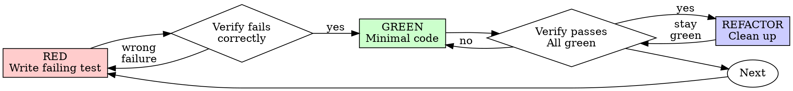

# Fix resume session selection

> This archive contains visible conversation activity and tool records. Private model reasoning and system/developer instructions are not available here.
<!-- codex-event:{"kind":"state","timestamp":"2026-06-23T13:18:26.857Z","phase":null} -->
## Task state: task_started · 2026-06-23T13:18:26.857Z

```text
{
  "type": "task_started",
  "turn_id": "019ef4a1-d3fb-7d72-bc25-03c383ac6283",
  "started_at": 1782220706,
  "model_context_window": 258400,
  "collaboration_mode_kind": "default"
}
```

<!-- /codex-event -->

<!-- codex-event:{"kind":"user","timestamp":"2026-06-23T13:18:26.875Z","phase":null} -->
## User · 2026-06-23T13:18:26.875Z

resume session is not working: it loads the omni supervisor WTF instead of loading hte claude session that I just selected


<!-- /codex-event -->

<!-- codex-event:{"kind":"progress","timestamp":"2026-06-23T13:18:37.832Z","phase":"commentary"} -->
## Codex progress · 2026-06-23T13:18:37.832Z

I’ll dig into the resume-session path and trace where the selected worker/session identity gets swapped for the supervisor. I’m going to use the repo’s debugging and React/state skills here, and I’ll keep the fix scoped: no branch, no worktree.

<!-- /codex-event -->

<!-- codex-event:{"kind":"tool-call","timestamp":"2026-06-23T13:18:37.834Z","phase":null} -->
## Tool call: exec_command · 2026-06-23T13:18:37.834Z

```json
{
  "cmd": "sed -n '1,220p' /Users/masterman/.agents/skills/systematic-debugging/SKILL.md",
  "workdir": "/Users/masterman/NLP/omniharness",
  "max_output_tokens": 12000
}
```

<!-- /codex-event -->

<!-- codex-event:{"kind":"tool-call","timestamp":"2026-06-23T13:18:37.858Z","phase":null} -->
## Tool call: exec_command · 2026-06-23T13:18:37.858Z

```json
{
  "cmd": "sed -n '1,220p' /Users/masterman/.agents/skills/test-driven-development/SKILL.md",
  "workdir": "/Users/masterman/NLP/omniharness",
  "max_output_tokens": 12000
}
```

<!-- /codex-event -->

<!-- codex-event:{"kind":"tool-call","timestamp":"2026-06-23T13:18:37.858Z","phase":null} -->
## Tool call: exec_command · 2026-06-23T13:18:37.858Z

```json
{
  "cmd": "sed -n '1,220p' /Users/masterman/.agents/skills/building-react-apps/SKILL.md",
  "workdir": "/Users/masterman/NLP/omniharness",
  "max_output_tokens": 12000
}
```

<!-- /codex-event -->

<!-- codex-event:{"kind":"tool-call","timestamp":"2026-06-23T13:18:37.858Z","phase":null} -->
## Tool call: exec_command · 2026-06-23T13:18:37.858Z

```json
{
  "cmd": "sed -n '1,220p' /Users/masterman/.agents/skills/client-server-state-invariants/SKILL.md",
  "workdir": "/Users/masterman/NLP/omniharness",
  "max_output_tokens": 12000
}
```

<!-- /codex-event -->

<!-- codex-event:{"kind":"tool-call","timestamp":"2026-06-23T13:18:37.878Z","phase":null} -->
## Tool call: exec_command · 2026-06-23T13:18:37.878Z

```json
{
  "cmd": "sed -n '1,220p' /Users/masterman/.agents/skills/verification-before-completion/SKILL.md",
  "workdir": "/Users/masterman/NLP/omniharness",
  "max_output_tokens": 12000
}
```

<!-- /codex-event -->

<!-- codex-event:{"kind":"tool-result","timestamp":"2026-06-23T13:18:37.913Z","phase":null} -->
## Tool result: call_T3FwxMdI6wAA9haxp5Vs7AJz · 2026-06-23T13:18:37.913Z

````text
Chunk ID: 0354da
Wall time: 0.0000 seconds
Process exited with code 0
Original token count: 1613
Output:
---
name: systematic-debugging
description: Use when encountering any bug, test failure, or unexpected behavior, before proposing fixes
---

# Systematic Debugging

## Overview

Random fixes waste time and create new bugs. Quick patches mask underlying issues.

**Core principle:** ALWAYS find root cause before attempting fixes. Symptom fixes are failure.

**Violating the letter of this process is violating the spirit of debugging.**

## The Iron Law

```
NO FIXES WITHOUT ROOT CAUSE INVESTIGATION FIRST
```

If you haven't completed Phase 1, you cannot propose fixes.

## When to Use

Use for ANY technical issue:
- Test failures
- Bugs in production
- Unexpected behavior
- Performance problems
- Build failures
- Integration issues

**Use this ESPECIALLY when:**
- Under time pressure (emergencies make guessing tempting)
- "Just one quick fix" seems obvious
- You've already tried multiple fixes
- Previous fix didn't work
- You don't fully understand the issue

**Don't skip when:**
- Issue seems simple (simple bugs have root causes too)
- You're in a hurry (rushing guarantees rework)
- Manager wants it fixed NOW (systematic is faster than thrashing)

## The Four Phases

You MUST complete each phase before proceeding to the next.

### Phase 1: Root Cause Investigation

**BEFORE attempting ANY fix:**

1. **Read Error Messages Carefully**
   - Don't skip past errors or warnings
   - They often contain the exact solution
   - Read stack traces completely
   - Note line numbers, file paths, error codes

2. **Reproduce Consistently**
   - Can you trigger it reliably?
   - What are the exact steps?
   - Does it happen every time?
   - If not reproducible → gather more data, don't guess

3. **Check Recent Changes**
   - What changed that could cause this?
   - Git diff, recent commits
   - New dependencies, config changes
   - Environmental differences

4. **Gather Evidence in Multi-Component Systems**

   **WHEN system has multiple components (CI → build → signing, API → service → database):**

   **BEFORE proposing fixes, add diagnostic instrumentation:**
   ```
   For EACH component boundary:
     - Log what data enters component
     - Log what data exits component
     - Verify environment/config propagation
     - Check state at each layer

   Run once to gather evidence showing WHERE it breaks
   THEN analyze evidence to identify failing component
   THEN investigate that specific component
   ```

   **Example (multi-layer system):**
   ```bash
   # Layer 1: Workflow
   echo "=== Secrets available in workflow: ==="
   echo "IDENTITY: ${IDENTITY:+SET}${IDENTITY:-UNSET}"

   # Layer 2: Build script
   echo "=== Env vars in build script: ==="
   env | grep IDENTITY || echo "IDENTITY not in environment"

   # Layer 3: Signing script
   echo "=== Keychain state: ==="
   security list-keychains
   security find-identity -v

   # Layer 4: Actual signing
   codesign --sign "$IDENTITY" --verbose=4 "$APP"
   ```

   **This reveals:** Which layer fails (secrets → workflow ✓, workflow → build ✗)

5. **Trace Data Flow**

   **WHEN error is deep in call stack:**

   See `root-cause-tracing.md` in this directory for the complete backward tracing technique.

   **Quick version:**
   - Where does bad value originate?
   - What called this with bad value?
   - Keep tracing up until you find the source
   - Fix at source, not at symptom

### Phase 2: Pattern Analysis

**Find the pattern before fixing:**

1. **Find Working Examples**
   - Locate similar working code in same codebase
   - What works that's similar to what's broken?

2. **Compare Against References**
   - If implementing pattern, read reference implementation COMPLETELY
   - Don't skim - read every line
   - Understand the pattern fully before applying

3. **Identify Differences**
   - What's different between working and broken?
   - List every difference, however small
   - Don't assume "that can't matter"

4. **Understand Dependencies**
   - What other components does this need?
   - What settings, config, environment?
   - What assumptions does it make?

### Phase 3: Hypothesis and Testing

**Scientific method:**

1. **Form Single Hypothesis**
   - State clearly: "I think X is the root cause because Y"
   - Write it down
   - Be specific, not vague

2. **Test Minimally**
   - Make the SMALLEST possible change to test hypothesis
   - One variable at a time
   - Don't fix multiple things at once

3. **Verify Before Continuing**
   - Did it work? Yes → Phase 4
   - Didn't work? Form NEW hypothesis
   - DON'T add more fixes on top

4. **When You Don't Know**
   - Say "I don't understand X"
   - Don't pretend to know
   - Ask for help
   - Research more

### Phase 4: Implementation

**Fix the root cause, not the symptom:**

1. **Create Failing Test Case**
   - Simplest possible reproduction
   - Automated test if possible
   - One-off test script if no framework
   - MUST have before fixing
   - Use the `ultrapowers:test-driven-development` skill for writing proper failing tests

2. **Implement Single Fix**
   - Address the root cause identified
   - ONE change at a time
   - No "while I'm here" improvements
   - No bundled refactoring

3. **Verify Fix**
   - Test passes now?
   - No other tests broken?
   - Issue actually resolved?
   - If the bug was meaningful or systemic, use `ultrapowers:learning-from-bugs` before declaring the fix complete.

4. **If Fix Doesn't Work**
   - STOP
   - Count: How many fixes have you tried?
   - If < 3: Return to Phase 1, re-analyze with new information
   - **If ≥ 3: STOP and question the architecture (step 5 below)**
   - DON'T attempt Fix #4 without architectural discussion

5. **If 3+ Fixes Failed: Question Architecture**

   **Pattern indicating architectural problem:**
   - Each fix reveals new shared state/coupling/problem in different place
   - Fixes require "massive refactoring" to implement
   - Each fix creates new symptoms elsewhere

   **STOP and question fundamentals:**
   - Is this pattern fundamentally sound?
   - Are we "sticking with it through sheer inertia"?
   - Should we refactor architecture vs. continue fixing symptoms?

   **Discuss with your human partner before attempting more fixes**

   This is NOT a failed hypothesis - this is a wrong architecture.

## Red Flags - STOP and Follow Process

If you catch yourself thinking:
- "Quick fix for now, investigate later"
- "Just try changing X and see if it works"

````

<!-- /codex-event -->

<!-- codex-event:{"kind":"tool-result","timestamp":"2026-06-23T13:18:37.914Z","phase":null} -->
## Tool result: call_IjA6mvEsab2VbIWsqwUXEg55 · 2026-06-23T13:18:37.914Z

````text
Chunk ID: 5c18e8
Wall time: 0.0000 seconds
Process exited with code 0
Original token count: 1448
Output:
---
name: test-driven-development
description: Use when implementing any feature or bugfix, before writing implementation code
---

# Test-Driven Development (TDD)

## Overview

Write the test first. Watch it fail. Write minimal code to pass.

**Core principle:** If you didn't watch the test fail, you don't know if it tests the right thing.

**Violating the letter of the rules is violating the spirit of the rules.**

## When to Use

**Always:**
- New features
- Bug fixes
- Refactoring
- Behavior changes

**Exceptions (ask your human partner):**
- Throwaway prototypes
- Generated code
- Configuration files

**Do directly with targeted verification:**
- tiny color, spacing, copy, or label changes,
- one-line prompt wording changes,
- docs-only wording changes,
- mechanical edits where the expected result is obvious from the diff.

Do not perform a full red-green cycle for a tiny mechanical edit unless it changes behavior or there is a real regression risk. For example, changing a button from gray to blue usually needs the edit plus a targeted visual or code check, not a new failing test.

Thinking "skip TDD just this once"? Stop. That's rationalization.

## UI-Specific Note

When the task is UI work, choose the design system and starting block before writing tests around the intended behavior and rendering. In Ultrapowers, that means `shadcn/ui` plus the closest available ShadCN Block for each new screen, form, or major surface unless the user says otherwise. Inspect https://ui.shadcn.com/blocks first, install or copy the selected block, and then adapt it. Before adding any individual control, check whether `shadcn/ui` already provides a suitable control and use/customize that control first.

For important app workflows, also consider whether `agentic-user-journey-testing` should be proposed. Do not run that higher-cost black-box test mode without explicit user approval.

## The Iron Law

```
NO PRODUCTION CODE WITHOUT A FAILING TEST FIRST
```

Write code before the test? Delete it. Start over.

**No exceptions:**
- Don't keep it as "reference"
- Don't "adapt" it while writing tests
- Don't look at it
- Delete means delete

Implement fresh from tests. Period.

## Red-Green-Refactor



### RED - Write Failing Test

Write one minimal test showing what should happen.

<Good>
```typescript
test('retries failed operations 3 times', async () => {
  let attempts = 0;
  const operation = () => {
    attempts++;
    if (attempts < 3) throw new Error('fail');
    return 'success';
  };

  const result = await retryOperation(operation);

  expect(result).toBe('success');
  expect(attempts).toBe(3);
});
```
Clear name, tests real behavior, one thing
</Good>

<Bad>
```typescript
test('retry works', async () => {
  const mock = jest.fn()
    .mockRejectedValueOnce(new Error())
    .mockRejectedValueOnce(new Error())
    .mockResolvedValueOnce('success');
  await retryOperation(mock);
  expect(mock).toHaveBeenCalledTimes(3);
});
```
Vague name, tests mock not code
</Bad>

**Requirements:**
- One behavior
- Clear name
- Real code (no mocks unless unavoidable)
- Real product behavior is the target. Mocked behavior can never be the final deliverable or proof that the feature works.

### Verify RED - Watch It Fail

**MANDATORY. Never skip.**

```bash
npm test path/to/test.test.ts
```

Confirm:
- Test fails (not errors)
- Failure message is expected
- Fails because feature missing (not typos)

**Test passes?** You're testing existing behavior. Fix test.

**Test errors?** Fix error, re-run until it fails correctly.

### GREEN - Minimal Code

Write simplest code to pass the test.

<Good>
```typescript
async function retryOperation<T>(fn: () => Promise<T>): Promise<T> {
  for (let i = 0; i < 3; i++) {
    try {
      return await fn();
    } catch (e) {
      if (i === 2) throw e;
    }
  }
  throw new Error('unreachable');
}
```
Just enough to pass
</Good>

<Bad>
```typescript
async function retryOperation<T>(
  fn: () => Promise<T>,
  options?: {
    maxRetries?: number;
    backoff?: 'linear' | 'exponential';
    onRetry?: (attempt: number) => void;
  }
): Promise<T> {
  // YAGNI
}
```
Over-engineered
</Bad>

Don't add features, refactor other code, or "improve" beyond the test.

### Verify GREEN - Watch It Pass

**MANDATORY.**

```bash
npm test path/to/test.test.ts
```

Confirm:
- Test passes
- Other tests still pass
- Output pristine (no errors, warnings)

**Test fails?** Fix code, not test.

**Other tests fail?** Fix now.

### REFACTOR - Clean Up

After green only:
- Remove duplication
- Improve names
- Extract helpers

Keep tests green. Don't add behavior.

### Repeat

Next failing test for next feature.

## Good Tests

| Quality | Good | Bad |
|---------|------|-----|
| **Minimal** | One thing. "and" in name? Split it. | `test('validates email and domain and whitespace')` |
| **Clear** | Name describes behavior | `test('test1')` |
| **Shows intent** | Demonstrates desired API | Obscures what code should do |


````

<!-- /codex-event -->

<!-- codex-event:{"kind":"tool-result","timestamp":"2026-06-23T13:18:37.914Z","phase":null} -->
## Tool result: call_VMP0FNqfEks5iUtySmasKeMQ · 2026-06-23T13:18:37.914Z

```text
Chunk ID: 80b328
Wall time: 0.0000 seconds
Process exited with code 0
Original token count: 2034
Output:
---
name: building-react-apps
description: Use when building, refactoring, planning, or debugging React or Next.js apps, React components, hooks, routing, frontend state, SSR, hydration, bundles, imports, or UI settings
---

# Building React Apps

Use these defaults for React app work unless the user or existing codebase explicitly chooses another architecture.

If the work is specifically about slowness, root-load time, compile time, SSR effectiveness, hydration cost, bundle size, import bloat, or decluttering heavy UI dependencies, use `optimizing-react-next-apps` as the focused workflow.

If the app has server state, optimistic UI, caches, polling, SSE/WebSocket streams, background jobs, persisted runtime state, or client/server synchronization, use `client-server-state-invariants` before planning or changing the state model.

## UI Starting Point

- For new React app screens, forms, and major surfaces, use `shadcn/ui` unless the user or existing app has chosen another design system.
- Before inventing layout, inspect the available ShadCN Blocks at https://ui.shadcn.com/blocks for the specific screen or form category.
- Start from the closest matching block with `npx shadcn add <block-name>` or the official source in https://github.com/shadcn-ui/ui, then add, remove, and adapt controls to fit the product.
- Do not use a blank custom layout as the first implementation path when a relevant ShadCN Block exists.
- Before adding any individual control, check whether `shadcn/ui` already provides a suitable control. Use/customize the shadcn control before hand-building a one-off control.

## State And Data

- Always centralize React app state in global single-source-of-truth Manager classes.
- Components, hooks, and listeners subscribe to Manager updates and use Manager methods to update data.
- Centralized state does not mean broad subscriptions. Components must subscribe to the smallest slice they need, preferably with selector hooks and equality checks, so unrelated UI does not re-render.
- Never let app shells, page roots, sidebars, timelines, or other broad containers subscribe to an entire high-churn Manager snapshot when they only need stable fields. Draft text, cursors, hover/open state, search text, and other per-keystroke or per-pointer state need narrow component-level subscriptions.
- If typing in an input, moving a cursor, toggling a hover/open flag, or editing a small draft makes the whole app repaint, the subscription boundary is wrong even if the data source is centralized.
- Always implement a custom data manager for any app data structure.
- Never use separate state variables or arrays as the source of truth.
- Never send data around in transactions. Pass intent, ids, commands, or Manager method calls instead.

## React Control Flow

- Avoid using `useEffect()` to update state. Prefer `useCallback()` handlers or Manager methods for explicit state transitions.
- Work ahead of time to avoid callback hell, race conditions, and infinite loops.
- When debugging React and a fix does not work, explicitly consider whether the root cause is a race condition. Race conditions are common in React.
- Every async callback, mutation result, timer, poll, or stream message that can update visible state must prove it still owns the current context before mutating Managers or navigation.
- Use `RefObject` instead of `MutableRefObject`.

## Routing And Modules

- Prefer explicit routing over file-based routing when the framework does not strongly default to file-based routes. Framework-native file routing, such as Next.js App Router, is fine.
- Never use `require()` to import modules. Use `import` instead.
- Avoid `npm` by default. Use `pnpm` for package installation, scripts, and lockfiles unless the user or existing project explicitly chooses another package manager.

## Next.js And SSR Defaults

- Treat `"use client"` as a boundary with a cost. Do not put an entire page, app shell, sidebar, timeline, composer, settings surface, and data boot path behind one giant client component unless there is a deliberate reason.
- SSR is only useful if the initial HTML contains meaningful above-the-fold UI or data. If `curl` for the route only shows a boot shell, script payloads, or empty placeholders, the route is not meaningfully server-rendered even if SSR is technically enabled.
- Server-render the first useful screen by fetching route-stable bootstrap data on the server: auth/session state, settings needed to choose the shell, selected route ids, and initial page/snapshot data. Hydrate Managers or query caches from that bootstrap data; do not wait for client `useEffect()` plus client fetches before the first meaningful paint.
- Use client effects for browser-only concerns: localStorage-only preferences, notifications, SSE/WebSocket subscriptions, focus management, and post-paint refreshes. Do not use effects as the only path for data required to decide what the initial screen is.
- In Next dev, first request time includes compilation. Distinguish cold compile cost from runtime slowness before optimizing the wrong layer.

## Import And Bundle Hygiene

- Keep imports proportional to the UI being rendered. Do not import an entire complex surface for a tiny control; split shared tiny controls into their own files instead of importing them from heavy feature modules.
- Lazy-load rarely opened or route-conditional surfaces with dynamic imports: settings dialogs, side panels, file viewers, terminals, worker inspectors, onboarding flows, QR/pairing dialogs, and large markdown/code viewers.
- Avoid package and barrel imports that drag in whole icon packs, design systems, syntax highlighters, markdown stacks, charting libraries, or component suites for one glyph or one primitive. Inline small SVG paths or use local assets when that is cheaper and stable.
- Prefer native browser controls for small, ordinary selects and pickers. Do not import a popover/dialog/menu stack for a low-value dropdown unless search, virtualization, or rich item rendering is genuinely needed.
- Use subpath imports when a package supports them. Avoid root package imports from large UI libraries if a narrower entrypoint exists.
- After dependency or UI-shell changes, inspect the emitted dev chunks or traces. Verify whether heavy modules moved out of the root chunk rather than assuming dynamic import worked.

## Performance Debugging

- Start with evidence: dev server logs, route timings, emitted chunk sizes, module counts, and initial HTML content.
- Separate long-lived requests from slow requests. SSE, streaming, and hanging fetches can show huge durations in logs without blocking page paint.
- Check recent dependency additions first when compile time suddenly explodes. A single icon, markdown, chart, or UI package can add thousands of modules.
- For Next.js root-load complaints, answer three questions before changing code: what compiled, what HTML was returned, and what client-side requests gated the first useful paint?

## Frontend Configuration

- Never store frontend string literals or UI settings in `.env` files.
- Put frontend strings and settings in normal source files, inline arrays, or `.json` files so they remain reviewable, testable, and versioned with the UI.

## Internationalization

- For meaningful React UI work, offer language support as an option when the user has not already decided: "Should we support other languages? If yes, I will wire user-facing copy through i18n resources now instead of hardcoding strings."
- If the user says yes, asks for translation/i18n/language/locale support, or reports that language switching only updates part of the UI, use `implementing-react-i18n`.
- Use the i18n library's `t("key", params?)` function for every user-facing string. Use `useI18nSnapshot()` only to subscribe React components so language changes repaint.
- Never name variables with locale codes or locale-like names such as `it`, `en`, `enUS`, `locIt`, or `locEnUs`.

## Settings UI

- For settings dialogs, preferences panels, configuration modals, option tabs, or UI settings surfaces, use `designing-settings-dialogs`.

```

<!-- /codex-event -->

<!-- codex-event:{"kind":"tool-result","timestamp":"2026-06-23T13:18:37.924Z","phase":null} -->
## Tool result: call_PnwozD4snvRwTh8i8G1XMG6M · 2026-06-23T13:18:37.924Z

```text
Chunk ID: 566a95
Wall time: 0.0000 seconds
Process exited with code 0
Original token count: 1481
Output:
---
name: client-server-state-invariants
description: Use when planning, building, reviewing, or debugging React apps with server state, optimistic UI, caches, polling, SSE/WebSocket streams, background jobs, persistence, or client/server synchronization
---

# Client Server State Invariants

React bugs often expose deeper ownership mistakes. When client state, server state, cache state, stream state, and persisted state all exist, every plan needs explicit invariants.

## Core Rule

No UI surface may treat data as authoritative unless the payload proves ownership, freshness, completeness, ordering, and terminal state.

If those words are missing from the plan, the plan is probably baking in a race condition.

## Planning Checklist

For every React app that reads server/runtime state, the plan must answer:

1. **Owner:** What owns this state: server, client manager, URL, cache, stream, local storage, or worker/runtime?
2. **Token:** What owner token protects async results: `requestId`, `runId`, `projectPath`, `operationId`, `workerId + seq`, or equivalent?
3. **Provenance:** Is data server-authoritative, optimistic, cached preview, partial update, or historical fallback?
4. **Completeness:** Does the payload declare what scope it is complete for? What may it erase?
5. **Ordering:** What stable order is used: monotonic seq, `(createdAt, id)`, version, or cursor?
6. **State machine:** What are the legal states, terminal states, and transitions?
7. **Events:** Which server decisions are named events rather than client-side derivations?
8. **Loading shape:** Which states are bootstrap, first load, incremental refresh, reconnect, resync, recovery, and terminal error?
9. **Fallbacks:** Which legacy/fallback rows can render, and only after what authority is loaded?
10. **Tests:** Which race, stale-response, event-sequence, reconnect, and merge tests prove the invariants?

## Invariants To Require

- Cached and optimistic data may pre-render, but cannot satisfy full-load gates.
- Partial snapshots may add or refine state, but may not erase optimistic objects, delivered user input, read markers, or stream entries unless they declare complete scope.
- Every async response checks that its owner token still matches before mutating visible state.
- Mutation success handlers may navigate or clear UI only if they still own the current context, unless the action explicitly creates a new selected context.
- Timers and polling callbacks re-check ownership immediately before acting.
- Server decisions are emitted as named events; the client does not infer decisions by diffing snapshots.
- SSE/WebSocket streams have event ids, replay/resume, and an explicit resync path.
- Loading booleans are split by lifecycle stage. A leaf stream refresh must not unmount the whole page.
- Append-only content has one writer, one reader, stable ids, and monotonic cursors.
- Fallback DB rows or historical rows are gated behind stream loading and deduped by stable id plus safe equivalence.
- Status classifiers distinguish active, runnable, blocked, awaiting user, terminal, stale, and recoverable states.
- "Latest" queries have deterministic tie-breakers. Timestamp-only ordering is not enough.
- Hot paths use bounded reads and do not synchronously load large bodies, bridge probes, schema setup, or heavy app graphs.
- Process-local caches have explicit TTL/size bounds and invalidation rules.

## Test Matrix

Pick the rows that match the work. Do not rely on one happy-path UI test.

| Risk | Test shape |
| --- | --- |
| Stale async response | Start request A, switch owner, resolve A, assert it cannot mutate B |
| Optimistic object erased | Create local optimistic state, apply stale/partial snapshot, assert object remains |
| Cache masquerades as loaded | Hydrate cache preview, assert full-load gate waits for server authority |
| Mutation steals navigation | Start mutation, switch selection, resolve mutation, assert focus stays put |
| Timer/poll stale-fire | Use fake timers or deferred promises; callback must re-check owner before acting |
| Snapshot merge erases stream | Apply partial snapshot missing known entries, assert entries/read markers remain |
| Event stream gap | Bootstrap snapshot, emit events during disconnect, reconnect with last id, assert replay or resync |
| Server decision invisible | Exercise branch and assert named event such as `blocked`, `refused`, `gave_up`, or `error.surfaced` |
| State classifier wrong | Table-test every status into active/runnable/terminal/recoverable buckets |
| Fallback duplicates stream | Load fallback rows then stream entries, assert no duplicate or false chronology |
| Hot path bloats | Assert snapshots carry cursors not bodies; route returns before DB/heavy imports when possible |
| Timestamp tie | Insert equal timestamps, assert deterministic order by id/seq |

Use headless HTTP/SSE tests for control-plane decisions. Use React/unit tests for manager merging and ownership guards. Use Playwright only for real UI layout, focus, scroll, mobile computed styles, and visible affordances.

## Refuse These Shapes

- one `isLoading` boolean for bootstrap, refresh, reconnect, and recovery;
- cache or optimistic data treated as authoritative without provenance;
- async callbacks that mutate state without checking owner tokens;
- client-side derivation of server decisions;
- snapshot diffs used as the only way to know what happened;
- event streams without ids or resume;
- timestamp-only "latest" queries;
- parallel transcript or persistence surfaces that the frontend must reconcile;
- unbounded process caches introduced to hide slow storage;
- tests that prove only the DOM result when the bug is a server decision.

## Review Prompt

Ask this before implementation starts:

> What can arrive late, out of order, partially, twice, or after the user changes context, and what test proves it cannot corrupt visible state?

```

<!-- /codex-event -->

<!-- codex-event:{"kind":"tool-result","timestamp":"2026-06-23T13:18:37.928Z","phase":null} -->
## Tool result: call_Wa9t7H9glqYyq0ZGwXf1Z6cp · 2026-06-23T13:18:37.928Z

````text
Chunk ID: 2d22f3
Wall time: 0.0000 seconds
Process exited with code 0
Original token count: 2230
Output:
---
name: verification-before-completion
description: Use when about to claim work is complete, fixed, or passing, before committing or creating PRs - requires running verification commands and confirming output before making any success claims; evidence before assertions always
---

# Verification Before Completion

## Overview

Claiming work is complete without verification is dishonesty, not efficiency.

**Core principle:** Evidence before claims, always.

**Violating the letter of this rule is violating the spirit of this rule.**

## The Iron Law

```
NO COMPLETION CLAIMS WITHOUT FRESH VERIFICATION EVIDENCE
```

If you haven't run the verification command in this message, you cannot claim it passes.

## The Gate Function

```
BEFORE claiming any status or expressing satisfaction:

1. IDENTIFY: What command proves this claim?
2. RUN: Execute the FULL command (fresh, complete)
3. READ: Full output, check exit code, count failures
4. VERIFY: Does output confirm the claim?
   - If NO: State actual status with evidence
   - If YES: State claim WITH evidence
5. ONLY THEN: Make the claim

Skip any step = lying, not verifying
```

## Product-Surface Verification

When the work involves an app, UI, or product surface, verification must cover more than whether a single requested feature works.

Keep verification proportional. For tiny mechanical edits, targeted verification is enough: inspect the diff, confirm the changed value/text, and run only the smallest relevant check. Do not escalate to full product-surface verification unless the change can affect behavior, state, navigation, persistence, or the user journey.

Also verify:

- required functionality is real end-to-end, not a fake component, mock, placeholder, canned response, or fallback path,
- the primary user stories are actually supported,
- the primary user journey works end-to-end,
- any approved agentic user journey tests have been run, or clearly state that they were proposed but not run because approval was not given,
- return/revisit flows work when they are part of the product,
- expected empty states are present,
- expected loading, waiting, or in-progress states are visible,
- expected error and recovery states are present,
- expected completed or success states are understandable,
- expected status-awareness flows are present,
- the state model is represented correctly,
- React/server-state invariants are verified when the app uses server state, optimistic UI, caches, polling, streams, background jobs, or persisted runtime state,
- persistence behavior for settings, preferences, drafts, and other user-managed state matches the approved design,
- operational readiness expectations are met for the approved scope,
- instrumentation and observability exist where the approved scope depends on them,
- backend or agent workflow decisions emit the planned named events, and a headless/scriptable check can assert the event sequence without relying on UI snapshots,
- real errors are surfaced rather than silently swallowed or replaced with vague placeholders,
- onboarding and discoverability work for first-run or empty-state use,
- risk and trust surfaces are handled well enough to avoid silent failure, ambiguous state, or obvious loss of confidence,
- when the scope includes a frontend/backend boundary, frontend-visible failures preserve the real error details and stack traces expected by the approved design,
- baseline expected v1 surfaces and inferred behaviors from the approved story set, spec, or plan are actually present.

When the scope includes settings or preferences, also verify:

- each meaningful setting persists or does not persist exactly as designed,
- the storage location and ownership model match the approved plan,
- refresh, restart, sign-out, reset, and migration behavior work as intended for the approved scope,
- settings dialogs avoid redundant section titles, subtitles, explanatory filler, and decorative chrome that does not help the user make a decision.

Do not confuse "the requested control exists" with "the product is usable."

For app, UI, and product-surface work, consider whether an agentic user journey test is the right proof. This mode is approval-gated because it can spend significant tokens: propose it when useful, but only run it if the user explicitly approves.

## Common Failures

| Claim | Requires | Not Sufficient |
|-------|----------|----------------|
| Tests pass | Test command output: 0 failures | Previous run, "should pass" |
| Linter clean | Linter output: 0 errors | Partial check, extrapolation |
| Build succeeds | Build command: exit 0 | Linter passing, logs look good |
| Bug fixed | Test original symptom: passes | Code changed, assumed fixed |
| Meaningful system bug fixed | Learning note plus verification | Fix committed with no durable lesson |
| React/server state sync works | Stale-response, merge, event-sequence, and ownership tests relevant to the change | UI looked right once |
| Regression test works | Red-green cycle verified | Test passes once |
| Agent completed | VCS diff shows changes | Agent reports "success" |
| Requirements met | Line-by-line checklist | Tests passing |
| Feature complete | Real end-to-end behavior in the product | Mocked component, canned data, placeholder UI, fallback path |

## Red Flags - STOP

- Using "should", "probably", "seems to"
- Expressing satisfaction before verification ("Great!", "Perfect!", "Done!", etc.)
- About to commit/push/PR without verification
- Trusting agent success reports
- Accepting "validated with mocks" or "placeholder works" as completion
- Relying on partial verification
- Thinking "just this once"
- Tired and wanting work over
- **ANY wording implying success without having run verification**

## Rationalization Prevention

| Excuse | Reality |
|--------|---------|
| "Should work now" | RUN the verification |
| "I'm confident" | Confidence ≠ evidence |
| "Just this once" | No exceptions |
| "Linter passed" | Linter ≠ compiler |
| "Agent said success" | Verify independently |
| "I'm tired" | Exhaustion ≠ excuse |
| "Partial check is enough" | Partial proves nothing |
| "Different words so rule doesn't apply" | Spirit over letter |

## Key Patterns

**Tests:**
```
✅ [Run test command] [See: 34/34 pass] "All tests pass"
❌ "Should pass now" / "Looks correct"
```

**Regression tests (TDD Red-Green):**
```
✅ Write → Run (pass) → Revert fix → Run (MUST FAIL) → Restore → Run (pass)
❌ "I've written a regression test" (without red-green verification)
```

**Build:**
```
✅ [Run build] [See: exit 0] "Build passes"
❌ "Linter passed" (linter doesn't check compilation)
```

**Requirements:**
```
✅ Re-read plan → Create checklist → Verify each → Report gaps or completion
❌ "Tests pass, phase complete"
```

**Agent delegation:**
```
✅ Agent reports success → Check VCS diff → Verify changes → Report actual state
❌ Trust agent report
```

## Why This Matters

From 24 failure memories:
- your human partner said "I don't believe you" - trust broken
- Undefined functions shipped - would crash
- Missing requirements shipped - incomplete features
- Time wasted on false completion → redirect → rework
- Violates: "Honesty is a core value. If you lie, you'll be replaced."

## When To Apply

**ALWAYS before:**
- ANY variation of success/completion claims
- ANY expression of satisfaction
- ANY positive statement about work state
- Committing, PR creation, task completion
- Staging, committing, pushing, or opening a PR when the work could include secrets, local environment files, dependencies, caches, build outputs, logs, temporary files, or generated/intermediate artifacts
- Moving to next task
- Delegating to agents

When a meaningful bug involved architecture, storage, memory, persistence, control planes, background workers, recovery, data loss, security, or a repeated wrong assumption, use `ultrapowers:learning-from-bugs` before claiming the fix is complete.

When a React app has server state, optimistic UI, caches, polling, SSE/WebSocket streams, background jobs, or persisted runtime state, use `ultrapowers:client-server-state-invariants` to decide which race and synchronization tests are required before claiming completion.

Before any git publish step, verify `.gitignore` exists for the project and that `git status` does not include secrets, credentials, local environment files, `node_modules`, dependency caches, build outputs, coverage output, logs, temporary files, or intermediate/generated artifacts unless the human explicitly asked to version a specific generated artifact.

**Rule applies to:**
- Exact phrases
- Paraphrases and synonyms
- Implications of success
- ANY communication suggesting completion/correctness

## The Bottom Line

**No shortcuts for verification.**

Run the command. Read the output. THEN claim the result.

This is non-negotiable.

````

<!-- /codex-event -->

<!-- codex-event:{"kind":"user","timestamp":"2026-06-23T13:18:37.932Z","phase":null} -->
## User · 2026-06-23T13:18:37.932Z

here is the session dffc5ed7d177


<!-- /codex-event -->

<!-- codex-event:{"kind":"progress","timestamp":"2026-06-23T13:18:46.680Z","phase":"commentary"} -->
## Codex progress · 2026-06-23T13:18:46.680Z

Got it: `dffc5ed7d177`. I’ll treat that as the concrete session/conversation lookup and use the database plus the resume code path to find where the selected Claude worker/session is being lost.

<!-- /codex-event -->

<!-- codex-event:{"kind":"tool-call","timestamp":"2026-06-23T13:18:46.683Z","phase":null} -->
## Tool call: exec_command · 2026-06-23T13:18:46.683Z

```json
{
  "cmd": "rg -n \"resume|reattach|session|supervisor|claude|worker\" src tests app-data scripts docs -g '!node_modules'",
  "workdir": "/Users/masterman/NLP/omniharness",
  "max_output_tokens": 20000
}
```

<!-- /codex-event -->

<!-- codex-event:{"kind":"tool-call","timestamp":"2026-06-23T13:18:46.683Z","phase":null} -->
## Tool call: exec_command · 2026-06-23T13:18:46.683Z

```json
{
  "cmd": "find . -maxdepth 3 -name 'sqlite.db' -o -name '*.db'",
  "workdir": "/Users/masterman/NLP/omniharness",
  "max_output_tokens": 12000
}
```

<!-- /codex-event -->

<!-- codex-event:{"kind":"tool-call","timestamp":"2026-06-23T13:18:46.683Z","phase":null} -->
## Tool call: exec_command · 2026-06-23T13:18:46.683Z

```json
{
  "cmd": "git status --short",
  "workdir": "/Users/masterman/NLP/omniharness",
  "max_output_tokens": 12000
}
```

<!-- /codex-event -->

<!-- codex-event:{"kind":"tool-call","timestamp":"2026-06-23T13:18:46.739Z","phase":null} -->
## Tool call: exec_command · 2026-06-23T13:18:46.739Z

```json
{
  "cmd": "command -v /Users/masterman/.local/bin/baton || command -v baton || command -v claude || command -v opencode || command -v gemini || command -v codex",
  "workdir": "/Users/masterman/NLP/omniharness",
  "max_output_tokens": 12000
}
```

<!-- /codex-event -->

<!-- codex-event:{"kind":"tool-result","timestamp":"2026-06-23T13:18:46.804Z","phase":null} -->
## Tool result: call_QLlZqep3QMb9LZJmKQZGqcGa · 2026-06-23T13:18:46.804Z

```text
Chunk ID: bace17
Wall time: 0.0001 seconds
Process exited with code 2
Original token count: 262144
Output:
Warning: truncated output (original token count: 262144)
Total output lines: 8801

rg: app-data: No such file or directory (os error 2)
tests/supervisor/conversation-bootstrap.test.ts:2:import { buildSupervisorConversation } from "@/server/supervisor/conversation-bootstrap";
tests/supervisor/conversation-bootstrap.test.ts:8:      { role: "supervisor", content: "# Wiki.js migration plan" },
docs/superpowers/plans/2026-06-14-escape-interrupt-queued-message.md:3:> **For agentic workers:** REQUIRED SUB-SKILL: Use ultrapowers:subagent-driven-development (recommended) or ultrapowers:executing-plans to implement this plan task-by-task. Steps use checkbox (`- [ ]`) syntax for tracking.
docs/superpowers/plans/2026-06-14-escape-interrupt-queued-message.md:5:**Goal:** Add a Claude Code-style Escape shortcut that interrupts the active worker turn and immediately delivers the queued user message OmniHarness should take next.
docs/superpowers/plans/2026-06-14-escape-interrupt-queued-message.md:7:**Architecture:** Promote the existing ACP turn-cancel primitive into a conversation-level control-plane action. The server will own queue selection, worker turn cancellation, durable status updates, named events, and queued-message delivery; the frontend will expose Escape and an explicit queued-message action that call the same API. Delivery continues through the unified worker stream and existing queued-message persistence instead of adding a second transcript or queue layer.
docs/superpowers/plans/2026-06-14-escape-interrupt-queued-message.md:9:**Tech Stack:** Next.js App Router route shims, portable runtime HTTP handlers, React manager-backed composer state, Drizzle SQLite queue/message/workers tables, ACP bridge client, named SSE lifecycle events, unified worker JSONL stream, Vitest server/API/app tests, lifecycle HTTP/SSE tests.
docs/superpowers/plans/2026-06-14-escape-interrupt-queued-message.md:11:**North Star Product:** OmniHarness should make active agent control feel as immediate as the native CLI while staying durable, observable, and safe across reloads, multiple surfaces, and worker recovery.
docs/superpowers/plans/2026-06-14-escape-interrupt-queued-message.md:17:**Final Functionality Standard:** The feature is complete when Escape and the visible interrupt action both route through one server action that cancels the active turn, preserves old turn output, delivers exactly one queued/draft user message through the unified worker stream, emits observable events for success/refusal/failure, converges across event-stream clients, and is proven by deterministic server/API/app tests plus a lifecycle scenario.
docs/superpowers/plans/2026-06-14-escape-interrupt-queued-message.md:25:- Do not add a parallel persistence layer for worker content, queued messages, or interruption state.
docs/superpowers/plans/2026-06-14-escape-interrupt-queued-message.md:30:- The feature targets active worker turns. It should refuse clearly when there is no selected run, no active worker, no queued/draft message to deliver, the target worker is missing, or the session provider does not support turn cancellation.
docs/superpowers/plans/2026-06-14-escape-interrupt-queued-message.md:31:- Implementation runs are included only where the existing queued-message delivery path can safely target a worker. Do not interrupt the supervisor loop by guessing; use existing run/worker targeting helpers and refuse/defer if no safe target exists.
docs/superpowers/plans/2026-06-14-escape-interrupt-queued-message.md:37:- As a user with queued follow-ups already visible above the composer, I can press Escape to force the oldest pending queued message into the active worker now.
docs/superpowers/plans/2026-06-14-escape-interrupt-queued-message.md:39:- As a user with multiple OmniHarness windows open, I can see that a queued message moved to delivering/delivered and that the worker was interrupted from the shared event stream.
docs/superpowers/plans/2026-06-14-escape-interrupt-queued-message.md:47:  - Owns the new conversation-level workflow: select queued message, resolve target worker, cancel current turn, mark interruption state, and invoke queued-message delivery.
docs/superpowers/plans/2026-06-14-escape-interrupt-queued-message.md:67:  - Preserve existing `cancelAgent(name)` as full worker stop via `DELETE /agents/:name`.
docs/superpowers/plans/2026-06-14-escape-interrupt-queued-message.md:68:  - Normalize connection-refused and bridge errors with action text that distinguishes turn cancel from worker cancel.
docs/superpowers/plans/2026-06-14-escape-interrupt-queued-message.md:77:    - target worker resolution,
docs/superpowers/plans/2026-06-14-escape-interrupt-queued-message.md:78:    - worker content building with attachment context,
docs/superpowers/plans/2026-06-14-escape-interrupt-queued-message.md:81:  - Do not add a second worker-output writer.
docs/superpowers/plans/2026-06-14-escape-interrupt-queued-message.md:83:- `src/server/conversations/worker-turn-gate.ts`
docs/superpowers/plans/2026-06-14-escape-interrupt-queued-message.md:85:  - Ensure the interrupt path cannot run two concurrent turns for the same worker.
docs/superpowers/plans/2026-06-14-escape-interrupt-queued-message.md:90:  - Add a durable worker turn fence if the implementation cannot prove an existing persisted token is sufficient.
docs/superpowers/plans/2026-06-14-escape-interrupt-queued-message.md:92:  - Keep the migration narrow and avoid changing worker stream persistence.
docs/superpowers/plans/2026-06-14-escape-interrupt-queued-message.md:95:  - Add the corresponding SQLite migration/backfill for the worker turn fence.
docs/superpowers/plans/2026-06-14-escape-interrupt-queued-message.md:96:  - Existing workers should default to generation `0` with no active turn id.
docs/superpowers/plans/2026-06-14-escape-interrupt-queued-message.md:127:  - Include `runId`, `workerId`, `queuedMessageId`, `reason`, `source`, and enough error detail for `/api/events/log` triage.
docs/superpowers/plans/2026-06-14-escape-interrupt-queued-message.md:238:- Setup: start a direct Claude worker on a long-running task, type a correction while busy, press Escape.
docs/superpowers/plans/2026-06-14-escape-interrupt-queued-message.md:239:- Expected visible proof: the current worker turn stops, the typed correction appears as delivered user input in the worker stream, the queue drawer clears or marks the item delivered, and the conversation continues from the correction.
docs/superpowers/plans/2026-06-14-escape-interrupt-queued-message.md:240:- Failure proof: if cancellation is refused or the worker is missing, the queued message remains pending and a visible error/action state explains why.
docs/superpowers/plans/2026-06-14-escape-interrupt-queued-message.md:245:  - Server owns persisted queued-message rows, run/worker status, durable messages, execution events, worker JSONL entries, and named interruption events.
docs/superpowers/plans/2026-06-14-escape-interrupt-queued-message.md:251:  - Server mutations are scoped by `runId`, `queuedMessageId`, and `workerId`.
docs/superpowers/plans/2026-06-14-escape-interrupt-queued-message.md:258:  - Worker JSONL entries are the authoritative worker conversation content.
docs/superpowers/plans/2026-06-14-escape-interrupt-queued-message.md:267:  - Draft Escape creates one queued row and then delivers that exact row, preserving its id through worker-stream `user_input`.
docs/superpowers/plans/2026-06-14-escape-interrupt-queued-message.md:274:  - Successful cancellation must atomically advance the target worker's turn fence and put persisted worker state into a delivery-safe state (`idle` or a narrowly defined interrupted state) before the queued delivery attempts `askAgent`.
docs/superpowers/plans/2026-06-14-escape-interrupt-queued-message.md:275:  - Any old async completion path must compare its captured turn token/generation before persisting run status, worker status, queue state, or worker response fallback entries.
docs/superpowers/plans/2026-06-14-escape-interrupt-queued-message.md:295:   - verify provider/session type supports Omni worker interruption,
docs/superpowers/plans/2026-06-14-escape-interrupt-queued-message.md:297:   - resolve target worker from `targetWorkerId` or latest eligible non-cancelled worker.
docs/superpowers/plans/2026-06-14-escape-interrupt-queued-message.md:299:3. Server cancels the current worker turn:
docs/superpowers/plans/2026-06-14-escape-interrupt-queued-message.md:300:   - call `cancelAgentTurn(worker.id)`,
docs/superpowers/plans/2026-06-14-escape-interrupt-queued-message.md:303:   - advance the worker turn fence so older async completions are stale,
docs/superpowers/plans/2026-06-14-escape-interrupt-queued-message.md:304:   - update persisted worker status/current text in the same DB mutation as the fence advancement so immediate delivery does not hit stale busy state,
docs/superpowers/plans/2026-06-14-escape-interrupt-queued-message.md:311:   - call `askAgent` through the existing worker-turn gate,
docs/superpowers/plans/2026-06-14-escape-interrupt-queued-message.md:312:   - persist worker response through existing response helpers,
docs/superpowers/plans/2026-06-14-escape-interrupt-queued-message.md:320:   - worker-entry events wake the terminal to fetch the appended user input and response.
docs/superpowers/plans/2026-06-14-escape-interrupt-queued-message.md:334:  - Refuse with `session.action.refused` or `queue.interrupt_refused` reason `unsupported_session_provider`.
docs/superpowers/plans/2026-06-14-escape-interrupt-queued-message.md:346:  - Follow existing queued-message failure policy. Preserve the worker-stream input entry for audit and mark the queue row failed unless the error is a known busy/deferred case.
docs/superpowers/plans/2026-06-14-escape-interrupt-queued-message.md:369:  - Export/extract reusable FIFO selection, target worker resolution, attachment content building, and queued worker delivery helpers.
docs/superpowers/plans/2026-06-14-escape-interrupt-queued-message.md:374:- [ ] **4. Add the worker turn fence**
docs/superpowers/plans/2026-06-14-escape-interrupt-queued-message.md:375:  - Modify `src/server/conversations/worker-turn-gate.ts`.
docs/superpowers/plans/2026-06-14-escape-interrupt-queued-message.md:376:  - If no existing durable token is sufficient, modify `src/server/db/schema.ts` and `src/server/db/index.ts` to add a narrow worker turn generation/token.
docs/superpowers/plans/2026-06-14-escape-interrupt-queued-message.md:386:  - On successful cancel, advance the turn fence and reset persisted worker state before delivery starts.
docs/superpowers/plans/2026-06-14-escape-interrupt-queued-message.md:447:  - Assert queued row and worker entries converge after reconnect/resync.
docs/superpowers/plans/2026-06-14-escape-interrupt-queued-message.md:471:  - No parallel worker persistence is preserved by tasks 3 and 5.
docs/superpowers/plans/2026-06-14-escape-interrupt-queued-message.md:480:  - Worker stream remains append-only and authoritative for worker conversation content.
docs/superpowers/plans/2026-06-14-escape-interrupt-queued-message.md:487:  - The most likely implementation bug is treating successful cancel as equivalent to safe delivery while stale worker state still says `working`; tests must prove the transition.
docs/superpowers/plans/2026-06-14-escape-interrupt-queued-message.md:489:  - The third likely bug is old turn output arriving after cancellation and confusing delivery assertions; worker-entry ordering tests are required.
docs/superpowers/plans/2026-06-14-escape-interrupt-queued-message.md:496:  - Added an explicit worker turn-generation/token fence requirement.
docs/superpowers/plans/2026-06-14-escape-interrupt-queued-message.md:498:  - Strengthened the requirement that successful cancel resets persisted worker state before queued delivery starts.
scripts/time-worker-pool.ts:2: * Diagnostic: confirm pool hits land in <500ms across all worker types.
scripts/time-worker-pool.ts:7: * Usage: pnpm exec tsx scripts/time-worker-pool.ts
scripts/time-worker-pool.ts:12:type WorkerType = "codex" | "claude" | "gemini" | "opencode";
scripts/time-worker-pool.ts:15:  claude: "claude-agent-acp",
scripts/time-worker-pool.ts:68:  console.log("[pool-hit timings — prewarm then startAgent for each worker type]");
src/instrumentation.ts:10:    "@/server/supervisor/runtime-watchdog"
src/instrumentation.ts:13:    console.error("Failed to start supervisor runtime at boot", error);
tests/vscode/bridge.test.ts:7:      expect(String(url)).toBe("http://127.0.0.1:3035/api/auth/session");
tests/vscode/bridge.test.ts:21:          path: "/api/auth/session",
tests/vscode/bridge.test.ts:83:          path: "/api/auth/session",
tests/vscode/bridge.test.ts:113:  it("proxies SSE frames to the webview and supports resume ids", async () => {
docs/superpowers/journeys/2026-05-13-branch-workspace-management.md:8:- User role: builder starting a new OmniHarness session.
docs/superpowers/journeys/2026-05-13-branch-workspace-management.md:22:- Expected completion proof: run header shows the selected workspace badge and the worker card shows the same worktree path as its `cwd`.
docs/superpowers/journeys/2026-05-13-branch-workspace-management.md:23:- Failure conditions: selection mutates the current checkout, submit starts in the wrong directory, stale worktree selection is not explained, or worker `cwd` does not match.
docs/superpowers/learnings/2026-05-20-server-empty-queue-must-clear-cache.md:5:**Symptom:** A queued steering message delivered to the worker, but the UI kept showing it in the queued-message drawer, so the same user text appeared both in the worker stream and in the queue.
docs/superpowers/specs/2026-04-23-remote-access-pwa-design.md:21:- There is no app-level login, session model, route protection, service worker, manifest, push subscription persistence, install flow, or QR-based pairing flow.
docs/superpowers/specs/2026-04-23-remote-access-pwa-design.md:27:- The public entrypoint should be HTTPS because notifications, service workers, and installability require a secure context.
docs/superpowers/specs/2026-04-23-remote-access-pwa-design.md:62:As the sole operator, I want to open OmniHarness from my phone while away from my machine, authenticate with a password, and see the live state of my runs and workers.
docs/superpowers/specs/2026-04-23-remote-access-pwa-design.md:74:As the sole operator, I want notification preferences and session state to persist sensibly across visits without having to reconfigure the app every time.
docs/superpowers/specs/2026-04-23-remote-access-pwa-design.md:80:As the sole operator, I want failed logins, expired sessions, offline tunnel conditions, and bridge failures to be explicit rather than leaving the UI in a fake healthy state.
docs/superpowers/specs/2026-04-23-remote-access-pwa-design.md:82:As the sole operator, I want to revoke sessions and recover from a lost or rotated password without exposing the bridge or corrupting existing runs.
docs/superpowers/specs/2026-04-23-remote-access-pwa-design.md:99:Tunnel choice is transport and edge policy only. OmniHarness itself still owns the login/session model so the remote UX does not depend on the tunnel vendor's auth UI.
docs/superpowers/specs/2026-04-23-remote-access-pwa-design.md:109:- persistent server-backed sessions for browser auth,
docs/superpowers/specs/2026-04-23-remote-access-pwa-design.md:111:- logout and session revocation support,
docs/superpowers/specs/2026-04-23-remote-access-pwa-design.md:117:- use an opaque session identifier in an `HttpOnly`, `Secure`, `SameSite=Lax` cookie,
docs/superpowers/specs/2026-04-23-remote-access-pwa-design.md:118:- persist session records in SQLite so sessions survive process and server restarts,
docs/superpowers/specs/2026-04-23-remote-access-pwa-design.md:119:- require a separate session secret distinct from the password hash,
docs/superpowers/specs/2026-04-23-remote-access-pwa-design.md:126:The session model should support:
docs/superpowers/specs/2026-04-23-remote-access-pwa-design.md:132:- logout-all / session secret rotation,
docs/superpowers/specs/2026-04-23-remote-access-pwa-design.md:138:- session id,
docs/superpowers/specs/2026-04-23-remote-access-pwa-design.md:147:If the server restarts, existing unrevoked sessions should remain valid because they are reloaded from SQLite.
docs/superpowers/specs/2026-04-23-remote-access-pwa-design.md:151:Add a one-time QR pairing flow from an already authenticated desktop session to a mobile device.
docs/superpowers/specs/2026-04-23-remote-access-pwa-design.md:158:- redemption creates a normal durable mobile session,
docs/superpowers/specs/2026-04-23-remote-access-pwa-design.md:177:- the QR must never contain the password, bridge URL, or a long-lived reusable session secret.
docs/superpowers/specs/2026-04-23-remote-access-pwa-design.md:186:- keep session cookies `SameSite=Lax`,
docs/superpowers/specs/2026-04-23-remote-access-pwa-design.md:198:- clear session-expired handling,
docs/superpowers/specs/2026-04-23-remote-access-pwa-design.md:209:- live worker and run visibility,
docs/superpowers/specs/2026-04-23-remote-access-pwa-design.md:210:- direct deep links to `/session/:runId`,
docs/superpowers/specs/2026-04-23-remote-access-pwa-design.md:218:- session status and logout,
docs/superpowers/specs/2026-04-23-remote-access-pwa-design.md:240:- create the durable mobile session,
docs/superpowers/specs/2026-04-23-remote-access-pwa-design.md:272:- worker stuck,
docs/superpowers/specs/2026-04-23-remote-access-pwa-design.md:273:- bridge unavailable or supervisor runtime unhealthy.
docs/superpowers/specs/2026-04-23-remote-access-pwa-design.md:302:- service worker registration,
docs/superpowers/specs/2026-04-23-remote-access-pwa-design.md:305:### Service worker scope
docs/superpowers/specs/2026-04-23-remote-access-pwa-design.md:307:The service worker should support installability, push handling, notification clicks, and light shell caching.
docs/superpowers/specs/2026-04-23-remote-access-pwa-design.md:309:This is not an offline-first product in v1. The service worker should cache static shell assets conservatively, but live run control continues to require network access.
docs/superpowers/specs/2026-04-23-remote-access-pwa-design.md:317:- reconnect the live event stream on resume,
docs/superpowers/specs/2026-04-23-remote-access-pwa-design.md:325:Continue to use the existing SQLite-backed app state for runs, workers, messages, settings, clarifications, and events.
docs/superpowers/specs/2026-04-23-remote-access-pwa-design.md:332:- auth sessions,
docs/superpowers/specs/2026-04-23-remote-access-pwa-design.md:346:Do not store the password, session secret, or any reusable auth token in local storage.
docs/superpowers/specs/2026-04-23-remote-access-pwa-design.md:358:- the operator has a recovery path for password/session-secret rotation.
docs/superpowers/specs/2026-04-23-remote-access-pwa-design.md:367:- session invalidation,
docs/superpowers/specs/2026-04-23-remote-access-pwa-design.md:379:If the session is invalid or expired, the app should stop live activity and redirect to login instead of showing stale privileged state.
docs/superpowers/specs/2026-04-23-remote-access-pwa-design.md:383:If the tunnel is down, the local app may continue running normally; remote unavailability should not crash the supervisor or bridge.
docs/superpowers/specs/2026-04-23-remote-access-pwa-design.md:392:- putting reusable credentials or long-lived sessions directly inside the QR payload,
docs/superpowers/specs/2026-04-23-remote-access-pwa-design.md:406:- auth unit tests for hashing, durable session lookup, verification, and cookie parsing,
docs/superpowers/specs/2026-04-23-remote-access-pwa-design.md:407:- auth session tests for expiry, revocation, and restart-safe persistence assumptions,
docs/superpowers/specs/2026-04-23-remote-access-pwa-design.md:412:- UI tests for login, logout, expired-session handling, and locked-state shell behavior,
docs/superpowers/specs/2026-04-23-rem…252144 tokens truncated…ntriesManager.ts:440:        const current = this.getState(workerId);
src/app/home/WorkerEntriesManager.ts:448:        this.updateState(workerId, {
src/app/home/WorkerEntriesManager.ts:462:        const failing = this.getState(workerId);
src/app/home/WorkerEntriesManager.ts:463:        this.updateState(workerId, { ...failing, status: "error", lastError: message });
src/app/home/WorkerEntriesManager.ts:466:      this.inFlightByWorker.delete(workerId);
src/app/home/WorkerEntriesManager.ts:469:      const after = this.getState(workerId);
src/app/home/WorkerEntriesManager.ts:471:        void this.fetch(workerId, after.latestContiguousSeq);
src/app/home/WorkerEntriesManager.ts:474:    this.inFlightByWorker.set(workerId, promise);
src/app/home/WorkerEntriesManager.ts:478:  private fetchBefore(workerId: string, beforeSeq: number, limit: number): Promise<void> {
src/app/home/WorkerEntriesManager.ts:479:    const existing = this.inFlightByWorker.get(workerId);
src/app/home/WorkerEntriesManager.ts:481:    const previous = this.getState(workerId);
src/app/home/WorkerEntriesManager.ts:482:    this.updateState(workerId, { ...previous, status: "loading", lastError: null });
src/app/home/WorkerEntriesManager.ts:483:    const url = this.fetchBeforeEndpoint(workerId, beforeSeq, limit);
src/app/home/WorkerEntriesManager.ts:486:      action: "Load older worker entries",
src/app/home/WorkerEntriesManager.ts:489:        const current = this.getState(workerId);
src/app/home/WorkerEntriesManager.ts:497:          this.updateState(workerId, {
src/app/home/WorkerEntriesManager.ts:510:          this.updateState(workerId, {
src/app/home/WorkerEntriesManager.ts:520:        this.updateState(workerId, {
src/app/home/WorkerEntriesManager.ts:531:        const failing = this.getState(workerId);
src/app/home/WorkerEntriesManager.ts:532:        this.updateState(workerId, { ...failing, status: "error", lastError: message });
src/app/home/WorkerEntriesManager.ts:535:      this.inFlightByWorker.delete(workerId);
src/app/home/WorkerEntriesManager.ts:537:    this.inFlightByWorker.set(workerId, promise);
src/app/home/WorkerEntriesManager.ts:541:  private fetch(workerId: string, afterSeq: number): Promise<void> {
src/app/home/WorkerEntriesManager.ts:542:    const existing = this.inFlightByWorker.get(workerId);
src/app/home/WorkerEntriesManager.ts:546:    const previous = this.getState(workerId);
src/app/home/WorkerEntriesManager.ts:547:    this.updateState(workerId, { ...previous, status: "loading", lastError: null });
src/app/home/WorkerEntriesManager.ts:548:    const url = this.fetchEndpoint(workerId, afterSeq);
src/app/home/WorkerEntriesManager.ts:551:    const wakeVersionBeforeFetch = this.wakeVersionByWorker.get(workerId) ?? 0;
src/app/home/WorkerEntriesManager.ts:554:      action: "Load worker stream",
src/app/home/WorkerEntriesManager.ts:557:        this.applyFetchResult(workerId, afterSeq, response);
src/app/home/WorkerEntriesManager.ts:561:        const failing = this.getState(workerId);
src/app/home/WorkerEntriesManager.ts:562:        this.updateState(workerId, { ...failing, status: "error", lastError: message });
src/app/home/WorkerEntriesManager.ts:565:      this.inFlightByWorker.delete(workerId);
src/app/home/WorkerEntriesManager.ts:570:      const after = this.getState(workerId);
src/app/home/WorkerEntriesManager.ts:572:      const wakeUpArrivedDuringFetch = (this.wakeVersionByWorker.get(workerId) ?? 0) > wakeVersionBeforeFetch;
src/app/home/WorkerEntriesManager.ts:578:        void this.fetch(workerId, after.latestContiguousSeq);
src/app/home/WorkerEntriesManager.ts:581:    this.inFlightByWorker.set(workerId, promise);
src/app/home/WorkerEntriesManager.ts:586:    workerId: string,
src/app/home/WorkerEntriesManager.ts:590:    const previous = this.getState(workerId);
src/app/home/WorkerEntriesManager.ts:630:    this.updateState(workerId, next);
src/app/home/WorkerEntriesManager.ts:636:  private updateState(workerId: string, next: WorkerStreamState): void {
src/app/home/WorkerEntriesManager.ts:637:    this.stateByWorker.set(workerId, next);
src/app/home/WorkerEntriesManager.ts:639:      this.rememberState(workerId, next.entries);
src/app/home/WorkerEntriesManager.ts:641:    const listeners = this.listenersByWorker.get(workerId);
src/app/home/WorkerEntriesManager.ts:650:  private getCachedEntries(workerId: string): WorkerEntry[] {
src/app/home/WorkerEntriesManager.ts:651:    const cached = this.readEnvelope().workers[workerId];
src/app/home/WorkerEntriesManager.ts:656:    // transcripts which caused the worker view to render every entry
src/app/home/WorkerEntriesManager.ts:657:    // from seq 1 and then auto-scroll down — bad UX on long sessions.
src/app/home/WorkerEntriesManager.ts:666:  private rememberState(workerId: string, entries: WorkerEntry[]): void {
src/app/home/WorkerEntriesManager.ts:673:      const { [workerId]: _removed, ...workers } = currentEnvelope.workers;
src/app/home/WorkerEntriesManager.ts:677:          workers,
src/app/home/WorkerEntriesManager.ts:687:      workers: {
src/app/home/WorkerEntriesManager.ts:688:        ...currentEnvelope.workers,
src/app/home/WorkerEntriesManager.ts:689:        [workerId]: {
src/app/home/WorkerEntriesManager.ts:719:      if (parsed.version !== 1 || typeof parsed.workers !== "object" || parsed.workers === null) {
src/app/home/WorkerEntriesManager.ts:724:        workers: parsed.workers as Record<string, CachedWorkerStream>,
src/app/home/WorkerEntriesManager.ts:739:      workers: Object.fromEntries(
src/app/home/WorkerEntriesManager.ts:740:        Object.entries(envelope.workers)
src/app/home/WorkerEntriesManager.ts:752:// by workerId and the same worker is never owned by two tabs. The
src/app/home/WorkerEntriesManager.ts:754:export const workerEntriesManager = new WorkerEntriesManager();
src/app/home/WorkerEntriesManager.ts:757: * Subscribe to the unified worker conversation stream for a single
src/app/home/WorkerEntriesManager.ts:758: * worker. Returns the live state plus a `isLoaded` boolean derived
src/app/home/WorkerEntriesManager.ts:761: * `workerId === null` returns a stable empty state and skips the
src/app/home/WorkerEntriesManager.ts:769:  workerId: string | null,
src/app/home/WorkerEntriesManager.ts:775:      workerId ? workerEntriesManager.subscribe(workerId, listener) : () => {}
src/app/home/WorkerEntriesManager.ts:776:    ), [workerId]),
src/app/home/WorkerEntriesManager.ts:778:      workerId ? workerEntriesManager.getState(workerId, initialEntries) : EMPTY_WORKER_STREAM_STATE
src/app/home/WorkerEntriesManager.ts:779:    ), [initialEntries, workerId]),
src/app/home/WorkerEntriesManager.ts:783:    if (!workerId) {
src/app/home/WorkerEntriesManager.ts:786:    void workerEntriesManager.ensureLoaded(workerId);
src/app/home/WorkerEntriesManager.ts:787:  }, [workerId]);
src/app/home/WorkerEntriesManager.ts:789:    if (!workerId || !options.refreshIntervalMs || options.refreshIntervalMs <= 0) {
src/app/home/WorkerEntriesManager.ts:793:      void workerEntriesManager.refresh(workerId);
src/app/home/WorkerEntriesManager.ts:796:  }, [options.refreshIntervalMs, workerId]);
src/app/home/WorkerEntriesManager.ts:798:    if (!workerId) return Promise.resolve();
src/app/home/WorkerEntriesManager.ts:799:    return workerEntriesManager.loadOlder(workerId, limit);
src/app/home/WorkerEntriesManager.ts:800:  }, [workerId]);
src/app/home/WorkerEntriesManager.ts:805:    isLoaded: workerId ? workerEntriesManager.isLoaded(workerId) : false,
src/app/home/HomeApp.tsx:25:import { cancelInactiveAutoResumeTimers, shouldFireAutoResumeTimer } from "./auto-resume-selection";
src/app/home/HomeApp.tsx:66:import { sessionStateManager } from "./SessionStateManager";
src/app/home/HomeApp.tsx:69:import { workersSidebarManager } from "@/components/component-state-managers";
src/app/home/HomeApp.tsx:296:  // it is the accumulated client view of runs/messages/workers. It used to be
src/app/home/HomeApp.tsx:298:  // history.replaceState on session switch or session create rebuilt it from
src/app/home/HomeApp.tsx:300:  // stale sidebar entries, clearing the selected run ("new session form"
src/app/home/HomeApp.tsx:346:    sessionStateManager.ingestSnapshot(state, selectedRunId);
src/app/home/HomeApp.tsx:439:  // The composer's worker dropdown filters by catalog availability, so the
src/app/home/HomeApp.tsx:448:    sessionQuery,
src/app/home/HomeApp.tsx:450:    workerCatalogQuery,
src/app/home/HomeApp.tsx:474:    workerCatalogData: workerCatalogQuery.data,
src/app/home/HomeApp.tsx:478:  // Auto-expand project when a session or draft project is selected
src/app/home/HomeApp.tsx:516:    workerFailureDetail,
src/app/home/HomeApp.tsx:544:  // A conversation created optimistically in this session is fully known to
src/app/home/HomeApp.tsx:579:    const needsSetup = catalogWorkers.some((worker) => (
src/app/home/HomeApp.tsx:580:      worker.availability.status !== "ok"
src/app/home/HomeApp.tsx:581:      || worker.authentication?.status === "not_authenticated"
src/app/home/HomeApp.tsx:582:      || worker.authentication?.status === "unknown"
src/app/home/HomeApp.tsx:611:    sessionQueryRefetch: sessionQuery.refetch,
src/app/home/HomeApp.tsx:625:    resumeRunRecovery,
src/app/home/HomeApp.tsx:651:      resumeRunRecovery,
src/app/home/HomeApp.tsx:763:  // Pre-warm the worker the user is about to use. Overlapping ACP startup
src/app/home/HomeApp.tsx:765:  // token" close to model latency instead of model + worker boot. Bridge dedups
src/app/home/HomeApp.tsx:779:    void fetch("/api/agents/prewarm-worker", {
src/app/home/HomeApp.tsx:793:  // Keep non-worker conversations from leaving the workspace side window open.
src/app/home/HomeApp.tsx:801:  const handleOpenWorkerActivity = useCallback((workerId: string) => {
src/app/home/HomeApp.tsx:802:    // Hard invariant: never open the workers sidebar unless the worker we're
src/app/home/HomeApp.tsx:805:    const matchingWorker = selectedRunWorkersForDisplay.find((worker) => worker.id === workerId);
src/app/home/HomeApp.tsx:812:    workersSidebarManager.setActiveTab(targetTab);
src/app/home/HomeApp.tsx:813:    workersSidebarManager.setFocusedWorker(workerId);
src/app/home/HomeApp.tsx:819:    void handleLoadWorkerHistory(workerId);
src/app/home/HomeApp.tsx:822:  // Auto-resume failed runs with backoff. Up to MAX_AUTO_RESUME_ATTEMPTS per
src/app/home/HomeApp.tsx:857:    hasWorkerFailureDetail: Boolean(workerFailureDetail),
src/app/home/HomeApp.tsx:867:      || workerFailureDetail || !latestUserCheckpoint || isRecoverRunPendingForSelectedRun
src/app/home/HomeApp.tsx:924:    workerFailureDetail,
src/app/home/HomeApp.tsx:941:      suggestion: "Click reconnect to try again, or fix the worker runtime first.",
src/app/home/HomeApp.tsx:983:    // B. Mismatch → suppress. We also reset the mutation on session
src/app/home/HomeApp.tsx:1026:    selectedWorkerIds: selectedRunWorkersForDisplay.map((worker) => worker.id),
src/app/home/HomeApp.tsx:1045:    isPending: resumeRunRecovery.isPending,
src/app/home/HomeApp.tsx:1046:    mutationRunId: resumeRunRecovery.variables?.runId,
src/app/home/HomeApp.tsx:1054:    || "Direct worker";
src/app/home/HomeApp.tsx:1061:    workerStatuses: selectedRunWorkersForDisplay.map((worker) => worker.status),
src/app/home/HomeApp.tsx:1075:    if (stoppableConversationWorkerId) stopWorker.mutate({ runId: selectedRunId, workerId: stoppableConversationWorkerId });
src/app/home/HomeApp.tsx:1081:      window.localStorage.removeItem("omni-worker-entries-cache:v1");
src/app/home/HomeApp.tsx:1137:  if (!routeReady || sessionQuery.isLoading || (authEnabled && !appUnlocked && Boolean(pairTokenFromUrl) && redeemPairMutation.isPending)) {
src/app/home/HomeApp.tsx:1255:          supervisorInterventions={selectedRunSupervisorInterventions}
src/app/home/HomeApp.tsx:1264:          onStopWorker={(workerId) => {
src/app/home/HomeApp.tsx:1265:            if (selectedRunId) stopWorker.mutate({ runId: selectedRunId, workerId });
src/app/home/HomeApp.tsx:1267:          onStopTerminalProcess={(workerId, terminalProcess) => {
src/app/home/HomeApp.tsx:1269:              stopWorkerTerminalProcess.mutate({ runId: selectedRunId, workerId, terminalProcess });
src/app/home/HomeApp.tsx:1275:          stoppingWorkerId={stopWorker.variables?.workerId ?? null}
src/app/home/HomeApp.tsx:1277:            workerId: stopWorkerTerminalProcess.variables.workerId,
src/app/home/HomeApp.tsx:1301:          initialWorkerEntries={state.workerEntries}
src/app/home/HomeApp.tsx:1319:          resumeRunRecovery={{ isPending: isResumeRunRecoveryPendingForSelectedRun }}
src/app/home/HomeApp.tsx:1405:              workers={selectedRunId ? selectedRunWorkersForDisplay : []}
src/app/home/HomeApp.tsx:1407:              supervisorInterventions={selectedRunId ? selectedRunSupervisorInterventions : []}
src/app/home/HomeApp.tsx:1410:              onStopWorker={(workerId) => { if (selectedRunId) stopWorker.mutate({ runId: selectedRunId, workerId }); }}
src/app/home/HomeApp.tsx:1411:              onStopTerminalProcess={(workerId, terminalProcess) => {
src/app/home/HomeApp.tsx:1413:                  stopWorkerTerminalProcess.mutate({ runId: selectedRunId, workerId, terminalProcess });
src/app/home/HomeApp.tsx:1419:              stoppingWorkerId={stopWorker.variables?.workerId ?? null}
src/app/home/HomeApp.tsx:1421:                workerId: stopWorkerTerminalProcess.variables.workerId,
src/app/home/HomeApp.tsx:1433:        workers={catalogWorkers}
src/app/home/HomeApp.tsx:1435:        workerCatalogRefreshing={refreshWorkerCatalog.isPending || workerCatalogQuery.isFetching}
src/app/home/HomeApp.tsx:1451:        workerCatalogQuery={workerCatalogQuery}
src/app/home/HomeApp.tsx:1453:        workerCatalogRefreshing={refreshWorkerCatalog.isPending || workerCatalogQuery.isFetching}
src/app/home/HomeApp.tsx:1464:        publicOrigin={sessionQuery.data?.publicOrigin ?? null}
src/app/home/ConversationNotificationManager.ts:261:  return `/session/${encodeURIComponent(runId)}`;
src/app/home/ConversationNotificationManager.ts:264:function agentBelongsToRun(agent: AgentSnapshot, run: RunRecord, workerRunIds: Map<string, string>) {
src/app/home/ConversationNotificationManager.ts:265:  const mappedRunId = workerRunIds.get(agent.name);
src/app/home/ConversationNotificationManager.ts:270:  const workerRunIds = new Map((state.workers ?? []).map((worker) => [worker.id, worker.runId]));
src/app/home/ConversationNotificationManager.ts:274:    if (!agentBelongsToRun(agent, run, workerRunIds)) {
src/app/home/LiveEventConnectionManager.ts:9:import { workerEntriesManager } from "./WorkerEntriesManager";
src/app/home/LiveEventConnectionManager.ts:30:  workerEntries?: Pick<typeof workerEntriesManager, "onKnownSeqs" | "onStreamResync" | "onWakeUp">;
src/app/home/LiveEventConnectionManager.ts:42:  workerEntrySeqs?: Record<string, number>;
src/app/home/LiveEventConnectionManager.ts:135:  private readonly workerEntries: Pick<typeof workerEntriesManager, "onKnownSeqs" | "onStreamResync" | "onWakeUp">;
src/app/home/LiveEventConnectionManager.ts:165:    this.workerEntries = options.workerEntries ?? workerEntriesManager;
src/app/home/LiveEventConnectionManager.ts:197:    // { workerId, seq } — the entry payload is always refetched via
src/app/home/LiveEventConnectionManager.ts:198:    // /api/workers/:workerId/entries?afterSeq=. See
src/app/home/LiveEventConnectionManager.ts:199:    // docs/architecture/worker-conversation-stream.md.
src/app/home/LiveEventConnectionManager.ts:200:    this.eventSource.addEventListener("worker.entry_appended", (event) => {
src/app/home/LiveEventConnectionManager.ts:229:      this.workerEntries.onKnownSeqs(data.workerEntrySeqs);
src/app/home/LiveEventConnectionManager.ts:230:      this.sidebarWorkerActivity.onKnownSeqs(data.workerEntrySeqs);
src/app/home/LiveEventConnectionManager.ts:243:      const data = JSON.parse(event.data) as { workerId?: unknown; seq?: unknown; runId?: unknown };
src/app/home/LiveEventConnectionManager.ts:244:      const workerId = typeof data.workerId === "string" ? data.workerId : null;
src/app/home/LiveEventConnectionManager.ts:247:      if (!workerId || seq == null) {
src/app/home/LiveEventConnectionManager.ts:250:      this.workerEntries.onWakeUp({ workerId, seq });
src/app/home/LiveEventConnectionManager.ts:251:      this.sidebarWorkerActivity.onWakeUp({ workerId, seq, runId });
src/app/home/LiveEventConnectionManager.ts:277:    this.workerEntries.onStreamResync();
src/app/home/LiveEventConnectionManager.ts:380:        this.workerEntries.onKnownSeqs(data.workerEntrySeqs);
src/app/home/LiveEventConnectionManager.ts:381:        this.sidebarWorkerActivity.onKnownSeqs(data.workerEntrySeqs);
src/app/home/LiveEventConnectionManager.ts:385:      this.workerEntries.onKnownSeqs(data?.workerEntrySeqs);
src/app/home/LiveEventConnectionManager.ts:386:      this.sidebarWorkerActivity.onKnownSeqs(data?.workerEntrySeqs);
src/app/home/constants.ts:127:    sessionResumeFirst: true,
src/app/home/constants.ts:136:  { value: "claude", label: "Claude Code" },
src/app/home/constants.ts:152:    { value: "claude-sonnet-4", label: "Claude Sonnet 4" },
src/app/home/constants.ts:154:  claude: [
src/app/home/constants.ts:155:    { value: "claude-fable-5", label: "Claude Fable 5" },
src/app/home/constants.ts:156:    { value: "claude-opus-4-8", label: "Claude Opus 4.8" },
src/app/home/constants.ts:157:    { value: "claude-opus-4-7", label: "Claude Opus 4.7" },
src/app/home/constants.ts:158:    { value: "claude-opus-4-6", label: "Claude Opus 4.6" },
src/app/home/constants.ts:159:    { value: "claude-sonnet-4-6", label: "Claude Sonnet 4.6" },
src/app/home/constants.ts:160:    { value: "claude-sonnet-4", label: "Claude Sonnet 4" },
src/app/home/constants.ts:171:    { value: "anthropic/claude-sonnet-4", label: "Claude Sonnet 4" },
src/app/home/constants.ts:175:export const COMPOSER_WORKER_STORAGE_KEY = "omni-composer-worker";
src/app/home/constants.ts:178:export function getEffortStorageKey(worker: string, model: string): string {
src/app/home/constants.ts:179:  return `${COMPOSER_EFFORT_STORAGE_KEY_PREFIX}:${worker}:${model}`;
src/app/home/constants.ts:182:export const RUN_PATH_PATTERN = /^\/session\/([0-9a-fA-F]{12}|[0-9a-fA-F-]{36})\/?$/;
src/app/home/constants.ts:203:    { value: "claude-fable-5", label: "Claude Fable 5" },
src/app/home/constants.ts:204:    { value: "claude-opus-4-8", label: "Claude Opus 4.8" },
src/app/home/constants.ts:205:    { value: "claude-opus-4-7", label: "Claude Opus 4.7" },
src/app/home/constants.ts:206:    { value: "claude-opus-4-6", label: "Claude Opus 4.6" },
src/app/home/constants.ts:207:    { value: "claude-sonnet-4-6", label: "Claude Sonnet 4.6" },
src/app/home/constants.ts:208:    { value: "claude-haiku-4-5-20251001", label: "Claude Haiku 4.5" },
src/app/home/constants.ts:222:    { value: "anthropic/claude-fable-5", label: "Claude Fable 5" },
src/app/home/constants.ts:223:    { value: "anthropic/claude-opus-4-8", label: "Claude Opus 4.8" },
src/app/home/constants.ts:224:    { value: "anthropic/claude-opus-4-7", label: "Claude Opus 4.7" },
src/app/home/constants.ts:225:    { value: "anthropic/claude-sonnet-4-6", label: "Claude Sonnet 4.6" },
src/app/home/constants.ts:234:  anthropic: "claude-opus-4-8",
src/app/home/constants.ts:237:  openrouter: "anthropic/claude-opus-4-8",
src/app/home/useHomeLifecycle.ts:321:    const saved = window.localStorage.getItem("omni-workers-sidebar-width");
src/app/home/useHomeLifecycle.ts:331:        message: "The saved worker sidebar width in localStorage is invalid.",
src/app/home/useHomeLifecycle.ts:334:        suggestion: "Clear the omni-workers-sidebar-width localStorage entry and reload the page if the worker sidebar size looks wrong.",
src/app/home/useHomeLifecycle.ts:376:      window.localStorage.setItem("omni-workers-sidebar-width", String(rightSidebarWidth));
src/app/home/useHomeLifecycle.ts:379:        message: "Failed to persist worker sidebar width to localStorage.",

```

<!-- /codex-event -->

<!-- codex-event:{"kind":"tool-result","timestamp":"2026-06-23T13:18:46.804Z","phase":null} -->
## Tool result: call_2fDYXcxPSzJJ3eyWzNQZ6Okb · 2026-06-23T13:18:46.804Z

```text
Chunk ID: be904c
Wall time: 0.0000 seconds
Process exited with code 0
Original token count: 10
Output:
./.pnpm-store/v11/index.db
./sqlite.db

```

<!-- /codex-event -->

<!-- codex-event:{"kind":"tool-result","timestamp":"2026-06-23T13:18:46.804Z","phase":null} -->
## Tool result: call_ZUASM5JYe5FEfCiO7oBvhnzo · 2026-06-23T13:18:46.804Z

```text
Chunk ID: c6350e
Wall time: 0.0000 seconds
Process exited with code 0
Original token count: 62
Output:
 M src/server/agent-runtime/manager.ts
 M src/server/conversations/send-message.ts
 M tests/api/conversation-messages-route.test.ts
 M tests/server/agent-runtime/http.test.ts
?? docs/superpowers/learnings/2026-06-23-direct-follow-up-after-stop.md

```

<!-- /codex-event -->

<!-- codex-event:{"kind":"tool-result","timestamp":"2026-06-23T13:18:46.804Z","phase":null} -->
## Tool result: call_UO283AvL8Gd73OmLR6rA5z6I · 2026-06-23T13:18:46.804Z

```text
Chunk ID: b7bffe
Wall time: 0.0000 seconds
Process exited with code 0
Original token count: 9
Output:
/Users/masterman/.local/bin/baton

```

<!-- /codex-event -->

<!-- codex-event:{"kind":"progress","timestamp":"2026-06-23T13:18:58.978Z","phase":"commentary"} -->
## Codex progress · 2026-06-23T13:18:58.978Z

The worktree already has unrelated modified files, so I’ll be careful to read around them and avoid trampling anything. The broad search was too noisy; I’m narrowing to the resume/session route and the actual `sqlite.db` records for this id.

<!-- /codex-event -->

<!-- codex-event:{"kind":"tool-call","timestamp":"2026-06-23T13:18:58.984Z","phase":null} -->
## Tool call: exec_command · 2026-06-23T13:18:58.984Z

```json
{
  "cmd": "sqlite3 sqlite.db \".tables\"",
  "workdir": "/Users/masterman/NLP/omniharness",
  "max_output_tokens": 12000
}
```

<!-- /codex-event -->

<!-- codex-event:{"kind":"tool-call","timestamp":"2026-06-23T13:18:58.986Z","phase":null} -->
## Tool call: exec_command · 2026-06-23T13:18:58.986Z

```json
{
  "cmd": "sqlite3 sqlite.db \"SELECT id,status,mode,provider,model,created_at,updated_at FROM runs WHERE id LIKE 'dffc5ed7d177%' OR conversation_id LIKE 'dffc5ed7d177%';\"",
  "workdir": "/Users/masterman/NLP/omniharness",
  "max_output_tokens": 12000
}
```

<!-- /codex-event -->

<!-- codex-event:{"kind":"tool-call","timestamp":"2026-06-23T13:18:59.003Z","phase":null} -->
## Tool call: exec_command · 2026-06-23T13:18:59.003Z

```json
{
  "cmd": "rg -n \"resumeRunRecovery|recover|resume|reattach|selectedWorker|stoppableConversationWorkerId|workerFailureDetail|supervisor\" src/app src/server tests -g '!node_modules'",
  "workdir": "/Users/masterman/NLP/omniharness",
  "max_output_tokens": 24000
}
```

<!-- /codex-event -->

<!-- codex-event:{"kind":"tool-call","timestamp":"2026-06-23T13:18:59.004Z","phase":null} -->
## Tool call: exec_command · 2026-06-23T13:18:59.004Z

```json
{
  "cmd": "git diff -- src/server/agent-runtime/manager.ts src/server/conversations/send-message.ts tests/api/conversation-messages-route.test.ts tests/server/agent-runtime/http.test.ts",
  "workdir": "/Users/masterman/NLP/omniharness",
  "max_output_tokens": 24000
}
```

<!-- /codex-event -->

<!-- codex-event:{"kind":"tool-call","timestamp":"2026-06-23T13:18:59.049Z","phase":null} -->
## Tool call: exec_command · 2026-06-23T13:18:59.049Z

```json
{
  "cmd": "sed -n '1,260p' docs/architecture/lifecycle-observability-and-testing.md",
  "workdir": "/Users/masterman/NLP/omniharness",
  "max_output_tokens": 16000
}
```

<!-- /codex-event -->

<!-- codex-event:{"kind":"tool-result","timestamp":"2026-06-23T13:18:59.088Z","phase":null} -->
## Tool result: call_tXMaMkGTZFRl8RVOVolNQ5X2 · 2026-06-23T13:18:59.088Z

```text
Chunk ID: 632bfd
Wall time: 0.0000 seconds
Process exited with code 0
Original token count: 192
Output:
accounts                      planning_review_rounds      
artifact_streams              planning_review_runs        
auth_events                   plans                       
auth_pair_tokens              process_sessions            
auth_sessions                 queued_conversation_messages
clarifications                recovery_incidents          
conversation_read_markers     runs                        
credit_events                 settings                    
execution_events              supervisor_interventions    
messages                      supervisor_scheduled_wakes  
notification_subscriptions    worker_assignments          
plan_items                    worker_counters             
planning_review_findings      workers                     

```

<!-- /codex-event -->

<!-- codex-event:{"kind":"tool-result","timestamp":"2026-06-23T13:18:59.088Z","phase":null} -->
## Tool result: call_3HdWjVoU0DOoZkX3GuK2BoTy · 2026-06-23T13:18:59.088Z

```text
Chunk ID: cd98a3
Wall time: 0.0000 seconds
Process exited with code 1
Original token count: 42
Output:
Error: in prepare, no such column: provider
  SELECT id,status,mode,provider,model,created_at,updated_at FROM runs WHERE id 
                        ^--- error here

```

<!-- /codex-event -->

<!-- codex-event:{"kind":"tool-result","timestamp":"2026-06-23T13:18:59.089Z","phase":null} -->
## Tool result: call_sbUQXrKnMaUVHo4936VcCgjW · 2026-06-23T13:18:59.089Z

```text
Chunk ID: 63251e
Wall time: 0.0001 seconds
Process exited with code 0
Original token count: 63515
Output:
Warning: truncated output (original token count: 63515)
Total output lines: 2310

src/server/conversation-title.ts:10:import { hydrateRuntimeEnvFromSettings } from "@/server/supervisor/runtime-settings";
src/server/conversation-title.ts:15:} from "@/server/supervisor/model-config";
tests/supervisor/conversation-bootstrap.test.ts:2:import { buildSupervisorConversation } from "@/server/supervisor/conversation-bootstrap";
tests/supervisor/conversation-bootstrap.test.ts:8:      { role: "supervisor", content: "# Wiki.js migration plan" },
src/server/supervisor/observer.ts:11:import { isTransientSupervisorError } from "@/server/supervisor/retry";
src/server/supervisor/observer.ts:13:import { handleWorkerQuotaExhaustion } from "@/server/quota/recovery";
src/server/supervisor/observer.ts:14:import { markIncidentForFailover } from "@/server/supervisor/worker-failover";
src/server/supervisor/observer.ts:15:import { parseAllowedWorkerTypes } from "@/server/supervisor/worker-types";
src/server/supervisor/observer.ts:16:import { isLongWorkerCompletionText, normalizeWorkerStatus } from "@/server/supervisor/worker-completion";
src/server/supervisor/observer.ts:20:import { readRuntimeEnvFromSettings } from "@/server/supervisor/runtime-settings";
src/server/supervisor/observer.ts:35:  "worker_session_resumed",
src/server/supervisor/observer.ts:774:  // During the Omni planning phase the supervisor stays dormant — a stray
src/server/supervisor/observer.ts:789:    || message.includes("failed to load resumed session data from file");
src/server/supervisor/observer.ts:813:  let resumedWorker: bridge.AgentRecord;
src/server/supervisor/observer.ts:815:    resumedWorker = await bridge.spawnAgent({
src/server/supervisor/observer.ts:823:      resumeSessionId: sessionId,
src/server/supervisor/observer.ts:829:    resumedWorker = await bridge.getAgent(args.worker.id, { retryIndefinitely: false });
src/server/supervisor/observer.ts:832:  await insertExecutionEvent(args.run.id, args.worker.id, "worker_session_resumed", {
src/server/supervisor/observer.ts:838:    status: resumedWorker.state,
src/server/supervisor/observer.ts:839:    bridgeSessionId: resumedWorker.sessionId ?? sessionId,
src/server/supervisor/observer.ts:840:    bridgeSessionMode: resumedWorker.sessionMode ?? sessionMode ?? null,
src/server/supervisor/observer.ts:844:    kind: "worker.reattached",
src/server/supervisor/observer.ts:850:  return normalizeSnapshot(resumedWorker).snapshot;
src/server/supervisor/observer.ts:882:  await insertExecutionEvent(args.runId, args.worker.id, "worker_resume_failed", {
src/server/supervisor/observer.ts:883:    summary: `Failed to resume ${args.worker.id} from saved session`,
src/server/supervisor/observer.ts:990:        const resumeSessionId = snapshot.sessionId ?? worker.bridgeSessionId;
src/server/supervisor/observer.ts:991:        if (resumeSessionId) {
src/server/supervisor/observer.ts:997:              sessionId: resumeSessionId,
src/server/supervisor/observer.ts:1004:          } catch (resumeError) {
src/server/supervisor/observer.ts:1009:            if (isMissingAgentError(resumeError)) {
src/server/supervisor/observer.ts:1013:                reason: resumeError,
src/server/supervisor/observer.ts:1014:                sessionId: resumeSessionId,
src/server/supervisor/observer.ts:1025:              reason: resumeError,
src/server/supervisor/observer.ts:1026:              sessionId: resumeSessionId,
src/server/supervisor/observer.ts:1030:            await persistRunFailure(runId, resumeError, {
src/server/supervisor/observer.ts:1031:              surface: { code: "worker.resume.failed", workerId: worker.id },
src/server/supervisor/observer.ts:1055:        if (quotaResult.state === "needs_recovery") {
src/server/supervisor/observer.ts:1074:        } catch (resumeError) {
src/server/supervisor/observer.ts:1079:          if (isMissingAgentError(resumeError)) {
src/server/supervisor/observer.ts:1083:              reason: resumeError,
src/server/supervisor/observer.ts:1095:            reason: resumeError,
src/server/supervisor/observer.ts:1100:          await persistRunFailure(runId, resumeError, {
src/server/supervisor/observer.ts:1101:            surface: { code: "worker.resume.failed", workerId: worker.id },
src/server/supervisor/observer.ts:1161:        } else if (quotaResult.state === "needs_recovery") {
src/server/supervisor/observer.ts:1316:      kind: "supervisor.stopped",
tests/supervisor/runtime-settings.test.ts:2:import { hydrateRuntimeEnvFromSettings } from "@/server/supervisor/runtime-settings";
tests/supervisor/runtime-settings.test.ts:72:      { key: "settings.runtime.recovery", value: "true" },
src/server/supervisor/model-config.ts:2:import type { RuntimeSettingDecryptionFailure } from "@/server/supervisor/runtime-settings";
src/server/supervisor/model-config.ts:108:    const supervisorConfig = hasUsableCredentials(primaryConfig) ? primaryConfig : hasUsableCredentials(fallbackConfig) ? fallbackConfig : primaryConfig;
src/server/supervisor/model-config.ts:110:      return supervisorConfig;
src/server/supervisor/model-config.ts:113:    const memoryProvider = env.SUPERVISOR_MEMORY_LLM_PROVIDER?.trim() || supervisorConfig.provider;
src/server/supervisor/model-config.ts:117:        || (memoryProvider === supervisorConfig.provider ? supervisorConfig.model : defaultModelForProvider(memoryProvider)),
src/server/supervisor/resume.ts:7:import { reconcileRunRecovery } from "@/server/runs/recovery-reconciler";
src/server/supervisor/resume.ts:8:import { isRecoverableAgentMissingError } from "@/server/runs/recovery-state";
src/server/supervisor/resume.ts:11:export async function resumeSupervisorRun(runId: string) {
src/server/supervisor/resume.ts:45:  const recoveryResult = await reconcileRunRecovery({
src/server/supervisor/resume.ts:49:    source: "manual-resume",
src/server/supervisor/resume.ts:52:    recoveryResult.action !== "none"
src/server/supervisor/resume.ts:53:    && recoveryResult.action !== "wait_for_backoff"
src/server/supervisor/resume.ts:54:    && recoveryResult.action !== "wait_for_quota_reset"
src/server/supervisor/resume.ts:56:    return recoveryResult;
src/server/supervisor/resume.ts:62:  return { action: "resume_supervisor", runId };
src/app/globals.css:201:  .omni-supervisor-speaker {
src/app/globals.css:307:  .dark .omni-supervisor-speaker {
src/server/supervisor/context-window.ts:177:  "supervisor_wait",
src/server/supervisor/context-window.ts:216:    "Durable communication turns with the user and supervisor:",
src/server/supervisor/context-window.ts:271:    "Reusable supervisor notes (summarized; raw file and command bodies are intentionally omitted):",
src/server/supervisor/context-window.ts:444:  const lines = ["Reason for this supervisor wake-up:"];
src/server/supervisor/index.ts:9:import { clarifications, executionEvents, messages as dbMessages, runs, settings, supervisorInterventions, workers } from "@/server/db/schema";
src/server/supervisor/index.ts:11:import { buildMastraModelConfig, getSupervisorModelConfig, validateSupervisorModelConfig } from "@/server/supervisor/model-config";
src/server/supervisor/index.ts:12:import { CodexAuthMissingError, CodexAuthRefreshFailedError } from "@/server/supervisor/codex-auth";
src/server/supervisor/index.ts:13:import { SUPERVISOR_SYSTEM_PROMPT } from "@/server/supervisor/prompt";
src/server/supervisor/index.ts:14:import { hydrateRuntimeEnvFromSettings, readRuntimeEnvFromSettings } from "@/server/supervisor/runtime-settings";
src/server/supervisor/index.ts:15:import { buildSupervisorTools } from "@/server/supervisor/tools";
src/server/supervisor/index.ts:16:import { buildSupervisorTurnContext } from "@/server/supervisor/context";
src/server/supervisor/index.ts:17:import { buildSupervisorModelMessages } from "@/server/supervisor/context-window";
src/server/supervisor/index.ts:18:import { parseSupervisorToolCallFromMastra, SupervisorProtocolError } from "@/server/supervisor/protocol";
src/server/supervisor/index.ts:19:import { retrySupervisorRequest } from "@/server/supervisor/retry";
src/server/supervisor/index.ts:21:import { handleSupervisorQuotaExhaustion, handleWorkerQuotaExhaustion } from "@/server/quota/recovery";
src/server/supervisor/index.ts:22:import { selectSpawnableWorkerType } from "@/server/supervisor/worker-availability";
src/server/supervisor/index.ts:23:import { attemptWorkerFailover, loadPendingFailoverContext } from "@/server/supervisor/worker-failover";
src/server/supervisor/index.ts:24:import { parseAllowedWorkerTypes, WORKER_TYPE_LABELS } from "@/server/supervisor/worker-types";
src/server/supervisor/index.ts:30:import { recordSupervisorIntervention } from "@/server/supervisor/interventions";
src/server/supervisor/index.ts:31:import { isLongWorkerCompletionText, normalizeWorkerStatus, workerTurnRecheckDelayMs } from "@/server/supervisor/worker-completion";
src/server/supervisor/index.ts:42:import { appendMemory, listMemory, readMemory, writeMemory } from "@/server/supervisor/memory-tools";
src/server/supervisor/index.ts:43:import { consolidateProjectMemory } from "@/server/supervisor/memory-consolidation";
src/server/supervisor/index.ts:52:  | { state: "quota_wait"; resumeAt: Date }
src/server/supervisor/index.ts:212:    || message.includes("failed to load resumed session data from file");
src/server/supervisor/index.ts:297:    .filter((event) => event.eventType === "supervisor_file_read")
src/server/supervisor/index.ts:367:      role: "supervisor",
src/server/supervisor/index.ts:854:async function resumeWorkerFromSavedSessionForSupervisor(runId: string, workerId: string) {
src/server/supervisor/index.ts:875:  let resumedWorker: bridge.AgentRecord;
src/server/supervisor/index.ts:878:    resumedWorker = await bridge.spawnAgent({
src/server/supervisor/index.ts:880:      resumeSessionId: sessionId,
src/server/supervisor/index.ts:884:      resumedWorker = await bridge.getAgent(worker.id, { retryIndefinitely: false });
src/server/supervisor/index.ts:897:      resumedWorker = await bridge.spawnAgent(spawnParams);
src/server/supervisor/index.ts:905:    status: resumedWorker.state,
src/server/supervisor/index.ts:906:    bridgeSessionId: resumedWorker.sessionId ?? (recreatedFromMissingSession ? null : sessionId),
src/server/supervisor/index.ts:907:    bridgeSessionMode: resumedWorker.sessionMode ?? worker.bridgeSessionMode ?? null,
src/server/supervisor/index.ts:915:      newSessionId: resumedWorker.sessionId ?? null,
src/server/supervisor/index.ts:916:      reason: "supervisor_continue_missing_agent",
src/server/supervisor/index.ts:919:    emitNamedEvent({ kind: "worker.reattached", runId, workerId: worker.id });
src/server/supervisor/index.ts:920:    await insertExecutionEvent(runId, "worker_session_resumed", {
src/server/supervisor/index.ts:921:      summary: `Resumed ${worker.id} from saved session before supervisor follow-up.`,
src/server/supervisor/index.ts:923:      reason: "supervisor_continue_missing_agent",
src/server/supervisor/index.ts:1008:      await insertExecutionEvent(this.runId, "supervisor_context_compacted", {
src/server/supervisor/index.ts:1009:        summary: "Compacted supervisor context before model request.",
src/server/supervisor/index.ts:1023:          await insertExecutionEvent(this.runId, "supervisor_memory_consolidation_failed", {
src/server/supervisor/index.ts:1033:      id: "omniharness-supervisor",
src/server/supervisor/index.ts:1178:            await insertExecutionEvent(this.runId, "supervisor_credit_strategy_applied", {
src/server/supervisor/index.ts:1179:              summary: "Retried supervisor model request with the fallback API profile.",
src/server/supervisor/index.ts:1197:              ? { state: "quota_wait", resumeAt: quotaResult.resumeAt }
src/server/supervisor/index.ts:1207:            ? { state: "quota_wait", resumeAt: quotaResult.resumeAt }
src/server/supervisor/index.ts:1220:          await insertExecutionEvent(this.runId, "supervisor_turn_stopped", {
src/server/supervisor/index.ts:1361:                ? { state: "quota_wait", resumeAt: quotaResult.resumeAt }
src/server/supervisor/index.ts:1410:          // in flight. Anchor the supervisor's prompt first so the unified
src/server/supervisor/index.ts:1467:                ? { state: "quota_wait", resumeAt: quotaResult.resumeAt }
src/server/supervisor/index.ts:1471:            if (isMissingAgentError(error) && await resumeWorkerFromSavedSessionForSupervisor(this.runId, workerId)) {
src/server/supervisor/index.ts:1532:              await db.update(supervisorInterventions).set({
src/server/supervisor/index.ts:1534:              }).where(eq(supervisorInterventions.id, intervention.id));
src/server/supervisor/index.ts:1573:                ? { state: "quota_wait", resumeAt: quotaResult.resumeAt }
src/server/supervisor/index.ts:1577:            if (isMissingAgentError(error) && await resumeWorkerFromSavedSessionForSupervisor(this.runId, workerId)) {
src/server/supervisor/index.ts:1592:          // transcript ordering is supervisor_input → bridge entries.
src/server/supervisor/index.ts:1701:          await insertRunMessage(this.runId, "supervisor", message, "update");
src/server/supervisor/index.ts:1702:          await insertExecutionEvent(this.runId, "supervisor_user_message_sent", {
src/server/supervisor/index.ts:1703:            summary: "Sent supervisor message to the user.",
src/server/supervisor/index.ts:1721:            // resumed, and readSupervisorFile's bare statSync would otherwise
src/server/supervisor/index.ts:1723:            // fails the resume. Surface the read failure back to the
src/server/supervisor/index.ts:1724:            // supervisor so it can continue without that file.
src/server/supervisor/index.ts:1726:            await insertExecutionEvent(this.runId, "supervisor_file_read", {
src/server/supervisor/index.ts:1739:          await insertExecutionEvent(this.runId, "supervisor_file_read", {
src/server/supervisor/index.ts:1740:            summary: `Read ${requestedPath} for supervisor context.`,
src/server/supervisor/index.ts:1761:                "supervisor",
src/server/supervisor/index.ts:1782:          await insertExecutionEvent(this.runId, "supervisor_repo_inspected", {
src/server/supervisor/index.ts:1799:          await insertExecutionEvent(this.runId, "supervisor_worker_history_read", {
src/server/supervisor/index.ts:1800:            summary: `Read the last ${history.lines} lines of ${workerId} history for supervisor context.`,
src/server/supervisor/index.ts:1815:          await insertExecutionEvent(this.runId, "supervisor_memory_listed", {
src/server/supervisor/index.ts:1829:          await insertExecutionEvent(this.runId, "supervisor_memory_read", {
src/server/supervisor/index.ts:1851:          await insertExecutionEvent(this.runId, "supervisor_memory_written", {
src/server/supervisor/index.ts:1873:          await insertExecutionEvent(this.runId, "supervisor_memory_appended", {
src/server/supervisor/index.ts:1888:          await insertExecutionEvent(this.runId, "supervisor_wait", {
src/server/supervisor/index.ts:1901:          await insertExecutionEvent(this.runId, "supervisor_turn_ended", {
src/server/supervisor/index.ts:1923:              await insertExecutionEvent(this.runId, "supervisor_memory_consolidation_failed", {
src/server/supervisor/index.ts:1932:            .from(supervisorInterventions)
src/server/supervisor/index.ts:1933:            .where(eq(supervisorInterventions.runId, this.runId));
src/server/supervisor/index.ts:1952:          await insertRunMessage(this.runId, "supervisor", completionSummary, "completion");
src/server/supervisor/index.ts:1971:              await insertExecutionEvent(this.runId, "supervisor_memory_consolidation_failed", {
src/server/supervisor/index.ts:1980:            surface: { code: "supervisor.gave_up" },
src/server/supervisor/index.ts:1990:    await insertExecutionEvent(this.runId, "supervisor_turn_step_limit_reached", {
src/server/supervisor/worker-failover.ts:5:import { recoveryIncidents, workers } from "@/server/db/schema";
src/server/supervisor/worker-failover.ts:11:import { markRecoveryIncidentResolved } from "@/server/runs/recovery-incidents";
src/server/supervisor/worker-failover.ts:16:} from "@/server/quota/recovery";
src/server/supervisor/worker-failover.ts:18:import { getRecoveryPolicy } from "@/server/runs/recovery-policy";
src/server/supervisor/worker-failover.ts:22:import { selectSpawnableWorkerTypeAsync } from "@/server/supervisor/worker-availability";
src/server/supervisor/worker-failover.ts:27:} from "@/server/supervisor/worker-types";
src/server/supervisor/worker-failover.ts:79:  const incident = await db.select().from(recoveryIncidents).where(eq(recoveryIncidents.id, incidentId)).get();
src/server/supervisor/worker-failover.ts:96:  await db.update(recoveryIncidents).set({
src/server/supervisor/worker-failover.ts:99:  }).where(eq(recoveryIncidents.id, incidentId));
src/server/supervisor/worker-failover.ts:104:    .from(recoveryIncidents)
src/server/supervisor/worker-failover.ts:106:      eq(recoveryIncidents.runId, runId),
src/server/supervisor/worker-failover.ts:107:      eq(recoveryIncidents.workerId, workerId),
src/server/supervisor/worker-failover.ts:108:      eq(recoveryIncidents.kind, "quota_exhausted"),
src/server/supervisor/worker-failover.ts:110:    .orderBy(desc(recoveryIncidents.updatedAt), desc(recoveryIncidents.id))
src/server/supervisor/worker-failover.ts:386:          recoveryState: "failover_completed",
src/server/supervisor/worker-failover.ts:537: * the supervisor to handle failover on the next tick. Marks the most
src/server/supervisor/worker-failover.ts:539: * supervisor wake handler bypasses the quota_waiting early-return.
src/server/supervisor/worker-failover.ts:554: * supervisor wake handler to decide whether to bypass the
src/server/supervisor/worker-failover.ts:559:    .from(recoveryIncidents)
src/server/supervisor/worker-failover.ts:561:      eq(recoveryIncidents.runId, runId),
src/server/supervisor/worker-failover.ts:562:      eq(recoveryIncidents.kind, "quota_exhausted"),
src/server/supervisor/worker-failover.ts:564:    .orderBy(desc(recoveryIncidents.updatedAt), desc(recoveryIncidents.id))
src/server/supervisor/worker-failover.ts:583: * the supervisor wake handler needs to run `attemptWorkerFailover`.
src/server/supervisor/worker-failover.ts:587:    .from(recoveryIncidents)
src/server/supervisor/worker-failover.ts:589:      eq(recoveryIncidents.runId, runId),
src/server/supervisor/worker-failover.ts:590:      eq(recoveryIncidents.kind, "quota_exhausted"),
src/server/supervisor/worker-failover.ts:592:    .orderBy(desc(recoveryIncidents.updatedAt), desc(recoveryIncidents.id))
src/server/supervisor/tools.ts:113:        interventionType: z.enum(["continue", "completion_gap", "recovery"]).optional()
src/server/supervisor/tools.ts:114:          .describe("Why the supervisor is steering the worker."),
src/server/supervisor/tools.ts:178:        "Send a user-visible supervisor-authored message into the conversation transcript. Use this to acknowledge user follow-ups, explain what the supervisor did, or give a brief status update without pausing for an answer.",
src/server/supervisor/tools.ts:180:        message: z.string().describe("The exact user-facing message to persist as the supervisor's reply."),
src/server/supervisor/tools.ts:187:        "Read a local repository file, such as a referenced spec or plan, before asking the user to summarize content the supervisor can inspect itself. Use inspect_repo for targeted searching or line-range inspection instead of rereading a whole file.",
src/server/supervisor/tools.ts:218:        "End this supervisor wake without taking an external action. Use when the supervisor has enough evidence and no worker/user/completion intervention is needed right now.",
src/server/supervisor/tools.ts:227:      description: "Wait for a specific amount of time before the next supervisory heartbeat. Prefer end_turn for the normal no-action end of a supervisor wake.",
src/server/supervisor/tools.ts:229:        seconds: z.n…53515 tokens truncated…    mutationRunId: recoverRun.variables?.runId,
src/app/home/HomeApp.tsx:857:    hasWorkerFailureDetail: Boolean(workerFailureDetail),
src/app/home/HomeApp.tsx:858:    recoverRunIsPending: isRecoverRunPendingForSelectedRun,
src/app/home/HomeApp.tsx:867:      || workerFailureDetail || !latestUserCheckpoint || isRecoverRunPendingForSelectedRun
src/app/home/HomeApp.tsx:903:        recoverRunIsPending: facts.recoverRunIsPending,
src/app/home/HomeApp.tsx:910:      recoverRun.mutate({ runId, action: "retry", targetMessageId });
src/app/home/HomeApp.tsx:920:    recoverRun,
src/app/home/HomeApp.tsx:924:    workerFailureDetail,
src/app/home/HomeApp.tsx:979:    // Scope `recoverRun` error display to the run it was triggered for.
src/app/home/HomeApp.tsx:981:    // without this an "Agent not found …" error from a failed recover
src/app/home/HomeApp.tsx:986:    recoverRunError: recoverRun.variables?.runId && recoverRun.variables.runId === selectedRunId
src/app/home/HomeApp.tsx:987:      ? recoverRun.error
src/app/home/HomeApp.tsx:1026:    selectedWorkerIds: selectedRunWorkersForDisplay.map((worker) => worker.id),
src/app/home/HomeApp.tsx:1033:  const stoppableConversationWorkerId = busyConversationWorkerId ?? pendingConversationWorkerId ?? directRunningConversationWorkerId;
src/app/home/HomeApp.tsx:1034:  const isConversationStoppable = isSupervisorRunning || Boolean(stoppableConversationWorkerId);
src/app/home/HomeApp.tsx:1045:    isPending: resumeRunRecovery.isPending,
src/app/home/HomeApp.tsx:1046:    mutationRunId: resumeRunRecovery.variables?.runId,
src/app/home/HomeApp.tsx:1051:  const hasBusyConversation = isSupervisorRunning || Boolean(stoppableConversationWorkerId);
src/app/home/HomeApp.tsx:1075:    if (stoppableConversationWorkerId) stopWorker.mutate({ runId: selectedRunId, workerId: stoppableConversationWorkerId });
src/app/home/HomeApp.tsx:1255:          supervisorInterventions={selectedRunSupervisorInterventions}
src/app/home/HomeApp.tsx:1316:          recoverRun={recoverRun}
src/app/home/HomeApp.tsx:1317:          recoveryState={selectedRecoveryState}
src/app/home/HomeApp.tsx:1318:          recoveryIncidents={selectedRecoveryIncidents}
src/app/home/HomeApp.tsx:1319:          resumeRunRecovery={{ isPending: isResumeRunRecoveryPendingForSelectedRun }}
src/app/home/HomeApp.tsx:1407:              supervisorInterventions={selectedRunId ? selectedRunSupervisorInterventions : []}
src/app/home/recovery-utils.ts:3:export function recoveryTone(state: RunRecoveryState | null | undefined) {
src/app/home/recovery-utils.ts:6:  if (state.status === "needs_user" || state.kind === "needs_recovery") return "warning" as const;
src/app/home/recovery-utils.ts:7:  if (state.status === "recovering") return "active" as const;
src/app/home/recovery-utils.ts:11:export function recoveryTitleKey(state: RunRecoveryState | null | undefined) {
src/app/home/recovery-utils.ts:12:  if (!state) return "recovery.notice.title.default";
src/app/home/recovery-utils.ts:13:  if (state.kind === "quota_waiting") return "recovery.notice.title.quotaWaiting";
src/app/home/recovery-utils.ts:14:  if (state.status === "recovering") return "recovery.notice.title.recovering";
src/app/home/recovery-utils.ts:15:  if (state.status === "failed") return "recovery.notice.title.failed";
src/app/home/recovery-utils.ts:16:  if (state.kind === "queue_blocked") return "recovery.notice.title.queueBlocked";
src/app/home/recovery-utils.ts:17:  if (state.kind === "lost_worker_resumable") return "recovery.notice.title.workerDisconnected";
src/app/home/recovery-utils.ts:18:  if (state.kind === "lost_worker_rerunnable") return "recovery.notice.title.workerDisconnected";
src/app/home/recovery-utils.ts:19:  return "recovery.notice.title.needsRecovery";
src/app/home/recovery-utils.ts:22:export function recoveryDescriptionKey(state: RunRecoveryState | null | undefined) {
src/app/home/recovery-utils.ts:23:  if (!state) return "recovery.notice.description.empty";
src/app/home/recovery-utils.ts:24:  if (state.kind === "quota_waiting") return "recovery.notice.description.quotaWaiting";
src/app/home/recovery-utils.ts:27:  if (state.status === "recovering") return "recovery.notice.description.recovering";
src/app/home/recovery-utils.ts:28:  if (state.kind === "lost_worker_resumable") return "recovery.notice.description.lostWorkerResumable";
src/app/home/recovery-utils.ts:29:  if (state.kind === "lost_worker_rerunnable") return "recovery.notice.description.lostWorkerRerunnable";
src/app/home/recovery-utils.ts:30:  return "recovery.notice.description.needsRecovery";
src/app/home/useHomeMutations.ts:8:import { applyRunRecoveryOptimisticUpdate, type RecoverableConversationState } from "@/lib/run-recovery-state";
src/app/home/useHomeMutations.ts:13:import { shouldSelectRecoveredRunAfterSuccess } from "./auto-resume-selection";
src/app/home/useHomeMutations.ts:43:  return normalized === "starting" || normalized === "working" || normalized === "idle" || normalized === "stuck" || normalized === "recovering";
src/app/home/useHomeMutations.ts:290:        eventType: "supervisor_stopped",
src/app/home/useHomeMutations.ts:292:          summary: "Stopped supervisor and cancelled active workers.",
src/app/home/useHomeMutations.ts:293:          reason: "User stopped the supervisor.",
src/app/home/useHomeMutations.ts:671:  const recoverRun = useMutation({
src/app/home/useHomeMutations.ts:705:        recoveredRunId: data.runId,
src/app/home/useHomeMutations.ts:714:  const resumeRunRecovery = useMutation({
src/app/home/useHomeMutations.ts:715:    mutationFn: async ({ runId }: { runId: string }) => requestJson<{ ok: true; runId: string; recovery?: unknown }>(`/api/runs/${runId}/resume`, {
src/app/home/useHomeMutations.ts:854:      const selectedWorkerType = isAutoWorkerSelection ? autoSelectedWorkerType : selectedCliAgent;
src/app/home/useHomeMutations.ts:855:      const resolvedSelectedModel = selectedWorkerType
src/app/home/useHomeMutations.ts:856:        ? resolveSelectedWorkerModel(selectedWorkerType as WorkerType, selectedModel)
src/app/home/useHomeMutations.ts:870:          preferredWorkerType: selectedWorkerType,
src/app/home/useHomeMutations.ts:1007:      body: JSON.stringify({ action: "stop_supervisor" }),
src/app/home/useHomeMutations.ts:1010:      action: "Stop supervisor",
src/app/home/useHomeMutations.ts:1203:    recoverRun,
src/app/home/useHomeMutations.ts:1204:    resumeRunRecovery,
tests/ui/settings-dialog.test.ts:74:  expect(settingsSource).toContain('t("settings.models.supervisorTitle")');
tests/ui/settings-dialog.test.ts:138:  expect(settingsSource).not.toContain("Configure the provider, model, endpoint, and credentials used first for supervisor turns.");
tests/ui/settings-dialog.test.ts:139:  expect(settingsSource).not.toContain("Use a second provider profile if the primary supervisor credentials are unavailable.");
tests/ui/composer-shell.test.ts:172:  expect(pageSource).toContain("selectedWorkerIds: selectedRunWorkersForDisplay.map((worker) => worker.id)");
tests/ui/composer-shell.test.ts:174:  expect(pageSource).toContain("const stoppableConversationWorkerId = busyConversationWorkerId ?? pendingConversationWorkerId ?? directRunningConversationWorkerId");
tests/ui/composer-shell.test.ts:175:  expect(pageSource).toContain("const isConversationStoppable = isSupervisorRunning || Boolean(stoppableConversationWorkerId)");
tests/ui/composer-shell.test.ts:186:  expect(pageSource).toContain("stopWorker.mutate({ runId: selectedRunId, workerId: stoppableConversationWorkerId })");
tests/ui/composer-shell.test.ts:245:test("recoverRun.isPending is scoped to the selected run before suppressing auto-resume", () => {
tests/ui/composer-shell.test.ts:247:  expect(pageSource).toContain("mutationRunId: recoverRun.variables?.runId,");
tests/ui/composer-shell.test.ts:248:  expect(pageSource).toContain("recoverRunIsPending: isRecoverRunPendingForSelectedRun,");
tests/ui/composer-shell.test.ts:250:  // Unscoped recoverRun.isPending must not guard the auto-resume effect.
tests/ui/composer-shell.test.ts:251:  expect(pageSource).not.toContain("|| recoverRun.isPending");
tests/ui/composer-shell.test.ts:254:test("resumeRunRecovery.isPending is scoped to the selected run before being passed to ConversationMain", () => {
tests/ui/composer-shell.test.ts:256:  expect(pageSource).toContain("mutationRunId: resumeRunRecovery.variables?.runId,");
tests/ui/composer-shell.test.ts:257:  expect(pageSource).toContain("resumeRunRecovery={{ isPending: isResumeRunRecoveryPendingForSelectedRun }}");
tests/ui/composer-shell.test.ts:259:  expect(pageSource).not.toContain("resumeRunRecovery={resumeRunRecovery}");
tests/ui/sidebar-layout.test.ts:128:  expect(workersSidebarSource).toContain('supervisorInterventions={supervisorInterventions}');
tests/ui/sidebar-layout.test.ts:639:  expect(pageSource).toContain('label: t(isImplementationConversation ? "conversation.message.action.resumeFromHere" : "conversation.message.action.retryFromHere")');
tests/ui/sidebar-layout.test.ts:784:test("failed runs surface recovery UI in the header and conversation feed", () => {
tests/ui/sidebar-layout.test.ts:790:  expect(pageSource).toContain('label: "Needs recovery"');
tests/ui/sidebar-layout.test.ts:828:  expect(pageSource).not.toContain("Show supervisor activity");
tests/ui/sidebar-layout.test.ts:829:  expect(pageSource).not.toContain("Hide supervisor activity");
tests/app/auto-resume-selection.test.ts:6:} from "@/app/home/auto-resume-selection";
tests/app/auto-resume-selection.test.ts:8:describe("auto-resume selection guards", () => {
tests/app/auto-resume-selection.test.ts:9:  it("does not select a recovered retry when the user has moved to another run", () => {
tests/app/auto-resume-selection.test.ts:14:      recoveredRunId: "old-failed-run",
tests/app/auto-resume-selection.test.ts:18:  it("selects recovered retry output only while the original run is still selected", () => {
tests/app/auto-resume-selection.test.ts:23:      recoveredRunId: "old-failed-run",
tests/app/auto-resume-selection.test.ts:32:      recoveredRunId: "forked-run",
tests/app/auto-resume-selection.test.ts:36:  it("cancels scheduled auto-resume timers for runs that are no longer selected", () => {
tests/app/auto-resume-selection.test.ts:55:  it("rechecks selected run and failure generation before a delayed auto-resume fires", () => {
tests/app/auto-resume-selection.test.ts:72:        recoverRunIsPending: false,
tests/app/auto-resume-selection.test.ts:85:        recoverRunIsPending: false,
tests/app/auto-resume-selection.test.ts:98:        recoverRunIsPending: false,
tests/app/auto-resume-selection.test.ts:111:        recoverRunIsPending: false,
tests/app/auto-resume-selection.test.ts:124:        recoverRunIsPending: false,
tests/app/auto-resume-selection.test.ts:137:        recoverRunIsPending: false,
tests/ui/terminal-unified-stream-order.test.ts:197:      text: "Explain supervisor tools.",
tests/ui/terminal-unified-stream-order.test.ts:226:  expect(text).toContain("Explain supervisor tools.");
tests/ui/terminal-unified-stream-order.test.ts:239:      text: "Explain supervisor tools.",
tests/ui/terminal-unified-stream-order.test.ts:245:      id: "reattach-lifecycle",
tests/ui/terminal-unified-stream-order.test.ts:248:      text: "Worker reattached after restart",
tests/ui/terminal-unified-stream-order.test.ts:251:      raw: { eventType: "worker.reattached" },
tests/ui/terminal-unified-stream-order.test.ts:268:  expect(text).toContain("Explain supervisor tools.");
tests/ui/terminal-unified-stream-order.test.ts:270:  expect(text).not.toContain("Worker reattached after restart");
tests/app/worker-entries-manager.test.ts:271:  it("recovers from a seq gap by chaining a second fetch", async () => {
tests/app/worker-entries-manager.test.ts:397:  it("uses snapshot seq hints to recover missed wake-up frames", async () => {
tests/lifecycle/scenarios/supervisor-stopped.test.ts:2: * Asserts that every observer-stop site emits `supervisor.stopped`
tests/lifecycle/scenarios/supervisor-stopped.test.ts:21:import { startRunObserver, stopRunObserver } from "@/server/supervisor/observer";
tests/lifecycle/scenarios/supervisor-stopped.test.ts:56:describe("lifecycle harness — supervisor.stopped", () => {
tests/lifecycle/scenarios/supervisor-stopped.test.ts:57:  it("emits supervisor.stopped with reason when the observer is stopped explicitly", async () => {
tests/lifecycle/scenarios/supervisor-stopped.test.ts:73:    const stopped = await client.waitFor("supervisor.stopped", {
tests/lifecycle/scenarios/supervisor-stopped.test.ts:78:      kind: "supervisor.stopped",
tests/lifecycle/scenarios/supervisor-stopped.test.ts:84:  it("does not emit supervisor.stopped when stopping a never-started run", async () => {
tests/lifecycle/scenarios/supervisor-stopped.test.ts:93:    expect(client.events.filterByEvent("supervisor.stopped")).toHaveLength(0);
tests/app/home-view-model.test.ts:24:    supervisorInterventions: [],
tests/app/home-view-model.test.ts:27:    recoveryIncidents: [],
tests/app/home-view-model.test.ts:106:  it("does not show a manual-recovery run as thinking because of a stale recovering worker", () => {
tests/app/home-view-model.test.ts:110:        status: "needs_recovery",
tests/app/home-view-model.test.ts:111:        lastError: "This run needs manual recovery before it can continue.",
tests/app/home-view-model.test.ts:126:        status: "recovering",
tests/app/home-view-model.test.ts:140:  it("does not show stale stuck-worker recovery once the supervisor is awaiting input", () => {
tests/app/home-view-model.test.ts:159:          role: "supervisor",
tests/app/home-view-model.test.ts:215:      role: "supervisor",
tests/app/home-utils.test.ts:35:    kind: "supervisor_action",
tests/app/home-utils.test.ts:206:  it("formats completed supervisor run duration from the completion timestamp", () => {
tests/app/home-utils.test.ts:213:  it("formats in-progress supervisor run duration from now", () => {
tests/app/home-utils.test.ts:221:  it("keeps supervisor activity visible for failed conversations with execution events", () => {
tests/app/home-utils.test.ts:229:  it("does not show latest recovery while the selected conversation is still loading", () => {
tests/app/home-utils.test.ts:240:  it("does not show latest recovery for awaiting-user conversations even with stale stuck-worker state", () => {
tests/app/home-utils.test.ts:251:  it("shows latest recovery for loaded failed or stuck running conversations", () => {
tests/app/home-utils.test.ts:273:  it("opens supervisor activity details automatically for failed conversations", () => {
tests/app/home-utils.test.ts:290:  it("intersperses useful supervisor activity with conversation messages by timestamp", () => {
tests/app/home-utils.test.ts:335:  it("surfaces worker starts and supervisor steering in the main conversation timeline", () => {
tests/app/home-utils.test.ts:347:          role: "supervisor",
tests/app/home-utils.test.ts:364:      supervisorInterventions: [
tests/app/home-utils.test.ts:368:          interventionType: "recovery",
tests/app/home-utils.test.ts:379:      "Steering worker 9 to recover: Stop compiling to x86_64. The user explicitly instructed: make sure it all compiles to arm64 not x86.",
tests/app/home-utils.test.ts:449:  it("omits supervisor wait chatter from the main conversation timeline", () => {
tests/app/home-utils.test.ts:456:          kind: "supervisor_action",
tests/app/home-utils.test.ts:464:          eventType: "supervisor_wait",
tests/app/home-utils.test.ts:477:  it("keeps routine supervisor logs out of the main conversation timeline", () => {
tests/app/home-utils.test.ts:483:          eventType: "supervisor_repo_inspected",
tests/app/home-utils.test.ts:484:          details: JSON.stringify({ summary: "Inspected repository with rg supervisor_wait." }),
tests/app/home-utils.test.ts:496:          eventType: "supervisor_file_read",
tests/app/home-utils.test.ts:497:          details: JSON.stringify({ path: "docs/plan.md", summary: "Read docs/plan.md for supervisor context." }),
tests/app/home-utils.test.ts:513:  it("keeps supervisor file reads out of the main conversation timeline", () => {
tests/app/home-utils.test.ts:519:          eventType: "supervisor_file_read",
tests/app/home-utils.test.ts:520:          details: JSON.stringify({ summary: "Read docs/spec.md for supervisor context." }),
tests/app/home-utils.test.ts:529:  it("classifies routine supervisor and worker events away from the transcript", () => {
tests/app/home-utils.test.ts:537:    expect(classifyExecutionEvent(buildExecutionEvent({ eventType: "supervisor_file_read" }))).toBe("run_log");
tests/app/home-utils.test.ts:538:    expect(classifyExecutionEvent(buildExecutionEvent({ eventType: "supervisor_turn_stopped" }))).toBe("run_log");
tests/app/home-utils.test.ts:539:    expect(classifyExecutionEvent(buildExecutionEvent({ eventType: "supervisor_wait" }))).toBe("run_log");
tests/app/home-utils.test.ts:658:      "supervisor_turn_stopped",
tests/app/home-utils.test.ts:737:      content: "Inspected repository with rg supervisor_wait.\n\nExit code: 0\nresult",
tests/app/home-utils.test.ts:745:      role: "supervisor",
tests/app/home-utils.test.ts:751:  it("does not show recovery for a freshly created running conversation before execution events hydrate", () => {
tests/app/home-utils.test.ts:775:  it("shows recovery when a running conversation has had no attached execution long enough", () => {
tests/app/home-utils.test.ts:799:  it("does not show recovery while a worker question is pending", () => {
tests/app/home-utils.test.ts:823:  it("does not show recovery right after a fresh user checkpoint even when execution events are stale", () => {
tests/app/home-utils.test.ts:858:      supervisorInterventions: [],
tests/app/home-utils.test.ts:890:      supervisorInterventions: [],
tests/app/home-utils.test.ts:926:      supervisorInterventions: [],
tests/app/home-utils.test.ts:968:      supervisorInterventions: [],
tests/app/home-utils.test.ts:990:      supervisorInterventions: [],
tests/app/home-utils.test.ts:1044:      supervisorInterventions: [],
tests/app/home-utils.test.ts:1080:      supervisorInterventions: [],
tests/app/home-utils.test.ts:1121:      supervisorInterventions: [],
tests/app/home-utils.test.ts:1189:      supervisorInterventions: [],
tests/app/home-utils.test.ts:1237:      supervisorInterventions: [],
tests/app/home-utils.test.ts:1293:      supervisorInterventions: [
tests/app/home-utils.test.ts:1308:    expect(filtered.supervisorInterventions.map((event) => event.id)).toEqual(["intervention-1"]);
tests/app/home-utils.test.ts:1335:      supervisorInterventions: [],
tests/app/conversation-notification-manager.test.ts:32:    supervisorInterventions: [],
tests/runtime/http-routes.test.ts:30:vi.mock("@/server/supervisor/codex-auth", () => ({
tests/lifecycle/harness/client.ts:7: * mid-stream reconnect and assert that `Last-Event-ID` resume holds.
tests/lifecycle/harness/client.ts:23:  private resumeId: string | null = null;
tests/lifecycle/harness/client.ts:65:      this.resumeId = lastEventId;
tests/lifecycle/harness/client.ts:70:  /** Subscribe to /api/events from the current resume id. */
tests/lifecycle/harness/client.ts:71:  async subscribe(options: { runId?: string; resumeFrom?: string | null } = {}): Promise<void> {
tests/lifecycle/harness/client.ts:72:    if (options.resumeFrom !== undefined) {
tests/lifecycle/harness/client.ts:73:      this.resumeId = options.resumeFrom;
tests/lifecycle/harness/client.ts:89:      lastEventId: this.resumeId,
tests/lifecycle/harness/client.ts:92:          this.resumeId = frame.id;
tests/lifecycle/harness/client.ts:126:  resumeIdNow(): string | null {
tests/lifecycle/harness/client.ts:127:    return this.resumeId;
tests/runtime/agents-catalog-route.test.ts:15:vi.mock("@/server/supervisor/worker-availability", () => ({
tests/lifecycle/harness/sse.ts:4: * Designed for the lifecycle harness: supports `Last-Event-ID` resume,

```

<!-- /codex-event -->

<!-- codex-event:{"kind":"tool-result","timestamp":"2026-06-23T13:18:59.089Z","phase":null} -->
## Tool result: call_ujHnHH0Fdd9SfEFTKl6ahcJY · 2026-06-23T13:18:59.089Z

```text
Chunk ID: 246282
Wall time: 0.0000 seconds
Process exited with code 0
Original token count: 2742
Output:
diff --git a/src/server/agent-runtime/manager.ts b/src/server/agent-runtime/manager.ts
index 19f60c4..d46d6dd 100644
--- a/src/server/agent-runtime/manager.ts
+++ b/src/server/agent-runtime/manager.ts
@@ -1,5 +1,5 @@
 import { execFileSync, spawn, type ChildProcessWithoutNullStreams } from "child_process";
-import { constants, accessSync, copyFileSync, existsSync, lstatSync, mkdirSync, readdirSync, rmSync, statSync, symlinkSync } from "fs";
+import { constants, accessSync, copyFileSync, cpSync, existsSync, lstatSync, mkdirSync, readdirSync, rmSync, statSync, symlinkSync } from "fs";
 import { mkdir, readFile, writeFile } from "fs/promises";
 import { request as httpRequest } from "http";
 import { request as httpsRequest } from "https";
@@ -110,6 +110,21 @@ function bridgeCredentialFileIfMissing(source: string, target: string) {
   }
 }
 
+function bridgeDirectoryIfMissing(source: string, target: string) {
+  if (!existsSync(source) || existsSync(target)) {
+    return;
+  }
+  if (!statSync(source).isDirectory()) {
+    return;
+  }
+  mkdirSync(dirname(target), { recursive: true });
+  try {
+    symlinkSync(source, target, "dir");
+  } catch {
+    cpSync(source, target, { recursive: true });
+  }
+}
+
 function bridgeProjectScopedCliCredentials(type: string, env: EnvLike) {
   if (type === "gemini") {
     const scopedHome = env.GEMINI_CLI_HOME?.trim();
@@ -135,6 +150,13 @@ function bridgeProjectScopedCliCredentials(type: string, env: EnvLike) {
       bridgeCredentialFileIfMissing(join(globalHome, fileName), join(scopedHome, fileName));
     }
   }
+
+  if (type === "claude") {
+    const scopedConfigDir = env.CLAUDE_CONFIG_DIR?.trim();
+    if (!scopedConfigDir) return;
+    const globalHome = join(userHomeFromEnv(env), ".claude");
+    bridgeDirectoryIfMissing(join(globalHome, "skills"), join(scopedConfigDir, "skills"));
+  }
 }
 
 function applyClaudeKeychainOAuthToken(env: EnvLike) {
@@ -197,6 +219,7 @@ function applyProjectScopedCliStorage(type: string, cwd: string, env: EnvLike) {
   }
   if (type === "claude" && !env.CLAUDE_CONFIG_DIR?.trim()) {
     env.CLAUDE_CONFIG_DIR = join(cliHome, "claude");
+    shouldBridgeCredentials = true;
   }
   if (type === "opencode") {
     const opencodeHome = join(cliHome, "opencode");
diff --git a/src/server/conversations/send-message.ts b/src/server/conversations/send-message.ts
index 47c9444..6dd9833 100644
--- a/src/server/conversations/send-message.ts
+++ b/src/server/conversations/send-message.ts
@@ -508,6 +508,7 @@ async function continueWorkerConversation({
   userInputId,
   attachments,
   appendUserInputBeforeAsk = false,
+  allowCancelledWorkerResume = false,
   onUserInputAppended,
 }: {
   run: RunRecord;
@@ -517,11 +518,12 @@ async function continueWorkerConversation({
   userInputId?: string;
   attachments: ChatAttachment[];
   appendUserInputBeforeAsk?: boolean;
+  allowCancelledWorkerResume?: boolean;
   onUserInputAppended?: () => void;
 }) {
   try {
     const currentWorker = await db.select().from(workers).where(eq(workers.id, worker.id)).get();
-    if (isWorkerCancelled(currentWorker)) {
+    if (isWorkerCancelled(currentWorker) && !allowCancelledWorkerResume) {
       onUserInputAppended?.();
       return;
     }
@@ -1097,6 +1099,7 @@ async function sendConversationMessageUnlocked({
 
   if (isDirectRunMode(run.mode)) {
     notifyEventStreamSubscribers();
+    const allowCancelledWorkerResume = isWorkerCancelled(worker);
 
     if (busyAction === "steer") {
       try {
@@ -1109,6 +1112,7 @@ async function sendConversationMessageUnlocked({
           attachments: normalizedAttachments,
           // Already appended above.
           appendUserInputBeforeAsk: false,
+          allowCancelledWorkerResume,
         }));
       } catch (error) {
         if (isAgentBusyError(error)) {
@@ -1147,6 +1151,7 @@ async function sendConversationMessageUnlocked({
       attachments: normalizedAttachments,
       // Already appended above.
       appendUserInputBeforeAsk: false,
+      allowCancelledWorkerResume,
     })));
     turn.catch((error) => {
       if (isAgentBusyError(error)) {
diff --git a/tests/api/conversation-messages-route.test.ts b/tests/api/conversation-messages-route.test.ts
index 3b777dc..1896ca2 100644
--- a/tests/api/conversation-messages-route.test.ts
+++ b/tests/api/conversation-messages-route.test.ts
@@ -1488,6 +1488,114 @@ describe("POST /api/conversations/[id]/messages", () => {
     }));
   });
 
+  it("resumes a stopped direct worker when the user sends a follow-up", async () => {
+    const planId = randomUUID();
+    const runId = randomUUID();
+    const workerId = `${runId}-worker-1`;
+    const now = new Date();
+
+    await db.insert(plans).values({
+      id: planId,
+      path: "vibes/ad-hoc/direct-stopped-follow-up.md",
+      status: "cancelled",
+      createdAt: now,
+      updatedAt: now,
+    });
+
+    await db.insert(runs).values({
+      id: runId,
+      planId,
+      mode: "direct",
+      status: "cancelled",
+      preferredWorkerType: "claude",
+      preferredWorkerModel: "claude-sonnet-4",
+      preferredWorkerEffort: "high",
+      createdAt: now,
+      updatedAt: now,
+    });
+
+    await db.insert(workers).values({
+      id: workerId,
+      runId,
+      type: "claude",
+      status: "cancelled",
+      cwd: "/workspace/app",
+      bridgeSessionId: "saved-session",
+      bridgeSessionMode: "full-access",
+      outputLog: "",
+      outputEntriesJson: "[]",
+      currentText: "",
+      lastText: "",
+      createdAt: now,
+      updatedAt: now,
+    });
+
+    mockAskAgent
+      .mockRejectedValueOnce(new Error(`Ask failed: Agent not found: ${workerId}`))
+      .mockResolvedValueOnce({
+        response: "Continuing after the explicit stop.",
+        state: "idle",
+      });
+    mockSpawnAgent.mockResolvedValueOnce({
+      name: workerId,
+      type: "claude",
+      cwd: "/workspace/app",
+      state: "idle",
+      sessionId: "resumed-session",
+      sessionMode: "full-access",
+      outputEntries: [],
+      currentText: "",
+      lastText: "Continuing after stop.",
+    });
+
+    const request = new NextRequest(`http://localhost/api/conversations/${runId}/messages`, {
+      method: "POST",
+      body: JSON.stringify({ content: "continue" }),
+    });
+
+    const response = await POST(request, { params: Promise.resolve({ id: runId }) });
+    expect(response.status).toBe(200);
+
+    await waitFor(
+      () => Promise.resolve(mockSpawnAgent.mock.calls),
+      (calls) => calls.some((call) => call[0]?.name === workerId),
+    );
+
+    expect(mockSpawnAgent).toHaveBeenCalledWith(expect.objectContaining({
+      name: workerId,
+      type: "claude",
+      cwd: "/workspace/app",
+      mode: "full-access",
+      model: "claude-sonnet-4",
+      effort: "high",
+      resumeSessionId: "saved-session",
+    }));
+    await waitFor(
+      () => Promise.resolve(mockAskAgent.mock.calls),
+      (calls) => calls.length >= 2,
+    );
+    expect(mockAskAgent).toHaveBeenNthCalledWith(1, workerId, "continue");
+    expect(mockAskAgent).toHaveBeenNthCalledWith(2, workerId, "continue");
+
+    await waitFor(
+      async () => db.select().from(runs).where(eq(runs.id, runId)).get(),
+      (record) => record?.status === "done",
+    );
+    const updatedWorker = await db.select().from(workers).where(eq(workers.id, workerId)).get();
+    const storedMessages = await db.select().from(messages).where(eq(messages.runId, runId)).orderBy(messages.createdAt);
+    const resumeEvents = await db.select().from(executionEvents).where(eq(executionEvents.runId, runId));
+
+    expect(updatedWorker?.status).toBe("idle");
+    expect(updatedWorker?.bridgeSessionId).toBe("resumed-session");
+    expect(storedMessages.map((message) => message.content)).toEqual(["continue"]);
+    expect(resumeEvents.some((event) => event.eventType === "worker_session_resumed")).toBe(true);
+    expect(getNamedEventsSince(0, { runId }).events.map((entry) => entry.event)).toContainEqual(expect.objectContaining({
+      kind: "worker.reattached",
+      runId,
+      workerId,
+    }));
+  });
+
   it("creates a fresh direct worker when an empty saved Gemini session cannot be loaded", async () => {
     const planId = randomUUID();
     const runId = randomUUID();
diff --git a/tests/server/agent-runtime/http.test.ts b/tests/server/agent-runtime/http.test.ts
index 1fe88f9..6274e1c 100644
--- a/tests/server/agent-runtime/http.test.ts
+++ b/tests/server/agent-runtime/http.test.ts
@@ -929,6 +929,49 @@ exec /bin/sh "$@"
     expect(stopResponse.status).toBe(200);
   }, 15_000);
 
+  it("bridges global Claude skills into project-scoped Claude config", async () => {
+    const projectDir = createTempDir("omni-runtime-claude-skills-project-");
+    const homeDir = createTempDir("omni-runtime-claude-skills-home-");
+    const binDir = createTempDir("omni-runtime-claude-skills-bin-");
+    const globalSkillDir = join(homeDir, ".claude", "skills", "improve");
+    mkdirSync(globalSkillDir, { recursive: true });
+    writeFileSync(join(globalSkillDir, "SKILL.md"), "---\nname: improve\ndescription: Improve a codebase.\n---\n");
+    const requestLog = join(projectDir, "requests.jsonl");
+    const fakeAgent = createExecutable(binDir, "fake-acp-agent", fakeAcpAgentScript);
+    const server = createAgentRuntimeServer({
+      env: {
+        ...process.env,
+        HOME: homeDir,
+        OMNIHARNESS_RUNTIME_DISABLE_LOGIN_PATH: "1",
+        PATH: `${binDir}:${dirname(process.execPath)}:/usr/bin:/bin`,
+      },
+    });
+    const port = await listen(server);
+    const baseUrl = `http://127.0.0.1:${port}`;
+
+    const spawnResponse = await fetch(`${baseUrl}/agents`, {
+      method: "POST",
+      headers: { "Content-Type": "application/json" },
+      body: JSON.stringify({
+        type: "claude",
+        command: fakeAgent,
+        cwd: projectDir,
+        name: "claude-skills-worker",
+        env: { FAKE_ACP_REQUEST_LOG: requestLog },
+      }),
+    });
+
+    expect(spawnResponse.status).toBe(201);
+    const events = readFileSync(requestLog, "utf8").trim().split(/\r?\n/g).map((line) => JSON.parse(line));
+    const initialize = events.find((event) => event.method === "initialize");
+    const scopedClaudeConfigDir = initialize.selectedCliStorageEnv.CLAUDE_CONFIG_DIR;
+    expect(scopedClaudeConfigDir).toBe(join(projectDir, ".omniharness", "cli-home", "claude"));
+    expect(existsSync(join(scopedClaudeConfigDir, "skills", "improve", "SKILL.md"))).toBe(true);
+
+    const stopResponse = await fetch(`${baseUrl}/agents/claude-skills-worker`, { method: "DELETE" });
+    expect(stopResponse.status).toBe(200);
+  }, 15_000);
+
   it("applies file-backed external credential profiles before spawning workers", async () => {
     const projectDir = createTempDir("omni-runtime-credential-project-");
     const binDir = createTempDir("omni-runtime-credential-bin-");

```

<!-- /codex-event -->

<!-- codex-event:{"kind":"tool-result","timestamp":"2026-06-23T13:18:59.089Z","phase":null} -->
## Tool result: call_pZjRCOCV4d59rgCpOJMLLqqJ · 2026-06-23T13:18:59.089Z

````text
Chunk ID: 99c420
Wall time: 0.0004 seconds
Process exited with code 0
Original token count: 3126
Output:
# Lifecycle Observability & Resilience Testing

> What we keep getting wrong, why our tests don't catch it, and the discipline that fixes it.

Related: `docs/architecture/hot-path-responsiveness-and-resource-leaks.md`
documents the May 2026 reload/worker-streaming latency incident and the
resource-ownership rules for keeping page bootstrap, SSE, and worker stream
paths responsive while agents are running.

Related: `docs/architecture/timing-determinism-audit.md` records the May 20,
2026 audit of race-prone frontend and control-plane patterns: cached snapshots
pretending to be authoritative, stale async callbacks, timer-owned actions,
timestamp-only ordering, and silent wake/lease contention.

## Why this document exists

Over a single afternoon we hit three production-class bugs that the existing test
suite did not catch and could not have caught:

1. **Session fails to reconnect after a server restart and gives up after the
   first attempt.** No user-visible message, no telemetry event, no recovery
   incident — just a silently dead session.
2. **`DELETE /conversations/:id` fails with a foreign-key constraint** because
   related rows in dependent tables were not cleared first. The error surfaces
   as an opaque 500.
3. **Running plan-improvement agents fails because leftover state blocks the
   new run.** The block is silent; the user sees nothing happen and assumes the
   button is broken.

These are not unrelated bugs. They share a single root cause:

> **The server makes state transitions that nobody observes.** Neither the user,
> nor the UI, nor any test client can tell what the server decided. So bugs in
> the *decision* (gave up too early, took the wrong branch, refused silently)
> are invisible.

This document records what we learned and the rules we now follow so that this
class of bug stops shipping.

Related incident note: `docs/architecture/supervisor-worker-switching-incident.md`
records the worker-switching failure from session `690d2fa9f2a7`, where
`awaiting_user` was treated as runnable, Gemini workers were live but persisted
as `starting`, and duplicate continuation workers were spawned.

Related direct-control note:
`docs/architecture/direct-control-session-regressions.md` records the
`ffb912d4d5d7`, `937e642f3535`, and `734cc38f4d7f` regressions around
lifecycle noise, stale queued send-now state, missing unified-stream worker
output, and permanent "Thinking..." indicators.

Related state-staleness note:
`docs/architecture/state-staleness-and-session-lifecycle-lessons.md` records
the `0785684884fa`, `14260d2a2df0`, `ecea142f7344`, and `18fc406457f3`
regressions around stale SSE/cache payloads, queued-message races, direct-run
status classification, unread markers, and worker-stream loading.

---

## What we found in the audit

A targeted audit of `src/app/api/events/route.ts` plus the planning, recovery,
and bridge-client subsystems revealed the structural gaps.

### 1. The SSE stream is a snapshot stream, not an event stream

`/api/events` emits exactly one named event: `update`, whose payload is the
*entire* current state of the world for the selected run (messages, plans,
runs, workers, planItems, clarifications, executionEvents, supervisor
interventions, queued messages, recovery incidents, review runs/rounds/findings).

There are no other named events. An observer cannot ask "did a worker spawn?"
or "was a recovery attempted?" — only "is the state now different?" To answer
the first kind of question the client must **diff snapshots**, which is:

- **Ambiguous** — many transitions produce identical visible state (a worker
  that was reattached and a worker that was recreated both end up as
  `status="running"`).
- **Lossy** — fast transitions can be coalesced inside a single snapshot
  interval and disappear entirely. (e.g. `starting → running → completed`
  inside one 15s window.)
- **Forced to re-derive server decisions** — the client has to reconstruct
  *why* state changed, which requires duplicating server logic.

### 2. There is no event ID and no resume

The SSE frames have no `id:` field. There is no `Last-Event-ID` handling on the
server. A client that disconnects and reconnects gets a fresh snapshot and has
*no way to know* whether events fired during the gap. For chaos testing (where
we deliberately drop the connection) this is fatal — we cannot assert
"between t0 and t1 the server emitted [X, Y, Z]" because the wire format does
not carry that information.

There is a `?snapshot=1` bootstrap endpoint, which is good. There is no
"give me the events I missed since id N" endpoint, which is the gap.

### 3. Several decisions are invisible to the wire

Concrete state transitions that **the server makes** but **never tells anyone
about**:

| Transition | Where it happens | Wire visibility |
|---|---|---|
| Worker spawned | `bridge-client/index.ts spawnAgent` | None — inferred from a row appearing |
| Worker reattached vs recreated after restart | `restart-control.ts` / recovery path | **None** — both look like `status="running"` |
| Recovery gave up after N attempts | `recoveryIncidents.autoAttemptCount` increments | Partial — count is visible but there is no terminal "abandoned" state |
| Plan readiness reached | `derivePlanningStatus()` — runs **client-side** | **None** — it is a client-side derivation, not a server event |
| Plan-improvement blocked by leftover state | `planning/review.ts` early-return | **None** — silent refusal |
| Conversation delete FK violation | `/api/conversations/[id]` DELETE | None as a typed event — only a 500 response |
| Message ack / persisted / streaming chunk | `conversations/send-message.ts` | Partial — only the resulting queued-message status |

Every row in this table is a bug class waiting to ship. If the server can
silently decide "I gave up", "I refused", "I took branch B not A", and the
test harness has no way to assert which branch it took, the test harness is
structurally incapable of catching the bug.

### 4. The user-facing surface mirrors the test-facing surface

The reason "leftover state blocked the run" did not show a user message is the
**same reason** no test could detect it: there was no event for it. Make the
state transitions observable, and both the UI fix and the test coverage
follow. Conversely, if a transition is observable only by re-deriving from a
snapshot diff, both the UI and tests will be brittle in the same ways.

This is the central insight: **observability for users and observability for
tests are the same problem**.

### 5. Playwright e2e is the wrong layer for resilience

The existing `tests/e2e/*.spec.ts` files boot Chromium. They are slow (tens of
seconds per scenario), flaky against real subprocess restarts, and they
exercise UI rendering rather than control-plane decisions. The bugs we are
hitting are not UI bugs — they are control-plane bugs. We should be hitting
HTTP/SSE directly, in Node, with no browser. The UI is one consumer of the
control plane; the chaos harness is another.

---

## The rules we now follow

These are not suggestions. They are the discipline that makes this class of
bug stop happening.

### Rule 1: every server-side state transition emits a named event

If the server makes a decision — spawn, reattach, recreate, give up, refuse,
delete, fail — that decision is published on the event stream with a
**named event type**, not just a state delta. Examples:

- `worker.spawned`, `worker.status` (with `prev` and `next`), `worker.terminal`
- `worker.reattached`, `worker.recreated`
- `plan.ready`, `plan.review.started`, `plan.review.finished`,
  `plan.review.blocked` (with a `reason`)
- `recovery.opened`, `recovery.attempt`, `recovery.gave_up`, `recovery.resolved`
- `conversation.deleted`, `conversation.delete_failed` (with FK details)
- `error.surfaced` — the catch-all for anything the user should know about

**Rule of thumb:** if a server method has an early-return, a try/catch that
swallows, or a branch that depends on a state check, it emits an event.
"Silent" is a code smell.

### Rule 2: errors that affect the user are events, not just response codes

A 500 with a body is not enough. A 200 that quietly did nothing is worse. Every
user-relevant failure publishes `error.surfaced` with a stable code, a
human-readable message, and the relevant run/worker/conversation ids. The UI's
job is to render `error.surfaced` events into toasts/banners. The test
harness's job is to assert that the expected `error.surfaced` event fired.

A failure that does not produce an `error.surfaced` event is a bug — even if
the underlying behaviour is technically correct — because it is invisible to
the user and to the tests.

### Rule 3: the event stream is SSE-spec compliant

- Every frame has an `id:` field. IDs are monotonic.
- The server keeps a bounded **ring buffer** (≥ 500 entries) of recent events.
- The server honours `Last-Event-ID` on reconnect: it replays everything after
  that id from the buffer, then resumes live streaming.
- If the requested id has fallen out of the buffer, the server emits a
  `stream.resync_required` event so the client knows to re-bootstrap from
  `?snapshot=1` rather than silently miss events.

This is the SSE spec. We were not following it. We are now.

### Rule 4: named events alongside, not instead of, snapshots

The existing `update` snapshot event stays. The UI keeps consuming it. The new
named events are *additional* frames on the same stream. Clients that don't
care about a given event type ignore it. There is no `?test=1` flag, no
separate test endpoint, no parallel surface that can drift.

If a transition is worth emitting for tests, it is worth emitting in
production. Anything else creates a second observability surface that will
diverge from reality.

### Rule 5: chaos testing belongs in the client, not the server

We do **not** add fault-injection code paths to the server. We do not add a
"random failure" mode. The server stays clean. Chaos lives in the test
client as middleware:

- An SSE wrapper that can drop the connection on command.
- A `fetch` wrapper that can fail a configurable percentage of requests.
- A harness that can SIGKILL the spawned server process and restart it.

Faults are seeded for reproducibility. Every failure has a seed; replaying
the seed reproduces the failure.

### Rule 6: tests assert on event sequences, not on rendered state

A scenario test reads like a transcript:

```
expect(events).toHaveEmitted("worker.spawned", { runId });
expect(events).toHaveEmitted("worker.status", { next: "running" });
chaos.killServer();
chaos.restartServer();
expect(events).toHaveEmitted("worker.reattached", { runId });
// not "worker.recreated", not absence — explicitly reattached
```

### Rule 7: cleanup waits for server-owned background work

Lifecycle scenarios may call routes that intentionally return before a direct
worker turn finishes. That is fine for product latency, but it is not fine for
test cleanup to delete `OMNIHARNESS_ROOT` while those server-owned tasks are
still writing worker JSONL, recovery rows, or named events.

Required shape:

- Fire-and-forget direct/planning turns are registered as background
  conversation tasks.
- The lifecycle harness waits for registered background tasks before deleting
  its temp root.
- A timeout while waiting is a test failure, not harmless stderr after the test
  already passed.
- Do not paper over storage `ENOENT` from cleanup races by retrying file writes;
  the ownership bug is untracked background work.

Asserting on rendered DOM state is the wrong granularity. We assert on the
server's *decisions*, which are now first-class events.

### Rule 7: the test harness runs in isolation

A separate Node process. A temporary `OMNI_HOME`. A fresh sqlite. A dedicated
port. No collision with the real dev server. Tear it all down on exit.
Scenarios can run in parallel because each one owns its own server.

### Rule 8: snapshot bootstrap, event tail thereafter

Every harness client starts by calling `GET /api/events?snapshot=1` for state
truth, then opens the SSE stream with `Last-Event-ID` set to the id at
snapshot time. This is the canonical pattern. The UI should do this too;
right now it doesn't, which is a latent bug.

### Rule 9: snapshots declare scoped completeness

An event snapshot may be a full replacement for a selected run's transcript,
or it may be only a partial update. The payload must say which one it is.


````

<!-- /codex-event -->

<!-- codex-event:{"kind":"progress","timestamp":"2026-06-23T13:19:08.423Z","phase":"commentary"} -->
## Codex progress · 2026-06-23T13:19:08.423Z

The reported session id did not match my first guessed column shape, so I’m checking the schema instead of assuming. I also found existing local changes around direct-worker follow-up recovery; I’ll treat those as pre-existing and separate unless they turn out to be the same root cause.

<!-- /codex-event -->

<!-- codex-event:{"kind":"tool-call","timestamp":"2026-06-23T13:19:08.427Z","phase":null} -->
## Tool call: exec_command · 2026-06-23T13:19:08.427Z

```json
{
  "cmd": "sqlite3 sqlite.db \".schema runs\"",
  "workdir": "/Users/masterman/NLP/omniharness",
  "max_output_tokens": 12000
}
```

<!-- /codex-event -->

<!-- codex-event:{"kind":"tool-call","timestamp":"2026-06-23T13:19:08.427Z","phase":null} -->
## Tool call: exec_command · 2026-06-23T13:19:08.427Z

```json
{
  "cmd": "sqlite3 sqlite.db \".schema workers\"",
  "workdir": "/Users/masterman/NLP/omniharness",
  "max_output_tokens": 12000
}
```

<!-- /codex-event -->

<!-- codex-event:{"kind":"tool-call","timestamp":"2026-06-23T13:19:08.427Z","phase":null} -->
## Tool call: exec_command · 2026-06-23T13:19:08.427Z

```json
{
  "cmd": "sqlite3 sqlite.db \".schema messages\"",
  "workdir": "/Users/masterman/NLP/omniharness",
  "max_output_tokens": 12000
}
```

<!-- /codex-event -->

<!-- codex-event:{"kind":"tool-call","timestamp":"2026-06-23T13:19:08.445Z","phase":null} -->
## Tool call: exec_command · 2026-06-23T13:19:08.445Z

```json
{
  "cmd": "sqlite3 sqlite.db \".schema execution_events\"",
  "workdir": "/Users/masterman/NLP/omniharness",
  "max_output_tokens": 12000
}
```

<!-- /codex-event -->

<!-- codex-event:{"kind":"tool-call","timestamp":"2026-06-23T13:19:08.471Z","phase":null} -->
## Tool call: exec_command · 2026-06-23T13:19:08.471Z

```json
{
  "cmd": "sed -n '1,170p' src/server/supervisor/resume.ts && sed -n '640,760p' src/app/home/useHomeMutations.ts && sed -n '1000,1085p' src/app/home/HomeApp.tsx",
  "workdir": "/Users/masterman/NLP/omniharness",
  "max_output_tokens": 20000
}
```

<!-- /codex-event -->

<!-- codex-event:{"kind":"tool-result","timestamp":"2026-06-23T13:19:08.495Z","phase":null} -->
## Tool result: call_WRpOLQsB95Ew68Wj6Qh2gUAm · 2026-06-23T13:19:08.495Z

```text
Chunk ID: 8a05d2
Wall time: 0.0000 seconds
Process exited with code 0
Original token count: 280
Output:
CREATE TABLE runs (
  id text PRIMARY KEY NOT NULL,
  plan_id text NOT NULL,
  status text NOT NULL,
  created_at integer NOT NULL,
  updated_at integer NOT NULL, project_path text, title text, parent_run_id text, forked_from_message_id text, failed_at integer, last_error text, preferred_worker_type text, allowed_worker_types text, preferred_worker_model text, preferred_worker_effort text, mode text NOT NULL DEFAULT 'implementation', spec_path text, artifact_plan_path text, planner_artifacts_json text, archived_at integer, auto_commit_milestones integer NOT NULL DEFAULT 0, push_on_commit integer NOT NULL DEFAULT 0, git_baseline_json text, completion_commit_sha text, memory_metadata_revision integer NOT NULL DEFAULT 0, last_memory_consolidation_at integer, git_workspace_json text, planner_readiness_verdict_json text, session_type text NOT NULL DEFAULT 'omni', phase text,
  FOREIGN KEY (plan_id) REFERENCES plans(id) ON UPDATE no action ON DELETE no action
);
CREATE INDEX runs_created_idx ON runs(created_at);
CREATE INDEX runs_archived_created_id_desc_idx ON runs(archived_at, created_at DESC, id DESC);

```

<!-- /codex-event -->

<!-- codex-event:{"kind":"tool-result","timestamp":"2026-06-23T13:19:08.495Z","phase":null} -->
## Tool result: call_KRBUjOyFrFKNa5fPdFFFOQuF · 2026-06-23T13:19:08.495Z

```text
Chunk ID: b133d8
Wall time: 0.0000 seconds
Process exited with code 0
Original token count: 573
Output:
CREATE TABLE workers (
  id text PRIMARY KEY NOT NULL,
  run_id text NOT NULL,
  type text NOT NULL,
  status text NOT NULL,
  cwd text NOT NULL,
  created_at integer NOT NULL,
  updated_at integer NOT NULL, output_log text NOT NULL DEFAULT '', bridge_session_id text, bridge_session_mode text, output_entries_json text NOT NULL DEFAULT '', current_text text NOT NULL DEFAULT '', last_text text NOT NULL DEFAULT '', title text NOT NULL DEFAULT '', initial_prompt text NOT NULL DEFAULT '', worker_number integer, active_work_started_at integer, active_work_duration_ms integer NOT NULL DEFAULT 0, worker_role text, allocation_key text, turn_generation integer NOT NULL DEFAULT 0,
  FOREIGN KEY (run_id) REFERENCES runs(id) ON UPDATE no action ON DELETE no action
);
CREATE INDEX workers_run_idx ON workers(run_id);
CREATE TRIGGER workers_work_timer_insert
AFTER INSERT ON workers
WHEN lower(substr(NEW.status, 1, instr(NEW.status || ':', ':') - 1)) = 'working'
BEGIN
  UPDATE workers
  SET active_work_started_at = COALESCE(NEW.active_work_started_at, NEW.created_at),
      active_work_duration_ms = COALESCE(NEW.active_work_duration_ms, 0)
  WHERE id = NEW.id;
END;
CREATE TRIGGER workers_work_timer_start
AFTER UPDATE OF status, updated_at ON workers
WHEN lower(substr(OLD.status, 1, instr(OLD.status || ':', ':') - 1)) != 'working'
  AND lower(substr(NEW.status, 1, instr(NEW.status || ':', ':') - 1)) = 'working'
BEGIN
  UPDATE workers
  SET active_work_started_at = NEW.updated_at,
      active_work_duration_ms = COALESCE(NEW.active_work_duration_ms, OLD.active_work_duration_ms, 0)
  WHERE id = NEW.id;
END;
CREATE TRIGGER workers_work_timer_stop
AFTER UPDATE OF status, updated_at ON workers
WHEN lower(substr(OLD.status, 1, instr(OLD.status || ':', ':') - 1)) = 'working'
  AND lower(substr(NEW.status, 1, instr(NEW.status || ':', ':') - 1)) != 'working'
BEGIN
  UPDATE workers
  SET active_work_started_at = NULL,
      active_work_duration_ms = COALESCE(OLD.active_work_duration_ms, 0)
        + (MAX(0, NEW.updated_at - COALESCE(OLD.active_work_started_at, OLD.updated_at, OLD.created_at, NEW.updated_at)) * 1000)
  WHERE id = NEW.id;
END;
CREATE INDEX workers_run_created_id_idx ON workers(run_id, created_at, id);
CREATE INDEX workers_created_id_idx ON workers(created_at, id);

```

<!-- /codex-event -->

<!-- codex-event:{"kind":"tool-result","timestamp":"2026-06-23T13:19:08.495Z","phase":null} -->
## Tool result: call_9YMlZWjix8r3QcZnEk9rxja0 · 2026-06-23T13:19:08.495Z

```text
Chunk ID: d8f7ac
Wall time: 0.0000 seconds
Process exited with code 0
Original token count: 147
Output:
CREATE TABLE messages (
  id text PRIMARY KEY NOT NULL,
  run_id text NOT NULL,
  role text NOT NULL,
  content text NOT NULL,
  worker_id text,
  created_at integer NOT NULL, kind text, superseded_at integer, edited_from_message_id text, attachments_json text,
  FOREIGN KEY (run_id) REFERENCES runs(id) ON UPDATE no action ON DELETE no action,
  FOREIGN KEY (worker_id) REFERENCES workers(id) ON UPDATE no action ON DELETE no action
);
CREATE INDEX messages_run_created_idx ON messages(run_id, created_at);
CREATE INDEX messages_run_created_id_idx ON messages(run_id, created_at, id);

```

<!-- /codex-event -->

<!-- codex-event:{"kind":"tool-result","timestamp":"2026-06-23T13:19:08.495Z","phase":null} -->
## Tool result: call_5tDwVzO3dVD3frSJn5YQhIRf · 2026-06-23T13:19:08.495Z

```text
Chunk ID: 25c397
Wall time: 0.0000 seconds
Process exited with code 0
Original token count: 184
Output:
CREATE TABLE execution_events (
  id text PRIMARY KEY NOT NULL,
  run_id text NOT NULL,
  worker_id text,
  plan_item_id text,
  event_type text NOT NULL,
  details text,
  created_at integer NOT NULL, artifact_seq integer, details_hash text, details_preview text,
  FOREIGN KEY (run_id) REFERENCES runs(id) ON UPDATE no action ON DELETE no action,
  FOREIGN KEY (worker_id) REFERENCES workers(id) ON UPDATE no action ON DELETE no action,
  FOREIGN KEY (plan_item_id) REFERENCES plan_items(id) ON UPDATE no action ON DELETE no action
);
CREATE INDEX execution_events_run_created_idx ON execution_events(run_id, created_at);
CREATE INDEX execution_events_run_created_id_desc_idx ON execution_events(run_id, created_at DESC, id DESC);

```

<!-- /codex-event -->

<!-- codex-event:{"kind":"tool-result","timestamp":"2026-06-23T13:19:08.520Z","phase":null} -->
## Tool result: call_TdnzcwvIS35JHmWlWgCYGW3u · 2026-06-23T13:19:08.520Z

```text
Chunk ID: 580e63
Wall time: 0.0000 seconds
Process exited with code 0
Original token count: 3051
Output:
import { db } from "../db";
import { runs, workers } from "../db/schema";
import { desc, eq } from "drizzle-orm";
import { startSupervisorRun } from "./start";
import { clearSupervisorWakeLease } from "./lease";
import { getAgent } from "@/server/bridge-client";
import { reconcileRunRecovery } from "@/server/runs/recovery-reconciler";
import { isRecoverableAgentMissingError } from "@/server/runs/recovery-state";
import { cancelDurableSupervisorWake } from "./wake-schedule";

export async function resumeSupervisorRun(runId: string) {
  await cancelDurableSupervisorWake(runId, "quota_wait");
  const run = await db.select().from(runs).where(eq(runs.id, runId)).get();
  if (
    run?.mode === "implementation"
    && run.status === "failed"
    && isRecoverableAgentMissingError(run.lastError)
  ) {
    const latestResumableWorker = await db.select().from(workers)
      .where(eq(workers.runId, runId))
      .orderBy(desc(workers.updatedAt), desc(workers.createdAt), desc(workers.id))
      .then((rows) => rows.find((worker) => worker.bridgeSessionId?.trim()));
    if (latestResumableWorker) {
      await db.update(workers).set({
        status: "working",
        updatedAt: new Date(Date.now() - 60_000),
      }).where(eq(workers.id, latestResumableWorker.id));
    }
    await db.update(runs).set({
      status: "running",
      failedAt: null,
      lastError: null,
      updatedAt: new Date(),
    }).where(eq(runs.id, runId));
  }
  const runWorkers = await db.select().from(workers).where(eq(workers.runId, runId));
  const liveAgents = (await Promise.all(runWorkers.map(async (worker) => {
    try {
      return await getAgent(worker.id);
    } catch {
      return null;
    }
  }))).filter((agent): agent is NonNullable<typeof agent> => Boolean(agent));

  const recoveryResult = await reconcileRunRecovery({
    runId,
    liveAgents,
    force: true,
    source: "manual-resume",
  });
  if (
    recoveryResult.action !== "none"
    && recoveryResult.action !== "wait_for_backoff"
    && recoveryResult.action !== "wait_for_quota_reset"
  ) {
    return recoveryResult;
  }

  await clearSupervisorWakeLease(runId);
  await db.update(runs).set({ status: "running", updatedAt: new Date() }).where(eq(runs.id, runId));
  startSupervisorRun(runId);
  return { action: "resume_supervisor", runId };
}
    mutationFn: async ({ runId }: { runId: string }) => requestJson(`/api/runs/${runId}`, {
      method: "POST",
      headers: { "Content-Type": "application/json" },
      body: JSON.stringify({ action: "archive" }),
    }, {
      source: "Runs",
      action: "Archive",
    }),
    onSuccess: (_data, variables) => {
      setState((current: typeof state) => removeRunFromHomeState(current, variables.runId));
    },
    onError: (_error, variables, context) => {
      pendingDeletedRunIdsRef.current.delete(variables.runId);
      if (!context) return;
      if (context.hadPendingCreatedSnapshot && context.previousPendingCreatedSnapshot) {
        pendingCreatedConversationSnapshotsRef.current.set(variables.runId, context.previousPendingCreatedSnapshot);
      }
      setState(context.previousState);
      if (shouldRestoreSelectionAfterOptimisticRemovalError({
        removedRunId: variables.runId,
        selectedRunIdAtStart: context.previousSelectedRunId,
        currentSelectedRunId: homeUiStateManager.getSnapshot().selectedRunId,
      })) {
        setSelectedRunId(context.previousSelectedRunId);
      }
      setRenamingRunId(context.previousRenamingRunId);
      setRenameValue(context.previousRenameValue);
      setRenameSource(context.previousRenameSource);
    },
  });

  const recoverRun = useMutation({
    mutationFn: async ({ runId, action, targetMessageId, content, gitWorkspaceLaunch }: {
      runId: string;
      action: "retry" | "edit" | "fork";
      targetMessageId: string;
      content?: string;
      gitWorkspaceLaunch?: GitWorkspaceLaunchRequest;
    }) => requestJson<{ runId?: string }>(`/api/runs/${runId}`, {
      method: "POST",
      headers: { "Content-Type": "application/json" },
      body: JSON.stringify({ action, targetMessageId, content, gitWorkspaceLaunch }),
    }, {
      source: "Runs",
      action: "Recover conversation",
    }),
    onMutate: async (variables) => {
      const previousState = state;
      if (variables.action !== "fork") {
        setState((current) => applyRunRecoveryOptimisticUpdate(
          current as RecoverableConversationState,
          variables,
        ) as typeof current);
      }

      return { previousState };
    },
    onError: (_error, _variables, context) => {
      if (context?.previousState) setState(context.previousState);
    },
    onSuccess: (data, variables) => {
      if (shouldSelectRecoveredRunAfterSuccess({
        action: variables.action,
        currentSelectedRunId: homeUiStateManager.getSnapshot().selectedRunId,
        requestedRunId: variables.runId,
        recoveredRunId: data.runId,
      })) {
        setSelectedRunId(data.runId ?? null);
      }
      setEditingMessageId(null);
      setEditingMessageValue("");
    },
  });

  const resumeRunRecovery = useMutation({
    mutationFn: async ({ runId }: { runId: string }) => requestJson<{ ok: true; runId: string; recovery?: unknown }>(`/api/runs/${runId}/resume`, {
      method: "POST",
    }, {
      source: "Runs",
      action: "Resume run",
    }),
  });

  const runCommand = useMutation({
    mutationFn: async (payload: { content: string; attachments: PendingChatAttachment[]; projectPath: string | null; requestedRunId: string }) => {
      const isAutoWorkerSelection = selectedCliAgent === "auto";
      const resolvedSelectedModel = isAutoWorkerSelection ? null : resolveSelectedWorkerModel(selectedCliAgent, selectedModel);
      const uploadedAttachments = await uploadPendingChatAttachments(payload.attachments);
      const workspaceState = payload.projectPath ? gitWorkspaceManager.getSnapshot() : null;
      const pendingWorkspaceLaunch = payload.projectPath
        ? workspaceState?.pendingLaunchByProject[payload.projectPath] ?? null
        : null;
      const selectedWorkspaceTarget = payload.projectPath && !pendingWorkspaceLaunch
        ? workspaceState?.selectedTargetsByProject[payload.projectPath] ?? null
        : null;
      return requestJson<{ runId?: string } & CreatedConversationSnapshot>("/api/conversations", {
        method: "POST",
        headers: { "Content-Type": "application/json" },
        body: JSON.stringify({
          mode: selectedConversationMode,
          command: payload.content,
          projectPath: payload.projectPath,
          requestedRunId: payload.requestedRunId,
          gitWorkspaceLaunch: pendingWorkspaceLaunch,
          gitWorkspaceTarget: selectedWorkspaceTarget,
          preferredWorkerType: isAutoWorkerSelection ? autoSelectedWorkerType : selectedCliAgent,
          preferredWorkerModel: resolvedSelectedModel,
          preferredWorkerEffort: selectedEffort.toLowerCase(),
          allowedWorkerTypes: isAutoWorkerSelection ? activeAllowedWorkerTypes : [selectedCliAgent],
          attachments: uploadedAttachments,
        }),
      }, {
        source: "Supervisor",
        action: "Start a run",
      });
    },
    onMutate: (payload) => {
      const previousCommand = homeUiStateManager.getSnapshot().command;
      const previousCommandCursor = homeUiStateManager.getSnapshot().commandCursor;
      const previousSelectedRunId = homeUiStateManager.getSnapshot().selectedRunId;
      const previousDraftProjectPath = homeUiStateManager.getSnapshot().draftProjectPath;
    selectedRunId,
  });
  const isSendingSelectedQueuedMessage = isMutationPendingForSelectedRun({
    isPending: sendQueuedMessageNow.isPending,
    mutationRunId: sendQueuedMessageNow.variables?.runId,
    selectedRunId,
  }) || isMutationPendingForSelectedRun({
    isPending: interruptQueuedMessage.isPending,
    mutationRunId: interruptQueuedMessage.variables?.runId,
    selectedRunId,
  });
  const isStoppingSelectedSupervisor = isMutationPendingForSelectedRun({
    isPending: stopSupervisor.isPending,
    mutationRunId: stopSupervisor.variables?.runId,
    selectedRunId,
  });
  const isStoppingSelectedWorker = isMutationPendingForSelectedRun({
    isPending: stopWorker.isPending,
    mutationRunId: stopWorker.variables?.runId,
    selectedRunId,
  });
  const pendingConversationWorkerId = resolvePendingConversationWorkerId({
    isPending: sendConversationMessage.isPending,
    mutationRunId: sendConversationMessage.variables?.runId,
    selectedRunId,
    isImplementationConversation,
    selectedWorkerIds: selectedRunWorkersForDisplay.map((worker) => worker.id),
  });
  const directRunningConversationWorkerId = isDirectConversation
    && (selectedRun?.mode === "direct" || selectedRun?.mode === "commit")
    && selectedRun.status === "running"
    ? selectedRunWorkersForDisplay[0]?.id ?? null
    : null;
  const stoppableConversationWorkerId = busyConversationWorkerId ?? pendingConversationWorkerId ?? directRunningConversationWorkerId;
  const isConversationStoppable = isSupervisorRunning || Boolean(stoppableConversationWorkerId);
  const isStopConversationPending = isStoppingSelectedSupervisor || isStoppingSelectedWorker;
  const isStartingCurrentProjectConversation = runCommand.isPending
    && (!selectedRunId || selectedRunId === runCommand.variables?.requestedRunId)
    && (runCommand.variables?.projectPath ?? null) === (currentProjectScope ?? null);
  const isPromotePlanningPendingForSelectedRun = isMutationPendingForSelectedRun({
    isPending: promotePlanningConversation.isPending,
    mutationRunId: promotePlanningConversation.variables?.runId,
    selectedRunId,
  });
  const isResumeRunRecoveryPendingForSelectedRun = isMutationPendingForSelectedRun({
    isPending: resumeRunRecovery.isPending,
    mutationRunId: resumeRunRecovery.variables?.runId,
    selectedRunId,
  });
  const isComposerSubmitting = isStartingCurrentProjectConversation || isSendingSelectedConversationMessage || isSendingSelectedQueuedMessage || isPromotePlanningPendingForSelectedRun || isStopConversationPending;
  const busyMessageAction = parseBusyMessageAction(apiKeys.BUSY_MESSAGE_ACTION);
  const hasBusyConversation = isSupervisorRunning || Boolean(stoppableConversationWorkerId);
  const lockedDirectWorkerLabel = WORKER_OPTIONS.find((o) => o.value === (selectedCliAgent === "auto" ? autoSelectedWorkerType : selectedCliAgent))?.label
    || WORKER_OPTIONS.find((o) => o.value === autoSelectedWorkerType)?.label
    || "Direct worker";
  const shouldLockDirectWorker = Boolean(selectedRunId) && activeComposerMode === "direct";
  const directControlPendingAssistantStatus = resolveDirectControlPendingAssistantStatus({
    isDirectConversation,
    pendingConversationWorkerId,
    busyConversationWorkerId,
    selectedRunStatus: selectedRun?.status,
    workerStatuses: selectedRunWorkersForDisplay.map((worker) => worker.status),
    agentStates: conversationAgents.map((agent) => agent.state),
    hasAgentCurrentText: conversationAgents.some((agent) => Boolean(agent.currentText?.trim())),
    hasPendingHumanInput: conversationAgents.some(hasPendingHumanInputSignal),
  });
  const showDirectControlWorkingIndicator = directControlPendingAssistantStatus !== null;
  const welcomeRepoName = resolveRepoName(currentProjectScope);
  const pairDeviceAvailabilityError = !authEnabled
    ? "Phone pairing requires OmniHarness auth. Set OMNIHARNESS_AUTH_PASSWORD or OMNIHARNESS_AUTH_PASSWORD_HASH and restart, then open Connect Phone again."
    : authConfigurationError;

  const handleStopConversation = () => {
    if (!selectedRunId || isStopConversationPending) return;
    if (isSupervisorRunning) { stopSupervisor.mutate({ runId: selectedRunId }); return; }
    if (stoppableConversationWorkerId) stopWorker.mutate({ runId: selectedRunId, workerId: stoppableConversationWorkerId });
  };

  const handleReload = useCallback(() => {
    try {
      window.localStorage.removeItem("omni-event-stream-snapshot-cache:v1");
      window.localStorage.removeItem("omni-worker-entries-cache:v1");
    } catch (e) {
      // ignore
    }
    window.location.reload();

```

<!-- /codex-event -->

<!-- codex-event:{"kind":"tool-call","timestamp":"2026-06-23T13:19:20.179Z","phase":null} -->
## Tool call: exec_command · 2026-06-23T13:19:20.179Z

```json
{
  "cmd": "sqlite3 -header -column sqlite.db \"SELECT id,mode,session_type,status,preferred_worker_type,preferred_worker_model,created_at,updated_at,failed_at,last_error,title FROM runs WHERE id LIKE 'dffc5ed7d177%' OR parent_run_id LIKE 'dffc5ed7d177%';\"",
  "workdir": "/Users/masterman/NLP/omniharness",
  "max_output_tokens": 12000
}
```

<!-- /codex-event -->

<!-- codex-event:{"kind":"tool-call","timestamp":"2026-06-23T13:19:20.179Z","phase":null} -->
## Tool call: exec_command · 2026-06-23T13:19:20.179Z

```json
{
  "cmd": "sqlite3 -header -column sqlite.db \"SELECT id,run_id,type,status,bridge_session_id,bridge_session_mode,title,worker_role,updated_at,current_text,last_text FROM workers WHERE run_id LIKE 'dffc5ed7d177%' OR id LIKE 'dffc5ed7d177%' ORDER BY created_at;\"",
  "workdir": "/Users/masterman/NLP/omniharness",
  "max_output_tokens": 20000
}
```

<!-- /codex-event -->

<!-- codex-event:{"kind":"tool-call","timestamp":"2026-06-23T13:19:20.202Z","phase":null} -->
## Tool call: exec_command · 2026-06-23T13:19:20.202Z

```json
{
  "cmd": "sqlite3 -header -column sqlite.db \"SELECT id,run_id,role,worker_id,kind,datetime(created_at,'unixepoch') AS created, substr(content,1,160) AS content FROM messages WHERE run_id LIKE 'dffc5ed7d177%' OR worker_id LIKE 'dffc5ed7d177%' ORDER BY created_at;\"",
  "workdir": "/Users/masterman/NLP/omniharness",
  "max_output_tokens": 20000
}
```

<!-- /codex-event -->

<!-- codex-event:{"kind":"tool-call","timestamp":"2026-06-23T13:19:20.202Z","phase":null} -->
## Tool call: exec_command · 2026-06-23T13:19:20.202Z

```json
{
  "cmd": "sqlite3 -header -column sqlite.db \"SELECT id,worker_id,event_type,datetime(created_at,'unixepoch') AS created, substr(details,1,240) AS details FROM execution_events WHERE run_id LIKE 'dffc5ed7d177%' OR worker_id LIKE 'dffc5ed7d177%' ORDER BY created_at DESC LIMIT 80;\"",
  "workdir": "/Users/masterman/NLP/omniharness",
  "max_output_tokens": 24000
}
```

<!-- /codex-event -->

<!-- codex-event:{"kind":"tool-call","timestamp":"2026-06-23T13:19:20.269Z","phase":null} -->
## Tool call: exec_command · 2026-06-23T13:19:20.269Z

```json
{
  "cmd": "rg -n \"api/runs/.*/resume|resumeSupervisorRun|resume run|/resume|manual-resume|startSupervisorRun\" src/app src/server tests -g '!node_modules'",
  "workdir": "/Users/masterman/NLP/omniharness",
  "max_output_tokens": 20000
}
```

<!-- /codex-event -->

<!-- codex-event:{"kind":"tool-result","timestamp":"2026-06-23T13:19:20.281Z","phase":null} -->
## Tool result: call_CGTniJ5B10udo65sCeAeY8zp · 2026-06-23T13:19:20.281Z

```text
Chunk ID: 57623f
Wall time: 0.0000 seconds
Process exited with code 0
Original token count: 128
Output:
id            mode            session_type  status         preferred_worker_type  preferred_worker_model  created_at  updated_at  failed_at  last_error  title           
------------  --------------  ------------  -------------  ---------------------  ----------------------  ----------  ----------  ---------  ----------  ----------------
dffc5ed7d177  implementation  omni          awaiting_user                                                 1782220643  1782220676                         New conversation

```

<!-- /codex-event -->

<!-- codex-event:{"kind":"tool-result","timestamp":"2026-06-23T13:19:20.281Z","phase":null} -->
## Tool result: call_DpYBLHRrmfO3kCcTDBObgwlA · 2026-06-23T13:19:20.281Z

```text
Chunk ID: 1334dc
Wall time: 0.0000 seconds
Process exited with code 0
Original token count: 0
Output:

```

<!-- /codex-event -->

<!-- codex-event:{"kind":"tool-result","timestamp":"2026-06-23T13:19:20.281Z","phase":null} -->
## Tool result: call_f15OufSWJ8apRT7HbwEH4x9A · 2026-06-23T13:19:20.281Z

```text
Chunk ID: 6a86cb
Wall time: 0.0000 seconds
Process exited with code 0
Original token count: 272
Output:
id                                    run_id        role        worker_id  kind           created              content                                                                                                                                                         
------------------------------------  ------------  ----------  ---------  -------------  -------------------  ----------------------------------------------------------------------------------------------------------------------------------------------------------------
10e2df35-28ee-4a62-a6c8-cfeed853e786  dffc5ed7d177  user                   checkpoint     2026-06-23 13:17:23                                                                                                                                                                  
2c3ef7a4-0cec-4570-b577-d4373bac1f1f  dffc5ed7d177  supervisor             clarification  2026-06-23 13:17:56  I received an empty request and the ad-hoc file containing the request details is missing. Could you please provide the task or plan you would like me to work o

```

<!-- /codex-event -->

<!-- codex-event:{"kind":"tool-result","timestamp":"2026-06-23T13:19:20.405Z","phase":null} -->
## Tool result: call_8YTM1vzqxJ88OxU3SbjpALGG · 2026-06-23T13:19:20.405Z

```text
Chunk ID: f06ee4
Wall time: 0.0385 seconds
Process exited with code 0
Original token count: 592
Output:
id                                    worker_id  event_type                 created              details                                                                                                                                                                                                                                         
------------------------------------  ---------  -------------------------  -------------------  ------------------------------------------------------------------------------------------------------------------------------------------------------------------------------------------------------------------------------------------------
a635fc48-b670-44a3-9f8f-267b4cce1c26             clarification_requested    2026-06-23 13:17:56  {"summary":"I received an empty request and the ad-hoc file containing the request details is missing. Could you please provide the task or plan you would like me to work on?"}                                                                
2996ea8e-99d8-4f36-aef7-a58a67e4f8a2             supervisor_repo_inspected  2026-06-23 13:17:49  {"summary":"Inspected repository with find . -name *.md: Find any markdown files that might contain the user request since the ad-hoc file is missing.","command":"find","args":[".","-name","*.md"],"cwd":"/Users/masterman/NLP/cloudcaptions",
7ab9e1da-598f-40c6-b59c-d67b48491305             supervisor_repo_inspected  2026-06-23 13:17:40  {"summary":"Inspected repository with ls -la.","command":"ls","args":["-la"],"cwd":"/Users/masterman/NLP/cloudcaptions","reason":null,"exitCode":0,"output":"total 72512\ndrwxr-xr-x@  47 masterman  staff      1504 Jun 23 14:16 .\ndrwxr-xr-x 
3d4ad655-8a20-4f00-8471-b7741c8559d8             supervisor_repo_inspected  2026-06-23 13:17:36  {"summary":"Inspected repository with ls -la vibes/ad-hoc/.","command":"ls","args":["-la","vibes/ad-hoc/"],"cwd":"/Users/masterman/NLP/cloudcaptions","reason":null,"exitCode":1,"output":"stderr:\nls: vibes/ad-hoc/: No such file or directory
4110cb6c-0690-4761-981a-a55a263e9726             supervisor_file_read       2026-06-23 13:17:32  {"summary":"Could not read vibes/ad-hoc/2026-06-23T13-17-23-888Z-0cfc494b-a42c-476f-aed0-80f0d20e065b.md: ENOENT: no such file or directory, stat '/Users/masterman/NLP/cloudcaptions/vibes/ad-hoc/2026-06-23T13-17-23-888Z-0cfc494b-a42c-476f-a

```

<!-- /codex-event -->

<!-- codex-event:{"kind":"tool-result","timestamp":"2026-06-23T13:19:20.405Z","phase":null} -->
## Tool result: call_MXiY638t1t5lyVFaeLl0QQ4h · 2026-06-23T13:19:20.405Z

```text
Chunk ID: cc1c5f
Wall time: 0.0000 seconds
Process exited with code 0
Original token count: 1283
Output:
src/server/supervisor/resume.ts:4:import { startSupervisorRun } from "./start";
src/server/supervisor/resume.ts:11:export async function resumeSupervisorRun(runId: string) {
src/server/supervisor/resume.ts:49:    source: "manual-resume",
src/server/supervisor/resume.ts:61:  startSupervisorRun(runId);
src/server/supervisor/runtime-watchdog.ts:4:import { startSupervisorRun } from "./start";
src/server/supervisor/runtime-watchdog.ts:103:    startSupervisorRun(run.id);
tests/supervisor/runtime-watchdog.test.ts:12:  startSupervisorRun: mockStartSupervisorRun,
src/server/supervisor/start.ts:4:export function startSupervisorRun(runId: string) {
tests/server/conversations-sync.test.ts:18:  startSupervisorRun: mockStartSupervisorRun,
tests/api/conversation-messages-route.test.ts:59:  startSupervisorRun: mockStartSupervisorRun,
tests/api/planning-promote-route.test.ts:16:  startSupervisorRun: mockStartSupervisorRun,
src/server/planning/transition.ts:4:import { startSupervisorRun } from "@/server/supervisor/start";
src/server/planning/transition.ts:58:    startSupervisorRun(run.id);
src/server/runs/recovery-actions.ts:6:import { startSupervisorRun } from "@/server/supervisor/start";
src/server/runs/recovery-actions.ts:145:  startSupervisorRun(run.id);
src/server/planning/promote.ts:5:import { startSupervisorRun } from "@/server/supervisor/start";
src/server/planning/promote.ts:165:    startSupervisorRun(newRunId);
src/server/runs/recovery.ts:25:import { startSupervisorRun } from "@/server/supervisor/start";
src/server/runs/recovery.ts:737:  startSupervisorRun(args.runId);
src/server/runs/recovery.ts:756:  startSupervisorRun(run.id);
tests/server/runs/workspace-orphan-recovery.test.ts:58:  startSupervisorRun: mockStartSupervisorRun,
tests/api/conversations-route.test.ts:76:  startSupervisorRun: mockStartSupervisorRun,
tests/server/runs/recovery-reconciler.test.ts:18:  startSupervisorRun: mockStartSupervisorRun,
tests/lifecycle/scenarios/conversation-continuation.test.ts:74:  startSupervisorRun: vi.fn(),
tests/api/supervisor-route.test.ts:21:  startSupervisorRun: mockStartSupervisorRun,
tests/lifecycle/scenarios/session-types.test.ts:84:  startSupervisorRun: vi.fn(),
tests/lifecycle/scenarios/session-types.test.ts:186:    // mode delegates to startSupervisorRun (mocked), which is what
tests/lifecycle/scenarios/session-types.test.ts:193:    const { startSupervisorRun } = await import("@/server/supervisor/start");
tests/lifecycle/scenarios/session-types.test.ts:194:    expect(startSupervisorRun).toHaveBeenCalledWith(runId);
tests/api/conversation-load-coverage.test.ts:27:  startSupervisorRun: vi.fn(),
tests/api/events-route.test.ts:24:  startSupervisorRun: mockStartSupervisorRun,
tests/server/agent-runtime/http.test.ts:127:    if (message.method === 'session/resume') {
tests/server/agent-runtime/http.test.ts:2211:    expect(events.filter((event) => event.method === "session/resume")).toHaveLength(1);
src/server/clarifications/loop.ts:6:import { resumeSupervisorRun } from "../supervisor/resume";
src/server/clarifications/loop.ts:59:    await resumeSupervisorRun(runId);
tests/api/read-support-routes.test.ts:31:vi.mock("@/server/supervisor/resume", () => ({
tests/api/read-support-routes.test.ts:32:  resumeSupervisorRun: mockResumeSupervisorRun,
tests/api/read-support-routes.test.ts:41:import { POST as resumeRun } from "@/app/api/runs/[id]/resume/route";
tests/api/read-support-routes.test.ts:252:    const response = await resumeRun(postRequest(`http://localhost/api/runs/${runId}/resume`, {}), {
tests/server/conversations/workspace-orphan-recovery.test.ts:49:  startSupervisorRun: mockStartSupervisorRun,
tests/api/run-route.test.ts:94:  startSupervisorRun: mockStartSupervisorRun,
tests/api/git-route.test.ts:72:  startSupervisorRun: mockStartSupervisorRun,
tests/api/answer-route.test.ts:13:  startSupervisorRun: mockStartSupervisorRun,
src/server/conversations/sync.ts:12:import { startSupervisorRun } from "@/server/supervisor/start";
src/server/conversations/sync.ts:485:          startSupervisorRun(run.id);
src/server/conversations/sync.ts:509:            startSupervisorRun(run.id);
src/server/conversations/sync.ts:530:      startSupervisorRun(run.id);
src/server/conversations/queued-messages.ts:9:import { startSupervisorRun } from "@/server/supervisor/start";
src/server/conversations/queued-messages.ts:646:    startSupervisorRun(runId);
src/server/conversations/send-message.ts:9:import { startSupervisorRun } from "@/server/supervisor/start";
src/server/conversations/send-message.ts:954:    startSupervisorRun(runId);
src/server/conversations/send-message.ts:1014:    startSupervisorRun(runId);
src/server/agent-runtime/manager.ts:2143:    // validate `session/resume` with a zod schema that requires `cwd` (and
src/app/home/useHomeMutations.ts:715:    mutationFn: async ({ runId }: { runId: string }) => requestJson<{ ok: true; runId: string; recovery?: unknown }>(`/api/runs/${runId}/resume`, {
src/server/conversations/create.ts:8:import { startSupervisorRun } from "@/server/supervisor/start";
src/server/conversations/create.ts:650:      startSupervisorRun(runId);

```

<!-- /codex-event -->

<!-- codex-event:{"kind":"progress","timestamp":"2026-06-23T13:19:31.513Z","phase":"commentary"} -->
## Codex progress · 2026-06-23T13:19:31.513Z

This id is interesting: `runs` says it is an `implementation` / `omni` supervisor run, status `awaiting_user`, and there are zero worker rows for it. The supervisor then tried to inspect `/Users/masterman/NLP/cloudcaptions` and asked for clarification because the ad-hoc request file was missing. That matches your “it loaded the omni supervisor” symptom; now I’m tracing why the selected Claude session path created an Omni run with no worker.

<!-- /codex-event -->

<!-- codex-event:{"kind":"tool-call","timestamp":"2026-06-23T13:19:31.516Z","phase":null} -->
## Tool call: exec_command · 2026-06-23T13:19:31.516Z

```json
{
  "cmd": "sed -n '1,140p' src/app/api/runs/[id]/resume/route.ts",
  "workdir": "/Users/masterman/NLP/omniharness",
  "max_output_tokens": 12000
}
```

<!-- /codex-event -->

<!-- codex-event:{"kind":"tool-call","timestamp":"2026-06-23T13:19:31.522Z","phase":null} -->
## Tool call: exec_command · 2026-06-23T13:19:31.522Z

```json
{
  "cmd": "sed -n '1,260p' tests/lifecycle/scenarios/session-types.test.ts",
  "workdir": "/Users/masterman/NLP/omniharness",
  "max_output_tokens": 20000
}
```

<!-- /codex-event -->

<!-- codex-event:{"kind":"tool-call","timestamp":"2026-06-23T13:19:31.538Z","phase":null} -->
## Tool call: exec_command · 2026-06-23T13:19:31.538Z

```json
{
  "cmd": "rg -n \"session_type|sessionType|resumeSessionId|bridgeSessionId|sessionId|selected.*session|load.*session|existing session|resume.*claude|claude session\" src tests -g '!node_modules'",
  "workdir": "/Users/masterman/NLP/omniharness",
  "max_output_tokens": 26000
}
```

<!-- /codex-event -->

<!-- codex-event:{"kind":"tool-call","timestamp":"2026-06-23T13:19:31.538Z","phase":null} -->
## Tool call: exec_command · 2026-06-23T13:19:31.538Z

```json
{
  "cmd": "sed -n '760,1035p' src/server/conversations/send-message.ts",
  "workdir": "/Users/masterman/NLP/omniharness",
  "max_output_tokens": 24000
}
```

<!-- /codex-event -->

<!-- codex-event:{"kind":"tool-call","timestamp":"2026-06-23T13:19:31.578Z","phase":null} -->
## Tool call: exec_command · 2026-06-23T13:19:31.578Z

```json
{
  "cmd": "sed -n '560,720p' src/server/conversations/create.ts",
  "workdir": "/Users/masterman/NLP/omniharness",
  "max_output_tokens": 20000
}
```

<!-- /codex-event -->

<!-- codex-event:{"kind":"tool-result","timestamp":"2026-06-23T13:19:31.597Z","phase":null} -->
## Tool result: call_rJubnyewmIa0ixLusXlTwTW7 · 2026-06-23T13:19:31.597Z

```text
Chunk ID: 533374
Wall time: 0.0000 seconds
Process exited with code 1
Original token count: 16
Output:
zsh:1: no matches found: src/app/api/runs/[id]/resume/route.ts

```

<!-- /codex-event -->

<!-- codex-event:{"kind":"tool-result","timestamp":"2026-06-23T13:19:31.597Z","phase":null} -->
## Tool result: call_L6XHG57bfUGSpiyXhYOIyS8z · 2026-06-23T13:19:31.597Z

```text
Chunk ID: 873b38
Wall time: 0.0000 seconds
Process exited with code 0
Original token count: 1638
Output:
/**
 * End-to-end scenarios for the three session types the user explicitly
 * called out: direct, planning, implementation.
 *
 * Each scenario POSTs to /api/conversations, asserts the run/plan is
 * created with the right shape, and observes `worker.spawned` (and any
 * downstream lifecycle events) on the SSE stream.
 *
 * The bridge-client and supervisor are mocked: the goal here is the
 * control-plane wiring + named-event emissions, not the actual agent
 * runtime. The day we want real agent runtime coverage, swap the
 * mocks for a fake bridge subprocess.
 */
import { afterEach, beforeEach, describe, expect, it, vi } from "vitest";
import { db } from "@/server/db";
import {
  executionEvents,
  messages,
  plans,
  processSessions,
  runs,
  workerCounters,
  workers,
} from "@/server/db/schema";

import * as eventsRoute from "@/app/api/events/route";
import * as conversationsRoute from "@/app/api/conversations/route";

import { startLifecycleHarness, type LifecycleServer } from "../harness/server";
import { LifecycleClient } from "../harness/client";
import { Chaos, NO_CHAOS } from "../harness/chaos";
import { __resetNamedEventsForTests } from "@/server/events/named-events";

vi.mock("@/server/bridge-client", () => ({
  spawnAgent: vi.fn().mockResolvedValue({
    name: "test-agent",
    type: "codex",
    state: "idle",
    currentText: "",
    lastText: "",
    sessionId: "test-session",
    sessionMode: null,
    pendingPermissions: [],
    outputEntries: [],
    stderrBuffer: [],
    stopReason: null,
    cwd: "/tmp",
  }),
  askAgent: vi.fn().mockResolvedValue({
    response: "ok",
    state: "idle",
  }),
  getAgent: vi.fn().mockResolvedValue({
    name: "test-agent",
    type: "codex",
    state: "idle",
    currentText: "",
    lastText: "",
    sessionId: "test-session",
    sessionMode: null,
    pendingPermissions: [],
    outputEntries: [],
    stderrBuffer: [],
    stopReason: null,
    cwd: "/tmp",
  }),
  cancelAgent: vi.fn().mockResolvedValue(undefined),
  cancelAgentTerminalProcess: vi.fn().mockResolvedValue(undefined),
  BRIDGE_URL: "http://localhost:0",
}));

vi.mock("@/server/git/workspaces", async () => {
  const actual = await vi.importActual<typeof import("@/server/git/workspaces")>(
    "@/server/git/workspaces",
  );
  return { ...actual, createBranchWorktree: vi.fn() };
});

vi.mock("@/server/git/auto-commit", () => ({
  captureGitBaseline: vi.fn(() => null),
}));

vi.mock("@/server/supervisor/start", () => ({
  startSupervisorRun: vi.fn(),
}));

vi.mock("@/server/workers/snapshots", () => ({
  persistWorkerSnapshot: vi.fn().mockResolvedValue(undefined),
}));

let server: LifecycleServer;
let client: LifecycleClient;

beforeEach(async () => {
  __resetNamedEventsForTests();
  await db.delete(executionEvents);
  await db.delete(messages);
  await db.delete(processSessions);
  await db.delete(workers);
  await db.delete(workerCounters);
  await db.delete(runs);
  await db.delete(plans);
  server = await startLifecycleHarness({
    routes: [
      { pattern: "/api/events", module: eventsRoute },
      { pattern: "/api/conversations", module: conversationsRoute },
    ],
  });
  client = new LifecycleClient({
    baseUrl: server.baseUrl,
    chaos: new Chaos(7, NO_CHAOS),
  });
});

afterEach(async () => {
  await client.close();
  await server.stop();
  vi.clearAllMocks();
});

async function createConversation(mode: "direct" | "planning" | "implementation", command: string) {
  const res = await client.fetch("/api/conversations", {
    method: "POST",
    headers: { "content-type": "application/json" },
    body: JSON.stringify({ mode, command }),
  });
  expect(res.status).toBe(200);
  return (await res.json()) as { ok: true; runId: string; planId: string; messageId: string };
}

describe("lifecycle harness — session types", () => {
  it("direct: creates a run+worker, emits worker.spawned", async () => {
    // No specific runId yet; subscribe unscoped so we catch the create.
    await client.bootstrapSnapshot();
    await client.subscribe({});

    const { runId } = await createConversation("direct", "hello world");

    const spawned = await client.waitFor("worker.spawned", {
      predicate: (frame) => (frame.payload as { runId?: string } | null)?.runId === runId,
      timeoutMs: 10_000,
    });
    expect(spawned.payload).toMatchObject({
      kind: "worker.spawned",
      runId,
      workerType: expect.any(String),
    });

    // Persistence check: the run row exists in "direct" mode and a
    // worker row was created in "starting".
    const runRow = (await db.select().from(runs)).find((r) => r.id === runId);
    expect(runRow?.mode).toBe("direct");
    const workerRows = (await db.select().from(workers)).filter((w) => w.runId === runId);
    expect(workerRows).toHaveLength(1);
    // Status may have advanced past "starting" by the time we read it
    // (direct mode kicks off askAgent asynchronously). The important
    // thing is the row exists and `worker.spawned` was emitted above.
  });

  it("planning: creates a run in planning mode and emits worker.spawned for the planner", async () => {
    await client.bootstrapSnapshot();
    await client.subscribe({});

    const { runId } = await createConversation("planning", "draft a plan for X");

    const spawned = await client.waitFor("worker.spawned", {
      predicate: (frame) => (frame.payload as { runId?: string } | null)?.runId === runId,
      timeoutMs: 10_000,
    });
    expect(spawned.payload).toMatchObject({
      kind: "worker.spawned",
      runId,
    });

    const runRow = (await db.select().from(runs)).find((r) => r.id === runId);
    expect(runRow?.mode).toBe("planning");
  });

  it("implementation: creates a run and hands off to the supervisor (no immediate worker.spawned)", async () => {
    await client.bootstrapSnapshot();
    await client.subscribe({});

    const { runId } = await createConversation("implementation", "implement Y");

    // We deliberately do NOT assert worker.spawned here — implementation
    // mode delegates to startSupervisorRun (mocked), which is what
    // would actually create workers later. The visible synchronous
    // assertion is the run row landing in "running".
    const runRow = (await db.select().from(runs)).find((r) => r.id === runId);
    expect(runRow?.mode).toBe("implementation");
    expect(runRow?.status).toBe("running");

    const { startSupervisorRun } = await import("@/server/supervisor/start");
    expect(startSupervisorRun).toHaveBeenCalledWith(runId);
  });
});

```

<!-- /codex-event -->

<!-- codex-event:{"kind":"tool-result","timestamp":"2026-06-23T13:19:31.613Z","phase":null} -->
## Tool result: call_Bn0ZJwkdcromKU7Hak72Xo2l · 2026-06-23T13:19:31.613Z

```text
Chunk ID: 631cab
Wall time: 0.0000 seconds
Process exited with code 0
Original token count: 16309
Output:
Warning: truncated output (original token count: 16309)
Total output lines: 689

tests/supervisor/observer.test.ts:958:      bridgeSessionId: null,
tests/supervisor/observer.test.ts:1005:      bridgeSessionId: "session-starting",
tests/supervisor/observer.test.ts:1021:    expect(persistedWorker?.bridgeSessionId).toBe("session-starting");
tests/supervisor/observer.test.ts:1055:      bridgeSessionId: "session-started",
tests/supervisor/observer.test.ts:1063:      sessionId: "session-started",
tests/supervisor/observer.test.ts:1897:      bridgeSessionId: "session-123",
tests/supervisor/observer.test.ts:1909:      sessionId: "session-123",
tests/supervisor/observer.test.ts:1928:      resumeSessionId: "session-123",
tests/supervisor/observer.test.ts:1969:      bridgeSessionId: "session-stopped",
tests/supervisor/observer.test.ts:1980:      sessionId: "session-stopped",
tests/supervisor/observer.test.ts:1993:      sessionId: "session-stopped",
tests/supervisor/observer.test.ts:2012:      resumeSessionId: "session-stopped",
tests/supervisor/observer.test.ts:2053:      bridgeSessionId: "session-race",
tests/supervisor/observer.test.ts:2066:        sessionId: "session-race",
tests/supervisor/observer.test.ts:2118:      bridgeSessionId: "session-broken",
tests/supervisor/observer.test.ts:2136:    expect(persistedWorker?.bridgeSessionId).toBeNull();
tests/supervisor/observer.test.ts:2173:        bridgeSessionId: "stale-session",
tests/supervisor/observer.test.ts:2188:        bridgeSessionId: "replacement-session",
tests/supervisor/observer.test.ts:2209:        sessionId: "replacement-session",
tests/supervisor/observer.test.ts:2263:      bridgeSessionId: "session-gone",
tests/supervisor/observer.test.ts:2281:    expect(persistedWorker?.bridgeSessionId).toBeNull();
tests/supervisor/observer.test.ts:2316:      bridgeSessionId: "session-gone",
tests/supervisor/observer.test.ts:2376:      bridgeSessionId: "session-gone",
tests/supervisor/observer.test.ts:2396:    expect(persistedWorker?.bridgeSessionId).toBeNull();
tests/supervisor/observer.test.ts:2431:      bridgeSessionId: "corrupt-gemini-session",
tests/supervisor/observer.test.ts:2439:      new Error('Spawn failed: failed to start gemini agent via gemini: {"code":-32603,"message":"Internal error","data":{"details":"Failed to initialize chat: Failed to load resumed session data from file"}}'),
tests/supervisor/observer.test.ts:2451:    expect(persistedWorker?.bridgeSessionId).toBeNull();
tests/supervisor/worker-failover-handoff-fails.test.ts:98:      bridgeSessionId: "s1",
tests/supervisor/worker-failover-handoff-fails.test.ts:112:      sessionId: "session-claude-1",
tests/supervisor/worker-failover-spawn-retry.test.ts:111:      bridgeSessionId: "s1",
tests/supervisor/wake.test.ts:301:      bridgeSessionId: "saved-session-1",
tests/supervisor/wake.test.ts:358:      sessionId: "saved-session-1",
tests/supervisor/wake.test.ts:385:      resumeSessionId: "saved-session-1",
tests/supervisor/worker-failover.test.ts:107:      bridgeSessionId: withSession ? "session-1" : null,
tests/supervisor/worker-failover.test.ts:130:      sessionId: "session-claude-1",
tests/supervisor/worker-failover.test.ts:221:      sessionId: "session-claude-1",
tests/supervisor/worker-failover.test.ts:261:        sessionId: "session-gemini-1",
tests/supervisor/worker-failover-no-replacement.test.ts:104:      bridgeSessionId: "s1",
tests/supervisor/index.test.ts:965:    const pendingSpawn = deferred<{ name: string; state: string; sessionId: string; sessionMode: string }>();
tests/supervisor/index.test.ts:1004:      sessionId: "session-after-failure",
tests/supervisor/index.test.ts:1014:    expect(persistedWorker?.bridgeSessionId).toBe("session-after-failure");
tests/supervisor/index.test.ts:1357:      bridgeSessionId: "implementer-session",
tests/supervisor/index.test.ts:1386:    expect(parkedWorker?.bridgeSessionId).toBe("implementer-session");
tests/supervisor/index.test.ts:1499:        bridgeSessionId: "implementer-session",
tests/supervisor/index.test.ts:1641:      bridgeSessionId: "session-resumable",
tests/supervisor/index.test.ts:1701:      bridgeSessionId: "session-active",
tests/supervisor/index.test.ts:1793:    const pendingSpawn = deferred<{ name: string; state: string; sessionId: string; sessionMode: string }>();
tests/supervisor/index.test.ts:1827:      sessionId: "session-1",
tests/supervisor/index.test.ts:2222:      bridgeSessionId: "saved-session-paused",
tests/supervisor/index.test.ts:2296:      bridgeSessionId: "saved-session-1",
tests/supervisor/index.test.ts:2318:      sessionId: "saved-session-1",
tests/supervisor/index.test.ts:2339:      resumeSessionId: "saved-session-1",
tests/supervisor/index.test.ts:2386:      bridgeSessionId: "missing-session",
tests/supervisor/index.test.ts:2410:        sessionId: "fresh-session",
tests/supervisor/index.test.ts:2424:    expect(mockSpawnAgent.mock.calls[0]?.[0]).toMatchObject({ resumeSessionId: "missing-session" });
tests/supervisor/index.test.ts:2425:    expect(mockSpawnAgent.mock.calls[1]?.[0]).not.toHaveProperty("resumeSessionId");
tests/supervisor/index.test.ts:2430:    expect(persistedWorker?.bridgeSessionId).toBe("fresh-session");
tests/supervisor/index.test.ts:2473:      bridgeSessionId: "corrupt-session",
tests/supervisor/index.test.ts:2491:      .mockRejectedValueOnce(new Error('Spawn failed: failed to start gemini agent via gemini: {"code":-32603,"message":"Internal error","data":{"details":"Failed to initialize chat: Failed to load resumed session data from file"}}'))
tests/supervisor/index.test.ts:2497:        sessionId: "fresh-session",
tests/supervisor/index.test.ts:2511:    expect(mockSpawnAgent.mock.calls[0]?.[0]).toMatchObject({ resumeSessionId: "corrupt-session" });
tests/supervisor/index.test.ts:2512:    expect(mockSpawnAgent.mock.calls[1]?.[0]).not.toHaveProperty("resumeSessionId");
tests/supervisor/index.test.ts:2517:    expect(persistedWorker?.bridgeSessionId).toBe("fresh-session");
tests/supervisor/index.test.ts:2575:        sessionId: "spawn-session",
tests/supervisor/index.test.ts:2588:        sessionId: "reattached-session",
tests/supervisor/index.test.ts:2606:    expect(persistedWorker?.bridgeSessionId).toBe("reattached-session");
tests/supervisor/index.test.ts:2608:    expect(mockSpawnAgent.mock.calls[1]?.[0]).toMatchObject({ resumeSessionId: "spawn-session" });
tests/server/bridge-client.test.ts:355:  it("passes resumeSessionId through when respawning a worker from saved history", async () => {
tests/server/bridge-client.test.ts:357:      new Response(JSON.stringify({ name: "worker-1", state: "idle", sessionId: "session-123" }), {
tests/server/bridge-client.test.ts:369:      resumeSessionId: "session-123",
tests/server/bridge-client.test.ts:373:    expect(init?.body).toContain('"resumeSessionId":"session-123"');
tests/db/schema.test.ts:56:    expect(schema.runs).toHaveProperty("sessionType");
tests/db/schema.test.ts:105:  session_type text NOT NULL DEFAULT 'omni'
src/server/supervisor/observer.ts:47:  sessionId?: string | null;
src/server/supervisor/observer.ts:52:    sessionId?: string | null;
src/server/supervisor/observer.ts:58:    sessionId?: string | null;
src/server/supervisor/observer.ts:98:  if (!worker.bridgeSessionId) {
src/server/supervisor/observer.ts:267:      sessionId: typeof snapshot.sessionId === "string" ? snapshot.sessionId : null,
src/server/supervisor/observer.ts:789:    || message.includes("failed to load resumed session data from file");
src/server/supervisor/observer.ts:801:  sessionId?: string | null;
src/server/supervisor/observer.ts:804:  const sessionId = args.sessionId?.trim() || args.worker.bridgeSessionId;
src/server/supervisor/observer.ts:805:  if (!sessionId) {
src/server/supervisor/observer.ts:823:      resumeSessionId: sessionId,
src/server/supervisor/observer.ts:834:    sessionId,
src/server/supervisor/observer.ts:839:    bridgeSessionId: resumedWorker.sessionId ?? sessionId,
src/server/supervisor/observer.ts:857:  sessionId: string | null | undefined;
src/server/supervisor/observer.ts:863:    sessionId: args.sessionId,
src/server/supervisor/observer.ts:867:    bridgeSessionId: null,
src/server/supervisor/observer.ts:879:  sessionId: string | null | undefined;
src/server/supervisor/observer.ts:885:    sessionId: args.sessionId,
src/server/supervisor/observer.ts:889:    bridgeSessionId: null,
src/server/supervisor/observer.ts:990:        const resumeSessionId = snapshot.sessionId ?? worker.bridgeSessionId;
src/server/supervisor/observer.ts:991:        if (resumeSessionId) {
src/server/supervisor/observer.ts:997:              sessionId: resumeSessionId,
src/server/supervisor/observer.ts:1014:                sessionId: resumeSessionId,
src/server/supervisor/observer.ts:1026:              sessionId: resumeSessionId,
src/server/supervisor/observer.ts:1084:              sessionId: worker.bridgeSessionId,
src/server/supervisor/observer.ts:1096:            sessionId: worker.bridgeSessionId,
src/server/supervisor/observer.ts:1191:            bridgeSessionId: snapshot.sessionId ?? worker.bridgeSessionId,
src/server/supervisor/observer.ts:1196:            bridgeSessionId: snapshot.sessionId ?? worker.bridgeSessionId,
tests/server/conversations-sync.test.ts:69:  it("resumes a selected direct run when its active worker is missing but has a saved session", async () => {
tests/server/conversations-sync.test.ts:105:      bridgeSessionId: "session-direct",
tests/server/conversations-sync.test.ts:118:      sessionId: "session-direct-resumed",
tests/server/conversations-sync.test.ts:135:    expect(worker?.bridgeSessionId).toBe("session-direct-resumed");
tests/server/conversations-sync.test.ts:144:      resumeSessionId: "session-direct",
tests/server/conversations-sync.test.ts:149:  it("marks a selected planning run for recovery when its active worker is missing without a saved session", async () => {
tests/server/conversations-sync.test.ts:255:        bridgeSessionId: "active-session",
tests/server/conversations-sync.test.ts:271:      sessionId: "active-session-resumed",
tests/server/conversations-sync.test.ts:287:    expect(activeWorker?.bridgeSessionId).toBe("active-session-resumed");
tests/server/conversations-sync.test.ts:295:      resumeSessionId: "active-session",
tests/server/conversations-sync.test.ts:391:        sessionId: "session-live",
tests/server/conversations-sync.test.ts:467:        sessionId: "stale-working-session",
tests/server/conversations-sync.test.ts:572:        sessionId: "still-working-session",
tests/server/conversations-sync.test.ts:682:          sessionId: "elicitation-session",
tests/server/conversations-sync.test.ts:703:        sessionId: "elicitation-session",
tests/server/conversations-sync.test.ts:745:            sessionId: "elicitation-session",
tests/server/conversations-sync.test.ts:819:        sessionId: "streaming-session",
tests/server/conversations-sync.test.ts:893:        sessionId: "terminal-streaming-session",
tests/server/conversations-sync.test.ts:1023:        sessionId: "session-live-empty",
tests/server/conversations-sync.test.ts:1132:      bridgeSessionId: "cancelled-session",
tests/server/conversations-sync.test.ts:1144:        sessionId: "cancelled-session",
src/server/supervisor/resume.ts:22:      .then((rows) => rows.find((worker) => worker.bridgeSessionId?.trim()));
src/server/supervisor/context-window.ts:21:    sessionId?: string | null;
src/server/supervisor/context-window.ts:27:    sessionId?: string | null;
src/server/supervisor/index.ts:212:    || message.includes("failed to load resumed session data from file");
src/server/supervisor/index.ts:798:    if (!isActiveWorkerStatus(worker.status) && !(worker.bridgeSessionId && isResumableWorkerStatus(worker.status))) {
src/server/supervisor/index.ts:859:  const sessionId = worker?.bridgeSessionId?.trim();
src/server/supervisor/index.ts:860:  if (!run || !worker || !sessionId) {
src/server/supervisor/index.ts:880:      resumeSessionId: sessionId,
src/server/supervisor/index.ts:889:        sessionId,
src/server/supervisor/index.ts:893:        bridgeSessionId: null,
src/server/supervisor/index.ts:906:    bridgeSessionId: resumedWorker.sessionId ?? (recreatedFromMissingSession ? null : sessionId),
src/server/supervisor/index.ts:914:      rejectedSessionId: sessionId,
src/server/supervisor/index.ts:915:      newSessionId: resumedWorker.sessionId ?? null,
src/server/supervisor/index.ts:922:      sessionId,
src/server/supervisor/index.ts:1076:      ...(snapshot?.sessionId ? { bridgeSessionId: snapshot.sessionId } : {}),
src/server/supervisor/index.ts:1266:              const resumable = blockingWorker.bridgeSessionId && isResumableWorkerStatus(blockingWorker.status);
src/server/supervisor/index.ts:1278:                resumableSessionId: resumable ? blockingWorker.bridgeSessionId : null,
src/server/supervisor/index.ts:1378:            bridgeSessionId: spawnedWorker.sessionId ?? null,
src/components/WorkerCard.tsx:31:    sessionId?: string | null;
src/components/WorkerCard.tsx:43:    sessionId?: string | null;
src/server/supervisor/worker-failover.ts:339:        bridgeSessionId: spawned.sessionId ?? null,
tests/api/conversation-messages-route.test.ts:39:    sessionId: "resumed-session",
tests/api/conversation-messages-route.test.ts:114:      sessionId: "resumed-session",
tests/api/conversation-messages-route.test.ts:1037:      sessionId: "elicitation-session",
tests/api/conversation-messages-route.test.ts:1046:          sessionId: "elicitation-session",
tests/api/conversation-messages-route.test.ts:1197:      sessionId: "direct-session",
tests/api/conversation-messages-route.test.ts:1408:      bridgeSessionId: "saved-session",
tests/api/conversation-messages-route.test.ts:1428:      sessionId: "resumed-session",
tests/api/conversation-messages-route.test.ts:1455:      resumeSessionId: "saved-session",
tests/api/conversation-messages-route.test.ts:1479:    expect(updatedWorker?.bridgeSessionId).toBe("resumed-session");
tests/api/conversation-messages-route.test.ts:1523:      bridgeSessionId: "saved-session",
tests/api/conversation-messages-route.test.ts:1544:      sessionId: "resumed-session",
tests/api/conversation-messages-route.test.ts:1571:      resumeSessionId: "saved-session",
tests/api/conversation-messages-route.test.ts:1589:    expect(updatedWorker?.bridgeSessionId).toBe("resumed-session");
tests/api/conversation-messages-route.test.ts:1631:      bridgeSessionId: "missing-session",
tests/api/conversation-messages-route.test.ts:1654:        sessionId: "fresh-session",
tests/api/conversation-messages-route.test.ts:1681:      resumeSessionId: "missing-session",
tests/api/conversation-messages-route.test.ts:1689:      resumeSessionId: expect.any(String),
tests/api/conversation-messages-route.test.ts:1701:    expect(updatedWorker?.bridgeSessionId).toBe("fresh-session");
tests/api/conversation-messages-route.test.ts:1744:      bridgeSessionId: "missing-session",
tests/api/conversation-messages-route.test.ts:1776:        sessionId: "fresh-session",
tests/api/conversation-messages-route.test.ts:1802:    expect(updatedWorker?.bridgeSessionId).toBe("fresh-session");
src/server/supervisor/context.ts:36:    sessionId?: string | null;
src/server/supervisor/context.ts:42:    sessionId?: string | null;
tests/server/runs/persisted-zombie-reconciler.test.ts:27:  bridgeSessionId?: string | null;
tests/server/runs/persisted-zombie-reconciler.test.ts:57:    bridgeSessionId: opts.bridgeSessionId ?? null,
tests/server/runs/persisted-zombie-reconciler.test.ts:65:      sessionId: opts.streamSessionId,
tests/server/runs/persisted-zombie-reconciler.test.ts:152:      bridgeSessionId: "live-session-id",
tests/server/runs/persisted-zombie-reconciler.test.ts:185:    bridgeSessionId?: string | null;
tests/server/runs/persisted-zombie-reconciler.test.ts:214:      bridgeSessionId: opts.bridgeSessionId === undefined ? "saved-session-id" : opts.bridgeSessionId,
tests/server/runs/persisted-zombie-reconciler.test.ts:296:      bridgeSessionId: null,
tests/server/runs/persisted-zombie-reconciler.test.ts:322:      bridgeSessionId: "starting-session-id",
tests/app/session-state-manager.test.ts:22:  it("indexes selected session capabilities from event snapshots", () => {
tests/app/session-state-manager.test.ts:29:        sessionType: "process",
tests/app/session-state-manager.test.ts:38:    expect(manager.getSelectedSession()?.sessionType).toBe("process");
tests/server/runs/recovery-policy.test.ts:84:        sessionId: "session-1",
tests/api/auth-guard-cache.test.ts:43:  it("reuses a recently validated API session without reloading database-backed session state", async () => {
tests/app/event-stream-state-manager.test.ts:528:    // Regression: switching the selected session used to wipe all the
src/runtime/http/routes/events.ts:126:        bridgeSessionId: workers.bridgeSessionId,
tests/server/runs/recovery-state.test.ts:39:        bridgeSessionId: "session-1",
tests/server/runs/recovery-state.test.ts:50:      sessionId: "session-1",
tests/server/runs/recovery-state.test.ts:104:        bridgeSessionId: "session-1",
tests/server/runs/recovery-state.test.ts:157:        bridgeSessionId: "session-1",
tests/server/runs/recovery-state.test.ts:176:      sessionId: "session-1",
tests/ui/branch-workspace-control.test.ts:78:  it("does not render a duplicate selected-session worktree fork button", () => {
src/runtime/http/routes/auth-logout.ts:26:        sessionId: currentSession.id,
tests/server/runs/recovery-reconciler.test.ts:107:    bridgeSessionId: "session-direct-1",
tests/server/runs/recovery-reconciler.test.ts:133:      bridgeSessionId: "session-1",
tests/server/runs/recovery-reconciler.test.ts:140:      sessionId: "session-2",
tests/server/runs/recovery-reconciler.test.ts:154:      resumeSessionId: "session-1",
tests/server/runs/recovery-reconciler.test.ts:159:    expect(worker?.bridgeSessionId).toBe("session-2");
tests/server/runs/recovery-reconciler.test.ts:174:      bridgeSessionId: "session-paused-1",
tests/server/runs/recovery-reconciler.test.ts:194:      bridgeSessionId: "missing-session",
tests/server/runs/recovery-reconciler.test.ts:218:      bridgeSessionId: "corrupt-session",
tests/server/runs/recovery-reconciler.test.ts:223:      .mockRejectedValueOnce(new Error('Spawn failed: failed to start gemini agent via gemini: {"code":-32603,"message":"Internal error","data":{"details":"Failed to initialize chat: Failed to load resumed session data from file"}}'))
tests/server/runs/recovery-reconciler.test.ts:229:        sessionId: "fresh-session",
tests/server/runs/recovery-reconciler.test.ts:242:      resumeSessionId: "corrupt-session",
tests/server/runs/recovery-reconciler.test.ts:245:      resumeSessionId: expect.any(String),
tests/server/runs/recovery-reconciler.test.ts:250:    expect(worker?.bridgeSessionId).toBe("fresh-session");
tests/server/runs/recovery-reconciler.test.ts:281:      sessionId: "session-direct-2",
tests/server/runs/recovery-reconciler.test.ts:294:      resumeSessionId: "session-direct-1",
tests/server/runs/recovery-reconciler.test.ts:302:    expect(worker?.bridgeSessionId).toBe("session-direct-2");
src/runtime/http/routes/conversation-messages.ts:91:    const sessionType = normalizeSessionType(run.sessionType);
src/runtime/http/routes/conversation-messages.ts:92:    if (sessionType === "omni") {
src/runtime/http/routes/conversation-messages.ts:108:    const provider = getSessionProvider(sessionType);
src/runtime/http/routes/conversation-messages.ts:166:  const sessionType = normalizeSessionType(run.sessionType);
src/runtime/http/routes/conversation-messages.ts:167:  if (sessionType !== "omni") {
src/runtime/http/routes/conversation-messages.ts:176:    throw Object.assign(new Error(`${action} is not supported for ${sessionType} sessions.`), { status: 409 });
src/server/notifications/preferences.ts:44:  sessionId?: string | null;
src/server/notifications/preferences.ts:54:      sessionId: args.sessionId ?? null,
src/server/notifications/preferences.ts:68:        sessionId: args.sessionId ?? null,
t…6309 tokens truncated…", actorIds: [workerId] });
src/server/session-providers/process-provider.ts:162:    return getDefaultCapabilities({ ...session, sessionType: "process" });
src/server/session-providers/process-provider.ts:169:      sessionType: "process",
tests/server/live-worker-snapshots.test.ts:41:        bridgeSessionId: "session-done",
tests/server/live-worker-snapshots.test.ts:113:        bridgeSessionId: "session-done",
tests/server/live-worker-snapshots.test.ts:177:        bridgeSessionId: "session-done",
tests/server/live-worker-snapshots.test.ts:245:        bridgeSessionId: "session-123",
tests/server/live-worker-snapshots.test.ts:278:      sessionId: "session-123",
tests/server/live-worker-snapshots.test.ts:319:        bridgeSessionId: "session-clean",
tests/server/live-worker-snapshots.test.ts:379:        bridgeSessionId: "session-active",
tests/server/live-worker-snapshots.test.ts:488:        bridgeSessionId: "session-sparse-output",
tests/server/live-worker-snapshots.test.ts:539:        bridgeSessionId: "session-456",
tests/server/live-worker-snapshots.test.ts:574:      sessionId: "session-456",
tests/server/live-worker-snapshots.test.ts:603:        bridgeSessionId: "session-stale",
tests/server/live-worker-snapshots.test.ts:659:        bridgeSessionId: "session-structured",
tests/server/live-worker-snapshots.test.ts:720:        bridgeSessionId: "session-empty",
tests/server/live-worker-snapshots.test.ts:769:        bridgeSessionId: null,
src/server/session-providers/capabilities.ts:40:  if (session.sessionType === "process") {
src/server/auth/audit.ts:7:  sessionId?: string | null;
src/server/auth/audit.ts:13:    sessionId: args.sessionId ?? null,
src/server/session-providers/omni-provider.ts:44:    return getDefaultCapabilities({ ...session, sessionType: "omni" });
src/server/session-providers/omni-provider.ts:51:      sessionType: "omni",
src/server/session-providers/process-store.ts:214:    sessionType: "process",
src/server/session-providers/process-store.ts:231:  emitNamedEvent({ kind: "session.starting", runId: args.runId, sessionType: "process" });
src/server/session-providers/process-store.ts:273:  emitNamedEvent({ kind: "session.status", runId: args.runId, sessionType: "process", prev, next: "running" });
src/server/session-providers/process-store.ts:382:      sessionType: "process",
src/server/session-providers/process-store.ts:427:  emitNamedEvent({ kind: "session.stopped", runId: args.runId, sessionType: "process", reason: args.reason ?? "user" });
src/server/session-providers/session-records.ts:25:  const sessionType = normalizeSessionType(args.run.sessionType) as SessionType;
src/server/session-providers/session-records.ts:26:  if (sessionType === "process" && args.processSession) {
src/server/session-providers/session-records.ts:29:      sessionType,
src/server/session-providers/session-records.ts:52:    sessionType: "omni",
src/server/session-providers/session-records.ts:71:    sessionType: providerRecord.sessionType,
src/server/auth/session.ts:107:    sessionId: token.id,
src/server/auth/session.ts:168:export async function revokeSession(sessionId: string) {
src/server/auth/session.ts:173:  }).where(eq(authSessions.id, sessionId));
src/server/workers/session-recovery.ts:14:  return /\b(invalid session identifier|session not found|no previous sessions found|failed to load resumed session data from file|no conversation found|not found|could not find session|unknown session)\b/i.test(value ?? "");
src/server/workers/session-recovery.ts:113:  sessionId: string;
src/server/workers/session-recovery.ts:220:  sessionId: string;
src/server/workers/session-recovery.ts:235:    sessionId: args.sessionId,
src/server/workers/session-recovery.ts:241:  const shortId = args.sessionId.slice(0, 8);
src/server/workers/session-recovery.ts:283:  return path.join(codexHome(args.env), "sessions", year, month, day, `rollout-${stamp}-${sanitizeFilename(args.sessionId)}.jsonl`);
src/server/workers/session-recovery.ts:347:        ${sqlString(args.sessionId)}, ${sqlString(rolloutPath)}, ${firstMs}, ${lastMs},
src/server/workers/session-recovery.ts:378:      id: args.sessionId,
src/server/workers/session-recovery.ts:406:  const indexLine = JSON.stringify({ id: args.sessionId, thread_name: "Recovered OmniHarness session", updated_at: lastTimestamp });
src/server/workers/session-recovery.ts:419:function claudeEntry(message: TranscriptMessage, sessionId: string, cwd: string, parentUuid: string | null) {
src/server/workers/session-recovery.ts:432:      sessionId,
src/server/workers/session-recovery.ts:449:    sessionId,
src/server/workers/session-recovery.ts:457:  const filePath = path.join(claudeConfigDir(args.env), "projects", claudeProjectDir(args.cwd), `${sanitizeFilename(args.sessionId)}.jsonl`);
src/server/workers/session-recovery.ts:460:    JSON.stringify({ type: "queue-operation", operation: "enqueue", timestamp: firstTimestamp, sessionId: args.sessionId }),
src/server/workers/session-recovery.ts:461:    JSON.stringify({ type: "queue-operation", operation: "dequeue", timestamp: firstTimestamp, sessionId: args.sessionId }),
src/server/workers/session-recovery.ts:465:    const entry = claudeEntry(message, args.sessionId, args.cwd, parentUuid);
src/server/workers/session-recovery.ts:483:function opencodePart(message: TranscriptMessage, messageId: string, sessionId: string) {
src/server/workers/session-recovery.ts:486:    sessionID: sessionId,
src/server/workers/session-recovery.ts:500:  const sessionPath = path.join(storageRoot, "session", projectID, `${sanitizeFilename(args.sessionId)}.json`);
src/server/workers/session-recovery.ts:503:    id: args.sessionId,
src/server/workers/session-recovery.ts:515:    const messagePath = path.join(storageRoot, "message", args.sessionId, `${messageId}.json`);
src/server/workers/session-recovery.ts:516:    const partPath = path.join(storageRoot, "part", messageId, `${opencodePart(message, messageId, args.sessionId).id}.json`);
src/server/workers/session-recovery.ts:521:      sessionID: args.sessionId,
src/server/workers/session-recovery.ts:526:    await fs.writeFile(partPath, `${JSON.stringify(opencodePart(message, messageId, args.sessionId), null, 2)}\n`, { encoding: "utf8", mode: 0o600 });
src/server/workers/session-recovery.ts:528:  const diffPath = path.join(storageRoot, "session_diff", `${sanitizeFilename(args.sessionId)}.json`);
src/server/handoff/request.ts:61:  if (!worker.bridgeSessionId) {
src/server/planning/review.ts:42:  return /\b(agent not found|not_found|session not found|invalid session identifier|failed to load resumed session data from file|404)\b/i.test(message);
src/server/planning/review.ts:330:        bridgeSessionId: reviewerAgent.sessionId ?? null,
src/server/planning/review.ts:349:        bridgeSessionId: reviewerSnapshot?.sessionId ?? reviewerAgent.sessionId ?? null,
src/server/planning/review.ts:396:          const savedSessionId = plannerWorker.bridgeSessionId?.trim() || null;
src/server/planning/review.ts:400:              const agent = await spawnAgent({ ...spawnParams, resumeSessionId: savedSessionId });
src/server/planning/review.ts:402:                bridgeSessionId: agent.sessionId ?? savedSessionId,
src/server/planning/review.ts:412:                  sessionId: savedSessionId,
src/server/planning/review.ts:428:                bridgeSessionId: null,
src/server/planning/review.ts:436:              bridgeSessionId: agent.sessionId ?? null,
src/server/planning/review.ts:447:                newSessionId: agent.sessionId ?? null,
src/server/workers/session-metadata.ts:6:  sessionId: string;
src/server/workers/session-metadata.ts:18:  const sessionId = typeof value.sessionId === "string" ? value.sessionId.trim() : "";
src/server/workers/session-metadata.ts:19:  if (!sessionId) {
src/server/workers/session-metadata.ts:23:    sessionId,
src/server/workers/session-metadata.ts:33:  sessionId: string | null | undefined;
src/server/workers/session-metadata.ts:37:  const sessionId = args.sessionId?.trim();
src/server/workers/session-metadata.ts:38:  if (!sessionId) {
src/server/workers/session-metadata.ts:43:    id: `worker-session-metadata:${sessionId}`,
src/server/workers/session-metadata.ts:51:      sessionId,
tests/server/workers/session-recovery.test.ts:39:    const sessionId = randomUUID();
tests/server/workers/session-recovery.test.ts:54:      sessionId,
tests/server/workers/session-recovery.test.ts:63:    expect(sessionFile).toContain(sessionId);
tests/server/workers/session-recovery.test.ts:71:    const sessionId = randomUUID();
tests/server/workers/session-recovery.test.ts:81:      sessionId,
tests/server/workers/session-recovery.test.ts:95:      `select id || '|' || rollout_path || '|' || cwd from threads where id = '${sessionId.replaceAll("'", "''")}'`,
tests/server/workers/session-recovery.test.ts:97:    expect(row).toBe(`${sessionId}|${materialized?.filePath}|/workspace/app`);
tests/server/workers/session-recovery.test.ts:103:    const sessionId = randomUUID();
tests/server/workers/session-recovery.test.ts:111:      sessionId,
tests/server/workers/session-recovery.test.ts:117:    expect(materialized?.filePath).toBe(path.join(claudeConfig, "projects", "-workspace-app", `${sessionId}.jsonl`));
tests/server/workers/session-recovery.test.ts:119:    expect(lines[0]).toMatchObject({ type: "queue-operation", operation: "enqueue", sessionId });
tests/server/workers/session-recovery.test.ts:127:    const sessionId = `ses_${randomUUID().replaceAll("-", "")}`;
tests/server/workers/session-recovery.test.ts:135:      sessionId,
tests/server/workers/session-recovery.test.ts:142:    expect(session).toMatchObject({ id: sessionId, directory: "/workspace/app" });
tests/server/workers/session-recovery.test.ts:144:    expect(fs.existsSync(path.join(storageRoot, "message", sessionId))).toBe(true);
tests/server/workers/session-recovery.test.ts:145:    expect(fs.existsSync(path.join(storageRoot, "session_diff", `${sessionId}.json`))).toBe(true);
tests/server/omni-acp-agent.test.ts:48:  function textPrompt(sessionId: string, text: string): acp.PromptRequest {
tests/server/omni-acp-agent.test.ts:50:      sessionId,
tests/server/omni-acp-agent.test.ts:68:    expect(session.sessionId).toMatch(/^[0-9a-f]{12}$/);
tests/server/omni-acp-agent.test.ts:98:    await agent.setSessionMode({ sessionId: session.sessionId, modeId: "planning" });
tests/server/omni-acp-agent.test.ts:100:    const response = await agent.prompt(textPrompt(session.sessionId, "make a plan for ACP control"));
tests/server/omni-acp-agent.test.ts:109:      sessionId: session.sessionId,
tests/server/omni-acp-agent.test.ts:113:      sessionId: session.sessionId,
tests/server/omni-acp-agent.test.ts:134:    await agent.setSessionMode({ sessionId: session.sessionId, modeId: "direct" });
tests/server/omni-acp-agent.test.ts:136:    await agent.prompt(textPrompt(session.sessionId, "open a direct worker"));
tests/server/omni-acp-agent.test.ts:137:    await agent.prompt(textPrompt(session.sessionId, "now inspect package.json"));
tests/server/omni-acp-agent.test.ts:159:        sessionId: runId,
tests/server/omni-acp-agent.test.ts:190:      sessionId: runId,
tests/server/omni-acp-agent.test.ts:197:      sessionId: runId,
tests/server/omni-acp-agent.test.ts:204:      sessionId: runId,
tests/server/omni-acp-agent.test.ts:221:      sessionId: runId,
tests/server/omni-acp-agent.test.ts:247:      sessionId: runId,
tests/server/omni-acp-agent.test.ts:251:    await agent.prompt(textPrompt(fork!.sessionId, "forked prompt"));
tests/server/omni-acp-agent.test.ts:253:    expect(fork?.sessionId).not.toBe(runId);
tests/server/omni-acp-agent.test.ts:254:    expect(fork?.sessionId).toMatch(/^[0-9a-f]{12}$/);
src/server/auth/pairing.ts:102:    redeemedSessionId: session.sessionId,
tests/server/workers/stuck-worker-reaper.test.ts:84:    bridgeSessionId: opts.workerBridgeSessionId ?? "saved-session-1",
src/server/workers/live-snapshots.ts:17:  bridgeSessionId: string | null;
src/server/workers/live-snapshots.ts:212:      sessionId: normalizedAgent.sessionId ?? worker?.bridgeSessionId ?? null,
src/server/workers/live-snapshots.ts:246:    sessionId: worker?.bridgeSessionId ?? null,
src/server/conversations/sync.ts:450:          && implementationWorker.bridgeSessionId
src/server/conversations/sync.ts:452:          && implementationAgent.sessionId === implementationWorker.bridgeSessionId
src/server/conversations/sync.ts:469:          bridgeSessionId: implementationAgent.sessionId ?? implementationWorker.bridgeSessionId,
src/server/conversations/sync.ts:500:          const resumableWorker = implementationWorkers.find((worker) => worker.bridgeSessionId?.trim());
tests/lifecycle/scenarios/direct-mode-rerun.test.ts:42:    sessionId: "test-session",
tests/lifecycle/scenarios/direct-mode-rerun.test.ts:57:    sessionId: "test-session",
tests/lifecycle/scenarios/plan-improvement-flow.test.ts:50:    sessionId: "review-session",
tests/lifecycle/scenarios/plan-improvement-flow.test.ts:60:    sessionId: "review-session",
src/server/conversations/create.ts:319:      bridgeSessionId: args.agent.sessionId ?? null,
src/server/conversations/create.ts:354:        bridgeSessionId: snapshot?.sessionId ?? args.agent.sessionId ?? null,
src/server/conversations/create.ts:371:      bridgeSessionId: snapshot?.sessionId ?? args.agent.sessionId ?? null,
src/server/conversations/create.ts:458:      ...(args.externalClaudeSessionId ? { resumeSessionId: args.externalClaudeSessionId } : {}),
src/server/conversations/create.ts:478:      bridgeSessionId: agent.sessionId ?? null,
src/server/conversations/send-message.ts:62:  return /\b(agent not found|not_found|session not found|invalid session identifier|failed to load resumed session data from file|404)\b/i.test(formatErrorMessage(error));
src/server/conversations/send-message.ts:252:  let sessionId = worker.bridgeSessionId?.trim();
src/server/conversations/send-message.ts:254:  if (!sessionId) {
src/server/conversations/send-message.ts:257:      sessionId = metadata.sessionId;
src/server/conversations/send-message.ts:260:        bridgeSessionId: metadata.sessionId,
src/server/conversations/send-message.ts:271:  if (!sessionId) {
src/server/conversations/send-message.ts:303:      resumeSessionId: sessionId,
src/server/conversations/send-message.ts:319:          sessionId,
src/server/conversations/send-message.ts:325:        bridgeSessionId: null,
src/server/conversations/send-message.ts:336:        sessionId,
src/server/conversations/send-message.ts:348:            summary: `Materialized ${materialized.provider} session ${sessionId} from the saved OmniHarness transcript.`,
src/server/conversations/send-message.ts:350:            sessionId,
src/server/conversations/send-message.ts:358:            resumeSessionId: sessionId,
src/server/conversations/send-message.ts:367:              summary: `Materialized ${materialized.provider} session ${sessionId}, but ACP resume still failed.`,
src/server/conversations/send-message.ts:369:              sessionId,
src/server/conversations/send-message.ts:384:            sessionId,
src/server/conversations/send-message.ts:391:          bridgeSessionId: null,
src/server/conversations/send-message.ts:425:      rejectedSessionId: recreatedFromRejectedEmptySession || transcriptReplayRequired ? sessionId : null,
src/server/conversations/send-message.ts:426:      sessionId: recreatedFromRejectedEmptySession || transcriptReplayRequired ? resumedWorker.sessionId ?? null : sessionId,
src/server/conversations/send-message.ts:438:    bridgeSessionId: resumedWorker.sessionId ?? (recreatedFromRejectedEmptySession ? null : sessionId),
src/server/conversations/send-message.ts:445:    sessionId: resumedWorker.sessionId ?? (recreatedFromRejectedEmptySession ? null : sessionId),
src/server/db/index.ts:39:  session_type text NOT NULL DEFAULT 'omni',
src/server/db/index.ts:416:if (!runColumnNames.has("session_type")) {
src/server/db/index.ts:417:  await client.execute("ALTER TABLE runs ADD COLUMN session_type text NOT NULL DEFAULT 'omni';");
src/server/db/schema.ts:14:  sessionType: text('session_type').notNull().default('omni'),
src/server/db/schema.ts:62:  bridgeSessionId: text('bridge_session_id'),
src/server/db/schema.ts:205:  sessionId: text('session_id').references(() => authSessions.id),
src/server/db/schema.ts:231:  sessionId: text('session_id'),
tests/lifecycle/scenarios/worker-reattach.test.ts:34:    sessionId: "session-resumed",
tests/lifecycle/scenarios/worker-reattach.test.ts:92:      bridgeSessionId: "saved-session-xyz",
tests/lifecycle/scenarios/supervisor-stopped.test.ts:25:    state: "idle", currentText: "", lastText: "", sessionId: null, sessionMode: null,
tests/lifecycle/scenarios/process-session-basic.test.ts:55:        sessionType: "process",
tests/lifecycle/scenarios/process-session-basic.test.ts:90:    const snapshot = await snapshotRes.json() as { sessions?: Array<{ runId: string; sessionType: string; capabilities: string[] }> };
tests/lifecycle/scenarios/process-session-basic.test.ts:92:    expect(session?.sessionType).toBe("process");
tests/lifecycle/scenarios/session-types.test.ts:41:    sessionId: "test-session",
tests/lifecycle/scenarios/session-types.test.ts:59:    sessionId: "test-session",
tests/lifecycle/scenarios/process-session-restart.test.ts:53:      sessionType: "process",
tests/lifecycle/scenarios/process-session-restart.test.ts:96:      sessionType: "process",
tests/lifecycle/scenarios/session-provider-capabilities.test.ts:52:        sessionType: "process",
tests/lifecycle/scenarios/session-provider-capabilities.test.ts:80:      sessionType: "process",
tests/lifecycle/scenarios/flaky-network.test.ts:38:    currentText: "", lastText: "", sessionId: "test-session", sessionMode: null,
tests/lifecycle/scenarios/flaky-network.test.ts:44:    currentText: "", lastText: "", sessionId: "test-session", sessionMode: null,
tests/lifecycle/scenarios/conversation-continuation.test.ts:41:    sessionId: "test-session",
tests/lifecycle/scenarios/conversation-continuation.test.ts:56:    sessionId: "test-session",
tests/auth/session.test.ts:28:      id: created.sessionId,
tests/auth/session.test.ts:42:    await revokeSession(created.sessionId);
tests/auth/pairing.test.ts:22:      creatorSessionId: creator.sessionId,
tests/auth/pairing.test.ts:37:      id: redeemed.sessionId,
tests/auth/pairing.test.ts:51:      creatorSessionId: creator.sessionId,
src/app/home/types.ts:36:  sessionType: SessionType;
src/app/home/types.ts:49:  sessionType?: SessionType | null;
src/app/home/types.ts:218:  sessionId?: string | null;
src/app/home/types.ts:225:    sessionId?: string | null;
src/app/home/types.ts:237:    sessionId?: string | null;
src/app/home/ExternalSessionsPicker.tsx:16:  sessionId: string;
src/app/home/ExternalSessionsPicker.tsx:76:          externalClaudeSessionId: session.sessionId,
src/app/home/ExternalSessionsPicker.tsx:94:    setResumingId(session.sessionId);
src/app/home/ExternalSessionsPicker.tsx:157:                const isResuming = resumingId === session.sessionId;
src/app/home/ExternalSessionsPicker.tsx:161:                    key={session.sessionId}
src/app/home/SessionStateManager.ts:24:      if (current.selectedRunId === selectedRunId && shallowSessionMapEqual(current.sessionsByRunId, sessionsByRunId)) {
src/app/home/SessionStateManager.ts:27:      return { selectedRunId, sessionsByRunId };
src/app/home/SessionStateManager.ts:33:    return snapshot.selectedRunId ? snapshot.sessionsByRunId[snapshot.selectedRunId] ?? null : null;
tests/runtime/http-routes.test.ts:79:        id: session.sessionId,
tests/runtime/http-routes.test.ts:99:      sessionId: expect.any(String),
tests/runtime/agent-detail-route.test.ts:71:      bridgeSessionId: "session-123",
src/app/home/HomeApp.tsx:300:  // stale sidebar entries, clearing the selected run ("new session form"
src/app/home/useHomeViewModel.ts:59:  const selectedSession = selectedRunId ? sessionSnapshot.sessionsByRunId[selectedRunId] ?? null : null;

```

<!-- /codex-event -->

<!-- codex-event:{"kind":"tool-result","timestamp":"2026-06-23T13:19:31.613Z","phase":null} -->
## Tool result: call_DwZ4GfFve694xm4EpjQ85SiV · 2026-06-23T13:19:31.613Z

```text
Chunk ID: 81f3bf
Wall time: 0.0000 seconds
Process exited with code 0
Original token count: 2114
Output:
    preferredWorkerType: nextWorkerType,
    preferredWorkerModel: nextPreferredWorkerModel,
    preferredWorkerEffort: nextPreferredWorkerEffort,
    allowedWorkerTypes: JSON.stringify(nextAllowedWorkerTypes),
    updatedAt: now,
  };
}

async function stopConversationFromManualStopCommand(run: RunRecord) {
  if (!isStoppableRunStatus(run.status)) {
    return {
      ok: true as const,
      stopped: false as const,
      ignored: true as const,
      runId: run.id,
      workerId: null,
      runCancelled: false,
      reason: "not_stoppable" as const,
    };
  }

  if (isSupervisedRun(run)) {
    cancelSupervisorWake(run.id);
    stopRunObserver(run.id);
    await clearSupervisorWakeLease(run.id);
    const runWorkers = await db.select().from(workers).where(eq(workers.runId, run.id));
    const activeWorkers = runWorkers.filter((worker) => isStoppableWorkerStatus(worker.status));
    for (const worker of activeWorkers) {
      void cancelAgent(worker.id).catch(() => undefined);
      await db.update(workers).set({
        status: "cancelled",
        updatedAt: new Date(),
      }).where(eq(workers.id, worker.id));
      emitNamedEvent({
        kind: "worker.status",
        runId: run.id,
        workerId: worker.id,
        prev: worker.status,
        next: "cancelled",
      });
      emitNamedEvent({
        kind: "worker.terminal",
        runId: run.id,
        workerId: worker.id,
        status: "cancelled",
      });
    }

    const now = new Date();
    await db.update(runs).set({
      status: "cancelled",
      updatedAt: now,
    }).where(eq(runs.id, run.id));
    await recordExecutionEvent({
      runId: run.id,
      workerId: null,
      planItemId: null,
      eventType: "supervisor_stopped",
      details: {
        summary: "Stopped supervisor from exact stop command.",
        reason: "User sent an exact stop command.",
        userInitiated: true,
        cancelledWorkerIds: activeWorkers.map((worker) => worker.id),
        source: "manual_stop_message",
      },
      createdAt: now,
    });
    notifyEventStreamSubscribers();
    return {
      ok: true as const,
      stopped: true as const,
      runId: run.id,
      workerId: null,
      runCancelled: true,
    };
  }

  const worker = await selectConversationWorker(run.id);
  if (!worker || !isStoppableWorkerStatus(worker.status)) {
    return {
      ok: true as const,
      stopped: false as const,
      ignored: true as const,
      runId: run.id,
      workerId: worker?.id ?? null,
      runCancelled: false,
      reason: "not_stoppable" as const,
    };
  }

  void cancelAgent(worker.id).catch(() => undefined);
  const now = new Date();
  await db.update(workers).set({
    status: "cancelled",
    updatedAt: now,
  }).where(eq(workers.id, worker.id));
  emitNamedEvent({
    kind: "worker.status",
    runId: run.id,
    workerId: worker.id,
    prev: worker.status,
    next: "cancelled",
  });
  emitNamedEvent({
    kind: "worker.terminal",
    runId: run.id,
    workerId: worker.id,
    status: "cancelled",
  });

  const remainingWorkers = await db.select().from(workers).where(eq(workers.runId, run.id));
  const hasActiveWorker = remainingWorkers.some((candidate) => isStoppableWorkerStatus(candidate.status));
  if (!hasActiveWorker) {
    await db.update(runs).set({
      status: "cancelled",
      updatedAt: now,
    }).where(eq(runs.id, run.id));
  }

  await recordExecutionEvent({
    runId: run.id,
    workerId: worker.id,
    planItemId: null,
    eventType: "worker_cancelled",
    details: {
      summary: `Stopped ${worker.id}`,
      reason: "User sent an exact stop command.",
      runCancelled: !hasActiveWorker,
      source: "manual_stop_message",
    },
    createdAt: now,
  });
  notifyEventStreamSubscribers();
  return {
    ok: true as const,
    stopped: true as const,
    runId: run.id,
    workerId: worker.id,
    runCancelled: !hasActiveWorker,
  };
}

export async function sendConversationMessage(args: SendConversationMessageArgs) {
  return runConversationMutation(args.runId, () => sendConversationMessageUnlocked(args));
}

async function sendConversationMessageUnlocked({
  runId,
  content,
  attachments = [],
  busyAction = null,
  preferredWorkerType = null,
  preferredWorkerModel = null,
  preferredWorkerEffort = null,
  allowedWorkerTypes = null,
}: SendConversationMessageArgs) {
  const trimmedContent = content.trim();
  const normalizedAttachments = normalizeChatAttachments(attachments);
  const attachmentsJson = serializeChatAttachments(normalizedAttachments);
  const workerContent = appendAttachmentContext(trimmedContent, normalizedAttachments, {
    resolvePath: (storagePath) => getAppDataPath(storagePath),
  });
  if (!trimmedContent && normalizedAttachments.length === 0) {
    throw Object.assign(new Error("Message content or attachment is required"), { status: 400 });
  }

  let run = await db.select().from(runs).where(eq(runs.id, runId)).get();
  if (!run) {
    throw Object.assign(new Error("Conversation not found"), { status: 404 });
  }
  if (normalizedAttachments.length === 0 && isManualStopCommand(trimmedContent)) {
    const stopped = await stopConversationFromManualStopCommand(run);
    return stopped;
  }
  run = await applyWorkerPreferenceForMessage({
    run,
    content: trimmedContent,
    preferredWorkerType,
    preferredWorkerModel,
    preferredWorkerEffort,
    allowedWorkerTypes,
  });

  if (isPlanningRun(run) && (run.status === "reviewing_plan" || run.status === "revising_plan")) {
    throw Object.assign(new Error("Plan review is in progress. Please wait for the review to complete before sending further messages."), { status: 409 });
  }

  if (isSupervisedRun(run) && (busyAction === "queue" || busyAction === "steer")) {
    const queuedMessage = await createQueuedConversationMessage({
      runId,
      action: "steer",
      content: trimmedContent,
      attachments: normalizedAttachments,
    });
    startSupervisorRun(runId);
    return { ok: true, queuedMessage };
  }

  if (busyAction === "queue") {
    const worker = await selectConversationWorker(runId);
    if (!worker) {
      throw Object.assign(new Error("Conversation worker not found"), { status: 404 });
    }
    if (isDirectRunMode(run.mode) || isPlanningRun(run)) {
      await reconcileWorkerUserMessagesInStream(runId, worker.id);
    }

    const queuedMessage = await createQueuedConversationMessage({
      runId,
      targetWorkerId: worker.id,
      action: "queue",
      content: trimmedContent,
      attachments: normalizedAttachments,
    });
    return { ok: true, queuedMessage };
  }

  if (isSupervisedRun(run)) {
    const pendingClarification = await db
      .select()
      .from(clarifications)
      .where(and(eq(clarifications.runId, runId), eq(clarifications.status, "pending")))
      .orderBy(asc(clarifications.createdAt), asc(clarifications.id))
      .get();
    const createdAt = new Date();
    const message = {
      id: randomUUID(),
      runId,
      role: "user",
      kind: pendingClarification ? "clarification_answer" : "checkpoint",
      content: trimmedContent,
      attachmentsJson,
      createdAt,
    };

    await db.insert(messages).values(message);

    if (pendingClarification) {
      await answerClarification(pendingClarification.id, trimmedContent);
      const resumeResult = await resumeRunAfterClarification(runId);
      notifyEventStreamSubscribers();
      return {
        ok: true,
        message: serializeMessageRecord({ ...message, attachmentsJson }),
        ...resumeResult,
      };
    }

    await db.update(runs).set({
      status: "running",
      failedAt: null,
      lastError: null,
      updatedAt: new Date(),
    }).where(eq(runs.id, runId));
    startSupervisorRun(runId);
    notifyEventStreamSubscribers();
    return {
      ok: true,
      message: serializeMessageRecord({ ...message, attachmentsJson }),
    };
  }

  const worker = await selectConversationWorker(runId);
  if (!worker) {
    throw Object.assign(new Error("Conversation worker not found"), { status: 404 });
  }
  if (isDirectRunMode(run.mode) || isPlanningRun(run)) {
    await reconcileWorkerUserMessagesInStream(runId, worker.id);
  }

  if (isDirectRunMode(run.mode) && run.status === "awaiting_user") {
    const elicitationAnswer = await answerDirectWorkerElicitation({
      run,
      worker,
      userText: trimmedContent,
      workerText: workerContent,

```

<!-- /codex-event -->

<!-- codex-event:{"kind":"tool-result","timestamp":"2026-06-23T13:19:31.630Z","phase":null} -->
## Tool result: call_yoMS1SAom8fzmFRL2AEyrWIb · 2026-06-23T13:19:31.630Z

```text
Chunk ID: f4756d
Wall time: 0.0000 seconds
Process exited with code 0
Original token count: 1604
Output:
    const defaultTitle = getDefaultConversationTitle(mode, command);
    const generateTitle = shouldGenerateConversationTitle(mode, command);
    const allowedWorkerTypes = parseAllowedWorkerTypes(
      Array.isArray(args.allowedWorkerTypes)
        ? JSON.stringify(args.allowedWorkerTypes)
        : typeof args.allowedWorkerTypes === "string"
          ? args.allowedWorkerTypes
          : null,
    );

    const planPath = createAdHocPlan(command, attachments);
    // During the Omni planning phase no implementation has begun, so defer the
    // git baseline + commit-workflow capture until the run transitions into
    // implementation (see startImplementationPhase).
    const capturesImplementationWorkflow = shouldCaptureCommitWorkflowForMode(mode) && !usePlanner;
    const commitWorkflowSettings = capturesImplementationWorkflow
      ? await readCommitWorkflowSettings()
      : { autoCommitMilestones: false, pushOnCommit: false };
    const gitBaseline = capturesImplementationWorkflow && commitWorkflowSettings.autoCommitMilestones
      ? captureGitBaseline(projectPath)
      : null;
    const planId = randomUUID();
    const requestedRunId = args.requestedRunId?.trim() || null;
    if (requestedRunId && !RUN_ID_PATTERN.test(requestedRunId)) {
      throw Object.assign(new Error("Invalid requested run id."), { status: 400 });
    }
    await db.insert(plans).values({
      id: planId,
      path: planPath,
      status: usePlanner ? "starting" : "running",
      createdAt: new Date(),
      updatedAt: new Date(),
    });

    const runId = requestedRunId || createRunId();
    await db.insert(runs).values({
      id: runId,
      planId,
      mode,
      phase,
      projectPath,
      title: defaultTitle,
      preferredWorkerType,
      preferredWorkerModel: args.preferredWorkerModel?.trim() || null,
      preferredWorkerEffort: args.preferredWorkerEffort?.trim().toLowerCase() || null,
      allowedWorkerTypes: JSON.stringify(allowedWorkerTypes),
      autoCommitMilestones: commitWorkflowSettings.autoCommitMilestones,
      pushOnCommit: commitWorkflowSettings.pushOnCommit,
      gitBaselineJson: gitBaseline ? JSON.stringify(gitBaseline) : null,
      gitWorkspaceJson: resolvedWorkspace.runSnapshot ? JSON.stringify(resolvedWorkspace.runSnapshot) : null,
      completionCommitSha: null,
      status: usePlanner ? "starting" : "running",
      createdAt: new Date(),
      updatedAt: new Date(),
    });
    runCreated = true;

    if (resolvedWorkspace.runSnapshot) {
      await recordExecutionEvent({
        runId,
        eventType: "git_workspace_selected",
        details: {
          target: resolvedWorkspace.runSnapshot.target,
          headSha: resolvedWorkspace.runSnapshot.headSha,
          branchName: resolvedWorkspace.runSnapshot.branchName,
          detachedLabel: resolvedWorkspace.runSnapshot.detachedLabel,
          dirtyFileCount: resolvedWorkspace.runSnapshot.dirtyFileCount,
          conflictedFileCount: resolvedWorkspace.runSnapshot.conflictedFileCount,
          aheadCount: resolvedWorkspace.runSnapshot.aheadCount,
          behindCount: resolvedWorkspace.runSnapshot.behindCount,
          warnings: resolvedWorkspace.runSnapshot.warnings,
        },
      });
    }

    const initialMessageId = randomUUID();
    const initialMessageCreatedAt = new Date();
    const initialMessage = {
      id: initialMessageId,
      runId,
      role: "user",
      kind: "checkpoint",
      content: command,
      attachmentsJson,
      createdAt: initialMessageCreatedAt,
    };

    if (phase === "implementing") {
      await db.insert(dbMessages).values(initialMessage);
      notifyEventStreamSubscribers();
      startSupervisorRun(runId);
    } else {
      const { workerId, workerNumber } = await allocateWorkerIdentity(runId);
      const cwd = projectPath || process.cwd();
      const workerType = preferredWorkerType || allowedWorkerTypes[0] || "codex";
      const yoloModeEnabled = await readWorkerYoloModeEnabled();
      const workerMode = resolveWorkerLaunchMode(undefined, yoloModeEnabled);

      await db.insert(workers).values({
        id: workerId,
        runId,
        type: workerType,
        status: "starting",
        cwd,
        workerNumber,
        outputLog: "",
        outputEntriesJson: "[]",
        currentText: "",
        lastText: "",
        // Durable copy of the user's opening prompt so the terminal can still
        // render it if the messages row is ever lost (recovery, retry, manual
        // edit). The messages table was being treated as the single source of
        // truth, leaving direct conversations with no recoverable transcript.
        initialPrompt: command,
        createdAt: new Date(),
        updatedAt: new Date(),
      });
      if (!args.externalClaudeSessionId || command) {
        await appendUserInputOnDelivery({
          id: initialMessageId,
          runId,
          workerId,
          text: command,
          deliveredAt: initialMessageCreatedAt,
          attachments: attachments.map((attachment) => ({
            id: attachment.id,
            filename: attachment.name,
            mimeType: attachment.mimeType,
            sizeBytes: attachment.size,
          })),
        });
        await db.insert(dbMessages).values(initialMessage);
      }
      notifyEventStreamSubscribers();
      emitNamedEvent({ kind: "worker.spawned", runId, workerId, workerType });
      await appendLifecycleEntry({
        runId,
        workerId,
        text: `Worker spawned (${workerType})`,
        raw: { eventType: "worker.spawned", workerType },
      });

      const response = await buildCreatedConversationResponse({ planId, runId, messageId: initialMessageId, mode });

      if (!usePlanner) {
        const initialDirectTurn = startDirectWorkerConversation({
          runId,
          workerId,
          workerType,
          cwd,
          mode: workerMode,
          preferredWorkerModel: args.preferredWorkerModel,
          preferredWorkerEffort: args.preferredWorkerEffort,
          command: workerPrompt,
          externalClaudeSessionId: args.externalClaudeSessionId,
        });
        trackConversationBackgroundTask(initialDirectTurn).catch((error) => {
          console.error("Initial direct conversation worker failed:", error);
        });
      } else {
        // Planning mode: spawn the agent off the critical path so the

```

<!-- /codex-event -->

<!-- codex-event:{"kind":"tool-call","timestamp":"2026-06-23T13:19:39.486Z","phase":null} -->
## Tool call: exec_command · 2026-06-23T13:19:39.486Z

```json
{
  "cmd": "sed -n '1,180p' src/app/home/ExternalSessionsPicker.tsx",
  "workdir": "/Users/masterman/NLP/omniharness",
  "max_output_tokens": 20000
}
```

<!-- /codex-event -->

<!-- codex-event:{"kind":"tool-call","timestamp":"2026-06-23T13:19:39.491Z","phase":null} -->
## Tool call: exec_command · 2026-06-23T13:19:39.491Z

```json
{
  "cmd": "sed -n '1,140p' src/app/api/conversations/route.ts",
  "workdir": "/Users/masterman/NLP/omniharness",
  "max_output_tokens": 16000
}
```

<!-- /codex-event -->

<!-- codex-event:{"kind":"tool-call","timestamp":"2026-06-23T13:19:39.500Z","phase":null} -->
## Tool call: exec_command · 2026-06-23T13:19:39.500Z

```json
{
  "cmd": "sed -n '1,120p' src/server/conversations/create.ts && sed -n '420,500p' src/server/conversations/create.ts",
  "workdir": "/Users/masterman/NLP/omniharness",
  "max_output_tokens": 24000
}
```

<!-- /codex-event -->

<!-- codex-event:{"kind":"tool-call","timestamp":"2026-06-23T13:19:39.500Z","phase":null} -->
## Tool call: exec_command · 2026-06-23T13:19:39.500Z

```json
{
  "cmd": "sed -n '1,220p' src/server/session-providers/process-store.ts",
  "workdir": "/Users/masterman/NLP/omniharness",
  "max_output_tokens": 20000
}
```

<!-- /codex-event -->

<!-- codex-event:{"kind":"tool-call","timestamp":"2026-06-23T13:19:39.610Z","phase":null} -->
## Tool call: exec_command · 2026-06-23T13:19:39.610Z

```json
{
  "cmd": "rg -n \"ExternalSessionsPicker|externalClaudeSessionId|onResumeSession|resume.*session\" src/app src/components tests -g '!node_modules'",
  "workdir": "/Users/masterman/NLP/omniharness",
  "max_output_tokens": 20000
}
```

<!-- /codex-event -->

<!-- codex-event:{"kind":"tool-result","timestamp":"2026-06-23T13:19:39.647Z","phase":null} -->
## Tool result: call_QBKLMEPrABysFa7LcWcY9jkd · 2026-06-23T13:19:39.647Z

```text
Chunk ID: 265024
Wall time: 0.0000 seconds
Process exited with code 0
Original token count: 1813
Output:
"use client";

import type React from "react";
import { useState, useMemo } from "react";
import { useQuery, useMutation } from "@tanstack/react-query";
import { FolderOpen, Search, SquareTerminal } from "lucide-react";
import { Button } from "@/components/ui/button";
import { Dialog, DialogContent, DialogHeader, DialogTitle } from "@/components/ui/dialog";
import { Input } from "@/components/ui/input";
import { ScrollArea } from "@/components/ui/scroll-area";
import { requestJson } from "@/lib/app-errors";
import { t, useI18nSnapshot } from "@/lib/i18n";
import { cn } from "@/lib/utils";

interface ExternalSession {
  sessionId: string;
  projectDir: string;
  projectPath: string;
  sessionFilePath: string;
  lastModified: string;
  title: string | null;
  recentOutput: string | null;
  messageCount: number;
}

interface ExternalSessionsResponse {
  sessions: ExternalSession[];
}

interface ExternalSessionsPickerProps {
  open: boolean;
  onClose: () => void;
  onResumed: (runId: string) => void;
}

function formatRelativeTime(isoDate: string): string {
  const ms = Date.now() - new Date(isoDate).getTime();
  const minutes = Math.floor(ms / 60_000);
  if (minutes < 1) return t("externalSessions.relative.justNow");
  if (minutes < 60) return t("externalSessions.relative.minutesAgo", { count: minutes });
  const hours = Math.floor(minutes / 60);
  if (hours < 24) return t("externalSessions.relative.hoursAgo", { count: hours });
  const days = Math.floor(hours / 24);
  if (days < 30) return t("externalSessions.relative.daysAgo", { count: days });
  const months = Math.floor(days / 30);
  return t("externalSessions.relative.monthsAgo", { count: months });
}

function shortProjectPath(full: string): string {
  const parts = full.split("/").filter(Boolean);
  if (parts.length <= 2) return full;
  return `…/${parts.slice(-2).join("/")}`;
}

export function ExternalSessionsPicker({ open, onClose, onResumed }: ExternalSessionsPickerProps) {
  useI18nSnapshot();
  const [resumingId, setResumingId] = useState<string | null>(null);
  const [query, setQuery] = useState("");

  const { data, isLoading, isError, refetch } = useQuery<ExternalSessionsResponse>({
    queryKey: ["external-sessions"],
    queryFn: () => requestJson<ExternalSessionsResponse>("/api/external-sessions", undefined, {
      source: t("externalSessions.errorSource"),
      action: t("externalSessions.listAction"),
    }),
    enabled: open,
    staleTime: 30_000,
  });

  const resumeMutation = useMutation({
    mutationFn: async (session: ExternalSession) =>
      requestJson<{ runId: string }>("/api/conversations", {
        method: "POST",
        headers: { "Content-Type": "application/json" },
        body: JSON.stringify({
          externalClaudeSessionId: session.sessionId,
          projectPath: session.projectPath,
          command: "",
        }),
      }, {
        source: t("externalSessions.errorSource"),
        action: t("externalSessions.resumeAction"),
      }),
    onSuccess: (result) => {
      setResumingId(null);
      if (result.runId) onResumed(result.runId);
      onClose();
    },
    onError: () => setResumingId(null),
  });

  function handleResume(session: ExternalSession) {
    if (resumingId) return;
    setResumingId(session.sessionId);
    resumeMutation.mutate(session);
  }

  const allSessions = data?.sessions ?? [];
  const sessions = useMemo(() => {
    const q = query.trim().toLowerCase();
    if (!q) return allSessions;
    return allSessions.filter((s) =>
      s.title?.toLowerCase().includes(q) ||
      s.projectPath.toLowerCase().includes(q) ||
      s.recentOutput?.toLowerCase().includes(q),
    );
  }, [allSessions, query]);
  const isEmpty = !isLoading && !isError && allSessions.length === 0;

  return (
    <Dialog open={open} onOpenChange={(o) => { if (!o) { setQuery(""); onClose(); } }}>
      <DialogContent className="sm:max-w-2xl">
        <DialogHeader>
          <DialogTitle className="flex items-center gap-2">
            <SquareTerminal className="h-5 w-5" />
            {t("externalSessions.title")}
          </DialogTitle>
        </DialogHeader>

        <div className="relative">
          <Search className="absolute left-2.5 top-2.5 h-4 w-4 text-muted-foreground" />
          <Input
            placeholder={t("externalSessions.filterPlaceholder")}
            value={query}
            onChange={(e) => setQuery(e.target.value)}
            className="pl-8"
            autoFocus
          />
        </div>

        <ScrollArea className="max-h-[520px]">
          {isLoading && (
            <div className="py-10 text-center text-sm text-muted-foreground">{t("externalSessions.loading")}</div>
          )}
          {isError && (
            <div className="space-y-3 py-8 text-center">
              <p className="text-sm text-muted-foreground">{t("externalSessions.failed")}</p>
              <Button variant="ghost" size="sm" onClick={() => refetch()}>{t("common.retry")}</Button>
            </div>
          )}
          {isEmpty && (
            <div className="py-10 text-center text-sm text-muted-foreground">
              {t("externalSessions.empty", { path: "" })}{" "}
              <code className="rounded bg-muted px-1 py-0.5 text-xs">~/.claude/projects/</code>
            </div>
          )}
          {!isLoading && !isError && !isEmpty && sessions.length === 0 && (
            <div className="py-10 text-center text-sm text-muted-foreground">{t("externalSessions.noFilterResults")}</div>
          )}
          {sessions.length > 0 && (
            <div className="space-y-px pr-1">
              <div className="mb-2 flex items-center gap-1.5 px-1 text-xs font-semibold uppercase tracking-wide text-muted-foreground">
                <SquareTerminal className="h-3.5 w-3.5" />
                {t("externalSessions.provider.claudeCode")}
              </div>
              {sessions.map((session) => {
                const isResuming = resumingId === session.sessionId;
                const title = session.title?.trim() || t("externalSessions.untitled");
                return (
                  <button
                    key={session.sessionId}
                    type="button"
                    disabled={resumingId !== null}
                    onClick={() => handleResume(session)}
                    className={cn(
                      "group w-full rounded-md px-3 py-2.5 text-left transition-colors",
                      "hover:bg-muted/60 focus-visible:bg-muted/60 focus-visible:outline-none",
                      isResuming && "opacity-60",
                    )}
                  >
                    <div className="flex items-baseline justify-between gap-3">
                      <p className="min-w-0 flex-1 truncate text-sm font-medium text-foreground">
                        {isResuming ? t("externalSessions.resuming") : title}
                      </p>
                      <span className="shrink-0 text-xs text-muted-foreground">
                        {formatRelativeTime(session.lastModified)}
                      </span>
                    </div>
                    {session.recentOutput && (
                      <p className="mt-1 line-clamp-2 text-xs text-muted-foreground">

```

<!-- /codex-event -->

<!-- codex-event:{"kind":"tool-result","timestamp":"2026-06-23T13:19:39.647Z","phase":null} -->
## Tool result: call_z3ZyxDYDgY6Wd7y9Vypy8V7f · 2026-06-23T13:19:39.647Z

```text
Chunk ID: b2f51a
Wall time: 0.0000 seconds
Process exited with code 0
Original token count: 62
Output:
import { adaptOmniHandlerToNext } from "@/runtime/http/adapters/next";
import { handleConversationsRequest } from "@/runtime/http/routes/conversations";

export const POST = adaptOmniHandlerToNext(handleConversationsRequest, { surface: "web" });

```

<!-- /codex-event -->

<!-- codex-event:{"kind":"tool-result","timestamp":"2026-06-23T13:19:39.647Z","phase":null} -->
## Tool result: call_ISamStwXTLgy7RZtRQtOVbVu · 2026-06-23T13:19:39.647Z

```text
Chunk ID: 8be32a
Wall time: 0.0000 seconds
Process exited with code 0
Original token count: 1890
Output:
import { randomUUID } from "crypto";
import fs from "fs";
import { eq } from "drizzle-orm";
import { db } from "@/server/db";
import { messages as dbMessages, plans, runs, settings, workers } from "@/server/db/schema";
import { recordExecutionEvent } from "@/server/events/execution-event-store";
import { createAdHocPlan } from "@/server/runs/ad-hoc-plan";
import { startSupervisorRun } from "@/server/supervisor/start";
import { askAgent, getAgent, spawnAgent, type AgentRecord } from "@/server/bridge-client";
import { queueConversationTitleGeneration } from "@/server/conversation-title";
import { resolveOmniRequest, type ConversationMode } from "./modes";
import { normalizeWorkerType, parseAllowedWorkerTypes } from "@/server/supervisor/worker-types";
import { buildPlannerSystemPrompt } from "@/server/prompts";
import { formatErrorMessage, persistRunFailure } from "@/server/runs/failures";
import { createRunId, RUN_ID_PATTERN } from "@/server/runs/ids";
import { allocateWorkerIdentity } from "@/server/workers/ids";
import { persistWorkerSnapshot } from "@/server/workers/snapshots";
import { appendLifecycleEntry, appendUserInputOnDelivery } from "@/server/workers/stream-writer";
import { appendAskResponseFallbackEntry } from "@/server/workers/response-fallback";
import { notifyEventStreamSubscribers } from "@/server/events/live-updates";
import { emitNamedEvent } from "@/server/events/named-events";
import { refreshPlanningArtifactsForRun } from "@/server/planning/refresh";
import { getAppDataPath, getAppRoot } from "@/server/app-root";
import { appendAttachmentContext, normalizeChatAttachments, serializeChatAttachments, type ChatAttachment } from "@/lib/chat-attachments";
import {
  GIT_AUTO_COMMIT_MILESTONES_SETTING,
  GIT_PUSH_ON_COMMIT_SETTING,
  parseBooleanSetting,
} from "@/lib/commit-workflow";
import { captureGitBaseline } from "@/server/git/auto-commit";
import { serializeMessageRecord } from "./message-records";
import { runWorkerTurn, trackConversationBackgroundTask } from "./worker-turn-gate";
import { readWorkerYoloModeEnabled, resolveWorkerLaunchMode } from "@/server/worker-launch-mode";
import { readRuntimeEnvFromSettings } from "@/server/supervisor/runtime-settings";
import type { GitWorkspaceRunSnapshot, GitWorkspaceSnapshot, GitWorkspaceTarget, GitWorkspaceWarning } from "@/lib/git-workspace";
import { createBranchWorktree, validateWorkspaceTarget } from "@/server/git/workspaces";
import { setProjectGitWorkspaceDefaultTarget } from "@/server/projects/config";
import { pendingOrphanWorktreeError } from "@/server/git/orphan-recovery";
import { updateDirectRunStatusFromWorkerOutput } from "./direct-run-status";
import { isResourceAdmissionError } from "@/server/agent-runtime/resource-admission";
import { globalClaudeConfigDir } from "@/server/external-sessions/discovery";


function buildInitialWorkerPrompt(mode: ConversationMode, command: string, projectRoot: string) {
  if (mode === "planning") {
    return `${buildPlannerSystemPrompt(projectRoot)}\n\nUser request:\n${command}`;
  }

  return command;
}

function hasVisibleWorkerOutput(responseText: string, snapshot: AgentRecord | null) {
  if (responseText.trim()) {
    return true;
  }

  if (!snapshot) {
    return false;
  }

  return Boolean(
    snapshot.renderedOutput?.trim()
    || snapshot.currentText?.trim()
    || snapshot.lastText?.trim()
    || snapshot.outputEntries?.some((entry) => entry.text.trim()),
  );
}

function buildEmptyWorkerOutputMessage(snapshot: AgentRecord | null, responseState: string) {
  const stopReason = snapshot?.stopReason?.trim();
  if (stopReason) {
    return `Agent stopped without producing output. Stop reason: ${stopReason}.`;
  }

  return `Agent stopped without producing output. Final state: ${responseState || "unknown"}.`;
}

function isAgentBusyError(error: unknown) {
  return /\bagent is busy\b/i.test(formatErrorMessage(error));
}

function toErrorCause(error: unknown) {
  if (error instanceof Error) {
    return { name: error.name, message: error.message };
  }

  return { name: "Error", message: String(error) };
}

async function persistInitialWorkerSpawnFailure(args: {
  runId: string;
  workerId: string;
  mode: "direct" | "planning" | "commit";
  error: unknown;
}) {
  const cause = toErrorCause(args.error);
  const failureMessage = formatErrorMessage(args.error);
  const now = new Date();

  await db.update(workers).set({
    status: "error",
    outputLog: failureMessage,
    updatedAt: now,
  }).where(eq(workers.id, args.workerId));

  if (args.mode === "planning") {
    const run = await db.select({ planId: runs.planId }).from(runs).where(eq(runs.id, args.runId)).get();
    if (run?.planId) {
      await db.update(plans).set({
        status: "failed",
        updatedAt: now,
      }).where(eq(plans.id, run.planId));
    }
  }

  await persistRunFailure(args.runId, args.error);
  await appendLifecycleEntry({
    runId: args.runId,
    workerId: args.workerId,
    text: `Worker spawn failed: ${failureMessage}`,

    await db.update(workers).set({
      status: "error",
      updatedAt: new Date(),
    }).where(eq(workers.id, args.workerId));
    await persistRunFailure(args.runId, error, {
      surface: { code: "worker.initial.turn_failed", workerId: args.workerId },
    });
    notifyEventStreamSubscribers();
    throw error;
  }
}

async function startDirectWorkerConversation(args: {
  runId: string;
  workerId: string;
  workerType: string;
  cwd: string;
  mode?: string;
  preferredWorkerModel?: string | null;
  preferredWorkerEffort?: string | null;
  command: string;
  externalClaudeSessionId?: string | null;
}) {
  let agent: AgentRecord;
  try {
    const { env: envParams } = await readRuntimeEnvFromSettings();
    const externalEnv = args.externalClaudeSessionId
      ? { ...envParams, CLAUDE_CONFIG_DIR: globalClaudeConfigDir() }
      : envParams;
    agent = await spawnAgent({
      type: args.workerType,
      cwd: args.cwd,
      name: args.workerId,
      ...(args.mode ? { mode: args.mode } : {}),
      env: externalEnv,
      model: args.preferredWorkerModel?.trim() || undefined,
      effort: args.preferredWorkerEffort?.trim().toLowerCase() || undefined,
      ...(args.externalClaudeSessionId ? { resumeSessionId: args.externalClaudeSessionId } : {}),
    });
  } catch (error) {
    await persistInitialWorkerSpawnFailure({
      runId: args.runId,
      workerId: args.workerId,
      mode: "direct",
      error,
    });
    console.error("Initial direct conversation worker spawn failed:", error);
    return;
  }

  // When resuming an external session with no initial command, just connect the
  // agent and leave the worker in awaiting_user state for the next message.
  if (args.externalClaudeSessionId && !args.command) {
    await db.update(workers).set({
      status: "awaiting_user",
      type: agent.type || args.workerType,
      cwd: agent.cwd || args.cwd,
      bridgeSessionId: agent.sessionId ?? null,
      bridgeSessionMode: agent.sessionMode ?? null,
      updatedAt: new Date(),
    }).where(eq(workers.id, args.workerId));
    await db.update(runs).set({
      status: "running",
      updatedAt: new Date(),
    }).where(eq(runs.id, args.runId));
    notifyEventStreamSubscribers();
    return;
  }

  try {
    await runWorkerTurn(args.workerId, () => runInitialWorkerTurn({
      runId: args.runId,
      workerId: args.workerId,
      workerType: args.workerType,
      cwd: args.cwd,
      agent,
      mode: "direct",
      command: args.command,
    }));
  } catch (error) {

```

<!-- /codex-event -->

<!-- codex-event:{"kind":"tool-result","timestamp":"2026-06-23T13:19:39.647Z","phase":null} -->
## Tool result: call_Vy7KQoC4rU903MPLq7s1teWd · 2026-06-23T13:19:39.647Z

```text
Chunk ID: 6b43b1
Wall time: 0.0000 seconds
Process exited with code 0
Original token count: 1658
Output:
import { spawn, type ChildProcessWithoutNullStreams } from "node:child_process";
import { constants as fsConstants, promises as fs } from "node:fs";
import path from "node:path";
import { eq, inArray } from "drizzle-orm";
import { db } from "@/server/db";
import { processSessions, runs, workers } from "@/server/db/schema";
import { emitNamedEvent } from "@/server/events/named-events";
import { notifyEventStreamSubscribers } from "@/server/events/live-updates";
import { getAppRoot } from "@/server/app-root";
import {
  appendProcessOutputEntry,
  appendSessionInputEntry,
  appendSessionLifecycleEntry,
} from "@/server/workers/stream-writer";

export type ProcessSessionStatus =
  | "starting"
  | "running"
  | "exited"
  | "cancelled"
  | "failed"
  | "orphaned";

export type ProcessEnvPolicy = "minimal" | "inherit_safe";

type ProcessHandle = {
  runId: string;
  workerId: string;
  child: ChildProcessWithoutNullStreams;
  commandPreview: string;
  stopRequested: boolean;
  killTimer: NodeJS.Timeout | null;
};

const liveProcesses = new Map<string, ProcessHandle>();
const OUTPUT_CHUNK_CHAR_LIMIT = 16_000;
const STOP_ESCALATION_MS = 2_500;
let reconcileStarted = false;

function boundedText(value: string) {
  if (value.length <= OUTPUT_CHUNK_CHAR_LIMIT) {
    return value;
  }
  return `${value.slice(0, OUTPUT_CHUNK_CHAR_LIMIT)}\n[${value.length - OUTPUT_CHUNK_CHAR_LIMIT} characters omitted from process output chunk]`;
}

function safeEnv(policy: ProcessEnvPolicy) {
  const keys = policy === "inherit_safe"
    ? ["PATH", "HOME", "TMPDIR", "TEMP", "TMP", "TERM", "LANG", "LC_ALL", "SHELL", "USER"]
    : ["PATH", "HOME", "TMPDIR", "TEMP", "TMP", "TERM", "LANG", "LC_ALL"];
  return Object.fromEntries(
    keys
      .map((key) => [key, process.env[key]])
      .filter((entry): entry is [string, string] => typeof entry[1] === "string"),
  );
}

async function assertDirectory(candidate: string) {
  const stats = await fs.stat(candidate);
  if (!stats.isDirectory()) {
    throw Object.assign(new Error(`Working directory is not a directory: ${candidate}`), { status: 400 });
  }
}

export async function validateProcessCwd(input: string | null | undefined, projectPath?: string | null) {
  const root = path.resolve(projectPath?.trim() || getAppRoot());
  const cwd = path.resolve(input?.trim() || root);
  await assertDirectory(cwd);
  await fs.access(cwd, fsConstants.R_OK);
  const relative = path.relative(root, cwd);
  if (relative.startsWith("..") || path.isAbsolute(relative)) {
    throw Object.assign(
      new Error(`Process working directory must stay inside the selected project: ${root}`),
      { status: 400, code: "process.cwd.invalid" },
    );
  }
  return cwd;
}

export function parseCommandString(command: string): string[] {
  const argv: string[] = [];
  let current = "";
  let quote: "'" | "\"" | null = null;
  let escaping = false;

  for (const char of command) {
    if (escaping) {
      current += char;
      escaping = false;
      continue;
    }
    if (char === "\\") {
      escaping = true;
      continue;
    }
    if (quote) {
      if (char === quote) {
        quote = null;
      } else {
        current += char;
      }
      continue;
    }
    if (char === "'" || char === "\"") {
      quote = char;
      continue;
    }
    if (/\s/.test(char)) {
      if (current) {
        argv.push(current);
        current = "";
      }
      continue;
    }
    current += char;
  }

  if (escaping) {
    current += "\\";
  }
  if (quote) {
    throw Object.assign(new Error("Process command has an unterminated quote."), { status: 400 });
  }
  if (current) {
    argv.push(current);
  }
  return argv;
}

export function normalizeProcessArgv(input: { argv?: unknown; command?: unknown }, fallbackCommand?: string) {
  if (Array.isArray(input.argv)) {
    const argv = input.argv.map((part) => String(part ?? "").trim()).filter(Boolean);
    if (argv.length > 0) {
      return argv;
    }
  }

  const command = typeof input.command === "string" && input.command.trim()
    ? input.command
    : fallbackCommand ?? "";
  const argv = parseCommandString(command.trim());
  if (argv.length === 0) {
    throw Object.assign(new Error("Process command is required."), { status: 400 });
  }
  return argv;
}

export function redactCommandPreview(argv: string[]) {
  const secretPattern = /(token|secret|password|passwd|api[_-]?key|authorization|bearer)/i;
  const redacted = argv.map((arg, index) => {
    const previous = argv[index - 1] ?? "";
    if (secretPattern.test(arg) || secretPattern.test(previous)) {
      const [name] = arg.split("=", 1);
      return arg.includes("=") && name ? `${name}=<redacted>` : "<redacted>";
    }
    return /\s/.test(arg) ? JSON.stringify(arg) : arg;
  }).join(" ");
  return redacted.length <= 240 ? redacted : `${redacted.slice(0, 237)}...`;
}

async function setProcessStatus(args: {
  runId: string;
  workerId: string;
  prev: string | null;
  next: ProcessSessionStatus;
  reason?: string;
  exitCode?: number | null;
  signal?: string | null;
  lastError?: string | null;
  killEscalatedAt?: Date | null;
}) {
  const now = new Date();
  const runStatus = args.next === "exited"
    ? "done"
    : args.next === "cancelled"
      ? "cancelled"
      : args.next === "failed" || args.next === "orphaned"
        ? "failed"
        : "running";
  const workerStatus = args.next === "exited"
    ? "completed"
    : args.next === "cancelled"
      ? "cancelled"
      : args.next === "failed" || args.next === "orphaned"
        ? "failed"
        : "working";

  const processUpdate: Partial<typeof processSessions.$inferInsert> = {
    status: args.next,
    exitCode: args.exitCode ?? null,
    signal: args.signal ?? null,
    exitedAt: ["exited", "cancelled", "failed", "orphaned"].includes(args.next) ? now : null,
    lastError: args.lastError ?? null,
    updatedAt: now,
  };
  if (args.killEscalatedAt !== undefined) {
    processUpdate.killEscalatedAt = args.killEscalatedAt;
  }
  await db.update(processSessions).set(processUpdate).where(eq(processSessions.runId, args.runId));
  await db.update(workers).set({
    status: workerStatus,
    updatedAt: now,
  }).where(eq(workers.id, args.workerId));
  await db.update(runs).set({
    status: runStatus,
    failedAt: runStatus === "failed" ? now : null,
    lastError: args.lastError ?? null,
    updatedAt: now,
  }).where(eq(runs.id, args.runId));

  emitNamedEvent({
    kind: "session.status",
    runId: args.runId,
    sessionType: "process",
    prev: args.prev,
    next: args.next,
    reason: args.reason,
  });
  notifyEventStreamSubscribers();
}

```

<!-- /codex-event -->

<!-- codex-event:{"kind":"tool-result","timestamp":"2026-06-23T13:19:39.675Z","phase":null} -->
## Tool result: call_WAL3wxqywRRmgduy6mbqPGjj · 2026-06-23T13:19:39.675Z

```text
Chunk ID: 30494f
Wall time: 0.0000 seconds
Process exited with code 0
Original token count: 2360
Output:
tests/supervisor/observer.test.ts:382:      "- The supervisor can safely resume after the reset window because the wake lease, persisted run state, and worker session metadata now agree on the next action.",
tests/supervisor/observer.test.ts:1928:      resumeSessionId: "session-123",
tests/supervisor/observer.test.ts:2012:      resumeSessionId: "session-stopped",
tests/supervisor/observer.test.ts:2347:  it("treats ACP session-not-found resume failures as missing saved sessions", async () => {
tests/supervisor/observer.test.ts:2402:  it("treats Gemini corrupt resume-file failures as missing saved sessions", async () => {
tests/supervisor/observer.test.ts:2439:      new Error('Spawn failed: failed to start gemini agent via gemini: {"code":-32603,"message":"Internal error","data":{"details":"Failed to initialize chat: Failed to load resumed session data from file"}}'),
tests/supervisor/wake.test.ts:269:  it("resumes quota-exhausted workers from saved sessions before running the supervisor after a quota wake", async () => {
tests/supervisor/wake.test.ts:385:      resumeSessionId: "saved-session-1",
tests/supervisor/index.test.ts:2264:  it("resumes a saved worker session before retrying a follow-up to a missing worker", async () => {
tests/supervisor/index.test.ts:2339:      resumeSessionId: "saved-session-1",
tests/supervisor/index.test.ts:2354:  it("starts a fresh worker when the saved resume session no longer exists", async () => {
tests/supervisor/index.test.ts:2424:    expect(mockSpawnAgent.mock.calls[0]?.[0]).toMatchObject({ resumeSessionId: "missing-session" });
tests/supervisor/index.test.ts:2491:      .mockRejectedValueOnce(new Error('Spawn failed: failed to start gemini agent via gemini: {"code":-32603,"message":"Internal error","data":{"details":"Failed to initialize chat: Failed to load resumed session data from file"}}'))
tests/supervisor/index.test.ts:2511:    expect(mockSpawnAgent.mock.calls[0]?.[0]).toMatchObject({ resumeSessionId: "corrupt-session" });
tests/supervisor/index.test.ts:2608:    expect(mockSpawnAgent.mock.calls[1]?.[0]).toMatchObject({ resumeSessionId: "spawn-session" });
tests/api/conversation-messages-route.test.ts:39:    sessionId: "resumed-session",
tests/api/conversation-messages-route.test.ts:114:      sessionId: "resumed-session",
tests/api/conversation-messages-route.test.ts:1428:      sessionId: "resumed-session",
tests/api/conversation-messages-route.test.ts:1455:      resumeSessionId: "saved-session",
tests/api/conversation-messages-route.test.ts:1479:    expect(updatedWorker?.bridgeSessionId).toBe("resumed-session");
tests/api/conversation-messages-route.test.ts:1483:    expect(resumeEvents.some((event) => event.eventType === "worker_session_resumed")).toBe(true);
tests/api/conversation-messages-route.test.ts:1544:      sessionId: "resumed-session",
tests/api/conversation-messages-route.test.ts:1571:      resumeSessionId: "saved-session",
tests/api/conversation-messages-route.test.ts:1589:    expect(updatedWorker?.bridgeSessionId).toBe("resumed-session");
tests/api/conversation-messages-route.test.ts:1591:    expect(resumeEvents.some((event) => event.eventType === "worker_session_resumed")).toBe(true);
tests/api/conversation-messages-route.test.ts:1681:      resumeSessionId: "missing-session",
tests/api/conversation-messages-route.test.ts:1703:    expect(resumeEvents.some((event) => event.eventType === "worker_session_missing")).toBe(true);
tests/api/conversation-messages-route.test.ts:1704:    expect(resumeEvents.some((event) => event.eventType === "worker_session_recreated")).toBe(true);
tests/api/conversation-messages-route.test.ts:1803:    expect(resumeEvents.some((event) => event.eventType === "worker_session_materialized")).toBe(true);
tests/api/conversation-messages-route.test.ts:1804:    expect(resumeEvents.some((event) => event.eventType === "worker_session_resumed")).toBe(true);
tests/api/conversation-messages-route.test.ts:1805:    expect(resumeEvents.some((event) => event.eventType === "worker_session_recreated_from_transcript")).toBe(false);
tests/server/bridge-client.test.ts:369:      resumeSessionId: "session-123",
tests/server/bridge-client.test.ts:373:    expect(init?.body).toContain('"resumeSessionId":"session-123"');
tests/api/events-route.test.ts:2290:  it("resumes a failed implementation conversation with a saved bridge session when the live worker must be reloaded", async () => {
tests/api/read-support-routes.test.ts:24:  mockResumeSupervisorRun: vi.fn().mockResolvedValue({ action: "resume_session" }),
tests/api/read-support-routes.test.ts:260:      recovery: { action: "resume_session" },
tests/api/run-route.test.ts:1358:      resumeSessionId: "saved-stream-session",
tests/api/run-route.test.ts:1468:      sessionId: "resumed-direct-session",
tests/api/run-route.test.ts:1493:      resumeSessionId: "saved-direct-session",
tests/api/run-route.test.ts:1505:    expect(updatedWorker?.bridgeSessionId).toBe("resumed-direct-session");
tests/api/run-route.test.ts:1605:  it("resumes a failed direct conversation from the saved worker session", async () => {
tests/api/run-route.test.ts:1682:      sessionId: "resumed-session",
tests/api/run-route.test.ts:1717:      resumeSessionId: "saved-session",
tests/api/run-route.test.ts:1723:    expect(updatedWorker?.bridgeSessionId).toBe("resumed-session");
tests/api/run-route.test.ts:1728:    expect(resumeEvents.some((event) => event.eventType === "worker_session_resumed")).toBe(true);
tests/api/run-route.test.ts:1937:      resumeSessionId: "missing-session",
tests/api/run-route.test.ts:1951:    expect(resumeEvents.some((event) => event.eventType === "worker_session_missing")).toBe(true);
tests/api/run-route.test.ts:1952:    expect(resumeEvents.some((event) => event.eventType === "worker_session_recreated")).toBe(true);
tests/api/run-route.test.ts:2060:      resumeSessionId: "missing-session",
tests/api/run-route.test.ts:2069:    expect(resumeEvents.some((event) => event.eventType === "worker_session_materialized")).toBe(true);
tests/api/run-route.test.ts:2070:    expect(resumeEvents.some((event) => event.eventType === "worker_session_recreated_from_transcript")).toBe(false);
tests/server/conversations-sync.test.ts:69:  it("resumes a selected direct run when its active worker is missing but has a saved session", async () => {
tests/server/conversations-sync.test.ts:144:      resumeSessionId: "session-direct",
tests/server/conversations-sync.test.ts:295:      resumeSessionId: "active-session",
tests/server/runs/recovery-policy.test.ts:73:  it("resumes saved direct worker sessions even when direct reruns need manual recovery", () => {
tests/server/runs/recovery-policy.test.ts:82:        recommendedAction: "resume_session",
tests/server/runs/recovery-policy.test.ts:88:    expect(decision.action).toBe("resume_session");
tests/server/runs/recovery-state.test.ts:51:      recommendedAction: "resume_session",
tests/server/runs/recovery-state.test.ts:177:      recommendedAction: "resume_session",
tests/server/runs/recovery-reconciler.test.ts:130:  it("resumes a missing worker when a saved session is available", async () => {
tests/server/runs/recovery-reconciler.test.ts:150:    expect(result.action).toBe("resume_session");
tests/server/runs/recovery-reconciler.test.ts:154:      resumeSessionId: "session-1",
tests/server/runs/recovery-reconciler.test.ts:223:      .mockRejectedValueOnce(new Error('Spawn failed: failed to start gemini agent via gemini: {"code":-32603,"message":"Internal error","data":{"details":"Failed to initialize chat: Failed to load resumed session data from file"}}'))
tests/server/runs/recovery-reconciler.test.ts:239:    expect(result.action).toBe("resume_session");
tests/server/runs/recovery-reconciler.test.ts:242:      resumeSessionId: "corrupt-session",
tests/server/runs/recovery-reconciler.test.ts:262:  it("auto-resumes a missing direct worker with a saved session even after a queued steer failed", async () => {
tests/server/runs/recovery-reconciler.test.ts:291:    expect(result.action).toBe("resume_session");
tests/server/runs/recovery-reconciler.test.ts:294:      resumeSessionId: "session-direct-1",
src/app/home/ExternalSessionsPicker.tsx:30:interface ExternalSessionsPickerProps {
src/app/home/ExternalSessionsPicker.tsx:55:export function ExternalSessionsPicker({ open, onClose, onResumed }: ExternalSessionsPickerProps) {
src/app/home/ExternalSessionsPicker.tsx:76:          externalClaudeSessionId: session.sessionId,
src/app/home/ExternalSessionsPicker.tsx:95:    resumeMutation.mutate(session);
tests/server/agent-runtime/http.test.ts:1821:        resumeSessionId: "missing-session",
tests/server/agent-runtime/http.test.ts:2158:        resumeSessionId: "session-1",
tests/server/agent-runtime/http.test.ts:2199:        resumeSessionId: "session-1",
src/app/home/HomeApp.tsx:91:const ExternalSessionsPicker = dynamic(
src/app/home/HomeApp.tsx:92:  () => import("@/app/home/ExternalSessionsPicker").then((m) => m.ExternalSessionsPicker),
src/app/home/HomeApp.tsx:193:  const [showExternalSessionsPicker, setShowExternalSessionsPicker] = useState(false);
src/app/home/HomeApp.tsx:1205:    onOpenExternalSessions: () => setShowExternalSessionsPicker(true),
src/app/home/HomeApp.tsx:1476:      <ExternalSessionsPicker
src/app/home/HomeApp.tsx:1477:        open={showExternalSessionsPicker}
src/app/home/HomeApp.tsx:1478:        onClose={() => setShowExternalSessionsPicker(false)}

```

<!-- /codex-event -->

<!-- codex-event:{"kind":"progress","timestamp":"2026-06-23T13:19:51.327Z","phase":"commentary"} -->
## Codex progress · 2026-06-23T13:19:51.327Z

Root cause is starting to show: the external Claude session picker posts `externalClaudeSessionId`, `projectPath`, and an empty `command`, but it does not send `mode` or `preferredWorkerType`. The conversation creation endpoint defaults to implementation/Omni, so the external session id is ignored by that path and the supervisor starts. I’m going to lock this with a failing test before changing code.

<!-- /codex-event -->

<!-- codex-event:{"kind":"tool-call","timestamp":"2026-06-23T13:19:51.329Z","phase":null} -->
## Tool call: exec_command · 2026-06-23T13:19:51.329Z

```json
{
  "cmd": "sed -n '1,220p' src/runtime/http/routes/conversations.ts",
  "workdir": "/Users/masterman/NLP/omniharness",
  "max_output_tokens": 20000
}
```

<!-- /codex-event -->

<!-- codex-event:{"kind":"tool-call","timestamp":"2026-06-23T13:19:51.329Z","phase":null} -->
## Tool call: exec_command · 2026-06-23T13:19:51.329Z

```json
{
  "cmd": "rg -n \"externalSessions|ExternalSessionsPicker|externalClaudeSessionId|Resume\" tests src/app/home -g '!node_modules'",
  "workdir": "/Users/masterman/NLP/omniharness",
  "max_output_tokens": 20000
}
```

<!-- /codex-event -->

<!-- codex-event:{"kind":"tool-call","timestamp":"2026-06-23T13:19:51.330Z","phase":null} -->
## Tool call: exec_command · 2026-06-23T13:19:51.330Z

```json
{
  "cmd": "sed -n '1470,1495p' src/app/home/HomeApp.tsx",
  "workdir": "/Users/masterman/NLP/omniharness",
  "max_output_tokens": 12000
}
```

<!-- /codex-event -->

<!-- codex-event:{"kind":"tool-call","timestamp":"2026-06-23T13:19:51.351Z","phase":null} -->
## Tool call: exec_command · 2026-06-23T13:19:51.351Z

```json
{
  "cmd": "ls tests/app tests/ui tests/api | sed -n '1,220p'",
  "workdir": "/Users/masterman/NLP/omniharness",
  "max_output_tokens": 12000
}
```

<!-- /codex-event -->

<!-- codex-event:{"kind":"tool-call","timestamp":"2026-06-23T13:19:51.387Z","phase":null} -->
## Tool call: exec_command · 2026-06-23T13:19:51.387Z

```json
{
  "cmd": "/Users/masterman/.local/bin/baton --help | sed -n '1,120p'",
  "workdir": "/Users/masterman/NLP/omniharness",
  "max_output_tokens": 12000
}
```

<!-- /codex-event -->

<!-- codex-event:{"kind":"tool-result","timestamp":"2026-06-23T13:19:51.402Z","phase":null} -->
## Tool result: call_2phdkyDKgJVeAh4bnxxPeUdS · 2026-06-23T13:19:51.402Z

```text
Chunk ID: 6204d2
Wall time: 0.0000 seconds
Process exited with code 0
Original token count: 2002
Output:
import { errorResponse } from "@/server/api-errors";
import { requireApiSession } from "@/server/auth/guards";
import { normalizeConversationMode } from "@/server/conversations/modes";
import { normalizeChatAttachments } from "@/lib/chat-attachments";
import { getSessionProvider } from "@/server/session-providers/registry";
import type { SessionType } from "@/server/session-providers/types";
import { emitNamedEvent } from "@/server/events/named-events";
import type { GitWorkspaceTarget } from "@/lib/git-workspace";
import { GitWorkspaceError } from "@/server/git/workspaces";
import { ensureSupervisorRuntimeStarted } from "@/server/supervisor/runtime-watchdog";
import { RUN_ID_PATTERN } from "@/server/runs/ids";

const UUID_RE = /^[0-9a-f]{8}-[0-9a-f]{4}-[0-9a-f]{4}-[0-9a-f]{4}-[0-9a-f]{12}$/i;

function readExternalClaudeSessionId(value: unknown): string | null {
  if (value == null || value === "") {
    return null;
  }
  const id = String(value).trim();
  if (UUID_RE.test(id)) {
    return id;
  }
  throw Object.assign(new Error("Invalid external session id."), { status: 400 });
}
import type { OmniHttpHandler } from "@/runtime/http/registry";
import { toNextRequest } from "./next-request";

function readGitWorkspaceTarget(value: unknown): GitWorkspaceTarget | null {
  if (!value || typeof value !== "object") {
    return null;
  }
  const candidate = value as Partial<GitWorkspaceTarget>;
  if (
    (candidate.kind === "current_checkout" || candidate.kind === "worktree")
    && typeof candidate.repoRoot === "string"
    && typeof candidate.gitCommonDir === "string"
    && typeof candidate.checkoutPath === "string"
    && (typeof candidate.branchName === "string" || candidate.branchName === null)
    && (typeof candidate.worktreeId === "string" || candidate.worktreeId === null)
  ) {
    return candidate as GitWorkspaceTarget;
  }
  return null;
}

function readGitWorkspaceLaunch(value: unknown) {
  if (!value || typeof value !== "object") {
    return null;
  }
  const candidate = value as Record<string, unknown>;
  if (candidate.mode !== "new_worktree") {
    return null;
  }
  if (
    typeof candidate.projectPath !== "string"
    || typeof candidate.newBranchName !== "string"
    || typeof candidate.checkoutPath !== "string"
    || typeof candidate.expectedStatusFingerprint !== "string"
    || !(typeof candidate.expectedHeadSha === "string" || candidate.expectedHeadSha === null)
  ) {
    return null;
  }
  return {
    mode: "new_worktree" as const,
    projectPath: candidate.projectPath,
    newBranchName: candidate.newBranchName,
    checkoutPath: candidate.checkoutPath,
    startPoint: typeof candidate.startPoint === "string" ? candidate.startPoint : undefined,
    worktreeParent: typeof candidate.worktreeParent === "string" ? candidate.worktreeParent : undefined,
    expectedHeadSha: candidate.expectedHeadSha,
    expectedStatusFingerprint: candidate.expectedStatusFingerprint,
  };
}

function gitWorkspaceStatus(error: unknown) {
  if (!(error instanceof GitWorkspaceError)) {
    return null;
  }
  if (
    error.code.startsWith("stale_")
    || error.code.includes("dirty")
    || error.code.includes("conflicted")
    || error.code === "branch_checked_out_elsewhere"
    || error.code === "pending_orphan_worktree"
  ) {
    return 409;
  }
  return 400;
}

function readSessionType(value: unknown): SessionType {
  if (value == null || value === "" || value === "omni") {
    return "omni";
  }
  if (value === "process") {
    return "process";
  }
  emitNamedEvent({
    kind: "error.surfaced",
    code: "session.provider.unknown",
    message: `Unknown session provider: ${String(value)}`,
    surface: "toast",
  });
  throw Object.assign(new Error(`Unknown session provider: ${String(value)}`), { status: 400 });
}

function readRequestedRunId(value: unknown) {
  if (value == null || value === "") {
    return null;
  }

  const requestedRunId = String(value).trim();
  if (RUN_ID_PATTERN.test(requestedRunId)) {
    return requestedRunId;
  }

  throw Object.assign(new Error("Invalid requested run id."), { status: 400 });
}

export const handleConversationsRequest: OmniHttpHandler = async (request) => {
  try {
    if (request.method !== "POST") {
      return Response.json({ error: { code: "method_not_allowed", message: "Method not allowed." } }, {
        status: 405,
        headers: { allow: "POST" },
      });
    }

    const auth = await requireApiSession(toNextRequest(request), {
      source: "Conversations",
      action: "Start a conversation",
      enforceSameOrigin: true,
    });
    if (auth.response) {
      return auth.response;
    }

    const body = await request.json();
    const sessionType = readSessionType(body?.sessionType);
    const mode = normalizeConversationMode(body?.mode);
    const command = String(body?.command ?? "").trim();
    const attachments = normalizeChatAttachments(body?.attachments);
    const externalClaudeSessionId = readExternalClaudeSessionId(body?.externalClaudeSessionId);
    const hasProcessArgv = sessionType === "process" && Array.isArray(body?.process?.argv) && body.process.argv.length > 0;
    const hasProcessCommand = sessionType === "process" && typeof body?.process?.command === "string" && body.process.command.trim();
    if (!command && attachments.length === 0 && !hasProcessArgv && !hasProcessCommand && !externalClaudeSessionId) {
      return errorResponse("Command or attachment is required", {
        status: 400,
        source: "Conversations",
        action: "Start a conversation",
      });
    }

    if (sessionType === "omni" && mode === "implementation") {
      ensureSupervisorRuntimeStarted().catch((error) => {
        console.error("Supervisor runtime startup failed while creating a conversation:", error);
      });
    }

    const provider = getSessionProvider(sessionType);
    const result = await provider.create({
      sessionType,
      mode,
      command,
      projectPath: typeof body?.projectPath === "string" ? body.projectPath : null,
      gitWorkspaceTarget: readGitWorkspaceTarget(body?.gitWorkspaceTarget),
      gitWorkspaceLaunch: readGitWorkspaceLaunch(body?.gitWorkspaceLaunch),
      preferredWorkerType: typeof body?.preferredWorkerType === "string" ? body.preferredWorkerType : null,
      preferredWorkerModel: typeof body?.preferredWorkerModel === "string" ? body.preferredWorkerModel : null,
      preferredWorkerEffort: typeof body?.preferredWorkerEffort === "string" ? body.preferredWorkerEffort : null,
      allowedWorkerTypes: Array.isArray(body?.allowedWorkerTypes) || typeof body?.allowedWorkerTypes === "string"
        ? body.allowedWorkerTypes
        : null,
      requestedRunId: readRequestedRunId(body?.requestedRunId),
      attachments,
      externalClaudeSessionId,
      process: sessionType === "process" && body?.process && typeof body.process === "object"
        ? {
          argv: Array.isArray(body.process.argv) ? body.process.argv : undefined,
          command: typeof body.process.command === "string" ? body.process.command : undefined,
          cwd: typeof body.process.cwd === "string" ? body.process.cwd : null,
          envPolicy: body.process.envPolicy === "inherit_safe" ? "inherit_safe" : "minimal",
        }
        : null,
    });

    return Response.json({ ok: true, ...result });
  } catch (error) {
    const gitStatus = gitWorkspaceStatus(error);
    const explicitStatus = typeof (error as { status?: unknown })?.status === "number"
      ? (error as { status: number }).status
      : null;
    return errorResponse(error, {
      status: gitStatus ?? explicitStatus ?? 500,
      source: "Conversations",
      action: "Start a conversation",
      details: error instanceof GitWorkspaceError
        ? [
          `code: ${error.code}`,
          Object.keys(error.details).length > 0 ? `details: ${JSON.stringify(error.details)}` : null,
        ].filter((detail): detail is string => Boolean(detail))
        : undefined,
    });
  }
};

```

<!-- /codex-event -->

<!-- codex-event:{"kind":"tool-result","timestamp":"2026-06-23T13:19:51.402Z","phase":null} -->
## Tool result: call_50m16Da8ypR0J1hPBeK7gI1C · 2026-06-23T13:19:51.402Z

```text
Chunk ID: 8e732f
Wall time: 0.0000 seconds
Process exited with code 0
Original token count: 3911
Output:
src/app/home/auto-resume-selection.ts:25:export function cancelInactiveAutoResumeTimers<TEntry extends { timerId: ReturnType<typeof setTimeout> | null }>(
src/app/home/auto-resume-selection.ts:47:export function shouldFireAutoResumeTimer<TEntry extends {
src/app/home/useConversationExecutionStatus.ts:174:          : "The worker stopped making progress. Resume the worker to continue the turn.",
src/app/home/ExternalSessionsPicker.tsx:30:interface ExternalSessionsPickerProps {
src/app/home/ExternalSessionsPicker.tsx:33:  onResumed: (runId: string) => void;
src/app/home/ExternalSessionsPicker.tsx:39:  if (minutes < 1) return t("externalSessions.relative.justNow");
src/app/home/ExternalSessionsPicker.tsx:40:  if (minutes < 60) return t("externalSessions.relative.minutesAgo", { count: minutes });
src/app/home/ExternalSessionsPicker.tsx:42:  if (hours < 24) return t("externalSessions.relative.hoursAgo", { count: hours });
src/app/home/ExternalSessionsPicker.tsx:44:  if (days < 30) return t("externalSessions.relative.daysAgo", { count: days });
src/app/home/ExternalSessionsPicker.tsx:46:  return t("externalSessions.relative.monthsAgo", { count: months });
src/app/home/ExternalSessionsPicker.tsx:55:export function ExternalSessionsPicker({ open, onClose, onResumed }: ExternalSessionsPickerProps) {
src/app/home/ExternalSessionsPicker.tsx:63:      source: t("externalSessions.errorSource"),
src/app/home/ExternalSessionsPicker.tsx:64:      action: t("externalSessions.listAction"),
src/app/home/ExternalSessionsPicker.tsx:76:          externalClaudeSessionId: session.sessionId,
src/app/home/ExternalSessionsPicker.tsx:81:        source: t("externalSessions.errorSource"),
src/app/home/ExternalSessionsPicker.tsx:82:        action: t("externalSessions.resumeAction"),
src/app/home/ExternalSessionsPicker.tsx:86:      if (result.runId) onResumed(result.runId);
src/app/home/ExternalSessionsPicker.tsx:92:  function handleResume(session: ExternalSession) {
src/app/home/ExternalSessionsPicker.tsx:116:            {t("externalSessions.title")}
src/app/home/ExternalSessionsPicker.tsx:123:            placeholder={t("externalSessions.filterPlaceholder")}
src/app/home/ExternalSessionsPicker.tsx:133:            <div className="py-10 text-center text-sm text-muted-foreground">{t("externalSessions.loading")}</div>
src/app/home/ExternalSessionsPicker.tsx:137:              <p className="text-sm text-muted-foreground">{t("externalSessions.failed")}</p>
src/app/home/ExternalSessionsPicker.tsx:143:              {t("externalSessions.empty", { path: "" })}{" "}
src/app/home/ExternalSessionsPicker.tsx:148:            <div className="py-10 text-center text-sm text-muted-foreground">{t("externalSessions.noFilterResults")}</div>
src/app/home/ExternalSessionsPicker.tsx:154:                {t("externalSessions.provider.claudeCode")}
src/app/home/ExternalSessionsPicker.tsx:158:                const title = session.title?.trim() || t("externalSessions.untitled");
src/app/home/ExternalSessionsPicker.tsx:164:                    onClick={() => handleResume(session)}
src/app/home/ExternalSessionsPicker.tsx:173:                        {isResuming ? t("externalSessions.resuming") : title}
src/app/home/useConversationActions.ts:248:  const handleResumeRunRecovery = () => {
src/app/home/useConversationActions.ts:401:    handleResumeRunRecovery,
tests/supervisor/wake.test.ts:370:      response: "Resumed and continued the implementation.",
tests/supervisor/wake.test.ts:398:    expect(worker?.outputLog).toContain("Resumed and continued the implementation.");
src/app/home/useHomeViewModel.ts:377:    const autoResumes = selectedRun.mode === "direct" || selectedRun.mode === "commit" || selectedRun.mode === "implementation";
src/app/home/useHomeViewModel.ts:378:    const staleFailure = autoResumes && failedWorkerAvailability?.availability.status === "ok";
src/app/home/HomeApp.tsx:25:import { cancelInactiveAutoResumeTimers, shouldFireAutoResumeTimer } from "./auto-resume-selection";
src/app/home/HomeApp.tsx:91:const ExternalSessionsPicker = dynamic(
src/app/home/HomeApp.tsx:92:  () => import("@/app/home/ExternalSessionsPicker").then((m) => m.ExternalSessionsPicker),
src/app/home/HomeApp.tsx:103:class AutoResumeExhaustionManager extends StateManager<Set<string>> {
src/app/home/HomeApp.tsx:125:const autoResumeExhaustionManager = new AutoResumeExhaustionManager();
src/app/home/HomeApp.tsx:193:  const [showExternalSessionsPicker, setShowExternalSessionsPicker] = useState(false);
src/app/home/HomeApp.tsx:360:  const autoResumeStateRef = useRef<Map<string, { failureKey: string; targetMessageId: string; attempts: number; timerId: ReturnType<typeof setTimeout> | null }>>(new Map());
src/app/home/HomeApp.tsx:361:  const autoResumeRuntimeFactsRef = useRef({
src/app/home/HomeApp.tsx:371:  const autoResumeExhaustedRunIds = useSyncExternalStore(
src/app/home/HomeApp.tsx:372:    useCallback((listener) => autoResumeExhaustionManager.subscribe(listener), []),
src/app/home/HomeApp.tsx:373:    useCallback(() => autoResumeExhaustionManager.getSnapshot(), []),
src/app/home/HomeApp.tsx:374:    () => autoResumeExhaustionManager.getSnapshot(),
src/app/home/HomeApp.tsx:827:    cancelInactiveAutoResumeTimers(autoResumeStateRef.current, selectedRunId);
src/app/home/HomeApp.tsx:842:  const selectedAutoResumeFailureKey = selectedRun?.status === "failed"
src/app/home/HomeApp.tsx:850:  autoResumeRuntimeFactsRef.current = {
src/app/home/HomeApp.tsx:854:    failureKey: selectedAutoResumeFailureKey,
src/app/home/HomeApp.tsx:871:    const failureKey = selectedAutoResumeFailureKey ?? "";
src/app/home/HomeApp.tsx:873:    const existing = autoResumeStateRef.current.get(runId);
src/app/home/HomeApp.tsx:878:      autoResumeStateRef.current.set(runId, { failureKey, targetMessageId, attempts: 0, timerId: null });
src/app/home/HomeApp.tsx:879:      autoResumeExhaustionManager.clear(runId);
src/app/home/HomeApp.tsx:882:    const state = autoResumeStateRef.current.get(runId)!;
src/app/home/HomeApp.tsx:885:      autoResumeExhaustionManager.mark(runId);
src/app/home/HomeApp.tsx:892:      const facts = autoResumeRuntimeFactsRef.current;
src/app/home/HomeApp.tsx:893:      if (!shouldFireAutoResumeTimer({
src/app/home/HomeApp.tsx:894:        entries: autoResumeStateRef.current,
src/app/home/HomeApp.tsx:907:      const current = autoResumeStateRef.current.get(runId);
src/app/home/HomeApp.tsx:909:      autoResumeStateRef.current.set(runId, { ...current, attempts: current.attempts + 1, timerId: null });
src/app/home/HomeApp.tsx:912:    autoResumeStateRef.current.set(runId, { ...state, timerId });
src/app/home/HomeApp.tsx:914:    autoResumeExhaustedRunIds,
src/app/home/HomeApp.tsx:922:    selectedAutoResumeFailureKey,
src/app/home/HomeApp.tsx:928:    autoResumeStateRef.current.forEach((entry) => {
src/app/home/HomeApp.tsx:931:    autoResumeStateRef.current.clear();
src/app/home/HomeApp.tsx:936:    if (!selectedRunId || !autoResumeExhaustedRunIds.has(selectedRunId)) return rawConversationFailure;
src/app/home/HomeApp.tsx:944:  }, [autoResumeExhaustedRunIds, rawConversationFailure, selectedRun?.lastError, selectedRunId]);
src/app/home/HomeApp.tsx:1044:  const isResumeRunRecoveryPendingForSelectedRun = isMutationPendingForSelectedRun({
src/app/home/HomeApp.tsx:1205:    onOpenExternalSessions: () => setShowExternalSessionsPicker(true),
src/app/home/HomeApp.tsx:1319:          resumeRunRecovery={{ isPending: isResumeRunRecoveryPendingForSelectedRun }}
src/app/home/HomeApp.tsx:1324:          handleResumeRunRecovery={actions.handleResumeRunRecovery}
src/app/home/HomeApp.tsx:1476:      <ExternalSessionsPicker
src/app/home/HomeApp.tsx:1477:        open={showExternalSessionsPicker}
src/app/home/HomeApp.tsx:1478:        onClose={() => setShowExternalSessionsPicker(false)}
src/app/home/HomeApp.tsx:1479:        onResumed={(runId) => actions.handleSelectRun(runId)}
src/app/home/constants.ts:127:    sessionResumeFirst: true,
src/app/home/useHomeMutations.ts:719:      action: "Resume run",
src/app/home/utils.ts:1193:    return `Resumed ${workerLabel} from saved session`;
tests/ui/conversation-actions.test.ts:224:  expect(homeAppSource).toContain("autoResumeStateRef");
tests/ui/sidebar-layout.test.ts:786:  expect(pageSource).toContain("Resume worker");
tests/app/auto-resume-selection.test.ts:3:  cancelInactiveAutoResumeTimers,
tests/app/auto-resume-selection.test.ts:4:  shouldFireAutoResumeTimer,
tests/app/auto-resume-selection.test.ts:46:    const cancelled = cancelInactiveAutoResumeTimers(entries, "active-run", clearTimer);
tests/app/auto-resume-selection.test.ts:62:      expect(shouldFireAutoResumeTimer({
tests/app/auto-resume-selection.test.ts:75:      expect(shouldFireAutoResumeTimer({
tests/app/auto-resume-selection.test.ts:88:      expect(shouldFireAutoResumeTimer({
tests/app/auto-resume-selection.test.ts:101:      expect(shouldFireAutoResumeTimer({
tests/app/auto-resume-selection.test.ts:114:      expect(shouldFireAutoResumeTimer({
tests/app/auto-resume-selection.test.ts:127:      expect(shouldFireAutoResumeTimer({
tests/ui/composer-shell.test.ts:255:  expect(pageSource).toContain("const isResumeRunRecoveryPendingForSelectedRun = isMutationPendingForSelectedRun({");
tests/ui/composer-shell.test.ts:257:  expect(pageSource).toContain("resumeRunRecovery={{ isPending: isResumeRunRecoveryPendingForSelectedRun }}");
tests/api/read-support-routes.test.ts:22:const { mockNotifyEventStreamSubscribers, mockResumeSupervisorRun } = vi.hoisted(() => ({
tests/api/read-support-routes.test.ts:24:  mockResumeSupervisorRun: vi.fn().mockResolvedValue({ action: "resume_session" }),
tests/api/read-support-routes.test.ts:32:  resumeSupervisorRun: mockResumeSupervisorRun,
tests/api/read-support-routes.test.ts:82:    mockResumeSupervisorRun.mockClear();
tests/api/read-support-routes.test.ts:262:    expect(mockResumeSupervisorRun).toHaveBeenCalledWith(runId);
tests/api/run-route.test.ts:1477:      response: "Resumed cancelled direct session.",
tests/server/quota/reset-parser.test.ts:4:  normalizeQuotaResumeAt,
tests/server/quota/reset-parser.test.ts:122:    expect(normalizeQuotaResumeAt(schedulable, {
tests/server/quota/reset-parser.test.ts:128:    expect(normalizeQuotaResumeAt(tooLong, {
tests/server/workers/stuck-worker-reaper.test.ts:38:const { mockResumeMissingDirectWorker } = vi.hoisted(() => ({
tests/server/workers/stuck-worker-reaper.test.ts:39:  mockResumeMissingDirectWorker: vi.fn(),
tests/server/workers/stuck-worker-reaper.test.ts:45:    resumeMissingDirectWorker: mockResumeMissingDirectWorker,
tests/server/workers/stuck-worker-reaper.test.ts:115:  mockResumeMissingDirectWorker.mockReset();
tests/server/workers/stuck-worker-reaper.test.ts:147:    mockResumeMissingDirectWorker.mockResolvedValue({ name: workerId, state: "idle" });
tests/server/workers/stuck-worker-reaper.test.ts:157:    expect(mockResumeMissingDirectWorker).toHaveBeenCalledTimes(1);
tests/server/workers/stuck-worker-reaper.test.ts:191:    expect(mockResumeMissingDirectWorker).not.toHaveBeenCalled();
tests/server/workers/stuck-worker-reaper.test.ts:213:    expect(mockResumeMissingDirectWorker).not.toHaveBeenCalled();
tests/server/workers/stuck-worker-reaper.test.ts:233:    expect(mockResumeMissingDirectWorker).not.toHaveBeenCalled();
tests/server/workers/stuck-worker-reaper.test.ts:251:    mockResumeMissingDirectWorker.mockRejectedValue(new Error("spawn failed: ENOENT"));
tests/server/workers/stuck-worker-reaper.test.ts:294:    mockResumeMissingDirectWorker.mockResolvedValue({ name: workerId, state: "idle" });
tests/server/workers/stuck-worker-reaper.test.ts:299:    expect(mockResumeMissingDirectWorker).toHaveBeenCalledTimes(1);
tests/server/workers/stuck-worker-reaper.test.ts:349:    expect(mockResumeMissingDirectWorker).not.toHaveBeenCalled();
tests/server/workers/stuck-worker-reaper.test.ts:406:    expect(mockResumeMissingDirectWorker).not.toHaveBeenCalled();
tests/server/workers/stuck-worker-reaper.test.ts:434:    mockResumeMissingDirectWorker.mockResolvedValue({ name: workerId, state: "idle" });
tests/server/runs/recovery-state.test.ts:61:        quotaResumeAt: resumeAt,
tests/server/runs/persisted-zombie-reconciler.test.ts:8:const { mockResumeMissingDirectWorker } = vi.hoisted(() => ({
tests/server/runs/persisted-zombie-reconciler.test.ts:9:  mockResumeMissingDirectWorker: vi.fn(),
tests/server/runs/persisted-zombie-reconciler.test.ts:15:    resumeMissingDirectWorker: mockResumeMissingDirectWorker,
tests/server/runs/persisted-zombie-reconciler.test.ts:74:  mockResumeMissingDirectWorker.mockReset();
tests/server/runs/persisted-zombie-reconciler.test.ts:86:    mockResumeMissingDirectWorker.mockResolvedValue({ name: workerId, state: "idle" });
tests/server/runs/persisted-zombie-reconciler.test.ts:95:    expect(mockResumeMissingDirectWorker).toHaveBeenCalledTimes(1);
tests/server/runs/persisted-zombie-reconciler.test.ts:113:    mockResumeMissingDirectWorker.mockRejectedValue(new Error("agent CLI not on PATH"));
tests/server/runs/persisted-zombie-reconciler.test.ts:118:    expect(mockResumeMissingDirectWorker).toHaveBeenCalledTimes(1);
tests/server/runs/persisted-zombie-reconciler.test.ts:137:    expect(mockResumeMissingDirectWorker).not.toHaveBeenCalled();
tests/server/runs/persisted-zombie-reconciler.test.ts:147:    expect(mockResumeMissingDirectWorker).not.toHaveBeenCalled();
tests/server/runs/persisted-zombie-reconciler.test.ts:157:    expect(mockResumeMissingDirectWorker).not.toHaveBeenCalled();
tests/server/runs/persisted-zombie-reconciler.test.ts:165:    expect(mockResumeMissingDirectWorker).not.toHaveBeenCalled();
tests/server/runs/persisted-zombie-reconciler.test.ts:178:    expect(mockResumeMissingDirectWorker).not.toHaveBeenCalled();
tests/server/runs/persisted-zombie-reconciler.test.ts:223:    mockResumeMissingDirectWorker.mockResolvedValue({ name: workerId, state: "working" });
tests/server/runs/persisted-zombie-reconciler.test.ts:231:    expect(mockResumeMissingDirectWorker).toHaveBeenCalledTimes(1);
tests/server/runs/persisted-zombie-reconciler.test.ts:236:    mockResumeMissingDirectWorker.mockResolvedValue({ name: workerId, state: "working" });
tests/server/runs/persisted-zombie-reconciler.test.ts:244:    expect(mockResumeMissingDirectWorker).toHaveBeenCalledTimes(1);
tests/server/runs/persisted-zombie-reconciler.test.ts:256:    expect(mockResumeMissingDirectWorker).not.toHaveBeenCalled();
tests/server/runs/persisted-zombie-reconciler.test.ts:268:    expect(mockResumeMissingDirectWorker).not.toHaveBeenCalled();
tests/server/runs/persisted-zombie-reconciler.test.ts:277:    expect(mockResumeMissingDirectWorker).not.toHaveBeenCalled();
tests/server/runs/persisted-zombie-reconciler.test.ts:291:    expect(mockResumeMissingDirectWorker).not.toHaveBeenCalled();
tests/server/runs/persisted-zombie-reconciler.test.ts:304:    expect(mockResumeMissingDirectWorker).not.toHaveBeenCalled();
tests/server/runs/persisted-zombie-reconciler.test.ts:324:    mockResumeMissingDirectWorker.mockResolvedValue({ name: workerId, state: "working" });
tests/server/runs/persisted-zombie-reconciler.test.ts:332:    expect(mockResumeMissingDirectWorker).toHaveBeenCalledTimes(1);
tests/server/runs/recovery-policy.test.ts:30:      sessionResumeFirst: true,
tests/server/runs/recovery-policy.test.ts:36:      autoResumeAfterQuotaReset: true,
tests/lifecycle/scenarios/restart-resync.test.ts:52:    const staleResumeId = client.resumeIdNow();
tests/lifecycle/scenarios/restart-resync.test.ts:53:    expect(staleResumeId).toBeTruthy();
tests/lifecycle/scenarios/restart-resync.test.ts:62:    // Push one event so the new cursor is < staleResumeId.

```

<!-- /codex-event -->

<!-- codex-event:{"kind":"tool-result","timestamp":"2026-06-23T13:19:51.402Z","phase":null} -->
## Tool result: call_ga5XW1IsasXAeqJwl1ljpmUo · 2026-06-23T13:19:51.402Z

```text
Chunk ID: 299d96
Wall time: 0.0000 seconds
Process exited with code 0
Original token count: 90
Output:
        onOpenChange={setShowFolderPicker}
        onSelect={actions.handleAddProject}
      />

      <AttachmentImagePreviewDialog />

      <ExternalSessionsPicker
        open={showExternalSessionsPicker}
        onClose={() => setShowExternalSessionsPicker(false)}
        onResumed={(runId) => actions.handleSelectRun(runId)}
      />
    </div>
  );
}

```

<!-- /codex-event -->

<!-- codex-event:{"kind":"tool-result","timestamp":"2026-06-23T13:19:51.402Z","phase":null} -->
## Tool result: call_RFPSAP4S8MiPSq5XZtYeVZXn · 2026-06-23T13:19:51.402Z

```text
Chunk ID: 486389
Wall time: 0.0000 seconds
Process exited with code 0
Original token count: 616
Output:
tests/api:
agent-route.test.ts
agents-catalog-route.test.ts
answer-route.test.ts
attachments-route.test.ts
auth-guard-cache.test.ts
auth-route.test.ts
codex-auth-status-route.security.test.ts
conversation-load-coverage.test.ts
conversation-messages-route.test.ts
conversation-transcript-route.test.ts
conversations-route.test.ts
events-auth.test.ts
events-route.test.ts
git-route.test.ts
llm-models-route.test.ts
notifications-route.test.ts
pairing-route.test.ts
planning-promote-route.test.ts
planning-review-route.test.ts
read-support-routes.test.ts
run-route.test.ts
runtime-bootstrap-route.test.ts
settings-route.test.ts
supervisor-route.test.ts
terminals-route.test.ts
worker-entries-hot-path.test.ts

tests/app:
appearance-preferences-manager.test.ts
auto-resume-selection.test.ts
busy-message-behavior.test.ts
busy-message-queue-manager.test.ts
composer-interrupt-keyboard.test.ts
composer-keyboard.test.ts
conversation-copy-notice-manager.test.ts
conversation-execution-status.test.ts
conversation-notification-manager.test.ts
conversation-transcript-manager.test.ts
conversation-transcript-pipeline.test.ts
direct-control-activity.test.ts
direct-worker-stream-loading.test.ts
event-stream-state-manager.test.ts
file-viewer-panel-manager.test.ts
git-workspace-manager.test.ts
home
home-lifecycle.test.ts
home-mutation-ownership.test.ts
home-queries-catalog.test.ts
home-ui-state-manager.test.ts
home-utils.test.ts
home-view-model.test.ts
live-event-connection-manager.test.ts
pair-device-manager.test.ts
planning-review-controls.test.tsx
preflight-confirmation-actions-manager.test.ts
project-memory-panel-manager.test.ts
run-path-pattern.test.ts
session-state-manager.test.ts
settings-draft-manager.test.ts
side-window-manager.test.ts
side-window-viewport.test.ts
use-frozen-recent-order.test.ts
worker-entries-manager.test.ts

tests/ui:
auth-boot-shell.test.ts
branch-workspace-control.test.ts
composer-shell.test.ts
conversation-actions.test.ts
feedback-entrypoints.test.ts
file-attachment-picker-dialog.test.ts
folder-picker-dialog.test.ts
i18n-hardcoded-copy.test.ts
interactive-terminal.test.ts
login-shell.test.ts
markdown-content.test.ts
page-shell.test.ts
pair-device-dialog.test.ts
planning-review-controls.test.ts
pwa-bootstrap.test.ts
react-best-practices.test.ts
reload-conversation.test.ts
settings-dialog.test.ts
sidebar-layout.test.ts
ssr-bootstrap.test.ts
terminal-fit.test.ts
terminal-unified-stream-order.test.ts
theme-bootstrap.test.ts

```

<!-- /codex-event -->

<!-- codex-event:{"kind":"tool-result","timestamp":"2026-06-23T13:19:51.942Z","phase":null} -->
## Tool result: call_xX7D9raqG0Ew9GOjQ2JGrDKs · 2026-06-23T13:19:51.942Z

```text
Chunk ID: 2118d9
Wall time: 0.3932 seconds
Process exited with code 0
Original token count: 2038
Output:
Usage: claude [options] [command] [prompt]

Claude Code - starts an interactive session by default, use -p/--print for
non-interactive output

Arguments:
  prompt                                Your prompt

Options:
  --add-dir <directories...>            Additional directories to allow tool
                                        access to
  --agent <agent>                       Agent for the current session. Overrides
                                        the 'agent' setting.
  --agents <json>                       JSON object defining custom agents (e.g.
                                        '{"reviewer": {"description": "Reviews
                                        code", "prompt": "You are a code
                                        reviewer"}}')
  --allow-dangerously-skip-permissions  Enable bypassing all permission checks
                                        as an option, without it being enabled
                                        by default. Recommended only for
                                        sandboxes with no internet access.
  --allowedTools, --allowed-tools <tools...>
      Comma or space-separated list of tool names to allow (e.g. "Bash(git *)
      Edit")
  --append-system-prompt <prompt>       Append a system prompt to the default
                                        system prompt
  --ax-screen-reader                    Render screen-reader friendly output
                                        (flat text, no decorative borders or
                                        animations).
  --bare                                Minimal mode: skip hooks, LSP, plugin
                                        sync, attribution, auto-memory,
                                        background prefetches, keychain reads,
                                        and CLAUDE.md auto-discovery. Sets
                                        CLAUDE_CODE_SIMPLE=1. Anthropic auth is
                                        strictly ANTHROPIC_API_KEY or
                                        apiKeyHelper via --settings (OAuth and
                                        keychain are never read). 3P providers
                                        (Bedrock/Vertex/Foundry) use their own
                                        credentials. Skills still resolve via
                                        /skill-name. Explicitly provide context
                                        via: --system-prompt[-file],
                                        --append-system-prompt[-file], --add-dir
                                        (CLAUDE.md dirs), --mcp-config,
                                        --settings, --agents, --plugin-dir.
  --betas <betas...>                    Beta headers to include in API requests
                                        (API key users only)
  --brief                               Enable SendUserMessage tool for
                                        agent-to-user communication
  --chrome                              Enable Claude in Chrome integration
  -c, --continue                        Continue the most recent conversation in
                                        the current directory
  --dangerously-skip-permissions        Bypass all permission checks.
                                        Recommended only for sandboxes with no
                                        internet access.
  -d, --debug [filter]                  Enable debug mode with optional category
                                        filtering (e.g., "api,hooks" or
                                        "!1p,!file")
  --debug-file <path>                   Write debug logs to a specific file path
                                        (implicitly enables debug mode)
  --disable-slash-commands              Disable all skills
  --disallowedTools, --disallowed-tools <tools...>
      Comma or space-separated list of tool names to deny (e.g. "Bash(git *)
      Edit")
  --effort <level>                      Effort level for the current session
                                        (low, medium, high, xhigh, max)
  --exclude-dynamic-system-prompt-sections
      Move per-machine sections (cwd, env info, memory paths, git status) from
      the system prompt into the first user message. Improves cross-user
      prompt-cache reuse. Only applies with the default system prompt (ignored
      with --system-prompt). (default: false)
  --fallback-model <model>              Enable automatic fallback to specified
                                        model(s) when the default model is
                                        overloaded or not available. Accepts a
                                        comma-separated list to try each in
                                        order. Re-tries the primary at the start
                                        of each user turn. (only works with
                                        --print)
  --file <specs...>                     File resources to download at startup.
                                        Format: file_id:relative_path (e.g.,
                                        --file file_abc:doc.txt
                                        file_def:img.png)
  --fork-session                        When resuming, create a new session ID
                                        instead of reusing the original (use
                                        with --resume or --continue)
  --from-pr [value]                     Resume a session linked to a PR by PR
                                        number/URL, or open interactive picker
                                        with optional search term
  -h, --help                            Display help for command
  --ide                                 Automatically connect to IDE on startup
                                        if exactly one valid IDE is available
  --include-hook-events                 Include all hook lifecycle events in the
                                        output stream (only works with
                                        --output-format=stream-json)
  --include-partial-messages            Include partial message chunks as they
                                        arrive (only works with --print and
                                        --output-format=stream-json)
  --input-format <format>               Input format (only works with --print):
                                        "text" (default), or "stream-json"
                                        (realtime streaming input) (choices:
                                        "text", "stream-json")
  --json-schema <schema>                JSON Schema for structured output
                                        validation. Example:
                                        {"type":"object","properties":{"name":{"type":"string"}},"required":["name"]}
  --max-budget-usd <amount>             Maximum dollar amount to spend on API
                                        calls (only works with --print)
  --mcp-config <configs...>             Load MCP servers from JSON files or
                                        strings (space-separated)
  --mcp-debug                           [DEPRECATED. Use --debug instead] Enable
                                        MCP debug mode (shows MCP server errors)
  --model <model>                       Model for the current session. Provide
                                        an alias for the latest model (e.g.
                                        'fable', 'opus', or 'sonnet') or a
                                        model's full name (e.g.
                                        'claude-fable-5').
  -n, --name <name>                     Set a display name for this session
                                        (shown in the prompt box, /resume
                                        picker, and terminal title)
  --no-chrome                           Disable Claude in Chrome integration
  --no-session-persistence              Disable session persistence - sessions
                                        will not be saved to disk and cannot be

```

<!-- /codex-event -->

<!-- codex-event:{"kind":"progress","timestamp":"2026-06-23T13:19:58.162Z","phase":"commentary"} -->
## Codex progress · 2026-06-23T13:19:58.162Z

I’ve got a precise hypothesis now: the UI’s “resume external Claude session” call is creating the wrong conversation mode. I’m asking `baton` for a quick second opinion on the smallest robust fix, then I’ll add the failing test and patch.

<!-- /codex-event -->

<!-- codex-event:{"kind":"tool-call","timestamp":"2026-06-23T13:20:01.380Z","phase":null} -->
## Tool call: exec_command · 2026-06-23T13:20:01.380Z

```json
{
  "cmd": "/Users/masterman/.local/bin/baton -p \"In /Users/masterman/NLP/omniharness, bug: ExternalSessionsPicker posts /api/conversations with externalClaudeSessionId, projectPath, command:'' only. handleConversationsRequest defaults mode via normalizeConversationMode(body?.mode), and createConversation only resumes externalClaudeSessionId in non-implementation direct/planning worker path. A real run dffc5ed7d177 was created mode=implementation session_type=omni with no workers, supervisor awaiting_user. What is the smallest robust fix and what regression test would you add? Constraints: do not create branches/worktrees/delete files. Return concise advice only.\"",
  "workdir": "/Users/masterman/NLP/omniharness",
  "yield_time_ms": 30000,
  "max_output_tokens": 20000
}
```

<!-- /codex-event -->

<!-- codex-event:{"kind":"tool-result","timestamp":"2026-06-23T13:20:31.542Z","phase":null} -->
## Tool result: call_vpH3Z5pHQYlQQ3cy4UCxl0XA · 2026-06-23T13:20:31.542Z

```text
Chunk ID: 25b2fc
Wall time: 30.0028 seconds
Process running with session ID 13332
Original token count: 48
Output:
⚠ claude.ai connectors are disabled because ANTHROPIC_API_KEY or another auth source is set and takes precedence over your claude.ai login · Unset it to load your organization's connectors

```

<!-- /codex-event -->

<!-- codex-event:{"kind":"progress","timestamp":"2026-06-23T13:20:38.611Z","phase":"commentary"} -->
## Codex progress · 2026-06-23T13:20:38.611Z

The second-opinion command is still running, so I’m not blocking on it unnecessarily. While it finishes, I’m checking the route-level tests so the regression lands at the boundary that actually broke.

<!-- /codex-event -->

<!-- codex-event:{"kind":"tool-call","timestamp":"2026-06-23T13:20:38.615Z","phase":null} -->
## Tool call: exec_command · 2026-06-23T13:20:38.615Z

```json
{
  "cmd": "sed -n '1,240p' tests/api/conversations-route.test.ts",
  "workdir": "/Users/masterman/NLP/omniharness",
  "max_output_tokens": 24000
}
```

<!-- /codex-event -->

<!-- codex-event:{"kind":"tool-call","timestamp":"2026-06-23T13:20:38.615Z","phase":null} -->
## Tool call: exec_command · 2026-06-23T13:20:38.615Z

```json
{
  "cmd": "sed -n '240,520p' tests/api/conversations-route.test.ts",
  "workdir": "/Users/masterman/NLP/omniharness",
  "max_output_tokens": 24000
}
```

<!-- /codex-event -->

<!-- codex-event:{"kind":"tool-call","timestamp":"2026-06-23T13:20:38.640Z","phase":null} -->
## Tool call: exec_command · 2026-06-23T13:20:38.640Z

```json
{
  "cmd": "sed -n '520,860p' tests/api/conversations-route.test.ts",
  "workdir": "/Users/masterman/NLP/omniharness",
  "max_output_tokens": 24000
}
```

<!-- /codex-event -->

<!-- codex-event:{"kind":"tool-call","timestamp":"2026-06-23T13:20:38.659Z","phase":null} -->
## Tool call: write_stdin · 2026-06-23T13:20:38.659Z

```json
{
  "session_id": 13332,
  "chars": "",
  "yield_time_ms": 1000,
  "max_output_tokens": 12000
}
```

<!-- /codex-event -->

<!-- codex-event:{"kind":"tool-result","timestamp":"2026-06-23T13:20:38.689Z","phase":null} -->
## Tool result: call_zpiZxjIGG0G530Bc6Jj7COMS · 2026-06-23T13:20:38.689Z

```text
Chunk ID: 7ef819
Wall time: 0.0000 seconds
Process exited with code 0
Original token count: 1897
Output:
import { afterEach, beforeEach, describe, expect, it, vi } from "vitest";
import { NextRequest } from "next/server";
import { db } from "@/server/db";
import { eq } from "drizzle-orm";
import { artifactStreams, executionEvents, messages, plans, runs, settings, workerCounters, workers } from "@/server/db/schema";
import { AUTO_COMMIT_PROJECT_PROMPT } from "@/lib/conversation-visuals";
import { GIT_AUTO_COMMIT_MILESTONES_SETTING, GIT_PUSH_ON_COMMIT_SETTING } from "@/lib/commit-workflow";
import { getAppDataPath, getAppRoot } from "@/server/app-root";
import type { GitWorkspaceSnapshot, GitWorkspaceTarget } from "@/lib/git-workspace";
import {
  __resetOutputStoreCachesForTests,
  readWorkerOutputEntries,
  writeWorkerOutputEntries,
} from "@/server/workers/output-store";
import { __resetNamedEventsForTests, getNamedEventsSince } from "@/server/events/named-events";
import {
  __resetWorkerTurnChainsForTests,
  waitForConversationBackgroundTasksForTests,
} from "@/server/conversations/worker-turn-gate";
import { ResourceAdmissionError } from "@/server/agent-runtime/resource-admission";
import { __resetArtifactStreamCachesForTests } from "@/server/artifacts/stream-metadata";

const {
  mockStartSupervisorRun,
  mockQueueConversationTitleGeneration,
  mockEnsureSupervisorRuntimeStarted,
  mockSpawnAgent,
  mockAskAgent,
  mockGetAgent,
  mockNotifyEventStreamSubscribers,
  mockValidateWorkspaceTarget,
  mockCreateBranchWorktree,
} = vi.hoisted(() => ({
  mockStartSupervisorRun: vi.fn(),
  mockQueueConversationTitleGeneration: vi.fn().mockResolvedValue(undefined),
  mockEnsureSupervisorRuntimeStarted: vi.fn().mockResolvedValue(undefined),
  mockNotifyEventStreamSubscribers: vi.fn(),
  mockValidateWorkspaceTarget: vi.fn(),
  mockCreateBranchWorktree: vi.fn(),
  mockSpawnAgent: vi.fn().mockResolvedValue({
    name: "worker-1",
    type: "codex",
    state: "idle",
    cwd: "/workspace/app",
    lastText: "",
    currentText: "",
    stderrBuffer: [],
    stopReason: null,
  }),
  mockAskAgent: vi.fn().mockResolvedValue({
    response: "Acknowledged.",
    state: "working",
  }),
  mockGetAgent: vi.fn().mockResolvedValue({
    name: "worker-1",
    type: "codex",
    state: "working",
    cwd: "/workspace/app",
    lastText: "Acknowledged.",
    currentText: "",
    renderedOutput: "",
    outputEntries: [
      {
        id: "entry-1",
        type: "message",
        text: "Acknowledged.",
        timestamp: new Date(0).toISOString(),
      },
    ],
    stderrBuffer: [],
    stopReason: null,
  }),
}));

vi.mock("@/server/supervisor/start", () => ({
  startSupervisorRun: mockStartSupervisorRun,
}));

vi.mock("@/server/conversation-title", () => ({
  queueConversationTitleGeneration: mockQueueConversationTitleGeneration,
}));

vi.mock("@/server/supervisor/runtime-watchdog", () => ({
  ensureSupervisorRuntimeStarted: mockEnsureSupervisorRuntimeStarted,
}));

vi.mock("@/server/bridge-client", () => ({
  spawnAgent: mockSpawnAgent,
  askAgent: mockAskAgent,
  getAgent: mockGetAgent,
}));

vi.mock("@/server/events/live-updates", () => ({
  notifyEventStreamSubscribers: mockNotifyEventStreamSubscribers,
}));

vi.mock("@/server/git/workspaces", () => ({
  validateWorkspaceTarget: mockValidateWorkspaceTarget,
  createBranchWorktree: mockCreateBranchWorktree,
  GitWorkspaceError: class GitWorkspaceError extends Error {
    code: string;
    details: Record<string, unknown>;

    constructor(code: string, message: string, details: Record<string, unknown> = {}) {
      super(message);
      this.name = "GitWorkspaceError";
      this.code = code;
      this.details = details;
    }
  },
}));

import { POST } from "@/app/api/conversations/route";

function delay(ms: number) {
  return new Promise<void>((resolve) => setTimeout(resolve, ms));
}

async function waitFor<T>(read: () => T | Promise<T>, predicate: (value: T) => boolean, timeoutMs = 1_000) {
  const startedAt = Date.now();
  let latest = await read();

  while (!predicate(latest)) {
    if (Date.now() - startedAt > timeoutMs) {
      throw new Error(`Timed out waiting for expected state. Last value: ${JSON.stringify(latest)}`);
    }

    await delay(10);
    latest = await read();
  }

  return latest;
}

function buildWorkspaceSnapshot(overrides: Partial<GitWorkspaceSnapshot> = {}): GitWorkspaceSnapshot {
  const branchName = overrides.branchName === undefined ? "feature/test" : overrides.branchName;
  return {
    repoRoot: "/workspace/app",
    gitCommonDir: "/workspace/app/.git",
    checkoutPath: "/workspace/app-feature",
    headSha: "abc1234567890",
    branchName,
    detachedLabel: null,
    isDetached: branchName === null,
    isBare: false,
    dirtyFileCount: 0,
    conflictedFileCount: 0,
    aheadCount: 0,
    behindCount: 0,
    statusFingerprint: "fingerprint",
    worktrees: [],
    branches: [],
    warnings: [],
    refreshedAt: new Date(0).toISOString(),
    ...overrides,
  };
}

function buildWorkspaceTarget(overrides: Partial<GitWorkspaceTarget> = {}): GitWorkspaceTarget {
  return {
    kind: "worktree",
    repoRoot: "/workspace/app",
    gitCommonDir: "/workspace/app/.git",
    checkoutPath: "/workspace/app-feature",
    branchName: "feature/test",
    worktreeId: "/workspace/app-feature",
    ...overrides,
  };
}

describe("POST /api/conversations", () => {
  beforeEach(async () => {
    await waitForConversationBackgroundTasksForTests();
    mockStartSupervisorRun.mockClear();
    mockQueueConversationTitleGeneration.mockClear();
    mockEnsureSupervisorRuntimeStarted.mockClear();
    mockSpawnAgent.mockClear();
    mockAskAgent.mockClear();
    mockGetAgent.mockClear();
    mockNotifyEventStreamSubscribers.mockClear();
    mockValidateWorkspaceTarget.mockReset();
    mockCreateBranchWorktree.mockReset();
    __resetOutputStoreCachesForTests();
    __resetNamedEventsForTests();
    __resetWorkerTurnChainsForTests();
    __resetArtifactStreamCachesForTests();

    await db.delete(executionEvents);
    await db.delete(artifactStreams);
    await db.delete(messages);
    await db.delete(workers);
    await db.delete(workerCounters);
    await db.delete(runs);
    await db.delete(plans);
    await db.delete(settings);
  });

  afterEach(async () => {
    await waitForConversationBackgroundTasksForTests();
  });

  it("writes the direct initial prompt before bridge activity emitted during askAgent", async () => {
    const command = "Investigate why the CLI is hiding a new model.";
    mockAskAgent.mockImplementationOnce(async (workerId: string) => {
      const runId = workerId.replace(/-worker-\d+$/, "");
      await writeWorkerOutputEntries(runId, workerId, [
        {
          id: "bridge-during-initial-ask",
          type: "message",
          text: "Checking the CLI model catalog.",
          timestamp: new Date(0).toISOString(),
        },
      ]);
      return {
        response: "Checking the CLI model catalog.",
        state: "idle",
      };
    });
    mockGetAgent.mockResolvedValueOnce({
      name: "worker-1",
      type: "codex",
      state: "idle",
      cwd: "/workspace/app",
      lastText: "Checking the CLI model catalog.",
      currentText: "",
      renderedOutput: "",
      outputEntries: [
        {
          id: "bridge-during-initial-ask",
          type: "message",
          text: "Checking the CLI model catalog.",
          timestamp: new Date(0).toISOString(),
        },
      ],
      stderrBuffer: [],
      stopReason: null,
    });

    const response = await POST(new NextRequest("http://localhost/api/conversations", {
      method: "POST",

```

<!-- /codex-event -->

<!-- codex-event:{"kind":"tool-result","timestamp":"2026-06-23T13:20:38.689Z","phase":null} -->
## Tool result: call_29LSfrD4quMjOaP7eYfY3wlm · 2026-06-23T13:20:38.689Z

```text
Chunk ID: 37fd27
Wall time: 0.0000 seconds
Process exited with code 0
Original token count: 2627
Output:
      method: "POST",
      body: JSON.stringify({
        mode: "direct",
        command,
        projectPath: "/workspace/app",
        preferredWorkerType: "codex",
      }),
    }));

    expect(response.status).toBe(200);
    const payload = await response.json();
    const workerId = `${payload.runId}-worker-1`;
    const entries = await waitFor(
      () => readWorkerOutputEntries(payload.runId, workerId),
      (items) => items.some((entry) => entry.type === "user_input")
        && items.some((entry) => entry.id === "bridge-during-initial-ask"),
    );

    const userIndex = entries.findIndex((entry) => entry.type === "user_input");
    const bridgeIndex = entries.findIndex((entry) => entry.id === "bridge-during-initial-ask");
    expect(userIndex).toBeGreaterThan(-1);
    expect(bridgeIndex).toBeGreaterThan(-1);
    expect(userIndex).toBe(0);
    expect(userIndex).toBeLessThan(bridgeIndex);
    expect(entries[userIndex]?.text).toBe(command);
  });

  it("captures commit workflow metadata for direct conversations", async () => {
    const now = new Date();
    await db.insert(settings).values([
      { key: GIT_AUTO_COMMIT_MILESTONES_SETTING, value: "true", updatedAt: now },
      { key: GIT_PUSH_ON_COMMIT_SETTING, value: "true", updatedAt: now },
    ]);

    const response = await POST(new NextRequest("http://localhost/api/conversations", {
      method: "POST",
      body: JSON.stringify({
        mode: "direct",
        command: "Update the settings panel.",
        projectPath: "/workspace/app",
        preferredWorkerType: "codex",
      }),
    }));

    expect(response.status).toBe(200);
    const payload = await response.json();
    const createdRun = await db.select().from(runs).where(eq(runs.id, payload.runId)).get();

    expect(createdRun?.mode).toBe("direct");
    expect(createdRun?.autoCommitMilestones).toBe(true);
    expect(createdRun?.pushOnCommit).toBe(true);
    expect(createdRun?.gitBaselineJson).toBeTruthy();
  });

  it("persists the direct initial worker response when the bridge snapshot has no output entries", async () => {
    const command = "Explain supervisor tools.";
    mockAskAgent.mockResolvedValueOnce({
      response: "Supervisor tools spawn and coordinate workers.",
      state: "idle",
    });
    mockGetAgent.mockResolvedValueOnce({
      name: "worker-1",
      type: "gemini",
      state: "idle",
      cwd: "/workspace/app",
      lastText: "",
      currentText: "",
      renderedOutput: "",
      outputEntries: [],
      stderrBuffer: [],
      stopReason: null,
    });

    const response = await POST(new NextRequest("http://localhost/api/conversations", {
      method: "POST",
      body: JSON.stringify({
        mode: "direct",
        command,
        projectPath: "/workspace/app",
        preferredWorkerType: "gemini",
      }),
    }));

    expect(response.status).toBe(200);
    const payload = await response.json();
    const workerId = `${payload.runId}-worker-1`;
    const entries = await waitFor(
      () => readWorkerOutputEntries(payload.runId, workerId),
      (items) => items.some((entry) => entry.text === "Supervisor tools spawn and coordinate workers."),
    );

    expect(entries.map((entry) => entry.type)).toEqual(["user_input", "lifecycle", "message"]);
    expect(entries.at(-1)).toMatchObject({
      type: "message",
      text: "Supervisor tools spawn and coordinate workers.",
      authorRole: "assistant",
    });
  });

  it("pins a new direct conversation to a selected git workspace target", async () => {
    const target = buildWorkspaceTarget();
    const snapshot = buildWorkspaceSnapshot({ warnings: [{ code: "git_lfs", message: "Git LFS filters are configured." }] });
    mockValidateWorkspaceTarget.mockResolvedValueOnce(snapshot);
    mockSpawnAgent.mockImplementationOnce((args: { cwd: string; type: string; name: string }) => Promise.resolve({
      name: args.name,
      type: args.type,
      state: "idle",
      cwd: args.cwd,
      lastText: "",
      currentText: "",
      stderrBuffer: [],
      stopReason: null,
    }));
    mockGetAgent.mockResolvedValueOnce({
      name: "worker-1",
      type: "codex",
      state: "working",
      cwd: target.checkoutPath,
      lastText: "Acknowledged.",
      currentText: "",
      renderedOutput: "",
      outputEntries: [{ id: "entry-1", type: "message", text: "Acknowledged.", timestamp: new Date(0).toISOString() }],
      stderrBuffer: [],
      stopReason: null,
    });

    const response = await POST(new NextRequest("http://localhost/api/conversations", {
      method: "POST",
      body: JSON.stringify({
        mode: "direct",
        command: "Run in selected workspace",
        projectPath: "/workspace/app",
        gitWorkspaceTarget: target,
        preferredWorkerType: "codex",
      }),
    }));

    expect(response.status).toBe(200);
    const payload = await response.json();
    const createdRun = await db.select().from(runs).where(eq(runs.id, payload.runId)).get();
    const createdWorker = await db.select().from(workers).where(eq(workers.runId, payload.runId)).get();
    const workspaceSnapshot = JSON.parse(createdRun?.gitWorkspaceJson ?? "{}");

    expect(mockValidateWorkspaceTarget).toHaveBeenCalledWith(target);
    expect(createdRun?.projectPath).toBe(target.checkoutPath);
    expect(payload.run.projectPath).toBe(target.checkoutPath);
    expect(createdWorker?.cwd).toBe(target.checkoutPath);
    expect(workspaceSnapshot.target).toEqual(target);
    expect(workspaceSnapshot.worktrees).toBeUndefined();
    expect(workspaceSnapshot.branches).toBeUndefined();
    expect(workspaceSnapshot.warnings).toEqual(snapshot.warnings);
  });

  it("creates a branch-backed worktree at submit time and pins the run there", async () => {
    const target = buildWorkspaceTarget({
      checkoutPath: "/workspace/app-new-feature",
      branchName: "feature/new-run",
      worktreeId: "/workspace/app-new-feature",
    });
    const snapshot = buildWorkspaceSnapshot({
      checkoutPath: "/workspace/app",
      branchName: "main",
      headSha: "def1234567890",
      statusFingerprint: "new-fingerprint",
    });
    mockCreateBranchWorktree.mockResolvedValueOnce({
      target,
      snapshot: buildWorkspaceSnapshot({
        checkoutPath: "/workspace/app",
        branchName: "main",
        worktrees: [{
          checkoutPath: target.checkoutPath,
          headSha: "def1234567890",
          branchName: target.branchName,
          detachedLabel: null,
          isCurrent: false,
          isDetached: false,
          isBare: false,
          isPrunable: false,
          dirtyFileCount: 0,
          conflictedFileCount: 0,
        }],
      }),
    });

    const response = await POST(new NextRequest("http://localhost/api/conversations", {
      method: "POST",
      body: JSON.stringify({
        mode: "implementation",
        command: "Start isolated implementation",
        projectPath: "/workspace/app",
        preferredWorkerType: "codex",
        allowedWorkerTypes: ["codex"],
        gitWorkspaceLaunch: {
          mode: "new_worktree",
          projectPath: "/workspace/app",
          newBranchName: "feature/new-run",
          checkoutPath: target.checkoutPath,
          expectedHeadSha: snapshot.headSha,
          expectedStatusFingerprint: snapshot.statusFingerprint,
        },
      }),
    }));

    expect(response.status).toBe(200);
    const payload = await response.json();
    const createdRun = await db.select().from(runs).where(eq(runs.id, payload.runId)).get();
    const events = await db.select().from(executionEvents).where(eq(executionEvents.runId, payload.runId));
    const workspaceSnapshot = JSON.parse(createdRun?.gitWorkspaceJson ?? "{}");

    expect(mockCreateBranchWorktree).toHaveBeenCalledWith(expect.objectContaining({
      projectPath: "/workspace/app",
      newBranchName: "feature/new-run",
      checkoutPath: target.checkoutPath,
      expectedHeadSha: snapshot.headSha,
      expectedStatusFingerprint: snapshot.statusFingerprint,
    }));
    expect(createdRun?.projectPath).toBe(target.checkoutPath);
    expect(payload.run.projectPath).toBe(target.checkoutPath);
    expect(workspaceSnapshot.target).toEqual(target);
    expect(workspaceSnapshot.worktrees).toBeUndefined();
    expect(workspaceSnapshot.branches).toBeUndefined();
    expect(events.some((event) => event.eventType === "git_workspace_selected")).toBe(true);
  });

  it("starts an implementation conversation and wakes the supervisor", async () => {
    const request = new NextRequest("http://localhost/api/conversations", {
      method: "POST",
      body: JSON.stringify({
        mode: "implementation",
        command: "Implement docs/superpowers/plans/foo.md",
        projectPath: "/workspace/app",
        preferredWorkerType: "codex",
        allowedWorkerTypes: ["codex"],
      }),
    });

    const response = await POST(request);
    expect(response.status).toBe(200);

    const payload = await response.json();
    const run = await db.select().from(runs).where(eq(runs.id, payload.runId)).get();

    expect(payload.runId).toMatch(/^[0-9a-f]{12}$/);
    expect(run?.mode).toBe("implementation");
    expect(payload.plan).toEqual(expect.objectContaining({
      id: payload.planId,
      path: expect.any(String),
    }));
    expect(payload.run).toEqual(expect.objectContaining({
      id: payload.runId,
      planId: payload.planId,
      mode: "implementation",
      title: "Implement docs/superpowers/plans/foo.md",
    }));
    expect(payload.message).toEqual(expect.objectContaining({
      runId: payload.runId,
      role: "user",
      kind: "checkpoint",
      content: "Implement docs/superpowers/plans/foo.md",
    }));
    expect(mockStartSupervisorRun).toHaveBeenCalledWith(payload.runId);
    expect(mockSpawnAgent).not.toHaveBeenCalled();
    expect(mockNotifyEventStreamSubscribers).toHaveBeenCalledTimes(1);
  });

  it("honors a requested run id for immediate client-side session routing", async () => {
    const requestedRunId = "abc123abc123";
    const response = await POST(new NextRequest("http://localhost/api/conversations", {
      method: "POST",
      body: JSON.stringify({
        mode: "direct",
        command: "Start a direct session with a client-reserved id",
        projectPath: "/workspace/app",
        preferredWorkerType: "codex",
        requestedRunId,
      }),
    }));

    expect(response.status).toBe(200);
    const payload = await response.json();

```

<!-- /codex-event -->

<!-- codex-event:{"kind":"tool-result","timestamp":"2026-06-23T13:20:38.689Z","phase":null} -->
## Tool result: call_wZxUueBmEz0WQ3B4SgN5jjMn · 2026-06-23T13:20:38.689Z

```text
Chunk ID: 7d6e74
Wall time: 0.0000 seconds
Process exited with code 0
Original token count: 3264
Output:
    const payload = await response.json();
    const run = await db.select().from(runs).where(eq(runs.id, requestedRunId)).get();

    expect(payload.runId).toBe(requestedRunId);
    expect(payload.run).toEqual(expect.objectContaining({ id: requestedRunId }));
    expect(run?.id).toBe(requestedRunId);
  });

  it("persists and returns a new implementation conversation before supervisor startup completes", async () => {
    mockEnsureSupervisorRuntimeStarted.mockImplementationOnce(() => new Promise(() => {}));
    const request = new NextRequest("http://localhost/api/conversations", {
      method: "POST",
      body: JSON.stringify({
        mode: "implementation",
        command: "Start immediately",
        projectPath: "/workspace/app",
        preferredWorkerType: "codex",
        allowedWorkerTypes: ["codex"],
      }),
    });

    const response = await Promise.race([
      POST(request),
      delay(100).then(() => "timeout" as const),
    ]);

    expect(response).not.toBe("timeout");
    if (response === "timeout") return;

    expect(response.status).toBe(200);
    const payload = await response.json();
    const run = await db.select().from(runs).where(eq(runs.id, payload.runId)).get();
    const message = await db.select().from(messages).where(eq(messages.runId, payload.runId)).get();

    expect(run).toEqual(expect.objectContaining({
      id: payload.runId,
      mode: "implementation",
      projectPath: "/workspace/app",
      title: "Start immediately",
    }));
    expect(message).toEqual(expect.objectContaining({
      role: "user",
      kind: "checkpoint",
      content: "Start immediately",
    }));
    expect(mockStartSupervisorRun).toHaveBeenCalledWith(payload.runId);
  });

  it("uses the first prompt line as the temporary conversation title", async () => {
    const command = [
      "Fix the composer send button when attachments are present",
      "",
      "The generated title can replace this later.",
    ].join("\n");
    const request = new NextRequest("http://localhost/api/conversations", {
      method: "POST",
      body: JSON.stringify({
        mode: "implementation",
        command,
        projectPath: "/workspace/app",
        preferredWorkerType: "codex",
        allowedWorkerTypes: ["codex"],
      }),
    });

    const response = await POST(request);
    expect(response.status).toBe(200);

    const payload = await response.json();
    const run = await db.select().from(runs).where(eq(runs.id, payload.runId)).get();

    expect(payload.run.title).toBe("Fix the composer send button when attachments are present");
    expect(run?.title).toBe("Fix the composer send button when attachments are present");
    expect(mockQueueConversationTitleGeneration).toHaveBeenCalledWith({ runId: payload.runId, command });
  });

  it("stores the app root as the project path when no project is selected", async () => {
    const request = new NextRequest("http://localhost/api/conversations", {
      method: "POST",
      body: JSON.stringify({
        mode: "implementation",
        command: "Check where this session is running",
        preferredWorkerType: "codex",
        allowedWorkerTypes: ["codex"],
      }),
    });

    const response = await POST(request);
    expect(response.status).toBe(200);

    const payload = await response.json();
    const run = await db.select().from(runs).where(eq(runs.id, payload.runId)).get();

    expect(run?.projectPath).toBe(getAppRoot());
    expect(payload.run.projectPath).toBe(getAppRoot());
    expect(mockStartSupervisorRun).toHaveBeenCalledWith(payload.runId);
  });

  it("starts a planning conversation with one direct worker and no supervisor", async () => {
    const request = new NextRequest("http://localhost/api/conversations", {
      method: "POST",
      body: JSON.stringify({
        mode: "planning",
        command: "Help me write a plan for the conversation modes work",
        projectPath: "/workspace/app",
        preferredWorkerType: "codex",
        preferredWorkerModel: "gpt-5.4",
        preferredWorkerEffort: "high",
      }),
    });

    const response = await POST(request);
    expect(response.status).toBe(200);

    const payload = await response.json();
    const createdRun = await db.select().from(runs).where(eq(runs.id, payload.runId)).get();
    const createdWorkers = await db.select().from(workers).where(eq(workers.runId, payload.runId));

    expect(createdRun?.mode).toBe("planning");
    expect(createdRun?.projectPath).toBe("/workspace/app");
    expect(createdWorkers).toHaveLength(1);
    expect(createdWorkers[0]?.cwd).toBe("/workspace/app");
    await waitFor(() => mockAskAgent.mock.calls.length, (count) => count > 0);
    expect(mockSpawnAgent).toHaveBeenCalledWith(expect.objectContaining({
      type: "codex",
      cwd: "/workspace/app",
      model: "gpt-5.4",
      effort: "high",
    }));
    expect(mockAskAgent).toHaveBeenCalledTimes(1);
    expect(mockStartSupervisorRun).not.toHaveBeenCalled();
  });

  it("returns a planning conversation before the first planner turn completes", async () => {
    const resolveAskRef: Array<(value: { response: string; state: string }) => void> = [];
    mockAskAgent.mockImplementationOnce(() => new Promise<{ response: string; state: string }>((resolve) => {
      resolveAskRef[0] = resolve;
    }));
    mockGetAgent.mockResolvedValueOnce({
      name: "worker-1",
      type: "codex",
      state: "idle",
      cwd: "/workspace/app",
      lastText: "Let's shape the plan.",
      currentText: "",
      renderedOutput: "",
      outputEntries: [
        {
          id: "entry-plan",
          type: "message",
          text: "Let's shape the plan.",
          timestamp: new Date(0).toISOString(),
        },
      ],
      stderrBuffer: [],
      stopReason: "end_turn",
    });

    const request = new NextRequest("http://localhost/api/conversations", {
      method: "POST",
      body: JSON.stringify({
        mode: "planning",
        command: "Help me write a plan for the conversation modes work",
        projectPath: "/workspace/app",
        preferredWorkerType: "codex",
      }),
    });

    const responsePromise = POST(request);
    let payload!: { runId: string };

    try {
      await expect(Promise.race([
        responsePromise.then(() => "resolved"),
        delay(500).then(() => "pending"),
      ])).resolves.toBe("resolved");

      payload = await (await responsePromise).json();
      const createdRun = await db.select().from(runs).where(eq(runs.id, payload.runId)).get();
      const initialMessages = await db.select().from(messages).where(eq(messages.runId, payload.runId));

      expect(["starting", "working"]).toContain(createdRun?.status);
      expect(initialMessages.filter((message) => message.role === "worker")).toHaveLength(0);
    } finally {
      resolveAskRef[0]?.({ response: "Let's shape the plan.", state: "idle" });
      await responsePromise.catch(() => null);
    }

    const completedRun = await waitFor(
      () => db.select().from(runs).where(eq(runs.id, payload.runId)).get(),
      (run) => run?.status === "awaiting_user",
    );
    const storedMessages = await db.select().from(messages).where(eq(messages.runId, payload.runId));

    expect(completedRun?.status).toBe("awaiting_user");
    // Worker response now lives in the unified worker stream (per-worker
    // JSONL), not the `messages` table.
    expect(storedMessages.some((message) => message.role === "worker" && message.content === "Let's shape the plan.")).toBe(false);
  });

  it("does not mark a new planning conversation failed when the first planner turn is already busy", async () => {
    mockAskAgent.mockRejectedValueOnce(new Error("Ask failed: Agent is busy: planner-worker"));

    const request = new NextRequest("http://localhost/api/conversations", {
      method: "POST",
      body: JSON.stringify({
        mode: "planning",
        command: "Help me write a plan for the conversation modes work",
        projectPath: "/workspace/app",
        preferredWorkerType: "codex",
      }),
    });

    const response = await POST(request);
    expect(response.status).toBe(200);

    const payload = await response.json();
    await waitFor(
      () => db.select().from(runs).where(eq(runs.id, payload.runId)).get(),
      (run) => run?.status === "working",
    );

    const createdRun = await db.select().from(runs).where(eq(runs.id, payload.runId)).get();
    const createdWorkers = await db.select().from(workers).where(eq(workers.runId, payload.runId));
    const storedMessages = await db.select().from(messages).where(eq(messages.runId, payload.runId));

    expect(createdRun?.status).toBe("working");
    expect(createdRun?.lastError).toBeNull();
    expect(createdRun?.failedAt).toBeNull();
    expect(createdWorkers[0]?.status).toBe("working");
    expect(storedMessages.filter((message) => message.kind === "error")).toHaveLength(0);
  });

  it("marks a planning conversation failed and emits a surfaced error when initial spawn rejects", async () => {
    mockSpawnAgent.mockRejectedValueOnce(new Error("planner bridge unreachable"));

    const response = await POST(new NextRequest("http://localhost/api/conversations", {
      method: "POST",
      body: JSON.stringify({
        mode: "planning",
        command: "Help me write a plan that cannot spawn",
        projectPath: "/workspace/app",
        preferredWorkerType: "codex",
      }),
    }));

    expect(response.status).toBe(200);
    const payload = await response.json();
    const workerId = `${payload.runId}-worker-1`;

    await waitForConversationBackgroundTasksForTests();

    const createdRun = await db.select().from(runs).where(eq(runs.id, payload.runId)).get();
    const createdPlan = await db.select().from(plans).where(eq(plans.id, payload.planId)).get();
    const createdWorker = await db.select().from(workers).where(eq(workers.id, workerId)).get();
    const namedEvents = getNamedEventsSince(0, { runId: payload.runId }).events.map((entry) => entry.event);

    expect(createdRun).toEqual(expect.objectContaining({
      status: "failed",
      lastError: "planner bridge unreachable",
    }));
    expect(createdPlan?.status).toBe("failed");
    expect(createdWorker).toEqual(expect.objectContaining({
      status: "error",
      outputLog: "planner bridge unreachable",
    }));
    expect(namedEvents).toContainEqual(expect.objectContaining({
      kind: "worker.status",
      workerId,
      prev: "starting",
      next: "error",
    }));
    expect(namedEvents).toContainEqual(expect.objectContaining({
      kind: "error.surfaced",
      code: "worker.spawn.failed",
      runId: payload.runId,
      workerId,
    }));
    expect(mockAskAgent).not.toHaveBeenCalled();
  });

  it("emits a specific surfaced error when initial spawn is refused for low resources", async () => {
    mockSpawnAgent.mockRejectedValueOnce(new ResourceAdmissionError(
      "Cannot spawn worker because system resources are low (memory available 10%, below 25%). Free memory before retrying. If other workers are running, you can also wait for them to finish.",
      {
        memoryFreePercent: 10,
        minMemoryFreePercent: 25,
      },
    ));

    const response = await POST(new NextRequest("http://localhost/api/conversations", {
      method: "POST",
      body: JSON.stringify({
        mode: "direct",
        command: "Start a worker when resources are exhausted",
        projectPath: "/workspace/app",
        preferredWorkerType: "codex",
      }),
    }));

    expect(response.status).toBe(200);
    const payload = await response.json();
    const workerId = `${payload.runId}-worker-1`;

    await waitForConversationBackgroundTasksForTests();

    const namedEvents = getNamedEventsSince(0, { runId: payload.runId }).events.map((entry) => entry.event);
    expect(namedEvents).toContainEqual(expect.objectContaining({
      kind: "error.surfaced",
      code: "worker.spawn.resource_exhausted",
      runId: payload.runId,
      workerId,
    }));
  });

  it("starts a direct conversation with one direct worker and no supervisor", async () => {
    const request = new NextRequest("http://localhost/api/conversations", {
      method: "POST",
      body: JSON.stringify({
        mode: "direct",
        command: "Open a direct Codex session in this repo",
        projectPath: "/workspace/app",
        preferredWorkerType: "codex",
        preferredWorkerModel: "gpt-5.4",
        preferredWorkerEffort: "medium",
      }),
    });

    const response = await POST(request);
    expect(response.status).toBe(200);

    const payload = await response.json();
    const createdRun = await db.select().from(runs).where(eq(runs.id, payload.runId)).get();

    expect(createdRun?.mode).toBe("direct");
    expect(mockSpawnAgent).toHaveBeenCalledTimes(1);
    await waitFor(() => mockAskAgent.mock.calls.length, (count) => count > 0);
    expect(mockAskAgent).toHaveBeenCalledTimes(1);
    expect(mockStartSupervisorRun).not.toHaveBeenCalled();
  });


```

<!-- /codex-event -->

<!-- codex-event:{"kind":"tool-result","timestamp":"2026-06-23T13:20:43.686Z","phase":null} -->
## Tool result: call_cxEZs3M5MmfdUo14lCCMu3vg · 2026-06-23T13:20:43.686Z

```text
Chunk ID: 15b6d8
Wall time: 5.0033 seconds
Process running with session ID 13332
Original token count: 0
Output:

```

<!-- /codex-event -->

<!-- codex-event:{"kind":"progress","timestamp":"2026-06-23T13:20:50.642Z","phase":"commentary"} -->
## Codex progress · 2026-06-23T13:20:50.642Z

The existing API test file is a good landing spot: it already mocks the bridge and checks supervisor vs direct behavior. I’ll add a regression that posts exactly what the picker sends today and proves it must create a direct Claude worker instead of waking the supervisor.

<!-- /codex-event -->

<!-- codex-event:{"kind":"tool-call","timestamp":"2026-06-23T13:20:50.644Z","phase":null} -->
## Tool call: exec_command · 2026-06-23T13:20:50.644Z

```json
{
  "cmd": "rg -n \"externalClaudeSessionId|external session|starts a direct conversation\" tests/api/conversations-route.test.ts src/server/conversations/create.ts src/runtime/http/routes/conversations.ts",
  "workdir": "/Users/masterman/NLP/omniharness",
  "max_output_tokens": 16000
}
```

<!-- /codex-event -->

<!-- codex-event:{"kind":"tool-call","timestamp":"2026-06-23T13:20:50.666Z","phase":null} -->
## Tool call: exec_command · 2026-06-23T13:20:50.666Z

```json
{
  "cmd": "sed -n '860,1160p' tests/api/conversations-route.test.ts",
  "workdir": "/Users/masterman/NLP/omniharness",
  "max_output_tokens": 24000
}
```

<!-- /codex-event -->

<!-- codex-event:{"kind":"tool-call","timestamp":"2026-06-23T13:20:50.693Z","phase":null} -->
## Tool call: write_stdin · 2026-06-23T13:20:50.693Z

```json
{
  "session_id": 13332,
  "chars": "",
  "yield_time_ms": 1000,
  "max_output_tokens": 12000
}
```

<!-- /codex-event -->

<!-- codex-event:{"kind":"tool-result","timestamp":"2026-06-23T13:20:50.714Z","phase":null} -->
## Tool result: call_39HjheWOSlUw7D2ePDHjrzgk · 2026-06-23T13:20:50.714Z

```text
Chunk ID: 760e85
Wall time: 0.0000 seconds
Process exited with code 0
Original token count: 361
Output:
src/server/conversations/create.ts:442:  externalClaudeSessionId?: string | null;
src/server/conversations/create.ts:447:    const externalEnv = args.externalClaudeSessionId
src/server/conversations/create.ts:458:      ...(args.externalClaudeSessionId ? { resumeSessionId: args.externalClaudeSessionId } : {}),
src/server/conversations/create.ts:471:  // When resuming an external session with no initial command, just connect the
src/server/conversations/create.ts:473:  if (args.externalClaudeSessionId && !args.command) {
src/server/conversations/create.ts:531:  externalClaudeSessionId?: string | null;
src/server/conversations/create.ts:677:      if (!args.externalClaudeSessionId || command) {
src/server/conversations/create.ts:714:          externalClaudeSessionId: args.externalClaudeSessionId,
tests/api/conversations-route.test.ts:835:  it("starts a direct conversation with one direct worker and no supervisor", async () => {
src/runtime/http/routes/conversations.ts:23:  throw Object.assign(new Error("Invalid external session id."), { status: 400 });
src/runtime/http/routes/conversations.ts:143:    const externalClaudeSessionId = readExternalClaudeSessionId(body?.externalClaudeSessionId);
src/runtime/http/routes/conversations.ts:146:    if (!command && attachments.length === 0 && !hasProcessArgv && !hasProcessCommand && !externalClaudeSessionId) {
src/runtime/http/routes/conversations.ts:176:      externalClaudeSessionId,

```

<!-- /codex-event -->

<!-- codex-event:{"kind":"tool-result","timestamp":"2026-06-23T13:20:50.714Z","phase":null} -->
## Tool result: call_4swYqM3dJ8sHIybQWqrDBrj7 · 2026-06-23T13:20:50.714Z

```text
Chunk ID: 902b85
Wall time: 0.0000 seconds
Process exited with code 0
Original token count: 2638
Output:

  it("queues title generation for direct Claude conversations", async () => {
    const command = [
      "session ef25debddace keeps showing a spinner even tho it finishd",
      "and we can see that on clicking on it to load it",
    ].join(" ");
    const request = new NextRequest("http://localhost/api/conversations", {
      method: "POST",
      body: JSON.stringify({
        mode: "direct",
        command,
        projectPath: "/workspace/app",
        preferredWorkerType: "claude",
        allowedWorkerTypes: ["claude"],
      }),
    });

    const response = await POST(request);
    expect(response.status).toBe(200);

    const payload = await response.json();

    expect(payload.run.mode).toBe("direct");
    expect(payload.run.title).toBe("session ef25debddace keeps showing a spinner even tho it finishd and we can s...");
    expect(mockQueueConversationTitleGeneration).toHaveBeenCalledWith({ runId: payload.runId, command });
  });

  it("passes runtime credential settings into direct worker spawns", async () => {
    await db.insert(settings).values([
      {
        key: "OMNIHARNESS_CREDENTIAL_COMMAND_CLAUDE",
        value: "/Users/masterman/.local/bin/baton",
        updatedAt: new Date(),
      },
      {
        key: "OMNIHARNESS_CREDENTIAL_COMMAND_ARGS_CLAUDE",
        value: "[\"credential-profile\"]",
        updatedAt: new Date(),
      },
    ]);

    const request = new NextRequest("http://localhost/api/conversations", {
      method: "POST",
      body: JSON.stringify({
        mode: "direct",
        command: "Open a direct Claude session in this repo",
        projectPath: "/workspace/app",
        preferredWorkerType: "claude",
      }),
    });

    const response = await POST(request);
    expect(response.status).toBe(200);
    const payload = await response.json();
    await waitFor(() => mockSpawnAgent.mock.calls.length, (count) => count > 0);

    expect(mockSpawnAgent).toHaveBeenCalledWith(expect.objectContaining({
      type: "claude",
      cwd: "/workspace/app",
      env: expect.objectContaining({
        OMNIHARNESS_CREDENTIAL_COMMAND_CLAUDE: "/Users/masterman/.local/bin/baton",
        OMNIHARNESS_CREDENTIAL_COMMAND_ARGS_CLAUDE: "[\"credential-profile\"]",
      }),
    }));
    await waitFor(
      () => db.select().from(runs).where(eq(runs.id, payload.runId)).get(),
      (run) => run?.status === "done",
    );
  });

  it("returns a direct conversation before worker spawn completes", async () => {
    const resolveSpawnRef: Array<(value: {
      name: string;
      type: string;
      state: string;
      cwd: string;
      lastText: string;
      currentText: string;
      stderrBuffer: never[];
      stopReason: null;
    }) => void> = [];
    mockSpawnAgent.mockImplementationOnce(() => new Promise((resolve) => {
      resolveSpawnRef[0] = resolve;
    }));

    const request = new NextRequest("http://localhost/api/conversations", {
      method: "POST",
      body: JSON.stringify({
        mode: "direct",
        command: AUTO_COMMIT_PROJECT_PROMPT,
        projectPath: "/workspace/app",
        preferredWorkerType: "codex",
      }),
    });

    const responsePromise = POST(request);

    let payload!: { runId: string };
    try {
      await expect(Promise.race([
        responsePromise.then(() => "resolved"),
        delay(500).then(() => "pending"),
      ])).resolves.toBe("resolved");

      payload = await (await responsePromise).json();
      const createdWorkers = await db.select().from(workers).where(eq(workers.runId, payload.runId));

      expect(createdWorkers).toHaveLength(1);
      expect(createdWorkers[0]?.status).toBe("starting");
      expect(mockAskAgent).not.toHaveBeenCalled();
    } finally {
      resolveSpawnRef[0]?.({
        name: "worker-1",
        type: "codex",
        state: "idle",
        cwd: "/workspace/app",
        lastText: "",
        currentText: "",
        stderrBuffer: [],
        stopReason: null,
      });
      await responsePromise.catch(() => null);
    }

    await waitFor(
      () => Promise.resolve(mockAskAgent.mock.calls),
      (calls) => calls.length > 0,
    );
  });

  it("marks a direct conversation failed and emits a surfaced error when initial spawn rejects", async () => {
    mockSpawnAgent.mockRejectedValueOnce(new Error("bridge unreachable"));

    const response = await POST(new NextRequest("http://localhost/api/conversations", {
      method: "POST",
      body: JSON.stringify({
        mode: "direct",
        command: "Open a direct session that cannot spawn",
        projectPath: "/workspace/app",
        preferredWorkerType: "codex",
      }),
    }));

    expect(response.status).toBe(200);
    const payload = await response.json();
    const workerId = `${payload.runId}-worker-1`;

    await waitForConversationBackgroundTasksForTests();

    const createdRun = await db.select().from(runs).where(eq(runs.id, payload.runId)).get();
    const createdWorker = await db.select().from(workers).where(eq(workers.id, workerId)).get();
    const entries = await readWorkerOutputEntries(payload.runId, workerId);
    const namedEvents = getNamedEventsSince(0, { runId: payload.runId }).events.map((entry) => entry.event);

    expect(createdRun).toEqual(expect.objectContaining({
      status: "failed",
      lastError: "bridge unreachable",
    }));
    expect(createdWorker).toEqual(expect.objectContaining({
      status: "error",
      outputLog: "bridge unreachable",
    }));
    expect(entries.some((entry) => entry.type === "lifecycle" && entry.text === "Worker spawn failed: bridge unreachable")).toBe(true);
    expect(namedEvents).toContainEqual(expect.objectContaining({
      kind: "worker.status",
      workerId,
      prev: "starting",
      next: "error",
    }));
    expect(namedEvents).toContainEqual(expect.objectContaining({
      kind: "error.surfaced",
      code: "worker.spawn.failed",
      runId: payload.runId,
      workerId,
    }));
    expect(mockAskAgent).not.toHaveBeenCalled();
  });

  it("returns a direct conversation without waiting for supervisor runtime startup", async () => {
    const resolveStartupRef: Array<() => void> = [];
    mockEnsureSupervisorRuntimeStarted.mockImplementationOnce(() => new Promise<void>((resolve) => {
      resolveStartupRef[0] = resolve;
    }));

    const request = new NextRequest("http://localhost/api/conversations", {
      method: "POST",
      body: JSON.stringify({
        mode: "direct",
        command: AUTO_COMMIT_PROJECT_PROMPT,
        projectPath: "/workspace/app",
        preferredWorkerType: "codex",
      }),
    });

    const responsePromise = POST(request);

    try {
      await expect(Promise.race([
        responsePromise.then(() => "resolved"),
        delay(500).then(() => "pending"),
      ])).resolves.toBe("resolved");

      const response = await responsePromise;
      expect(response.status).toBe(200);
      expect(mockEnsureSupervisorRuntimeStarted).not.toHaveBeenCalled();
    } finally {
      resolveStartupRef[0]?.();
      await responsePromise.catch(() => null);
    }
  });

  it("keeps project auto-commit conversations titled Commit", async () => {
    const request = new NextRequest("http://localhost/api/conversations", {
      method: "POST",
      body: JSON.stringify({
        mode: "commit",
        command: AUTO_COMMIT_PROJECT_PROMPT,
        projectPath: "/workspace/app",
        preferredWorkerType: "codex",
      }),
    });

    const response = await POST(request);
    expect(response.status).toBe(200);

    const payload = await response.json();
    const createdRun = await db.select().from(runs).where(eq(runs.id, payload.runId)).get();

    expect(payload.run.title).toBe("Commit");
    expect(payload.run.mode).toBe("commit");
    expect(createdRun?.title).toBe("Commit");
    expect(createdRun?.mode).toBe("commit");
    expect(mockQueueConversationTitleGeneration).not.toHaveBeenCalled();
  });

  it("returns a direct conversation before the first worker turn completes", async () => {
    const resolveAskRef: Array<(value: { response: string; state: string }) => void> = [];
    mockAskAgent.mockImplementationOnce(() => new Promise<{ response: string; state: string }>((resolve) => {
      resolveAskRef[0] = resolve;
    }));
    mockGetAgent.mockResolvedValueOnce({
      name: "worker-1",
      type: "codex",
      state: "idle",
      cwd: "/workspace/app",
      lastText: "Ready for the next prompt.",
      currentText: "",
      renderedOutput: "",
      outputEntries: [
        {
          id: "entry-ready",
          type: "message",
          text: "Ready for the next prompt.",
          timestamp: new Date(0).toISOString(),
        },
      ],
      stderrBuffer: [],
      stopReason: "end_turn",
    });

    const request = new NextRequest("http://localhost/api/conversations", {
      method: "POST",
      body: JSON.stringify({
        mode: "direct",
        command: "Open a direct Codex session in this repo",
        projectPath: "/workspace/app",
        preferredWorkerType: "codex",
      }),
    });

    const responsePromise = POST(request);

    let payload!: { runId: string };
    try {
      await expect(Promise.race([
        responsePromise.then(() => "resolved"),
        delay(500).then(() => "pending"),
      ])).resolves.toBe("resolved");

      payload = await (await responsePromise).json();
      const createdRun = await db.select().from(runs).where(eq(runs.id, payload.runId)).get();
      const createdWorkers = await db.select().from(workers).where(eq(workers.runId, payload.runId));
      const initialMessages = await db.select().from(messages).where(eq(messages.runId, payload.runId));

      expect(createdRun?.status).toBe("running");
      expect(createdWorkers).toHaveLength(1);
      expect(initialMessages.filter((message) => message.role === "worker")).toHaveLength(0);
    } finally {
      resolveAskRef[0]?.({ response: "Ready for the next prompt.", state: "idle" });
      await responsePromise.catch(() => null);
    }

    const completedRun = await waitFor(
      () => db.select().from(runs).where(eq(runs.id, payload.runId)).get(),
      (run) => run?.status === "done",
    );
    const storedMessages = await db.select().from(messages).where(eq(messages.runId, payload.runId));

    expect(completedRun?.status).toBe("done");
    // Worker response now lives in the unified worker stream.
    expect(storedMessages.some((message) => message.role === "worker" && message.content === "Ready for the next prompt.")).toBe(false);

```

<!-- /codex-event -->

<!-- codex-event:{"kind":"tool-result","timestamp":"2026-06-23T13:20:55.711Z","phase":null} -->
## Tool result: call_X0gcVcxVkXkCrHHOL8YgNZbs · 2026-06-23T13:20:55.711Z

```text
Chunk ID: 1f9afa
Wall time: 5.0029 seconds
Process running with session ID 13332
Original token count: 0
Output:

```

<!-- /codex-event -->

<!-- codex-event:{"kind":"tool-call","timestamp":"2026-06-23T13:21:05.960Z","phase":null} -->
## Tool call: exec_command · 2026-06-23T13:21:05.960Z

```json
{
  "cmd": "rg -n \"export async function createConversation|type CreateConversation|interface CreateConversation|preferredWorkerType =|resolveOmniRequest|normalizeConversationMode\" src/server/conversations/create.ts src/server/conversations/modes.ts",
  "workdir": "/Users/masterman/NLP/omniharness",
  "max_output_tokens": 20000
}
```

<!-- /codex-event -->

<!-- codex-event:{"kind":"tool-call","timestamp":"2026-06-23T13:21:05.962Z","phase":null} -->
## Tool call: exec_command · 2026-06-23T13:21:05.962Z

```json
{
  "cmd": "sed -n '500,585p' src/server/conversations/create.ts && sed -n '1,120p' src/server/conversations/modes.ts",
  "workdir": "/Users/masterman/NLP/omniharness",
  "max_output_tokens": 20000
}
```

<!-- /codex-event -->

<!-- codex-event:{"kind":"tool-call","timestamp":"2026-06-23T13:21:06.008Z","phase":null} -->
## Tool call: write_stdin · 2026-06-23T13:21:06.008Z

```json
{
  "session_id": 13332,
  "chars": "",
  "yield_time_ms": 1000,
  "max_output_tokens": 12000
}
```

<!-- /codex-event -->

<!-- codex-event:{"kind":"tool-result","timestamp":"2026-06-23T13:21:06.039Z","phase":null} -->
## Tool result: call_Lpl6MnS9RNPxU2118CJdNcX2 · 2026-06-23T13:21:06.039Z

```text
Chunk ID: 3b0faf
Wall time: 0.0000 seconds
Process exited with code 0
Original token count: 196
Output:
src/server/conversations/modes.ts:14:// resolved by `resolveOmniRequest` into a stored mode + phase.
src/server/conversations/modes.ts:19:export function normalizeConversationMode(value: unknown): ConversationMode {
src/server/conversations/modes.ts:40:export function resolveOmniRequest(value: unknown, command: string): { runMode: ConversationMode; phase: RunPhase } {
src/server/conversations/create.ts:11:import { resolveOmniRequest, type ConversationMode } from "./modes";
src/server/conversations/create.ts:519:export async function createConversation(args: {
src/server/conversations/create.ts:538:  const { runMode: mode, phase } = resolveOmniRequest(args.mode, command);
src/server/conversations/create.ts:557:    const preferredWorkerType = args.preferredWorkerType?.trim()

```

<!-- /codex-event -->

<!-- codex-event:{"kind":"tool-result","timestamp":"2026-06-23T13:21:06.039Z","phase":null} -->
## Tool result: call_hpHTq9MOred2Wl0pUIwGYRd7 · 2026-06-23T13:21:06.039Z

```text
Chunk ID: 5a5cb1
Wall time: 0.0000 seconds
Process exited with code 0
Original token count: 1588
Output:
  } catch (error) {
    if (isAgentBusyError(error)) {
      return;
    }

    const failureMessage = formatErrorMessage(error);
    await db.update(workers).set({
      status: "error",
      outputLog: failureMessage,
      updatedAt: new Date(),
    }).where(eq(workers.id, args.workerId));
    await persistRunFailure(args.runId, error, {
      surface: { code: "worker.initial.turn_failed", workerId: args.workerId },
    });
    notifyEventStreamSubscribers();
    console.error("Initial direct conversation worker failed:", error);
  }
}

export async function createConversation(args: {
  mode?: unknown;
  command: string;
  projectPath?: string | null;
  gitWorkspaceTarget?: GitWorkspaceTarget | null;
  gitWorkspaceLaunch?: GitWorkspaceLaunchRequest | null;
  preferredWorkerType?: string | null;
  preferredWorkerModel?: string | null;
  preferredWorkerEffort?: string | null;
  allowedWorkerTypes?: string[] | string | null;
  requestedRunId?: string | null;
  attachments?: ChatAttachment[];
  externalClaudeSessionId?: string | null;
}) {
  const command = args.command.trim();
  // Resolve the client request (which may be the "omni" alias) into the stored
  // run mode plus phase. `usePlanner` is true whenever the opening turn should
  // run the interactive planner worker rather than the supervisor: legacy
  // planning runs, or an Omni run that still needs a plan.
  const { runMode: mode, phase } = resolveOmniRequest(args.mode, command);
  const usePlanner = phase === "planning" || mode === "planning";
  const requestedProjectPath = args.projectPath?.trim() || getAppRoot();
  let createdWorktree: { projectPath: string; target: GitWorkspaceTarget } | null = null;
  let runCreated = false;

  try {
    const resolvedWorkspace = await resolveConversationWorkspace({
      projectPath: requestedProjectPath,
      gitWorkspaceTarget: args.gitWorkspaceTarget,
      gitWorkspaceLaunch: args.gitWorkspaceLaunch,
    });
    createdWorktree = resolvedWorkspace.createdWorktree ?? null;
    const projectPath = resolvedWorkspace.projectPath;
    const attachments = normalizeChatAttachments(args.attachments ?? []);
    const attachmentsJson = serializeChatAttachments(attachments);
    const workerPrompt = appendAttachmentContext(command, attachments, {
      resolvePath: (storagePath) => getAppDataPath(storagePath),
    });
    const preferredWorkerType = args.preferredWorkerType?.trim()
      ? normalizeWorkerType(args.preferredWorkerType)
      : null;
    const defaultTitle = getDefaultConversationTitle(mode, command);
    const generateTitle = shouldGenerateConversationTitle(mode, command);
    const allowedWorkerTypes = parseAllowedWorkerTypes(
      Array.isArray(args.allowedWorkerTypes)
        ? JSON.stringify(args.allowedWorkerTypes)
        : typeof args.allowedWorkerTypes === "string"
          ? args.allowedWorkerTypes
          : null,
    );

    const planPath = createAdHocPlan(command, attachments);
    // During the Omni planning phase no implementation has begun, so defer the
    // git baseline + commit-workflow capture until the run transitions into
    // implementation (see startImplementationPhase).
    const capturesImplementationWorkflow = shouldCaptureCommitWorkflowForMode(mode) && !usePlanner;
    const commitWorkflowSettings = capturesImplementationWorkflow
      ? await readCommitWorkflowSettings()
      : { autoCommitMilestones: false, pushOnCommit: false };
    const gitBaseline = capturesImplementationWorkflow && commitWorkflowSettings.autoCommitMilestones
      ? captureGitBaseline(projectPath)
      : null;
    const planId = randomUUID();
    const requestedRunId = args.requestedRunId?.trim() || null;
    if (requestedRunId && !RUN_ID_PATTERN.test(requestedRunId)) {
      throw Object.assign(new Error("Invalid requested run id."), { status: 400 });
    }
import { omniRequestIsPlanReady } from "@/lib/plan-path";

// Persisted run modes (stored in `runs.mode`). "omni" is NOT here — an Omni
// request is stored as an `implementation`-mode run whose `phase` distinguishes
// the planning vs implementing stage.
export const CONVERSATION_MODES = ["implementation", "planning", "direct", "commit"] as const;

export type ConversationMode = (typeof CONVERSATION_MODES)[number];

// Phase for an implementation-mode (Omni) run. null = legacy / non-phased run.
export type RunPhase = "planning" | "implementing" | null;

// Modes a client (UI / CLI / ACP) may request. "omni" is a request-time alias
// resolved by `resolveOmniRequest` into a stored mode + phase.
export const REQUESTED_CONVERSATION_MODES = ["omni", ...CONVERSATION_MODES] as const;

export type RequestedConversationMode = (typeof REQUESTED_CONVERSATION_MODES)[number];

export function normalizeConversationMode(value: unknown): ConversationMode {
  if (value === "omni") return "implementation";
  return typeof value === "string" && CONVERSATION_MODES.includes(value as ConversationMode)
    ? (value as ConversationMode)
    : "implementation";
}

export function normalizeRequestedConversationMode(value: unknown): RequestedConversationMode {
  return typeof value === "string" && REQUESTED_CONVERSATION_MODES.includes(value as RequestedConversationMode)
    ? (value as RequestedConversationMode)
    : "omni";
}

/**
 * Resolve a client-requested mode + command into the stored run mode and phase.
 *
 * - `omni` + plan-ready command  → implementation run, implementing phase
 * - `omni` + free-text request   → implementation run, planning phase
 * - `implementation` (explicit)  → implementation run, implementing phase
 * - `planning` / `direct` / `commit` → legacy mode-based behavior, no phase
 */
export function resolveOmniRequest(value: unknown, command: string): { runMode: ConversationMode; phase: RunPhase } {
  const requested = normalizeRequestedConversationMode(value);
  if (requested === "omni") {
    return omniRequestIsPlanReady(command)
      ? { runMode: "implementation", phase: "implementing" }
      : { runMode: "implementation", phase: "planning" };
  }
  if (requested === "implementation") {
    return { runMode: "implementation", phase: "implementing" };
  }
  return { runMode: requested, phase: null };
}

export function isDirectConversationMode(mode: ConversationMode) {
  return mode === "planning" || mode === "direct" || mode === "commit";
}

```

<!-- /codex-event -->

<!-- codex-event:{"kind":"tool-result","timestamp":"2026-06-23T13:21:11.016Z","phase":null} -->
## Tool result: call_toYCK5TVnGplYJpU0vVTF5rp · 2026-06-23T13:21:11.016Z

```text
Chunk ID: 252774
Wall time: 5.0032 seconds
Process running with session ID 13332
Original token count: 0
Output:

```

<!-- /codex-event -->

<!-- codex-event:{"kind":"progress","timestamp":"2026-06-23T13:21:21.217Z","phase":"commentary"} -->
## Codex progress · 2026-06-23T13:21:21.217Z

I’m going to make the regression express the broken picker payload directly: `externalClaudeSessionId + projectPath + command: ""`, with no mode. The expected behavior is a direct Claude worker resumed with `resumeSessionId`, no supervisor startup, and no initial ask.

<!-- /codex-event -->

<!-- codex-event:{"kind":"tool-call","timestamp":"2026-06-23T13:21:35.120Z","phase":null} -->
## Tool call: apply_patch · 2026-06-23T13:21:35.120Z

```json
*** Begin Patch
*** Update File: /Users/masterman/NLP/omniharness/tests/api/conversations-route.test.ts
@@
   it("starts a direct conversation with one direct worker and no supervisor", async () => {
     const request = new NextRequest("http://localhost/api/conversations", {
       method: "POST",
       body: JSON.stringify({
         mode: "direct",
@@
     expect(mockAskAgent).toHaveBeenCalledTimes(1);
     expect(mockStartSupervisorRun).not.toHaveBeenCalled();
   });
+
+  it("resumes an external Claude session as a direct Claude worker when the picker omits mode", async () => {
+    const externalClaudeSessionId = "12345678-1234-4234-9234-123456789abc";
+    mockSpawnAgent.mockResolvedValueOnce({
+      name: "worker-1",
+      type: "claude",
+      state: "idle",
+      cwd: "/workspace/app",
+      sessionId: "resumed-external-session",
+      sessionMode: "full-access",
+      lastText: "",
+      currentText: "",
+      stderrBuffer: [],
+      stopReason: null,
+    });
+
+    const response = await POST(new NextRequest("http://localhost/api/conversations", {
+      method: "POST",
+      body: JSON.stringify({
+        externalClaudeSessionId,
+        projectPath: "/workspace/app",
+        command: "",
+      }),
+    }));
+
+    expect(response.status).toBe(200);
+    const payload = await response.json();
+
+    expect(payload.run.mode).toBe("direct");
+    expect(mockEnsureSupervisorRuntimeStarted).not.toHaveBeenCalled();
+    expect(mockStartSupervisorRun).not.toHaveBeenCalled();
+    await waitFor(() => mockSpawnAgent.mock.calls.length, (count) => count > 0);
+    expect(mockSpawnAgent).toHaveBeenCalledWith(expect.objectContaining({
+      type: "claude",
+      cwd: "/workspace/app",
+      resumeSessionId: externalClaudeSessionId,
+    }));
+    expect(mockAskAgent).not.toHaveBeenCalled();
+
+    const createdWorker = await waitFor(
+      () => db.select().from(workers).where(eq(workers.runId, payload.runId)).get(),
+      (worker) => worker?.status === "awaiting_user",
+    );
+    const storedMessages = await db.select().from(messages).where(eq(messages.runId, payload.runId));
+    expect(createdWorker).toEqual(expect.objectContaining({
+      type: "claude",
+      bridgeSessionId: "resumed-external-session",
+    }));
+    expect(storedMessages).toHaveLength(0);
+  });
 
   it("returns a direct conversation before worker spawn completes", async () => {
     const resolveSpawnRef: Array<(value: {
       name: string;
       type: string;
*** End Patch

```

<!-- /codex-event -->

<!-- codex-event:{"kind":"tool-result","timestamp":"2026-06-23T13:21:35.167Z","phase":null} -->
## Tool result: call_qfUZ9DQEjLH0iT6GbX7zQFfh · 2026-06-23T13:21:35.167Z

```text
apply_patch verification failed: Failed to find expected lines in /Users/masterman/NLP/omniharness/tests/api/conversations-route.test.ts:
    expect(mockAskAgent).toHaveBeenCalledTimes(1);
    expect(mockStartSupervisorRun).not.toHaveBeenCalled();
  });

  it("returns a direct conversation before worker spawn completes", async () => {
    const resolveSpawnRef: Array<(value: {
      name: string;
      type: string;
```

<!-- /codex-event -->

<!-- codex-event:{"kind":"progress","timestamp":"2026-06-23T13:21:40.530Z","phase":"commentary"} -->
## Codex progress · 2026-06-23T13:21:40.530Z

The first patch missed the exact nearby context, so I’m locating the test block boundaries and applying it in the right spot. Tiny detour, same fix.

<!-- /codex-event -->

<!-- codex-event:{"kind":"tool-call","timestamp":"2026-06-23T13:21:40.534Z","phase":null} -->
## Tool call: exec_command · 2026-06-23T13:21:40.534Z

```json
{
  "cmd": "nl -ba tests/api/conversations-route.test.ts | sed -n '820,930p'",
  "workdir": "/Users/masterman/NLP/omniharness",
  "max_output_tokens": 14000
}
```

<!-- /codex-event -->

<!-- codex-event:{"kind":"tool-call","timestamp":"2026-06-23T13:21:40.581Z","phase":null} -->
## Tool call: write_stdin · 2026-06-23T13:21:40.581Z

```json
{
  "session_id": 13332,
  "chars": "",
  "yield_time_ms": 1000,
  "max_output_tokens": 12000
}
```

<!-- /codex-event -->

<!-- codex-event:{"kind":"tool-result","timestamp":"2026-06-23T13:21:40.638Z","phase":null} -->
## Tool result: call_LjlLpcVYIh4ENQGVMp3syqgv · 2026-06-23T13:21:40.638Z

```text
Chunk ID: a82e40
Wall time: 0.0000 seconds
Process exited with code 0
Original token count: 1190
Output:
   820	    expect(response.status).toBe(200);
   821	    const payload = await response.json();
   822	    const workerId = `${payload.runId}-worker-1`;
   823	
   824	    await waitForConversationBackgroundTasksForTests();
   825	
   826	    const namedEvents = getNamedEventsSince(0, { runId: payload.runId }).events.map((entry) => entry.event);
   827	    expect(namedEvents).toContainEqual(expect.objectContaining({
   828	      kind: "error.surfaced",
   829	      code: "worker.spawn.resource_exhausted",
   830	      runId: payload.runId,
   831	      workerId,
   832	    }));
   833	  });
   834	
   835	  it("starts a direct conversation with one direct worker and no supervisor", async () => {
   836	    const request = new NextRequest("http://localhost/api/conversations", {
   837	      method: "POST",
   838	      body: JSON.stringify({
   839	        mode: "direct",
   840	        command: "Open a direct Codex session in this repo",
   841	        projectPath: "/workspace/app",
   842	        preferredWorkerType: "codex",
   843	        preferredWorkerModel: "gpt-5.4",
   844	        preferredWorkerEffort: "medium",
   845	      }),
   846	    });
   847	
   848	    const response = await POST(request);
   849	    expect(response.status).toBe(200);
   850	
   851	    const payload = await response.json();
   852	    const createdRun = await db.select().from(runs).where(eq(runs.id, payload.runId)).get();
   853	
   854	    expect(createdRun?.mode).toBe("direct");
   855	    expect(mockSpawnAgent).toHaveBeenCalledTimes(1);
   856	    await waitFor(() => mockAskAgent.mock.calls.length, (count) => count > 0);
   857	    expect(mockAskAgent).toHaveBeenCalledTimes(1);
   858	    expect(mockStartSupervisorRun).not.toHaveBeenCalled();
   859	  });
   860	
   861	  it("queues title generation for direct Claude conversations", async () => {
   862	    const command = [
   863	      "session ef25debddace keeps showing a spinner even tho it finishd",
   864	      "and we can see that on clicking on it to load it",
   865	    ].join(" ");
   866	    const request = new NextRequest("http://localhost/api/conversations", {
   867	      method: "POST",
   868	      body: JSON.stringify({
   869	        mode: "direct",
   870	        command,
   871	        projectPath: "/workspace/app",
   872	        preferredWorkerType: "claude",
   873	        allowedWorkerTypes: ["claude"],
   874	      }),
   875	    });
   876	
   877	    const response = await POST(request);
   878	    expect(response.status).toBe(200);
   879	
   880	    const payload = await response.json();
   881	
   882	    expect(payload.run.mode).toBe("direct");
   883	    expect(payload.run.title).toBe("session ef25debddace keeps showing a spinner even tho it finishd and we can s...");
   884	    expect(mockQueueConversationTitleGeneration).toHaveBeenCalledWith({ runId: payload.runId, command });
   885	  });
   886	
   887	  it("passes runtime credential settings into direct worker spawns", async () => {
   888	    await db.insert(settings).values([
   889	      {
   890	        key: "OMNIHARNESS_CREDENTIAL_COMMAND_CLAUDE",
   891	        value: "/Users/masterman/.local/bin/baton",
   892	        updatedAt: new Date(),
   893	      },
   894	      {
   895	        key: "OMNIHARNESS_CREDENTIAL_COMMAND_ARGS_CLAUDE",
   896	        value: "[\"credential-profile\"]",
   897	        updatedAt: new Date(),
   898	      },
   899	    ]);
   900	
   901	    const request = new NextRequest("http://localhost/api/conversations", {
   902	      method: "POST",
   903	      body: JSON.stringify({
   904	        mode: "direct",
   905	        command: "Open a direct Claude session in this repo",
   906	        projectPath: "/workspace/app",
   907	        preferredWorkerType: "claude",
   908	      }),
   909	    });
   910	
   911	    const response = await POST(request);
   912	    expect(response.status).toBe(200);
   913	    const payload = await response.json();
   914	    await waitFor(() => mockSpawnAgent.mock.calls.length, (count) => count > 0);
   915	
   916	    expect(mockSpawnAgent).toHaveBeenCalledWith(expect.objectContaining({
   917	      type: "claude",
   918	      cwd: "/workspace/app",
   919	      env: expect.objectContaining({
   920	        OMNIHARNESS_CREDENTIAL_COMMAND_CLAUDE: "/Users/masterman/.local/bin/baton",
   921	        OMNIHARNESS_CREDENTIAL_COMMAND_ARGS_CLAUDE: "[\"credential-profile\"]",
   922	      }),
   923	    }));
   924	    await waitFor(
   925	      () => db.select().from(runs).where(eq(runs.id, payload.runId)).get(),
   926	      (run) => run?.status === "done",
   927	    );
   928	  });
   929	
   930	  it("returns a direct conversation before worker spawn completes", async () => {

```

<!-- /codex-event -->

<!-- codex-event:{"kind":"tool-result","timestamp":"2026-06-23T13:21:45.584Z","phase":null} -->
## Tool result: call_43xxCokseTgWuVQLs5nfkM4q · 2026-06-23T13:21:45.584Z

```text
Chunk ID: 126e2b
Wall time: 5.0033 seconds
Process running with session ID 13332
Original token count: 0
Output:

```

<!-- /codex-event -->

<!-- codex-event:{"kind":"tool-call","timestamp":"2026-06-23T13:21:58.187Z","phase":null} -->
## Tool call: apply_patch · 2026-06-23T13:21:58.187Z

```json
*** Begin Patch
*** Update File: /Users/masterman/NLP/omniharness/tests/api/conversations-route.test.ts
@@
   it("starts a direct conversation with one direct worker and no supervisor", async () => {
@@
     expect(mockAskAgent).toHaveBeenCalledTimes(1);
     expect(mockStartSupervisorRun).not.toHaveBeenCalled();
   });
+
+  it("resumes an external Claude session as a direct Claude worker when the picker omits mode", async () => {
+    const externalClaudeSessionId = "12345678-1234-4234-9234-123456789abc";
+    mockSpawnAgent.mockResolvedValueOnce({
+      name: "worker-1",
+      type: "claude",
+      state: "idle",
+      cwd: "/workspace/app",
+      sessionId: "resumed-external-session",
+      sessionMode: "full-access",
+      lastText: "",
+      currentText: "",
+      stderrBuffer: [],
+      stopReason: null,
+    });
+
+    const response = await POST(new NextRequest("http://localhost/api/conversations", {
+      method: "POST",
+      body: JSON.stringify({
+        externalClaudeSessionId,
+        projectPath: "/workspace/app",
+        command: "",
+      }),
+    }));
+
+    expect(response.status).toBe(200);
+    const payload = await response.json();
+
+    expect(payload.run.mode).toBe("direct");
+    expect(mockEnsureSupervisorRuntimeStarted).not.toHaveBeenCalled();
+    expect(mockStartSupervisorRun).not.toHaveBeenCalled();
+    await waitFor(() => mockSpawnAgent.mock.calls.length, (count) => count > 0);
+    expect(mockSpawnAgent).toHaveBeenCalledWith(expect.objectContaining({
+      type: "claude",
+      cwd: "/workspace/app",
+      resumeSessionId: externalClaudeSessionId,
+    }));
+    expect(mockAskAgent).not.toHaveBeenCalled();
+
+    const createdWorker = await waitFor(
+      () => db.select().from(workers).where(eq(workers.runId, payload.runId)).get(),
+      (worker) => worker?.status === "awaiting_user",
+    );
+    const storedMessages = await db.select().from(messages).where(eq(messages.runId, payload.runId));
+    expect(createdWorker).toEqual(expect.objectContaining({
+      type: "claude",
+      bridgeSessionId: "resumed-external-session",
+    }));
+    expect(storedMessages).toHaveLength(0);
+  });
 
   it("queues title generation for direct Claude conversations", async () => {
*** End Patch

```

<!-- /codex-event -->

<!-- codex-event:{"kind":"tool-result","timestamp":"2026-06-23T13:21:58.232Z","phase":null} -->
## Tool result: call_9trz231AJ4BP8kFGa4ptKYbT · 2026-06-23T13:21:58.232Z

```text
Exit code: 0
Wall time: 0 seconds
Output:
Success. Updated the following files:
M /Users/masterman/NLP/omniharness/tests/api/conversations-route.test.ts

```

<!-- /codex-event -->

<!-- codex-event:{"kind":"progress","timestamp":"2026-06-23T13:22:03.917Z","phase":"commentary"} -->
## Codex progress · 2026-06-23T13:22:03.917Z

The regression is in place. I’m running just that test now; it should fail for the current bug, which will confirm it’s catching the right boundary.

<!-- /codex-event -->

<!-- codex-event:{"kind":"tool-call","timestamp":"2026-06-23T13:22:03.919Z","phase":null} -->
## Tool call: exec_command · 2026-06-23T13:22:03.919Z

```json
{
  "cmd": "pnpm vitest run tests/api/conversations-route.test.ts -t \"resumes an external Claude session\"",
  "workdir": "/Users/masterman/NLP/omniharness",
  "yield_time_ms": 30000,
  "max_output_tokens": 20000
}
```

<!-- /codex-event -->

<!-- codex-event:{"kind":"tool-call","timestamp":"2026-06-23T13:22:03.958Z","phase":null} -->
## Tool call: write_stdin · 2026-06-23T13:22:03.958Z

```json
{
  "session_id": 13332,
  "chars": "",
  "yield_time_ms": 1000,
  "max_output_tokens": 12000
}
```

<!-- /codex-event -->

<!-- codex-event:{"kind":"tool-result","timestamp":"2026-06-23T13:22:06.065Z","phase":null} -->
## Tool result: call_QcZ9N8x2xlxqFEsHMMLSYlht · 2026-06-23T13:22:06.065Z

```text
Chunk ID: 79b6cb
Wall time: 1.9850 seconds
Process exited with code 1
Original token count: 1124
Output:
Already up to date
Done in 145ms using pnpm v11.2.2
Already up to date
Done in 146ms using pnpm v11.2.2

 RUN  v3.2.4 /Users/masterman/NLP/omniharness

stdout | tests/api/conversations-route.test.ts
[db] schema ready in 7ms

 ❯ tests/api/conversations-route.test.ts (29 tests | 1 failed | 28 skipped) 12ms
   ↓ POST /api/conversations > writes the direct initial prompt before bridge activity emitted during askAgent
   ↓ POST /api/conversations > captures commit workflow metadata for direct conversations
   ↓ POST /api/conversations > persists the direct initial worker response when the bridge snapshot has no output entries
   ↓ POST /api/conversations > pins a new direct conversation to a selected git workspace target
   ↓ POST /api/conversations > creates a branch-backed worktree at submit time and pins the run there
   ↓ POST /api/conversations > starts an implementation conversation and wakes the supervisor
   ↓ POST /api/conversations > honors a requested run id for immediate client-side session routing
   ↓ POST /api/conversations > persists and returns a new implementation conversation before supervisor startup completes
   ↓ POST /api/conversations > uses the first prompt line as the temporary conversation title
   ↓ POST /api/conversations > stores the app root as the project path when no project is selected
   ↓ POST /api/conversations > starts a planning conversation with one direct worker and no supervisor
   ↓ POST /api/conversations > returns a planning conversation before the first planner turn completes
   ↓ POST /api/conversations > does not mark a new planning conversation failed when the first planner turn is already busy
   ↓ POST /api/conversations > marks a planning conversation failed and emits a surfaced error when initial spawn rejects
   ↓ POST /api/conversations > emits a specific surfaced error when initial spawn is refused for low resources
   ↓ POST /api/conversations > starts a direct conversation with one direct worker and no supervisor
   × POST /api/conversations > resumes an external Claude session as a direct Claude worker when the picker omits mode 11ms
     → expected 'implementation' to be 'direct' // Object.is equality
   ↓ POST /api/conversations > queues title generation for direct Claude conversations
   ↓ POST /api/conversations > passes runtime credential settings into direct worker spawns
   ↓ POST /api/conversations > returns a direct conversation before worker spawn completes
   ↓ POST /api/conversations > marks a direct conversation failed and emits a surfaced error when initial spawn rejects
   ↓ POST /api/conversations > returns a direct conversation without waiting for supervisor runtime startup
   ↓ POST /api/conversations > keeps project auto-commit conversations titled Commit
   ↓ POST /api/conversations > returns a direct conversation before the first worker turn completes
   ↓ POST /api/conversations > marks a direct conversation awaiting user input when the initial worker turn asks a blocking question
   ↓ POST /api/conversations > persists direct worker session metadata before the first worker turn completes
   ↓ POST /api/conversations > does not mark a new direct conversation failed when the first worker turn is already busy
   ↓ POST /api/conversations > records a visible failure when a direct worker returns no output
   ↓ POST /api/conversations > starts an attachment-only direct conversation with persisted attachment metadata

⎯⎯⎯⎯⎯⎯⎯ Failed Tests 1 ⎯⎯⎯⎯⎯⎯⎯

 FAIL  tests/api/conversations-route.test.ts > POST /api/conversations > resumes an external Claude session as a direct Claude worker when the picker omits mode
AssertionError: expected 'implementation' to be 'direct' // Object.is equality

Expected: "direct"
Received: "implementation"

 ❯ tests/api/conversations-route.test.ts:888:30
    886|     const payload = await response.json();
    887| 
    888|     expect(payload.run.mode).toBe("direct");
       |                              ^
    889|     expect(mockEnsureSupervisorRuntimeStarted).not.toHaveBeenCalled();
    890|     expect(mockStartSupervisorRun).not.toHaveBeenCalled();

⎯⎯⎯⎯⎯⎯⎯⎯⎯⎯⎯⎯⎯⎯⎯⎯⎯⎯⎯⎯⎯⎯⎯⎯[1/1]⎯


 Test Files  1 failed (1)
      Tests  1 failed | 28 skipped (29)
   Start at  15:22:04
   Duration  992ms (transform 303ms, setup 10ms, collect 793ms, tests 12ms, environment 0ms, prepare 38ms)


```

<!-- /codex-event -->

<!-- codex-event:{"kind":"tool-result","timestamp":"2026-06-23T13:22:06.066Z","phase":null} -->
## Tool result: call_tR7NJ89ta8G2MIJuRgT4SHn4 · 2026-06-23T13:22:06.066Z

````text
Chunk ID: c749e0
Wall time: 0.0000 seconds
Process exited with code 0
Original token count: 803
Output:
I've traced the full chain and confirmed your diagnosis. Here's the concise advice.

## Root cause
`ExternalSessionsPicker` sends no `mode`/`sessionType`, so `sessionType→"omni"`, `normalizeConversationMode(undefined)→"implementation"`. In `createConversation`, `resolveOmniRequest("implementation","")` → `{runMode:"implementation", phase:"implementing"}` (create.ts:538). The `phase === "implementing"` branch (create.ts:647) inserts the message and calls `startSupervisorRun(runId)` — it never threads `externalClaudeSessionId` anywhere. `externalClaudeSessionId` is only honored in the `else` branch via `startDirectWorkerConversation(... externalClaudeSessionId ...)` (create.ts:705-715). Result: implementation/omni run, no worker, supervisor awaiting_user.

## Smallest robust fix
Put it in `createConversation`, not the route handler — that's the chokepoint shared by web, ACP, and CLI callers; a handler-only fix misses the other two. An external Claude session resume is intrinsically a direct-worker attach (the supervisor path can't resume a Claude Code session), so force the direct path whenever the id is present. At create.ts:538-539:

```ts
const resolved = resolveOmniRequest(args.mode, command);
// An external Claude session can only be resumed by a direct worker
// (startDirectWorkerConversation). The implementing/supervisor path ignores
// externalClaudeSessionId, producing a workerless run stuck awaiting_user.
const isExternalResume = Boolean(args.externalClaudeSessionId);
const mode = isExternalResume ? "direct" : resolved.runMode;
const phase = isExternalResume ? null : resolved.phase;
const usePlanner = !isExternalResume && (resolved.phase === "planning" || resolved.runMode === "planning");
```

This drops the run into the `else` branch (worker row created, `phase` null) and `!usePlanner` calls `startDirectWorkerConversation` with the session id. `mode:"direct"` also correctly skips commit-workflow/baseline capture (`shouldCaptureCommitWorkflowForMode`). Note create.ts:677 `if (!args.externalClaudeSessionId || command)` already handles the empty-command resume case in this branch.

## Regression test
Add a `createConversation` unit test (alongside the existing create/provider tests, e.g. `tests/server/conversations-sync.test.ts`) that pins the routing decision, since the bug is purely "which branch did we take":

- **Arrange:** spy/mock `startSupervisorRun` and `startDirectWorkerConversation`.
- **Act:** `createConversation({ mode: "implementation", command: "", externalClaudeSessionId: "dffc...", projectPath })` — i.e. the exact picker payload (default mode, empty command).
- **Assert:**
  - `startSupervisorRun` **not** called; `startDirectWorkerConversation` called once with `externalClaudeSessionId` equal to the input.
  - exactly one `workers` row exists for the run (regression guard against the "no workers" symptom).
  - stored `runs.mode === "direct"` and `phase` null (or run status `running`, not `awaiting_user`).

Optionally mirror it at the HTTP layer in `tests/server/agent-runtime/http.test.ts` to cover `normalizeConversationMode` defaulting, but the `createConversation` test is the one that locks the actual branch decision.

````

<!-- /codex-event -->

<!-- codex-event:{"kind":"progress","timestamp":"2026-06-23T13:22:14.655Z","phase":"commentary"} -->
## Codex progress · 2026-06-23T13:22:14.655Z

The failing test hits exactly the reported bug: it received `implementation` instead of `direct`. Baton’s second opinion agrees the server chokepoint should force external Claude resumes onto the direct-worker path, so I’m patching `createConversation` there and also forcing the worker type to `claude` for that resume.

<!-- /codex-event -->

<!-- codex-event:{"kind":"tool-call","timestamp":"2026-06-23T13:22:19.175Z","phase":null} -->
## Tool call: apply_patch · 2026-06-23T13:22:19.175Z

```json
*** Begin Patch
*** Update File: /Users/masterman/NLP/omniharness/src/server/conversations/create.ts
@@
-  const { runMode: mode, phase } = resolveOmniRequest(args.mode, command);
-  const usePlanner = phase === "planning" || mode === "planning";
+  const resolvedRequest = resolveOmniRequest(args.mode, command);
+  const isExternalClaudeResume = Boolean(args.externalClaudeSessionId?.trim());
+  const mode = isExternalClaudeResume ? "direct" : resolvedRequest.runMode;
+  const phase = isExternalClaudeResume ? null : resolvedRequest.phase;
+  const usePlanner = !isExternalClaudeResume && (phase === "planning" || mode === "planning");
@@
-    const preferredWorkerType = args.preferredWorkerType?.trim()
-      ? normalizeWorkerType(args.preferredWorkerType)
-      : null;
+    const preferredWorkerType = isExternalClaudeResume
+      ? "claude"
+      : args.preferredWorkerType?.trim()
+        ? normalizeWorkerType(args.preferredWorkerType)
+        : null;
*** End Patch

```

<!-- /codex-event -->

<!-- codex-event:{"kind":"tool-result","timestamp":"2026-06-23T13:22:19.219Z","phase":null} -->
## Tool result: call_I2l3njV3Pw43EeXngKCWymAm · 2026-06-23T13:22:19.219Z

```text
Exit code: 0
Wall time: 0 seconds
Output:
Success. Updated the following files:
M /Users/masterman/NLP/omniharness/src/server/conversations/create.ts

```

<!-- /codex-event -->

<!-- codex-event:{"kind":"progress","timestamp":"2026-06-23T13:22:23.912Z","phase":"commentary"} -->
## Codex progress · 2026-06-23T13:22:23.912Z

The server now treats an external Claude resume as intrinsically direct and Claude-backed, even if a caller omits or misroutes mode. I’m rerunning the regression now.

<!-- /codex-event -->

<!-- codex-event:{"kind":"tool-call","timestamp":"2026-06-23T13:22:25.292Z","phase":null} -->
## Tool call: exec_command · 2026-06-23T13:22:25.292Z

```json
{
  "cmd": "pnpm vitest run tests/api/conversations-route.test.ts -t \"resumes an external Claude session\"",
  "workdir": "/Users/masterman/NLP/omniharness",
  "yield_time_ms": 30000,
  "max_output_tokens": 20000
}
```

<!-- /codex-event -->

<!-- codex-event:{"kind":"tool-result","timestamp":"2026-06-23T13:22:27.732Z","phase":null} -->
## Tool result: call_rRzIDbcKVGuHremjtJ9nMC8d · 2026-06-23T13:22:27.732Z

```text
Chunk ID: 4e3f09
Wall time: 2.2805 seconds
Process exited with code 1
Original token count: 1162
Output:
Already up to date
Done in 165ms using pnpm v11.2.2
Already up to date
Done in 166ms using pnpm v11.2.2

 RUN  v3.2.4 /Users/masterman/NLP/omniharness

stdout | tests/api/conversations-route.test.ts
[db] schema ready in 8ms

 ❯ tests/api/conversations-route.test.ts (29 tests | 1 failed | 28 skipped) 25ms
   ↓ POST /api/conversations > writes the direct initial prompt before bridge activity emitted during askAgent
   ↓ POST /api/conversations > captures commit workflow metadata for direct conversations
   ↓ POST /api/conversations > persists the direct initial worker response when the bridge snapshot has no output entries
   ↓ POST /api/conversations > pins a new direct conversation to a selected git workspace target
   ↓ POST /api/conversations > creates a branch-backed worktree at submit time and pins the run there
   ↓ POST /api/conversations > starts an implementation conversation and wakes the supervisor
   ↓ POST /api/conversations > honors a requested run id for immediate client-side session routing
   ↓ POST /api/conversations > persists and returns a new implementation conversation before supervisor startup completes
   ↓ POST /api/conversations > uses the first prompt line as the temporary conversation title
   ↓ POST /api/conversations > stores the app root as the project path when no project is selected
   ↓ POST /api/conversations > starts a planning conversation with one direct worker and no supervisor
   ↓ POST /api/conversations > returns a planning conversation before the first planner turn completes
   ↓ POST /api/conversations > does not mark a new planning conversation failed when the first planner turn is already busy
   ↓ POST /api/conversations > marks a planning conversation failed and emits a surfaced error when initial spawn rejects
   ↓ POST /api/conversations > emits a specific surfaced error when initial spawn is refused for low resources
   ↓ POST /api/conversations > starts a direct conversation with one direct worker and no supervisor
   × POST /api/conversations > resumes an external Claude session as a direct Claude worker when the picker omits mode 25ms
     → expected "spy" to not be called at all, but actually been called 1 times

Received: 

  1st spy call:

    Array []


Number of calls: 1

   ↓ POST /api/conversations > queues title generation for direct Claude conversations
   ↓ POST /api/conversations > passes runtime credential settings into direct worker spawns
   ↓ POST /api/conversations > returns a direct conversation before worker spawn completes
   ↓ POST /api/conversations > marks a direct conversation failed and emits a surfaced error when initial spawn rejects
   ↓ POST /api/conversations > returns a direct conversation without waiting for supervisor runtime startup
   ↓ POST /api/conversations > keeps project auto-commit conversations titled Commit
   ↓ POST /api/conversations > returns a direct conversation before the first worker turn completes
   ↓ POST /api/conversations > marks a direct conversation awaiting user input when the initial worker turn asks a blocking question
   ↓ POST /api/conversations > persists direct worker session metadata before the first worker turn completes
   ↓ POST /api/conversations > does not mark a new direct conversation failed when the first worker turn is already busy
   ↓ POST /api/conversations > records a visible failure when a direct worker returns no output
   ↓ POST /api/conversations > starts an attachment-only direct conversation with persisted attachment metadata

⎯⎯⎯⎯⎯⎯⎯ Failed Tests 1 ⎯⎯⎯⎯⎯⎯⎯

 FAIL  tests/api/conversations-route.test.ts > POST /api/conversations > resumes an external Claude session as a direct Claude worker when the picker omits mode
AssertionError: expected "spy" to not be called at all, but actually been called 1 times

Received: 

  1st spy call:

    Array []


Number of calls: 1

 ❯ tests/api/conversations-route.test.ts:889:52
    887| 
    888|     expect(payload.run.mode).toBe("direct");
    889|     expect(mockEnsureSupervisorRuntimeStarted).not.toHaveBeenCalled();
       |                                                    ^
    890|     expect(mockStartSupervisorRun).not.toHaveBeenCalled();
    891|     await waitFor(() => mockSpawnAgent.mock.calls.length, (count) => c…

⎯⎯⎯⎯⎯⎯⎯⎯⎯⎯⎯⎯⎯⎯⎯⎯⎯⎯⎯⎯⎯⎯⎯⎯[1/1]⎯


 Test Files  1 failed (1)
      Tests  1 failed | 28 skipped (29)
   Start at  15:22:26
   Duration  1.20s (transform 381ms, setup 10ms, collect 946ms, tests 25ms, environment 0ms, prepare 32ms)


```

<!-- /codex-event -->

<!-- codex-event:{"kind":"progress","timestamp":"2026-06-23T13:22:35.232Z","phase":"commentary"} -->
## Codex progress · 2026-06-23T13:22:35.232Z

The first fix moved creation onto the direct path, but the route was still eagerly warming the supervisor runtime before it handed off. That is not the visible wrong run anymore, but it is still the wrong side effect for this action, so I’m moving the route’s effective mode calculation after it reads the external session id.

<!-- /codex-event -->

<!-- codex-event:{"kind":"tool-call","timestamp":"2026-06-23T13:22:42.314Z","phase":null} -->
## Tool call: apply_patch · 2026-06-23T13:22:42.314Z

```json
*** Begin Patch
*** Update File: /Users/masterman/NLP/omniharness/src/runtime/http/routes/conversations.ts
@@
     const body = await request.json();
     const sessionType = readSessionType(body?.sessionType);
-    const mode = normalizeConversationMode(body?.mode);
     const command = String(body?.command ?? "").trim();
     const attachments = normalizeChatAttachments(body?.attachments);
     const externalClaudeSessionId = readExternalClaudeSessionId(body?.externalClaudeSessionId);
+    const mode = externalClaudeSessionId ? "direct" : normalizeConversationMode(body?.mode);
@@
       projectPath: typeof body?.projectPath === "string" ? body.projectPath : null,
       gitWorkspaceTarget: readGitWorkspaceTarget(body?.gitWorkspaceTarget),
       gitWorkspaceLaunch: readGitWorkspaceLaunch(body?.gitWorkspaceLaunch),
-      preferredWorkerType: typeof body?.preferredWorkerType === "string" ? body.preferredWorkerType : null,
+      preferredWorkerType: externalClaudeSessionId
+        ? "claude"
+        : typeof body?.preferredWorkerType === "string" ? body.preferredWorkerType : null,
*** End Patch

```

<!-- /codex-event -->

<!-- codex-event:{"kind":"tool-result","timestamp":"2026-06-23T13:22:42.363Z","phase":null} -->
## Tool result: call_I2YeKqPKILJEhRCLUjMoPlVq · 2026-06-23T13:22:42.363Z

```text
Exit code: 0
Wall time: 0 seconds
Output:
Success. Updated the following files:
M /Users/masterman/NLP/omniharness/src/runtime/http/routes/conversations.ts

```

<!-- /codex-event -->

<!-- codex-event:{"kind":"progress","timestamp":"2026-06-23T13:22:46.458Z","phase":"commentary"} -->
## Codex progress · 2026-06-23T13:22:46.458Z

Now both the route and the creation layer agree that external Claude resume means direct Claude. I’m rerunning the focused test.

<!-- /codex-event -->

<!-- codex-event:{"kind":"tool-call","timestamp":"2026-06-23T13:22:47.593Z","phase":null} -->
## Tool call: exec_command · 2026-06-23T13:22:47.593Z

```json
{
  "cmd": "pnpm vitest run tests/api/conversations-route.test.ts -t \"resumes an external Claude session\"",
  "workdir": "/Users/masterman/NLP/omniharness",
  "yield_time_ms": 30000,
  "max_output_tokens": 20000
}
```

<!-- /codex-event -->

<!-- codex-event:{"kind":"tool-result","timestamp":"2026-06-23T13:22:49.911Z","phase":null} -->
## Tool result: call_WqGJu9R7h2fMrbp8iHODCzb3 · 2026-06-23T13:22:49.911Z

```text
Chunk ID: 6d023a
Wall time: 2.1578 seconds
Process exited with code 0
Original token count: 124
Output:
Already up to date
Done in 165ms using pnpm v11.2.2
Already up to date
Done in 163ms using pnpm v11.2.2

 RUN  v3.2.4 /Users/masterman/NLP/omniharness

stdout | tests/api/conversations-route.test.ts
[db] schema ready in 8ms

 ✓ tests/api/conversations-route.test.ts (29 tests | 28 skipped) 23ms

 Test Files  1 passed (1)
      Tests  1 passed | 28 skipped (29)
   Start at  15:22:48
   Duration  1.09s (transform 355ms, setup 11ms, collect 890ms, tests 23ms, environment 0ms, prepare 36ms)


```

<!-- /codex-event -->

<!-- codex-event:{"kind":"progress","timestamp":"2026-06-23T13:22:58.001Z","phase":"commentary"} -->
## Codex progress · 2026-06-23T13:22:58.001Z

The focused regression is green. Since this is a control-plane/session routing bug, I’m going to run the full conversations route test file next, then inspect the diff for anything accidental.

<!-- /codex-event -->

<!-- codex-event:{"kind":"tool-call","timestamp":"2026-06-23T13:22:58.003Z","phase":null} -->
## Tool call: exec_command · 2026-06-23T13:22:58.003Z

```json
{
  "cmd": "pnpm vitest run tests/api/conversations-route.test.ts",
  "workdir": "/Users/masterman/NLP/omniharness",
  "yield_time_ms": 30000,
  "max_output_tokens": 24000
}
```

<!-- /codex-event -->

<!-- codex-event:{"kind":"tool-call","timestamp":"2026-06-23T13:22:58.068Z","phase":null} -->
## Tool call: exec_command · 2026-06-23T13:22:58.068Z

```json
{
  "cmd": "sed -n '1,220p' /Users/masterman/.agents/skills/learning-from-bugs/SKILL.md",
  "workdir": "/Users/masterman/NLP/omniharness",
  "max_output_tokens": 12000
}
```

<!-- /codex-event -->

<!-- codex-event:{"kind":"tool-result","timestamp":"2026-06-23T13:23:00.870Z","phase":null} -->
## Tool result: call_mgNE2Y9gJh1lBkeAdpISDFZb · 2026-06-23T13:23:00.870Z

```text
Chunk ID: 97978e
Wall time: 2.7085 seconds
Process exited with code 0
Original token count: 1362
Output:
Already up to date
Done in 167ms using pnpm v11.2.2
Already up to date
Done in 167ms using pnpm v11.2.2

 RUN  v3.2.4 /Users/masterman/NLP/omniharness

stdout | tests/api/conversations-route.test.ts
[db] schema ready in 7ms

stderr | tests/api/conversations-route.test.ts > POST /api/conversations > marks a planning conversation failed and emits a surfaced error when initial spawn rejects
Spawn for planning conversation failed: Error: planner bridge unreachable
    at /Users/masterman/NLP/omniharness/tests/api/conversations-route.test.ts:754:42
    at file:///Users/masterman/NLP/omniharness/node_modules/.pnpm/@vitest+runner@3.2.4/node_modules/@vitest/runner/dist/chunk-hooks.js:155:11
    at file:///Users/masterman/NLP/omniharness/node_modules/.pnpm/@vitest+runner@3.2.4/node_modules/@vitest/runner/dist/chunk-hooks.js:752:26
    at file:///Users/masterman/NLP/omniharness/node_modules/.pnpm/@vitest+runner@3.2.4/node_modules/@vitest/runner/dist/chunk-hooks.js:1897:20
    at new Promise (<anonymous>)
    at runWithTimeout (file:///Users/masterman/NLP/omniharness/node_modules/.pnpm/@vitest+runner@3.2.4/node_modules/@vitest/runner/dist/chunk-hooks.js:1863:10)
    at runTest (file:///Users/masterman/NLP/omniharness/node_modules/.pnpm/@vitest+runner@3.2.4/node_modules/@vitest/runner/dist/chunk-hooks.js:1574:12)
    at runSuite (file:///Users/masterman/NLP/omniharness/node_modules/.pnpm/@vitest+runner@3.2.4/node_modules/@vitest/runner/dist/chunk-hooks.js:1729:8)
    at runSuite (file:///Users/masterman/NLP/omniharness/node_modules/.pnpm/@vitest+runner@3.2.4/node_modules/@vitest/runner/dist/chunk-hooks.js:1729:8)
    at runFiles (file:///Users/masterman/NLP/omniharness/node_modules/.pnpm/@vitest+runner@3.2.4/node_modules/@vitest/runner/dist/chunk-hooks.js:1787:3)

stderr | tests/api/conversations-route.test.ts > POST /api/conversations > emits a specific surfaced error when initial spawn is refused for low resources
Initial direct conversation worker spawn failed: ResourceAdmissionError: Cannot spawn worker because system resources are low (memory available 10%, below 25%). Free memory before retrying. If other workers are running, you can also wait for them to finish.
    at /Users/masterman/NLP/omniharness/tests/api/conversations-route.test.ts:802:42
    at file:///Users/masterman/NLP/omniharness/node_modules/.pnpm/@vitest+runner@3.2.4/node_modules/@vitest/runner/dist/chunk-hooks.js:155:11
    at file:///Users/masterman/NLP/omniharness/node_modules/.pnpm/@vitest+runner@3.2.4/node_modules/@vitest/runner/dist/chunk-hooks.js:752:26
    at file:///Users/masterman/NLP/omniharness/node_modules/.pnpm/@vitest+runner@3.2.4/node_modules/@vitest/runner/dist/chunk-hooks.js:1897:20
    at new Promise (<anonymous>)
    at runWithTimeout (file:///Users/masterman/NLP/omniharness/node_modules/.pnpm/@vitest+runner@3.2.4/node_modules/@vitest/runner/dist/chunk-hooks.js:1863:10)
    at runTest (file:///Users/masterman/NLP/omniharness/node_modules/.pnpm/@vitest+runner@3.2.4/node_modules/@vitest/runner/dist/chunk-hooks.js:1574:12)
    at runSuite (file:///Users/masterman/NLP/omniharness/node_modules/.pnpm/@vitest+runner@3.2.4/node_modules/@vitest/runner/dist/chunk-hooks.js:1729:8)
    at runSuite (file:///Users/masterman/NLP/omniharness/node_modules/.pnpm/@vitest+runner@3.2.4/node_modules/@vitest/runner/dist/chunk-hooks.js:1729:8)
    at runFiles (file:///Users/masterman/NLP/omniharness/node_modules/.pnpm/@vitest+runner@3.2.4/node_modules/@vitest/runner/dist/chunk-hooks.js:1787:3) {
  statusCode: 503,
  details: { memoryFreePercent: 10, minMemoryFreePercent: 25 },
  code: 'worker.spawn.resource_exhausted'
}

stderr | tests/api/conversations-route.test.ts > POST /api/conversations > marks a direct conversation failed and emits a surfaced error when initial spawn rejects
Initial direct conversation worker spawn failed: Error: bridge unreachable
    at /Users/masterman/NLP/omniharness/tests/api/conversations-route.test.ts:1041:42
    at file:///Users/masterman/NLP/omniharness/node_modules/.pnpm/@vitest+runner@3.2.4/node_modules/@vitest/runner/dist/chunk-hooks.js:155:11
    at file:///Users/masterman/NLP/omniharness/node_modules/.pnpm/@vitest+runner@3.2.4/node_modules/@vitest/runner/dist/chunk-hooks.js:752:26
    at file:///Users/masterman/NLP/omniharness/node_modules/.pnpm/@vitest+runner@3.2.4/node_modules/@vitest/runner/dist/chunk-hooks.js:1897:20
    at new Promise (<anonymous>)
    at runWithTimeout (file:///Users/masterman/NLP/omniharness/node_modules/.pnpm/@vitest+runner@3.2.4/node_modules/@vitest/runner/dist/chunk-hooks.js:1863:10)
    at runTest (file:///Users/masterman/NLP/omniharness/node_modules/.pnpm/@vitest+runner@3.2.4/node_modules/@vitest/runner/dist/chunk-hooks.js:1574:12)
    at runSuite (file:///Users/masterman/NLP/omniharness/node_modules/.pnpm/@vitest+runner@3.2.4/node_modules/@vitest/runner/dist/chunk-hooks.js:1729:8)
    at runSuite (file:///Users/masterman/NLP/omniharness/node_modules/.pnpm/@vitest+runner@3.2.4/node_modules/@vitest/runner/dist/chunk-hooks.js:1729:8)
    at runFiles (file:///Users/masterman/NLP/omniharness/node_modules/.pnpm/@vitest+runner@3.2.4/node_modules/@vitest/runner/dist/chunk-hooks.js:1787:3)

 ✓ tests/api/conversations-route.test.ts (29 tests) 598ms

 Test Files  1 passed (1)
      Tests  29 passed (29)
   Start at  15:22:59
   Duration  1.62s (transform 349ms, setup 10ms, collect 854ms, tests 598ms, environment 0ms, prepare 27ms)


```

<!-- /codex-event -->

<!-- codex-event:{"kind":"tool-result","timestamp":"2026-06-23T13:23:00.870Z","phase":null} -->
## Tool result: call_1ulnuscQ9n4VQrH1pDxHDQOC · 2026-06-23T13:23:00.870Z

````text
Chunk ID: 0d0323
Wall time: 0.0000 seconds
Process exited with code 0
Original token count: 635
Output:
---
name: learning-from-bugs
description: Use when a meaningful bug, regression, architecture flaw, storage issue, memory problem, persistence failure, control-plane failure, or system-level failure has been diagnosed or fixed
---

# Learning From Bugs

When a bug teaches something reusable, capture the lesson before moving on.

## Use This For

Use this after diagnosing or fixing bugs that involve:

- architecture or ownership boundaries,
- storage, persistence, migrations, caching, or file paths,
- memory management, leaks, lifecycle, cleanup, or resource pressure,
- concurrency, queues, retries, resumability, or recovery,
- control planes, event streams, background workers, or long-running jobs,
- security, data loss, user trust, or incident-like failures,
- any bug that took repeated attempts or revealed a wrong mental model.

Skip it for typos, obvious one-line UI mistakes, throwaway test fixture fixes, or purely local churn that will not help future work.

## Required Output

Write a short learning note to:

`docs/superpowers/learnings/YYYY-MM-DD-<bug-or-lesson-slug>.md`

Create the directory if needed.

Use this shape:

```markdown
# [Lesson Title]

**Date:** YYYY-MM-DD
**Context:** [project, feature, or subsystem]
**Symptom:** [what failed]
**Root Cause:** [the real cause, not the symptom]
**Fix:** [what changed]
**Verification:** [commands, tests, or checks that proved it]
**Prevention:** [what future agents should do differently]
**Skill/Doc Updates:** [nearby skills or docs updated, or why no general update was needed]
```

Keep it concrete. Future agents should be able to read the note and avoid the same mistake.

## Update The System When The Lesson Generalizes

If the bug reveals a reusable rule, update the nearest skill or defaults doc in the same change. Examples:

- debugging lesson -> `systematic-debugging`
- verification gap -> `verification-before-completion`
- control-plane or eventing lesson -> `instrumenting-control-planes`
- React lifecycle or routing lesson -> `building-react-apps`
- planning omission -> `writing-plans` or `brainstorming`

Do not bury a general lesson only in a project note. The learning note records the case; the skill update changes future behavior.

## Completion Gate

Before saying a meaningful bug is fixed, check:

1. Is this lesson reusable?
2. Is there a learning note?
3. Did any skill or defaults doc need an update?
4. Did verification prove the fix?

If the answer to 1 is yes, do not skip the note. If the answer to 3 is no, say why in the note.

````

<!-- /codex-event -->

<!-- codex-event:{"kind":"progress","timestamp":"2026-06-23T13:23:07.757Z","phase":"commentary"} -->
## Codex progress · 2026-06-23T13:23:07.757Z

The full API file passed, including the new regression. This is the kind of session-routing/control-plane bug the repo wants captured as a learning, so I’m adding a short note under `docs/superpowers/learnings/` with the root cause and prevention.

<!-- /codex-event -->

<!-- codex-event:{"kind":"tool-call","timestamp":"2026-06-23T13:23:15.867Z","phase":null} -->
## Tool call: apply_patch · 2026-06-23T13:23:15.867Z

```json
*** Begin Patch
*** Add File: /Users/masterman/NLP/omniharness/docs/superpowers/learnings/2026-06-23-external-claude-resume-direct.md
+# External Claude Resumes Must Bypass Omni
+
+**Date:** 2026-06-23
+**Context:** OmniHarness external Claude session picker and `/api/conversations` creation path.
+**Symptom:** Selecting a saved Claude session created an Omni implementation run with no worker rows. The supervisor woke up, inspected the project, and asked for clarification instead of attaching to the selected Claude session.
+**Root Cause:** `ExternalSessionsPicker` sent `externalClaudeSessionId`, `projectPath`, and an empty `command`, but no `mode` or `preferredWorkerType`. The route defaulted the request to implementation/Omni, and the implementation path ignores `externalClaudeSessionId`; the direct-worker path is the only path that can pass `resumeSessionId` to Claude.
+**Fix:** Treat any `externalClaudeSessionId` as a direct Claude resume at both the HTTP route boundary and the shared `createConversation` chokepoint. The route no longer starts supervisor runtime warmup for this request, and `createConversation` forces the direct worker path with worker type `claude`.
+**Verification:** `pnpm vitest run tests/api/conversations-route.test.ts -t "resumes an external Claude session"` failed before the fix with `implementation` instead of `direct`, then passed after the fix. `pnpm vitest run tests/api/conversations-route.test.ts` passed all 29 tests.
+**Prevention:** When a request carries an external provider session id, resolve the provider/session intent before applying default conversation mode. Defaults like Omni/implementation are safe for new tasks, but wrong for resume flows because they can bypass the only code path that knows how to attach the provider session.
+**Skill/Doc Updates:** No general skill update needed; the lifecycle observability rules already require tracing session decisions and adding a regression at the route/control-plane boundary.
*** End Patch

```

<!-- /codex-event -->

<!-- codex-event:{"kind":"tool-result","timestamp":"2026-06-23T13:23:15.916Z","phase":null} -->
## Tool result: call_7xzBTzrvCw42yVJaRay9Pagr · 2026-06-23T13:23:15.916Z

```text
Exit code: 0
Wall time: 0 seconds
Output:
Success. Updated the following files:
A /Users/masterman/NLP/omniharness/docs/superpowers/learnings/2026-06-23-external-claude-resume-direct.md

```

<!-- /codex-event -->

<!-- codex-event:{"kind":"progress","timestamp":"2026-06-23T13:23:26.587Z","phase":"commentary"} -->
## Codex progress · 2026-06-23T13:23:26.587Z

I’ve added the learning note. I’m doing the final sanity pass now: diff, status, and a quick check that the real reported run record is still present.

<!-- /codex-event -->

<!-- codex-event:{"kind":"tool-call","timestamp":"2026-06-23T13:23:26.587Z","phase":null} -->
## Tool call: exec_command · 2026-06-23T13:23:26.587Z

```json
{
  "cmd": "git diff -- src/runtime/http/routes/conversations.ts src/server/conversations/create.ts tests/api/conversations-route.test.ts docs/superpowers/learnings/2026-06-23-external-claude-resume-direct.md",
  "workdir": "/Users/masterman/NLP/omniharness",
  "max_output_tokens": 26000
}
```

<!-- /codex-event -->

<!-- codex-event:{"kind":"tool-call","timestamp":"2026-06-23T13:23:26.593Z","phase":null} -->
## Tool call: exec_command · 2026-06-23T13:23:26.593Z

```json
{
  "cmd": "git status --short",
  "workdir": "/Users/masterman/NLP/omniharness",
  "max_output_tokens": 12000
}
```

<!-- /codex-event -->

<!-- codex-event:{"kind":"tool-call","timestamp":"2026-06-23T13:23:26.628Z","phase":null} -->
## Tool call: exec_command · 2026-06-23T13:23:26.628Z

```json
{
  "cmd": "sqlite3 -header -column sqlite.db \"SELECT id,mode,session_type,status,title FROM runs WHERE id='dffc5ed7d177';\"",
  "workdir": "/Users/masterman/NLP/omniharness",
  "max_output_tokens": 12000
}
```

<!-- /codex-event -->

<!-- codex-event:{"kind":"tool-result","timestamp":"2026-06-23T13:23:26.688Z","phase":null} -->
## Tool result: call_95MsP0zJg22uPaPy3iGV5XHj · 2026-06-23T13:23:26.688Z

```text
Chunk ID: 1581e3
Wall time: 0.0000 seconds
Process exited with code 0
Original token count: 1618
Output:
diff --git a/src/runtime/http/routes/conversations.ts b/src/runtime/http/routes/conversations.ts
index 64e55eb..ac54faf 100644
--- a/src/runtime/http/routes/conversations.ts
+++ b/src/runtime/http/routes/conversations.ts
@@ -137,10 +137,10 @@ export const handleConversationsRequest: OmniHttpHandler = async (request) => {
 
     const body = await request.json();
     const sessionType = readSessionType(body?.sessionType);
-    const mode = normalizeConversationMode(body?.mode);
     const command = String(body?.command ?? "").trim();
     const attachments = normalizeChatAttachments(body?.attachments);
     const externalClaudeSessionId = readExternalClaudeSessionId(body?.externalClaudeSessionId);
+    const mode = externalClaudeSessionId ? "direct" : normalizeConversationMode(body?.mode);
     const hasProcessArgv = sessionType === "process" && Array.isArray(body?.process?.argv) && body.process.argv.length > 0;
     const hasProcessCommand = sessionType === "process" && typeof body?.process?.command === "string" && body.process.command.trim();
     if (!command && attachments.length === 0 && !hasProcessArgv && !hasProcessCommand && !externalClaudeSessionId) {
@@ -165,7 +165,9 @@ export const handleConversationsRequest: OmniHttpHandler = async (request) => {
       projectPath: typeof body?.projectPath === "string" ? body.projectPath : null,
       gitWorkspaceTarget: readGitWorkspaceTarget(body?.gitWorkspaceTarget),
       gitWorkspaceLaunch: readGitWorkspaceLaunch(body?.gitWorkspaceLaunch),
-      preferredWorkerType: typeof body?.preferredWorkerType === "string" ? body.preferredWorkerType : null,
+      preferredWorkerType: externalClaudeSessionId
+        ? "claude"
+        : typeof body?.preferredWorkerType === "string" ? body.preferredWorkerType : null,
       preferredWorkerModel: typeof body?.preferredWorkerModel === "string" ? body.preferredWorkerModel : null,
       preferredWorkerEffort: typeof body?.preferredWorkerEffort === "string" ? body.preferredWorkerEffort : null,
       allowedWorkerTypes: Array.isArray(body?.allowedWorkerTypes) || typeof body?.allowedWorkerTypes === "string"
diff --git a/src/server/conversations/create.ts b/src/server/conversations/create.ts
index f5e2a00..0391809 100644
--- a/src/server/conversations/create.ts
+++ b/src/server/conversations/create.ts
@@ -535,8 +535,11 @@ export async function createConversation(args: {
   // run mode plus phase. `usePlanner` is true whenever the opening turn should
   // run the interactive planner worker rather than the supervisor: legacy
   // planning runs, or an Omni run that still needs a plan.
-  const { runMode: mode, phase } = resolveOmniRequest(args.mode, command);
-  const usePlanner = phase === "planning" || mode === "planning";
+  const resolvedRequest = resolveOmniRequest(args.mode, command);
+  const isExternalClaudeResume = Boolean(args.externalClaudeSessionId?.trim());
+  const mode = isExternalClaudeResume ? "direct" : resolvedRequest.runMode;
+  const phase = isExternalClaudeResume ? null : resolvedRequest.phase;
+  const usePlanner = !isExternalClaudeResume && (phase === "planning" || mode === "planning");
   const requestedProjectPath = args.projectPath?.trim() || getAppRoot();
   let createdWorktree: { projectPath: string; target: GitWorkspaceTarget } | null = null;
   let runCreated = false;
@@ -554,9 +557,11 @@ export async function createConversation(args: {
     const workerPrompt = appendAttachmentContext(command, attachments, {
       resolvePath: (storagePath) => getAppDataPath(storagePath),
     });
-    const preferredWorkerType = args.preferredWorkerType?.trim()
-      ? normalizeWorkerType(args.preferredWorkerType)
-      : null;
+    const preferredWorkerType = isExternalClaudeResume
+      ? "claude"
+      : args.preferredWorkerType?.trim()
+        ? normalizeWorkerType(args.preferredWorkerType)
+        : null;
     const defaultTitle = getDefaultConversationTitle(mode, command);
     const generateTitle = shouldGenerateConversationTitle(mode, command);
     const allowedWorkerTypes = parseAllowedWorkerTypes(
diff --git a/tests/api/conversations-route.test.ts b/tests/api/conversations-route.test.ts
index 03fe4c0..209cf01 100644
--- a/tests/api/conversations-route.test.ts
+++ b/tests/api/conversations-route.test.ts
@@ -858,6 +858,56 @@ describe("POST /api/conversations", () => {
     expect(mockStartSupervisorRun).not.toHaveBeenCalled();
   });
 
+  it("resumes an external Claude session as a direct Claude worker when the picker omits mode", async () => {
+    const externalClaudeSessionId = "12345678-1234-4234-9234-123456789abc";
+    mockSpawnAgent.mockResolvedValueOnce({
+      name: "worker-1",
+      type: "claude",
+      state: "idle",
+      cwd: "/workspace/app",
+      sessionId: "resumed-external-session",
+      sessionMode: "full-access",
+      lastText: "",
+      currentText: "",
+      stderrBuffer: [],
+      stopReason: null,
+    });
+
+    const response = await POST(new NextRequest("http://localhost/api/conversations", {
+      method: "POST",
+      body: JSON.stringify({
+        externalClaudeSessionId,
+        projectPath: "/workspace/app",
+        command: "",
+      }),
+    }));
+
+    expect(response.status).toBe(200);
+    const payload = await response.json();
+
+    expect(payload.run.mode).toBe("direct");
+    expect(mockEnsureSupervisorRuntimeStarted).not.toHaveBeenCalled();
+    expect(mockStartSupervisorRun).not.toHaveBeenCalled();
+    await waitFor(() => mockSpawnAgent.mock.calls.length, (count) => count > 0);
+    expect(mockSpawnAgent).toHaveBeenCalledWith(expect.objectContaining({
+      type: "claude",
+      cwd: "/workspace/app",
+      resumeSessionId: externalClaudeSessionId,
+    }));
+    expect(mockAskAgent).not.toHaveBeenCalled();
+
+    const createdWorker = await waitFor(
+      () => db.select().from(workers).where(eq(workers.runId, payload.runId)).get(),
+      (worker) => worker?.status === "awaiting_user",
+    );
+    const storedMessages = await db.select().from(messages).where(eq(messages.runId, payload.runId));
+    expect(createdWorker).toEqual(expect.objectContaining({
+      type: "claude",
+      bridgeSessionId: "resumed-external-session",
+    }));
+    expect(storedMessages).toHaveLength(0);
+  });
+
   it("queues title generation for direct Claude conversations", async () => {
     const command = [
       "session ef25debddace keeps showing a spinner even tho it finishd",

```

<!-- /codex-event -->

<!-- codex-event:{"kind":"tool-result","timestamp":"2026-06-23T13:23:26.688Z","phase":null} -->
## Tool result: call_Pt9CYfcDw3Jn1B4o5mZ1eBYC · 2026-06-23T13:23:26.688Z

```text
Chunk ID: fc5212
Wall time: 0.0000 seconds
Process exited with code 0
Original token count: 111
Output:
 M src/runtime/http/routes/conversations.ts
 M src/server/agent-runtime/manager.ts
 M src/server/conversations/create.ts
 M src/server/conversations/send-message.ts
 M tests/api/conversation-messages-route.test.ts
 M tests/api/conversations-route.test.ts
 M tests/server/agent-runtime/http.test.ts
?? docs/superpowers/learnings/2026-06-23-direct-follow-up-after-stop.md
?? docs/superpowers/learnings/2026-06-23-external-claude-resume-direct.md

```

<!-- /codex-event -->

<!-- codex-event:{"kind":"tool-result","timestamp":"2026-06-23T13:23:26.688Z","phase":null} -->
## Tool result: call_WB4SXOlOZXJdzJ1hh5EVZT1H · 2026-06-23T13:23:26.688Z

```text
Chunk ID: 09eaeb
Wall time: 0.0000 seconds
Process exited with code 0
Original token count: 57
Output:
id            mode            session_type  status         title           
------------  --------------  ------------  -------------  ----------------
dffc5ed7d177  implementation  omni          awaiting_user  New conversation

```

<!-- /codex-event -->

<!-- codex-event:{"kind":"progress","timestamp":"2026-06-23T13:23:34.740Z","phase":"commentary"} -->
## Codex progress · 2026-06-23T13:23:34.740Z

The diff is scoped to the external-resume path plus the regression and learning note. There are still unrelated pre-existing changes in other files, so I’m leaving those alone. I’m checking available scripts before deciding whether a quick typecheck is appropriate.

<!-- /codex-event -->

<!-- codex-event:{"kind":"tool-call","timestamp":"2026-06-23T13:23:34.793Z","phase":null} -->
## Tool call: exec_command · 2026-06-23T13:23:34.793Z

```json
{
  "cmd": "node -e \"const p=require('./package.json'); console.log(p.scripts)\"",
  "workdir": "/Users/masterman/NLP/omniharness",
  "max_output_tokens": 12000
}
```

<!-- /codex-event -->

<!-- codex-event:{"kind":"tool-call","timestamp":"2026-06-23T13:23:34.830Z","phase":null} -->
## Tool call: exec_command · 2026-06-23T13:23:34.830Z

```json
{
  "cmd": "git diff --stat",
  "workdir": "/Users/masterman/NLP/omniharness",
  "max_output_tokens": 12000
}
```

<!-- /codex-event -->

<!-- codex-event:{"kind":"tool-call","timestamp":"2026-06-23T13:23:34.932Z","phase":null} -->
## Tool call: exec_command · 2026-06-23T13:23:34.932Z

```json
{
  "cmd": "sed -n '1,220p' docs/superpowers/learnings/2026-06-23-external-claude-resume-direct.md",
  "workdir": "/Users/masterman/NLP/omniharness",
  "max_output_tokens": 12000
}
```

<!-- /codex-event -->

<!-- codex-event:{"kind":"tool-result","timestamp":"2026-06-23T13:23:34.981Z","phase":null} -->
## Tool result: call_P06dHjFEAutaQpHZesx8WOnV · 2026-06-23T13:23:34.981Z

```text
Chunk ID: 2f8f04
Wall time: 0.0000 seconds
Process exited with code 0
Original token count: 218
Output:
{
  preinstall: 'node ./scripts/check-pnpm.mjs',
  predev: 'node ./scripts/check-pnpm.mjs --verify-native',
  dev: 'pnpm exec tsx scripts/dev.ts',
  'dev:proxy': 'pnpm exec tsx scripts/dev-compression-proxy.ts',
  'auth:password': 'node ./scripts/auth-password.mjs',
  'restart:control': 'pnpm exec tsx scripts/remote-restart.ts',
  prebuild: 'node ./scripts/check-pnpm.mjs --verify-native',
  'dev:web': 'next dev --turbo',
  'setup:agents': './scripts/install-agent-acp.sh',
  build: 'next build',
  start: 'pnpm exec tsx scripts/start.ts',
  lint: 'eslint',
  test: 'vitest run',
  'test:watch': 'vitest',
  'test:e2e': 'playwright test',
  'electron:build': 'node ./apps/electron/scripts/build.mjs',
  'vscode:build': 'node ./apps/vscode/scripts/build.mjs',
  'test:lifecycle': 'vitest run tests/lifecycle',
  'measure:dev': 'node ./scripts/measure-local-dev.mjs'
}

```

<!-- /codex-event -->

<!-- codex-event:{"kind":"tool-result","timestamp":"2026-06-23T13:23:34.981Z","phase":null} -->
## Tool result: call_wV4KUnmkwl2932On9nsjL2g1 · 2026-06-23T13:23:34.981Z

```text
Chunk ID: c2d374
Wall time: 0.0000 seconds
Process exited with code 0
Original token count: 123
Output:
 src/runtime/http/routes/conversations.ts      |   6 +-
 src/server/agent-runtime/manager.ts           |  25 +++++-
 src/server/conversations/create.ts            |  15 ++--
 src/server/conversations/send-message.ts      |   7 +-
 tests/api/conversation-messages-route.test.ts | 108 ++++++++++++++++++++++++++
 tests/api/conversations-route.test.ts         |  50 ++++++++++++
 tests/server/agent-runtime/http.test.ts       |  43 ++++++++++
 7 files changed, 245 insertions(+), 9 deletions(-)

```

<!-- /codex-event -->

<!-- codex-event:{"kind":"tool-result","timestamp":"2026-06-23T13:23:34.981Z","phase":null} -->
## Tool result: call_HkZGGyOpH7r2E2swyVBx74lS · 2026-06-23T13:23:34.981Z

```text
Chunk ID: 2b45e6
Wall time: 0.0000 seconds
Process exited with code 0
Original token count: 463
Output:
# External Claude Resumes Must Bypass Omni

**Date:** 2026-06-23
**Context:** OmniHarness external Claude session picker and `/api/conversations` creation path.
**Symptom:** Selecting a saved Claude session created an Omni implementation run with no worker rows. The supervisor woke up, inspected the project, and asked for clarification instead of attaching to the selected Claude session.
**Root Cause:** `ExternalSessionsPicker` sent `externalClaudeSessionId`, `projectPath`, and an empty `command`, but no `mode` or `preferredWorkerType`. The route defaulted the request to implementation/Omni, and the implementation path ignores `externalClaudeSessionId`; the direct-worker path is the only path that can pass `resumeSessionId` to Claude.
**Fix:** Treat any `externalClaudeSessionId` as a direct Claude resume at both the HTTP route boundary and the shared `createConversation` chokepoint. The route no longer starts supervisor runtime warmup for this request, and `createConversation` forces the direct worker path with worker type `claude`.
**Verification:** `pnpm vitest run tests/api/conversations-route.test.ts -t "resumes an external Claude session"` failed before the fix with `implementation` instead of `direct`, then passed after the fix. `pnpm vitest run tests/api/conversations-route.test.ts` passed all 29 tests.
**Prevention:** When a request carries an external provider session id, resolve the provider/session intent before applying default conversation mode. Defaults like Omni/implementation are safe for new tasks, but wrong for resume flows because they can bypass the only code path that knows how to attach the provider session.
**Skill/Doc Updates:** No general skill update needed; the lifecycle observability rules already require tracing session decisions and adding a regression at the route/control-plane boundary.

```

<!-- /codex-event -->

<!-- codex-event:{"kind":"progress","timestamp":"2026-06-23T13:23:43.571Z","phase":"commentary"} -->
## Codex progress · 2026-06-23T13:23:43.571Z

There’s no separate typecheck script, but `eslint` can run on the touched TypeScript files. I’ll run it on the three changed code/test files I touched rather than the whole repo, then I’ll wrap up with the exact status.

<!-- /codex-event -->

<!-- codex-event:{"kind":"tool-call","timestamp":"2026-06-23T13:23:45.026Z","phase":null} -->
## Tool call: exec_command · 2026-06-23T13:23:45.026Z

```json
{
  "cmd": "pnpm lint src/runtime/http/routes/conversations.ts src/server/conversations/create.ts tests/api/conversations-route.test.ts",
  "workdir": "/Users/masterman/NLP/omniharness",
  "yield_time_ms": 30000,
  "max_output_tokens": 20000
}
```

<!-- /codex-event -->

<!-- codex-event:{"kind":"tool-result","timestamp":"2026-06-23T13:23:47.343Z","phase":null} -->
## Tool result: call_DyeRsvedXk0JqYSbzeOK6bDo · 2026-06-23T13:23:47.343Z

```text
Chunk ID: d3170b
Wall time: 2.1553 seconds
Process exited with code 0
Original token count: 44
Output:
Already up to date
Done in 165ms using pnpm v11.2.2
$ eslint src/runtime/http/routes/conversations.ts src/server/conversations/create.ts tests/api/conversations-route.test.ts

```

<!-- /codex-event -->

<!-- codex-event:{"kind":"final","timestamp":"2026-06-23T13:24:02.459Z","phase":"final_answer"} -->
## Codex final · 2026-06-23T13:24:02.459Z

Fixed the resume-session routing bug.

What was happening: the external Claude picker sent `externalClaudeSessionId` with an empty command, but no mode. The server defaulted that to Omni implementation mode, so it created supervisor run `dffc5ed7d177` with no worker rows instead of resuming Claude.

Changed:
- [conversations.ts](/Users/masterman/NLP/omniharness/src/runtime/http/routes/conversations.ts): external Claude session ids now force `mode: "direct"` and `preferredWorkerType: "claude"` before supervisor warmup can run.
- [create.ts](/Users/masterman/NLP/omniharness/src/server/conversations/create.ts): shared creation path also forces external Claude resumes onto the direct Claude worker path.
- [conversations-route.test.ts](/Users/masterman/NLP/omniharness/tests/api/conversations-route.test.ts): added regression for the exact picker payload.
- [learning note](/Users/masterman/NLP/omniharness/docs/superpowers/learnings/2026-06-23-external-claude-resume-direct.md).

Verified:
- `pnpm vitest run tests/api/conversations-route.test.ts -t "resumes an external Claude session"` passes.
- `pnpm vitest run tests/api/conversations-route.test.ts` passes: 29/29.
- `pnpm lint src/runtime/http/routes/conversations.ts src/server/conversations/create.ts tests/api/conversations-route.test.ts` passes.

I left the existing unrelated local changes alone, and I did not delete the bad `dffc5ed7d177` run.

<!-- /codex-event -->

<!-- codex-event:{"kind":"state","timestamp":"2026-06-23T13:24:02.511Z","phase":null} -->
## Task state: task_complete · 2026-06-23T13:24:02.511Z

```text
{
  "type": "task_complete",
  "turn_id": "019ef4a1-d3fb-7d72-bc25-03c383ac6283",
  "last_agent_message": "Fixed the resume-session routing bug.\n\nWhat was happening: the external Claude picker sent `externalClaudeSessionId` with an empty command, but no mode. The server defaulted that to Omni implementation mode, so it created supervisor run `dffc5ed7d177` with no worker rows instead of resuming Claude.\n\nChanged:\n- [conversations.ts](/Users/masterman/NLP/omniharness/src/runtime/http/routes/conversations.ts): external Claude session ids now force `mode: \"direct\"` and `preferredWorkerType: \"claude\"` before supervisor warmup can run.\n- [create.ts](/Users/masterman/NLP/omniharness/src/server/conversations/create.ts): shared creation path also forces external Claude resumes onto the direct Claude worker path.\n- [conversations-route.test.ts](/Users/masterman/NLP/omniharness/tests/api/conversations-route.test.ts): added regression for the exact picker payload.\n- [learning note](/Users/masterman/NLP/omniharness/docs/superpowers/learnings/2026-06-23-external-claude-resume-direct.md).\n\nVerified:\n- `pnpm vitest run tests/api/conversations-route.test.ts -t \"resumes an external Claude session\"` passes.\n- `pnpm vitest run tests/api/conversations-route.test.ts` passes: 29/29.\n- `pnpm lint src/runtime/http/routes/conversations.ts src/server/conversations/create.ts tests/api/conversations-route.test.ts` passes.\n\nI left the existing unrelated local changes alone, and I did not delete the bad `dffc5ed7d177` run.",
  "completed_at": 1782221042,
  "duration_ms": 335696,
  "time_to_first_token_ms": 4155
}
```

<!-- /codex-event -->
