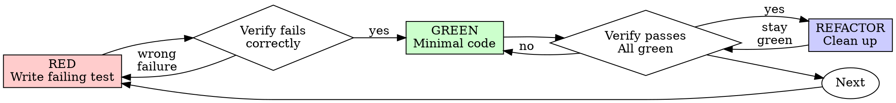

# Fix hidden ask path

> This archive contains visible conversation activity and tool records. Private model reasoning and system/developer instructions are not available here.
<!-- codex-event:{"kind":"state","timestamp":"2026-06-24T20:11:59.986Z","phase":null} -->
## Task state: task_started · 2026-06-24T20:11:59.986Z

```text
{
  "type": "task_started",
  "turn_id": "019efb42-ce5a-7e31-977f-0c3557c57f34",
  "started_at": 1782331919,
  "model_context_window": 258400,
  "collaboration_mode_kind": "default"
}
```

<!-- /codex-event -->

<!-- codex-event:{"kind":"user","timestamp":"2026-06-24T20:11:59.994Z","phase":null} -->
## User · 2026-06-24T20:11:59.994Z

in session 157c26683999 Claude is trying to ask something but I don't see anything in the frontend - there is an ask path that we didnt implement or something

here the convo:

I've reached a real fork before I start modifying the CloudCaptions repo's render pipeline (a different repo, multi-day build). Codex reshaped the sequencing — it wants me to prove Canvas2D parity first and defer the OCR extractor to last. That's a scope/ordering call worth confirming before I dig in, since it changes what lands first.


Asking for your input
Pending


<!-- /codex-event -->

<!-- codex-event:{"kind":"progress","timestamp":"2026-06-24T20:12:10.134Z","phase":"commentary"} -->
## Codex progress · 2026-06-24T20:12:10.134Z

I’ll trace this as a session/state bug: first the persisted rows for `157c26683999`, then the server events/API path that should surface “asking for input” to the UI. I’m also going to load the relevant debugging/control-plane guidance so I don’t accidentally paper over the wrong layer.

<!-- /codex-event -->

<!-- codex-event:{"kind":"tool-call","timestamp":"2026-06-24T20:12:10.141Z","phase":null} -->
## Tool call: exec_command · 2026-06-24T20:12:10.141Z

```json
{
  "cmd": "sed -n '1,220p' /Users/masterman/.agents/skills/using-ultrapowers/SKILL.md",
  "workdir": "/Users/masterman/NLP/omniharness",
  "yield_time_ms": 1000,
  "max_output_tokens": 20000
}
```

<!-- /codex-event -->

<!-- codex-event:{"kind":"tool-call","timestamp":"2026-06-24T20:12:10.141Z","phase":null} -->
## Tool call: exec_command · 2026-06-24T20:12:10.141Z

```json
{
  "cmd": "sed -n '1,260p' /Users/masterman/.agents/skills/systematic-debugging/SKILL.md",
  "workdir": "/Users/masterman/NLP/omniharness",
  "yield_time_ms": 1000,
  "max_output_tokens": 20000
}
```

<!-- /codex-event -->

<!-- codex-event:{"kind":"tool-call","timestamp":"2026-06-24T20:12:10.281Z","phase":null} -->
## Tool call: exec_command · 2026-06-24T20:12:10.281Z

```json
{
  "cmd": "sed -n '1,260p' /Users/masterman/.agents/skills/instrumenting-control-planes/SKILL.md",
  "workdir": "/Users/masterman/NLP/omniharness",
  "yield_time_ms": 1000,
  "max_output_tokens": 20000
}
```

<!-- /codex-event -->

<!-- codex-event:{"kind":"tool-call","timestamp":"2026-06-24T20:12:10.281Z","phase":null} -->
## Tool call: exec_command · 2026-06-24T20:12:10.281Z

```json
{
  "cmd": "sed -n '1,240p' /Users/masterman/.agents/skills/client-server-state-invariants/SKILL.md",
  "workdir": "/Users/masterman/NLP/omniharness",
  "yield_time_ms": 1000,
  "max_output_tokens": 20000
}
```

<!-- /codex-event -->

<!-- codex-event:{"kind":"tool-result","timestamp":"2026-06-24T20:12:10.314Z","phase":null} -->
## Tool result: call_7j363yWhKBbYX6o08e9HiQWo · 2026-06-24T20:12:10.314Z

```text
Chunk ID: 6024d6
Wall time: 0.0000 seconds
Process exited with code 0
Original token count: 2019
Output:
---
name: using-ultrapowers
description: Use when starting any conversation - establishes how to find and use skills, requiring skill invocation before acting
---

<SUBAGENT-STOP>
If you were dispatched as a subagent to execute a specific task, skip this skill.
</SUBAGENT-STOP>

# Using Ultrapowers

Use relevant skills before acting, but keep process proportional to the task.

## Instruction Priority

1. User instructions and local repo instructions
2. Ultrapowers skills
3. Default model behavior

If the user says not to create extra repository isolation, or says to work directly in the current repository, follow that instruction.

## Core Rule

Before responding, ask:

1. Is there a process skill that governs how to approach this?
2. Is there an implementation skill that governs how to execute it?
3. Is the request substantial enough to justify that process, or is it a tiny mechanical edit?

If a skill applies and the task is substantial enough to justify it, use it before continuing. If the request is a tiny mechanical edit, make the edit directly with targeted verification.

## Proportional Skill Use

Do the smallest responsible workflow that matches the request.

For tiny, unambiguous mechanical edits, do the edit directly:

- changing a color value,
- fixing a typo,
- tweaking short copy,
- changing a prompt sentence,
- renaming a label,
- adjusting obvious spacing or formatting,
- making a one-line config or docs correction.

For these, do not run brainstorming, write a plan, or force TDD unless the change affects product behavior, data, persistence, control flow, user journeys, or non-obvious architecture.

Use the heavier process when the request is ambiguous, user-facing behavior changes, multiple files/modules are involved, the user journey can change, or the change could create regressions that are not obvious from a quick targeted check.

## Default Posture

- Work in the current repository by default.
- YOU WILL NEVER CREATE A BRANCH unless explicitly instructed.
- Ask the user whether we should work in worktrees as part of the planning.
- YOU WILL ONLY CREATE A WORKTREE if explicitly instructed.
- Keep skill use proportional. Tiny mechanical edits should stay tiny.
- Every project should have a `.gitignore`.
- Never commit or push secrets, credentials, local environment files, `node_modules`, dependency caches, build outputs, coverage output, logs, temporary files, or intermediate/generated artifacts unless the human explicitly asks to version a specific generated artifact.
- Deliver full product functionality by default. NO FAKE COMPONENTS, NO MOCKS, NO PLACEHOLDERS, NO FALLBACKS as substitutes for the requested functionality unless the human explicitly asks for a prototype or scaffold.
- For app, UI, and product-surface work, run a PM pass during planning. Treat it as mandatory default behavior, not optional polish.
- For app, UI, and product-surface work, consider `agentic-user-journey-testing` for important user stories, but do not run it without explicit user approval.
- Use `second-opinion` for substantial saved implementation plans, and for unusually hard, creative, high-risk, or architecture-heavy specs when an independent external review could improve the artifact. Prefer a different available coding harness for that review, such as Codex asking Claude Code or Claude Code asking Codex. If no different harness is available, the same harness is fine; the second opinion is still mandatory for matching artifacts.
- Refactor code when a file passes 1200 lines. Do not normalize oversized files as the default end state.
- Use user stories in specs and plans when they clarify behavior or value.
- Default UI work to `shadcn/ui` unless the user says otherwise.
- When designing UI from scratch, first inspect the available ShadCN Blocks at https://ui.shadcn.com/blocks for each screen, form, or major surface. Start from the closest matching block with `npx shadcn add <block-name>` or the block's source in https://github.com/shadcn-ui/ui, then edit it by adding, removing, or adapting controls. Do not invent a fresh layout before doing this block-selection pass.
- Before adding any individual UI control, check whether `shadcn/ui` already provides a control that does what is needed. Use the available shadcn control first, then customize it, instead of hand-building a one-off control.
- Treat desktop and mobile responsiveness as first-class from the beginning.
- Prefer explicit routing unless the framework strongly defaults to file-based routes.
- For React apps, use `building-react-apps` for state managers, explicit transitions, routing, refs, imports, package-manager defaults, and frontend configuration defaults.
- For React apps with server state, optimistic UI, caches, polling, SSE/WebSocket streams, background jobs, persistence, or client/server synchronization, use `client-server-state-invariants` during planning and verification.
- For React or Next.js slowness, root-load, compile-time, SSR/hydration, bundle, import-bloat, or UI dependency cleanup work, use `optimizing-react-next-apps`.
- Prefer strong instrumentation and auditability for backend behavior.
- When a project has backend or agent workflows, prefer a fully instrumented control plane: persist meaningful events, tool calls, actions, results, errors, and state transitions, and expose them through a CLI or other scriptable interface so the full system can be inspected and tested without the UI.
- Use `instrumenting-control-planes` when building, planning, reviewing, or debugging backend decisions, agent workflows, recovery paths, retries, deletes, long-running jobs, SSE/WebSocket streams, or user-visible failures.
- Use `learning-from-bugs` after diagnosing or fixing meaningful architecture, storage, memory, persistence, control-plane, or system-level bugs so reusable lessons become durable.
- Do not default to silent, masked, or over-abstracted errors.
- When a project has a frontend, prefer surfacing full backend error details and stack traces to the frontend so failures stay visible, debuggable, and testable end-to-end.
- Treat persistence of settings and preferences as explicit design work.
- For every meaningful UI setting, define whether it persists, where it is stored, how it is read and written, who owns it, and how reset, sync, migration, and testing are handled.

See `docs/ultrapowers-defaults.md` for the canonical fork defaults.

## Skill Priority

1. Process skills first
2. Implementation skills second

Examples:

- "Make this button blue" -> inspect the relevant file, make the small edit, do targeted verification
- "Update this prompt sentence" -> edit the prompt directly and verify the final text
- "Build a feature" -> `brainstorming` with a PM pass first, then `writing-plans`, then execution; consider approval-gated `agentic-user-journey-testing` for app workflows
- "Fix this bug" -> `systematic-debugging`, then the relevant implementation skill; if the root cause is meaningful or systemic, finish with `learning-from-bugs`
- "Review this change" -> `requesting-code-review`

## Examples Of User Override

- If a task feels risky and the user did not ask for extra repository isolation, keep working in the current repository unless the user explicitly instructs otherwise.
- If a stack supports file-based routing but the user says not to use it, choose an explicit routing approach instead.
- If a framework strongly defaults to file-based routing, such as Next.js App Router, use the framework-native routing model unless there is a good reason not to.
- If a frontend skill suggests `shadcn/ui` but the user wants another design system, follow the user.

## Red Flags

- "I need a whole workflow for this tiny edit" -> no. Use the smallest responsible process.
- "This is simple, so I need the whole process anyway" -> no. Tiny mechanical edits should stay tiny.
- "I'll create extra repository isolation just to be safe" -> forbidden unless the user clearly asked for it.
- "I already know the skill" -> read the current version before relying on it

```

<!-- /codex-event -->

<!-- codex-event:{"kind":"tool-result","timestamp":"2026-06-24T20:12:10.317Z","phase":null} -->
## Tool result: call_1DiqadrlufjtHFBTVrKg7h5b · 2026-06-24T20:12:10.317Z

````text
Chunk ID: 9da343
Wall time: 0.0000 seconds
Process exited with code 0
Original token count: 2092
Output:
---
name: systematic-debugging
description: Use when encountering any bug, test failure, or unexpected behavior, before proposing fixes
---

# Systematic Debugging

## Overview

Random fixes waste time and create new bugs. Quick patches mask underlying issues.

**Core principle:** ALWAYS find root cause before attempting fixes. Symptom fixes are failure.

**Violating the letter of this process is violating the spirit of debugging.**

## The Iron Law

```
NO FIXES WITHOUT ROOT CAUSE INVESTIGATION FIRST
```

If you haven't completed Phase 1, you cannot propose fixes.

## When to Use

Use for ANY technical issue:
- Test failures
- Bugs in production
- Unexpected behavior
- Performance problems
- Build failures
- Integration issues

**Use this ESPECIALLY when:**
- Under time pressure (emergencies make guessing tempting)
- "Just one quick fix" seems obvious
- You've already tried multiple fixes
- Previous fix didn't work
- You don't fully understand the issue

**Don't skip when:**
- Issue seems simple (simple bugs have root causes too)
- You're in a hurry (rushing guarantees rework)
- Manager wants it fixed NOW (systematic is faster than thrashing)

## The Four Phases

You MUST complete each phase before proceeding to the next.

### Phase 1: Root Cause Investigation

**BEFORE attempting ANY fix:**

1. **Read Error Messages Carefully**
   - Don't skip past errors or warnings
   - They often contain the exact solution
   - Read stack traces completely
   - Note line numbers, file paths, error codes

2. **Reproduce Consistently**
   - Can you trigger it reliably?
   - What are the exact steps?
   - Does it happen every time?
   - If not reproducible → gather more data, don't guess

3. **Check Recent Changes**
   - What changed that could cause this?
   - Git diff, recent commits
   - New dependencies, config changes
   - Environmental differences

4. **Gather Evidence in Multi-Component Systems**

   **WHEN system has multiple components (CI → build → signing, API → service → database):**

   **BEFORE proposing fixes, add diagnostic instrumentation:**
   ```
   For EACH component boundary:
     - Log what data enters component
     - Log what data exits component
     - Verify environment/config propagation
     - Check state at each layer

   Run once to gather evidence showing WHERE it breaks
   THEN analyze evidence to identify failing component
   THEN investigate that specific component
   ```

   **Example (multi-layer system):**
   ```bash
   # Layer 1: Workflow
   echo "=== Secrets available in workflow: ==="
   echo "IDENTITY: ${IDENTITY:+SET}${IDENTITY:-UNSET}"

   # Layer 2: Build script
   echo "=== Env vars in build script: ==="
   env | grep IDENTITY || echo "IDENTITY not in environment"

   # Layer 3: Signing script
   echo "=== Keychain state: ==="
   security list-keychains
   security find-identity -v

   # Layer 4: Actual signing
   codesign --sign "$IDENTITY" --verbose=4 "$APP"
   ```

   **This reveals:** Which layer fails (secrets → workflow ✓, workflow → build ✗)

5. **Trace Data Flow**

   **WHEN error is deep in call stack:**

   See `root-cause-tracing.md` in this directory for the complete backward tracing technique.

   **Quick version:**
   - Where does bad value originate?
   - What called this with bad value?
   - Keep tracing up until you find the source
   - Fix at source, not at symptom

### Phase 2: Pattern Analysis

**Find the pattern before fixing:**

1. **Find Working Examples**
   - Locate similar working code in same codebase
   - What works that's similar to what's broken?

2. **Compare Against References**
   - If implementing pattern, read reference implementation COMPLETELY
   - Don't skim - read every line
   - Understand the pattern fully before applying

3. **Identify Differences**
   - What's different between working and broken?
   - List every difference, however small
   - Don't assume "that can't matter"

4. **Understand Dependencies**
   - What other components does this need?
   - What settings, config, environment?
   - What assumptions does it make?

### Phase 3: Hypothesis and Testing

**Scientific method:**

1. **Form Single Hypothesis**
   - State clearly: "I think X is the root cause because Y"
   - Write it down
   - Be specific, not vague

2. **Test Minimally**
   - Make the SMALLEST possible change to test hypothesis
   - One variable at a time
   - Don't fix multiple things at once

3. **Verify Before Continuing**
   - Did it work? Yes → Phase 4
   - Didn't work? Form NEW hypothesis
   - DON'T add more fixes on top

4. **When You Don't Know**
   - Say "I don't understand X"
   - Don't pretend to know
   - Ask for help
   - Research more

### Phase 4: Implementation

**Fix the root cause, not the symptom:**

1. **Create Failing Test Case**
   - Simplest possible reproduction
   - Automated test if possible
   - One-off test script if no framework
   - MUST have before fixing
   - Use the `ultrapowers:test-driven-development` skill for writing proper failing tests

2. **Implement Single Fix**
   - Address the root cause identified
   - ONE change at a time
   - No "while I'm here" improvements
   - No bundled refactoring

3. **Verify Fix**
   - Test passes now?
   - No other tests broken?
   - Issue actually resolved?
   - If the bug was meaningful or systemic, use `ultrapowers:learning-from-bugs` before declaring the fix complete.

4. **If Fix Doesn't Work**
   - STOP
   - Count: How many fixes have you tried?
   - If < 3: Return to Phase 1, re-analyze with new information
   - **If ≥ 3: STOP and question the architecture (step 5 below)**
   - DON'T attempt Fix #4 without architectural discussion

5. **If 3+ Fixes Failed: Question Architecture**

   **Pattern indicating architectural problem:**
   - Each fix reveals new shared state/coupling/problem in different place
   - Fixes require "massive refactoring" to implement
   - Each fix creates new symptoms elsewhere

   **STOP and question fundamentals:**
   - Is this pattern fundamentally sound?
   - Are we "sticking with it through sheer inertia"?
   - Should we refactor architecture vs. continue fixing symptoms?

   **Discuss with your human partner before attempting more fixes**

   This is NOT a failed hypothesis - this is a wrong architecture.

## Red Flags - STOP and Follow Process

If you catch yourself thinking:
- "Quick fix for now, investigate later"
- "Just try changing X and see if it works"
- "Add multiple changes, run tests"
- "Skip the test, I'll manually verify"
- "It's probably X, let me fix that"
- "I don't fully understand but this might work"
- "Pattern says X but I'll adapt it differently"
- "Here are the main problems: [lists fixes without investigation]"
- Proposing solutions before tracing data flow
- **"One more fix attempt" (when already tried 2+)**
- **Each fix reveals new problem in different place**

**ALL of these mean: STOP. Return to Phase 1.**

**If 3+ fixes failed:** Question the architecture (see Phase 4.5)

## your human partner's Signals You're Doing It Wrong

**Watch for these redirections:**
- "Is that not happening?" - You assumed without verifying
- "Will it show us...?" - You should have added evidence gathering
- "Stop guessing" - You're proposing fixes without understanding
- "Ultrathink this" - Question fundamentals, not just symptoms
- "We're stuck?" (frustrated) - Your approach isn't working

**When you see these:** STOP. Return to Phase 1.

## Common Rationalizations

| Excuse | Reality |
|--------|---------|
| "Issue is simple, don't need process" | Simple issues have root causes too. Process is fast for simple bugs. |
| "Emergency, no time for process" | Systematic debugging is FASTER than guess-and-check thrashing. |
| "Just try this first, then investigate" | First fix sets the pattern. Do it right from the start. |
| "I'll write test after confirming fix works" | Untested fixes don't stick. Test first proves it. |
| "Multiple fixes at once saves time" | Can't isolate what worked. Causes new bugs. |
| "Reference too long, I'll adapt the pattern" | Partial understanding guarantees bugs. Read it completely. |
| "I see the problem, let me fix it" | Seeing symptoms ≠ understanding root cause. |
| "One more fix attempt" (after 2+ failures) | 3+ failures = architectural problem. Question pattern, don't fix again. |

## Quick Reference


````

<!-- /codex-event -->

<!-- codex-event:{"kind":"tool-result","timestamp":"2026-06-24T20:12:10.345Z","phase":null} -->
## Tool result: call_DfNEuicvZEgLM21Db2LFrQ8a · 2026-06-24T20:12:10.345Z

````text
Chunk ID: 34ef76
Wall time: 0.0000 seconds
Process exited with code 0
Original token count: 1303
Output:
---
name: instrumenting-control-planes
description: Use when building, planning, reviewing, or debugging apps with backend decisions, agent workflows, long-running jobs, SSE/WebSocket streams, recovery paths, deletes, retries, or user-visible failures
---

# Instrumenting Control Planes

Build the control plane as a product surface. If the server decides, refuses, retries, spawns, deletes, recovers, gives up, or fails, that decision must be observable by users, operators, and tests.

If a React UI consumes the control plane through server state, optimistic UI, caches, polling, SSE/WebSocket streams, or persisted runtime state, also use `client-server-state-invariants`.

## Core Rule

Every meaningful server-side state transition emits a named, durable event. The UI and tests consume the same production event surface.

Do not rely on snapshot diffs, rendered DOM state, logs only, or client-side re-derivation to prove what the server decided.

## Hot Path Rule

No user bootstrap, catalog, status, reconnect, or recovery request may depend on a lock-prone database write path or external health probe finishing. Serve these paths from a bounded read model, memory cache, append-only event log, or stale-but-marked snapshot; queue reconciliation writes outside the request. Every dependency on a database or bridge call in a hot path needs a short timeout, cancellation, and an explicit degraded response.

If SQLite, local files, or a single-writer store is used, assume writer contention can freeze readers at the worst moment. Use one writer, WAL/busy-timeout discipline, short transactions, bounded queues, and headless chaos tests that run bootstrap/reload while writes are active. A 25s UI request is a control-plane failure, even if the database eventually returns.

## Event Contract

For each backend or agent workflow, define:

- named events for decisions: `worker.spawned`, `worker.reattached`, `plan.ready`, `plan.review.blocked`, `recovery.gave_up`, `conversation.delete_failed`;
- payloads with stable ids, `prev`/`next` status when relevant, reason codes, and enough context to debug;
- `error.surfaced` or an equivalent user-facing failure event for every failure the user should know about;
- durable persistence or a bounded replay buffer so short disconnects do not erase history;
- a scriptable read path: CLI, HTTP endpoint, sqlite query, or event log command.

If a decision cannot be asserted from this surface, the design is incomplete.

If debugging a control-plane failure reveals a reusable lesson, use `ultrapowers:learning-from-bugs` after the fix is verified.

## Streaming Requirements

For SSE or WebSocket-like streams:

- emit named events alongside any snapshot/update frame;
- include monotonic event ids;
- support resume from the last seen id;
- replay missed events from a bounded buffer;
- emit an explicit resync-required event when replay is impossible;
- bootstrap from a snapshot, then tail events.

Snapshots show current truth. Named events show why it became true.

## Testing Standard

Control-plane tests should usually be headless HTTP/SSE scenario tests, not browser tests. Browser automation is for UI behavior; control-plane tests assert server decisions directly.

Write scenario assertions as event transcripts:

```ts
expect(events).toHaveEmitted("worker.spawned", { runId });
expect(events).toHaveEmitted("worker.status", { next: "running" });
chaos.killServer();
chaos.restartServer();
expect(events).toHaveEmitted("worker.reattached", { runId });
expect(events).not.toHaveEmitted("worker.recreated", { runId });
```

Chaos belongs outside production code paths: drop connections in the client, fail fetches in the harness, restart the server process, and use seeds for reproducibility.

## Refuse These Shapes

- silent early returns in server methods;
- swallowed `catch` blocks;
- client-side derivation of server decisions;
- response-code-only user failures;
- event streams without ids or resume;
- tests that infer control-plane behavior from rendered state;
- delete handlers that do not enumerate dependent rows or emit typed failure events;
- recovery loops without terminal events such as `gave_up` or `abandoned`;
- request handlers that wait on inline reconciliation writes, SQLite contention, or bridge `/doctor` checks before returning bootstrap data;
- test-only behavior branches in production code.

## Design Checklist

Before implementing a backend or agent workflow, answer:

1. What decisions can this workflow make?
2. What named event is emitted for each decision, including refusal and failure?
3. Where are events persisted or buffered?
4. How does a client resume after disconnect?
5. Which request paths must keep working while persistence or bridge dependencies are slow, locked, or stale?
6. How can a CLI or test harness inspect the exact event sequence without the UI?
7. Which headless scenario proves the happy path, failure path, recovery path, terminal state, and hot-path timeout/degraded path?
8. Which client state consumes these events, and how does it prove ownership, freshness, completeness, ordering, and replay/resync?

If the answer is "the UI can figure it out", name the missing event instead.

````

<!-- /codex-event -->

<!-- codex-event:{"kind":"tool-result","timestamp":"2026-06-24T20:12:10.345Z","phase":null} -->
## Tool result: call_ul8R2wdki6Jk1ffYvphFXb6A · 2026-06-24T20:12:10.345Z

```text
Chunk ID: 431727
Wall time: 0.0000 seconds
Process exited with code 0
Original token count: 1481
Output:
---
name: client-server-state-invariants
description: Use when planning, building, reviewing, or debugging React apps with server state, optimistic UI, caches, polling, SSE/WebSocket streams, background jobs, persistence, or client/server synchronization
---

# Client Server State Invariants

React bugs often expose deeper ownership mistakes. When client state, server state, cache state, stream state, and persisted state all exist, every plan needs explicit invariants.

## Core Rule

No UI surface may treat data as authoritative unless the payload proves ownership, freshness, completeness, ordering, and terminal state.

If those words are missing from the plan, the plan is probably baking in a race condition.

## Planning Checklist

For every React app that reads server/runtime state, the plan must answer:

1. **Owner:** What owns this state: server, client manager, URL, cache, stream, local storage, or worker/runtime?
2. **Token:** What owner token protects async results: `requestId`, `runId`, `projectPath`, `operationId`, `workerId + seq`, or equivalent?
3. **Provenance:** Is data server-authoritative, optimistic, cached preview, partial update, or historical fallback?
4. **Completeness:** Does the payload declare what scope it is complete for? What may it erase?
5. **Ordering:** What stable order is used: monotonic seq, `(createdAt, id)`, version, or cursor?
6. **State machine:** What are the legal states, terminal states, and transitions?
7. **Events:** Which server decisions are named events rather than client-side derivations?
8. **Loading shape:** Which states are bootstrap, first load, incremental refresh, reconnect, resync, recovery, and terminal error?
9. **Fallbacks:** Which legacy/fallback rows can render, and only after what authority is loaded?
10. **Tests:** Which race, stale-response, event-sequence, reconnect, and merge tests prove the invariants?

## Invariants To Require

- Cached and optimistic data may pre-render, but cannot satisfy full-load gates.
- Partial snapshots may add or refine state, but may not erase optimistic objects, delivered user input, read markers, or stream entries unless they declare complete scope.
- Every async response checks that its owner token still matches before mutating visible state.
- Mutation success handlers may navigate or clear UI only if they still own the current context, unless the action explicitly creates a new selected context.
- Timers and polling callbacks re-check ownership immediately before acting.
- Server decisions are emitted as named events; the client does not infer decisions by diffing snapshots.
- SSE/WebSocket streams have event ids, replay/resume, and an explicit resync path.
- Loading booleans are split by lifecycle stage. A leaf stream refresh must not unmount the whole page.
- Append-only content has one writer, one reader, stable ids, and monotonic cursors.
- Fallback DB rows or historical rows are gated behind stream loading and deduped by stable id plus safe equivalence.
- Status classifiers distinguish active, runnable, blocked, awaiting user, terminal, stale, and recoverable states.
- "Latest" queries have deterministic tie-breakers. Timestamp-only ordering is not enough.
- Hot paths use bounded reads and do not synchronously load large bodies, bridge probes, schema setup, or heavy app graphs.
- Process-local caches have explicit TTL/size bounds and invalidation rules.

## Test Matrix

Pick the rows that match the work. Do not rely on one happy-path UI test.

| Risk | Test shape |
| --- | --- |
| Stale async response | Start request A, switch owner, resolve A, assert it cannot mutate B |
| Optimistic object erased | Create local optimistic state, apply stale/partial snapshot, assert object remains |
| Cache masquerades as loaded | Hydrate cache preview, assert full-load gate waits for server authority |
| Mutation steals navigation | Start mutation, switch selection, resolve mutation, assert focus stays put |
| Timer/poll stale-fire | Use fake timers or deferred promises; callback must re-check owner before acting |
| Snapshot merge erases stream | Apply partial snapshot missing known entries, assert entries/read markers remain |
| Event stream gap | Bootstrap snapshot, emit events during disconnect, reconnect with last id, assert replay or resync |
| Server decision invisible | Exercise branch and assert named event such as `blocked`, `refused`, `gave_up`, or `error.surfaced` |
| State classifier wrong | Table-test every status into active/runnable/terminal/recoverable buckets |
| Fallback duplicates stream | Load fallback rows then stream entries, assert no duplicate or false chronology |
| Hot path bloats | Assert snapshots carry cursors not bodies; route returns before DB/heavy imports when possible |
| Timestamp tie | Insert equal timestamps, assert deterministic order by id/seq |

Use headless HTTP/SSE tests for control-plane decisions. Use React/unit tests for manager merging and ownership guards. Use Playwright only for real UI layout, focus, scroll, mobile computed styles, and visible affordances.

## Refuse These Shapes

- one `isLoading` boolean for bootstrap, refresh, reconnect, and recovery;
- cache or optimistic data treated as authoritative without provenance;
- async callbacks that mutate state without checking owner tokens;
- client-side derivation of server decisions;
- snapshot diffs used as the only way to know what happened;
- event streams without ids or resume;
- timestamp-only "latest" queries;
- parallel transcript or persistence surfaces that the frontend must reconcile;
- unbounded process caches introduced to hide slow storage;
- tests that prove only the DOM result when the bug is a server decision.

## Review Prompt

Ask this before implementation starts:

> What can arrive late, out of order, partially, twice, or after the user changes context, and what test proves it cannot corrupt visible state?

```

<!-- /codex-event -->

<!-- codex-event:{"kind":"progress","timestamp":"2026-06-24T20:12:18.726Z","phase":"commentary"} -->
## Codex progress · 2026-06-24T20:12:18.726Z

I’m using `systematic-debugging`, `instrumenting-control-planes`, and `client-server-state-invariants` here because this smells like a server decision that exists in persistence but isn’t making it through the event/snapshot/UI ownership chain. Next I’m going straight at the database row and the ask-related code paths.

<!-- /codex-event -->

<!-- codex-event:{"kind":"tool-call","timestamp":"2026-06-24T20:12:18.734Z","phase":null} -->
## Tool call: exec_command · 2026-06-24T20:12:18.734Z

```json
{
  "cmd": "git status --short",
  "workdir": "/Users/masterman/NLP/omniharness",
  "yield_time_ms": 1000,
  "max_output_tokens": 12000
}
```

<!-- /codex-event -->

<!-- codex-event:{"kind":"tool-call","timestamp":"2026-06-24T20:12:18.734Z","phase":null} -->
## Tool call: exec_command · 2026-06-24T20:12:18.734Z

```json
{
  "cmd": "rg --files -g 'sqlite.db' -g '*.db' -g 'package.json' -g 'docs/architecture/lifecycle-observability-and-testing.md'",
  "workdir": "/Users/masterman/NLP/omniharness",
  "yield_time_ms": 1000,
  "max_output_tokens": 12000
}
```

<!-- /codex-event -->

<!-- codex-event:{"kind":"tool-call","timestamp":"2026-06-24T20:12:18.878Z","phase":null} -->
## Tool call: exec_command · 2026-06-24T20:12:18.878Z

```json
{
  "cmd": "rg -n \"ask|input|Pending|awaiting|user input|question|approval\" src tests shared docs scripts --glob '!node_modules'",
  "workdir": "/Users/masterman/NLP/omniharness",
  "yield_time_ms": 1000,
  "max_output_tokens": 30000
}
```

<!-- /codex-event -->

<!-- codex-event:{"kind":"tool-call","timestamp":"2026-06-24T20:12:18.878Z","phase":null} -->
## Tool call: exec_command · 2026-06-24T20:12:18.878Z

```json
{
  "cmd": "sed -n '1,240p' docs/architecture/lifecycle-observability-and-testing.md",
  "workdir": "/Users/masterman/NLP/omniharness",
  "yield_time_ms": 1000,
  "max_output_tokens": 20000
}
```

<!-- /codex-event -->

<!-- codex-event:{"kind":"tool-result","timestamp":"2026-06-24T20:12:18.898Z","phase":null} -->
## Tool result: call_Q33P3uREtPcCvtmxhglZmnY9 · 2026-06-24T20:12:18.898Z

```text
Chunk ID: 6a5bd9
Wall time: 0.0000 seconds
Process exited with code 0
Original token count: 33
Output:
 M plans/001-verification-ci-and-typecheck-script.md
 M plans/README.md
?? .claude/
?? plans/004-fix-committed-typecheck-error.md

```

<!-- /codex-event -->

<!-- codex-event:{"kind":"tool-result","timestamp":"2026-06-24T20:12:18.898Z","phase":null} -->
## Tool result: call_wNREG4UUHOHeNBwQMvDXgoDl · 2026-06-24T20:12:18.898Z

```text
Chunk ID: b21b71
Wall time: 0.0000 seconds
Process exited with code 0
Original token count: 33
Output:
package.json
sqlite.db
apps/vscode/package.json
apps/electron/package.json
docs/architecture/lifecycle-observability-and-testing.md

```

<!-- /codex-event -->

<!-- codex-event:{"kind":"tool-result","timestamp":"2026-06-24T20:12:18.948Z","phase":null} -->
## Tool result: call_rUcAacB3aQ1i4nXmKgQHHHUc · 2026-06-24T20:12:18.948Z

```text
Chunk ID: 6ab851
Wall time: 0.0000 seconds
Process exited with code 0
Original token count: 85226
Output:
Warning: truncated output (original token count: 85226)
Total output lines: 2644

docs/superpowers/journeys/2026-05-13-branch-workspace-management.md:3:These journeys are approval-gated. Run them only after explicit approval because they drive the UI and some create temporary git repositories or worktrees.
shared/locales/es.json:171:  "conversation.sidebar.status.awaitingUser": "Esperando tu respuesta",
shared/locales/es.json:324:  "settings.notifications.description": "Get a browser notification when a conversation completes or needs your input.",
shared/locales/es.json:337:  "notifications.push.needsInput": "OmniHarness needs input",
shared/locales/es.json:338:  "notifications.push.needsInputBody": "{title} is waiting for your input.",
shared/locales/es.json:368:  "worker.elicitation.summary": "{count} question(s) waiting",
shared/locales/es.json:370:  "worker.elicitation.title": "Worker question",
shared/locales/es.json:371:  "worker.elicitation.defaultQuestion": "The worker needs input before continuing.",
shared/locales/es.json:375:  "worker.elicitation.inputPlaceholder": "Type your answer",
shared/locales/es.json:550:  "supervisor.activity.phase.awaitingUser": "Waiting for your input",
shared/locales/es.json:572:  "conversation.status.awaitingInput": "Awaiting input",
shared/locales/es.json:573:  "conversation.status.awaitingWorkerInput": "The worker asked for input before continuing.",
scripts/backfill-worker-entries.ts:7: *     - role:"user"|"checkpoint" → user_input
scripts/backfill-worker-entries.ts:8: *     - role:"supervisor"        → supervisor_input
scripts/backfill-worker-entries.ts:17: *     supervisor-conversation inputs, not worker inputs. Skipped.
scripts/backfill-worker-entries.ts:200:        type === "user_input" ? "user"
scripts/backfill-worker-entries.ts:201:          : type === "supervisor_input" ? "supervisor"
scripts/backfill-worker-entries.ts:209:function pickEntryType(message: MessageRow): "user_input" | "supervisor_input" | "message" | null {
scripts/backfill-worker-entries.ts:210:  if (message.role === "user") return "user_input";
scripts/backfill-worker-entries.ts:211:  if (message.role === "supervisor") return "supervisor_input";
src/lib/conversation-state.ts:48:  if (status === "done" || status === "awaiting_user" || status === "failed" || status === "needs_recovery") {
tests/supervisor/observer.test.ts:489:        currentText: "waiting for approval",
tests/supervisor/observer.test.ts:490:        lastText: "waiting for approval",
tests/supervisor/observer.test.ts:498:          currentText: "waiting for approval",
tests/supervisor/observer.test.ts:499:          lastText: "waiting for approval",
tests/supervisor/observer.test.ts:508:          currentText: "waiting for approval",
tests/supervisor/observer.test.ts:509:          lastText: "waiting for approval",
tests/supervisor/observer.test.ts:528:  it("wakes the supervisor immediately when a worker asks the user a question", () => {
tests/supervisor/observer.test.ts:532:      toolCallId: "ask-call-1",
tests/supervisor/observer.test.ts:576:        summary: "worker-1 is waiting on user input",
tests/supervisor/observer.test.ts:1746:      currentText: "waiting for approval",
tests/supervisor/observer.test.ts:1747:      lastText: "waiting for approval",
tests/supervisor/observer.test.ts:1826:      currentText: "waiting for approval",
tests/supervisor/observer.test.ts:1827:      lastText: "waiting for approval",
shared/locales/ko.json:171:  "conversation.sidebar.status.awaitingUser": "입력을 기다리는 중",
shared/locales/ko.json:324:  "settings.notifications.description": "Get a browser notification when a conversation completes or needs your input.",
shared/locales/ko.json:337:  "notifications.push.needsInput": "OmniHarness needs input",
shared/locales/ko.json:338:  "notifications.push.needsInputBody": "{title} is waiting for your input.",
shared/locales/ko.json:368:  "worker.elicitation.summary": "{count} question(s) waiting",
shared/locales/ko.json:370:  "worker.elicitation.title": "Worker question",
shared/locales/ko.json:371:  "worker.elicitation.defaultQuestion": "The worker needs input before continuing.",
shared/locales/ko.json:375:  "worker.elicitation.inputPlaceholder": "Type your answer",
shared/locales/ko.json:550:  "supervisor.activity.phase.awaitingUser": "Waiting for your input",
shared/locales/ko.json:572:  "conversation.status.awaitingInput": "Awaiting input",
shared/locales/ko.json:573:  "conversation.status.awaitingWorkerInput": "The worker asked for input before continuing.",
docs/superpowers/learnings/2026-06-15-input-ready-state-must-not-render-as-working.md:7:**Fix:** Treat pending permission and elicitation stream entries as authoritative input-ready signals for the status banner and direct terminal pending-assistant indicator, add `elicitation` to the shared worker-entry type, and allow stale interrupt delivery failures to restore the row to `pending` or `failed` when the row is still the same delivering attempt.
docs/superpowers/learnings/2026-06-15-input-ready-state-must-not-render-as-working.md:8:**Verification:** Regression tests were added for permission-stream status, elicitation-stream status, direct-terminal working suppression while human input is pending, and stale interrupt delivery. Affected suites passed with `node_modules/.bin/vitest run tests/app/direct-control-activity.test.ts tests/app/conversation-execution-status.test.ts tests/api/conversation-messages-route.test.ts tests/lib/agent-output.test.ts tests/server/conversations-sync.test.ts`.
docs/superpowers/learnings/2026-06-15-input-ready-state-must-not-render-as-working.md:9:**Prevention:** Any state that renders a pending input card must also feed every activity/status model and be represented in shared stream types. Delivery fences should prevent stale overwrites, but they must not orphan user intent in an in-flight state with no owner.
docs/superpowers/learnings/2026-05-20-supervisor-timestamp-tie-breakers.md:5:**Symptom:** Several server paths asked for "latest", "recent", or chronological replay using only `createdAt`/`updatedAt`. Equal timestamps can occur when rows are inserted in the same millisecond, and SQLite is not a stable ordering oracle for ties. That can change which supervisor file read is considered latest, which queued message drains first, which checkpoint is recovered, or how CLI/ACP replay orders rows.
docs/superpowers/learnings/2026-06-15-pending-elicitations-are-input-ready.md:1:# Pending Elicitations Are Input-Ready
docs/superpowers/learnings/2026-06-15-pending-elicitations-are-input-ready.md:6:**Root Cause:** The UI inferred tool kind from prompt/title text, so an input request mentioning terminal work became `bash`. The queue drain also treated worker `working` as always non-drainable and ignored the bridge's authoritative `pendingElicitations`, so answers were not delivered through `respondElicitation`.
docs/superpowers/learnings/2026-06-15-pending-elicitations-are-input-ready.md:7:**Fix:** Preserve `AskUserQuestion` as a generic tool activity, route main-composer answers for direct `awaiting_user` runs through `respondElicitation`, and let queue draining proceed when the live snapshot has a pending elicitation even if the worker state is still `working`.
scripts/backfill-runtime-output-to-worker-stream.ts:94:    input: fs.createReadStream(filePath, { encoding: "utf8" }),
tests/supervisor/worker-failover-handoff-fails.test.ts:14:  askAgent: mockAskAgent,
tests/supervisor/worker-failover-handoff-fails.test.ts:93:      initialPrompt: "Original task",
tests/supervisor/worker-failover-handoff-fails.test.ts:104:    // Handoff ask rejects (outgoing worker is unresponsive), but the replacement receives the synthetic seed.
tests/supervisor/worker-failover-handoff-fails.test.ts:123:      originalPrompt: "Original task",
shared/locales/fr.json:171:  "conversation.sidebar.status.awaitingUser": "En attente de votre réponse",
shared/locales/fr.json:324:  "settings.notifications.description": "Get a browser notification when a conversation completes or needs your input.",
shared/locales/fr.json:337:  "notifications.push.needsInput": "OmniHarness needs input",
shared/locales/fr.json:338:  "notifications.push.needsInputBody": "{title} is waiting for your input.",
shared/locales/fr.json:368:  "worker.elicitation.summary": "{count} question(s) waiting",
shared/locales/fr.json:370:  "worker.elicitation.title": "Worker question",
shared/locales/fr.json:371:  "worker.elicitation.defaultQuestion": "The worker needs input before continuing.",
shared/locales/fr.json:375:  "worker.elicitation.inputPlaceholder": "Type your answer",
shared/locales/fr.json:550:  "supervisor.activity.phase.awaitingUser": "Waiting for your input",
shared/locales/fr.json:572:  "conversation.status.awaitingInput": "Awaiting input",
shared/locales/fr.json:573:  "conversation.status.awaitingWorkerInput": "The worker asked for input before continuing.",
docs/superpowers/learnings/2026-05-20-server-snapshots-retire-optimistic-running.md:7:**Fix:** Server-sourced event snapshots now bypass timestamp arbitration for run rows, so authoritative terminal states retire optimistic state. The terminal now creates the pending assistant row only from explicit active-worker facts passed through `showPendingAssistantIndicator`, not from transcript loading.
docs/superpowers/learnings/2026-05-30-stale-worker-session-recovery.md:9:**Prevention:** Treat persisted worker rows as stale unless the bridge or durable worker stream can prove recoverability. Never surface missing ACP session metadata as the first-class user error when a fresh direct retry can proceed. For lifecycle tests with background turns, wait for tracked background tasks and clear artifact stream metadata/caches before DB cleanup.
tests/supervisor/runtime.test.ts:5:  it("returns awaiting_user when there are pending clarifications", () => {
tests/supervisor/runtime.test.ts:13:    ).toBe("awaiting_user");
scripts/setup-auth.mjs:72:async function promptHidden(input, output, message) {
scripts/setup-auth.mjs:73:  if (!input?.isTTY || !output?.isTTY) {
scripts/setup-auth.mjs:78:    const wasRaw = input.isRaw;
scripts/setup-auth.mjs:82:      input.off("data", onData);
scripts/setup-auth.mjs:83:      input.setRawMode(wasRaw);
scripts/setup-auth.mjs:84:      input.pause?.();
scripts/setup-auth.mjs:116:    input.setEncoding("utf8");
scripts/setup-auth.mjs:117:    input.setRawMode(true);
scripts/setup-auth.mjs:118:    input.resume();
scripts/setup-auth.mjs:119:    input.on("data", onData);
scripts/setup-auth.mjs:174:  const input = options.input ?? process.stdin;
scripts/setup-auth.mjs:185:    input,
src/lib/chat-attachments.ts:13:export interface PendingChatAttachment extends ChatAttachment {
docs/superpowers/learnings/2026-06-23-direct-follow-up-after-stop.md:6:**Root Cause:** The direct follow-up path selected the only conversation worker even though it was already `cancelled`, appended the user input, and launched the background turn. `continueWorkerConversation` then re-read the worker, saw `cancelled`, and returned silently. That guard is correct for the race where a user stops an in-flight turn before the background ask starts, but it also blocked a deliberate follow-up submitted after the stop.
docs/superpowers/learnings/2026-06-23-direct-follow-up-after-stop.md:9:**Prevention:** When a lifecycle guard protects against races, preserve the submit-time state that disambiguates a stale background task from a new user action. Do not infer that distinction from the latest worker row alone.
shared/locales/it.json:171:  "conversation.sidebar.status.awaitingUser": "In attesa del tuo input",
shared/locales/it.json:324:  "settings.notifications.description": "Get a browser notification when a conversation completes or needs your input.",
shared/locales/it.json:337:  "notifications.push.needsInput": "OmniHarness needs input",
shared/locales/it.json:338:  "notifications.push.needsInputBody": "{title} is waiting for your input.",
shared/locales/it.json:368:  "worker.elicitation.summary": "{count} question(s) waiting",
shared/locales/it.json:370:  "worker.elicitation.title": "Worker question",
shared/locales/it.json:371:  "worker.elicitation.defaultQuestion": "The worker needs input before continuing.",
shared/locales/it.json:375:  "worker.elicitation.inputPlaceholder": "Type your answer",
shared/locales/it.json:550:  "supervisor.activity.phase.awaitingUser": "Waiting for your input",
shared/locales/it.json:572:  "conversation.status.awaitingInput": "Awaiting input",
shared/locales/it.json:573:  "conversation.status.awaitingWorkerInput": "The worker asked for input before continuing.",
src/lib/run-status.ts:27:    && normalizeRunStatus(run?.status) !== "awaiting_user";
tests/supervisor/worker-failover-spawn-retry.test.ts:15:  askAgent: mockAskAgent,
src/lib/app-errors.ts:128:  input: RequestInfo | URL,
src/lib/app-errors.ts:132:  const response = await fetch(input, init);
docs/superpowers/specs/2026-04-23-remote-access-pwa-design.md:55:- multi-user support and approval flows,
docs/superpowers/specs/2026-04-23-remote-access-pwa-design.md:64:As the sole operator, I want to receive a push notification when a run fails, finishes, gets stuck, or needs my input so I do not have to babysit the app.
docs/superpowers/specs/2026-04-23-remote-access-pwa-design.md:271:- manual approval or permission action needed,
tests/supervisor/wake.test.ts:52:  askAgent: mockAskAgent,
tests/supervisor/wake.test.ts:134:  it("does not execute the supervisor while an implementation run is awaiting user input", async () => {
tests/supervisor/wake.test.ts:150:      status: "awaiting_user",
tests/supervisor/wake.test.ts:158:    expect(persistedRun?.status).toBe("awaiting_user");
src/lib/git-workspace.ts:79:export interface PendingOrphanWorktreeRecovery {
docs/superpowers/specs/2026-05-03-supervisor-conversation-signal-design.md:7:- human conversation: user requests, supervisor questions, supervisor completion summaries,
docs/superpowers/specs/2026-05-03-supervisor-conversation-signal-design.md:60:- what they asked for,
docs/superpowers/specs/2026-05-03-supervisor-conversation-signal-design.md:86:- permission approvals and denials,
docs/superpowers/specs/2026-05-03-supervisor-conversation-signal-design.md:119:- supervisor clarification questions,
docs/superpowers/specs/2026-05-03-supervisor-conversation-signal-design.md:131:- `Read <file>` when it explains a following plan sync, question, or implementation decision,
docs/superpowers/specs/2026-05-03-supervisor-conversation-signal-design.md:294:4. **Later**: make the worker observer/event pipeline more authoritative, so the supervisor can react to worker state changes instead of asking the model to repeatedly decide to wait.
docs/superpowers/specs/2026-05-03-supervisor-conversation-signal-design.md:482:After implementation, with approval, run an agentic user journey:
docs/superpowers/specs/2026-05-03-supervisor-conversation-signal-design.md:497:- `src/app/home/HomeApp.tsx`: derive status inputs and timeline items.
shared/locales/en.json:201:  "conversation.sidebar.status.awaitingUser": "Waiting for your input",
shared/locales/en.json:354:  "settings.notifications.description": "Get a browser notification when a conversation completes or needs your input.",
shared/locales/en.json:367:  "notifications.push.needsInput": "OmniHarness needs input",
shared/locales/en.json:368:  "notifications.push.needsInputBody": "{title} is waiting for your input.",
shared/locales/en.json:398:  "worker.elicitation.summary": "{count} question(s) waiting",
shared/locales/en.json:400:  "worker.elicitation.title": "Worker question",
shared/locales/en.json:401:  "worker.elicitation.defaultQuestion": "The worker needs input before continuing.",
shared/locales/en.json:405:  "worker.elicitation.inputPlaceholder": "Type your answer",
shared/locales/en.json:550:  "supervisor.activity.phase.awaitingUser": "Waiting for your input",
shared/locales/en.json:572:  "conversation.status.awaitingInput": "Awaiting input",
shared/locales/en.json:573:  "conversation.status.awaitingWorkerInput": "The worker asked for input before continuing.",
docs/superpowers/specs/2026-05-11-organic-planning-interface-design.md:5:Planning should feel like a normal conversation with a capable CLI agent, not like a batch job that happens in a terminal window with a detached status widget. The planner should ask questions when the request is underspecified, draft or revise artifacts in the main conversation flow, and mention generated files as inspectable conversation context rather than as a framed artifact card.
docs/superpowers/specs/2026-05-11-organic-planning-interface-design.md:13:- The planning agent can jump straight to a plan without asking clarifying questions, which makes the interaction feel less like real planning.
docs/superpowers/specs/2026-05-11-organic-planning-interface-design.md:22:3. If the planner needs context, it asks a small number of targeted questions.
docs/superpowers/specs/2026-05-11-organic-planning-interface-design.md:34:- The planner should ask questions when intent, success criteria, constraints, or implementation boundaries are unclear.
docs/superpowers/specs/2026-05-11-organic-planning-interface-design.md:86:The planner prompt should instruct the CLI agent to ask targeted questions before writing final artifacts when any of these are unclear:
docs/superpowers/specs/2026-05-11-organic-planning-interface-design.md:96:The planner may skip questions only when the request is already concrete enough to produce a safe spec and plan.
docs/superpowers/specs/2026-05-11-organic-planning-interface-design.md:98:When it asks questions, it should ask a small set of high-leverage questions instead of producing a long questionnaire.
docs/superpowers/specs/2026-05-11-organic-planning-interface-design.md:124:- `awaiting_user`
docs/superpowers/specs/2026-05-11-organic-planning-interface-design.md:172:- Planner prompt includes explicit guidance to ask clarifying questions before final artifacts when the request is underspecified.
docs/superpowers/specs/2026-05-11-organic-planning-interface-design.md:178:With approval, run a browser journey that:
docs/superpowers/specs/2026-05-11-organic-planning-interface-design.md:181:2. Confirms the planner asks a clarifying question.
docs/superpowers/specs/2026-05-11-organic-planning-interface-design.md:194:- The planner asks questions for underspecified work.
tests/supervisor/worker-failover.test.ts:15:  askAgent: mockAskAgent,
tests/supervisor/worker-failover.test.ts:174:      entry.type === "supervisor_input"
docs/superpowers/learnings/2026-06-23-external-claude-resume-direct.md:5:**Symptom:** Selecting a saved Claude session created an Omni implementation run with no worker rows. The supervisor woke up, inspected the project, and asked for clarification instead of attaching to the selected Claude session.
docs/superpowers/learnings/2026-06-23-external-claude-resume-direct.md:9:**Prevention:** When a request carries an external provider session id, resolve the provider/session intent before applying default conversation mode. Defaults like Omni/implementation are safe for new tasks, but wrong for resume flows because they can bypass the only code path that knows how to attach the provider session.
docs/superpowers/specs/2026-04-21-conversation-recovery-controls-design.md:140:The system should reconstruct supervisor input from persisted conversation state rather than trusting transient in-memory state.
tests/supervisor/worker-failover-no-replacement.test.ts:14:  askAgent: mockAskAgent,
docs/superpowers/learnings/2026-05-25-direct-retry-must-resume-saved-acp-session.md:6:**Root Cause:** Direct mode had fallback branches that treated missing runtime workers like rerunnable tasks. The saved ACP session id lived mainly in `workers.bridgeSessionId`, so a missing or stale DB pointer could make recovery fall through to fresh worker creation instead of repairing from persisted conversation artifacts. Gem…75226 tokens truncated…e)]?.trim();
src/server/agent-runtime/external-credentials.ts:314:  const byType = normalizeProfileName(input.type);
src/server/agent-runtime/external-credentials.ts:322:export async function resolveCredentialProfile(input: ResolveCredentialProfileInput): Promise<CredentialProfileResolution> {
src/server/agent-runtime/external-credentials.ts:323:  if (input.env.OMNIHARNESS_CREDENTIAL_PROFILES === "0") {
src/server/agent-runtime/external-credentials.ts:327:  const profilesDir = resolveProfilesDir(input.env, input.cwd);
src/server/agent-runtime/external-credentials.ts:328:  const commandBacked = await resolveCommandBackedProfile(input);
src/server/agent-runtime/external-credentials.ts:333:  const selected = chooseProfile(input, profilesDir);
src/server/agent-runtime/external-credentials.ts:364:      input,
src/server/agent-runtime/external-credentials.ts:399:export function isCredentialProfileConfigured(input: {
src/server/agent-runtime/external-credentials.ts:405:  const env = input.env;
src/server/agent-runtime/external-credentials.ts:411:  if (env[credentialCommandEnvKey(input.type)]?.trim()) {
src/server/agent-runtime/external-credentials.ts:416:  if (env[profileEnvKey(input.type)]?.trim()) {
src/server/agent-runtime/external-credentials.ts:421:  const name = input.type.trim();
src/server/agent-runtime/external-credentials.ts:423:    const fileExists = input.fileExists ?? existsSync;
src/server/agent-runtime/external-credentials.ts:424:    const profilesDir = resolveProfilesDir(env, input.cwd ?? process.cwd());
src/server/agent-runtime/http.ts:211:      if (parts.length === 3 && parts[0] === "agents" && method === "POST" && parts[2] === "ask") {
src/server/agent-runtime/http.ts:219:          writeJson(res, 200, await manager.askAgent(parts[1], body.prompt));
src/server/agent-runtime/http.ts:237:          const result = await manager.askAgent(parts[1], body.prompt, (chunk) => {
src/server/workers/session-recovery.ts:32:  if (entry.type === "user_input" || entry.type === "supervisor_input") {
src/server/workers/session-recovery.ts:138:      if (entry.type === "user_input" || entry.type === "supervisor_input") {
src/server/workers/session-recovery.ts:184:  if (entry.type === "user_input" || entry.type === "supervisor_input") {
src/server/workers/session-recovery.ts:293:      content: [{ type: message.role === "user" ? "input_text" : "output_text", text: message.text }],
src/server/workers/session-recovery.ts:321:        approval_mode TEXT NOT NULL,
src/server/workers/session-recovery.ts:344:        sandbox_policy, approval_mode, tokens_used, has_user_event, archived, cli_version,
src/server/workers/session-recovery.ts:394:      approval_policy: "never",
src/server/runs/persisted-zombie-reconciler.ts:47:    && normalized !== "awaiting_user"
src/server/git/orphan-recovery.ts:3:import { addProjectGitWorkspacePendingOrphan } from "@/server/projects/config";
src/server/git/orphan-recovery.ts:4:import type { GitWorkspaceTarget, PendingOrphanWorktreeRecovery } from "@/lib/git-workspace";
src/server/git/orphan-recovery.ts:7:export function persistPendingOrphanWorktree(args: {
src/server/git/orphan-recovery.ts:9:  operation: PendingOrphanWorktreeRecovery["operation"];
src/server/git/orphan-recovery.ts:15:  const orphan: PendingOrphanWorktreeRecovery = {
src/server/git/orphan-recovery.ts:29:  addProjectGitWorkspacePendingOrphan(args.projectPath, orphan);
src/server/git/orphan-recovery.ts:35:  operation: PendingOrphanWorktreeRecovery["operation"];
src/server/git/orphan-recovery.ts:41:  const orphan = persistPendingOrphanWorktree(args);
src/server/runs/recovery.ts:20:import { askAgent, cancelAgent, getAgent, spawnAgent, type AgentRecord } from "@/server/bridge-client";
src/server/runs/recovery.ts:261:    const response = await askAgent(workerId, buildDirectWorkerPrompt(run.mode, content, cwd));
src/server/runs/recovery.ts:267:      // The bridge may have already dropped a failed direct worker; the ask response still determines the visible state.
src/server/runs/recovery.ts:360:    return entries.some((entry) => entry.type === "user_input" && entry.id === messageId);
src/server/runs/recovery.ts:656:  const response = await askAgent(worker.id, replayPrompt ?? buildDirectMessagePrompt(run.mode, targetMessage, content, worker.cwd));
src/server/runs/recovery-reconciler.ts:142:    summary: "Skipped automatic recovery because the run is awaiting user input.",
src/server/runs/recovery-reconciler.ts:339:  if (run.mode === "implementation" && normalizeRunStatus(run.status) === "awaiting_user") {
src/server/clarifications/store.ts:6:export async function createClarifications(runId: string, questions: string[]) {
src/server/clarifications/store.ts:9:  for (const question of questions) {
src/server/clarifications/store.ts:14:      question,
src/server/git/workspaces.ts:53:export async function checkoutExistingBranch(input: CheckoutExistingBranchInput): Promise<GitWorkspaceOperationResult> {
src/server/git/workspaces.ts:54:  const before = await assertFreshSnapshot(input.projectPath, input);
src/server/git/workspaces.ts:55:  if (!input.allowDirty && before.dirtyFileCount > 0) {
src/server/git/workspaces.ts:56:    throw new GitWorkspaceError("dirty_checkout", "Dirty checkouts cannot switch branches without explicit approval.", {
src/server/git/workspaces.ts:66:  await assertValidBranchName(input.projectPath, input.branchName);
src/server/git/workspaces.ts:67:  const branch = before.branches.find((candidate) => !candidate.isRemote && candidate.name === input.branchName);
src/server/git/workspaces.ts:69:    throw new GitWorkspaceError("branch_not_found", "Branch does not exist.", { branchName: input.branchName });
src/server/git/workspaces.ts:73:      branchName: input.branchName,
src/server/git/workspaces.ts:79:    args: ["checkout", input.branchName],
src/server/git/workspaces.ts:88:export async function createBranchWorktree(input: CreateBranchWorktreeInput): Promise<GitWorkspaceOperationResult> {
src/server/git/workspaces.ts:89:  const before = await assertFreshSnapshot(input.projectPath, input);
src/server/git/workspaces.ts:95:  await assertValidBranchName(before.repoRoot, input.newBranchName);
src/server/git/workspaces.ts:96:  if (before.branches.some((branch) => !branch.isRemote && branch.name === input.newBranchName)) {
src/server/git/workspaces.ts:98:      branchName: input.newBranchName,
src/server/git/workspaces.ts:104:    checkoutPath: input.checkoutPath,
src/server/git/workspaces.ts:105:    worktreeParent: input.worktreeParent,
src/server/git/workspaces.ts:107:  await assertFreshSnapshot(before.repoRoot, input);
src/server/git/workspaces.ts:110:  const args = ["worktree", "add", "-b", input.newBranchName, checkoutPath];
src/server/git/workspaces.ts:111:  if (input.startPoint) {
src/server/git/workspaces.ts:112:    args.push(input.startPoint);
src/server/git/workspaces.ts:117:    throw translateWorktreeError(error, input.newBranchName);
src/server/git/workspaces.ts:127:      branchName: created?.branchName ?? input.newBranchName,
src/server/git/workspaces.ts:134:export async function removeWorktree(input: RemoveWorktreeInput): Promise<{ snapshot: GitWorkspaceSnapshot }> {
src/server/git/workspaces.ts:135:  const before = await assertFreshSnapshot(input.projectPath, input);
src/server/git/workspaces.ts:136:  const checkoutPath = path.resolve(input.checkoutPath);
src/server/git/workspaces.ts:146:  if (input.pruneOnly || worktree.isPrunable || !fs.existsSync(checkoutPath)) {
src/server/git/workspaces.ts:162:export async function createWorktreeForExistingBranch(input: CreateBranchWorktreeInput & { branchName: string }) {
src/server/git/workspaces.ts:163:  const before = await assertFreshSnapshot(input.projectPath, input);
src/server/git/workspaces.ts:169:  await assertValidBranchName(before.repoRoot, input.branchName);
src/server/git/workspaces.ts:170:  const branch = before.branches.find((candidate) => !candidate.isRemote && candidate.name === input.branchName);
src/server/git/workspaces.ts:172:    throw new GitWorkspaceError("branch_not_found", "Branch does not exist.", { branchName: input.branchName });
src/server/git/workspaces.ts:176:      branchName: input.branchName,
src/server/git/workspaces.ts:182:    checkoutPath: input.checkoutPath,
src/server/git/workspaces.ts:183:    worktreeParent: input.worktreeParent,
src/server/git/workspaces.ts:187:    await runGit({ cwd: before.repoRoot, args: ["worktree", "add", checkoutPath, input.branchName] });
src/server/git/workspaces.ts:189:    throw translateWorktreeError(error, input.branchName);
src/server/git/workspaces.ts:198:      branchName: input.branchName,
src/server/git/workspaces.ts:239:function validateWorktreePath(input: {
src/server/git/workspaces.ts:244:  const parent = path.resolve(input.worktreeParent ?? path.dirname(input.repoRoot));
src/server/git/workspaces.ts:245:  const checkoutPath = path.resolve(input.checkoutPath);
src/server/agent-runtime/manager.ts:32:  PendingElicitation,
src/server/agent-runtime/manager.ts:33:  PendingPermission,
src/server/agent-runtime/manager.ts:286:    inputTokens: null,
src/server/agent-runtime/manager.ts:292:  const inputTokens = finiteNumber(patch.inputTokens) ?? existing.inputTokens ?? null;
src/server/agent-runtime/manager.ts:304:    inputTokens,
src/server/agent-runtime/manager.ts:319:    inputTokens: finiteNumber(payload.inputTokens),
src/server/agent-runtime/manager.ts:344:function expandHomePath(input: string, env: EnvLike = process.env) {
src/server/agent-runtime/manager.ts:345:  if (input.startsWith("~/")) {
src/server/agent-runtime/manager.ts:346:    return join(env.HOME || homedir(), input.slice(2));
src/server/agent-runtime/manager.ts:348:  return input;
src/server/agent-runtime/manager.ts:472:function sanitizePathPart(input: string) {
src/server/agent-runtime/manager.ts:473:  const sanitized = input.toLowerCase().replace(/[^a-z0-9._-]+/g, "-").replace(/^-+|-+$/g, "");
src/server/agent-runtime/manager.ts:631:function normalizeAgentStartupError(input: { type: string; command: string; error: unknown; stderrBuffer: string[] }) {
src/server/agent-runtime/manager.ts:632:  if (input.error instanceof RuntimeHttpError) {
src/server/agent-runtime/manager.ts:633:    return input.error;
src/server/agent-runtime/manager.ts:637:    command: input.command,
src/server/agent-runtime/manager.ts:638:    recentStderr: [...input.stderrBuffer],
src/server/agent-runtime/manager.ts:639:    rawError: input.error,
src/server/agent-runtime/manager.ts:642:  if (isInitializeMethodNotFound(input.error)) {
src/server/agent-runtime/manager.ts:643:    const commandLabel = input.command.includes("/") ? input.command : `"${input.command}"`;
src/server/agent-runtime/manager.ts:645:      input.type === "codex"
src/server/agent-runtime/manager.ts:657:    `failed to start ${input.type} agent via ${input.command}: ${describeUnknownError(input.error)}`,
src/server/agent-runtime/manager.ts:989:// A `switch_mode` permission asks to change the agent's operating mode (the
src/server/agent-runtime/manager.ts:1377:  async startAgent(input: StartAgentInput) {
src/server/agent-runtime/manager.ts:1378:    this.applyRuntimeSettings(input.env ?? {}, { emit: false });
src/server/agent-runtime/manager.ts:1380:    const type = input.type?.trim() || "opencode";
src/server/agent-runtime/manager.ts:1381:    const name = input.name?.trim();
src/server/agent-runtime/manager.ts:1386:    const cwd = input.cwd || process.cwd();
src/server/agent-runtime/manager.ts:1390:        input.resumeSessionId
src/server/agent-runtime/manager.ts:1391:        && existing.sessionId === input.resumeSessionId
src/server/agent-runtime/manager.ts:1400:    const requestedModel = input.model?.trim() || null;
src/server/agent-runtime/manager.ts:1401:    const requestedEffort = input.effort?.trim().toLowerCase() || null;
src/server/agent-runtime/manager.ts:1402:    const resumeSessionId = input.resumeSessionId?.trim() || null;
src/server/agent-runtime/manager.ts:1407:      ...asStringArray(input.skillRoots, "skillRoots"),
src/server/agent-runtime/manager.ts:1411:      ...normalizeMcpServers(input.mcpServers, "mcpServers"),
src/server/agent-runtime/manager.ts:1427:    const requestedArgs = input.args && input.args.length > 0 ? input.args : undefined;
src/server/agent-runtime/manager.ts:1431:      ...(input.env || {}),
src/server/agent-runtime/manager.ts:1438:      requestedProfile: input.credentialProfile,
src/server/agent-runtime/manager.ts:1451:    const requestedMode = input.mode || configuredAgent?.mode;
src/server/agent-runtime/manager.ts:1452:    const defaultCommand = input.command || configuredAgent?.command || type;
src/server/agent-runtime/manager.ts:1454:    const useCodexFallback = type === "codex" && !input.command && !configuredAgent?.command && !requestedArgs && !configuredArgs;
src/server/agent-runtime/manager.ts:1455:    const useClaudeDefault = type === "claude" && !input.command && !configuredAgent?.command && !requestedArgs && !configuredArgs;
src/server/agent-runtime/manager.ts:1456:    const useGeminiDefault = type === "gemini" && !input.command && !configuredAgent?.command && !requestedArgs && !configuredArgs;
src/server/agent-runtime/manager.ts:1457:    const useOpencodeDefault = type === "opencode" && !input.command && !configuredAgent?.command && !requestedArgs && !configuredArgs;
src/server/agent-runtime/manager.ts:1508:        if (type === "codex" && !input.command && !configuredAgent?.command) {
src/server/agent-runtime/manager.ts:1610:        resume: Boolean(input.resumeSessionId),
src/server/agent-runtime/manager.ts:1615:      activeTask: null,
src/server/agent-runtime/manager.ts:1628:      this.cancelAllPendingPermissions(target);
src/server/agent-runtime/manager.ts:1629:      this.cancelAllPendingElicitations(target);
src/server/agent-runtime/manager.ts:1647:        env: input.env,
src/server/agent-runtime/manager.ts:1648:        mcpServers: input.mcpServers ?? [],
src/server/agent-runtime/manager.ts:1663:      this.cancelAllPendingPermissions(record);
src/server/agent-runtime/manager.ts:1664:      this.cancelAllPendingElicitations(record);
src/server/agent-runtime/manager.ts:1687:  async askAgent(name: string, prompt: string, onChunk?: (chunk: string) => void): Promise<AskResult> {
src/server/agent-runtime/manager.ts:1747:    const cancelledPermissions = this.cancelAllPendingPermissions(record);
src/server/agent-runtime/manager.ts:1748:    const cancelledElicitations = this.cancelAllPendingElicitations(record);
src/server/agent-runtime/manager.ts:1822:    const autoApprovedPending = isFullAccessPermissionMode(mode)
src/server/agent-runtime/manager.ts:1823:      ? this.autoApproveAllPendingPermissions(record)
src/server/agent-runtime/manager.ts:1825:    return { ok: true, name: record.name, mode, autoApprovedPending };
src/server/agent-runtime/manager.ts:1841:    const pending = this.resolvePendingElicitation(record, response);
src/server/agent-runtime/manager.ts:1866:  async prewarmWorker(input: {
src/server/agent-runtime/manager.ts:1874:    this.applyRuntimeSettings(input.env ?? {}, { emit: false });
src/server/agent-runtime/manager.ts:1875:    const type = input.type;
src/server/agent-runtime/manager.ts:1876:    const cwd = input.cwd || process.cwd();
src/server/agent-runtime/manager.ts:1877:    const requestedModel = input.model?.trim() || null;
src/server/agent-runtime/manager.ts:1882:      ...normalizeMcpServers(input.mcpServers, "mcpServers"),
src/server/agent-runtime/manager.ts:1889:      ...(input.env || {}),
src/server/agent-runtime/manager.ts:1909:    const requestedMode = input.mode || configuredAgent?.mode || null;
src/server/agent-runtime/manager.ts:1992:  private scheduleWorkerPoolRefill(input: {
src/server/agent-runtime/manager.ts:2001:      this.prewarmWorker(input).catch((error) => {
src/server/agent-runtime/manager.ts:2002:        process.stderr.write(`[worker-pool] refill failed (${input.type}): ${describeUnknownError(error)}\n`);
src/server/agent-runtime/manager.ts:2022:  private async spawnAgentConnection(input: {
src/server/agent-runtime/manager.ts:2037:      cwd: input.cwd,
src/server/agent-runtime/manager.ts:2038:      env: input.env,
src/server/agent-runtime/manager.ts:2045:        child = spawn(input.command, input.args, {
src/server/agent-runtime/manager.ts:2046:          cwd: input.cwd,
src/server/agent-runtime/manager.ts:2048:          env: input.env,
src/server/agent-runtime/manager.ts:2053:      this.memoryTracer.onSpawn(child, input.agentType ?? "unknown", {
src/server/agent-runtime/manager.ts:2054:        command: input.command,
src/server/agent-runtime/manager.ts:2055:        cwd: input.cwd,
src/server/agent-runtime/manager.ts:2056:        purpose: input.spawnPurpose ?? "run",
src/server/agent-runtime/manager.ts:2057:        resumed: Boolean(input.resumeSessionId),
src/server/agent-runtime/manager.ts:2076:          input.onStderrLine?.(line);
src/server/agent-runtime/manager.ts:2084:      const connection = new acp.ClientSideConnection(input.getClient, sanitizeAcpStream(stream));
src/server/agent-runtime/manager.ts:2104:          startupTimeout("Agent ACP initialize", input.startupTimeoutMs),
src/server/agent-runtime/manager.ts:2106:        const sessionMeta = buildSessionMeta(input.agentType, input.skillRoots);
src/server/agent-runtime/manager.ts:2108:          cwd: input.cwd,
src/server/agent-runtime/manager.ts:2109:          mcpServers: input.mcpServers,
src/server/agent-runtime/manager.ts:2112:        const session = input.resumeSessionId
src/server/agent-runtime/manager.ts:2115:            input.resumeSessionId,
src/server/agent-runtime/manager.ts:2118:            input.startupTimeoutMs,
src/server/agent-runtime/manager.ts:2123:            startupTimeout("Agent ACP new session", input.startupTimeoutMs),
src/server/agent-runtime/manager.ts:2197:  private cancelAllPendingPermissions(record: AgentRecord) {
src/server/agent-runtime/manager.ts:2199:    while (this.resolvePendingPermission(record, "cancel")) {
src/server/agent-runtime/manager.ts:2209:  private autoApproveAllPendingPermissions(record: AgentRecord) {
src/server/agent-runtime/manager.ts:2211:    let pending: PendingPermission | undefined;
src/server/agent-runtime/manager.ts:2226:  private resolvePendingElicitation(record: AgentRecord, response: ElicitationResponse): PendingElicitation | null {
src/server/agent-runtime/manager.ts:2237:  private cancelAllPendingElicitations(record: AgentRecord) {
src/server/agent-runtime/manager.ts:2239:    while (this.resolvePendingElicitation(record, { action: "cancel" })) {
src/server/agent-runtime/manager.ts:2250:    const pending = this.resolvePendingPermission(record, decision, explicitOptionId);
src/server/agent-runtime/manager.ts:2263:  private resolvePendingPermission(record: AgentRecord, decision: "approve" | "deny" | "cancel", explicitOptionId?: string): PendingPermission | null {
src/server/agent-runtime/manager.ts:2283:  private async runDoctorForType(type: string, input: { env: EnvLike; tools: ReturnType<typeof createToolDiagnostics> }): Promise<DoctorResult> {
src/server/agent-runtime/manager.ts:2284:    const { env, tools } = input;
src/server/clarifications/loop.ts:9:export async function pauseForClarifications(runId: string, questions: string[]) {
src/server/clarifications/loop.ts:11:  for (const question of questions) {
src/server/clarifications/loop.ts:15:      question,
src/server/clarifications/loop.ts:28:    details: { count: questions.length },
src/server/clarifications/loop.ts:34:    details: { count: questions.length },
src/server/clarifications/loop.ts:37:  await db.update(runs).set({ status: "awaiting_user", updatedAt: now }).where(eq(runs.id, runId));
src/server/clarifications/loop.ts:47:  const nextStatus = pending.length > 0 ? "awaiting_user" : "running";
src/server/clarifications/loop.ts:54:    details: { remainingPending: pending.length },
src/server/notifications/triggers.ts:40:      tag: `omniharness-${run.id}-input`,

```

<!-- /codex-event -->

<!-- codex-event:{"kind":"tool-result","timestamp":"2026-06-24T20:12:18.948Z","phase":null} -->
## Tool result: call_qasQIqCzIj3D62PkFRAgehXb · 2026-06-24T20:12:18.948Z

````text
Chunk ID: 885b48
Wall time: 0.0000 seconds
Process exited with code 0
Original token count: 2914
Output:
# Lifecycle Observability & Resilience Testing

> What we keep getting wrong, why our tests don't catch it, and the discipline that fixes it.

Related: `docs/architecture/hot-path-responsiveness-and-resource-leaks.md`
documents the May 2026 reload/worker-streaming latency incident and the
resource-ownership rules for keeping page bootstrap, SSE, and worker stream
paths responsive while agents are running.

Related: `docs/architecture/timing-determinism-audit.md` records the May 20,
2026 audit of race-prone frontend and control-plane patterns: cached snapshots
pretending to be authoritative, stale async callbacks, timer-owned actions,
timestamp-only ordering, and silent wake/lease contention.

## Why this document exists

Over a single afternoon we hit three production-class bugs that the existing test
suite did not catch and could not have caught:

1. **Session fails to reconnect after a server restart and gives up after the
   first attempt.** No user-visible message, no telemetry event, no recovery
   incident — just a silently dead session.
2. **`DELETE /conversations/:id` fails with a foreign-key constraint** because
   related rows in dependent tables were not cleared first. The error surfaces
   as an opaque 500.
3. **Running plan-improvement agents fails because leftover state blocks the
   new run.** The block is silent; the user sees nothing happen and assumes the
   button is broken.

These are not unrelated bugs. They share a single root cause:

> **The server makes state transitions that nobody observes.** Neither the user,
> nor the UI, nor any test client can tell what the server decided. So bugs in
> the *decision* (gave up too early, took the wrong branch, refused silently)
> are invisible.

This document records what we learned and the rules we now follow so that this
class of bug stops shipping.

Related incident note: `docs/architecture/supervisor-worker-switching-incident.md`
records the worker-switching failure from session `690d2fa9f2a7`, where
`awaiting_user` was treated as runnable, Gemini workers were live but persisted
as `starting`, and duplicate continuation workers were spawned.

Related direct-control note:
`docs/architecture/direct-control-session-regressions.md` records the
`ffb912d4d5d7`, `937e642f3535`, and `734cc38f4d7f` regressions around
lifecycle noise, stale queued send-now state, missing unified-stream worker
output, and permanent "Thinking..." indicators.

Related state-staleness note:
`docs/architecture/state-staleness-and-session-lifecycle-lessons.md` records
the `0785684884fa`, `14260d2a2df0`, `ecea142f7344`, and `18fc406457f3`
regressions around stale SSE/cache payloads, queued-message races, direct-run
status classification, unread markers, and worker-stream loading.

---

## What we found in the audit

A targeted audit of `src/app/api/events/route.ts` plus the planning, recovery,
and bridge-client subsystems revealed the structural gaps.

### 1. The SSE stream is a snapshot stream, not an event stream

`/api/events` emits exactly one named event: `update`, whose payload is the
*entire* current state of the world for the selected run (messages, plans,
runs, workers, planItems, clarifications, executionEvents, supervisor
interventions, queued messages, recovery incidents, review runs/rounds/findings).

There are no other named events. An observer cannot ask "did a worker spawn?"
or "was a recovery attempted?" — only "is the state now different?" To answer
the first kind of question the client must **diff snapshots**, which is:

- **Ambiguous** — many transitions produce identical visible state (a worker
  that was reattached and a worker that was recreated both end up as
  `status="running"`).
- **Lossy** — fast transitions can be coalesced inside a single snapshot
  interval and disappear entirely. (e.g. `starting → running → completed`
  inside one 15s window.)
- **Forced to re-derive server decisions** — the client has to reconstruct
  *why* state changed, which requires duplicating server logic.

### 2. There is no event ID and no resume

The SSE frames have no `id:` field. There is no `Last-Event-ID` handling on the
server. A client that disconnects and reconnects gets a fresh snapshot and has
*no way to know* whether events fired during the gap. For chaos testing (where
we deliberately drop the connection) this is fatal — we cannot assert
"between t0 and t1 the server emitted [X, Y, Z]" because the wire format does
not carry that information.

There is a `?snapshot=1` bootstrap endpoint, which is good. There is no
"give me the events I missed since id N" endpoint, which is the gap.

### 3. Several decisions are invisible to the wire

Concrete state transitions that **the server makes** but **never tells anyone
about**:

| Transition | Where it happens | Wire visibility |
|---|---|---|
| Worker spawned | `bridge-client/index.ts spawnAgent` | None — inferred from a row appearing |
| Worker reattached vs recreated after restart | `restart-control.ts` / recovery path | **None** — both look like `status="running"` |
| Recovery gave up after N attempts | `recoveryIncidents.autoAttemptCount` increments | Partial — count is visible but there is no terminal "abandoned" state |
| Plan readiness reached | `derivePlanningStatus()` — runs **client-side** | **None** — it is a client-side derivation, not a server event |
| Plan-improvement blocked by leftover state | `planning/review.ts` early-return | **None** — silent refusal |
| Conversation delete FK violation | `/api/conversations/[id]` DELETE | None as a typed event — only a 500 response |
| Message ack / persisted / streaming chunk | `conversations/send-message.ts` | Partial — only the resulting queued-message status |

Every row in this table is a bug class waiting to ship. If the server can
silently decide "I gave up", "I refused", "I took branch B not A", and the
test harness has no way to assert which branch it took, the test harness is
structurally incapable of catching the bug.

### 4. The user-facing surface mirrors the test-facing surface

The reason "leftover state blocked the run" did not show a user message is the
**same reason** no test could detect it: there was no event for it. Make the
state transitions observable, and both the UI fix and the test coverage
follow. Conversely, if a transition is observable only by re-deriving from a
snapshot diff, both the UI and tests will be brittle in the same ways.

This is the central insight: **observability for users and observability for
tests are the same problem**.

### 5. Playwright e2e is the wrong layer for resilience

The existing `tests/e2e/*.spec.ts` files boot Chromium. They are slow (tens of
seconds per scenario), flaky against real subprocess restarts, and they
exercise UI rendering rather than control-plane decisions. The bugs we are
hitting are not UI bugs — they are control-plane bugs. We should be hitting
HTTP/SSE directly, in Node, with no browser. The UI is one consumer of the
control plane; the chaos harness is another.

---

## The rules we now follow

These are not suggestions. They are the discipline that makes this class of
bug stop happening.

### Rule 1: every server-side state transition emits a named event

If the server makes a decision — spawn, reattach, recreate, give up, refuse,
delete, fail — that decision is published on the event stream with a
**named event type**, not just a state delta. Examples:

- `worker.spawned`, `worker.status` (with `prev` and `next`), `worker.terminal`
- `worker.reattached`, `worker.recreated`
- `plan.ready`, `plan.review.started`, `plan.review.finished`,
  `plan.review.blocked` (with a `reason`)
- `recovery.opened`, `recovery.attempt`, `recovery.gave_up`, `recovery.resolved`
- `conversation.deleted`, `conversation.delete_failed` (with FK details)
- `error.surfaced` — the catch-all for anything the user should know about

**Rule of thumb:** if a server method has an early-return, a try/catch that
swallows, or a branch that depends on a state check, it emits an event.
"Silent" is a code smell.

### Rule 2: errors that affect the user are events, not just response codes

A 500 with a body is not enough. A 200 that quietly did nothing is worse. Every
user-relevant failure publishes `error.surfaced` with a stable code, a
human-readable message, and the relevant run/worker/conversation ids. The UI's
job is to render `error.surfaced` events into toasts/banners. The test
harness's job is to assert that the expected `error.surfaced` event fired.

A failure that does not produce an `error.surfaced` event is a bug — even if
the underlying behaviour is technically correct — because it is invisible to
the user and to the tests.

### Rule 3: the event stream is SSE-spec compliant

- Every frame has an `id:` field. IDs are monotonic.
- The server keeps a bounded **ring buffer** (≥ 500 entries) of recent events.
- The server honours `Last-Event-ID` on reconnect: it replays everything after
  that id from the buffer, then resumes live streaming.
- If the requested id has fallen out of the buffer, the server emits a
  `stream.resync_required` event so the client knows to re-bootstrap from
  `?snapshot=1` rather than silently miss events.

This is the SSE spec. We were not following it. We are now.

### Rule 4: named events alongside, not instead of, snapshots

The existing `update` snapshot event stays. The UI keeps consuming it. The new
named events are *additional* frames on the same stream. Clients that don't
care about a given event type ignore it. There is no `?test=1` flag, no
separate test endpoint, no parallel surface that can drift.

If a transition is worth emitting for tests, it is worth emitting in
production. Anything else creates a second observability surface that will
diverge from reality.

### Rule 5: chaos testing belongs in the client, not the server

We do **not** add fault-injection code paths to the server. We do not add a
"random failure" mode. The server stays clean. Chaos lives in the test
client as middleware:

- An SSE wrapper that can drop the connection on command.
- A `fetch` wrapper that can fail a configurable percentage of requests.
- A harness that can SIGKILL the spawned server process and restart it.

Faults are seeded for reproducibility. Every failure has a seed; replaying
the seed reproduces the failure.

### Rule 6: tests assert on event sequences, not on rendered state

A scenario test reads like a transcript:

```
expect(events).toHaveEmitted("worker.spawned", { runId });
expect(events).toHaveEmitted("worker.status", { next: "running" });
chaos.killServer();
chaos.restartServer();
expect(events).toHaveEmitted("worker.reattached", { runId });
// not "worker.recreated", not absence — explicitly reattached
```

### Rule 7: cleanup waits for server-owned background work

Lifecycle scenarios may call routes that intentionally return before a direct
worker turn finishes. That is fine for product latency, but it is not fine for
test cleanup to delete `OMNIHARNESS_ROOT` while those server-owned tasks are
still writing worker JSONL, recovery rows, or named events.

Required shape:

- Fire-and-forget direct/planning turns are registered as background
  conversation tasks.
- The lifecycle harness waits for registered background tasks before deleting
  its temp root.
- A timeout while waiting is a test failure, not harmless stderr after the test
  already passed.
- Do not paper over storage `ENOENT` from cleanup races by retrying file writes;
  the ownership bug is untracked background work.

Asserting on rendered DOM state is the wrong granularity. We assert on the

````

<!-- /codex-event -->

<!-- codex-event:{"kind":"progress","timestamp":"2026-06-24T20:12:27.801Z","phase":"commentary"} -->
## Codex progress · 2026-06-24T20:12:27.801Z

The repo already has prior learning notes about pending elicitations being input-ready, so this may be a regression or an unhandled “Claude ask” event shape rather than a totally missing feature. I’m narrowing now from the live session data outward instead of guessing from the big search result.

<!-- /codex-event -->

<!-- codex-event:{"kind":"tool-call","timestamp":"2026-06-24T20:12:27.807Z","phase":null} -->
## Tool call: exec_command · 2026-06-24T20:12:27.807Z

```json
{
  "cmd": "sqlite3 sqlite.db \".tables\"",
  "workdir": "/Users/masterman/NLP/omniharness",
  "yield_time_ms": 1000,
  "max_output_tokens": 20000
}
```

<!-- /codex-event -->

<!-- codex-event:{"kind":"tool-call","timestamp":"2026-06-24T20:12:27.808Z","phase":null} -->
## Tool call: exec_command · 2026-06-24T20:12:27.808Z

```json
{
  "cmd": "sqlite3 sqlite.db \"select id,status,mode,title,created_at,updated_at from runs where id='157c26683999';\"",
  "workdir": "/Users/masterman/NLP/omniharness",
  "yield_time_ms": 1000,
  "max_output_tokens": 12000
}
```

<!-- /codex-event -->

<!-- codex-event:{"kind":"tool-call","timestamp":"2026-06-24T20:12:27.951Z","phase":null} -->
## Tool call: exec_command · 2026-06-24T20:12:27.951Z

```json
{
  "cmd": "rg -n \"PendingElicitation|pendingElicitations|elicitation|AskUserQuestion|respondElicitation|awaiting_user|worker\\.elicitation\" src tests shared --glob '!node_modules'",
  "workdir": "/Users/masterman/NLP/omniharness",
  "yield_time_ms": 1000,
  "max_output_tokens": 40000
}
```

<!-- /codex-event -->

<!-- codex-event:{"kind":"tool-call","timestamp":"2026-06-24T20:12:27.951Z","phase":null} -->
## Tool call: exec_command · 2026-06-24T20:12:27.951Z

```json
{
  "cmd": "rg -n \"157c26683999\" app-data sqlite.db* logs . --glob '!node_modules' --glob '!app-data/run-data/**'",
  "workdir": "/Users/masterman/NLP/omniharness",
  "yield_time_ms": 1000,
  "max_output_tokens": 20000
}
```

<!-- /codex-event -->

<!-- codex-event:{"kind":"tool-result","timestamp":"2026-06-24T20:12:27.971Z","phase":null} -->
## Tool result: call_Mqsoiyu2D7v5OJTOZIB9uQ1p · 2026-06-24T20:12:27.971Z

```text
Chunk ID: 7b633b
Wall time: 0.0000 seconds
Process exited with code 0
Original token count: 192
Output:
accounts                      planning_review_rounds      
artifact_streams              planning_review_runs        
auth_events                   plans                       
auth_pair_tokens              process_sessions            
auth_sessions                 queued_conversation_messages
clarifications                recovery_incidents          
conversation_read_markers     runs                        
credit_events                 settings                    
execution_events              supervisor_interventions    
messages                      supervisor_scheduled_wakes  
notification_subscriptions    worker_assignments          
plan_items                    worker_counters             
planning_review_findings      workers                     

```

<!-- /codex-event -->

<!-- codex-event:{"kind":"tool-result","timestamp":"2026-06-24T20:12:27.971Z","phase":null} -->
## Tool result: call_BHuVjnKTjpVaqgs3cP3eo7ZW · 2026-06-24T20:12:27.971Z

```text
Chunk ID: 2bccad
Wall time: 0.0000 seconds
Process exited with code 0
Original token count: 22
Output:
157c26683999|cancelled|direct|Implement Caption Style Copy Design|1782319511|1782331878

```

<!-- /codex-event -->

<!-- codex-event:{"kind":"tool-result","timestamp":"2026-06-24T20:12:28.035Z","phase":null} -->
## Tool result: call_5gR2Gh61YaKdzwz2rRjoGNVc · 2026-06-24T20:12:28.035Z

```text
Chunk ID: c8acbf
Wall time: 0.0000 seconds
Process exited with code 0
Original token count: 10056
Output:
Warning: truncated output (original token count: 10056)
Total output lines: 401

shared/locales/es.json:368:  "worker.elicitation.summary": "{count} question(s) waiting",
shared/locales/es.json:369:  "worker.elicitation.hover": "Question waiting",
shared/locales/es.json:370:  "worker.elicitation.title": "Worker question",
shared/locales/es.json:371:  "worker.elicitation.defaultQuestion": "The worker needs input before continuing.",
shared/locales/es.json:372:  "worker.elicitation.fieldFallback": "Question {number}",
shared/locales/es.json:373:  "worker.elicitation.responseLabel": "Response",
shared/locales/es.json:374:  "worker.elicitation.selectPlaceholder": "Choose an option",
shared/locales/es.json:375:  "worker.elicitation.inputPlaceholder": "Type your answer",
shared/locales/es.json:376:  "worker.elicitation.skip": "Skip",
shared/locales/es.json:377:  "worker.elicitation.submit": "Send",
shared/locales/ko.json:368:  "worker.elicitation.summary": "{count} question(s) waiting",
shared/locales/ko.json:369:  "worker.elicitation.hover": "Question waiting",
shared/locales/ko.json:370:  "worker.elicitation.title": "Worker question",
shared/locales/ko.json:371:  "worker.elicitation.defaultQuestion": "The worker needs input before continuing.",
shared/locales/ko.json:372:  "worker.elicitation.fieldFallback": "Question {number}",
shared/locales/ko.json:373:  "worker.elicitation.responseLabel": "Response",
shared/locales/ko.json:374:  "worker.elicitation.selectPlaceholder": "Choose an option",
shared/locales/ko.json:375:  "worker.elicitation.inputPlaceholder": "Type your answer",
shared/locales/ko.json:376:  "worker.elicitation.skip": "Skip",
shared/locales/ko.json:377:  "worker.elicitation.submit": "Send",
shared/locales/fr.json:368:  "worker.elicitation.summary": "{count} question(s) waiting",
shared/locales/fr.json:369:  "worker.elicitation.hover": "Question waiting",
shared/locales/fr.json:370:  "worker.elicitation.title": "Worker question",
shared/locales/fr.json:371:  "worker.elicitation.defaultQuestion": "The worker needs input before continuing.",
shared/locales/fr.json:372:  "worker.elicitation.fieldFallback": "Question {number}",
shared/locales/fr.json:373:  "worker.elicitation.responseLabel": "Response",
shared/locales/fr.json:374:  "worker.elicitation.selectPlaceholder": "Choose an option",
shared/locales/fr.json:375:  "worker.elicitation.inputPlaceholder": "Type your answer",
shared/locales/fr.json:376:  "worker.elicitation.skip": "Skip",
shared/locales/fr.json:377:  "worker.elicitation.submit": "Send",
src/lib/conversation-state.ts:48:  if (status === "done" || status === "awaiting_user" || status === "failed" || status === "needs_recovery") {
shared/locales/it.json:368:  "worker.elicitation.summary": "{count} question(s) waiting",
shared/locales/it.json:369:  "worker.elicitation.hover": "Question waiting",
shared/locales/it.json:370:  "worker.elicitation.title": "Worker question",
shared/locales/it.json:371:  "worker.elicitation.defaultQuestion": "The worker needs input before continuing.",
shared/locales/it.json:372:  "worker.elicitation.fieldFallback": "Question {number}",
shared/locales/it.json:373:  "worker.elicitation.responseLabel": "Response",
shared/locales/it.json:374:  "worker.elicitation.selectPlaceholder": "Choose an option",
shared/locales/it.json:375:  "worker.elicitation.inputPlaceholder": "Type your answer",
shared/locales/it.json:376:  "worker.elicitation.skip": "Skip",
shared/locales/it.json:377:  "worker.elicitation.submit": "Send",
shared/locales/en.json:398:  "worker.elicitation.summary": "{count} question(s) waiting",
shared/locales/en.json:399:  "worker.elicitation.hover": "Question waiting",
shared/locales/en.json:400:  "worker.elicitation.title": "Worker question",
shared/locales/en.json:401:  "worker.elicitation.defaultQuestion": "The worker needs input before continuing.",
shared/locales/en.json:402:  "worker.elicitation.fieldFallback": "Question {number}",
shared/locales/en.json:403:  "worker.elicitation.responseLabel": "Response",
shared/locales/en.json:404:  "worker.elicitation.selectPlaceholder": "Choose an option",
shared/locales/en.json:405:  "worker.elicitation.inputPlaceholder": "Type your answer",
shared/locales/en.json:406:  "worker.elicitation.skip": "Skip",
shared/locales/en.json:407:  "worker.elicitation.submit": "Send",
tests/supervisor/observer.test.ts:529:    const elicitation = {
tests/supervisor/observer.test.ts:543:        pendingElicitations: [elicitation],
tests/supervisor/observer.test.ts:553:          pendingElicitations: [],
tests/supervisor/observer.test.ts:564:          pendingElicitations: [],
tests/supervisor/observer.test.ts:575:        type: "worker_elicitation_requested",
src/lib/run-status.ts:27:    && normalizeRunStatus(run?.status) !== "awaiting_user";
shared/locales/pt.json:368:  "worker.elicitation.summary": "{count} question(s) waiting",
shared/locales/pt.json:369:  "worker.elicitation.hover": "Question waiting",
shared/locales/pt.json:370:  "worker.elicitation.title": "Worker question",
shared/locales/pt.json:371:  "worker.elicitation.defaultQuestion": "The worker needs input before continuing.",
shared/locales/pt.json:372:  "worker.elicitation.fieldFallback": "Question {number}",
shared/locales/pt.json:373:  "worker.elicitation.responseLabel": "Response",
shared/locales/pt.json:374:  "worker.elicitation.selectPlaceholder": "Choose an option",
shared/locales/pt.json:375:  "worker.elicitation.inputPlaceholder": "Type your answer",
shared/locales/pt.json:376:  "worker.elicitation.skip": "Skip",
shared/locales/pt.json:377:  "worker.elicitation.submit": "Send",
shared/locales/zh-CN.json:368:  "worker.elicitation.summary": "{count} question(s) waiting",
shared/locales/zh-CN.json:369:  "worker.elicitation.hover": "Question waiting",
shared/locales/zh-CN.json:370:  "worker.elicitation.title": "Worker question",
shared/locales/zh-CN.json:371:  "worker.elicitation.defaultQuestion": "The worker needs input before continuing.",
shared/locales/zh-CN.json:372:  "worker.elicitation.fieldFallback": "Question {number}",
shared/locales/zh-CN.json:373:  "worker.elicitation.responseLabel": "Response",
shared/locales/zh-CN.json:374:  "worker.elicitation.selectPlaceholder": "Choose an option",
shared/locales/zh-CN.json:375:  "worker.elicitation.inputPlaceholder": "Type your answer",
shared/locales/zh-CN.json:376:  "worker.elicitation.skip": "Skip",
shared/locales/zh-CN.json:377:  "worker.elicitation.submit": "Send",
tests/supervisor/runtime.test.ts:5:  it("returns awaiting_user when there are pending clarifications", () => {
tests/supervisor/runtime.test.ts:13:    ).toBe("awaiting_user");
shared/locales/de.json:368:  "worker.elicitation.summary": "{count} question(s) waiting",
shared/locales/de.json:369:  "worker.elicitation.hover": "Question waiting",
shared/locales/de.json:370:  "worker.elicitation.title": "Worker question",
shared/locales/de.json:371:  "worker.elicitation.defaultQuestion": "The worker needs input before continuing.",
shared/locales/de.json:372:  "worker.elicitation.fieldFallback": "Question {number}",
shared/locales/de.json:373:  "worker.elicitation.responseLabel": "Response",
shared/locales/de.json:374:  "worker.elicitation.selectPlaceholder": "Choose an option",
shared/locales/de.json:375:  "worker.elicitation.inputPlaceholder": "Type your answer",
shared/locales/de.json:376:  "worker.elicitation.skip": "Skip",
shared/locales/de.json:377:  "worker.elicitation.submit": "Send",
shared/locales/ja.json:368:  "worker.elicitation.summary": "{count} question(s) waiting",
shared/locales/ja.json:369:  "worker.elicitation.hover": "Question waiting",
shared/locales/ja.json:370:  "worker.elicitation.title": "Worker question",
shared/locales/ja.json:371:  "worker.elicitation.defaultQuestion": "The worker needs input before continuing.",
shared/locales/ja.json:372:  "worker.elicitation.fieldFallback": "Question {number}",
shared/locales/ja.json:373:  "worker.elicitation.responseLabel": "Response",
shared/locales/ja.json:374:  "worker.elicitation.selectPlaceholder": "Choose an option",
shared/locales/ja.json:375:  "worker.elicitation.inputPlaceholder": "Type your answer",
shared/locales/ja.json:376:  "worker.elicitation.skip": "Skip",
shared/locales/ja.json:377:  "worker.elicitation.submit": "Send",
tests/supervisor/wake.test.ts:150:      status: "awaiting_user",
tests/supervisor/wake.test.ts:158:    expect(persistedRun?.status).toBe("awaiting_user");
tests/supervisor/index.test.ts:265:    expect(persistedRun?.status).toBe("awaiting_user");
tests/supervisor/index.test.ts:494:    expect(persistedRun?.status).toBe("awaiting_user");
tests/supervisor/index.test.ts:2238:      await db.update(runs).set({ status: "awaiting_user", updatedAt: new Date() }).where(eq(runs.id, runId));
tests/supervisor/index.test.ts:2256:    expect(persistedRun?.status).toBe("awaiting_user");
src/lib/agent-output.ts:801:function isAskUserQuestionEntry(entry: AgentOutputEntry) {
src/lib/agent-output.ts:805:  return asNonEmptyString(claudeCode?.toolName) === "AskUserQuestion";
src/lib/agent-output.ts:809:  if (isAskUserQuestionEntry(entry)) {
tests/api/conversation-messages-route.test.ts:54:  respondElicitation: mockRespondElicitation,
tests/api/conversation-messages-route.test.ts:780:      status: "awaiting_user",
tests/api/conversation-messages-route.test.ts:844:      status: "awaiting_user",
tests/api/conversation-messages-route.test.ts:903:      status: "awaiting_user",
tests/api/conversation-messages-route.test.ts:997:  it("answers a direct worker elicitation from the main composer instead of queuing it as busy work", async () => {
tests/api/conversation-messages-route.test.ts:1006:      path: "vibes/ad-hoc/direct-elicitation.md",
tests/api/conversation-messages-route.test.ts:1015:      status: "awaiting_user",
tests/api/conversation-messages-route.test.ts:1023:      status: "awaiting_user",
tests/api/conversation-messages-route.test.ts:1037:      sessionId: "elicitation-session",
tests/api/conversation-messages-route.test.ts:1042:      pendingElicitations: [
tests/api/conversation-messages-route.test.ts:1046:          sessionId: "elicitation-session",
tests/api/answer-route.test.ts:36:      status: "awaiting_user",
tests/api/conversations-route.test.ts:710:      (run) => run?.status === "awaiting_user",
tests/api/conversations-route.test.ts:714:    expect(completedRun?.status).toBe("awaiting_user");
tests/api/conversations-route.test.ts:901:      (worker) => worker?.status === "awaiting_user",
tests/api/conversations-route.test.ts:1263:      (run) => run?.status === "awaiting_user",
tests/api/conversations-route.test.ts:1267:    expect(completedRun?.status).toBe("awaiting_user");
tests/ui/conversation-actions.test.ts:107:  expect(sidebarSource).toContain('const showAwaitingUserIndicator = normalizedRunStatus === "awaiting_user";');
tests/app/event-stream-state-manager.test.ts:63:      status: "awaiting_user",
tests/api/run-route.test.ts:901:    expect(updatedRun?.status).toBe("awaiting_user");
tests/app/conversation-execution-status.test.ts:167:  it("shows a loading state when awaiting_user but the supervisor question has not loaded yet", () => {
tests/app/conversation-execution-status.test.ts:169:      selectedRun: buildRun({ status: "awaiting_user" }),
tests/app/conversation-execution-status.test.ts:194:      selectedRun: buildRun({ status: "awaiting_user" }),
tests/app/conversation-execution-status.test.ts:226:      selectedRun: buildRun({ mode: "direct", status: "awaiting_user" }),
tests/app/conversation-execution-status.test.ts:228:        eventType: "direct_worker_awaiting_user",
tests/app/conversation-execution-status.test.ts:262:        pendingElicitations: [{
tests/app/conversation-execution-status.test.ts:331:  it("shows pending elicitation output as awaiting input even when live elicitation metadata is absent", () => {
tests/app/conversation-execution-status.test.ts:351:          id: "elicitation-1",
tests/app/conversation-execution-status.test.ts:352:          type: "elicitation",
src/components/component-state-managers.ts:253:  elicitationOpenByWorkerId: Record<string, boolean>;
src/components/component-state-managers.ts:254:  elicitationDraftsByKey: Record<string, string>;
src/components/component-state-managers.ts:261:      elicitationOpenByWorkerId: {},
src/components/component-state-managers.ts:262:      elicitationDraftsByKey: {},
src/components/component-state-managers.ts:282:  toggleElicitation = (workerId: string) => this.setKey("elicitationOpenByWorkerId", (current) => ({
src/components/component-state-managers.ts:287:  closeElicitation = (workerId: string) => this.setKey("elicitationOpenByWorkerId", (current) => ({
src/components/component-state-managers.ts:292:  setElicitationDraft = (key: string, value: string) => this.setKey("elicitationDraftsByKey", (current) => ({
src/components/component-state-managers.ts:297:  clearElicitationDrafts = (prefix: string) => this.setKey("elicitationDraftsByKey", (current) => {
src/components/WorkerCard.tsx:40:  pendingElicitations?: Array<{
src/components/WorkerCard.tsx:62:type PendingElicitationRecord = NonNullable<WorkerCardAgent["pendingElicitations"]>[number];
src/components/WorkerCard.tsx:78:  pendingElicitations?: PendingElicitationRecord[];
src/components/WorkerCard.tsx:473:  const fallback = t("worker.elicitation.fieldFallback", { number: index + 1 });
src/components/WorkerCard.tsx:513:function elicitationFields(elicitation: PendingElicitationRecord) {
src/components/WorkerCard.tsx:514:  const properties = elicitation.requestedSchema?.properties ?? {};
src/components/WorkerCard.tsx:519:      label: t("worker.elicitation.responseLabel"),
src/components/WorkerCard.tsx:524:  const required = new Set(elicitation.requestedSchema?.required ?? []);
src/components/WorkerCard.tsx:540:  pendingElicitations,
src/components/WorkerCard.tsx:544:  pendingElicitations: PendingElicitationRecord[];
src/components/WorkerCard.tsx:547:  const { elicitationOpenByWorkerId, elicitationDraftsByKey } = useManagerSnapshot(workerCardManager);
src/components/WorkerCard.tsx:548:  const open = Boolean(elicitationOpenByWorkerId[workerId]);
src/components/WorkerCard.tsx:550:  const current = pendingElicitations[0];
src/components/WorkerCard.tsx:551:  const summary = t("worker.elicitation.summary", { count: pendingElicitations.length });
src/components/WorkerCard.tsx:572:  const fields = elicitationFields(current);
src/components/WorkerCard.tsx:576:    elicitationDraftsByKey[`${draftPrefix}${field.name}`] ?? "",
src/components/WorkerCard.tsx:602:            {t("worker.elicitation.hover")}
src/components/WorkerCard.tsx:608:          <div className="mb-1 text-[11px] font-medium text-foreground dark:text-zinc-100">{t("worker.elicitation.title")}</div>
src/components/WorkerCard.tsx:609:          <div className="text-[11px] leading-5 text-muted-foreground dark:text-zinc-400">{current.message || t("worker.elicitation.defaultQuestion")}</div>
src/components/WorkerCard.tsx:613:              const value = elicitationDraftsByKey[draftKey] ?? "";
src/components/WorkerCard.tsx:623:                      <option value="">{t("worker.elicitation.selectPlaceholder")}</option>
src/components/WorkerCard.tsx:632:                      placeholder={t("worker.elicitation.inputPlaceholder")}
src/components/WorkerCard.tsx:647:              {t("worker.elicitation.skip")}
src/components/WorkerCard.tsx:656:              {t("worker.elicitation.submit")}
src/components/WorkerCard.tsx:679:  pendingElicitations = [],
src/components/WorkerCard.tsx:810:      {pendingElicitations.length > 0 ? (
src/components/WorkerCard.tsx:813:          pendingElicitations={pendingElicitations}
tests/lib/agent-output.test.ts:5:  it("does not classify AskUserQuestion updates as bash commands when the prompt mentions terminal work", () => {
tests/lib/agent-output.test.ts:17:            _meta: { claudeCode: { toolName: "AskUserQuestion" } },
tests/lib/agent-output.test.ts:34:            _meta: { claudeCode: { toolName: "AskUserQuestion" } },
tests/server/conversations-sync.test.ts:27:    respondElicitation: mockRespondElicitation,
tests/server/conversations-sync.test.ts:299:  it("keeps an idle direct worker question in awaiting_user instead of completing the run", async () => {
tests/server/conversations-sync.test.ts:345:    expect(run?.status).toBe("awaiting_user");
tests/server/conversations-sync.test.ts:621:  it("answers a pending direct worker elicitation instead of leaving the queued reply stuck behind working status", async () => {
tests/server/conversations-sync.test.ts:630:      path: "vibes/ad-hoc/direct-elicitation-queued-drain.md",
tests/server/conversations-sync.test.ts:640:      title: "Direct elicitation queued drain",
tests/server/conversations-sync.test.ts:678:      pendingElicitations: [
tests/server/conversations-sync.test.ts:682:          sessionId: "elicitation-session",
tests/server/conversations-sync.test.ts:703:        sessionId: "elicitation-session",
tests/server/conversations-sync.test.ts:718:              _meta: { claudeCode: { toolName: "AskUserQuestion" } },
tests/server/conversations-sync.test.ts:724:            id: "elicitation-1",
tests/server/conversations-sync.test.ts:725:            type: "elicitation",
tests/server/conversations-sync.test.ts:741:        pendingElicitations: [
tests/server/conversations-sync.test.ts:745:            sessionId: "elicitation-session",
tests/server/conversations-sync.test.ts:1069:      status: "awaiting_user",
tests/app/home-utils.test.ts:242:      selectedRun: buildRun({ status: "awaiting_user" }),
tests/app/home-utils.test.ts:766:      hasPendingElicitation: false,
tests/app/home-utils.test.ts:790:      hasPendingElicitation: false,
tests/app/home-utils.test.ts:814:      hasPendingElicitation: true,
tests/app/home-utils.test.ts:838:      hasPendingElicitation: false,
tests/app/home-utils.test.ts:918:      runs: [buildRun({ id: "run-1", status: "awaiting_user" })],
src/components/home/ConversationSidebar.tsx:288:                  const showAwaitingUserIndicator = normalizedRunStatus === "awaiting_user";
tests/app/conversation-notification-manager.test.ts:165:      runs: [buildRun("run-1", "awaiting_user")],
tests/app/conversation-notification-manager.test.ts:266:      runs: [buildRun("run-2", "awaiting_user")],
tests/server/runs/recovery-reconciler.test.ts:171:      status: "awaiting_user",
tests/server/runs/recovery-reconciler.test.ts:185:    expect(run?.status).toBe("awaiting_user");
src/components/home/WorkersSidebar.tsx:102:  const pendingElicitations = agent?.pendingElicitations ?? [];
src/components/home/WorkersSidebar.tsx:134:      pendingElicitations={pendingElicitations}
tests/app/home-view-model.test.ts:144:        status: "awaiting_user",
tests/app/home-view-model.test.ts:192:        status: "awaiting_user",
tests/server/agent-runtime/http.test.ts:403:        method: 'elicitation/create',
tests/server/agent-runtime/http.test.ts:425:            content: { type: 'text', text: 'elicitation response ' + JSON.stringify(message.result) },
tests/server/agent-runtime/http.test.ts:1438:  it("surfaces an AskUserQuestion elicitation and returns the accepted answer to the agent", async () => {
tests/server/agent-runtime/http.test.ts:1439:    const projectDir = createTempDir("omni-runtime-elicitation-project-");
tests/server/agent-runtime/http.test.ts:1440:    const binDir = createTempDir("omni-runtime-elicitation-bin-");
tests/server/agent-runtime/http.test.ts:1441:    const fakeAgent = createExecutable(binDir, "fake-elicitation-acp-agent", fakeElicitationAcpAgentScript);
tests/server/agent-runtime/http.test.ts:1459:        name: "elicitation-worker",
tests/server/agent-runtime/http.test.ts:1464:    const askPromise = fetch(`${baseUrl}/agents/elicitation-worker/ask`, {
tests/server/agent-runtime/http.test.ts:1472:        const response = await fetch(`${baseUrl}/agents/elicitation-worker`);
tests/server/agent-runtime/http.test.ts:1475:          pendingElicitations?: Array<{ message?: string | null; toolCallId?: str…56 tokens truncated…atchObject({
tests/server/agent-runtime/http.test.ts:1485:    const respondResponse = await fetch(`${baseUrl}/agents/elicitation-worker/elicitation`, {
tests/server/agent-runtime/http.test.ts:1494:    const agentResponse = await fetch(`${baseUrl}/agents/elicitation-worker`);
tests/server/agent-runtime/http.test.ts:1499:    // The agent echoes back the answer the client returned over elicitation/create.
tests/server/agent-runtime/http.test.ts:1501:    const elicitationEntries = agent.outputEntries.filter((entry) => entry.type === "elicitation");
tests/server/agent-runtime/http.test.ts:1502:    expect(elicitationEntries.map((entry) => entry.status)).toEqual(["pending", "answered"]);
tests/server/agent-runtime/http.test.ts:1505:  it("keeps AskUserQuestion elicitation pending in full-access mode until a human answers", async () => {
tests/server/agent-runtime/http.test.ts:1506:    const projectDir = createTempDir("omni-runtime-full-access-elicitation-project-");
tests/server/agent-runtime/http.test.ts:1507:    const binDir = createTempDir("omni-runtime-full-access-elicitation-bin-");
tests/server/agent-runtime/http.test.ts:1508:    const fakeAgent = createExecutable(binDir, "fake-full-access-elicitation-acp-agent", fakeElicitationAcpAgentScript);
tests/server/agent-runtime/http.test.ts:1526:        name: "full-access-elicitation-worker",
tests/server/agent-runtime/http.test.ts:1532:    const askPromise = fetch(`${baseUrl}/agents/full-access-elicitation-worker/ask`, {
tests/server/agent-runtime/http.test.ts:1540:        const response = await fetch(`${baseUrl}/agents/full-access-elicitation-worker`);
tests/server/agent-runtime/http.test.ts:1543:          pendingElicitations?: Array<{ message?: string | null; toolCallId?: string | null }>;
tests/server/agent-runtime/http.test.ts:1547:      (agent) => (agent.pendingElicitations?.length ?? 0) === 1,
tests/server/agent-runtime/http.test.ts:1549:    expect(pendingAgent.pendingElicitations?.[0]).toMatchObject({
tests/server/agent-runtime/http.test.ts:1553:    expect(pendingAgent.outputEntries?.filter((entry) => entry.type === "elicitation").map((entry) => entry.status)).toEqual(["pending"]);
tests/server/agent-runtime/http.test.ts:1561:    const respondResponse = await fetch(`${baseUrl}/agents/full-access-elicitation-worker/elicitation`, {
tests/server/agent-runtime/http.test.ts:1569:    const agentResponse = await fetch(`${baseUrl}/agents/full-access-elicitation-worker`);
tests/server/agent-runtime/http.test.ts:1575:    expect(agent.outputEntries.filter((entry) => entry.type === "elicitation").map((entry) => entry.status)).toEqual(["pending", "answered"]);
tests/server/agent-runtime/http.test.ts:2260:    expect(initialize.params.clientCapabilities.elicitation).toEqual({ form: {} });
src/components/home/ConversationMain.tsx:1096:                && selectedRun?.status === "awaiting_user"
tests/e2e/autonomous-run.spec.ts:83:  }, { timeout: 120000 }).toMatch(/^(awaiting_user|running|done)$/);
tests/e2e/autonomous-run.spec.ts:104:  if (createdRunStatus === "awaiting_user") {
tests/e2e/autonomous-run.spec.ts:110:    if (createdRun?.status === "awaiting_user") {
tests/server/notifications-triggers.test.ts:78:    await createRun("awaiting_user");
tests/api/events-route.test.ts:1308:      status: "awaiting_user",
tests/api/events-route.test.ts:1342:      status: "awaiting_user",
tests/api/events-route.test.ts:1387:      status: "awaiting_user",
tests/api/events-route.test.ts:1412:      eventType: "direct_worker_awaiting_user",
src/server/supervisor/observer.ts:55:  pendingElicitations?: Array<{
src/server/supervisor/observer.ts:270:      pendingElicitations: snapshot.pendingElicitations ?? [],
src/server/supervisor/observer.ts:280:  const pendingElicitations = snapshot.pendingElicitations ?? [];
src/server/supervisor/observer.ts:286:    ...(pendingElicitations.length > 0 ? { pendingElicitations } : {}),
src/server/supervisor/observer.ts:297:  const pendingElicitations = snapshot.pendingElicitations ?? [];
src/server/supervisor/observer.ts:303:    ...(pendingElicitations.length > 0 ? { pendingElicitations } : {}),
src/server/supervisor/observer.ts:544:  const currentElicitationFingerprint = JSON.stringify(args.snapshot.pendingElicitations ?? []);
src/server/supervisor/observer.ts:549:      const parsed = JSON.parse(previous.fingerprint) as { pendingPermissions?: unknown; pendingElicitations?: unknown };
src/server/supervisor/observer.ts:551:      previousElicitationFingerprint = JSON.stringify(parsed.pendingElicitations ?? []);
src/server/supervisor/observer.ts:616:    (args.snapshot.pendingElicitations?.length ?? 0) > 0
src/server/supervisor/observer.ts:619:      type: "worker_elicitation_requested",
src/server/supervisor/observer.ts:1240:        if (insertedEvent && event.shouldWakeSupervisor && latestRun.status !== "awaiting_user") {
src/server/supervisor/context-window.ts:24:  pendingElicitations?: Array<{
src/server/supervisor/context-window.ts:424:    pendingElicitations: worker.pendingElicitations?.map((elicitation) => ({
src/server/supervisor/context-window.ts:425:      requestId: elicitation.requestId,
src/server/supervisor/context-window.ts:426:      requestedAt: elicitation.requestedAt,
src/server/supervisor/context-window.ts:427:      message: elicitation.message ?? null,
src/server/clarifications/loop.ts:37:  await db.update(runs).set({ status: "awaiting_user", updatedAt: now }).where(eq(runs.id, runId));
src/server/clarifications/loop.ts:47:  const nextStatus = pending.length > 0 ? "awaiting_user" : "running";
src/app/home/types.ts:234:  pendingElicitations?: Array<{
src/server/agent-runtime/output-store.ts:121:  const isToolEntry = input.type === "tool_call" || input.type === "tool_call_update" || input.type === "permission" || input.type === "elicitation";
src/app/home/useHomeMutations.ts:190:    pendingElicitations: current.pendingElicitations,
src/app/home/useHomeMutations.ts:225:    ? "awaiting_user"
src/app/home/useHomeMutations.ts:310:            pendingElicitations: (agent.pendingElicitations || []).filter((elicitation) => elicitation.requestId !== requestId),
src/app/home/useHomeMutations.ts:1056:  const respondElicitation = useMutation({
src/app/home/useHomeMutations.ts:1067:    mutationFn: async ({ workerId, action, content }) => requestJson<{ ok: true }>(`/api/agents/${encodeURIComponent(workerId)}/elicitation`, {
src/app/home/useHomeMutations.ts:1215:    respondElicitation,
src/server/bridge-client/index.ts:48:  pendingElicitations?: Array<{
src/server/bridge-client/index.ts:210:function asPendingElicitations(value: unknown): AgentRecord["pendingElicitations"] {
src/server/bridge-client/index.ts:225:          ? (item.requestedSchema as NonNullable<AgentRecord["pendingElicitations"]>[number]["requestedSchema"])
src/server/bridge-client/index.ts:299:    pendingElicitations: asPendingElicitations(record.pendingElicitations),
src/server/bridge-client/index.ts:715:export async function respondElicitation(name: string, answer: ElicitationAnswer) {
src/server/bridge-client/index.ts:717:    `/agents/${name}/elicitation`,
src/server/bridge-client/index.ts:723:    "Respond elicitation",
src/runtime/http/routes/index.ts:63:    .route("POST", "/api/agents/:name/elicitation", handleAgentElicitationRequest)
src/app/home/useConversationExecutionStatus.ts:41:    entry.type === "elicitation"
src/app/home/useConversationExecutionStatus.ts:49:  const liveCount = agent?.pendingElicitations?.length ?? 0;
src/app/home/useConversationExecutionStatus.ts:76:    const elicitationAgent = pendingElicitationAgent
src/app/home/useConversationExecutionStatus.ts:115:    if (elicitationAgent) {
src/app/home/useConversationExecutionStatus.ts:116:      const requestCount = pendingElicitationCount(elicitationAgent);
src/app/home/useConversationExecutionStatus.ts:119:        detail: t("conversation.status.workerAwaitingAnswer", { worker: elicitationAgent.name, count: requestCount }),
src/app/home/useConversationExecutionStatus.ts:124:    if (selectedRun?.status === "awaiting_user") {
src/app/home/useConversationExecutionStatus.ts:127:        && latestExecutionEvent?.eventType === "direct_worker_awaiting_user"
src/server/agent-runtime/types.ts:14:// `elicitation/create` method, so its types don't model it. The
src/server/agent-runtime/types.ts:15:// claude-agent-acp adapter speaks it (to surface the built-in AskUserQuestion
src/server/agent-runtime/types.ts:37:export type PendingElicitation = {
src/server/agent-runtime/types.ts:46:  type: "message" | "thought" | "tool_call" | "tool_call_update" | "permission" | "elicitation";
src/server/agent-runtime/types.ts:116:  pendingElicitations: PendingElicitation[];
src/app/home/direct-control-activity.ts:14:  if (entry.type !== "permission" && entry.type !== "elicitation") {
src/app/home/direct-control-activity.ts:23:  pendingElicitations?: unknown[] | null;
src/app/home/direct-control-activity.ts:28:    || (agent.pendingElicitations?.length ?? 0) > 0
src/server/agent-runtime/http.ts:170:      if (parts.length === 3 && parts[0] === "agents" && method === "POST" && parts[2] === "elicitation") {
src/server/agent-runtime/http.ts:177:        const response: Parameters<typeof manager.respondElicitation>[1] = action === "accept"
src/server/agent-runtime/http.ts:185:        writeJson(res, 200, manager.respondElicitation(parts[1], response));
src/app/home/utils.ts:361:  "awaiting_user",
src/app/home/utils.ts:395:  hasPendingElicitation,
src/app/home/utils.ts:405:  hasPendingElicitation: boolean;
src/app/home/utils.ts:416:    || hasPendingElicitation
src/app/home/utils.ts:1329:  if (status === "awaiting_user") {
src/server/supervisor/index.ts:373:    await tx.update(runs).set({ status: "awaiting_user", updatedAt: now }).where(eq(runs.id, args.runId));
src/server/supervisor/index.ts:1057:    return run?.mode === "implementation" && normalizeRunStatus(run.status) === "awaiting_user"
src/server/supervisor/index.ts:1135:      await db.update(runs).set({ status: "awaiting_user", updatedAt: new Date() }).where(eq(runs.id, this.runId));
src/server/agent-runtime/manager.ts:32:  PendingElicitation,
src/server/agent-runtime/manager.ts:807:  // The pinned SDK doesn't route `elicitation/create`, so it arrives through the
src/server/agent-runtime/manager.ts:809:  // presents the built-in AskUserQuestion tool once we advertise
src/server/agent-runtime/manager.ts:810:  // `elicitation.form` — see startup `clientCapabilities`.
src/server/agent-runtime/manager.ts:823:    // URL-mode elicitations need a browser surface we don't advertise; only form
src/server/agent-runtime/manager.ts:824:    // mode (AskUserQuestion) is supported. Decline anything else so the turn
src/server/agent-runtime/manager.ts:833:      type: "elicitation",
src/server/agent-runtime/manager.ts:839:      record.pendingElicitations.push({
src/server/agent-runtime/manager.ts:931:// elicitation (the built-in AskUserQuestion tool). Not modeled by the pinned
src/server/agent-runtime/manager.ts:933:const ELICITATION_CREATE_METHOD = "elicitation/create";
src/server/agent-runtime/manager.ts:953:    type: "elicitation",
src/server/agent-runtime/manager.ts:1319:      pendingElicitations: record.pendingElicitations.map((item) => ({
src/server/agent-runtime/manager.ts:1614:      pendingElicitations: [],
src/server/agent-runtime/manager.ts:1629:      this.cancelAllPendingElicitations(target);
src/server/agent-runtime/manager.ts:1664:      this.cancelAllPendingElicitations(record);
src/server/agent-runtime/manager.ts:1748:    const cancelledElicitations = this.cancelAllPendingElicitations(record);
src/server/agent-runtime/manager.ts:1836:  respondElicitation(name: string, response: ElicitationResponse) {
src/server/agent-runtime/manager.ts:1841:    const pending = this.resolvePendingElicitation(record, response);
src/server/agent-runtime/manager.ts:1843:      throw new RuntimeHttpError(409, "no_pending_elicitations");
src/server/agent-runtime/manager.ts:1850:      pendingElicitations: record.pendingElicitations.length,
src/server/agent-runtime/manager.ts:2093:            // Advertise form elicitation so the claude-agent-acp adapter
src/server/agent-runtime/manager.ts:2094:            // re-enables the built-in AskUserQuestion tool (it disables it for
src/server/agent-runtime/manager.ts:2096:            elicitation: {
src/server/agent-runtime/manager.ts:2226:  private resolvePendingElicitation(record: AgentRecord, response: ElicitationResponse): PendingElicitation | null {
src/server/agent-runtime/manager.ts:2227:    const pending = record.pendingElicitations.shift();
src/server/agent-runtime/manager.ts:2237:  private cancelAllPendingElicitations(record: AgentRecord) {
src/server/agent-runtime/manager.ts:2239:    while (this.resolvePendingElicitation(record, { action: "cancel" })) {
src/app/home/supervisor-activity.ts:193:  if (status === "awaiting_user") return "supervisor.activity.phase.awaitingUser";
src/server/events/named-events.ts:237:  | { kind: "conversation.awaiting_user"; runId: string; workerId?: string; reason: "worker_requested_input" }
src/server/events/lifecycle-invariants.ts:61:    || run.status !== "awaiting_user"
src/app/home/sidebar-activity.ts:144:  if (normalizedStatus !== "running" && normalizedStatus !== "awaiting_user") return false;
src/server/planning/status.ts:8:  | "awaiting_user"
src/server/planning/status.ts:51:  return hasReadyPlannerArtifact(args.artifacts) ? "ready" : "awaiting_user";
src/runtime/http/routes/agent-detail.ts:2:import { approvePermission, denyPermission, getAgent, getAgentOutput, respondElicitation, type AgentRecord, type ElicitationAnswer } from "@/server/bridge-client";
src/runtime/http/routes/agent-detail.ts:232:    const result = await respondElicitation(name, answer);
src/server/supervisor/runtime.ts:1:export type RunState = "analyzing" | "awaiting_user" | "executing" | "validating" | "completed";
src/server/supervisor/runtime.ts:11:  if (snapshot.pendingClarifications > 0) return "awaiting_user";
src/app/home/useHomeViewModel.ts:412:    if (selectedRun?.status !== "awaiting_user") {
src/app/home/useHomeViewModel.ts:479:  const pendingElicitationAgent = activeConversationAgents.find((agent) => (agent.pendingElicitations?.length ?? 0) > 0) ?? null;
src/app/home/useHomeViewModel.ts:514:    hasPendingElicitation: Boolean(pendingElicitationAgent),
src/app/home/useHomeViewModel.ts:528:    || selectedRun?.status === "awaiting_user"
src/server/session-providers/types.ts:22:  | "awaiting_user"
src/app/home/HomeApp.tsx:636:    respondElicitation,
src/app/home/HomeApp.tsx:1272:          onRespondElicitation={(input) => respondElicitation.mutate(input)}
src/app/home/HomeApp.tsx:1416:              onRespondElicitation={(input) => respondElicitation.mutate(input)}
src/app/home/ConversationNotificationManager.ts:309:    inputNeeded: normalizeStatus(run.status) === "awaiting_user" || hasPendingClarification(run, state),
src/server/supervisor/context.ts:39:  pendingElicitations?: Array<{
src/server/supervisor/context.ts:297:      pendingElicitations: agent.pendingElicitations ?? [],
src/runtime/http/routes/project-memory.ts:25:    if (run.status === "running" || run.status === "awaiting_user") {
src/server/conversations/sync.ts:129:  if (isDirectRunMode(run.mode) && resolveDirectRunStatusFromWorkerOutput(agent) === "awaiting_user") {
src/server/conversations/sync.ts:130:    return "awaiting_user";
src/server/conversations/sync.ts:158:  if (isDirectRunMode(run.mode) && resolveDirectRunStatusFromWorkerOutput(worker) === "awaiting_user") {
src/server/conversations/sync.ts:159:    return "awaiting_user";
src/server/conversations/sync.ts:274:  const hasPendingElicitation = (args.snapshot?.pendingElicitations?.length ?? 0) > 0;
src/server/conversations/sync.ts:275:  const drainable = hasPendingElicitation || isWorkerQueueDrainableStatus(args.workerStatus);
src/server/conversations/sync.ts:280:    reason: hasPendingElicitation
src/server/conversations/sync.ts:281:      ? "pending_elicitation"
src/server/conversations/sync.ts:617:    if (isDirectRunMode(run.mode) && (nextRunState === "awaiting_user" || nextRunState === "done")) {
src/server/conversations/sync.ts:703:    if (isDirectRunMode(run.mode) && (nextRunState === "awaiting_user" || nextRunState === "done")) {
src/server/conversations/direct-run-status.ts:91:  return directWorkerOutputRequestsUserInput(source) ? "awaiting_user" : "done";
src/server/conversations/direct-run-status.ts:112:  if (nextStatus === "awaiting_user" && run.status !== "awaiting_user") {
src/server/conversations/direct-run-status.ts:114:      kind: "conversation.awaiting_user",
src/server/conversations/direct-run-status.ts:123:      eventType: "direct_worker_awaiting_user",
src/server/conversations/queued-messages.ts:3:import { askAgent, getAgent, respondElicitation } from "@/server/bridge-client";
src/server/conversations/queued-messages.ts:33:type ElicitationSchema = NonNullable<WorkerSnapshot["pendingElicitations"]>[number]["requestedSchema"];
src/server/conversations/queued-messages.ts:197:function elicitationAnswerContent(text: string, requestedSchema: ElicitationSchema | null | undefined): ElicitationContent {
src/server/conversations/queued-messages.ts:219:  const elicitation = args.snapshot?.pendingElicitations?.[0] ?? null;
src/server/conversations/queued-messages.ts:220:  if (!elicitation) {
src/server/conversations/queued-messages.ts:224:  await respondElicitation(args.worker.id, {
src/server/conversations/queued-messages.ts:226:    content: elicitationAnswerContent(args.content, elicitation.requestedSchema),
src/server/conversations/queued-messages.ts:479:        delivery: "elicitation",
src/server/conversations/queued-messages.ts:1042:            delivery: "elicitation",
src/server/conversations/send-message.ts:3:import { askAgent, cancelAgent, getAgent, respondElicitation, spawnAgent } from "@/server/bridge-client";
src/server/conversations/send-message.ts:37:type ElicitationSchema = NonNullable<DirectWorkerSnapshot["pendingElicitations"]>[number]["requestedSchema"];
src/server/conversations/send-message.ts:113:function elicitationAnswerContent(text: string, requestedSchema: ElicitationSchema | null | undefined): ElicitationContent {
src/server/conversations/send-message.ts:137:  const elicitation = snapshot?.pendingElicitations?.[0] ?? null;
src/server/conversations/send-message.ts:138:  if (!elicitation) {
src/server/conversations/send-message.ts:167:  await respondElicitation(args.worker.id, {
src/server/conversations/send-message.ts:169:    content: elicitationAnswerContent(args.workerText || args.userText, elicitation.requestedSchema),
src/server/conversations/send-message.ts:192:    eventType: "direct_worker_elicitation_answered",
src/server/conversations/send-message.ts:195:      requestId: elicitation.requestId,
src/server/conversations/send-message.ts:1030:  if (isDirectRunMode(run.mode) && run.status === "awaiting_user") {
src/server/conversations/send-message.ts:1031:    const elicitationAnswer = await answerDirectWorkerElicitation({
src/server/conversations/send-message.ts:1039:    if (elicitationAnswer) {
src/server/conversations/send-message.ts:1042:        message: serializeMessageRecord({ ...elicitationAnswer, attachmentsJson }),
src/server/conversations/create.ts:472:  // agent and leave the worker in awaiting_user state for the next message.
src/server/conversations/create.ts:475:      status: "awaiting_user",
src/server/workers/entries-types.ts:30:  | "elicitation";
src/server/workers/entries-types.ts:64:  "elicitation",
src/server/workers/live-snapshots.ts:209:      pendingElicitations: terminalRun ? [] : normalizedAgent.pendingElicitations,
src/server/workers/live-snapshots.ts:263:    pendingElicitations: [],
src/server/runs/recovery-reconciler.ts:339:  if (run.mode === "implementation" && normalizeRunStatus(run.status) === "awaiting_user") {
src/server/runs/persisted-zombie-reconciler.ts:47:    && normalized !== "awaiting_user"

```

<!-- /codex-event -->

<!-- codex-event:{"kind":"tool-result","timestamp":"2026-06-24T20:12:28.040Z","phase":null} -->
## Tool result: call_ZSozdHaojTNqP6pSJOyWaCb8 · 2026-06-24T20:12:28.040Z

```text
Chunk ID: e6f6d2
Wall time: 0.0000 seconds
Process exited with code 2
Original token count: 60
Output:
rg: app-data: No such file or directory (os error 2)
rg: logs: No such file or directory (os error 2)
sqlite.db-wal: binary file matches (found "\0" byte around offset 4)
sqlite.db: binary file matches (found "\0" byte around offset 15)

```

<!-- /codex-event -->

<!-- codex-event:{"kind":"progress","timestamp":"2026-06-24T20:12:36.638Z","phase":"commentary"} -->
## Codex progress · 2026-06-24T20:12:36.638Z

The persisted run itself is currently `cancelled`, direct mode, titled “Implement Caption Style Copy Design.” That means I need to distinguish two things: whether the ask was captured before cancellation, and whether the frontend hides it because terminal/cancelled state clears the live elicitation surface.

<!-- /codex-event -->

<!-- codex-event:{"kind":"tool-call","timestamp":"2026-06-24T20:12:36.646Z","phase":null} -->
## Tool call: exec_command · 2026-06-24T20:12:36.646Z

```json
{
  "cmd": "sqlite3 sqlite.db \".schema runs\"",
  "workdir": "/Users/masterman/NLP/omniharness",
  "yield_time_ms": 1000,
  "max_output_tokens": 20000
}
```

<!-- /codex-event -->

<!-- codex-event:{"kind":"tool-call","timestamp":"2026-06-24T20:12:36.647Z","phase":null} -->
## Tool call: exec_command · 2026-06-24T20:12:36.647Z

```json
{
  "cmd": "sqlite3 sqlite.db \".schema workers\"",
  "workdir": "/Users/masterman/NLP/omniharness",
  "yield_time_ms": 1000,
  "max_output_tokens": 20000
}
```

<!-- /codex-event -->

<!-- codex-event:{"kind":"tool-call","timestamp":"2026-06-24T20:12:36.789Z","phase":null} -->
## Tool call: exec_command · 2026-06-24T20:12:36.789Z

```json
{
  "cmd": "sqlite3 sqlite.db \".schema messages\"",
  "workdir": "/Users/masterman/NLP/omniharness",
  "yield_time_ms": 1000,
  "max_output_tokens": 20000
}
```

<!-- /codex-event -->

<!-- codex-event:{"kind":"tool-call","timestamp":"2026-06-24T20:12:36.790Z","phase":null} -->
## Tool call: exec_command · 2026-06-24T20:12:36.790Z

```json
{
  "cmd": "sqlite3 sqlite.db \".schema execution_events\"",
  "workdir": "/Users/masterman/NLP/omniharness",
  "yield_time_ms": 1000,
  "max_output_tokens": 20000
}
```

<!-- /codex-event -->

<!-- codex-event:{"kind":"tool-call","timestamp":"2026-06-24T20:12:36.790Z","phase":null} -->
## Tool call: exec_command · 2026-06-24T20:12:36.790Z

```json
{
  "cmd": "sqlite3 sqlite.db \".schema queued_conversation_messages\"",
  "workdir": "/Users/masterman/NLP/omniharness",
  "yield_time_ms": 1000,
  "max_output_tokens": 20000
}
```

<!-- /codex-event -->

<!-- codex-event:{"kind":"tool-result","timestamp":"2026-06-24T20:12:36.812Z","phase":null} -->
## Tool result: call_LuVjrqsKg7t3U6f2AiIpwVb1 · 2026-06-24T20:12:36.812Z

```text
Chunk ID: ab8bd6
Wall time: 0.0000 seconds
Process exited with code 0
Original token count: 280
Output:
CREATE TABLE runs (
  id text PRIMARY KEY NOT NULL,
  plan_id text NOT NULL,
  status text NOT NULL,
  created_at integer NOT NULL,
  updated_at integer NOT NULL, project_path text, title text, parent_run_id text, forked_from_message_id text, failed_at integer, last_error text, preferred_worker_type text, allowed_worker_types text, preferred_worker_model text, preferred_worker_effort text, mode text NOT NULL DEFAULT 'implementation', spec_path text, artifact_plan_path text, planner_artifacts_json text, archived_at integer, auto_commit_milestones integer NOT NULL DEFAULT 0, push_on_commit integer NOT NULL DEFAULT 0, git_baseline_json text, completion_commit_sha text, memory_metadata_revision integer NOT NULL DEFAULT 0, last_memory_consolidation_at integer, git_workspace_json text, planner_readiness_verdict_json text, session_type text NOT NULL DEFAULT 'omni', phase text,
  FOREIGN KEY (plan_id) REFERENCES plans(id) ON UPDATE no action ON DELETE no action
);
CREATE INDEX runs_created_idx ON runs(created_at);
CREATE INDEX runs_archived_created_id_desc_idx ON runs(archived_at, created_at DESC, id DESC);

```

<!-- /codex-event -->

<!-- codex-event:{"kind":"tool-result","timestamp":"2026-06-24T20:12:36.812Z","phase":null} -->
## Tool result: call_NG0BGxcBnWJZxg0bASZaeZ65 · 2026-06-24T20:12:36.812Z

```text
Chunk ID: 3296bf
Wall time: 0.0000 seconds
Process exited with code 0
Original token count: 573
Output:
CREATE TABLE workers (
  id text PRIMARY KEY NOT NULL,
  run_id text NOT NULL,
  type text NOT NULL,
  status text NOT NULL,
  cwd text NOT NULL,
  created_at integer NOT NULL,
  updated_at integer NOT NULL, output_log text NOT NULL DEFAULT '', bridge_session_id text, bridge_session_mode text, output_entries_json text NOT NULL DEFAULT '', current_text text NOT NULL DEFAULT '', last_text text NOT NULL DEFAULT '', title text NOT NULL DEFAULT '', initial_prompt text NOT NULL DEFAULT '', worker_number integer, active_work_started_at integer, active_work_duration_ms integer NOT NULL DEFAULT 0, worker_role text, allocation_key text, turn_generation integer NOT NULL DEFAULT 0,
  FOREIGN KEY (run_id) REFERENCES runs(id) ON UPDATE no action ON DELETE no action
);
CREATE INDEX workers_run_idx ON workers(run_id);
CREATE TRIGGER workers_work_timer_insert
AFTER INSERT ON workers
WHEN lower(substr(NEW.status, 1, instr(NEW.status || ':', ':') - 1)) = 'working'
BEGIN
  UPDATE workers
  SET active_work_started_at = COALESCE(NEW.active_work_started_at, NEW.created_at),
      active_work_duration_ms = COALESCE(NEW.active_work_duration_ms, 0)
  WHERE id = NEW.id;
END;
CREATE TRIGGER workers_work_timer_start
AFTER UPDATE OF status, updated_at ON workers
WHEN lower(substr(OLD.status, 1, instr(OLD.status || ':', ':') - 1)) != 'working'
  AND lower(substr(NEW.status, 1, instr(NEW.status || ':', ':') - 1)) = 'working'
BEGIN
  UPDATE workers
  SET active_work_started_at = NEW.updated_at,
      active_work_duration_ms = COALESCE(NEW.active_work_duration_ms, OLD.active_work_duration_ms, 0)
  WHERE id = NEW.id;
END;
CREATE TRIGGER workers_work_timer_stop
AFTER UPDATE OF status, updated_at ON workers
WHEN lower(substr(OLD.status, 1, instr(OLD.status || ':', ':') - 1)) = 'working'
  AND lower(substr(NEW.status, 1, instr(NEW.status || ':', ':') - 1)) != 'working'
BEGIN
  UPDATE workers
  SET active_work_started_at = NULL,
      active_work_duration_ms = COALESCE(OLD.active_work_duration_ms, 0)
        + (MAX(0, NEW.updated_at - COALESCE(OLD.active_work_started_at, OLD.updated_at, OLD.created_at, NEW.updated_at)) * 1000)
  WHERE id = NEW.id;
END;
CREATE INDEX workers_run_created_id_idx ON workers(run_id, created_at, id);
CREATE INDEX workers_created_id_idx ON workers(created_at, id);

```

<!-- /codex-event -->

<!-- codex-event:{"kind":"tool-result","timestamp":"2026-06-24T20:12:36.835Z","phase":null} -->
## Tool result: call_KKVT1pZ2GmrMQ7ppMFT8WMQy · 2026-06-24T20:12:36.835Z

```text
Chunk ID: 716650
Wall time: 0.0000 seconds
Process exited with code 0
Original token count: 147
Output:
CREATE TABLE messages (
  id text PRIMARY KEY NOT NULL,
  run_id text NOT NULL,
  role text NOT NULL,
  content text NOT NULL,
  worker_id text,
  created_at integer NOT NULL, kind text, superseded_at integer, edited_from_message_id text, attachments_json text,
  FOREIGN KEY (run_id) REFERENCES runs(id) ON UPDATE no action ON DELETE no action,
  FOREIGN KEY (worker_id) REFERENCES workers(id) ON UPDATE no action ON DELETE no action
);
CREATE INDEX messages_run_created_idx ON messages(run_id, created_at);
CREATE INDEX messages_run_created_id_idx ON messages(run_id, created_at, id);

```

<!-- /codex-event -->

<!-- codex-event:{"kind":"tool-result","timestamp":"2026-06-24T20:12:36.836Z","phase":null} -->
## Tool result: call_u2cgJICbEjBW3V8XkhG3NoxD · 2026-06-24T20:12:36.836Z

```text
Chunk ID: 1d66fc
Wall time: 0.0000 seconds
Process exited with code 0
Original token count: 184
Output:
CREATE TABLE execution_events (
  id text PRIMARY KEY NOT NULL,
  run_id text NOT NULL,
  worker_id text,
  plan_item_id text,
  event_type text NOT NULL,
  details text,
  created_at integer NOT NULL, artifact_seq integer, details_hash text, details_preview text,
  FOREIGN KEY (run_id) REFERENCES runs(id) ON UPDATE no action ON DELETE no action,
  FOREIGN KEY (worker_id) REFERENCES workers(id) ON UPDATE no action ON DELETE no action,
  FOREIGN KEY (plan_item_id) REFERENCES plan_items(id) ON UPDATE no action ON DELETE no action
);
CREATE INDEX execution_events_run_created_idx ON execution_events(run_id, created_at);
CREATE INDEX execution_events_run_created_id_desc_idx ON execution_events(run_id, created_at DESC, id DESC);

```

<!-- /codex-event -->

<!-- codex-event:{"kind":"tool-result","timestamp":"2026-06-24T20:12:36.839Z","phase":null} -->
## Tool result: call_Ewu0Hk0L0u5qlPkoWwizpw7V · 2026-06-24T20:12:36.839Z

```text
Chunk ID: d8e6a7
Wall time: 0.0000 seconds
Process exited with code 0
Original token count: 243
Output:
CREATE TABLE queued_conversation_messages (
  id text PRIMARY KEY NOT NULL,
  run_id text NOT NULL,
  target_worker_id text,
  action text NOT NULL,
  content text NOT NULL,
  attachments_json text,
  status text NOT NULL,
  last_error text,
  created_at integer NOT NULL,
  updated_at integer NOT NULL,
  delivered_at integer,
  FOREIGN KEY (run_id) REFERENCES runs(id) ON UPDATE no action ON DELETE no action,
  FOREIGN KEY (target_worker_id) REFERENCES workers(id) ON UPDATE no action ON DELETE no action
);
CREATE INDEX queued_conversation_messages_run_status_created_idx ON queued_conversation_messages(run_id, status, created_at);
CREATE INDEX queued_conversation_messages_run_status_created_id_desc_idx ON queued_conversation_messages(run_id, status, created_at DESC, id DESC);
CREATE INDEX queued_conversation_messages_pending_run_created_id_desc_idx
  ON queued_conversation_messages(run_id, created_at DESC, id DESC)
  WHERE status IN ('pending', 'delivering');

```

<!-- /codex-event -->

<!-- codex-event:{"kind":"progress","timestamp":"2026-06-24T20:12:49.656Z","phase":"commentary"} -->
## Codex progress · 2026-06-24T20:12:49.656Z

The schema confirms this should be visible through three possible surfaces: persisted worker output entries, live bridge `pendingElicitations`, and execution events such as `direct_worker_awaiting_user`. I’m going to compare all three for this run.

<!-- /codex-event -->

<!-- codex-event:{"kind":"tool-call","timestamp":"2026-06-24T20:12:49.662Z","phase":null} -->
## Tool call: exec_command · 2026-06-24T20:12:49.662Z

```json
{
  "cmd": "sqlite3 -header -column sqlite.db \"select id,type,status,cwd,bridge_session_id,bridge_session_mode,worker_number,worker_role,created_at,updated_at,length(output_entries_json) as entries_len,substr(current_text,1,120) as current_text,substr(last_text,1,120) as last_text from workers where run_id='157c26683999' order by created_at,id;\"",
  "workdir": "/Users/masterman/NLP/omniharness",
  "yield_time_ms": 1000,
  "max_output_tokens": 30000
}
```

<!-- /codex-event -->

<!-- codex-event:{"kind":"tool-call","timestamp":"2026-06-24T20:12:49.662Z","phase":null} -->
## Tool call: exec_command · 2026-06-24T20:12:49.662Z

```json
{
  "cmd": "sqlite3 -header -column sqlite.db \"select id,role,worker_id,kind,created_at,substr(content,1,240) as content from messages where run_id='157c26683999' order by created_at,id;\"",
  "workdir": "/Users/masterman/NLP/omniharness",
  "yield_time_ms": 1000,
  "max_output_tokens": 30000
}
```

<!-- /codex-event -->

<!-- codex-event:{"kind":"tool-call","timestamp":"2026-06-24T20:12:49.786Z","phase":null} -->
## Tool call: exec_command · 2026-06-24T20:12:49.786Z

```json
{
  "cmd": "sqlite3 -header -column sqlite.db \"select id,worker_id,event_type,created_at,substr(details,1,600) as details from execution_events where run_id='157c26683999' order by created_at,id;\"",
  "workdir": "/Users/masterman/NLP/omniharness",
  "yield_time_ms": 1000,
  "max_output_tokens": 50000
}
```

<!-- /codex-event -->

<!-- codex-event:{"kind":"tool-call","timestamp":"2026-06-24T20:12:49.786Z","phase":null} -->
## Tool call: exec_command · 2026-06-24T20:12:49.786Z

```json
{
  "cmd": "sqlite3 -header -column sqlite.db \"select id,target_worker_id,action,status,created_at,updated_at,delivered_at,last_error,substr(content,1,300) as content from queued_conversation_messages where run_id='157c26683999' order by created_at,id;\"",
  "workdir": "/Users/masterman/NLP/omniharness",
  "yield_time_ms": 1000,
  "max_output_tokens": 30000
}
```

<!-- /codex-event -->

<!-- codex-event:{"kind":"tool-call","timestamp":"2026-06-24T20:12:49.786Z","phase":null} -->
## Tool call: exec_command · 2026-06-24T20:12:49.786Z

```json
{
  "cmd": "find /Users/masterman/NLP/omniharness -path '*run-data*157c26683999*' -o -path '*157c26683999*' | head -200",
  "workdir": "/Users/masterman/NLP/omniharness",
  "yield_time_ms": 1000,
  "max_output_tokens": 20000
}
```

<!-- /codex-event -->

<!-- codex-event:{"kind":"tool-result","timestamp":"2026-06-24T20:12:49.811Z","phase":null} -->
## Tool result: call_tZMzurBqxYJtdBTRQwEWtfOh · 2026-06-24T20:12:49.811Z

```text
Chunk ID: de219b
Wall time: 0.0000 seconds
Process exited with code 0
Original token count: 334
Output:
id                     type    status     cwd                                bridge_session_id                     bridge_session_mode  worker_number  worker_role  created_at  updated_at  entries_len  current_text                                                                                                              last_text                                                                                                               
---------------------  ------  ---------  ---------------------------------  ------------------------------------  -------------------  -------------  -----------  ----------  ----------  -----------  ------------------------------------------------------------------------------------------------------------------------  ------------------------------------------------------------------------------------------------------------------------
157c26683999-worker-1  claude  cancelled  /Users/masterman/NLP/directorscut  40975a3c-df62-4e10-83ec-716117b0f2c1  full-access          1                           1782319511  1782331878  2            You're right — I was analyzing DC in isolation. The reproduction target is **CloudCaptions**, which owns the canonical r  You're right — I was analyzing DC in isolation. The reproduction target is **CloudCaptions**, which owns the canonical r

```

<!-- /codex-event -->

<!-- codex-event:{"kind":"tool-result","timestamp":"2026-06-24T20:12:49.811Z","phase":null} -->
## Tool result: call_HK3bmIWKROtLzUV6SNmfamss · 2026-06-24T20:12:49.811Z

```text
Chunk ID: d42d44
Wall time: 0.0000 seconds
Process exited with code 0
Original token count: 721
Output:
id                                    role  worker_id  kind        created_at  content                                                                                                                                                                                                                                         
------------------------------------  ----  ---------  ----------  ----------  ------------------------------------------------------------------------------------------------------------------------------------------------------------------------------------------------------------------------------------------------
ba7453dd-9760-4c85-8fbb-62b17e6e5852  user             checkpoint  1782319511  /goal fully implement @docs/superpowers/specs/2026-06-12-caption-style-copy-design.md                                                                                                                                                           

f5d818f3-7126-4c05-b123-cf6f21052e58  user             checkpoint  1782330337  test it with /Users/masterman/NLP/input_videos/captions/omgadrian_good_editing.mp4 - do we get the style description? can we implement it with the renderers we have? would we need some new layout engine / effect / font / filter / etc? (most

ee05e9e7-88cf-495b-b095-0b467bb0a889  user             checkpoint  1782330844  wait so we do have the fonts in ../cloudcaptions no?                                                                                                                                                                                            
                                                                                                                                                                                                                                                                                                                               
                                                                               Everything you're saying applies to if we were only doing this inside Director's Cut, but in fact we would only reproduce it in Cloud Captions.                                                                                                 
                                                                                                                                                                                                                                                                                                                               
                                                                               But let's implement everything that is m                                                                                                                                                                                                        

```

<!-- /codex-event -->

<!-- codex-event:{"kind":"tool-result","timestamp":"2026-06-24T20:12:49.835Z","phase":null} -->
## Tool result: call_8GgDsleCSfoMDKcPcoswgyIS · 2026-06-24T20:12:49.835Z

```text
Chunk ID: 720624
Wall time: 0.0000 seconds
Process exited with code 0
Original token count: 999
Output:
id                                    worker_id              event_type                   created_at  details                                                                                                                                                                                                                                                             
------------------------------------  ---------------------  ---------------------------  ----------  --------------------------------------------------------------------------------------------------------------------------------------------------------------------------------------------------------------------------------------------------------------------
2ab59c9e-cdf9-495d-9dc0-20aa0124b633  157c26683999-worker-1  direct_worker_awaiting_user  1782320925  {"reason":"worker_requested_input"}                                                                                                                                                                                                                                 
36a226ff-798f-4d5a-b797-e2a38d6c6927  157c26683999-worker-1  direct_worker_awaiting_user  1782330337  {"reason":"worker_requested_input"}                                                                                                                                                                                                                                 
b9877a5c-f611-4408-b355-8b841073fb5e                         worker_selection_changed     1782330337  {"summary":"Changed preferred worker selection to claude.","preferredWorkerType":"claude","preferredWorkerModel":"claude-opus-4-8","preferredWorkerEffort":"high","allowedWorkerTypes":["claude"],"source":"composer_selection"}                                    
32dcb6a5-6112-4ac5-b207-37ad67ba0c3b  157c26683999-worker-1  worker_session_resumed       1782330339  {"summary":"Resumed 157c26683999-worker-1 from saved session","rejectedSessionId":null,"sessionId":"40975a3c-df62-4e10-83ec-716117b0f2c1","transcriptReplay":false}                                                                                                 
433486ea-c8cc-468e-a4e2-7168f0387dff                         auto_commit_created          1782330342  {"summary":"Auto-commit created: 675397135297 OmniHarness: Implement Caption Style Copy Design","commitSha":"6753971352973892faf1668d4a46329f6e7c9f6b","shortSha":"675397135297","subject":"OmniHarness: Implement Caption Style Copy Design","pushStatus":"pushed"}
b4946927-4727-48ab-9a11-95b618dd78ae                         auto_commit_push_created     1782330342  {"summary":"Auto-commit pushed: 675397135297","commitSha":"6753971352973892faf1668d4a46329f6e7c9f6b","shortSha":"675397135297"}                                                                                                                                     
7549633b-2d1f-4369-ba65-ff8497628784                         auto_commit_skipped          1782330640  {"summary":"Auto-commit skipped: no_changes","status":"skipped","reason":"no_changes"}                                                                                                                                                                              
b0384016-4bac-4ed1-af14-8b18fa37cf61                         worker_selection_changed     1782330844  {"summary":"Changed preferred worker selection to claude.","preferredWorkerType":"claude","preferredWorkerModel":"claude-opus-4-8","preferredWorkerEffort":"high","allowedWorkerTypes":["claude"],"source":"composer_selection"}                                    
96110721-29ae-45b9-90bd-68e99b905dfe  157c26683999-worker-1  worker_cancelled             1782331878  {"summary":"Stopped 157c26683999-worker-1","reason":"User stopped this worker.","runCancelled":true}                                                                                                                                                                

```

<!-- /codex-event -->

<!-- codex-event:{"kind":"tool-result","timestamp":"2026-06-24T20:12:49.841Z","phase":null} -->
## Tool result: call_OL2SUpO8T9w1DDU7JIPU1liC · 2026-06-24T20:12:49.841Z

```text
Chunk ID: 8baf1d
Wall time: 0.0000 seconds
Process exited with code 0
Original token count: 0
Output:

```

<!-- /codex-event -->

<!-- codex-event:{"kind":"tool-result","timestamp":"2026-06-24T20:12:50.964Z","phase":null} -->
## Tool result: call_oHeZTbvLaUnll1L7rUPdSGXD · 2026-06-24T20:12:50.964Z

```text
Chunk ID: 0095f6
Wall time: 1.0029 seconds
Process running with session ID 19676
Original token count: 0
Output:

```

<!-- /codex-event -->

<!-- codex-event:{"kind":"progress","timestamp":"2026-06-24T20:13:00.262Z","phase":"commentary"} -->
## Codex progress · 2026-06-24T20:13:00.262Z

This run has two persisted `direct_worker_awaiting_user` events, so the server did notice input-ready moments. The worker row, though, is now `cancelled`, and its persisted `output_entries_json` is basically empty, which points toward the question living only in the live ACP snapshot or the unified worker JSONL, not in the DB row.

<!-- /codex-event -->

<!-- codex-event:{"kind":"tool-call","timestamp":"2026-06-24T20:13:00.267Z","phase":null} -->
## Tool call: write_stdin · 2026-06-24T20:13:00.267Z

```json
{
  "session_id": 19676,
  "chars": "",
  "yield_time_ms": 1000,
  "max_output_tokens": 20000
}
```

<!-- /codex-event -->

<!-- codex-event:{"kind":"tool-call","timestamp":"2026-06-24T20:13:00.267Z","phase":null} -->
## Tool call: exec_command · 2026-06-24T20:13:00.267Z

```json
{
  "cmd": "sqlite3 sqlite.db \"select output_entries_json from workers where id='157c26683999-worker-1';\"",
  "workdir": "/Users/masterman/NLP/omniharness",
  "yield_time_ms": 1000,
  "max_output_tokens": 12000
}
```

<!-- /codex-event -->

<!-- codex-event:{"kind":"tool-call","timestamp":"2026-06-24T20:13:00.271Z","phase":null} -->
## Tool call: exec_command · 2026-06-24T20:13:00.271Z

```json
{
  "cmd": "find /Users/masterman -path '*/run-data/157c26683999/*' 2>/dev/null | head -200",
  "workdir": "/Users/masterman/NLP/omniharness",
  "yield_time_ms": 1000,
  "max_output_tokens": 20000
}
```

<!-- /codex-event -->

<!-- codex-event:{"kind":"tool-call","timestamp":"2026-06-24T20:13:00.293Z","phase":null} -->
## Tool call: exec_command · 2026-06-24T20:13:00.293Z

```json
{
  "cmd": "sqlite3 sqlite.db \"select key,value from settings where key like '%root%' or key like '%data%' or key like '%path%' limit 50;\"",
  "workdir": "/Users/masterman/NLP/omniharness",
  "yield_time_ms": 1000,
  "max_output_tokens": 12000
}
```

<!-- /codex-event -->

<!-- codex-event:{"kind":"tool-result","timestamp":"2026-06-24T20:13:00.450Z","phase":null} -->
## Tool result: call_T2CuaPNhB4xHsWhJiWa7Y8oc · 2026-06-24T20:13:00.450Z

```text
Chunk ID: 66d8a0
Wall time: 0.0000 seconds
Process exited with code 0
Original token count: 24
Output:
/Users/masterman/NLP/omniharness/.omniharness/agent-runtime-output/157c26683999-worker-1.jsonl

```

<!-- /codex-event -->

<!-- codex-event:{"kind":"tool-result","timestamp":"2026-06-24T20:13:00.450Z","phase":null} -->
## Tool result: call_2qn9NQLYczVIv2SPTOmAZ1wL · 2026-06-24T20:13:00.450Z

```text
Chunk ID: 072530
Wall time: 0.0000 seconds
Process exited with code 0
Original token count: 1
Output:
[]

```

<!-- /codex-event -->

<!-- codex-event:{"kind":"tool-result","timestamp":"2026-06-24T20:13:01.444Z","phase":null} -->
## Tool result: call_tRSnTOxAnDlKlBSQwl5pPOWW · 2026-06-24T20:13:01.444Z

```text
Chunk ID: 0b1e19
Wall time: 1.0028 seconds
Process running with session ID 44414
Original token count: 0
Output:

```

<!-- /codex-event -->

<!-- codex-event:{"kind":"tool-result","timestamp":"2026-06-24T20:13:01.444Z","phase":null} -->
## Tool result: call_KGlEdzys8Jce0PRdqAj5ER6B · 2026-06-24T20:13:01.444Z

```text
Chunk ID: 39ca06
Wall time: 0.0000 seconds
Process exited with code 0
Original token count: 0
Output:

```

<!-- /codex-event -->

<!-- codex-event:{"kind":"progress","timestamp":"2026-06-24T20:13:10.104Z","phase":"commentary"} -->
## Codex progress · 2026-06-24T20:13:10.104Z

I found the unified stream file at `.omniharness/agent-runtime-output/157c26683999-worker-1.jsonl`. That’s the canonical direct worker content path, so I’m checking whether the AskUserQuestion entry is present there and whether the UI’s selector should be able to see it.

<!-- /codex-event -->

<!-- codex-event:{"kind":"tool-call","timestamp":"2026-06-24T20:13:10.111Z","phase":null} -->
## Tool call: exec_command · 2026-06-24T20:13:10.111Z

```json
{
  "cmd": "wc -l /Users/masterman/NLP/omniharness/.omniharness/agent-runtime-output/157c26683999-worker-1.jsonl",
  "workdir": "/Users/masterman/NLP/omniharness",
  "yield_time_ms": 1000,
  "max_output_tokens": 12000
}
```

<!-- /codex-event -->

<!-- codex-event:{"kind":"tool-call","timestamp":"2026-06-24T20:13:10.111Z","phase":null} -->
## Tool call: exec_command · 2026-06-24T20:13:10.111Z

```json
{
  "cmd": "tail -80 /Users/masterman/NLP/omniharness/.omniharness/agent-runtime-output/157c26683999-worker-1.jsonl",
  "workdir": "/Users/masterman/NLP/omniharness",
  "yield_time_ms": 1000,
  "max_output_tokens": 60000
}
```

<!-- /codex-event -->

<!-- codex-event:{"kind":"tool-call","timestamp":"2026-06-24T20:13:10.253Z","phase":null} -->
## Tool call: exec_command · 2026-06-24T20:13:10.253Z

```json
{
  "cmd": "rg -n \"Asking for your input|I've reached a real fork|Canvas2D parity|CloudCaptions|AskUserQuestion|elicitation|Pending\" /Users/masterman/NLP/omniharness/.omniharness/agent-runtime-output/157c26683999-worker-1.jsonl",
  "workdir": "/Users/masterman/NLP/omniharness",
  "yield_time_ms": 1000,
  "max_output_tokens": 60000
}
```

<!-- /codex-event -->

<!-- codex-event:{"kind":"tool-call","timestamp":"2026-06-24T20:13:10.253Z","phase":null} -->
## Tool call: write_stdin · 2026-06-24T20:13:10.253Z

```json
{
  "session_id": 44414,
  "chars": "",
  "yield_time_ms": 1000,
  "max_output_tokens": 12000
}
```

<!-- /codex-event -->

<!-- codex-event:{"kind":"tool-result","timestamp":"2026-06-24T20:13:10.272Z","phase":null} -->
## Tool result: call_epjaOXCBAEPaXa4y4fIDxXTh · 2026-06-24T20:13:10.272Z

```text
Chunk ID: b1f8d0
Wall time: 0.0000 seconds
Process exited with code 0
Original token count: 26
Output:
    1577 /Users/masterman/NLP/omniharness/.omniharness/agent-runtime-output/157c26683999-worker-1.jsonl

```

<!-- /codex-event -->

<!-- codex-event:{"kind":"tool-result","timestamp":"2026-06-24T20:13:10.272Z","phase":null} -->
## Tool result: call_8cbWRnuoLNTsNohG7RMf002A · 2026-06-24T20:13:10.272Z

````text
Chunk ID: 44ad53
Wall time: 0.0000 seconds
Process exited with code 0
Original token count: 24022
Output:
Warning: truncated output (original token count: 24022)
Total output lines: 80

{"id":"3603ec82-44fa-4e80-a589-2a8a52c1e438","timestamp":"2026-06-24T20:04:19.621Z","type":"thought","text":"So"}
{"id":"13d5bd0d-e38c-45fa-bbb0-91c84dd30b8d","timestamp":"2026-06-24T20:04:19.848Z","type":"thought","text":" the behind-subject caption feature is already implemented in CC through the `captionBehindTalkingHead` style field in the person"}
{"id":"852e0470-18b5-4cd8-80d8-012dd52b8fa5","timestamp":"2026-06-24T20:04:20.072Z","type":"thought","text":" foreground layer component. G4 is essentially complete—I just"}
{"id":"93fd6a72-ac3a-4dc6-a5e9-1d4131d8ca08","timestamp":"2026-06-24T20:04:20.381Z","type":"thought","text":" need to wire up the role-aware logic to apply this styling correctly."}
{"id":"d10f92a7-0cf3-43e9-8379-38b2650daf54","timestamp":"2026-06-24T20:04:25.659Z","type":"thought","text":"\n\nThis"}
{"id":"5ce473e9-7b50-4870-bb6c-fadd7c939ff4","timestamp":"2026-06-24T20:04:25.862Z","type":"thought","text":" reframes the actual work: the genuinely missing pieces are G"}
{"id":"258ae376-7fb5-4fb5-b604-11682819c78a","timestamp":"2026-06-24T20:04:26.095Z","type":"thought","text":"1 extraction (deferred), G2 motion blur with a Canvas2D algorithm, G3 karaoke recolor as"}
{"id":"40a2578f-cf3f-4310-a881-9794691b7c48","timestamp":"2026-06-24T20:04:26.294Z","type":"thought","text":" a coexisting mode, G5 splitting the Rust DTO to isolate the caption style,"}
{"id":"ecfdccb5-b1cb-4dfe-b4ee-ac206f2e0608","timestamp":"2026-06-24T20:04:26.506Z","type":"thought","text":" and G6 building the exact mapping table from candidates to caption styles. The plan shifts to"}
{"id":"08aba345-af90-4b49-8f9c-9c3259286dbc","timestamp":"2026-06-24T20:04:26.813Z","type":"thought","text":" de-risking first with a hand-authored golden candidate rendered through CC to prove"}
{"id":"258adb32-27fe-41e5-bd07-4659d8a9701e","timestamp":"2026-06-24T20:04:26.926Z","type":"thought","text":" Canvas2D parity across blur, behind-subject, and recolor in a single fixture"}
{"id":"3c8d2fd4-3aa4-4e75-a892-6f5f6218be95","timestamp":"2026-06-24T20:04:27.137Z","type":"thought","text":" frame, then tackling the carve, mapping, and renderer work before"}
{"id":"c7906976-d85f-4fe4-93de-5684799df1fc","timestamp":"2026-06-24T20:04:27.322Z","type":"thought","text":" deferring extraction UI and cutting radial/horizontal blur variants."}
{"id":"4b287b15-45bf-4a7c-8525-236e3be59d75","timestamp":"2026-06-24T20:04:34.636Z","type":"thought","text":" I"}
{"id":"e86a3714-0224-4e4a-834a-6453fe10f9cf","timestamp":"2026-06-24T20:04:34.855Z","type":"thought","text":"'ll revise the plan file with the codex feedback, incorporating the DTO split, reordering phases to"}
{"id":"1336b6f1-c25b-4bd2-ac1c-4b549d74c802","timestamp":"2026-06-24T20:04:35.123Z","type":"thought","text":" prioritize de-risk first, adding the motion-blur algorithm and"}
{"id":"87b23ac4-437d-430c-b8ce-22529e365f3a","timestamp":"2026-06-24T20:04:35.276Z","type":"thought","text":" karaoke mode details, and adjusting scope based on what's actually feasible."}
{"id":"8d9f3fe0-ebd0-4abc-842c-c5fce4b473ed","timestamp":"2026-06-24T20:04:35.293Z","type":"message","text":"Confirmed — codex was right: CC **already** has `person-foreground-layer.tsx"}
{"id":"5743c41e-7704-4d4d-b25a-d5a83c41e8b4","timestamp":"2026-06-24T20:04:35.293Z","type":"message","text":"` wired into `editor-preview-stage.tsx`, gated on the `captionBehindTalkingHead` style field. So behind-subject works in **"}
{"id":"937ce173-d8fa-4706-bb73-18e915e03bf5","timestamp":"2026-06-24T20:04:35.293Z","type":"message","text":"both** preview and export; my Explore agent was wrong. That removes G4 from the build list"}
{"id":"cfe42b0a-f747-4b97-9cdc-6b5613c95450","timestamp":"2026-06-24T20:04:35.643Z","type":"message","text":". Let me fold all of codex's feedback into a revised plan."}
{"id":"baf06e87-a414-4c93-9334-537942d659c5","timestamp":"2026-06-24T20:04:35.644Z","type":"tool_call","text":"Write","toolCallId":"toolu_0194YMehDShTc2jRdv5qn89d","toolKind":"edit","status":"pending","raw":{"_meta":{"claudeCode":{"toolName":"Write"}},"content":[],"kind":"edit","locations":[],"rawInput":{},"status":"pending","title":"Write","toolCallId":"toolu_0194YMehDShTc2jRdv5qn89d","sessionUpdate":"tool_call"}}
{"id":"b64e3a62-88ad-47a2-b4d9-7921293b345a","timestamp":"2026-06-24T20:05:30.045Z","type":"tool_call_update","text":"Tool call toolu_0194YMehDShTc2jRdv5qn89d updated","toolCallId":"toolu_0194YMehDShTc2jRdv5qn89d","raw":{"_meta":{"claudeCode":{"toolName":"Write"}},"content":[{"newText":"# Plan: Reproduce a creator's caption style in CloudCaptions (style-copy v2 → render parity)\n\nDate: 2026-06-24\nStatus: planned (revised after codex review)\n\n## Context\n\nDirectorsCut (DC) owns an **offline caption style-copy contract**\n(`render_engine::subtitles::style_copy`): observations + sidecar styles →\nnormalized multi-role `CaptionStyleSystemCandidate` (per-role style, usage\nrules, method config, animation/layering profiles, confidence, provenance,\nwarnings, unsupported fields). The **reproduction target is CloudCaptions (CC)**\n— canonical for caption rendering (Next.js + `cc_captions` Rust crate; browser\nCanvas2D + WebCodecs/MediaRecorder export; no GPU).\n\nValidated against the real reference\n`/Users/masterman/NLP/input_videos/captions/omgadrian_good_editing.mp4` (the\nspec's \"Most PEOPLE\" screenshot). Analyzer produced a faithful 3-role result:\n\n| role | font class | color | placement | depth | entrance |\n|---|---|---|---|---|---|\n| primary (emphasis) | heavy display (Anton/Bebas/Archivo Black) | `#F5E000` | upper, ~0.85 width | **behind subject** | move **up** + **vertical motion blur** |\n| secondary (modifier) | handwritten (Permanent Marker/Kalam) | white | top, overlapping | in front | appear |\n| subtitle (transcript) | rounded sans (Inter), dark outline | white→yellow **per-word** | bottom-center | in front | **active-word recolor** karaoke |\n\n## CC capability inventory (verified 2026-06-24)\n\nAlready present — do NOT rebuild:\n- **Fonts** ✓ `caption-fonts.ts` (Anton, Bebas Neue, Archivo Black, Oswald,\n  Permanent Marker, Kalam, Montserrat, Roboto Condensed…) in canvas + export worker.\n- **Animation** ✓ `animations.ts` (slide/rise = upward entrance) — applied in\n  `frame-renderer.ts` + `preview-renderer.tsx`, survives export.\n- **Behind-subject** ✓ **preview AND export** — `person-foreground-layer.tsx`\n  in `editor-preview-stage.tsx` (preview, gated on style field\n  `captionBehindTalkingHead`) + `drawSegmentedPersonForeground()` in\n  `video-exporter.ts` (export). *Corrected after codex review — preview exists.*\n- **Export** ✓ Canvas2D + WebCodecs/MediaRecorder; effects survive.\n- **Primary/secondary** ✓ `caption-style-model.ts` importance cascade\n  (`importanceStyles` low/normal/medium/high; `SECONDARY_SEED_KEYS`).\n- **Word timing** ✓ `CaptionDocument`/`TranscriptWord`/`WordTiming`.\n\nGenuinely missing (the build list, narrowed):\n- **G2. Vertical motion-blur entrance** — only non-directional `soft` blur exists.\n- **G3. Active-word recolor karaoke** — CC has clip-path *reveal* karaoke but no\n  per-word **color** swap (white→accent) synced to word timing.\n- **G5. Share the analyzer + split its DTO** — analyzer lives in DC and its\n  result embeds `editor_core::CaptionStyle`. Move pure analysis to `cc_captions`;\n  split the result so the shared DTO is editor_core-free; DC keeps a free-fn bridge.\n- **G6. Candidate → CC `caption-style-model` mapping + apply** (incl.\n  `captionBehindTalkingHead`), plus the CC UI to preview/accept/apply.\n- **G1. Real video→observation extraction (OCR/color/motion/occlusion)** —\n  **DEFERRED to last** (codex scope cut). v1 starts from a hand-authored\n  candidate/observation JSON; the extractor is a later phase.\n\n`captionBehindTalkingHead` is CC's existing behind-subject style field — the\nmapping target for the primary role's `behindSubject:true`.\n\n## Architecture decisions (revised per codex)\n\n1. **Move the pure analyzer to `cc_captions::style_copy`** and **split the\n   result DTO**: `CaptionStyleCopyResult` must be editor_core-free. It returns a\n   `cc_captions`-owned `CopiedCaptionStyle` per role (not\n   `editor_core::CaptionStyle`). DC's `render_engine::subtitles::style_copy`\n   re-exports the shared types and adds a **free-fn bridge**\n   `caption_style_from_copied(&CopiedCaptionStyle) -> editor_core::CaptionStyle`\n   (no `From` impl — orphan rule, mirroring `to_layout_settings`).\n2. **CC-first, green-gated cross-repo sequencing** (per the existing share plan):\n   every `cc_captions`/CC change lands clean and committed on CC `master` BEFORE\n   DC bumps to consume it. Never point DC's path-dep at uncommitted CC. **Rebuild\n   both wasm targets immediately** after any DTO/export-schema change (stale\n   artifacts throw `missing field`).\n3. **Renderer additions (G2/G3) are additive** to `animations.ts` +\n   `frame-renderer.ts` + `preview-renderer.tsx` so they survive the existing\n   Canvas2D export pipeline. No GPU. **Vertical blur only** in v1 (cut\n   radial/horizontal until vertical reads correctly). Karaoke recolor is a **new\n   coexisting mode**, not a replacement for the existing reveal.\n4. **Extraction is browser-side and deferred**; provider boundaries explicit\n   (`provider_missing` when OCR/seg absent — no silent fallback).\n\n### Candidate → CC caption-style-model mapping (exact)\n\n| candidate field | CC target |\n|---|---|\n| role `primary` | base style (importance `high`) |\n| role `secondary` | `importanceStyles.normal/medium` (seeded from primary) |\n| role `subtitle` | separate caption track/style (bottom, karaoke mode) |\n| `fontFamily`/`baseFont` | `baseFont`/`fontFamily` font key resolved vs `caption-fonts.ts` |\n| `fontSize` | `fontSize` |\n| `primaryColor` | `textColor` |\n| `outlineColor` | `outline` |\n| `bold`/`italic` | `fontWeight`/italic |\n| `behindSubject` | `captionBehindTalkingHead` (per role) |\n| animation `enterMode`/`enterDirection` | `animationType`(slide/rise)/`animationDirection` |\n| animation `motionBlur:vertical` | new `motionBlur`/`motionBlurIntensity` (G2) |\n| subtitle per-word recolor | new `activeWordColor` + karaoke-recolor mode (G3) |\n| unmapped candidate fields | surfaced as warnings (never invented) |\n\n### G2 motion-blur Canvas2D algorithm + budget\nVertical entrance blur over the entrance window only (e.g. first ~120 ms):\nrender the word glyphs N times (N≈4–6) at sub-pixel vertical offsets along the\ntravel vector with decaying alpha (accumulation smear), driven by remaining\nentrance progress → 0 at settle. Budget: cap N and only during entrance; must\nnot regress steady-state export FPS. Fallback: single-pass `filter: blur()` axis\napproximation if accumulation is too slow.\n\n### G3 active-word recolor\nNew karaoke mode `recolor`: per word, before `reveal_start_sec` use base color,\nwithin window interpolate base→`activeWordColor`, after `reveal_end_sec` hold (or\nrevert to a \"spoken\" color). Coexists with the existing clip-path `reveal` mode;\nselected via animation/karaoke settings. Implemented in `frame-renderer.ts` +\n`preview-renderer.tsx`.\n\n## Phases (reordered: de-risk render parity FIRST)\n\n### Phase 0 — De-risk Canvas2D visual parity (highest risk, do first)\nHand-author a `CopiedCaptionStyle`/CC style-doc for the omgadrian look (no Rust\ncarve, no extractor). Prove in CC:\n- primary heavy-display yellow word, upper, **behind subject**, **upward entrance\n  + vertical motion blur (G2)**;\n- secondary handwritten white modifier in front;\n- bottom **active-word recolor karaoke (G3)**.\nDeliverable: one fixture frame + a short export clip matching the reference.\nGate: visual + control-plane snapshot (CC playground/control-plane harness);\npreview≈export. **If parity fails here, stop — better OCR won't save it.**\n\n### Phase 1 — Carve `style_copy` into `cc_captions` + split DTO\nMove analyzer to `cc_captions::style_copy`; result returns `CopiedCaptionStyle`\n(editor_core-free). DC `render_engine` re-exports + free-fn bridge to\n`editor_core::CaptionStyle`; DC contract/command/CLI/wasm tests stay green.\nGate: CC `cargo test` + `bun run test` clean & committed FIRST; then DC `cargo\ntest` + both wasm targets rebuilt; commit DC.\n\n### Phase 2 — wasm export + CC TS mapping\nExport `analyzeCaptionStyleCopy`/`normalizeCaptionStyleSystem` from CC's wasm\ntarget. `@cloudcaptions/shared/caption-style-copy/` maps candidate → caption\nstyle-doc per the table above. Golden mapping tests.\nGate: wasm rebuilt; CC `bun run test`.\n\n### Phase 3 — Wire renderer gaps into the model (prod\n[truncated 2582 chars]","oldText":null,"path":"/Users/masterman/NLP/directorscut/docs/superpowers/plans/2026-06-24-caption-style-copy-reproduction-cloudcaptions.md","type":"diff"}],"kind":"edit","locations":[{"path":"/Users/masterman/NLP/directorscut/docs/superpowers/plans/2026-06-24-caption-style-copy-reproduction-cloudcaptions.md"}],"rawInput":{"file_path":"/Users/masterman/NLP/directorscut/docs/superpowers/plans/2026-06-24-caption-style-copy-reproduction-cloudcaptions.md","content":"# Plan: Reproduce a creator's caption style in CloudCaptions (style-copy v2 → render parity)\n\nDate: 2026-06-24\nStatus: planned (revised after codex review)\n\n## Context\n\nDirectorsCut (DC) owns an **offline caption style-copy contract**\n(`render_engine::subtitles::style_copy`): observations + sidecar styles →\nnormalized multi-role `CaptionStyleSystemCandidate` (per-role style, usage\nrules, method config, animation/layering profiles, confidence, provenance,\nwarnings, unsupported fields). The **reproduction target is CloudCaptions (CC)**\n— canonical for caption rendering (Next.js + `cc_captions` Rust crate; browser\nCanvas2D + WebCodecs/MediaRecorder export; no GPU).\n\nValidated against the real reference\n`/Users/masterman/NLP/input_videos/captions/omgadrian_good_editing.mp4` (the\nspec's \"Most PEOPLE\" screenshot). Analyzer produced a faithful 3-role result:\n\n| role | font class | color | placement | depth | entrance |\n|---|---|---|---|---|---|\n| primary (emphasis) | heavy display (Anton/Bebas/Archivo Black) | `#F5E000` | upper, ~0.85 width | **behind subject** | move **up** + **vertical motion blur** |\n| secondary (modifier) | handwritten (Permanent Marker/Kalam) | white | top, overlapping | in front | appear |\n| subtitle (transcript) | rounded sans (Inter), dark outline | white→yellow **per-word** | bottom-center | in front | **active-word recolor** karaoke |\n\n## CC capability inventory (verified 2026-06-24)\n\nAlready present — do NOT rebuild:\n- **Fonts** ✓ `caption-fonts.ts` (Anton, Bebas Neue, Archivo Black, Oswald,\n  Permanent Marker, Kalam, Montserrat, Roboto Condensed…) in canvas + export worker.\n- **Animation** ✓ `animations.ts` (slide/rise = upward entrance) — applied in\n  `frame-renderer.ts` + `preview-renderer.tsx`, survives export.\n- **Behind-subject** ✓ **preview AND export** — `person-foreground-layer.tsx`\n  in `editor-preview-stage.tsx` (preview, gated on style field\n  `captionBehindTalkingHead`) + `drawSegmentedPersonForeground()` in\n  `video-exporter.ts` (export). *Corrected after codex review — preview exists.*\n- **Export** ✓ Canvas2D + WebCodecs/MediaRecorder; effects survive.\n- **Primary/secondary** ✓ `caption-style-model.ts` importance cascade\n  (`importanceStyles` low/normal/medium/high; `SECONDARY_SEED_KEYS`).\n- **Word timing** ✓ `CaptionDocument`/`TranscriptWord`/`WordTiming`.\n\nGenuinely missing (the build list, narrowed):\n- **G2. Vertical motion-blur entrance** — only non-directional `soft` blur exists.\n- **G3. Active-word recolor karaoke** — CC has clip-path *reveal* karaoke but no\n  per-word **color** swap (white→accent) synced to word timing.\n- **G5. Share the analyzer + split its DTO** — analyzer lives in DC and its\n  result embeds `editor_core::CaptionStyle`. Move pure analysis to `cc_captions`;\n  split the result so the shared DTO is editor_core-free; DC keeps a free-fn bridge.\n- **G6. Candidate → CC `caption-style-model` mapping + apply** (incl.\n  `captionBehindTalkingHead`), plus the CC UI to preview/accept/apply.\n- **G1. Real video→observation extraction (OCR/color/motion/occlusion)** —\n  **DEFERRED to last** (codex scope cut). v1 starts from a hand-authored\n  candidate/observation JSON; the extractor is a later phase.\n\n`captionBehindTalkingHead` is CC's existing behind-subject style field — the\nmapping target for the primary role's `behindSubject:true`.\n\n## Architecture decisions (revised per codex)\n\n1. **Move the pure analyzer to `cc_captions::style_copy`** and **split the\n   result DTO**: `CaptionStyleCopyResult` must be editor_core-free. It returns a\n   `cc_captions`-owned `CopiedCaptionStyle` per role (not\n   `editor_core::CaptionStyle`). DC's `render_engine::subtitles::style_copy`\n   re-exports the shared types and adds a **free-fn bridge**\n   `caption_style_from_copied(&CopiedCaptionStyle) -> editor_core::CaptionStyle`\n   (no `From` impl — orphan rule, mirroring `to_layout_settings`).\n2. **CC-first, green-gated cross-repo sequencing** (per the existing share plan):\n   every `cc_captions`/CC change lands clean and committed on CC `master` BEFORE\n   DC bumps to consume it. Never point DC's path-dep at uncommitted CC. **Rebuild\n   both wasm targets immediately** after any DTO/export-schema change (stale\n   artifacts throw `missing field`).\n3. **Renderer additions (G2/G3) are additive** to `animations.ts` +\n   `frame-renderer.ts` + `preview-renderer.tsx` so they survive the existing\n   Canvas2D export pipeline. No GPU. **Vertical blur only** in v1 (cut\n   radial/horizontal until vertical reads correctly). Karaoke recolor is a **new\n   coexisting mode**, not a replacement for the existing reveal.\n4. **Extraction is browser-side and deferred**; provider boundaries explicit\n   (`provider_missing` when OCR/seg absent — no silent fallback).\n\n### Candidate → CC caption-style-model mapping (exact)\n\n| candidate field | CC target |\n|---|---|\n| role `primary` | base style (importance `high`) |\n| role `secondary` | `importanceStyles.normal/medium` (seeded from primary) |\n| role `subtitle` | separate caption track/style (bottom, karaoke mode) |\n| `fontFamily`/`baseFont` | `baseFont`/`fontFamily` font key resolved vs `caption-fonts.ts` |\n| `fontSize` | `fontSize` |\n| `primaryColor` | `textColor` |\n| `outlineColor` | `outline` |\n| `bold`/`italic` | `fontWeight`/italic |\n| `behindSubject` | `captionBehindTalkingHead` (per role) |\n| animation `enterMode`/`enterDirection` | `animationType`(slide/rise)/`animationDirection` |\n| animation `motionBlur:vertical` | new `motionBlur`/`motionBlurIntensity` (G2) |\n| subtitle per-word recolor | new `activeWordColor` + karaoke-recolor mode (G3) |\n| unmapped candidate fields | surfaced as warnings (never invented) |\n\n### G2 motion-blur Canvas2D algorithm + budget\nVertical entrance blur over the entrance window only (e.g. first ~120 ms):\nrender the word glyphs N times (N≈4–6) at sub-pixel vertical offsets along the\ntravel vector with decaying alpha (accumulation smear), driven by remaining\nentrance progress → 0 at settle. Budget: cap N and only during entrance; must\nnot regress steady-state export FPS. Fallback: single-pass `filter: blur()` axis\napproximation if accumulation is too slow.\n\n### G3 active-word recolor\nNew karaoke mode `recolor`: per word, before `reveal_start_sec` use base color,\nwithin window interpolate base→`activeWordColor`, after `reveal_end_sec` hold (or\nrevert to a \"spoken\" color). Coexists with the existing clip-path `reveal` mode;\nselected via animation/karaoke settings. Implemented in `frame-renderer.ts` +\n`preview-renderer.tsx`.\n\n## Phases (reordered: de-risk render parity FIRST)\n\n### Phase 0 — De-risk Canvas2D vis…14022 tokens truncated…render/animations.ts | head -40","description":"Survey CC renderer files"},"title":"cd /Users/masterman/NLP/cloudcaptions 2>/dev/null\necho \"=== frame-renderer.ts size + word-draw section ===\" && wc -l src/lib/caption-render/frame-renderer.ts src/lib/caption-render/animations.ts src/lib/caption-render/types.ts\necho \"=== animations.ts: motionBlur/soft/slide refs ===\" && grep -nE \"blur|slide|rise|translateY|motionBlur|AnimationType|export (const|type|interface|function)\" src/lib/caption-render/animations.ts | head -40","toolCallId":"toolu_01523DFYaW5rG8CvfUUSX8nb","sessionUpdate":"tool_call_update"}}
{"id":"6526312a-448b-4d7e-810d-1c6cd40b6727","timestamp":"2026-06-24T20:06:04.590Z","type":"tool_call_update","text":"Tool call toolu_01523DFYaW5rG8CvfUUSX8nb updated","toolCallId":"toolu_01523DFYaW5rG8CvfUUSX8nb","raw":{"_meta":{"claudeCode":{"toolResponse":{"stdout":"=== frame-renderer.ts size + word-draw section ===\n     864 src/lib/caption-render/frame-renderer.ts\n     282 src/lib/caption-render/animations.ts\n     133 src/lib/caption-render/types.ts\n    1279 total\n=== animations.ts: motionBlur/soft/slide refs ===\n3:export const REVEAL_DURATION_MS = 280;\n6:export const MAGIC_SHIMMER_PERIOD_MS = 1400;\n7:export const CURSOR_BLINK_PERIOD_MS = 1060;\n10:export type TypingCaretStyle = \"rectangle\" | \"underscore\";\n11:export type CaptionAnimationSettings = Record<string, Record<string, unknown> | undefined>;\n13:export type CaptionAnimationType =\n18:  | \"slide\"\n19:  | \"rise\"\n36:export const PREMIUM_ANIMATION_TYPES = [\"magic\", \"fire\", \"typewriter-pro\", \"console\"] as const;\n40:export const DEFAULT_FREE_ANIMATION = \"appear\";\n42:export function isPremiumAnimation(type: string | null | undefined): boolean {\n54:export function isContinuousAnimation(type: string | null | undefined): boolean {\n60:export function animationHasCursor(type: string | null | undefined): boolean {\n65:export const CONSOLE_GREEN = \"#33ff66\";\n67:export function typingCaretStyleForAnimation(\n101:export function sanitizeAnimationsForEntitlement<T extends Record<string, any>>(\n138:export function shouldAnimate(type: string | null | undefined): boolean {\n142:export function wordRevealDelayMs(\n152:export function syncAnimationToCueTime(\n159:export function syncLivePlaybackAnimation(\n168:export function syncSeekScrubAnimation(\n176:export function animationKeyframesForType(type: string | null | undefined): Keyframe[] {\n186:    case \"slide\":\n187:      return [{ opacity: 0, transform: \"translateY(24px)\" }, { opacity: 1, transform: \"translateY(0)\" }];\n188:    case \"rise\":\n189:      return [{ opacity: 0.72, transform: \"translateY(10px)\" }, { opacity: 1, transform: \"translateY(0)\" }];\n191:      return [{ opacity: 0.7, filter: \"blur(3px)\" }, { opacity: 1, filter: \"blur(0)\" }];\n225:export function typingWindowMs(revealStartSec?: number, revealEndSec?: number): number {\n232:export function animationOptionsForWord(input: {","stderr":"\nShell cwd was reset to /Users/masterman/NLP/directorscut","interrupted":false,"isImage":false,"noOutputExpected":false},"toolName":"Bash"}},"toolCallId":"toolu_01523DFYaW5rG8CvfUUSX8nb","sessionUpdate":"tool_call_update"}}
{"id":"bc814e63-7eaf-4840-bfc4-8c6d9312b915","timestamp":"2026-06-24T20:06:04.616Z","type":"tool_call_update","text":"Tool call toolu_01523DFYaW5rG8CvfUUSX8nb completed: ```console\n=== frame-renderer.ts size + word-draw section ===\n     864 src/lib/caption-render/frame-renderer.ts\n     282 src/lib/caption-render/animations.ts\n     133 src/lib/caption-render/types.ts\n    1279 total\n=== animations.ts: motionBlur/soft/slide refs ===\n3:export const REVEAL_DURATION_MS = 280;\n6:export const MAGIC_SHIMMER_PERIOD_MS = 1400;\n7:export const CURSOR_BLINK_PERIOD_MS = 1060;\n10:export type TypingCaretStyle = \"rectangle\" | \"underscore\";\n11:export type CaptionAnimationSettings = Record<string, Record<string, unknown> | undefined>;\n13:export type CaptionAnimationType =\n18:  | \"slide\"\n19:  | \"rise\"\n36:export const PREMIUM_ANIMATION_TYPES = [\"magic\", \"fire\", \"typewriter-pro\", \"console\"] as const;\n40:export const DEFAULT_FREE_ANIMATION = \"appear\";\n42:export function isPremiumAnimation(type: string | null | undefined): boolean {\n54:export function isContinuousAnimation(type: string | null | undefined): boolean {\n60:export function animationHasCursor(type: string | null | undefined): boolean {\n65:export const CONSOLE_GREEN = \"#33ff66\";\n67:export function typingCaretStyleForAnimation(\n101:export function sanitizeAnimationsForEntitlement<T extends Record<string, any>>(\n138:export function shouldAnimate(type: string | null | undefined): boolean {\n142:export function wordRevealDelayMs(\n152:export function syncAnimationToCueTime(\n159:export function syncLivePlaybackAnimation(\n168:export function syncSeekScrubAnimation(\n176:export function animationKeyframesForType(type: string | null | undefined): Keyframe[] {\n186:    case \"slide\":\n187:      return [{ opacity: 0, transform: \"translateY(24px)\" }, { opacity: 1, transform: \"translateY(0)\" }];\n188:    case \"rise\":\n189:      return [{ opacity: 0.72, transform: \"translateY(10px)\" }, { opacity: 1, transform: \"translateY(0)\" }];\n191:      return [{ opacity: 0.7, filter: \"blur(3px)\" }, { opacity: 1, filter: \"blur(0)\" }];\n225:expor\n[truncated 160 chars]","toolCallId":"toolu_01523DFYaW5rG8CvfUUSX8nb","status":"completed","raw":{"_meta":{"claudeCode":{"toolName":"Bash"}},"content":[{"content":{"text":"```console\n=== frame-renderer.ts size + word-draw section ===\n     864 src/lib/caption-render/frame-renderer.ts\n     282 src/lib/caption-render/animations.ts\n     133 src/lib/caption-render/types.ts\n    1279 total\n=== animations.ts: motionBlur/soft/slide refs ===\n3:export const REVEAL_DURATION_MS = 280;\n6:export const MAGIC_SHIMMER_PERIOD_MS = 1400;\n7:export const CURSOR_BLINK_PERIOD_MS = 1060;\n10:export type TypingCaretStyle = \"rectangle\" | \"underscore\";\n11:export type CaptionAnimationSettings = Record<string, Record<string, unknown> | undefined>;\n13:export type CaptionAnimationType =\n18:  | \"slide\"\n19:  | \"rise\"\n36:export const PREMIUM_ANIMATION_TYPES = [\"magic\", \"fire\", \"typewriter-pro\", \"console\"] as const;\n40:export const DEFAULT_FREE_ANIMATION = \"appear\";\n42:export function isPremiumAnimation(type: string | null | undefined): boolean {\n54:export function isContinuousAnimation(type: string | null | undefined): boolean {\n60:export function animationHasCursor(type: string | null | undefined): boolean {\n65:export const CONSOLE_GREEN = \"#33ff66\";\n67:export function typingCaretStyleForAnimation(\n101:export function sanitizeAnimationsForEntitlement<T extends Record<string, any>>(\n138:export function shouldAnimate(type: string | null | undefined): boolean {\n142:export function wordRevealDelayMs(\n152:export function syncAnimationToCueTime(\n159:export function syncLivePlaybackAnimation(\n168:export function syncSeekScrubAnimation(\n176:export function animationKeyframesForType(type: string | null | undefined): Keyframe[] {\n186:    case \"slide\":\n187:      return [{ opacity: 0, transform: \"translateY(24px)\" }, { opacity: 1, transform: \"translateY(0)\" }];\n188:    case \"rise\":\n189:      return [{ opacity: 0.72, transform: \"translateY(10px)\" }, { opacity: 1, transform: \"translateY(0)\" }];\n191:      return [{ opacity: 0.7, filter: \"blur(3px)\" }, { opacity: 1, filter: \"blur(0)\" }];\n225:export function typingWindowMs(revealStartSec?: number, revealEndSec?: number): number {\n232:export function animationOptionsForWord(input: {\nShell cwd was reset to /Users/masterman/NLP/directorscut\n```","type":"text"},"type":"content"}],"rawOutput":"=== frame-renderer.ts size + word-draw section ===\n     864 src/lib/caption-render/frame-renderer.ts\n     282 src/lib/caption-render/animations.ts\n     133 src/lib/caption-render/types.ts\n    1279 total\n=== animations.ts: motionBlur/soft/slide refs ===\n3:export const REVEAL_DURATION_MS = 280;\n6:export const MAGIC_SHIMMER_PERIOD_MS = 1400;\n7:export const CURSOR_BLINK_PERIOD_MS = 1060;\n10:export type TypingCaretStyle = \"rectangle\" | \"underscore\";\n11:export type CaptionAnimationSettings = Record<string, Record<string, unknown> | undefined>;\n13:export type CaptionAnimationType =\n18:  | \"slide\"\n19:  | \"rise\"\n36:export const PREMIUM_ANIMATION_TYPES = [\"magic\", \"fire\", \"typewriter-pro\", \"console\"] as const;\n40:export const DEFAULT_FREE_ANIMATION = \"appear\";\n42:export function isPremiumAnimation(type: string | null | undefined): boolean {\n54:export function isContinuousAnimation(type: string | null | undefined): boolean {\n60:export function animationHasCursor(type: string | null | undefined): boolean {\n65:export const CONSOLE_GREEN = \"#33ff66\";\n67:export function typingCaretStyleForAnimation(\n101:export function sanitizeAnimationsForEntitlement<T extends Record<string, any>>(\n138:export function shouldAnimate(type: string | null | undefined): boolean {\n142:export function wordRevealDelayMs(\n152:export function syncAnimationToCueTime(\n159:export function syncLivePlaybackAnimation(\n168:export function syncSeekScrubAnimation(\n176:export function animationKeyframesForType(type: string | null | undefined): Keyframe[] {\n186:    case \"slide\":\n187:      return [{ opacity: 0, transform: \"translateY(24px)\" }, { opacity: 1, transform: \"translateY(0)\" }];\n188:    case \"rise\":\n189:      return [{ opacity: 0.72, transform: \"translateY(10px)\" }, { opacity: 1, transform: \"translateY(0)\" }];\n191:      return [{ opacity: 0.7, filter: \"blur(3px)\" }, { opacity: 1, filter: \"blur(0)\" }];\n225:export function typingWindowMs(revealStartSec?: number, revealEndSec?: number): number {\n232:export function animationOptionsForWord(input: {\nShell cwd was reset to /Users/masterman/NLP/directorscut","status":"completed","toolCallId":"toolu_01523DFYaW5rG8CvfUUSX8nb","sessionUpdate":"tool_call_update"}}
{"id":"3649f977-63ba-4763-81d4-ba0311905788","timestamp":"2026-06-24T20:06:09.648Z","type":"thought","text":"I"}
{"id":"5949a4fb-c319-4270-b986-e8ecf7ccd66c","timestamp":"2026-06-24T20:06:09.858Z","type":"thought","text":"'m seeing how the animation system works—the key"}
{"id":"73fb7ace-d022-4a78-8992-796b343b9a71","timestamp":"2026-06-24T20:06:10.075Z","type":"thought","text":"frame generator produces CSS-like properties for opacity, transform, and filter effects, which the DOM"}
{"id":"18177fb2-e12a-4e1d-86da-093fb830980e","timestamp":"2026-06-24T20:06:10.287Z","type":"thought","text":" preview applies through Web Animations. The canvas renderer needs to replicate this same logic for exports"}
{"id":"96b502ec-c25b-498a-ab6a-fff5cdb9e8f3","timestamp":"2026-06-24T20:06:10.504Z","type":"thought","text":" by computing per-word animation values based on the animation type and current progress. The frame-renderer file"}
{"id":"d35d419d-f82a-4e1d-a239-416a06ea98ca","timestamp":"2026-06-24T20:06:10.709Z","type":"thought","text":" is substantial, so I need to trace through how it actually applies these transform"}
{"id":"f4180c36-af52-4f06-bbb9-03ffd48c96ab","timestamp":"2026-06-24T20:06:10.781Z","type":"thought","text":"ations when drawing each word."}
{"id":"5cc89463-5462-46b8-905e-d73f28889023","timestamp":"2026-06-24T20:06:17.716Z","type":"thought","text":"\n\nI"}
{"id":"44190ce9-7f6a-4039-aa6b-7ebfaa03eca6","timestamp":"2026-06-24T20:06:17.982Z","type":"thought","text":"'ve now completed the inventory, written the plan, gotten codex feedback, revised based on corrections"}
{"id":"755e0d38-08ef-4b5c-b8a3-8e911fe2674a","timestamp":"2026-06-24T20:06:18.143Z","type":"thought","text":", and confirmed the factual details. The next phase is a significant implementation effort in CloudCaptions' Canvas2D renderer"}
{"id":"484ef92c-99ce-4c87-ab12-3740885f566a","timestamp":"2026-06-24T20:06:18.349Z","type":"thought","text":". This feels like a natural checkpoint—rather than diving"}
{"id":"6745eedf-f101-4eaa-91a0-3e8a78ed8c17","timestamp":"2026-06-24T20:06:18.560Z","type":"thought","text":" into modifying the CC repo without confirmation, I should surface the codex-revised plan and the re"}
{"id":"772f7033-60c1-4c97-a939-510c794240d6","timestamp":"2026-06-24T20:06:18.770Z","type":"thought","text":"ordered approach (de-risk Phase 0 first, defer the extractor), and check"}
{"id":"cfcfc888-311e-4bc3-9f58-707aa7f04a56","timestamp":"2026-06-24T20:06:18.981Z","type":"thought","text":" whether the user wants to proceed with Phase 0 in the CC repo now. The user was directive about implementing everything missing, but cod"}
{"id":"63d4d480-0f1f-42e1-b07c-a612c12d5f65","timestamp":"2026-06-24T20:06:19.196Z","type":"thought","text":"ex materially changed the sequencing and scope, and the work now spans two repos, so a quick confirmation before starting is the"}
{"id":"b62eabdb-bdad-46be-9864-77958cfa7e25","timestamp":"2026-06-24T20:06:19.252Z","type":"thought","text":" right call."}
{"id":"423d6161-ecd3-49db-9946-8c5ea1098642","timestamp":"2026-06-24T20:06:24.494Z","type":"message","text":"I've reached a real fork before I start mod"}
{"id":"35bbdcc8-d56b-4f87-9696-4d26c89b28b6","timestamp":"2026-06-24T20:06:24.515Z","type":"message","text":"ifying the **CloudCaptions repo's render pipeline** (a different repo, multi-day build). Codex re"}
{"id":"5dee50fb-02e4-4ae5-ac7e-8183d2429046","timestamp":"2026-06-24T20:06:24.994Z","type":"message","text":"shaped the sequencing — it wants me to *prove Canvas2D parity first* and"}
{"id":"5f1f3e6d-cf07-4d98-bc45-65e21f11aa0b","timestamp":"2026-06-24T20:06:25.457Z","type":"message","text":" defer the OCR extractor to last. That's a scope/ordering call worth confirming before"}
{"id":"5807c239-381b-4560-935a-e3ac2fdff647","timestamp":"2026-06-24T20:06:25.928Z","type":"message","text":" I dig in, since it changes what lands first."}
{"id":"d1c23421-7423-45bd-8dc1-f67e97ce47cf","timestamp":"2026-06-24T20:06:25.933Z","type":"tool_call","text":"Asking for your input","toolCallId":"toolu_01YG8RQ58EFG4pkH8Cy8Su6y","toolKind":"other","status":"pending","raw":{"_meta":{"claudeCode":{"toolName":"AskUserQuestion"}},"content":[],"kind":"other","rawInput":{},"status":"pending","title":"Asking for your input","toolCallId":"toolu_01YG8RQ58EFG4pkH8Cy8Su6y","sessionUpdate":"tool_call"}}
{"id":"3f21b65f-0851-434a-9215-fc5aba1c8825","timestamp":"2026-06-24T20:06:34.021Z","type":"tool_call_update","text":"Tool call toolu_01YG8RQ58EFG4pkH8Cy8Su6y updated: Codex says: de-risk Canvas2D parity FIRST (hand-author the omgadrian style in CC, build vertical motion-blur + active-word recolor, prove preview≈export on one fixture frame/short clip), and defer the OCR→observation extractor to last. Where should I start implementing? The reproduction work lands in the CloudCaptions repo (../cloudcaptions). How should I handle commits there?","toolCallId":"toolu_01YG8RQ58EFG4pkH8Cy8Su6y","raw":{"_meta":{"claudeCode":{"toolName":"AskUserQuestion"}},"content":[{"content":{"text":"Codex says: de-risk Canvas2D parity FIRST (hand-author the omgadrian style in CC, build vertical motion-blur + active-word recolor, prove preview≈export on one fixture frame/short clip), and defer the OCR→observation extractor to last. Where should I start implementing?","type":"text"},"type":"content"},{"content":{"text":"The reproduction work lands in the CloudCaptions repo (../cloudcaptions). How should I handle commits there?","type":"text"},"type":"content"}],"kind":"other","rawInput":{"questions":[{"question":"Codex says: de-risk Canvas2D parity FIRST (hand-author the omgadrian style in CC, build vertical motion-blur + active-word recolor, prove preview≈export on one fixture frame/short clip), and defer the OCR→observation extractor to last. Where should I start implementing?","header":"Entry point","multiSelect":false,"options":[{"label":"Phase 0 de-risk in CC (recommended)","description":"Implement G2 motion blur + G3 active-word recolor in CC's frame-renderer, hand-author the omgadrian style, produce a parity frame + short export. Proves the riskiest part before any Rust/extractor work. Touches the cloudcaptions repo."},{"label":"Rust carve first (Phase 1)","description":"Move the analyzer into cc_captions + split the DTO (editor_core-free) + DC free-fn bridge, before touching CC rendering. Lower risk, but doesn't validate the visual look early."},{"label":"Include the extractor in v1","description":"Build the OCR/color/motion/occlusion video→observation pipeline now too, so the whole flow runs on a raw MP4 without hand-authoring. Largest scope; codex recommends against for v1."}]},{"question":"The reproduction work lands in the CloudCaptions repo (../cloudcaptions). How should I handle commits there?","header":"CC commits","multiSelect":false,"options":[{"label":"Implement + test, don't commit","description":"Make changes and run tests/visual checks, but leave both repos uncommitted for you to review before anything lands on master."},{"label":"Commit per phase on CC master","description":"Follow the share-plan's CC-first green-gated flow and commit each green phase to cloudcaptions master (then DC consumes)."}]}]},"title":"Asking for your input","toolCallId":"toolu_01YG8RQ58EFG4pkH8Cy8Su6y","sessionUpdate":"tool_call_update"}}
{"id":"7ec91248-c1ec-4520-8cf3-8d5c8f2a5442","timestamp":"2026-06-24T20:06:34.022Z","type":"elicitation","text":"Question for user: Please answer the following questions. (3 fields)","status":"pending","raw":{"mode":"form","sessionId":"40975a3c-df62-4e10-83ec-716117b0f2c1","toolCallId":"toolu_01YG8RQ58EFG4pkH8Cy8Su6y","message":"Please answer the following questions.","requestedSchema":{"type":"object","properties":{"question_0":{"type":"string","title":"Entry point","description":"Codex says: de-risk Canvas2D parity FIRST (hand-author the omgadrian style in CC, build vertical motion-blur + active-word recolor, prove preview≈export on one fixture frame/short clip), and defer the OCR→observation extractor to last. Where should I start implementing?","oneOf":[{"const":"Phase 0 de-risk in CC (recommended)","title":"Phase 0 de-risk in CC (recommended) — Implement G2 motion blur + G3 active-word recolor in CC's frame-renderer, hand-author the omgadrian style, produce a parity frame + short export. Proves the riskiest part before any Rust/extractor work. Touches the cloudcaptions repo."},{"const":"Rust carve first (Phase 1)","title":"Rust carve first (Phase 1) — Move the analyzer into cc_captions + split the DTO (editor_core-free) + DC free-fn bridge, before touching CC rendering. Lower risk, but doesn't validate the visual look early."},{"const":"Include the extractor in v1","title":"Include the extractor in v1 — Build the OCR/color/motion/occlusion video→observation pipeline now too, so the whole flow runs on a raw MP4 without hand-authoring. Largest scope; codex recommends against for v1."}]},"question_1":{"type":"string","title":"CC commits","description":"The reproduction work lands in the CloudCaptions repo (../cloudcaptions). How should I handle commits there?","oneOf":[{"const":"Implement + test, don't commit","title":"Implement + test, don't commit — Make changes and run tests/visual checks, but leave both repos uncommitted for you to review before anything lands on master."},{"const":"Commit per phase on CC master","title":"Commit per phase on CC master — Follow the share-plan's CC-first green-gated flow and commit each green phase to cloudcaptions master (then DC consumes)."}]},"customAnswer":{"type":"string","title":"Other","description":"Type your own answer instead of choosing an option above (optional)."}}},"requestId":1}}
{"id":"b4cd83b4-4f99-435c-a375-c962f803b9a2","timestamp":"2026-06-24T20:11:18.215Z","type":"elicitation","text":"Question cancelled for request 1","status":"cancelled","raw":{"requestId":1,"action":"cancel"}}

````

<!-- /codex-event -->

<!-- codex-event:{"kind":"tool-result","timestamp":"2026-06-24T20:13:10.319Z","phase":null} -->
## Tool result: call_XTjmiQfJL1Jh6bxEBLnrDC2K · 2026-06-24T20:13:10.319Z

````text
Chunk ID: 4d2fcb
Wall time: 0.0000 seconds
Process exited with code 0
Original token count: 79128
Output:
Warning: truncated output (original token count: 79128)
Total output lines: 39

6:{"id":"75381124-53b5-4623-9d9a-f9940c5762ac","timestamp":"2026-06-24T16:45:17.349Z","type":"tool_call_update","text":"Tool call toolu_01F2x59sMPoXqRmyyZPCWQp2 updated","toolCallId":"toolu_01F2x59sMPoXqRmyyZPCWQp2","raw":{"_meta":{"claudeCode":{"toolResponse":{"type":"text","file":{"filePath":"/Users/masterman/NLP/directorscut/docs/superpowers/specs/2026-06-12-caption-style-copy-design.md","content":"# Caption Style Copy Design\n\nDate: 2026-06-12\n\n## Goal\n\nBuild a Rust-owned system that can analyze an existing video or caption track, extract a reusable caption style system, and apply that system to generated or imported captions without moving durable caption semantics into app shells.\n\nThe current milestone is a custom offline workflow for DirectorsCut. The north-star product is a CloudCaptions Pro capability where a creator can upload or reference a video, ask the product to copy its caption look, inspect confidence/limitations, and apply the resulting style preset across their captions.\n\n## Constraints\n\n- Durable caption semantics must live in `rust/`.\n- UI shells may collect files, show previews, render controls, and call provider bridges, but they must not own caption style detection, normalization, confidence scoring, or style application semantics.\n- The first detector can be offline and imperfect, but the contract must be stable enough for web, desktop, mobile, and the future `../cloudcaptions` app to consume.\n- Unsupported capabilities must return explicit `unsupported`, `provider_missing`, or `ui_not_available` statuses rather than disappearing from a platform.\n- Existing imported subtitle style preservation in `editor_core::CaptionStyle` stays canonical for project application.\n- The copied output must support multi-role caption methods, including primary and secondary style slots plus per-style behind-subject toggles, when the existing renderer/method supports them.\n- Current milestone scope is deliberately bounded:\n  - V1 accepts only observation JSON and sidecar style evidence. It does not shell out to OCR, ffmpeg, local vision models, or provider services.\n  - V1 applies copied style systems directly to selected caption clips or caption-method settings through Rust editor commands. It does not add a reusable preset library.\n  - CloudCaptions Pro account gating, billing, hosted jobs, and product-visible expanded style controls are out of scope for this offline milestone.\n\n## Current Repo Context\n\n- `rust/crates/editor_core/src/captions.rs` already parses SRT, ASS, and generated caption chunks in Rust.\n- ASS import already preserves a basic style subset on `ClipSource::Caption.style`.\n- `rust/crates/editor_core/src/model.rs` currently defines `CaptionStyle` with:\n  - `style_name`\n  - `renderer_id`\n  - `renderer_settings`\n  - `font_family`\n  - `font_size`\n  - `primary_color`\n  - `outline_color`\n  - `bold`\n  - `italic`\n  - `alignment`\n- `rust/crates/render_engine/src/subtitle_renderers.rs` already exposes Rust renderer catalog metadata.\n- Existing CloudCaptions planning says CloudCaptions should consume DirectorsCut Rust layout contracts through a versioned CLI/API boundary and must not own placement logic.\n\n## Product Shape\n\n### Primary Offline Journey\n\n1. The builder provides observation JSON derived from a reference video plus optional known subtitle content or an ASS/SRT sidecar.\n2. The Rust style-copy contract analyzes caption appearances across the full video, clusters repeated caption roles, and infers usage rules for those roles.\n3. It returns a normalized caption style system candidate, confidence scores, provenance, warnings, and unsupported fields.\n4. A scriptable CLI writes the result as JSON for review.\n5. A Rust editor command can apply the accepted style system directly to selected caption clips or caption-method settings.\n\n### Reference Use Case\n\nThe Instagram-style screenshot in this request is in scope for the design. The analyzer should be able to describe a system like:\n\n- Primary/emphasis role:\n  - one important word often fills most of the screen width,\n  - very large uppercase condensed heavy sans type,\n  - bright yellow fill,\n  - no obvious outline,\n  - placed around the upper/middle safe area,\n  - can sit behind the subject so the person occludes the lower center of the word,\n  - enters with upward motion and motion blur.\n- Secondary/modifier role:\n  - smaller white handwritten/script text,\n  - positioned above or partly overlapping the primary word,\n  - appears directly or with a light reveal,\n  - usually stays in front of the primary word and is not behind subject.\n- Usage rule:\n  - important words map to the primary role,\n  - qualifiers/modifiers such as \"Most\" map to the secondary role,\n  - role timing and animation are per-caption or per-word, not merely global font settings.\n\nThis requires full-video pattern discovery. A single screenshot may seed a fixture, but implementation should classify repeated caption instances across time before claiming it has copied the creator's style.\n\n### Future CloudCaptions Pro Journey\n\n1. A creator chooses \"copy caption style from video\".\n2. CloudCaptions checks account/plan/provider availability.\n3. A backend job extracts visual/OCR observations and calls the same Rust contract.\n4. The frontend renders a preview from returned style DTOs and layout DTOs only.\n5. The creator accepts, edits, or rejects the generated style.\n\nCloudCaptions may own auth, billing, job orchestration, and UI. DirectorsCut Rust owns the style-copy DTOs, validation, normalization, and application semantics.\n\n## PM Pass\n\n- Primary current user: the builder/operator running an offline caption style extraction workflow.\n- Primary future user: a CloudCaptions Pro creator who wants to mimic a reference caption style quickly.\n- Supporting users: mobile implementers, renderer maintainers, and Copilot/tool authors.\n- Core job: turn observed caption appearance into a reusable multi-role style system contract.\n- Supporting jobs:\n  - inspect what evidence produced each style field,\n  - understand which observed captions were assigned to primary, secondary, or unknown roles,\n  - understand low-confidence or unsupported style fields,\n  - apply a style system to captions without re-detecting it,\n  - rerun the detector deterministically on fixtures,\n  - keep future provider/cloud work from changing app-local semantics.\n\n## Product Completeness Pass\n\n- Primary journey: analyze a reference video or observation JSON, produce a multi-role style candidate, inspect confidence, and apply it to captions.\n- Return journey: save the style system candidate as JSON and reuse it later without access to the original reference video.\n- Failure/recovery journey: if OCR, font inference, video decoding, or provider support is unavailable, return a structured status and partial evidence instead of an empty success.\n- Mutation journey: accepting a candidate applies normalized fields through Rust editor commands; manual edits after acceptance are normal caption style edits, not detector state.\n- Status-awareness journey: every output includes `status`, `confidence`, `evidence`, `warnings`, field-level provenance, role assignments, animation confidence, and layering confidence.\n\n## Recommended Architecture\n\n### New Rust Module\n\nAdd a focused Rust module under `rust/crates/render_engine/src/subtitles/style_copy/`.\n\nReasoning:\n\n- Style extraction is platform-agnostic caption/render semantics.\n- `render_engine` already depends on `editor_core`, so it can map extracted style into `editor_core::CaptionStyle` without introducing a new dependency cycle.\n- The module can compile without the `full` GPU/compositor feature, matching the existing subtitle renderer boundary.\n\nPublic API shape:\n\n```rust\npub fn analyze_caption_style(request: CaptionStyleCopyRequest) -> CaptionStyleCopyResult;\npub fn normalize_caption_style_system(candidate: CaptionStyleSystemCandidate) -> CaptionStyleCopyResult;\npub fn caption_style_from_role(candidate: &CaptionStyleRoleCandidate) -> CaptionStyle;\n```\n\nInitial files:\n\n- `rust/crates/render_engine/src/subtitles/style_copy/mod.rs`\n- `rust/crates/render_engine/src/subtitles/style_copy/types.rs`\n- `rust/crates/render_engine/src/subtitles/style_copy/normalize.rs`\n- `rust/crates/render_engine/src/subtitles/style_copy/evidence.rs`\n- `rust/wasm/src/editor_contracts.rs`\n  - Add JSON-safe\n[truncated 13338 chars]","numLines":445,"startLine":1,"totalLines":445}},"toolName":"Read"}},"toolCallId":"toolu_01F2x59sMPoXqRmyyZPCWQp2","sessionUpdate":"tool_call_update"}}
8:{"id":"4702adea-d158-4473-823c-2f1c7a925930","timestamp":"2026-06-24T16:45:17.466Z","type":"tool_call_update","text":"Tool call toolu_01F2x59sMPoXqRmyyZPCWQp2 completed: ```\n1\t# Caption Style Copy Design\n2\t\n3\tDate: 2026-06-12\n4\t\n5\t## Goal\n6\t\n7\tBuild a Rust-owned system that can analyze an existing video or caption track, extract a reusable caption style system, and apply that system to generated or imported captions without moving durable caption semantics into app shells.\n8\t\n9\tThe current milestone is a custom offline workflow for DirectorsCut. The north-star product is a CloudCaptions Pro capability where a creator can upload or reference a video, ask the product to copy its caption look, inspect confidence/limitations, and apply the resulting style preset across their captions.\n10\t\n11\t## Constraints\n12\t\n13\t- Durable caption semantics must live in `rust/`.\n14\t- UI shells may collect files, show previews, render controls, and call provider bridges, but they must not own caption style detection, normalization, confidence scoring, or style application semantics.\n15\t- The first detector can be offline and imperfect, but the contract must be stable enough for web, desktop, mobile, and the future `../cloudcaptions` app to consume.\n16\t- Unsupported capabilities must return explicit `unsupported`, `provider_missing`, or `ui_not_available` statuses rather than disappearing from a platform.\n17\t- Existing imported subtitle style preservation in `editor_core::CaptionStyle` stays canonical for project application.\n18\t- The copied output must support multi-role caption methods, including primary and secondary style slots plus per-style behind-subject toggles, when the existing renderer/method supports them.\n19\t- Current milestone scope is deliberately bounded:\n20\t  - V1 accepts only observation JSON and sidecar style evidence. It does not shell out to OCR, ffmpeg, local vision models, or provider services.\n21\t  - V1 applies copied style systems directly to selected caption clips or caption-method settings through Rust editor commands. It does not add a reus\n[truncated 21070 chars]","toolCallId":"toolu_01F2x59sMPoXqRmyyZPCWQp2","status":"completed","raw":{"_meta":{"claudeCode":{"toolName":"Read"}},"content":[{"content":{"text":"```\n1\t# Caption Style Copy Design\n2\t\n3\tDate: 2026-06-12\n4\t\n5\t## Goal\n6\t\n7\tBuild a Rust-owned system that can analyze an existing video or caption track, extract a reusable caption style system, and apply that system to generated or imported captions without moving durable caption semantics into app shells.\n8\t\n9\tThe current milestone is a custom offline workflow for DirectorsCut. The north-star product is a CloudCaptions Pro capability where a creator can upload or reference a video, ask the product to copy its caption look, inspect confidence/limitations, and apply the resulting style preset across their captions.\n10\t\n11\t## Constraints\n12\t\n13\t- Durable caption semantics must live in `rust/`.\n14\t- UI shells may collect files, show previews, render controls, and call provider bridges, but they must not own caption style detection, normalization, confidence scoring, or style application semantics.\n15\t- The first detector can be offline and imperfect, but the contract must be stable enough for web, desktop, mobile, and the future `../cloudcaptions` app to consume.\n16\t- Unsupported capabilities must return explicit `unsupported`, `provider_missing`, or `ui_not_available` statuses rather than disappearing from a platform.\n17\t- Existing imported subtitle style preservation in `editor_core::CaptionStyle` stays canonical for project application.\n18\t- The copied output must support multi-role caption methods, including primary and secondary style slots plus per-style behind-subject toggles, when the existing renderer/method supports them.\n19\t- Current milestone scope is deliberately bounded:\n20\t  - V1 accepts only observation JSON and sidecar style evidence. It does not shell out to OCR, ffmpeg, local vision models, or provider services.\n21\t  - V1 applies copied style systems directly to selected caption clips or caption-method settings through Rust editor commands. It does not add a reusable preset library.\n22\t  - CloudCaptions Pro account gating, billing, hosted jobs, and product-visible expanded style controls are out of scope for this offline milestone.\n23\t\n24\t## Current Repo Context\n25\t\n26\t- `rust/crates/editor_core/src/captions.rs` already parses SRT, ASS, and generated caption chunks in Rust.\n27\t- ASS import already preserves a basic style subset on `ClipSource::Caption.style`.\n28\t- `rust/crates/editor_core/src/model.rs` currently defines `CaptionStyle` with:\n29\t  - `style_name`\n30\t  - `renderer_id`\n31\t  - `renderer_settings`\n32\t  - `font_family`\n33\t  - `font_size`\n34\t  - `primary_color`\n35\t  - `outline_color`\n36\t  - `bold`\n37\t  - `italic`\n38\t  - `alignment`\n39\t- `rust/crates/render_engine/src/subtitle_renderers.rs` already exposes Rust renderer catalog metadata.\n40\t- Existing CloudCaptions planning says CloudCaptions should consume DirectorsCut Rust layout contracts through a versioned CLI/API boundary and must not own placement logic.\n41\t\n42\t## Product Shape\n43\t\n44\t### Primary Offline Journey\n45\t\n46\t1. The builder provides observation JSON derived from a reference video plus optional known subtitle content or an ASS/SRT sidecar.\n47\t2. The Rust style-copy contract analyzes caption appearances across the full video, clusters repeated caption roles, and infers usage rules for those roles.\n48\t3. It returns a normalized caption style system candidate, confidence scores, provenance, warnings, and unsupported fields.\n49\t4. A scriptable CLI writes the result as JSON for review.\n50\t5. A Rust editor command can apply the accepted style system directly to selected caption clips or caption-method settings.\n51\t\n52\t### Reference Use Case\n53\t\n54\tThe Instagram-style screenshot in this request is in scope for the design. The analyzer should be able to describe a system like:\n55\t\n56\t- Primary/emphasis role:\n57\t  - one important word often fills most of the screen width,\n58\t  - very large uppercase condensed heavy sans type,\n59\t  - bright yellow fill,\n60\t  - no obvious outline,\n61\t  - placed around the upper/middle safe area,\n62\t  - can sit behind the subject so the person occludes the lower center of the word,\n63\t  - enters with upward motion and motion blur.\n64\t- Secondary/modifier role:\n65\t  - smaller white handwritten/script text,\n66\t  - positioned above or partly overlapping the primary word,\n67\t  - appears directly or with a light reveal,\n68\t  - usually stays in front of the primary word and is not behind subject.\n69\t- Usage rule:\n70\t  - important words map to the primary role,\n71\t  - qualifiers/modifiers such as \"Most\" map to the secondary role,\n72\t  - role timing and animation are per-caption or per-word, not merely global font settings.\n73\t\n74\tThis requires full-video pattern discovery. A single screenshot may seed a fixture, but implementation should classify repeated caption instances across time before claiming it has copied the creator's style.\n75\t\n76\t### Future CloudCaptions Pro Journey\n77\t\n78\t1. A creator chooses \"copy caption style from video\".\n79\t2. CloudCaptions checks account/plan/provider availability.\n80\t3. A backend job extracts visual/OCR observations and calls the same Rust contract.\n81\t4. The frontend renders a preview from returned style DTOs and layout DTOs only.\n82\t5. The creator accepts, edits, or rejects the generated style.\n83\t\n84\tCloudCaptions may own auth, billing, job orchestration, and UI. DirectorsCut Rust owns the style-copy DTOs, validation, normalization, and application semantics.\n85\t\n86\t## PM Pass\n87\t\n88\t- Primary current user: the builder/operator running an offline caption style extraction workflow.\n89\t- Primary future user: a CloudCaptions Pro creator who wants to mimic a reference caption style quickly.\n90\t- Supporting users: mobile implementers, renderer maintainers, and Copilot/tool authors.\n91\t- Core job: turn observed caption appearance into a reusable multi-role style system contract.\n92\t- Supporting jobs:\n93\t  - inspect what evidence produced each style field,\n94\t  - understand which observed captions were assigned to primary, secondary, or unknown roles,\n95\t  - understand low-confidence or unsupported style fields,\n96\t  - apply a style system to captions without re-detecting it,\n97\t  - rerun the detector deterministically on fixtures,\n98\t  - keep future provider/cloud work from changing app-local semantics.\n99\t\n100\t## Product Completeness Pass\n101\t\n102\t- Primary journey: analyze a reference video or observation JSON, produce a multi-role style candidate, inspect confidence, and apply it to captions.\n103\t- Return journey: save the style system candidate as JSON and reuse it later without access to the original reference video.\n104\t- Failure/recovery journey: if OCR, font inference, video decoding, or provider support is unavailable, return a structured status and partial evidence instead of an empty success.\n105\t- Mutation journey: accepting a candidate applies normalized fields through Rust editor commands; manual edits after acceptance are normal caption style edits, not detector state.\n106\t- Status-awareness journey: every output includes `status`, `confidence`, `evidence`, `warnings`, field-level provenance, role assignments, animation confidence, and layering confidence.\n107\t\n108\t## Recommended Architecture\n109\t\n110\t### New Rust Module\n111\t\n112\tAdd a focused Rust module under `rust/crates/render_engine/src/subtitles/style_copy/`.\n113\t\n114\tReasoning:\n115\t\n116\t- Style extraction is platform-agnostic caption/render semantics.\n117\t- `render_engine` already depends on `editor_core`, so it can map extracted style into `editor_core::CaptionStyle` without introducing a new dependency cycle.\n118\t- The module can compile without the `full` GPU/compositor feature, matching the existing subtitle renderer boundary.\n119\t\n120\tPublic API shape:\n121\t\n122\t```rust\n123\tpub fn analyze_caption_style(request: CaptionStyleCopyRequest) -> CaptionStyleCopyResult;\n124\tpub fn normalize_caption_style_system(candidate: CaptionStyleSystemCandidate) -> CaptionStyleCopyResult;\n125\tpub fn caption_style_from_ro\n[truncated 15018 chars]","type":"text"},"type":"content"}],"rawOutput":"1\t# Caption Style Copy Design\n2\t\n3\tDate: 2026-06-12\n4\t\n5\t## Goal\n6\t\n7\tBuild a Rust-owned system that can analyze an existing video or caption track, extract a reusable caption style system, and apply that system to generated or imported captions without moving durable caption semantics into app shells.\n8\t\n9\tThe current milestone is a custom offline workflow for DirectorsCut. The north-star product is a CloudCaptions Pro capability where a creator can upload or reference a video, ask the product to copy its caption look, inspect confidence/limitations, and apply the resulting style preset across their captions.\n10\t\n11\t## Constraints\n12\t\n13\t- Durable caption semantics must live in `rust/`.\n14…69128 tokens truncated…m_copied(&CopiedCaptionStyle) -> editor_core::CaptionStyle`\n   (no `From` impl — orphan rule, mirroring `to_layout_settings`).\n2. **CC-first, green-gated cross-repo sequencing** (per the existing share plan):\n   every `cc_captions`/CC change lands clean and committed on CC `master` BEFORE\n   DC bumps to consume it. Never point DC's path-dep at uncommitted CC. **Rebuild\n   both wasm targets immediately** after any DTO/export-schema change (stale\n   artifacts throw `missing field`).\n3. **Renderer additions (G2/G3) are additive** to `animations.ts` +\n   `frame-renderer.ts` + `preview-renderer.tsx` so they survive the existing\n   Canvas2D export pipeline. No GPU. **Vertical blur only** in v1 (cut\n   radial/horizontal until vertical reads correctly). Karaoke recolor is a **new\n   coexisting mode**, not a replacement for the existing reveal.\n4. **Extraction is browser-side and deferred**; provider boundaries explicit\n   (`provider_missing` when OCR/seg absent — no silent fallback).\n\n### Candidate → CC caption-style-model mapping (exact)\n\n| candidate field | CC target |\n|---|---|\n| role `primary` | base style (importance `high`) |\n| role `secondary` | `importanceStyles.normal/medium` (seeded from primary) |\n| role `subtitle` | separate caption track/style (bottom, karaoke mode) |\n| `fontFamily`/`baseFont` | `baseFont`/`fontFamily` font key resolved vs `caption-fonts.ts` |\n| `fontSize` | `fontSize` |\n| `primaryColor` | `textColor` |\n| `outlineColor` | `outline` |\n| `bold`/`italic` | `fontWeight`/italic |\n| `behindSubject` | `captionBehindTalkingHead` (per role) |\n| animation `enterMode`/`enterDirection` | `animationType`(slide/rise)/`animationDirection` |\n| animation `motionBlur:vertical` | new `motionBlur`/`motionBlurIntensity` (G2) |\n| subtitle per-word recolor | new `activeWordColor` + karaoke-recolor mode (G3) |\n| unmapped candidate fields | surfaced as warnings (never invented) |\n\n### G2 motion-blur Canvas2D algorithm + budget\nVertical entrance blur over the entrance window only (e.g. first ~120 ms):\nrender the word glyphs N times (N≈4–6) at sub-pixel vertical offsets along the\ntravel vector with decaying alpha (accumulation smear), driven by remaining\nentrance progress → 0 at settle. Budget: cap N and only during entrance; must\nnot regress steady-state export FPS. Fallback: single-pass `filter: blur()` axis\napproximation if accumulation is too slow.\n\n### G3 active-word recolor\nNew karaoke mode `recolor`: per word, before `reveal_start_sec` use base color,\nwithin window interpolate base→`activeWordColor`, after `reveal_end_sec` hold (or\nrevert to a \"spoken\" color). Coexists with the existing clip-path `reveal` mode;\nselected via animation/karaoke settings. Implemented in `frame-renderer.ts` +\n`preview-renderer.tsx`.\n\n## Phases (reordered: de-risk render parity FIRST)\n\n### Phase 0 — De-risk Canvas2D visual parity (highest risk, do first)\nHand-author a `CopiedCaptionStyle`/CC style-doc for the omgadrian look (no Rust\ncarve, no extractor). Prove in CC:\n- primary heavy-display yellow word, upper, **behind subject**, **upward entrance\n  + vertical motion blur (G2)**;\n- secondary handwritten white modifier in front;\n- bottom **active-word recolor karaoke (G3)**.\nDeliverable: one fixture frame + a short export clip matching the reference.\nGate: visual + control-plane snapshot (CC playground/control-plane harness);\npreview≈export. **If parity fails here, stop — better OCR won't save it.**\n\n### Phase 1 — Carve `style_copy` into `cc_captions` + split DTO\nMove analyzer to `cc_captions::style_copy`; result returns `CopiedCaptionStyle`\n(editor_core-free). DC `render_engine` re-exports + free-fn bridge to\n`editor_core::CaptionStyle`; DC contract/command/CLI/wasm tests stay green.\nGate: CC `cargo test` + `bun run test` clean & committed FIRST; then DC `cargo\ntest` + both wasm targets rebuilt; commit DC.\n\n### Phase 2 — wasm export + CC TS mapping\nExport `analyzeCaptionStyleCopy`/`normalizeCaptionStyleSystem` from CC's wasm\ntarget. `@cloudcaptions/shared/caption-style-copy/` maps candidate → caption\nstyle-doc per the table above. Golden mapping tests.\nGate: wasm rebuilt; CC `bun run test`.\n\n### Phase 3 — Wire renderer gaps into the model (prod\n[truncated 2581 chars]","oldText":"# Plan: Reproduce a creator's caption style in CloudCaptions (style-copy v2 → render parity)\n\nDate: 2026-06-24\nStatus: planned (pending codex review + approval)\n\n## Context\n\nDirectorsCut (DC) now owns an **offline caption style-copy contract**\n(`render_engine::subtitles::style_copy`): observations + sidecar styles →\nnormalized multi-role `CaptionStyleSystemCandidate` (per-role style, usage\nrules, method config, animation/layering profiles, confidence, provenance,\nwarnings, unsupported fields). Editor commands `ApplyCaptionStyle` /\n`ApplyCaptionStyleSystem` apply it; an xtask CLI runs it offline.\n\nThe **reproduction target is CloudCaptions (CC)**, not DC. CC is canonical for\ncaption rendering (per AGENTS.md + the cross-repo share plan). We validated the\ncontract against the real reference video\n`/Users/masterman/NLP/input_videos/captions/omgadrian_good_editing.mp4` — it is\nthe spec's screenshot example (\"Most PEOPLE\"). The analyzer produced a faithful\n3-role description:\n\n| role | font class | color | placement | depth | entrance |\n|---|---|---|---|---|---|\n| primary (emphasis) | heavy display (Anton/Bebas/Archivo Black class) | `#F5E000` yellow | upper, ~0.85 width | **behind subject** | move **up** + **vertical motion blur** |\n| secondary (modifier) | handwritten (Permanent Marker/Kalam) | white | top, overlapping primary | in front | appear |\n| subtitle (transcript) | rounded sans (Inter), dark outline | white→yellow **per-word** | bottom-center | in front | **karaoke active-word recolor** |\n\n## CC capability inventory (verified 2026-06-24)\n\nAlready present — do NOT rebuild:\n- **Fonts** ✓ — `src/lib/caption-render/caption-fonts.ts` loads Anton, Archivo,\n  Archivo Black, Barlow Condensed, Bebas Neue, Fredoka, Kalam, Montserrat,\n  Oswald, Permanent Marker, Roboto Condensed via Google Fonts CSS (registered in\n  canvas + export worker). Heavy-display and handwritten classes both covered.\n- **Animation** ✓ — `animations.ts`: appear/fade/scale/pop/slide/rise/soft/\n  reveal/karaoke/typewriter (+ premium). `slide`/`rise` = upward translateY\n  entrance. Applied in `frame-renderer.ts` (canvas) and `preview-renderer.tsx`,\n  and survives export.\n- **Behind-subject** ✓ in **export** — MediaPipe `LocalSelfieSegmenter` +\n  `drawSegmentedPersonForeground()` composited in `video-exporter.ts`.\n- **Export** ✓ — canvas + WebCodecs/MediaRecorder; animations/karaoke/segmentation\n  all survive. No GPU (by design).\n- **Primary/secondary multi-role** ✓ — `caption-style-model.ts` importance\n  cascade (`importanceStyles` low/normal/medium/high; `SECONDARY_SEED_KEYS`).\n- **Word timing substrate** ✓ — `CaptionDocument` / `TranscriptWord` /\n  `WordTiming` (`reveal_start_sec`/`reveal_end_sec`).\n\nGenuinely missing (the work):\n- **G1. Real video→observation extraction.** The \"style-copy panel\" today is a\n  BugDrop **feedback upload only** — no analysis. There is no OCR/color/motion/\n  occlusion extraction producing the observation JSON the Rust contract needs.\n- **G2. Motion blur.** No directional/vertical motion-blur entrance (only a\n  non-directional `soft` blur). The primary emphasis word needs vertical blur.\n- **G3. Active-word color karaoke.** CC has clip-path reveal karaoke but no\n  per-word **color recolor** (white→accent) synced to word timing — the bottom\n  subtitle style in the reference.\n- **G4. Behind-subject in PREVIEW.** Exists only in export; authoring/preview of\n  the copied style needs a preview segmentation layer.\n- **G5. Style-copy contract reachable from CC + mapped to CC's style model.** The\n  contract lives in DC's `render_engine` and maps to `editor_core::CaptionStyle`.\n  CC consumes `cc_captions` (GPU-free, editor_core-free) and uses the richer\n  `caption-style-model.ts`. The pure analysis must move to `cc_captions` and map\n  to a shared DTO that both DC's `editor_core::CaptionStyle` and CC's caption\n  style model adapt.\n- **G6. CC style-copy UI + apply.** Replace the feedback-only panel with a real\n  \"copy caption style from video\" flow: reference → extract → analyze → preview\n  DTO → accept/edit/reject → apply to the caption document, with confidence /\n  limitations surfaced.\n\n## Architecture decisions\n\n1. **Move the pure style-copy analysis into `cc_captions`** (the shared crate),\n   renamed module `cc_captions::style_copy`. It stays editor_core-free and\n   GPU-free, owning the DTOs (`CaptionStyleCopyRequest/Result`,\n   `CaptionStyleSystemCandidate`, role/animation/layering profiles) and the\n   deterministic analyzer. DC's `render_engine::subtitles::style_copy` becomes a\n   thin re-export + the `editor_core::CaptionStyle` mapping (the orphan-rule\n   boundary already established by `to_layout_settings`). Both repos single-source\n   the analyzer; DC keeps its commands/CLI/wasm unchanged behaviorally.\n2. **Add a CC-side style mapping**: `cc_captions::style_copy::CaptionStyleSystemCandidate`\n   → CC `caption-style-model` (importanceStyles primary/secondary, per-role font\n   key, animation type/direction/intensity, behind-subject, karaoke color). This\n   is TS in `@cloudcaptions/shared` consuming the wasm-exported candidate.\n3. **Extraction (G1) runs in the browser/worker in CC** (CC has no native media\n   stack): OCR + color sampling + motion + segmentation produce observation JSON;\n   the Rust contract (via `wasm-layout`/a new wasm export) does the analysis. Keep\n   provider boundaries explicit: when OCR/seg unavailable → `provider_missing`.\n4. **Renderer additions (G2–G4) are additive** to `animations.ts` +\n   `frame-renderer.ts` + `preview-renderer.tsx`, so they survive export through\n   the existing canvas pipeline. No GPU.\n5. **DC parity**: DC continues to consume `cc_captions::style_copy` via\n   `render_engine`; DC's existing tests/commands/CLI stay green (the contract\n   behavior is identical; only its home crate changes).\n\n## Workstreams & phases\n\nCross-repo, master-only, green-gated (per AGENTS.md + share-plan sequencing).\nEach phase is a behavior-preserving, tested commit.\n\n### Phase 1 — Carve `style_copy` into `cc_captions` (behavior-preserving)\n- Move `types.rs`/`normalize.rs`/`evidence.rs`/`mod.rs` analysis into\n  `cloudcaptions/rust/crates/cc_captions/src/style_copy/`. Replace the\n  `editor_core::CaptionStyle` return in `caption_style_from_role` with a\n  cc_captions-owned `CopiedCaptionStyle` DTO.\n- DC `render_engine::subtitles::style_copy` re-exports the cc_captions types and\n  adds `caption_style_from_role -> editor_core::CaptionStyle` mapping +\n  `CaptionStyleSystem` bridge. DC contract test, command_contract, xtask CLI,\n  wasm contract stay green unchanged.\n- Gate: `cargo test` in CC and DC; DC's 12 contract + 8 command + CLI + wasm\n  tests pass; CC `bun run test`. Commit both repos.\n\n### Phase 2 — wasm + CC TS mapping (no UI yet)\n- CC `rust/wasm-layout` (or `opencut-wasm` equivalent): export\n  `analyzeCaptionStyleCopy` / `normalizeCaptionStyleSystem` (already in DC wasm;\n  add to CC's wasm target so CC can call the analyzer).\n- `@cloudcaptions/shared`: `caption-style-copy/` module mapping the candidate →\n  `caption-style-model` (importanceStyles, per-role font key resolution against\n  `caption-fonts.ts`, animation type/direction/intensity, behind-subject toggle,\n  karaoke active-word color). Unit tests on the mapping (golden candidate → CC\n  style doc).\n- Gate: CC `bun run test` mapping golden tests; wasm rebuilt.\n\n### Phase 3 — Renderer gaps (additive, survive export)\n- **G2 motion blur**: add `motionBlur` (none/vertical/horizontal/radial) +\n  `motionBlurIntensity` to the animation model; implement a directional blur on\n  the entrance interval in `frame-renderer.ts` (canvas: offset-accumulation or\n  shadow-smear approximation) and `preview-renderer.tsx`. Verify export survives.\n- **G3 karaoke active-word color**: add `activeWordColor` / karaoke-recolor mode;\n  drive per-word color from `reveal_start_sec`/`reveal_end_sec` in\n  `frame-renderer.ts` + preview. Distinct from the existing clip-path reveal.\n[truncated 3644 chars]","path":"/Users/masterman/NLP/directorscut/docs/superpowers/plans/2026-06-24-caption-style-copy-reproduction-cloudcaptions.md","type":"diff"}],"locations":[{"line":1,"path":"/Users/masterman/NLP/directorscut/docs/superpowers/plans/2026-06-24-caption-style-copy-reproduction-cloudcaptions.md"}],"toolCallId":"toolu_0194YMehDShTc2jRdv5qn89d","sessionUpdate":"tool_call_update"}}
1547:{"id":"4c1629df-8459-4b6f-b230-66c8a7187dee","timestamp":"2026-06-24T20:06:01.118Z","type":"message","text":", deferred last)**.\n\nNow I'll execute codex's #1 priority — **Phase 0: de-risk Canvas2D parity** in CC. Let me read"}
1562:{"id":"755e0d38-08ef-4b5c-b8a3-8e911fe2674a","timestamp":"2026-06-24T20:06:18.143Z","type":"thought","text":", and confirmed the factual details. The next phase is a significant implementation effort in CloudCaptions' Canvas2D renderer"}
1569:{"id":"423d6161-ecd3-49db-9946-8c5ea1098642","timestamp":"2026-06-24T20:06:24.494Z","type":"message","text":"I've reached a real fork before I start mod"}
1570:{"id":"35bbdcc8-d56b-4f87-9696-4d26c89b28b6","timestamp":"2026-06-24T20:06:24.515Z","type":"message","text":"ifying the **CloudCaptions repo's render pipeline** (a different repo, multi-day build). Codex re"}
1571:{"id":"5dee50fb-02e4-4ae5-ac7e-8183d2429046","timestamp":"2026-06-24T20:06:24.994Z","type":"message","text":"shaped the sequencing — it wants me to *prove Canvas2D parity first* and"}
1574:{"id":"d1c23421-7423-45bd-8dc1-f67e97ce47cf","timestamp":"2026-06-24T20:06:25.933Z","type":"tool_call","text":"Asking for your input","toolCallId":"toolu_01YG8RQ58EFG4pkH8Cy8Su6y","toolKind":"other","status":"pending","raw":{"_meta":{"claudeCode":{"toolName":"AskUserQuestion"}},"content":[],"kind":"other","rawInput":{},"status":"pending","title":"Asking for your input","toolCallId":"toolu_01YG8RQ58EFG4pkH8Cy8Su6y","sessionUpdate":"tool_call"}}
1575:{"id":"3f21b65f-0851-434a-9215-fc5aba1c8825","timestamp":"2026-06-24T20:06:34.021Z","type":"tool_call_update","text":"Tool call toolu_01YG8RQ58EFG4pkH8Cy8Su6y updated: Codex says: de-risk Canvas2D parity FIRST (hand-author the omgadrian style in CC, build vertical motion-blur + active-word recolor, prove preview≈export on one fixture frame/short clip), and defer the OCR→observation extractor to last. Where should I start implementing? The reproduction work lands in the CloudCaptions repo (../cloudcaptions). How should I handle commits there?","toolCallId":"toolu_01YG8RQ58EFG4pkH8Cy8Su6y","raw":{"_meta":{"claudeCode":{"toolName":"AskUserQuestion"}},"content":[{"content":{"text":"Codex says: de-risk Canvas2D parity FIRST (hand-author the omgadrian style in CC, build vertical motion-blur + active-word recolor, prove preview≈export on one fixture frame/short clip), and defer the OCR→observation extractor to last. Where should I start implementing?","type":"text"},"type":"content"},{"content":{"text":"The reproduction work lands in the CloudCaptions repo (../cloudcaptions). How should I handle commits there?","type":"text"},"type":"content"}],"kind":"other","rawInput":{"questions":[{"question":"Codex says: de-risk Canvas2D parity FIRST (hand-author the omgadrian style in CC, build vertical motion-blur + active-word recolor, prove preview≈export on one fixture frame/short clip), and defer the OCR→observation extractor to last. Where should I start implementing?","header":"Entry point","multiSelect":false,"options":[{"label":"Phase 0 de-risk in CC (recommended)","description":"Implement G2 motion blur + G3 active-word recolor in CC's frame-renderer, hand-author the omgadrian style, produce a parity frame + short export. Proves the riskiest part before any Rust/extractor work. Touches the cloudcaptions repo."},{"label":"Rust carve first (Phase 1)","description":"Move the analyzer into cc_captions + split the DTO (editor_core-free) + DC free-fn bridge, before touching CC rendering. Lower risk, but doesn't validate the visual look early."},{"label":"Include the extractor in v1","description":"Build the OCR/color/motion/occlusion video→observation pipeline now too, so the whole flow runs on a raw MP4 without hand-authoring. Largest scope; codex recommends against for v1."}]},{"question":"The reproduction work lands in the CloudCaptions repo (../cloudcaptions). How should I handle commits there?","header":"CC commits","multiSelect":false,"options":[{"label":"Implement + test, don't commit","description":"Make changes and run tests/visual checks, but leave both repos uncommitted for you to review before anything lands on master."},{"label":"Commit per phase on CC master","description":"Follow the share-plan's CC-first green-gated flow and commit each green phase to cloudcaptions master (then DC consumes)."}]}]},"title":"Asking for your input","toolCallId":"toolu_01YG8RQ58EFG4pkH8Cy8Su6y","sessionUpdate":"tool_call_update"}}
1576:{"id":"7ec91248-c1ec-4520-8cf3-8d5c8f2a5442","timestamp":"2026-06-24T20:06:34.022Z","type":"elicitation","text":"Question for user: Please answer the following questions. (3 fields)","status":"pending","raw":{"mode":"form","sessionId":"40975a3c-df62-4e10-83ec-716117b0f2c1","toolCallId":"toolu_01YG8RQ58EFG4pkH8Cy8Su6y","message":"Please answer the following questions.","requestedSchema":{"type":"object","properties":{"question_0":{"type":"string","title":"Entry point","description":"Codex says: de-risk Canvas2D parity FIRST (hand-author the omgadrian style in CC, build vertical motion-blur + active-word recolor, prove preview≈export on one fixture frame/short clip), and defer the OCR→observation extractor to last. Where should I start implementing?","oneOf":[{"const":"Phase 0 de-risk in CC (recommended)","title":"Phase 0 de-risk in CC (recommended) — Implement G2 motion blur + G3 active-word recolor in CC's frame-renderer, hand-author the omgadrian style, produce a parity frame + short export. Proves the riskiest part before any Rust/extractor work. Touches the cloudcaptions repo."},{"const":"Rust carve first (Phase 1)","title":"Rust carve first (Phase 1) — Move the analyzer into cc_captions + split the DTO (editor_core-free) + DC free-fn bridge, before touching CC rendering. Lower risk, but doesn't validate the visual look early."},{"const":"Include the extractor in v1","title":"Include the extractor in v1 — Build the OCR/color/motion/occlusion video→observation pipeline now too, so the whole flow runs on a raw MP4 without hand-authoring. Largest scope; codex recommends against for v1."}]},"question_1":{"type":"string","title":"CC commits","description":"The reproduction work lands in the CloudCaptions repo (../cloudcaptions). How should I handle commits there?","oneOf":[{"const":"Implement + test, don't commit","title":"Implement + test, don't commit — Make changes and run tests/visual checks, but leave both repos uncommitted for you to review before anything lands on master."},{"const":"Commit per phase on CC master","title":"Commit per phase on CC master — Follow the share-plan's CC-first green-gated flow and commit each green phase to cloudcaptions master (then DC consumes)."}]},"customAnswer":{"type":"string","title":"Other","description":"Type your own answer instead of choosing an option above (optional)."}}},"requestId":1}}
1577:{"id":"b4cd83b4-4f99-435c-a375-c962f803b9a2","timestamp":"2026-06-24T20:11:18.215Z","type":"elicitation","text":"Question cancelled for request 1","status":"cancelled","raw":{"requestId":1,"action":"cancel"}}

````

<!-- /codex-event -->

<!-- codex-event:{"kind":"tool-result","timestamp":"2026-06-24T20:13:15.323Z","phase":null} -->
## Tool result: call_0zrbIG0C0ZSuMsOdhPWCQXpz · 2026-06-24T20:13:15.323Z

```text
Chunk ID: a3381d
Wall time: 5.0032 seconds
Process running with session ID 44414
Original token count: 0
Output:

```

<!-- /codex-event -->

<!-- codex-event:{"kind":"progress","timestamp":"2026-06-24T20:13:35.836Z","phase":"commentary"} -->
## Codex progress · 2026-06-24T20:13:35.836Z

The stream has the exact pending form at 20:06:34, then a cancel entry at 20:11:18. Important wrinkle: there is no matching `direct_worker_awaiting_user` event at 20:06:34, only earlier ones, so I’m checking whether the active `askAgent` path leaves the run as `working` until the tool is answered and relies on live stream entries that the UI may not be subscribing to.

<!-- /codex-event -->

<!-- codex-event:{"kind":"tool-call","timestamp":"2026-06-24T20:13:35.843Z","phase":null} -->
## Tool call: exec_command · 2026-06-24T20:13:35.843Z

```json
{
  "cmd": "sed -n '1,280p' src/server/workers/live-snapshots.ts",
  "workdir": "/Users/masterman/NLP/omniharness",
  "yield_time_ms": 1000,
  "max_output_tokens": 40000
}
```

<!-- /codex-event -->

<!-- codex-event:{"kind":"tool-call","timestamp":"2026-06-24T20:13:35.996Z","phase":null} -->
## Tool call: exec_command · 2026-06-24T20:13:35.996Z

```json
{
  "cmd": "sed -n '1,220p' src/server/conversations/direct-run-status.ts",
  "workdir": "/Users/masterman/NLP/omniharness",
  "yield_time_ms": 1000,
  "max_output_tokens": 30000
}
```

<!-- /codex-event -->

<!-- codex-event:{"kind":"tool-call","timestamp":"2026-06-24T20:13:35.996Z","phase":null} -->
## Tool call: exec_command · 2026-06-24T20:13:35.996Z

```json
{
  "cmd": "sed -n '980,1080p' src/server/conversations/send-message.ts",
  "workdir": "/Users/masterman/NLP/omniharness",
  "yield_time_ms": 1000,
  "max_output_tokens": 30000
}
```

<!-- /codex-event -->

<!-- codex-event:{"kind":"tool-call","timestamp":"2026-06-24T20:13:35.996Z","phase":null} -->
## Tool call: exec_command · 2026-06-24T20:13:35.996Z

```json
{
  "cmd": "sed -n '1,170p' src/app/home/useConversationExecutionStatus.ts",
  "workdir": "/Users/masterman/NLP/omniharness",
  "yield_time_ms": 1000,
  "max_output_tokens": 30000
}
```

<!-- /codex-event -->

<!-- codex-event:{"kind":"tool-call","timestamp":"2026-06-24T20:13:35.996Z","phase":null} -->
## Tool call: exec_command · 2026-06-24T20:13:35.996Z

```json
{
  "cmd": "sed -n '380,540p' src/app/home/useHomeViewModel.ts",
  "workdir": "/Users/masterman/NLP/omniharness",
  "yield_time_ms": 1000,
  "max_output_tokens": 30000
}
```

<!-- /codex-event -->

<!-- codex-event:{"kind":"tool-call","timestamp":"2026-06-24T20:13:35.997Z","phase":null} -->
## Tool call: exec_command · 2026-06-24T20:13:35.997Z

```json
{
  "cmd": "sed -n '1060,1125p' src/app/home/ConversationMain.tsx",
  "workdir": "/Users/masterman/NLP/omniharness",
  "yield_time_ms": 1000,
  "max_output_tokens": 30000
}
```

<!-- /codex-event -->

<!-- codex-event:{"kind":"tool-result","timestamp":"2026-06-24T20:13:36.028Z","phase":null} -->
## Tool result: call_70ic8sdUFdBg74tcZA8o02Rd · 2026-06-24T20:13:36.028Z

```text
Chunk ID: fa1561
Wall time: 0.0000 seconds
Process exited with code 0
Original token count: 2395
Output:
import type { AgentRecord } from "@/server/bridge-client";
import { normalizeAgentRecord } from "@/server/bridge-client";
import { formatErrorMessage } from "@/server/runs/failures";

type WorkerOutputEntry = NonNullable<AgentRecord["outputEntries"]>[number];

type PersistedWorkerRecord = {
  id: string;
  runId: string;
  type: string;
  status: string;
  cwd: string;
  outputLog: string;
  outputEntries?: WorkerOutputEntry[];
  currentText: string;
  lastText: string;
  bridgeSessionId: string | null;
  bridgeSessionMode: string | null;
  createdAt?: Date | string | null;
  updatedAt?: Date | string | null;
};

type PersistedRunRecord = {
  id: string;
  planId?: string | null;
  mode?: string | null;
  projectPath?: string | null;
  title?: string | null;
  preferredWorkerType?: string | null;
  preferredWorkerModel: string | null;
  preferredWorkerEffort: string | null;
  allowedWorkerTypes?: string | null;
  specPath?: string | null;
  artifactPlanPath?: string | null;
  plannerArtifactsJson?: string | null;
  parentRunId?: string | null;
  forkedFromMessageId?: string | null;
  status?: string | null;
  failedAt?: Date | string | null;
  lastError: string | null;
  createdAt?: Date | string | null;
  updatedAt?: Date | string | null;
};

export type LiveWorkerSnapshot = AgentRecord & {
  bridgeLastError: string | null;
  runLastError: string | null;
  outputLog: string;
  displayText: string;
  bridgeMissing: boolean;
  updatedAt?: Date | string | null;
};

function cleanStructuredOutput(value: string | null | undefined) {
  return typeof value === "string" && value.trim().length > 0 ? value : "";
}

function appendLiveText(base: string, liveText: string) {
  if (!base) {
    return liveText;
  }

  return `${base}${base.endsWith("\n") || liveText.startsWith("\n") ? "" : "\n"}${liveText}`;
}

function buildEmptyStopDiagnostic(stopReason: string | null | undefined) {
  const normalizedStopReason = typeof stopReason === "string" ? stopReason.trim() : "";
  if (!normalizedStopReason) {
    return "";
  }

  return `Agent stopped without producing output. Stop reason: ${normalizedStopReason}.`;
}

function buildMissingBridgeEmptyDiagnostic(worker: PersistedWorkerRecord | null) {
  if (!worker) {
    return "";
  }

  const status = worker.status.trim().toLowerCase().split(":")[0]?.trim() ?? "";
  if (status !== "idle") {
    return "";
  }

  if (worker.outputLog.trim() || worker.currentText.trim() || worker.lastText.trim()) {
    return "";
  }

  return "Worker is idle with no recorded output, and the bridge no longer has a live session for it.";
}

function outputEntriesText(entries: NonNullable<AgentRecord["outputEntries"]>) {
  return entries
    .map((entry) => entry.text.trim())
    .filter(Boolean)
    .join("\n\n");
}

function outputEntryTimestampMs(entry: NonNullable<AgentRecord["outputEntries"]>[number]) {
  const value = new Date(entry.timestamp).getTime();
  return Number.isFinite(value) ? value : 0;
}

function mergeOutputEntries(
  persistedEntries: NonNullable<AgentRecord["outputEntries"]>,
  liveEntries: NonNullable<AgentRecord["outputEntries"]>,
) {
  if (persistedEntries.length === 0) {
    return liveEntries;
  }

  if (liveEntries.length === 0) {
    return persistedEntries;
  }

  const entriesById = new Map<string, NonNullable<AgentRecord["outputEntries"]>[number]>();
  for (const entry of persistedEntries) {
    entriesById.set(entry.id, entry);
  }
  for (const entry of liveEntries) {
    entriesById.set(entry.id, entry);
  }

  return Array.from(entriesById.values()).sort((left, right) => {
    const timeDelta = outputEntryTimestampMs(left) - outputEntryTimestampMs(right);
    return timeDelta || left.id.localeCompare(right.id);
  });
}

function isAgentActive(state: string | null | undefined) {
  const normalized = (state ?? "").trim().toLowerCase().split(":")[0]?.trim() ?? "";
  return normalized === "starting" || normalized === "working" || normalized === "stuck";
}

function isFailedRun(run: PersistedRunRecord | null) {
  return (run?.status ?? "").trim().toLowerCase() === "failed";
}

function isTerminalRun(run: PersistedRunRecord | null) {
  const status = (run?.status ?? "").trim().toLowerCase();
  return status === "done"
    || status === "failed"
    || status === "cancelled"
    || status === "canceled"
    || status === "promoting"
    || status === "promoted";
}

function shouldSurfaceBridgeLastError(agent: AgentRecord) {
  if (!agent.lastError) {
    return false;
  }

  if (agent.state === "error") {
    return true;
  }

  if (isAgentActive(agent.state)) {
    return false;
  }

  return !agent.currentText.trim() && !agent.lastText.trim() && (agent.outputEntries?.length ?? 0) === 0;
}

export function buildLiveWorkerSnapshot(args: {
  agent?: unknown | null;
  worker?: PersistedWorkerRecord | null;
  run?: PersistedRunRecord | null;
  bridgeError?: unknown;
}): LiveWorkerSnapshot | null {
  const normalizedAgent = args.agent ? normalizeAgentRecord(args.agent) : null;
  const worker = args.worker ?? null;
  const run = args.run ?? null;

  if (!normalizedAgent && !worker) {
    return null;
  }

  const persistedOutputEntries = worker?.outputEntries ?? [];
  const outputLog = worker?.outputLog ?? "";
  const persistedLastText = worker?.lastText ?? "";
  const requestedModel = normalizedAgent?.requestedModel ?? run?.preferredWorkerModel ?? null;
  const requestedEffort = normalizedAgent?.requestedEffort ?? run?.preferredWorkerEffort ?? null;
  const runLastError = run?.lastError ?? null;

  if (normalizedAgent) {
    const terminalRun = isTerminalRun(run);
    const effectiveState = terminalRun
      ? isFailedRun(run) ? "error" : "idle"
      : normalizedAgent.state;
    const structuredOutput = cleanStructuredOutput(normalizedAgent.renderedOutput);
    const liveText = isAgentActive(effectiveState) && normalizedAgent.currentText.length > 0
      ? normalizedAgent.currentText
      : "";
    const outputEntries = mergeOutputEntries(persistedOutputEntries, normalizedAgent.outputEntries ?? []);
    const structuredEntriesText = outputEntriesText(outputEntries);
    const emptyStopDiagnostic = !structuredOutput && !liveText && outputEntries.length === 0 && !outputLog && !normalizedAgent.lastText && !persistedLastText
      ? buildEmptyStopDiagnostic(normalizedAgent.stopReason)
      : "";
    const lastText = normalizedAgent.lastText || persistedLastText || outputLog || structuredEntriesText || emptyStopDiagnostic;
    const displayBase = structuredOutput || outputLog || lastText || structuredEntriesText || "";
    const displayText = liveText && !structuredOutput ? appendLiveText(displayBase, liveText) : displayBase;
    const visibleLastError = shouldSurfaceBridgeLastError(normalizedAgent) ? normalizedAgent.lastError : null;

    return {
      ...normalizedAgent,
      state: effectiveState,
      pendingPermissions: terminalRun ? [] : normalizedAgent.pendingPermissions,
      pendingElicitations: terminalRun ? [] : normalizedAgent.pendingElicitations,
      type: normalizedAgent.type || worker?.type || "",
      cwd: normalizedAgent.cwd || worker?.cwd || "",
      sessionId: normalizedAgent.sessionId ?? worker?.bridgeSessionId ?? null,
      sessionMode: normalizedAgent.sessionMode ?? worker?.bridgeSessionMode ?? null,
      requestedModel,
      effectiveModel: normalizedAgent.effectiveModel ?? null,
      requestedEffort,
      effectiveEffort: normalizedAgent.effectiveEffort ?? null,
      outputEntries,
      currentText: liveText,
      lastText,
      bridgeLastError: normalizedAgent.lastError ?? null,
      runLastError,
      lastError: visibleLastError,
      outputLog,
      displayText,
      bridgeMissing: false,
      updatedAt: worker?.updatedAt ?? null,
    };
  }

  const bridgeLastError = args.bridgeError ? formatErrorMessage(args.bridgeError) : null;
  const missingBridgeDiagnostic = persistedOutputEntries.length === 0
    ? buildMissingBridgeEmptyDiagnostic(worker)
    : "";
  const structuredEntriesText = outputEntriesText(persistedOutputEntries);
  const lastText = persistedLastText || outputLog || structuredEntriesText || missingBridgeDiagnostic;
  const displayText = outputLog || persistedLastText || structuredEntriesText || missingBridgeDiagnostic;
  const persistedState = worker?.status || "starting";
  const state = isFailedRun(run) && isAgentActive(persistedState) ? "error" : persistedState;

  return {
    name: worker?.id ?? "",
    type: worker?.type ?? "",
    cwd: worker?.cwd ?? "",
    state,
    sessionId: worker?.bridgeSessionId ?? null,
    requestedModel,
    effectiveModel: null,
    requestedEffort,
    effectiveEffort: null,
    sessionMode: worker?.bridgeSessionMode ?? null,
    lastError: runLastError,
    bridgeLastError,
    runLastError,
    outputEntries: persistedOutputEntries,
    outputLog,
    displayText,
    renderedOutput: null,
    currentText: worker?.currentText ?? "",
    lastText,
    stderrBuffer: [],
    pendingPermissions: [],
    pendingElicitations: [],
    stopReason: null,
    bridgeMissing: true,
    updatedAt: worker?.updatedAt ?? null,
  };
}

export function buildLiveWorkerSnapshots(args: {
  agents?: unknown[];
  workers?: PersistedWorkerRecord[];
  runs?: PersistedRunRecord[];
  bridgeError?: unknown;
}) {
  const workers = args.workers ?? [];
  const runsById = new Map((args.runs ?? []).map((run) => [run.id, run]));
  const workersById = new Map(workers.map((worker) => [worker.id, worker]));
  const snapshots: LiveWorkerSnapshot[] = [];
  const seenWorkerIds = new Set<string>();

```

<!-- /codex-event -->

<!-- codex-event:{"kind":"tool-result","timestamp":"2026-06-24T20:13:36.042Z","phase":null} -->
## Tool result: call_yEyFDF4f7WCud0vmUgwRhxUM · 2026-06-24T20:13:36.042Z

```text
Chunk ID: 4aedbf
Wall time: 0.0000 seconds
Process exited with code 0
Original token count: 1303
Output:
import { eq } from "drizzle-orm";
import { db } from "@/server/db";
import { runs } from "@/server/db/schema";
import { notifyEventStreamSubscribers } from "@/server/events/live-updates";
import { emitNamedEvent } from "@/server/events/named-events";
import { recordExecutionEvent } from "@/server/events/execution-event-store";
import { runMilestoneAutoCommit } from "@/server/git/run-auto-commit";

type OutputEntryLike = {
  type?: string | null;
  text?: string | null;
};

type WorkerOutputSource = {
  responseText?: string | null;
  renderedOutput?: string | null;
  currentText?: string | null;
  lastText?: string | null;
  outputLog?: string | null;
  outputEntries?: readonly OutputEntryLike[] | null;
  outputEntriesJson?: string | null;
};

const USER_INPUT_REQUEST_PATTERNS = [
  /\bwhich\s+(?:approach|option|path|one|choice|of these)\b.{0,120}\b(?:do you want|would you like|should i|should we)\b/i,
  /\b(?:what|how)\b.{0,120}\b(?:do you want|would you like)\b/i,
  /\bshould\s+(?:i|we)\b/i,
  /\bdo you want me to\b/i,
  /\bwould you like me to\b/i,
  /\bplease\s+(?:confirm|choose|pick|select|tell me|let me know)\b/i,
  /\b(?:choose|pick|select)\s+(?:an?\s+)?(?:option|approach|path|choice)\b/i,
  /\blet me know\s+(?:which|whether|how|what|if)\b/i,
  /\bneed\s+(?:your|a)\s+(?:confirmation|decision|approval|input|direction)\b/i,
  /\bwaiting for\s+(?:your|user)\s+(?:confirmation|decision|approval|input|direction)\b/i,
  /\bbefore\s+(?:i|we)\s+(?:proceed|continue|do that|make|merge|delete|change|apply|commit|stash)\b/i,
];

function normalizeOutputText(text: string) {
  return text.replace(/\s+/g, " ").trim();
}

function parseOutputEntriesJson(value: string | null | undefined): OutputEntryLike[] {
  if (!value?.trim()) {
    return [];
  }

  try {
    const parsed = JSON.parse(value) as unknown;
    return Array.isArray(parsed) ? parsed.filter((entry): entry is OutputEntryLike => {
      return typeof entry === "object" && entry !== null;
    }) : [];
  } catch {
    return [];
  }
}

function visibleEntryText(entries: readonly OutputEntryLike[] | null | undefined) {
  return (entries ?? [])
    .filter((entry) => !entry.type || entry.type === "message")
    .map((entry) => entry.text ?? "")
    .filter((text) => text.trim().length > 0);
}

function latestVisibleEntryText(entries: readonly OutputEntryLike[] | null | undefined) {
  return visibleEntryText(entries).at(-1) ?? "";
}

function firstNonEmptyText(values: ReadonlyArray<string | null | undefined>) {
  return values.find((value) => typeof value === "string" && value.trim().length > 0) ?? "";
}

export function directWorkerOutputRequestsUserInput(source: WorkerOutputSource) {
  const text = normalizeOutputText(firstNonEmptyText([
    source.responseText,
    source.currentText,
    source.lastText,
    latestVisibleEntryText(source.outputEntries),
    latestVisibleEntryText(parseOutputEntriesJson(source.outputEntriesJson)),
    source.renderedOutput,
    source.outputLog,
  ]));

  if (!text) {
    return false;
  }

  return USER_INPUT_REQUEST_PATTERNS.some((pattern) => pattern.test(text));
}

export function resolveDirectRunStatusFromWorkerOutput(source: WorkerOutputSource) {
  return directWorkerOutputRequestsUserInput(source) ? "awaiting_user" : "done";
}

export async function updateDirectRunStatusFromWorkerOutput(args: WorkerOutputSource & {
  runId: string;
  workerId?: string | null;
}) {
  const run = await db.select().from(runs).where(eq(runs.id, args.runId)).get();
  if (!run || (run.mode !== "direct" && run.mode !== "commit")) {
    return null;
  }

  const nextStatus = resolveDirectRunStatusFromWorkerOutput(args);
  const now = new Date();
  await db.update(runs).set({
    status: nextStatus,
    failedAt: null,
    lastError: null,
    updatedAt: now,
  }).where(eq(runs.id, args.runId));

  if (nextStatus === "awaiting_user" && run.status !== "awaiting_user") {
    emitNamedEvent({
      kind: "conversation.awaiting_user",
      runId: args.runId,
      workerId: args.workerId ?? undefined,
      reason: "worker_requested_input",
    });
    await recordExecutionEvent({
      runId: args.runId,
      workerId: args.workerId ?? null,
      planItemId: null,
      eventType: "direct_worker_awaiting_user",
      details: { reason: "worker_requested_input" },
      createdAt: now,
    });
  } else if (run.mode === "direct" && nextStatus === "done" && run.status !== "done") {
    await runMilestoneAutoCommit(args.runId, firstNonEmptyText([
      args.responseText,
      args.currentText,
      args.lastText,
      latestVisibleEntryText(args.outputEntries),
      latestVisibleEntryText(parseOutputEntriesJson(args.outputEntriesJson)),
      args.renderedOutput,
      args.outputLog,
    ]));
    notifyEventStreamSubscribers();
  } else if (nextStatus !== run.status || run.failedAt || run.lastError) {
    notifyEventStreamSubscribers();
  }

  return nextStatus;
}

export async function updateDirectRunAwaitingUserInputIfRequested(args: WorkerOutputSource & {
  runId: string;
  workerId?: string | null;
}) {
  if (!directWorkerOutputRequestsUserInput(args)) {
    return false;
  }

  await updateDirectRunStatusFromWorkerOutput(args);
  return true;
}

```

<!-- /codex-event -->

<!-- codex-event:{"kind":"tool-result","timestamp":"2026-06-24T20:13:36.071Z","phase":null} -->
## Tool result: call_zNmGKhDR9VWaCFFphw8fuhYr · 2026-06-24T20:13:36.071Z

```text
Chunk ID: a0f31f
Wall time: 0.0000 seconds
Process exited with code 0
Original token count: 800
Output:
      .from(clarifications)
      .where(and(eq(clarifications.runId, runId), eq(clarifications.status, "pending")))
      .orderBy(asc(clarifications.createdAt), asc(clarifications.id))
      .get();
    const createdAt = new Date();
    const message = {
      id: randomUUID(),
      runId,
      role: "user",
      kind: pendingClarification ? "clarification_answer" : "checkpoint",
      content: trimmedContent,
      attachmentsJson,
      createdAt,
    };

    await db.insert(messages).values(message);

    if (pendingClarification) {
      await answerClarification(pendingClarification.id, trimmedContent);
      const resumeResult = await resumeRunAfterClarification(runId);
      notifyEventStreamSubscribers();
      return {
        ok: true,
        message: serializeMessageRecord({ ...message, attachmentsJson }),
        ...resumeResult,
      };
    }

    await db.update(runs).set({
      status: "running",
      failedAt: null,
      lastError: null,
      updatedAt: new Date(),
    }).where(eq(runs.id, runId));
    startSupervisorRun(runId);
    notifyEventStreamSubscribers();
    return {
      ok: true,
      message: serializeMessageRecord({ ...message, attachmentsJson }),
    };
  }

  const worker = await selectConversationWorker(runId);
  if (!worker) {
    throw Object.assign(new Error("Conversation worker not found"), { status: 404 });
  }
  if (isDirectRunMode(run.mode) || isPlanningRun(run)) {
    await reconcileWorkerUserMessagesInStream(runId, worker.id);
  }

  if (isDirectRunMode(run.mode) && run.status === "awaiting_user") {
    const elicitationAnswer = await answerDirectWorkerElicitation({
      run,
      worker,
      userText: trimmedContent,
      workerText: workerContent,
      attachments: normalizedAttachments,
      attachmentsJson,
    });
    if (elicitationAnswer) {
      return {
        ok: true,
        message: serializeMessageRecord({ ...elicitationAnswer, attachmentsJson }),
      };
    }
  }

  if (busyAction === "steer" && ["starting", "working", "stuck"].includes(worker.status.trim().toLowerCase().split(":")[0] ?? "")) {
    const queuedMessage = await createQueuedConversationMessage({
      runId,
      targetWorkerId: worker.id,
      action: "steer",
      content: trimmedContent,
      attachments: normalizedAttachments,
    });
    return { ok: true, queuedMessage };
  }

  const userMessageCreatedAt = new Date();
  const userMessage = {
    id: randomUUID(),
    runId,
    role: "user",
    kind: "checkpoint",
    content: trimmedContent,
    attachmentsJson,
    createdAt: userMessageCreatedAt,
  };

  // Stream-first: append the user_input entry BEFORE the DB insert so that
  // a crash between the two writes leaves at most a harmless orphan stream
  // entry rather than a DB row the worker can never see. The stream entry
  // is keyed by message id so the write is idempotent — if a retry lands on
  // a row that already exists in the stream, appendUserInputOnDelivery
  // dedups instead of double-appending.
  if (isDirectRunMode(run.mode)) {
    await appendUserInputOnDelivery({
      id: userMessage.id,
      runId: run.id,
      workerId: worker.id,
      text: trimmedContent,

```

<!-- /codex-event -->

<!-- codex-event:{"kind":"tool-result","timestamp":"2026-06-24T20:13:36.071Z","phase":null} -->
## Tool result: call_Ze4Cf8si6TTuZLDqzLJI9T9e · 2026-06-24T20:13:36.071Z

```text
Chunk ID: 5e838f
Wall time: 0.0000 seconds
Process exited with code 0
Original token count: 1526
Output:
import { useMemo } from "react";
import { t } from "@/lib/i18n";
import type { AgentSnapshot, ExecutionEventRecord, MessageRecord, RunRecord } from "./types";
import { getRunDurationLabel, parseExecutionEventDetails, summarizeExecutionEvent } from "./utils";

interface UseConversationExecutionStatusProps {
  selectedRun: RunRecord | null;
  latestExecutionEvent: ExecutionEventRecord | null;
  erroredAgent: AgentSnapshot | null;
  pendingPermissionAgent: AgentSnapshot | null;
  pendingElicitationAgent?: AgentSnapshot | null;
  hasStuckWorker: boolean;
  latestStuckEvent: ExecutionEventRecord | null;
  showRecoverableRunningState: boolean;
  latestWaitEvent: ExecutionEventRecord | null;
  latestPromptDeferredEvent: ExecutionEventRecord | null;
  completionEvent: ExecutionEventRecord | null;
  queuedMessageCount: number;
  activeConversationAgents: AgentSnapshot[];
  liveThoughts: Array<{ agentName: string; text: string; snippet: string; isLive: boolean }>;
  awaitingUserQuestionMessage: MessageRecord | null;
  isSelectedConversationLoaded: boolean;
}

function pendingPermissionEntryCount(agent: AgentSnapshot | null | undefined) {
  return agent?.outputEntries?.filter((entry) => (
    entry.type === "permission"
    && !["approved", "cancelled", "canceled", "completed", "denied", "failed", "rejected"].includes(
      (entry.status ?? "pending").trim().toLowerCase(),
    )
  )).length ?? 0;
}

function pendingPermissionCount(agent: AgentSnapshot | null | undefined) {
  const liveCount = agent?.pendingPermissions?.length ?? 0;
  return liveCount > 0 ? liveCount : pendingPermissionEntryCount(agent);
}

function pendingElicitationEntryCount(agent: AgentSnapshot | null | undefined) {
  return agent?.outputEntries?.filter((entry) => (
    entry.type === "elicitation"
    && !["answered", "cancelled", "canceled", "completed", "declined", "failed", "rejected"].includes(
      (entry.status ?? "pending").trim().toLowerCase(),
    )
  )).length ?? 0;
}

function pendingElicitationCount(agent: AgentSnapshot | null | undefined) {
  const liveCount = agent?.pendingElicitations?.length ?? 0;
  return liveCount > 0 ? liveCount : pendingElicitationEntryCount(agent);
}

export function useConversationExecutionStatus({
  selectedRun,
  latestExecutionEvent,
  erroredAgent,
  pendingPermissionAgent,
  pendingElicitationAgent = null,
  hasStuckWorker,
  latestStuckEvent,
  showRecoverableRunningState,
  latestWaitEvent,
  latestPromptDeferredEvent,
  completionEvent,
  queuedMessageCount,
  activeConversationAgents,
  liveThoughts,
  awaitingUserQuestionMessage,
  isSelectedConversationLoaded,
}: UseConversationExecutionStatusProps) {
  const liveExecutionStatus = useMemo(() => {
    const durationLabel = getRunDurationLabel(selectedRun, completionEvent?.createdAt);
    const permissionAgent = pendingPermissionAgent
      ?? activeConversationAgents.find((agent) => pendingPermissionEntryCount(agent) > 0)
      ?? null;
    const elicitationAgent = pendingElicitationAgent
      ?? activeConversationAgents.find((agent) => pendingElicitationEntryCount(agent) > 0)
      ?? null;

    if (selectedRun && !isSelectedConversationLoaded) {
      return {
        label: "Loading",
        detail: "Loading the latest conversation state…",
        tone: "active" as const,
      };
    }

    if (selectedRun?.status === "failed") {
      return {
        label: "Runtime error",
        detail: [durationLabel, selectedRun.lastError || (latestExecutionEvent ? summarizeExecutionEvent(latestExecutionEvent) : "The run failed.")]
          .filter(Boolean)
          .join(". "),
        tone: "error" as const,
      };
    }

    if (erroredAgent) {
      return {
        label: "Runtime error",
        detail: erroredAgent.lastError || erroredAgent.stopReason || "A worker reported an error.",
        tone: "error" as const,
      };
    }

    if (permissionAgent) {
      const requestCount = pendingPermissionCount(permissionAgent);
      return {
        label: "Awaiting permission",
        detail: `${permissionAgent.name} is waiting on ${requestCount} permission ${requestCount === 1 ? "decision" : "decisions"}.`,
        tone: "warning" as const,
      };
    }

    if (elicitationAgent) {
      const requestCount = pendingElicitationCount(elicitationAgent);
      return {
        label: t("conversation.status.awaitingInput"),
        detail: t("conversation.status.workerAwaitingAnswer", { worker: elicitationAgent.name, count: requestCount }),
        tone: "warning" as const,
      };
    }

    if (selectedRun?.status === "awaiting_user") {
      if (
        (selectedRun.mode === "direct" || selectedRun.mode === "commit")
        && latestExecutionEvent?.eventType === "direct_worker_awaiting_user"
      ) {
        return {
          label: t("conversation.status.awaitingInput"),
          detail: t("conversation.status.awaitingWorkerInput"),
          tone: "warning" as const,
        };
      }
      if (!awaitingUserQuestionMessage) {
        return {
          label: "Loading",
          detail: "Loading Omni's question…",
          tone: "active" as const,
        };
      }
      return {
        label: t("conversation.status.awaitingInput"),
        detail: "Omni asked for clarification before continuing.",
        tone: "warning" as const,
      };
    }

    if (selectedRun?.status === "needs_recovery") {
      return {
        label: t("recovery.notice.title.needsRecovery"),
        detail: [durationLabel, selectedRun.lastError || (latestExecutionEvent ? summarizeExecutionEvent(latestExecutionEvent) : t("recovery.notice.description.needsRecovery"))]
          .filter(Boolean)
          .join(". "),
        tone: "warning" as const,
      };
    }

    if (selectedRun?.status === "cancelled") {
      return {
        label: "Stopped",
        detail: [durationLabel, latestExecutionEvent ? summarizeExecutionEvent(latestExecutionEvent) : "The run was stopped by the user."]
          .filter(Boolean)
          .join(". "),
        tone: "muted" as const,
      };
    }

    if (hasStuckWorker) {
      return {

```

<!-- /codex-event -->

<!-- codex-event:{"kind":"tool-result","timestamp":"2026-06-24T20:13:36.071Z","phase":null} -->
## Tool result: call_dbuIh5HelFOP5vb2cvxGehJx · 2026-06-24T20:13:36.071Z

```text
Chunk ID: be9953
Wall time: 0.0000 seconds
Process exited with code 0
Original token count: 1809
Output:
    const workerStatus = failedWorkerAvailability?.availability.message;

    const rawMessage = stripRunFailurePrefix(selectedRun.lastError);
    const looksLikeStaleSession = typeof rawMessage === "string"
      && /not present in the bridge runtime|worker.*not.*found|session.*lost/i.test(rawMessage);

    return {
      tone: workerFailureDetail ? "warning" : staleFailure || looksLikeStaleSession ? "progress" : "error",
      action: workerFailureDetail
        ? "Worker setup"
        : staleFailure || looksLikeStaleSession
        ? "Reconnecting"
        : "Run failed",
      message: workerFailureDetail || (staleFailure
        ? `to ${workerLabel || "worker"}`
        : looksLikeStaleSession
        ? `the ${workerLabel || "worker"} session — this usually clears itself in a moment.`
        : rawMessage),
      suggestion: workerFailureDetail
        ? "Update the model or account, then resume."
        : staleFailure || looksLikeStaleSession
        ? undefined
        : "Send a message to reconnect; the worker will respawn automatically.",
      details: staleFailure || looksLikeStaleSession
        ? []
        : workerLabel && workerStatus
        ? [`Current ${workerLabel} status: ${workerStatus}`]
        : [],
    };
  }, [failedWorkerAvailability, selectedRun, workerFailureDetail]);

  const awaitingUserQuestionMessage = useMemo(() => {
    if (selectedRun?.status !== "awaiting_user") {
      return null;
    }
    const messages = (selectedRunMessages || []) as MessageRecord[];
    const latestUserAt = messages
      .filter((m) => m.role === "user")
      .reduce((max, m) => Math.max(max, new Date(m.createdAt).getTime()), 0);
    const candidates = messages
      .filter((m) => m.role === "supervisor"
        && (m.kind === "clarification" || m.kind === "implementation_confirmation")
        && new Date(m.createdAt).getTime() >= latestUserAt)
      .sort(compareNewestByCreatedAtThenId);
    if (candidates[0]) {
      return candidates[0];
    }

    const fallbackCreatedAt = selectedRun?.updatedAt ?? selectedRun?.createdAt ?? new Date(0).toISOString();
    const clarification = selectedRunClarifications
      .filter((item) => item.status.trim().toLowerCase() === "pending" && item.question.trim().length > 0)
      .map((item): MessageRecord => ({
        id: item.id,
        runId: item.runId,
        role: "supervisor",
        kind: "clarification",
        content: item.question,
        createdAt: item.createdAt ?? fallbackCreatedAt,
      }))
      .filter((item) => new Date(item.createdAt).getTime() >= latestUserAt)
      .sort(compareNewestByCreatedAtThenId)[0];
    return clarification ?? null;
  }, [selectedRun?.createdAt, selectedRun?.status, selectedRun?.updatedAt, selectedRunClarifications, selectedRunMessages]);

  const visibleMessages = useMemo(() => {
    const messages = (filteredMessages || []) as MessageRecord[];
    const renderedMessages = messages.filter(shouldRenderMessageInMainConversation);
    if (
      !awaitingUserQuestionMessage
      || renderedMessages.some((message) => message.id === awaitingUserQuestionMessage.id)
    ) {
      return renderedMessages;
    }
    return [...renderedMessages, awaitingUserQuestionMessage].sort(compareOldestByCreatedAtThenId);
  }, [awaitingUserQuestionMessage, filteredMessages]);

  const conversationTimelineItems = useMemo(() => buildConversationTimelineItems({
    messages: visibleMessages,
    executionEvents: selectedRunExecutionEvents,
    supervisorInterventions: selectedRunSupervisorInterventions,
    workers: selectedRunWorkersForDisplay,
    isPlanningRun: isPlanningConversation,
  }), [isPlanningConversation, selectedRunExecutionEvents, selectedRunSupervisorInterventions, selectedRunWorkersForDisplay, visibleMessages]);

  const conversationTimelineActivityCount = conversationTimelineItems.filter((item) => item.type === "activity").length;

  const directConversationMessages = useMemo(() => {
    if (!isDirectConversation) {
      return [];
    }

    return buildDirectTerminalUserMessages({
      messages: (filteredMessages || []) as MessageRecord[],
      agent: primaryConversationAgent,
      workers: selectedRunWorkers,
    });
  }, [filteredMessages, isDirectConversation, primaryConversationAgent, selectedRunWorkers]);

  const pendingPermissionAgent = activeConversationAgents.find((agent) => (agent.pendingPermissions?.length ?? 0) > 0) ?? null;
  const pendingElicitationAgent = activeConversationAgents.find((agent) => (agent.pendingElicitations?.length ?? 0) > 0) ?? null;

  const erroredAgent = activeConversationAgents.find((agent) => {
    if (agent.state === "error") {
      return true;
    }

    const active = isWorkerActiveStatus(agent.state) || Boolean(agent.currentText?.trim());
    return !active && Boolean(agent.lastError);
  }) ?? null;

  const latestWaitEvent = selectedRunExecutionEvents.find((event) => event.eventType === "supervisor_wait") ?? null;
  const latestPromptDeferredEvent = selectedRunExecutionEvents.find((event) => event.eventType === "worker_prompt_deferred") ?? null;

  const isSelectedConversationPreviewAvailable = !selectedRunId || state.snapshotRunId === selectedRunId;
  const isSelectedConversationLoaded = isSelectedConversationPreviewAvailable && state.snapshotSource === "server";

  const latestStuckEvent = getLatestUnresolvedWorkerStuckEvent(selectedRunExecutionEvents);

  const canSurfaceWorkerRecovery = selectedRun?.status === "running";
  const hasStuckWorker = canSurfaceWorkerRecovery && (
    conversationWorkerGroups.active.some((worker) => worker.status === "stuck")
    || activeConversationAgents.some((agent) => agent.state === "stuck")
    || Boolean(latestStuckEvent)
  );

  const hasActiveWorker = activeConversationAgents.some((agent) => (
    isWorkerActiveStatus(agent.state)
    || Boolean(agent.currentText?.trim())
  ));

  const showRecoverableRunningState = shouldShowRecoverableRunningState({
    selectedRun,
    latestUserCheckpoint,
    hasPendingPermission: Boolean(pendingPermissionAgent),
    hasPendingElicitation: Boolean(pendingElicitationAgent),
    hasActiveWorker,
    hasStuckWorker,
    activeWorkerCount: conversationWorkerGroups.active.length,
    latestExecutionEventCreatedAt: latestExecutionEvent?.createdAt,
  });

  const isConversationThinking = isSupervisorRunning
    || hasActiveWorker
    || Boolean(pendingPermissionAgent)
    || Boolean(pendingElicitationAgent)
    || hasStuckWorker
    || showRecoverableRunningState
    || Boolean(latestPromptDeferredEvent)
    || selectedRun?.status === "awaiting_user"
    || selectedRun?.status === "failed";

  // Don't gate the panel on `isSelectedConversationLoaded`: that flag
  // demotes to false whenever the snapshot transitions to a cache view
  // (e.g. during a brief SSE/cache re-hydration window), which would
  // otherwise make the supervisor activity bar disappear mid-run.
  // `shouldShowConversationExecutionPanel` is already conservative —
  // it requires a selected run and some signal of activity — so the
  // loaded-state gate is redundant for visibility.
  const showConversationExecution = shouldShowConversationExecutionPanel({
    selectedRun,
    isConversationThinking,

```

<!-- /codex-event -->

<!-- codex-event:{"kind":"tool-result","timestamp":"2026-06-24T20:13:36.071Z","phase":null} -->
## Tool result: call_nayuzPG5Na7A6MNzSfq200Y5 · 2026-06-24T20:13:36.071Z

```text
Chunk ID: d27c8c
Wall time: 0.0000 seconds
Process exited with code 1
Original token count: 17
Output:
sed: src/app/home/ConversationMain.tsx: No such file or directory

```

<!-- /codex-event -->

<!-- codex-event:{"kind":"progress","timestamp":"2026-06-24T20:13:46.871Z","phase":"commentary"} -->
## Codex progress · 2026-06-24T20:13:46.871Z

The UI status hook can fall back to pending `elicitation` entries, but the main worker card only receives `agent.pendingElicitations`, which disappears when the bridge snapshot is missing or terminal. I’m checking the selected-run agent construction now, because that’s probably where the persisted JSONL entry fails to become an actionable form.

<!-- /codex-event -->

<!-- codex-event:{"kind":"tool-call","timestamp":"2026-06-24T20:13:46.918Z","phase":null} -->
## Tool call: exec_command · 2026-06-24T20:13:46.918Z

```json
{
  "cmd": "rg -n \"pendingElicitationAgent|pendingElicitations|outputEntries|WorkerEntriesManager|Terminal|Direct\" src/app src/components src/runtime/http/routes --glob '!node_modules'",
  "workdir": "/Users/masterman/NLP/omniharness",
  "yield_time_ms": 1000,
  "max_output_tokens": 50000
}
```

<!-- /codex-event -->

<!-- codex-event:{"kind":"tool-call","timestamp":"2026-06-24T20:13:47.016Z","phase":null} -->
## Tool call: exec_command · 2026-06-24T20:13:47.016Z

```json
{
  "cmd": "sed -n '1,280p' src/server/workers/output-store.ts",
  "workdir": "/Users/masterman/NLP/omniharness",
  "yield_time_ms": 1000,
  "max_output_tokens": 40000
}
```

<!-- /codex-event -->

<!-- codex-event:{"kind":"tool-call","timestamp":"2026-06-24T20:13:47.016Z","phase":null} -->
## Tool call: exec_command · 2026-06-24T20:13:47.016Z

```json
{
  "cmd": "sed -n '1,260p' src/server/agent-runtime/output-store.ts",
  "workdir": "/Users/masterman/NLP/omniharness",
  "yield_time_ms": 1000,
  "max_output_tokens": 40000
}
```

<!-- /codex-event -->

<!-- codex-event:{"kind":"tool-call","timestamp":"2026-06-24T20:13:47.017Z","phase":null} -->
## Tool call: exec_command · 2026-06-24T20:13:47.017Z

```json
{
  "cmd": "sed -n '780,860p' src/lib/agent-output.ts",
  "workdir": "/Users/masterman/NLP/omniharness",
  "yield_time_ms": 1000,
  "max_output_tokens": 20000
}
```

<!-- /codex-event -->

<!-- codex-event:{"kind":"tool-call","timestamp":"2026-06-24T20:13:47.017Z","phase":null} -->
## Tool call: exec_command · 2026-06-24T20:13:47.017Z

```json
{
  "cmd": "sed -n '650,830p' src/components/WorkerCard.tsx",
  "workdir": "/Users/masterman/NLP/omniharness",
  "yield_time_ms": 1000,
  "max_output_tokens": 30000
}
```

<!-- /codex-event -->

<!-- codex-event:{"kind":"tool-result","timestamp":"2026-06-24T20:13:47.076Z","phase":null} -->
## Tool result: call_Ea2zzPZZfZ6jMhBm711REQXn · 2026-06-24T20:13:47.076Z

```text
Chunk ID: d234e3
Wall time: 0.0000 seconds
Process exited with code 0
Original token count: 13014
Output:
Warning: truncated output (original token count: 13014)
Total output lines: 509

src/runtime/http/routes/terminals.ts:15:import { getTerminalManager } from "@/server/terminal/terminal-manager";
src/runtime/http/routes/terminals.ts:20:const AUTH_SOURCE = "Terminal";
src/runtime/http/routes/terminals.ts:38:export const handleTerminalCreateRequest: OmniHttpHandler = async (request) => {
src/runtime/http/routes/terminals.ts:55:    const created = getTerminalManager().createTerminal({
src/runtime/http/routes/terminals.ts:66:export const handleTerminalStreamRequest: OmniHttpHandler = async (request, context) => {
src/runtime/http/routes/terminals.ts:80:    return Response.json({ error: "Terminal not found" }, { status: 404 });
src/runtime/http/routes/terminals.ts:82:  const manager = getTerminalManager();
src/runtime/http/routes/terminals.ts:84:    return Response.json({ error: "Terminal not found" }, { status: 404 });
src/runtime/http/routes/terminals.ts:156:export const handleTerminalInputRequest: OmniHttpHandler = async (request, context) => {
src/runtime/http/routes/terminals.ts:171:    return Response.json({ error: "Terminal not found" }, { status: 404 });
src/runtime/http/routes/terminals.ts:178:  const ok = getTerminalManager().write(id, data);
src/runtime/http/routes/terminals.ts:180:    return Response.json({ error: "Terminal not found" }, { status: 404 });
src/runtime/http/routes/terminals.ts:185:export const handleTerminalResizeRequest: OmniHttpHandler = async (request, context) => {
src/runtime/http/routes/terminals.ts:200:    return Response.json({ error: "Terminal not found" }, { status: 404 });
src/runtime/http/routes/terminals.ts:208:  const ok = getTerminalManager().resize(id, cols, rows);
src/runtime/http/routes/terminals.ts:210:    return Response.json({ error: "Terminal not found" }, { status: 404 });
src/runtime/http/routes/terminals.ts:215:export const handleTerminalDeleteRequest: OmniHttpHandler = async (request, context) => {
src/runtime/http/routes/terminals.ts:230:    return Response.json({ error: "Terminal not found" }, { status: 404 });
src/runtime/http/routes/terminals.ts:232:  getTerminalManager().kill(id);
src/runtime/http/routes/filesystem.ts:42:      .filter((entry) => entry.isDirectory() && !entry.name.startsWith("."))
src/runtime/http/routes/index.ts:41:  handleTerminalCreateRequest,
src/runtime/http/routes/index.ts:42:  handleTerminalDeleteRequest,
src/runtime/http/routes/index.ts:43:  handleTerminalInputRequest,
src/runtime/http/routes/index.ts:44:  handleTerminalResizeRequest,
src/runtime/http/routes/index.ts:45:  handleTerminalStreamRequest,
src/runtime/http/routes/index.ts:100:    .route("POST", "/api/terminals", handleTerminalCreateRequest)
src/runtime/http/routes/index.ts:101:    .route("GET", "/api/terminals/:id/stream", handleTerminalStreamRequest)
src/runtime/http/routes/index.ts:102:    .route("POST", "/api/terminals/:id/input", handleTerminalInputRequest)
src/runtime/http/routes/index.ts:103:    .route("POST", "/api/terminals/:id/resize", handleTerminalResizeRequest)
src/runtime/http/routes/index.ts:104:    .route("DELETE", "/api/terminals/:id", handleTerminalDeleteRequest);
src/runtime/http/routes/index.ts:145:  handleTerminalCreateRequest,
src/runtime/http/routes/index.ts:146:  handleTerminalDeleteRequest,
src/runtime/http/routes/index.ts:147:  handleTerminalInputRequest,
src/runtime/http/routes/index.ts:148:  handleTerminalResizeRequest,
src/runtime/http/routes/index.ts:149:  handleTerminalStreamRequest,
src/runtime/http/routes/agent-detail.ts:27:type WorkerOutputEntry = NonNullable<AgentRecord["outputEntries"]>[number];
src/runtime/http/routes/agent-detail.ts:124:    outputEntries: coalesceHistoryEntries(archive.entries).map(compactHistoryEntry),
src/runtime/http/routes/agent-detail.ts:150:    ? { ...worker, outputEntries: await readWorkerOutputEntries(worker.runId, worker.id) }
src/components/Terminal.tsx:12:  getConversationTerminalTextSizeStyle,
src/components/Terminal.tsx:13:  getTerminalTextSizeStyle,
src/components/Terminal.tsx:15:  type TerminalTextSizeLevel,
src/components/Terminal.tsx:25:interface TerminalProps {
src/components/Terminal.tsx:26:  agent?: AgentTerminalPayload | null;
src/components/Terminal.tsx:27:  userMessages?: TerminalUserMessage[];
src/components/Terminal.tsx:30:   * Terminal renders directly from these and ignores `agent` /
src/components/Terminal.tsx:37:  getUserMessageActions?: (message: TerminalUserMessage) => TerminalUserMessageAction[];
src/components/Terminal.tsx:52:  pendingAssistantStatus?: TerminalPendingAssistantStatus;
src/components/Terminal.tsx:53:  activityFilter?: (activity: TerminalActivityItem) => boolean;
src/components/Terminal.tsx:64:export interface TerminalUserMessage {
src/components/Terminal.tsx:71:export interface TerminalUserMessageAction {
src/components/Terminal.tsx:77:  menuItems?: TerminalUserMessageActionItem[];
src/components/Terminal.tsx:81:export interface TerminalUserMessageActionItem {
src/components/Terminal.tsx:89:export interface AgentTerminalPayload {
src/components/Terminal.tsx:90:  outputEntries?: AgentOutputEntry[];
src/components/Terminal.tsx:97:export type TerminalActivityItem = AgentActivityItem | {
src/components/Terminal.tsx:104:  actions: TerminalUserMessageAction[];
src/components/Terminal.tsx:108:  status: TerminalPendingAssistantStatus;
src/components/Terminal.tsx:111:type TerminalActivityItemWithOrder = TerminalActivityItem & { streamSeq?: number };
src/components/Terminal.tsx:112:export type TerminalActivityKind = TerminalActivityItem["kind"];
src/components/Terminal.tsx:113:export type TerminalPendingAssistantStatus = "connecting" | "thinking" | "working";
src/components/Terminal.tsx:125:export type TerminalZoomLevel = TerminalTextSizeLevel;
src/components/Terminal.tsx:126:export const getTerminalZoomStyle = getTerminalTextSizeStyle;
src/components/Terminal.tsx:128:export function shouldTerminalFollowLatest(
src/components/Terminal.tsx:134:export function shouldTerminalKeepFollowingLatest(
src/components/Terminal.tsx:142:  return shouldTerminalFollowLatest(metrics);
src/components/Terminal.tsx:145:export function getTerminalActivityVersion(activity: TerminalActivityItem[]) {
src/components/Terminal.tsx:167:export function shouldTerminalConnectorExtend(
src/components/Terminal.tsx:168:  activityKind: TerminalActivityKind,
src/components/Terminal.tsx:169:  adjacentActivityKind: TerminalActivityKind | undefined,
src/components/Terminal.tsx:176:export function TerminalTextSizeControl({ className }: { className?: string }) {
src/components/Terminal.tsx:198:              onClick={() => appearancePreferencesManager.setTerminalTextSize(level.value)}
src/components/Terminal.tsx:213:function shouldTerminalRequestMoreHistory(
src/components/Terminal.tsx:219:function getTerminalScrollElement(container: HTMLDivElement, variant: "terminal" | "native") {
src/components/Terminal.tsx:227:function scrollTerminalToBottom(container: HTMLDivElement, behavior: ScrollBehavior = "smooth") {
src/components/Terminal.tsx:238:export function shouldTerminalScrollToLatest({
src/components/Terminal.tsx:245:  latestActivityKind: TerminalActivityKind | undefined;
src/components/Terminal.tsx:294:function workerEntryMatchesUserMessage(entry: WorkerEntry, message: TerminalUserMessage) {
src/components/Terminal.tsx:305:function activityKindOrder(activity: TerminalActivityItem) {
src/components/Terminal.tsx:327:  activity: TerminalActivityItemWithOrder,
src/components/Terminal.tsx:353:function isTerminalToolStatus(status: string) {
src/components/Terminal.tsx:396:function countBlockToolCalls(block: TerminalActivityItemWithOrder[]): number {
src/components/Terminal.tsx:405:function summarizeWorkIntervals(items: TerminalActivityItemWithOrder[]): TerminalActivityItemWithOrder[] {
src/components/Terminal.tsx:406:  const result: TerminalActivityItemWithOrder[] = [];
src/components/Terminal.tsx:407:  let workBlock: TerminalActivityItemWithOrder[] = [];
src/components/Terminal.tsx:409:  const flushWorkBlock = (nextItem: TerminalActivityItemWithOrder | null) => {
src/components/Terminal.tsx:997:const PENDING_ASSISTANT_LABEL_KEYS: Record<TerminalPendingAssistantStatus, string> = {
src/components/Terminal.tsx:1003:function PendingAssistantActivity({ status }: { status: TerminalPendingAssistantStatus }) {
src/components/Terminal.tsx:1194:  const isDone = isTerminalToolStatus(activity.status);
src/components/Terminal.tsx:1728:  activity: TerminalActivityItem;
src/components/Terminal.tsx:1952:export function Terminal({
src/components/Terminal.tsx:1982:}: TerminalProps) {
src/components/Terminal.tsx:2029:      : agent?.outputEntries;
src/components/Terminal.tsx:2043:    const agentActivity: TerminalActivityItemWithOrder[] = buildAgentOutputActivity({
src/components/Terminal.tsx:2044:      outputEntries: bridgeEntries,
src/components/Terminal.tsx:2055:    const userActivity: TerminalActivityItemWithOrder[] = usingUnifiedStream
src/components/Terminal.tsx:2128:    const pendingAssistantActivity: TerminalActivityItem[] = shouldShowPendingAssistantActivity
src/components/Terminal.tsx:2184:      ? getConversationTerminalTextSizeStyle(conversationTextSize)
src/components/Terminal.tsx:2185:      : getTerminalTextSizeStyle(terminalTextSize)
src/components/Terminal.tsx:2199:    const scrollContainer = getTerminalScrollElement(container, variant);
src/components/Terminal.tsx:2204:      shouldFollowLatestRef.current = shouldTerminalKeepFollowingLatest(scrollContainer, previousScrollTopRef.current);
src/components/Terminal.tsx:2215:    const activityVersion = getTerminalActivityVersion(filteredActivity);
src/components/Terminal.tsx:2240:    if (!shouldTerminalScrollToLatest({ variant, isFirstRenderedActivity, latestActivityKind })) {
src/components/Terminal.tsx:2248:      const didScroll = scrollTerminalToBottom(container, "auto");
src/components/Terminal.tsx:2263:        scrollTerminalToBottom(container, "auto");
src/components/Terminal.tsx:2265:        scrollTerminalToBottom(container, scrollBehavior);
src/components/Terminal.tsx:2283:        <TerminalTextSizeControl className="absolute right-2 top-2 z-20" />
src/components/Terminal.tsx:2289:            shouldFollowLatestRef.current = shouldTerminalKeepFollowingLatest(event.currentTarget, previousScrollTopRef.current);
src/components/Terminal.tsx:2292:          if (hasMoreHistory && shouldTerminalRequestMoreHistory(event.currentTarget)) {
src/components/Terminal.tsx:2312:                  connectorExtendsBefore={shouldTerminalConnectorExtend(entry.kind, previousEntry?.kind)}
src/components/Terminal.tsx:2313:                  connectorExtendsAfter={shouldTerminalConnectorExtend(entry.kind, nextEntry?.kind)}
src/runtime/http/routes/events.ts:7:import { isTerminalRunStatus } from "@/lib/run-status";
src/runtime/http/routes/events.ts:395:  // Worker conversation content (outputEntries) is no longer carried
src/runtime/http/routes/events.ts:397:  // /api/workers/:workerId/entries through `WorkerEntriesManager`. The
src/runtime/http/routes/events.ts:402:    outputEntries: [],
src/runtime/http/routes/events.ts:474:  // pseudo-messages from `agent.outputEntries` is gone; clients render
src/runtime/http/routes/events.ts:475:  // worker content via `WorkerEntriesManager` instead.
src/runtime/http/routes/events.ts:497:    recoveryState: runIds && !isTerminalRunStatus(
src/runtime/http/routes/runs.ts:5:import { cancelAgent, cancelAgentTerminalProcess } from "@/server/bridge-client";
src/runtime/http/routes/runs.ts:20:import { isArchivableRunStatus, isTerminalRunStatus } from "@/server/runs/status";
src/runtime/http/routes/runs.ts:118:function isTerminalProcessNotFoundError(error: unknown) {
src/runtime/http/routes/runs.ts:365:      if (!isTerminalRunStatus(existingRun.status)) {
src/runtime/http/routes/runs.ts:622:        await cancelAgentTerminalProcess(worker.id, processId, terminalProcessId);
src/runtime/http/routes/runs.ts:624:        if (!isTerminalProcessNotFoundError(error)) {
src/runtime/http/routes/runs.ts:632:          ? `Terminal ${terminalProcessId} for ${workerId} was already stopped`
src/components/component-state-managers.ts:307:  setTerminalProcessesOpen = (workerId: string, open: boolean) => this.setKey("terminalProcessesOpenByWorkerId", (current) => ({
src/components/InteractiveTerminal.tsx:6:interface InteractiveTerminalProps {
src/components/InteractiveTerminal.tsx:20:export function InteractiveTerminal({ conversationId, className }: InteractiveTerminalProps) {
src/components/InteractiveTerminal.tsx:70:      const [{ Terminal }, { FitAddon }] = await Promise.all([
src/components/InteractiveTerminal.tsx:78:      term = new Terminal({
src/components/AgentSurface.tsx:3:import { Terminal, type AgentTerminalPayload } from "@/components/Terminal";
src/components/AgentSurface.tsx:7:export interface AgentSurfaceAgent extends AgentTerminalPayload {
src/components/AgentSurface.tsx:50:        <Terminal agent={agent} projectRoot={projectRoot} onOpenProjectFile={onOpenProjectFile} />
src/components/cli-brand-icons.tsx:1:import { SquareTerminal } from "lucide-react";
src/components/cli-brand-icons.tsx:78:      return <SquareTerminal className={className} aria-hidden="true" />;
src/components/WorkerCard.tsx:4:import { AlertTriangle, Bot, Check, ChevronDown, Clock, Cpu, Hash, HelpCircle, Maximize2, Minimize2, Square, SquareTerminal, X } from "lucide-react";
src/components/WorkerCard.tsx:5:import { Terminal, TerminalTextSizeControl, type AgentTerminalPayload, type TerminalUserMessage } from "@/components/Terminal";
src/components/WorkerCard.tsx:8:import { useWorkerStream } from "@/app/home/WorkerEntriesManager";
src/components/WorkerCard.tsx:17:  deriveVisibleWorkerTerminalProcesses,
src/components/WorkerCard.tsx:18:  type WorkerTerminalProcess,
src/components/WorkerCard.tsx:22:export type WorkerCardAgent = AgentTerminalPayload & {
src/components/WorkerCard.tsx:40:  pendingElicitations?: Array<{
src/components/WorkerCard.tsx:62:type PendingElicitationRecord = NonNullable<WorkerCardAgent["pendingElicitations"]>[number];
src/components/WorkerCard.tsx:75:  userMessages?: TerminalUserMessage[];
src/components/WorkerCard.tsx:78:  pendingElicitations?: PendingElicitationRecord[];
src/components/WorkerCard.tsx:98:  onStopTerminalProcess?: (terminalProcess: WorkerTerminalProcess) => void;
src/components/WorkerCard.tsx:101:  stoppingTerminalProcessId?: string | null;
src/components/WorkerCard.tsx:182:  return !agent.currentText?.trim() && !agent.lastText?.trim() && (agent.outputEntries?.length ?? 0) === 0;
src/components/WorkerCard.tsx:186:  return Boolean(agent.outputEntries?.some((entry) => (
src/components/WorkerCard.tsx:211:function isWorkerCardTerminalEntry(entry: WorkerEntry) {
src/components/WorkerCard.tsx:227:  onStopTerminalProcess,
src/components/WorkerCard.tsx:228:  stoppingTerminalProcessId,
src/components/WorkerCard.tsx:238:  processes: WorkerTerminalProcess[];
src/components/WorkerCard.tsx:239:  onStopTerminalProcess?: (terminalProcess: WorkerTerminalProcess) => void;
src/components/WorkerCard.tsx:240:  stoppingTerminalProcessId?: string | null;
src/components/WorkerCard.tsx:248:  const handleTerminalSummaryClick = () => {
src/components/WorkerCard.tsx:253:    workerCardManager.setTerminalProcessesOpen(workerId, !open);
src/components/WorkerCard.tsx:261:          onOpenChange={(nextOpen) => workerCardManager.setTerminalProcessesOpen(workerId, nextOpen)}
src/components/WorkerCard.tsx:267:            onClick={handleTerminalSummaryClick}
src/components/WorkerCard.tsx:270:            <SquareTerminal className="h-3.5 w-3.5 shrink-0 text-muted-foreground dark:text-zinc-400" />
src/components/WorkerCard.tsx:283:                const canStopTerminalProcess = Boolean(onStopTerminalProcess && terminalProcess.processId);
src/components/WorkerCard.tsx:284:                const isStoppingTerminalProcess = stoppingTerminalProcessId === terminalProcess.id;
src/components/WorkerCard.tsx:295:                    {onStopTerminalProcess ? (
src/components/WorkerCard.tsx:299:                        title={canStopTerminalProcess ? `Stop terminal process ${terminalProcess.processId}` : "This terminal did not report a process id"}
src/components/WorkerCard.tsx:300:                        disabled={!canStopTerminalProcess || isStoppingTerminalProcess}
src/components/WorkerCard.tsx:305:                          onStopTerminalProcess(terminalProcess);
src/components/WorkerCard.tsx:341:          <TerminalTextSizeControl className="h-6 w-6 shadow-none" />
src/components/WorkerCard.tsx:540:  pendingElicitations,
src/components/WorkerCard.tsx:544:  pendingElicitations: PendingElicitationRecord[];
src/components/WorkerCard.tsx:550:  const current = pendingElicitations[0];
src/components/WorkerCard.tsx:551:  const summary = t("worker.elicitation.summary", { count: pendingElicitations.length });
src/components/WorkerCard.tsx:679:  pendingElicitations = [],
src/components/WorkerCard.tsx:689:  onStopTerminalProcess,
src/components/WorkerCard.tsx:692:  stoppingTerminalProcessId,
src/components/WorkerCard.tsx:703:  const unifiedTerminalEntries = useMemo(() => (
src/components/WorkerCard.tsx:704:    workerStream.entries.some(isWorkerCardTerminalEntry) ? workerStream.entries : undefined
src/components/WorkerCard.tsx:707:    unifiedTerminalEntries
src/components/WorkerCard.tsx:708:      ? unifiedTerminalEntries.filter(isWorkerCardBridgeEntry)
src/components/WorkerCard.tsx:709:      : agent.outputEntries
src/components/WorkerCard.tsx:710:  ), [agent.outputEntries, unifiedTerminalEntries]);
src/components/WorkerCard.tsx:711:  const terminalProcesses = useMemo(() => deriveVisibleWorkerTerminalProcesses(processEntries, agent.state), [agent.state, processEntries]);
src/components/WorkerCard.tsx:712:  const hasActiveTerminalProcesses = terminalProcesses.some((process) => process.active);
src/components/WorkerCard.tsx:713:  const showHeaderStopWorker = showStopWorker && !hasActiveTerminalProcesses;
src/components/WorkerCard.tsx:715:  const hasMoreHistory = unifiedTerminalEntries
src/components/WorkerCard.tsx:716:    ? workerStream.hasOlder || hasOmittedWorkerStreamHistory(unifiedTerminalEntries)
src/components/WorkerCard.tsx:719:    if (unifiedTerminalEntries && workerStream.hasOlder) {
src/components/WorkerCard.tsx:724:  }, [onLoadWorkerHistory, unifiedTerminalEntries, workerStream]);
src/components/WorkerCard.tsx:810:      {pendingElicitations.length > 0 ? (
src/components/WorkerCard.tsx:813:          pendingElicitations={pendingElicitations}
src/components/WorkerCard.tsx:927:              <Terminal
src/components/WorkerCard.tsx:930:                entries={unifiedTerminalEntries}
src/components/WorkerCard.tsx:952:            onStopTerminalProcess={showStopWorker ? onStopTerminalProcess : undefined}
src/components/WorkerCard.tsx:953:            stoppingTerminalProcessId={stoppingTerminalProcessId}
src/app/api/terminals/[id]/input/route.ts:2:import { handleTerminalInputRequest } from "@/runtime/http/routes/terminals";
src/app/api/terminals/[id]/input/route.ts:13:    handleTerminalInputRequest(req, { surface: "web", params: { id } }),
src/app/api/terminals/[id]/resize/route.ts:2:import { handleTerminalResizeRequest } from "@/runtime/http/routes/terminals";
src/app/api/terminals/[id]/resize/route.ts:13:    handleTerminalResizeRequest(req, { surface: "web", params: { id } }),
src/app/home/useConversationExecutionStatus.ts:11:  pendingElicitationAgent?: AgentSnapshot | null;
src/app/home/useConversationExecutionStatus.ts:26:  return agent?.outputEntries?.filter((entry) => (
src/app/home/useConversationExecutionStatus.ts:40:  return agent?.outputEntries?.filter((entry) => (
src/app/home/useConversationExecutionStatus.ts:49:  const liveCount = agent?.pendingElicitations?.length ?? 0;
src/app/home/useConversationExecutionStatus.ts:58:  pendingElicitationAgent = null,
src/app/home/useConversationExecutionStatus.ts:76:    const elicitationAgent = pendingElicitationAgent
src/app/home/useConversationExecutionStatus.ts:239:  }, [activeCo…3014 tokens truncated…er.tsx:6:import { FolderOpen, Search, SquareTerminal } from "lucide-react";
src/app/home/ExternalSessionsPicker.tsx:115:            <SquareTerminal className="h-5 w-5" />
src/app/home/ExternalSessionsPicker.tsx:153:                <SquareTerminal className="h-3.5 w-3.5" />
src/components/settings/AppearanceSettingsPanel.tsx:124:          onChange={(nextValue) => appearancePreferencesManager.setTerminalTextSize(nextValue)}
src/app/home/types.ts:234:  pendingElicitations?: Array<{
src/app/home/types.ts:255:  outputEntries?: AgentOutputEntry[];
src/app/home/useConversationActions.ts:72:    setExpandedDirectMessageIds,
src/app/home/useConversationActions.ts:367:  const toggleDirectMessageExpansion = (messageId: string) => {
src/app/home/useConversationActions.ts:368:    setExpandedDirectMessageIds((current) => {
src/app/home/useConversationActions.ts:414:    toggleDirectMessageExpansion,
src/app/home/HomeUiStateManager.ts:64:  isResizingTerminalPanel: boolean;
src/app/home/HomeUiStateManager.ts:67:  mobileTerminalOpen: boolean;
src/app/home/HomeUiStateManager.ts:82:  expandedDirectMessageIds: Set<string>;
src/app/home/HomeUiStateManager.ts:120:  isResizingTerminalPanel: false,
src/app/home/HomeUiStateManager.ts:123:  mobileTerminalOpen: false,
src/app/home/HomeUiStateManager.ts:138:  expandedDirectMessageIds: new Set(),
src/app/home/HomeUiStateManager.ts:378:  setTerminalPanelOpen: homeUiStateManager.createSetter("terminalPanelOpen"),
src/app/home/HomeUiStateManager.ts:379:  setTerminalPanelWidth: homeUiStateManager.createSetter("terminalPanelWidth"),
src/app/home/HomeUiStateManager.ts:380:  setIsResizingTerminalPanel: homeUiStateManager.createSetter("isResizingTerminalPanel"),
src/app/home/HomeUiStateManager.ts:383:  setMobileTerminalOpen: homeUiStateManager.createSetter("mobileTerminalOpen"),
src/app/home/HomeUiStateManager.ts:402:  setExpandedDirectMessageIds: homeUiStateManager.createSetter("expandedDirectMessageIds"),
src/components/home/HomeHeader.tsx:3:import { Bug, ChevronDown, FolderGit2, GitBranch, GitCommitHorizontal, Menu, MoreHorizontal, PanelLeft, PanelRight, Pencil, RotateCw, SquareTerminal } from "lucide-react";
src/components/home/HomeHeader.tsx:23:import type { WorkerTerminalProcess } from "@/lib/worker-terminal-processes";
src/components/home/HomeHeader.tsx:33:const InteractiveTerminal = dynamic(
src/components/home/HomeHeader.tsx:34:  () => import("@/components/InteractiveTerminal").then((m) => m.InteractiveTerminal),
src/components/home/HomeHeader.tsx:98:  setTerminalPanelOpen: (open: boolean) => void;
src/components/home/HomeHeader.tsx:101:  mobileTerminalOpen: boolean;
src/components/home/HomeHeader.tsx:102:  setMobileTerminalOpen: (open: boolean) => void;
src/components/home/HomeHeader.tsx:115:  onStopTerminalProcess?: (workerId: string, terminalProcess: WorkerTerminalProcess) => void;
src/components/home/HomeHeader.tsx:130:  stoppingTerminalProcess?: { workerId: string; terminalProcessId: string } | null;
src/components/home/HomeHeader.tsx:198:  setTerminalPanelOpen,
src/components/home/HomeHeader.tsx:201:  mobileTerminalOpen,
src/components/home/HomeHeader.tsx:202:  setMobileTerminalOpen,
src/components/home/HomeHeader.tsx:215:  onStopTerminalProcess,
src/components/home/HomeHeader.tsx:220:  stoppingTerminalProcess,
src/components/home/HomeHeader.tsx:259:  const handleCopyWorkingDirectory = useCallback(() => {
src/components/home/HomeHeader.tsx:449:                  <DropdownMenuItem onClick={handleCopyWorkingDirectory} disabled={!activeConversationCwd && !selectedRun.projectPath}>
src/components/home/HomeHeader.tsx:450:                    <span>{t("session.menu.copyWorkingDirectory")}</span>
src/components/home/HomeHeader.tsx:606:        onClick={() => setTerminalPanelOpen(!terminalPanelOpen)}
src/components/home/HomeHeader.tsx:608:        <SquareTerminal className="h-4 w-4" />
src/components/home/HomeHeader.tsx:610:      <Sheet open={mobileTerminalOpen} onOpenChange={setMobileTerminalOpen} disablePointerDismissal>
src/components/home/HomeHeader.tsx:616:          onClick={() => setMobileTerminalOpen(true)}
src/components/home/HomeHeader.tsx:618:          <SquareTerminal className="h-4 w-4" />
src/components/home/HomeHeader.tsx:620:        {mobileTerminalOpen ? (
src/components/home/HomeHeader.tsx:625:              <Button variant="ghost" size="sm" className="h-7" onClick={() => setMobileTerminalOpen(false)}>
src/components/home/HomeHeader.tsx:630:              <InteractiveTerminal conversationId={selectedRunId} />
src/components/home/HomeHeader.tsx:664:              onStopTerminalProcess={onStopTerminalProcess}
src/components/home/HomeHeader.tsx:669:              stoppingTerminalProcess={stoppingTerminalProcess}
src/app/home/AppearancePreferencesManager.ts:24:export type TerminalTextSizeLevel = (typeof TERMINAL_TEXT_SIZE_LEVELS)[number]["value"];
src/app/home/AppearancePreferencesManager.ts:31:  terminalTextSize: TerminalTextSizeLevel;
src/app/home/AppearancePreferencesManager.ts:34:  savedTerminalTextSize: TerminalTextSizeLevel;
src/app/home/AppearancePreferencesManager.ts:45:  savedTerminalTextSize: "default",
src/app/home/AppearancePreferencesManager.ts:89:  terminalTextSize: TerminalTextSizeLevel,
src/app/home/AppearancePreferencesManager.ts:92:  savedTerminalTextSize: TerminalTextSizeLevel,
src/app/home/AppearancePreferencesManager.ts:104:  if (terminalTextSize !== savedTerminalTextSize) {
src/app/home/AppearancePreferencesManager.ts:172:export function getTerminalTextSizeStyle(level: TerminalTextSizeLevel): CSSProperties {
src/app/home/AppearancePreferencesManager.ts:189:export function getConversationTerminalTextSizeStyle(level: ConversationTextSizeLevel): CSSProperties {
src/app/home/AppearancePreferencesManager.ts:190:  return getTerminalTextSizeStyle(level);
src/app/home/AppearancePreferencesManager.ts:217:      savedTerminalTextSize: terminalTextSize,
src/app/home/AppearancePreferencesManager.ts:232:        current.savedTerminalTextSize,
src/app/home/AppearancePreferencesManager.ts:247:        current.savedTerminalTextSize,
src/app/home/AppearancePreferencesManager.ts:253:  setTerminalTextSize(terminalTextSize: TerminalTextSizeLevel) {
src/app/home/AppearancePreferencesManager.ts:262:        current.savedTerminalTextSize,
src/app/home/AppearancePreferencesManager.ts:276:      savedTerminalTextSize: terminalTextSize,
src/app/home/AppearancePreferencesManager.ts:286:      terminalTextSize: current.savedTerminalTextSize,
src/app/home/sidebar-activity.ts:4:import { isTerminalRunStatus, normalizeRunStatus } from "@/lib/run-status";
src/app/home/sidebar-activity.ts:138:  // Terminal runs are never "working" — stale worker metadata loses.
src/app/home/sidebar-activity.ts:139:  if (isTerminalRunStatus(run.status)) return false;
src/components/settings/RuntimeSettingsPanel.tsx:17:  autoRecoverDirectRuns: boolean;
src/components/settings/RuntimeSettingsPanel.tsx:28:  autoRecoverDirectRuns: false,
src/components/settings/RuntimeSettingsPanel.tsx:259:            aria-label={t("settings.runtime.autoRecoverDirectRuns")}
src/components/settings/RuntimeSettingsPanel.tsx:260:            checked={recoveryPolicy.autoRecoverDirectRuns}
src/components/settings/RuntimeSettingsPanel.tsx:261:            onCheckedChange={(checked) => setRecoveryPolicyValue(settings, setSetting, { autoRecoverDirectRuns: checked })}
src/components/settings/RuntimeSettingsPanel.tsx:263:          <span>{t("settings.runtime.autoRecoverDirectRuns")}</span>
src/app/home/useTerminalPanelResize.ts:4:import { clampTerminalPanelWidth } from "./constants";
src/app/home/useTerminalPanelResize.ts:13:export function useTerminalPanelResize(
src/app/home/useTerminalPanelResize.ts:25:      homeUiSetters.setTerminalPanelWidth(clampTerminalPanelWidth(nextWidth, window.innerWidth));
src/app/home/useTerminalPanelResize.ts:28:      homeUiSetters.setIsResizingTerminalPanel(false);
src/app/home/useHomeMutations.ts:9:import type { WorkerTerminalProcess } from "@/lib/worker-terminal-processes";
src/app/home/useHomeMutations.ts:148:  current: AgentSnapshot["outputEntries"],
src/app/home/useHomeMutations.ts:149:  loaded: AgentSnapshot["outputEntries"],
src/app/home/useHomeMutations.ts:151:  const byId = new Map<string, NonNullable<AgentSnapshot["outputEntries"]>[number]>();
src/app/home/useHomeMutations.ts:173:  const outputEntries = mergeOutputEntries(current.outputEntries, loaded.outputEntries);
src/app/home/useHomeMutations.ts:177:      outputEntries,
src/app/home/useHomeMutations.ts:190:    pendingElicitations: current.pendingElicitations,
src/app/home/useHomeMutations.ts:198:    outputEntries,
src/app/home/useHomeMutations.ts:310:            pendingElicitations: (agent.pendingElicitations || []).filter((elicitation) => elicitation.requestId !== requestId),
src/app/home/useHomeMutations.ts:1036:  const stopWorkerTerminalProcess = useMutation({
src/app/home/useHomeMutations.ts:1040:      terminalProcess: WorkerTerminalProcess;
src/app/home/useHomeMutations.ts:1214:    stopWorkerTerminalProcess,
src/app/home/supervisor-activity.ts:165:    outputEntries: args.agent?.outputEntries,
src/app/home/direct-control-activity.ts:2:import { isTerminalRunStatus } from "@/lib/run-status";
src/app/home/direct-control-activity.ts:7:export type DirectControlPendingAssistantStatus = "connecting" | "thinking" | "working";
src/app/home/direct-control-activity.ts:23:  pendingElicitations?: unknown[] | null;
src/app/home/direct-control-activity.ts:24:  outputEntries?: AgentOutputEntry[] | null;
src/app/home/direct-control-activity.ts:28:    || (agent.pendingElicitations?.length ?? 0) > 0
src/app/home/direct-control-activity.ts:29:    || (agent.outputEntries?.some(isOpenInputEntry) ?? false)
src/app/home/direct-control-activity.ts:33:export function resolveDirectControlPendingAssistantStatus(args: {
src/app/home/direct-control-activity.ts:34:  isDirectConversation: boolean;
src/app/home/direct-control-activity.ts:43:  if (!args.isDirectConversation) {
src/app/home/direct-control-activity.ts:47:  if (isTerminalRunStatus(args.selectedRunStatus)) {
src/app/home/direct-control-activity.ts:70:export function shouldShowDirectControlPendingAssistant(args: Parameters<typeof resolveDirectControlPendingAssistantStatus>[0]) {
src/app/home/direct-control-activity.ts:71:  return resolveDirectControlPendingAssistantStatus(args) !== null;
src/app/home/ComposerContainer.tsx:50:  shouldLockDirectWorker: boolean;
src/app/home/ComposerContainer.tsx:51:  lockedDirectWorkerLabel: string;
src/app/home/ComposerContainer.tsx:89:  shouldLockDirectWorker,
src/app/home/ComposerContainer.tsx:90:  lockedDirectWorkerLabel,
src/app/home/ComposerContainer.tsx:215:      shouldLockDirectWorker={shouldLockDirectWorker}
src/app/home/ComposerContainer.tsx:216:      lockedDirectWorkerLabel={lockedDirectWorkerLabel}
src/app/home/ConversationTranscriptManager.ts:2: * Run-scoped sibling of `WorkerEntriesManager`. Fetches the merged
src/app/home/ConversationTranscriptManager.ts:14:import { coalesceWorkerEntriesById } from "./WorkerEntriesManager";
src/app/home/HomeApp.tsx:22:  resolveDirectControlPendingAssistantStatus,
src/app/home/HomeApp.tsx:64:import { useTerminalPanelResize } from "./useTerminalPanelResize";
src/app/home/HomeApp.tsx:95:const InteractiveTerminal = dynamic(
src/app/home/HomeApp.tsx:96:  () => import("@/components/InteractiveTerminal").then((m) => m.InteractiveTerminal),
src/app/home/HomeApp.tsx:218:    isResizingTerminalPanel,
src/app/home/HomeApp.tsx:221:    mobileTerminalOpen,
src/app/home/HomeApp.tsx:234:    expandedDirectMessageIds,
src/app/home/HomeApp.tsx:267:    setTerminalPanelOpen,
src/app/home/HomeApp.tsx:270:    setMobileTerminalOpen,
src/app/home/HomeApp.tsx:280:    setExpandedDirectMessageIds,
src/app/home/HomeApp.tsx:492:    isDirectConversation,
src/app/home/HomeApp.tsx:520:    pendingElicitationAgent,
src/app/home/HomeApp.tsx:635:    stopWorkerTerminalProcess,
src/app/home/HomeApp.tsx:670:  useTerminalPanelResize(isResizingTerminalPanel, terminalPaneRef);
src/app/home/HomeApp.tsx:725:    setExpandedDirectMessageIds(new Set());
src/app/home/HomeApp.tsx:726:  }, [selectedRunId, setExpandedDirectMessageIds, setMobileWorkersOpen, setRightSidebarOpen]);
src/app/home/HomeApp.tsx:852:    isAutoResumableConversation: Boolean(selectedRun && (isImplementationConversation || isDirectConversation)),
src/app/home/HomeApp.tsx:864:      || (!isImplementationConversation && !isDirectConversation)
src/app/home/HomeApp.tsx:916:    isDirectConversation,
src/app/home/HomeApp.tsx:952:    pendingElicitationAgent,
src/app/home/HomeApp.tsx:993:    stopWorkerError: stopWorker.error ?? stopWorkerTerminalProcess.error,
src/app/home/HomeApp.tsx:1028:  const directRunningConversationWorkerId = isDirectConversation
src/app/home/HomeApp.tsx:1052:  const lockedDirectWorkerLabel = WORKER_OPTIONS.find((o) => o.value === (selectedCliAgent === "auto" ? autoSelectedWorkerType : selectedCliAgent))?.label
src/app/home/HomeApp.tsx:1054:    || "Direct worker";
src/app/home/HomeApp.tsx:1055:  const shouldLockDirectWorker = Boolean(selectedRunId) && activeComposerMode === "direct";
src/app/home/HomeApp.tsx:1056:  const directControlPendingAssistantStatus = resolveDirectControlPendingAssistantStatus({
src/app/home/HomeApp.tsx:1057:    isDirectConversation,
src/app/home/HomeApp.tsx:1066:  const showDirectControlWorkingIndicator = directControlPendingAssistantStatus !== null;
src/app/home/HomeApp.tsx:1100:      shouldLockDirectWorker={shouldLockDirectWorker}
src/app/home/HomeApp.tsx:1101:      lockedDirectWorkerLabel={lockedDirectWorkerLabel}
src/app/home/HomeApp.tsx:1248:          setTerminalPanelOpen={setTerminalPanelOpen}
src/app/home/HomeApp.tsx:1251:          mobileTerminalOpen={mobileTerminalOpen}
src/app/home/HomeApp.tsx:1252:          setMobileTerminalOpen={setMobileTerminalOpen}
src/app/home/HomeApp.tsx:1267:          onStopTerminalProcess={(workerId, terminalProcess) => {
src/app/home/HomeApp.tsx:1269:              stopWorkerTerminalProcess.mutate({ runId: selectedRunId, workerId, terminalProcess });
src/app/home/HomeApp.tsx:1276:          stoppingTerminalProcess={stopWorkerTerminalProcess.variables ? {
src/app/home/HomeApp.tsx:1277:            workerId: stopWorkerTerminalProcess.variables.workerId,
src/app/home/HomeApp.tsx:1278:            terminalProcessId: stopWorkerTerminalProcess.variables.terminalProcess.id,
src/app/home/HomeApp.tsx:1291:          isDirectConversation={isDirectConversation}
src/app/home/HomeApp.tsx:1297:          expandedDirectMessageIds={expandedDirectMessageIds}
src/app/home/HomeApp.tsx:1298:          toggleDirectMessageExpansion={actions.toggleDirectMessageExpansion}
src/app/home/HomeApp.tsx:1341:          showDirectControlWorkingIndicator={showDirectControlWorkingIndicator}
src/app/home/HomeApp.tsx:1368:          onPointerDown={layout.handleTerminalPanelResizeStart}
src/app/home/HomeApp.tsx:1378:              onClick={() => setTerminalPanelOpen(false)}
src/app/home/HomeApp.tsx:1384:            {terminalPanelOpen ? <InteractiveTerminal conversationId={selectedRunId} /> : null}
src/app/home/HomeApp.tsx:1411:              onStopTerminalProcess={(workerId, terminalProcess) => {
src/app/home/HomeApp.tsx:1413:                  stopWorkerTerminalProcess.mutate({ runId: selectedRunId, workerId, terminalProcess });
src/app/home/HomeApp.tsx:1420:              stoppingTerminalProcess={stopWorkerTerminalProcess.variables ? {
src/app/home/HomeApp.tsx:1421:                workerId: stopWorkerTerminalProcess.variables.workerId,
src/app/home/HomeApp.tsx:1422:                terminalProcessId: stopWorkerTerminalProcess.variables.terminalProcess.id,
src/app/home/useRunSelectionEffects.ts:80:      const outputEntriesVersion = (agent.outputEntries ?? [])
src/app/home/useRunSelectionEffects.ts:83:      return `${agent.name}:${agent.currentText?.length ?? 0}:${agent.lastText?.length ?? 0}:${outputEntriesVersion}`;
src/app/home/useRunSelectionEffects.ts:255:        const nextDirectWorker = selectedCliAgent === "auto" ? (autoSelectedWorkerType ?? activeAllowedWorkerTypes[0] ?? "codex") : selectedCliAgent;
src/app/home/useRunSelectionEffects.ts:256:        if (!activeAllowedWorkerTypes.includes(nextDirectWorker as WorkerType)) {
src/app/home/useRunSelectionEffects.ts:258:        } else if (nextDirectWorker !== selectedCliAgent) {
src/app/home/useRunSelectionEffects.ts:259:          setSelectedCliAgent(nextDirectWorker);
src/app/home/WorkerEntriesManager.ts:132:export interface WorkerEntriesManagerOptions {
src/app/home/WorkerEntriesManager.ts:220:export class WorkerEntriesManager {
src/app/home/WorkerEntriesManager.ts:235:  constructor(options: WorkerEntriesManagerOptions = {}) {
src/app/home/WorkerEntriesManager.ts:754:export const workerEntriesManager = new WorkerEntriesManager();
src/app/home/EventStreamSnapshotCacheManager.ts:50:    outputEntries: agent.outputEntries?.map((entry) => ({
src/app/home/useHomeViewModel.ts:7:import { isTerminalRunStatus, normalizeRunStatus } from "@/lib/run-status";
src/app/home/useHomeViewModel.ts:16:import { buildDirectTerminalUserMessages } from "@/lib/worker-terminal-messages";
src/app/home/useHomeViewModel.ts:60:  const selectedRunIsTerminal = isTerminalRunStatus(selectedRun?.status);
src/app/home/useHomeViewModel.ts:73:  const isDirectConversation = selectedRunMode === "direct" || selectedRunMode === "commit";
src/app/home/useHomeViewModel.ts:75:    ? isPlanningConversation ? "planning" : isDirectConversation ? "direct" : "implementation"
src/app/home/useHomeViewModel.ts:243:      // snapshot still carries the persisted outputEntries that the
src/app/home/useHomeViewModel.ts:244:      // Terminal needs to render. Overlay the quiesced worker status
src/app/home/useHomeViewModel.ts:246:      // returned a stub with no outputEntries, which made every direct
src/app/home/useHomeViewModel.ts:248:      if ((selectedRunIsTerminal || selectedRunNeedsRecovery) && isWorkerActiveStatus(candidateAgent.state)) {
src/app/home/useHomeViewModel.ts:254:  }, [selectedRunIsTerminal, selectedRunNeedsRecovery, selectedRunWorkers, state.agents]);
src/app/home/useHomeViewModel.ts:262:    () => selectPrimaryConversationAgent(conversationAgents, isDirectConversation),
src/app/home/useHomeViewModel.ts:263:    [conversationAgents, isDirectConversation],
src/app/home/useHomeViewModel.ts:267:    () => selectedRunIsTerminal || selectedRunNeedsRecovery
src/app/home/useHomeViewModel.ts:270:    [selectedRunIsTerminal, selectedRunNeedsRecovery, selectedRunWorkersForDisplay],
src/app/home/useHomeViewModel.ts:467:    if (!isDirectConversation) {
src/app/home/useHomeViewModel.ts:471:    return buildDirectTerminalUserMessages({
src/app/home/useHomeViewModel.ts:476:  }, [filteredMessages, isDirectConversation, primaryConversationAgent, selectedRunWorkers]);
src/app/home/useHomeViewModel.ts:479:  const pendingElicitationAgent = activeConversationAgents.find((agent) => (agent.pendingElicitations?.length ?? 0) > 0) ?? null;
src/app/home/useHomeViewModel.ts:514:    hasPendingElicitation: Boolean(pendingElicitationAgent),
src/app/home/useHomeViewModel.ts:524:    || Boolean(pendingElicitationAgent)
src/app/home/useHomeViewModel.ts:568:    isDirectConversation,
src/app/home/useHomeViewModel.ts:609:    pendingElicitationAgent,
src/app/home/constants.ts:41:export function clampTerminalPanelWidth(width: number, viewportWidth?: number | null) {
src/app/home/constants.ts:123:    autoRecoverDirectRuns: false,
src/app/home/useHomeLayoutController.ts:11:    setIsResizingTerminalPanel,
src/app/home/useHomeLayoutController.ts:27:  const handleTerminalPanelResizeStart = (event: React.PointerEvent<HTMLButtonElement>) => {
src/app/home/useHomeLayoutController.ts:29:    setIsResizingTerminalPanel(true);
src/app/home/useHomeLayoutController.ts:51:    handleTerminalPanelResizeStart,
src/app/home/utils.ts:3:import { isTerminalRunStatus } from "@/lib/run-status";
src/app/home/utils.ts:170:  if (!isTerminalRunStatus(run.status)) {

```

<!-- /codex-event -->

<!-- codex-event:{"kind":"tool-result","timestamp":"2026-06-24T20:13:47.076Z","phase":null} -->
## Tool result: call_7HbSGbv31GBDoDssY0ZG4Nx3 · 2026-06-24T20:13:47.076Z

```text
Chunk ID: 7b02fd
Wall time: 0.0000 seconds
Process exited with code 0
Original token count: 2602
Output:
import { randomUUID } from "node:crypto";
import { promises as fs, existsSync } from "node:fs";
import path from "node:path";
import { brotliDecompressSync, gzipSync, gunzipSync } from "node:zlib";
import AdmZip from "adm-zip";
import { eq } from "drizzle-orm";
import type { AgentOutputEntry } from "@/lib/agent-output";
import type { AgentRecord } from "@/server/bridge-client";
import { getAppDataPath } from "@/server/app-root";
import { db } from "@/server/db";
import { runs } from "@/server/db/schema";
import { resolveArtifactStreamLocation } from "@/server/artifacts/append-only-store";
import { commitArtifactAppend, ensureArtifactStreamRow, readArtifactStreamMetadata } from "@/server/artifacts/stream-metadata";
import {
  appendIndexEntry,
  findIndexPointForSeq,
  readIndex,
  shouldIndex,
} from "@/server/artifacts/stream-index";
import { emitNamedEvent } from "@/server/events/named-events";
import type {
  WorkerEntry,
} from "@/server/workers/entries-types";

type OutputEntry = WorkerEntry;

const RUN_DATA_SUBDIR = "run-data";
const COMPRESSED_LEGACY_PREFIX = "br:v1:";
const RAW_HISTORY_LINE_LIMIT = 8;
const RAW_HISTORY_HEAD_LINES = 4;
const RAW_HISTORY_TAIL_LINES = 4;
const RAW_HISTORY_CHAR_LIMIT = 4_000;
const WORKER_FILE_LOCK_STALE_MS = 30_000;
const WORKER_FILE_LOCK_UPDATE_MS = 5_000;
const WORKER_FILE_LOCK_RETRIES = 20;
const WORKER_FILE_LOCK_MIN_TIMEOUT_MS = 25;
const WORKER_FILE_LOCK_MAX_TIMEOUT_MS = 250;
const WORKER_FILE_LOCK_FACTOR = 1.2;

const TERMINAL_WORKER_STATUSES = new Set([
  "completed",
  "failed",
  "cancelled",
  "canceled",
  "error",
  "stopped",
  "done",
]);

export const WORKER_COMPACTION_MIN_AGE_MS = 5 * 60 * 1000;

function runDataDir() {
  return getAppDataPath(RUN_DATA_SUBDIR);
}

function legacyRunDir(runId: string) {
  return path.join(runDataDir(), runId);
}

function legacyWorkerFilePath(runId: string, workerId: string) {
  return path.join(legacyRunDir(runId), `${workerId}.jsonl`);
}

function legacyWorkerCompressedFilePath(runId: string, workerId: string) {
  return `${legacyWorkerFilePath(runId, workerId)}.gz`;
}

type WorkerStreamPaths = {
  filePath: string;
  compressedFilePath: string;
  lockPath: string;
};

// Per-(runId,workerId) cache for the resolved stream paths. Read-mode
// resolution does a SELECT against runs.projectPath plus the artifact
// location resolver; project_path is immutable for a run's lifetime so
// the resolution is stable. Reads happen at snapshot cadence (multiple
// per second), so caching here eliminates a meaningful chunk of the
// per-request latency budget. Write-mode resolution runs through
// ensureArtifactStreamRow, which itself caches downstream; we still
// memoize here so the cache key matches across read/write.
const workerStreamPathsCache = new Map<string, WorkerStreamPaths>();

// Tracks worker chains whose `artifact_streams` row has been ensured
// for write in this process. A separate set from `workerStreamPathsCache`
// because the path cache is populated by both read- and write-mode
// resolution — and read-mode resolution does NOT create the row. So if
// the first call for a chain was a read, the path got cached but no row
// was ever inserted; later write calls used to hit the path cache,
// skip `ensureArtifactStreamRow`, and append to disk forever without a
// metadata row. Result: hand-repairs every time a worker is spawned
// after a cancel (see worker-3 in run 2182b07381c8). Tracking
// ensure-for-write separately lets us populate the row exactly once
// per chain per process, even if a read warmed the path cache first.
const ensuredForWriteByKey = new Set<string>();

async function workerStreamPaths(
  runId: string,
  workerId: string,
  mode: "read" | "write",
): Promise<WorkerStreamPaths> {
  const key = chainKey(runId, workerId);
  if (mode === "write" && !ensuredForWriteByKey.has(key)) {
    try {
      const row = await ensureArtifactStreamRow({
        runId,
        kind: "worker_entries",
        ownerId: workerId,
      });
      const resolved: WorkerStreamPaths = {
        filePath: row.location.filePath,
        compressedFilePath: row.location.compressedFilePath,
        lockPath: row.location.lockPath,
      };
      workerStreamPathsCache.set(key, resolved);
      ensuredForWriteByKey.add(key);
      return resolved;
    } catch (error) {
      if (String((error as Error).message ?? "").includes("missing run")) {
        const resolved = legacyWorkerStreamPaths(runId, workerId);
        workerStreamPathsCache.set(key, resolved);
        ensuredForWriteByKey.add(key);
        return resolved;
      }
      throw error;
    }
  }

  const cached = workerStreamPathsCache.get(key);
  if (cached) return cached;

  // Read-mode cold path. We do NOT insert an artifact_streams row here
  // — that's exclusively a write responsibility.
  let resolved: WorkerStreamPaths;
  const run = await db
    .select({ projectPath: runs.projectPath })
    .from(runs)
    .where(eq(runs.id, runId))
    .get();
  if (!run) {
    resolved = legacyWorkerStreamPaths(runId, workerId);
  } else {
    const location = await resolveArtifactStreamLocation(
      {
        runId,
        kind: "worker_entries",
        ownerId: workerId,
        projectPath: run.projectPath ?? null,
      },
      "read",
    );
    resolved = {
      filePath: location.filePath,
      compressedFilePath: location.compressedFilePath,
      lockPath: location.lockPath,
    };
  }
  workerStreamPathsCache.set(key, resolved);
  return resolved;
}

function legacyWorkerStreamPaths(runId: string, workerId: string): WorkerStreamPaths {
  const filePath = legacyWorkerFilePath(runId, workerId);
  return {
    filePath,
    compressedFilePath: `${filePath}.gz`,
    lockPath: `${filePath}.lock`,
  };
}

function runArchivePath(runId: string) {
  return path.join(runDataDir(), `${runId}.zip`);
}

function truncateHistoryStringByChars(value: string) {
  if (value.length <= RAW_HISTORY_CHAR_LIMIT) {
    return value;
  }
  const headLength = Math.floor(RAW_HISTORY_CHAR_LIMIT / 2);
  const tailLength = RAW_HISTORY_CHAR_LIMIT - headLength;
  return [
    value.slice(0, headLength),
    `[${value.length - RAW_HISTORY_CHAR_LIMIT} characters omitted from persisted command history]`,
    value.slice(-tailLength),
  ].join("\n");
}

function truncateHistoryString(value: string) {
  const lines = value.split(/\r?\n/);
  if (lines.length > RAW_HISTORY_LINE_LIMIT) {
    const omitted = lines.length - RAW_HISTORY_HEAD_LINES - RAW_HISTORY_TAIL_LINES;
    return truncateHistoryStringByChars([
      ...lines.slice(0, RAW_HISTORY_HEAD_LINES),
      `[${omitted} lines omitted from persisted command history]`,
      ...lines.slice(-RAW_HISTORY_TAIL_LINES),
    ].join("\n"));
  }
  return truncateHistoryStringByChars(value);
}

function isPlainRecord(value: unknown): value is Record<string, unknown> {
  return typeof value === "object" && value !== null && !Array.isArray(value);
}

const DIFF_CONTEXT_LINES = 3;
const DIFF_SIDE_CHAR_LIMIT = 4_000;

// Edit tool payloads arrive as { type: "diff", oldText, newText, path }
// where oldText/newText are typically the full pre/post file contents. The
// generic head+tail truncation in truncateHistoryString collapses both sides
// to byte-identical strings when the divergence sits in the middle of a
// large file — so the frontend then sees oldText === newText and renders no
// diff pane at all. Strip the common leading and trailing lines before
// truncation so the persisted oldText/newText retain their actual
// divergence, with a few lines of context on each side.
function compressDiffContentPair(record: Record<string, unknown>): Record<string, unknown> | null {
  const type = typeof record.type === "string" ? record.type : null;
  if (type !== "diff" && type !== "modify") {
    return null;
  }
  const oldText = typeof record.oldText === "string" ? record.oldText : null;
  const newText = typeof record.newText === "string" ? record.newText : null;
  if (oldText == null || newText == null || oldText === newText) {
    return null;
  }

  const oldLines = oldText.split("\n");
  const newLines = newText.split("\n");
  const maxPrefix = Math.min(oldLines.length, newLines.length);
  let prefix = 0;
  while (prefix < maxPrefix && oldLines[prefix] === newLines[prefix]) {
    prefix += 1;
  }
  const remainingOld = oldLines.length - prefix;
  const remainingNew = newLines.length - prefix;
  let suffix = 0;
  const maxSuffix = Math.min(remainingOld, remainingNew);
  while (
    suffix < maxSuffix
    && oldLines[oldLines.length - 1 - suffix] === newLines[newLines.length - 1 - suffix]
  ) {
    suffix += 1;
  }

  // Always take this path when oldText !== newText. The previous shortcut
  // that returned null for short prefix/suffix sent us into the generic
  // truncateHistoryString fallback, which is a line-count head+tail
  // truncator — when the divergent region sits in the middle of a long
  // file it gets dropped and both sides collapse to byte-identical
  // strings, erasing the diff signal.

  const droppedPrefix = Math.max(0, prefix - DIFF_CONTEXT_LINES);
  const droppedSuffix = Math.max(0, suffix - DIFF_CONTEXT_LINES);
  const keptPrefix = prefix - droppedPrefix;
  const keptSuffix = suffix - droppedSuffix;

  const headLines = oldLines.slice(prefix - keptPrefix, prefix);
  const tailLines = oldLines.slice(oldLines.length - suffix, oldLines.length - suffix + keptSuffix);
  const oldMiddleLines = oldLines.slice(prefix, oldLines.length - suffix);
  const newMiddleLines = newLines.slice(prefix, newLines.length - suffix);

  const headPrefixMarker = droppedPrefix > 0 ? `[${droppedPrefix} unchanged lines omitted]` : null;
  const tailSuffixMarker = droppedSuffix > 0 ? `[${droppedSuffix} unchanged lines omitted]` : null;
  const before = [
    ...(headPrefixMarker ? [headPrefixMarker] : []),
    ...headLines,
  ].join("\n");
  const after = [
    ...tailLines,
    ...(tailSuffixMarker ? [tailSuffixMarker] : []),
  ].join("\n");

  const oldMiddle = oldMiddleLines.join("\n");
  const newMiddle = newMiddleLines.join("\n");

  const fixedOverhead = before.length + (before ? 1 : 0) + (after ? 1 : 0) + after.length;

  // Character-level common prefix/suffix between the two middles. After
  // line-level prefix/suffix have been stripped, the divergent region
  // still often sits inside one long line (think: minified JS, JSON

```

<!-- /codex-event -->

<!-- codex-event:{"kind":"tool-result","timestamp":"2026-06-24T20:13:47.076Z","phase":null} -->
## Tool result: call_5ej3oaAfpAGYRrAfYnD455jg · 2026-06-24T20:13:47.076Z

```text
Chunk ID: 4234aa
Wall time: 0.0000 seconds
Process exited with code 0
Original token count: 1995
Output:
import { randomUUID } from "crypto";
import { appendFileSync, closeSync, createReadStream, existsSync, mkdirSync, openSync, readSync, rmSync, statSync } from "fs";
import { dirname, join } from "path";
import { createInterface } from "readline";
import type { AgentRecord, OutputArchivePage, OutputArchiveStats, OutputEntry } from "./types";

const LIVE_TEXT_FIELD_CHARS = 100_000;
const LIVE_OUTPUT_ENTRY_LIMIT = 80;
const LIVE_OUTPUT_ENTRY_TEXT_CHARS = 5_000;
const LIVE_RAW_STRING_CHARS = 4_000;
const ARCHIVE_ENTRY_TEXT_CHARS = 1_000_000;
const ARCHIVE_RAW_STRING_CHARS = 1_000_000;
const ARCHIVE_TOOL_ENTRY_TEXT_CHARS = 2_000;
const ARCHIVE_TOOL_RAW_STRING_CHARS = 8_000;
const TOOL_CALL_UPDATE_SUMMARY_CHARS = 2_000;
const RAW_ARRAY_ITEMS = 200;
const RAW_OBJECT_KEYS = 100;
const RAW_DEPTH = 8;
const OUTPUT_TRUNCATION_MARKER = "[Earlier runtime output omitted]\n";
const ARCHIVE_MARKER_ID = "output-archive-marker";
const DEFAULT_PAGE_LIMIT = 100;
const MAX_PAGE_LIMIT = 500;

type OutputEntryInput = Omit<OutputEntry, "id" | "timestamp"> & { timestamp?: string };

function nowIso() {
  return new Date().toISOString();
}

function sanitizePathPart(input: string) {
  const sanitized = input.toLowerCase().replace(/[^a-z0-9._-]+/g, "-").replace(/^-+|-+$/g, "");
  return sanitized || "agent";
}

export function truncateString(value: string, maxChars: number) {
  if (value.length <= maxChars) {
    return value;
  }
  return `${value.slice(0, Math.max(0, maxChars - 37))}\n[truncated ${value.length - maxChars} chars]`;
}

export function appendBoundedText(existing: string, chunk: string, maxChars = LIVE_TEXT_FIELD_CHARS) {
  if (chunk.length === 0) {
    return existing;
  }
  const next = existing + chunk;
  if (next.length <= maxChars) {
    return next;
  }
  const tailLength = Math.max(0, maxChars - OUTPUT_TRUNCATION_MARKER.length);
  return OUTPUT_TRUNCATION_MARKER + next.slice(-tailLength);
}

export function appendBoundedThoughts(existing: string, chunk: string, maxChars = LIVE_OUTPUT_ENTRY_TEXT_CHARS) {
  if (chunk.length === 0) {
    return existing;
  }
  const next = existing + chunk;
  if (next.length <= maxChars) {
    return next;
  }

  // Get the raw end slice
  const candidate = next.slice(-maxChars);

  // Find the first paragraph break in the sliced text to start cleanly
  const dblNewlineIdx = candidate.indexOf("\n\n");
  if (dblNewlineIdx !== -1) {
    return candidate.slice(dblNewlineIdx + 2);
  }

  const newlineIdx = candidate.indexOf("\n");
  if (newlineIdx !== -1) {
    return candidate.slice(newlineIdx + 1);
  }

  // Fallback to strict slice if no newlines are present
  return candidate;
}

function compactRawValue(
  value: unknown,
  maxStringChars: number,
  depth = 0,
  seen = new WeakSet<object>(),
): unknown {
  if (typeof value === "string") {
    return truncateString(value, maxStringChars);
  }
  if (value == null || typeof value !== "object") {
    return value;
  }
  if (seen.has(value)) {
    return "[circular]";
  }
  if (depth >= RAW_DEPTH) {
    return "[truncated depth]";
  }
  seen.add(value);

  if (Array.isArray(value)) {
    const compacted = value.slice(0, RAW_ARRAY_ITEMS).map((item) => compactRawValue(item, maxStringChars, depth + 1, seen));
    if (value.length > RAW_ARRAY_ITEMS) {
      compacted.push(`[truncated ${value.length - RAW_ARRAY_ITEMS} items]`);
    }
    return compacted;
  }

  const compacted: Record<string, unknown> = {};
  const entries = Object.entries(value);
  for (const [key, nestedValue] of entries.slice(0, RAW_OBJECT_KEYS)) {
    compacted[key] = compactRawValue(nestedValue, maxStringChars, depth + 1, seen);
  }
  if (entries.length > RAW_OBJECT_KEYS) {
    compacted.__truncatedKeys = entries.length - RAW_OBJECT_KEYS;
  }
  return compacted;
}

function createArchiveEntry(input: OutputEntryInput): OutputEntry {
  const isToolEntry = input.type === "tool_call" || input.type === "tool_call_update" || input.type === "permission" || input.type === "elicitation";
  return {
    id: randomUUID(),
    timestamp: input.timestamp ?? nowIso(),
    type: input.type,
    text: truncateString(input.text, isToolEntry ? ARCHIVE_TOOL_ENTRY_TEXT_CHARS : ARCHIVE_ENTRY_TEXT_CHARS),
    toolCallId: input.toolCallId,
    toolKind: input.toolKind,
    status: input.status,
    raw: compactRawValue(input.raw, isToolEntry ? ARCHIVE_TOOL_RAW_STRING_CHARS : ARCHIVE_RAW_STRING_CHARS),
  };
}

function toLiveEntry(entry: OutputEntry): OutputEntry {
  return {
    ...entry,
    text: truncateString(entry.text, LIVE_OUTPUT_ENTRY_TEXT_CHARS),
    raw: compactRawValue(entry.raw, LIVE_RAW_STRING_CHARS),
  };
}

function lineByteLength(line: string) {
  return Buffer.byteLength(line) + 1;
}

function parseOutputLine(line: string): OutputEntry | null {
  try {
    const parsed = JSON.parse(line) as OutputEntry;
    if (typeof parsed.id === "string" && typeof parsed.type === "string" && typeof parsed.text === "string") {
      return parsed;
    }
  } catch {
    return null;
  }
  return null;
}

export class AgentOutputArchive {
  private totalEntries = 0;
  private byteSize = 0;

  constructor(
    readonly name: string,
    readonly filePath: string,
    input: { truncate?: boolean } = {},
  ) {
    mkdirSync(dirname(filePath), { recursive: true });
    if (input.truncate) {
      rmSync(filePath, { force: true });
    }
    if (existsSync(filePath)) {
      this.rebuildStats();
    }
  }

  append(input: OutputEntryInput): OutputEntry {
    const entry = createArchiveEntry(input);
    const line = JSON.stringify(entry);
    appendFileSync(this.filePath, `${line}\n`, "utf8");
    this.totalEntries += 1;
    this.byteSize += lineByteLength(line);
    return entry;
  }

  stats(liveEntries = 0): OutputArchiveStats {
    return {
      totalEntries: this.totalEntries,
      byteSize: this.byteSize,
      logPath: this.filePath,
      liveEntries,
      omittedLiveEntries: Math.max(0, this.totalEntries - liveEntries),
    };
  }

  async readPage(input: { cursor?: number; limit?: number } = {}): Promise<OutputArchivePage> {
    const cursor = Math.max(0, Math.floor(input.cursor ?? 0));
    const limit = Math.min(MAX_PAGE_LIMIT, Math.max(1, Math.floor(input.limit ?? DEFAULT_PAGE_LIMIT)));
    if (!existsSync(this.filePath) || cursor >= this.byteSize) {
      return {
        name: this.name,
        cursor,
        nextCursor: null,
        totalEntries: this.totalEntries,
        entries: [],
      };
    }

    const entries: OutputEntry[] = [];
    let nextCursor = cursor;
    const stream = createReadStream(this.filePath, { encoding: "utf8", start: cursor });
    const lines = createInterface({ input: stream, crlfDelay: Infinity });
    for await (const line of lines) {
      nextCursor += lineByteLength(line);
      const entry = parseOutputLine(line);
      if (entry) {
        entries.push(entry);
      }
      if (entries.length >= limit) {
        break;
      }
    }
    lines.close();
    stream.destroy();

    return {
      name: this.name,
      cursor,
      nextCursor: nextCursor < this.byteSize ? nextCursor : null,
      totalEntries: this.totalEntries,
      entries,
    };
  }

  private rebuildStats() {
    const contents = statSync(this.filePath);
    this.byteSize = contents.size;
    this.totalEntries = 0;
    if (contents.size === 0) {
      return;
    }
    const fd = openSync(this.filePath, "r");
    try {
      const buffer = Buffer.allocUnsafe(64 * 1024);
      let bytesRead = 0;
      do {
        bytesRead = readSync(fd, buffer, 0, buffer.length, null);
        for (let index = 0; index < bytesRead; index += 1) {
          if (buffer[index] === 10) {
            this.totalEntries += 1;
          }
        }
      } while (bytesRead > 0);
    } finally {
      closeSync(fd);
    }
  }
}

export function openAgentOutputArchive(input: { dataDir?: string | null; name: string; resume?: boolean }) {
  const dataDir = input.dataDir?.trim() || join(process.cwd(), ".omniharness");

```

<!-- /codex-event -->

<!-- codex-event:{"kind":"tool-result","timestamp":"2026-06-24T20:13:47.076Z","phase":null} -->
## Tool result: call_jwiXhifymLhtf9DN3gtXolXy · 2026-06-24T20:13:47.076Z

```text
Chunk ID: 425c57
Wall time: 0.0000 seconds
Process exited with code 0
Original token count: 583
Output:

function normalizeToolKind(toolKind: string | null | undefined, title: string): AgentToolActivityKind {
  const haystack = `${toolKind ?? ""} ${title}`.toLowerCase();
  if (/\b(read|open|view)\b/.test(haystack)) {
    return "read";
  }
  if (/\b(agent|delegate|dispatch|spawn|worker)\b/.test(haystack)) {
    return "agent";
  }
  if (/\b(edit|write|replace|patch|create)\b/.test(haystack)) {
    return "edit";
  }
  if (/\b(execute|terminal|shell|bash|command|run)\b/.test(haystack)) {
    return "bash";
  }
  if (/\b(search|find|grep|glob)\b/.test(haystack)) {
    return "search";
  }
  return "tool";
}

function isAskUserQuestionEntry(entry: AgentOutputEntry) {
  const raw = asRecord(entry.raw);
  const meta = asRecord(raw?._meta);
  const claudeCode = asRecord(meta?.claudeCode);
  return asNonEmptyString(claudeCode?.toolName) === "AskUserQuestion";
}

function normalizeToolKindForEntry(entry: AgentOutputEntry, title: string): AgentToolActivityKind {
  if (isAskUserQuestionEntry(entry)) {
    return "tool";
  }

  const raw = asRecord(entry.raw);
  return normalizeToolKind(entry.toolKind ?? asNonEmptyString(raw?.kind), title);
}

function toolLabel(kind: AgentToolActivityKind): string {
  switch (kind) {
    case "read":
      return "Read";
    case "bash":
      return "Bash";
    case "agent":
      return "Agent";
    case "edit":
      return "Edit";
    case "search":
      return "Search";
    default:
      return "Tool";
  }
}

function deriveToolTitle(entry: AgentOutputEntry): string {
  const raw = asRecord(entry.raw);
  const rawTitle = asNonEmptyString(raw?.title);
  const baseTitle = rawTitle || entry.text || "Tool activity";
  const kind = normalizeToolKindForEntry(entry, baseTitle);
  const primaryPath = extractPrimaryPath(raw);
  const promptLike = extractDescriptionLikeInput(raw) || summarizePromptLikeInput(raw);

  if ((kind === "read" || kind === "edit") && primaryPath) {
    return basenamePath(primaryPath);
  }

  const titlePath = kind === "read" || kind === "edit" ? pathFromToolTitle(baseTitle) : null;
  if (titlePath) {
    return basenamePath(titlePath);
  }

  if ((kind === "bash" || kind === "agent") && promptLike) {
    return truncateInline(promptLike);
  }

  if (primaryPath) {
    return basenamePath(primaryPath);
  }

  return truncateInline(baseTitle);
}

```

<!-- /codex-event -->

<!-- codex-event:{"kind":"tool-result","timestamp":"2026-06-24T20:13:47.076Z","phase":null} -->
## Tool result: call_UEnfXLxO49B1GHoy8cCBIIWv · 2026-06-24T20:13:47.076Z

```text
Chunk ID: eff314
Wall time: 0.0000 seconds
Process exited with code 0
Original token count: 2029
Output:
              type="button"
              className="inline-flex h-7 items-center gap-1 rounded-md bg-primary px-2 text-[11px] font-medium text-primary-foreground disabled:cursor-not-allowed disabled:opacity-50"
              disabled={!onRespondElicitation || missingRequired}
              onClick={() => submit("accept")}
            >
              <Check className="h-3 w-3" />
              {t("worker.elicitation.submit")}
            </button>
          </div>
        </div>
      ) : null}
    </div>
  );
}

export function WorkerCard({
  workerId,
  workerNumber,
  workerTitle,
  agent,
  defaultOpen,
  runtimeLabel,
  runtimeDurationLabel,
  activeModel,
  activeEffort,
  promptPreview,
  userMessages = [],
  projectRoot,
  pendingPermissions,
  pendingElicitations = [],
  onRespondElicitation,
  onRespondPermission,
  terminalHeightClass,
  fillAvailable = false,
  compact = false,
  isFocused = false,
  canFocus = false,
  onToggleFocus,
  onStopWorker,
  onStopTerminalProcess,
  onLoadWorkerHistory,
  isStopping,
  stoppingTerminalProcessId,
}: WorkerCardProps) {
  useI18nSnapshot();
  const { openByWorkerId } = useManagerSnapshot(workerCardManager);
  const workerStream = useWorkerStream(workerId);
  const open = isFocused || (openByWorkerId[workerId] ?? defaultOpen);
  const promptPreviewText = promptPreview?.trim() ?? "";
  const stateLabel = formatWorkerStateLabel(agent.state);
  const showPromptPreview = promptPreviewText.length > 0;
  const showStopWorker = Boolean(onStopWorker) && isWorkerActiveStatus(agent.state);
  const shouldFillAvailable = fillAvailable && open;
  const unifiedTerminalEntries = useMemo(() => (
    workerStream.entries.some(isWorkerCardTerminalEntry) ? workerStream.entries : undefined
  ), [workerStream.entries]);
  const processEntries = useMemo(() => (
    unifiedTerminalEntries
      ? unifiedTerminalEntries.filter(isWorkerCardBridgeEntry)
      : agent.outputEntries
  ), [agent.outputEntries, unifiedTerminalEntries]);
  const terminalProcesses = useMemo(() => deriveVisibleWorkerTerminalProcesses(processEntries, agent.state), [agent.state, processEntries]);
  const hasActiveTerminalProcesses = terminalProcesses.some((process) => process.active);
  const showHeaderStopWorker = showStopWorker && !hasActiveTerminalProcesses;
  const showWorkerError = shouldShowWorkerError(agent);
  const hasMoreHistory = unifiedTerminalEntries
    ? workerStream.hasOlder || hasOmittedWorkerStreamHistory(unifiedTerminalEntries)
    : hasOmittedWorkerHistory(agent);
  const handleRequestMoreHistory = useCallback(() => {
    if (unifiedTerminalEntries && workerStream.hasOlder) {
      void workerStream.loadOlder();
      return;
    }
    onLoadWorkerHistory?.();
  }, [onLoadWorkerHistory, unifiedTerminalEntries, workerStream]);
  const showFocusControl = canFocus && Boolean(onToggleFocus);

  const workerNumberLabel = useMemo(() => {
    if (typeof workerNumber === "number" && Number.isFinite(workerNumber)) {
      return `Worker ${workerNumber}`;
    }

    const match = workerId.match(/-worker-(\d+)$/);
    return match ? `Worker ${match[1]}` : null;
  }, [workerId, workerNumber]);
  const normalizedWorkerTitle = workerTitle?.trim() ?? "";
  const displayId = normalizedWorkerTitle || workerNumberLabel || workerId;
  const showWorkerNumberAfterTitle = Boolean(normalizedWorkerTitle && workerNumberLabel);
  const compactSubtitle = [
    stateLabel,
    runtimeLabel || "Unknown",
    activeModel || "Default",
    runtimeDurationLabel,
  ].filter(Boolean).join(" · ");
  const workerTitleSummary = (
    <div className="inline-flex min-w-0 flex-wrap items-center gap-x-1.5 gap-y-1 text-[12px] font-medium text-foreground dark:text-zinc-100" title={workerId}>
      <span className="break-words">{displayId}</span>
      {showWorkerNumberAfterTitle ? (
        <span className="inline-flex shrink-0 items-center gap-0.5 rounded border border-border/70 bg-muted/35 px-1.5 py-0.5 text-[10px] font-medium text-muted-foreground dark:border-white/10 dark:bg-white/[0.04] dark:text-zinc-400">
          <Hash className="h-3 w-3" />
          {workerNumberLabel}
        </span>
      ) : null}
    </div>
  );
  const expandedHeaderSummary = (
    <div className="min-w-0 flex-1 space-y-1.5">
      <div className="flex min-w-0 flex-wrap items-center gap-x-3 gap-y-1.5">
        {workerTitleSummary}
      </div>
      {showPromptPreview && !compact ? (
        <Tooltip>
          <TooltipTrigger
            closeOnClick={false}
            render={<span className="block w-fit max-w-full" />}
          >
            <span className="line-clamp-2 text-[11px] leading-[1.35] text-muted-foreground dark:text-zinc-500">
              {promptPreviewText}
            </span>
          </TooltipTrigger>
          <TooltipContent
            side="bottom"
            align="start"
            sideOffset={8}
            className="block max-h-72 max-w-[min(34rem,calc(100vw-3rem))] overflow-auto rounded-lg border border-border bg-popover p-3 text-left text-[11px] leading-[1.5] text-popover-foreground shadow-[0_18px_60px_rgba(15,23,42,0.16)] dark:border-white/10 dark:bg-[#181a1d] dark:text-zinc-200 dark:shadow-[0_18px_60px_rgba(0,0,0,0.42)]"
          >
            {promptPreviewText}
          </TooltipContent>
        </Tooltip>
      ) : null}
    </div>
  );
  const collapsedHeaderSummary = (
    <div className="flex min-w-0 flex-1 flex-wrap items-center gap-x-3 gap-y-1.5">
      {workerTitleSummary}
      <div className="inline-flex shrink-0 items-center gap-1.5 text-[11px] font-medium text-muted-foreground dark:text-zinc-400">
        <span className={cn(
          "h-1.5 w-1.5 rounded-full",
          isWorkerActiveStatus(agent.state) ? "bg-emerald-500 dark:bg-emerald-300" : "bg-muted-foreground dark:bg-zinc-500",
        )} />
        <span className="capitalize">{stateLabel}</span>
      </div>
      {runtimeDurationLabel ? (
        <div className="inline-flex shrink-0 items-center gap-1.5 text-[11px] text-muted-foreground dark:text-zinc-400">
          <Clock className="h-3.5 w-3.5 text-muted-foreground/80 dark:text-zinc-500" />
          <span title={runtimeDurationLabel}>{runtimeDurationLabel}</span>
        </div>
      ) : null}
      <div className="inline-flex min-w-0 shrink items-center gap-1.5 text-[11px] text-muted-foreground dark:text-zinc-400">
        <Bot className="h-3.5 w-3.5 text-muted-foreground/80 dark:text-zinc-500" />
        <span className="truncate" title={runtimeLabel || "Unknown"}>{runtimeLabel || "Unknown"}</span>
      </div>
      <div className="inline-flex min-w-0 shrink items-center gap-1.5 text-[11px] text-muted-foreground dark:text-zinc-400">
        <Cpu className="h-3.5 w-3.5 text-muted-foreground/80 dark:text-zinc-500" />
        <span className="truncate" title={activeModel || "Default"}>{activeModel || "Default"}</span>
      </div>
    </div>
  );
  const actionControls = (
    <div className="flex shrink-0 items-center gap-1.5">
      {pendingElicitations.length > 0 ? (
        <ElicitationWarning
          workerId={workerId}
          pendingElicitations={pendingElicitations}
          onRespondElicitation={onRespondElicitation}
        />
      ) : null}
      {pendingPermissions.length > 0 ? <PermissionWarning workerId={workerId} pendingPermissions={pendingPermissions} onRespondPermission={onRespondPermission} /> : null}
      {showFocusControl ? (
        <button
          type="button"
          aria-label={isFocused ? `Show all workers` : `Focus terminal for ${displayId}`}
          title={isFocused ? "Show all workers" : "Focus terminal"}
          className="inline-flex h-6 w-6 items-center justify-center rounded-full text-muted-foreground transition-colors hover:bg-muted hover:text-foreground dark:text-zinc-500 dark:hover:bg-white/[0.04] dark:hover:text-zinc-300"
          onClick={(event) => {
            event.preventDefault();
            event.stopPropagation();
            onToggleFocus?.();
          }}
        >
          {isFocused ? <Minimize2 className="h-3.5 w-3.5" /> : <Maximize2 className="h-3.5 w-3.5" />}

```

<!-- /codex-event -->

<!-- codex-event:{"kind":"progress","timestamp":"2026-06-24T20:13:58.005Z","phase":"commentary"} -->
## Codex progress · 2026-06-24T20:13:58.005Z

Aha, one likely break is visible: `/api/events` intentionally strips `agent.outputEntries` and expects `WorkerEntriesManager` to fetch unified worker entries separately. But the “pending elicitation agent” detection in the page model only looks at live `agent.pendingElicitations`, not the fetched worker stream. If the live bridge snapshot misses or clears the pending array, the stream still has the question, but the header/card/action path won’t know it.

<!-- /codex-event -->

<!-- codex-event:{"kind":"tool-call","timestamp":"2026-06-24T20:13:58.031Z","phase":null} -->
## Tool call: exec_command · 2026-06-24T20:13:58.031Z

```json
{
  "cmd": "sed -n '360,430p' src/runtime/http/routes/events.ts",
  "workdir": "/Users/masterman/NLP/omniharness",
  "yield_time_ms": 1000,
  "max_output_tokens": 20000
}
```

<!-- /codex-event -->

<!-- codex-event:{"kind":"tool-call","timestamp":"2026-06-24T20:13:58.148Z","phase":null} -->
## Tool call: exec_command · 2026-06-24T20:13:58.148Z

```json
{
  "cmd": "sed -n '220,285p' src/app/home/useHomeViewModel.ts",
  "workdir": "/Users/masterman/NLP/omniharness",
  "yield_time_ms": 1000,
  "max_output_tokens": 20000
}
```

<!-- /codex-event -->

<!-- codex-event:{"kind":"tool-call","timestamp":"2026-06-24T20:13:58.148Z","phase":null} -->
## Tool call: exec_command · 2026-06-24T20:13:58.148Z

```json
{
  "cmd": "sed -n '1,120p' src/app/home/direct-control-activity.ts",
  "workdir": "/Users/masterman/NLP/omniharness",
  "yield_time_ms": 1000,
  "max_output_tokens": 20000
}
```

<!-- /codex-event -->

<!-- codex-event:{"kind":"tool-call","timestamp":"2026-06-24T20:13:58.149Z","phase":null} -->
## Tool call: exec_command · 2026-06-24T20:13:58.149Z

```json
{
  "cmd": "sed -n '1038,1075p' src/app/home/HomeApp.tsx",
  "workdir": "/Users/masterman/NLP/omniharness",
  "yield_time_ms": 1000,
  "max_output_tokens": 20000
}
```

<!-- /codex-event -->

<!-- codex-event:{"kind":"tool-call","timestamp":"2026-06-24T20:13:58.149Z","phase":null} -->
## Tool call: exec_command · 2026-06-24T20:13:58.149Z

```json
{
  "cmd": "sed -n '880,970p' src/components/WorkerCard.tsx",
  "workdir": "/Users/masterman/NLP/omniharness",
  "yield_time_ms": 1000,
  "max_output_tokens": 20000
}
```

<!-- /codex-event -->

<!-- codex-event:{"kind":"tool-call","timestamp":"2026-06-24T20:13:58.149Z","phase":null} -->
## Tool call: exec_command · 2026-06-24T20:13:58.149Z

```json
{
  "cmd": "sed -n '1,180p' src/app/home/WorkerEntriesManager.ts",
  "workdir": "/Users/masterman/NLP/omniharness",
  "yield_time_ms": 1000,
  "max_output_tokens": 30000
}
```

<!-- /codex-event -->

<!-- codex-event:{"kind":"tool-result","timestamp":"2026-06-24T20:13:58.225Z","phase":null} -->
## Tool result: call_BXgV85SiaFdW3tHA5MxoDsLO · 2026-06-24T20:13:58.225Z

```text
Chunk ID: 85d23c
Wall time: 0.0000 seconds
Process exited with code 0
Original token count: 754
Output:
    || incident.status === "recovering"
    || incident.status === "needs_user"
    || incident.status === "failed"
  ));
  if (!active) {
    return null;
  }

  let parsedDetails: Record<string, unknown> = {};
  try {
    parsedDetails = active.details ? JSON.parse(active.details) as Record<string, unknown> : {};
  } catch {
    parsedDetails = {};
  }

  return {
    kind: String(parsedDetails.recoveryState ?? active.kind),
    status: active.status,
    workerId: active.workerId,
    queuedMessageId: active.queuedMessageId,
    message: typeof parsedDetails.reason === "string" ? parsedDetails.reason : active.lastError,
    recommendedAction: String(parsedDetails.recommendedAction ?? (
      active.status === "recovering" ? "none" : "manual_resume"
    )),
    lastError: active.lastError,
    attemptCount: active.autoAttemptCount,
    nextAttemptAt: typeof parsedDetails.nextAttemptAt === "string" ? parsedDetails.nextAttemptAt : null,
    resumeAt: typeof parsedDetails.resumeAt === "string" ? parsedDetails.resumeAt : null,
    quotaResetSource: typeof parsedDetails.quotaResetSource === "string" ? parsedDetails.quotaResetSource : null,
    quotaResetConfidence: typeof parsedDetails.quotaResetConfidence === "string" ? parsedDetails.quotaResetConfidence : null,
    policyDecision: typeof parsedDetails.decision === "string" ? parsedDetails.decision : null,
  };
}

function compactAgentSnapshot(agent: ReturnType<typeof buildLiveWorkerSnapshots>[number]) {
  // Worker conversation content (outputEntries) is no longer carried
  // on the /api/events snapshot. Clients fetch it via
  // /api/workers/:workerId/entries through `WorkerEntriesManager`. The
  // agents[] array stays for non-content metadata: state, the
  // "thinking…" indicator, bridge-missing flag, last error.
  return {
    ...agent,
    outputEntries: [],
    renderedOutput: null,
    currentText: truncateText(agent.currentText, AGENT_TEXT_FIELD_LIMIT),
    lastText: truncateText(agent.lastText, AGENT_TEXT_FIELD_LIMIT),
    outputLog: truncateText(agent.outputLog, AGENT_TEXT_FIELD_LIMIT),
    displayText: truncateText(agent.displayText, AGENT_TEXT_FIELD_LIMIT),
    stderrBuffer: (agent.stderrBuffer ?? []).slice(-10).map((line) => truncateText(line, 2_000)),
  };
}

async function buildWorkerEntrySeqs(workers: Array<{ id: string; runId: string }>) {
  const seqs = await Promise.all(
    workers.map(async (worker) => {
      const seq = await readWorkerLatestSeq(worker.runId, worker.id);
      return seq > 0 ? [worker.id, seq] as const : null;
    }),
  );
  return Object.fromEntries(seqs.filter((seq): seq is readonly [string, number] => Boolean(seq)));
}

function filterRuntimeAgentsForWorkers(rawAgents: unknown[], scopedWorkers: PersistedEventRecords["allWorkers"]) {
  const workerIds = new Set(scopedWorkers.map((worker) => worker.id));
  if (workerIds.size === 0) {
    return [];
  }

  return rawAgents.filter((agent) => {
    if (typeof agent !== "object" || agent === null) {
      return false;

```

<!-- /codex-event -->

<!-- codex-event:{"kind":"tool-result","timestamp":"2026-06-24T20:13:58.230Z","phase":null} -->
## Tool result: call_NkTmRuOiRiWxFTJ0dk4buvBe · 2026-06-24T20:13:58.230Z

```text
Chunk ID: f3f3fd
Wall time: 0.0000 seconds
Process exited with code 0
Original token count: 663
Output:

    return (state.workers || []).filter((worker: ConversationWorkerRecord) => worker.runId === selectedRunId);
  }, [selectedRunId, state.workers]);

  const conversationAgents = useMemo(() => {
    const liveAgentsById = new Map(
      ((state.agents || []) as AgentSnapshot[]).map((agent) => [agent.name, agent]),
    );

    return selectedRunWorkers.map((worker) => {
      const candidateAgent = liveAgentsById.get(worker.id);
      if (!candidateAgent) {
        return {
          name: worker.id,
          type: worker.type,
          state: worker.status,
          currentText: "",
          lastText: "",
        };
      }

      // On a terminal/needs-recovery run, a worker stuck in an "active"
      // state ("idle", "working", etc.) is stale runtime metadata — but the
      // snapshot still carries the persisted outputEntries that the
      // Terminal needs to render. Overlay the quiesced worker status
      // without dropping the rest of the agent. Previously this branch
      // returned a stub with no outputEntries, which made every direct
      // conversation render an empty terminal.
      if ((selectedRunIsTerminal || selectedRunNeedsRecovery) && isWorkerActiveStatus(candidateAgent.state)) {
        return { ...candidateAgent, state: worker.status };
      }

      return candidateAgent;
    });
  }, [selectedRunIsTerminal, selectedRunNeedsRecovery, selectedRunWorkers, state.agents]);

  const selectedRunWorkersForDisplay = useMemo(
    () => mergeWorkerLiveStatus(selectedRunWorkers, conversationAgents),
    [conversationAgents, selectedRunWorkers],
  );

  const primaryConversationAgent = useMemo(
    () => selectPrimaryConversationAgent(conversationAgents, isDirectConversation),
    [conversationAgents, isDirectConversation],
  );

  const conversationWorkerGroups = useMemo(
    () => selectedRunIsTerminal || selectedRunNeedsRecovery
      ? { active: [], finished: selectedRunWorkersForDisplay }
      : buildWorkerLists(selectedRunWorkersForDisplay),
    [selectedRunIsTerminal, selectedRunNeedsRecovery, selectedRunWorkersForDisplay],
  );

  const activeConversationWorkerIds = useMemo(
    () => new Set(conversationWorkerGroups.active.map((worker) => worker.id)),
    [conversationWorkerGroups.active],
  );

  const activeConversationAgents = useMemo(
    () => conversationAgents.filter((agent) => activeConversationWorkerIds.has(agent.name)),
    [activeConversationWorkerIds, conversationAgents],
  );

  const busyConversationWorkerId = !isImplementationConversation
    ? conversationWorkerGroups.active.find((worker) => {
        const status = normalizeWorkerStatus(worker.status);

```

<!-- /codex-event -->

<!-- codex-event:{"kind":"tool-result","timestamp":"2026-06-24T20:13:58.230Z","phase":null} -->
## Tool result: call_SF77zHRi3vQdyMmnYcQMmIZi · 2026-06-24T20:13:58.230Z

```text
Chunk ID: a41045
Wall time: 0.0000 seconds
Process exited with code 0
Original token count: 808
Output:
import { normalizeWorkerStatus } from "@/lib/conversation-workers";
import { isTerminalRunStatus } from "@/lib/run-status";
import type { AgentOutputEntry } from "@/lib/agent-output";

const DIRECT_WORKING_STATUSES = new Set(["starting", "working", "stuck", "recovering"]);

export type DirectControlPendingAssistantStatus = "connecting" | "thinking" | "working";

function hasWorkingStatus(statuses: readonly (string | null | undefined)[]) {
  return statuses.some((status) => DIRECT_WORKING_STATUSES.has(normalizeWorkerStatus(status)));
}

function isOpenInputEntry(entry: AgentOutputEntry) {
  if (entry.type !== "permission" && entry.type !== "elicitation") {
    return false;
  }
  const status = (entry.status ?? "pending").trim().toLowerCase();
  return !["answered", "approved", "cancelled", "canceled", "completed", "declined", "denied", "failed", "rejected"].includes(status);
}

export function hasPendingHumanInputSignal(agent: {
  pendingPermissions?: unknown[] | null;
  pendingElicitations?: unknown[] | null;
  outputEntries?: AgentOutputEntry[] | null;
}) {
  return (
    (agent.pendingPermissions?.length ?? 0) > 0
    || (agent.pendingElicitations?.length ?? 0) > 0
    || (agent.outputEntries?.some(isOpenInputEntry) ?? false)
  );
}

export function resolveDirectControlPendingAssistantStatus(args: {
  isDirectConversation: boolean;
  pendingConversationWorkerId: string | null | undefined;
  busyConversationWorkerId: string | null | undefined;
  selectedRunStatus: string | null | undefined;
  workerStatuses: readonly (string | null | undefined)[];
  agentStates: readonly (string | null | undefined)[];
  hasAgentCurrentText: boolean;
  hasPendingHumanInput?: boolean;
}) {
  if (!args.isDirectConversation) {
    return null;
  }

  if (isTerminalRunStatus(args.selectedRunStatus)) {
    return null;
  }

  if (args.hasPendingHumanInput) {
    return null;
  }

  if (args.busyConversationWorkerId || hasWorkingStatus(args.workerStatuses) || hasWorkingStatus(args.agentStates)) {
    return "working";
  }

  if (args.hasAgentCurrentText) {
    return "thinking";
  }

  if (args.pendingConversationWorkerId) {
    return "connecting";
  }

  return null;
}

export function shouldShowDirectControlPendingAssistant(args: Parameters<typeof resolveDirectControlPendingAssistantStatus>[0]) {
  return resolveDirectControlPendingAssistantStatus(args) !== null;
}

export function isMutationPendingForSelectedRun(args: {
  isPending: boolean;
  mutationRunId: string | null | undefined;
  selectedRunId: string | null | undefined;
}) {
  return Boolean(
    args.isPending
      && args.selectedRunId
      && args.mutationRunId === args.selectedRunId,
  );
}

export function resolvePendingConversationWorkerId(args: {
  isPending: boolean;
  mutationRunId: string | null | undefined;
  selectedRunId: string | null | undefined;
  isImplementationConversation: boolean;
  selectedWorkerIds: readonly string[];
}) {
  if (args.isImplementationConversation) {
    return null;
  }

  if (!isMutationPendingForSelectedRun({
    isPending: args.isPending,
    mutationRunId: args.mutationRunId,
    selectedRunId: args.selectedRunId,
  })) {
    return null;
  }

  return args.selectedWorkerIds[0] ?? null;
}

```

<!-- /codex-event -->

<!-- codex-event:{"kind":"tool-result","timestamp":"2026-06-24T20:13:58.230Z","phase":null} -->
## Tool result: call_AvTXunFrSRgAks0Tb7Erao8i · 2026-06-24T20:13:58.230Z

```text
Chunk ID: 6805a5
Wall time: 0.0000 seconds
Process exited with code 0
Original token count: 630
Output:
    && (runCommand.variables?.projectPath ?? null) === (currentProjectScope ?? null);
  const isPromotePlanningPendingForSelectedRun = isMutationPendingForSelectedRun({
    isPending: promotePlanningConversation.isPending,
    mutationRunId: promotePlanningConversation.variables?.runId,
    selectedRunId,
  });
  const isResumeRunRecoveryPendingForSelectedRun = isMutationPendingForSelectedRun({
    isPending: resumeRunRecovery.isPending,
    mutationRunId: resumeRunRecovery.variables?.runId,
    selectedRunId,
  });
  const isComposerSubmitting = isStartingCurrentProjectConversation || isSendingSelectedConversationMessage || isSendingSelectedQueuedMessage || isPromotePlanningPendingForSelectedRun || isStopConversationPending;
  const busyMessageAction = parseBusyMessageAction(apiKeys.BUSY_MESSAGE_ACTION);
  const hasBusyConversation = isSupervisorRunning || Boolean(stoppableConversationWorkerId);
  const lockedDirectWorkerLabel = WORKER_OPTIONS.find((o) => o.value === (selectedCliAgent === "auto" ? autoSelectedWorkerType : selectedCliAgent))?.label
    || WORKER_OPTIONS.find((o) => o.value === autoSelectedWorkerType)?.label
    || "Direct worker";
  const shouldLockDirectWorker = Boolean(selectedRunId) && activeComposerMode === "direct";
  const directControlPendingAssistantStatus = resolveDirectControlPendingAssistantStatus({
    isDirectConversation,
    pendingConversationWorkerId,
    busyConversationWorkerId,
    selectedRunStatus: selectedRun?.status,
    workerStatuses: selectedRunWorkersForDisplay.map((worker) => worker.status),
    agentStates: conversationAgents.map((agent) => agent.state),
    hasAgentCurrentText: conversationAgents.some((agent) => Boolean(agent.currentText?.trim())),
    hasPendingHumanInput: conversationAgents.some(hasPendingHumanInputSignal),
  });
  const showDirectControlWorkingIndicator = directControlPendingAssistantStatus !== null;
  const welcomeRepoName = resolveRepoName(currentProjectScope);
  const pairDeviceAvailabilityError = !authEnabled
    ? "Phone pairing requires OmniHarness auth. Set OMNIHARNESS_AUTH_PASSWORD or OMNIHARNESS_AUTH_PASSWORD_HASH and restart, then open Connect Phone again."
    : authConfigurationError;

  const handleStopConversation = () => {
    if (!selectedRunId || isStopConversationPending) return;
    if (isSupervisorRunning) { stopSupervisor.mutate({ runId: selectedRunId }); return; }
    if (stoppableConversationWorkerId) stopWorker.mutate({ runId: selectedRunId, workerId: stoppableConversationWorkerId });

```

<!-- /codex-event -->

<!-- codex-event:{"kind":"tool-result","timestamp":"2026-06-24T20:13:58.230Z","phase":null} -->
## Tool result: call_cdynqoIw0PxeXDsngjv0CGnS · 2026-06-24T20:13:58.230Z

```text
Chunk ID: da706d
Wall time: 0.0000 seconds
Process exited with code 0
Original token count: 941
Output:
                ) : null}
              </div>
              <div className="mt-1 flex min-w-0 items-center gap-1.5 text-[11px] text-muted-foreground dark:text-zinc-500">
                <span className={cn(
                  "h-1.5 w-1.5 shrink-0 rounded-full",
                  isWorkerActiveStatus(agent.state) ? "bg-emerald-500 dark:bg-emerald-300" : "bg-muted-foreground dark:bg-zinc-500",
                )} />
                <span className="truncate capitalize" title={compactSubtitle}>{compactSubtitle}</span>
              </div>
            </button>
            {actionControls}
          </div>
        </div>
      </div>
    );
  }

  return (
    <Collapsible open={open} onOpenChange={(nextOpen) => workerCardManager.setOpen(workerId, nextOpen)} className={cn(shouldFillAvailable && "flex h-full min-h-0 flex-col")}>
      <div className={cn(
        "overflow-hidden rounded-[18px] border border-border/70 bg-card text-card-foreground shadow-sm dark:border-white/8 dark:bg-[#111315] dark:text-zinc-100 dark:shadow-[0_20px_60px_rgba(0,0,0,0.24)]",
        shouldFillAvailable && "flex min-h-0 flex-1 flex-col shadow-none",
      )}>
        <div className="shrink-0 border-b border-border/70 bg-card px-3.5 py-3 dark:border-white/8 dark:bg-[#111315]">
          <div className="flex items-start justify-between gap-4">
            <CollapsibleTrigger className="min-w-0 flex-1 text-left">
              {open ? expandedHeaderSummary : collapsedHeaderSummary}
            </CollapsibleTrigger>
            {actionControls}
          </div>
        </div>
        <div
          className={cn(
            COLLAPSIBLE_PANEL_TRANSITION_CLASS,
            open ? COLLAPSIBLE_PANEL_OPEN_CLASS : COLLAPSIBLE_PANEL_CLOSED_CLASS,
            shouldFillAvailable && "min-h-0 flex-1",
          )}
          aria-hidden={!open}
        >
          <div className={cn("min-h-0 overflow-hidden", shouldFillAvailable && "flex flex-1 flex-col")}>
            {showWorkerError ? (
              <div className="shrink-0 border-b border-border/70 bg-destructive/8 px-4 py-3 dark:border-white/8 dark:bg-[#151012]">
                <div className="text-[11px] text-muted-foreground dark:text-zinc-500">Error</div>
                <div className="mt-1 break-all text-[12px] leading-[1.55] text-foreground dark:text-zinc-300">{agent.lastError}</div>
              </div>
            ) : null}
            <div className={cn("relative w-full bg-muted/20 p-2 dark:bg-[#0b0c0e]", terminalHeightClass, shouldFillAvailable && "min-h-0 flex-1")}>
              <Terminal
                agent={agent}
                userMessages={userMessages}
                entries={unifiedTerminalEntries}
                projectRoot={projectRoot}
                onOpenProjectFile={(file) => sideWindowManager.openFile(file)}
                hasMoreHistory={hasMoreHistory}
                onRequestMoreHistory={handleRequestMoreHistory}
                showTextSizeControl={false}
                scrollAnchorKey={`${workerId}:${open ? "open" : "closed"}`}
              />
            </div>
          </div>
        </div>
        {open ? (
          <WorkerExpandedFooter
            workerId={workerId}
            displayId={displayId}
            runtimeDurationLabel={runtimeDurationLabel}
            activeModel={activeModel}
            activeEffort={activeEffort}
            state={agent.state}
            stateLabel={stateLabel}
            contextFullnessPercent={agent.contextUsage?.fullnessPercent}
            processes={terminalProcesses}
            onStopTerminalProcess={showStopWorker ? onStopTerminalProcess : undefined}
            stoppingTerminalProcessId={stoppingTerminalProcessId}
          />
        ) : null}
      </div>
    </Collapsible>
  );
}

```

<!-- /codex-event -->

<!-- codex-event:{"kind":"tool-result","timestamp":"2026-06-24T20:13:58.230Z","phase":null} -->
## Tool result: call_7GolsqCfQqouKtiADVQnbv5v · 2026-06-24T20:13:58.230Z

```text
Chunk ID: 6cf534
Wall time: 0.0000 seconds
Process exited with code 0
Original token count: 1711
Output:
/**
 * Single source of truth for the unified worker conversation stream on
 * the frontend.
 *
 * Per (workerId) we hold a contiguous *window* [lowestSeq..latestContiguousSeq]:
 *   - entries: the contiguous window in seq order, never with gaps.
 *   - lowestSeq: the lowest seq currently in `entries` (0 if empty).
 *   - latestContiguousSeq: the highest seq we have proven contiguous
 *     from lowestSeq. Used as the cursor for forward refetch.
 *   - latestKnownSeq: the highest seq the server has told us exists.
 *     Updates immediately on a wake-up frame; the fetch fills the gap.
 *   - hasOlder: true if older entries exist on the server before
 *     lowestSeq. Set by initial tail-load and `loadOlder`.
 *   - status: "idle" → "loading" → "loaded"; "error" on a fetch failure.
 *
 * Initial load fetches the last N entries via `?limit=N`. Forward
 * extension uses `?afterSeq=latestContiguousSeq`. Backward hydration
 * uses `?beforeSeq=lowestSeq&limit=N` via `loadOlder`.
 *
 * SSE frames carry only `{ workerId, seq }` — the content is fetched
 * via the HTTP endpoint. The frame is a wake-up hint; we never trust
 * it as the entry payload.
 */
import { useCallback, useEffect, useMemo, useSyncExternalStore } from "react";
import type { WorkerEntry } from "@/server/workers/entries-types";
import { requestJson as defaultRequestJson } from "@/lib/app-errors";

/**
 * Collapse multiple rows that share an entry `id` into a single
 * conversation item. The server's unified stream intentionally appends
 * a new row whenever an entry's text grows (so a streaming assistant
 * message can be revised in place — see the
 * `appends changed bridge message revisions so streaming prose can expand`
 * test in `tests/server/workers/output-store.test.ts`). It also
 * back-fills the same user_input id onto a newer worker's stream
 * when a run cycles through workers; the backfill timestamp is "when
 * the backfill ran", not "when the user actually sent the message".
 *
 * Coalesce policy:
 *   - Keep the entry at its FIRST appearance in the input order, so
 *     conversational position doesn't jump when text grows.
 *   - Use the LATEST revision's text / metadata (text grows; latest
 *     revision is the finished one).
 *   - Keep the EARLIEST timestamp — for streaming assistant entries
 *     all revisions share a timestamp anyway, but for back-filled
 *     user_input the earliest occurrence is the original send time
 *     and any later occurrence is a re-appended backfill we want to
 *     ignore for ordering purposes.
 *   - Entries without an id pass through unchanged.
 */
export function coalesceWorkerEntriesById(entries: ReadonlyArray<WorkerEntry>): WorkerEntry[] {
  const positionByKey = new Map<string, number>();
  const earliestTimestampByKey = new Map<string, string>();
  const result: WorkerEntry[] = [];
  for (const entry of entries) {
    const key = typeof entry.id === "string" && entry.id ? entry.id : null;
    if (!key) {
      result.push(entry);
      continue;
    }
    const existingPosition = positionByKey.get(key);
    if (existingPosition === undefined) {
      positionByKey.set(key, result.length);
      if (entry.timestamp) {
        earliestTimestampByKey.set(key, entry.timestamp);
      }
      result.push(entry);
    } else {
      const earliest = earliestTimestampByKey.get(key);
      const candidate = entry.timestamp;
      let preservedTimestamp = entry.timestamp;
      if (earliest && candidate) {
        // Smaller ISO string compares as smaller datetime for the same
        // timezone offset — all our timestamps are emitted with a `Z`
        // suffix, so string compare matches Date compare.
        preservedTimestamp = candidate < earliest ? candidate : earliest;
        if (preservedTimestamp !== earliest) {
          earliestTimestampByKey.set(key, preservedTimestamp);
        }
      } else if (earliest) {
        preservedTimestamp = earliest;
      } else if (candidate) {
        earliestTimestampByKey.set(key, candidate);
      }
      result[existingPosition] = { ...entry, timestamp: preservedTimestamp };
    }
  }
  return result;
}

type JsonRequester = typeof defaultRequestJson;
type WorkerEntryStorage = Pick<Storage, "getItem" | "setItem" | "removeItem">;

const DEFAULT_STORAGE_KEY = "omni-worker-entries-cache:v1";
const DEFAULT_MAX_WORKERS = 16;
const DEFAULT_MAX_SERIALIZED_BYTES = 4_000_000;
const DEFAULT_TAIL_LIMIT = 100;
const DEFAULT_OLDER_LIMIT = 100;

interface CachedWorkerStream {
  updatedAt: number;
  entries: WorkerEntry[];
}

interface WorkerEntriesCacheEnvelope {
  version: 1;
  workers: Record<string, CachedWorkerStream>;
}

export type WorkerStreamStatus = "idle" | "loading" | "loaded" | "error";

export interface WorkerStreamState {
  workerId: string;
  entries: WorkerEntry[];
  lowestSeq: number;
  latestContiguousSeq: number;
  latestKnownSeq: number;
  hasOlder: boolean;
  status: WorkerStreamStatus;
  lastError: string | null;
  needsTailValidation?: boolean;
}

type Listener = (state: WorkerStreamState) => void;

interface FetchResponse {
  entries: WorkerEntry[];
  latestSeq: number;
  hasOlder?: boolean;
}

export interface WorkerEntriesManagerOptions {
  requestJson?: JsonRequester;
  fetchEndpoint?: (workerId: string, afterSeq: number) => string;
  fetchTailEndpoint?: (workerId: string, limit: number) => string;
  fetchBeforeEndpoint?: (workerId: string, beforeSeq: number, limit: number) => string;
  storage?: WorkerEntryStorage | null;
  storageKey?: string;
  maxWorkers?: number;
  maxSerializedBytes?: number;
  now?: () => number;
}

function defaultFetchEndpoint(workerId: string, afterSeq: number) {
  return `/api/workers/${encodeURIComponent(workerId)}/entries?afterSeq=${afterSeq}`;
}

function defaultFetchTailEndpoint(workerId: string, limit: number) {
  return `/api/workers/${encodeURIComponent(workerId)}/entries?limit=${limit}`;
}

function defaultFetchBeforeEndpoint(workerId: string, beforeSeq: number, limit: number) {
  return `/api/workers/${encodeURIComponent(workerId)}/entries?beforeSeq=${beforeSeq}&limit=${limit}`;
}

function latestSeq(entries: WorkerEntry[]) {
  return entries.reduce((latest, entry) => (
    typeof entry.seq === "number" && Number.isFinite(entry.seq)
      ? Math.max(latest, entry.seq)
      : latest
  ), 0);
}

function initialState(
  workerId: string,
  entries: WorkerEntry[] = [],
  options: { needsTailValidation?: boolean } = {},
): WorkerStreamState {
  const latest = latestSeq(entries);
  const lowest = entries.length > 0
    ? entries.reduce((acc, entry) => (
      typeof entry.seq === "number" && entry.seq > 0 && (acc === 0 || entry.seq < acc) ? entry.seq : acc
    ), 0)
    : 0;
  return {
    workerId,
    entries,
    lowestSeq: lowest,
    latestContiguousSeq: latest,
    latestKnownSeq: latest,

```

<!-- /codex-event -->

<!-- codex-event:{"kind":"progress","timestamp":"2026-06-24T20:14:11.632Z","phase":"commentary"} -->
## Codex progress · 2026-06-24T20:14:11.632Z

I’ve got a concrete hypothesis now: the ask path is implemented at the worker stream level, but not fully wired into the UI’s actionable state once output entries moved out of `/api/events`. I’ll get a quick external second look with `baton`, then I’ll patch the smallest surface: derive open elicitations from the unified worker stream so the card can show and answer them even when `pendingElicitations` is absent from the snapshot.

<!-- /codex-event -->

<!-- codex-event:{"kind":"tool-call","timestamp":"2026-06-24T20:14:11.652Z","phase":null} -->
## Tool call: exec_command · 2026-06-24T20:14:11.652Z

```json
{
  "cmd": "sed -n '1,260p' /Users/masterman/.agents/skills/test-driven-development/SKILL.md",
  "workdir": "/Users/masterman/NLP/omniharness",
  "yield_time_ms": 1000,
  "max_output_tokens": 20000
}
```

<!-- /codex-event -->

<!-- codex-event:{"kind":"tool-call","timestamp":"2026-06-24T20:14:11.756Z","phase":null} -->
## Tool call: exec_command · 2026-06-24T20:14:11.756Z

```json
{
  "cmd": "sed -n '1,260p' /Users/masterman/.agents/skills/building-react-apps/SKILL.md",
  "workdir": "/Users/masterman/NLP/omniharness",
  "yield_time_ms": 1000,
  "max_output_tokens": 20000
}
```

<!-- /codex-event -->

<!-- codex-event:{"kind":"tool-call","timestamp":"2026-06-24T20:14:11.756Z","phase":null} -->
## Tool call: exec_command · 2026-06-24T20:14:11.756Z

```json
{
  "cmd": "if [ -x /Users/masterman/.local/bin/baton ]; then /Users/masterman/.local/bin/baton --help | head -60; elif command -v claude >/dev/null 2>&1; then claude --help | head -60; elif command -v opencode >/dev/null 2>&1; then opencode --help | head -60; elif command -v gemini >/dev/null 2>&1; then gemini --help | head -60; else codex --help | head -60; fi",
  "workdir": "/Users/masterman/NLP/omniharness",
  "yield_time_ms": 1000,
  "max_output_tokens": 12000
}
```

<!-- /codex-event -->

<!-- codex-event:{"kind":"tool-result","timestamp":"2026-06-24T20:14:11.853Z","phase":null} -->
## Tool result: call_NbjmxIw0Ce6FzklXXiX29FS6 · 2026-06-24T20:14:11.853Z

````text
Chunk ID: 5f2617
Wall time: 0.0000 seconds
Process exited with code 0
Original token count: 1795
Output:
---
name: test-driven-development
description: Use when implementing any feature or bugfix, before writing implementation code
---

# Test-Driven Development (TDD)

## Overview

Write the test first. Watch it fail. Write minimal code to pass.

**Core principle:** If you didn't watch the test fail, you don't know if it tests the right thing.

**Violating the letter of the rules is violating the spirit of the rules.**

## When to Use

**Always:**
- New features
- Bug fixes
- Refactoring
- Behavior changes

**Exceptions (ask your human partner):**
- Throwaway prototypes
- Generated code
- Configuration files

**Do directly with targeted verification:**
- tiny color, spacing, copy, or label changes,
- one-line prompt wording changes,
- docs-only wording changes,
- mechanical edits where the expected result is obvious from the diff.

Do not perform a full red-green cycle for a tiny mechanical edit unless it changes behavior or there is a real regression risk. For example, changing a button from gray to blue usually needs the edit plus a targeted visual or code check, not a new failing test.

Thinking "skip TDD just this once"? Stop. That's rationalization.

## UI-Specific Note

When the task is UI work, choose the design system and starting block before writing tests around the intended behavior and rendering. In Ultrapowers, that means `shadcn/ui` plus the closest available ShadCN Block for each new screen, form, or major surface unless the user says otherwise. Inspect https://ui.shadcn.com/blocks first, install or copy the selected block, and then adapt it. Before adding any individual control, check whether `shadcn/ui` already provides a suitable control and use/customize that control first.

For important app workflows, also consider whether `agentic-user-journey-testing` should be proposed. Do not run that higher-cost black-box test mode without explicit user approval.

## The Iron Law

```
NO PRODUCTION CODE WITHOUT A FAILING TEST FIRST
```

Write code before the test? Delete it. Start over.

**No exceptions:**
- Don't keep it as "reference"
- Don't "adapt" it while writing tests
- Don't look at it
- Delete means delete

Implement fresh from tests. Period.

## Red-Green-Refactor



### RED - Write Failing Test

Write one minimal test showing what should happen.

<Good>
```typescript
test('retries failed operations 3 times', async () => {
  let attempts = 0;
  const operation = () => {
    attempts++;
    if (attempts < 3) throw new Error('fail');
    return 'success';
  };

  const result = await retryOperation(operation);

  expect(result).toBe('success');
  expect(attempts).toBe(3);
});
```
Clear name, tests real behavior, one thing
</Good>

<Bad>
```typescript
test('retry works', async () => {
  const mock = jest.fn()
    .mockRejectedValueOnce(new Error())
    .mockRejectedValueOnce(new Error())
    .mockResolvedValueOnce('success');
  await retryOperation(mock);
  expect(mock).toHaveBeenCalledTimes(3);
});
```
Vague name, tests mock not code
</Bad>

**Requirements:**
- One behavior
- Clear name
- Real code (no mocks unless unavoidable)
- Real product behavior is the target. Mocked behavior can never be the final deliverable or proof that the feature works.

### Verify RED - Watch It Fail

**MANDATORY. Never skip.**

```bash
npm test path/to/test.test.ts
```

Confirm:
- Test fails (not errors)
- Failure message is expected
- Fails because feature missing (not typos)

**Test passes?** You're testing existing behavior. Fix test.

**Test errors?** Fix error, re-run until it fails correctly.

### GREEN - Minimal Code

Write simplest code to pass the test.

<Good>
```typescript
async function retryOperation<T>(fn: () => Promise<T>): Promise<T> {
  for (let i = 0; i < 3; i++) {
    try {
      return await fn();
    } catch (e) {
      if (i === 2) throw e;
    }
  }
  throw new Error('unreachable');
}
```
Just enough to pass
</Good>

<Bad>
```typescript
async function retryOperation<T>(
  fn: () => Promise<T>,
  options?: {
    maxRetries?: number;
    backoff?: 'linear' | 'exponential';
    onRetry?: (attempt: number) => void;
  }
): Promise<T> {
  // YAGNI
}
```
Over-engineered
</Bad>

Don't add features, refactor other code, or "improve" beyond the test.

### Verify GREEN - Watch It Pass

**MANDATORY.**

```bash
npm test path/to/test.test.ts
```

Confirm:
- Test passes
- Other tests still pass
- Output pristine (no errors, warnings)

**Test fails?** Fix code, not test.

**Other tests fail?** Fix now.

### REFACTOR - Clean Up

After green only:
- Remove duplication
- Improve names
- Extract helpers

Keep tests green. Don't add behavior.

### Repeat

Next failing test for next feature.

## Good Tests

| Quality | Good | Bad |
|---------|------|-----|
| **Minimal** | One thing. "and" in name? Split it. | `test('validates email and domain and whitespace')` |
| **Clear** | Name describes behavior | `test('test1')` |
| **Shows intent** | Demonstrates desired API | Obscures what code should do |

## Why Order Matters

**"I'll write tests after to verify it works"**

Tests written after code pass immediately. Passing immediately proves nothing:
- Might test wrong thing
- Might test implementation, not behavior
- Might miss edge cases you forgot
- You never saw it catch the bug

Test-first forces you to see the test fail, proving it actually tests something.

**"I already manually tested all the edge cases"**

Manual testing is ad-hoc. You think you tested everything but:
- No record of what you tested
- Can't re-run when code changes
- Easy to forget cases under pressure
- "It worked when I tried it" ≠ comprehensive

Automated tests are systematic. They run the same way every time.

**"Deleting X hours of work is wasteful"**

Sunk cost fallacy. The time is already gone. Your choice now:
- Delete and rewrite with TDD (X more hours, high confidence)
- Keep it and add tests after (30 min, low confidence, likely bugs)

The "waste" is keeping code you can't trust. Working code without real tests is technical debt.

**"TDD is dogmatic, being pragmatic means adapting"**

TDD IS pragmatic:
- Finds bugs before commit (faster than debugging after)
- Prevents regressions (tests catch breaks immediately)
- Documents behavior (tests show how to use code)
- Enables refactoring (change freely, tests catch breaks)

"Pragmatic" shortcuts = debugging in production = slower.


````

<!-- /codex-event -->

<!-- codex-event:{"kind":"tool-result","timestamp":"2026-06-24T20:14:11.853Z","phase":null} -->
## Tool result: call_GldKBu4XUpD3gHZBnmH9PqMU · 2026-06-24T20:14:11.853Z

```text
Chunk ID: 5f5123
Wall time: 0.0000 seconds
Process exited with code 0
Original token count: 2034
Output:
---
name: building-react-apps
description: Use when building, refactoring, planning, or debugging React or Next.js apps, React components, hooks, routing, frontend state, SSR, hydration, bundles, imports, or UI settings
---

# Building React Apps

Use these defaults for React app work unless the user or existing codebase explicitly chooses another architecture.

If the work is specifically about slowness, root-load time, compile time, SSR effectiveness, hydration cost, bundle size, import bloat, or decluttering heavy UI dependencies, use `optimizing-react-next-apps` as the focused workflow.

If the app has server state, optimistic UI, caches, polling, SSE/WebSocket streams, background jobs, persisted runtime state, or client/server synchronization, use `client-server-state-invariants` before planning or changing the state model.

## UI Starting Point

- For new React app screens, forms, and major surfaces, use `shadcn/ui` unless the user or existing app has chosen another design system.
- Before inventing layout, inspect the available ShadCN Blocks at https://ui.shadcn.com/blocks for the specific screen or form category.
- Start from the closest matching block with `npx shadcn add <block-name>` or the official source in https://github.com/shadcn-ui/ui, then add, remove, and adapt controls to fit the product.
- Do not use a blank custom layout as the first implementation path when a relevant ShadCN Block exists.
- Before adding any individual control, check whether `shadcn/ui` already provides a suitable control. Use/customize the shadcn control before hand-building a one-off control.

## State And Data

- Always centralize React app state in global single-source-of-truth Manager classes.
- Components, hooks, and listeners subscribe to Manager updates and use Manager methods to update data.
- Centralized state does not mean broad subscriptions. Components must subscribe to the smallest slice they need, preferably with selector hooks and equality checks, so unrelated UI does not re-render.
- Never let app shells, page roots, sidebars, timelines, or other broad containers subscribe to an entire high-churn Manager snapshot when they only need stable fields. Draft text, cursors, hover/open state, search text, and other per-keystroke or per-pointer state need narrow component-level subscriptions.
- If typing in an input, moving a cursor, toggling a hover/open flag, or editing a small draft makes the whole app repaint, the subscription boundary is wrong even if the data source is centralized.
- Always implement a custom data manager for any app data structure.
- Never use separate state variables or arrays as the source of truth.
- Never send data around in transactions. Pass intent, ids, commands, or Manager method calls instead.

## React Control Flow

- Avoid using `useEffect()` to update state. Prefer `useCallback()` handlers or Manager methods for explicit state transitions.
- Work ahead of time to avoid callback hell, race conditions, and infinite loops.
- When debugging React and a fix does not work, explicitly consider whether the root cause is a race condition. Race conditions are common in React.
- Every async callback, mutation result, timer, poll, or stream message that can update visible state must prove it still owns the current context before mutating Managers or navigation.
- Use `RefObject` instead of `MutableRefObject`.

## Routing And Modules

- Prefer explicit routing over file-based routing when the framework does not strongly default to file-based routes. Framework-native file routing, such as Next.js App Router, is fine.
- Never use `require()` to import modules. Use `import` instead.
- Avoid `npm` by default. Use `pnpm` for package installation, scripts, and lockfiles unless the user or existing project explicitly chooses another package manager.

## Next.js And SSR Defaults

- Treat `"use client"` as a boundary with a cost. Do not put an entire page, app shell, sidebar, timeline, composer, settings surface, and data boot path behind one giant client component unless there is a deliberate reason.
- SSR is only useful if the initial HTML contains meaningful above-the-fold UI or data. If `curl` for the route only shows a boot shell, script payloads, or empty placeholders, the route is not meaningfully server-rendered even if SSR is technically enabled.
- Server-render the first useful screen by fetching route-stable bootstrap data on the server: auth/session state, settings needed to choose the shell, selected route ids, and initial page/snapshot data. Hydrate Managers or query caches from that bootstrap data; do not wait for client `useEffect()` plus client fetches before the first meaningful paint.
- Use client effects for browser-only concerns: localStorage-only preferences, notifications, SSE/WebSocket subscriptions, focus management, and post-paint refreshes. Do not use effects as the only path for data required to decide what the initial screen is.
- In Next dev, first request time includes compilation. Distinguish cold compile cost from runtime slowness before optimizing the wrong layer.

## Import And Bundle Hygiene

- Keep imports proportional to the UI being rendered. Do not import an entire complex surface for a tiny control; split shared tiny controls into their own files instead of importing them from heavy feature modules.
- Lazy-load rarely opened or route-conditional surfaces with dynamic imports: settings dialogs, side panels, file viewers, terminals, worker inspectors, onboarding flows, QR/pairing dialogs, and large markdown/code viewers.
- Avoid package and barrel imports that drag in whole icon packs, design systems, syntax highlighters, markdown stacks, charting libraries, or component suites for one glyph or one primitive. Inline small SVG paths or use local assets when that is cheaper and stable.
- Prefer native browser controls for small, ordinary selects and pickers. Do not import a popover/dialog/menu stack for a low-value dropdown unless search, virtualization, or rich item rendering is genuinely needed.
- Use subpath imports when a package supports them. Avoid root package imports from large UI libraries if a narrower entrypoint exists.
- After dependency or UI-shell changes, inspect the emitted dev chunks or traces. Verify whether heavy modules moved out of the root chunk rather than assuming dynamic import worked.

## Performance Debugging

- Start with evidence: dev server logs, route timings, emitted chunk sizes, module counts, and initial HTML content.
- Separate long-lived requests from slow requests. SSE, streaming, and hanging fetches can show huge durations in logs without blocking page paint.
- Check recent dependency additions first when compile time suddenly explodes. A single icon, markdown, chart, or UI package can add thousands of modules.
- For Next.js root-load complaints, answer three questions before changing code: what compiled, what HTML was returned, and what client-side requests gated the first useful paint?

## Frontend Configuration

- Never store frontend string literals or UI settings in `.env` files.
- Put frontend strings and settings in normal source files, inline arrays, or `.json` files so they remain reviewable, testable, and versioned with the UI.

## Internationalization

- For meaningful React UI work, offer language support as an option when the user has not already decided: "Should we support other languages? If yes, I will wire user-facing copy through i18n resources now instead of hardcoding strings."
- If the user says yes, asks for translation/i18n/language/locale support, or reports that language switching only updates part of the UI, use `implementing-react-i18n`.
- Use the i18n library's `t("key", params?)` function for every user-facing string. Use `useI18nSnapshot()` only to subscribe React components so language changes repaint.
- Never name variables with locale codes or locale-like names such as `it`, `en`, `enUS`, `locIt`, or `locEnUs`.

## Settings UI

- For settings dialogs, preferences panels, configuration modals, option tabs, or UI settings surfaces, use `designing-settings-dialogs`.

```

<!-- /codex-event -->

<!-- codex-event:{"kind":"tool-result","timestamp":"2026-06-24T20:14:11.949Z","phase":null} -->
## Tool result: call_VtFHNInN7WNFp0J6nh5dIP8z · 2026-06-24T20:14:11.949Z

```text
Chunk ID: 273af9
Wall time: 0.0165 seconds
Process exited with code 0
Original token count: 957
Output:
Usage: claude [options] [command] [prompt]

Claude Code - starts an interactive session by default, use -p/--print for
non-interactive output

Arguments:
  prompt                                Your prompt

Options:
  --add-dir <directories...>            Additional directories to allow tool
                                        access to
  --agent <agent>                       Agent for the current session. Overrides
                                        the 'agent' setting.
  --agents <json>                       JSON object defining custom agents (e.g.
                                        '{"reviewer": {"description": "Reviews
                                        code", "prompt": "You are a code
                                        reviewer"}}')
  --allow-dangerously-skip-permissions  Enable bypassing all permission checks
                                        as an option, without it being enabled
                                        by default. Recommended only for
                                        sandboxes with no internet access.
  --allowedTools, --allowed-tools <tools...>
      Comma or space-separated list of tool names to allow (e.g. "Bash(git *)
      Edit")
  --append-system-prompt <prompt>       Append a system prompt to the default
                                        system prompt
  --ax-screen-reader                    Render screen-reader friendly output
                                        (flat text, no decorative borders or
                                        animations).
  --bg, --background                    Start the session as a background agent
                                        and return immediately (manage with
                                        `claude agents`)
  --bare                                Minimal mode: skip hooks, LSP, plugin
                                        sync, attribution, auto-memory,
                                        background prefetches, keychain reads,
                                        and CLAUDE.md auto-discovery. Sets
                                        CLAUDE_CODE_SIMPLE=1. Anthropic auth is
                                        strictly ANTHROPIC_API_KEY or
                                        apiKeyHelper via --settings (OAuth and
                                        keychain are never read). 3P providers
                                        (Bedrock/Vertex/Foundry) use their own
                                        credentials. Skills still resolve via
                                        /skill-name. Explicitly provide context
                                        via: --system-prompt[-file],
                                        --append-system-prompt[-file], --add-dir
                                        (CLAUDE.md dirs), --mcp-config,
                                        --settings, --agents, --plugin-dir.
  --betas <betas...>                    Beta headers to include in API requests
                                        (API key users only)
  --brief                               Enable SendUserMessage tool for
                                        agent-to-user communication
  --chrome                              Enable Claude in Chrome integration
  -c, --continue                        Continue the most recent conversation in
                                        the current directory
  --dangerously-skip-permissions        Bypass all permission checks.
                                        Recommended only for sandboxes with no
                                        internet access.
  -d, --debug [filter]                  Enable debug mode with optional category
                                        filtering (e.g., "api,hooks" or
                                        "!1p,!file")

```

<!-- /codex-event -->

<!-- codex-event:{"kind":"progress","timestamp":"2026-06-24T20:14:23.555Z","phase":"commentary"} -->
## Codex progress · 2026-06-24T20:14:23.555Z

I loaded the React and TDD guidance; this is a behavior bug, so I’ll add a regression test before changing UI code. The baton wrapper is present and looks Claude-compatible, so I’ll use it for the quick second opinion while I wire the test.

<!-- /codex-event -->

<!-- codex-event:{"kind":"tool-call","timestamp":"2026-06-24T20:14:23.561Z","phase":null} -->
## Tool call: exec_command · 2026-06-24T20:14:23.561Z

```json
{
  "cmd": "/Users/masterman/.local/bin/baton -p \"We are debugging OmniHarness repo at /Users/masterman/NLP/omniharness. Session 157c26683999 has unified worker stream entry type=elicitation status=pending for Claude AskUserQuestion at 2026-06-24T20:06:34, but UI did not show an actionable ask. /api/events compactAgentSnapshot strips outputEntries; useHomeViewModel pendingElicitationAgent only checks agent.pendingElicitations; WorkerCard renders ElicitationWarning only from pendingElicitations prop, while Terminal reads unified worker stream entries. Is root cause likely that pending elicitations persisted in WorkerEntriesManager are not promoted into actionable UI state when live pendingElicitations is absent? Suggest minimal fix/test. Do not modify files.\"",
  "workdir": "/Users/masterman/NLP/omniharness",
  "yield_time_ms": 1000,
  "max_output_tokens": 20000
}
```

<!-- /codex-event -->

<!-- codex-event:{"kind":"tool-call","timestamp":"2026-06-24T20:14:23.561Z","phase":null} -->
## Tool call: exec_command · 2026-06-24T20:14:23.561Z

```json
{
  "cmd": "rg -n \"ElicitationWarning|pendingElicitations|WorkerCard\" tests src --glob '*test.ts*'",
  "workdir": "/Users/masterman/NLP/omniharness",
  "yield_time_ms": 1000,
  "max_output_tokens": 30000
}
```

<!-- /codex-event -->

<!-- codex-event:{"kind":"tool-call","timestamp":"2026-06-24T20:14:23.699Z","phase":null} -->
## Tool call: exec_command · 2026-06-24T20:14:23.699Z

```json
{
  "cmd": "sed -n '1,220p' tests/app/direct-control-activity.test.ts 2>/dev/null || true",
  "workdir": "/Users/masterman/NLP/omniharness",
  "yield_time_ms": 1000,
  "max_output_tokens": 30000
}
```

<!-- /codex-event -->

<!-- codex-event:{"kind":"tool-call","timestamp":"2026-06-24T20:14:23.699Z","phase":null} -->
## Tool call: exec_command · 2026-06-24T20:14:23.699Z

```json
{
  "cmd": "sed -n '1,220p' tests/app/conversation-execution-status.test.ts",
  "workdir": "/Users/masterman/NLP/omniharness",
  "yield_time_ms": 1000,
  "max_output_tokens": 30000
}
```

<!-- /codex-event -->

<!-- codex-event:{"kind":"tool-result","timestamp":"2026-06-24T20:14:24.739Z","phase":null} -->
## Tool result: call_omp2CFPABfE6s07eEkA4pQ6M · 2026-06-24T20:14:24.739Z

```text
Chunk ID: 92fea8
Wall time: 1.0021 seconds
Process running with session ID 24764
Original token count: 48
Output:
⚠ claude.ai connectors are disabled because ANTHROPIC_API_KEY or another auth source is set and takes precedence over your claude.ai login · Unset it to load your organization's connectors

```

<!-- /codex-event -->

<!-- codex-event:{"kind":"tool-result","timestamp":"2026-06-24T20:14:24.739Z","phase":null} -->
## Tool result: call_E07eh8ML24ilXBB0AfOLWHOp · 2026-06-24T20:14:24.739Z

```text
Chunk ID: 86b60f
Wall time: 0.0000 seconds
Process exited with code 0
Original token count: 417
Output:
tests/supervisor/observer.test.ts:543:        pendingElicitations: [elicitation],
tests/supervisor/observer.test.ts:553:          pendingElicitations: [],
tests/supervisor/observer.test.ts:564:          pendingElicitations: [],
tests/ui/composer-shell.test.ts:20:  "src/components/WorkerCard.tsx",
tests/app/conversation-execution-status.test.ts:262:        pendingElicitations: [{
tests/ui/sidebar-layout.test.ts:52:  path.resolve(process.cwd(), "src/components/WorkerCard.tsx"),
tests/ui/sidebar-layout.test.ts:139:  // WorkerCard now routes scroll-up through a local handler that
tests/ui/sidebar-layout.test.ts:145:  expect(workerCardSource).toContain("function shouldShowWorkerError(agent: WorkerCardAgent)");
tests/server/conversations-sync.test.ts:678:      pendingElicitations: [
tests/server/conversations-sync.test.ts:741:        pendingElicitations: [
tests/server/agent-runtime/http.test.ts:1475:          pendingElicitations?: Array<{ message?: string | null; toolCallId?: string | null }>;
tests/server/agent-runtime/http.test.ts:1478:      (agent) => (agent.pendingElicitations?.length ?? 0) === 1,
tests/server/agent-runtime/http.test.ts:1480:    expect(pendingAgent.pendingElicitations?.[0]).toMatchObject({
tests/server/agent-runtime/http.test.ts:1543:          pendingElicitations?: Array<{ message?: string | null; toolCallId?: string | null }>;
tests/server/agent-runtime/http.test.ts:1547:      (agent) => (agent.pendingElicitations?.length ?? 0) === 1,
tests/server/agent-runtime/http.test.ts:1549:    expect(pendingAgent.pendingElicitations?.[0]).toMatchObject({
tests/api/conversation-messages-route.test.ts:1042:      pendingElicitations: [

```

<!-- /codex-event -->

<!-- codex-event:{"kind":"tool-result","timestamp":"2026-06-24T20:14:24.739Z","phase":null} -->
## Tool result: call_a2qYsWIE8oFNWOX1pROHyinl · 2026-06-24T20:14:24.739Z

```text
Chunk ID: 164b9d
Wall time: 0.0000 seconds
Process exited with code 0
Original token count: 1507
Output:
import { describe, expect, it } from "vitest";
import {
  isMutationPendingForSelectedRun,
  resolveDirectControlPendingAssistantStatus,
  resolvePendingConversationWorkerId,
  shouldShowDirectControlPendingAssistant,
} from "@/app/home/direct-control-activity";

describe("shouldShowDirectControlPendingAssistant", () => {
  it("does not show Thinking from a stale running run when the worker is idle with durable output", () => {
    expect(shouldShowDirectControlPendingAssistant({
      isDirectConversation: true,
      pendingConversationWorkerId: null,
      busyConversationWorkerId: null,
      selectedRunStatus: "running",
      workerStatuses: ["idle"],
      agentStates: ["idle"],
      hasAgentCurrentText: false,
    })).toBe(false);
  });

  it("shows Thinking while direct worker work is actually active", () => {
    const args = {
      isDirectConversation: true,
      pendingConversationWorkerId: null,
      busyConversationWorkerId: "run-1-worker-1",
      selectedRunStatus: "running",
      workerStatuses: ["working"],
      agentStates: ["working"],
      hasAgentCurrentText: true,
    };

    expect(shouldShowDirectControlPendingAssistant(args)).toBe(true);
    expect(resolveDirectControlPendingAssistantStatus(args)).toBe("working");
  });

  it("does not show Working while the direct worker is waiting on human input", () => {
    expect(resolveDirectControlPendingAssistantStatus({
      isDirectConversation: true,
      pendingConversationWorkerId: null,
      busyConversationWorkerId: "run-1-worker-1",
      selectedRunStatus: "running",
      workerStatuses: ["working"],
      agentStates: ["working"],
      hasAgentCurrentText: true,
      hasPendingHumanInput: true,
    })).toBe(null);
  });

  it("labels pending direct-send handoff as connecting before the worker starts", () => {
    expect(resolveDirectControlPendingAssistantStatus({
      isDirectConversation: true,
      pendingConversationWorkerId: "run-1-worker-1",
      busyConversationWorkerId: null,
      selectedRunStatus: "running",
      workerStatuses: ["idle"],
      agentStates: ["idle"],
      hasAgentCurrentText: false,
    })).toBe("connecting");
  });

  it("labels live assistant text without a working status as thinking", () => {
    expect(resolveDirectControlPendingAssistantStatus({
      isDirectConversation: true,
      pendingConversationWorkerId: null,
      busyConversationWorkerId: null,
      selectedRunStatus: "running",
      workerStatuses: ["idle"],
      agentStates: ["idle"],
      hasAgentCurrentText: true,
    })).toBe("thinking");
  });

  it("does not show Thinking for a terminal direct run even if stale worker text remains", () => {
    expect(shouldShowDirectControlPendingAssistant({
      isDirectConversation: true,
      pendingConversationWorkerId: null,
      busyConversationWorkerId: null,
      selectedRunStatus: "done",
      workerStatuses: ["idle"],
      agentStates: ["idle"],
      hasAgentCurrentText: true,
    })).toBe(false);
  });

  it("scopes pending mutations to the selected run", () => {
    expect(isMutationPendingForSelectedRun({
      isPending: true,
      mutationRunId: "run-a",
      selectedRunId: "run-a",
    })).toBe(true);

    expect(isMutationPendingForSelectedRun({
      isPending: true,
      mutationRunId: "run-a",
      selectedRunId: "run-b",
    })).toBe(false);
  });

  it("does not report send-message pending when the user has switched off the run that owns the send", () => {
    // Replays the actual race: user fires send on run-a, then switches
    // selection to run-b before the mutation resolves. The composer for
    // run-b must not show pending/stop UI driven by run-a's send.
    const isSendingForCurrentSelection = isMutationPendingForSelectedRun({
      isPending: true,
      mutationRunId: "run-a",
      selectedRunId: "run-b",
    });
    expect(isSendingForCurrentSelection).toBe(false);
  });

  it("does not report planning-promotion pending when the user has switched off the source run", () => {
    expect(isMutationPendingForSelectedRun({
      isPending: true,
      mutationRunId: "planning-run-a",
      selectedRunId: "planning-run-b",
    })).toBe(false);
    expect(isMutationPendingForSelectedRun({
      isPending: true,
      mutationRunId: "planning-run-a",
      selectedRunId: "planning-run-a",
    })).toBe(true);
  });

  it("does not report recoverRun pending when the user has switched off the run being recovered", () => {
    expect(isMutationPendingForSelectedRun({
      isPending: true,
      mutationRunId: "failed-run",
      selectedRunId: "different-run",
    })).toBe(false);
  });

  it("does not report resumeRunRecovery pending when the user has switched off the run being resumed", () => {
    expect(isMutationPendingForSelectedRun({
      isPending: true,
      mutationRunId: "resuming-run",
      selectedRunId: "other-run",
    })).toBe(false);
  });

  it("returns false when no mutationRunId has been recorded (mutation never started against any run)", () => {
    expect(isMutationPendingForSelectedRun({
      isPending: true,
      mutationRunId: undefined,
      selectedRunId: "run-a",
    })).toBe(false);
  });

  it("returns false when no run is currently selected, even if a mutation is pending", () => {
    expect(isMutationPendingForSelectedRun({
      isPending: true,
      mutationRunId: "run-a",
      selectedRunId: null,
    })).toBe(false);
  });

  it("does not expose a pending direct-send worker after selection changes", () => {
    expect(resolvePendingConversationWorkerId({
      isPending: true,
      mutationRunId: "run-a",
      selectedRunId: "run-b",
      isImplementationConversation: false,
      selectedWorkerIds: ["run-b-worker-1"],
    })).toBeNull();

    expect(resolvePendingConversationWorkerId({
      isPending: true,
      mutationRunId: "run-a",
      selectedRunId: "run-a",
      isImplementationConversation: false,
      selectedWorkerIds: ["run-a-worker-1"],
    })).toBe("run-a-worker-1");
  });
});

```

<!-- /codex-event -->

<!-- codex-event:{"kind":"tool-result","timestamp":"2026-06-24T20:14:24.739Z","phase":null} -->
## Tool result: call_HEu9TYCN5xjUOwXdg7kS21Pp · 2026-06-24T20:14:24.739Z

```text
Chunk ID: 4b9f01
Wall time: 0.0000 seconds
Process exited with code 0
Original token count: 1838
Output:
import { describe, expect, it, vi } from "vitest";
import type { ExecutionEventRecord, RunRecord } from "@/app/home/types";

vi.mock("react", () => ({
  useMemo: (factory: () => unknown) => factory(),
}));

import { useConversationExecutionStatus } from "@/app/home/useConversationExecutionStatus";

function buildRun(overrides: Partial<RunRecord>): RunRecord {
  return {
    id: "run-1",
    planId: "plan-1",
    status: "running",
    createdAt: "2026-05-08T00:00:00.000Z",
    updatedAt: "2026-05-08T00:00:00.000Z",
    projectPath: "/workspace/project",
    title: "Test run",
    mode: "implementation",
    ...overrides,
  };
}

function buildExecutionEvent(overrides: Partial<ExecutionEventRecord>): ExecutionEventRecord {
  return {
    id: "event-1",
    runId: "run-1",
    eventType: "supervisor_stopped",
    details: JSON.stringify({ summary: "Stopped supervisor and cancelled active workers." }),
    createdAt: "2026-05-08T00:01:00.000Z",
    ...overrides,
  };
}

describe("useConversationExecutionStatus", () => {
  it("shows running supervisor work before any worker is active", () => {
    const { liveExecutionStatus } = useConversationExecutionStatus({
      selectedRun: buildRun({ status: "running" }),
      latestExecutionEvent: null,
      erroredAgent: null,
      pendingPermissionAgent: null,
      hasStuckWorker: false,
      latestStuckEvent: null,
      showRecoverableRunningState: false,
      latestWaitEvent: null,
      latestPromptDeferredEvent: null,
      completionEvent: null,
      queuedMessageCount: 0,
      activeConversationAgents: [],
      liveThoughts: [],
      awaitingUserQuestionMessage: null,
      isSelectedConversationLoaded: true,
    });

    expect(liveExecutionStatus).toMatchObject({
      label: "Working",
      tone: "active",
    });
    expect(liveExecutionStatus.detail).toContain("Omni is still checking the run.");
  });

  it("shows cancelled implementation runs as user-stopped instead of thinking", () => {
    const { liveExecutionStatus } = useConversationExecutionStatus({
      selectedRun: buildRun({ status: "cancelled" }),
      latestExecutionEvent: buildExecutionEvent({}),
      erroredAgent: null,
      pendingPermissionAgent: null,
      hasStuckWorker: false,
      latestStuckEvent: null,
      showRecoverableRunningState: false,
      latestWaitEvent: null,
      latestPromptDeferredEvent: null,
      completionEvent: null,
      queuedMessageCount: 0,
      activeConversationAgents: [],
      liveThoughts: [],
      awaitingUserQuestionMessage: null,
      isSelectedConversationLoaded: true,
    });

    expect(liveExecutionStatus).toMatchObject({
      label: "Stopped",
      tone: "muted",
    });
    expect(liveExecutionStatus.detail).toContain("Stopped supervisor and cancelled active workers.");
  });

  it("shows manual recovery state instead of generic working status", () => {
    const { liveExecutionStatus } = useConversationExecutionStatus({
      selectedRun: buildRun({
        status: "needs_recovery",
        lastError: "This run needs manual recovery before it can continue.",
      }),
      latestExecutionEvent: buildExecutionEvent({
        eventType: "recovery_needs_user",
        details: JSON.stringify({ summary: "This run needs manual recovery before it can continue." }),
      }),
      erroredAgent: null,
      pendingPermissionAgent: null,
      hasStuckWorker: false,
      latestStuckEvent: null,
      showRecoverableRunningState: false,
      latestWaitEvent: null,
      latestPromptDeferredEvent: null,
      completionEvent: null,
      queuedMessageCount: 0,
      activeConversationAgents: [],
      liveThoughts: [],
      awaitingUserQuestionMessage: null,
      isSelectedConversationLoaded: true,
    });

    expect(liveExecutionStatus).toMatchObject({
      label: "Needs recovery",
      tone: "warning",
    });
    expect(liveExecutionStatus.detail).toContain("This run needs manual recovery before it can continue.");
  });

  it("shows completed runs even if a stale worker snapshot still looks active", () => {
    const { liveExecutionStatus } = useConversationExecutionStatus({
      selectedRun: buildRun({
        status: "done",
        updatedAt: "2026-05-08T00:02:00.000Z",
      }),
      latestExecutionEvent: buildExecutionEvent({
        eventType: "run_completed",
        details: JSON.stringify({ summary: "Final summary is ready." }),
        createdAt: "2026-05-08T00:02:00.000Z",
      }),
      erroredAgent: null,
      pendingPermissionAgent: null,
      hasStuckWorker: false,
      latestStuckEvent: null,
      showRecoverableRunningState: false,
      latestWaitEvent: null,
      latestPromptDeferredEvent: null,
      completionEvent: buildExecutionEvent({
        eventType: "run_completed",
        details: JSON.stringify({ summary: "Final summary is ready." }),
        createdAt: "2026-05-08T00:02:00.000Z",
      }),
      queuedMessageCount: 0,
      activeConversationAgents: [{
        name: "run-1-worker-1",
        type: "codex",
        state: "working",
        currentText: "Old live output",
      }],
      liveThoughts: [{
        agentName: "run-1-worker-1",
        text: "Old live output",
        snippet: "Old live output",
        isLive: true,
      }],
      awaitingUserQuestionMessage: null,
      isSelectedConversationLoaded: true,
    });

    expect(liveExecutionStatus).toMatchObject({
      label: "Completed",
      tone: "muted",
    });
    expect(liveExecutionStatus.detail).toContain("Final summary is ready.");
  });

  it("shows a loading state when awaiting_user but the supervisor question has not loaded yet", () => {
    const { liveExecutionStatus } = useConversationExecutionStatus({
      selectedRun: buildRun({ status: "awaiting_user" }),
      latestExecutionEvent: null,
      erroredAgent: null,
      pendingPermissionAgent: null,
      hasStuckWorker: false,
      latestStuckEvent: null,
      showRecoverableRunningState: false,
      latestWaitEvent: null,
      latestPromptDeferredEvent: null,
      completionEvent: null,
      queuedMessageCount: 0,
      activeConversationAgents: [],
      liveThoughts: [],
      awaitingUserQuestionMessage: null,
      isSelectedConversationLoaded: true,
    });

    expect(liveExecutionStatus).toMatchObject({
      label: "Loading",
      tone: "active",
    });
  });

  it("shows the awaiting input banner once the supervisor question is visible", () => {
    const { liveExecutionStatus } = useConversationExecutionStatus({
      selectedRun: buildRun({ status: "awaiting_user" }),
      latestExecutionEvent: null,
      erroredAgent: null,
      pendingPermissionAgent: null,
      hasStuckWorker: false,
      latestStuckEvent: null,
      showRecoverableRunningState: false,
      latestWaitEvent: null,
      latestPromptDeferredEvent: null,
      completionEvent: null,
      queuedMessageCount: 0,
      activeConversationAgents: [],
      liveThoughts: [],
      awaitingUserQuestionMessage: {
        id: "msg-1",
        runId: "run-1",
        role: "supervisor",
        kind: "clarification",
        content: "What should I do next?",
        createdAt: "2026-05-08T00:01:00.000Z",
      },
      isSelectedConversationLoaded: true,
    });

    expect(liveExecutionStatus).toMatchObject({
      label: "Awaiting input",
      tone: "warning",

```

<!-- /codex-event -->

<!-- codex-event:{"kind":"progress","timestamp":"2026-06-24T20:14:34.521Z","phase":"commentary"} -->
## Codex progress · 2026-06-24T20:14:34.521Z

The test suite has good pure hooks around direct-control status, but nothing asserting that a `WorkerEntry` of type `elicitation` becomes a form. I’m going to add a small parser/selector with tests, then have `WorkerCard` use it as a fallback alongside live `pendingElicitations`.

<!-- /codex-event -->

<!-- codex-event:{"kind":"tool-call","timestamp":"2026-06-24T20:14:34.529Z","phase":null} -->
## Tool call: exec_command · 2026-06-24T20:14:34.529Z

```json
{
  "cmd": "sed -n '1,140p' src/server/workers/entries-types.ts",
  "workdir": "/Users/masterman/NLP/omniharness",
  "yield_time_ms": 1000,
  "max_output_tokens": 20000
}
```

<!-- /codex-event -->

<!-- codex-event:{"kind":"tool-call","timestamp":"2026-06-24T20:14:34.672Z","phase":null} -->
## Tool call: exec_command · 2026-06-24T20:14:34.672Z

```json
{
  "cmd": "sed -n '220,280p' src/app/home/types.ts",
  "workdir": "/Users/masterman/NLP/omniharness",
  "yield_time_ms": 1000,
  "max_output_tokens": 12000
}
```

<!-- /codex-event -->

<!-- codex-event:{"kind":"tool-call","timestamp":"2026-06-24T20:14:34.673Z","phase":null} -->
## Tool call: exec_command · 2026-06-24T20:14:34.673Z

```json
{
  "cmd": "sed -n '1,120p' src/components/WorkerCard.tsx",
  "workdir": "/Users/masterman/NLP/omniharness",
  "yield_time_ms": 1000,
  "max_output_tokens": 20000
}
```

<!-- /codex-event -->

<!-- codex-event:{"kind":"tool-call","timestamp":"2026-06-24T20:14:34.676Z","phase":null} -->
## Tool call: exec_command · 2026-06-24T20:14:34.676Z

```json
{
  "cmd": "sed -n '450,660p' src/components/WorkerCard.tsx",
  "workdir": "/Users/masterman/NLP/omniharness",
  "yield_time_ms": 1000,
  "max_output_tokens": 30000
}
```

<!-- /codex-event -->

<!-- codex-event:{"kind":"tool-result","timestamp":"2026-06-24T20:14:34.721Z","phase":null} -->
## Tool result: call_1NZ4oISF1KJkCmogPdCIfIpP · 2026-06-24T20:14:34.721Z

```text
Chunk ID: 826524
Wall time: 0.0000 seconds
Process exited with code 0
Original token count: 592
Output:
/**
 * Shared on-disk and on-wire schema for the unified worker conversation
 * stream. See docs/architecture/worker-conversation-stream.md and the
 * implementation plan at
 * docs/superpowers/plans/2026-05-16-unified-worker-conversation-stream.md.
 *
 * The bridge keeps emitting its own narrower `BridgeOutputEntry` shape
 * (defined in src/server/bridge-client/index.ts). Bridge entries are
 * converted to `WorkerEntry` at the writer boundary in
 * `src/server/workers/output-store.ts#appendWorkerEntry`. Code outside the
 * writer never constructs a `WorkerEntry` for a bridge entry.
 */

export type WorkerEntryAuthorRole = "user" | "assistant" | "supervisor" | "system";
export type WorkerEntryChannel = "stdout" | "stderr" | "stdin" | "system" | "agent";

export type WorkerEntryAttachment = {
  id: string;
  filename: string;
  mimeType: string;
  sizeBytes: number;
};

export type BridgeWorkerEntryType =
  | "message"
  | "thought"
  | "tool_call"
  | "tool_call_update"
  | "permission"
  | "elicitation";

export type ServerWorkerEntryType =
  | "user_input"
  | "supervisor_input"
  | "system_note"
  | "lifecycle";

export type WorkerEntryType = BridgeWorkerEntryType | ServerWorkerEntryType;

export interface WorkerEntry {
  /** Stable id from the bridge for bridge entries; uuid for server-produced entries. */
  id: string;
  /** Monotonic per (runId, workerId), assigned at write time by the writer. */
  seq: number;
  type: WorkerEntryType;
  text: string;
  /** For server-produced entries: the delivery timestamp. For bridge entries: bridge clock. */
  timestamp: string;
  toolCallId?: string | null;
  toolKind?: string | null;
  status?: string | null;
  raw?: unknown;
  authorRole?: WorkerEntryAuthorRole;
  channel?: WorkerEntryChannel;
  attachments?: WorkerEntryAttachment[];
}

const BRIDGE_TYPES: ReadonlySet<WorkerEntryType> = new Set<WorkerEntryType>([
  "message",
  "thought",
  "tool_call",
  "tool_call_update",
  "permission",
  "elicitation",
]);

const SERVER_TYPES: ReadonlySet<WorkerEntryType> = new Set<WorkerEntryType>([
  "user_input",
  "supervisor_input",
  "system_note",
  "lifecycle",
]);

export function isBridgeOutputEntry(entry: WorkerEntry): boolean {
  return BRIDGE_TYPES.has(entry.type);
}

export function isServerProducedEntry(entry: WorkerEntry): boolean {
  return SERVER_TYPES.has(entry.type);
}

```

<!-- /codex-event -->

<!-- codex-event:{"kind":"tool-result","timestamp":"2026-06-24T20:14:34.721Z","phase":null} -->
## Tool result: call_WCXpvH2IaaNqw8xJbHjaBMr7 · 2026-06-24T20:14:34.721Z

```text
Chunk ID: 272693
Wall time: 0.0000 seconds
Process exited with code 0
Original token count: 497
Output:
  lastError?: string | null;
  recentStderr?: string[];
  pendingPermissions?: Array<{
    requestId: number;
    requestedAt: string;
    sessionId?: string | null;
    toolCall?: {
      toolCallId?: string | null;
      kind?: string | null;
      title?: string | null;
      status?: string | null;
    } | null;
    options?: Array<{ optionId: string; kind: string; name: string }>;
  }>;
  pendingElicitations?: Array<{
    requestId: number;
    requestedAt: string;
    sessionId?: string | null;
    toolCallId?: string | null;
    message?: string | null;
    requestedSchema?: {
      type?: string;
      properties?: Record<string, unknown>;
      required?: string[];
    } | null;
  }>;
  createdAt?: string;
  updatedAt?: string;
  contextUsage?: {
    inputTokens?: number | null;
    outputTokens?: number | null;
    totalTokens?: number | null;
    maxTokens?: number | null;
    fullnessPercent?: number | null;
  } | null;
  outputEntries?: AgentOutputEntry[];
  lastText?: string;
  currentText?: string;
  displayText?: string;
  outputLog?: string;
  bridgeLastError?: string | null;
  runLastError?: string | null;
  stderrBuffer?: string[];
  stopReason?: string | null;
  bridgeMissing?: boolean;
};
export type ProjectFilesResponse = { root: string; files: string[] };
export type ProjectFileContentResponse = { root: string; path: string; content: string; size: number; truncated: boolean };
export type WorkerType = "codex" | "claude" | "gemini" | "opencode";
export type ComposerWorkerOption = WorkerType | "auto";
export type WorkerAuthentication = {
  status: "authenticated" | "not_authenticated" | "unknown" | "not_applicable";
  method: "api_key" | "session_file" | "status_command" | "missing" | "unknown" | "not_applicable";
  message: string;
  setupCommand: string | null;
};
export type WorkerTokenQuota = {
  status: "reported" | "usage_only" | "unavailable" | "unknown";
  source: string;
  message: string;
  remainingTokens: number | null;

```

<!-- /codex-event -->

<!-- codex-event:{"kind":"tool-result","timestamp":"2026-06-24T20:14:34.730Z","phase":null} -->
## Tool result: call_60PI1siQ6X1UYUkVHjxXwSzs · 2026-06-24T20:14:34.730Z

```text
Chunk ID: aac761
Wall time: 0.0000 seconds
Process exited with code 0
Original token count: 1101
Output:
"use client";

import { useCallback, useEffect, useMemo, useRef } from "react";
import { AlertTriangle, Bot, Check, ChevronDown, Clock, Cpu, Hash, HelpCircle, Maximize2, Minimize2, Square, SquareTerminal, X } from "lucide-react";
import { Terminal, TerminalTextSizeControl, type AgentTerminalPayload, type TerminalUserMessage } from "@/components/Terminal";
import { Collapsible, CollapsibleTrigger, COLLAPSIBLE_PANEL_CLOSED_CLASS, COLLAPSIBLE_PANEL_OPEN_CLASS, COLLAPSIBLE_PANEL_TRANSITION_CLASS } from "@/components/ui/collapsible";
import { Tooltip, TooltipContent, TooltipTrigger } from "@/components/ui/tooltip";
import { useWorkerStream } from "@/app/home/WorkerEntriesManager";
import { workerCardManager } from "@/components/component-state-managers";
import { sideWindowManager } from "@/app/home/SideWindowManager";
import type { AgentOutputEntry } from "@/lib/agent-output";
import { isWorkerActiveStatus } from "@/lib/conversation-workers";
import { cn } from "@/lib/utils";
import { useManagerSnapshot } from "@/lib/use-manager-snapshot";
import type { BridgeWorkerEntryType, WorkerEntry } from "@/server/workers/entries-types";
import {
  deriveVisibleWorkerTerminalProcesses,
  type WorkerTerminalProcess,
} from "@/lib/worker-terminal-processes";
import { t, useI18nSnapshot } from "@/lib/i18n";

export type WorkerCardAgent = AgentTerminalPayload & {
  name: string;
  state: string;
  displayText?: string;
  lastError?: string | null;
  stopReason?: string | null;
  pendingPermissions?: Array<{
    requestId: number;
    requestedAt: string;
    sessionId?: string | null;
    toolCall?: {
      toolCallId?: string | null;
      kind?: string | null;
      title?: string | null;
      status?: string | null;
    } | null;
    options?: Array<{ optionId: string; kind: string; name: string }>;
  }>;
  pendingElicitations?: Array<{
    requestId: number;
    requestedAt: string;
    sessionId?: string | null;
    toolCallId?: string | null;
    message?: string | null;
    requestedSchema?: {
      type?: string;
      properties?: Record<string, unknown>;
      required?: string[];
    } | null;
  }>;
  contextUsage?: {
    inputTokens?: number | null;
    outputTokens?: number | null;
    totalTokens?: number | null;
    maxTokens?: number | null;
    fullnessPercent?: number | null;
  } | null;
};

type PendingPermissionRecord = NonNullable<WorkerCardAgent["pendingPermissions"]>[number];
type PendingElicitationRecord = NonNullable<WorkerCardAgent["pendingElicitations"]>[number];

export type WorkerCardProps = {
  workerId: string;
  workerNumber?: number | null;
  workerTitle?: string | null;
  agent: WorkerCardAgent;
  defaultOpen: boolean;
  runtimeLabel: string | null;
  runtimeDurationLabel?: string | null;
  activeModel: string | null;
  activeEffort: string | null;
  promptPreview?: string | null;
  userMessages?: TerminalUserMessage[];
  projectRoot?: string | null;
  pendingPermissions: PendingPermissionRecord[];
  pendingElicitations?: PendingElicitationRecord[];
  onRespondElicitation?: (input: {
    workerId: string;
    requestId: number;
    action: "accept" | "decline" | "cancel";
    content?: Record<string, string | number | boolean | string[]>;
  }) => void;
  onRespondPermission?: (input: {
    workerId: string;
    requestId: number;
    decision: "approve" | "deny";
    optionId?: string;
  }) => void;
  terminalHeightClass: string;
  fillAvailable?: boolean;
  compact?: boolean;
  isFocused?: boolean;
  canFocus?: boolean;
  onToggleFocus?: () => void;
  onStopWorker?: () => void;
  onStopTerminalProcess?: (terminalProcess: WorkerTerminalProcess) => void;
  onLoadWorkerHistory?: () => void;
  isStopping?: boolean;
  stoppingTerminalProcessId?: string | null;
};

function renderContextMeter(fullnessPercent: number | null | undefined) {
  const normalized = typeof fullnessPercent === "number" && Number.isFinite(fullnessPercent)
    ? Math.min(100, Math.max(0, Math.round(fullnessPercent)))
    : null;
  const lightMeterTone = normalized === null
    ? "rgba(113,113,122,0.24)"
    : normalized >= 85
      ? "rgba(248,113,113,0.9)"
      : normalized >= 60
        ? "rgba(245,158,11,0.82)"
        : "rgba(71,85,105,0.58)";
  const darkMeterTone = normalized === null
    ? "rgba(212,212,216,0.38)"
    : normalized >= 85
      ? "rgba(252,165,165,0.88)"
      : normalized >= 60
        ? "rgba(250,204,21,0.86)"

```

<!-- /codex-event -->

<!-- codex-event:{"kind":"tool-result","timestamp":"2026-06-24T20:14:34.736Z","phase":null} -->
## Tool result: call_EolcaVcnZfv1XvrUSwVjXtH6 · 2026-06-24T20:14:34.736Z

```text
Chunk ID: c23733
Wall time: 0.0000 seconds
Process exited with code 0
Original token count: 2220
Output:
                      No
                    </button>
                    <button
                      type="button"
                      disabled={!onRespondPermission}
                      onClick={() => respond(permission.requestId, "approve")}
                      className="inline-flex h-7 items-center gap-1 rounded-md bg-primary px-2 text-[11px] font-medium text-primary-foreground disabled:cursor-not-allowed disabled:opacity-50"
                    >
                      <Check className="h-3 w-3" />
                      Yes
                    </button>
                  </div>
                )}
              </div>
            ))}
          </div>
        </div>
      ) : null}
    </div>
  );
}

function schemaFieldLabel(fieldName: string, index: number) {
  const fallback = t("worker.elicitation.fieldFallback", { number: index + 1 });
  return fieldName.replace(/^question_/, "").replace(/[_-]+/g, " ").trim() || fallback;
}

function asSchemaProperty(value: unknown) {
  return typeof value === "object" && value !== null && !Array.isArray(value)
    ? value as Record<string, unknown>
    : {};
}

function optionValue(value: unknown) {
  if (typeof value === "string" || typeof value === "number" || typeof value === "boolean") {
    return String(value);
  }
  return null;
}

function fieldOptions(property: Record<string, unknown>) {
  const oneOf = Array.isArray(property.oneOf) ? property.oneOf : [];
  const oneOfOptions = oneOf
    .map((item) => {
      const record = asSchemaProperty(item);
      const value = optionValue(record.const);
      if (value === null) return null;
      return {
        value,
        label: typeof record.title === "string" && record.title.trim() ? record.title : value,
      };
    })
    .filter((item): item is { value: string; label: string } => Boolean(item));
  if (oneOfOptions.length > 0) {
    return oneOfOptions;
  }
  const enumValues = Array.isArray(property.enum) ? property.enum : [];
  return enumValues
    .map(optionValue)
    .filter((value): value is string => value !== null)
    .map((value) => ({ value, label: value }));
}

function elicitationFields(elicitation: PendingElicitationRecord) {
  const properties = elicitation.requestedSchema?.properties ?? {};
  const entries = Object.entries(properties);
  if (entries.length === 0) {
    return [{
      name: "response",
      label: t("worker.elicitation.responseLabel"),
      options: [] as Array<{ value: string; label: string }>,
      required: true,
    }];
  }
  const required = new Set(elicitation.requestedSchema?.required ?? []);
  return entries.map(([name, rawProperty], index) => {
    const property = asSchemaProperty(rawProperty);
    return {
      name,
      label: typeof property.title === "string" && property.title.trim()
        ? property.title
        : schemaFieldLabel(name, index),
      options: fieldOptions(property),
      required: required.has(name),
    };
  });
}

function ElicitationWarning({
  workerId,
  pendingElicitations,
  onRespondElicitation,
}: {
  workerId: string;
  pendingElicitations: PendingElicitationRecord[];
  onRespondElicitation?: WorkerCardProps["onRespondElicitation"];
}) {
  const { elicitationOpenByWorkerId, elicitationDraftsByKey } = useManagerSnapshot(workerCardManager);
  const open = Boolean(elicitationOpenByWorkerId[workerId]);
  const popupRef = useRef<HTMLDivElement>(null);
  const current = pendingElicitations[0];
  const summary = t("worker.elicitation.summary", { count: pendingElicitations.length });

  useEffect(() => {
    if (!open) {
      return;
    }

    const handlePointerDown = (event: PointerEvent) => {
      if (!popupRef.current?.contains(event.target as Node)) {
        workerCardManager.closeElicitation(workerId);
      }
    };

    window.addEventListener("pointerdown", handlePointerDown);
    return () => window.removeEventListener("pointerdown", handlePointerDown);
  }, [open, workerId]);

  if (!current) {
    return null;
  }

  const fields = elicitationFields(current);
  const draftPrefix = `${workerId}:${current.requestId}:`;
  const content = Object.fromEntries(fields.map((field) => [
    field.name,
    elicitationDraftsByKey[`${draftPrefix}${field.name}`] ?? "",
  ]));
  const missingRequired = fields.some((field) => field.required && !String(content[field.name] ?? "").trim());
  const submit = (action: "accept" | "decline" | "cancel") => {
    onRespondElicitation?.({
      workerId,
      requestId: current.requestId,
      action,
      ...(action === "accept" ? { content } : {}),
    });
    workerCardManager.clearElicitationDrafts(draftPrefix);
    workerCardManager.closeElicitation(workerId);
  };

  return (
    <div ref={popupRef} className="relative">
      <button
        type="button"
        aria-label={summary}
        title={summary}
        className="group relative flex h-8 w-8 items-center justify-center rounded-full border border-sky-500/25 bg-sky-500/10 text-sky-700 transition-colors hover:bg-sky-500/15 dark:border-sky-200/12 dark:bg-sky-50/[0.04] dark:text-sky-100/85 dark:hover:bg-sky-50/[0.08]"
        onClick={() => workerCardManager.toggleElicitation(workerId)}
      >
        <HelpCircle className="h-3.5 w-3.5" />
        {!open ? (
          <div className="pointer-events-none absolute right-0 top-10 hidden min-w-max rounded-full border border-border bg-popover px-2.5 py-1 text-[10px] font-medium text-popover-foreground shadow-lg group-hover:block dark:border-white/10 dark:bg-[#181513] dark:text-zinc-200">
            {t("worker.elicitation.hover")}
          </div>
        ) : null}
      </button>
      {open ? (
        <div className="absolute right-0 top-10 z-30 w-96 max-w-[calc(100vw-2rem)] rounded-2xl border border-border bg-popover p-3.5 text-popover-foreground shadow-[0_22px_70px_rgba(15,23,42,0.16)] backdrop-blur dark:border-white/10 dark:bg-[#131517] dark:shadow-[0_22px_70px_rgba(0,0,0,0.45)]">
          <div className="mb-1 text-[11px] font-medium text-foreground dark:text-zinc-100">{t("worker.elicitation.title")}</div>
          <div className="text-[11px] leading-5 text-muted-foreground dark:text-zinc-400">{current.message || t("worker.elicitation.defaultQuestion")}</div>
          <div className="mt-3 space-y-2.5">
            {fields.map((field) => {
              const draftKey = `${draftPrefix}${field.name}`;
              const value = elicitationDraftsByKey[draftKey] ?? "";
              return (
                <label key={field.name} className="block space-y-1.5 text-[11px]">
                  <span className="font-medium text-foreground dark:text-zinc-100">{field.label}</span>
                  {field.options.length > 0 ? (
                    <select
                      className="h-8 w-full rounded-md border border-border bg-background px-2 text-[11px] text-foreground outline-none focus:border-primary"
                      value={value}
                      onChange={(event) => workerCardManager.setElicitationDraft(draftKey, event.target.value)}
                    >
                      <option value="">{t("worker.elicitation.selectPlaceholder")}</option>
                      {field.options.map((option) => (
                        <option key={option.value} value={option.value}>{option.label}</option>
                      ))}
                    </select>
                  ) : (
                    <input
                      className="h-8 w-full rounded-md border border-border bg-background px-2 text-[11px] text-foreground outline-none focus:border-primary"
                      value={value}
                      placeholder={t("worker.elicitation.inputPlaceholder")}
                      onChange={(event) => workerCardManager.setElicitationDraft(draftKey, event.target.value)}
                    />
                  )}
                </label>
              );
            })}
          </div>
          <div className="mt-3 flex justify-end gap-2">
            <button
              type="button"
              className="inline-flex h-7 items-center gap-1 rounded-md border border-border bg-background px-2 text-[11px] font-medium text-muted-foreground hover:text-foreground"
              onClick={() => submit("decline")}
            >
              <X className="h-3 w-3" />
              {t("worker.elicitation.skip")}
            </button>
            <button
              type="button"
              className="inline-flex h-7 items-center gap-1 rounded-md bg-primary px-2 text-[11px] font-medium text-primary-foreground disabled:cursor-not-allowed disabled:opacity-50"
              disabled={!onRespondElicitation || missingRequired}
              onClick={() => submit("accept")}
            >
              <Check className="h-3 w-3" />
              {t("worker.elicitation.submit")}
            </button>
          </div>
        </div>
      ) : null}

```

<!-- /codex-event -->

<!-- codex-event:{"kind":"progress","timestamp":"2026-06-24T20:14:53.062Z","phase":"commentary"} -->
## Codex progress · 2026-06-24T20:14:53.062Z

I’m going to make the stream entry itself authoritative for the worker card’s ask button, including cancellation/answer rows that remove the pending form by `requestId`. That matches the existing one-writer stream model and avoids inventing a parallel state source.

<!-- /codex-event -->

<!-- codex-event:{"kind":"tool-call","timestamp":"2026-06-24T20:15:06.415Z","phase":null} -->
## Tool call: apply_patch · 2026-06-24T20:15:06.415Z

```json
*** Begin Patch
*** Add File: tests/app/worker-elicitations.test.ts
+import { describe, expect, it } from "vitest";
+import { derivePendingElicitationsFromWorkerEntries } from "@/app/home/worker-elicitations";
+import type { WorkerEntry } from "@/server/workers/entries-types";
+
+function entry(overrides: Partial<WorkerEntry>): WorkerEntry {
+  return {
+    id: overrides.id ?? "entry-1",
+    seq: overrides.seq ?? 1,
+    type: overrides.type ?? "elicitation",
+    text: overrides.text ?? "",
+    timestamp: overrides.timestamp ?? "2026-06-24T20:06:34.022Z",
+    ...overrides,
+  };
+}
+
+describe("derivePendingElicitationsFromWorkerEntries", () => {
+  it("surfaces a pending Claude AskUserQuestion form from the unified worker stream", () => {
+    const pending = derivePendingElicitationsFromWorkerEntries([
+      entry({
+        id: "elicitation-1",
+        seq: 1576,
+        status: "pending",
+        raw: {
+          mode: "form",
+          sessionId: "claude-session",
+          toolCallId: "toolu_ask",
+          requestId: 1,
+          message: "Please answer the following questions.",
+          requestedSchema: {
+            type: "object",
+            properties: {
+              question_0: {
+                type: "string",
+                title: "Entry point",
+                oneOf: [{ const: "Phase 0", title: "Phase 0" }],
+              },
+            },
+          },
+        },
+      }),
+    ]);
+
+    expect(pending).toEqual([{
+      requestId: 1,
+      requestedAt: "2026-06-24T20:06:34.022Z",
+      sessionId: "claude-session",
+      toolCallId: "toolu_ask",
+      message: "Please answer the following questions.",
+      requestedSchema: {
+        type: "object",
+        properties: {
+          question_0: {
+            type: "string",
+            title: "Entry point",
+            oneOf: [{ const: "Phase 0", title: "Phase 0" }],
+          },
+        },
+      },
+    }]);
+  });
+
+  it("removes a pending stream elicitation when a later terminal row has the same request id", () => {
+    const pending = derivePendingElicitationsFromWorkerEntries([
+      entry({
+        id: "elicitation-1",
+        seq: 1,
+        status: "pending",
+        raw: {
+          requestId: 1,
+          message: "Please answer.",
+          requestedSchema: { type: "object", properties: {} },
+        },
+      }),
+      entry({
+        id: "elicitation-2",
+        seq: 2,
+        text: "Question cancelled for request 1",
+        status: "cancelled",
+        raw: {
+          requestId: 1,
+          action: "cancel",
+        },
+      }),
+    ]);
+
+    expect(pending).toEqual([]);
+  });
+});
*** End Patch

```

<!-- /codex-event -->

<!-- codex-event:{"kind":"tool-result","timestamp":"2026-06-24T20:15:06.439Z","phase":null} -->
## Tool result: call_36F35o3mJqClypWFdA3tBBQM · 2026-06-24T20:15:06.439Z

```text
Exit code: 0
Wall time: 0 seconds
Output:
Success. Updated the following files:
A tests/app/worker-elicitations.test.ts

```

<!-- /codex-event -->

<!-- codex-event:{"kind":"progress","timestamp":"2026-06-24T20:15:10.349Z","phase":"commentary"} -->
## Codex progress · 2026-06-24T20:15:10.349Z

The failing test is in place: it models the exact stream shape from this session and asserts that a pending form should be derived, then cancelled by a later row with the same request id. I’ll run it red now before adding the helper.

<!-- /codex-event -->

<!-- codex-event:{"kind":"tool-call","timestamp":"2026-06-24T20:15:11.449Z","phase":null} -->
## Tool call: exec_command · 2026-06-24T20:15:11.449Z

```json
{
  "cmd": "pnpm vitest run tests/app/worker-elicitations.test.ts",
  "workdir": "/Users/masterman/NLP/omniharness",
  "yield_time_ms": 30000,
  "max_output_tokens": 30000
}
```

<!-- /codex-event -->

<!-- codex-event:{"kind":"tool-result","timestamp":"2026-06-24T20:15:13.567Z","phase":null} -->
## Tool result: call_VV59vVQkiGyurAuaq4TOujG0 · 2026-06-24T20:15:13.567Z

```text
Chunk ID: 227852
Wall time: 1.9379 seconds
Process exited with code 1
Original token count: 526
Output:
[WARN] Unsupported engine: wanted: {"node":">=22.13 <26"} (current: {"node":"v26.3.0","pnpm":"11.2.2"})
Already up to date
Done in 168ms using pnpm v11.2.2

   ╭─────────────────────────────────────────╮
   │                                         │
   │   Update available! 11.2.2 → 11.9.0.    │
   │   Changelog: https://pnpm.io/v/11.9.0   │
   │    To update, run: pnpm add -g pnpm     │
   │                                         │
   ╰─────────────────────────────────────────╯

[WARN] Unsupported engine: wanted: {"node":">=22.13 <26"} (current: {"node":"v26.3.0","pnpm":"11.2.2"})
[WARN] Unsupported engine: wanted: {"node":">=22.13 <26"} (current: {"node":"v26.3.0","pnpm":"11.2.2"})
Already up to date
Done in 170ms using pnpm v11.2.2

 RUN  v3.2.4 /Users/masterman/NLP/omniharness


⎯⎯⎯⎯⎯⎯ Failed Suites 1 ⎯⎯⎯⎯⎯⎯⎯

 FAIL  tests/app/worker-elicitations.test.ts [ tests/app/worker-elicitations.test.ts ]
Error: Cannot find module '@/app/home/worker-elicitations' imported from '/Users/masterman/NLP/omniharness/tests/app/worker-elicitations.test.ts'.

- If you rely on tsconfig.json's "paths" to resolve modules, please install "vite-tsconfig-paths" plugin to handle module resolution.
- Make sure you don't have relative aliases in your Vitest config. Use absolute paths instead. Read more: https://vitest.dev/guide/common-errors
 ❯ tests/app/worker-elicitations.test.ts:2:1
      1| import { describe, expect, it } from "vitest";
      2| import { derivePendingElicitationsFromWorkerEntries } from "@/app/home…
       | ^
      3| import type { WorkerEntry } from "@/server/workers/entries-types";
      4| 

⎯⎯⎯⎯⎯⎯⎯⎯⎯⎯⎯⎯⎯⎯⎯⎯⎯⎯⎯⎯⎯⎯⎯⎯[1/1]⎯


 Test Files  1 failed (1)
      Tests  no tests
   Start at  22:15:13
   Duration  214ms (transform 16ms, setup 8ms, collect 0ms, tests 0ms, environment 0ms, prepare 39ms)


```

<!-- /codex-event -->

<!-- codex-event:{"kind":"progress","timestamp":"2026-06-24T20:15:17.739Z","phase":"commentary"} -->
## Codex progress · 2026-06-24T20:15:17.739Z

Red confirmed: the new test fails because the selector doesn’t exist yet. I’m adding the selector now, then I’ll wire it into `WorkerCard`.

<!-- /codex-event -->

<!-- codex-event:{"kind":"tool-call","timestamp":"2026-06-24T20:15:34.417Z","phase":null} -->
## Tool call: apply_patch · 2026-06-24T20:15:34.417Z

```json
*** Begin Patch
*** Add File: src/app/home/worker-elicitations.ts
+import type { WorkerEntry } from "@/server/workers/entries-types";
+
+export type PendingWorkerElicitation = {
+  requestId: number;
+  requestedAt: string;
+  sessionId?: string | null;
+  toolCallId?: string | null;
+  message?: string | null;
+  requestedSchema?: {
+    type?: string;
+    properties?: Record<string, unknown>;
+    required?: string[];
+  } | null;
+};
+
+const TERMINAL_ELICITATION_STATUSES = new Set([
+  "answered",
+  "cancelled",
+  "canceled",
+  "completed",
+  "declined",
+  "failed",
+  "rejected",
+]);
+
+function asRecord(value: unknown): Record<string, unknown> | null {
+  return typeof value === "object" && value !== null && !Array.isArray(value)
+    ? value as Record<string, unknown>
+    : null;
+}
+
+function asString(value: unknown): string | null {
+  return typeof value === "string" ? value : null;
+}
+
+function asRequestedSchema(value: unknown): PendingWorkerElicitation["requestedSchema"] {
+  const schema = asRecord(value);
+  if (!schema) {
+    return null;
+  }
+  const properties = asRecord(schema.properties) ?? {};
+  const required = Array.isArray(schema.required)
+    ? schema.required.filter((item): item is string => typeof item === "string")
+    : undefined;
+  return {
+    type: asString(schema.type) ?? undefined,
+    properties,
+    ...(required ? { required } : {}),
+  };
+}
+
+function normalizeElicitationStatus(entry: WorkerEntry) {
+  return (entry.status ?? "pending").trim().toLowerCase();
+}
+
+function isOpenElicitationStatus(entry: WorkerEntry) {
+  return !TERMINAL_ELICITATION_STATUSES.has(normalizeElicitationStatus(entry));
+}
+
+function entryRequestId(entry: WorkerEntry) {
+  const raw = asRecord(entry.raw);
+  const requestId = raw?.requestId;
+  return typeof requestId === "number" && Number.isFinite(requestId) ? requestId : null;
+}
+
+function pendingFromEntry(entry: WorkerEntry): PendingWorkerElicitation | null {
+  const raw = asRecord(entry.raw);
+  const requestId = entryRequestId(entry);
+  if (!raw || requestId === null || !isOpenElicitationStatus(entry)) {
+    return null;
+  }
+  return {
+    requestId,
+    requestedAt: entry.timestamp,
+    sessionId: asString(raw.sessionId),
+    toolCallId: asString(raw.toolCallId ?? entry.toolCallId),
+    message: asString(raw.message),
+    requestedSchema: asRequestedSchema(raw.requestedSchema),
+  };
+}
+
+export function derivePendingElicitationsFromWorkerEntries(entries: readonly WorkerEntry[]): PendingWorkerElicitation[] {
+  const pendingByRequestId = new Map<number, PendingWorkerElicitation>();
+
+  for (const entry of entries) {
+    if (entry.type !== "elicitation") {
+      continue;
+    }
+    const requestId = entryRequestId(entry);
+    if (requestId === null) {
+      continue;
+    }
+    if (!isOpenElicitationStatus(entry)) {
+      pendingByRequestId.delete(requestId);
+      continue;
+    }
+    const pending = pendingFromEntry(entry);
+    if (pending) {
+      pendingByRequestId.set(requestId, pending);
+    }
+  }
+
+  return Array.from(pendingByRequestId.values()).sort((left, right) => {
+    const timeDelta = new Date(left.requestedAt).getTime() - new Date(right.requestedAt).getTime();
+    return timeDelta || left.requestId - right.requestId;
+  });
+}
*** End Patch

```

<!-- /codex-event -->

<!-- codex-event:{"kind":"tool-result","timestamp":"2026-06-24T20:15:34.448Z","phase":null} -->
## Tool result: call_R2pwLMvlMAkwUdFPLc09J0kf · 2026-06-24T20:15:34.448Z

```text
Exit code: 0
Wall time: 0 seconds
Output:
Success. Updated the following files:
A src/app/home/worker-elicitations.ts

```

<!-- /codex-event -->

<!-- codex-event:{"kind":"progress","timestamp":"2026-06-24T20:15:41.614Z","phase":"commentary"} -->
## Codex progress · 2026-06-24T20:15:41.614Z

The selector is added. Now I’m connecting it to `WorkerCard` so live bridge elicitations still win, while durable stream elicitations fill the gap when `/api/events` doesn’t carry them.

<!-- /codex-event -->

<!-- codex-event:{"kind":"tool-call","timestamp":"2026-06-24T20:15:48.191Z","phase":null} -->
## Tool call: apply_patch · 2026-06-24T20:15:48.191Z

```json
*** Begin Patch
*** Update File: src/components/WorkerCard.tsx
@@
 import { Tooltip, TooltipContent, TooltipTrigger } from "@/components/ui/tooltip";
 import { useWorkerStream } from "@/app/home/WorkerEntriesManager";
+import { derivePendingElicitationsFromWorkerEntries } from "@/app/home/worker-elicitations";
 import { workerCardManager } from "@/components/component-state-managers";
@@
   const processEntries = useMemo(() => (
     unifiedTerminalEntries
       ? unifiedTerminalEntries.filter(isWorkerCardBridgeEntry)
       : agent.outputEntries
   ), [agent.outputEntries, unifiedTerminalEntries]);
+  const streamPendingElicitations = useMemo(
+    () => derivePendingElicitationsFromWorkerEntries(unifiedTerminalEntries ?? []),
+    [unifiedTerminalEntries],
+  );
+  const effectivePendingElicitations = useMemo(() => {
+    if (streamPendingElicitations.length === 0) {
+      return pendingElicitations;
+    }
+    const liveRequestIds = new Set(pendingElicitations.map((elicitation) => elicitation.requestId));
+    return [
+      ...pendingElicitations,
+      ...streamPendingElicitations.filter((elicitation) => !liveRequestIds.has(elicitation.requestId)),
+    ];
+  }, [pendingElicitations, streamPendingElicitations]);
   const terminalProcesses = useMemo(() => deriveVisibleWorkerTerminalProcesses(processEntries, agent.state), [agent.state, processEntries]);
@@
-      {pendingElicitations.length > 0 ? (
+      {effectivePendingElicitations.length > 0 ? (
         <ElicitationWarning
           workerId={workerId}
-          pendingElicitations={pendingElicitations}
+          pendingElicitations={effectivePendingElicitations}
           onRespondElicitation={onRespondElicitation}
         />
       ) : null}
*** End Patch

```

<!-- /codex-event -->

<!-- codex-event:{"kind":"tool-result","timestamp":"2026-06-24T20:15:48.213Z","phase":null} -->
## Tool result: call_h34IxoWi5OnpGYZXK37fxPOI · 2026-06-24T20:15:48.213Z

```text
Exit code: 0
Wall time: 0 seconds
Output:
Success. Updated the following files:
M src/components/WorkerCard.tsx

```

<!-- /codex-event -->

<!-- codex-event:{"kind":"progress","timestamp":"2026-06-24T20:15:52.880Z","phase":"commentary"} -->
## Codex progress · 2026-06-24T20:15:52.880Z

The card now treats pending stream elicitations as actionable pending elicitations, deduped against any live bridge ones. I’ll run the focused regression now.

<!-- /codex-event -->

<!-- codex-event:{"kind":"tool-call","timestamp":"2026-06-24T20:15:52.884Z","phase":null} -->
## Tool call: exec_command · 2026-06-24T20:15:52.884Z

```json
{
  "cmd": "pnpm vitest run tests/app/worker-elicitations.test.ts",
  "workdir": "/Users/masterman/NLP/omniharness",
  "yield_time_ms": 30000,
  "max_output_tokens": 30000
}
```

<!-- /codex-event -->

<!-- codex-event:{"kind":"tool-call","timestamp":"2026-06-24T20:15:52.908Z","phase":null} -->
## Tool call: write_stdin · 2026-06-24T20:15:52.908Z

```json
{
  "session_id": 24764,
  "chars": "",
  "yield_time_ms": 1000,
  "max_output_tokens": 20000
}
```

<!-- /codex-event -->

<!-- codex-event:{"kind":"tool-result","timestamp":"2026-06-24T20:15:54.563Z","phase":null} -->
## Tool result: call_T2yZQWqNj14X7U4Xf1eItJPg · 2026-06-24T20:15:54.563Z

```text
Chunk ID: 2bde35
Wall time: 1.5001 seconds
Process exited with code 0
Original token count: 175
Output:
[WARN] Unsupported engine: wanted: {"node":">=22.13 <26"} (current: {"node":"v26.3.0","pnpm":"11.2.2"})
Already up to date
Done in 181ms using pnpm v11.2.2
[WARN] Unsupported engine: wanted: {"node":">=22.13 <26"} (current: {"node":"v26.3.0","pnpm":"11.2.2"})
[WARN] Unsupported engine: wanted: {"node":">=22.13 <26"} (current: {"node":"v26.3.0","pnpm":"11.2.2"})
Already up to date
Done in 188ms using pnpm v11.2.2

 RUN  v3.2.4 /Users/masterman/NLP/omniharness

 ✓ tests/app/worker-elicitations.test.ts (2 tests) 1ms

 Test Files  1 passed (1)
      Tests  2 passed (2)
   Start at  22:15:54
   Duration  247ms (transform 21ms, setup 9ms, collect 8ms, tests 1ms, environment 0ms, prepare 38ms)


```

<!-- /codex-event -->

<!-- codex-event:{"kind":"tool-result","timestamp":"2026-06-24T20:15:59.567Z","phase":null} -->
## Tool result: call_wX09ttKOGpr69eo4QQAHHRwe · 2026-06-24T20:15:59.567Z

```text
Chunk ID: 56a59a
Wall time: 5.0034 seconds
Process running with session ID 24764
Original token count: 0
Output:

```

<!-- /codex-event -->

<!-- codex-event:{"kind":"progress","timestamp":"2026-06-24T20:16:06.672Z","phase":"commentary"} -->
## Codex progress · 2026-06-24T20:16:06.672Z

The new focused test is green. I still need to run typecheck or the project’s closest static verification because this touches a TSX component and an exported helper.

<!-- /codex-event -->

<!-- codex-event:{"kind":"tool-call","timestamp":"2026-06-24T20:16:06.680Z","phase":null} -->
## Tool call: exec_command · 2026-06-24T20:16:06.680Z

```json
{
  "cmd": "jq '.scripts' package.json",
  "workdir": "/Users/masterman/NLP/omniharness",
  "yield_time_ms": 1000,
  "max_output_tokens": 20000
}
```

<!-- /codex-event -->

<!-- codex-event:{"kind":"tool-call","timestamp":"2026-06-24T20:16:06.680Z","phase":null} -->
## Tool call: exec_command · 2026-06-24T20:16:06.680Z

```json
{
  "cmd": "pnpm vitest run tests/app/direct-control-activity.test.ts tests/app/conversation-execution-status.test.ts tests/app/worker-elicitations.test.ts tests/ui/sidebar-layout.test.ts",
  "workdir": "/Users/masterman/NLP/omniharness",
  "yield_time_ms": 30000,
  "max_output_tokens": 50000
}
```

<!-- /codex-event -->

<!-- codex-event:{"kind":"tool-call","timestamp":"2026-06-24T20:16:06.822Z","phase":null} -->
## Tool call: write_stdin · 2026-06-24T20:16:06.822Z

```json
{
  "session_id": 24764,
  "chars": "",
  "yield_time_ms": 1000,
  "max_output_tokens": 20000
}
```

<!-- /codex-event -->

<!-- codex-event:{"kind":"tool-result","timestamp":"2026-06-24T20:16:06.832Z","phase":null} -->
## Tool result: call_tcePodUxmul4LBVnLTJvoLo2 · 2026-06-24T20:16:06.832Z

```text
Chunk ID: 3ffe4e
Wall time: 0.0000 seconds
Process exited with code 0
Original token count: 222
Output:
{
  "preinstall": "node ./scripts/check-pnpm.mjs",
  "predev": "node ./scripts/check-pnpm.mjs --verify-native",
  "dev": "pnpm exec tsx scripts/dev.ts",
  "dev:proxy": "pnpm exec tsx scripts/dev-compression-proxy.ts",
  "auth:password": "node ./scripts/auth-password.mjs",
  "restart:control": "pnpm exec tsx scripts/remote-restart.ts",
  "prebuild": "node ./scripts/check-pnpm.mjs --verify-native",
  "dev:web": "next dev --turbo",
  "setup:agents": "./scripts/install-agent-acp.sh",
  "build": "next build",
  "start": "pnpm exec tsx scripts/start.ts",
  "lint": "eslint",
  "test": "vitest run",
  "test:watch": "vitest",
  "test:e2e": "playwright test",
  "electron:build": "node ./apps/electron/scripts/build.mjs",
  "vscode:build": "node ./apps/vscode/scripts/build.mjs",
  "test:lifecycle": "vitest run tests/lifecycle",
  "measure:dev": "node ./scripts/measure-local-dev.mjs"
}

```

<!-- /codex-event -->

<!-- codex-event:{"kind":"tool-result","timestamp":"2026-06-24T20:16:08.369Z","phase":null} -->
## Tool result: call_c1TzRId2BQZIVBsrXyMIm6dS · 2026-06-24T20:16:08.369Z

```text
Chunk ID: 1f3122
Wall time: 1.5022 seconds
Process exited with code 0
Original token count: 223
Output:
[WARN] Unsupported engine: wanted: {"node":">=22.13 <26"} (current: {"node":"v26.3.0","pnpm":"11.2.2"})
Already up to date
Done in 174ms using pnpm v11.2.2
[WARN] Unsupported engine: wanted: {"node":">=22.13 <26"} (current: {"node":"v26.3.0","pnpm":"11.2.2"})
[WARN] Unsupported engine: wanted: {"node":">=22.13 <26"} (current: {"node":"v26.3.0","pnpm":"11.2.2"})
Already up to date
Done in 170ms using pnpm v11.2.2

 RUN  v3.2.4 /Users/masterman/NLP/omniharness

 ✓ tests/app/worker-elicitations.test.ts (2 tests) 1ms
 ✓ tests/app/direct-control-activity.test.ts (14 tests) 2ms
 ✓ tests/app/conversation-execution-status.test.ts (11 tests) 3ms
 ✓ tests/ui/sidebar-layout.test.ts (32 tests) 26ms

 Test Files  4 passed (4)
      Tests  59 passed (59)
   Start at  22:16:07
   Duration  334ms (transform 134ms, setup 47ms, collect 243ms, tests 33ms, environment 0ms, prepare 175ms)


```

<!-- /codex-event -->

<!-- codex-event:{"kind":"tool-result","timestamp":"2026-06-24T20:16:13.373Z","phase":null} -->
## Tool result: call_m9p5wJUj2pI6w91Jdrdh3kUy · 2026-06-24T20:16:13.373Z

```text
Chunk ID: 3c34f6
Wall time: 5.0032 seconds
Process running with session ID 24764
Original token count: 0
Output:

```

<!-- /codex-event -->

<!-- codex-event:{"kind":"progress","timestamp":"2026-06-24T20:16:19.454Z","phase":"commentary"} -->
## Codex progress · 2026-06-24T20:16:19.454Z

The related unit tests are green. I’m checking the TypeScript path now, since this code uses exact UI/runtime types and I don’t want a quiet type mismatch hiding behind passing tests.

<!-- /codex-event -->

<!-- codex-event:{"kind":"tool-call","timestamp":"2026-06-24T20:16:19.461Z","phase":null} -->
## Tool call: exec_command · 2026-06-24T20:16:19.461Z

```json
{
  "cmd": "rg --files -g 'tsconfig*.json'",
  "workdir": "/Users/masterman/NLP/omniharness",
  "yield_time_ms": 1000,
  "max_output_tokens": 12000
}
```

<!-- /codex-event -->

<!-- codex-event:{"kind":"tool-call","timestamp":"2026-06-24T20:16:19.600Z","phase":null} -->
## Tool call: exec_command · 2026-06-24T20:16:19.600Z

```json
{
  "cmd": "pnpm exec tsc --noEmit",
  "workdir": "/Users/masterman/NLP/omniharness",
  "yield_time_ms": 30000,
  "max_output_tokens": 60000
}
```

<!-- /codex-event -->

<!-- codex-event:{"kind":"tool-call","timestamp":"2026-06-24T20:16:19.601Z","phase":null} -->
## Tool call: write_stdin · 2026-06-24T20:16:19.601Z

```json
{
  "session_id": 24764,
  "chars": "",
  "yield_time_ms": 1000,
  "max_output_tokens": 20000
}
```

<!-- /codex-event -->

<!-- codex-event:{"kind":"tool-result","timestamp":"2026-06-24T20:16:19.625Z","phase":null} -->
## Tool result: call_gVNAWEmoydn2dTOrGl02OCSY · 2026-06-24T20:16:19.625Z

```text
Chunk ID: 35c55b
Wall time: 0.0000 seconds
Process exited with code 0
Original token count: 4
Output:
tsconfig.json

```

<!-- /codex-event -->

<!-- codex-event:{"kind":"tool-result","timestamp":"2026-06-24T20:16:23.396Z","phase":null} -->
## Tool result: call_kZ7oYtFfFzlSpIx4x0w1Kxni · 2026-06-24T20:16:23.396Z

```text
Chunk ID: 568a39
Wall time: 3.6232 seconds
Process exited with code 2
Original token count: 132
Output:
[WARN] Unsupported engine: wanted: {"node":">=22.13 <26"} (current: {"node":"v26.3.0","pnpm":"11.2.2"})
Already up to date
Done in 169ms using pnpm v11.2.2
tests/app/home-utils.test.ts(440,7): error TS2353: Object literal may only specify known properties, and 'runMode' does not exist in type '{ messages: MessageRecord[]; executionEvents: ExecutionEventRecord[]; supervisorInterventions?: SupervisorInterventionRecord[] | undefined; workers?: ConversationWorkerRecord[] | undefined; isPlanningRun?: boolean | undefined; }'.

```

<!-- /codex-event -->

<!-- codex-event:{"kind":"tool-result","timestamp":"2026-06-24T20:16:28.398Z","phase":null} -->
## Tool result: call_yvcHCsykJNRJ1Z62u59x1KUW · 2026-06-24T20:16:28.398Z

```text
Chunk ID: 4b2e67
Wall time: 5.0018 seconds
Process running with session ID 24764
Original token count: 0
Output:

```

<!-- /codex-event -->

<!-- codex-event:{"kind":"progress","timestamp":"2026-06-24T20:16:38.175Z","phase":"commentary"} -->
## Codex progress · 2026-06-24T20:16:38.175Z

`tsc --noEmit` hits a pre-existing type error in `tests/app/home-utils.test.ts` about a `runMode` property, outside this change. I’ll still run targeted lint on the files I touched and inspect the diff.

<!-- /codex-event -->

<!-- codex-event:{"kind":"tool-call","timestamp":"2026-06-24T20:16:38.180Z","phase":null} -->
## Tool call: exec_command · 2026-06-24T20:16:38.180Z

```json
{
  "cmd": "pnpm exec eslint src/app/home/worker-elicitations.ts src/components/WorkerCard.tsx tests/app/worker-elicitations.test.ts",
  "workdir": "/Users/masterman/NLP/omniharness",
  "yield_time_ms": 30000,
  "max_output_tokens": 40000
}
```

<!-- /codex-event -->

<!-- codex-event:{"kind":"tool-call","timestamp":"2026-06-24T20:16:38.180Z","phase":null} -->
## Tool call: exec_command · 2026-06-24T20:16:38.180Z

```json
{
  "cmd": "git diff -- src/app/home/worker-elicitations.ts src/components/WorkerCard.tsx tests/app/worker-elicitations.test.ts",
  "workdir": "/Users/masterman/NLP/omniharness",
  "yield_time_ms": 1000,
  "max_output_tokens": 50000
}
```

<!-- /codex-event -->

<!-- codex-event:{"kind":"tool-call","timestamp":"2026-06-24T20:16:38.181Z","phase":null} -->
## Tool call: exec_command · 2026-06-24T20:16:38.181Z

```json
{
  "cmd": "git status --short",
  "workdir": "/Users/masterman/NLP/omniharness",
  "yield_time_ms": 1000,
  "max_output_tokens": 12000
}
```

<!-- /codex-event -->

<!-- codex-event:{"kind":"tool-call","timestamp":"2026-06-24T20:16:38.220Z","phase":null} -->
## Tool call: write_stdin · 2026-06-24T20:16:38.220Z

```json
{
  "session_id": 24764,
  "chars": "",
  "yield_time_ms": 1000,
  "max_output_tokens": 20000
}
```

<!-- /codex-event -->

<!-- codex-event:{"kind":"tool-result","timestamp":"2026-06-24T20:16:40.256Z","phase":null} -->
## Tool result: call_xOe8eF14QIl3bvVFItGjcYGV · 2026-06-24T20:16:40.256Z

```text
Chunk ID: 46a520
Wall time: 1.9038 seconds
Process exited with code 0
Original token count: 39
Output:
[WARN] Unsupported engine: wanted: {"node":">=22.13 <26"} (current: {"node":"v26.3.0","pnpm":"11.2.2"})
Already up to date
Done in 174ms using pnpm v11.2.2

```

<!-- /codex-event -->

<!-- codex-event:{"kind":"tool-result","timestamp":"2026-06-24T20:16:40.256Z","phase":null} -->
## Tool result: call_aHZh6JzQDGlsfJI37B6KOKeO · 2026-06-24T20:16:40.256Z

```text
Chunk ID: fe26c9
Wall time: 0.0000 seconds
Process exited with code 0
Original token count: 636
Output:
diff --git a/src/components/WorkerCard.tsx b/src/components/WorkerCard.tsx
index 5d10231..d148a8f 100644
--- a/src/components/WorkerCard.tsx
+++ b/src/components/WorkerCard.tsx
@@ -6,6 +6,7 @@ import { Terminal, TerminalTextSizeControl, type AgentTerminalPayload, type Term
 import { Collapsible, CollapsibleTrigger, COLLAPSIBLE_PANEL_CLOSED_CLASS, COLLAPSIBLE_PANEL_OPEN_CLASS, COLLAPSIBLE_PANEL_TRANSITION_CLASS } from "@/components/ui/collapsible";
 import { Tooltip, TooltipContent, TooltipTrigger } from "@/components/ui/tooltip";
 import { useWorkerStream } from "@/app/home/WorkerEntriesManager";
+import { derivePendingElicitationsFromWorkerEntries } from "@/app/home/worker-elicitations";
 import { workerCardManager } from "@/components/component-state-managers";
 import { sideWindowManager } from "@/app/home/SideWindowManager";
 import type { AgentOutputEntry } from "@/lib/agent-output";
@@ -708,6 +709,20 @@ export function WorkerCard({
       ? unifiedTerminalEntries.filter(isWorkerCardBridgeEntry)
       : agent.outputEntries
   ), [agent.outputEntries, unifiedTerminalEntries]);
+  const streamPendingElicitations = useMemo(
+    () => derivePendingElicitationsFromWorkerEntries(unifiedTerminalEntries ?? []),
+    [unifiedTerminalEntries],
+  );
+  const effectivePendingElicitations = useMemo(() => {
+    if (streamPendingElicitations.length === 0) {
+      return pendingElicitations;
+    }
+    const liveRequestIds = new Set(pendingElicitations.map((elicitation) => elicitation.requestId));
+    return [
+      ...pendingElicitations,
+      ...streamPendingElicitations.filter((elicitation) => !liveRequestIds.has(elicitation.requestId)),
+    ];
+  }, [pendingElicitations, streamPendingElicitations]);
   const terminalProcesses = useMemo(() => deriveVisibleWorkerTerminalProcesses(processEntries, agent.state), [agent.state, processEntries]);
   const hasActiveTerminalProcesses = terminalProcesses.some((process) => process.active);
   const showHeaderStopWorker = showStopWorker && !hasActiveTerminalProcesses;
@@ -807,10 +822,10 @@ export function WorkerCard({
   );
   const actionControls = (
     <div className="flex shrink-0 items-center gap-1.5">
-      {pendingElicitations.length > 0 ? (
+      {effectivePendingElicitations.length > 0 ? (
         <ElicitationWarning
           workerId={workerId}
-          pendingElicitations={pendingElicitations}
+          pendingElicitations={effectivePendingElicitations}
           onRespondElicitation={onRespondElicitation}
         />
       ) : null}

```

<!-- /codex-event -->

<!-- codex-event:{"kind":"tool-result","timestamp":"2026-06-24T20:16:40.256Z","phase":null} -->
## Tool result: call_Pvj8qCj3xZCrNSLjkEA2hx2G · 2026-06-24T20:16:40.256Z

```text
Chunk ID: e5c42f
Wall time: 0.0000 seconds
Process exited with code 0
Original token count: 61
Output:
 M plans/001-verification-ci-and-typecheck-script.md
 M plans/README.md
 M src/components/WorkerCard.tsx
?? .claude/
?? plans/004-fix-committed-typecheck-error.md
?? src/app/home/worker-elicitations.ts
?? tests/app/worker-elicitations.test.ts

```

<!-- /codex-event -->

<!-- codex-event:{"kind":"tool-result","timestamp":"2026-06-24T20:16:45.259Z","phase":null} -->
## Tool result: call_V4Uc6QlmGgrk9jCagsBaovlL · 2026-06-24T20:16:45.259Z

```text
Chunk ID: 29bd83
Wall time: 5.0017 seconds
Process running with session ID 24764
Original token count: 0
Output:

```

<!-- /codex-event -->

<!-- codex-event:{"kind":"progress","timestamp":"2026-06-24T20:16:51.454Z","phase":"commentary"} -->
## Codex progress · 2026-06-24T20:16:51.454Z

Targeted lint passed on the touched files. The only working tree changes I made are `WorkerCard.tsx`, the new stream-elicitation helper, and its test; there are unrelated pre-existing plan/.claude changes I’m leaving alone.

<!-- /codex-event -->

<!-- codex-event:{"kind":"tool-call","timestamp":"2026-06-24T20:16:52.113Z","phase":null} -->
## Tool call: write_stdin · 2026-06-24T20:16:52.113Z

```json
{
  "session_id": 24764,
  "chars": "",
  "yield_time_ms": 30000,
  "max_output_tokens": 30000
}
```

<!-- /codex-event -->

<!-- codex-event:{"kind":"tool-result","timestamp":"2026-06-24T20:17:22.114Z","phase":null} -->
## Tool result: call_6I5tsxluGSiwwUzxiXnPBlVW · 2026-06-24T20:17:22.114Z

```text
Chunk ID: 823ce5
Wall time: 30.0008 seconds
Process running with session ID 24764
Original token count: 0
Output:

```

<!-- /codex-event -->

<!-- codex-event:{"kind":"progress","timestamp":"2026-06-24T20:17:26.408Z","phase":"commentary"} -->
## Codex progress · 2026-06-24T20:17:26.408Z

The baton second-opinion call is taking longer than the actual fix and hasn’t returned useful output yet. I’m going to stop that helper rather than keep a stray session running, since we already have database evidence plus a regression test around the exact stream shape.

<!-- /codex-event -->

<!-- codex-event:{"kind":"tool-call","timestamp":"2026-06-24T20:17:27.200Z","phase":null} -->
## Tool call: write_stdin · 2026-06-24T20:17:27.200Z

```json
{
  "session_id": 24764,
  "chars": "\u0003",
  "yield_time_ms": 1000,
  "max_output_tokens": 12000
}
```

<!-- /codex-event -->

<!-- codex-event:{"kind":"tool-result","timestamp":"2026-06-24T20:17:27.320Z","phase":null} -->
## Tool result: call_He8mkZgc0yeBI3i2ebBtpRYW · 2026-06-24T20:17:27.320Z

```text
Chunk ID: c37751
Wall time: 0.0531 seconds
Process exited with code 130
Original token count: 4
Output:
Execution error
```

<!-- /codex-event -->

<!-- codex-event:{"kind":"progress","timestamp":"2026-06-24T20:17:34.883Z","phase":"commentary"} -->
## Codex progress · 2026-06-24T20:17:34.883Z

I stopped the external helper cleanly. I’m doing the final verification pass now: one more focused test run, then I’ll record the reusable lesson because this was a real stream/snapshot ownership bug.

<!-- /codex-event -->

<!-- codex-event:{"kind":"tool-call","timestamp":"2026-06-24T20:17:34.888Z","phase":null} -->
## Tool call: exec_command · 2026-06-24T20:17:34.888Z

```json
{
  "cmd": "sed -n '1,220p' /Users/masterman/.agents/skills/learning-from-bugs/SKILL.md",
  "workdir": "/Users/masterman/NLP/omniharness",
  "yield_time_ms": 1000,
  "max_output_tokens": 20000
}
```

<!-- /codex-event -->

<!-- codex-event:{"kind":"tool-call","timestamp":"2026-06-24T20:17:35.040Z","phase":null} -->
## Tool call: exec_command · 2026-06-24T20:17:35.040Z

```json
{
  "cmd": "pnpm vitest run tests/app/worker-elicitations.test.ts tests/app/direct-control-activity.test.ts tests/app/conversation-execution-status.test.ts",
  "workdir": "/Users/masterman/NLP/omniharness",
  "yield_time_ms": 30000,
  "max_output_tokens": 40000
}
```

<!-- /codex-event -->

<!-- codex-event:{"kind":"tool-call","timestamp":"2026-06-24T20:17:35.040Z","phase":null} -->
## Tool call: exec_command · 2026-06-24T20:17:35.040Z

```json
{
  "cmd": "git diff --check",
  "workdir": "/Users/masterman/NLP/omniharness",
  "yield_time_ms": 1000,
  "max_output_tokens": 20000
}
```

<!-- /codex-event -->

<!-- codex-event:{"kind":"tool-result","timestamp":"2026-06-24T20:17:35.086Z","phase":null} -->
## Tool result: call_jjufhHsiVXOqyebjuOpp6QSY · 2026-06-24T20:17:35.086Z

````text
Chunk ID: d26c8f
Wall time: 0.0000 seconds
Process exited with code 0
Original token count: 635
Output:
---
name: learning-from-bugs
description: Use when a meaningful bug, regression, architecture flaw, storage issue, memory problem, persistence failure, control-plane failure, or system-level failure has been diagnosed or fixed
---

# Learning From Bugs

When a bug teaches something reusable, capture the lesson before moving on.

## Use This For

Use this after diagnosing or fixing bugs that involve:

- architecture or ownership boundaries,
- storage, persistence, migrations, caching, or file paths,
- memory management, leaks, lifecycle, cleanup, or resource pressure,
- concurrency, queues, retries, resumability, or recovery,
- control planes, event streams, background workers, or long-running jobs,
- security, data loss, user trust, or incident-like failures,
- any bug that took repeated attempts or revealed a wrong mental model.

Skip it for typos, obvious one-line UI mistakes, throwaway test fixture fixes, or purely local churn that will not help future work.

## Required Output

Write a short learning note to:

`docs/superpowers/learnings/YYYY-MM-DD-<bug-or-lesson-slug>.md`

Create the directory if needed.

Use this shape:

```markdown
# [Lesson Title]

**Date:** YYYY-MM-DD
**Context:** [project, feature, or subsystem]
**Symptom:** [what failed]
**Root Cause:** [the real cause, not the symptom]
**Fix:** [what changed]
**Verification:** [commands, tests, or checks that proved it]
**Prevention:** [what future agents should do differently]
**Skill/Doc Updates:** [nearby skills or docs updated, or why no general update was needed]
```

Keep it concrete. Future agents should be able to read the note and avoid the same mistake.

## Update The System When The Lesson Generalizes

If the bug reveals a reusable rule, update the nearest skill or defaults doc in the same change. Examples:

- debugging lesson -> `systematic-debugging`
- verification gap -> `verification-before-completion`
- control-plane or eventing lesson -> `instrumenting-control-planes`
- React lifecycle or routing lesson -> `building-react-apps`
- planning omission -> `writing-plans` or `brainstorming`

Do not bury a general lesson only in a project note. The learning note records the case; the skill update changes future behavior.

## Completion Gate

Before saying a meaningful bug is fixed, check:

1. Is this lesson reusable?
2. Is there a learning note?
3. Did any skill or defaults doc need an update?
4. Did verification prove the fix?

If the answer to 1 is yes, do not skip the note. If the answer to 3 is no, say why in the note.

````

<!-- /codex-event -->

<!-- codex-event:{"kind":"tool-result","timestamp":"2026-06-24T20:17:36.851Z","phase":null} -->
## Tool result: call_QrJXfaJlV8kPx6bFE1O2VV2z · 2026-06-24T20:17:36.851Z

```text
Chunk ID: eb6672
Wall time: 1.6233 seconds
Process exited with code 0
Original token count: 209
Output:
[WARN] Unsupported engine: wanted: {"node":">=22.13 <26"} (current: {"node":"v26.3.0","pnpm":"11.2.2"})
Already up to date
Done in 180ms using pnpm v11.2.2
[WARN] Unsupported engine: wanted: {"node":">=22.13 <26"} (current: {"node":"v26.3.0","pnpm":"11.2.2"})
[WARN] Unsupported engine: wanted: {"node":">=22.13 <26"} (current: {"node":"v26.3.0","pnpm":"11.2.2"})
Already up to date
Done in 174ms using pnpm v11.2.2

 RUN  v3.2.4 /Users/masterman/NLP/omniharness

 ✓ tests/app/worker-elicitations.test.ts (2 tests) 1ms
 ✓ tests/app/direct-control-activity.test.ts (14 tests) 2ms
 ✓ tests/app/conversation-execution-status.test.ts (11 tests) 4ms

 Test Files  3 passed (3)
      Tests  27 passed (27)
   Start at  22:17:36
   Duration  302ms (transform 91ms, setup 20ms, collect 127ms, tests 7ms, environment 0ms, prepare 98ms)


```

<!-- /codex-event -->

<!-- codex-event:{"kind":"tool-result","timestamp":"2026-06-24T20:17:36.851Z","phase":null} -->
## Tool result: call_7svwbEdjnswGhexsc6OuZz4C · 2026-06-24T20:17:36.851Z

```text
Chunk ID: a4e5cc
Wall time: 0.0000 seconds
Process exited with code 0
Original token count: 0
Output:

```

<!-- /codex-event -->

<!-- codex-event:{"kind":"progress","timestamp":"2026-06-24T20:17:40.306Z","phase":"commentary"} -->
## Codex progress · 2026-06-24T20:17:40.306Z

The regression suite and whitespace check passed. I’m adding a concise project learning note now so future work on worker-stream UI doesn’t repeat the same split-brain between snapshot metadata and unified stream content.

<!-- /codex-event -->

<!-- codex-event:{"kind":"tool-call","timestamp":"2026-06-24T20:17:48.780Z","phase":null} -->
## Tool call: apply_patch · 2026-06-24T20:17:48.780Z

```json
*** Begin Patch
*** Add File: docs/superpowers/learnings/2026-06-24-stream-elicitations-must-stay-actionable.md
+# Stream Elicitations Must Stay Actionable
+
+**Date:** 2026-06-24
+**Context:** OmniHarness direct worker conversations, unified worker stream, Claude `AskUserQuestion`
+**Symptom:** Session `157c26683999` showed Claude's "Asking for your input" activity in the worker stream, but the frontend did not show an actionable ask form.
+**Root Cause:** `/api/events` intentionally strips `agent.outputEntries` after the unified worker stream migration, while `WorkerCard` rendered its elicitation control only from live `agent.pendingElicitations`. When the durable stream contained a pending `elicitation` entry but the live snapshot did not carry `pendingElicitations`, the question was visible as terminal activity but not promoted into actionable UI state.
+**Fix:** Derive pending elicitations from unified worker stream entries, remove them when later terminal rows for the same `requestId` arrive, and merge them into `WorkerCard`'s actionable pending elicitation list behind live bridge metadata.
+**Verification:** `pnpm vitest run tests/app/worker-elicitations.test.ts tests/app/direct-control-activity.test.ts tests/app/conversation-execution-status.test.ts`; `pnpm exec eslint src/app/home/worker-elicitations.ts src/components/WorkerCard.tsx tests/app/worker-elicitations.test.ts`; `git diff --check`. Full `pnpm exec tsc --noEmit` is still blocked by the unrelated existing `tests/app/home-utils.test.ts` `runMode` type error.
+**Prevention:** Any UI that renders or acts on worker input requests must consume the unified worker stream as an authoritative fallback, not only live `/api/events` agent metadata. If content moved out of the snapshot, every state classifier and action surface that depended on that content needs a stream-backed replacement.
+**Skill/Doc Updates:** No general skill update needed; this reinforces the existing worker-conversation-stream and client/server state invariant rules.
*** End Patch

```

<!-- /codex-event -->

<!-- codex-event:{"kind":"tool-result","timestamp":"2026-06-24T20:17:48.968Z","phase":null} -->
## Tool result: call_ufjE4PWnAE4OCiVS6XLTeKDG · 2026-06-24T20:17:48.968Z

```text
Exit code: 0
Wall time: 0 seconds
Output:
Success. Updated the following files:
A docs/superpowers/learnings/2026-06-24-stream-elicitations-must-stay-actionable.md

```

<!-- /codex-event -->

<!-- codex-event:{"kind":"progress","timestamp":"2026-06-24T20:17:57.280Z","phase":"commentary"} -->
## Codex progress · 2026-06-24T20:17:57.280Z

The learning note is in place. I’m doing one last status/diff check so the final answer can separate the fix from the unrelated dirty files already in the tree.

<!-- /codex-event -->

<!-- codex-event:{"kind":"tool-call","timestamp":"2026-06-24T20:17:57.283Z","phase":null} -->
## Tool call: exec_command · 2026-06-24T20:17:57.283Z

```json
{
  "cmd": "git status --short",
  "workdir": "/Users/masterman/NLP/omniharness",
  "yield_time_ms": 1000,
  "max_output_tokens": 20000
}
```

<!-- /codex-event -->

<!-- codex-event:{"kind":"tool-call","timestamp":"2026-06-24T20:17:57.283Z","phase":null} -->
## Tool call: exec_command · 2026-06-24T20:17:57.283Z

```json
{
  "cmd": "git diff --check",
  "workdir": "/Users/masterman/NLP/omniharness",
  "yield_time_ms": 1000,
  "max_output_tokens": 20000
}
```

<!-- /codex-event -->

<!-- codex-event:{"kind":"tool-call","timestamp":"2026-06-24T20:17:57.432Z","phase":null} -->
## Tool call: exec_command · 2026-06-24T20:17:57.432Z

```json
{
  "cmd": "git diff --stat",
  "workdir": "/Users/masterman/NLP/omniharness",
  "yield_time_ms": 1000,
  "max_output_tokens": 20000
}
```

<!-- /codex-event -->

<!-- codex-event:{"kind":"tool-call","timestamp":"2026-06-24T20:17:57.432Z","phase":null} -->
## Tool call: exec_command · 2026-06-24T20:17:57.432Z

```json
{
  "cmd": "sed -n '1,220p' src/app/home/worker-elicitations.ts && sed -n '1,220p' tests/app/worker-elicitations.test.ts && sed -n '1,120p' docs/superpowers/learnings/2026-06-24-stream-elicitations-must-stay-actionable.md",
  "workdir": "/Users/masterman/NLP/omniharness",
  "yield_time_ms": 1000,
  "max_output_tokens": 40000
}
```

<!-- /codex-event -->

<!-- codex-event:{"kind":"tool-result","timestamp":"2026-06-24T20:17:57.498Z","phase":null} -->
## Tool result: call_0b7PtYce66alxaTSQH4fMyM3 · 2026-06-24T20:17:57.498Z

```text
Chunk ID: a70ebf
Wall time: 0.0000 seconds
Process exited with code 0
Original token count: 82
Output:
 M plans/001-verification-ci-and-typecheck-script.md
 M plans/README.md
 M src/components/WorkerCard.tsx
?? .claude/
?? docs/superpowers/learnings/2026-06-24-stream-elicitations-must-stay-actionable.md
?? plans/004-fix-committed-typecheck-error.md
?? src/app/home/worker-elicitations.ts
?? tests/app/worker-elicitations.test.ts

```

<!-- /codex-event -->

<!-- codex-event:{"kind":"tool-result","timestamp":"2026-06-24T20:17:57.498Z","phase":null} -->
## Tool result: call_MIcMDrVAm3tlP1PCdqS0uSKQ · 2026-06-24T20:17:57.498Z

```text
Chunk ID: 9d88ce
Wall time: 0.0000 seconds
Process exited with code 0
Original token count: 0
Output:

```

<!-- /codex-event -->

<!-- codex-event:{"kind":"tool-result","timestamp":"2026-06-24T20:17:57.498Z","phase":null} -->
## Tool result: call_IBX9rryletlBtOeA3Ziy6TGL · 2026-06-24T20:17:57.498Z

```text
Chunk ID: 1207f1
Wall time: 0.0000 seconds
Process exited with code 0
Original token count: 67
Output:
 plans/001-verification-ci-and-typecheck-script.md | 30 +++++++++----
 plans/README.md                                   | 54 ++++++++++++++++++++---
 src/components/WorkerCard.tsx                     | 19 +++++++-
 3 files changed, 86 insertions(+), 17 deletions(-)

```

<!-- /codex-event -->

<!-- codex-event:{"kind":"tool-result","timestamp":"2026-06-24T20:17:57.498Z","phase":null} -->
## Tool result: call_tj8Xr43215JFPJm7MkelhRwH · 2026-06-24T20:17:57.498Z

```text
Chunk ID: 3c82c2
Wall time: 0.0000 seconds
Process exited with code 0
Original token count: 1896
Output:
import type { WorkerEntry } from "@/server/workers/entries-types";

export type PendingWorkerElicitation = {
  requestId: number;
  requestedAt: string;
  sessionId?: string | null;
  toolCallId?: string | null;
  message?: string | null;
  requestedSchema?: {
    type?: string;
    properties?: Record<string, unknown>;
    required?: string[];
  } | null;
};

const TERMINAL_ELICITATION_STATUSES = new Set([
  "answered",
  "cancelled",
  "canceled",
  "completed",
  "declined",
  "failed",
  "rejected",
]);

function asRecord(value: unknown): Record<string, unknown> | null {
  return typeof value === "object" && value !== null && !Array.isArray(value)
    ? value as Record<string, unknown>
    : null;
}

function asString(value: unknown): string | null {
  return typeof value === "string" ? value : null;
}

function asRequestedSchema(value: unknown): PendingWorkerElicitation["requestedSchema"] {
  const schema = asRecord(value);
  if (!schema) {
    return null;
  }
  const properties = asRecord(schema.properties) ?? {};
  const required = Array.isArray(schema.required)
    ? schema.required.filter((item): item is string => typeof item === "string")
    : undefined;
  return {
    type: asString(schema.type) ?? undefined,
    properties,
    ...(required ? { required } : {}),
  };
}

function normalizeElicitationStatus(entry: WorkerEntry) {
  return (entry.status ?? "pending").trim().toLowerCase();
}

function isOpenElicitationStatus(entry: WorkerEntry) {
  return !TERMINAL_ELICITATION_STATUSES.has(normalizeElicitationStatus(entry));
}

function entryRequestId(entry: WorkerEntry) {
  const raw = asRecord(entry.raw);
  const requestId = raw?.requestId;
  return typeof requestId === "number" && Number.isFinite(requestId) ? requestId : null;
}

function pendingFromEntry(entry: WorkerEntry): PendingWorkerElicitation | null {
  const raw = asRecord(entry.raw);
  const requestId = entryRequestId(entry);
  if (!raw || requestId === null || !isOpenElicitationStatus(entry)) {
    return null;
  }
  return {
    requestId,
    requestedAt: entry.timestamp,
    sessionId: asString(raw.sessionId),
    toolCallId: asString(raw.toolCallId ?? entry.toolCallId),
    message: asString(raw.message),
    requestedSchema: asRequestedSchema(raw.requestedSchema),
  };
}

export function derivePendingElicitationsFromWorkerEntries(entries: readonly WorkerEntry[]): PendingWorkerElicitation[] {
  const pendingByRequestId = new Map<number, PendingWorkerElicitation>();

  for (const entry of entries) {
    if (entry.type !== "elicitation") {
      continue;
    }
    const requestId = entryRequestId(entry);
    if (requestId === null) {
      continue;
    }
    if (!isOpenElicitationStatus(entry)) {
      pendingByRequestId.delete(requestId);
      continue;
    }
    const pending = pendingFromEntry(entry);
    if (pending) {
      pendingByRequestId.set(requestId, pending);
    }
  }

  return Array.from(pendingByRequestId.values()).sort((left, right) => {
    const timeDelta = new Date(left.requestedAt).getTime() - new Date(right.requestedAt).getTime();
    return timeDelta || left.requestId - right.requestId;
  });
}
import { describe, expect, it } from "vitest";
import { derivePendingElicitationsFromWorkerEntries } from "@/app/home/worker-elicitations";
import type { WorkerEntry } from "@/server/workers/entries-types";

function entry(overrides: Partial<WorkerEntry>): WorkerEntry {
  return {
    id: overrides.id ?? "entry-1",
    seq: overrides.seq ?? 1,
    type: overrides.type ?? "elicitation",
    text: overrides.text ?? "",
    timestamp: overrides.timestamp ?? "2026-06-24T20:06:34.022Z",
    ...overrides,
  };
}

describe("derivePendingElicitationsFromWorkerEntries", () => {
  it("surfaces a pending Claude AskUserQuestion form from the unified worker stream", () => {
    const pending = derivePendingElicitationsFromWorkerEntries([
      entry({
        id: "elicitation-1",
        seq: 1576,
        status: "pending",
        raw: {
          mode: "form",
          sessionId: "claude-session",
          toolCallId: "toolu_ask",
          requestId: 1,
          message: "Please answer the following questions.",
          requestedSchema: {
            type: "object",
            properties: {
              question_0: {
                type: "string",
                title: "Entry point",
                oneOf: [{ const: "Phase 0", title: "Phase 0" }],
              },
            },
          },
        },
      }),
    ]);

    expect(pending).toEqual([{
      requestId: 1,
      requestedAt: "2026-06-24T20:06:34.022Z",
      sessionId: "claude-session",
      toolCallId: "toolu_ask",
      message: "Please answer the following questions.",
      requestedSchema: {
        type: "object",
        properties: {
          question_0: {
            type: "string",
            title: "Entry point",
            oneOf: [{ const: "Phase 0", title: "Phase 0" }],
          },
        },
      },
    }]);
  });

  it("removes a pending stream elicitation when a later terminal row has the same request id", () => {
    const pending = derivePendingElicitationsFromWorkerEntries([
      entry({
        id: "elicitation-1",
        seq: 1,
        status: "pending",
        raw: {
          requestId: 1,
          message: "Please answer.",
          requestedSchema: { type: "object", properties: {} },
        },
      }),
      entry({
        id: "elicitation-2",
        seq: 2,
        text: "Question cancelled for request 1",
        status: "cancelled",
        raw: {
          requestId: 1,
          action: "cancel",
        },
      }),
    ]);

    expect(pending).toEqual([]);
  });
});
# Stream Elicitations Must Stay Actionable

**Date:** 2026-06-24
**Context:** OmniHarness direct worker conversations, unified worker stream, Claude `AskUserQuestion`
**Symptom:** Session `157c26683999` showed Claude's "Asking for your input" activity in the worker stream, but the frontend did not show an actionable ask form.
**Root Cause:** `/api/events` intentionally strips `agent.outputEntries` after the unified worker stream migration, while `WorkerCard` rendered its elicitation control only from live `agent.pendingElicitations`. When the durable stream contained a pending `elicitation` entry but the live snapshot did not carry `pendingElicitations`, the question was visible as terminal activity but not promoted into actionable UI state.
**Fix:** Derive pending elicitations from unified worker stream entries, remove them when later terminal rows for the same `requestId` arrive, and merge them into `WorkerCard`'s actionable pending elicitation list behind live bridge metadata.
**Verification:** `pnpm vitest run tests/app/worker-elicitations.test.ts tests/app/direct-control-activity.test.ts tests/app/conversation-execution-status.test.ts`; `pnpm exec eslint src/app/home/worker-elicitations.ts src/components/WorkerCard.tsx tests/app/worker-elicitations.test.ts`; `git diff --check`. Full `pnpm exec tsc --noEmit` is still blocked by the unrelated existing `tests/app/home-utils.test.ts` `runMode` type error.
**Prevention:** Any UI that renders or acts on worker input requests must consume the unified worker stream as an authoritative fallback, not only live `/api/events` agent metadata. If content moved out of the snapshot, every state classifier and action surface that depended on that content needs a stream-backed replacement.
**Skill/Doc Updates:** No general skill update needed; this reinforces the existing worker-conversation-stream and client/server state invariant rules.

```

<!-- /codex-event -->

<!-- codex-event:{"kind":"progress","timestamp":"2026-06-24T20:18:11.991Z","phase":"commentary"} -->
## Codex progress · 2026-06-24T20:18:11.991Z

I’ve confirmed the session state too: that particular ask is no longer pending because the run/worker were cancelled at 20:11:18 UTC. The patch fixes the missing actionable UI path for the next time a Claude `AskUserQuestion` lands in the unified stream.

<!-- /codex-event -->

<!-- codex-event:{"kind":"tool-call","timestamp":"2026-06-24T20:18:11.993Z","phase":null} -->
## Tool call: exec_command · 2026-06-24T20:18:11.993Z

```json
{
  "cmd": "nl -ba src/app/home/worker-elicitations.ts | sed -n '1,140p'",
  "workdir": "/Users/masterman/NLP/omniharness",
  "yield_time_ms": 1000,
  "max_output_tokens": 20000
}
```

<!-- /codex-event -->

<!-- codex-event:{"kind":"tool-call","timestamp":"2026-06-24T20:18:11.993Z","phase":null} -->
## Tool call: exec_command · 2026-06-24T20:18:11.993Z

```json
{
  "cmd": "nl -ba src/components/WorkerCard.tsx | sed -n '700,835p'",
  "workdir": "/Users/masterman/NLP/omniharness",
  "yield_time_ms": 1000,
  "max_output_tokens": 20000
}
```

<!-- /codex-event -->

<!-- codex-event:{"kind":"tool-call","timestamp":"2026-06-24T20:18:11.998Z","phase":null} -->
## Tool call: exec_command · 2026-06-24T20:18:11.998Z

```json
{
  "cmd": "nl -ba tests/app/worker-elicitations.test.ts | sed -n '1,140p'",
  "workdir": "/Users/masterman/NLP/omniharness",
  "yield_time_ms": 1000,
  "max_output_tokens": 20000
}
```

<!-- /codex-event -->

<!-- codex-event:{"kind":"tool-call","timestamp":"2026-06-24T20:18:12.142Z","phase":null} -->
## Tool call: exec_command · 2026-06-24T20:18:12.142Z

```json
{
  "cmd": "sqlite3 -header -column sqlite.db \"select id,status,datetime(updated_at,'unixepoch') as updated_utc from runs where id='157c26683999'; select id,status,datetime(updated_at,'unixepoch') as updated_utc from workers where run_id='157c26683999';\"",
  "workdir": "/Users/masterman/NLP/omniharness",
  "yield_time_ms": 1000,
  "max_output_tokens": 12000
}
```

<!-- /codex-event -->

<!-- codex-event:{"kind":"tool-result","timestamp":"2026-06-24T20:18:12.153Z","phase":null} -->
## Tool result: call_4wvrpx87mg4KhhEhPeeWQTJn · 2026-06-24T20:18:12.153Z

```text
Chunk ID: f85b08
Wall time: 0.0000 seconds
Process exited with code 0
Original token count: 976
Output:
     1	import type { WorkerEntry } from "@/server/workers/entries-types";
     2	
     3	export type PendingWorkerElicitation = {
     4	  requestId: number;
     5	  requestedAt: string;
     6	  sessionId?: string | null;
     7	  toolCallId?: string | null;
     8	  message?: string | null;
     9	  requestedSchema?: {
    10	    type?: string;
    11	    properties?: Record<string, unknown>;
    12	    required?: string[];
    13	  } | null;
    14	};
    15	
    16	const TERMINAL_ELICITATION_STATUSES = new Set([
    17	  "answered",
    18	  "cancelled",
    19	  "canceled",
    20	  "completed",
    21	  "declined",
    22	  "failed",
    23	  "rejected",
    24	]);
    25	
    26	function asRecord(value: unknown): Record<string, unknown> | null {
    27	  return typeof value === "object" && value !== null && !Array.isArray(value)
    28	    ? value as Record<string, unknown>
    29	    : null;
    30	}
    31	
    32	function asString(value: unknown): string | null {
    33	  return typeof value === "string" ? value : null;
    34	}
    35	
    36	function asRequestedSchema(value: unknown): PendingWorkerElicitation["requestedSchema"] {
    37	  const schema = asRecord(value);
    38	  if (!schema) {
    39	    return null;
    40	  }
    41	  const properties = asRecord(schema.properties) ?? {};
    42	  const required = Array.isArray(schema.required)
    43	    ? schema.required.filter((item): item is string => typeof item === "string")
    44	    : undefined;
    45	  return {
    46	    type: asString(schema.type) ?? undefined,
    47	    properties,
    48	    ...(required ? { required } : {}),
    49	  };
    50	}
    51	
    52	function normalizeElicitationStatus(entry: WorkerEntry) {
    53	  return (entry.status ?? "pending").trim().toLowerCase();
    54	}
    55	
    56	function isOpenElicitationStatus(entry: WorkerEntry) {
    57	  return !TERMINAL_ELICITATION_STATUSES.has(normalizeElicitationStatus(entry));
    58	}
    59	
    60	function entryRequestId(entry: WorkerEntry) {
    61	  const raw = asRecord(entry.raw);
    62	  const requestId = raw?.requestId;
    63	  return typeof requestId === "number" && Number.isFinite(requestId) ? requestId : null;
    64	}
    65	
    66	function pendingFromEntry(entry: WorkerEntry): PendingWorkerElicitation | null {
    67	  const raw = asRecord(entry.raw);
    68	  const requestId = entryRequestId(entry);
    69	  if (!raw || requestId === null || !isOpenElicitationStatus(entry)) {
    70	    return null;
    71	  }
    72	  return {
    73	    requestId,
    74	    requestedAt: entry.timestamp,
    75	    sessionId: asString(raw.sessionId),
    76	    toolCallId: asString(raw.toolCallId ?? entry.toolCallId),
    77	    message: asString(raw.message),
    78	    requestedSchema: asRequestedSchema(raw.requestedSchema),
    79	  };
    80	}
    81	
    82	export function derivePendingElicitationsFromWorkerEntries(entries: readonly WorkerEntry[]): PendingWorkerElicitation[] {
    83	  const pendingByRequestId = new Map<number, PendingWorkerElicitation>();
    84	
    85	  for (const entry of entries) {
    86	    if (entry.type !== "elicitation") {
    87	      continue;
    88	    }
    89	    const requestId = entryRequestId(entry);
    90	    if (requestId === null) {
    91	      continue;
    92	    }
    93	    if (!isOpenElicitationStatus(entry)) {
    94	      pendingByRequestId.delete(requestId);
    95	      continue;
    96	    }
    97	    const pending = pendingFromEntry(entry);
    98	    if (pending) {
    99	      pendingByRequestId.set(requestId, pending);
   100	    }
   101	  }
   102	
   103	  return Array.from(pendingByRequestId.values()).sort((left, right) => {
   104	    const timeDelta = new Date(left.requestedAt).getTime() - new Date(right.requestedAt).getTime();
   105	    return timeDelta || left.requestId - right.requestId;
   106	  });
   107	}

```

<!-- /codex-event -->

<!-- codex-event:{"kind":"tool-result","timestamp":"2026-06-24T20:18:12.153Z","phase":null} -->
## Tool result: call_f7vayx0yK9ver61HdCrxFQEo · 2026-06-24T20:18:12.153Z

```text
Chunk ID: ca5ec4
Wall time: 0.0000 seconds
Process exited with code 0
Original token count: 1924
Output:
   700	  const stateLabel = formatWorkerStateLabel(agent.state);
   701	  const showPromptPreview = promptPreviewText.length > 0;
   702	  const showStopWorker = Boolean(onStopWorker) && isWorkerActiveStatus(agent.state);
   703	  const shouldFillAvailable = fillAvailable && open;
   704	  const unifiedTerminalEntries = useMemo(() => (
   705	    workerStream.entries.some(isWorkerCardTerminalEntry) ? workerStream.entries : undefined
   706	  ), [workerStream.entries]);
   707	  const processEntries = useMemo(() => (
   708	    unifiedTerminalEntries
   709	      ? unifiedTerminalEntries.filter(isWorkerCardBridgeEntry)
   710	      : agent.outputEntries
   711	  ), [agent.outputEntries, unifiedTerminalEntries]);
   712	  const streamPendingElicitations = useMemo(
   713	    () => derivePendingElicitationsFromWorkerEntries(unifiedTerminalEntries ?? []),
   714	    [unifiedTerminalEntries],
   715	  );
   716	  const effectivePendingElicitations = useMemo(() => {
   717	    if (streamPendingElicitations.length === 0) {
   718	      return pendingElicitations;
   719	    }
   720	    const liveRequestIds = new Set(pendingElicitations.map((elicitation) => elicitation.requestId));
   721	    return [
   722	      ...pendingElicitations,
   723	      ...streamPendingElicitations.filter((elicitation) => !liveRequestIds.has(elicitation.requestId)),
   724	    ];
   725	  }, [pendingElicitations, streamPendingElicitations]);
   726	  const terminalProcesses = useMemo(() => deriveVisibleWorkerTerminalProcesses(processEntries, agent.state), [agent.state, processEntries]);
   727	  const hasActiveTerminalProcesses = terminalProcesses.some((process) => process.active);
   728	  const showHeaderStopWorker = showStopWorker && !hasActiveTerminalProcesses;
   729	  const showWorkerError = shouldShowWorkerError(agent);
   730	  const hasMoreHistory = unifiedTerminalEntries
   731	    ? workerStream.hasOlder || hasOmittedWorkerStreamHistory(unifiedTerminalEntries)
   732	    : hasOmittedWorkerHistory(agent);
   733	  const handleRequestMoreHistory = useCallback(() => {
   734	    if (unifiedTerminalEntries && workerStream.hasOlder) {
   735	      void workerStream.loadOlder();
   736	      return;
   737	    }
   738	    onLoadWorkerHistory?.();
   739	  }, [onLoadWorkerHistory, unifiedTerminalEntries, workerStream]);
   740	  const showFocusControl = canFocus && Boolean(onToggleFocus);
   741	
   742	  const workerNumberLabel = useMemo(() => {
   743	    if (typeof workerNumber === "number" && Number.isFinite(workerNumber)) {
   744	      return `Worker ${workerNumber}`;
   745	    }
   746	
   747	    const match = workerId.match(/-worker-(\d+)$/);
   748	    return match ? `Worker ${match[1]}` : null;
   749	  }, [workerId, workerNumber]);
   750	  const normalizedWorkerTitle = workerTitle?.trim() ?? "";
   751	  const displayId = normalizedWorkerTitle || workerNumberLabel || workerId;
   752	  const showWorkerNumberAfterTitle = Boolean(normalizedWorkerTitle && workerNumberLabel);
   753	  const compactSubtitle = [
   754	    stateLabel,
   755	    runtimeLabel || "Unknown",
   756	    activeModel || "Default",
   757	    runtimeDurationLabel,
   758	  ].filter(Boolean).join(" · ");
   759	  const workerTitleSummary = (
   760	    <div className="inline-flex min-w-0 flex-wrap items-center gap-x-1.5 gap-y-1 text-[12px] font-medium text-foreground dark:text-zinc-100" title={workerId}>
   761	      <span className="break-words">{displayId}</span>
   762	      {showWorkerNumberAfterTitle ? (
   763	        <span className="inline-flex shrink-0 items-center gap-0.5 rounded border border-border/70 bg-muted/35 px-1.5 py-0.5 text-[10px] font-medium text-muted-foreground dark:border-white/10 dark:bg-white/[0.04] dark:text-zinc-400">
   764	          <Hash className="h-3 w-3" />
   765	          {workerNumberLabel}
   766	        </span>
   767	      ) : null}
   768	    </div>
   769	  );
   770	  const expandedHeaderSummary = (
   771	    <div className="min-w-0 flex-1 space-y-1.5">
   772	      <div className="flex min-w-0 flex-wrap items-center gap-x-3 gap-y-1.5">
   773	        {workerTitleSummary}
   774	      </div>
   775	      {showPromptPreview && !compact ? (
   776	        <Tooltip>
   777	          <TooltipTrigger
   778	            closeOnClick={false}
   779	            render={<span className="block w-fit max-w-full" />}
   780	          >
   781	            <span className="line-clamp-2 text-[11px] leading-[1.35] text-muted-foreground dark:text-zinc-500">
   782	              {promptPreviewText}
   783	            </span>
   784	          </TooltipTrigger>
   785	          <TooltipContent
   786	            side="bottom"
   787	            align="start"
   788	            sideOffset={8}
   789	            className="block max-h-72 max-w-[min(34rem,calc(100vw-3rem))] overflow-auto rounded-lg border border-border bg-popover p-3 text-left text-[11px] leading-[1.5] text-popover-foreground shadow-[0_18px_60px_rgba(15,23,42,0.16)] dark:border-white/10 dark:bg-[#181a1d] dark:text-zinc-200 dark:shadow-[0_18px_60px_rgba(0,0,0,0.42)]"
   790	          >
   791	            {promptPreviewText}
   792	          </TooltipContent>
   793	        </Tooltip>
   794	      ) : null}
   795	    </div>
   796	  );
   797	  const collapsedHeaderSummary = (
   798	    <div className="flex min-w-0 flex-1 flex-wrap items-center gap-x-3 gap-y-1.5">
   799	      {workerTitleSummary}
   800	      <div className="inline-flex shrink-0 items-center gap-1.5 text-[11px] font-medium text-muted-foreground dark:text-zinc-400">
   801	        <span className={cn(
   802	          "h-1.5 w-1.5 rounded-full",
   803	          isWorkerActiveStatus(agent.state) ? "bg-emerald-500 dark:bg-emerald-300" : "bg-muted-foreground dark:bg-zinc-500",
   804	        )} />
   805	        <span className="capitalize">{stateLabel}</span>
   806	      </div>
   807	      {runtimeDurationLabel ? (
   808	        <div className="inline-flex shrink-0 items-center gap-1.5 text-[11px] text-muted-foreground dark:text-zinc-400">
   809	          <Clock className="h-3.5 w-3.5 text-muted-foreground/80 dark:text-zinc-500" />
   810	          <span title={runtimeDurationLabel}>{runtimeDurationLabel}</span>
   811	        </div>
   812	      ) : null}
   813	      <div className="inline-flex min-w-0 shrink items-center gap-1.5 text-[11px] text-muted-foreground dark:text-zinc-400">
   814	        <Bot className="h-3.5 w-3.5 text-muted-foreground/80 dark:text-zinc-500" />
   815	        <span className="truncate" title={runtimeLabel || "Unknown"}>{runtimeLabel || "Unknown"}</span>
   816	      </div>
   817	      <div className="inline-flex min-w-0 shrink items-center gap-1.5 text-[11px] text-muted-foreground dark:text-zinc-400">
   818	        <Cpu className="h-3.5 w-3.5 text-muted-foreground/80 dark:text-zinc-500" />
   819	        <span className="truncate" title={activeModel || "Default"}>{activeModel || "Default"}</span>
   820	      </div>
   821	    </div>
   822	  );
   823	  const actionControls = (
   824	    <div className="flex shrink-0 items-center gap-1.5">
   825	      {effectivePendingElicitations.length > 0 ? (
   826	        <ElicitationWarning
   827	          workerId={workerId}
   828	          pendingElicitations={effectivePendingElicitations}
   829	          onRespondElicitation={onRespondElicitation}
   830	        />
   831	      ) : null}
   832	      {pendingPermissions.length > 0 ? <PermissionWarning workerId={workerId} pendingPermissions={pendingPermissions} onRespondPermission={onRespondPermission} /> : null}
   833	      {showFocusControl ? (
   834	        <button
   835	          type="button"

```

<!-- /codex-event -->

<!-- codex-event:{"kind":"tool-result","timestamp":"2026-06-24T20:18:12.153Z","phase":null} -->
## Tool result: call_KTmKpfyEO2rngn1KP8VVbd1b · 2026-06-24T20:18:12.153Z

```text
Chunk ID: 24e967
Wall time: 0.0000 seconds
Process exited with code 0
Original token count: 785
Output:
     1	import { describe, expect, it } from "vitest";
     2	import { derivePendingElicitationsFromWorkerEntries } from "@/app/home/worker-elicitations";
     3	import type { WorkerEntry } from "@/server/workers/entries-types";
     4	
     5	function entry(overrides: Partial<WorkerEntry>): WorkerEntry {
     6	  return {
     7	    id: overrides.id ?? "entry-1",
     8	    seq: overrides.seq ?? 1,
     9	    type: overrides.type ?? "elicitation",
    10	    text: overrides.text ?? "",
    11	    timestamp: overrides.timestamp ?? "2026-06-24T20:06:34.022Z",
    12	    ...overrides,
    13	  };
    14	}
    15	
    16	describe("derivePendingElicitationsFromWorkerEntries", () => {
    17	  it("surfaces a pending Claude AskUserQuestion form from the unified worker stream", () => {
    18	    const pending = derivePendingElicitationsFromWorkerEntries([
    19	      entry({
    20	        id: "elicitation-1",
    21	        seq: 1576,
    22	        status: "pending",
    23	        raw: {
    24	          mode: "form",
    25	          sessionId: "claude-session",
    26	          toolCallId: "toolu_ask",
    27	          requestId: 1,
    28	          message: "Please answer the following questions.",
    29	          requestedSchema: {
    30	            type: "object",
    31	            properties: {
    32	              question_0: {
    33	                type: "string",
    34	                title: "Entry point",
    35	                oneOf: [{ const: "Phase 0", title: "Phase 0" }],
    36	              },
    37	            },
    38	          },
    39	        },
    40	      }),
    41	    ]);
    42	
    43	    expect(pending).toEqual([{
    44	      requestId: 1,
    45	      requestedAt: "2026-06-24T20:06:34.022Z",
    46	      sessionId: "claude-session",
    47	      toolCallId: "toolu_ask",
    48	      message: "Please answer the following questions.",
    49	      requestedSchema: {
    50	        type: "object",
    51	        properties: {
    52	          question_0: {
    53	            type: "string",
    54	            title: "Entry point",
    55	            oneOf: [{ const: "Phase 0", title: "Phase 0" }],
    56	          },
    57	        },
    58	      },
    59	    }]);
    60	  });
    61	
    62	  it("removes a pending stream elicitation when a later terminal row has the same request id", () => {
    63	    const pending = derivePendingElicitationsFromWorkerEntries([
    64	      entry({
    65	        id: "elicitation-1",
    66	        seq: 1,
    67	        status: "pending",
    68	        raw: {
    69	          requestId: 1,
    70	          message: "Please answer.",
    71	          requestedSchema: { type: "object", properties: {} },
    72	        },
    73	      }),
    74	      entry({
    75	        id: "elicitation-2",
    76	        seq: 2,
    77	        text: "Question cancelled for request 1",
    78	        status: "cancelled",
    79	        raw: {
    80	          requestId: 1,
    81	          action: "cancel",
    82	        },
    83	      }),
    84	    ]);
    85	
    86	    expect(pending).toEqual([]);
    87	  });
    88	});

```

<!-- /codex-event -->

<!-- codex-event:{"kind":"tool-result","timestamp":"2026-06-24T20:18:12.181Z","phase":null} -->
## Tool result: call_x9rSFEe93Ilc8UzO21j0fATM · 2026-06-24T20:18:12.181Z

```text
Chunk ID: 6f5b0f
Wall time: 0.0000 seconds
Process exited with code 0
Original token count: 70
Output:
id            status  updated_utc        
------------  ------  -------------------
157c26683999  done    2026-06-24 20:17:43
id                     status  updated_utc        
---------------------  ------  -------------------
157c26683999-worker-1  idle    2026-06-24 20:17:43

```

<!-- /codex-event -->

<!-- codex-event:{"kind":"progress","timestamp":"2026-06-24T20:18:20.362Z","phase":"commentary"} -->
## Codex progress · 2026-06-24T20:18:20.362Z

One more nuance: while I was verifying, the persisted run reconciled from `cancelled` to `done`/worker `idle` at 20:17:43 UTC. The stream still records the ask as cancelled at 20:11:18, so there is no live pending request left in this session.

<!-- /codex-event -->

<!-- codex-event:{"kind":"tool-call","timestamp":"2026-06-24T20:18:20.369Z","phase":null} -->
## Tool call: exec_command · 2026-06-24T20:18:20.369Z

```json
{
  "cmd": "sqlite3 -header -column sqlite.db \"select id,worker_id,event_type,datetime(created_at,'unixepoch') as created_utc,substr(details,1,600) as details from execution_events where run_id='157c26683999' order by created_at desc,id desc limit 12;\"",
  "workdir": "/Users/masterman/NLP/omniharness",
  "yield_time_ms": 1000,
  "max_output_tokens": 20000
}
```

<!-- /codex-event -->

<!-- codex-event:{"kind":"tool-call","timestamp":"2026-06-24T20:18:20.513Z","phase":null} -->
## Tool call: exec_command · 2026-06-24T20:18:20.513Z

```json
{
  "cmd": "tail -8 /Users/masterman/NLP/omniharness/.omniharness/agent-runtime-output/157c26683999-worker-1.jsonl",
  "workdir": "/Users/masterman/NLP/omniharness",
  "yield_time_ms": 1000,
  "max_output_tokens": 20000
}
```

<!-- /codex-event -->

<!-- codex-event:{"kind":"tool-result","timestamp":"2026-06-24T20:18:20.584Z","phase":null} -->
## Tool result: call_KgzICr5rHKle7vpV5yPTaHex · 2026-06-24T20:18:20.584Z

```text
Chunk ID: f3b841
Wall time: 0.0000 seconds
Process exited with code 0
Original token count: 1292
Output:
id                                    worker_id              event_type                created_utc          details                                                                                                                                                                                                                                                             
------------------------------------  ---------------------  ------------------------  -------------------  --------------------------------------------------------------------------------------------------------------------------------------------------------------------------------------------------------------------------------------------------------------------
cef0c605-f0f1-4ddf-b7b6-865acc96c970                         auto_commit_skipped       2026-06-24 20:17:38  {"summary":"Auto-commit skipped: no_changes","status":"skipped","reason":"no_changes"}                                                                                                                                                                              
3b6a27f1-15bc-4373-97d1-4195d8d5a877                         auto_commit_push_created  2026-06-24 20:17:27  {"summary":"Auto-commit pushed: 33aa32818da9","commitSha":"33aa32818da9e2975d083ba28faf923ab22297db","shortSha":"33aa32818da9"}                                                                                                                                     
6233720d-17cf-4424-93e1-7011592fce94                         auto_commit_created       2026-06-24 20:17:26  {"summary":"Auto-commit created: 33aa32818da9 OmniHarness: Implement Caption Style Copy Design","commitSha":"33aa32818da9e2975d083ba28faf923ab22297db","shortSha":"33aa32818da9","subject":"OmniHarness: Implement Caption Style Copy Design","pushStatus":"pushed"}
504e16b2-c6ec-4ce7-a087-09cb16b65952  157c26683999-worker-1  worker_session_resumed    2026-06-24 20:17:24  {"summary":"Resumed 157c26683999-worker-1 from saved session","rejectedSessionId":null,"sessionId":"40975a3c-df62-4e10-83ec-716117b0f2c1","transcriptReplay":false}                                                                                                 
07684292-17ff-4758-8bbd-bcc79b867d09                         worker_selection_changed  2026-06-24 20:17:23  {"summary":"Changed preferred worker selection to claude.","preferredWorkerType":"claude","preferredWorkerModel":"claude-opus-4-8","preferredWorkerEffort":"high","allowedWorkerTypes":["claude"],"source":"composer_selection"}                                    
96110721-29ae-45b9-90bd-68e99b905dfe  157c26683999-worker-1  worker_cancelled          2026-06-24 20:11:18  {"summary":"Stopped 157c26683999-worker-1","reason":"User stopped this worker.","runCancelled":true}                                                                                                                                                                
b0384016-4bac-4ed1-af14-8b18fa37cf61                         worker_selection_changed  2026-06-24 19:54:04  {"summary":"Changed preferred worker selection to claude.","preferredWorkerType":"claude","preferredWorkerModel":"claude-opus-4-8","preferredWorkerEffort":"high","allowedWorkerTypes":["claude"],"source":"composer_selection"}                                    
7549633b-2d1f-4369-ba65-ff8497628784                         auto_commit_skipped       2026-06-24 19:50:40  {"summary":"Auto-commit skipped: no_changes","status":"skipped","reason":"no_changes"}                                                                                                                                                                              
b4946927-4727-48ab-9a11-95b618dd78ae                         auto_commit_push_created  2026-06-24 19:45:42  {"summary":"Auto-commit pushed: 675397135297","commitSha":"6753971352973892faf1668d4a46329f6e7c9f6b","shortSha":"675397135297"}                                                                                                                                     
433486ea-c8cc-468e-a4e2-7168f0387dff                         auto_commit_created       2026-06-24 19:45:42  {"summary":"Auto-commit created: 675397135297 OmniHarness: Implement Caption Style Copy Design","commitSha":"6753971352973892faf1668d4a46329f6e7c9f6b","shortSha":"675397135297","subject":"OmniHarness: Implement Caption Style Copy Design","pushStatus":"pushed"}
32dcb6a5-6112-4ac5-b207-37ad67ba0c3b  157c26683999-worker-1  worker_session_resumed    2026-06-24 19:45:39  {"summary":"Resumed 157c26683999-worker-1 from saved session","rejectedSessionId":null,"sessionId":"40975a3c-df62-4e10-83ec-716117b0f2c1","transcriptReplay":false}                                                                                                 
b9877a5c-f611-4408-b355-8b841073fb5e                         worker_selection_changed  2026-06-24 19:45:37  {"summary":"Changed preferred worker selection to claude.","preferredWorkerType":"claude","preferredWorkerModel":"claude-opus-4-8","preferredWorkerEffort":"high","allowedWorkerTypes":["claude"],"source":"composer_selection"}                                    

```

<!-- /codex-event -->

<!-- codex-event:{"kind":"tool-result","timestamp":"2026-06-24T20:18:20.584Z","phase":null} -->
## Tool result: call_00amNn9gvVU9VcsPpiD6Fp2g · 2026-06-24T20:18:20.584Z

```text
Chunk ID: 4b1b42
Wall time: 0.0000 seconds
Process exited with code 0
Original token count: 384
Output:
{"id":"4256cc24-4f7b-4ecf-88da-87155a663016","timestamp":"2026-06-24T20:17:40.101Z","type":"message","text":"ur-only for v1.\n- **Exact candidate→CC mapping table** (incl. `captionB"}
{"id":"052d5677-e994-4b27-bac7-0055aad5a8ae","timestamp":"2026-06-24T20:17:40.608Z","type":"message","text":"ehindTalkingHead`), the **Canvas2D motion-blur algorithm + perf budget**, and the **karaoke recolor mode** sp"}
{"id":"960b5c1f-d748-42b3-8280-a9a0b984e19a","timestamp":"2026-06-24T20:17:41.108Z","type":"message","text":"ec.\n- **Phases reordered** so Phase 0 = de-risk Canvas2D parity from a hand-authored candidate,"}
{"id":"64a918c8-c03a-4eb0-9b3b-6fc07d2e2184","timestamp":"2026-06-24T20:17:41.572Z","type":"message","text":" with the extractor/UI last.\n- Tests/verification, risks, and out-of-scope notes.\n\nI'll h"}
{"id":"5c7bf1a2-223b-420d-ac59-812796257392","timestamp":"2026-06-24T20:17:42.040Z","type":"message","text":"old here and not start any implementation. Two things still open"}
{"id":"34796131-bdcc-49cb-b1bf-03c11316d58e","timestamp":"2026-06-24T20:17:42.510Z","type":"message","text":" from the codex review that I left as questions — when you're ready to proceed, let me know ("}
{"id":"6ac1c20d-3746-4ae5-917f-d50cb3b1f97d","timestamp":"2026-06-24T20:17:42.986Z","type":"message","text":"a) which phase to start with, and (b) whether CC changes should be committed or left uncommitted for"}
{"id":"45ab9146-1df3-4a9d-a2eb-79c87f8f563b","timestamp":"2026-06-24T20:17:43.052Z","type":"message","text":" review."}

```

<!-- /codex-event -->

<!-- codex-event:{"kind":"progress","timestamp":"2026-06-24T20:18:27.874Z","phase":"commentary"} -->
## Codex progress · 2026-06-24T20:18:27.874Z

After resuming, Claude converted the blocked ask into a normal final message: “I’ll hold here…” with the same two open decisions. So for this specific session there’s no live `AskUserQuestion` to answer anymore, but the missing UI path is patched for future pending forms.

<!-- /codex-event -->

<!-- codex-event:{"kind":"tool-call","timestamp":"2026-06-24T20:18:30.056Z","phase":null} -->
## Tool call: apply_patch · 2026-06-24T20:18:30.056Z

```json
*** Begin Patch
*** Update File: src/app/home/worker-elicitations.ts
@@
   const required = Array.isArray(schema.required)
     ? schema.required.filter((item): item is string => typeof item === "string")
     : undefined;
+  const type = asString(schema.type);
   return {
-    type: asString(schema.type) ?? undefined,
     properties,
+    ...(type ? { type } : {}),
     ...(required ? { required } : {}),
   };
 }
*** End Patch

```

<!-- /codex-event -->

<!-- codex-event:{"kind":"tool-result","timestamp":"2026-06-24T20:18:30.085Z","phase":null} -->
## Tool result: call_eqXhA9CBHxTRiJDY5nAwdM2x · 2026-06-24T20:18:30.085Z

```text
Exit code: 0
Wall time: 0 seconds
Output:
Success. Updated the following files:
M src/app/home/worker-elicitations.ts

```

<!-- /codex-event -->

<!-- codex-event:{"kind":"progress","timestamp":"2026-06-24T20:18:39.155Z","phase":"commentary"} -->
## Codex progress · 2026-06-24T20:18:39.155Z

I tightened the helper slightly to avoid explicitly writing optional `undefined` fields. Quick rerun now.

<!-- /codex-event -->

<!-- codex-event:{"kind":"tool-call","timestamp":"2026-06-24T20:18:39.160Z","phase":null} -->
## Tool call: exec_command · 2026-06-24T20:18:39.160Z

```json
{
  "cmd": "pnpm vitest run tests/app/worker-elicitations.test.ts tests/app/direct-control-activity.test.ts tests/app/conversation-execution-status.test.ts",
  "workdir": "/Users/masterman/NLP/omniharness",
  "yield_time_ms": 30000,
  "max_output_tokens": 40000
}
```

<!-- /codex-event -->

<!-- codex-event:{"kind":"tool-call","timestamp":"2026-06-24T20:18:39.306Z","phase":null} -->
## Tool call: exec_command · 2026-06-24T20:18:39.306Z

```json
{
  "cmd": "pnpm exec eslint src/app/home/worker-elicitations.ts src/components/WorkerCard.tsx tests/app/worker-elicitations.test.ts",
  "workdir": "/Users/masterman/NLP/omniharness",
  "yield_time_ms": 30000,
  "max_output_tokens": 30000
}
```

<!-- /codex-event -->

<!-- codex-event:{"kind":"tool-call","timestamp":"2026-06-24T20:18:39.306Z","phase":null} -->
## Tool call: exec_command · 2026-06-24T20:18:39.306Z

```json
{
  "cmd": "git diff --check",
  "workdir": "/Users/masterman/NLP/omniharness",
  "yield_time_ms": 1000,
  "max_output_tokens": 12000
}
```

<!-- /codex-event -->

<!-- codex-event:{"kind":"tool-result","timestamp":"2026-06-24T20:18:40.959Z","phase":null} -->
## Tool result: call_QlYD5v2QH4jsuULOPusSMpzV · 2026-06-24T20:18:40.959Z

```text
Chunk ID: ca27b9
Wall time: 1.6385 seconds
Process exited with code 0
Original token count: 209
Output:
[WARN] Unsupported engine: wanted: {"node":">=22.13 <26"} (current: {"node":"v26.3.0","pnpm":"11.2.2"})
Already up to date
Done in 180ms using pnpm v11.2.2
[WARN] Unsupported engine: wanted: {"node":">=22.13 <26"} (current: {"node":"v26.3.0","pnpm":"11.2.2"})
[WARN] Unsupported engine: wanted: {"node":">=22.13 <26"} (current: {"node":"v26.3.0","pnpm":"11.2.2"})
Already up to date
Done in 184ms using pnpm v11.2.2

 RUN  v3.2.4 /Users/masterman/NLP/omniharness

 ✓ tests/app/worker-elicitations.test.ts (2 tests) 1ms
 ✓ tests/app/direct-control-activity.test.ts (14 tests) 2ms
 ✓ tests/app/conversation-execution-status.test.ts (11 tests) 3ms

 Test Files  3 passed (3)
      Tests  27 passed (27)
   Start at  22:18:40
   Duration  302ms (transform 88ms, setup 32ms, collect 111ms, tests 7ms, environment 0ms, prepare 133ms)


```

<!-- /codex-event -->

<!-- codex-event:{"kind":"tool-result","timestamp":"2026-06-24T20:18:41.238Z","phase":null} -->
## Tool result: call_KqIMq66OogUFfeN6RleydY8m · 2026-06-24T20:18:41.238Z

```text
Chunk ID: f42b5a
Wall time: 1.7646 seconds
Process exited with code 0
Original token count: 39
Output:
[WARN] Unsupported engine: wanted: {"node":">=22.13 <26"} (current: {"node":"v26.3.0","pnpm":"11.2.2"})
Already up to date
Done in 182ms using pnpm v11.2.2

```

<!-- /codex-event -->

<!-- codex-event:{"kind":"tool-result","timestamp":"2026-06-24T20:18:41.238Z","phase":null} -->
## Tool result: call_4FKjfDWR3KIzs89tlyqZhayn · 2026-06-24T20:18:41.238Z

```text
Chunk ID: 4f3d0c
Wall time: 0.0000 seconds
Process exited with code 0
Original token count: 0
Output:

```

<!-- /codex-event -->

<!-- codex-event:{"kind":"final","timestamp":"2026-06-24T20:18:59.343Z","phase":"final_answer"} -->
## Codex final · 2026-06-24T20:18:59.343Z

Found it and patched the missing path.

In session `157c26683999`, Claude did create a real `AskUserQuestion` at `2026-06-24T20:06:34Z` with two questions: start with Phase 0 vs Rust carve vs extractor-in-v1, and whether CloudCaptions changes should be committed or left uncommitted. The ask was persisted in the unified worker stream as an `elicitation`, but the frontend action UI only looked at live `agent.pendingElicitations`. Since `/api/events` strips `outputEntries`, the terminal could show “Asking for your input” while the actionable ask button/form never appeared.

I fixed that by deriving pending elicitations from the unified worker stream and merging them into `WorkerCard`’s actionable pending list:
- [worker-elicitations.ts](/Users/masterman/NLP/omniharness/src/app/home/worker-elicitations.ts:82)
- [WorkerCard.tsx](/Users/masterman/NLP/omniharness/src/components/WorkerCard.tsx:712)
- [worker-elicitations.test.ts](/Users/masterman/NLP/omniharness/tests/app/worker-elicitations.test.ts:16)
- Added a learning note: [2026-06-24-stream-elicitations-must-stay-actionable.md](/Users/masterman/NLP/omniharness/docs/superpowers/learnings/2026-06-24-stream-elicitations-must-stay-actionable.md:1)

Current state: that specific ask is no longer pending. It was cancelled at `20:11:18Z`, then Claude resumed and finished with a normal message saying it will hold until you decide the same two things.

Verification passed:
- `pnpm vitest run tests/app/worker-elicitations.test.ts tests/app/direct-control-activity.test.ts tests/app/conversation-execution-status.test.ts`
- `pnpm exec eslint src/app/home/worker-elicitations.ts src/components/WorkerCard.tsx tests/app/worker-elicitations.test.ts`
- `git diff --check`

Full `pnpm exec tsc --noEmit` is still blocked by an unrelated existing error in `tests/app/home-utils.test.ts:440` about `runMode`.

<!-- /codex-event -->

<!-- codex-event:{"kind":"state","timestamp":"2026-06-24T20:18:59.394Z","phase":null} -->
## Task state: task_complete · 2026-06-24T20:18:59.394Z

```text
{
  "type": "task_complete",
  "turn_id": "019efb42-ce5a-7e31-977f-0c3557c57f34",
  "last_agent_message": "Found it and patched the missing path.\n\nIn session `157c26683999`, Claude did create a real `AskUserQuestion` at `2026-06-24T20:06:34Z` with two questions: start with Phase 0 vs Rust carve vs extractor-in-v1, and whether CloudCaptions changes should be committed or left uncommitted. The ask was persisted in the unified worker stream as an `elicitation`, but the frontend action UI only looked at live `agent.pendingElicitations`. Since `/api/events` strips `outputEntries`, the terminal could show “Asking for your input” while the actionable ask button/form never appeared.\n\nI fixed that by deriving pending elicitations from the unified worker stream and merging them into `WorkerCard`’s actionable pending list:\n- [worker-elicitations.ts](/Users/masterman/NLP/omniharness/src/app/home/worker-elicitations.ts:82)\n- [WorkerCard.tsx](/Users/masterman/NLP/omniharness/src/components/WorkerCard.tsx:712)\n- [worker-elicitations.test.ts](/Users/masterman/NLP/omniharness/tests/app/worker-elicitations.test.ts:16)\n- Added a learning note: [2026-06-24-stream-elicitations-must-stay-actionable.md](/Users/masterman/NLP/omniharness/docs/superpowers/learnings/2026-06-24-stream-elicitations-must-stay-actionable.md:1)\n\nCurrent state: that specific ask is no longer pending. It was cancelled at `20:11:18Z`, then Claude resumed and finished with a normal message saying it will hold until you decide the same two things.\n\nVerification passed:\n- `pnpm vitest run tests/app/worker-elicitations.test.ts tests/app/direct-control-activity.test.ts tests/app/conversation-execution-status.test.ts`\n- `pnpm exec eslint src/app/home/worker-elicitations.ts src/components/WorkerCard.tsx tests/app/worker-elicitations.test.ts`\n- `git diff --check`\n\nFull `pnpm exec tsc --noEmit` is still blocked by an unrelated existing error in `tests/app/home-utils.test.ts:440` about `runMode`.",
  "completed_at": 1782332339,
  "duration_ms": 419429,
  "time_to_first_token_ms": 3705
}
```

<!-- /codex-event -->
