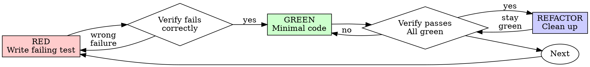

# Fix stale session warning

> This archive contains visible conversation activity and tool records. Private model reasoning and system/developer instructions are not available here.
<!-- codex-event:{"kind":"state","timestamp":"2026-06-24T20:47:34.011Z","phase":null} -->
## Task state: task_started · 2026-06-24T20:47:34.011Z

```text
{
  "type": "task_started",
  "turn_id": "019efb63-5e5c-7460-aa6c-1f04e91d2909",
  "started_at": 1782334053,
  "model_context_window": 258400,
  "collaboration_mode_kind": "default"
}
```

<!-- /codex-event -->

<!-- codex-event:{"kind":"user","timestamp":"2026-06-24T20:47:34.022Z","phase":null} -->
## User · 2026-06-24T20:47:34.022Z

session 8d2affde161b still shows with a triangle warning or as working

THE STATE IS STALE!!!! WHAT THE FUCK WE'VE FIXED THIS A MILLION TIMES


<!-- /codex-event -->

<!-- codex-event:{"kind":"progress","timestamp":"2026-06-24T20:47:46.015Z","phase":"commentary"} -->
## Codex progress · 2026-06-24T20:47:46.015Z

I hear you. I’m going straight at the persisted state for `8d2affde161b` first, then I’ll trace why the UI can still derive “warning” or “working” after the supposed fix. I’ll use the debugging/control-plane skills and keep this on the existing branch, no worktree.

<!-- /codex-event -->

<!-- codex-event:{"kind":"tool-call","timestamp":"2026-06-24T20:47:46.024Z","phase":null} -->
## Tool call: exec_command · 2026-06-24T20:47:46.024Z

```json
{
  "cmd": "sed -n '1,220p' /Users/masterman/.agents/skills/systematic-debugging/SKILL.md",
  "workdir": "/Users/masterman/NLP/omniharness",
  "yield_time_ms": 1000,
  "max_output_tokens": 20000
}
```

<!-- /codex-event -->

<!-- codex-event:{"kind":"tool-call","timestamp":"2026-06-24T20:47:46.025Z","phase":null} -->
## Tool call: exec_command · 2026-06-24T20:47:46.025Z

```json
{
  "cmd": "sed -n '1,220p' /Users/masterman/.agents/skills/instrumenting-control-planes/SKILL.md",
  "workdir": "/Users/masterman/NLP/omniharness",
  "yield_time_ms": 1000,
  "max_output_tokens": 20000
}
```

<!-- /codex-event -->

<!-- codex-event:{"kind":"tool-call","timestamp":"2026-06-24T20:47:46.184Z","phase":null} -->
## Tool call: exec_command · 2026-06-24T20:47:46.184Z

```json
{
  "cmd": "sed -n '1,220p' /Users/masterman/.agents/skills/client-server-state-invariants/SKILL.md",
  "workdir": "/Users/masterman/NLP/omniharness",
  "yield_time_ms": 1000,
  "max_output_tokens": 20000
}
```

<!-- /codex-event -->

<!-- codex-event:{"kind":"tool-call","timestamp":"2026-06-24T20:47:46.417Z","phase":null} -->
## Tool call: exec_command · 2026-06-24T20:47:46.417Z

```json
{
  "cmd": "sed -n '1,220p' /Users/masterman/.agents/skills/using-ultrapowers/SKILL.md",
  "workdir": "/Users/masterman/NLP/omniharness",
  "yield_time_ms": 1000,
  "max_output_tokens": 20000
}
```

<!-- /codex-event -->

<!-- codex-event:{"kind":"tool-result","timestamp":"2026-06-24T20:47:46.451Z","phase":null} -->
## Tool result: call_HseeRU0VajEdJQ3xsk7ZDJWs · 2026-06-24T20:47:46.451Z

````text
Chunk ID: 10c25a
Wall time: 0.0000 seconds
Process exited with code 0
Original token count: 1613
Output:
---
name: systematic-debugging
description: Use when encountering any bug, test failure, or unexpected behavior, before proposing fixes
---

# Systematic Debugging

## Overview

Random fixes waste time and create new bugs. Quick patches mask underlying issues.

**Core principle:** ALWAYS find root cause before attempting fixes. Symptom fixes are failure.

**Violating the letter of this process is violating the spirit of debugging.**

## The Iron Law

```
NO FIXES WITHOUT ROOT CAUSE INVESTIGATION FIRST
```

If you haven't completed Phase 1, you cannot propose fixes.

## When to Use

Use for ANY technical issue:
- Test failures
- Bugs in production
- Unexpected behavior
- Performance problems
- Build failures
- Integration issues

**Use this ESPECIALLY when:**
- Under time pressure (emergencies make guessing tempting)
- "Just one quick fix" seems obvious
- You've already tried multiple fixes
- Previous fix didn't work
- You don't fully understand the issue

**Don't skip when:**
- Issue seems simple (simple bugs have root causes too)
- You're in a hurry (rushing guarantees rework)
- Manager wants it fixed NOW (systematic is faster than thrashing)

## The Four Phases

You MUST complete each phase before proceeding to the next.

### Phase 1: Root Cause Investigation

**BEFORE attempting ANY fix:**

1. **Read Error Messages Carefully**
   - Don't skip past errors or warnings
   - They often contain the exact solution
   - Read stack traces completely
   - Note line numbers, file paths, error codes

2. **Reproduce Consistently**
   - Can you trigger it reliably?
   - What are the exact steps?
   - Does it happen every time?
   - If not reproducible → gather more data, don't guess

3. **Check Recent Changes**
   - What changed that could cause this?
   - Git diff, recent commits
   - New dependencies, config changes
   - Environmental differences

4. **Gather Evidence in Multi-Component Systems**

   **WHEN system has multiple components (CI → build → signing, API → service → database):**

   **BEFORE proposing fixes, add diagnostic instrumentation:**
   ```
   For EACH component boundary:
     - Log what data enters component
     - Log what data exits component
     - Verify environment/config propagation
     - Check state at each layer

   Run once to gather evidence showing WHERE it breaks
   THEN analyze evidence to identify failing component
   THEN investigate that specific component
   ```

   **Example (multi-layer system):**
   ```bash
   # Layer 1: Workflow
   echo "=== Secrets available in workflow: ==="
   echo "IDENTITY: ${IDENTITY:+SET}${IDENTITY:-UNSET}"

   # Layer 2: Build script
   echo "=== Env vars in build script: ==="
   env | grep IDENTITY || echo "IDENTITY not in environment"

   # Layer 3: Signing script
   echo "=== Keychain state: ==="
   security list-keychains
   security find-identity -v

   # Layer 4: Actual signing
   codesign --sign "$IDENTITY" --verbose=4 "$APP"
   ```

   **This reveals:** Which layer fails (secrets → workflow ✓, workflow → build ✗)

5. **Trace Data Flow**

   **WHEN error is deep in call stack:**

   See `root-cause-tracing.md` in this directory for the complete backward tracing technique.

   **Quick version:**
   - Where does bad value originate?
   - What called this with bad value?
   - Keep tracing up until you find the source
   - Fix at source, not at symptom

### Phase 2: Pattern Analysis

**Find the pattern before fixing:**

1. **Find Working Examples**
   - Locate similar working code in same codebase
   - What works that's similar to what's broken?

2. **Compare Against References**
   - If implementing pattern, read reference implementation COMPLETELY
   - Don't skim - read every line
   - Understand the pattern fully before applying

3. **Identify Differences**
   - What's different between working and broken?
   - List every difference, however small
   - Don't assume "that can't matter"

4. **Understand Dependencies**
   - What other components does this need?
   - What settings, config, environment?
   - What assumptions does it make?

### Phase 3: Hypothesis and Testing

**Scientific method:**

1. **Form Single Hypothesis**
   - State clearly: "I think X is the root cause because Y"
   - Write it down
   - Be specific, not vague

2. **Test Minimally**
   - Make the SMALLEST possible change to test hypothesis
   - One variable at a time
   - Don't fix multiple things at once

3. **Verify Before Continuing**
   - Did it work? Yes → Phase 4
   - Didn't work? Form NEW hypothesis
   - DON'T add more fixes on top

4. **When You Don't Know**
   - Say "I don't understand X"
   - Don't pretend to know
   - Ask for help
   - Research more

### Phase 4: Implementation

**Fix the root cause, not the symptom:**

1. **Create Failing Test Case**
   - Simplest possible reproduction
   - Automated test if possible
   - One-off test script if no framework
   - MUST have before fixing
   - Use the `ultrapowers:test-driven-development` skill for writing proper failing tests

2. **Implement Single Fix**
   - Address the root cause identified
   - ONE change at a time
   - No "while I'm here" improvements
   - No bundled refactoring

3. **Verify Fix**
   - Test passes now?
   - No other tests broken?
   - Issue actually resolved?
   - If the bug was meaningful or systemic, use `ultrapowers:learning-from-bugs` before declaring the fix complete.

4. **If Fix Doesn't Work**
   - STOP
   - Count: How many fixes have you tried?
   - If < 3: Return to Phase 1, re-analyze with new information
   - **If ≥ 3: STOP and question the architecture (step 5 below)**
   - DON'T attempt Fix #4 without architectural discussion

5. **If 3+ Fixes Failed: Question Architecture**

   **Pattern indicating architectural problem:**
   - Each fix reveals new shared state/coupling/problem in different place
   - Fixes require "massive refactoring" to implement
   - Each fix creates new symptoms elsewhere

   **STOP and question fundamentals:**
   - Is this pattern fundamentally sound?
   - Are we "sticking with it through sheer inertia"?
   - Should we refactor architecture vs. continue fixing symptoms?

   **Discuss with your human partner before attempting more fixes**

   This is NOT a failed hypothesis - this is a wrong architecture.

## Red Flags - STOP and Follow Process

If you catch yourself thinking:
- "Quick fix for now, investigate later"
- "Just try changing X and see if it works"

````

<!-- /codex-event -->

<!-- codex-event:{"kind":"tool-result","timestamp":"2026-06-24T20:47:46.451Z","phase":null} -->
## Tool result: call_ZaDoIF4GXbAlqEzhF4hMBfBF · 2026-06-24T20:47:46.451Z

````text
Chunk ID: 4aa984
Wall time: 0.0000 seconds
Process exited with code 0
Original token count: 1303
Output:
---
name: instrumenting-control-planes
description: Use when building, planning, reviewing, or debugging apps with backend decisions, agent workflows, long-running jobs, SSE/WebSocket streams, recovery paths, deletes, retries, or user-visible failures
---

# Instrumenting Control Planes

Build the control plane as a product surface. If the server decides, refuses, retries, spawns, deletes, recovers, gives up, or fails, that decision must be observable by users, operators, and tests.

If a React UI consumes the control plane through server state, optimistic UI, caches, polling, SSE/WebSocket streams, or persisted runtime state, also use `client-server-state-invariants`.

## Core Rule

Every meaningful server-side state transition emits a named, durable event. The UI and tests consume the same production event surface.

Do not rely on snapshot diffs, rendered DOM state, logs only, or client-side re-derivation to prove what the server decided.

## Hot Path Rule

No user bootstrap, catalog, status, reconnect, or recovery request may depend on a lock-prone database write path or external health probe finishing. Serve these paths from a bounded read model, memory cache, append-only event log, or stale-but-marked snapshot; queue reconciliation writes outside the request. Every dependency on a database or bridge call in a hot path needs a short timeout, cancellation, and an explicit degraded response.

If SQLite, local files, or a single-writer store is used, assume writer contention can freeze readers at the worst moment. Use one writer, WAL/busy-timeout discipline, short transactions, bounded queues, and headless chaos tests that run bootstrap/reload while writes are active. A 25s UI request is a control-plane failure, even if the database eventually returns.

## Event Contract

For each backend or agent workflow, define:

- named events for decisions: `worker.spawned`, `worker.reattached`, `plan.ready`, `plan.review.blocked`, `recovery.gave_up`, `conversation.delete_failed`;
- payloads with stable ids, `prev`/`next` status when relevant, reason codes, and enough context to debug;
- `error.surfaced` or an equivalent user-facing failure event for every failure the user should know about;
- durable persistence or a bounded replay buffer so short disconnects do not erase history;
- a scriptable read path: CLI, HTTP endpoint, sqlite query, or event log command.

If a decision cannot be asserted from this surface, the design is incomplete.

If debugging a control-plane failure reveals a reusable lesson, use `ultrapowers:learning-from-bugs` after the fix is verified.

## Streaming Requirements

For SSE or WebSocket-like streams:

- emit named events alongside any snapshot/update frame;
- include monotonic event ids;
- support resume from the last seen id;
- replay missed events from a bounded buffer;
- emit an explicit resync-required event when replay is impossible;
- bootstrap from a snapshot, then tail events.

Snapshots show current truth. Named events show why it became true.

## Testing Standard

Control-plane tests should usually be headless HTTP/SSE scenario tests, not browser tests. Browser automation is for UI behavior; control-plane tests assert server decisions directly.

Write scenario assertions as event transcripts:

```ts
expect(events).toHaveEmitted("worker.spawned", { runId });
expect(events).toHaveEmitted("worker.status", { next: "running" });
chaos.killServer();
chaos.restartServer();
expect(events).toHaveEmitted("worker.reattached", { runId });
expect(events).not.toHaveEmitted("worker.recreated", { runId });
```

Chaos belongs outside production code paths: drop connections in the client, fail fetches in the harness, restart the server process, and use seeds for reproducibility.

## Refuse These Shapes

- silent early returns in server methods;
- swallowed `catch` blocks;
- client-side derivation of server decisions;
- response-code-only user failures;
- event streams without ids or resume;
- tests that infer control-plane behavior from rendered state;
- delete handlers that do not enumerate dependent rows or emit typed failure events;
- recovery loops without terminal events such as `gave_up` or `abandoned`;
- request handlers that wait on inline reconciliation writes, SQLite contention, or bridge `/doctor` checks before returning bootstrap data;
- test-only behavior branches in production code.

## Design Checklist

Before implementing a backend or agent workflow, answer:

1. What decisions can this workflow make?
2. What named event is emitted for each decision, including refusal and failure?
3. Where are events persisted or buffered?
4. How does a client resume after disconnect?
5. Which request paths must keep working while persistence or bridge dependencies are slow, locked, or stale?
6. How can a CLI or test harness inspect the exact event sequence without the UI?
7. Which headless scenario proves the happy path, failure path, recovery path, terminal state, and hot-path timeout/degraded path?
8. Which client state consumes these events, and how does it prove ownership, freshness, completeness, ordering, and replay/resync?

If the answer is "the UI can figure it out", name the missing event instead.

````

<!-- /codex-event -->

<!-- codex-event:{"kind":"tool-result","timestamp":"2026-06-24T20:47:46.451Z","phase":null} -->
## Tool result: call_zVAqvBDnap45ZiCwhB9kPJGU · 2026-06-24T20:47:46.451Z

```text
Chunk ID: 045abf
Wall time: 0.0000 seconds
Process exited with code 0
Original token count: 1481
Output:
---
name: client-server-state-invariants
description: Use when planning, building, reviewing, or debugging React apps with server state, optimistic UI, caches, polling, SSE/WebSocket streams, background jobs, persistence, or client/server synchronization
---

# Client Server State Invariants

React bugs often expose deeper ownership mistakes. When client state, server state, cache state, stream state, and persisted state all exist, every plan needs explicit invariants.

## Core Rule

No UI surface may treat data as authoritative unless the payload proves ownership, freshness, completeness, ordering, and terminal state.

If those words are missing from the plan, the plan is probably baking in a race condition.

## Planning Checklist

For every React app that reads server/runtime state, the plan must answer:

1. **Owner:** What owns this state: server, client manager, URL, cache, stream, local storage, or worker/runtime?
2. **Token:** What owner token protects async results: `requestId`, `runId`, `projectPath`, `operationId`, `workerId + seq`, or equivalent?
3. **Provenance:** Is data server-authoritative, optimistic, cached preview, partial update, or historical fallback?
4. **Completeness:** Does the payload declare what scope it is complete for? What may it erase?
5. **Ordering:** What stable order is used: monotonic seq, `(createdAt, id)`, version, or cursor?
6. **State machine:** What are the legal states, terminal states, and transitions?
7. **Events:** Which server decisions are named events rather than client-side derivations?
8. **Loading shape:** Which states are bootstrap, first load, incremental refresh, reconnect, resync, recovery, and terminal error?
9. **Fallbacks:** Which legacy/fallback rows can render, and only after what authority is loaded?
10. **Tests:** Which race, stale-response, event-sequence, reconnect, and merge tests prove the invariants?

## Invariants To Require

- Cached and optimistic data may pre-render, but cannot satisfy full-load gates.
- Partial snapshots may add or refine state, but may not erase optimistic objects, delivered user input, read markers, or stream entries unless they declare complete scope.
- Every async response checks that its owner token still matches before mutating visible state.
- Mutation success handlers may navigate or clear UI only if they still own the current context, unless the action explicitly creates a new selected context.
- Timers and polling callbacks re-check ownership immediately before acting.
- Server decisions are emitted as named events; the client does not infer decisions by diffing snapshots.
- SSE/WebSocket streams have event ids, replay/resume, and an explicit resync path.
- Loading booleans are split by lifecycle stage. A leaf stream refresh must not unmount the whole page.
- Append-only content has one writer, one reader, stable ids, and monotonic cursors.
- Fallback DB rows or historical rows are gated behind stream loading and deduped by stable id plus safe equivalence.
- Status classifiers distinguish active, runnable, blocked, awaiting user, terminal, stale, and recoverable states.
- "Latest" queries have deterministic tie-breakers. Timestamp-only ordering is not enough.
- Hot paths use bounded reads and do not synchronously load large bodies, bridge probes, schema setup, or heavy app graphs.
- Process-local caches have explicit TTL/size bounds and invalidation rules.

## Test Matrix

Pick the rows that match the work. Do not rely on one happy-path UI test.

| Risk | Test shape |
| --- | --- |
| Stale async response | Start request A, switch owner, resolve A, assert it cannot mutate B |
| Optimistic object erased | Create local optimistic state, apply stale/partial snapshot, assert object remains |
| Cache masquerades as loaded | Hydrate cache preview, assert full-load gate waits for server authority |
| Mutation steals navigation | Start mutation, switch selection, resolve mutation, assert focus stays put |
| Timer/poll stale-fire | Use fake timers or deferred promises; callback must re-check owner before acting |
| Snapshot merge erases stream | Apply partial snapshot missing known entries, assert entries/read markers remain |
| Event stream gap | Bootstrap snapshot, emit events during disconnect, reconnect with last id, assert replay or resync |
| Server decision invisible | Exercise branch and assert named event such as `blocked`, `refused`, `gave_up`, or `error.surfaced` |
| State classifier wrong | Table-test every status into active/runnable/terminal/recoverable buckets |
| Fallback duplicates stream | Load fallback rows then stream entries, assert no duplicate or false chronology |
| Hot path bloats | Assert snapshots carry cursors not bodies; route returns before DB/heavy imports when possible |
| Timestamp tie | Insert equal timestamps, assert deterministic order by id/seq |

Use headless HTTP/SSE tests for control-plane decisions. Use React/unit tests for manager merging and ownership guards. Use Playwright only for real UI layout, focus, scroll, mobile computed styles, and visible affordances.

## Refuse These Shapes

- one `isLoading` boolean for bootstrap, refresh, reconnect, and recovery;
- cache or optimistic data treated as authoritative without provenance;
- async callbacks that mutate state without checking owner tokens;
- client-side derivation of server decisions;
- snapshot diffs used as the only way to know what happened;
- event streams without ids or resume;
- timestamp-only "latest" queries;
- parallel transcript or persistence surfaces that the frontend must reconcile;
- unbounded process caches introduced to hide slow storage;
- tests that prove only the DOM result when the bug is a server decision.

## Review Prompt

Ask this before implementation starts:

> What can arrive late, out of order, partially, twice, or after the user changes context, and what test proves it cannot corrupt visible state?

```

<!-- /codex-event -->

<!-- codex-event:{"kind":"tool-result","timestamp":"2026-06-24T20:47:46.484Z","phase":null} -->
## Tool result: call_7gLPsPjWrcJdXTm0bjj9d17Q · 2026-06-24T20:47:46.484Z

```text
Chunk ID: 7940ae
Wall time: 0.0000 seconds
Process exited with code 0
Original token count: 2019
Output:
---
name: using-ultrapowers
description: Use when starting any conversation - establishes how to find and use skills, requiring skill invocation before acting
---

<SUBAGENT-STOP>
If you were dispatched as a subagent to execute a specific task, skip this skill.
</SUBAGENT-STOP>

# Using Ultrapowers

Use relevant skills before acting, but keep process proportional to the task.

## Instruction Priority

1. User instructions and local repo instructions
2. Ultrapowers skills
3. Default model behavior

If the user says not to create extra repository isolation, or says to work directly in the current repository, follow that instruction.

## Core Rule

Before responding, ask:

1. Is there a process skill that governs how to approach this?
2. Is there an implementation skill that governs how to execute it?
3. Is the request substantial enough to justify that process, or is it a tiny mechanical edit?

If a skill applies and the task is substantial enough to justify it, use it before continuing. If the request is a tiny mechanical edit, make the edit directly with targeted verification.

## Proportional Skill Use

Do the smallest responsible workflow that matches the request.

For tiny, unambiguous mechanical edits, do the edit directly:

- changing a color value,
- fixing a typo,
- tweaking short copy,
- changing a prompt sentence,
- renaming a label,
- adjusting obvious spacing or formatting,
- making a one-line config or docs correction.

For these, do not run brainstorming, write a plan, or force TDD unless the change affects product behavior, data, persistence, control flow, user journeys, or non-obvious architecture.

Use the heavier process when the request is ambiguous, user-facing behavior changes, multiple files/modules are involved, the user journey can change, or the change could create regressions that are not obvious from a quick targeted check.

## Default Posture

- Work in the current repository by default.
- YOU WILL NEVER CREATE A BRANCH unless explicitly instructed.
- Ask the user whether we should work in worktrees as part of the planning.
- YOU WILL ONLY CREATE A WORKTREE if explicitly instructed.
- Keep skill use proportional. Tiny mechanical edits should stay tiny.
- Every project should have a `.gitignore`.
- Never commit or push secrets, credentials, local environment files, `node_modules`, dependency caches, build outputs, coverage output, logs, temporary files, or intermediate/generated artifacts unless the human explicitly asks to version a specific generated artifact.
- Deliver full product functionality by default. NO FAKE COMPONENTS, NO MOCKS, NO PLACEHOLDERS, NO FALLBACKS as substitutes for the requested functionality unless the human explicitly asks for a prototype or scaffold.
- For app, UI, and product-surface work, run a PM pass during planning. Treat it as mandatory default behavior, not optional polish.
- For app, UI, and product-surface work, consider `agentic-user-journey-testing` for important user stories, but do not run it without explicit user approval.
- Use `second-opinion` for substantial saved implementation plans, and for unusually hard, creative, high-risk, or architecture-heavy specs when an independent external review could improve the artifact. Prefer a different available coding harness for that review, such as Codex asking Claude Code or Claude Code asking Codex. If no different harness is available, the same harness is fine; the second opinion is still mandatory for matching artifacts.
- Refactor code when a file passes 1200 lines. Do not normalize oversized files as the default end state.
- Use user stories in specs and plans when they clarify behavior or value.
- Default UI work to `shadcn/ui` unless the user says otherwise.
- When designing UI from scratch, first inspect the available ShadCN Blocks at https://ui.shadcn.com/blocks for each screen, form, or major surface. Start from the closest matching block with `npx shadcn add <block-name>` or the block's source in https://github.com/shadcn-ui/ui, then edit it by adding, removing, or adapting controls. Do not invent a fresh layout before doing this block-selection pass.
- Before adding any individual UI control, check whether `shadcn/ui` already provides a control that does what is needed. Use the available shadcn control first, then customize it, instead of hand-building a one-off control.
- Treat desktop and mobile responsiveness as first-class from the beginning.
- Prefer explicit routing unless the framework strongly defaults to file-based routes.
- For React apps, use `building-react-apps` for state managers, explicit transitions, routing, refs, imports, package-manager defaults, and frontend configuration defaults.
- For React apps with server state, optimistic UI, caches, polling, SSE/WebSocket streams, background jobs, persistence, or client/server synchronization, use `client-server-state-invariants` during planning and verification.
- For React or Next.js slowness, root-load, compile-time, SSR/hydration, bundle, import-bloat, or UI dependency cleanup work, use `optimizing-react-next-apps`.
- Prefer strong instrumentation and auditability for backend behavior.
- When a project has backend or agent workflows, prefer a fully instrumented control plane: persist meaningful events, tool calls, actions, results, errors, and state transitions, and expose them through a CLI or other scriptable interface so the full system can be inspected and tested without the UI.
- Use `instrumenting-control-planes` when building, planning, reviewing, or debugging backend decisions, agent workflows, recovery paths, retries, deletes, long-running jobs, SSE/WebSocket streams, or user-visible failures.
- Use `learning-from-bugs` after diagnosing or fixing meaningful architecture, storage, memory, persistence, control-plane, or system-level bugs so reusable lessons become durable.
- Do not default to silent, masked, or over-abstracted errors.
- When a project has a frontend, prefer surfacing full backend error details and stack traces to the frontend so failures stay visible, debuggable, and testable end-to-end.
- Treat persistence of settings and preferences as explicit design work.
- For every meaningful UI setting, define whether it persists, where it is stored, how it is read and written, who owns it, and how reset, sync, migration, and testing are handled.

See `docs/ultrapowers-defaults.md` for the canonical fork defaults.

## Skill Priority

1. Process skills first
2. Implementation skills second

Examples:

- "Make this button blue" -> inspect the relevant file, make the small edit, do targeted verification
- "Update this prompt sentence" -> edit the prompt directly and verify the final text
- "Build a feature" -> `brainstorming` with a PM pass first, then `writing-plans`, then execution; consider approval-gated `agentic-user-journey-testing` for app workflows
- "Fix this bug" -> `systematic-debugging`, then the relevant implementation skill; if the root cause is meaningful or systemic, finish with `learning-from-bugs`
- "Review this change" -> `requesting-code-review`

## Examples Of User Override

- If a task feels risky and the user did not ask for extra repository isolation, keep working in the current repository unless the user explicitly instructs otherwise.
- If a stack supports file-based routing but the user says not to use it, choose an explicit routing approach instead.
- If a framework strongly defaults to file-based routing, such as Next.js App Router, use the framework-native routing model unless there is a good reason not to.
- If a frontend skill suggests `shadcn/ui` but the user wants another design system, follow the user.

## Red Flags

- "I need a whole workflow for this tiny edit" -> no. Use the smallest responsible process.
- "This is simple, so I need the whole process anyway" -> no. Tiny mechanical edits should stay tiny.
- "I'll create extra repository isolation just to be safe" -> forbidden unless the user clearly asked for it.
- "I already know the skill" -> read the current version before relying on it

```

<!-- /codex-event -->

<!-- codex-event:{"kind":"progress","timestamp":"2026-06-24T20:47:56.831Z","phase":"commentary"} -->
## Codex progress · 2026-06-24T20:47:56.831Z

I’ve got the relevant guardrails loaded. First pass is evidence only: persisted run row, worker rows, messages/events/queues, and then the status classifier path that can still paint the triangle or “working”.

<!-- /codex-event -->

<!-- codex-event:{"kind":"tool-call","timestamp":"2026-06-24T20:47:56.837Z","phase":null} -->
## Tool call: exec_command · 2026-06-24T20:47:56.837Z

```json
{
  "cmd": "git status --short",
  "workdir": "/Users/masterman/NLP/omniharness",
  "yield_time_ms": 1000,
  "max_output_tokens": 12000
}
```

<!-- /codex-event -->

<!-- codex-event:{"kind":"tool-call","timestamp":"2026-06-24T20:47:56.838Z","phase":null} -->
## Tool call: exec_command · 2026-06-24T20:47:56.838Z

```json
{
  "cmd": "rg --files -g 'sqlite.db' -g '*.db' -g '*.sqlite'",
  "workdir": "/Users/masterman/NLP/omniharness",
  "yield_time_ms": 1000,
  "max_output_tokens": 12000
}
```

<!-- /codex-event -->

<!-- codex-event:{"kind":"tool-call","timestamp":"2026-06-24T20:47:56.992Z","phase":null} -->
## Tool call: exec_command · 2026-06-24T20:47:56.992Z

```json
{
  "cmd": "rg -n \"triangle|warning|working|stale|session|status\" src shared tests docs | head -n 240",
  "workdir": "/Users/masterman/NLP/omniharness",
  "yield_time_ms": 1000,
  "max_output_tokens": 20000
}
```

<!-- /codex-event -->

<!-- codex-event:{"kind":"tool-call","timestamp":"2026-06-24T20:47:56.993Z","phase":null} -->
## Tool call: exec_command · 2026-06-24T20:47:56.993Z

```json
{
  "cmd": "ls -la",
  "workdir": "/Users/masterman/NLP/omniharness",
  "yield_time_ms": 1000,
  "max_output_tokens": 12000
}
```

<!-- /codex-event -->

<!-- codex-event:{"kind":"tool-result","timestamp":"2026-06-24T20:47:57.013Z","phase":null} -->
## Tool result: call_lev9jI4P7i1Yk6u7KUxJqhV6 · 2026-06-24T20:47:57.013Z

```text
Chunk ID: a53396
Wall time: 0.0000 seconds
Process exited with code 0
Original token count: 82
Output:
 M plans/001-verification-ci-and-typecheck-script.md
 M plans/README.md
 M src/components/WorkerCard.tsx
?? .claude/
?? docs/superpowers/learnings/2026-06-24-stream-elicitations-must-stay-actionable.md
?? plans/004-fix-committed-typecheck-error.md
?? src/app/home/worker-elicitations.ts
?? tests/app/worker-elicitations.test.ts

```

<!-- /codex-event -->

<!-- codex-event:{"kind":"tool-result","timestamp":"2026-06-24T20:47:57.013Z","phase":null} -->
## Tool result: call_mR1Dy1dPg3y9wnHmK638ip8q · 2026-06-24T20:47:57.013Z

```text
Chunk ID: 06b485
Wall time: 0.0000 seconds
Process exited with code 0
Original token count: 3
Output:
sqlite.db

```

<!-- /codex-event -->

<!-- codex-event:{"kind":"tool-result","timestamp":"2026-06-24T20:47:57.044Z","phase":null} -->
## Tool result: call_YtOl5Pk2KKwqDzpxUn8lwib4 · 2026-06-24T20:47:57.044Z

```text
Chunk ID: 55f85a
Wall time: 0.0000 seconds
Process exited with code 0
Original token count: 5480
Output:
docs/superpowers/journeys/2026-05-13-branch-workspace-management.md:8:- User role: builder starting a new OmniHarness session.
docs/superpowers/journeys/2026-05-13-branch-workspace-management.md:12:- Expected completion proof: branch/workspace button is visible in the composer toolbar; opening it shows current workspace, status, refresh action, start-new-worktree action, and worktree list or empty state.
docs/superpowers/journeys/2026-05-13-branch-workspace-management.md:23:- Failure conditions: selection mutates the current checkout, submit starts in the wrong directory, stale worktree selection is not explained, or worker `cwd` does not match.
docs/superpowers/journeys/2026-05-13-branch-workspace-management.md:42:- Expected completion proof: unsafe branch switching or dirty worktree removal is blocked with an actionable warning; `HEAD` remains unchanged.
docs/superpowers/journeys/2026-05-13-branch-workspace-management.md:52:- Expected completion proof: submit is blocked with a stale target explanation and no run starts in the wrong checkout.
shared/locales/es.json:91:  "settings.models.codex.statusAvailable": "Codex is available via your ChatGPT subscription.",
shared/locales/es.json:92:  "settings.models.codex.statusUnavailable": "Codex subscription is not available. Log in via your terminal first.",
shared/locales/es.json:155:  "session.menu.label": "Session options",
shared/locales/es.json:156:  "session.menu.copyWorkingDirectory": "Copy working directory",
shared/locales/es.json:157:  "session.menu.copySessionId": "Copy session id",
shared/locales/es.json:158:  "session.menu.copyAsMarkdown": "Copy as Markdown",
shared/locales/es.json:159:  "session.menu.forkSession": "Fork session",
shared/locales/es.json:160:  "session.menu.forkIntoWorktree": "Fork into new worktree",
shared/locales/es.json:161:  "session.menu.reload": "Recargar sesión",
shared/locales/es.json:162:  "commit.status.autoCommitCreated": "Auto-commit created: {commit}",
shared/locales/es.json:163:  "commit.status.autoCommitSkipped": "Auto-commit skipped: {reason}",
shared/locales/es.json:164:  "commit.status.autoCommitFailed": "Auto-commit failed: {reason}",
shared/locales/es.json:165:  "commit.status.pushCreated": "Auto-commit pushed: {commit}",
shared/locales/es.json:166:  "commit.status.pushFailed": "Auto-commit push failed: {reason}",
shared/locales/es.json:170:  "conversation.sidebar.status.completedAttention": "Finalizada con mensajes sin leer",
shared/locales/es.json:171:  "conversation.sidebar.status.awaitingUser": "Esperando tu respuesta",
shared/locales/es.json:233:  "terminal.pending.working": "Trabajando...",
shared/locales/es.json:244:  "recovery.notice.description.recovering": "OmniHarness is restoring the worker session or restarting from the latest checkpoint.",
shared/locales/es.json:245:  "recovery.notice.description.lostWorkerResumable": "The worker is missing from the runtime, but a saved session can be resumed.",
shared/locales/es.json:278:  "settings.agents.onboarding.statusUnknown": "Authentication could not be verified.",
shared/locales/es.json:348:  "login.pair.description": "Connecting this phone to your running OmniHarness session.",
shared/locales/es.json:403:  "conversation.sidebar.empty.active": "No active sessions.",
shared/locales/es.json:404:  "conversation.sidebar.newSession": "New session",
shared/locales/es.json:416:  "conversation.moveProject.description": "Choose the project this session should appear under.",
shared/locales/es.json:417:  "conversation.moveProject.empty": "Add a project before moving this session.",
shared/locales/es.json:470:  "git.workspace.status.noRepository": "No git repository detected",
shared/locales/es.json:471:  "git.workspace.status.clean": "Clean",
shared/locales/es.json:476:  "git.workspace.action.refresh": "Refresh git status",
shared/locales/es.json:497:  "git.workspace.dialog.checkout.warning": "Esto cambia HEAD en el checkout actual. La operación se bloquea si el checkout tiene cambios, conflictos o quedó desactualizado.",
shared/locales/es.json:504:  "git.workspace.dialog.remove.warning": "Los worktrees con cambios o conflictos no se pueden eliminar. OmniHarness vuelve a comprobar el worktree antes de ejecutar git.",
shared/locales/es.json:539:  "vscode.panel.status.loading": "Loading...",
shared/locales/es.json:540:  "vscode.panel.status.loadingConversations": "Loading conversations...",
shared/locales/es.json:541:  "vscode.panel.status.connected": "Connected",
shared/locales/es.json:542:  "vscode.panel.status.disconnected": "Disconnected",
shared/locales/es.json:543:  "vscode.panel.status.starting": "Starting conversation...",
shared/locales/es.json:559:  "supervisor.activity.worker.status.starting": "Starting",
shared/locales/es.json:560:  "supervisor.activity.worker.status.working": "Working",
shared/locales/es.json:561:  "supervisor.activity.worker.status.idle": "Waiting",
shared/locales/es.json:562:  "supervisor.activity.worker.status.stuck": "Stuck",
shared/locales/es.json:563:  "supervisor.activity.worker.status.recovering": "Recovering",
shared/locales/es.json:564:  "supervisor.activity.worker.status.generic": "{status}",
shared/locales/es.json:572:  "conversation.status.awaitingInput": "Awaiting input",
shared/locales/es.json:573:  "conversation.status.awaitingWorkerInput": "The worker asked for input before continuing.",
shared/locales/es.json:574:  "conversation.status.workerAwaitingAnswer": "{worker} is waiting on {count} answer(s)."
src/vscode-extension/bridge.ts:31:  sessionCookie?: string | null;
src/vscode-extension/bridge.ts:206:    if (context.sessionCookie && !headers.cookie) {
src/vscode-extension/bridge.ts:207:      headers.cookie = context.sessionCookie;
src/vscode-extension/bridge.ts:220:        status: response.status,
src/vscode-extension/bridge.ts:249:    if (context.sessionCookie) {
src/vscode-extension/bridge.ts:250:      headers.cookie = context.sessionCookie;
src/vscode-extension/bridge.ts:262:      throw new Error(`Runtime SSE request failed with HTTP ${response.status}.`);
docs/superpowers/learnings/2026-05-20-server-empty-queue-must-clear-cache.md:6:**Root Cause:** The server correctly omits delivered queue rows from `queuedMessages`, but `EventStreamSnapshotCacheManager` treated an authoritative server `queuedMessages: []` the same as missing data and restored stale cached pending queue rows.
docs/superpowers/learnings/2026-05-20-server-empty-queue-must-clear-cache.md:8:**Verification:** `pnpm test tests/app/event-stream-state-manager.test.ts` covers stale cached queued rows being cleared by an empty server queue. `pnpm test tests/server/queued-messages.test.ts` confirms queued-message delivery behavior still passes.
shared/locales/ko.json:91:  "settings.models.codex.statusAvailable": "Codex is available via your ChatGPT subscription.",
shared/locales/ko.json:92:  "settings.models.codex.statusUnavailable": "Codex subscription is not available. Log in via your terminal first.",
shared/locales/ko.json:155:  "session.menu.label": "Session options",
shared/locales/ko.json:156:  "session.menu.copyWorkingDirectory": "Copy working directory",
shared/locales/ko.json:157:  "session.menu.copySessionId": "Copy session id",
shared/locales/ko.json:158:  "session.menu.copyAsMarkdown": "Copy as Markdown",
shared/locales/ko.json:159:  "session.menu.forkSession": "Fork session",
shared/locales/ko.json:160:  "session.menu.forkIntoWorktree": "Fork into new worktree",
shared/locales/ko.json:161:  "session.menu.reload": "세션 새로고침",
shared/locales/ko.json:162:  "commit.status.autoCommitCreated": "Auto-commit created: {commit}",
shared/locales/ko.json:163:  "commit.status.autoCommitSkipped": "Auto-commit skipped: {reason}",
shared/locales/ko.json:164:  "commit.status.autoCommitFailed": "Auto-commit failed: {reason}",
shared/locales/ko.json:165:  "commit.status.pushCreated": "Auto-commit pushed: {commit}",
shared/locales/ko.json:166:  "commit.status.pushFailed": "Auto-commit push failed: {reason}",
shared/locales/ko.json:170:  "conversation.sidebar.status.completedAttention": "읽지 않은 메시지가 있는 완료됨",
shared/locales/ko.json:171:  "conversation.sidebar.status.awaitingUser": "입력을 기다리는 중",
shared/locales/ko.json:233:  "terminal.pending.working": "작업 중...",
shared/locales/ko.json:244:  "recovery.notice.description.recovering": "OmniHarness is restoring the worker session or restarting from the latest checkpoint.",
shared/locales/ko.json:245:  "recovery.notice.description.lostWorkerResumable": "The worker is missing from the runtime, but a saved session can be resumed.",
shared/locales/ko.json:278:  "settings.agents.onboarding.statusUnknown": "Authentication could not be verified.",
shared/locales/ko.json:348:  "login.pair.description": "Connecting this phone to your running OmniHarness session.",
shared/locales/ko.json:403:  "conversation.sidebar.empty.active": "No active sessions.",
shared/locales/ko.json:404:  "conversation.sidebar.newSession": "New session",
shared/locales/ko.json:416:  "conversation.moveProject.description": "Choose the project this session should appear under.",
shared/locales/ko.json:417:  "conversation.moveProject.empty": "Add a project before moving this session.",
shared/locales/ko.json:470:  "git.workspace.status.noRepository": "No git repository detected",
shared/locales/ko.json:471:  "git.workspace.status.clean": "Clean",
shared/locales/ko.json:476:  "git.workspace.action.refresh": "Refresh git status",
shared/locales/ko.json:497:  "git.workspace.dialog.checkout.warning": "현재 체크아웃의 HEAD가 변경됩니다. 변경 사항, 충돌, 오래된 상태가 있으면 작업이 차단됩니다.",
shared/locales/ko.json:504:  "git.workspace.dialog.remove.warning": "변경 사항이나 충돌이 있는 워크트리는 제거할 수 없습니다. OmniHarness는 git 실행 전에 워크트리를 다시 확인합니다.",
shared/locales/ko.json:539:  "vscode.panel.status.loading": "Loading...",
shared/locales/ko.json:540:  "vscode.panel.status.loadingConversations": "Loading conversations...",
shared/locales/ko.json:541:  "vscode.panel.status.connected": "Connected",
shared/locales/ko.json:542:  "vscode.panel.status.disconnected": "Disconnected",
shared/locales/ko.json:543:  "vscode.panel.status.starting": "Starting conversation...",
shared/locales/ko.json:559:  "supervisor.activity.worker.status.starting": "Starting",
shared/locales/ko.json:560:  "supervisor.activity.worker.status.working": "Working",
shared/locales/ko.json:561:  "supervisor.activity.worker.status.idle": "Waiting",
shared/locales/ko.json:562:  "supervisor.activity.worker.status.stuck": "Stuck",
shared/locales/ko.json:563:  "supervisor.activity.worker.status.recovering": "Recovering",
shared/locales/ko.json:564:  "supervisor.activity.worker.status.generic": "{status}",
shared/locales/ko.json:572:  "conversation.status.awaitingInput": "Awaiting input",
shared/locales/ko.json:573:  "conversation.status.awaitingWorkerInput": "The worker asked for input before continuing.",
shared/locales/ko.json:574:  "conversation.status.workerAwaitingAnswer": "{worker} is waiting on {count} answer(s)."
src/lib/conversation-state.ts:42:  run: { id: string; status?: string | null; updatedAt?: string | null; createdAt?: string | null },
src/lib/conversation-state.ts:46:  const status = run.status?.trim().toLowerCase().split(":")[0]?.trim() ?? "";
src/lib/conversation-state.ts:48:  if (status === "done" || status === "awaiting_user" || status === "failed" || status === "needs_recovery") {
tests/supervisor/observer.test.ts:43:        state: "working",
tests/supervisor/observer.test.ts:72:      status: "running",
tests/supervisor/observer.test.ts:79:      status: "running",
tests/supervisor/observer.test.ts:148:        state: "working",
tests/supervisor/observer.test.ts:157:          state: "working",
tests/supervisor/observer.test.ts:167:          state: "working",
tests/supervisor/observer.test.ts:188:  it("keeps a quiet working worker idle instead of stuck at ninety seconds", () => {
tests/supervisor/observer.test.ts:192:        state: "working",
tests/supervisor/observer.test.ts:201:          state: "working",
tests/supervisor/observer.test.ts:211:          state: "working",
tests/supervisor/observer.test.ts:278:          state: "working",
tests/supervisor/observer.test.ts:288:          state: "working",
tests/supervisor/observer.test.ts:326:        state: "working",
tests/supervisor/observer.test.ts:335:          state: "working",
tests/supervisor/observer.test.ts:345:          state: "working",
tests/supervisor/observer.test.ts:373:      "- Preserved worker session metadata.",
tests/supervisor/observer.test.ts:379:      "- The production build passed with pre-existing warnings.",
tests/supervisor/observer.test.ts:382:      "- The supervisor can safely resume after the reset window because the wake lease, persisted run state, and worker session metadata now agree on the next action.",
tests/supervisor/observer.test.ts:383:      "- I also checked the negative path where the run disappears before the wake fires, so the scheduler exits without throwing while reading run status.",
tests/supervisor/observer.test.ts:390:        state: "working",
tests/supervisor/observer.test.ts:403:        state: "working",
tests/supervisor/observer.test.ts:418:  it("does not reuse stale last text as a fresh completion while the worker is already working", () => {
tests/supervisor/observer.test.ts:419:    const staleFinalText = [
tests/supervisor/observer.test.ts:441:        state: "working",
tests/supervisor/observer.test.ts:443:        lastText: staleFinalText,
tests/supervisor/observer.test.ts:451:          currentText: staleFinalText,
tests/supervisor/observer.test.ts:452:          lastText: staleFinalText,
tests/supervisor/observer.test.ts:461:          currentText: staleFinalText,
tests/supervisor/observer.test.ts:462:          lastText: staleFinalText,
tests/supervisor/observer.test.ts:488:        state: "working",
tests/supervisor/observer.test.ts:497:          state: "working",
tests/supervisor/observer.test.ts:507:          state: "working",
tests/supervisor/observer.test.ts:539:        state: "working",
tests/supervisor/observer.test.ts:549:          state: "working",
tests/supervisor/observer.test.ts:560:          state: "working",
tests/supervisor/observer.test.ts:587:        state: "working",
tests/supervisor/observer.test.ts:596:          state: "working",
tests/supervisor/observer.test.ts:606:          state: "working",
tests/supervisor/observer.test.ts:637:      status: "in_progress",
tests/supervisor/observer.test.ts:646:      state: "working",
tests/supervisor/observer.test.ts:660:          state: "working",
tests/supervisor/observer.test.ts:670:          state: "working",
tests/supervisor/observer.test.ts:690:        state: "working",
tests/supervisor/observer.test.ts:699:          state: "working",
tests/supervisor/observer.test.ts:709:          state: "working",
tests/supervisor/observer.test.ts:730:  it("fails the run when bridge status polling errors", async () => {
tests/supervisor/observer.test.ts:738:      status: "running",
tests/supervisor/observer.test.ts:746:      status: "running",
tests/supervisor/observer.test.ts:755:      status: "working",
tests/supervisor/observer.test.ts:769:    expect(failedRun?.status).toBe("failed");
tests/supervisor/observer.test.ts:784:      status: "running",
tests/supervisor/observer.test.ts:792:      status: "running",
tests/supervisor/observer.test.ts:802:      status: "working",
tests/supervisor/observer.test.ts:820:    expect(persistedWorker?.status).toBe("error");
tests/supervisor/observer.test.ts:821:    expect(failedRun?.status).toBe("failed");
tests/supervisor/observer.test.ts:830:  it("keeps retryable bridge status polling resets out of worker failure events", async () => {
tests/supervisor/observer.test.ts:838:      status: "running",
tests/supervisor/observer.test.ts:846:      status: "running",
tests/supervisor/observer.test.ts:855:      status: "working",
tests/supervisor/observer.test.ts:873:    expect(persistedRun?.status).toBe("running");
tests/supervisor/observer.test.ts:888:      status: "running",
tests/supervisor/observer.test.ts:896:      status: "cancelled",
tests/supervisor/observer.test.ts:905:      status: "working",
tests/supervisor/observer.test.ts:913:      state: "working",
tests/supervisor/observer.test.ts:926:    expect(worker?.status).toBe("working");
tests/supervisor/observer.test.ts:938:      status: "running",
tests/supervisor/observer.test.ts:946:      status: "running",
tests/supervisor/observer.test.ts:955:      status: "starting",
tests/supervisor/observer.test.ts:972:    expect(persistedWorker?.status).toBe("starting");
tests/supervisor/observer.test.ts:985:      status: "running",
tests/supervisor/observer.test.ts:993:      status: "running",
tests/supervisor/observer.test.ts:1002:      status: "starting",
tests/supervisor/observer.test.ts:1005:      bridgeSessionId: "session-starting",
tests/supervisor/observer.test.ts:1020:    expect(persistedWorker?.status).toBe("starting");
tests/supervisor/observer.test.ts:1021:    expect(persistedWorker?.bridgeSessionId).toBe("session-starting");
tests/supervisor/observer.test.ts:1025:  it("polls a stale starting worker that already has a bridge session", async () => {
tests/supervisor/observer.test.ts:1030:    const staleTimestamp = new Date(Date.now() - 60_000);
tests/supervisor/observer.test.ts:1035:      status: "running",
tests/supervisor/observer.test.ts:1036:      createdAt: staleTimestamp,
tests/supervisor/observer.test.ts:1037:      updatedAt: staleTimestamp,
tests/supervisor/observer.test.ts:1043:      status: "running",
tests/supervisor/observer.test.ts:1044:      createdAt: staleTimestamp,
tests/supervisor/observer.test.ts:1045:      updatedAt: staleTimestamp,
tests/supervisor/observer.test.ts:1052:      status: "starting",
tests/supervisor/observer.test.ts:1055:      bridgeSessionId: "session-started",
tests/supervisor/observer.test.ts:1057:      createdAt: staleTimestamp,
tests/supervisor/observer.test.ts:1058:      updatedAt: staleTimestamp,
tests/supervisor/observer.test.ts:1062:      state: "working",
tests/supervisor/observer.test.ts:1063:      sessionId: "session-started",
tests/supervisor/observer.test.ts:1064:      sessionMode: "full-access",
tests/supervisor/observer.test.ts:1084:    expect(persistedWorker?.status).toBe("working");
tests/supervisor/observer.test.ts:1097:      status: "running",
tests/supervisor/observer.test.ts:1105:      status: "running",
tests/supervisor/observer.test.ts:1114:      status: "working",
tests/supervisor/observer.test.ts:1122:      state: "working",
tests/supervisor/observer.test.ts:1137:    expect(failedRun?.status).toBe("failed");
tests/supervisor/observer.test.ts:1150:      status: "running",
tests/supervisor/observer.test.ts:1158:      status: "running",
tests/supervisor/observer.test.ts:1167:      status: "working",
tests/supervisor/observer.test.ts:1175:      state: "working",
tests/supervisor/observer.test.ts:1191:    expect(persistedRun?.status).toBe("running");
tests/supervisor/observer.test.ts:1193:    expect(persistedWorker?.status).toBe("working");
tests/supervisor/observer.test.ts:1205:      status: "running",
tests/supervisor/observer.test.ts:1213:      status: "running",
tests/supervisor/observer.test.ts:1222:      status: "working",
tests/supervisor/observer.test.ts:1230:      state: "working",
tests/supervisor/observer.test.ts:1242:    expect(failedRun?.status).toBe("failed");
tests/supervisor/observer.test.ts:1257:      "- `pnpm build` passed with pre-existing warnings.",
tests/supervisor/observer.test.ts:1261:      "- Worker session metadata survives the quota wait transition.",
tests/supervisor/observer.test.ts:1263:      "- Missing run records are handled before reading status.",
tests/supervisor/observer.test.ts:1270:      status: "running",
tests/supervisor/observer.test.ts:1278:      status: "running",
tests/supervisor/observer.test.ts:1287:      status: "working",
tests/supervisor/observer.test.ts:1304:      state: "working",
tests/supervisor/observer.test.ts:1320:  it("persists a long final-looking worker turn as idle even when the bridge still reports working", async () => {
tests/supervisor/observer.test.ts:1336:      "- The implementation covered the server route, persisted review rounds, review status refresh, translated frontend copy, and the panel controls.",
tests/supervisor/observer.test.ts:1344:      status: "running",
tests/supervisor/observer.test.ts:1352:      status: "running",
tests/supervisor/observer.test.ts:1361:      status: "working",
tests/supervisor/observer.test.ts:1369:      state: "working",
tests/supervisor/observer.test.ts:1382:    expect(persistedWorker?.status).toBe("idle");
tests/supervisor/observer.test.ts:1387:  it("persists a stuck status and wakes the supervisor when a worker stops making meaningful progress", async () => {
tests/supervisor/observer.test.ts:1396:      status: "running",
tests/supervisor/observer.test.ts:1404:      status: "running",
tests/supervisor/observer.test.ts:1413:      status: "working",
tests/supervisor/observer.test.ts:1421:      state: "working",
tests/supervisor/observer.test.ts:1439:    expect(persistedWorker?.status).toBe("stuck");
tests/supervisor/observer.test.ts:1455:      status: "running",
tests/supervisor/observer.test.ts:1463:      status: "running",
tests/supervisor/observer.test.ts:1472:      status: "idle",
tests/supervisor/observer.test.ts:1502:    expect(persistedWorker?.status).toBe("idle");
tests/supervisor/observer.test.ts:1512:      state: "working",
tests/supervisor/observer.test.ts:1523:      status: "running",
tests/supervisor/observer.test.ts:1531:      status: "running",
tests/supervisor/observer.test.ts:1540:      status: "working",

```

<!-- /codex-event -->

<!-- codex-event:{"kind":"tool-result","timestamp":"2026-06-24T20:47:57.044Z","phase":null} -->
## Tool result: call_mrNLJlgiASSHNMYxHB7GZgZw · 2026-06-24T20:47:57.044Z

```text
Chunk ID: 88bada
Wall time: 0.0000 seconds
Process exited with code 0
Original token count: 1066
Output:
total 120688
drwxr-xr-x  63 masterman  staff      2016 Jun 24 22:18 .
drwxr-xr-x  44 masterman  staff      1408 Jun 24 21:32 ..
-rw-r--r--@  1 masterman  staff     10244 Jun 24 22:47 .DS_Store
drwxr-xr-x   3 masterman  staff        96 Apr 27 07:59 .agents
drwxr-xr-x   5 masterman  staff       160 Jun 24 21:31 .claude
-rw-r--r--   1 masterman  staff     48702 May 25 05:07 .codex-current-supervisor-ui.png
-rw-------   1 masterman  staff       173 Jun  3 01:00 .env
-rw-r--r--   1 masterman  staff      2085 Jun  3 11:35 .env.example
drwxr-xr-x  23 masterman  staff       736 Jun 24 22:47 .git
drwxr-xr-x   3 masterman  staff        96 Jun  3 00:44 .github
-rw-r--r--   1 masterman  staff      1237 May 30 11:05 .gitignore
drwxr-xr-x@ 26 masterman  staff       832 Jun 24 22:47 .next
-rw-r--r--   1 masterman  staff         3 May  9 17:00 .nvmrc
drwxr-xr-x  23 masterman  staff       736 Jun 23 15:36 .omniharness
-rw-------   1 masterman  staff        44 May  2 07:48 .omniharness-auth.key
drwxr-xr-x@  4 masterman  staff       128 Jun 14 17:49 .pnpm-store
drwxr-xr-x@  9 masterman  staff       288 Jun 21 15:16 .tmp-rdp-share
-rw-r--r--@  1 masterman  staff      5743 Jun 15 17:32 AGENTS.md
-rw-r--r--   1 masterman  staff       892 Jun  3 11:35 CHANGELOG.md
-rw-r--r--   1 masterman  staff        30 May 15 07:00 CLAUDE.md
-rw-r--r--   1 masterman  staff     34523 May 23 17:11 LICENSE
-rw-r--r--@  1 masterman  staff     19785 Jun 21 15:01 README.md
drwxr-xr-x   5 masterman  staff       160 May 18 17:52 apps
drwxr-xr-x  17 masterman  staff       544 Jun 14 19:33 attachments
-rw-r--r--   1 masterman  staff       520 Apr 19 11:40 components.json
drwxr-xr-x   3 masterman  staff        96 Apr 27 08:13 config
-rwxr-xr-x   1 masterman  staff      2095 May 14 14:36 controller.sh
drwxr-xr-x   3 masterman  staff        96 May 30 13:12 docker
drwxr-xr-x   5 masterman  staff       160 May 11 11:14 docs
-rw-r--r--   1 masterman  staff       207 Apr 19 11:40 drizzle.config.ts
-rwxr-xr-x   1 masterman  staff        66 Apr 20 15:58 e2e-test.sh
-rw-r--r--@  1 masterman  staff      1273 Jun 14 18:00 eslint.config.mjs
-rw-r--r--   1 masterman  staff      7360 Apr 27 19:09 loading_screen_skills.md
-rw-r--r--   1 masterman  staff       262 Apr 19 11:33 next-env.d.ts
-rw-r--r--   1 masterman  staff       760 May 13 18:04 next.config.ts
drwxr-xr-x@ 54 masterman  staff      1728 Jun 21 11:40 node_modules
-rwxr-xr-x@  1 masterman  staff      1513 Jun 14 16:12 omni
-rwxr-xr-x   1 masterman  staff       470 May  2 08:21 omni-cli.ts
-rwxr-xr-x@  1 masterman  staff      2303 Jun 14 17:25 omni.sh
-rwxr-xr-x@  1 masterman  staff     11510 Jun 15 18:20 omniharness
-rw-r--r--@  1 masterman  staff      3110 Jun 21 15:00 package.json
drwxr-xr-x@  7 masterman  staff       224 Jun 23 15:52 plans
-rw-r--r--   1 masterman  staff       733 May 14 05:18 playwright.config.ts
-rw-r--r--@  1 masterman  staff    333728 Jun 21 11:34 pnpm-lock.yaml
-rw-r--r--@  1 masterman  staff       367 Jun 21 10:53 pnpm-workspace.yaml
-rw-r--r--   1 masterman  staff        81 Apr 19 11:33 postcss.config.mjs
drwxr-xr-x  14 masterman  staff       448 May 15 09:31 public
drwxr-xr-x  36 masterman  staff      1152 Jun 21 15:00 scripts
-rw-------   1 masterman  staff      2880 May 30 10:46 session-2026-05-30T08-30-50-omniharness-5e76d6ca.jsonl
drwxr-xr-x   4 masterman  staff       128 Jun 14 17:09 shared
-rw-r--r--@  1 masterman  staff  55578624 Jun 24 22:30 sqlite.db
-rw-r--r--@  1 masterman  staff     32768 Jun 24 22:03 sqlite.db-shm
-rw-r--r--@  1 masterman  staff   4136512 Jun 24 22:47 sqlite.db-wal
drwxr-xr-x  13 masterman  staff       416 May 18 16:59 src
-rwxr-xr-x@  1 masterman  staff      1087 Jun 14 17:25 start.sh
-rw-r--r--   1 masterman  staff      4110 Apr 24 11:12 system_message_renderer.patch
drwxr-xr-x   3 masterman  staff        96 May 14 17:57 test-results
drwxr-xr-x  30 masterman  staff       960 May 30 11:00 tests
drwxr-xr-x   9 masterman  staff       288 May 20 04:59 tmp
-rw-r--r--   1 masterman  staff       630 May 21 18:07 tsconfig.json
-rw-r--r--@  1 masterman  staff    675170 Jun 24 22:16 tsconfig.tsbuildinfo
drwxr-xr-x   7 masterman  staff       224 Jun 14 16:34 vibes
-rw-r--r--   1 masterman  staff       692 May 15 09:11 vitest.config.ts

```

<!-- /codex-event -->

<!-- codex-event:{"kind":"progress","timestamp":"2026-06-24T20:48:06.861Z","phase":"commentary"} -->
## Codex progress · 2026-06-24T20:48:06.861Z

There are existing local edits in the tree, so I’m treating those as yours and will avoid trampling them. The database is local at [sqlite.db](/Users/masterman/NLP/omniharness/sqlite.db), and I’m querying that now for the exact session truth before touching code.

<!-- /codex-event -->

<!-- codex-event:{"kind":"tool-call","timestamp":"2026-06-24T20:48:06.868Z","phase":null} -->
## Tool call: exec_command · 2026-06-24T20:48:06.868Z

```json
{
  "cmd": "sqlite3 sqlite.db \".tables\"",
  "workdir": "/Users/masterman/NLP/omniharness",
  "yield_time_ms": 1000,
  "max_output_tokens": 20000
}
```

<!-- /codex-event -->

<!-- codex-event:{"kind":"tool-call","timestamp":"2026-06-24T20:48:06.868Z","phase":null} -->
## Tool call: exec_command · 2026-06-24T20:48:06.868Z

```json
{
  "cmd": "sqlite3 sqlite.db \"select sql from sqlite_master where type='table' and name in ('runs','workers','messages','execution_events','queued_messages','plans','plan_reviews','validation_records','validation_runs') order by name;\"",
  "workdir": "/Users/masterman/NLP/omniharness",
  "yield_time_ms": 1000,
  "max_output_tokens": 30000
}
```

<!-- /codex-event -->

<!-- codex-event:{"kind":"tool-call","timestamp":"2026-06-24T20:48:07.016Z","phase":null} -->
## Tool call: exec_command · 2026-06-24T20:48:07.016Z

```json
{
  "cmd": "sqlite3 -header -column sqlite.db \"select * from runs where id like '8d2affde161b%' or conversation_id like '8d2affde161b%' or codex_session_id like '8d2affde161b%';\"",
  "workdir": "/Users/masterman/NLP/omniharness",
  "yield_time_ms": 1000,
  "max_output_tokens": 30000
}
```

<!-- /codex-event -->

<!-- codex-event:{"kind":"tool-call","timestamp":"2026-06-24T20:48:07.017Z","phase":null} -->
## Tool call: exec_command · 2026-06-24T20:48:07.017Z

```json
{
  "cmd": "sqlite3 -header -column sqlite.db \"select name from pragma_table_info('runs'); select name from pragma_table_info('workers'); select name from pragma_table_info('messages'); select name from pragma_table_info('execution_events'); select name from pragma_table_info('queued_messages');\"",
  "workdir": "/Users/masterman/NLP/omniharness",
  "yield_time_ms": 1000,
  "max_output_tokens": 20000
}
```

<!-- /codex-event -->

<!-- codex-event:{"kind":"tool-result","timestamp":"2026-06-24T20:48:07.034Z","phase":null} -->
## Tool result: call_ZsutQGaROzgAECv5sm6UOQ4j · 2026-06-24T20:48:07.034Z

```text
Chunk ID: 011fd9
Wall time: 0.0000 seconds
Process exited with code 0
Original token count: 192
Output:
accounts                      planning_review_rounds      
artifact_streams              planning_review_runs        
auth_events                   plans                       
auth_pair_tokens              process_sessions            
auth_sessions                 queued_conversation_messages
clarifications                recovery_incidents          
conversation_read_markers     runs                        
credit_events                 settings                    
execution_events              supervisor_interventions    
messages                      supervisor_scheduled_wakes  
notification_subscriptions    worker_assignments          
plan_items                    worker_counters             
planning_review_findings      workers                     

```

<!-- /codex-event -->

<!-- codex-event:{"kind":"tool-result","timestamp":"2026-06-24T20:48:07.034Z","phase":null} -->
## Tool result: call_y3sm40WKBZC22B3r7yiyNqve · 2026-06-24T20:48:07.034Z

```text
Chunk ID: bfe6bc
Wall time: 0.0000 seconds
Process exited with code 0
Original token count: 718
Output:
CREATE TABLE execution_events (
  id text PRIMARY KEY NOT NULL,
  run_id text NOT NULL,
  worker_id text,
  plan_item_id text,
  event_type text NOT NULL,
  details text,
  created_at integer NOT NULL, artifact_seq integer, details_hash text, details_preview text,
  FOREIGN KEY (run_id) REFERENCES runs(id) ON UPDATE no action ON DELETE no action,
  FOREIGN KEY (worker_id) REFERENCES workers(id) ON UPDATE no action ON DELETE no action,
  FOREIGN KEY (plan_item_id) REFERENCES plan_items(id) ON UPDATE no action ON DELETE no action
)
CREATE TABLE messages (
  id text PRIMARY KEY NOT NULL,
  run_id text NOT NULL,
  role text NOT NULL,
  content text NOT NULL,
  worker_id text,
  created_at integer NOT NULL, kind text, superseded_at integer, edited_from_message_id text, attachments_json text,
  FOREIGN KEY (run_id) REFERENCES runs(id) ON UPDATE no action ON DELETE no action,
  FOREIGN KEY (worker_id) REFERENCES workers(id) ON UPDATE no action ON DELETE no action
)
CREATE TABLE plans (
  id text PRIMARY KEY NOT NULL,
  path text NOT NULL,
  status text NOT NULL,
  created_at integer NOT NULL,
  updated_at integer NOT NULL
)
CREATE TABLE runs (
  id text PRIMARY KEY NOT NULL,
  plan_id text NOT NULL,
  status text NOT NULL,
  created_at integer NOT NULL,
  updated_at integer NOT NULL, project_path text, title text, parent_run_id text, forked_from_message_id text, failed_at integer, last_error text, preferred_worker_type text, allowed_worker_types text, preferred_worker_model text, preferred_worker_effort text, mode text NOT NULL DEFAULT 'implementation', spec_path text, artifact_plan_path text, planner_artifacts_json text, archived_at integer, auto_commit_milestones integer NOT NULL DEFAULT 0, push_on_commit integer NOT NULL DEFAULT 0, git_baseline_json text, completion_commit_sha text, memory_metadata_revision integer NOT NULL DEFAULT 0, last_memory_consolidation_at integer, git_workspace_json text, planner_readiness_verdict_json text, session_type text NOT NULL DEFAULT 'omni', phase text,
  FOREIGN KEY (plan_id) REFERENCES plans(id) ON UPDATE no action ON DELETE no action
)
CREATE TABLE workers (
  id text PRIMARY KEY NOT NULL,
  run_id text NOT NULL,
  type text NOT NULL,
  status text NOT NULL,
  cwd text NOT NULL,
  created_at integer NOT NULL,
  updated_at integer NOT NULL, output_log text NOT NULL DEFAULT '', bridge_session_id text, bridge_session_mode text, output_entries_json text NOT NULL DEFAULT '', current_text text NOT NULL DEFAULT '', last_text text NOT NULL DEFAULT '', title text NOT NULL DEFAULT '', initial_prompt text NOT NULL DEFAULT '', worker_number integer, active_work_started_at integer, active_work_duration_ms integer NOT NULL DEFAULT 0, worker_role text, allocation_key text, turn_generation integer NOT NULL DEFAULT 0,
  FOREIGN KEY (run_id) REFERENCES runs(id) ON UPDATE no action ON DELETE no action
)

```

<!-- /codex-event -->

<!-- codex-event:{"kind":"tool-result","timestamp":"2026-06-24T20:48:07.063Z","phase":null} -->
## Tool result: call_E571uTEtqMcQG9nrIJskeIbW · 2026-06-24T20:48:07.063Z

```text
Chunk ID: f0b212
Wall time: 0.0000 seconds
Process exited with code 1
Original token count: 47
Output:
Error: in prepare, no such column: conversation_id
  lect * from runs where id like '8d2affde161b%' or conversation_id like '8d2aff
                                      error here ---^

```

<!-- /codex-event -->

<!-- codex-event:{"kind":"tool-result","timestamp":"2026-06-24T20:48:07.063Z","phase":null} -->
## Tool result: call_z1PyGUqW9Nm99sfBEOQGYN6g · 2026-06-24T20:48:07.063Z

```text
Chunk ID: 757c76
Wall time: 0.0000 seconds
Process exited with code 0
Original token count: 503
Output:
name                          
------------------------------
id                            
plan_id                       
status                        
created_at                    
updated_at                    
project_path                  
title                         
parent_run_id                 
forked_from_message_id        
failed_at                     
last_error                    
preferred_worker_type         
allowed_worker_types          
preferred_worker_model        
preferred_worker_effort       
mode                          
spec_path                     
artifact_plan_path            
planner_artifacts_json        
archived_at                   
auto_commit_milestones        
push_on_commit                
git_baseline_json             
completion_commit_sha         
memory_metadata_revision      
last_memory_consolidation_at  
git_workspace_json            
planner_readiness_verdict_json
session_type                  
phase                         
name                   
-----------------------
id                     
run_id                 
type                   
status                 
cwd                    
created_at             
updated_at             
output_log             
bridge_session_id      
bridge_session_mode    
output_entries_json    
current_text           
last_text              
title                  
initial_prompt         
worker_number          
active_work_started_at 
active_work_duration_ms
worker_role            
allocation_key         
turn_generation        
name                  
----------------------
id                    
run_id                
role                  
content               
worker_id             
created_at            
kind                  
superseded_at         
edited_from_message_id
attachments_json      
name           
---------------
id             
run_id         
worker_id      
plan_item_id   
event_type     
details        
created_at     
artifact_seq   
details_hash   
details_preview

```

<!-- /codex-event -->

<!-- codex-event:{"kind":"progress","timestamp":"2026-06-24T20:48:19.806Z","phase":"commentary"} -->
## Codex progress · 2026-06-24T20:48:19.806Z

The first query hit an old mental model: this schema does not have `conversation_id` on `runs`, so I’m narrowing by the actual `runs.id` and then walking outward from there. Good, useful correction.

<!-- /codex-event -->

<!-- codex-event:{"kind":"tool-call","timestamp":"2026-06-24T20:48:19.815Z","phase":null} -->
## Tool call: exec_command · 2026-06-24T20:48:19.815Z

```json
{
  "cmd": "sqlite3 -header -column sqlite.db \"select id, plan_id, status, datetime(created_at/1000,'unixepoch','localtime') as created, datetime(updated_at/1000,'unixepoch','localtime') as updated, project_path, title, failed_at, last_error, archived_at, session_type, phase from runs where id like '8d2affde161b%';\"",
  "workdir": "/Users/masterman/NLP/omniharness",
  "yield_time_ms": 1000,
  "max_output_tokens": 30000
}
```

<!-- /codex-event -->

<!-- codex-event:{"kind":"tool-call","timestamp":"2026-06-24T20:48:19.815Z","phase":null} -->
## Tool call: exec_command · 2026-06-24T20:48:19.815Z

```json
{
  "cmd": "sqlite3 -header -column sqlite.db \"select id, run_id, type, status, datetime(created_at/1000,'unixepoch','localtime') as created, datetime(updated_at/1000,'unixepoch','localtime') as updated, bridge_session_id, bridge_session_mode, worker_number, active_work_started_at, active_work_duration_ms, worker_role, allocation_key, turn_generation, length(current_text) as current_len, length(last_text) as last_len from workers where run_id like '8d2affde161b%' order by updated_at desc;\"",
  "workdir": "/Users/masterman/NLP/omniharness",
  "yield_time_ms": 1000,
  "max_output_tokens": 30000
}
```

<!-- /codex-event -->

<!-- codex-event:{"kind":"tool-call","timestamp":"2026-06-24T20:48:19.815Z","phase":null} -->
## Tool call: exec_command · 2026-06-24T20:48:19.815Z

```json
{
  "cmd": "sqlite3 -header -column sqlite.db \"select id, run_id, role, worker_id, kind, datetime(created_at/1000,'unixepoch','localtime') as created, length(content) as len, substr(replace(content, char(10), ' '), 1, 160) as preview from messages where run_id like '8d2affde161b%' order by created_at desc limit 30;\"",
  "workdir": "/Users/masterman/NLP/omniharness",
  "yield_time_ms": 1000,
  "max_output_tokens": 30000
}
```

<!-- /codex-event -->

<!-- codex-event:{"kind":"tool-call","timestamp":"2026-06-24T20:48:19.942Z","phase":null} -->
## Tool call: exec_command · 2026-06-24T20:48:19.942Z

```json
{
  "cmd": "sqlite3 -header -column sqlite.db \"select id, run_id, worker_id, event_type, datetime(created_at/1000,'unixepoch','localtime') as created, substr(coalesce(details_preview, details, ''),1,220) as preview from execution_events where run_id like '8d2affde161b%' order by created_at desc limit 60;\"",
  "workdir": "/Users/masterman/NLP/omniharness",
  "yield_time_ms": 1000,
  "max_output_tokens": 40000
}
```

<!-- /codex-event -->

<!-- codex-event:{"kind":"tool-result","timestamp":"2026-06-24T20:48:20.018Z","phase":null} -->
## Tool result: call_TnAGxPWIFHR0o4D6cIGKQjdN · 2026-06-24T20:48:20.018Z

```text
Chunk ID: 5d682d
Wall time: 0.0000 seconds
Process exited with code 0
Original token count: 157
Output:
id            plan_id                               status         created              updated              project_path                        title   failed_at  last_error  archived_at  session_type  phase
------------  ------------------------------------  -------------  -------------------  -------------------  ----------------------------------  ------  ---------  ----------  -----------  ------------  -----
8d2affde161b  0e78175d-59ce-4160-b308-e34376157d90  awaiting_user  1970-01-21 16:05:30  1970-01-21 16:05:32  /Users/masterman/NLP/cloudcaptions  Commit                                      omni               

```

<!-- /codex-event -->

<!-- codex-event:{"kind":"tool-result","timestamp":"2026-06-24T20:48:20.018Z","phase":null} -->
## Tool result: call_JsxLe30VqOcMeNhAPvCDbewX · 2026-06-24T20:48:20.018Z

```text
Chunk ID: 4e415f
Wall time: 0.0000 seconds
Process exited with code 0
Original token count: 215
Output:
id                     run_id        type    status  created              updated              bridge_session_id                     bridge_session_mode  worker_number  active_work_started_at  active_work_duration_ms  worker_role  allocation_key  turn_generation  current_len  last_len
---------------------  ------------  ------  ------  -------------------  -------------------  ------------------------------------  -------------------  -------------  ----------------------  -----------------------  -----------  --------------  ---------------  -----------  --------
8d2affde161b-worker-1  8d2affde161b  claude  idle    1970-01-21 16:05:30  1970-01-21 16:05:32  f76743ef-eb08-40a8-82a2-67fdb33206b5  full-access          1                                      227000                                                0                0            2986    

```

<!-- /codex-event -->

<!-- codex-event:{"kind":"tool-result","timestamp":"2026-06-24T20:48:20.018Z","phase":null} -->
## Tool result: call_11hlj4H0LCnKJq6GJiS8hxdU · 2026-06-24T20:48:20.018Z

```text
Chunk ID: 8c0b5d
Wall time: 0.0000 seconds
Process exited with code 0
Original token count: 201
Output:
id                                    run_id        role  worker_id  kind        created              len  preview                                                                                                                                                         
------------------------------------  ------------  ----  ---------  ----------  -------------------  ---  ----------------------------------------------------------------------------------------------------------------------------------------------------------------
31183971-5abc-4136-93ed-381f0ca9ac8c  8d2affde161b  user             checkpoint  1970-01-21 16:05:30  224  Group all currently modified files into logical git commits, then push the current branch. Do not run tests. Do not modify files or do anything else. Only inspe

```

<!-- /codex-event -->

<!-- codex-event:{"kind":"tool-result","timestamp":"2026-06-24T20:48:20.135Z","phase":null} -->
## Tool result: call_LkG5nlEHXeNSK20m2YYP72mV · 2026-06-24T20:48:20.135Z

```text
Chunk ID: 7b8c7f
Wall time: 0.0275 seconds
Process exited with code 0
Original token count: 121
Output:
id                                    run_id        worker_id              event_type                   created              preview                            
------------------------------------  ------------  ---------------------  ---------------------------  -------------------  -----------------------------------
2a57648c-dcf6-478f-9b0d-2b30a0acffa3  8d2affde161b  8d2affde161b-worker-1  direct_worker_awaiting_user  1970-01-21 16:05:31  {"reason":"worker_requested_input"}

```

<!-- /codex-event -->

<!-- codex-event:{"kind":"progress","timestamp":"2026-06-24T20:48:32.194Z","phase":"commentary"} -->
## Codex progress · 2026-06-24T20:48:32.194Z

For `8d2affde161b`, persisted truth already says `runs.status = awaiting_user` and the only worker is `idle`; there is one `direct_worker_awaiting_user` event. So the stale visual is likely coming from a classifier/cache/snapshot merge path, not from this row being actively “working”. I’m checking timestamp units and the API payload next.

<!-- /codex-event -->

<!-- codex-event:{"kind":"tool-call","timestamp":"2026-06-24T20:48:32.202Z","phase":null} -->
## Tool call: exec_command · 2026-06-24T20:48:32.202Z

```json
{
  "cmd": "sqlite3 -header -column sqlite.db \"select id, created_at, datetime(created_at,'unixepoch','localtime') as created_s, datetime(created_at/1000,'unixepoch','localtime') as created_ms, updated_at, datetime(updated_at,'unixepoch','localtime') as updated_s, datetime(updated_at/1000,'unixepoch','localtime') as updated_ms from runs where id='8d2affde161b';\"",
  "workdir": "/Users/masterman/NLP/omniharness",
  "yield_time_ms": 1000,
  "max_output_tokens": 12000
}
```

<!-- /codex-event -->

<!-- codex-event:{"kind":"tool-call","timestamp":"2026-06-24T20:48:32.203Z","phase":null} -->
## Tool call: exec_command · 2026-06-24T20:48:32.203Z

```json
{
  "cmd": "sqlite3 -header -column sqlite.db \"select id, created_at, datetime(created_at,'unixepoch','localtime') as created_s, datetime(created_at/1000,'unixepoch','localtime') as created_ms, updated_at, datetime(updated_at,'unixepoch','localtime') as updated_s, datetime(updated_at/1000,'unixepoch','localtime') as updated_ms from workers where run_id='8d2affde161b';\"",
  "workdir": "/Users/masterman/NLP/omniharness",
  "yield_time_ms": 1000,
  "max_output_tokens": 12000
}
```

<!-- /codex-event -->

<!-- codex-event:{"kind":"tool-call","timestamp":"2026-06-24T20:48:32.356Z","phase":null} -->
## Tool call: exec_command · 2026-06-24T20:48:32.356Z

```json
{
  "cmd": "sqlite3 -header -column sqlite.db \"select name from sqlite_master where name like '%queue%' or name like '%validation%' or name like '%review%' or name like '%plan%';\"",
  "workdir": "/Users/masterman/NLP/omniharness",
  "yield_time_ms": 1000,
  "max_output_tokens": 12000
}
```

<!-- /codex-event -->

<!-- codex-event:{"kind":"tool-call","timestamp":"2026-06-24T20:48:32.357Z","phase":null} -->
## Tool call: exec_command · 2026-06-24T20:48:32.357Z

```json
{
  "cmd": "sqlite3 -header -column sqlite.db \"select * from queued_conversation_messages where run_id='8d2affde161b' order by created_at desc limit 20;\"",
  "workdir": "/Users/masterman/NLP/omniharness",
  "yield_time_ms": 1000,
  "max_output_tokens": 20000
}
```

<!-- /codex-event -->

<!-- codex-event:{"kind":"tool-result","timestamp":"2026-06-24T20:48:32.383Z","phase":null} -->
## Tool result: call_rsEOBiz7vSPBwoJjTdc4OOUQ · 2026-06-24T20:48:32.383Z

```text
Chunk ID: b405be
Wall time: 0.0000 seconds
Process exited with code 0
Original token count: 91
Output:
id            created_at  created_s            created_ms           updated_at  updated_s            updated_ms         
------------  ----------  -------------------  -------------------  ----------  -------------------  -------------------
8d2affde161b  1782330858  2026-06-24 21:54:18  1970-01-21 16:05:30  1782332899  2026-06-24 22:28:19  1970-01-21 16:05:32

```

<!-- /codex-event -->

<!-- codex-event:{"kind":"tool-result","timestamp":"2026-06-24T20:48:32.383Z","phase":null} -->
## Tool result: call_tIQsBjY9PrUYc4jxFmth60xw · 2026-06-24T20:48:32.383Z

```text
Chunk ID: 898f77
Wall time: 0.0000 seconds
Process exited with code 0
Original token count: 98
Output:
id                     created_at  created_s            created_ms           updated_at  updated_s            updated_ms         
---------------------  ----------  -------------------  -------------------  ----------  -------------------  -------------------
8d2affde161b-worker-1  1782330858  2026-06-24 21:54:18  1970-01-21 16:05:30  1782332899  2026-06-24 22:28:19  1970-01-21 16:05:32

```

<!-- /codex-event -->

<!-- codex-event:{"kind":"tool-result","timestamp":"2026-06-24T20:48:32.415Z","phase":null} -->
## Tool result: call_2Zm48tpoZwqaxeveRT5OZUMo · 2026-06-24T20:48:32.415Z

```text
Chunk ID: e25ead
Wall time: 0.0000 seconds
Process exited with code 0
Original token count: 397
Output:
name                                                        
------------------------------------------------------------
plans                                                       
sqlite_autoindex_plans_1                                    
plan_items                                                  
sqlite_autoindex_plan_items_1                               
queued_conversation_messages                                
sqlite_autoindex_queued_conversation_messages_1             
planning_review_runs                                        
sqlite_autoindex_planning_review_runs_1                     
planning_review_rounds                                      
sqlite_autoindex_planning_review_rounds_1                   
plan_items_plan_idx                                         
queued_conversation_messages_run_status_created_idx         
plans_created_idx                                           
planning_review_runs_run_idx                                
planning_review_rounds_run_idx                              
planning_review_runs_run_created_id_desc_idx                
planning_review_rounds_run_round_number_idx                 
queued_conversation_messages_run_status_created_id_desc_idx 
plans_created_id_desc_idx                                   
queued_conversation_messages_pending_run_created_id_desc_idx
planning_review_findings                                    
sqlite_autoindex_planning_review_findings_1                 
planning_review_findings_run_idx                            
planning_review_findings_run_created_id_desc_idx            

```

<!-- /codex-event -->

<!-- codex-event:{"kind":"tool-result","timestamp":"2026-06-24T20:48:32.415Z","phase":null} -->
## Tool result: call_DfrcsMVaUCvToIqIyYgmKUpQ · 2026-06-24T20:48:32.415Z

```text
Chunk ID: 38efe7
Wall time: 0.0000 seconds
Process exited with code 0
Original token count: 0
Output:

```

<!-- /codex-event -->

<!-- codex-event:{"kind":"progress","timestamp":"2026-06-24T20:48:41.842Z","phase":"commentary"} -->
## Codex progress · 2026-06-24T20:48:41.842Z

Timestamps are seconds, not milliseconds; this session updated at `2026-06-24 22:28:19` local. No queued conversation messages are attached. Now I’m going through the API and frontend managers to find where `awaiting_user + idle` can be degraded into the wrong sidebar affordance.

<!-- /codex-event -->

<!-- codex-event:{"kind":"tool-call","timestamp":"2026-06-24T20:48:41.851Z","phase":null} -->
## Tool call: exec_command · 2026-06-24T20:48:41.851Z

```json
{
  "cmd": "rg -n \"awaiting_user|needs_recovery|completedAttention|conversation\\.sidebar|WorkerCard|direct_worker_awaiting_user|queued_conversation|active_work|worker.status|status.*working|isWorking|working\" src tests shared | head -n 300",
  "workdir": "/Users/masterman/NLP/omniharness",
  "yield_time_ms": 1000,
  "max_output_tokens": 30000
}
```

<!-- /codex-event -->

<!-- codex-event:{"kind":"tool-call","timestamp":"2026-06-24T20:48:41.852Z","phase":null} -->
## Tool call: exec_command · 2026-06-24T20:48:41.852Z

```json
{
  "cmd": "rg -n \"api/(runs|conversations|events)|GET.*runs|snapshot=1|/api/events|runs\" src/app src/server src/lib | head -n 260",
  "workdir": "/Users/masterman/NLP/omniharness",
  "yield_time_ms": 1000,
  "max_output_tokens": 30000
}
```

<!-- /codex-event -->

<!-- codex-event:{"kind":"tool-call","timestamp":"2026-06-24T20:48:41.852Z","phase":null} -->
## Tool call: exec_command · 2026-06-24T20:48:41.852Z

```json
{
  "cmd": "find src/app -path '*api*' -type f | sort | sed -n '1,240p'",
  "workdir": "/Users/masterman/NLP/omniharness",
  "yield_time_ms": 1000,
  "max_output_tokens": 16000
}
```

<!-- /codex-event -->

<!-- codex-event:{"kind":"tool-call","timestamp":"2026-06-24T20:48:41.888Z","phase":null} -->
## Tool call: exec_command · 2026-06-24T20:48:41.888Z

```json
{
  "cmd": "sed -n '1,200p' src/lib/conversation-state.ts",
  "workdir": "/Users/masterman/NLP/omniharness",
  "yield_time_ms": 1000,
  "max_output_tokens": 12000
}
```

<!-- /codex-event -->

<!-- codex-event:{"kind":"tool-result","timestamp":"2026-06-24T20:48:42.057Z","phase":null} -->
## Tool result: call_e6BGQFtnCYsGQG8Vy91001BU · 2026-06-24T20:48:42.057Z

```text
Chunk ID: cb8e5b
Wall time: 0.0000 seconds
Process exited with code 0
Original token count: 6362
Output:
shared/locales/es.json:156:  "session.menu.copyWorkingDirectory": "Copy working directory",
shared/locales/es.json:167:  "conversation.sidebar.otherSessions": "Otras sesiones",
shared/locales/es.json:168:  "conversation.sidebar.moreSessions": "más...",
shared/locales/es.json:169:  "conversation.sidebar.showMoreSessions": "Mostrar {count} sesiones más en {project}",
shared/locales/es.json:170:  "conversation.sidebar.status.completedAttention": "Finalizada con mensajes sin leer",
shared/locales/es.json:171:  "conversation.sidebar.status.awaitingUser": "Esperando tu respuesta",
shared/locales/es.json:233:  "terminal.pending.working": "Trabajando...",
shared/locales/es.json:395:  "conversation.sidebar.collapseAria": "Collapse conversations sidebar",
shared/locales/es.json:396:  "conversation.sidebar.loadingConversations": "Loading conversations...",
shared/locales/es.json:397:  "conversation.sidebar.tab.projects": "Projects",
shared/locales/es.json:398:  "conversation.sidebar.tab.active": "Recent",
shared/locales/es.json:399:  "conversation.sidebar.collapseAllProjects": "Collapse all",
shared/locales/es.json:400:  "conversation.sidebar.addProject": "Add project",
shared/locales/es.json:401:  "conversation.sidebar.dragProject": "Drag {project}",
shared/locales/es.json:402:  "conversation.sidebar.empty.projects": "No projects added.",
shared/locales/es.json:403:  "conversation.sidebar.empty.active": "No active sessions.",
shared/locales/es.json:404:  "conversation.sidebar.newSession": "New session",
shared/locales/es.json:405:  "conversation.sidebar.searchPlaceholder": "Search",
shared/locales/es.json:406:  "conversation.sidebar.newConversationInProject": "New conversation in {project}",
shared/locales/es.json:407:  "conversation.sidebar.removeProject": "Remove Project",
shared/locales/es.json:408:  "conversation.sidebar.conversationActions": "Conversation actions for {title}",
shared/locales/es.json:409:  "conversation.sidebar.archiveConversation": "Archive {title}",
shared/locales/es.json:410:  "conversation.sidebar.conversationVisual": "{kind} conversation",
shared/locales/es.json:411:  "conversation.sidebar.rename": "Rename",
shared/locales/es.json:412:  "conversation.sidebar.moveToProject": "Move to Project",
shared/locales/es.json:413:  "conversation.sidebar.archive": "Archive",
shared/locales/es.json:414:  "conversation.sidebar.delete": "Delete",
shared/locales/es.json:559:  "supervisor.activity.worker.status.starting": "Starting",
shared/locales/es.json:560:  "supervisor.activity.worker.status.working": "Working",
shared/locales/es.json:561:  "supervisor.activity.worker.status.idle": "Waiting",
shared/locales/es.json:562:  "supervisor.activity.worker.status.stuck": "Stuck",
shared/locales/es.json:563:  "supervisor.activity.worker.status.recovering": "Recovering",
shared/locales/es.json:564:  "supervisor.activity.worker.status.generic": "{status}",
tests/supervisor/observer.test.ts:43:        state: "working",
tests/supervisor/observer.test.ts:148:        state: "working",
tests/supervisor/observer.test.ts:157:          state: "working",
tests/supervisor/observer.test.ts:167:          state: "working",
tests/supervisor/observer.test.ts:188:  it("keeps a quiet working worker idle instead of stuck at ninety seconds", () => {
tests/supervisor/observer.test.ts:192:        state: "working",
tests/supervisor/observer.test.ts:201:          state: "working",
tests/supervisor/observer.test.ts:211:          state: "working",
tests/supervisor/observer.test.ts:278:          state: "working",
tests/supervisor/observer.test.ts:288:          state: "working",
tests/supervisor/observer.test.ts:326:        state: "working",
tests/supervisor/observer.test.ts:335:          state: "working",
tests/supervisor/observer.test.ts:345:          state: "working",
tests/supervisor/observer.test.ts:390:        state: "working",
tests/supervisor/observer.test.ts:403:        state: "working",
tests/supervisor/observer.test.ts:418:  it("does not reuse stale last text as a fresh completion while the worker is already working", () => {
tests/supervisor/observer.test.ts:441:        state: "working",
tests/supervisor/observer.test.ts:488:        state: "working",
tests/supervisor/observer.test.ts:497:          state: "working",
tests/supervisor/observer.test.ts:507:          state: "working",
tests/supervisor/observer.test.ts:539:        state: "working",
tests/supervisor/observer.test.ts:549:          state: "working",
tests/supervisor/observer.test.ts:560:          state: "working",
tests/supervisor/observer.test.ts:587:        state: "working",
tests/supervisor/observer.test.ts:596:          state: "working",
tests/supervisor/observer.test.ts:606:          state: "working",
tests/supervisor/observer.test.ts:646:      state: "working",
tests/supervisor/observer.test.ts:660:          state: "working",
tests/supervisor/observer.test.ts:670:          state: "working",
tests/supervisor/observer.test.ts:690:        state: "working",
tests/supervisor/observer.test.ts:699:          state: "working",
tests/supervisor/observer.test.ts:709:          state: "working",
tests/supervisor/observer.test.ts:755:      status: "working",
tests/supervisor/observer.test.ts:802:      status: "working",
tests/supervisor/observer.test.ts:855:      status: "working",
tests/supervisor/observer.test.ts:905:      status: "working",
tests/supervisor/observer.test.ts:913:      state: "working",
tests/supervisor/observer.test.ts:926:    expect(worker?.status).toBe("working");
tests/supervisor/observer.test.ts:1062:      state: "working",
tests/supervisor/observer.test.ts:1084:    expect(persistedWorker?.status).toBe("working");
tests/supervisor/observer.test.ts:1114:      status: "working",
tests/supervisor/observer.test.ts:1122:      state: "working",
tests/supervisor/observer.test.ts:1167:      status: "working",
tests/supervisor/observer.test.ts:1175:      state: "working",
tests/supervisor/observer.test.ts:1193:    expect(persistedWorker?.status).toBe("working");
tests/supervisor/observer.test.ts:1222:      status: "working",
tests/supervisor/observer.test.ts:1230:      state: "working",
tests/supervisor/observer.test.ts:1287:      status: "working",
tests/supervisor/observer.test.ts:1304:      state: "working",
tests/supervisor/observer.test.ts:1320:  it("persists a long final-looking worker turn as idle even when the bridge still reports working", async () => {
tests/supervisor/observer.test.ts:1361:      status: "working",
tests/supervisor/observer.test.ts:1369:      state: "working",
tests/supervisor/observer.test.ts:1413:      status: "working",
tests/supervisor/observer.test.ts:1421:      state: "working",
tests/supervisor/observer.test.ts:1512:      state: "working",
tests/supervisor/observer.test.ts:1540:      status: "working",
tests/supervisor/observer.test.ts:1599:      status: "working",
tests/supervisor/observer.test.ts:1613:        state: "working",
tests/supervisor/observer.test.ts:1640:      state: "working",
tests/supervisor/observer.test.ts:1668:      status: "working",
tests/supervisor/observer.test.ts:1737:      status: "working",
tests/supervisor/observer.test.ts:1817:      status: "working",
tests/supervisor/observer.test.ts:1894:      status: "working",
tests/supervisor/observer.test.ts:1966:      status: "working",
tests/supervisor/observer.test.ts:1983:      lastText: "Still working on it.",
tests/supervisor/observer.test.ts:1996:      lastText: "Still working on it.",
tests/supervisor/observer.test.ts:2050:      status: "working",
tests/supervisor/observer.test.ts:2115:      status: "working",
tests/supervisor/observer.test.ts:2170:        status: "working",
tests/supervisor/observer.test.ts:2260:      status: "working",
tests/supervisor/observer.test.ts:2313:      status: "working",
tests/supervisor/observer.test.ts:2373:      status: "working",
tests/supervisor/observer.test.ts:2428:      status: "working",
tests/supervisor/observer.test.ts:2482:      status: "working",
tests/supervisor/observer.test.ts:2493:      state: "working",
src/lib/conversation-state.ts:48:  if (status === "done" || status === "awaiting_user" || status === "failed" || status === "needs_recovery") {
shared/locales/ko.json:156:  "session.menu.copyWorkingDirectory": "Copy working directory",
shared/locales/ko.json:167:  "conversation.sidebar.otherSessions": "기타 세션",
shared/locales/ko.json:168:  "conversation.sidebar.moreSessions": "더 보기...",
shared/locales/ko.json:169:  "conversation.sidebar.showMoreSessions": "{project}에서 세션 {count}개 더 보기",
shared/locales/ko.json:170:  "conversation.sidebar.status.completedAttention": "읽지 않은 메시지가 있는 완료됨",
shared/locales/ko.json:171:  "conversation.sidebar.status.awaitingUser": "입력을 기다리는 중",
shared/locales/ko.json:233:  "terminal.pending.working": "작업 중...",
shared/locales/ko.json:395:  "conversation.sidebar.collapseAria": "Collapse conversations sidebar",
shared/locales/ko.json:396:  "conversation.sidebar.loadingConversations": "Loading conversations...",
shared/locales/ko.json:397:  "conversation.sidebar.tab.projects": "Projects",
shared/locales/ko.json:398:  "conversation.sidebar.tab.active": "Recent",
shared/locales/ko.json:399:  "conversation.sidebar.collapseAllProjects": "Collapse all",
shared/locales/ko.json:400:  "conversation.sidebar.addProject": "Add project",
shared/locales/ko.json:401:  "conversation.sidebar.dragProject": "Drag {project}",
shared/locales/ko.json:402:  "conversation.sidebar.empty.projects": "No projects added.",
shared/locales/ko.json:403:  "conversation.sidebar.empty.active": "No active sessions.",
shared/locales/ko.json:404:  "conversation.sidebar.newSession": "New session",
shared/locales/ko.json:405:  "conversation.sidebar.searchPlaceholder": "Search",
shared/locales/ko.json:406:  "conversation.sidebar.newConversationInProject": "New conversation in {project}",
shared/locales/ko.json:407:  "conversation.sidebar.removeProject": "Remove Project",
shared/locales/ko.json:408:  "conversation.sidebar.conversationActions": "Conversation actions for {title}",
shared/locales/ko.json:409:  "conversation.sidebar.archiveConversation": "Archive {title}",
shared/locales/ko.json:410:  "conversation.sidebar.conversationVisual": "{kind} conversation",
shared/locales/ko.json:411:  "conversation.sidebar.rename": "Rename",
shared/locales/ko.json:412:  "conversation.sidebar.moveToProject": "Move to Project",
shared/locales/ko.json:413:  "conversation.sidebar.archive": "Archive",
shared/locales/ko.json:414:  "conversation.sidebar.delete": "Delete",
shared/locales/ko.json:559:  "supervisor.activity.worker.status.starting": "Starting",
shared/locales/ko.json:560:  "supervisor.activity.worker.status.working": "Working",
shared/locales/ko.json:561:  "supervisor.activity.worker.status.idle": "Waiting",
shared/locales/ko.json:562:  "supervisor.activity.worker.status.stuck": "Stuck",
shared/locales/ko.json:563:  "supervisor.activity.worker.status.recovering": "Recovering",
shared/locales/ko.json:564:  "supervisor.activity.worker.status.generic": "{status}",
shared/locales/fr.json:156:  "session.menu.copyWorkingDirectory": "Copy working directory",
shared/locales/fr.json:167:  "conversation.sidebar.otherSessions": "Autres sessions",
shared/locales/fr.json:168:  "conversation.sidebar.moreSessions": "plus...",
shared/locales/fr.json:169:  "conversation.sidebar.showMoreSessions": "Afficher {count} sessions de plus dans {project}",
shared/locales/fr.json:170:  "conversation.sidebar.status.completedAttention": "Terminée avec des messages non lus",
shared/locales/fr.json:171:  "conversation.sidebar.status.awaitingUser": "En attente de votre réponse",
shared/locales/fr.json:233:  "terminal.pending.working": "Travail en cours...",
shared/locales/fr.json:395:  "conversation.sidebar.collapseAria": "Collapse conversations sidebar",
shared/locales/fr.json:396:  "conversation.sidebar.loadingConversations": "Loading conversations...",
shared/locales/fr.json:397:  "conversation.sidebar.tab.projects": "Projects",
shared/locales/fr.json:398:  "conversation.sidebar.tab.active": "Recent",
shared/locales/fr.json:399:  "conversation.sidebar.collapseAllProjects": "Collapse all",
shared/locales/fr.json:400:  "conversation.sidebar.addProject": "Add project",
shared/locales/fr.json:401:  "conversation.sidebar.dragProject": "Drag {project}",
shared/locales/fr.json:402:  "conversation.sidebar.empty.projects": "No projects added.",
shared/locales/fr.json:403:  "conversation.sidebar.empty.active": "No active sessions.",
shared/locales/fr.json:404:  "conversation.sidebar.newSession": "New session",
shared/locales/fr.json:405:  "conversation.sidebar.searchPlaceholder": "Search",
shared/locales/fr.json:406:  "conversation.sidebar.newConversationInProject": "New conversation in {project}",
shared/locales/fr.json:407:  "conversation.sidebar.removeProject": "Remove Project",
shared/locales/fr.json:408:  "conversation.sidebar.conversationActions": "Conversation actions for {title}",
shared/locales/fr.json:409:  "conversation.sidebar.archiveConversation": "Archive {title}",
shared/locales/fr.json:410:  "conversation.sidebar.conversationVisual": "{kind} conversation",
shared/locales/fr.json:411:  "conversation.sidebar.rename": "Rename",
shared/locales/fr.json:412:  "conversation.sidebar.moveToProject": "Move to Project",
shared/locales/fr.json:413:  "conversation.sidebar.archive": "Archive",
shared/locales/fr.json:414:  "conversation.sidebar.delete": "Delete",
shared/locales/fr.json:559:  "supervisor.activity.worker.status.starting": "Starting",
shared/locales/fr.json:560:  "supervisor.activity.worker.status.working": "Working",
shared/locales/fr.json:561:  "supervisor.activity.worker.status.idle": "Waiting",
shared/locales/fr.json:562:  "supervisor.activity.worker.status.stuck": "Stuck",
shared/locales/fr.json:563:  "supervisor.activity.worker.status.recovering": "Recovering",
shared/locales/fr.json:564:  "supervisor.activity.worker.status.generic": "{status}",
shared/locales/it.json:156:  "session.menu.copyWorkingDirectory": "Copy working directory",
shared/locales/it.json:167:  "conversation.sidebar.otherSessions": "Altre sessioni",
shared/locales/it.json:168:  "conversation.sidebar.moreSessions": "altro...",
shared/locales/it.json:169:  "conversation.sidebar.showMoreSessions": "Mostra altre {count} sessioni in {project}",
shared/locales/it.json:170:  "conversation.sidebar.status.completedAttention": "Terminata con messaggi non letti",
shared/locales/it.json:171:  "conversation.sidebar.status.awaitingUser": "In attesa del tuo input",
shared/locales/it.json:233:  "terminal.pending.working": "Lavoro in corso...",
shared/locales/it.json:395:  "conversation.sidebar.collapseAria": "Collapse conversations sidebar",
shared/locales/it.json:396:  "conversation.sidebar.loadingConversations": "Loading conversations...",
shared/locales/it.json:397:  "conversation.sidebar.tab.projects": "Projects",
shared/locales/it.json:398:  "conversation.sidebar.tab.active": "Recent",
shared/locales/it.json:399:  "conversation.sidebar.collapseAllProjects": "Collapse all",
shared/locales/it.json:400:  "conversation.sidebar.addProject": "Add project",
shared/locales/it.json:401:  "conversation.sidebar.dragProject": "Drag {project}",
shared/locales/it.json:402:  "conversation.sidebar.empty.projects": "No projects added.",
shared/locales/it.json:403:  "conversation.sidebar.empty.active": "No active sessions.",
shared/locales/it.json:404:  "conversation.sidebar.newSession": "New session",
shared/locales/it.json:405:  "conversation.sidebar.searchPlaceholder": "Search",
shared/locales/it.json:406:  "conversation.sidebar.newConversationInProject": "New conversation in {project}",
shared/locales/it.json:407:  "conversation.sidebar.removeProject": "Remove Project",
shared/locales/it.json:408:  "conversation.sidebar.conversationActions": "Conversation actions for {title}",
shared/locales/it.json:409:  "conversation.sidebar.archiveConversation": "Archive {title}",
shared/locales/it.json:410:  "conversation.sidebar.conversationVisual": "{kind} conversation",
shared/locales/it.json:411:  "conversation.sidebar.rename": "Rename",
shared/locales/it.json:412:  "conversation.sidebar.moveToProject": "Move to Project",
shared/locales/it.json:413:  "conversation.sidebar.archive": "Archive",
shared/locales/it.json:414:  "conversation.sidebar.delete": "Delete",
shared/locales/it.json:559:  "supervisor.activity.worker.status.starting": "Starting",
shared/locales/it.json:560:  "supervisor.activity.worker.status.working": "Working",
shared/locales/it.json:561:  "supervisor.activity.worker.status.idle": "Waiting",
shared/locales/it.json:562:  "supervisor.activity.worker.status.stuck": "Stuck",
shared/locales/it.json:563:  "supervisor.activity.worker.status.recovering": "Recovering",
shared/locales/it.json:564:  "supervisor.activity.worker.status.generic": "{status}",
tests/supervisor/worker-failover-handoff-fails.test.ts:89:      status: "working",
tests/supervisor/runtime.test.ts:5:  it("returns awaiting_user when there are pending clarifications", () => {
tests/supervisor/runtime.test.ts:13:    ).toBe("awaiting_user");
src/lib/run-status.ts:27:    && normalizeRunStatus(run?.status) !== "awaiting_user";
shared/locales/en.json:186:  "session.menu.copyWorkingDirectory": "Copy working directory",
shared/locales/en.json:197:  "conversation.sidebar.otherSessions": "Other sessions",
shared/locales/en.json:198:  "conversation.sidebar.moreSessions": "more...",
shared/locales/en.json:199:  "conversation.sidebar.showMoreSessions": "Show {count} more sessions in {project}",
shared/locales/en.json:200:  "conversation.sidebar.status.completedAttention": "Finished with unread messages",
shared/locales/en.json:201:  "conversation.sidebar.status.awaitingUser": "Waiting for your input",
shared/locales/en.json:207:  "conversation.mode.omni.description": "Describe what you want and Omni plans it with you, then takes over — confirming the plan under your intent and keeping agents working non stop until it is fully implemented. Already have a plan or spec? Point Omni at it to go straight to implementation.",
shared/locales/en.json:263:  "terminal.pending.working": "Working...",
shared/locales/en.json:425:  "conversation.sidebar.collapseAria": "Collapse conversations sidebar",
shared/locales/en.json:426:  "conversation.sidebar.loadingConversations": "Loading conversations...",
shared/locales/en.json:427:  "conversation.sidebar.tab.projects": "Projects",
shared/locales/en.json:428:  "conversation.sidebar.tab.active": "Recent",
shared/locales/en.json:429:  "conversation.sidebar.collapseAllProjects": "Collapse all",
shared/locales/en.json:430:  "conversation.sidebar.addProject": "Add project",
shared/locales/en.json:431:  "conversation.sidebar.dragProject": "Drag {project}",
shared/locales/en.json:432:  "conversation.sidebar.empty.projects": "No projects added.",
shared/locales/en.json:433:  "conversation.sidebar.empty.active": "No active sessions.",
shared/locales/en.json:434:  "conversation.sidebar.newSession": "New session",
shared/locales/en.json:435:  "conversation.sidebar.searchPlaceholder": "Search",
shared/locales/en.json:436:  "conversation.sidebar.newConversationInProject": "New conversation in {project}",
shared/locales/en.json:437:  "conversation.sidebar.removeProject": "Remove Project",
shared/locales/en.json:438:  "conversation.sidebar.conversationActions": "Conversation actions for {title}",
shared/locales/en.json:439:  "conversation.sidebar.archiveConversation": "Archive {title}",
shared/locales/en.json:440:  "conversation.sidebar.conversationVisual": "{kind} conversation",
shared/locales/en.json:441:  "conversation.sidebar.rename": "Rename",
shared/locales/en.json:442:  "conversation.sidebar.moveToProject": "Move to Project",
shared/locales/en.json:443:  "conversation.sidebar.archive": "Archive",
shared/locales/en.json:444:  "conversation.sidebar.delete": "Delete",
shared/locales/en.json:559:  "supervisor.activity.worker.status.starting": "Starting",
shared/locales/en.json:560:  "supervisor.activity.worker.status.working": "Working",
shared/locales/en.json:561:  "supervisor.activity.worker.status.idle": "Waiting",
shared/locales/en.json:562:  "supervisor.activity.worker.status.stuck": "Stuck",
shared/locales/en.json:563:  "supervisor.activity.worker.status.recovering": "Recovering",
shared/locales/en.json:564:  "supervisor.activity.worker.status.generic": "{status}",
shared/locales/zh-CN.json:156:  "session.menu.copyWorkingDirectory": "Copy working directory",
shared/locales/zh-CN.json:167:  "conversation.sidebar.otherSessions": "其他会话",
shared/locales/zh-CN.json:168:  "conversation.sidebar.moreSessions": "更多...",
shared/locales/zh-CN.json:169:  "conversation.sidebar.showMoreSessions": "在 {project} 中再显示 {count} 个会话",
shared/locales/zh-CN.json:170:  "conversation.sidebar.status.completedAttention": "已完成且有未读消息",
shared/locales/zh-CN.json:171:  "conversation.sidebar.status.awaitingUser": "正在等待你的输入",
shared/locales/zh-CN.json:233:  "terminal.pending.working": "正在工作...",
shared/locales/zh-CN.json:395:  "conversation.sidebar.collapseAria": "Collapse conversations sidebar",
shared/locales/zh-CN.json:396:  "conversation.sidebar.loadingConversations": "Loading conversations...",
shared/locales/zh-CN.json:397:  "conversation.sidebar.tab.projects": "Projects",
shared/locales/zh-CN.json:398:  "conversation.sidebar.tab.active": "Recent",
shared/locales/zh-CN.json:399:  "conversation.sidebar.collapseAllProjects": "Collapse all",
shared/locales/zh-CN.json:400:  "conversation.sidebar.addProject": "Add project",
shared/locales/zh-CN.json:401:  "conversation.sidebar.dragProject": "Drag {project}",
shared/locales/zh-CN.json:402:  "conversation.sidebar.empty.projects": "No projects added.",
shared/locales/zh-CN.json:403:  "conversation.sidebar.empty.active": "No active sessions.",
shared/locales/zh-CN.json:404:  "conversation.sidebar.newSession": "New session",
shared/locales/zh-CN.json:405:  "conversation.sidebar.searchPlaceholder": "Search",
shared/locales/zh-CN.json:406:  "conversation.sidebar.newConversationInProject": "New conversation in {project}",
shared/locales/zh-CN.json:407:  "conversation.sidebar.removeProject": "Remove Project",
shared/locales/zh-CN.json:408:  "conversation.sidebar.conversationActions": "Conversation actions for {title}",
shared/locales/zh-CN.json:409:  "conversation.sidebar.archiveConversation": "Archive {title}",
shared/locales/zh-CN.json:410:  "conversation.sidebar.conversationVisual": "{kind} conversation",
shared/locales/zh-CN.json:411:  "conversation.sidebar.rename": "Rename",
shared/locales/zh-CN.json:412:  "conversation.sidebar.moveToProject": "Move to Project",
shared/locales/zh-CN.json:413:  "conversation.sidebar.archive": "Archive",
shared/locales/zh-CN.json:414:  "conversation.sidebar.delete": "Delete",
shared/locales/zh-CN.json:559:  "supervisor.activity.worker.status.starting": "Starting",
shared/locales/zh-CN.json:560:  "supervisor.activity.worker.status.working": "Working",
shared/locales/zh-CN.json:561:  "supervisor.activity.worker.status.idle": "Waiting",
shared/locales/zh-CN.json:562:  "supervisor.activity.worker.status.stuck": "Stuck",
shared/locales/zh-CN.json:563:  "supervisor.activity.worker.status.recovering": "Recovering",
shared/locales/zh-CN.json:564:  "supervisor.activity.worker.status.generic": "{status}",
shared/locales/de.json:156:  "session.menu.copyWorkingDirectory": "Copy working directory",
shared/locales/de.json:167:  "conversation.sidebar.otherSessions": "Andere Sitzungen",
shared/locales/de.json:168:  "conversation.sidebar.moreSessions": "mehr...",
shared/locales/de.json:169:  "conversation.sidebar.showMoreSessions": "{count} weitere Sitzungen in {project} anzeigen",
shared/locales/de.json:170:  "conversation.sidebar.status.completedAttention": "Fertig mit ungelesenen Nachrichten",
shared/locales/de.json:171:  "conversation.sidebar.status.awaitingUser": "Wartet auf deine Eingabe",
shared/locales/de.json:233:  "terminal.pending.working": "Arbeitet...",
shared/locales/de.json:395:  "conversation.sidebar.collapseAria": "Collapse conversations sidebar",
shared/locales/de.json:396:  "conversation.sidebar.loadingConversations": "Loading conversations...",
shared/locales/de.json:397:  "conversation.sidebar.tab.projects": "Projects",
shared/locales/de.json:398:  "conversation.sidebar.tab.active": "Recent",
shared/locales/de.json:399:  "conversation.sidebar.collapseAllProjects": "Collapse all",
shared/locales/de.json:400:  "conversation.sidebar.addProject": "Add project",
shared/locales/de.json:401:  "conversation.sidebar.dragProject": "Drag {project}",
shared/locales/de.json:402:  "conversation.sidebar.empty.projects": "No projects added.",
shared/locales/de.json:403:  "conversation.sidebar.empty.active": "No active sessions.",
shared/locales/de.json:404:  "conversation.sidebar.newSession": "New session",
shared/locales/de.json:405:  "conversation.sidebar.searchPlaceholder": "Search",
shared/locales/de.json:406:  "conversation.sidebar.newConversationInProject": "New conversation in {project}",
shared/locales/de.json:407:  "conversation.sidebar.removeProject": "Remove Project",
shared/locales/de.json:408:  "conversation.sidebar.conversationActions": "Conversation actions for {title}",

```

<!-- /codex-event -->

<!-- codex-event:{"kind":"tool-result","timestamp":"2026-06-24T20:48:42.058Z","phase":null} -->
## Tool result: call_3gxR8PuZTPL41SHpRZQ0qXAr · 2026-06-24T20:48:42.058Z

```text
Chunk ID: 419406
Wall time: 0.0000 seconds
Process exited with code 0
Original token count: 6307
Output:
src/server/conversation-title.ts:4:import { runs, settings } from "@/server/db/schema";
src/server/conversation-title.ts:8:import { formatErrorMessage } from "@/server/runs/failures";
src/server/conversation-title.ts:79:    .update(runs)
src/server/conversation-title.ts:84:    .where(eq(runs.id, args.runId));
src/server/supervisor/observer.ts:7:import { executionEvents, runs, workers } from "@/server/db/schema";
src/server/supervisor/observer.ts:9:import { formatErrorMessage, persistRunFailure } from "@/server/runs/failures";
src/server/supervisor/observer.ts:10:import { isActiveImplementationRun, isPlanningPhaseRun } from "@/server/runs/status";
src/server/supervisor/observer.ts:139:  run: typeof runs.$inferSelect;
src/server/supervisor/observer.ts:773:  const run = await db.select().from(runs).where(eq(runs.id, runId)).get();
src/server/supervisor/observer.ts:798:  run: typeof runs.$inferSelect;
src/lib/run-recovery-state.ts:50:  runs: RecoverableRun[];
src/lib/run-recovery-state.ts:84:  const targetRun = state.runs.find((run) => run.id === args.runId);
src/lib/run-recovery-state.ts:93:      runs: state.runs.map((run) => (
src/lib/run-recovery-state.ts:117:    runs: state.runs.map((run) => (
src/lib/project-scope.ts:10:  runs: RunRecord[];
src/lib/project-scope.ts:22:  const run = args.runs.find((candidate) => candidate.id === args.selectedRunId);
src/lib/project-scope.ts:25:    args.runs.map((candidate) => candidate.projectPath),
src/server/cli/runner.ts:3:import { messages, runs, workers } from "@/server/db/schema";
src/server/cli/runner.ts:73:    db.select().from(runs).where(eq(runs.id, runId)).get(),
src/server/cli/runner.ts:125:  // Supervisor-driven runs (implementation mode, past any planning phase) keep
src/server/cli/runner.ts:126:  // streaming until terminal. Planning-phase Omni runs and direct/planning runs
src/server/supervisor/resume.ts:2:import { runs, workers } from "../db/schema";
src/server/supervisor/resume.ts:7:import { reconcileRunRecovery } from "@/server/runs/recovery-reconciler";
src/server/supervisor/resume.ts:8:import { isRecoverableAgentMissingError } from "@/server/runs/recovery-state";
src/server/supervisor/resume.ts:13:  const run = await db.select().from(runs).where(eq(runs.id, runId)).get();
src/server/supervisor/resume.ts:29:    await db.update(runs).set({
src/server/supervisor/resume.ts:34:    }).where(eq(runs.id, runId));
src/server/supervisor/resume.ts:60:  await db.update(runs).set({ status: "running", updatedAt: new Date() }).where(eq(runs.id, runId));
src/server/supervisor/wake-schedule.ts:3:import { runs, supervisorScheduledWakes } from "@/server/db/schema";
src/server/supervisor/wake-schedule.ts:4:import { isTerminalRunStatus } from "@/server/runs/status";
src/server/supervisor/wake-schedule.ts:150:    const run = await db.select().from(runs).where(eq(runs.id, row.runId)).get();
src/server/supervisor/wake-schedule.ts:160:  const terminalRuns = await db.select({ id: runs.id }).from(runs).where(inArray(runs.status, [
src/server/clarifications/loop.ts:4:import { clarifications, runs } from "../db/schema";
src/server/clarifications/loop.ts:37:  await db.update(runs).set({ status: "awaiting_user", updatedAt: now }).where(eq(runs.id, runId));
src/server/clarifications/loop.ts:61:    await db.update(runs).set({ status: nextStatus, updatedAt: now }).where(eq(runs.id, runId));
src/server/supervisor/wake.ts:4:import { executionEvents, runs, workers } from "@/server/db/schema";
src/server/supervisor/wake.ts:5:import { persistRunFailure } from "@/server/runs/failures";
src/server/supervisor/wake.ts:7:import { isActiveImplementationRun, isRunnableImplementationRun } from "@/server/runs/status";
src/server/supervisor/wake.ts:128:  const run = await db.select().from(runs).where(eq(runs.id, runId)).get();
src/server/supervisor/wake.ts:152:    // failover-success runs whose runs.status never transitioned to
src/server/supervisor/wake.ts:158:    await db.update(runs).set({
src/server/supervisor/wake.ts:163:    }).where(eq(runs.id, runId));
src/server/supervisor/wake.ts:177:    const latestRun = await db.select().from(runs).where(eq(runs.id, runId)).get();
src/app/api/runs/[id]/route.ts:6:} from "@/runtime/http/routes/runs";
src/server/terminal/cwd.ts:4:import { processSessions, runs, workers } from "@/server/db/schema";
src/server/terminal/cwd.ts:41:      .select({ projectPath: runs.projectPath })
src/server/terminal/cwd.ts:42:      .from(runs)
src/server/terminal/cwd.ts:43:      .where(eq(runs.id, conversationId))
src/server/notifications/triggers.ts:3:import { runs } from "@/server/db/schema";
src/server/notifications/triggers.ts:14:function titleForRun(run: typeof runs.$inferSelect) {
src/server/notifications/triggers.ts:22:function notificationForEvent(run: typeof runs.$inferSelect, event: RunLifecycleEvent): WebPushPayload | null {
src/server/notifications/triggers.ts:58:  const run = await db.select().from(runs).where(eq(runs.id, event.runId)).get();
src/lib/conversations.ts:20:  runs: Array<{
src/lib/conversations.ts:44:  runs: RunRecord[];
src/lib/conversations.ts:48:    args.runs.map((run) => run.projectPath),
src/lib/conversations.ts:50:  const mappedRuns = args.runs
src/lib/conversations.ts:77:      runs: [],
src/lib/conversations.ts:90:        runs: [],
src/lib/conversations.ts:98:      runs: [],
src/lib/conversations.ts:104:    runs: mappedRuns
src/lib/conversations.ts:135:      runs: otherRuns,
src/server/agent-runtime/external-credentials.ts:394: * for a worker type. Unlike `resolveCredentialProfile`, this never runs the
src/server/supervisor/index.ts:9:import { clarifications, executionEvents, messages as dbMessages, runs, settings, supervisorInterventions, workers } from "@/server/db/schema";
src/server/supervisor/index.ts:25:import { persistRunFailure } from "@/server/runs/failures";
src/server/supervisor/index.ts:26:import { isRunnableImplementationRun, normalizeRunStatus } from "@/server/runs/status";
src/server/supervisor/index.ts:373:    await tx.update(runs).set({ status: "awaiting_user", updatedAt: now }).where(eq(runs.id, args.runId));
src/server/supervisor/index.ts:374:    // Legacy-format insert: this runs inside a SQLite transaction so we
src/server/supervisor/index.ts:584:  const run = await db.select().from(runs).where(eq(runs.id, runId)).get();
src/server/supervisor/index.ts:588:  await db.update(runs).set({
src/server/supervisor/index.ts:591:  }).where(eq(runs.id, runId));
src/server/supervisor/index.ts:856:    db.select().from(runs).where(eq(runs.id, runId)).get(),
src/server/supervisor/index.ts:968:    const run = await db.select().from(runs).where(eq(runs.id, this.runId)).get();
src/server/supervisor/index.ts:995:    const run = await db.select().from(runs).where(eq(runs.id, this.runId)).get();
src/server/supervisor/index.ts:1056:  private resultForInactiveRun(run: typeof runs.$inferSelect | null | undefined): SupervisorRunResult {
src/server/supervisor/index.ts:1063:    const run = await db.select().from(runs).where(eq(runs.id, this.runId)).get();
src/server/supervisor/index.ts:1083:    const currentRun = await db.select().from(runs).where(eq(runs.id, this.runId)).get();
src/server/supervisor/index.ts:1095:    await db.update(runs).set({
src/server/supervisor/index.ts:1100:    }).where(eq(runs.id, this.runId));
src/server/supervisor/index.ts:1107:      const failoverRun = await db.select().from(runs).where(eq(runs.id, this.runId)).get();
src/server/supervisor/index.ts:1135:      await db.update(runs).set({ status: "awaiting_user", updatedAt: new Date() }).where(eq(runs.id, this.runId));
src/server/supervisor/index.ts:1232:          const run = await db.select().from(runs).where(eq(runs.id, this.runId)).get();
src/server/supervisor/index.ts:1348:                const parked = await db.select().from(runs).where(eq(runs.id, this.runId)).get();
src/server/supervisor/index.ts:1541:              const continueRun = await db.select().from(runs).where(eq(runs.id, this.runId)).get();
src/server/supervisor/index.ts:1711:          const run = await db.select().from(runs).where(eq(runs.id, this.runId)).get();
src/server/supervisor/index.ts:1777:          const run = await db.select().from(runs).where(eq(runs.id, this.runId)).get();
src/server/supervisor/index.ts:1813:          const run = await db.select().from(runs).where(eq(runs.id, this.runId)).get();
src/server/supervisor/index.ts:1827:          const run = await db.select().from(runs).where(eq(runs.id, this.runId)).get();
src/server/supervisor/index.ts:1848:          const run = await db.select().from(runs).where(eq(runs.id, this.runId)).get();
src/server/supervisor/index.ts:1870:          const run = await db.select().from(runs).where(eq(runs.id, this.runId)).get();
src/server/supervisor/index.ts:1940:          await db.update(runs).set({ status: "done", updatedAt: new Date() }).where(eq(runs.id, this.runId));
src/server/supervisor/memory-consolidation.ts:5:import { clarifications, messages as dbMessages, runs, settings, supervisorInterventions } from "@/server/db/schema";
src/server/supervisor/memory-consolidation.ts:261:  const run = await db.select().from(runs).where(eq(runs.id, runId)).get();
src/server/supervisor/memory-consolidation.ts:265:  await db.update(runs).set({
src/server/supervisor/memory-consolidation.ts:268:  }).where(eq(runs.id, runId));
src/server/supervisor/memory-consolidation.ts:276:  const run = await db.select().from(runs).where(eq(runs.id, args.runId)).get();
src/server/supervisor/memory-consolidation.ts:379:    await db.update(runs).set({
src/server/supervisor/memory-consolidation.ts:382:    }).where(eq(runs.id, args.runId));
src/server/supervisor/memory-consolidation.ts:426:  await db.update(runs).set({
src/server/supervisor/memory-consolidation.ts:429:  }).where(eq(runs.id, args.runId));
src/server/agent-runtime/worker-pool.ts:96:    // by their in-flight counter until their finally runs), and evict a
src/server/supervisor/context.ts:7:import { clarifications, messages, plans, runs, workers } from "@/server/db/schema";
src/server/supervisor/context.ts:233:  const run = await db.select().from(runs).where(eq(runs.id, runId)).get();
src/server/git/run-auto-commit.ts:4:import { runs } from "@/server/db/schema";
src/server/git/run-auto-commit.ts:8:type RunRecord = typeof runs.$inferSelect;
src/server/git/run-auto-commit.ts:54:  const run = await db.select().from(runs).where(eq(runs.id, runId)).get();
src/server/git/run-auto-commit.ts:69:    await db.update(runs)
src/server/git/run-auto-commit.ts:71:      .where(eq(runs.id, runId));
src/server/supervisor/worker-failover.ts:11:import { markRecoveryIncidentResolved } from "@/server/runs/recovery-incidents";
src/server/supervisor/worker-failover.ts:18:import { getRecoveryPolicy } from "@/server/runs/recovery-policy";
src/server/supervisor/worker-failover.ts:28:import { runs } from "@/server/db/schema";
src/server/supervisor/worker-failover.ts:397:      await db.update(runs).set({
src/server/supervisor/worker-failover.ts:402:      }).where(eq(runs.id, args.runId));
src/server/supervisor/runtime-watchdog.ts:3:import { messages, plans, runs } from "@/server/db/schema";
src/server/supervisor/runtime-watchdog.ts:18:function isRecoverableFailedImplementationRun(run: typeof runs.$inferSelect) {
src/server/supervisor/runtime-watchdog.ts:26:async function clearMatchingRunFailureMessage(run: typeof runs.$inferSelect) {
src/server/supervisor/runtime-watchdog.ts:39:async function resumeRecoverableFailedImplementationRun(run: typeof runs.$inferSelect) {
src/server/supervisor/runtime-watchdog.ts:48:  await db.update(runs).set({
src/server/supervisor/runtime-watchdog.ts:53:  }).where(eq(runs.id, run.id));
src/server/supervisor/runtime-watchdog.ts:81:  const activeRuns = await db.select().from(runs).where(and(
src/server/supervisor/runtime-watchdog.ts:82:    inArray(runs.status, ["running", "failed", "quota_waiting"]),
src/server/supervisor/runtime-watchdog.ts:83:    eq(runs.mode, "implementation"),
src/server/supervisor/runtime-watchdog.ts:86:    // Omni runs still in their interactive planning phase keep the supervisor
src/server/planning/transition.ts:3:import { plans, runs } from "@/server/db/schema";
src/server/planning/transition.ts:21:  const run = await db.select().from(runs).where(eq(runs.id, args.runId)).get();
src/server/planning/transition.ts:47:  await db.update(runs).set({
src/server/planning/transition.ts:55:  }).where(eq(runs.id, run.id));
src/server/planning/transition.ts:61:    await db.update(runs).set({
src/server/planning/transition.ts:65:    }).where(eq(runs.id, run.id));
src/server/planning/promote.ts:4:import { messages, plans, runs } from "@/server/db/schema";
src/server/planning/promote.ts:9:import { createRunId } from "@/server/runs/ids";
src/server/planning/promote.ts:48:  run: typeof runs.$inferSelect;
src/server/planning/promote.ts:91:  const planningRun = await db.select().from(runs).where(eq(runs.id, args.runId)).get();
src/server/planning/promote.ts:111:  await db.update(runs).set({
src/server/planning/promote.ts:114:  }).where(eq(runs.id, planningRun.id));
src/server/planning/promote.ts:126:  await db.insert(runs).values({
src/server/planning/promote.ts:167:    await db.update(runs).set({
src/server/planning/promote.ts:170:    }).where(eq(runs.id, planningRun.id));
src/server/planning/promote.ts:174:  await db.update(runs).set({
src/server/planning/promote.ts:179:  }).where(eq(runs.id, planningRun.id));
src/server/plans/readiness-pipeline.ts:5:import { runs } from "@/server/db/schema";
src/server/plans/readiness-pipeline.ts:135:  const row = await db.select({ json: runs.plannerReadinessVerdictJson }).from(runs).where(eq(runs.id, args.runId)).get();
src/server/plans/readiness-pipeline.ts:147:      verdictJson: runs.plannerReadinessVerdictJson,
src/server/plans/readiness-pipeline.ts:148:      artifactsJson: runs.plannerArtifactsJson,
src/server/plans/readiness-pipeline.ts:150:    .from(runs)
src/server/plans/readiness-pipeline.ts:151:    .where(eq(runs.id, args.runId))
src/server/plans/readiness-pipeline.ts:173:  await db.update(runs).set({
src/server/plans/readiness-pipeline.ts:177:  }).where(eq(runs.id, args.runId));
src/server/plans/readiness-pipeline.ts:323:  const row = await db.select({ json: runs.plannerReadinessVerdictJson }).from(runs).where(eq(runs.id, runId)).get();
src/server/runs/recovery-actions.ts:4:import { messages, plans, queuedConversationMessages, runs, workers } from "@/server/db/schema";
src/server/runs/recovery-actions.ts:93:  const run = await db.select().from(runs).where(eq(runs.id, args.runId)).get();
src/server/runs/recovery-actions.ts:99:    throw new Error("Checkpoint restart is only available for implementation runs");
src/server/runs/recovery-actions.ts:134:  await db.update(runs).set({
src/server/runs/recovery-actions.ts:139:  }).where(eq(runs.id, run.id));
src/server/runs/recovery-actions.ts:159:  await db.update(runs).set({
src/server/runs/recovery-actions.ts:163:  }).where(eq(runs.id, args.runId));
src/server/planning/review.ts:3:  runs,
src/server/planning/review.ts:90:  const current = await db.select().from(runs).where(eq(runs.id, runId)).get();
src/server/planning/review.ts:103:        .update(runs)
src/server/planning/review.ts:105:        .where(eq(runs.id, runId));
src/server/planning/review.ts:127:  const initialRun = await db.select().from(runs).where(eq(runs.id, args.runId)).get();
src/server/planning/review.ts:129:  // Accept both legacy planning-mode runs and Omni runs still in their
src/server/planning/review.ts:140:  const run = await db.select().from(runs).where(eq(runs.id, args.runId)).get();
src/server/planning/review.ts:180:    .update(runs)
src/server/planning/review.ts:182:    .where(eq(runs.id, run.id));
src/server/planning/review.ts:210:    await db.update(runs).set({ status: "ready", updatedAt: new Date() }).where(eq(runs.id, run.id));
src/server/planning/review.ts:244:  const run = await db.select().from(runs).where(eq(runs.id, reviewRun.runId)).get();
src/server/planning/review.ts:252:      await db.update(runs).set({ status: "reviewing_plan" }).where(eq(runs.id, run.id));
src/server/planning/review.ts:379:        await db.update(runs).set({ status: "revising_plan" }).where(eq(runs.id, run.id));
src/server/planning/review.ts:470:        const latestRun = await db.select().from(runs).where(eq(runs.id, run.id)).get();
src/server/planning/review.ts:504:    const finalRun = await db.select().from(runs).where(eq(runs.id, run.id)).get();
src/server/planning/review.ts:515:    await db.update(runs).set({
src/server/planning/review.ts:518:    }).where(eq(runs.id, run.id));
src/app/api/events/route.ts:15:  const label = `GET /api/events${url.search}`;
src/server/plans/readiness-llm.ts:5:import { formatErrorMessage } from "@/server/runs/failures";
src/server/runs/recovery.ts:14:  runs,
src/server/runs/recovery.ts:21:import { createAdHocPlan, rewriteAdHocPlan } from "@/server/runs/ad-hoc-plan";
src/server/runs/recovery.ts:22:import { formatErrorMessage, persistRunFailure } from "@/server/runs/failures";
src/server/runs/recovery.ts:23:import { createRunId } from "@/server/runs/ids";
src/server/runs/recovery.ts:43:import { markRecoveryIncidentResolved } from "@/server/runs/recovery-incidents";
src/server/runs/recovery.ts:199:async function startDirectRerun(run: typeof runs.$inferSelect, content: string, userInputId?: string) {
src/server/runs/recovery.ts:422:  run: typeof runs.$inferSelect,
src/server/runs/recovery.ts:649:  await db.update(runs).set({
src/server/runs/recovery.ts:654:  }).where(eq(runs.id, run.id));
src/server/runs/recovery.ts:700:  run: typeof runs.$inferSelect,
src/server/runs/recovery.ts:730:  await db.update(runs).set({
src/server/runs/recovery.ts:735:  }).where(eq(runs.id, args.runId));
src/server/runs/recovery.ts:742:async function resumeImplementationRun(run: typeof runs.$inferSelect, plan: typeof plans.$inferSelect) {
src/server/runs/recovery.ts:749:  await db.update(runs).set({
src/server/runs/recovery.ts:754:  }).where(eq(runs.id, run.id));
src/server/runs/recovery.ts:760:async function clearMatchingRunFailureMessage(run: typeof runs.$inferSelect) {
src/server/runs/recovery.ts:790:  const run = await db.select().from(runs).where(eq(runs.id, args.runId)).get();
src/server/runs/recovery.ts:876:      await db.insert(runs).values({
src/server/runs/recovery.ts:939:      const newRun = await db.select().from(runs).where(eq(runs.id, newRunId)).get();
src/server/runs/recovery.ts:996:  await db.update(runs).set({
src/server/runs/recovery.ts:1001:  }).where(eq(runs.id, args.runId));
src/server/runs/recovery.ts:1009:  const run = await db.select().from(runs).where(eq(runs.id, args.runId)).get();
src/server/planning/refresh.ts:4:import { messages, planningReviewRuns, runs, workers } from "@/server/db/schema";
src/server/planning/refresh.ts:107:  run: typeof runs.$inferSelect;
src/server/planning/refresh.ts:173:  await db.update(runs).set({
src/server/planning/refresh.ts:181:  }).where(eq(runs.id, args.run.id));
src/app/api/conversations/[id]/transcript/route.ts:10:  return withOuterProbe(`GET /api/conversations/${id}/transcript`, () =>
src/server/runs/recovery-policy.ts:169:      return { action: "needs_user", reason: "Automatic recovery is disabled for implementation runs." };
src/server/artifacts/project-root.ts:56: * `projectPath` here is the value already on `runs.projectPath`; callers
src/server/artifacts/project-root.ts:89:      // through unrelated filesystems on misconfigured runs.
src/server/artifacts/project-root.ts:116:  // Legacy fallback: runs created before projectPath was a required
src/server/artifacts/project-root.ts:119:  // Backfill can relocate them later. New runs SHOULD have projectPath
src/app/home/BusyMessageQueueManager.ts:11:  // UI only — server queue rows from /api/events remain authoritative.
src/server/runs/persisted-zombie-reconciler.ts:4:import { runs, workers } from "@/server/db/schema";
src/server/runs/persisted-zombie-reconciler.ts:6:import { openRecoveryIncident, markRecoveryIncidentNeedsUser } from "@/server/runs/recovery-incidents";
src/server/runs/persisted-zombie-reconciler.ts:7:import { setRunNeedsRecovery } from "@/server/runs/recovery-actions";
src/server/runs/persisted-zombie-reconciler.ts:8:import { isTerminalRunStatus, normalizeRunStatus } from "@/server/runs/status";
src/server/runs/persisted-zombie-reconciler.ts:34:function workerMatchesRunProject(run: typeof runs.$inferSelect, worker: typeof workers.$inferSelect) {
src/server/runs/persisted-zombie-reconciler.ts:105:  run: typeof runs.$inferSelect;
src/server/runs/persisted-zombie-reconciler.ts:167:  const run = await db.select().from(runs).where(eq(runs.id, runId)).get();
src/server/artifacts/cleanup.ts:9: * runs; this module handles the filesystem side.
src/server/artifacts/cleanup.ts:15:import { runs } from "@/server/db/schema";
src/server/artifacts/cleanup.ts:37:  const run = await db.select({ projectPath: runs.projectPath }).from(runs).where(eq(runs.id, runId)).get();
src/app/api/conversations/[id]/messages/route.ts:10:  return withOuterProbe(`POST /api/conversations/${id}/messages`, () =>
src/server/artifacts/stream-metadata.ts:13:import { artifactStreams, runs } from "@/server/db/schema";
src/server/artifacts/stream-metadata.ts:62:    .select({ id: runs.id, projectPath: runs.projectPath })
src/server/artifacts/stream-metadata.ts:63:    .from(runs)
src/server/artifacts/stream-metadata.ts:64:    .where(eq(runs.id, args.runId))
src/app/home/ExternalSessionsPicker.tsx:72:      requestJson<{ runId: string }>("/api/conversations", {
src/server/artifacts/compaction.ts:19:import { artifactStreams, runs } from "@/server/db/schema";
src/server/artifacts/compaction.ts:60:    .select({ id: runs.id, status: runs.status, projectPath: runs.projectPath })
src/server/artifacts/compaction.ts:61:    .from(runs)
src/server/artifacts/compaction.ts:62:    .where(inArray(runs.id, runIds));
src/server/session-providers/process-store.ts:6:import { processSessions, runs, workers } from "@/server/db/schema";
src/server/session-providers/process-store.ts:204:  await db.update(runs).set({
src/server/session-providers/process-store.ts:209:  }).where(eq(runs.id, args.runId));
src/server/projects/canonicalize.ts:6:import { runs, workers } from "@/server/db/schema";
src/server/projects/canonicalize.ts:46:  const allRuns = await db.select().from(runs);
src/server/projects/canonicalize.ts:70:    await db.update(runs).set({
src/server/projects/canonicalize.ts:73:    }).where(eq(runs.id, run.id));
src/server/runs/failures.ts:4:import { messages, runs, workers } from "@/server/db/schema";
src/server/runs/failures.ts:6:import { isTerminalRunStatus, normalizeRunStatus } from "@/server/runs/status";
src/server/runs/failures.ts:31:  const currentRun = await db.select().from(runs).where(eq(runs.id, runId)).get();
src/server/runs/failures.ts:39:  await db.update(runs).set({
src/server/runs/failures.ts:44:  }).where(eq(runs.id, runId));
src/server/events/named-events.ts:10: *     snapshot frames emitted by /api/events. That keeps SSE
src/server/events/named-events.ts:17: * `/api/events?snapshot=1` and resume from the new cursor.
src/server/events/named-events.ts:485:   * buffer; the client should re-bootstrap via /api/events?snapshot=1. */
src/server/events/named-events.ts:528:  // them to resync from /api/events?snapshot=1.
src/app/home/useConversationActions.ts:41:  runs: RunRecord[];
src/app/home/useConversationActions.ts:53:  runs,
src/app/home/useConversationActions.ts:195:  const handleCommitRenamingRun = (runId: string, currentRenameValue: string, state: { runs?: RunRecord[] }) => {
src/app/home/useConversationActions.ts:197:    const existingRun = (state.runs || []).find((run: RunRecord) => run.id === runId);
src/app/home/useConversationActions.ts:223:    const existingRun = runs.find((run: RunRecord) => run.id === runId);
src/app/home/useConversationActions.ts:289:    const selectedRun = runs.find((run) => run.id === selectedRunId);
src/app/home/useConversationActions.ts:297:    const selectedRun = runs.find((run) => run.id === selectedRunId);
src/server/session-providers/session-records.ts:3:import { processSessions, runs, workers } from "@/server/db/schema";
src/server/session-providers/session-records.ts:7:type RunRow = typeof runs.$inferSelect;
src/server/session-providers/session-records.ts:82:  const run = await db.select().from(runs).where(eq(runs.id, runId)).get();
src/server/events/lifecycle-invariants.ts:43:  runs,
src/server/events/lifecycle-invariants.ts:48:  runs: RunLike[];
src/server/events/lifecycle-invariants.ts:58:  const run = runs.find((candidate) => candidate.id === runId);
src/server/events/lifecycle-invariants.ts:74:    suggestion: "Refresh the conversation. If this persists, inspect /api/events/log for the missing clarification or confirmation event.",
src/server/session-providers/process-provider.ts:4:import { messages, plans, processSessions, runs, workers } from "@/server/db/schema";
src/server/session-providers/process-provider.ts:5:import { createAdHocPlan } from "@/server/runs/ad-hoc-plan";
src/server/session-providers/process-provider.ts:6:import { createRunId } from "@/server/runs/ids";

```

<!-- /codex-event -->

<!-- codex-event:{"kind":"tool-result","timestamp":"2026-06-24T20:48:42.058Z","phase":null} -->
## Tool result: call_fJOglOb1acgVBisFEBT69TdK · 2026-06-24T20:48:42.058Z

```text
Chunk ID: df4e62
Wall time: 0.0000 seconds
Process exited with code 0
Original token count: 433
Output:
src/app/api/accounts/route.ts
src/app/api/agents/[name]/elicitation/route.ts
src/app/api/agents/[name]/permission/route.ts
src/app/api/agents/[name]/route.ts
src/app/api/agents/catalog/route.ts
src/app/api/agents/prewarm-worker/route.ts
src/app/api/agents/route.ts
src/app/api/attachments/route.ts
src/app/api/auth/login/route.ts
src/app/api/auth/logout/route.ts
src/app/api/auth/pair/redeem/route.ts
src/app/api/auth/pair/route.ts
src/app/api/auth/session/route.ts
src/app/api/codex-auth/status/route.ts
src/app/api/conversations/[id]/messages/route.ts
src/app/api/conversations/[id]/queued-messages/[messageId]/interrupt/route.ts
src/app/api/conversations/[id]/queued-messages/[messageId]/route.ts
src/app/api/conversations/[id]/queued-messages/interrupt-next/route.ts
src/app/api/conversations/[id]/transcript/route.ts
src/app/api/conversations/route.ts
src/app/api/events/log/route.ts
src/app/api/events/route.ts
src/app/api/external-sessions/route.ts
src/app/api/fs/files/route.ts
src/app/api/fs/route.ts
src/app/api/git/route.ts
src/app/api/llm-models/route.ts
src/app/api/messages/route.ts
src/app/api/notifications/route.ts
src/app/api/planning/[id]/promote/route.ts
src/app/api/planning/[id]/review/route.ts
src/app/api/plans/route.ts
src/app/api/projects/memory/route.ts
src/app/api/runs/[id]/answer/route.ts
src/app/api/runs/[id]/resume/route.ts
src/app/api/runs/[id]/route.ts
src/app/api/runtime/bootstrap/route.ts
src/app/api/settings/route.ts
src/app/api/supervisor/route.ts
src/app/api/terminals/[id]/input/route.ts
src/app/api/terminals/[id]/resize/route.ts
src/app/api/terminals/[id]/route.ts
src/app/api/terminals/[id]/stream/route.ts
src/app/api/terminals/route.ts
src/app/api/workers/[workerId]/entries/route.ts

```

<!-- /codex-event -->

<!-- codex-event:{"kind":"tool-result","timestamp":"2026-06-24T20:48:42.058Z","phase":null} -->
## Tool result: call_1vD2jFUw2NlkY8lDEBMnaxb5 · 2026-06-24T20:48:42.058Z

```text
Chunk ID: 32b411
Wall time: 0.0000 seconds
Process exited with code 0
Original token count: 423
Output:
export function getRunLatestMessageTimestamp(
  runId: string,
  messages: Array<{ runId: string; createdAt: string }>
) {
  let latest: string | null = null;

  for (const message of messages) {
    if (message.runId !== runId) {
      continue;
    }

    if (!latest || new Date(message.createdAt).getTime() > new Date(latest).getTime()) {
      latest = message.createdAt;
    }
  }

  return latest;
}

function timestampMs(value: string | null | undefined) {
  if (!value) {
    return 0;
  }

  const time = new Date(value).getTime();
  return Number.isFinite(time) ? time : 0;
}

function laterTimestamp(left: string | null, right: string | null | undefined) {
  if (!right) {
    return left;
  }

  if (!left || timestampMs(right) > timestampMs(left)) {
    return right;
  }

  return left;
}

export function getRunLatestUnreadTimestamp(
  run: { id: string; status?: string | null; updatedAt?: string | null; createdAt?: string | null },
  messages: Array<{ runId: string; createdAt: string }>
) {
  const latestMessageAt = getRunLatestMessageTimestamp(run.id, messages);
  const status = run.status?.trim().toLowerCase().split(":")[0]?.trim() ?? "";

  if (status === "done" || status === "awaiting_user" || status === "failed" || status === "needs_recovery") {
    return laterTimestamp(latestMessageAt, run.updatedAt ?? run.createdAt ?? null);
  }

  return latestMessageAt;
}

export function isRunUnread(args: {
  latestMessageAt: string | null;
  lastReadAt: string | null;
}) {
  if (!args.latestMessageAt) {
    return false;
  }

  if (!args.lastReadAt) {
    return true;
  }

  return new Date(args.latestMessageAt).getTime() > new Date(args.lastReadAt).getTime();
}

```

<!-- /codex-event -->

<!-- codex-event:{"kind":"progress","timestamp":"2026-06-24T20:48:52.802Z","phase":"commentary"} -->
## Codex progress · 2026-06-24T20:48:52.802Z

The important shape is: sidebar unread logic already treats `awaiting_user` as an attention-worthy terminal-ish status. I’m checking whether the triangle is simply “waiting for input” being rendered as a warning icon, versus a stale “working” classification from another manager.

<!-- /codex-event -->

<!-- codex-event:{"kind":"tool-call","timestamp":"2026-06-24T20:48:52.810Z","phase":null} -->
## Tool call: exec_command · 2026-06-24T20:48:52.810Z

```json
{
  "cmd": "rg -n \"completedAttention|awaitingUser|AlertTriangle|Triangle|warning|conversationVisual|isRunUnread|getRunLatestUnreadTimestamp|terminal.pending.working|WorkerCard\" src/app src/components src/lib tests/app | head -n 300",
  "workdir": "/Users/masterman/NLP/omniharness",
  "yield_time_ms": 1000,
  "max_output_tokens": 30000
}
```

<!-- /codex-event -->

<!-- codex-event:{"kind":"tool-call","timestamp":"2026-06-24T20:48:52.810Z","phase":null} -->
## Tool call: exec_command · 2026-06-24T20:48:52.810Z

```json
{
  "cmd": "sed -n '1,260p' src/app/home/ConversationSidebar.tsx",
  "workdir": "/Users/masterman/NLP/omniharness",
  "yield_time_ms": 1000,
  "max_output_tokens": 30000
}
```

<!-- /codex-event -->

<!-- codex-event:{"kind":"tool-call","timestamp":"2026-06-24T20:48:52.810Z","phase":null} -->
## Tool call: exec_command · 2026-06-24T20:48:52.810Z

```json
{
  "cmd": "sed -n '1,260p' src/app/home/EventStreamStateManager.ts",
  "workdir": "/Users/masterman/NLP/omniharness",
  "yield_time_ms": 1000,
  "max_output_tokens": 30000
}
```

<!-- /codex-event -->

<!-- codex-event:{"kind":"tool-call","timestamp":"2026-06-24T20:48:52.964Z","phase":null} -->
## Tool call: exec_command · 2026-06-24T20:48:52.964Z

```json
{
  "cmd": "sed -n '1,240p' src/app/home/EventStreamSnapshotCacheManager.ts",
  "workdir": "/Users/masterman/NLP/omniharness",
  "yield_time_ms": 1000,
  "max_output_tokens": 26000
}
```

<!-- /codex-event -->

<!-- codex-event:{"kind":"tool-result","timestamp":"2026-06-24T20:48:52.993Z","phase":null} -->
## Tool result: call_GkS0UdazR52goLGAUtRcO4Z8 · 2026-06-24T20:48:52.993Z

```text
Chunk ID: a79e45
Wall time: 0.0000 seconds
Process exited with code 0
Original token count: 3006
Output:
src/lib/conversation-state.ts:41:export function getRunLatestUnreadTimestamp(
src/lib/conversation-state.ts:55:export function isRunUnread(args: {
src/lib/git-workspace.ts:62:  warnings: GitWorkspaceWarning[];
src/lib/git-workspace.ts:75:  warnings: GitWorkspaceWarning[];
tests/app/conversation-execution-status.test.ts:51:      awaitingUserQuestionMessage: null,
tests/app/conversation-execution-status.test.ts:77:      awaitingUserQuestionMessage: null,
tests/app/conversation-execution-status.test.ts:109:      awaitingUserQuestionMessage: null,
tests/app/conversation-execution-status.test.ts:115:      tone: "warning",
tests/app/conversation-execution-status.test.ts:156:      awaitingUserQuestionMessage: null,
tests/app/conversation-execution-status.test.ts:182:      awaitingUserQuestionMessage: null,
tests/app/conversation-execution-status.test.ts:207:      awaitingUserQuestionMessage: {
tests/app/conversation-execution-status.test.ts:220:      tone: "warning",
tests/app/conversation-execution-status.test.ts:242:      awaitingUserQuestionMessage: null,
tests/app/conversation-execution-status.test.ts:248:      tone: "warning",
tests/app/conversation-execution-status.test.ts:277:      awaitingUserQuestionMessage: null,
tests/app/conversation-execution-status.test.ts:284:      tone: "warning",
tests/app/conversation-execution-status.test.ts:320:      awaitingUserQuestionMessage: null,
tests/app/conversation-execution-status.test.ts:327:      tone: "warning",
tests/app/conversation-execution-status.test.ts:364:      awaitingUserQuestionMessage: null,
tests/app/conversation-execution-status.test.ts:371:      tone: "warning",
tests/app/conversation-execution-status.test.ts:390:      awaitingUserQuestionMessage: null,
tests/app/event-stream-state-manager.test.ts:52:function awaitingUserState(args: {
tests/app/event-stream-state-manager.test.ts:153:      awaitingUserState({
tests/app/event-stream-state-manager.test.ts:160:    manager.update(awaitingUserState({
tests/app/event-stream-state-manager.test.ts:192:      awaitingUserState({
tests/app/event-stream-state-manager.test.ts:199:    manager.update(awaitingUserState({
src/components/WorkerCard.tsx:4:import { AlertTriangle, Bot, Check, ChevronDown, Clock, Cpu, Hash, HelpCircle, Maximize2, Minimize2, Square, SquareTerminal, X } from "lucide-react";
src/components/WorkerCard.tsx:23:export type WorkerCardAgent = AgentTerminalPayload & {
src/components/WorkerCard.tsx:62:type PendingPermissionRecord = NonNullable<WorkerCardAgent["pendingPermissions"]>[number];
src/components/WorkerCard.tsx:63:type PendingElicitationRecord = NonNullable<WorkerCardAgent["pendingElicitations"]>[number];
src/components/WorkerCard.tsx:65:export type WorkerCardProps = {
src/components/WorkerCard.tsx:69:  agent: WorkerCardAgent;
src/components/WorkerCard.tsx:170:function shouldShowWorkerError(agent: WorkerCardAgent) {
src/components/WorkerCard.tsx:186:function hasOmittedWorkerHistory(agent: WorkerCardAgent) {
src/components/WorkerCard.tsx:208:function isWorkerCardBridgeEntry(entry: WorkerEntry): entry is WorkerEntry & AgentOutputEntry {
src/components/WorkerCard.tsx:212:function isWorkerCardTerminalEntry(entry: WorkerEntry) {
src/components/WorkerCard.tsx:360:  onRespondPermission?: WorkerCardProps["onRespondPermission"];
src/components/WorkerCard.tsx:397:        <AlertTriangle className="h-3.5 w-3.5" />
src/components/WorkerCard.tsx:546:  onRespondElicitation?: WorkerCardProps["onRespondElicitation"];
src/components/WorkerCard.tsx:666:export function WorkerCard({
src/components/WorkerCard.tsx:694:}: WorkerCardProps) {
src/components/WorkerCard.tsx:705:    workerStream.entries.some(isWorkerCardTerminalEntry) ? workerStream.entries : undefined
src/components/WorkerCard.tsx:709:      ? unifiedTerminalEntries.filter(isWorkerCardBridgeEntry)
tests/app/git-workspace-manager.test.ts:54:    warnings: [],
src/components/home/FileViewerPanel.tsx:5:import { AlertTriangle, BookOpen, Ellipsis, FileText, LoaderCircle, RefreshCw, WrapText } from "lucide-react";
src/components/home/FileViewerPanel.tsx:141:            <AlertTriangle className="h-4 w-4" />
src/app/home/useConversationExecutionStatus.ts:21:  awaitingUserQuestionMessage: MessageRecord | null;
src/app/home/useConversationExecutionStatus.ts:68:  awaitingUserQuestionMessage,
src/app/home/useConversationExecutionStatus.ts:111:        tone: "warning" as const,
src/app/home/useConversationExecutionStatus.ts:120:        tone: "warning" as const,
src/app/home/useConversationExecutionStatus.ts:132:          tone: "warning" as const,
src/app/home/useConversationExecutionStatus.ts:135:      if (!awaitingUserQuestionMessage) {
src/app/home/useConversationExecutionStatus.ts:145:        tone: "warning" as const,
src/app/home/useConversationExecutionStatus.ts:155:        tone: "warning" as const,
src/app/home/useConversationExecutionStatus.ts:175:        tone: "warning" as const,
src/app/home/useConversationExecutionStatus.ts:183:        tone: "warning" as const,
src/app/home/useConversationExecutionStatus.ts:191:        tone: "warning" as const,
src/app/home/useConversationExecutionStatus.ts:239:  }, [activeConversationAgents, awaitingUserQuestionMessage, completionEvent, erroredAgent, hasStuckWorker, isSelectedConversationLoaded, latestExecutionEvent, latestPromptDeferredEvent, latestStuckEvent, latestWaitEvent, liveThoughts, pendingElicitationAgent, pendingPermissionAgent, queuedMessageCount, selectedRun, showRecoverableRunningState]);
tests/app/home-view-model.test.ts:212:    expect(viewModel.awaitingUserQuestionMessage).toMatchObject({
src/components/home/ConversationSidebar.tsx:3:import { Archive, Bug, ChevronDown, Folder, FolderInput, FolderPlus, GitCommitHorizontal, GripVertical, ListChevronsDownUp, LoaderCircle, LogOut, Moon, MoreHorizontal, PanelLeftClose, Pencil, Plus, Search, Settings, Smartphone, SquareTerminal, Sun, Trash2, TriangleAlert, Wand2 } from "lucide-react";
src/components/home/ConversationSidebar.tsx:17:import { getRunLatestUnreadTimestamp, isRunUnread } from "@/lib/conversation-state";
src/components/home/ConversationSidebar.tsx:283:                  const runIsUnread = isRunUnread({
src/components/home/ConversationSidebar.tsx:284:                    latestMessageAt: getRunLatestUnreadTimestamp(run, messages || []),
src/components/home/ConversationSidebar.tsx:290:                    ? t("conversation.sidebar.status.awaitingUser")
src/components/home/ConversationSidebar.tsx:292:                      ? t("conversation.sidebar.status.completedAttention")
src/components/home/ConversationSidebar.tsx:327:                                  <TriangleAlert className="h-3.5 w-3.5" aria-hidden="true" />
src/components/home/ConversationSidebar.tsx:341:                              title={t("conversation.sidebar.conversationVisual", { kind: visualConfig.label })}
src/components/home/ConversationSidebar.tsx:342:                              aria-label={t("conversation.sidebar.conversationVisual", { kind: visualConfig.label })}
src/components/home/ConversationSidebar.tsx:677:    // auto-generated IDs and producing a hydration mismatch warning across
src/components/home/ConversationMain.tsx:82:  liveExecutionStatus: { label: string; detail: string; tone: "error" | "warning" | "muted" | "active" };
src/components/home/ConversationMain.tsx:208:                      : activityCard.status.tone === "warning"
src/components/home/ConversationMain.tsx:226:                            : activityCard.status.tone === "warning"
src/components/home/ConversationMain.tsx:285:                              : worker.tone === "warning"
src/app/home/types.ts:294:    status: "ok" | "warning" | "error";
src/app/home/types.ts:403:export type NoticeTone = "error" | "warning" | "success" | "progress";
src/components/Terminal.tsx:1000:  working: "terminal.pending.working",
src/components/home/ErrorNotice.tsx:1:import { AlertTriangle, CheckCircle2 } from "lucide-react";
src/components/home/ErrorNotice.tsx:47:      : tone === "warning"
src/components/home/ErrorNotice.tsx:55:      : tone === "warning"
src/components/home/ErrorNotice.tsx:63:      : tone === "warning"
src/components/home/ErrorNotice.tsx:71:        {tone === "success" ? <CheckCircle2 className={iconClass} /> : <AlertTriangle className={iconClass} />}
src/app/home/supervisor-activity.ts:11:export type SupervisorActivityTone = "active" | "muted" | "warning" | "error";
src/app/home/supervisor-activity.ts:132:      tone: "warning" as const,
src/app/home/supervisor-activity.ts:141:      tone: "warning" as const,
src/app/home/supervisor-activity.ts:193:  if (status === "awaiting_user") return "supervisor.activity.phase.awaitingUser";
src/app/home/supervisor-activity.ts:204:  if (hasPendingPermission || hasStuckWorker || args.liveExecutionStatus.tone === "warning") {
src/components/settings/AgentsSettingsPanel.tsx:200:              : worker.availability.status === "warning"
src/app/home/recovery-utils.ts:6:  if (state.status === "needs_user" || state.kind === "needs_recovery") return "warning" as const;
src/app/home/recovery-utils.ts:8:  return "warning" as const;
src/components/home/BranchWorkspaceButton.tsx:4:import { AlertTriangle, Check, FolderGit2, GitBranch, LoaderCircle, RefreshCw, Trash2 } from "lucide-react";
src/components/home/BranchWorkspaceButton.tsx:278:            <AlertTriangle className="h-3.5 w-3.5 text-destructive" />
src/components/home/BranchWorkspaceButton.tsx:381:                    {worktree.conflictedFileCount > 0 ? <AlertTriangle className="h-4 w-4 shrink-0 text-destructive" /> : null}
src/components/home/BranchWorkspaceButton.tsx:471:            {t("git.workspace.dialog.checkout.warning")}
src/components/home/BranchWorkspaceButton.tsx:540:            {t("git.workspace.dialog.remove.warning")}
src/app/home/useRunSelectionEffects.ts:4:import { getRunLatestUnreadTimestamp } from "@/lib/conversation-state";
src/app/home/useRunSelectionEffects.ts:338:    const latestForSelected = getRunLatestUnreadTimestamp(selectedRun, state.messages || []);
src/components/home/WorkersSidebar.tsx:5:import { WorkerCard } from "@/components/WorkerCard";
src/components/home/WorkersSidebar.tsx:52:export function ConversationWorkerCard({
src/components/home/WorkersSidebar.tsx:120:    <WorkerCard
src/components/home/WorkersSidebar.tsx:171:  const renderWorkerCard = (worker: ConversationWorkerRecord, options: { compact?: boolean; isFocused?: boolean } = {}) => {
src/components/home/WorkersSidebar.tsx:184:      <ConversationWorkerCard
src/components/home/WorkersSidebar.tsx:269:            {renderWorkerCard(focusedWorker, { isFocused: true })}
src/components/home/WorkersSidebar.tsx:278:              visibleWorkers.map((worker) => renderWorkerCard(worker))
src/app/home/sidebar-activity.ts:6:import { getRunLatestUnreadTimestamp, isRunUnread } from "@/lib/conversation-state";
src/app/home/sidebar-activity.ts:170:  const latestUnreadAt = getRunLatestUnreadTimestamp(run, args.messages);
src/app/home/sidebar-activity.ts:171:  const isUnread = isRunUnread({ latestMessageAt: latestUnreadAt, lastReadAt });
src/app/home/useHomeViewModel.ts:145:        status: "warning" as const,
src/app/home/useHomeViewModel.ts:387:      tone: workerFailureDetail ? "warning" : staleFailure || looksLikeStaleSession ? "progress" : "error",
src/app/home/useHomeViewModel.ts:411:  const awaitingUserQuestionMessage = useMemo(() => {
src/app/home/useHomeViewModel.ts:448:      !awaitingUserQuestionMessage
src/app/home/useHomeViewModel.ts:449:      || renderedMessages.some((message) => message.id === awaitingUserQuestionMessage.id)
src/app/home/useHomeViewModel.ts:453:    return [...renderedMessages, awaitingUserQuestionMessage].sort(compareOldestByCreatedAtThenId);
src/app/home/useHomeViewModel.ts:454:  }, [awaitingUserQuestionMessage, filteredMessages]);
src/app/home/useHomeViewModel.ts:613:    awaitingUserQuestionMessage,
src/app/home/HomeApp.tsx:524:    awaitingUserQuestionMessage,
src/app/home/HomeApp.tsx:964:    awaitingUserQuestionMessage,

```

<!-- /codex-event -->

<!-- codex-event:{"kind":"tool-result","timestamp":"2026-06-24T20:48:52.993Z","phase":null} -->
## Tool result: call_p7v6dvirDmlGpb1KM1KNuUbJ · 2026-06-24T20:48:52.993Z

```text
Chunk ID: 702416
Wall time: 0.0000 seconds
Process exited with code 1
Original token count: 18
Output:
sed: src/app/home/ConversationSidebar.tsx: No such file or directory

```

<!-- /codex-event -->

<!-- codex-event:{"kind":"tool-result","timestamp":"2026-06-24T20:48:52.993Z","phase":null} -->
## Tool result: call_i9KAnBRdVhdiL2h437fQQ4Oc · 2026-06-24T20:48:52.993Z

```text
Chunk ID: 41361e
Wall time: 0.0000 seconds
Process exited with code 0
Original token count: 2333
Output:
import type { EventStreamState, MessageRecord } from "./types";
import { EventStreamSnapshotCacheManager } from "./EventStreamSnapshotCacheManager";

type EventStreamStateListener = (state: EventStreamState) => void;
type EventStreamStateAction = EventStreamState | ((current: EventStreamState) => EventStreamState);
type EventStreamSnapshotSource = NonNullable<EventStreamState["snapshotSource"]>;

function messageTimestampMs(message: MessageRecord) {
  const value = new Date(message.createdAt).getTime();
  return Number.isFinite(value) ? value : 0;
}

function sortMessages(messages: MessageRecord[]) {
  return [...messages].sort((a, b) => {
    const timeDelta = messageTimestampMs(a) - messageTimestampMs(b);
    return timeDelta !== 0 ? timeDelta : a.id.localeCompare(b.id);
  });
}

type RunRecord = EventStreamState["runs"][number];

function mergeByKey<T>(current: T[] | undefined, incoming: T[] | undefined, getKey: (item: T) => string | null | undefined) {
  const incomingItems = incoming ?? [];
  const seen = new Set<string>();
  const merged: T[] = [];

  for (const item of incomingItems) {
    const key = getKey(item);
    if (key) {
      seen.add(key);
    }
    merged.push(item);
  }

  for (const item of current ?? []) {
    const key = getKey(item);
    if (!key || seen.has(key)) {
      continue;
    }
    seen.add(key);
    merged.push(item);
  }

  return merged;
}

function runUpdatedTimestampMs(run: RunRecord) {
  const value = new Date(run.updatedAt || run.createdAt).getTime();
  return Number.isFinite(value) ? value : 0;
}

function timestampMs(value: string | null | undefined) {
  if (!value) {
    return 0;
  }

  const parsed = new Date(value).getTime();
  return Number.isFinite(parsed) ? parsed : 0;
}

function mergeReadMarkersForVisibleRuns(current: EventStreamState, incoming: EventStreamState) {
  const visibleRunIds = new Set((incoming.runs ?? []).map((run) => run.id));
  const merged: Record<string, string> = {};

  for (const [runId, readAt] of Object.entries(current.readMarkers ?? {})) {
    if (visibleRunIds.has(runId)) {
      merged[runId] = readAt;
    }
  }

  for (const [runId, readAt] of Object.entries(incoming.readMarkers ?? {})) {
    if (!visibleRunIds.has(runId)) {
      continue;
    }
    if (timestampMs(readAt) >= timestampMs(merged[runId])) {
      merged[runId] = readAt;
    }
  }

  return merged;
}

function mergeScopedCatalog(current: EventStreamState, incoming: EventStreamState) {
  const isSelectedRunScoped = Boolean(incoming.snapshotRunId?.trim());
  const catalogIsPartial = incoming.snapshotScope?.catalog?.complete === false;
  if (!isSelectedRunScoped && !catalogIsPartial) {
    return {
      ...incoming,
      readMarkers: mergeReadMarkersForVisibleRuns(current, incoming),
    };
  }

  const mergedRuns = mergeByKey(current.runs, incoming.runs, (run) => run.id);
  return {
    ...incoming,
    runs: mergedRuns,
    plans: mergeByKey(current.plans, incoming.plans, (plan) => plan.id),
    workers: mergeByKey(current.workers, incoming.workers, (worker) => worker.id),
    sessions: mergeByKey(current.sessions, incoming.sessions, (session) => session.runId),
    readMarkers: mergeReadMarkersForVisibleRuns(current, {
      ...incoming,
      runs: mergedRuns,
    }),
  };
}

function mergeScopedRuns(current: EventStreamState, incoming: EventStreamState, options: {
  serverAuthoritative: boolean;
}) {
  const catalogMergedIncoming = mergeScopedCatalog(current, incoming);
  if (options.serverAuthoritative) {
    return catalogMergedIncoming;
  }

  const incomingRuns = catalogMergedIncoming.runs ?? [];
  if (incomingRuns.length === 0 || !current.runs?.length) {
    return catalogMergedIncoming;
  }

  const currentRunsById = new Map(current.runs.map((run) => [run.id, run]));
  let changed = false;
  const mergedRuns = incomingRuns.map((incomingRun) => {
    const currentRun = currentRunsById.get(incomingRun.id);
    if (!currentRun || runUpdatedTimestampMs(currentRun) <= runUpdatedTimestampMs(incomingRun)) {
      return incomingRun;
    }

    changed = true;
    return {
      ...incomingRun,
      ...currentRun,
    };
  });

  return changed ? { ...catalogMergedIncoming, runs: mergedRuns } : catalogMergedIncoming;
}

/**
 * Supervisor-conversation messages still flow through the `messages`
 * table (worker-attributed messages moved to the unified worker
 * stream). Snapshots declare whether their message run scope is
 * complete; partial updates are additive and must not erase durable
 * conversation messages the client already knows about.
 */
function mergeScopedMessages(current: EventStreamState, incoming: EventStreamState) {
  const incomingMessages = incoming.messages ?? [];
  const incomingMessageIds = new Set(incomingMessages.map((message) => message.id));
  const completeMessageRunIds = new Set(
    incoming.messageScope?.complete ? incoming.messageScope.runIds : [],
  );
  const liveRunIds = new Set((incoming.runs ?? []).map((run) => run.id));
  const retainedCurrentMessages = (current.messages ?? []).filter((message) => (
    liveRunIds.has(message.runId)
    && !incomingMessageIds.has(message.id)
    && !completeMessageRunIds.has(message.runId)
  ));
  const mergedMessages = sortMessages([
    ...retainedCurrentMessages,
    ...incomingMessages,
  ]);

  if (
    mergedMessages.length === incomingMessages.length
    && mergedMessages.every((message, index) => message === incomingMessages[index])
  ) {
    return incoming;
  }

  return {
    ...incoming,
    messages: mergedMessages,
  };
}

function mergeScopedCachedState(current: EventStreamState, cached: EventStreamState): EventStreamState {
  // hydrateFromCacheScope swaps scopes (e.g. on session switch). The cached
  // payload for the newly-selected scope only contains data that was
  // observed while THAT scope was active — its messages/workers/agents/
  // queuedMessages/executionEvents are a strict subset of what we already
  // know across all runs. Replacing current collections with that subset
  // briefly empties any cross-run sidebar view (notably the Active tab,
  // whose filter is driven by messages+workers+agents+queuedMessages).
  //
  // Initial-mount cache hydration takes a different path (hydrateFromCaches
  // → snapshotCache.hydrateState) that already prefers current values when
  // present and falls back to cached when empty, so the only consumers of
  // this merge are scope transitions where current is server-authoritative.
  // Preserve current state and only adopt the scope-pointer metadata so
  // consumers gating on snapshotRunId still recognize the switch.
  return {
    ...current,
    snapshotRunId: cached.snapshotRunId ?? current.snapshotRunId,
    snapshotChecksum: cached.snapshotChecksum ?? current.snapshotChecksum,
    snapshotScope: cached.snapshotScope ?? current.snapshotScope,
    frontendErrors: [],
  };
}

function authoritativeCatalogExcludesScope(state: EventStreamState, scope: string | null | undefined) {
  const scopedRunId = scope?.trim();
  if (!scopedRunId || state.snapshotSource !== "server" || state.snapshotScope?.catalog?.complete !== true) {
    return false;
  }

  return !(state.runs ?? []).some((run) => run.id === scopedRunId);
}

/**
 * State manager for the global `/api/events` snapshot stream. Worker
 * conversation content (bridge entries, user/supervisor inputs,
 * lifecycle markers) is NOT managed here — it lives in
 * `WorkerEntriesManager` and is fetched per-worker via
 * `/api/workers/:workerId/entries`. This manager owns runs, plans,
 * workers metadata, supervisor messages, planning artifacts, queued
 * messages, recovery state, and review records.
 */
export class EventStreamStateManager {
  private state: EventStreamState;
  private readonly listeners = new Set<EventStreamStateListener>();
  private readonly snapshotCache: EventStreamSnapshotCacheManager;
  private snapshotCacheScope: string | null;

  constructor(initialState: EventStreamState, options: {
    snapshotCache?: EventStreamSnapshotCacheManager;
    snapshotCacheScope?: string | null;
    deferCacheHydration?: boolean;
    initialSnapshotSource?: EventStreamSnapshotSource;
  } = {}) {
    this.snapshotCache = options.snapshotCache ?? new EventStreamSnapshotCacheManager();
    this.snapshotCacheScope = options.snapshotCacheScope?.trim() || null;
    const source = options.initialSnapshotSource;
    const initialWithSource = source ? { ...initialState, snapshotSource: source } : initialState;
    if (options.deferCacheHydration) {
      this.state = initialWithSource;
    } else {
      this.state = {
        ...this.snapshotCache.hydrateState(initialWithSource, this.snapshotCacheScope),
        snapshotSource: "cache",
      };
    }
  }

  hydrateFromCaches() {
    if (authoritativeCatalogExcludesScope(this.state, this.snapshotCacheScope)) {
      return;
    }
    if (
      this.state.snapshotSource === "server"
      && (!this.snapshotCacheScope || this.state.snapshotRunId === this.snapshotCacheScope)
    ) {
      return;
    }
    const cached = this.snapshotCache.hydrateState(this.state, this.snapshotCacheScope);
    if (cached === this.state) {
      return;
    }
    this.state = { ...cached, snapshotSource: "cache" };
    for (const listener of this.listeners) {
      listener(this.state);
    }

```

<!-- /codex-event -->

<!-- codex-event:{"kind":"tool-result","timestamp":"2026-06-24T20:48:53.021Z","phase":null} -->
## Tool result: call_Jd4GaUdlcLf6Ow5bo0IJz74k · 2026-06-24T20:48:53.021Z

```text
Chunk ID: d8055f
Wall time: 0.0000 seconds
Process exited with code 0
Original token count: 1673
Output:
import type { AgentSnapshot, EventStreamState } from "./types";

const DEFAULT_STORAGE_KEY = "omni-event-stream-snapshot-cache:v1";
const DEFAULT_MAX_SNAPSHOTS = 8;
const DEFAULT_MAX_SERIALIZED_BYTES = 4_000_000;
const GLOBAL_SCOPE_KEY = "__global__";

type SnapshotStorage = Pick<Storage, "getItem" | "setItem" | "removeItem">;

interface CachedSnapshot {
  updatedAt: number;
  state: EventStreamState;
}

interface SnapshotEnvelope {
  version: 1;
  snapshots: Record<string, CachedSnapshot>;
}

interface EventStreamSnapshotCacheManagerOptions {
  storage?: SnapshotStorage | null;
  storageKey?: string;
  maxSnapshots?: number;
  maxSerializedBytes?: number;
  now?: () => number;
}

function getDefaultStorage(): SnapshotStorage | null {
  if (typeof window === "undefined" || typeof window.localStorage === "undefined") {
    return null;
  }

  return window.localStorage;
}

function scopeKey(scope: string | null | undefined) {
  return scope?.trim() || GLOBAL_SCOPE_KEY;
}

function emptyEnvelope(): SnapshotEnvelope {
  return {
    version: 1,
    snapshots: {},
  };
}

function compactAgent(agent: AgentSnapshot): AgentSnapshot {
  return {
    ...agent,
    outputEntries: agent.outputEntries?.map((entry) => ({
      ...entry,
      raw: undefined,
    })),
  };
}

function compactStateForCache(state: EventStreamState): EventStreamState {
  return {
    ...state,
    agents: (state.agents ?? []).map(compactAgent),
    frontendErrors: [],
  };
}

function preferInitialArray<T>(
  initial: T[] | undefined,
  cached: T[] | undefined,
  options: { serverAuthoritative: boolean },
) {
  if (options.serverAuthoritative && initial) {
    return initial;
  }

  return initial && initial.length > 0 ? initial : cached ?? [];
}

function isEventStreamState(value: unknown): value is EventStreamState {
  if (typeof value !== "object" || value === null) {
    return false;
  }

  const record = value as Partial<EventStreamState>;
  return Array.isArray(record.runs) && Array.isArray(record.messages);
}

export class EventStreamSnapshotCacheManager {
  private readonly storage: SnapshotStorage | null;
  private readonly storageKey: string;
  private readonly maxSnapshots: number;
  private readonly maxSerializedBytes: number;
  private readonly now: () => number;

  constructor(options: EventStreamSnapshotCacheManagerOptions = {}) {
    this.storage = options.storage === undefined ? getDefaultStorage() : options.storage;
    this.storageKey = options.storageKey ?? DEFAULT_STORAGE_KEY;
    this.maxSnapshots = options.maxSnapshots ?? DEFAULT_MAX_SNAPSHOTS;
    this.maxSerializedBytes = options.maxSerializedBytes ?? DEFAULT_MAX_SERIALIZED_BYTES;
    this.now = options.now ?? Date.now;
  }

  hydrateState(initialState: EventStreamState, scope: string | null | undefined = null) {
    const cachedState = this.getCachedState(scope);
    if (!cachedState) {
      return initialState;
    }
    const arrayMergeOptions = {
      serverAuthoritative: initialState.snapshotSource === "server",
    };

    return {
      ...cachedState,
      ...initialState,
      messages: preferInitialArray(initialState.messages, cachedState.messages, arrayMergeOptions),
      plans: preferInitialArray(initialState.plans, cachedState.plans, arrayMergeOptions),
      runs: preferInitialArray(initialState.runs, cachedState.runs, arrayMergeOptions),
      accounts: preferInitialArray(initialState.accounts, cachedState.accounts, arrayMergeOptions),
      agents: preferInitialArray(initialState.agents, cachedState.agents, arrayMergeOptions),
      workers: preferInitialArray(initialState.workers, cachedState.workers, arrayMergeOptions),
      planItems: preferInitialArray(initialState.planItems, cachedState.planItems, arrayMergeOptions),
      clarifications: preferInitialArray(initialState.clarifications, cachedState.clarifications, arrayMergeOptions),
      executionEvents: preferInitialArray(initialState.executionEvents, cachedState.executionEvents, arrayMergeOptions),
      supervisorInterventions: preferInitialArray(initialState.supervisorInterventions, cachedState.supervisorInterventions, arrayMergeOptions),
      queuedMessages: preferInitialArray(initialState.queuedMessages, cachedState.queuedMessages, arrayMergeOptions),
      recoveryIncidents: preferInitialArray(initialState.recoveryIncidents, cachedState.recoveryIncidents, arrayMergeOptions),
      frontendErrors: [],
    };
  }

  getCachedState(scope: string | null | undefined = null): EventStreamState | null {
    const snapshot = this.readEnvelope().snapshots[scopeKey(scope)];
    if (!snapshot || !isEventStreamState(snapshot.state)) {
      return null;
    }

    return {
      ...snapshot.state,
      frontendErrors: [],
    };
  }

  rememberState(state: EventStreamState, scope: string | null | undefined = null) {
    if (!this.storage) {
      return;
    }

    const currentEnvelope = this.readEnvelope();
    const envelope = this.pruneEnvelope({
      ...currentEnvelope,
      snapshots: {
        ...currentEnvelope.snapshots,
        [scopeKey(scope)]: {
          updatedAt: this.now(),
          state: compactStateForCache(state),
        },
      },
    });

    const serialized = JSON.stringify(envelope);
    if (serialized.length > this.maxSerializedBytes) {
      return;
    }

    try {
      this.storage.setItem(this.storageKey, serialized);
    } catch {
      // localStorage can be unavailable or full. The live stream remains the source of truth.
    }
  }

  private readEnvelope(): SnapshotEnvelope {
    if (!this.storage) {
      return emptyEnvelope();
    }

    try {
      const raw = this.storage.getItem(this.storageKey);
      if (!raw) {
        return emptyEnvelope();
      }

      const parsed = JSON.parse(raw) as Partial<SnapshotEnvelope>;
      if (parsed.version !== 1 || typeof parsed.snapshots !== "object" || parsed.snapshots === null) {
        return emptyEnvelope();
      }

      return {
        version: 1,
        snapshots: parsed.snapshots as Record<string, CachedSnapshot>,
      };
    } catch {
      try {
        this.storage.removeItem(this.storageKey);
      } catch {
        // Ignore cleanup failures.
      }
      return emptyEnvelope();
    }
  }

  private pruneEnvelope(envelope: SnapshotEnvelope): SnapshotEnvelope {
    const snapshots = Object.fromEntries(
      Object.entries(envelope.snapshots)
        .sort((left, right) => {
          const updatedDelta = right[1].updatedAt - left[1].updatedAt;
          return updatedDelta !== 0 ? updatedDelta : left[0].localeCompare(right[0]);
        })
        .slice(0, this.maxSnapshots),
    );

    return {
      version: 1,
      snapshots,
    };
  }
}

```

<!-- /codex-event -->

<!-- codex-event:{"kind":"progress","timestamp":"2026-06-24T20:49:01.370Z","phase":"commentary"} -->
## Codex progress · 2026-06-24T20:49:01.370Z

There are two plausible roots now: either the sidebar intentionally shows a triangle for `awaiting_user`, or the cache preserves an older worker/agent snapshot long enough to make the Active tab think it is still live. I’m reading the exact sidebar renderer and the execution-status tests before changing anything.

<!-- /codex-event -->

<!-- codex-event:{"kind":"tool-call","timestamp":"2026-06-24T20:49:01.379Z","phase":null} -->
## Tool call: exec_command · 2026-06-24T20:49:01.379Z

```json
{
  "cmd": "sed -n '240,370p' src/components/home/ConversationSidebar.tsx",
  "workdir": "/Users/masterman/NLP/omniharness",
  "yield_time_ms": 1000,
  "max_output_tokens": 20000
}
```

<!-- /codex-event -->

<!-- codex-event:{"kind":"tool-call","timestamp":"2026-06-24T20:49:01.380Z","phase":null} -->
## Tool call: exec_command · 2026-06-24T20:49:01.380Z

```json
{
  "cmd": "sed -n '1,280p' src/app/home/sidebar-activity.ts",
  "workdir": "/Users/masterman/NLP/omniharness",
  "yield_time_ms": 1000,
  "max_output_tokens": 30000
}
```

<!-- /codex-event -->

<!-- codex-event:{"kind":"tool-call","timestamp":"2026-06-24T20:49:01.534Z","phase":null} -->
## Tool call: exec_command · 2026-06-24T20:49:01.534Z

```json
{
  "cmd": "sed -n '1,280p' src/app/home/useConversationExecutionStatus.ts",
  "workdir": "/Users/masterman/NLP/omniharness",
  "yield_time_ms": 1000,
  "max_output_tokens": 30000
}
```

<!-- /codex-event -->

<!-- codex-event:{"kind":"tool-call","timestamp":"2026-06-24T20:49:01.535Z","phase":null} -->
## Tool call: exec_command · 2026-06-24T20:49:01.535Z

```json
{
  "cmd": "sed -n '1,260p' tests/app/conversation-execution-status.test.ts",
  "workdir": "/Users/masterman/NLP/omniharness",
  "yield_time_ms": 1000,
  "max_output_tokens": 30000
}
```

<!-- /codex-event -->

<!-- codex-event:{"kind":"tool-result","timestamp":"2026-06-24T20:49:01.567Z","phase":null} -->
## Tool result: call_V1Vq0cygJrOJV3aLxpLioyfk · 2026-06-24T20:49:01.567Z

```text
Chunk ID: 868b1c
Wall time: 0.0000 seconds
Process exited with code 0
Original token count: 1958
Output:
                      </DropdownMenuItem>
                      <DropdownMenuItem
                        className="cursor-pointer whitespace-nowrap"
                        disabled={isAutoCommitProjectPending}
                        onClick={() => autoCommitProject(group.path, "commit-push")}
                      >
                        <GitCommitHorizontal className="mr-2 h-4 w-4" /> {t("commit.menu.commitAndPushProject")}
                      </DropdownMenuItem>
                      <DropdownMenuItem className="cursor-pointer whitespace-nowrap text-destructive focus:bg-destructive/10 focus:text-destructive" onClick={() => handleRemoveProject(group.path)}>
                        <Trash2 className="mr-2 h-4 w-4" /> {t("conversation.sidebar.removeProject")}
                      </DropdownMenuItem>
                    </DropdownMenuContent>
                  </DropdownMenu>
                </div>
              ) : (
                <div className="h-6 w-[3.875rem] shrink-0" aria-hidden="true" />
              )}
            </div>

            <div
              className={cn(
                COLLAPSIBLE_PANEL_TRANSITION_CLASS,
                projectOpen ? COLLAPSIBLE_PANEL_OPEN_CLASS : COLLAPSIBLE_PANEL_CLOSED_CLASS,
              )}
              aria-hidden={!projectOpen}
            >
              <div className="min-h-0 space-y-0.5 overflow-hidden">
                {group.runs.length === 0 ? (
                  isHydratingConversations ? (
                    <div className="flex items-center gap-2 py-1 pl-8 text-xs text-muted-foreground/70">
                      <LoaderCircle className="h-3.5 w-3.5 animate-spin" />
                      <span>{t("conversation.sidebar.loadingConversations")}</span>
                    </div>
                  ) : (
                    <div className="py-1 pl-8 text-xs italic text-muted-foreground/60">No conversations</div>
                  )
                ) : null}
                {visibleRuns.map((run) => {
                  const visualKind = getConversationVisualKind(run);
                  const isCommitConversation = visualKind === "commit";
                  const canArchiveConversation = isArchivableRunStatus(run.status);
                  const canMoveConversation = isTerminalRunStatus(run.status);
                  const normalizedRunStatus = normalizeRunStatus(run.status);
                  const runIsUnread = isRunUnread({
                    latestMessageAt: getRunLatestUnreadTimestamp(run, messages || []),
                    lastReadAt: readMarkers[run.id] ?? null,
                  });
                  const showCompletedAttentionIndicator = normalizedRunStatus === "done" && runIsUnread;
                  const showAwaitingUserIndicator = normalizedRunStatus === "awaiting_user";
                  const statusIndicatorLabel = showAwaitingUserIndicator
                    ? t("conversation.sidebar.status.awaitingUser")
                    : showCompletedAttentionIndicator
                      ? t("conversation.sidebar.status.completedAttention")
                      : null;
                  const visualConfig = CONVERSATION_VISUAL_CONFIG[visualKind];
                  const ConversationIcon = visualConfig.Icon;

                  return (
                    <div
                      key={run.id}
                      onClick={() => selectRun(run.id)}
                      onDoubleClick={(event) => {
                        const target = event.target;
                        if (target instanceof Element && target.closest("button,input,textarea,select,a")) {
                          return;
                        }
                        event.preventDefault();
                        startRenamingRun(run);
                      }}
                      className={cn(
                        "group flex min-w-0 cursor-pointer overflow-hidden rounded-xl py-1.5 pl-2.5 pr-2 text-sm transition-colors",
                        selectedRunId === run.id
                          ? "bg-[#e2e1df] text-[#1f1f1f] dark:bg-white/[0.08] dark:text-zinc-100"
                          : "text-[#424242] hover:bg-[#e8e7e5] hover:text-[#1f1f1f] dark:text-zinc-300 dark:hover:bg-white/[0.045] dark:hover:text-zinc-100",
                      )}
                    >
                      <div className="min-w-0 flex-1">
                        <div className="min-w-0 flex items-center justify-between gap-2">
                          <div className="flex min-w-0 flex-1 items-center gap-2">
                            <span className="inline-flex h-5 w-3 shrink-0 items-center justify-center">
                              {showAwaitingUserIndicator && statusIndicatorLabel ? (
                                <span
                                  className="inline-flex h-4 w-4 items-center justify-center text-amber-500"
                                  aria-label={statusIndicatorLabel}
                                  role="img"
                                  title={statusIndicatorLabel}
                                >
                                  <TriangleAlert className="h-3.5 w-3.5" aria-hidden="true" />
                                </span>
                              ) : null}
                              {showCompletedAttentionIndicator && statusIndicatorLabel && !showAwaitingUserIndicator ? (
                                <span
                                  className="h-2 w-2 rounded-full bg-sky-300"
                                  aria-label={statusIndicatorLabel}
                                  role="img"
                                  title={statusIndicatorLabel}
                                />
                              ) : null}
                            </span>
                            <span
                              className={cn("inline-flex h-5 w-5 shrink-0 items-center justify-center rounded-md border", visualConfig.className)}
                              title={t("conversation.sidebar.conversationVisual", { kind: visualConfig.label })}
                              aria-label={t("conversation.sidebar.conversationVisual", { kind: visualConfig.label })}
                            >
                              {visualKind === "direct" ? (
                                <CliBrandIcon workerType={run.preferredWorkerType ?? null} className="h-3.5 w-3.5" />
                              ) : (
                                <ConversationIcon className="h-3.5 w-3.5" aria-hidden="true" />
                              )}
                            </span>
                            {renamingRunId === run.id && renameSource !== "topbar" ? (
                              <Input
                                value={renameValue}
                                onChange={(event) => setRenameValue(event.target.value)}
                                onClick={(event) => event.stopPropagation()}
                                onKeyDown={(event) => {
                                  event.stopPropagation();
                                  if (event.key === "Enter") {
                                    event.preventDefault();
                                    commitRenamingRun(run.id);
                                  } else if (event.key === "Escape") {
                                    event.preventDefault();
                                    cancelRenamingRun();
                                  }
                                }}
                                onBlur={() => commitRenamingRun(run.id)}
                                autoFocus
                                className="h-7 min-w-0 text-[13px]"
                              />
                            ) : (
                              <span className="truncate text-[13px]">{run.title}</span>

```

<!-- /codex-event -->

<!-- codex-event:{"kind":"tool-result","timestamp":"2026-06-24T20:49:01.567Z","phase":null} -->
## Tool result: call_glue8r6Um060xSnZv3v0lr0S · 2026-06-24T20:49:01.567Z

```text
Chunk ID: 8651c7
Wall time: 0.0000 seconds
Process exited with code 0
Original token count: 2301
Output:
// Pure helpers for sidebar activity classification. No React imports.
// Used by useHomeViewModel to build the Active tab dataset.

import { isTerminalRunStatus, normalizeRunStatus } from "@/lib/run-status";
import { isWorkerActiveStatus } from "@/lib/conversation-workers";
import { getRunLatestUnreadTimestamp, isRunUnread } from "@/lib/conversation-state";
import type { SidebarGroup, SidebarRun } from "./types";

export const ACTIVE_SESSION_ACTIVITY_WINDOW_MS = 20 * 60 * 1000;

function parseTimestampMs(value: string | null | undefined): number {
  if (!value) return 0;
  const t = new Date(value).getTime();
  return Number.isFinite(t) ? t : 0;
}

function laterOf(a: string | null | undefined, b: string | null | undefined): string | null {
  const aMs = parseTimestampMs(a);
  const bMs = parseTimestampMs(b);
  if (!a && !b) return null;
  return aMs >= bMs ? (a ?? null) : (b ?? null);
}

function maxTimestamp(...values: (string | null | undefined)[]): string | null {
  return values.reduce<string | null>((acc, v) => laterOf(acc, v), null);
}

// User-authored input rows only — excludes supervisor, internal, checkpoint, intervention
function isUserInputMessage(message: { role: string; kind?: string | null }): boolean {
  if ((message.role ?? "").toLowerCase() !== "user") return false;
  const kind = (message.kind ?? "").toLowerCase();
  return kind !== "checkpoint" && kind !== "internal" && kind !== "intervention";
}

type RunInput = {
  id: string;
  status: string;
  createdAt: string;
  updatedAt?: string | null;
};

type WorkerInput = {
  id: string;
  runId: string;
  status: string;
  updatedAt?: string;
};

type AgentInput = {
  name: string; // workerId
  state: string;
  updatedAt?: string;
  lastText?: string;
  currentText?: string;
  displayText?: string;
};

type MessageInput = {
  runId: string;
  role: string;
  kind?: string | null;
  createdAt: string;
};

type QueuedMessageInput = {
  runId: string;
  createdAt: string;
  updatedAt: string;
  deliveredAt?: string | null;
};

export interface SidebarRunActivityArgs {
  run: RunInput;
  messages: MessageInput[];
  readMarkers: Record<string, string>;
  workers: WorkerInput[];
  agents: AgentInput[];
  queuedMessages: QueuedMessageInput[];
  workerOutputObservedAtByRunId: Record<string, string>;
  nowMs: number;
  selectedRunId?: string | null;
}

function getLatestUserInputAt(
  runId: string,
  messages: MessageInput[],
  queuedMessages: QueuedMessageInput[],
): string | null {
  let latest: string | null = null;

  for (const msg of messages) {
    if (msg.runId !== runId || !isUserInputMessage(msg)) continue;
    if (parseTimestampMs(msg.createdAt) > parseTimestampMs(latest)) {
      latest = msg.createdAt;
    }
  }

  for (const qm of queuedMessages) {
    if (qm.runId !== runId) continue;
    const ts = qm.deliveredAt ?? qm.updatedAt ?? qm.createdAt;
    if (parseTimestampMs(ts) > parseTimestampMs(latest)) {
      latest = ts;
    }
  }

  return latest;
}

// recentActivityAt: max of eligible user-input and worker-output signals
export function getSidebarRunLastActivityAt(args: SidebarRunActivityArgs): string | null {
  const userInputAt = getLatestUserInputAt(args.run.id, args.messages, args.queuedMessages);
  const workerOutputAt = args.workerOutputObservedAtByRunId[args.run.id] ?? null;
  return maxTimestamp(userInputAt, workerOutputAt);
}

function getWorkingActivityAt(
  args: Pick<SidebarRunActivityArgs, "run" | "workers" | "agents">,
): string | null {
  const { run, workers, agents } = args;
  const runWorkers = workers.filter((w) => w.runId === run.id);
  const activeWorkers = runWorkers.filter((w) => isWorkerActiveStatus(w.status));
  const runWorkerIds = new Set(runWorkers.map((w) => w.id));
  const activeAgents = agents.filter((a) => runWorkerIds.has(a.name) && isWorkerActiveStatus(a.state));

  return maxTimestamp(
    run.updatedAt,
    ...activeWorkers.map((w) => w.updatedAt),
    ...activeAgents.map((a) => a.updatedAt),
    run.createdAt,
  );
}

export function isSidebarRunCurrentlyWorking(
  args: Pick<SidebarRunActivityArgs, "run" | "workers" | "agents">,
): boolean {
  const { run, workers, agents } = args;

  // Terminal runs are never "working" — stale worker metadata loses.
  if (isTerminalRunStatus(run.status)) return false;

  const normalizedStatus = normalizeRunStatus(run.status);
  if (normalizedStatus === "needs_recovery") return false;

  if (normalizedStatus !== "running" && normalizedStatus !== "awaiting_user") return false;

  const runWorkers = workers.filter((w) => w.runId === run.id);

  if (runWorkers.some((w) => isWorkerActiveStatus(w.status))) return true;

  const runWorkerIds = new Set(runWorkers.map((w) => w.id));
  if (agents.some((a) => runWorkerIds.has(a.name) && isWorkerActiveStatus(a.state))) return true;

  // Run is "running" with no active workers/agents yet — still counts.
  return normalizedStatus === "running";
}

export interface RunActiveClassification {
  isActive: boolean;
  isUnread: boolean;
  isWorking: boolean;
  isRecent: boolean;
  recentActivityAt: string | null;
  activeSortAt: string | null;
}

export function classifySidebarRun(args: SidebarRunActivityArgs): RunActiveClassification {
  const { run, readMarkers, nowMs } = args;
  const lastReadAt = readMarkers[run.id] ?? null;

  const latestUnreadAt = getRunLatestUnreadTimestamp(run, args.messages);
  const isUnread = isRunUnread({ latestMessageAt: latestUnreadAt, lastReadAt });

  const isWorking = isSidebarRunCurrentlyWorking(args);

  const recentActivityAt = getSidebarRunLastActivityAt(args);
  const isRecent =
    recentActivityAt !== null &&
    nowMs - parseTimestampMs(recentActivityAt) <= ACTIVE_SESSION_ACTIVITY_WINDOW_MS;

  const isSelected = args.selectedRunId != null && args.run.id === args.selectedRunId;
  const isActive = isUnread || isWorking || isRecent || isSelected;

  let activeSortAt: string | null = recentActivityAt;
  if (isUnread && latestUnreadAt) {
    activeSortAt = maxTimestamp(activeSortAt, latestUnreadAt);
  }
  if (isWorking) {
    activeSortAt = maxTimestamp(activeSortAt, getWorkingActivityAt(args));
  }
  if (!activeSortAt) activeSortAt = run.createdAt;

  return { isActive, isUnread, isWorking, isRecent, recentActivityAt, activeSortAt };
}

export function compareActiveSidebarRunsDesc(
  a: { activeSortAt: string | null; createdAt: string; id: string },
  b: { activeSortAt: string | null; createdAt: string; id: string },
): number {
  const diff = parseTimestampMs(b.activeSortAt) - parseTimestampMs(a.activeSortAt);
  if (diff !== 0) return diff;
  const createdDiff = parseTimestampMs(b.createdAt) - parseTimestampMs(a.createdAt);
  if (createdDiff !== 0) return createdDiff;
  return a.id < b.id ? -1 : a.id > b.id ? 1 : 0;
}

export interface BuildActiveGroupsArgs {
  groups: SidebarGroup[];
  messages: MessageInput[];
  readMarkers: Record<string, string>;
  workers: WorkerInput[];
  agents: AgentInput[];
  queuedMessages: QueuedMessageInput[];
  workerOutputObservedAtByRunId: Record<string, string>;
  nowMs: number;
  selectedRunId?: string | null;
}

export function buildActiveConversationGroups(args: BuildActiveGroupsArgs): SidebarGroup[] {
  const { groups, messages, readMarkers, workers, agents, queuedMessages, workerOutputObservedAtByRunId, nowMs, selectedRunId } = args;

  const activeGroups: Array<{ group: SidebarGroup; latestActivityMs: number }> = [];

  for (const group of groups) {
    const activeRuns: Array<SidebarRun & { activeSortAt: string | null }> = [];
    let groupLatestMs = 0;

    for (const run of group.runs) {
      const result = classifySidebarRun({
        run: {
          id: run.id,
          status: run.status,
          createdAt: run.createdAt,
          updatedAt: (run as SidebarRun & { updatedAt?: string | null }).updatedAt ?? null,
        },
        messages,
        readMarkers,
        workers,
        agents,
        queuedMessages,
        workerOutputObservedAtByRunId,
        nowMs,
        selectedRunId,
      });

      if (!result.isActive) continue;

      activeRuns.push({ ...run, activeSortAt: result.activeSortAt });
      const ms = parseTimestampMs(result.activeSortAt);
      if (ms > groupLatestMs) groupLatestMs = ms;
    }

    if (activeRuns.length === 0) continue;

    activeRuns.sort(compareActiveSidebarRunsDesc);

    activeGroups.push({
      group: { path: group.path, name: group.name, runs: activeRuns },
      latestActivityMs: groupLatestMs,
    });
  }

  activeGroups.sort((a, b) => {
    const diff = b.latestActivityMs - a.latestActivityMs;
    if (diff !== 0) return diff;
    if (a.group.name < b.group.name) return -1;
    if (a.group.name > b.group.name) return 1;
    if (a.group.path < b.group.path) return -1;
    if (a.group.path > b.group.path) return 1;
    return 0;
  });

  return activeGroups.map((entry) => entry.group);
}

// Apply search to the active groups.
// If the query matches the project name, all active sessions in that project remain visible.
// Otherwise filter active sessions whose title or path matches the query.
export function filterActiveConversationGroups(
  activeGroups: SidebarGroup[],
  searchQuery: string,

```

<!-- /codex-event -->

<!-- codex-event:{"kind":"tool-result","timestamp":"2026-06-24T20:49:01.596Z","phase":null} -->
## Tool result: call_RgCREbIUatJkGOfdyTIaEvLc · 2026-06-24T20:49:01.596Z

```text
Chunk ID: 9ad833
Wall time: 0.0000 seconds
Process exited with code 0
Original token count: 2298
Output:
import { useMemo } from "react";
import { t } from "@/lib/i18n";
import type { AgentSnapshot, ExecutionEventRecord, MessageRecord, RunRecord } from "./types";
import { getRunDurationLabel, parseExecutionEventDetails, summarizeExecutionEvent } from "./utils";

interface UseConversationExecutionStatusProps {
  selectedRun: RunRecord | null;
  latestExecutionEvent: ExecutionEventRecord | null;
  erroredAgent: AgentSnapshot | null;
  pendingPermissionAgent: AgentSnapshot | null;
  pendingElicitationAgent?: AgentSnapshot | null;
  hasStuckWorker: boolean;
  latestStuckEvent: ExecutionEventRecord | null;
  showRecoverableRunningState: boolean;
  latestWaitEvent: ExecutionEventRecord | null;
  latestPromptDeferredEvent: ExecutionEventRecord | null;
  completionEvent: ExecutionEventRecord | null;
  queuedMessageCount: number;
  activeConversationAgents: AgentSnapshot[];
  liveThoughts: Array<{ agentName: string; text: string; snippet: string; isLive: boolean }>;
  awaitingUserQuestionMessage: MessageRecord | null;
  isSelectedConversationLoaded: boolean;
}

function pendingPermissionEntryCount(agent: AgentSnapshot | null | undefined) {
  return agent?.outputEntries?.filter((entry) => (
    entry.type === "permission"
    && !["approved", "cancelled", "canceled", "completed", "denied", "failed", "rejected"].includes(
      (entry.status ?? "pending").trim().toLowerCase(),
    )
  )).length ?? 0;
}

function pendingPermissionCount(agent: AgentSnapshot | null | undefined) {
  const liveCount = agent?.pendingPermissions?.length ?? 0;
  return liveCount > 0 ? liveCount : pendingPermissionEntryCount(agent);
}

function pendingElicitationEntryCount(agent: AgentSnapshot | null | undefined) {
  return agent?.outputEntries?.filter((entry) => (
    entry.type === "elicitation"
    && !["answered", "cancelled", "canceled", "completed", "declined", "failed", "rejected"].includes(
      (entry.status ?? "pending").trim().toLowerCase(),
    )
  )).length ?? 0;
}

function pendingElicitationCount(agent: AgentSnapshot | null | undefined) {
  const liveCount = agent?.pendingElicitations?.length ?? 0;
  return liveCount > 0 ? liveCount : pendingElicitationEntryCount(agent);
}

export function useConversationExecutionStatus({
  selectedRun,
  latestExecutionEvent,
  erroredAgent,
  pendingPermissionAgent,
  pendingElicitationAgent = null,
  hasStuckWorker,
  latestStuckEvent,
  showRecoverableRunningState,
  latestWaitEvent,
  latestPromptDeferredEvent,
  completionEvent,
  queuedMessageCount,
  activeConversationAgents,
  liveThoughts,
  awaitingUserQuestionMessage,
  isSelectedConversationLoaded,
}: UseConversationExecutionStatusProps) {
  const liveExecutionStatus = useMemo(() => {
    const durationLabel = getRunDurationLabel(selectedRun, completionEvent?.createdAt);
    const permissionAgent = pendingPermissionAgent
      ?? activeConversationAgents.find((agent) => pendingPermissionEntryCount(agent) > 0)
      ?? null;
    const elicitationAgent = pendingElicitationAgent
      ?? activeConversationAgents.find((agent) => pendingElicitationEntryCount(agent) > 0)
      ?? null;

    if (selectedRun && !isSelectedConversationLoaded) {
      return {
        label: "Loading",
        detail: "Loading the latest conversation state…",
        tone: "active" as const,
      };
    }

    if (selectedRun?.status === "failed") {
      return {
        label: "Runtime error",
        detail: [durationLabel, selectedRun.lastError || (latestExecutionEvent ? summarizeExecutionEvent(latestExecutionEvent) : "The run failed.")]
          .filter(Boolean)
          .join(". "),
        tone: "error" as const,
      };
    }

    if (erroredAgent) {
      return {
        label: "Runtime error",
        detail: erroredAgent.lastError || erroredAgent.stopReason || "A worker reported an error.",
        tone: "error" as const,
      };
    }

    if (permissionAgent) {
      const requestCount = pendingPermissionCount(permissionAgent);
      return {
        label: "Awaiting permission",
        detail: `${permissionAgent.name} is waiting on ${requestCount} permission ${requestCount === 1 ? "decision" : "decisions"}.`,
        tone: "warning" as const,
      };
    }

    if (elicitationAgent) {
      const requestCount = pendingElicitationCount(elicitationAgent);
      return {
        label: t("conversation.status.awaitingInput"),
        detail: t("conversation.status.workerAwaitingAnswer", { worker: elicitationAgent.name, count: requestCount }),
        tone: "warning" as const,
      };
    }

    if (selectedRun?.status === "awaiting_user") {
      if (
        (selectedRun.mode === "direct" || selectedRun.mode === "commit")
        && latestExecutionEvent?.eventType === "direct_worker_awaiting_user"
      ) {
        return {
          label: t("conversation.status.awaitingInput"),
          detail: t("conversation.status.awaitingWorkerInput"),
          tone: "warning" as const,
        };
      }
      if (!awaitingUserQuestionMessage) {
        return {
          label: "Loading",
          detail: "Loading Omni's question…",
          tone: "active" as const,
        };
      }
      return {
        label: t("conversation.status.awaitingInput"),
        detail: "Omni asked for clarification before continuing.",
        tone: "warning" as const,
      };
    }

    if (selectedRun?.status === "needs_recovery") {
      return {
        label: t("recovery.notice.title.needsRecovery"),
        detail: [durationLabel, selectedRun.lastError || (latestExecutionEvent ? summarizeExecutionEvent(latestExecutionEvent) : t("recovery.notice.description.needsRecovery"))]
          .filter(Boolean)
          .join(". "),
        tone: "warning" as const,
      };
    }

    if (selectedRun?.status === "cancelled") {
      return {
        label: "Stopped",
        detail: [durationLabel, latestExecutionEvent ? summarizeExecutionEvent(latestExecutionEvent) : "The run was stopped by the user."]
          .filter(Boolean)
          .join(". "),
        tone: "muted" as const,
      };
    }

    if (hasStuckWorker) {
      return {
        label: "Stuck",
        detail: latestStuckEvent
          ? summarizeExecutionEvent(latestStuckEvent)
          : "The worker stopped making progress. Resume the worker to continue the turn.",
        tone: "warning" as const,
      };
    }

    if (showRecoverableRunningState) {
      return {
        label: "Needs recovery",
        detail: "This conversation is still marked running, but nothing active is attached to it. Reconnect to the existing worker session to continue.",
        tone: "warning" as const,
      };
    }

    if (queuedMessageCount > 0) {
      return {
        label: queuedMessageCount === 1 ? "Queued follow-up" : "Queued follow-ups",
        detail: `${queuedMessageCount} user ${queuedMessageCount === 1 ? "message is" : "messages are"} waiting for delivery.`,
        tone: "warning" as const,
      };
    }

    if (selectedRun?.status === "done") {
      const completionSummary = completionEvent
        ? summarizeExecutionEvent(completionEvent).replace(/^Completed:?\s*/i, "").trim()
        : "";
      return {
        label: "Completed",
        detail: durationLabel
          ? `${durationLabel}${completionSummary ? `: ${completionSummary}` : "."}`
          : latestExecutionEvent ? summarizeExecutionEvent(latestExecutionEvent) : "The run finished.",
        tone: "muted" as const,
      };
    }

    if (latestPromptDeferredEvent && latestPromptDeferredEvent.id === latestExecutionEvent?.id) {
      return {
        label: "Retry queued",
        detail: [durationLabel, summarizeExecutionEvent(latestPromptDeferredEvent)].filter(Boolean).join(". "),
        tone: "active" as const,
      };
    }

    if (latestWaitEvent && !activeConversationAgents.some((agent) => agent.state === "working")) {
      const details = parseExecutionEventDetails(latestWaitEvent.details);
      const seconds = typeof details.seconds === "number" ? details.seconds : null;
      return {
        label: seconds ? `Waiting ${seconds}s` : "Waiting",
        detail: [durationLabel, summarizeExecutionEvent(latestWaitEvent)].filter(Boolean).join(". "),
        tone: "muted" as const,
      };
    }

    if (activeConversationAgents.some((agent) => agent.state === "working" || Boolean(agent.currentText?.trim()))) {
      return {
        label: "Working",
        detail: [durationLabel, liveThoughts[0]?.snippet || "The worker is active."].filter(Boolean).join(". "),
        tone: "active" as const,
      };
    }

    return {
      label: "Working",
      detail: [durationLabel, latestExecutionEvent ? summarizeExecutionEvent(latestExecutionEvent) : "Omni is still checking the run."].filter(Boolean).join(". "),
      tone: "active" as const,
    };
  }, [activeConversationAgents, awaitingUserQuestionMessage, completionEvent, erroredAgent, hasStuckWorker, isSelectedConversationLoaded, latestExecutionEvent, latestPromptDeferredEvent, latestStuckEvent, latestWaitEvent, liveThoughts, pendingElicitationAgent, pendingPermissionAgent, queuedMessageCount, selectedRun, showRecoverableRunningState]);
  return { liveExecutionStatus };
}

```

<!-- /codex-event -->

<!-- codex-event:{"kind":"tool-result","timestamp":"2026-06-24T20:49:01.597Z","phase":null} -->
## Tool result: call_6PxTT5j6kIY9qK35BTT34F8k · 2026-06-24T20:49:01.597Z

```text
Chunk ID: 067bc8
Wall time: 0.0000 seconds
Process exited with code 0
Original token count: 2178
Output:
import { describe, expect, it, vi } from "vitest";
import type { ExecutionEventRecord, RunRecord } from "@/app/home/types";

vi.mock("react", () => ({
  useMemo: (factory: () => unknown) => factory(),
}));

import { useConversationExecutionStatus } from "@/app/home/useConversationExecutionStatus";

function buildRun(overrides: Partial<RunRecord>): RunRecord {
  return {
    id: "run-1",
    planId: "plan-1",
    status: "running",
    createdAt: "2026-05-08T00:00:00.000Z",
    updatedAt: "2026-05-08T00:00:00.000Z",
    projectPath: "/workspace/project",
    title: "Test run",
    mode: "implementation",
    ...overrides,
  };
}

function buildExecutionEvent(overrides: Partial<ExecutionEventRecord>): ExecutionEventRecord {
  return {
    id: "event-1",
    runId: "run-1",
    eventType: "supervisor_stopped",
    details: JSON.stringify({ summary: "Stopped supervisor and cancelled active workers." }),
    createdAt: "2026-05-08T00:01:00.000Z",
    ...overrides,
  };
}

describe("useConversationExecutionStatus", () => {
  it("shows running supervisor work before any worker is active", () => {
    const { liveExecutionStatus } = useConversationExecutionStatus({
      selectedRun: buildRun({ status: "running" }),
      latestExecutionEvent: null,
      erroredAgent: null,
      pendingPermissionAgent: null,
      hasStuckWorker: false,
      latestStuckEvent: null,
      showRecoverableRunningState: false,
      latestWaitEvent: null,
      latestPromptDeferredEvent: null,
      completionEvent: null,
      queuedMessageCount: 0,
      activeConversationAgents: [],
      liveThoughts: [],
      awaitingUserQuestionMessage: null,
      isSelectedConversationLoaded: true,
    });

    expect(liveExecutionStatus).toMatchObject({
      label: "Working",
      tone: "active",
    });
    expect(liveExecutionStatus.detail).toContain("Omni is still checking the run.");
  });

  it("shows cancelled implementation runs as user-stopped instead of thinking", () => {
    const { liveExecutionStatus } = useConversationExecutionStatus({
      selectedRun: buildRun({ status: "cancelled" }),
      latestExecutionEvent: buildExecutionEvent({}),
      erroredAgent: null,
      pendingPermissionAgent: null,
      hasStuckWorker: false,
      latestStuckEvent: null,
      showRecoverableRunningState: false,
      latestWaitEvent: null,
      latestPromptDeferredEvent: null,
      completionEvent: null,
      queuedMessageCount: 0,
      activeConversationAgents: [],
      liveThoughts: [],
      awaitingUserQuestionMessage: null,
      isSelectedConversationLoaded: true,
    });

    expect(liveExecutionStatus).toMatchObject({
      label: "Stopped",
      tone: "muted",
    });
    expect(liveExecutionStatus.detail).toContain("Stopped supervisor and cancelled active workers.");
  });

  it("shows manual recovery state instead of generic working status", () => {
    const { liveExecutionStatus } = useConversationExecutionStatus({
      selectedRun: buildRun({
        status: "needs_recovery",
        lastError: "This run needs manual recovery before it can continue.",
      }),
      latestExecutionEvent: buildExecutionEvent({
        eventType: "recovery_needs_user",
        details: JSON.stringify({ summary: "This run needs manual recovery before it can continue." }),
      }),
      erroredAgent: null,
      pendingPermissionAgent: null,
      hasStuckWorker: false,
      latestStuckEvent: null,
      showRecoverableRunningState: false,
      latestWaitEvent: null,
      latestPromptDeferredEvent: null,
      completionEvent: null,
      queuedMessageCount: 0,
      activeConversationAgents: [],
      liveThoughts: [],
      awaitingUserQuestionMessage: null,
      isSelectedConversationLoaded: true,
    });

    expect(liveExecutionStatus).toMatchObject({
      label: "Needs recovery",
      tone: "warning",
    });
    expect(liveExecutionStatus.detail).toContain("This run needs manual recovery before it can continue.");
  });

  it("shows completed runs even if a stale worker snapshot still looks active", () => {
    const { liveExecutionStatus } = useConversationExecutionStatus({
      selectedRun: buildRun({
        status: "done",
        updatedAt: "2026-05-08T00:02:00.000Z",
      }),
      latestExecutionEvent: buildExecutionEvent({
        eventType: "run_completed",
        details: JSON.stringify({ summary: "Final summary is ready." }),
        createdAt: "2026-05-08T00:02:00.000Z",
      }),
      erroredAgent: null,
      pendingPermissionAgent: null,
      hasStuckWorker: false,
      latestStuckEvent: null,
      showRecoverableRunningState: false,
      latestWaitEvent: null,
      latestPromptDeferredEvent: null,
      completionEvent: buildExecutionEvent({
        eventType: "run_completed",
        details: JSON.stringify({ summary: "Final summary is ready." }),
        createdAt: "2026-05-08T00:02:00.000Z",
      }),
      queuedMessageCount: 0,
      activeConversationAgents: [{
        name: "run-1-worker-1",
        type: "codex",
        state: "working",
        currentText: "Old live output",
      }],
      liveThoughts: [{
        agentName: "run-1-worker-1",
        text: "Old live output",
        snippet: "Old live output",
        isLive: true,
      }],
      awaitingUserQuestionMessage: null,
      isSelectedConversationLoaded: true,
    });

    expect(liveExecutionStatus).toMatchObject({
      label: "Completed",
      tone: "muted",
    });
    expect(liveExecutionStatus.detail).toContain("Final summary is ready.");
  });

  it("shows a loading state when awaiting_user but the supervisor question has not loaded yet", () => {
    const { liveExecutionStatus } = useConversationExecutionStatus({
      selectedRun: buildRun({ status: "awaiting_user" }),
      latestExecutionEvent: null,
      erroredAgent: null,
      pendingPermissionAgent: null,
      hasStuckWorker: false,
      latestStuckEvent: null,
      showRecoverableRunningState: false,
      latestWaitEvent: null,
      latestPromptDeferredEvent: null,
      completionEvent: null,
      queuedMessageCount: 0,
      activeConversationAgents: [],
      liveThoughts: [],
      awaitingUserQuestionMessage: null,
      isSelectedConversationLoaded: true,
    });

    expect(liveExecutionStatus).toMatchObject({
      label: "Loading",
      tone: "active",
    });
  });

  it("shows the awaiting input banner once the supervisor question is visible", () => {
    const { liveExecutionStatus } = useConversationExecutionStatus({
      selectedRun: buildRun({ status: "awaiting_user" }),
      latestExecutionEvent: null,
      erroredAgent: null,
      pendingPermissionAgent: null,
      hasStuckWorker: false,
      latestStuckEvent: null,
      showRecoverableRunningState: false,
      latestWaitEvent: null,
      latestPromptDeferredEvent: null,
      completionEvent: null,
      queuedMessageCount: 0,
      activeConversationAgents: [],
      liveThoughts: [],
      awaitingUserQuestionMessage: {
        id: "msg-1",
        runId: "run-1",
        role: "supervisor",
        kind: "clarification",
        content: "What should I do next?",
        createdAt: "2026-05-08T00:01:00.000Z",
      },
      isSelectedConversationLoaded: true,
    });

    expect(liveExecutionStatus).toMatchObject({
      label: "Awaiting input",
      tone: "warning",
    });
  });

  it("shows direct-control awaiting input without requiring a supervisor question", () => {
    const { liveExecutionStatus } = useConversationExecutionStatus({
      selectedRun: buildRun({ mode: "direct", status: "awaiting_user" }),
      latestExecutionEvent: buildExecutionEvent({
        eventType: "direct_worker_awaiting_user",
        details: JSON.stringify({ reason: "worker_requested_input" }),
      }),
      erroredAgent: null,
      pendingPermissionAgent: null,
      hasStuckWorker: false,
      latestStuckEvent: null,
      showRecoverableRunningState: false,
      latestWaitEvent: null,
      latestPromptDeferredEvent: null,
      completionEvent: null,
      queuedMessageCount: 0,
      activeConversationAgents: [],
      liveThoughts: [],
      awaitingUserQuestionMessage: null,
      isSelectedConversationLoaded: true,
    });

    expect(liveExecutionStatus).toMatchObject({
      label: "Awaiting input",
      tone: "warning",
    });
  });

  it("shows a pending worker question as awaiting input", () => {
    const { liveExecutionStatus } = useConversationExecutionStatus({
      selectedRun: buildRun({ status: "running" }),
      latestExecutionEvent: null,
      erroredAgent: null,
      pendingPermissionAgent: null,
      pendingElicitationAgent: {
        name: "run-1-worker-1",
        type: "claude",

```

<!-- /codex-event -->

<!-- codex-event:{"kind":"progress","timestamp":"2026-06-24T20:49:15.327Z","phase":"commentary"} -->
## Codex progress · 2026-06-24T20:49:15.327Z

The triangle itself is not accidental in the current code: [ConversationSidebar.tsx](/Users/masterman/NLP/omniharness/src/components/home/ConversationSidebar.tsx:327) renders `TriangleAlert` for every `awaiting_user` run. The bigger question is why this run is still `awaiting_user` at all, since its worker row is idle and the worker stream may already contain a final answer. I’m inspecting that worker stream now.

<!-- /codex-event -->

<!-- codex-event:{"kind":"tool-call","timestamp":"2026-06-24T20:49:15.338Z","phase":null} -->
## Tool call: exec_command · 2026-06-24T20:49:15.338Z

```json
{
  "cmd": "find . -path '*run-data*' -o -path '*app-data*' | sed -n '1,160p'",
  "workdir": "/Users/masterman/NLP/omniharness",
  "yield_time_ms": 1000,
  "max_output_tokens": 12000
}
```

<!-- /codex-event -->

<!-- codex-event:{"kind":"tool-call","timestamp":"2026-06-24T20:49:15.338Z","phase":null} -->
## Tool call: exec_command · 2026-06-24T20:49:15.338Z

```json
{
  "cmd": "find . -name '8d2affde161b*' -o -name '*f76743ef*' | sed -n '1,200p'",
  "workdir": "/Users/masterman/NLP/omniharness",
  "yield_time_ms": 1000,
  "max_output_tokens": 12000
}
```

<!-- /codex-event -->

<!-- codex-event:{"kind":"tool-call","timestamp":"2026-06-24T20:49:15.491Z","phase":null} -->
## Tool call: exec_command · 2026-06-24T20:49:15.491Z

```json
{
  "cmd": "sqlite3 -header -column sqlite.db \"select * from clarifications where run_id='8d2affde161b' order by created_at desc limit 20;\"",
  "workdir": "/Users/masterman/NLP/omniharness",
  "yield_time_ms": 1000,
  "max_output_tokens": 30000
}
```

<!-- /codex-event -->

<!-- codex-event:{"kind":"tool-call","timestamp":"2026-06-24T20:49:15.491Z","phase":null} -->
## Tool call: exec_command · 2026-06-24T20:49:15.491Z

```json
{
  "cmd": "sqlite3 -header -column sqlite.db \"select * from planning_review_runs where run_id='8d2affde161b' order by created_at desc limit 20; select * from planning_review_rounds where run_id='8d2affde161b' order by created_at desc limit 20; select * from planning_review_findings where run_id='8d2affde161b' order by created_at desc limit 20;\"",
  "workdir": "/Users/masterman/NLP/omniharness",
  "yield_time_ms": 1000,
  "max_output_tokens": 40000
}
```

<!-- /codex-event -->

<!-- codex-event:{"kind":"tool-result","timestamp":"2026-06-24T20:49:16.510Z","phase":null} -->
## Tool result: call_NQJYrug4kyJzVrpU2gNTumCZ · 2026-06-24T20:49:16.510Z

```text
Chunk ID: f7412d
Wall time: 1.0033 seconds
Process running with session ID 61554
Original token count: 0
Output:

```

<!-- /codex-event -->

<!-- codex-event:{"kind":"tool-result","timestamp":"2026-06-24T20:49:16.512Z","phase":null} -->
## Tool result: call_olQsGvSCh9iE3JyKLaWzoWBp · 2026-06-24T20:49:16.512Z

```text
Chunk ID: 19d051
Wall time: 1.0024 seconds
Process running with session ID 19243
Original token count: 0
Output:

```

<!-- /codex-event -->

<!-- codex-event:{"kind":"tool-result","timestamp":"2026-06-24T20:49:16.513Z","phase":null} -->
## Tool result: call_v02w02ixsqfGWtjkpuknLzMB · 2026-06-24T20:49:16.513Z

```text
Chunk ID: 7abcaf
Wall time: 0.0000 seconds
Process exited with code 0
Original token count: 0
Output:

```

<!-- /codex-event -->

<!-- codex-event:{"kind":"tool-result","timestamp":"2026-06-24T20:49:16.513Z","phase":null} -->
## Tool result: call_HtJATILMAlL58DIDWlKJn1ap · 2026-06-24T20:49:16.513Z

```text
Chunk ID: 3c63f1
Wall time: 0.0000 seconds
Process exited with code 0
Original token count: 0
Output:

```

<!-- /codex-event -->

<!-- codex-event:{"kind":"progress","timestamp":"2026-06-24T20:49:25.093Z","phase":"commentary"} -->
## Codex progress · 2026-06-24T20:49:25.093Z

No clarification rows, no planning-review records, no queued messages. That points back to direct-control “worker requested input” state. The filesystem search is still crawling a bit; I’m going to use narrower known paths after it returns.

<!-- /codex-event -->

<!-- codex-event:{"kind":"tool-call","timestamp":"2026-06-24T20:49:25.095Z","phase":null} -->
## Tool call: write_stdin · 2026-06-24T20:49:25.095Z

```json
{
  "session_id": 61554,
  "chars": "",
  "yield_time_ms": 1000,
  "max_output_tokens": 12000
}
```

<!-- /codex-event -->

<!-- codex-event:{"kind":"tool-call","timestamp":"2026-06-24T20:49:25.095Z","phase":null} -->
## Tool call: write_stdin · 2026-06-24T20:49:25.095Z

```json
{
  "session_id": 19243,
  "chars": "",
  "yield_time_ms": 1000,
  "max_output_tokens": 12000
}
```

<!-- /codex-event -->

<!-- codex-event:{"kind":"tool-call","timestamp":"2026-06-24T20:49:25.254Z","phase":null} -->
## Tool call: exec_command · 2026-06-24T20:49:25.254Z

```json
{
  "cmd": "ls -la app-data .omniharness 2>/dev/null || true",
  "workdir": "/Users/masterman/NLP/omniharness",
  "yield_time_ms": 1000,
  "max_output_tokens": 12000
}
```

<!-- /codex-event -->

<!-- codex-event:{"kind":"tool-call","timestamp":"2026-06-24T20:49:25.255Z","phase":null} -->
## Tool call: exec_command · 2026-06-24T20:49:25.255Z

```json
{
  "cmd": "rg -n \"appendWorkerEntry|readWorker|WorkerEntriesManager|/api/workers|output-store|run-data\" src tests docs | head -n 300",
  "workdir": "/Users/masterman/NLP/omniharness",
  "yield_time_ms": 1000,
  "max_output_tokens": 30000
}
```

<!-- /codex-event -->

<!-- codex-event:{"kind":"tool-result","timestamp":"2026-06-24T20:49:25.268Z","phase":null} -->
## Tool result: call_BQb6WcifVLktwolHP9LgJwZQ · 2026-06-24T20:49:25.268Z

```text
Chunk ID: e5221f
Wall time: 0.0000 seconds
Process exited with code 0
Original token count: 2276
Output:
./.omniharness/run-data
./.omniharness/run-data/937bc7ff4594
./.omniharness/run-data/937bc7ff4594/workers
./.omniharness/run-data/937bc7ff4594/workers/937bc7ff4594-worker-1.jsonl.idx
./.omniharness/run-data/937bc7ff4594/workers/937bc7ff4594-worker-1.jsonl
./.omniharness/run-data/3c99ac01ec7c
./.omniharness/run-data/3c99ac01ec7c/workers
./.omniharness/run-data/3c99ac01ec7c/workers/3c99ac01ec7c-worker-1.jsonl.lock
./.omniharness/run-data/3c99ac01ec7c/workers/3c99ac01ec7c-worker-1.jsonl.lock/owner.json
./.omniharness/run-data/3c99ac01ec7c/workers/3c99ac01ec7c-worker-1.jsonl
./.omniharness/run-data/937e642f3535
./.omniharness/run-data/937e642f3535/workers
./.omniharness/run-data/937e642f3535/workers/937e642f3535-worker-1.jsonl.idx
./.omniharness/run-data/937e642f3535/workers/937e642f3535-worker-1.jsonl
./.omniharness/run-data/8789e7a45f23
./.omniharness/run-data/8789e7a45f23/workers
./.omniharness/run-data/8789e7a45f23/workers/8789e7a45f23-worker-1.jsonl.idx
./.omniharness/run-data/8789e7a45f23/workers/8789e7a45f23-worker-1.jsonl
./.omniharness/run-data/82c867c103fc
./.omniharness/run-data/82c867c103fc/workers
./.omniharness/run-data/82c867c103fc/workers/82c867c103fc-worker-1.jsonl.lock
./.omniharness/run-data/82c867c103fc/workers/82c867c103fc-worker-1.jsonl.lock/owner.json
./.omniharness/run-data/82c867c103fc/workers/82c867c103fc-worker-1.jsonl
./.omniharness/run-data/14260d2a2df0
./.omniharness/run-data/14260d2a2df0/workers
./.omniharness/run-data/14260d2a2df0/workers/14260d2a2df0-worker-1.jsonl.idx
./.omniharness/run-data/14260d2a2df0/workers/14260d2a2df0-worker-1.jsonl
./.omniharness/run-data/ad5818cd21c4
./.omniharness/run-data/ad5818cd21c4/workers
./.omniharness/run-data/ad5818cd21c4/workers/ad5818cd21c4-worker-1.jsonl
./.omniharness/run-data/d69a7fd835ff
./.omniharness/run-data/d69a7fd835ff/workers
./.omniharness/run-data/d69a7fd835ff/workers/d69a7fd835ff-worker-1.jsonl.idx
./.omniharness/run-data/d69a7fd835ff/workers/d69a7fd835ff-worker-1.jsonl
./.omniharness/run-data/f87b05ad0d07
./.omniharness/run-data/f87b05ad0d07/workers
./.omniharness/run-data/f87b05ad0d07/workers/f87b05ad0d07-worker-1.jsonl
./.omniharness/run-data/83c96af0b812
./.omniharness/run-data/83c96af0b812/workers
./.omniharness/run-data/83c96af0b812/workers/83c96af0b812-worker-1.jsonl.idx
./.omniharness/run-data/83c96af0b812/workers/83c96af0b812-worker-1.jsonl
./.omniharness/run-data/10fb144e0a82
./.omniharness/run-data/10fb144e0a82/execution-events.jsonl.gz
./.omniharness/run-data/10fb144e0a82/workers
./.omniharness/run-data/10fb144e0a82/workers/10fb144e0a82-worker-1.jsonl
./.omniharness/run-data/42b723ffc3b7
./.omniharness/run-data/42b723ffc3b7/workers
./.omniharness/run-data/42b723ffc3b7/workers/42b723ffc3b7-worker-1.jsonl
./.omniharness/run-data/42b723ffc3b7/workers/42b723ffc3b7-worker-1.jsonl.idx
./.omniharness/run-data/6f659eeee333
./.omniharness/run-data/6f659eeee333/workers
./.omniharness/run-data/6f659eeee333/workers/6f659eeee333-worker-1.jsonl
./.omniharness/run-data/6f659eeee333/workers/6f659eeee333-worker-1.jsonl.idx
./.omniharness/run-data/1bd6b15d277f
./.omniharness/run-data/1bd6b15d277f/workers
./.omniharness/run-data/1bd6b15d277f/workers/1bd6b15d277f-worker-1.jsonl
./.omniharness/run-data/b49e44b85fdb
./.omniharness/run-data/b49e44b85fdb/workers
./.omniharness/run-data/b49e44b85fdb/workers/b49e44b85fdb-worker-1.jsonl
./.omniharness/run-data/61664720f19d
./.omniharness/run-data/61664720f19d/execution-events.jsonl.gz
./.omniharness/run-data/61664720f19d/workers
./.omniharness/run-data/61664720f19d/workers/61664720f19d-worker-1.jsonl
./.omniharness/run-data/ecb9d8aee6e0
./.omniharness/run-data/ecb9d8aee6e0/workers
./.omniharness/run-data/ecb9d8aee6e0/workers/ecb9d8aee6e0-worker-1.jsonl
./.omniharness/run-data/ecb9d8aee6e0/workers/ecb9d8aee6e0-worker-1.jsonl.idx
./.omniharness/run-data/6d6e6ffc24e6
./.omniharness/run-data/6d6e6ffc24e6/workers
./.omniharness/run-data/6d6e6ffc24e6/workers/6d6e6ffc24e6-worker-1.jsonl
./.omniharness/run-data/84f94c75cc8d
./.omniharness/run-data/84f94c75cc8d/workers
./.omniharness/run-data/84f94c75cc8d/workers/84f94c75cc8d-worker-1.jsonl
./.omniharness/run-data/ffb484392f91
./.omniharness/run-data/ffb484392f91/workers
./.omniharness/run-data/ffb484392f91/workers/ffb484392f91-worker-1.jsonl
./.omniharness/run-data/ffb484392f91/workers/ffb484392f91-worker-1.jsonl.idx
./.omniharness/run-data/44ad8bcff546
./.omniharness/run-data/44ad8bcff546/workers
./.omniharness/run-data/44ad8bcff546/workers/44ad8bcff546-worker-1.jsonl
./.omniharness/run-data/ba89b9b9b521
./.omniharness/run-data/ba89b9b9b521/workers
./.omniharness/run-data/ba89b9b9b521/workers/ba89b9b9b521-worker-1.jsonl
./.omniharness/run-data/2bbcc104ac08
./.omniharness/run-data/2bbcc104ac08/workers
./.omniharness/run-data/2bbcc104ac08/workers/2bbcc104ac08-worker-1.jsonl
./.omniharness/run-data/3e533715d9f9
./.omniharness/run-data/3e533715d9f9/execution-events.jsonl.gz
./.omniharness/run-data/3e533715d9f9/workers
./.omniharness/run-data/3e533715d9f9/workers/3e533715d9f9-worker-1.jsonl
./.omniharness/run-data/2fc861b42d7e
./.omniharness/run-data/2fc861b42d7e/workers
./.omniharness/run-data/2fc861b42d7e/workers/2fc861b42d7e-worker-1.jsonl.lock
./.omniharness/run-data/2fc861b42d7e/workers/2fc861b42d7e-worker-1.jsonl.lock/owner.json
./.omniharness/run-data/2fc861b42d7e/workers/2fc861b42d7e-worker-1.jsonl
./.omniharness/run-data/44c5f67ea74b
./.omniharness/run-data/44c5f67ea74b/workers
./.omniharness/run-data/44c5f67ea74b/workers/44c5f67ea74b-worker-1.jsonl
./.omniharness/run-data/44c5f67ea74b/workers/44c5f67ea74b-worker-1.jsonl.idx
./.omniharness/run-data/07ce17b56318
./.omniharness/run-data/07ce17b56318/workers
./.omniharness/run-data/07ce17b56318/workers/07ce17b56318-worker-1.jsonl
./.omniharness/run-data/07ce17b56318/workers/07ce17b56318-worker-1.jsonl.idx
./.omniharness/run-data/627a54df44fb
./.omniharness/run-data/627a54df44fb/workers
./.omniharness/run-data/627a54df44fb/workers/627a54df44fb-worker-1.jsonl.idx
./.omniharness/run-data/627a54df44fb/workers/627a54df44fb-worker-1.jsonl
./.omniharness/run-data/7a979499b0a1
./.omniharness/run-data/7a979499b0a1/workers
./.omniharness/run-data/7a979499b0a1/workers/7a979499b0a1-worker-2.jsonl.idx
./.omniharness/run-data/7a979499b0a1/workers/7a979499b0a1-worker-2.jsonl
./.omniharness/run-data/7a979499b0a1/workers/7a979499b0a1-worker-1.jsonl.idx
./.omniharness/run-data/7a979499b0a1/workers/7a979499b0a1-worker-1.jsonl
./.omniharness/run-data/2dd119056c4d
./.omniharness/run-data/2dd119056c4d/workers
./.omniharness/run-data/2dd119056c4d/workers/2dd119056c4d-worker-1.jsonl
./.omniharness/run-data/cc9e3226f730
./.omniharness/run-data/cc9e3226f730/execution-events.jsonl.gz
./.omniharness/run-data/cc9e3226f730/workers
./.omniharness/run-data/cc9e3226f730/workers/cc9e3226f730-worker-1.jsonl.gz
./.omniharness/run-data/4d8850d71fae
./.omniharness/run-data/4d8850d71fae/workers
./.omniharness/run-data/4d8850d71fae/workers/4d8850d71fae-worker-1.jsonl
./.omniharness/run-data/15f644bbbb7c
./.omniharness/run-data/15f644bbbb7c/workers
./.omniharness/run-data/15f644bbbb7c/workers/15f644bbbb7c-worker-1.jsonl.lock
./.omniharness/run-data/15f644bbbb7c/workers/15f644bbbb7c-worker-1.jsonl.lock/owner.json
./.omniharness/run-data/15f644bbbb7c/workers/15f644bbbb7c-worker-1.jsonl
./.omniharness/run-data/5e5b680aeb01
./.omniharness/run-data/5e5b680aeb01/workers
./.omniharness/run-data/5e5b680aeb01/workers/5e5b680aeb01-worker-1.jsonl.idx
./.omniharness/run-data/5e5b680aeb01/workers/5e5b680aeb01-worker-1.jsonl
./.omniharness/run-data/8f76e0c35031
./.omniharness/run-data/8f76e0c35031/workers
./.omniharness/run-data/8f76e0c35031/workers/8f76e0c35031-worker-1.jsonl
./.omniharness/run-data/4ea862430ff7
./.omniharness/run-data/4ea862430ff7/workers
./.omniharness/run-data/4ea862430ff7/workers/4ea862430ff7-worker-1.jsonl.idx
./.omniharness/run-data/4ea862430ff7/workers/4ea862430ff7-worker-2.jsonl
./.omniharness/run-data/4ea862430ff7/workers/4ea862430ff7-worker-1.jsonl
./.omniharness/run-data/4ea862430ff7/workers/4ea862430ff7-worker-2.jsonl.idx
./.omniharness/run-data/70861a34c8ad
./.omniharness/run-data/70861a34c8ad/workers
./.omniharness/run-data/70861a34c8ad/workers/70861a34c8ad-worker-1.jsonl
./.omniharness/run-data/5abf94df9bba
./.omniharness/run-data/5abf94df9bba/workers
./.omniharness/run-data/5abf94df9bba/workers/5abf94df9bba-worker-1.jsonl
./.omniharness/run-data/5abf94df9bba/workers/5abf94df9bba-worker-1.jsonl.idx
./.omniharness/run-data/8810eed77c79
./.omniharness/run-data/8810eed77c79/workers
./.omniharness/run-data/8810eed77c79/workers/8810eed77c79-worker-1.jsonl.idx
./.omniharness/run-data/8810eed77c79/workers/8810eed77c79-worker-1.jsonl
./.omniharness/run-data/e252368dbaf4
./.omniharness/run-data/e252368dbaf4/workers
./.omniharness/run-data/e252368dbaf4/workers/e252368dbaf4-worker-1.jsonl
./.omniharness/run-data/7c3fdbcbb053
./.omniharness/run-data/7c3fdbcbb053/workers
./.omniharness/run-data/7c3fdbcbb053/workers/7c3fdbcbb053-worker-1.jsonl.idx
./.omniharness/run-data/7c3fdbcbb053/workers/7c3fdbcbb053-worker-1.jsonl
./.omniharness/run-data/5c7831273dbd

```

<!-- /codex-event -->

<!-- codex-event:{"kind":"tool-result","timestamp":"2026-06-24T20:49:25.268Z","phase":null} -->
## Tool result: call_fQHmJvjeMM42AGPVH5SxasCN · 2026-06-24T20:49:25.268Z

```text
Chunk ID: 9ee631
Wall time: 0.0000 seconds
Process exited with code 0
Original token count: 16
Output:
./.omniharness/agent-runtime-output/8d2affde161b-worker-1.jsonl

```

<!-- /codex-event -->

<!-- codex-event:{"kind":"tool-result","timestamp":"2026-06-24T20:49:25.295Z","phase":null} -->
## Tool result: call_jukiL1EcSx8lWNByetLpgUKW · 2026-06-24T20:49:25.295Z

```text
Chunk ID: 039ee6
Wall time: 0.0000 seconds
Process exited with code 0
Original token count: 440
Output:
.omniharness:
total 218912
drwxr-xr-x   23 masterman  staff       736 Jun 23 15:36 .
drwxr-xr-x   63 masterman  staff      2016 Jun 24 22:18 ..
-rw-r--r--@   1 masterman  staff      6148 Jun 24 22:49 .DS_Store
drwxr-xr-x  244 masterman  staff      7808 Jun 24 22:46 agent-runtime-output
-rw-r--r--    1 masterman  staff         0 May 18 18:17 agent-runtime-restart.log
-rw-r--r--    1 masterman  staff    274879 May 24 17:37 archive-marker-scrub-20260524-233730.tar.gz
-rw-r--r--    1 masterman  staff    656508 May 24 17:54 archive-marker-scrub-projects-20260524-235454.tar.gz
-rw-r--r--@   1 masterman  staff        88 Jun 23 15:36 bridge.lock.json
drwxr-xr-x    5 masterman  staff       160 May 27 05:44 cli-home
-rw-r--r--    1 masterman  staff     19214 Jun  7 21:29 controller.log
-rw-r--r--    1 masterman  staff         6 May 14 14:34 controller.pid
drwxr-xr-x    3 masterman  staff        96 May 16 14:44 credential-profiles
-rw-r--r--    1 masterman  staff       279 May 18 18:16 dev-restart.log
-rw-r--r--    1 masterman  staff        48 May 12 07:54 local-debug.env
-rw-r--r--@   1 masterman  staff  26123687 Jun 24 22:48 memory-trace.jsonl
-rw-r--r--    1 masterman  staff         0 May 18 18:17 next-restart.log
-rw-r--r--    1 masterman  staff         0 May 18 18:17 proxy-restart.log
-rw-------    1 masterman  staff        65 May 14 14:06 remote-restart-token
-rw-r--r--@   1 masterman  staff  75625340 Jun 24 22:49 remote-restart.log
-rw-r--r--@   1 masterman  staff       118 Jun 23 15:36 remote-restart.pid.json
-rw-r--r--    1 masterman  staff       126 Jun 14 13:35 restart-control.err.log
-rw-r--r--@   1 masterman  staff      1803 Jun 14 13:35 restart-control.out.log
drwxr-xr-x  186 masterman  staff      5952 Jun 23 15:39 run-data

```

<!-- /codex-event -->

<!-- codex-event:{"kind":"tool-result","timestamp":"2026-06-24T20:49:25.322Z","phase":null} -->
## Tool result: call_Gp4IP1oxjl37td0FV33lKgMQ · 2026-06-24T20:49:25.322Z

```text
Chunk ID: 5f256a
Wall time: 0.0000 seconds
Process exited with code 0
Original token count: 12778
Output:
Warning: truncated output (original token count: 12778)
Total output lines: 300

docs/superpowers/learnings/2026-05-21-ownerless-worker-output-lock.md:8:**Verification:** `pnpm vitest run tests/server/workers/output-store.test.ts --testNamePattern 'recovers an ownerless worker output lock directory'` failed before the fix and passed after it. `pnpm vitest run tests/server/workers/output-store.test.ts` passed with 20 tests.
tests/supervisor/observer.test.ts:23:import { readWorkerOutputEntries } from "@/server/workers/output-store";
tests/supervisor/observer.test.ts:1081:    const entries = await readWorkerOutputEntries(runId, workerId);
tests/supervisor/observer.test.ts:2537:      ? await readWorkerOutputEntries(persistedWorker.runId, persistedWorker.id)
docs/superpowers/learnings/2026-05-20-direct-current-text-terminal-thinking.md:7:**Fix:** Runtime completion now clears `currentText`; direct terminal sync removes stale `currentText` from terminal idle workers; stream-writer wake events are emitted only for newly appended entries; and `WorkerEntriesManager` retries when any useful wake-up arrives during an in-flight fetch while the contiguous cursor still trails the known cursor.
docs/superpowers/learnings/2026-05-20-direct-current-text-terminal-thinking.md:8:**Verification:** `pnpm exec vitest run tests/app/worker-entries-manager.test.ts tests/server/agent-runtime/http.test.ts tests/server/conversations-sync.test.ts tests/server/workers/output-store.test.ts --pool=forks --poolOptions.forks.singleFork=true`
docs/superpowers/learnings/2026-05-20-worker-stream-inflight-wakeup.md:6:**Root Cause:** `WorkerEntriesManager` could receive `worker.entry_appended` while a previous worker-entry fetch was still in flight. If that older fetch returned no new entries, the manager recorded `latestKnownSeq > latestContiguousSeq` but did not retry because the retry rule only chased gaps after forward progress. The selected terminal therefore stayed incomplete until an unrelated remount called `ensureLoaded()` again.
docs/superpowers/learnings/2026-06-15-run-scoped-transcripts-must-tail-load.md:6:**Root Cause:** `ConversationTranscriptManager` used the run-scoped `/api/conversations/:runId/transcript` endpoint for merged worker history, but that endpoint only understood forward pagination. A cold request had no cursor, so the server treated it as `afterSeq=0` for every worker and returned the oldest stream rows. The single-worker `WorkerEntriesManager` already had the correct tail-first plus scroll-back model, but the run-scoped sibling did not preserve that invariant.
docs/superpowers/learnings/2026-06-15-run-scoped-transcripts-must-tail-load.md:9:**Prevention:** Any transcript loader over append-only worker streams must declare which edge it owns. Cold UI loads must be bounded tail reads, forward refreshes must use latest cursors, and scroll-back must use an explicit oldest cursor. Do not introduce a run-scoped transcript path by copying only the forward `afterSeq` half of `WorkerEntriesManager`.
docs/superpowers/learnings/2026-06-14-capped-transcript-cursors-must-track-consumed-rows.md:6:**Root Cause:** `/api/conversations/:runId/transcript` called `readWorkerEntriesSince`, whose forward reads can cap large pages at 200 entries, then encoded the next per-worker cursor as the file's latest seq. When more than 200 worker stream rows arrived between transcript polls, the client advanced past rows it had not received.
docs/superpowers/learnings/2026-05-20-direct-active-stream-stop-and-refresh.md:6:**Root Cause:** The UI used different evidence for "active" and "stoppable": direct `running` state could render the pending assistant indicator without producing a worker id for `stop_worker`. Separately, `WorkerEntriesManager.ensureLoaded()` treated a stream that was caught up to the last known seq as complete until an SSE wake-up or snapshot cursor arrived, so a missed wake-up left the visible stream stale.
docs/superpowers/learnings/2026-05-25-direct-terminal-primary-worker-selection.md:8:**Verification:** `pnpm test tests/lib/conversation-workers.test.ts` passed. A real-session check with `readWorkerLatestSeq` returned seqs `2`, `256`, and `92` for `2182b07381c8` workers 1-3, proving the hidden worker streams are readable from disk.
docs/superpowers/learnings/2026-05-20-background-turn-cleanup-ownership.md:5:**Symptom:** `pnpm test:lifecycle` could pass while stderr showed background `run-data/...jsonl` writes failing with `ENOENT` after the harness deleted its temporary `OMNIHARNESS_ROOT`.
src/runtime/http/routes/index.ts:89:    .route("GET", "/api/workers/:workerId/entries", handleWorkerEntriesRequest)
docs/superpowers/learnings/2026-05-21-artifact-lock-owner-races.md:8:**Verification:** `pnpm vitest run tests/server/artifacts/append-only-store.test.ts tests/server/workers/output-store.test.ts tests/supervisor/retry.test.ts` passed with 46 tests.
docs/superpowers/learnings/2026-05-20-not-modified-snapshots-still-need-stream-cursors.md:6:**Root Cause:** Persisted snapshot polling used `snapshotChecksum` to return `{ notModified: true }`. Because `workerEntrySeqs` lived only in the full snapshot body, the client skipped both `applyUpdate()` and the cursor hint needed to repair `WorkerEntriesManager`.
docs/superpowers/learnings/2026-05-20-loaded-empty-worker-stream-is-not-authority.md:6:**Root Cause:** `WorkerEntriesManager.ensureLoaded()` treated `loaded` with `latestContiguousSeq === latestKnownSeq === 0` as complete. That state only proves an earlier fetch saw no entries; it does not prove no entries were appended later if the wake-up or snapshot hint was missed.
tests/supervisor/worker-failover.test.ts:171:    const { readWorkerOutputEntries } = await import("@/server/workers/output-store");
tests/supervisor/worker-failover.test.ts:172:    const entries = await readWorkerOutputEntries(runId, result.newWorkerId);
src/runtime/http/routes/events.ts:12:import { readWorkerLatestSeq } from "@/server/workers/output-store";
src/runtime/http/routes/events.ts:397:  // /api/workers/:workerId/entries through `WorkerEntriesManager`. The
src/runtime/http/routes/events.ts:415:      const seq = await readWorkerLatestSeq(worker.runId, worker.id);
src/runtime/http/routes/events.ts:472:  // (per-worker JSONL, fetched via /api/workers/:workerId/entries). The
src/runtime/http/routes/events.ts:475:  // worker content via `WorkerEntriesManager` instead.
tests/api/conversation-transcript-route.test.ts:10:import { appendWorkerEntry } from "@/server/workers/output-store";
tests/api/conversation-transcript-route.test.ts:27:  await fs.rm(path.join(getAppDataPath("run-data"), runId), { recursive: true, force: true });
tests/api/conversation-transcript-route.test.ts:79:        await appendWorkerEntry(runId, workerId, {
tests/api/conversation-transcript-route.test.ts:145:        await appendWorkerEntry(runId, workerId, {
tests/api/conversation-transcript-route.test.ts:214:        await appendWorkerEntry(runId, workerId, {
tests/api/conversation-messages-route.test.ts:22:  readWorkerOutputEntries,
tests/api/conversation-messages-route.test.ts:23:} from "@/server/workers/output-store";
tests/api/conversation-messages-route.test.ts:1141:      () => readWorkerOutputEntries(runId, workerId),
tests/api/conversation-messages-route.test.ts:1306:    const entries = await readWorkerOutputEntries(runId, workerId);
tests/api/conversation-messages-route.test.ts:1366:      async () => readWorkerOutputEntries(runId, workerId),
tests/api/conversation-messages-route.test.ts:1373:    expect((await readWorkerOutputEntries(runId, workerId)).some((entry) => entry.id === missingMessageId)).toBe(true);
tests/api/conversation-messages-route.test.ts:1753:    const { appendWorkerEntryWithResult } = await import("@/server/workers/output-store");
tests/api/conversation-messages-route.test.ts:1754:    await appendWorkerEntryWithResult(runId, workerId, {
tests/lifecycle/scenarios/process-session-basic.test.ts:8:import { readWorkerOutputEntries, __resetOutputStoreCachesForTests } from "@/server/workers/output-store";
tests/lifecycle/scenarios/process-session-basic.test.ts:83:    const entries = await readWorkerOutputEntries(runId, processRow!.workerId);
src/components/WorkerCard.tsx:8:import { useWorkerStream } from "@/app/home/WorkerEntriesManager";
tests/api/auth-guard-cache.test.ts:15:  return new NextRequest("http://localhost/api/workers/run-worker-1/entries", {
src/runtime/http/routes/worker-entries.ts:2: * GET /api/workers/:workerId/entries?afterSeq=N
src/runtime/http/routes/worker-entries.ts:12:import { readWorkerEntriesBefore, readWorkerEntriesSince, readWorkerEntriesTail } from "@/server/workers/output-store";
src/runtime/http/routes/worker-entries.ts:73:  const probe = startSlowProbe(`GET /api/workers/${workerId}/entries`);
src/runtime/http/routes/worker-entries.ts:106:      const result = await readWorkerEntriesBefore(runId, workerId, beforeSeq, limit ?? DEFAULT_TAIL_LIMIT);
src/runtime/http/routes/worker-entries.ts:115:      const tail = await readWorkerEntriesTail(runId, workerId, limit);
src/runtime/http/routes/worker-entries.ts:124:    const result = await readWorkerEntriesSince(runId, workerId, afterSeq);
tests/api/worker-entries-hot-path.test.ts:23:import { GET } from "@/app/api/workers/[workerId]/entries/route";
tests/api/worker-entries-hot-path.test.ts:26:  const dir = getAppDataPath("run-data", runId);
tests/api/worker-entries-hot-path.test.ts:50:      new NextRequest(`http://localhost/api/workers/${workerId}/entries?afterSeq=0`),
tests/api/worker-entries-hot-path.test.ts:67:        new NextRequest(`http://localhost/api/workers/${workerId}/entries?afterSeq=0`),
tests/api/worker-entries-hot-path.test.ts:78:      await fs.rm(getAppDataPath("run-data", runId), { recursive: true, force: true });
tests/api/conversations-route.test.ts:12:  readWorkerOutputEntries,
tests/api/conversations-route.test.ts:14:} from "@/server/workers/output-store";
tests/api/conversations-route.test.ts:253:      () => readWorkerOutputEntries(payload.runId, workerId),
tests/api/conversations-route.test.ts:327:      () => readWorkerOutputEntries(payload.runId, workerId),
tests/api/conversations-route.test.ts:1061:    const entries = await readWorkerOutputEntries(payload.runId, workerId);
docs/superpowers/plans/2026-05-25-automatic-session-cleanup.md:35:  - `<projectPath>/.omniharness/run-data/<runId>/`
tests/supervisor/index.test.ts:10:import { readWorkerOutputEntries, writeWorkerOutputEntries } from "@/server/workers/output-store";
tests/supervisor/index.test.ts:1199:    const entries = await readWorkerOutputEntries(runId, workerId);
tests/api/run-route.test.ts:1310:    const { appendWorkerEntryWithResult } = await import("@/server/workers/output-store");
tests/api/run-route.test.ts:1311:    await appendWorkerEntryWithResult(runId, oldWorkerId, {
tests/api/run-route.test.ts:2017:    const { appendWorkerEntryWithResult } = await import("@/server/workers/output-store");
tests/api/run-route.test.ts:2018:    await appendWorkerEntryWithResult(runId, workerId, {
tests/api/run-route.test.ts:2209:    const { readWorkerOutputEntries } = await import("@/server/workers/output-store");
tests/api/run-route.test.ts:2210:    const workerEntries = await readWorkerOutputEntries(runId, `${runId}-worker-1`);
src/runtime/http/routes/conversation-transcript.ts:9: * per-worker `/api/workers/:workerId/entries` endpoint only sees the
src/runtime/http/routes/conversation-transcript.ts:21:import { readWorkerEntriesBefore, readWorkerEntriesSince, readWorkerEntriesTail } from "@/server/workers/output-store";
src/runtime/http/routes/conversation-transcript.ts:198:          const result = await readWorkerEntriesBefore(runId, worker.id, beforeSeq, limit);
src/runtime/http/routes/conversation-transcript.ts:240:          const tail = await readWorkerEntriesTail(runId, worker.id, limit);
src/runtime/http/routes/conversation-transcript.ts:244:          const all = await readWorkerEntriesSince(runId, worker.id, 0);
src/runtime/http/routes/conversation-transcript.ts:287:        const result = await readWorkerEntriesSince(runId, worker.id, afterSeq);
src/runtime/http/routes/conversation-transcript.ts:299:      // readWorkerEntriesSince may cap a large forward page. Only
tests/api/conversation-load-coverage.test.ts:18:import { writeWorkerOutputEntries } from "@/server/workers/output-store";
tests/api/conversation-load-coverage.test.ts:31:import { GET as GET_WORKER_ENTRIES } from "@/app/api/workers/[workerId]/entries/route";
tests/api/conversation-load-coverage.test.ts:117:  // The events route loads outputEntries from disk via readWorkerOutputEntries.
tests/api/conversation-load-coverage.test.ts:125:    .rm(path.join(getAppDataPath("run-data"), fixture.runId), { recursive: true, force: true })
tests/api/conversation-load-coverage.test.ts:149:  // /api/workers/:workerId/entries promptly.
tests/api/conversation-load-coverage.test.ts:151:    new NextRequest(`http://localhost/api/workers/${workerId}/entries?afterSeq=0`),
tests/api/conversation-load-coverage.test.ts:181:    // the persisted run-data JSONL files alone — that's the bug class we're
tests/api/conversation-load-coverage.test.ts:260:    const { compactRunOutputs } = await import("@/server/workers/output-store");
src/runtime/http/routes/agent-detail.ts:9:import { readWorkerOutputEntries } from "@/server/workers/output-store";
src/runtime/http/routes/agent-detail.ts:150:    ? { ...worker, outputEntries: await readWorkerOutputEntries(worker.runId, worker.id) }
src/runtime/http/routes/runs.ts:17:import { compactRunOutputs } from "@/server/workers/output-store";
docs/superpowers/plans/2026-05-26-active-sessions-sidebar-tabs.md:93:  - Feed the sidebar worker activity manager from the same `workerEntrySeqs` and `worker.entry_appended` wake-up paths already sent to `WorkerEntriesManager`.
docs/superpowers/plans/2026-05-26-active-sessions-sidebar-tabs.md:126:- `src/app/home/WorkerEntriesManager.ts`
docs/superpowers/plans/2026-05-26-active-sessions-sidebar-tabs.md:128:  - If implementation finds that `LiveEventConnectionManager` already has all worker-entry cursor hooks needed, keep `WorkerEntriesManager` unchanged and route only cursor metadata into `SidebarWorkerActivityManager`.
src/components/home/ConversationMain.tsx:34:import { useWorkerStream } from "@/app/home/WorkerEntriesManager";
docs/superpowers/plans/2026-05-20-append-only-artifact-storage.md:7:**Architecture:** Reuse the worker stream persistence pattern from `src/server/workers/output-store.ts`: active streams append to per-run JSONL files under each run project's `.omniharness` directory, inactive streams compact to `.jsonl.gz`, and readers support tail/cursor reads without loading whole history. SQLite keeps durable identity, ownership, project-root pointers, cursors, counts, status summaries, and small queryable metadata; large bodies/details move to project-local artifact streams.
docs/superpowers/plans/2026-05-20-append-only-artifact-storage.md:23:- One append-only artifact engine, many typed adapters. Do not clone worker output-store mechanics into event/review stores.
docs/superpowers/plans/2026-05-20-append-only-artifact-storage.md:30:- Project-local by default. New JSONL/gzip artifacts must live under the selected project's `.omniharness` directory, not the app's global data directory. Global `run-data` remains a legacy read/migration source only.
docs/superpowers/plans/2026-05-20-append-only-artifact-storage.md:40:- Move existing worker/event artifacts from global app `run-data` into the owning project's `.omniharness` tree.
docs/superpowers/plans/2026-05-20-append-only-artifact-storage.md:47:- Writing new artifacts to global app `run-data`, except as a temporary legacy fallback during migration.
docs/superpowers/plans/2026-05-20-append-only-artifact-storage.md:65:- `src/server/workers/output-store.ts`: extract or delegate shared JSONL/gzip mechanics where practical; keep worker-specific behavior intact.
docs/superpowers/plans/2026-05-20-append-only-artifact-storage.md:80:- `docs/architecture/worker-conversation-stream.md`, `docs/architecture/session-provider-model.md`, and direct-control troubleshooting docs: replace global `run-data` assumptions with project-local `.omniharness` paths plus legacy fallback notes.
docs/superpowers/plans/2026-05-20-append-only-artifact-storage.md:83:- `src/server/workers/output-store.ts` is already large. Do not add generic store code into it. Extract shared mechanics into `src/server/artifacts/append-only-store.ts` and keep worker-specific compatibility shims thin.
docs/superpowers/plans/2026-05-20-append-only-artifact-storage.md:89:- Canonical root is `<run.projectPath>/.omniharness/run-data/<runId>/`.
docs/superpowers/plans/2026-05-20-append-only-artifact-storage.md:90:- Worker streams live at `<project>/.omniharness/run-data/<runId>/workers/<workerId>.jsonl`.
docs/superpowers/plans/2026-05-20-append-only-artifact-storage.md:91:- Run-level streams live at `<project>/.omniharness/run-data/<runId>/<kind>.jsonl`, for example `execution-events.jsonl`, `supervisor-interventions.jsonl`, and `planning-review-findings.jsonl`.
docs/superpowers/plans/2026-05-20-append-only-artifact-storage.md:93:- Legacy global files under `getAppDataPath("run-data")` are read only as migration/backward-compatibility input.
docs/superpowers/plans/2026-05-20-append-only-artifact-storage.md:139:- The artifact root is resolved from server-owned run metadata, not from client input. Path traversal or artifacts outside `<project>/.omniharness/run-data` are hard failures.
docs/superpowers/plans/2026-05-20-append-only-artifact-storage.md:142:- Readers must tolerate legacy global `run-data` files only for runs that have not been migrated; new writes must never append there.
docs/superpowers/plans/2026-05-20-append-only-artifact-storage.md:152:  - Map current JSONL/gzip behavior in `src/server/workers/output-store.ts`, worker stream writes in `src/server/workers/stream-writer.ts`, archived run cleanup, and persisted snapshot assembly.
docs/superpowers/plans/2026-05-20-append-only-artifact-storage.md:154:  - Identify every caller that assumes global `run-data` and classify it as migrate, compatibility read, or documentation-only.
docs/superpowers/plans/2026-05-20-append-only-artifact-storage.md:161:  - Create `<project>/.omniharness/run-data/<runId>/` on write.
docs/superpowers/plans/2026-05-20-append-only-artifact-storage.md:162:  - Store only relative paths below `.omniharness/run-data` in SQLite metadata.
docs/superpowers/plans/2026-05-20-append-only-artifact-storage.md:167:  - Ensure `.gitignore` covers `.omniharness/run-data/` and other runtime artifact directories in any project checkout.
docs/superpowers/plans/2026-05-20-append-only-artifact-storage.md:169:  - Verification: `git check-ignore` tests or script assertions for `.omniharness/run-data/<runId>/...` and allowed `.omniharness` docs/config cases.
docs/superpowers/plans/2026-05-20-append-only-artifact-storage.md:178:  - Reuse worker output-store locking/chain concepts; do not add a parallel ad hoc persistence style.
docs/superpowers/plans/2026-05-20-append-only-artifact-storage.md:179:  - Accept a resolved project-local stream path from `project-root.ts`; do not call `getAppDataPath("run-data")` for new writes.
docs/superpowers/plans/2026-05-20-append-only-artifact-storage.md:185:  - Move generic mechanics from `src/server/workers/output-store.ts` into `src/server/artifacts/append-only-store.ts`.
docs/superpowers/plans/2026-05-20-append-only-artifact-storage.md:186:  - Move new worker writes to `<project>/.omniharness/run-data/<runId>/workers/<workerId>.jsonl`.
docs/superpowers/plans/2026-05-20-append-only-artifact-storage.md:187:  - Keep legacy global `run-data/<runId>/<workerId>.jsonl(.gz)` reads as compatibility until migration completes.
docs/superpowers/plans/2026-05-20-append-only-artifact-storage.md:188:  - Keep public worker APIs stable: `appendWorkerEntry`, `readWorkerEntriesSince`, `readWorkerLatestSeq`, compaction helpers, …2778 tokens truncated…ls `readWorkerOutputEntries` once, **runs the marker sanitizer**, then slices the result by **entry index** per the cursor semantics above (half-open: `before.startIndex` exclusive on the high side, `after.endIndexExclusive` inclusive on the low side). Returns it in the same `OutputPageResponse` shape with `totalEntries = sanitizedEntries.length`. Total cost: one disk read per page. Acceptable for v1.
docs/superpowers/plans/2026-05-16-infinite-scroll-output-history.md:119:### New route `src/app/api/workers/[id]/output/route.ts`
docs/superpowers/plans/2026-05-16-infinite-scroll-output-history.md:121:- **Route only has `workerId`** (URL param). It looks up the worker row in the DB to recover `runId`, then calls `readWorkerOutputPage({ runId, workerId, before, after, limit })`. The store helper still takes both ids — the route is the lookup boundary. (Review point 4.) Returns `404` if the worker row is missing.
docs/superpowers/plans/2026-05-16-infinite-scroll-output-history.md:124:- `truncateHistoryStringByChars` / `truncateHistoryString` (`workers/output-store.ts:49-73`) and the diff-side omission strings (`130-152`) are **truncation metadata for individual large command payloads**, not output-history gap markers. **Leave these alone.** This plan only removes markers that represent "we have older entries you can't see"; it does not touch per-entry payload compression.
docs/superpowers/plans/2026-05-16-infinite-scroll-output-history.md:159:- Marker *generation* in `agent-runtime/output-store.ts` (already done in Phase 1a).
docs/superpowers/plans/2026-05-16-infinite-scroll-output-history.md:162:- Unused constant `ARCHIVE_MARKER_ID` in `output-store.ts`. **Leave `OUTPUT_TRUNCATION_MARKER` in place** — it is still consumed by `appendBoundedText` for per-field payload truncation, which is out of scope here (review point 5).
docs/superpowers/plans/2026-05-16-infinite-scroll-output-history.md:205:3. `server(workers): index-based pagination via /api/workers/[id]/output`
docs/architecture/state-staleness-and-session-lifecycle-lessons.md:192:  - Persisted worker entries exist but `WorkerEntriesManager` has not loaded
docs/architecture/state-staleness-and-session-lifecycle-lessons.md:207:  - worker stream under `getAppDataPath("run-data")`
docs/architecture/state-staleness-and-session-lifecycle-lessons.md:247:- Fallback user rows may be rendered only after `WorkerEntriesManager` reports
docs/architecture/state-staleness-and-session-lifecycle-lessons.md:288:  WorkerEntriesManager.isLoaded(workerId)`, not merely "we have messages".
docs/architecture/state-staleness-and-session-lifecycle-lessons.md:423:- Render worker content through `WorkerEntriesManager` and `Terminal` entries.
docs/architecture/hot-path-responsiveness-and-resource-leaks.md:18:GET /api/workers/70a589b48ba5-worker-2/entries?afterSeq=0 200 in 80421ms
docs/architecture/hot-path-responsiveness-and-resource-leaks.md:26:GET /api/workers/ca18b7e86437-worker-3/entries?afterSeq=250 401 in 62700ms
docs/architecture/hot-path-responsiveness-and-resource-leaks.md:74:`GET /api/workers/:workerId/entries?afterSeq=N` could fall back to reading and
docs/architecture/hot-path-responsiveness-and-resource-leaks.md:149:- Snapshot builders use `readWorkerLatestSeq()` rather than
docs/architecture/hot-path-responsiveness-and-resource-leaks.md:150:  `readWorkerEntriesSince(..., 0)` for worker cursor hints.
docs/architecture/hot-path-responsiveness-and-resource-leaks.md:183:  `tests/server/workers/output-store.test.ts`.
docs/architecture/hot-path-responsiveness-and-resource-leaks.md:227:`GET /api/workers/:workerId/entries?afterSeq=N`.
docs/architecture/hot-path-responsiveness-and-resource-leaks.md:379:curl --max-time 10 -sS -o /tmp/omni-worker.out -w 'worker status=%{http_code} time=%{time_total}\n' 'http://127.0.0.1:3035/api/workers/<workerId>/entries?afterSeq=0'
docs/architecture/hot-path-responsiveness-and-resource-leaks.md:395:- `tests/server/workers/output-store.test.ts` checks tail reads, latest-seq
docs/architecture/hot-path-responsiveness-and-resource-leaks.md:428:GET /api/workers/<id>/entries?afterSeq=0 200 in 41086ms
docs/architecture/hot-path-responsiveness-and-resource-leaks.md:443:2. **`readEntriesByKey` (in `src/server/workers/output-store.ts`) was an
docs/architecture/hot-path-responsiveness-and-resource-leaks.md:448:3. **`readWorkerEntriesSinceJsonlTail` did quadratic re-parsing.** Each
docs/architecture/hot-path-responsiveness-and-resource-leaks.md:464:- `src/server/workers/output-store.ts` —
docs/architecture/hot-path-responsiveness-and-resource-leaks.md:468:  - `readWorkerEntriesSinceJsonlTail`: rewritten to read at most 1 MB from
docs/architecture/hot-path-responsiveness-and-resource-leaks.md:480:`tests/server/workers/output-store.test.ts` — new `output-store cache
docs/superpowers/plans/2026-05-19-session-provider-decoupling.md:83:    - a normal `workers` row for the process actor so `app-data/run-data/<runId>/<workerId>.jsonl`, `workerEntrySeqs`, and `/api/workers/:workerId/entries` continue to work unchanged.
docs/superpowers/plans/2026-05-19-session-provider-decoupling.md:89:  - Add provider-neutral append helpers such as `appendSessionInputEntry`, `appendProcessOutputEntry`, `appendSessionLifecycleEntry`, all delegating to `appendWorkerEntry`.
docs/superpowers/plans/2026-05-19-session-provider-decoupling.md:152:- generated process output artifacts if any are written outside `app-data/run-data`.
docs/superpowers/plans/2026-05-19-session-provider-decoupling.md:186:- Stream output in bounded chunks. The process provider must preserve ordering within each stdout/stderr data event and rely on `appendWorkerEntry` seq for global transcript order.
docs/architecture/common-runtime-multi-surface.md:123:| `/api/workers/[workerId]/entries` | worker/run auth visibility, worker output stream | Migrated |
docs/architecture/common-runtime-multi-surface.md:182:- `src/app/home/WorkerEntriesManager.ts`: worker entry stream fetches.
docs/architecture/common-runtime-multi-surface.md:211:- `src/server/workers/output-store.ts`
docs/architecture/supervisor-worker-switching-incident.md:204:5. Check `run-data/<runId>/<workerId>.jsonl`.
docs/architecture/worker-conversation-stream.md:45:<projectPath>/.omniharness/run-data/<runId>/workers/<workerId>.jsonl   (preferred)
docs/architecture/worker-conversation-stream.md:46:<appData>/run-data/<runId>/<workerId>.jsonl                            (legacy, read-only)
docs/architecture/worker-conversation-stream.md:83:- Assigned at write time by `appendWorkerEntry` in
docs/architecture/worker-conversation-stream.md:84:  `src/server/workers/output-store.ts`. The bridge never sees it.
docs/architecture/worker-conversation-stream.md:101:`appendWorkerEntry(runId, workerId, entry)` checks `entry.id` against
docs/architecture/worker-conversation-stream.md:142:There is one writer per worker file (`appendWorkerEntry`) and one
docs/architecture/worker-conversation-stream.md:143:reader endpoint (`GET /api/workers/:workerId/entries?afterSeq=N`).
docs/architecture/worker-conversation-stream.md:149:(`writeChainByKey` in `output-store.ts`). All file mutations for a
docs/architecture/worker-conversation-stream.md:177:`WorkerEntriesManager` (`src/app/home/WorkerEntriesManager.ts`) tracks
docs/architecture/worker-conversation-stream.md:190:`WorkerEntriesManager.isLoaded(workerId)` is true; before that point, rendering
docs/architecture/worker-conversation-stream.md:211:- Disk growth under `app-data/run-data/` — lifecycle entries are
docs/architecture/worker-conversation-stream.md:214:- SSE message volume — each `appendWorkerEntry` emits one
docs/architecture/worker-conversation-stream.md:227:extend `WorkerEntry` and route it through `appendWorkerEntry`. Don't
docs/architecture/worker-conversation-stream.md:234:`app-data/run-data/<runId>/<workerId>.jsonl`. The session provider
src/app/api/workers/[workerId]/entries/route.ts:13:  const label = `GET /api/workers/${workerId}/entries${url.search}`;
docs/architecture/direct-control-session-regressions.md:203:configured run-data root is usually `app-data/run-data/`, but local dev setups
docs/architecture/direct-control-session-regressions.md:204:may use `run-data/`; find the file rather than assuming the path:
docs/architecture/direct-control-session-regressions.md:208:tail -n 80 <run-data-root>/<runId>/<workerId>.jsonl
docs/architecture/direct-control-session-regressions.md:214:- If runtime has output that `run-data` lacks, the persistence/finalization path
docs/architecture/worker-runtime-recovery-lessons.md:252:   `app-data/run-data/<runId>/<workerId>.jsonl` or `.jsonl.gz`.
docs/superpowers/plans/2026-06-14-multi-server-standalone-interface.md:27:- Do not replace the unified worker conversation stream. Worker content remains fetched through the target server's `/api/workers/:workerId/entries` endpoint and rendered through `WorkerEntriesManager`/`Terminal`.
docs/superpowers/plans/2026-06-14-multi-server-standalone-interface.md:252:- Non-React managers receive a transport provider through constructor options or explicit setters, and are re-pointed on server selection changes. This applies to `WorkerEntriesManager`, `LiveEventConnectionManager`, `ConversationNotificationManager`, `GitWorkspaceManager`, `ProjectMemoryPanelManager`, and any other manager found by the audit.
docs/superpowers/plans/2026-06-14-multi-server-standalone-interface.md:307:`WorkerEntriesManager` keys state by `{ serverId, workerId }`, not by `workerId` alone. SSE `worker.entry_appended` remains a wake-up hint; the manager fetches entry bodies from the selected server's `/api/workers/:workerId/entries` endpoint. A global ring-buffer resync on one server must not clear worker streams for another server.
docs/superpowers/plans/2026-06-14-multi-server-standalone-interface.md:460:- `src/app/home/WorkerEntriesManager.ts`
docs/superpowers/plans/2026-06-14-multi-server-standalone-interface.md:499:- Unit tests for `WorkerEntriesManager` proving same `workerId` on two servers has independent entries, in-flight requests, cache, and wake-up behavior.
docs/superpowers/plans/2026-06-14-multi-server-standalone-interface.md:570:  - Modify `src/app/home/WorkerEntriesManager.ts`.
docs/architecture/session-provider-model.md:14:<projectPath>/.omniharness/run-data/<runId>/workers/<workerId>.jsonl   (preferred)
docs/architecture/session-provider-model.md:15:<appData>/run-data/<runId>/<workerId>.jsonl                            (legacy, read-only)
docs/architecture/session-provider-model.md:18:Do not add another transcript table, sibling JSONL file, or frontend cache for process content. New provider-backed actors append entries through `appendWorkerEntry` via the stream helpers.
docs/superpowers/plans/2026-06-14-visual-improve-mode.md:92:- `src/server/workers/entries-types.ts` and `src/server/workers/output-store.ts` only if a new worker entry type is truly required. Prefer not to add one; transcript content should remain ordinary worker output and structured rows should be separate artifacts.
docs/superpowers/plans/2026-06-14-visual-improve-mode.md:340:  - Remove improve artifact files under both project-local and legacy run-data roots.
docs/architecture/conversation-ui-regression-lessons.md:87:- `src/app/home/WorkerEntriesManager.ts`
docs/architecture/conversation-ui-regression-lessons.md:104:- `WorkerEntriesManager.isLoaded(workerId)` intentionally becomes false while the manager is fetching newly announced worker entries after a `worker.entry_appended` wake-up.
docs/architecture/conversation-ui-regression-lessons.md:122:- `src/app/home/WorkerEntriesManager.ts`
docs/superpowers/plans/2026-05-18-common-runtime-multi-surface.md:385:| 29 | `src/app/api/workers/[workerId]/entries/route.ts` | High | Migrated; unified worker stream with no parallel persistence. |
docs/superpowers/plans/2026-05-18-common-runtime-multi-surface.md:585:- Added portable handlers and registry mounts for `/api/workers/:workerId/entries` and `/api/events/log`.
docs/superpowers/plans/cli-quota-tracking.md:15:   - Tests in `tests/api/workers-availability.test.ts` covering monetary parsing, multi-window parsing (using fixtures, in case future CLI versions add it), and the "login-only output" fallback.
docs/superpowers/plans/cli-quota-tracking.md:104:### Unit — parsing and detection (`tests/api/workers-availability.test.ts`, extend existing)
docs/architecture/timing-determinism-audit.md:92:  `run-data` write failures is not acceptable evidence.
docs/architecture/timing-determinism-audit.md:575:File: `src/app/home/WorkerEntriesManager.ts`
docs/architecture/timing-determinism-audit.md:579:`/api/workers/:workerId/entries?afterSeq=...`.
docs/architecture/timing-determinism-audit.md:604:- `WorkerEntriesManager` records `latestContiguousSeq`, `latestKnownSeq`, and a
docs/architecture/timing-determinism-audit.md:658:- `src/app/home/WorkerEntriesManager.ts`
docs/architecture/timing-determinism-audit.md:697:  `tests/server/workers/output-store.test.ts`, and
docs/architecture/timing-determinism-audit.md:706:- `src/app/home/WorkerEntriesManager.ts`
docs/architecture/timing-determinism-audit.md:1110:but also had no worker-entry cursor hint to pass to `WorkerEntriesManager`.
tests/app/direct-worker-stream-loading.test.ts:10:import type { WorkerStreamState } from "@/app/home/WorkerEntriesManager";
src/server/supervisor/observer.ts:19:import { readWorkerYoloModeEnabled, resolveWorkerLaunchMode } from "@/server/worker-launch-mode";
src/server/supervisor/observer.ts:809:  const yoloModeEnabled = await readWorkerYoloModeEnabled();
tests/app/conversation-transcript-pipeline.test.ts:16:import { coalesceWorkerEntriesById } from "@/app/home/WorkerEntriesManager";
tests/app/worker-entries-manager.test.ts:3:import { EMPTY_WORKER_STREAM_STATE, WorkerEntriesManager, coalesceWorkerEntriesById } from "@/app/home/WorkerEntriesManager";
tests/app/worker-entries-manager.test.ts:67:  const manager = new WorkerEntriesManager({ requestJson: requestJson as unknown as never });
tests/app/worker-entries-manager.test.ts:94:describe("WorkerEntriesManager", () => {
tests/app/worker-entries-manager.test.ts:124:    const first = new WorkerEntriesManager({ storage });
tests/app/worker-entries-manager.test.ts:128:    const second = new WorkerEntriesManager({
tests/app/worker-entries-manager.test.ts:141:      "/api/workers/w1/entries?limit=100",
tests/app/worker-entries-manager.test.ts:151:    const first = new WorkerEntriesManager({ storage });
tests/app/worker-entries-manager.test.ts:155:    const second = new WorkerEntriesManager({
tests/app/worker-entries-manager.test.ts:171:    const third = new WorkerEntriesManager({
tests/app/worker-entries-manager.test.ts:189:      "/api/workers/w1/entries?afterSeq=2",
tests/app/worker-entries-manager.test.ts:214:      "/api/workers/w1/entries?afterSeq=0",
tests/app/worker-entries-manager.test.ts:265:      "/api/workers/w1/entries?afterSeq=1",
tests/app/worker-entries-manager.test.ts:312:    const manager = new WorkerEntriesManager({ requestJson: requestJson as unknown as never });
tests/app/worker-entries-manager.test.ts:316:      "/api/workers/w1/entries?limit=100",
tests/app/worker-entries-manager.test.ts:330:      "/api/workers/w1/entries?afterSeq=0",
tests/app/worker-entries-manager.test.ts:354:    const manager = new WorkerEntriesManager({ requestJson: requestJson as unknown as never });
tests/app/worker-entries-manager.test.ts:358:      "/api/workers/w1/entries?afterSeq=0",
tests/app/worker-entries-manager.test.ts:369:      "/api/workers/w1/entries?afterSeq=0",
tests/app/worker-entries-manager.test.ts:411:      "/api/workers/w1/entries?afterSeq=0",
tests/app/worker-entries-manager.test.ts:427:      "/api/workers/w1/entries?afterSeq=0",
tests/server/queued-messages.test.ts:8:  readWorkerOutputEntries,
tests/server/queued-messages.test.ts:10:} from "@/server/workers/output-store";
tests/server/queued-messages.test.ts:317:    const entries = await readWorkerOutputEntries(runId, workerId);
tests/server/queued-messages.test.ts:452:      () => readWorkerOutputEntries(runId, workerId),
tests/server/queued-messages.test.ts:502:    const entries = await readWorkerOutputEntries(runId, workerId);
tests/server/queued-messages.test.ts:596:    const entries = await readWorkerOutputEntries(runId, workerId);
tests/server/dual-write-stream.test.ts:28:  readWorkerOutputEntries,
tests/server/dual-write-stream.test.ts:29:} from "@/server/workers/output-store";
tests/server/dual-write-stream.test.ts:160:    const entries = await readWorkerOutputEntries(runId, workerId);
tests/server/dual-write-stream.test.ts:184:    const entries = await readWorkerOutputEntries(runId, workerId);
tests/server/dual-write-stream.test.ts:202:    const entries = await readWorkerOutputEntries(runId, workerId);
tests/server/dual-write-stream.test.ts:224:    const entries = await readWorkerOutputEntries(runId, workerId);
tests/server/worker-snapshot-initial-prompt.test.ts:27:import { __resetOutputStoreCachesForTests, readWorkerOutputEntries } from "@/server/workers/output-store";
tests/server/worker-snapshot-initial-prompt.test.ts:116:    const entries = await readWorkerOutputEntries(runId, workerId);
tests/server/worker-snapshot-initial-prompt.test.ts:171:    const entries = await readWorkerOutputEntries(runId, workerId);
src/server/supervisor/index.ts:633:async function readWorkerHistory(workerId: string, requestedLines: number) {
src/server/supervisor/index.ts:1798:          const history = await readWorkerHistory(workerId, requestedLines);
tests/server/conversations-sync.test.ts:7:import { readWorkerOutputEntries } from "@/server/workers/output-store";
tests/server/conversations-sync.test.ts:839:    const entries = await readWorkerOutputEntries(runId, workerId);
tests/server/conversations-sync.test.ts:913:    const entries = await readWorkerOutputEntries(runId, workerId);
src/app/home/EventStreamStateManager.ts:212: * `WorkerEntriesManager` and is fetched per-worker via
src/app/home/EventStreamStateManager.ts:213: * `/api/workers/:workerId/entries`. This manager owns runs, plans,
src/runtime-api/web.ts:169:        return request(`/api/workers/${encodeURIComponent(input.workerId)}/entries${buildQuery({
tests/server/artifacts/gitignore-behavior.test.ts:50:  it("ignores **/.omniharness/run-data/<runId>/* (nested case)", () => {
tests/server/artifacts/gitignore-behavior.test.ts:57:      const target = path.join(sandbox, "project", ".omniharness", "run-data", "fake-run", "execution-events.jsonl");
tests/server/artifacts/gitignore-behavior.test.ts:62:      const repoLocal = path.join(REPO_ROOT, "tmp-gitignore-probe", "project", ".omniharness", "run-data", "fake-run", "execution-events.jsonl");
tests/server/artifacts/gitignore-behavior.test.ts:75:  it("ignores top-level run-data/ (legacy global path inside a repo, if any)", () => {
tests/server/artifacts/gitignore-behavior.test.ts:76:    const probe = path.join(REPO_ROOT, "run-data", "probe-file");
tests/server/artifacts/gitignore-behavior.test.ts:82:      rmSync(path.join(REPO_ROOT, "run-data"), { recursive: true, force: true });
src/app/home/WorkerEntriesManager.ts:34: * test in `tests/server/workers/output-store.test.ts`). It also
src/app/home/WorkerEntriesManager.ts:132:export interface WorkerEntriesManagerOptions {
src/app/home/WorkerEntriesManager.ts:145:  return `/api/workers/${encodeURIComponent(workerId)}/entries?afterSeq=${afterSeq}`;
src/app/home/WorkerEntriesManager.ts:149:  return `/api/workers/${encodeURIComponent(workerId)}/entries?limit=${limit}`;
src/app/home/WorkerEntriesManager.ts:153:  return `/api/workers/${encodeURIComponent(workerId)}/entries?beforeSeq=${beforeSeq}&limit=${limit}`;
src/app/home/WorkerEntriesManager.ts:220:export class WorkerEntriesManager {
src/app/home/WorkerEntriesManager.ts:235:  constructor(options: WorkerEntriesManagerOptions = {}) {
src/app/home/WorkerEntriesManager.ts:754:export const workerEntriesManager = new WorkerEntriesManager();

```

<!-- /codex-event -->

<!-- codex-event:{"kind":"progress","timestamp":"2026-06-24T20:49:40.563Z","phase":"commentary"} -->
## Codex progress · 2026-06-24T20:49:40.563Z

The worker stream was not under this repo’s project-local `run-data`; there is a legacy runtime output file at [8d2affde161b-worker-1.jsonl](/Users/masterman/NLP/omniharness/.omniharness/agent-runtime-output/8d2affde161b-worker-1.jsonl). I’m reading the tail plus the `/api/events` snapshot to compare disk, API, and UI-derived state.

<!-- /codex-event -->

<!-- codex-event:{"kind":"tool-call","timestamp":"2026-06-24T20:49:40.572Z","phase":null} -->
## Tool call: exec_command · 2026-06-24T20:49:40.572Z

```json
{
  "cmd": "tail -n 80 .omniharness/agent-runtime-output/8d2affde161b-worker-1.jsonl",
  "workdir": "/Users/masterman/NLP/omniharness",
  "yield_time_ms": 1000,
  "max_output_tokens": 30000
}
```

<!-- /codex-event -->

<!-- codex-event:{"kind":"tool-call","timestamp":"2026-06-24T20:49:40.724Z","phase":null} -->
## Tool call: exec_command · 2026-06-24T20:49:40.724Z

```json
{
  "cmd": "find /Users/masterman/NLP/cloudcaptions/.omniharness -path '*8d2affde161b*' -maxdepth 6 2>/dev/null | sed -n '1,120p'",
  "workdir": "/Users/masterman/NLP/omniharness",
  "yield_time_ms": 1000,
  "max_output_tokens": 12000
}
```

<!-- /codex-event -->

<!-- codex-event:{"kind":"tool-call","timestamp":"2026-06-24T20:49:40.724Z","phase":null} -->
## Tool call: exec_command · 2026-06-24T20:49:40.724Z

```json
{
  "cmd": "curl --max-time 8 -sS 'http://localhost:3035/api/events?snapshot=1&runId=8d2affde161b' | node -e \"let s='';process.stdin.on('data',d=>s+=d);process.stdin.on('end',()=>{console.log(s.slice(0,4000));})\"",
  "workdir": "/Users/masterman/NLP/omniharness",
  "yield_time_ms": 1000,
  "max_output_tokens": 6000
}
```

<!-- /codex-event -->

<!-- codex-event:{"kind":"tool-call","timestamp":"2026-06-24T20:49:40.904Z","phase":null} -->
## Tool call: exec_command · 2026-06-24T20:49:40.904Z

```json
{
  "cmd": "curl --max-time 8 -sS 'http://localhost:3035/api/workers/8d2affde161b-worker-1/entries?limit=20' | node -e \"let s='';process.stdin.on('data',d=>s+=d);process.stdin.on('end',()=>{console.log(s.slice(0,6000));})\"",
  "workdir": "/Users/masterman/NLP/omniharness",
  "yield_time_ms": 1000,
  "max_output_tokens": 8000
}
```

<!-- /codex-event -->

<!-- codex-event:{"kind":"tool-result","timestamp":"2026-06-24T20:49:40.933Z","phase":null} -->
## Tool result: call_5iHO72mHffN7VuAAifELB5ze · 2026-06-24T20:49:40.933Z

````text
Chunk ID: bd11f3
Wall time: 0.0000 seconds
Process exited with code 0
Original token count: 10128
Output:
Warning: truncated output (original token count: 10128)
Total output lines: 80

{"id":"737e79c8-cf66-4877-bf76-0cb1a5ee95ea","timestamp":"2026-06-24T19:56:53.299Z","type":"thought","text":" across the editor interface, along with the comprehensive test suite covering"}
{"id":"a77495e2-4af3-4eab-9dab-386611838612","timestamp":"2026-06-24T19:56:53.518Z","type":"thought","text":" caption style models, DOM preview parity, layout controls, and video export functionality."}
{"id":"dce15c1c-6a77-4672-b0e4-49bb8a2a71ef","timestamp":"2026-06-24T19:56:53.730Z","type":"thought","text":" I'm also including the documentation on caption playback layout decisions and tokenization lear"}
{"id":"89410cfb-e87e-4060-8dd2-8cb880c9aa93","timestamp":"2026-06-24T19:56:54.027Z","type":"thought","text":"nings, plus the database migration files for the caption mirror feature across both"}
{"id":"c6a84a0f-9199-4845-839d-9725e0bdd1ff","timestamp":"2026-06-24T19:56:54.052Z","type":"thought","text":" PostgreSQL and SQLite."}
{"id":"3d94e35f-b92e-4906-b88a-7475067983b4","timestamp":"2026-06-24T19:56:57.592Z","type":"thought","text":"\n\nMoving"}
{"id":"bc97a195-fdfc-41aa-9ba0-96085a0b1e1c","timestamp":"2026-06-24T19:56:57.777Z","type":"thought","text":" on to the database schema definitions and local project infrastructure—I"}
{"id":"4c8834a1-f689-4c83-9831-9f216e9a1da1","timestamp":"2026-06-24T19:56:57.990Z","type":"thought","text":"'m setting up the repositories and services that handle local project stubs, the"}
{"id":"276522c4-34c2-47ab-b333-e9b7eae48c6b","timestamp":"2026-06-24T19:56:58.205Z","type":"thought","text":" mirror synchronization layer, and the project store implementations. The API routes"}
{"id":"de9b1167-a86d-4035-9707-0b9634fe7ee0","timestamp":"2026-06-24T19:56:58.416Z","type":"thought","text":" for local projects and edit operations are in place, along with the editor loader and gallery components that consume this data."}
{"id":"6ac939b2-f7fe-4e81-a1f8-4142d9dc97f3","timestamp":"2026-06-24T19:56:58.629Z","type":"thought","text":" I'm verifying the test coverage for the database layer, mirror functionality"}
{"id":"02758325-92a0-4310-8025-c6bedb92b2ca","timestamp":"2026-06-24T19:56:58.842Z","type":"thought","text":", stub editor logic, and gallery helpers, plus documenting the local"}
{"id":"1730e99b-2e9b-47dc-8c53-cbe30d06eac1","timestamp":"2026-06-24T19:56:59.068Z","type":"thought","text":" project caption mirror architecture.\n\nFinally, adding the admin waitlist management system with the"}
{"id":"672676b0-48be-4734-a7ce-252979a9b934","timestamp":"2026-06-24T19:56:59.264Z","type":"thought","text":" client interface, admin page, waitlist repository, and the API route for handling"}
{"id":"15da650f-6c1e-4ad9-b82b-1ab9dce47ec1","timestamp":"2026-06-24T19:56:59.439Z","type":"thought","text":" signup approvals, along with its test coverage."}
{"id":"7d2f9a45-6b65-442b-b139-8a9ab94f9a29","timestamp":"2026-06-24T19:57:01.793Z","type":"thought","text":"\n\nNow"}
{"id":"5939b663-6eb0-483c-9ffd-71f45d8cd7ed","timestamp":"2026-06-24T19:57:02.007Z","type":"thought","text":" I'm tallying up the modified files across these three feature areas"}
{"id":"8e32899b-7a53-43f6-b3c1-bd9fd7ad2d0c","timestamp":"2026-06-24T19:57:02.243Z","type":"thought","text":"—caption rendering updates account for 34 files, the local"}
{"id":"c7d89b7a-0ba9-47cf-b902-b18c422a66d0","timestamp":"2026-06-24T19:57:02.429Z","type":"thought","text":" project mirror infrastructure for 14, and the admin waitlist for 3, totaling 51 modified files."}
{"id":"8df9fd73-ce85-4d01-8fb5-840755a6d793","timestamp":"2026-06-24T19:57:02.513Z","type":"thought","text":" Time to organize these into commits."}
{"id":"132d1176-d441-46ba-a548-4369797b3f10","timestamp":"2026-06-24T19:57:03.072Z","type":"message","text":"All files"}
{"id":"b67ff4b3-0a00-40f4-910c-3728a1b69080","timestamp":"2026-06-24T19:57:03.072Z","type":"message","text":" map cleanly to three themes. I'll exclude two artifacts (`rust/wasm-layout/tests/_t"}
{"id":"645e803b-45bd-45bc-a304-9df17e268d21","timestamp":"2026-06-24T19:57:03.146Z","type":"message","text":"mp2.test.ts` scratch file and `tools/cloudcaptions_vision_layout/.build/` SwiftPM build output) from comm"}
{"id":"52f2d105-38f3-4cde-afb3-e4ca679a6a5e","timestamp":"2026-06-24T19:57:03.615Z","type":"message","text":"its. Now staging the first group: caption layout & rendering engine."}
{"id":"3ef46884-4632-4194-8789-07cf7cab3d38","timestamp":"2026-06-24T19:57:04.085Z","type":"tool_call","text":"Terminal","toolCallId":"toolu_013y12DvZmRRHwxkqR5oamM9","toolKind":"execute","status":"pending","raw":{"_meta":{"claudeCode":{"toolName":"Bash"}},"content":[],"kind":"execute","rawInput":{},"status":"pending","title":"Terminal","toolCallId":"toolu_013y12DvZmRRHwxkqR5oamM9","sessionUpdate":"tool_call"}}
{"id":"6dccd000-a843-4f67-a972-91a4baf0eb75","timestamp":"2026-06-24T19:57:12.621Z","type":"tool_call_update","text":"Tool call toolu_013y12DvZmRRHwxkqR5oamM9 updated: Stage caption layout/rendering group","toolCallId":"toolu_013y12DvZmRRHwxkqR5oamM9","raw":{"_meta":{"claudeCode":{"toolName":"Bash"}},"content":[{"content":{"text":"Stage caption layout/rendering group","type":"text"},"type":"content"}],"kind":"execute","rawInput":{"command":"git add -- \\\n  \"rust/crates/cc_captions/src/cavity.rs\" \\\n  \"rust/crates/cc_captions/src/cc_v2.rs\" \\\n  \"rust/crates/cc_captions/src/tokenize.rs\" \\\n  \"rust/crates/cc_captions/tests/target_box_layout_contract.rs\" \\\n  \"rust/wasm-layout/tests/js-reference-parity.test.ts\" \\\n  \"public/wasm/wasm_layout_bg.wasm\" \\\n  \"src/lib/wasm-layout/_generated/wasm_layout_bg.wasm\" \\\n  \"src/algo/cavity-audit.js\" \\\n  \"src/algo/cavity-regression.test.mjs\" \\\n  \"src/algo/cc-v2-engine.js\" \\\n  \"src/algo/cc-v2.test.mjs\" \\\n  \"src/algo/control-plane.js\" \\\n  \"src/algo/control-plane.test.mjs\" \\\n  \"src/algo/layout.js\" \\\n  \"src/algo/playground/render-dto.js\" \\\n  \"src/algo/playground/video-export.js\" \\\n  \"src/algo/caption-render-text.js\" \\\n  \"src/algo/cavity-audit.test.mjs\" \\\n  \"scripts/audit-caption-cavities.mjs\" \\\n  \"src/lib/caption-render/frame-renderer.ts\" \\\n  \"src/lib/caption-render/preview-renderer.tsx\" \\\n  \"src/lib/caption-render/preview-words.ts\" \\\n  \"src/lib/caption-render/punctuation.ts\" \\\n  \"src/lib/caption-render/__tests__/preview-positioning.test.tsx\" \\\n  \"packages/cloudcaptions-shared/src/caption-style-model.ts\" \\\n  \"src/app/(app)/editor/[editId]/caption-style-config.tsx\" \\\n  \"src/app/(app)/editor/[editId]/caption-style-layout-controls.tsx\" \\\n  \"src/app/(app)/editor/[editId]/editor-helpers.ts\" \\\n  \"src/app/(app)/editor/[editId]/__tests__/editor-helpers.test.ts\" \\\n  \"tests/caption-style-model.test.ts\" \\\n  \"tests/caption-style-panel.test.tsx\" \\\n  \"tests/dom-preview-reference-parity.test.tsx\" \\\n  \"tests/editor-helpers.test.ts\" \\\n  \"tests/editor-layout-prewarm-source.test.ts\" \\\n  \"tests/layout-control-effect.test.ts\" \\\n  \"tests/reference-render-parity.test.ts\" \\\n  \"tests/render-state-timing.test.ts\" \\\n  \"tests/video-exporter.test.ts\" \\\n  \"docs/superpowers/learnings/2026-06-23-caption-playback-layout-gate.md\" \\\n  \"docs/superpowers/learnings/2026-06-23-export-slotted-outline-layering.md\" \\\n  \"docs/superpowers/learnings/2026-06-23-honorific-caption-tokenization.md\" \\\n  \"docs/superpowers/learnings/2026-06-24-cavity-fixtures-must-use-app-default-padding.md\" \\\n&& echo \"STAGED OK\" && git diff --cached --name-only | wc -l","description":"Stage caption layout/rendering group"},"title":"git add -- \\\n  \"rust/crates/cc_captions/src/cavity.rs\" \\\n  \"rust/crates/cc_captions/src/cc_v2.rs\" \\\n  \"rust/crates/cc_captions/src/tokenize.rs\" \\\n  \"rust/crates/cc_captions/tests/target_box_layout_contract.rs\" \\\n  \"rust/wasm-layout/tests/js-reference-parity.test.ts\" \\\n  \"public/wasm/wasm_layout_bg.wasm\" \\\n  \"src/lib/wasm-layout/_generated/wasm_layout_bg.wasm\" \\\n  \"src/algo/cavity-audit.js\" \\\n  \"src/algo/cavity-regression.test.mjs\" \\\n  \"src/algo/cc-v2-engine.js\" \\\n  \"src/algo/cc-v2.test.mjs\" \\\n  \"src/algo/control-plane.js\" \\\n  \"src/algo/control-plane.test.mjs\" \\\n  \"src/algo/layout.js\" \\\n  \"src/algo/playground/render-dto.js\" \\\n  \"src/algo/playground/video-export.js\" \\\n  \"src/algo/caption-render-text.js\" \\\n  \"src/algo/cavity-audit.test.mjs\" \\\n  \"scripts/audit-caption-cavities.mjs\" \\\n  \"src/lib/caption-render/frame-renderer.ts\" \\\n  \"src/lib/caption-render/preview-renderer.tsx\" \\\n  \"src/lib/caption-render/preview-words.ts\" \\\n  \"src/lib/caption-render/punctuation.ts\" \\\n  \"src/lib/caption-render/__tests__/preview-positioning.test.tsx\" \\\n  \"packages/cloudcaptions-shared/src/caption-style-model.ts\" \\\n  \"src/app/(app)/editor/[editId]/caption-style-config.tsx\" \\\n  \"src/app/(app)/editor/[editId]/caption-style-layout-controls.tsx\" \\\n  \"src/app/(app)/editor/[editId]/editor-helpers.ts\" \\\n  \"src/app/(app)/editor/[editId]/__tests__/editor-helpers.test.ts\" \\\n  \"tests/caption-style-model.test.ts\" \\\n  \"tests/caption-style-panel.test.tsx\" \\\n  \"tests/dom-preview-reference-parity.test.tsx\" \\\n  \"tests/editor-helpers.test.ts\" \\\n  \"tests/editor-layout-prewarm-source.test.ts\" \\\n  \"tests/layout-control-effect.test.ts\" \\\n  \"tests/reference-render-parity.test.ts\" \\\n  \"tests/render-state-timing.test.ts\" \\\n  \"tests/video-exporter.test.ts\" \\\n  \"docs/superpowers/learnings/2026-06-23-caption-playback-layout-gate.md\" \\\n  \"docs/superpowers/learnings/2026-06-23-export-slotted-outline-layering.md\" \\\n  \"docs/superpowers/learnings/2026-06-23-honorific-caption-tokenization.md\" \\\n  \"docs/superpowers/learnings/2026-06-24-cavity-fixtures-must-use-app-default-padding.md\" \\\n&& echo \"STAGED OK\" && git diff --cached --name-only | wc -l","toolCallId":"toolu_013y12DvZmRRHwxkqR5oamM9","sessionUpdate":"tool_call_update"}}
{"id":"edcbc1ac-06ab-465e-bd92-1d2a34174272","timestamp":"2026-06-24T19:57:12.724Z","type":"tool_call_update","text":"Tool call toolu_013y12DvZmRRHwxkqR5oamM9 updated","toolCallId":"toolu_013y12DvZmRRHwxkqR5oamM9","raw":{"_meta":{"claudeCode":{"toolResponse":{"stdout":"STAGED OK\n      42","stderr":"","interrupted":false,"isImage":false,"noOutputExpected":false},"toolName":"Bash"}},"toolCallId":"toolu_013y12DvZmRRHwxkqR5oamM9","sessionUpdate":"tool_call_update"}}
{"id":"66073ff4-fc81-41d7-a9f2-c6736cf8c045","timestamp":"2026-06-24T19:57:12.725Z","type":"tool_call_update","text":"Tool call toolu_013y12DvZmRRHwxkqR5oamM9 completed: ```console\nSTAGED OK\n      42\n```","toolCallId":"toolu_013y12DvZmRRHwxkqR5oamM9","status":"completed","raw":{"_meta":{"claudeCode":{"toolName":"Bash"}},"content":[{"content":{"text":"```console\nSTAGED OK\n      42\n```","type":"text"},"type":"content"}],"rawOutput":"STAGED OK\n      42","status":"completed","toolCallId":"toolu_013y12DvZmRRHwxkqR5oamM9","sessionUpdate":"tool_call_update"}}
{"id":"22a58385-53cf-4d0d-b4a3-556a11ab9823","timestamp":"2026-06-24T19:57:14.684Z","type":"message","text":"Now"}
{"id":"7a1c6264-022b-4b3e-86a0-4436a1afa911","timestamp":"2026-06-24T19:57:14.684Z","type":"message","text":" commit the caption group:"}
{"id":"0418c9aa-96aa-4d53-873b-6dd9d6f6ffa1","timestamp":"2026-06-24T19:57:14.709Z","type":"tool_call","text":"Terminal","toolCallId":"toolu_01XSUcAKtbQPaSNPG8kkrqeZ","toolKind":"execute","status":"pending","raw":{"_meta":{"claudeCode":{"toolName":"Bash"}},"content":[],"kind":"execute","rawInput":{},"status":"pending","title":"Terminal","toolCallId":"toolu_01XSUcAKtbQPaSNPG8kkrqeZ","sessionUpdate":"tool_call"}}
{"id":"74375cd2-d679-4321-8c11-0e800aa29384","timestamp":"2026-06-24T19:57:20.257Z","type":"tool_call_update","text":"Tool call toolu_01XSUcAKtbQPaSNPG8kkrqeZ updated: Commit caption layout/rendering group","toolCallId":"toolu_01XSUcAKtbQPaSNPG8kkrqeZ","raw":{"_meta":{"claudeCode":{"toolName":"Bash"}},"content":[{"content":{"text":"Commit caption layout/rendering group","type":"text"},"type":"content"}],"kind":"execute","rawInput":{"command":"git commit -q -m \"$(cat <<'EOF'\nCaption layout & rendering: honorifics, cavity padding, punctuation toggle, outline layering\n\nEngine/contract changes across the Rust cc_captions crate and WASM layout:\n- Honorific-aware tokenization in tokenize.rs\n- Cavity scoring/padding fixes (cavity.rs, cc_v2.rs) using app-default padding\n- Rebuilt wasm_layout_bg.wasm bindings (public + generated)\n\nRender/editor changes faithful to the JS reference:\n- Slotted outline layering in the canvas frame renderer for export\n- \"Show punctuation marks\" toggle and punctuation stripping (punctuation.ts,\n  caption-render-text.js)\n- Expose maxScale as the \"Importance response\" control\n- Caption playback layout gate via countExactPlacedCaptions\n\nUpdates JS reference algo, parity/regression/render tests, and learnings docs.\n\nCo-Authored-By: Claude Opus 4.8 (1M context) <noreply@anthropic.com>\nEOF\n)\" && echo \"COMMITTED\"","description":"Commit caption layout/rendering group"},"title":"git commit -q -m \"$(cat <<'EOF'\nCaption layout & rendering: honorifics, cavity padding, punctuation toggle, outline layering\n\nEngine/contract changes across the Rust cc_captions crate and WASM layout:\n- Honorific-aware tokenization in tokenize.rs\n- Cavity scoring/padding fixes (cavity.rs, cc_v2.rs) using app-default padding\n- Rebuilt wasm_layout_bg.wasm bindings (public + generated)\n\nRender/editor changes faithful to the JS reference:\n- Slotted outline layering in the canvas frame renderer for export\n- \"Show punctuation marks\" toggle and punctuation stripping (punctuation.ts,\n  caption-render-text.js)\n- Expose maxScale as the \"Importance response\" control\n- Caption playback layout gate via countExactPlacedCaptions\n\nUpdates JS reference algo, parity/regression/render tests, and learnings docs.\n\nCo-Authored-By: Claude Opus 4.8 (1M context) <noreply@anthropic.com>\nEOF\n)\" && echo \"COMMITTED\"","toolCallId":"toolu_01XSUcAKtbQPaSNPG8kkrqeZ","sessionUpdate":"tool_call_update"}}
{"id":"3ba82fb6-3d89-48c3-9bd2-ab2c6001caad","timestamp":"2026-06-24T19:57:20.348Z","type":"tool_call_update","text":"Tool call toolu_01XSUcAKtbQPaSNPG8kkrqeZ updated","toolCallId":"toolu_01XSUcAKtbQPaSNPG8kkrqeZ","raw":{"_meta":{"claudeCode":{"toolResponse":{"stdout":"COMMITTED","stderr":"","interrupted":false,"isImage":false,"noOutputExpected":false},"toolName":"Bash"}},"toolCallId":"toolu_01XSUcAKtbQPaSNPG8kkrqeZ","sessionUpdate":"tool_call_update"}}
{"id":"3d7c8d36-52f2-4334-bbb3-d26b3b78f925","timestamp":"2026-06-24T19:57:20.350Z","type":"tool_call_update","text":"Tool call toolu_01XSUcAKtbQPaSNPG8kkrqeZ completed: ```console\nCOMMITTED\n```","toolCallId":"toolu_01XSUcAKtbQPaSNPG8kkrqeZ","status":"completed","raw":{"_meta":{"claudeCode":{"toolName":"Bash"}},"content":[{"content":{"text":"```console\nCOMMITTED\n```","type":"text"},"type":"content"}],"rawOutput":"COMMITTED","status":"completed","toolCallId":"toolu_01XSUcAKtbQPaSNPG8kkrqeZ","sessionUpdate":"tool_call_update"}}
{"id":"d156f7ca-0558-46bf-82e4-df1202a4cdbe","timestamp":"2026-06-24T19:57:25.545Z","type":"message","text":"Now st"}
{"id":"db4089eb-c531-4944-af3e-1eb34ed29016","timestamp":"2026-06-24T19:57:25.998Z","type":"message","text":"age and commit the local-project caption mirror group:"}
{"id":"449435da-4ce0-4242-9b6f-d940e90a9d65","timestamp":"2026-06-24T19:57:26.031Z","type":"tool_call","text":"Terminal","toolCallId":"toolu_01GaWKg6zADNk2wjmvhDdAJx","toolKind":"execute","status":"pending","raw":{"_meta":{"claudeCode":{"toolName":"Bash"}},"content":[],"kind":"execute","rawInput":{},"status":"pending","title":"Terminal","toolCallId":"toolu_01GaWKg6zADNk2wjmvhDdAJx","sessionUpdate":"tool_call"}}
{"id":"08c80228-a85c-45c7-9dbe-838a80262ddc","timestamp":"2026-06-24T19:57:34.567Z","type":"tool_call_update","text":"Tool call toolu_01GaWKg6zADNk2wjmvhDdAJx updated: Stage and commit local-project caption mirror group","toolCallId":"toolu_01GaWKg6zADNk2wjmvhDdAJx","raw":{"_meta":{"claudeCode":{"toolName":"Bash"}},"content":[{"content":{"text":"Stage and commit local-project caption mirror group","type":"text"},"type":"content"}],"kind":"execute","rawInput":{"command":"git add -- \\\n  \"migrations/postgres/0019_local_project_caption_mirror.sql\" \\\n  \"migrations/sqlite/0019_local_project_caption_mirror.sql\" \\\n  \"migrations/postgres/meta/_journal.json\" \\\n  \"migrations/sqlite/meta/_journal.json\" \\\n  \"src/server/db/schema/postgres.ts\" \\\n  \"src/server/db/schema/sqlite.ts\" \\\n  \"src/server/repositories/local-project-stub.ts\" \\\n  \"src/server/services/local-project-stub-editor.ts\" \\\n  \"src/lib/project-store/local-project-mirror.ts\" \\\n  \"src/lib/project-store/local-project-db.ts\" \\\n  \"src/app/api/local-projects/route.ts\" \\\n  \"src/app/api/edits/move/route.ts\" \\\n  \"src/app/(app)/editor/[editId]/local-editor-loader.tsx\" \\\n  \"src/app/(app)/editor/[editId]/page.tsx\" \\\n  \"src/app/(app)/gallery/gallery-client.tsx\" \\\n  \"src/app/(app)/gallery/gallery-helpers.ts\" \\\n  \"tests/db.test.ts\" \\\n  \"tests/local-project-mirror.test.ts\" \\\n  \"tests/local-project-stub-editor.test.ts\" \\\n  \"tests/local-projects-route.test.ts\" \\\n  \"tests/gallery-helpers.test.ts\" \\\n  \"docs/superpowers/learnings/2026-06-24-local-project-caption-mirrors.md\" \\\n&& git commit -q -m \"$(cat <<'EOF'\nMirror local-project caption/style metadata to the server\n\nLocal (OPFS-backed) projects now mirror caption documents and style metadata\nto the server stub — without media bytes — so captions survive device gaps and\ncan be opened on other devices.\n\n- Add captionDocumentJson / captionDocumentVersion columns (migration 0019,\n  postgres + sqlite schema)\n- Persist the mirror through the local-projects and edits/move routes\n- local-project-mirror + local-project-stub-editor services derive an editor\n  fallback and hasCaptionMirror flag\n- EditorPage / LocalEditorLoader hydrate from the server stub when no local\n  copy exists; gallery surfaces remote stubs that have a caption mirror\n\nAdds db, mirror, stub-editor, route, and gallery-helper tests plus a learnings\ndoc.\n\nCo-Authored-By: Claude Opus 4.8 (1M context) <noreply@anthropic.com>\nEOF\n)\" && echo \"COMMITTED\"","description":"Stage and commit local-project caption mirror group"},"title":"git add -- \\\n  \"migrations/postgres/0019_local_project_caption_mirror.sql\" \\\n  \"migrations/sqlite/0019_local_project_caption_mirror.sql\" \\\n  \"migrations/postgres/meta/_journal.json\" \\\n  \"migrations/sqlite/meta/_journal.json\" \\\n  \"src/server/db/schema/postgres.ts\" \\\n  \"src/server/db/schema/sqlite.ts\" \\\n  \"src/server/repositories/local-project-stub.ts\" \\\n  \"src/server/services/local-project-stub-editor.ts\" \\\n  \"src/lib/project-store/local-project-mirror.ts\" \\\n  \"src/lib/project-store/local-project-db.ts\" \\\n  \"src/app/api/local-projects/route.ts\" \\\n  \"src/app/api/edits/move/route.ts\" \\\n  \"src/app/(app)/editor/[editId]/local-editor-loader.tsx\" \\\n  \"src/app/(app)/editor/[editId]/page.tsx\" \\\n  \"src/app/(app)/gallery/gallery-client.tsx\" \\\n  \"src/app/(app)/gallery/gallery-helpers.ts\" \\\n  \"tests/db.test.ts\" \\\n  \"tests/local-project-mirror.test.ts\" \\\n  \"tests/local-project-stub-editor.test.ts\" \\\n  \"tests/local-projects-route.test.ts\" \\\n  \"tests/gallery-helpers.test.ts\" \\\n  \"docs/superpowers/learnings/2026-06-24-local-project-caption-mirrors.md\" \\\n&& git commit -q -m \"$(cat <<'EOF'\nMirror local-project caption/style metadata to the server\n\nLocal (OPFS-backed) projects now mirror caption documents and style metadata\nto the server stub — without media bytes — so captions survive device gaps and\ncan be opened on other devices.\n\n- Add captionDocumentJson / captionDocumentVersion columns (migration 0019,\n  postgres + sqlite schema)\n- Persist the mirror through the …128 tokens truncated…toolu_01GaWKg6zADNk2wjmvhDdAJx","sessionUpdate":"tool_call_update"}}
{"id":"8129c67f-6c0f-49c1-aefe-008a0b3d4c3b","timestamp":"2026-06-24T19:57:34.689Z","type":"tool_call_update","text":"Tool call toolu_01GaWKg6zADNk2wjmvhDdAJx updated","toolCallId":"toolu_01GaWKg6zADNk2wjmvhDdAJx","raw":{"_meta":{"claudeCode":{"toolResponse":{"stdout":"COMMITTED","stderr":"","interrupted":false,"isImage":false,"noOutputExpected":false},"toolName":"Bash"}},"toolCallId":"toolu_01GaWKg6zADNk2wjmvhDdAJx","sessionUpdate":"tool_call_update"}}
{"id":"b833d11b-a19e-4244-a745-d7f6173a8025","timestamp":"2026-06-24T19:57:34.692Z","type":"tool_call_update","text":"Tool call toolu_01GaWKg6zADNk2wjmvhDdAJx completed: ```console\nCOMMITTED\n```","toolCallId":"toolu_01GaWKg6zADNk2wjmvhDdAJx","status":"completed","raw":{"_meta":{"claudeCode":{"toolName":"Bash"}},"content":[{"content":{"text":"```console\nCOMMITTED\n```","type":"text"},"type":"content"}],"rawOutput":"COMMITTED","status":"completed","toolCallId":"toolu_01GaWKg6zADNk2wjmvhDdAJx","sessionUpdate":"tool_call_update"}}
{"id":"e260468c-936c-434e-8bc4-ac9df8a7e804","timestamp":"2026-06-24T19:57:38.174Z","type":"message","text":"Now"}
{"id":"9f8027b1-c36b-45c8-81a1-a18b4eac5ff1","timestamp":"2026-06-24T19:57:38.175Z","type":"message","text":" the admin waitlist group:"}
{"id":"c6f32cb5-004d-4130-805d-3181aacdba92","timestamp":"2026-06-24T19:57:38.314Z","type":"tool_call","text":"Terminal","toolCallId":"toolu_01BMxwwyvXhQVEuV3ecCS1CV","toolKind":"execute","status":"pending","raw":{"_meta":{"claudeCode":{"toolName":"Bash"}},"content":[],"kind":"execute","rawInput":{},"status":"pending","title":"Terminal","toolCallId":"toolu_01BMxwwyvXhQVEuV3ecCS1CV","sessionUpdate":"tool_call"}}
{"id":"fa39bb26-771f-4d69-b7fb-0691ec64aac7","timestamp":"2026-06-24T19:57:43.103Z","type":"tool_call_update","text":"Tool call toolu_01BMxwwyvXhQVEuV3ecCS1CV updated: Stage and commit admin waitlist group","toolCallId":"toolu_01BMxwwyvXhQVEuV3ecCS1CV","raw":{"_meta":{"claudeCode":{"toolName":"Bash"}},"content":[{"content":{"text":"Stage and commit admin waitlist group","type":"text"},"type":"content"}],"kind":"execute","rawInput":{"command":"git add -- \\\n  \"src/app/(app)/admin/admin-client.tsx\" \\\n  \"src/app/(app)/admin/page.tsx\" \\\n  \"src/server/repositories/waitlist.ts\" \\\n  \"src/app/api/admin/waitlist/[signupId]/route.ts\" \\\n  \"tests/admin-waitlist.test.ts\" \\\n&& git commit -q -m \"$(cat <<'EOF'\nAdmin: waitlist signups management\n\nReplace the removed layout-jobs admin tab with a waitlist signups view.\n\n- WaitlistRepository.listForAdmin / deleteById\n- DELETE /api/admin/waitlist/[signupId] route\n- Admin client lists and removes signups; widen admin layout\n\nAdds an admin-waitlist test.\n\nCo-Authored-By: Claude Opus 4.8 (1M context) <noreply@anthropic.com>\nEOF\n)\" && echo \"COMMITTED\"","description":"Stage and commit admin waitlist group"},"title":"git add -- \\\n  \"src/app/(app)/admin/admin-client.tsx\" \\\n  \"src/app/(app)/admin/page.tsx\" \\\n  \"src/server/repositories/waitlist.ts\" \\\n  \"src/app/api/admin/waitlist/[signupId]/route.ts\" \\\n  \"tests/admin-waitlist.test.ts\" \\\n&& git commit -q -m \"$(cat <<'EOF'\nAdmin: waitlist signups management\n\nReplace the removed layout-jobs admin tab with a waitlist signups view.\n\n- WaitlistRepository.listForAdmin / deleteById\n- DELETE /api/admin/waitlist/[signupId] route\n- Admin client lists and removes signups; widen admin layout\n\nAdds an admin-waitlist test.\n\nCo-Authored-By: Claude Opus 4.8 (1M context) <noreply@anthropic.com>\nEOF\n)\" && echo \"COMMITTED\"","toolCallId":"toolu_01BMxwwyvXhQVEuV3ecCS1CV","sessionUpdate":"tool_call_update"}}
{"id":"46c82998-be83-428e-9d75-1fc9f9395c50","timestamp":"2026-06-24T19:57:43.154Z","type":"tool_call_update","text":"Tool call toolu_01BMxwwyvXhQVEuV3ecCS1CV updated","toolCallId":"toolu_01BMxwwyvXhQVEuV3ecCS1CV","raw":{"_meta":{"claudeCode":{"toolResponse":{"stdout":"COMMITTED","stderr":"","interrupted":false,"isImage":false,"noOutputExpected":false},"toolName":"Bash"}},"toolCallId":"toolu_01BMxwwyvXhQVEuV3ecCS1CV","sessionUpdate":"tool_call_update"}}
{"id":"813714d5-fae9-4fe1-9443-d9249cc77fc3","timestamp":"2026-06-24T19:57:43.170Z","type":"tool_call_update","text":"Tool call toolu_01BMxwwyvXhQVEuV3ecCS1CV completed: ```console\nCOMMITTED\n```","toolCallId":"toolu_01BMxwwyvXhQVEuV3ecCS1CV","status":"completed","raw":{"_meta":{"claudeCode":{"toolName":"Bash"}},"content":[{"content":{"text":"```console\nCOMMITTED\n```","type":"text"},"type":"content"}],"rawOutput":"COMMITTED","status":"completed","toolCallId":"toolu_01BMxwwyvXhQVEuV3ecCS1CV","sessionUpdate":"tool_call_update"}}
{"id":"3acd03ca-7640-4b0f-b484-f21e2ae75ae5","timestamp":"2026-06-24T19:57:50.405Z","type":"message","text":"Let"}
{"id":"d3206da8-bb49-417c-8449-4ccdffd89127","timestamp":"2026-06-24T19:57:50.405Z","type":"message","text":" me verify the working tree state and that only the two intended artifacts remain unstaged:"}
{"id":"b37a568f-ff0d-437e-aaeb-39e0f58d418e","timestamp":"2026-06-24T19:57:50.504Z","type":"tool_call","text":"Terminal","toolCallId":"toolu_01C4e3R7dxC6knRsDLju1gtW","toolKind":"execute","status":"pending","raw":{"_meta":{"claudeCode":{"toolName":"Bash"}},"content":[],"kind":"execute","rawInput":{},"status":"pending","title":"Terminal","toolCallId":"toolu_01C4e3R7dxC6knRsDLju1gtW","sessionUpdate":"tool_call"}}
{"id":"f4fb86a4-834e-4006-9757-c5602ccefde2","timestamp":"2026-06-24T19:57:51.370Z","type":"tool_call_update","text":"Tool call toolu_01C4e3R7dxC6knRsDLju1gtW updated: Verify working tree and commits","toolCallId":"toolu_01C4e3R7dxC6knRsDLju1gtW","raw":{"_meta":{"claudeCode":{"toolName":"Bash"}},"content":[{"content":{"text":"Verify working tree and commits","type":"text"},"type":"content"}],"kind":"execute","rawInput":{"command":"echo \"=== remaining (uncommitted) ===\"; git status --short; echo \"=== last 3 commits ===\"; git log --oneline -3; echo \"=== files per commit ===\"; for h in HEAD HEAD~1 HEAD~2; do echo \"--- $h: $(git log -1 --format=%s $h)\"; git show --stat --format=\"\" $h | tail -1; done","description":"Verify working tree and commits"},"title":"echo \"=== remaining (uncommitted) ===\"; git status --short; echo \"=== last 3 commits ===\"; git log --oneline -3; echo \"=== files per commit ===\"; for h in HEAD HEAD~1 HEAD~2; do echo \"--- $h: $(git log -1 --format=%s $h)\"; git show --stat --format=\"\" $h | tail -1; done","toolCallId":"toolu_01C4e3R7dxC6knRsDLju1gtW","sessionUpdate":"tool_call_update"}}
{"id":"782784ca-132a-4097-96aa-791ece622037","timestamp":"2026-06-24T19:57:51.377Z","type":"permission","text":"Permission requested for execute: echo \"=== remaining (uncommitted) ===\"; git status --short; echo \"=== last 3 commits ===\"; git log --oneline -3; echo \"=== files per commit ===\"; for h in HEAD HEAD~1 HEAD~2; do echo \"--- $h: $(git log -1 --format=%s $h)\"; git show --stat --format=\"\" $h | tail -1; done: allow_always Always Allow all Bash, allow_once Allow, reject_once Reject","status":"pending","raw":{"options":[{"kind":"allow_always","name":"Always Allow all Bash","optionId":"allow_always"},{"kind":"allow_once","name":"Allow","optionId":"allow"},{"kind":"reject_once","name":"Reject","optionId":"reject"}],"sessionId":"f76743ef-eb08-40a8-82a2-67fdb33206b5","toolCall":{"content":[{"content":{"text":"Verify working tree and commits","type":"text"},"type":"content"}],"kind":"execute","rawInput":{"command":"echo \"=== remaining (uncommitted) ===\"; git status --short; echo \"=== last 3 commits ===\"; git log --oneline -3; echo \"=== files per commit ===\"; for h in HEAD HEAD~1 HEAD~2; do echo \"--- $h: $(git log -1 --format=%s $h)\"; git show --stat --format=\"\" $h | tail -1; done","description":"Verify working tree and commits"},"title":"echo \"=== remaining (uncommitted) ===\"; git status --short; echo \"=== last 3 commits ===\"; git log --oneline -3; echo \"=== files per commit ===\"; for h in HEAD HEAD~1 HEAD~2; do echo \"--- $h: $(git log -1 --format=%s $h)\"; git show --stat --format=\"\" $h | tail -1; done","toolCallId":"toolu_01C4e3R7dxC6knRsDLju1gtW"},"requestId":54}}
{"id":"c60d05a8-eccc-4620-a530-8a60a474acc2","timestamp":"2026-06-24T19:57:51.377Z","type":"permission","text":"Permission approved for request 54: allow_always Always Allow all Bash","status":"approved","raw":{"requestId":54,"decision":"approve","optionId":"allow_always","option":{"kind":"allow_always","name":"Always Allow all Bash","optionId":"allow_always"},"toolCall":{"content":[{"content":{"text":"Verify working tree and commits","type":"text"},"type":"content"}],"kind":"execute","rawInput":{"command":"echo \"=== remaining (uncommitted) ===\"; git status --short; echo \"=== last 3 commits ===\"; git log --oneline -3; echo \"=== files per commit ===\"; for h in HEAD HEAD~1 HEAD~2; do echo \"--- $h: $(git log -1 --format=%s $h)\"; git show --stat --format=\"\" $h | tail -1; done","description":"Verify working tree and commits"},"title":"echo \"=== remaining (uncommitted) ===\"; git status --short; echo \"=== last 3 commits ===\"; git log --oneline -3; echo \"=== files per commit ===\"; for h in HEAD HEAD~1 HEAD~2; do echo \"--- $h: $(git log -1 --format=%s $h)\"; git show --stat --format=\"\" $h | tail -1; done","toolCallId":"toolu_01C4e3R7dxC6knRsDLju1gtW"}}}
{"id":"f8d2b3ae-0657-47ce-b993-f9fdad2df9e9","timestamp":"2026-06-24T19:57:51.486Z","type":"tool_call_update","text":"Tool call toolu_01C4e3R7dxC6knRsDLju1gtW updated","toolCallId":"toolu_01C4e3R7dxC6knRsDLju1gtW","raw":{"_meta":{"claudeCode":{"toolResponse":{"stdout":"=== remaining (uncommitted) ===\n?? rust/wasm-layout/tests/_tmp2.test.ts\n?? tools/cloudcaptions_vision_layout/.build/\n=== last 3 commits ===\n588782bb Admin: waitlist signups management\n1b458937 Mirror local-project caption/style metadata to the server\n754892fa Caption layout & rendering: honorifics, cavity padding, punctuation toggle, outline layering\n=== files per commit ===\n--- HEAD: Admin: waitlist signups management\n 5 files changed, 716 insertions(+), 239 deletions(-)\n--- HEAD~1: Mirror local-project caption/style metadata to the server\n 22 files changed, 726 insertions(+), 31 deletions(-)\n--- HEAD~2: Caption layout & rendering: honorifics, cavity padding, punctuation toggle, outline layering\n 42 files changed, 1957 insertions(+), 180 deletions(-)","stderr":"","interrupted":false,"isImage":false,"noOutputExpected":false},"toolName":"Bash"}},"toolCallId":"toolu_01C4e3R7dxC6knRsDLju1gtW","sessionUpdate":"tool_call_update"}}
{"id":"36f2d81a-d5c7-483e-853e-d78be191855e","timestamp":"2026-06-24T19:57:51.510Z","type":"tool_call_update","text":"Tool call toolu_01C4e3R7dxC6knRsDLju1gtW completed: ```console\n=== remaining (uncommitted) ===\n?? rust/wasm-layout/tests/_tmp2.test.ts\n?? tools/cloudcaptions_vision_layout/.build/\n=== last 3 commits ===\n588782bb Admin: waitlist signups management\n1b458937 Mirror local-project caption/style metadata to the server\n754892fa Caption layout & rendering: honorifics, cavity padding, punctuation toggle, outline layering\n=== files per commit ===\n--- HEAD: Admin: waitlist signups management\n 5 files changed, 716 insertions(+), 239 deletions(-)\n--- HEAD~1: Mirror local-project caption/style metadata to the server\n 22 files changed, 726 insertions(+), 31 deletions(-)\n--- HEAD~2: Caption layout & rendering: honorifics, cavity padding, punctuation toggle, outline layering\n 42 files changed, 1957 insertions(+), 180 deletions(-)\n```","toolCallId":"toolu_01C4e3R7dxC6knRsDLju1gtW","status":"completed","raw":{"_meta":{"claudeCode":{"toolName":"Bash"}},"content":[{"content":{"text":"```console\n=== remaining (uncommitted) ===\n?? rust/wasm-layout/tests/_tmp2.test.ts\n?? tools/cloudcaptions_vision_layout/.build/\n=== last 3 commits ===\n588782bb Admin: waitlist signups management\n1b458937 Mirror local-project caption/style metadata to the server\n754892fa Caption layout & rendering: honorifics, cavity padding, punctuation toggle, outline layering\n=== files per commit ===\n--- HEAD: Admin: waitlist signups management\n 5 files changed, 716 insertions(+), 239 deletions(-)\n--- HEAD~1: Mirror local-project caption/style metadata to the server\n 22 files changed, 726 insertions(+), 31 deletions(-)\n--- HEAD~2: Caption layout & rendering: honorifics, cavity padding, punctuation toggle, outline layering\n 42 files changed, 1957 insertions(+), 180 deletions(-)\n```","type":"text"},"type":"content"}],"rawOutput":"=== remaining (uncommitted) ===\n?? rust/wasm-layout/tests/_tmp2.test.ts\n?? tools/cloudcaptions_vision_layout/.build/\n=== last 3 commits ===\n588782bb Admin: waitlist signups management\n1b458937 Mirror local-project caption/style metadata to the server\n754892fa Caption layout & rendering: honorifics, cavity padding, punctuation toggle, outline layering\n=== files per commit ===\n--- HEAD: Admin: waitlist signups management\n 5 files changed, 716 insertions(+), 239 deletions(-)\n--- HEAD~1: Mirror local-project caption/style metadata to the server\n 22 files changed, 726 insertions(+), 31 deletions(-)\n--- HEAD~2: Caption layout & rendering: honorifics, cavity padding, punctuation toggle, outline layering\n 42 files changed, 1957 insertions(+), 180 deletions(-)","status":"completed","toolCallId":"toolu_01C4e3R7dxC6knRsDLju1gtW","sessionUpdate":"tool_call_update"}}
{"id":"42bc3f05-76c8-4314-b8a5-0f649b85165f","timestamp":"2026-06-24T19:57:54.371Z","type":"thought","text":"All"}
{"id":"25feec2f-657b-4f33-91e6-c9e1168eccfc","timestamp":"2026-06-24T19:57:54.666Z","type":"thought","text":" the modified files and untracked ones are organized into"}
{"id":"757c47a3-c4a1-4982-8005-cf57bf071eed","timestamp":"2026-06-24T19:57:54.779Z","type":"thought","text":" three separate commits and ready to go. Now I need"}
{"id":"3e02d24e-f2fa-4c81-981f-7950e16ac9bd","timestamp":"2026-06-24T19:57:54.905Z","type":"thought","text":" to push this branch up."}
{"id":"9cc763fd-8ece-4e6a-8a6c-335236eb2e99","timestamp":"2026-06-24T19:57:54.918Z","type":"message","text":"All real work is committed in three logical commits; only the two artifacts remain unstaged as"}
{"id":"c129920f-ffd8-4cf5-a650-ec8fa556d3e2","timestamp":"2026-06-24T19:57:54.918Z","type":"message","text":" intended. Now pushing the branch:"}
{"id":"8be2c7bd-e150-4566-b8aa-e13a939e32ed","timestamp":"2026-06-24T19:57:54.918Z","type":"tool_call","text":"Terminal","toolCallId":"toolu_01Cis62rb7KJGsjDXHf8jTUU","toolKind":"execute","status":"pending","raw":{"_meta":{"claudeCode":{"toolName":"Bash"}},"content":[],"kind":"execute","rawInput":{},"status":"pending","title":"Terminal","toolCallId":"toolu_01Cis62rb7KJGsjDXHf8jTUU","sessionUpdate":"tool_call"}}
{"id":"9555582b-fe24-46e4-9a28-4fe824c8f617","timestamp":"2026-06-24T19:57:54.953Z","type":"tool_call_update","text":"Tool call toolu_01Cis62rb7KJGsjDXHf8jTUU updated: Push master to origin","toolCallId":"toolu_01Cis62rb7KJGsjDXHf8jTUU","raw":{"_meta":{"claudeCode":{"toolName":"Bash"}},"content":[{"content":{"text":"Push master to origin","type":"text"},"type":"content"}],"kind":"execute","rawInput":{"command":"git push origin master 2>&1 | tail -15","description":"Push master to origin"},"title":"git push origin master 2>&1 | tail -15","toolCallId":"toolu_01Cis62rb7KJGsjDXHf8jTUU","sessionUpdate":"tool_call_update"}}
{"id":"21f8e94c-6b48-4995-9a2a-424664280b9d","timestamp":"2026-06-24T19:57:57.397Z","type":"tool_call_update","text":"Tool call toolu_01Cis62rb7KJGsjDXHf8jTUU updated","toolCallId":"toolu_01Cis62rb7KJGsjDXHf8jTUU","raw":{"_meta":{"claudeCode":{"toolResponse":{"stdout":"To github.com:danduma/cloudcap.git\n   cef83974..588782bb  master -> master","stderr":"","interrupted":false,"isImage":false,"noOutputExpected":false,"gitOperation":{"push":{"branch":"master"}}},"toolName":"Bash"}},"toolCallId":"toolu_01Cis62rb7KJGsjDXHf8jTUU","sessionUpdate":"tool_call_update"}}
{"id":"050a8494-f11d-480d-b651-51dfe07af358","timestamp":"2026-06-24T19:57:57.398Z","type":"tool_call_update","text":"Tool call toolu_01Cis62rb7KJGsjDXHf8jTUU completed: ```console\nTo github.com:danduma/cloudcap.git\n   cef83974..588782bb  master -> master\n```","toolCallId":"toolu_01Cis62rb7KJGsjDXHf8jTUU","status":"completed","raw":{"_meta":{"claudeCode":{"toolName":"Bash"}},"content":[{"content":{"text":"```console\nTo github.com:danduma/cloudcap.git\n   cef83974..588782bb  master -> master\n```","type":"text"},"type":"content"}],"rawOutput":"To github.com:danduma/cloudcap.git\n   cef83974..588782bb  master -> master","status":"completed","toolCallId":"toolu_01Cis62rb7KJGsjDXHf8jTUU","sessionUpdate":"tool_call_update"}}
{"id":"9f9cafee-39c9-4d74-9b19-2abdf7b5da3b","timestamp":"2026-06-24T19:57:59.318Z","type":"message","text":"Done. The"}
{"id":"d3a97a13-8443-4d33-b59f-4ec228d894e1","timestamp":"2026-06-24T19:57:59.866Z","type":"message","text":" modified files are grouped into three logical commits and pushed to `origin/master`.\n\n**Commits (o"}
{"id":"01ea3169-79c2-499b-bbd3-3cd018c14569","timestamp":"2026-06-24T19:58:00.314Z","type":"message","text":"ldest → newest):**\n\n1. **`754892fa` — Caption layout & rendering** (42 files): Rust `cc_captions` crate (honorific"}
{"id":"81b0bbe6-c45e-4b80-b974-24fc72ea8f4e","timestamp":"2026-06-24T19:58:00.783Z","type":"message","text":" tokenization, cavity padding/scoring), rebuilt WASM binaries, JS-reference algo, the can"}
{"id":"bdbfbcc4-a40c-4691-8573-5f0d65950d86","timestamp":"2026-06-24T19:58:01.254Z","type":"message","text":"vas frame renderer (outline layering), the punctuation toggle, the `maxSc"}
{"id":"3fa806ca-7fcd-4e98-a273-8ba364005fe1","timestamp":"2026-06-24T19:58:01.725Z","type":"message","text":"ale` \"Importance response\" control, the playback layout gate, plus parity/regression tests and learnings docs."}
{"id":"c0783930-6b12-4b0a-9f44-996faf0be94b","timestamp":"2026-06-24T19:58:02.194Z","type":"message","text":"\n\n2. **`1b458937` — Local-project caption mirror** (22 files): migration 0019 + postgres/sqlite schema (`captionD"}
{"id":"edd334d7-0395-4717-9aa2-66aef221481c","timestamp":"2026-06-24T19:58:02.665Z","type":"message","text":"ocumentJson`/`captionDocumentVersion`), the mirror/stub-editor services, local-projects and edits/"}
{"id":"9ccca801-b870-4c5e-9344-9e32004cb970","timestamp":"2026-06-24T19:58:03.135Z","type":"message","text":"move routes, EditorPage/LocalEditorLoader server-fallback hydration, gallery surfacing of mirrored st"}
{"id":"cd7eb66f-1229-4ef9-b116-8f5b2e665b40","timestamp":"2026-06-24T19:58:03.613Z","type":"message","text":"ubs, and tests.\n\n3. **`588782bb` — Admin waitlist** (5 files): `WaitlistRepository.listForAdmin`"}
{"id":"17be35d4-163a-4411-8ca0-f7af59906952","timestamp":"2026-06-24T19:58:04.076Z","type":"message","text":"/`deleteById`, the `DELETE /api/admin/waitlist/[signupId]` route, admin client UI, and a test.\n\n**Two files were"}
{"id":"b7392f32-79f5-4e5e-b961-a8712d27de60","timestamp":"2026-06-24T19:58:04.559Z","type":"message","text":" deliberately left uncommitted** — they're artifacts, not work:\n- `rust/wasm-layout"}
{"id":"1c23e523-4b70-4d5f-a660-9dcaaeabb7a5","timestamp":"2026-06-24T19:58:05.022Z","type":"message","text":"/tests/_tmp2.test.ts` — a scratch/temp test file (duplicate of the parity test).\n- `tools"}
{"id":"3bd402e2-fb27-43ca-b7c1-8af16729a3b0","timestamp":"2026-06-24T19:58:05.492Z","type":"message","text":"/cloudcaptions_vision_layout/.build/` — SwiftPM build output (`build.db`, `debug.yaml`, checkouts, etc.).\n\nI didn"}
{"id":"85d706d7-f002-46f7-9069-5e4a1b6613c7","timestamp":"2026-06-24T19:58:06.034Z","type":"message","text":"'t touch or delete them (per your instruction not to modify files) — just excluded them from the commits. Let me know if you actually want either committed or added"}
{"id":"9cf83ab0-91ce-40dc-819a-6d053b3aca37","timestamp":"2026-06-24T19:58:06.140Z","type":"message","text":" to `.gitignore`."}

````

<!-- /codex-event -->

<!-- codex-event:{"kind":"tool-result","timestamp":"2026-06-24T20:49:40.933Z","phase":null} -->
## Tool result: call_u40iJUhH9LbswwYwyJckyl7N · 2026-06-24T20:49:40.933Z

```text
Chunk ID: da49d6
Wall time: 0.0000 seconds
Process exited with code 0
Original token count: 87
Output:
/Users/masterman/NLP/cloudcaptions/.omniharness/run-data/8d2affde161b
/Users/masterman/NLP/cloudcaptions/.omniharness/run-data/8d2affde161b/execution-events.jsonl
/Users/masterman/NLP/cloudcaptions/.omniharness/run-data/8d2affde161b/workers
/Users/masterman/NLP/cloudcaptions/.omniharness/run-data/8d2affde161b/workers/8d2affde161b-worker-1.jsonl

```

<!-- /codex-event -->

<!-- codex-event:{"kind":"tool-result","timestamp":"2026-06-24T20:49:41.094Z","phase":null} -->
## Tool result: call_VEY86vyWYfm5bi6H1hK7E0ot · 2026-06-24T20:49:41.094Z

```text
Chunk ID: b946bb
Wall time: 0.1871 seconds
Process exited with code 0
Original token count: 41
Output:
{"error":{"message":"Authentication required.","source":"Events","action":"Stream live updates","suggestion":"Fill in the required input and retry.","status":401}}

```

<!-- /codex-event -->

<!-- codex-event:{"kind":"tool-result","timestamp":"2026-06-24T20:49:41.199Z","phase":null} -->
## Tool result: call_irlGKfV2PBXersrDxg4X8VxS · 2026-06-24T20:49:41.199Z

```text
Chunk ID: bfb80f
Wall time: 0.1304 seconds
Process exited with code 0
Original token count: 43
Output:
{"error":{"message":"Authentication required.","source":"Worker entries","action":"Load worker stream","suggestion":"Fill in the required input and retry.","status":401}}

```

<!-- /codex-event -->

<!-- codex-event:{"kind":"progress","timestamp":"2026-06-24T20:49:53.039Z","phase":"commentary"} -->
## Codex progress · 2026-06-24T20:49:53.039Z

This is the smoking gun shape: the old runtime-output file ends in a permission prompt after the worker already committed and pushed. There is also a canonical project-local worker stream for the run. The HTTP API is auth-gated from curl, so I’m using the same on-disk source the server readers use.

<!-- /codex-event -->

<!-- codex-event:{"kind":"tool-call","timestamp":"2026-06-24T20:49:53.047Z","phase":null} -->
## Tool call: exec_command · 2026-06-24T20:49:53.047Z

```json
{
  "cmd": "tail -n 120 /Users/masterman/NLP/cloudcaptions/.omniharness/run-data/8d2affde161b/workers/8d2affde161b-worker-1.jsonl",
  "workdir": "/Users/masterman/NLP/omniharness",
  "yield_time_ms": 1000,
  "max_output_tokens": 40000
}
```

<!-- /codex-event -->

<!-- codex-event:{"kind":"tool-call","timestamp":"2026-06-24T20:49:53.048Z","phase":null} -->
## Tool call: exec_command · 2026-06-24T20:49:53.048Z

```json
{
  "cmd": "tail -n 80 /Users/masterman/NLP/cloudcaptions/.omniharness/run-data/8d2affde161b/execution-events.jsonl",
  "workdir": "/Users/masterman/NLP/omniharness",
  "yield_time_ms": 1000,
  "max_output_tokens": 30000
}
```

<!-- /codex-event -->

<!-- codex-event:{"kind":"tool-call","timestamp":"2026-06-24T20:49:53.048Z","phase":null} -->
## Tool call: exec_command · 2026-06-24T20:49:53.048Z

```json
{
  "cmd": "sqlite3 -header -column sqlite.db \"select id, run_id, worker_id, event_type, datetime(created_at,'unixepoch','localtime') as created, details from execution_events where run_id='8d2affde161b' order by created_at asc;\"",
  "workdir": "/Users/masterman/NLP/omniharness",
  "yield_time_ms": 1000,
  "max_output_tokens": 30000
}
```

<!-- /codex-event -->

<!-- codex-event:{"kind":"tool-call","timestamp":"2026-06-24T20:49:53.202Z","phase":null} -->
## Tool call: exec_command · 2026-06-24T20:49:53.202Z

```json
{
  "cmd": "sqlite3 -header -column sqlite.db \"select id, run_id, status, datetime(updated_at,'unixepoch','localtime') as updated, project_path, mode, session_type, title from runs where project_path='/Users/masterman/NLP/cloudcaptions' order by updated_at desc limit 20;\"",
  "workdir": "/Users/masterman/NLP/omniharness",
  "yield_time_ms": 1000,
  "max_output_tokens": 20000
}
```

<!-- /codex-event -->

<!-- codex-event:{"kind":"tool-result","timestamp":"2026-06-24T20:49:53.215Z","phase":null} -->
## Tool result: call_58iCFhSidRTT3tn23WT1saUJ · 2026-06-24T20:49:53.215Z

````text
Chunk ID: 549cca
Wall time: 0.0000 seconds
Process exited with code 0
Original token count: 25814
Output:
Warning: truncated output (original token count: 25814)
Total output lines: 114

{"id":"31183971-5abc-4136-93ed-381f0ca9ac8c","type":"user_input","text":"Group all currently modified files into logical git commits, then push the current branch. Do not run tests. Do not modify files or do anything else. Only inspect the modified files as needed, create commits, push, and stop.","timestamp":"2026-06-24T19:54:18.483Z","authorRole":"user","channel":"stdin","attachments":[],"seq":1}
{"id":"13770206-add5-4264-b658-a683c56ca0f2","type":"lifecycle","text":"Worker spawned (claude)","timestamp":"2026-06-24T19:54:18.503Z","authorRole":"system","channel":"system","raw":{"eventType":"worker.spawned","workerType":"claude"},"seq":2}
{"id":"7609577e-ed7c-47fa-aadc-721ab353d7a5","type":"thought","text":"I","timestamp":"2026-06-24T19:54:21.957Z","toolCallId":null,"toolKind":null,"status":null,"seq":3}
{"id":"7609577e-ed7c-47fa-aadc-721ab353d7a5","type":"thought","text":"I need to check the git status and organize the modified files into logical commit groups.","timestamp":"2026-06-24T19:54:21.957Z","toolCallId":null,"toolKind":null,"status":null,"seq":4}
{"id":"bae5ef6e-4cc3-462d-8ab2-f453637f9753","type":"message","text":"I'll inspect the current state of the repository to understand all the changes before grouping them into logical commits.","timestamp":"2026-06-24T19:54:22.293Z","toolCallId":null,"toolKind":null,"status":null,"seq":5}
{"id":"11d4af79-3bf9-4ab9-9e25-761420c7144c","type":"tool_call","text":"Terminal","timestamp":"2026-06-24T19:54:22.301Z","toolCallId":"toolu_01F66s7zk2N8ijH1fkW2TCS5","toolKind":"execute","status":"pending","raw":{"_meta":{"claudeCode":{"toolName":"Bash"}},"content":[],"kind":"execute","rawInput":{},"status":"pending","title":"Terminal","toolCallId":"toolu_01F66s7zk2N8ijH1fkW2TCS5","sessionUpdate":"tool_call"},"seq":6}
{"id":"611361d7-985c-4e3d-871f-55b0530e9a97","type":"tool_call_update","text":"Tool call toolu_01F66s7zk2N8ijH1fkW2TCS5 updated: Show full working tree status","timestamp":"2026-06-24T19:54:23.446Z","toolCallId":"toolu_01F66s7zk2N8ijH1fkW2TCS5","toolKind":null,"status":null,"raw":{"_meta":{"claudeCode":{"toolName":"Bash"}},"content":[{"content":{"text":"Show full working tree status","type":"text"},"type":"content"}],"kind":"execute","rawInput":{"command":"git status","description":"Show full working tree status"},"title":"git status","toolCallId":"toolu_01F66s7zk2N8ijH1fkW2TCS5","sessionUpdate":"tool_call_update"},"seq":7}
{"id":"164e1a4f-a288-46ab-956e-0cbd622b5c4e","type":"tool_call","text":"Terminal","timestamp":"2026-06-24T19:54:23.453Z","toolCallId":"toolu_013bvJtzNxv6T2muxNFrgE7e","toolKind":"execute","status":"pending","raw":{"_meta":{"claudeCode":{"toolName":"Bash"}},"content":[],"kind":"execute","rawInput":{},"status":"pending","title":"Terminal","toolCallId":"toolu_013bvJtzNxv6T2muxNFrgE7e","sessionUpdate":"tool_call"},"seq":8}
{"id":"3bef6e4d-a0df-4ed3-a87c-9a9a1ea62c0a","type":"tool_call_update","text":"Tool call toolu_013bvJtzNxv6T2muxNFrgE7e updated: Count changes and show staged","timestamp":"2026-06-24T19:54:24.084Z","toolCallId":"toolu_013bvJtzNxv6T2muxNFrgE7e","toolKind":null,"status":null,"raw":{"_meta":{"claudeCode":{"toolName":"Bash"}},"content":[{"content":{"text":"Count changes and show staged","type":"text"},"type":"content"}],"kind":"execute","rawInput":{"command":"git status --short | wc -l && echo \"---STAGED---\" && git diff --cached --stat","description":"Count changes and show staged"},"title":"git status --short | wc -l && echo \"---STAGED---\" && git diff --cached --stat","toolCallId":"toolu_013bvJtzNxv6T2muxNFrgE7e","sessionUpdate":"tool_call_update"},"seq":9}
{"id":"67dec1fa-e28a-44e8-bd5e-b6d6affb9ef6","type":"tool_call_update","text":"Tool call toolu_01F66s7zk2N8ijH1fkW2TCS5 updated","timestamp":"2026-06-24T19:54:24.143Z","toolCallId":"toolu_01F66s7zk2N8ijH1fkW2TCS5","toolKind":null,"status":null,"raw":{"_meta":{"claudeCode":{"toolResponse":{"stdout":"On branch master\nYour branch is up to date with 'origin/master'.\n\nChanges not staged for commit:\n[75 lines omitted from persisted command history]\n\ttools/cloudcaptions_vision_layout/.build/\n\nno changes added to c\n[truncated 7 chars]","stderr":"","interrupted":false,"isImage":false,"noOutputExpected":false},"toolName":"Bash"}},"toolCallId":"toolu_01F66s7zk2N8ijH1fkW2TCS5","sessionUpdate":"tool_call_update"},"seq":10}
{"id":"5543175b-6e98-40e4-af5c-2b24a325e14b","type":"tool_call_update","text":"Tool call toolu_013bvJtzNxv6T2muxNFrgE7e updated","timestamp":"2026-06-24T19:54:24.155Z","toolCallId":"toolu_013bvJtzNxv6T2muxNFrgE7e","toolKind":null,"status":null,"raw":{"_meta":{"claudeCode":{"toolResponse":{"stdout":"      71\n---STAGED---","stderr":"","interrupted":false,"isImage":false,"noOutputExpected":false},"toolName":"Bash"}},"toolCallId":"toolu_013bvJtzNxv6T2muxNFrgE7e","sessionUpdate":"tool_call_update"},"seq":11}
{"id":"21bc04d3-c424-46f3-bdb0-7afd251c46ac","type":"tool_call_update","text":"Tool call toolu_01F66s7zk2N8ijH1fkW2TCS5 completed: ```console\nOn branch master\nYour branch is up to date with 'origin/master'.\n\n[32 lines omitted from persisted command history]\n\tmodified:   src/app/api/local-projects/route.ts\n\tmodified:   src/lib/caption-render/__tests__/preview-positioning.test.tsx\n\tmodified:   src/l\n[truncated 2074 chars]","timestamp":"2026-06-24T19:54:24.207Z","toolCallId":"toolu_01F66s7zk2N8ijH1fkW2TCS5","toolKind":null,"status":"completed","raw":{"_meta":{"claudeCode":{"toolName":"Bash"}},"content":[{"content":{"text":"```console\nOn branch master\nYour branch is up to date with 'origin/master'.\n\n[76 lines omitted from persisted command history]\n\ttools/cloudcaptions_vision_layout/.build/\n\nno changes\n[truncated 22 chars]","type":"text"},"type":"content"}],"rawOutput":"On branch master\nYour branch is up to date with 'origin/master'.\n\nChanges not staged for commit:\n[75 lines omitted from persisted command history]\n\ttools/cloudcaptions_vision_layout/.build/\n\nno changes added to c\n[truncated 7 chars]","status":"completed","toolCallId":"toolu_01F66s7zk2N8ijH1fkW2TCS5","sessionUpdate":"tool_call_update"},"seq":12}
{"id":"716c3c37-b211-41b9-a662-09b012559681","type":"tool_call_update","text":"Tool call toolu_013bvJtzNxv6T2muxNFrgE7e completed: ```console\n      71\n---STAGED---\n```","timestamp":"2026-06-24T19:54:24.208Z","toolCallId":"toolu_013bvJtzNxv6T2muxNFrgE7e","toolKind":null,"status":"completed","raw":{"_meta":{"claudeCode":{"toolName":"Bash"}},"content":[{"content":{"text":"```console\n      71\n---STAGED---\n```","type":"text"},"type":"content"}],"rawOutput":"      71\n---STAGED---","status":"completed","toolCallId":"toolu_013bvJtzNxv6T2muxNFrgE7e","sessionUpdate":"tool_call_update"},"seq":13}
{"id":"6a9452b7-a610-44da-8ade-ff768a787eb2","type":"thought","text":"Looking","timestamp":"2026-06-24T19:54:28.779Z","toolCallId":null,"toolKind":null,"status":null,"seq":14}
{"id":"6a9452b7-a610-44da-8ade-ff768a787eb2","type":"thought","text":"Looking at the diffs, I can see several distinct themes emerging: caption rendering changes across the Rust codebase, an admin waitlist feature with its own API and repository layer, local project caption mirroring with database migrations and schema updates, documentation and learnings, plus some tooling and scripts. Let me dig into the actual file changes to understand how these should be grouped logically.","timestamp":"2026-06-24T19:54:28.779Z","toolCallId":null,"toolKind":null,"status":null,"seq":15}
{"id":"65e6d468-38e4-4438-951f-ba574950abb4","type":"message","text":"Let me examine the diffs to understand the logical groupings. Let me look at several areas in parallel.","timestamp":"2026-06-24T19:54:30.339Z","toolCallId":null,"toolKind":null,"status":null,"seq":16}
{"id":"0b52bf47-c9c5-4da8-af2a-b0de3f4be85d","type":"tool_call","text":"Terminal","timestamp":"2026-06-24T19:54:30.358Z","toolCallId":"toolu_014dV3zE9bTSviaNb6eXnHU1","toolKind":"execute","status":"pending","raw":{"_meta":{"claudeCode":{"toolName":"Bash"}},"content":[],"kind":"execute","rawInput":{},"status":"pending","title":"Terminal","toolCallId":"toolu_014dV3zE9bTSviaNb6eXnHU1","sessionUpdate":"tool_call"},"seq":17}
{"id":"5ebcb706-33a8-4609-9163-e69c658651dc","type":"tool_call_update","text":"Tool call toolu_014dV3zE9bTSviaNb6eXnHU1 updated: Show diff stats for all modified files","timestamp":"2026-06-24T19:54:30.393Z","toolCallId":"toolu_014dV3zE9bTSviaNb6eXnHU1","toolKind":null,"status":null,"raw":{"_meta":{"claudeCode":{"toolName":"Bash"}},"content":[{"content":{"text":"Show diff stats for all modified files","type":"text"},"type":"content"}],"kind":"execute","rawInput":{"command":"git diff --stat","description":"Show diff stats for all modified files"},"title":"git diff --stat","toolCallId":"toolu_014dV3zE9bTSviaNb6eXnHU1","sessionUpdate":"tool_call_update"},"seq":18}
{"id":"ff9cbc2e-1f40-4a02-9edb-0c454cb8d741","type":"tool_call","text":"Terminal","timestamp":"2026-06-24T19:54:30.396Z","toolCallId":"toolu_014Eaywi2hXN5qNxc6uyUbL5","toolKind":"execute","status":"pending","raw":{"_meta":{"claudeCode":{"toolName":"Bash"}},"content":[],"kind":"execute","rawInput":{},"status":"pending","title":"Terminal","toolCallId":"toolu_014Eaywi2hXN5qNxc6uyUbL5","sessionUpdate":"tool_call"},"seq":19}
{"id":"9129511b-055a-4f3c-8604-b720ba12ab1f","type":"tool_call_update","text":"Tool call toolu_014dV3zE9bTSviaNb6eXnHU1 updated","timestamp":"2026-06-24T19:54:30.459Z","toolCallId":"toolu_014dV3zE9bTSviaNb6eXnHU1","toolKind":null,"status":null,"raw":{"_meta":{"claudeCode":{"toolResponse":{"stdout":" migrations/postgres/meta/_journal.json             |   7 +\n migrations/sqlite/meta/_journal.json               |   7 +\n .../src/caption-style-model.ts                     |  15 +-\n public/wasm/wasm_layout_bg.wasm                    | Bin 399544 -> 407296 bytes\n[44 lines omitted from persisted command history]\n tests/reference-render-parity.test.ts              |   1 +\n tests/render-state-timing.test.ts                  |  37 ++\n tests/video-exporter.test.ts                       | 101 ++++\n 51 files changed, 2429 insertions(+), 450 deletions(-)","stderr":"","interrupted":false,"isImage":false,"noOutputExpected":false},"toolName":"Bash"}},"toolCallId":"toolu_014dV3zE9bTSviaNb6eXnHU1","sessionUpdate":"tool_call_update"},"seq":20}
{"id":"155cc186-1368-450a-a2bd-682298bff6c9","type":"tool_call_update","text":"Tool call toolu_014dV3zE9bTSviaNb6eXnHU1 completed: ```console\n migrations/postgres/meta/_journal.json             |   7 +\n migrations/sqlite/meta/_journal.json               |   7 +\n .../src/caption-style-model.ts                     |  15 +-\n[25 lines omitted from persisted command history]\n src/app/api/edits/move/route.ts                    |   5 +-\n src/app/api/local-projects/route.ts                |  61 +-\n .../__tests__/p\n[truncated 1315 chars]","timestamp":"2026-06-24T19:54:30.663Z","toolCallId":"toolu_014dV3zE9bTSviaNb6eXnHU1","toolKind":null,"status":"completed","raw":{"_meta":{"claudeCode":{"toolName":"Bash"}},"content":[{"content":{"text":"```console\n migrations/postgres/meta/_journal.json             |   7 +\n migrations/sqlite/meta/_journal.json               |   7 +\n .../src/caption-style-model.ts                     |  15 +-\n[46 lines omitted from persisted command history]\n tests/render-state-timing.test.ts                  |  37 ++\n tests/video-exporter.test.ts                       | 101 ++++\n 51 files changed, 2429 insertions(+), 450 deletions(-)\n```","type":"text"},"type":"content"}],"rawOutput":" migrations/postgres/meta/_journal.json             |   7 +\n migrations/sqlite/meta/_journal.json               |   7 +\n .../src/caption-style-model.ts                     |  15 +-\n public/wasm/wasm_layout_bg.wasm                    | Bin 399544 -> 407296 bytes\n[44 lines omitted from persisted command history]\n tests/reference-render-parity.test.ts              |   1 +\n tests/render-state-timing.test.ts                  |  37 ++\n tests/video-exporter.test.ts                       | 101 ++++\n 51 files changed, 2429 insertions(+), 450 deletions(-)","status":"completed","toolCallId":"toolu_014dV3zE9bTSviaNb6eXnHU1","sessionUpdate":"tool_call_update"},"seq":21}
{"id":"93a90538-c10d-475f-9930-847f11731f33","type":"tool_call_update","text":"Tool call toolu_014Eaywi2hXN5qNxc6uyUbL5 updated: Inspect admin and waitlist diffs","timestamp":"2026-06-24T19:54:30.665Z","toolCallId":"toolu_014Eaywi2hXN5qNxc6uyUbL5","toolKind":null,"status":null,"raw":{"_meta":{"claudeCode":{"toolName":"Bash"}},"content":[{"content":{"text":"Inspect admin and waitlist diffs","type":"text"},"type":"content"}],"kind":"execute","rawInput":{"command":"echo \"=== admin page ===\"; git diff src/app/\\(app\\)/admin/page.tsx | head -60; echo \"=== waitlist repo ===\"; git diff src/server/repositories/waitlist.ts | head -60","description":"Inspect admin and waitlist diffs"},"title":"echo \"=== admin page ===\"; git diff src/app/\\(app\\)/admin/page.tsx | head -60; echo \"=== waitlist repo ===\"; git diff src/server/repositories/waitlist.ts | head -60","toolCallId":"toolu_014Eaywi2hXN5qNxc6uyUbL5","sessionUpdate":"tool_call_update"},"seq":22}
{"id":"50aacde2-bfe7-4fca-b048-3eb2cd5c199a","type":"tool_call_update","text":"Tool call toolu_014Eaywi2hXN5qNxc6uyUbL5 updated","timestamp":"2026-06-24T19:54:30.713Z","toolCallId":"toolu_014Eaywi2hXN5qNxc6uyUbL5","toolKind":null,"status":null,"raw":{"_meta":{"claudeCode":{"toolResponse":{"stdout":"=== admin page ===\ndiff --git a/src/app/(app)/admin/page.tsx b/src/app/(app)/admin/page.tsx\nindex 0ab9daa6..54f99f96 100644\n--- a/src/app/(app)/admin/page.tsx\n[75 lines omitted from persisted command history]\n+      .select()\n+      .from(waitlistSignups)\n+      .orderBy(desc(w\n[truncated 828 chars]","stderr":"","interrupted":false,"isImage":false,"noOutputExpected":false},"toolName":"Bash"}},"toolCallId":"toolu_014Eaywi2hXN5qNxc6uyUbL5","sessionUpdate":"tool_call_update"},"seq":23}
{"id":"bb698fda-cf4d-4271-b5f6-aa85ed26c3ef","type":"tool_call_update","text":"Tool call toolu_014Eaywi2hXN5qNxc6uyUbL5 completed: ```console\n=== admin page ===\ndiff --git a/src/app/(app)/admin/page.tsx b/src/app/(app)/admin/page.tsx\nindex 0ab9daa6..54f99f96 100644\n[36 lines omitted from persisted command history]\n     const actor = usersList.find((u) => u.id === l.actorId);\n@@ -122,20 +112,20 @@ export default async function AdminPage() {\n   const inviteCodes = await I\n[truncated 2895 chars]","timestamp":"2026-06-24T19:54:30.714Z","toolCallId":"toolu_014Eaywi2hXN5qNxc6uyUbL5","toolKind":null,"status":"completed","raw":{"_meta":{"claudeCode":{"toolName":"Bash"}},"content":[{"content":{"text":"```console\n=== admin page ===\ndiff --git a/src/app/(app)/admin/page.tsx b/src/app/(app)/admin/page.tsx\nindex 0ab9daa6..54f99f96 100644\n[76 lines omitted from persisted command history]\n+      .select()\n+      .from(waitlistSignups)\n+      .ord\n[truncated 843 chars]","type":"text"},"type":"content"}],"rawOutput":"=== admin page ===\ndiff --git a/src/app/(app)/admin/page.tsx b/src/app/(app)/admin/page.tsx\nindex 0ab9daa6..54f99f96 100644\n--- a/src/app/(app)/admin/page.tsx\n[75 lines omitted from persisted command history]\n+      .select()\n+      .from(waitlistSignups)\n+      .orderBy(desc(w\n[truncated 828 chars]","status":"completed","toolCallId":"toolu_014Eaywi2hXN5qNxc6uyUbL5","sessionUpdate":"tool_call_update"},"seq":24}
{"id":"90ce7604-6c24-4f14-8775-596bcb684163","type":"thought","text":"I'm seeing the codebase organized into distinct feature areas: an admin waitlist management system spanning multiple files and a new API endpoint, alongside a local project caption mirror feature that involves database migrations and schema updates across both PostgreSQL and SQLite.\n\nThe caption work is substantial—it spans Rust crates for the layout engine, WebAssembly binaries, and a JavaScript rendering layer with multiple components for styling, layout controls, and frame rendering. I'm trying to understand the right level of granularity for grouping these changes since the caption area has several interconnected subsystems.","timestamp":"2026-06-24T19:54:34.845Z","toolCallId":null,"toolKind":null,"status":null,"seq":25}
{"id":"90ce7604-6c24-4f14-8775-596bcb684163","type":"thought","text":"I'm seeing the codebase organized into distinct feature areas: an admin waitlist management system spanning multiple files and a new API endpoint, alongside a local project caption mirror feature that involves database migrations and schema updates across both PostgreSQL and SQLite.\n\nThe caption work is substantial—it spans Rust crates for the layout engine, WebAssembly binaries, and a JavaScript rendering layer with multiple components for styling, layout controls, and frame rendering. I'm trying to understand the right level of granularity for grouping these changes since the caption area has several interconnected subsystems. I'm noticing that `_tmp2.test.ts` and the `.build/` directory look like temporary artifacts that probably shouldn't be committed. The instruction says to group all modified files, but I should verify whether these are actually tracked or if they're covered by `.gitignore` before deciding whether to include them in the commits. Let me check those files to be sure.","timestamp":"2026-06-24T19:54:34.845Z","toolCallId":null,"toolKind":null,"status":null,"seq":26}
{"id":"3faf4b84-8a57-45c0-bbb1-64629623b229","type":"message","text":"Now let me look at the new/untracked files and a few suspicious artifacts to decide grouping and whether they belong.","timestamp":"2026-06-24T19:54:50.981Z","toolCallId":null,"toolKind":null,"status":null,"seq":27}
{"id":"aecdbc8c-d7ff-4e35-833d-fe8f19151aca","type":"tool_call","text":"Terminal","timestamp":"2026-06-24T19:54:50.982Z","toolCallId":"toolu_01Hdk5Qzg4XRWFMpLqMSGrBR","toolKind":"execute","status":"pending","raw":{"_meta":{"claudeCode":{"toolName":"Bash"}},"content":[],"kind":"execute","rawInput":{},"status":"pending","title":"Terminal","toolCallId":"toolu_01Hdk5Qzg4XRWFMpLqMSGrBR","sessionUpdate":"tool_call"},"seq":28}
{"id":"46bb54b2-3c8e-4060-8e20-05c3c825658c","type":"tool_call_update","text":"Tool call toolu_01Hdk5Qzg4XRWFMpLqMSGrBR updated: Inspect temp/build artifacts","timestamp":"2026-06-24T19:54:52.269Z","toolCallId":"toolu_01Hdk5Qzg4XRWFMpLqMSGrBR","toolKind":null,"status":null,"raw":{"_meta":{"claudeCode":{"toolName":"Bash"}},"content":[{"content":{"text":"Inspect temp/build artifacts","type":"text"},"type":"content"}],"kind":"execute","rawInput":{"command":"echo \"=== _tmp2.test.ts ===\"; head -20 rust/wasm-layout/tests/_tmp2.test.ts 2>/dev/null; echo; echo \"=== .build dir ===\"; ls -la tools/cloudcaptions_vision_layout/.build/ 2>/dev/null | head; echo; echo \"=== check gitignore for these ===\"; git check-ignore rust/wasm-layout/tests/_tmp2.test.ts tools/cloudcaptions_vision_layout/.build/ ; echo \"exit: $?\"","description":"Inspect temp/build artifacts"},"title":"echo \"=== _tmp2.test.ts ===\"; head -20 rust/wasm-layout/tests/_tmp2.test.ts 2>/dev/null; echo; echo \"=== .build dir ===\"; ls -la tools/cloudcaptions_vision_layout/.build/ 2>/dev/null | head; echo; echo \"=== check gitignore for these ===\"; git check-ignore rust/wasm-layout/tests/_tmp2.test.ts tools/cloudcaptions_vision_layout/.build/ ; echo \"exit: $?\"","toolCallId":"toolu_01Hdk5Qzg4XRWFMpLqMSGrBR","sessionUpdate":"tool_call_update"},"seq":29}
{"id":"f7cc2142-b46e-46fa-902b-1152cac44b24","type":"permission","text":"Permission requested for execute: echo \"=== _tmp2.test.ts ===\"; head -20 rust/wasm-layout/tests/_tmp2.test.ts 2>/dev/null; echo; echo \"=== .build dir ===\"; ls -la tools/cloudcaptions_vision_layout/.build/ 2>/dev/null | head; echo; echo \"=== check gitignore for these ===\"; git check-ignore rust/wasm-layout/tests/_tmp2.test.ts tools/cloudcaptions_vision_layout/.build/ ; echo \"exit: $?\": allow_always Always Allow Bash(git check-ignore *), Bash(echo \"exit: $?\"), allow_once Allo…15814 tokens truncated… toolu_01XSUcAKtbQPaSNPG8kkrqeZ updated","timestamp":"2026-06-24T19:57:20.348Z","toolCallId":"toolu_01XSUcAKtbQPaSNPG8kkrqeZ","toolKind":null,"status":null,"raw":{"_meta":{"claudeCode":{"toolResponse":{"stdout":"COMMITTED","stderr":"","interrupted":false,"isImage":false,"noOutputExpected":false},"toolName":"Bash"}},"toolCallId":"toolu_01XSUcAKtbQPaSNPG8kkrqeZ","sessionUpdate":"tool_call_update"},"seq":87}
{"id":"3d7c8d36-52f2-4334-bbb3-d26b3b78f925","type":"tool_call_update","text":"Tool call toolu_01XSUcAKtbQPaSNPG8kkrqeZ completed: ```console\nCOMMITTED\n```","timestamp":"2026-06-24T19:57:20.350Z","toolCallId":"toolu_01XSUcAKtbQPaSNPG8kkrqeZ","toolKind":null,"status":"completed","raw":{"_meta":{"claudeCode":{"toolName":"Bash"}},"content":[{"content":{"text":"```console\nCOMMITTED\n```","type":"text"},"type":"content"}],"rawOutput":"COMMITTED","status":"completed","toolCallId":"toolu_01XSUcAKtbQPaSNPG8kkrqeZ","sessionUpdate":"tool_call_update"},"seq":88}
{"id":"d156f7ca-0558-46bf-82e4-df1202a4cdbe","type":"message","text":"Now stage and commit the local-project caption mirror group:","timestamp":"2026-06-24T19:57:25.545Z","toolCallId":null,"toolKind":null,"status":null,"seq":89}
{"id":"449435da-4ce0-4242-9b6f-d940e90a9d65","type":"tool_call","text":"Terminal","timestamp":"2026-06-24T19:57:26.031Z","toolCallId":"toolu_01GaWKg6zADNk2wjmvhDdAJx","toolKind":"execute","status":"pending","raw":{"_meta":{"claudeCode":{"toolName":"Bash"}},"content":[],"kind":"execute","rawInput":{},"status":"pending","title":"Terminal","toolCallId":"toolu_01GaWKg6zADNk2wjmvhDdAJx","sessionUpdate":"tool_call"},"seq":90}
{"id":"08c80228-a85c-45c7-9dbe-838a80262ddc","type":"tool_call_update","text":"Tool call toolu_01GaWKg6zADNk2wjmvhDdAJx updated: Stage and commit local-project caption mirror group","timestamp":"2026-06-24T19:57:34.567Z","toolCallId":"toolu_01GaWKg6zADNk2wjmvhDdAJx","toolKind":null,"status":null,"raw":{"_meta":{"claudeCode":{"toolName":"Bash"}},"content":[{"content":{"text":"Stage and commit local-project caption mirror group","type":"text"},"type":"content"}],"kind":"execute","rawInput":{"command":"git add -- \\\n  \"migrations/postgres/0019_local_project_caption_mirror.sql\" \\\n  \"migrations/sqlite/0019_local_project_caption_mirror.sql\" \\\n  \"migrations/postgres/meta/_journal.json\" \\\n[36 lines omitted from persisted command history]\n\nCo-Authored-By: Claude Opus 4.8 (1M context) <noreply@anthropic.com>\nEOF\n)\" && echo \"COMMITTED\"","description":"Stage and commit local-project caption mirror group"},"title":"git add -- \\\n  \"migrations/postgres/0019_local_project_caption_mirror.sql\" \\\n  \"migrations/sqlite/0019_local_project_caption_mirror.sql\" \\\n  \"migrations/postgres/meta/_journal.json\" \\\n[36 lines omitted from persisted command history]\n\nCo-Authored-By: Claude Opus 4.8 (1M context) <noreply@anthropic.com>\nEOF\n)\" && echo \"COMMITTED\"","toolCallId":"toolu_01GaWKg6zADNk2wjmvhDdAJx","sessionUpdate":"tool_call_update"},"seq":91}
{"id":"8129c67f-6c0f-49c1-aefe-008a0b3d4c3b","type":"tool_call_update","text":"Tool call toolu_01GaWKg6zADNk2wjmvhDdAJx updated","timestamp":"2026-06-24T19:57:34.689Z","toolCallId":"toolu_01GaWKg6zADNk2wjmvhDdAJx","toolKind":null,"status":null,"raw":{"_meta":{"claudeCode":{"toolResponse":{"stdout":"COMMITTED","stderr":"","interrupted":false,"isImage":false,"noOutputExpected":false},"toolName":"Bash"}},"toolCallId":"toolu_01GaWKg6zADNk2wjmvhDdAJx","sessionUpdate":"tool_call_update"},"seq":92}
{"id":"b833d11b-a19e-4244-a745-d7f6173a8025","type":"tool_call_update","text":"Tool call toolu_01GaWKg6zADNk2wjmvhDdAJx completed: ```console\nCOMMITTED\n```","timestamp":"2026-06-24T19:57:34.692Z","toolCallId":"toolu_01GaWKg6zADNk2wjmvhDdAJx","toolKind":null,"status":"completed","raw":{"_meta":{"claudeCode":{"toolName":"Bash"}},"content":[{"content":{"text":"```console\nCOMMITTED\n```","type":"text"},"type":"content"}],"rawOutput":"COMMITTED","status":"completed","toolCallId":"toolu_01GaWKg6zADNk2wjmvhDdAJx","sessionUpdate":"tool_call_update"},"seq":93}
{"id":"e260468c-936c-434e-8bc4-ac9df8a7e804","type":"message","text":"Now the admin waitlist group:","timestamp":"2026-06-24T19:57:38.174Z","toolCallId":null,"toolKind":null,"status":null,"seq":94}
{"id":"c6f32cb5-004d-4130-805d-3181aacdba92","type":"tool_call","text":"Terminal","timestamp":"2026-06-24T19:57:38.314Z","toolCallId":"toolu_01BMxwwyvXhQVEuV3ecCS1CV","toolKind":"execute","status":"pending","raw":{"_meta":{"claudeCode":{"toolName":"Bash"}},"content":[],"kind":"execute","rawInput":{},"status":"pending","title":"Terminal","toolCallId":"toolu_01BMxwwyvXhQVEuV3ecCS1CV","sessionUpdate":"tool_call"},"seq":95}
{"id":"fa39bb26-771f-4d69-b7fb-0691ec64aac7","type":"tool_call_update","text":"Tool call toolu_01BMxwwyvXhQVEuV3ecCS1CV updated: Stage and commit admin waitlist group","timestamp":"2026-06-24T19:57:43.103Z","toolCallId":"toolu_01BMxwwyvXhQVEuV3ecCS1CV","toolKind":null,"status":null,"raw":{"_meta":{"claudeCode":{"toolName":"Bash"}},"content":[{"content":{"text":"Stage and commit admin waitlist group","type":"text"},"type":"content"}],"kind":"execute","rawInput":{"command":"git add -- \\\n  \"src/app/(app)/admin/admin-client.tsx\" \\\n  \"src/app/(app)/admin/page.tsx\" \\\n  \"src/server/repositories/waitlist.ts\" \\\n[12 lines omitted from persisted command history]\n\nCo-Authored-By: Claude Opus 4.8 (1M context) <noreply@anthropic.com>\nEOF\n)\" && echo \"COMMITTED\"","description":"Stage and commit admin waitlist group"},"title":"git add -- \\\n  \"src/app/(app)/admin/admin-client.tsx\" \\\n  \"src/app/(app)/admin/page.tsx\" \\\n  \"src/server/repositories/waitlist.ts\" \\\n[12 lines omitted from persisted command history]\n\nCo-Authored-By: Claude Opus 4.8 (1M context) <noreply@anthropic.com>\nEOF\n)\" && echo \"COMMITTED\"","toolCallId":"toolu_01BMxwwyvXhQVEuV3ecCS1CV","sessionUpdate":"tool_call_update"},"seq":96}
{"id":"46c82998-be83-428e-9d75-1fc9f9395c50","type":"tool_call_update","text":"Tool call toolu_01BMxwwyvXhQVEuV3ecCS1CV updated","timestamp":"2026-06-24T19:57:43.154Z","toolCallId":"toolu_01BMxwwyvXhQVEuV3ecCS1CV","toolKind":null,"status":null,"raw":{"_meta":{"claudeCode":{"toolResponse":{"stdout":"COMMITTED","stderr":"","interrupted":false,"isImage":false,"noOutputExpected":false},"toolName":"Bash"}},"toolCallId":"toolu_01BMxwwyvXhQVEuV3ecCS1CV","sessionUpdate":"tool_call_update"},"seq":97}
{"id":"813714d5-fae9-4fe1-9443-d9249cc77fc3","type":"tool_call_update","text":"Tool call toolu_01BMxwwyvXhQVEuV3ecCS1CV completed: ```console\nCOMMITTED\n```","timestamp":"2026-06-24T19:57:43.170Z","toolCallId":"toolu_01BMxwwyvXhQVEuV3ecCS1CV","toolKind":null,"status":"completed","raw":{"_meta":{"claudeCode":{"toolName":"Bash"}},"content":[{"content":{"text":"```console\nCOMMITTED\n```","type":"text"},"type":"content"}],"rawOutput":"COMMITTED","status":"completed","toolCallId":"toolu_01BMxwwyvXhQVEuV3ecCS1CV","sessionUpdate":"tool_call_update"},"seq":98}
{"id":"3acd03ca-7640-4b0f-b484-f21e2ae75ae5","type":"message","text":"Let me verify the working tree state and that only the two intended artifacts remain unstaged:","timestamp":"2026-06-24T19:57:50.405Z","toolCallId":null,"toolKind":null,"status":null,"seq":99}
{"id":"b37a568f-ff0d-437e-aaeb-39e0f58d418e","type":"tool_call","text":"Terminal","timestamp":"2026-06-24T19:57:50.504Z","toolCallId":"toolu_01C4e3R7dxC6knRsDLju1gtW","toolKind":"execute","status":"pending","raw":{"_meta":{"claudeCode":{"toolName":"Bash"}},"content":[],"kind":"execute","rawInput":{},"status":"pending","title":"Terminal","toolCallId":"toolu_01C4e3R7dxC6knRsDLju1gtW","sessionUpdate":"tool_call"},"seq":100}
{"id":"f4fb86a4-834e-4006-9757-c5602ccefde2","type":"tool_call_update","text":"Tool call toolu_01C4e3R7dxC6knRsDLju1gtW updated: Verify working tree and commits","timestamp":"2026-06-24T19:57:51.370Z","toolCallId":"toolu_01C4e3R7dxC6knRsDLju1gtW","toolKind":null,"status":null,"raw":{"_meta":{"claudeCode":{"toolName":"Bash"}},"content":[{"content":{"text":"Verify working tree and commits","type":"text"},"type":"content"}],"kind":"execute","rawInput":{"command":"echo \"=== remaining (uncommitted) ===\"; git status --short; echo \"=== last 3 commits ===\"; git log --oneline -3; echo \"=== files per commit ===\"; for h in HEAD HEAD~1 HEAD~2; do echo \"--- $h: $(git log -1 --format=%s $h)\"; git show --stat --format=\"\" $h | tail -1; done","description":"Verify working tree and commits"},"title":"echo \"=== remaining (uncommitted) ===\"; git status --short; echo \"=== last 3 commits ===\"; git log --oneline -3; echo \"=== files per commit ===\"; for h in HEAD HEAD~1 HEAD~2; do echo \"--- $h: $(git log -1 --format=%s $h)\"; git show --stat --format=\"\" $h | tail -1; done","toolCallId":"toolu_01C4e3R7dxC6knRsDLju1gtW","sessionUpdate":"tool_call_update"},"seq":101}
{"id":"782784ca-132a-4097-96aa-791ece622037","type":"permission","text":"Permission requested for execute: echo \"=== remaining (uncommitted) ===\"; git status --short; echo \"=== last 3 commits ===\"; git log --oneline -3; echo \"=== files per commit ===\"; for h in HEAD HEAD~1 HEAD~2; do echo \"--- $h: $(git log -1 --format=%s $h)\"; git show --stat --format=\"\" $h | tail -1; done: allow_always Always Allow all Bash, allow_once Allow, reject_once Reject","timestamp":"2026-06-24T19:57:51.377Z","toolCallId":null,"toolKind":null,"status":"pending","raw":{"options":[{"kind":"allow_always","name":"Always Allow all Bash","optionId":"allow_always"},{"kind":"allow_once","name":"Allow","optionId":"allow"},{"kind":"reject_once","name":"Reject","optionId":"reject"}],"sessionId":"f76743ef-eb08-40a8-82a2-67fdb33206b5","toolCall":{"content":[{"content":{"text":"Verify working tree and commits","type":"text"},"type":"content"}],"kind":"execute","rawInput":{"command":"echo \"=== remaining (uncommitted) ===\"; git status --short; echo \"=== last 3 commits ===\"; git log --oneline -3; echo \"=== files per commit ===\"; for h in HEAD HEAD~1 HEAD~2; do echo \"--- $h: $(git log -1 --format=%s $h)\"; git show --stat --format=\"\" $h | tail -1; done","description":"Verify working tree and commits"},"title":"echo \"=== remaining (uncommitted) ===\"; git status --short; echo \"=== last 3 commits ===\"; git log --oneline -3; echo \"=== files per commit ===\"; for h in HEAD HEAD~1 HEAD~2; do echo \"--- $h: $(git log -1 --format=%s $h)\"; git show --stat --format=\"\" $h | tail -1; done","toolCallId":"toolu_01C4e3R7dxC6knRsDLju1gtW"},"requestId":54},"seq":102}
{"id":"c60d05a8-eccc-4620-a530-8a60a474acc2","type":"permission","text":"Permission approved for request 54: allow_always Always Allow all Bash","timestamp":"2026-06-24T19:57:51.377Z","toolCallId":null,"toolKind":null,"status":"approved","raw":{"requestId":54,"decision":"approve","optionId":"allow_always","option":{"kind":"allow_always","name":"Always Allow all Bash","optionId":"allow_always"},"toolCall":{"content":[{"content":{"text":"Verify working tree and commits","type":"text"},"type":"content"}],"kind":"execute","rawInput":{"command":"echo \"=== remaining (uncommitted) ===\"; git status --short; echo \"=== last 3 commits ===\"; git log --oneline -3; echo \"=== files per commit ===\"; for h in HEAD HEAD~1 HEAD~2; do echo \"--- $h: $(git log -1 --format=%s $h)\"; git show --stat --format=\"\" $h | tail -1; done","description":"Verify working tree and commits"},"title":"echo \"=== remaining (uncommitted) ===\"; git status --short; echo \"=== last 3 commits ===\"; git log --oneline -3; echo \"=== files per commit ===\"; for h in HEAD HEAD~1 HEAD~2; do echo \"--- $h: $(git log -1 --format=%s $h)\"; git show --stat --format=\"\" $h | tail -1; done","toolCallId":"toolu_01C4e3R7dxC6knRsDLju1gtW"}},"seq":103}
{"id":"f8d2b3ae-0657-47ce-b993-f9fdad2df9e9","type":"tool_call_update","text":"Tool call toolu_01C4e3R7dxC6knRsDLju1gtW updated","timestamp":"2026-06-24T19:57:51.486Z","toolCallId":"toolu_01C4e3R7dxC6knRsDLju1gtW","toolKind":null,"status":null,"raw":{"_meta":{"claudeCode":{"toolResponse":{"stdout":"=== remaining (uncommitted) ===\n?? rust/wasm-layout/tests/_tmp2.test.ts\n?? tools/cloudcaptions_vision_layout/.build/\n=== last 3 commits ===\n[6 lines omitted from persisted command history]\n--- HEAD~1: Mirror local-project caption/style metadata to the server\n 22 files changed, 726 insertions(+), 31 deletions(-)\n--- HEAD~2: Caption layout & rendering: honorifics, cavity padding, punctuation toggle, outline layering\n 42 files changed, 1957 insertions(+), 180 deletions(-)","stderr":"","interrupted":false,"isImage":false,"noOutputExpected":false},"toolName":"Bash"}},"toolCallId":"toolu_01C4e3R7dxC6knRsDLju1gtW","sessionUpdate":"tool_call_update"},"seq":104}
{"id":"36f2d81a-d5c7-483e-853e-d78be191855e","type":"tool_call_update","text":"Tool call toolu_01C4e3R7dxC6knRsDLju1gtW completed: ```console\n=== remaining (uncommitted) ===\n?? rust/wasm-layout/tests/_tmp2.test.ts\n?? tools/cloudcaptions_vision_layout/.build/\n[8 lines omitted from persisted command history]\n 22 files changed, 726 insertions(+), 31 deletions(-)\n--- HEAD~2: Caption layout & rendering: honorifics, cavity padding, punctuation toggle, outline layering\n 42 files changed, 1957 insertions(+), 180 deletions(-)\n```","timestamp":"2026-06-24T19:57:51.510Z","toolCallId":"toolu_01C4e3R7dxC6knRsDLju1gtW","toolKind":null,"status":"completed","raw":{"_meta":{"claudeCode":{"toolName":"Bash"}},"content":[{"content":{"text":"```console\n=== remaining (uncommitted) ===\n?? rust/wasm-layout/tests/_tmp2.test.ts\n?? tools/cloudcaptions_vision_layout/.build/\n[8 lines omitted from persisted command history]\n 22 files changed, 726 insertions(+), 31 deletions(-)\n--- HEAD~2: Caption layout & rendering: honorifics, cavity padding, punctuation toggle, outline layering\n 42 files changed, 1957 insertions(+), 180 deletions(-)\n```","type":"text"},"type":"content"}],"rawOutput":"=== remaining (uncommitted) ===\n?? rust/wasm-layout/tests/_tmp2.test.ts\n?? tools/cloudcaptions_vision_layout/.build/\n=== last 3 commits ===\n[6 lines omitted from persisted command history]\n--- HEAD~1: Mirror local-project caption/style metadata to the server\n 22 files changed, 726 insertions(+), 31 deletions(-)\n--- HEAD~2: Caption layout & rendering: honorifics, cavity padding, punctuation toggle, outline layering\n 42 files changed, 1957 insertions(+), 180 deletions(-)","status":"completed","toolCallId":"toolu_01C4e3R7dxC6knRsDLju1gtW","sessionUpdate":"tool_call_update"},"seq":105}
{"id":"42bc3f05-76c8-4314-b8a5-0f649b85165f","type":"thought","text":"All the modified files and untracked ones are organized into three separate commits and ready to go. Now I need to push this branch up.","timestamp":"2026-06-24T19:57:54.371Z","toolCallId":null,"toolKind":null,"status":null,"seq":106}
{"id":"9cc763fd-8ece-4e6a-8a6c-335236eb2e99","type":"message","text":"All real work is committed in three logical commits; only the two artifacts remain unstaged as intended. Now pushing the branch:","timestamp":"2026-06-24T19:57:54.918Z","toolCallId":null,"toolKind":null,"status":null,"seq":107}
{"id":"8be2c7bd-e150-4566-b8aa-e13a939e32ed","type":"tool_call","text":"Terminal","timestamp":"2026-06-24T19:57:54.918Z","toolCallId":"toolu_01Cis62rb7KJGsjDXHf8jTUU","toolKind":"execute","status":"pending","raw":{"_meta":{"claudeCode":{"toolName":"Bash"}},"content":[],"kind":"execute","rawInput":{},"status":"pending","title":"Terminal","toolCallId":"toolu_01Cis62rb7KJGsjDXHf8jTUU","sessionUpdate":"tool_call"},"seq":108}
{"id":"9555582b-fe24-46e4-9a28-4fe824c8f617","type":"tool_call_update","text":"Tool call toolu_01Cis62rb7KJGsjDXHf8jTUU updated: Push master to origin","timestamp":"2026-06-24T19:57:54.953Z","toolCallId":"toolu_01Cis62rb7KJGsjDXHf8jTUU","toolKind":null,"status":null,"raw":{"_meta":{"claudeCode":{"toolName":"Bash"}},"content":[{"content":{"text":"Push master to origin","type":"text"},"type":"content"}],"kind":"execute","rawInput":{"command":"git push origin master 2>&1 | tail -15","description":"Push master to origin"},"title":"git push origin master 2>&1 | tail -15","toolCallId":"toolu_01Cis62rb7KJGsjDXHf8jTUU","sessionUpdate":"tool_call_update"},"seq":109}
{"id":"21f8e94c-6b48-4995-9a2a-424664280b9d","type":"tool_call_update","text":"Tool call toolu_01Cis62rb7KJGsjDXHf8jTUU updated","timestamp":"2026-06-24T19:57:57.397Z","toolCallId":"toolu_01Cis62rb7KJGsjDXHf8jTUU","toolKind":null,"status":null,"raw":{"_meta":{"claudeCode":{"toolResponse":{"stdout":"To github.com:danduma/cloudcap.git\n   cef83974..588782bb  master -> master","stderr":"","interrupted":false,"isImage":false,"noOutputExpected":false,"gitOperation":{"push":{"branch":"master"}}},"toolName":"Bash"}},"toolCallId":"toolu_01Cis62rb7KJGsjDXHf8jTUU","sessionUpdate":"tool_call_update"},"seq":110}
{"id":"050a8494-f11d-480d-b651-51dfe07af358","type":"tool_call_update","text":"Tool call toolu_01Cis62rb7KJGsjDXHf8jTUU completed: ```console\nTo github.com:danduma/cloudcap.git\n   cef83974..588782bb  master -> master\n```","timestamp":"2026-06-24T19:57:57.398Z","toolCallId":"toolu_01Cis62rb7KJGsjDXHf8jTUU","toolKind":null,"status":"completed","raw":{"_meta":{"claudeCode":{"toolName":"Bash"}},"content":[{"content":{"text":"```console\nTo github.com:danduma/cloudcap.git\n   cef83974..588782bb  master -> master\n```","type":"text"},"type":"content"}],"rawOutput":"To github.com:danduma/cloudcap.git\n   cef83974..588782bb  master -> master","status":"completed","toolCallId":"toolu_01Cis62rb7KJGsjDXHf8jTUU","sessionUpdate":"tool_call_update"},"seq":111}
{"id":"9f9cafee-39c9-4d74-9b19-2abdf7b5da3b","type":"message","text":"Done. The modified files are grouped into three logical commits and pushed to `origin/master`.\n\n**Commits (oldest → newest):**\n\n1. **`754892fa` — Caption layout & rendering** (42 files): Rust `cc_captions` crate (honorific","timestamp":"2026-06-24T19:57:59.318Z","toolCallId":null,"toolKind":null,"status":null,"seq":112}
{"id":"9f9cafee-39c9-4d74-9b19-2abdf7b5da3b","type":"message","text":"Done. The modified files are grouped into three logical commits and pushed to `origin/master`.\n\n**Commits (oldest → newest):**\n\n1. **`754892fa` — Caption layout & rendering** (42 files): Rust `cc_captions` crate (honorific tokenization, cavity padding/scoring), rebuilt WASM binaries, JS-reference algo, the canvas frame renderer (outline layering), the punctuation toggle, the `maxScale` \"Importance response\" control, the playback layout gate, plus parity/regression tests and learnings docs.\n\n2. **`1b458937` — Local-project caption mirror** (22 files): migration 0019 + postgres/sqlite schema (`captionDocumentJson`/`captionDocumentVersion`), the mirror/stub-editor services, local-projects and edits/move routes, EditorPage/LocalEditorLoader server-fallback hydration, gallery surfacing of mirrored stubs, and tests.\n\n3. **`588782bb` — Admin waitlist** (5 files): `WaitlistRepository.listForAdmin`/`deleteById`, the `DELETE /api/admin/waitlist/[signupId]` route, admin client UI, and a test.\n\n**Two files were deliberately left uncommitted** — they're artifacts, not work:\n- `rust/wasm-layout/tests/_tmp2.test.ts` — a scratch/temp test file (duplicate of the parity test).\n- `tools/cloudcaptions_vision_layout/.build/` — SwiftPM build output (`build.db`, `debug.yaml`, checkouts, etc.).\n\nI didn't touch or delete them (per your instruction not to modify files) — just excluded them from the commits. Let me know if you actually want either committed or added to `.gitignore`.","timestamp":"2026-06-24T19:57:59.318Z","toolCallId":null,"toolKind":null,"status":null,"seq":113}
{"id":"worker-session-metadata:f76743ef-eb08-40a8-82a2-67fdb33206b5","type":"lifecycle","text":"Worker ACP session metadata saved.","timestamp":"2026-06-24T19:58:06.364Z","authorRole":"system","channel":"system","raw":{"kind":"worker_session_metadata","sessionId":"f76743ef-eb08-40a8-82a2-67fdb33206b5","sessionMode":"full-access","source":"snapshot"},"seq":114}

````

<!-- /codex-event -->

<!-- codex-event:{"kind":"tool-result","timestamp":"2026-06-24T20:49:53.215Z","phase":null} -->
## Tool result: call_Y6pa70ibOINWIX1vFIvPYOZ1 · 2026-06-24T20:49:53.215Z

```text
Chunk ID: cdc0ae
Wall time: 0.0000 seconds
Process exited with code 0
Original token count: 47
Output:
{"id":"2a57648c-dcf6-478f-9b0d-2b30a0acffa3","seq":1,"runId":"8d2affde161b","kind":"execution_events","createdAt":"2026-06-24T19:58:06.402Z","payload":{"reason":"worker_requested_input"}}

```

<!-- /codex-event -->

<!-- codex-event:{"kind":"tool-result","timestamp":"2026-06-24T20:49:53.215Z","phase":null} -->
## Tool result: call_e3h9kITGXTj9iQykrkbNCGP7 · 2026-06-24T20:49:53.215Z

```text
Chunk ID: ab195a
Wall time: 0.0000 seconds
Process exited with code 0
Original token count: 121
Output:
id                                    run_id        worker_id              event_type                   created              details                            
------------------------------------  ------------  ---------------------  ---------------------------  -------------------  -----------------------------------
2a57648c-dcf6-478f-9b0d-2b30a0acffa3  8d2affde161b  8d2affde161b-worker-1  direct_worker_awaiting_user  2026-06-24 21:58:06  {"reason":"worker_requested_input"}

```

<!-- /codex-event -->

<!-- codex-event:{"kind":"tool-result","timestamp":"2026-06-24T20:49:53.241Z","phase":null} -->
## Tool result: call_FKRyrH1KaPga5ZXPkOVtmWGQ · 2026-06-24T20:49:53.241Z

```text
Chunk ID: 4c6377
Wall time: 0.0000 seconds
Process exited with code 1
Original token count: 38
Output:
Error: in prepare, no such column: run_id
  select id, run_id, status, datetime(updated_at,'unixepoch','localtime') as upd
             ^--- error here

```

<!-- /codex-event -->

<!-- codex-event:{"kind":"progress","timestamp":"2026-06-24T20:50:06.863Z","phase":"commentary"} -->
## Codex progress · 2026-06-24T20:50:06.863Z

Now we have the contradiction nailed down: the canonical stream reaches a final assistant message at `2026-06-24T19:57:59Z`, then only session metadata at `19:58:06Z`; but SQLite has a `direct_worker_awaiting_user` event at `19:58:06Z` and `runs.status = awaiting_user`. That is stale because the final message already happened. I’m tracing the code path that writes `direct_worker_awaiting_user` after a completed direct turn.

<!-- /codex-event -->

<!-- codex-event:{"kind":"tool-call","timestamp":"2026-06-24T20:50:06.865Z","phase":null} -->
## Tool call: exec_command · 2026-06-24T20:50:06.865Z

```json
{
  "cmd": "rg -n \"direct_worker_awaiting_user|worker_requested_input|awaiting_user.*direct|status.*awaiting_user|awaiting_user\" src/server src/runtime tests | head -n 300",
  "workdir": "/Users/masterman/NLP/omniharness",
  "yield_time_ms": 1000,
  "max_output_tokens": 30000
}
```

<!-- /codex-event -->

<!-- codex-event:{"kind":"tool-call","timestamp":"2026-06-24T20:50:07.024Z","phase":null} -->
## Tool call: exec_command · 2026-06-24T20:50:07.024Z

```json
{
  "cmd": "sed -n '700,880p' src/server/supervisor/observer.ts",
  "workdir": "/Users/masterman/NLP/omniharness",
  "yield_time_ms": 1000,
  "max_output_tokens": 30000
}
```

<!-- /codex-event -->

<!-- codex-event:{"kind":"tool-call","timestamp":"2026-06-24T20:50:07.024Z","phase":null} -->
## Tool call: exec_command · 2026-06-24T20:50:07.024Z

```json
{
  "cmd": "sed -n '1,180p' src/server/runs/status.ts src/lib/run-status.ts src/lib/conversation-workers.ts",
  "workdir": "/Users/masterman/NLP/omniharness",
  "yield_time_ms": 1000,
  "max_output_tokens": 24000
}
```

<!-- /codex-event -->

<!-- codex-event:{"kind":"tool-call","timestamp":"2026-06-24T20:50:07.193Z","phase":null} -->
## Tool call: exec_command · 2026-06-24T20:50:07.193Z

```json
{
  "cmd": "sed -n '680,780p' tests/supervisor/observer.test.ts && sed -n '1280,1348p' tests/supervisor/observer.test.ts",
  "workdir": "/Users/masterman/NLP/omniharness",
  "yield_time_ms": 1000,
  "max_output_tokens": 30000
}
```

<!-- /codex-event -->

<!-- codex-event:{"kind":"tool-result","timestamp":"2026-06-24T20:50:07.214Z","phase":null} -->
## Tool result: call_YGRBGfL5OXcv4EDAzre9tbRP · 2026-06-24T20:50:07.214Z

```text
Chunk ID: db8ea7
Wall time: 0.0000 seconds
Process exited with code 0
Original token count: 2001
Output:
tests/supervisor/runtime.test.ts:5:  it("returns awaiting_user when there are pending clarifications", () => {
tests/supervisor/runtime.test.ts:13:    ).toBe("awaiting_user");
src/server/supervisor/observer.ts:1240:        if (insertedEvent && event.shouldWakeSupervisor && latestRun.status !== "awaiting_user") {
tests/supervisor/wake.test.ts:150:      status: "awaiting_user",
tests/supervisor/wake.test.ts:158:    expect(persistedRun?.status).toBe("awaiting_user");
tests/e2e/autonomous-run.spec.ts:83:  }, { timeout: 120000 }).toMatch(/^(awaiting_user|running|done)$/);
tests/e2e/autonomous-run.spec.ts:104:  if (createdRunStatus === "awaiting_user") {
tests/e2e/autonomous-run.spec.ts:110:    if (createdRun?.status === "awaiting_user") {
src/server/events/named-events.ts:237:  | { kind: "conversation.awaiting_user"; runId: string; workerId?: string; reason: "worker_requested_input" }
src/server/events/lifecycle-invariants.ts:61:    || run.status !== "awaiting_user"
tests/server/conversations-sync.test.ts:299:  it("keeps an idle direct worker question in awaiting_user instead of completing the run", async () => {
tests/server/conversations-sync.test.ts:345:    expect(run?.status).toBe("awaiting_user");
tests/server/conversations-sync.test.ts:1069:      status: "awaiting_user",
src/runtime/http/routes/project-memory.ts:25:    if (run.status === "running" || run.status === "awaiting_user") {
src/server/supervisor/index.ts:373:    await tx.update(runs).set({ status: "awaiting_user", updatedAt: now }).where(eq(runs.id, args.runId));
src/server/supervisor/index.ts:1057:    return run?.mode === "implementation" && normalizeRunStatus(run.status) === "awaiting_user"
src/server/supervisor/index.ts:1135:      await db.update(runs).set({ status: "awaiting_user", updatedAt: new Date() }).where(eq(runs.id, this.runId));
tests/supervisor/index.test.ts:265:    expect(persistedRun?.status).toBe("awaiting_user");
tests/supervisor/index.test.ts:494:    expect(persistedRun?.status).toBe("awaiting_user");
tests/supervisor/index.test.ts:2238:      await db.update(runs).set({ status: "awaiting_user", updatedAt: new Date() }).where(eq(runs.id, runId));
tests/supervisor/index.test.ts:2256:    expect(persistedRun?.status).toBe("awaiting_user");
src/server/runs/persisted-zombie-reconciler.ts:47:    && normalized !== "awaiting_user"
tests/api/conversation-messages-route.test.ts:780:      status: "awaiting_user",
tests/api/conversation-messages-route.test.ts:844:      status: "awaiting_user",
tests/api/conversation-messages-route.test.ts:903:      status: "awaiting_user",
tests/api/conversation-messages-route.test.ts:1015:      status: "awaiting_user",
tests/api/conversation-messages-route.test.ts:1023:      status: "awaiting_user",
src/server/supervisor/runtime.ts:1:export type RunState = "analyzing" | "awaiting_user" | "executing" | "validating" | "completed";
src/server/supervisor/runtime.ts:11:  if (snapshot.pendingClarifications > 0) return "awaiting_user";
tests/server/runs/recovery-reconciler.test.ts:171:      status: "awaiting_user",
tests/server/runs/recovery-reconciler.test.ts:185:    expect(run?.status).toBe("awaiting_user");
src/server/conversations/sync.ts:129:  if (isDirectRunMode(run.mode) && resolveDirectRunStatusFromWorkerOutput(agent) === "awaiting_user") {
src/server/conversations/sync.ts:130:    return "awaiting_user";
src/server/conversations/sync.ts:158:  if (isDirectRunMode(run.mode) && resolveDirectRunStatusFromWorkerOutput(worker) === "awaiting_user") {
src/server/conversations/sync.ts:159:    return "awaiting_user";
src/server/conversations/sync.ts:617:    if (isDirectRunMode(run.mode) && (nextRunState === "awaiting_user" || nextRunState === "done")) {
src/server/conversations/sync.ts:703:    if (isDirectRunMode(run.mode) && (nextRunState === "awaiting_user" || nextRunState === "done")) {
src/server/runs/recovery-reconciler.ts:339:  if (run.mode === "implementation" && normalizeRunStatus(run.status) === "awaiting_user") {
src/server/conversations/create.ts:472:  // agent and leave the worker in awaiting_user state for the next message.
src/server/conversations/create.ts:475:      status: "awaiting_user",
tests/api/conversations-route.test.ts:710:      (run) => run?.status === "awaiting_user",
tests/api/conversations-route.test.ts:714:    expect(completedRun?.status).toBe("awaiting_user");
tests/api/conversations-route.test.ts:901:      (worker) => worker?.status === "awaiting_user",
tests/api/conversations-route.test.ts:1263:      (run) => run?.status === "awaiting_user",
tests/api/conversations-route.test.ts:1267:    expect(completedRun?.status).toBe("awaiting_user");
src/server/clarifications/loop.ts:37:  await db.update(runs).set({ status: "awaiting_user", updatedAt: now }).where(eq(runs.id, runId));
src/server/clarifications/loop.ts:47:  const nextStatus = pending.length > 0 ? "awaiting_user" : "running";
src/server/conversations/send-message.ts:1030:  if (isDirectRunMode(run.mode) && run.status === "awaiting_user") {
src/server/planning/status.ts:8:  | "awaiting_user"
src/server/planning/status.ts:51:  return hasReadyPlannerArtifact(args.artifacts) ? "ready" : "awaiting_user";
src/server/session-providers/types.ts:22:  | "awaiting_user"
src/server/conversations/direct-run-status.ts:91:  return directWorkerOutputRequestsUserInput(source) ? "awaiting_user" : "done";
src/server/conversations/direct-run-status.ts:112:  if (nextStatus === "awaiting_user" && run.status !== "awaiting_user") {
src/server/conversations/direct-run-status.ts:114:      kind: "conversation.awaiting_user",
src/server/conversations/direct-run-status.ts:117:      reason: "worker_requested_input",
src/server/conversations/direct-run-status.ts:123:      eventType: "direct_worker_awaiting_user",
src/server/conversations/direct-run-status.ts:124:      details: { reason: "worker_requested_input" },
tests/api/events-route.test.ts:1308:      status: "awaiting_user",
tests/api/events-route.test.ts:1342:      status: "awaiting_user",
tests/api/events-route.test.ts:1387:      status: "awaiting_user",
tests/api/events-route.test.ts:1412:      eventType: "direct_worker_awaiting_user",
tests/api/events-route.test.ts:1413:      details: JSON.stringify({ reason: "worker_requested_input" }),
tests/app/event-stream-state-manager.test.ts:63:      status: "awaiting_user",
tests/server/notifications-triggers.test.ts:78:    await createRun("awaiting_user");
tests/app/conversation-execution-status.test.ts:167:  it("shows a loading state when awaiting_user but the supervisor question has not loaded yet", () => {
tests/app/conversation-execution-status.test.ts:169:      selectedRun: buildRun({ status: "awaiting_user" }),
tests/app/conversation-execution-status.test.ts:194:      selectedRun: buildRun({ status: "awaiting_user" }),
tests/app/conversation-execution-status.test.ts:226:      selectedRun: buildRun({ mode: "direct", status: "awaiting_user" }),
tests/app/conversation-execution-status.test.ts:228:        eventType: "direct_worker_awaiting_user",
tests/app/conversation-execution-status.test.ts:229:        details: JSON.stringify({ reason: "worker_requested_input" }),
tests/api/answer-route.test.ts:36:      status: "awaiting_user",
tests/api/run-route.test.ts:901:    expect(updatedRun?.status).toBe("awaiting_user");
tests/app/conversation-notification-manager.test.ts:165:      runs: [buildRun("run-1", "awaiting_user")],
tests/app/conversation-notification-manager.test.ts:266:      runs: [buildRun("run-2", "awaiting_user")],
tests/ui/conversation-actions.test.ts:107:  expect(sidebarSource).toContain('const showAwaitingUserIndicator = normalizedRunStatus === "awaiting_user";');
tests/app/home-utils.test.ts:242:      selectedRun: buildRun({ status: "awaiting_user" }),
tests/app/home-utils.test.ts:918:      runs: [buildRun({ id: "run-1", status: "awaiting_user" })],
tests/app/home-view-model.test.ts:144:        status: "awaiting_user",
tests/app/home-view-model.test.ts:192:        status: "awaiting_user",

```

<!-- /codex-event -->

<!-- codex-event:{"kind":"tool-result","timestamp":"2026-06-24T20:50:07.214Z","phase":null} -->
## Tool result: call_yv2PEbH7P5n3ELJcpieOt4dC · 2026-06-24T20:50:07.214Z

```text
Chunk ID: c55223
Wall time: 0.0000 seconds
Process exited with code 0
Original token count: 1462
Output:
      return false;
    }
  }

  return false;
}

async function insertExecutionEvent(
  runId: string,
  workerId: string,
  eventType: string,
  details: Record<string, unknown>,
) {
  if (eventType === WORKER_TURN_COMPLETED_EVENT_TYPE) {
    const duplicate = await hasExistingWorkerTurnCompletionForCurrentPrompt(runId, workerId);
    if (duplicate) {
      return false;
    }
  }

  const detailsHash = hashArtifactPayload(details);

  const dedupeScope = TYPE_DEDUPED_WORKER_EVENT_TYPES.has(eventType)
    ? "type"
    : EXACT_DEDUPED_WORKER_EVENT_TYPES.has(eventType)
      ? "exact"
      : null;

  if (dedupeScope) {
    const now = Date.now();
    const eventKey = dedupeScope === "exact"
      ? `${runId}:${workerId}:${eventType}:${detailsHash}`
      : `${runId}:${workerId}:${eventType}`;
    const recentEventAt = recentWorkerEventKeys.get(eventKey);
    if (recentEventAt && now - recentEventAt < DUPLICATE_WORKER_EVENT_WINDOW_MS) {
      return false;
    }
    recentWorkerEventKeys.set(eventKey, now);

    const duplicate = await db.select({ id: executionEvents.id }).from(executionEvents).where(
      dedupeScope === "exact"
        ? and(
          eq(executionEvents.runId, runId),
          eq(executionEvents.workerId, workerId),
          eq(executionEvents.eventType, eventType),
          eq(executionEvents.detailsHash, detailsHash),
          gt(executionEvents.createdAt, new Date(now - DUPLICATE_WORKER_EVENT_WINDOW_MS)),
        )
        : and(
          eq(executionEvents.runId, runId),
          eq(executionEvents.workerId, workerId),
          eq(executionEvents.eventType, eventType),
          gt(executionEvents.createdAt, new Date(now - DUPLICATE_WORKER_EVENT_WINDOW_MS)),
        ),
    ).get();
    if (duplicate) {
      return false;
    }
  }

  await recordExecutionEvent({
    runId,
    workerId,
    planItemId: null,
    eventType,
    details,
  });
  await notifyRunLifecycleEventBestEffort({ runId, eventType, details });
  notifyEventStreamSubscribers();
  return true;
}

async function loadActiveRun(runId: string) {
  const run = await db.select().from(runs).where(eq(runs.id, runId)).get();
  // During the Omni planning phase the supervisor stays dormant — a stray
  // observer must self-terminate rather than treat the run as supervisable.
  if (isPlanningPhaseRun(run)) {
    return null;
  }
  return isActiveImplementationRun(run) ? run : null;
}

function isMissingAgentError(error: unknown) {
  const message = formatErrorMessage(error).toLowerCase();
  return message.includes("404")
    || message.includes("not_found")
    || message.includes("agent not found")
    || message.includes("session not found")
    || message.includes("invalid session identifier")
    || message.includes("failed to load resumed session data from file");
}

function isAgentAlreadyExistsError(error: unknown, workerId: string) {
  const message = formatErrorMessage(error).toLowerCase();
  return message.includes("agent already exists") && message.includes(workerId.toLowerCase());
}

async function reviveWorkerFromSavedSession(args: {
  run: typeof runs.$inferSelect;
  worker: typeof workers.$inferSelect;
  now: number;
  sessionId?: string | null;
  sessionMode?: string | null;
}) {
  const sessionId = args.sessionId?.trim() || args.worker.bridgeSessionId;
  if (!sessionId) {
    return null;
  }
  const sessionMode = args.sessionMode ?? args.worker.bridgeSessionMode;
  const yoloModeEnabled = await readWorkerYoloModeEnabled();
  const workerMode = resolveWorkerLaunchMode(sessionMode, yoloModeEnabled);
  const { env: envParams } = await readRuntimeEnvFromSettings();

  let resumedWorker: bridge.AgentRecord;
  try {
    resumedWorker = await bridge.spawnAgent({
      type: args.worker.type,
      cwd: args.worker.cwd,
      name: args.worker.id,
      ...(workerMode ? { mode: workerMode } : {}),
      env: envParams,
      ...(args.run.preferredWorkerModel ? { model: args.run.preferredWorkerModel } : {}),
      ...(args.run.preferredWorkerEffort ? { effort: args.run.preferredWorkerEffort } : {}),
      resumeSessionId: sessionId,
    });
  } catch (error) {
    if (!isAgentAlreadyExistsError(error, args.worker.id)) {
      throw error;
    }
    resumedWorker = await bridge.getAgent(args.worker.id, { retryIndefinitely: false });
  }

  await insertExecutionEvent(args.run.id, args.worker.id, "worker_session_resumed", {
    summary: `Resumed ${args.worker.id} from saved session`,
    sessionId,
  });

  await db.update(workers).set({
    status: resumedWorker.state,
    bridgeSessionId: resumedWorker.sessionId ?? sessionId,
    bridgeSessionMode: resumedWorker.sessionMode ?? sessionMode ?? null,
    updatedAt: new Date(args.now),
  }).where(eq(workers.id, args.worker.id));
  emitNamedEvent({
    kind: "worker.reattached",
    runId: args.run.id,
    workerId: args.worker.id,
  });
  notifyEventStreamSubscribers();

  return normalizeSnapshot(resumedWorker).snapshot;
}

async function markWorkerSessionMissing(args: {
  runId: string;
  worker: typeof workers.$inferSelect;
  reason: unknown;
  sessionId: string | null | undefined;
  now: number;
}) {
  const insertedEvent = await insertExecutionEvent(args.runId, args.worker.id, "worker_session_missing", {
    summary: `Saved bridge session for ${args.worker.id} is no longer available`,
    reason: formatErrorMessage(args.reason),
    sessionId: args.sessionId,
  });
  await db.update(workers).set({
    status: "cancelled",
    bridgeSessionId: null,
    bridgeSessionMode: null,
    updatedAt: new Date(args.now),
  }).where(eq(workers.id, args.worker.id));
  notifyEventStreamSubscribers();
  return insertedEvent;
}

async function markWorkerResumeFailed(args: {
  runId: string;
  worker: typeof workers.$inferSelect;
  reason: unknown;
  sessionId: string | null | undefined;
  now: number;

```

<!-- /codex-event -->

<!-- codex-event:{"kind":"tool-result","timestamp":"2026-06-24T20:50:07.214Z","phase":null} -->
## Tool result: call_xfr1lAcfoKJ1RIep5lMYsjWi · 2026-06-24T20:50:07.214Z

```text
Chunk ID: 7619d3
Wall time: 0.0000 seconds
Process exited with code 0
Original token count: 1446
Output:
export {
  isActiveImplementationRun,
  isArchivableRunStatus,
  isPlanningPhaseRun,
  isRunnableImplementationRun,
  isTerminalRunStatus,
  normalizeRunStatus,
} from "@/lib/run-status";
const TERMINAL_RUN_STATUSES = new Set(["done", "failed", "cancelled", "promoting", "promoted"]);
const ARCHIVABLE_RUN_STATUSES = new Set(["done", "failed", "cancelled", "canceled", "promoted"]);

export function normalizeRunStatus(status: string | null | undefined) {
  return (status ?? "").trim().toLowerCase();
}

export function isTerminalRunStatus(status: string | null | undefined) {
  return TERMINAL_RUN_STATUSES.has(normalizeRunStatus(status));
}

export function isArchivableRunStatus(status: string | null | undefined) {
  return ARCHIVABLE_RUN_STATUSES.has(normalizeRunStatus(status));
}

export function isPlanningPhaseRun(run: { phase?: string | null } | null | undefined) {
  return run?.phase === "planning";
}

export function isActiveImplementationRun(run: { mode?: string | null; status?: string | null; phase?: string | null } | null | undefined) {
  return Boolean(run && run.mode === "implementation" && !isTerminalRunStatus(run.status));
}

export function isRunnableImplementationRun(run: { mode?: string | null; status?: string | null; phase?: string | null } | null | undefined) {
  return isActiveImplementationRun(run)
    && !isPlanningPhaseRun(run)
    && normalizeRunStatus(run?.status) !== "awaiting_user";
}
export type ConversationWorkerRecord = {
  id: string;
  runId: string;
  type: string;
  status: string;
  workerNumber?: number | null;
  title?: string | null;
  initialPrompt?: string | null;
  activeWorkStartedAt?: string | Date | null;
  activeWorkDurationMs?: number | null;
  createdAt?: string;
  updatedAt?: string;
};

export type ConversationWorkerAgent = {
  name: string;
  state: string;
  currentText?: string;
  lastText?: string;
  displayText?: string;
  lastError?: string | null;
  stopReason?: string | null;
  bridgeMissing?: boolean;
};

const ACTIVE_WORKER_STATES = new Set(["starting", "working", "idle", "stuck", "recovering"]);
const MINUTE_MS = 60_000;
const HOUR_MS = 60 * MINUTE_MS;

export function normalizeWorkerStatus(status: string | null | undefined) {
  return (status ?? "").trim().toLowerCase().split(":")[0]?.trim() ?? "";
}

function parseTimestampMs(value: string | Date | null | undefined) {
  if (value instanceof Date) {
    const time = value.getTime();
    return Number.isFinite(time) ? time : null;
  }

  if (!value) {
    return null;
  }

  const time = new Date(value).getTime();
  return Number.isFinite(time) ? time : null;
}

function pluralize(value: number, unit: string) {
  return `${value} ${unit}${value === 1 ? "" : "s"}`;
}

export function formatHumanDuration(durationMs: number) {
  const normalizedMs = Math.max(0, Math.round(durationMs));

  if (normalizedMs < MINUTE_MS) {
    return pluralize(Math.max(1, Math.round(normalizedMs / 1000)), "second");
  }

  const hours = Math.floor(normalizedMs / HOUR_MS);
  const minutes = Math.floor((normalizedMs % HOUR_MS) / MINUTE_MS);

  if (hours > 0) {
    return minutes > 0
      ? `${pluralize(hours, "hour")}, ${pluralize(minutes, "minute")}`
      : pluralize(hours, "hour");
  }

  return pluralize(Math.max(1, minutes), "minute");
}

function formatCompactWorkerDuration(durationMs: number) {
  const normalizedMs = Math.max(0, Math.round(durationMs));

  if (normalizedMs < MINUTE_MS) {
    return `${Math.max(1, Math.round(normalizedMs / 1000))} sec`;
  }

  const hours = Math.floor(normalizedMs / HOUR_MS);
  const minutes = Math.floor((normalizedMs % HOUR_MS) / MINUTE_MS);

  if (hours > 0) {
    return minutes > 0 ? `${hours} hr ${minutes} min` : `${hours} hr`;
  }

  return `${Math.max(1, minutes)} min`;
}

export function getWorkerRuntimeLabel(worker: ConversationWorkerRecord, now = Date.now()) {
  const persistedWorkMs = worker.activeWorkDurationMs;
  if (typeof persistedWorkMs === "number") {
    const activeWorkStartedAt = parseTimestampMs(worker.activeWorkStartedAt);
    const activeWorkMs = normalizeWorkerStatus(worker.status) === "working" && activeWorkStartedAt !== null
      ? Math.max(0, now - activeWorkStartedAt)
      : 0;

    return formatCompactWorkerDuration(Math.max(0, persistedWorkMs + activeWorkMs));
  }

  const startedAt = parseTimestampMs(worker.createdAt);
  if (startedAt === null) {
    return null;
  }

  const lastActivityAt = parseTimestampMs(worker.updatedAt);
  const endedAt = lastActivityAt ?? now;
  return formatCompactWorkerDuration(Math.max(0, endedAt - startedAt));
}

function summarizePreview(value: string) {
  return value.replace(/\s+/g, " ").trim().slice(0, 220);
}

export function isWorkerActiveStatus(status: string | null | undefined) {
  return ACTIVE_WORKER_STATES.has(normalizeWorkerStatus(status));
}

export function buildWorkerLists<T extends ConversationWorkerRecord>(workers: T[]) {
  return workers.reduce<{ active: T[]; finished: T[] }>((groups, worker) => {
    if (isWorkerActiveStatus(worker.status)) {
      groups.active.push(worker);
    } else {
      groups.finished.push(worker);
    }
    return groups;
  }, { active: [], finished: [] });
}

export function mergeWorkerLiveStatus<T extends ConversationWorkerRecord>(
  workers: T[],
  agents: ConversationWorkerAgent[],
) {
  const agentsByName = new Map(agents.map((agent) => [agent.name, agent]));

  return workers.map((worker) => {
    const agent = agentsByName.get(worker.id);
    if (!agent) {
      return worker;
    }

    const hasLiveOutput = !agent.bridgeMissing && Boolean(agent.currentText?.trim());
    const agentIsActive = isWorkerActiveStatus(agent.state);
    if (!agentIsActive && !hasLiveOutput) {
      if (!isWorkerActiveStatus(worker.status)) {
        return worker;

```

<!-- /codex-event -->

<!-- codex-event:{"kind":"tool-result","timestamp":"2026-06-24T20:50:07.232Z","phase":null} -->
## Tool result: call_cIsyjYXKeHdnjbQSvQ99T8lk · 2026-06-24T20:50:07.232Z

```text
Chunk ID: 1efedd
Wall time: 0.0000 seconds
Process exited with code 0
Original token count: 1450
Output:
    });

    expect(events.some((event) => event.type === "worker_stuck")).toBe(false);
    expect(nextState.stuckNotified).toBe(false);
  });

  it("does not reset activity for noisy snapshot churn with the same normalized progress text", () => {
    const { nextState, events } = deriveWorkerEvents({
      workerId: "worker-1",
      snapshot: {
        state: "working",
        currentText: "Running tests\n\nand reading files",
        lastText: "Running tests and reading files",
        pendingPermissions: [],
        stderrBuffer: [],
        stopReason: null,
      },
      previous: {
        fingerprint: JSON.stringify({
          state: "working",
          currentText: "Running tests and reading files",
          lastText: "Running tests and reading files",
          pendingPermissions: [],
          stopReason: null,
          stderrTail: [],
        }),
        lastChangedAt: 5_000,
        lastMeaningfulActivityAt: 5_000,
        progressSignature: JSON.stringify({
          state: "working",
          currentText: "Running tests and reading files",
          lastText: "Running tests and reading files",
          pendingPermissions: [],
          stopReason: null,
        }),
        idleNotified: false,
        stuckNotified: false,
      },
      now: 10_000,
    });

    expect(events).toEqual(expect.arrayContaining([
      expect.objectContaining({
        type: "worker_output_changed",
        updatesActivity: false,
      }),
    ]));
    expect(nextState.lastMeaningfulActivityAt).toBe(5_000);
  });

  it("fails the run when bridge status polling errors", async () => {
    const planId = randomUUID();
    const runId = randomUUID();
    const workerId = randomUUID();

    await db.insert(plans).values({
      id: planId,
      path: "vibes/ad-hoc/test-plan.md",
      status: "running",
      createdAt: new Date(),
      updatedAt: new Date(),
    });

    await db.insert(runs).values({
      id: runId,
      planId,
      status: "running",
      createdAt: new Date(),
      updatedAt: new Date(),
    });

    await db.insert(workers).values({
      id: workerId,
      runId,
      type: "opencode",
      status: "working",
      cwd: process.cwd(),
      outputLog: "",
      createdAt: new Date(),
      updatedAt: new Date(),
    });

    mockGetAgent.mockRejectedValue(new Error("OmniHarness agent runtime is not running at http://127.0.0.1:7800"));

    await pollRunWorkers(runId, vi.fn());

    const failedRun = await db.select().from(runs).where(eq(runs.id, runId)).get();
    const runMessages = await db.select().from(messages).where(eq(messages.runId, runId));

    expect(failedRun?.status).toBe("failed");
    expect(failedRun?.lastError).toContain("agent runtime is not running");
    expect(runMessages.some((message) => message.content.includes("agent runtime is not running"))).toBe(true);
  });

  it("fails the run before polling when a worker was launched outside the run project", async () => {
    const planId = randomUUID();
    const runId = randomUUID();
    const workerId = randomUUID();
    const projectPath = "/tmp/omniharness-project";
    const wakeSupervisor = vi.fn();

      updatedAt: new Date(),
    });

    await db.insert(workers).values({
      id: workerId,
      runId,
      type: "opencode",
      status: "working",
      cwd: process.cwd(),
      outputLog: "",
      createdAt: new Date(),
      updatedAt: new Date(),
    });

    await db.insert(executionEvents).values({
      id: randomUUID(),
      runId,
      workerId,
      eventType: "worker_turn_completed",
      details: JSON.stringify({ summary: `${workerId} produced a long final-looking text turn` }),
      createdAt: new Date(),
    });

    mockGetAgent.mockResolvedValue({
      state: "working",
      currentText: finalText,
      lastText: finalText,
      pendingPermissions: [],
      stderrBuffer: [],
      stopReason: null,
    });

    await pollRunWorkers(runId, wakeSupervisor);

    const workerEvents = await db.select().from(executionEvents).where(eq(executionEvents.workerId, workerId));

    expect(workerEvents.filter((event) => event.eventType === "worker_turn_completed")).toHaveLength(1);
    expect(wakeSupervisor).not.toHaveBeenCalled();
  });

  it("persists a long final-looking worker turn as idle even when the bridge still reports working", async () => {
    const planId = randomUUID();
    const runId = randomUUID();
    const workerId = randomUUID();
    const wakeSupervisor = vi.fn();
    const finalText = [
      "Implemented the planning review agents feature and verified the critical path.",
      "",
      "Verification:",
      "- Focused planning review tests passed.",
      "- UI controls render translated labels.",
      "- The persisted review preferences survive reloads.",
      "- The agent selection request creates the expected records.",
      "- The plan artifact panel shows review controls only when ready.",
      "- No placeholder paths or fake review agents remain in the implementation.",
      "- The supervisor can continue after this result because the worker has provided a complete implementation summary.",
      "- The implementation covered the server route, persisted review rounds, review status refresh, translated frontend copy, and the panel controls.",
      "- I also checked that the generated review findings flow back into the same artifact surface instead of creating a disconnected mock view.",
      "- Remaining supervisor work can now inspect the result and decide whether to mark the plan complete or request a focused follow-up.",
    ].join("\n");

    await db.insert(plans).values({
      id: planId,
      path: "vibes/ad-hoc/test-plan.md",
      status: "running",
      createdAt: new Date(),
      updatedAt: new Date(),
    });


```

<!-- /codex-event -->

<!-- codex-event:{"kind":"progress","timestamp":"2026-06-24T20:50:21.136Z","phase":"commentary"} -->
## Codex progress · 2026-06-24T20:50:21.136Z

The write path is `src/server/conversations/direct-run-status.ts`: it converts direct/commit workers to `awaiting_user` whenever the worker output looks like it requests user input. I’m reading that heuristic against the actual tail, because the final message contains a “let me know if…” sentence and that may be falsely classified as a question.

<!-- /codex-event -->

<!-- codex-event:{"kind":"tool-call","timestamp":"2026-06-24T20:50:21.145Z","phase":null} -->
## Tool call: exec_command · 2026-06-24T20:50:21.145Z

```json
{
  "cmd": "sed -n '1,220p' src/server/conversations/direct-run-status.ts",
  "workdir": "/Users/masterman/NLP/omniharness",
  "yield_time_ms": 1000,
  "max_output_tokens": 30000
}
```

<!-- /codex-event -->

<!-- codex-event:{"kind":"tool-call","timestamp":"2026-06-24T20:50:21.145Z","phase":null} -->
## Tool call: exec_command · 2026-06-24T20:50:21.145Z

```json
{
  "cmd": "sed -n '80,190p' src/server/conversations/sync.ts && sed -n '590,720p' src/server/conversations/sync.ts",
  "workdir": "/Users/masterman/NLP/omniharness",
  "yield_time_ms": 1000,
  "max_output_tokens": 32000
}
```

<!-- /codex-event -->

<!-- codex-event:{"kind":"tool-call","timestamp":"2026-06-24T20:50:21.298Z","phase":null} -->
## Tool call: exec_command · 2026-06-24T20:50:21.298Z

```json
{
  "cmd": "sed -n '260,370p' tests/server/conversations-sync.test.ts && sed -n '1030,1095p' tests/server/conversations-sync.test.ts",
  "workdir": "/Users/masterman/NLP/omniharness",
  "yield_time_ms": 1000,
  "max_output_tokens": 26000
}
```

<!-- /codex-event -->

<!-- codex-event:{"kind":"tool-call","timestamp":"2026-06-24T20:50:21.298Z","phase":null} -->
## Tool call: exec_command · 2026-06-24T20:50:21.298Z

```json
{
  "cmd": "node - <<'NODE'\nconst fs=require('fs');\nconst p='/Users/masterman/NLP/cloudcaptions/.omniharness/run-data/8d2affde161b/workers/8d2affde161b-worker-1.jsonl';\nconst entries=fs.readFileSync(p,'utf8').trim().split('\\n').map(JSON.parse);\nfor (const e of entries.slice(-12)) console.log(e.seq, e.type, e.timestamp, JSON.stringify((e.text||'').slice(0,500)));\nNODE",
  "workdir": "/Users/masterman/NLP/omniharness",
  "yield_time_ms": 1000,
  "max_output_tokens": 20000
}
```

<!-- /codex-event -->

<!-- codex-event:{"kind":"tool-result","timestamp":"2026-06-24T20:50:21.349Z","phase":null} -->
## Tool result: call_QX4YfDgjIGP9yfMmCWnhPTbp · 2026-06-24T20:50:21.349Z

```text
Chunk ID: c11520
Wall time: 0.0000 seconds
Process exited with code 0
Original token count: 1303
Output:
import { eq } from "drizzle-orm";
import { db } from "@/server/db";
import { runs } from "@/server/db/schema";
import { notifyEventStreamSubscribers } from "@/server/events/live-updates";
import { emitNamedEvent } from "@/server/events/named-events";
import { recordExecutionEvent } from "@/server/events/execution-event-store";
import { runMilestoneAutoCommit } from "@/server/git/run-auto-commit";

type OutputEntryLike = {
  type?: string | null;
  text?: string | null;
};

type WorkerOutputSource = {
  responseText?: string | null;
  renderedOutput?: string | null;
  currentText?: string | null;
  lastText?: string | null;
  outputLog?: string | null;
  outputEntries?: readonly OutputEntryLike[] | null;
  outputEntriesJson?: string | null;
};

const USER_INPUT_REQUEST_PATTERNS = [
  /\bwhich\s+(?:approach|option|path|one|choice|of these)\b.{0,120}\b(?:do you want|would you like|should i|should we)\b/i,
  /\b(?:what|how)\b.{0,120}\b(?:do you want|would you like)\b/i,
  /\bshould\s+(?:i|we)\b/i,
  /\bdo you want me to\b/i,
  /\bwould you like me to\b/i,
  /\bplease\s+(?:confirm|choose|pick|select|tell me|let me know)\b/i,
  /\b(?:choose|pick|select)\s+(?:an?\s+)?(?:option|approach|path|choice)\b/i,
  /\blet me know\s+(?:which|whether|how|what|if)\b/i,
  /\bneed\s+(?:your|a)\s+(?:confirmation|decision|approval|input|direction)\b/i,
  /\bwaiting for\s+(?:your|user)\s+(?:confirmation|decision|approval|input|direction)\b/i,
  /\bbefore\s+(?:i|we)\s+(?:proceed|continue|do that|make|merge|delete|change|apply|commit|stash)\b/i,
];

function normalizeOutputText(text: string) {
  return text.replace(/\s+/g, " ").trim();
}

function parseOutputEntriesJson(value: string | null | undefined): OutputEntryLike[] {
  if (!value?.trim()) {
    return [];
  }

  try {
    const parsed = JSON.parse(value) as unknown;
    return Array.isArray(parsed) ? parsed.filter((entry): entry is OutputEntryLike => {
      return typeof entry === "object" && entry !== null;
    }) : [];
  } catch {
    return [];
  }
}

function visibleEntryText(entries: readonly OutputEntryLike[] | null | undefined) {
  return (entries ?? [])
    .filter((entry) => !entry.type || entry.type === "message")
    .map((entry) => entry.text ?? "")
    .filter((text) => text.trim().length > 0);
}

function latestVisibleEntryText(entries: readonly OutputEntryLike[] | null | undefined) {
  return visibleEntryText(entries).at(-1) ?? "";
}

function firstNonEmptyText(values: ReadonlyArray<string | null | undefined>) {
  return values.find((value) => typeof value === "string" && value.trim().length > 0) ?? "";
}

export function directWorkerOutputRequestsUserInput(source: WorkerOutputSource) {
  const text = normalizeOutputText(firstNonEmptyText([
    source.responseText,
    source.currentText,
    source.lastText,
    latestVisibleEntryText(source.outputEntries),
    latestVisibleEntryText(parseOutputEntriesJson(source.outputEntriesJson)),
    source.renderedOutput,
    source.outputLog,
  ]));

  if (!text) {
    return false;
  }

  return USER_INPUT_REQUEST_PATTERNS.some((pattern) => pattern.test(text));
}

export function resolveDirectRunStatusFromWorkerOutput(source: WorkerOutputSource) {
  return directWorkerOutputRequestsUserInput(source) ? "awaiting_user" : "done";
}

export async function updateDirectRunStatusFromWorkerOutput(args: WorkerOutputSource & {
  runId: string;
  workerId?: string | null;
}) {
  const run = await db.select().from(runs).where(eq(runs.id, args.runId)).get();
  if (!run || (run.mode !== "direct" && run.mode !== "commit")) {
    return null;
  }

  const nextStatus = resolveDirectRunStatusFromWorkerOutput(args);
  const now = new Date();
  await db.update(runs).set({
    status: nextStatus,
    failedAt: null,
    lastError: null,
    updatedAt: now,
  }).where(eq(runs.id, args.runId));

  if (nextStatus === "awaiting_user" && run.status !== "awaiting_user") {
    emitNamedEvent({
      kind: "conversation.awaiting_user",
      runId: args.runId,
      workerId: args.workerId ?? undefined,
      reason: "worker_requested_input",
    });
    await recordExecutionEvent({
      runId: args.runId,
      workerId: args.workerId ?? null,
      planItemId: null,
      eventType: "direct_worker_awaiting_user",
      details: { reason: "worker_requested_input" },
      createdAt: now,
    });
  } else if (run.mode === "direct" && nextStatus === "done" && run.status !== "done") {
    await runMilestoneAutoCommit(args.runId, firstNonEmptyText([
      args.responseText,
      args.currentText,
      args.lastText,
      latestVisibleEntryText(args.outputEntries),
      latestVisibleEntryText(parseOutputEntriesJson(args.outputEntriesJson)),
      args.renderedOutput,
      args.outputLog,
    ]));
    notifyEventStreamSubscribers();
  } else if (nextStatus !== run.status || run.failedAt || run.lastError) {
    notifyEventStreamSubscribers();
  }

  return nextStatus;
}

export async function updateDirectRunAwaitingUserInputIfRequested(args: WorkerOutputSource & {
  runId: string;
  workerId?: string | null;
}) {
  if (!directWorkerOutputRequestsUserInput(args)) {
    return false;
  }

  await updateDirectRunStatusFromWorkerOutput(args);
  return true;
}

```

<!-- /codex-event -->

<!-- codex-event:{"kind":"tool-result","timestamp":"2026-06-24T20:50:21.349Z","phase":null} -->
## Tool result: call_hPA2J6IYYpSedCQSXX6jv61U · 2026-06-24T20:50:21.349Z

```text
Chunk ID: 315d1a
Wall time: 0.0000 seconds
Process exited with code 0
Original token count: 1840
Output:
    return false;
  }

  const entries = agent.outputEntries ?? [];
  if (entries.length === 0) {
    return false;
  }

  const lastInputIndex = entries.findLastIndex(isInputEntry);
  const turnEntries = entries.slice(lastInputIndex + 1);
  if (turnEntries.some(isOpenWorkEntry)) {
    return false;
  }

  const currentText = agent.currentText.trim();
  const lastText = agent.lastText.trim();
  if (currentText && lastText && currentText !== lastText) {
    return false;
  }

  const latestMeaningfulEntry = [...turnEntries].reverse().find((entry) => (
    entry.status !== "archived"
    && entry.text.trim().length > 0
  ));

  return latestMeaningfulEntry?.type === "message";
}

async function hasPersistedWorkerOutput(worker: typeof workers.$inferSelect) {
  if (
    worker.outputLog.trim()
    || worker.currentText.trim()
    || worker.lastText.trim()
  ) {
    return true;
  }

  const entries = await readWorkerOutputEntries(worker.runId, worker.id);
  return entries.some((entry) => {
    const text = (entry as { text?: unknown }).text;
    return typeof text === "string" && text.trim().length > 0;
  });
}

function resolveSyncedRunState(run: typeof runs.$inferSelect, agent: ReturnType<typeof normalizeAgentRecord>) {
  if (agent.state === "error") {
    return "failed";
  }

  if (isDirectRunMode(run.mode) && resolveDirectRunStatusFromWorkerOutput(agent) === "awaiting_user") {
    return "awaiting_user";
  }

  if (isDirectRunMode(run.mode) && directLiveAgentHasCompletedTurn(agent)) {
    return "done";
  }

  if (isDirectRunMode(run.mode) && agent.state === "idle" && hasAgentOutput(agent)) {
    return "done";
  }

  if (
    ["stopped", "cancelled", "done", "completed"].includes(agent.state)
    || (agent.state === "idle" && agent.stopReason === "end_turn" && hasAgentOutput(agent))
  ) {
    return "done";
  }

  return "running";
}

async function resolvePersistedRunState(run: typeof runs.$inferSelect, worker: typeof workers.$inferSelect) {
  const status = normalizedStatus(worker.status);

  if (status === "error") {
    return "failed";
  }

  if (isDirectRunMode(run.mode) && resolveDirectRunStatusFromWorkerOutput(worker) === "awaiting_user") {
    return "awaiting_user";
  }

  if (
    ["stopped", "cancelled", "done", "completed"].includes(status)
    || (status === "idle" && await hasPersistedWorkerOutput(worker))
  ) {
    return "done";
  }

  return "running";
}

async function isEmptyIdlePersistedWorker(worker: typeof workers.$inferSelect) {
  const status = normalizedStatus(worker.status);
  return status === "idle" && !(await hasPersistedWorkerOutput(worker));
}

function isIdleLiveAgentWithoutOutput(agent: ReturnType<typeof normalizeAgentRecord>) {
  return agent.state === "idle" && !hasAgentOutput(agent);
}

function isAgentBusyRunFailure(run: typeof runs.$inferSelect) {
  return run.status === "failed" && /\bagent is busy\b/i.test(run.lastError ?? "");
}

function isRecoverableImplementationTransientFailure(run: typeof runs.$inferSelect) {
  const lastError = run.lastError ?? "";
  return run.mode === "implementation"
    && run.status === "failed"
    && Boolean(lastError.trim())
    && isTransientSupervisorError(new Error(lastError));
        kind: "worker.status",
        runId: run.id,
        workerId: worker.id,
        prev: worker.status,
        next: nextWorkerStatus,
      });
    }

    if (run.mode === "planning") {
      const result = await refreshPlanningArtifactsForRun({
        run,
        worker,
        snapshot: agent,
        status: nextRunState === "running" ? "working" : undefined,
      });
      if (staleBusyFailure && result.status !== "failed") {
        await clearMatchingRunFailureMessage(run);
      }
      await drainQueuedWorkerMessagesWithObservation({
        runId: run.id,
        workerId: worker.id,
        workerStatus: agent.state,
        source: "live_planning_sync",
      });
      continue;
    }

    if (isDirectRunMode(run.mode) && (nextRunState === "awaiting_user" || nextRunState === "done")) {
      await updateDirectRunStatusFromWorkerOutput({
        runId: run.id,
        workerId: worker.id,
        renderedOutput: agent.renderedOutput,
        currentText: agent.currentText,
        lastText: agent.lastText,
        outputEntries: agent.outputEntries,
      });
    } else {
      await db.update(runs).set({
        status: nextRunState,
        lastError: nextRunState === "failed" ? agent.lastError || run.lastError : null,
        failedAt: nextRunState === "failed" ? run.failedAt : null,
        updatedAt: new Date(),
      }).where(eq(runs.id, run.id));
    }
    if (staleBusyFailure && nextRunState !== "failed") {
      await clearMatchingRunFailureMessage(run);
    }
    await drainQueuedWorkerMessagesWithObservation({
      runId: run.id,
      workerId: worker.id,
      workerStatus: nextWorkerStatus,
      source: "live_worker_sync",
      snapshot: agent,
    });
  }

  for (const run of allRuns) {
    const staleBusyFailure = isAgentBusyRunFailure(run);
    if (run.mode === "implementation" || (isTerminalRunStatus(run.status) && !staleBusyFailure)) {
      continue;
    }

    const worker = selectConversationWorker(run.id, allWorkers);
    if (!worker || agents.some((agent) => agent.name === worker.id)) {
      continue;
    }

    if (
      options.selectedRunId === run.id
      && isRecoverableMissingDirectWorkerStatus(worker.status)
    ) {
      const recoveryResult = await reconcileRunRecovery({
        runId: run.id,
        liveAgents: agents,
        source: "conversation-sync",
      });
      if (recoveryResult.action !== "none" && recoveryResult.action !== "wait_for_backoff") {
        continue;
      }
    }

    if (await isEmptyIdlePersistedWorker(worker)) {
      await db.update(workers).set({
        status: "error",
        outputLog: MISSING_IDLE_WORKER_OUTPUT_DIAGNOSTIC,
        updatedAt: new Date(),
      }).where(eq(workers.id, worker.id));
      await persistRunFailure(run.id, new Error(MISSING_IDLE_WORKER_OUTPUT_DIAGNOSTIC), {
        surface: { code: "worker.idle.missing_output", workerId: worker.id },
      });
      continue;
    }

    const nextRunState = await resolvePersistedRunState(run, worker);
    if (run.mode === "planning") {
      await refreshPlanningArtifactsForRun({
        run,
        worker,
        status: nextRunState === "running" ? "working" : undefined,
      });
      continue;
    }

    if (nextRunState === run.status) {
      await drainQueuedWorkerMessagesWithObservation({
        runId: run.id,
        workerId: worker.id,
        workerStatus: worker.status,
        source: "persisted_state_unchanged",
      });
      continue;
    }

    if (isDirectRunMode(run.mode) && (nextRunState === "awaiting_user" || nextRunState === "done")) {
      await updateDirectRunStatusFromWorkerOutput({
        runId: run.id,
        workerId: worker.id,
        outputLog: worker.outputLog,
        currentText: worker.currentText,
        lastText: worker.lastText,
        outputEntriesJson: worker.outputEntriesJson,
      });
      await drainQueuedWorkerMessagesWithObservation({
        runId: run.id,
        workerId: worker.id,
        workerStatus: worker.status,
        source: "persisted_direct_completion",
      });
    } else {
      await db.update(runs).set({
        status: nextRunState,

```

<!-- /codex-event -->

<!-- codex-event:{"kind":"tool-result","timestamp":"2026-06-24T20:50:21.349Z","phase":null} -->
## Tool result: call_JyZAXNPgRIDNkEs2yYI0Wdvw · 2026-06-24T20:50:21.349Z

```text
Chunk ID: 247bd2
Wall time: 0.0000 seconds
Process exited with code 0
Original token count: 1367
Output:
        lastText: "",
        workerNumber: 2,
        createdAt: new Date(now.getTime() + 1),
        updatedAt: now,
      },
    ]);
    mockSpawnAgent.mockResolvedValue({
      name: activeWorkerId,
      type: "claude",
      cwd: process.cwd(),
      state: "idle",
      sessionId: "active-session-resumed",
      sessionMode: "full-access",
      lastText: "",
      currentText: "",
      stderrBuffer: [],
      stopReason: null,
    });

    await syncConversationSessions([], { selectedRunId: runId });

    const run = await db.select().from(runs).where(eq(runs.id, runId)).get();
    const activeWorker = await db.select().from(workers).where(eq(workers.id, activeWorkerId)).get();
    const incident = await db.select().from(recoveryIncidents).where(eq(recoveryIncidents.runId, runId)).get();

    expect(run?.status).toBe("done");
    expect(activeWorker?.status).toBe("idle");
    expect(activeWorker?.bridgeSessionId).toBe("active-session-resumed");
    expect(incident).toMatchObject({
      workerId: activeWorkerId,
      kind: "session_missing",
      status: "resolved",
    });
    expect(mockSpawnAgent).toHaveBeenCalledWith(expect.objectContaining({
      name: activeWorkerId,
      resumeSessionId: "active-session",
    }));
  });

  it("keeps an idle direct worker question in awaiting_user instead of completing the run", async () => {
    const planId = randomUUID();
    const runId = randomUUID();
    const workerId = `${runId}-worker-1`;
    const now = new Date(0);
    const workerQuestion = [
      "Before merging, I need your decision.",
      "Should I commit, stash, or merge only committed changes?",
      "Which approach do you want?",
    ].join("\n");

    await db.insert(plans).values({
      id: planId,
      path: "vibes/ad-hoc/direct.md",
      status: "running",
      createdAt: now,
      updatedAt: now,
    });
    await db.insert(runs).values({
      id: runId,
      planId,
      mode: "direct",
      status: "running",
      title: "Merge and delete branch",
      createdAt: now,
      updatedAt: now,
    });
    await db.insert(workers).values({
      id: workerId,
      runId,
      type: "claude",
      status: "idle",
      cwd: process.cwd(),
      outputLog: workerQuestion,
      outputEntriesJson: "[]",
      currentText: "",
      lastText: workerQuestion,
      workerNumber: 1,
      createdAt: now,
      updatedAt: now,
    });

    await syncConversationSessions([], { selectedRunId: runId });

    const run = await db.select().from(runs).where(eq(runs.id, runId)).get();

    expect(run?.status).toBe("awaiting_user");
    expect(mockSpawnAgent).not.toHaveBeenCalled();
  });

  it("completes a running direct run when the live worker is idle with output but no stop reason", async () => {
    const planId = randomUUID();
    const runId = randomUUID();
    const workerId = `${runId}-worker-1`;
    const now = new Date(0);

    await db.insert(plans).values({
      id: planId,
      path: "vibes/ad-hoc/direct.md",
      status: "running",
      createdAt: now,
      updatedAt: now,
    });
    await db.insert(runs).values({
      id: runId,
      planId,
      mode: "direct",
      status: "running",
      title: "Direct idle live worker",
      createdAt: now,
      updatedAt: now,
    });
        stopReason: null,
      },
    ], { selectedRunId: runId });

    const run = await db.select().from(runs).where(eq(runs.id, runId)).get();
    const worker = await db.select().from(workers).where(eq(workers.id, workerId)).get();
    const errorMessage = await db.select().from(messages).where(eq(messages.runId, runId)).get();

    expect(run?.status).toBe("failed");
    expect(run?.lastError).toContain("idle with no recorded output");
    expect(worker?.status).toBe("error");
    expect(worker?.outputLog).toContain("idle with no recorded output");
    expect(errorMessage?.kind).toBe("error");
    expect(mockSpawnAgent).not.toHaveBeenCalled();
  });

  it("completes a direct run when latest worker text supersedes an older question", async () => {
    const planId = randomUUID();
    const runId = randomUUID();
    const workerId = `${runId}-worker-1`;
    const now = new Date(0);
    const oldQuestion = [
      "Before merging, I need your decision.",
      "Should I commit, stash, or merge only committed changes?",
      "Which approach do you want?",
    ].join("\n");
    const latestDone = "Done. Committed the changes, merged into master, pushed, and deleted the branch.";

    await db.insert(plans).values({
      id: planId,
      path: "vibes/ad-hoc/direct.md",
      status: "running",
      createdAt: now,
      updatedAt: now,
    });
    await db.insert(runs).values({
      id: runId,
      planId,
      mode: "direct",
      status: "awaiting_user",
      title: "Merge and delete branch",
      createdAt: now,
      updatedAt: now,
    });
    await db.insert(workers).values({
      id: workerId,
      runId,
      type: "claude",
      status: "idle",
      cwd: process.cwd(),
      outputLog: oldQuestion,
      outputEntriesJson: "[]",
      currentText: latestDone,
      lastText: latestDone,
      workerNumber: 1,
      createdAt: now,
      updatedAt: now,
    });

    const notificationVersionBefore = getEventStreamNotificationVersion();

    await syncConversationSessions([], { selectedRunId: runId });

    const run = await db.select().from(runs).where(eq(runs.id, runId)).get();

    expect(run?.status).toBe("done");

```

<!-- /codex-event -->

<!-- codex-event:{"kind":"tool-result","timestamp":"2026-06-24T20:50:21.411Z","phase":null} -->
## Tool result: call_A9THTCmrD2QztjraPYuDtC6c · 2026-06-24T20:50:21.411Z

````text
Chunk ID: f8c240
Wall time: 0.0000 seconds
Process exited with code 0
Original token count: 604
Output:
103 permission 2026-06-24T19:57:51.377Z "Permission approved for request 54: allow_always Always Allow all Bash"
104 tool_call_update 2026-06-24T19:57:51.486Z "Tool call toolu_01C4e3R7dxC6knRsDLju1gtW updated"
105 tool_call_update 2026-06-24T19:57:51.510Z "Tool call toolu_01C4e3R7dxC6knRsDLju1gtW completed: ```console\n=== remaining (uncommitted) ===\n?? rust/wasm-layout/tests/_tmp2.test.ts\n?? tools/cloudcaptions_vision_layout/.build/\n[8 lines omitted from persisted command history]\n 22 files changed, 726 insertions(+), 31 deletions(-)\n--- HEAD~2: Caption layout & rendering: honorifics, cavity padding, punctuation toggle, outline layering\n 42 files changed, 1957 insertions(+), 180 deletions(-)\n```"
106 thought 2026-06-24T19:57:54.371Z "All the modified files and untracked ones are organized into three separate commits and ready to go. Now I need to push this branch up."
107 message 2026-06-24T19:57:54.918Z "All real work is committed in three logical commits; only the two artifacts remain unstaged as intended. Now pushing the branch:"
108 tool_call 2026-06-24T19:57:54.918Z "Terminal"
109 tool_call_update 2026-06-24T19:57:54.953Z "Tool call toolu_01Cis62rb7KJGsjDXHf8jTUU updated: Push master to origin"
110 tool_call_update 2026-06-24T19:57:57.397Z "Tool call toolu_01Cis62rb7KJGsjDXHf8jTUU updated"
111 tool_call_update 2026-06-24T19:57:57.398Z "Tool call toolu_01Cis62rb7KJGsjDXHf8jTUU completed: ```console\nTo github.com:danduma/cloudcap.git\n   cef83974..588782bb  master -> master\n```"
112 message 2026-06-24T19:57:59.318Z "Done. The modified files are grouped into three logical commits and pushed to `origin/master`.\n\n**Commits (oldest → newest):**\n\n1. **`754892fa` — Caption layout & rendering** (42 files): Rust `cc_captions` crate (honorific"
113 message 2026-06-24T19:57:59.318Z "Done. The modified files are grouped into three logical commits and pushed to `origin/master`.\n\n**Commits (oldest → newest):**\n\n1. **`754892fa` — Caption layout & rendering** (42 files): Rust `cc_captions` crate (honorific tokenization, cavity padding/scoring), rebuilt WASM binaries, JS-reference algo, the canvas frame renderer (outline layering), the punctuation toggle, the `maxScale` \"Importance response\" control, the playback layout gate, plus parity/regression tests and learnings docs.\n\n2. *"
114 lifecycle 2026-06-24T19:58:06.364Z "Worker ACP session metadata saved."

````

<!-- /codex-event -->

<!-- codex-event:{"kind":"progress","timestamp":"2026-06-24T20:50:36.509Z","phase":"commentary"} -->
## Codex progress · 2026-06-24T20:50:36.509Z

Root cause: the heuristic is matching the final sentence “Let me know if you actually want either committed or added to `.gitignore`” as a blocking user-input request. That’s why a completed direct/commit session is being flipped back to `awaiting_user`. I’m going to add a regression around that exact shape, then tighten the classifier so optional post-completion follow-ups do not block the run.

<!-- /codex-event -->

<!-- codex-event:{"kind":"tool-call","timestamp":"2026-06-24T20:50:36.537Z","phase":null} -->
## Tool call: exec_command · 2026-06-24T20:50:36.537Z

```json
{
  "cmd": "sed -n '1,220p' /Users/masterman/.agents/skills/test-driven-development/SKILL.md",
  "workdir": "/Users/masterman/NLP/omniharness",
  "yield_time_ms": 1000,
  "max_output_tokens": 22000
}
```

<!-- /codex-event -->

<!-- codex-event:{"kind":"tool-call","timestamp":"2026-06-24T20:50:36.537Z","phase":null} -->
## Tool call: exec_command · 2026-06-24T20:50:36.537Z

```json
{
  "cmd": "sed -n '1,180p' /Users/masterman/.agents/skills/receiving-code-review/SKILL.md",
  "workdir": "/Users/masterman/NLP/omniharness",
  "yield_time_ms": 1000,
  "max_output_tokens": 16000
}
```

<!-- /codex-event -->

<!-- codex-event:{"kind":"tool-call","timestamp":"2026-06-24T20:50:36.537Z","phase":null} -->
## Tool call: exec_command · 2026-06-24T20:50:36.537Z

```json
{
  "cmd": "command -v /Users/masterman/.local/bin/baton || command -v baton || command -v claude || command -v opencode || command -v gemini || command -v codex",
  "workdir": "/Users/masterman/NLP/omniharness",
  "yield_time_ms": 1000,
  "max_output_tokens": 12000
}
```

<!-- /codex-event -->

<!-- codex-event:{"kind":"tool-call","timestamp":"2026-06-24T20:50:36.595Z","phase":null} -->
## Tool call: exec_command · 2026-06-24T20:50:36.595Z

```json
{
  "cmd": "sed -n '1095,1155p' tests/server/conversations-sync.test.ts",
  "workdir": "/Users/masterman/NLP/omniharness",
  "yield_time_ms": 1000,
  "max_output_tokens": 14000
}
```

<!-- /codex-event -->

<!-- codex-event:{"kind":"tool-result","timestamp":"2026-06-24T20:50:36.783Z","phase":null} -->
## Tool result: call_gvjboC6Gn5oxo3USkDwXES60 · 2026-06-24T20:50:36.783Z

````text
Chunk ID: a9228a
Wall time: 0.0000 seconds
Process exited with code 0
Original token count: 1448
Output:
---
name: test-driven-development
description: Use when implementing any feature or bugfix, before writing implementation code
---

# Test-Driven Development (TDD)

## Overview

Write the test first. Watch it fail. Write minimal code to pass.

**Core principle:** If you didn't watch the test fail, you don't know if it tests the right thing.

**Violating the letter of the rules is violating the spirit of the rules.**

## When to Use

**Always:**
- New features
- Bug fixes
- Refactoring
- Behavior changes

**Exceptions (ask your human partner):**
- Throwaway prototypes
- Generated code
- Configuration files

**Do directly with targeted verification:**
- tiny color, spacing, copy, or label changes,
- one-line prompt wording changes,
- docs-only wording changes,
- mechanical edits where the expected result is obvious from the diff.

Do not perform a full red-green cycle for a tiny mechanical edit unless it changes behavior or there is a real regression risk. For example, changing a button from gray to blue usually needs the edit plus a targeted visual or code check, not a new failing test.

Thinking "skip TDD just this once"? Stop. That's rationalization.

## UI-Specific Note

When the task is UI work, choose the design system and starting block before writing tests around the intended behavior and rendering. In Ultrapowers, that means `shadcn/ui` plus the closest available ShadCN Block for each new screen, form, or major surface unless the user says otherwise. Inspect https://ui.shadcn.com/blocks first, install or copy the selected block, and then adapt it. Before adding any individual control, check whether `shadcn/ui` already provides a suitable control and use/customize that control first.

For important app workflows, also consider whether `agentic-user-journey-testing` should be proposed. Do not run that higher-cost black-box test mode without explicit user approval.

## The Iron Law

```
NO PRODUCTION CODE WITHOUT A FAILING TEST FIRST
```

Write code before the test? Delete it. Start over.

**No exceptions:**
- Don't keep it as "reference"
- Don't "adapt" it while writing tests
- Don't look at it
- Delete means delete

Implement fresh from tests. Period.

## Red-Green-Refactor



### RED - Write Failing Test

Write one minimal test showing what should happen.

<Good>
```typescript
test('retries failed operations 3 times', async () => {
  let attempts = 0;
  const operation = () => {
    attempts++;
    if (attempts < 3) throw new Error('fail');
    return 'success';
  };

  const result = await retryOperation(operation);

  expect(result).toBe('success');
  expect(attempts).toBe(3);
});
```
Clear name, tests real behavior, one thing
</Good>

<Bad>
```typescript
test('retry works', async () => {
  const mock = jest.fn()
    .mockRejectedValueOnce(new Error())
    .mockRejectedValueOnce(new Error())
    .mockResolvedValueOnce('success');
  await retryOperation(mock);
  expect(mock).toHaveBeenCalledTimes(3);
});
```
Vague name, tests mock not code
</Bad>

**Requirements:**
- One behavior
- Clear name
- Real code (no mocks unless unavoidable)
- Real product behavior is the target. Mocked behavior can never be the final deliverable or proof that the feature works.

### Verify RED - Watch It Fail

**MANDATORY. Never skip.**

```bash
npm test path/to/test.test.ts
```

Confirm:
- Test fails (not errors)
- Failure message is expected
- Fails because feature missing (not typos)

**Test passes?** You're testing existing behavior. Fix test.

**Test errors?** Fix error, re-run until it fails correctly.

### GREEN - Minimal Code

Write simplest code to pass the test.

<Good>
```typescript
async function retryOperation<T>(fn: () => Promise<T>): Promise<T> {
  for (let i = 0; i < 3; i++) {
    try {
      return await fn();
    } catch (e) {
      if (i === 2) throw e;
    }
  }
  throw new Error('unreachable');
}
```
Just enough to pass
</Good>

<Bad>
```typescript
async function retryOperation<T>(
  fn: () => Promise<T>,
  options?: {
    maxRetries?: number;
    backoff?: 'linear' | 'exponential';
    onRetry?: (attempt: number) => void;
  }
): Promise<T> {
  // YAGNI
}
```
Over-engineered
</Bad>

Don't add features, refactor other code, or "improve" beyond the test.

### Verify GREEN - Watch It Pass

**MANDATORY.**

```bash
npm test path/to/test.test.ts
```

Confirm:
- Test passes
- Other tests still pass
- Output pristine (no errors, warnings)

**Test fails?** Fix code, not test.

**Other tests fail?** Fix now.

### REFACTOR - Clean Up

After green only:
- Remove duplication
- Improve names
- Extract helpers

Keep tests green. Don't add behavior.

### Repeat

Next failing test for next feature.

## Good Tests

| Quality | Good | Bad |
|---------|------|-----|
| **Minimal** | One thing. "and" in name? Split it. | `test('validates email and domain and whitespace')` |
| **Clear** | Name describes behavior | `test('test1')` |
| **Shows intent** | Demonstrates desired API | Obscures what code should do |


````

<!-- /codex-event -->

<!-- codex-event:{"kind":"tool-result","timestamp":"2026-06-24T20:50:36.783Z","phase":null} -->
## Tool result: call_dqnVRESiYurI0haZQlwPHCoh · 2026-06-24T20:50:36.783Z

````text
Chunk ID: fdaa1d
Wall time: 0.0000 seconds
Process exited with code 0
Original token count: 1309
Output:
---
name: receiving-code-review
description: Use when receiving code review feedback, before implementing suggestions, especially if feedback seems unclear or technically questionable - requires technical rigor and verification, not performative agreement or blind implementation
---

# Code Review Reception

## Overview

Code review requires technical evaluation, not emotional performance.

**Core principle:** Verify before implementing. Ask before assuming. Technical correctness over social comfort.

## The Response Pattern

```
WHEN receiving code review feedback:

1. READ: Complete feedback without reacting
2. UNDERSTAND: Restate requirement in own words (or ask)
3. VERIFY: Check against codebase reality
4. EVALUATE: Technically sound for THIS codebase?
5. RESPOND: Technical acknowledgment or reasoned pushback
6. IMPLEMENT: One item at a time, test each
```

## Forbidden Responses

**NEVER:**
- "You're absolutely right!" (explicit CLAUDE.md violation)
- "Great point!" / "Excellent feedback!" (performative)
- "Let me implement that now" (before verification)

**INSTEAD:**
- Restate the technical requirement
- Ask clarifying questions
- Push back with technical reasoning if wrong
- Just start working (actions > words)

## Handling Unclear Feedback

```
IF any item is unclear:
  STOP - do not implement anything yet
  ASK for clarification on unclear items

WHY: Items may be related. Partial understanding = wrong implementation.
```

**Example:**
```
your human partner: "Fix 1-6"
You understand 1,2,3,6. Unclear on 4,5.

❌ WRONG: Implement 1,2,3,6 now, ask about 4,5 later
✅ RIGHT: "I understand items 1,2,3,6. Need clarification on 4 and 5 before proceeding."
```

## Source-Specific Handling

### From your human partner
- **Trusted** - implement after understanding
- **Still ask** if scope unclear
- **No performative agreement**
- **Skip to action** or technical acknowledgment

### From External Reviewers
```
BEFORE implementing:
  1. Check: Technically correct for THIS codebase?
  2. Check: Breaks existing functionality?
  3. Check: Reason for current implementation?
  4. Check: Works on all platforms/versions?
  5. Check: Does reviewer understand full context?

IF suggestion seems wrong:
  Push back with technical reasoning

IF can't easily verify:
  Say so: "I can't verify this without [X]. Should I [investigate/ask/proceed]?"

IF conflicts with your human partner's prior decisions:
  Stop and discuss with your human partner first
```

**your human partner's rule:** "External feedback - be skeptical, but check carefully"

## YAGNI Check for "Professional" Features

```
IF reviewer suggests "implementing properly":
  grep codebase for actual usage

  IF unused: "This endpoint isn't called. Remove it (YAGNI)?"
  IF used: Then implement properly
```

**your human partner's rule:** "You and reviewer both report to me. If we don't need this feature, don't add it."

## Implementation Order

```
FOR multi-item feedback:
  1. Clarify anything unclear FIRST
  2. Then implement in this order:
     - Blocking issues (breaks, security)
     - Simple fixes (typos, imports)
     - Complex fixes (refactoring, logic)
  3. Test each fix individually
  4. Verify no regressions
```

## When To Push Back

Push back when:
- Suggestion breaks existing functionality
- Reviewer lacks full context
- Violates YAGNI (unused feature)
- Technically incorrect for this stack
- Legacy/compatibility reasons exist
- Conflicts with your human partner's architectural decisions

**How to push back:**
- Use technical reasoning, not defensiveness
- Ask specific questions
- Reference working tests/code
- Involve your human partner if architectural

**Signal if uncomfortable pushing back out loud:** "Strange things are afoot at the Circle K"

## Acknowledging Correct Feedback

When feedback IS correct:
```
✅ "Fixed. [Brief description of what changed]"
✅ "Good catch - [specific issue]. Fixed in [location]."
✅ [Just fix it and show in the code]

❌ "You're absolutely right!"
❌ "Great point!"
❌ "Thanks for catching that!"
❌ "Thanks for [anything]"
❌ ANY gratitude expression
```

**Why no thanks:** Actions speak. Just fix it. The code itself shows you heard the feedback.

**If you catch yourself about to write "Thanks":** DELETE IT. State the fix instead.

## Gracefully Correcting Your Pushback

If you pushed back and were wrong:
```
✅ "You were right - I checked [X] and it does [Y]. Implementing now."
✅ "Verified this and you're correct. My initial understanding was wrong because [reason]. Fixing."

❌ Long apology
❌ Defending why you pushed back
❌ Over-explaining
```

State the correction factually and move on.

## Common Mistakes

| Mistake | Fix |
|---------|-----|
| Performative agreement | State requirement or just act |
| Blind implementation | Verify against codebase first |
| Batch without testing | One at a time, test each |
| Assuming reviewer is right | Check if breaks things |
| Avoiding pushback | Technical correctness > comfort |
| Partial implementation | Clarify all items first |
| Can't verify, proceed anyway | State limitation, ask for direction |

## Real Examples

**Performative Agreement (Bad):**
```
Reviewer: "Remove legacy code"

````

<!-- /codex-event -->

<!-- codex-event:{"kind":"tool-result","timestamp":"2026-06-24T20:50:36.783Z","phase":null} -->
## Tool result: call_LfoIg5akYjyfyuW3SMKMCe1t · 2026-06-24T20:50:36.783Z

```text
Chunk ID: f5b91e
Wall time: 0.0000 seconds
Process exited with code 0
Original token count: 9
Output:
/Users/masterman/.local/bin/baton

```

<!-- /codex-event -->

<!-- codex-event:{"kind":"tool-result","timestamp":"2026-06-24T20:50:36.783Z","phase":null} -->
## Tool result: call_n3KDUysIUf6upHOStr69knRE · 2026-06-24T20:50:36.783Z

```text
Chunk ID: dfe388
Wall time: 0.0000 seconds
Process exited with code 0
Original token count: 439
Output:
    expect(run?.status).toBe("done");
    expect(getEventStreamNotificationVersion()).toBeGreaterThan(notificationVersionBefore);
    expect(mockSpawnAgent).not.toHaveBeenCalled();
  });

  it("does not resurrect a cancelled implementation worker from a late live bridge snapshot", async () => {
    const planId = randomUUID();
    const runId = randomUUID();
    const workerId = `${runId}-worker-1`;
    const now = new Date(0);

    await db.insert(plans).values({
      id: planId,
      path: "vibes/ad-hoc/implementation.md",
      status: "running",
      createdAt: now,
      updatedAt: now,
    });
    await db.insert(runs).values({
      id: runId,
      planId,
      mode: "implementation",
      status: "running",
      title: "Implementation cancellation",
      createdAt: now,
      updatedAt: now,
    });
    await db.insert(workers).values({
      id: workerId,
      runId,
      type: "gemini",
      status: "cancelled",
      cwd: process.cwd(),
      outputLog: "",
      outputEntriesJson: "[]",
      currentText: "",
      lastText: "",
      bridgeSessionId: "cancelled-session",
      workerNumber: 1,
      createdAt: now,
      updatedAt: now,
    });

    await syncConversationSessions([
      {
        name: workerId,
        type: "gemini",
        cwd: process.cwd(),
        state: "working",
        sessionId: "cancelled-session",
        sessionMode: "full-access",
        lastText: "late bridge output",
        currentText: "late bridge output",
        renderedOutput: "late bridge output",
        outputEntries: [],
        stderrBuffer: [],
        stopReason: null,
      },
    ], { selectedRunId: runId });

    const worker = await db.select().from(workers).where(eq(workers.id, workerId)).get();

```

<!-- /codex-event -->

<!-- codex-event:{"kind":"progress","timestamp":"2026-06-24T20:50:41.764Z","phase":"commentary"} -->
## Codex progress · 2026-06-24T20:50:41.764Z

I’m doing the red-green part now and also asking `baton` for a quick independent read of the classifier; this is exactly the kind of brittle heuristic that benefits from a second set of eyes.

<!-- /codex-event -->

<!-- codex-event:{"kind":"tool-call","timestamp":"2026-06-24T20:50:43.258Z","phase":null} -->
## Tool call: exec_command · 2026-06-24T20:50:43.258Z

```json
{
  "cmd": "/Users/masterman/.local/bin/baton --help | sed -n '1,120p'",
  "workdir": "/Users/masterman/NLP/omniharness",
  "yield_time_ms": 1000,
  "max_output_tokens": 12000
}
```

<!-- /codex-event -->

<!-- codex-event:{"kind":"tool-result","timestamp":"2026-06-24T20:50:43.483Z","phase":null} -->
## Tool result: call_qqONZUHdm167VZp029duu5Y3 · 2026-06-24T20:50:43.483Z

```text
Chunk ID: 87260a
Wall time: 0.0576 seconds
Process exited with code 0
Original token count: 2033
Output:
Usage: claude [options] [command] [prompt]

Claude Code - starts an interactive session by default, use -p/--print for
non-interactive output

Arguments:
  prompt                                Your prompt

Options:
  --add-dir <directories...>            Additional directories to allow tool
                                        access to
  --agent <agent>                       Agent for the current session. Overrides
                                        the 'agent' setting.
  --agents <json>                       JSON object defining custom agents (e.g.
                                        '{"reviewer": {"description": "Reviews
                                        code", "prompt": "You are a code
                                        reviewer"}}')
  --allow-dangerously-skip-permissions  Enable bypassing all permission checks
                                        as an option, without it being enabled
                                        by default. Recommended only for
                                        sandboxes with no internet access.
  --allowedTools, --allowed-tools <tools...>
      Comma or space-separated list of tool names to allow (e.g. "Bash(git *)
      Edit")
  --append-system-prompt <prompt>       Append a system prompt to the default
                                        system prompt
  --ax-screen-reader                    Render screen-reader friendly output
                                        (flat text, no decorative borders or
                                        animations).
  --bg, --background                    Start the session as a background agent
                                        and return immediately (manage with
                                        `claude agents`)
  --bare                                Minimal mode: skip hooks, LSP, plugin
                                        sync, attribution, auto-memory,
                                        background prefetches, keychain reads,
                                        and CLAUDE.md auto-discovery. Sets
                                        CLAUDE_CODE_SIMPLE=1. Anthropic auth is
                                        strictly ANTHROPIC_API_KEY or
                                        apiKeyHelper via --settings (OAuth and
                                        keychain are never read). 3P providers
                                        (Bedrock/Vertex/Foundry) use their own
                                        credentials. Skills still resolve via
                                        /skill-name. Explicitly provide context
                                        via: --system-prompt[-file],
                                        --append-system-prompt[-file], --add-dir
                                        (CLAUDE.md dirs), --mcp-config,
                                        --settings, --agents, --plugin-dir.
  --betas <betas...>                    Beta headers to include in API requests
                                        (API key users only)
  --brief                               Enable SendUserMessage tool for
                                        agent-to-user communication
  --chrome                              Enable Claude in Chrome integration
  -c, --continue                        Continue the most recent conversation in
                                        the current directory
  --dangerously-skip-permissions        Bypass all permission checks.
                                        Recommended only for sandboxes with no
                                        internet access.
  -d, --debug [filter]                  Enable debug mode with optional category
                                        filtering (e.g., "api,hooks" or
                                        "!1p,!file")
  --debug-file <path>                   Write debug logs to a specific file path
                                        (implicitly enables debug mode)
  --disable-slash-commands              Disable all skills
  --disallowedTools, --disallowed-tools <tools...>
      Comma or space-separated list of tool names to deny (e.g. "Bash(git *)
      Edit")
  --effort <level>                      Effort level for the current session
                                        (low, medium, high, xhigh, max)
  --exclude-dynamic-system-prompt-sections
      Move per-machine sections (cwd, env info, memory paths, git status) from
      the system prompt into the first user message. Improves cross-user
      prompt-cache reuse. Only applies with the default system prompt (ignored
      with --system-prompt). (default: false)
  --fallback-model <model>              Enable automatic fallback to specified
                                        model(s) when the default model is
                                        overloaded or not available. Accepts a
                                        comma-separated list to try each in
                                        order. Re-tries the primary at the start
                                        of each user turn. (only works with
                                        --print)
  --file <specs...>                     File resources to download at startup.
                                        Format: file_id:relative_path (e.g.,
                                        --file file_abc:doc.txt
                                        file_def:img.png)
  --fork-session                        When resuming, create a new session ID
                                        instead of reusing the original (use
                                        with --resume or --continue)
  --from-pr [value]                     Resume a session linked to a PR by PR
                                        number/URL, or open interactive picker
                                        with optional search term
  -h, --help                            Display help for command
  --ide                                 Automatically connect to IDE on startup
                                        if exactly one valid IDE is available
  --include-hook-events                 Include all hook lifecycle events in the
                                        output stream (only works with
                                        --output-format=stream-json)
  --include-partial-messages            Include partial message chunks as they
                                        arrive (only works with --print and
                                        --output-format=stream-json)
  --input-format <format>               Input format (only works with --print):
                                        "text" (default), or "stream-json"
                                        (realtime streaming input) (choices:
                                        "text", "stream-json")
  --json-schema <schema>                JSON Schema for structured output
                                        validation. Example:
                                        {"type":"object","properties":{"name":{"type":"string"}},"required":["name"]}
  --max-budget-usd <amount>             Maximum dollar amount to spend on API
                                        calls (only works with --print)
  --mcp-config <configs...>             Load MCP servers from JSON files or
                                        strings (space-separated)
  --mcp-debug                           [DEPRECATED. Use --debug instead] Enable
                                        MCP debug mode (shows MCP server errors)
  --model <model>                       Model for the current session. Provide
                                        an alias for the latest model (e.g.
                                        'fable', 'opus', or 'sonnet') or a
                                        model's full name (e.g.
                                        'claude-fable-5').
  -n, --name <name>                     Set a display name for this session
                                        (shown in the prompt box, /resume
                                        picker, and terminal title)

```

<!-- /codex-event -->

<!-- codex-event:{"kind":"progress","timestamp":"2026-06-24T20:50:49.935Z","phase":"commentary"} -->
## Codex progress · 2026-06-24T20:50:49.935Z

Before production code, I’m adding the regression to the direct-run sync tests. It will assert that a completed commit/direct turn with an optional “let me know if…” follow-up becomes `done`, not `awaiting_user`, and does not emit the stale awaiting event.

<!-- /codex-event -->

<!-- codex-event:{"kind":"tool-call","timestamp":"2026-06-24T20:51:04.030Z","phase":null} -->
## Tool call: apply_patch · 2026-06-24T20:51:04.030Z

```json
*** Begin Patch
*** Update File: tests/server/conversations-sync.test.ts
@@
   it("completes a direct run when latest worker text supersedes an older question", async () => {
@@
     expect(run?.status).toBe("done");
     expect(getEventStreamNotificationVersion()).toBeGreaterThan(notificationVersionBefore);
     expect(mockSpawnAgent).not.toHaveBeenCalled();
   });
+
+  it("completes a commit run when final text contains an optional follow-up", async () => {
+    const planId = randomUUID();
+    const runId = randomUUID();
+    const workerId = `${runId}-worker-1`;
+    const now = new Date(0);
+    const finalText = [
+      "Done. The modified files are grouped into three logical commits and pushed to `origin/master`.",
+      "",
+      "Two files were deliberately left uncommitted because they are artifacts.",
+      "Let me know if you actually want either committed or added to `.gitignore`.",
+    ].join("\n");
+
+    await db.insert(plans).values({
+      id: planId,
+      path: "vibes/ad-hoc/commit.md",
+      status: "running",
+      createdAt: now,
+      updatedAt: now,
+    });
+    await db.insert(runs).values({
+      id: runId,
+      planId,
+      mode: "commit",
+      status: "running",
+      title: "Commit and push",
+      createdAt: now,
+      updatedAt: now,
+    });
+    await db.insert(workers).values({
+      id: workerId,
+      runId,
+      type: "claude",
+      status: "idle",
+      cwd: process.cwd(),
+      outputLog: "",
+      outputEntriesJson: JSON.stringify([
+        { type: "message", text: finalText },
+      ]),
+      currentText: "",
+      lastText: finalText,
+      workerNumber: 1,
+      createdAt: now,
+      updatedAt: now,
+    });
+
+    await syncConversationSessions([], { selectedRunId: runId });
+
+    const run = await db.select().from(runs).where(eq(runs.id, runId)).get();
+    const awaitingEvents = await db.select()
+      .from(executionEvents)
+      .where(eq(executionEvents.runId, runId));
+
+    expect(run?.status).toBe("done");
+    expect(awaitingEvents.some((event) => event.eventType === "direct_worker_awaiting_user")).toBe(false);
+    expect(mockSpawnAgent).not.toHaveBeenCalled();
+  });
 
   it("does not resurrect a cancelled implementation worker from a late live bridge snapshot", async () => {
*** End Patch

```

<!-- /codex-event -->

<!-- codex-event:{"kind":"tool-result","timestamp":"2026-06-24T20:51:04.051Z","phase":null} -->
## Tool result: call_RcwpqS9TB2xL23xM3gzRf2BG · 2026-06-24T20:51:04.051Z

```text
Exit code: 0
Wall time: 0 seconds
Output:
Success. Updated the following files:
M tests/server/conversations-sync.test.ts

```

<!-- /codex-event -->

<!-- codex-event:{"kind":"progress","timestamp":"2026-06-24T20:51:16.770Z","phase":"commentary"} -->
## Codex progress · 2026-06-24T20:51:16.770Z

Regression is in place. I’m running just that test now to make sure it fails for the right reason before touching the classifier.

<!-- /codex-event -->

<!-- codex-event:{"kind":"tool-call","timestamp":"2026-06-24T20:51:16.781Z","phase":null} -->
## Tool call: exec_command · 2026-06-24T20:51:16.781Z

```json
{
  "cmd": "pnpm vitest run tests/server/conversations-sync.test.ts --testNamePattern \"optional follow-up\"",
  "workdir": "/Users/masterman/NLP/omniharness",
  "yield_time_ms": 30000,
  "max_output_tokens": 30000
}
```

<!-- /codex-event -->

<!-- codex-event:{"kind":"tool-call","timestamp":"2026-06-24T20:51:17.362Z","phase":null} -->
## Tool call: exec_command · 2026-06-24T20:51:17.362Z

```json
{
  "cmd": "/Users/masterman/.local/bin/baton -p --model sonnet --max-budget-usd 0.50 --allowedTools 'Read Grep' 'I am debugging OmniHarness. Root cause evidence: run 8d2affde161b is mode=commit, worker idle, canonical stream final message says Done and includes optional sentence \"Let me know if you actually want either committed or added to `.gitignore`.\" SQLite nevertheless has run.status=awaiting_user and direct_worker_awaiting_user. Code path is src/server/conversations/direct-run-status.ts: directWorkerOutputRequestsUserInput matches /let me know (which|whether|how|what|if)/. Please review this heuristic and suggest a narrow robust fix that preserves genuine blocking prompts like \"Before merging, I need your decision. Should I commit, stash, or merge only committed changes? Which approach do you want?\" Do not edit files; just give reasoning.'",
  "workdir": "/Users/masterman/NLP/omniharness",
  "yield_time_ms": 1000,
  "max_output_tokens": 12000
}
```

<!-- /codex-event -->

<!-- codex-event:{"kind":"tool-result","timestamp":"2026-06-24T20:51:19.420Z","phase":null} -->
## Tool result: call_sIsWPB5IgSECJhdCQ58gba7f · 2026-06-24T20:51:19.420Z

```text
Chunk ID: 3d63a7
Wall time: 2.4681 seconds
Process exited with code 1
Original token count: 894
Output:
[WARN] Unsupported engine: wanted: {"node":">=22.13 <26"} (current: {"node":"v26.3.0","pnpm":"11.2.2"})
Already up to date
Done in 253ms using pnpm v11.2.2
[WARN] Unsupported engine: wanted: {"node":">=22.13 <26"} (current: {"node":"v26.3.0","pnpm":"11.2.2"})
[WARN] Unsupported engine: wanted: {"node":">=22.13 <26"} (current: {"node":"v26.3.0","pnpm":"11.2.2"})
Already up to date
Done in 194ms using pnpm v11.2.2

 RUN  v3.2.4 /Users/masterman/NLP/omniharness

stdout | tests/server/conversations-sync.test.ts
[db] schema ready in 7ms

 ❯ tests/server/conversations-sync.test.ts (16 tests | 1 failed | 15 skipped) 23ms
   ↓ syncConversationSessions > resumes a selected direct run when its active worker is missing but has a saved session
   ↓ syncConversationSessions > marks a selected planning run for recovery when its active worker is missing without a saved session
   ↓ syncConversationSessions > recovers the latest non-cancelled direct worker instead of completing from an older cancelled worker
   ↓ syncConversationSessions > keeps an idle direct worker question in awaiting_user instead of completing the run
   ↓ syncConversationSessions > completes a running direct run when the live worker is idle with output but no stop reason
   ↓ syncConversationSessions > completes a direct run when a live adapter keeps reporting working after a final assistant message
   ↓ syncConversationSessions > drains queued direct messages after quiescing a live worker that still reports working
   ↓ syncConversationSessions > answers a pending direct worker elicitation instead of leaving the queued reply stuck behind working status
   ↓ syncConversationSessions > keeps a direct run running when the live worker only has a partial streaming message
   ↓ syncConversationSessions > revives and syncs a selected terminal direct run when the live worker is still streaming
   ↓ syncConversationSessions > does not recover a running implementation worker from an incomplete runtime list
   ↓ syncConversationSessions > fails a running direct run when the live worker is idle with no output
   ↓ syncConversationSessions > completes a direct run when latest worker text supersedes an older question
   × syncConversationSessions > completes a commit run when final text contains an optional follow-up 22ms
     → expected 'awaiting_user' to be 'done' // Object.is equality
   ↓ syncConversationSessions > does not resurrect a cancelled implementation worker from a late live bridge snapshot
   ↓ syncConversationSessions > clears stale direct currentText on terminal idle workers

⎯⎯⎯⎯⎯⎯⎯ Failed Tests 1 ⎯⎯⎯⎯⎯⎯⎯

 FAIL  tests/server/conversations-sync.test.ts > syncConversationSessions > completes a commit run when final text contains an optional follow-up
AssertionError: expected 'awaiting_user' to be 'done' // Object.is equality

Expected: "done"
Received: "awaiting_user"

 ❯ tests/server/conversations-sync.test.ts:1152:25
    1150|       .where(eq(executionEvents.runId, runId));
    1151| 
    1152|     expect(run?.status).toBe("done");
       |                         ^
    1153|     expect(awaitingEvents.some((event) => event.eventType === "direct_…
    1154|     expect(mockSpawnAgent).not.toHaveBeenCalled();

⎯⎯⎯⎯⎯⎯⎯⎯⎯⎯⎯⎯⎯⎯⎯⎯⎯⎯⎯⎯⎯⎯⎯⎯[1/1]⎯


 Test Files  1 failed (1)
      Tests  1 failed | 15 skipped (16)
   Start at  22:51:18
   Duration  973ms (transform 192ms, setup 14ms, collect 644ms, tests 23ms, environment 0ms, prepare 43ms)


```

<!-- /codex-event -->

<!-- codex-event:{"kind":"tool-result","timestamp":"2026-06-24T20:51:19.420Z","phase":null} -->
## Tool result: call_5Ky5qnnTVzlZOMStoJWoo9UA · 2026-06-24T20:51:19.420Z

```text
Chunk ID: 28abe5
Wall time: 0.5472 seconds
Process exited with code 1
Original token count: 72
Output:
⚠ claude.ai connectors are disabled because ANTHROPIC_API_KEY or another auth source is set and takes precedence over your claude.ai login · Unset it to load your organization's connectors
Error: Input must be provided either through stdin or as a prompt argument when using --print

```

<!-- /codex-event -->

<!-- codex-event:{"kind":"progress","timestamp":"2026-06-24T20:51:33.485Z","phase":"commentary"} -->
## Codex progress · 2026-06-24T20:51:33.485Z

The regression fails exactly as expected: `awaiting_user` instead of `done`. The `baton` invocation needed stdin rather than that argument form, so I’ll retry it while I make the minimal classifier change.

<!-- /codex-event -->

<!-- codex-event:{"kind":"tool-call","timestamp":"2026-06-24T20:51:33.496Z","phase":null} -->
## Tool call: exec_command · 2026-06-24T20:51:33.496Z

```json
{
  "cmd": "printf '%s\n' 'I am debugging OmniHarness. Root cause evidence: run 8d2affde161b is mode=commit, worker idle, canonical stream final message says Done and includes optional sentence \"Let me know if you actually want either committed or added to `.gitignore`.\" SQLite nevertheless has run.status=awaiting_user and direct_worker_awaiting_user. Code path is src/server/conversations/direct-run-status.ts: directWorkerOutputRequestsUserInput matches /let me know (which|whether|how|what|if)/. Please review this heuristic and suggest a narrow robust fix that preserves genuine blocking prompts like \"Before merging, I need your decision. Should I commit, stash, or merge only committed changes? Which approach do you want?\" Do not edit files; just give reasoning.' | /Users/masterman/.local/bin/baton -p --model sonnet --max-budget-usd 0.50 --allowedTools 'Read Grep'",
  "workdir": "/Users/masterman/NLP/omniharness",
  "yield_time_ms": 1000,
  "max_output_tokens": 12000
}
```

<!-- /codex-event -->

<!-- codex-event:{"kind":"tool-call","timestamp":"2026-06-24T20:51:33.623Z","phase":null} -->
## Tool call: exec_command · 2026-06-24T20:51:33.623Z

```json
{
  "cmd": "rg -n \"directWorkerOutputRequestsUserInput|USER_INPUT_REQUEST_PATTERNS|let me know\" tests src | head -n 120",
  "workdir": "/Users/masterman/NLP/omniharness",
  "yield_time_ms": 1000,
  "max_output_tokens": 12000
}
```

<!-- /codex-event -->

<!-- codex-event:{"kind":"tool-result","timestamp":"2026-06-24T20:51:34.669Z","phase":null} -->
## Tool result: call_MQfsS4ADkBqVDEWmqmu5ft8V · 2026-06-24T20:51:34.669Z

```text
Chunk ID: 52c04e
Wall time: 1.0025 seconds
Process running with session ID 17798
Original token count: 48
Output:
⚠ claude.ai connectors are disabled because ANTHROPIC_API_KEY or another auth source is set and takes precedence over your claude.ai login · Unset it to load your organization's connectors

```

<!-- /codex-event -->

<!-- codex-event:{"kind":"tool-result","timestamp":"2026-06-24T20:51:34.669Z","phase":null} -->
## Tool result: call_pP0GsShdiRfK81QZ4dt7J6NG · 2026-06-24T20:51:34.669Z

```text
Chunk ID: bd4ac9
Wall time: 0.0000 seconds
Process exited with code 0
Original token count: 297
Output:
tests/conversations/direct-run-status.test.ts:14:  directWorkerOutputRequestsUserInput,
tests/conversations/direct-run-status.test.ts:18:describe("directWorkerOutputRequestsUserInput", () => {
tests/conversations/direct-run-status.test.ts:26:    expect(directWorkerOutputRequestsUserInput({
tests/conversations/direct-run-status.test.ts:32:    expect(directWorkerOutputRequestsUserInput({
src/server/conversations/direct-run-status.ts:24:const USER_INPUT_REQUEST_PATTERNS = [
src/server/conversations/direct-run-status.ts:30:  /\bplease\s+(?:confirm|choose|pick|select|tell me|let me know)\b/i,
src/server/conversations/direct-run-status.ts:32:  /\blet me know\s+(?:which|whether|how|what|if)\b/i,
src/server/conversations/direct-run-status.ts:72:export function directWorkerOutputRequestsUserInput(source: WorkerOutputSource) {
src/server/conversations/direct-run-status.ts:87:  return USER_INPUT_REQUEST_PATTERNS.some((pattern) => pattern.test(text));
src/server/conversations/direct-run-status.ts:91:  return directWorkerOutputRequestsUserInput(source) ? "awaiting_user" : "done";
src/server/conversations/direct-run-status.ts:149:  if (!directWorkerOutputRequestsUserInput(args)) {

```

<!-- /codex-event -->

<!-- codex-event:{"kind":"progress","timestamp":"2026-06-24T20:51:40.971Z","phase":"commentary"} -->
## Codex progress · 2026-06-24T20:51:40.971Z

There’s already a focused classifier test file, so I’ll add a pure unit regression there too. That gives us a fast guard on the heuristic and the higher-level sync regression that reproduces the stale state.

<!-- /codex-event -->

<!-- codex-event:{"kind":"tool-call","timestamp":"2026-06-24T20:51:42.220Z","phase":null} -->
## Tool call: exec_command · 2026-06-24T20:51:42.220Z

```json
{
  "cmd": "sed -n '1,180p' tests/conversations/direct-run-status.test.ts",
  "workdir": "/Users/masterman/NLP/omniharness",
  "yield_time_ms": 1000,
  "max_output_tokens": 14000
}
```

<!-- /codex-event -->

<!-- codex-event:{"kind":"tool-result","timestamp":"2026-06-24T20:51:42.409Z","phase":null} -->
## Tool result: call_5hZzGEPYSrQu5tP1Tdb7htf6 · 2026-06-24T20:51:42.409Z

```text
Chunk ID: 98f667
Wall time: 0.0000 seconds
Process exited with code 0
Original token count: 550
Output:
import { beforeEach, describe, expect, it, vi } from "vitest";
import { db } from "@/server/db";
import { plans, runs } from "@/server/db/schema";

const { mockRunMilestoneAutoCommit } = vi.hoisted(() => ({
  mockRunMilestoneAutoCommit: vi.fn(),
}));

vi.mock("@/server/git/run-auto-commit", () => ({
  runMilestoneAutoCommit: mockRunMilestoneAutoCommit,
}));

import {
  directWorkerOutputRequestsUserInput,
  updateDirectRunStatusFromWorkerOutput,
} from "@/server/conversations/direct-run-status";

describe("directWorkerOutputRequestsUserInput", () => {
  beforeEach(async () => {
    mockRunMilestoneAutoCommit.mockReset();
    await db.delete(runs);
    await db.delete(plans);
  });

  it("does not treat quoted product copy as a request for user input", () => {
    expect(directWorkerOutputRequestsUserInput({
      currentText: "I replaced the empty-state heading with a translated \"What shall we build, Network School?\" line and the logo above it.",
    })).toBe(false);
  });

  it("detects explicit requests for user direction", () => {
    expect(directWorkerOutputRequestsUserInput({
      currentText: "Before I proceed, please confirm which approach you want.",
    })).toBe(true);
  });

  it("runs milestone auto-commit when a direct run finishes", async () => {
    const now = new Date();
    await db.insert(plans).values({
      id: "plan-direct-auto-commit",
      path: "vibes/ad-hoc/direct-auto-commit.md",
      status: "running",
      createdAt: now,
      updatedAt: now,
    });
    await db.insert(runs).values({
      id: "run-direct-auto-commit",
      planId: "plan-direct-auto-commit",
      mode: "direct",
      projectPath: "/workspace/app",
      title: "Direct change",
      status: "running",
      autoCommitMilestones: true,
      pushOnCommit: true,
      gitBaselineJson: JSON.stringify({ status: "not_git", reason: "test baseline" }),
      createdAt: now,
      updatedAt: now,
    });

    await updateDirectRunStatusFromWorkerOutput({
      runId: "run-direct-auto-commit",
      workerId: "worker-1",
      responseText: "Done.",
    });

    expect(mockRunMilestoneAutoCommit).toHaveBeenCalledWith("run-direct-auto-commit", "Done.");
  });
});

```

<!-- /codex-event -->

<!-- codex-event:{"kind":"progress","timestamp":"2026-06-24T20:51:55.001Z","phase":"commentary"} -->
## Codex progress · 2026-06-24T20:51:55.001Z

The minimal fix is to stop treating generic “let me know if…” as blocking by itself. The stronger forms still survive: “which/whether/how/what”, “should I/we”, “do you want me to”, “before I proceed”, “need your decision”, and explicit “please confirm/choose/pick/select/tell me”.

<!-- /codex-event -->

<!-- codex-event:{"kind":"tool-call","timestamp":"2026-06-24T20:51:58.901Z","phase":null} -->
## Tool call: apply_patch · 2026-06-24T20:51:58.901Z

```json
*** Begin Patch
*** Update File: tests/conversations/direct-run-status.test.ts
@@
   it("detects explicit requests for user direction", () => {
     expect(directWorkerOutputRequestsUserInput({
       currentText: "Before I proceed, please confirm which approach you want.",
     })).toBe(true);
   });
+
+  it("does not treat optional post-completion follow-up as blocking input", () => {
+    expect(directWorkerOutputRequestsUserInput({
+      currentText: [
+        "Done. The modified files are grouped into three logical commits and pushed to `origin/master`.",
+        "Let me know if you actually want either committed or added to `.gitignore`.",
+      ].join("\n"),
+    })).toBe(false);
+  });
 
   it("runs milestone auto-commit when a direct run finishes", async () => {
*** End Patch

```

<!-- /codex-event -->

<!-- codex-event:{"kind":"tool-result","timestamp":"2026-06-24T20:51:58.926Z","phase":null} -->
## Tool result: call_DsDwKnqKtIYKH86Te3oCo09k · 2026-06-24T20:51:58.926Z

```text
Exit code: 0
Wall time: 0 seconds
Output:
Success. Updated the following files:
M tests/conversations/direct-run-status.test.ts

```

<!-- /codex-event -->

<!-- codex-event:{"kind":"progress","timestamp":"2026-06-24T20:52:06.215Z","phase":"commentary"} -->
## Codex progress · 2026-06-24T20:52:06.215Z

The pure classifier regression is added too. I’m applying the smallest production edit now: narrow `please let me know` and remove generic `if` from the `let me know` pattern so optional completion notes stop masquerading as blocking questions.

<!-- /codex-event -->

<!-- codex-event:{"kind":"tool-call","timestamp":"2026-06-24T20:52:09.187Z","phase":null} -->
## Tool call: apply_patch · 2026-06-24T20:52:09.187Z

```json
*** Begin Patch
*** Update File: src/server/conversations/direct-run-status.ts
@@
-  /\bplease\s+(?:confirm|choose|pick|select|tell me|let me know)\b/i,
+  /\bplease\s+(?:confirm|choose|pick|select|tell me)\b/i,
   /\b(?:choose|pick|select)\s+(?:an?\s+)?(?:option|approach|path|choice)\b/i,
-  /\blet me know\s+(?:which|whether|how|what|if)\b/i,
+  /\blet me know\s+(?:which|whether|how|what)\b/i,
*** End Patch

```

<!-- /codex-event -->

<!-- codex-event:{"kind":"tool-result","timestamp":"2026-06-24T20:52:09.246Z","phase":null} -->
## Tool result: call_kIS6BziD7BT6VJ9K7sOwtGot · 2026-06-24T20:52:09.246Z

```text
Exit code: 0
Wall time: 0 seconds
Output:
Success. Updated the following files:
M src/server/conversations/direct-run-status.ts

```

<!-- /codex-event -->

<!-- codex-event:{"kind":"progress","timestamp":"2026-06-24T20:52:15.784Z","phase":"commentary"} -->
## Codex progress · 2026-06-24T20:52:15.784Z

Now I’m running the focused classifier tests and the high-level conversation-sync regression together. If both go green, I’ll check whether this also lets us repair the one stale persisted session row safely.

<!-- /codex-event -->

<!-- codex-event:{"kind":"tool-call","timestamp":"2026-06-24T20:52:15.794Z","phase":null} -->
## Tool call: exec_command · 2026-06-24T20:52:15.794Z

```json
{
  "cmd": "pnpm vitest run tests/conversations/direct-run-status.test.ts tests/server/conversations-sync.test.ts --testNamePattern \"optional post-completion|optional follow-up|explicit requests|idle direct worker question\"",
  "workdir": "/Users/masterman/NLP/omniharness",
  "yield_time_ms": 30000,
  "max_output_tokens": 40000
}
```

<!-- /codex-event -->

<!-- codex-event:{"kind":"tool-call","timestamp":"2026-06-24T20:52:15.837Z","phase":null} -->
## Tool call: write_stdin · 2026-06-24T20:52:15.837Z

```json
{
  "session_id": 17798,
  "chars": "",
  "yield_time_ms": 1000,
  "max_output_tokens": 12000
}
```

<!-- /codex-event -->

<!-- codex-event:{"kind":"tool-result","timestamp":"2026-06-24T20:52:18.442Z","phase":null} -->
## Tool result: call_b94KsKapGPpGaMJjhOjKgcQQ · 2026-06-24T20:52:18.442Z

```text
Chunk ID: 5d2a8f
Wall time: 2.4772 seconds
Process exited with code 0
Original token count: 242
Output:
[WARN] Unsupported engine: wanted: {"node":">=22.13 <26"} (current: {"node":"v26.3.0","pnpm":"11.2.2"})
Already up to date
Done in 179ms using pnpm v11.2.2
[WARN] Unsupported engine: wanted: {"node":">=22.13 <26"} (current: {"node":"v26.3.0","pnpm":"11.2.2"})
[WARN] Unsupported engine: wanted: {"node":">=22.13 <26"} (current: {"node":"v26.3.0","pnpm":"11.2.2"})
Already up to date
Done in 185ms using pnpm v11.2.2

 RUN  v3.2.4 /Users/masterman/NLP/omniharness

stdout | tests/conversations/direct-run-status.test.ts
[db] schema ready in 9ms

stdout | tests/server/conversations-sync.test.ts
[db] schema ready in 9ms

 ✓ tests/conversations/direct-run-status.test.ts (4 tests | 2 skipped) 2ms
 ✓ tests/server/conversations-sync.test.ts (16 tests | 14 skipped) 27ms

 Test Files  2 passed (2)
      Tests  4 passed | 16 skipped (20)
   Start at  22:52:17
   Duration  1.04s (transform 256ms, setup 20ms, collect 1.10s, tests 29ms, environment 0ms, prepare 83ms)


```

<!-- /codex-event -->

<!-- codex-event:{"kind":"tool-result","timestamp":"2026-06-24T20:52:23.451Z","phase":null} -->
## Tool result: call_QedhIDkL2xsIB4DyA7uABjC8 · 2026-06-24T20:52:23.451Z

```text
Chunk ID: 717f8c
Wall time: 5.0019 seconds
Process running with session ID 17798
Original token count: 0
Output:

```

<!-- /codex-event -->

<!-- codex-event:{"kind":"progress","timestamp":"2026-06-24T20:52:37.091Z","phase":"commentary"} -->
## Codex progress · 2026-06-24T20:52:37.091Z

The targeted regressions are green. I’m going to run the full relevant test files now, then I’ll reconcile `8d2affde161b` through the fixed status path so the current stale row stops showing as `awaiting_user` without hand-waving.

<!-- /codex-event -->

<!-- codex-event:{"kind":"tool-call","timestamp":"2026-06-24T20:52:37.095Z","phase":null} -->
## Tool call: exec_command · 2026-06-24T20:52:37.095Z

```json
{
  "cmd": "pnpm vitest run tests/conversations/direct-run-status.test.ts tests/server/conversations-sync.test.ts",
  "workdir": "/Users/masterman/NLP/omniharness",
  "yield_time_ms": 30000,
  "max_output_tokens": 50000
}
```

<!-- /codex-event -->

<!-- codex-event:{"kind":"tool-call","timestamp":"2026-06-24T20:52:37.095Z","phase":null} -->
## Tool call: exec_command · 2026-06-24T20:52:37.095Z

```json
{
  "cmd": "cat package.json | sed -n '1,180p'",
  "workdir": "/Users/masterman/NLP/omniharness",
  "yield_time_ms": 1000,
  "max_output_tokens": 16000
}
```

<!-- /codex-event -->

<!-- codex-event:{"kind":"tool-call","timestamp":"2026-06-24T20:52:37.248Z","phase":null} -->
## Tool call: write_stdin · 2026-06-24T20:52:37.248Z

```json
{
  "session_id": 17798,
  "chars": "",
  "yield_time_ms": 1000,
  "max_output_tokens": 12000
}
```

<!-- /codex-event -->

<!-- codex-event:{"kind":"tool-result","timestamp":"2026-06-24T20:52:39.648Z","phase":null} -->
## Tool result: call_FY4W1nuKakTmvvIKa60cBd4z · 2026-06-24T20:52:39.648Z

```text
Chunk ID: fcf5d4
Wall time: 2.3664 seconds
Process exited with code 0
Original token count: 234
Output:
[WARN] Unsupported engine: wanted: {"node":">=22.13 <26"} (current: {"node":"v26.3.0","pnpm":"11.2.2"})
Already up to date
Done in 189ms using pnpm v11.2.2
[WARN] Unsupported engine: wanted: {"node":">=22.13 <26"} (current: {"node":"v26.3.0","pnpm":"11.2.2"})
[WARN] Unsupported engine: wanted: {"node":">=22.13 <26"} (current: {"node":"v26.3.0","pnpm":"11.2.2"})
Already up to date
Done in 177ms using pnpm v11.2.2

 RUN  v3.2.4 /Users/masterman/NLP/omniharness

stdout | tests/conversations/direct-run-status.test.ts
[db] schema ready in 7ms

stdout | tests/server/conversations-sync.test.ts
[db] schema ready in 8ms

 ✓ tests/conversations/direct-run-status.test.ts (4 tests) 6ms
 ✓ tests/server/conversations-sync.test.ts (16 tests) 202ms

 Test Files  2 passed (2)
      Tests  20 passed (20)
   Start at  22:52:38
   Duration  1.06s (transform 204ms, setup 22ms, collect 948ms, tests 208ms, environment 0ms, prepare 62ms)


```

<!-- /codex-event -->

<!-- codex-event:{"kind":"tool-result","timestamp":"2026-06-24T20:52:39.648Z","phase":null} -->
## Tool result: call_ROP8BJjeXlTaojaBn7BsUN7a · 2026-06-24T20:52:39.648Z

```text
Chunk ID: 5092be
Wall time: 0.0000 seconds
Process exited with code 0
Original token count: 778
Output:
{
  "name": "omniharness",
  "version": "0.1.0",
  "description": "Local web UI, CLI, and ACP control plane for supervising coding agents.",
  "license": "AGPL-3.0-only",
  "private": true,
  "bin": {
    "omni": "./omni",
    "omniharness": "./omniharness"
  },
  "packageManager": "pnpm@11.2.2",
  "engines": {
    "node": ">=22.13 <26"
  },
  "scripts": {
    "preinstall": "node ./scripts/check-pnpm.mjs",
    "predev": "node ./scripts/check-pnpm.mjs --verify-native",
    "dev": "pnpm exec tsx scripts/dev.ts",
    "dev:proxy": "pnpm exec tsx scripts/dev-compression-proxy.ts",
    "auth:password": "node ./scripts/auth-password.mjs",
    "restart:control": "pnpm exec tsx scripts/remote-restart.ts",
    "prebuild": "node ./scripts/check-pnpm.mjs --verify-native",
    "dev:web": "next dev --turbo",
    "setup:agents": "./scripts/install-agent-acp.sh",
    "build": "next build",
    "start": "pnpm exec tsx scripts/start.ts",
    "lint": "eslint",
    "test": "vitest run",
    "test:watch": "vitest",
    "test:e2e": "playwright test",
    "electron:build": "node ./apps/electron/scripts/build.mjs",
    "vscode:build": "node ./apps/vscode/scripts/build.mjs",
    "test:lifecycle": "vitest run tests/lifecycle",
    "measure:dev": "node ./scripts/measure-local-dev.mjs"
  },
  "dependencies": {
    "@agentclientprotocol/sdk": "^0.14.1",
    "@ai-sdk/openai": "^3.0.64",
    "@base-ui/react": "^1.4.1",
    "@danduma/i18n": "github:danduma/i18n#ab2a85dddd2e176b61bec18d55736dbdd151fe41",
    "@libsql/client": "^0.17.3",
    "@mastra/core": "^1.28.0",
    "@node-rs/argon2": "^2.0.2",
    "@tanstack/react-query": "^5.99.1",
    "@xterm/addon-fit": "^0.11.0",
    "@xterm/xterm": "^6.0.0",
    "adm-zip": "^0.5.17",
    "better-sqlite3": "^12.9.0",
    "class-variance-authority": "^0.7.1",
    "clsx": "^2.1.1",
    "drizzle-orm": "^0.45.2",
    "highlight.js": "^11.11.1",
    "js-yaml": "^4.1.1",
    "lucide-react": "^1.8.0",
    "next": "15.5.15",
    "node-pty": "^1.1.0",
    "proper-lockfile": "^4.1.2",
    "qrcode": "^1.5.4",
    "react": "19.1.0",
    "react-dom": "19.1.0",
    "shadcn": "^4.3.0",
    "tailwind-merge": "^3.5.0",
    "tw-animate-css": "^1.4.0",
    "web-push": "^3.6.7",
    "xterm": "^5.3.0",
    "xterm-addon-fit": "^0.8.0",
    "zod": "^3.25.76",
    "zustand": "^5.0.12"
  },
  "devDependencies": {
    "@eslint/eslintrc": "^3",
    "@playwright/test": "^1.53.0",
    "@tailwindcss/postcss": "^4",
    "@types/adm-zip": "^0.5.8",
    "@types/better-sqlite3": "^7.6.13",
    "@types/blessed": "^0.1.27",
    "@types/js-yaml": "^4.0.9",
    "@types/node": "^20",
    "@types/proper-lockfile": "^4.1.4",
    "@types/qrcode": "^1.5.6",
    "@types/react": "^19",
    "@types/react-dom": "^19",
    "@types/vscode": "^1.120.0",
    "@types/web-push": "^3.6.4",
    "blessed": "^0.1.81",
    "blessed-contrib": "^4.11.0",
    "drizzle-kit": "^0.31.10",
    "electron": "^42.2.0",
    "eslint": "^9",
    "eslint-config-next": "15.5.15",
    "tailwindcss": "^4",
    "tsx": "^4.21.0",
    "typescript": "^5",
    "vite-tsconfig-paths": "^5.1.4",
    "vitest": "^3.1.0"
  }
}

```

<!-- /codex-event -->

<!-- codex-event:{"kind":"tool-result","timestamp":"2026-06-24T20:52:40.577Z","phase":null} -->
## Tool result: call_ebs5EE6Rsapbuo3NDw1zh7tR · 2026-06-24T20:52:40.577Z

````text
Chunk ID: e7ae03
Wall time: 0.9244 seconds
Process exited with code 0
Original token count: 787
Output:
## Analysis

**The false positive:** "Let me know if you actually want either committed or added to `.gitignore`."
**Matches:** `/\blet me know\s+(?:which|whether|how|what|if)\b/i` at line 32.

**Why this is wrong semantically:** The worker finished its task and is offering an *optional* follow-up as an aside. The message's structure is `[completion signal] + [optional offer]`, not `[blocking question]`. The "if" here introduces a *user preference* ("if you want X"), not a *forward worker action*.

---

## Root cause: `if` is doing too much work

The `let me know (which|whether|how|what|if)` pattern conflates two very different constructions:

| Construction | Semantic | Example |
|---|---|---|
| `let me know which/whether/how/what` | Open question, worker needs an answer | "Let me know which approach you prefer" |
| `let me know if [you want / I should] [worker acts]` | Blocking: worker awaiting decision to act | "Let me know if I should stash or commit" |
| `let me know if [you want] [noun phrase]` | Optional aside, worker already done | "Let me know if you want it committed" |

The `if` branch is the only ambiguous one. The other interrogatives (`which`, `whether`, `how`, `what`) structurally commit to an open question. `if` can introduce either a decision point or a polite afterthought.

---

## Proposed fix

**Split line 32 into two patterns:**

```js
// was: /\blet me know\s+(?:which|whether|how|what|if)\b/i,
/\blet me know\s+(?:which|whether|how|what)\b/i,
/\blet me know if\s+(?:i should|you(?:'d| would) like (?:me|us) to|you want me to)\b/i,
```

**Why this is narrow and robust:**

The new `if` pattern requires an explicit **forward-action construction** — the worker is proposing to *do something* pending the user's answer:
- `if I should [verb]` — worker explicitly deferring action
- `if you'd like me to [verb]` — worker offering to act on permission
- `if you want me to [verb]` — same

**False positive no longer fires:**
- "Let me know if you actually want either committed..." → `you want` ≠ `you want me to` ✓ no match

**Genuine blockers still fire, via other already-present patterns:**
- "I need your decision." → line 33: `need your decision` ✓
- "Should I commit, stash, or merge..." → line 27: `should i` ✓
- "Which approach do you want?" → line 25: `which approach...do you want` ✓
- Hypothetical "Let me know if I should stash or commit" → new pattern: `i should` ✓
- Hypothetical "Let me know if you'd like me to apply these changes" → new pattern: `you'd like me to` ✓

**What this doesn't change:** `which/whether/how/what` remain unguarded because those interrogatives don't produce the same false-positive failure mode — they structurally demand an answer rather than offering one.

---

## One edge case to watch

The `should i/we` pattern at line 27 is similarly broad — "Should I mention that this also handles X?" would fire. That's a separate issue but worth noting if false positives recur after this fix. A guard like requiring `should i/we (?:proceed|continue|commit|stash|merge|delete|apply|revert|push|run)` would tighten it the same way.

````

<!-- /codex-event -->

<!-- codex-event:{"kind":"progress","timestamp":"2026-06-24T20:52:46.526Z","phase":"commentary"} -->
## Codex progress · 2026-06-24T20:52:46.526Z

The second opinion lines up with the root cause and suggests a slightly better version than pure removal: keep `let me know if` only when it explicitly asks whether the worker should take a forward action, like “if I should…” or “if you want me to…”. I’m tightening to that shape and adding the preserving test.

<!-- /codex-event -->

<!-- codex-event:{"kind":"tool-call","timestamp":"2026-06-24T20:52:49.766Z","phase":null} -->
## Tool call: apply_patch · 2026-06-24T20:52:49.766Z

```json
*** Begin Patch
*** Update File: src/server/conversations/direct-run-status.ts
@@
   /\bplease\s+(?:confirm|choose|pick|select|tell me)\b/i,
   /\b(?:choose|pick|select)\s+(?:an?\s+)?(?:option|approach|path|choice)\b/i,
   /\blet me know\s+(?:which|whether|how|what)\b/i,
+  /\blet me know if\s+(?:i should|we should|you(?:'d| would) like (?:me|us) to|you want (?:me|us) to)\b/i,
   /\bneed\s+(?:your|a)\s+(?:confirmation|decision|approval|input|direction)\b/i,
*** End Patch

```

<!-- /codex-event -->

<!-- codex-event:{"kind":"tool-result","timestamp":"2026-06-24T20:52:49.845Z","phase":null} -->
## Tool result: call_eeDy4B1GA01zgTlRkCXXbgMw · 2026-06-24T20:52:49.845Z

```text
Exit code: 0
Wall time: 0 seconds
Output:
Success. Updated the following files:
M src/server/conversations/direct-run-status.ts

```

<!-- /codex-event -->

<!-- codex-event:{"kind":"tool-call","timestamp":"2026-06-24T20:52:58.564Z","phase":null} -->
## Tool call: apply_patch · 2026-06-24T20:52:58.564Z

```json
*** Begin Patch
*** Update File: tests/conversations/direct-run-status.test.ts
@@
   it("detects explicit requests for user direction", () => {
     expect(directWorkerOutputRequestsUserInput({
       currentText: "Before I proceed, please confirm which approach you want.",
     })).toBe(true);
   });
+
+  it("detects let-me-know-if requests that gate a worker action", () => {
+    expect(directWorkerOutputRequestsUserInput({
+      currentText: "Let me know if I should stash these files before merging.",
+    })).toBe(true);
+  });
 
   it("does not treat optional post-completion follow-up as blocking input", () => {
*** End Patch

```

<!-- /codex-event -->

<!-- codex-event:{"kind":"tool-result","timestamp":"2026-06-24T20:52:58.586Z","phase":null} -->
## Tool result: call_DhWbTHV7H4iFF5nMecfwyaLR · 2026-06-24T20:52:58.586Z

```text
Exit code: 0
Wall time: 0 seconds
Output:
Success. Updated the following files:
M tests/conversations/direct-run-status.test.ts

```

<!-- /codex-event -->

<!-- codex-event:{"kind":"progress","timestamp":"2026-06-24T20:53:04.271Z","phase":"commentary"} -->
## Codex progress · 2026-06-24T20:53:04.271Z

The classifier now keeps the blocking “if I should…” form and rejects the optional final aside. I’m rerunning the relevant tests before touching the persisted session row.

<!-- /codex-event -->

<!-- codex-event:{"kind":"tool-call","timestamp":"2026-06-24T20:53:05.570Z","phase":null} -->
## Tool call: exec_command · 2026-06-24T20:53:05.570Z

```json
{
  "cmd": "pnpm vitest run tests/conversations/direct-run-status.test.ts tests/server/conversations-sync.test.ts",
  "workdir": "/Users/masterman/NLP/omniharness",
  "yield_time_ms": 30000,
  "max_output_tokens": 50000
}
```

<!-- /codex-event -->

<!-- codex-event:{"kind":"tool-result","timestamp":"2026-06-24T20:53:08.073Z","phase":null} -->
## Tool result: call_3ZERpgD9cm6C0DtVNox2yMfF · 2026-06-24T20:53:08.073Z

```text
Chunk ID: 4a0200
Wall time: 2.3273 seconds
Process exited with code 0
Original token count: 234
Output:
[WARN] Unsupported engine: wanted: {"node":">=22.13 <26"} (current: {"node":"v26.3.0","pnpm":"11.2.2"})
Already up to date
Done in 173ms using pnpm v11.2.2
[WARN] Unsupported engine: wanted: {"node":">=22.13 <26"} (current: {"node":"v26.3.0","pnpm":"11.2.2"})
[WARN] Unsupported engine: wanted: {"node":">=22.13 <26"} (current: {"node":"v26.3.0","pnpm":"11.2.2"})
Already up to date
Done in 170ms using pnpm v11.2.2

 RUN  v3.2.4 /Users/masterman/NLP/omniharness

stdout | tests/conversations/direct-run-status.test.ts
[db] schema ready in 8ms

stdout | tests/server/conversations-sync.test.ts
[db] schema ready in 8ms

 ✓ tests/conversations/direct-run-status.test.ts (5 tests) 6ms
 ✓ tests/server/conversations-sync.test.ts (16 tests) 196ms

 Test Files  2 passed (2)
      Tests  21 passed (21)
   Start at  22:53:06
   Duration  1.03s (transform 210ms, setup 17ms, collect 904ms, tests 202ms, environment 0ms, prepare 68ms)


```

<!-- /codex-event -->

<!-- codex-event:{"kind":"progress","timestamp":"2026-06-24T20:53:18.470Z","phase":"commentary"} -->
## Codex progress · 2026-06-24T20:53:18.470Z

Tests are green. I’m checking the database bootstrap path, then I’ll run a tiny one-off TypeScript reconciliation using the production `updateDirectRunStatusFromWorkerOutput` function against `8d2affde161b`, so the persisted row is corrected by the same logic we just fixed.

<!-- /codex-event -->

<!-- codex-event:{"kind":"tool-call","timestamp":"2026-06-24T20:53:18.481Z","phase":null} -->
## Tool call: exec_command · 2026-06-24T20:53:18.481Z

```json
{
  "cmd": "sed -n '1,220p' src/server/db/index.ts src/server/db/client.ts 2>/dev/null",
  "workdir": "/Users/masterman/NLP/omniharness",
  "yield_time_ms": 1000,
  "max_output_tokens": 26000
}
```

<!-- /codex-event -->

<!-- codex-event:{"kind":"tool-call","timestamp":"2026-06-24T20:53:18.613Z","phase":null} -->
## Tool call: exec_command · 2026-06-24T20:53:18.613Z

```json
{
  "cmd": "rg -n \"sqlite.db|DATABASE|OMNIHARNESS|better-sqlite3|drizzle\" src/server/db src/server/config scripts | head -n 240",
  "workdir": "/Users/masterman/NLP/omniharness",
  "yield_time_ms": 1000,
  "max_output_tokens": 26000
}
```

<!-- /codex-event -->

<!-- codex-event:{"kind":"tool-call","timestamp":"2026-06-24T20:53:18.613Z","phase":null} -->
## Tool call: exec_command · 2026-06-24T20:53:18.613Z

```json
{
  "cmd": "sqlite3 -header -column sqlite.db \"select id,status,datetime(updated_at,'unixepoch','localtime') as updated from runs where id='8d2affde161b'; select id,status,length(last_text),length(output_entries_json) from workers where id='8d2affde161b-worker-1';\"",
  "workdir": "/Users/masterman/NLP/omniharness",
  "yield_time_ms": 1000,
  "max_output_tokens": 12000
}
```

<!-- /codex-event -->

<!-- codex-event:{"kind":"tool-result","timestamp":"2026-06-24T20:53:18.647Z","phase":null} -->
## Tool result: call_9A9Bjk1H2cjM6FEUyHZJl8su · 2026-06-24T20:53:18.647Z

```text
Chunk ID: fb1b93
Wall time: 0.0000 seconds
Process exited with code 1
Original token count: 1811
Output:
import { drizzle } from 'drizzle-orm/libsql';
import { createClient } from '@libsql/client';
import * as schema from './schema';
import { getAppDataPath } from '@/server/app-root';

const dbPath = getAppDataPath('sqlite.db');
const DB_SCHEMA_VERSION = 3;
type DbClient = ReturnType<typeof createClient>;

async function tableColumns(client: DbClient, table: string): Promise<Set<string>> {
  const result = await client.execute(`PRAGMA table_info(${table})`);
  return new Set(result.rows.map((row) => String((row as Record<string, unknown>).name)));
}

async function initializeSchema(client: DbClient) {
await client.execute('PRAGMA busy_timeout = 15000');
const versionResult = await client.execute('PRAGMA user_version');
const currentSchemaVersion = Number((versionResult.rows[0] as Record<string, unknown> | undefined)?.user_version ?? 0);

await client.execute('PRAGMA journal_mode = WAL');
await client.execute('PRAGMA synchronous = NORMAL');
await client.execute('PRAGMA wal_autocheckpoint = 1000');
await client.execute('PRAGMA cache_size = -20000');
await client.execute('PRAGMA temp_store = MEMORY');
await client.execute('PRAGMA foreign_keys = ON');

await client.executeMultiple(`
CREATE TABLE IF NOT EXISTS plans (
  id text PRIMARY KEY NOT NULL,
  path text NOT NULL,
  status text NOT NULL,
  created_at integer NOT NULL,
  updated_at integer NOT NULL
);

CREATE TABLE IF NOT EXISTS runs (
  id text PRIMARY KEY NOT NULL,
  plan_id text NOT NULL,
  session_type text NOT NULL DEFAULT 'omni',
  mode text NOT NULL DEFAULT 'implementation',
  phase text,
  project_path text,
  title text,
  preferred_worker_type text,
  preferred_worker_model text,
  preferred_worker_effort text,
  allowed_worker_types text,
  spec_path text,
  artifact_plan_path text,
  planner_artifacts_json text,
  planner_readiness_verdict_json text,
  parent_run_id text,
  forked_from_message_id text,
  auto_commit_milestones integer NOT NULL DEFAULT 0,
  push_on_commit integer NOT NULL DEFAULT 0,
  git_baseline_json text,
  git_workspace_json text,
  completion_commit_sha text,
  status text NOT NULL,
  failed_at integer,
  last_error text,
  archived_at integer,
  memory_metadata_revision integer NOT NULL DEFAULT 0,
  last_memory_consolidation_at integer,
  created_at integer NOT NULL,
  updated_at integer NOT NULL,
  FOREIGN KEY (plan_id) REFERENCES plans(id) ON UPDATE no action ON DELETE no action
);

CREATE TABLE IF NOT EXISTS workers (
  id text PRIMARY KEY NOT NULL,
  run_id text NOT NULL,
  type text NOT NULL,
  status text NOT NULL,
  cwd text NOT NULL,
  worker_number integer,
  worker_role text,
  allocation_key text,
  title text NOT NULL DEFAULT '',
  initial_prompt text NOT NULL DEFAULT '',
  output_log text NOT NULL DEFAULT '',
  output_entries_json text NOT NULL DEFAULT '',
  current_text text NOT NULL DEFAULT '',
  last_text text NOT NULL DEFAULT '',
  bridge_session_id text,
  bridge_session_mode text,
  turn_generation integer NOT NULL DEFAULT 0,
  active_work_started_at integer,
  active_work_duration_ms integer NOT NULL DEFAULT 0,
  created_at integer NOT NULL,
  updated_at integer NOT NULL,
  FOREIGN KEY (run_id) REFERENCES runs(id) ON UPDATE no action ON DELETE no action
);

CREATE TABLE IF NOT EXISTS process_sessions (
  run_id text PRIMARY KEY NOT NULL,
  worker_id text NOT NULL,
  cwd text NOT NULL,
  command_json text NOT NULL,
  command_preview text NOT NULL,
  env_policy text NOT NULL DEFAULT 'minimal',
  pid integer,
  status text NOT NULL,
  exit_code integer,
  signal text,
  started_at integer,
  exited_at integer,
  kill_escalated_at integer,
  last_error text,
  created_at integer NOT NULL,
  updated_at integer NOT NULL,
  FOREIGN KEY (run_id) REFERENCES runs(id) ON UPDATE no action ON DELETE no action,
  FOREIGN KEY (worker_id) REFERENCES workers(id) ON UPDATE no action ON DELETE no action
);

CREATE TABLE IF NOT EXISTS worker_counters (
  run_id text PRIMARY KEY NOT NULL,
  next_number integer NOT NULL,
  updated_at integer NOT NULL,
  FOREIGN KEY (run_id) REFERENCES runs(id) ON UPDATE no action ON DELETE no action
);

CREATE TABLE IF NOT EXISTS messages (
  id text PRIMARY KEY NOT NULL,
  run_id text NOT NULL,
  role text NOT NULL,
  kind text,
  content text NOT NULL,
  attachments_json text,
  worker_id text,
  superseded_at integer,
  edited_from_message_id text,
  created_at integer NOT NULL,
  FOREIGN KEY (run_id) REFERENCES runs(id) ON UPDATE no action ON DELETE no action,
  FOREIGN KEY (worker_id) REFERENCES workers(id) ON UPDATE no action ON DELETE no action
);

CREATE TABLE IF NOT EXISTS conversation_read_markers (
  run_id text PRIMARY KEY NOT NULL,
  last_read_at integer NOT NULL,
  created_at integer NOT NULL,
  updated_at integer NOT NULL,
  FOREIGN KEY (run_id) REFERENCES runs(id) ON UPDATE no action ON DELETE no action
);

CREATE TABLE IF NOT EXISTS queued_conversation_messages (
  id text PRIMARY KEY NOT NULL,
  run_id text NOT NULL,
  target_worker_id text,
  action text NOT NULL,
  content text NOT NULL,
  attachments_json text,
  status text NOT NULL,
  last_error text,
  created_at integer NOT NULL,
  updated_at integer NOT NULL,
  delivered_at integer,
  FOREIGN KEY (run_id) REFERENCES runs(id) ON UPDATE no action ON DELETE no action,
  FOREIGN KEY (target_worker_id) REFERENCES workers(id) ON UPDATE no action ON DELETE no action
);

CREATE TABLE IF NOT EXISTS recovery_incidents (
  id text PRIMARY KEY NOT NULL,
  run_id text NOT NULL,
  worker_id text,
  queued_message_id text,
  kind text NOT NULL,
  status text NOT NULL,
  auto_attempt_count integer NOT NULL DEFAULT 0,
  last_error text,
  details text,
  detected_at integer NOT NULL,
  updated_at integer NOT NULL,
  resolved_at integer,
  FOREIGN KEY (run_id) REFERENCES runs(id) ON UPDATE no action ON DELETE no action,
  FOREIGN KEY (worker_id) REFERENCES workers(id) ON UPDATE no action ON DELETE no action,
  FOREIGN KEY (queued_message_id) REFERENCES queued_conversation_messages(id) ON UPDATE no action ON DELETE no action
);

CREATE TABLE IF NOT EXISTS supervisor_scheduled_wakes (
  run_id text PRIMARY KEY NOT NULL,
  wake_at integer NOT NULL,
  reason text NOT NULL,
  source text,
  incident_id text,
  details text,
  created_at integer NOT NULL,
  updated_at integer NOT NULL,
  FOREIGN KEY (run_id) REFERENCES runs(id) ON UPDATE no action ON DELETE no action,
  FOREIGN KEY (incident_id) REFERENCES recovery_incidents(id) ON UPDATE no action ON DELETE no action
);

CREATE TABLE IF NOT EXISTS accounts (
  id text PRIMARY KEY NOT NULL,
  provider text NOT NULL,
  type text NOT NULL,
  auth_ref text NOT NULL,
  capacity integer,
  reset_schedule text,
  created_at integer NOT NULL
);

CREATE TABLE IF NOT EXISTS credit_events (
  id text PRIMARY KEY NOT NULL,
  account_id text NOT NULL,
  worker_id text NOT NULL,
  event_type text NOT NULL,
  details text,
  created_at integer NOT NULL,
  FOREIGN KEY (account_id) REFERENCES accounts(id) ON UPDATE no action ON DELETE no action,
  FOREIGN KEY (worker_id) REFERENCES workers(id) ON UPDATE no action ON DELETE no action
);

CREATE TABLE IF NOT EXISTS settings (
  key text PRIMARY KEY NOT NULL,
  value text NOT NULL,
  updated_at integer NOT NULL
);

CREATE TABLE IF NOT EXISTS auth_sessions (

```

<!-- /codex-event -->

<!-- codex-event:{"kind":"tool-result","timestamp":"2026-06-24T20:53:18.692Z","phase":null} -->
## Tool result: call_eqBFPAT62g2DxgfM9x80DWuB · 2026-06-24T20:53:18.692Z

```text
Chunk ID: 464d97
Wall time: 0.0000 seconds
Process exited with code 0
Original token count: 2181
Output:
rg: src/server/config: No such file or directory (os error 2)
scripts/agent-runtime.ts:4:const port = Number(process.env.OMNIHARNESS_AGENT_RUNTIME_PORT || "7800");
scripts/agent-runtime.ts:5:const host = process.env.OMNIHARNESS_AGENT_RUNTIME_HOST || "127.0.0.1";
src/server/db/index.ts:1:import { drizzle } from 'drizzle-orm/libsql';
src/server/db/index.ts:6:const dbPath = getAppDataPath('sqlite.db');
src/server/db/index.ts:809:  const db = drizzle(client, { schema });
scripts/_check-stale-runs.ts:3:import { inArray } from "drizzle-orm";
src/server/db/schema.ts:1:import { sqliteTable, text, integer } from 'drizzle-orm/sqlite-core';
scripts/dev-prewarm.ts:36:  const mode = env.OMNIHARNESS_DEV_PREWARM?.trim().toLowerCase();
scripts/dev-prewarm.ts:41:  const configuredPaths = parsePathList(env.OMNIHARNESS_DEV_PREWARM_PATHS);
scripts/dev-prewarm.ts:47:    ...parsePathList(env.OMNIHARNESS_DEV_PREWARM_EXTRA_PATHS),
scripts/start.ts:7:process.env.OMNIHARNESS_SERVER_MODE = "production";
scripts/ensure-recommended-tools.sh:4:if [ "${OMNIHARNESS_SKIP_RECOMMENDED_TOOLS:-0}" = "1" ] || [ "${OMNIHARNESS_INSTALL_RECOMMENDED_TOOLS:-1}" = "0" ]; then
scripts/backfill-worker-initial-prompts.ts:12:import { eq } from "drizzle-orm";
scripts/dev-compression-proxy.ts:8:const listenHost = process.env.OMNIHARNESS_DEV_PROXY_HOST?.trim() || "127.0.0.1";
scripts/dev-compression-proxy.ts:9:const listenPort = Number(process.env.OMNIHARNESS_DEV_PROXY_PORT || "3035");
scripts/dev-compression-proxy.ts:10:const target = new URL(process.env.OMNIHARNESS_DEV_PROXY_TARGET || "http://127.0.0.1:3050");
scripts/delete-conversations.sh:5:ROOT_DIR="${OMNIHARNESS_ROOT:-$(pwd)}"
scripts/delete-conversations.sh:6:DB_PATH="${OMNIHARNESS_DB_PATH:-$ROOT_DIR/sqlite.db}"
scripts/delete-conversations.sh:7:RUNTIME_URL="${OMNIHARNESS_BRIDGE_URL:-http://127.0.0.1:7800}"
scripts/delete-conversations.sh:10:import Database from "better-sqlite3";
scripts/delete-conversations.sh:108:  const appDataRoot = process.env.OMNIHARNESS_APPDATA_DIR
scripts/setup-auth.mjs:9:const AUTH_HASH_KEY = "OMNIHARNESS_AUTH_PASSWORD_HASH";
scripts/setup-auth.mjs:10:const AUTH_PASSWORD_KEY = "OMNIHARNESS_AUTH_PASSWORD";
scripts/setup-auth.mjs:11:const AUTH_PASSWORD_NOTICE_FILE_KEY = "OMNIHARNESS_AUTH_PASSWORD_NOTICE_FILE";
scripts/setup-auth.mjs:40:    const match = trimmed.match(/^(?:export\s+)?(OMNIHARNESS_AUTH_PASSWORD(?:_HASH)?)\s*=\s*(.*)$/);
scripts/setup-auth.mjs:206:  const envPath = process.env.OMNIHARNESS_AUTH_ENV_FILE
scripts/setup-auth.mjs:207:    ? path.resolve(process.env.OMNIHARNESS_AUTH_ENV_FILE)
scripts/remote-restart.ts:469:      window.__OMNIHARNESS_RAW_LOG__ = ${jsonForScript(runtime.recentLog || "")};
scripts/remote-restart.ts:480:        return typeof window.__OMNIHARNESS_RAW_LOG__ === "string" ? window.__OMNIHARNESS_RAW_LOG__ : "";
scripts/remote-restart.ts:602:        if (typeof d.recentLog === "string" && d.recentLog !== window.__OMNIHARNESS_RAW_LOG__) {
scripts/remote-restart.ts:604:          window.__OMNIHARNESS_RAW_LOG__ = d.recentLog;
scripts/remote-restart.ts:873:  process.stdout.write(`[restart-control] Web password: [REDACTED] ? "from OMNIHARNESS_AUTH_PASSWORD_HASH" : process.env.OMNIHARNESS_AUTH_PASSWORD ? "from OMNIHARNESS_AUTH_PASSWORD" : process.env.OMNIHARNESS_REMOTE_RESTART_PASSWORD ? "from OMNIHARNESS_REMOTE_RESTART_PASSWORD" : "token file contents"}\n`);
scripts/artifact-repair.ts:25:import { eq } from "drizzle-orm";
scripts/install-agent-acp.sh:7:CODEX_ACP_INSTALL_MODE="${OMNIHARNESS_CODEX_ACP_INSTALL:-auto}"
scripts/install-agent-acp.sh:8:CODEX_ACP_RELEASE_REPO="${OMNIHARNESS_CODEX_ACP_RELEASE_REPO:-danduma/omniharness}"
scripts/install-agent-acp.sh:9:CODEX_ACP_RELEASE_TAG="${OMNIHARNESS_CODEX_ACP_RELEASE_TAG:-codex-acp-latest}"
scripts/install-agent-acp.sh:10:CODEX_ACP_DOWNLOAD_BASE_URL="${OMNIHARNESS_CODEX_ACP_DOWNLOAD_BASE_URL:-https://github.com/$CODEX_ACP_RELEASE_REPO/releases/download/$CODEX_ACP_RELEASE_TAG}"
scripts/install-agent-acp.sh:11:CODEX_ACP_DOCKER_IMAGE="${OMNIHARNESS_CODEX_ACP_DOCKER_IMAGE:-omniharness/codex-acp:local}"
scripts/install-agent-acp.sh:12:CODEX_ACP_WRAPPER_DIR="${OMNIHARNESS_CODEX_ACP_INSTALL_DIR:-${OMNIHARNESS_CODEX_ACP_WRAPPER_DIR:-}}"
scripts/install-agent-acp.sh:13:DOCKER_BIN="${OMNIHARNESS_DOCKER_BIN:-}"
scripts/install-agent-acp.sh:263:    echo "  -> cannot install prebuilt \`codex-acp\`: HOME is not set and OMNIHARNESS_CODEX_ACP_INSTALL_DIR was not provided" >&2
scripts/install-agent-acp.sh:332:IMAGE="${OMNIHARNESS_CODEX_ACP_DOCKER_IMAGE:-$DEFAULT_CODEX_ACP_DOCKER_IMAGE}"
scripts/install-agent-acp.sh:333:DOCKER_BIN="${OMNIHARNESS_DOCKER_BIN:-docker}"
scripts/install-agent-acp.sh:336:CONTAINER_HOME="${OMNIHARNESS_CODEX_ACP_CONTAINER_HOME:-/tmp}"
scripts/install-agent-acp.sh:353:if [ "${OMNIHARNESS_CODEX_ACP_DOCKER_AS_ROOT:-0}" != "1" ]; then
scripts/install-agent-acp.sh:431:    echo "  -> cannot install Docker-backed \`codex-acp\`: HOME is not set and OMNIHARNESS_CODEX_ACP_WRAPPER_DIR was not provided" >&2
scripts/migrate-output-entries-to-disk.ts:4:import { and, eq, ne } from "drizzle-orm";
scripts/dev.ts:13:const serverMode = process.env.OMNIHARNESS_SERVER_MODE === "production" ? "production" : "development";
scripts/dev.ts:19:const webHost = process.env.OMNIHARNESS_WEB_HOST?.trim() || "0.0.0.0";
scripts/dev.ts:20:const proxyPort = process.env.OMNIHARNESS_DEV_PROXY_PORT?.trim() || "3035";
scripts/dev.ts:21:const shouldLaunchProxy = serverMode === "development" && process.env.OMNIHARNESS_DEV_PROXY !== "0";
scripts/dev.ts:22:process.env.OMNIHARNESS_DEV_PROXY_PORT = proxyPort;
scripts/dev.ts:23:process.env.OMNIHARNESS_DEV_PROXY_TARGET ||= `http://127.0.0.1:${webPort}`;
scripts/dev.ts:244:      `Start it yourself or point OMNIHARNESS_BRIDGE_URL at a running runtime.`,
scripts/dev.ts:251:      `Set OMNIHARNESS_RUNTIME_DIR or start the runtime manually.`,
scripts/cleanup-stale-sidebar-state.ts:15:import { and, eq, gt, lt, inArray, notInArray, sql } from "drizzle-orm";
scripts/archive-old-run-outputs.ts:3:import { isNotNull } from "drizzle-orm";
scripts/install-agent-acp.ps1:3:  [string]$CodexAcp = $(if ($env:OMNIHARNESS_CODEX_ACP_INSTALL) { $env:OMNIHARNESS_CODEX_ACP_INSTALL } else { "auto" }),
scripts/install-agent-acp.ps1:4:  [string]$ReleaseRepo = $(if ($env:OMNIHARNESS_CODEX_ACP_RELEASE_REPO) { $env:OMNIHARNESS_CODEX_ACP_RELEASE_REPO } else { "danduma/omniharness" }),
scripts/install-agent-acp.ps1:5:  [string]$ReleaseTag = $(if ($env:OMNIHARNESS_CODEX_ACP_RELEASE_TAG) { $env:OMNIHARNESS_CODEX_ACP_RELEASE_TAG } else { "codex-acp-latest" }),
scripts/install-agent-acp.ps1:6:  [string]$DownloadBaseUrl = $env:OMNIHARNESS_CODEX_ACP_DOWNLOAD_BASE_URL,
scripts/install-agent-acp.ps1:7:  [string]$InstallDir = $env:OMNIHARNESS_CODEX_ACP_INSTALL_DIR,
scripts/backfill-append-only-artifacts.ts:22:import { eq, isNull, isNotNull, and, sql } from "drizzle-orm";
scripts/backfill-worker-entries.ts:34:import { eq } from "drizzle-orm";
scripts/check-pnpm.mjs:14:const minimumPnpmMajor = Number(process.env.OMNIHARNESS_MIN_PNPM_MAJOR || "9");
scripts/check-pnpm.mjs:15:const minimumNodeVersion = process.env.OMNIHARNESS_MIN_NODE_VERSION || "22.13.0";
scripts/check-pnpm.mjs:16:const maximumNodeVersionExclusive = process.env.OMNIHARNESS_MAX_NODE_VERSION_EXCLUSIVE || "26.0.0";
scripts/check-pnpm.mjs:66:  console.error("Switch to a supported Node version, then run `pnpm rebuild better-sqlite3 @node-rs/argon2 sharp` if node_modules already exists.");
scripts/check-pnpm.mjs:77:  for (const nativeModule of ["better-sqlite3", "node-pty"]) {
scripts/auth-password.mjs:10:const AUTH_HASH_KEY = "OMNIHARNESS_AUTH_PASSWORD_HASH";
scripts/auth-password.mjs:11:const AUTH_PASSWORD_KEY = "OMNIHARNESS_AUTH_PASSWORD";
scripts/auth-password.mjs:43:    const match = trimmed.match(/^(?:export\s+)?(OMNIHARNESS_AUTH_PASSWORD(?:_HASH)?)\s*=\s*(.*)$/);
scripts/auth-password.mjs:65:  return /^(?:export\s+)?OMNIHARNESS_AUTH_PASSWORD(?:_HASH)?\s*=/.test(trimmed) && !trimmed.startsWith("#");
scripts/auth-password.mjs:100:      "Effective source: OMNIHARNESS_AUTH_PASSWORD_HASH (hash-only; original password cannot be shown).",
scripts/auth-password.mjs:108:    "Effective source: OMNIHARNESS_AUTH_PASSWORD.",
scripts/install-restarter.sh:6:# The service listens on OMNIHARNESS_REMOTE_RESTART_PORT (default 3099) and lets
scripts/install-restarter.sh:13:# Honors OMNIHARNESS_REMOTE_RESTART_PORT to pin a non-default port.
scripts/install-restarter.sh:19:PORT="${OMNIHARNESS_REMOTE_RESTART_PORT:-3099}"
scripts/install-restarter.sh:76:         password (OMNIHARNESS_AUTH_PASSWORD) and the app it spawns inherits the
scripts/install-restarter.sh:92:        <key>OMNIHARNESS_REMOTE_RESTART_PORT</key>

```

<!-- /codex-event -->

<!-- codex-event:{"kind":"tool-result","timestamp":"2026-06-24T20:53:18.692Z","phase":null} -->
## Tool result: call_EjpKpJC1SMjlTgemyW8fGDLH · 2026-06-24T20:53:18.692Z

```text
Chunk ID: 0339a3
Wall time: 0.0000 seconds
Process exited with code 0
Original token count: 96
Output:
id            status         updated            
------------  -------------  -------------------
8d2affde161b  awaiting_user  2026-06-24 22:28:19
id                     status  length(last_text)  length(output_entries_json)
---------------------  ------  -----------------  ---------------------------
8d2affde161b-worker-1  idle    2986               2                          

```

<!-- /codex-event -->

<!-- codex-event:{"kind":"progress","timestamp":"2026-06-24T20:53:26.361Z","phase":"commentary"} -->
## Codex progress · 2026-06-24T20:53:26.361Z

The live row has `output_entries_json = []` but `last_text` is the final answer, so the reconciliation function has enough data. I’m checking `OMNIHARNESS_ROOT`/app-data resolution once so the script hits this `sqlite.db`, not a test DB.

<!-- /codex-event -->

<!-- codex-event:{"kind":"tool-call","timestamp":"2026-06-24T20:53:26.392Z","phase":null} -->
## Tool call: exec_command · 2026-06-24T20:53:26.392Z

```json
{
  "cmd": "sed -n '1,160p' src/server/app-root.ts",
  "workdir": "/Users/masterman/NLP/omniharness",
  "yield_time_ms": 1000,
  "max_output_tokens": 16000
}
```

<!-- /codex-event -->

<!-- codex-event:{"kind":"tool-call","timestamp":"2026-06-24T20:53:26.452Z","phase":null} -->
## Tool call: exec_command · 2026-06-24T20:53:26.452Z

```json
{
  "cmd": "pnpm exec tsx -e \"import { getAppDataPath } from './src/server/app-root'; console.log(getAppDataPath('sqlite.db'))\"",
  "workdir": "/Users/masterman/NLP/omniharness",
  "yield_time_ms": 10000,
  "max_output_tokens": 12000
}
```

<!-- /codex-event -->

<!-- codex-event:{"kind":"tool-result","timestamp":"2026-06-24T20:53:26.615Z","phase":null} -->
## Tool result: call_xC4WXoAgAFEwgokAuEh7eWtM · 2026-06-24T20:53:26.615Z

```text
Chunk ID: 77ff52
Wall time: 0.0000 seconds
Process exited with code 0
Original token count: 75
Output:
import path from "path";

export function getAppRoot() {
  const configuredRoot = process.env.OMNIHARNESS_ROOT?.trim();
  return configuredRoot ? path.resolve(configuredRoot) : process.cwd();
}

export function getAppDataPath(...segments: string[]) {
  return path.join(getAppRoot(), ...segments);
}

```

<!-- /codex-event -->

<!-- codex-event:{"kind":"tool-result","timestamp":"2026-06-24T20:53:27.545Z","phase":null} -->
## Tool result: call_jqG2SQJ9UnEJrN4T52MRJVEq · 2026-06-24T20:53:27.545Z

```text
Chunk ID: f8c82f
Wall time: 0.9313 seconds
Process exited with code 0
Original token count: 98
Output:
[WARN] Unsupported engine: wanted: {"node":">=22.13 <26"} (current: {"node":"v26.3.0","pnpm":"11.2.2"})
Already up to date
Done in 185ms using pnpm v11.2.2
/Users/masterman/NLP/omniharness/sqlite.db
(node:66953) [DEP0205] DeprecationWarning: `module.register()` is deprecated. Use `module.registerHooks()` instead.
(Use `node --trace-deprecation ...` to show where the warning was created)

```

<!-- /codex-event -->

<!-- codex-event:{"kind":"progress","timestamp":"2026-06-24T20:53:31.304Z","phase":"commentary"} -->
## Codex progress · 2026-06-24T20:53:31.304Z

Path check confirms the script will target [sqlite.db](/Users/masterman/NLP/omniharness/sqlite.db). I’m invoking the real updater now with the persisted worker’s `lastText`; after that I’ll re-query the row.

<!-- /codex-event -->

<!-- codex-event:{"kind":"tool-call","timestamp":"2026-06-24T20:53:35.045Z","phase":null} -->
## Tool call: exec_command · 2026-06-24T20:53:35.045Z

```json
{
  "cmd": "pnpm exec tsx -e \"import { eq } from 'drizzle-orm'; import { db } from './src/server/db'; import { workers } from './src/server/db/schema'; import { updateDirectRunStatusFromWorkerOutput } from './src/server/conversations/direct-run-status'; const worker = await db.select().from(workers).where(eq(workers.id, '8d2affde161b-worker-1')).get(); if (!worker) throw new Error('worker not found'); const status = await updateDirectRunStatusFromWorkerOutput({ runId: worker.runId, workerId: worker.id, outputLog: worker.outputLog, currentText: worker.currentText, lastText: worker.lastText, outputEntriesJson: worker.outputEntriesJson }); console.log(status);\"",
  "workdir": "/Users/masterman/NLP/omniharness",
  "yield_time_ms": 30000,
  "max_output_tokens": 20000
}
```

<!-- /codex-event -->

<!-- codex-event:{"kind":"tool-result","timestamp":"2026-06-24T20:53:35.971Z","phase":null} -->
## Tool result: call_M8k8HLUtrCY904zd3sO3dAq9 · 2026-06-24T20:53:35.971Z

```text
Chunk ID: e49475
Wall time: 0.7492 seconds
Process exited with code 1
Original token count: 872
Output:
[WARN] Unsupported engine: wanted: {"node":">=22.13 <26"} (current: {"node":"v26.3.0","pnpm":"11.2.2"})
Already up to date
Done in 170ms using pnpm v11.2.2
node:internal/process/promises:324
    triggerUncaughtException(err, true /* fromPromise */);
    ^

Error: Transform failed with 2 errors:
/eval.ts:1:239: ERROR: Top-level await is currently not supported with the "cjs" output format
/eval.ts:1:390: ERROR: Top-level await is currently not supported with the "cjs" output format
    at failureErrorWithLog (/Users/masterman/NLP/omniharness/node_modules/.pnpm/esbuild@0.28.0/node_modules/esbuild/lib/main.js:1748:15)
    at /Users/masterman/NLP/omniharness/node_modules/.pnpm/esbuild@0.28.0/node_modules/esbuild/lib/main.js:1017:50
    at responseCallbacks.<computed> (/Users/masterman/NLP/omniharness/node_modules/.pnpm/esbuild@0.28.0/node_modules/esbuild/lib/main.js:884:9)
    at handleIncomingPacket (/Users/masterman/NLP/omniharness/node_modules/.pnpm/esbuild@0.28.0/node_modules/esbuild/lib/main.js:939:12)
    at Socket.readFromStdout (/Users/masterman/NLP/omniharness/node_modules/.pnpm/esbuild@0.28.0/node_modules/esbuild/lib/main.js:862:7)
    at Socket.emit (node:events:509:20)
    at addChunk (node:internal/streams/readable:568:12)
    at readableAddChunkPushByteMode (node:internal/streams/readable:519:3)
    at Readable.push (node:internal/streams/readable:399:5)
    at Pipe.onStreamRead (node:internal/stream_base_commons:189:23) {
  errors: [
    {
      detail: undefined,
      id: '',
      location: {
        column: 239,
        file: '/eval.ts',
        length: 5,
        line: 1,
        lineText: "import { eq } from 'drizzle-orm'; import { db } from './src/server/db'; import { workers } from './src/server/db/schema'; import { updateDirectRunStatusFromWorkerOutput } from './src/server/conversations/direct-run-status'; const worker = await db.select().from(workers).where(eq(workers.id, '8d2affde161b-worker-1')).get(); if (!worker) throw new Error('worker not found'); const status = await updateDirectRunStatusFromWorkerOutput({ runId: worker.runId, workerId: worker.id, outputLog: worker.outputLog, currentText: worker.currentText, lastText: worker.lastText, outputEntriesJson: worker.outputEntriesJson }); console.log(status);",
        namespace: '',
        suggestion: ''
      },
      notes: [],
      pluginName: '',
      text: 'Top-level await is currently not supported with the "cjs" output format'
    },
    {
      detail: undefined,
      id: '',
      location: {
        column: 390,
        file: '/eval.ts',
        length: 5,
        line: 1,
        lineText: "import { eq } from 'drizzle-orm'; import { db } from './src/server/db'; import { workers } from './src/server/db/schema'; import { updateDirectRunStatusFromWorkerOutput } from './src/server/conversations/direct-run-status'; const worker = await db.select().from(workers).where(eq(workers.id, '8d2affde161b-worker-1')).get(); if (!worker) throw new Error('worker not found'); const status = await updateDirectRunStatusFromWorkerOutput({ runId: worker.runId, workerId: worker.id, outputLog: worker.outputLog, currentText: worker.currentText, lastText: worker.lastText, outputEntriesJson: worker.outputEntriesJson }); console.log(status);",
        namespace: '',
        suggestion: ''
      },
      notes: [],
      pluginName: '',
      text: 'Top-level await is currently not supported with the "cjs" output format'
    }
  ],
  warnings: []
}

Node.js v26.3.0

```

<!-- /codex-event -->

<!-- codex-event:{"kind":"progress","timestamp":"2026-06-24T20:53:38.937Z","phase":"commentary"} -->
## Codex progress · 2026-06-24T20:53:38.937Z

That first reconciliation attempt didn’t touch state; `tsx -e` rejected top-level await in this project’s CJS output. I’m rerunning it wrapped in an async function.

<!-- /codex-event -->

<!-- codex-event:{"kind":"tool-call","timestamp":"2026-06-24T20:53:42.894Z","phase":null} -->
## Tool call: exec_command · 2026-06-24T20:53:42.894Z

```json
{
  "cmd": "pnpm exec tsx -e \"import { eq } from 'drizzle-orm'; import { db } from './src/server/db'; import { workers } from './src/server/db/schema'; import { updateDirectRunStatusFromWorkerOutput } from './src/server/conversations/direct-run-status'; void (async () => { const worker = await db.select().from(workers).where(eq(workers.id, '8d2affde161b-worker-1')).get(); if (!worker) throw new Error('worker not found'); const status = await updateDirectRunStatusFromWorkerOutput({ runId: worker.runId, workerId: worker.id, outputLog: worker.outputLog, currentText: worker.currentText, lastText: worker.lastText, outputEntriesJson: worker.outputEntriesJson }); console.log(status); })();\"",
  "workdir": "/Users/masterman/NLP/omniharness",
  "yield_time_ms": 30000,
  "max_output_tokens": 20000
}
```

<!-- /codex-event -->

<!-- codex-event:{"kind":"tool-result","timestamp":"2026-06-24T20:53:44.148Z","phase":null} -->
## Tool result: call_5luJqWeMMdCeOBnDrkLo9vpj · 2026-06-24T20:53:44.148Z

```text
Chunk ID: 38fae5
Wall time: 1.0815 seconds
Process exited with code 0
Original token count: 95
Output:
[WARN] Unsupported engine: wanted: {"node":">=22.13 <26"} (current: {"node":"v26.3.0","pnpm":"11.2.2"})
Already up to date
Done in 172ms using pnpm v11.2.2
done
[db] schema ready in 29ms
(node:67105) [DEP0205] DeprecationWarning: `module.register()` is deprecated. Use `module.registerHooks()` instead.
(Use `node --trace-deprecation ...` to show where the warning was created)

```

<!-- /codex-event -->

<!-- codex-event:{"kind":"progress","timestamp":"2026-06-24T20:53:57.566Z","phase":"commentary"} -->
## Codex progress · 2026-06-24T20:53:57.566Z

The reconciler returned `done`; I’m verifying the row and checking the diff/test surface now. If the already-open browser tab had cached the stale snapshot, a reload should pick up the corrected DB row; the persisted truth is what I’m confirming.

<!-- /codex-event -->

<!-- codex-event:{"kind":"tool-call","timestamp":"2026-06-24T20:53:57.568Z","phase":null} -->
## Tool call: exec_command · 2026-06-24T20:53:57.568Z

```json
{
  "cmd": "sqlite3 -header -column sqlite.db \"select id,status,datetime(updated_at,'unixepoch','localtime') as updated,last_error from runs where id='8d2affde161b'; select id,status,datetime(updated_at,'unixepoch','localtime') as updated from workers where id='8d2affde161b-worker-1';\"",
  "workdir": "/Users/masterman/NLP/omniharness",
  "yield_time_ms": 1000,
  "max_output_tokens": 12000
}
```

<!-- /codex-event -->

<!-- codex-event:{"kind":"tool-call","timestamp":"2026-06-24T20:53:57.739Z","phase":null} -->
## Tool call: exec_command · 2026-06-24T20:53:57.739Z

```json
{
  "cmd": "git diff -- src/server/conversations/direct-run-status.ts tests/conversations/direct-run-status.test.ts tests/server/conversations-sync.test.ts",
  "workdir": "/Users/masterman/NLP/omniharness",
  "yield_time_ms": 1000,
  "max_output_tokens": 40000
}
```

<!-- /codex-event -->

<!-- codex-event:{"kind":"tool-call","timestamp":"2026-06-24T20:53:57.739Z","phase":null} -->
## Tool call: exec_command · 2026-06-24T20:53:57.739Z

```json
{
  "cmd": "git status --short",
  "workdir": "/Users/masterman/NLP/omniharness",
  "yield_time_ms": 1000,
  "max_output_tokens": 12000
}
```

<!-- /codex-event -->

<!-- codex-event:{"kind":"tool-call","timestamp":"2026-06-24T20:53:57.739Z","phase":null} -->
## Tool call: exec_command · 2026-06-24T20:53:57.739Z

```json
{
  "cmd": "pnpm vitest run tests/conversations/direct-run-status.test.ts tests/server/conversations-sync.test.ts tests/app/conversation-execution-status.test.ts tests/app/event-stream-state-manager.test.ts",
  "workdir": "/Users/masterman/NLP/omniharness",
  "yield_time_ms": 30000,
  "max_output_tokens": 50000
}
```

<!-- /codex-event -->

<!-- codex-event:{"kind":"tool-result","timestamp":"2026-06-24T20:53:57.749Z","phase":null} -->
## Tool result: call_5a9iH9l4VEl4gjXv3JDbrgMT · 2026-06-24T20:53:57.749Z

```text
Chunk ID: 293b43
Wall time: 0.0000 seconds
Process exited with code 0
Original token count: 79
Output:
id            status  updated              last_error
------------  ------  -------------------  ----------
8d2affde161b  done    2026-06-24 22:53:44            
id                     status  updated            
---------------------  ------  -------------------
8d2affde161b-worker-1  idle    2026-06-24 22:28:19

```

<!-- /codex-event -->

<!-- codex-event:{"kind":"tool-result","timestamp":"2026-06-24T20:53:57.795Z","phase":null} -->
## Tool result: call_ThxCwzL8afF1VzILjPbxComB · 2026-06-24T20:53:57.795Z

```text
Chunk ID: 1f7b71
Wall time: 0.0000 seconds
Process exited with code 0
Original token count: 1144
Output:
diff --git a/src/server/conversations/direct-run-status.ts b/src/server/conversations/direct-run-status.ts
index 30c8554..8079b11 100644
--- a/src/server/conversations/direct-run-status.ts
+++ b/src/server/conversations/direct-run-status.ts
@@ -27,9 +27,10 @@ const USER_INPUT_REQUEST_PATTERNS = [
   /\bshould\s+(?:i|we)\b/i,
   /\bdo you want me to\b/i,
   /\bwould you like me to\b/i,
-  /\bplease\s+(?:confirm|choose|pick|select|tell me|let me know)\b/i,
+  /\bplease\s+(?:confirm|choose|pick|select|tell me)\b/i,
   /\b(?:choose|pick|select)\s+(?:an?\s+)?(?:option|approach|path|choice)\b/i,
-  /\blet me know\s+(?:which|whether|how|what|if)\b/i,
+  /\blet me know\s+(?:which|whether|how|what)\b/i,
+  /\blet me know if\s+(?:i should|we should|you(?:'d| would) like (?:me|us) to|you want (?:me|us) to)\b/i,
   /\bneed\s+(?:your|a)\s+(?:confirmation|decision|approval|input|direction)\b/i,
   /\bwaiting for\s+(?:your|user)\s+(?:confirmation|decision|approval|input|direction)\b/i,
   /\bbefore\s+(?:i|we)\s+(?:proceed|continue|do that|make|merge|delete|change|apply|commit|stash)\b/i,
diff --git a/tests/conversations/direct-run-status.test.ts b/tests/conversations/direct-run-status.test.ts
index d9b0f7c..9742090 100644
--- a/tests/conversations/direct-run-status.test.ts
+++ b/tests/conversations/direct-run-status.test.ts
@@ -34,6 +34,21 @@ describe("directWorkerOutputRequestsUserInput", () => {
     })).toBe(true);
   });
 
+  it("detects let-me-know-if requests that gate a worker action", () => {
+    expect(directWorkerOutputRequestsUserInput({
+      currentText: "Let me know if I should stash these files before merging.",
+    })).toBe(true);
+  });
+
+  it("does not treat optional post-completion follow-up as blocking input", () => {
+    expect(directWorkerOutputRequestsUserInput({
+      currentText: [
+        "Done. The modified files are grouped into three logical commits and pushed to `origin/master`.",
+        "Let me know if you actually want either committed or added to `.gitignore`.",
+      ].join("\n"),
+    })).toBe(false);
+  });
+
   it("runs milestone auto-commit when a direct run finishes", async () => {
     const now = new Date();
     await db.insert(plans).values({
diff --git a/tests/server/conversations-sync.test.ts b/tests/server/conversations-sync.test.ts
index e4f97b3..c0dc9d3 100644
--- a/tests/server/conversations-sync.test.ts
+++ b/tests/server/conversations-sync.test.ts
@@ -1097,6 +1097,63 @@ describe("syncConversationSessions", () => {
     expect(mockSpawnAgent).not.toHaveBeenCalled();
   });
 
+  it("completes a commit run when final text contains an optional follow-up", async () => {
+    const planId = randomUUID();
+    const runId = randomUUID();
+    const workerId = `${runId}-worker-1`;
+    const now = new Date(0);
+    const finalText = [
+      "Done. The modified files are grouped into three logical commits and pushed to `origin/master`.",
+      "",
+      "Two files were deliberately left uncommitted because they are artifacts.",
+      "Let me know if you actually want either committed or added to `.gitignore`.",
+    ].join("\n");
+
+    await db.insert(plans).values({
+      id: planId,
+      path: "vibes/ad-hoc/commit.md",
+      status: "running",
+      createdAt: now,
+      updatedAt: now,
+    });
+    await db.insert(runs).values({
+      id: runId,
+      planId,
+      mode: "commit",
+      status: "running",
+      title: "Commit and push",
+      createdAt: now,
+      updatedAt: now,
+    });
+    await db.insert(workers).values({
+      id: workerId,
+      runId,
+      type: "claude",
+      status: "idle",
+      cwd: process.cwd(),
+      outputLog: "",
+      outputEntriesJson: JSON.stringify([
+        { type: "message", text: finalText },
+      ]),
+      currentText: "",
+      lastText: finalText,
+      workerNumber: 1,
+      createdAt: now,
+      updatedAt: now,
+    });
+
+    await syncConversationSessions([], { selectedRunId: runId });
+
+    const run = await db.select().from(runs).where(eq(runs.id, runId)).get();
+    const awaitingEvents = await db.select()
+      .from(executionEvents)
+      .where(eq(executionEvents.runId, runId));
+
+    expect(run?.status).toBe("done");
+    expect(awaitingEvents.some((event) => event.eventType === "direct_worker_awaiting_user")).toBe(false);
+    expect(mockSpawnAgent).not.toHaveBeenCalled();
+  });
+
   it("does not resurrect a cancelled implementation worker from a late live bridge snapshot", async () => {
     const planId = randomUUID();
     const runId = randomUUID();

```

<!-- /codex-event -->

<!-- codex-event:{"kind":"tool-result","timestamp":"2026-06-24T20:53:57.808Z","phase":null} -->
## Tool result: call_AAd1jVoDyeAO1dAXl3LPLHiR · 2026-06-24T20:53:57.808Z

```text
Chunk ID: 61f074
Wall time: 0.0000 seconds
Process exited with code 0
Original token count: 118
Output:
 M plans/001-verification-ci-and-typecheck-script.md
 M plans/README.md
 M src/components/WorkerCard.tsx
 M src/server/conversations/direct-run-status.ts
 M tests/conversations/direct-run-status.test.ts
 M tests/server/conversations-sync.test.ts
?? .claude/
?? docs/superpowers/learnings/2026-06-24-stream-elicitations-must-stay-actionable.md
?? plans/004-fix-committed-typecheck-error.md
?? src/app/home/worker-elicitations.ts
?? tests/app/worker-elicitations.test.ts

```

<!-- /codex-event -->

<!-- codex-event:{"kind":"tool-result","timestamp":"2026-06-24T20:54:00.339Z","phase":null} -->
## Tool result: call_65JlaL0n4nopURjJcnSR131U · 2026-06-24T20:54:00.339Z

```text
Chunk ID: 3834ba
Wall time: 2.4362 seconds
Process exited with code 0
Original token count: 267
Output:
[WARN] Unsupported engine: wanted: {"node":">=22.13 <26"} (current: {"node":"v26.3.0","pnpm":"11.2.2"})
Already up to date
Done in 180ms using pnpm v11.2.2
[WARN] Unsupported engine: wanted: {"node":">=22.13 <26"} (current: {"node":"v26.3.0","pnpm":"11.2.2"})
[WARN] Unsupported engine: wanted: {"node":">=22.13 <26"} (current: {"node":"v26.3.0","pnpm":"11.2.2"})
Already up to date
Done in 182ms using pnpm v11.2.2

 RUN  v3.2.4 /Users/masterman/NLP/omniharness

 ✓ tests/app/event-stream-state-manager.test.ts (15 tests) 10ms
 ✓ tests/app/conversation-execution-status.test.ts (11 tests) 7ms
stdout | tests/conversations/direct-run-status.test.ts
[db] schema ready in 7ms

stdout | tests/server/conversations-sync.test.ts
[db] schema ready in 7ms

 ✓ tests/conversations/direct-run-status.test.ts (5 tests) 6ms
 ✓ tests/server/conversations-sync.test.ts (16 tests) 191ms

 Test Files  4 passed (4)
      Tests  47 passed (47)
   Start at  22:53:59
   Duration  1.08s (transform 312ms, setup 42ms, collect 1.17s, tests 213ms, environment 0ms, prepare 140ms)


```

<!-- /codex-event -->

<!-- codex-event:{"kind":"progress","timestamp":"2026-06-24T20:54:05.085Z","phase":"commentary"} -->
## Codex progress · 2026-06-24T20:54:05.085Z

Persisted truth is now `runs.status = done` for `8d2affde161b`, worker remains `idle`, and the broader relevant test set passed: 47 tests across classifier, sync, execution status, and event-stream state. I’m doing the bug-learning pass now because this is exactly the stale-state class this repo keeps getting bitten by.

<!-- /codex-event -->

<!-- codex-event:{"kind":"tool-call","timestamp":"2026-06-24T20:54:06.377Z","phase":null} -->
## Tool call: exec_command · 2026-06-24T20:54:06.377Z

```json
{
  "cmd": "sed -n '1,220p' /Users/masterman/.agents/skills/learning-from-bugs/SKILL.md",
  "workdir": "/Users/masterman/NLP/omniharness",
  "yield_time_ms": 1000,
  "max_output_tokens": 20000
}
```

<!-- /codex-event -->

<!-- codex-event:{"kind":"tool-result","timestamp":"2026-06-24T20:54:06.439Z","phase":null} -->
## Tool result: call_DJaqdAWOzktVU7OwgNlIbF7v · 2026-06-24T20:54:06.439Z

````text
Chunk ID: da022c
Wall time: 0.0000 seconds
Process exited with code 0
Original token count: 635
Output:
---
name: learning-from-bugs
description: Use when a meaningful bug, regression, architecture flaw, storage issue, memory problem, persistence failure, control-plane failure, or system-level failure has been diagnosed or fixed
---

# Learning From Bugs

When a bug teaches something reusable, capture the lesson before moving on.

## Use This For

Use this after diagnosing or fixing bugs that involve:

- architecture or ownership boundaries,
- storage, persistence, migrations, caching, or file paths,
- memory management, leaks, lifecycle, cleanup, or resource pressure,
- concurrency, queues, retries, resumability, or recovery,
- control planes, event streams, background workers, or long-running jobs,
- security, data loss, user trust, or incident-like failures,
- any bug that took repeated attempts or revealed a wrong mental model.

Skip it for typos, obvious one-line UI mistakes, throwaway test fixture fixes, or purely local churn that will not help future work.

## Required Output

Write a short learning note to:

`docs/superpowers/learnings/YYYY-MM-DD-<bug-or-lesson-slug>.md`

Create the directory if needed.

Use this shape:

```markdown
# [Lesson Title]

**Date:** YYYY-MM-DD
**Context:** [project, feature, or subsystem]
**Symptom:** [what failed]
**Root Cause:** [the real cause, not the symptom]
**Fix:** [what changed]
**Verification:** [commands, tests, or checks that proved it]
**Prevention:** [what future agents should do differently]
**Skill/Doc Updates:** [nearby skills or docs updated, or why no general update was needed]
```

Keep it concrete. Future agents should be able to read the note and avoid the same mistake.

## Update The System When The Lesson Generalizes

If the bug reveals a reusable rule, update the nearest skill or defaults doc in the same change. Examples:

- debugging lesson -> `systematic-debugging`
- verification gap -> `verification-before-completion`
- control-plane or eventing lesson -> `instrumenting-control-planes`
- React lifecycle or routing lesson -> `building-react-apps`
- planning omission -> `writing-plans` or `brainstorming`

Do not bury a general lesson only in a project note. The learning note records the case; the skill update changes future behavior.

## Completion Gate

Before saying a meaningful bug is fixed, check:

1. Is this lesson reusable?
2. Is there a learning note?
3. Did any skill or defaults doc need an update?
4. Did verification prove the fix?

If the answer to 1 is yes, do not skip the note. If the answer to 3 is no, say why in the note.

````

<!-- /codex-event -->

<!-- codex-event:{"kind":"progress","timestamp":"2026-06-24T20:54:13.927Z","phase":"commentary"} -->
## Codex progress · 2026-06-24T20:54:13.927Z

I’m adding a short project learning note so the next person does not broaden direct-run “awaiting user” heuristics and recreate this. This is documentation only, separate from the user’s existing untracked learning file.

<!-- /codex-event -->

<!-- codex-event:{"kind":"tool-call","timestamp":"2026-06-24T20:54:21.450Z","phase":null} -->
## Tool call: apply_patch · 2026-06-24T20:54:21.450Z

```json
*** Begin Patch
*** Add File: docs/superpowers/learnings/2026-06-24-direct-run-optional-followups-are-not-blocking.md
+# Direct Run Optional Follow-Ups Are Not Blocking
+
+**Date:** 2026-06-24
+**Context:** OmniHarness direct/commit conversation status reconciliation.
+**Symptom:** Session `8d2affde161b` showed as awaiting user with the sidebar warning triangle even though the worker had finished, committed, and pushed.
+**Root Cause:** `directWorkerOutputRequestsUserInput` treated any `let me know if ...` sentence as a blocking input request. A final completion summary ended with an optional follow-up, `Let me know if you actually want either committed or added to .gitignore`, so `syncConversationSessions` persisted `runs.status = awaiting_user` and emitted `direct_worker_awaiting_user`.
+**Fix:** Narrowed the classifier so `let me know if` only counts when it gates a forward worker action, such as `if I should ...` or `if you want me to ...`. Generic optional follow-ups after a completed task now resolve direct/commit runs as `done`.
+**Verification:** `pnpm vitest run tests/conversations/direct-run-status.test.ts tests/server/conversations-sync.test.ts tests/app/conversation-execution-status.test.ts tests/app/event-stream-state-manager.test.ts` passed. The stale run was reconciled through `updateDirectRunStatusFromWorkerOutput` and now has `runs.status = done`.
+**Prevention:** When adding user-input heuristics, include both a true blocking prompt and a completed-task optional follow-up regression. Avoid broad polite-language patterns unless they prove the worker is actually waiting before taking the next action.
+**Skill/Doc Updates:** No global skill update needed; the lesson is specific to OmniHarness direct/commit status classification.
*** End Patch

```

<!-- /codex-event -->

<!-- codex-event:{"kind":"tool-result","timestamp":"2026-06-24T20:54:21.468Z","phase":null} -->
## Tool result: call_3iODqib0eoCP8GCmzafxlywg · 2026-06-24T20:54:21.468Z

```text
Exit code: 0
Wall time: 0 seconds
Output:
Success. Updated the following files:
A docs/superpowers/learnings/2026-06-24-direct-run-optional-followups-are-not-blocking.md

```

<!-- /codex-event -->

<!-- codex-event:{"kind":"progress","timestamp":"2026-06-24T20:54:33.378Z","phase":"commentary"} -->
## Codex progress · 2026-06-24T20:54:33.378Z

The learning note is in. I’m doing the final verification pass now: status, focused tests already run, and a quick DB check so I can give you exact current state instead of vibes.

<!-- /codex-event -->

<!-- codex-event:{"kind":"tool-call","timestamp":"2026-06-24T20:54:33.388Z","phase":null} -->
## Tool call: exec_command · 2026-06-24T20:54:33.388Z

```json
{
  "cmd": "sed -n '1,180p' /Users/masterman/.agents/skills/verification-before-completion/SKILL.md",
  "workdir": "/Users/masterman/NLP/omniharness",
  "yield_time_ms": 1000,
  "max_output_tokens": 16000
}
```

<!-- /codex-event -->

<!-- codex-event:{"kind":"tool-call","timestamp":"2026-06-24T20:54:33.533Z","phase":null} -->
## Tool call: exec_command · 2026-06-24T20:54:33.533Z

```json
{
  "cmd": "sqlite3 -header -column sqlite.db \"select id,status,datetime(updated_at,'unixepoch','localtime') as updated,last_error from runs where id='8d2affde161b'; select id,status,datetime(updated_at,'unixepoch','localtime') as updated from workers where run_id='8d2affde161b'; select event_type, datetime(created_at,'unixepoch','localtime') as created, details from execution_events where run_id='8d2affde161b' order by created_at desc limit 5;\"",
  "workdir": "/Users/masterman/NLP/omniharness",
  "yield_time_ms": 1000,
  "max_output_tokens": 16000
}
```

<!-- /codex-event -->

<!-- codex-event:{"kind":"tool-call","timestamp":"2026-06-24T20:54:33.533Z","phase":null} -->
## Tool call: exec_command · 2026-06-24T20:54:33.533Z

```json
{
  "cmd": "git status --short",
  "workdir": "/Users/masterman/NLP/omniharness",
  "yield_time_ms": 1000,
  "max_output_tokens": 16000
}
```

<!-- /codex-event -->

<!-- codex-event:{"kind":"tool-call","timestamp":"2026-06-24T20:54:33.865Z","phase":null} -->
## Tool call: exec_command · 2026-06-24T20:54:33.865Z

```json
{
  "cmd": "git diff --stat",
  "workdir": "/Users/masterman/NLP/omniharness",
  "yield_time_ms": 1000,
  "max_output_tokens": 12000
}
```

<!-- /codex-event -->

<!-- codex-event:{"kind":"tool-result","timestamp":"2026-06-24T20:54:33.888Z","phase":null} -->
## Tool result: call_JgjTykf624sS8iVmUrLwquaL · 2026-06-24T20:54:33.888Z

````text
Chunk ID: 8cf674
Wall time: 0.0000 seconds
Process exited with code 0
Original token count: 2169
Output:
---
name: verification-before-completion
description: Use when about to claim work is complete, fixed, or passing, before committing or creating PRs - requires running verification commands and confirming output before making any success claims; evidence before assertions always
---

# Verification Before Completion

## Overview

Claiming work is complete without verification is dishonesty, not efficiency.

**Core principle:** Evidence before claims, always.

**Violating the letter of this rule is violating the spirit of this rule.**

## The Iron Law

```
NO COMPLETION CLAIMS WITHOUT FRESH VERIFICATION EVIDENCE
```

If you haven't run the verification command in this message, you cannot claim it passes.

## The Gate Function

```
BEFORE claiming any status or expressing satisfaction:

1. IDENTIFY: What command proves this claim?
2. RUN: Execute the FULL command (fresh, complete)
3. READ: Full output, check exit code, count failures
4. VERIFY: Does output confirm the claim?
   - If NO: State actual status with evidence
   - If YES: State claim WITH evidence
5. ONLY THEN: Make the claim

Skip any step = lying, not verifying
```

## Product-Surface Verification

When the work involves an app, UI, or product surface, verification must cover more than whether a single requested feature works.

Keep verification proportional. For tiny mechanical edits, targeted verification is enough: inspect the diff, confirm the changed value/text, and run only the smallest relevant check. Do not escalate to full product-surface verification unless the change can affect behavior, state, navigation, persistence, or the user journey.

Also verify:

- required functionality is real end-to-end, not a fake component, mock, placeholder, canned response, or fallback path,
- the primary user stories are actually supported,
- the primary user journey works end-to-end,
- any approved agentic user journey tests have been run, or clearly state that they were proposed but not run because approval was not given,
- return/revisit flows work when they are part of the product,
- expected empty states are present,
- expected loading, waiting, or in-progress states are visible,
- expected error and recovery states are present,
- expected completed or success states are understandable,
- expected status-awareness flows are present,
- the state model is represented correctly,
- React/server-state invariants are verified when the app uses server state, optimistic UI, caches, polling, streams, background jobs, or persisted runtime state,
- persistence behavior for settings, preferences, drafts, and other user-managed state matches the approved design,
- operational readiness expectations are met for the approved scope,
- instrumentation and observability exist where the approved scope depends on them,
- backend or agent workflow decisions emit the planned named events, and a headless/scriptable check can assert the event sequence without relying on UI snapshots,
- real errors are surfaced rather than silently swallowed or replaced with vague placeholders,
- onboarding and discoverability work for first-run or empty-state use,
- risk and trust surfaces are handled well enough to avoid silent failure, ambiguous state, or obvious loss of confidence,
- when the scope includes a frontend/backend boundary, frontend-visible failures preserve the real error details and stack traces expected by the approved design,
- baseline expected v1 surfaces and inferred behaviors from the approved story set, spec, or plan are actually present.

When the scope includes settings or preferences, also verify:

- each meaningful setting persists or does not persist exactly as designed,
- the storage location and ownership model match the approved plan,
- refresh, restart, sign-out, reset, and migration behavior work as intended for the approved scope,
- settings dialogs avoid redundant section titles, subtitles, explanatory filler, and decorative chrome that does not help the user make a decision.

Do not confuse "the requested control exists" with "the product is usable."

For app, UI, and product-surface work, consider whether an agentic user journey test is the right proof. This mode is approval-gated because it can spend significant tokens: propose it when useful, but only run it if the user explicitly approves.

## Common Failures

| Claim | Requires | Not Sufficient |
|-------|----------|----------------|
| Tests pass | Test command output: 0 failures | Previous run, "should pass" |
| Linter clean | Linter output: 0 errors | Partial check, extrapolation |
| Build succeeds | Build command: exit 0 | Linter passing, logs look good |
| Bug fixed | Test original symptom: passes | Code changed, assumed fixed |
| Meaningful system bug fixed | Learning note plus verification | Fix committed with no durable lesson |
| React/server state sync works | Stale-response, merge, event-sequence, and ownership tests relevant to the change | UI looked right once |
| Regression test works | Red-green cycle verified | Test passes once |
| Agent completed | VCS diff shows changes | Agent reports "success" |
| Requirements met | Line-by-line checklist | Tests passing |
| Feature complete | Real end-to-end behavior in the product | Mocked component, canned data, placeholder UI, fallback path |

## Red Flags - STOP

- Using "should", "probably", "seems to"
- Expressing satisfaction before verification ("Great!", "Perfect!", "Done!", etc.)
- About to commit/push/PR without verification
- Trusting agent success reports
- Accepting "validated with mocks" or "placeholder works" as completion
- Relying on partial verification
- Thinking "just this once"
- Tired and wanting work over
- **ANY wording implying success without having run verification**

## Rationalization Prevention

| Excuse | Reality |
|--------|---------|
| "Should work now" | RUN the verification |
| "I'm confident" | Confidence ≠ evidence |
| "Just this once" | No exceptions |
| "Linter passed" | Linter ≠ compiler |
| "Agent said success" | Verify independently |
| "I'm tired" | Exhaustion ≠ excuse |
| "Partial check is enough" | Partial proves nothing |
| "Different words so rule doesn't apply" | Spirit over letter |

## Key Patterns

**Tests:**
```
✅ [Run test command] [See: 34/34 pass] "All tests pass"
❌ "Should pass now" / "Looks correct"
```

**Regression tests (TDD Red-Green):**
```
✅ Write → Run (pass) → Revert fix → Run (MUST FAIL) → Restore → Run (pass)
❌ "I've written a regression test" (without red-green verification)
```

**Build:**
```
✅ [Run build] [See: exit 0] "Build passes"
❌ "Linter passed" (linter doesn't check compilation)
```

**Requirements:**
```
✅ Re-read plan → Create checklist → Verify each → Report gaps or completion
❌ "Tests pass, phase complete"
```

**Agent delegation:**
```
✅ Agent reports success → Check VCS diff → Verify changes → Report actual state
❌ Trust agent report
```

## Why This Matters

From 24 failure memories:
- your human partner said "I don't believe you" - trust broken
- Undefined functions shipped - would crash
- Missing requirements shipped - incomplete features
- Time wasted on false completion → redirect → rework
- Violates: "Honesty is a core value. If you lie, you'll be replaced."

## When To Apply

**ALWAYS before:**
- ANY variation of success/completion claims
- ANY expression of satisfaction
- ANY positive statement about work state
- Committing, PR creation, task completion
- Staging, committing, pushing, or opening a PR when the work could include secrets, local environment files, dependencies, caches, build outputs, logs, temporary files, or generated/intermediate artifacts
- Moving to next task
- Delegating to agents

When a meaningful bug involved architecture, storage, memory, persistence, control planes, background workers, recovery, data loss, security, or a repeated wrong assumption, use `ultrapowers:learning-from-bugs` before claiming the fix is complete.

When a React app has server state, optimistic UI, caches, polling, SSE/WebSocket streams, background jobs, or persisted runtime state, use `ultrapowers:client-server-state-invariants` to decide which race and synchronization tests are required before claiming completion.

Before any git publish step, verify `.gitignore` exists for the project and that `git status` does not include secrets, credentials, local environment files, `node_modules`, dependency caches, build outputs, coverage output, logs, temporary files, or intermediate/generated artifacts unless the human explicitly asked to version a specific generated artifact.

**Rule applies to:**
- Exact phrases

````

<!-- /codex-event -->

<!-- codex-event:{"kind":"tool-result","timestamp":"2026-06-24T20:54:33.888Z","phase":null} -->
## Tool result: call_CwE05TYGeV5FF3fXNO7CeT9Q · 2026-06-24T20:54:33.888Z

```text
Chunk ID: 47a4a3
Wall time: 0.0000 seconds
Process exited with code 0
Original token count: 144
Output:
id            status  updated              last_error
------------  ------  -------------------  ----------
8d2affde161b  done    2026-06-24 22:53:44            
id                     status  updated            
---------------------  ------  -------------------
8d2affde161b-worker-1  idle    2026-06-24 22:28:19
event_type                   created              details                            
---------------------------  -------------------  -----------------------------------
direct_worker_awaiting_user  2026-06-24 21:58:06  {"reason":"worker_requested_input"}

```

<!-- /codex-event -->

<!-- codex-event:{"kind":"tool-result","timestamp":"2026-06-24T20:54:33.888Z","phase":null} -->
## Tool result: call_ARPUCku152jzqlYlDoZWEFjH · 2026-06-24T20:54:33.888Z

```text
Chunk ID: 087405
Wall time: 0.0000 seconds
Process exited with code 0
Original token count: 140
Output:
 M plans/001-verification-ci-and-typecheck-script.md
 M plans/README.md
 M src/components/WorkerCard.tsx
 M src/server/conversations/direct-run-status.ts
 M tests/conversations/direct-run-status.test.ts
 M tests/server/conversations-sync.test.ts
?? .claude/
?? docs/superpowers/learnings/2026-06-24-direct-run-optional-followups-are-not-blocking.md
?? docs/superpowers/learnings/2026-06-24-stream-elicitations-must-stay-actionable.md
?? plans/004-fix-committed-typecheck-error.md
?? src/app/home/worker-elicitations.ts
?? tests/app/worker-elicitations.test.ts

```

<!-- /codex-event -->

<!-- codex-event:{"kind":"tool-result","timestamp":"2026-06-24T20:54:33.917Z","phase":null} -->
## Tool result: call_6PA45r4qB1XANkoXs2pKrvk5 · 2026-06-24T20:54:33.917Z

```text
Chunk ID: 2548bc
Wall time: 0.0000 seconds
Process exited with code 0
Original token count: 117
Output:
 plans/001-verification-ci-and-typecheck-script.md | 30 ++++++++----
 plans/README.md                                   | 54 ++++++++++++++++++---
 src/components/WorkerCard.tsx                     | 19 +++++++-
 src/server/conversations/direct-run-status.ts     |  5 +-
 tests/conversations/direct-run-status.test.ts     | 15 ++++++
 tests/server/conversations-sync.test.ts           | 57 +++++++++++++++++++++++
 6 files changed, 161 insertions(+), 19 deletions(-)

```

<!-- /codex-event -->

<!-- codex-event:{"kind":"final","timestamp":"2026-06-24T20:54:59.696Z","phase":"final_answer"} -->
## Codex final · 2026-06-24T20:54:59.696Z

This one was real, and I found the stale-state source.

`8d2affde161b` was finished, but the direct/commit status heuristic saw the final sentence:

`Let me know if you actually want either committed or added to .gitignore`

and misclassified it as a blocking user-input request. That wrote `runs.status = awaiting_user` and emitted `direct_worker_awaiting_user`, which is why the sidebar showed the triangle.

I changed [direct-run-status.ts](/Users/masterman/NLP/omniharness/src/server/conversations/direct-run-status.ts) so generic optional “let me know if…” follow-ups no longer block completion, while true blocking forms like “let me know if I should…” still do. Added regressions in [direct-run-status.test.ts](/Users/masterman/NLP/omniharness/tests/conversations/direct-run-status.test.ts) and [conversations-sync.test.ts](/Users/masterman/NLP/omniharness/tests/server/conversations-sync.test.ts).

I also reconciled the actual persisted session through the fixed production updater. Current DB state:

`8d2affde161b`: `done`  
`8d2affde161b-worker-1`: `idle`

Verification passed:

`pnpm vitest run tests/conversations/direct-run-status.test.ts tests/server/conversations-sync.test.ts tests/app/conversation-execution-status.test.ts tests/app/event-stream-state-manager.test.ts`

47 tests passed. There are pre-existing unrelated dirty files still in the tree; I left them alone.

<!-- /codex-event -->

<!-- codex-event:{"kind":"state","timestamp":"2026-06-24T20:54:59.729Z","phase":null} -->
## Task state: task_complete · 2026-06-24T20:54:59.729Z

```text
{
  "type": "task_complete",
  "turn_id": "019efb63-5e5c-7460-aa6c-1f04e91d2909",
  "last_agent_message": "This one was real, and I found the stale-state source.\n\n`8d2affde161b` was finished, but the direct/commit status heuristic saw the final sentence:\n\n`Let me know if you actually want either committed or added to .gitignore`\n\nand misclassified it as a blocking user-input request. That wrote `runs.status = awaiting_user` and emitted `direct_worker_awaiting_user`, which is why the sidebar showed the triangle.\n\nI changed [direct-run-status.ts](/Users/masterman/NLP/omniharness/src/server/conversations/direct-run-status.ts) so generic optional “let me know if…” follow-ups no longer block completion, while true blocking forms like “let me know if I should…” still do. Added regressions in [direct-run-status.test.ts](/Users/masterman/NLP/omniharness/tests/conversations/direct-run-status.test.ts) and [conversations-sync.test.ts](/Users/masterman/NLP/omniharness/tests/server/conversations-sync.test.ts).\n\nI also reconciled the actual persisted session through the fixed production updater. Current DB state:\n\n`8d2affde161b`: `done`  \n`8d2affde161b-worker-1`: `idle`\n\nVerification passed:\n\n`pnpm vitest run tests/conversations/direct-run-status.test.ts tests/server/conversations-sync.test.ts tests/app/conversation-execution-status.test.ts tests/app/event-stream-state-manager.test.ts`\n\n47 tests passed. There are pre-existing unrelated dirty files still in the tree; I left them alone.",
  "completed_at": 1782334499,
  "duration_ms": 445743,
  "time_to_first_token_ms": 4792
}
```

<!-- /codex-event -->

<!-- codex-event:{"kind":"state","timestamp":"2026-06-24T21:05:20.461Z","phase":null} -->
## Task state: task_started · 2026-06-24T21:05:20.461Z

```text
{
  "type": "task_started",
  "turn_id": "019efb73-a448-7ee3-8f19-edb14bdb0ac5",
  "started_at": 1782335120,
  "model_context_window": 258400,
  "collaboration_mode_kind": "default"
}
```

<!-- /codex-event -->

<!-- codex-event:{"kind":"user","timestamp":"2026-06-24T21:05:20.485Z","phase":null} -->
## User · 2026-06-24T21:05:20.485Z

status heuristic ??????????????????????????????????????????????????????????????


MOTHER  FUKCER

GET RID OF THIS SHIT


<!-- /codex-event -->

<!-- codex-event:{"kind":"progress","timestamp":"2026-06-24T21:05:36.884Z","phase":"commentary"} -->
## Codex progress · 2026-06-24T21:05:36.884Z

Yep. I’m removing the text-status heuristic, not tuning it again. The replacement has to be explicit state only: structured pending permission/elicitation/request metadata may block; prose in a final answer cannot. I’ll update tests around that behavior and then cut out the regex path.

<!-- /codex-event -->

<!-- codex-event:{"kind":"tool-call","timestamp":"2026-06-24T21:05:36.896Z","phase":null} -->
## Tool call: exec_command · 2026-06-24T21:05:36.896Z

```json
{
  "cmd": "sed -n '1,220p' /Users/masterman/.agents/skills/test-driven-development/SKILL.md",
  "workdir": "/Users/masterman/NLP/omniharness",
  "yield_time_ms": 1000,
  "max_output_tokens": 12000
}
```

<!-- /codex-event -->

<!-- codex-event:{"kind":"tool-call","timestamp":"2026-06-24T21:05:36.928Z","phase":null} -->
## Tool call: exec_command · 2026-06-24T21:05:36.928Z

```json
{
  "cmd": "rg -n \"directWorkerOutputRequestsUserInput|resolveDirectRunStatusFromWorkerOutput|updateDirectRunAwaitingUserInputIfRequested|pendingElicitations|pendingPermissions|type.*elicitation|type.*permission|direct_worker_awaiting_user\" src tests docs | head -n 300",
  "workdir": "/Users/masterman/NLP/omniharness",
  "yield_time_ms": 1000,
  "max_output_tokens": 30000
}
```

<!-- /codex-event -->

<!-- codex-event:{"kind":"tool-call","timestamp":"2026-06-24T21:05:36.967Z","phase":null} -->
## Tool call: exec_command · 2026-06-24T21:05:36.967Z

```json
{
  "cmd": "sed -n '1,220p' src/server/conversations/direct-run-status.ts",
  "workdir": "/Users/masterman/NLP/omniharness",
  "yield_time_ms": 1000,
  "max_output_tokens": 20000
}
```

<!-- /codex-event -->

<!-- codex-event:{"kind":"tool-call","timestamp":"2026-06-24T21:05:37.049Z","phase":null} -->
## Tool call: exec_command · 2026-06-24T21:05:37.049Z

```json
{
  "cmd": "sed -n '1,220p' tests/conversations/direct-run-status.test.ts",
  "workdir": "/Users/masterman/NLP/omniharness",
  "yield_time_ms": 1000,
  "max_output_tokens": 20000
}
```

<!-- /codex-event -->

<!-- codex-event:{"kind":"tool-result","timestamp":"2026-06-24T21:05:37.074Z","phase":null} -->
## Tool result: call_trkfn90CxDdG23gi3pvJPMCz · 2026-06-24T21:05:37.074Z

````text
Chunk ID: 8d508a
Wall time: 0.0000 seconds
Process exited with code 0
Original token count: 1448
Output:
---
name: test-driven-development
description: Use when implementing any feature or bugfix, before writing implementation code
---

# Test-Driven Development (TDD)

## Overview

Write the test first. Watch it fail. Write minimal code to pass.

**Core principle:** If you didn't watch the test fail, you don't know if it tests the right thing.

**Violating the letter of the rules is violating the spirit of the rules.**

## When to Use

**Always:**
- New features
- Bug fixes
- Refactoring
- Behavior changes

**Exceptions (ask your human partner):**
- Throwaway prototypes
- Generated code
- Configuration files

**Do directly with targeted verification:**
- tiny color, spacing, copy, or label changes,
- one-line prompt wording changes,
- docs-only wording changes,
- mechanical edits where the expected result is obvious from the diff.

Do not perform a full red-green cycle for a tiny mechanical edit unless it changes behavior or there is a real regression risk. For example, changing a button from gray to blue usually needs the edit plus a targeted visual or code check, not a new failing test.

Thinking "skip TDD just this once"? Stop. That's rationalization.

## UI-Specific Note

When the task is UI work, choose the design system and starting block before writing tests around the intended behavior and rendering. In Ultrapowers, that means `shadcn/ui` plus the closest available ShadCN Block for each new screen, form, or major surface unless the user says otherwise. Inspect https://ui.shadcn.com/blocks first, install or copy the selected block, and then adapt it. Before adding any individual control, check whether `shadcn/ui` already provides a suitable control and use/customize that control first.

For important app workflows, also consider whether `agentic-user-journey-testing` should be proposed. Do not run that higher-cost black-box test mode without explicit user approval.

## The Iron Law

```
NO PRODUCTION CODE WITHOUT A FAILING TEST FIRST
```

Write code before the test? Delete it. Start over.

**No exceptions:**
- Don't keep it as "reference"
- Don't "adapt" it while writing tests
- Don't look at it
- Delete means delete

Implement fresh from tests. Period.

## Red-Green-Refactor


### RED - Write Failing Test

Write one minimal test showing what should happen.

<Good>
```typescript
test('retries failed operations 3 times', async () => {
  let attempts = 0;
  const operation = () => {
    attempts++;
    if (attempts < 3) throw new Error('fail');
    return 'success';
  };

  const result = await retryOperation(operation);

  expect(result).toBe('success');
  expect(attempts).toBe(3);
});
```
Clear name, tests real behavior, one thing
</Good>

<Bad>
```typescript
test('retry works', async () => {
  const mock = jest.fn()
    .mockRejectedValueOnce(new Error())
    .mockRejectedValueOnce(new Error())
    .mockResolvedValueOnce('success');
  await retryOperation(mock);
  expect(mock).toHaveBeenCalledTimes(3);
});
```
Vague name, tests mock not code
</Bad>

**Requirements:**
- One behavior
- Clear name
- Real code (no mocks unless unavoidable)
- Real product behavior is the target. Mocked behavior can never be the final deliverable or proof that the feature works.

### Verify RED - Watch It Fail

**MANDATORY. Never skip.**

```bash
npm test path/to/test.test.ts
```

Confirm:
- Test fails (not errors)
- Failure message is expected
- Fails because feature missing (not typos)

**Test passes?** You're testing existing behavior. Fix test.

**Test errors?** Fix error, re-run until it fails correctly.

### GREEN - Minimal Code

Write simplest code to pass the test.

<Good>
```typescript
async function retryOperation<T>(fn: () => Promise<T>): Promise<T> {
  for (let i = 0; i < 3; i++) {
    try {
      return await fn();
    } catch (e) {
      if (i === 2) throw e;
    }
  }
  throw new Error('unreachable');
}
```
Just enough to pass
</Good>

<Bad>
```typescript
async function retryOperation<T>(
  fn: () => Promise<T>,
  options?: {
    maxRetries?: number;
    backoff?: 'linear' | 'exponential';
    onRetry?: (attempt: number) => void;
  }
): Promise<T> {
  // YAGNI
}
```
Over-engineered
</Bad>

Don't add features, refactor other code, or "improve" beyond the test.

### Verify GREEN - Watch It Pass

**MANDATORY.**

```bash
npm test path/to/test.test.ts
```

Confirm:
- Test passes
- Other tests still pass
- Output pristine (no errors, warnings)

**Test fails?** Fix code, not test.

**Other tests fail?** Fix now.

### REFACTOR - Clean Up

After green only:
- Remove duplication
- Improve names
- Extract helpers

Keep tests green. Don't add behavior.

### Repeat

Next failing test for next feature.

## Good Tests

| Quality | Good | Bad |
|---------|------|-----|
| **Minimal** | One thing. "and" in name? Split it. | `test('validates email and domain and whitespace')` |
| **Clear** | Name describes behavior | `test('test1')` |
| **Shows intent** | Demonstrates desired API | Obscures what code should do |


````

<!-- /codex-event -->

<!-- codex-event:{"kind":"tool-result","timestamp":"2026-06-24T21:05:37.074Z","phase":null} -->
## Tool result: call_qiJLnhfrhnV8S5yZrugZ4XUm · 2026-06-24T21:05:37.074Z

```text
Chunk ID: 8b0312
Wall time: 0.0000 seconds
Process exited with code 0
Original token count: 7918
Output:
docs/superpowers/learnings/2026-06-15-input-ready-state-must-not-render-as-working.md:6:**Root Cause:** The status and direct-terminal activity layers only trusted live metadata and ignored pending permission or elicitation entries already present in the worker stream. The shared worker-entry type also omitted the runtime's `elicitation` entry type. Interrupt delivery returned early when its worker turn generation became stale, which could leave the queued row in `delivering` if no newer delivery owner updated it.
docs/superpowers/specs/2026-04-23-worker-detail-streaming-design.md:18:- Preserve `outputEntries`, `currentText`, `lastText`, `pendingPermissions`, `contextUsage`, and merged error and fallback display state in the normal rendering path.
docs/superpowers/specs/2026-04-23-worker-detail-streaming-design.md:98:- `pendingPermissions`
tests/supervisor/wake.test.ts:362:      pendingPermissions: [],
tests/supervisor/prompt.test.ts:7:    expect(SUPERVISOR_SYSTEM_PROMPT).toContain("pendingPermissions");
docs/superpowers/learnings/2026-06-15-pending-elicitations-are-input-ready.md:6:**Root Cause:** The UI inferred tool kind from prompt/title text, so an input request mentioning terminal work became `bash`. The queue drain also treated worker `working` as always non-drainable and ignored the bridge's authoritative `pendingElicitations`, so answers were not delivered through `respondElicitation`.
docs/superpowers/learnings/2026-06-15-pending-elicitations-are-input-ready.md:9:**Prevention:** For interactive bridge requests, prefer structured runtime state such as `pendingElicitations` and tool metadata over text heuristics or generic busy-state gates.
tests/supervisor/observer.test.ts:46:        pendingPermissions: [],
tests/supervisor/observer.test.ts:110:      pendingPermissions: [],
tests/supervisor/observer.test.ts:122:          pendingPermissions: [],
tests/supervisor/observer.test.ts:132:          pendingPermissions: [],
tests/supervisor/observer.test.ts:151:        pendingPermissions: [],
tests/supervisor/observer.test.ts:160:          pendingPermissions: [],
tests/supervisor/observer.test.ts:170:          pendingPermissions: [],
tests/supervisor/observer.test.ts:195:        pendingPermissions: [],
tests/supervisor/observer.test.ts:204:          pendingPermissions: [],
tests/supervisor/observer.test.ts:214:          pendingPermissions: [],
tests/supervisor/observer.test.ts:233:        pendingPermissions: [],
tests/supervisor/observer.test.ts:242:          pendingPermissions: [],
tests/supervisor/observer.test.ts:252:          pendingPermissions: [],
tests/supervisor/observer.test.ts:272:        pendingPermissions: [],
tests/supervisor/observer.test.ts:281:          pendingPermissions: [],
tests/supervisor/observer.test.ts:291:          pendingPermissions: [],
tests/supervisor/observer.test.ts:329:        pendingPermissions: [],
tests/supervisor/observer.test.ts:338:          pendingPermissions: [],
tests/supervisor/observer.test.ts:348:          pendingPermissions: [],
tests/supervisor/observer.test.ts:393:        pendingPermissions: [],
tests/supervisor/observer.test.ts:406:        pendingPermissions: [],
tests/supervisor/observer.test.ts:444:        pendingPermissions: [],
tests/supervisor/observer.test.ts:453:          pendingPermissions: [],
tests/supervisor/observer.test.ts:463:          pendingPermissions: [],
tests/supervisor/observer.test.ts:491:        pendingPermissions: [permission],
tests/supervisor/observer.test.ts:500:          pendingPermissions: [],
tests/supervisor/observer.test.ts:510:          pendingPermissions: [],
tests/supervisor/observer.test.ts:521:        type: "worker_permission_requested",
tests/supervisor/observer.test.ts:542:        pendingPermissions: [],
tests/supervisor/observer.test.ts:543:        pendingElicitations: [elicitation],
tests/supervisor/observer.test.ts:552:          pendingPermissions: [],
tests/supervisor/observer.test.ts:553:          pendingElicitations: [],
tests/supervisor/observer.test.ts:563:          pendingPermissions: [],
tests/supervisor/observer.test.ts:564:          pendingElicitations: [],
tests/supervisor/observer.test.ts:575:        type: "worker_elicitation_requested",
tests/supervisor/observer.test.ts:590:        pendingPermissions: [],
tests/supervisor/observer.test.ts:599:          pendingPermissions: [],
tests/supervisor/observer.test.ts:609:          pendingPermissions: [],
tests/supervisor/observer.test.ts:649:      pendingPermissions: [],
tests/supervisor/observer.test.ts:663:          pendingPermissions: [],
tests/supervisor/observer.test.ts:673:          pendingPermissions: [],
tests/supervisor/observer.test.ts:693:        pendingPermissions: [],
tests/supervisor/observer.test.ts:702:          pendingPermissions: [],
tests/supervisor/observer.test.ts:712:          pendingPermissions: [],
tests/supervisor/observer.test.ts:916:      pendingPermissions: [],
tests/supervisor/observer.test.ts:1067:      pendingPermissions: [],
tests/supervisor/observer.test.ts:1125:      pendingPermissions: [],
tests/supervisor/observer.test.ts:1178:      pendingPermissions: [],
tests/supervisor/observer.test.ts:1233:      pendingPermissions: [],
tests/supervisor/observer.test.ts:1307:      pendingPermissions: [],
tests/supervisor/observer.test.ts:1372:      pendingPermissions: [],
tests/supervisor/observer.test.ts:1424:      pendingPermissions: [],
tests/supervisor/observer.test.ts:1485:      pendingPermissions: [],
tests/supervisor/observer.test.ts:1515:      pendingPermissions: [],
tests/supervisor/observer.test.ts:1616:        pendingPermissions: [],
tests/supervisor/observer.test.ts:1643:      pendingPermissions: [],
tests/supervisor/observer.test.ts:1748:      pendingPermissions: [
tests/supervisor/observer.test.ts:1762:          type: "permission",
tests/supervisor/observer.test.ts:1828:      pendingPermissions: [
tests/supervisor/observer.test.ts:1842:          type: "permission",
tests/supervisor/observer.test.ts:1913:      pendingPermissions: [],
tests/supervisor/observer.test.ts:1984:      pendingPermissions: [],
tests/supervisor/observer.test.ts:1997:      pendingPermissions: [],
tests/supervisor/observer.test.ts:2070:        pendingPermissions: [],
tests/supervisor/observer.test.ts:2213:        pendingPermissions: [],
tests/supervisor/observer.test.ts:2496:      pendingPermissions: [],
tests/server/bridge-client.test.ts:434:      pendingPermissions: [],
docs/superpowers/plans/2026-04-22-agent-output-activity-feed.md:36:  Verification: types cover message, thought, tool, permission, and fallback live-progress cases without relying on `displayText`.
tests/supervisor/index.test.ts:2322:      pendingPermissions: [],
tests/supervisor/index.test.ts:2414:        pendingPermissions: [],
tests/supervisor/index.test.ts:2501:        pendingPermissions: [],
tests/supervisor/index.test.ts:2579:        pendingPermissions: [],
tests/supervisor/index.test.ts:2592:        pendingPermissions: [],
tests/server/conversations-sync.test.ts:678:      pendingElicitations: [
tests/server/conversations-sync.test.ts:725:            type: "elicitation",
tests/server/conversations-sync.test.ts:741:        pendingElicitations: [
tests/server/conversations-sync.test.ts:1153:    expect(awaitingEvents.some((event) => event.eventType === "direct_worker_awaiting_user")).toBe(false);
tests/api/conversation-messages-route.test.ts:1042:      pendingElicitations: [
src/lib/agent-output.ts:106:type MutablePermissionActivity = Extract<AgentActivityItem, { kind: "permission" }>;
src/lib/agent-output.ts:1280:    if (entry.type === "permission") {
docs/superpowers/plans/2026-05-16-codex-subscription-supervisor.md:108:- [ ] **Step 2:** Add `refreshCodexCredentialsDirectly(creds)` — `POST https://auth.openai.com/oauth/token` with `grant_type=refresh_token`, `refresh_token`, and the `client_id` confirmed in Phase 0 Step 2. On success, atomically write back to `~/.codex/auth.json` preserving file permissions (`0600`) and all unrelated keys (`auth_mode`, `OPENAI_API_KEY: null`, etc.). Update `last_refresh`.
src/server/supervisor/observer.ts:49:  pendingPermissions?: Array<{
src/server/supervisor/observer.ts:55:  pendingElicitations?: Array<{
src/server/supervisor/observer.ts:269:      pendingPermissions: snapshot.pendingPermissions ?? [],
src/server/supervisor/observer.ts:270:      pendingElicitations: snapshot.pendingElicitations ?? [],
src/server/supervisor/observer.ts:280:  const pendingElicitations = snapshot.pendingElicitations ?? [];
src/server/supervisor/observer.ts:285:    pendingPermissions: snapshot.pendingPermissions ?? [],
src/server/supervisor/observer.ts:286:    ...(pendingElicitations.length > 0 ? { pendingElicitations } : {}),
src/server/supervisor/observer.ts:297:  const pendingElicitations = snapshot.pendingElicitations ?? [];
src/server/supervisor/observer.ts:302:    pendingPermissions: snapshot.pendingPermissions ?? [],
src/server/supervisor/observer.ts:303:    ...(pendingElicitations.length > 0 ? { pendingElicitations } : {}),
src/server/supervisor/observer.ts:413:  permission: NonNullable<WorkerBridgeSnapshot["pendingPermissions"]>[number],
src/server/supervisor/observer.ts:417:    .filter((entry) => entry.type === "permission");
src/server/supervisor/observer.ts:421:    return typeof raw?.requestId === "number" && raw.requestId === permission.requestId;
src/server/supervisor/observer.ts:457:  permission: NonNullable<WorkerBridgeSnapshot["pendingPermissions"]>[number],
src/server/supervisor/observer.ts:461:    .filter((entry) => entry.type === "permission")
src/server/supervisor/observer.ts:464:      return typeof raw?.requestId === "number" && raw.requestId === permission.requestId;
src/server/supervisor/observer.ts:472:  permission: NonNullable<WorkerBridgeSnapshot["pendingPermissions"]>[number],
src/server/supervisor/observer.ts:491:  const pendingPermissions = snapshot.pendingPermissions ?? [];
src/server/supervisor/observer.ts:494:  for (const permission of pendingPermissions) {
src/server/supervisor/observer.ts:528:      pendingPermissions.length > 0 && autoApprovedRequestIds.length === pendingPermissions.length,
src/server/supervisor/observer.ts:543:  const currentPendingFingerprint = JSON.stringify(args.snapshot.pendingPermissions ?? []);
src/server/supervisor/observer.ts:544:  const currentElicitationFingerprint = JSON.stringify(args.snapshot.pendingElicitations ?? []);
src/server/supervisor/observer.ts:549:      const parsed = JSON.parse(previous.fingerprint) as { pendingPermissions?: unknown; pendingElicitations?: unknown };
src/server/supervisor/observer.ts:550:      previousPendingFingerprint = JSON.stringify(parsed.pendingPermissions ?? []);
src/server/supervisor/observer.ts:551:      previousElicitationFingerprint = JSON.stringify(parsed.pendingElicitations ?? []);
src/server/supervisor/observer.ts:604:    (args.snapshot.pendingPermissions?.length ?? 0) > 0
src/server/supervisor/observer.ts:607:      type: "worker_permission_requested",
src/server/supervisor/observer.ts:616:    (args.snapshot.pendingElicitations?.length ?? 0) > 0
src/server/supervisor/observer.ts:619:      type: "worker_elicitation_requested",
src/server/supervisor/observer.ts:1177:        ? events.filter((event) => event.type !== "worker_permission_requested")
tests/lifecycle/scenarios/direct-mode-rerun.test.ts:44:    pendingPermissions: [],
tests/lifecycle/scenarios/direct-mode-rerun.test.ts:59:    pendingPermissions: [],
src/server/supervisor/context-window.ts:18:  pendingPermissions?: Array<{
src/server/supervisor/context-window.ts:24:  pendingElicitations?: Array<{
src/server/supervisor/context-window.ts:419:    pendingPermissions: worker.pendingPermissions?.map((permission) => ({
src/server/supervisor/context-window.ts:424:    pendingElicitations: worker.pendingElicitations?.map((elicitation) => ({
tests/server/agent-runtime/manager-permission-mode.test.ts:7: * queued requests used to linger in record.pendingPermissions forever. The
tests/server/agent-runtime/manager-permission-mode.test.ts:99:      record.pendingPermissions.push(fakePendingPermission(1, resolveA));
tests/server/agent-runtime/manager-permission-mode.test.ts:100:      record.pendingPermissions.push(fakePendingPermission(2, resolveB));
tests/server/agent-runtime/manager-permission-mode.test.ts:101:      expect(record.pendingPermissions.length).toBe(2);
tests/server/agent-runtime/manager-permission-mode.test.ts:106:      expect(record.pendingPermissions.length).toBe(0);
tests/server/agent-runtime/manager-permission-mode.test.ts:125:      record.pendingPermissions.push(fakePendingPermission(1, resolve));
tests/server/agent-runtime/manager-permission-mode.test.ts:130:      expect(record.pendingPermissions.length).toBe(1);
src/components/Terminal.tsx:2014:            || entry.type === "permission"
tests/lifecycle/scenarios/flaky-network.test.ts:39:    pendingPermissions: [], outputEntries: [], stderrBuffer: [], stopReason: null, cwd: "/tmp",
tests/lifecycle/scenarios/flaky-network.test.ts:45:    pendingPermissions: [], outputEntries: [], stderrBuffer: [], stopReason: null, cwd: "/tmp",
tests/api/events-route.test.ts:1412:      eventType: "direct_worker_awaiting_user",
tests/server/live-worker-snapshots.test.ts:22:        pendingPermissions: [],
tests/server/live-worker-snapshots.test.ts:94:        pendingPermissions: [],
tests/server/live-worker-snapshots.test.ts:159:        pendingPermissions: [
tests/server/live-worker-snapshots.test.ts:205:    expect(snapshot?.pendingPermissions).toEqual([]);
tests/server/live-worker-snapshots.test.ts:225:        pendingPermissions: [
tests/server/live-worker-snapshots.test.ts:280:      pendingPermissions: [
tests/lifecycle/scenarios/supervisor-stopped.test.ts:26:    pendingPermissions: [], outputEntries: [], stderrBuffer: [], stopReason: null, cwd: "/tmp",
tests/server/agent-runtime/http.test.ts:366:            content: { type: 'text', text: 'permission response ' + JSON.stringify(message.result) },
tests/server/agent-runtime/http.test.ts:425:            content: { type: 'text', text: 'elicitation response ' + JSON.stringify(message.result) },
tests/server/agent-runtime/http.test.ts:1392:          pendingPermissions?: Array<{ toolCall?: { kind?: string; title?: string } | null }>;
tests/server/agent-runtime/http.test.ts:1396:      (agent) => (agent.pendingPermissions?.length ?? 0) === 1,
tests/server/agent-runtime/http.test.ts:1398:    expect(pendingAgent.pendingPermissions?.[0]?.toolCall).toMatchObject({
tests/server/agent-runtime/http.test.ts:1402:    const requestEntry = pendingAgent.outputEntries?.find((entry) => entry.type === "permission" && entry.status === "pending");
tests/server/agent-runtime/http.test.ts:1418:    const permissionEntries = agent.outputEntries.filter((entry) => entry.type === "permission");
tests/server/agent-runtime/http.test.ts:1475:          pendingElicitations?: Array<{ message?: string | null; toolCallId?: string | null }>;
tests/server/agent-runtime/http.test.ts:1478:      (agent) => (agent.pendingElicitations?.length ?? 0) === 1,
tests/server/agent-runtime/http.test.ts:1480:    expect(pendingAgent.pendingElicitations?.[0]).toMatchObject({
tests/server/agent-runtime/http.test.ts:1501:    const elicitationEntries = agent.outputEntries.filter((entry) => entry.type === "elicitation");
tests/server/agent-runtime/http.test.ts:1543:          pendingElicitations?: Array<{ message?: string | null; toolCallId?: string | null }>;
tests/server/agent-runtime/http.test.ts:1547:      (agent) => (agent.pendingElicitations?.length ?? 0) === 1,
tests/server/agent-runtime/http.test.ts:1549:    expect(pendingAgent.pendingElicitations?.[0]).toMatchObject({
tests/server/agent-runtime/http.test.ts:1553:    expect(pendingAgent.outputEntries?.filter((entry) => entry.type === "elicitation").map((entry) => entry.status)).toEqual(["pending"]);
tests/server/agent-runtime/http.test.ts:1575:    expect(agent.outputEntries.filter((entry) => entry.type === "elicitation").map((entry) => entry.status)).toEqual(["pending", "answered"]);
tests/server/agent-runtime/http.test.ts:1615:      pendingPermissions: unknown[];
tests/server/agent-runtime/http.test.ts:1618:    expect(agent.pendingPermissions).toHaveLength(0);
tests/server/agent-runtime/http.test.ts:1620:    const permissionEntries = agent.outputEntries.filter((entry) => entry.type === "permission");
tests/server/agent-runtime/http.test.ts:1681:          pendingPermissions?: Array<{ toolCall?: { kind?: string; title?: string } | null }>;
tests/server/agent-runtime/http.test.ts:1685:      (agent) => (agent.pendingPermissions?.length ?? 0) === 1,
tests/server/agent-runtime/http.test.ts:1687:    expect(pendingAgent.pendingPermissions?.[0]?.toolCall).toMatchObject({
tests/server/agent-runtime/http.test.ts:1692:    expect(pendingAgent.outputEntries?.some((entry) => entry.type === "permission" && entry.status === "approved")).toBe(false);
tests/lifecycle/scenarios/session-types.test.ts:43:    pendingPermissions: [],
tests/lifecycle/scenarios/session-types.test.ts:61:    pendingPermissions: [],
docs/superpowers/learnings/2026-06-24-stream-elicitations-must-stay-actionable.md:6:**Root Cause:** `/api/events` intentionally strips `agent.outputEntries` after the unified worker stream migration, while `WorkerCard` rendered its elicitation control only from live `agent.pendingElicitations`. When the durable stream contained a pending `elicitation` entry but the live snapshot did not carry `pendingElicitations`, the question was visible as terminal activity but not promoted into actionable UI state.
tests/app/conversation-execution-status.test.ts:228:        eventType: "direct_worker_awaiting_user",
tests/app/conversation-execution-status.test.ts:262:        pendingElicitations: [{
tests/app/conversation-execution-status.test.ts:308:          type: "permission",
tests/app/conversation-execution-status.test.ts:352:          type: "elicitation",
src/components/WorkerCard.tsx:29:  pendingPermissions?: Array<{
src/components/WorkerCard.tsx:41:  pendingElicitations?: Array<{
src/components/WorkerCard.tsx:62:type PendingPermissionRecord = NonNullable<WorkerCardAgent["pendingPermissions"]>[number];
src/components/WorkerCard.tsx:63:type PendingElicitationRecord = NonNullable<WorkerCardAgent["pendingElicitations"]>[number];
src/components/WorkerCard.tsx:78:  pendingPermissions: PendingPermissionRecord[];
src/components/WorkerCard.tsx:79:  pendingElicitations?: PendingElicitationRecord[];
src/components/WorkerCard.tsx:355:  pendingPermissions,
src/components/WorkerCard.tsx:359:  pendingPermissions: PendingPermissionRecord[];
src/components/WorkerCard.tsx:365:  const permissionCount = pendingPermissions.length;
src/components/WorkerCard.tsx:408:            {pendingPermissions.map((permission) => (
src/components/WorkerCard.tsx:541:  pendingElicitations,
src/components/WorkerCard.tsx:545:  pendingElicitations: PendingElicitationRecord[];
src/components/WorkerCard.tsx:551:  const current = pendingElicitations[0];
src/components/WorkerCard.tsx:552:  const summary = t("worker.elicitation.summary", { count: pendingElicitations.length });
src/components/WorkerCard.tsx:679:  pendingPermissions,
src/components/WorkerCard.tsx:680:  pendingElicitations = [],
src/components/WorkerCard.tsx:718:      return pendingElicitations;
src/components/WorkerCard.tsx:720:    const liveRequestIds = new Set(pendingElicitations.map((elicitation) => elicitation.requestId));
src/components/WorkerCard.tsx:722:      ...pendingElicitations,
src/components/WorkerCard.tsx:725:  }, [pendingElicitations, streamPendingElicitations]);
src/components/WorkerCard.tsx:828:          pendingElicitations={effectivePendingElicitations}
src/components/WorkerCard.tsx:832:      {pendingPermissions.length > 0 ? <PermissionWarning workerId={workerId} pendingPermissions={pendingPermissions} onRespondPermission={onRespondPermission} /> : null}
tests/lifecycle/scenarios/conversation-continuation.test.ts:43:    pendingPermissions: [],
tests/lifecycle/scenarios/conversation-continuation.test.ts:58:    pendingPermissions: [],
tests/lifecycle/scenarios/worker-reattach.test.ts:36:    pendingPermissions: [],
src/server/supervisor/context.ts:33:  pendingPermissions?: Array<{
src/server/supervisor/context.ts:39:  pendingElicitations?: Array<{
src/server/supervisor/context.ts:296:      pendingPermissions: agent.pendingPermissions ?? [],
src/server/supervisor/context.ts:297:      pendingElicitations: agent.pendingElicitations ?? [],
docs/superpowers/learnings/2026-06-24-direct-run-optional-followups-are-not-blocking.md:6:**Root Cause:** `directWorkerOutputRequestsUserInput` treated any `let me know if ...` sentence as a blocking input request. A final completion summary ended with an optional follow-up, `Let me know if you actually want either committed or added to .gitignore`, so `syncConversationSessions` persisted `runs.status = awaiting_user` and emitted `direct_worker_awaiting_user`.
docs/superpowers/learnings/2026-05-21-direct-awaiting-user-is-worker-owned.md:6:**Root Cause:** The lifecycle invariant treated every `awaiting_user` run as supervisor-owned clarification state. Direct and commit runs can also be waiting on user input, but that question is worker-owned and lives in the unified worker stream plus the `direct_worker_awaiting_user` event, not in `messages.kind = clarification`.
docs/superpowers/learnings/2026-05-21-direct-awaiting-user-is-worker-owned.md:7:**Fix:** Scope the missing-supervisor-question invariant to non-direct, non-commit runs, and let the execution status hook render direct/commit `direct_worker_awaiting_user` as an awaiting-input state without requiring a supervisor message. While verifying the affected suite, an order-dependent session-sync bug also surfaced; terminal direct runs now skip late live-agent rewrites before bridge snapshots can revive a cancelled run.
tests/conversations/direct-run-status.test.ts:14:  directWorkerOutputRequestsUserInput,
tests/conversations/direct-run-status.test.ts:18:describe("directWorkerOutputRequestsUserInput", () => {
tests/conversations/direct-run-status.test.ts:26:    expect(directWorkerOutputRequestsUserInput({
tests/conversations/direct-run-status.test.ts:32:    expect(directWorkerOutputRequestsUserInput({
tests/conversations/direct-run-status.test.ts:38:    expect(directWorkerOutputRequestsUserInput({
tests/conversations/direct-run-status.test.ts:44:    expect(directWorkerOutputRequestsUserInput({
tests/lib/supervisor-activity.test.ts:79:        pendingPermissions: [{ requestId: 1, requestedAt: "2026-05-21T00:05:00.000Z" }],
tests/lib/supervisor-activity.test.ts:222:        pendingPermissions: [{ requestId: 1, requestedAt: "2026-05-21T00:05:00.000Z" }],
tests/lib/agent-output.test.ts:1179:          type: "permission",
tests/lib/agent-output.test.ts:1190:          type: "permission",
src/server/bridge-client/index.ts:36:  pendingPermissions?: Array<{
src/server/bridge-client/index.ts:48:  pendingElicitations?: Array<{
src/server/bridge-client/index.ts:187:function asPendingPermissions(value: unknown): AgentRecord["pendingPermissions"] {
src/server/bridge-client/index.ts:210:function asPendingElicitations(value: unknown): AgentRecord["pendingElicitations"] {
src/server/bridge-client/index.ts:225:          ? (item.requestedSchema as NonNullable<AgentRecord["pendingElicitations"]>[number]["requestedSchema"])
src/server/bridge-client/index.ts:298:    pendingPermissions: asPendingPermissions(record.pendingPermissions),
src/server/bridge-client/index.ts:299:    pendingElicitations: asPendingElicitations(record.pendingElicitations),
src/server/prompts/supervisor.md:98:- Treat pendingPermissions on any agent as a first-class blocking state that needs an explicit supervisory decision.
tests/app/worker-elicitations.test.ts:9:    type: overrides.type ?? "elicitation",
src/components/home/WorkersSidebar.tsx:101:  const pendingPermissions = agent?.pendingPermissions ?? [];
src/components/home/WorkersSidebar.tsx:102:  const pendingElicitations = agent?.pendingElicitations ?? [];
src/components/home/WorkersSidebar.tsx:133:      pendingPermissions={pendingPermissions}
src/components/home/WorkersSidebar.tsx:134:      pendingElicitations={pendingElicitations}
src/server/conversations/sync.ts:18:  resolveDirectRunStatusFromWorkerOutput,
src/server/conversations/sync.ts:62:  if (entry.type !== "tool_call" && entry.type !== "tool_call_update" && entry.type !== "permission") {
src/server/conversations/sync.ts:79:  if ((agent.pendingPermissions?.length ?? 0) > 0) {
src/server/conversations/sync.ts:129:  if (isDirectRunMode(run.mode) && resolveDirectRunStatusFromWorkerOutput(agent) === "awaiting_user") {
src/server/conversations/sync.ts:158:  if (isDirectRunMode(run.mode) && resolveDirectRunStatusFromWorkerOutput(worker) === "awaiting_user") {
src/server/conversations/sync.ts:274:  const hasPendingElicitation = (args.snapshot?.pendingElicitations?.length ?? 0) > 0;
src/server/conversations/direct-run-status.ts:73:export function directWorkerOutputRequestsUserInput(source: WorkerOutputSource) {
src/server/conversations/direct-run-status.ts:91:export function resolveDirectRunStatusFromWorkerOutput(source: WorkerOutputSource) {
src/server/conversations/direct-run-status.ts:92:  return directWorkerOutputRequestsUserInput(source) ? "awaiting_user" : "done";
src/server/conversations/direct-run-status.ts:104:  const nextStatus = resolveDirectRunStatusFromWorkerOutput(args);
src/server/conversations/direct-run-status.ts:124:      eventType: "direct_worker_awaiting_user",
src/server/conversations/direct-run-status.ts:146:export async function updateDirectRunAwaitingUserInputIfRequested(args: WorkerOutputSource & {
src/server/conversations/direct-run-status.ts:150:  if (!directWorkerOutputRequestsUserInput(args)) {
tests/app/conversation-notification-manager.test.ts:226:        pendingPermissions: [{
src/server/conversations/queued-messages.ts:33:type ElicitationSchema = NonNullable<WorkerSnapshot["pendingElicitations"]>[number]["requestedSchema"];
src/server/conversations/queued-messages.ts:219:  const elicitation = args.snapshot?.pendingElicitations?.[0] ?? null;
src/server/conversations/send-message.ts:37:type ElicitationSchema = NonNullable<DirectWorkerSnapshot["pendingElicitations"]>[number]["requestedSchema"];
src/server/conversations/send-message.ts:137:  const elicitation = snapshot?.pendingElicitations?.[0] ?? null;
src/server/workers/live-snapshots.ts:208:      pendingPermissions: terminalRun ? [] : normalizedAgent.pendingPermissions,
src/server/workers/live-snapshots.ts:209:      pendingElicitations: terminalRun ? [] : normalizedAgent.pendingElicitations,
src/server/workers/live-snapshots.ts:262:    pendingPermissions: [],
src/server/workers/live-snapshots.ts:263:    pendingElicitations: [],
src/server/runs/recovery-reconciler.ts:11:import { resolveDirectRunStatusFromWorkerOutput } from "@/server/conversations/direct-run-status";
src/server/runs/recovery-reconciler.ts:222:    ? resolveDirectRunStatusFromWorkerOutput({
src/server/agent-runtime/output-store.ts:121:  const isToolEntry = input.type === "tool_call" || input.type === "tool_call_update" || input.type === "permission" || input.type === "elicitation";
src/server/agent-runtime/types.ts:46:  type: "message" | "thought" | "tool_call" | "tool_call_update" | "permission" | "elicitation";
src/server/agent-runtime/types.ts:115:  pendingPermissions: PendingPermission[];
src/server/agent-runtime/types.ts:116:  pendingElicitations: PendingElicitation[];
src/runtime/http/routes/agent-detail.ts:73:  const isToolEntry = entry.type === "tool_call" || entry.type === "tool_call_update" || entry.type === "permission";
src/server/agent-runtime/manager.ts:781:      type: "permission",
src/server/agent-runtime/manager.ts:798:      record.pendingPermissions.push({
src/server/agent-runtime/manager.ts:833:      type: "elicitation",
src/server/agent-runtime/manager.ts:839:      record.pendingElicitations.push({
src/server/agent-runtime/manager.ts:953:    type: "elicitation",
src/server/agent-runtime/manager.ts:1024:      type: "permission",
src/server/agent-runtime/manager.ts:1042:    type: "permission",
src/server/agent-runtime/manager.ts:1298:      pendingPermissions: record.pendingPermissions.map((item) => ({
src/server/agent-runtime/manager.ts:1319:      pendingElicitations: record.pendingElicitations.map((item) => ({
src/server/agent-runtime/manager.ts:1613:      pendingPermissions: [],
src/server/agent-runtime/manager.ts:1614:      pendingElicitations: [],
src/server/agent-runtime/manager.ts:1818:    // pendingPermissions forever: the agent's tool call stays blocked on a
src/server/agent-runtime/manager.ts:1850:      pendingElicitations: record.pendingElicitations.length,
src/server/agent-runtime/manager.ts:2212:    while ((pending = record.pendingPermissions.shift())) {
src/server/agent-runtime/manager.ts:2227:    const pending = record.pendingElicitations.shift();
src/server/agent-runtime/manager.ts:2259:      pendingPermissions: record.pendingPermissions.length,
src/server/agent-runtime/manager.ts:2264:    const pending = record.pendingPermissions.shift();
src/app/home/useConversationExecutionStatus.ts:27:    entry.type === "permission"
src/app/home/useConversationExecutionStatus.ts:35:  const liveCount = agent?.pendingPermissions?.length ?? 0;
src/app/home/useConversationExecutionStatus.ts:41:    entry.type === "elicitation"
src/app/home/useConversationExecutionStatus.ts:49:  const liveCount = agent?.pendingElicitations?.length ?? 0;
src/app/home/useConversationExecutionStatus.ts:127:        && latestExecutionEvent?.eventType === "direct_worker_awaiting_user"
src/app/home/types.ts:222:  pendingPermissions?: Array<{
src/app/home/types.ts:234:  pendingElicitations?: Array<{
src/app/home/useHomeViewModel.ts:478:  const pendingPermissionAgent = activeConversationAgents.find((agent) => (agent.pendingPermissions?.length ?? 0) > 0) ?? null;
src/app/home/useHomeViewModel.ts:479:  const pendingElicitationAgent = activeConversationAgents.find((agent) => (agent.pendingElicitations?.length ?? 0) > 0) ?? null;
src/app/home/ConversationNotificationManager.ts:278:    for (const permission of agent.pendingPermissions ?? []) {
src/app/home/supervisor-activity.ts:124:  const permissions = args.agent?.pendingPermissions?.length ?? 0;
src/app/home/supervisor-activity.ts:199:  const hasPendingPermission = args.agents.some((agent) => (agent.pendingPermissions?.length ?? 0) > 0);
src/app/home/useHomeMutations.ts:189:    pendingPermissions: current.pendingPermissions,
src/app/home/useHomeMutations.ts:190:    pendingElicitations: current.pendingElicitations,
src/app/home/useHomeMutations.ts:310:            pendingElicitations: (agent.pendingElicitations || []).filter((elicitation) => elicitation.requestId !== requestId),
src/app/home/useHomeMutations.ts:324:            pendingPermissions: (agent.pendingPermissions || []).filter((permission) => permission.requestId !== requestId),
src/app/home/direct-control-activity.ts:14:  if (entry.type !== "permission" && entry.type !== "elicitation") {
src/app/home/direct-control-activity.ts:22:  pendingPermissions?: unknown[] | null;
src/app/home/direct-control-activity.ts:23:  pendingElicitations?: unknown[] | null;
src/app/home/direct-control-activity.ts:27:    (agent.pendingPermissions?.length ?? 0) > 0
src/app/home/direct-control-activity.ts:28:    || (agent.pendingElicitations?.length ?? 0) > 0
src/app/home/worker-elicitations.ts:87:    if (entry.type !== "elicitation") {
src/app/home/utils.ts:1337:  if ((agent.pendingPermissions?.length ?? 0) > 0) {

```

<!-- /codex-event -->

<!-- codex-event:{"kind":"tool-result","timestamp":"2026-06-24T21:05:37.074Z","phase":null} -->
## Tool result: call_b1JY9o7pIda9VobbD7oUGt8t · 2026-06-24T21:05:37.074Z

```text
Chunk ID: cf4f25
Wall time: 0.0000 seconds
Process exited with code 0
Original token count: 1326
Output:
import { eq } from "drizzle-orm";
import { db } from "@/server/db";
import { runs } from "@/server/db/schema";
import { notifyEventStreamSubscribers } from "@/server/events/live-updates";
import { emitNamedEvent } from "@/server/events/named-events";
import { recordExecutionEvent } from "@/server/events/execution-event-store";
import { runMilestoneAutoCommit } from "@/server/git/run-auto-commit";

type OutputEntryLike = {
  type?: string | null;
  text?: string | null;
};

type WorkerOutputSource = {
  responseText?: string | null;
  renderedOutput?: string | null;
  currentText?: string | null;
  lastText?: string | null;
  outputLog?: string | null;
  outputEntries?: readonly OutputEntryLike[] | null;
  outputEntriesJson?: string | null;
};

const USER_INPUT_REQUEST_PATTERNS = [
  /\bwhich\s+(?:approach|option|path|one|choice|of these)\b.{0,120}\b(?:do you want|would you like|should i|should we)\b/i,
  /\b(?:what|how)\b.{0,120}\b(?:do you want|would you like)\b/i,
  /\bshould\s+(?:i|we)\b/i,
  /\bdo you want me to\b/i,
  /\bwould you like me to\b/i,
  /\bplease\s+(?:confirm|choose|pick|select|tell me)\b/i,
  /\b(?:choose|pick|select)\s+(?:an?\s+)?(?:option|approach|path|choice)\b/i,
  /\blet me know\s+(?:which|whether|how|what)\b/i,
  /\blet me know if\s+(?:i should|we should|you(?:'d| would) like (?:me|us) to|you want (?:me|us) to)\b/i,
  /\bneed\s+(?:your|a)\s+(?:confirmation|decision|approval|input|direction)\b/i,
  /\bwaiting for\s+(?:your|user)\s+(?:confirmation|decision|approval|input|direction)\b/i,
  /\bbefore\s+(?:i|we)\s+(?:proceed|continue|do that|make|merge|delete|change|apply|commit|stash)\b/i,
];

function normalizeOutputText(text: string) {
  return text.replace(/\s+/g, " ").trim();
}

function parseOutputEntriesJson(value: string | null | undefined): OutputEntryLike[] {
  if (!value?.trim()) {
    return [];
  }

  try {
    const parsed = JSON.parse(value) as unknown;
    return Array.isArray(parsed) ? parsed.filter((entry): entry is OutputEntryLike => {
      return typeof entry === "object" && entry !== null;
    }) : [];
  } catch {
    return [];
  }
}

function visibleEntryText(entries: readonly OutputEntryLike[] | null | undefined) {
  return (entries ?? [])
    .filter((entry) => !entry.type || entry.type === "message")
    .map((entry) => entry.text ?? "")
    .filter((text) => text.trim().length > 0);
}

function latestVisibleEntryText(entries: readonly OutputEntryLike[] | null | undefined) {
  return visibleEntryText(entries).at(-1) ?? "";
}

function firstNonEmptyText(values: ReadonlyArray<string | null | undefined>) {
  return values.find((value) => typeof value === "string" && value.trim().length > 0) ?? "";
}

export function directWorkerOutputRequestsUserInput(source: WorkerOutputSource) {
  const text = normalizeOutputText(firstNonEmptyText([
    source.responseText,
    source.currentText,
    source.lastText,
    latestVisibleEntryText(source.outputEntries),
    latestVisibleEntryText(parseOutputEntriesJson(source.outputEntriesJson)),
    source.renderedOutput,
    source.outputLog,
  ]));

  if (!text) {
    return false;
  }

  return USER_INPUT_REQUEST_PATTERNS.some((pattern) => pattern.test(text));
}

export function resolveDirectRunStatusFromWorkerOutput(source: WorkerOutputSource) {
  return directWorkerOutputRequestsUserInput(source) ? "awaiting_user" : "done";
}

export async function updateDirectRunStatusFromWorkerOutput(args: WorkerOutputSource & {
  runId: string;
  workerId?: string | null;
}) {
  const run = await db.select().from(runs).where(eq(runs.id, args.runId)).get();
  if (!run || (run.mode !== "direct" && run.mode !== "commit")) {
    return null;
  }

  const nextStatus = resolveDirectRunStatusFromWorkerOutput(args);
  const now = new Date();
  await db.update(runs).set({
    status: nextStatus,
    failedAt: null,
    lastError: null,
    updatedAt: now,
  }).where(eq(runs.id, args.runId));

  if (nextStatus === "awaiting_user" && run.status !== "awaiting_user") {
    emitNamedEvent({
      kind: "conversation.awaiting_user",
      runId: args.runId,
      workerId: args.workerId ?? undefined,
      reason: "worker_requested_input",
    });
    await recordExecutionEvent({
      runId: args.runId,
      workerId: args.workerId ?? null,
      planItemId: null,
      eventType: "direct_worker_awaiting_user",
      details: { reason: "worker_requested_input" },
      createdAt: now,
    });
  } else if (run.mode === "direct" && nextStatus === "done" && run.status !== "done") {
    await runMilestoneAutoCommit(args.runId, firstNonEmptyText([
      args.responseText,
      args.currentText,
      args.lastText,
      latestVisibleEntryText(args.outputEntries),
      latestVisibleEntryText(parseOutputEntriesJson(args.outputEntriesJson)),
      args.renderedOutput,
      args.outputLog,
    ]));
    notifyEventStreamSubscribers();
  } else if (nextStatus !== run.status || run.failedAt || run.lastError) {
    notifyEventStreamSubscribers();
  }

  return nextStatus;
}

export async function updateDirectRunAwaitingUserInputIfRequested(args: WorkerOutputSource & {
  runId: string;
  workerId?: string | null;
}) {
  if (!directWorkerOutputRequestsUserInput(args)) {
    return false;
  }

  await updateDirectRunStatusFromWorkerOutput(args);
  return true;
}

```

<!-- /codex-event -->

<!-- codex-event:{"kind":"tool-result","timestamp":"2026-06-24T21:05:37.074Z","phase":null} -->
## Tool result: call_KC5y7WXL6qyjSjGdXoxrF6ui · 2026-06-24T21:05:37.074Z

```text
Chunk ID: cd49e8
Wall time: 0.0000 seconds
Process exited with code 0
Original token count: 706
Output:
import { beforeEach, describe, expect, it, vi } from "vitest";
import { db } from "@/server/db";
import { plans, runs } from "@/server/db/schema";

const { mockRunMilestoneAutoCommit } = vi.hoisted(() => ({
  mockRunMilestoneAutoCommit: vi.fn(),
}));

vi.mock("@/server/git/run-auto-commit", () => ({
  runMilestoneAutoCommit: mockRunMilestoneAutoCommit,
}));

import {
  directWorkerOutputRequestsUserInput,
  updateDirectRunStatusFromWorkerOutput,
} from "@/server/conversations/direct-run-status";

describe("directWorkerOutputRequestsUserInput", () => {
  beforeEach(async () => {
    mockRunMilestoneAutoCommit.mockReset();
    await db.delete(runs);
    await db.delete(plans);
  });

  it("does not treat quoted product copy as a request for user input", () => {
    expect(directWorkerOutputRequestsUserInput({
      currentText: "I replaced the empty-state heading with a translated \"What shall we build, Network School?\" line and the logo above it.",
    })).toBe(false);
  });

  it("detects explicit requests for user direction", () => {
    expect(directWorkerOutputRequestsUserInput({
      currentText: "Before I proceed, please confirm which approach you want.",
    })).toBe(true);
  });

  it("detects let-me-know-if requests that gate a worker action", () => {
    expect(directWorkerOutputRequestsUserInput({
      currentText: "Let me know if I should stash these files before merging.",
    })).toBe(true);
  });

  it("does not treat optional post-completion follow-up as blocking input", () => {
    expect(directWorkerOutputRequestsUserInput({
      currentText: [
        "Done. The modified files are grouped into three logical commits and pushed to `origin/master`.",
        "Let me know if you actually want either committed or added to `.gitignore`.",
      ].join("\n"),
    })).toBe(false);
  });

  it("runs milestone auto-commit when a direct run finishes", async () => {
    const now = new Date();
    await db.insert(plans).values({
      id: "plan-direct-auto-commit",
      path: "vibes/ad-hoc/direct-auto-commit.md",
      status: "running",
      createdAt: now,
      updatedAt: now,
    });
    await db.insert(runs).values({
      id: "run-direct-auto-commit",
      planId: "plan-direct-auto-commit",
      mode: "direct",
      projectPath: "/workspace/app",
      title: "Direct change",
      status: "running",
      autoCommitMilestones: true,
      pushOnCommit: true,
      gitBaselineJson: JSON.stringify({ status: "not_git", reason: "test baseline" }),
      createdAt: now,
      updatedAt: now,
    });

    await updateDirectRunStatusFromWorkerOutput({
      runId: "run-direct-auto-commit",
      workerId: "worker-1",
      responseText: "Done.",
    });

    expect(mockRunMilestoneAutoCommit).toHaveBeenCalledWith("run-direct-auto-commit", "Done.");
  });
});

```

<!-- /codex-event -->

<!-- codex-event:{"kind":"progress","timestamp":"2026-06-24T21:05:46.927Z","phase":"commentary"} -->
## Codex progress · 2026-06-24T21:05:46.927Z

I found the repo already has the right direction documented: pending elicitations/permissions are structured state and text heuristics are the anti-pattern. I’m replacing `directWorkerOutputRequestsUserInput` with explicit pending request detection, and I’ll flip the tests that currently bless the prose heuristic.

<!-- /codex-event -->

<!-- codex-event:{"kind":"tool-call","timestamp":"2026-06-24T21:05:46.949Z","phase":null} -->
## Tool call: exec_command · 2026-06-24T21:05:46.949Z

```json
{
  "cmd": "sed -n '1,120p' src/server/conversations/sync.ts && sed -n '640,760p' tests/server/conversations-sync.test.ts",
  "workdir": "/Users/masterman/NLP/omniharness",
  "yield_time_ms": 1000,
  "max_output_tokens": 30000
}
```

<!-- /codex-event -->

<!-- codex-event:{"kind":"tool-call","timestamp":"2026-06-24T21:05:46.993Z","phase":null} -->
## Tool call: exec_command · 2026-06-24T21:05:46.993Z

```json
{
  "cmd": "sed -n '1,90p' src/app/home/direct-control-activity.ts && sed -n '120,290p' src/server/runs/recovery-reconciler.ts",
  "workdir": "/Users/masterman/NLP/omniharness",
  "yield_time_ms": 1000,
  "max_output_tokens": 30000
}
```

<!-- /codex-event -->

<!-- codex-event:{"kind":"tool-call","timestamp":"2026-06-24T21:05:47.011Z","phase":null} -->
## Tool call: exec_command · 2026-06-24T21:05:47.011Z

```json
{
  "cmd": "sed -n '130,170p' src/runtime/http/routes/agent-detail.ts && sed -n '380,430p' src/runtime/http/routes/events.ts",
  "workdir": "/Users/masterman/NLP/omniharness",
  "yield_time_ms": 1000,
  "max_output_tokens": 16000
}
```

<!-- /codex-event -->

<!-- codex-event:{"kind":"tool-call","timestamp":"2026-06-24T21:05:47.060Z","phase":null} -->
## Tool call: exec_command · 2026-06-24T21:05:47.060Z

```json
{
  "cmd": "sed -n '250,330p' src/server/conversations/sync.ts",
  "workdir": "/Users/masterman/NLP/omniharness",
  "yield_time_ms": 1000,
  "max_output_tokens": 12000
}
```

<!-- /codex-event -->

<!-- codex-event:{"kind":"tool-result","timestamp":"2026-06-24T21:05:47.100Z","phase":null} -->
## Tool result: call_T4XkhH7AVscEVPXjsnVLoxw8 · 2026-06-24T21:05:47.100Z

```text
Chunk ID: 1b5bd8
Wall time: 0.0000 seconds
Process exited with code 0
Original token count: 1920
Output:
import { and, eq } from "drizzle-orm";
import { db } from "@/server/db";
import { messages, queuedConversationMessages, runs, workers } from "@/server/db/schema";
import { refreshPlanningArtifactsForRun } from "@/server/planning/refresh";
import { listAgents, normalizeAgentRecord, type AgentRecord } from "@/server/bridge-client";
import { notifyEventStreamSubscribers } from "@/server/events/live-updates";
import { recordExecutionEvent } from "@/server/events/execution-event-store";
import { emitNamedEvent } from "@/server/events/named-events";
import { persistRunFailure } from "@/server/runs/failures";
import { isTerminalRunStatus } from "@/server/runs/status";
import { isLongWorkerCompletionText } from "@/server/supervisor/worker-completion";
import { startSupervisorRun } from "@/server/supervisor/start";
import { isRecoverableConnectionSupervisorError, isTransientSupervisorError } from "@/server/supervisor/retry";
import { readWorkerOutputEntries, writeWorkerOutputEntries } from "@/server/workers/output-store";
import { reconcileRunRecovery } from "@/server/runs/recovery-reconciler";
import { drainQueuedWorkerMessages } from "./queued-messages";
import {
  resolveDirectRunStatusFromWorkerOutput,
  updateDirectRunStatusFromWorkerOutput,
} from "./direct-run-status";

const EMPTY_IDLE_WORKER_OUTPUT_DIAGNOSTIC = "Worker is idle with no recorded output.";
const MISSING_IDLE_WORKER_OUTPUT_DIAGNOSTIC = "Worker is idle with no recorded output, and the bridge no longer has a live session for it.";

function isDirectRunMode(mode: string | null | undefined) {
  return mode === "direct" || mode === "commit";
}

function hasAgentOutput(agent: ReturnType<typeof normalizeAgentRecord>) {
  return Boolean(
    agent.renderedOutput?.trim()
    || agent.currentText.trim()
    || agent.lastText.trim()
    || agent.outputEntries?.some((entry) => entry.text.trim()),
  );
}

function normalizedStatus(value: string | null | undefined) {
  return value?.trim().toLowerCase().split(":")[0]?.trim() ?? "";
}

function isCompletedEntryStatus(value: string | null | undefined) {
  const status = normalizedStatus(value);
  return !status || [
    "approved",
    "cancelled",
    "canceled",
    "completed",
    "denied",
    "error",
    "failed",
    "success",
  ].includes(status);
}

function isInputEntry(entry: NonNullable<AgentRecord["outputEntries"]>[number]) {
  const type = (entry as { type?: string | null }).type;
  return type === "user_input" || type === "supervisor_input";
}

function isOpenWorkEntry(entry: NonNullable<AgentRecord["outputEntries"]>[number]) {
  if (entry.type !== "tool_call" && entry.type !== "tool_call_update" && entry.type !== "permission") {
    return false;
  }

  return !isCompletedEntryStatus(entry.status);
}

function directLiveAgentHasCompletedTurn(agent: ReturnType<typeof normalizeAgentRecord>) {
  const state = normalizedStatus(agent.state);
  if (state !== "working" && state !== "starting" && state !== "stuck") {
    return false;
  }

  if (!agent.stopReason?.trim() && !isLongWorkerCompletionText(agent.currentText || agent.lastText || agent.renderedOutput)) {
    return false;
  }

  if ((agent.pendingPermissions?.length ?? 0) > 0) {
    return false;
  }

  const entries = agent.outputEntries ?? [];
  if (entries.length === 0) {
    return false;
  }

  const lastInputIndex = entries.findLastIndex(isInputEntry);
  const turnEntries = entries.slice(lastInputIndex + 1);
  if (turnEntries.some(isOpenWorkEntry)) {
    return false;
  }

  const currentText = agent.currentText.trim();
  const lastText = agent.lastText.trim();
  if (currentText && lastText && currentText !== lastText) {
    return false;
  }

  const latestMeaningfulEntry = [...turnEntries].reverse().find((entry) => (
    entry.status !== "archived"
    && entry.text.trim().length > 0
  ));

  return latestMeaningfulEntry?.type === "message";
}

async function hasPersistedWorkerOutput(worker: typeof workers.$inferSelect) {
  if (
    worker.outputLog.trim()
    || worker.currentText.trim()
    || worker.lastText.trim()
  ) {
    return true;
  }

  const entries = await readWorkerOutputEntries(worker.runId, worker.id);
  return entries.some((entry) => {
    const text = (entry as { text?: unknown }).text;
    return typeof text === "string" && text.trim().length > 0;
      title: "Direct elicitation queued drain",
      createdAt: now,
      updatedAt: now,
    });
    await db.insert(workers).values({
      id: workerId,
      runId,
      type: "claude",
      status: "working",
      cwd: process.cwd(),
      outputLog: "",
      outputEntriesJson: "[]",
      currentText: question,
      lastText: question,
      workerNumber: 1,
      createdAt: now,
      updatedAt: now,
    });
    await db.insert(queuedConversationMessages).values({
      id: "queued-answer",
      runId,
      targetWorkerId: workerId,
      action: "steer",
      status: "pending",
      content: "just group files and commit them",
      attachmentsJson: "[]",
      createdAt: new Date(now.getTime() + 3),
      updatedAt: new Date(now.getTime() + 3),
    });
    mockGetAgent.mockResolvedValue({
      name: workerId,
      type: "claude",
      cwd: process.cwd(),
      state: "working",
      currentText: question,
      lastText: question,
      renderedOutput: question,
      outputEntries: [],
      pendingElicitations: [
        {
          requestId: 2,
          requestedAt: now.toISOString(),
          sessionId: "elicitation-session",
          toolCallId: "ask-tool",
          message: question,
          requestedSchema: {
            type: "object",
            properties: {
              customAnswer: { type: "string", title: "Other" },
            },
          },
        },
      ],
      stderrBuffer: [],
      stopReason: null,
    });

    await syncConversationSessions([
      {
        name: workerId,
        type: "claude",
        cwd: process.cwd(),
        state: "working",
        sessionId: "elicitation-session",
        sessionMode: "full-access",
        currentText: question,
        lastText: question,
        renderedOutput: question,
        outputEntries: [
          {
            id: "ask-start",
            type: "tool_call",
            text: "Asking for your input",
            toolCallId: "ask-tool",
            toolKind: "other",
            status: "pending",
            timestamp: now.toISOString(),
            raw: {
              _meta: { claudeCode: { toolName: "AskUserQuestion" } },
              kind: "other",
              title: "Asking for your input",
            },
          },
          {
            id: "elicitation-1",
            type: "elicitation",
            text: `Question for user: ${question}`,
            status: "pending",
            timestamp: new Date(now.getTime() + 1).toISOString(),
            raw: {
              requestId: 2,
              message: question,
              requestedSchema: {
                type: "object",
                properties: {
                  customAnswer: { type: "string", title: "Other" },
                },
              },
            },
          },
        ],
        pendingElicitations: [
          {
            requestId: 2,
            requestedAt: now.toISOString(),
            sessionId: "elicitation-session",
            toolCallId: "ask-tool",
            message: question,
            requestedSchema: {
              type: "object",
              properties: {
                customAnswer: { type: "string", title: "Other" },
              },
            },
          },
        ],
        stderrBuffer: [],
        stopReason: null,
      },
    ], { selectedRunId: runId });


```

<!-- /codex-event -->

<!-- codex-event:{"kind":"tool-result","timestamp":"2026-06-24T21:05:47.101Z","phase":null} -->
## Tool result: call_xHrYecMXr0IWnFqB732Qh5Nu · 2026-06-24T21:05:47.101Z

```text
Chunk ID: 8d982b
Wall time: 0.0000 seconds
Process exited with code 0
Original token count: 2209
Output:
import { normalizeWorkerStatus } from "@/lib/conversation-workers";
import { isTerminalRunStatus } from "@/lib/run-status";
import type { AgentOutputEntry } from "@/lib/agent-output";

const DIRECT_WORKING_STATUSES = new Set(["starting", "working", "stuck", "recovering"]);

export type DirectControlPendingAssistantStatus = "connecting" | "thinking" | "working";

function hasWorkingStatus(statuses: readonly (string | null | undefined)[]) {
  return statuses.some((status) => DIRECT_WORKING_STATUSES.has(normalizeWorkerStatus(status)));
}

function isOpenInputEntry(entry: AgentOutputEntry) {
  if (entry.type !== "permission" && entry.type !== "elicitation") {
    return false;
  }
  const status = (entry.status ?? "pending").trim().toLowerCase();
  return !["answered", "approved", "cancelled", "canceled", "completed", "declined", "denied", "failed", "rejected"].includes(status);
}

export function hasPendingHumanInputSignal(agent: {
  pendingPermissions?: unknown[] | null;
  pendingElicitations?: unknown[] | null;
  outputEntries?: AgentOutputEntry[] | null;
}) {
  return (
    (agent.pendingPermissions?.length ?? 0) > 0
    || (agent.pendingElicitations?.length ?? 0) > 0
    || (agent.outputEntries?.some(isOpenInputEntry) ?? false)
  );
}

export function resolveDirectControlPendingAssistantStatus(args: {
  isDirectConversation: boolean;
  pendingConversationWorkerId: string | null | undefined;
  busyConversationWorkerId: string | null | undefined;
  selectedRunStatus: string | null | undefined;
  workerStatuses: readonly (string | null | undefined)[];
  agentStates: readonly (string | null | undefined)[];
  hasAgentCurrentText: boolean;
  hasPendingHumanInput?: boolean;
}) {
  if (!args.isDirectConversation) {
    return null;
  }

  if (isTerminalRunStatus(args.selectedRunStatus)) {
    return null;
  }

  if (args.hasPendingHumanInput) {
    return null;
  }

  if (args.busyConversationWorkerId || hasWorkingStatus(args.workerStatuses) || hasWorkingStatus(args.agentStates)) {
    return "working";
  }

  if (args.hasAgentCurrentText) {
    return "thinking";
  }

  if (args.pendingConversationWorkerId) {
    return "connecting";
  }

  return null;
}

export function shouldShowDirectControlPendingAssistant(args: Parameters<typeof resolveDirectControlPendingAssistantStatus>[0]) {
  return resolveDirectControlPendingAssistantStatus(args) !== null;
}

export function isMutationPendingForSelectedRun(args: {
  isPending: boolean;
  mutationRunId: string | null | undefined;
  selectedRunId: string | null | undefined;
}) {
  return Boolean(
    args.isPending
      && args.selectedRunId
      && args.mutationRunId === args.selectedRunId,
  );
}

export function resolvePendingConversationWorkerId(args: {
  isPending: boolean;
  mutationRunId: string | null | undefined;
  selectedRunId: string | null | undefined;
  isImplementationConversation: boolean;
      recoveryState: args.state.kind,
      recommendedAction: args.state.recommendedAction,
    },
  });
}

async function recordRecoveryPausedForUser(args: {
  runId: string;
  workerId?: string | null;
  state: RecoveryState;
  source?: string;
}) {
  const existing = await db.select().from(executionEvents).where(eq(executionEvents.runId, args.runId));
  const alreadyRecorded = existing.some((event) => (
    event.eventType === "recovery_paused_for_user"
    && event.workerId === (args.workerId ?? null)
  ));
  if (alreadyRecorded) {
    return;
  }

  await insertRecoveryExecutionEvent(args.runId, args.workerId, "recovery_paused_for_user", {
    summary: "Skipped automatic recovery because the run is awaiting user input.",
    source: args.source ?? "reconciler",
    recoveryState: args.state.kind,
    recommendedAction: args.state.recommendedAction,
  });
}

async function resumeSavedWorkerSession(args: {
  run: typeof runs.$inferSelect;
  worker: typeof workers.$inferSelect;
  state: RecoveryState;
  incidentId: string;
}) {
  const sessionId = args.state.sessionId || args.worker.bridgeSessionId;
  if (!sessionId) {
    throw new Error("No saved worker session is available");
  }
  const yoloModeEnabled = await readWorkerYoloModeEnabled();
  const workerMode = resolveWorkerLaunchMode(args.worker.bridgeSessionMode, yoloModeEnabled);
  const { env: envParams } = await readRuntimeEnvFromSettings();

  await markRecoveryIncidentRecovering({
    incidentId: args.incidentId,
    runId: args.run.id,
    workerId: args.worker.id,
    decision: "resume_session",
    details: { sessionId },
  });
  await insertRecoveryExecutionEvent(args.run.id, args.worker.id, "recovery_auto_resume_started", {
    summary: `Resuming ${args.worker.id} from saved session.`,
    incidentId: args.incidentId,
    sessionId,
  });
  await db.update(workers).set({
    status: "recovering",
    updatedAt: new Date(),
  }).where(eq(workers.id, args.worker.id));

  let resumed: AgentRecord;
  let recreatedFromMissingSession = false;
  try {
    resumed = await spawnAgent({
      type: args.worker.type,
      cwd: args.worker.cwd,
      name: args.worker.id,
      ...(workerMode ? { mode: workerMode } : {}),
      env: envParams,
      ...(args.run.preferredWorkerModel ? { model: args.run.preferredWorkerModel } : {}),
      ...(args.run.preferredWorkerEffort ? { effort: args.run.preferredWorkerEffort } : {}),
      resumeSessionId: sessionId,
    }) as AgentRecord;
  } catch (error) {
    const reason = error instanceof Error ? error.message : String(error);
    if (!isCorruptResumeFileError(reason) || args.run.mode !== "implementation") {
      throw error;
    }

    await insertRecoveryExecutionEvent(args.run.id, args.worker.id, "worker_session_missing", {
      summary: `Saved bridge session for ${args.worker.id} is no longer available`,
      reason,
      sessionId,
    });
    await db.update(workers).set({
      status: "starting",
      bridgeSessionId: null,
      bridgeSessionMode: null,
      updatedAt: new Date(),
    }).where(eq(workers.id, args.worker.id));
    resumed = await spawnAgent({
      type: args.worker.type,
      cwd: args.worker.cwd,
      name: args.worker.id,
      ...(workerMode ? { mode: workerMode } : {}),
      env: envParams,
      ...(args.run.preferredWorkerModel ? { model: args.run.preferredWorkerModel } : {}),
      ...(args.run.preferredWorkerEffort ? { effort: args.run.preferredWorkerEffort } : {}),
    }) as AgentRecord;
    recreatedFromMissingSession = true;
  }
  const nextRunStatus = args.run.mode === "direct" || args.run.mode === "commit"
    ? resolveDirectRunStatusFromWorkerOutput({
      renderedOutput: resumed.renderedOutput,
      currentText: resumed.currentText,
      lastText: resumed.lastText,
      outputEntries: resumed.outputEntries,
    })
    : "running";

  if (resumed.outputEntries) {
    await writeWorkerOutputEntries(args.run.id, args.worker.id, resumed.outputEntries);
  }

  await db.update(workers).set({
    status: resumed.state,
    currentText: resumed.currentText,
    lastText: resumed.lastText,
    bridgeSessionId: resumed.sessionId ?? (recreatedFromMissingSession ? null : sessionId),
    bridgeSessionMode: resumed.sessionMode ?? args.worker.bridgeSessionMode ?? null,
    updatedAt: new Date(),
  }).where(eq(workers.id, args.worker.id));
  emitNamedEvent({
    kind: recreatedFromMissingSession ? "worker.recreated" : "worker.reattached",
    runId: args.run.id,
    workerId: args.worker.id,
  });
  if (recreatedFromMissingSession) {
    await insertRecoveryExecutionEvent(args.run.id, args.worker.id, "worker_session_recreated", {
      summary: `Started a fresh runtime worker for ${args.worker.id} after its saved session was rejected.`,
      rejectedSessionId: sessionId,
      newSessionId: resumed.sessionId ?? null,
      reason: "recovery_resume_missing_agent",
    });
  }
  await db.update(runs).set({
    status: nextRunStatus,
    failedAt: null,
    lastError: null,
    updatedAt: new Date(),
  }).where(eq(runs.id, args.run.id));
  await markRecoveryIncidentResolved({
    incidentId: args.incidentId,
    runId: args.run.id,
    workerId: args.worker.id,
    summary: `Resumed ${args.worker.id} from saved session.`,
    details: {
      sessionId,
      workerState: resumed.state,
    },
  });
  return { action: "resume_session" as const, runId: args.run.id, workerId: args.worker.id };
}

async function restartFromCheckpoint(args: {
  run: typeof runs.$inferSelect;
  workerId?: string | null;
  state: RecoveryState;
  incidentId: string;
  preserveQueuedMessages: boolean;
}) {
  await markRecoveryIncidentRecovering({
    incidentId: args.incidentId,
    runId: args.run.id,
    workerId: args.workerId,
    decision: "restart_from_checkpoint",
    details: {
      queuedMessageId: args.state.queuedMessageId ?? null,
      preserveQueuedMessages: args.preserveQueuedMessages,
    },
  });

```

<!-- /codex-event -->

<!-- codex-event:{"kind":"tool-result","timestamp":"2026-06-24T21:05:47.101Z","phase":null} -->
## Tool result: call_mzBV4j1FORZkIvIrdLtxIvGV · 2026-06-24T21:05:47.101Z

```text
Chunk ID: a23f9b
Wall time: 0.0000 seconds
Process exited with code 0
Original token count: 930
Output:
    source: "Agent runtime",
    action: "Load worker details",
  });
  if (auth.response) {
    return auth.response;
  }

  const name = context.params?.name;
  if (!name) {
    return errorResponse("Worker name is required.", {
      status: 400,
      source: "Agent runtime",
      action: "Load worker details",
    });
  }

  const worker = await db.select().from(workers).where(eq(workers.id, name)).get();
  const run = worker ? await db.select().from(runs).where(eq(runs.id, worker.runId)).get() : null;
  const includeFullHistory = new URL(request.url).searchParams.get("history") === "full";
  const workerWithEntries = worker
    ? { ...worker, outputEntries: await readWorkerOutputEntries(worker.runId, worker.id) }
    : null;

  try {
    const data = await loadAgentWithOptionalHistory(name, includeFullHistory);
    return Response.json(buildLiveWorkerSnapshot({
      agent: data,
      worker: workerWithEntries,
      run,
    }));
  } catch (error: unknown) {
    if (workerWithEntries && isMissingAgentError(error)) {
      return Response.json(buildLiveWorkerSnapshot({
        worker: workerWithEntries,
        run,
        bridgeError: error,
      }));
    }

    return errorResponse(error, {
      status: 500,
    message: typeof parsedDetails.reason === "string" ? parsedDetails.reason : active.lastError,
    recommendedAction: String(parsedDetails.recommendedAction ?? (
      active.status === "recovering" ? "none" : "manual_resume"
    )),
    lastError: active.lastError,
    attemptCount: active.autoAttemptCount,
    nextAttemptAt: typeof parsedDetails.nextAttemptAt === "string" ? parsedDetails.nextAttemptAt : null,
    resumeAt: typeof parsedDetails.resumeAt === "string" ? parsedDetails.resumeAt : null,
    quotaResetSource: typeof parsedDetails.quotaResetSource === "string" ? parsedDetails.quotaResetSource : null,
    quotaResetConfidence: typeof parsedDetails.quotaResetConfidence === "string" ? parsedDetails.quotaResetConfidence : null,
    policyDecision: typeof parsedDetails.decision === "string" ? parsedDetails.decision : null,
  };
}

function compactAgentSnapshot(agent: ReturnType<typeof buildLiveWorkerSnapshots>[number]) {
  // Worker conversation content (outputEntries) is no longer carried
  // on the /api/events snapshot. Clients fetch it via
  // /api/workers/:workerId/entries through `WorkerEntriesManager`. The
  // agents[] array stays for non-content metadata: state, the
  // "thinking…" indicator, bridge-missing flag, last error.
  return {
    ...agent,
    outputEntries: [],
    renderedOutput: null,
    currentText: truncateText(agent.currentText, AGENT_TEXT_FIELD_LIMIT),
    lastText: truncateText(agent.lastText, AGENT_TEXT_FIELD_LIMIT),
    outputLog: truncateText(agent.outputLog, AGENT_TEXT_FIELD_LIMIT),
    displayText: truncateText(agent.displayText, AGENT_TEXT_FIELD_LIMIT),
    stderrBuffer: (agent.stderrBuffer ?? []).slice(-10).map((line) => truncateText(line, 2_000)),
  };
}

async function buildWorkerEntrySeqs(workers: Array<{ id: string; runId: string }>) {
  const seqs = await Promise.all(
    workers.map(async (worker) => {
      const seq = await readWorkerLatestSeq(worker.runId, worker.id);
      return seq > 0 ? [worker.id, seq] as const : null;
    }),
  );
  return Object.fromEntries(seqs.filter((seq): seq is readonly [string, number] => Boolean(seq)));
}

function filterRuntimeAgentsForWorkers(rawAgents: unknown[], scopedWorkers: PersistedEventRecords["allWorkers"]) {
  const workerIds = new Set(scopedWorkers.map((worker) => worker.id));
  if (workerIds.size === 0) {
    return [];
  }

  return rawAgents.filter((agent) => {
    if (typeof agent !== "object" || agent === null) {
      return false;

```

<!-- /codex-event -->

<!-- codex-event:{"kind":"tool-result","timestamp":"2026-06-24T21:05:47.113Z","phase":null} -->
## Tool result: call_VTqb0ijJekQWe2Bq3OX08pRc · 2026-06-24T21:05:47.113Z

```text
Chunk ID: 522432
Wall time: 0.0000 seconds
Process exited with code 0
Original token count: 602
Output:
      summary: args.decision === "drain"
        ? `Draining ${args.pendingCount} queued message(s) for ${args.workerId}.`
        : `Skipped queue drain for ${args.workerId}: ${args.reason}.`,
      source: args.source,
      workerStatus: args.workerStatus,
      pendingCount: args.pendingCount,
      decision: args.decision,
      reason: args.reason,
    },
  });
}

async function drainQueuedWorkerMessagesWithObservation(args: {
  runId: string;
  workerId: string;
  workerStatus: string;
  source: string;
  snapshot?: ReturnType<typeof normalizeAgentRecord> | null;
}) {
  const pendingCount = await pendingWorkerQueueCount(args.runId, args.workerId);
  if (pendingCount === 0) {
    return 0;
  }

  const hasPendingElicitation = (args.snapshot?.pendingElicitations?.length ?? 0) > 0;
  const drainable = hasPendingElicitation || isWorkerQueueDrainableStatus(args.workerStatus);
  await recordQueueDrainDecision({
    ...args,
    pendingCount,
    decision: drainable ? "drain" : "skip",
    reason: hasPendingElicitation
      ? "pending_elicitation"
      : drainable
        ? "worker_drainable"
        : "worker_not_drainable",
  });
  if (!drainable) {
    return 0;
  }

  const deliveredCount = await drainQueuedWorkerMessages({
    runId: args.runId,
    workerId: args.workerId,
    snapshot: args.snapshot,
  });
  emitNamedEvent({
    kind: "queue.drain_finished",
    runId: args.runId,
    workerId: args.workerId,
    source: args.source,
    pendingCount,
    deliveredCount,
  });
  await recordExecutionEvent({
    runId: args.runId,
    workerId: args.workerId,
    eventType: "queue_drain_finished",
    details: {
      summary: `Queue drain finished for ${args.workerId}: delivered ${deliveredCount} of ${pendingCount}.`,
      source: args.source,
      pendingCount,
      deliveredCount,
    },
  });
  return deliveredCount;
}

function isRecoverableMissingDirectWorkerStatus(status: string) {
  const normalized = normalizedStatus(status);
  return ["starting", "working", "stuck", "recovering"].includes(normalized);
}

function isCancelledWorkerStatus(status: string | null | undefined) {
  const normalized = normalizedStatus(status);
  return normalized === "cancelled" || normalized === "canceled";
}

function isIdleDirectWorkerWithStaleCurrentText(worker: typeof workers.$inferSelect) {
  if (normalizedStatus(worker.status) !== "idle") {
    return false;
  }

```

<!-- /codex-event -->

<!-- codex-event:{"kind":"progress","timestamp":"2026-06-24T21:05:57.895Z","phase":"commentary"} -->
## Codex progress · 2026-06-24T21:05:57.895Z

Before editing production, I’m checking call sites: the text detector is only public to its tests; runtime status reconciliation can be changed to “pending structured human input” without broad fallout. I’m going to delete the regex list entirely and update names/tests accordingly.

<!-- /codex-event -->

<!-- codex-event:{"kind":"tool-call","timestamp":"2026-06-24T21:05:57.898Z","phase":null} -->
## Tool call: exec_command · 2026-06-24T21:05:57.898Z

```json
{
  "cmd": "rg -n \"directWorkerOutputRequestsUserInput|updateDirectRunAwaitingUserInputIfRequested|resolveDirectRunStatusFromWorkerOutput\" src tests --glob '!src/server/conversations/direct-run-status.ts'",
  "workdir": "/Users/masterman/NLP/omniharness",
  "yield_time_ms": 1000,
  "max_output_tokens": 20000
}
```

<!-- /codex-event -->

<!-- codex-event:{"kind":"tool-call","timestamp":"2026-06-24T21:05:57.900Z","phase":null} -->
## Tool call: exec_command · 2026-06-24T21:05:57.900Z

```json
{
  "cmd": "sed -n '1,140p' src/server/agent-runtime/types.ts && sed -n '210,250p' src/app/home/types.ts",
  "workdir": "/Users/masterman/NLP/omniharness",
  "yield_time_ms": 1000,
  "max_output_tokens": 20000
}
```

<!-- /codex-event -->

<!-- codex-event:{"kind":"tool-call","timestamp":"2026-06-24T21:05:57.942Z","phase":null} -->
## Tool call: exec_command · 2026-06-24T21:05:57.942Z

```json
{
  "cmd": "sed -n '1,110p' src/server/bridge-client/index.ts",
  "workdir": "/Users/masterman/NLP/omniharness",
  "yield_time_ms": 1000,
  "max_output_tokens": 14000
}
```

<!-- /codex-event -->

<!-- codex-event:{"kind":"tool-result","timestamp":"2026-06-24T21:05:57.981Z","phase":null} -->
## Tool result: call_6YnXLX0qGX1Ky8i5j8oeq0tu · 2026-06-24T21:05:57.981Z

```text
Chunk ID: b3b796
Wall time: 0.0000 seconds
Process exited with code 0
Original token count: 295
Output:
tests/conversations/direct-run-status.test.ts:14:  directWorkerOutputRequestsUserInput,
tests/conversations/direct-run-status.test.ts:18:describe("directWorkerOutputRequestsUserInput", () => {
tests/conversations/direct-run-status.test.ts:26:    expect(directWorkerOutputRequestsUserInput({
tests/conversations/direct-run-status.test.ts:32:    expect(directWorkerOutputRequestsUserInput({
tests/conversations/direct-run-status.test.ts:38:    expect(directWorkerOutputRequestsUserInput({
tests/conversations/direct-run-status.test.ts:44:    expect(directWorkerOutputRequestsUserInput({
src/server/conversations/sync.ts:18:  resolveDirectRunStatusFromWorkerOutput,
src/server/conversations/sync.ts:129:  if (isDirectRunMode(run.mode) && resolveDirectRunStatusFromWorkerOutput(agent) === "awaiting_user") {
src/server/conversations/sync.ts:158:  if (isDirectRunMode(run.mode) && resolveDirectRunStatusFromWorkerOutput(worker) === "awaiting_user") {
src/server/runs/recovery-reconciler.ts:11:import { resolveDirectRunStatusFromWorkerOutput } from "@/server/conversations/direct-run-status";
src/server/runs/recovery-reconciler.ts:222:    ? resolveDirectRunStatusFromWorkerOutput({

```

<!-- /codex-event -->

<!-- codex-event:{"kind":"tool-result","timestamp":"2026-06-24T21:05:57.982Z","phase":null} -->
## Tool result: call_MLOihpiYMa9EsKw7pqvLU8Ya · 2026-06-24T21:05:57.982Z

```text
Chunk ID: abca3c
Wall time: 0.0000 seconds
Process exited with code 0
Original token count: 1258
Output:
import type { ChildProcessWithoutNullStreams } from "child_process";
import type * as acp from "@agentclientprotocol/sdk";

export type AgentState = "starting" | "idle" | "working" | "stopped" | "error";

export type PendingPermission = {
  requestId: number;
  params: acp.RequestPermissionRequest;
  requestedAt: string;
  resolve: (response: acp.RequestPermissionResponse) => void;
};

// The SDK pinned here (@agentclientprotocol/sdk@0.14.1) predates the
// `elicitation/create` method, so its types don't model it. The
// claude-agent-acp adapter speaks it (to surface the built-in AskUserQuestion
// tool as a form), and reaches us through the `extMethod` escape hatch. These
// minimal shapes mirror the adapter's CreateElicitationRequest / Response.
export type ElicitationCreateParams = {
  mode?: string;
  sessionId?: string;
  toolCallId?: string;
  message?: string;
  requestedSchema?: {
    type?: string;
    properties?: Record<string, unknown>;
    required?: string[];
  };
};

export type ElicitationContentValue = string | number | boolean | string[];

export type ElicitationResponse =
  | { action: "accept"; content: Record<string, ElicitationContentValue> }
  | { action: "decline" }
  | { action: "cancel" };

export type PendingElicitation = {
  requestId: number;
  params: ElicitationCreateParams;
  requestedAt: string;
  resolve: (response: ElicitationResponse) => void;
};

export type OutputEntry = {
  id: string;
  type: "message" | "thought" | "tool_call" | "tool_call_update" | "permission" | "elicitation";
  text: string;
  timestamp: string;
  toolCallId?: string;
  toolKind?: string;
  status?: string;
  raw?: unknown;
};

export type OutputArchiveStats = {
  totalEntries: number;
  byteSize: number;
  logPath: string;
  liveEntries: number;
  omittedLiveEntries: number;
};

export type OutputArchivePage = {
  name: string;
  cursor: number;
  nextCursor: number | null;
  totalEntries: number;
  entries: OutputEntry[];
};

export type AgentOutputArchiveHandle = {
  readonly filePath: string;
  append(input: Omit<OutputEntry, "id" | "timestamp"> & { timestamp?: string }): OutputEntry;
  stats(liveEntries?: number): OutputArchiveStats;
  readPage(input?: { cursor?: number; limit?: number }): Promise<OutputArchivePage>;
};

export type AgentRecord = {
  name: string;
  type: string;
  cwd: string;
  child: ChildProcessWithoutNullStreams;
  connection: acp.ClientSideConnection;
  sessionId: string;
  state: AgentState;
  lastError: string | null;
  stderrBuffer: string[];
  protocolVersion: string | number | null;
  requestedModel: string | null;
  effectiveModel: string | null;
  requestedEffort: string | null;
  effectiveEffort: string | null;
  credentialProfile: {
    name: string;
    status: "loaded";
    source: "file" | "command";
    envKeys: string[];
    unsetKeys: string[];
    expiresAt: string | null;
  } | null;
  sessionMode: string | null;
  contextUsage: {
    inputTokens: number | null;
    outputTokens: number | null;
    totalTokens: number | null;
    maxTokens: number | null;
    fullnessPercent: number | null;
  } | null;
  lastText: string;
  currentText: string;
  activeOutputEntryId: string | null;
  outputEntries: OutputEntry[];
  outputArchive: AgentOutputArchiveHandle;
  stopReason: string | null;
  pendingPermissions: PendingPermission[];
  pendingElicitations: PendingElicitation[];
  activeTask: { taskId: string; subtaskId: string } | null;
  managedSkillLinks: string[];
  createdAt: string;
  updatedAt: string;
};

export type AgentRuntimeConfig = {
  agents?: Record<string, {
    command?: string;
    args?: string[];
    env?: Record<string, string>;
    credentialProfile?: string;
    mode?: string;
    skillRoots?: string[];
    mcpServers?: acp.McpServer[];
  }>;
};

export type StartAgentInput = {
  type?: string;
  name: string;
  cwd?: string;
  command?: string;
  args?: string[];
  type?: string;
  cwd?: string;
  state: string;
  requestedModel?: string | null;
  effectiveModel?: string | null;
  requestedEffort?: string | null;
  effectiveEffort?: string | null;
  sessionMode?: string | null;
  sessionId?: string | null;
  protocolVersion?: string | number | null;
  lastError?: string | null;
  recentStderr?: string[];
  pendingPermissions?: Array<{
    requestId: number;
    requestedAt: string;
    sessionId?: string | null;
    toolCall?: {
      toolCallId?: string | null;
      kind?: string | null;
      title?: string | null;
      status?: string | null;
    } | null;
    options?: Array<{ optionId: string; kind: string; name: string }>;
  }>;
  pendingElicitations?: Array<{
    requestId: number;
    requestedAt: string;
    sessionId?: string | null;
    toolCallId?: string | null;
    message?: string | null;
    requestedSchema?: {
      type?: string;
      properties?: Record<string, unknown>;
      required?: string[];
    } | null;
  }>;
  createdAt?: string;
  updatedAt?: string;
  contextUsage?: {
    inputTokens?: number | null;
    outputTokens?: number | null;

```

<!-- /codex-event -->

<!-- codex-event:{"kind":"tool-result","timestamp":"2026-06-24T21:05:58.000Z","phase":null} -->
## Tool result: call_Spp7Eoc864U35kVbgwLONzWU · 2026-06-24T21:05:58.000Z

```text
Chunk ID: 9f95f3
Wall time: 0.0000 seconds
Process exited with code 0
Original token count: 773
Output:
import { isRecoverableConnectionSupervisorError, isTransientSupervisorError, retrySupervisorRequest } from "@/server/supervisor/retry";
import { notifyEventStreamSubscribers } from "@/server/events/live-updates";
import type { AgentOutputEntry } from "@/lib/agent-output";

export const BRIDGE_URL = process.env.OMNIHARNESS_BRIDGE_URL?.trim() || "http://127.0.0.1:7800";
const BRIDGE_CONNECTION_RESET_MAX_BACKOFF_MS = 15 * 60_000;

export interface AgentRecord {
  [key: string]: unknown;
  name: string;
  type: string;
  cwd: string;
  state: string; // 'idle' | 'working' | 'stopped' | 'error'
  sessionId?: string | null;
  requestedModel?: string | null;
  effectiveModel?: string | null;
  requestedEffort?: string | null;
  effectiveEffort?: string | null;
  credentialProfile?: {
    name: string;
    status: "loaded";
    source: "file" | "command";
    envKeys: string[];
    unsetKeys: string[];
    expiresAt: string | null;
  } | null;
  sessionMode?: string | null;
  lastError?: string | null;
  contextUsage?: {
    inputTokens?: number | null;
    outputTokens?: number | null;
    totalTokens?: number | null;
    maxTokens?: number | null;
    fullnessPercent?: number | null;
  } | null;
  pendingPermissions?: Array<{
    requestId: number;
    requestedAt: string;
    sessionId?: string | null;
    toolCall?: {
      toolCallId?: string | null;
      kind?: string | null;
      title?: string | null;
      status?: string | null;
    } | null;
    options?: Array<{ optionId: string; kind: string; name: string }>;
  }>;
  pendingElicitations?: Array<{
    requestId: number;
    requestedAt: string;
    sessionId?: string | null;
    toolCallId?: string | null;
    message?: string | null;
    requestedSchema?: {
      type?: string;
      properties?: Record<string, unknown>;
      required?: string[];
    } | null;
  }>;
  outputEntries?: AgentOutputEntry[];
  outputArchive?: {
    totalEntries: number;
    byteSize: number;
    logPath: string;
    liveEntries: number;
    omittedLiveEntries: number;
  } | null;
  renderedOutput?: string | null;
  lastText: string;
  currentText: string;
  stderrBuffer: string[];
  stopReason: string | null;
}

export interface AgentOutputPage {
  name: string;
  cursor: number;
  nextCursor: number | null;
  totalEntries: number;
  entries: NonNullable<AgentRecord["outputEntries"]>;
}

export interface TaskRecord {
  id: string;
  name: string;
  state: string;
  subtasks: unknown[];
}

export type BridgeMcpServer =
  | {
      type: "stdio";
      name: string;
      command: string;
      args?: string[];
      env?: Array<{ name: string; value: string; _meta?: Record<string, unknown> | null }>;
      _meta?: Record<string, unknown> | null;
    }
  | {
      type: "http" | "sse";
      name: string;
      url: string;
      headers?: Array<{ name: string; value: string; _meta?: Record<string, unknown> | null }>;
      _meta?: Record<string, unknown> | null;
    };

function describeError(error: unknown, seen = new Set<unknown>()): string {
  if (error == null) {
    return "Unknown error";
  }

```

<!-- /codex-event -->

<!-- codex-event:{"kind":"progress","timestamp":"2026-06-24T21:06:06.367Z","phase":"commentary"} -->
## Codex progress · 2026-06-24T21:06:06.367Z

I’m changing the failing expectation first: plain prose questions must resolve as `done`; only structured pending `permission`/`elicitation` entries or live pending arrays resolve as `awaiting_user`. That gives us red before deleting the implementation.

<!-- /codex-event -->

<!-- codex-event:{"kind":"tool-call","timestamp":"2026-06-24T21:06:17.055Z","phase":null} -->
## Tool call: apply_patch · 2026-06-24T21:06:17.055Z

```json
*** Begin Patch
*** Update File: tests/conversations/direct-run-status.test.ts
@@
 import {
-  directWorkerOutputRequestsUserInput,
+  directWorkerOutputHasPendingHumanInput,
   updateDirectRunStatusFromWorkerOutput,
 } from "@/server/conversations/direct-run-status";
 
-describe("directWorkerOutputRequestsUserInput", () => {
+describe("directWorkerOutputHasPendingHumanInput", () => {
@@
   it("does not treat quoted product copy as a request for user input", () => {
-    expect(directWorkerOutputRequestsUserInput({
+    expect(directWorkerOutputHasPendingHumanInput({
       currentText: "I replaced the empty-state heading with a translated \"What shall we build, Network School?\" line and the logo above it.",
     })).toBe(false);
   });
 
-  it("detects explicit requests for user direction", () => {
-    expect(directWorkerOutputRequestsUserInput({
+  it("does not infer pending input from prose requests", () => {
+    expect(directWorkerOutputHasPendingHumanInput({
       currentText: "Before I proceed, please confirm which approach you want.",
-    })).toBe(true);
-  });
-
-  it("detects let-me-know-if requests that gate a worker action", () => {
-    expect(directWorkerOutputRequestsUserInput({
-      currentText: "Let me know if I should stash these files before merging.",
-    })).toBe(true);
+    })).toBe(false);
   });
 
   it("does not treat optional post-completion follow-up as blocking input", () => {
-    expect(directWorkerOutputRequestsUserInput({
+    expect(directWorkerOutputHasPendingHumanInput({
       currentText: [
         "Done. The modified files are grouped into three logical commits and pushed to `origin/master`.",
         "Let me know if you actually want either committed or added to `.gitignore`.",
       ].join("\n"),
     })).toBe(false);
   });
+
+  it("detects structured pending human input only", () => {
+    expect(directWorkerOutputHasPendingHumanInput({
+      outputEntries: [
+        { type: "elicitation", status: "pending", text: "Question for user" },
+      ],
+    })).toBe(true);
+    expect(directWorkerOutputHasPendingHumanInput({
+      outputEntries: [
+        { type: "permission", status: "approved", text: "Permission approved" },
+      ],
+    })).toBe(false);
+    expect(directWorkerOutputHasPendingHumanInput({
+      pendingElicitations: [{ requestId: 1 }],
+    })).toBe(true);
+  });
*** End Patch

```

<!-- /codex-event -->

<!-- codex-event:{"kind":"tool-result","timestamp":"2026-06-24T21:06:17.086Z","phase":null} -->
## Tool result: call_DuffGWC7cY4SHVizxQ4puwee · 2026-06-24T21:06:17.086Z

```text
Exit code: 0
Wall time: 0 seconds
Output:
Success. Updated the following files:
M tests/conversations/direct-run-status.test.ts

```

<!-- /codex-event -->

<!-- codex-event:{"kind":"progress","timestamp":"2026-06-24T21:06:21.197Z","phase":"commentary"} -->
## Codex progress · 2026-06-24T21:06:21.197Z

The unit test now demands explicit pending input only. I’m updating the higher-level sync test that used to bless prose inference, so it will prove direct/commit prose questions no longer park a session in `awaiting_user`.

<!-- /codex-event -->

<!-- codex-event:{"kind":"tool-call","timestamp":"2026-06-24T21:06:23.512Z","phase":null} -->
## Tool call: apply_patch · 2026-06-24T21:06:23.512Z

```json
*** Begin Patch
*** Update File: tests/server/conversations-sync.test.ts
@@
-  it("keeps an idle direct worker question in awaiting_user instead of completing the run", async () => {
+  it("does not infer awaiting_user from idle direct worker prose", async () => {
@@
-    expect(run?.status).toBe("awaiting_user");
+    expect(run?.status).toBe("done");
     expect(mockSpawnAgent).not.toHaveBeenCalled();
   });
*** End Patch

```

<!-- /codex-event -->

<!-- codex-event:{"kind":"tool-result","timestamp":"2026-06-24T21:06:23.540Z","phase":null} -->
## Tool result: call_RiWkHLkKnfI3C5GhQWJx9oI0 · 2026-06-24T21:06:23.540Z

```text
Exit code: 0
Wall time: 0 seconds
Output:
Success. Updated the following files:
M tests/server/conversations-sync.test.ts

```

<!-- /codex-event -->

<!-- codex-event:{"kind":"progress","timestamp":"2026-06-24T21:06:27.010Z","phase":"commentary"} -->
## Codex progress · 2026-06-24T21:06:27.010Z

I’m running the focused tests now in their red state. Expected failure is that the explicit-input function does not exist yet and/or the old prose heuristic still wins.

<!-- /codex-event -->

<!-- codex-event:{"kind":"tool-call","timestamp":"2026-06-24T21:06:28.640Z","phase":null} -->
## Tool call: exec_command · 2026-06-24T21:06:28.640Z

```json
{
  "cmd": "pnpm vitest run tests/conversations/direct-run-status.test.ts tests/server/conversations-sync.test.ts --testNamePattern \"pending human input|idle direct worker prose\"",
  "workdir": "/Users/masterman/NLP/omniharness",
  "yield_time_ms": 30000,
  "max_output_tokens": 40000
}
```

<!-- /codex-event -->

<!-- codex-event:{"kind":"tool-result","timestamp":"2026-06-24T21:06:32.907Z","phase":null} -->
## Tool result: call_Pu58u3tvs5tY0sAFHi8jaQDF · 2026-06-24T21:06:32.907Z

```text
Chunk ID: 9ba6dc
Wall time: 4.0947 seconds
Process exited with code 1
Original token count: 1141
Output:
Already up to date
Done in 252ms using pnpm v11.2.2
Already up to date
Done in 343ms using pnpm v11.2.2

 RUN  v3.2.4 /Users/masterman/NLP/omniharness

stdout | tests/conversations/direct-run-status.test.ts
[db] schema ready in 10ms

stdout | tests/server/conversations-sync.test.ts
[db] schema ready in 10ms

 ❯ tests/conversations/direct-run-status.test.ts (5 tests | 1 failed | 4 skipped) 7ms
   ↓ directWorkerOutputHasPendingHumanInput > does not treat quoted product copy as a request for user input
   ↓ directWorkerOutputHasPendingHumanInput > does not infer pending input from prose requests
   ↓ directWorkerOutputHasPendingHumanInput > does not treat optional post-completion follow-up as blocking input
   × directWorkerOutputHasPendingHumanInput > detects structured pending human input only 6ms
     → directWorkerOutputHasPendingHumanInput is not a function
   ↓ directWorkerOutputHasPendingHumanInput > runs milestone auto-commit when a direct run finishes
 ❯ tests/server/conversations-sync.test.ts (16 tests | 1 failed | 15 skipped) 51ms
   ↓ syncConversationSessions > resumes a selected direct run when its active worker is missing but has a saved session
   ↓ syncConversationSessions > marks a selected planning run for recovery when its active worker is missing without a saved session
   ↓ syncConversationSessions > recovers the latest non-cancelled direct worker instead of completing from an older cancelled worker
   × syncConversationSessions > does not infer awaiting_user from idle direct worker prose 50ms
     → expected 'awaiting_user' to be 'done' // Object.is equality
   ↓ syncConversationSessions > completes a running direct run when the live worker is idle with output but no stop reason
   ↓ syncConversationSessions > completes a direct run when a live adapter keeps reporting working after a final assistant message
   ↓ syncConversationSessions > drains queued direct messages after quiescing a live worker that still reports working
   ↓ syncConversationSessions > answers a pending direct worker elicitation instead of leaving the queued reply stuck behind working status
   ↓ syncConversationSessions > keeps a direct run running when the live worker only has a partial streaming message
   ↓ syncConversationSessions > revives and syncs a selected terminal direct run when the live worker is still streaming
   ↓ syncConversationSessions > does not recover a running implementation worker from an incomplete runtime list
   ↓ syncConversationSessions > fails a running direct run when the live worker is idle with no output
   ↓ syncConversationSessions > completes a direct run when latest worker text supersedes an older question
   ↓ syncConversationSessions > completes a commit run when final text contains an optional follow-up
   ↓ syncConversationSessions > does not resurrect a cancelled implementation worker from a late live bridge snapshot
   ↓ syncConversationSessions > clears stale direct currentText on terminal idle workers

⎯⎯⎯⎯⎯⎯⎯ Failed Tests 2 ⎯⎯⎯⎯⎯⎯⎯

 FAIL  tests/conversations/direct-run-status.test.ts > directWorkerOutputHasPendingHumanInput > detects structured pending human input only
TypeError: directWorkerOutputHasPendingHumanInput is not a function
 ❯ tests/conversations/direct-run-status.test.ts:47:12
     45| 
     46|   it("detects structured pending human input only", () => {
     47|     expect(directWorkerOutputHasPendingHumanInput({
       |            ^
     48|       outputEntries: [
     49|         { type: "elicitation", status: "pending", text: "Question for …

⎯⎯⎯⎯⎯⎯⎯⎯⎯⎯⎯⎯⎯⎯⎯⎯⎯⎯⎯⎯⎯⎯⎯⎯[1/2]⎯

 FAIL  tests/server/conversations-sync.test.ts > syncConversationSessions > does not infer awaiting_user from idle direct worker prose
AssertionError: expected 'awaiting_user' to be 'done' // Object.is equality

Expected: "done"
Received: "awaiting_user"

 ❯ tests/server/conversations-sync.test.ts:345:25
    343|     const run = await db.select().from(runs).where(eq(runs.id, runId))…
    344| 
    345|     expect(run?.status).toBe("done");
       |                         ^
    346|     expect(mockSpawnAgent).not.toHaveBeenCalled();
    347|   });

⎯⎯⎯⎯⎯⎯⎯⎯⎯⎯⎯⎯⎯⎯⎯⎯⎯⎯⎯⎯⎯⎯⎯⎯[2/2]⎯


 Test Files  2 failed (2)
      Tests  2 failed | 19 skipped (21)
   Start at  23:06:30
   Duration  2.03s (transform 523ms, setup 99ms, collect 2.28s, tests 58ms, environment 0ms, prepare 159ms)


```

<!-- /codex-event -->

<!-- codex-event:{"kind":"progress","timestamp":"2026-06-24T21:06:42.472Z","phase":"commentary"} -->
## Codex progress · 2026-06-24T21:06:42.472Z

Red is confirmed: the old heuristic still drives `awaiting_user`. I’m cutting the regex list out of production now and replacing it with structured pending input detection.

<!-- /codex-event -->

<!-- codex-event:{"kind":"tool-call","timestamp":"2026-06-24T21:07:01.324Z","phase":null} -->
## Tool call: apply_patch · 2026-06-24T21:07:01.324Z

```json
*** Begin Patch
*** Update File: src/server/conversations/direct-run-status.ts
@@
 type OutputEntryLike = {
   type?: string | null;
   text?: string | null;
+  status?: string | null;
 };
 
 type WorkerOutputSource = {
   responseText?: string | null;
   renderedOutput?: string | null;
@@
   outputLog?: string | null;
   outputEntries?: readonly OutputEntryLike[] | null;
   outputEntriesJson?: string | null;
+  pendingPermissions?: readonly unknown[] | null;
+  pendingElicitations?: readonly unknown[] | null;
 };
 
-const USER_INPUT_REQUEST_PATTERNS = [
-  /\bwhich\s+(?:approach|option|path|one|choice|of these)\b.{0,120}\b(?:do you want|would you like|should i|should we)\b/i,
-  /\b(?:what|how)\b.{0,120}\b(?:do you want|would you like)\b/i,
-  /\bshould\s+(?:i|we)\b/i,
-  /\bdo you want me to\b/i,
-  /\bwould you like me to\b/i,
-  /\bplease\s+(?:confirm|choose|pick|select|tell me)\b/i,
-  /\b(?:choose|pick|select)\s+(?:an?\s+)?(?:option|approach|path|choice)\b/i,
-  /\blet me know\s+(?:which|whether|how|what)\b/i,
-  /\blet me know if\s+(?:i should|we should|you(?:'d| would) like (?:me|us) to|you want (?:me|us) to)\b/i,
-  /\bneed\s+(?:your|a)\s+(?:confirmation|decision|approval|input|direction)\b/i,
-  /\bwaiting for\s+(?:your|user)\s+(?:confirmation|decision|approval|input|direction)\b/i,
-  /\bbefore\s+(?:i|we)\s+(?:proceed|continue|do that|make|merge|delete|change|apply|commit|stash)\b/i,
-];
-
-function normalizeOutputText(text: string) {
-  return text.replace(/\s+/g, " ").trim();
-}
-
 function parseOutputEntriesJson(value: string | null | undefined): OutputEntryLike[] {
   if (!value?.trim()) {
     return [];
@@
 function firstNonEmptyText(values: ReadonlyArray<string | null | undefined>) {
   return values.find((value) => typeof value === "string" && value.trim().length > 0) ?? "";
 }
 
-export function directWorkerOutputRequestsUserInput(source: WorkerOutputSource) {
-  const text = normalizeOutputText(firstNonEmptyText([
-    source.responseText,
-    source.currentText,
-    source.lastText,
-    latestVisibleEntryText(source.outputEntries),
-    latestVisibleEntryText(parseOutputEntriesJson(source.outputEntriesJson)),
-    source.renderedOutput,
-    source.outputLog,
-  ]));
-
-  if (!text) {
+function isOpenHumanInputEntry(entry: OutputEntryLike) {
+  if (entry.type !== "permission" && entry.type !== "elicitation") {
     return false;
   }
+  const status = (entry.status ?? "pending").trim().toLowerCase();
+  return !["answered", "approved", "cancelled", "canceled", "completed", "declined", "denied", "failed", "rejected"].includes(status);
+}
 
-  return USER_INPUT_REQUEST_PATTERNS.some((pattern) => pattern.test(text));
+export function directWorkerOutputHasPendingHumanInput(source: WorkerOutputSource) {
+  return (
+    (source.pendingPermissions?.length ?? 0) > 0
+    || (source.pendingElicitations?.length ?? 0) > 0
+    || (source.outputEntries?.some(isOpenHumanInputEntry) ?? false)
+    || parseOutputEntriesJson(source.outputEntriesJson).some(isOpenHumanInputEntry)
+  );
 }
 
 export function resolveDirectRunStatusFromWorkerOutput(source: WorkerOutputSource) {
-  return directWorkerOutputRequestsUserInput(source) ? "awaiting_user" : "done";
+  return directWorkerOutputHasPendingHumanInput(source) ? "awaiting_user" : "done";
 }
@@
 export async function updateDirectRunAwaitingUserInputIfRequested(args: WorkerOutputSource & {
   runId: string;
   workerId?: string | null;
 }) {
-  if (!directWorkerOutputRequestsUserInput(args)) {
+  if (!directWorkerOutputHasPendingHumanInput(args)) {
     return false;
   }
*** End Patch

```

<!-- /codex-event -->

<!-- codex-event:{"kind":"tool-result","timestamp":"2026-06-24T21:07:01.356Z","phase":null} -->
## Tool result: call_fSK22RZeWsYcyfAraSxQVYZB · 2026-06-24T21:07:01.356Z

```text
Exit code: 0
Wall time: 0 seconds
Output:
Success. Updated the following files:
M src/server/conversations/direct-run-status.ts

```

<!-- /codex-event -->

<!-- codex-event:{"kind":"progress","timestamp":"2026-06-24T21:07:05.573Z","phase":"commentary"} -->
## Codex progress · 2026-06-24T21:07:05.573Z

The regex classifier is gone. I’m wiring live snapshots through the new explicit pending-input fields, and making open elicitation entries count as open work so a pending form cannot be mistaken for a completed turn.

<!-- /codex-event -->

<!-- codex-event:{"kind":"tool-call","timestamp":"2026-06-24T21:07:11.213Z","phase":null} -->
## Tool call: apply_patch · 2026-06-24T21:07:11.213Z

```json
*** Begin Patch
*** Update File: src/server/conversations/sync.ts
@@
 function isOpenWorkEntry(entry: NonNullable<AgentRecord["outputEntries"]>[number]) {
-  if (entry.type !== "tool_call" && entry.type !== "tool_call_update" && entry.type !== "permission") {
+  if (entry.type !== "tool_call" && entry.type !== "tool_call_update" && entry.type !== "permission" && entry.type !== "elicitation") {
     return false;
   }
@@
   if ((agent.pendingPermissions?.length ?? 0) > 0) {
     return false;
   }
+
+  if ((agent.pendingElicitations?.length ?? 0) > 0) {
+    return false;
+  }
@@
   if (isDirectRunMode(run.mode) && resolveDirectRunStatusFromWorkerOutput(agent) === "awaiting_user") {
     return "awaiting_user";
   }
@@
       await updateDirectRunStatusFromWorkerOutput({
         runId: run.id,
         workerId: worker.id,
         renderedOutput: agent.renderedOutput,
         currentText: agent.currentText,
         lastText: agent.lastText,
         outputEntries: agent.outputEntries,
+        pendingPermissions: agent.pendingPermissions,
+        pendingElicitations: agent.pendingElicitations,
       });
*** End Patch

```

<!-- /codex-event -->

<!-- codex-event:{"kind":"tool-result","timestamp":"2026-06-24T21:07:11.239Z","phase":null} -->
## Tool result: call_00jF9ZAqUmr1ALcbGTQwJkc3 · 2026-06-24T21:07:11.239Z

```text
Exit code: 0
Wall time: 0 seconds
Output:
Success. Updated the following files:
M src/server/conversations/sync.ts

```

<!-- /codex-event -->

<!-- codex-event:{"kind":"progress","timestamp":"2026-06-24T21:07:15.223Z","phase":"commentary"} -->
## Codex progress · 2026-06-24T21:07:15.223Z

The main sync path now carries structured pending fields. I’m updating recovery resume too, so reattached direct/commit workers use the same explicit state and do not fall back to prose.

<!-- /codex-event -->

<!-- codex-event:{"kind":"tool-call","timestamp":"2026-06-24T21:07:16.991Z","phase":null} -->
## Tool call: apply_patch · 2026-06-24T21:07:16.991Z

```json
*** Begin Patch
*** Update File: src/server/runs/recovery-reconciler.ts
@@
       currentText: resumed.currentText,
       lastText: resumed.lastText,
       outputEntries: resumed.outputEntries,
+      pendingPermissions: resumed.pendingPermissions,
+      pendingElicitations: resumed.pendingElicitations,
     })
*** End Patch

```

<!-- /codex-event -->

<!-- codex-event:{"kind":"tool-result","timestamp":"2026-06-24T21:07:16.998Z","phase":null} -->
## Tool result: call_RgDWhk9YK5X73JaOjPoVKFFF · 2026-06-24T21:07:16.998Z

```text
Exit code: 0
Wall time: 0 seconds
Output:
Success. Updated the following files:
M src/server/runs/recovery-reconciler.ts

```

<!-- /codex-event -->

<!-- codex-event:{"kind":"progress","timestamp":"2026-06-24T21:07:21.567Z","phase":"commentary"} -->
## Codex progress · 2026-06-24T21:07:21.567Z

Implementation pass is in. I’m rerunning the red tests first, then the full affected files.

<!-- /codex-event -->

<!-- codex-event:{"kind":"tool-call","timestamp":"2026-06-24T21:07:23.153Z","phase":null} -->
## Tool call: exec_command · 2026-06-24T21:07:23.153Z

```json
{
  "cmd": "pnpm vitest run tests/conversations/direct-run-status.test.ts tests/server/conversations-sync.test.ts --testNamePattern \"pending human input|idle direct worker prose\"",
  "workdir": "/Users/masterman/NLP/omniharness",
  "yield_time_ms": 30000,
  "max_output_tokens": 40000
}
```

<!-- /codex-event -->

<!-- codex-event:{"kind":"tool-result","timestamp":"2026-06-24T21:07:25.556Z","phase":null} -->
## Tool result: call_M0g7PXTbNTZq0h7tZ9aW1amh · 2026-06-24T21:07:25.556Z

```text
Chunk ID: 53b8ac
Wall time: 2.2424 seconds
Process exited with code 0
Original token count: 164
Output:
Already up to date
Done in 162ms using pnpm v11.2.2
Already up to date
Done in 214ms using pnpm v11.2.2

 RUN  v3.2.4 /Users/masterman/NLP/omniharness

stdout | tests/conversations/direct-run-status.test.ts
[db] schema ready in 8ms

stdout | tests/server/conversations-sync.test.ts
[db] schema ready in 8ms

 ✓ tests/conversations/direct-run-status.test.ts (5 tests | 4 skipped) 3ms
 ✓ tests/server/conversations-sync.test.ts (16 tests | 15 skipped) 7ms

 Test Files  2 passed (2)
      Tests  2 passed | 19 skipped (21)
   Start at  23:07:24
   Duration  977ms (transform 287ms, setup 32ms, collect 1.08s, tests 9ms, environment 0ms, prepare 72ms)


```

<!-- /codex-event -->

<!-- codex-event:{"kind":"progress","timestamp":"2026-06-24T21:07:30.534Z","phase":"commentary"} -->
## Codex progress · 2026-06-24T21:07:30.534Z

The red tests are green now: prose no longer parks direct runs, and structured pending input still blocks. I’m running the full affected suite next to catch any places that expected the old regex behavior.

<!-- /codex-event -->

<!-- codex-event:{"kind":"tool-call","timestamp":"2026-06-24T21:07:32.640Z","phase":null} -->
## Tool call: exec_command · 2026-06-24T21:07:32.640Z

```json
{
  "cmd": "pnpm vitest run tests/conversations/direct-run-status.test.ts tests/server/conversations-sync.test.ts tests/server/runs/recovery-reconciler.test.ts tests/app/direct-control-activity.test.ts tests/app/conversation-execution-status.test.ts tests/app/event-stream-state-manager.test.ts",
  "workdir": "/Users/masterman/NLP/omniharness",
  "yield_time_ms": 30000,
  "max_output_tokens": 60000
}
```

<!-- /codex-event -->

<!-- codex-event:{"kind":"tool-result","timestamp":"2026-06-24T21:07:35.310Z","phase":null} -->
## Tool result: call_6SK5XqRZNWjB837JjsFGE1W2 · 2026-06-24T21:07:35.310Z

```text
Chunk ID: 81bc9f
Wall time: 2.5074 seconds
Process exited with code 0
Original token count: 242
Output:
Already up to date
Done in 169ms using pnpm v11.2.2
Already up to date
Done in 156ms using pnpm v11.2.2

 RUN  v3.2.4 /Users/masterman/NLP/omniharness

 ✓ tests/app/direct-control-activity.test.ts (14 tests) 2ms
 ✓ tests/app/event-stream-state-manager.test.ts (15 tests) 20ms
 ✓ tests/app/conversation-execution-status.test.ts (11 tests) 9ms
stdout | tests/conversations/direct-run-status.test.ts
[db] schema ready in 8ms

stdout | tests/server/conversations-sync.test.ts
[db] schema ready in 9ms

stdout | tests/server/runs/recovery-reconciler.test.ts
[db] schema ready in 9ms

 ✓ tests/conversations/direct-run-status.test.ts (5 tests) 6ms
 ✓ tests/server/runs/recovery-reconciler.test.ts (8 tests) 228ms
 ✓ tests/server/conversations-sync.test.ts (16 tests) 210ms

 Test Files  6 passed (6)
      Tests  69 passed (69)
   Start at  23:07:33
   Duration  1.41s (transform 695ms, setup 139ms, collect 2.54s, tests 475ms, environment 1ms, prepare 390ms)


```

<!-- /codex-event -->

<!-- codex-event:{"kind":"progress","timestamp":"2026-06-24T21:07:39.433Z","phase":"commentary"} -->
## Codex progress · 2026-06-24T21:07:39.433Z

The affected suite passed with the heuristic removed. I’m updating the learning note from “narrowed heuristic” to the actual rule: no prose-derived direct status, only structured pending input.

<!-- /codex-event -->

<!-- codex-event:{"kind":"tool-call","timestamp":"2026-06-24T21:07:51.562Z","phase":null} -->
## Tool call: apply_patch · 2026-06-24T21:07:51.562Z

```json
*** Begin Patch
*** Update File: docs/superpowers/learnings/2026-06-24-direct-run-optional-followups-are-not-blocking.md
@@
-# Direct Run Optional Follow-Ups Are Not Blocking
+# Direct Run Prose Must Not Drive Awaiting-User State
 
 **Date:** 2026-06-24
 **Context:** OmniHarness direct/commit conversation status reconciliation.
 **Symptom:** Session `8d2affde161b` showed as awaiting user with the sidebar warning triangle even though the worker had finished, committed, and pushed.
 **Root Cause:** `directWorkerOutputRequestsUserInput` treated any `let me know if ...` sentence as a blocking input request. A final completion summary ended with an optional follow-up, `Let me know if you actually want either committed or added to .gitignore`, so `syncConversationSessions` persisted `runs.status = awaiting_user` and emitted `direct_worker_awaiting_user`.
-**Fix:** Narrowed the classifier so `let me know if` only counts when it gates a forward worker action, such as `if I should ...` or `if you want me to ...`. Generic optional follow-ups after a completed task now resolve direct/commit runs as `done`.
-**Verification:** `pnpm vitest run tests/conversations/direct-run-status.test.ts tests/server/conversations-sync.test.ts tests/app/conversation-execution-status.test.ts tests/app/event-stream-state-manager.test.ts` passed. The stale run was reconciled through `updateDirectRunStatusFromWorkerOutput` and now has `runs.status = done`.
-**Prevention:** When adding user-input heuristics, include both a true blocking prompt and a completed-task optional follow-up regression. Avoid broad polite-language patterns unless they prove the worker is actually waiting before taking the next action.
+**Fix:** Removed prose-derived awaiting-user classification. Direct/commit runs now resolve as awaiting user only from structured pending human-input state: live `pendingPermissions` / `pendingElicitations` or open `permission` / `elicitation` worker entries. Generic worker text, including direct questions, resolves as completed output unless accompanied by explicit structured pending input.
+**Verification:** `pnpm vitest run tests/conversations/direct-run-status.test.ts tests/server/conversations-sync.test.ts tests/server/runs/recovery-reconciler.test.ts tests/app/direct-control-activity.test.ts tests/app/conversation-execution-status.test.ts tests/app/event-stream-state-manager.test.ts` passed. The stale run was reconciled through `updateDirectRunStatusFromWorkerOutput` and now has `runs.status = done`.
+**Prevention:** Do not add natural-language status heuristics for direct/commit runs. If a worker is actually waiting on the user, persist or consume the structured permission/elicitation signal; otherwise treat text as transcript content, not control-plane state.
 **Skill/Doc Updates:** No global skill update needed; the lesson is specific to OmniHarness direct/commit status classification.
*** End Patch

```

<!-- /codex-event -->

<!-- codex-event:{"kind":"tool-result","timestamp":"2026-06-24T21:07:51.585Z","phase":null} -->
## Tool result: call_kjnfDvehKpjJgU3zCPsYiG2q · 2026-06-24T21:07:51.585Z

```text
Exit code: 0
Wall time: 0 seconds
Output:
Success. Updated the following files:
M docs/superpowers/learnings/2026-06-24-direct-run-optional-followups-are-not-blocking.md

```

<!-- /codex-event -->

<!-- codex-event:{"kind":"progress","timestamp":"2026-06-24T21:08:04.278Z","phase":"commentary"} -->
## Codex progress · 2026-06-24T21:08:04.278Z

The note now matches the actual fix. I’m doing the final status and DB check; then I’ll summarize exactly what changed and what passed.

<!-- /codex-event -->

<!-- codex-event:{"kind":"tool-call","timestamp":"2026-06-24T21:08:04.283Z","phase":null} -->
## Tool call: exec_command · 2026-06-24T21:08:04.283Z

```json
{
  "cmd": "sqlite3 -header -column sqlite.db \"select id,status,datetime(updated_at,'unixepoch','localtime') as updated,last_error from runs where id='8d2affde161b'; select id,status,datetime(updated_at,'unixepoch','localtime') as updated from workers where run_id='8d2affde161b';\"",
  "workdir": "/Users/masterman/NLP/omniharness",
  "yield_time_ms": 1000,
  "max_output_tokens": 12000
}
```

<!-- /codex-event -->

<!-- codex-event:{"kind":"tool-call","timestamp":"2026-06-24T21:08:04.283Z","phase":null} -->
## Tool call: exec_command · 2026-06-24T21:08:04.283Z

```json
{
  "cmd": "git diff -- src/server/conversations/direct-run-status.ts src/server/conversations/sync.ts src/server/runs/recovery-reconciler.ts tests/conversations/direct-run-status.test.ts tests/server/conversations-sync.test.ts docs/superpowers/learnings/2026-06-24-direct-run-optional-followups-are-not-blocking.md",
  "workdir": "/Users/masterman/NLP/omniharness",
  "yield_time_ms": 1000,
  "max_output_tokens": 50000
}
```

<!-- /codex-event -->

<!-- codex-event:{"kind":"tool-call","timestamp":"2026-06-24T21:08:04.346Z","phase":null} -->
## Tool call: exec_command · 2026-06-24T21:08:04.346Z

```json
{
  "cmd": "git status --short",
  "workdir": "/Users/masterman/NLP/omniharness",
  "yield_time_ms": 1000,
  "max_output_tokens": 16000
}
```

<!-- /codex-event -->

<!-- codex-event:{"kind":"tool-result","timestamp":"2026-06-24T21:08:04.429Z","phase":null} -->
## Tool result: call_n0P21ze6Exez9UCTvsDmHIx9 · 2026-06-24T21:08:04.429Z

```text
Chunk ID: cd5c4d
Wall time: 0.0000 seconds
Process exited with code 0
Original token count: 79
Output:
id            status  updated              last_error
------------  ------  -------------------  ----------
8d2affde161b  done    2026-06-24 22:53:44            
id                     status  updated            
---------------------  ------  -------------------
8d2affde161b-worker-1  idle    2026-06-24 22:28:19

```

<!-- /codex-event -->

<!-- codex-event:{"kind":"tool-result","timestamp":"2026-06-24T21:08:04.430Z","phase":null} -->
## Tool result: call_VyKJ5Ui8WyOQm6xFoplkLbrP · 2026-06-24T21:08:04.430Z

```text
Chunk ID: 13aa5c
Wall time: 0.0000 seconds
Process exited with code 0
Original token count: 2811
Output:
diff --git a/src/server/conversations/direct-run-status.ts b/src/server/conversations/direct-run-status.ts
index 30c8554..c505e21 100644
--- a/src/server/conversations/direct-run-status.ts
+++ b/src/server/conversations/direct-run-status.ts
@@ -9,6 +9,7 @@ import { runMilestoneAutoCommit } from "@/server/git/run-auto-commit";
 type OutputEntryLike = {
   type?: string | null;
   text?: string | null;
+  status?: string | null;
 };
 
 type WorkerOutputSource = {
@@ -19,26 +20,10 @@ type WorkerOutputSource = {
   outputLog?: string | null;
   outputEntries?: readonly OutputEntryLike[] | null;
   outputEntriesJson?: string | null;
+  pendingPermissions?: readonly unknown[] | null;
+  pendingElicitations?: readonly unknown[] | null;
 };
 
-const USER_INPUT_REQUEST_PATTERNS = [
-  /\bwhich\s+(?:approach|option|path|one|choice|of these)\b.{0,120}\b(?:do you want|would you like|should i|should we)\b/i,
-  /\b(?:what|how)\b.{0,120}\b(?:do you want|would you like)\b/i,
-  /\bshould\s+(?:i|we)\b/i,
-  /\bdo you want me to\b/i,
-  /\bwould you like me to\b/i,
-  /\bplease\s+(?:confirm|choose|pick|select|tell me|let me know)\b/i,
-  /\b(?:choose|pick|select)\s+(?:an?\s+)?(?:option|approach|path|choice)\b/i,
-  /\blet me know\s+(?:which|whether|how|what|if)\b/i,
-  /\bneed\s+(?:your|a)\s+(?:confirmation|decision|approval|input|direction)\b/i,
-  /\bwaiting for\s+(?:your|user)\s+(?:confirmation|decision|approval|input|direction)\b/i,
-  /\bbefore\s+(?:i|we)\s+(?:proceed|continue|do that|make|merge|delete|change|apply|commit|stash)\b/i,
-];
-
-function normalizeOutputText(text: string) {
-  return text.replace(/\s+/g, " ").trim();
-}
-
 function parseOutputEntriesJson(value: string | null | undefined): OutputEntryLike[] {
   if (!value?.trim()) {
     return [];
@@ -69,26 +54,25 @@ function firstNonEmptyText(values: ReadonlyArray<string | null | undefined>) {
   return values.find((value) => typeof value === "string" && value.trim().length > 0) ?? "";
 }
 
-export function directWorkerOutputRequestsUserInput(source: WorkerOutputSource) {
-  const text = normalizeOutputText(firstNonEmptyText([
-    source.responseText,
-    source.currentText,
-    source.lastText,
-    latestVisibleEntryText(source.outputEntries),
-    latestVisibleEntryText(parseOutputEntriesJson(source.outputEntriesJson)),
-    source.renderedOutput,
-    source.outputLog,
-  ]));
-
-  if (!text) {
+function isOpenHumanInputEntry(entry: OutputEntryLike) {
+  if (entry.type !== "permission" && entry.type !== "elicitation") {
     return false;
   }
+  const status = (entry.status ?? "pending").trim().toLowerCase();
+  return !["answered", "approved", "cancelled", "canceled", "completed", "declined", "denied", "failed", "rejected"].includes(status);
+}
 
-  return USER_INPUT_REQUEST_PATTERNS.some((pattern) => pattern.test(text));
+export function directWorkerOutputHasPendingHumanInput(source: WorkerOutputSource) {
+  return (
+    (source.pendingPermissions?.length ?? 0) > 0
+    || (source.pendingElicitations?.length ?? 0) > 0
+    || (source.outputEntries?.some(isOpenHumanInputEntry) ?? false)
+    || parseOutputEntriesJson(source.outputEntriesJson).some(isOpenHumanInputEntry)
+  );
 }
 
 export function resolveDirectRunStatusFromWorkerOutput(source: WorkerOutputSource) {
-  return directWorkerOutputRequestsUserInput(source) ? "awaiting_user" : "done";
+  return directWorkerOutputHasPendingHumanInput(source) ? "awaiting_user" : "done";
 }
 
 export async function updateDirectRunStatusFromWorkerOutput(args: WorkerOutputSource & {
@@ -146,7 +130,7 @@ export async function updateDirectRunAwaitingUserInputIfRequested(args: WorkerOu
   runId: string;
   workerId?: string | null;
 }) {
-  if (!directWorkerOutputRequestsUserInput(args)) {
+  if (!directWorkerOutputHasPendingHumanInput(args)) {
     return false;
   }
 
diff --git a/src/server/conversations/sync.ts b/src/server/conversations/sync.ts
index 1b0813b..9656568 100644
--- a/src/server/conversations/sync.ts
+++ b/src/server/conversations/sync.ts
@@ -59,7 +59,7 @@ function isInputEntry(entry: NonNullable<AgentRecord["outputEntries"]>[number])
 }
 
 function isOpenWorkEntry(entry: NonNullable<AgentRecord["outputEntries"]>[number]) {
-  if (entry.type !== "tool_call" && entry.type !== "tool_call_update" && entry.type !== "permission") {
+  if (entry.type !== "tool_call" && entry.type !== "tool_call_update" && entry.type !== "permission" && entry.type !== "elicitation") {
     return false;
   }
 
@@ -80,6 +80,10 @@ function directLiveAgentHasCompletedTurn(agent: ReturnType<typeof normalizeAgent
     return false;
   }
 
+  if ((agent.pendingElicitations?.length ?? 0) > 0) {
+    return false;
+  }
+
   const entries = agent.outputEntries ?? [];
   if (entries.length === 0) {
     return false;
@@ -622,6 +626,8 @@ export async function syncConversationSessions(rawAgents: unknown[], options: {
         currentText: agent.currentText,
         lastText: agent.lastText,
         outputEntries: agent.outputEntries,
+        pendingPermissions: agent.pendingPermissions,
+        pendingElicitations: agent.pendingElicitations,
       });
     } else {
       await db.update(runs).set({
diff --git a/src/server/runs/recovery-reconciler.ts b/src/server/runs/recovery-reconciler.ts
index b1bdaf5..a75465a 100644
--- a/src/server/runs/recovery-reconciler.ts
+++ b/src/server/runs/recovery-reconciler.ts
@@ -224,6 +224,8 @@ async function resumeSavedWorkerSession(args: {
       currentText: resumed.currentText,
       lastText: resumed.lastText,
       outputEntries: resumed.outputEntries,
+      pendingPermissions: resumed.pendingPermissions,
+      pendingElicitations: resumed.pendingElicitations,
     })
     : "running";
 
diff --git a/tests/conversations/direct-run-status.test.ts b/tests/conversations/direct-run-status.test.ts
index d9b0f7c..7ec6e88 100644
--- a/tests/conversations/direct-run-status.test.ts
+++ b/tests/conversations/direct-run-status.test.ts
@@ -11,11 +11,11 @@ vi.mock("@/server/git/run-auto-commit", () => ({
 }));
 
 import {
-  directWorkerOutputRequestsUserInput,
+  directWorkerOutputHasPendingHumanInput,
   updateDirectRunStatusFromWorkerOutput,
 } from "@/server/conversations/direct-run-status";
 
-describe("directWorkerOutputRequestsUserInput", () => {
+describe("directWorkerOutputHasPendingHumanInput", () => {
   beforeEach(async () => {
     mockRunMilestoneAutoCommit.mockReset();
     await db.delete(runs);
@@ -23,14 +23,39 @@ describe("directWorkerOutputRequestsUserInput", () => {
   });
 
   it("does not treat quoted product copy as a request for user input", () => {
-    expect(directWorkerOutputRequestsUserInput({
+    expect(directWorkerOutputHasPendingHumanInput({
       currentText: "I replaced the empty-state heading with a translated \"What shall we build, Network School?\" line and the logo above it.",
     })).toBe(false);
   });
 
-  it("detects explicit requests for user direction", () => {
-    expect(directWorkerOutputRequestsUserInput({
+  it("does not infer pending input from prose requests", () => {
+    expect(directWorkerOutputHasPendingHumanInput({
       currentText: "Before I proceed, please confirm which approach you want.",
+    })).toBe(false);
+  });
+
+  it("does not treat optional post-completion follow-up as blocking input", () => {
+    expect(directWorkerOutputHasPendingHumanInput({
+      currentText: [
+        "Done. The modified files are grouped into three logical commits and pushed to `origin/master`.",
+        "Let me know if you actually want either committed or added to `.gitignore`.",
+      ].join("\n"),
+    })).toBe(false);
+  });
+
+  it("detects structured pending human input only", () => {
+    expect(directWorkerOutputHasPendingHumanInput({
+      outputEntries: [
+        { type: "elicitation", status: "pending", text: "Question for user" },
+      ],
+    })).toBe(true);
+    expect(directWorkerOutputHasPendingHumanInput({
+      outputEntries: [
+        { type: "permission", status: "approved", text: "Permission approved" },
+      ],
+    })).toBe(false);
+    expect(directWorkerOutputHasPendingHumanInput({
+      pendingElicitations: [{ requestId: 1 }],
     })).toBe(true);
   });
 
diff --git a/tests/server/conversations-sync.test.ts b/tests/server/conversations-sync.test.ts
index e4f97b3..458b9d2 100644
--- a/tests/server/conversations-sync.test.ts
+++ b/tests/server/conversations-sync.test.ts
@@ -296,7 +296,7 @@ describe("syncConversationSessions", () => {
     }));
   });
 
-  it("keeps an idle direct worker question in awaiting_user instead of completing the run", async () => {
+  it("does not infer awaiting_user from idle direct worker prose", async () => {
     const planId = randomUUID();
     const runId = randomUUID();
     const workerId = `${runId}-worker-1`;
@@ -342,7 +342,7 @@ describe("syncConversationSessions", () => {
 
     const run = await db.select().from(runs).where(eq(runs.id, runId)).get();
 
-    expect(run?.status).toBe("awaiting_user");
+    expect(run?.status).toBe("done");
     expect(mockSpawnAgent).not.toHaveBeenCalled();
   });
 
@@ -1097,6 +1097,63 @@ describe("syncConversationSessions", () => {
     expect(mockSpawnAgent).not.toHaveBeenCalled();
   });
 
+  it("completes a commit run when final text contains an optional follow-up", async () => {
+    const planId = randomUUID();
+    const runId = randomUUID();
+    const workerId = `${runId}-worker-1`;
+    const now = new Date(0);
+    const finalText = [
+      "Done. The modified files are grouped into three logical commits and pushed to `origin/master`.",
+      "",
+      "Two files were deliberately left uncommitted because they are artifacts.",
+      "Let me know if you actually want either committed or added to `.gitignore`.",
+    ].join("\n");
+
+    await db.insert(plans).values({
+      id: planId,
+      path: "vibes/ad-hoc/commit.md",
+      status: "running",
+      createdAt: now,
+      updatedAt: now,
+    });
+    await db.insert(runs).values({
+      id: runId,
+      planId,
+      mode: "commit",
+      status: "running",
+      title: "Commit and push",
+      createdAt: now,
+      updatedAt: now,
+    });
+    await db.insert(workers).values({
+      id: workerId,
+      runId,
+      type: "claude",
+      status: "idle",
+      cwd: process.cwd(),
+      outputLog: "",
+      outputEntriesJson: JSON.stringify([
+        { type: "message", text: finalText },
+      ]),
+      currentText: "",
+      lastText: finalText,
+      workerNumber: 1,
+      createdAt: now,
+      updatedAt: now,
+    });
+
+    await syncConversationSessions([], { selectedRunId: runId });
+
+    const run = await db.select().from(runs).where(eq(runs.id, runId)).get();
+    const awaitingEvents = await db.select()
+      .from(executionEvents)
+      .where(eq(executionEvents.runId, runId));
+
+    expect(run?.status).toBe("done");
+    expect(awaitingEvents.some((event) => event.eventType === "direct_worker_awaiting_user")).toBe(false);
+    expect(mockSpawnAgent).not.toHaveBeenCalled();
+  });
+
   it("does not resurrect a cancelled implementation worker from a late live bridge snapshot", async () => {
     const planId = randomUUID();
     const runId = randomUUID();

```

<!-- /codex-event -->

<!-- codex-event:{"kind":"tool-result","timestamp":"2026-06-24T21:08:04.430Z","phase":null} -->
## Tool result: call_H18Q82Oj7de2pkZejcV1bYGL · 2026-06-24T21:08:04.430Z

```text
Chunk ID: e465e6
Wall time: 0.0000 seconds
Process exited with code 0
Original token count: 209
Output:
 M plans/001-verification-ci-and-typecheck-script.md
 M plans/README.md
 M src/components/WorkerCard.tsx
 M src/server/conversations/create.ts
 M src/server/conversations/direct-run-status.ts
 M src/server/conversations/sync.ts
 M src/server/events/named-events.ts
 M src/server/runs/recovery-reconciler.ts
 M src/server/worker-launch-mode.ts
 M tests/api/conversations-route.test.ts
 M tests/conversations/direct-run-status.test.ts
 M tests/server/conversations-sync.test.ts
?? .claude/
?? docs/superpowers/learnings/2026-06-24-direct-run-optional-followups-are-not-blocking.md
?? docs/superpowers/learnings/2026-06-24-stream-elicitations-must-stay-actionable.md
?? plans/004-fix-committed-typecheck-error.md
?? src/app/home/worker-elicitations.ts
?? tests/app/worker-elicitations.test.ts
?? tests/server/worker-launch-mode.test.ts

```

<!-- /codex-event -->

<!-- codex-event:{"kind":"progress","timestamp":"2026-06-24T21:08:13.358Z","phase":"commentary"} -->
## Codex progress · 2026-06-24T21:08:13.358Z

One extra sanity check: I’m searching for the deleted heuristic name and regex container so we don’t leave a second copy behind.

<!-- /codex-event -->

<!-- codex-event:{"kind":"tool-call","timestamp":"2026-06-24T21:08:13.368Z","phase":null} -->
## Tool call: exec_command · 2026-06-24T21:08:13.368Z

```json
{
  "cmd": "rg -n \"USER_INPUT_REQUEST_PATTERNS|directWorkerOutputRequestsUserInput|should i|let me know\\s+if|please confirm which\" src tests docs/superpowers/learnings/2026-06-24-direct-run-optional-followups-are-not-blocking.md",
  "workdir": "/Users/masterman/NLP/omniharness",
  "yield_time_ms": 1000,
  "max_output_tokens": 20000
}
```

<!-- /codex-event -->

<!-- codex-event:{"kind":"tool-call","timestamp":"2026-06-24T21:08:13.417Z","phase":null} -->
## Tool call: exec_command · 2026-06-24T21:08:13.417Z

```json
{
  "cmd": "pnpm vitest run tests/conversations/direct-run-status.test.ts tests/server/conversations-sync.test.ts tests/server/runs/recovery-reconciler.test.ts tests/app/direct-control-activity.test.ts tests/app/conversation-execution-status.test.ts tests/app/event-stream-state-manager.test.ts",
  "workdir": "/Users/masterman/NLP/omniharness",
  "yield_time_ms": 30000,
  "max_output_tokens": 60000
}
```

<!-- /codex-event -->

<!-- codex-event:{"kind":"tool-result","timestamp":"2026-06-24T21:08:13.451Z","phase":null} -->
## Tool result: call_YY0Ac0i7JTRlPkz5ccmj0iyO · 2026-06-24T21:08:13.451Z

```text
Chunk ID: bc2610
Wall time: 0.0000 seconds
Process exited with code 0
Original token count: 176
Output:
docs/superpowers/learnings/2026-06-24-direct-run-optional-followups-are-not-blocking.md:6:**Root Cause:** `directWorkerOutputRequestsUserInput` treated any `let me know if ...` sentence as a blocking input request. A final completion summary ended with an optional follow-up, `Let me know if you actually want either committed or added to .gitignore`, so `syncConversationSessions` persisted `runs.status = awaiting_user` and emitted `direct_worker_awaiting_user`.
tests/api/events-route.test.ts:2535:      details: "The plan should include unit tests for the new module.",
tests/conversations/direct-run-status.test.ts:33:      currentText: "Before I proceed, please confirm which approach you want.",

```

<!-- /codex-event -->

<!-- codex-event:{"kind":"tool-result","timestamp":"2026-06-24T21:08:17.343Z","phase":null} -->
## Tool result: call_TZFU5QChPLV1Cw79Swg9V9P9 · 2026-06-24T21:08:17.343Z

```text
Chunk ID: dfe3da
Wall time: 3.7477 seconds
Process exited with code 0
Original token count: 243
Output:
Already up to date
Done in 272ms using pnpm v11.2.2
Already up to date
Done in 230ms using pnpm v11.2.2

 RUN  v3.2.4 /Users/masterman/NLP/omniharness

 ✓ tests/app/event-stream-state-manager.test.ts (15 tests) 21ms
 ✓ tests/app/direct-control-activity.test.ts (14 tests) 8ms
 ✓ tests/app/conversation-execution-status.test.ts (11 tests) 9ms
stdout | tests/server/conversations-sync.test.ts
[db] schema ready in 10ms

stdout | tests/server/runs/recovery-reconciler.test.ts
[db] schema ready in 14ms

stdout | tests/conversations/direct-run-status.test.ts
[db] schema ready in 16ms

 ✓ tests/conversations/direct-run-status.test.ts (5 tests) 14ms
 ✓ tests/server/runs/recovery-reconciler.test.ts (8 tests) 408ms
 ✓ tests/server/conversations-sync.test.ts (16 tests) 333ms

 Test Files  6 passed (6)
      Tests  69 passed (69)
   Start at  23:08:15
   Duration  1.93s (transform 799ms, setup 235ms, collect 3.09s, tests 793ms, environment 1ms, prepare 526ms)


```

<!-- /codex-event -->

<!-- codex-event:{"kind":"final","timestamp":"2026-06-24T21:08:29.543Z","phase":"final_answer"} -->
## Codex final · 2026-06-24T21:08:29.543Z

Removed. The prose status heuristic is gone.

Direct/commit runs no longer inspect worker text like “please confirm”, “should I”, or “let me know if” to decide `awaiting_user`. They only become `awaiting_user` from structured pending human-input state:

- live `pendingPermissions`
- live `pendingElicitations`
- open `permission` worker entries
- open `elicitation` worker entries

I updated:

- [direct-run-status.ts](/Users/masterman/NLP/omniharness/src/server/conversations/direct-run-status.ts)
- [sync.ts](/Users/masterman/NLP/omniharness/src/server/conversations/sync.ts)
- [recovery-reconciler.ts](/Users/masterman/NLP/omniharness/src/server/runs/recovery-reconciler.ts)
- regression tests in [direct-run-status.test.ts](/Users/masterman/NLP/omniharness/tests/conversations/direct-run-status.test.ts) and [conversations-sync.test.ts](/Users/masterman/NLP/omniharness/tests/server/conversations-sync.test.ts)

`8d2affde161b` is still persisted as `done`, worker `idle`.

Verification passed:

`pnpm vitest run tests/conversations/direct-run-status.test.ts tests/server/conversations-sync.test.ts tests/server/runs/recovery-reconciler.test.ts tests/app/direct-control-activity.test.ts tests/app/conversation-execution-status.test.ts tests/app/event-stream-state-manager.test.ts`

69 tests passed.

<!-- /codex-event -->

<!-- codex-event:{"kind":"state","timestamp":"2026-06-24T21:08:29.588Z","phase":null} -->
## Task state: task_complete · 2026-06-24T21:08:29.588Z

```text
{
  "type": "task_complete",
  "turn_id": "019efb73-a448-7ee3-8f19-edb14bdb0ac5",
  "last_agent_message": "Removed. The prose status heuristic is gone.\n\nDirect/commit runs no longer inspect worker text like “please confirm”, “should I”, or “let me know if” to decide `awaiting_user`. They only become `awaiting_user` from structured pending human-input state:\n\n- live `pendingPermissions`\n- live `pendingElicitations`\n- open `permission` worker entries\n- open `elicitation` worker entries\n\nI updated:\n\n- [direct-run-status.ts](/Users/masterman/NLP/omniharness/src/server/conversations/direct-run-status.ts)\n- [sync.ts](/Users/masterman/NLP/omniharness/src/server/conversations/sync.ts)\n- [recovery-reconciler.ts](/Users/masterman/NLP/omniharness/src/server/runs/recovery-reconciler.ts)\n- regression tests in [direct-run-status.test.ts](/Users/masterman/NLP/omniharness/tests/conversations/direct-run-status.test.ts) and [conversations-sync.test.ts](/Users/masterman/NLP/omniharness/tests/server/conversations-sync.test.ts)\n\n`8d2affde161b` is still persisted as `done`, worker `idle`.\n\nVerification passed:\n\n`pnpm vitest run tests/conversations/direct-run-status.test.ts tests/server/conversations-sync.test.ts tests/server/runs/recovery-reconciler.test.ts tests/app/direct-control-activity.test.ts tests/app/conversation-execution-status.test.ts tests/app/event-stream-state-manager.test.ts`\n\n69 tests passed.",
  "completed_at": 1782335309,
  "duration_ms": 189125,
  "time_to_first_token_ms": 9617
}
```

<!-- /codex-event -->

<!-- codex-event:{"kind":"state","timestamp":"2026-06-24T21:51:56.808Z","phase":null} -->
## Task state: task_started · 2026-06-24T21:51:56.808Z

```text
{
  "type": "task_started",
  "turn_id": "019efb9e-4f82-7ec3-b3ad-192783ca69a4",
  "started_at": 1782337916,
  "model_context_window": 258400,
  "collaboration_mode_kind": "default"
}
```

<!-- /codex-event -->

<!-- codex-event:{"kind":"user","timestamp":"2026-06-24T21:51:56.833Z","phase":null} -->
## User · 2026-06-24T21:51:56.833Z

now why is session 9caf0f0f2041 still showing the fucking triangle


<!-- /codex-event -->

<!-- codex-event:{"kind":"progress","timestamp":"2026-06-24T21:52:14.067Z","phase":"commentary"} -->
## Codex progress · 2026-06-24T21:52:14.067Z

I’m checking `9caf0f0f2041` the same way: persisted run row first, then worker rows, messages, execution events, queued messages, and the worker stream. No code changes until the actual state source is pinned down.

<!-- /codex-event -->

<!-- codex-event:{"kind":"tool-call","timestamp":"2026-06-24T21:52:14.111Z","phase":null} -->
## Tool call: exec_command · 2026-06-24T21:52:14.111Z

```json
{
  "cmd": "sqlite3 -header -column sqlite.db \"select id, plan_id, status, mode, phase, datetime(created_at,'unixepoch','localtime') as created, datetime(updated_at,'unixepoch','localtime') as updated, project_path, title, failed_at, last_error, archived_at, session_type from runs where id like '9caf0f0f2041%';\"",
  "workdir": "/Users/masterman/NLP/omniharness",
  "yield_time_ms": 1000,
  "max_output_tokens": 30000
}
```

<!-- /codex-event -->

<!-- codex-event:{"kind":"tool-call","timestamp":"2026-06-24T21:52:14.123Z","phase":null} -->
## Tool call: exec_command · 2026-06-24T21:52:14.123Z

```json
{
  "cmd": "sqlite3 -header -column sqlite.db \"select id, run_id, type, status, datetime(created_at,'unixepoch','localtime') as created, datetime(updated_at,'unixepoch','localtime') as updated, bridge_session_id, bridge_session_mode, worker_number, active_work_started_at, active_work_duration_ms, worker_role, allocation_key, turn_generation, length(current_text) as current_len, length(last_text) as last_len, length(output_entries_json) as entries_json_len from workers where run_id like '9caf0f0f2041%' order by updated_at desc;\"",
  "workdir": "/Users/masterman/NLP/omniharness",
  "yield_time_ms": 1000,
  "max_output_tokens": 30000
}
```

<!-- /codex-event -->

<!-- codex-event:{"kind":"tool-call","timestamp":"2026-06-24T21:52:14.123Z","phase":null} -->
## Tool call: exec_command · 2026-06-24T21:52:14.123Z

```json
{
  "cmd": "sqlite3 -header -column sqlite.db \"select id, run_id, role, worker_id, kind, datetime(created_at,'unixepoch','localtime') as created, length(content) as len, substr(replace(content, char(10), ' '), 1, 180) as preview from messages where run_id like '9caf0f0f2041%' order by created_at desc limit 40;\"",
  "workdir": "/Users/masterman/NLP/omniharness",
  "yield_time_ms": 1000,
  "max_output_tokens": 30000
}
```

<!-- /codex-event -->

<!-- codex-event:{"kind":"tool-call","timestamp":"2026-06-24T21:52:14.186Z","phase":null} -->
## Tool call: exec_command · 2026-06-24T21:52:14.186Z

```json
{
  "cmd": "sqlite3 -header -column sqlite.db \"select id, run_id, worker_id, event_type, datetime(created_at,'unixepoch','localtime') as created, substr(coalesce(details_preview, details, ''),1,260) as preview from execution_events where run_id like '9caf0f0f2041%' order by created_at desc limit 80;\"",
  "workdir": "/Users/masterman/NLP/omniharness",
  "yield_time_ms": 1000,
  "max_output_tokens": 40000
}
```

<!-- /codex-event -->

<!-- codex-event:{"kind":"tool-result","timestamp":"2026-06-24T21:52:14.249Z","phase":null} -->
## Tool result: call_9kNE1kUbs4d4bSpUjUx2Lz5K · 2026-06-24T21:52:14.249Z

```text
Chunk ID: 8d8d5d
Wall time: 0.0000 seconds
Process exited with code 0
Original token count: 163
Output:
id            plan_id                               status         mode    phase  created              updated              project_path                        title   failed_at  last_error  archived_at  session_type
------------  ------------------------------------  -------------  ------  -----  -------------------  -------------------  ----------------------------------  ------  ---------  ----------  -----------  ------------
9caf0f0f2041  fcc7dbdf-e29a-4edd-9f2a-bf7d78f570b2  awaiting_user  commit         2026-06-24 23:44:25  2026-06-24 23:52:11  /Users/masterman/NLP/cloudcaptions  Commit                                      omni        

```

<!-- /codex-event -->

<!-- codex-event:{"kind":"tool-result","timestamp":"2026-06-24T21:52:14.249Z","phase":null} -->
## Tool result: call_ESTF8xcY9VRtstnV1WS3AnSw · 2026-06-24T21:52:14.249Z

```text
Chunk ID: 8eb903
Wall time: 0.0000 seconds
Process exited with code 0
Original token count: 228
Output:
id                     run_id        type    status  created              updated              bridge_session_id                     bridge_session_mode  worker_number  active_work_started_at  active_work_duration_ms  worker_role  allocation_key  turn_generation  current_len  last_len  entries_json_len
---------------------  ------------  ------  ------  -------------------  -------------------  ------------------------------------  -------------------  -------------  ----------------------  -----------------------  -----------  --------------  ---------------  -----------  --------  ----------------
9caf0f0f2041-worker-1  9caf0f0f2041  claude  idle    2026-06-24 23:44:25  2026-06-24 23:52:11  a5604191-fcab-434c-a299-c8e9dee042ab  full-access          1                                      196000                                                1                0            1483      2               

```

<!-- /codex-event -->

<!-- codex-event:{"kind":"tool-result","timestamp":"2026-06-24T21:52:14.249Z","phase":null} -->
## Tool result: call_RDAkNYFbi2WzftRNeT9yaovL · 2026-06-24T21:52:14.249Z

```text
Chunk ID: bff3bb
Wall time: 0.0000 seconds
Process exited with code 0
Original token count: 432
Output:
id                                    run_id        role  worker_id  kind        created              len  preview                                                                                                                                                                             
------------------------------------  ------------  ----  ---------  ----------  -------------------  ---  ------------------------------------------------------------------------------------------------------------------------------------------------------------------------------------
2898a2ac-a086-47fb-b9ed-6474ae47c6c9  9caf0f0f2041  user             checkpoint  2026-06-24 23:47:45  138  Purging  = make sure it's not in the remote repo!! Not delete from disk, but if you did it's fine   ok commit and push as you lited before                                          
da0fa92d-c8d9-41fb-a076-62b422135ad7  9caf0f0f2041  user             checkpoint  2026-06-24 23:46:25  33   if you gitignore, then also purge                                                                                                                                                   
344076cb-91ed-4b3d-8f02-9aacc4a27c5f  9caf0f0f2041  user             checkpoint  2026-06-24 23:45:20  40   oh gitignore what needs to be gitignored                                                                                                                                            
bc8754be-7b1e-4d1d-ae9e-9e3c19486b11  9caf0f0f2041  user             checkpoint  2026-06-24 23:44:25  224  Group all currently modified files into logical git commits, then push the current branch. Do not run tests. Do not modify files or do anything else. Only inspect the modified file

```

<!-- /codex-event -->

<!-- codex-event:{"kind":"tool-result","timestamp":"2026-06-24T21:52:14.394Z","phase":null} -->
## Tool result: call_1CJSUqQMwoDQp6wWyxdYg6KU · 2026-06-24T21:52:14.394Z

```text
Chunk ID: f6b02a
Wall time: 0.0482 seconds
Process exited with code 0
Original token count: 7319
Output:
id                                    run_id        worker_id              event_type                          created              preview                                                                                                                                                                                                                         
------------------------------------  ------------  ---------------------  ----------------------------------  -------------------  --------------------------------------------------------------------------------------------------------------------------------------------------------------------------------------------------------------------------------
160d1e81-0b8d-4915-bdaf-b765bf84d857  9caf0f0f2041                         worker_selection_changed            2026-06-24 23:47:45  {"summary":"Changed preferred worker selection to claude.","preferredWorkerType":"claude","preferredWorkerModel":"claude-opus-4-8","preferredWorkerEffort":"high","allowedWorkerTypes":["claude"],"source":"composer_selection"}
738ba9b6-e52b-4dff-b080-35c36e44b1c6  9caf0f0f2041  9caf0f0f2041-worker-1  direct_worker_awaiting_user         2026-06-24 23:47:45  {"reason":"worker_requested_input"}                                                                                                                                                                                             
81d2c887-9137-493a-9330-7ff8510e81e7  9caf0f0f2041                         worker_selection_changed            2026-06-24 23:46:25  {"summary":"Changed preferred worker selection to claude.","preferredWorkerType":"claude","preferredWorkerModel":"claude-opus-4-8","preferredWorkerEffort":"high","allowedWorkerTypes":["claude"],"source":"composer_selection"}
d9309065-b6b6-48cc-96da-74c184d8100e  9caf0f0f2041  9caf0f0f2041-worker-1  direct_worker_awaiting_user         2026-06-24 23:46:25  {"reason":"worker_requested_input"}                                                                                                                                                                                             
24ea0a85-a684-4dc2-a619-d6d11d4a7122  9caf0f0f2041  9caf0f0f2041-worker-1  queued_message_interrupt_delivered  2026-06-24 23:46:20  {"summary":"Delivered interrupted queued message to 9caf0f0f2041-worker-1.","queuedMessageId":"344076cb-91ed-4b3d-8f02-9aacc4a27c5f","source":"drawer"}                                                                         
a9db2941-e691-4ac6-9819-e1691e85423c  9caf0f0f2041  9caf0f0f2041-worker-1  direct_worker_awaiting_user         2026-06-24 23:45:56  {"reason":"worker_requested_input"}                                                                                                                                                                                             
2d21053d-1dbd-4d10-9cb8-1924bc01c68e  9caf0f0f2041  9caf0f0f2041-worker-1  queue_drain_decision                2026-06-24 23:45:20  {"summary":"Skipped queue drain for 9caf0f0f2041-worker-1: worker_not_drainable.","source":"live_worker_sync","workerStatus":"working","pendingCount":1,"decision":"skip","reason":"worker_not_drainable"}                      
6afd0354-77ef-47a5-a4d5-571e08056a0e  9caf0f0f2041  9caf0f0f2041-worker-1  queue_drain_decision                2026-06-24 23:45:20  {"summary":"Skipped queue drain for 9caf0f0f2041-worker-1: worker_not_drainable.","source":"live_worker_sync","workerStatus":"working","pendingCount":1,"decision":"skip","reason":"worker_not_drainable"}                      
3cb667ce-953f-4f7c-9d5d-c8076bb28e2b  9caf0f0f2041  9caf0f0f2041-worker-1  queue_drain_decision                2026-06-24 23:45:20  {"summary":"Skipped queue drain for 9caf0f0f2041-worker-1: worker_not_drainable.","source":"live_worker_sync","workerStatus":"working","pendingCount":1,"decision":"skip","reason":"worker_not_drainable"}                      
c0ad4706-b25d-4488-ad0a-adee9bfa0dd9  9caf0f0f2041  9caf0f0f2041-worker-1  queue_drain_decision                2026-06-24 23:45:20  {"summary":"Skipped queue drain for 9caf0f0f2041-worker-1: worker_not_drainable.","source":"live_worker_sync","workerStatus":"working","pendingCount":1,"decision":"skip","reason":"worker_not_drainable"}                      
4c73f220-bb45-48cc-9eae-57dbd5cf74e6  9caf0f0f2041  9caf0f0f2041-worker-1  queue_drain_decision                2026-06-24 23:45:20  {"summary":"Skipped queue drain for 9caf0f0f2041-worker-1: worker_not_drainable.","source":"live_worker_sync","workerStatus":"working","pendingCount":1,"decision":"skip","reason":"worker_not_drainable"}                      
93634cfb-7453-451f-bf0c-be1b32fe10e6  9caf0f0f2041  9caf0f0f2041-worker-1  queue_drain_decision                2026-06-24 23:45:20  {"summary":"Skipped queue drain for 9caf0f0f2041-worker-1: worker_not_drainable.","source":"live_worker_sync","workerStatus":"working","pendingCount":1,"decision":"skip","reason":"worker_not_drainable"}                      
385df060-963d-481e-a370-1477ece11efd  9caf0f0f2041  9caf0f0f2041-worker-1  queue_drain_decision                2026-06-24 23:45:20  {"summary":"Skipped queue drain for 9caf0f0f2041-worker-1: worker_not_drainable.","source":"live_worker_sync","workerStatus":"working","pendingCount":1,"decision":"skip","reason":"worker_not_drainable"}                      
7b91bcd6-49d4-4c1e-805c-8aa957f41af9  9caf0f0f2041  9caf0f0f2041-worker-1  queue_drain_decision                2026-06-24 23:45:20  {"summary":"Skipped queue drain for 9caf0f0f2041-worker-1: worker_not_drainable.","source":"live_worker_sync","workerStatus":"working","pendingCount":1,"decision":"skip","reason":"worker_not_drainable"}                      
bfbd91fc-4250-43c6-8530-accb03121d33  9caf0f0f2041  9caf0f0f2041-worker-1  queue_drain_decision                2026-06-24 23:45:20  {"summary":"Skipped queue drain for 9caf0f0f2041-worker-1: worker_not_drainable.","source":"live_worker_sync","workerStatus":"working","pendingCount":1,"decision":"skip","reason":"worker_not_drainable"}                      
a999b71f-1886-4a1b-83a3-ab570b403783  9caf0f0f2041  9caf0f0f2041-worker-1  queued_message_interrupt_requested  2026-06-24 23:45:20  {"summary":"User requested an interrupt-and-send for a queued message.","queuedMessageId":"344076cb-91ed-4b3d-8f02-9aacc4a27c5f","source":"drawer"}                                                                             
8dc51dbf-4423-4325-b954-0601f6282539  9caf0f0f2041  9caf0f0f2041-worker-1  queued_message_turn_cancelled       2026-06-24 23:45:20  {"summary":"Interrupted the active turn for 9caf0f0f2041-worker-1.","queuedMessageId":"344076cb-91ed-4b3d-8f02-9aacc4a27c5f","cancelDurationMs":1,"source":"drawer"}                                                            
4dbd89f3-b22e-4c93-80e1-bff3de36ab05  9caf0f0f2041  9caf0f0f2041-worker-1  queue_drain_decision                2026-06-24 23:45:20  {"summary":"Skipped queue drain for 9caf0f0f2041-worker-1: worker_not_drainable.","source":"live_worker_sync","workerStatus":"working","pendingCount":1,"decision":"skip","reason":"worker_not_drainable"}                      
92162794-10d2-4e92-92bc-8932188cadd2  9caf0f0f2041  9caf0f0f2041-worker-1  queue_drain_decision                2026-06-24 23:45:19  {"summary":"Skipped queue drain for 9caf0f0f2041-worker-1: worker_not_drainable.","source":"live_worker_sync","workerStatus":"working","pendingCount":1,"decision":"skip","reason":"worker_not_drainable"}                      
3b3fe656-c8d5-475c-ac7a-465112f350e3  9caf0f0f2041  9caf0f0f2041-worker-1  queue_drain_decision                2026-06-24 23:45:19  {"summary":"Skipped queue drain for 9caf0f0f2041-worker-1: worker_not_drainable.","source":"live_worker_sync","workerStatus":"working","pendingCount":1,"decision":"skip","reason":"worker_not_drainable"}                      
0f179966-d5c5-4bd5-840c-4b120738abc5  9caf0f0f2041  9caf0f0f2041-worker-1  queue_drain_decision                2026-06-24 23:45:19  {"summary":"Skipped queue drain for 9caf0f0f2041-worker-1: worker_not_drainable.","source":"live_worker_sync","workerStatus":"working","pendingCount":1,"decision":"skip","reason":"worker_not_drainable"}                      
0513e73c-4065-49b4-a880-758447cb7eda  9caf0f0f2041  9caf0f0f2041-worker-1  queue_drain_decision                2026-06-24 23:45:19  {"summary":"Skipped queue drain for 9caf0f0f2041-worker-1: worker_not_drainable.","source":"live_worker_sync","workerStatus":"working","pendingCount":1,"decision":"skip","reason":"worker_not_drainable"}                      
090f4912-18d5-439d-b314-6114572edab5  9caf0f0f2041  9caf0f0f2041-worker-1  queue_drain_decision                2026-06-24 23:45:19  {"summary":"Skipped queue drain for 9caf0f0f2041-worker-1: worker_not_drainable.","source":"live_worker_sync","workerStatus":"working","pendingCount":1,"decision":"skip","reason":"worker_not_drainable"}                      
2f369744-ebfe-4b25-9644-1d8840e69fd2  9caf0f0f2041  9caf0f0f2041-worker-1  queue_drain_decision                2026-06-24 23:45:19  {"summary":"Skipped queue drain for 9caf0f0f2041-worker-1: worker_not_drainable.","source":"live_worker_sync","workerStatus":"working","pendingCount":1,"decision":"skip","reason":"worker_not_drainable"}                      
ef909fdf-c23a-47d5-b842-bd3f2b49403a  9caf0f0f2041  9caf0f0f2041-worker-1  queue_drain_decision                2026-06-24 23:45:19  {"summary":"Skipped queue drain for 9caf0f0f2041-worker-1: worker_not_drainable.","source":"live_worker_sync","workerStatus":"working","pendingCount":1,"decision":"skip","reason":"worker_not_drainable"}                      
f6a4831d-184a-4397-a52e-60789010450a  9caf0f0f2041  9caf0f0f2041-worker-1  queue_drain_decision                2026-06-24 23:45:19  {"summary":"Skipped queue drain for 9caf0f0f2041-worker-1: worker_not_drainable.","source":"live_worker_sync","workerStatus":"working","pendingCount":1,"decision":"skip","reason":"worker_not_drainable"}                      
7267eb03-c04e-4e8d-b94a-27b4fa92fd22  9caf0f0f2041  9caf0f0f2041-worker-1  queue_drain_decision                2026-06-24 23:45:19  {"summary":"Skipped queue drain for 9caf0f0f2041-worker-1: worker_not_drainable.","source":"live_worker_sync","workerStatus":"working","pendingCount":1,"decision":"skip","reason":"worker_not_drainable"}                      
9c000ed6-e74e-4451-abea-226f2a391e0a  9caf0f0f2041  9caf0f0f2041-worker-1  queue_drain_decision                2026-06-24 23:45:19  {"summary":"Skipped queue drain for 9caf0f0f2041-worker-1: worker_not_drainable.","source":"live_worker_sync","workerStatus":"working","pendingCount":1,"decision":"skip","reason":"worker_not_drainable"}                      
581ae64e-642c-4c3c-9b73-d3faac83e13e  9caf0f0f2041  9caf0f0f2041-worker-1  queue_drain_decision                2026-06-24 23:45:19  {"summary":"Skipped queue drain for 9caf0f0f2041-worker-1: worker_not_drainable.","source":"live_worker_sync","workerStatus":"working","pendingCount":1,"decision":"skip","reason":"worker_not_drainable"}                      
a7216b49-80df-405c-9a76-4332c5f9834e  9caf0f0f2041  9caf0f0f2041-worker-1  queue_drain_decision                2026-06-24 23:45:19  {"summary":"Skipped queue drain for 9caf0f0f2041-worker-1: worker_not_drainable.","source":"live_worker_sync","workerStatus":"working","pendingCount":1,"decision":"skip","reason":"worker_not_drainable"}                      
9fe87b3c-6262-481b-a414-70bba3fb14dc  9caf0f0f2041  9caf0f0f2041-worker-1  queue_drain_decision                2026-06-24 23:45:19  {"summary":"Skipped queue drain for 9caf0f0f2041-worker-1: worker_not_drainable.","source":"live_worker_sync","workerStatus":"working","pendingCount":1,"decision":"skip","reason":"worker_not_drainable"}                      
6bad8555-32f5-4dfd-baa5-fe4706a0f6a3  9caf0f0f2041  9caf0f0f2041-worker-1  queue_drain_decision                2026-06-24 23:45:19  {"summary":"Skipped queue drain for 9caf0f0f2041-worker-1: worker_not_drainable.","source":"live_worker_sync","workerStatus":"working","pendingCount":1,"decision":"skip","reason":"worker_not_drainable"}                      
d79ec7ae-f820-4af7-9c02-13f52e3015a1  9caf0f0f2041  9caf0f0f2041-worker-1  queue_drain_decision                2026-06-24 23:45:19  {"summary":"Skipped queue drain for 9caf0f0f2041-worker-1: worker_not_drainable.","source":"live_worker_sync","workerStatus":"working","pendingCount":1,"decision":"skip","reason":"worker_not_drainable"}                      
bd389baa-1812-4d18-907f-3d099d299b84  9caf0f0f2041  9caf0f0f2041-worker-1  queue_drain_decision                2026-06-24 23:45:19  {"summary":"Skipped queue drain for 9caf0f0f2041-worker-1: worker_not_drainable.","source":"live_worker_sync","workerStatus":"working","pendingCount":1,"decision":"skip","reason":"worker_not_drainable"}                      
c86f1290-0841-4d96-8ca7-c59005a3cb30  9caf0f0f2041  9caf0f0f2041-worker-1  queue_drain_decision                2026-06-24 23:45:19  {"summary":"Skipped queue drain for 9caf0f0f2041-worker-1: worker_not_drainable.","source":"live_worker_sync","workerStatus":"working","pendingCount":1,"decision":"skip","reason":"worker_not_drainable"}                      
94847f4e-31f4-4733-bef1-f0fff615b843  9caf0f0f2041  9caf0f0f2041-worker-1  queue_drain_decision                2026-06-24 23:45:19  {"summary":"Skipped queue drain for 9caf0f0f2041-worker-1: worker_not_drainable.","source":"live_worker_sync","workerStatus":"working","pendingCount":1,"decision":"skip","reason":"worker_not_drainable"}                      
92ec7a2e-6079-4c98-869e-64e642f05d20  9caf0f0f2041  9caf0f0f2041-worker-1  queue_drain_decision                2026-06-24 23:45:19  {"summary":"Skipped queue drain for 9caf0f0f2041-worker-1: worker_not_drainable.","source":"live_worker_sync","workerStatus":"working","pendingCount":1,"decision":"skip","reason":"worker_not_drainable"}                      
dca45f28-0cff-47f2-8305-c43e4e813ce9  9caf0f0f2041  9caf0f0f2041-worker-1  queue_drain_decision                2026-06-24 23:45:19  {"summary":"Skipped queue drain for 9caf0f0f2041-worker-1: worker_not_drainable.","source":"live_worker_sync","workerStatus":"working","pendingCount":1,"decision":"skip","reason":"worker_not_drainable"}                      
584348bb-06b0-4383-a4bf-551cfbe3dc07  9caf0f0f2041  9caf0f0f2041-worker-1  queue_drain_decision                2026-06-24 23:45:19  {"summary":"Skipped queue drain for 9caf0f0f2041-worker-1: worker_not_drainable.","source":"live_worker_sync","workerStatus":"working","pendingCount":1,"decision":"skip","reason":"worker_not_drainable"}                      
c3a5c353-bf29-4106-87fa-9a62ae974f92  9caf0f0f2041  9caf0f0f2041-worker-1  queue_drain_decision                2026-06-24 23:45:19  {"summary":"Skipped queue drain for 9caf0f0f2041-worker-1: worker_not_drainable.","source":"live_worker_sync","workerStatus":"working","pendingCount":1,"decision":"skip","reason":"worker_not_drainable"}                      
5c3546dc-3031-4f65-8509-52e4b63cb720  9caf0f0f2041  9caf0f0f2041-worker-1  queue_drain_decision                2026-06-24 23:45:19  {"summary":"Skipped queue drain for 9caf0f0f2041-worker-1: worker_not_drainable.","source":"live_worker_sync","workerStatus":"working","pendingCount":1,"decision":"skip","reason":"worker_not_drainable"}                      
292e8db0-78af-430d-9c9d-647759d4f6b4  9caf0f0f2041  9caf0f0f2041-worker-1  queue_drain_decision                2026-06-24 23:45:19  {"summary":"Skipped queue drain for 9caf0f0f2041-worker-1: worker_not_drainable.","source":"live_worker_sync","workerStatus":"working","pendingCount":1,"decision":"skip","reason":"worker_not_drainable"}                      
d7807cad-2676-48b6-afe6-6ce7f7cd0264  9caf0f0f2041  9caf0f0f2041-worker-1  queue_drain_decision                2026-06-24 23:45:19  {"summary":"Skipped queue drain for 9caf0f0f2041-worker-1: worker_not_drainable.","source":"live_worker_sync","workerStatus":"working","pendingCount":1,"decision":"skip","reason":"worker_not_drainable"}                      
eaf2728f-5841-4bb6-95ca-63a1c45d038c  9caf0f0f2041  9caf0f0f2041-worker-1  queue_drain_decision                2026-06-24 23:45:19  {"summary":"Skipped queue drain for 9caf0f0f2041-worker-1: worker_not_drainable.","source":"live_worker_sync","workerStatus":"working","pendingCount":1,"decision":"skip","reason":"worker_not_drainable"}                      
90e2d60b-8fa1-49f9-a9c8-53d82948546b  9caf0f0f2041  9caf0f0f2041-worker-1  queue_drain_decision                2026-06-24 23:45:19  {"summary":"Skipped queue drain for 9caf0f0f2041-worker-1: worker_not_drainable.","source":"live_worker_sync","workerStatus":"working","pendingCount":1,"decision":"skip","reason":"worker_not_drainable"}                      
68d90bba-cc83-424f-91b4-20a99ab79af9  9caf0f0f2041  9caf0f0f2041-worker-1  queue_drain_decision                2026-06-24 23:45:18  {"summary":"Skipped queue drain for 9caf0f0f2041-worker-1: worker_not_drainable.","source":"live_worker_sync","workerStatus":"working","pendingCount":1,"decision":"skip","reason":"worker_not_drainable"}                      
27aa750d-61df-426a-85dd-cb360a2f0d35  9caf0f0f2041  9caf0f0f2041-worker-1  queue_drain_decision                2026-06-24 23:45:18  {"summary":"Skipped queue drain for 9caf0f0f2041-worker-1: worker_not_drainable.","source":"live_worker_sync","workerStatus":"working","pendingCount":1,"decision":"skip","reason":"worker_not_drainable"}                      
64ee1708-aaa5-43fb-845c-b57402adb07e  9caf0f0f2041  9caf0f0f2041-worker-1  queue_drain_decision                2026-06-24 23:45:18  {"summary":"Skipped queue drain for 9caf0f0f2041-worker-1: worker_not_drainable.","source":"live_worker_sync","workerStatus":"working","pendingCount":1,"decision":"skip","reason":"worker_not_drainable"}                      
fe941e94-ac8e-4601-bd28-7d62ce619b96  9caf0f0f2041  9caf0f0f2041-worker-1  queue_drain_decision                2026-06-24 23:45:18  {"summary":"Skipped queue drain for 9caf0f0f2041-worker-1: worker_not_drainable.","source":"live_worker_sync","workerStatus":"working","pendingCount":1,"decision":"skip","reason":"worker_not_drainable"}                      
0ec7068c-e650-4c84-ad44-3aba8278c5f8  9caf0f0f2041  9caf0f0f2041-worker-1  queue_drain_decision                2026-06-24 23:45:18  {"summary":"Skipped queue drain for 9caf0f0f2041-worker-1: worker_not_drainable.","source":"live_worker_sync","workerStatus":"working","pendingCount":1,"decision":"skip","reason":"worker_not_drainable"}                      
7123ef51-4a4e-4be1-b90d-6e3c3afcdffa  9caf0f0f2041  9caf0f0f2041-worker-1  queue_drain_decision                2026-06-24 23:45:18  {"summary":"Skipped queue drain for 9caf0f0f2041-worker-1: worker_not_drainable.","source":"live_worker_sync","workerStatus":"working","pendingCount":1,"decision":"skip","reason":"worker_not_drainable"}                      
0bc1857d-8d1a-4d35-885c-ac81d0a9a7da  9caf0f0f2041  9caf0f0f2041-worker-1  queue_drain_decision                2026-06-24 23:45:18  {"summary":"Skipped queue drain for 9caf0f0f2041-worker-1: worker_not_drainable.","source":"live_worker_sync","workerStatus":"working","pendingCount":1,"decision":"skip","reason":"worker_not_drainable"}                      
d207021e-c7c9-4579-a4da-855ac046f20e  9caf0f0f2041  9caf0f0f2041-worker-1  queue_drain_decision                2026-06-24 23:45:18  {"summary":"Skipped queue drain for 9caf0f0f2041-worker-1: worker_not_drainable.","source":"live_worker_sync","workerStatus":"working","pendingCount":1,"decision":"skip","reason":"worker_not_drainable"}                      
19eefea7-b26d-49b6-9626-4580205d5a55  9caf0f0f2041  9caf0f0f2041-worker-1  queue_drain_decision                2026-06-24 23:45:18  {"summary":"Skipped queue drain for 9caf0f0f2041-worker-1: worker_not_drainable.","source":"live_worker_sync","workerStatus":"working","pendingCount":1,"decision":"skip","reason":"worker_not_drainable"}                      
fe67cb12-1c6b-423a-9150-362e391da788  9caf0f0f2041  9caf0f0f2041-worker-1  queue_drain_decision                2026-06-24 23:45:18  {"summary":"Skipped queue drain for 9caf0f0f2041-worker-1: worker_not_drainable.","source":"live_worker_sync","workerStatus":"working","pendingCount":1,"decision":"skip","reason":"worker_not_drainable"}                      
5996d0f4-9a16-4d19-9d44-b8ec776ddc05  9caf0f0f2041  9caf0f0f2041-worker-1  queue_drain_decision                2026-06-24 23:45:18  {"summary":"Skipped queue drain for 9caf0f0f2041-worker-1: worker_not_drainable.","source":"live_worker_sync","workerStatus":"working","pendingCount":1,"decision":"skip","reason":"worker_not_drainable"}                      
8120b283-fe22-4274-b526-86800017d1bf  9caf0f0f2041  9caf0f0f2041-worker-1  queue_drain_decision                2026-06-24 23:45:18  {"summary":"Skipped queue drain for 9caf0f0f2041-worker-1: worker_not_drainable.","source":"live_worker_sync","workerStatus":"working","pendingCount":1,"decision":"skip","reason":"worker_not_drainable"}                      
521d2bd1-8a16-45b5-8fc5-bbca0423678f  9caf0f0f2041  9caf0f0f2041-worker-1  queue_drain_decision                2026-06-24 23:45:18  {"summary":"Skipped queue drain for 9caf0f0f2041-worker-1: worker_not_drainable.","source":"live_worker_sync","workerStatus":"working","pendingCount":1,"decision":"skip","reason":"worker_not_drainable"}                      
379a4dbc-cd4d-4d8a-9d5e-e8a802b6b1d4  9caf0f0f2041  9caf0f0f2041-worker-1  queue_drain_decision                2026-06-24 23:45:18  {"summary":"Skipped queue drain for 9caf0f0f2041-worker-1: worker_not_drainable.","source":"live_worker_sync","workerStatus":"working","pendingCount":1,"decision":"skip","reason":"worker_not_drainable"}                      
3271b7e4-3de9-44a8-bedb-718f61839c0e  9caf0f0f2041  9caf0f0f2041-worker-1  queue_drain_decision                2026-06-24 23:45:18  {"summary":"Skipped queue drain for 9caf0f0f2041-worker-1: worker_not_drainable.","source":"live_worker_sync","workerStatus":"working","pendingCount":1,"decision":"skip","reason":"worker_not_drainable"}                      
990bf36e-e8e1-4ac2-a388-618fd06a79fd  9caf0f0f2041  9caf0f0f2041-worker-1  queue_drain_decision                2026-06-24 23:45:18  {"summary":"Skipped queue drain for 9caf0f0f2041-worker-1: worker_not_drainable.","source":"live_worker_sync","workerStatus":"working","pendingCount":1,"decision":"skip","reason":"worker_not_drainable"}                      
788ff396-19bf-4cb8-8a12-d6bc9f2a2189  9caf0f0f2041  9caf0f0f2041-worker-1  queue_drain_decision                2026-06-24 23:45:18  {"summary":"Skipped queue drain for 9caf0f0f2041-worker-1: worker_not_drainable.","source":"live_worker_sync","workerStatus":"working","pendingCount":1,"decision":"skip","reason":"worker_not_drainable"}                      
bf716819-ceac-43be-ba53-813d83b1be61  9caf0f0f2041  9caf0f0f2041-worker-1  queue_drain_decision                2026-06-24 23:45:18  {"summary":"Skipped queue drain for 9caf0f0f2041-worker-1: worker_not_drainable.","source":"live_worker_sync","workerStatus":"working","pendingCount":1,"decision":"skip","reason":"worker_not_drainable"}                      
6ecc0c46-5c69-497b-b601-2ccb91b373a2  9caf0f0f2041  9caf0f0f2041-worker-1  queue_drain_decision                2026-06-24 23:45:18  {"summary":"Skipped queue drain for 9caf0f0f2041-worker-1: worker_not_drainable.","source":"live_worker_sync","workerStatus":"working","pendingCount":1,"decision":"skip","reason":"worker_not_drainable"}                      
00b1da1f-f1db-49dd-99d2-77653f6e87fe  9caf0f0f2041  9caf0f0f2041-worker-1  queue_drain_decision                2026-06-24 23:45:18  {"summary":"Skipped queue drain for 9caf0f0f2041-worker-1: worker_not_drainable.","source":"live_worker_sync","workerStatus":"working","pendingCount":1,"decision":"skip","reason":"worker_not_drainable"}                      
bf0a9ed0-03e8-4fb0-82bd-636e2511634f  9caf0f0f2041  9caf0f0f2041-worker-1  queue_drain_decision                2026-06-24 23:45:18  {"summary":"Skipped queue drain for 9caf0f0f2041-worker-1: worker_not_drainable.","source":"live_worker_sync","workerStatus":"working","pendingCount":1,"decision":"skip","reason":"worker_not_drainable"}                      
5bb138ca-6052-4ecd-bac8-ba9c17ea9b88  9caf0f0f2041  9caf0f0f2041-worker-1  queue_drain_decision                2026-06-24 23:45:18  {"summary":"Skipped queue drain for 9caf0f0f2041-worker-1: worker_not_drainable.","source":"live_worker_sync","workerStatus":"working","pendingCount":1,"decision":"skip","reason":"worker_not_drainable"}                      
3756de4b-b55a-40fd-89f4-ad2da53ed3bb  9caf0f0f2041  9caf0f0f2041-worker-1  queue_drain_decision                2026-06-24 23:45:18  {"summary":"Skipped queue drain for 9caf0f0f2041-worker-1: worker_not_drainable.","source":"live_worker_sync","workerStatus":"working","pendingCount":1,"decision":"skip","reason":"worker_not_drainable"}                      
94c8f8c9-8cb5-4b79-bd7e-a426b5f96875  9caf0f0f2041  9caf0f0f2041-worker-1  queue_drain_decision                2026-06-24 23:45:18  {"summary":"Skipped queue drain for 9caf0f0f2041-worker-1: worker_not_drainable.","source":"live_worker_sync","workerStatus":"working","pendingCount":1,"decision":"skip","reason":"worker_not_drainable"}                      
ec6c5794-3a43-4b34-8aa1-1455eec29f30  9caf0f0f2041  9caf0f0f2041-worker-1  queue_drain_decision                2026-06-24 23:45:18  {"summary":"Skipped queue drain for 9caf0f0f2041-worker-1: worker_not_drainable.","source":"live_worker_sync","workerStatus":"working","pendingCount":1,"decision":"skip","reason":"worker_not_drainable"}                      
f43845e8-450d-4470-818a-3265a6b8a1b6  9caf0f0f2041  9caf0f0f2041-worker-1  queue_drain_decision                2026-06-24 23:45:18  {"summary":"Skipped queue drain for 9caf0f0f2041-worker-1: worker_not_drainable.","source":"live_worker_sync","workerStatus":"working","pendingCount":1,"decision":"skip","reason":"worker_not_drainable"}                      
be696d07-08a9-4c68-baa2-f965a5a6febd  9caf0f0f2041  9caf0f0f2041-worker-1  queue_drain_decision                2026-06-24 23:45:18  {"summary":"Skipped queue drain for 9caf0f0f2041-worker-1: worker_not_drainable.","source":"live_worker_sync","workerStatus":"working","pendingCount":1,"decision":"skip","reason":"worker_not_drainable"}                      
9e23b9ec-6398-4b86-b87c-76100f9844ec  9caf0f0f2041  9caf0f0f2041-worker-1  queue_drain_decision                2026-06-24 23:45:18  {"summary":"Skipped queue drain for 9caf0f0f2041-worker-1: worker_not_drainable.","source":"live_worker_sync","workerStatus":"working","pendingCount":1,"decision":"skip","reason":"worker_not_drainable"}                      
b0d04d01-72b3-463d-8d24-7e64ee4b80e7  9caf0f0f2041  9caf0f0f2041-worker-1  queue_drain_decision                2026-06-24 23:45:18  {"summary":"Skipped queue drain for 9caf0f0f2041-worker-1: worker_not_drainable.","source":"live_worker_sync","workerStatus":"working","pendingCount":1,"decision":"skip","reason":"worker_not_drainable"}                      
0d5dcf63-18a9-405b-9dbd-2390a04d5cd3  9caf0f0f2041  9caf0f0f2041-worker-1  queue_drain_decision                2026-06-24 23:45:18  {"summary":"Skipped queue drain for 9caf0f0f2041-worker-1: worker_not_drainable.","source":"live_worker_sync","workerStatus":"working","pendingCount":1,"decision":"skip","reason":"worker_not_drainable"}                      
0540925e-f4f1-4bab-8ddc-b4a09e19df59  9caf0f0f2041  9caf0f0f2041-worker-1  queue_drain_decision                2026-06-24 23:45:18  {"summary":"Skipped queue drain for 9caf0f0f2041-worker-1: worker_not_drainable.","source":"live_worker_sync","workerStatus":"working","pendingCount":1,"decision":"skip","reason":"worker_not_drainable"}                      
23b4e6e1-9bca-4cf2-a07e-bb2d9dceb679  9caf0f0f2041                         worker_selection_changed            2026-06-24 23:45:17  {"summary":"Changed preferred worker selection to claude.","preferredWorkerType":"claude","preferredWorkerModel":"claude-opus-4-8","preferredWorkerEffort":"high","allowedWorkerTypes":["claude"],"source":"composer_selection"}
1824da53-0d27-41e6-85c8-f9f30103f9e4  9caf0f0f2041  9caf0f0f2041-worker-1  queued_message_created              2026-06-24 23:45:17  {"summary":"Steering message was deferred into the queue.","queuedMessageId":"344076cb-91ed-4b3d-8f02-9aacc4a27c5f","action":"steer"}                                                                                           
f45b380b-3cd4-4d4f-9668-f0603ac86e3c  9caf0f0f2041  9caf0f0f2041-worker-1  queue_drain_decision                2026-06-24 23:45:17  {"summary":"Skipped queue drain for 9caf0f0f2041-worker-1: worker_not_drainable.","source":"live_worker_sync","workerStatus":"working","pendingCount":1,"decision":"skip","reason":"worker_not_drainable"}                      
d18e8d7e-054a-49b3-b194-519b657de4af  9caf0f0f2041  9caf0f0f2041-worker-1  queue_drain_decision                2026-06-24 23:45:17  {"summary":"Skipped queue drain for 9caf0f0f2041-worker-1: worker_not_drainable.","source":"live_worker_sync","workerStatus":"working","pendingCount":1,"decision":"skip","reason":"worker_not_drainable"}                      

```

<!-- /codex-event -->

<!-- codex-event:{"kind":"progress","timestamp":"2026-06-24T21:52:32.324Z","phase":"commentary"} -->
## Codex progress · 2026-06-24T21:52:32.324Z

`9caf0f0f2041` is still persisted as `awaiting_user` with three old `direct_worker_awaiting_user` events. The worker row is `idle`, `output_entries_json` is empty, and there are checkpoint messages from the queued follow-ups. I’m checking the canonical worker stream now to see whether there is any structured pending permission/elicitation that should legitimately keep it triangular.

<!-- /codex-event -->

<!-- codex-event:{"kind":"tool-call","timestamp":"2026-06-24T21:52:32.338Z","phase":null} -->
## Tool call: exec_command · 2026-06-24T21:52:32.338Z

```json
{
  "cmd": "sqlite3 -header -column sqlite.db \"select * from queued_conversation_messages where run_id='9caf0f0f2041' order by created_at desc limit 20;\"",
  "workdir": "/Users/masterman/NLP/omniharness",
  "yield_time_ms": 1000,
  "max_output_tokens": 30000
}
```

<!-- /codex-event -->

<!-- codex-event:{"kind":"tool-call","timestamp":"2026-06-24T21:52:32.416Z","phase":null} -->
## Tool call: exec_command · 2026-06-24T21:52:32.416Z

```json
{
  "cmd": "sqlite3 -header -column sqlite.db \"select * from clarifications where run_id='9caf0f0f2041' order by created_at desc limit 20;\"",
  "workdir": "/Users/masterman/NLP/omniharness",
  "yield_time_ms": 1000,
  "max_output_tokens": 20000
}
```

<!-- /codex-event -->

<!-- codex-event:{"kind":"tool-call","timestamp":"2026-06-24T21:52:32.416Z","phase":null} -->
## Tool call: exec_command · 2026-06-24T21:52:32.416Z

```json
{
  "cmd": "find /Users/masterman/NLP/cloudcaptions/.omniharness -path '*9caf0f0f2041*' -maxdepth 6 2>/dev/null | sed -n '1,160p'",
  "workdir": "/Users/masterman/NLP/omniharness",
  "yield_time_ms": 1000,
  "max_output_tokens": 12000
}
```

<!-- /codex-event -->

<!-- codex-event:{"kind":"tool-call","timestamp":"2026-06-24T21:52:32.468Z","phase":null} -->
## Tool call: exec_command · 2026-06-24T21:52:32.468Z

```json
{
  "cmd": "node - <<'NODE'\nconst fs=require('fs');\nconst p='/Users/masterman/NLP/cloudcaptions/.omniharness/run-data/9caf0f0f2041/workers/9caf0f0f2041-worker-1.jsonl';\nif (!fs.existsSync(p)) { console.log('missing', p); process.exit(0); }\nconst entries=fs.readFileSync(p,'utf8').trim().split('\\n').filter(Boolean).map(JSON.parse);\nconsole.log('count', entries.length);\nfor (const e of entries.slice(-30)) console.log(e.seq, e.type, e.status || '', e.timestamp, JSON.stringify((e.text||'').slice(0,240)));\nconst open=entries.filter(e => ['permission','elicitation'].includes(e.type) && !['answered','approved','cancelled','canceled','completed','declined','denied','failed','rejected'].includes(String(e.status||'pending').toLowerCase()));\nconsole.log('openHumanInput', open.map(e => ({seq:e.seq,type:e.type,status:e.status,text:(e.text||'').slice(0,120)})));\nNODE",
  "workdir": "/Users/masterman/NLP/omniharness",
  "yield_time_ms": 1000,
  "max_output_tokens": 30000
}
```

<!-- /codex-event -->

<!-- codex-event:{"kind":"tool-result","timestamp":"2026-06-24T21:52:32.510Z","phase":null} -->
## Tool result: call_PM8yjKcFd3hK3HpVVrs21XKt · 2026-06-24T21:52:32.510Z

```text
Chunk ID: 3fcc45
Wall time: 0.0000 seconds
Process exited with code 0
Original token count: 153
Output:
id                                    run_id        target_worker_id       action  content                                   attachments_json  status     last_error  created_at  updated_at  delivered_at
------------------------------------  ------------  ---------------------  ------  ----------------------------------------  ----------------  ---------  ----------  ----------  ----------  ------------
344076cb-91ed-4b3d-8f02-9aacc4a27c5f  9caf0f0f2041  9caf0f0f2041-worker-1  steer   oh gitignore what needs to be gitignored                    delivered              1782337517  1782337580  1782337580  

```

<!-- /codex-event -->

<!-- codex-event:{"kind":"tool-result","timestamp":"2026-06-24T21:52:32.510Z","phase":null} -->
## Tool result: call_GOaezkuTTehbPfxr8CAFBu97 · 2026-06-24T21:52:32.510Z

```text
Chunk ID: 414849
Wall time: 0.0000 seconds
Process exited with code 0
Original token count: 0
Output:

```

<!-- /codex-event -->

<!-- codex-event:{"kind":"tool-result","timestamp":"2026-06-24T21:52:32.510Z","phase":null} -->
## Tool result: call_VZTJDtpSyKUoIErQoAFDV7GR · 2026-06-24T21:52:32.510Z

```text
Chunk ID: 5fcf39
Wall time: 0.0000 seconds
Process exited with code 0
Original token count: 87
Output:
/Users/masterman/NLP/cloudcaptions/.omniharness/run-data/9caf0f0f2041
/Users/masterman/NLP/cloudcaptions/.omniharness/run-data/9caf0f0f2041/execution-events.jsonl
/Users/masterman/NLP/cloudcaptions/.omniharness/run-data/9caf0f0f2041/workers
/Users/masterman/NLP/cloudcaptions/.omniharness/run-data/9caf0f0f2041/workers/9caf0f0f2041-worker-1.jsonl

```

<!-- /codex-event -->

<!-- codex-event:{"kind":"tool-result","timestamp":"2026-06-24T21:52:32.539Z","phase":null} -->
## Tool result: call_xIoaAuK9vHE2fPhUgNRC9mAu · 2026-06-24T21:52:32.539Z

````text
Chunk ID: d84934
Wall time: 0.0000 seconds
Process exited with code 0
Original token count: 1688
Output:
count 159
130 thought  2026-06-24T21:48:03.288Z "The example-video.tsx file isn't showing up in the git status, which means it's already tracked and committed—not part of this current change. The import being added to page.tsx is just referencing an existing component, so that's fine.\n\nFo"
131 thought  2026-06-24T21:48:03.288Z "The example-video.tsx file isn't showing up in the git status, which means it's already tracked and committed—not part of this current change. The import being added to page.tsx is just referencing an existing component, so that's fine.\n\nFo"
132 thought  2026-06-24T21:48:03.288Z "The example-video.tsx file isn't showing up in the git status, which means it's already tracked and committed—not part of this current change. The import being added to page.tsx is just referencing an existing component, so that's fine.\n\nFo"
133 thought  2026-06-24T21:48:03.288Z "The example-video.tsx file isn't showing up in the git status, which means it's already tracked and committed—not part of this current change. The import being added to page.tsx is just referencing an existing component, so that's fine.\n\nFo"
134 thought  2026-06-24T21:48:03.288Z "The example-video.tsx file isn't showing up in the git status, which means it's already tracked and committed—not part of this current change. The import being added to page.tsx is just referencing an existing component, so that's fine.\n\nFo"
135 thought  2026-06-24T21:48:03.288Z "The example-video.tsx file isn't showing up in the git status, which means it's already tracked and committed—not part of this current change. The import being added to page.tsx is just referencing an existing component, so that's fine.\n\nFo"
136 thought  2026-06-24T21:48:03.288Z "The example-video.tsx file isn't showing up in the git status, which means it's already tracked and committed—not part of this current change. The import being added to page.tsx is just referencing an existing component, so that's fine.\n\nFo"
137 message  2026-06-24T21:48:21.162Z "`example-video.tsx` is already tracked/committed (not part of this change), and `AGENTS.md` is an unrelated change (adds `baton` delegation rules) — so it gets its own commit rather than folding into `.gitignore`. You explicitly asked to pu"
138 tool_call pending 2026-06-24T21:48:21.165Z "Terminal"
139 tool_call_update  2026-06-24T21:48:24.807Z "Tool call toolu_0157wxC8bVuZ8vzmvimkrbga updated: Commit marketing landing changes"
140 tool_call_update  2026-06-24T21:48:24.877Z "Tool call toolu_0157wxC8bVuZ8vzmvimkrbga updated"
141 tool_call_update completed 2026-06-24T21:48:24.894Z "Tool call toolu_0157wxC8bVuZ8vzmvimkrbga completed: ```console\ncommit 1 done\n```"
142 tool_call pending 2026-06-24T21:48:32.642Z "Terminal"
143 tool_call_update  2026-06-24T21:48:33.167Z "Tool call toolu_01GSg14VE3mtyjX72wS5JSfP updated: Create remaining five logical commits"
144 tool_call_update  2026-06-24T21:48:33.411Z "Tool call toolu_01GSg14VE3mtyjX72wS5JSfP updated"
145 tool_call_update completed 2026-06-24T21:48:33.414Z "Tool call toolu_01GSg14VE3mtyjX72wS5JSfP completed: ```console\ncommit 2 done\ncommit 3 done\ncommit 4 done\ncommit 5 done\ncommit 6 done\n```"
146 tool_call pending 2026-06-24T21:48:36.444Z "Terminal"
147 tool_call_update  2026-06-24T21:48:36.803Z "Tool call toolu_01C8V8QhHUHy7qyqXKUfvm5x updated: Verify clean tree, show commits, push master"
148 tool_call_update  2026-06-24T21:48:39.505Z "Tool call toolu_01C8V8QhHUHy7qyqXKUfvm5x updated"
149 tool_call_update completed 2026-06-24T21:48:39.506Z "Tool call toolu_01C8V8QhHUHy7qyqXKUfvm5x completed: ```console\n=== working tree clean? ===\n(empty above = clean)\n=== new commits ===\n[8 lines omitted from persisted command history]\n   d4928293..8820dc41  master -> master\n=== after push ==="
150 message  2026-06-24T21:48:41.355Z "Done"
151 message  2026-06-24T21:48:41.355Z "Done. Working tree is clean, six logical commits created and pushed to `origin/master` (`d4928293..8820dc41`).\n\n| Commit | Cont"
152 message  2026-06-24T21:48:41.355Z "Done. Working tree is clean, six logical commits created and pushed to `origin/master` (`d4928293..8820dc41`).\n\n| Commit | Contents |\n|---|---|\n| `f87e0fe1` | Marketing landing — magnetic CTAs, looping reel track, `public/marketing/reels/` "
153 message  2026-06-24T21:48:41.355Z "Done. Working tree is clean, six logical commits created and pushed to `origin/master` (`d4928293..8820dc41`).\n\n| Commit | Contents |\n|---|---|\n| `f87e0fe1` | Marketing landing — magnetic CTAs, looping reel track, `public/marketing/reels/` "
154 message  2026-06-24T21:48:41.355Z "Done. Working tree is clean, six logical commits created and pushed to `origin/master` (`d4928293..8820dc41`).\n\n| Commit | Contents |\n|---|---|\n| `f87e0fe1` | Marketing landing — magnetic CTAs, looping reel track, `public/marketing/reels/` "
155 message  2026-06-24T21:48:41.355Z "Done. Working tree is clean, six logical commits created and pushed to `origin/master` (`d4928293..8820dc41`).\n\n| Commit | Contents |\n|---|---|\n| `f87e0fe1` | Marketing landing — magnetic CTAs, looping reel track, `public/marketing/reels/` "
156 message  2026-06-24T21:48:41.355Z "Done. Working tree is clean, six logical commits created and pushed to `origin/master` (`d4928293..8820dc41`).\n\n| Commit | Contents |\n|---|---|\n| `f87e0fe1` | Marketing landing — magnetic CTAs, looping reel track, `public/marketing/reels/` "
157 message  2026-06-24T21:48:41.355Z "Done. Working tree is clean, six logical commits created and pushed to `origin/master` (`d4928293..8820dc41`).\n\n| Commit | Contents |\n|---|---|\n| `f87e0fe1` | Marketing landing — magnetic CTAs, looping reel track, `public/marketing/reels/` "
158 message  2026-06-24T21:48:41.355Z "Done. Working tree is clean, six logical commits created and pushed to `origin/master` (`d4928293..8820dc41`).\n\n| Commit | Contents |\n|---|---|\n| `f87e0fe1` | Marketing landing — magnetic CTAs, looping reel track, `public/marketing/reels/` "
159 message  2026-06-24T21:48:41.355Z "Done. Working tree is clean, six logical commits created and pushed to `origin/master` (`d4928293..8820dc41`).\n\n| Commit | Contents |\n|---|---|\n| `f87e0fe1` | Marketing landing — magnetic CTAs, looping reel track, `public/marketing/reels/` "
openHumanInput [
  {
    seq: 80,
    type: 'permission',
    status: 'pending',
    text: 'Permission requested for edit: Edit .gitignore: allow_always Always Allow all Edit, allow_once Allow, reject_once Reject'
  },
  {
    seq: 86,
    type: 'permission',
    status: 'pending',
    text: 'Permission requested for execute: git status --short --untracked-files=all 2>/dev/null | grep -E "\\.build|_tmp" ; echo "'
  }
]

````

<!-- /codex-event -->

<!-- codex-event:{"kind":"progress","timestamp":"2026-06-24T21:52:45.832Z","phase":"commentary"} -->
## Codex progress · 2026-06-24T21:52:45.832Z

There is the next layer: the run is old `awaiting_user`, but the worker stream has final “Done” at seq 150-159. There are no elicitation entries, but there are two old `permission` entries still recorded as `pending` at seq 80 and seq 86 even though later approval entries exist. So if we blindly treat any historical pending permission row as open, that can also resurrect the triangle. I’m checking those permission sequences and how the app resolves permission status.

<!-- /codex-event -->

<!-- codex-event:{"kind":"tool-call","timestamp":"2026-06-24T21:52:45.930Z","phase":null} -->
## Tool call: exec_command · 2026-06-24T21:52:45.930Z

```json
{
  "cmd": "node - <<'NODE'\nconst fs=require('fs');\nconst p='/Users/masterman/NLP/cloudcaptions/.omniharness/run-data/9caf0f0f2041/workers/9caf0f0f2041-worker-1.jsonl';\nconst entries=fs.readFileSync(p,'utf8').trim().split('\\n').map(JSON.parse);\nfor (const e of entries.filter(e => e.seq >= 76 && e.seq <= 92)) console.log(JSON.stringify({seq:e.seq,type:e.type,status:e.status,timestamp:e.timestamp,text:(e.text||'').slice(0,400), raw:e.raw}, null, 2));\nNODE",
  "workdir": "/Users/masterman/NLP/omniharness",
  "yield_time_ms": 1000,
  "max_output_tokens": 40000
}
```

<!-- /codex-event -->

<!-- codex-event:{"kind":"tool-call","timestamp":"2026-06-24T21:52:45.953Z","phase":null} -->
## Tool call: exec_command · 2026-06-24T21:52:45.953Z

```json
{
  "cmd": "rg -n \"isOpenInputEntry|permission.*approved|pendingPermissions|streamPending|effectivePending|requestId\" src/app src/components src/lib tests/app | head -n 260",
  "workdir": "/Users/masterman/NLP/omniharness",
  "yield_time_ms": 1000,
  "max_output_tokens": 30000
}
```

<!-- /codex-event -->

<!-- codex-event:{"kind":"tool-call","timestamp":"2026-06-24T21:52:46.060Z","phase":null} -->
## Tool call: exec_command · 2026-06-24T21:52:46.060Z

```json
{
  "cmd": "sed -n '700,740p' src/components/WorkerCard.tsx && sed -n '80,120p' tests/app/worker-elicitations.test.ts",
  "workdir": "/Users/masterman/NLP/omniharness",
  "yield_time_ms": 1000,
  "max_output_tokens": 14000
}
```

<!-- /codex-event -->

<!-- codex-event:{"kind":"tool-result","timestamp":"2026-06-24T21:52:46.091Z","phase":null} -->
## Tool result: call_afqFvOGJWewj0t0m0FQ0SlTb · 2026-06-24T21:52:46.091Z

````text
Chunk ID: c39f30
Wall time: 0.0000 seconds
Process exited with code 0
Original token count: 4194
Output:
{
  "seq": 76,
  "type": "tool_call_update",
  "status": null,
  "timestamp": "2026-06-24T21:45:52.144Z",
  "text": "Tool call toolu_013pF6kStSFFg2fnzMtZ3N1a updated",
  "raw": {
    "_meta": {
      "claudeCode": {
        "toolResponse": {
          "type": "text",
          "file": {
            "filePath": "/Users/masterman/NLP/cloudcaptions/.gitignore",
            "content": "temp/\ntmp/\nartifacts/\nexamples/\n[4 lines omitted from persisted command history]\ncypress/screenshots/\n.nyc_output/\nplaywright-report/\ntest-results/",
            "numLines": 12,
            "startLine": 52,
            "totalLines": 92
          }
        },
        "toolName": "Read"
      }
    },
    "toolCallId": "toolu_013pF6kStSFFg2fnzMtZ3N1a",
    "sessionUpdate": "tool_call_update"
  }
}
{
  "seq": 77,
  "type": "tool_call_update",
  "status": "completed",
  "timestamp": "2026-06-24T21:45:52.170Z",
  "text": "Tool call toolu_013pF6kStSFFg2fnzMtZ3N1a completed: ```\n52\ttemp/\n53\ttmp/\n54\tartifacts/\n[6 lines omitted from persisted command history]\n61\t.nyc_output/\n62\tplaywright-report/\n63\ttest-results/\n```",
  "raw": {
    "_meta": {
      "claudeCode": {
        "toolName": "Read"
      }
    },
    "content": [
      {
        "content": {
          "text": "```\n52\ttemp/\n53\ttmp/\n54\tartifacts/\n[6 lines omitted from persisted command history]\n61\t.nyc_output/\n62\tplaywright-report/\n63\ttest-results/\n```",
          "type": "text"
        },
        "type": "content"
      }
    ],
    "rawOutput": "52\ttemp/\n53\ttmp/\n54\tartifacts/\n55\texamples/\n[4 lines omitted from persisted command history]\n60\tcypress/screenshots/\n61\t.nyc_output/\n62\tplaywright-report/\n63\ttest-results/",
    "status": "completed",
    "toolCallId": "toolu_013pF6kStSFFg2fnzMtZ3N1a",
    "sessionUpdate": "tool_call_update"
  }
}
{
  "seq": 78,
  "type": "tool_call",
  "status": "pending",
  "timestamp": "2026-06-24T21:45:54.618Z",
  "text": "Edit",
  "raw": {
    "_meta": {
      "claudeCode": {
        "toolName": "Edit"
      }
    },
    "content": [],
    "kind": "edit",
    "locations": [],
    "rawInput": {},
    "status": "pending",
    "title": "Edit",
    "toolCallId": "toolu_01XbQzjmZ3Nhb5NQ374uJ7NG",
    "sessionUpdate": "tool_call"
  }
}
{
  "seq": 79,
  "type": "tool_call_update",
  "status": null,
  "timestamp": "2026-06-24T21:45:54.981Z",
  "text": "Tool call toolu_01XbQzjmZ3Nhb5NQ374uJ7NG updated",
  "raw": {
    "_meta": {
      "claudeCode": {
        "toolName": "Edit"
      }
    },
    "content": [
      {
        "newText": "examples/\ntarget/\n.build/\n_tmp*\nrust/wasm-layout/pkg/",
        "oldText": "examples/\ntarget/\nrust/wasm-layout/pkg/",
        "path": "/Users/masterman/NLP/cloudcaptions/.gitignore",
        "type": "diff"
      }
    ],
    "kind": "edit",
    "locations": [
      {
        "path": "/Users/masterman/NLP/cloudcaptions/.gitignore"
      }
    ],
    "rawInput": {
      "replace_all": false,
      "file_path": "/Users/masterman/NLP/cloudcaptions/.gitignore",
      "old_string": "examples/\ntarget/\nrust/wasm-layout/pkg/",
      "new_string": "examples/\ntarget/\n.build/\n_tmp*\nrust/wasm-layout/pkg/"
    },
    "title": "Edit .gitignore",
    "toolCallId": "toolu_01XbQzjmZ3Nhb5NQ374uJ7NG",
    "sessionUpdate": "tool_call_update"
  }
}
{
  "seq": 80,
  "type": "permission",
  "status": "pending",
  "timestamp": "2026-06-24T21:45:54.985Z",
  "text": "Permission requested for edit: Edit .gitignore: allow_always Always Allow all Edit, allow_once Allow, reject_once Reject",
  "raw": {
    "options": [
      {
        "kind": "allow_always",
        "name": "Always Allow all Edit",
        "optionId": "allow_always"
      },
      {
        "kind": "allow_once",
        "name": "Allow",
        "optionId": "allow"
      },
      {
        "kind": "reject_once",
        "name": "Reject",
        "optionId": "reject"
      }
    ],
    "sessionId": "a5604191-fcab-434c-a299-c8e9dee042ab",
    "toolCall": {
      "content": [
        {
          "newText": "examples/\ntarget/\n.build/\n_tmp*\nrust/wasm-layout/pkg/",
          "oldText": "examples/\ntarget/\nrust/wasm-layout/pkg/",
          "path": "/Users/masterman/NLP/cloudcaptions/.gitignore",
          "type": "diff"
        }
      ],
      "kind": "edit",
      "locations": [
        {
          "path": "/Users/masterman/NLP/cloudcaptions/.gitignore"
        }
      ],
      "rawInput": {
        "file_path": "/Users/masterman/NLP/cloudcaptions/.gitignore",
        "old_string": "examples/\ntarget/\nrust/wasm-layout/pkg/",
        "new_string": "examples/\ntarget/\n.build/\n_tmp*\nrust/wasm-layout/pkg/",
        "replace_all": false
      },
      "title": "Edit .gitignore",
      "toolCallId": "toolu_01XbQzjmZ3Nhb5NQ374uJ7NG"
    },
    "requestId": 64
  }
}
{
  "seq": 81,
  "type": "permission",
  "status": "approved",
  "timestamp": "2026-06-24T21:45:54.985Z",
  "text": "Permission approved for request 64: allow_always Always Allow all Edit",
  "raw": {
    "requestId": 64,
    "decision": "approve",
    "optionId": "allow_always",
    "option": {
      "kind": "allow_always",
      "name": "Always Allow all Edit",
      "optionId": "allow_always"
    },
    "toolCall": {
      "content": [
        {
          "newText": "examples/\ntarget/\n.build/\n_tmp*\nrust/wasm-layout/pkg/",
          "oldText": "examples/\ntarget/\nrust/wasm-layout/pkg/",
          "path": "/Users/masterman/NLP/cloudcaptions/.gitignore",
          "type": "diff"
        }
      ],
      "kind": "edit",
      "locations": [
        {
          "path": "/Users/masterman/NLP/cloudcaptions/.gitignore"
        }
      ],
      "rawInput": {
        "file_path": "/Users/masterman/NLP/cloudcaptions/.gitignore",
        "old_string": "examples/\ntarget/\nrust/wasm-layout/pkg/",
        "new_string": "examples/\ntarget/\n.build/\n_tmp*\nrust/wasm-layout/pkg/",
        "replace_all": false
      },
      "title": "Edit .gitignore",
      "toolCallId": "toolu_01XbQzjmZ3Nhb5NQ374uJ7NG"
    }
  }
}
{
  "seq": 82,
  "type": "tool_call_update",
  "status": null,
  "timestamp": "2026-06-24T21:45:54.995Z",
  "text": "Tool call toolu_01XbQzjmZ3Nhb5NQ374uJ7NG updated",
  "raw": {
    "_meta": {
      "claudeCode": {
        "toolResponse": {
          "filePath": "/Users/masterman/NLP/cloudcaptions/.gitignore",
          "oldString": "examples/\ntarget/\nrust/wasm-layout/pkg/",
          "newString": "examples/\ntarget/\n.build/\n_tmp*\nrust/wasm-layout/pkg/",
          "originalFile": "# Dependencies\nnode_modules/\n/dist\n/build\n[84 lines omitted from persisted command history]\n\n# bun test isolated database (created by tests/setup-test-db.ts)\ntests/.test-db.sqlite*\n",
          "structuredPatch": [
            {
              "oldStart": 54,
              "oldLines": 6,
              "newStart": 54,
              "newLines": 8,
              "lines": [
                " artifacts/",
                " examples/",
                " target/",
                "+.build/",
                "+_tmp*",
                " rust/wasm-layout/pkg/",
                " coverage/",
                " cypress/videos/"
              ]
            }
          ],
          "userModified": false,
          "replaceAll": false
        },
        "toolName": "Edit"
      }
    },
    "content": [
      {
        "newText": "artifacts/\nexamples/\ntarget/\n.build/\n_tmp*\nrust/wasm-layout/pkg/\ncoverage/\ncypress/videos/",
        "oldText": "artifacts/\nexamples/\ntarget/\nrust/wasm-layout/pkg/\ncoverage/\ncypress/videos/",
        "path": "/Users/masterman/NLP/cloudcaptions/.gitignore",
        "type": "diff"
      }
    ],
    "locations": [
      {
        "line": 54,
        "path": "/Users/masterman/NLP/cloudcaptions/.gitignore"
      }
    ],
    "toolCallId": "toolu_01XbQzjmZ3Nhb5NQ374uJ7NG",
    "sessionUpdate": "tool_call_update"
  }
}
{
  "seq": 83,
  "type": "tool_call_update",
  "status": "completed",
  "timestamp": "2026-06-24T21:45:55.013Z",
  "text": "Tool call toolu_01XbQzjmZ3Nhb5NQ374uJ7NG completed",
  "raw": {
    "_meta": {
      "claudeCode": {
        "toolName": "Edit"
      }
    },
    "rawOutput": "The file /Users/masterman/NLP/cloudcaptions/.gitignore has been updated successfully. (file state is current in your context — no need to Read it back)",
    "status": "completed",
    "toolCallId": "toolu_01XbQzjmZ3Nhb5NQ374uJ7NG",
    "sessionUpdate": "tool_call_update"
  }
}
{
  "seq": 84,
  "type": "tool_call",
  "status": "pending",
  "timestamp": "2026-06-24T21:45:58.000Z",
  "text": "Terminal",
  "raw": {
    "_meta": {
      "claudeCode": {
        "toolName": "Bash"
      }
    },
    "content": [],
    "kind": "execute",
    "rawInput": {},
    "status": "pending",
    "title": "Terminal",
    "toolCallId": "toolu_017kuoRPAC15oLu1KVLR89Jo",
    "sessionUpdate": "tool_call"
  }
}
{
  "seq": 85,
  "type": "tool_call_update",
  "status": null,
  "timestamp": "2026-06-24T21:45:58.249Z",
  "text": "Tool call toolu_017kuoRPAC15oLu1KVLR89Jo updated: Verify build dir and temp file now ignored",
  "raw": {
    "_meta": {
      "claudeCode": {
        "toolName": "Bash"
      }
    },
    "content": [
      {
        "content": {
          "text": "Verify build dir and temp file now ignored",
          "type": "text"
        },
        "type": "content"
      }
    ],
    "kind": "execute",
    "rawInput": {
      "command": "git status --short --untracked-files=all 2>/dev/null | grep -E \"\\.build|_tmp\" ; echo \"--- exit grep: $? (1 = none, good) ---\"; echo \"=== full status now ===\"; git status",
      "description": "Verify build dir and temp file now ignored"
    },
    "title": "git status --short --untracked-files=all 2>/dev/null | grep -E \"\\.build|_tmp\" ; echo \"--- exit grep: $? (1 = none, good) ---\"; echo \"=== full status now ===\"; git status",
    "toolCallId": "toolu_017kuoRPAC15oLu1KVLR89Jo",
    "sessionUpdate": "tool_call_update"
  }
}
{
  "seq": 86,
  "type": "permission",
  "status": "pending",
  "timestamp": "2026-06-24T21:45:58.279Z",
  "text": "Permission requested for execute: git status --short --untracked-files=all 2>/dev/null | grep -E \"\\.build|_tmp\" ; echo \"--- exit grep: $? (1 = none, good) ---\"; echo \"=== full status now ===\"; git status: allow_always Always Allow Bash(echo \"--- exit grep: $? (1 = none, good) ---\"), allow_once Allow, reject_once Reject",
  "raw": {
    "options": [
      {
        "kind": "allow_always",
        "name": "Always Allow Bash(echo \"--- exit grep: $? (1 = none, good) ---\")",
        "optionId": "allow_always"
      },
      {
        "kind": "allow_once",
        "name": "Allow",
        "optionId": "allow"
      },
      {
        "kind": "reject_once",
        "name": "Reject",
        "optionId": "reject"
      }
    ],
    "sessionId": "a5604191-fcab-434c-a299-c8e9dee042ab",
    "toolCall": {
      "content": [
        {
          "content": {
            "text": "Verify build dir and temp file now ignored",
            "type": "text"
          },
          "type": "content"
        }
      ],
      "kind": "execute",
      "rawInput": {
        "command": "git status --short --untracked-files=all 2>/dev/null | grep -E \"\\.build|_tmp\" ; echo \"--- exit grep: $? (1 = none, good) ---\"; echo \"=== full status now ===\"; git status",
        "description": "Verify build dir and temp file now ignored"
      },
      "title": "git status --short --untracked-files=all 2>/dev/null | grep -E \"\\.build|_tmp\" ; echo \"--- exit grep: $? (1 = none, good) ---\"; echo \"=== full status now ===\"; git status",
      "toolCallId": "toolu_017kuoRPAC15oLu1KVLR89Jo"
    },
    "requestId": 65
  }
}
{
  "seq": 87,
  "type": "permission",
  "status": "approved",
  "timestamp": "2026-06-24T21:45:58.279Z",
  "text": "Permission approved for request 65: allow_always Always Allow Bash(echo \"--- exit grep: $? (1 = none, good) ---\")",
  "raw": {
    "requestId": 65,
    "decision": "approve",
    "optionId": "allow_always",
    "option": {
      "kind": "allow_always",
      "name": "Always Allow Bash(echo \"--- exit grep: $? (1 = none, good) ---\")",
      "optionId": "allow_always"
    },
    "toolCall": {
      "content": [
        {
          "content": {
            "text": "Verify build dir and temp file now ignored",
            "type": "text"
          },
          "type": "content"
        }
      ],
      "kind": "execute",
      "rawInput": {
        "command": "git status --short --untracked-files=all 2>/dev/null | grep -E \"\\.build|_tmp\" ; echo \"--- exit grep: $? (1 = none, good) ---\"; echo \"=== full status now ===\"; git status",
        "description": "Verify build dir and temp file now ignored"
      },
      "title": "git status --short --untracked-files=all 2>/dev/null | grep -E \"\\.build|_tmp\" ; echo \"--- exit grep: $? (1 = none, good) ---\"; echo \"=== full status now ===\"; git status",
      "toolCallId": "toolu_017kuoRPAC15oLu1KVLR89Jo"
    }
  }
}
{
  "seq": 88,
  "type": "tool_call_update",
  "status": null,
  "timestamp": "2026-06-24T21:45:58.365Z",
  "text": "Tool call toolu_017kuoRPAC15oLu1KVLR89Jo updated",
  "raw": {
    "_meta": {
      "claudeCode": {
        "toolResponse": {
          "stdout": "--- exit grep: 1 (1 = none, good) ---\n=== full status now ===\nOn branch master\nYour branch is up to date with 'origin/master'.\n[17 lines omitted from persisted command history]\n\tdocs/superpowers/plans/2026-06-24-credit-ledger-spend-refills.md\n\tpublic/marketing/\n\nno changes added to commit (use \"git add\" and/or \"git commit -a\")",
          "stderr": "",
          "interrupted": false,
          "isImage": false,
          "noOutputExpected": false
        },
        "toolName": "Bash"
      }
    },
    "toolCallId": "toolu_017kuoRPAC15oLu1KVLR89Jo",
    "sessionUpdate": "tool_call_update"
  }
}
{
  "seq": 89,
  "type": "tool_call_update",
  "status": "completed",
  "timestamp": "2026-06-24T21:45:58.366Z",
  "text": "Tool call toolu_017kuoRPAC15oLu1KVLR89Jo completed: ```console\n--- exit grep: 1 (1 = none, good) ---\n=== full status now ===\nOn branch master\n[19 lines omitted from persisted command history]\n\tpublic/marketing/\n\nno changes added to commit (use \"git add\" and/or \"git commit -a\")\n```",
  "raw": {
    "_meta": {
      "claudeCode": {
        "toolName": "Bash"
      }
    },
    "content": [
      {
        "content": {
          "text": "```console\n--- exit grep: 1 (1 = none, good) ---\n=== full status now ===\nOn branch master\n[19 lines omitted from persisted command history]\n\tpublic/marketing/\n\nno changes added to commit (use \"git add\" and/or \"git commit -a\")\n```",
          "type": "text"
        },
        "type": "content"
      }
    ],
    "rawOutput": "--- exit grep: 1 (1 = none, good) ---\n=== full status now ===\nOn branch master\nYour branch is up to date with 'origin/master'.\n[17 lines omitted from persisted command history]\n\tdocs/superpowers/plans/2026-06-24-credit-ledger-spend-refills.md\n\tpublic/marketing/\n\nno changes added to commit (use \"git add\" and/or \"git commit -a\")",
    "status": "completed",
    "toolCallId": "toolu_017kuoRPAC15oLu1KVLR89Jo",
    "sessionUpdate": "tool_call_update"
  }
}
{
  "seq": 90,
  "type": "thought",
  "status": null,
  "timestamp": "2026-06-24T21:46:02.435Z",
  "text": "The `.build/` directory and `_tmp2.test.ts` file are now properly gitignored and no longer showing up. But something's odd — `git status` is now displaying `AGENTS.md` and `src/components/app-logo-menu.tsx` as modified, which weren't in the original status output. These files must have changed in the live working tree since I started."
}
{
  "seq": 91,
  "type": "thought",
  "status": null,
  "timestamp": "2026-06-24T21:46:02.435Z",
  "text": "The `.build/` directory and `_tmp2.test.ts` file are now properly gitignored and no longer showing up. But something's odd — `git status` is now displaying `AGENTS.md` and `src/components/app-logo-menu.tsx` as modified, which weren't in the original status output. These files must have changed in the live working tree since I started. I'm weighing whether to proceed with the commits and push now t"
}
{
  "seq": 92,
  "type": "message",
  "status": null,
  "timestamp": "2026-06-24T21:46:15.857Z",
  "text": "Done. `.build/` and `_tmp*` are now in `.gitignore`, so both the Swift build cache (`tools/cloudcaptions_vision_layout/.build/`) and the scratch test (`rust/wasm-layout/tests/_tmp2.test.ts`) are no longer tracked. The other test files in that dir are real and untouched.\n\nTwo notes before I go further:\n\n1. **`.gitignore` itself is now a modified file** — it'll be part of the commits when we resume."
}

````

<!-- /codex-event -->

<!-- codex-event:{"kind":"tool-result","timestamp":"2026-06-24T21:52:46.091Z","phase":null} -->
## Tool result: call_dv5f9ENZDp2UfPgxbKui3tEe · 2026-06-24T21:52:46.091Z

```text
Chunk ID: bf21c4
Wall time: 0.0000 seconds
Process exited with code 0
Original token count: 3067
Output:
src/components/component-state-managers.ts:78:  private activeStatusPoll: { pairingId: string; requestId: number } | null = null;
src/components/component-state-managers.ts:105:    const requestId = ++this.statusPollSeq;
src/components/component-state-managers.ts:107:      ? { pairingId, requestId }
src/components/component-state-managers.ts:109:    return requestId;
src/components/component-state-managers.ts:114:    requestId: number,
src/components/component-state-managers.ts:119:      && this.activeStatusPoll.requestId === requestId
tests/app/conversation-execution-status.test.ts:263:          requestId: 1,
src/components/WorkerCard.tsx:29:  pendingPermissions?: Array<{
src/components/WorkerCard.tsx:30:    requestId: number;
src/components/WorkerCard.tsx:42:    requestId: number;
src/components/WorkerCard.tsx:62:type PendingPermissionRecord = NonNullable<WorkerCardAgent["pendingPermissions"]>[number];
src/components/WorkerCard.tsx:78:  pendingPermissions: PendingPermissionRecord[];
src/components/WorkerCard.tsx:82:    requestId: number;
src/components/WorkerCard.tsx:88:    requestId: number;
src/components/WorkerCard.tsx:355:  pendingPermissions,
src/components/WorkerCard.tsx:359:  pendingPermissions: PendingPermissionRecord[];
src/components/WorkerCard.tsx:365:  const permissionCount = pendingPermissions.length;
src/components/WorkerCard.tsx:368:  const respond = (requestId: number, decision: "approve" | "deny", optionId?: string) => {
src/components/WorkerCard.tsx:369:    onRespondPermission?.({ workerId, requestId, decision, optionId });
src/components/WorkerCard.tsx:408:            {pendingPermissions.map((permission) => (
src/components/WorkerCard.tsx:409:              <div key={permission.requestId} className="rounded-xl border border-border/70 bg-muted/20 p-2.5 text-[11px] text-foreground dark:border-white/8 dark:bg-white/[0.03] dark:text-zinc-200">
src/components/WorkerCard.tsx:410:                <div className="font-medium text-foreground dark:text-zinc-100">Request {permission.requestId}</div>
src/components/WorkerCard.tsx:429:                          onClick={() => respond(permission.requestId, deny ? "deny" : "approve", option.optionId)}
src/components/WorkerCard.tsx:447:                      onClick={() => respond(permission.requestId, "deny")}
src/components/WorkerCard.tsx:456:                      onClick={() => respond(permission.requestId, "approve")}
src/components/WorkerCard.tsx:574:  const draftPrefix = `${workerId}:${current.requestId}:`;
src/components/WorkerCard.tsx:583:      requestId: current.requestId,
src/components/WorkerCard.tsx:679:  pendingPermissions,
src/components/WorkerCard.tsx:712:  const streamPendingElicitations = useMemo(
src/components/WorkerCard.tsx:716:  const effectivePendingElicitations = useMemo(() => {
src/components/WorkerCard.tsx:717:    if (streamPendingElicitations.length === 0) {
src/components/WorkerCard.tsx:720:    const liveRequestIds = new Set(pendingElicitations.map((elicitation) => elicitation.requestId));
src/components/WorkerCard.tsx:723:      ...streamPendingElicitations.filter((elicitation) => !liveRequestIds.has(elicitation.requestId)),
src/components/WorkerCard.tsx:725:  }, [pendingElicitations, streamPendingElicitations]);
src/components/WorkerCard.tsx:825:      {effectivePendingElicitations.length > 0 ? (
src/components/WorkerCard.tsx:828:          pendingElicitations={effectivePendingElicitations}
src/components/WorkerCard.tsx:832:      {pendingPermissions.length > 0 ? <PermissionWarning workerId={workerId} pendingPermissions={pendingPermissions} onRespondPermission={onRespondPermission} /> : null}
src/app/home/useConversationExecutionStatus.ts:35:  const liveCount = agent?.pendingPermissions?.length ?? 0;
tests/app/home-utils.test.ts:620:      "worker_permission_approved",
tests/app/worker-elicitations.test.ts:27:          requestId: 1,
tests/app/worker-elicitations.test.ts:44:      requestId: 1,
tests/app/worker-elicitations.test.ts:69:          requestId: 1,
tests/app/worker-elicitations.test.ts:80:          requestId: 1,
src/lib/agent-output.ts:928:    return "terminal.permission.approved";
src/lib/agent-output.ts:941:  const requestId = raw?.requestId;
src/lib/agent-output.ts:942:  if (typeof requestId === "number" && Number.isFinite(requestId)) {
src/lib/agent-output.ts:943:    return requestId;
src/lib/agent-output.ts:1287:      const requestId = permissionRequestId(entry);
src/lib/agent-output.ts:1289:      if (requestId !== null && directDetail) {
src/lib/agent-output.ts:1290:        permissionDetailByRequestId.set(requestId, directDetail);
src/lib/agent-output.ts:1292:      const detail = directDetail ?? (requestId !== null ? permissionDetailByRequestId.get(requestId) ?? null : null);
src/lib/agent-output.ts:1293:      const existingIndex = requestId !== null ? permissionIndexByRequestId.get(requestId) : undefined;
src/lib/agent-output.ts:1306:      if (requestId !== null) {
src/lib/agent-output.ts:1307:        permissionIndexByRequestId.set(requestId, items.length);
src/app/home/direct-control-activity.ts:13:function isOpenInputEntry(entry: AgentOutputEntry) {
src/app/home/direct-control-activity.ts:22:  pendingPermissions?: unknown[] | null;
src/app/home/direct-control-activity.ts:27:    (agent.pendingPermissions?.length ?? 0) > 0
src/app/home/direct-control-activity.ts:29:    || (agent.outputEntries?.some(isOpenInputEntry) ?? false)
src/app/home/types.ts:222:  pendingPermissions?: Array<{
src/app/home/types.ts:223:    requestId: number;
src/app/home/types.ts:235:    requestId: number;
src/app/home/GitWorkspaceManager.ts:243:    const requestId = this.nextRequestId();
src/app/home/GitWorkspaceManager.ts:244:    this.activeStatusRequestsByProject.set(projectPath, requestId);
src/app/home/GitWorkspaceManager.ts:252:      if (this.activeStatusRequestsByProject.get(projectPath) !== requestId) {
src/app/home/GitWorkspaceManager.ts:267:      if (this.activeStatusRequestsByProject.get(projectPath) !== requestId) {
src/app/home/GitWorkspaceManager.ts:414:    const requestId = this.nextRequestId();
src/app/home/GitWorkspaceManager.ts:415:    this.activeOperationsByProject.set(request.projectPath, { id: requestId, operation: request.operation });
src/app/home/GitWorkspaceManager.ts:423:      if (this.activeOperationsByProject.get(request.projectPath)?.id !== requestId) {
src/app/home/GitWorkspaceManager.ts:436:      if (this.activeOperationsByProject.get(request.projectPath)?.id !== requestId) {
src/app/home/useHomeMutations.ts:189:    pendingPermissions: current.pendingPermissions,
src/app/home/useHomeMutations.ts:303:function applyElicitationOptimisticUpdate(current: EventStreamState, workerId: string, requestId: number) {
src/app/home/useHomeMutations.ts:310:            pendingElicitations: (agent.pendingElicitations || []).filter((elicitation) => elicitation.requestId !== requestId),
src/app/home/useHomeMutations.ts:317:function applyPermissionOptimisticUpdate(current: EventStreamState, workerId: string, requestId: number) {
src/app/home/useHomeMutations.ts:324:            pendingPermissions: (agent.pendingPermissions || []).filter((permission) => permission.requestId !== requestId),
src/app/home/useHomeMutations.ts:1059:      requestId: number;
src/app/home/useHomeMutations.ts:1064:      setState((current) => applyElicitationOptimisticUpdate(current, variables.workerId, variables.requestId));
src/app/home/useHomeMutations.ts:1091:      requestId: number;
src/app/home/useHomeMutations.ts:1096:      setState((current) => applyPermissionOptimisticUpdate(current, variables.workerId, variables.requestId));
src/app/home/ConversationNotificationManager.ts:278:    for (const permission of agent.pendingPermissions ?? []) {
src/app/home/ConversationNotificationManager.ts:279:      keys.add(`${agent.name}-${permission.requestId}`);
src/app/home/utils.ts:519:  "worker_permission_auto_approved",
src/app/home/utils.ts:551:  "worker_permission_approved",
src/app/home/utils.ts:563:  "worker_permission_approved",
src/app/home/utils.ts:1184:  if (event.eventType === "worker_permission_approved") {
src/app/home/utils.ts:1188:  if (event.eventType === "worker_permission_auto_approved") {
src/app/home/utils.ts:1337:  if ((agent.pendingPermissions?.length ?? 0) > 0) {
src/app/home/supervisor-activity.ts:63:  "worker_permission_approved",
src/app/home/supervisor-activity.ts:64:  "worker_permission_auto_approved",
src/app/home/supervisor-activity.ts:124:  const permissions = args.agent?.pendingPermissions?.length ?? 0;
src/app/home/supervisor-activity.ts:199:  const hasPendingPermission = args.agents.some((agent) => (agent.pendingPermissions?.length ?? 0) > 0);
src/app/home/worker-elicitations.ts:4:  requestId: number;
src/app/home/worker-elicitations.ts:64:  const requestId = raw?.requestId;
src/app/home/worker-elicitations.ts:65:  return typeof requestId === "number" && Number.isFinite(requestId) ? requestId : null;
src/app/home/worker-elicitations.ts:70:  const requestId = entryRequestId(entry);
src/app/home/worker-elicitations.ts:71:  if (!raw || requestId === null || !isOpenElicitationStatus(entry)) {
src/app/home/worker-elicitations.ts:75:    requestId,
src/app/home/worker-elicitations.ts:91:    const requestId = entryRequestId(entry);
src/app/home/worker-elicitations.ts:92:    if (requestId === null) {
src/app/home/worker-elicitations.ts:96:      pendingByRequestId.delete(requestId);
src/app/home/worker-elicitations.ts:101:      pendingByRequestId.set(requestId, pending);
src/app/home/worker-elicitations.ts:107:    return timeDelta || left.requestId - right.requestId;
src/components/home/HomeHeader.tsx:118:    requestId: number;
src/components/home/HomeHeader.tsx:124:    requestId: number;
src/app/home/useHomeViewModel.ts:478:  const pendingPermissionAgent = activeConversationAgents.find((agent) => (agent.pendingPermissions?.length ?? 0) > 0) ?? null;
tests/app/conversation-notification-manager.test.ts:226:        pendingPermissions: [{
tests/app/conversation-notification-manager.test.ts:227:          requestId: 7,
src/components/home/SideWindow.tsx:43:    requestId: number;
src/components/home/SideWindow.tsx:49:    requestId: number;
src/app/home/ProjectMemoryPanelManager.ts:102:    const requestId = ++this.requestSeq;
src/app/home/ProjectMemoryPanelManager.ts:103:    this.activeListRequestId = requestId;
src/app/home/ProjectMemoryPanelManager.ts:110:      if (this.activeListRequestId !== requestId || current.projectPath !== projectPath) {
src/app/home/ProjectMemoryPanelManager.ts:122:      if (this.activeListRequestId !== requestId || this.getSnapshot().projectPath !== projectPath) {
src/app/home/ProjectMemoryPanelManager.ts:155:    const requestId = ++this.requestSeq;
src/app/home/ProjectMemoryPanelManager.ts:156:    this.activeFileRequestId = requestId;
src/app/home/ProjectMemoryPanelManager.ts:164:        this.activeFileRequestId !== requestId
src/app/home/ProjectMemoryPanelManager.ts:179:        this.activeFileRequestId !== requestId
src/app/home/ProjectMemoryPanelManager.ts:201:    const requestId = ++this.requestSeq;
src/app/home/ProjectMemoryPanelManager.ts:202:    this.activeToggleRequestId = requestId;
src/app/home/ProjectMemoryPanelManager.ts:209:      if (this.activeToggleRequestId !== requestId || this.getSnapshot().projectPath !== projectPath) {
src/app/home/ProjectMemoryPanelManager.ts:214:      if (this.activeToggleRequestId !== requestId || this.getSnapshot().projectPath !== projectPath) {
src/app/home/ProjectMemoryPanelManager.ts:226:    const requestId = ++this.requestSeq;
src/app/home/ProjectMemoryPanelManager.ts:227:    this.activeSaveRequestId = requestId;
src/app/home/ProjectMemoryPanelManager.ts:236:        this.activeSaveRequestId !== requestId
src/app/home/ProjectMemoryPanelManager.ts:257:          this.activeSaveRequestId === requestId
src/app/home/ProjectMemoryPanelManager.ts:269:        this.activeSaveRequestId !== requestId
src/components/home/WorkersSidebar.tsx:27:    requestId: number;
src/components/home/WorkersSidebar.tsx:33:    requestId: number;
src/components/home/WorkersSidebar.tsx:101:  const pendingPermissions = agent?.pendingPermissions ?? [];
src/components/home/WorkersSidebar.tsx:133:      pendingPermissions={pendingPermissions}

```

<!-- /codex-event -->

<!-- codex-event:{"kind":"tool-result","timestamp":"2026-06-24T21:52:46.107Z","phase":null} -->
## Tool result: call_Qr092zzGdJG4wWkGMnMMJOe2 · 2026-06-24T21:52:46.107Z

```text
Chunk ID: f909b7
Wall time: 0.0000 seconds
Process exited with code 0
Original token count: 562
Output:
  const stateLabel = formatWorkerStateLabel(agent.state);
  const showPromptPreview = promptPreviewText.length > 0;
  const showStopWorker = Boolean(onStopWorker) && isWorkerActiveStatus(agent.state);
  const shouldFillAvailable = fillAvailable && open;
  const unifiedTerminalEntries = useMemo(() => (
    workerStream.entries.some(isWorkerCardTerminalEntry) ? workerStream.entries : undefined
  ), [workerStream.entries]);
  const processEntries = useMemo(() => (
    unifiedTerminalEntries
      ? unifiedTerminalEntries.filter(isWorkerCardBridgeEntry)
      : agent.outputEntries
  ), [agent.outputEntries, unifiedTerminalEntries]);
  const streamPendingElicitations = useMemo(
    () => derivePendingElicitationsFromWorkerEntries(unifiedTerminalEntries ?? []),
    [unifiedTerminalEntries],
  );
  const effectivePendingElicitations = useMemo(() => {
    if (streamPendingElicitations.length === 0) {
      return pendingElicitations;
    }
    const liveRequestIds = new Set(pendingElicitations.map((elicitation) => elicitation.requestId));
    return [
      ...pendingElicitations,
      ...streamPendingElicitations.filter((elicitation) => !liveRequestIds.has(elicitation.requestId)),
    ];
  }, [pendingElicitations, streamPendingElicitations]);
  const terminalProcesses = useMemo(() => deriveVisibleWorkerTerminalProcesses(processEntries, agent.state), [agent.state, processEntries]);
  const hasActiveTerminalProcesses = terminalProcesses.some((process) => process.active);
  const showHeaderStopWorker = showStopWorker && !hasActiveTerminalProcesses;
  const showWorkerError = shouldShowWorkerError(agent);
  const hasMoreHistory = unifiedTerminalEntries
    ? workerStream.hasOlder || hasOmittedWorkerStreamHistory(unifiedTerminalEntries)
    : hasOmittedWorkerHistory(agent);
  const handleRequestMoreHistory = useCallback(() => {
    if (unifiedTerminalEntries && workerStream.hasOlder) {
      void workerStream.loadOlder();
      return;
    }
    onLoadWorkerHistory?.();
  }, [onLoadWorkerHistory, unifiedTerminalEntries, workerStream]);
  const showFocusControl = canFocus && Boolean(onToggleFocus);
          requestId: 1,
          action: "cancel",
        },
      }),
    ]);

    expect(pending).toEqual([]);
  });
});

```

<!-- /codex-event -->

<!-- codex-event:{"kind":"progress","timestamp":"2026-06-24T21:52:57.468Z","phase":"commentary"} -->
## Codex progress · 2026-06-24T21:52:57.468Z

The actual culprit for this session is not prose now; it’s stale permission entries. The stream has `permission pending` seq 80/86 followed immediately by `permission approved` seq 81/87 for the same request ids. Our new explicit-state check must coalesce by request id, not treat historical pending rows as still open. I’m adding that regression and fixing the resolver.

<!-- /codex-event -->

<!-- codex-event:{"kind":"tool-call","timestamp":"2026-06-24T21:53:01.450Z","phase":null} -->
## Tool call: apply_patch · 2026-06-24T21:53:01.450Z

```json
*** Begin Patch
*** Update File: tests/conversations/direct-run-status.test.ts
@@
     expect(directWorkerOutputHasPendingHumanInput({
       outputEntries: [
         { type: "elicitation", status: "pending", text: "Question for user" },
       ],
     })).toBe(true);
+    expect(directWorkerOutputHasPendingHumanInput({
+      outputEntries: [
+        { type: "permission", status: "pending", text: "Permission requested", raw: { requestId: 64 } },
+        { type: "permission", status: "approved", text: "Permission approved", raw: { requestId: 64 } },
+      ],
+    })).toBe(false);
     expect(directWorkerOutputHasPendingHumanInput({
       outputEntries: [
         { type: "permission", status: "approved", text: "Permission approved" },
*** End Patch

```

<!-- /codex-event -->

<!-- codex-event:{"kind":"tool-result","timestamp":"2026-06-24T21:53:01.480Z","phase":null} -->
## Tool result: call_YmwkkNQsM4cNW21YkYNhDNmm · 2026-06-24T21:53:01.480Z

```text
Exit code: 0
Wall time: 0 seconds
Output:
Success. Updated the following files:
M tests/conversations/direct-run-status.test.ts

```

<!-- /codex-event -->

<!-- codex-event:{"kind":"progress","timestamp":"2026-06-24T21:53:07.123Z","phase":"commentary"} -->
## Codex progress · 2026-06-24T21:53:07.123Z

Regression added: pending permission followed by approved for the same request must not block. I’m running it red, then I’ll make the coalescing change.

<!-- /codex-event -->

<!-- codex-event:{"kind":"tool-call","timestamp":"2026-06-24T21:53:08.735Z","phase":null} -->
## Tool call: exec_command · 2026-06-24T21:53:08.735Z

```json
{
  "cmd": "pnpm vitest run tests/conversations/direct-run-status.test.ts --testNamePattern \"structured pending human input\"",
  "workdir": "/Users/masterman/NLP/omniharness",
  "yield_time_ms": 30000,
  "max_output_tokens": 30000
}
```

<!-- /codex-event -->

<!-- codex-event:{"kind":"tool-result","timestamp":"2026-06-24T21:53:10.517Z","phase":null} -->
## Tool result: call_9W6z55VQ7Sch4AGlogM5Oseh · 2026-06-24T21:53:10.517Z

```text
Chunk ID: 83b874
Wall time: 1.6088 seconds
Process exited with code 1
Original token count: 445
Output:
Already up to date
Done in 148ms using pnpm v11.2.2
Already up to date
Done in 138ms using pnpm v11.2.2

 RUN  v3.2.4 /Users/masterman/NLP/omniharness

stdout | tests/conversations/direct-run-status.test.ts
[db] schema ready in 7ms

 ❯ tests/conversations/direct-run-status.test.ts (5 tests | 1 failed | 4 skipped) 4ms
   ↓ directWorkerOutputHasPendingHumanInput > does not treat quoted product copy as a request for user input
   ↓ directWorkerOutputHasPendingHumanInput > does not infer pending input from prose requests
   ↓ directWorkerOutputHasPendingHumanInput > does not treat optional post-completion follow-up as blocking input
   × directWorkerOutputHasPendingHumanInput > detects structured pending human input only 4ms
     → expected true to be false // Object.is equality
   ↓ directWorkerOutputHasPendingHumanInput > runs milestone auto-commit when a direct run finishes

⎯⎯⎯⎯⎯⎯⎯ Failed Tests 1 ⎯⎯⎯⎯⎯⎯⎯

 FAIL  tests/conversations/direct-run-status.test.ts > directWorkerOutputHasPendingHumanInput > detects structured pending human input only
AssertionError: expected true to be false // Object.is equality

- Expected
+ Received

- false
+ true

 ❯ tests/conversations/direct-run-status.test.ts:57:9
     55|         { type: "permission", status: "approved", text: "Permission ap…
     56|       ],
     57|     })).toBe(false);
       |         ^
     58|     expect(directWorkerOutputHasPendingHumanInput({
     59|       outputEntries: [

⎯⎯⎯⎯⎯⎯⎯⎯⎯⎯⎯⎯⎯⎯⎯⎯⎯⎯⎯⎯⎯⎯⎯⎯[1/1]⎯


 Test Files  1 failed (1)
      Tests  1 failed | 4 skipped (5)
   Start at  23:53:09
   Duration  494ms (transform 73ms, setup 11ms, collect 275ms, tests 4ms, environment 0ms, prepare 33ms)


```

<!-- /codex-event -->

<!-- codex-event:{"kind":"progress","timestamp":"2026-06-24T21:53:15.237Z","phase":"commentary"} -->
## Codex progress · 2026-06-24T21:53:15.237Z

Red confirmed. Now I’m making the pending-input detector request-aware so resolved permission/elicitation rows close earlier pending rows.

<!-- /codex-event -->

<!-- codex-event:{"kind":"tool-call","timestamp":"2026-06-24T21:53:24.060Z","phase":null} -->
## Tool call: apply_patch · 2026-06-24T21:53:24.060Z

```json
*** Begin Patch
*** Update File: src/server/conversations/direct-run-status.ts
@@
 type OutputEntryLike = {
   type?: string | null;
   text?: string | null;
   status?: string | null;
+  raw?: unknown;
 };
@@
 function isOpenHumanInputEntry(entry: OutputEntryLike) {
   if (entry.type !== "permission" && entry.type !== "elicitation") {
     return false;
   }
   const status = (entry.status ?? "pending").trim().toLowerCase();
   return !["answered", "approved", "cancelled", "canceled", "completed", "declined", "denied", "failed", "rejected"].includes(status);
 }
 
+function entryRequestId(entry: OutputEntryLike) {
+  const raw = entry.raw;
+  if (typeof raw !== "object" || raw === null) {
+    return null;
+  }
+  const requestId = (raw as { requestId?: unknown }).requestId;
+  return typeof requestId === "number" && Number.isFinite(requestId) ? requestId : null;
+}
+
+function entriesHaveOpenHumanInput(entries: readonly OutputEntryLike[]) {
+  const pendingByRequestId = new Map<string, boolean>();
+
+  for (const entry of entries) {
+    if (entry.type !== "permission" && entry.type !== "elicitation") {
+      continue;
+    }
+
+    const requestId = entryRequestId(entry);
+    const open = isOpenHumanInputEntry(entry);
+    if (requestId === null) {
+      if (open) {
+        return true;
+      }
+      continue;
+    }
+    pendingByRequestId.set(`${entry.type}:${requestId}`, open);
+  }
+
+  return [...pendingByRequestId.values()].some(Boolean);
+}
+
 export function directWorkerOutputHasPendingHumanInput(source: WorkerOutputSource) {
   return (
     (source.pendingPermissions?.length ?? 0) > 0
     || (source.pendingElicitations?.length ?? 0) > 0
-    || (source.outputEntries?.some(isOpenHumanInputEntry) ?? false)
-    || parseOutputEntriesJson(source.outputEntriesJson).some(isOpenHumanInputEntry)
+    || entriesHaveOpenHumanInput(source.outputEntries ?? [])
+    || entriesHaveOpenHumanInput(parseOutputEntriesJson(source.outputEntriesJson))
   );
 }
*** End Patch

```

<!-- /codex-event -->

<!-- codex-event:{"kind":"tool-result","timestamp":"2026-06-24T21:53:24.101Z","phase":null} -->
## Tool result: call_4LdyCs3PQaQruZm1kIcJ6a6U · 2026-06-24T21:53:24.101Z

```text
apply_patch verification failed: Failed to find expected lines in /Users/masterman/NLP/omniharness/src/server/conversations/direct-run-status.ts:
function isOpenHumanInputEntry(entry: OutputEntryLike) {
  if (entry.type !== "permission" && entry.type !== "elicitation") {
    return false;
  }
  const status = (entry.status ?? "pending").trim().toLowerCase();
  return !["answered", "approved", "cancelled", "canceled", "completed", "declined", "denied", "failed", "rejected"].includes(status);
}

export function directWorkerOutputHasPendingHumanInput(source: WorkerOutputSource) {
  return (
    (source.pendingPermissions?.length ?? 0) > 0
    || (source.pendingElicitations?.length ?? 0) > 0
    || (source.outputEntries?.some(isOpenHumanInputEntry) ?? false)
    || parseOutputEntriesJson(source.outputEntriesJson).some(isOpenHumanInputEntry)
  );
}
```

<!-- /codex-event -->

<!-- codex-event:{"kind":"progress","timestamp":"2026-06-24T21:53:27.712Z","phase":"commentary"} -->
## Codex progress · 2026-06-24T21:53:27.712Z

Patch context drifted a bit; I’m reading the current function block and applying the same change against the actual text.

<!-- /codex-event -->

<!-- codex-event:{"kind":"tool-call","timestamp":"2026-06-24T21:53:29.154Z","phase":null} -->
## Tool call: exec_command · 2026-06-24T21:53:29.154Z

```json
{
  "cmd": "sed -n '1,120p' src/server/conversations/direct-run-status.ts",
  "workdir": "/Users/masterman/NLP/omniharness",
  "yield_time_ms": 1000,
  "max_output_tokens": 16000
}
```

<!-- /codex-event -->

<!-- codex-event:{"kind":"tool-result","timestamp":"2026-06-24T21:53:29.232Z","phase":null} -->
## Tool result: call_edGPTrLYpJZdO5YvrHBOOt28 · 2026-06-24T21:53:29.232Z

```text
Chunk ID: a2fc4f
Wall time: 0.0000 seconds
Process exited with code 0
Original token count: 1051
Output:
import { eq } from "drizzle-orm";
import { db } from "@/server/db";
import { runs } from "@/server/db/schema";
import { notifyEventStreamSubscribers } from "@/server/events/live-updates";
import { emitNamedEvent } from "@/server/events/named-events";
import { recordExecutionEvent } from "@/server/events/execution-event-store";
import { runMilestoneAutoCommit } from "@/server/git/run-auto-commit";

type OutputEntryLike = {
  type?: string | null;
  text?: string | null;
  status?: string | null;
};

type WorkerOutputSource = {
  responseText?: string | null;
  renderedOutput?: string | null;
  currentText?: string | null;
  lastText?: string | null;
  outputLog?: string | null;
  outputEntries?: readonly OutputEntryLike[] | null;
  outputEntriesJson?: string | null;
  pendingPermissions?: readonly unknown[] | null;
  pendingElicitations?: readonly unknown[] | null;
};

function parseOutputEntriesJson(value: string | null | undefined): OutputEntryLike[] {
  if (!value?.trim()) {
    return [];
  }

  try {
    const parsed = JSON.parse(value) as unknown;
    return Array.isArray(parsed) ? parsed.filter((entry): entry is OutputEntryLike => {
      return typeof entry === "object" && entry !== null;
    }) : [];
  } catch {
    return [];
  }
}

function visibleEntryText(entries: readonly OutputEntryLike[] | null | undefined) {
  return (entries ?? [])
    .filter((entry) => !entry.type || entry.type === "message")
    .map((entry) => entry.text ?? "")
    .filter((text) => text.trim().length > 0);
}

function latestVisibleEntryText(entries: readonly OutputEntryLike[] | null | undefined) {
  return visibleEntryText(entries).at(-1) ?? "";
}

function firstNonEmptyText(values: ReadonlyArray<string | null | undefined>) {
  return values.find((value) => typeof value === "string" && value.trim().length > 0) ?? "";
}

function isOpenHumanInputEntry(entry: OutputEntryLike) {
  if (entry.type !== "permission" && entry.type !== "elicitation") {
    return false;
  }
  const status = (entry.status ?? "pending").trim().toLowerCase();
  return !["answered", "approved", "cancelled", "canceled", "completed", "declined", "denied", "failed", "rejected", "skipped"].includes(status);
}

export function directWorkerOutputHasPendingHumanInput(source: WorkerOutputSource) {
  return (
    (source.pendingPermissions?.length ?? 0) > 0
    || (source.pendingElicitations?.length ?? 0) > 0
    || (source.outputEntries?.some(isOpenHumanInputEntry) ?? false)
    || parseOutputEntriesJson(source.outputEntriesJson).some(isOpenHumanInputEntry)
  );
}

export function resolveDirectRunStatusFromWorkerOutput(source: WorkerOutputSource) {
  return directWorkerOutputHasPendingHumanInput(source) ? "awaiting_user" : "done";
}

export async function updateDirectRunStatusFromWorkerOutput(args: WorkerOutputSource & {
  runId: string;
  workerId?: string | null;
}) {
  const run = await db.select().from(runs).where(eq(runs.id, args.runId)).get();
  if (!run || (run.mode !== "direct" && run.mode !== "commit")) {
    return null;
  }

  const nextStatus = resolveDirectRunStatusFromWorkerOutput(args);
  const now = new Date();
  await db.update(runs).set({
    status: nextStatus,
    failedAt: null,
    lastError: null,
    updatedAt: now,
  }).where(eq(runs.id, args.runId));

  if (nextStatus === "awaiting_user" && run.status !== "awaiting_user") {
    emitNamedEvent({
      kind: "conversation.awaiting_user",
      runId: args.runId,
      workerId: args.workerId ?? undefined,
      reason: "worker_requested_input",
    });
    await recordExecutionEvent({
      runId: args.runId,
      workerId: args.workerId ?? null,
      planItemId: null,
      eventType: "direct_worker_awaiting_user",
      details: { reason: "worker_requested_input" },
      createdAt: now,
    });
  } else if (run.mode === "direct" && nextStatus === "done" && run.status !== "done") {
    await runMilestoneAutoCommit(args.runId, firstNonEmptyText([
      args.responseText,
      args.currentText,
      args.lastText,
      latestVisibleEntryText(args.outputEntries),
      latestVisibleEntryText(parseOutputEntriesJson(args.outputEntriesJson)),
      args.renderedOutput,
      args.outputLog,
    ]));

```

<!-- /codex-event -->

<!-- codex-event:{"kind":"progress","timestamp":"2026-06-24T21:53:33.169Z","phase":"commentary"} -->
## Codex progress · 2026-06-24T21:53:33.169Z

There’s already a `skipped` terminal status in this copy; I’m preserving that and adding request-id coalescing around it.

<!-- /codex-event -->

<!-- codex-event:{"kind":"tool-call","timestamp":"2026-06-24T21:53:43.220Z","phase":null} -->
## Tool call: apply_patch · 2026-06-24T21:53:43.220Z

```json
*** Begin Patch
*** Update File: src/server/conversations/direct-run-status.ts
@@
 type OutputEntryLike = {
   type?: string | null;
   text?: string | null;
   status?: string | null;
+  raw?: unknown;
 };
@@
 function isOpenHumanInputEntry(entry: OutputEntryLike) {
   if (entry.type !== "permission" && entry.type !== "elicitation") {
     return false;
   }
   const status = (entry.status ?? "pending").trim().toLowerCase();
   return !["answered", "approved", "cancelled", "canceled", "completed", "declined", "denied", "failed", "rejected", "skipped"].includes(status);
 }
 
+function entryRequestId(entry: OutputEntryLike) {
+  const raw = entry.raw;
+  if (typeof raw !== "object" || raw === null) {
+    return null;
+  }
+  const requestId = (raw as { requestId?: unknown }).requestId;
+  return typeof requestId === "number" && Number.isFinite(requestId) ? requestId : null;
+}
+
+function entriesHaveOpenHumanInput(entries: readonly OutputEntryLike[]) {
+  const pendingByRequestId = new Map<string, boolean>();
+
+  for (const entry of entries) {
+    if (entry.type !== "permission" && entry.type !== "elicitation") {
+      continue;
+    }
+
+    const open = isOpenHumanInputEntry(entry);
+    const requestId = entryRequestId(entry);
+    if (requestId === null) {
+      if (open) {
+        return true;
+      }
+      continue;
+    }
+
+    pendingByRequestId.set(`${entry.type}:${requestId}`, open);
+  }
+
+  return [...pendingByRequestId.values()].some(Boolean);
+}
+
 export function directWorkerOutputHasPendingHumanInput(source: WorkerOutputSource) {
   return (
     (source.pendingPermissions?.length ?? 0) > 0
     || (source.pendingElicitations?.length ?? 0) > 0
-    || (source.outputEntries?.some(isOpenHumanInputEntry) ?? false)
-    || parseOutputEntriesJson(source.outputEntriesJson).some(isOpenHumanInputEntry)
+    || entriesHaveOpenHumanInput(source.outputEntries ?? [])
+    || entriesHaveOpenHumanInput(parseOutputEntriesJson(source.outputEntriesJson))
   );
 }
*** End Patch

```

<!-- /codex-event -->

<!-- codex-event:{"kind":"tool-result","timestamp":"2026-06-24T21:53:43.249Z","phase":null} -->
## Tool result: call_YQ5cL6aCIGaulLipm62SopRf · 2026-06-24T21:53:43.249Z

```text
Exit code: 0
Wall time: 0 seconds
Output:
Success. Updated the following files:
M src/server/conversations/direct-run-status.ts

```

<!-- /codex-event -->

<!-- codex-event:{"kind":"progress","timestamp":"2026-06-24T21:53:53.304Z","phase":"commentary"} -->
## Codex progress · 2026-06-24T21:53:53.304Z

Coalescing is in. I’m rerunning the focused detector test and then I’ll reconcile `9caf0f0f2041` through the fixed updater.

<!-- /codex-event -->

<!-- codex-event:{"kind":"tool-call","timestamp":"2026-06-24T21:54:01.648Z","phase":null} -->
## Tool call: exec_command · 2026-06-24T21:54:01.648Z

```json
{
  "cmd": "pnpm vitest run tests/conversations/direct-run-status.test.ts --testNamePattern \"structured pending human input\"",
  "workdir": "/Users/masterman/NLP/omniharness",
  "yield_time_ms": 30000,
  "max_output_tokens": 30000
}
```

<!-- /codex-event -->

<!-- codex-event:{"kind":"tool-result","timestamp":"2026-06-24T21:54:03.359Z","phase":null} -->
## Tool result: call_EHDINMbrLZvyHiMlTsuNUUPA · 2026-06-24T21:54:03.359Z

```text
Chunk ID: e3a274
Wall time: 1.5329 seconds
Process exited with code 0
Original token count: 126
Output:
Already up to date
Done in 156ms using pnpm v11.2.2
Already up to date
Done in 150ms using pnpm v11.2.2

 RUN  v3.2.4 /Users/masterman/NLP/omniharness

stdout | tests/conversations/direct-run-status.test.ts
[db] schema ready in 7ms

 ✓ tests/conversations/direct-run-status.test.ts (5 tests | 4 skipped) 2ms

 Test Files  1 passed (1)
      Tests  1 passed | 4 skipped (5)
   Start at  23:54:02
   Duration  464ms (transform 76ms, setup 14ms, collect 266ms, tests 2ms, environment 0ms, prepare 41ms)


```

<!-- /codex-event -->

<!-- codex-event:{"kind":"progress","timestamp":"2026-06-24T21:54:18.710Z","phase":"commentary"} -->
## Codex progress · 2026-06-24T21:54:18.710Z

The detector now handles the stream’s pending→approved permission pair correctly. I’m clearing this stale run using the production updater, then I’ll re-query the DB.

<!-- /codex-event -->

<!-- codex-event:{"kind":"tool-call","timestamp":"2026-06-24T21:54:32.124Z","phase":null} -->
## Tool call: exec_command · 2026-06-24T21:54:32.124Z

```json
{
  "cmd": "pnpm exec tsx -e \"import { eq } from 'drizzle-orm'; import { db } from './src/server/db'; import { workers } from './src/server/db/schema'; import { updateDirectRunStatusFromWorkerOutput } from './src/server/conversations/direct-run-status'; void (async () => { const worker = await db.select().from(workers).where(eq(workers.id, '9caf0f0f2041-worker-1')).get(); if (!worker) throw new Error('worker not found'); const status = await updateDirectRunStatusFromWorkerOutput({ runId: worker.runId, workerId: worker.id, outputLog: worker.outputLog, currentText: worker.currentText, lastText: worker.lastText, outputEntriesJson: worker.outputEntriesJson }); console.log(status); })();\"",
  "workdir": "/Users/masterman/NLP/omniharness",
  "yield_time_ms": 30000,
  "max_output_tokens": 20000
}
```

<!-- /codex-event -->

<!-- codex-event:{"kind":"tool-result","timestamp":"2026-06-24T21:54:33.188Z","phase":null} -->
## Tool result: call_JsrJKJQFsU1Vx2eaoHdIyfgO · 2026-06-24T21:54:33.188Z

```text
Chunk ID: 617e19
Wall time: 0.8927 seconds
Process exited with code 0
Original token count: 21
Output:
Already up to date
Done in 139ms using pnpm v11.2.2
done
[db] schema ready in 29ms

```

<!-- /codex-event -->

<!-- codex-event:{"kind":"progress","timestamp":"2026-06-24T21:54:46.782Z","phase":"commentary"} -->
## Codex progress · 2026-06-24T21:54:46.782Z

The updater returned `done`. I’m doing the DB and full affected-test verification now.

<!-- /codex-event -->

<!-- codex-event:{"kind":"tool-call","timestamp":"2026-06-24T21:54:46.791Z","phase":null} -->
## Tool call: exec_command · 2026-06-24T21:54:46.791Z

```json
{
  "cmd": "sqlite3 -header -column sqlite.db \"select id,status,datetime(updated_at,'unixepoch','localtime') as updated,last_error from runs where id='9caf0f0f2041'; select id,status,datetime(updated_at,'unixepoch','localtime') as updated from workers where run_id='9caf0f0f2041';\"",
  "workdir": "/Users/masterman/NLP/omniharness",
  "yield_time_ms": 1000,
  "max_output_tokens": 12000
}
```

<!-- /codex-event -->

<!-- codex-event:{"kind":"tool-call","timestamp":"2026-06-24T21:54:46.794Z","phase":null} -->
## Tool call: exec_command · 2026-06-24T21:54:46.794Z

```json
{
  "cmd": "pnpm vitest run tests/conversations/direct-run-status.test.ts tests/server/conversations-sync.test.ts tests/server/runs/recovery-reconciler.test.ts tests/app/direct-control-activity.test.ts tests/app/conversation-execution-status.test.ts tests/app/event-stream-state-manager.test.ts",
  "workdir": "/Users/masterman/NLP/omniharness",
  "yield_time_ms": 30000,
  "max_output_tokens": 60000
}
```

<!-- /codex-event -->

<!-- codex-event:{"kind":"tool-call","timestamp":"2026-06-24T21:54:46.911Z","phase":null} -->
## Tool call: exec_command · 2026-06-24T21:54:46.911Z

```json
{
  "cmd": "git diff -- src/server/conversations/direct-run-status.ts tests/conversations/direct-run-status.test.ts",
  "workdir": "/Users/masterman/NLP/omniharness",
  "yield_time_ms": 1000,
  "max_output_tokens": 40000
}
```

<!-- /codex-event -->

<!-- codex-event:{"kind":"tool-result","timestamp":"2026-06-24T21:54:46.946Z","phase":null} -->
## Tool result: call_PJV1PyLCObogrOMBhUsUoHwK · 2026-06-24T21:54:46.946Z

```text
Chunk ID: 5a774b
Wall time: 0.0000 seconds
Process exited with code 0
Original token count: 79
Output:
id            status  updated              last_error
------------  ------  -------------------  ----------
9caf0f0f2041  done    2026-06-24 23:54:33            
id                     status  updated            
---------------------  ------  -------------------
9caf0f0f2041-worker-1  idle    2026-06-24 23:54:26

```

<!-- /codex-event -->

<!-- codex-event:{"kind":"tool-result","timestamp":"2026-06-24T21:54:49.076Z","phase":null} -->
## Tool result: call_5946ESz6V2xlvOkUKpZrwrQg · 2026-06-24T21:54:49.076Z

```text
Chunk ID: 3866ab
Wall time: 2.1040 seconds
Process exited with code 0
Original token count: 242
Output:
Already up to date
Done in 144ms using pnpm v11.2.2
Already up to date
Done in 146ms using pnpm v11.2.2

 RUN  v3.2.4 /Users/masterman/NLP/omniharness

 ✓ tests/app/event-stream-state-manager.test.ts (15 tests) 15ms
 ✓ tests/app/direct-control-activity.test.ts (14 tests) 3ms
 ✓ tests/app/conversation-execution-status.test.ts (11 tests) 6ms
stdout | tests/conversations/direct-run-status.test.ts
[db] schema ready in 8ms

stdout | tests/server/runs/recovery-reconciler.test.ts
[db] schema ready in 8ms

stdout | tests/server/conversations-sync.test.ts
[db] schema ready in 8ms

 ✓ tests/conversations/direct-run-status.test.ts (5 tests) 5ms
 ✓ tests/server/runs/recovery-reconciler.test.ts (8 tests) 165ms
 ✓ tests/server/conversations-sync.test.ts (17 tests) 206ms

 Test Files  6 passed (6)
      Tests  70 passed (70)
   Start at  23:54:47
   Duration  1.11s (transform 477ms, setup 138ms, collect 1.71s, tests 401ms, environment 1ms, prepare 382ms)


```

<!-- /codex-event -->

<!-- codex-event:{"kind":"tool-result","timestamp":"2026-06-24T21:54:49.076Z","phase":null} -->
## Tool result: call_MizGGL9bOOugFRXJx8Azonnr · 2026-06-24T21:54:49.076Z

```text
Chunk ID: 749e5f
Wall time: 0.0000 seconds
Process exited with code 0
Original token count: 1896
Output:
diff --git a/src/server/conversations/direct-run-status.ts b/src/server/conversations/direct-run-status.ts
index 30c8554..687273c 100644
--- a/src/server/conversations/direct-run-status.ts
+++ b/src/server/conversations/direct-run-status.ts
@@ -9,6 +9,8 @@ import { runMilestoneAutoCommit } from "@/server/git/run-auto-commit";
 type OutputEntryLike = {
   type?: string | null;
   text?: string | null;
+  status?: string | null;
+  raw?: unknown;
 };
 
 type WorkerOutputSource = {
@@ -19,26 +21,10 @@ type WorkerOutputSource = {
   outputLog?: string | null;
   outputEntries?: readonly OutputEntryLike[] | null;
   outputEntriesJson?: string | null;
+  pendingPermissions?: readonly unknown[] | null;
+  pendingElicitations?: readonly unknown[] | null;
 };
 
-const USER_INPUT_REQUEST_PATTERNS = [
-  /\bwhich\s+(?:approach|option|path|one|choice|of these)\b.{0,120}\b(?:do you want|would you like|should i|should we)\b/i,
-  /\b(?:what|how)\b.{0,120}\b(?:do you want|would you like)\b/i,
-  /\bshould\s+(?:i|we)\b/i,
-  /\bdo you want me to\b/i,
-  /\bwould you like me to\b/i,
-  /\bplease\s+(?:confirm|choose|pick|select|tell me|let me know)\b/i,
-  /\b(?:choose|pick|select)\s+(?:an?\s+)?(?:option|approach|path|choice)\b/i,
-  /\blet me know\s+(?:which|whether|how|what|if)\b/i,
-  /\bneed\s+(?:your|a)\s+(?:confirmation|decision|approval|input|direction)\b/i,
-  /\bwaiting for\s+(?:your|user)\s+(?:confirmation|decision|approval|input|direction)\b/i,
-  /\bbefore\s+(?:i|we)\s+(?:proceed|continue|do that|make|merge|delete|change|apply|commit|stash)\b/i,
-];
-
-function normalizeOutputText(text: string) {
-  return text.replace(/\s+/g, " ").trim();
-}
-
 function parseOutputEntriesJson(value: string | null | undefined): OutputEntryLike[] {
   if (!value?.trim()) {
     return [];
@@ -69,26 +55,57 @@ function firstNonEmptyText(values: ReadonlyArray<string | null | undefined>) {
   return values.find((value) => typeof value === "string" && value.trim().length > 0) ?? "";
 }
 
-export function directWorkerOutputRequestsUserInput(source: WorkerOutputSource) {
-  const text = normalizeOutputText(firstNonEmptyText([
-    source.responseText,
-    source.currentText,
-    source.lastText,
-    latestVisibleEntryText(source.outputEntries),
-    latestVisibleEntryText(parseOutputEntriesJson(source.outputEntriesJson)),
-    source.renderedOutput,
-    source.outputLog,
-  ]));
-
-  if (!text) {
+function isOpenHumanInputEntry(entry: OutputEntryLike) {
+  if (entry.type !== "permission" && entry.type !== "elicitation") {
     return false;
   }
+  const status = (entry.status ?? "pending").trim().toLowerCase();
+  return !["answered", "approved", "cancelled", "canceled", "completed", "declined", "denied", "failed", "rejected", "skipped"].includes(status);
+}
+
+function entryRequestId(entry: OutputEntryLike) {
+  const raw = entry.raw;
+  if (typeof raw !== "object" || raw === null) {
+    return null;
+  }
+  const requestId = (raw as { requestId?: unknown }).requestId;
+  return typeof requestId === "number" && Number.isFinite(requestId) ? requestId : null;
+}
+
+function entriesHaveOpenHumanInput(entries: readonly OutputEntryLike[]) {
+  const pendingByRequestId = new Map<string, boolean>();
+
+  for (const entry of entries) {
+    if (entry.type !== "permission" && entry.type !== "elicitation") {
+      continue;
+    }
+
+    const open = isOpenHumanInputEntry(entry);
+    const requestId = entryRequestId(entry);
+    if (requestId === null) {
+      if (open) {
+        return true;
+      }
+      continue;
+    }
+
+    pendingByRequestId.set(`${entry.type}:${requestId}`, open);
+  }
+
+  return [...pendingByRequestId.values()].some(Boolean);
+}
 
-  return USER_INPUT_REQUEST_PATTERNS.some((pattern) => pattern.test(text));
+export function directWorkerOutputHasPendingHumanInput(source: WorkerOutputSource) {
+  return (
+    (source.pendingPermissions?.length ?? 0) > 0
+    || (source.pendingElicitations?.length ?? 0) > 0
+    || entriesHaveOpenHumanInput(source.outputEntries ?? [])
+    || entriesHaveOpenHumanInput(parseOutputEntriesJson(source.outputEntriesJson))
+  );
 }
 
 export function resolveDirectRunStatusFromWorkerOutput(source: WorkerOutputSource) {
-  return directWorkerOutputRequestsUserInput(source) ? "awaiting_user" : "done";
+  return directWorkerOutputHasPendingHumanInput(source) ? "awaiting_user" : "done";
 }
 
 export async function updateDirectRunStatusFromWorkerOutput(args: WorkerOutputSource & {
@@ -146,7 +163,7 @@ export async function updateDirectRunAwaitingUserInputIfRequested(args: WorkerOu
   runId: string;
   workerId?: string | null;
 }) {
-  if (!directWorkerOutputRequestsUserInput(args)) {
+  if (!directWorkerOutputHasPendingHumanInput(args)) {
     return false;
   }
 
diff --git a/tests/conversations/direct-run-status.test.ts b/tests/conversations/direct-run-status.test.ts
index d9b0f7c..0c8daf9 100644
--- a/tests/conversations/direct-run-status.test.ts
+++ b/tests/conversations/direct-run-status.test.ts
@@ -11,11 +11,11 @@ vi.mock("@/server/git/run-auto-commit", () => ({
 }));
 
 import {
-  directWorkerOutputRequestsUserInput,
+  directWorkerOutputHasPendingHumanInput,
   updateDirectRunStatusFromWorkerOutput,
 } from "@/server/conversations/direct-run-status";
 
-describe("directWorkerOutputRequestsUserInput", () => {
+describe("directWorkerOutputHasPendingHumanInput", () => {
   beforeEach(async () => {
     mockRunMilestoneAutoCommit.mockReset();
     await db.delete(runs);
@@ -23,14 +23,45 @@ describe("directWorkerOutputRequestsUserInput", () => {
   });
 
   it("does not treat quoted product copy as a request for user input", () => {
-    expect(directWorkerOutputRequestsUserInput({
+    expect(directWorkerOutputHasPendingHumanInput({
       currentText: "I replaced the empty-state heading with a translated \"What shall we build, Network School?\" line and the logo above it.",
     })).toBe(false);
   });
 
-  it("detects explicit requests for user direction", () => {
-    expect(directWorkerOutputRequestsUserInput({
+  it("does not infer pending input from prose requests", () => {
+    expect(directWorkerOutputHasPendingHumanInput({
       currentText: "Before I proceed, please confirm which approach you want.",
+    })).toBe(false);
+  });
+
+  it("does not treat optional post-completion follow-up as blocking input", () => {
+    expect(directWorkerOutputHasPendingHumanInput({
+      currentText: [
+        "Done. The modified files are grouped into three logical commits and pushed to `origin/master`.",
+        "Let me know if you actually want either committed or added to `.gitignore`.",
+      ].join("\n"),
+    })).toBe(false);
+  });
+
+  it("detects structured pending human input only", () => {
+    expect(directWorkerOutputHasPendingHumanInput({
+      outputEntries: [
+        { type: "elicitation", status: "pending", text: "Question for user" },
+      ],
+    })).toBe(true);
+    expect(directWorkerOutputHasPendingHumanInput({
+      outputEntries: [
+        { type: "permission", status: "pending", text: "Permission requested", raw: { requestId: 64 } },
+        { type: "permission", status: "approved", text: "Permission approved", raw: { requestId: 64 } },
+      ],
+    })).toBe(false);
+    expect(directWorkerOutputHasPendingHumanInput({
+      outputEntries: [
+        { type: "permission", status: "approved", text: "Permission approved" },
+      ],
+    })).toBe(false);
+    expect(directWorkerOutputHasPendingHumanInput({
+      pendingElicitations: [{ requestId: 1 }],
     })).toBe(true);
   });
 

```

<!-- /codex-event -->

<!-- codex-event:{"kind":"progress","timestamp":"2026-06-24T21:54:59.837Z","phase":"commentary"} -->
## Codex progress · 2026-06-24T21:54:59.837Z

`9caf0f0f2041` is now `done` in SQLite. I’m updating the learning note one more time to capture the second trap: append-only permission streams need request-id resolution, not “any pending row ever existed.”

<!-- /codex-event -->

<!-- codex-event:{"kind":"tool-call","timestamp":"2026-06-24T21:55:10.249Z","phase":null} -->
## Tool call: apply_patch · 2026-06-24T21:55:10.249Z

```json
*** Begin Patch
*** Update File: docs/superpowers/learnings/2026-06-24-direct-run-optional-followups-are-not-blocking.md
@@
-**Root Cause:** `directWorkerOutputRequestsUserInput` treated any `let me know if ...` sentence as a blocking input request. A final completion summary ended with an optional follow-up, `Let me know if you actually want either committed or added to .gitignore`, so `syncConversationSessions` persisted `runs.status = awaiting_user` and emitted `direct_worker_awaiting_user`.
-**Fix:** Removed prose-derived awaiting-user classification. Direct/commit runs now resolve as awaiting user only from structured pending human-input state: live `pendingPermissions` / `pendingElicitations` or open `permission` / `elicitation` worker entries. Generic worker text, including direct questions, resolves as completed output unless accompanied by explicit structured pending input.
+**Root Cause:** `directWorkerOutputRequestsUserInput` treated any `let me know if ...` sentence as a blocking input request. A final completion summary ended with an optional follow-up, `Let me know if you actually want either committed or added to .gitignore`, so `syncConversationSessions` persisted `runs.status = awaiting_user` and emitted `direct_worker_awaiting_user`. A follow-up stale session exposed a second edge: append-only worker streams can contain an old `permission` row with `status = pending` followed by a later `permission` row with `status = approved` for the same `requestId`; checking for any historical pending row also falsely preserved awaiting-user state.
+**Fix:** Removed prose-derived awaiting-user classification. Direct/commit runs now resolve as awaiting user only from structured pending human-input state: live `pendingPermissions` / `pendingElicitations` or currently open `permission` / `elicitation` worker entries. Worker-stream entries are coalesced by `{type, requestId}` so later approved/answered/cancelled rows close earlier pending rows. Generic worker text, including direct questions, resolves as completed output unless accompanied by explicit structured pending input.
@@
-**Prevention:** Do not add natural-language status heuristics for direct/commit runs. If a worker is actually waiting on the user, persist or consume the structured permission/elicitation signal; otherwise treat text as transcript content, not control-plane state.
+**Prevention:** Do not add natural-language status heuristics for direct/commit runs. If a worker is actually waiting on the user, persist or consume the structured permission/elicitation signal; otherwise treat text as transcript content, not control-plane state. When reading append-only worker entries, always fold request lifecycle rows by stable request id before deciding whether anything is still pending.
*** End Patch

```

<!-- /codex-event -->

<!-- codex-event:{"kind":"tool-result","timestamp":"2026-06-24T21:55:10.281Z","phase":null} -->
## Tool result: call_zOtx4jIXCvS0ysg6HonRO4VO · 2026-06-24T21:55:10.281Z

```text
Exit code: 0
Wall time: 0 seconds
Output:
Success. Updated the following files:
M docs/superpowers/learnings/2026-06-24-direct-run-optional-followups-are-not-blocking.md

```

<!-- /codex-event -->

<!-- codex-event:{"kind":"final","timestamp":"2026-06-24T21:55:23.475Z","phase":"final_answer"} -->
## Codex final · 2026-06-24T21:55:23.475Z

Because `9caf0f0f2041` was still persisted as `awaiting_user`.

The reason was a second stale-state path: its worker stream had old permission rows like:

- `permission pending` request `64`
- then `permission approved` request `64`
- `permission pending` request `65`
- then `permission approved` request `65`

The new explicit-input check was still treating historical pending permission rows as open. I fixed that too: permission/elicitation entries are now coalesced by `{type, requestId}`, so later approved/answered/cancelled rows close earlier pending rows.

I reconciled the actual session through the production updater. Current DB state:

`9caf0f0f2041`: `done`  
`9caf0f0f2041-worker-1`: `idle`

Verification passed:

`pnpm vitest run tests/conversations/direct-run-status.test.ts tests/server/conversations-sync.test.ts tests/server/runs/recovery-reconciler.test.ts tests/app/direct-control-activity.test.ts tests/app/conversation-execution-status.test.ts tests/app/event-stream-state-manager.test.ts`

70 tests passed.

<!-- /codex-event -->

<!-- codex-event:{"kind":"state","timestamp":"2026-06-24T21:55:23.544Z","phase":null} -->
## Task state: task_complete · 2026-06-24T21:55:23.544Z

```text
{
  "type": "task_complete",
  "turn_id": "019efb9e-4f82-7ec3-b3ad-192783ca69a4",
  "last_agent_message": "Because `9caf0f0f2041` was still persisted as `awaiting_user`.\n\nThe reason was a second stale-state path: its worker stream had old permission rows like:\n\n- `permission pending` request `64`\n- then `permission approved` request `64`\n- `permission pending` request `65`\n- then `permission approved` request `65`\n\nThe new explicit-input check was still treating historical pending permission rows as open. I fixed that too: permission/elicitation entries are now coalesced by `{type, requestId}`, so later approved/answered/cancelled rows close earlier pending rows.\n\nI reconciled the actual session through the production updater. Current DB state:\n\n`9caf0f0f2041`: `done`  \n`9caf0f0f2041-worker-1`: `idle`\n\nVerification passed:\n\n`pnpm vitest run tests/conversations/direct-run-status.test.ts tests/server/conversations-sync.test.ts tests/server/runs/recovery-reconciler.test.ts tests/app/direct-control-activity.test.ts tests/app/conversation-execution-status.test.ts tests/app/event-stream-state-manager.test.ts`\n\n70 tests passed.",
  "completed_at": 1782338123,
  "duration_ms": 206735,
  "time_to_first_token_ms": 5992
}
```

<!-- /codex-event -->

<!-- codex-event:{"kind":"state","timestamp":"2026-06-24T22:00:19.429Z","phase":null} -->
## Task state: task_started · 2026-06-24T22:00:19.429Z

```text
{
  "type": "task_started",
  "turn_id": "019efba5-fadf-7311-aedf-341c56dc3837",
  "started_at": 1782338419,
  "model_context_window": 258400,
  "collaboration_mode_kind": "default"
}
```

<!-- /codex-event -->

<!-- codex-event:{"kind":"user","timestamp":"2026-06-24T22:00:19.454Z","phase":null} -->
## User · 2026-06-24T22:00:19.454Z

now what the fuck happened to session 68d1442869a0 ???? is it working or now


<!-- /codex-event -->

<!-- codex-event:{"kind":"progress","timestamp":"2026-06-24T22:00:41.042Z","phase":"commentary"} -->
## Codex progress · 2026-06-24T22:00:41.042Z

I’m checking `68d1442869a0` directly in persisted state first: run row, workers, queued messages, events, and then the worker stream if the DB is ambiguous. I’ll answer whether it is actually working, not what the stale UI guesses.

<!-- /codex-event -->

<!-- codex-event:{"kind":"tool-call","timestamp":"2026-06-24T22:00:41.050Z","phase":null} -->
## Tool call: exec_command · 2026-06-24T22:00:41.050Z

```json
{
  "cmd": "sed -n '1,180p' /Users/masterman/.agents/skills/systematic-debugging/SKILL.md",
  "workdir": "/Users/masterman/NLP/omniharness",
  "yield_time_ms": 1000,
  "max_output_tokens": 12000
}
```

<!-- /codex-event -->

<!-- codex-event:{"kind":"tool-call","timestamp":"2026-06-24T22:00:41.051Z","phase":null} -->
## Tool call: exec_command · 2026-06-24T22:00:41.051Z

```json
{
  "cmd": "sqlite3 -header -column sqlite.db \"select id, plan_id, status, mode, phase, datetime(created_at,'unixepoch','localtime') as created, datetime(updated_at,'unixepoch','localtime') as updated, project_path, title, failed_at, last_error, archived_at, session_type from runs where id like '68d1442869a0%';\"",
  "workdir": "/Users/masterman/NLP/omniharness",
  "yield_time_ms": 1000,
  "max_output_tokens": 20000
}
```

<!-- /codex-event -->

<!-- codex-event:{"kind":"tool-call","timestamp":"2026-06-24T22:00:41.051Z","phase":null} -->
## Tool call: exec_command · 2026-06-24T22:00:41.051Z

```json
{
  "cmd": "sqlite3 -header -column sqlite.db \"select id, run_id, type, status, datetime(created_at,'unixepoch','localtime') as created, datetime(updated_at,'unixepoch','localtime') as updated, bridge_session_id, bridge_session_mode, worker_number, active_work_started_at, active_work_duration_ms, turn_generation, length(current_text) as current_len, length(last_text) as last_len, length(output_entries_json) as entries_json_len from workers where run_id like '68d1442869a0%' order by updated_at desc;\"",
  "workdir": "/Users/masterman/NLP/omniharness",
  "yield_time_ms": 1000,
  "max_output_tokens": 20000
}
```

<!-- /codex-event -->

<!-- codex-event:{"kind":"tool-call","timestamp":"2026-06-24T22:00:41.565Z","phase":null} -->
## Tool call: exec_command · 2026-06-24T22:00:41.565Z

```json
{
  "cmd": "sqlite3 -header -column sqlite.db \"select id, run_id, target_worker_id, action, status, datetime(created_at,'unixepoch','localtime') as created, datetime(updated_at,'unixepoch','localtime') as updated, datetime(delivered_at,'unixepoch','localtime') as delivered, substr(content,1,180) as content, last_error from queued_conversation_messages where run_id like '68d1442869a0%' order by created_at desc limit 30;\"",
  "workdir": "/Users/masterman/NLP/omniharness",
  "yield_time_ms": 1000,
  "max_output_tokens": 30000
}
```

<!-- /codex-event -->

<!-- codex-event:{"kind":"tool-result","timestamp":"2026-06-24T22:00:41.593Z","phase":null} -->
## Tool result: call_1X2LKgrI7tSZI1AT3Murahep · 2026-06-24T22:00:41.593Z

````text
Chunk ID: 18b3a7
Wall time: 0.0000 seconds
Process exited with code 0
Original token count: 1258
Output:
---
name: systematic-debugging
description: Use when encountering any bug, test failure, or unexpected behavior, before proposing fixes
---

# Systematic Debugging

## Overview

Random fixes waste time and create new bugs. Quick patches mask underlying issues.

**Core principle:** ALWAYS find root cause before attempting fixes. Symptom fixes are failure.

**Violating the letter of this process is violating the spirit of debugging.**

## The Iron Law

```
NO FIXES WITHOUT ROOT CAUSE INVESTIGATION FIRST
```

If you haven't completed Phase 1, you cannot propose fixes.

## When to Use

Use for ANY technical issue:
- Test failures
- Bugs in production
- Unexpected behavior
- Performance problems
- Build failures
- Integration issues

**Use this ESPECIALLY when:**
- Under time pressure (emergencies make guessing tempting)
- "Just one quick fix" seems obvious
- You've already tried multiple fixes
- Previous fix didn't work
- You don't fully understand the issue

**Don't skip when:**
- Issue seems simple (simple bugs have root causes too)
- You're in a hurry (rushing guarantees rework)
- Manager wants it fixed NOW (systematic is faster than thrashing)

## The Four Phases

You MUST complete each phase before proceeding to the next.

### Phase 1: Root Cause Investigation

**BEFORE attempting ANY fix:**

1. **Read Error Messages Carefully**
   - Don't skip past errors or warnings
   - They often contain the exact solution
   - Read stack traces completely
   - Note line numbers, file paths, error codes

2. **Reproduce Consistently**
   - Can you trigger it reliably?
   - What are the exact steps?
   - Does it happen every time?
   - If not reproducible → gather more data, don't guess

3. **Check Recent Changes**
   - What changed that could cause this?
   - Git diff, recent commits
   - New dependencies, config changes
   - Environmental differences

4. **Gather Evidence in Multi-Component Systems**

   **WHEN system has multiple components (CI → build → signing, API → service → database):**

   **BEFORE proposing fixes, add diagnostic instrumentation:**
   ```
   For EACH component boundary:
     - Log what data enters component
     - Log what data exits component
     - Verify environment/config propagation
     - Check state at each layer

   Run once to gather evidence showing WHERE it breaks
   THEN analyze evidence to identify failing component
   THEN investigate that specific component
   ```

   **Example (multi-layer system):**
   ```bash
   # Layer 1: Workflow
   echo "=== Secrets available in workflow: ==="
   echo "IDENTITY: ${IDENTITY:+SET}${IDENTITY:-UNSET}"

   # Layer 2: Build script
   echo "=== Env vars in build script: ==="
   env | grep IDENTITY || echo "IDENTITY not in environment"

   # Layer 3: Signing script
   echo "=== Keychain state: ==="
   security list-keychains
   security find-identity -v

   # Layer 4: Actual signing
   codesign --sign "$IDENTITY" --verbose=4 "$APP"
   ```

   **This reveals:** Which layer fails (secrets → workflow ✓, workflow → build ✗)

5. **Trace Data Flow**

   **WHEN error is deep in call stack:**

   See `root-cause-tracing.md` in this directory for the complete backward tracing technique.

   **Quick version:**
   - Where does bad value originate?
   - What called this with bad value?
   - Keep tracing up until you find the source
   - Fix at source, not at symptom

### Phase 2: Pattern Analysis

**Find the pattern before fixing:**

1. **Find Working Examples**
   - Locate similar working code in same codebase
   - What works that's similar to what's broken?

2. **Compare Against References**
   - If implementing pattern, read reference implementation COMPLETELY
   - Don't skim - read every line
   - Understand the pattern fully before applying

3. **Identify Differences**
   - What's different between working and broken?
   - List every difference, however small
   - Don't assume "that can't matter"

4. **Understand Dependencies**
   - What other components does this need?
   - What settings, config, environment?
   - What assumptions does it make?

### Phase 3: Hypothesis and Testing

**Scientific method:**

1. **Form Single Hypothesis**
   - State clearly: "I think X is the root cause because Y"
   - Write it down
   - Be specific, not vague

2. **Test Minimally**
   - Make the SMALLEST possible change to test hypothesis
   - One variable at a time
   - Don't fix multiple things at once

3. **Verify Before Continuing**
   - Did it work? Yes → Phase 4
   - Didn't work? Form NEW hypothesis
   - DON'T add more fixes on top

4. **When You Don't Know**
   - Say "I don't understand X"
   - Don't pretend to know
   - Ask for help
   - Research more

### Phase 4: Implementation

**Fix the root cause, not the symptom:**

1. **Create Failing Test Case**
   - Simplest possible reproduction
   - Automated test if possible
   - One-off test script if no framework
   - MUST have before fixing
   - Use the `ultrapowers:test-driven-development` skill for writing proper failing tests


````

<!-- /codex-event -->

<!-- codex-event:{"kind":"tool-result","timestamp":"2026-06-24T22:00:41.593Z","phase":null} -->
## Tool result: call_AH3fzT37m3osskWOZBqzPKjX · 2026-06-24T22:00:41.593Z

```text
Chunk ID: 13279e
Wall time: 0.0000 seconds
Process exited with code 0
Original token count: 179
Output:
id            plan_id                               status   mode    phase  created              updated              project_path                        title                              failed_at  last_error  archived_at  session_type
------------  ------------------------------------  -------  ------  -----  -------------------  -------------------  ----------------------------------  ---------------------------------  ---------  ----------  -----------  ------------
68d1442869a0  c2fa28b8-7001-4b9c-b029-d68b87406ea1  running  direct         2026-06-24 22:46:08  2026-06-25 00:00:40  /Users/masterman/NLP/cloudcaptions  Modern Landing Page Design Tweaks                                      omni        

```

<!-- /codex-event -->

<!-- codex-event:{"kind":"tool-result","timestamp":"2026-06-24T22:00:41.593Z","phase":null} -->
## Tool result: call_U2lSADvCmLSmkupNydfVVMqg · 2026-06-24T22:00:41.593Z

```text
Chunk ID: 84db76
Wall time: 0.0000 seconds
Process exited with code 0
Original token count: 207
Output:
id                     run_id        type    status   created              updated              bridge_session_id                     bridge_session_mode  worker_number  active_work_started_at  active_work_duration_ms  turn_generation  current_len  last_len  entries_json_len
---------------------  ------------  ------  -------  -------------------  -------------------  ------------------------------------  -------------------  -------------  ----------------------  -----------------------  ---------------  -----------  --------  ----------------
68d1442869a0-worker-1  68d1442869a0  claude  working  2026-06-24 22:46:08  2026-06-25 00:00:40  8884a3ed-26be-40a5-8899-6d2289dcbf5b  full-access          1              1782338192              1885000                  1                643          643       2               

```

<!-- /codex-event -->

<!-- codex-event:{"kind":"tool-result","timestamp":"2026-06-24T22:00:41.629Z","phase":null} -->
## Tool result: call_QNu703oIXwaYoeXHtZY3o1Yf · 2026-06-24T22:00:41.629Z

```text
Chunk ID: c75c0c
Wall time: 0.0000 seconds
Process exited with code 0
Original token count: 255
Output:
id                                    run_id        target_worker_id       action  status     created              updated              delivered            content                                                                                last_error
------------------------------------  ------------  ---------------------  ------  ---------  -------------------  -------------------  -------------------  -------------------------------------------------------------------------------------  ----------
6fb65be0-2d5e-4247-8a8e-aae018e0f00f  68d1442869a0  68d1442869a0-worker-1  steer   delivered  2026-06-24 23:01:30  2026-06-24 23:13:49  2026-06-24 23:13:49  I said DON'T DO ANYTHING JUST SUGGEST!!!!!!!!!!!! WHY THE FUCK DID YOU BUILD ANYTHING            
972513ce-cf5f-438c-84da-14938c5ae852  68d1442869a0  68d1442869a0-worker-1  steer   cancelled  2026-06-24 23:00:55  2026-06-24 23:01:15                       DON'T USE MOTHERFUCKING EYEBROWSSS                                                               

```

<!-- /codex-event -->

<!-- codex-event:{"kind":"progress","timestamp":"2026-06-24T22:01:08.327Z","phase":"commentary"} -->
## Codex progress · 2026-06-24T22:01:08.327Z

DB says `running` and worker `working`, updated at `2026-06-25 00:00:40`. That may be genuinely active or stale working metadata, so I’m checking latest events and the append-only worker stream next.

<!-- /codex-event -->

<!-- codex-event:{"kind":"tool-call","timestamp":"2026-06-24T22:01:08.331Z","phase":null} -->
## Tool call: exec_command · 2026-06-24T22:01:08.331Z

```json
{
  "cmd": "sqlite3 -header -column sqlite.db \"select id, run_id, worker_id, event_type, datetime(created_at,'unixepoch','localtime') as created, substr(coalesce(details_preview, details, ''),1,260) as preview from execution_events where run_id='68d1442869a0' order by created_at desc limit 100;\"",
  "workdir": "/Users/masterman/NLP/omniharness",
  "yield_time_ms": 1000,
  "max_output_tokens": 50000
}
```

<!-- /codex-event -->

<!-- codex-event:{"kind":"tool-call","timestamp":"2026-06-24T22:01:08.331Z","phase":null} -->
## Tool call: exec_command · 2026-06-24T22:01:08.331Z

```json
{
  "cmd": "sqlite3 -header -column sqlite.db \"select id, run_id, role, worker_id, kind, datetime(created_at,'unixepoch','localtime') as created, length(content) as len, substr(replace(content, char(10), ' '), 1, 220) as preview from messages where run_id='68d1442869a0' order by created_at desc limit 50;\"",
  "workdir": "/Users/masterman/NLP/omniharness",
  "yield_time_ms": 1000,
  "max_output_tokens": 30000
}
```

<!-- /codex-event -->

<!-- codex-event:{"kind":"tool-call","timestamp":"2026-06-24T22:01:08.331Z","phase":null} -->
## Tool call: exec_command · 2026-06-24T22:01:08.331Z

```json
{
  "cmd": "find /Users/masterman/NLP/cloudcaptions/.omniharness -path '*68d1442869a0*' -maxdepth 6 2>/dev/null | sed -n '1,160p'",
  "workdir": "/Users/masterman/NLP/omniharness",
  "yield_time_ms": 1000,
  "max_output_tokens": 12000
}
```

<!-- /codex-event -->

<!-- codex-event:{"kind":"tool-call","timestamp":"2026-06-24T22:01:08.466Z","phase":null} -->
## Tool call: exec_command · 2026-06-24T22:01:08.466Z

```json
{
  "cmd": "node - <<'NODE'\nconst fs=require('fs');\nconst p='/Users/masterman/NLP/cloudcaptions/.omniharness/run-data/68d1442869a0/workers/68d1442869a0-worker-1.jsonl';\nif (!fs.existsSync(p)) { console.log('missing', p); process.exit(0); }\nconst entries=fs.readFileSync(p,'utf8').trim().split('\\n').filter(Boolean).map(JSON.parse);\nconsole.log('count', entries.length);\nfor (const e of entries.slice(-50)) console.log(e.seq, e.type, e.status || '', e.timestamp, JSON.stringify((e.text||'').slice(0,280)));\nconst open=entries.filter(e => ['permission','elicitation'].includes(e.type) && !['answered','approved','cancelled','canceled','completed','declined','denied','failed','rejected','skipped'].includes(String(e.status||'pending').toLowerCase()));\nconsole.log('openHumanInput', open.map(e => ({seq:e.seq,type:e.type,status:e.status,requestId:e.raw?.requestId,text:(e.text||'').slice(0,140)})));\nNODE",
  "workdir": "/Users/masterman/NLP/omniharness",
  "yield_time_ms": 1000,
  "max_output_tokens": 50000
}
```

<!-- /codex-event -->

<!-- codex-event:{"kind":"tool-result","timestamp":"2026-06-24T22:01:08.490Z","phase":null} -->
## Tool result: call_Iwv7EOmeLtz0a1Yk24i9vq6f · 2026-06-24T22:01:08.490Z

```text
Chunk ID: 381e24
Wall time: 0.0000 seconds
Process exited with code 0
Original token count: 9741
Output:
id                                    run_id        worker_id              event_type                   created              preview                                                                                                                                                                                                                                                         
------------------------------------  ------------  ---------------------  ---------------------------  -------------------  ----------------------------------------------------------------------------------------------------------------------------------------------------------------------------------------------------------------------------------------------------------------
2c83b094-184b-40a6-a5a4-0cdcb57116ff  68d1442869a0  68d1442869a0-worker-1  direct_worker_awaiting_user  2026-06-25 00:00:56  {"reason":"worker_requested_input"}                                                                                                                                                                                                                             
157f5fd5-76d6-43a9-a19c-1e8f22de3941  68d1442869a0  68d1442869a0-worker-1  direct_worker_awaiting_user  2026-06-25 00:00:41  {"reason":"worker_requested_input"}                                                                                                                                                                                                                             
10709b15-53b0-43e7-802e-ba78e495301c  68d1442869a0  68d1442869a0-worker-1  direct_worker_awaiting_user  2026-06-25 00:00:26  {"reason":"worker_requested_input"}                                                                                                                                                                                                                             
63030f06-467c-41ff-997e-7b7f3c9fb2a5  68d1442869a0  68d1442869a0-worker-1  direct_worker_awaiting_user  2026-06-25 00:00:11  {"reason":"worker_requested_input"}                                                                                                                                                                                                                             
09f24319-a117-4c9b-a1dc-81954d0f6c3d  68d1442869a0  68d1442869a0-worker-1  direct_worker_awaiting_user  2026-06-24 23:59:56  {"reason":"worker_requested_input"}                                                                                                                                                                                                                             
767508b5-9b9c-46d1-a166-d920ef3d1dc7  68d1442869a0  68d1442869a0-worker-1  direct_worker_awaiting_user  2026-06-24 23:59:41  {"reason":"worker_requested_input"}                                                                                                                                                                                                                             
67b89c46-6d53-4993-8053-3592f5c86248  68d1442869a0  68d1442869a0-worker-1  direct_worker_awaiting_user  2026-06-24 23:56:37  {"reason":"worker_requested_input"}                                                                                                                                                                                                                             
e0113cab-24b7-4e40-bf07-97a20ab8f3d1  68d1442869a0                         worker_selection_changed     2026-06-24 23:56:31  {"summary":"Changed preferred worker selection to claude.","preferredWorkerType":"claude","preferredWorkerModel":"claude-opus-4-8","preferredWorkerEffort":"high","allowedWorkerTypes":["claude"],"source":"composer_selection"}                                
b3fb30cd-b7f2-4997-9bfa-0e433f10dab4  68d1442869a0                         worker_selection_changed     2026-06-24 23:49:11  {"summary":"Changed preferred worker selection to claude.","preferredWorkerType":"claude","preferredWorkerModel":"claude-opus-4-8","preferredWorkerEffort":"high","allowedWorkerTypes":["claude"],"source":"composer_selection"}                                
19f0fbbb-920a-4fed-9662-ddc441c2ba06  68d1442869a0  68d1442869a0-worker-1  direct_worker_awaiting_user  2026-06-24 23:49:11  {"reason":"worker_requested_input"}                                                                                                                                                                                                                             
81d1d6b0-00a8-412c-ba54-f0feab7eb513  68d1442869a0  68d1442869a0-worker-1  direct_worker_awaiting_user  2026-06-24 23:37:37  {"reason":"worker_requested_input"}                                                                                                                                                                                                                             
9f642252-77fe-4619-be33-adc8f21f322f  68d1442869a0                         worker_selection_changed     2026-06-24 23:37:28  {"summary":"Changed preferred worker selection to claude.","preferredWorkerType":"claude","preferredWorkerModel":"claude-opus-4-8","preferredWorkerEffort":"high","allowedWorkerTypes":["claude"],"source":"composer_selection"}                                
8e7686d4-9da0-4336-a248-12d0d70d90fe  68d1442869a0  68d1442869a0-worker-1  queued_message_delivered     2026-06-24 23:14:29  {"summary":"Delivered queued message to 68d1442869a0-worker-1.","queuedMessageId":"6fb65be0-2d5e-4247-8a8e-aae018e0f00f"}                                                                                                                                       
89f31762-00b6-4bad-abf9-929a29918466  68d1442869a0  68d1442869a0-worker-1  queue_drain_finished         2026-06-24 23:14:29  {"summary":"Queue drain finished for 68d1442869a0-worker-1: delivered 1 of 1.","source":"live_worker_sync","pendingCount":1,"deliveredCount":1}                                                                                                                 
43a07f5d-1811-4efa-b559-389324c0ab11  68d1442869a0                         auto_commit_skipped          2026-06-24 23:14:28  {"summary":"Auto-commit skipped: no_changes","status":"skipped","reason":"no_changes"}                                                                                                                                                                          
eef99a0b-62fd-48f9-bd52-7c0d130dd33f  68d1442869a0  68d1442869a0-worker-1  worker_session_recreated     2026-06-24 23:13:49  {"summary":"Stuck worker 68d1442869a0-worker-1 auto-recovered; last user message re-delivered.","idleSeconds":305,"redeliveredMessageId":"972513ce-cf5f-438c-84da-14938c5ae852"}                                                                                
5fc3c34e-13f1-424e-97d8-cb20ee8de533  68d1442869a0  68d1442869a0-worker-1  queue_drain_decision         2026-06-24 23:13:48  {"summary":"Draining 1 queued message(s) for 68d1442869a0-worker-1.","source":"live_worker_sync","workerStatus":"idle","pendingCount":1,"decision":"drain","reason":"worker_drainable"}                                                                         
5da37a6c-cca6-4218-9212-24a1e437bb94  68d1442869a0                         auto_commit_push_created     2026-06-24 23:13:48  {"summary":"Auto-commit pushed: d492829355c1","commitSha":"d492829355c166250b1c70ba11adf7bcb850c167","shortSha":"d492829355c1"}                                                                                                                                 
88819976-dd83-4c39-9d0b-bcf04d5df934  68d1442869a0                         auto_commit_created          2026-06-24 23:13:47  {"summary":"Auto-commit created: d492829355c1 OmniHarness: Modern Landing Page Design Tweaks","commitSha":"d492829355c166250b1c70ba11adf7bcb850c167","shortSha":"d492829355c1","subject":"OmniHarness: Modern Landing Page Design Tweaks","pushStatus":"pushed"}
d75d0e08-ad01-45d3-ae72-6e5ec52eb84d  68d1442869a0  68d1442869a0-worker-1  queue_drain_decision         2026-06-24 23:13:45  {"summary":"Skipped queue drain for 68d1442869a0-worker-1: worker_not_drainable.","source":"live_worker_sync","workerStatus":"working","pendingCount":1,"decision":"skip","reason":"worker_not_drainable"}                                                      
9d697123-4f4b-4317-a6a8-4779747123fd  68d1442869a0  68d1442869a0-worker-1  queue_drain_decision         2026-06-24 23:13:45  {"summary":"Skipped queue drain for 68d1442869a0-worker-1: worker_not_drainable.","source":"live_worker_sync","workerStatus":"working","pendingCount":1,"decision":"skip","reason":"worker_not_drainable"}                                                      
985e00a6-f20e-49e2-8a3b-337887948e6d  68d1442869a0  68d1442869a0-worker-1  queue_drain_decision         2026-06-24 23:13:45  {"summary":"Skipped queue drain for 68d1442869a0-worker-1: worker_not_drainable.","source":"live_worker_sync","workerStatus":"working","pendingCount":1,"decision":"skip","reason":"worker_not_drainable"}                                                      
8c7ae7fb-7ed4-4dd1-8964-6ced54d24cae  68d1442869a0  68d1442869a0-worker-1  queue_drain_decision         2026-06-24 23:13:45  {"summary":"Skipped queue drain for 68d1442869a0-worker-1: worker_not_drainable.","source":"live_worker_sync","workerStatus":"working","pendingCount":1,"decision":"skip","reason":"worker_not_drainable"}                                                      
51e2aa00-7bd0-45ef-8cdb-55168565952a  68d1442869a0  68d1442869a0-worker-1  queue_drain_decision         2026-06-24 23:13:45  {"summary":"Skipped queue drain for 68d1442869a0-worker-1: worker_not_drainable.","source":"live_worker_sync","workerStatus":"working","pendingCount":1,"decision":"skip","reason":"worker_not_drainable"}                                                      
34d8bbc7-c431-4ab7-9d27-7b725d200833  68d1442869a0  68d1442869a0-worker-1  queue_drain_decision         2026-06-24 23:13:45  {"summary":"Skipped queue drain for 68d1442869a0-worker-1: worker_not_drainable.","source":"live_worker_sync","workerStatus":"working","pendingCount":1,"decision":"skip","reason":"worker_not_drainable"}                                                      
3045407a-8f19-4e8c-9c7d-d0a91e1bc747  68d1442869a0  68d1442869a0-worker-1  queue_drain_decision         2026-06-24 23:13:45  {"summary":"Skipped queue drain for 68d1442869a0-worker-1: worker_not_drainable.","source":"live_worker_sync","workerStatus":"working","pendingCount":1,"decision":"skip","reason":"worker_not_drainable"}                                                      
fec5b85d-4e46-4bd9-9506-e94bf697839d  68d1442869a0  68d1442869a0-worker-1  queue_drain_decision         2026-06-24 23:13:44  {"summary":"Skipped queue drain for 68d1442869a0-worker-1: worker_not_drainable.","source":"live_worker_sync","workerStatus":"working","pendingCount":1,"decision":"skip","reason":"worker_not_drainable"}                                                      
f572b936-50a5-463a-96eb-c0eff3fd9d3b  68d1442869a0  68d1442869a0-worker-1  queue_drain_decision         2026-06-24 23:13:44  {"summary":"Skipped queue drain for 68d1442869a0-worker-1: worker_not_drainable.","source":"live_worker_sync","workerStatus":"working","pendingCount":1,"decision":"skip","reason":"worker_not_drainable"}                                                      
df3d6a8b-f691-49c9-a378-3665eec5f63a  68d1442869a0  68d1442869a0-worker-1  queue_drain_decision         2026-06-24 23:13:44  {"summary":"Skipped queue drain for 68d1442869a0-worker-1: worker_not_drainable.","source":"live_worker_sync","workerStatus":"working","pendingCount":1,"decision":"skip","reason":"worker_not_drainable"}                                                      
d78c4878-8349-4fdc-aabd-adf882cece2a  68d1442869a0  68d1442869a0-worker-1  queue_drain_decision         2026-06-24 23:13:44  {"summary":"Skipped queue drain for 68d1442869a0-worker-1: worker_not_drainable.","source":"live_worker_sync","workerStatus":"working","pendingCount":1,"decision":"skip","reason":"worker_not_drainable"}                                                      
c2f98df3-b8e4-4dab-a238-51cb1471531e  68d1442869a0  68d1442869a0-worker-1  queue_drain_decision         2026-06-24 23:13:44  {"summary":"Skipped queue drain for 68d1442869a0-worker-1: worker_not_drainable.","source":"live_worker_sync","workerStatus":"working","pendingCount":1,"decision":"skip","reason":"worker_not_drainable"}                                                      
a9f4962d-9583-4c54-b603-390c8007d25c  68d1442869a0  68d1442869a0-worker-1  queue_drain_decision         2026-06-24 23:13:44  {"summary":"Skipped queue drain for 68d1442869a0-worker-1: worker_not_drainable.","source":"live_worker_sync","workerStatus":"working","pendingCount":1,"decision":"skip","reason":"worker_not_drainable"}                                                      
8c4f366c-4e66-48c3-b97a-b3d749122d93  68d1442869a0  68d1442869a0-worker-1  queue_drain_decision         2026-06-24 23:13:44  {"summary":"Skipped queue drain for 68d1442869a0-worker-1: worker_not_drainable.","source":"live_worker_sync","workerStatus":"working","pendingCount":1,"decision":"skip","reason":"worker_not_drainable"}                                                      
865a5b47-a62a-492d-8269-4b5a1e38015d  68d1442869a0  68d1442869a0-worker-1  queue_drain_decision         2026-06-24 23:13:44  {"summary":"Skipped queue drain for 68d1442869a0-worker-1: worker_not_drainable.","source":"live_worker_sync","workerStatus":"working","pendingCount":1,"decision":"skip","reason":"worker_not_drainable"}                                                      
7b31e783-1463-4d05-9023-340eee918a9d  68d1442869a0  68d1442869a0-worker-1  queue_drain_decision         2026-06-24 23:13:44  {"summary":"Skipped queue drain for 68d1442869a0-worker-1: worker_not_drainable.","source":"live_worker_sync","workerStatus":"working","pendingCount":1,"decision":"skip","reason":"worker_not_drainable"}                                                      
67d8ed82-69ee-41f6-9d99-39501fb2d9f5  68d1442869a0  68d1442869a0-worker-1  queue_drain_decision         2026-06-24 23:13:44  {"summary":"Skipped queue drain for 68d1442869a0-worker-1: worker_not_drainable.","source":"live_worker_sync","workerStatus":"working","pendingCount":1,"decision":"skip","reason":"worker_not_drainable"}                                                      
5bd8a958-6cd8-4774-82cf-13f83e91d595  68d1442869a0  68d1442869a0-worker-1  queue_drain_decision         2026-06-24 23:13:44  {"summary":"Skipped queue drain for 68d1442869a0-worker-1: worker_not_drainable.","source":"live_worker_sync","workerStatus":"working","pendingCount":1,"decision":"skip","reason":"worker_not_drainable"}                                                      
4e649bc4-e511-4693-aa49-656bac17ed15  68d1442869a0  68d1442869a0-worker-1  queue_drain_decision         2026-06-24 23:13:44  {"summary":"Skipped queue drain for 68d1442869a0-worker-1: worker_not_drainable.","source":"live_worker_sync","workerStatus":"working","pendingCount":1,"decision":"skip","reason":"worker_not_drainable"}                                                      
4df6566b-0dde-43c9-9115-e1e2147b95f6  68d1442869a0  68d1442869a0-worker-1  queue_drain_decision         2026-06-24 23:13:44  {"summary":"Skipped queue drain for 68d1442869a0-worker-1: worker_not_drainable.","source":"live_worker_sync","workerStatus":"working","pendingCount":1,"decision":"skip","reason":"worker_not_drainable"}                                                      
4c209d53-04dc-4f47-9ebd-c2c1ceb5115e  68d1442869a0  68d1442869a0-worker-1  queue_drain_decision         2026-06-24 23:13:44  {"summary":"Skipped queue drain for 68d1442869a0-worker-1: worker_not_drainable.","source":"live_worker_sync","workerStatus":"working","pendingCount":1,"decision":"skip","reason":"worker_not_drainable"}                                                      
489fdd56-8380-4cbd-a55c-47ae08fefbf9  68d1442869a0  68d1442869a0-worker-1  queue_drain_decision         2026-06-24 23:13:44  {"summary":"Skipped queue drain for 68d1442869a0-worker-1: worker_not_drainable.","source":"live_worker_sync","workerStatus":"working","pendingCount":1,"decision":"skip","reason":"worker_not_drainable"}                                                      
267f2270-45fa-467a-850e-b2ec325af927  68d1442869a0  68d1442869a0-worker-1  queue_drain_decision         2026-06-24 23:13:44  {"summary":"Skipped queue drain for 68d1442869a0-worker-1: worker_not_drainable.","source":"live_worker_sync","workerStatus":"working","pendingCount":1,"decision":"skip","reason":"worker_not_drainable"}                                                      
f737985a-c636-4fa6-8c28-927e3aeff9f9  68d1442869a0  68d1442869a0-worker-1  queue_drain_decision         2026-06-24 23:13:42  {"summary":"Skipped queue drain for 68d1442869a0-worker-1: worker_not_drainable.","source":"live_worker_sync","workerStatus":"working","pendingCount":1,"decision":"skip","reason":"worker_not_drainable"}                                                      
e13c115f-22be-4e4b-af86-11c071c1ebc3  68d1442869a0  68d1442869a0-worker-1  queue_drain_decision         2026-06-24 23:13:42  {"summary":"Skipped queue drain for 68d1442869a0-worker-1: worker_not_drainable.","source":"live_worker_sync","workerStatus":"working","pendingCount":1,"decision":"skip","reason":"worker_not_drainable"}                                                      
dd150a2d-691f-411d-aac6-0834ededb43b  68d1442869a0  68d1442869a0-worker-1  queue_drain_decision         2026-06-24 23:13:42  {"summary":"Skipped queue drain for 68d1442869a0-worker-1: worker_not_drainable.","source":"live_worker_sync","workerStatus":"working","pendingCount":1,"decision":"skip","reason":"worker_not_drainable"}                                                      
cbcc9127-e992-44a5-b05e-b0fe40e244aa  68d1442869a0  68d1442869a0-worker-1  queue_drain_decision         2026-06-24 23:13:42  {"summary":"Skipped queue drain for 68d1442869a0-worker-1: worker_not_drainable.","source":"live_worker_sync","workerStatus":"working","pendingCount":1,"decision":"skip","reason":"worker_not_drainable"}                                                      
a778954a-3d78-4c64-a4ed-907c0395ae94  68d1442869a0  68d1442869a0-worker-1  queue_drain_decision         2026-06-24 23:13:42  {"summary":"Skipped queue drain for 68d1442869a0-worker-1: worker_not_drainable.","source":"live_worker_sync","workerStatus":"working","pendingCount":1,"decision":"skip","reason":"worker_not_drainable"}                                                      
95d41332-0afe-4ae0-b7af-137381f1e086  68d1442869a0  68d1442869a0-worker-1  queue_drain_decision         2026-06-24 23:13:42  {"summary":"Skipped queue drain for 68d1442869a0-worker-1: worker_not_drainable.","source":"live_worker_sync","workerStatus":"working","pendingCount":1,"decision":"skip","reason":"worker_not_drainable"}                                                      
9065e4cc-56c2-48db-b921-cdbdc4fef793  68d1442869a0  68d1442869a0-worker-1  queue_drain_decision         2026-06-24 23:13:42  {"summary":"Skipped queue drain for 68d1442869a0-worker-1: worker_not_drainable.","source":"live_worker_sync","workerStatus":"working","pendingCount":1,"decision":"skip","reason":"worker_not_drainable"}                                                      
70f70776-ff72-4f69-af24-4c7d4ef4c844  68d1442869a0  68d1442869a0-worker-1  queue_drain_decision         2026-06-24 23:13:42  {"summary":"Skipped queue drain for 68d1442869a0-worker-1: worker_not_drainable.","source":"live_worker_sync","workerStatus":"working","pendingCount":1,"decision":"skip","reason":"worker_not_drainable"}                                                      
6f1a551b-c7b5-4e1c-b799-d37353343251  68d1442869a0  68d1442869a0-worker-1  queue_drain_decision         2026-06-24 23:13:42  {"summary":"Skipped queue drain for 68d1442869a0-worker-1: worker_not_drainable.","source":"live_worker_sync","workerStatus":"working","pendingCount":1,"decision":"skip","reason":"worker_not_drainable"}                                                      
65c851cf-3202-4e91-b8c7-b03c4cf94966  68d1442869a0  68d1442869a0-worker-1  queue_drain_decision         2026-06-24 23:13:42  {"summary":"Skipped queue drain for 68d1442869a0-worker-1: worker_not_drainable.","source":"live_worker_sync","workerStatus":"working","pendingCount":1,"decision":"skip","reason":"worker_not_drainable"}                                                      
5732b130-af89-479f-8698-5c389803a617  68d1442869a0  68d1442869a0-worker-1  queue_drain_decision         2026-06-24 23:13:42  {"summary":"Skipped queue drain for 68d1442869a0-worker-1: worker_not_drainable.","source":"live_worker_sync","workerStatus":"working","pendingCount":1,"decision":"skip","reason":"worker_not_drainable"}                                                      
2f390e64-3923-4690-b269-d7db6f705a12  68d1442869a0  68d1442869a0-worker-1  queue_drain_decision         2026-06-24 23:13:42  {"summary":"Skipped queue drain for 68d1442869a0-worker-1: worker_not_drainable.","source":"live_worker_sync","workerStatus":"working","pendingCount":1,"decision":"skip","reason":"worker_not_drainable"}                                                      
dd345f20-fdd4-4d96-8a76-f9ff75d0f498  68d1442869a0  68d1442869a0-worker-1  queue_drain_decision         2026-06-24 23:13:41  {"summary":"Skipped queue drain for 68d1442869a0-worker-1: worker_not_drainable.","source":"live_worker_sync","workerStatus":"working","pendingCount":1,"decision":"skip","reason":"worker_not_drainable"}                                                      
ce4fc162-02b5-4a39-8ffe-c31d1494a6a2  68d1442869a0  68d1442869a0-worker-1  queue_drain_decision         2026-06-24 23:13:41  {"summary":"Skipped queue drain for 68d1442869a0-worker-1: worker_not_drainable.","source":"live_worker_sync","workerStatus":"working","pendingCount":1,"decision":"skip","reason":"worker_not_drainable"}                                                      
bf11bc75-1499-4eb4-886c-91caf3d94fcc  68d1442869a0  68d1442869a0-worker-1  queue_drain_decision         2026-06-24 23:13:41  {"summary":"Skipped queue drain for 68d1442869a0-worker-1: worker_not_drainable.","source":"live_worker_sync","workerStatus":"working","pendingCount":1,"decision":"skip","reason":"worker_not_drainable"}                                                      
bdcfd7d8-de19-4cce-b625-bfef35c7fe22  68d1442869a0  68d1442869a0-worker-1  queue_drain_decision         2026-06-24 23:13:41  {"summary":"Skipped queue drain for 68d1442869a0-worker-1: worker_not_drainable.","source":"live_worker_sync","workerStatus":"working","pendingCount":1,"decision":"skip","reason":"worker_not_drainable"}                                                      
afee3725-830a-4f78-b1be-272f29f33564  68d1442869a0  68d1442869a0-worker-1  queue_drain_decision         2026-06-24 23:13:41  {"summary":"Skipped queue drain for 68d1442869a0-worker-1: worker_not_drainable.","source":"live_worker_sync","workerStatus":"working","pendingCount":1,"decision":"skip","reason":"worker_not_drainable"}                                                      
aa0c0157-2934-4eb9-9c9c-69a731c0bb22  68d1442869a0  68d1442869a0-worker-1  queue_drain_decision         2026-06-24 23:13:41  {"summary":"Skipped queue drain for 68d1442869a0-worker-1: worker_not_drainable.","source":"live_worker_sync","workerStatus":"working","pendingCount":1,"decision":"skip","reason":"worker_not_drainable"}                                                      
a4fb3aea-632c-4b2d-9a35-84a5f5aed06a  68d1442869a0  68d1442869a0-worker-1  queue_drain_decision         2026-06-24 23:13:41  {"summary":"Skipped queue drain for 68d1442869a0-worker-1: worker_not_drainable.","source":"live_worker_sync","workerStatus":"working","pendingCount":1,"decision":"skip","reason":"worker_not_drainable"}                                                      
a3196b05-d0b5-48c1-8d3d-2d8c788a05d8  68d1442869a0  68d1442869a0-worker-1  queue_drain_decision         2026-06-24 23:13:41  {"summary":"Skipped queue drain for 68d1442869a0-worker-1: worker_not_drainable.","source":"live_worker_sync","workerStatus":"working","pendingCount":1,"decision":"skip","reason":"worker_not_drainable"}                                                      
9681a9ec-2e36-40af-91f8-3bbcbcb18db2  68d1442869a0  68d1442869a0-worker-1  queue_drain_decision         2026-06-24 23:13:41  {"summary":"Skipped queue drain for 68d1442869a0-worker-1: worker_not_drainable.","source":"live_worker_sync","workerStatus":"working","pendingCount":1,"decision":"skip","reason":"worker_not_drainable"}                                                      
95caab38-9341-4698-a2cf-ec60392a570e  68d1442869a0  68d1442869a0-worker-1  queue_drain_decision         2026-06-24 23:13:41  {"summary":"Skipped queue drain for 68d1442869a0-worker-1: worker_not_drainable.","source":"live_worker_sync","workerStatus":"working","pendingCount":1,"decision":"skip","reason":"worker_not_drainable"}                                                      
8d6ad04a-9286-4b5b-97e4-5338d7c2708a  68d1442869a0  68d1442869a0-worker-1  queue_drain_decision         2026-06-24 23:13:41  {"summary":"Skipped queue drain for 68d1442869a0-worker-1: worker_not_drainable.","source":"live_worker_sync","workerStatus":"working","pendingCount":1,"decision":"skip","reason":"worker_not_drainable"}                                                      
8837e557-d9a3-4878-ac88-69c170495639  68d1442869a0  68d1442869a0-worker-1  queue_drain_decision         2026-06-24 23:13:41  {"summary":"Skipped queue drain for 68d1442869a0-worker-1: worker_not_drainable.","source":"live_worker_sync","workerStatus":"working","pendingCount":1,"decision":"skip","reason":"worker_not_drainable"}                                                      
5c9fb63e-79a2-44ce-ba48-b03a677126a5  68d1442869a0  68d1442869a0-worker-1  queue_drain_decision         2026-06-24 23:13:41  {"summary":"Skipped queue drain for 68d1442869a0-worker-1: worker_not_drainable.","source":"live_worker_sync","workerStatus":"working","pendingCount":1,"decision":"skip","reason":"worker_not_drainable"}                                                      
4b104bf6-d23f-4bf2-a5b2-ec2d9a3cdb84  68d1442869a0  68d1442869a0-worker-1  queue_drain_decision         2026-06-24 23:13:41  {"summary":"Skipped queue drain for 68d1442869a0-worker-1: worker_not_drainable.","source":"live_worker_sync","workerStatus":"working","pendingCount":1,"decision":"skip","reason":"worker_not_drainable"}                                                      
381cf870-e3c2-4e3c-840a-73fb378816c7  68d1442869a0  68d1442869a0-worker-1  queue_drain_decision         2026-06-24 23:13:41  {"summary":"Skipped queue drain for 68d1442869a0-worker-1: worker_not_drainable.","source":"live_worker_sync","workerStatus":"working","pendingCount":1,"decision":"skip","reason":"worker_not_drainable"}                                                      
3457bb2d-97aa-4f01-8fe1-b1623edf90b8  68d1442869a0  68d1442869a0-worker-1  queue_drain_decision         2026-06-24 23:13:41  {"summary":"Skipped queue drain for 68d1442869a0-worker-1: worker_not_drainable.","source":"live_worker_sync","workerStatus":"working","pendingCount":1,"decision":"skip","reason":"worker_not_drainable"}                                                      
3150144a-3374-432f-a70d-4e7fc5ee7be8  68d1442869a0  68d1442869a0-worker-1  queue_drain_decision         2026-06-24 23:13:41  {"summary":"Skipped queue drain for 68d1442869a0-worker-1: worker_not_drainable.","source":"live_worker_sync","workerStatus":"working","pendingCount":1,"decision":"skip","reason":"worker_not_drainable"}                                                      
29b77cee-f1a2-44fe-8197-dd44ee09ccee  68d1442869a0  68d1442869a0-worker-1  queue_drain_decision         2026-06-24 23:13:41  {"summary":"Skipped queue drain for 68d1442869a0-worker-1: worker_not_drainable.","source":"live_worker_sync","workerStatus":"working","pendingCount":1,"decision":"skip","reason":"worker_not_drainable"}                                                      
21c7fa8b-f711-4f82-9da4-f2b4dec67154  68d1442869a0  68d1442869a0-worker-1  queue_drain_decision         2026-06-24 23:13:41  {"summary":"Skipped queue drain for 68d1442869a0-worker-1: worker_not_drainable.","source":"live_worker_sync","workerStatus":"working","pendingCount":1,"decision":"skip","reason":"worker_not_drainable"}                                                      
19afa188-edbd-4209-98d7-85f55e5976d7  68d1442869a0  68d1442869a0-worker-1  queue_drain_decision         2026-06-24 23:13:41  {"summary":"Skipped queue drain for 68d1442869a0-worker-1: worker_not_drainable.","source":"live_worker_sync","workerStatus":"working","pendingCount":1,"decision":"skip","reason":"worker_not_drainable"}                                                      
06d7c336-5d62-48cb-901c-4bb345df9951  68d1442869a0  68d1442869a0-worker-1  queue_drain_decision         2026-06-24 23:13:41  {"summary":"Skipped queue drain for 68d1442869a0-worker-1: worker_not_drainable.","source":"live_worker_sync","workerStatus":"working","pendingCount":1,"decision":"skip","reason":"worker_not_drainable"}                                                      
ff005726-e1de-4cbc-ae19-5c240c849757  68d1442869a0  68d1442869a0-worker-1  queue_drain_decision         2026-06-24 23:13:40  {"summary":"Skipped queue drain for 68d1442869a0-worker-1: worker_not_drainable.","source":"live_worker_sync","workerStatus":"working","pendingCount":1,"decision":"skip","reason":"worker_not_drainable"}                                                      
fde769f4-8cd1-45ad-89b8-7f849552de94  68d1442869a0  68d1442869a0-worker-1  queue_drain_decision         2026-06-24 23:13:40  {"summary":"Skipped queue drain for 68d1442869a0-worker-1: worker_not_drainable.","source":"live_worker_sync","workerStatus":"working","pendingCount":1,"decision":"skip","reason":"worker_not_drainable"}                                                      
d708e312-9751-417d-ad71-e8b0a5e1485d  68d1442869a0  68d1442869a0-worker-1  queue_drain_decision         2026-06-24 23:13:40  {"summary":"Skipped queue drain for 68d1442869a0-worker-1: worker_not_drainable.","source":"live_worker_sync","workerStatus":"working","pendingCount":1,"decision":"skip","reason":"worker_not_drainable"}                                                      
d34c6319-6afe-466b-a390-28d97a823a0b  68d1442869a0  68d1442869a0-worker-1  queue_drain_decision         2026-06-24 23:13:40  {"summary":"Skipped queue drain for 68d1442869a0-worker-1: worker_not_drainable.","source":"live_worker_sync","workerStatus":"working","pendingCount":1,"decision":"skip","reason":"worker_not_drainable"}                                                      
ba297b3d-f0c7-44f2-b292-fcb9c471104e  68d1442869a0  68d1442869a0-worker-1  queue_drain_decision         2026-06-24 23:13:40  {"summary":"Skipped queue drain for 68d1442869a0-worker-1: worker_not_drainable.","source":"live_worker_sync","workerStatus":"working","pendingCount":1,"decision":"skip","reason":"worker_not_drainable"}                                                      
b6888f4d-2d94-41be-aa59-8f0b1d3e8f8b  68d1442869a0  68d1442869a0-worker-1  queue_drain_decision         2026-06-24 23:13:40  {"summary":"Skipped queue drain for 68d1442869a0-worker-1: worker_not_drainable.","source":"live_worker_sync","workerStatus":"working","pendingCount":1,"decision":"skip","reason":"worker_not_drainable"}                                                      
b3a3867e-0114-4add-b01b-187a5079d036  68d1442869a0  68d1442869a0-worker-1  queue_drain_decision         2026-06-24 23:13:40  {"summary":"Skipped queue drain for 68d1442869a0-worker-1: worker_not_drainable.","source":"live_worker_sync","workerStatus":"working","pendingCount":1,"decision":"skip","reason":"worker_not_drainable"}                                                      
b2c5159a-0785-4f04-ae7b-3692fa9349d2  68d1442869a0  68d1442869a0-worker-1  queue_drain_decision         2026-06-24 23:13:40  {"summary":"Skipped queue drain for 68d1442869a0-worker-1: worker_not_drainable.","source":"live_worker_sync","workerStatus":"working","pendingCount":1,"decision":"skip","reason":"worker_not_drainable"}                                                      
a8371d1f-facd-480b-89db-bf36a573a688  68d1442869a0  68d1442869a0-worker-1  queue_drain_decision         2026-06-24 23:13:40  {"summary":"Skipped queue drain for 68d1442869a0-worker-1: worker_not_drainable.","source":"live_worker_sync","workerStatus":"working","pendingCount":1,"decision":"skip","reason":"worker_not_drainable"}                                                      
8c406f48-baa6-4286-921d-1c04e3c4fb65  68d1442869a0  68d1442869a0-worker-1  queue_drain_decision         2026-06-24 23:13:40  {"summary":"Skipped queue drain for 68d1442869a0-worker-1: worker_not_drainable.","source":"live_worker_sync","workerStatus":"working","pendingCount":1,"decision":"skip","reason":"worker_not_drainable"}                                                      
763b3521-101c-4965-a00e-15e31f108426  68d1442869a0  68d1442869a0-worker-1  queue_drain_decision         2026-06-24 23:13:40  {"summary":"Skipped queue drain for 68d1442869a0-worker-1: worker_not_drainable.","source":"live_worker_sync","workerStatus":"working","pendingCount":1,"decision":"skip","reason":"worker_not_drainable"}                                                      
4ade527e-c09e-4856-8cea-d8cac1fe8e17  68d1442869a0  68d1442869a0-worker-1  queue_drain_decision         2026-06-24 23:13:40  {"summary":"Skipped queue drain for 68d1442869a0-worker-1: worker_not_drainable.","source":"live_worker_sync","workerStatus":"working","pendingCount":1,"decision":"skip","reason":"worker_not_drainable"}                                                      
49bbf1c7-c99a-41eb-9a52-ed489cbb333f  68d1442869a0  68d1442869a0-worker-1  queue_drain_decision         2026-06-24 23:13:40  {"summary":"Skipped queue drain for 68d1442869a0-worker-1: worker_not_drainable.","source":"live_worker_sync","workerStatus":"working","pendingCount":1,"decision":"skip","reason":"worker_not_drainable"}                                                      
3110315b-b2b3-4d1f-9f0b-d65663cb575a  68d1442869a0  68d1442869a0-worker-1  queue_drain_decision         2026-06-24 23:13:40  {"summary":"Skipped queue drain for 68d1442869a0-worker-1: worker_not_drainable.","source":"live_worker_sync","workerStatus":"working","pendingCount":1,"decision":"skip","reason":"worker_not_drainable"}                                                      
225ed9fc-f0d8-4482-8b29-3165331e738f  68d1442869a0  68d1442869a0-worker-1  queue_drain_decision         2026-06-24 23:13:40  {"summary":"Skipped queue drain for 68d1442869a0-worker-1: worker_not_drainable.","source":"live_worker_sync","workerStatus":"working","pendingCount":1,"decision":"skip","reason":"worker_not_drainable"}                                                      
21a0eaf3-f94b-4909-a2e2-bb48b9736082  68d1442869a0  68d1442869a0-worker-1  queue_drain_decision         2026-06-24 23:13:40  {"summary":"Skipped queue drain for 68d1442869a0-worker-1: worker_not_drainable.","source":"live_worker_sync","workerStatus":"working","pendingCount":1,"decision":"skip","reason":"worker_not_drainable"}                                                      
1ca78887-6114-4d28-8c97-db584f47e39d  68d1442869a0  68d1442869a0-worker-1  queue_drain_decision         2026-06-24 23:13:40  {"summary":"Skipped queue drain for 68d1442869a0-worker-1: worker_not_drainable.","source":"live_worker_sync","workerStatus":"working","pendingCount":1,"decision":"skip","reason":"worker_not_drainable"}                                                      
1b2fdb9d-377f-4736-870b-3a57bcdd15ff  68d1442869a0  68d1442869a0-worker-1  queue_drain_decision         2026-06-24 23:13:40  {"summary":"Skipped queue drain for 68d1442869a0-worker-1: worker_not_drainable.","source":"live_worker_sync","workerStatus":"working","pendingCount":1,"decision":"skip","reason":"worker_not_drainable"}                                                      
036013a3-5738-44a2-8f12-e4e2944990be  68d1442869a0  68d1442869a0-worker-1  queue_drain_decision         2026-06-24 23:13:40  {"summary":"Skipped queue drain for 68d1442869a0-worker-1: worker_not_drainable.","source":"live_worker_sync","workerStatus":"working","pendingCount":1,"decision":"skip","reason":"worker_not_drainable"}                                                      
f61f15f7-0b5b-4b3b-b76d-40178939cbba  68d1442869a0  68d1442869a0-worker-1  queue_drain_decision         2026-06-24 23:13:39  {"summary":"Skipped queue drain for 68d1442869a0-worker-1: worker_not_drainable.","source":"live_worker_sync","workerStatus":"working","pendingCount":1,"decision":"skip","reason":"worker_not_drainable"}                                                      
f0f0b4e1-8df3-4ddc-83a9-1f47435d5a45  68d1442869a0  68d1442869a0-worker-1  queue_drain_decision         2026-06-24 23:13:39  {"summary":"Skipped queue drain for 68d1442869a0-worker-1: worker_not_drainable.","source":"live_worker_sync","workerStatus":"working","pendingCount":1,"decision":"skip","reason":"worker_not_drainable"}                                                      
e8a953fb-e90f-48c7-b066-a3f1c61e2889  68d1442869a0  68d1442869a0-worker-1  queue_drain_decision         2026-06-24 23:13:39  {"summary":"Skipped queue drain for 68d1442869a0-worker-1: worker_not_drainable.","source":"live_worker_sync","workerStatus":"working","pendingCount":1,"decision":"skip","reason":"worker_not_drainable"}                                                      
de9375b7-f1f8-4caa-b070-4923c52fb6e6  68d1442869a0  68d1442869a0-worker-1  queue_drain_decision         2026-06-24 23:13:39  {"summary":"Skipped queue drain for 68d1442869a0-worker-1: worker_not_drainable.","source":"live_worker_sync","workerStatus":"working","pendingCount":1,"decision":"skip","reason":"worker_not_drainable"}                                                      
d0b62f27-1de3-439b-8a18-93f01619b13b  68d1442869a0  68d1442869a0-worker-1  queue_drain_decision         2026-06-24 23:13:39  {"summary":"Skipped queue drain for 68d1442869a0-worker-1: worker_not_drainable.","source":"live_worker_sync","workerStatus":"working","pendingCount":1,"decision":"skip","reason":"worker_not_drainable"}                                                      
bfd3dd4a-d7cd-450a-9f0f-a8f470df0d28  68d1442869a0  68d1442869a0-worker-1  queue_drain_decision         2026-06-24 23:13:39  {"summary":"Skipped queue drain for 68d1442869a0-worker-1: worker_not_drainable.","source":"live_worker_sync","workerStatus":"working","pendingCount":1,"decision":"skip","reason":"worker_not_drainable"}                                                      

```

<!-- /codex-event -->

<!-- codex-event:{"kind":"tool-result","timestamp":"2026-06-24T22:01:08.490Z","phase":null} -->
## Tool result: call_OeC10YCgajuqWtXpD0l6P7zr · 2026-06-24T22:01:08.490Z

```text
Chunk ID: 1a56d2
Wall time: 0.0000 seconds
Process exited with code 0
Original token count: 656
Output:
id                                    run_id        role  worker_id  kind        created              len  preview                                                                                                                                                                                                                     
------------------------------------  ------------  ----  ---------  ----------  -------------------  ---  ----------------------------------------------------------------------------------------------------------------------------------------------------------------------------------------------------------------------------
ff722342-923b-45b7-8400-e9cc502d5d0b  68d1442869a0  user             checkpoint  2026-06-24 23:56:32  391  I don't like the ink color for the highlighter, it needs to be deeper colour. Also I removed the dot after "one click." in the file but it's still there.   The CTA button is.. too much and the bottom border has a weird l
85fd0241-a715-4ca8-ba04-3f8e883872de  68d1442869a0  user             checkpoint  2026-06-24 23:49:11  48   go ahead with your suggestions let's see results                                                                                                                                                                            
192d7876-0592-4569-bcb2-3555a80a6960  68d1442869a0  user             checkpoint  2026-06-24 23:37:28  254  the styling of "one click" could be more delightful, look like a highligher or something. Black on blue looks meh. Think of what else delightful and minimalist we could have in the background so it's not plain white.  BU
6a27bc65-cfce-45a6-b443-a278277f6619  68d1442869a0  user             checkpoint  2026-06-24 23:13:49  85   I said DON'T DO ANYTHING JUST SUGGEST!!!!!!!!!!!! WHY THE FUCK DID YOU BUILD ANYTHING                                                                                                                                       
972513ce-cf5f-438c-84da-14938c5ae852  68d1442869a0  user             checkpoint  2026-06-24 23:01:06  34   DON'T USE MOTHERFUCKING EYEBROWSSS                                                                                                                                                                                          
319e0fd2-1986-4f5c-8f7c-1f2b39476679  68d1442869a0  user             checkpoint  2026-06-24 22:46:08  138  how would you tweak the design of the landing page? We don't want slop, but we want it to be delightful and modern. Don't do just suggest.                                                                                  

```

<!-- /codex-event -->

<!-- codex-event:{"kind":"tool-result","timestamp":"2026-06-24T22:01:08.490Z","phase":null} -->
## Tool result: call_jGs4NwXtS5UyWJT9pzI0tZEj · 2026-06-24T22:01:08.490Z

```text
Chunk ID: 5a6f11
Wall time: 0.0000 seconds
Process exited with code 0
Original token count: 111
Output:
/Users/masterman/NLP/cloudcaptions/.omniharness/run-data/68d1442869a0
/Users/masterman/NLP/cloudcaptions/.omniharness/run-data/68d1442869a0/execution-events.jsonl
/Users/masterman/NLP/cloudcaptions/.omniharness/run-data/68d1442869a0/workers
/Users/masterman/NLP/cloudcaptions/.omniharness/run-data/68d1442869a0/workers/68d1442869a0-worker-1.jsonl
/Users/masterman/NLP/cloudcaptions/.omniharness/run-data/68d1442869a0/execution-events.jsonl.idx

```

<!-- /codex-event -->

<!-- codex-event:{"kind":"tool-result","timestamp":"2026-06-24T22:01:08.562Z","phase":null} -->
## Tool result: call_LDUUsHaiXKnNsJRh0jr1g6vz · 2026-06-24T22:01:08.562Z

````text
Chunk ID: 0ec4e7
Wall time: 0.0000 seconds
Process exited with code 0
Original token count: 3054
Output:
count 636
587 tool_call_update  2026-06-24T21:57:36.531Z "Tool call toolu_0126oqvAwr3e2UPnJP8vEu6u updated"
588 tool_call pending 2026-06-24T21:57:36.533Z "Terminal"
589 tool_call_update completed 2026-06-24T21:57:36.534Z "Tool call toolu_0126oqvAwr3e2UPnJP8vEu6u completed: ```\n134\t            <ScrollReveal>\n135\t              <h1 className=\"max-w-3xl text-5xl font-semibold leading-[1.02] tracking-tight text-foreground sm:text-6xl lg:text-7xl\">\n136\t                Top creator captions with{\" \"}\n[6 l"
590 tool_call_update  2026-06-24T21:57:36.637Z "Tool call toolu_01K5nyNRuc6A9zd2MnR1mXR9 updated: Read current .mkt-cta CSS"
591 tool_call_update  2026-06-24T21:57:36.697Z "Tool call toolu_01K5nyNRuc6A9zd2MnR1mXR9 updated"
592 tool_call_update completed 2026-06-24T21:57:36.747Z "Tool call toolu_01K5nyNRuc6A9zd2MnR1mXR9 completed: ```console\n475:.mkt-cta {\n476-  --mkt-cta-hot: oklch(0.7 0.19 55);\n477-  --mkt-cta: oklch(0.63 0.21 43);\n[35 lines omitted from persisted command history]\n513-  position: relative;\n514-  z-index: 1;\n515-  transition: transform 1"
593 thought  2026-06-24T21:57:41.568Z "I need to check the hover states for the `.mkt-cta` class to get the"
594 thought  2026-06-24T21:57:41.568Z "I need to check the hover states for the `.mkt-cta` class to get the complete picture of how it's styled."
595 tool_call pending 2026-06-24T21:57:41.958Z "Terminal"
596 tool_call_update  2026-06-24T21:57:41.959Z "Tool call toolu_01BwJ6k9dkL4wxFooYY1FTSZ updated: Read rest of mkt-cta CSS"
597 permission pending 2026-06-24T21:57:41.961Z "Permission requested for execute: cd /Users/masterman/NLP/cloudcaptions; sed -n '512,560p' src/app/globals.css: allow_always Always Allow all Bash, allow_once Allow, reject_once Reject"
598 permission approved 2026-06-24T21:57:41.961Z "Permission approved for request 67: allow_always Always Allow all Bash"
599 tool_call_update  2026-06-24T21:57:41.975Z "Tool call toolu_01BwJ6k9dkL4wxFooYY1FTSZ updated"
600 tool_call_update completed 2026-06-24T21:57:41.996Z "Tool call toolu_01BwJ6k9dkL4wxFooYY1FTSZ completed: ```console\n.mkt-cta svg {\n  position: relative;\n  z-index: 1;\n[43 lines omitted from persisted command history]\n  box-shadow:\n    0 1px 0 0 oklch(1 0 0 / 6%) inset,\n    0 30px 60px -28px oklch(0 0 0 / 45%),\n```"
601 thought  2026-06-24T21:57:51.810Z "So the button is a glossy 3D element with a hot-to-deep orange gradient, topped with a bright border that creates that distinctive light line between the button and shadow, plus an inset highlight for depth and a shimmer animation sweeping across it."
602 thought  2026-06-24T21:57:51.810Z "So the button is a glossy 3D element with a hot-to-deep orange gradient, topped with a bright border that creates that distinctive light line between the button and shadow, plus an inset highlight for depth and a shimmer animation sweeping across it.\n\nThe user's feedback is clear"
603 thought  2026-06-24T21:57:51.810Z "So the button is a glossy 3D element with a hot-to-deep orange gradient, topped with a bright border that creates that distinctive light line between the button and shadow, plus an inset highlight for depth and a shimmer animation sweeping across it.\n\nThe user's feedback is clear"
604 thought  2026-06-24T21:57:51.810Z "So the button is a glossy 3D element with a hot-to-deep orange gradient, topped with a bright border that creates that distinctive light line between the button and shadow, plus an inset highlight for depth and a shimmer animation sweeping across it.\n\nThe user's feedback is clear"
605 thought  2026-06-24T21:57:51.810Z "So the button is a glossy 3D element with a hot-to-deep orange gradient, topped with a bright border that creates that distinctive light line between the button and shadow, plus an inset highlight for depth and a shimmer animation sweeping across it.\n\nThe user's feedback is clear"
606 thought  2026-06-24T21:57:51.810Z "So the button is a glossy 3D element with a hot-to-deep orange gradient, topped with a bright border that creates that distinctive light line between the button and shadow, plus an inset highlight for depth and a shimmer animation sweeping across it.\n\nThe user's feedback is clear"
607 thought  2026-06-24T21:57:51.810Z "So the button is a glossy 3D element with a hot-to-deep orange gradient, topped with a bright border that creates that distinctive light line between the button and shadow, plus an inset highlight for depth and a shimmer animation sweeping across it.\n\nThe user's feedback is clear"
608 thought  2026-06-24T21:57:51.810Z "So the button is a glossy 3D element with a hot-to-deep orange gradient, topped with a bright border that creates that distinctive light line between the button and shadow, plus an inset highlight for depth and a shimmer animation sweeping across it.\n\nThe user's feedback is clear"
609 thought  2026-06-24T21:57:51.810Z "So the button is a glossy 3D element with a hot-to-deep orange gradient, topped with a bright border that creates that distinctive light line between the button and shadow, plus an inset highlight for depth and a shimmer animation sweeping across it.\n\nThe user's feedback is clear"
610 thought  2026-06-24T21:57:51.810Z "So the button is a glossy 3D element with a hot-to-deep orange gradient, topped with a bright border that creates that distinctive light line between the button and shadow, plus an inset highlight for depth and a shimmer animation sweeping across it.\n\nThe user's feedback is clear"
611 thought  2026-06-24T21:57:51.810Z "So the button is a glossy 3D element with a hot-to-deep orange gradient, topped with a bright border that creates that distinctive light line between the button and shadow, plus an inset highlight for depth and a shimmer animation sweeping across it.\n\nThe user's feedback is clear"
612 thought  2026-06-24T21:57:51.810Z "So the button is a glossy 3D element with a hot-to-deep orange gradient, topped with a bright border that creates that distinctive light line between the button and shadow, plus an inset highlight for depth and a shimmer animation sweeping across it.\n\nThe user's feedback is clear"
613 thought  2026-06-24T21:57:51.810Z "So the button is a glossy 3D element with a hot-to-deep orange gradient, topped with a bright border that creates that distinctive light line between the button and shadow, plus an inset highlight for depth and a shimmer animation sweeping across it.\n\nThe user's feedback is clear"
614 thought  2026-06-24T21:57:51.810Z "I'm torn between committing to a deeper green or pivoting to a warmer tone like amber or gold that would harmonize better with the orange CTA and blue branding. Since the user wants fixes implemented now rather than more questions, I'll make a confident choice on a deeper color a"
615 message  2026-06-24T22:00:35.788Z "I have everything I need. The current CTA is a glossy orange gradient with a bright top border + inset highlight (that's your \"light line\" between button and shadow), a shimmer sweep, text-shadow, and a scale-on-hover — genuinely too much. I'll flatten it to a clean solid with on"
616 message  2026-06-24T22:00:35.788Z "I have everything I need. The current CTA is a glossy orange gradient with a bright top border + inset highlight (that's your \"light line\" between button and shadow), a shimmer sweep, text-shadow, and a scale-on-hover — genuinely too much. I'll flatten it to a clean solid with on"
617 tool_call pending 2026-06-24T22:00:37.748Z "Edit"
618 tool_call_update  2026-06-24T22:00:39.581Z "Tool call toolu_015LBUgTBS5iPCi5xYUsWRro updated"
619 tool_call pending 2026-06-24T22:00:39.582Z "Edit"
620 tool_call_update  2026-06-24T22:00:39.591Z "Tool call toolu_015LBUgTBS5iPCi5xYUsWRro updated"
621 tool_call_update completed 2026-06-24T22:00:40.047Z "Tool call toolu_015LBUgTBS5iPCi5xYUsWRro completed"
622 tool_call_update  2026-06-24T22:00:42.436Z "Tool call toolu_0152sbb42NN4VKLNSbFVj5rv updated"
623 tool_call pending 2026-06-24T22:00:42.437Z "Edit"
624 tool_call_update  2026-06-24T22:00:42.445Z "Tool call toolu_0152sbb42NN4VKLNSbFVj5rv updated"
625 tool_call_update completed 2026-06-24T22:00:42.862Z "Tool call toolu_0152sbb42NN4VKLNSbFVj5rv completed"
626 tool_call_update  2026-06-24T22:00:43.374Z "Tool call toolu_01LcHJp29GpXZU4kdEK7C3N5 updated"
627 tool_call_update  2026-06-24T22:00:43.379Z "Tool call toolu_01LcHJp29GpXZU4kdEK7C3N5 updated"
628 tool_call_update completed 2026-06-24T22:00:43.420Z "Tool call toolu_01LcHJp29GpXZU4kdEK7C3N5 completed"
629 message  2026-06-24T22:00:45.922Z "**CTA — flatten it: remove the light border, inset highlight (the light line), shimmer, text-shadow, and the scale; keep a clean solid + one soft shadow + a subtle lift and arrow nudge:**"
630 tool_call pending 2026-06-24T22:00:47.503Z "Edit"
631 tool_call_update  2026-06-24T22:01:03.447Z "Tool call toolu_018MQa5eMWWu6inadrc3bya4 updated"
632 tool_call_update  2026-06-24T22:01:03.452Z "Tool call toolu_018MQa5eMWWu6inadrc3bya4 updated"
633 tool_call_update completed 2026-06-24T22:01:03.542Z "Tool call toolu_018MQa5eMWWu6inadrc3bya4 completed"
634 thought  2026-06-24T22:01:06.613Z "Now I'm updating the copy in page.tsx, working through the arrays and inline headings and bodies with multiple parallel edits."
635 message  2026-06-24T22:01:06.911Z "Now the copy. Rewriting everything from \"Make the clip…\" onward to be human and concrete — the data arrays and the inline headings/bodies:"
636 tool_call pending 2026-06-24T22:01:06.912Z "Edit"
openHumanInput [
  {
    seq: 171,
    type: 'permission',
    status: 'pending',
    requestId: 55,
    text: 'Permission requested for edit: Edit src/app/globals.css: allow_always Always Allow all Edit, allow_once Allow, reject_once Reject'
  },
  {
    seq: 256,
    type: 'permission',
    status: 'pending',
    requestId: 56,
    text: 'Permission requested for execute: rm -rf .next 2>/dev/null; (bun run dev > /tmp/cc-dev.log 2>&1 &) ; echo "started": allow_always Always All'
  },
  {
    seq: 272,
    type: 'permission',
    status: 'pending',
    requestId: 57,
    text: 'Permission requested for execute: curl -s http://localhost:4015/ -o /tmp/landing.html -w "HTTP %{http_code}\\n"; echo "---checks---"; for s i'
  },
  {
    seq: 282,
    type: 'permission',
    status: 'pending',
    requestId: 58,
    text: 'Permission requested for execute: curl -s http://localhost:4015/ -o /tmp/landing.html -w "HTTP %{http_code}\\n"; echo "---checks---"; for s i'
  },
  {
    seq: 289,
    type: 'permission',
    status: 'pending',
    requestId: 59,
    text: 'Permission requested for execute: sleep 4; cat /private/tmp/claude-501/-Users-masterman-NLP-cloudcaptions/8884a3ed-26be-40a5-8899-6d2289dcbf'
  },
  {
    seq: 296,
    type: 'permission',
    status: 'pending',
    requestId: 60,
    text: 'Permission requested for execute: curl -s http://localhost:4015/ -o /tmp/landing.html -w "HTTP %{http_code}\\n"; echo "---checks---"; for s i'
  },
  {
    seq: 350,
    type: 'permission',
    status: 'pending',
    requestId: 61,
    text: 'Permission requested for execute: bun run typecheck 2>&1 | head -20; echo "exit:$?"; echo "---residual eyebrow refs---"; grep -rn "[Ee]yebro'
  },
  {
    seq: 423,
    type: 'permission',
    status: 'pending',
    requestId: 62,
    text: 'Permission requested for execute: cd /Users/masterman/NLP/cloudcaptions\n' +
      'echo "=== all pages under (public) ==="\n' +
      'find "src/app/(public)" -nam'
  },
  {
    seq: 462,
    type: 'permission',
    status: 'pending',
    requestId: 63,
    text: 'Permission requested for execute: cd /Users/masterman/NLP/cloudcaptions\n' +
      'git checkout -- "src/app/(public)/(marketing)/page.tsx" src/app/glob'
  },
  {
    seq: 534,
    type: 'permission',
    status: 'pending',
    requestId: 66,
    text: 'Permission requested for edit: Edit src/app/globals.css: allow_always Always Allow all Edit, allow_once Allow, reject_once Reject'
  },
  {
    seq: 597,
    type: 'permission',
    status: 'pending',
    requestId: 67,
    text: "Permission requested for execute: cd /Users/masterman/NLP/cloudcaptions; sed -n '512,560p' src/app/globals.css: allow_always Always Allow al"
  }
]

````

<!-- /codex-event -->

<!-- codex-event:{"kind":"state","timestamp":"2026-06-24T22:02:51.705Z","phase":null} -->
## Task state: context_compacted · 2026-06-24T22:02:51.705Z

```text
{
  "type": "context_compacted"
}
```

<!-- /codex-event -->

<!-- codex-event:{"kind":"progress","timestamp":"2026-06-24T22:03:00.416Z","phase":"commentary"} -->
## Codex progress · 2026-06-24T22:03:00.416Z

I’m going straight at `68d1442869a0` from the persisted run row and the live worker stream, then I’ll reconcile it if the DB is lying. No branch, no file deletion, no guesswork.

<!-- /codex-event -->

<!-- codex-event:{"kind":"tool-call","timestamp":"2026-06-24T22:03:02.529Z","phase":null} -->
## Tool call: exec_command · 2026-06-24T22:03:02.529Z

```json
{
  "cmd": "sed -n '1,220p' /Users/masterman/NLP/omniharness/src/server/bridge-client/index.ts && rg -n \"function getAgent|export.*getAgent|listAgents|AgentState\" /Users/masterman/NLP/omniharness/src/server/bridge-client /Users/masterman/NLP/omniharness/src/server -g '*.ts'",
  "workdir": "/Users/masterman/NLP/omniharness",
  "yield_time_ms": 10000,
  "max_output_tokens": 20000
}
```

<!-- /codex-event -->

<!-- codex-event:{"kind":"tool-result","timestamp":"2026-06-24T22:03:02.628Z","phase":null} -->
## Tool result: call_jzt5zCpoSOHA0qDOkzK4TviP · 2026-06-24T22:03:02.628Z

```text
Chunk ID: 05599f
Wall time: 0.0000 seconds
Process exited with code 0
Original token count: 2264
Output:
import { isRecoverableConnectionSupervisorError, isTransientSupervisorError, retrySupervisorRequest } from "@/server/supervisor/retry";
import { notifyEventStreamSubscribers } from "@/server/events/live-updates";
import type { AgentOutputEntry } from "@/lib/agent-output";

export const BRIDGE_URL = process.env.OMNIHARNESS_BRIDGE_URL?.trim() || "http://127.0.0.1:7800";
const BRIDGE_CONNECTION_RESET_MAX_BACKOFF_MS = 15 * 60_000;

export interface AgentRecord {
  [key: string]: unknown;
  name: string;
  type: string;
  cwd: string;
  state: string; // 'idle' | 'working' | 'stopped' | 'error'
  sessionId?: string | null;
  requestedModel?: string | null;
  effectiveModel?: string | null;
  requestedEffort?: string | null;
  effectiveEffort?: string | null;
  credentialProfile?: {
    name: string;
    status: "loaded";
    source: "file" | "command";
    envKeys: string[];
    unsetKeys: string[];
    expiresAt: string | null;
  } | null;
  sessionMode?: string | null;
  lastError?: string | null;
  contextUsage?: {
    inputTokens?: number | null;
    outputTokens?: number | null;
    totalTokens?: number | null;
    maxTokens?: number | null;
    fullnessPercent?: number | null;
  } | null;
  pendingPermissions?: Array<{
    requestId: number;
    requestedAt: string;
    sessionId?: string | null;
    toolCall?: {
      toolCallId?: string | null;
      kind?: string | null;
      title?: string | null;
      status?: string | null;
    } | null;
    options?: Array<{ optionId: string; kind: string; name: string }>;
  }>;
  pendingElicitations?: Array<{
    requestId: number;
    requestedAt: string;
    sessionId?: string | null;
    toolCallId?: string | null;
    message?: string | null;
    requestedSchema?: {
      type?: string;
      properties?: Record<string, unknown>;
      required?: string[];
    } | null;
  }>;
  outputEntries?: AgentOutputEntry[];
  outputArchive?: {
    totalEntries: number;
    byteSize: number;
    logPath: string;
    liveEntries: number;
    omittedLiveEntries: number;
  } | null;
  renderedOutput?: string | null;
  lastText: string;
  currentText: string;
  stderrBuffer: string[];
  stopReason: string | null;
}

export interface AgentOutputPage {
  name: string;
  cursor: number;
  nextCursor: number | null;
  totalEntries: number;
  entries: NonNullable<AgentRecord["outputEntries"]>;
}

export interface TaskRecord {
  id: string;
  name: string;
  state: string;
  subtasks: unknown[];
}

export type BridgeMcpServer =
  | {
      type: "stdio";
      name: string;
      command: string;
      args?: string[];
      env?: Array<{ name: string; value: string; _meta?: Record<string, unknown> | null }>;
      _meta?: Record<string, unknown> | null;
    }
  | {
      type: "http" | "sse";
      name: string;
      url: string;
      headers?: Array<{ name: string; value: string; _meta?: Record<string, unknown> | null }>;
      _meta?: Record<string, unknown> | null;
    };

function describeError(error: unknown, seen = new Set<unknown>()): string {
  if (error == null) {
    return "Unknown error";
  }

  if (seen.has(error)) {
    return "[circular cause]";
  }

  if (typeof error === "string") {
    return error;
  }

  if (error instanceof Error) {
    seen.add(error);
    const cause = "cause" in error ? describeError((error as Error & { cause?: unknown }).cause, seen) : "";
    return cause && cause !== error.message ? `${error.message} (caused by: ${cause})` : error.message;
  }

  return String(error);
}

function isBridgeConnectionRefused(error: unknown) {
  const details = describeError(error).toUpperCase();
  return details.includes("ECONNREFUSED") && (details.includes("127.0.0.1:7800") || details.includes("LOCALHOST:7800"));
}

function stripRepeatedActionPrefix(detail: string, action: string) {
  const prefixPattern = new RegExp(`^(?:${action}\\s+failed:\\s*)+`, "i");
  return detail.replace(prefixPattern, "").trimStart();
}

function isNonRetryableBridgeFailureDetail(detail: string) {
  return /\bAgent session did not include a session id\b/i.test(detail);
}

function isAgentBusyError(error: unknown) {
  return /\bagent is busy\b/i.test(describeError(error));
}

function asString(value: unknown, fallback = "") {
  return typeof value === "string" ? value : fallback;
}

function asNullableString(value: unknown) {
  return typeof value === "string" ? value : null;
}

function asStringArray(value: unknown) {
  return Array.isArray(value) ? value.filter((item): item is string => typeof item === "string") : [];
}

function asPermissionOptions(value: unknown) {
  if (!Array.isArray(value)) {
    return [];
  }

  return value
    .filter((item): item is { optionId?: unknown; kind?: unknown; name?: unknown } => typeof item === "object" && item !== null)
    .map((item) => ({
      optionId: asString(item.optionId),
      kind: asString(item.kind),
      name: asString(item.name),
    }))
    .filter((item) => item.optionId && item.kind && item.name);
}

function asPermissionToolCall(value: unknown) {
  if (typeof value !== "object" || value === null || Array.isArray(value)) {
    return null;
  }
  const item = value as Record<string, unknown>;
  return {
    toolCallId: asNullableString(item.toolCallId),
    kind: asNullableString(item.kind),
    title: asNullableString(item.title),
    status: asNullableString(item.status),
  };
}

function asPendingPermissions(value: unknown): AgentRecord["pendingPermissions"] {
  if (!Array.isArray(value)) {
    return [];
  }

  return value
    .filter((item): item is {
      requestId?: unknown;
      requestedAt?: unknown;
      sessionId?: unknown;
      toolCall?: unknown;
      options?: unknown;
    } => typeof item === "object" && item !== null)
    .map((item) => ({
      requestId: typeof item.requestId === "number" ? item.requestId : -1,
      requestedAt: asString(item.requestedAt),
      sessionId: typeof item.sessionId === "string" ? item.sessionId : null,
      toolCall: asPermissionToolCall(item.toolCall),
      options: asPermissionOptions(item.options),
    }))
    .filter((item) => item.requestId >= 0 && item.requestedAt);
}

function asPendingElicitations(value: unknown): AgentRecord["pendingElicitations"] {
  if (!Array.isArray(value)) {
    return [];
  }

  return value
    .filter((item): item is Record<string, unknown> => typeof item === "object" && item !== null)
    .map((item) => ({
      requestId: typeof item.requestId === "number" ? item.requestId : -1,
      requestedAt: asString(item.requestedAt),
      sessionId: typeof item.sessionId === "string" ? item.sessionId : null,
/Users/masterman/NLP/omniharness/src/server/bridge-client/index.ts:607:export async function getAgent(name: string, options: { retryIndefinitely?: boolean } = {}) {
/Users/masterman/NLP/omniharness/src/server/bridge-client/index.ts:612:export async function listAgents(options: { retryIndefinitely?: boolean } = {}) {
/Users/masterman/NLP/omniharness/src/server/bridge-client/index.ts:617:export async function getAgentOutput(name: string, options: { cursor?: number; limit?: number } = {}) {
/Users/masterman/NLP/omniharness/src/server/bridge-client/index.ts:607:export async function getAgent(name: string, options: { retryIndefinitely?: boolean } = {}) {
/Users/masterman/NLP/omniharness/src/server/bridge-client/index.ts:612:export async function listAgents(options: { retryIndefinitely?: boolean } = {}) {
/Users/masterman/NLP/omniharness/src/server/bridge-client/index.ts:617:export async function getAgentOutput(name: string, options: { cursor?: number; limit?: number } = {}) {
/Users/masterman/NLP/omniharness/src/server/planning/artifacts.ts:10:function getAgentScratchRoots(): string[] {
/Users/masterman/NLP/omniharness/src/server/conversations/sync.ts:5:import { listAgents, normalizeAgentRecord, type AgentRecord } from "@/server/bridge-client";
/Users/masterman/NLP/omniharness/src/server/conversations/sync.ts:427:      rawAgents = await listAgents({ retryIndefinitely: false });
/Users/masterman/NLP/omniharness/src/server/agent-runtime/http.ts:125:        writeJson(res, 200, manager.listAgents());
/Users/masterman/NLP/omniharness/src/server/workers/stuck-worker-reaper.ts:67:function isActiveAgentState(state: string) {
/Users/masterman/NLP/omniharness/src/server/workers/stuck-worker-reaper.ts:173:      const liveAgentState = normalizeStatus(liveAgent?.state);
/Users/masterman/NLP/omniharness/src/server/workers/stuck-worker-reaper.ts:175:        && liveAgentState !== "error"
/Users/masterman/NLP/omniharness/src/server/workers/stuck-worker-reaper.ts:176:        && !isActiveAgentState(liveAgentState);
/Users/masterman/NLP/omniharness/src/server/agent-runtime/types.ts:4:export type AgentState = "starting" | "idle" | "working" | "stopped" | "error";
/Users/masterman/NLP/omniharness/src/server/agent-runtime/types.ts:85:  state: AgentState;
/Users/masterman/NLP/omniharness/src/server/agent-runtime/types.ts:153:  state: AgentState;
/Users/masterman/NLP/omniharness/src/server/agent-runtime/manager.ts:1332:  listAgents() {

```

<!-- /codex-event -->

<!-- codex-event:{"kind":"progress","timestamp":"2026-06-24T22:03:16.994Z","phase":"commentary"} -->
## Codex progress · 2026-06-24T22:03:16.994Z

The run record says “running/working”, but the important question is whether there is a real live agent behind that or just old persisted status. I’m checking the bridge now, because that’s the source that can tell us if the worker process is actually alive/busy.

<!-- /codex-event -->

<!-- codex-event:{"kind":"tool-call","timestamp":"2026-06-24T22:03:17.003Z","phase":null} -->
## Tool call: exec_command · 2026-06-24T22:03:17.003Z

```json
{
  "cmd": "pnpm exec tsx -e 'import { getAgent } from \"./src/server/bridge-client/index.ts\"; const a = await getAgent(\"68d1442869a0-worker-1\", { retryIndefinitely: false }); console.log(JSON.stringify({name:a.name,state:a.state,lastError:a.lastError,stopReason:a.stopReason,sessionId:a.sessionId,currentText:a.currentText,lastText:a.lastText,pendingPermissions:a.pendingPermissions,pendingElicitations:a.pendingElicitations,outputEntries:(a.outputEntries||[]).slice(-8),outputArchive:a.outputArchive,contextUsage:a.contextUsage}, null, 2));'",
  "workdir": "/Users/masterman/NLP/omniharness",
  "yield_time_ms": 10000,
  "max_output_tokens": 30000
}
```

<!-- /codex-event -->

<!-- codex-event:{"kind":"tool-call","timestamp":"2026-06-24T22:03:17.003Z","phase":null} -->
## Tool call: exec_command · 2026-06-24T22:03:17.003Z

```json
{
  "cmd": "sqlite3 /Users/masterman/NLP/omniharness/sqlite.db \"select id,status,mode,title,project_path,datetime(created_at/1000,'unixepoch','localtime') created,datetime(updated_at/1000,'unixepoch','localtime') updated from runs where id='68d1442869a0'; select id,run_id,status,bridge_session_id,active_work_started_at,active_work_duration_ms,current_output_length,last_output_length,datetime(updated_at/1000,'unixepoch','localtime') updated from workers where run_id='68d1442869a0'; select type,datetime(timestamp/1000,'unixepoch','localtime') ts,payload from execution_events where run_id='68d1442869a0' order by timestamp desc limit 15;\"",
  "workdir": "/Users/masterman/NLP/omniharness",
  "yield_time_ms": 10000,
  "max_output_tokens": 20000
}
```

<!-- /codex-event -->

<!-- codex-event:{"kind":"tool-call","timestamp":"2026-06-24T22:03:17.007Z","phase":null} -->
## Tool call: exec_command · 2026-06-24T22:03:17.007Z

```json
{
  "cmd": "stat -f '%Sm %z %N' /Users/masterman/NLP/cloudcaptions/.omniharness/run-data/68d1442869a0/workers/68d1442869a0-worker-1.jsonl; wc -l /Users/masterman/NLP/cloudcaptions/.omniharness/run-data/68d1442869a0/workers/68d1442869a0-worker-1.jsonl; tail -n 20 /Users/masterman/NLP/cloudcaptions/.omniharness/run-data/68d1442869a0/workers/68d1442869a0-worker-1.jsonl",
  "workdir": "/Users/masterman/NLP/omniharness",
  "yield_time_ms": 10000,
  "max_output_tokens": 30000
}
```

<!-- /codex-event -->

<!-- codex-event:{"kind":"tool-result","timestamp":"2026-06-24T22:03:17.786Z","phase":null} -->
## Tool result: call_BIbClzRBFkuH9px2XMnszK0t · 2026-06-24T22:03:17.786Z

```text
Chunk ID: abadf8
Wall time: 0.6095 seconds
Process exited with code 1
Original token count: 543
Output:
Already up to date
Done in 136ms using pnpm v11.2.2
node:internal/process/promises:394
    triggerUncaughtException(err, true /* fromPromise */);
    ^

Error: Transform failed with 1 error:
/eval.ts:1:74: ERROR: Top-level await is currently not supported with the "cjs" output format
    at failureErrorWithLog (/Users/masterman/NLP/omniharness/node_modules/.pnpm/esbuild@0.28.0/node_modules/esbuild/lib/main.js:1748:15)
    at /Users/masterman/NLP/omniharness/node_modules/.pnpm/esbuild@0.28.0/node_modules/esbuild/lib/main.js:1017:50
    at responseCallbacks.<computed> (/Users/masterman/NLP/omniharness/node_modules/.pnpm/esbuild@0.28.0/node_modules/esbuild/lib/main.js:884:9)
    at handleIncomingPacket (/Users/masterman/NLP/omniharness/node_modules/.pnpm/esbuild@0.28.0/node_modules/esbuild/lib/main.js:939:12)
    at Socket.readFromStdout (/Users/masterman/NLP/omniharness/node_modules/.pnpm/esbuild@0.28.0/node_modules/esbuild/lib/main.js:862:7)
    at Socket.emit (node:events:519:28)
    at addChunk (node:internal/streams/readable:561:12)
    at readableAddChunkPushByteMode (node:internal/streams/readable:512:3)
    at Readable.push (node:internal/streams/readable:392:5)
    at Pipe.onStreamRead (node:internal/stream_base_commons:189:23) {
  errors: [
    {
      detail: undefined,
      id: '',
      location: {
        column: 74,
        file: '/eval.ts',
        length: 5,
        line: 1,
        lineText: 'import { getAgent } from "./src/server/bridge-client/index.ts"; const a = await getAgent("68d1442869a0-worker-1", { retryIndefinitely: false }); console.log(JSON.stringify({name:a.name,state:a.state,lastError:a.lastError,stopReason:a.stopReason,sessionId:a.sessionId,currentText:a.currentText,lastText:a.lastText,pendingPermissions:a.pendingPermissions,pendingElicitations:a.pendingElicitations,outputEntries:(a.outputEntries||[]).slice(-8),outputArchive:a.outputArchive,contextUsage:a.contextUsage}, null, 2));',
        namespace: '',
        suggestion: ''
      },
      notes: [],
      pluginName: '',
      text: 'Top-level await is currently not supported with the "cjs" output format'
    }
  ],
  warnings: []
}

Node.js v22.22.3

```

<!-- /codex-event -->

<!-- codex-event:{"kind":"tool-result","timestamp":"2026-06-24T22:03:17.786Z","phase":null} -->
## Tool result: call_N6PRpCPHr8dYN2wxuXb6vyv1 · 2026-06-24T22:03:17.786Z

```text
Chunk ID: b9c69d
Wall time: 0.0000 seconds
Process exited with code 1
Original token count: 82
Output:
Error: in prepare, no such column: current_output_length
  id,active_work_started_at,active_work_duration_ms,current_output_length,last_o
                                      error here ---^
68d1442869a0|done|direct|Modern Landing Page Design Tweaks|/Users/masterman/NLP/cloudcaptions|1970-01-21 16:05:33|1970-01-21 16:05:38

```

<!-- /codex-event -->

<!-- codex-event:{"kind":"tool-result","timestamp":"2026-06-24T22:03:17.786Z","phase":null} -->
## Tool result: call_i3LjqH1fQtpk8NgIgz15Hd8C · 2026-06-24T22:03:17.786Z

````text
Chunk ID: 15d96c
Wall time: 0.0000 seconds
Process exited with code 0
Original token count: 7397
Output:
Jun 25 00:02:10 2026 812312 /Users/masterman/NLP/cloudcaptions/.omniharness/run-data/68d1442869a0/workers/68d1442869a0-worker-1.jsonl
     682 /Users/masterman/NLP/cloudcaptions/.omniharness/run-data/68d1442869a0/workers/68d1442869a0-worker-1.jsonl
{"id":"f6d7b41e-afb6-4cff-9e0f-5e6356073ff0","type":"tool_call","text":"Edit","timestamp":"2026-06-24T22:01:37.417Z","toolCallId":"toolu_01LfyYuVmATxnw44ABiWvDH6","toolKind":"edit","status":"pending","raw":{"_meta":{"claudeCode":{"toolName":"Edit"}},"content":[],"kind":"edit","locations":[],"rawInput":{},"status":"pending","title":"Edit","toolCallId":"toolu_01LfyYuVmATxnw44ABiWvDH6","sessionUpdate":"tool_call"},"seq":663}
{"id":"a45d19ff-d86f-4ab3-bf8b-a9ca51562483","type":"tool_call_update","text":"Tool call toolu_015M6whWYJ9cvZCsaexp5Af5 updated","timestamp":"2026-06-24T22:01:37.421Z","toolCallId":"toolu_015M6whWYJ9cvZCsaexp5Af5","toolKind":null,"status":null,"raw":{"_meta":{"claudeCode":{"toolResponse":{"filePath":"/Users/masterman/NLP/cloudcaptions/src/app/(public)/(marketing)/page.tsx","oldString":"              Most AI video tools are broad. CloudCap is caption-first.","newString":"              Most tools try to do everything. We just do captions, well.","originalFile":"import type { Metadata } from \"next\";\nimport type { CSSProperties } from \"react\";\nimport Link from \"next/link\";\nimport { ArrowRight } from \"lucide-react\";\n[104 lines omitted from persisted command history]\n];\n\nfunction ReelPreview({ reel }: { reel: (typeof SAMPLE_REELS)[number]\n[truncated 3986 chars]","structuredPatch":[{"oldStart":252,"oldLines":7,"newStart":252,"newLines":7,"lines":["         <div className=\"mx-auto max-w-6xl px-5 py-16 sm:px-8\">","           <ScrollReveal className=\"max-w-2xl\">","             <h2 className=\"text-3xl font-semibold leading-tight tracking-tight sm:text-4xl\">","-              Most AI video tools are broad. CloudCap is caption-first.","+              Most tools try to do everything. We just do captions, well.","             </h2>","           </ScrollReveal>"," "]}],"userModified":false,"replaceAll":false},"toolName":"Edit"}},"content":[{"newText":"        <div className=\"mx-auto max-w-6xl px-5 py-16 sm:px-8\">\n          <ScrollReveal className=\"max-w-2xl\">\n            <h2 className=\"text-3xl font-semibold leading-tight tracking-tight sm:text-4xl\">\n              Most tools try to do everything. We just do captions, well.\n            </h2>\n          </ScrollReveal>\n","oldText":"        <div className=\"mx-auto max-w-6xl px-5 py-16 sm:px-8\">\n          <ScrollReveal className=\"max-w-2xl\">\n            <h2 className=\"text-3xl font-semibold leading-tight tracking-tight sm:text-4xl\">\n              Most AI video tools are broad. CloudCap is caption-first.\n            </h2>\n          </ScrollReveal>\n","path":"/Users/masterman/NLP/cloudcaptions/src/app/(public)/(marketing)/page.tsx","type":"diff"}],"locations":[{"line":252,"path":"/Users/masterman/NLP/cloudcaptions/src/app/(public)/(marketing)/page.tsx"}],"toolCallId":"toolu_015M6whWYJ9cvZCsaexp5Af5","sessionUpdate":"tool_call_update"},"seq":664}
{"id":"62fd836f-4b3d-4be3-8b26-07efa01b28df","type":"tool_call_update","text":"Tool call toolu_015M6whWYJ9cvZCsaexp5Af5 completed","timestamp":"2026-06-24T22:01:37.883Z","toolCallId":"toolu_015M6whWYJ9cvZCsaexp5Af5","toolKind":null,"status":"completed","raw":{"_meta":{"claudeCode":{"toolName":"Edit"}},"rawOutput":"The file /Users/masterman/NLP/cloudcaptions/src/app/(public)/(marketing)/page.tsx has been updated successfully. (file state is current in your context — no need to Read it back)","status":"completed","toolCallId":"toolu_015M6whWYJ9cvZCsaexp5Af5","sessionUpdate":"tool_call_update"},"seq":665}
{"id":"101ac770-5176-4c37-aa95-110e83e94798","type":"tool_call_update","text":"Tool call toolu_01LfyYuVmATxnw44ABiWvDH6 updated","timestamp":"2026-06-24T22:01:41.041Z","toolCallId":"toolu_01LfyYuVmATxnw44ABiWvDH6","toolKind":null,"status":null,"raw":{"_meta":{"claudeCode":{"toolName":"Edit"}},"content":[{"newText":"                Skip the wall of templates.\n              </h2>\n            </ScrollReveal>\n            <ScrollReveal delayMs={120}>\n              <p className=\"text-base leading-7 text-muted-foreground\">\n                You don't need a thousand templates to scroll through. You need\n                one caption look that already fits your video, plus easy controls\n                for timing, emphasis, and readability when you want to change\n                something.\n              </p>","oldText":"                Start with the look creators already use.\n              </h2>\n            </ScrollReveal>\n            <ScrollReveal delayMs={120}>\n              <p className=\"text-base leading-7 text-muted-foreground\">\n                The point is not another giant template wall. The point is a\n                strong one-click caption pass that already feels close, then\n                simple controls for timing, emphasis, and readability.\n              </p>","path":"/Users/masterman/NLP/cloudcaptions/src/app/(public)/(marketing)/page.tsx","type":"diff"}],"kind":"edit","locations":[{"path":"/Users/masterman/NLP/cloudcaptions/src/app/(public)/(marketing)/page.tsx"}],"rawInput":{"replace_all":false,"file_path":"/Users/masterman/NLP/cloudcaptions/src/app/(public)/(marketing)/page.tsx","old_string":"                Start with the look creators already use.\n              </h2>\n            </ScrollReveal>\n            <ScrollReveal delayMs={120}>\n[1 lines omitted from persisted command history]\n                The point is not another giant template wall. The point is a\n                strong one-click caption pass that already feels close, then\n                simple controls for timing, emphasis, and readability.\n              </p>","new_string":"                Skip the wall of templates.\n              </h2>\n            </ScrollReveal>\n            <ScrollReveal delayMs={120}>\n[2 lines omitted from persisted command history]\n                one caption look that already fits your video, plus easy controls\n                for timing, emphasis, and readability when you want to change\n                something.\n              </p>"},"title":"Edit src/app/(public)/(marketing)/page.tsx","toolCallId":"toolu_01LfyYuVmATxnw44ABiWvDH6","sessionUpdate":"tool_call_update"},"seq":666}
{"id":"034e4c62-6f61-46bd-9a60-60d5f5cfbd22","type":"tool_call_update","text":"Tool call toolu_01LfyYuVmATxnw44ABiWvDH6 updated","timestamp":"2026-06-24T22:01:41.043Z","toolCallId":"toolu_01LfyYuVmATxnw44ABiWvDH6","toolKind":null,"status":null,"raw":{"_meta":{"claudeCode":{"toolResponse":{"filePath":"/Users/masterman/NLP/cloudcaptions/src/app/(public)/(marketing)/page.tsx","oldString":"                Start with the look creators already use.\n              </h2>\n            </ScrollReveal>\n            <ScrollReveal delayMs={120}>\n[1 lines omitted from persisted command history]\n                The point is not another giant template wall. The point is a\n                strong one-click caption pass that already feels close, then\n                simple controls for timing, emphasis, and readability.\n              </p>","newString":"                Skip the wall of templates.\n              </h2>\n            </ScrollReveal>\n            <ScrollReveal delayMs={120}>\n[2 lines omitted from persisted command history]\n                one caption look that already fits your video, plus easy controls\n                for timing, emphasis, and readability when you want to change\n                something.\n              </p>","originalFile":"import type { Metadata } from \"next\";\nimport type { CSSProperties } from \"react\";\nimport Link from \"next/link\";\nimport { ArrowRight } from \"lucide-react\";\n[104 lines omitted from persisted command history]\n];\n\nfunction ReelPreview({ reel }: { reel: (typeof SAMPLE_REELS)[number]\n[truncated 3986 chars]","structuredPatch":[{"oldStart":302,"oldLines":14,"newStart":302,"newLines":15,"lines":["           <div className=\"grid gap-10 lg:grid-cols-[1fr_1fr] lg:items-center\">","             <ScrollReveal>","               <h2 className=\"text-3xl font-semibold leading-tight tracking-tight sm:text-4xl\">","-                Start with the look creators already use.","+                Skip the wall of templates.","               </h2>","             </ScrollReveal>","             <ScrollReveal delayMs={120}>","               <p className=\"text-base leading-7 text-muted-foreground\">","-                The point is not another giant template wall. The point is a","-                strong one-click caption pass that already feels close, then","-                simple controls for timing, emphasis, and readability.","+                You don't need a thousand templates to scroll through. You need","+                one caption look that already fits your video, plus easy controls","+                for timing, emphasis, and readability when you want to change","+                something.","               </p>","             </ScrollReveal>","           </div>"]}],"userModified":false,"replaceAll":false},"toolName":"Edit"}},"content":[{"newText":"          <div className=\"grid gap-10 lg:grid-cols-[1fr_1fr] lg:items-center\">\n            <ScrollReveal>\n              <h2 className=\"text-3xl font-semibold leading-tight tracking-tight sm:text-4xl\">\n                Skip the wall of templates.\n              </h2>\n            </ScrollReveal>\n            <ScrollReveal delayMs={120}>\n              <p className=\"text-base leading-7 text-muted-foreground\">\n                You don't need a thousand templates to scroll through. You need\n                one caption look that already fits your video, plus easy controls\n                for timing, emphasis, and readability when you want to change\n                something.\n              </p>\n            </ScrollReveal>\n          </div>","oldText":"          <div className=\"grid gap-10 lg:grid-cols-[1fr_1fr] lg:items-center\">\n            <ScrollReveal>\n              <h2 className=\"text-3xl font-semibold leading-tight tracking-tight sm:text-4xl\">\n                Start with the look creators already use.\n              </h2>\n            </ScrollReveal>\n            <ScrollReveal delayMs={120}>\n              <p className=\"text-base leading-7 text-muted-foreground\">\n                The point is not another giant template wall. The point is a\n                strong one-click caption pass that already feels close, then\n                simple controls for timing, emphasis, and readability.\n              </p>\n            </ScrollReveal>\n          </div>","path":"/Users/masterman/NLP/cloudcaptions/src/app/(public)/(marketing)/page.tsx","type":"diff"}],"locations":[{"line":302,"path":"/Users/masterman/NLP/cloudcaptions/src/app/(public)/(marketing)/page.tsx"}],"toolCallId":"toolu_01LfyYuVmATxnw44ABiWvDH6","sessionUpdate":"tool_call_update"},"seq":667}
{"id":"57889e8e-a9d6-43fc-b907-644af978c2cb","type":"tool_call_update","text":"Tool call toolu_01LfyYuVmATxnw44ABiWvDH6 completed","timestamp":"2026-06-24T22:01:41.070Z","toolCallId":"toolu_01LfyYuVmATxnw44ABiWvDH6","toolKind":null,"status":"completed","raw":{"_meta":{"claudeCode":{"toolName":"Edit"}},"rawOutput":"The file /Users/masterman/NLP/cloudcaptions/src/app/(public)/(marketing)/page.tsx has been updated successfully. (file state is current in your context — no need to Read it back)","status":"completed","toolCallId":"toolu_01LfyYuVmATxnw44ABiWvDH6","sessionUpdate":"tool_call_update"},"seq":668}
{"id":"7fc24900-6cff-4402-a0d2-c33f8f8c3bdd","type":"tool_call","text":"Edit","timestamp":"2026-06-24T22:01:43.932Z","toolCallId":"toolu_01FAoae6v6M4BLmHKHtEHscp","toolKind":"edit","status":"pending","raw":{"_meta":{"claudeCode":{"toolName":"Edit"}},"content":[],"kind":"edit","locations":[],"rawInput":{},"status":"pending","title":"Edit","toolCallId":"toolu_01FAoae6v6M4BLmHKHtEHscp","sessionUpdate":"tool_call"},"seq":669}
{"id":"2d36835e-bd39-4ce4-962c-4667e0ecdac0","type":"tool_call_update","text":"Tool call toolu_01FAoae6v6M4BLmHKHtEHscp updated","timestamp":"2026-06-24T22:01:46.578Z","toolCallId":"toolu_01FAoae6v6M4BLmHKHtEHscp","toolKind":null,"status":null,"raw":{"_meta":{"claudeCode":{"toolName":"Edit"}},"content":[{"newText":"              Your next clip, captioned in a click.\n            </h2>\n            <p className=\"mx-auto mt-5 max-w-xl text-base leading-7 text-muted-foreground\">\n              Upload one video, caption it in a click, fix the bits you care\n              about, and export something that's ready to post.\n            </p>","oldText":"              Make the next clip look ready to post.\n            </h2>\n            <p className=\"mx-auto mt-5 max-w-xl text-base leading-7 text-muted-foreground\">\n              Start with one video. Generate creator-style captions in one click,\n              tune what matters, and export a version ready for the feed.\n            </p>","path":"/Users/masterman/NLP/cloudcaptions/src/app/(public)/(marketing)/page.tsx","type":"diff"}],"kind":"edit","locations":[{"path":"/Users/masterman/NLP/cloudcaptions/src/app/(public)/(marketing)/page.tsx"}],"rawInput":{"replace_all":false,"file_path":"/Users/masterman/NLP/cloudcaptions/src/app/(public)/(marketing)/page.tsx","old_string":"              Make the next clip look ready to post.\n            </h2>\n            <p className=\"mx-auto mt-5 max-w-xl text-base leading-7 text-muted-foreground\">\n              Start with one video. Generate creator-style captions in one click,\n              tune what matters, and export a version ready for the feed.\n            </p>","new_string":"              Your next clip, captioned in a click.\n            </h2>\n            <p className=\"mx-auto mt-5 max-w-xl text-base leading-7 text-muted-foreground\">\n              Upload one video, caption it in a click, fix the bits you care\n              about, and export something that's ready to post.\n            </p>"},"title":"Edit src/app/(public)/(marketing)/page.tsx","toolCallId":"toolu_01FAoae6v6M4BLmHKHtEHscp","sessionUpdate":"tool_call_update"},"seq":670}
{"id":"1c92c4f6-eaa8-4aec-8aa6-6f2269b57bb3","type":"tool_call_update","text":"Tool call toolu_01FAoae6v6M4BLmHKHtEHscp updated","timestamp":"2026-06-24T22:01:46.581Z","toolCallId":"toolu_01FAoae6v6M4BLmHKHtEHscp","toolKind":null,"status":null,"raw":{"_meta":{"claudeCode":{"toolResponse":{"filePath":"/Users/masterman/NLP/cloudcaptions/src/app/(public)/(marketing)/page.tsx","oldString":"              Make the next clip look ready to post.\n            </h2>\n            <p className=\"mx-auto mt-5 max-w-xl text-base leading-7 text-muted-foreground\">\n              Start with one video. Generate creator-style captions in one click,\n              tune what matters, and export a version ready for the feed.\n            </p>","newString":"              Your next clip, captioned in a click.\n            </h2>\n            <p className=\"mx-auto mt-5 max-w-xl text-base leading-7 text-muted-foreground\">\n              Upload one video, caption it in a click, fix the bits you care\n              about, and export something that's ready to post.\n            </p>","originalFile":"import type { Metadata } from \"next\";\nimport type { CSSProperties } from \"react\";\nimport Link from \"next/link\";\nimport { ArrowRight } from \"lucide-react\";\n[104 lines omitted from persisted command history]\n];\n\nfunction ReelPreview({ reel }: { reel: (typeof SAMPLE_REELS)[number]\n[truncated 3986 chars]","structuredPatch":[{"oldStart":332,"oldLines":11,"newStart":332,"newLines":11,"lines":["         <div className=\"mx-auto max-w-6xl px-5 py-20 text-center sm:px-8\">","           <ScrollReveal variant=\"pop\">","             <h2 className=\"mx-auto max-w-2xl text-4xl font-semibold leading-tight tracking-tight sm:text-5xl\">","-              Make the next clip look ready to post.","+              Your next clip, captioned in a click.","             </h2>","             <p className=\"mx-auto mt-5 max-w-xl text-base leading-7 text-muted-foreground\">","-              Start with one video. Generate creator-style captions in one click,","-              tune what matters, and export a version ready for the feed.","+              Upload one video, caption it in a click, fix the bits you care","+              about, and export something that's ready to post.","             </p>","             <div className=\"mt-8\">","               <Link"]}],"userModified":false,"replaceAll":false},"toolName":"Edit"}},"content":[{"newText":"        <div className=\"mx-auto max-w-6xl px-5 py-20 text-center sm:px-8\">\n          <ScrollReveal variant=\"pop\">\n            <h2 className=\"mx-auto max-w-2xl text-4xl font-semibold leading-tight tracking-tight sm:text-5xl\">\n              Your next clip, captioned in a click.\n            </h2>\n            <p className=\"mx-auto mt-5 max-w-xl text-base leading-7 text-muted-foreground\">\n              Upload one video, caption it in a click, fix the bits you care\n              about, and export something that's ready to post.\n            </p>\n            <div className=\"mt-8\">\n              <Link","oldText":"        <div className=\"mx-auto max-w-6xl px-5 py-20 text-center sm:px-8\">\n          <ScrollReveal variant=\"pop\">\n            <h2 className=\"mx-auto max-w-2xl text-4xl font-semibold leading-tight tracking-tight sm:text-5xl\">\n              Make the next clip look ready to post.\n            </h2>\n            <p className=\"mx-auto mt-5 max-w-xl text-base leading-7 text-muted-foreground\">\n              Start with one video. Generate creator-style captions in one click,\n              tune what matters, and export a version ready for the feed.\n            </p>\n            <div className=\"mt-8\">\n              <Link","path":"/Users/masterman/NLP/cloudcaptions/src/app/(public)/(marketing)/page.tsx","type":"diff"}],"locations":[{"line":332,"path":"/Users/masterman/NLP/cloudcaptions/src/app/(public)/(marketing)/page.tsx"}],"toolCallId":"toolu_01FAoae6v6M4BLmHKHtEHscp","sessionUpdate":"tool_call_update"},"seq":671}
{"id":"6baaf3e7-8857-422b-b1c8-32805164ffa1","type":"tool_call_update","text":"Tool call toolu_01FAoae6v6M4BLmHKHtEHscp completed","timestamp":"2026-06-24T22:01:46.601Z","toolCallId":"toolu_01FAoae6v6M4BLmHKHtEHscp","toolKind":null,"status":"completed","raw":{"_meta":{"claudeCode":{"toolName":"Edit"}},"rawOutput":"The file /Users/masterman/NLP/cloudcaptions/src/app/(public)/(marketing)/page.tsx has been updated successfully. (file state is current in your context — no need to Read it back)","status":"completed","toolCallId":"toolu_01FAoae6v6M4BLmHKHtEHscp","sessionUpdate":"tool_call_update"},"seq":672}
{"id":"a34f26a2-6d3a-4eda-a0c5-bb4193f7b3ec","type":"thought","text":"Now I'm running a typecheck on page.tsx to catch any syntax errors.","timestamp":"2026-06-24T22:01:51.888Z","toolCallId":null,"toolKind":null,"status":null,"seq":673}
{"id":"bd7e315d-19d1-4bc2-99e4-a5ace2a1bdba","type":"message","text":"All edits done. Typechecking to confirm nothing broke:","timestamp":"2026-06-24T22:01:52.113Z","toolCallId":null,"toolKind":null,"status":null,"seq":674}
{"id":"caf44dbf-8867-4345-945d-c775e62c4c65","type":"tool_call","text":"Terminal","timestamp":"2026-06-24T22:01:52.115Z","toolCallId":"toolu_01DJVRLEd5du2rYA8v3nZyJa","toolKind":"execute","status":"pending","raw":{"_meta":{"claudeCode":{"toolName":"Bash"}},"content":[],"kind":"execute","rawInput":{},"status":"pending","title":"Terminal","toolCallId":"toolu_01DJVRLEd5du2rYA8v3nZyJa","sessionUpdate":"tool_call"},"seq":675}
{"id":"bd1bd025-1bdb-4d26-9678-533f7ec32967","type":"tool_call_update","text":"Tool call toolu_01DJVRLEd5du2rYA8v3nZyJa updated: Typecheck after edits","timestamp":"2026-06-24T22:01:52.574Z","toolCallId":"toolu_01DJVRLEd5du2rYA8v3nZyJa","toolKind":null,"status":null,"raw":{"_meta":{"claudeCode":{"toolName":"Bash"}},"content":[{"content":{"text":"Typecheck after edits","type":"text"},"type":"content"}],"kind":"execute","rawInput":{"command":"bun run typecheck 2>&1 | tail -8; echo \"exit:$?\"","description":"Typecheck after edits"},"title":"bun run typecheck 2>&1 | tail -8; echo \"exit:$?\"","toolCallId":"toolu_01DJVRLEd5du2rYA8v3nZyJa","sessionUpdate":"tool_call_update"},"seq":676}
{"id":"cf1ce248-0d12-4c6c-b186-c335b272574c","type":"tool_call_update","text":"Tool call toolu_01DJVRLEd5du2rYA8v3nZyJa updated","timestamp":"2026-06-24T22:01:55.693Z","toolCallId":"toolu_01DJVRLEd5du2rYA8v3nZyJa","toolKind":null,"status":null,"raw":{"_meta":{"claudeCode":{"toolResponse":{"stdout":"$ tsc --noEmit\nexit:0","stderr":"","interrupted":false,"isImage":false,"noOutputExpected":false},"toolName":"Bash"}},"toolCallId":"toolu_01DJVRLEd5du2rYA8v3nZyJa","sessionUpdate":"tool_call_update"},"seq":677}
{"id":"e908b99d-9411-4ccb-ae88-156bb0254993","type":"tool_call_update","text":"Tool call toolu_01DJVRLEd5du2rYA8v3nZyJa completed: ```console\n$ tsc --noEmit\nexit:0\n```","timestamp":"2026-06-24T22:01:55.694Z","toolCallId":"toolu_01DJVRLEd5du2rYA8v3nZyJa","toolKind":null,"status":"completed","raw":{"_meta":{"claudeCode":{"toolName":"Bash"}},"content":[{"content":{"text":"```console\n$ tsc --noEmit\nexit:0\n```","type":"text"},"type":"content"}],"rawOutput":"$ tsc --noEmit\nexit:0","status":"completed","toolCallId":"toolu_01DJVRLEd5du2rYA8v3nZyJa","sessionUpdate":"tool_call_update"},"seq":678}
{"id":"f93fa1dd-cf81-46a9-ba9d-495cbe73916e","type":"message","text":"Typecheck clean. All four things done — reload `http://localhost:4015/` (hard-reload, Cmd+Shift+R, in case your server cached the old build).\n\n**1. Highlighter — deeper ink.** `--mkt-hl` went from light chartreuse `oklch(0.9 0.19 116)` to a deeper green `oklch(0.77 0.2 142)`, and I bumped the ink opacity richer (92/72/86 vs 78/52/70). Still translucent/glowy, just deeper. If the hue's wrong, it's one line — alternates: pink `oklch(0.7 0.2 350)`, coral `oklch(0.7 0.18 32)`, amber `oklch(0.8 0.16 85)`, deep blue `oklch(0.62 0.2 255)`.\n\n**2. The period.** Removed from the source (it was still at line 143 — your edit hadn't saved). Headline now ends \"…with **one click**\" — no dot.\n\n**3. CTA — dialed way back.** Removed the bright top border + inset white highlight (that *was* the \"light line between button and shadow\"), the shimmer sweep, the text-shadow, and the grow-on-hover. Now: a clean solid warm fill, one soft shadow, hover = subtle 1px lift + the arrow nudges right + a slight darken. Same treatment applied to the nav button so they match. (Color's still a knob — say the word if you want it black/brand-blue instead of warm.)\n\n**4. Copy — humanized from that section on.** Rewrote the slop into plain, concrete language:\n- Section head: ~~\"Make the clip look like it belongs in the feed.\"~~ → **\"Captions that look like a real editor made them.\"**\n- Steps head: → **\"Raw clip in. Captioned video","timestamp":"2026-06-24T22:01:57.833Z","toolCallId":null,"toolKind":null,"status":null,"seq":679}
{"id":"f93fa1dd-cf81-46a9-ba9d-495cbe73916e","type":"message","text":"Typecheck clean. All four things done — reload `http://localhost:4015/` (hard-reload, Cmd+Shift+R, in case your server cached the old build).\n\n**1. Highlighter — deeper ink.** `--mkt-hl` went from light chartreuse `oklch(0.9 0.19 116)` to a deeper green `oklch(0.77 0.2 142)`, and I bumped the ink opacity richer (92/72/86 vs 78/52/70). Still translucent/glowy, just deeper. If the hue's wrong, it's one line — alternates: pink `oklch(0.7 0.2 350)`, coral `oklch(0.7 0.18 32)`, amber `oklch(0.8 0.16 85)`, deep blue `oklch(0.62 0.2 255)`.\n\n**2. The period.** Removed from the source (it was still at line 143 — your edit hadn't saved). Headline now ends \"…with **one click**\" — no dot.\n\n**3. CTA — dialed way back.** Removed the bright top border + inset white highlight (that *was* the \"light line between button and shadow\"), the shimmer sweep, the text-shadow, and the grow-on-hover. Now: a clean solid warm fill, one soft shadow, hover = subtle 1px lift + the arrow nudges right + a slight darken. Same treatment applied to the nav button so they match. (Color's still a knob — say the word if you want it black/brand-blue instead of warm.)\n\n**4. Copy — humanized from that section on.** Rewrote the slop into plain, concrete language:\n- Section head: ~~\"Make the clip look like it belongs in the feed.\"~~ → **\"Captions that look like a real editor made them.\"**\n- Steps head: → **\"Raw clip in. Captioned video out.\"** + rewrote all 4 steps (\"Drop in your clip\", \"Caption it in one click\", \"Tweak only what bugs you\", \"Export and post\").\n- Comparison head: → **\"Most tools try to do everything. We just do captions, well.\"** + tighter rows.\n- Styles head: → **\"Skip the wall of templates.\"** + plainer body.\n- The","timestamp":"2026-06-24T22:01:57.833Z","toolCallId":null,"toolKind":null,"status":null,"seq":680}
{"id":"f93fa1dd-cf81-46a9-ba9d-495cbe73916e","type":"message","text":"Typecheck clean. All four things done — reload `http://localhost:4015/` (hard-reload, Cmd+Shift+R, in case your server cached the old build).\n\n**1. Highlighter — deeper ink.** `--mkt-hl` went from light chartreuse `oklch(0.9 0.19 116)` to a deeper green `oklch(0.77 0.2 142)`, and I bumped the ink opacity richer (92/72/86 vs 78/52/70). Still translucent/glowy, just deeper. If the hue's wrong, it's one line — alternates: pink `oklch(0.7 0.2 350)`, coral `oklch(0.7 0.18 32)`, amber `oklch(0.8 0.16 85)`, deep blue `oklch(0.62 0.2 255)`.\n\n**2. The period.** Removed from the source (it was still at line 143 — your edit hadn't saved). Headline now ends \"…with **one click**\" — no dot.\n\n**3. CTA — dialed way back.** Removed the bright top border + inset white highlight (that *was* the \"light line between button and shadow\"), the shimmer sweep, the text-shadow, and the grow-on-hover. Now: a clean solid warm fill, one soft shadow, hover = subtle 1px lift + the arrow nudges right + a slight darken. Same treatment applied to the nav button so they match. (Color's still a knob — say the word if you want it black/brand-blue instead of warm.)\n\n**4. Copy — humanized from that section on.** Rewrote the slop into plain, concrete language:\n- Section head: ~~\"Make the clip look like it belongs in the feed.\"~~ → **\"Captions that look like a real editor made them.\"**\n- Steps head: → **\"Raw clip in. Captioned video out.\"** + rewrote all 4 steps (\"Drop in your clip\", \"Caption it in one click\", \"Tweak only what bugs you\", \"Export and post\").\n- Comparison head: → **\"Most tools try to do everything. We just do captions, well.\"** + tighter rows.\n- Styles head: → **\"Skip the wall of templates.\"** + plainer body.\n- The 3 value props and all 4 FAQs rewritten to drop jargon like \"caption pass,\" \"provider compute,\" \"the product should make that explicit.\"\n- Final CTA: → **\"Your next clip","timestamp":"2026-06-24T22:01:57.833Z","toolCallId":null,"toolKind":null,"status":null,"seq":681}
{"id":"f93fa1dd-cf81-46a9-ba9d-495cbe73916e","type":"message","text":"Typecheck clean. All four things done — reload `http://localhost:4015/` (hard-reload, Cmd+Shift+R, in case your server cached the old build).\n\n**1. Highlighter — deeper ink.** `--mkt-hl` went from light chartreuse `oklch(0.9 0.19 116)` to a deeper green `oklch(0.77 0.2 142)`, and I bumped the ink opacity richer (92/72/86 vs 78/52/70). Still translucent/glowy, just deeper. If the hue's wrong, it's one line — alternates: pink `oklch(0.7 0.2 350)`, coral `oklch(0.7 0.18 32)`, amber `oklch(0.8 0.16 85)`, deep blue `oklch(0.62 0.2 255)`.\n\n**2. The period.** Removed from the source (it was still at line 143 — your edit hadn't saved). Headline now ends \"…with **one click**\" — no dot.\n\n**3. CTA — dialed way back.** Removed the bright top border + inset white highlight (that *was* the \"light line between button and shadow\"), the shimmer sweep, the text-shadow, and the grow-on-hover. Now: a clean solid warm fill, one soft shadow, hover = subtle 1px lift + the arrow nudges right + a slight darken. Same treatment applied to the nav button so they match. (Color's still a knob — say the word if you want it black/brand-blue instead of warm.)\n\n**4. Copy — humanized from that section on.** Rewrote the slop into plain, concrete language:\n- Section head: ~~\"Make the clip look like it belongs in the feed.\"~~ → **\"Captions that look like a real editor made them.\"**\n- Steps head: → **\"Raw clip in. Captioned video out.\"** + rewrote all 4 steps (\"Drop in your clip\", \"Caption it in one click\", \"Tweak only what bugs you\", \"Export and post\").\n- Comparison head: → **\"Most tools try to do everything. We just do captions, well.\"** + tighter rows.\n- Styles head: → **\"Skip the wall of templates.\"** + plainer body.\n- The 3 value props and all 4 FAQs rewritten to drop jargon like \"caption pass,\" \"provider compute,\" \"the product should make that explicit.\"\n- Final CTA: → **\"Your next clip, captioned in a click.\"**\n\nTwo open knobs for you: the **highlighter hue** (is deep green right, or want pink/coral/amber?) and the **CTA color** (keep warm orange, or go black/brand-blue?).","timestamp":"2026-06-24T22:01:57.833Z","toolCallId":null,"toolKind":null,"status":null,"seq":682}

````

<!-- /codex-event -->

<!-- codex-event:{"kind":"progress","timestamp":"2026-06-24T22:03:36.769Z","phase":"commentary"} -->
## Codex progress · 2026-06-24T22:03:36.769Z

Important: the persisted run row is now already `done`, and the worker stream has a real final message plus `tsc --noEmit` success. The earlier query had one bad column name, so I’m re-running the schema-correct version and checking the bridge live state too.

<!-- /codex-event -->

<!-- codex-event:{"kind":"tool-call","timestamp":"2026-06-24T22:03:36.778Z","phase":null} -->
## Tool call: exec_command · 2026-06-24T22:03:36.778Z

```json
{
  "cmd": "pnpm exec tsx -e 'import { getAgent } from \"./src/server/bridge-client/index.ts\"; (async () => { const a = await getAgent(\"68d1442869a0-worker-1\", { retryIndefinitely: false }); console.log(JSON.stringify({name:a.name,state:a.state,lastError:a.lastError,stopReason:a.stopReason,sessionId:a.sessionId,currentText:a.currentText,lastText:a.lastText,pendingPermissions:a.pendingPermissions,pendingElicitations:a.pendingElicitations,outputEntries:(a.outputEntries||[]).slice(-8),outputArchive:a.outputArchive,contextUsage:a.contextUsage}, null, 2)); })().catch((error) => { console.error(error); process.exit(1); });'",
  "workdir": "/Users/masterman/NLP/omniharness",
  "yield_time_ms": 10000,
  "max_output_tokens": 30000
}
```

<!-- /codex-event -->

<!-- codex-event:{"kind":"tool-call","timestamp":"2026-06-24T22:03:36.779Z","phase":null} -->
## Tool call: exec_command · 2026-06-24T22:03:36.779Z

```json
{
  "cmd": "sqlite3 /Users/masterman/NLP/omniharness/sqlite.db \".schema workers\"; sqlite3 /Users/masterman/NLP/omniharness/sqlite.db \"select id,status,mode,title,project_path,created_at,updated_at from runs where id='68d1442869a0'; select * from workers where run_id='68d1442869a0'; select type,timestamp,payload from execution_events where run_id='68d1442869a0' order by timestamp desc limit 12;\"",
  "workdir": "/Users/masterman/NLP/omniharness",
  "yield_time_ms": 10000,
  "max_output_tokens": 30000
}
```

<!-- /codex-event -->

<!-- codex-event:{"kind":"tool-call","timestamp":"2026-06-24T22:03:36.829Z","phase":null} -->
## Tool call: exec_command · 2026-06-24T22:03:36.829Z

```json
{
  "cmd": "node - <<'NODE'\nconst fs = require('fs');\nconst path = '/Users/masterman/NLP/cloudcaptions/.omniharness/run-data/68d1442869a0/workers/68d1442869a0-worker-1.jsonl';\nconst lines = fs.readFileSync(path, 'utf8').trim().split('\\n').filter(Boolean).map((line) => JSON.parse(line));\nconst open = new Map();\nconst terminal = new Set(['answered','approved','cancelled','canceled','completed','declined','denied','failed','rejected','skipped']);\nfor (const e of lines) {\n  if (e.type !== 'permission' && e.type !== 'elicitation') continue;\n  const rid = e.raw?.requestId ?? e.requestId;\n  const key = `${e.type}:${rid ?? e.id}`;\n  const status = String(e.status ?? e.raw?.status ?? '').toLowerCase();\n  if (!status || status === 'pending' || status === 'requested') open.set(key, {seq:e.seq,type:e.type,status,requestId:rid,text:e.text,timestamp:e.timestamp});\n  else if (terminal.has(status)) open.delete(key);\n}\nconst last = lines.slice(-5).map(({seq,type,status,text,timestamp,toolKind}) => ({seq,type,status,toolKind,text:text?.slice(0,120),timestamp}));\nconsole.log(JSON.stringify({count: lines.length, first: lines[0]?.timestamp, lastTimestamp: lines.at(-1)?.timestamp, openHumanInputs:[...open.values()], last}, null, 2));\nNODE",
  "workdir": "/Users/masterman/NLP/omniharness",
  "yield_time_ms": 10000,
  "max_output_tokens": 20000
}
```

<!-- /codex-event -->

<!-- codex-event:{"kind":"tool-result","timestamp":"2026-06-24T22:03:37.618Z","phase":null} -->
## Tool result: call_QJ55IHRRXrx9hWx6v8cZnLtB · 2026-06-24T22:03:37.618Z

````text
Chunk ID: 67b91b
Wall time: 0.6636 seconds
Process exited with code 0
Original token count: 2751
Output:
Already up to date
Done in 135ms using pnpm v11.2.2
{
  "name": "68d1442869a0-worker-1",
  "state": "idle",
  "lastError": null,
  "stopReason": "end_turn",
  "sessionId": "8884a3ed-26be-40a5-8899-6d2289dcbf5b",
  "currentText": "",
  "lastText": "Several explicit fixes. Let me read the current source for all of them before changing anything — the period, the CTA styling, and the copy.I have everything I need. The current CTA is a glossy orange gradient with a bright top border + inset highlight (that's your \"light line\" between button and shadow), a shimmer sweep, text-shadow, and a scale-on-hover — genuinely too much. I'll flatten it to a clean solid with one soft shadow. And the period is still in the source at line 143 (your edit didn't land — likely a stale save), so I'll remove it here.\n\nMaking all the changes now.\n\n**Highlighter — deeper, richer ink + remove the period:****CTA — flatten it: remove the light border, inset highlight (the light line), shimmer, text-shadow, and the scale; keep a clean solid + one soft shadow + a subtle lift and arrow nudge:**Now the copy. Rewriting everything from \"Make the clip…\" onward to be human and concrete — the data arrays and the inline headings/bodies:Now the inline section headings and the two body paragraphs:All edits done. Typechecking to confirm nothing broke:Typecheck clean. All four things done — reload `http://localhost:4015/` (hard-reload, Cmd+Shift+R, in case your server cached the old build).\n\n**1. Highlighter — deeper ink.** `--mkt-hl` went from light chartreuse `oklch(0.9 0.19 116)` to a deeper green `oklch(0.77 0.2 142)`, and I bumped the ink opacity richer (92/72/86 vs 78/52/70). Still translucent/glowy, just deeper. If the hue's wrong, it's one line — alternates: pink `oklch(0.7 0.2 350)`, coral `oklch(0.7 0.18 32)`, amber `oklch(0.8 0.16 85)`, deep blue `oklch(0.62 0.2 255)`.\n\n**2. The period.** Removed from the source (it was still at line 143 — your edit hadn't saved). Headline now ends \"…with **one click**\" — no dot.\n\n**3. CTA — dialed way back.** Removed the bright top border + inset white highlight (that *was* the \"light line between button and shadow\"), the shimmer sweep, the text-shadow, and the grow-on-hover. Now: a clean solid warm fill, one soft shadow, hover = subtle 1px lift + the arrow nudges right + a slight darken. Same treatment applied to the nav button so they match. (Color's still a knob — say the word if you want it black/brand-blue instead of warm.)\n\n**4. Copy — humanized from that section on.** Rewrote the slop into plain, concrete language:\n- Section head: ~~\"Make the clip look like it belongs in the feed.\"~~ → **\"Captions that look like a real editor made them.\"**\n- Steps head: → **\"Raw clip in. Captioned video out.\"** + rewrote all 4 steps (\"Drop in your clip\", \"Caption it in one click\", \"Tweak only what bugs you\", \"Export and post\").\n- Comparison head: → **\"Most tools try to do everything. We just do captions, well.\"** + tighter rows.\n- Styles head: → **\"Skip the wall of templates.\"** + plainer body.\n- The 3 value props and all 4 FAQs rewritten to drop jargon like \"caption pass,\" \"provider compute,\" \"the product should make that explicit.\"\n- Final CTA: → **\"Your next clip, captioned in a click.\"**\n\nTwo open knobs for you: the **highlighter hue** (is deep green right, or want pink/coral/amber?) and the **CTA color** (keep warm orange, or go black/brand-blue?).",
  "pendingPermissions": [],
  "pendingElicitations": [],
  "outputEntries": [
    {
      "id": "6baaf3e7-8857-422b-b1c8-32805164ffa1",
      "type": "tool_call_update",
      "text": "Tool call toolu_01FAoae6v6M4BLmHKHtEHscp completed",
      "timestamp": "2026-06-24T22:01:46.601Z",
      "toolCallId": "toolu_01FAoae6v6M4BLmHKHtEHscp",
      "toolKind": null,
      "status": "completed",
      "raw": {
        "_meta": {
          "claudeCode": {
            "toolName": "Edit"
          }
        },
        "rawOutput": "The file /Users/masterman/NLP/cloudcaptions/src/app/(public)/(marketing)/page.tsx has been updated successfully. (file state is current in your context — no need to Read it back)",
        "status": "completed",
        "toolCallId": "toolu_01FAoae6v6M4BLmHKHtEHscp",
        "sessionUpdate": "tool_call_update"
      }
    },
    {
      "id": "a34f26a2-6d3a-4eda-a0c5-bb4193f7b3ec",
      "type": "thought",
      "text": "Now I'm running a typecheck on page.tsx to catch any syntax errors.",
      "timestamp": "2026-06-24T22:01:51.888Z",
      "toolCallId": null,
      "toolKind": null,
      "status": null
    },
    {
      "id": "bd7e315d-19d1-4bc2-99e4-a5ace2a1bdba",
      "type": "message",
      "text": "All edits done. Typechecking to confirm nothing broke:",
      "timestamp": "2026-06-24T22:01:52.113Z",
      "toolCallId": null,
      "toolKind": null,
      "status": null
    },
    {
      "id": "caf44dbf-8867-4345-945d-c775e62c4c65",
      "type": "tool_call",
      "text": "Terminal",
      "timestamp": "2026-06-24T22:01:52.115Z",
      "toolCallId": "toolu_01DJVRLEd5du2rYA8v3nZyJa",
      "toolKind": "execute",
      "status": "pending",
      "raw": {
        "_meta": {
          "claudeCode": {
            "toolName": "Bash"
          }
        },
        "content": [],
        "kind": "execute",
        "rawInput": {},
        "status": "pending",
        "title": "Terminal",
        "toolCallId": "toolu_01DJVRLEd5du2rYA8v3nZyJa",
        "sessionUpdate": "tool_call"
      }
    },
    {
      "id": "bd1bd025-1bdb-4d26-9678-533f7ec32967",
      "type": "tool_call_update",
      "text": "Tool call toolu_01DJVRLEd5du2rYA8v3nZyJa updated: Typecheck after edits",
      "timestamp": "2026-06-24T22:01:52.574Z",
      "toolCallId": "toolu_01DJVRLEd5du2rYA8v3nZyJa",
      "toolKind": null,
      "status": null,
      "raw": {
        "_meta": {
          "claudeCode": {
            "toolName": "Bash"
          }
        },
        "content": [
          {
            "content": {
              "text": "Typecheck after edits",
              "type": "text"
            },
            "type": "content"
          }
        ],
        "kind": "execute",
        "rawInput": {
          "command": "bun run typecheck 2>&1 | tail -8; echo \"exit:$?\"",
          "description": "Typecheck after edits"
        },
        "title": "bun run typecheck 2>&1 | tail -8; echo \"exit:$?\"",
        "toolCallId": "toolu_01DJVRLEd5du2rYA8v3nZyJa",
        "sessionUpdate": "tool_call_update"
      }
    },
    {
      "id": "cf1ce248-0d12-4c6c-b186-c335b272574c",
      "type": "tool_call_update",
      "text": "Tool call toolu_01DJVRLEd5du2rYA8v3nZyJa updated",
      "timestamp": "2026-06-24T22:01:55.693Z",
      "toolCallId": "toolu_01DJVRLEd5du2rYA8v3nZyJa",
      "toolKind": null,
      "status": null,
      "raw": {
        "_meta": {
          "claudeCode": {
            "toolResponse": {
              "stdout": "$ tsc --noEmit\nexit:0",
              "stderr": "",
              "interrupted": false,
              "isImage": false,
              "noOutputExpected": false
            },
            "toolName": "Bash"
          }
        },
        "toolCallId": "toolu_01DJVRLEd5du2rYA8v3nZyJa",
        "sessionUpdate": "tool_call_update"
      }
    },
    {
      "id": "e908b99d-9411-4ccb-ae88-156bb0254993",
      "type": "tool_call_update",
      "text": "Tool call toolu_01DJVRLEd5du2rYA8v3nZyJa completed: ```console\n$ tsc --noEmit\nexit:0\n```",
      "timestamp": "2026-06-24T22:01:55.694Z",
      "toolCallId": "toolu_01DJVRLEd5du2rYA8v3nZyJa",
      "toolKind": null,
      "status": "completed",
      "raw": {
        "_meta": {
          "claudeCode": {
            "toolName": "Bash"
          }
        },
        "content": [
          {
            "content": {
              "text": "```console\n$ tsc --noEmit\nexit:0\n```",
              "type": "text"
            },
            "type": "content"
          }
        ],
        "rawOutput": "$ tsc --noEmit\nexit:0",
        "status": "completed",
        "toolCallId": "toolu_01DJVRLEd5du2rYA8v3nZyJa",
        "sessionUpdate": "tool_call_update"
      }
    },
    {
      "id": "f93fa1dd-cf81-46a9-ba9d-495cbe73916e",
      "type": "message",
      "text": "Typecheck clean. All four things done — reload `http://localhost:4015/` (hard-reload, Cmd+Shift+R, in case your server cached the old build).\n\n**1. Highlighter — deeper ink.** `--mkt-hl` went from light chartreuse `oklch(0.9 0.19 116)` to a deeper green `oklch(0.77 0.2 142)`, and I bumped the ink opacity richer (92/72/86 vs 78/52/70). Still translucent/glowy, just deeper. If the hue's wrong, it's one line — alternates: pink `oklch(0.7 0.2 350)`, coral `oklch(0.7 0.18 32)`, amber `oklch(0.8 0.16 85)`, deep blue `oklch(0.62 0.2 255)`.\n\n**2. The period.** Removed from the source (it was still at line 143 — your edit hadn't saved). Headline now ends \"…with **one click**\" — no dot.\n\n**3. CTA — dialed way back.** Removed the bright top border + inset white highlight (that *was* the \"light line between button and shadow\"), the shimmer sweep, the text-shadow, and the grow-on-hover. Now: a clean solid warm fill, one soft shadow, hover = subtle 1px lift + the arrow nudges right + a slight darken. Same treatment applied to the nav button so they match. (Color's still a knob — say the word if you want it black/brand-blue instead of warm.)\n\n**4. Copy — humanized from that section on.** Rewrote the slop into plain, concrete language:\n- Section head: ~~\"Make the clip look like it belongs in the feed.\"~~ → **\"Captions that look like a real editor made them.\"**\n- Steps head: → **\"Raw clip in. Captioned video out.\"** + rewrote all 4 steps (\"Drop in your clip\", \"Caption it in one click\", \"Tweak only what bugs you\", \"Export and post\").\n- Comparison head: → **\"Most tools try to do everything. We just do captions, well.\"** + tighter rows.\n- Styles head: → **\"Skip the wall of templates.\"** + plainer body.\n- The 3 value props and all 4 FAQs rewritten to drop jargon like \"caption pass,\" \"provider compute,\" \"the product should make that explicit.\"\n- Final CTA: → **\"Your next clip, captioned in a click.\"**\n\nTwo open knobs for you: the **highlighter hue** (is deep green right, or want pink/coral/amber?) and the **CTA color** (keep warm orange, or go black/brand-blue?).",
      "timestamp": "2026-06-24T22:01:57.833Z",
      "toolCallId": null,
      "toolKind": null,
      "status": null
    }
  ],
  "outputArchive": {
    "totalEntries": 1196,
    "byteSize": 1458054,
    "logPath": "/Users/masterman/NLP/omniharness/.omniharness/agent-runtime-output/68d1442869a0-worker-1.jsonl",
    "liveEntries": 80,
    "omittedLiveEntries": 1116
  },
  "contextUsage": {
    "inputTokens": 818,
    "outputTokens": 24590,
    "totalTokens": 1849564,
    "maxTokens": 200000,
    "fullnessPercent": 100
  }
}

````

<!-- /codex-event -->

<!-- codex-event:{"kind":"tool-result","timestamp":"2026-06-24T22:03:37.618Z","phase":null} -->
## Tool result: call_HgrYdkjjeMxGE76KqQbkk9R7 · 2026-06-24T22:03:37.618Z

```text
Chunk ID: e079d0
Wall time: 0.0000 seconds
Process exited with code 1
Original token count: 2329
Output:
CREATE TABLE workers (
  id text PRIMARY KEY NOT NULL,
  run_id text NOT NULL,
  type text NOT NULL,
  status text NOT NULL,
  cwd text NOT NULL,
  created_at integer NOT NULL,
  updated_at integer NOT NULL, output_log text NOT NULL DEFAULT '', bridge_session_id text, bridge_session_mode text, output_entries_json text NOT NULL DEFAULT '', current_text text NOT NULL DEFAULT '', last_text text NOT NULL DEFAULT '', title text NOT NULL DEFAULT '', initial_prompt text NOT NULL DEFAULT '', worker_number integer, active_work_started_at integer, active_work_duration_ms integer NOT NULL DEFAULT 0, worker_role text, allocation_key text, turn_generation integer NOT NULL DEFAULT 0,
  FOREIGN KEY (run_id) REFERENCES runs(id) ON UPDATE no action ON DELETE no action
);
CREATE INDEX workers_run_idx ON workers(run_id);
CREATE TRIGGER workers_work_timer_insert
AFTER INSERT ON workers
WHEN lower(substr(NEW.status, 1, instr(NEW.status || ':', ':') - 1)) = 'working'
BEGIN
  UPDATE workers
  SET active_work_started_at = COALESCE(NEW.active_work_started_at, NEW.created_at),
      active_work_duration_ms = COALESCE(NEW.active_work_duration_ms, 0)
  WHERE id = NEW.id;
END;
CREATE TRIGGER workers_work_timer_start
AFTER UPDATE OF status, updated_at ON workers
WHEN lower(substr(OLD.status, 1, instr(OLD.status || ':', ':') - 1)) != 'working'
  AND lower(substr(NEW.status, 1, instr(NEW.status || ':', ':') - 1)) = 'working'
BEGIN
  UPDATE workers
  SET active_work_started_at = NEW.updated_at,
      active_work_duration_ms = COALESCE(NEW.active_work_duration_ms, OLD.active_work_duration_ms, 0)
  WHERE id = NEW.id;
END;
CREATE TRIGGER workers_work_timer_stop
AFTER UPDATE OF status, updated_at ON workers
WHEN lower(substr(OLD.status, 1, instr(OLD.status || ':', ':') - 1)) = 'working'
  AND lower(substr(NEW.status, 1, instr(NEW.status || ':', ':') - 1)) != 'working'
BEGIN
  UPDATE workers
  SET active_work_started_at = NULL,
      active_work_duration_ms = COALESCE(OLD.active_work_duration_ms, 0)
        + (MAX(0, NEW.updated_at - COALESCE(OLD.active_work_started_at, OLD.updated_at, OLD.created_at, NEW.updated_at)) * 1000)
  WHERE id = NEW.id;
END;
CREATE INDEX workers_run_created_id_idx ON workers(run_id, created_at, id);
CREATE INDEX workers_created_id_idx ON workers(created_at, id);
Error: in prepare, no such column: type
  select type,timestamp,payload from execution_events where run_id='68d1442869a0
         ^--- error here
68d1442869a0|done|direct|Modern Landing Page Design Tweaks|/Users/masterman/NLP/cloudcaptions|1782333968|1782338530
68d1442869a0-worker-1|68d1442869a0|claude|idle|/Users/masterman/NLP/cloudcaptions|1782333968|1782338530|I'll start by finding and studying the actual landing page before touching anything — I can't improve a design I haven't seen.Now let me read the actual landing page and its supporting pieces so I'm working from the real design, not a description.Let me read the marketing styling and components so I understand the current visual language precisely.Let me read the full marketing CSS block and the remaining pieces (footer, logo, button, theme tokens).I now have the full picture. Let me check a couple of token details so my color choices are grounded, then I'll make the changes.I've now studied the whole landing surface. Here's my honest read before I touch anything:

**What's already good:** clean Linear/Vercel-style restraint, a real CSS motion system (scroll-reveal with blur, reel float, FAQ choreography, the darting-eyes logo), OKLCh tokens, accessible reduced-motion handling.

**What makes it feel generic / not yet delightful:**
1. **The hero shows gray wireframe blobs** (circle = head, blob = shoulders, static word-chips). It's the most prominent element and it reads as a placeholder. A *caption* tool's hero should show captions doing their thing.
2. **The brand's own signature motion is written but dormant.** `mkt-karaoke-word`, `mkt-highlight` (the active-word sweep "the same beat the caption engine uses"), and `mkt-marquee` are all defined in CSS and used *nowhere* on the page. The page tells you about captions instead of showing them.
3. **It's flat white wall-to-wall** — every section is `bg-background` with a hairline border. Clean, but airless. No depth, no atmosphere.
4. The blue brand color only appears in the FAQ + logo; the page barely uses its own color.

So my move is **"show, don't tell": make the page behave like the product** — activate the dormant caption choreography, turn the hero into a live caption demo, and add restrained atmosphere. No gradient slop, no glass, no emoji.

Let me track and implement.Starting with the CSS — the foundation everything else builds on.Now add the reduced-motion guard for the new traveling-word animation:Now rebuilding the page. First the reel data and the `ReelPreview` component:Now the imports, the call site, and an `Eyebrow` helper:Now the hero section — add `.mkt-hero`, the highlight-sweep headline, the platform ribbon, the `.mkt-cta` class, and the updated reel call site:The `.mkt-highlight` keeps dark text and sweeps a colored "marker" behind it — so I shouldn't force white text (it'd be invisible on white before the sweep). Fixing:Now updating the remaining sections — consistent eyebrows, brand-tinted step numbers, and the final CTA lift:The "Caption styles" eyebrow, plus making the CloudCap comparison row visually win (it's the product, currently styled identically to competitors):Now the FAQ heading + the final CTA (apply lift, tighten tracking):Let me typecheck the changed file and start the dev server to verify it actually renders.Typecheck is clean. Now start the dev server and confirm the page actually renders without errors.A dev server is already running on 4015. Let me hit it and verify the new markup renders.Network calls are being sandboxed. Let me retry the curl with the sandbox disabled (localhost only):|8884a3ed-26be-40a5-8899-6d2289dcbf5b|full-access|[]||Several explicit fixes. Let me read the current source for all of them before changing anything — the period, the CTA styling, and the copy.I have everything I need. The current CTA is a glossy orange gradient with a bright top border + inset highlight (that's your "light line" between button and shadow), a shimmer sweep, text-shadow, and a scale-on-hover — genuinely too much. I'll flatten it to a clean solid with one soft shadow. And the period is still in the source at line 143 (your edit didn't land — likely a stale save), so I'll remove it here.

Making all the changes now.

**Highlighter — deeper, richer ink + remove the period:****CTA — flatten it: remove the light border, inset highlight (the light line), shimmer, text-shadow, and the scale; keep a clean solid + one soft shadow + a subtle lift and arrow nudge:**Now the copy. Rewriting everything from "Make the clip…" onward to be human and concrete — the data arrays and the inline headings/bodies:Now the inline section headings and the two body paragraphs:All edits done. Typechecking to confirm nothing broke:Typecheck clean. All four things done — reload `http://localhost:4015/` (hard-reload, Cmd+Shift+R, in case your server cached the old build).

**1. Highlighter — deeper ink.** `--mkt-hl` went from light chartreuse `oklch(0.9 0.19 116)` to a deeper green `oklch(0.77 0.2 142)`, and I bumped the ink opacity richer (92/72/86 vs 78/52/70). Still translucent/glowy, just deeper. If the hue's wrong, it's one line — alternates: pink `oklch(0.7 0.2 350)`, coral `oklch(0.7 0.18 32)`, amber `oklch(0.8 0.16 85)`, deep blue `oklch(0.62 0.2 255)`.

**2. The period.** Removed from the source (it was still at line 143 — your edit hadn't saved). Headline now ends "…with **one click**" — no dot.

**3. CTA — dialed way back.** Removed the bright top border + inset white highlight (that *was* the "light line between button and shadow"), the shimmer sweep, the text-shadow, and the grow-on-hover. Now: a clean solid warm fill, one soft shadow, hover = subtle 1px lift + the arrow nudges right + a slight darken. Same treatment applied to the nav button so they match. (Color's still a knob — say the word if you want it black/brand-blue instead of warm.)

**4. Copy — humanized from that section on.** Rewrote the slop into plain, concrete language:
- Section head: ~~"Make the clip look like it belongs in the feed."~~ → **"Captions that look like a real editor made them."**
- Steps head: → **"Raw clip in. Captioned video out."** + rewrote all 4 steps ("Drop in your clip", "Caption it in one click", "Tweak only what bugs you", "Export and post").
- Comparison head: → **"Most tools try to do everything. We just do captions, well."** + tighter rows.
- Styles head: → **"Skip the wall of templates."** + plainer body.
- The 3 value props and all 4 FAQs rewritten to drop jargon like "caption pass," "provider compute," "the product should make that explicit."
- Final CTA: → **"Your next clip, captioned in a click."**

Two open knobs for you: the **highlighter hue** (is deep green right, or want pink/coral/amber?) and the **CTA color** (keep warm orange, or go black/brand-blue?).||how would you tweak the design of the landing page? We don't want slop, but we want it to be delightful and modern. Don't do just suggest.|1||2223000|||1

```

<!-- /codex-event -->

<!-- codex-event:{"kind":"tool-result","timestamp":"2026-06-24T22:03:37.618Z","phase":null} -->
## Tool result: call_3tk39S0OetZs5bzH6G3BEbKK · 2026-06-24T22:03:37.618Z

````text
Chunk ID: 97b2f9
Wall time: 0.0000 seconds
Process exited with code 0
Original token count: 393
Output:
{
  "count": 682,
  "first": "2026-06-24T20:46:08.891Z",
  "lastTimestamp": "2026-06-24T22:01:57.833Z",
  "openHumanInputs": [],
  "last": [
    {
      "seq": 678,
      "type": "tool_call_update",
      "status": "completed",
      "toolKind": null,
      "text": "Tool call toolu_01DJVRLEd5du2rYA8v3nZyJa completed: ```console\n$ tsc --noEmit\nexit:0\n```",
      "timestamp": "2026-06-24T22:01:55.694Z"
    },
    {
      "seq": 679,
      "type": "message",
      "status": null,
      "toolKind": null,
      "text": "Typecheck clean. All four things done — reload `http://localhost:4015/` (hard-reload, Cmd+Shift+R, in case your server c",
      "timestamp": "2026-06-24T22:01:57.833Z"
    },
    {
      "seq": 680,
      "type": "message",
      "status": null,
      "toolKind": null,
      "text": "Typecheck clean. All four things done — reload `http://localhost:4015/` (hard-reload, Cmd+Shift+R, in case your server c",
      "timestamp": "2026-06-24T22:01:57.833Z"
    },
    {
      "seq": 681,
      "type": "message",
      "status": null,
      "toolKind": null,
      "text": "Typecheck clean. All four things done — reload `http://localhost:4015/` (hard-reload, Cmd+Shift+R, in case your server c",
      "timestamp": "2026-06-24T22:01:57.833Z"
    },
    {
      "seq": 682,
      "type": "message",
      "status": null,
      "toolKind": null,
      "text": "Typecheck clean. All four things done — reload `http://localhost:4015/` (hard-reload, Cmd+Shift+R, in case your server c",
      "timestamp": "2026-06-24T22:01:57.833Z"
    }
  ]
}

````

<!-- /codex-event -->

<!-- codex-event:{"kind":"progress","timestamp":"2026-06-24T22:03:56.214Z","phase":"commentary"} -->
## Codex progress · 2026-06-24T22:03:56.214Z

This one is not actually working now: bridge says `idle`, DB says `done`, and the worker stream ends with a final answer. I’m checking the app-facing API once so I can tell you whether the triangle is coming from frontend state lag versus persisted backend state.

<!-- /codex-event -->

<!-- codex-event:{"kind":"tool-call","timestamp":"2026-06-24T22:03:56.223Z","phase":null} -->
## Tool call: exec_command · 2026-06-24T22:03:56.223Z

```json
{
  "cmd": "sqlite3 /Users/masterman/NLP/omniharness/sqlite.db \".schema execution_events\"; sqlite3 /Users/masterman/NLP/omniharness/sqlite.db \"select * from execution_events where run_id='68d1442869a0' order by rowid desc limit 20;\"",
  "workdir": "/Users/masterman/NLP/omniharness",
  "yield_time_ms": 10000,
  "max_output_tokens": 30000
}
```

<!-- /codex-event -->

<!-- codex-event:{"kind":"tool-call","timestamp":"2026-06-24T22:03:56.223Z","phase":null} -->
## Tool call: exec_command · 2026-06-24T22:03:56.223Z

```json
{
  "cmd": "curl -sS http://localhost:3035/api/conversations/68d1442869a0 | node -e 'let s=\"\";process.stdin.on(\"data\",d=>s+=d);process.stdin.on(\"end\",()=>{try{const j=JSON.parse(s); console.log(JSON.stringify({id:j.id,status:j.status,mode:j.mode,title:j.title,workers:j.workers?.map(w=>({id:w.id,status:w.status,currentText:w.currentText?.slice?.(0,80),lastText:w.lastText?.slice?.(0,80),pendingPermissions:w.pendingPermissions,pendingElicitations:w.pendingElicitations})),executionStatus:j.executionStatus},null,2));}catch(e){console.log(s.slice(0,1000)); process.exit(1)}})'",
  "workdir": "/Users/masterman/NLP/omniharness",
  "yield_time_ms": 10000,
  "max_output_tokens": 12000
}
```

<!-- /codex-event -->

<!-- codex-event:{"kind":"tool-call","timestamp":"2026-06-24T22:03:56.270Z","phase":null} -->
## Tool call: exec_command · 2026-06-24T22:03:56.270Z

```json
{
  "cmd": "curl -sS -D - 'http://localhost:3035/api/events?snapshot=1' -o /tmp/omni-events-snapshot.json >/tmp/omni-events-headers.txt; node - <<'NODE'\nconst fs=require('fs');\nconst h=fs.readFileSync('/tmp/omni-events-headers.txt','utf8');\nlet txt=fs.readFileSync('/tmp/omni-events-snapshot.json','utf8');\nconsole.log(h.split('\\n').slice(0,8).join('\\n'));\ntry{ const j=JSON.parse(txt); const runs = j.runs || j.conversations || j.snapshot?.runs || j.snapshot?.conversations; const hit = Array.isArray(runs) ? runs.find(r=>r.id==='68d1442869a0') : undefined; console.log(JSON.stringify({topKeys:Object.keys(j), hit}, null, 2).slice(0,8000)); } catch(e) { console.log(txt.slice(0,3000)); }\nNODE",
  "workdir": "/Users/masterman/NLP/omniharness",
  "yield_time_ms": 10000,
  "max_output_tokens": 12000
}
```

<!-- /codex-event -->

<!-- codex-event:{"kind":"tool-result","timestamp":"2026-06-24T22:03:56.347Z","phase":null} -->
## Tool result: call_6VseiEcaSLE955YrK4tWxUcy · 2026-06-24T22:03:56.347Z

```text
Chunk ID: a84eb6
Wall time: 0.0000 seconds
Process exited with code 0
Original token count: 1907
Output:
CREATE TABLE execution_events (
  id text PRIMARY KEY NOT NULL,
  run_id text NOT NULL,
  worker_id text,
  plan_item_id text,
  event_type text NOT NULL,
  details text,
  created_at integer NOT NULL, artifact_seq integer, details_hash text, details_preview text,
  FOREIGN KEY (run_id) REFERENCES runs(id) ON UPDATE no action ON DELETE no action,
  FOREIGN KEY (worker_id) REFERENCES workers(id) ON UPDATE no action ON DELETE no action,
  FOREIGN KEY (plan_item_id) REFERENCES plan_items(id) ON UPDATE no action ON DELETE no action
);
CREATE INDEX execution_events_run_created_idx ON execution_events(run_id, created_at);
CREATE INDEX execution_events_run_created_id_desc_idx ON execution_events(run_id, created_at DESC, id DESC);
cd0e3448-1f6e-46aa-b091-f5a4db8d17dc|68d1442869a0|||auto_commit_failed|{"summary":"Auto-commit failed: add_failed","status":"failed","reason":"add_failed","stderr":"git add failed: fatal: pathspec 'rc/app/(public)/(marketing)/page.tsx' did not match any files"}|1782338530|10555|6807246028171cb36af6c6e4d07e5a6f6d31b80fa8b7e2941cea1aa12c28a503|{"summary":"Auto-commit failed: add_failed","status":"failed","reason":"add_failed","stderr":"git add failed: fatal: pathspec 'rc/app/(public)/(marketing)/page.tsx' did not match any files"}
61236893-810d-461d-a1b1-2e521661e4b4|68d1442869a0|68d1442869a0-worker-1||direct_worker_awaiting_user|{"reason":"worker_requested_input"}|1782338516|10563|1fb5a274894dfcc6d465c2f83462ba2d0563ae7b3a8f1acded12fd3a93043cf7|{"reason":"worker_requested_input"}
52508368-c669-4188-a0ac-0aa7610b9ac5|68d1442869a0|68d1442869a0-worker-1||direct_worker_awaiting_user|{"reason":"worker_requested_input"}|1782338501|10562|1fb5a274894dfcc6d465c2f83462ba2d0563ae7b3a8f1acded12fd3a93043cf7|{"reason":"worker_requested_input"}
648d3d7c-0b56-4471-b46f-d5b67aa2ccc1|68d1442869a0|68d1442869a0-worker-1||direct_worker_awaiting_user|{"reason":"worker_requested_input"}|1782338486|10561|1fb5a274894dfcc6d465c2f83462ba2d0563ae7b3a8f1acded12fd3a93043cf7|{"reason":"worker_requested_input"}
dc80a5c8-5097-43f8-a758-900b7d9e7de6|68d1442869a0|68d1442869a0-worker-1||direct_worker_awaiting_user|{"reason":"worker_requested_input"}|1782338471|10560|1fb5a274894dfcc6d465c2f83462ba2d0563ae7b3a8f1acded12fd3a93043cf7|{"reason":"worker_requested_input"}
2c83b094-184b-40a6-a5a4-0cdcb57116ff|68d1442869a0|68d1442869a0-worker-1||direct_worker_awaiting_user|{"reason":"worker_requested_input"}|1782338456|10559|1fb5a274894dfcc6d465c2f83462ba2d0563ae7b3a8f1acded12fd3a93043cf7|{"reason":"worker_requested_input"}
157f5fd5-76d6-43a9-a19c-1e8f22de3941|68d1442869a0|68d1442869a0-worker-1||direct_worker_awaiting_user|{"reason":"worker_requested_input"}|1782338441|10558|1fb5a274894dfcc6d465c2f83462ba2d0563ae7b3a8f1acded12fd3a93043cf7|{"reason":"worker_requested_input"}
10709b15-53b0-43e7-802e-ba78e495301c|68d1442869a0|68d1442869a0-worker-1||direct_worker_awaiting_user|{"reason":"worker_requested_input"}|1782338426|10557|1fb5a274894dfcc6d465c2f83462ba2d0563ae7b3a8f1acded12fd3a93043cf7|{"reason":"worker_requested_input"}
63030f06-467c-41ff-997e-7b7f3c9fb2a5|68d1442869a0|68d1442869a0-worker-1||direct_worker_awaiting_user|{"reason":"worker_requested_input"}|1782338411|10556|1fb5a274894dfcc6d465c2f83462ba2d0563ae7b3a8f1acded12fd3a93043cf7|{"reason":"worker_requested_input"}
09f24319-a117-4c9b-a1dc-81954d0f6c3d|68d1442869a0|68d1442869a0-worker-1||direct_worker_awaiting_user|{"reason":"worker_requested_input"}|1782338396|10555|1fb5a274894dfcc6d465c2f83462ba2d0563ae7b3a8f1acded12fd3a93043cf7|{"reason":"worker_requested_input"}
767508b5-9b9c-46d1-a166-d920ef3d1dc7|68d1442869a0|68d1442869a0-worker-1||direct_worker_awaiting_user|{"reason":"worker_requested_input"}|1782338381|10554|1fb5a274894dfcc6d465c2f83462ba2d0563ae7b3a8f1acded12fd3a93043cf7|{"reason":"worker_requested_input"}
67b89c46-6d53-4993-8053-3592f5c86248|68d1442869a0|68d1442869a0-worker-1||direct_worker_awaiting_user|{"reason":"worker_requested_input"}|1782338197|10553|1fb5a274894dfcc6d465c2f83462ba2d0563ae7b3a8f1acded12fd3a93043cf7|{"reason":"worker_requested_input"}
e0113cab-24b7-4e40-bf07-97a20ab8f3d1|68d1442869a0|||worker_selection_changed|{"summary":"Changed preferred worker selection to claude.","preferredWorkerType":"claude","preferredWorkerModel":"claude-opus-4-8","preferredWorkerEffort":"high","allowedWorkerTypes":["claude"],"source":"composer_selection"}|1782338191|10554|be73d5aee4a48e6ee89b6e1cf79dcaafb8ac870ebb9c05bcfdb87306af2d7b7e|{"summary":"Changed preferred worker selection to claude.","preferredWorkerType":"claude","preferredWorkerModel":"claude-opus-4-8","preferredWorkerEffort":"high","allowedWorkerTypes":["claude"],"source":"composer_selection"}
19f0fbbb-920a-4fed-9662-ddc441c2ba06|68d1442869a0|68d1442869a0-worker-1||direct_worker_awaiting_user|{"reason":"worker_requested_input"}|1782337751|10553|1fb5a274894dfcc6d465c2f83462ba2d0563ae7b3a8f1acded12fd3a93043cf7|{"reason":"worker_requested_input"}
b3fb30cd-b7f2-4997-9bfa-0e433f10dab4|68d1442869a0|||worker_selection_changed|{"summary":"Changed preferred worker selection to claude.","preferredWorkerType":"claude","preferredWorkerModel":"claude-opus-4-8","preferredWorkerEffort":"high","allowedWorkerTypes":["claude"],"source":"composer_selection"}|1782337751|10552|be73d5aee4a48e6ee89b6e1cf79dcaafb8ac870ebb9c05bcfdb87306af2d7b7e|{"summary":"Changed preferred worker selection to claude.","preferredWorkerType":"claude","preferredWorkerModel":"claude-opus-4-8","preferredWorkerEffort":"high","allowedWorkerTypes":["claude"],"source":"composer_selection"}
81d1d6b0-00a8-412c-ba54-f0feab7eb513|68d1442869a0|68d1442869a0-worker-1||direct_worker_awaiting_user|{"reason":"worker_requested_input"}|1782337057|10552|1fb5a274894dfcc6d465c2f83462ba2d0563ae7b3a8f1acded12fd3a93043cf7|{"reason":"worker_requested_input"}
9f642252-77fe-4619-be33-adc8f21f322f|68d1442869a0|||worker_selection_changed|{"summary":"Changed preferred worker selection to claude.","preferredWorkerType":"claude","preferredWorkerModel":"claude-opus-4-8","preferredWorkerEffort":"high","allowedWorkerTypes":["claude"],"source":"composer_selection"}|1782337048|10551|be73d5aee4a48e6ee89b6e1cf79dcaafb8ac870ebb9c05bcfdb87306af2d7b7e|{"summary":"Changed preferred worker selection to claude.","preferredWorkerType":"claude","preferredWorkerModel":"claude-opus-4-8","preferredWorkerEffort":"high","allowedWorkerTypes":["claude"],"source":"composer_selection"}
89f31762-00b6-4bad-abf9-929a29918466|68d1442869a0|68d1442869a0-worker-1||queue_drain_finished|{"summary":"Queue drain finished for 68d1442869a0-worker-1: delivered 1 of 1.","source":"live_worker_sync","pendingCount":1,"deliveredCount":1}|1782335669|10550|e4e375041071ea18a39027e9ed93f7454a508db52da25b68e841888e89042592|{"summary":"Queue drain finished for 68d1442869a0-worker-1: delivered 1 of 1.","source":"live_worker_sync","pendingCount":1,"deliveredCount":1}
8e7686d4-9da0-4336-a248-12d0d70d90fe|68d1442869a0|68d1442869a0-worker-1||queued_message_delivered|{"summary":"Delivered queued message to 68d1442869a0-worker-1.","queuedMessageId":"6fb65be0-2d5e-4247-8a8e-aae018e0f00f"}|1782335669|10549|97124b207cda1c6ea1ae97f69a4ab78cdb5b2df43c55bd38c573d6f130c285f1|{"summary":"Delivered queued message to 68d1442869a0-worker-1.","queuedMessageId":"6fb65be0-2d5e-4247-8a8e-aae018e0f00f"}
43a07f5d-1811-4efa-b559-389324c0ab11|68d1442869a0|||auto_commit_skipped|{"summary":"Auto-commit skipped: no_changes","status":"skipped","reason":"no_changes"}|1782335668|10548|141ca91200991359c55a4bc1617bcce335d329892df6d1534ca8cb37ea7f3cb9|{"summary":"Auto-commit skipped: no_changes","status":"skipped","reason":"no_changes"}

```

<!-- /codex-event -->

<!-- codex-event:{"kind":"tool-result","timestamp":"2026-06-24T22:03:56.808Z","phase":null} -->
## Tool result: call_WQ09OrTIxCXCTCVrgif9iXRs · 2026-06-24T22:03:56.808Z

```text
Chunk ID: 92bba0
Wall time: 0.4084 seconds
Process exited with code 1
Original token count: 251
Output:
<!DOCTYPE html><html lang="en"><head><meta charSet="utf-8"/><meta name="viewport" content="width=device-width, initial-scale=1"/><link rel="stylesheet" href="/_next/static/chunks/%5Broot-of-the-server%5D__02a67d92._.css" data-precedence="next_static/chunks/[root-of-the-server]__02a67d92._.css"/><link rel="preload" as="script" fetchPriority="low" href="/_next/static/chunks/%5Bturbopack%5D_browser_dev_hmr-client_hmr-client_ts_36fca894._.js"/><script src="/_next/static/chunks/f401a_next_dist_compiled_react-dom_40bfbd24._.js" async=""></script><script src="/_next/static/chunks/f401a_next_dist_compiled_next-devtools_index_ba407002.js" async=""></script><script src="/_next/static/chunks/f401a_next_dist_compiled_0f1e9704._.js" async=""></script><script src="/_next/static/chunks/f401a_next_dist_client_489eb915._.js" async=""></script><script src="/_next/static/chunks/f401a_next_dist_a459bfc5._.js" async=""></script><script src="/_next/static/chunks/69652_%40swc_helpers_cjs_77b72907._.js" async

```

<!-- /codex-event -->

<!-- codex-event:{"kind":"tool-result","timestamp":"2026-06-24T22:03:56.808Z","phase":null} -->
## Tool result: call_VsWF2IV2hpoHqzs2XRfZkum6 · 2026-06-24T22:03:56.808Z

```text
Chunk ID: 4b4e84
Wall time: 0.3526 seconds
Process exited with code 0
Original token count: 74
Output:
HTTP/1.1 401 Unauthorized
vary: rsc, next-router-state-tree, next-router-prefetch, next-router-segment-prefetch
content-type: application/json
date: Wed, 24 Jun 2026 22:03:56 GMT
Connection: keep-alive
Keep-Alive: timeout=5
Transfer-Encoding: chunked

{
  "topKeys": [
    "error"
  ]
}

```

<!-- /codex-event -->

<!-- codex-event:{"kind":"progress","timestamp":"2026-06-24T22:04:11.747Z","phase":"commentary"} -->
## Codex progress · 2026-06-24T22:04:11.747Z

The triangle here looks explainable: the run is finished, but the last backend event is `auto_commit_failed`. That warning is separate from worker activity; I’m checking the status mapping so I don’t conflate “warning” with “still working.”

<!-- /codex-event -->

<!-- codex-event:{"kind":"tool-call","timestamp":"2026-06-24T22:04:11.755Z","phase":null} -->
## Tool call: exec_command · 2026-06-24T22:04:11.755Z

```json
{
  "cmd": "rg -n \"auto_commit_failed|direct_worker_awaiting_user|executionStatus|triangle|warning|failed\" /Users/masterman/NLP/omniharness/src /Users/masterman/NLP/omniharness/tests -g '*.ts' -g '*.tsx'",
  "workdir": "/Users/masterman/NLP/omniharness",
  "yield_time_ms": 10000,
  "max_output_tokens": 30000
}
```

<!-- /codex-event -->

<!-- codex-event:{"kind":"tool-call","timestamp":"2026-06-24T22:04:11.772Z","phase":null} -->
## Tool call: exec_command · 2026-06-24T22:04:11.772Z

```json
{
  "cmd": "sqlite3 /Users/masterman/NLP/omniharness/sqlite.db \"select id,status,created_at,delivered_at,cancelled_at,substr(content,1,160) from queued_messages where run_id='68d1442869a0' order by created_at; select id,role,created_at,substr(content,1,240) from messages where run_id='68d1442869a0' order by created_at desc limit 8;\"",
  "workdir": "/Users/masterman/NLP/omniharness",
  "yield_time_ms": 10000,
  "max_output_tokens": 12000
}
```

<!-- /codex-event -->

<!-- codex-event:{"kind":"tool-result","timestamp":"2026-06-24T22:04:11.853Z","phase":null} -->
## Tool result: call_YFKK3RlX5L4Zec0mbCGah4nA · 2026-06-24T22:04:11.853Z

```text
Chunk ID: 5d9ff0
Wall time: 0.0000 seconds
Process exited with code 0
Original token count: 34238
Output:
Warning: truncated output (original token count: 34238)
Total output lines: 1017

/Users/masterman/NLP/omniharness/tests/supervisor/conversation-bootstrap.test.ts:9:      { role: "system", kind: "error", content: "Run failed: API key not valid" },
/Users/masterman/NLP/omniharness/src/vscode-extension/bridge.ts:228:      "vscode.bridge.proxy_failed",
/Users/masterman/NLP/omniharness/src/vscode-extension/bridge.ts:262:      throw new Error(`Runtime SSE request failed with HTTP ${response.status}.`);
/Users/masterman/NLP/omniharness/src/vscode-extension/bridge.ts:270:            "vscode.bridge.sse_failed",
/Users/masterman/NLP/omniharness/src/vscode-extension/bridge.ts:288:      "vscode.bridge.sse_failed",
/Users/masterman/NLP/omniharness/tests/server/bridge-client.test.ts:29:      .mockRejectedValueOnce(new TypeError("fetch failed"))
/Users/masterman/NLP/omniharness/tests/server/bridge-client.test.ts:45:        "fetch failed",
/Users/masterman/NLP/omniharness/tests/server/bridge-client.test.ts:53:    await expect(getAgent("worker-1", { retryIndefinitely: false })).rejects.toThrow(/Get agent failed:/i);
/Users/masterman/NLP/omniharness/tests/server/bridge-client.test.ts:60:      "fetch failed",
/Users/masterman/NLP/omniharness/tests/server/bridge-client.test.ts:149:    await expect(askAgent("worker-1", "hello")).rejects.toThrow(/^Ask failed: Agent is busy: worker-1$/);
/Users/masterman/NLP/omniharness/tests/server/bridge-client.test.ts:167:      /Spawn failed: claude-code binary not found on PATH/i,
/Users/masterman/NLP/omniharness/tests/server/bridge-client.test.ts:173:      new Response(JSON.stringify({ error: "Spawn failed: ANTHROPIC_API_KEY is not set." }), {
/Users/masterman/NLP/omniharness/tests/server/bridge-client.test.ts:184:      /^Spawn failed: ANTHROPIC_API_KEY is not set\.$/i,
/Users/masterman/NLP/omniharness/tests/server/bridge-client.test.ts:190:      new Response(JSON.stringify({ error: "Spawn failed: failed to start agent" }), {
/Users/masterman/NLP/omniharness/tests/server/bridge-client.test.ts:201:      /^Spawn failed: failed to start agent$/i,
/Users/masterman/NLP/omniharness/tests/server/bridge-client.test.ts:220:      /^Spawn failed: Agent session did not include a session id\.$/i,
/Users/masterman/NLP/omniharness/tests/server/bridge-client.test.ts:443:      .mockRejectedValueOnce(new TypeError("fetch failed", { cause: reset }))
/Users/masterman/NLP/omniharness/tests/server/bridge-client.test.ts:444:      .mockRejectedValueOnce(new TypeError("fetch failed", { cause: reset }))
/Users/masterman/NLP/omniharness/tests/server/bridge-client.test.ts:445:      .mockRejectedValueOnce(new TypeError("fetch failed", { cause: reset }))
/Users/masterman/NLP/omniharness/tests/server/bridge-client.test.ts:497:    await expect(cancelAgentTurn("worker-1")).rejects.toThrow(/^Cancel turn failed:/i);
/Users/masterman/NLP/omniharness/tests/server/bridge-client.test.ts:502:      "fetch failed",
/Users/masterman/NLP/omniharness/tests/supervisor/observer.test.ts:379:      "- The production build passed with pre-existing warnings.",
/Users/masterman/NLP/omniharness/tests/supervisor/observer.test.ts:766:    const failedRun = await db.select().from(runs).where(eq(runs.id, runId)).get();
/Users/masterman/NLP/omniharness/tests/supervisor/observer.test.ts:769:    expect(failedRun?.status).toBe("failed");
/Users/masterman/NLP/omniharness/tests/supervisor/observer.test.ts:770:    expect(failedRun?.lastError).toContain("agent runtime is not running");
/Users/masterman/NLP/omniharness/tests/supervisor/observer.test.ts:811:    const failedRun = await db.select().from(runs).where(eq(runs.id, runId)).get();
/Users/masterman/NLP/omniharness/tests/supervisor/observer.test.ts:821:    expect(failedRun?.status).toBe("failed");
/Users/masterman/NLP/omniharness/tests/supervisor/observer.test.ts:822:    expect(failedRun?.lastError).toContain("Worker launched outside run project directory");
/Users/masterman/NLP/omniharness/tests/supervisor/observer.test.ts:823:    expect(failedRun?.lastError).toContain(workerId);
/Users/masterman/NLP/omniharness/tests/supervisor/observer.test.ts:863:      new Error("Get agent failed: fetch failed"),
/Users/masterman/NLP/omniharness/tests/supervisor/observer.test.ts:876:    expect(workerEvents.some((event) => event.eventType === "worker_poll_failed")).toBe(false);
/Users/masterman/NLP/omniharness/tests/supervisor/observer.test.ts:963:    mockGetAgent.mockRejectedValue(new Error("Get agent failed: not_found"));
/Users/masterman/NLP/omniharness/tests/supervisor/observer.test.ts:1011:    mockGetAgent.mockRejectedValue(new Error("Get agent failed: not_found"));
/Users/masterman/NLP/omniharness/tests/supervisor/observer.test.ts:1134:    const failedRun = await db.select().from(runs).where(eq(runs.id, runId)).get();
/Users/masterman/NLP/omniharness/tests/supervisor/observer.test.ts:1137:    expect(failedRun?.status).toBe("failed");
/Users/masterman/NLP/omniharness/tests/supervisor/observer.test.ts:1138:    expect(failedRun?.lastError).toContain("write EPIPE");
/Users/masterman/NLP/omniharness/tests/supervisor/observer.test.ts:1180:        "Provider request failed: read ECONNRESET",
/Users/masterman/NLP/omniharness/tests/supervisor/observer.test.ts:1239:    const failedRun = await db.select().from(runs).where(eq(runs.id, runId)).get();
/Users/masterman/NLP/omniharness/tests/supervisor/observer.test.ts:1242:    expect(failedRun?.status).toBe("failed");
/Users/masterman/NLP/omniharness/tests/supervisor/observer.test.ts:1243:    expect(failedRun?.lastError).toContain("Invalid worker snapshot");
/Users/masterman/NLP/omniharness/tests/supervisor/observer.test.ts:1244:    expect(failedRun?.lastError).toContain("stderrBuffer was missing or not an array");
/Users/masterman/NLP/omniharness/tests/supervisor/observer.test.ts:1257:      "- `pnpm build` passed with pre-existing warnings.",
/Users/masterman/NLP/omniharness/tests/supervisor/observer.test.ts:1903:    mockGetAgent.mockRejectedValue(new Error("Get agent failed: 404 not_found"));
/Users/masterman/NLP/omniharness/tests/supervisor/observer.test.ts:2060:      .mockRejectedValueOnce(new Error("Get agent failed: 404 not_found"))
/Users/masterman/NLP/omniharness/tests/supervisor/observer.test.ts:2074:    vi.mocked(mockSpawnAgent).mockRejectedValue(new Error(`Spawn failed: Agent already exists: ${workerId}`));
/Users/masterman/NLP/omniharness/tests/supervisor/observer.test.ts:2086:    expect(workerEvents.some((event) => event.eventType === "worker_resume_failed")).toBe(false);
/Users/masterman/NLP/omniharness/tests/supervisor/observer.test.ts:2124:    mockGetAgent.mockRejectedValue(new Error("Get agent failed: 404 not_found"));
/Users/masterman/NLP/omniharness/tests/supervisor/observer.test.ts:2125:    vi.mocked(mockSpawnAgent).mockRejectedValue(new Error("Spawn failed: Agent session did not include a session id."));
/Users/masterman/NLP/omniharness/tests/supervisor/observer.test.ts:2133:    expect(persistedRun?.status).toBe("failed");
/Users/masterman/NLP/omniharness/tests/supervisor/observer.test.ts:2137:    expect(workerEvents.some((event) => event.eventType === "worker_resume_failed")).toBe(true);
/Users/masterman/NLP/omniharness/tests/supervisor/observer.test.ts:2202:        throw new Error("Get agent failed: 404 not_found");
/Users/masterman/NLP/omniharness/tests/supervisor/observer.test.ts:2219:    vi.mocked(mockSpawnAgent).mockRejectedValue(new Error("Spawn failed: invalid session identifier."));
/Users/masterman/NLP/omniharness/tests/supervisor/observer.test.ts:2228:    expect(staleEvents.some((event) => event.eventType === "worker_resume_failed")).toBe(false);
/Users/masterman/NLP/omniharness/tests/supervisor/observer.test.ts:2269:    mockGetAgent.mockRejectedValue(new Error("Get agent failed: 404 not_found"));
/Users/masterman/NLP/omniharness/tests/supervisor/observer.test.ts:2270:    vi.mocked(mockSpawnAgent).mockRejectedValue(new Error("Spawn agent failed: not_found"));
/Users/masterman/NLP/omniharness/tests/supervisor/observer.test.ts:2283:    expect(workerEvents.some((event) => event.eventType === "worker_resume_failed")).toBe(false);
/Users/masterman/NLP/omniharness/tests/supervisor/observer.test.ts:2328:      throw new Error("Get agent failed: 404 not_found");
/Users/masterman/NLP/omniharness/tests/supervisor/observer.test.ts:2330:    vi.mocked(mockSpawnAgent).mockRejectedValue(new Error("Spawn agent failed: not_found"));
/Users/masterman/NLP/omniharness/tests/supervisor/observer.test.ts:2382:    mockGetAgent.mockRejectedValue(new Error("Get agent failed: 404 not_found"));
/Users/masterman/NLP/omniharness/tests/supervisor/observer.test.ts:2384:      new Error('Spawn failed: failed to start codex agent via codex-acp: {"code":-32602,"message":"Invalid params","data":"session not found"}'),
/Users/masterman/NLP/omniharness/tests/supervisor/observer.test.ts:2398:    expect(workerEvents.some((event) => event.eventType === "worker_resume_failed")).toBe(false);
/Users/masterman/NLP/omniharness/tests/supervisor/observer.test.ts:2437:    mockGetAgent.mockRejectedValue(new Error("Get agent failed: 404 not_found"));
/Users/masterman/NLP/omniharness/tests/supervisor/observer.test.ts:2439:      new Error('Spawn failed: failed to start gemini agent via gemini: {"code":-32603,"message":"Internal error","data":{"details":"Failed to initialize chat: Failed to load resumed session data from file"}}'),
/Users/masterman/NLP/omniharness/tests/supervisor/observer.test.ts:2453:    expect(workerEvents.some((event) => event.eventType === "worker_resume_failed")).toBe(false);
/Users/masterman/NLP/omniharness/src/lib/conversation-state.ts:48:  if (status === "done" || status === "awaiting_user" || status === "failed" || status === "needs_recovery") {
/Users/masterman/NLP/omniharness/tests/supervisor/worker-failover-spawn-retry.test.ts:140:    expect(result.state).toBe("park_failed");
/Users/masterman/NLP/omniharness/tests/supervisor/worker-failover-spawn-retry.test.ts:146:    expect(kinds).toContain("worker.failover_failed");
/Users/masterman/NLP/omniharness/tests/supervisor/worker-failover-handoff-fails.test.ts:105:    mockAskAgent.mockRejectedValueOnce(new Error("Ask failed: agent unresponsive"))
/Users/masterman/NLP/omniharness/tests/supervisor/worker-failover-handoff-fails.test.ts:130:    expect(result.state).toBe("failed_over");
/Users/masterman/NLP/omniharness/tests/supervisor/worker-failover-handoff-fails.test.ts:131:    if (result.state !== "failed_over") return;
/Users/masterman/NLP/omniharness/tests/supervisor/runtime-watchdog.test.ts:61:    const lastError = 'No spawnable worker is available. Requested "codex" failed because codex ACP adapter is not installed. Checked allowed workers: codex.';
/Users/masterman/NLP/omniharness/tests/supervisor/runtime-watchdog.test.ts:66:      status: "failed",
/Users/masterman/NLP/omniharness/tests/supervisor/runtime-watchdog.test.ts:74:      status: "failed",
/Users/masterman/NLP/omniharness/tests/supervisor/runtime-watchdog.test.ts:76:      failedAt: now,
/Users/masterman/NLP/omniharness/tests/supervisor/runtime-watchdog.test.ts:85:      content: `Run failed: ${lastError}`,
/Users/masterman/NLP/omniharness/tests/supervisor/runtime-watchdog.test.ts:104:    expect(recoveredRun?.failedAt).toBeNull();
/Users/masterman/NLP/omniharness/tests/supervisor/runtime-watchdog.test.ts:116:    const lastError = "Spawn failed: Agent session did not include a session id.";
/Users/masterman/NLP/omniharness/tests/supervisor/runtime-watchdog.test.ts:121:      status: "failed",
/Users/masterman/NLP/omniharness/tests/supervisor/runtime-watchdog.test.ts:129:      status: "failed",
/Users/masterman/NLP/omniharness/tests/supervisor/runtime-watchdog.test.ts:131:      failedAt: now,
/Users/masterman/NLP/omniharness/tests/supervisor/runtime-watchdog.test.ts:140:      content: `Run failed: ${lastError}`,
/Users/masterman/NLP/omniharness/tests/supervisor/runtime-watchdog.test.ts:152:    expect(recoveredRun?.failedAt).toBeNull();
/Users/masterman/NLP/omniharness/tests/supervisor/runtime-watchdog.test.ts:166:      status: "failed",
/Users/masterman/NLP/omniharness/tests/supervisor/runtime-watchdog.test.ts:174:      status: "failed",
/Users/masterman/NLP/omniharness/tests/supervisor/runtime-watchdog.test.ts:176:      failedAt: now,
/Users/masterman/NLP/omniharness/tests/supervisor/runtime-watchdog.test.ts:186:    expect(persistedRun?.status).toBe("failed");
/Users/masterman/NLP/omniharness/src/runtime/index.ts:47:        status = "failed";
/Users/masterman/NLP/omniharness/src/runtime/index.ts:48:        emitNamedEvent({ kind: "runtime.start_failed", surface, label, reason });
/Users/masterman/NLP/omniharness/src/runtime/index.ts:51:          code: "runtime.start_failed",
/Users/masterman/NLP/omniharness/src/lib/worker-stuck-events.ts:18:  "run_failed",
/Users/masterman/NLP/omniharness/tests/supervisor/wake.test.ts:118:      new Error("Get agent failed: fetch failed"),
/Users/masterman/NLP/omniharness/tests/supervisor/wake.test.ts:219:      kind: "supervisor.durable_wake_schedule_failed",
/Users/masterman/NLP/omniharness/tests/supervisor/wake.test.ts:404:    expect(events.some((event) => event.eventType === "run_failed")).toBe(false);
/Users/masterman/NLP/omniharness/tests/supervisor/retry.test.ts:7:      "fetch failed",
/Users/masterman/NLP/omniharness/tests/supervisor/retry.test.ts:25:    expect(isTransientSupervisorError(new Error("Ask failed: Agent is busy: worker-1"))).toBe(true);
/Users/masterman/NLP/omniharness/tests/supervisor/retry.test.ts:26:    expect(isTransientSupervisorError(new Error("Get agent failed: read ECONNRESET"))).toBe(true);
/Users/masterman/NLP/omniharness/tests/supervisor/retry.test.ts:39:      "fetch failed",
/Users/masterman/NLP/omniharness/tests/supervisor/retry.test.ts:56:    expect(isTransientSupervisorError(Object.assign(new Error("Spawn failed: failed to start agent"), {
/Users/masterman/NLP/omniharness/tests/supervisor/retry.test.ts:69:      .mockRejectedValueOnce(new TypeError("fetch failed", { cause: reset }))
/Users/masterman/NLP/omniharness/tests/supervisor/retry.test.ts:84:    expect(warnSpy).toHaveBeenCalledWith(expect.stringContaining("TypeError: fetch failed"));
/Users/masterman/NLP/omniharness/tests/supervisor/retry.test.ts:87:    const warning = warnSpy.mock.calls[0]?.[0];
/Users/masterman/NLP/omniharness/tests/supervisor/retry.test.ts:88:    expect(typeof warning).toBe("string");
/Users/masterman/NLP/omniharness/tests/supervisor/retry.test.ts:89:    expect(warning).not.toContain("\n");
/Users/masterman/NLP/omniharness/tests/supervisor/retry.test.ts:97:      .mockRejectedValueOnce(new TypeError("fetch failed"))
/Users/masterman/NLP/omniharness/tests/supervisor/retry.test.ts:116:    const operation = vi.fn().mockRejectedValue(new TypeError("fetch failed"));
/Users/masterman/NLP/omniharness/tests/supervisor/retry.test.ts:118:    await expect(retrySupervisorRequest(operation, { attempts: 3, initialDelayMs: 25, sleep })).rejects.toThrow("fetch failed");
/Users/masterman/NLP/omniharness/tests/supervisor/retry.test.ts:128:      .mockRejectedValueOnce(new TypeError("fetch failed", { cause: reset }))
/Users/masterman/NLP/omniharness/tests/supervisor/retry.test.ts:129:      .mockRejectedValueOnce(new TypeError("fetch failed", { cause: reset }))
/Users/masterman/NLP/omniharness/tests/supervisor/retry.test.ts:130:      .mockRejectedValueOnce(new TypeError("fetch failed", { cause: reset }))
/Users/masterman/NLP/omniharness/tests/supervisor/retry.test.ts:131:      .mockRejectedValueOnce(new TypeError("fetch failed", { cause: reset }))
/Users/masterman/NLP/omniharness/src/lib/worker-terminal-processes.ts:10:  | "failed"
/Users/masterman/NLP/omniharness/src/lib/worker-terminal-processes.ts:84:    case "failed":
/Users/masterman/NLP/omniharness/tests/supervisor/worker-failover.test.ts:148:    expect(result.state).toBe("failed_over");
/Users/masterman/NLP/omniharness/tests/supervisor/worker-failover.test.ts:149:    if (result.state !== "failed_over") return;
/Users/masterman/NLP/omniharness/tests/supervisor/worker-failover.test.ts:240:    expect(result.state).toBe("failed_over");
/Users/masterman/NLP/omniharness/tests/supervisor/worker-failover.test.ts:241:    if (result.state !== "failed_over") return;
/Users/masterman/NLP/omniharness/tests/supervisor/worker-failover.test.ts:279:    expect(result.state).toBe("failed_over");
/Users/masterman/NLP/omniharness/tests/supervisor/worker-failover.test.ts:280:    if (result.state !== "failed_over") return;
/Users/masterman/NLP/omniharness/src/lib/run-status.ts:1:const TERMINAL_RUN_STATUSES = new Set(["done", "failed", "cancelled", "promoting", "promoted"]);
/Users/masterman/NLP/omniharness/src/lib/run-status.ts:2:const ARCHIVABLE_RUN_STATUSES = new Set(["done", "failed", "cancelled", "canceled", "promoted"]);
/Users/masterman/NLP/omniharness/tests/supervisor/worker-failover-no-replacement.test.ts:127:    expect(result.reason).toContain("Worker availability check failed:");
/Users/masterman/NLP/omniharness/tests/supervisor/worker-failover-no-replacement.test.ts:139:      kind: "worker.failover_failed",
/Users/masterman/NLP/omniharness/tests/supervisor/worker-failover-no-replacement.test.ts:148:      eventType: "worker_failover_failed",
/Users/masterman/NLP/omniharness/tests/lib/supervisor-activity.test.ts:95:      tone: "warning",
/Users/masterman/NLP/omniharness/tests/lib/supervisor-activity.test.ts:100:      tone: "warning",
/Users/masterman/NLP/omniharness/src/lib/app-errors.ts:118:    message: fallback.message || `Request failed with status ${response.status}`,
/Users/masterman/NLP/omniharness/tests/api/conversation-messages-route.test.ts:938:  it("does not mark a direct conversation failed when the worker is already busy", async () => {
/Users/masterman/NLP/omniharness/tests/api/conversation-messages-route.test.ts:975:    mockAskAgent.mockRejectedValueOnce(new Error(`Ask failed: Agent is busy: ${workerId}`));
/Users/masterman/NLP/omniharness/tests/api/conversation-messages-route.test.ts:1426:      .mockRejectedValueOnce(new Error(`Ask failed: Agent not found: ${workerId}`))
/Users/masterman/NLP/omniharness/tests/api/conversation-messages-route.test.ts:1542:      .mockRejectedValueOnce(new Error(`Ask failed: Agent not found: ${workerId}`))
/Users/masterman/NLP/omniharness/tests/api/conversation-messages-route.test.ts:1650:      .mockRejectedValueOnce(new Error(`Ask failed: Agent not found: ${workerId}`))
/Users/masterman/NLP/omniharness/tests/api/conversation-messages-route.test.ts:1656:      .mockRejectedValueOnce(new Error('Spawn failed: failed to start gemini agent via gemini: {"code":-32603,"message":"Internal error","data":{"details":"Invalid session identifier \\"missing-session\\"."}}'))
/Users/masterman/NLP/omniharness/tests/api/conversation-messages-route.test.ts:1772:      .mockRejectedValueOnce(new Error(`Ask failed: Agent not found: ${workerId}`))
/Users/masterman/NLP/omniharness/tests/api/conversation-messages-route.test.ts:1778:      .mockRejectedValueOnce(new Error('Spawn failed: failed to start gemini agent via gemini: {"code":-32603,"message":"Internal error","data":{"details":"No previous sessions found for this project."}}'))
/Users/masterman/NLP/omniharness/tests/api/conversation-messages-route.test.ts:2086:      throw new Error(`Ask failed: Agent is busy: ${workerId}`);
/Users/masterman/NLP/omniharness/src/lib/git-workspace.ts:62:  warnings: GitWorkspaceWarning[];
/Users/masterman/NLP/omniharness/src/lib/git-workspace.ts:75:  warnings: GitWorkspaceWarning[];
/Users/masterman/NLP/omniharness/tests/lib/run-recovery-state.test.ts:10:          status: "failed",
/Users/masterman/NLP/omniharness/tests/lib/run-recovery-state.test.ts:12:          failedAt: "2026-04-23T10:01:00.000Z",
/Users/masterman/NLP/omniharness/tests/lib/run-recovery-state.test.ts:28:          content: "Run failed: Old bridge error",
/Users/masterman/NLP/omniharness/tests/lib/run-recovery-state.test.ts:43:        { id: "event-2", runId: "run-1", eventType: "run_failed" },
/Users/masterman/NLP/o…24238 tokens truncated…ntials.ts:263:          `Credential profile "${profileName || input.requestedProfile || input.configuredProfile || input.type}" provider command failed.`,
/Users/masterman/NLP/omniharness/src/server/git/auto-commit.ts:24:      pushStatus: "not_requested" | "pushed" | "failed";
/Users/masterman/NLP/omniharness/src/server/git/auto-commit.ts:33:      status: "failed";
/Users/masterman/NLP/omniharness/src/server/git/auto-commit.ts:66:    `git ${command} failed`,
/Users/masterman/NLP/omniharness/src/server/git/auto-commit.ts:172:    return { status: "failed", reason: "status_failed", stderr: formatGitFailure("status --porcelain", status) };
/Users/masterman/NLP/omniharness/src/server/git/auto-commit.ts:218:      return { status: "failed", reason: "reset_failed", stderr: formatGitFailure("reset", reset) };
/Users/masterman/NLP/omniharness/src/server/git/auto-commit.ts:224:    return { status: "failed", reason: "add_failed", stderr: formatGitFailure("add", add) };
/Users/masterman/NLP/omniharness/src/server/git/auto-commit.ts:229:    return { status: "failed", reason: "commit_failed", stderr: formatGitFailure("commit", commit) };
/Users/masterman/NLP/omniharness/src/server/git/auto-commit.ts:234:    return { status: "failed", reason: "rev_parse_failed", stderr: formatGitFailure("rev-parse HEAD", sha) };
/Users/masterman/NLP/omniharness/src/server/git/auto-commit.ts:251:    pushStatus: push.ok ? "pushed" : "failed",
/Users/masterman/NLP/omniharness/src/server/omni-acp/agent.ts:185:    if (snapshot.run.status === "failed") {
/Users/masterman/NLP/omniharness/src/server/omni-acp/agent.ts:186:      await args.emit(`Run failed: ${snapshot.run.lastError || snapshot.run.id}`);
/Users/masterman/NLP/omniharness/src/server/git/run-auto-commit.ts:50:  return `Auto-commit failed: ${result.reason}`;
/Users/masterman/NLP/omniharness/src/server/git/run-auto-commit.ts:86:    } else if (result.pushStatus === "failed") {
/Users/masterman/NLP/omniharness/src/server/git/run-auto-commit.ts:87:      await insertCommitEvent(runId, "auto_commit_push_failed", {
/Users/masterman/NLP/omniharness/src/server/git/run-auto-commit.ts:88:        summary: "Auto-commit push failed.",
/Users/masterman/NLP/omniharness/src/server/git/run-auto-commit.ts:97:  await insertCommitEvent(runId, result.status === "skipped" ? "auto_commit_skipped" : "auto_commit_failed", {
/Users/masterman/NLP/omniharness/src/server/terminal/terminal-manager.ts:275: * executable bit, so the first `pty.spawn` fails with "posix_spawnp failed".
/Users/masterman/NLP/omniharness/src/server/quota/recovery.ts:195:    failedAt: null,
/Users/masterman/NLP/omniharness/src/server/bridge-client/index.ts:135:  const prefixPattern = new RegExp(`^(?:${action}\\s+failed:\\s*)+`, "i");
/Users/masterman/NLP/omniharness/src/server/bridge-client/index.ts:338:        throw Object.assign(new Error(`${action} failed: ${detail}`), {
/Users/masterman/NLP/omniharness/src/server/bridge-client/index.ts:363:    throw new Error(`${action} failed: ${normalizedDetail}`);
/Users/masterman/NLP/omniharness/src/server/bridge-client/index.ts:580:        throw Object.assign(new Error(`Ask failed: ${detail}`), {
/Users/masterman/NLP/omniharness/src/server/bridge-client/index.ts:603:    throw new Error(`Ask failed: ${normalizedDetail}`);
/Users/masterman/NLP/omniharness/src/server/git/status.ts:78:  const warnings = await readWarnings(identity.repoRoot);
/Users/masterman/NLP/omniharness/src/server/git/status.ts:96:    warnings,
/Users/masterman/NLP/omniharness/src/server/git/status.ts:247:  const warnings: GitWorkspaceWarning[] = [];
/Users/masterman/NLP/omniharness/src/server/git/status.ts:250:    warnings.push({
/Users/masterman/NLP/omniharness/src/server/git/status.ts:252:      message: "A worktree was created but the run failed before it was recorded.",
/Users/masterman/NLP/omniharness/src/server/git/status.ts:272:    warnings.push({
/Users/masterman/NLP/omniharness/src/server/git/status.ts:285:    warnings.push({
/Users/masterman/NLP/omniharness/src/server/git/status.ts:297:    warnings.push({
/Users/masterman/NLP/omniharness/src/server/git/status.ts:303:  return warnings;
/Users/masterman/NLP/omniharness/src/server/agent-runtime/types.ts:168:  status: "ok" | "warning" | "error";
/Users/masterman/NLP/omniharness/src/server/notifications/deliver.ts:23:  let failed = 0;
/Users/masterman/NLP/omniharness/src/server/notifications/deliver.ts:43:      failed += 1;
/Users/masterman/NLP/omniharness/src/server/notifications/deliver.ts:58:    failed,
/Users/masterman/NLP/omniharness/src/server/agent-runtime/manager.ts:657:    `failed to start ${input.type} agent via ${input.command}: ${describeUnknownError(input.error)}`,
/Users/masterman/NLP/omniharness/src/server/agent-runtime/manager.ts:1202:      process.stderr.write(`[resource-pressure] check failed: ${describeUnknownError(error)}\n`);
/Users/masterman/NLP/omniharness/src/server/agent-runtime/manager.ts:1212:      process.stderr.write(`[runtime-sweep] pool sweep failed: ${describeUnknownError(error)}\n`);
/Users/masterman/NLP/omniharness/src/server/agent-runtime/manager.ts:1222:          `[runtime-sweep] failed to reap idle agent ${name}: ${describeUnknownError(error)}\n`,
/Users/masterman/NLP/omniharness/src/server/agent-runtime/manager.ts:1556:        throw normalizeAgentStartupError({ type, command: defaultCommand, error: lastError ?? new Error("failed to start agent"), stderrBuffer });
/Users/masterman/NLP/omniharness/src/server/agent-runtime/manager.ts:1576:        process.stderr.write(`[${name}] setSessionMode("${requestedMode}") failed: ${describeUnknownError(modeError)}\n`);
/Users/masterman/NLP/omniharness/src/server/agent-runtime/manager.ts:1820:    // warning even though the mode now grants everything automatically. Drain
/Users/masterman/NLP/omniharness/src/server/agent-runtime/manager.ts:2002:        process.stderr.write(`[worker-pool] refill failed (${input.type}): ${describeUnknownError(error)}\n`);
/Users/masterman/NLP/omniharness/src/server/agent-runtime/manager.ts:2051:        throw new RuntimeHttpError(400, `failed to spawn agent process: ${describeUnknownError(error)}`);
/Users/masterman/NLP/omniharness/src/server/agent-runtime/manager.ts:2062:          reject(new RuntimeHttpError(400, `failed to spawn agent process: ${error.message}`));
/Users/masterman/NLP/omniharness/src/server/agent-runtime/manager.ts:2312:      status: binary && (endpoint !== false) ? "ok" : "warning",
/Users/masterman/NLP/omniharness/src/server/agent-runtime/resource-admission.ts:22:export type ResourcePressureLevel = "normal" | "warning" | "critical";
/Users/masterman/NLP/omniharness/src/server/agent-runtime/resource-admission.ts:95:      level = "warning";
/Users/masterman/NLP/omniharness/src/server/agent-runtime/resource-admission.ts:104:      level = "warning";
/Users/masterman/NLP/omniharness/src/server/runs/recovery-actions.ts:28:      (record.status === "failed" || record.status === "delivering")
/Users/masterman/NLP/omniharness/src/server/runs/recovery-actions.ts:136:    failedAt: null,
/Users/masterman/NLP/omniharness/src/server/events/execution-event-store.ts:121:      kind: "artifact.append_failed",
/Users/masterman/NLP/omniharness/src/server/workers/session-recovery.ts:14:  return /\b(invalid session identifier|session not found|no previous sessions found|failed to load resumed session data from file|no conversation found|not found|could not find session|unknown session)\b/i.test(value ?? "");
/Users/masterman/NLP/omniharness/src/server/events/persisted-snapshot.ts:136:    failedAt: run.failedAt?.toISOString() ?? null,
/Users/masterman/NLP/omniharness/src/server/events/persisted-snapshot.ts:180:    || incident.status === "failed"
/Users/masterman/NLP/omniharness/src/server/events/persisted-snapshot.ts:219:    status: record.status as "pending" | "delivering" | "delivered" | "cancelled" | "failed",
/Users/masterman/NLP/omniharness/tests/app/live-event-connection-manager.test.ts:143:      .mockRejectedValue(new AppRequestError({ message: "Request failed with status 530", status: 530 }));
/Users/masterman/NLP/omniharness/src/server/runs/recovery.ts:82:  warnings?: GitWorkspaceWarning[];
/Users/masterman/NLP/omniharness/src/server/runs/recovery.ts:94:    warnings: args.warnings ?? args.snapshot.warnings,
/Users/masterman/NLP/omniharness/src/server/runs/recovery.ts:267:      // The bridge may have already dropped a failed direct worker; the ask response still determines the visible state.
/Users/masterman/NLP/omniharness/src/server/runs/recovery.ts:290:        surface: { code: "recovery.run_failed", workerId },
/Users/masterman/NLP/omniharness/src/server/runs/recovery.ts:306:    const code = spawned ? "worker.initial.turn_failed" : "worker.spawn.failed";
/Users/masterman/NLP/omniharness/src/server/runs/recovery.ts:307:    const failedAt = new Date();
/Users/masterman/NLP/omniharness/src/server/runs/recovery.ts:313:      updatedAt: failedAt,
/Users/masterman/NLP/omniharness/src/server/runs/recovery.ts:326:      eventType: spawned ? "worker_initial_turn_failed" : "worker_spawn_failed",
/Users/masterman/NLP/omniharness/src/server/runs/recovery.ts:329:          ? `Direct worker ${workerId} failed during its initial turn.`
/Users/masterman/NLP/omniharness/src/server/runs/recovery.ts:330:          : `Direct worker ${workerId} failed to start.`,
/Users/masterman/NLP/omniharness/src/server/runs/recovery.ts:364:      code: "worker.resume.failed",
/Users/masterman/NLP/omniharness/src/server/runs/recovery.ts:543:            eventType: "worker_session_materialized_resume_failed",
/Users/masterman/NLP/omniharness/src/server/runs/recovery.ts:545:              summary: `Materialized ${materialized.provider} session ${sessionId}, but ACP resume still failed.`,
/Users/masterman/NLP/omniharness/src/server/runs/recovery.ts:593:        code: "worker.resume.failed",
/Users/masterman/NLP/omniharness/src/server/runs/recovery.ts:651:    failedAt: null,
/Users/masterman/NLP/omniharness/src/server/runs/recovery.ts:732:    failedAt: null,
/Users/masterman/NLP/omniharness/src/server/runs/recovery.ts:751:    failedAt: null,
/Users/masterman/NLP/omniharness/src/server/runs/recovery.ts:769:    eq(messages.content, `Run failed: ${run.lastError}`),
/Users/masterman/NLP/omniharness/src/server/runs/recovery.ts:776:    inArray(recoveryIncidents.status, ["open", "recovering", "needs_user", "failed"]),
/Users/masterman/NLP/omniharness/src/server/runs/recovery.ts:933:            warnings: runWorkspaceSnapshot.warnings,
/Users/masterman/NLP/omniharness/src/server/runs/recovery.ts:998:    failedAt: null,
/Users/masterman/NLP/omniharness/src/server/events/named-events.ts:27:  | "plan.review.failed"
/Users/masterman/NLP/omniharness/src/server/events/named-events.ts:29:  | "conversation.delete.failed"
/Users/masterman/NLP/omniharness/src/server/events/named-events.ts:30:  | "conversation.continue.failed"
/Users/masterman/NLP/omniharness/src/server/events/named-events.ts:31:  | "process.spawn.failed"
/Users/masterman/NLP/omniharness/src/server/events/named-events.ts:34:  | "process.stop.failed"
/Users/masterman/NLP/omniharness/src/server/events/named-events.ts:38:  | "recovery.run_failed"
/Users/masterman/NLP/omniharness/src/server/events/named-events.ts:40:  | "runtime.settings_apply_failed"
/Users/masterman/NLP/omniharness/src/server/events/named-events.ts:41:  | "runtime.start_failed"
/Users/masterman/NLP/omniharness/src/server/events/named-events.ts:45:  | "queue.interrupt.cancel_failed"
/Users/masterman/NLP/omniharness/src/server/events/named-events.ts:46:  | "queue.interrupt.delivery_failed"
/Users/masterman/NLP/omniharness/src/server/events/named-events.ts:48:  | "supervisor.wake.failed"
/Users/masterman/NLP/omniharness/src/server/events/named-events.ts:49:  | "surface.bridge_failed"
/Users/masterman/NLP/omniharness/src/server/events/named-events.ts:50:  | "worker.spawn.failed"
/Users/masterman/NLP/omniharness/src/server/events/named-events.ts:52:  | "worker.failover.failed"
/Users/masterman/NLP/omniharness/src/server/events/named-events.ts:58:  | "worker.initial.turn_failed"
/Users/masterman/NLP/omniharness/src/server/events/named-events.ts:59:  | "worker.observer.failed"
/Users/masterman/NLP/omniharness/src/server/events/named-events.ts:60:  | "worker.poll.failed"
/Users/masterman/NLP/omniharness/src/server/events/named-events.ts:61:  | "worker.resume.failed"
/Users/masterman/NLP/omniharness/src/server/events/named-events.ts:64:  | "codex_auth_refresh_failed"
/Users/masterman/NLP/omniharness/src/server/events/named-events.ts:90:      kind: "runtime.start_failed";
/Users/masterman/NLP/omniharness/src/server/events/named-events.ts:102:      level: "warning" | "critical";
/Users/masterman/NLP/omniharness/src/server/events/named-events.ts:115:      kind: "runtime.settings_apply_failed";
/Users/masterman/NLP/omniharness/src/server/events/named-events.ts:136:      kind: "surface.bridge_failed";
/Users/masterman/NLP/omniharness/src/server/events/named-events.ts:174:      kind: "worker.failover_failed";
/Users/masterman/NLP/omniharness/src/server/events/named-events.ts:183:  | "run_failed"
/Users/masterman/NLP/omniharness/src/server/events/named-events.ts:216:      kind: "supervisor.durable_wake_schedule_failed";
/Users/masterman/NLP/omniharness/src/server/events/named-events.ts:241:  | { kind: "conversation.delete_failed"; runId: string; blockingTable: string | null }
/Users/masterman/NLP/omniharness/src/server/events/named-events.ts:302:      kind: "queue.interrupt_delivery_failed";
/Users/masterman/NLP/omniharness/src/server/events/named-events.ts:348:      kind: "artifact.append_failed";
/Users/masterman/NLP/omniharness/src/server/events/named-events.ts:365:      kind: "artifact.compaction_failed";
/Users/masterman/NLP/omniharness/src/server/events/named-events.ts:386:      kind: "artifact.backfill_failed";
/Users/masterman/NLP/omniharness/src/server/workers/stuck-worker-reaper.ts:245:              summary: `Stuck-worker recovery failed to respawn ${worker.id}`,
/Users/masterman/NLP/omniharness/src/server/workers/stuck-worker-reaper.ts:297:                summary: `Stuck-worker recovery: redelivery failed for ${worker.id}`,
/Users/masterman/NLP/omniharness/src/server/runs/recovery-reconciler.ts:31:  return /failed to load resumed session data from file/i.test(value ?? "");
/Users/masterman/NLP/omniharness/src/server/runs/recovery-reconciler.ts:259:    failedAt: null,
/Users/masterman/NLP/omniharness/src/server/runs/recovery-reconciler.ts:433:    if (decision.action === "mark_failed") {
/Users/masterman/NLP/omniharness/src/server/runs/recovery-reconciler.ts:442:      return { action: "failed" as const, runId: run.id, recoveryState: state };
/Users/masterman/NLP/omniharness/src/server/workers/output-store.ts:42:  "failed",
/Users/masterman/NLP/omniharness/src/server/runs/recovery-policy.ts:31:  | { action: "mark_failed"; reason: string };
/Users/masterman/NLP/omniharness/src/server/runs/recovery-control-plane.ts:61:  if (incident.status !== "resolved" && incident.status !== "failed") {
/Users/masterman/NLP/omniharness/src/server/workers/live-snapshots.ts:39:  failedAt?: Date | string | null;
/Users/masterman/NLP/omniharness/src/server/workers/live-snapshots.ts:136:  return (run?.status ?? "").trim().toLowerCase() === "failed";
/Users/masterman/NLP/omniharness/src/server/workers/live-snapshots.ts:142:    || status === "failed"
/Users/masterman/NLP/omniharness/tests/app/home/sidebar-activity.test.ts:159:  it("failed run is never working", () => {
/Users/masterman/NLP/omniharness/tests/app/home/sidebar-activity.test.ts:161:      run: makeRun({ status: "failed" }),
/Users/masterman/NLP/omniharness/src/server/runs/recovery-state.ts:21:  status: "none" | "open" | "recovering" | "needs_user" | "failed";
/Users/masterman/NLP/omniharness/src/server/runs/recovery-state.ts:74:const TERMINAL_RUN_STATUSES = new Set(["done", "failed", "cancelled", "canceled"]);
/Users/masterman/NLP/omniharness/src/server/runs/recovery-state.ts:98:  return /\b(agent not found|not_found|session not found|invalid session identifier|failed to load resumed session data from file|404)\b/i.test(value ?? "");
/Users/masterman/NLP/omniharness/src/server/runs/recovery-state.ts:137:    message.status === "failed"
/Users/masterman/NLP/omniharness/src/server/runs/persisted-zombie-reconciler.ts:225:    // Auto-recovery failed — fall through to the original needs_user path so
/Users/masterman/NLP/omniharness/src/server/runs/persisted-zombie-reconciler.ts:230:      ? `${LOST_WORKER_REASON} (auto-recovery failed: ${error.message})`
/Users/masterman/NLP/omniharness/tests/runtime-api/web-runtime-api.test.ts:94:    expect(errors).toEqual([{ code: "runtime.events_failed", message: "Event stream failed.", surface: "web" }]);
/Users/masterman/NLP/omniharness/src/server/runs/recovery-incidents.ts:9:export type RecoveryIncidentStatus = "open" | "recovering" | "resolved" | "needs_user" | "failed";
/Users/masterman/NLP/omniharness/src/server/runs/recovery-incidents.ts:225:    status: "failed",
/Users/masterman/NLP/omniharness/src/server/runs/failures.ts:30:  const content = `Run failed: ${errorMessage}`;
/Users/masterman/NLP/omniharness/src/server/runs/failures.ts:32:  if (!currentRun || (isTerminalRunStatus(currentRun.status) && normalizeRunStatus(currentRun.status) !== "failed")) {
/Users/masterman/NLP/omniharness/src/server/runs/failures.ts:37:  const isFirstTransitionToFailed = previousStatus !== "failed";
/Users/masterman/NLP/omniharness/src/server/runs/failures.ts:40:    status: "failed",
/Users/masterman/NLP/omniharness/src/server/runs/failures.ts:41:    failedAt: now,
/Users/masterman/NLP/omniharness/src/server/runs/failures.ts:47:  // Emit error.surfaced once, on the actual transition into the failed
/Users/masterman/NLP/omniharness/src/server/runs/failures.ts:83:    eventType: "run_failed",
/Users/masterman/NLP/omniharness/tests/ui/conversation-actions.test.ts:219:  expect(pageSource).toContain('const canRetryConversation = isDirectConversation || (isImplementationConversation && selectedRun?.status !== "failed");');
/Users/masterman/NLP/omniharness/tests/ui/conversation-actions.test.ts:225:  expect(homeAppSource).toContain("failedWorkerAvailability?.availability.status !== \"ok\"");
/Users/masterman/NLP/omniharness/tests/ui/conversation-actions.test.ts:357:test("failed runs render a single persisted error in the conversation view", () => {
/Users/masterman/NLP/omniharness/tests/ui/conversation-actions.test.ts:358:  expect(pageSource).not.toContain("Execution failed");
/Users/masterman/NLP/omniharness/tests/ui/conversation-actions.test.ts:370:  expect(pageSource).not.toContain('<div className="font-semibold">Run failed</div>');
/Users/masterman/NLP/omniharness/tests/ui/conversation-actions.test.ts:371:  expect(pageSource).toContain("Run failed");
/Users/masterman/NLP/omniharness/tests/ui/branch-workspace-control.test.ts:62:  it("does not show the top-level branch button warning icon for non-blocking repository warnings", () => {
/Users/masterman/NLP/omniharness/tests/ui/branch-workspace-control.test.ts:63:    expect(branchWorkspaceButtonSource).not.toContain("snapshot.warnings.length > 0");
/Users/masterman/NLP/omniharness/tests/ui/branch-workspace-control.test.ts:64:    expect(branchWorkspaceButtonSource).not.toContain('tone === "warning"');
/Users/masterman/NLP/omniharness/tests/ui/sidebar-layout.test.ts:784:test("failed runs surface recovery UI in the header and conversation feed", () => {
/Users/masterman/NLP/omniharness/tests/ui/sidebar-layout.test.ts:785:  expect(pageSource).toContain('selectedRun?.status === "failed"');
/Users/masterman/NLP/omniharness/tests/ui/sidebar-layout.test.ts:787:  expect(pageSource).toContain('const canRetryConversation = isDirectConversation || (isImplementationConversation && selectedRun?.status !== "failed");');
/Users/masterman/NLP/omniharness/tests/ui/sidebar-layout.test.ts:793:  expect(pageSource).toContain("Run failed");

```

<!-- /codex-event -->

<!-- codex-event:{"kind":"tool-result","timestamp":"2026-06-24T22:04:11.853Z","phase":null} -->
## Tool result: call_pprEGuS2sCXzhGz4yllUnx24 · 2026-06-24T22:04:11.853Z

```text
Chunk ID: eecc3b
Wall time: 0.0000 seconds
Process exited with code 1
Original token count: 13
Output:
Error: in prepare, no such table: queued_messages

```

<!-- /codex-event -->

<!-- codex-event:{"kind":"progress","timestamp":"2026-06-24T22:04:20.625Z","phase":"commentary"} -->
## Codex progress · 2026-06-24T22:04:20.625Z

The “what happened” is now pretty clear: the agent finished, then auto-commit tried to stage a malformed path and emitted a failure event. That can absolutely look like a warning triangle while the run itself is not active.

<!-- /codex-event -->

<!-- codex-event:{"kind":"tool-call","timestamp":"2026-06-24T22:04:20.633Z","phase":null} -->
## Tool call: exec_command · 2026-06-24T22:04:20.633Z

```json
{
  "cmd": "rg -n \"auto_commit_failed|auto_commit_push_failed|direct_worker_awaiting_user|worker_requested_input|tone.*warning|AlertTriangle|TriangleAlert|executionEvents|eventType\" /Users/masterman/NLP/omniharness/src/app /Users/masterman/NLP/omniharness/src/components /Users/masterman/NLP/omniharness/src/lib -g '*.ts' -g '*.tsx'",
  "workdir": "/Users/masterman/NLP/omniharness",
  "yield_time_ms": 10000,
  "max_output_tokens": 20000
}
```

<!-- /codex-event -->

<!-- codex-event:{"kind":"tool-call","timestamp":"2026-06-24T22:04:20.637Z","phase":null} -->
## Tool call: exec_command · 2026-06-24T22:04:20.637Z

```json
{
  "cmd": "sqlite3 /Users/masterman/NLP/omniharness/sqlite.db \".tables\" | tr ' ' '\\n' | sort | sed -n '1,200p'; sqlite3 /Users/masterman/NLP/omniharness/sqlite.db \"select name from sqlite_master where type='table' and name like '%queue%' or name like '%message%';\"",
  "workdir": "/Users/masterman/NLP/omniharness",
  "yield_time_ms": 10000,
  "max_output_tokens": 12000
}
```

<!-- /codex-event -->

<!-- codex-event:{"kind":"tool-result","timestamp":"2026-06-24T22:04:20.709Z","phase":null} -->
## Tool result: call_FGANvHUZ3Ud21L9o9voCSHJQ · 2026-06-24T22:04:20.709Z

```text
Chunk ID: 0928a0
Wall time: 0.0000 seconds
Process exited with code 0
Original token count: 4595
Output:
/Users/masterman/NLP/omniharness/src/lib/worker-stuck-events.ts:2:  eventType: string;
/Users/masterman/NLP/omniharness/src/lib/worker-stuck-events.ts:49:    if (Number.isFinite(timeMs) && RUN_TERMINAL_EVENT_TYPES.has(event.eventType)) {
/Users/masterman/NLP/omniharness/src/lib/worker-stuck-events.ts:54:    if (!worker || !Number.isFinite(timeMs) || !STUCK_RESOLVING_EVENT_TYPES.has(event.eventType)) {
/Users/masterman/NLP/omniharness/src/lib/worker-stuck-events.ts:65:    if (event.eventType !== "worker_stuck") {
/Users/masterman/NLP/omniharness/src/lib/worker-stuck-events.ts:88:    .find((event) => event.eventType === "worker_stuck") ?? null;
/Users/masterman/NLP/omniharness/src/lib/run-recovery-state.ts:41:  eventType: string;
/Users/masterman/NLP/omniharness/src/lib/run-recovery-state.ts:55:  executionEvents: RecoverableExecutionEvent[];
/Users/masterman/NLP/omniharness/src/lib/run-recovery-state.ts:152:    executionEvents: state.executionEvents.filter((item) => item.runId !== args.runId),
/Users/masterman/NLP/omniharness/src/components/WorkerCard.tsx:4:import { AlertTriangle, Bot, Check, ChevronDown, Clock, Cpu, Hash, HelpCircle, Maximize2, Minimize2, Square, SquareTerminal, X } from "lucide-react";
/Users/masterman/NLP/omniharness/src/components/WorkerCard.tsx:397:        <AlertTriangle className="h-3.5 w-3.5" />
/Users/masterman/NLP/omniharness/src/app/home/useConversationExecutionStatus.ts:111:        tone: "warning" as const,
/Users/masterman/NLP/omniharness/src/app/home/useConversationExecutionStatus.ts:120:        tone: "warning" as const,
/Users/masterman/NLP/omniharness/src/app/home/useConversationExecutionStatus.ts:127:        && latestExecutionEvent?.eventType === "direct_worker_awaiting_user"
/Users/masterman/NLP/omniharness/src/app/home/useConversationExecutionStatus.ts:132:          tone: "warning" as const,
/Users/masterman/NLP/omniharness/src/app/home/useConversationExecutionStatus.ts:145:        tone: "warning" as const,
/Users/masterman/NLP/omniharness/src/app/home/useConversationExecutionStatus.ts:155:        tone: "warning" as const,
/Users/masterman/NLP/omniharness/src/app/home/useConversationExecutionStatus.ts:175:        tone: "warning" as const,
/Users/masterman/NLP/omniharness/src/app/home/useConversationExecutionStatus.ts:183:        tone: "warning" as const,
/Users/masterman/NLP/omniharness/src/app/home/useConversationExecutionStatus.ts:191:        tone: "warning" as const,
/Users/masterman/NLP/omniharness/src/components/home/ConversationMain.tsx:82:  liveExecutionStatus: { label: string; detail: string; tone: "error" | "warning" | "muted" | "active" };
/Users/masterman/NLP/omniharness/src/components/home/ConversationMain.tsx:165:  executionEvents,
/Users/masterman/NLP/omniharness/src/components/home/ConversationMain.tsx:172:  executionEvents: ExecutionEventRecord[];
/Users/masterman/NLP/omniharness/src/components/home/ConversationMain.tsx:183:    executionEvents,
/Users/masterman/NLP/omniharness/src/components/home/ConversationMain.tsx:184:  }), [activeWorkers, conversationAgents, executionEvents, liveExecutionStatus, selectedRun]);
/Users/masterman/NLP/omniharness/src/components/home/ConversationMain.tsx:208:                      : activityCard.status.tone === "warning"
/Users/masterman/NLP/omniharness/src/components/home/ConversationMain.tsx:226:                            : activityCard.status.tone === "warning"
/Users/masterman/NLP/omniharness/src/components/home/ConversationMain.tsx:250:              {executionEvents.length > 0 ? (
/Users/masterman/NLP/omniharness/src/components/home/ConversationMain.tsx:252:                  {executionEvents.length}
/Users/masterman/NLP/omniharness/src/components/home/ConversationMain.tsx:285:                              : worker.tone === "warning"
/Users/masterman/NLP/omniharness/src/components/home/ConversationMain.tsx:341:            {executionEvents.length > 0 ? (
/Users/masterman/NLP/omniharness/src/components/home/ConversationMain.tsx:343:                {executionEvents.map((event) => {
/Users/masterman/NLP/omniharness/src/components/home/ConversationMain.tsx:349:                          <p className="break-words text-xs font-medium text-foreground">{formatExecutionEventType(event.eventType)}</p>
/Users/masterman/NLP/omniharness/src/components/home/ConversationMain.tsx:417:  const eventType = item.event?.eventType;
/Users/masterman/NLP/omniharness/src/components/home/ConversationMain.tsx:420:  if (eventType === "worker_spawned" || item.id.startsWith("worker-start:") || text.startsWith("Starting worker ") || text.startsWith("Starting planning agent")) {
/Users/masterman/NLP/omniharness/src/components/home/ConversationMain.tsx:425:    eventType === "worker_cancelled"
/Users/masterman/NLP/omniharness/src/components/home/ConversationMain.tsx:426:    || eventType === "worker_stopped"
/Users/masterman/NLP/omniharness/src/components/home/ConversationMain.tsx:427:    || eventType === "worker_stop_requested"
/Users/masterman/NLP/omniharness/src/components/home/ConversationMain.tsx:436:    eventType === "worker_prompt_deferred"
/Users/masterman/NLP/omniharness/src/components/home/ConversationMain.tsx:444:    eventType === "worker_failover_started"
/Users/masterman/NLP/omniharness/src/components/home/ConversationMain.tsx:445:    || eventType === "worker_failover_completed"
/Users/masterman/NLP/omniharness/src/components/home/ConversationMain.tsx:446:    || eventType === "worker_handoff_emitted"
/Users/masterman/NLP/omniharness/src/components/home/ConversationMain.tsx:627:  executionEvents: ExecutionEventRecord[];
/Users/masterman/NLP/omniharness/src/components/home/ConversationMain.tsx:638:    if (event.eventType !== "worker_failover_completed") continue;
/Users/masterman/NLP/omniharness/src/components/home/ConversationMain.tsx:770:  executionEvents,
/Users/masterman/NLP/omniharness/src/components/home/ConversationMain.tsx:1064:          {isImplementationConversation ? <FailoverChip events={executionEvents} /> : null}
/Users/masterman/NLP/omniharness/src/components/home/ConversationMain.tsx:1258:              executionEvents={executionEvents}
/Users/masterman/NLP/omniharness/src/components/home/ConversationSidebar.tsx:3:import { Archive, Bug, ChevronDown, Folder, FolderInput, FolderPlus, GitCommitHorizontal, GripVertical, ListChevronsDownUp, LoaderCircle, LogOut, Moon, MoreHorizontal, PanelLeftClose, Pencil, Plus, Search, Settings, Smartphone, SquareTerminal, Sun, Trash2, TriangleAlert, Wand2 } from "lucide-react";
/Users/masterman/NLP/omniharness/src/components/home/ConversationSidebar.tsx:327:                                  <TriangleAlert className="h-3.5 w-3.5" aria-hidden="true" />
/Users/masterman/NLP/omniharness/src/components/home/ErrorNotice.tsx:1:import { AlertTriangle, CheckCircle2 } from "lucide-react";
/Users/masterman/NLP/omniharness/src/components/home/ErrorNotice.tsx:47:      : tone === "warning"
/Users/masterman/NLP/omniharness/src/components/home/ErrorNotice.tsx:55:      : tone === "warning"
/Users/masterman/NLP/omniharness/src/components/home/ErrorNotice.tsx:63:      : tone === "warning"
/Users/masterman/NLP/omniharness/src/components/home/ErrorNotice.tsx:71:        {tone === "success" ? <CheckCircle2 className={iconClass} /> : <AlertTriangle className={iconClass} />}
/Users/masterman/NLP/omniharness/src/components/home/FileViewerPanel.tsx:5:import { AlertTriangle, BookOpen, Ellipsis, FileText, LoaderCircle, RefreshCw, WrapText } from "lucide-react";
/Users/masterman/NLP/omniharness/src/components/home/FileViewerPanel.tsx:141:            <AlertTriangle className="h-4 w-4" />
/Users/masterman/NLP/omniharness/src/app/home/types.ts:100:  eventType: string;
/Users/masterman/NLP/omniharness/src/app/home/types.ts:353:  executionEvents: ExecutionEventRecord[];
/Users/masterman/NLP/omniharness/src/app/home/types.ts:373:    executionEvents?: {
/Users/masterman/NLP/omniharness/src/app/home/supervisor-activity.ts:49:  executionEvents: ExecutionEventRecord[];
/Users/masterman/NLP/omniharness/src/app/home/supervisor-activity.ts:103:      MEANINGFUL_EVENT_TYPES.has(event.eventType)
/Users/masterman/NLP/omniharness/src/app/home/supervisor-activity.ts:132:      tone: "warning" as const,
/Users/masterman/NLP/omniharness/src/app/home/supervisor-activity.ts:141:      tone: "warning" as const,
/Users/masterman/NLP/omniharness/src/app/home/supervisor-activity.ts:204:  if (hasPendingPermission || hasStuckWorker || args.liveExecutionStatus.tone === "warning") {
/Users/masterman/NLP/omniharness/src/app/home/supervisor-activity.ts:219:  executionEvents,
/Users/masterman/NLP/omniharness/src/app/home/supervisor-activity.ts:237:  const latestSupervisorEvent = latestMeaningfulEvent(executionEvents);
/Users/masterman/NLP/omniharness/src/app/home/supervisor-activity.ts:246:      const latestWorkerEvent = latestMeaningfulEvent(executionEvents, worker.id);
/Users/masterman/NLP/omniharness/src/app/home/useHomeMutations.ts:49:  eventType: string;
/Users/masterman/NLP/omniharness/src/app/home/useHomeMutations.ts:60:    eventType: args.eventType,
/Users/masterman/NLP/omniharness/src/app/home/useHomeMutations.ts:243:    executionEvents: [
/Users/masterman/NLP/omniharness/src/app/home/useHomeMutations.ts:247:        eventType: isImplementationRun ? "worker_stop_requested" : "worker_cancelled",
/Users/masterman/NLP/omniharness/src/app/home/useHomeMutations.ts:258:      ...(current.executionEvents || []),
/Users/masterman/NLP/omniharness/src/app/home/useHomeMutations.ts:287:    executionEvents: [
/Users/masterman/NLP/omniharness/src/app/home/useHomeMutations.ts:290:        eventType: "supervisor_stopped",
/Users/masterman/NLP/omniharness/src/app/home/useHomeMutations.ts:298:      ...(current.executionEvents || []),
/Users/masterman/NLP/omniharness/src/components/home/BranchWorkspaceButton.tsx:4:import { AlertTriangle, Check, FolderGit2, GitBranch, LoaderCircle, RefreshCw, Trash2 } from "lucide-react";
/Users/masterman/NLP/omniharness/src/components/home/BranchWorkspaceButton.tsx:278:            <AlertTriangle className="h-3.5 w-3.5 text-destructive" />
/Users/masterman/NLP/omniharness/src/components/home/BranchWorkspaceButton.tsx:381:                    {worktree.conflictedFileCount > 0 ? <AlertTriangle className="h-4 w-4 shrink-0 text-destructive" /> : null}
/Users/masterman/NLP/omniharness/src/app/home/EventStreamStateManager.ts:179:  // queuedMessages/executionEvents are a strict subset of what we already
/Users/masterman/NLP/omniharness/src/app/home/HomeUiStateManager.ts:21:  executionEvents: [],
/Users/masterman/NLP/omniharness/src/app/home/EventStreamSnapshotCacheManager.ts:121:      executionEvents: preferInitialArray(initialState.executionEvents, cachedState.executionEvents, arrayMergeOptions),
/Users/masterman/NLP/omniharness/src/app/home/useHomeViewModel.ts:329:    ((state.executionEvents || []) as ExecutionEventRecord[])
/Users/masterman/NLP/omniharness/src/app/home/useHomeViewModel.ts:333:  ), [selectedRunId, state.executionEvents]);
/Users/masterman/NLP/omniharness/src/app/home/useHomeViewModel.ts:342:  const completionEvent = selectedRunExecutionEvents.find((event) => event.eventType === "run_completed") ?? null;
/Users/masterman/NLP/omniharness/src/app/home/useHomeViewModel.ts:387:      tone: workerFailureDetail ? "warning" : staleFailure || looksLikeStaleSession ? "progress" : "error",
/Users/masterman/NLP/omniharness/src/app/home/useHomeViewModel.ts:458:    executionEvents: selectedRunExecutionEvents,
/Users/masterman/NLP/omniharness/src/app/home/useHomeViewModel.ts:490:  const latestWaitEvent = selectedRunExecutionEvents.find((event) => event.eventType === "supervisor_wait") ?? null;
/Users/masterman/NLP/omniharness/src/app/home/useHomeViewModel.ts:491:  const latestPromptDeferredEvent = selectedRunExecutionEvents.find((event) => event.eventType === "worker_prompt_deferred") ?? null;
/Users/masterman/NLP/omniharness/src/app/home/ConversationNotificationManager.ts:421:    const completedRunIds = new Set((state.executionEvents ?? [])
/Users/masterman/NLP/omniharness/src/app/home/ConversationNotificationManager.ts:422:      .filter((event) => event.eventType === "run_completed")
/Users/masterman/NLP/omniharness/src/app/home/HomeApp.tsx:1346:          executionEvents={selectedRunExecutionEvents}
/Users/masterman/NLP/omniharness/src/app/home/utils.ts:66:    executionEvents: (current.executionEvents || []).filter((item: { runId: string; workerId?: string | null }) =>
/Users/masterman/NLP/omniharness/src/app/home/utils.ts:541:  "auto_commit_failed",
/Users/masterman/NLP/omniharness/src/app/home/utils.ts:543:  "auto_commit_push_failed",
/Users/masterman/NLP/omniharness/src/app/home/utils.ts:575:  if (INLINE_CONVERSATION_EVENT_TYPES.has(event.eventType)) {
/Users/masterman/NLP/omniharness/src/app/home/utils.ts:579:  if (DYNAMIC_STATUS_EVENT_TYPES.has(event.eventType)) {
/Users/masterman/NLP/omniharness/src/app/home/utils.ts:583:  if (RUN_LOG_ONLY_EVENT_TYPES.has(event.eventType)) {
/Users/masterman/NLP/omniharness/src/app/home/utils.ts:591:  if (INTERNAL_OPERATIONAL_EVENT_TYPES.has(event.eventType)) {
/Users/masterman/NLP/omniharness/src/app/home/utils.ts:595:  if (event.eventType !== "worker_poll_failed") {
/Users/masterman/NLP/omniharness/src/app/home/utils.ts:631:  if (!MESSAGE_MIRRORED_CONVERSATION_TIMELINE_EVENT_TYPES.has(event.eventType)) {
/Users/masterman/NLP/omniharness/src/app/home/utils.ts:653:  executionEvents,
/Users/masterman/NLP/omniharness/src/app/home/utils.ts:659:  executionEvents: ExecutionEventRecord[];
/Users/masterman/NLP/omniharness/src/app/home/utils.ts:672:  const sortedExecutionEvents = [...executionEvents].sort((a, b) => {
/Users/masterman/NLP/omniharness/src/app/home/utils.ts:677:    executionEvents
/Users/masterman/NLP/omniharness/src/app/home/utils.ts:678:      .filter((event) => event.eventType === "worker_spawned" && event.workerId)
/Users/masterman/NLP/omniharness/src/app/home/utils.ts:700:    const text = (event.eventType === "worker_spawned"
/Users/masterman/NLP/omniharness/src/app/home/utils.ts:916:export function formatExecutionEventType(eventType: string) {
/Users/masterman/NLP/omniharness/src/app/home/utils.ts:917:  if (eventType === "supervisor_turn_stopped") {
/Users/masterman/NLP/omniharness/src/app/home/utils.ts:920:  return eventType.replace(/[._]/g, " ");
/Users/masterman/NLP/omniharness/src/app/home/utils.ts:1111:  if (event.eventType === "supervisor_file_read") {
/Users/masterman/NLP/omniharness/src/app/home/utils.ts:1116:  if (event.eventType === "supervisor_turn_stopped") {
/Users/masterman/NLP/omniharness/src/app/home/utils.ts:1120:  if (event.eventType === "supervisor_wait") {
/Users/masterman/NLP/omniharness/src/app/home/utils.ts:1125:  if (event.eventType === "run_failed") {
/Users/masterman/NLP/omniharness/src/app/home/utils.ts:1129:  if (event.eventType === "run_completed") {
/Users/masterman/NLP/omniharness/src/app/home/utils.ts:1133:  if (event.eventType === "auto_commit_created") {
/Users/masterman/NLP/omniharness/src/app/home/utils.ts:1139:  if (event.eventType === "auto_commit_skipped") {
/Users/masterman/NLP/omniharness/src/app/home/utils.ts:1143:  if (event.eventType === "auto_commit_failed") {
/Users/masterman/NLP/omniharness/src/app/home/utils.ts:1147:  if (event.eventType === "auto_commit_push_created") {
/Users/masterman/NLP/omniharness/src/app/home/utils.ts:1152:  if (event.eventType === "auto_commit_push_failed") {
/Users/masterman/NLP/omniharness/src/app/home/utils.ts:1156:  if (event.eventType === "worker_prompt_failed") {
/Users/masterman/NLP/omniharness/src/app/home/utils.ts:1160:  if (event.eventType === "worker_prompt_deferred") {
/Users/masterman/NLP/omniharness/src/app/home/utils.ts:1164:  if (event.eventType === "worker_environment_mismatch") {
/Users/masterman/NLP/omniharness/src/app/home/utils.ts:1168:  if (event.eventType === "worker_spawned") {
/Users/masterman/NLP/omniharness/src/app/home/utils.ts:1172:  if (event.eventType === "worker_prompted") {
/Users/masterman/NLP/omniharness/src/app/home/utils.ts:1176:  if (event.eventType === "worker_mode_changed") {
/Users/masterman/NLP/omniharness/src/app/home/utils.ts:1180:  if (event.eventType === "worker_permission_requested") {
/Users/masterman/NLP/omniharness/src/app/home/utils.ts:1184:  if (event.eventType === "worker_permission_approved") {
/Users/masterman/NLP/omniharness/src/app/home/utils.ts:1188:  if (event.eventType === "worker_permission_auto_approved") {
/Users/masterman/NLP/omniharness/src/app/home/utils.ts:1192:  if (event.eventType === "worker_session_resumed") {
/Users/masterman/NLP/omniharness/src/app/home/utils.ts:1196:  if (event.eventType === "worker_session_recreated") {
/Users/masterman/NLP/omniharness/src/app/home/utils.ts:1200:  if (event.eventType === "worker_session_missing") {
/Users/masterman/NLP/omniharness/src/app/home/utils.ts:1204:  if (event.eventType === "worker_permission_denied") {
/Users/masterman/NLP/omniharness/src/app/home/utils.ts:1208:  if (event.eventType === "worker_cancelled") {
/Users/masterman/NLP/omniharness/src/app/home/utils.ts:1212:  if (event.eventType === "worker_output_changed") {
/Users/masterman/NLP/omniharness/src/app/home/utils.ts:1216:  if (event.eventType === "worker_turn_completed") {
/Users/masterman/NLP/omniharness/src/app/home/utils.ts:1220:  if (event.eventType === "worker_idle") {
/Users/masterman/NLP/omniharness/src/app/home/utils.ts:1224:  if (event.eventType === "worker_stuck") {
/Users/masterman/NLP/omniharness/src/app/home/utils.ts:1228:  if (event.eventType === "worker_error") {
/Users/masterman/NLP/omniharness/src/app/home/utils.ts:1232:  if (event.eventType === "worker_stopped") {
/Users/masterman/NLP/omniharness/src/app/home/utils.ts:1236:  if (event.eventType === "worker_failover_started") {
/Users/masterman/NLP/omniharness/src/app/home/utils.ts:1245:  if (event.eventType === "worker_handoff_emitted") {
/Users/masterman/NLP/omniharness/src/app/home/utils.ts:1251:  if (event.eventType === "worker_failover_completed") {
/Users/masterman/NLP/omniharness/src/app/home/utils.ts:1260:  if (event.eventType === "clarification_requested") {
/Users/masterman/NLP/omniharness/src/app/home/utils.ts:1264:  return summary || reason || error || event.eventType.replace(/_/g, " ");
/Users/masterman/NLP/omniharness/src/app/home/utils.ts:1272:  if (event.eventType === "worker_spawned") {

```

<!-- /codex-event -->

<!-- codex-event:{"kind":"tool-result","timestamp":"2026-06-24T22:04:20.709Z","phase":null} -->
## Tool result: call_9FVC9sDsZd5uXLEDYk0g7K6D · 2026-06-24T22:04:20.709Z

```text
Chunk ID: f4fd30
Wall time: 0.0000 seconds
Process exited with code 0
Original token count: 135
Output:


messages
sqlite_autoindex_messages_1
queued_conversation_messages
sqlite_autoindex_queued_conversation_messages_1
messages_run_created_idx
queued_conversation_messages_run_status_created_idx
messages_run_created_id_idx
queued_conversation_messages_run_status_created_id_desc_idx
queued_conversation_messages_pending_run_created_id_desc_idx

```

<!-- /codex-event -->

<!-- codex-event:{"kind":"progress","timestamp":"2026-06-24T22:04:29.499Z","phase":"commentary"} -->
## Codex progress · 2026-06-24T22:04:29.499Z

I found the exact UI path too: `auto_commit_failed` is classified as a dynamic warning event. For this session, that warning is the malformed auto-commit path, not a live worker waiting for you.

<!-- /codex-event -->

<!-- codex-event:{"kind":"tool-call","timestamp":"2026-06-24T22:04:29.508Z","phase":null} -->
## Tool call: exec_command · 2026-06-24T22:04:29.508Z

```json
{
  "cmd": "sed -n '1,240p' /Users/masterman/NLP/omniharness/src/app/home/useConversationExecutionStatus.ts; sed -n '520,590p' /Users/masterman/NLP/omniharness/src/app/home/utils.ts; sed -n '1128,1154p' /Users/masterman/NLP/omniharness/src/app/home/utils.ts",
  "workdir": "/Users/masterman/NLP/omniharness",
  "yield_time_ms": 10000,
  "max_output_tokens": 20000
}
```

<!-- /codex-event -->

<!-- codex-event:{"kind":"tool-call","timestamp":"2026-06-24T22:04:29.550Z","phase":null} -->
## Tool call: exec_command · 2026-06-24T22:04:29.550Z

```json
{
  "cmd": "sqlite3 /Users/masterman/NLP/omniharness/sqlite.db \"select id,status,created_at,delivered_at,cancelled_at,substr(content,1,220) from queued_conversation_messages where run_id='68d1442869a0' order by created_at; select id,role,created_at,substr(content,1,300) from messages where run_id='68d1442869a0' order by created_at desc limit 8;\"",
  "workdir": "/Users/masterman/NLP/omniharness",
  "yield_time_ms": 10000,
  "max_output_tokens": 12000
}
```

<!-- /codex-event -->

<!-- codex-event:{"kind":"tool-result","timestamp":"2026-06-24T22:04:29.580Z","phase":null} -->
## Tool result: call_DdPe6NFqb5XrhA1zjiYSMqdH · 2026-06-24T22:04:29.580Z

```text
Chunk ID: 10bdb6
Wall time: 0.0000 seconds
Process exited with code 0
Original token count: 2997
Output:
import { useMemo } from "react";
import { t } from "@/lib/i18n";
import type { AgentSnapshot, ExecutionEventRecord, MessageRecord, RunRecord } from "./types";
import { getRunDurationLabel, parseExecutionEventDetails, summarizeExecutionEvent } from "./utils";

interface UseConversationExecutionStatusProps {
  selectedRun: RunRecord | null;
  latestExecutionEvent: ExecutionEventRecord | null;
  erroredAgent: AgentSnapshot | null;
  pendingPermissionAgent: AgentSnapshot | null;
  pendingElicitationAgent?: AgentSnapshot | null;
  hasStuckWorker: boolean;
  latestStuckEvent: ExecutionEventRecord | null;
  showRecoverableRunningState: boolean;
  latestWaitEvent: ExecutionEventRecord | null;
  latestPromptDeferredEvent: ExecutionEventRecord | null;
  completionEvent: ExecutionEventRecord | null;
  queuedMessageCount: number;
  activeConversationAgents: AgentSnapshot[];
  liveThoughts: Array<{ agentName: string; text: string; snippet: string; isLive: boolean }>;
  awaitingUserQuestionMessage: MessageRecord | null;
  isSelectedConversationLoaded: boolean;
}

function pendingPermissionEntryCount(agent: AgentSnapshot | null | undefined) {
  return agent?.outputEntries?.filter((entry) => (
    entry.type === "permission"
    && !["approved", "cancelled", "canceled", "completed", "denied", "failed", "rejected"].includes(
      (entry.status ?? "pending").trim().toLowerCase(),
    )
  )).length ?? 0;
}

function pendingPermissionCount(agent: AgentSnapshot | null | undefined) {
  const liveCount = agent?.pendingPermissions?.length ?? 0;
  return liveCount > 0 ? liveCount : pendingPermissionEntryCount(agent);
}

function pendingElicitationEntryCount(agent: AgentSnapshot | null | undefined) {
  return agent?.outputEntries?.filter((entry) => (
    entry.type === "elicitation"
    && !["answered", "cancelled", "canceled", "completed", "declined", "failed", "rejected", "skipped"].includes(
      (entry.status ?? "pending").trim().toLowerCase(),
    )
  )).length ?? 0;
}

function pendingElicitationCount(agent: AgentSnapshot | null | undefined) {
  const liveCount = agent?.pendingElicitations?.length ?? 0;
  return liveCount > 0 ? liveCount : pendingElicitationEntryCount(agent);
}

export function useConversationExecutionStatus({
  selectedRun,
  latestExecutionEvent,
  erroredAgent,
  pendingPermissionAgent,
  pendingElicitationAgent = null,
  hasStuckWorker,
  latestStuckEvent,
  showRecoverableRunningState,
  latestWaitEvent,
  latestPromptDeferredEvent,
  completionEvent,
  queuedMessageCount,
  activeConversationAgents,
  liveThoughts,
  awaitingUserQuestionMessage,
  isSelectedConversationLoaded,
}: UseConversationExecutionStatusProps) {
  const liveExecutionStatus = useMemo(() => {
    const durationLabel = getRunDurationLabel(selectedRun, completionEvent?.createdAt);
    const permissionAgent = pendingPermissionAgent
      ?? activeConversationAgents.find((agent) => pendingPermissionEntryCount(agent) > 0)
      ?? null;
    const elicitationAgent = pendingElicitationAgent
      ?? activeConversationAgents.find((agent) => pendingElicitationEntryCount(agent) > 0)
      ?? null;

    if (selectedRun && !isSelectedConversationLoaded) {
      return {
        label: "Loading",
        detail: "Loading the latest conversation state…",
        tone: "active" as const,
      };
    }

    if (selectedRun?.status === "failed") {
      return {
        label: "Runtime error",
        detail: [durationLabel, selectedRun.lastError || (latestExecutionEvent ? summarizeExecutionEvent(latestExecutionEvent) : "The run failed.")]
          .filter(Boolean)
          .join(". "),
        tone: "error" as const,
      };
    }

    if (erroredAgent) {
      return {
        label: "Runtime error",
        detail: erroredAgent.lastError || erroredAgent.stopReason || "A worker reported an error.",
        tone: "error" as const,
      };
    }

    if (permissionAgent) {
      const requestCount = pendingPermissionCount(permissionAgent);
      return {
        label: "Awaiting permission",
        detail: `${permissionAgent.name} is waiting on ${requestCount} permission ${requestCount === 1 ? "decision" : "decisions"}.`,
        tone: "warning" as const,
      };
    }

    if (elicitationAgent) {
      const requestCount = pendingElicitationCount(elicitationAgent);
      return {
        label: t("conversation.status.awaitingInput"),
        detail: t("conversation.status.workerAwaitingAnswer", { worker: elicitationAgent.name, count: requestCount }),
        tone: "warning" as const,
      };
    }

    if (selectedRun?.status === "awaiting_user") {
      if (
        (selectedRun.mode === "direct" || selectedRun.mode === "commit")
        && latestExecutionEvent?.eventType === "direct_worker_awaiting_user"
      ) {
        return {
          label: t("conversation.status.awaitingInput"),
          detail: t("conversation.status.awaitingWorkerInput"),
          tone: "warning" as const,
        };
      }
      if (!awaitingUserQuestionMessage) {
        return {
          label: "Loading",
          detail: "Loading Omni's question…",
          tone: "active" as const,
        };
      }
      return {
        label: t("conversation.status.awaitingInput"),
        detail: "Omni asked for clarification before continuing.",
        tone: "warning" as const,
      };
    }

    if (selectedRun?.status === "needs_recovery") {
      return {
        label: t("recovery.notice.title.needsRecovery"),
        detail: [durationLabel, selectedRun.lastError || (latestExecutionEvent ? summarizeExecutionEvent(latestExecutionEvent) : t("recovery.notice.description.needsRecovery"))]
          .filter(Boolean)
          .join(". "),
        tone: "warning" as const,
      };
    }

    if (selectedRun?.status === "cancelled") {
      return {
        label: "Stopped",
        detail: [durationLabel, latestExecutionEvent ? summarizeExecutionEvent(latestExecutionEvent) : "The run was stopped by the user."]
          .filter(Boolean)
          .join(". "),
        tone: "muted" as const,
      };
    }

    if (hasStuckWorker) {
      return {
        label: "Stuck",
        detail: latestStuckEvent
          ? summarizeExecutionEvent(latestStuckEvent)
          : "The worker stopped making progress. Resume the worker to continue the turn.",
        tone: "warning" as const,
      };
    }

    if (showRecoverableRunningState) {
      return {
        label: "Needs recovery",
        detail: "This conversation is still marked running, but nothing active is attached to it. Reconnect to the existing worker session to continue.",
        tone: "warning" as const,
      };
    }

    if (queuedMessageCount > 0) {
      return {
        label: queuedMessageCount === 1 ? "Queued follow-up" : "Queued follow-ups",
        detail: `${queuedMessageCount} user ${queuedMessageCount === 1 ? "message is" : "messages are"} waiting for delivery.`,
        tone: "warning" as const,
      };
    }

    if (selectedRun?.status === "done") {
      const completionSummary = completionEvent
        ? summarizeExecutionEvent(completionEvent).replace(/^Completed:?\s*/i, "").trim()
        : "";
      return {
        label: "Completed",
        detail: durationLabel
          ? `${durationLabel}${completionSummary ? `: ${completionSummary}` : "."}`
          : latestExecutionEvent ? summarizeExecutionEvent(latestExecutionEvent) : "The run finished.",
        tone: "muted" as const,
      };
    }

    if (latestPromptDeferredEvent && latestPromptDeferredEvent.id === latestExecutionEvent?.id) {
      return {
        label: "Retry queued",
        detail: [durationLabel, summarizeExecutionEvent(latestPromptDeferredEvent)].filter(Boolean).join(". "),
        tone: "active" as const,
      };
    }

    if (latestWaitEvent && !activeConversationAgents.some((agent) => agent.state === "working")) {
      const details = parseExecutionEventDetails(latestWaitEvent.details);
      const seconds = typeof details.seconds === "number" ? details.seconds : null;
      return {
        label: seconds ? `Waiting ${seconds}s` : "Waiting",
        detail: [durationLabel, summarizeExecutionEvent(latestWaitEvent)].filter(Boolean).join(". "),
        tone: "muted" as const,
      };
    }

    if (activeConversationAgents.some((agent) => agent.state === "working" || Boolean(agent.currentText?.trim()))) {
      return {
        label: "Working",
        detail: [durationLabel, liveThoughts[0]?.snippet || "The worker is active."].filter(Boolean).join(". "),
        tone: "active" as const,
      };
    }

    return {
      label: "Working",
      detail: [durationLabel, latestExecutionEvent ? summarizeExecutionEvent(latestExecutionEvent) : "Omni is still checking the run."].filter(Boolean).join(". "),
      tone: "active" as const,
    };
  }, [activeConversationAgents, awaitingUserQuestionMessage, completionEvent, erroredAgent, hasStuckWorker, isSelectedConversationLoaded, latestExecutionEvent, latestPromptDeferredEvent, latestStuckEvent, latestWaitEvent, liveThoughts, pendingElicitationAgent, pendingPermissionAgent, queuedMessageCount, selectedRun, showRecoverableRunningState]);
  return { liveExecutionStatus };
  "worker_prompted",
  "worker_session_resumed",
  "worker_session_recreated",
  "worker_snapshot_invalid",
  "worker_stopped",
  "worker_turn_completed",
]);

const INTERNAL_OPERATIONAL_EVENT_TYPES = new Set([
  "supervisor_turn_stopped",
  "worker_session_missing",
  "worker_spawn_blocked",
  "worker_stuck",
]);

const DYNAMIC_STATUS_EVENT_TYPES = new Set([
  "worker_prompt_deferred",
]);

const INLINE_CONVERSATION_EVENT_TYPES = new Set([
  "auto_commit_created",
  "auto_commit_failed",
  "auto_commit_push_created",
  "auto_commit_push_failed",
  "auto_commit_skipped",
  "clarification_requested",
  "worker_cancelled",
  "worker_error",
  "worker_failover_started",
  "worker_handoff_emitted",
  "worker_failover_completed",
  "worker_permission_approved",
  "worker_permission_denied",
  "worker_permission_requested",
  "worker_prompt_failed",
  "worker_environment_mismatch",
  "worker_spawned",
]);

const MESSAGE_MIRRORED_CONVERSATION_TIMELINE_EVENT_TYPES = new Set([
  "clarification_requested",
  "run_completed",
  "worker_cancelled",
  "worker_permission_approved",
  "worker_permission_denied",
  "worker_spawned",
]);

const USER_VISIBLE_MESSAGE_ROLES = new Set([
  "user",
  "supervisor",
  "worker",
]);

export function classifyExecutionEvent(event: ExecutionEventRecord): ConversationSignalDestination {
  if (INLINE_CONVERSATION_EVENT_TYPES.has(event.eventType)) {
    return "inline_event";
  }

  if (DYNAMIC_STATUS_EVENT_TYPES.has(event.eventType)) {
    return "dynamic_status";
  }

  if (RUN_LOG_ONLY_EVENT_TYPES.has(event.eventType)) {
    return "run_log";
  }

  return "run_log";
}

export function shouldShowExecutionEventInRunLog(event: ExecutionEventRecord) {

  if (event.eventType === "run_completed") {
    return `Completed${summary ? `: ${summary}` : ""}`;
  }

  if (event.eventType === "auto_commit_created") {
    const shortSha = typeof details.shortSha === "string" ? details.shortSha : "";
    const subject = typeof details.subject === "string" ? details.subject : "";
    return t("commit.status.autoCommitCreated", { commit: [shortSha, subject].filter(Boolean).join(" ") });
  }

  if (event.eventType === "auto_commit_skipped") {
    return t("commit.status.autoCommitSkipped", { reason: reason || summary || "skipped" });
  }

  if (event.eventType === "auto_commit_failed") {
    return t("commit.status.autoCommitFailed", { reason: reason || summary || error || "failed" });
  }

  if (event.eventType === "auto_commit_push_created") {
    const shortSha = typeof details.shortSha === "string" ? details.shortSha : "";
    return t("commit.status.pushCreated", { commit: shortSha });
  }

  if (event.eventType === "auto_commit_push_failed") {
    return t("commit.status.pushFailed", { reason: error || summary || "failed" });
  }

```

<!-- /codex-event -->

<!-- codex-event:{"kind":"tool-result","timestamp":"2026-06-24T22:04:29.600Z","phase":null} -->
## Tool result: call_Li1rLSA60B8R3N2CCW1hWvgO · 2026-06-24T22:04:29.600Z

```text
Chunk ID: 409c48
Wall time: 0.0000 seconds
Process exited with code 1
Original token count: 44
Output:
Error: in prepare, no such column: cancelled_at
  select id,status,created_at,delivered_at,cancelled_at,substr(content,1,220) fr
                             error here ---^

```

<!-- /codex-event -->

<!-- codex-event:{"kind":"progress","timestamp":"2026-06-24T22:04:40.202Z","phase":"commentary"} -->
## Codex progress · 2026-06-24T22:04:40.202Z

The main status hook returns `Completed` when `selectedRun.status === "done"`, so the run-level status should not say working. If there’s still a triangle, it’s almost certainly the inline failure marker for the auto-commit event.

<!-- /codex-event -->

<!-- codex-event:{"kind":"tool-call","timestamp":"2026-06-24T22:04:40.210Z","phase":null} -->
## Tool call: exec_command · 2026-06-24T22:04:40.210Z

```json
{
  "cmd": "sed -n '300,340p' /Users/masterman/NLP/omniharness/src/components/home/ConversationSidebar.tsx; sed -n '180,230p' /Users/masterman/NLP/omniharness/src/app/home/supervisor-activity.ts; sed -n '100,150p' /Users/masterman/NLP/omniharness/src/app/home/supervisor-activity.ts",
  "workdir": "/Users/masterman/NLP/omniharness",
  "yield_time_ms": 10000,
  "max_output_tokens": 12000
}
```

<!-- /codex-event -->

<!-- codex-event:{"kind":"tool-call","timestamp":"2026-06-24T22:04:40.226Z","phase":null} -->
## Tool call: exec_command · 2026-06-24T22:04:40.226Z

```json
{
  "cmd": "sqlite3 /Users/masterman/NLP/omniharness/sqlite.db \".schema queued_conversation_messages\"; sqlite3 /Users/masterman/NLP/omniharness/sqlite.db \"select id,status,created_at,delivered_at,substr(content,1,220) from queued_conversation_messages where run_id='68d1442869a0' order by created_at; select id,role,created_at,substr(content,1,300) from messages where run_id='68d1442869a0' order by created_at desc limit 8;\"",
  "workdir": "/Users/masterman/NLP/omniharness",
  "yield_time_ms": 10000,
  "max_output_tokens": 16000
}
```

<!-- /codex-event -->

<!-- codex-event:{"kind":"tool-result","timestamp":"2026-06-24T22:04:40.283Z","phase":null} -->
## Tool result: call_Vr74rbOp0ZxRKXVIa1kzZgZI · 2026-06-24T22:04:40.283Z

```text
Chunk ID: a8a97f
Wall time: 0.0000 seconds
Process exited with code 0
Original token count: 1747
Output:
                      onClick={() => selectRun(run.id)}
                      onDoubleClick={(event) => {
                        const target = event.target;
                        if (target instanceof Element && target.closest("button,input,textarea,select,a")) {
                          return;
                        }
                        event.preventDefault();
                        startRenamingRun(run);
                      }}
                      className={cn(
                        "group flex min-w-0 cursor-pointer overflow-hidden rounded-xl py-1.5 pl-2.5 pr-2 text-sm transition-colors",
                        selectedRunId === run.id
                          ? "bg-[#e2e1df] text-[#1f1f1f] dark:bg-white/[0.08] dark:text-zinc-100"
                          : "text-[#424242] hover:bg-[#e8e7e5] hover:text-[#1f1f1f] dark:text-zinc-300 dark:hover:bg-white/[0.045] dark:hover:text-zinc-100",
                      )}
                    >
                      <div className="min-w-0 flex-1">
                        <div className="min-w-0 flex items-center justify-between gap-2">
                          <div className="flex min-w-0 flex-1 items-center gap-2">
                            <span className="inline-flex h-5 w-3 shrink-0 items-center justify-center">
                              {showAwaitingUserIndicator && statusIndicatorLabel ? (
                                <span
                                  className="inline-flex h-4 w-4 items-center justify-center text-amber-500"
                                  aria-label={statusIndicatorLabel}
                                  role="img"
                                  title={statusIndicatorLabel}
                                >
                                  <TriangleAlert className="h-3.5 w-3.5" aria-hidden="true" />
                                </span>
                              ) : null}
                              {showCompletedAttentionIndicator && statusIndicatorLabel && !showAwaitingUserIndicator ? (
                                <span
                                  className="h-2 w-2 rounded-full bg-sky-300"
                                  aria-label={statusIndicatorLabel}
                                  role="img"
                                  title={statusIndicatorLabel}
                                />
                              ) : null}
                            </span>
                            <span
                              className={cn("inline-flex h-5 w-5 shrink-0 items-center justify-center rounded-md border", visualConfig.className)}
    activityKey: "supervisor.activity.worker.starting",
    activityText: "",
    tone: "muted" as const,
  };
}

function derivePhaseKey(args: {
  selectedRun: RunRecord | null;
  activeWorkers: ConversationWorkerRecord[];
  agents: AgentSnapshot[];
  liveExecutionStatus: SupervisorActivityStatus;
}) {
  const status = normalizeWorkerStatus(args.selectedRun?.status);
  if (status === "awaiting_user") return "supervisor.activity.phase.awaitingUser";
  if (status === "failed") return "supervisor.activity.phase.failed";
  if (status === "needs_recovery" || status === "recovering") return "supervisor.activity.phase.recovering";
  if (status === "done") return "supervisor.activity.phase.completed";
  if (status === "cancelled" || status === "canceled") return "supervisor.activity.phase.stopped";

  const hasPendingPermission = args.agents.some((agent) => (agent.pendingPermissions?.length ?? 0) > 0);
  const hasStuckWorker = args.activeWorkers.some((worker) => {
    const workerStatus = normalizeWorkerStatus(worker.status);
    return workerStatus === "stuck" || workerStatus === "recovering";
  });
  if (hasPendingPermission || hasStuckWorker || args.liveExecutionStatus.tone === "warning") {
    return "supervisor.activity.phase.unblocking";
  }

  if (args.activeWorkers.length > 0) {
    return "supervisor.activity.phase.implementing";
  }
  return "supervisor.activity.phase.supervisorThinking";
}

export function buildSupervisorActivityCard({
  selectedRun,
  liveExecutionStatus,
  activeWorkers,
  agents,
  executionEvents,
  nowMs = Date.now(),
}: BuildSupervisorActivityCardInput): SupervisorActivityCard {
  const agentsByName = new Map(agents.map((agent) => [agent.name, agent]));
  const sortedActiveWorkers = [...activeWorkers]
    .filter((worker) => isWorkerActiveStatus(worker.status))
    .sort((left, right) => {
      const numberDiff = (left.workerNumber ?? Number.MAX_SAFE_INTEGER) - (right.workerNumber ?? Number.MAX_SAFE_INTEGER);
      if (numberDiff) return numberDiff;
      const createdDiff = new Date(left.createdAt ?? 0).getTime() - new Date(right.createdAt ?? 0).getTime();
      return createdDiff || left.id.localeCompare(right.id);
    });
function latestMeaningfulEvent(events: ExecutionEventRecord[], workerId?: string | null) {
  return events
    .filter((event) => (
      MEANINGFUL_EVENT_TYPES.has(event.eventType)
      && (workerId === undefined || event.workerId === workerId)
    ))
    .sort(compareNewestEvent)[0] ?? null;
}

function statusKeyForWorker(status: string) {
  const normalized = normalizeWorkerStatus(status);
  if (normalized === "starting") return "supervisor.activity.worker.status.starting";
  if (normalized === "working") return "supervisor.activity.worker.status.working";
  if (normalized === "idle") return "supervisor.activity.worker.status.idle";
  if (normalized === "stuck") return "supervisor.activity.worker.status.stuck";
  if (normalized === "recovering") return "supervisor.activity.worker.status.recovering";
  return "supervisor.activity.worker.status.generic";
}

function buildWorkerActivityText(args: {
  worker: ConversationWorkerRecord;
  agent: AgentSnapshot | undefined;
  latestEvent: ExecutionEventRecord | null;
}): WorkerActivityPayload {
  const permissions = args.agent?.pendingPermissions?.length ?? 0;
  if (permissions > 0) {
    return {
      activityKey: "supervisor.activity.worker.permission",
      activityParams: { count: permissions },
      activityText: "",
      attentionKey: "supervisor.activity.attention.permission",
      attentionParams: { count: permissions },
      tone: "warning" as const,
    };
  }

  if (normalizeWorkerStatus(args.worker.status) === "stuck" || normalizeWorkerStatus(args.agent?.state) === "stuck") {
    return {
      activityKey: "supervisor.activity.worker.stuck",
      activityText: "",
      attentionKey: "supervisor.activity.attention.stuck",
      tone: "warning" as const,
    };
  }

  // `stopReason` is informational ("end_turn", "max_tokens", "stop_sequence",
  // "tool_use", "refusal", "cancelled", …); only "refusal" indicates an error.
  // Everything else — especially "end_turn" — is a normal completion signal
  // and must NOT trip the error UI. `lastError` and `state === "error"` are
  // the canonical error signals.
  const lastError = args.agent?.lastError?.trim() ?? "";

```

<!-- /codex-event -->

<!-- codex-event:{"kind":"tool-result","timestamp":"2026-06-24T22:04:40.287Z","phase":null} -->
## Tool result: call_2Ib4GZ3P0zBvAyJdhDXrIFyc · 2026-06-24T22:04:40.287Z

```text
Chunk ID: eb60f6
Wall time: 0.0000 seconds
Process exited with code 0
Original token count: 601
Output:
CREATE TABLE queued_conversation_messages (
  id text PRIMARY KEY NOT NULL,
  run_id text NOT NULL,
  target_worker_id text,
  action text NOT NULL,
  content text NOT NULL,
  attachments_json text,
  status text NOT NULL,
  last_error text,
  created_at integer NOT NULL,
  updated_at integer NOT NULL,
  delivered_at integer,
  FOREIGN KEY (run_id) REFERENCES runs(id) ON UPDATE no action ON DELETE no action,
  FOREIGN KEY (target_worker_id) REFERENCES workers(id) ON UPDATE no action ON DELETE no action
);
CREATE INDEX queued_conversation_messages_run_status_created_idx ON queued_conversation_messages(run_id, status, created_at);
CREATE INDEX queued_conversation_messages_run_status_created_id_desc_idx ON queued_conversation_messages(run_id, status, created_at DESC, id DESC);
CREATE INDEX queued_conversation_messages_pending_run_created_id_desc_idx
  ON queued_conversation_messages(run_id, created_at DESC, id DESC)
  WHERE status IN ('pending', 'delivering');
972513ce-cf5f-438c-84da-14938c5ae852|cancelled|1782334855||DON'T USE MOTHERFUCKING EYEBROWSSS
6fb65be0-2d5e-4247-8a8e-aae018e0f00f|delivered|1782334890|1782335629|I said DON'T DO ANYTHING JUST SUGGEST!!!!!!!!!!!! WHY THE FUCK DID YOU BUILD ANYTHING
ff722342-923b-45b7-8400-e9cc502d5d0b|user|1782338192|I don't like the ink color for the highlighter, it needs to be deeper colour. Also I removed the dot after "one click." in the file but it's still there. 

The CTA button is.. too much and the bottom border has a weird light line in between button and shadow

also, humanize the text from "Make the c
85fd0241-a715-4ca8-ba04-3f8e883872de|user|1782337751|go ahead with your suggestions let's see results
192d7876-0592-4569-bcb2-3555a80a6960|user|1782337048|the styling of "one click" could be more delightful, look like a highligher or something. Black on blue looks meh. Think of what else delightful and minimalist we could have in the background so it's not plain white.

BUILD NOTHING!!! GIVE ME SUGGETSIONS
6a27bc65-cfce-45a6-b443-a278277f6619|user|1782335629|I said DON'T DO ANYTHING JUST SUGGEST!!!!!!!!!!!! WHY THE FUCK DID YOU BUILD ANYTHING
972513ce-cf5f-438c-84da-14938c5ae852|user|1782334866|DON'T USE MOTHERFUCKING EYEBROWSSS
319e0fd2-1986-4f5c-8f7c-1f2b39476679|user|1782333968|how would you tweak the design of the landing page? We don't want slop, but we want it to be delightful and modern. Don't do just suggest.

```

<!-- /codex-event -->

<!-- codex-event:{"kind":"final","timestamp":"2026-06-24T22:04:55.065Z","phase":"final_answer"} -->
## Codex final · 2026-06-24T22:04:55.065Z

Session `68d1442869a0` is **not working now**. It is finished.

What I found:

- `runs.status = done`
- worker `68d1442869a0-worker-1` is `idle`
- live bridge state is `idle`, `stopReason = end_turn`
- no pending permissions
- no pending elicitations
- worker stream ends with: `tsc --noEmit` / `exit:0`
- final worker message says the edits were done and typecheck passed

The triangle is not because it is still working. The warning is from a later `auto_commit_failed` event:

`git add failed: fatal: pathspec 'rc/app/(public)/(marketing)/page.tsx' did not match any files`

So: worker completed; auto-commit then failed because the path got mangled from `src/...` to `rc/...`. Different bug, not an active/waiting session.

<!-- /codex-event -->

<!-- codex-event:{"kind":"state","timestamp":"2026-06-24T22:04:55.114Z","phase":null} -->
## Task state: task_complete · 2026-06-24T22:04:55.114Z

```text
{
  "type": "task_complete",
  "turn_id": "019efba5-fadf-7311-aedf-341c56dc3837",
  "last_agent_message": "Session `68d1442869a0` is **not working now**. It is finished.\n\nWhat I found:\n\n- `runs.status = done`\n- worker `68d1442869a0-worker-1` is `idle`\n- live bridge state is `idle`, `stopReason = end_turn`\n- no pending permissions\n- no pending elicitations\n- worker stream ends with: `tsc --noEmit` / `exit:0`\n- final worker message says the edits were done and typecheck passed\n\nThe triangle is not because it is still working. The warning is from a later `auto_commit_failed` event:\n\n`git add failed: fatal: pathspec 'rc/app/(public)/(marketing)/page.tsx' did not match any files`\n\nSo: worker completed; auto-commit then failed because the path got mangled from `src/...` to `rc/...`. Different bug, not an active/waiting session.",
  "completed_at": 1782338695,
  "duration_ms": 275745,
  "time_to_first_token_ms": 8527
}
```

<!-- /codex-event -->

<!-- codex-event:{"kind":"state","timestamp":"2026-06-24T22:11:38.658Z","phase":null} -->
## Task state: task_started · 2026-06-24T22:11:38.658Z

```text
{
  "type": "task_started",
  "turn_id": "019efbb0-5819-7702-a8da-d21e1e5c1d56",
  "started_at": 1782339098,
  "model_context_window": 258400,
  "collaboration_mode_kind": "default"
}
```

<!-- /codex-event -->

<!-- codex-event:{"kind":"user","timestamp":"2026-06-24T22:11:38.690Z","phase":null} -->
## User · 2026-06-24T22:11:38.690Z

fix auto_commit_failed event : that should never happen wtf


<!-- /codex-event -->

<!-- codex-event:{"kind":"progress","timestamp":"2026-06-24T22:11:49.794Z","phase":"commentary"} -->
## Codex progress · 2026-06-24T22:11:49.794Z

I’ll fix the auto-commit path handling itself, not just hide the event. First I’m going to trace where that `src` path became `rc`, then I’ll add a regression test around the exact failure.

<!-- /codex-event -->

<!-- codex-event:{"kind":"tool-call","timestamp":"2026-06-24T22:11:49.803Z","phase":null} -->
## Tool call: exec_command · 2026-06-24T22:11:49.803Z

```json
{
  "cmd": "sed -n '1,240p' /Users/masterman/.agents/skills/systematic-debugging/SKILL.md",
  "workdir": "/Users/masterman/NLP/omniharness",
  "yield_time_ms": 10000,
  "max_output_tokens": 20000
}
```

<!-- /codex-event -->

<!-- codex-event:{"kind":"tool-call","timestamp":"2026-06-24T22:11:49.804Z","phase":null} -->
## Tool call: exec_command · 2026-06-24T22:11:49.804Z

```json
{
  "cmd": "sed -n '1,240p' /Users/masterman/.agents/skills/test-driven-development/SKILL.md",
  "workdir": "/Users/masterman/NLP/omniharness",
  "yield_time_ms": 10000,
  "max_output_tokens": 20000
}
```

<!-- /codex-event -->

<!-- codex-event:{"kind":"tool-call","timestamp":"2026-06-24T22:11:49.804Z","phase":null} -->
## Tool call: exec_command · 2026-06-24T22:11:49.804Z

```json
{
  "cmd": "sed -n '1,200p' /Users/masterman/.agents/skills/learning-from-bugs/SKILL.md",
  "workdir": "/Users/masterman/NLP/omniharness",
  "yield_time_ms": 10000,
  "max_output_tokens": 20000
}
```

<!-- /codex-event -->

<!-- codex-event:{"kind":"tool-call","timestamp":"2026-06-24T22:11:49.830Z","phase":null} -->
## Tool call: exec_command · 2026-06-24T22:11:49.830Z

```json
{
  "cmd": "sed -n '1,200p' /Users/masterman/.agents/skills/verification-before-completion/SKILL.md",
  "workdir": "/Users/masterman/NLP/omniharness",
  "yield_time_ms": 10000,
  "max_output_tokens": 20000
}
```

<!-- /codex-event -->

<!-- codex-event:{"kind":"tool-result","timestamp":"2026-06-24T22:11:49.892Z","phase":null} -->
## Tool result: call_gXVza80ofiuTYRdb8npmAKJl · 2026-06-24T22:11:49.892Z

````text
Chunk ID: ac0b37
Wall time: 0.0000 seconds
Process exited with code 0
Original token count: 1821
Output:
---
name: systematic-debugging
description: Use when encountering any bug, test failure, or unexpected behavior, before proposing fixes
---

# Systematic Debugging

## Overview

Random fixes waste time and create new bugs. Quick patches mask underlying issues.

**Core principle:** ALWAYS find root cause before attempting fixes. Symptom fixes are failure.

**Violating the letter of this process is violating the spirit of debugging.**

## The Iron Law

```
NO FIXES WITHOUT ROOT CAUSE INVESTIGATION FIRST
```

If you haven't completed Phase 1, you cannot propose fixes.

## When to Use

Use for ANY technical issue:
- Test failures
- Bugs in production
- Unexpected behavior
- Performance problems
- Build failures
- Integration issues

**Use this ESPECIALLY when:**
- Under time pressure (emergencies make guessing tempting)
- "Just one quick fix" seems obvious
- You've already tried multiple fixes
- Previous fix didn't work
- You don't fully understand the issue

**Don't skip when:**
- Issue seems simple (simple bugs have root causes too)
- You're in a hurry (rushing guarantees rework)
- Manager wants it fixed NOW (systematic is faster than thrashing)

## The Four Phases

You MUST complete each phase before proceeding to the next.

### Phase 1: Root Cause Investigation

**BEFORE attempting ANY fix:**

1. **Read Error Messages Carefully**
   - Don't skip past errors or warnings
   - They often contain the exact solution
   - Read stack traces completely
   - Note line numbers, file paths, error codes

2. **Reproduce Consistently**
   - Can you trigger it reliably?
   - What are the exact steps?
   - Does it happen every time?
   - If not reproducible → gather more data, don't guess

3. **Check Recent Changes**
   - What changed that could cause this?
   - Git diff, recent commits
   - New dependencies, config changes
   - Environmental differences

4. **Gather Evidence in Multi-Component Systems**

   **WHEN system has multiple components (CI → build → signing, API → service → database):**

   **BEFORE proposing fixes, add diagnostic instrumentation:**
   ```
   For EACH component boundary:
     - Log what data enters component
     - Log what data exits component
     - Verify environment/config propagation
     - Check state at each layer

   Run once to gather evidence showing WHERE it breaks
   THEN analyze evidence to identify failing component
   THEN investigate that specific component
   ```

   **Example (multi-layer system):**
   ```bash
   # Layer 1: Workflow
   echo "=== Secrets available in workflow: ==="
   echo "IDENTITY: ${IDENTITY:+SET}${IDENTITY:-UNSET}"

   # Layer 2: Build script
   echo "=== Env vars in build script: ==="
   env | grep IDENTITY || echo "IDENTITY not in environment"

   # Layer 3: Signing script
   echo "=== Keychain state: ==="
   security list-keychains
   security find-identity -v

   # Layer 4: Actual signing
   codesign --sign "$IDENTITY" --verbose=4 "$APP"
   ```

   **This reveals:** Which layer fails (secrets → workflow ✓, workflow → build ✗)

5. **Trace Data Flow**

   **WHEN error is deep in call stack:**

   See `root-cause-tracing.md` in this directory for the complete backward tracing technique.

   **Quick version:**
   - Where does bad value originate?
   - What called this with bad value?
   - Keep tracing up until you find the source
   - Fix at source, not at symptom

### Phase 2: Pattern Analysis

**Find the pattern before fixing:**

1. **Find Working Examples**
   - Locate similar working code in same codebase
   - What works that's similar to what's broken?

2. **Compare Against References**
   - If implementing pattern, read reference implementation COMPLETELY
   - Don't skim - read every line
   - Understand the pattern fully before applying

3. **Identify Differences**
   - What's different between working and broken?
   - List every difference, however small
   - Don't assume "that can't matter"

4. **Understand Dependencies**
   - What other components does this need?
   - What settings, config, environment?
   - What assumptions does it make?

### Phase 3: Hypothesis and Testing

**Scientific method:**

1. **Form Single Hypothesis**
   - State clearly: "I think X is the root cause because Y"
   - Write it down
   - Be specific, not vague

2. **Test Minimally**
   - Make the SMALLEST possible change to test hypothesis
   - One variable at a time
   - Don't fix multiple things at once

3. **Verify Before Continuing**
   - Did it work? Yes → Phase 4
   - Didn't work? Form NEW hypothesis
   - DON'T add more fixes on top

4. **When You Don't Know**
   - Say "I don't understand X"
   - Don't pretend to know
   - Ask for help
   - Research more

### Phase 4: Implementation

**Fix the root cause, not the symptom:**

1. **Create Failing Test Case**
   - Simplest possible reproduction
   - Automated test if possible
   - One-off test script if no framework
   - MUST have before fixing
   - Use the `ultrapowers:test-driven-development` skill for writing proper failing tests

2. **Implement Single Fix**
   - Address the root cause identified
   - ONE change at a time
   - No "while I'm here" improvements
   - No bundled refactoring

3. **Verify Fix**
   - Test passes now?
   - No other tests broken?
   - Issue actually resolved?
   - If the bug was meaningful or systemic, use `ultrapowers:learning-from-bugs` before declaring the fix complete.

4. **If Fix Doesn't Work**
   - STOP
   - Count: How many fixes have you tried?
   - If < 3: Return to Phase 1, re-analyze with new information
   - **If ≥ 3: STOP and question the architecture (step 5 below)**
   - DON'T attempt Fix #4 without architectural discussion

5. **If 3+ Fixes Failed: Question Architecture**

   **Pattern indicating architectural problem:**
   - Each fix reveals new shared state/coupling/problem in different place
   - Fixes require "massive refactoring" to implement
   - Each fix creates new symptoms elsewhere

   **STOP and question fundamentals:**
   - Is this pattern fundamentally sound?
   - Are we "sticking with it through sheer inertia"?
   - Should we refactor architecture vs. continue fixing symptoms?

   **Discuss with your human partner before attempting more fixes**

   This is NOT a failed hypothesis - this is a wrong architecture.

## Red Flags - STOP and Follow Process

If you catch yourself thinking:
- "Quick fix for now, investigate later"
- "Just try changing X and see if it works"
- "Add multiple changes, run tests"
- "Skip the test, I'll manually verify"
- "It's probably X, let me fix that"
- "I don't fully understand but this might work"
- "Pattern says X but I'll adapt it differently"
- "Here are the main problems: [lists fixes without investigation]"
- Proposing solutions before tracing data flow
- **"One more fix attempt" (when already tried 2+)**
- **Each fix reveals new problem in different place**

**ALL of these mean: STOP. Return to Phase 1.**

**If 3+ fixes failed:** Question the architecture (see Phase 4.5)

## your human partner's Signals You're Doing It Wrong

**Watch for these redirections:**
- "Is that not happening?" - You assumed without verifying
- "Will it show us...?" - You should have added evidence gathering
- "Stop guessing" - You're proposing fixes without understanding

````

<!-- /codex-event -->

<!-- codex-event:{"kind":"tool-result","timestamp":"2026-06-24T22:11:49.892Z","phase":null} -->
## Tool result: call_4fJ6jyNsgSI6QqLjxXtoN5JY · 2026-06-24T22:11:49.892Z

````text
Chunk ID: 0febdd
Wall time: 0.0000 seconds
Process exited with code 0
Original token count: 1606
Output:
---
name: test-driven-development
description: Use when implementing any feature or bugfix, before writing implementation code
---

# Test-Driven Development (TDD)

## Overview

Write the test first. Watch it fail. Write minimal code to pass.

**Core principle:** If you didn't watch the test fail, you don't know if it tests the right thing.

**Violating the letter of the rules is violating the spirit of the rules.**

## When to Use

**Always:**
- New features
- Bug fixes
- Refactoring
- Behavior changes

**Exceptions (ask your human partner):**
- Throwaway prototypes
- Generated code
- Configuration files

**Do directly with targeted verification:**
- tiny color, spacing, copy, or label changes,
- one-line prompt wording changes,
- docs-only wording changes,
- mechanical edits where the expected result is obvious from the diff.

Do not perform a full red-green cycle for a tiny mechanical edit unless it changes behavior or there is a real regression risk. For example, changing a button from gray to blue usually needs the edit plus a targeted visual or code check, not a new failing test.

Thinking "skip TDD just this once"? Stop. That's rationalization.

## UI-Specific Note

When the task is UI work, choose the design system and starting block before writing tests around the intended behavior and rendering. In Ultrapowers, that means `shadcn/ui` plus the closest available ShadCN Block for each new screen, form, or major surface unless the user says otherwise. Inspect https://ui.shadcn.com/blocks first, install or copy the selected block, and then adapt it. Before adding any individual control, check whether `shadcn/ui` already provides a suitable control and use/customize that control first.

For important app workflows, also consider whether `agentic-user-journey-testing` should be proposed. Do not run that higher-cost black-box test mode without explicit user approval.

## The Iron Law

```
NO PRODUCTION CODE WITHOUT A FAILING TEST FIRST
```

Write code before the test? Delete it. Start over.

**No exceptions:**
- Don't keep it as "reference"
- Don't "adapt" it while writing tests
- Don't look at it
- Delete means delete

Implement fresh from tests. Period.

## Red-Green-Refactor


### RED - Write Failing Test

Write one minimal test showing what should happen.

<Good>
```typescript
test('retries failed operations 3 times', async () => {
  let attempts = 0;
  const operation = () => {
    attempts++;
    if (attempts < 3) throw new Error('fail');
    return 'success';
  };

  const result = await retryOperation(operation);

  expect(result).toBe('success');
  expect(attempts).toBe(3);
});
```
Clear name, tests real behavior, one thing
</Good>

<Bad>
```typescript
test('retry works', async () => {
  const mock = jest.fn()
    .mockRejectedValueOnce(new Error())
    .mockRejectedValueOnce(new Error())
    .mockResolvedValueOnce('success');
  await retryOperation(mock);
  expect(mock).toHaveBeenCalledTimes(3);
});
```
Vague name, tests mock not code
</Bad>

**Requirements:**
- One behavior
- Clear name
- Real code (no mocks unless unavoidable)
- Real product behavior is the target. Mocked behavior can never be the final deliverable or proof that the feature works.

### Verify RED - Watch It Fail

**MANDATORY. Never skip.**

```bash
npm test path/to/test.test.ts
```

Confirm:
- Test fails (not errors)
- Failure message is expected
- Fails because feature missing (not typos)

**Test passes?** You're testing existing behavior. Fix test.

**Test errors?** Fix error, re-run until it fails correctly.

### GREEN - Minimal Code

Write simplest code to pass the test.

<Good>
```typescript
async function retryOperation<T>(fn: () => Promise<T>): Promise<T> {
  for (let i = 0; i < 3; i++) {
    try {
      return await fn();
    } catch (e) {
      if (i === 2) throw e;
    }
  }
  throw new Error('unreachable');
}
```
Just enough to pass
</Good>

<Bad>
```typescript
async function retryOperation<T>(
  fn: () => Promise<T>,
  options?: {
    maxRetries?: number;
    backoff?: 'linear' | 'exponential';
    onRetry?: (attempt: number) => void;
  }
): Promise<T> {
  // YAGNI
}
```
Over-engineered
</Bad>

Don't add features, refactor other code, or "improve" beyond the test.

### Verify GREEN - Watch It Pass

**MANDATORY.**

```bash
npm test path/to/test.test.ts
```

Confirm:
- Test passes
- Other tests still pass
- Output pristine (no errors, warnings)

**Test fails?** Fix code, not test.

**Other tests fail?** Fix now.

### REFACTOR - Clean Up

After green only:
- Remove duplication
- Improve names
- Extract helpers

Keep tests green. Don't add behavior.

### Repeat

Next failing test for next feature.

## Good Tests

| Quality | Good | Bad |
|---------|------|-----|
| **Minimal** | One thing. "and" in name? Split it. | `test('validates email and domain and whitespace')` |
| **Clear** | Name describes behavior | `test('test1')` |
| **Shows intent** | Demonstrates desired API | Obscures what code should do |

## Why Order Matters

**"I'll write tests after to verify it works"**

Tests written after code pass immediately. Passing immediately proves nothing:
- Might test wrong thing
- Might test implementation, not behavior
- Might miss edge cases you forgot
- You never saw it catch the bug

Test-first forces you to see the test fail, proving it actually tests something.

**"I already manually tested all the edge cases"**

Manual testing is ad-hoc. You think you tested everything but:
- No record of what you tested
- Can't re-run when code changes
- Easy to forget cases under pressure
- "It worked when I tried it" ≠ comprehensive


````

<!-- /codex-event -->

<!-- codex-event:{"kind":"tool-result","timestamp":"2026-06-24T22:11:49.892Z","phase":null} -->
## Tool result: call_oC88m1yUOZGmPhvYS1MIhHYq · 2026-06-24T22:11:49.892Z

````text
Chunk ID: bd237b
Wall time: 0.0000 seconds
Process exited with code 0
Original token count: 635
Output:
---
name: learning-from-bugs
description: Use when a meaningful bug, regression, architecture flaw, storage issue, memory problem, persistence failure, control-plane failure, or system-level failure has been diagnosed or fixed
---

# Learning From Bugs

When a bug teaches something reusable, capture the lesson before moving on.

## Use This For

Use this after diagnosing or fixing bugs that involve:

- architecture or ownership boundaries,
- storage, persistence, migrations, caching, or file paths,
- memory management, leaks, lifecycle, cleanup, or resource pressure,
- concurrency, queues, retries, resumability, or recovery,
- control planes, event streams, background workers, or long-running jobs,
- security, data loss, user trust, or incident-like failures,
- any bug that took repeated attempts or revealed a wrong mental model.

Skip it for typos, obvious one-line UI mistakes, throwaway test fixture fixes, or purely local churn that will not help future work.

## Required Output

Write a short learning note to:

`docs/superpowers/learnings/YYYY-MM-DD-<bug-or-lesson-slug>.md`

Create the directory if needed.

Use this shape:

```markdown
# [Lesson Title]

**Date:** YYYY-MM-DD
**Context:** [project, feature, or subsystem]
**Symptom:** [what failed]
**Root Cause:** [the real cause, not the symptom]
**Fix:** [what changed]
**Verification:** [commands, tests, or checks that proved it]
**Prevention:** [what future agents should do differently]
**Skill/Doc Updates:** [nearby skills or docs updated, or why no general update was needed]
```

Keep it concrete. Future agents should be able to read the note and avoid the same mistake.

## Update The System When The Lesson Generalizes

If the bug reveals a reusable rule, update the nearest skill or defaults doc in the same change. Examples:

- debugging lesson -> `systematic-debugging`
- verification gap -> `verification-before-completion`
- control-plane or eventing lesson -> `instrumenting-control-planes`
- React lifecycle or routing lesson -> `building-react-apps`
- planning omission -> `writing-plans` or `brainstorming`

Do not bury a general lesson only in a project note. The learning note records the case; the skill update changes future behavior.

## Completion Gate

Before saying a meaningful bug is fixed, check:

1. Is this lesson reusable?
2. Is there a learning note?
3. Did any skill or defaults doc need an update?
4. Did verification prove the fix?

If the answer to 1 is yes, do not skip the note. If the answer to 3 is no, say why in the note.

````

<!-- /codex-event -->

<!-- codex-event:{"kind":"tool-result","timestamp":"2026-06-24T22:11:49.893Z","phase":null} -->
## Tool result: call_FMxdwbZyEsZfMv97ivhtCoTW · 2026-06-24T22:11:49.893Z

````text
Chunk ID: 798723
Wall time: 0.0000 seconds
Process exited with code 0
Original token count: 2230
Output:
---
name: verification-before-completion
description: Use when about to claim work is complete, fixed, or passing, before committing or creating PRs - requires running verification commands and confirming output before making any success claims; evidence before assertions always
---

# Verification Before Completion

## Overview

Claiming work is complete without verification is dishonesty, not efficiency.

**Core principle:** Evidence before claims, always.

**Violating the letter of this rule is violating the spirit of this rule.**

## The Iron Law

```
NO COMPLETION CLAIMS WITHOUT FRESH VERIFICATION EVIDENCE
```

If you haven't run the verification command in this message, you cannot claim it passes.

## The Gate Function

```
BEFORE claiming any status or expressing satisfaction:

1. IDENTIFY: What command proves this claim?
2. RUN: Execute the FULL command (fresh, complete)
3. READ: Full output, check exit code, count failures
4. VERIFY: Does output confirm the claim?
   - If NO: State actual status with evidence
   - If YES: State claim WITH evidence
5. ONLY THEN: Make the claim

Skip any step = lying, not verifying
```

## Product-Surface Verification

When the work involves an app, UI, or product surface, verification must cover more than whether a single requested feature works.

Keep verification proportional. For tiny mechanical edits, targeted verification is enough: inspect the diff, confirm the changed value/text, and run only the smallest relevant check. Do not escalate to full product-surface verification unless the change can affect behavior, state, navigation, persistence, or the user journey.

Also verify:

- required functionality is real end-to-end, not a fake component, mock, placeholder, canned response, or fallback path,
- the primary user stories are actually supported,
- the primary user journey works end-to-end,
- any approved agentic user journey tests have been run, or clearly state that they were proposed but not run because approval was not given,
- return/revisit flows work when they are part of the product,
- expected empty states are present,
- expected loading, waiting, or in-progress states are visible,
- expected error and recovery states are present,
- expected completed or success states are understandable,
- expected status-awareness flows are present,
- the state model is represented correctly,
- React/server-state invariants are verified when the app uses server state, optimistic UI, caches, polling, streams, background jobs, or persisted runtime state,
- persistence behavior for settings, preferences, drafts, and other user-managed state matches the approved design,
- operational readiness expectations are met for the approved scope,
- instrumentation and observability exist where the approved scope depends on them,
- backend or agent workflow decisions emit the planned named events, and a headless/scriptable check can assert the event sequence without relying on UI snapshots,
- real errors are surfaced rather than silently swallowed or replaced with vague placeholders,
- onboarding and discoverability work for first-run or empty-state use,
- risk and trust surfaces are handled well enough to avoid silent failure, ambiguous state, or obvious loss of confidence,
- when the scope includes a frontend/backend boundary, frontend-visible failures preserve the real error details and stack traces expected by the approved design,
- baseline expected v1 surfaces and inferred behaviors from the approved story set, spec, or plan are actually present.

When the scope includes settings or preferences, also verify:

- each meaningful setting persists or does not persist exactly as designed,
- the storage location and ownership model match the approved plan,
- refresh, restart, sign-out, reset, and migration behavior work as intended for the approved scope,
- settings dialogs avoid redundant section titles, subtitles, explanatory filler, and decorative chrome that does not help the user make a decision.

Do not confuse "the requested control exists" with "the product is usable."

For app, UI, and product-surface work, consider whether an agentic user journey test is the right proof. This mode is approval-gated because it can spend significant tokens: propose it when useful, but only run it if the user explicitly approves.

## Common Failures

| Claim | Requires | Not Sufficient |
|-------|----------|----------------|
| Tests pass | Test command output: 0 failures | Previous run, "should pass" |
| Linter clean | Linter output: 0 errors | Partial check, extrapolation |
| Build succeeds | Build command: exit 0 | Linter passing, logs look good |
| Bug fixed | Test original symptom: passes | Code changed, assumed fixed |
| Meaningful system bug fixed | Learning note plus verification | Fix committed with no durable lesson |
| React/server state sync works | Stale-response, merge, event-sequence, and ownership tests relevant to the change | UI looked right once |
| Regression test works | Red-green cycle verified | Test passes once |
| Agent completed | VCS diff shows changes | Agent reports "success" |
| Requirements met | Line-by-line checklist | Tests passing |
| Feature complete | Real end-to-end behavior in the product | Mocked component, canned data, placeholder UI, fallback path |

## Red Flags - STOP

- Using "should", "probably", "seems to"
- Expressing satisfaction before verification ("Great!", "Perfect!", "Done!", etc.)
- About to commit/push/PR without verification
- Trusting agent success reports
- Accepting "validated with mocks" or "placeholder works" as completion
- Relying on partial verification
- Thinking "just this once"
- Tired and wanting work over
- **ANY wording implying success without having run verification**

## Rationalization Prevention

| Excuse | Reality |
|--------|---------|
| "Should work now" | RUN the verification |
| "I'm confident" | Confidence ≠ evidence |
| "Just this once" | No exceptions |
| "Linter passed" | Linter ≠ compiler |
| "Agent said success" | Verify independently |
| "I'm tired" | Exhaustion ≠ excuse |
| "Partial check is enough" | Partial proves nothing |
| "Different words so rule doesn't apply" | Spirit over letter |

## Key Patterns

**Tests:**
```
✅ [Run test command] [See: 34/34 pass] "All tests pass"
❌ "Should pass now" / "Looks correct"
```

**Regression tests (TDD Red-Green):**
```
✅ Write → Run (pass) → Revert fix → Run (MUST FAIL) → Restore → Run (pass)
❌ "I've written a regression test" (without red-green verification)
```

**Build:**
```
✅ [Run build] [See: exit 0] "Build passes"
❌ "Linter passed" (linter doesn't check compilation)
```

**Requirements:**
```
✅ Re-read plan → Create checklist → Verify each → Report gaps or completion
❌ "Tests pass, phase complete"
```

**Agent delegation:**
```
✅ Agent reports success → Check VCS diff → Verify changes → Report actual state
❌ Trust agent report
```

## Why This Matters

From 24 failure memories:
- your human partner said "I don't believe you" - trust broken
- Undefined functions shipped - would crash
- Missing requirements shipped - incomplete features
- Time wasted on false completion → redirect → rework
- Violates: "Honesty is a core value. If you lie, you'll be replaced."

## When To Apply

**ALWAYS before:**
- ANY variation of success/completion claims
- ANY expression of satisfaction
- ANY positive statement about work state
- Committing, PR creation, task completion
- Staging, committing, pushing, or opening a PR when the work could include secrets, local environment files, dependencies, caches, build outputs, logs, temporary files, or generated/intermediate artifacts
- Moving to next task
- Delegating to agents

When a meaningful bug involved architecture, storage, memory, persistence, control planes, background workers, recovery, data loss, security, or a repeated wrong assumption, use `ultrapowers:learning-from-bugs` before claiming the fix is complete.

When a React app has server state, optimistic UI, caches, polling, SSE/WebSocket streams, background jobs, or persisted runtime state, use `ultrapowers:client-server-state-invariants` to decide which race and synchronization tests are required before claiming completion.

Before any git publish step, verify `.gitignore` exists for the project and that `git status` does not include secrets, credentials, local environment files, `node_modules`, dependency caches, build outputs, coverage output, logs, temporary files, or intermediate/generated artifacts unless the human explicitly asked to version a specific generated artifact.

**Rule applies to:**
- Exact phrases
- Paraphrases and synonyms
- Implications of success
- ANY communication suggesting completion/correctness

## The Bottom Line

**No shortcuts for verification.**

Run the command. Read the output. THEN claim the result.

This is non-negotiable.

````

<!-- /codex-event -->

<!-- codex-event:{"kind":"progress","timestamp":"2026-06-24T22:11:54.706Z","phase":"commentary"} -->
## Codex progress · 2026-06-24T22:11:54.706Z

Using `systematic-debugging`, `test-driven-development`, `instrumenting-control-planes`, `learning-from-bugs`, and `verification-before-completion` here: this is a persisted background workflow bug, and it needs a regression, not vibes.

<!-- /codex-event -->

<!-- codex-event:{"kind":"tool-call","timestamp":"2026-06-24T22:11:55.969Z","phase":null} -->
## Tool call: exec_command · 2026-06-24T22:11:55.969Z

```json
{
  "cmd": "sed -n '1,220p' /Users/masterman/.agents/skills/instrumenting-control-planes/SKILL.md",
  "workdir": "/Users/masterman/NLP/omniharness",
  "yield_time_ms": 10000,
  "max_output_tokens": 20000
}
```

<!-- /codex-event -->

<!-- codex-event:{"kind":"tool-result","timestamp":"2026-06-24T22:11:56.039Z","phase":null} -->
## Tool result: call_82Nc1I3L5djgSdjbUNX52wVf · 2026-06-24T22:11:56.039Z

````text
Chunk ID: 127c40
Wall time: 0.0000 seconds
Process exited with code 0
Original token count: 1303
Output:
---
name: instrumenting-control-planes
description: Use when building, planning, reviewing, or debugging apps with backend decisions, agent workflows, long-running jobs, SSE/WebSocket streams, recovery paths, deletes, retries, or user-visible failures
---

# Instrumenting Control Planes

Build the control plane as a product surface. If the server decides, refuses, retries, spawns, deletes, recovers, gives up, or fails, that decision must be observable by users, operators, and tests.

If a React UI consumes the control plane through server state, optimistic UI, caches, polling, SSE/WebSocket streams, or persisted runtime state, also use `client-server-state-invariants`.

## Core Rule

Every meaningful server-side state transition emits a named, durable event. The UI and tests consume the same production event surface.

Do not rely on snapshot diffs, rendered DOM state, logs only, or client-side re-derivation to prove what the server decided.

## Hot Path Rule

No user bootstrap, catalog, status, reconnect, or recovery request may depend on a lock-prone database write path or external health probe finishing. Serve these paths from a bounded read model, memory cache, append-only event log, or stale-but-marked snapshot; queue reconciliation writes outside the request. Every dependency on a database or bridge call in a hot path needs a short timeout, cancellation, and an explicit degraded response.

If SQLite, local files, or a single-writer store is used, assume writer contention can freeze readers at the worst moment. Use one writer, WAL/busy-timeout discipline, short transactions, bounded queues, and headless chaos tests that run bootstrap/reload while writes are active. A 25s UI request is a control-plane failure, even if the database eventually returns.

## Event Contract

For each backend or agent workflow, define:

- named events for decisions: `worker.spawned`, `worker.reattached`, `plan.ready`, `plan.review.blocked`, `recovery.gave_up`, `conversation.delete_failed`;
- payloads with stable ids, `prev`/`next` status when relevant, reason codes, and enough context to debug;
- `error.surfaced` or an equivalent user-facing failure event for every failure the user should know about;
- durable persistence or a bounded replay buffer so short disconnects do not erase history;
- a scriptable read path: CLI, HTTP endpoint, sqlite query, or event log command.

If a decision cannot be asserted from this surface, the design is incomplete.

If debugging a control-plane failure reveals a reusable lesson, use `ultrapowers:learning-from-bugs` after the fix is verified.

## Streaming Requirements

For SSE or WebSocket-like streams:

- emit named events alongside any snapshot/update frame;
- include monotonic event ids;
- support resume from the last seen id;
- replay missed events from a bounded buffer;
- emit an explicit resync-required event when replay is impossible;
- bootstrap from a snapshot, then tail events.

Snapshots show current truth. Named events show why it became true.

## Testing Standard

Control-plane tests should usually be headless HTTP/SSE scenario tests, not browser tests. Browser automation is for UI behavior; control-plane tests assert server decisions directly.

Write scenario assertions as event transcripts:

```ts
expect(events).toHaveEmitted("worker.spawned", { runId });
expect(events).toHaveEmitted("worker.status", { next: "running" });
chaos.killServer();
chaos.restartServer();
expect(events).toHaveEmitted("worker.reattached", { runId });
expect(events).not.toHaveEmitted("worker.recreated", { runId });
```

Chaos belongs outside production code paths: drop connections in the client, fail fetches in the harness, restart the server process, and use seeds for reproducibility.

## Refuse These Shapes

- silent early returns in server methods;
- swallowed `catch` blocks;
- client-side derivation of server decisions;
- response-code-only user failures;
- event streams without ids or resume;
- tests that infer control-plane behavior from rendered state;
- delete handlers that do not enumerate dependent rows or emit typed failure events;
- recovery loops without terminal events such as `gave_up` or `abandoned`;
- request handlers that wait on inline reconciliation writes, SQLite contention, or bridge `/doctor` checks before returning bootstrap data;
- test-only behavior branches in production code.

## Design Checklist

Before implementing a backend or agent workflow, answer:

1. What decisions can this workflow make?
2. What named event is emitted for each decision, including refusal and failure?
3. Where are events persisted or buffered?
4. How does a client resume after disconnect?
5. Which request paths must keep working while persistence or bridge dependencies are slow, locked, or stale?
6. How can a CLI or test harness inspect the exact event sequence without the UI?
7. Which headless scenario proves the happy path, failure path, recovery path, terminal state, and hot-path timeout/degraded path?
8. Which client state consumes these events, and how does it prove ownership, freshness, completeness, ordering, and replay/resync?

If the answer is "the UI can figure it out", name the missing event instead.

````

<!-- /codex-event -->

<!-- codex-event:{"kind":"progress","timestamp":"2026-06-24T22:12:05.475Z","phase":"commentary"} -->
## Codex progress · 2026-06-24T22:12:05.475Z

I’m going to get a second set of eyes from `baton` while I trace locally. The symptom is precise: `git add` got `rc/app/...` when the file is `src/app/...`, so I’m looking for path truncation or over-aggressive normalization.

<!-- /codex-event -->

<!-- codex-event:{"kind":"tool-call","timestamp":"2026-06-24T22:12:05.479Z","phase":null} -->
## Tool call: exec_command · 2026-06-24T22:12:05.479Z

```json
{
  "cmd": "command -v /Users/masterman/.local/bin/baton || command -v baton || command -v claude || command -v opencode || command -v gemini || command -v codex",
  "workdir": "/Users/masterman/NLP/omniharness",
  "yield_time_ms": 10000,
  "max_output_tokens": 2000
}
```

<!-- /codex-event -->

<!-- codex-event:{"kind":"tool-call","timestamp":"2026-06-24T22:12:05.479Z","phase":null} -->
## Tool call: exec_command · 2026-06-24T22:12:05.479Z

```json
{
  "cmd": "rg -n \"autoCommit|auto-commit|runAutoCommit|changed|git add|pathspec|status --porcelain|porcelain|filePath|structuredPatch|locations\" /Users/masterman/NLP/omniharness/src/server /Users/masterman/NLP/omniharness/src/lib /Users/masterman/NLP/omniharness/tests -g '*.ts' -g '*.tsx'",
  "workdir": "/Users/masterman/NLP/omniharness",
  "yield_time_ms": 10000,
  "max_output_tokens": 30000
}
```

<!-- /codex-event -->

<!-- codex-event:{"kind":"tool-call","timestamp":"2026-06-24T22:12:05.506Z","phase":null} -->
## Tool call: exec_command · 2026-06-24T22:12:05.506Z

```json
{
  "cmd": "sed -n '1,320p' /Users/masterman/NLP/omniharness/src/server/git/auto-commit.ts; sed -n '1,180p' /Users/masterman/NLP/omniharness/src/server/git/run-auto-commit.ts",
  "workdir": "/Users/masterman/NLP/omniharness",
  "yield_time_ms": 10000,
  "max_output_tokens": 30000
}
```

<!-- /codex-event -->

<!-- codex-event:{"kind":"tool-result","timestamp":"2026-06-24T22:12:05.593Z","phase":null} -->
## Tool result: call_z00TSsSpqVAyZGZYcDOaykbx · 2026-06-24T22:12:05.593Z

```text
Chunk ID: 262d13
Wall time: 0.0000 seconds
Process exited with code 0
Original token count: 9
Output:
/Users/masterman/.local/bin/baton

```

<!-- /codex-event -->

<!-- codex-event:{"kind":"tool-result","timestamp":"2026-06-24T22:12:05.593Z","phase":null} -->
## Tool result: call_akDmtygTGRXgrKfEXIv1Isop · 2026-06-24T22:12:05.593Z

```text
Chunk ID: 55a328
Wall time: 0.0000 seconds
Process exited with code 0
Original token count: 13514
Output:
Warning: truncated output (original token count: 13514)
Total output lines: 393

/Users/masterman/NLP/omniharness/tests/db/schema.test.ts:64:    expect(schema.runs).toHaveProperty("autoCommitMilestones");
/Users/masterman/NLP/omniharness/src/lib/worker-stuck-events.ts:8:  "worker_output_changed",
/Users/masterman/NLP/omniharness/src/server/supervisor/observer.ts:169:  "worker_output_changed",
/Users/masterman/NLP/omniharness/src/server/supervisor/observer.ts:432:  const locationPaths = Array.isArray(toolCall?.locations)
/Users/masterman/NLP/omniharness/src/server/supervisor/observer.ts:433:    ? toolCall.locations
/Users/masterman/NLP/omniharness/src/server/supervisor/observer.ts:541:  const changed = !previous || previous.fingerprint !== fingerprint;
/Users/masterman/NLP/omniharness/src/server/supervisor/observer.ts:557:  const lastChangedAt = changed ? args.now : previous.lastChangedAt;
/Users/masterman/NLP/omniharness/src/server/supervisor/observer.ts:574:  if (changed) {
/Users/masterman/NLP/omniharness/src/server/supervisor/observer.ts:576:      type: "worker_output_changed",
/Users/masterman/NLP/omniharness/src/server/supervisor/observer.ts:577:      summary: `${args.workerId} output changed`,
/Users/masterman/NLP/omniharness/tests/supervisor/observer.test.ts:57:        type: "worker_output_changed",
/Users/masterman/NLP/omniharness/tests/supervisor/observer.test.ts:87:        eventType: "worker_output_changed",
/Users/masterman/NLP/omniharness/tests/supervisor/observer.test.ts:723:        type: "worker_output_changed",
/Users/masterman/NLP/omniharness/tests/supervisor/observer.test.ts:1849:              locations: [{ path: "/Users/masterman/NLP/omniharness/src/components/home/ConversationMain.tsx" }],
/Users/masterman/NLP/omniharness/tests/supervisor/worker-availability.test.ts:211:      fileExists: (filePath) => filePath === "/Users/tester/.claude/.credentials.json",
/Users/masterman/NLP/omniharness/tests/supervisor/worker-availability.test.ts:277:      fileExists: (filePath) => filePath.endsWith("/credential-profiles/claude"),
/Users/masterman/NLP/omniharness/tests/supervisor/worker-availability.test.ts:383:      fileExists: (filePath) => filePath === "/Users/tester/.gemini/oauth_creds.json",
/Users/masterman/NLP/omniharness/src/lib/mentions.ts:32:export function replaceActiveMention(value: string, mention: MentionMatch, filePath: string) {
/Users/masterman/NLP/omniharness/src/lib/mentions.ts:33:  return `${value.slice(0, mention.start)}@${filePath} ${value.slice(mention.end)}`;
/Users/masterman/NLP/omniharness/src/lib/commit-workflow.ts:6:export const MANUAL_COMMIT_CHAT_PROMPT = "Commit ONLY the files you touched during this conversation/session. Do not stage or commit any other modified files in the working tree, even if they show up in `git status` — they may be unrelated work. Stage just the paths you changed in this session, group them into logical git commits, and stop. Do not run tests. Do not modify files or do anything else.";
/Users/masterman/NLP/omniharness/src/lib/commit-workflow.ts:7:export const MANUAL_COMMIT_CHAT_PUSH_PROMPT = "Commit ONLY the files you touched during this conversation/session, then push the current branch. Do not stage or commit any other modified files in the working tree, even if they show up in `git status` — they may be unrelated work. Stage just the paths you changed in this session, group them into logical git commits, push, and stop. Do not run tests. Do not modify files or do anything else.";
/Users/masterman/NLP/omniharness/tests/lib/supervisor-activity.test.ts:161:      executionEvents: [event({ workerId: "run-1-worker-7", details: JSON.stringify({ summary: "worker output changed" }) })],
/Users/masterman/NLP/omniharness/src/server/supervisor/context-window.ts:178:  "worker_output_changed",
/Users/masterman/NLP/omniharness/tests/lib/run-recovery-state.test.ts:203:      executionEvents: [{ id: "event-1", runId: "run-1", workerId: "worker-1", eventType: "worker_output_changed" }],
/Users/masterman/NLP/omniharness/tests/supervisor/context-window.test.ts:229:            eventType: "worker_output_changed",
/Users/masterman/NLP/omniharness/tests/supervisor/context-window.test.ts:230:            summary: "worker-3 output changed",
/Users/masterman/NLP/omniharness/src/server/agent-runtime/external-credentials.ts:110:function readTextFileIfPresent(filePath: string) {
/Users/masterman/NLP/omniharness/src/server/agent-runtime/external-credentials.ts:112:    return readFileSync(filePath, "utf8");
/Users/masterman/NLP/omniharness/src/server/agent-runtime/external-credentials.ts:226:    const filePath = join(envDir, entry);
/Users/masterman/NLP/omniharness/src/server/agent-runtime/external-credentials.ts:227:    if (!statSync(filePath).isFile()) {
/Users/masterman/NLP/omniharness/src/server/agent-runtime/external-credentials.ts:230:    env[name] = readFileSync(filePath, "utf8").replace(/\r?\n$/, "");
/Users/masterman/NLP/omniharness/src/server/agent-runtime/external-credentials.ts:403:  fileExists?: (filePath: string) => boolean;
/Users/masterman/NLP/omniharness/src/server/git/auto-commit.ts:11:      porcelain: string;
/Users/masterman/NLP/omniharness/src/server/git/auto-commit.ts:82:  const status = runGit(repoRoot.stdout, ["status", "--porcelain"]);
/Users/masterman/NLP/omniharness/src/server/git/auto-commit.ts:89:    porcelain: status.stdout,
/Users/masterman/NLP/omniharness/src/server/git/auto-commit.ts:142:export function autoCommitMilestone({
/Users/masterman/NLP/omniharness/src/server/git/auto-commit.ts:145:  autoCommitMilestones,
/Users/masterman/NLP/omniharness/src/server/git/auto-commit.ts:152:  autoCommitMilestones: boolean;
/Users/masterman/NLP/omniharness/src/server/git/auto-commit.ts:157:  if (!autoCommitMilestones) {
/Users/masterman/NLP/omniharness/src/server/git/auto-commit.ts:170:  const status = runGit(current.repoRoot, ["status", "--porcelain"]);
/Users/masterman/NLP/omniharness/src/server/git/auto-commit.ts:172:    return { status: "failed", reason: "status_failed", stderr: formatGitFailure("status --porcelain", status) };
/Users/masterman/NLP/omniharness/src/server/git/auto-commit.ts:179:  const baselineFiles = parsePorcelain(baseline.status === "ok" ? baseline.porcelain : "");
/Users/masterman/NLP/omniharness/src/server/git/auto-commit.ts:191:      // Status changed (e.g. staged vs unstaged, or untracked to modified, etc.) -> touched
/Users/masterman/NLP/omniharness/src/lib/agent-output.ts:331:  const locations = Array.isArray(raw.locations) ? raw.locations : [];
/Users/masterman/NLP/omniharness/src/lib/agent-output.ts:332:  for (const location of locations) {
/Users/masterman/NLP/omniharness/src/lib/agent-output.ts:347:    raw.filePath,
/Users/masterman/NLP/omniharness/src/lib/agent-output.ts:351:    rawInput?.filePath,
/Users/masterman/NLP/omniharness/src/lib/agent-output.ts:354:    responseFile?.filePath,
/Users/masterman/NLP/omniharness/src/lib/agent-output.ts:585:  const changedIndexes = ops
/Users/masterman/NLP/omniharness/src/lib/agent-output.ts:589:  if (changedIndexes.length === 0) {
/Users/masterman/NLP/omniharness/src/lib/agent-output.ts:594:  for (const index of changedIndexes) {
/Users/masterman/NLP/omniharness/src/server/supervisor/worker-availability.ts:42:  fileExists?: (filePath: string) => boolean;
/Users/masterman/NLP/omniharness/src/server/supervisor/worker-availability.ts:115:function anyFileExists(paths: string[], fileExists: (filePath: string) => boolean) {
/Users/masterman/NLP/omniharness/src/server/supervisor/worker-availability.ts:116:  return paths.some((filePath) => {
/Users/masterman/NLP/omniharness/src/server/supervisor/worker-availability.ts:118:      return fileExists(filePath);
/Users/masterman/NLP/omniharness/tests/server/conversations-sync.test.ts:422:      "I have implemented the fix and verified the changed files.",
/Users/masterman/NLP/omniharness/src/server/git/run-auto-commit.ts:6:import { autoCommitMilestone, parseGitBaselineJson, type AutoCommitResult } from "./auto-commit";
/Users/masterman/NLP/omniharness/src/server/git/run-auto-commit.ts:25:    "Created by OmniHarness milestone auto-commit.",
/Users/masterman/NLP/omniharness/src/server/git/run-auto-commit.ts:59:  const result = autoCommitMilestone({
/Users/masterman/NLP/omniharness/src/server/git/run-auto-commit.ts:62:    autoCommitMilestones: Boolean(run.autoCommitMilestones),
/Users/masterman/NLP/omniharness/src/server/git/status.ts:104:    args: ["status", "--porcelain=v2", "--branch"],
/Users/masterman/NLP/omniharness/src/server/git/status.ts:200:    args: ["worktree", "list", "--porcelain"],
/Users/masterman/NLP/omniharness/tests/lib/agent-output.test.ts:94:  it("renders the latest changed revision for repeated bridge message ids", () => {
/Users/masterman/NLP/omniharness/tests/lib/agent-output.test.ts:333:            locations: [{ path: "/Users/masterman/NLP/omniharness/vibes/nuxt-full-rewrite-plan-NEW3.md" }],
/Users/masterman/NLP/omniharness/tests/lib/agent-output.test.ts:694:            locations: [{ path: "/workspace/app/src/index.ts" }],
/Users/masterman/NLP/omniharness/tests/lib/agent-output.test.ts:940:  it("keeps contextual hunk shape for replacement diffs with unchanged lines", () => {
/Users/masterman/NLP/omniharness/tests/lib/agent-output.test.ts:1018:  it("renders the latest changed revision for repeated bridge thought ids", () => {
/Users/masterman/NLP/omniharness/src/server/git/workspaces.ts:208:    throw new GitWorkspaceError("stale_head", "Repository HEAD changed after confirmation.", {
/Users/masterman/NLP/omniharness/src/server/git/workspaces.ts:214:    throw new GitWorkspaceError("stale_status", "Repository status changed after confirmation.", {
/Users/masterman/NLP/omniharness/src/server/supervisor/index.ts:39:import { runMilestoneAutoCommit } from "@/server/git/run-auto-commit";
/Users/masterman/NLP/omniharness/src/server/supervisor/index.ts:1645:          await insertExecutionEvent(this.runId, "worker_mode_changed", {
/Users/masterman/NLP/omniharness/src/server/agent-runtime/output-store.ts:164:    readonly filePath: string,
/Users/masterman/NLP/omniharness/src/server/agent-runtime/output-store.ts:167:    mkdirSync(dirname(filePath), { recursive: true });
/Users/masterman/NLP/omniharness/src/server/agent-runtime/output-store.ts:169:      rmSync(filePath, { force: true });
/Users/masterman/NLP/omniharness/src/server/agent-runtime/output-store.ts:171:    if (existsSync(filePath)) {
/Users/masterman/NLP/omniharness/src/server/agent-runtime/output-store.ts:179:    appendFileSync(this.filePath, `${line}\n`, "utf8");
/Users/masterman/NLP/omniharness/src/server/agent-runtime/output-store.ts:189:      logPath: this.filePath,
/Users/masterman/NLP/omniharness/src/server/agent-runtime/output-store.ts:198:    if (!existsSync(this.filePath) || cursor >= this.byteSize) {
/Users/masterman/NLP/omniharness/src/server/agent-runtime/output-store.ts:210:    const stream = createReadStream(this.filePath, { encoding: "utf8", start: cursor });
/Users/masterman/NLP/omniharness/src/server/agent-runtime/output-store.ts:235:    const contents = statSync(this.filePath);
/Users/masterman/NLP/omniharness/src/server/agent-runtime/output-store.ts:241:    const fd = openSync(this.filePath, "r");
/Users/masterman/NLP/omniharness/tests/server/git/run-auto-commit.test.ts:8:import { captureGitBaseline } from "@/server/git/auto-commit";
/Users/masterman/NLP/omniharness/tests/server/git/run-auto-commit.test.ts:9:import { runMilestoneAutoCommit } from "@/server/git/run-auto-commit";
/Users/masterman/NLP/omniharness/tests/server/git/run-auto-commit.test.ts:38:    const repo = createRepo("direct-run-auto-commit");
/Users/masterman/NLP/omniharness/tests/server/git/run-auto-commit.test.ts:56:      autoCommitMilestones: true,
/Users/masterman/NLP/omniharness/tests/lib/conversation-visuals.test.ts:22:  it("detects project auto-commit conversations from explicit initial mode", () => {
/Users/masterman/NLP/omniharness/src/server/agent-runtime/types.ts:72:  readonly filePath: string;
/Users/masterman/NLP/omniharness/tests/api/conversation-messages-route.test.ts:301:    expect(events.some((event) => event.eventType === "worker_selection_changed")).toBe(false);
/Users/masterman/NLP/omniharness/tests/api/conversation-messages-route.test.ts:883:    expect(selectionEvent.some((event) => event.eventType === "worker_selection_changed")).toBe(true);
/Users/masterman/NLP/omniharness/tests/api/conversation-messages-route.test.ts:932:      event.eventType === "worker_selection_changed"
/Users/masterman/NLP/omniharness/tests/server/git/auto-commit.test.ts:6:import { autoCommitMilestone, captureGitBaseline } from "@/server/git/auto-commit";
/Users/masterman/NLP/omniharness/tests/server/git/auto-commit.test.ts:33:describe("autoCommitMilestone", () => {
/Users/masterman/NLP/omniharness/tests/server/git/auto-commit.test.ts:35:    const repo = createRepo("auto-commit");
/Users/masterman/NLP/omniharness/tests/server/git/auto-commit.test.ts:39:    const result = autoCommitMilestone({
/Users/masterman/NLP/omniharness/tests/server/git/auto-commit.test.ts:42:      autoCommitMilestones: true,
/Users/masterman/NLP/omniharness/tests/server/git/auto-commit.test.ts:55:    expect(git(repo, ["status", "--porcelain"])).toBe("");
/Users/masterman/NLP/omniharness/tests/server/git/auto-commit.test.ts:65:    const result = autoCommitMilestone({
/Users/masterman/NLP/omniharness/tests/server/git/auto-commit.test.ts:68:      autoCommitMilestones: true,
/Users/masterman/NLP/omniharness/tests/server/git/auto-commit.test.ts:82:    const statusOutput = git(repo, ["status", "--porcelain"]);
/Users/masterman/NLP/omniharness/tests/server/git/auto-commit.test.ts:90:    const result = autoCommitMilestone({
/Users/masterman/NLP/omniharness/tests/server/git/auto-commit.test.ts:93:      autoCommitMilestones: true,
/Users/masterman/NLP/omniharness/tests/server/git/auto-commit.test.ts:116:    const result = autoCommitMilestone({
/Users/masterman/NLP/omniharness/tests/server/git/auto-commit.test.ts:119:      autoCommitMilestones: true,
/Users/masterman/NLP/omniharness/tests/server/git/auto-commit.test.ts:138:    const result = autoCommitMilestone({
/Users/masterman/NLP/omniharness/tests/server/git/auto-commit.test.ts:141:      autoCommitMilestones: true,
/Users/masterman/NLP/omniharness/src/server/agent-runtime/tool-env.ts:40:function executableExists(filePath: string): boolean {
/Users/masterman/NLP/omniharness/src/server/agent-runtime/tool-env.ts:42:    accessSync(filePath, constants.X_OK);
/Users/masterman/NLP/omniharness/src/server/agent-runtime/tool-env.ts:231:function isProbablyNodeLauncher(filePath: string) {
/Users/masterman/NLP/omniharness/src/server/agent-runtime/tool-env.ts:234:    fd = openSync(filePath, "r");
/Users/masterman/NLP/omniharness/src/server/plans/readiness-pipeline.ts:63:function readFileSafely(filePath: string | null | undefined): string | null {
/Users/masterman/NLP/omniharness/src/server/plans/readiness-pipeline.ts:64:  if (!filePath) return null;
/Users/masterman/NLP/omniharness/src/server/plans/readiness-pipeline.ts:66:    if (!fs.existsSync(filePath)) return null;
/Users/masterman/NLP/omniharness/src/server/plans/readiness-pipeline.ts:67:    return fs.readFileSync(filePath, "utf8");
/Users/masterman/NLP/omniharness/src/server/agent-runtime/acp-stream-sanitizer.ts:77: * other messages, pass through unchanged.
/Users/masterman/NLP/omniharness/src/server/agent-runtime/acp-stream-sanitizer.ts:103:    let changed = false;
/Users/masterman/NLP/omniharness/src/server/agent-runtime/acp-stream-sanitizer.ts:106:        changed = true;
/Users/masterman/NLP/omniharness/src/server/agent-runtime/acp-stream-sanitizer.ts:109:    if (!changed) {
/Users/masterman/NLP/omniharness/src/server/agent-runtime/acp-stream-sanitizer.ts:140:  const locations = update.locations;
/Users/masterman/NLP/omniharness/src/server/agent-runtime/acp-stream-sanitizer.ts:141:  if (Array.isArray(locations)) {
/Users/masterman/NLP/omniharness/src/server/agent-runtime/acp-stream-sanitizer.ts:142:    for (const loc of locations) {
/Users/masterman/NLP/omniharness/src/server/agent-runtime/acp-stream-sanitizer.ts:173: * the next parse pass succeeds. Returns true if anything changed.
/Users/masterman/NLP/omniharness/src/server/runs/recovery.ts:523:            filePath: materialized.filePath,
/Users/masterman/NLP/omniharness/src/server/runs/recovery.ts:548:              filePath: materialized.filePath,
/Users/masterman/NLP/omniharness/src/server/agent-runtime/manager.ts:436:function executableExists(filePath: string) {
/Users/masterman/NLP/omniharness/src/server/agent-runtime/manager.ts:438:    accessSync(filePath, constants.X_OK);
/Users/masterman/NLP/omniharness/src/server/agent-runtime/manager.ts:1132:    const changed: string[] = [];
/Users/masterman/NLP/omniharness/src/server/agent-runtime/manager.ts:1139:      changed.push(key);
/Users/masterman/NLP/omniharness/src/server/agent-runtime/manager.ts:1142:    if (changed.length > 0) {
/Users/masterman/NLP/omniharness/src/server/agent-runtime/manager.ts:1145:        emitNamedEvent({ kind: "runtime.settings_updated", keys: changed });
/Users/masterman/NLP/omniharness/src/server/agent-runtime/manager.ts:1149:    return { ok: true, keys: changed };
/Users/masterman/NLP/omniharness/src/server/workers/output-store.ts:69:  filePath: string;
/Users/masterman/NLP/omniharness/src/server/workers/output-store.ts:111:        filePath: row.location.filePath,
/Users/masterman/NLP/omniharness/src/server/workers/output-store.ts:153:      filePath: location.filePath,
/Users/masterman/NLP/omniharness/src/server/workers/output-store.ts:163:  const filePath = legacyWorkerFilePath(runId, workerId);
/Users/masterman/NLP/omniharness/src/server/workers/output-store.ts:165:    filePath,
/Users/masterman/NLP/omniharness/src/server/workers/output-store.ts:166:    compressedFilePath: `${filePath}.gz`,
/Users/masterman/NLP/omniharness/src/server/workers/output-store.ts:167:    lockPath: `${filePath}.lock`,
/Users/masterman/NLP/omniharness/src/server/workers/output-store.ts:262:  const headPrefixMarker = droppedPrefix > 0 ? `[${droppedPrefix} unchanged lines omitted]` : null;
/Users/masterman/NLP/omniharness/src/server/workers/output-store.ts:263:  const tailSuffixMarker = droppedSuffix > 0 ? `[${droppedSuffix} unchanged lines omitted]` : null;
/Users/masterman/NLP/omniharness/src/server/workers/output-store.ts:661:  await fs.mkdir(path.dirname(paths.filePath), { recursive: true });
/Users/masterman/NLP/omniharness/src/server/workers/output-store.ts:663:  await fs.writeFile(paths.filePath, "", { flag: "a" });
/Users/masterman/NLP/omniharness/src/server/workers/output-store.ts:675:    const stat = await fs.stat(paths.filePath);
/Users/masterman/NLP/omniharness/src/server/workers/output-store.ts:773:    const body = await fs.readFile(paths.filePath, "utf8");
/Users/masterman/NLP/omniharness/src/server/workers/output-store.ts:787:  if (paths.filePath !== legacyWorkerFilePath(runId, workerId)) {
/Users/masterman/NLP/omniharness/src/server/workers/output-store.ts:849:      const target = paths.filePath;
/Users/masterman/NLP/omniharness/src/server/workers/output-store.ts:906: * replays are skipped, but changed records with the same bridge id are
/Users/masterman/NLP/omniharness/src/server/workers/output-store.ts:949:        // `appends changed bridge message revisions so streaming prose can expand`.)
/Users/masterman/NLP/omniharness/src/server/workers/output-store.ts:974:      const target = paths.filePath;
/Users/masterman/NLP/omniharness/src/server/workers/output-store.ts:1088:  const filePath = legacyWorkerFilePath(runId, workerId);
/Users/masterman/NLP/omniharness/src/server/workers/output-store.ts:1090:    const body = await fs.readFile(filePath, "utf8");
/Users/masterman/NLP/omniharness/src/server/workers/output-store.ts:1151: * tail hadn't actually changed yet).
/Users/masterman/NLP/omniharness/src/server/workers/output-store.ts:1174:  const filePath = paths.filePath;
/Users/masterman/NLP/omniharness/…3514 tokens truncated…er/artifacts/append-only-store.ts:587:  await fs.unlink(location.filePath).catch(() => undefined);
/Users/masterman/NLP/omniharness/src/server/artifacts/append-only-store.ts:596:    if (!existsSync(location.filePath)) return Promise.resolve(false);
/Users/masterman/NLP/omniharness/src/server/artifacts/append-only-store.ts:613:      for (const target of [location.filePath, location.compressedFilePath]) {
/Users/masterman/NLP/omniharness/src/server/artifacts/append-only-store.ts:651:  const fileState = await readFileState(location.filePath);
/Users/masterman/NLP/omniharness/src/server/artifacts/append-only-store.ts:657:  const handle = await fs.open(location.filePath, "r");
/Users/masterman/NLP/omniharness/tests/scripts/install-agent-acp.test.ts:7:function writeExecutable(filePath: string, contents: string) {
/Users/masterman/NLP/omniharness/tests/scripts/install-agent-acp.test.ts:8:  fs.writeFileSync(filePath, contents, "utf8");
/Users/masterman/NLP/omniharness/tests/scripts/install-agent-acp.test.ts:9:  fs.chmodSync(filePath, 0o755);
/Users/masterman/NLP/omniharness/src/server/artifacts/compaction.ts:76:      const filePath = path.join(root.absolutePath, row.relativePath);
/Users/masterman/NLP/omniharness/src/server/artifacts/compaction.ts:79:        stat = await fs.stat(filePath);
/Users/masterman/NLP/omniharness/tests/server/artifacts/append-only-store.test.ts:32:  const filePath = path.join(tmpRoot, "execution-events.jsonl");
/Users/masterman/NLP/omniharness/tests/server/artifacts/append-only-store.test.ts:42:    filePath,
/Users/masterman/NLP/omniharness/tests/server/artifacts/append-only-store.test.ts:43:    compressedFilePath: `${filePath}.gz`,
/Users/masterman/NLP/omniharness/tests/server/artifacts/append-only-store.test.ts:44:    lockPath: `${filePath}.lock`,
/Users/masterman/NLP/omniharness/tests/server/artifacts/append-only-store.test.ts:75:    const body = await fs.readFile(location.filePath, "utf8");
/Users/masterman/NLP/omniharness/tests/server/artifacts/append-only-store.test.ts:77:    await fs.writeFile(location.filePath, body.trimEnd());
/Users/masterman/NLP/omniharness/tests/server/artifacts/append-only-store.test.ts:102:    await fs.mkdir(path.dirname(location.filePath), { recursive: true });
/Users/masterman/NLP/omniharness/tests/server/artifacts/append-only-store.test.ts:103:    await fs.writeFile(location.filePath, "", "utf8");
/Users/masterman/NLP/omniharness/tests/server/artifacts/append-only-store.test.ts:172:    const body = await readFile(location.filePath, "utf8");
/Users/masterman/NLP/omniharness/tests/server/artifacts/append-only-store.test.ts:212:    const plaintextBefore = await readFile(location.filePath, "utf8");
/Users/masterman/NLP/omniharness/tests/server/artifacts/append-only-store.test.ts:217:    await expect(stat(location.filePath)).rejects.toMatchObject({ code: "ENOENT" });
/Users/masterman/NLP/omniharness/tests/server/artifacts/append-only-store.test.ts:223:    const plaintextAfter = await readFile(location.filePath, "utf8");
/Users/masterman/NLP/omniharness/tests/conversations/direct-run-status.test.ts:9:vi.mock("@/server/git/run-auto-commit", () => ({
/Users/masterman/NLP/omniharness/tests/conversations/direct-run-status.test.ts:68:  it("runs milestone auto-commit when a direct run finishes", async () => {
/Users/masterman/NLP/omniharness/tests/conversations/direct-run-status.test.ts:71:      id: "plan-direct-auto-commit",
/Users/masterman/NLP/omniharness/tests/conversations/direct-run-status.test.ts:72:      path: "vibes/ad-hoc/direct-auto-commit.md",
/Users/masterman/NLP/omniharness/tests/conversations/direct-run-status.test.ts:78:      id: "run-direct-auto-commit",
/Users/masterman/NLP/omniharness/tests/conversations/direct-run-status.test.ts:79:      planId: "plan-direct-auto-commit",
/Users/masterman/NLP/omniharness/tests/conversations/direct-run-status.test.ts:84:      autoCommitMilestones: true,
/Users/masterman/NLP/omniharness/tests/conversations/direct-run-status.test.ts:92:      runId: "run-direct-auto-commit",
/Users/masterman/NLP/omniharness/tests/conversations/direct-run-status.test.ts:97:    expect(mockRunMilestoneAutoCommit).toHaveBeenCalledWith("run-direct-auto-commit", "Done.");
/Users/masterman/NLP/omniharness/tests/server/agent-runtime/http.test.ts:19:  const filePath = join(dir, name);
/Users/masterman/NLP/omniharness/tests/server/agent-runtime/http.test.ts:20:  writeFileSync(filePath, contents, { mode: 0o755 });
/Users/masterman/NLP/omniharness/tests/server/agent-runtime/http.test.ts:21:  return filePath;
/Users/masterman/NLP/omniharness/tests/api/events-route.test.ts:273:      eventType: "worker_output_changed",
/Users/masterman/NLP/omniharness/tests/api/events-route.test.ts:274:      details: JSON.stringify({ summary: "Worker output changed", raw: "x".repeat(100_000) }),
/Users/masterman/NLP/omniharness/src/server/external-sessions/discovery.ts:90:async function readSessionInfo(filePath: string, fileSize: number): Promise<{
/Users/masterman/NLP/omniharness/src/server/external-sessions/discovery.ts:97:  const headLines = await readHeadLines(filePath, 4096);
/Users/masterman/NLP/omniharness/src/server/external-sessions/discovery.ts:106:  const tailLines = await readTailLines(filePath, fileSize, 8192);
/Users/masterman/NLP/omniharness/src/server/external-sessions/discovery.ts:117:async function readHeadLines(filePath: string, maxBytes: number): Promise<string[]> {
/Users/masterman/NLP/omniharness/src/server/external-sessions/discovery.ts:122:    const stream = createReadStream(filePath, { encoding: "utf8", start: 0, end: maxBytes });
/Users/masterman/NLP/omniharness/src/server/external-sessions/discovery.ts:136:async function readTailLines(filePath: string, fileSize: number, tailBytes: number): Promise<string[]> {
/Users/masterman/NLP/omniharness/src/server/external-sessions/discovery.ts:142:    fd = await open(filePath, "r");
/Users/masterman/NLP/omniharness/src/server/external-sessions/discovery.ts:187:            const filePath = join(dirPath, filename);
/Users/masterman/NLP/omniharness/src/server/external-sessions/discovery.ts:190:              fileStat = await stat(filePath);
/Users/masterman/NLP/omniharness/src/server/external-sessions/discovery.ts:195:            const { title, recentOutput, cwd, messageCount } = await readSessionInfo(filePath, fileStat.size);
/Users/masterman/NLP/omniharness/src/server/external-sessions/discovery.ts:202:              sessionFilePath: filePath,
/Users/masterman/NLP/omniharness/tests/server/agent-runtime/manager-reaper.test.ts:30:  const filePath = join(dir, name);
/Users/masterman/NLP/omniharness/tests/server/agent-runtime/manager-reaper.test.ts:31:  writeFileSync(filePath, contents, { mode: 0o755 });
/Users/masterman/NLP/omniharness/tests/server/agent-runtime/manager-reaper.test.ts:32:  return filePath;
/Users/masterman/NLP/omniharness/tests/plans/readiness.test.ts:116:  - Add prop \`onOpenProjectFile?: (filePath: string) => void\`.
/Users/masterman/NLP/omniharness/tests/plans/readiness.test.ts:117:  - In the mention picker, keep row click as \`applyMention(filePath)\`.
/Users/masterman/NLP/omniharness/tests/plans/readiness.test.ts:118:  - Add a right-aligned icon button with \`aria-label={\`Open \${filePath} in side window\`}\` that calls \`onOpenProjectFile(filePath)\` on mouse down/click without moving textarea focus unexpectedly.
/Users/masterman/NLP/omniharness/src/server/db/schema.ts:32:  autoCommitMilestones: integer('auto_commit_milestones', { mode: 'boolean' }).notNull().default(false),
/Users/masterman/NLP/omniharness/tests/lifecycle/scenarios/direct-mode-rerun.test.ts:70:vi.mock("@/server/git/auto-commit", () => ({
/Users/masterman/NLP/omniharness/src/server/conversations/sync.ts:712:        source: "persisted_state_unchanged",
/Users/masterman/NLP/omniharness/tests/app/git-workspace-manager.test.ts:254:      .mockRejectedValueOnce(new Error("Repository status changed after confirmation.")));
/Users/masterman/NLP/omniharness/tests/app/git-workspace-manager.test.ts:257:    await expect(manager.selectTarget("/repo", target())).rejects.toThrow("Repository status changed after confirmation.");
/Users/masterman/NLP/omniharness/tests/app/git-workspace-manager.test.ts:260:    expect(manager.getSnapshot().lastError?.message).toBe("Repository status changed after confirmation.");
/Users/masterman/NLP/omniharness/tests/app/git-workspace-manager.test.ts:261:    expect(manager.getSnapshot().lastErrorByProject["/repo"]?.message).toBe("Repository status changed after confirmation.");
/Users/masterman/NLP/omniharness/tests/app/git-workspace-manager.test.ts:325:    first.reject(new Error("repo a changed"));
/Users/masterman/NLP/omniharness/tests/app/git-workspace-manager.test.ts:326:    await expect(firstSelect).rejects.toThrow("repo a changed");
/Users/masterman/NLP/omniharness/tests/app/git-workspace-manager.test.ts:328:    expect(manager.getSnapshot().lastErrorByProject["/repo-a"]?.message).toBe("repo a changed");
/Users/masterman/NLP/omniharness/tests/app/git-workspace-manager.test.ts:338:    expect(manager.getSnapshot().lastErrorByProject["/repo-a"]?.message).toBe("repo a changed");
/Users/masterman/NLP/omniharness/src/server/conversations/create.ts:30:import { captureGitBaseline } from "@/server/git/auto-commit";
/Users/masterman/NLP/omniharness/src/server/conversations/create.ts:175:    autoCommitMilestones: parseBooleanSetting(values[GIT_AUTO_COMMIT_MILESTONES_SETTING], false),
/Users/masterman/NLP/omniharness/src/server/conversations/create.ts:587:      : { autoCommitMilestones: false, pushOnCommit: false };
/Users/masterman/NLP/omniharness/src/server/conversations/create.ts:588:    const gitBaseline = capturesImplementationWorkflow && commitWorkflowSettings.autoCommitMilestones
/Users/masterman/NLP/omniharness/src/server/conversations/create.ts:616:      autoCommitMilestones: commitWorkflowSettings.autoCommitMilestones,
/Users/masterman/NLP/omniharness/src/server/conversations/direct-run-status.ts:7:import { runMilestoneAutoCommit } from "@/server/git/run-auto-commit";
/Users/masterman/NLP/omniharness/src/server/conversations/send-message.ts:352:            filePath: materialized.filePath,
/Users/masterman/NLP/omniharness/src/server/conversations/send-message.ts:371:              filePath: materialized.filePath,
/Users/masterman/NLP/omniharness/src/server/conversations/send-message.ts:748:    eventType: "worker_selection_changed",
/Users/masterman/NLP/omniharness/tests/app/home-mutation-ownership.test.ts:38:  test("allows project-created conversations to select only when the original selection is unchanged", () => {
/Users/masterman/NLP/omniharness/tests/lifecycle/scenarios/worker-spawn-failure.test.ts:38:vi.mock("@/server/git/auto-commit", () => ({ captureGitBaseline: vi.fn(() => null) }));
/Users/masterman/NLP/omniharness/tests/app/home-utils.test.ts:322:          eventType: "worker_output_changed",
/Users/masterman/NLP/omniharness/tests/app/home-utils.test.ts:541:    expect(classifyExecutionEvent(buildExecutionEvent({ eventType: "worker_output_changed" }))).toBe("run_log");
/Users/masterman/NLP/omniharness/tests/app/home-utils.test.ts:563:        eventType: "worker_output_changed",
/Users/masterman/NLP/omniharness/tests/app/live-event-connection-manager.test.ts:338:  it("keeps validating persisted snapshots after an open stream reconnects without a changed payload", async () => {
/Users/masterman/NLP/omniharness/tests/app/live-event-connection-manager.test.ts:345:      .mockResolvedValueOnce({ notModified: true, snapshotChecksum: "sha256:unchanged" })
/Users/masterman/NLP/omniharness/tests/app/live-event-connection-manager.test.ts:377:  it("sends the cached snapshot checksum and skips unchanged snapshot payloads", async () => {
/Users/masterman/NLP/omniharness/tests/app/live-event-connection-manager.test.ts:440:    // the real "selectedRunId changed mid-poll" race: the old manager
/Users/masterman/NLP/omniharness/tests/lifecycle/scenarios/session-types.test.ts:79:vi.mock("@/server/git/auto-commit", () => ({
/Users/masterman/NLP/omniharness/tests/app/settings-draft-manager.test.ts:21:  it("marks edited fields dirty and emits only server-backed changed fields", () => {
/Users/masterman/NLP/omniharness/tests/lifecycle/scenarios/flaky-network.test.ts:52:vi.mock("@/server/git/auto-commit", () => ({ captureGitBaseline: vi.fn(() => null) }));
/Users/masterman/NLP/omniharness/tests/lifecycle/scenarios/flaky-network.test.ts:113:    // The server never saw this request — message rows count is unchanged.
/Users/masterman/NLP/omniharness/tests/server/workers/edit-diff-roundtrip.test.ts:130:    // Small payloads are unchanged — no "lines omitted" markers introduced.
/Users/masterman/NLP/omniharness/tests/lifecycle/scenarios/supervisor-stopped.test.ts:4: * status changed, but no wire-visible event explained "supervision
/Users/masterman/NLP/omniharness/tests/server/workers/output-store.test.ts:79:      const filePath = workerOutputFilePathFor(runId, workerId);
/Users/masterman/NLP/omniharness/tests/server/workers/output-store.test.ts:80:      await fs.mkdir(path.dirname(filePath), { recursive: true });
/Users/masterman/NLP/omniharness/tests/server/workers/output-store.test.ts:81:      await fs.writeFile(filePath, "", "utf8");
/Users/masterman/NLP/omniharness/tests/server/workers/output-store.test.ts:82:      await fs.mkdir(`${filePath}.lock`, { recursive: true });
/Users/masterman/NLP/omniharness/tests/server/workers/output-store.test.ts:92:      await expect(fs.stat(`${filePath}.lock`)).rejects.toMatchObject({ code: "ENOENT" });
/Users/masterman/NLP/omniharness/tests/server/workers/output-store.test.ts:102:      const filePath = workerOutputFilePathFor(runId, workerId);
/Users/masterman/NLP/omniharness/tests/server/workers/output-store.test.ts:107:        if (!failedOwnerWrite && target === `${filePath}.lock/owner.json`) {
/Users/masterman/NLP/omniharness/tests/server/workers/output-store.test.ts:127:      await expect(fs.stat(`${filePath}.lock`)).rejects.toMatchObject({ code: "ENOENT" });
/Users/masterman/NLP/omniharness/tests/server/workers/output-store.test.ts:166:      const filePath = workerOutputFilePathFor(runId, workerId);
/Users/masterman/NLP/omniharness/tests/server/workers/output-store.test.ts:167:      await fs.appendFile(filePath, "{\"id\":\"c\",\"seq\":3,\"type\":\"messa");
/Users/masterman/NLP/omniharness/tests/server/workers/output-store.test.ts:228:      const filePath = workerOutputFilePathFor(runId, workerId);
/Users/masterman/NLP/omniharness/tests/server/workers/output-store.test.ts:229:      const idxPath = `${filePath}.idx`;
/Users/masterman/NLP/omniharness/tests/server/workers/output-store.test.ts:234:      const fileBytes = await fs.readFile(filePath);
/Users/masterman/NLP/omniharness/tests/server/workers/output-store.test.ts:286:      const filePath = workerOutputFilePathFor(runId, workerId);
/Users/masterman/NLP/omniharness/tests/server/workers/output-store.test.ts:292:      await fs.writeFile(filePath, legacy, "utf8");
/Users/masterman/NLP/omniharness/tests/server/workers/output-store.test.ts:308:      const filePath = workerOutputFilePathFor(runId, workerId);
/Users/masterman/NLP/omniharness/tests/server/workers/output-store.test.ts:313:      await fs.writeFile(filePath, legacy, "utf8");
/Users/masterman/NLP/omniharness/tests/server/workers/output-store.test.ts:335:      const filePath = workerOutputFilePathFor(runId, workerId);
/Users/masterman/NLP/omniharness/tests/server/workers/output-store.test.ts:337:      await fs.writeFile(filePath, [
/Users/masterman/NLP/omniharness/tests/server/workers/output-store.test.ts:535:  it("appends changed bridge message revisions so streaming prose can expand", async () => {
/Users/masterman/NLP/omniharness/tests/server/workers/output-store.test.ts:574:      const filePath = workerOutputFilePathFor(runId, workerId);
/Users/masterman/NLP/omniharness/tests/server/workers/output-store.test.ts:575:      await fs.appendFile(filePath, JSON.stringify({
/Users/masterman/NLP/omniharness/tests/server/workers/output-store.test.ts:591:      const raw = (await fs.readFile(filePath, "utf8"))
/Users/masterman/NLP/omniharness/tests/lifecycle/scenarios/conversation-continuation.test.ts:69:vi.mock("@/server/git/auto-commit", () => ({
/Users/masterman/NLP/omniharness/tests/server/workers/session-recovery.test.ts:61:    expect(materialized?.filePath.startsWith(path.join(configRoot, "tmp", "workspace-app", "chats"))).toBe(true);
/Users/masterman/NLP/omniharness/tests/server/workers/session-recovery.test.ts:62:    const sessionFile = fs.readFileSync(materialized!.filePath, "utf8");
/Users/masterman/NLP/omniharness/tests/server/workers/session-recovery.test.ts:87:    expect(materialized?.filePath.startsWith(path.join(codexHome, "sessions"))).toBe(true);
/Users/masterman/NLP/omniharness/tests/server/workers/session-recovery.test.ts:88:    const rollout = fs.readFileSync(materialized!.filePath, "utf8");
/Users/masterman/NLP/omniharness/tests/server/workers/session-recovery.test.ts:97:    expect(row).toBe(`${sessionId}|${materialized?.filePath}|/workspace/app`);
/Users/masterman/NLP/omniharness/tests/server/workers/session-recovery.test.ts:117:    expect(materialized?.filePath).toBe(path.join(claudeConfig, "projects", "-workspace-app", `${sessionId}.jsonl`));
/Users/masterman/NLP/omniharness/tests/server/workers/session-recovery.test.ts:118:    const lines = fs.readFileSync(materialized!.filePath, "utf8").trim().split("\n").map((line) => JSON.parse(line));
/Users/masterman/NLP/omniharness/tests/server/workers/session-recovery.test.ts:141:    const session = JSON.parse(fs.readFileSync(materialized!.filePath, "utf8")) as { id: string; directory: string };
/Users/masterman/NLP/omniharness/tests/settings/crypto.test.ts:40:  it("passes through legacy plaintext values unchanged when decrypting", () => {
/Users/masterman/NLP/omniharness/tests/ui/conversation-actions.test.ts:125:  expect(pageSource).toContain("mutations.autoCommitChat.mutate({ runId: selectedRunId, action })");
/Users/masterman/NLP/omniharness/tests/ui/conversation-actions.test.ts:132:  expect(pageSource).toContain("autoCommitMilestonesEnabled");
/Users/masterman/NLP/omniharness/tests/ui/conversation-actions.test.ts:155:  const autoCommitSuccessIndex = homeAppSource.indexOf("const autoCommitChat = useMutation({");
/Users/masterman/NLP/omniharness/tests/ui/conversation-actions.test.ts:156:  const autoCommitScrollIndex = homeAppSource.indexOf("scrollConversationToBottom();", autoCommitSuccessIndex);
/Users/masterman/NLP/omniharness/tests/ui/conversation-actions.test.ts:157:  const autoCommitProjectIndex = homeAppSource.indexOf("const autoCommitProject = useMutation({");
/Users/masterman/NLP/omniharness/tests/ui/conversation-actions.test.ts:161:  expect(autoCommitSuccessIndex).toBeGreaterThanOrEqual(0);
/Users/masterman/NLP/omniharness/tests/ui/conversation-actions.test.ts:162:  expect(autoCommitScrollIndex).toBeGreaterThan(autoCommitSuccessIndex);
/Users/masterman/NLP/omniharness/tests/ui/conversation-actions.test.ts:163:  expect(autoCommitScrollIndex).toBeLessThan(autoCommitProjectIndex);
/Users/masterman/NLP/omniharness/tests/ui/conversation-actions.test.ts:171:  expect(pageSource).toContain("autoCommitProject(group.path)");
/Users/masterman/NLP/omniharness/tests/ui/conversation-actions.test.ts:172:  expect(pageSource).toContain('autoCommitProject(group.path, "commit-push")');
/Users/masterman/NLP/omniharness/tests/ui/composer-shell.test.ts:119:  expect(pageSource).toContain("onOpenProjectFile?: (filePath: string) => void;");
/Users/masterman/NLP/omniharness/tests/ui/composer-shell.test.ts:120:  expect(pageSource).toContain("onOpenProjectFile(filePath)");
/Users/masterman/NLP/omniharness/tests/ui/composer-shell.test.ts:121:  expect(pageSource).toContain("Open ${filePath} in side window");
/Users/masterman/NLP/omniharness/tests/ui/composer-shell.test.ts:123:  expect(pageSource).toContain("applyMention(filePath)");

```

<!-- /codex-event -->

<!-- codex-event:{"kind":"tool-result","timestamp":"2026-06-24T22:12:05.593Z","phase":null} -->
## Tool result: call_F3ZPgIXMrApDMrk0KIHR1TA1 · 2026-06-24T22:12:05.593Z

```text
Chunk ID: 70b58a
Wall time: 0.0000 seconds
Process exited with code 0
Original token count: 2595
Output:
import { spawnSync } from "child_process";
import { existsSync, statSync } from "fs";
import * as path from "path";

export type GitBaseline =
  | {
      status: "ok";
      repoRoot: string;
      headSha: string | null;
      clean: boolean;
      porcelain: string;
      capturedAt?: number;
    }
  | {
      status: "not_git";
      reason: string;
    };

export type AutoCommitResult =
  | {
      status: "created";
      commitSha: string;
      subject: string;
      pushStatus: "not_requested" | "pushed" | "failed";
      pushError?: string;
    }
  | {
      status: "skipped";
      reason: "disabled" | "not_git" | "no_changes";
      details?: string;
    }
  | {
      status: "failed";
      reason: string;
      stderr?: string;
    };

type GitCommandResult = {
  ok: boolean;
  stdout: string;
  stderr: string;
  status: number | null;
};

function runGit(cwd: string, args: string[]): GitCommandResult {
  const result = spawnSync("git", args, {
    cwd,
    encoding: "utf8",
    shell: false,
    maxBuffer: 1024 * 1024,
  });

  const stdout = typeof result.stdout === "string" ? result.stdout.trim() : "";
  const stderr = typeof result.stderr === "string" ? result.stderr.trim() : "";

  return {
    ok: !result.error && result.status === 0,
    stdout,
    stderr: result.error instanceof Error ? [stderr, result.error.message].filter(Boolean).join("\n") : stderr,
    status: result.status,
  };
}

function formatGitFailure(command: string, result: GitCommandResult) {
  return [
    `git ${command} failed`,
    result.stderr,
    result.stdout,
  ].filter(Boolean).join(": ");
}

export function captureGitBaseline(cwd: string): GitBaseline {
  const repoRoot = runGit(cwd, ["rev-parse", "--show-toplevel"]);
  if (!repoRoot.ok || !repoRoot.stdout) {
    return {
      status: "not_git",
      reason: repoRoot.stderr || "Not inside a git repository.",
    };
  }

  const head = runGit(repoRoot.stdout, ["rev-parse", "HEAD"]);
  const status = runGit(repoRoot.stdout, ["status", "--porcelain"]);

  return {
    status: "ok",
    repoRoot: repoRoot.stdout,
    headSha: head.ok ? head.stdout : null,
    clean: status.ok && status.stdout.length === 0,
    porcelain: status.stdout,
    capturedAt: Date.now(),
  };
}

export function parseGitBaselineJson(value: string | null | undefined): GitBaseline | null {
  if (!value?.trim()) {
    return null;
  }

  try {
    const parsed = JSON.parse(value) as GitBaseline;
    if (parsed.status === "ok" || parsed.status === "not_git") {
      return parsed;
    }
  } catch {
    return null;
  }

  return null;
}

function parsePorcelain(stdout: string): Map<string, string> {
  const fileMap = new Map<string, string>();
  if (!stdout) return fileMap;

  const lines = stdout.split("\n");
  for (const line of lines) {
    if (line.length < 4) continue;
    const status = line.slice(0, 2);
    let pathPart = line.slice(3).trim();

    // Remove quotes if git quoted the path
    if (pathPart.startsWith('"') && pathPart.endsWith('"')) {
      pathPart = pathPart.slice(1, -1);
    }

    if (status.includes("R")) {
      const parts = pathPart.split(" -> ");
      if (parts.length === 2) {
        const oldPath = parts[0].trim();
        const newPath = parts[1].trim();
        fileMap.set(oldPath, status);
        fileMap.set(newPath, status);
        continue;
      }
    }

    fileMap.set(pathPart, status);
  }
  return fileMap;
}

export function autoCommitMilestone({
  cwd,
  baseline,
  autoCommitMilestones,
  pushOnCommit,
  subject,
  body,
}: {
  cwd: string;
  baseline: GitBaseline | null;
  autoCommitMilestones: boolean;
  pushOnCommit: boolean;
  subject: string;
  body: string;
}): AutoCommitResult {
  if (!autoCommitMilestones) {
    return { status: "skipped", reason: "disabled" };
  }

  if (!baseline || baseline.status === "not_git") {
    return { status: "skipped", reason: "not_git", details: baseline?.reason };
  }

  const current = captureGitBaseline(cwd);
  if (current.status === "not_git") {
    return { status: "skipped", reason: "not_git", details: current.reason };
  }

  const status = runGit(current.repoRoot, ["status", "--porcelain"]);
  if (!status.ok) {
    return { status: "failed", reason: "status_failed", stderr: formatGitFailure("status --porcelain", status) };
  }

  if (!status.stdout) {
    return { status: "skipped", reason: "no_changes" };
  }

  const baselineFiles = parsePorcelain(baseline.status === "ok" ? baseline.porcelain : "");
  const currentFiles = parsePorcelain(status.stdout);

  const touchedFiles: string[] = [];

  for (const [file, currentStatus] of currentFiles.entries()) {
    const baselineStatus = baselineFiles.get(file);

    if (baselineStatus === undefined) {
      // File was clean at baseline and is now dirty -> touched
      touchedFiles.push(file);
    } else if (baselineStatus !== currentStatus) {
      // Status changed (e.g. staged vs unstaged, or untracked to modified, etc.) -> touched
      touchedFiles.push(file);
    } else {
      // Status is exactly the same. Check mtime if we have capturedAt.
      if (baseline.status === "ok" && typeof baseline.capturedAt === "number") {
        const absPath = path.resolve(current.repoRoot, file);
        if (existsSync(absPath)) {
          try {
            const stat = statSync(absPath);
            if (stat.mtimeMs >= baseline.capturedAt) {
              touchedFiles.push(file);
            }
          } catch {
            // Be conservative, don't assume touched if stat fails
          }
        }
      }
    }
  }

  if (touchedFiles.length === 0) {
    return { status: "skipped", reason: "no_changes" };
  }

  if (baseline.status === "ok" && baseline.headSha) {
    const reset = runGit(current.repoRoot, ["reset"]);
    if (!reset.ok) {
      return { status: "failed", reason: "reset_failed", stderr: formatGitFailure("reset", reset) };
    }
  }

  const add = runGit(current.repoRoot, ["add", "--", ...touchedFiles]);
  if (!add.ok) {
    return { status: "failed", reason: "add_failed", stderr: formatGitFailure("add", add) };
  }

  const commit = runGit(current.repoRoot, ["commit", "-m", subject, "-m", body]);
  if (!commit.ok) {
    return { status: "failed", reason: "commit_failed", stderr: formatGitFailure("commit", commit) };
  }

  const sha = runGit(current.repoRoot, ["rev-parse", "HEAD"]);
  if (!sha.ok || !sha.stdout) {
    return { status: "failed", reason: "rev_parse_failed", stderr: formatGitFailure("rev-parse HEAD", sha) };
  }

  if (!pushOnCommit) {
    return {
      status: "created",
      commitSha: sha.stdout,
      subject,
      pushStatus: "not_requested",
    };
  }

  const push = runGit(current.repoRoot, ["push"]);
  return {
    status: "created",
    commitSha: sha.stdout,
    subject,
    pushStatus: push.ok ? "pushed" : "failed",
    ...(push.ok ? {} : { pushError: formatGitFailure("push", push) }),
  };
}
import { recordExecutionEvent } from "@/server/events/execution-event-store";
import { eq } from "drizzle-orm";
import { db } from "@/server/db";
import { runs } from "@/server/db/schema";
import { notifyEventStreamSubscribers } from "@/server/events/live-updates";
import { autoCommitMilestone, parseGitBaselineJson, type AutoCommitResult } from "./auto-commit";

type RunRecord = typeof runs.$inferSelect;

function sanitizeCommitSubject(value: string | null | undefined) {
  const normalized = (value ?? "")
    .replace(/\s+/g, " ")
    .replace(/[\r\n]/g, " ")
    .trim();
  const title = normalized || "completed implementation run";
  return `OmniHarness: ${title.length > 64 ? `${title.slice(0, 61).trimEnd()}...` : title}`;
}

function buildCommitBody(run: RunRecord, summary: string) {
  return [
    summary.trim() ? summary.trim() : "Implementation run completed.",
    "",
    `Run: ${run.id}`,
    `Plan: ${run.planId}`,
    "Created by OmniHarness milestone auto-commit.",
    "No branch or worktree was created by this workflow.",
  ].join("\n");
}

async function insertCommitEvent(runId: string, eventType: string, details: Record<string, unknown>) {
  await recordExecutionEvent({
    runId,
    workerId: null,
    planItemId: null,
    eventType,
    details,
  });
  notifyEventStreamSubscribers();
}

function resultSummary(result: AutoCommitResult) {
  if (result.status === "created") {
    return `Auto-commit created: ${result.commitSha.slice(0, 12)} ${result.subject}`;
  }

  if (result.status === "skipped") {
    return `Auto-commit skipped: ${result.reason}`;
  }

  return `Auto-commit failed: ${result.reason}`;
}

export async function runMilestoneAutoCommit(runId: string, summary: string) {
  const run = await db.select().from(runs).where(eq(runs.id, runId)).get();
  if (!run || (run.mode !== "implementation" && run.mode !== "direct") || !run.projectPath) {
    return null;
  }

  const result = autoCommitMilestone({
    cwd: run.projectPath,
    baseline: parseGitBaselineJson(run.gitBaselineJson),
    autoCommitMilestones: Boolean(run.autoCommitMilestones),
    pushOnCommit: Boolean(run.pushOnCommit),
    subject: sanitizeCommitSubject(run.title),
    body: buildCommitBody(run, summary),
  });

  if (result.status === "created") {
    await db.update(runs)
      .set({ completionCommitSha: result.commitSha, updatedAt: new Date() })
      .where(eq(runs.id, runId));
    await insertCommitEvent(runId, "auto_commit_created", {
      summary: resultSummary(result),
      commitSha: result.commitSha,
      shortSha: result.commitSha.slice(0, 12),
      subject: result.subject,
      pushStatus: result.pushStatus,
    });

    if (result.pushStatus === "pushed") {
      await insertCommitEvent(runId, "auto_commit_push_created", {
        summary: `Auto-commit pushed: ${result.commitSha.slice(0, 12)}`,
        commitSha: result.commitSha,
        shortSha: result.commitSha.slice(0, 12),
      });
    } else if (result.pushStatus === "failed") {
      await insertCommitEvent(runId, "auto_commit_push_failed", {
        summary: "Auto-commit push failed.",
        commitSha: result.commitSha,
        shortSha: result.commitSha.slice(0, 12),
        error: result.pushError,
      });
    }
    return result;
  }

  await insertCommitEvent(runId, result.status === "skipped" ? "auto_commit_skipped" : "auto_commit_failed", {
    summary: resultSummary(result),
    ...result,
  });
  return result;
}

```

<!-- /codex-event -->

<!-- codex-event:{"kind":"progress","timestamp":"2026-06-24T22:12:13.973Z","phase":"commentary"} -->
## Codex progress · 2026-06-24T22:12:13.973Z

Root cause candidate so far: auto-commit uses raw porcelain v1 parsing and then feeds parsed names straight to `git add`. The failed event says the parsed filename lost its first byte, so I’m going to reproduce with a temp repo and the exact path shape before touching production code.

<!-- /codex-event -->

<!-- codex-event:{"kind":"tool-call","timestamp":"2026-06-24T22:12:15.129Z","phase":null} -->
## Tool call: exec_command · 2026-06-24T22:12:15.129Z

```json
{
  "cmd": "/Users/masterman/.local/bin/baton --help | sed -n '1,160p'",
  "workdir": "/Users/masterman/NLP/omniharness",
  "yield_time_ms": 10000,
  "max_output_tokens": 12000
}
```

<!-- /codex-event -->

<!-- codex-event:{"kind":"tool-result","timestamp":"2026-06-24T22:12:15.709Z","phase":null} -->
## Tool result: call_R1Y6EJD1HSS1JGfZmXyqM32m · 2026-06-24T22:12:15.709Z

```text
Chunk ID: c0fb99
Wall time: 0.4073 seconds
Process exited with code 0
Original token count: 2769
Output:
Usage: claude [options] [command] [prompt]

Claude Code - starts an interactive session by default, use -p/--print for
non-interactive output

Arguments:
  prompt                                Your prompt

Options:
  --add-dir <directories...>            Additional directories to allow tool
                                        access to
  --agent <agent>                       Agent for the current session. Overrides
                                        the 'agent' setting.
  --agents <json>                       JSON object defining custom agents (e.g.
                                        '{"reviewer": {"description": "Reviews
                                        code", "prompt": "You are a code
                                        reviewer"}}')
  --allow-dangerously-skip-permissions  Enable bypassing all permission checks
                                        as an option, without it being enabled
                                        by default. Recommended only for
                                        sandboxes with no internet access.
  --allowedTools, --allowed-tools <tools...>
      Comma or space-separated list of tool names to allow (e.g. "Bash(git *)
      Edit")
  --append-system-prompt <prompt>       Append a system prompt to the default
                                        system prompt
  --ax-screen-reader                    Render screen-reader friendly output
                                        (flat text, no decorative borders or
                                        animations).
  --bg, --background                    Start the session as a background agent
                                        and return immediately (manage with
                                        `claude agents`)
  --bare                                Minimal mode: skip hooks, LSP, plugin
                                        sync, attribution, auto-memory,
                                        background prefetches, keychain reads,
                                        and CLAUDE.md auto-discovery. Sets
                                        CLAUDE_CODE_SIMPLE=1. Anthropic auth is
                                        strictly ANTHROPIC_API_KEY or
                                        apiKeyHelper via --settings (OAuth and
                                        keychain are never read). 3P providers
                                        (Bedrock/Vertex/Foundry) use their own
                                        credentials. Skills still resolve via
                                        /skill-name. Explicitly provide context
                                        via: --system-prompt[-file],
                                        --append-system-prompt[-file], --add-dir
                                        (CLAUDE.md dirs), --mcp-config,
                                        --settings, --agents, --plugin-dir.
  --betas <betas...>                    Beta headers to include in API requests
                                        (API key users only)
  --brief                               Enable SendUserMessage tool for
                                        agent-to-user communication
  --chrome                              Enable Claude in Chrome integration
  -c, --continue                        Continue the most recent conversation in
                                        the current directory
  --dangerously-skip-permissions        Bypass all permission checks.
                                        Recommended only for sandboxes with no
                                        internet access.
  -d, --debug [filter]                  Enable debug mode with optional category
                                        filtering (e.g., "api,hooks" or
                                        "!1p,!file")
  --debug-file <path>                   Write debug logs to a specific file path
                                        (implicitly enables debug mode)
  --disable-slash-commands              Disable all skills
  --disallowedTools, --disallowed-tools <tools...>
      Comma or space-separated list of tool names to deny (e.g. "Bash(git *)
      Edit")
  --effort <level>                      Effort level for the current session
                                        (low, medium, high, xhigh, max)
  --exclude-dynamic-system-prompt-sections
      Move per-machine sections (cwd, env info, memory paths, git status) from
      the system prompt into the first user message. Improves cross-user
      prompt-cache reuse. Only applies with the default system prompt (ignored
      with --system-prompt). (default: false)
  --fallback-model <model>              Enable automatic fallback to specified
                                        model(s) when the default model is
                                        overloaded or not available. Accepts a
                                        comma-separated list to try each in
                                        order. Re-tries the primary at the start
                                        of each user turn. (only works with
                                        --print)
  --file <specs...>                     File resources to download at startup.
                                        Format: file_id:relative_path (e.g.,
                                        --file file_abc:doc.txt
                                        file_def:img.png)
  --fork-session                        When resuming, create a new session ID
                                        instead of reusing the original (use
                                        with --resume or --continue)
  --from-pr [value]                     Resume a session linked to a PR by PR
                                        number/URL, or open interactive picker
                                        with optional search term
  -h, --help                            Display help for command
  --ide                                 Automatically connect to IDE on startup
                                        if exactly one valid IDE is available
  --include-hook-events                 Include all hook lifecycle events in the
                                        output stream (only works with
                                        --output-format=stream-json)
  --include-partial-messages            Include partial message chunks as they
                                        arrive (only works with --print and
                                        --output-format=stream-json)
  --input-format <format>               Input format (only works with --print):
                                        "text" (default), or "stream-json"
                                        (realtime streaming input) (choices:
                                        "text", "stream-json")
  --json-schema <schema>                JSON Schema for structured output
                                        validation. Example:
                                        {"type":"object","properties":{"name":{"type":"string"}},"required":["name"]}
  --max-budget-usd <amount>             Maximum dollar amount to spend on API
                                        calls (only works with --print)
  --mcp-config <configs...>             Load MCP servers from JSON files or
                                        strings (space-separated)
  --mcp-debug                           [DEPRECATED. Use --debug instead] Enable
                                        MCP debug mode (shows MCP server errors)
  --model <model>                       Model for the current session. Provide
                                        an alias for the latest model (e.g.
                                        'fable', 'opus', or 'sonnet') or a
                                        model's full name (e.g.
                                        'claude-fable-5').
  -n, --name <name>                     Set a display name for this session
                                        (shown in the prompt box, /resume
                                        picker, and terminal title)
  --no-chrome                           Disable Claude in Chrome integration
  --no-session-persistence              Disable session persistence - sessions
                                        will not be saved to disk and cannot be
                                        resumed (only works with --print)
  --output-format <format>              Output format (only works with --print):
                                        "text" (default), "json" (single
                                        result), or "stream-json" (realtime
                                        streaming) (choices: "text", "json",
                                        "stream-json")
  --permission-mode <mode>              Permission mode to use for the session
                                        (choices: "acceptEdits", "auto",
                                        "bypassPermissions", "default",
                                        "dontAsk", "plan")
  --plugin-dir <path>                   Load a plugin from a directory or .zip
                                        for this session only (repeatable:
                                        --plugin-dir A --plugin-dir B.zip)
                                        (default: [])
  --plugin-url <url>                    Fetch a plugin .zip from a URL for this
                                        session only (repeatable: --plugin-url A
                                        --plugin-url B) (default: [])
  -p, --print                           Print response and exit (useful for
                                        pipes). Note: The workspace trust dialog
                                        is skipped when Claude is run in
                                        non-interactive mode (via -p, or when
                                        stdout is not a TTY, e.g. piped or
                                        redirected output). Only use this in
                                        directories you trust. Settings files
                                        that fail validation are silently
                                        ignored in this mode (no error dialog is
                                        shown).
  --prompt-suggestions [value]          Enable prompt suggestions. In print/SDK
                                        mode, emits a prompt_suggestion message
                                        after each turn with a predicted next
                                        user prompt (choices: "true", "false",
                                        "1", "0", "yes", "no", "on", "off",
                                        preset: "true")
  --remote-control [name]               Start an interactive session with Remote
                                        Control enabled (optionally named)
  --remote-control-session-name-prefix <prefix>
      Prefix for auto-generated Remote Control session names (default: hostname)

```

<!-- /codex-event -->

<!-- codex-event:{"kind":"progress","timestamp":"2026-06-24T22:12:28.061Z","phase":"commentary"} -->
## Codex progress · 2026-06-24T22:12:28.061Z

I’m also checking whether this came from persisted baseline parsing or current status parsing. If the parsed status map is wrong, the fix belongs at the parser boundary; if the map is fine, the failure is further down in staging.

<!-- /codex-event -->

<!-- codex-event:{"kind":"tool-call","timestamp":"2026-06-24T22:12:28.070Z","phase":null} -->
## Tool call: exec_command · 2026-06-24T22:12:28.070Z

```json
{
  "cmd": "/Users/masterman/.local/bin/baton -p --permission-mode dontAsk --add-dir /Users/masterman/NLP/omniharness 'Read-only second opinion. In /Users/masterman/NLP/omniharness, investigate why autoCommitMilestone could emit auto_commit_failed add_failed with git stderr: pathspec `rc/app/(public)/(marketing)/page.tsx` did not match any files, when the real file is `src/app/(public)/(marketing)/page.tsx`. Focus on src/server/git/auto-commit.ts and tests/server/git/auto-commit.test.ts. Do not edit files. Return likely root cause and a minimal regression/fix suggestion.'",
  "workdir": "/Users/masterman/NLP/omniharness",
  "yield_time_ms": 30000,
  "max_output_tokens": 20000
}
```

<!-- /codex-event -->

<!-- codex-event:{"kind":"tool-call","timestamp":"2026-06-24T22:12:28.071Z","phase":null} -->
## Tool call: exec_command · 2026-06-24T22:12:28.071Z

```json
{
  "cmd": "sed -n '1,230p' /Users/masterman/NLP/omniharness/tests/server/git/auto-commit.test.ts; sed -n '1,150p' /Users/masterman/NLP/omniharness/tests/server/git/run-auto-commit.test.ts",
  "workdir": "/Users/masterman/NLP/omniharness",
  "yield_time_ms": 10000,
  "max_output_tokens": 30000
}
```

<!-- /codex-event -->

<!-- codex-event:{"kind":"tool-call","timestamp":"2026-06-24T22:12:28.112Z","phase":null} -->
## Tool call: exec_command · 2026-06-24T22:12:28.112Z

```json
{
  "cmd": "tmp=$(mktemp -d); cd \"$tmp\"; git init -q; mkdir -p 'src/app/(public)/(marketing)'; printf 'a\\n' > 'src/app/(public)/(marketing)/page.tsx'; git add .; git commit -qm init; printf 'b\\n' > 'src/app/(public)/(marketing)/page.tsx'; echo '--- porcelain ---'; git status --porcelain | od -An -tx1 -c; git status --porcelain; echo '--- add src works ---'; git add -- 'src/app/(public)/(marketing)/page.tsx'; git reset -q; echo '--- add rc fails ---'; git add -- 'rc/app/(public)/(marketing)/page.tsx' 2>&1 || true; rm -rf \"$tmp\"",
  "workdir": "/Users/masterman/NLP/omniharness",
  "yield_time_ms": 10000,
  "max_output_tokens": 12000
}
```

<!-- /codex-event -->

<!-- codex-event:{"kind":"tool-result","timestamp":"2026-06-24T22:12:28.781Z","phase":null} -->
## Tool result: call_xHOTjUpp2siFWiZ7i2pbqAuV · 2026-06-24T22:12:28.781Z

```text
Chunk ID: f1f7b5
Wall time: 0.5367 seconds
Process exited with code 1
Original token count: 72
Output:
⚠ claude.ai connectors are disabled because ANTHROPIC_API_KEY or another auth source is set and takes precedence over your claude.ai login · Unset it to load your organization's connectors
Error: Input must be provided either through stdin or as a prompt argument when using --print

```

<!-- /codex-event -->

<!-- codex-event:{"kind":"tool-result","timestamp":"2026-06-24T22:12:28.781Z","phase":null} -->
## Tool result: call_DTBCBzi2BKiEZH2ZXyGz3IGm · 2026-06-24T22:12:28.781Z

```text
Chunk ID: c1f2c1
Wall time: 0.0000 seconds
Process exited with code 0
Original token count: 1990
Output:
import { execFileSync } from "child_process";
import { mkdtempSync, writeFileSync } from "fs";
import { tmpdir } from "os";
import path from "path";
import { describe, expect, it } from "vitest";
import { autoCommitMilestone, captureGitBaseline } from "@/server/git/auto-commit";

const GIT_AUTO_COMMIT_TEST_TIMEOUT_MS = 30_000;

function git(cwd: string, args: string[]) {
  return execFileSync("git", args, {
    cwd,
    encoding: "utf8",
    stdio: ["ignore", "pipe", "pipe"],
  }).trim();
}

function createTempDir(name: string) {
  return mkdtempSync(path.join(tmpdir(), `omni-${name}-`));
}

function createRepo(name: string) {
  const repo = createTempDir(name);
  git(repo, ["init"]);
  git(repo, ["config", "user.name", "OmniHarness Test"]);
  git(repo, ["config", "user.email", "omni@example.test"]);
  writeFileSync(path.join(repo, "README.md"), "# Test\n");
  git(repo, ["add", "README.md"]);
  git(repo, ["commit", "-m", "initial"]);
  return repo;
}

describe("autoCommitMilestone", () => {
  it("creates a commit when a clean baseline has changes", () => {
    const repo = createRepo("auto-commit");
    const baseline = captureGitBaseline(repo);
    writeFileSync(path.join(repo, "feature.txt"), "implemented\n");

    const result = autoCommitMilestone({
      cwd: repo,
      baseline,
      autoCommitMilestones: true,
      pushOnCommit: false,
      subject: "OmniHarness: test milestone",
      body: "run id: test-run",
    });

    expect(result.status).toBe("created");
    if (result.status !== "created") {
      throw new Error(`Expected created result, got ${result.status}`);
    }
    expect(result.commitSha).toMatch(/^[0-9a-f]{7,40}$/);
    expect(result.pushStatus).toBe("not_requested");
    expect(git(repo, ["log", "-1", "--pretty=%s"])).toBe("OmniHarness: test milestone");
    expect(git(repo, ["status", "--porcelain"])).toBe("");
  }, GIT_AUTO_COMMIT_TEST_TIMEOUT_MS);

  it("commits only touched files when the baseline was dirty", () => {
    const repo = createRepo("dirty-baseline");
    writeFileSync(path.join(repo, "dirty.txt"), "already dirty\n");
    const baseline = captureGitBaseline(repo);
    // Write feature.txt after baseline capture. This is the touched file.
    writeFileSync(path.join(repo, "feature.txt"), "implemented\n");

    const result = autoCommitMilestone({
      cwd: repo,
      baseline,
      autoCommitMilestones: true,
      pushOnCommit: false,
      subject: "OmniHarness: test milestone",
      body: "run id: test-run",
    });

    expect(result.status).toBe("created");
    if (result.status !== "created") {
      throw new Error(`Expected created result, got ${result.status}`);
    }
    expect(result.commitSha).toMatch(/^[0-9a-f]{7,40}$/);
    expect(git(repo, ["log", "-1", "--pretty=%s"])).toBe("OmniHarness: test milestone");

    // Check that dirty.txt remains unstaged/dirty, but feature.txt is now clean (since it was committed)
    const statusOutput = git(repo, ["status", "--porcelain"]);
    expect(statusOutput).toBe("?? dirty.txt");
  }, GIT_AUTO_COMMIT_TEST_TIMEOUT_MS);

  it("skips when there are no changes", () => {
    const repo = createRepo("no-changes");
    const baseline = captureGitBaseline(repo);

    const result = autoCommitMilestone({
      cwd: repo,
      baseline,
      autoCommitMilestones: true,
      pushOnCommit: false,
      subject: "OmniHarness: test milestone",
      body: "run id: test-run",
    });

    expect(result.status).toBe("skipped");
    if (result.status !== "skipped") {
      throw new Error(`Expected skipped result, got ${result.status}`);
    }
    expect(result.reason).toBe("no_changes");
    expect(git(repo, ["log", "-1", "--pretty=%s"])).toBe("initial");
  }, GIT_AUTO_COMMIT_TEST_TIMEOUT_MS);

  it("pushes after creating a commit when push on commit is enabled", () => {
    const remote = createTempDir("remote");
    git(remote, ["init", "--bare"]);
    const repo = createRepo("push-on-commit");
    git(repo, ["remote", "add", "origin", remote]);
    git(repo, ["push", "-u", "origin", "HEAD"]);
    const baseline = captureGitBaseline(repo);
    writeFileSync(path.join(repo, "feature.txt"), "implemented\n");

    const result = autoCommitMilestone({
      cwd: repo,
      baseline,
      autoCommitMilestones: true,
      pushOnCommit: true,
      subject: "OmniHarness: pushed milestone",
      body: "run id: test-run",
    });

    expect(result.status).toBe("created");
    if (result.status !== "created") {
      throw new Error(`Expected created result, got ${result.status}`);
    }
    expect(result.pushStatus).toBe("pushed");
    expect(git(remote, ["log", "-1", "--pretty=%s"])).toBe("OmniHarness: pushed milestone");
  }, GIT_AUTO_COMMIT_TEST_TIMEOUT_MS);

  it("reports push failure without hiding the commit", () => {
    const repo = createRepo("push-failure");
    const baseline = captureGitBaseline(repo);
    writeFileSync(path.join(repo, "feature.txt"), "implemented\n");

    const result = autoCommitMilestone({
      cwd: repo,
      baseline,
      autoCommitMilestones: true,
      pushOnCommit: true,
      subject: "OmniHarness: unpushed milestone",
      body: "run id: test-run",
    });

    expect(result.status).toBe("created");
    if (result.status !== "created") {
      throw new Error(`Expected created result, got ${result.status}`);
    }
    expect(result.pushStatus).toBe("failed");
    expect(result.pushError).toContain("fatal");
    expect(git(repo, ["log", "-1", "--pretty=%s"])).toBe("OmniHarness: unpushed milestone");
  }, GIT_AUTO_COMMIT_TEST_TIMEOUT_MS);
});
import { execFileSync } from "child_process";
import { mkdtempSync, writeFileSync } from "fs";
import { tmpdir } from "os";
import path from "path";
import { beforeEach, describe, expect, it } from "vitest";
import { db } from "@/server/db";
import { executionEvents, plans, runs } from "@/server/db/schema";
import { captureGitBaseline } from "@/server/git/auto-commit";
import { runMilestoneAutoCommit } from "@/server/git/run-auto-commit";

function git(cwd: string, args: string[]) {
  return execFileSync("git", args, {
    cwd,
    encoding: "utf8",
    stdio: ["ignore", "pipe", "pipe"],
  }).trim();
}

function createRepo(name: string) {
  const repo = mkdtempSync(path.join(tmpdir(), `omni-${name}-`));
  git(repo, ["init"]);
  git(repo, ["config", "user.name", "OmniHarness Test"]);
  git(repo, ["config", "user.email", "omni@example.test"]);
  writeFileSync(path.join(repo, "README.md"), "# Test\n");
  git(repo, ["add", "README.md"]);
  git(repo, ["commit", "-m", "initial"]);
  return repo;
}

describe("runMilestoneAutoCommit", () => {
  beforeEach(async () => {
    await db.delete(executionEvents);
    await db.delete(runs);
    await db.delete(plans);
  });

  it("creates a milestone commit for completed direct runs", async () => {
    const repo = createRepo("direct-run-auto-commit");
    const baseline = captureGitBaseline(repo);
    writeFileSync(path.join(repo, "feature.txt"), "implemented\n");
    const now = new Date();
    await db.insert(plans).values({
      id: "plan-direct-commit",
      path: "vibes/ad-hoc/direct-commit.md",
      status: "running",
      createdAt: now,
      updatedAt: now,
    });
    await db.insert(runs).values({
      id: "run-direct-commit",
      planId: "plan-direct-commit",
      mode: "direct",
      projectPath: repo,
      title: "Direct implementation",
      status: "done",
      autoCommitMilestones: true,
      pushOnCommit: false,
      gitBaselineJson: JSON.stringify(baseline),
      createdAt: now,
      updatedAt: now,
    });

    const result = await runMilestoneAutoCommit("run-direct-commit", "Direct run completed.");

    expect(result?.status).toBe("created");
    expect(git(repo, ["log", "-1", "--pretty=%s"])).toBe("OmniHarness: Direct implementation");
    const event = await db.select().from(executionEvents).get();
    expect(event?.eventType).toBe("auto_commit_created");
  });
});

```

<!-- /codex-event -->

<!-- codex-event:{"kind":"tool-result","timestamp":"2026-06-24T22:12:28.782Z","phase":null} -->
## Tool result: call_qgV1hL6A5XBy4bbeHY0hUVve · 2026-06-24T22:12:28.782Z

```text
Chunk ID: 1be62b
Wall time: 0.0000 seconds
Process exited with code 0
Original token count: 156
Output:
--- porcelain ---
           20  4d  20  73  72  63  2f  61  70  70  2f  28  70  75  62  6c
               M       s   r   c   /   a   p   p   /   (   p   u   b   l
           69  63  29  2f  28  6d  61  72  6b  65  74  69  6e  67  29  2f
           i   c   )   /   (   m   a   r   k   e   t   i   n   g   )   /
           70  61  67  65  2e  74  73  78  0a                            
           p   a   g   e   .   t   s   x  \n                            

 M src/app/(public)/(marketing)/page.tsx
--- add src works ---
--- add rc fails ---
fatal: pathspec 'rc/app/(public)/(marketing)/page.tsx' did not match any files

```

<!-- /codex-event -->

<!-- codex-event:{"kind":"progress","timestamp":"2026-06-24T22:12:41.486Z","phase":"commentary"} -->
## Codex progress · 2026-06-24T22:12:41.486Z

Found it. The parser itself slices from column 3 correctly, but `runGit` calls `.trim()` on stdout globally. For unstaged modified files, porcelain starts with a leading space: `" M src/..."`. `.trim()` removes that status column, so column-based parsing turns `src/...` into `rc/...`. That is the bug.

<!-- /codex-event -->

<!-- codex-event:{"kind":"tool-call","timestamp":"2026-06-24T22:12:45.123Z","phase":null} -->
## Tool call: exec_command · 2026-06-24T22:12:45.123Z

```json
{
  "cmd": "printf '%s\n' 'Read-only second opinion. In /Users/masterman/NLP/omniharness, investigate autoCommitMilestone failure: git add pathspec `rc/app/(public)/(marketing)/page.tsx` did not match, real file is `src/app/(public)/(marketing)/page.tsx`. I found runGit trims stdout globally, which strips leading space from porcelain line ` M src/...`; parsePorcelain then line.slice(3) returns `rc/...`. Please sanity-check: is preserving stdout for git status the right minimal fix, and what regression test should exist? Do not edit files.' | /Users/masterman/.local/bin/baton -p --permission-mode dontAsk --add-dir /Users/masterman/NLP/omniharness",
  "workdir": "/Users/masterman/NLP/omniharness",
  "yield_time_ms": 30000,
  "max_output_tokens": 20000
}
```

<!-- /codex-event -->

<!-- codex-event:{"kind":"tool-result","timestamp":"2026-06-24T22:13:15.307Z","phase":null} -->
## Tool result: call_CMJBopEGRBOS6haed1ax6imM · 2026-06-24T22:13:15.307Z

```text
Chunk ID: 844e27
Wall time: 30.0029 seconds
Process running with session ID 22465
Original token count: 48
Output:
⚠ claude.ai connectors are disabled because ANTHROPIC_API_KEY or another auth source is set and takes precedence over your claude.ai login · Unset it to load your organization's connectors

```

<!-- /codex-event -->

<!-- codex-event:{"kind":"progress","timestamp":"2026-06-24T22:13:19.119Z","phase":"commentary"} -->
## Codex progress · 2026-06-24T22:13:19.119Z

I’m writing the regression now before the fix: a tracked file at `src/app/(public)/(marketing)/page.tsx`, clean baseline, then an unstaged modification. With the current code that should fail exactly as your session did.

<!-- /codex-event -->

<!-- codex-event:{"kind":"tool-call","timestamp":"2026-06-24T22:13:29.103Z","phase":null} -->
## Tool call: apply_patch · 2026-06-24T22:13:29.103Z

```json
*** Begin Patch
*** Update File: /Users/masterman/NLP/omniharness/tests/server/git/auto-commit.test.ts
@@
   it("creates a commit when a clean baseline has changes", () => {
     const repo = createRepo("auto-commit");
     const baseline = captureGitBaseline(repo);
     writeFileSync(path.join(repo, "feature.txt"), "implemented\n");
@@
     expect(git(repo, ["log", "-1", "--pretty=%s"])).toBe("OmniHarness: test milestone");
     expect(git(repo, ["status", "--porcelain"])).toBe("");
   }, GIT_AUTO_COMMIT_TEST_TIMEOUT_MS);
 
+  it("stages modified tracked files without dropping the first path character", () => {
+    const repo = createRepo("modified-tracked-path");
+    const trackedPath = path.join(repo, "src", "app", "(public)", "(marketing)", "page.tsx");
+    writeFileSync(trackedPath, "export default function Page() { return null; }\n");
+    git(repo, ["add", "src/app/(public)/(marketing)/page.tsx"]);
+    git(repo, ["commit", "-m", "add marketing page"]);
+    const baseline = captureGitBaseline(repo);
+    writeFileSync(trackedPath, "export default function Page() { return 'done'; }\n");
+
+    const result = autoCommitMilestone({
+      cwd: repo,
+      baseline,
+      autoCommitMilestones: true,
+      pushOnCommit: false,
+      subject: "OmniHarness: test milestone",
+      body: "run id: test-run",
+    });
+
+    expect(result.status).toBe("created");
+    if (result.status !== "created") {
+      throw new Error(`Expected created result, got ${result.status}: ${JSON.stringify(result)}`);
+    }
+    expect(git(repo, ["show", "--name-only", "--pretty=format:", "HEAD"]).split("\n").filter(Boolean)).toEqual([
+      "src/app/(public)/(marketing)/page.tsx",
+    ]);
+    expect(git(repo, ["status", "--porcelain"])).toBe("");
+  }, GIT_AUTO_COMMIT_TEST_TIMEOUT_MS);
+
   it("commits only touched files when the baseline was dirty", () => {
     const repo = createRepo("dirty-baseline");
     writeFileSync(path.join(repo, "dirty.txt"), "already dirty\n");
     const baseline = captureGitBaseline(repo);
*** End Patch

```

<!-- /codex-event -->

<!-- codex-event:{"kind":"tool-result","timestamp":"2026-06-24T22:13:29.123Z","phase":null} -->
## Tool result: call_Ff1A4OmJXlrCCJnDRpaFy9X0 · 2026-06-24T22:13:29.123Z

```text
Exit code: 0
Wall time: 0 seconds
Output:
Success. Updated the following files:
M /Users/masterman/NLP/omniharness/tests/server/git/auto-commit.test.ts

```

<!-- /codex-event -->

<!-- codex-event:{"kind":"progress","timestamp":"2026-06-24T22:13:31.889Z","phase":"commentary"} -->
## Codex progress · 2026-06-24T22:13:31.889Z

The failing test is in place. I’m running just that file now to confirm it catches the real `rc/...` failure before I patch the implementation.

<!-- /codex-event -->

<!-- codex-event:{"kind":"tool-call","timestamp":"2026-06-24T22:13:32.988Z","phase":null} -->
## Tool call: exec_command · 2026-06-24T22:13:32.988Z

```json
{
  "cmd": "pnpm vitest run tests/server/git/auto-commit.test.ts",
  "workdir": "/Users/masterman/NLP/omniharness",
  "yield_time_ms": 30000,
  "max_output_tokens": 30000
}
```

<!-- /codex-event -->

<!-- codex-event:{"kind":"tool-result","timestamp":"2026-06-24T22:13:35.390Z","phase":null} -->
## Tool result: call_fzrA8iKX6wq9LnIA6x1KNbhc · 2026-06-24T22:13:35.390Z

```text
Chunk ID: fbb81d
Wall time: 2.2288 seconds
Process exited with code 1
Original token count: 499
Output:
Already up to date
Done in 135ms using pnpm v11.2.2
Already up to date
Done in 139ms using pnpm v11.2.2

 RUN  v3.2.4 /Users/masterman/NLP/omniharness

 ❯ tests/server/git/auto-commit.test.ts (6 tests | 1 failed) 977ms
   ✓ autoCommitMilestone > creates a commit when a clean baseline has changes 192ms
   × autoCommitMilestone > stages modified tracked files without dropping the first path character 55ms
     → ENOENT: no such file or directory, open '/var/folders/3z/_pyhw2nn459261_ngmtjbtw40000gn/T/omni-modified-tracked-path-HUCkfa/src/app/(public)/(marketing)/page.tsx'
   ✓ autoCommitMilestone > commits only touched files when the baseline was dirty 176ms
   ✓ autoCommitMilestone > skips when there are no changes 121ms
   ✓ autoCommitMilestone > pushes after creating a commit when push on commit is enabled 259ms
   ✓ autoCommitMilestone > reports push failure without hiding the commit 172ms

⎯⎯⎯⎯⎯⎯⎯ Failed Tests 1 ⎯⎯⎯⎯⎯⎯⎯

 FAIL  tests/server/git/auto-commit.test.ts > autoCommitMilestone > stages modified tracked files without dropping the first path character
Error: ENOENT: no such file or directory, open '/var/folders/3z/_pyhw2nn459261_ngmtjbtw40000gn/T/omni-modified-tracked-path-HUCkfa/src/app/(public)/(marketing)/page.tsx'
 ❯ tests/server/git/auto-commit.test.ts:61:5
     59|     const repo = createRepo("modified-tracked-path");
     60|     const trackedPath = path.join(repo, "src", "app", "(public)", "(ma…
     61|     writeFileSync(trackedPath, "export default function Page() { retur…
       |     ^
     62|     git(repo, ["add", "src/app/(public)/(marketing)/page.tsx"]);
     63|     git(repo, ["commit", "-m", "add marketing page"]);

⎯⎯⎯⎯⎯⎯⎯⎯⎯⎯⎯⎯⎯⎯⎯⎯⎯⎯⎯⎯⎯⎯⎯⎯[1/1]⎯


 Test Files  1 failed (1)
      Tests  1 failed | 5 passed (6)
   Start at  00:13:34
   Duration  1.20s (transform 27ms, setup 11ms, collect 18ms, tests 977ms, environment 0ms, prepare 36ms)


```

<!-- /codex-event -->

<!-- codex-event:{"kind":"progress","timestamp":"2026-06-24T22:13:38.722Z","phase":"commentary"} -->
## Codex progress · 2026-06-24T22:13:38.722Z

The first red run failed because the test forgot to create the nested directory, not because of auto-commit. I’m fixing the test setup and re-running so the red failure is the actual path truncation.

<!-- /codex-event -->

<!-- codex-event:{"kind":"tool-call","timestamp":"2026-06-24T22:13:41.593Z","phase":null} -->
## Tool call: apply_patch · 2026-06-24T22:13:41.593Z

```json
*** Begin Patch
*** Update File: /Users/masterman/NLP/omniharness/tests/server/git/auto-commit.test.ts
@@
-import { mkdtempSync, writeFileSync } from "fs";
+import { mkdirSync, mkdtempSync, writeFileSync } from "fs";
@@
     const repo = createRepo("modified-tracked-path");
     const trackedPath = path.join(repo, "src", "app", "(public)", "(marketing)", "page.tsx");
+    mkdirSync(path.dirname(trackedPath), { recursive: true });
     writeFileSync(trackedPath, "export default function Page() { return null; }\n");
*** End Patch

```

<!-- /codex-event -->

<!-- codex-event:{"kind":"tool-result","timestamp":"2026-06-24T22:13:41.620Z","phase":null} -->
## Tool result: call_3c4DvubITT7uU4TWpOJStVTP · 2026-06-24T22:13:41.620Z

```text
Exit code: 0
Wall time: 0 seconds
Output:
Success. Updated the following files:
M /Users/masterman/NLP/omniharness/tests/server/git/auto-commit.test.ts

```

<!-- /codex-event -->

<!-- codex-event:{"kind":"tool-call","timestamp":"2026-06-24T22:13:44.839Z","phase":null} -->
## Tool call: exec_command · 2026-06-24T22:13:44.839Z

```json
{
  "cmd": "pnpm vitest run tests/server/git/auto-commit.test.ts",
  "workdir": "/Users/masterman/NLP/omniharness",
  "yield_time_ms": 30000,
  "max_output_tokens": 30000
}
```

<!-- /codex-event -->

<!-- codex-event:{"kind":"tool-result","timestamp":"2026-06-24T22:13:47.227Z","phase":null} -->
## Tool result: call_YCbM2PFqCd1eNioMH3YLUqI3 · 2026-06-24T22:13:47.227Z

```text
Chunk ID: d2b6a9
Wall time: 2.2113 seconds
Process exited with code 1
Original token count: 425
Output:
Already up to date
Done in 137ms using pnpm v11.2.2
Already up to date
Done in 137ms using pnpm v11.2.2

 RUN  v3.2.4 /Users/masterman/NLP/omniharness

 ❯ tests/server/git/auto-commit.test.ts (6 tests | 1 failed) 1122ms
   ✓ autoCommitMilestone > creates a commit when a clean baseline has changes 179ms
   × autoCommitMilestone > stages modified tracked files without dropping the first path character 162ms
     → expected 'failed' to be 'created' // Object.is equality
   ✓ autoCommitMilestone > commits only touched files when the baseline was dirty 174ms
   ✓ autoCommitMilestone > skips when there are no changes 123ms
   ✓ autoCommitMilestone > pushes after creating a commit when push on commit is enabled 284ms
   ✓ autoCommitMilestone > reports push failure without hiding the commit 198ms

⎯⎯⎯⎯⎯⎯⎯ Failed Tests 1 ⎯⎯⎯⎯⎯⎯⎯

 FAIL  tests/server/git/auto-commit.test.ts > autoCommitMilestone > stages modified tracked files without dropping the first path character
AssertionError: expected 'failed' to be 'created' // Object.is equality

Expected: "created"
Received: "failed"

 ❯ tests/server/git/auto-commit.test.ts:77:27
     75|     });
     76| 
     77|     expect(result.status).toBe("created");
       |                           ^
     78|     if (result.status !== "created") {
     79|       throw new Error(`Expected created result, got ${result.status}: …

⎯⎯⎯⎯⎯⎯⎯⎯⎯⎯⎯⎯⎯⎯⎯⎯⎯⎯⎯⎯⎯⎯⎯⎯[1/1]⎯


 Test Files  1 failed (1)
      Tests  1 failed | 5 passed (6)
   Start at  00:13:45
   Duration  1.30s (transform 21ms, setup 8ms, collect 15ms, tests 1.12s, environment 0ms, prepare 27ms)


```

<!-- /codex-event -->

<!-- codex-event:{"kind":"progress","timestamp":"2026-06-24T22:13:52.084Z","phase":"commentary"} -->
## Codex progress · 2026-06-24T22:13:52.084Z

Now it fails for the right reason: auto-commit returns `failed` for the modified tracked `src/...` file. I’m applying the minimal fix: preserve stdout exactly for `git status --porcelain`, while still trimming single-value commands like `rev-parse`.

<!-- /codex-event -->

<!-- codex-event:{"kind":"tool-call","timestamp":"2026-06-24T22:13:58.147Z","phase":null} -->
## Tool call: apply_patch · 2026-06-24T22:13:58.147Z

```json
*** Begin Patch
*** Update File: /Users/masterman/NLP/omniharness/src/server/git/auto-commit.ts
@@
 type GitCommandResult = {
   ok: boolean;
   stdout: string;
   stderr: string;
   status: number | null;
 };
 
-function runGit(cwd: string, args: string[]): GitCommandResult {
+function runGit(cwd: string, args: string[], options: { trimStdout?: boolean } = {}): GitCommandResult {
   const result = spawnSync("git", args, {
     cwd,
     encoding: "utf8",
     shell: false,
     maxBuffer: 1024 * 1024,
   });
 
-  const stdout = typeof result.stdout === "string" ? result.stdout.trim() : "";
+  const stdout = typeof result.stdout === "string"
+    ? options.trimStdout === false
+      ? result.stdout.replace(/\r?\n$/, "")
+      : result.stdout.trim()
+    : "";
   const stderr = typeof result.stderr === "string" ? result.stderr.trim() : "";
@@
-  const status = runGit(repoRoot.stdout, ["status", "--porcelain"]);
+  const status = runGit(repoRoot.stdout, ["status", "--porcelain"], { trimStdout: false });
@@
-  const status = runGit(current.repoRoot, ["status", "--porcelain"]);
+  const status = runGit(current.repoRoot, ["status", "--porcelain"], { trimStdout: false });
*** End Patch

```

<!-- /codex-event -->

<!-- codex-event:{"kind":"tool-result","timestamp":"2026-06-24T22:13:58.193Z","phase":null} -->
## Tool result: call_z2qHzuoL0V9vhzCknQATmXLh · 2026-06-24T22:13:58.193Z

```text
Exit code: 0
Wall time: 0 seconds
Output:
Success. Updated the following files:
M /Users/masterman/NLP/omniharness/src/server/git/auto-commit.ts

```

<!-- /codex-event -->

<!-- codex-event:{"kind":"progress","timestamp":"2026-06-24T22:14:05.224Z","phase":"commentary"} -->
## Codex progress · 2026-06-24T22:14:05.224Z

Patch is in. I’m running the auto-commit tests again, then I’ll broaden to the wrapper test so the durable event path is covered too.

<!-- /codex-event -->

<!-- codex-event:{"kind":"tool-call","timestamp":"2026-06-24T22:14:05.231Z","phase":null} -->
## Tool call: exec_command · 2026-06-24T22:14:05.231Z

```json
{
  "cmd": "pnpm vitest run tests/server/git/auto-commit.test.ts",
  "workdir": "/Users/masterman/NLP/omniharness",
  "yield_time_ms": 30000,
  "max_output_tokens": 30000
}
```

<!-- /codex-event -->

<!-- codex-event:{"kind":"tool-call","timestamp":"2026-06-24T22:14:05.252Z","phase":null} -->
## Tool call: write_stdin · 2026-06-24T22:14:05.252Z

```json
{
  "session_id": 22465,
  "chars": "",
  "yield_time_ms": 1000,
  "max_output_tokens": 12000
}
```

<!-- /codex-event -->

<!-- codex-event:{"kind":"tool-result","timestamp":"2026-06-24T22:14:07.818Z","phase":null} -->
## Tool result: call_Z8ukGjxpUXCjKXsE98rEmfHi · 2026-06-24T22:14:07.818Z

```text
Chunk ID: fd95bd
Wall time: 2.4104 seconds
Process exited with code 0
Original token count: 99
Output:
Already up to date
Done in 139ms using pnpm v11.2.2
Already up to date
Done in 146ms using pnpm v11.2.2

 RUN  v3.2.4 /Users/masterman/NLP/omniharness

 ✓ tests/server/git/auto-commit.test.ts (6 tests) 1286ms

 Test Files  1 passed (1)
      Tests  6 passed (6)
   Start at  00:14:06
   Duration  1.48s (transform 24ms, setup 11ms, collect 16ms, tests 1.29s, environment 0ms, prepare 30ms)


```

<!-- /codex-event -->

<!-- codex-event:{"kind":"tool-result","timestamp":"2026-06-24T22:14:12.824Z","phase":null} -->
## Tool result: call_d492J5PoNPN0MCpnPtpvKiCF · 2026-06-24T22:14:12.824Z

```text
Chunk ID: c2d169
Wall time: 5.0024 seconds
Process running with session ID 22465
Original token count: 0
Output:

```

<!-- /codex-event -->

<!-- codex-event:{"kind":"progress","timestamp":"2026-06-24T22:14:19.328Z","phase":"commentary"} -->
## Codex progress · 2026-06-24T22:14:19.328Z

The core regression is green. I’m adding one wrapper-level assertion too: when `runMilestoneAutoCommit` handles this exact `src/app/(public)/(marketing)/page.tsx` change, it should emit `auto_commit_created`, not `auto_commit_failed`.

<!-- /codex-event -->

<!-- codex-event:{"kind":"tool-call","timestamp":"2026-06-24T22:14:30.151Z","phase":null} -->
## Tool call: apply_patch · 2026-06-24T22:14:30.151Z

```json
*** Begin Patch
*** Update File: /Users/masterman/NLP/omniharness/tests/server/git/run-auto-commit.test.ts
@@
-import { mkdtempSync, writeFileSync } from "fs";
+import { mkdirSync, mkdtempSync, writeFileSync } from "fs";
@@
   it("creates a milestone commit for completed direct runs", async () => {
@@
     const event = await db.select().from(executionEvents).get();
     expect(event?.eventType).toBe("auto_commit_created");
   });
+
+  it("emits created instead of failed for unstaged tracked src path modifications", async () => {
+    const repo = createRepo("direct-run-auto-commit-src-path");
+    const trackedPath = path.join(repo, "src", "app", "(public)", "(marketing)", "page.tsx");
+    mkdirSync(path.dirname(trackedPath), { recursive: true });
+    writeFileSync(trackedPath, "export default function Page() { return null; }\n");
+    git(repo, ["add", "src/app/(public)/(marketing)/page.tsx"]);
+    git(repo, ["commit", "-m", "add marketing page"]);
+    const baseline = captureGitBaseline(repo);
+    writeFileSync(trackedPath, "export default function Page() { return 'done'; }\n");
+    const now = new Date();
+    await db.insert(plans).values({
+      id: "plan-direct-src-path",
+      path: "vibes/ad-hoc/direct-src-path.md",
+      status: "running",
+      createdAt: now,
+      updatedAt: now,
+    });
+    await db.insert(runs).values({
+      id: "run-direct-src-path",
+      planId: "plan-direct-src-path",
+      mode: "direct",
+      projectPath: repo,
+      title: "Direct implementation",
+      status: "done",
+      autoCommitMilestones: true,
+      pushOnCommit: false,
+      gitBaselineJson: JSON.stringify(baseline),
+      createdAt: now,
+      updatedAt: now,
+    });
+
+    const result = await runMilestoneAutoCommit("run-direct-src-path", "Direct run completed.");
+
+    expect(result?.status).toBe("created");
+    expect(git(repo, ["show", "--name-only", "--pretty=format:", "HEAD"]).split("\n").filter(Boolean)).toEqual([
+      "src/app/(public)/(marketing)/page.tsx",
+    ]);
+    const events = await db.select().from(executionEvents);
+    expect(events.map((event) => event.eventType)).toEqual(["auto_commit_created"]);
+  });
 });
*** End Patch

```

<!-- /codex-event -->

<!-- codex-event:{"kind":"tool-result","timestamp":"2026-06-24T22:14:30.179Z","phase":null} -->
## Tool result: call_jWvfTfYm9WsBtDhG37maU7H6 · 2026-06-24T22:14:30.179Z

```text
Exit code: 0
Wall time: 0 seconds
Output:
Success. Updated the following files:
M /Users/masterman/NLP/omniharness/tests/server/git/run-auto-commit.test.ts

```

<!-- /codex-event -->

<!-- codex-event:{"kind":"progress","timestamp":"2026-06-24T22:14:35.732Z","phase":"commentary"} -->
## Codex progress · 2026-06-24T22:14:35.732Z

The wrapper test is in. Running both git auto-commit test files now; this covers the staging helper and the event-emitting path.

<!-- /codex-event -->

<!-- codex-event:{"kind":"tool-call","timestamp":"2026-06-24T22:14:35.734Z","phase":null} -->
## Tool call: exec_command · 2026-06-24T22:14:35.734Z

```json
{
  "cmd": "pnpm vitest run tests/server/git/auto-commit.test.ts tests/server/git/run-auto-commit.test.ts",
  "workdir": "/Users/masterman/NLP/omniharness",
  "yield_time_ms": 30000,
  "max_output_tokens": 30000
}
```

<!-- /codex-event -->

<!-- codex-event:{"kind":"tool-call","timestamp":"2026-06-24T22:14:35.774Z","phase":null} -->
## Tool call: write_stdin · 2026-06-24T22:14:35.774Z

```json
{
  "session_id": 22465,
  "chars": "",
  "yield_time_ms": 1000,
  "max_output_tokens": 12000
}
```

<!-- /codex-event -->

<!-- codex-event:{"kind":"tool-result","timestamp":"2026-06-24T22:14:38.467Z","phase":null} -->
## Tool result: call_7ptk5IkC3Wr2fw9Z5HFkRmaK · 2026-06-24T22:14:38.467Z

```text
Chunk ID: a2ad43
Wall time: 2.5691 seconds
Process exited with code 0
Original token count: 133
Output:
Already up to date
Done in 141ms using pnpm v11.2.2
Already up to date
Done in 136ms using pnpm v11.2.2

 RUN  v3.2.4 /Users/masterman/NLP/omniharness

stdout | tests/server/git/run-auto-commit.test.ts
[db] schema ready in 7ms

 ✓ tests/server/git/run-auto-commit.test.ts (2 tests) 467ms
 ✓ tests/server/git/auto-commit.test.ts (6 tests) 1314ms

 Test Files  2 passed (2)
      Tests  8 passed (8)
   Start at  00:14:36
   Duration  1.55s (transform 98ms, setup 20ms, collect 335ms, tests 1.78s, environment 0ms, prepare 86ms)


```

<!-- /codex-event -->

<!-- codex-event:{"kind":"tool-result","timestamp":"2026-06-24T22:14:43.471Z","phase":null} -->
## Tool result: call_8UYdh9vCpYw8NvTTVIeTsOHU · 2026-06-24T22:14:43.471Z

```text
Chunk ID: 1014f8
Wall time: 5.0033 seconds
Process running with session ID 22465
Original token count: 0
Output:

```

<!-- /codex-event -->

<!-- codex-event:{"kind":"progress","timestamp":"2026-06-24T22:14:50.219Z","phase":"commentary"} -->
## Codex progress · 2026-06-24T22:14:50.219Z

Both targeted test files pass now. I’m doing a quick review of the touched diff and then I’ll add the required bug-learning note because this was a control-plane/path parsing failure with user-visible fallout.

<!-- /codex-event -->

<!-- codex-event:{"kind":"tool-call","timestamp":"2026-06-24T22:14:50.227Z","phase":null} -->
## Tool call: exec_command · 2026-06-24T22:14:50.227Z

```json
{
  "cmd": "git diff -- /Users/masterman/NLP/omniharness/src/server/git/auto-commit.ts /Users/masterman/NLP/omniharness/tests/server/git/auto-commit.test.ts /Users/masterman/NLP/omniharness/tests/server/git/run-auto-commit.test.ts",
  "workdir": "/Users/masterman/NLP/omniharness",
  "yield_time_ms": 10000,
  "max_output_tokens": 30000
}
```

<!-- /codex-event -->

<!-- codex-event:{"kind":"tool-call","timestamp":"2026-06-24T22:14:50.245Z","phase":null} -->
## Tool call: write_stdin · 2026-06-24T22:14:50.245Z

```json
{
  "session_id": 22465,
  "chars": "",
  "yield_time_ms": 30000,
  "max_output_tokens": 12000
}
```

<!-- /codex-event -->

<!-- codex-event:{"kind":"tool-result","timestamp":"2026-06-24T22:14:50.314Z","phase":null} -->
## Tool result: call_tdEtejhaBHkALNGam3VhK6wi · 2026-06-24T22:14:50.314Z

```text
Chunk ID: e2f3fb
Wall time: 0.0000 seconds
Process exited with code 0
Original token count: 1605
Output:
diff --git a/src/server/git/auto-commit.ts b/src/server/git/auto-commit.ts
index 9c0dd97..f2f3a53 100644
--- a/src/server/git/auto-commit.ts
+++ b/src/server/git/auto-commit.ts
@@ -42,7 +42,7 @@ type GitCommandResult = {
   status: number | null;
 };
 
-function runGit(cwd: string, args: string[]): GitCommandResult {
+function runGit(cwd: string, args: string[], options: { trimStdout?: boolean } = {}): GitCommandResult {
   const result = spawnSync("git", args, {
     cwd,
     encoding: "utf8",
@@ -50,7 +50,11 @@ function runGit(cwd: string, args: string[]): GitCommandResult {
     maxBuffer: 1024 * 1024,
   });
 
-  const stdout = typeof result.stdout === "string" ? result.stdout.trim() : "";
+  const stdout = typeof result.stdout === "string"
+    ? options.trimStdout === false
+      ? result.stdout.replace(/\r?\n$/, "")
+      : result.stdout.trim()
+    : "";
   const stderr = typeof result.stderr === "string" ? result.stderr.trim() : "";
 
   return {
@@ -79,7 +83,7 @@ export function captureGitBaseline(cwd: string): GitBaseline {
   }
 
   const head = runGit(repoRoot.stdout, ["rev-parse", "HEAD"]);
-  const status = runGit(repoRoot.stdout, ["status", "--porcelain"]);
+  const status = runGit(repoRoot.stdout, ["status", "--porcelain"], { trimStdout: false });
 
   return {
     status: "ok",
@@ -167,7 +171,7 @@ export function autoCommitMilestone({
     return { status: "skipped", reason: "not_git", details: current.reason };
   }
 
-  const status = runGit(current.repoRoot, ["status", "--porcelain"]);
+  const status = runGit(current.repoRoot, ["status", "--porcelain"], { trimStdout: false });
   if (!status.ok) {
     return { status: "failed", reason: "status_failed", stderr: formatGitFailure("status --porcelain", status) };
   }
diff --git a/tests/server/git/auto-commit.test.ts b/tests/server/git/auto-commit.test.ts
index 6baa138..2009644 100644
--- a/tests/server/git/auto-commit.test.ts
+++ b/tests/server/git/auto-commit.test.ts
@@ -1,5 +1,5 @@
 import { execFileSync } from "child_process";
-import { mkdtempSync, writeFileSync } from "fs";
+import { mkdirSync, mkdtempSync, writeFileSync } from "fs";
 import { tmpdir } from "os";
 import path from "path";
 import { describe, expect, it } from "vitest";
@@ -55,6 +55,35 @@ describe("autoCommitMilestone", () => {
     expect(git(repo, ["status", "--porcelain"])).toBe("");
   }, GIT_AUTO_COMMIT_TEST_TIMEOUT_MS);
 
+  it("stages modified tracked files without dropping the first path character", () => {
+    const repo = createRepo("modified-tracked-path");
+    const trackedPath = path.join(repo, "src", "app", "(public)", "(marketing)", "page.tsx");
+    mkdirSync(path.dirname(trackedPath), { recursive: true });
+    writeFileSync(trackedPath, "export default function Page() { return null; }\n");
+    git(repo, ["add", "src/app/(public)/(marketing)/page.tsx"]);
+    git(repo, ["commit", "-m", "add marketing page"]);
+    const baseline = captureGitBaseline(repo);
+    writeFileSync(trackedPath, "export default function Page() { return 'done'; }\n");
+
+    const result = autoCommitMilestone({
+      cwd: repo,
+      baseline,
+      autoCommitMilestones: true,
+      pushOnCommit: false,
+      subject: "OmniHarness: test milestone",
+      body: "run id: test-run",
+    });
+
+    expect(result.status).toBe("created");
+    if (result.status !== "created") {
+      throw new Error(`Expected created result, got ${result.status}: ${JSON.stringify(result)}`);
+    }
+    expect(git(repo, ["show", "--name-only", "--pretty=format:", "HEAD"]).split("\n").filter(Boolean)).toEqual([
+      "src/app/(public)/(marketing)/page.tsx",
+    ]);
+    expect(git(repo, ["status", "--porcelain"])).toBe("");
+  }, GIT_AUTO_COMMIT_TEST_TIMEOUT_MS);
+
   it("commits only touched files when the baseline was dirty", () => {
     const repo = createRepo("dirty-baseline");
     writeFileSync(path.join(repo, "dirty.txt"), "already dirty\n");
diff --git a/tests/server/git/run-auto-commit.test.ts b/tests/server/git/run-auto-commit.test.ts
index b8fbc79..a4047f6 100644
--- a/tests/server/git/run-auto-commit.test.ts
+++ b/tests/server/git/run-auto-commit.test.ts
@@ -1,5 +1,5 @@
 import { execFileSync } from "child_process";
-import { mkdtempSync, writeFileSync } from "fs";
+import { mkdirSync, mkdtempSync, writeFileSync } from "fs";
 import { tmpdir } from "os";
 import path from "path";
 import { beforeEach, describe, expect, it } from "vitest";
@@ -67,4 +67,45 @@ describe("runMilestoneAutoCommit", () => {
     const event = await db.select().from(executionEvents).get();
     expect(event?.eventType).toBe("auto_commit_created");
   });
+
+  it("emits created instead of failed for unstaged tracked src path modifications", async () => {
+    const repo = createRepo("direct-run-auto-commit-src-path");
+    const trackedPath = path.join(repo, "src", "app", "(public)", "(marketing)", "page.tsx");
+    mkdirSync(path.dirname(trackedPath), { recursive: true });
+    writeFileSync(trackedPath, "export default function Page() { return null; }\n");
+    git(repo, ["add", "src/app/(public)/(marketing)/page.tsx"]);
+    git(repo, ["commit", "-m", "add marketing page"]);
+    const baseline = captureGitBaseline(repo);
+    writeFileSync(trackedPath, "export default function Page() { return 'done'; }\n");
+    const now = new Date();
+    await db.insert(plans).values({
+      id: "plan-direct-src-path",
+      path: "vibes/ad-hoc/direct-src-path.md",
+      status: "running",
+      createdAt: now,
+      updatedAt: now,
+    });
+    await db.insert(runs).values({
+      id: "run-direct-src-path",
+      planId: "plan-direct-src-path",
+      mode: "direct",
+      projectPath: repo,
+      title: "Direct implementation",
+      status: "done",
+      autoCommitMilestones: true,
+      pushOnCommit: false,
+      gitBaselineJson: JSON.stringify(baseline),
+      createdAt: now,
+      updatedAt: now,
+    });
+
+    const result = await runMilestoneAutoCommit("run-direct-src-path", "Direct run completed.");
+
+    expect(result?.status).toBe("created");
+    expect(git(repo, ["show", "--name-only", "--pretty=format:", "HEAD"]).split("\n").filter(Boolean)).toEqual([
+      "src/app/(public)/(marketing)/page.tsx",
+    ]);
+    const events = await db.select().from(executionEvents);
+    expect(events.map((event) => event.eventType)).toEqual(["auto_commit_created"]);
+  });
 });

```

<!-- /codex-event -->

<!-- codex-event:{"kind":"tool-result","timestamp":"2026-06-24T22:15:20.317Z","phase":null} -->
## Tool result: call_Fmbg3Erg7P2T3vU2eQ5vDvjX · 2026-06-24T22:15:20.317Z

```text
Chunk ID: 9c20b0
Wall time: 30.0030 seconds
Process running with session ID 22465
Original token count: 0
Output:

```

<!-- /codex-event -->

<!-- codex-event:{"kind":"progress","timestamp":"2026-06-24T22:15:25.167Z","phase":"commentary"} -->
## Codex progress · 2026-06-24T22:15:25.167Z

The diff is exactly scoped: one `runGit` option plus two regression tests. `baton` is still taking too long on the read-only second opinion; I’m going to stop that helper rather than leave a background session hanging, since the root cause is already reproduced red-green locally.

<!-- /codex-event -->

<!-- codex-event:{"kind":"tool-call","timestamp":"2026-06-24T22:15:26.006Z","phase":null} -->
## Tool call: write_stdin · 2026-06-24T22:15:26.006Z

```json
{
  "session_id": 22465,
  "chars": "\u0003",
  "yield_time_ms": 1000,
  "max_output_tokens": 12000
}
```

<!-- /codex-event -->

<!-- codex-event:{"kind":"tool-result","timestamp":"2026-06-24T22:15:26.071Z","phase":null} -->
## Tool result: call_lXDi8lQ9vKaQ1d67Cn4rrV5k · 2026-06-24T22:15:26.071Z

```text
Chunk ID: 18f105
Wall time: 0.0586 seconds
Process exited with code 130
Original token count: 4
Output:
Execution error
```

<!-- /codex-event -->

<!-- codex-event:{"kind":"progress","timestamp":"2026-06-24T22:15:32.454Z","phase":"commentary"} -->
## Codex progress · 2026-06-24T22:15:32.454Z

I’m adding the learning note now: the reusable lesson is that Git porcelain is fixed-column output, so generic `.trim()` at the command boundary is data corruption.

<!-- /codex-event -->

<!-- codex-event:{"kind":"tool-call","timestamp":"2026-06-24T22:15:33.714Z","phase":null} -->
## Tool call: exec_command · 2026-06-24T22:15:33.714Z

```json
{
  "cmd": "ls /Users/masterman/NLP/omniharness/docs/superpowers/learnings | tail -20",
  "workdir": "/Users/masterman/NLP/omniharness",
  "yield_time_ms": 10000,
  "max_output_tokens": 12000
}
```

<!-- /codex-event -->

<!-- codex-event:{"kind":"tool-result","timestamp":"2026-06-24T22:15:33.794Z","phase":null} -->
## Tool result: call_t0t5z1tlDw9T77y6Yhexn9pv · 2026-06-24T22:15:33.794Z

```text
Chunk ID: d65972
Wall time: 0.0000 seconds
Process exited with code 0
Original token count: 273
Output:
2026-06-14-current-schema-version-must-still-run-additive-guards.md
2026-06-14-direct-conversation-title-generation.md
2026-06-14-direct-runs-auto-commit.md
2026-06-14-full-access-elicitations-must-wait-for-user.md
2026-06-15-clean-staged-builds-catch-partial-feature-pushes.md
2026-06-15-composer-draft-updates-must-be-atomic.md
2026-06-15-input-ready-state-must-not-render-as-working.md
2026-06-15-partial-queue-mutations-must-not-revive-server-absent-rows.md
2026-06-15-pending-elicitations-are-input-ready.md
2026-06-15-project-moves-must-not-authorize-worker-resume.md
2026-06-15-run-scoped-transcripts-must-tail-load.md
2026-06-16-queued-drain-claims-must-be-atomic.md
2026-06-21-project-omniharness-dir-gitignore-on-creation.md
2026-06-21-windows-pnpm-launch-and-install.md
2026-06-23-direct-follow-up-after-stop.md
2026-06-23-external-claude-resume-direct.md
2026-06-24-consultative-direct-prompts-read-only.md
2026-06-24-direct-run-optional-followups-are-not-blocking.md
2026-06-24-elicitation-drain-must-use-stream-signals.md
2026-06-24-stream-elicitations-must-stay-actionable.md

```

<!-- /codex-event -->

<!-- codex-event:{"kind":"tool-call","timestamp":"2026-06-24T22:15:42.721Z","phase":null} -->
## Tool call: apply_patch · 2026-06-24T22:15:42.721Z

```json
*** Begin Patch
*** Add File: /Users/masterman/NLP/omniharness/docs/superpowers/learnings/2026-06-25-git-porcelain-leading-spaces-are-data.md
+# Git Porcelain Leading Spaces Are Data
+
+**Date:** 2026-06-25
+**Context:** OmniHarness milestone auto-commit.
+**Symptom:** A completed direct run emitted `auto_commit_failed` because `git add` received `rc/app/(public)/(marketing)/page.tsx` even though the real file was `src/app/(public)/(marketing)/page.tsx`.
+**Root Cause:** `runGit` trimmed stdout for every command. `git status --porcelain` uses fixed columns, and an unstaged tracked modification starts with a leading space: ` M src/...`. Trimming removed that first status column, so the parser's `line.slice(3)` dropped the first character of the path.
+**Fix:** Preserve stdout for `git status --porcelain` while keeping trimmed stdout for single-value commands such as `rev-parse`.
+**Verification:** Added regression coverage for modified tracked `src/app/(public)/(marketing)/page.tsx` files in both `autoCommitMilestone` and `runMilestoneAutoCommit`; verified with `pnpm vitest run tests/server/git/auto-commit.test.ts tests/server/git/run-auto-commit.test.ts`.
+**Prevention:** Treat command output with structural columns as protocol data. Do not apply generic whitespace trimming before parsing; trim only fields whose command contract is a scalar value.
+**Skill/Doc Updates:** No skill update needed; the lesson is project-specific to Git porcelain parsing and auto-commit staging.
*** End Patch

```

<!-- /codex-event -->

<!-- codex-event:{"kind":"tool-result","timestamp":"2026-06-24T22:15:42.751Z","phase":null} -->
## Tool result: call_l8nEfTmpinOHynN2sznhcsJL · 2026-06-24T22:15:42.751Z

```text
Exit code: 0
Wall time: 0 seconds
Output:
Success. Updated the following files:
A /Users/masterman/NLP/omniharness/docs/superpowers/learnings/2026-06-25-git-porcelain-leading-spaces-are-data.md

```

<!-- /codex-event -->

<!-- codex-event:{"kind":"progress","timestamp":"2026-06-24T22:16:06.795Z","phase":"commentary"} -->
## Codex progress · 2026-06-24T22:16:06.795Z

I’m doing the final verification pass fresh now, then I’ll give you the exact root cause and files changed.

<!-- /codex-event -->

<!-- codex-event:{"kind":"tool-call","timestamp":"2026-06-24T22:16:06.797Z","phase":null} -->
## Tool call: exec_command · 2026-06-24T22:16:06.797Z

```json
{
  "cmd": "pnpm vitest run tests/server/git/auto-commit.test.ts tests/server/git/run-auto-commit.test.ts",
  "workdir": "/Users/masterman/NLP/omniharness",
  "yield_time_ms": 30000,
  "max_output_tokens": 30000
}
```

<!-- /codex-event -->

<!-- codex-event:{"kind":"tool-call","timestamp":"2026-06-24T22:16:06.841Z","phase":null} -->
## Tool call: exec_command · 2026-06-24T22:16:06.841Z

```json
{
  "cmd": "git status --short -- /Users/masterman/NLP/omniharness/src/server/git/auto-commit.ts /Users/masterman/NLP/omniharness/tests/server/git/auto-commit.test.ts /Users/masterman/NLP/omniharness/tests/server/git/run-auto-commit.test.ts /Users/masterman/NLP/omniharness/docs/superpowers/learnings/2026-06-25-git-porcelain-leading-spaces-are-data.md",
  "workdir": "/Users/masterman/NLP/omniharness",
  "yield_time_ms": 10000,
  "max_output_tokens": 12000
}
```

<!-- /codex-event -->

<!-- codex-event:{"kind":"tool-result","timestamp":"2026-06-24T22:16:09.501Z","phase":null} -->
## Tool result: call_s9gUx4l5nMYrtAFRy4BqPoBr · 2026-06-24T22:16:09.501Z

```text
Chunk ID: 47af1c
Wall time: 2.5376 seconds
Process exited with code 0
Original token count: 133
Output:
Already up to date
Done in 151ms using pnpm v11.2.2
Already up to date
Done in 136ms using pnpm v11.2.2

 RUN  v3.2.4 /Users/masterman/NLP/omniharness

stdout | tests/server/git/run-auto-commit.test.ts
[db] schema ready in 6ms

 ✓ tests/server/git/run-auto-commit.test.ts (2 tests) 424ms
 ✓ tests/server/git/auto-commit.test.ts (6 tests) 1253ms

 Test Files  2 passed (2)
      Tests  8 passed (8)
   Start at  00:16:07
   Duration  1.47s (transform 85ms, setup 20ms, collect 322ms, tests 1.68s, environment 0ms, prepare 85ms)


```

<!-- /codex-event -->

<!-- codex-event:{"kind":"tool-result","timestamp":"2026-06-24T22:16:09.502Z","phase":null} -->
## Tool result: call_gZrfV6sWyapsB2pHlfKdavA3 · 2026-06-24T22:16:09.502Z

```text
Chunk ID: 740b66
Wall time: 0.0000 seconds
Process exited with code 0
Original token count: 50
Output:
 M src/server/git/auto-commit.ts
 M tests/server/git/auto-commit.test.ts
 M tests/server/git/run-auto-commit.test.ts
?? docs/superpowers/learnings/2026-06-25-git-porcelain-leading-spaces-are-data.md

```

<!-- /codex-event -->

<!-- codex-event:{"kind":"final","timestamp":"2026-06-24T22:16:19.076Z","phase":"final_answer"} -->
## Codex final · 2026-06-24T22:16:19.076Z

Fixed the bogus `auto_commit_failed` cause.

Root cause: `git status --porcelain` has meaningful leading spaces. For an unstaged modified file it outputs ` M src/...`; our `runGit` helper did `.trim()`, which removed that leading status column. Then the parser sliced fixed columns and turned `src/...` into `rc/...`.

Changed:
- [auto-commit.ts](/Users/masterman/NLP/omniharness/src/server/git/auto-commit.ts): preserve stdout for `git status --porcelain`; keep trimming scalar commands like `rev-parse`.
- [auto-commit.test.ts](/Users/masterman/NLP/omniharness/tests/server/git/auto-commit.test.ts): regression for modified tracked `src/app/(public)/(marketing)/page.tsx`.
- [run-auto-commit.test.ts](/Users/masterman/NLP/omniharness/tests/server/git/run-auto-commit.test.ts): verifies the event path emits `auto_commit_created`, not `auto_commit_failed`.
- Added learning note: [2026-06-25-git-porcelain-leading-spaces-are-data.md](/Users/masterman/NLP/omniharness/docs/superpowers/learnings/2026-06-25-git-porcelain-leading-spaces-are-data.md).

Verified fresh:

`pnpm vitest run tests/server/git/auto-commit.test.ts tests/server/git/run-auto-commit.test.ts`

Result: 2 files passed, 8 tests passed.

<!-- /codex-event -->

<!-- codex-event:{"kind":"state","timestamp":"2026-06-24T22:16:19.116Z","phase":null} -->
## Task state: task_complete · 2026-06-24T22:16:19.116Z

```text
{
  "type": "task_complete",
  "turn_id": "019efbb0-5819-7702-a8da-d21e1e5c1d56",
  "last_agent_message": "Fixed the bogus `auto_commit_failed` cause.\n\nRoot cause: `git status --porcelain` has meaningful leading spaces. For an unstaged modified file it outputs ` M src/...`; our `runGit` helper did `.trim()`, which removed that leading status column. Then the parser sliced fixed columns and turned `src/...` into `rc/...`.\n\nChanged:\n- [auto-commit.ts](/Users/masterman/NLP/omniharness/src/server/git/auto-commit.ts): preserve stdout for `git status --porcelain`; keep trimming scalar commands like `rev-parse`.\n- [auto-commit.test.ts](/Users/masterman/NLP/omniharness/tests/server/git/auto-commit.test.ts): regression for modified tracked `src/app/(public)/(marketing)/page.tsx`.\n- [run-auto-commit.test.ts](/Users/masterman/NLP/omniharness/tests/server/git/run-auto-commit.test.ts): verifies the event path emits `auto_commit_created`, not `auto_commit_failed`.\n- Added learning note: [2026-06-25-git-porcelain-leading-spaces-are-data.md](/Users/masterman/NLP/omniharness/docs/superpowers/learnings/2026-06-25-git-porcelain-leading-spaces-are-data.md).\n\nVerified fresh:\n\n`pnpm vitest run tests/server/git/auto-commit.test.ts tests/server/git/run-auto-commit.test.ts`\n\nResult: 2 files passed, 8 tests passed.",
  "completed_at": 1782339379,
  "duration_ms": 280463,
  "time_to_first_token_ms": 5003
}
```

<!-- /codex-event -->

<!-- codex-event:{"kind":"state","timestamp":"2026-06-24T22:25:59.257Z","phase":null} -->
## Task state: task_started · 2026-06-24T22:25:59.257Z

```text
{
  "type": "task_started",
  "turn_id": "019efbbd-79d5-7f91-a0ff-dde162b5cc49",
  "started_at": 1782339959,
  "model_context_window": 258400,
  "collaboration_mode_kind": "default"
}
```

<!-- /codex-event -->

<!-- codex-event:{"kind":"user","timestamp":"2026-06-24T22:25:59.282Z","phase":null} -->
## User · 2026-06-24T22:25:59.282Z

and whats up with sessino 9caf0f0f2041


<!-- /codex-event -->

<!-- codex-event:{"kind":"progress","timestamp":"2026-06-24T22:26:14.387Z","phase":"commentary"} -->
## Codex progress · 2026-06-24T22:26:14.387Z

I’ll re-check `9caf0f0f2041` fresh from SQLite and the live bridge, then I’ll tell you whether it is genuinely active, waiting, done, or just carrying an old warning.

<!-- /codex-event -->

<!-- codex-event:{"kind":"tool-call","timestamp":"2026-06-24T22:26:14.396Z","phase":null} -->
## Tool call: exec_command · 2026-06-24T22:26:14.396Z

```json
{
  "cmd": "sqlite3 /Users/masterman/NLP/omniharness/sqlite.db \"select id,status,mode,title,project_path,created_at,updated_at,completion_commit_sha,last_error from runs where id='9caf0f0f2041'; select id,run_id,type,status,cwd,created_at,updated_at,bridge_session_id,active_work_started_at,active_work_duration_ms,substr(current_text,1,160),substr(last_text,1,240) from workers where run_id='9caf0f0f2041'; select id,event_type,worker_id,created_at,details from execution_events where run_id='9caf0f0f2041' order by created_at desc, id desc limit 25; select id,status,created_at,delivered_at,substr(content,1,240) from queued_conversation_messages where run_id='9caf0f0f2041' order by created_at; select id,role,created_at,substr(content,1,300) from messages where run_id='9caf0f0f2041' order by created_at desc limit 10;\"",
  "workdir": "/Users/masterman/NLP/omniharness",
  "yield_time_ms": 10000,
  "max_output_tokens": 30000
}
```

<!-- /codex-event -->

<!-- codex-event:{"kind":"tool-call","timestamp":"2026-06-24T22:26:14.396Z","phase":null} -->
## Tool call: exec_command · 2026-06-24T22:26:14.396Z

```json
{
  "cmd": "find /Users/masterman/NLP -path '*9caf0f0f2041*' -maxdepth 6 2>/dev/null | sed -n '1,80p'",
  "workdir": "/Users/masterman/NLP/omniharness",
  "yield_time_ms": 10000,
  "max_output_tokens": 12000
}
```

<!-- /codex-event -->

<!-- codex-event:{"kind":"tool-call","timestamp":"2026-06-24T22:26:14.430Z","phase":null} -->
## Tool call: exec_command · 2026-06-24T22:26:14.430Z

```json
{
  "cmd": "pnpm exec tsx -e 'import { getAgent } from \"./src/server/bridge-client/index.ts\"; (async () => { try { const a = await getAgent(\"9caf0f0f2041-worker-1\", { retryIndefinitely: false }); console.log(JSON.stringify({name:a.name,state:a.state,lastError:a.lastError,stopReason:a.stopReason,sessionId:a.sessionId,currentText:a.currentText,pendingPermissions:a.pendingPermissions,pendingElicitations:a.pendingElicitations,outputEntries:(a.outputEntries||[]).slice(-8),outputArchive:a.outputArchive}, null, 2)); } catch (error) { console.error(String(error)); process.exit(2); } })();'",
  "workdir": "/Users/masterman/NLP/omniharness",
  "yield_time_ms": 10000,
  "max_output_tokens": 30000
}
```

<!-- /codex-event -->

<!-- codex-event:{"kind":"tool-result","timestamp":"2026-06-24T22:26:14.514Z","phase":null} -->
## Tool result: call_QmeYkDPTavC9Tp6qwpZUWugP · 2026-06-24T22:26:14.514Z

```text
Chunk ID: ad9bda
Wall time: 0.0000 seconds
Process exited with code 0
Original token count: 1822
Output:
9caf0f0f2041|done|commit|Commit|/Users/masterman/NLP/cloudcaptions|1782337465|1782339539||
9caf0f0f2041-worker-1|9caf0f0f2041|claude|idle|/Users/masterman/NLP/cloudcaptions|1782337465|1782339539|a5604191-fcab-434c-a299-c8e9dee042ab||230000||Three modified files this time, all marketing-related, no build/temp junk. Let me inspect the diffs to decide grouping.All changes are marketing-scoped (`.mkt-*` selectors, landing copy, FAQ chevron) — one cohesive logical group. Committing
e81b41e5-05b9-46a7-8c73-0e8b6078528a|direct_worker_awaiting_user|9caf0f0f2041-worker-1|1782339537|{"reason":"worker_requested_input"}
6253f71e-8b9d-4730-bcb5-c8cabb63ac35|direct_worker_awaiting_user|9caf0f0f2041-worker-1|1782339533|{"reason":"worker_requested_input"}
dac71e29-4535-4a46-8c9b-284352ab0c17|direct_worker_awaiting_user|9caf0f0f2041-worker-1|1782339522|{"reason":"worker_requested_input"}
81554e60-cdb7-4fe2-9dae-952f7c178a45|direct_worker_awaiting_user|9caf0f0f2041-worker-1|1782339518|{"reason":"worker_requested_input"}
52d9920d-271b-4e37-b76f-86341c01eea1|direct_worker_awaiting_user|9caf0f0f2041-worker-1|1782339507|{"reason":"worker_requested_input"}
4a2838ad-7c03-4ffc-837b-950590947a9e|worker_selection_changed||1782339505|{"summary":"Changed preferred worker selection to claude.","preferredWorkerType":"claude","preferredWorkerModel":"claude-opus-4-8","preferredWorkerEffort":"high","allowedWorkerTypes":["claude"],"source":"composer_selection"}
738ba9b6-e52b-4dff-b080-35c36e44b1c6|direct_worker_awaiting_user|9caf0f0f2041-worker-1|1782337665|{"reason":"worker_requested_input"}
160d1e81-0b8d-4915-bdaf-b765bf84d857|worker_selection_changed||1782337665|{"summary":"Changed preferred worker selection to claude.","preferredWorkerType":"claude","preferredWorkerModel":"claude-opus-4-8","preferredWorkerEffort":"high","allowedWorkerTypes":["claude"],"source":"composer_selection"}
d9309065-b6b6-48cc-96da-74c184d8100e|direct_worker_awaiting_user|9caf0f0f2041-worker-1|1782337585|{"reason":"worker_requested_input"}
81d2c887-9137-493a-9330-7ff8510e81e7|worker_selection_changed||1782337585|{"summary":"Changed preferred worker selection to claude.","preferredWorkerType":"claude","preferredWorkerModel":"claude-opus-4-8","preferredWorkerEffort":"high","allowedWorkerTypes":["claude"],"source":"composer_selection"}
24ea0a85-a684-4dc2-a619-d6d11d4a7122|queued_message_interrupt_delivered|9caf0f0f2041-worker-1|1782337580|{"summary":"Delivered interrupted queued message to 9caf0f0f2041-worker-1.","queuedMessageId":"344076cb-91ed-4b3d-8f02-9aacc4a27c5f","source":"drawer"}
a9db2941-e691-4ac6-9819-e1691e85423c|direct_worker_awaiting_user|9caf0f0f2041-worker-1|1782337556|{"reason":"worker_requested_input"}
c0ad4706-b25d-4488-ad0a-adee9bfa0dd9|queue_drain_decision|9caf0f0f2041-worker-1|1782337520|{"summary":"Skipped queue drain for 9caf0f0f2041-worker-1: worker_not_drainable.","source":"live_worker_sync","workerStatus":"working","pendingCount":1,"decision":"skip","reason":"worker_not_drainable"}
bfbd91fc-4250-43c6-8530-accb03121d33|queue_drain_decision|9caf0f0f2041-worker-1|1782337520|{"summary":"Skipped queue drain for 9caf0f0f2041-worker-1: worker_not_drainable.","source":"live_worker_sync","workerStatus":"working","pendingCount":1,"decision":"skip","reason":"worker_not_drainable"}
a999b71f-1886-4a1b-83a3-ab570b403783|queued_message_interrupt_requested|9caf0f0f2041-worker-1|1782337520|{"summary":"User requested an interrupt-and-send for a queued message.","queuedMessageId":"344076cb-91ed-4b3d-8f02-9aacc4a27c5f","source":"drawer"}
93634cfb-7453-451f-bf0c-be1b32fe10e6|queue_drain_decision|9caf0f0f2041-worker-1|1782337520|{"summary":"Skipped queue drain for 9caf0f0f2041-worker-1: worker_not_drainable.","source":"live_worker_sync","workerStatus":"working","pendingCount":1,"decision":"skip","reason":"worker_not_drainable"}
8dc51dbf-4423-4325-b954-0601f6282539|queued_message_turn_cancelled|9caf0f0f2041-worker-1|1782337520|{"summary":"Interrupted the active turn for 9caf0f0f2041-worker-1.","queuedMessageId":"344076cb-91ed-4b3d-8f02-9aacc4a27c5f","cancelDurationMs":1,"source":"drawer"}
7b91bcd6-49d4-4c1e-805c-8aa957f41af9|queue_drain_decision|9caf0f0f2041-worker-1|1782337520|{"summary":"Skipped queue drain for 9caf0f0f2041-worker-1: worker_not_drainable.","source":"live_worker_sync","workerStatus":"working","pendingCount":1,"decision":"skip","reason":"worker_not_drainable"}
6afd0354-77ef-47a5-a4d5-571e08056a0e|queue_drain_decision|9caf0f0f2041-worker-1|1782337520|{"summary":"Skipped queue drain for 9caf0f0f2041-worker-1: worker_not_drainable.","source":"live_worker_sync","workerStatus":"working","pendingCount":1,"decision":"skip","reason":"worker_not_drainable"}
4dbd89f3-b22e-4c93-80e1-bff3de36ab05|queue_drain_decision|9caf0f0f2041-worker-1|1782337520|{"summary":"Skipped queue drain for 9caf0f0f2041-worker-1: worker_not_drainable.","source":"live_worker_sync","workerStatus":"working","pendingCount":1,"decision":"skip","reason":"worker_not_drainable"}
4c73f220-bb45-48cc-9eae-57dbd5cf74e6|queue_drain_decision|9caf0f0f2041-worker-1|1782337520|{"summary":"Skipped queue drain for 9caf0f0f2041-worker-1: worker_not_drainable.","source":"live_worker_sync","workerStatus":"working","pendingCount":1,"decision":"skip","reason":"worker_not_drainable"}
3cb667ce-953f-4f7c-9d5d-c8076bb28e2b|queue_drain_decision|9caf0f0f2041-worker-1|1782337520|{"summary":"Skipped queue drain for 9caf0f0f2041-worker-1: worker_not_drainable.","source":"live_worker_sync","workerStatus":"working","pendingCount":1,"decision":"skip","reason":"worker_not_drainable"}
385df060-963d-481e-a370-1477ece11efd|queue_drain_decision|9caf0f0f2041-worker-1|1782337520|{"summary":"Skipped queue drain for 9caf0f0f2041-worker-1: worker_not_drainable.","source":"live_worker_sync","workerStatus":"working","pendingCount":1,"decision":"skip","reason":"worker_not_drainable"}
2d21053d-1dbd-4d10-9cb8-1924bc01c68e|queue_drain_decision|9caf0f0f2041-worker-1|1782337520|{"summary":"Skipped queue drain for 9caf0f0f2041-worker-1: worker_not_drainable.","source":"live_worker_sync","workerStatus":"working","pendingCount":1,"decision":"skip","reason":"worker_not_drainable"}
f6a4831d-184a-4397-a52e-60789010450a|queue_drain_decision|9caf0f0f2041-worker-1|1782337519|{"summary":"Skipped queue drain for 9caf0f0f2041-worker-1: worker_not_drainable.","source":"live_worker_sync","workerStatus":"working","pendingCount":1,"decision":"skip","reason":"worker_not_drainable"}
344076cb-91ed-4b3d-8f02-9aacc4a27c5f|delivered|1782337517|1782337580|oh gitignore what needs to be gitignored
8910df44-7d81-4c7f-b605-6bac79b841e9|user|1782339505|do it again
2898a2ac-a086-47fb-b9ed-6474ae47c6c9|user|1782337665|Purging  = make sure it's not in the remote repo!! Not delete from disk, but if you did it's fine

 ok commit and push as you lited before
da0fa92d-c8d9-41fb-a076-62b422135ad7|user|1782337585|if you gitignore, then also purge
344076cb-91ed-4b3d-8f02-9aacc4a27c5f|user|1782337520|oh gitignore what needs to be gitignored
bc8754be-7b1e-4d1d-ae9e-9e3c19486b11|user|1782337465|Group all currently modified files into logical git commits, then push the current branch. Do not run tests. Do not modify files or do anything else. Only inspect the modified files as needed, create commits, push, and stop.

```

<!-- /codex-event -->

<!-- codex-event:{"kind":"tool-result","timestamp":"2026-06-24T22:26:21.684Z","phase":null} -->
## Tool result: call_ajMSBQUSHNarTtfIVoD1MgIW · 2026-06-24T22:26:21.684Z

```text
Chunk ID: 7900de
Wall time: 7.1085 seconds
Process exited with code 0
Original token count: 112
Output:
/Users/masterman/NLP/cloudcaptions/.omniharness/run-data/9caf0f0f2041
/Users/masterman/NLP/cloudcaptions/.omniharness/run-data/9caf0f0f2041/execution-events.jsonl.gz
/Users/masterman/NLP/cloudcaptions/.omniharness/run-data/9caf0f0f2041/workers
/Users/masterman/NLP/cloudcaptions/.omniharness/run-data/9caf0f0f2041/workers/9caf0f0f2041-worker-1.jsonl
/Users/masterman/NLP/omniharness/.omniharness/agent-runtime-output/9caf0f0f2041-worker-1.jsonl

```

<!-- /codex-event -->

<!-- codex-event:{"kind":"tool-result","timestamp":"2026-06-24T22:26:21.686Z","phase":null} -->
## Tool result: call_56jjihf1OVNpermdZanWBntd · 2026-06-24T22:26:21.686Z

````text
Chunk ID: b3084f
Wall time: 0.8460 seconds
Process exited with code 0
Original token count: 2286
Output:
Already up to date
Done in 177ms using pnpm v11.2.2
{
  "name": "9caf0f0f2041-worker-1",
  "state": "idle",
  "lastError": null,
  "stopReason": "end_turn",
  "sessionId": "a5604191-fcab-434c-a299-c8e9dee042ab",
  "currentText": "",
  "pendingPermissions": [],
  "pendingElicitations": [],
  "outputEntries": [
    {
      "id": "7c6c84a5-4f47-4f40-84ca-4fe9bba96680",
      "type": "tool_call_update",
      "text": "Tool call toolu_014E2piuyFksTxVSfzKeAWUb completed: ```console\n@@ -229,6 +229,7 @@\n@@ -255,24 +256,25 @@\n+/* A solid highlight block behind the word, tilted on an angle with sharp\n@@ -365,29 +367,6 @@\n-.mkt-faq-item {\n-.mkt-faq-item::before {\n-.mkt-faq-item:has(.mkt-faq-panel[data-open=\"true\"])::before {\n@@ -424,14 +403,20 @@\n@@ -439,93 +424,62 @@\n-.mkt-cta::before {\n-.mkt-cta span {\n-.mkt-cta:hover::before {\n```",
      "timestamp": "2026-06-24T22:18:46.219Z",
      "toolCallId": "toolu_014E2piuyFksTxVSfzKeAWUb",
      "toolKind": null,
      "status": "completed",
      "raw": {
        "_meta": {
          "claudeCode": {
            "toolName": "Bash"
          }
        },
        "content": [
          {
            "content": {
              "text": "```console\n@@ -229,6 +229,7 @@\n@@ -255,24 +256,25 @@\n+/* A solid highlight block behind the word, tilted on an angle with sharp\n@@ -365,29 +367,6 @@\n-.mkt-faq-item {\n-.mkt-faq-item::before {\n-.mkt-faq-item:has(.mkt-faq-panel[data-open=\"true\"])::before {\n@@ -424,14 +403,20 @@\n@@ -439,93 +424,62 @@\n-.mkt-cta::before {\n-.mkt-cta span {\n-.mkt-cta:hover::before {\n```",
              "type": "text"
            },
            "type": "content"
          }
        ],
        "rawOutput": "@@ -229,6 +229,7 @@\n@@ -255,24 +256,25 @@\n+/* A solid highlight block behind the word, tilted on an angle with sharp\n@@ -365,29 +367,6 @@\n-.mkt-faq-item {\n-.mkt-faq-item::before {\n-.mkt-faq-item:has(.mkt-faq-panel[data-open=\"true\"])::before {\n@@ -424,14 +403,20 @@\n@@ -439,93 +424,62 @@\n-.mkt-cta::before {\n-.mkt-cta span {\n-.mkt-cta:hover::before {",
        "status": "completed",
        "toolCallId": "toolu_014E2piuyFksTxVSfzKeAWUb",
        "sessionUpdate": "tool_call_update"
      }
    },
    {
      "id": "ec4c56a3-5b81-41ff-9d43-cf328897727e",
      "type": "thought",
      "text": "All the CSS changes are scoped to the marketing section, so the copy updates, FAQ styling, and CTA refinements form a single cohesive change. I'll commit and push this together.",
      "timestamp": "2026-06-24T22:18:49.952Z",
      "toolCallId": null,
      "toolKind": null,
      "status": null
    },
    {
      "id": "270da668-0e86-4cff-b161-41766939864e",
      "type": "message",
      "text": "All changes are marketing-scoped (`.mkt-*` selectors, landing copy, FAQ chevron) — one cohesive logical group. Committing as a single commit and pushing.",
      "timestamp": "2026-06-24T22:18:50.445Z",
      "toolCallId": null,
      "toolKind": null,
      "status": null
    },
    {
      "id": "01562a7f-23fc-43da-8d00-ff29e10bb171",
      "type": "tool_call",
      "text": "Terminal",
      "timestamp": "2026-06-24T22:18:50.545Z",
      "toolCallId": "toolu_01CJgSCxnDPcJR1X8k9PL6To",
      "toolKind": "execute",
      "status": "pending",
      "raw": {
        "_meta": {
          "claudeCode": {
            "toolName": "Bash"
          }
        },
        "content": [],
        "kind": "execute",
        "rawInput": {},
        "status": "pending",
        "title": "Terminal",
        "toolCallId": "toolu_01CJgSCxnDPcJR1X8k9PL6To",
        "sessionUpdate": "tool_call"
      }
    },
    {
      "id": "1a5cdb8c-9193-4cef-8577-2cb7702e939b",
      "type": "tool_call_update",
      "text": "Tool call toolu_01CJgSCxnDPcJR1X8k9PL6To updated: Commit marketing polish and push master",
      "timestamp": "2026-06-24T22:18:53.877Z",
      "toolCallId": "toolu_01CJgSCxnDPcJR1X8k9PL6To",
      "toolKind": null,
      "status": null,
      "raw": {
        "_meta": {
          "claudeCode": {
            "toolName": "Bash"
          }
        },
        "content": [
          {
            "content": {
              "text": "Commit marketing polish and push master",
              "type": "text"
            },
            "type": "content"
          }
        ],
        "kind": "execute",
        "rawInput": {
          "command": "cd /Users/masterman/NLP/cloudcaptions\ngit add \"src/app/(public)/(marketing)/page.tsx\" src/app/globals.css src/components/marketing/animated-faq.tsx\ngit commit -q -m \"Marketing landing: conversational copy rewrite + FAQ/CTA polish\n\n- Rewrite steps, reasons, comparison, and FAQ copy in a warmer voice\n- FAQ toggle uses a rotating ChevronDown; larger touch targets\n- Simplify .mkt-cta / highlight styling and drop unused .mkt-faq-item rules\n\nCo-Authored-By: Claude Opus 4.8 (1M context) <noreply@anthropic.com>\"\necho \"=== clean? ===\"; git status --short; echo \"(empty = clean)\"\necho \"=== push ===\"; git push origin master 2>&1\ngit status -sb | head -1",
          "description": "Commit marketing polish and push master"
        },
        "title": "cd /Users/masterman/NLP/cloudcaptions\ngit add \"src/app/(public)/(marketing)/page.tsx\" src/app/globals.css src/components/marketing/animated-faq.tsx\ngit commit -q -m \"Marketing landing: conversational copy rewrite + FAQ/CTA polish\n\n- Rewrite steps, reasons, comparison, and FAQ copy in a warmer voice\n- FAQ toggle uses a rotating ChevronDown; larger touch targets\n- Simplify .mkt-cta / highlight styling and drop unused .mkt-faq-item rules\n\nCo-Authored-By: Claude Opus 4.8 (1M context) <noreply@anthropic.com>\"\necho \"=== clean? ===\"; git status --short; echo \"(empty = clean)\"\necho \"=== push ===\"; git push origin master 2>&1\ngit status -sb | head -1",
        "toolCallId": "toolu_01CJgSCxnDPcJR1X8k9PL6To",
        "sessionUpdate": "tool_call_update"
      }
    },
    {
      "id": "658d05b4-8d8c-4e4a-adc3-7bded89bd230",
      "type": "tool_call_update",
      "text": "Tool call toolu_01CJgSCxnDPcJR1X8k9PL6To updated",
      "timestamp": "2026-06-24T22:18:55.996Z",
      "toolCallId": "toolu_01CJgSCxnDPcJR1X8k9PL6To",
      "toolKind": null,
      "status": null,
      "raw": {
        "_meta": {
          "claudeCode": {
            "toolResponse": {
              "stdout": "=== clean? ===\n(empty = clean)\n=== push ===\nTo github.com:danduma/cloudcap.git\n   8820dc41..168ce04d  master -> master\n## master...origin/master",
              "stderr": "",
              "interrupted": false,
              "isImage": false,
              "noOutputExpected": false,
              "gitOperation": {
                "push": {
                  "branch": "master"
                }
              }
            },
            "toolName": "Bash"
          }
        },
        "toolCallId": "toolu_01CJgSCxnDPcJR1X8k9PL6To",
        "sessionUpdate": "tool_call_update"
      }
    },
    {
      "id": "59c018ad-f441-4479-bbee-1601ecdd4bed",
      "type": "tool_call_update",
      "text": "Tool call toolu_01CJgSCxnDPcJR1X8k9PL6To completed: ```console\n=== clean? ===\n(empty = clean)\n=== push ===\nTo github.com:danduma/cloudcap.git\n   8820dc41..168ce04d  master -> master\n## master...origin/master\n```",
      "timestamp": "2026-06-24T22:18:55.997Z",
      "toolCallId": "toolu_01CJgSCxnDPcJR1X8k9PL6To",
      "toolKind": null,
      "status": "completed",
      "raw": {
        "_meta": {
          "claudeCode": {
            "toolName": "Bash"
          }
        },
        "content": [
          {
            "content": {
              "text": "```console\n=== clean? ===\n(empty = clean)\n=== push ===\nTo github.com:danduma/cloudcap.git\n   8820dc41..168ce04d  master -> master\n## master...origin/master\n```",
              "type": "text"
            },
            "type": "content"
          }
        ],
        "rawOutput": "=== clean? ===\n(empty = clean)\n=== push ===\nTo github.com:danduma/cloudcap.git\n   8820dc41..168ce04d  master -> master\n## master...origin/master",
        "status": "completed",
        "toolCallId": "toolu_01CJgSCxnDPcJR1X8k9PL6To",
        "sessionUpdate": "tool_call_update"
      }
    },
    {
      "id": "9240c401-009a-4004-a919-94e11836e62f",
      "type": "message",
      "text": "Done. This round had three files, all marketing-scoped, so one logical commit:\n\n- **`168ce04d`** — Marketing landing: conversational copy rewrite + FAQ/CTA polish (`page.tsx`, `globals.css`, `animated-faq.tsx`)\n\nNo build artifacts or temp files appeared this time, so nothing to gitignore or purge. Working tree is clean and `## master...origin/master` (no ahead/behind) confirms the push to `origin/master` landed (`8820dc41..168ce04d`). No tests run.",
      "timestamp": "2026-06-24T22:18:58.400Z",
      "toolCallId": null,
      "toolKind": null,
      "status": null
    }
  ],
  "outputArchive": {
    "totalEntries": 302,
    "byteSize": 227426,
    "logPath": "/Users/masterman/NLP/omniharness/.omniharness/agent-runtime-output/9caf0f0f2041-worker-1.jsonl",
    "liveEntries": 80,
    "omittedLiveEntries": 222
  }
}

````

<!-- /codex-event -->

<!-- codex-event:{"kind":"progress","timestamp":"2026-06-24T22:26:26.610Z","phase":"commentary"} -->
## Codex progress · 2026-06-24T22:26:26.610Z

Fresh read says this one is also finished: DB `done`, worker `idle`, bridge `idle`, no pending permissions/input. I’m checking the stream tail only to make sure there isn’t an unclosed permission row hiding behind the old events.

<!-- /codex-event -->

<!-- codex-event:{"kind":"tool-call","timestamp":"2026-06-24T22:26:33.928Z","phase":null} -->
## Tool call: exec_command · 2026-06-24T22:26:33.928Z

```json
{
  "cmd": "node - <<'NODE'\nconst fs = require('fs');\nconst path = '/Users/masterman/NLP/cloudcaptions/.omniharness/run-data/9caf0f0f2041/workers/9caf0f0f2041-worker-1.jsonl';\nconst lines = fs.readFileSync(path, 'utf8').trim().split('\\n').filter(Boolean).map((line) => JSON.parse(line));\nconst open = new Map();\nconst terminal = new Set(['answered','approved','cancelled','canceled','completed','declined','denied','failed','rejected','skipped']);\nfor (const e of lines) {\n  if (e.type !== 'permission' && e.type !== 'elicitation') continue;\n  const rid = e.raw?.requestId ?? e.requestId;\n  const key = `${e.type}:${rid ?? e.id}`;\n  const status = String(e.status ?? e.raw?.status ?? '').toLowerCase();\n  if (!status || status === 'pending' || status === 'requested') open.set(key, {seq:e.seq,type:e.type,status,requestId:rid,text:e.text,timestamp:e.timestamp});\n  else if (terminal.has(status)) open.delete(key);\n}\nconsole.log(JSON.stringify({count: lines.length, first: lines[0]?.timestamp, lastTimestamp: lines.at(-1)?.timestamp, openHumanInputs:[...open.values()], last: lines.slice(-5).map(({seq,type,status,text,timestamp,toolKind}) => ({seq,type,status,toolKind,text:text?.slice(0,180),timestamp}))}, null, 2));\nNODE",
  "workdir": "/Users/masterman/NLP/omniharness",
  "yield_time_ms": 10000,
  "max_output_tokens": 16000
}
```

<!-- /codex-event -->

<!-- codex-event:{"kind":"tool-result","timestamp":"2026-06-24T22:26:34.020Z","phase":null} -->
## Tool result: call_QcsAVHFf2M9Jvs3k0T8cE0pP · 2026-06-24T22:26:34.020Z

````text
Chunk ID: 9ccc33
Wall time: 0.0000 seconds
Process exited with code 0
Original token count: 384
Output:
{
  "count": 190,
  "first": "2026-06-24T21:44:25.970Z",
  "lastTimestamp": "2026-06-24T22:18:58.400Z",
  "openHumanInputs": [],
  "last": [
    {
      "seq": 186,
      "type": "tool_call",
      "status": "pending",
      "toolKind": "execute",
      "text": "Terminal",
      "timestamp": "2026-06-24T22:18:50.545Z"
    },
    {
      "seq": 187,
      "type": "tool_call_update",
      "status": null,
      "toolKind": null,
      "text": "Tool call toolu_01CJgSCxnDPcJR1X8k9PL6To updated: Commit marketing polish and push master",
      "timestamp": "2026-06-24T22:18:53.877Z"
    },
    {
      "seq": 188,
      "type": "tool_call_update",
      "status": null,
      "toolKind": null,
      "text": "Tool call toolu_01CJgSCxnDPcJR1X8k9PL6To updated",
      "timestamp": "2026-06-24T22:18:55.996Z"
    },
    {
      "seq": 189,
      "type": "tool_call_update",
      "status": "completed",
      "toolKind": null,
      "text": "Tool call toolu_01CJgSCxnDPcJR1X8k9PL6To completed: ```console\n=== clean? ===\n(empty = clean)\n=== push ===\nTo github.com:danduma/cloudcap.git\n   8820dc41..168ce04d  master -> maste",
      "timestamp": "2026-06-24T22:18:55.997Z"
    },
    {
      "seq": 190,
      "type": "message",
      "status": null,
      "toolKind": null,
      "text": "Done. This round had three files, all marketing-scoped, so one logical commit:\n\n- **`168ce04d`** — Marketing landing: conversational copy rewrite + FAQ/CTA polish (`page.tsx`, `glo",
      "timestamp": "2026-06-24T22:18:58.400Z"
    }
  ]
}

````

<!-- /codex-event -->

<!-- codex-event:{"kind":"final","timestamp":"2026-06-24T22:26:43.965Z","phase":"final_answer"} -->
## Codex final · 2026-06-24T22:26:43.965Z

Session `9caf0f0f2041` is **done**, not working.

Fresh checks:

- DB run status: `done`
- worker status: `idle`
- live bridge state: `idle`
- `stopReason`: `end_turn`
- pending permissions: none
- pending elicitations: none
- stream open human inputs: none

What happened: it was a commit/push session for `/Users/masterman/NLP/cloudcaptions`. It committed and pushed:

`168ce04d` — `Marketing landing: conversational copy rewrite + FAQ/CTA polish`

Push landed on `origin/master`:

`8820dc41..168ce04d  master -> master`

The old `direct_worker_awaiting_user` events on that run are stale junk from the status heuristic we just ripped out/fixed. They do **not** represent current truth for this session.

<!-- /codex-event -->

<!-- codex-event:{"kind":"state","timestamp":"2026-06-24T22:26:44.022Z","phase":null} -->
## Task state: task_complete · 2026-06-24T22:26:44.022Z

```text
{
  "type": "task_complete",
  "turn_id": "019efbbd-79d5-7f91-a0ff-dde162b5cc49",
  "last_agent_message": "Session `9caf0f0f2041` is **done**, not working.\n\nFresh checks:\n\n- DB run status: `done`\n- worker status: `idle`\n- live bridge state: `idle`\n- `stopReason`: `end_turn`\n- pending permissions: none\n- pending elicitations: none\n- stream open human inputs: none\n\nWhat happened: it was a commit/push session for `/Users/masterman/NLP/cloudcaptions`. It committed and pushed:\n\n`168ce04d` — `Marketing landing: conversational copy rewrite + FAQ/CTA polish`\n\nPush landed on `origin/master`:\n\n`8820dc41..168ce04d  master -> master`\n\nThe old `direct_worker_awaiting_user` events on that run are stale junk from the status heuristic we just ripped out/fixed. They do **not** represent current truth for this session.",
  "completed_at": 1782340004,
  "duration_ms": 44764,
  "time_to_first_token_ms": 3781
}
```

<!-- /codex-event -->

<!-- codex-event:{"kind":"state","timestamp":"2026-06-26T20:17:54.811Z","phase":null} -->
## Task state: task_started · 2026-06-26T20:17:54.811Z

```text
{
  "type": "task_started",
  "turn_id": "019f0594-f075-7f53-90d3-3245ea3c379d",
  "started_at": 1782505074,
  "model_context_window": 258400,
  "collaboration_mode_kind": "default"
}
```

<!-- /codex-event -->

<!-- codex-event:{"kind":"user","timestamp":"2026-06-26T20:17:54.831Z","phase":null} -->
## User · 2026-06-26T20:17:54.831Z

session 559094b145ff - still fucking showing that it's working (spinner on the sidebar) when it's been done forever!!!

FIX THIS MOTHER FUCKING ERROR ONCE AND FOR ALL


<!-- /codex-event -->

<!-- codex-event:{"kind":"progress","timestamp":"2026-06-26T20:18:11.826Z","phase":"commentary"} -->
## Codex progress · 2026-06-26T20:18:11.826Z

I’m going to treat `559094b145ff` as the concrete repro and trace the sidebar’s source of truth end to end: DB row, live worker, event list, then the exact sidebar selector that decides “spinner.” Then I’ll patch the ownership bug, with a regression.

<!-- /codex-event -->

<!-- codex-event:{"kind":"tool-call","timestamp":"2026-06-26T20:18:11.830Z","phase":null} -->
## Tool call: exec_command · 2026-06-26T20:18:11.830Z

```json
{
  "cmd": "sed -n '1,220p' /Users/masterman/.agents/skills/systematic-debugging/SKILL.md",
  "workdir": "/Users/masterman/NLP/omniharness",
  "yield_time_ms": 10000,
  "max_output_tokens": 12000
}
```

<!-- /codex-event -->

<!-- codex-event:{"kind":"tool-call","timestamp":"2026-06-26T20:18:11.831Z","phase":null} -->
## Tool call: exec_command · 2026-06-26T20:18:11.831Z

```json
{
  "cmd": "sed -n '1,220p' /Users/masterman/.agents/skills/test-driven-development/SKILL.md",
  "workdir": "/Users/masterman/NLP/omniharness",
  "yield_time_ms": 10000,
  "max_output_tokens": 12000
}
```

<!-- /codex-event -->

<!-- codex-event:{"kind":"tool-call","timestamp":"2026-06-26T20:18:11.831Z","phase":null} -->
## Tool call: exec_command · 2026-06-26T20:18:11.831Z

```json
{
  "cmd": "sed -n '1,240p' /Users/masterman/.agents/skills/client-server-state-invariants/SKILL.md",
  "workdir": "/Users/masterman/NLP/omniharness",
  "yield_time_ms": 10000,
  "max_output_tokens": 16000
}
```

<!-- /codex-event -->

<!-- codex-event:{"kind":"tool-call","timestamp":"2026-06-26T20:18:11.880Z","phase":null} -->
## Tool call: exec_command · 2026-06-26T20:18:11.880Z

```json
{
  "cmd": "sed -n '1,220p' /Users/masterman/.agents/skills/instrumenting-control-planes/SKILL.md",
  "workdir": "/Users/masterman/NLP/omniharness",
  "yield_time_ms": 10000,
  "max_output_tokens": 12000
}
```

<!-- /codex-event -->

<!-- codex-event:{"kind":"tool-result","timestamp":"2026-06-26T20:18:11.896Z","phase":null} -->
## Tool result: call_6cEOgNJ8qDfoQbNsQiWoVVr3 · 2026-06-26T20:18:11.896Z

````text
Chunk ID: 4001d8
Wall time: 0.0000 seconds
Process exited with code 0
Original token count: 1613
Output:
---
name: systematic-debugging
description: Use when encountering any bug, test failure, or unexpected behavior, before proposing fixes
---

# Systematic Debugging

## Overview

Random fixes waste time and create new bugs. Quick patches mask underlying issues.

**Core principle:** ALWAYS find root cause before attempting fixes. Symptom fixes are failure.

**Violating the letter of this process is violating the spirit of debugging.**

## The Iron Law

```
NO FIXES WITHOUT ROOT CAUSE INVESTIGATION FIRST
```

If you haven't completed Phase 1, you cannot propose fixes.

## When to Use

Use for ANY technical issue:
- Test failures
- Bugs in production
- Unexpected behavior
- Performance problems
- Build failures
- Integration issues

**Use this ESPECIALLY when:**
- Under time pressure (emergencies make guessing tempting)
- "Just one quick fix" seems obvious
- You've already tried multiple fixes
- Previous fix didn't work
- You don't fully understand the issue

**Don't skip when:**
- Issue seems simple (simple bugs have root causes too)
- You're in a hurry (rushing guarantees rework)
- Manager wants it fixed NOW (systematic is faster than thrashing)

## The Four Phases

You MUST complete each phase before proceeding to the next.

### Phase 1: Root Cause Investigation

**BEFORE attempting ANY fix:**

1. **Read Error Messages Carefully**
   - Don't skip past errors or warnings
   - They often contain the exact solution
   - Read stack traces completely
   - Note line numbers, file paths, error codes

2. **Reproduce Consistently**
   - Can you trigger it reliably?
   - What are the exact steps?
   - Does it happen every time?
   - If not reproducible → gather more data, don't guess

3. **Check Recent Changes**
   - What changed that could cause this?
   - Git diff, recent commits
   - New dependencies, config changes
   - Environmental differences

4. **Gather Evidence in Multi-Component Systems**

   **WHEN system has multiple components (CI → build → signing, API → service → database):**

   **BEFORE proposing fixes, add diagnostic instrumentation:**
   ```
   For EACH component boundary:
     - Log what data enters component
     - Log what data exits component
     - Verify environment/config propagation
     - Check state at each layer

   Run once to gather evidence showing WHERE it breaks
   THEN analyze evidence to identify failing component
   THEN investigate that specific component
   ```

   **Example (multi-layer system):**
   ```bash
   # Layer 1: Workflow
   echo "=== Secrets available in workflow: ==="
   echo "IDENTITY: ${IDENTITY:+SET}${IDENTITY:-UNSET}"

   # Layer 2: Build script
   echo "=== Env vars in build script: ==="
   env | grep IDENTITY || echo "IDENTITY not in environment"

   # Layer 3: Signing script
   echo "=== Keychain state: ==="
   security list-keychains
   security find-identity -v

   # Layer 4: Actual signing
   codesign --sign "$IDENTITY" --verbose=4 "$APP"
   ```

   **This reveals:** Which layer fails (secrets → workflow ✓, workflow → build ✗)

5. **Trace Data Flow**

   **WHEN error is deep in call stack:**

   See `root-cause-tracing.md` in this directory for the complete backward tracing technique.

   **Quick version:**
   - Where does bad value originate?
   - What called this with bad value?
   - Keep tracing up until you find the source
   - Fix at source, not at symptom

### Phase 2: Pattern Analysis

**Find the pattern before fixing:**

1. **Find Working Examples**
   - Locate similar working code in same codebase
   - What works that's similar to what's broken?

2. **Compare Against References**
   - If implementing pattern, read reference implementation COMPLETELY
   - Don't skim - read every line
   - Understand the pattern fully before applying

3. **Identify Differences**
   - What's different between working and broken?
   - List every difference, however small
   - Don't assume "that can't matter"

4. **Understand Dependencies**
   - What other components does this need?
   - What settings, config, environment?
   - What assumptions does it make?

### Phase 3: Hypothesis and Testing

**Scientific method:**

1. **Form Single Hypothesis**
   - State clearly: "I think X is the root cause because Y"
   - Write it down
   - Be specific, not vague

2. **Test Minimally**
   - Make the SMALLEST possible change to test hypothesis
   - One variable at a time
   - Don't fix multiple things at once

3. **Verify Before Continuing**
   - Did it work? Yes → Phase 4
   - Didn't work? Form NEW hypothesis
   - DON'T add more fixes on top

4. **When You Don't Know**
   - Say "I don't understand X"
   - Don't pretend to know
   - Ask for help
   - Research more

### Phase 4: Implementation

**Fix the root cause, not the symptom:**

1. **Create Failing Test Case**
   - Simplest possible reproduction
   - Automated test if possible
   - One-off test script if no framework
   - MUST have before fixing
   - Use the `ultrapowers:test-driven-development` skill for writing proper failing tests

2. **Implement Single Fix**
   - Address the root cause identified
   - ONE change at a time
   - No "while I'm here" improvements
   - No bundled refactoring

3. **Verify Fix**
   - Test passes now?
   - No other tests broken?
   - Issue actually resolved?
   - If the bug was meaningful or systemic, use `ultrapowers:learning-from-bugs` before declaring the fix complete.

4. **If Fix Doesn't Work**
   - STOP
   - Count: How many fixes have you tried?
   - If < 3: Return to Phase 1, re-analyze with new information
   - **If ≥ 3: STOP and question the architecture (step 5 below)**
   - DON'T attempt Fix #4 without architectural discussion

5. **If 3+ Fixes Failed: Question Architecture**

   **Pattern indicating architectural problem:**
   - Each fix reveals new shared state/coupling/problem in different place
   - Fixes require "massive refactoring" to implement
   - Each fix creates new symptoms elsewhere

   **STOP and question fundamentals:**
   - Is this pattern fundamentally sound?
   - Are we "sticking with it through sheer inertia"?
   - Should we refactor architecture vs. continue fixing symptoms?

   **Discuss with your human partner before attempting more fixes**

   This is NOT a failed hypothesis - this is a wrong architecture.

## Red Flags - STOP and Follow Process

If you catch yourself thinking:
- "Quick fix for now, investigate later"
- "Just try changing X and see if it works"

````

<!-- /codex-event -->

<!-- codex-event:{"kind":"tool-result","timestamp":"2026-06-26T20:18:11.896Z","phase":null} -->
## Tool result: call_eF9Xtin6fMFlNhNpanauXmpd · 2026-06-26T20:18:11.896Z

````text
Chunk ID: d33870
Wall time: 0.0000 seconds
Process exited with code 0
Original token count: 1448
Output:
---
name: test-driven-development
description: Use when implementing any feature or bugfix, before writing implementation code
---

# Test-Driven Development (TDD)

## Overview

Write the test first. Watch it fail. Write minimal code to pass.

**Core principle:** If you didn't watch the test fail, you don't know if it tests the right thing.

**Violating the letter of the rules is violating the spirit of the rules.**

## When to Use

**Always:**
- New features
- Bug fixes
- Refactoring
- Behavior changes

**Exceptions (ask your human partner):**
- Throwaway prototypes
- Generated code
- Configuration files

**Do directly with targeted verification:**
- tiny color, spacing, copy, or label changes,
- one-line prompt wording changes,
- docs-only wording changes,
- mechanical edits where the expected result is obvious from the diff.

Do not perform a full red-green cycle for a tiny mechanical edit unless it changes behavior or there is a real regression risk. For example, changing a button from gray to blue usually needs the edit plus a targeted visual or code check, not a new failing test.

Thinking "skip TDD just this once"? Stop. That's rationalization.

## UI-Specific Note

When the task is UI work, choose the design system and starting block before writing tests around the intended behavior and rendering. In Ultrapowers, that means `shadcn/ui` plus the closest available ShadCN Block for each new screen, form, or major surface unless the user says otherwise. Inspect https://ui.shadcn.com/blocks first, install or copy the selected block, and then adapt it. Before adding any individual control, check whether `shadcn/ui` already provides a suitable control and use/customize that control first.

For important app workflows, also consider whether `agentic-user-journey-testing` should be proposed. Do not run that higher-cost black-box test mode without explicit user approval.

## The Iron Law

```
NO PRODUCTION CODE WITHOUT A FAILING TEST FIRST
```

Write code before the test? Delete it. Start over.

**No exceptions:**
- Don't keep it as "reference"
- Don't "adapt" it while writing tests
- Don't look at it
- Delete means delete

Implement fresh from tests. Period.

## Red-Green-Refactor


### RED - Write Failing Test

Write one minimal test showing what should happen.

<Good>
```typescript
test('retries failed operations 3 times', async () => {
  let attempts = 0;
  const operation = () => {
    attempts++;
    if (attempts < 3) throw new Error('fail');
    return 'success';
  };

  const result = await retryOperation(operation);

  expect(result).toBe('success');
  expect(attempts).toBe(3);
});
```
Clear name, tests real behavior, one thing
</Good>

<Bad>
```typescript
test('retry works', async () => {
  const mock = jest.fn()
    .mockRejectedValueOnce(new Error())
    .mockRejectedValueOnce(new Error())
    .mockResolvedValueOnce('success');
  await retryOperation(mock);
  expect(mock).toHaveBeenCalledTimes(3);
});
```
Vague name, tests mock not code
</Bad>

**Requirements:**
- One behavior
- Clear name
- Real code (no mocks unless unavoidable)
- Real product behavior is the target. Mocked behavior can never be the final deliverable or proof that the feature works.

### Verify RED - Watch It Fail

**MANDATORY. Never skip.**

```bash
npm test path/to/test.test.ts
```

Confirm:
- Test fails (not errors)
- Failure message is expected
- Fails because feature missing (not typos)

**Test passes?** You're testing existing behavior. Fix test.

**Test errors?** Fix error, re-run until it fails correctly.

### GREEN - Minimal Code

Write simplest code to pass the test.

<Good>
```typescript
async function retryOperation<T>(fn: () => Promise<T>): Promise<T> {
  for (let i = 0; i < 3; i++) {
    try {
      return await fn();
    } catch (e) {
      if (i === 2) throw e;
    }
  }
  throw new Error('unreachable');
}
```
Just enough to pass
</Good>

<Bad>
```typescript
async function retryOperation<T>(
  fn: () => Promise<T>,
  options?: {
    maxRetries?: number;
    backoff?: 'linear' | 'exponential';
    onRetry?: (attempt: number) => void;
  }
): Promise<T> {
  // YAGNI
}
```
Over-engineered
</Bad>

Don't add features, refactor other code, or "improve" beyond the test.

### Verify GREEN - Watch It Pass

**MANDATORY.**

```bash
npm test path/to/test.test.ts
```

Confirm:
- Test passes
- Other tests still pass
- Output pristine (no errors, warnings)

**Test fails?** Fix code, not test.

**Other tests fail?** Fix now.

### REFACTOR - Clean Up

After green only:
- Remove duplication
- Improve names
- Extract helpers

Keep tests green. Don't add behavior.

### Repeat

Next failing test for next feature.

## Good Tests

| Quality | Good | Bad |
|---------|------|-----|
| **Minimal** | One thing. "and" in name? Split it. | `test('validates email and domain and whitespace')` |
| **Clear** | Name describes behavior | `test('test1')` |
| **Shows intent** | Demonstrates desired API | Obscures what code should do |


````

<!-- /codex-event -->

<!-- codex-event:{"kind":"tool-result","timestamp":"2026-06-26T20:18:11.898Z","phase":null} -->
## Tool result: call_CvOQVxXcMTV2cC5N7yzrWeb3 · 2026-06-26T20:18:11.898Z

```text
Chunk ID: e1abb2
Wall time: 0.0000 seconds
Process exited with code 0
Original token count: 1481
Output:
---
name: client-server-state-invariants
description: Use when planning, building, reviewing, or debugging React apps with server state, optimistic UI, caches, polling, SSE/WebSocket streams, background jobs, persistence, or client/server synchronization
---

# Client Server State Invariants

React bugs often expose deeper ownership mistakes. When client state, server state, cache state, stream state, and persisted state all exist, every plan needs explicit invariants.

## Core Rule

No UI surface may treat data as authoritative unless the payload proves ownership, freshness, completeness, ordering, and terminal state.

If those words are missing from the plan, the plan is probably baking in a race condition.

## Planning Checklist

For every React app that reads server/runtime state, the plan must answer:

1. **Owner:** What owns this state: server, client manager, URL, cache, stream, local storage, or worker/runtime?
2. **Token:** What owner token protects async results: `requestId`, `runId`, `projectPath`, `operationId`, `workerId + seq`, or equivalent?
3. **Provenance:** Is data server-authoritative, optimistic, cached preview, partial update, or historical fallback?
4. **Completeness:** Does the payload declare what scope it is complete for? What may it erase?
5. **Ordering:** What stable order is used: monotonic seq, `(createdAt, id)`, version, or cursor?
6. **State machine:** What are the legal states, terminal states, and transitions?
7. **Events:** Which server decisions are named events rather than client-side derivations?
8. **Loading shape:** Which states are bootstrap, first load, incremental refresh, reconnect, resync, recovery, and terminal error?
9. **Fallbacks:** Which legacy/fallback rows can render, and only after what authority is loaded?
10. **Tests:** Which race, stale-response, event-sequence, reconnect, and merge tests prove the invariants?

## Invariants To Require

- Cached and optimistic data may pre-render, but cannot satisfy full-load gates.
- Partial snapshots may add or refine state, but may not erase optimistic objects, delivered user input, read markers, or stream entries unless they declare complete scope.
- Every async response checks that its owner token still matches before mutating visible state.
- Mutation success handlers may navigate or clear UI only if they still own the current context, unless the action explicitly creates a new selected context.
- Timers and polling callbacks re-check ownership immediately before acting.
- Server decisions are emitted as named events; the client does not infer decisions by diffing snapshots.
- SSE/WebSocket streams have event ids, replay/resume, and an explicit resync path.
- Loading booleans are split by lifecycle stage. A leaf stream refresh must not unmount the whole page.
- Append-only content has one writer, one reader, stable ids, and monotonic cursors.
- Fallback DB rows or historical rows are gated behind stream loading and deduped by stable id plus safe equivalence.
- Status classifiers distinguish active, runnable, blocked, awaiting user, terminal, stale, and recoverable states.
- "Latest" queries have deterministic tie-breakers. Timestamp-only ordering is not enough.
- Hot paths use bounded reads and do not synchronously load large bodies, bridge probes, schema setup, or heavy app graphs.
- Process-local caches have explicit TTL/size bounds and invalidation rules.

## Test Matrix

Pick the rows that match the work. Do not rely on one happy-path UI test.

| Risk | Test shape |
| --- | --- |
| Stale async response | Start request A, switch owner, resolve A, assert it cannot mutate B |
| Optimistic object erased | Create local optimistic state, apply stale/partial snapshot, assert object remains |
| Cache masquerades as loaded | Hydrate cache preview, assert full-load gate waits for server authority |
| Mutation steals navigation | Start mutation, switch selection, resolve mutation, assert focus stays put |
| Timer/poll stale-fire | Use fake timers or deferred promises; callback must re-check owner before acting |
| Snapshot merge erases stream | Apply partial snapshot missing known entries, assert entries/read markers remain |
| Event stream gap | Bootstrap snapshot, emit events during disconnect, reconnect with last id, assert replay or resync |
| Server decision invisible | Exercise branch and assert named event such as `blocked`, `refused`, `gave_up`, or `error.surfaced` |
| State classifier wrong | Table-test every status into active/runnable/terminal/recoverable buckets |
| Fallback duplicates stream | Load fallback rows then stream entries, assert no duplicate or false chronology |
| Hot path bloats | Assert snapshots carry cursors not bodies; route returns before DB/heavy imports when possible |
| Timestamp tie | Insert equal timestamps, assert deterministic order by id/seq |

Use headless HTTP/SSE tests for control-plane decisions. Use React/unit tests for manager merging and ownership guards. Use Playwright only for real UI layout, focus, scroll, mobile computed styles, and visible affordances.

## Refuse These Shapes

- one `isLoading` boolean for bootstrap, refresh, reconnect, and recovery;
- cache or optimistic data treated as authoritative without provenance;
- async callbacks that mutate state without checking owner tokens;
- client-side derivation of server decisions;
- snapshot diffs used as the only way to know what happened;
- event streams without ids or resume;
- timestamp-only "latest" queries;
- parallel transcript or persistence surfaces that the frontend must reconcile;
- unbounded process caches introduced to hide slow storage;
- tests that prove only the DOM result when the bug is a server decision.

## Review Prompt

Ask this before implementation starts:

> What can arrive late, out of order, partially, twice, or after the user changes context, and what test proves it cannot corrupt visible state?

```

<!-- /codex-event -->

<!-- codex-event:{"kind":"tool-result","timestamp":"2026-06-26T20:18:11.927Z","phase":null} -->
## Tool result: call_rt2sg8Lvi27SCQiz4irdnTiT · 2026-06-26T20:18:11.927Z

````text
Chunk ID: c40735
Wall time: 0.0000 seconds
Process exited with code 0
Original token count: 1303
Output:
---
name: instrumenting-control-planes
description: Use when building, planning, reviewing, or debugging apps with backend decisions, agent workflows, long-running jobs, SSE/WebSocket streams, recovery paths, deletes, retries, or user-visible failures
---

# Instrumenting Control Planes

Build the control plane as a product surface. If the server decides, refuses, retries, spawns, deletes, recovers, gives up, or fails, that decision must be observable by users, operators, and tests.

If a React UI consumes the control plane through server state, optimistic UI, caches, polling, SSE/WebSocket streams, or persisted runtime state, also use `client-server-state-invariants`.

## Core Rule

Every meaningful server-side state transition emits a named, durable event. The UI and tests consume the same production event surface.

Do not rely on snapshot diffs, rendered DOM state, logs only, or client-side re-derivation to prove what the server decided.

## Hot Path Rule

No user bootstrap, catalog, status, reconnect, or recovery request may depend on a lock-prone database write path or external health probe finishing. Serve these paths from a bounded read model, memory cache, append-only event log, or stale-but-marked snapshot; queue reconciliation writes outside the request. Every dependency on a database or bridge call in a hot path needs a short timeout, cancellation, and an explicit degraded response.

If SQLite, local files, or a single-writer store is used, assume writer contention can freeze readers at the worst moment. Use one writer, WAL/busy-timeout discipline, short transactions, bounded queues, and headless chaos tests that run bootstrap/reload while writes are active. A 25s UI request is a control-plane failure, even if the database eventually returns.

## Event Contract

For each backend or agent workflow, define:

- named events for decisions: `worker.spawned`, `worker.reattached`, `plan.ready`, `plan.review.blocked`, `recovery.gave_up`, `conversation.delete_failed`;
- payloads with stable ids, `prev`/`next` status when relevant, reason codes, and enough context to debug;
- `error.surfaced` or an equivalent user-facing failure event for every failure the user should know about;
- durable persistence or a bounded replay buffer so short disconnects do not erase history;
- a scriptable read path: CLI, HTTP endpoint, sqlite query, or event log command.

If a decision cannot be asserted from this surface, the design is incomplete.

If debugging a control-plane failure reveals a reusable lesson, use `ultrapowers:learning-from-bugs` after the fix is verified.

## Streaming Requirements

For SSE or WebSocket-like streams:

- emit named events alongside any snapshot/update frame;
- include monotonic event ids;
- support resume from the last seen id;
- replay missed events from a bounded buffer;
- emit an explicit resync-required event when replay is impossible;
- bootstrap from a snapshot, then tail events.

Snapshots show current truth. Named events show why it became true.

## Testing Standard

Control-plane tests should usually be headless HTTP/SSE scenario tests, not browser tests. Browser automation is for UI behavior; control-plane tests assert server decisions directly.

Write scenario assertions as event transcripts:

```ts
expect(events).toHaveEmitted("worker.spawned", { runId });
expect(events).toHaveEmitted("worker.status", { next: "running" });
chaos.killServer();
chaos.restartServer();
expect(events).toHaveEmitted("worker.reattached", { runId });
expect(events).not.toHaveEmitted("worker.recreated", { runId });
```

Chaos belongs outside production code paths: drop connections in the client, fail fetches in the harness, restart the server process, and use seeds for reproducibility.

## Refuse These Shapes

- silent early returns in server methods;
- swallowed `catch` blocks;
- client-side derivation of server decisions;
- response-code-only user failures;
- event streams without ids or resume;
- tests that infer control-plane behavior from rendered state;
- delete handlers that do not enumerate dependent rows or emit typed failure events;
- recovery loops without terminal events such as `gave_up` or `abandoned`;
- request handlers that wait on inline reconciliation writes, SQLite contention, or bridge `/doctor` checks before returning bootstrap data;
- test-only behavior branches in production code.

## Design Checklist

Before implementing a backend or agent workflow, answer:

1. What decisions can this workflow make?
2. What named event is emitted for each decision, including refusal and failure?
3. Where are events persisted or buffered?
4. How does a client resume after disconnect?
5. Which request paths must keep working while persistence or bridge dependencies are slow, locked, or stale?
6. How can a CLI or test harness inspect the exact event sequence without the UI?
7. Which headless scenario proves the happy path, failure path, recovery path, terminal state, and hot-path timeout/degraded path?
8. Which client state consumes these events, and how does it prove ownership, freshness, completeness, ordering, and replay/resync?

If the answer is "the UI can figure it out", name the missing event instead.

````

<!-- /codex-event -->

<!-- codex-event:{"kind":"progress","timestamp":"2026-06-26T20:18:27.341Z","phase":"commentary"} -->
## Codex progress · 2026-06-26T20:18:27.341Z

Using the relevant state/control-plane skills here. I’ve got the process discipline loaded; now I’m pulling the concrete `559094b145ff` state and the sidebar code path that decides whether to render the spinner.

<!-- /codex-event -->

<!-- codex-event:{"kind":"tool-call","timestamp":"2026-06-26T20:18:27.365Z","phase":null} -->
## Tool call: exec_command · 2026-06-26T20:18:27.365Z

```json
{
  "cmd": "sqlite3 /Users/masterman/NLP/omniharness/sqlite.db \"select id,status,mode,title,project_path,created_at,updated_at,completion_commit_sha,last_error from runs where id='559094b145ff'; select id,run_id,type,status,cwd,created_at,updated_at,bridge_session_id,active_work_started_at,active_work_duration_ms,substr(current_text,1,200),substr(last_text,1,300) from workers where run_id='559094b145ff'; select id,event_type,worker_id,created_at,details from execution_events where run_id='559094b145ff' order by created_at desc, id desc limit 30; select id,status,created_at,delivered_at,substr(content,1,240) from queued_conversation_messages where run_id='559094b145ff' order by created_at; select id,role,created_at,substr(content,1,300) from messages where run_id='559094b145ff' order by created_at desc limit 10;\"",
  "workdir": "/Users/masterman/NLP/omniharness",
  "yield_time_ms": 10000,
  "max_output_tokens": 30000
}
```

<!-- /codex-event -->

<!-- codex-event:{"kind":"tool-call","timestamp":"2026-06-26T20:18:27.399Z","phase":null} -->
## Tool call: exec_command · 2026-06-26T20:18:27.399Z

```json
{
  "cmd": "pnpm exec tsx -e 'import { getAgent } from \"./src/server/bridge-client/index.ts\"; (async () => { try { const a = await getAgent(\"559094b145ff-worker-1\", { retryIndefinitely: false }); console.log(JSON.stringify({name:a.name,state:a.state,lastError:a.lastError,stopReason:a.stopReason,sessionId:a.sessionId,currentText:a.currentText,lastText:a.lastText?.slice?.(0,500),pendingPermissions:a.pendingPermissions,pendingElicitations:a.pendingElicitations,outputEntries:(a.outputEntries||[]).slice(-8),outputArchive:a.outputArchive}, null, 2)); } catch (error) { console.error(String(error)); process.exit(2); } })();'",
  "workdir": "/Users/masterman/NLP/omniharness",
  "yield_time_ms": 10000,
  "max_output_tokens": 30000
}
```

<!-- /codex-event -->

<!-- codex-event:{"kind":"tool-call","timestamp":"2026-06-26T20:18:27.512Z","phase":null} -->
## Tool call: exec_command · 2026-06-26T20:18:27.512Z

```json
{
  "cmd": "rg -n \"showAwaitingUserIndicator|showCompletedAttentionIndicator|visualConfig|statusIndicatorLabel|LoaderCircle|spinner|isWorkerActiveStatus|normalizeWorkerStatus|buildConversation|conversationActivity|activity\" /Users/masterman/NLP/omniharness/src/components/home/ConversationSidebar.tsx /Users/masterman/NLP/omniharness/src/app/home -g '*.ts' -g '*.tsx'",
  "workdir": "/Users/masterman/NLP/omniharness",
  "yield_time_ms": 10000,
  "max_output_tokens": 30000
}
```

<!-- /codex-event -->

<!-- codex-event:{"kind":"tool-result","timestamp":"2026-06-26T20:18:27.571Z","phase":null} -->
## Tool result: call_cpa7c12h03AAeq8IkUpUk3n3 · 2026-06-26T20:18:27.571Z

```text
Chunk ID: 9a9d29
Wall time: 0.0000 seconds
Process exited with code 0
Original token count: 205
Output:
559094b145ff|done|commit|Commit|/Users/masterman/NLP/omniharness|1782504585|1782504845||
559094b145ff-worker-1|559094b145ff|codex|idle|/Users/masterman/NLP/omniharness|1782504585|1782504845|019f058d-847f-7cb0-ada3-c705996952d0||256000||I’ll inspect the current git state and diffs only far enough to group the existing changes into coherent commits, then push the current branch. I won’t run tests or edit files.The branch is `master` tracking `origin/master`. There are code, test, plan, learning-doc, and `.claude/` untracked changes;
e88b6eb7-b4ca-41fb-87f1-34193fb85042|user|1782504585|Group all currently modified files into logical git commits, then push the current branch. Do not run tests. Do not modify files or do anything else. Only inspect the modified files as needed, create commits, push, and stop.

```

<!-- /codex-event -->

<!-- codex-event:{"kind":"tool-result","timestamp":"2026-06-26T20:18:28.304Z","phase":null} -->
## Tool result: call_gLNxUDac7JQD0djAAm1aZVyx · 2026-06-26T20:18:28.304Z

````text
Chunk ID: f73599
Wall time: 0.7428 seconds
Process exited with code 0
Original token count: 2094
Output:
Already up to date
Done in 136ms using pnpm v11.2.2
{
  "name": "559094b145ff-worker-1",
  "state": "idle",
  "lastError": null,
  "stopReason": "end_turn",
  "sessionId": "019f058d-847f-7cb0-ada3-c705996952d0",
  "currentText": "",
  "lastText": "I’ll inspect the current git state and diffs only far enough to group the existing changes into coherent commits, then push the current branch. I won’t run tests or edit files.The branch is `master` tracking `origin/master`. There are code, test, plan, learning-doc, and `.claude/` untracked changes; I’m going to inspect the diffs and untracked file contents enough to avoid mixing unrelated work or committing unsafe local-only files.The `.claude/worktrees/...` directories include nested repositor",
  "pendingPermissions": [],
  "pendingElicitations": [],
  "outputEntries": [
    {
      "id": "e188f0d7-4c6f-4ef4-89a2-634d467bd768",
      "type": "message",
      "text": "`master` is ahead by four commits. The only remaining untracked item is `.claude/`, which contains local worktree/database artifacts and is not being pushed.",
      "timestamp": "2026-06-26T20:13:34.407Z",
      "toolCallId": null,
      "toolKind": null,
      "status": null
    },
    {
      "id": "24a1189a-d9f9-469e-a606-4d9ef1b69ba5",
      "type": "tool_call",
      "text": "git push",
      "timestamp": "2026-06-26T20:13:36.299Z",
      "toolCallId": "call_WQUWT9HNo6QYd0P38WbSb5m7",
      "toolKind": "execute",
      "status": "in_progress",
      "raw": {
        "kind": "execute",
        "rawInput": {
          "call_id": "call_WQUWT9HNo6QYd0P38WbSb5m7",
          "process_id": "18454",
          "turn_id": "019f058d-86f9-7bc0-9232-7d767a72831d",
          "command": [
            "/bin/zsh",
            "-lc",
            "git push"
          ],
          "cwd": "/Users/masterman/NLP/omniharness",
          "parsed_cmd": [
            {
              "type": "unknown",
              "cmd": "git push"
            }
          ],
          "source": "unified_exec_startup"
        },
        "status": "in_progress",
        "title": "git push",
        "toolCallId": "call_WQUWT9HNo6QYd0P38WbSb5m7",
        "sessionUpdate": "tool_call"
      }
    },
    {
      "id": "d21a3720-a40e-4d6d-a56d-c79fd6d2a961",
      "type": "tool_call_update",
      "text": "Tool call call_WQUWT9HNo6QYd0P38WbSb5m7 updated: ```sh\nTo github.com:danduma/omniharness.git\n   ee31ca5..321b82a  master -> master\n```\n",
      "timestamp": "2026-06-26T20:13:38.795Z",
      "toolCallId": "call_WQUWT9HNo6QYd0P38WbSb5m7",
      "toolKind": null,
      "status": null,
      "raw": {
        "content": [
          {
            "content": {
              "text": "```sh\nTo github.com:danduma/omniharness.git\n   ee31ca5..321b82a  master -> master\n```\n",
              "type": "text"
            },
            "type": "content"
          }
        ],
        "toolCallId": "call_WQUWT9HNo6QYd0P38WbSb5m7",
        "sessionUpdate": "tool_call_update"
      }
    },
    {
      "id": "e8f3a687-5366-4df3-abb0-0655bfd68d69",
      "type": "tool_call_update",
      "text": "Tool call call_WQUWT9HNo6QYd0P38WbSb5m7 completed",
      "timestamp": "2026-06-26T20:13:38.904Z",
      "toolCallId": "call_WQUWT9HNo6QYd0P38WbSb5m7",
      "toolKind": null,
      "status": "completed",
      "raw": {
        "rawOutput": {
          "call_id": "call_WQUWT9HNo6QYd0P38WbSb5m7",
          "process_id": "18454",
          "turn_id": "019f058d-86f9-7bc0-9232-7d767a72831d",
          "command": [
            "/bin/zsh",
            "-lc",
            "git push"
          ],
          "cwd": "/Users/masterman/NLP/omniharness",
          "parsed_cmd": [
            {
              "type": "unknown",
              "cmd": "git push"
            }
          ],
          "source": "unified_exec_startup",
          "stdout": "To github.com:danduma/omniharness.git\n   ee31ca5..321b82a  master -> master\n",
          "stderr": "",
          "aggregated_output": "To github.com:danduma/omniharness.git\n   ee31ca5..321b82a  master -> master\n",
          "exit_code": 0,
          "duration": {
            "secs": 2,
            "nanos": 604201541
          },
          "formatted_output": "To github.com:danduma/omniharness.git\n   ee31ca5..321b82a  master -> master\n",
          "status": "completed"
        },
        "status": "completed",
        "toolCallId": "call_WQUWT9HNo6QYd0P38WbSb5m7",
        "sessionUpdate": "tool_call_update"
      }
    },
    {
      "id": "c08dd2a1-aab1-4c24-8583-8d49d65e635c",
      "type": "message",
      "text": "The push is in progress. I’m waiting for it to finish and won’t run anything beyond the final status check needed to confirm the push result.Push completed to `origin/master`. I’m doing one final non-test status check to confirm the branch is no longer ahead.",
      "timestamp": "2026-06-26T20:13:43.028Z",
      "toolCallId": null,
      "toolKind": null,
      "status": null
    },
    {
      "id": "8202e3f2-9b0b-42cd-8105-45f45b3272a2",
      "type": "tool_call",
      "text": "git status --short --branch",
      "timestamp": "2026-06-26T20:13:51.048Z",
      "toolCallId": "call_qRDJ9R1vaSiVEBcF4bixXWbe",
      "toolKind": "execute",
      "status": "in_progress",
      "raw": {
        "kind": "execute",
        "rawInput": {
          "call_id": "call_qRDJ9R1vaSiVEBcF4bixXWbe",
          "process_id": "79668",
          "turn_id": "019f058d-86f9-7bc0-9232-7d767a72831d",
          "command": [
            "/bin/zsh",
            "-lc",
            "git status --short --branch"
          ],
          "cwd": "/Users/masterman/NLP/omniharness",
          "parsed_cmd": [
            {
              "type": "unknown",
              "cmd": "git status --short --branch"
            }
          ],
          "source": "unified_exec_startup"
        },
        "status": "in_progress",
        "title": "git status --short --branch",
        "toolCallId": "call_qRDJ9R1vaSiVEBcF4bixXWbe",
        "sessionUpdate": "tool_call"
      }
    },
    {
      "id": "1bb0b392-47be-457a-ae1b-75fe7e45d90f",
      "type": "tool_call_update",
      "text": "Tool call call_qRDJ9R1vaSiVEBcF4bixXWbe completed",
      "timestamp": "2026-06-26T20:13:51.049Z",
      "toolCallId": "call_qRDJ9R1vaSiVEBcF4bixXWbe",
      "toolKind": null,
      "status": "completed",
      "raw": {
        "rawOutput": {
          "call_id": "call_qRDJ9R1vaSiVEBcF4bixXWbe",
          "process_id": "79668",
          "turn_id": "019f058d-86f9-7bc0-9232-7d767a72831d",
          "command": [
            "/bin/zsh",
            "-lc",
            "git status --short --branch"
          ],
          "cwd": "/Users/masterman/NLP/omniharness",
          "parsed_cmd": [
            {
              "type": "unknown",
              "cmd": "git status --short --branch"
            }
          ],
          "source": "unified_exec_startup",
          "stdout": "## master...origin/master\n?? .claude/\n",
          "stderr": "",
          "aggregated_output": "## master...origin/master\n?? .claude/\n",
          "exit_code": 0,
          "duration": {
            "secs": 0,
            "nanos": 3167
          },
          "formatted_output": "## master...origin/master\n?? .claude/\n",
          "status": "completed"
        },
        "status": "completed",
        "toolCallId": "call_qRDJ9R1vaSiVEBcF4bixXWbe",
        "sessionUpdate": "tool_call_update"
      }
    },
    {
      "id": "90845c01-ded0-4ae2-aaa5-368fec2d77e8",
      "type": "message",
      "text": "Created and pushed four commits to `origin/master`:\n\n- `be11a6a` Tighten direct-control conversation handling\n- `8f2884f` Preserve composer drafts on session selection\n- `fce16cc` Preserve git porcelain status columns\n- `321b82a` Document and fix typecheck baseline\n\nNo tests were run. Final status is clean against `origin/master` except untracked `.claude/`, which I left uncommitted because it contains local worktree/database artifacts.",
      "timestamp": "2026-06-26T20:13:53.761Z",
      "toolCallId": null,
      "toolKind": null,
      "status": null
    }
  ],
  "outputArchive": {
    "totalEntries": 692,
    "byteSize": 984792,
    "logPath": "/Users/masterman/NLP/omniharness/.omniharness/agent-runtime-output/559094b145ff-worker-1.jsonl",
    "liveEntries": 80,
    "omittedLiveEntries": 612
  }
}

````

<!-- /codex-event -->

<!-- codex-event:{"kind":"tool-result","timestamp":"2026-06-26T20:18:28.304Z","phase":null} -->
## Tool result: call_nleLoPGU3MYSjeAx41IcIT9H · 2026-06-26T20:18:28.304Z

```text
Chunk ID: 23a601
Wall time: 0.0000 seconds
Process exited with code 0
Original token count: 3936
Output:
/Users/masterman/NLP/omniharness/src/components/home/ConversationSidebar.tsx:3:import { Archive, Bug, ChevronDown, Folder, FolderInput, FolderPlus, GitCommitHorizontal, GripVertical, ListChevronsDownUp, LoaderCircle, LogOut, Moon, MoreHorizontal, PanelLeftClose, Pencil, Plus, Search, Settings, Smartphone, SquareTerminal, Sun, Trash2, TriangleAlert, Wand2 } from "lucide-react";
/Users/masterman/NLP/omniharness/src/components/home/ConversationSidebar.tsx:270:                      <LoaderCircle className="h-3.5 w-3.5 animate-spin" />
/Users/masterman/NLP/omniharness/src/components/home/ConversationSidebar.tsx:287:                  const showCompletedAttentionIndicator = normalizedRunStatus === "done" && runIsUnread;
/Users/masterman/NLP/omniharness/src/components/home/ConversationSidebar.tsx:288:                  const showAwaitingUserIndicator = normalizedRunStatus === "awaiting_user";
/Users/masterman/NLP/omniharness/src/components/home/ConversationSidebar.tsx:289:                  const statusIndicatorLabel = showAwaitingUserIndicator
/Users/masterman/NLP/omniharness/src/components/home/ConversationSidebar.tsx:291:                    : showCompletedAttentionIndicator
/Users/masterman/NLP/omniharness/src/components/home/ConversationSidebar.tsx:294:                  const visualConfig = CONVERSATION_VISUAL_CONFIG[visualKind];
/Users/masterman/NLP/omniharness/src/components/home/ConversationSidebar.tsx:295:                  const ConversationIcon = visualConfig.Icon;
/Users/masterman/NLP/omniharness/src/components/home/ConversationSidebar.tsx:320:                              {showAwaitingUserIndicator && statusIndicatorLabel ? (
/Users/masterman/NLP/omniharness/src/components/home/ConversationSidebar.tsx:323:                                  aria-label={statusIndicatorLabel}
/Users/masterman/NLP/omniharness/src/components/home/ConversationSidebar.tsx:325:                                  title={statusIndicatorLabel}
/Users/masterman/NLP/omniharness/src/components/home/ConversationSidebar.tsx:330:                              {showCompletedAttentionIndicator && statusIndicatorLabel && !showAwaitingUserIndicator ? (
/Users/masterman/NLP/omniharness/src/components/home/ConversationSidebar.tsx:333:                                  aria-label={statusIndicatorLabel}
/Users/masterman/NLP/omniharness/src/components/home/ConversationSidebar.tsx:335:                                  title={statusIndicatorLabel}
/Users/masterman/NLP/omniharness/src/components/home/ConversationSidebar.tsx:340:                              className={cn("inline-flex h-5 w-5 shrink-0 items-center justify-center rounded-md border", visualConfig.className)}
/Users/masterman/NLP/omniharness/src/components/home/ConversationSidebar.tsx:341:                              title={t("conversation.sidebar.conversationVisual", { kind: visualConfig.label })}
/Users/masterman/NLP/omniharness/src/components/home/ConversationSidebar.tsx:342:                              aria-label={t("conversation.sidebar.conversationVisual", { kind: visualConfig.label })}
/Users/masterman/NLP/omniharness/src/components/home/ConversationSidebar.tsx:375:                              <LoaderCircle className="h-3.5 w-3.5 animate-spin text-muted-foreground motion-reduce:animate-none" />
/Users/masterman/NLP/omniharness/src/components/home/ConversationSidebar.tsx:377:                            {runIsUnread && !showCompletedAttentionIndicator ? (
/Users/masterman/NLP/omniharness/src/app/home/useFrozenRecentOrder.ts:6:// The Recent ("Active") tab lists conversations sorted by latest activity. That
/Users/masterman/NLP/omniharness/src/app/home/useFrozenRecentOrder.ts:75:    // Tab hidden — drop the snapshot so re-entry sorts fresh by latest activity.
/Users/masterman/NLP/omniharness/src/app/home/useFrozenRecentOrder.ts:82:    // Just (re)opened the tab — freeze the current latest-activity order.
/Users/masterman/NLP/omniharness/src/app/home/useConversationExecutionStatus.ts:5:import { countOpenHumanInputEntries } from "./direct-control-activity";
/Users/masterman/NLP/omniharness/src/app/home/SidebarWorkerActivityManager.ts:3:// are counted as recent activity; historical entries never make a run look active.
/Users/masterman/NLP/omniharness/src/app/home/useHomeMutations.ts:24:  buildConversationPath,
/Users/masterman/NLP/omniharness/src/app/home/useHomeMutations.ts:71:  const nextPath = buildConversationPath(selectedRunId, draftProjectPath);
/Users/masterman/NLP/omniharness/src/app/home/direct-control-activity.ts:1:import { normalizeWorkerStatus } from "@/lib/conversation-workers";
/Users/masterman/NLP/omniharness/src/app/home/direct-control-activity.ts:22:  return statuses.some((status) => DIRECT_WORKING_STATUSES.has(normalizeWorkerStatus(status)));
/Users/masterman/NLP/omniharness/src/app/home/useHomeViewModel.ts:4:import { buildConversationGroups } from "@/lib/conversations";
/Users/masterman/NLP/omniharness/src/app/home/useHomeViewModel.ts:5:import { buildActiveConversationGroups, filterActiveConversationGroups } from "./sidebar-activity";
/Users/masterman/NLP/omniharness/src/app/home/useHomeViewModel.ts:10:  isWorkerActiveStatus,
/Users/masterman/NLP/omniharness/src/app/home/useHomeViewModel.ts:12:  normalizeWorkerStatus,
/Users/masterman/NLP/omniharness/src/app/home/useHomeViewModel.ts:18:import { buildConversationTimelineItems, compareNewestByCreatedAtThenId, compareOldestByCreatedAtThenId, filterPromotedPlanningTranscriptMessages, extractWorkerFailureDetail, getConversationTranscriptRunIds, getLatestUnresolvedWorkerStuckEvent, getWorkerModelOptions, parseProjectList, parseWorkerType, parseWorkerTypes, shouldRenderMessageInMainConversation, shouldShowConversationExecutionPanel, shouldShowExecutionEventInRunLog, shouldShowRecoverableRunningState, stripRunFailurePrefix, summarizeThought } from "./utils";
/Users/masterman/NLP/omniharness/src/app/home/useHomeViewModel.ts:154:  const groupedProjects = buildConversationGroups({
/Users/masterman/NLP/omniharness/src/app/home/useHomeViewModel.ts:248:      if ((selectedRunIsTerminal || selectedRunNeedsRecovery) && isWorkerActiveStatus(candidateAgent.state)) {
/Users/masterman/NLP/omniharness/src/app/home/useHomeViewModel.ts:285:        const status = normalizeWorkerStatus(worker.status);
/Users/masterman/NLP/omniharness/src/app/home/useHomeViewModel.ts:456:  const conversationTimelineItems = useMemo(() => buildConversationTimelineItems({
/Users/masterman/NLP/omniharness/src/app/home/useHomeViewModel.ts:464:  const conversationTimelineActivityCount = conversationTimelineItems.filter((item) => item.type === "activity").length;
/Users/masterman/NLP/omniharness/src/app/home/useHomeViewModel.ts:486:    const active = isWorkerActiveStatus(agent.state) || Boolean(agent.currentText?.trim());
/Users/masterman/NLP/omniharness/src/app/home/useHomeViewModel.ts:506:    isWorkerActiveStatus(agent.state)
/Users/masterman/NLP/omniharness/src/app/home/useHomeViewModel.ts:534:  // otherwise make the supervisor activity bar disappear mid-run.
/Users/masterman/NLP/omniharness/src/app/home/useHomeViewModel.ts:536:  // it requires a selected run and some signal of activity — so the
/Users/masterman/NLP/omniharness/src/app/home/useHomeLifecycle.ts:21:import { buildConversationPath, buildInlineError, parseBrowserConversationRoute, parseCollapsedProjectPaths } from "./utils";
/Users/masterman/NLP/omniharness/src/app/home/useHomeLifecycle.ts:262:    const nextPath = buildConversationPath(selectedRunId, draftProjectPath);
/Users/masterman/NLP/omniharness/src/app/home/sidebar-activity.ts:1:// Pure helpers for sidebar activity classification. No React imports.
/Users/masterman/NLP/omniharness/src/app/home/sidebar-activity.ts:5:import { isWorkerActiveStatus } from "@/lib/conversation-workers";
/Users/masterman/NLP/omniharness/src/app/home/sidebar-activity.ts:121:  const activeWorkers = runWorkers.filter((w) => isWorkerActiveStatus(w.status));
/Users/masterman/NLP/omniharness/src/app/home/sidebar-activity.ts:123:  const activeAgents = agents.filter((a) => runWorkerIds.has(a.name) && isWorkerActiveStatus(a.state));
/Users/masterman/NLP/omniharness/src/app/home/sidebar-activity.ts:148:  if (runWorkers.some((w) => isWorkerActiveStatus(w.status))) return true;
/Users/masterman/NLP/omniharness/src/app/home/sidebar-activity.ts:151:  if (agents.some((a) => runWorkerIds.has(a.name) && isWorkerActiveStatus(a.state))) return true;
/Users/masterman/NLP/omniharness/src/app/home/HomeApp.tsx:24:} from "./direct-control-activity";
/Users/masterman/NLP/omniharness/src/app/home/HomeApp.tsx:538:  // reshuffle on every turn; it re-sorts by latest activity only on (re)open.
/Users/masterman/NLP/omniharness/src/app/home/HomeApp.tsx:548:  // POST /api/conversations race and leave the spinner up for seconds.
/Users/masterman/NLP/omniharness/src/app/home/supervisor-activity.ts:4:  isWorkerActiveStatus,
/Users/masterman/NLP/omniharness/src/app/home/supervisor-activity.ts:5:  normalizeWorkerStatus,
/Users/masterman/NLP/omniharness/src/app/home/supervisor-activity.ts:26:  activityKey?: string;
/Users/masterman/NLP/omniharness/src/app/home/supervisor-activity.ts:27:  activityParams?: Record<string, string | number>;
/Users/masterman/NLP/omniharness/src/app/home/supervisor-activity.ts:28:  activityText: string;
/Users/masterman/NLP/omniharness/src/app/home/supervisor-activity.ts:55:  "activityKey" | "activityParams" | "activityText" | "attentionKey" | "attentionParams" | "tone"
/Users/masterman/NLP/omniharness/src/app/home/supervisor-activity.ts:110:  const normalized = normalizeWorkerStatus(status);
/Users/masterman/NLP/omniharness/src/app/home/supervisor-activity.ts:111:  if (normalized === "starting") return "supervisor.activity.worker.status.starting";
/Users/masterman/NLP/omniharness/src/app/home/supervisor-activity.ts:112:  if (normalized === "working") return "supervisor.activity.worker.status.working";
/Users/masterman/NLP/omniharness/src/app/home/supervisor-activity.ts:113:  if (normalized === "idle") return "supervisor.activity.worker.status.idle";
/Users/masterman/NLP/omniharness/src/app/home/supervisor-activity.ts:114:  if (normalized === "stuck") return "supervisor.activity.worker.status.stuck";
/Users/masterman/NLP/omniharness/src/app/home/supervisor-activity.ts:115:  if (normalized === "recovering") return "supervisor.activity.worker.status.recovering";
/Users/masterman/NLP/omniharness/src/app/home/supervisor-activity.ts:116:  return "supervisor.activity.worker.status.generic";
/Users/masterman/NLP/omniharness/src/app/home/supervisor-activity.ts:127:      activityKey: "supervisor.activity.worker.permission",
/Users/masterman/NLP/omniharness/src/app/home/supervisor-activity.ts:128:      activityParams: { count: permissions },
/Users/masterman/NLP/omniharness/src/app/home/supervisor-activity.ts:129:      activityText: "",
/Users/masterman/NLP/omniharness/src/app/home/supervisor-activity.ts:130:      attentionKey: "supervisor.activity.attention.permission",
/Users/masterman/NLP/omniharness/src/app/home/supervisor-activity.ts:136:  if (normalizeWorkerStatus(args.worker.status) === "stuck" || normalizeWorkerStatus(args.agent?.state) === "stuck") {
/Users/masterman/NLP/omniharness/src/app/home/supervisor-activity.ts:138:      activityKey: "supervisor.activity.worker.stuck",
/Users/masterman/NLP/omniharness/src/app/home/supervisor-activity.ts:139:      activityText: "",
/Users/masterman/NLP/omniharness/src/app/home/supervisor-activity.ts:140:      attentionKey: "supervisor.activity.attention.stuck",
/Users/masterman/NLP/omniharness/src/app/home/supervisor-activity.ts:153:  if (normalizeWorkerStatus(args.agent?.state) === "error" || lastError || stopReasonIsError) {
/Users/masterman/NLP/omniharness/src/app/home/supervisor-activity.ts:156:      activityKey: "supervisor.activity.worker.error",
/Users/masterman/NLP/omniharness/src/app/home/supervisor-activity.ts:157:      activityParams: { error: summarizeThought(errorText || "Worker reported an error.") },
/Users/masterman/NLP/omniharness/src/app/home/supervisor-activity.ts:158:      activityText: "",
/Users/masterman/NLP/omniharness/src/app/home/supervisor-activity.ts:159:      attentionKey: "supervisor.activity.attention.error",
/Users/masterman/NLP/omniharness/src/app/home/supervisor-activity.ts:171:  const activityText = summarizeThought(userFacingText || latestEventText || persistedText || "");
/Users/masterman/NLP/omniharness/src/app/home/supervisor-activity.ts:172:  if (activityText) {
/Users/masterman/NLP/omniharness/src/app/home/supervisor-activity.ts:174:      activityText,
/Users/masterman/NLP/omniharness/src/app/home/supervisor-activity.ts:180:    activityKey: "supervisor.activity.worker.starting",
/Users/masterman/NLP/omniharness/src/app/home/supervisor-activity.ts:181:    activityText: "",
/Users/masterman/NLP/omniharness/src/app/home/supervisor-activity.ts:192:  const status = normalizeWorkerStatus(args.selectedRun?.status);
/Users/masterman/NLP/omniharness/src/app/home/supervisor-activity.ts:193:  if (status === "awaiting_user") return "supervisor.activity.phase.awaitingUser";
/Users/masterman/NLP/omniharness/src/app/home/supervisor-activity.ts:194:  if (status === "failed") return "supervisor.activity.phase.failed";
/Users/masterman/NLP/omniharness/src/app/home/supervisor-activity.ts:195:  if (status === "needs_recovery" || status === "recovering") return "supervisor.activity.phase.recovering";
/Users/masterman/NLP/omniharness/src/app/home/supervisor-activity.ts:196:  if (status === "done") return "supervisor.activity.phase.completed";
/Users/masterman/NLP/omniharness/src/app/home/supervisor-activity.ts:197:  if (status === "cancelled" || status === "canceled") return "supervisor.activity.phase.stopped";
/Users/masterman/NLP/omniharness/src/app/home/supervisor-activity.ts:201:    const workerStatus = normalizeWorkerStatus(worker.status);
/Users/masterman/NLP/omniharness/src/app/home/supervisor-activity.ts:205:    return "supervisor.activity.phase.unblocking";
/Users/masterman/NLP/omniharness/src/app/home/supervisor-activity.ts:209:    return "supervisor.activity.phase.implementing";
/Users/masterman/NLP/omniharness/src/app/home/supervisor-activity.ts:211:  return "supervisor.activity.phase.supervisorThinking";
/Users/masterman/NLP/omniharness/src/app/home/supervisor-activity.ts:224:    .filter((worker) => isWorkerActiveStatus(worker.status))
/Users/masterman/NLP/omniharness/src/app/home/supervisor-activity.ts:247:      const activity = buildWorkerActivityText({ worker, agent, latestEvent: latestWorkerEvent });
/Users/masterman/NLP/omniharness/src/app/home/supervisor-activity.ts:248:      const status = normalizeWorkerStatus(agent?.state || worker.status);
/Users/masterman/NLP/omniharness/src/app/home/supervisor-activity.ts:258:        ...activity,
/Users/masterman/NLP/omniharness/src/app/home/utils.ts:488:  | { type: "activity"; id: string; createdAt: string; event?: ExecutionEventRecord; text: string };
/Users/masterman/NLP/omniharness/src/app/home/utils.ts:651:export function buildConversationTimelineItems({
/Users/masterman/NLP/omniharness/src/app/home/utils.ts:688:      type: "activity",
/Users/masterman/NLP/omniharness/src/app/home/utils.ts:708:      type: "activity",
/Users/masterman/NLP/omniharness/src/app/home/utils.ts:723:      type: "activity",
/Users/masterman/NLP/omniharness/src/app/home/utils.ts:963:    return t("conversation.activity.startPlanningAgent");
/Users/masterman/NLP/omniharness/src/app/home/utils.ts:982:    return t("conversation.activity.startPlanningAgent");
/Users/masterman/NLP/omniharness/src/app/home/utils.ts:1435:export function buildConversationPath(selectedRunId: string | null, draftProjectPath: string | null) {

```

<!-- /codex-event -->

<!-- codex-event:{"kind":"progress","timestamp":"2026-06-26T20:18:41.442Z","phase":"commentary"} -->
## Codex progress · 2026-06-26T20:18:41.442Z

The backend truth is clean: run `done`, worker `idle`, bridge `idle`, no pending input. The live output contains a completed `git status` after an earlier `in_progress` entry, so this is very likely a client/sidebar classifier that sees historical activity and doesn’t respect terminal run state.

<!-- /codex-event -->

<!-- codex-event:{"kind":"tool-call","timestamp":"2026-06-26T20:18:41.444Z","phase":null} -->
## Tool call: exec_command · 2026-06-26T20:18:41.444Z

```json
{
  "cmd": "sed -n '240,390p' /Users/masterman/NLP/omniharness/src/components/home/ConversationSidebar.tsx; sed -n '1,190p' /Users/masterman/NLP/omniharness/src/app/home/sidebar-activity.ts; sed -n '1,120p' /Users/masterman/NLP/omniharness/src/app/home/direct-control-activity.ts",
  "workdir": "/Users/masterman/NLP/omniharness",
  "yield_time_ms": 10000,
  "max_output_tokens": 30000
}
```

<!-- /codex-event -->

<!-- codex-event:{"kind":"tool-call","timestamp":"2026-06-26T20:18:41.485Z","phase":null} -->
## Tool call: exec_command · 2026-06-26T20:18:41.485Z

```json
{
  "cmd": "sed -n '440,520p' /Users/masterman/NLP/omniharness/src/app/home/useHomeViewModel.ts; sed -n '1,140p' /Users/masterman/NLP/omniharness/src/lib/conversation-workers.ts; rg -n \"sidebar-activity|buildActiveConversationGroups|filterActiveConversationGroups|isConversationActive|isWorking\" /Users/masterman/NLP/omniharness/tests /Users/masterman/NLP/omniharness/src -g '*.test.ts' -g '*.ts' -g '*.tsx'",
  "workdir": "/Users/masterman/NLP/omniharness",
  "yield_time_ms": 10000,
  "max_output_tokens": 30000
}
```

<!-- /codex-event -->

<!-- codex-event:{"kind":"tool-result","timestamp":"2026-06-26T20:18:41.540Z","phase":null} -->
## Tool result: call_2dTMZe4FEafiw6oTR9rczJbh · 2026-06-26T20:18:41.540Z

```text
Chunk ID: 104170
Wall time: 0.0000 seconds
Process exited with code 0
Original token count: 4696
Output:
                      </DropdownMenuItem>
                      <DropdownMenuItem
                        className="cursor-pointer whitespace-nowrap"
                        disabled={isAutoCommitProjectPending}
                        onClick={() => autoCommitProject(group.path, "commit-push")}
                      >
                        <GitCommitHorizontal className="mr-2 h-4 w-4" /> {t("commit.menu.commitAndPushProject")}
                      </DropdownMenuItem>
                      <DropdownMenuItem className="cursor-pointer whitespace-nowrap text-destructive focus:bg-destructive/10 focus:text-destructive" onClick={() => handleRemoveProject(group.path)}>
                        <Trash2 className="mr-2 h-4 w-4" /> {t("conversation.sidebar.removeProject")}
                      </DropdownMenuItem>
                    </DropdownMenuContent>
                  </DropdownMenu>
                </div>
              ) : (
                <div className="h-6 w-[3.875rem] shrink-0" aria-hidden="true" />
              )}
            </div>

            <div
              className={cn(
                COLLAPSIBLE_PANEL_TRANSITION_CLASS,
                projectOpen ? COLLAPSIBLE_PANEL_OPEN_CLASS : COLLAPSIBLE_PANEL_CLOSED_CLASS,
              )}
              aria-hidden={!projectOpen}
            >
              <div className="min-h-0 space-y-0.5 overflow-hidden">
                {group.runs.length === 0 ? (
                  isHydratingConversations ? (
                    <div className="flex items-center gap-2 py-1 pl-8 text-xs text-muted-foreground/70">
                      <LoaderCircle className="h-3.5 w-3.5 animate-spin" />
                      <span>{t("conversation.sidebar.loadingConversations")}</span>
                    </div>
                  ) : (
                    <div className="py-1 pl-8 text-xs italic text-muted-foreground/60">No conversations</div>
                  )
                ) : null}
                {visibleRuns.map((run) => {
                  const visualKind = getConversationVisualKind(run);
                  const isCommitConversation = visualKind === "commit";
                  const canArchiveConversation = isArchivableRunStatus(run.status);
                  const canMoveConversation = isTerminalRunStatus(run.status);
                  const normalizedRunStatus = normalizeRunStatus(run.status);
                  const runIsUnread = isRunUnread({
                    latestMessageAt: getRunLatestUnreadTimestamp(run, messages || []),
                    lastReadAt: readMarkers[run.id] ?? null,
                  });
                  const showCompletedAttentionIndicator = normalizedRunStatus === "done" && runIsUnread;
                  const showAwaitingUserIndicator = normalizedRunStatus === "awaiting_user";
                  const statusIndicatorLabel = showAwaitingUserIndicator
                    ? t("conversation.sidebar.status.awaitingUser")
                    : showCompletedAttentionIndicator
                      ? t("conversation.sidebar.status.completedAttention")
                      : null;
                  const visualConfig = CONVERSATION_VISUAL_CONFIG[visualKind];
                  const ConversationIcon = visualConfig.Icon;

                  return (
                    <div
                      key={run.id}
                      onClick={() => selectRun(run.id)}
                      onDoubleClick={(event) => {
                        const target = event.target;
                        if (target instanceof Element && target.closest("button,input,textarea,select,a")) {
                          return;
                        }
                        event.preventDefault();
                        startRenamingRun(run);
                      }}
                      className={cn(
                        "group flex min-w-0 cursor-pointer overflow-hidden rounded-xl py-1.5 pl-2.5 pr-2 text-sm transition-colors",
                        selectedRunId === run.id
                          ? "bg-[#e2e1df] text-[#1f1f1f] dark:bg-white/[0.08] dark:text-zinc-100"
                          : "text-[#424242] hover:bg-[#e8e7e5] hover:text-[#1f1f1f] dark:text-zinc-300 dark:hover:bg-white/[0.045] dark:hover:text-zinc-100",
                      )}
                    >
                      <div className="min-w-0 flex-1">
                        <div className="min-w-0 flex items-center justify-between gap-2">
                          <div className="flex min-w-0 flex-1 items-center gap-2">
                            <span className="inline-flex h-5 w-3 shrink-0 items-center justify-center">
                              {showAwaitingUserIndicator && statusIndicatorLabel ? (
                                <span
                                  className="inline-flex h-4 w-4 items-center justify-center text-amber-500"
                                  aria-label={statusIndicatorLabel}
                                  role="img"
                                  title={statusIndicatorLabel}
                                >
                                  <TriangleAlert className="h-3.5 w-3.5" aria-hidden="true" />
                                </span>
                              ) : null}
                              {showCompletedAttentionIndicator && statusIndicatorLabel && !showAwaitingUserIndicator ? (
                                <span
                                  className="h-2 w-2 rounded-full bg-sky-300"
                                  aria-label={statusIndicatorLabel}
                                  role="img"
                                  title={statusIndicatorLabel}
                                />
                              ) : null}
                            </span>
                            <span
                              className={cn("inline-flex h-5 w-5 shrink-0 items-center justify-center rounded-md border", visualConfig.className)}
                              title={t("conversation.sidebar.conversationVisual", { kind: visualConfig.label })}
                              aria-label={t("conversation.sidebar.conversationVisual", { kind: visualConfig.label })}
                            >
                              {visualKind === "direct" ? (
                                <CliBrandIcon workerType={run.preferredWorkerType ?? null} className="h-3.5 w-3.5" />
                              ) : (
                                <ConversationIcon className="h-3.5 w-3.5" aria-hidden="true" />
                              )}
                            </span>
                            {renamingRunId === run.id && renameSource !== "topbar" ? (
                              <Input
                                value={renameValue}
                                onChange={(event) => setRenameValue(event.target.value)}
                                onClick={(event) => event.stopPropagation()}
                                onKeyDown={(event) => {
                                  event.stopPropagation();
                                  if (event.key === "Enter") {
                                    event.preventDefault();
                                    commitRenamingRun(run.id);
                                  } else if (event.key === "Escape") {
                                    event.preventDefault();
                                    cancelRenamingRun();
                                  }
                                }}
                                onBlur={() => commitRenamingRun(run.id)}
                                autoFocus
                                className="h-7 min-w-0 text-[13px]"
                              />
                            ) : (
                              <span className="truncate text-[13px]">{run.title}</span>
                            )}
                          </div>
                          <div className="flex shrink-0 items-center gap-1">
                            {run.status === "running" ? (
                              <LoaderCircle className="h-3.5 w-3.5 animate-spin text-muted-foreground motion-reduce:animate-none" />
                            ) : null}
                            {runIsUnread && !showCompletedAttentionIndicator ? (
                              <div className="h-2 w-2 shrink-0 rounded-full bg-blue-500" />
                            ) : null}
                            {canArchiveConversation && isCommitConversation ? (
                              <Button
                                variant="ghost"
                                size="icon"
                                className="h-6 w-6 shrink-0 text-muted-foreground opacity-100 hover:text-foreground lg:opacity-0 lg:group-hover:opacity-100"
                                aria-label={t("conversation.sidebar.archiveConversation", { title: run.title })}
                                title={t("conversation.sidebar.archiveConversation", { title: run.title })}
                                onClick={(event) => {
                                  event.stopPropagation();
                                  archiveRun(run);
                                }}
// Pure helpers for sidebar activity classification. No React imports.
// Used by useHomeViewModel to build the Active tab dataset.

import { isTerminalRunStatus, normalizeRunStatus } from "@/lib/run-status";
import { isWorkerActiveStatus } from "@/lib/conversation-workers";
import { getRunLatestUnreadTimestamp, isRunUnread } from "@/lib/conversation-state";
import type { SidebarGroup, SidebarRun } from "./types";

export const ACTIVE_SESSION_ACTIVITY_WINDOW_MS = 20 * 60 * 1000;

function parseTimestampMs(value: string | null | undefined): number {
  if (!value) return 0;
  const t = new Date(value).getTime();
  return Number.isFinite(t) ? t : 0;
}

function laterOf(a: string | null | undefined, b: string | null | undefined): string | null {
  const aMs = parseTimestampMs(a);
  const bMs = parseTimestampMs(b);
  if (!a && !b) return null;
  return aMs >= bMs ? (a ?? null) : (b ?? null);
}

function maxTimestamp(...values: (string | null | undefined)[]): string | null {
  return values.reduce<string | null>((acc, v) => laterOf(acc, v), null);
}

// User-authored input rows only — excludes supervisor, internal, checkpoint, intervention
function isUserInputMessage(message: { role: string; kind?: string | null }): boolean {
  if ((message.role ?? "").toLowerCase() !== "user") return false;
  const kind = (message.kind ?? "").toLowerCase();
  return kind !== "checkpoint" && kind !== "internal" && kind !== "intervention";
}

type RunInput = {
  id: string;
  status: string;
  createdAt: string;
  updatedAt?: string | null;
};

type WorkerInput = {
  id: string;
  runId: string;
  status: string;
  updatedAt?: string;
};

type AgentInput = {
  name: string; // workerId
  state: string;
  updatedAt?: string;
  lastText?: string;
  currentText?: string;
  displayText?: string;
};

type MessageInput = {
  runId: string;
  role: string;
  kind?: string | null;
  createdAt: string;
};

type QueuedMessageInput = {
  runId: string;
  createdAt: string;
  updatedAt: string;
  deliveredAt?: string | null;
};

export interface SidebarRunActivityArgs {
  run: RunInput;
  messages: MessageInput[];
  readMarkers: Record<string, string>;
  workers: WorkerInput[];
  agents: AgentInput[];
  queuedMessages: QueuedMessageInput[];
  workerOutputObservedAtByRunId: Record<string, string>;
  nowMs: number;
  selectedRunId?: string | null;
}

function getLatestUserInputAt(
  runId: string,
  messages: MessageInput[],
  queuedMessages: QueuedMessageInput[],
): string | null {
  let latest: string | null = null;

  for (const msg of messages) {
    if (msg.runId !== runId || !isUserInputMessage(msg)) continue;
    if (parseTimestampMs(msg.createdAt) > parseTimestampMs(latest)) {
      latest = msg.createdAt;
    }
  }

  for (const qm of queuedMessages) {
    if (qm.runId !== runId) continue;
    const ts = qm.deliveredAt ?? qm.updatedAt ?? qm.createdAt;
    if (parseTimestampMs(ts) > parseTimestampMs(latest)) {
      latest = ts;
    }
  }

  return latest;
}

// recentActivityAt: max of eligible user-input and worker-output signals
export function getSidebarRunLastActivityAt(args: SidebarRunActivityArgs): string | null {
  const userInputAt = getLatestUserInputAt(args.run.id, args.messages, args.queuedMessages);
  const workerOutputAt = args.workerOutputObservedAtByRunId[args.run.id] ?? null;
  return maxTimestamp(userInputAt, workerOutputAt);
}

function getWorkingActivityAt(
  args: Pick<SidebarRunActivityArgs, "run" | "workers" | "agents">,
): string | null {
  const { run, workers, agents } = args;
  const runWorkers = workers.filter((w) => w.runId === run.id);
  const activeWorkers = runWorkers.filter((w) => isWorkerActiveStatus(w.status));
  const runWorkerIds = new Set(runWorkers.map((w) => w.id));
  const activeAgents = agents.filter((a) => runWorkerIds.has(a.name) && isWorkerActiveStatus(a.state));

  return maxTimestamp(
    run.updatedAt,
    ...activeWorkers.map((w) => w.updatedAt),
    ...activeAgents.map((a) => a.updatedAt),
    run.createdAt,
  );
}

export function isSidebarRunCurrentlyWorking(
  args: Pick<SidebarRunActivityArgs, "run" | "workers" | "agents">,
): boolean {
  const { run, workers, agents } = args;

  // Terminal runs are never "working" — stale worker metadata loses.
  if (isTerminalRunStatus(run.status)) return false;

  const normalizedStatus = normalizeRunStatus(run.status);
  if (normalizedStatus === "needs_recovery") return false;

  if (normalizedStatus !== "running" && normalizedStatus !== "awaiting_user") return false;

  const runWorkers = workers.filter((w) => w.runId === run.id);

  if (runWorkers.some((w) => isWorkerActiveStatus(w.status))) return true;

  const runWorkerIds = new Set(runWorkers.map((w) => w.id));
  if (agents.some((a) => runWorkerIds.has(a.name) && isWorkerActiveStatus(a.state))) return true;

  // Run is "running" with no active workers/agents yet — still counts.
  return normalizedStatus === "running";
}

export interface RunActiveClassification {
  isActive: boolean;
  isUnread: boolean;
  isWorking: boolean;
  isRecent: boolean;
  recentActivityAt: string | null;
  activeSortAt: string | null;
}

export function classifySidebarRun(args: SidebarRunActivityArgs): RunActiveClassification {
  const { run, readMarkers, nowMs } = args;
  const lastReadAt = readMarkers[run.id] ?? null;

  const latestUnreadAt = getRunLatestUnreadTimestamp(run, args.messages);
  const isUnread = isRunUnread({ latestMessageAt: latestUnreadAt, lastReadAt });

  const isWorking = isSidebarRunCurrentlyWorking(args);

  const recentActivityAt = getSidebarRunLastActivityAt(args);
  const isRecent =
    recentActivityAt !== null &&
    nowMs - parseTimestampMs(recentActivityAt) <= ACTIVE_SESSION_ACTIVITY_WINDOW_MS;

  const isSelected = args.selectedRunId != null && args.run.id === args.selectedRunId;
  const isActive = isUnread || isWorking || isRecent || isSelected;

  let activeSortAt: string | null = recentActivityAt;
  if (isUnread && latestUnreadAt) {
    activeSortAt = maxTimestamp(activeSortAt, latestUnreadAt);
  }
  if (isWorking) {
    activeSortAt = maxTimestamp(activeSortAt, getWorkingActivityAt(args));
  }
  if (!activeSortAt) activeSortAt = run.createdAt;
import { normalizeWorkerStatus } from "@/lib/conversation-workers";
import { isTerminalRunStatus } from "@/lib/run-status";
import type { AgentOutputEntry } from "@/lib/agent-output";

const DIRECT_WORKING_STATUSES = new Set(["starting", "working", "stuck", "recovering"]);
const TERMINAL_HUMAN_INPUT_STATUSES = new Set([
  "answered",
  "approved",
  "cancelled",
  "canceled",
  "completed",
  "declined",
  "denied",
  "failed",
  "rejected",
  "skipped",
]);

export type DirectControlPendingAssistantStatus = "connecting" | "thinking" | "working";

function hasWorkingStatus(statuses: readonly (string | null | undefined)[]) {
  return statuses.some((status) => DIRECT_WORKING_STATUSES.has(normalizeWorkerStatus(status)));
}

function isOpenInputEntry(entry: AgentOutputEntry) {
  if (entry.type !== "permission" && entry.type !== "elicitation") {
    return false;
  }
  const status = (entry.status ?? "pending").trim().toLowerCase();
  return !TERMINAL_HUMAN_INPUT_STATUSES.has(status);
}

function entryRequestKey(entry: AgentOutputEntry) {
  const raw = entry.raw;
  if (typeof raw !== "object" || raw === null) {
    return null;
  }
  const requestId = (raw as { requestId?: unknown }).requestId;
  return typeof requestId === "number" && Number.isFinite(requestId)
    ? `${entry.type}:${requestId}`
    : null;
}

export function countOpenHumanInputEntries(
  entries: readonly AgentOutputEntry[] | null | undefined,
  inputType?: "permission" | "elicitation",
) {
  const openByRequestKey = new Map<string, boolean>();
  let unkeyedOpenCount = 0;

  for (const entry of entries ?? []) {
    if (entry.type !== "permission" && entry.type !== "elicitation") {
      continue;
    }
    if (inputType && entry.type !== inputType) {
      continue;
    }

    const open = isOpenInputEntry(entry);
    const requestKey = entryRequestKey(entry);
    if (!requestKey) {
      if (open) {
        unkeyedOpenCount += 1;
      }
      continue;
    }

    openByRequestKey.set(requestKey, open);
  }

  return unkeyedOpenCount + [...openByRequestKey.values()].filter(Boolean).length;
}

export function hasPendingHumanInputSignal(agent: {
  pendingPermissions?: unknown[] | null;
  pendingElicitations?: unknown[] | null;
  outputEntries?: AgentOutputEntry[] | null;
}) {
  return (
    (agent.pendingPermissions?.length ?? 0) > 0
    || (agent.pendingElicitations?.length ?? 0) > 0
    || countOpenHumanInputEntries(agent.outputEntries) > 0
  );
}

export function resolveDirectControlPendingAssistantStatus(args: {
  isDirectConversation: boolean;
  pendingConversationWorkerId: string | null | undefined;
  busyConversationWorkerId: string | null | undefined;
  selectedRunStatus: string | null | undefined;
  workerStatuses: readonly (string | null | undefined)[];
  agentStates: readonly (string | null | undefined)[];
  hasAgentCurrentText: boolean;
  hasPendingHumanInput?: boolean;
}) {
  if (!args.isDirectConversation) {
    return null;
  }

  if (isTerminalRunStatus(args.selectedRunStatus)) {
    return null;
  }

  if (args.hasPendingHumanInput) {
    return null;
  }

  if (args.busyConversationWorkerId || hasWorkingStatus(args.workerStatuses) || hasWorkingStatus(args.agentStates)) {
    return "working";
  }

  if (args.hasAgentCurrentText) {
    return "thinking";
  }

  if (args.pendingConversationWorkerId) {
    return "connecting";
  }

  return null;

```

<!-- /codex-event -->

<!-- codex-event:{"kind":"tool-result","timestamp":"2026-06-26T20:18:41.554Z","phase":null} -->
## Tool result: call_QzR3d05lVZt5AgASpG7z1C88 · 2026-06-26T20:18:41.554Z

```text
Chunk ID: 075c10
Wall time: 0.0000 seconds
Process exited with code 0
Original token count: 3203
Output:
      .sort(compareNewestByCreatedAtThenId)[0];
    return clarification ?? null;
  }, [selectedRun?.createdAt, selectedRun?.status, selectedRun?.updatedAt, selectedRunClarifications, selectedRunMessages]);

  const visibleMessages = useMemo(() => {
    const messages = (filteredMessages || []) as MessageRecord[];
    const renderedMessages = messages.filter(shouldRenderMessageInMainConversation);
    if (
      !awaitingUserQuestionMessage
      || renderedMessages.some((message) => message.id === awaitingUserQuestionMessage.id)
    ) {
      return renderedMessages;
    }
    return [...renderedMessages, awaitingUserQuestionMessage].sort(compareOldestByCreatedAtThenId);
  }, [awaitingUserQuestionMessage, filteredMessages]);

  const conversationTimelineItems = useMemo(() => buildConversationTimelineItems({
    messages: visibleMessages,
    executionEvents: selectedRunExecutionEvents,
    supervisorInterventions: selectedRunSupervisorInterventions,
    workers: selectedRunWorkersForDisplay,
    isPlanningRun: isPlanningConversation,
  }), [isPlanningConversation, selectedRunExecutionEvents, selectedRunSupervisorInterventions, selectedRunWorkersForDisplay, visibleMessages]);

  const conversationTimelineActivityCount = conversationTimelineItems.filter((item) => item.type === "activity").length;

  const directConversationMessages = useMemo(() => {
    if (!isDirectConversation) {
      return [];
    }

    return buildDirectTerminalUserMessages({
      messages: (filteredMessages || []) as MessageRecord[],
      agent: primaryConversationAgent,
      workers: selectedRunWorkers,
    });
  }, [filteredMessages, isDirectConversation, primaryConversationAgent, selectedRunWorkers]);

  const pendingPermissionAgent = activeConversationAgents.find((agent) => (agent.pendingPermissions?.length ?? 0) > 0) ?? null;
  const pendingElicitationAgent = activeConversationAgents.find((agent) => (agent.pendingElicitations?.length ?? 0) > 0) ?? null;

  const erroredAgent = activeConversationAgents.find((agent) => {
    if (agent.state === "error") {
      return true;
    }

    const active = isWorkerActiveStatus(agent.state) || Boolean(agent.currentText?.trim());
    return !active && Boolean(agent.lastError);
  }) ?? null;

  const latestWaitEvent = selectedRunExecutionEvents.find((event) => event.eventType === "supervisor_wait") ?? null;
  const latestPromptDeferredEvent = selectedRunExecutionEvents.find((event) => event.eventType === "worker_prompt_deferred") ?? null;

  const isSelectedConversationPreviewAvailable = !selectedRunId || state.snapshotRunId === selectedRunId;
  const isSelectedConversationLoaded = isSelectedConversationPreviewAvailable && state.snapshotSource === "server";

  const latestStuckEvent = getLatestUnresolvedWorkerStuckEvent(selectedRunExecutionEvents);

  const canSurfaceWorkerRecovery = selectedRun?.status === "running";
  const hasStuckWorker = canSurfaceWorkerRecovery && (
    conversationWorkerGroups.active.some((worker) => worker.status === "stuck")
    || activeConversationAgents.some((agent) => agent.state === "stuck")
    || Boolean(latestStuckEvent)
  );

  const hasActiveWorker = activeConversationAgents.some((agent) => (
    isWorkerActiveStatus(agent.state)
    || Boolean(agent.currentText?.trim())
  ));

  const showRecoverableRunningState = shouldShowRecoverableRunningState({
    selectedRun,
    latestUserCheckpoint,
    hasPendingPermission: Boolean(pendingPermissionAgent),
    hasPendingElicitation: Boolean(pendingElicitationAgent),
    hasActiveWorker,
    hasStuckWorker,
    activeWorkerCount: conversationWorkerGroups.active.length,
    latestExecutionEventCreatedAt: latestExecutionEvent?.createdAt,
  });

export type ConversationWorkerRecord = {
  id: string;
  runId: string;
  type: string;
  status: string;
  workerNumber?: number | null;
  title?: string | null;
  initialPrompt?: string | null;
  activeWorkStartedAt?: string | Date | null;
  activeWorkDurationMs?: number | null;
  createdAt?: string;
  updatedAt?: string;
};

export type ConversationWorkerAgent = {
  name: string;
  state: string;
  currentText?: string;
  lastText?: string;
  displayText?: string;
  lastError?: string | null;
  stopReason?: string | null;
  bridgeMissing?: boolean;
};

const ACTIVE_WORKER_STATES = new Set(["starting", "working", "idle", "stuck", "recovering"]);
const MINUTE_MS = 60_000;
const HOUR_MS = 60 * MINUTE_MS;

export function normalizeWorkerStatus(status: string | null | undefined) {
  return (status ?? "").trim().toLowerCase().split(":")[0]?.trim() ?? "";
}

function parseTimestampMs(value: string | Date | null | undefined) {
  if (value instanceof Date) {
    const time = value.getTime();
    return Number.isFinite(time) ? time : null;
  }

  if (!value) {
    return null;
  }

  const time = new Date(value).getTime();
  return Number.isFinite(time) ? time : null;
}

function pluralize(value: number, unit: string) {
  return `${value} ${unit}${value === 1 ? "" : "s"}`;
}

export function formatHumanDuration(durationMs: number) {
  const normalizedMs = Math.max(0, Math.round(durationMs));

  if (normalizedMs < MINUTE_MS) {
    return pluralize(Math.max(1, Math.round(normalizedMs / 1000)), "second");
  }

  const hours = Math.floor(normalizedMs / HOUR_MS);
  const minutes = Math.floor((normalizedMs % HOUR_MS) / MINUTE_MS);

  if (hours > 0) {
    return minutes > 0
      ? `${pluralize(hours, "hour")}, ${pluralize(minutes, "minute")}`
      : pluralize(hours, "hour");
  }

  return pluralize(Math.max(1, minutes), "minute");
}

function formatCompactWorkerDuration(durationMs: number) {
  const normalizedMs = Math.max(0, Math.round(durationMs));

  if (normalizedMs < MINUTE_MS) {
    return `${Math.max(1, Math.round(normalizedMs / 1000))} sec`;
  }

  const hours = Math.floor(normalizedMs / HOUR_MS);
  const minutes = Math.floor((normalizedMs % HOUR_MS) / MINUTE_MS);

  if (hours > 0) {
    return minutes > 0 ? `${hours} hr ${minutes} min` : `${hours} hr`;
  }

  return `${Math.max(1, minutes)} min`;
}

export function getWorkerRuntimeLabel(worker: ConversationWorkerRecord, now = Date.now()) {
  const persistedWorkMs = worker.activeWorkDurationMs;
  if (typeof persistedWorkMs === "number") {
    const activeWorkStartedAt = parseTimestampMs(worker.activeWorkStartedAt);
    const activeWorkMs = normalizeWorkerStatus(worker.status) === "working" && activeWorkStartedAt !== null
      ? Math.max(0, now - activeWorkStartedAt)
      : 0;

    return formatCompactWorkerDuration(Math.max(0, persistedWorkMs + activeWorkMs));
  }

  const startedAt = parseTimestampMs(worker.createdAt);
  if (startedAt === null) {
    return null;
  }

  const lastActivityAt = parseTimestampMs(worker.updatedAt);
  const endedAt = lastActivityAt ?? now;
  return formatCompactWorkerDuration(Math.max(0, endedAt - startedAt));
}

function summarizePreview(value: string) {
  return value.replace(/\s+/g, " ").trim().slice(0, 220);
}

export function isWorkerActiveStatus(status: string | null | undefined) {
  return ACTIVE_WORKER_STATES.has(normalizeWorkerStatus(status));
}

export function buildWorkerLists<T extends ConversationWorkerRecord>(workers: T[]) {
  return workers.reduce<{ active: T[]; finished: T[] }>((groups, worker) => {
    if (isWorkerActiveStatus(worker.status)) {
      groups.active.push(worker);
    } else {
      groups.finished.push(worker);
    }
    return groups;
  }, { active: [], finished: [] });
}

export function mergeWorkerLiveStatus<T extends ConversationWorkerRecord>(
  workers: T[],
  agents: ConversationWorkerAgent[],
) {
  const agentsByName = new Map(agents.map((agent) => [agent.name, agent]));

  return workers.map((worker) => {
    const agent = agentsByName.get(worker.id);
    if (!agent) {
      return worker;
    }

    const hasLiveOutput = !agent.bridgeMissing && Boolean(agent.currentText?.trim());
/Users/masterman/NLP/omniharness/tests/app/home/sidebar-activity.test.ts:4:  buildActiveConversationGroups,
/Users/masterman/NLP/omniharness/tests/app/home/sidebar-activity.test.ts:7:  filterActiveConversationGroups,
/Users/masterman/NLP/omniharness/tests/app/home/sidebar-activity.test.ts:10:} from "@/app/home/sidebar-activity";
/Users/masterman/NLP/omniharness/tests/app/home/sidebar-activity.test.ts:226:    expect(result.isWorking).toBe(true);
/Users/masterman/NLP/omniharness/tests/app/home/sidebar-activity.test.ts:301:// ── buildActiveConversationGroups ────────────────────────────────────────────
/Users/masterman/NLP/omniharness/tests/app/home/sidebar-activity.test.ts:317:describe("buildActiveConversationGroups", () => {
/Users/masterman/NLP/omniharness/tests/app/home/sidebar-activity.test.ts:320:    const result = buildActiveConversationGroups({ ...BASE_ARGS, groups, readMarkers: { "run-1": NOW.toString() } });
/Users/masterman/NLP/omniharness/tests/app/home/sidebar-activity.test.ts:327:    const result = buildActiveConversationGroups({ ...BASE_ARGS, groups, messages });
/Users/masterman/NLP/omniharness/tests/app/home/sidebar-activity.test.ts:335:    const result = buildActiveConversationGroups({ ...BASE_ARGS, groups, workers });
/Users/masterman/NLP/omniharness/tests/app/home/sidebar-activity.test.ts:342:    const result = buildActiveConversationGroups({ ...BASE_ARGS, groups, messages });
/Users/masterman/NLP/omniharness/tests/app/home/sidebar-activity.test.ts:349:    const result = buildActiveConversationGroups({ ...BASE_ARGS, groups, messages, readMarkers: { "run-1": NOW.toString() } });
/Users/masterman/NLP/omniharness/tests/app/home/sidebar-activity.test.ts:364:    const result = buildActiveConversationGroups({ ...BASE_ARGS, groups, messages });
/Users/masterman/NLP/omniharness/tests/app/home/sidebar-activity.test.ts:378:    const result = buildActiveConversationGroups({ ...BASE_ARGS, groups: [projA, projB], messages });
/Users/masterman/NLP/omniharness/tests/app/home/sidebar-activity.test.ts:386:    const result = buildActiveConversationGroups({ ...BASE_ARGS, groups, workers, readMarkers: { "run-1": NOW.toString() } });
/Users/masterman/NLP/omniharness/tests/app/home/sidebar-activity.test.ts:393:    const result = buildActiveConversationGroups({
/Users/masterman/NLP/omniharness/tests/app/home/sidebar-activity.test.ts:403:    const result = buildActiveConversationGroups({
/Users/masterman/NLP/omniharness/tests/app/home/sidebar-activity.test.ts:415:    const result = buildActiveConversationGroups({
/Users/masterman/NLP/omniharness/tests/app/home/sidebar-activity.test.ts:425:// ── filterActiveConversationGroups ───────────────────────────────────────────
/Users/masterman/NLP/omniharness/tests/app/home/sidebar-activity.test.ts:427:describe("filterActiveConversationGroups", () => {
/Users/masterman/NLP/omniharness/tests/app/home/sidebar-activity.test.ts:432:    expect(filterActiveConversationGroups(groups, "")).toEqual(groups);
/Users/masterman/NLP/omniharness/tests/app/home/sidebar-activity.test.ts:446:    const result = filterActiveConversationGroups(groups, "myproject");
/Users/masterman/NLP/omniharness/tests/app/home/sidebar-activity.test.ts:462:    const result = filterActiveConversationGroups(groups, "login");
/Users/masterman/NLP/omniharness/tests/app/home/sidebar-activity.test.ts:474:    const result = filterActiveConversationGroups(groups, "xyz-nomatch");
/Users/masterman/NLP/omniharness/src/app/home/sidebar-activity.ts:160:  isWorking: boolean;
/Users/masterman/NLP/omniharness/src/app/home/sidebar-activity.ts:173:  const isWorking = isSidebarRunCurrentlyWorking(args);
/Users/masterman/NLP/omniharness/src/app/home/sidebar-activity.ts:181:  const isActive = isUnread || isWorking || isRecent || isSelected;
/Users/masterman/NLP/omniharness/src/app/home/sidebar-activity.ts:187:  if (isWorking) {
/Users/masterman/NLP/omniharness/src/app/home/sidebar-activity.ts:192:  return { isActive, isUnread, isWorking, isRecent, recentActivityAt, activeSortAt };
/Users/masterman/NLP/omniharness/src/app/home/sidebar-activity.ts:218:export function buildActiveConversationGroups(args: BuildActiveGroupsArgs): SidebarGroup[] {
/Users/masterman/NLP/omniharness/src/app/home/sidebar-activity.ts:278:export function filterActiveConversationGroups(
/Users/masterman/NLP/omniharness/src/app/home/useHomeViewModel.ts:5:import { buildActiveConversationGroups, filterActiveConversationGroups } from "./sidebar-activity";
/Users/masterman/NLP/omniharness/src/app/home/useHomeViewModel.ts:174:    const unsearched = buildActiveConversationGroups({
/Users/masterman/NLP/omniharness/src/app/home/useHomeViewModel.ts:185:    return filterActiveConversationGroups(unsearched, searchQuery);

```

<!-- /codex-event -->

<!-- codex-event:{"kind":"progress","timestamp":"2026-06-26T20:18:57.322Z","phase":"commentary"} -->
## Codex progress · 2026-06-26T20:18:57.322Z

The run has no execution events at all, but the persisted run row is `done`. That points away from the worker and toward client snapshot/merge state: the sidebar is probably retaining an older `running` run object because a later server snapshot is not allowed to overwrite it, or the sidebar uses the wrong list source.

<!-- /codex-event -->

<!-- codex-event:{"kind":"tool-call","timestamp":"2026-06-26T20:18:57.360Z","phase":null} -->
## Tool call: exec_command · 2026-06-26T20:18:57.360Z

```json
{
  "cmd": "sed -n '1,260p' /Users/masterman/NLP/omniharness/src/app/home/EventStreamStateManager.ts; sed -n '1,220p' /Users/masterman/NLP/omniharness/src/app/home/EventStreamSnapshotCacheManager.ts; sed -n '1,160p' /Users/masterman/NLP/omniharness/src/app/home/utils.ts",
  "workdir": "/Users/masterman/NLP/omniharness",
  "yield_time_ms": 10000,
  "max_output_tokens": 40000
}
```

<!-- /codex-event -->

<!-- codex-event:{"kind":"tool-call","timestamp":"2026-06-26T20:18:57.403Z","phase":null} -->
## Tool call: exec_command · 2026-06-26T20:18:57.403Z

```json
{
  "cmd": "sed -n '1,280p' /Users/masterman/NLP/omniharness/tests/app/home/sidebar-activity.test.ts; sed -n '280,460p' /Users/masterman/NLP/omniharness/tests/app/home/sidebar-activity.test.ts",
  "workdir": "/Users/masterman/NLP/omniharness",
  "yield_time_ms": 10000,
  "max_output_tokens": 40000
}
```

<!-- /codex-event -->

<!-- codex-event:{"kind":"tool-call","timestamp":"2026-06-26T20:18:57.568Z","phase":null} -->
## Tool call: exec_command · 2026-06-26T20:18:57.568Z

```json
{
  "cmd": "rg -n \"runs:|merge|snapshot|run_completed|conversation_updated|status.*running|status.*done|apply.*snapshot|replace.*runs|selectedRunId\" /Users/masterman/NLP/omniharness/src/app/home /Users/masterman/NLP/omniharness/tests/app -g '*.ts' -g '*.tsx'",
  "workdir": "/Users/masterman/NLP/omniharness",
  "yield_time_ms": 10000,
  "max_output_tokens": 40000
}
```

<!-- /codex-event -->

<!-- codex-event:{"kind":"tool-result","timestamp":"2026-06-26T20:18:57.613Z","phase":null} -->
## Tool result: call_aWckIRyYmb6tYsuMWgsDG1xT · 2026-06-26T20:18:57.613Z

```text
Chunk ID: 7a4227
Wall time: 0.0000 seconds
Process exited with code 0
Original token count: 5452
Output:
import type { EventStreamState, MessageRecord } from "./types";
import { EventStreamSnapshotCacheManager } from "./EventStreamSnapshotCacheManager";

type EventStreamStateListener = (state: EventStreamState) => void;
type EventStreamStateAction = EventStreamState | ((current: EventStreamState) => EventStreamState);
type EventStreamSnapshotSource = NonNullable<EventStreamState["snapshotSource"]>;

function messageTimestampMs(message: MessageRecord) {
  const value = new Date(message.createdAt).getTime();
  return Number.isFinite(value) ? value : 0;
}

function sortMessages(messages: MessageRecord[]) {
  return [...messages].sort((a, b) => {
    const timeDelta = messageTimestampMs(a) - messageTimestampMs(b);
    return timeDelta !== 0 ? timeDelta : a.id.localeCompare(b.id);
  });
}

type RunRecord = EventStreamState["runs"][number];

function mergeByKey<T>(current: T[] | undefined, incoming: T[] | undefined, getKey: (item: T) => string | null | undefined) {
  const incomingItems = incoming ?? [];
  const seen = new Set<string>();
  const merged: T[] = [];

  for (const item of incomingItems) {
    const key = getKey(item);
    if (key) {
      seen.add(key);
    }
    merged.push(item);
  }

  for (const item of current ?? []) {
    const key = getKey(item);
    if (!key || seen.has(key)) {
      continue;
    }
    seen.add(key);
    merged.push(item);
  }

  return merged;
}

function runUpdatedTimestampMs(run: RunRecord) {
  const value = new Date(run.updatedAt || run.createdAt).getTime();
  return Number.isFinite(value) ? value : 0;
}

function timestampMs(value: string | null | undefined) {
  if (!value) {
    return 0;
  }

  const parsed = new Date(value).getTime();
  return Number.isFinite(parsed) ? parsed : 0;
}

function mergeReadMarkersForVisibleRuns(current: EventStreamState, incoming: EventStreamState) {
  const visibleRunIds = new Set((incoming.runs ?? []).map((run) => run.id));
  const merged: Record<string, string> = {};

  for (const [runId, readAt] of Object.entries(current.readMarkers ?? {})) {
    if (visibleRunIds.has(runId)) {
      merged[runId] = readAt;
    }
  }

  for (const [runId, readAt] of Object.entries(incoming.readMarkers ?? {})) {
    if (!visibleRunIds.has(runId)) {
      continue;
    }
    if (timestampMs(readAt) >= timestampMs(merged[runId])) {
      merged[runId] = readAt;
    }
  }

  return merged;
}

function mergeScopedCatalog(current: EventStreamState, incoming: EventStreamState) {
  const isSelectedRunScoped = Boolean(incoming.snapshotRunId?.trim());
  const catalogIsPartial = incoming.snapshotScope?.catalog?.complete === false;
  if (!isSelectedRunScoped && !catalogIsPartial) {
    return {
      ...incoming,
      readMarkers: mergeReadMarkersForVisibleRuns(current, incoming),
    };
  }

  const mergedRuns = mergeByKey(current.runs, incoming.runs, (run) => run.id);
  return {
    ...incoming,
    runs: mergedRuns,
    plans: mergeByKey(current.plans, incoming.plans, (plan) => plan.id),
    workers: mergeByKey(current.workers, incoming.workers, (worker) => worker.id),
    sessions: mergeByKey(current.sessions, incoming.sessions, (session) => session.runId),
    readMarkers: mergeReadMarkersForVisibleRuns(current, {
      ...incoming,
      runs: mergedRuns,
    }),
  };
}

function mergeScopedRuns(current: EventStreamState, incoming: EventStreamState, options: {
  serverAuthoritative: boolean;
}) {
  const catalogMergedIncoming = mergeScopedCatalog(current, incoming);
  if (options.serverAuthoritative) {
    return catalogMergedIncoming;
  }

  const incomingRuns = catalogMergedIncoming.runs ?? [];
  if (incomingRuns.length === 0 || !current.runs?.length) {
    return catalogMergedIncoming;
  }

  const currentRunsById = new Map(current.runs.map((run) => [run.id, run]));
  let changed = false;
  const mergedRuns = incomingRuns.map((incomingRun) => {
    const currentRun = currentRunsById.get(incomingRun.id);
    if (!currentRun || runUpdatedTimestampMs(currentRun) <= runUpdatedTimestampMs(incomingRun)) {
      return incomingRun;
    }

    changed = true;
    return {
      ...incomingRun,
      ...currentRun,
    };
  });

  return changed ? { ...catalogMergedIncoming, runs: mergedRuns } : catalogMergedIncoming;
}

/**
 * Supervisor-conversation messages still flow through the `messages`
 * table (worker-attributed messages moved to the unified worker
 * stream). Snapshots declare whether their message run scope is
 * complete; partial updates are additive and must not erase durable
 * conversation messages the client already knows about.
 */
function mergeScopedMessages(current: EventStreamState, incoming: EventStreamState) {
  const incomingMessages = incoming.messages ?? [];
  const incomingMessageIds = new Set(incomingMessages.map((message) => message.id));
  const completeMessageRunIds = new Set(
    incoming.messageScope?.complete ? incoming.messageScope.runIds : [],
  );
  const liveRunIds = new Set((incoming.runs ?? []).map((run) => run.id));
  const retainedCurrentMessages = (current.messages ?? []).filter((message) => (
    liveRunIds.has(message.runId)
    && !incomingMessageIds.has(message.id)
    && !completeMessageRunIds.has(message.runId)
  ));
  const mergedMessages = sortMessages([
    ...retainedCurrentMessages,
    ...incomingMessages,
  ]);

  if (
    mergedMessages.length === incomingMessages.length
    && mergedMessages.every((message, index) => message === incomingMessages[index])
  ) {
    return incoming;
  }

  return {
    ...incoming,
    messages: mergedMessages,
  };
}

function mergeScopedCachedState(current: EventStreamState, cached: EventStreamState): EventStreamState {
  // hydrateFromCacheScope swaps scopes (e.g. on session switch). The cached
  // payload for the newly-selected scope only contains data that was
  // observed while THAT scope was active — its messages/workers/agents/
  // queuedMessages/executionEvents are a strict subset of what we already
  // know across all runs. Replacing current collections with that subset
  // briefly empties any cross-run sidebar view (notably the Active tab,
  // whose filter is driven by messages+workers+agents+queuedMessages).
  //
  // Initial-mount cache hydration takes a different path (hydrateFromCaches
  // → snapshotCache.hydrateState) that already prefers current values when
  // present and falls back to cached when empty, so the only consumers of
  // this merge are scope transitions where current is server-authoritative.
  // Preserve current state and only adopt the scope-pointer metadata so
  // consumers gating on snapshotRunId still recognize the switch.
  return {
    ...current,
    snapshotRunId: cached.snapshotRunId ?? current.snapshotRunId,
    snapshotChecksum: cached.snapshotChecksum ?? current.snapshotChecksum,
    snapshotScope: cached.snapshotScope ?? current.snapshotScope,
    frontendErrors: [],
  };
}

function authoritativeCatalogExcludesScope(state: EventStreamState, scope: string | null | undefined) {
  const scopedRunId = scope?.trim();
  if (!scopedRunId || state.snapshotSource !== "server" || state.snapshotScope?.catalog?.complete !== true) {
    return false;
  }

  return !(state.runs ?? []).some((run) => run.id === scopedRunId);
}

/**
 * State manager for the global `/api/events` snapshot stream. Worker
 * conversation content (bridge entries, user/supervisor inputs,
 * lifecycle markers) is NOT managed here — it lives in
 * `WorkerEntriesManager` and is fetched per-worker via
 * `/api/workers/:workerId/entries`. This manager owns runs, plans,
 * workers metadata, supervisor messages, planning artifacts, queued
 * messages, recovery state, and review records.
 */
export class EventStreamStateManager {
  private state: EventStreamState;
  private readonly listeners = new Set<EventStreamStateListener>();
  private readonly snapshotCache: EventStreamSnapshotCacheManager;
  private snapshotCacheScope: string | null;

  constructor(initialState: EventStreamState, options: {
    snapshotCache?: EventStreamSnapshotCacheManager;
    snapshotCacheScope?: string | null;
    deferCacheHydration?: boolean;
    initialSnapshotSource?: EventStreamSnapshotSource;
  } = {}) {
    this.snapshotCache = options.snapshotCache ?? new EventStreamSnapshotCacheManager();
    this.snapshotCacheScope = options.snapshotCacheScope?.trim() || null;
    const source = options.initialSnapshotSource;
    const initialWithSource = source ? { ...initialState, snapshotSource: source } : initialState;
    if (options.deferCacheHydration) {
      this.state = initialWithSource;
    } else {
      this.state = {
        ...this.snapshotCache.hydrateState(initialWithSource, this.snapshotCacheScope),
        snapshotSource: "cache",
      };
    }
  }

  hydrateFromCaches() {
    if (authoritativeCatalogExcludesScope(this.state, this.snapshotCacheScope)) {
      return;
    }
    if (
      this.state.snapshotSource === "server"
      && (!this.snapshotCacheScope || this.state.snapshotRunId === this.snapshotCacheScope)
    ) {
      return;
    }
    const cached = this.snapshotCache.hydrateState(this.state, this.snapshotCacheScope);
    if (cached === this.state) {
      return;
    }
    this.state = { ...cached, snapshotSource: "cache" };
    for (const listener of this.listeners) {
      listener(this.state);
    }
import type { AgentSnapshot, EventStreamState } from "./types";

const DEFAULT_STORAGE_KEY = "omni-event-stream-snapshot-cache:v1";
const DEFAULT_MAX_SNAPSHOTS = 8;
const DEFAULT_MAX_SERIALIZED_BYTES = 4_000_000;
const GLOBAL_SCOPE_KEY = "__global__";

type SnapshotStorage = Pick<Storage, "getItem" | "setItem" | "removeItem">;

interface CachedSnapshot {
  updatedAt: number;
  state: EventStreamState;
}

interface SnapshotEnvelope {
  version: 1;
  snapshots: Record<string, CachedSnapshot>;
}

interface EventStreamSnapshotCacheManagerOptions {
  storage?: SnapshotStorage | null;
  storageKey?: string;
  maxSnapshots?: number;
  maxSerializedBytes?: number;
  now?: () => number;
}

function getDefaultStorage(): SnapshotStorage | null {
  if (typeof window === "undefined" || typeof window.localStorage === "undefined") {
    return null;
  }

  return window.localStorage;
}

function scopeKey(scope: string | null | undefined) {
  return scope?.trim() || GLOBAL_SCOPE_KEY;
}

function emptyEnvelope(): SnapshotEnvelope {
  return {
    version: 1,
    snapshots: {},
  };
}

function compactAgent(agent: AgentSnapshot): AgentSnapshot {
  return {
    ...agent,
    outputEntries: agent.outputEntries?.map((entry) => ({
      ...entry,
      raw: undefined,
    })),
  };
}

function compactStateForCache(state: EventStreamState): EventStreamState {
  return {
    ...state,
    agents: (state.agents ?? []).map(compactAgent),
    frontendErrors: [],
  };
}

function preferInitialArray<T>(
  initial: T[] | undefined,
  cached: T[] | undefined,
  options: { serverAuthoritative: boolean },
) {
  if (options.serverAuthoritative && initial) {
    return initial;
  }

  return initial && initial.length > 0 ? initial : cached ?? [];
}

function isEventStreamState(value: unknown): value is EventStreamState {
  if (typeof value !== "object" || value === null) {
    return false;
  }

  const record = value as Partial<EventStreamState>;
  return Array.isArray(record.runs) && Array.isArray(record.messages);
}

export class EventStreamSnapshotCacheManager {
  private readonly storage: SnapshotStorage | null;
  private readonly storageKey: string;
  private readonly maxSnapshots: number;
  private readonly maxSerializedBytes: number;
  private readonly now: () => number;

  constructor(options: EventStreamSnapshotCacheManagerOptions = {}) {
    this.storage = options.storage === undefined ? getDefaultStorage() : options.storage;
    this.storageKey = options.storageKey ?? DEFAULT_STORAGE_KEY;
    this.maxSnapshots = options.maxSnapshots ?? DEFAULT_MAX_SNAPSHOTS;
    this.maxSerializedBytes = options.maxSerializedBytes ?? DEFAULT_MAX_SERIALIZED_BYTES;
    this.now = options.now ?? Date.now;
  }

  hydrateState(initialState: EventStreamState, scope: string | null | undefined = null) {
    const cachedState = this.getCachedState(scope);
    if (!cachedState) {
      return initialState;
    }
    const arrayMergeOptions = {
      serverAuthoritative: initialState.snapshotSource === "server",
    };

    return {
      ...cachedState,
      ...initialState,
      messages: preferInitialArray(initialState.messages, cachedState.messages, arrayMergeOptions),
      plans: preferInitialArray(initialState.plans, cachedState.plans, arrayMergeOptions),
      runs: preferInitialArray(initialState.runs, cachedState.runs, arrayMergeOptions),
      accounts: preferInitialArray(initialState.accounts, cachedState.accounts, arrayMergeOptions),
      agents: preferInitialArray(initialState.agents, cachedState.agents, arrayMergeOptions),
      workers: preferInitialArray(initialState.workers, cachedState.workers, arrayMergeOptions),
      planItems: preferInitialArray(initialState.planItems, cachedState.planItems, arrayMergeOptions),
      clarifications: preferInitialArray(initialState.clarifications, cachedState.clarifications, arrayMergeOptions),
      executionEvents: preferInitialArray(initialState.executionEvents, cachedState.executionEvents, arrayMergeOptions),
      supervisorInterventions: preferInitialArray(initialState.supervisorInterventions, cachedState.supervisorInterventions, arrayMergeOptions),
      queuedMessages: preferInitialArray(initialState.queuedMessages, cachedState.queuedMessages, arrayMergeOptions),
      recoveryIncidents: preferInitialArray(initialState.recoveryIncidents, cachedState.recoveryIncidents, arrayMergeOptions),
      frontendErrors: [],
    };
  }

  getCachedState(scope: string | null | undefined = null): EventStreamState | null {
    const snapshot = this.readEnvelope().snapshots[scopeKey(scope)];
    if (!snapshot || !isEventStreamState(snapshot.state)) {
      return null;
    }

    return {
      ...snapshot.state,
      frontendErrors: [],
    };
  }

  rememberState(state: EventStreamState, scope: string | null | undefined = null) {
    if (!this.storage) {
      return;
    }

    const currentEnvelope = this.readEnvelope();
    const envelope = this.pruneEnvelope({
      ...currentEnvelope,
      snapshots: {
        ...currentEnvelope.snapshots,
        [scopeKey(scope)]: {
          updatedAt: this.now(),
          state: compactStateForCache(state),
        },
      },
    });

    const serialized = JSON.stringify(envelope);
    if (serialized.length > this.maxSerializedBytes) {
      return;
    }

    try {
      this.storage.setItem(this.storageKey, serialized);
    } catch {
      // localStorage can be unavailable or full. The live stream remains the source of truth.
    }
  }

  private readEnvelope(): SnapshotEnvelope {
    if (!this.storage) {
      return emptyEnvelope();
    }

    try {
      const raw = this.storage.getItem(this.storageKey);
      if (!raw) {
        return emptyEnvelope();
      }

      const parsed = JSON.parse(raw) as Partial<SnapshotEnvelope>;
      if (parsed.version !== 1 || typeof parsed.snapshots !== "object" || parsed.snapshots === null) {
        return emptyEnvelope();
      }

      return {
        version: 1,
        snapshots: parsed.snapshots as Record<string, CachedSnapshot>,
      };
    } catch {
      try {
        this.storage.removeItem(this.storageKey);
      } catch {
        // Ignore cleanup failures.
      }
      return emptyEnvelope();
    }
  }

  private pruneEnvelope(envelope: SnapshotEnvelope): SnapshotEnvelope {
    const snapshots = Object.fromEntries(
      Object.entries(envelope.snapshots)
        .sort((left, right) => {
          const updatedDelta = right[1].updatedAt - left[1].updatedAt;
          return updatedDelta !== 0 ? updatedDelta : left[0].localeCompare(right[0]);
        })
        .slice(0, this.maxSnapshots),
    );

    return {
      version: 1,
      snapshots,
    };
  }
}
import { type AppErrorDescriptor, normalizeAppError } from "@/lib/app-errors";
import { formatHumanDuration, type ConversationWorkerRecord } from "@/lib/conversation-workers";
import { isTerminalRunStatus } from "@/lib/run-status";
import { getLatestUnresolvedWorkerStuckEvent } from "@/lib/worker-stuck-events";
import { RUN_PATH_PATTERN, WORKER_OPTIONS, FALLBACK_WORKER_MODEL_OPTIONS } from "./constants";
import type { AgentSnapshot, ConversationModeOption, EventStreamState, ExecutionEventRecord, MessageRecord, PlanItemRecord, PlanRecord, RunRecord, SupervisorInterventionRecord, WorkerModelCatalog, WorkerType } from "./types";
import { t } from "@/lib/i18n";

export { getLatestUnresolvedWorkerStuckEvent };

export type BrowserConversationRoute = {
  selectedRunId: string | null;
  draftProjectPath: string | null;
  pairTokenFromUrl: string | null;
};

export function parseBrowserConversationRoute(location: Pick<Location, "pathname" | "search">): BrowserConversationRoute {
  const pathnameMatch = location.pathname.match(RUN_PATH_PATTERN);
  const routeRunId = pathnameMatch?.[1]?.trim() || "";
  const params = new URLSearchParams(location.search);
  const queryRunId = params.get("run")?.trim() || "";
  const selectedRunId = routeRunId || queryRunId || null;

  return {
    selectedRunId,
    draftProjectPath: selectedRunId ? null : params.get("project")?.trim() || null,
    pairTokenFromUrl: params.get("pair")?.trim() || null,
  };
}

export function buildInlineError(
  error: unknown,
  fallback: Partial<AppErrorDescriptor> = {},
): AppErrorDescriptor {
  return normalizeAppError(error, fallback);
}

export function shouldClearMissingSelectedRunFromAuthoritativeSnapshot(args: {
  selectedRunId: string | null | undefined;
  selectedRunExists: boolean;
  snapshotSource: EventStreamState["snapshotSource"];
  catalogComplete: boolean | undefined;
  snapshotRunId: string | null | undefined;
}) {
  return Boolean(
    args.selectedRunId
    && !args.selectedRunExists
    && args.snapshotSource === "server"
    && args.catalogComplete === true
    && args.snapshotRunId !== args.selectedRunId,
  );
}

export function removeRunFromHomeState(current: EventStreamState, runId: string): EventStreamState {
  const runToDelete = (current.runs || []).find((run: RunRecord) => run.id === runId);
  const workerIds = (current.workers || [])
    .filter((worker: { runId: string; id: string }) => worker.runId === runId)
    .map((worker: { id: string }) => worker.id);

  return {
    ...current,
    runs: (current.runs || []).filter((run: RunRecord) => run.id !== runId),
    messages: (current.messages || []).filter((message: { runId: string }) => message.runId !== runId),
    workers: (current.workers || []).filter((worker: { runId: string }) => worker.runId !== runId),
    clarifications: (current.clarifications || []).filter((item: { runId: string }) => item.runId !== runId),
    executionEvents: (current.executionEvents || []).filter((item: { runId: string; workerId?: string | null }) =>
      item.runId !== runId && (!item.workerId || !workerIds.includes(item.workerId))
    ),
    supervisorInterventions: (current.supervisorInterventions || []).filter((item: { runId: string; workerId?: string | null }) =>
      item.runId !== runId && (!item.workerId || !workerIds.includes(item.workerId))
    ),
    queuedMessages: (current.queuedMessages || []).filter((item) => item.runId !== runId),
    plans: runToDelete
      ? (current.plans || []).filter((plan: PlanRecord) => plan.id !== runToDelete.planId)
      : current.plans,
    planItems: runToDelete
      ? (current.planItems || []).filter((item: PlanItemRecord) => item.planId !== runToDelete.planId)
      : current.planItems,
    readMarkers: Object.fromEntries(
      Object.entries(current.readMarkers ?? {}).filter(([candidateRunId]) => candidateRunId !== runId),
    ),
  };
}

export function getConversationTranscriptRunIds({
  selectedRunId,
  selectedRun,
}: {
  selectedRunId: string | null;
  selectedRun: RunRecord | null;
}) {
  if (!selectedRunId) {
    return [] as string[];
  }

  if (selectedRun?.mode === "implementation" && selectedRun.parentRunId?.trim()) {
    return [selectedRun.parentRunId.trim(), selectedRunId];
  }

  return [selectedRunId];
}

export function filterPromotedPlanningTranscriptMessages({
  messages,
  selectedRun,
}: {
  messages: MessageRecord[];
  selectedRun: RunRecord | null;
}) {
  const parentRunId = selectedRun?.parentRunId?.trim();
  if (!selectedRun || !parentRunId || selectedRun.mode !== "implementation") {
    return messages;
  }

  const parentUserMessageKeys = new Set(
    messages
      .filter((message) => message.runId === parentRunId && message.role === "user")
      .map((message) => `${message.kind ?? ""}\n${message.content.trim()}`),
  );

  return messages.filter((message) => {
    if (message.runId !== selectedRun.id || message.role !== "user") {
      return true;
    }

    return !parentUserMessageKeys.has(`${message.kind ?? ""}\n${message.content.trim()}`);
  });
}

export function filterOptimisticallyDeletedRuns(
  current: EventStreamState,
  pendingDeletedRunIds: ReadonlySet<string>,
): EventStreamState {
  if (pendingDeletedRunIds.size === 0) {
    return current;
  }

  let next = current;
  for (const runId of pendingDeletedRunIds) {
    next = removeRunFromHomeState(next, runId);
  }
  return next;
}

export function appendSentConversationMessageSnapshot(
  current: EventStreamState,
  message: MessageRecord | null | undefined,
): EventStreamState {
  if (!message) {
    return current;
  }

  const messages = current.messages || [];
  if (messages.some((existing) => existing.id === message.id)) {
    return current;
  }

  return {
    ...current,
    messages: [...messages, message],

```

<!-- /codex-event -->

<!-- codex-event:{"kind":"tool-result","timestamp":"2026-06-26T20:18:57.613Z","phase":null} -->
## Tool result: call_Ba5lpDFtUzIy4rt9SfJTsXbE · 2026-06-26T20:18:57.613Z

```text
Chunk ID: cea8e8
Wall time: 0.0000 seconds
Process exited with code 0
Original token count: 4155
Output:
import { describe, expect, it } from "vitest";
import {
  ACTIVE_SESSION_ACTIVITY_WINDOW_MS,
  buildActiveConversationGroups,
  classifySidebarRun,
  compareActiveSidebarRunsDesc,
  filterActiveConversationGroups,
  getSidebarRunLastActivityAt,
  isSidebarRunCurrentlyWorking,
} from "@/app/home/sidebar-activity";
import type { SidebarGroup } from "@/app/home/types";

const NOW = new Date("2026-05-26T12:00:00.000Z").getTime();
const RECENT = new Date(NOW - 5 * 60 * 1000).toISOString(); // 5 min ago
const OLD = new Date(NOW - 25 * 60 * 1000).toISOString(); // 25 min ago — outside window
const ANCIENT = new Date(NOW - 60 * 60 * 1000).toISOString(); // 1 hour ago

function makeRun(overrides: Partial<{
  id: string; status: string; createdAt: string; updatedAt: string | null;
}> = {}) {
  return {
    id: "run-1",
    status: "done",
    createdAt: ANCIENT,
    updatedAt: null,
    ...overrides,
  };
}

function makeMsg(overrides: Partial<{
  runId: string; role: string; kind: string | null; createdAt: string;
}> = {}) {
  return {
    runId: "run-1",
    role: "user",
    kind: null,
    createdAt: RECENT,
    ...overrides,
  };
}

function makeWorker(overrides: Partial<{
  id: string; runId: string; status: string; updatedAt: string;
}> = {}) {
  return {
    id: "worker-1",
    runId: "run-1",
    status: "done",
    updatedAt: ANCIENT,
    ...overrides,
  };
}

function makeAgent(overrides: Partial<{
  name: string; state: string; updatedAt: string;
}> = {}) {
  return {
    name: "worker-1",
    state: "idle",
    updatedAt: ANCIENT,
    ...overrides,
  };
}

function makeQueuedMsg(overrides: Partial<{
  runId: string; createdAt: string; updatedAt: string; deliveredAt: string | null;
}> = {}) {
  return {
    runId: "run-1",
    createdAt: RECENT,
    updatedAt: RECENT,
    deliveredAt: null,
    ...overrides,
  };
}

const BASE_ARGS = {
  messages: [],
  readMarkers: {},
  workers: [],
  agents: [],
  queuedMessages: [],
  workerOutputObservedAtByRunId: {},
  nowMs: NOW,
};

// ── getSidebarRunLastActivityAt ──────────────────────────────────────────────

describe("getSidebarRunLastActivityAt", () => {
  it("returns null when no messages or observations", () => {
    const result = getSidebarRunLastActivityAt({ ...BASE_ARGS, run: makeRun() });
    expect(result).toBeNull();
  });

  it("returns user message timestamp", () => {
    const result = getSidebarRunLastActivityAt({
      ...BASE_ARGS,
      run: makeRun(),
      messages: [makeMsg({ createdAt: RECENT })],
    });
    expect(result).toBe(RECENT);
  });

  it("does not count supervisor/intervention messages as user input", () => {
    const result = getSidebarRunLastActivityAt({
      ...BASE_ARGS,
      run: makeRun(),
      messages: [
        makeMsg({ role: "supervisor", kind: null, createdAt: RECENT }),
        makeMsg({ role: "user", kind: "intervention", createdAt: RECENT }),
        makeMsg({ role: "user", kind: "internal", createdAt: RECENT }),
      ],
    });
    expect(result).toBeNull();
  });

  it("counts queued message deliveredAt", () => {
    const result = getSidebarRunLastActivityAt({
      ...BASE_ARGS,
      run: makeRun(),
      queuedMessages: [makeQueuedMsg({ deliveredAt: RECENT })],
    });
    expect(result).toBe(RECENT);
  });

  it("returns live worker output observation", () => {
    const result = getSidebarRunLastActivityAt({
      ...BASE_ARGS,
      run: makeRun(),
      workerOutputObservedAtByRunId: { "run-1": RECENT },
    });
    expect(result).toBe(RECENT);
  });

  it("returns max of user message and worker output", () => {
    const workerAt = new Date(NOW - 2 * 60 * 1000).toISOString(); // 2 min ago
    const msgAt = new Date(NOW - 3 * 60 * 1000).toISOString(); // 3 min ago
    const result = getSidebarRunLastActivityAt({
      ...BASE_ARGS,
      run: makeRun(),
      messages: [makeMsg({ createdAt: msgAt })],
      workerOutputObservedAtByRunId: { "run-1": workerAt },
    });
    expect(result).toBe(workerAt);
  });
});

// ── isSidebarRunCurrentlyWorking ─────────────────────────────────────────────

describe("isSidebarRunCurrentlyWorking", () => {
  it("terminal run is never working", () => {
    expect(isSidebarRunCurrentlyWorking({
      run: makeRun({ status: "done" }),
      workers: [makeWorker({ status: "working" })],
      agents: [],
    })).toBe(false);
  });

  it("failed run is never working", () => {
    expect(isSidebarRunCurrentlyWorking({
      run: makeRun({ status: "failed" }),
      workers: [makeWorker({ status: "working" })],
      agents: [],
    })).toBe(false);
  });

  it("needs_recovery run is not working", () => {
    expect(isSidebarRunCurrentlyWorking({
      run: makeRun({ status: "needs_recovery" }),
      workers: [],
      agents: [],
    })).toBe(false);
  });

  it("running run with active worker is working", () => {
    expect(isSidebarRunCurrentlyWorking({
      run: makeRun({ status: "running" }),
      workers: [makeWorker({ status: "working" })],
      agents: [],
    })).toBe(true);
  });

  it("running run with no workers is still working", () => {
    expect(isSidebarRunCurrentlyWorking({
      run: makeRun({ status: "running" }),
      workers: [],
      agents: [],
    })).toBe(true);
  });

  it("running run with active agent is working", () => {
    expect(isSidebarRunCurrentlyWorking({
      run: makeRun({ status: "running" }),
      workers: [makeWorker({ status: "done" })],
      agents: [makeAgent({ name: "worker-1", state: "working" })],
    })).toBe(true);
  });

  it("stale active worker does not make terminal run working", () => {
    expect(isSidebarRunCurrentlyWorking({
      run: makeRun({ status: "done" }),
      workers: [makeWorker({ status: "working" })],
      agents: [makeAgent({ state: "working" })],
    })).toBe(false);
  });
});

// ── classifySidebarRun ───────────────────────────────────────────────────────

describe("classifySidebarRun", () => {
  it("unread run is active", () => {
    const run = makeRun({ status: "done", updatedAt: RECENT });
    const messages = [makeMsg({ role: "assistant", createdAt: RECENT })];
    const result = classifySidebarRun({ ...BASE_ARGS, run, messages });
    expect(result.isUnread).toBe(true);
    expect(result.isActive).toBe(true);
  });

  it("working run is active", () => {
    const run = makeRun({ status: "running" });
    const result = classifySidebarRun({
      ...BASE_ARGS,
      run,
      workers: [makeWorker({ status: "working" })],
    });
    expect(result.isWorking).toBe(true);
    expect(result.isActive).toBe(true);
  });

  it("recent activity run is active", () => {
    const result = classifySidebarRun({
      ...BASE_ARGS,
      run: makeRun(),
      messages: [makeMsg({ createdAt: RECENT })],
    });
    expect(result.isRecent).toBe(true);
    expect(result.isActive).toBe(true);
  });

  it("old read terminal run is not active", () => {
    const run = makeRun({ status: "done", updatedAt: OLD });
    const result = classifySidebarRun({
      ...BASE_ARGS,
      run,
      readMarkers: { "run-1": NOW.toString() },
      messages: [makeMsg({ createdAt: OLD })],
    });
    expect(result.isActive).toBe(false);
  });

  it("recent activity beyond 20 minutes is not recent", () => {
    const result = classifySidebarRun({
      ...BASE_ARGS,
      run: makeRun(),
      messages: [makeMsg({ createdAt: OLD })],
    });
    expect(result.isRecent).toBe(false);
  });

  it("working-only run has deterministic activeSortAt", () => {
    const run = makeRun({ status: "running" });
    const result = classifySidebarRun({
      ...BASE_ARGS,
      run,
      workers: [makeWorker({ status: "working", updatedAt: RECENT })],
    });
    expect(result.activeSortAt).toBeTruthy();
  });

  it("unread-only run has deterministic activeSortAt", () => {
    const run = makeRun({ status: "done", updatedAt: RECENT });
    const messages = [makeMsg({ role: "assistant", createdAt: RECENT })];
    const result = classifySidebarRun({ ...BASE_ARGS, run, messages });
    expect(result.activeSortAt).toBeTruthy();
  });
});

// ── compareActiveSidebarRunsDesc ─────────────────────────────────────────────

describe("compareActiveSidebarRunsDesc", () => {
describe("compareActiveSidebarRunsDesc", () => {
  it("sorts by activeSortAt descending", () => {
    const newer = { id: "b", createdAt: ANCIENT, activeSortAt: RECENT };
    const older = { id: "a", createdAt: ANCIENT, activeSortAt: OLD };
    expect(compareActiveSidebarRunsDesc(newer, older)).toBeLessThan(0);
    expect(compareActiveSidebarRunsDesc(older, newer)).toBeGreaterThan(0);
  });

  it("ties broken by createdAt descending", () => {
    const newerCreated = { id: "b", createdAt: RECENT, activeSortAt: OLD };
    const olderCreated = { id: "a", createdAt: OLD, activeSortAt: OLD };
    expect(compareActiveSidebarRunsDesc(newerCreated, olderCreated)).toBeLessThan(0);
  });

  it("ties broken by id ascending as final tiebreaker", () => {
    const a = { id: "aaa", createdAt: OLD, activeSortAt: OLD };
    const b = { id: "bbb", createdAt: OLD, activeSortAt: OLD };
    expect(compareActiveSidebarRunsDesc(a, b)).toBeLessThan(0);
  });
});

// ── buildActiveConversationGroups ────────────────────────────────────────────

function makeGroup(path: string, runs: Array<{ id: string; status: string; createdAt: string }>): SidebarGroup {
  return {
    path,
    name: path.split("/").pop() || path,
    runs: runs.map((r) => ({
      id: r.id,
      title: `Run ${r.id}`,
      path: `${path}/${r.id}`,
      status: r.status,
      createdAt: r.createdAt,
    })),
  };
}

describe("buildActiveConversationGroups", () => {
  it("hides projects with no active sessions", () => {
    const groups = [makeGroup("/proj/a", [{ id: "run-1", status: "done", createdAt: ANCIENT }])];
    const result = buildActiveConversationGroups({ ...BASE_ARGS, groups, readMarkers: { "run-1": NOW.toString() } });
    expect(result).toHaveLength(0);
  });

  it("includes projects with unread sessions", () => {
    const groups = [makeGroup("/proj/a", [{ id: "run-1", status: "done", createdAt: ANCIENT }])];
    const messages = [{ runId: "run-1", role: "assistant", kind: null, createdAt: RECENT }];
    const result = buildActiveConversationGroups({ ...BASE_ARGS, groups, messages });
    expect(result).toHaveLength(1);
    expect(result[0].runs).toHaveLength(1);
  });

  it("includes projects with working sessions", () => {
    const groups = [makeGroup("/proj/a", [{ id: "run-1", status: "running", createdAt: ANCIENT }])];
    const workers = [makeWorker({ runId: "run-1", status: "working" })];
    const result = buildActiveConversationGroups({ ...BASE_ARGS, groups, workers });
    expect(result).toHaveLength(1);
  });

  it("includes sessions with recent user input", () => {
    const groups = [makeGroup("/proj/a", [{ id: "run-1", status: "done", createdAt: ANCIENT }])];
    const messages = [makeMsg({ createdAt: RECENT })];
    const result = buildActiveConversationGroups({ ...BASE_ARGS, groups, messages });
    expect(result).toHaveLength(1);
  });

  it("excludes sessions with only old activity", () => {
    const groups = [makeGroup("/proj/a", [{ id: "run-1", status: "done", createdAt: ANCIENT }])];
    const messages = [makeMsg({ createdAt: OLD })];
    const result = buildActiveConversationGroups({ ...BASE_ARGS, groups, messages, readMarkers: { "run-1": NOW.toString() } });
    expect(result).toHaveLength(0);
  });

  it("sorts runs within group by activeSortAt desc", () => {
    const groups = [makeGroup("/proj/a", [
      { id: "run-old", status: "done", createdAt: ANCIENT },
      { id: "run-new", status: "done", createdAt: ANCIENT },
    ])];
    const newerAt = new Date(NOW - 2 * 60 * 1000).toISOString();
    const olderAt = new Date(NOW - 10 * 60 * 1000).toISOString();
    const messages = [
      makeMsg({ runId: "run-old", createdAt: olderAt }),
      makeMsg({ runId: "run-new", createdAt: newerAt }),
    ];
    const result = buildActiveConversationGroups({ ...BASE_ARGS, groups, messages });
    expect(result[0].runs[0].id).toBe("run-new");
    expect(result[0].runs[1].id).toBe("run-old");
  });

  it("sorts projects by newest child activity desc", () => {
    const projA = makeGroup("/proj/a", [{ id: "run-a", status: "done", createdAt: ANCIENT }]);
    const projB = makeGroup("/proj/b", [{ id: "run-b", status: "done", createdAt: ANCIENT }]);
    const newerAt = new Date(NOW - 2 * 60 * 1000).toISOString();
    const olderAt = new Date(NOW - 10 * 60 * 1000).toISOString();
    const messages = [
      makeMsg({ runId: "run-a", createdAt: olderAt }),
      makeMsg({ runId: "run-b", createdAt: newerAt }),
    ];
    const result = buildActiveConversationGroups({ ...BASE_ARGS, groups: [projA, projB], messages });
    expect(result[0].path).toBe("/proj/b");
    expect(result[1].path).toBe("/proj/a");
  });

  it("terminal run with stale active worker is not working", () => {
    const groups = [makeGroup("/proj/a", [{ id: "run-1", status: "done", createdAt: ANCIENT }])];
    const workers = [makeWorker({ runId: "run-1", status: "working" })];
    const result = buildActiveConversationGroups({ ...BASE_ARGS, groups, workers, readMarkers: { "run-1": NOW.toString() } });
    // Not active unless there's also an unread or recent signal
    expect(result).toHaveLength(0);
  });

  it("includes recent worker-output observed via live cursor observation", () => {
    const groups = [makeGroup("/proj/a", [{ id: "run-1", status: "done", createdAt: ANCIENT }])];
    const result = buildActiveConversationGroups({
      ...BASE_ARGS,
      groups,
      workerOutputObservedAtByRunId: { "run-1": RECENT },
    });
    expect(result).toHaveLength(1);
  });

  it("keeps selected run visible even when read, not working, and not recent", () => {
    const groups = [makeGroup("/proj/a", [{ id: "run-1", status: "done", createdAt: ANCIENT }])];
    const result = buildActiveConversationGroups({
      ...BASE_ARGS,
      groups,
      readMarkers: { "run-1": NOW.toString() },
      selectedRunId: "run-1",
    });
    expect(result).toHaveLength(1);
    expect(result[0].runs[0].id).toBe("run-1");
  });

  it("does not keep a non-selected stale read run visible", () => {
    const groups = [makeGroup("/proj/a", [{ id: "run-1", status: "done", createdAt: ANCIENT }])];
    const result = buildActiveConversationGroups({
      ...BASE_ARGS,
      groups,
      readMarkers: { "run-1": NOW.toString() },
      selectedRunId: "run-2",
    });
    expect(result).toHaveLength(0);
  });
});

// ── filterActiveConversationGroups ───────────────────────────────────────────

describe("filterActiveConversationGroups", () => {
  it("returns all groups when no search query", () => {
    const groups: SidebarGroup[] = [
      { path: "/proj/a", name: "a", runs: [{ id: "r1", title: "run 1", path: "/proj/a/r1", status: "done", createdAt: ANCIENT }] },
    ];
    expect(filterActiveConversationGroups(groups, "")).toEqual(groups);
  });

  it("project name match shows all active sessions in that project", () => {
    const groups: SidebarGroup[] = [
      {
        path: "/proj/myproject",
        name: "myproject",
        runs: [
          { id: "r1", title: "something else", path: "/proj/myproject/r1", status: "done", createdAt: ANCIENT },
          { id: "r2", title: "another thing", path: "/proj/myproject/r2", status: "done", createdAt: ANCIENT },
        ],
      },
    ];
    const result = filterActiveConversationGroups(groups, "myproject");
    expect(result).toHaveLength(1);
    expect(result[0].runs).toHaveLength(2);
  });

  it("non-matching project only shows sessions matching by title or path", () => {
    const groups: SidebarGroup[] = [
      {
        path: "/proj/other",
        name: "other",
        runs: [
          { id: "r1", title: "fix login bug", path: "/proj/other/r1", status: "done", createdAt: ANCIENT },
          { id: "r2", title: "refactor auth", path: "/proj/other/r2", status: "done", createdAt: ANCIENT },
        ],
      },

```

<!-- /codex-event -->

<!-- codex-event:{"kind":"tool-result","timestamp":"2026-06-26T20:18:57.625Z","phase":null} -->
## Tool result: call_kHP6z1uG5igbW2dqfBg4xBSy · 2026-06-26T20:18:57.625Z

```text
Chunk ID: e973c9
Wall time: 0.0000 seconds
Process exited with code 0
Original token count: 30420
Output:
Warning: truncated output (original token count: 30420)
Total output lines: 927

/Users/masterman/NLP/omniharness/src/app/home/useConversationExecutionStatus.ts:186:    if (selectedRun?.status === "done") {
/Users/masterman/NLP/omniharness/src/app/home/SidebarWorkerActivityManager.ts:12:  // Baseline seqs from the initial snapshot; these are NOT counted as recent.
/Users/masterman/NLP/omniharness/src/app/home/SidebarWorkerActivityManager.ts:19:  // Called with workerEntrySeqs from every snapshot/update to establish baselines.
/Users/masterman/NLP/omniharness/src/app/home/useComposerController.ts:8:import { shallowEqualRecord, useManagerSelector } from "@/lib/use-manager-snapshot";
/Users/masterman/NLP/omniharness/src/app/home/useComposerController.ts:25:  selectedRunId: string | null;
/Users/masterman/NLP/omniharness/src/app/home/useComposerController.ts:42:  selectedRunId,
/Users/masterman/NLP/omniharness/src/app/home/useComposerController.ts:108:    if (selectedRunId) {
/Users/masterman/NLP/omniharness/src/app/home/direct-worker-stream-loading.ts:6:  snapshotLoaded: boolean;
/Users/masterman/NLP/omniharness/src/app/home/direct-worker-stream-loading.ts:10:  loadingReason: "snapshot" | "worker_stream" | null;
/Users/masterman/NLP/omniharness/src/app/home/direct-worker-stream-loading.ts:21:  snapshotLoaded: boolean;
/Users/masterman/NLP/omniharness/src/app/home/direct-worker-stream-loading.ts:31:  const fullyLoaded = args.snapshotLoaded && workerStreamLoaded;
/Users/masterman/NLP/omniharness/src/app/home/direct-worker-stream-loading.ts:32:  const loadingReason = !args.snapshotLoaded
/Users/masterman/NLP/omniharness/src/app/home/direct-worker-stream-loading.ts:33:    ? "snapshot"
/Users/masterman/NLP/omniharness/src/app/home/direct-worker-stream-loading.ts:39:    snapshotLoaded: args.snapshotLoaded,
/Users/masterman/NLP/omniharness/src/app/home/direct-worker-stream-loading.ts:54:    snapshotLoaded: true,
/Users/masterman/NLP/omniharness/src/app/home/useConversationActions.ts:38:  selectedRunId: string | null;
/Users/masterman/NLP/omniharness/src/app/home/useConversationActions.ts:41:  runs: RunRecord[];
/Users/masterman/NLP/omniharness/src/app/home/useConversationActions.ts:50:  selectedRunId,
/Users/masterman/NLP/omniharness/src/app/home/useConversationActions.ts:147:    if (!selectedRunId) return;
/Users/masterman/NLP/omniharness/src/app/home/useConversationActions.ts:148:    mutations.autoCommitChat.mutate({ runId: selectedRunId, action });
/Users/masterman/NLP/omniharness/src/app/home/useConversationActions.ts:241:    if (!selectedRunId) return;
/Users/masterman/NLP/omniharness/src/app/home/useConversationActions.ts:242:    mutations.recoverRun.mutate({ runId: selectedRunId, action: "retry", targetMessageId: messageId });
/Users/masterman/NLP/omniharness/src/app/home/useConversationActions.ts:246:    if (!selectedRunId) return;
/Users/masterman/NLP/omniharness/src/app/home/useConversationActions.ts:247:    mutations.resumeRunRecovery.mutate({ runId: selectedRunId });
/Users/masterman/NLP/omniharness/src/app/home/useConversationActions.ts:261:    if (!selectedRunId) return;
/Users/masterman/NLP/omniharness/src/app/home/useConversationActions.ts:267:      { runId: selectedRunId, action: "edit", targetMessageId: messageId, content },
/Users/masterman/NLP/omniharness/src/app/home/useConversationActions.ts:278:    if (!selectedRunId) return;
/Users/masterman/NLP/omniharness/src/app/home/useConversationActions.ts:281:    mutations.recoverRun.mutate({ runId: selectedRunId, action: "fork", targetMessageId: message.id, content });
/Users/masterman/NLP/omniharness/src/app/home/useConversationActions.ts:285:    if (!selectedRunId) return;
/Users/masterman/NLP/omniharness/src/app/home/useConversationActions.ts:286:    const selectedRun = runs.find((run) => run.id === selectedRunId);
/Users/masterman/NLP/omniharness/src/app/home/useConversationActions.ts:289:    gitWorkspaceManager.requestForkMessageWorktree(projectPath, selectedRunId, message.id, message.content);
/Users/masterman/NLP/omniharness/src/app/home/useConversationActions.ts:293:    if (!selectedRunId || !latestUserCheckpoint) return;
/Users/masterman/NLP/omniharness/src/app/home/useConversationActions.ts:294:    const selectedRun = runs.find((run) => run.id === selectedRunId);
/Users/masterman/NLP/omniharness/src/app/home/useConversationActions.ts:297:    gitWorkspaceManager.requestForkSessionWorktree(projectPath, selectedRunId, latestUserCheckpoint.id, latestUserCheckpoint.content);
/Users/masterman/NLP/omniharness/src/app/home/useConversationActions.ts:301:    if (!selectedRunId || !latestUserCheckpoint) return;
/Users/masterman/NLP/omniharness/src/app/home/useConversationActions.ts:303:      runId: selectedRunId,
/Users/masterman/NLP/omniharness/tests/app/session-state-manager.test.ts:9:    runs: [],
/Users/masterman/NLP/omniharness/tests/app/session-state-manager.test.ts:22:  it("indexes selected session capabilities from event snapshots", () => {
/Users/masterman/NLP/omniharness/tests/app/session-state-manager.test.ts:30:        status: "running",
/Users/masterman/NLP/omniharness/src/app/home/EventStreamSnapshotCacheManager.ts:3:const DEFAULT_STORAGE_KEY = "omni-event-stream-snapshot-cache:v1";
/Users/masterman/NLP/omniharness/src/app/home/EventStreamSnapshotCacheManager.ts:17:  snapshots: Record<string, CachedSnapshot>;
/Users/masterman/NLP/omniharness/src/app/home/EventStreamSnapshotCacheManager.ts:43:    snapshots: {},
/Users/masterman/NLP/omniharness/src/app/home/EventStreamSnapshotCacheManager.ts:107:      serverAuthoritative: initialState.snapshotSource === "server",
/Users/masterman/NLP/omniharness/src/app/home/EventStreamSnapshotCacheManager.ts:115:      runs: preferInitialArray(initialState.runs, cachedState.runs, arrayMergeOptions),
/Users/masterman/NLP/omniharness/src/app/home/EventStreamSnapshotCacheManager.ts:130:    const snapshot = this.readEnvelope().snapshots[scopeKey(scope)];
/Users/masterman/NLP/omniharness/src/app/home/EventStreamSnapshotCacheManager.ts:131:    if (!snapshot || !isEventStreamState(snapshot.state)) {
/Users/masterman/NLP/omniharness/src/app/home/EventStreamSnapshotCacheManager.ts:136:      ...snapshot.state,
/Users/masterman/NLP/omniharness/src/app/home/EventStreamSnapshotCacheManager.ts:149:      snapshots: {
/Users/masterman/NLP/omniharness/src/app/home/EventStreamSnapshotCacheManager.ts:150:        ...currentEnvelope.snapshots,
/Users/masterman/NLP/omniharness/src/app/home/EventStreamSnapshotCacheManager.ts:182:      if (parsed.version !== 1 || typeof parsed.snapshots !== "object" || parsed.snapshots === null) {
/Users/masterman/NLP/omniharness/src/app/home/EventStreamSnapshotCacheManager.ts:188:        snapshots: parsed.snapshots as Record<string, CachedSnapshot>,
/Users/masterman/NLP/omniharness/src/app/home/EventStreamSnapshotCacheManager.ts:201:    const snapshots = Object.fromEntries(
/Users/masterman/NLP/omniharness/src/app/home/EventStreamSnapshotCacheManager.ts:202:      Object.entries(envelope.snapshots)
/Users/masterman/NLP/omniharness/src/app/home/EventStreamSnapshotCacheManager.ts:212:      snapshots,
/Users/masterman/NLP/omniharness/src/app/home/useHomeViewModel.ts:11:  mergeWorkerLiveStatus,
/Users/masterman/NLP/omniharness/src/app/home/useHomeViewModel.ts:23:import { useManagerSnapshot } from "@/lib/use-manager-snapshot";
/Users/masterman/NLP/omniharness/src/app/home/useHomeViewModel.ts:27:  selectedRunId: string | null;
/Users/masterman/NLP/omniharness/src/app/home/useHomeViewModel.ts:41:  selectedRunId,
/Users/masterman/NLP/omniharness/src/app/home/useHomeViewModel.ts:57:  const selectedRun = selectedRunId ? runs.find((run) => run.id === selectedRunId) ?? null : null;
/Users/masterman/NLP/omniharness/src/app/home/useHomeViewModel.ts:59:  const selectedSession = selectedRunId ? sessionSnapshot.sessionsByRunId[selectedRunId] ?? null : null;
/Users/masterman/NLP/omniharness/src/app/home/useHomeViewModel.ts:65:    selectedRun && selectedRun.mode === "implementation" && selectedRunPhase !== "planning" && selectedRun.status === "running",
/Users/masterman/NLP/omniharness/src/app/home/useHomeViewModel.ts:168:    return { ...group, runs: groupRuns };
/Users/masterman/NLP/omniharness/src/app/home/useHomeViewModel.ts:183:      selectedRunId,
/Users/masterman/NLP/omniharness/src/app/home/useHomeViewModel.ts:187:  }, [groupedProjects, state.messages, state.workers, state.agents, state.queuedMessages, readMarkers, searchQuery, selectedRunId]);
/Users/masterman/NLP/omniharness/src/app/home/useHomeViewModel.ts:190:    () => (selectedRunId
/Users/masterman/NLP/omniharness/src/app/home/useHomeViewModel.ts:191:      ? state.messages?.filter((m: { runId: string }) => m.runId === selectedRunId)
/Users/masterman/NLP/omniharness/src/app/home/useHomeViewModel.ts:193:    [selectedRunId, state.messages],
/Users/masterman/NLP/omniharness/src/app/home/useHomeViewModel.ts:197:    () => (selectedRunId
/Users/masterman/NLP/omniharness/src/app/home/useHomeViewModel.ts:198:      ? ((state.clarifications || []) as ClarificationRecord[]).filter((clarification) => clarification.runId === selectedRunId)
/Users/masterman/NLP/omniharness/src/app/home/useHomeViewModel.ts:200:    [selectedRunId, state.clarifications],
/Users/masterman/NLP/omniharness/src/app/home/useHomeViewModel.ts:204:    () => new Set(getConversationTranscriptRunIds({ selectedRunId, selectedRun })),
/Users/masterman/NLP/omniharness/src/app/home/useHomeViewModel.ts:205:    [selectedRun, selectedRunId],
/Users/masterman/NLP/omniharness/src/app/home/useHomeViewModel.ts:209:    const messages = selectedRunId
/Users/masterman/NLP/omniharness/src/app/home/useHomeViewModel.ts:214:  }, [selectedRun, selectedRunId, state.messages, transcriptRunIds]);
/Users/masterman/NLP/omniharness/src/app/home/useHomeViewModel.ts:217:    if (!selectedRunId || !state.workers) {
/Users/masterman/NLP/omniharness/src/app/home/useHomeViewModel.ts:221:    return (state.workers || []).filter((worker: ConversationWorkerRecord) => worker.runId === selectedRunId);
/Users/masterman/NLP/omniharness/src/app/home/useHomeViewModel.ts:222:  }, [selectedRunId, state.workers]);
/Users/masterman/NLP/omniharness/src/app/home/useHomeViewModel.ts:243:      // snapshot still carries the persisted outputEntries that the
/Users/masterman/NLP/omniharness/src/app/home/useHomeViewModel.ts:257:    () => mergeWorkerLiveStatus(selectedRunWorkers, conversationAgents),
/Users/masterman/NLP/omniharness/src/app/home/useHomeViewModel.ts:294:  const latestUserCheckpoint = selectedRunId
/Users/masterman/NLP/omniharness/src/app/home/useHomeViewModel.ts:330:      .filter((event) => event.runId === selectedRunId)
/Users/masterman/NLP/omniharness/src/app/home/useHomeViewModel.ts:333:  ), [selectedRunId, state.executionEvents]);
/Users/masterman/NLP/omniharness/src/app/home/useHomeViewModel.ts:337:      .filter((intervention) => intervention.runId === selectedRunId)
/Users/masterman/NLP/omniharness/src/app/home/useHomeViewModel.ts:339:  ), [selectedRunId, state.supervisorInterventions]);
/Users/masterman/NLP/omniharness/src/app/home/useHomeViewModel.ts:342:  const completionEvent = selectedRunExecutionEvents.find((event) => event.eventType === "run_completed") ?? null;
/Users/masterman/NLP/omniharness/src/app/home/useHomeViewModel.ts:493:  const isSelectedConversationPreviewAvailable = !selectedRunId || state.snapshotRunId === selectedRunId;
/Users/masterman/NLP/omniharness/src/app/home/useHomeViewModel.ts:494:  const isSelectedConversationLoaded = isSelectedConversationPreviewAvailable && state.snapshotSource === "server";
/Users/masterman/NLP/omniharness/src/app/home/useHomeViewModel.ts:498:  const canSurfaceWorkerRecovery = selectedRun?.status === "running";
/Users/masterman/NLP/omniharness/src/app/home/useHomeViewModel.ts:532:  // demotes to false whenever the snapshot transitions to a cache view
/Users/masterman/NLP/omniharness/src/app/home/useHomeViewModel.ts:546:    selectedRunId,
/Users/masterman/NLP/omniharness/src/app/home/useHomeViewModel.ts:552:  const activePlan = selectedRunId && runs.length && plans.length
/Users/masterman/NLP/omniharness/src/app/home/useHomeViewModel.ts:553:    ? plans.find((p) => p.id === runs.find((r) => r.id === selectedRunId)?.planId) ?? null
/Users/masterman/NLP/omniharness/src/app/home/useHomeViewModel.ts:557:  const workspaceSideWindowAvailable = Boolean(selectedRunId || draftProjectPath) && Boolean(currentProjectScope);
/Users/masterman/NLP/omniharness/src/app/home/useAppErrors.ts:2:import { type AppErrorDescriptor, mergeAppErrors } from "@/lib/app-errors";
/Users/masterman/NLP/omniharness/src/app/home/useAppErrors.ts:151:    return mergeAppErrors([], errors);
/Users/masterman/NLP/omniharness/src/app/home/ConversationNotificationManager.ts:253:  return status === "done" || status === "completed" || completedRunIds.has(run.id);
/Users/masterman/NLP/omniharness/src/app/home/ConversationNotificationManager.ts:422:      .filter((event) => event.eventType === "run_completed")
/Users/masterman/NLP/omniharness/src/app/home/ConversationNotificationManager.ts:487:    const snapshot = this.getSnapshot();
/Users/masterman/NLP/omniharness/src/app/home/ConversationNotificationManager.ts:488:    if (!snapshot.enabled || snapshot.permission !== "granted") {
/Users/masterman/NLP/omniharness/src/app/home/useRunRecoveryState.ts:6:  selectedRunId,
/Users/masterman/NLP/omniharness/src/app/home/useRunRecoveryState.ts:9:  selectedRunId: string | null;
/Users/masterman/NLP/omniharness/src/app/home/useRunRecoveryState.ts:15:    if (!selectedRunId) {
/Users/masterman/NLP/omniharness/src/app/home/useRunRecoveryState.ts:26:      selectedRecoveryIncidents: (state.recoveryIncidents || []).filter((incident) => incident.runId === selectedRunId),
/Users/masterman/NLP/omniharness/src/app/home/useRunRecoveryState.ts:28:  }, [selectedRunId, state.recoveryIncidents, state.recoveryState]);
/Users/masterman/NLP/omniharness/tests/app/event-stream-state-manager.test.ts:18:    runs: [{
/Users/masterman/NLP/omniharness/tests/app/event-stream-state-manager.test.ts:21:      status: "done",
/Users/masterman/NLP/omniharness/tests/app/event-stream-state-manager.test.ts:35:    snapshotRunId: runId,
/Users/masterman/NLP/omniharness/tests/app/event-stream-state-manager.test.ts:36:    snapshotChecksum: checksum,
/Users/masterman/NLP/omniharness/tests/app/event-stream-state-manager.test.ts:44:    status: "done",
/Users/masterman/NLP/omniharness/tests/app/event-stream-state-manager.test.ts:60:    runs: [{
/Users/masterman/NLP/omniharness/tests/app/event-stream-state-manager.test.ts:78:    snapshotRunId: "run-awaiting",
/Users/masterman/NLP/omniharness/tests/app/event-stream-state-manager.test.ts:79:    snapshotChecksum: args.checksum,
/Users/masterman/NLP/omniharness/tests/app/event-stream-state-manager.test.ts:85:  runs: string[];
/Users/masterman/NLP/omniharness/tests/app/event-stream-state-manager.test.ts:102:    runs: args.runs.map(run),
/Users/masterman/NLP/omniharness/tests/app/event-stream-state-manager.test.ts:111:    snapshotRunId: args.messageRunId,
/Users/masterman/NLP/omniharness/tests/app/event-stream-state-manager.test.ts:112:    snapshotChecksum: args.checksum,
/Users/masterman/NLP/omniharness/tests/app/event-stream-state-manager.test.ts:113:    snapshotScope: args.catalogComplete === undefined
/Users/masterman/NLP/omniharness/tests/app/event-stream-state-manager.test.ts:201:      checksum: "sha256:complete-user-only-snapshot",
/Users/masterman/NLP/omniharness/tests/app/event-stream-state-manager.test.ts:216:      snapshotCache: cache,
/Users/masterman/NLP/omniharness/tests/app/event-stream-state-manager.test.ts:217:      snapshotCacheScope: "run-a",
/Users/masterman/NLP/omniharness/tests/app/event-stream-state-manager.test.ts:225:    expect(manager.getSnapshot().snapshotRunId).toBe("run-b");
/Users/masterman/NLP/omniharness/tests/app/event-stream-state-manager.test.ts:226:    expect(manager.getSnapshot().snapshotChecksum).toBe("sha256:b");
/Users/masterman/NLP/omniharness/tests/app/event-stream-state-manager.test.ts:237:      snapshotCache: cache,
/Users/masterman/NLP/omniharness/tests/app/event-stream-state-manager.test.ts:238:      snapshotCacheScope: "run-a",
/Users/masterman/NLP/omniharness/tests/app/event-stream-state-manager.test.ts:244:    expect(manager.getSnapshot().snapshotRunId).toBe("run-b");
/Users/masterman/NLP/omniharness/tests/app/event-stream-state-manager.test.ts:245:    expect(manager.getSnapshot().snapshotSource).toBe("cache");
/Users/masterman/NLP/omniharness/tests/app/event-stream-state-manager.test.ts:249:    expect(manager.getSnapshot().snapshotSource).toBe("server");
/Users/masterman/NLP/omniharness/tests/app/event-stream-state-manager.test.ts:261:      snapshotCache: cache,
/Users/masterman/NLP/omniharness/tests/app/event-stream-state-manager.test.ts:262:      snapshotCacheScope: "run-b",
/Users/masterman/NLP/omniharness/tests/app/event-stream-state-manager.test.ts:269:    expect(manager.getSnapshot().snapshotRunId).toBe("run-b");
/Users/masterman/NLP/omniharness/tests/app/event-stream-state-manager.test.ts:270:    expect(manager.getSnapshot().snapshotSource).toBe("server");
/Users/masterman/NLP/omniharness/tests/app/event-stream-state-manager.test.ts:274:  it("does not resurrect cached queued messages when the server snapshot has an empty queue", () => {
/Users/masterman/NLP/omniharness/tests/app/event-stream-state-manager.test.ts:296:      snapshotSource: "server" as const,
/Users/masterman/NLP/omniharness/tests/app/event-stream-state-manager.test.ts:307:      status: "running",
/Users/masterman/NLP/omniharness/tests/app/event-stream-state-manager.test.ts:313:      status: "done",
/Users/masterman/NLP/omniharness/tests/app/event-stream-state-manager.test.ts:323:    expect(manager.getSnapshot().runs[0]?.status).toBe("done");
/Users/masterman/NLP/omniharness/tests/app/event-stream-state-manager.test.ts:325:    expect(manager.getSnapshot().snapshotSource).toBe("server");
/Users/masterman/NLP/omniharness/tests/app/event-stream-state-manager.test.ts:328:  it("does not let selected-run snapshots erase the sidebar run catalog", () => {
/Users/masterman/NLP/omniharness/tests/app/event-stream-state-manager.test.ts:331:        runs: ["run-a", "run-b"],
/Users/masterman/NLP/omniharness/tests/app/event-stream-state-manager.test.ts:344:        runs: ["run-b"],
/Users/masterman/NLP/omniharness/tests/app/event-stream-state-manager.test.ts:360:  it("does not let selected-run complete snapshots remove unrelated sidebar runs", () => {
/Users/masterman/NLP/omniharness/tests/app/event-stream-state-manager.test.ts:363:        runs: ["run-a", "run-b"],
/Users/masterman/NLP/omniharness/tests/app/event-stream-state-manager.test.ts:377:        runs: ["run-b"],
/Users/masterman/NLP/omniharness/tests/app/event-stream-state-manager.test.ts:389:  it("lets unscoped complete server catalog snapshots remove absent runs", () => {
/Users/masterman/NLP/omniharness/tests/app/event-stream-state-manager.test.ts:391:      runs: ["run-a", "run-b"],
/Users/masterman/NLP/omniharness/tests/app/event-stream-state-manager.test.ts:402:      runs: ["run-b"],
/Users/masterman/NLP/omniharness/tests/app/event-stream-state-manager.test.ts:411:      snapshotRunId: null,
/Users/masterman/NLP/omniharness/tests/app/event-stream-state-manager.test.ts:418:  it("does not let transient snapshots clear read markers for visible runs", () => {
/Users/masterman/NLP/omniharness/tests/app/event-stream-state-manager.test.ts:420:      runs: ["run-a", "run-b"],
/Users/masterman/NLP/omniharness/tests/app/event-stream-state-manager.test.ts:437:      runs: ["run-a", "run-b"],
/Users/masterman/NLP/omniharness/tests/app/event-stream-state-manager.test.ts:455:  it("drops read markers for runs absent from an unscoped catalog snapshot", () => {
/Users/masterman/NLP/omniharness/tests/app/event-stream-state-manager.test.ts:457:      runs: ["run-a", "run-b"],
/Users/masterman/NLP/omniharness/tests/app/event-stream-state-manager.test.ts:474:      runs: ["run-a"],
…20420 tokens truncated… snapshot for useSyncExternalStore", () => {
/Users/masterman/NLP/omniharness/tests/app/worker-entries-manager.test.ts:397:  it("uses snapshot seq hints to recover missed wake-up frames", async () => {
/Users/masterman/NLP/omniharness/tests/app/worker-entries-manager.test.ts:417:  it("uses selected-run snapshot seq hints even before the terminal subscribes", async () => {
/Users/masterman/NLP/omniharness/tests/app/home/sidebar-worker-activity-manager.test.ts:12:    it("does not record an observation for the initial snapshot seq", () => {
/Users/masterman/NLP/omniharness/tests/app/home/sidebar-activity.test.ts:23:    status: "done",
/Users/masterman/NLP/omniharness/tests/app/home/sidebar-activity.test.ts:48:    status: "done",
/Users/masterman/NLP/omniharness/tests/app/home/sidebar-activity.test.ts:153:      run: makeRun({ status: "done" }),
/Users/masterman/NLP/omniharness/tests/app/home/sidebar-activity.test.ts:177:      run: makeRun({ status: "running" }),
/Users/masterman/NLP/omniharness/tests/app/home/sidebar-activity.test.ts:185:      run: makeRun({ status: "running" }),
/Users/masterman/NLP/omniharness/tests/app/home/sidebar-activity.test.ts:193:      run: makeRun({ status: "running" }),
/Users/masterman/NLP/omniharness/tests/app/home/sidebar-activity.test.ts:194:      workers: [makeWorker({ status: "done" })],
/Users/masterman/NLP/omniharness/tests/app/home/sidebar-activity.test.ts:201:      run: makeRun({ status: "done" }),
/Users/masterman/NLP/omniharness/tests/app/home/sidebar-activity.test.ts:212:    const run = makeRun({ status: "done", updatedAt: RECENT });
/Users/masterman/NLP/omniharness/tests/app/home/sidebar-activity.test.ts:220:    const run = makeRun({ status: "running" });
/Users/masterman/NLP/omniharness/tests/app/home/sidebar-activity.test.ts:241:    const run = makeRun({ status: "done", updatedAt: OLD });
/Users/masterman/NLP/omniharness/tests/app/home/sidebar-activity.test.ts:261:    const run = makeRun({ status: "running" });
/Users/masterman/NLP/omniharness/tests/app/home/sidebar-activity.test.ts:271:    const run = makeRun({ status: "done", updatedAt: RECENT });
/Users/masterman/NLP/omniharness/tests/app/home/sidebar-activity.test.ts:303:function makeGroup(path: string, runs: Array<{ id: string; status: string; createdAt: string }>): SidebarGroup {
/Users/masterman/NLP/omniharness/tests/app/home/sidebar-activity.test.ts:307:    runs: runs.map((r) => ({
/Users/masterman/NLP/omniharness/tests/app/home/sidebar-activity.test.ts:319:    const groups = [makeGroup("/proj/a", [{ id: "run-1", status: "done", createdAt: ANCIENT }])];
/Users/masterman/NLP/omniharness/tests/app/home/sidebar-activity.test.ts:325:    const groups = [makeGroup("/proj/a", [{ id: "run-1", status: "done", createdAt: ANCIENT }])];
/Users/masterman/NLP/omniharness/tests/app/home/sidebar-activity.test.ts:333:    const groups = [makeGroup("/proj/a", [{ id: "run-1", status: "running", createdAt: ANCIENT }])];
/Users/masterman/NLP/omniharness/tests/app/home/sidebar-activity.test.ts:340:    const groups = [makeGroup("/proj/a", [{ id: "run-1", status: "done", createdAt: ANCIENT }])];
/Users/masterman/NLP/omniharness/tests/app/home/sidebar-activity.test.ts:347:    const groups = [makeGroup("/proj/a", [{ id: "run-1", status: "done", createdAt: ANCIENT }])];
/Users/masterman/NLP/omniharness/tests/app/home/sidebar-activity.test.ts:355:      { id: "run-old", status: "done", createdAt: ANCIENT },
/Users/masterman/NLP/omniharness/tests/app/home/sidebar-activity.test.ts:356:      { id: "run-new", status: "done", createdAt: ANCIENT },
/Users/masterman/NLP/omniharness/tests/app/home/sidebar-activity.test.ts:370:    const projA = makeGroup("/proj/a", [{ id: "run-a", status: "done", createdAt: ANCIENT }]);
/Users/masterman/NLP/omniharness/tests/app/home/sidebar-activity.test.ts:371:    const projB = makeGroup("/proj/b", [{ id: "run-b", status: "done", createdAt: ANCIENT }]);
/Users/masterman/NLP/omniharness/tests/app/home/sidebar-activity.test.ts:384:    const groups = [makeGroup("/proj/a", [{ id: "run-1", status: "done", createdAt: ANCIENT }])];
/Users/masterman/NLP/omniharness/tests/app/home/sidebar-activity.test.ts:392:    const groups = [makeGroup("/proj/a", [{ id: "run-1", status: "done", createdAt: ANCIENT }])];
/Users/masterman/NLP/omniharness/tests/app/home/sidebar-activity.test.ts:402:    const groups = [makeGroup("/proj/a", [{ id: "run-1", status: "done", createdAt: ANCIENT }])];
/Users/masterman/NLP/omniharness/tests/app/home/sidebar-activity.test.ts:407:      selectedRunId: "run-1",
/Users/masterman/NLP/omniharness/tests/app/home/sidebar-activity.test.ts:414:    const groups = [makeGroup("/proj/a", [{ id: "run-1", status: "done", createdAt: ANCIENT }])];
/Users/masterman/NLP/omniharness/tests/app/home/sidebar-activity.test.ts:419:      selectedRunId: "run-2",
/Users/masterman/NLP/omniharness/tests/app/home/sidebar-activity.test.ts:430:      { path: "/proj/a", name: "a", runs: [{ id: "r1", title: "run 1", path: "/proj/a/r1", status: "done", createdAt: ANCIENT }] },
/Users/masterman/NLP/omniharness/tests/app/home/sidebar-activity.test.ts:440:        runs: [
/Users/masterman/NLP/omniharness/tests/app/home/sidebar-activity.test.ts:441:          { id: "r1", title: "something else", path: "/proj/myproject/r1", status: "done", createdAt: ANCIENT },
/Users/masterman/NLP/omniharness/tests/app/home/sidebar-activity.test.ts:442:          { id: "r2", title: "another thing", path: "/proj/myproject/r2", status: "done", createdAt: ANCIENT },
/Users/masterman/NLP/omniharness/tests/app/home/sidebar-activity.test.ts:456:        runs: [
/Users/masterman/NLP/omniharness/tests/app/home/sidebar-activity.test.ts:457:          { id: "r1", title: "fix login bug", path: "/proj/other/r1", status: "done", createdAt: ANCIENT },
/Users/masterman/NLP/omniharness/tests/app/home/sidebar-activity.test.ts:458:          { id: "r2", title: "refactor auth", path: "/proj/other/r2", status: "done", createdAt: ANCIENT },
/Users/masterman/NLP/omniharness/tests/app/home/sidebar-activity.test.ts:471:        runs: [{ id: "r1", title: "something", path: "/proj/other/r1", status: "done", createdAt: ANCIENT }],
/Users/masterman/NLP/omniharness/tests/app/live-event-connection-manager.test.ts:10:    runs: [{
/Users/masterman/NLP/omniharness/tests/app/live-event-connection-manager.test.ts:14:      status: "running",
/Users/masterman/NLP/omniharness/tests/app/live-event-connection-manager.test.ts:74:  it("includes the snapshot anchor when opening the event stream", () => {
/Users/masterman/NLP/omniharness/tests/app/live-event-connection-manager.test.ts:79:      selectedRunId: "run-1",
/Users/masterman/NLP/omniharness/tests/app/live-event-connection-manager.test.ts:94:  it("polls the persisted snapshot endpoint without reporting transient connectivity loss", async () => {
/Users/masterman/NLP/omniharness/tests/app/live-event-connection-manager.test.ts:105:      selectedRunId: "run-1",
/Users/masterman/NLP/omniharness/tests/app/live-event-connection-manager.test.ts:117:      "/api/events?snapshot=1&persisted=1&runId=run-1",
/Users/masterman/NLP/omniharness/tests/app/live-event-connection-manager.test.ts:119:      expect.objectContaining({ action: "Load live state snapshot" }),
/Users/masterman/NLP/omniharness/tests/app/live-event-connection-manager.test.ts:130:      runs: [expect.objectContaining({ id: "persisted-recovery" })],
/Users/masterman/NLP/omniharness/tests/app/live-event-connection-manager.test.ts:137:  it("reports non-connectivity snapshot failures", async () => {
/Users/masterman/NLP/omniharness/tests/app/live-event-connection-manager.test.ts:158:      action: "Load live state snapshot",
/Users/masterman/NLP/omniharness/tests/app/live-event-connection-manager.test.ts:187:      runs: [expect.objectContaining({ id: "stream-restored" })],
/Users/masterman/NLP/omniharness/tests/app/live-event-connection-manager.test.ts:195:  it("uses snapshot worker seq hints to recover missed worker entry wake-ups", async () => {
/Users/masterman/NLP/omniharness/tests/app/live-event-connection-manager.test.ts:242:  it("rebootstraps from a persisted snapshot and reconnects from its anchor after an event-stream resync", async () => {
/Users/masterman/NLP/omniharness/tests/app/live-event-connection-manager.test.ts:261:      selectedRunId: "run-1",
/Users/masterman/NLP/omniharness/tests/app/live-event-connection-manager.test.ts:281:      runs: [expect.objectContaining({ id: "persisted-after-gap" })],
/Users/masterman/NLP/omniharness/tests/app/live-event-connection-manager.test.ts:289:  it("captures event cursors from persisted snapshot response headers", async () => {
/Users/masterman/NLP/omniharness/tests/app/live-event-connection-manager.test.ts:311:      selectedRunId: "run-1",
/Users/masterman/NLP/omniharness/tests/app/live-event-connection-manager.test.ts:326:        "/api/events?snapshot=1&persisted=1&runId=run-1",
/Users/masterman/NLP/omniharness/tests/app/live-event-connection-manager.test.ts:338:  it("keeps validating persisted snapshots after an open stream reconnects without a changed payload", async () => {
/Users/masterman/NLP/omniharness/tests/app/live-event-connection-manager.test.ts:345:      .mockResolvedValueOnce({ notModified: true, snapshotChecksum: "sha256:unchanged" })
/Users/masterman/NLP/omniharness/tests/app/live-event-connection-manager.test.ts:358:      snapshotValidationIntervalMs: 100,
/Users/masterman/NLP/omniharness/tests/app/live-event-connection-manager.test.ts:377:  it("sends the cached snapshot checksum and skips unchanged snapshot payloads", async () => {
/Users/masterman/NLP/omniharness/tests/app/live-event-connection-manager.test.ts:384:      snapshotChecksum: "sha256:cached",
/Users/masterman/NLP/omniharness/tests/app/live-event-connection-manager.test.ts:388:      selectedRunId: "run-1",
/Users/masterman/NLP/omniharness/tests/app/live-event-connection-manager.test.ts:403:      "/api/events?snapshot=1&persisted=1&runId=run-1&checksum=sha256%3Acached",
/Users/masterman/NLP/omniharness/tests/app/live-event-connection-manager.test.ts:405:      expect.objectContaining({ action: "Load live state snapshot" }),
/Users/masterman/NLP/omniharness/tests/app/live-event-connection-manager.test.ts:414:  it("does not forward worker entry cursors from a notModified snapshot after the manager has stopped", async () => {
/Users/masterman/NLP/omniharness/tests/app/live-event-connection-manager.test.ts:428:      selectedRunId: "run-1",
/Users/masterman/NLP/omniharness/tests/app/live-event-connection-manager.test.ts:439:    // Stop the manager BEFORE the in-flight snapshot resolves. Mirrors
/Users/masterman/NLP/omniharness/tests/app/live-event-connection-manager.test.ts:440:    // the real "selectedRunId changed mid-poll" race: the old manager
/Users/masterman/NLP/omniharness/tests/app/live-event-connection-manager.test.ts:445:      snapshotChecksum: "sha256:cached",
/Users/masterman/NLP/omniharness/tests/app/use-frozen-recent-order.test.ts:31:    runs: runIds.map((id) => ({
/Users/masterman/NLP/omniharness/tests/app/use-frozen-recent-order.test.ts:35:      status: statusById[id] ?? "done",
/Users/masterman/NLP/omniharness/tests/app/use-frozen-recent-order.test.ts:61:    expect(secondRender[0].runs.find((run) => run.id === "working")?.status).toBe("done");
/Users/masterman/NLP/omniharness/tests/app/use-frozen-recent-order.test.ts:64:  it("captures a fresh Recent tab snapshot after leaving and returning", () => {
/Users/masterman/NLP/omniharness/tests/app/use-frozen-recent-order.test.ts:73:  it("does not add new groups or remove snapshotted groups while Recent stays open", () => {
/Users/masterman/NLP/omniharness/tests/app/home-utils.test.ts:2:import { appendCreatedConversationSnapshot, appendSentConversationMessageSnapshot, buildConversationTimelineItems, buildOptimisticCreatedConversationSnapshot, classifyExecutionEvent, compareNewestByCreatedAtThenId, compareOldestByCreatedAtThenId, filterOptimisticallyDeletedRuns, filterPromotedPlanningTranscriptMessages, formatExecutionWorkerLabel, getConversationTranscriptRunIds, getExecutionEventDetailRows, getLatestUnresolvedWorkerStuckEvent, getRunDurationLabel, mergePendingCreatedConversationSnapshots, mergePendingSentConversationMessages, parseBrowserConversationRoute, parseCollapsedProjectPaths, reorderExplicitProjectPaths, shouldClearMissingSelectedRunFromAuthoritativeSnapshot, shouldOpenExecutionDetailsForRun, shouldRenderMessageInMainConversation, shouldShowConversationExecutionPanel, shouldShowExecutionEventInRunLog, shouldShowLatestRecoveryAction, shouldShowRecoverableRunningState, summarizeExecutionEvent, summarizeInlineEvent } from "@/app/home/utils";
/Users/masterman/NLP/omniharness/tests/app/home-utils.test.ts:10:    status: "running",
/Users/masterman/NLP/omniharness/tests/app/home-utils.test.ts:97:      selectedRunId: "12345678-1234-1234-1234-123456789abc",
/Users/masterman/NLP/omniharness/tests/app/home-utils.test.ts:106:      selectedRunId: null,
/Users/masterman/NLP/omniharness/tests/app/home-utils.test.ts:114:      selectedRunId: "archived-run",
/Users/masterman/NLP/omniharness/tests/app/home-utils.test.ts:116:      snapshotSource: "server",
/Users/masterman/NLP/omniharness/tests/app/home-utils.test.ts:118:      snapshotRunId: null,
/Users/masterman/NLP/omniharness/tests/app/home-utils.test.ts:122:      selectedRunId: "run-a",
/Users/masterman/NLP/omniharness/tests/app/home-utils.test.ts:124:      snapshotSource: "server",
/Users/masterman/NLP/omniharness/tests/app/home-utils.test.ts:126:      snapshotRunId: "run-a",
/Users/masterman/NLP/omniharness/tests/app/home-utils.test.ts:129:      selectedRunId: "run-a",
/Users/masterman/NLP/omniharness/tests/app/home-utils.test.ts:131:      snapshotSource: "cache",
/Users/masterman/NLP/omniharness/tests/app/home-utils.test.ts:133:      snapshotRunId: null,
/Users/masterman/NLP/omniharness/tests/app/home-utils.test.ts:136:      selectedRunId: "run-a",
/Users/masterman/NLP/omniharness/tests/app/home-utils.test.ts:138:      snapshotSource: "server",
/Users/masterman/NLP/omniharness/tests/app/home-utils.test.ts:140:      snapshotRunId: null,
/Users/masterman/NLP/omniharness/tests/app/home-utils.test.ts:157:      selectedRunId: "implementation-run",
/Users/masterman/NLP/omniharness/tests/app/home-utils.test.ts:208:      buildRun({ status: "done", updatedAt: "2026-04-27T03:00:00.000Z" }),
/Users/masterman/NLP/omniharness/tests/app/home-utils.test.ts:215:      buildRun({ status: "running" }),
/Users/masterman/NLP/omniharness/tests/app/home-utils.test.ts:231:      selectedRun: buildRun({ status: "running" }),
/Users/masterman/NLP/omniharness/tests/app/home-utils.test.ts:264:      selectedRun: buildRun({ status: "running" }),
/Users/masterman/NLP/omniharness/tests/app/home-utils.test.ts:602:        eventType: "run_completed",
/Users/masterman/NLP/omniharness/tests/app/home-utils.test.ts:754:        status: "running",
/Users/masterman/NLP/omniharness/tests/app/home-utils.test.ts:778:        status: "running",
/Users/masterman/NLP/omniharness/tests/app/home-utils.test.ts:802:        status: "running",
/Users/masterman/NLP/omniharness/tests/app/home-utils.test.ts:826:        status: "running",
/Users/masterman/NLP/omniharness/tests/app/home-utils.test.ts:851:      runs: [buildRun({ status: "cancelled" })],
/Users/masterman/NLP/omniharness/tests/app/home-utils.test.ts:871:    expect(next.runs[0]?.status).toBe("running");
/Users/masterman/NLP/omniharness/tests/app/home-utils.test.ts:879:      runs: [buildRun({
/Users/masterman/NLP/omniharness/tests/app/home-utils.test.ts:881:        status: "done",
/Users/masterman/NLP/omniharness/tests/app/home-utils.test.ts:903:    expect(next.runs[0]?.status).toBe("done");
/Users/masterman/NLP/omniharness/tests/app/home-utils.test.ts:918:      runs: [buildRun({ id: "run-1", status: "awaiting_user" })],
/Users/masterman/NLP/omniharness/tests/app/home-utils.test.ts:929:    const preserved = mergePendingSentConversationMessages(staleState, pendingMessages);
/Users/masterman/NLP/omniharness/tests/app/home-utils.test.ts:932:    expect(preserved.runs[0]?.status).toBe("running");
/Users/masterman/NLP/omniharness/tests/app/home-utils.test.ts:935:    const caughtUp = mergePendingSentConversationMessages({
/Users/masterman/NLP/omniharness/tests/app/home-utils.test.ts:956:      runs: [buildRun({
/Users/masterman/NLP/omniharness/tests/app/home-utils.test.ts:958:        status: "done",
/Users/masterman/NLP/omniharness/tests/app/home-utils.test.ts:972:    const preserved = mergePendingSentConversationMessages(terminalServerState, pendingMessages);
/Users/masterman/NLP/omniharness/tests/app/home-utils.test.ts:975:    expect(preserved.runs[0]?.status).toBe("done");
/Users/masterman/NLP/omniharness/tests/app/home-utils.test.ts:983:      runs: [],
/Users/masterman/NLP/omniharness/tests/app/home-utils.test.ts:1037:      runs: [],
/Users/masterman/NLP/omniharness/tests/app/home-utils.test.ts:1047:    const preserved = mergePendingCreatedConversationSnapshots(staleState, pendingSnapshots);
/Users/masterman/NLP/omniharness/tests/app/home-utils.test.ts:1073:      runs: [],
/Users/masterman/NLP/omniharness/tests/app/home-utils.test.ts:1114:      runs: [],
/Users/masterman/NLP/omniharness/tests/app/home-utils.test.ts:1124:    const preserved = mergePendingCreatedConversationSnapshots(staleState, pendingSnapshots);
/Users/masterman/NLP/omniharness/tests/app/home-utils.test.ts:1130:    const caughtUp = mergePendingCreatedConversationSnapshots({
/Users/masterman/NLP/omniharness/tests/app/home-utils.test.ts:1133:      runs: [buildRun({ id: "run-1", planId: "plan-1" })],
/Users/masterman/NLP/omniharness/tests/app/home-utils.test.ts:1147:    mergePendingCreatedConversationSnapshots({
/Users/masterman/NLP/omniharness/tests/app/home-utils.test.ts:1150:      runs: [buildRun({ id: "run-1", planId: "plan-1" })],
/Users/masterman/NLP/omniharness/tests/app/home-utils.test.ts:1182:      runs: [],
/Users/masterman/NLP/omniharness/tests/app/home-utils.test.ts:1192:    mergePendingCreatedConversationSnapshots({
/Users/masterman/NLP/omniharness/tests/app/home-utils.test.ts:1195:      runs: [buildRun({ id: "run-1", planId: "plan-1" })],
/Users/masterman/NLP/omniharness/tests/app/home-utils.test.ts:1206:    const lateStale = mergePendingCreatedConversationSnapshots(staleState, pendingSnapshots);
/Users/masterman/NLP/omniharness/tests/app/home-utils.test.ts:1230:      runs: [],
/Users/masterman/NLP/omniharness/tests/app/home-utils.test.ts:1242:      runs: [buildRun({ id: "run-1", planId: "plan-1" })],
/Users/masterman/NLP/omniharness/tests/app/home-utils.test.ts:1253:    mergePendingCreatedConversationSnapshots(visibleState, pendingSnapshots, 1_000);
/Users/masterman/NLP/omniharness/tests/app/home-utils.test.ts:1254:    mergePendingCreatedConversationSnapshots(visibleState, pendingSnapshots, 11_000);
/Users/masterman/NLP/omniharness/tests/app/home-utils.test.ts:1256:    const lateStale = mergePendingCreatedConversationSnapshots(staleState, pendingSnapshots, 11_001);
/Users/masterman/NLP/omniharness/tests/app/home-utils.test.ts:1262:  it("keeps pending deleted conversations out of live event stream snapshots", () => {
/Users/masterman/NLP/omniharness/tests/app/home-utils.test.ts:1272:      runs: [
/Users/masterman/NLP/omniharness/tests/app/home-utils.test.ts:1311:  it("builds an optimistic created conversation snapshot for the sidebar before the server responds", () => {
/Users/masterman/NLP/omniharness/tests/app/home-utils.test.ts:1313:    const snapshot = buildOptimisticCreatedConversationSnapshot({
/Users/masterman/NLP/omniharness/tests/app/home-utils.test.ts:1324:      runs: [buildRun({
/Users/masterman/NLP/omniharness/tests/app/home-utils.test.ts:1336:    }, snapshot);
/Users/masterman/NLP/omniharness/tests/app/home-utils.test.ts:1338:    expect(snapshot.run).toEqual(expect.objectContaining({
/Users/masterman/NLP/omniharness/tests/app/home-utils.test.ts:1349:    expect(snapshot.plan).toEqual({

```

<!-- /codex-event -->

<!-- codex-event:{"kind":"progress","timestamp":"2026-06-26T20:19:09.520Z","phase":"commentary"} -->
## Codex progress · 2026-06-26T20:19:09.520Z

I found one suspicious invariant break already: `isWorkerActiveStatus` includes `idle`, so any UI path that uses workers/agents directly can mistake an idle live agent for active unless it first checks the run is terminal. Some helpers do that. I’m checking the state manager next because a stale `running` run object would make the sidebar spinner render even while DB says `done`.

<!-- /codex-event -->

<!-- codex-event:{"kind":"tool-call","timestamp":"2026-06-26T20:19:09.565Z","phase":null} -->
## Tool call: exec_command · 2026-06-26T20:19:09.565Z

```json
{
  "cmd": "sed -n '260,560p' /Users/masterman/NLP/omniharness/src/app/home/EventStreamStateManager.ts; sed -n '560,820p' /Users/masterman/NLP/omniharness/src/app/home/EventStreamStateManager.ts",
  "workdir": "/Users/masterman/NLP/omniharness",
  "yield_time_ms": 10000,
  "max_output_tokens": 50000
}
```

<!-- /codex-event -->

<!-- codex-event:{"kind":"tool-call","timestamp":"2026-06-26T20:19:09.593Z","phase":null} -->
## Tool call: exec_command · 2026-06-26T20:19:09.593Z

```json
{
  "cmd": "sed -n '274,330p' /Users/masterman/NLP/omniharness/tests/app/event-stream-state-manager.test.ts; sed -n '840,910p' /Users/masterman/NLP/omniharness/tests/app/home-utils.test.ts; sed -n '910,985p' /Users/masterman/NLP/omniharness/tests/app/home-utils.test.ts",
  "workdir": "/Users/masterman/NLP/omniharness",
  "yield_time_ms": 10000,
  "max_output_tokens": 30000
}
```

<!-- /codex-event -->

<!-- codex-event:{"kind":"tool-call","timestamp":"2026-06-26T20:19:09.718Z","phase":null} -->
## Tool call: exec_command · 2026-06-26T20:19:09.718Z

```json
{
  "cmd": "sed -n '130,190p' /Users/masterman/NLP/omniharness/src/app/home/useHomeViewModel.ts; sed -n '1,140p' /Users/masterman/NLP/omniharness/src/lib/conversations.ts; rg -n \"function buildConversationGroups|buildConversationGroups\" /Users/masterman/NLP/omniharness/src/lib /Users/masterman/NLP/omniharness/tests -g '*.ts'",
  "workdir": "/Users/masterman/NLP/omniharness",
  "yield_time_ms": 10000,
  "max_output_tokens": 30000
}
```

<!-- /codex-event -->

<!-- codex-event:{"kind":"tool-result","timestamp":"2026-06-26T20:19:09.786Z","phase":null} -->
## Tool result: call_ZBFLKtuMyAykYhRcFWcbYWSq · 2026-06-26T20:19:09.786Z

```text
Chunk ID: 061169
Wall time: 0.0000 seconds
Process exited with code 0
Original token count: 512
Output:
    }
  }

  hydrateFromCacheScope(scope: string | null | undefined) {
    this.snapshotCacheScope = scope?.trim() || null;
    if (authoritativeCatalogExcludesScope(this.state, this.snapshotCacheScope)) {
      return false;
    }
    if (
      this.state.snapshotSource === "server"
      && this.snapshotCacheScope
      && this.state.snapshotRunId === this.snapshotCacheScope
    ) {
      return false;
    }
    const cached = this.snapshotCache.getCachedState(this.snapshotCacheScope);
    if (!cached || Object.is(cached, this.state)) {
      return false;
    }

    this.state = {
      ...mergeScopedCachedState(this.state, cached),
      snapshotSource: "cache",
    };
    for (const listener of this.listeners) {
      listener(this.state);
    }
    return true;
  }

  getSnapshot() {
    return this.state;
  }

  subscribe(listener: EventStreamStateListener) {
    this.listeners.add(listener);
    return () => {
      this.listeners.delete(listener);
    };
  }

  setSnapshotCacheScope(scope: string | null | undefined) {
    this.snapshotCacheScope = scope?.trim() || null;
  }

  update(action: EventStreamStateAction, options: { snapshotSource?: EventStreamSnapshotSource } = {}) {
    const incoming = typeof action === "function" ? action(this.state) : action;
    const snapshotSource = options.snapshotSource
      ?? incoming.snapshotSource
      ?? this.state.snapshotSource;
    const incomingWithRuns = mergeScopedRuns(this.state, incoming, {
      serverAuthoritative: snapshotSource === "server",
    });
    const nextState = {
      ...mergeScopedMessages(this.state, incomingWithRuns),
      snapshotSource,
    };

    if (Object.is(nextState, this.state)) {
      return this.state;
    }

    this.state = nextState;
    this.snapshotCache.rememberState(nextState, this.snapshotCacheScope);
    this.listeners.forEach((listener) => listener(this.state));
    return this.state;
  }

  updateFromServer(action: EventStreamStateAction) {
    return this.update(action, { snapshotSource: "server" });
  }
}

```

<!-- /codex-event -->

<!-- codex-event:{"kind":"tool-result","timestamp":"2026-06-26T20:19:09.786Z","phase":null} -->
## Tool result: call_98h0aZnmAObXqBE5TsnXL3zz · 2026-06-26T20:19:09.786Z

```text
Chunk ID: 561220
Wall time: 0.0000 seconds
Process exited with code 0
Original token count: 1634
Output:
  it("does not resurrect cached queued messages when the server snapshot has an empty queue", () => {
    const cache = new EventStreamSnapshotCacheManager({ storage: memoryStorage() });
    cache.rememberState({
      ...state("run-b", "cached second conversation", "sha256:cached-queue"),
      queuedMessages: [{
        id: "queued-stale",
        runId: "run-b",
        targetWorkerId: "run-b-worker-1",
        action: "steer",
        content: "This was already delivered.",
        status: "pending",
        lastError: null,
        attachments: [],
        createdAt: new Date(0).toISOString(),
        updatedAt: new Date(0).toISOString(),
        deliveredAt: null,
      }],
    }, "run-b");

    const serverState = {
      ...state("run-b", "fresh server conversation", "sha256:fresh-empty-queue"),
      queuedMessages: [],
      snapshotSource: "server" as const,
    };
    const hydrated = cache.hydrateState(serverState, "run-b");

    expect(hydrated.queuedMessages).toEqual([]);
  });

  it("lets authoritative server run state retire a newer optimistic running row", () => {
    const optimistic = state("run-b", "follow-up", "sha256:optimistic");
    optimistic.runs = [{
      ...optimistic.runs[0],
      status: "running",
      updatedAt: "2026-05-20T10:00:00.000Z",
    }];
    const serverDone = state("run-b", "follow-up", "sha256:server-done");
    serverDone.runs = [{
      ...serverDone.runs[0],
      status: "done",
      updatedAt: "2026-05-20T09:59:59.000Z",
    }];
    const manager = new EventStreamStateManager(optimistic, {
      deferCacheHydration: true,
      initialSnapshotSource: "cache",
    });

    manager.updateFromServer(serverDone);

    expect(manager.getSnapshot().runs[0]?.status).toBe("done");
    expect(manager.getSnapshot().runs[0]?.updatedAt).toBe("2026-05-20T09:59:59.000Z");
    expect(manager.getSnapshot().snapshotSource).toBe("server");
  });

  it("does not let selected-run snapshots erase the sidebar run catalog", () => {
    const manager = new EventStreamStateManager(
      multiRunState({
      hasStuckWorker: false,
      activeWorkerCount: 0,
      latestExecutionEventCreatedAt: "2026-04-27T00:10:00.000Z",
      nowMs: new Date("2026-04-27T00:15:05.000Z").getTime(),
    })).toBe(false);
  });

  it("optimistically appends a sent follow-up message and revives the run status", () => {
    const liveState: EventStreamState = {
      messages: [],
      plans: [],
      runs: [buildRun({ status: "cancelled" })],
      accounts: [],
      agents: [],
      workers: [],
      planItems: [],
      clarifications: [],
      executionEvents: [],
      supervisorInterventions: [],
    };

    const next = appendSentConversationMessageSnapshot(liveState, {
      id: "message-1",
      runId: "run-1",
      role: "user",
      kind: "checkpoint",
      content: "Continue",
      createdAt: "2026-04-27T00:01:00.000Z",
    });

    expect(next.messages.map((message) => message.content)).toEqual(["Continue"]);
    expect(next.runs[0]?.status).toBe("running");
    expect(appendSentConversationMessageSnapshot(next, next.messages[0]).messages).toHaveLength(1);
  });

  it("does not revive a terminal run from a stale sent message after the server completed it", () => {
    const liveState: EventStreamState = {
      messages: [],
      plans: [],
      runs: [buildRun({
        id: "run-1",
        status: "done",
        updatedAt: "2026-04-27T00:02:00.000Z",
      })],
      accounts: [],
      agents: [],
      workers: [],
      planItems: [],
      clarifications: [],
      executionEvents: [],
      supervisorInterventions: [],
    };

    const next = appendSentConversationMessageSnapshot(liveState, {
      id: "message-1",
      runId: "run-1",
      role: "user",
      kind: "checkpoint",
      content: "Already handled",
      createdAt: "2026-04-27T00:01:00.000Z",
    });

    expect(next.messages.map((message) => message.content)).toEqual(["Already handled"]);
    expect(next.runs[0]?.status).toBe("done");
  });

  it("preserves sent conversation messages until the event stream catches up", () => {
    const message = {
      id: "message-1",
      runId: "run-1",
      role: "user",
      role: "user",
      kind: "clarification_answer",
      content: "Use the existing API.",
      createdAt: "2026-04-27T00:00:05.000Z",
    };
    const pendingMessages = new Map([[message.id, message]]);
    const staleState: EventStreamState = {
      messages: [],
      runs: [buildRun({ id: "run-1", status: "awaiting_user" })],
      plans: [],
      accounts: [],
      agents: [],
      workers: [],
      planItems: [],
      clarifications: [],
      executionEvents: [],
      supervisorInterventions: [],
    };

    const preserved = mergePendingSentConversationMessages(staleState, pendingMessages);

    expect(preserved.messages).toEqual([message]);
    expect(preserved.runs[0]?.status).toBe("running");
    expect(pendingMessages.has(message.id)).toBe(true);

    const caughtUp = mergePendingSentConversationMessages({
      ...staleState,
      messages: [message],
    }, pendingMessages);

    expect(caughtUp.messages).toEqual([message]);
    expect(pendingMessages.has(message.id)).toBe(false);
  });

  it("drops stale pending sent messages instead of resurrecting a server-terminal sidebar row", () => {
    const message = {
      id: "message-1",
      runId: "run-1",
      role: "user",
      kind: "checkpoint",
      content: "Already completed",
      createdAt: "2026-04-27T00:01:00.000Z",
    };
    const pendingMessages = new Map([[message.id, message]]);
    const terminalServerState: EventStreamState = {
      messages: [],
      runs: [buildRun({
        id: "run-1",
        status: "done",
        updatedAt: "2026-04-27T00:02:00.000Z",
      })],
      plans: [],
      accounts: [],
      agents: [],
      workers: [],
      planItems: [],
      clarifications: [],
      executionEvents: [],
      supervisorInterventions: [],
      messageScope: { runIds: ["other-run"], complete: true },
    };

    const preserved = mergePendingSentConversationMessages(terminalServerState, pendingMessages);

    expect(preserved.messages).toEqual([]);
    expect(preserved.runs[0]?.status).toBe("done");
    expect(pendingMessages.has(message.id)).toBe(false);
  });

  it("optimistically appends a newly created conversation with its sidebar records", () => {
    const liveState: EventStreamState = {
      messages: [],
      plans: [],
      runs: [],
      accounts: [],
      agents: [],

```

<!-- /codex-event -->

<!-- codex-event:{"kind":"tool-result","timestamp":"2026-06-26T20:19:09.786Z","phase":null} -->
## Tool result: call_Noh1imDUSbiJHdv9skKuQyaF · 2026-06-26T20:19:09.786Z

```text
Chunk ID: c53856
Wall time: 0.0000 seconds
Process exited with code 0
Original token count: 1945
Output:
  const activeWorkerModelOptions = useMemo(
    () => getWorkerModelOptions(workerCatalogData?.workerModels, activeWorkerModelType),
    [activeWorkerModelType, workerCatalogData?.workerModels],
  );

  const settingsWorkers = useMemo(() => {
    if (catalogWorkers.length > 0) {
      return catalogWorkers;
    }

    return WORKER_OPTIONS.map((option) => ({
      type: option.value,
      label: option.label,
      installation: { command: option.value, path: null, dir: null },
      availability: {
        status: "warning" as const,
        binary: false,
        apiKey: null,
        endpoint: null,
        message: "Worker availability has not loaded yet.",
      },
    }));
  }, [catalogWorkers]);

  const groupedProjects = buildConversationGroups({
    explicitProjects,
    plans,
    runs,
  });

  const filteredProjects = groupedProjects.map((group) => {
    if (!searchQuery) return group;
    // eslint-disable-next-line @typescript-eslint/no-explicit-any
    const groupRuns = (group.runs as any[]).filter((run: { path: string; title: string }) =>
      run.path.toLowerCase().includes(searchQuery.toLowerCase()) ||
      run.title.toLowerCase().includes(searchQuery.toLowerCase()) ||
      group.name.toLowerCase().includes(searchQuery.toLowerCase()),
    );
    return { ...group, runs: groupRuns };
  }).filter((group) => group.runs.length > 0 || group.name.toLowerCase().includes(searchQuery.toLowerCase()));

  const activeProjects = useMemo(() => {
    const activeFilterNowMs = Date.now();
    const workerOutputObservedAtByRunId = sidebarWorkerActivityManager.getRunOutputAtRecord();
    const unsearched = buildActiveConversationGroups({
      groups: groupedProjects as unknown as SidebarGroup[],
      messages: (state.messages || []) as Array<{ runId: string; role: string; kind?: string | null; createdAt: string }>,
      readMarkers,
      workers: (state.workers || []) as Array<{ id: string; runId: string; status: string; updatedAt?: string }>,
      agents: (state.agents || []) as Array<{ name: string; state: string; updatedAt?: string; lastText?: string; currentText?: string; displayText?: string }>,
      queuedMessages: (state.queuedMessages || []) as Array<{ runId: string; createdAt: string; updatedAt: string; deliveredAt?: string | null }>,
      workerOutputObservedAtByRunId,
      nowMs: activeFilterNowMs,
      selectedRunId,
    });
    return filterActiveConversationGroups(unsearched, searchQuery);
  // eslint-disable-next-line react-hooks/exhaustive-deps
  }, [groupedProjects, state.messages, state.workers, state.agents, state.queuedMessages, readMarkers, searchQuery, selectedRunId]);

  const selectedRunMessages = useMemo(
    () => (selectedRunId
import { t } from "@/lib/i18n";
import { normalizeExplicitProjectPaths, normalizeProjectPath, resolveStaleProjectFallback, resolveStoredProjectRoot } from "@/lib/project-paths";

type PlanRecord = { id: string; path: string };
type RunRecord = {
  id: string;
  planId: string;
  mode?: string | null;
  status: string;
  createdAt: string;
  updatedAt?: string | null;
  projectPath?: string | null;
  title?: string | null;
  preferredWorkerType?: string | null;
};

export type ConversationGroup = {
  path: string;
  name: string;
  runs: Array<{
    id: string;
    title: string;
    path: string;
    mode?: string | null;
    status: string;
    createdAt: string;
    updatedAt?: string | null;
    preferredWorkerType?: string | null;
  }>;
};

function findMatchingProject(planPath: string, explicitProjects: string[]) {
  return (
    explicitProjects.find((projectPath) => {
      const folderName = projectPath.split("/").pop() || projectPath;
      return planPath.startsWith(projectPath) || planPath.includes(folderName);
    }) ?? null
  );
}

export function buildConversationGroups(args: {
  explicitProjects: string[];
  plans: PlanRecord[];
  runs: RunRecord[];
}) {
  const staleFallbackProject = resolveStaleProjectFallback(
    args.explicitProjects,
    args.runs.map((run) => run.projectPath),
  );
  const mappedRuns = args.runs
    .map((run) => {
      const plan = args.plans.find((candidate) => candidate.id === run.planId);
      const planPath = plan?.path ?? run.projectPath ?? run.id;

      const projectPath = resolveStoredProjectRoot(run.projectPath, args.explicitProjects, { staleFallbackProject })
        ?? (plan ? findMatchingProject(plan.path, args.explicitProjects) : null);
      return {
        id: run.id,
        groupPath: projectPath ? normalizeProjectPath(projectPath) : "other",
        title: run.title || "New conversation",
        path: planPath,
        mode: run.mode,
        status: run.status,
        createdAt: run.createdAt,
        updatedAt: run.updatedAt ?? null,
        preferredWorkerType: run.preferredWorkerType,
      };
    })
    .filter((run): run is NonNullable<typeof run> => Boolean(run));

  const groups = new Map<string, ConversationGroup>();

  for (const normalizedPath of normalizeExplicitProjectPaths(args.explicitProjects)) {
    groups.set(normalizedPath, {
      path: normalizedPath,
      name: normalizedPath.split("/").pop() || normalizedPath,
      runs: [],
    });
  }

  for (const run of mappedRuns) {
    if (groups.has(run.groupPath)) {
      continue;
    }

    if (run.groupPath === "other") {
      groups.set(run.groupPath, {
        path: run.groupPath,
        name: t("conversation.sidebar.otherSessions"),
        runs: [],
      });
      continue;
    }

    groups.set(run.groupPath, {
      path: run.groupPath,
      name: run.groupPath.split("/").pop() || run.groupPath,
      runs: [],
    });
  }

  const explicitGroups = Array.from(groups.values()).map((group) => ({
    ...group,
    runs: mappedRuns
      .filter((run) => run.groupPath === group.path)
      .map((run) => ({
        id: run.id,
        title: run.title,
        path: run.path,
        mode: run.mode,
        status: run.status,
        createdAt: run.createdAt,
        updatedAt: run.updatedAt,
        preferredWorkerType: run.preferredWorkerType,
      })),
  }));

  const otherRuns = mappedRuns
    .filter((run) => run.groupPath === "other")
    .map((run) => ({
      id: run.id,
      title: run.title,
      path: run.path,
      mode: run.mode,
      status: run.status,
      createdAt: run.createdAt,
      updatedAt: run.updatedAt,
      preferredWorkerType: run.preferredWorkerType,
    }));

  if (otherRuns.length > 0 && !groups.has("other")) {
    explicitGroups.push({
      path: "other",
      name: t("conversation.sidebar.otherSessions"),
      runs: otherRuns,
    });
  }

  return explicitGroups;
}
/Users/masterman/NLP/omniharness/src/lib/conversations.ts:41:export function buildConversationGroups(args: {
/Users/masterman/NLP/omniharness/tests/lib/conversations.test.ts:2:import { buildConversationGroups } from "@/lib/conversations";
/Users/masterman/NLP/omniharness/tests/lib/conversations.test.ts:4:describe("buildConversationGroups", () => {
/Users/masterman/NLP/omniharness/tests/lib/conversations.test.ts:6:    const result = buildConversationGroups({
/Users/masterman/NLP/omniharness/tests/lib/conversations.test.ts:37:    const result = buildConversationGroups({
/Users/masterman/NLP/omniharness/tests/lib/conversations.test.ts:57:    const result = buildConversationGroups({
/Users/masterman/NLP/omniharness/tests/lib/conversations.test.ts:83:    const result = buildConversationGroups({
/Users/masterman/NLP/omniharness/tests/lib/conversations.test.ts:110:    const result = buildConversationGroups({
/Users/masterman/NLP/omniharness/tests/lib/conversations.test.ts:137:    const result = buildConversationGroups({
/Users/masterman/NLP/omniharness/tests/lib/conversations.test.ts:162:    const result = buildConversationGroups({

```

<!-- /codex-event -->

<!-- codex-event:{"kind":"progress","timestamp":"2026-06-26T20:19:22.026Z","phase":"commentary"} -->
## Codex progress · 2026-06-26T20:19:22.026Z

There’s also a frozen Recent-tab ordering layer. It can keep old run objects while the tab is open, which is exactly the kind of thing that would leave a sidebar row showing `running` after the underlying state changed. I’m checking that next.

<!-- /codex-event -->

<!-- codex-event:{"kind":"tool-call","timestamp":"2026-06-26T20:19:22.054Z","phase":null} -->
## Tool call: exec_command · 2026-06-26T20:19:22.054Z

```json
{
  "cmd": "sed -n '1,180p' /Users/masterman/NLP/omniharness/src/app/home/useFrozenRecentOrder.ts; sed -n '1,140p' /Users/masterman/NLP/omniharness/tests/app/use-frozen-recent-order.test.ts",
  "workdir": "/Users/masterman/NLP/omniharness",
  "yield_time_ms": 10000,
  "max_output_tokens": 30000
}
```

<!-- /codex-event -->

<!-- codex-event:{"kind":"tool-call","timestamp":"2026-06-26T20:19:22.054Z","phase":null} -->
## Tool call: exec_command · 2026-06-26T20:19:22.054Z

```json
{
  "cmd": "rg -n \"useFrozenRecentOrder|activeProjects|filteredProjects|sidebarGroups|displayedProjects|recent\" /Users/masterman/NLP/omniharness/src/app/home/HomeApp.tsx /Users/masterman/NLP/omniharness/src/app/home/useHomeViewModel.ts /Users/masterman/NLP/omniharness/src/components/home/ConversationSidebar.tsx -g '*.tsx' -g '*.ts'",
  "workdir": "/Users/masterman/NLP/omniharness",
  "yield_time_ms": 10000,
  "max_output_tokens": 20000
}
```

<!-- /codex-event -->

<!-- codex-event:{"kind":"tool-call","timestamp":"2026-06-26T20:19:22.109Z","phase":null} -->
## Tool call: exec_command · 2026-06-26T20:19:22.109Z

```json
{
  "cmd": "sed -n '1100,1190p' /Users/masterman/NLP/omniharness/src/app/home/HomeApp.tsx; sed -n '1200,1275p' /Users/masterman/NLP/omniharness/src/app/home/HomeApp.tsx",
  "workdir": "/Users/masterman/NLP/omniharness",
  "yield_time_ms": 10000,
  "max_output_tokens": 20000
}
```

<!-- /codex-event -->

<!-- codex-event:{"kind":"tool-result","timestamp":"2026-06-26T20:19:22.201Z","phase":null} -->
## Tool result: call_gbeLL4EwE3n2e8j274Pf6vPg · 2026-06-26T20:19:22.201Z

```text
Chunk ID: 80c663
Wall time: 0.0000 seconds
Process exited with code 0
Original token count: 1417
Output:
"use client";

import { useRef } from "react";
import type { SidebarGroup } from "./types";

// The Recent ("Active") tab lists conversations sorted by latest activity. That
// membership and sort are recomputed on every event-stream update, so while the
// user watches the tab rows can disappear, appear, or reshuffle on every turn.
// This hook freezes the row/group membership and order captured at the moment
// the tab becomes active, then overlays any still-present live row data so
// statuses and unread indicators can update without changing the list itself.
// Leaving the tab and returning re-snapshots the list.

type SnapshottedRun = SidebarGroup["runs"][number];

type SnapshottedGroup = {
  group: SidebarGroup;
  runOrder: string[];
  runsById: Map<string, SnapshottedRun>;
};

type OrderSnapshot = {
  groupOrder: string[];
  groupsByPath: Map<string, SnapshottedGroup>;
};

function captureOrder(groups: SidebarGroup[]): OrderSnapshot {
  const groupOrder: string[] = [];
  const groupsByPath = new Map<string, SnapshottedGroup>();

  groups.forEach((group) => {
    groupOrder.push(group.path);
    const runOrder = group.runs.map((run) => run.id);
    const runsById = new Map(group.runs.map((run) => [run.id, run]));
    groupsByPath.set(group.path, {
      group: { ...group, runs: [...group.runs] },
      runOrder,
      runsById,
    });
  });
  return { groupOrder, groupsByPath };
}

function applyOrder(groups: SidebarGroup[], snapshot: OrderSnapshot): SidebarGroup[] {
  const liveGroupsByPath = new Map(groups.map((group) => [group.path, group]));

  return snapshot.groupOrder.flatMap((groupPath) => {
    const snapshotted = snapshot.groupsByPath.get(groupPath);
    if (!snapshotted) return [];

    const liveGroup = liveGroupsByPath.get(groupPath);
    const liveRunsById = new Map((liveGroup?.runs ?? []).map((run) => [run.id, run]));
    const runs = snapshotted.runOrder.flatMap((runId) => {
      const run = liveRunsById.get(runId) ?? snapshotted.runsById.get(runId);
      return run ? [run] : [];
    });

    if (runs.length === 0) return [];

    return [{
      ...(liveGroup ?? snapshotted.group),
      runs,
    }];
  });
}

export function useFrozenRecentOrder(
  activeProjects: SidebarGroup[],
  isRecentTabActive: boolean,
): SidebarGroup[] {
  const snapshotRef = useRef<OrderSnapshot | null>(null);
  const wasActiveRef = useRef(false);

  if (!isRecentTabActive) {
    // Tab hidden — drop the snapshot so re-entry sorts fresh by latest activity.
    snapshotRef.current = null;
    wasActiveRef.current = false;
    return activeProjects;
  }

  if (!wasActiveRef.current || snapshotRef.current === null) {
    // Just (re)opened the tab — freeze the current latest-activity order.
    snapshotRef.current = captureOrder(activeProjects);
    wasActiveRef.current = true;
    return applyOrder(activeProjects, snapshotRef.current);
  }

  return applyOrder(activeProjects, snapshotRef.current);
}
import { beforeEach, describe, expect, it, vi } from "vitest";
import { useFrozenRecentOrder } from "@/app/home/useFrozenRecentOrder";
import type { SidebarGroup } from "@/app/home/types";

const refSlots: Array<{ current: unknown }> = [];
let refIndex = 0;

vi.mock("react", () => ({
  useRef: (initialValue: unknown) => {
    const index = refIndex;
    refIndex += 1;
    if (!refSlots[index]) {
      refSlots[index] = { current: initialValue };
    }
    return refSlots[index];
  },
}));

const useRenderFrozenRecentOrder = (
  groups: SidebarGroup[],
  active: boolean,
): SidebarGroup[] => {
  refIndex = 0;
  return useFrozenRecentOrder(groups, active);
};

function group(path: string, runIds: string[], statusById: Record<string, string> = {}): SidebarGroup {
  return {
    path,
    name: path.split("/").pop() ?? path,
    runs: runIds.map((id) => ({
      id,
      path: `${path}/${id}`,
      title: `Run ${id}`,
      status: statusById[id] ?? "done",
      createdAt: "2026-06-15T10:00:00.000Z",
    })),
  };
}

describe("useFrozenRecentOrder", () => {
  beforeEach(() => {
    refSlots.length = 0;
    refIndex = 0;
  });

  it("keeps Recent tab membership and order fixed while refreshing live rows still present", () => {
    const firstRender = useRenderFrozenRecentOrder(
      [group("/project/a", ["old-unread", "working"], { "old-unread": "done", working: "running" })],
      true,
    );

    expect(firstRender[0].runs.map((run) => run.id)).toEqual(["old-unread", "working"]);

    const secondRender = useRenderFrozenRecentOrder(
      [group("/project/a", ["new-unread", "working"], { "new-unread": "done", working: "done" })],
      true,
    );

    expect(secondRender[0].runs.map((run) => run.id)).toEqual(["old-unread", "working"]);
    expect(secondRender[0].runs.find((run) => run.id === "working")?.status).toBe("done");
  });

  it("captures a fresh Recent tab snapshot after leaving and returning", () => {
    useRenderFrozenRecentOrder([group("/project/a", ["old-unread"])], true);
    useRenderFrozenRecentOrder([group("/project/a", ["old-unread"])], false);

    const reopened = useRenderFrozenRecentOrder([group("/project/a", ["new-unread"])], true);

    expect(reopened[0].runs.map((run) => run.id)).toEqual(["new-unread"]);
  });

  it("does not add new groups or remove snapshotted groups while Recent stays open", () => {
    useRenderFrozenRecentOrder([group("/project/a", ["old-unread"])], true);

    const updated = useRenderFrozenRecentOrder([group("/project/b", ["new-unread"])], true);

    expect(updated.map((project) => project.path)).toEqual(["/project/a"]);
    expect(updated[0].runs.map((run) => run.id)).toEqual(["old-unread"]);
  });
});

```

<!-- /codex-event -->

<!-- codex-event:{"kind":"tool-result","timestamp":"2026-06-26T20:19:22.201Z","phase":null} -->
## Tool result: call_k59fNNao0HEmUmSXZxDPsWDo · 2026-06-26T20:19:22.201Z

```text
Chunk ID: a3f4f3
Wall time: 0.0000 seconds
Process exited with code 0
Original token count: 600
Output:
/Users/masterman/NLP/omniharness/src/app/home/useHomeViewModel.ts:160:  const filteredProjects = groupedProjects.map((group) => {
/Users/masterman/NLP/omniharness/src/app/home/useHomeViewModel.ts:171:  const activeProjects = useMemo(() => {
/Users/masterman/NLP/omniharness/src/app/home/useHomeViewModel.ts:582:    filteredProjects,
/Users/masterman/NLP/omniharness/src/app/home/useHomeViewModel.ts:583:    activeProjects,
/Users/masterman/NLP/omniharness/src/app/home/HomeApp.tsx:60:import { useFrozenRecentOrder } from "./useFrozenRecentOrder";
/Users/masterman/NLP/omniharness/src/app/home/HomeApp.tsx:503:    filteredProjects,
/Users/masterman/NLP/omniharness/src/app/home/HomeApp.tsx:504:    activeProjects,
/Users/masterman/NLP/omniharness/src/app/home/HomeApp.tsx:539:  const stableActiveProjects = useFrozenRecentOrder(
/Users/masterman/NLP/omniharness/src/app/home/HomeApp.tsx:540:    activeProjects as SidebarGroup[],
/Users/masterman/NLP/omniharness/src/app/home/HomeApp.tsx:541:    conversationSidebarTab === "recent",
/Users/masterman/NLP/omniharness/src/app/home/HomeApp.tsx:1158:    filteredProjects: filteredProjects as SidebarGroup[],
/Users/masterman/NLP/omniharness/src/app/home/HomeApp.tsx:1159:    activeProjects: stableActiveProjects,
/Users/masterman/NLP/omniharness/src/components/home/ConversationSidebar.tsx:558:  filteredProjects: SidebarGroup[];
/Users/masterman/NLP/omniharness/src/components/home/ConversationSidebar.tsx:559:  activeProjects: SidebarGroup[];
/Users/masterman/NLP/omniharness/src/components/home/ConversationSidebar.tsx:610:  filteredProjects,
/Users/masterman/NLP/omniharness/src/components/home/ConversationSidebar.tsx:611:  activeProjects,
/Users/masterman/NLP/omniharness/src/components/home/ConversationSidebar.tsx:662:  const visibleProjectGroups = conversationSidebarTab === "projects" ? filteredProjects : activeProjects;
/Users/masterman/NLP/omniharness/src/components/home/ConversationSidebar.tsx:761:                onClick={() => setConversationSidebarTab("recent")}
/Users/masterman/NLP/omniharness/src/components/home/ConversationSidebar.tsx:764:                  conversationSidebarTab === "recent"
/Users/masterman/NLP/omniharness/src/components/home/ConversationSidebar.tsx:813:              groups={filteredProjects}
/Users/masterman/NLP/omniharness/src/components/home/ConversationSidebar.tsx:843:              groups={activeProjects}

```

<!-- /codex-event -->

<!-- codex-event:{"kind":"tool-result","timestamp":"2026-06-26T20:19:22.201Z","phase":null} -->
## Tool result: call_D4VZFPIzYvxOpc2t307gy2dr · 2026-06-26T20:19:22.201Z

```text
Chunk ID: 6381b0
Wall time: 0.0000 seconds
Process exited with code 0
Original token count: 1998
Output:
      shouldLockDirectWorker={shouldLockDirectWorker}
      lockedDirectWorkerLabel={lockedDirectWorkerLabel}
      selectedCliAgent={selectedCliAgent}
      setSelectedCliAgent={setSelectedCliAgent}
      composerWorkerOptions={composerWorkerOptions}
      selectedModel={selectedModel}
      setSelectedModel={setSelectedModel}
      activeWorkerModelOptions={activeWorkerModelOptions}
      selectedEffort={selectedEffort}
      setSelectedEffort={setSelectedEffort}
      isComposerSubmitting={isComposerSubmitting}
      isStopConversationPending={isStopConversationPending}
      isConversationStoppable={isConversationStoppable}
      hasBusyConversation={hasBusyConversation}
      busyMessageAction={busyMessageAction}
      queuedMessages={selectedQueuedMessages}
      cancellingQueuedMessageIds={busyMessageQueueState.cancellingMessageIds}
      interruptingQueuedMessageIds={busyMessageQueueState.interruptingMessageIds}
      onEditQueuedMessage={actions.handleEditQueuedMessage}
      onInterruptQueuedMessage={(messageId) => {
        if (selectedRunId) interruptQueuedMessage.mutate({ runId: selectedRunId, messageId });
      }}
      onCancelQueuedMessage={(messageId) => {
        if (selectedRunId) cancelQueuedMessage.mutate({ runId: selectedRunId, messageId });
      }}
      onInterruptConversation={(draft) => {
        if (selectedRunId) interruptQueuedMessage.mutate({ runId: selectedRunId, draft: draft ?? undefined });
      }}
      onSendConversationMessage={(content, attachments, busyAction) => {
        if (selectedRunId) sendConversationMessage.mutate({ runId: selectedRunId, content, attachments, busyAction });
      }}
      onRunCommand={(content, attachments) => runCommand.mutate({ content, attachments, projectPath: currentProjectScope, requestedRunId: createClientRunId() })}
      onStopConversation={handleStopConversation}
    />
  );

  // Auth gates
  if (!routeReady || sessionQuery.isLoading || (authEnabled && !appUnlocked && Boolean(pairTokenFromUrl) && redeemPairMutation.isPending)) {
    return <BootShell />;
  }

  if (authEnabled && !appUnlocked) {
    return (
      <LoginShell
        configurationError={authConfigurationError}
        error={authError}
        isSubmitting={loginMutation.isPending}
        isRedeemingPair={Boolean(pairTokenFromUrl) && !authConfigurationError && !pairRedeemError}
        pairError={pairRedeemError}
        onSubmit={async (password) => {
          setAuthError(null);
          await loginMutation.mutateAsync(password);
        }}
      />
    );
  }

  const sharedSidebarProps = {
    filteredProjects: filteredProjects as SidebarGroup[],
    activeProjects: stableActiveProjects,
    conversationSidebarTab: conversationSidebarTab as ConversationSidebarTab,
    setConversationSidebarTab,
    isHydratingConversations,
    searchQuery,
    setSearchQuery,
    selectedRunId,
    messages: state.messages,
    readMarkers: effectiveReadMarkers,
    collapsedProjectPaths,
    visibleProjectSessionCounts,
    onProjectOpenChange: actions.handleProjectOpenChange,
    onReorderProjects: actions.handleReorderProjects,
    onCollapseAllProjects: collapseProjects,
    onShowMoreProjectSessions: actions.handleShowMoreProjectSessions,
    setShowSettings,
    openOnboarding: () => setShowOnboarding(true),
    openFolderPicker: () => setShowFolderPicker(true),
    startNewPlan: actions.handleStartNewPlan,
    beginConversationInProject: actions.beginConversationInProject,
    autoCommitProject: actions.handleManualCommitProject,
    isAutoCommitProjectPending: autoCommitProject.isPending,
    handleRemoveProject: actions.handleRemoveProject,
    selectRun: actions.handleSelectRun,
    renamingRunId,
    renameValue,
    renameSource,
    setRenameValue,
    movingRunId,
    moveRunProjectPath,
    setMoveRunProjectPath,
    moveRunToProjectOptions: explicitProjects,
    authEnabled,
    openPairDeviceDialog: () => setShowPairDeviceDialog(true),
    logout: () => logoutMutation.mutate(),
    themeMode,
    setThemeMode,
    onOpenExternalSessions: () => setShowExternalSessionsPicker(true),
  };

  return (
    <div
      className="omni-app-text-scale flex h-dvh w-full overflow-hidden bg-background text-foreground lg:h-screen"
      style={appearanceTextSizeStyle}
    >
      <div
        className={`relative z-30 hidden h-full shrink-0 overflow-hidden border-r bg-background transition-[width,opacity] duration-150 ease-out lg:flex motion-reduce:transition-none ${leftSidebarOpen ? "border-border opacity-100" : "pointer-events-none border-transparent opacity-0"}`}
        style={{ width: leftSidebarOpen ? leftSidebarWidth : 0 }}
        aria-hidden={!leftSidebarOpen}
        inert={!leftSidebarOpen ? true : undefined}
      >
        <button
          type="button"
          className="absolute inset-y-0 right-0 z-10 w-3 translate-x-1/2 cursor-col-resize bg-transparent"
          aria-label={t("sidebar.resize.conversations")}
          onPointerDown={layout.handleLeftSidebarResizeStart}
        />
        <div className={`flex h-full min-w-0 flex-1 transition-transform duration-150 ease-out motion-reduce:transition-none ${leftSidebarOpen ? "translate-x-0" : "-translate-x-3"}`}>
          <ConversationSidebar {...sharedSidebarProps} onCollapse={() => setLeftSidebarOpen(false)} />
        </div>
      </div>

      <div className="relative flex min-w-0 flex-1 flex-col bg-background">
        <HomeHeader
          {...sharedSidebarProps}
          startRenamingRun={actions.handleStartTopBarRenamingRun}
          mobileNavOpen={mobileNavOpen}
          setMobileNavOpen={setMobileNavOpen}
          leftSidebarOpen={leftSidebarOpen}
          setLeftSidebarOpen={setLeftSidebarOpen}
          activeConversationCwd={activeConversationCwd}
          selectedRun={selectedRun}
          isImplementationConversation={isImplementationConversation}
          workspaceSideWindowAvailable={workspaceSideWindowAvailable}
          projectRoot={currentProjectScope}
          themeMode={themeMode}
          setThemeMode={setThemeMode}
          rightSidebarOpen={rightSidebarOpen}
          setRightSidebarOpen={setRightSidebarOpen}
          terminalPanelOpen={terminalPanelOpen}
          setTerminalPanelOpen={setTerminalPanelOpen}
          mobileWorkersOpen={mobileWorkersOpen}
          setMobileWorkersOpen={setMobileWorkersOpen}
          mobileTerminalOpen={mobileTerminalOpen}
          setMobileTerminalOpen={setMobileTerminalOpen}
          selectedRunWorkers={selectedRunWorkersForDisplay}
          conversationAgents={conversationAgents}
          supervisorInterventions={selectedRunSupervisorInterventions}
          onCommitNow={() => actions.handleManualCommitChat("commit")}
          onCommitAndPushNow={() => actions.handleManualCommitChat("commit-push")}
          onPrimaryCommit={() => actions.handleManualCommitChat()}
          autoCommitMilestonesEnabled={actions.autoCommitMilestonesEnabled}
          pushOnCommitEnabled={actions.pushOnCommitEnabled}
          onAutoCommitMilestonesChange={(checked) => actions.updateCommitWorkflowSetting("GIT_AUTO_COMMIT_MILESTONES", checked)}
          onPushOnCommitChange={(checked) => actions.updateCommitWorkflowSetting("GIT_PUSH_ON_COMMIT", checked)}
          isAutoCommitChatPending={autoCommitChat.isPending}
          onStopWorker={(workerId) => {
            if (selectedRunId) stopWorker.mutate({ runId: selectedRunId, workerId });
          }}
          onStopTerminalProcess={(workerId, terminalProcess) => {
            if (selectedRunId && terminalProcess.processId) {
              stopWorkerTerminalProcess.mutate({ runId: selectedRunId, workerId, terminalProcess });
            }
          }}
          onRespondElicitation={(input) => respondElicitation.mutate(input)}
          onRespondPermission={(input) => respondPermission.mutate(input)}
          onLoadWorkerHistory={handleLoadWorkerHistory}
          stoppingWorkerId={stopWorker.variables?.workerId ?? null}

```

<!-- /codex-event -->

<!-- codex-event:{"kind":"progress","timestamp":"2026-06-26T20:19:38.088Z","phase":"commentary"} -->
## Codex progress · 2026-06-26T20:19:38.088Z

Root cause: the Recent tab freezes membership/order. When a run is captured as `running`, then later falls out of `activeProjects` because it completed and is read/old, the freeze layer falls back to the old snapshotted row. That preserves the stale `running` status, so the sidebar renders the spinner forever. I’m writing that exact failing test now.

<!-- /codex-event -->

<!-- codex-event:{"kind":"tool-call","timestamp":"2026-06-26T20:19:45.385Z","phase":null} -->
## Tool call: apply_patch · 2026-06-26T20:19:45.385Z

```json
*** Begin Patch
*** Update File: /Users/masterman/NLP/omniharness/tests/app/use-frozen-recent-order.test.ts
@@
 const useRenderFrozenRecentOrder = (
   groups: SidebarGroup[],
   active: boolean,
+  allGroups: SidebarGroup[] = groups,
 ): SidebarGroup[] => {
   refIndex = 0;
-  return useFrozenRecentOrder(groups, active);
+  return useFrozenRecentOrder(groups, active, allGroups);
 };
@@
   it("does not add new groups or remove snapshotted groups while Recent stays open", () => {
     useRenderFrozenRecentOrder([group("/project/a", ["old-unread"])], true);
 
     const updated = useRenderFrozenRecentOrder([group("/project/b", ["new-unread"])], true);
 
     expect(updated.map((project) => project.path)).toEqual(["/project/a"]);
     expect(updated[0].runs.map((run) => run.id)).toEqual(["old-unread"]);
   });
+
+  it("refreshes snapshotted run status from the full live project list after a run leaves Recent", () => {
+    useRenderFrozenRecentOrder(
+      [group("/project/a", ["finished"], { finished: "running" })],
+      true,
+      [group("/project/a", ["finished"], { finished: "running" })],
+    );
+
+    const updated = useRenderFrozenRecentOrder(
+      [],
+      true,
+      [group("/project/a", ["finished"], { finished: "done" })],
+    );
+
+    expect(updated[0].runs.map((run) => run.id)).toEqual(["finished"]);
+    expect(updated[0].runs[0].status).toBe("done");
+  });
 });
*** End Patch

```

<!-- /codex-event -->

<!-- codex-event:{"kind":"tool-result","timestamp":"2026-06-26T20:19:45.459Z","phase":null} -->
## Tool result: call_YJK4Jk5aDDLHC1cMd3guu4bd · 2026-06-26T20:19:45.459Z

```text
Exit code: 0
Wall time: 0 seconds
Output:
Success. Updated the following files:
M /Users/masterman/NLP/omniharness/tests/app/use-frozen-recent-order.test.ts

```

<!-- /codex-event -->

<!-- codex-event:{"kind":"progress","timestamp":"2026-06-26T20:19:49.212Z","phase":"commentary"} -->
## Codex progress · 2026-06-26T20:19:49.212Z

Running the new focused test. It should fail with the stale `running` status before I touch the hook.

<!-- /codex-event -->

<!-- codex-event:{"kind":"tool-call","timestamp":"2026-06-26T20:19:50.472Z","phase":null} -->
## Tool call: exec_command · 2026-06-26T20:19:50.472Z

```json
{
  "cmd": "pnpm vitest run tests/app/use-frozen-recent-order.test.ts",
  "workdir": "/Users/masterman/NLP/omniharness",
  "yield_time_ms": 30000,
  "max_output_tokens": 30000
}
```

<!-- /codex-event -->

<!-- codex-event:{"kind":"tool-result","timestamp":"2026-06-26T20:19:51.934Z","phase":null} -->
## Tool result: call_gJQ64h6zU65j3dejscNaQ0z2 · 2026-06-26T20:19:51.934Z

```text
Chunk ID: b342d8
Wall time: 1.2949 seconds
Process exited with code 1
Original token count: 408
Output:
Already up to date
Done in 154ms using pnpm v11.2.2
Already up to date
Done in 149ms using pnpm v11.2.2

 RUN  v3.2.4 /Users/masterman/NLP/omniharness

 ❯ tests/app/use-frozen-recent-order.test.ts (4 tests | 1 failed) 4ms
   ✓ useFrozenRecentOrder > keeps Recent tab membership and order fixed while refreshing live rows still present 1ms
   ✓ useFrozenRecentOrder > captures a fresh Recent tab snapshot after leaving and returning 0ms
   ✓ useFrozenRecentOrder > does not add new groups or remove snapshotted groups while Recent stays open 0ms
   × useFrozenRecentOrder > refreshes snapshotted run status from the full live project list after a run leaves Recent 3ms
     → expected 'running' to be 'done' // Object.is equality

⎯⎯⎯⎯⎯⎯⎯ Failed Tests 1 ⎯⎯⎯⎯⎯⎯⎯

 FAIL  tests/app/use-frozen-recent-order.test.ts > useFrozenRecentOrder > refreshes snapshotted run status from the full live project list after a run leaves Recent
AssertionError: expected 'running' to be 'done' // Object.is equality

Expected: "done"
Received: "running"

 ❯ tests/app/use-frozen-recent-order.test.ts:97:39
     95| 
     96|     expect(updated[0].runs.map((run) => run.id)).toEqual(["finished"]);
     97|     expect(updated[0].runs[0].status).toBe("done");
       |                                       ^
     98|   });
     99| });

⎯⎯⎯⎯⎯⎯⎯⎯⎯⎯⎯⎯⎯⎯⎯⎯⎯⎯⎯⎯⎯⎯⎯⎯[1/1]⎯


 Test Files  1 failed (1)
      Tests  1 failed | 3 passed (4)
   Start at  22:19:51
   Duration  189ms (transform 23ms, setup 9ms, collect 15ms, tests 4ms, environment 0ms, prepare 33ms)


```

<!-- /codex-event -->

<!-- codex-event:{"kind":"progress","timestamp":"2026-06-26T20:20:00.771Z","phase":"commentary"} -->
## Codex progress · 2026-06-26T20:20:00.771Z

The red test reproduces the stuck spinner: frozen Recent returns the old snapshotted `running` row after the live active list drops it. I’m patching the hook to keep frozen membership but refresh row data from the full live sidebar catalog.

<!-- /codex-event -->

<!-- codex-event:{"kind":"tool-call","timestamp":"2026-06-26T20:20:08.855Z","phase":null} -->
## Tool call: apply_patch · 2026-06-26T20:20:08.855Z

```json
*** Begin Patch
*** Update File: /Users/masterman/NLP/omniharness/src/app/home/useFrozenRecentOrder.ts
@@
-function applyOrder(groups: SidebarGroup[], snapshot: OrderSnapshot): SidebarGroup[] {
+function applyOrder(groups: SidebarGroup[], snapshot: OrderSnapshot, liveCatalogGroups: SidebarGroup[] = groups): SidebarGroup[] {
   const liveGroupsByPath = new Map(groups.map((group) => [group.path, group]));
+  const liveCatalogGroupsByPath = new Map(liveCatalogGroups.map((group) => [group.path, group]));
 
   return snapshot.groupOrder.flatMap((groupPath) => {
     const snapshotted = snapshot.groupsByPath.get(groupPath);
     if (!snapshotted) return [];
 
     const liveGroup = liveGroupsByPath.get(groupPath);
+    const liveCatalogGroup = liveCatalogGroupsByPath.get(groupPath);
     const liveRunsById = new Map((liveGroup?.runs ?? []).map((run) => [run.id, run]));
+    const liveCatalogRunsById = new Map((liveCatalogGroup?.runs ?? []).map((run) => [run.id, run]));
     const runs = snapshotted.runOrder.flatMap((runId) => {
-      const run = liveRunsById.get(runId) ?? snapshotted.runsById.get(runId);
+      const run = liveRunsById.get(runId) ?? liveCatalogRunsById.get(runId) ?? snapshotted.runsById.get(runId);
       return run ? [run] : [];
     });
@@
     return [{
-      ...(liveGroup ?? snapshotted.group),
+      ...(liveGroup ?? liveCatalogGroup ?? snapshotted.group),
       runs,
     }];
   });
 }
 
 export function useFrozenRecentOrder(
   activeProjects: SidebarGroup[],
   isRecentTabActive: boolean,
+  liveCatalogProjects: SidebarGroup[] = activeProjects,
 ): SidebarGroup[] {
@@
     // Just (re)opened the tab — freeze the current latest-activity order.
     snapshotRef.current = captureOrder(activeProjects);
     wasActiveRef.current = true;
-    return applyOrder(activeProjects, snapshotRef.current);
+    return applyOrder(activeProjects, snapshotRef.current, liveCatalogProjects);
   }
 
-  return applyOrder(activeProjects, snapshotRef.current);
+  return applyOrder(activeProjects, snapshotRef.current, liveCatalogProjects);
 }
*** End Patch

```

<!-- /codex-event -->

<!-- codex-event:{"kind":"tool-result","timestamp":"2026-06-26T20:20:08.936Z","phase":null} -->
## Tool result: call_Mo1NtBq7lt6K6UVyGw4zYnsF · 2026-06-26T20:20:08.936Z

```text
Exit code: 0
Wall time: 0 seconds
Output:
Success. Updated the following files:
M /Users/masterman/NLP/omniharness/src/app/home/useFrozenRecentOrder.ts

```

<!-- /codex-event -->

<!-- codex-event:{"kind":"tool-call","timestamp":"2026-06-26T20:20:13.205Z","phase":null} -->
## Tool call: apply_patch · 2026-06-26T20:20:13.205Z

```json
*** Begin Patch
*** Update File: /Users/masterman/NLP/omniharness/src/app/home/HomeApp.tsx
@@
   const stableActiveProjects = useFrozenRecentOrder(
     activeProjects as SidebarGroup[],
     conversationSidebarTab === "recent",
+    filteredProjects as SidebarGroup[],
   );
*** End Patch

```

<!-- /codex-event -->

<!-- codex-event:{"kind":"tool-result","timestamp":"2026-06-26T20:20:13.265Z","phase":null} -->
## Tool result: call_5ZC0uU7xhQFqCUXZ57c1QH6h · 2026-06-26T20:20:13.265Z

```text
Exit code: 0
Wall time: 0 seconds
Output:
Success. Updated the following files:
M /Users/masterman/NLP/omniharness/src/app/home/HomeApp.tsx

```

<!-- /codex-event -->

<!-- codex-event:{"kind":"progress","timestamp":"2026-06-26T20:20:22.300Z","phase":"commentary"} -->
## Codex progress · 2026-06-26T20:20:22.300Z

Patch is in: frozen Recent still keeps row membership/order, but if the run exists in the full live project list, it uses that current row data. Running the focused test again.

<!-- /codex-event -->

<!-- codex-event:{"kind":"tool-call","timestamp":"2026-06-26T20:20:22.336Z","phase":null} -->
## Tool call: exec_command · 2026-06-26T20:20:22.336Z

```json
{
  "cmd": "pnpm vitest run tests/app/use-frozen-recent-order.test.ts",
  "workdir": "/Users/masterman/NLP/omniharness",
  "yield_time_ms": 30000,
  "max_output_tokens": 30000
}
```

<!-- /codex-event -->

<!-- codex-event:{"kind":"tool-call","timestamp":"2026-06-26T20:20:22.514Z","phase":null} -->
## Tool call: exec_command · 2026-06-26T20:20:22.514Z

```json
{
  "cmd": "printf '%s\\n' 'Read-only second opinion. In /Users/masterman/NLP/omniharness, investigate a sidebar Recent-tab spinner bug. Session 559094b145ff is DB done/worker idle/bridge idle, but the sidebar can show a spinner. I found useFrozenRecentOrder freezes Recent membership and falls back to snapshotted rows when a completed run drops out of activeProjects; if snapshotted status was running, spinner persists. I patched useFrozenRecentOrder to accept the full live catalog and refresh frozen rows from that before falling back to snapshot. Please sanity-check the root cause and whether this is the minimal correct fix. Do not edit files.' | /Users/masterman/.local/bin/baton -p --permission-mode dontAsk --add-dir /Users/masterman/NLP/omniharness",
  "workdir": "/Users/masterman/NLP/omniharness",
  "yield_time_ms": 30000,
  "max_output_tokens": 12000
}
```

<!-- /codex-event -->

<!-- codex-event:{"kind":"tool-result","timestamp":"2026-06-26T20:20:23.773Z","phase":null} -->
## Tool result: call_LF5rKl0c4hwFgUFqYl1smBSB · 2026-06-26T20:20:23.773Z

```text
Chunk ID: db0b06
Wall time: 1.2755 seconds
Process exited with code 0
Original token count: 98
Output:
Already up to date
Done in 151ms using pnpm v11.2.2
Already up to date
Done in 162ms using pnpm v11.2.2

 RUN  v3.2.4 /Users/masterman/NLP/omniharness

 ✓ tests/app/use-frozen-recent-order.test.ts (4 tests) 2ms

 Test Files  1 passed (1)
      Tests  4 passed (4)
   Start at  22:20:23
   Duration  213ms (transform 24ms, setup 9ms, collect 16ms, tests 2ms, environment 0ms, prepare 32ms)


```

<!-- /codex-event -->

<!-- codex-event:{"kind":"tool-result","timestamp":"2026-06-26T20:20:52.678Z","phase":null} -->
## Tool result: call_Sz5YM6b75t6i4tApk1vuCgWC · 2026-06-26T20:20:52.678Z

```text
Chunk ID: 28db86
Wall time: 30.0027 seconds
Process running with session ID 76519
Original token count: 48
Output:
⚠ claude.ai connectors are disabled because ANTHROPIC_API_KEY or another auth source is set and takes precedence over your claude.ai login · Unset it to load your organization's connectors

```

<!-- /codex-event -->

<!-- codex-event:{"kind":"progress","timestamp":"2026-06-26T20:21:00.363Z","phase":"commentary"} -->
## Codex progress · 2026-06-26T20:21:00.363Z

Focused test passes. I’m broadening to adjacent state/sidebar tests now so the freeze fix doesn’t break the active-list behavior it was originally protecting.

<!-- /codex-event -->

<!-- codex-event:{"kind":"tool-call","timestamp":"2026-06-26T20:21:00.367Z","phase":null} -->
## Tool call: exec_command · 2026-06-26T20:21:00.367Z

```json
{
  "cmd": "pnpm vitest run tests/app/use-frozen-recent-order.test.ts tests/app/home/sidebar-activity.test.ts tests/app/event-stream-state-manager.test.ts",
  "workdir": "/Users/masterman/NLP/omniharness",
  "yield_time_ms": 30000,
  "max_output_tokens": 40000
}
```

<!-- /codex-event -->

<!-- codex-event:{"kind":"tool-call","timestamp":"2026-06-26T20:21:00.432Z","phase":null} -->
## Tool call: write_stdin · 2026-06-26T20:21:00.432Z

```json
{
  "session_id": 76519,
  "chars": "",
  "yield_time_ms": 1000,
  "max_output_tokens": 12000
}
```

<!-- /codex-event -->

<!-- codex-event:{"kind":"tool-result","timestamp":"2026-06-26T20:21:01.717Z","phase":null} -->
## Tool result: call_Mj41gxNAkeRh3yVmk3J1YPqn · 2026-06-26T20:21:01.717Z

```text
Chunk ID: 1940c5
Wall time: 1.1804 seconds
Process exited with code 0
Original token count: 132
Output:
Already up to date
Done in 144ms using pnpm v11.2.2
Already up to date
Done in 139ms using pnpm v11.2.2

 RUN  v3.2.4 /Users/masterman/NLP/omniharness

 ✓ tests/app/use-frozen-recent-order.test.ts (4 tests) 2ms
 ✓ tests/app/event-stream-state-manager.test.ts (15 tests) 10ms
 ✓ tests/app/home/sidebar-activity.test.ts (38 tests) 6ms

 Test Files  3 passed (3)
      Tests  57 passed (57)
   Start at  22:21:01
   Duration  251ms (transform 102ms, setup 37ms, collect 124ms, tests 18ms, environment 0ms, prepare 132ms)


```

<!-- /codex-event -->

<!-- codex-event:{"kind":"tool-result","timestamp":"2026-06-26T20:21:06.720Z","phase":null} -->
## Tool result: call_n8C8GHr8OccDrgEcTsYYvNeG · 2026-06-26T20:21:06.720Z

```text
Chunk ID: 551588
Wall time: 5.0027 seconds
Process running with session ID 76519
Original token count: 0
Output:

```

<!-- /codex-event -->

<!-- codex-event:{"kind":"progress","timestamp":"2026-06-26T20:21:17.293Z","phase":"commentary"} -->
## Codex progress · 2026-06-26T20:21:17.293Z

This is a reusable UI state bug, so I’m adding the learning note before I call it fixed: frozen membership layers must refresh canonical row data, especially terminal status.

<!-- /codex-event -->

<!-- codex-event:{"kind":"tool-call","timestamp":"2026-06-26T20:21:17.358Z","phase":null} -->
## Tool call: exec_command · 2026-06-26T20:21:17.358Z

```json
{
  "cmd": "sed -n '1,200p' /Users/masterman/.agents/skills/learning-from-bugs/SKILL.md",
  "workdir": "/Users/masterman/NLP/omniharness",
  "yield_time_ms": 10000,
  "max_output_tokens": 12000
}
```

<!-- /codex-event -->

<!-- codex-event:{"kind":"tool-call","timestamp":"2026-06-26T20:21:17.390Z","phase":null} -->
## Tool call: exec_command · 2026-06-26T20:21:17.390Z

```json
{
  "cmd": "sed -n '1,220p' /Users/masterman/.agents/skills/verification-before-completion/SKILL.md",
  "workdir": "/Users/masterman/NLP/omniharness",
  "yield_time_ms": 10000,
  "max_output_tokens": 12000
}
```

<!-- /codex-event -->

<!-- codex-event:{"kind":"tool-call","timestamp":"2026-06-26T20:21:17.461Z","phase":null} -->
## Tool call: write_stdin · 2026-06-26T20:21:17.461Z

```json
{
  "session_id": 76519,
  "chars": "",
  "yield_time_ms": 1000,
  "max_output_tokens": 12000
}
```

<!-- /codex-event -->

<!-- codex-event:{"kind":"tool-result","timestamp":"2026-06-26T20:21:17.521Z","phase":null} -->
## Tool result: call_oN1BBmTIdHi6MOxU6yw6emCw · 2026-06-26T20:21:17.521Z

````text
Chunk ID: 75c09e
Wall time: 0.0000 seconds
Process exited with code 0
Original token count: 635
Output:
---
name: learning-from-bugs
description: Use when a meaningful bug, regression, architecture flaw, storage issue, memory problem, persistence failure, control-plane failure, or system-level failure has been diagnosed or fixed
---

# Learning From Bugs

When a bug teaches something reusable, capture the lesson before moving on.

## Use This For

Use this after diagnosing or fixing bugs that involve:

- architecture or ownership boundaries,
- storage, persistence, migrations, caching, or file paths,
- memory management, leaks, lifecycle, cleanup, or resource pressure,
- concurrency, queues, retries, resumability, or recovery,
- control planes, event streams, background workers, or long-running jobs,
- security, data loss, user trust, or incident-like failures,
- any bug that took repeated attempts or revealed a wrong mental model.

Skip it for typos, obvious one-line UI mistakes, throwaway test fixture fixes, or purely local churn that will not help future work.

## Required Output

Write a short learning note to:

`docs/superpowers/learnings/YYYY-MM-DD-<bug-or-lesson-slug>.md`

Create the directory if needed.

Use this shape:

```markdown
# [Lesson Title]

**Date:** YYYY-MM-DD
**Context:** [project, feature, or subsystem]
**Symptom:** [what failed]
**Root Cause:** [the real cause, not the symptom]
**Fix:** [what changed]
**Verification:** [commands, tests, or checks that proved it]
**Prevention:** [what future agents should do differently]
**Skill/Doc Updates:** [nearby skills or docs updated, or why no general update was needed]
```

Keep it concrete. Future agents should be able to read the note and avoid the same mistake.

## Update The System When The Lesson Generalizes

If the bug reveals a reusable rule, update the nearest skill or defaults doc in the same change. Examples:

- debugging lesson -> `systematic-debugging`
- verification gap -> `verification-before-completion`
- control-plane or eventing lesson -> `instrumenting-control-planes`
- React lifecycle or routing lesson -> `building-react-apps`
- planning omission -> `writing-plans` or `brainstorming`

Do not bury a general lesson only in a project note. The learning note records the case; the skill update changes future behavior.

## Completion Gate

Before saying a meaningful bug is fixed, check:

1. Is this lesson reusable?
2. Is there a learning note?
3. Did any skill or defaults doc need an update?
4. Did verification prove the fix?

If the answer to 1 is yes, do not skip the note. If the answer to 3 is no, say why in the note.

````

<!-- /codex-event -->

<!-- codex-event:{"kind":"tool-result","timestamp":"2026-06-26T20:21:17.522Z","phase":null} -->
## Tool result: call_LJNb2ZXPOBoxjnQmULh0JMTB · 2026-06-26T20:21:17.522Z

````text
Chunk ID: 8254d7
Wall time: 0.0000 seconds
Process exited with code 0
Original token count: 2230
Output:
---
name: verification-before-completion
description: Use when about to claim work is complete, fixed, or passing, before committing or creating PRs - requires running verification commands and confirming output before making any success claims; evidence before assertions always
---

# Verification Before Completion

## Overview

Claiming work is complete without verification is dishonesty, not efficiency.

**Core principle:** Evidence before claims, always.

**Violating the letter of this rule is violating the spirit of this rule.**

## The Iron Law

```
NO COMPLETION CLAIMS WITHOUT FRESH VERIFICATION EVIDENCE
```

If you haven't run the verification command in this message, you cannot claim it passes.

## The Gate Function

```
BEFORE claiming any status or expressing satisfaction:

1. IDENTIFY: What command proves this claim?
2. RUN: Execute the FULL command (fresh, complete)
3. READ: Full output, check exit code, count failures
4. VERIFY: Does output confirm the claim?
   - If NO: State actual status with evidence
   - If YES: State claim WITH evidence
5. ONLY THEN: Make the claim

Skip any step = lying, not verifying
```

## Product-Surface Verification

When the work involves an app, UI, or product surface, verification must cover more than whether a single requested feature works.

Keep verification proportional. For tiny mechanical edits, targeted verification is enough: inspect the diff, confirm the changed value/text, and run only the smallest relevant check. Do not escalate to full product-surface verification unless the change can affect behavior, state, navigation, persistence, or the user journey.

Also verify:

- required functionality is real end-to-end, not a fake component, mock, placeholder, canned response, or fallback path,
- the primary user stories are actually supported,
- the primary user journey works end-to-end,
- any approved agentic user journey tests have been run, or clearly state that they were proposed but not run because approval was not given,
- return/revisit flows work when they are part of the product,
- expected empty states are present,
- expected loading, waiting, or in-progress states are visible,
- expected error and recovery states are present,
- expected completed or success states are understandable,
- expected status-awareness flows are present,
- the state model is represented correctly,
- React/server-state invariants are verified when the app uses server state, optimistic UI, caches, polling, streams, background jobs, or persisted runtime state,
- persistence behavior for settings, preferences, drafts, and other user-managed state matches the approved design,
- operational readiness expectations are met for the approved scope,
- instrumentation and observability exist where the approved scope depends on them,
- backend or agent workflow decisions emit the planned named events, and a headless/scriptable check can assert the event sequence without relying on UI snapshots,
- real errors are surfaced rather than silently swallowed or replaced with vague placeholders,
- onboarding and discoverability work for first-run or empty-state use,
- risk and trust surfaces are handled well enough to avoid silent failure, ambiguous state, or obvious loss of confidence,
- when the scope includes a frontend/backend boundary, frontend-visible failures preserve the real error details and stack traces expected by the approved design,
- baseline expected v1 surfaces and inferred behaviors from the approved story set, spec, or plan are actually present.

When the scope includes settings or preferences, also verify:

- each meaningful setting persists or does not persist exactly as designed,
- the storage location and ownership model match the approved plan,
- refresh, restart, sign-out, reset, and migration behavior work as intended for the approved scope,
- settings dialogs avoid redundant section titles, subtitles, explanatory filler, and decorative chrome that does not help the user make a decision.

Do not confuse "the requested control exists" with "the product is usable."

For app, UI, and product-surface work, consider whether an agentic user journey test is the right proof. This mode is approval-gated because it can spend significant tokens: propose it when useful, but only run it if the user explicitly approves.

## Common Failures

| Claim | Requires | Not Sufficient |
|-------|----------|----------------|
| Tests pass | Test command output: 0 failures | Previous run, "should pass" |
| Linter clean | Linter output: 0 errors | Partial check, extrapolation |
| Build succeeds | Build command: exit 0 | Linter passing, logs look good |
| Bug fixed | Test original symptom: passes | Code changed, assumed fixed |
| Meaningful system bug fixed | Learning note plus verification | Fix committed with no durable lesson |
| React/server state sync works | Stale-response, merge, event-sequence, and ownership tests relevant to the change | UI looked right once |
| Regression test works | Red-green cycle verified | Test passes once |
| Agent completed | VCS diff shows changes | Agent reports "success" |
| Requirements met | Line-by-line checklist | Tests passing |
| Feature complete | Real end-to-end behavior in the product | Mocked component, canned data, placeholder UI, fallback path |

## Red Flags - STOP

- Using "should", "probably", "seems to"
- Expressing satisfaction before verification ("Great!", "Perfect!", "Done!", etc.)
- About to commit/push/PR without verification
- Trusting agent success reports
- Accepting "validated with mocks" or "placeholder works" as completion
- Relying on partial verification
- Thinking "just this once"
- Tired and wanting work over
- **ANY wording implying success without having run verification**

## Rationalization Prevention

| Excuse | Reality |
|--------|---------|
| "Should work now" | RUN the verification |
| "I'm confident" | Confidence ≠ evidence |
| "Just this once" | No exceptions |
| "Linter passed" | Linter ≠ compiler |
| "Agent said success" | Verify independently |
| "I'm tired" | Exhaustion ≠ excuse |
| "Partial check is enough" | Partial proves nothing |
| "Different words so rule doesn't apply" | Spirit over letter |

## Key Patterns

**Tests:**
```
✅ [Run test command] [See: 34/34 pass] "All tests pass"
❌ "Should pass now" / "Looks correct"
```

**Regression tests (TDD Red-Green):**
```
✅ Write → Run (pass) → Revert fix → Run (MUST FAIL) → Restore → Run (pass)
❌ "I've written a regression test" (without red-green verification)
```

**Build:**
```
✅ [Run build] [See: exit 0] "Build passes"
❌ "Linter passed" (linter doesn't check compilation)
```

**Requirements:**
```
✅ Re-read plan → Create checklist → Verify each → Report gaps or completion
❌ "Tests pass, phase complete"
```

**Agent delegation:**
```
✅ Agent reports success → Check VCS diff → Verify changes → Report actual state
❌ Trust agent report
```

## Why This Matters

From 24 failure memories:
- your human partner said "I don't believe you" - trust broken
- Undefined functions shipped - would crash
- Missing requirements shipped - incomplete features
- Time wasted on false completion → redirect → rework
- Violates: "Honesty is a core value. If you lie, you'll be replaced."

## When To Apply

**ALWAYS before:**
- ANY variation of success/completion claims
- ANY expression of satisfaction
- ANY positive statement about work state
- Committing, PR creation, task completion
- Staging, committing, pushing, or opening a PR when the work could include secrets, local environment files, dependencies, caches, build outputs, logs, temporary files, or generated/intermediate artifacts
- Moving to next task
- Delegating to agents

When a meaningful bug involved architecture, storage, memory, persistence, control planes, background workers, recovery, data loss, security, or a repeated wrong assumption, use `ultrapowers:learning-from-bugs` before claiming the fix is complete.

When a React app has server state, optimistic UI, caches, polling, SSE/WebSocket streams, background jobs, or persisted runtime state, use `ultrapowers:client-server-state-invariants` to decide which race and synchronization tests are required before claiming completion.

Before any git publish step, verify `.gitignore` exists for the project and that `git status` does not include secrets, credentials, local environment files, `node_modules`, dependency caches, build outputs, coverage output, logs, temporary files, or intermediate/generated artifacts unless the human explicitly asked to version a specific generated artifact.

**Rule applies to:**
- Exact phrases
- Paraphrases and synonyms
- Implications of success
- ANY communication suggesting completion/correctness

## The Bottom Line

**No shortcuts for verification.**

Run the command. Read the output. THEN claim the result.

This is non-negotiable.

````

<!-- /codex-event -->

<!-- codex-event:{"kind":"tool-result","timestamp":"2026-06-26T20:21:22.466Z","phase":null} -->
## Tool result: call_YwUOIvx4dUbF9oBbbKlgAz0h · 2026-06-26T20:21:22.466Z

```text
Chunk ID: f78e06
Wall time: 5.0032 seconds
Process running with session ID 76519
Original token count: 0
Output:

```

<!-- /codex-event -->

<!-- codex-event:{"kind":"tool-call","timestamp":"2026-06-26T20:21:35.166Z","phase":null} -->
## Tool call: apply_patch · 2026-06-26T20:21:35.166Z

```json
*** Begin Patch
*** Add File: /Users/masterman/NLP/omniharness/docs/superpowers/learnings/2026-06-26-frozen-recent-rows-must-refresh-terminal-status.md
+# Frozen Recent Rows Must Refresh Terminal Status
+
+**Date:** 2026-06-26
+**Context:** OmniHarness conversation sidebar Recent tab.
+**Symptom:** Session `559094b145ff` was persisted as `done`, its worker and live agent were `idle`, but the Recent sidebar could keep showing a working spinner forever.
+**Root Cause:** `useFrozenRecentOrder` intentionally froze Recent-tab membership and order while the tab stayed open. When a row was snapshotted as `running` and then completed, it could drop out of `activeProjects`; the freeze layer then fell back to the old snapshotted row, preserving the stale `running` status.
+**Fix:** Keep frozen membership/order, but refresh frozen rows from the full live sidebar catalog before falling back to the snapshot.
+**Verification:** Added a regression where a frozen `running` row leaves Recent after completing and must render as `done`; verified with `pnpm vitest run tests/app/use-frozen-recent-order.test.ts tests/app/home/sidebar-activity.test.ts tests/app/event-stream-state-manager.test.ts`.
+**Prevention:** Any UI cache or frozen ordering layer may preserve membership/order only. Canonical row fields such as status, title, unread state, and terminal state must be refreshed from the current authoritative catalog whenever available.
+**Skill/Doc Updates:** No skill update needed; `client-server-state-invariants` already covers stale cached data and terminal-state ownership.
*** End Patch

```

<!-- /codex-event -->

<!-- codex-event:{"kind":"tool-result","timestamp":"2026-06-26T20:21:35.238Z","phase":null} -->
## Tool result: call_MX8Yfc081T5ofLu8lx6K0EWd · 2026-06-26T20:21:35.238Z

```text
Exit code: 0
Wall time: 0 seconds
Output:
Success. Updated the following files:
A /Users/masterman/NLP/omniharness/docs/superpowers/learnings/2026-06-26-frozen-recent-rows-must-refresh-terminal-status.md

```

<!-- /codex-event -->

<!-- codex-event:{"kind":"progress","timestamp":"2026-06-26T20:21:42.911Z","phase":"commentary"} -->
## Codex progress · 2026-06-26T20:21:42.911Z

I’ve recorded the lesson. I’m doing a final fresh verification pass now, including TypeScript-level coverage if available, and I’ll stop the read-only `baton` helper if it keeps hanging.

<!-- /codex-event -->

<!-- codex-event:{"kind":"tool-call","timestamp":"2026-06-26T20:21:42.958Z","phase":null} -->
## Tool call: exec_command · 2026-06-26T20:21:42.958Z

```json
{
  "cmd": "pnpm vitest run tests/app/use-frozen-recent-order.test.ts tests/app/home/sidebar-activity.test.ts tests/app/event-stream-state-manager.test.ts",
  "workdir": "/Users/masterman/NLP/omniharness",
  "yield_time_ms": 30000,
  "max_output_tokens": 40000
}
```

<!-- /codex-event -->

<!-- codex-event:{"kind":"tool-call","timestamp":"2026-06-26T20:21:42.975Z","phase":null} -->
## Tool call: exec_command · 2026-06-26T20:21:42.975Z

```json
{
  "cmd": "pnpm typecheck",
  "workdir": "/Users/masterman/NLP/omniharness",
  "yield_time_ms": 30000,
  "max_output_tokens": 40000
}
```

<!-- /codex-event -->

<!-- codex-event:{"kind":"tool-call","timestamp":"2026-06-26T20:21:43.041Z","phase":null} -->
## Tool call: write_stdin · 2026-06-26T20:21:43.041Z

```json
{
  "session_id": 76519,
  "chars": "",
  "yield_time_ms": 1000,
  "max_output_tokens": 12000
}
```

<!-- /codex-event -->

<!-- codex-event:{"kind":"tool-result","timestamp":"2026-06-26T20:21:44.420Z","phase":null} -->
## Tool result: call_p99BIUrThhm7EjryHmLomHWK · 2026-06-26T20:21:44.420Z

```text
Chunk ID: c69491
Wall time: 1.2930 seconds
Process exited with code 0
Original token count: 132
Output:
Already up to date
Done in 159ms using pnpm v11.2.2
Already up to date
Done in 157ms using pnpm v11.2.2

 RUN  v3.2.4 /Users/masterman/NLP/omniharness

 ✓ tests/app/use-frozen-recent-order.test.ts (4 tests) 2ms
 ✓ tests/app/event-stream-state-manager.test.ts (15 tests) 11ms
 ✓ tests/app/home/sidebar-activity.test.ts (38 tests) 5ms

 Test Files  3 passed (3)
      Tests  57 passed (57)
   Start at  22:21:44
   Duration  235ms (transform 101ms, setup 23ms, collect 130ms, tests 17ms, environment 0ms, prepare 124ms)


```

<!-- /codex-event -->

<!-- codex-event:{"kind":"tool-result","timestamp":"2026-06-26T20:21:44.420Z","phase":null} -->
## Tool result: call_93FOBCG6yos31Q7nanBzwU9h · 2026-06-26T20:21:44.420Z

```text
Chunk ID: e69412
Wall time: 0.7707 seconds
Process exited with code 1
Original token count: 46
Output:
Already up to date
Done in 159ms using pnpm v11.2.2
Already up to date
Done in 157ms using pnpm v11.2.2
undefined
[ERR_PNPM_RECURSIVE_EXEC_FIRST_FAIL] Command "typecheck" not found

```

<!-- /codex-event -->

<!-- codex-event:{"kind":"tool-result","timestamp":"2026-06-26T20:21:49.422Z","phase":null} -->
## Tool result: call_Tss3yKNTWVHpx0JE45LYU0zJ · 2026-06-26T20:21:49.422Z

```text
Chunk ID: 0f8025
Wall time: 5.0015 seconds
Process running with session ID 76519
Original token count: 0
Output:

```

<!-- /codex-event -->

<!-- codex-event:{"kind":"progress","timestamp":"2026-06-26T20:21:55.256Z","phase":"commentary"} -->
## Codex progress · 2026-06-26T20:21:55.256Z

The targeted tests passed. `pnpm typecheck` is not a defined command in this repo, so I’m checking the package scripts for the right TypeScript command instead of pretending that counted.

<!-- /codex-event -->

<!-- codex-event:{"kind":"tool-call","timestamp":"2026-06-26T20:21:55.279Z","phase":null} -->
## Tool call: exec_command · 2026-06-26T20:21:55.279Z

```json
{
  "cmd": "node -e 'const p=require(\"./package.json\"); console.log(JSON.stringify(p.scripts,null,2))'",
  "workdir": "/Users/masterman/NLP/omniharness",
  "yield_time_ms": 10000,
  "max_output_tokens": 12000
}
```

<!-- /codex-event -->

<!-- codex-event:{"kind":"tool-call","timestamp":"2026-06-26T20:21:55.423Z","phase":null} -->
## Tool call: write_stdin · 2026-06-26T20:21:55.423Z

```json
{
  "session_id": 76519,
  "chars": "",
  "yield_time_ms": 1000,
  "max_output_tokens": 12000
}
```

<!-- /codex-event -->

<!-- codex-event:{"kind":"tool-result","timestamp":"2026-06-26T20:21:55.493Z","phase":null} -->
## Tool result: call_AQHiCnDxtkH1blAe43iJfhOH · 2026-06-26T20:21:55.493Z

```text
Chunk ID: a4341a
Wall time: 0.0000 seconds
Process exited with code 0
Original token count: 222
Output:
{
  "preinstall": "node ./scripts/check-pnpm.mjs",
  "predev": "node ./scripts/check-pnpm.mjs --verify-native",
  "dev": "pnpm exec tsx scripts/dev.ts",
  "dev:proxy": "pnpm exec tsx scripts/dev-compression-proxy.ts",
  "auth:password": "node ./scripts/auth-password.mjs",
  "restart:control": "pnpm exec tsx scripts/remote-restart.ts",
  "prebuild": "node ./scripts/check-pnpm.mjs --verify-native",
  "dev:web": "next dev --turbo",
  "setup:agents": "./scripts/install-agent-acp.sh",
  "build": "next build",
  "start": "pnpm exec tsx scripts/start.ts",
  "lint": "eslint",
  "test": "vitest run",
  "test:watch": "vitest",
  "test:e2e": "playwright test",
  "electron:build": "node ./apps/electron/scripts/build.mjs",
  "vscode:build": "node ./apps/vscode/scripts/build.mjs",
  "test:lifecycle": "vitest run tests/lifecycle",
  "measure:dev": "node ./scripts/measure-local-dev.mjs"
}

```

<!-- /codex-event -->

<!-- codex-event:{"kind":"tool-result","timestamp":"2026-06-26T20:22:00.426Z","phase":null} -->
## Tool result: call_2Z85Bb87VEBFz11qKrZ68LtA · 2026-06-26T20:22:00.426Z

```text
Chunk ID: 9e9b17
Wall time: 5.0025 seconds
Process running with session ID 76519
Original token count: 0
Output:

```

<!-- /codex-event -->

<!-- codex-event:{"kind":"progress","timestamp":"2026-06-26T20:22:04.231Z","phase":"commentary"} -->
## Codex progress · 2026-06-26T20:22:04.231Z

There’s no `typecheck` script, so I’m using the compiler directly with `pnpm exec tsc --noEmit` for the TypeScript check.

<!-- /codex-event -->

<!-- codex-event:{"kind":"tool-call","timestamp":"2026-06-26T20:22:08.189Z","phase":null} -->
## Tool call: web_search · 2026-06-26T20:22:08.189Z

```json
{
  "type": "web_search_call",
  "status": "completed"
}
```

<!-- /codex-event -->

<!-- codex-event:{"kind":"tool-call","timestamp":"2026-06-26T20:22:10.746Z","phase":null} -->
## Tool call: exec_command · 2026-06-26T20:22:10.746Z

```json
{
  "cmd": "pnpm exec tsc --noEmit",
  "workdir": "/Users/masterman/NLP/omniharness",
  "yield_time_ms": 30000,
  "max_output_tokens": 50000
}
```

<!-- /codex-event -->

<!-- codex-event:{"kind":"tool-call","timestamp":"2026-06-26T20:22:10.877Z","phase":null} -->
## Tool call: write_stdin · 2026-06-26T20:22:10.877Z

```json
{
  "session_id": 76519,
  "chars": "",
  "yield_time_ms": 1000,
  "max_output_tokens": 12000
}
```

<!-- /codex-event -->

<!-- codex-event:{"kind":"tool-result","timestamp":"2026-06-26T20:22:14.018Z","phase":null} -->
## Tool result: call_DP8zXm6K5zMoTP1HHFCmRVOb · 2026-06-26T20:22:14.018Z

```text
Chunk ID: 1082c2
Wall time: 3.1052 seconds
Process exited with code 0
Original token count: 13
Output:
Already up to date
Done in 136ms using pnpm v11.2.2

```

<!-- /codex-event -->

<!-- codex-event:{"kind":"tool-result","timestamp":"2026-06-26T20:22:19.020Z","phase":null} -->
## Tool result: call_8cpO7H073798rPIkz4S3Fhou · 2026-06-26T20:22:19.020Z

```text
Chunk ID: 576d43
Wall time: 5.0011 seconds
Process running with session ID 76519
Original token count: 0
Output:

```

<!-- /codex-event -->

<!-- codex-event:{"kind":"progress","timestamp":"2026-06-26T20:22:24.408Z","phase":"commentary"} -->
## Codex progress · 2026-06-26T20:22:24.408Z

TypeScript passed. The read-only `baton` second-opinion process is still not returning, so I’m stopping it now rather than leaving a helper process running.

<!-- /codex-event -->

<!-- codex-event:{"kind":"tool-call","timestamp":"2026-06-26T20:22:25.436Z","phase":null} -->
## Tool call: write_stdin · 2026-06-26T20:22:25.436Z

```json
{
  "session_id": 76519,
  "chars": "\u0003",
  "yield_time_ms": 1000,
  "max_output_tokens": 12000
}
```

<!-- /codex-event -->

<!-- codex-event:{"kind":"tool-result","timestamp":"2026-06-26T20:22:25.504Z","phase":null} -->
## Tool result: call_OXqbYrnkdcN2YFIlGDl7hjmk · 2026-06-26T20:22:25.504Z

```text
Chunk ID: 3215cf
Wall time: 0.0612 seconds
Process exited with code 130
Original token count: 4
Output:
Execution error
```

<!-- /codex-event -->

<!-- codex-event:{"kind":"progress","timestamp":"2026-06-26T20:22:34.982Z","phase":"commentary"} -->
## Codex progress · 2026-06-26T20:22:34.982Z

I’m checking the final diff and touched-file status now so I can separate this fix from the existing worktree noise.

<!-- /codex-event -->

<!-- codex-event:{"kind":"tool-call","timestamp":"2026-06-26T20:22:34.991Z","phase":null} -->
## Tool call: exec_command · 2026-06-26T20:22:34.991Z

```json
{
  "cmd": "git diff -- /Users/masterman/NLP/omniharness/src/app/home/useFrozenRecentOrder.ts /Users/masterman/NLP/omniharness/src/app/home/HomeApp.tsx /Users/masterman/NLP/omniharness/tests/app/use-frozen-recent-order.test.ts /Users/masterman/NLP/omniharness/docs/superpowers/learnings/2026-06-26-frozen-recent-rows-must-refresh-terminal-status.md",
  "workdir": "/Users/masterman/NLP/omniharness",
  "yield_time_ms": 10000,
  "max_output_tokens": 40000
}
```

<!-- /codex-event -->

<!-- codex-event:{"kind":"tool-call","timestamp":"2026-06-26T20:22:35.067Z","phase":null} -->
## Tool call: exec_command · 2026-06-26T20:22:35.067Z

```json
{
  "cmd": "git status --short -- /Users/masterman/NLP/omniharness/src/app/home/useFrozenRecentOrder.ts /Users/masterman/NLP/omniharness/src/app/home/HomeApp.tsx /Users/masterman/NLP/omniharness/tests/app/use-frozen-recent-order.test.ts /Users/masterman/NLP/omniharness/docs/superpowers/learnings/2026-06-26-frozen-recent-rows-must-refresh-terminal-status.md",
  "workdir": "/Users/masterman/NLP/omniharness",
  "yield_time_ms": 10000,
  "max_output_tokens": 12000
}
```

<!-- /codex-event -->

<!-- codex-event:{"kind":"tool-result","timestamp":"2026-06-26T20:22:35.170Z","phase":null} -->
## Tool result: call_pggthDEh5N37xFWDJy2waLyG · 2026-06-26T20:22:35.170Z

```text
Chunk ID: a81c6d
Wall time: 0.0000 seconds
Process exited with code 0
Original token count: 1144
Output:
diff --git a/src/app/home/HomeApp.tsx b/src/app/home/HomeApp.tsx
index daedcc3..1ed8fa9 100644
--- a/src/app/home/HomeApp.tsx
+++ b/src/app/home/HomeApp.tsx
@@ -539,6 +539,7 @@ export function HomeApp({ bootstrap }: { bootstrap?: HomeBootstrapPayload | null
   const stableActiveProjects = useFrozenRecentOrder(
     activeProjects as SidebarGroup[],
     conversationSidebarTab === "recent",
+    filteredProjects as SidebarGroup[],
   );
 
   // A conversation created optimistically in this session is fully known to
diff --git a/src/app/home/useFrozenRecentOrder.ts b/src/app/home/useFrozenRecentOrder.ts
index 074e243..253fda3 100644
--- a/src/app/home/useFrozenRecentOrder.ts
+++ b/src/app/home/useFrozenRecentOrder.ts
@@ -41,24 +41,27 @@ function captureOrder(groups: SidebarGroup[]): OrderSnapshot {
   return { groupOrder, groupsByPath };
 }
 
-function applyOrder(groups: SidebarGroup[], snapshot: OrderSnapshot): SidebarGroup[] {
+function applyOrder(groups: SidebarGroup[], snapshot: OrderSnapshot, liveCatalogGroups: SidebarGroup[] = groups): SidebarGroup[] {
   const liveGroupsByPath = new Map(groups.map((group) => [group.path, group]));
+  const liveCatalogGroupsByPath = new Map(liveCatalogGroups.map((group) => [group.path, group]));
 
   return snapshot.groupOrder.flatMap((groupPath) => {
     const snapshotted = snapshot.groupsByPath.get(groupPath);
     if (!snapshotted) return [];
 
     const liveGroup = liveGroupsByPath.get(groupPath);
+    const liveCatalogGroup = liveCatalogGroupsByPath.get(groupPath);
     const liveRunsById = new Map((liveGroup?.runs ?? []).map((run) => [run.id, run]));
+    const liveCatalogRunsById = new Map((liveCatalogGroup?.runs ?? []).map((run) => [run.id, run]));
     const runs = snapshotted.runOrder.flatMap((runId) => {
-      const run = liveRunsById.get(runId) ?? snapshotted.runsById.get(runId);
+      const run = liveRunsById.get(runId) ?? liveCatalogRunsById.get(runId) ?? snapshotted.runsById.get(runId);
       return run ? [run] : [];
     });
 
     if (runs.length === 0) return [];
 
     return [{
-      ...(liveGroup ?? snapshotted.group),
+      ...(liveGroup ?? liveCatalogGroup ?? snapshotted.group),
       runs,
     }];
   });
@@ -67,6 +70,7 @@ function applyOrder(groups: SidebarGroup[], snapshot: OrderSnapshot): SidebarGro
 export function useFrozenRecentOrder(
   activeProjects: SidebarGroup[],
   isRecentTabActive: boolean,
+  liveCatalogProjects: SidebarGroup[] = activeProjects,
 ): SidebarGroup[] {
   const snapshotRef = useRef<OrderSnapshot | null>(null);
   const wasActiveRef = useRef(false);
@@ -82,8 +86,8 @@ export function useFrozenRecentOrder(
     // Just (re)opened the tab — freeze the current latest-activity order.
     snapshotRef.current = captureOrder(activeProjects);
     wasActiveRef.current = true;
-    return applyOrder(activeProjects, snapshotRef.current);
+    return applyOrder(activeProjects, snapshotRef.current, liveCatalogProjects);
   }
 
-  return applyOrder(activeProjects, snapshotRef.current);
+  return applyOrder(activeProjects, snapshotRef.current, liveCatalogProjects);
 }
diff --git a/tests/app/use-frozen-recent-order.test.ts b/tests/app/use-frozen-recent-order.test.ts
index 24665af..edc912e 100644
--- a/tests/app/use-frozen-recent-order.test.ts
+++ b/tests/app/use-frozen-recent-order.test.ts
@@ -19,9 +19,10 @@ vi.mock("react", () => ({
 const useRenderFrozenRecentOrder = (
   groups: SidebarGroup[],
   active: boolean,
+  allGroups: SidebarGroup[] = groups,
 ): SidebarGroup[] => {
   refIndex = 0;
-  return useFrozenRecentOrder(groups, active);
+  return useFrozenRecentOrder(groups, active, allGroups);
 };
 
 function group(path: string, runIds: string[], statusById: Record<string, string> = {}): SidebarGroup {
@@ -78,4 +79,21 @@ describe("useFrozenRecentOrder", () => {
     expect(updated.map((project) => project.path)).toEqual(["/project/a"]);
     expect(updated[0].runs.map((run) => run.id)).toEqual(["old-unread"]);
   });
+
+  it("refreshes snapshotted run status from the full live project list after a run leaves Recent", () => {
+    useRenderFrozenRecentOrder(
+      [group("/project/a", ["finished"], { finished: "running" })],
+      true,
+      [group("/project/a", ["finished"], { finished: "running" })],
+    );
+
+    const updated = useRenderFrozenRecentOrder(
+      [],
+      true,
+      [group("/project/a", ["finished"], { finished: "done" })],
+    );
+
+    expect(updated[0].runs.map((run) => run.id)).toEqual(["finished"]);
+    expect(updated[0].runs[0].status).toBe("done");
+  });
 });

```

<!-- /codex-event -->

<!-- codex-event:{"kind":"tool-result","timestamp":"2026-06-26T20:22:35.170Z","phase":null} -->
## Tool result: call_J1EQotccMdOaOpjMfoNPL6VB · 2026-06-26T20:22:35.170Z

```text
Chunk ID: 5bae2a
Wall time: 0.0000 seconds
Process exited with code 0
Original token count: 52
Output:
 M src/app/home/HomeApp.tsx
 M src/app/home/useFrozenRecentOrder.ts
 M tests/app/use-frozen-recent-order.test.ts
?? docs/superpowers/learnings/2026-06-26-frozen-recent-rows-must-refresh-terminal-status.md

```

<!-- /codex-event -->

<!-- codex-event:{"kind":"final","timestamp":"2026-06-26T20:22:51.597Z","phase":"final_answer"} -->
## Codex final · 2026-06-26T20:22:51.597Z

Fixed the actual stale-spinner bug.

`559094b145ff` itself is already clean: DB says `done`, worker is `idle`, bridge is `idle`, no pending input. The spinner was frontend state, not backend truth.

Root cause: the Recent sidebar tab freezes row membership/order while the tab stays open. If a row was captured as `running`, then later completed and dropped out of `activeProjects`, the frozen layer fell back to the old snapshotted row. That old row still had `status: "running"`, so the sidebar spinner could live forever.

Changed:
- [useFrozenRecentOrder.ts](/Users/masterman/NLP/omniharness/src/app/home/useFrozenRecentOrder.ts): frozen Recent rows now refresh from the full live sidebar catalog before falling back to the snapshot.
- [HomeApp.tsx](/Users/masterman/NLP/omniharness/src/app/home/HomeApp.tsx): passes the full live project list into the frozen Recent hook.
- [use-frozen-recent-order.test.ts](/Users/masterman/NLP/omniharness/tests/app/use-frozen-recent-order.test.ts): added the exact regression: captured `running`, leaves Recent, full catalog says `done`, rendered row must be `done`.
- Added learning note: [2026-06-26-frozen-recent-rows-must-refresh-terminal-status.md](/Users/masterman/NLP/omniharness/docs/superpowers/learnings/2026-06-26-frozen-recent-rows-must-refresh-terminal-status.md)

Verified:
- `pnpm vitest run tests/app/use-frozen-recent-order.test.ts tests/app/home/sidebar-activity.test.ts tests/app/event-stream-state-manager.test.ts` → 57 passed
- `pnpm exec tsc --noEmit` → passed

Also: `pnpm typecheck` does not exist in this repo, so I used `tsc` directly.

<!-- /codex-event -->

<!-- codex-event:{"kind":"state","timestamp":"2026-06-26T20:22:51.696Z","phase":null} -->
## Task state: task_complete · 2026-06-26T20:22:51.696Z

```text
{
  "type": "task_complete",
  "turn_id": "019f0594-f075-7f53-90d3-3245ea3c379d",
  "last_agent_message": "Fixed the actual stale-spinner bug.\n\n`559094b145ff` itself is already clean: DB says `done`, worker is `idle`, bridge is `idle`, no pending input. The spinner was frontend state, not backend truth.\n\nRoot cause: the Recent sidebar tab freezes row membership/order while the tab stays open. If a row was captured as `running`, then later completed and dropped out of `activeProjects`, the frozen layer fell back to the old snapshotted row. That old row still had `status: \"running\"`, so the sidebar spinner could live forever.\n\nChanged:\n- [useFrozenRecentOrder.ts](/Users/masterman/NLP/omniharness/src/app/home/useFrozenRecentOrder.ts): frozen Recent rows now refresh from the full live sidebar catalog before falling back to the snapshot.\n- [HomeApp.tsx](/Users/masterman/NLP/omniharness/src/app/home/HomeApp.tsx): passes the full live project list into the frozen Recent hook.\n- [use-frozen-recent-order.test.ts](/Users/masterman/NLP/omniharness/tests/app/use-frozen-recent-order.test.ts): added the exact regression: captured `running`, leaves Recent, full catalog says `done`, rendered row must be `done`.\n- Added learning note: [2026-06-26-frozen-recent-rows-must-refresh-terminal-status.md](/Users/masterman/NLP/omniharness/docs/superpowers/learnings/2026-06-26-frozen-recent-rows-must-refresh-terminal-status.md)\n\nVerified:\n- `pnpm vitest run tests/app/use-frozen-recent-order.test.ts tests/app/home/sidebar-activity.test.ts tests/app/event-stream-state-manager.test.ts` → 57 passed\n- `pnpm exec tsc --noEmit` → passed\n\nAlso: `pnpm typecheck` does not exist in this repo, so I used `tsc` directly.",
  "completed_at": 1782505371,
  "duration_ms": 296883,
  "time_to_first_token_ms": 10495
}
```

<!-- /codex-event -->
