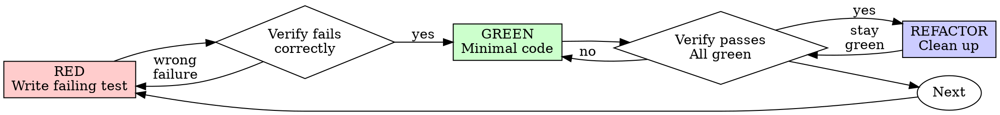

# Fix unsaved session input

> This archive contains visible conversation activity and tool records. Private model reasoning and system/developer instructions are not available here.
<!-- codex-event:{"kind":"state","timestamp":"2026-06-24T22:23:40.477Z","phase":null} -->
## Task state: task_started · 2026-06-24T22:23:40.477Z

```text
{
  "type": "task_started",
  "turn_id": "019efbbb-5ba2-7da1-916e-f9e11fc3ba2d",
  "started_at": 1782339820,
  "model_context_window": 258400,
  "collaboration_mode_kind": "default"
}
```

<!-- /codex-event -->

<!-- codex-event:{"kind":"user","timestamp":"2026-06-24T22:23:41.879Z","phase":null} -->
## User · 2026-06-24T22:23:41.879Z

Why is my input into the box not saved when I move from one session to another session? I have typed into the box, I change session, and the previous session does not remember what I had typed into the box.


<!-- /codex-event -->

<!-- codex-event:{"kind":"progress","timestamp":"2026-06-24T22:23:52.726Z","phase":"commentary"} -->
## Codex progress · 2026-06-24T22:23:52.726Z

I’ll trace the input state path across session switches and check whether it’s intentionally scoped globally or per session. I’m also going to use the project’s requested second-opinion flow once I have a concrete hypothesis.

<!-- /codex-event -->

<!-- codex-event:{"kind":"tool-call","timestamp":"2026-06-24T22:23:52.732Z","phase":null} -->
## Tool call: exec_command · 2026-06-24T22:23:52.732Z

```json
{
  "cmd": "sed -n '1,220p' /Users/masterman/.agents/skills/using-ultrapowers/SKILL.md",
  "workdir": "/Users/masterman/NLP/omniharness",
  "yield_time_ms": 1000,
  "max_output_tokens": 12000
}
```

<!-- /codex-event -->

<!-- codex-event:{"kind":"tool-call","timestamp":"2026-06-24T22:23:52.732Z","phase":null} -->
## Tool call: exec_command · 2026-06-24T22:23:52.732Z

```json
{
  "cmd": "sed -n '1,260p' /Users/masterman/.agents/skills/systematic-debugging/SKILL.md",
  "workdir": "/Users/masterman/NLP/omniharness",
  "yield_time_ms": 1000,
  "max_output_tokens": 16000
}
```

<!-- /codex-event -->

<!-- codex-event:{"kind":"tool-call","timestamp":"2026-06-24T22:23:52.888Z","phase":null} -->
## Tool call: exec_command · 2026-06-24T22:23:52.888Z

```json
{
  "cmd": "sed -n '1,240p' /Users/masterman/.agents/skills/building-react-apps/SKILL.md",
  "workdir": "/Users/masterman/NLP/omniharness",
  "yield_time_ms": 1000,
  "max_output_tokens": 14000
}
```

<!-- /codex-event -->

<!-- codex-event:{"kind":"tool-result","timestamp":"2026-06-24T22:23:52.919Z","phase":null} -->
## Tool result: call_QliVLAvzWQzdesObTg9F0fcx · 2026-06-24T22:23:52.919Z

```text
Chunk ID: d395ed
Wall time: 0.0000 seconds
Process exited with code 0
Original token count: 2019
Output:
---
name: using-ultrapowers
description: Use when starting any conversation - establishes how to find and use skills, requiring skill invocation before acting
---

<SUBAGENT-STOP>
If you were dispatched as a subagent to execute a specific task, skip this skill.
</SUBAGENT-STOP>

# Using Ultrapowers

Use relevant skills before acting, but keep process proportional to the task.

## Instruction Priority

1. User instructions and local repo instructions
2. Ultrapowers skills
3. Default model behavior

If the user says not to create extra repository isolation, or says to work directly in the current repository, follow that instruction.

## Core Rule

Before responding, ask:

1. Is there a process skill that governs how to approach this?
2. Is there an implementation skill that governs how to execute it?
3. Is the request substantial enough to justify that process, or is it a tiny mechanical edit?

If a skill applies and the task is substantial enough to justify it, use it before continuing. If the request is a tiny mechanical edit, make the edit directly with targeted verification.

## Proportional Skill Use

Do the smallest responsible workflow that matches the request.

For tiny, unambiguous mechanical edits, do the edit directly:

- changing a color value,
- fixing a typo,
- tweaking short copy,
- changing a prompt sentence,
- renaming a label,
- adjusting obvious spacing or formatting,
- making a one-line config or docs correction.

For these, do not run brainstorming, write a plan, or force TDD unless the change affects product behavior, data, persistence, control flow, user journeys, or non-obvious architecture.

Use the heavier process when the request is ambiguous, user-facing behavior changes, multiple files/modules are involved, the user journey can change, or the change could create regressions that are not obvious from a quick targeted check.

## Default Posture

- Work in the current repository by default.
- YOU WILL NEVER CREATE A BRANCH unless explicitly instructed.
- Ask the user whether we should work in worktrees as part of the planning.
- YOU WILL ONLY CREATE A WORKTREE if explicitly instructed.
- Keep skill use proportional. Tiny mechanical edits should stay tiny.
- Every project should have a `.gitignore`.
- Never commit or push secrets, credentials, local environment files, `node_modules`, dependency caches, build outputs, coverage output, logs, temporary files, or intermediate/generated artifacts unless the human explicitly asks to version a specific generated artifact.
- Deliver full product functionality by default. NO FAKE COMPONENTS, NO MOCKS, NO PLACEHOLDERS, NO FALLBACKS as substitutes for the requested functionality unless the human explicitly asks for a prototype or scaffold.
- For app, UI, and product-surface work, run a PM pass during planning. Treat it as mandatory default behavior, not optional polish.
- For app, UI, and product-surface work, consider `agentic-user-journey-testing` for important user stories, but do not run it without explicit user approval.
- Use `second-opinion` for substantial saved implementation plans, and for unusually hard, creative, high-risk, or architecture-heavy specs when an independent external review could improve the artifact. Prefer a different available coding harness for that review, such as Codex asking Claude Code or Claude Code asking Codex. If no different harness is available, the same harness is fine; the second opinion is still mandatory for matching artifacts.
- Refactor code when a file passes 1200 lines. Do not normalize oversized files as the default end state.
- Use user stories in specs and plans when they clarify behavior or value.
- Default UI work to `shadcn/ui` unless the user says otherwise.
- When designing UI from scratch, first inspect the available ShadCN Blocks at https://ui.shadcn.com/blocks for each screen, form, or major surface. Start from the closest matching block with `npx shadcn add <block-name>` or the block's source in https://github.com/shadcn-ui/ui, then edit it by adding, removing, or adapting controls. Do not invent a fresh layout before doing this block-selection pass.
- Before adding any individual UI control, check whether `shadcn/ui` already provides a control that does what is needed. Use the available shadcn control first, then customize it, instead of hand-building a one-off control.
- Treat desktop and mobile responsiveness as first-class from the beginning.
- Prefer explicit routing unless the framework strongly defaults to file-based routes.
- For React apps, use `building-react-apps` for state managers, explicit transitions, routing, refs, imports, package-manager defaults, and frontend configuration defaults.
- For React apps with server state, optimistic UI, caches, polling, SSE/WebSocket streams, background jobs, persistence, or client/server synchronization, use `client-server-state-invariants` during planning and verification.
- For React or Next.js slowness, root-load, compile-time, SSR/hydration, bundle, import-bloat, or UI dependency cleanup work, use `optimizing-react-next-apps`.
- Prefer strong instrumentation and auditability for backend behavior.
- When a project has backend or agent workflows, prefer a fully instrumented control plane: persist meaningful events, tool calls, actions, results, errors, and state transitions, and expose them through a CLI or other scriptable interface so the full system can be inspected and tested without the UI.
- Use `instrumenting-control-planes` when building, planning, reviewing, or debugging backend decisions, agent workflows, recovery paths, retries, deletes, long-running jobs, SSE/WebSocket streams, or user-visible failures.
- Use `learning-from-bugs` after diagnosing or fixing meaningful architecture, storage, memory, persistence, control-plane, or system-level bugs so reusable lessons become durable.
- Do not default to silent, masked, or over-abstracted errors.
- When a project has a frontend, prefer surfacing full backend error details and stack traces to the frontend so failures stay visible, debuggable, and testable end-to-end.
- Treat persistence of settings and preferences as explicit design work.
- For every meaningful UI setting, define whether it persists, where it is stored, how it is read and written, who owns it, and how reset, sync, migration, and testing are handled.

See `docs/ultrapowers-defaults.md` for the canonical fork defaults.

## Skill Priority

1. Process skills first
2. Implementation skills second

Examples:

- "Make this button blue" -> inspect the relevant file, make the small edit, do targeted verification
- "Update this prompt sentence" -> edit the prompt directly and verify the final text
- "Build a feature" -> `brainstorming` with a PM pass first, then `writing-plans`, then execution; consider approval-gated `agentic-user-journey-testing` for app workflows
- "Fix this bug" -> `systematic-debugging`, then the relevant implementation skill; if the root cause is meaningful or systemic, finish with `learning-from-bugs`
- "Review this change" -> `requesting-code-review`

## Examples Of User Override

- If a task feels risky and the user did not ask for extra repository isolation, keep working in the current repository unless the user explicitly instructs otherwise.
- If a stack supports file-based routing but the user says not to use it, choose an explicit routing approach instead.
- If a framework strongly defaults to file-based routing, such as Next.js App Router, use the framework-native routing model unless there is a good reason not to.
- If a frontend skill suggests `shadcn/ui` but the user wants another design system, follow the user.

## Red Flags

- "I need a whole workflow for this tiny edit" -> no. Use the smallest responsible process.
- "This is simple, so I need the whole process anyway" -> no. Tiny mechanical edits should stay tiny.
- "I'll create extra repository isolation just to be safe" -> forbidden unless the user clearly asked for it.
- "I already know the skill" -> read the current version before relying on it

```

<!-- /codex-event -->

<!-- codex-event:{"kind":"tool-result","timestamp":"2026-06-24T22:23:52.919Z","phase":null} -->
## Tool result: call_3jPzTNkXJAiO2sqPT9X7nlHA · 2026-06-24T22:23:52.919Z

````text
Chunk ID: a587a6
Wall time: 0.0000 seconds
Process exited with code 0
Original token count: 2092
Output:
---
name: systematic-debugging
description: Use when encountering any bug, test failure, or unexpected behavior, before proposing fixes
---

# Systematic Debugging

## Overview

Random fixes waste time and create new bugs. Quick patches mask underlying issues.

**Core principle:** ALWAYS find root cause before attempting fixes. Symptom fixes are failure.

**Violating the letter of this process is violating the spirit of debugging.**

## The Iron Law

```
NO FIXES WITHOUT ROOT CAUSE INVESTIGATION FIRST
```

If you haven't completed Phase 1, you cannot propose fixes.

## When to Use

Use for ANY technical issue:
- Test failures
- Bugs in production
- Unexpected behavior
- Performance problems
- Build failures
- Integration issues

**Use this ESPECIALLY when:**
- Under time pressure (emergencies make guessing tempting)
- "Just one quick fix" seems obvious
- You've already tried multiple fixes
- Previous fix didn't work
- You don't fully understand the issue

**Don't skip when:**
- Issue seems simple (simple bugs have root causes too)
- You're in a hurry (rushing guarantees rework)
- Manager wants it fixed NOW (systematic is faster than thrashing)

## The Four Phases

You MUST complete each phase before proceeding to the next.

### Phase 1: Root Cause Investigation

**BEFORE attempting ANY fix:**

1. **Read Error Messages Carefully**
   - Don't skip past errors or warnings
   - They often contain the exact solution
   - Read stack traces completely
   - Note line numbers, file paths, error codes

2. **Reproduce Consistently**
   - Can you trigger it reliably?
   - What are the exact steps?
   - Does it happen every time?
   - If not reproducible → gather more data, don't guess

3. **Check Recent Changes**
   - What changed that could cause this?
   - Git diff, recent commits
   - New dependencies, config changes
   - Environmental differences

4. **Gather Evidence in Multi-Component Systems**

   **WHEN system has multiple components (CI → build → signing, API → service → database):**

   **BEFORE proposing fixes, add diagnostic instrumentation:**
   ```
   For EACH component boundary:
     - Log what data enters component
     - Log what data exits component
     - Verify environment/config propagation
     - Check state at each layer

   Run once to gather evidence showing WHERE it breaks
   THEN analyze evidence to identify failing component
   THEN investigate that specific component
   ```

   **Example (multi-layer system):**
   ```bash
   # Layer 1: Workflow
   echo "=== Secrets available in workflow: ==="
   echo "IDENTITY: ${IDENTITY:+SET}${IDENTITY:-UNSET}"

   # Layer 2: Build script
   echo "=== Env vars in build script: ==="
   env | grep IDENTITY || echo "IDENTITY not in environment"

   # Layer 3: Signing script
   echo "=== Keychain state: ==="
   security list-keychains
   security find-identity -v

   # Layer 4: Actual signing
   codesign --sign "$IDENTITY" --verbose=4 "$APP"
   ```

   **This reveals:** Which layer fails (secrets → workflow ✓, workflow → build ✗)

5. **Trace Data Flow**

   **WHEN error is deep in call stack:**

   See `root-cause-tracing.md` in this directory for the complete backward tracing technique.

   **Quick version:**
   - Where does bad value originate?
   - What called this with bad value?
   - Keep tracing up until you find the source
   - Fix at source, not at symptom

### Phase 2: Pattern Analysis

**Find the pattern before fixing:**

1. **Find Working Examples**
   - Locate similar working code in same codebase
   - What works that's similar to what's broken?

2. **Compare Against References**
   - If implementing pattern, read reference implementation COMPLETELY
   - Don't skim - read every line
   - Understand the pattern fully before applying

3. **Identify Differences**
   - What's different between working and broken?
   - List every difference, however small
   - Don't assume "that can't matter"

4. **Understand Dependencies**
   - What other components does this need?
   - What settings, config, environment?
   - What assumptions does it make?

### Phase 3: Hypothesis and Testing

**Scientific method:**

1. **Form Single Hypothesis**
   - State clearly: "I think X is the root cause because Y"
   - Write it down
   - Be specific, not vague

2. **Test Minimally**
   - Make the SMALLEST possible change to test hypothesis
   - One variable at a time
   - Don't fix multiple things at once

3. **Verify Before Continuing**
   - Did it work? Yes → Phase 4
   - Didn't work? Form NEW hypothesis
   - DON'T add more fixes on top

4. **When You Don't Know**
   - Say "I don't understand X"
   - Don't pretend to know
   - Ask for help
   - Research more

### Phase 4: Implementation

**Fix the root cause, not the symptom:**

1. **Create Failing Test Case**
   - Simplest possible reproduction
   - Automated test if possible
   - One-off test script if no framework
   - MUST have before fixing
   - Use the `ultrapowers:test-driven-development` skill for writing proper failing tests

2. **Implement Single Fix**
   - Address the root cause identified
   - ONE change at a time
   - No "while I'm here" improvements
   - No bundled refactoring

3. **Verify Fix**
   - Test passes now?
   - No other tests broken?
   - Issue actually resolved?
   - If the bug was meaningful or systemic, use `ultrapowers:learning-from-bugs` before declaring the fix complete.

4. **If Fix Doesn't Work**
   - STOP
   - Count: How many fixes have you tried?
   - If < 3: Return to Phase 1, re-analyze with new information
   - **If ≥ 3: STOP and question the architecture (step 5 below)**
   - DON'T attempt Fix #4 without architectural discussion

5. **If 3+ Fixes Failed: Question Architecture**

   **Pattern indicating architectural problem:**
   - Each fix reveals new shared state/coupling/problem in different place
   - Fixes require "massive refactoring" to implement
   - Each fix creates new symptoms elsewhere

   **STOP and question fundamentals:**
   - Is this pattern fundamentally sound?
   - Are we "sticking with it through sheer inertia"?
   - Should we refactor architecture vs. continue fixing symptoms?

   **Discuss with your human partner before attempting more fixes**

   This is NOT a failed hypothesis - this is a wrong architecture.

## Red Flags - STOP and Follow Process

If you catch yourself thinking:
- "Quick fix for now, investigate later"
- "Just try changing X and see if it works"
- "Add multiple changes, run tests"
- "Skip the test, I'll manually verify"
- "It's probably X, let me fix that"
- "I don't fully understand but this might work"
- "Pattern says X but I'll adapt it differently"
- "Here are the main problems: [lists fixes without investigation]"
- Proposing solutions before tracing data flow
- **"One more fix attempt" (when already tried 2+)**
- **Each fix reveals new problem in different place**

**ALL of these mean: STOP. Return to Phase 1.**

**If 3+ fixes failed:** Question the architecture (see Phase 4.5)

## your human partner's Signals You're Doing It Wrong

**Watch for these redirections:**
- "Is that not happening?" - You assumed without verifying
- "Will it show us...?" - You should have added evidence gathering
- "Stop guessing" - You're proposing fixes without understanding
- "Ultrathink this" - Question fundamentals, not just symptoms
- "We're stuck?" (frustrated) - Your approach isn't working

**When you see these:** STOP. Return to Phase 1.

## Common Rationalizations

| Excuse | Reality |
|--------|---------|
| "Issue is simple, don't need process" | Simple issues have root causes too. Process is fast for simple bugs. |
| "Emergency, no time for process" | Systematic debugging is FASTER than guess-and-check thrashing. |
| "Just try this first, then investigate" | First fix sets the pattern. Do it right from the start. |
| "I'll write test after confirming fix works" | Untested fixes don't stick. Test first proves it. |
| "Multiple fixes at once saves time" | Can't isolate what worked. Causes new bugs. |
| "Reference too long, I'll adapt the pattern" | Partial understanding guarantees bugs. Read it completely. |
| "I see the problem, let me fix it" | Seeing symptoms ≠ understanding root cause. |
| "One more fix attempt" (after 2+ failures) | 3+ failures = architectural problem. Question pattern, don't fix again. |

## Quick Reference


````

<!-- /codex-event -->

<!-- codex-event:{"kind":"tool-result","timestamp":"2026-06-24T22:23:52.967Z","phase":null} -->
## Tool result: call_9AiM7Hx6wwHRLbGxH3CN367h · 2026-06-24T22:23:52.967Z

```text
Chunk ID: 80b108
Wall time: 0.0000 seconds
Process exited with code 0
Original token count: 2034
Output:
---
name: building-react-apps
description: Use when building, refactoring, planning, or debugging React or Next.js apps, React components, hooks, routing, frontend state, SSR, hydration, bundles, imports, or UI settings
---

# Building React Apps

Use these defaults for React app work unless the user or existing codebase explicitly chooses another architecture.

If the work is specifically about slowness, root-load time, compile time, SSR effectiveness, hydration cost, bundle size, import bloat, or decluttering heavy UI dependencies, use `optimizing-react-next-apps` as the focused workflow.

If the app has server state, optimistic UI, caches, polling, SSE/WebSocket streams, background jobs, persisted runtime state, or client/server synchronization, use `client-server-state-invariants` before planning or changing the state model.

## UI Starting Point

- For new React app screens, forms, and major surfaces, use `shadcn/ui` unless the user or existing app has chosen another design system.
- Before inventing layout, inspect the available ShadCN Blocks at https://ui.shadcn.com/blocks for the specific screen or form category.
- Start from the closest matching block with `npx shadcn add <block-name>` or the official source in https://github.com/shadcn-ui/ui, then add, remove, and adapt controls to fit the product.
- Do not use a blank custom layout as the first implementation path when a relevant ShadCN Block exists.
- Before adding any individual control, check whether `shadcn/ui` already provides a suitable control. Use/customize the shadcn control before hand-building a one-off control.

## State And Data

- Always centralize React app state in global single-source-of-truth Manager classes.
- Components, hooks, and listeners subscribe to Manager updates and use Manager methods to update data.
- Centralized state does not mean broad subscriptions. Components must subscribe to the smallest slice they need, preferably with selector hooks and equality checks, so unrelated UI does not re-render.
- Never let app shells, page roots, sidebars, timelines, or other broad containers subscribe to an entire high-churn Manager snapshot when they only need stable fields. Draft text, cursors, hover/open state, search text, and other per-keystroke or per-pointer state need narrow component-level subscriptions.
- If typing in an input, moving a cursor, toggling a hover/open flag, or editing a small draft makes the whole app repaint, the subscription boundary is wrong even if the data source is centralized.
- Always implement a custom data manager for any app data structure.
- Never use separate state variables or arrays as the source of truth.
- Never send data around in transactions. Pass intent, ids, commands, or Manager method calls instead.

## React Control Flow

- Avoid using `useEffect()` to update state. Prefer `useCallback()` handlers or Manager methods for explicit state transitions.
- Work ahead of time to avoid callback hell, race conditions, and infinite loops.
- When debugging React and a fix does not work, explicitly consider whether the root cause is a race condition. Race conditions are common in React.
- Every async callback, mutation result, timer, poll, or stream message that can update visible state must prove it still owns the current context before mutating Managers or navigation.
- Use `RefObject` instead of `MutableRefObject`.

## Routing And Modules

- Prefer explicit routing over file-based routing when the framework does not strongly default to file-based routes. Framework-native file routing, such as Next.js App Router, is fine.
- Never use `require()` to import modules. Use `import` instead.
- Avoid `npm` by default. Use `pnpm` for package installation, scripts, and lockfiles unless the user or existing project explicitly chooses another package manager.

## Next.js And SSR Defaults

- Treat `"use client"` as a boundary with a cost. Do not put an entire page, app shell, sidebar, timeline, composer, settings surface, and data boot path behind one giant client component unless there is a deliberate reason.
- SSR is only useful if the initial HTML contains meaningful above-the-fold UI or data. If `curl` for the route only shows a boot shell, script payloads, or empty placeholders, the route is not meaningfully server-rendered even if SSR is technically enabled.
- Server-render the first useful screen by fetching route-stable bootstrap data on the server: auth/session state, settings needed to choose the shell, selected route ids, and initial page/snapshot data. Hydrate Managers or query caches from that bootstrap data; do not wait for client `useEffect()` plus client fetches before the first meaningful paint.
- Use client effects for browser-only concerns: localStorage-only preferences, notifications, SSE/WebSocket subscriptions, focus management, and post-paint refreshes. Do not use effects as the only path for data required to decide what the initial screen is.
- In Next dev, first request time includes compilation. Distinguish cold compile cost from runtime slowness before optimizing the wrong layer.

## Import And Bundle Hygiene

- Keep imports proportional to the UI being rendered. Do not import an entire complex surface for a tiny control; split shared tiny controls into their own files instead of importing them from heavy feature modules.
- Lazy-load rarely opened or route-conditional surfaces with dynamic imports: settings dialogs, side panels, file viewers, terminals, worker inspectors, onboarding flows, QR/pairing dialogs, and large markdown/code viewers.
- Avoid package and barrel imports that drag in whole icon packs, design systems, syntax highlighters, markdown stacks, charting libraries, or component suites for one glyph or one primitive. Inline small SVG paths or use local assets when that is cheaper and stable.
- Prefer native browser controls for small, ordinary selects and pickers. Do not import a popover/dialog/menu stack for a low-value dropdown unless search, virtualization, or rich item rendering is genuinely needed.
- Use subpath imports when a package supports them. Avoid root package imports from large UI libraries if a narrower entrypoint exists.
- After dependency or UI-shell changes, inspect the emitted dev chunks or traces. Verify whether heavy modules moved out of the root chunk rather than assuming dynamic import worked.

## Performance Debugging

- Start with evidence: dev server logs, route timings, emitted chunk sizes, module counts, and initial HTML content.
- Separate long-lived requests from slow requests. SSE, streaming, and hanging fetches can show huge durations in logs without blocking page paint.
- Check recent dependency additions first when compile time suddenly explodes. A single icon, markdown, chart, or UI package can add thousands of modules.
- For Next.js root-load complaints, answer three questions before changing code: what compiled, what HTML was returned, and what client-side requests gated the first useful paint?

## Frontend Configuration

- Never store frontend string literals or UI settings in `.env` files.
- Put frontend strings and settings in normal source files, inline arrays, or `.json` files so they remain reviewable, testable, and versioned with the UI.

## Internationalization

- For meaningful React UI work, offer language support as an option when the user has not already decided: "Should we support other languages? If yes, I will wire user-facing copy through i18n resources now instead of hardcoding strings."
- If the user says yes, asks for translation/i18n/language/locale support, or reports that language switching only updates part of the UI, use `implementing-react-i18n`.
- Use the i18n library's `t("key", params?)` function for every user-facing string. Use `useI18nSnapshot()` only to subscribe React components so language changes repaint.
- Never name variables with locale codes or locale-like names such as `it`, `en`, `enUS`, `locIt`, or `locEnUs`.

## Settings UI

- For settings dialogs, preferences panels, configuration modals, option tabs, or UI settings surfaces, use `designing-settings-dialogs`.

```

<!-- /codex-event -->

<!-- codex-event:{"kind":"progress","timestamp":"2026-06-24T22:23:59.474Z","phase":"commentary"} -->
## Codex progress · 2026-06-24T22:23:59.474Z

I’m using `systematic-debugging` and the React app guidance here because this smells like a state ownership/persistence bug, not just a rendering quirk. Next I’m going to find the composer/input manager and the session selection flow.

<!-- /codex-event -->

<!-- codex-event:{"kind":"tool-call","timestamp":"2026-06-24T22:23:59.482Z","phase":null} -->
## Tool call: exec_command · 2026-06-24T22:23:59.482Z

```json
{
  "cmd": "rg -n \"composer|input|draft|textarea|TextArea|session|conversation\" src app shared tests -g '*.{ts,tsx,js,jsx,json}'",
  "workdir": "/Users/masterman/NLP/omniharness",
  "yield_time_ms": 1000,
  "max_output_tokens": 20000
}
```

<!-- /codex-event -->

<!-- codex-event:{"kind":"tool-call","timestamp":"2026-06-24T22:23:59.631Z","phase":null} -->
## Tool call: exec_command · 2026-06-24T22:23:59.631Z

```json
{
  "cmd": "rg --files src app shared tests | sed -n '1,220p'",
  "workdir": "/Users/masterman/NLP/omniharness",
  "yield_time_ms": 1000,
  "max_output_tokens": 12000
}
```

<!-- /codex-event -->

<!-- codex-event:{"kind":"tool-call","timestamp":"2026-06-24T22:23:59.631Z","phase":null} -->
## Tool call: exec_command · 2026-06-24T22:23:59.631Z

```json
{
  "cmd": "git status --short",
  "workdir": "/Users/masterman/NLP/omniharness",
  "yield_time_ms": 1000,
  "max_output_tokens": 12000
}
```

<!-- /codex-event -->

<!-- codex-event:{"kind":"tool-result","timestamp":"2026-06-24T22:23:59.706Z","phase":null} -->
## Tool result: call_BSK2OXOKBbrEOwi0VM5OviWz · 2026-06-24T22:23:59.706Z

```text
Chunk ID: 57c826
Wall time: 0.0001 seconds
Process exited with code 2
Original token count: 136801
Output:
Warning: truncated output (original token count: 136801)
Total output lines: 5162

rg: app: No such file or directory (os error 2)
tests/supervisor/conversation-bootstrap.test.ts:2:import { buildSupervisorConversation } from "@/server/supervisor/conversation-bootstrap";
shared/locales/es.json:43:  "settings.appearance.conversationFontSize": "Conversación",
shared/locales/es.json:44:  "settings.appearance.conversationFontSizeDescription": "Mensajes del supervisor y de control directo.",
shared/locales/es.json:66:  "settings.models.creditStrategy.explanation.fallbackApi": "Once credits are exhausted, fall back to the configured fallback LLM (with its own provider, model, and key) for the remainder of the conversation.",
shared/locales/es.json:155:  "session.menu.label": "Session options",
shared/locales/es.json:156:  "session.menu.copyWorkingDirectory": "Copy working directory",
shared/locales/es.json:157:  "session.menu.copySessionId": "Copy session id",
shared/locales/es.json:158:  "session.menu.copyAsMarkdown": "Copy as Markdown",
shared/locales/es.json:159:  "session.menu.forkSession": "Fork session",
shared/locales/es.json:160:  "session.menu.forkIntoWorktree": "Fork into new worktree",
shared/locales/es.json:161:  "session.menu.reload": "Recargar sesión",
shared/locales/es.json:167:  "conversation.sidebar.otherSessions": "Otras sesiones",
shared/locales/es.json:168:  "conversation.sidebar.moreSessions": "más...",
shared/locales/es.json:169:  "conversation.sidebar.showMoreSessions": "Mostrar {count} sesiones más en {project}",
shared/locales/es.json:170:  "conversation.sidebar.status.completedAttention": "Finalizada con mensajes sin leer",
shared/locales/es.json:171:  "conversation.sidebar.status.awaitingUser": "Esperando tu respuesta",
shared/locales/es.json:172:  "conversation.preflightConfirmation.yes": "Sí, continuar",
shared/locales/es.json:173:  "conversation.preflightConfirmation.no": "No, quiero aclarar",
shared/locales/es.json:174:  "conversation.mode.direct.label": "Control directo",
shared/locales/es.json:175:  "conversation.mode.direct.description": "Úsalo para interactuar directamente con el CLI seleccionado, con capacidades completas de control remoto.",
shared/locales/es.json:176:  "conversation.mode.omni.label": "Omni",
shared/locales/es.json:177:  "conversation.mode.omni.description": "Usa el modo de planificación directamente en el CLI seleccionado. Cuando el plan esté listo, omni tomará el control, lo confirmará según tu intención y mantendrá a los agentes trabajando sin parar hasta implementarlo por completo.",
shared/locales/es.json:178:  "conversation.composer.settings.title": "Settings",
shared/locales/es.json:179:  "conversation.composer.settings.agent": "Agent",
shared/locales/es.json:180:  "conversation.composer.settings.model": "Model",
shared/locales/es.json:181:  "conversation.composer.settings.effort": "Effort",
shared/locales/es.json:182:  "conversation.composer.sendButton.send": "Enviar mensaje",
shared/locales/es.json:183:  "conversation.composer.sendButton.stop": "Detener conversación",
shared/locales/es.json:184:  "conversation.composer.sendButton.queue": "Encolar mensaje",
shared/locales/es.json:185:  "conversation.composer.sendButton.steer": "Dirigir trabajo activo",
shared/locales/es.json:186:  "conversation.composer.sendButton.sendTitle": "Enviar mensaje",
shared/locales/es.json:187:  "conversation.composer.sendButton.stopTitle": "Detener conversación",
shared/locales/es.json:188:  "conversation.composer.sendButton.queueTitle": "Encolar mensaje. {shortcut} dirige el trabajo activo.",
shared/locales/es.json:189:  "conversation.composer.sendButton.steerTitle": "Dirigir trabajo activo. {shortcut} encola el mensaje.",
shared/locales/es.json:190:  "conversation.messageEdit.ariaLabel": "Editar mensaje",
shared/locales/es.json:191:  "conversation.messageEdit.notice": "Esto truncará el historial posterior y volverá a ejecutar desde este mensaje.",
shared/locales/es.json:192:  "conversation.messageEdit.saveAndRerun": "Guardar y volver a ejecutar",
shared/locales/es.json:193:  "conversation.toolGroup.expandTitle": "Mostrar llamadas de herramientas",
shared/locales/es.json:194:  "conversation.toolGroup.collapseTitle": "Ocultar llamadas de herramientas",
shared/locales/es.json:195:  "conversation.toolGroup.toggleAriaLabel": "Inspeccionar llamadas de herramientas: {summary}",
shared/locales/es.json:196:  "conversation.toolGroup.summarySeparator": ", ",
shared/locales/es.json:197:  "conversation.toolGroup.editedFile": "Editó {count} archivo",
shared/locales/es.json:198:  "conversation.toolGroup.editedFiles": "Editó {count} archivos",
shared/locales/es.json:199:  "conversation.toolGroup.readFile": "leyó {count} archivo",
shared/locales/es.json:200:  "conversation.toolGroup.readFiles": "leyó {count} archivos",
shared/locales/es.json:201:  "conversation.toolGroup.searchedTime": "buscó {count} vez",
shared/locales/es.json:202:  "conversation.toolGroup.searchedTimes": "buscó {count} veces",
shared/locales/es.json:203:  "conversation.toolGroup.ranCommand": "ejecutó {count} comando",
shared/locales/es.json:204:  "conversation.toolGroup.ranCommands": "ejecutó {count} comandos",
shared/locales/es.json:205:  "conversation.toolGroup.usedAgent": "usó {count} agente",
shared/locales/es.json:206:  "conversation.toolGroup.usedAgents": "usó {count} agentes",
shared/locales/es.json:207:  "conversation.toolGroup.usedTool": "usó {count} herramienta",
shared/locales/es.json:208:  "conversation.toolGroup.usedTools": "usó {count} herramientas",
shared/locales/es.json:209:  "conversation.activity.startPlanningAgent": "Iniciando agente de planificación.",
shared/locales/es.json:244:  "recovery.notice.description.recovering": "OmniHarness is restoring the worker session or restarting from the latest checkpoint.",
shared/locales/es.json:245:  "recovery.notice.description.lostWorkerResumable": "The worker is missing from the runtime, but a saved session can be resumed.",
shared/locales/es.json:317:  "conversation.composer.placeholder.default": "Pregunta a Omni lo que quieras. @ para referirte a archivos",
shared/locales/es.json:318:  "conversation.composer.placeholder.planning": "Responder al agente de planificación...",
shared/locales/es.json:319:  "conversation.composer.placeholder.direct": "Enviar a la CLI...",
shared/locales/es.json:320:  "conversation.composer.workerModelAria": "Modelo del worker",
shared/locales/es.json:321:  "conversation.composer.placeholder.implementation": "Preguntar al supervisor...",
shared/locales/es.json:324:  "settings.notifications.description": "Get a browser notification when a conversation completes or needs your input.",
shared/locales/es.json:335:  "notifications.push.conversationComplete": "Conversation complete",
shared/locales/es.json:336:  "notifications.push.conversationCompleteBody": "{title} is complete.",
shared/locales/es.json:337:  "notifications.push.needsInput": "OmniHarness needs input",
shared/locales/es.json:338:  "notifications.push.needsInputBody": "{title} is waiting for your input.",
shared/locales/es.json:348:  "login.pair.description": "Connecting this phone to your running OmniHarness session.",
shared/locales/es.json:360:  "conversation.composer.interruptQueuedAria": "Interrumpir y enviar",
shared/locales/es.json:361:  "conversation.composer.interruptQueuedTitle": "Pulsa Escape para detener el turno actual y enviar",
shared/locales/es.json:366:  "workers.sidebar.emptyActive": "No active workers for this conversation.",
shared/locales/es.json:367:  "workers.sidebar.emptyFinished": "No finished workers for this conversation.",
shared/locales/es.json:371:  "worker.elicitation.defaultQuestion": "The worker needs input before continuing.",
shared/locales/es.json:375:  "worker.elicitation.inputPlaceholder": "Type your answer",
shared/locales/es.json:378:  "conversation.loading": "Loading conversation...",
shared/locales/es.json:379:  "conversation.message.copyAria": "Copy message",
shared/locales/es.json:380:  "conversation.message.copiedNotice": "Copied to clipboard",
shared/locales/es.json:381:  "conversation.message.action.resumeFromHere": "Reanudar desde aquí",
shared/locales/es.json:382:  "conversation.message.action.retryFromHere": "Reintentar desde aquí",
shared/locales/es.json:383:  "conversation.message.action.editInPlace": "Editar aquí",
shared/locales/es.json:384:  "conversation.message.action.forkFromHere": "Bifurcar desde aquí",
shared/locales/es.json:395:  "conversation.sidebar.collapseAria": "Collapse conversations sidebar",
shared/locales/es.json:396:  "conversation.sidebar.loadingConversations": "Loading conversations...",
shared/locales/es.json:397:  "conversation.sidebar.tab.projects": "Projects",
shared/locales/es.json:398:  "conversation.sidebar.tab.active": "Recent",
shared/locales/es.json:399:  "conversation.sidebar.collapseAllProjects": "Collapse all",
shared/locales/es.json:400:  "conversation.sidebar.addProject": "Add project",
shared/locales/es.json:401:  "conversation.sidebar.dragProject": "Drag {project}",
shared/locales/es.json:402:  "conversation.sidebar.empty.projects": "No projects added.",
shared/locales/es.json:403:  "conversation.sidebar.empty.active": "No active sessions.",
shared/locales/es.json:404:  "conversation.sidebar.newSession": "New session",
shared/locales/es.json:405:  "conversation.sidebar.searchPlaceholder": "Search",
shared/locales/es.json:406:  "conversation.sidebar.newConversationInProject": "New conversation in {project}",
shared/locales/es.json:407:  "conversation.sidebar.removeProject": "Remove Project",
shared/locales/es.json:408:  "conversation.sidebar.conversationActions": "Conversation actions for {title}",
shared/locales/es.json:409:  "conversation.sidebar.archiveConversation": "Archive {title}",
shared/locales/es.json:410:  "conversation.sidebar.conversationVisual": "{kind} conversation",
shared/locales/es.json:411:  "conversation.sidebar.rename": "Rename",
shared/locales/es.json:412:  "conversation.sidebar.moveToProject": "Move to Project",
shared/locales/es.json:413:  "conversation.sidebar.archive": "Archive",
shared/locales/es.json:414:  "conversation.sidebar.delete": "Delete",
shared/locales/es.json:415:  "conversation.moveProject.title": "Move to Project",
shared/locales/es.json:416:  "conversation.moveProject.description": "Choose the project this session should appear under.",
shared/locales/es.json:417:  "conversation.moveProject.empty": "Add a project before moving this session.",
shared/locales/es.json:418:  "conversation.moveProject.projectLabel": "Project",
shared/locales/es.json:419:  "conversation.moveProject.placeholder": "Select a project",
shared/locales/es.json:420:  "conversation.moveProject.ok": "OK",
shared/locales/es.json:446:  "settings.memory.noProject": "Open a project conversation to manage its memory.",
shared/locales/es.json:454:  "sidebar.resize.conversations": "Resize conversations sidebar",
shared/locales/es.json:527:  "conversation.chip.switchedWorkers": "Switched workers: {outgoing} → {incoming}",
shared/locales/es.json:528:  "conversation.chip.switchedWorkersAria": "Worker failover",
shared/locales/es.json:537:  "vscode.panel.noConversations": "No conversations found.",
shared/locales/es.json:540:  "vscode.panel.status.loadingConversations": "Loading conversations...",
shared/locales/es.json:543:  "vscode.panel.status.starting": "Starting conversation...",
shared/locales/es.json:550:  "supervisor.activity.phase.awaitingUser": "Waiting for your input",
shared/locales/es.json:572:  "conversation.status.awaitingInput": "Awaiting input",
shared/locales/es.json:573:  "conversation.status.awaitingWorkerInput": "The worker asked for input before continuing.",
shared/locales/es.json:574:  "conversation.status.workerAwaitingAnswer": "{worker} is waiting on {count} answer(s)."
src/vscode-extension/bridge.ts:31:  sessionCookie?: string | null;
src/vscode-extension/bridge.ts:206:    if (context.sessionCookie && !headers.cookie) {
src/vscode-extension/bridge.ts:207:      headers.cookie = context.sessionCookie;
src/vscode-extension/bridge.ts:249:    if (context.sessionCookie) {
src/vscode-extension/bridge.ts:250:      headers.cookie = context.sessionCookie;
tests/supervisor/worker-failover-handoff-fails.test.ts:112:      sessionId: "session-claude-1",
tests/supervisor/worker-failover-handoff-fails.test.ts:113:      sessionMode: "full-access",
tests/supervisor/worker-failover-spawn-retry.test.ts:60:    await db.delete(schema.conversationReadMarkers);
shared/locales/pt.json:43:  "settings.appearance.conversationFontSize": "Conversa",
shared/locales/pt.json:44:  "settings.appearance.conversationFontSizeDescription": "Mensagens do supervisor e de controle direto.",
shared/locales/pt.json:66:  "settings.models.creditStrategy.explanation.fallbackApi": "Once credits are exhausted, fall back to the configured fallback LLM (with its own provider, model, and key) for the remainder of the conversation.",
shared/locales/pt.json:155:  "session.menu.label": "Session options",
shared/locales/pt.json:156:  "session.menu.copyWorkingDirectory": "Copy working directory",
shared/locales/pt.json:157:  "session.menu.copySessionId": "Copy session id",
shared/locales/pt.json:158:  "session.menu.copyAsMarkdown": "Copy as Markdown",
shared/locales/pt.json:159:  "session.menu.forkSession": "Fork session",
shared/locales/pt.json:160:  "session.menu.forkIntoWorktree": "Fork into new worktree",
shared/locales/pt.json:161:  "session.menu.reload": "Recarregar sessão",
shared/locales/pt.json:167:  "conversation.sidebar.otherSessions": "Outras sessões",
shared/locales/pt.json:168:  "conversation.sidebar.moreSessions": "mais...",
shared/locales/pt.json:169:  "conversation.sidebar.showMoreSessions": "Mostrar mais {count} sessões em {project}",
shared/locales/pt.json:170:  "conversation.sidebar.status.completedAttention": "Concluída com mensagens não lidas",
shared/locales/pt.json:171:  "conversation.sidebar.status.awaitingUser": "Aguardando sua resposta",
shared/locales/pt.json:172:  "conversation.preflightConfirmation.yes": "Sim, continuar",
shared/locales/pt.json:173:  "conversation.preflightConfirmation.no": "Não, quero esclarecer",
shared/locales/pt.json:174:  "conversation.mode.direct.label": "Controle direto",
shared/locales/pt.json:175:  "conversation.mode.direct.description": "Use isto para interagir diretamente com a CLI selecionada, com recursos completos de controle remoto.",
shared/locales/pt.json:176:  "conversation.mode.omni.label": "Omni",
shared/locales/pt.json:177:  "conversation.mode.omni.description": "Use o modo de planejamento diretamente na CLI selecionada. Quando o plano estiver pronto, omni assumirá, confirmará conforme sua intenção e manterá os agentes trabalhando sem parar até que tudo esteja totalmente implementado.",
shared/locales/pt.json:178:  "conversation.composer.settings.title": "Settings",
shared/locales/pt.json:179:  "conversation.composer.settings.agent": "Agent",
shared/locales/pt.json:180:  "conversation.composer.settings.model": "Model",
shared/locales/pt.json:181:  "conversation.composer.settings.effort": "Effort",
shared/locales/pt.json:182:  "conversation.composer.sendButton.send": "Enviar mensagem",
shared/locales/pt.json:183:  "conversation.composer.sendButton.stop": "Parar conversa",
shared/locales/pt.json:184:  "conversation.composer.sendButton.queue": "Enfileirar mensagem",
shared/locales/pt.json:185:  "conversation.composer.sendButton.steer": "Direcionar trabalho ativo",
shared/locales/pt.json:186:  "conversation.composer.sendButton.sendTitle": "Enviar mensagem",
shared/locales/pt.json:187:  "conversation.composer.sendButton.stopTitle": "Parar conversa",
shared/locales/pt.json:188:  "conversation.composer.sendButton.queueTitle": "Enfileirar mensagem. {shortcut} direciona o trabalho ativo.",
shared/locales/pt.json:189:  "conversation.composer.sendButton.steerTitle": "Direcionar trabalho ativo. {shortcut} enfileira a mensagem.",
shared/locales/pt.json:190:  "conversation.messageEdit.ariaLabel": "Editar mensagem",
shared/locales/pt.json:191:  "conversation.messageEdit.notice": "Isto truncará o histórico posterior e executará novamente a partir desta mensagem.",
shared/locales/pt.json:192:  "conversation.messageEdit.saveAndRerun": "Salvar e executar novamente",
shared/locales/pt.json:193:  "conversation.toolGroup.expandTitle": "Mostrar chamadas de ferramentas",
shared/locales/pt.json:194:  "conversation.toolGroup.collapseTitle": "Ocultar chamadas de ferramentas",
shared/locales/pt.json:195:  "conversation.toolGroup.toggleAriaLabel": "Inspecionar chamadas de ferramentas: {summary}",
shared/locales/pt.json:196:  "conversation.toolGroup.summarySeparator": ", ",
shared/locales/pt.json:197:  "conversation.toolGroup.editedFile": "Editou {count} arquivo",
shared/locales/pt.json:198:  "conversation.toolGroup.editedFiles": "Editou {count} arquivos",
shared/locales/pt.json:199:  "conversation.toolGroup.readFile": "leu {count} arquivo",
shared/locales/pt.json:200:  "conversation.toolGroup.readFiles": "leu {count} arquivos",
shared/locales/pt.json:201:  "conversation.toolGroup.searchedTime": "pesquisou {count} vez",
shared/locales/pt.json:202:  "conversation.toolGroup.searchedTimes": "pesquisou {count} vezes",
shared/locales/pt.json:203:  "conversation.toolGroup.ranCommand": "executou {count} comando",
shared/locales/pt.json:204:  "conversation.toolGroup.ranCommands": "executou {count} comandos",
shared/locales/pt.json:205:  "conversation.toolGroup.usedAgent": "usou {count} agente",
shared/locales/pt.json:206:  "conversation.toolGroup.usedAgents": "usou {count} agentes",
shared/locales/pt.json:207:  "conversation.toolGroup.usedTool": "usou {count} ferramenta",
shared/locales/pt.json:208:  "conversation.toolGroup.usedTools": "usou {count} ferramentas",
shared/locales/pt.json:209:  "conversation.activity.startPlanningAgent": "Iniciando agente de planejamento.",
shared/locales/pt.json:244:  "recovery.notice.description.recovering": "OmniHarness is restoring the worker session or restarting from the latest checkpoint.",
shared/locales/pt.json:245:  "recovery.notice.description.lostWorkerResumable": "The worker is missing from the runtime, but a saved session can be resumed.",
shared/locales/pt.json:317:  "conversation.composer.placeholder.default": "Pergunte qualquer coisa ao Omni. @ para referenciar arquivos",
shared/locales/pt.json:318:  "conversation.composer.placeholder.planning": "Responder ao agente de planejamento...",
shared/locales/pt.json:319:  "conversation.composer.placeholder.direct": "Enviar para CLI...",
shared/locales/pt.json:320:  "conversation.composer.workerModelAria": "Modelo do worker",
shared/locales/pt.json:321:  "conversation.composer.placeholder.implementation": "Perguntar ao supervisor...",
shared/locales/pt.json:324:  "settings.notifications.description": "Get a browser notification when a conversation completes or needs your input.",
shared/locales/pt.json:335:  "notifications.push.conversationComplete": "Conversation complete",
shared/locales/pt.json:336:  "notifications.push.conversationCompleteBody": "{title} is complete.",
shared/locales/pt.json:337:  "notifications.push.needsInput": "OmniHarness needs input",
shared/locales/pt.json:338:  "notifications.push.needsInputBody": "{title} is waiting for your input.",
shared/locales/pt.json:348:  "login.pair.description": "Connecting this phone to your running OmniHarness session.",
shared/locales/pt.json:360:  "conversation.composer.interruptQueuedAria": "Interromper e enviar",
shared/locales/pt.json:361:  "conversation.composer.interruptQueuedTitle": "Pressione Esc para parar o turno atual e enviar",
shared/locales/pt.json:366:  "workers.sidebar.emptyActive": "No active workers for this conversation.",
shared/locales/pt.json:367:  "workers.sidebar.emptyFinished": "No finished workers for this conversation.",
shared/locales/pt.json:371:  "worker.elicitation.defaultQuestion": "The worker needs input before continuing.",
shared/locales/pt.j…126801 tokens truncated…utEntryInput) {
src/server/agent-runtime/output-store.ts:281:  const archiveEntry = record.outputArchive.append(input);
src/server/agent-runtime/types.ts:20:  sessionId?: string;
src/server/agent-runtime/types.ts:73:  append(input: Omit<OutputEntry, "id" | "timestamp"> & { timestamp?: string }): OutputEntry;
src/server/agent-runtime/types.ts:75:  readPage(input?: { cursor?: number; limit?: number }): Promise<OutputArchivePage>;
src/server/agent-runtime/types.ts:84:  sessionId: string;
src/server/agent-runtime/types.ts:101:  sessionMode: string | null;
src/server/agent-runtime/types.ts:103:    inputTokens: number | null;
src/server/omni-acp/agent.ts:6:import { createConversation } from "@/server/conversations/create";
src/server/omni-acp/agent.ts:7:import { sendConversationMessage } from "@/server/conversations/send-message";
src/server/omni-acp/agent.ts:9:import { CONVERSATION_MODES, type ConversationMode } from "@/server/conversations/modes";
src/server/omni-acp/agent.ts:26:    description: "Use a single ACP-backed worker as a direct conversation surface.",
src/server/omni-acp/agent.ts:31:  sessionId: string;
src/server/omni-acp/agent.ts:46:  sessionId: string;
src/server/omni-acp/agent.ts:111:function sessionInfoFromRun(run: typeof runs.$inferSelect): acp.SessionInfo {
src/server/omni-acp/agent.ts:113:    sessionId: run.id,
src/server/omni-acp/agent.ts:211:  private readonly sessions = new Map<string, SessionState>();
src/server/omni-acp/agent.ts:215:    private readonly connection: Pick<acp.AgentSideConnection, "sessionUpdate">,
src/server/omni-acp/agent.ts:236:        sessionCapabilities: {
src/server/omni-acp/agent.ts:246:    const sessionId = createShortUuid();
src/server/omni-acp/agent.ts:247:    this.sessions.set(sessionId, {
src/server/omni-acp/agent.ts:248:      sessionId,
src/server/omni-acp/agent.ts:259:      sessionId,
src/server/omni-acp/agent.ts:265:    const run = await this.requireRun(params.sessionId);
src/server/omni-acp/agent.ts:267:    this.sessions.set(params.sessionId, state);
src/server/omni-acp/agent.ts:268:    await this.replayRunHistory(params.sessionId);
src/server/omni-acp/agent.ts:288:      sessions: page.map(sessionInfoFromRun),
src/server/omni-acp/agent.ts:294:    const run = await this.requireRun(params.sessionId);
src/server/omni-acp/agent.ts:296:    this.sessions.set(params.sessionId, state);
src/server/omni-acp/agent.ts:304:    const source = await this.resolveSessionOrRun(params.sessionId);
src/server/omni-acp/agent.ts:305:    const sessionId = createShortUuid();
src/server/omni-acp/agent.ts:306:    this.sessions.set(sessionId, {
src/server/omni-acp/agent.ts:307:      sessionId,
src/server/omni-acp/agent.ts:318:      sessionId,
src/server/omni-acp/agent.ts:324:    const session = this.requireSession(params.sessionId);
src/server/omni-acp/agent.ts:328:    session.mode = params.modeId;
src/server/omni-acp/agent.ts:329:    await this.connection.sessionUpdate({
src/server/omni-acp/agent.ts:330:      sessionId: params.sessionId,
src/server/omni-acp/agent.ts:332:        sessionUpdate: "current_mode_update",
src/server/omni-acp/agent.ts:340:    const session = this.requireSession(params.sessionId);
src/server/omni-acp/agent.ts:346:    session.abortController?.abort();
src/server/omni-acp/agent.ts:348:    session.abortController = abortController;
src/server/omni-acp/agent.ts:350:    const emit = (text: string) => this.emitText(params.sessionId, text);
src/server/omni-acp/agent.ts:353:      if (!session.runId) {
src/server/omni-acp/agent.ts:355:          mode: session.mode,
src/server/omni-acp/agent.ts:357:          projectPath: session.cwd,
src/server/omni-acp/agent.ts:359:        session.runId = created.runId;
src/server/omni-acp/agent.ts:360:        await emit(`Started ${created.mode} OmniHarness conversation ${created.runId}.`);
src/server/omni-acp/agent.ts:363:          runId: session.runId,
src/server/omni-acp/agent.ts:369:        sessionId: params.sessionId,
src/server/omni-acp/agent.ts:370:        runId: session.runId,
src/server/omni-acp/agent.ts:373:        state: session,
src/server/omni-acp/agent.ts:376:      if (session.abortController === abortController) {
src/server/omni-acp/agent.ts:377:        session.abortController = null;
src/server/omni-acp/agent.ts:383:    const session = this.sessions.get(params.sessionId);
src/server/omni-acp/agent.ts:384:    session?.abortController?.abort();
src/server/omni-acp/agent.ts:391:  private requireSession(sessionId: string) {
src/server/omni-acp/agent.ts:392:    const session = this.sessions.get(sessionId);
src/server/omni-acp/agent.ts:393:    if (!session) {
src/server/omni-acp/agent.ts:394:      throw new Error(`OmniHarness ACP session not found: ${sessionId}`);
src/server/omni-acp/agent.ts:396:    return session;
src/server/omni-acp/agent.ts:409:      sessionId: run.id,
src/server/omni-acp/agent.ts:420:  private async resolveSessionOrRun(sessionId: string) {
src/server/omni-acp/agent.ts:421:    const existingSession = this.sessions.get(sessionId);
src/server/omni-acp/agent.ts:429:    const run = await this.requireRun(sessionId);
src/server/omni-acp/agent.ts:436:  private async replayRunHistory(sessionId: string) {
src/server/omni-acp/agent.ts:437:    const state = this.requireSession(sessionId);
src/server/omni-acp/agent.ts:441:      .where(eq(messages.runId, state.runId || sessionId))
src/server/omni-acp/agent.ts:446:      await this.connection.sessionUpdate({
src/server/omni-acp/agent.ts:447:        sessionId,
src/server/omni-acp/agent.ts:449:          sessionUpdate: message.role === "user" ? "user_message_chunk" : "agent_message_chunk",
src/server/omni-acp/agent.ts:459:  private async emitText(sessionId: string, text: string) {
src/server/omni-acp/agent.ts:463:    await this.connection.sessionUpdate({
src/server/omni-acp/agent.ts:464:      sessionId,
src/server/omni-acp/agent.ts:466:        sessionUpdate: "agent_message_chunk",
src/server/agent-runtime/acp-stream-sanitizer.ts:3: * `session/update` notifications before they reach the SDK's zod
src/server/agent-runtime/acp-stream-sanitizer.ts:6: * Background: `acp.ClientSideConnection` validates every `session/update`
src/server/agent-runtime/acp-stream-sanitizer.ts:11: * advancing, and the user sees a hung session even though the SDK is
src/server/agent-runtime/acp-stream-sanitizer.ts:75: * Top-level sanitizer. For `session/update` notifications, pre-validate
src/server/agent-runtime/acp-stream-sanitizer.ts:80:  if (!isRecord(message) || message.method !== "session/update") {
src/server/agent-runtime/acp-stream-sanitizer.ts:99:  // pathological inputs.
src/server/agent-runtime/acp-stream-sanitizer.ts:214:  // session_update payloads (content blocks, plan entries, etc) just
src/server/conversations/direct-run-status.ts:131:      kind: "conversation.awaiting_user",
src/server/conversations/direct-run-status.ts:134:      reason: "worker_requested_input",
src/server/conversations/direct-run-status.ts:141:      details: { reason: "worker_requested_input" },
src/server/agent-runtime/manager.ts:166:  // session/prompt. The user's OAuth credentials live in the macOS Keychain
src/server/agent-runtime/manager.ts:286:    inputTokens: null,
src/server/agent-runtime/manager.ts:292:  const inputTokens = finiteNumber(patch.inputTokens) ?? existing.inputTokens ?? null;
src/server/agent-runtime/manager.ts:304:    inputTokens,
src/server/agent-runtime/manager.ts:319:    inputTokens: finiteNumber(payload.inputTokens),
src/server/agent-runtime/manager.ts:344:function expandHomePath(input: string, env: EnvLike = process.env) {
src/server/agent-runtime/manager.ts:345:  if (input.startsWith("~/")) {
src/server/agent-runtime/manager.ts:346:    return join(env.HOME || homedir(), input.slice(2));
src/server/agent-runtime/manager.ts:348:  return input;
src/server/agent-runtime/manager.ts:472:function sanitizePathPart(input: string) {
src/server/agent-runtime/manager.ts:473:  const sanitized = input.toLowerCase().replace(/[^a-z0-9._-]+/g, "-").replace(/^-+|-+$/g, "");
src/server/agent-runtime/manager.ts:631:function normalizeAgentStartupError(input: { type: string; command: string; error: unknown; stderrBuffer: string[] }) {
src/server/agent-runtime/manager.ts:632:  if (input.error instanceof RuntimeHttpError) {
src/server/agent-runtime/manager.ts:633:    return input.error;
src/server/agent-runtime/manager.ts:637:    command: input.command,
src/server/agent-runtime/manager.ts:638:    recentStderr: [...input.stderrBuffer],
src/server/agent-runtime/manager.ts:639:    rawError: input.error,
src/server/agent-runtime/manager.ts:642:  if (isInitializeMethodNotFound(input.error)) {
src/server/agent-runtime/manager.ts:643:    const commandLabel = input.command.includes("/") ? input.command : `"${input.command}"`;
src/server/agent-runtime/manager.ts:645:      input.type === "codex"
src/server/agent-runtime/manager.ts:657:    `failed to start ${input.type} agent via ${input.command}: ${describeUnknownError(input.error)}`,
src/server/agent-runtime/manager.ts:789:    if (isFullAccessPermissionMode(record.sessionMode) && !isModeSwitchPermission(params)) {
src/server/agent-runtime/manager.ts:861:  async sessionUpdate(params: acp.SessionNotification): Promise<void> {
src/server/agent-runtime/manager.ts:872:    if (update.sessionUpdate === "usage_update") {
src/server/agent-runtime/manager.ts:877:    if (update.sessionUpdate === "agent_message_chunk") {
src/server/agent-runtime/manager.ts:889:    if (update.sessionUpdate === "agent_thought_chunk") {
src/server/agent-runtime/manager.ts:899:    if (update.sessionUpdate === "tool_call") {
src/server/agent-runtime/manager.ts:916:    if (update.sessionUpdate === "tool_call_update") {
src/server/agent-runtime/manager.ts:991:// gate and must never be auto-approved, regardless of session permission mode.
src/server/agent-runtime/manager.ts:1280:      sessionId: record.sessionId,
src/server/agent-runtime/manager.ts:1287:      sessionMode: record.sessionMode,
src/server/agent-runtime/manager.ts:1301:        sessionId: item.params.sessionId,
src/server/agent-runtime/manager.ts:1322:        sessionId: item.params.sessionId ?? null,
src/server/agent-runtime/manager.ts:1377:  async startAgent(input: StartAgentInput) {
src/server/agent-runtime/manager.ts:1378:    this.applyRuntimeSettings(input.env ?? {}, { emit: false });
src/server/agent-runtime/manager.ts:1380:    const type = input.type?.trim() || "opencode";
src/server/agent-runtime/manager.ts:1381:    const name = input.name?.trim();
src/server/agent-runtime/manager.ts:1386:    const cwd = input.cwd || process.cwd();
src/server/agent-runtime/manager.ts:1390:        input.resumeSessionId
src/server/agent-runtime/manager.ts:1391:        && existing.sessionId === input.resumeSessionId
src/server/agent-runtime/manager.ts:1400:    const requestedModel = input.model?.trim() || null;
src/server/agent-runtime/manager.ts:1401:    const requestedEffort = input.effort?.trim().toLowerCase() || null;
src/server/agent-runtime/manager.ts:1402:    const resumeSessionId = input.resumeSessionId?.trim() || null;
src/server/agent-runtime/manager.ts:1407:      ...asStringArray(input.skillRoots, "skillRoots"),
src/server/agent-runtime/manager.ts:1411:      ...normalizeMcpServers(input.mcpServers, "mcpServers"),
src/server/agent-runtime/manager.ts:1427:    const requestedArgs = input.args && input.args.length > 0 ? input.args : undefined;
src/server/agent-runtime/manager.ts:1431:      ...(input.env || {}),
src/server/agent-runtime/manager.ts:1438:      requestedProfile: input.credentialProfile,
src/server/agent-runtime/manager.ts:1451:    const requestedMode = input.mode || configuredAgent?.mode;
src/server/agent-runtime/manager.ts:1452:    const defaultCommand = input.command || configuredAgent?.command || type;
src/server/agent-runtime/manager.ts:1454:    const useCodexFallback = type === "codex" && !input.command && !configuredAgent?.command && !requestedArgs && !configuredArgs;
src/server/agent-runtime/manager.ts:1455:    const useClaudeDefault = type === "claude" && !input.command && !configuredAgent?.command && !requestedArgs && !configuredArgs;
src/server/agent-runtime/manager.ts:1456:    const useGeminiDefault = type === "gemini" && !input.command && !configuredAgent?.command && !requestedArgs && !configuredArgs;
src/server/agent-runtime/manager.ts:1457:    const useOpencodeDefault = type === "opencode" && !input.command && !configuredAgent?.command && !requestedArgs && !configuredArgs;
src/server/agent-runtime/manager.ts:1482:    let session: unknown;
src/server/agent-runtime/manager.ts:1492:      session = pooledMember.session;
src/server/agent-runtime/manager.ts:1508:        if (type === "codex" && !input.command && !configuredAgent?.command) {
src/server/agent-runtime/manager.ts:1547:          session = result.session;
src/server/agent-runtime/manager.ts:1554:      if (!child || !connection || !session) {
src/server/agent-runtime/manager.ts:1559:    const sessionRecord = asRecord(session);
src/server/agent-runtime/manager.ts:1560:    const sessionId = resumeSessionId ?? asNonEmptyString(sessionRecord?.sessionId);
src/server/agent-runtime/manager.ts:1561:    if (!sessionId) {
src/server/agent-runtime/manager.ts:1563:      throw new RuntimeHttpError(500, "Agent session did not include a session id.");
src/server/agent-runtime/manager.ts:1566:    const modesRecord = asRecord(sessionRecord?.modes);
src/server/agent-runtime/manager.ts:1571:          sessionId,
src/server/agent-runtime/manager.ts:1591:      sessionId,
src/server/agent-runtime/manager.ts:1601:      sessionMode: requestedMode || null,
src/server/agent-runtime/manager.ts:1610:        resume: Boolean(input.resumeSessionId),
src/server/agent-runtime/manager.ts:1647:        env: input.env,
src/server/agent-runtime/manager.ts:1648:        mcpServers: input.mcpServers ?? [],
src/server/agent-runtime/manager.ts:1661:      const cancelParams = { sessionId: record.sessionId } as Parameters<acp.ClientSideConnection["cancel"]>[0];
src/server/agent-runtime/manager.ts:1706:        sessionId: record.sessionId,
src/server/agent-runtime/manager.ts:1745:    const cancelParams = { sessionId: record.sessionId } as Parameters<acp.ClientSideConnection["cancel"]>[0];
src/server/agent-runtime/manager.ts:1786:        sessionUpdate: "tool_call_update",
src/server/agent-runtime/manager.ts:1811:    const setModeParams = { sessionId: record.sessionId, modeId: mode } as Parameters<acp.ClientSideConnection["setSessionMode"]>[0];
src/server/agent-runtime/manager.ts:1813:    record.sessionMode = mode;
src/server/agent-runtime/manager.ts:1817:    // while the session was in an interactive mode would otherwise linger in
src/server/agent-runtime/manager.ts:1866:  async prewarmWorker(input: {
src/server/agent-runtime/manager.ts:1874:    this.applyRuntimeSettings(input.env ?? {}, { emit: false });
src/server/agent-runtime/manager.ts:1875:    const type = input.type;
src/server/agent-runtime/manager.ts:1876:    const cwd = input.cwd || process.cwd();
src/server/agent-runtime/manager.ts:1877:    const requestedModel = input.model?.trim() || null;
src/server/agent-runtime/manager.ts:1882:      ...normalizeMcpServers(input.mcpServers, "mcpServers"),
src/server/agent-runtime/manager.ts:1889:      ...(input.env || {}),
src/server/agent-runtime/manager.ts:1909:    const requestedMode = input.mode || configuredAgent?.mode || null;
src/server/agent-runtime/manager.ts:1959:      const sessionRecord = asRecord(result.session);
src/server/agent-runtime/manager.ts:1960:      const sessionId = asNonEmptyString(sessionRecord?.sessionId);
src/server/agent-runtime/manager.ts:1961:      if (!sessionId) {
src/server/agent-runtime/manager.ts:1963:        throw new RuntimeHttpError(500, `${type} prewarm session did not include a session id.`);
src/server/agent-runtime/manager.ts:1980:        session: result.session,
src/server/agent-runtime/manager.ts:1981:        sessionId,
src/server/agent-runtime/manager.ts:1992:  private scheduleWorkerPoolRefill(input: {
src/server/agent-runtime/manager.ts:2001:      this.prewarmWorker(input).catch((error) => {
src/server/agent-runtime/manager.ts:2002:        process.stderr.write(`[worker-pool] refill failed (${input.type}): ${describeUnknownError(error)}\n`);
src/server/agent-runtime/manager.ts:2022:  private async spawnAgentConnection(input: {
src/server/agent-runtime/manager.ts:2037:      cwd: input.cwd,
src/server/agent-runtime/manager.ts:2038:      env: input.env,
src/server/agent-runtime/manager.ts:2045:        child = spawn(input.command, input.args, {
src/server/agent-runtime/manager.ts:2046:          cwd: input.cwd,
src/server/agent-runtime/manager.ts:2048:          env: input.env,
src/server/agent-runtime/manager.ts:2053:      this.memoryTracer.onSpawn(child, input.agentType ?? "unknown", {
src/server/agent-runtime/manager.ts:2054:        command: input.command,
src/server/agent-runtime/manager.ts:2055:        cwd: input.cwd,
src/server/agent-runtime/manager.ts:2056:        purpose: input.spawnPurpose ?? "run",
src/server/agent-runtime/manager.ts:2057:        resumed: Boolean(input.resumeSessionId),
src/server/agent-runtime/manager.ts:2076:          input.onStderrLine?.(line);
src/server/agent-runtime/manager.ts:2084:      const connection = new acp.ClientSideConnection(input.getClient, sanitizeAcpStream(stream));
src/server/agent-runtime/manager.ts:2104:          startupTimeout("Agent ACP initialize", input.startupTimeoutMs),
src/server/agent-runtime/manager.ts:2106:        const sessionMeta = buildSessionMeta(input.agentType, input.skillRoots);
src/server/agent-runtime/manager.ts:2107:        const sessionSetupParams = {
src/server/agent-runtime/manager.ts:2108:          cwd: input.cwd,
src/server/agent-runtime/manager.ts:2109:          mcpServers: input.mcpServers,
src/server/agent-runtime/manager.ts:2110:          ...(sessionMeta ? { _meta: sessionMeta } : {}),
src/server/agent-runtime/manager.ts:2112:        const session = input.resumeSessionId
src/server/agent-runtime/manager.ts:2115:            input.resumeSessionId,
src/server/agent-runtime/manager.ts:2116:            sessionSetupParams,
src/server/agent-runtime/manager.ts:2118:            input.startupTimeoutMs,
src/server/agent-runtime/manager.ts:2121:            suppressClosedPipeAcpWriteConsoleError(() => connection.newSession(sessionSetupParams)),
src/server/agent-runtime/manager.ts:2123:            startupTimeout("Agent ACP new session", input.startupTimeoutMs),
src/server/agent-runtime/manager.ts:2125:        return { child, connection, init, session };
src/server/agent-runtime/manager.ts:2137:    sessionId: string,
src/server/agent-runtime/manager.ts:2138:    sessionSetupParams: Parameters<acp.ClientSideConnection["newSession"]>[0],
src/server/agent-runtime/manager.ts:2143:    // validate `session/resume` with a zod schema that requires `cwd` (and
src/server/agent-runtime/manager.ts:2144:    // any other session-setup params) alongside `sessionId`; sending only
src/server/agent-runtime/manager.ts:2145:    // `{ sessionId }` returns `-32602 Invalid params` with `cwd: { _errors }`
src/server/agent-runtime/manager.ts:2146:    // even when the session is otherwise resumable. Pass the full setup
src/server/agent-runtime/manager.ts:2150:        sessionId,
src/server/agent-runtime/manager.ts:2151:        ...sessionSetupParams,
src/server/agent-runtime/manager.ts:2156:        startupTimeout("Agent ACP resume session", startupTimeoutMs),
src/server/agent-runtime/manager.ts:2160:        sessionId,
src/server/agent-runtime/manager.ts:2161:        ...sessionSetupParams,
src/server/agent-runtime/manager.ts:2166:        startupTimeout("Agent ACP load session", startupTimeoutMs),
src/server/agent-runtime/manager.ts:2283:  private async runDoctorForType(type: string, input: { env: EnvLike; tools: ReturnType<typeof createToolDiagnostics> }): Promise<DoctorResult> {
src/server/agent-runtime/manager.ts:2284:    const { env, tools } = input;

```

<!-- /codex-event -->

<!-- codex-event:{"kind":"tool-result","timestamp":"2026-06-24T22:23:59.706Z","phase":null} -->
## Tool result: call_WRRSJXZv5uvdTrGd5zZKgFJv · 2026-06-24T22:23:59.706Z

```text
Chunk ID: 2af49a
Wall time: 0.0000 seconds
Process exited with code 0
Original token count: 1933
Output:
rg: app: No such file or directory (os error 2)
src/instrumentation.ts
shared/locales/es.json
shared/locales/ko.json
shared/locales/fr.json
shared/locales/it.json
shared/locales/en.json
shared/locales/pt.json
shared/locales/zh-CN.json
shared/locales/de.json
shared/locales/ja.json
src/vscode-extension/bridge.ts
src/runtime/bootstrap.ts
src/runtime/index.ts
tests/supervisor/conversation-bootstrap.test.ts
tests/supervisor/runtime-settings.test.ts
tests/supervisor/observer.test.ts
tests/supervisor/worker-types.test.ts
tests/supervisor/wake-schedule.test.ts
tests/supervisor/worker-failover-handoff-fails.test.ts
tests/supervisor/runtime.test.ts
tests/supervisor/model-config.test.ts
tests/supervisor/worker-failover-spawn-retry.test.ts
tests/supervisor/wake.test.ts
tests/supervisor/worker-failover.test.ts
tests/supervisor/worker-failover-no-replacement.test.ts
tests/supervisor/lease.test.ts
tests/supervisor/context.test.ts
tests/supervisor/model-config-codex.test.ts
tests/supervisor/memory-paths.test.ts
tests/supervisor/runtime-watchdog.test.ts
tests/supervisor/prompt.test.ts
tests/supervisor/retry.test.ts
tests/supervisor/worker-availability.test.ts
tests/supervisor/index.test.ts
tests/supervisor/memory-tools.test.ts
tests/supervisor/context-window.test.ts
tests/supervisor/protocol.test.ts
src/lib/conversation-state.ts
src/lib/state-manager.ts
src/lib/worker-stuck-events.ts
src/lib/chat-attachments.ts
src/lib/run-status.ts
src/lib/app-errors.ts
src/lib/git-workspace.ts
src/lib/local-pairing-token.ts
src/lib/syntax-highlighting.ts
src/lib/project-paths.ts
src/lib/plan-path.ts
src/lib/auth-constants.ts
src/lib/worker-terminal-messages.ts
src/lib/runtime-resource-settings.ts
src/lib/agent-output.ts
src/lib/run-recovery-state.ts
src/lib/utils.ts
src/lib/use-manager-snapshot.ts
src/lib/worker-terminal-processes.ts
src/lib/pwa.ts
src/lib/i18n-core.ts
src/lib/project-file-links.ts
src/lib/project-scope.ts
src/lib/i18n.ts
src/lib/mentions.ts
src/lib/planning-output.ts
src/lib/commit-workflow.ts
src/lib/conversations.ts
src/lib/conversation-visuals.ts
src/lib/conversation-workers.ts
tests/credits/manager.test.ts
src/shims/empty-encoding.ts
tests/vscode/bridge.test.ts
tests/vscode/webview-bundle.test.ts
src/runtime/http/routes/events-log.ts
src/runtime/http/routes/cookies.ts
src/runtime/http/routes/terminals.ts
src/runtime/http/routes/next-request.ts
src/runtime/http/routes/git.ts
src/runtime/http/routes/index.ts
src/runtime/http/routes/accounts.ts
src/runtime/http/routes/runtime-bootstrap.ts
src/runtime/http/routes/supervisor.ts
src/runtime/http/routes/events.ts
src/runtime/http/routes/auth-logout.ts
src/runtime/http/routes/filesystem.ts
src/runtime/http/routes/conversation-messages.ts
src/runtime/http/routes/project-memory.ts
src/runtime/http/routes/prewarm-worker.ts
src/runtime/http/routes/codex-auth-status.ts
src/runtime/http/routes/auth-session.ts
src/runtime/http/routes/agents.ts
src/runtime/http/routes/attachments.ts
src/runtime/http/routes/worker-entries.ts
src/runtime/http/routes/external-sessions.ts
src/runtime/http/routes/auth-login.ts
src/runtime/http/routes/agents-catalog.ts
src/runtime/http/routes/planning.ts
src/runtime/http/routes/settings.ts
src/runtime/http/routes/messages.ts
src/runtime/http/routes/plans.ts
src/runtime/http/routes/notifications.ts
src/runtime/http/routes/conversation-transcript.ts
src/runtime/http/routes/agent-detail.ts
src/runtime/http/routes/runs.ts
src/runtime/http/routes/auth-pair.ts
src/runtime/http/routes/llm-models.ts
src/runtime/http/routes/auth-pair-redeem.ts
src/runtime/http/routes/conversations.ts
src/runtime/http/routes/run-answer.ts
src/runtime/http/routes/run-resume.ts
src/runtime/http/server.ts
src/runtime/http/registry.ts
tests/fs/files.test.ts
src/components/OmniHarnessMark.tsx
src/components/PairDeviceDialog.tsx
src/components/FolderPickerDialog.tsx
src/components/LoginShell.tsx
src/components/FileAttachmentPickerDialog.tsx
src/components/PlanningArtifactsPanel.tsx
src/components/AttachmentImagePreviewDialog.tsx
src/components/Terminal.tsx
src/components/AgentSurface.tsx
src/runtime/http/adapters/next.ts
src/runtime/http/context.ts
src/runtime/types.ts
tests/e2e/mobile-layout.spec.ts
tests/e2e/autonomous-run.spec.ts
tests/e2e/branch-workspace-management.spec.ts
tests/e2e/helpers.ts
src/components/composer/ComposerSelect.tsx
src/components/composer/ComposerModelPicker.tsx
src/components/cli-brand-icons.tsx
src/components/BugDropBootstrap.tsx
src/components/PlanningReviewControls.tsx
src/components/BootShell.tsx
src/components/component-state-managers.ts
src/components/WorkerCard.tsx
src/components/ConversationModePicker.tsx
src/components/LanguageSelect.tsx
src/components/InteractiveTerminal.tsx
src/components/PwaBootstrap.tsx
tests/electron/runtime-shell.test.ts
tests/dev-scripts.test.ts
src/app/providers.tsx
src/app/fx.css
src/app/globals.css
src/app/page.tsx
tests/workers/monitor.test.ts
src/components/home/RecoveryIncidentInspector.tsx
src/components/home/ConversationSidebar.tsx
src/components/home/RunRecoveryNotice.tsx
src/components/home/HomeHeader.tsx
src/components/home/BranchWorkspaceButton.tsx
src/components/home/SideWindow.tsx
src/components/home/RunWorkspaceBadge.tsx
src/components/home/SettingsDialog.tsx
src/components/home/UserInputMessage.tsx
src/components/home/WorkersSidebar.tsx
src/components/home/ConversationComposer.tsx
src/components/home/ThemeModeToggle.tsx
src/components/home/FileViewerPanel.tsx
src/components/home/QueuedMessageDrawer.tsx
src/components/home/ConversationMain.tsx
src/components/home/OnboardingSetupDialog.tsx
src/components/home/ErrorNotice.tsx
src/components/settings/AppearanceSettingsPanel.tsx
src/app/api/supervisor/route.ts
src/components/settings/CredentialsSettingsPanel.tsx
src/components/settings/ModelProfileForm.tsx
src/components/settings/SettingsDialog.tsx
src/components/settings/RuntimeSettingsPanel.tsx
src/components/settings/AgentsSettingsPanel.tsx
src/components/settings/ProjectMemorySettingsPanel.tsx
src/components/settings/worker-availability-copy.ts
src/components/settings/GeneralSettingsPanel.tsx
src/components/settings/ModelsSettingsPanel.tsx
src/components/settings/NotificationsSettingsPanel.tsx
tests/api/conversation-transcript-route.test.ts
tests/api/conversation-messages-route.test.ts
tests/api/planning-promote-route.test.ts
tests/api/runtime-bootstrap-route.test.ts
tests/api/auth-guard-cache.test.ts
tests/api/worker-entries-hot-path.test.ts
tests/api/conversations-route.test.ts
tests/api/notifications-route.test.ts
tests/api/supervisor-route.test.ts
tests/api/attachments-route.test.ts
tests/api/conversation-load-coverage.test.ts
tests/api/settings-route.test.ts
tests/api/events-route.test.ts
tests/api/llm-models-route.test.ts
tests/api/planning-review-route.test.ts
tests/api/auth-route.test.ts
tests/api/git-route.test.ts
tests/api/codex-auth-status-route.security.test.ts
tests/api/terminals-route.test.ts
tests/api/agent-route.test.ts
tests/api/pairing-route.test.ts
tests/api/events-auth.test.ts
tests/api/agents-catalog-route.test.ts
tests/api/answer-route.test.ts
tests/api/read-support-routes.test.ts
tests/api/run-route.test.ts
tests/db/schema.test.ts
src/app/api/git/route.ts
src/components/ui/input.tsx
src/components/ui/textarea.tsx
src/components/ui/select.tsx
src/components/ui/dropdown-menu.tsx
src/components/ui/collapsible.tsx
src/components/ui/button.tsx
src/components/ui/separator.tsx
src/components/ui/badge.tsx
src/components/ui/dialog.tsx
src/components/ui/switch.tsx
src/components/ui/combobox.tsx
src/components/ui/tooltip.tsx
src/components/ui/scroll-area.tsx
src/components/ui/sheet.tsx
src/components/ui/input-group.tsx
src/components/ui/card.tsx
src/components/ui/button-group.tsx

```

<!-- /codex-event -->

<!-- codex-event:{"kind":"tool-result","timestamp":"2026-06-24T22:23:59.706Z","phase":null} -->
## Tool result: call_P2TFxqfSRpVrkfDArs0QLGxR · 2026-06-24T22:23:59.706Z

```text
Chunk ID: 3e4d6b
Wall time: 0.0000 seconds
Process exited with code 0
Original token count: 385
Output:
 M plans/001-verification-ci-and-typecheck-script.md
 M plans/README.md
 M src/app/home/direct-control-activity.ts
 M src/app/home/useConversationExecutionStatus.ts
 M src/components/WorkerCard.tsx
 M src/server/conversations/create.ts
 M src/server/conversations/direct-run-status.ts
 M src/server/conversations/queued-message-interrupt.ts
 M src/server/conversations/queued-messages.ts
 M src/server/conversations/send-message.ts
 M src/server/conversations/sync.ts
 M src/server/git/auto-commit.ts
 M src/server/runs/recovery-reconciler.ts
 M tests/api/conversation-messages-route.test.ts
 M tests/api/conversations-route.test.ts
 M tests/app/home-utils.test.ts
 M tests/conversations/direct-run-status.test.ts
 M tests/server/conversations-sync.test.ts
 M tests/server/git/auto-commit.test.ts
 M tests/server/git/run-auto-commit.test.ts
 M tests/server/queued-messages.test.ts
?? .claude/
?? docs/superpowers/learnings/2026-06-24-consultative-direct-prompts-read-only.md
?? docs/superpowers/learnings/2026-06-24-direct-run-optional-followups-are-not-blocking.md
?? docs/superpowers/learnings/2026-06-24-elicitation-drain-must-use-stream-signals.md
?? docs/superpowers/learnings/2026-06-24-stream-elicitations-must-stay-actionable.md
?? docs/superpowers/learnings/2026-06-25-git-porcelain-leading-spaces-are-data.md
?? plans/004-fix-committed-typecheck-error.md
?? src/app/home/worker-elicitations.ts
?? src/server/conversations/direct-worker-prompt.ts
?? tests/app/worker-elicitations.test.ts
?? tests/server/worker-launch-mode.test.ts

```

<!-- /codex-event -->

<!-- codex-event:{"kind":"progress","timestamp":"2026-06-24T22:24:08.503Z","phase":"commentary"} -->
## Codex progress · 2026-06-24T22:24:08.503Z

I see a dirty worktree with a lot of unrelated-looking changes, so I’ll leave those untouched and only read around the composer/session state. The first broad search was noisy; I’m narrowing to the actual `ConversationComposer` and state manager files now.

<!-- /codex-event -->

<!-- codex-event:{"kind":"tool-call","timestamp":"2026-06-24T22:24:08.513Z","phase":null} -->
## Tool call: exec_command · 2026-06-24T22:24:08.513Z

```json
{
  "cmd": "sed -n '1,260p' /Users/masterman/.agents/skills/client-server-state-invariants/SKILL.md",
  "workdir": "/Users/masterman/NLP/omniharness",
  "yield_time_ms": 1000,
  "max_output_tokens": 16000
}
```

<!-- /codex-event -->

<!-- codex-event:{"kind":"tool-call","timestamp":"2026-06-24T22:24:08.513Z","phase":null} -->
## Tool call: exec_command · 2026-06-24T22:24:08.513Z

```json
{
  "cmd": "sed -n '1,280p' src/components/home/ConversationComposer.tsx",
  "workdir": "/Users/masterman/NLP/omniharness",
  "yield_time_ms": 1000,
  "max_output_tokens": 24000
}
```

<!-- /codex-event -->

<!-- codex-event:{"kind":"tool-call","timestamp":"2026-06-24T22:24:08.513Z","phase":null} -->
## Tool call: exec_command · 2026-06-24T22:24:08.513Z

```json
{
  "cmd": "sed -n '1,280p' src/lib/conversation-state.ts",
  "workdir": "/Users/masterman/NLP/omniharness",
  "yield_time_ms": 1000,
  "max_output_tokens": 24000
}
```

<!-- /codex-event -->

<!-- codex-event:{"kind":"tool-call","timestamp":"2026-06-24T22:24:08.664Z","phase":null} -->
## Tool call: exec_command · 2026-06-24T22:24:08.664Z

```json
{
  "cmd": "sed -n '1,280p' src/components/home/ConversationMain.tsx",
  "workdir": "/Users/masterman/NLP/omniharness",
  "yield_time_ms": 1000,
  "max_output_tokens": 24000
}
```

<!-- /codex-event -->

<!-- codex-event:{"kind":"tool-result","timestamp":"2026-06-24T22:24:08.675Z","phase":null} -->
## Tool result: call_AMfyeTQrdooQdYjseV4LUIwt · 2026-06-24T22:24:08.675Z

```text
Chunk ID: 668da3
Wall time: 0.0000 seconds
Process exited with code 0
Original token count: 1481
Output:
---
name: client-server-state-invariants
description: Use when planning, building, reviewing, or debugging React apps with server state, optimistic UI, caches, polling, SSE/WebSocket streams, background jobs, persistence, or client/server synchronization
---

# Client Server State Invariants

React bugs often expose deeper ownership mistakes. When client state, server state, cache state, stream state, and persisted state all exist, every plan needs explicit invariants.

## Core Rule

No UI surface may treat data as authoritative unless the payload proves ownership, freshness, completeness, ordering, and terminal state.

If those words are missing from the plan, the plan is probably baking in a race condition.

## Planning Checklist

For every React app that reads server/runtime state, the plan must answer:

1. **Owner:** What owns this state: server, client manager, URL, cache, stream, local storage, or worker/runtime?
2. **Token:** What owner token protects async results: `requestId`, `runId`, `projectPath`, `operationId`, `workerId + seq`, or equivalent?
3. **Provenance:** Is data server-authoritative, optimistic, cached preview, partial update, or historical fallback?
4. **Completeness:** Does the payload declare what scope it is complete for? What may it erase?
5. **Ordering:** What stable order is used: monotonic seq, `(createdAt, id)`, version, or cursor?
6. **State machine:** What are the legal states, terminal states, and transitions?
7. **Events:** Which server decisions are named events rather than client-side derivations?
8. **Loading shape:** Which states are bootstrap, first load, incremental refresh, reconnect, resync, recovery, and terminal error?
9. **Fallbacks:** Which legacy/fallback rows can render, and only after what authority is loaded?
10. **Tests:** Which race, stale-response, event-sequence, reconnect, and merge tests prove the invariants?

## Invariants To Require

- Cached and optimistic data may pre-render, but cannot satisfy full-load gates.
- Partial snapshots may add or refine state, but may not erase optimistic objects, delivered user input, read markers, or stream entries unless they declare complete scope.
- Every async response checks that its owner token still matches before mutating visible state.
- Mutation success handlers may navigate or clear UI only if they still own the current context, unless the action explicitly creates a new selected context.
- Timers and polling callbacks re-check ownership immediately before acting.
- Server decisions are emitted as named events; the client does not infer decisions by diffing snapshots.
- SSE/WebSocket streams have event ids, replay/resume, and an explicit resync path.
- Loading booleans are split by lifecycle stage. A leaf stream refresh must not unmount the whole page.
- Append-only content has one writer, one reader, stable ids, and monotonic cursors.
- Fallback DB rows or historical rows are gated behind stream loading and deduped by stable id plus safe equivalence.
- Status classifiers distinguish active, runnable, blocked, awaiting user, terminal, stale, and recoverable states.
- "Latest" queries have deterministic tie-breakers. Timestamp-only ordering is not enough.
- Hot paths use bounded reads and do not synchronously load large bodies, bridge probes, schema setup, or heavy app graphs.
- Process-local caches have explicit TTL/size bounds and invalidation rules.

## Test Matrix

Pick the rows that match the work. Do not rely on one happy-path UI test.

| Risk | Test shape |
| --- | --- |
| Stale async response | Start request A, switch owner, resolve A, assert it cannot mutate B |
| Optimistic object erased | Create local optimistic state, apply stale/partial snapshot, assert object remains |
| Cache masquerades as loaded | Hydrate cache preview, assert full-load gate waits for server authority |
| Mutation steals navigation | Start mutation, switch selection, resolve mutation, assert focus stays put |
| Timer/poll stale-fire | Use fake timers or deferred promises; callback must re-check owner before acting |
| Snapshot merge erases stream | Apply partial snapshot missing known entries, assert entries/read markers remain |
| Event stream gap | Bootstrap snapshot, emit events during disconnect, reconnect with last id, assert replay or resync |
| Server decision invisible | Exercise branch and assert named event such as `blocked`, `refused`, `gave_up`, or `error.surfaced` |
| State classifier wrong | Table-test every status into active/runnable/terminal/recoverable buckets |
| Fallback duplicates stream | Load fallback rows then stream entries, assert no duplicate or false chronology |
| Hot path bloats | Assert snapshots carry cursors not bodies; route returns before DB/heavy imports when possible |
| Timestamp tie | Insert equal timestamps, assert deterministic order by id/seq |

Use headless HTTP/SSE tests for control-plane decisions. Use React/unit tests for manager merging and ownership guards. Use Playwright only for real UI layout, focus, scroll, mobile computed styles, and visible affordances.

## Refuse These Shapes

- one `isLoading` boolean for bootstrap, refresh, reconnect, and recovery;
- cache or optimistic data treated as authoritative without provenance;
- async callbacks that mutate state without checking owner tokens;
- client-side derivation of server decisions;
- snapshot diffs used as the only way to know what happened;
- event streams without ids or resume;
- timestamp-only "latest" queries;
- parallel transcript or persistence surfaces that the frontend must reconcile;
- unbounded process caches introduced to hide slow storage;
- tests that prove only the DOM result when the bug is a server decision.

## Review Prompt

Ask this before implementation starts:

> What can arrive late, out of order, partially, twice, or after the user changes context, and what test proves it cannot corrupt visible state?

```

<!-- /codex-event -->

<!-- codex-event:{"kind":"tool-result","timestamp":"2026-06-24T22:24:08.675Z","phase":null} -->
## Tool result: call_AkAhMe74WaKVF22cLEkKfr63 · 2026-06-24T22:24:08.675Z

```text
Chunk ID: 192969
Wall time: 0.0000 seconds
Process exited with code 0
Original token count: 3138
Output:
import Image from "next/image";
import { useRef } from "react";
import type React from "react";
import { ArrowUp, FileText, LoaderCircle, Plus, SlidersHorizontal, Square, X } from "lucide-react";
import { Button } from "@/components/ui/button";
import { ComposerModelPicker } from "@/components/composer/ComposerModelPicker";
import { ComposerSelect } from "@/components/composer/ComposerSelect";
import { ConversationModePicker, type ConversationModeOption } from "@/components/ConversationModePicker";
import type { ComposerMode } from "@/app/home/types";
import { QueuedMessageDrawer } from "./QueuedMessageDrawer";
import { BranchWorkspaceButton } from "./BranchWorkspaceButton";
import { Sheet, SheetContent, SheetHeader, SheetTitle } from "@/components/ui/sheet";
import { EFFORT_OPTIONS } from "@/app/home/constants";
import { isManualStopCommand, resolveBusyMessageActionForSubmitAction, type BusyComposerBehavior, type BusyMessageAction } from "@/app/home/busy-message-behavior";
import { getComposerSubmitShortcutLabel, isAppleComposerShortcutPlatform, shouldInterruptQueuedMessageKeyDown, shouldSubmitComposerKeyDown, shouldUseAlternateComposerSubmitKeyDown } from "@/app/home/composer-keyboard";
import type { ComposerWorkerOption, QueuedConversationMessageRecord, WorkerModelOption } from "@/app/home/types";
import { formatBytes, type PendingChatAttachment } from "@/lib/chat-attachments";
import { t, useI18nSnapshot } from "@/lib/i18n";
import { StateManager } from "@/lib/state-manager";
import { useManagerSnapshot } from "@/lib/use-manager-snapshot";
import { cn } from "@/lib/utils";

interface ConversationComposerProps {
  className: string;
  command: string;
  setCommandCursor: (value: number) => void;
  setComposerDraft: (patch: { command?: string; commandCursor?: number }) => void;
  commandInputRef: React.RefObject<HTMLTextAreaElement | null>;
  handleSubmit: (event: React.FormEvent) => void;
  selectedRunId: string | null;
  selectedConversationMode: ComposerMode;
  setSelectedConversationMode: (value: ConversationModeOption) => void;
  showMentionPicker: boolean;
  currentProjectScope: string | null;
  workspaceProjectPath: string | null;
  filteredProjectFiles: string[];
  mentionIndex: number;
  setMentionIndex: React.Dispatch<React.SetStateAction<number>>;
  applyMention: (filePath: string) => void;
  onOpenProjectFile?: (filePath: string) => void;
  themeMode: "day" | "night";
  attachments: PendingChatAttachment[];
  handleRemoveAttachment: (attachmentId: string) => void;
  onAddAttachmentFiles: (files: File[]) => void;
  onAddPastedImages: (files: File[]) => void;
  shouldLockDirectWorker: boolean;
  lockedDirectWorkerLabel: string;
  selectedCliAgent: ComposerWorkerOption;
  setSelectedCliAgent: (value: ComposerWorkerOption) => void;
  composerWorkerOptions: Array<{ value: ComposerWorkerOption; label: string }>;
  selectedModel: string;
  setSelectedModel: (value: string) => void;
  activeWorkerModelOptions: WorkerModelOption[];
  selectedEffort: string;
  setSelectedEffort: (value: string) => void;
  isComposerSubmitting: boolean;
  isStopConversationPending: boolean;
  isConversationStoppable: boolean;
  composerBehavior: BusyComposerBehavior;
  queuedMessages: QueuedConversationMessageRecord[];
  cancellingQueuedMessageIds: Set<string>;
  interruptingQueuedMessageIds: Set<string>;
  onEditQueuedMessage: (message: QueuedConversationMessageRecord) => void;
  onInterruptQueuedMessage: (messageId: string) => void;
  onCancelQueuedMessage: (messageId: string) => void;
  onInterruptComposer: () => void;
  onSendConversationMessage: (content: string, busyAction?: BusyMessageAction) => void;
  onRunCommand: (content: string) => void;
  onStopConversation: () => void;
}

class ComposerUiManager extends StateManager<{ mobileSettingsOpen: boolean }> {
  constructor() {
    super({ mobileSettingsOpen: false });
  }

  setMobileSettingsOpen = (mobileSettingsOpen: boolean) => this.setKey("mobileSettingsOpen", mobileSettingsOpen);
}

const composerUiManager = new ComposerUiManager();

export function ConversationComposer({
  className,
  command,
  setCommandCursor,
  setComposerDraft,
  commandInputRef,
  handleSubmit,
  selectedRunId,
  selectedConversationMode,
  setSelectedConversationMode,
  showMentionPicker,
  currentProjectScope,
  workspaceProjectPath,
  filteredProjectFiles,
  mentionIndex,
  setMentionIndex,
  applyMention,
  onOpenProjectFile,
  themeMode,
  attachments,
  handleRemoveAttachment,
  onAddAttachmentFiles,
  onAddPastedImages,
  shouldLockDirectWorker,
  lockedDirectWorkerLabel,
  selectedCliAgent,
  setSelectedCliAgent,
  composerWorkerOptions,
  selectedModel,
  setSelectedModel,
  activeWorkerModelOptions,
  selectedEffort,
  setSelectedEffort,
  isComposerSubmitting,
  isStopConversationPending,
  isConversationStoppable,
  composerBehavior,
  queuedMessages,
  cancellingQueuedMessageIds,
  interruptingQueuedMessageIds,
  onEditQueuedMessage,
  onInterruptQueuedMessage,
  onCancelQueuedMessage,
  onInterruptComposer,
  onSendConversationMessage,
  onRunCommand,
  onStopConversation,
}: ConversationComposerProps) {
  useI18nSnapshot();
  const trimmedCommand = command.trim();
  const hasAttachments = attachments.length > 0;
  const fileInputRef = useRef<HTMLInputElement | null>(null);
  const { mobileSettingsOpen } = useManagerSnapshot(composerUiManager);
  const isStopButtonVisible = composerBehavior.buttonKind === "stop";
  const showSeparateStopButton = isConversationStoppable && !isStopButtonVisible;
  const isSendButtonBusy = isComposerSubmitting && !isStopButtonVisible;
  const isStopButtonBusy = isStopButtonVisible && isStopConversationPending;
  const isSubmitButtonDisabled = isStopButtonVisible
    ? isStopConversationPending
    : isComposerSubmitting || (!trimmedCommand && !hasAttachments);
  const alternateSubmitShortcutLabel = getComposerSubmitShortcutLabel(isAppleComposerShortcutPlatform());
  const sendButtonAriaLabel = t(composerBehavior.ariaLabelKey);
  const sendButtonTitle = composerBehavior.submitAction === "send_queue"
    ? t("conversation.composer.sendButton.queueTitle", { shortcut: alternateSubmitShortcutLabel })
    : composerBehavior.submitAction === "send_steer" && composerBehavior.allowAlternateBusyAction
      ? t("conversation.composer.sendButton.steerTitle", { shortcut: alternateSubmitShortcutLabel })
      : composerBehavior.submitAction === "send_steer"
        ? sendButtonAriaLabel
        : t(`${composerBehavior.ariaLabelKey}Title`);
  const selectedHarnessLabel = shouldLockDirectWorker
    ? lockedDirectWorkerLabel
    : composerWorkerOptions.find((option) => option.value === selectedCliAgent)?.label ?? selectedCliAgent;
  const selectedModelLabel = activeWorkerModelOptions.find((option) => option.value === selectedModel)?.label ?? selectedModel;
  const mobileSettingsSummary = `${selectedHarnessLabel} · ${selectedModelLabel}`;
  const composerPlaceholder = selectedRunId
    ? selectedConversationMode === "planning"
      ? t("conversation.composer.placeholder.planning")
      : selectedConversationMode === "direct"
        ? t("conversation.composer.placeholder.direct")
        : t("conversation.composer.placeholder.implementation")
    : t("conversation.composer.placeholder.default");

  return (
  <div className={cn("relative z-20 w-full shrink-0 bg-background p-3 sm:p-4", className)}>
    <form
      onSubmit={(event) => {
        if (isStopButtonVisible) {
          event.preventDefault();
          if (isStopConversationPending) {
            return;
          }
          onStopConversation();
          return;
        }

        handleSubmit(event);
      }}
      className="group relative mx-auto max-w-3xl"
    >
      {!selectedRunId ? (
        <ConversationModePicker
          // Only rendered for a new conversation, where the composer mode is
          // always a pickable option ("omni" | "direct").
          value={selectedConversationMode as ConversationModeOption}
          onChange={setSelectedConversationMode}
          disabled={isComposerSubmitting}
        />
      ) : null}
      <QueuedMessageDrawer
        messages={queuedMessages}
        cancellingMessageIds={cancellingQueuedMessageIds}
        interruptingMessageIds={interruptingQueuedMessageIds}
        themeMode={themeMode}
        onEdit={onEditQueuedMessage}
        onInterruptSendNow={onInterruptQueuedMessage}
        onCancel={onCancelQueuedMessage}
      />
      <div className="relative">
        {showMentionPicker && (
          <div className="absolute inset-x-0 bottom-full z-30 mb-3 overflow-hidden rounded-2xl border border-border bg-background shadow-xl">
            <div className="border-b border-border/60 px-4 py-2 text-xs text-muted-foreground">
              {currentProjectScope}
            </div>
            <div className="max-h-[min(45dvh,18rem)] overflow-y-auto p-2">
              {filteredProjectFiles.length > 0 ? (
                filteredProjectFiles.map((filePath, index) => (
                  <div
                    key={filePath}
                    className={`flex w-full items-center rounded-xl px-3 py-2 text-left text-sm transition-colors ${
                      index === mentionIndex ? "bg-primary/10 text-primary" : "text-foreground hover:bg-muted/60"
                    }`}
                  >
                    <button
                      type="button"
                      onMouseDown={(event) => event.preventDefault()}
                      onClick={() => applyMention(filePath)}
                      className="min-w-0 flex-1 truncate text-left"
                    >
                      {filePath}
                    </button>
                    {onOpenProjectFile ? (
                      <button
                        type="button"
                        onMouseDown={(event) => event.preventDefault()}
                        onClick={(event) => {
                          event.stopPropagation();
                          onOpenProjectFile(filePath);
                        }}
                        className="ml-2 inline-flex h-7 w-7 shrink-0 items-center justify-center rounded-md text-muted-foreground transition-colors hover:bg-background hover:text-foreground focus-visible:outline-none focus-visible:ring-2 focus-visible:ring-ring/45"
                        aria-label={`Open ${filePath} in side window`}
                        title={`Open ${filePath} in side window`}
                      >
                        <FileText className="h-3.5 w-3.5" />
                      </button>
                    ) : null}
                  </div>
                ))
              ) : (
                <div className="px-3 py-2 text-sm text-muted-foreground">
                  No matching files in this project.
                </div>
              )}
            </div>
          </div>
        )}
      <div
        className={cn(
          "rounded-[1.5rem] px-4 pb-0 pt-3 transition-all sm:px-5 sm:pb-0 sm:pt-4",
          themeMode === "night"
            ? "border border-transparent bg-muted/80 shadow-[0_18px_50px_-24px_rgba(0,0,0,0.45)] focus-within:bg-muted/90 dark:bg-[#2f2f2f] dark:focus-within:bg-[#343434]"
            : "rounded-[2rem] border border-[#dededd] bg-[#fdfdfc] shadow-none focus-within:border-[#d2d2d0] focus-within:bg-[#fdfdfc] dark:border-transparent dark:bg-[#2f2f2f] dark:shadow-[0_18px_50px_-24px_rgba(0,0,0,0.45)] dark:focus-within:bg-[#343434] sm:rounded-[2.35rem]",
        )}
      >
        <textarea
          data-composer-input="true"
          ref={commandInputRef}
          value={command}
          onChange={(e) => {
            setComposerDraft({
              command: e.target.value,
              commandCursor: e.target.selectionStart ?? e.target.value.length,
            });
          }}
          onClick={(e) => setCommandCursor(e.currentTarget.selectionStart ?? 0)}
          onKeyUp={(e) => setCommandCursor(e.currentTarget.selectionStart ?? 0)}
          onPaste={(event) => {
            const pastedImages = Array.from(event.clipboardData.items)
              .filter((item) => item.kind === "file" && item.type.startsWith("image/"))
              .map((item) => item.getAsFile())
              .filter((file): file is File => Boolean(file));

            if (pastedImages.length > 0) {
              event.preventDefault();
              onAddPastedImages(pastedImages);
            }
          }}
          onKeyDown={(e) => {
            if (showMentionPicker) {
              if (e.key === "ArrowDown") {

```

<!-- /codex-event -->

<!-- codex-event:{"kind":"tool-result","timestamp":"2026-06-24T22:24:08.675Z","phase":null} -->
## Tool result: call_JIA4IorWWMdBIJNRJVbGbX4j · 2026-06-24T22:24:08.675Z

```text
Chunk ID: b99d91
Wall time: 0.0000 seconds
Process exited with code 0
Original token count: 423
Output:
export function getRunLatestMessageTimestamp(
  runId: string,
  messages: Array<{ runId: string; createdAt: string }>
) {
  let latest: string | null = null;

  for (const message of messages) {
    if (message.runId !== runId) {
      continue;
    }

    if (!latest || new Date(message.createdAt).getTime() > new Date(latest).getTime()) {
      latest = message.createdAt;
    }
  }

  return latest;
}

function timestampMs(value: string | null | undefined) {
  if (!value) {
    return 0;
  }

  const time = new Date(value).getTime();
  return Number.isFinite(time) ? time : 0;
}

function laterTimestamp(left: string | null, right: string | null | undefined) {
  if (!right) {
    return left;
  }

  if (!left || timestampMs(right) > timestampMs(left)) {
    return right;
  }

  return left;
}

export function getRunLatestUnreadTimestamp(
  run: { id: string; status?: string | null; updatedAt?: string | null; createdAt?: string | null },
  messages: Array<{ runId: string; createdAt: string }>
) {
  const latestMessageAt = getRunLatestMessageTimestamp(run.id, messages);
  const status = run.status?.trim().toLowerCase().split(":")[0]?.trim() ?? "";

  if (status === "done" || status === "awaiting_user" || status === "failed" || status === "needs_recovery") {
    return laterTimestamp(latestMessageAt, run.updatedAt ?? run.createdAt ?? null);
  }

  return latestMessageAt;
}

export function isRunUnread(args: {
  latestMessageAt: string | null;
  lastReadAt: string | null;
}) {
  if (!args.latestMessageAt) {
    return false;
  }

  if (!args.lastReadAt) {
    return true;
  }

  return new Date(args.latestMessageAt).getTime() > new Date(args.lastReadAt).getTime();
}

```

<!-- /codex-event -->

<!-- codex-event:{"kind":"tool-result","timestamp":"2026-06-24T22:24:08.711Z","phase":null} -->
## Tool result: call_YnJJS9NSS7oWCt6IMyexDgai · 2026-06-24T22:24:08.711Z

```text
Chunk ID: 405dc1
Wall time: 0.0000 seconds
Process exited with code 0
Original token count: 3148
Output:
import type React from "react";
import dynamic from "next/dynamic";
import { useEffect, useMemo } from "react";
import { ArrowDown, ArrowLeftRight, Blocks, Check, ChevronDown, CirclePlay, CircleStop, Copy, FolderGit2, GitBranch, Pencil, RotateCcw, Route } from "lucide-react";
import { Button } from "@/components/ui/button";
import { Collapsible, CollapsibleContent, CollapsibleTrigger } from "@/components/ui/collapsible";
import {
  Dialog,
  DialogContent,
  DialogDescription,
  DialogFooter,
  DialogHeader,
  DialogTitle,
} from "@/components/ui/dialog";
import { Input } from "@/components/ui/input";
import { ScrollArea } from "@/components/ui/scroll-area";
import { MarkdownContent } from "@/components/MarkdownContent";
import type { TerminalPendingAssistantStatus, TerminalUserMessage } from "@/components/Terminal";
import { PlanningArtifactsPanel } from "@/components/PlanningArtifactsPanel";
import { conversationCopyNoticeManager, conversationMainManager } from "@/components/component-state-managers";
import { type AppErrorDescriptor, appErrorKey } from "@/lib/app-errors";
import { extractLatestPlainTextTurn } from "@/lib/agent-output";
import { shouldShowPlanningTerminalActivity } from "@/lib/planning-output";
import type { AgentSnapshot, ExecutionEventRecord, MessageRecord, NoticeDescriptor, RunRecord, PlanningReviewRunRecord, PlanningReviewRoundRecord, PlanningReviewFindingRecord } from "@/app/home/types";
import type { RecoveryIncidentRecord, RunRecoveryState } from "@/app/home/types";
import { formatExecutionTimestamp, formatExecutionEventType, getExecutionEventDetailRows, shouldShowLatestRecoveryAction, summarizeExecutionEvent, type ConversationTimelineItem } from "@/app/home/utils";
import { buildSupervisorActivityCard, type SupervisorActivityWorker } from "@/app/home/supervisor-activity";
import { cn } from "@/lib/utils";
import { shallowEqualRecord, useManagerSelector, useManagerSnapshot } from "@/lib/use-manager-snapshot";
import type { ProjectFileReference } from "@/lib/project-file-links";
import type { ConversationWorkerRecord } from "@/lib/conversation-workers";
import { gitWorkspaceManager, type GitWorkspaceLaunchRequest } from "@/app/home/GitWorkspaceManager";
import { preflightConfirmationActionsManager } from "@/app/home/PreflightConfirmationActionsManager";
import { useWorkerStream } from "@/app/home/WorkerEntriesManager";
import { useConversationTranscript } from "@/app/home/ConversationTranscriptManager";
import { isTerminalRunStatus } from "@/lib/run-status";
import { deriveConversationLoadState, resolveDirectWorkerStreamRefreshInterval, selectDirectConversationEntries, shouldShowDirectConversationLoading } from "@/app/home/direct-worker-stream-loading";
import { type PlanningReviewAgentSelection } from "@/server/planning/review-preferences";
import { WORKER_TYPE_LABELS, type SupportedWorkerType } from "@/server/supervisor/worker-types";
import type { WorkerEntry } from "@/server/workers/entries-types";
import { CliBrandIcon } from "@/components/cli-brand-icons";
import { ErrorNotice } from "./ErrorNotice";
import { RecoveryIncidentInspector } from "./RecoveryIncidentInspector";
import { RunRecoveryNotice } from "./RunRecoveryNotice";
import { UserInputMessage, type UserInputMessageAction } from "./UserInputMessage";
import { t, useI18nSnapshot } from "@/lib/i18n";

const Terminal = dynamic(
  () => import("@/components/Terminal").then((m) => m.Terminal),
  { ssr: false },
);

const DIRECT_WORKER_STREAM_REFRESH_INTERVAL_MS = 2_000;
const DIRECT_WORKER_STREAM_VALIDATION_INTERVAL_MS = 5_000;

function slugBranchName(value: string) {
  return value
    .trim()
    .toLowerCase()
    .replace(/[^a-z0-9/_-]+/g, "-")
    .replace(/^-+|-+$/g, "")
    || "workspace";
}

function suggestCheckoutPath(repoRoot: string | undefined, branchName: string) {
  if (!repoRoot) {
    return "";
  }
  const pieces = repoRoot.split("/");
  const repoName = pieces.pop() || "repo";
  const parent = pieces.join("/") || "/";
  return `${parent}/${repoName}-${slugBranchName(branchName).replace(/\//g, "-")}`;
}

function isPreflightConfirmationMessage(message: MessageRecord) {
  return message.role === "supervisor" && message.kind === "implementation_confirmation";
}

const PREFLIGHT_CONFIRMATION_APPROVED_RESPONSE = "Yes, implement it";

interface ConversationExecutionStatusProps {
  liveExecutionStatus: { label: string; detail: string; tone: "error" | "warning" | "muted" | "active" };
  liveThoughts: Array<{ agentName: string; text: string; snippet: string; isLive: boolean }>;
}

function formatActivityWorkerTitle(worker: SupervisorActivityWorker) {
  if (worker.title) {
    return worker.title;
  }
  if (worker.workerNumber !== null) {
    return t("supervisor.activity.worker.fallbackName", { number: worker.workerNumber });
  }
  return worker.workerId;
}

function renderActivityText(worker: SupervisorActivityWorker) {
  if (worker.activityKey) {
    return t(worker.activityKey, worker.activityParams);
  }
  return worker.activityText;
}

const WORKER_MENTION_PATTERN = /\b[Ww]orker\s+(\d+)\b/g;

function renderTextWithWorkerLinks(
  text: string,
  workers: ConversationWorkerRecord[],
  onOpenWorker?: (workerId: string) => void,
): React.ReactNode {
  if (!text || !onOpenWorker || workers.length === 0) {
    return text;
  }
  const workerByNumber = new Map<number, ConversationWorkerRecord>();
  for (const worker of workers) {
    if (typeof worker.workerNumber === "number") {
      workerByNumber.set(worker.workerNumber, worker);
    }
  }
  if (workerByNumber.size === 0) {
    return text;
  }
  const nodes: React.ReactNode[] = [];
  let cursor = 0;
  let keyCounter = 0;
  for (const match of text.matchAll(WORKER_MENTION_PATTERN)) {
    const matchStart = match.index ?? 0;
    const number = Number.parseInt(match[1]!, 10);
    const target = Number.isFinite(number) ? workerByNumber.get(number) : null;
    if (!target) {
      continue;
    }
    if (matchStart > cursor) {
      nodes.push(text.slice(cursor, matchStart));
    }
    const workerId = target.id;
    nodes.push(
      <button
        key={`worker-link-${keyCounter++}`}
        type="button"
        onClick={(event) => {
          event.stopPropagation();
          onOpenWorker(workerId);
        }}
        className="omni-worker-mention-link inline cursor-pointer underline decoration-dotted underline-offset-2 hover:text-foreground"
      >
        {match[0]}
      </button>,
    );
    cursor = matchStart + match[0].length;
  }
  if (cursor === 0) {
    return text;
  }
  if (cursor < text.length) {
    nodes.push(text.slice(cursor));
  }
  return nodes;
}

function ConversationExecutionPanel({
  runId,
  selectedRun,
  liveExecutionStatus,
  liveThoughts,
  executionEvents,
  activeWorkers,
  conversationAgents,
  onOpenWorkerActivity,
}: ConversationExecutionStatusProps & {
  runId: string | null;
  selectedRun: RunRecord | null;
  executionEvents: ExecutionEventRecord[];
  activeWorkers: ConversationWorkerRecord[];
  conversationAgents: AgentSnapshot[];
  onOpenWorkerActivity?: (workerId: string) => void;
}) {
  const { runLogOpenByRunId } = useManagerSnapshot(conversationMainManager);
  const activityCard = useMemo(() => buildSupervisorActivityCard({
    selectedRun,
    liveExecutionStatus,
    activeWorkers,
    agents: conversationAgents,
    executionEvents,
  }), [activeWorkers, conversationAgents, executionEvents, liveExecutionStatus, selectedRun]);
  const liveThoughtText = liveThoughts[0]?.snippet?.trim() ?? "";
  const statusText = activityCard.detailText || liveThoughtText;
  const open = Boolean(runId && runLogOpenByRunId[runId]);

  return (
    <Collapsible
      open={open}
      onOpenChange={(nextOpen) => {
        if (runId) {
          conversationMainManager.setRunLogOpen(runId, nextOpen);
        }
      }}
    >
      <div className="omni-run-status rounded-lg text-sm" aria-label="Run Log">
        <div className="space-y-2 px-3 py-2.5">
          <div className="flex min-w-0 items-start gap-2">
            <div className="min-w-0 flex-1">
              <div className="flex min-w-0 flex-wrap items-center gap-x-2 gap-y-1">
                <span
                  className={cn(
                    "shrink-0 text-xs font-semibold tracking-wide",
                    activityCard.status.tone === "error"
                      ? "text-destructive"
                      : activityCard.status.tone === "warning"
                        ? "text-amber-600 dark:text-amber-300"
                        : activityCard.status.tone === "muted"
                          ? "text-muted-foreground"
                          : "omni-run-status-label",
                  )}
                >
                  {activityCard.status.label}
                </span>
                {activityCard.status.tone !== "muted" ? (
                  <div className="flex shrink-0 items-center gap-1" aria-hidden={activityCard.status.tone !== "active"}>
                    {[0, 1, 2].map((index) => (
                      <span
                        key={index}
                        className={cn(
                          "h-1.5 w-1.5 rounded-full",
                          activityCard.status.tone === "error"
                            ? "bg-destructive/70"
                            : activityCard.status.tone === "warning"
                              ? "bg-amber-500/80"
                              : "bg-muted-foreground/80 animate-pulse",
                        )}
                        style={{ animationDelay: `${index * 180}ms` }}
                      />
                    ))}
                  </div>
                ) : null}
                <span className="min-w-0 text-xs font-medium text-foreground">
                  {t(activityCard.phaseKey, activityCard.phaseParams)}
                </span>
              </div>
              {statusText ? (
                <p className="mt-1 line-clamp-2 text-xs leading-5 text-muted-foreground">
                  {renderTextWithWorkerLinks(statusText, activeWorkers, onOpenWorkerActivity)}
                </p>
              ) : null}
            </div>
            <CollapsibleTrigger
              className="group inline-flex h-7 shrink-0 items-center gap-1 rounded-md px-1.5 text-muted-foreground transition-colors hover:bg-background/70 hover:text-foreground"
              aria-label={t("supervisor.activity.expandLog")}
              title={t("supervisor.activity.expandLog")}
            >
              {executionEvents.length > 0 ? (
                <span className="rounded-full bg-background px-1.5 py-0.5 text-[10px] font-medium text-muted-foreground">
                  {executionEvents.length}
                </span>
              ) : null}
              <ChevronDown className={cn("h-3.5 w-3.5 transition-transform", open && "rotate-180")} />
            </CollapsibleTrigger>
          </div>

          {activityCard.workers.length > 0 ? (
            <div className="space-y-1.5" aria-label={t("supervisor.activity.activeWorkers")}>
              {activityCard.workers.map((worker) => {
                const workerTitle = formatActivityWorkerTitle(worker);
                const visibleWorkerTitle = worker.title || (worker.workerNumber === null ? worker.workerId : "");
                return (
                  <button
                    key={worker.workerId}
                    type="button"
                    className="group flex w-full min-w-0 items-start gap-2.5 rounded-md border border-border/55 bg-background/45 px-2.5 py-2 text-left shadow-[inset_0_1px_0_color-mix(in_oklch,var(--foreground)_4%,transparent)] transition-colors hover:border-foreground/18 hover:bg-background/80 focus-visible:outline-none focus-visible:ring-2 focus-visible:ring-ring"
                    onClick={() => onOpenWorkerActivity?.(worker.workerId)}
                    aria-label={t("supervisor.activity.openWorker", { worker: workerTitle })}
                  >
                    <span
                      className="mt-0.5 inline-flex h-6 w-6 shrink-0 items-center justify-center rounded-md border border-border/70 bg-muted/20 text-muted-foreground group-hover:border-foreground/20 group-hover:text-foreground"
                      aria-hidden="true"
                    >
                      <CliBrandIcon workerType={worker.workerType} className="h-3.5 w-3.5" />
                    </span>
                    <span className="min-w-0 flex-1">
                      <span className="flex min-w-0 flex-wrap items-center gap-x-2 gap-y-0.5">
                        <span

```

<!-- /codex-event -->

<!-- codex-event:{"kind":"progress","timestamp":"2026-06-24T22:24:17.519Z","phase":"commentary"} -->
## Codex progress · 2026-06-24T22:24:17.519Z

The composer itself is controlled by a `command` prop and calls `setComposerDraft` on every keystroke, so the important question is who owns that draft and what key it uses. I’m tracing `setComposerDraft` upward now.

<!-- /codex-event -->

<!-- codex-event:{"kind":"tool-call","timestamp":"2026-06-24T22:24:17.527Z","phase":null} -->
## Tool call: exec_command · 2026-06-24T22:24:17.527Z

```json
{
  "cmd": "rg -n \"setComposerDraft|composerDraft|commandCursor|commandInputRef|command\\s*=|useState\\(.*command\" src/app src/components src/lib tests -g '*.{ts,tsx}'",
  "workdir": "/Users/masterman/NLP/omniharness",
  "yield_time_ms": 1000,
  "max_output_tokens": 30000
}
```

<!-- /codex-event -->

<!-- codex-event:{"kind":"tool-call","timestamp":"2026-06-24T22:24:17.527Z","phase":null} -->
## Tool call: exec_command · 2026-06-24T22:24:17.527Z

```json
{
  "cmd": "sed -n '280,620p' src/components/home/ConversationComposer.tsx",
  "workdir": "/Users/masterman/NLP/omniharness",
  "yield_time_ms": 1000,
  "max_output_tokens": 24000
}
```

<!-- /codex-event -->

<!-- codex-event:{"kind":"tool-call","timestamp":"2026-06-24T22:24:17.677Z","phase":null} -->
## Tool call: exec_command · 2026-06-24T22:24:17.677Z

```json
{
  "cmd": "sed -n '1,340p' src/app/page.tsx",
  "workdir": "/Users/masterman/NLP/omniharness",
  "yield_time_ms": 1000,
  "max_output_tokens": 30000
}
```

<!-- /codex-event -->

<!-- codex-event:{"kind":"tool-call","timestamp":"2026-06-24T22:24:17.677Z","phase":null} -->
## Tool call: exec_command · 2026-06-24T22:24:17.677Z

```json
{
  "cmd": "rg -n \"class .*Manager|new .*Manager|selectedRunId|select.*Run|setSelectedRun|currentRun|runId\" src/app/home src/components/home src/components/component-state-managers.ts -g '*.{ts,tsx}'",
  "workdir": "/Users/masterman/NLP/omniharness",
  "yield_time_ms": 1000,
  "max_output_tokens": 30000
}
```

<!-- /codex-event -->

<!-- codex-event:{"kind":"tool-result","timestamp":"2026-06-24T22:24:17.710Z","phase":null} -->
## Tool result: call_L8kKoNmcp2K55nSQEMvlt2Xd · 2026-06-24T22:24:17.710Z

```text
Chunk ID: e86dd3
Wall time: 0.0000 seconds
Process exited with code 0
Original token count: 2858
Output:
src/lib/worker-terminal-processes.ts:155:    const command = asCommandString(candidate);
src/lib/worker-terminal-processes.ts:331:  const command = extractCommand(raw);
src/lib/worker-terminal-processes.ts:361:  if (next.command !== "Terminal process" && target.command === "Terminal process") {
src/lib/worker-terminal-processes.ts:362:    target.command = next.command;
tests/supervisor/worker-availability.test.ts:72:      if (command === "codex" && args[0] === "login" && args[1] === "status") {
tests/supervisor/worker-availability.test.ts:109:      if (command === "claude" && args[0] === "auth" && args[1] === "status") {
tests/supervisor/worker-availability.test.ts:126:      if (command === "claude" && args[0] === "auth" && args[1] === "status" && options.env?.PATH?.includes("/Users/tester/.local/bin")) {
tests/supervisor/worker-availability.test.ts:147:      if (command === "claude" && args[0] === "auth" && args[1] === "status") {
tests/supervisor/worker-availability.test.ts:150:      if (command === "security" && args[0] === "find-generic-password" && args[2] === "Claude Code-credentials") {
tests/supervisor/worker-availability.test.ts:174:      if (command === "security" && args[0] === "find-generic-password" && args[2] === "Claude Code-credentials") {
tests/supervisor/worker-availability.test.ts:200:      if (command === "claude" && args[0] === "auth" && args[1] === "status") {
tests/supervisor/worker-availability.test.ts:221:      if (command === "claude" && args[0] === "auth" && args[1] === "status") {
tests/supervisor/worker-availability.test.ts:287:      if (command === "claude" && args[0] === "auth" && args[1] === "status") {
tests/supervisor/worker-availability.test.ts:328:      if (command === "which" && args[0] === "opencode" && options.env?.PATH?.includes("/Users/tester/.opencode/bin")) {
tests/supervisor/worker-availability.test.ts:363:      if (command === "codex" && args[0] === "login" && args[1] === "status") {
tests/supervisor/worker-availability.test.ts:416:      if (command === "codex" && args[0] === "login" && args[1] === "status") {
tests/supervisor/worker-availability.test.ts:419:      if (command === "claude" && args[0] === "auth" && args[1] === "status") {
tests/supervisor/worker-availability.test.ts:442:      if (command === "codex" && args[0] === "login" && args[1] === "status") {
tests/supervisor/worker-availability.test.ts:445:      if (command === "claude" && args[0] === "auth" && args[1] === "status") {
src/components/home/OnboardingSetupDialog.tsx:73:                const command = getWorkerSetupCommand(worker);
src/components/home/ConversationComposer.tsx:27:  setComposerDraft: (patch: { command?: string; commandCursor?: number }) => void;
src/components/home/ConversationComposer.tsx:28:  commandInputRef: React.RefObject<HTMLTextAreaElement | null>;
src/components/home/ConversationComposer.tsx:86:  setComposerDraft,
src/components/home/ConversationComposer.tsx:87:  commandInputRef,
src/components/home/ConversationComposer.tsx:257:          ref={commandInputRef}
src/components/home/ConversationComposer.tsx:260:            setComposerDraft({
src/components/home/ConversationComposer.tsx:262:              commandCursor: e.target.selectionStart ?? e.target.value.length,
src/components/home/ConversationComposer.tsx:355:                  setComposerDraft({ command: "", commandCursor: 0 });
src/components/settings/worker-availability-copy.ts:9:  const command = getWorkerSetupCommand(worker);
src/app/home/useComposerController.ts:13:type ComposerDraftState = Pick<HomeUiState, "command" | "commandCursor" | "mentionIndex" | "attachments">;
src/app/home/useComposerController.ts:18:    commandCursor: state.commandCursor,
src/app/home/useComposerController.ts:32:  commandInputRef: React.RefObject<HTMLTextAreaElement | null>;
src/app/home/useComposerController.ts:49:  commandInputRef,
src/app/home/useComposerController.ts:54:  const { setCommand, setCommandCursor, setMentionIndex, setComposerDraft } = homeUiSetters;
src/app/home/useComposerController.ts:56:  const { command, commandCursor, mentionIndex, attachments } = useManagerSelector(
src/app/home/useComposerController.ts:62:  const activeMention = getActiveMentionQuery(command, commandCursor);
src/app/home/useComposerController.ts:92:    setComposerDraft({ command: nextValue, commandCursor: nextCursor });
src/app/home/useComposerController.ts:94:      commandInputRef.current?.focus();
src/app/home/useComposerController.ts:95:      commandInputRef.current?.setSelectionRange(nextCursor, nextCursor);
src/app/home/useComposerController.ts:122:    commandCursor,
src/app/home/useConversationActions.ts:45:  commandInputRef: React.RefObject<HTMLTextAreaElement | null>;
src/app/home/useConversationActions.ts:56:  commandInputRef,
src/app/home/useConversationActions.ts:163:      commandInputRef.current?.focus();
src/app/home/useConversationActions.ts:164:      commandInputRef.current?.setSelectionRange(0, 0);
src/app/home/useConversationActions.ts:335:      commandInputRef.current?.focus();
src/app/home/useConversationActions.ts:336:      commandInputRef.current?.setSelectionRange(nextCommand.length, nextCommand.length);
tests/lib/agent-output.test.ts:958:                "const command = AUTO_COMMIT_PROJECT_PROMPT;",
tests/lib/agent-output.test.ts:965:                "const command = AUTO_COMMIT_PROJECT_PROMPT;",
tests/api/conversations-route.test.ts:203:    const command = "Investigate why the CLI is hiding a new model.";
tests/api/conversations-route.test.ts:295:    const command = "Explain supervisor tools.";
tests/api/conversations-route.test.ts:569:    const command = [
tests/api/conversations-route.test.ts:912:    const command = [
tests/api/conversations-route.test.ts:1347:    const command = "How would you tweak the landing page? Don't do anything, just suggest.";
tests/api/supervisor-route.test.ts:59:    const command = "add a new smoke test for the login flow";
tests/api/supervisor-route.test.ts:106:    const command = "vibes/test-plan.md";
tests/api/supervisor-route.test.ts:130:    const command = "fix the search layout";
tests/api/supervisor-route.test.ts:149:    const command = "fix the search layout";
tests/api/supervisor-route.test.ts:174:    const command = "inspect the repo";
tests/api/supervisor-route.test.ts:197:    const command = "inspect the attached screenshot and notes";
tests/app/home-ui-state-manager.test.ts:57:    manager.setComposerDraft({ command: "hello", commandCursor: 5 });
tests/app/home-ui-state-manager.test.ts:60:    expect(manager.getSnapshot().commandCursor).toBe(5);
src/app/home/HomeApp.tsx:127:type HomeAppState = Omit<HomeUiState, "command" | "commandCursor" | "mentionIndex" | "attachments">;
src/app/home/HomeApp.tsx:132:  delete s.commandCursor;
src/app/home/HomeApp.tsx:355:  const commandInputRef = useRef<HTMLTextAreaElement>(null);
src/app/home/HomeApp.tsx:664:    commandInputRef,
src/app/home/HomeApp.tsx:1091:      commandInputRef={commandInputRef}
tests/ui/composer-shell.test.ts:159:  expect(pageSource).toContain("const { command, commandCursor, mentionIndex, attachments } = useManagerSelector(");
tests/ui/composer-shell.test.ts:160:  expect(pageSource).toContain('type HomeAppState = Omit<HomeUiState, "command" | "commandCursor" | "mentionIndex" | "attachments">;');
src/app/home/useQueuedMessageMutations.ts:157:        && snapshot.command === context.commandAtStart
src/app/home/ComposerContainer.tsx:28:type ComposerDraftState = Pick<HomeUiState, "command" | "commandCursor" | "mentionIndex" | "attachments">;
src/app/home/ComposerContainer.tsx:33:    commandCursor: s.commandCursor,
src/app/home/ComposerContainer.tsx:41:  commandInputRef: React.RefObject<HTMLTextAreaElement | null>;
src/app/home/ComposerContainer.tsx:80:  commandInputRef,
src/app/home/ComposerContainer.tsx:115:  const { setCommandCursor, setMentionIndex, setComposerDraft, addAttachmentFiles, addPastedImages, removeAttachment } = homeUiSetters;
src/app/home/ComposerContainer.tsx:117:  const { command, commandCursor, mentionIndex, attachments } = useManagerSelector(
src/app/home/ComposerContainer.tsx:123:  const activeMention = getActiveMentionQuery(command, commandCursor);
src/app/home/ComposerContainer.tsx:168:    setComposerDraft({ command: nextValue, commandCursor: nextCursor });
src/app/home/ComposerContainer.tsx:170:      commandInputRef.current?.focus();
src/app/home/ComposerContainer.tsx:171:      commandInputRef.current?.setSelectionRange(nextCursor, nextCursor);
src/app/home/ComposerContainer.tsx:180:      homeUiSetters.setComposerDraft({ command: "", commandCursor: 0 });
src/app/home/ComposerContainer.tsx:194:      command={command}
src/app/home/ComposerContainer.tsx:196:      setComposerDraft={setComposerDraft}
src/app/home/ComposerContainer.tsx:197:      commandInputRef={commandInputRef}
src/app/home/useHomeMutations.ts:758:      const previousCommandCursor = homeUiStateManager.getSnapshot().commandCursor;
src/app/home/useHomeMutations.ts:972:        && snapshot.command === context?.commandAtStart
src/app/home/HomeUiStateManager.ts:31:  commandCursor: number;
src/app/home/HomeUiStateManager.ts:40:  commandCursor: 0,
src/app/home/HomeUiStateManager.ts:70:  commandCursor: number;
src/app/home/HomeUiStateManager.ts:97:  composerDraftsByRun: Record<string, ComposerDraft>;
src/app/home/HomeUiStateManager.ts:126:  commandCursor: 0,
src/app/home/HomeUiStateManager.ts:153:  composerDraftsByRun: {},
src/app/home/HomeUiStateManager.ts:229:  setComposerDraft(patch: Partial<ComposerDraft>) {
src/app/home/HomeUiStateManager.ts:231:      const command = patch.command ?? current.command;
src/app/home/HomeUiStateManager.ts:232:      const commandCursor = patch.commandCursor ?? current.commandCursor;
src/app/home/HomeUiStateManager.ts:238:        && Object.is(commandCursor, current.commandCursor)
src/app/home/HomeUiStateManager.ts:248:        commandCursor,
src/app/home/HomeUiStateManager.ts:260:      const nextDraft = current.composerDraftsByRun[nextKey] ?? EMPTY_COMPOSER_DRAFT;
src/app/home/HomeUiStateManager.ts:261:      const drafts: Record<string, ComposerDraft> = { ...current.composerDraftsByRun };
src/app/home/HomeUiStateManager.ts:263:        || current.commandCursor !== 0
src/app/home/HomeUiStateManager.ts:269:          commandCursor: current.commandCursor,
src/app/home/HomeUiStateManager.ts:282:        composerDraftsByRun: drafts,
src/app/home/HomeUiStateManager.ts:284:        commandCursor: nextDraft.commandCursor,
src/app/home/HomeUiStateManager.ts:386:  setCommandCursor: homeUiStateManager.createSetter("commandCursor"),
src/app/home/HomeUiStateManager.ts:411:  setComposerDraft: (patch: Partial<ComposerDraft>) => homeUiStateManager.setComposerDraft(patch),
tests/server/worker-models.test.ts:8:        if (command === "codex" && args.join(" ") === "debug models") {
tests/server/worker-models.test.ts:17:        if (command === "opencode" && args.join(" ") === "models --refresh") {
tests/server/worker-models.test.ts:78:        if (command === "codex" && args.join(" ") === "debug models") {
tests/server/worker-models.test.ts:82:        if (command === "opencode" && args.join(" ") === "models --refresh") {
tests/server/agent-runtime/manager-permission-mode.test.ts:58:  const command = join(dir, `acp-${name}.js`);
tests/server/agent-runtime/manager-reaper.test.ts:70:  const command = createExecutable(dir, `acp-${name}.js`, minimalAcpScript);

```

<!-- /codex-event -->

<!-- codex-event:{"kind":"tool-result","timestamp":"2026-06-24T22:24:17.711Z","phase":null} -->
## Tool result: call_f89i1IZBet6ryWO7vtpcc3sT · 2026-06-24T22:24:17.711Z

```text
Chunk ID: 3e71c5
Wall time: 0.0000 seconds
Process exited with code 0
Original token count: 3671
Output:
              if (e.key === "ArrowDown") {
                e.preventDefault();
                setMentionIndex((current) => (current + 1) % Math.max(filteredProjectFiles.length, 1));
                return;
              }

              if (e.key === "ArrowUp") {
                e.preventDefault();
                setMentionIndex((current) =>
                  current === 0 ? Math.max(filteredProjectFiles.length - 1, 0) : current - 1
                );
                return;
              }

              if ((e.key === "Enter" || e.key === "Tab") && filteredProjectFiles[mentionIndex]) {
                e.preventDefault();
                applyMention(filteredProjectFiles[mentionIndex]);
                return;
              }

              if (e.key === "Escape") {
                e.preventDefault();
                setCommandCursor(0);
                return;
              }
            }

            // Claude Code-style Escape: interrupt the active turn and deliver
            // the busy-composer draft or oldest pending queued message. The
            // mention picker (handled above) keeps Escape priority.
            if (shouldInterruptQueuedMessageKeyDown({
              key: e.key,
              shiftKey: e.shiftKey,
              metaKey: e.metaKey,
              ctrlKey: e.ctrlKey,
              altKey: e.altKey,
              isComposing: e.nativeEvent.isComposing,
            })) {
              const hasDraft = Boolean(trimmedCommand || hasAttachments);
              const hasPendingQueued = queuedMessages.some((message) => message.status === "pending");
              const canInterrupt = Boolean(selectedRunId)
                && isConversationStoppable
                && !showMentionPicker
                && !isComposerSubmitting
                && !isStopConversationPending
                && (hasDraft || hasPendingQueued);
              if (canInterrupt) {
                e.preventDefault();
                onInterruptComposer();
                return;
              }
            }

            if (shouldSubmitComposerKeyDown({
              key: e.key,
              shiftKey: e.shiftKey,
              isMobileViewport: window.matchMedia("(max-width: 639px)").matches,
            })) {
              e.preventDefault();
              const useAlternateBusyAction = shouldUseAlternateComposerSubmitKeyDown({
                key: e.key,
                shiftKey: e.shiftKey,
                metaKey: e.metaKey,
                ctrlKey: e.ctrlKey,
                isApplePlatform: isAppleComposerShortcutPlatform(),
              });
              if (isStopButtonVisible) {
                if (!trimmedCommand && !isStopConversationPending) {
                  onStopConversation();
                }
                return;
              }

              if (!isComposerSubmitting && (trimmedCommand || hasAttachments)) {
                if (selectedRunId && !hasAttachments && isManualStopCommand(command)) {
                  setComposerDraft({ command: "", commandCursor: 0 });
                  onStopConversation();
                  return;
                }
                if (selectedRunId) {
                  onSendConversationMessage(
                    command,
                    resolveBusyMessageActionForSubmitAction(composerBehavior.submitAction, {
                      useAlternate: composerBehavior.allowAlternateBusyAction && useAlternateBusyAction,
                    }),
                  );
                } else {
                  onRunCommand(command);
                }
              }
            }
          }}
          placeholder={composerPlaceholder}
          disabled={isComposerSubmitting}
          rows={1}
          className={cn(
            "omni-composer-input w-full resize-none bg-transparent text-[15px] outline-none",
            hasAttachments ? "min-h-[152px] sm:min-h-[112px]" : "min-h-[112px] sm:min-h-[72px]",
            themeMode === "night"
              ? "text-foreground placeholder:text-muted-foreground/80"
              : "text-[#454545] placeholder:text-[#c4c4c2] dark:text-foreground dark:placeholder:text-muted-foreground/80",
          )}
        />

        {attachments.length > 0 ? (
          <div className="mt-3 flex flex-wrap gap-2">
            {attachments.map((attachment) => (
              <div
                key={attachment.id}
                className={cn(
                  attachment.kind === "image"
                    ? "inline-flex max-w-full items-center gap-2 rounded-2xl px-2 py-1.5 text-xs shadow-sm"
                    : "inline-flex max-w-full items-center gap-2 rounded-full px-3 py-1.5 text-xs shadow-sm",
                  themeMode === "night"
                    ? "bg-background/65 text-foreground dark:bg-black/20"
                    : "border border-[#e2e2df] bg-white/95 text-[#4d4d4d] dark:border-transparent dark:bg-black/20 dark:text-foreground",
                )}
              >
                {attachment.kind === "image" && attachment.previewUrl ? (
                  <Image
                    src={attachment.previewUrl}
                    alt=""
                    width={40}
                    height={40}
                    unoptimized
                    className="h-10 w-10 rounded-xl object-cover"
                  />
                ) : null}
                <span className="truncate">{attachment.name}</span>
                <span className="shrink-0 text-[10px] opacity-60">{formatBytes(attachment.size)}</span>
                <button
                  type="button"
                  onClick={() => handleRemoveAttachment(attachment.id)}
                  className={cn(
                    "inline-flex h-4 w-4 items-center justify-center rounded-full transition-colors",
                    themeMode === "night"
                      ? "text-muted-foreground hover:bg-background/60 hover:text-foreground"
                      : "text-[#8f8f8f] hover:bg-black/5 hover:text-[#5c5c5c] dark:text-muted-foreground dark:hover:bg-background/60 dark:hover:text-foreground",
                  )}
                  aria-label={`Remove ${attachment.name}`}
                >
                  <X className="h-3 w-3" />
                </button>
              </div>
            ))}
          </div>
        ) : null}

        <div className="mt-0 flex items-center gap-1 pb-2 sm:gap-2">
          <input
            ref={fileInputRef}
            type="file"
            multiple
            className="sr-only"
            aria-hidden="true"
            tabIndex={-1}
            onChange={(event) => {
              const files = Array.from(event.currentTarget.files ?? []);
              if (files.length > 0) {
                onAddAttachmentFiles(files);
              }
              event.currentTarget.value = "";
            }}
          />
          <Button
              type="button"
              variant="ghost"
              size="icon"
              onClick={() => fileInputRef.current?.click()}
              className={cn(
                "h-8 w-8 shrink-0 rounded-full",
                themeMode === "night"
                  ? "text-muted-foreground hover:bg-background/45 hover:text-foreground"
                  : "text-[#959595] hover:bg-black/[0.04] hover:text-[#666666] dark:text-muted-foreground dark:hover:bg-background/45 dark:hover:text-foreground",
              )}
              aria-label="Attach files"
            >
              <Plus className="h-[18px] w-[18px]" />
            </Button>

          {!selectedRunId ? (
            <BranchWorkspaceButton
              projectPath={workspaceProjectPath}
              disabled={isComposerSubmitting}
              themeMode={themeMode}
            />
          ) : null}

          {/* Desktop selectors — hidden on mobile */}
          <div className="ml-auto hidden min-w-0 items-center justify-end gap-1 sm:flex sm:gap-2">
            {shouldLockDirectWorker ? (
              <div className={cn(
                "w-max min-w-0 max-w-[8.5rem] shrink truncate rounded-full border px-2 py-1 text-xs font-semibold sm:px-3",
                themeMode === "night"
                  ? "border-border/60 bg-background/50 text-muted-foreground"
                  : "border-[#d8d8d8] bg-white/90 text-[#6a6a6a] dark:border-border/60 dark:bg-background/50 dark:text-muted-foreground",
              )}>
                {lockedDirectWorkerLabel}
              </div>
            ) : (
              <ComposerSelect
                ariaLabel="CLI harness"
                value={selectedCliAgent}
                options={composerWorkerOptions}
                onChange={setSelectedCliAgent}
                themeMode={themeMode}
              />
            )}

            <>
              <ComposerModelPicker
              value={selectedModel}
              options={activeWorkerModelOptions}
              onChange={setSelectedModel}
              themeMode={themeMode}
            />

              <ComposerSelect
                ariaLabel="Worker effort"
                value={selectedEffort}
                options={EFFORT_OPTIONS.map((effort) => ({ value: effort, label: effort }))}
                onChange={setSelectedEffort}
                themeMode={themeMode}
              />
            </>
          </div>

          {/* Mobile settings button — hidden on desktop */}
          <Button
            type="button"
            variant="ghost"
            onClick={() => composerUiManager.setMobileSettingsOpen(true)}
            className={cn(
              "ml-auto flex h-8 min-w-0 max-w-[min(13rem,48vw)] shrink items-center gap-1.5 rounded-full px-2 text-xs font-medium sm:hidden",
              themeMode === "night"
                ? "text-muted-foreground hover:bg-background/45 hover:text-foreground"
                : "text-[#959595] hover:bg-black/[0.04] hover:text-[#666666] dark:text-muted-foreground dark:hover:bg-background/45 dark:hover:text-foreground",
            )}
            aria-label={t("conversation.composer.settings.title")}
            title={mobileSettingsSummary}
          >
            <SlidersHorizontal className="h-[18px] w-[18px]" />
            <span className="min-w-0 truncate">
              {selectedHarnessLabel}
            </span>
            <span className="shrink-0 text-muted-foreground/55" aria-hidden="true">·</span>
            <span className="min-w-0 truncate">
              {selectedModelLabel}
            </span>
          </Button>

          {showSeparateStopButton && (
            <Button
              type="button"
              size="icon"
              disabled={isStopConversationPending}
              aria-label={t("conversation.composer.sendButton.stop")}
              title={t("conversation.composer.sendButton.stopTitle")}
              onClick={onStopConversation}
              className={cn(
                "h-8 w-8 shrink-0 rounded-full transition-all",
                themeMode === "night"
                  ? "border border-red-300/15 bg-red-400/[0.06] text-red-100/85 hover:bg-red-400/[0.12] disabled:opacity-50"
                  : "border border-stone-300/80 bg-stone-100/40 text-stone-500 hover:border-rose-300/70 hover:bg-rose-50 hover:text-rose-600 disabled:opacity-50 dark:border-red-300/15 dark:bg-red-400/[0.06] dark:text-red-100/85 dark:hover:bg-red-400/[0.12]",
              )}
            >
              {isStopConversationPending ? (
                <LoaderCircle className="h-[17px] w-[17px] animate-spin" />
              ) : (
                <Square className="h-[13.6px] w-[13.6px] fill-current" />
              )}
            </Button>
          )}

          <Button
            type="submit"
            size="icon"
            disabled={isSubmitButtonDisabled}
            aria-label={sendButtonAriaLabel}
            title={sendButtonTitle}
            className={cn(
              "h-8 w-8 shrink-0 rounded-full transition-all",
              themeMode === "night"
                ? "bg-primary text-primary-foreground hover:bg-primary/90 disabled:bg-primary/[0.45]"
                : "bg-primary text-primary-foreground hover:bg-primary/90 disabled:bg-primary/[0.45]",
            )}
          >
            {isSendButtonBusy || isStopButtonBusy ? (
              <LoaderCircle className="h-[17px] w-[17px] animate-spin" />
            ) : isStopButtonVisible ? (
              <Square className="h-[13.6px] w-[13.6px] fill-current" />
            ) : (
              <ArrowUp className="h-[17px] w-[17px]" />
            )}
          </Button>
        </div>
      </div>
      </div>
    </form>

      {/* Mobile settings sheet */}
      <Sheet open={mobileSettingsOpen} onOpenChange={composerUiManager.setMobileSettingsOpen}>
        <SheetContent side="bottom" className="px-4 pb-8 pt-0">
          <SheetHeader className="pb-2">
            <SheetTitle>{t("conversation.composer.settings.title")}</SheetTitle>
          </SheetHeader>
          <div className="flex flex-col gap-5">
            {shouldLockDirectWorker ? (
              <div className="flex items-center justify-between">
                <span className="text-sm font-medium">{t("conversation.composer.settings.agent")}</span>
                <span className="text-sm text-muted-foreground">{lockedDirectWorkerLabel}</span>
              </div>
            ) : (
              <div className="flex items-center justify-between">
                <span className="text-sm font-medium">{t("conversation.composer.settings.agent")}</span>
                <ComposerSelect
                  ariaLabel="CLI harness"
                  value={selectedCliAgent}
                  options={composerWorkerOptions}
                  onChange={setSelectedCliAgent}
                  themeMode={themeMode}
                />
              </div>
            )}
            <div className="flex items-center justify-between">
              <span className="text-sm font-medium">{t("conversation.composer.settings.model")}</span>
              <ComposerModelPicker
                value={selectedModel}
                options={activeWorkerModelOptions}
                onChange={setSelectedModel}
                themeMode={themeMode}
              />
            </div>
            <div className="flex items-center justify-between">
              <span className="text-sm font-medium">{t("conversation.composer.settings.effort")}</span>
              <ComposerSelect
                ariaLabel="Worker effort"
                value={selectedEffort}
                options={EFFORT_OPTIONS.map((effort) => ({ value: effort, label: effort }))}
                onChange={setSelectedEffort}
                themeMode={themeMode}

```

<!-- /codex-event -->

<!-- codex-event:{"kind":"tool-result","timestamp":"2026-06-24T22:24:17.734Z","phase":null} -->
## Tool result: call_LWLSSQRqQAfOzdt1M5yFNoZQ · 2026-06-24T22:24:17.734Z

```text
Chunk ID: f3ed53
Wall time: 0.0000 seconds
Process exited with code 0
Original token count: 95
Output:
import { OmniApp } from "@/ui/OmniApp";
import { buildHomeBootstrap } from "./home/bootstrap.server";

type PageProps = {
  searchParams?: Promise<Record<string, string | string[] | undefined>>;
};

export default async function Page({ searchParams }: PageProps) {
  const bootstrap = await buildHomeBootstrap(await searchParams);
  return <OmniApp bootstrap={bootstrap} />;
}

```

<!-- /codex-event -->

<!-- codex-event:{"kind":"tool-result","timestamp":"2026-06-24T22:24:17.740Z","phase":null} -->
## Tool result: call_3XOHRDCYnytiM38w8U4WoU28 · 2026-06-24T22:24:17.740Z

```text
Chunk ID: 9a0461
Wall time: 0.0000 seconds
Process exited with code 0
Original token count: 23608
Output:
Warning: truncated output (original token count: 23608)
Total output lines: 958

src/components/component-state-managers.ts:3:export const loginShellManager = new class extends StateManager<{ password: string }> {
src/components/component-state-managers.ts:11:export const folderPickerManager = new class extends StateManager<{ currentPath: string; search: string }> {
src/components/component-state-managers.ts:21:export const fileAttachmentPickerManager = new class extends StateManager<{ search: string; selectedFiles: string[] }> {
src/components/component-state-managers.ts:43:export const attachmentImagePreviewManager = new class extends StateManager<{ preview: AttachmentImagePreview | null }> {
src/components/component-state-managers.ts:76:export class PairDeviceStateManager extends StateManager<PairingState<unknown, string>> {
src/components/component-state-managers.ts:136:export const pairDeviceManager = new PairDeviceStateManager();
src/components/component-state-managers.ts:138:export const planningArtifactsManager = new class extends StateManager<{ selectedPlanPath: string | null }> {
src/components/component-state-managers.ts:148:export class FileViewerPanelManager extends StateManager<{ wordWrap: boolean; renderMarkdown: boolean }> {
src/components/component-state-managers.ts:178:export const fileViewerPanelManager = new FileViewerPanelManager();
src/components/component-state-managers.ts:180:export const conversationMainManager = new class extends StateManager<{
src/components/component-state-managers.ts:194:  setRunLogOpen = (runId: string, open: boolean) => this.setKey("runLogOpenByRunId", (current) => ({
src/components/component-state-managers.ts:196:    [runId]: open,
src/components/component-state-managers.ts:206:export class ConversationCopyNoticeManager extends StateManager<{ copiedMessageId: string | null }> {
src/components/component-state-managers.ts:233:export const conversationCopyNoticeManager = new ConversationCopyNoticeManager();
src/components/component-state-managers.ts:235:export const workersSidebarManager = new class extends StateManager<{
src/components/component-state-managers.ts:250:export const workerCardManager = new class extends StateManager<{
src/components/component-state-managers.ts:313:export const terminalUiManager = new class extends StateManager<{
src/components/home/RecoveryIncidentInspector.tsx:30:  runId,
src/components/home/RecoveryIncidentInspector.tsx:33:  runId: string | null;
src/components/home/RecoveryIncidentInspector.tsx:38:  if (!runId || incidents.length === 0) {
src/components/home/RecoveryIncidentInspector.tsx:42:  const key = `${runId}:recovery`;
src/app/home/auto-resume-selection.ts:32:  for (const [runId, entry] of entries.entries()) {
src/app/home/auto-resume-selection.ts:33:    if (runId === activeRunId) {
src/app/home/auto-resume-selection.ts:41:    entries.delete(runId);
src/app/home/auto-resume-selection.ts:53:  runId: string;
src/app/home/auto-resume-selection.ts:58:  selectedRunStatus: string | null;
src/app/home/auto-resume-selection.ts:63:  const current = args.entries.get(args.runId);
src/app/home/auto-resume-selection.ts:67:    && args.activeRunId === args.runId
src/app/home/auto-resume-selection.ts:69:    && args.selectedRunStatus === "failed"
src/components/home/ConversationSidebar.tsx:26:class ConversationSidebarHydrationManager extends StateManager<boolean> {
src/components/home/ConversationSidebar.tsx:36:const conversationSidebarHydrationManager = new ConversationSidebarHydrationManager();
src/components/home/ConversationSidebar.tsx:89:  selectedRunId: string | null;
src/components/home/ConversationSidebar.tsx:90:  messages: Array<{ runId: string; role?: string | null; kind?: string | null; content?: string | null; createdAt: string }> | undefined;
src/components/home/ConversationSidebar.tsx:102:  selectRun: (runId: string) => void;
src/components/home/ConversationSidebar.tsx:109:  commitRenamingRun: (runId: string) => void;
src/components/home/ConversationSidebar.tsx:119:  selectedRunId,
src/components/home/ConversationSidebar.tsx:132:  selectRun,
src/components/home/ConversationSidebar.tsx:300:                      onClick={() => selectRun(run.id)}
src/components/home/ConversationSidebar.tsx:311:                        selectedRunId === run.id
src/components/home/ConversationSidebar.tsx:565:  selectedRunId: string | null;
src/components/home/ConversationSidebar.tsx:566:  messages: Array<{ runId: string; role?: string | null; kind?: string | null; content?: string | null; createdAt: string }> | undefined;
src/components/home/ConversationSidebar.tsx:582:  selectRun: (runId: string) => void;
src/components/home/ConversationSidebar.tsx:596:  commitRenamingRun: (runId: string) => void;
src/components/home/ConversationSidebar.tsx:617:  selectedRunId,
src/components/home/ConversationSidebar.tsx:634:  selectRun,
src/components/home/ConversationSidebar.tsx:815:              selectedRunId={selectedRunId}
src/components/home/ConversationSidebar.tsx:828:              selectRun={selectRun}
src/components/home/ConversationSidebar.tsx:845:              selectedRunId={selectedRunId}
src/components/home/ConversationSidebar.tsx:858:              selectRun={selectRun}
src/app/home/useConversationExecutionStatus.ts:7:  selectedRun: RunRecord | null;
src/app/home/useConversationExecutionStatus.ts:54:  selectedRun,
src/app/home/useConversationExecutionStatus.ts:72:    const durationLabel = getRunDurationLabel(selectedRun, completionEvent?.createdAt);
src/app/home/useConversationExecutionStatus.ts:80:    if (selectedRun && !isSelectedConversationLoaded) {
src/app/home/useConversationExecutionStatus.ts:88:    if (selectedRun?.status === "failed") {
src/app/home/useConversationExecutionStatus.ts:91:        detail: [durationLabel, selectedRun.lastError || (latestExecutionEvent ? summarizeExecutionEvent(latestExecutionEvent) : "The run failed.")]
src/app/home/useConversationExecutionStatus.ts:124:    if (selectedRun?.status === "awaiting_user") {
src/app/home/useConversationExecutionStatus.ts:126:        (selectedRun.mode === "direct" || selectedRun.mode === "commit")
src/app/home/useConversationExecutionStatus.ts:149:    if (selectedRun?.status === "needs_recovery") {
src/app/home/useConversationExecutionStatus.ts:152:        detail: [durationLabel, selectedRun.lastError || (latestExecutionEvent ? summarizeExecutionEvent(latestExecutionEvent) : t("recovery.notice.description.needsRecovery"))]
src/app/home/useConversationExecutionStatus.ts:159:    if (selectedRun?.status === "cancelled") {
src/app/home/useConversationExecutionStatus.ts:195:    if (selectedRun?.status === "done") {
src/app/home/useConversationExecutionStatus.ts:239:  }, [activeConversationAgents, awaitingUserQuestionMessage, completionEvent, erroredAgent, hasStuckWorker, isSelectedConversationLoaded, latestExecutionEvent, latestPromptDeferredEvent, latestStuckEvent, latestWaitEvent, liveThoughts, pendingElicitationAgent, pendingPermissionAgent, queuedMessageCount, selectedRun, showRecoverableRunningState]);
src/components/home/HomeHeader.tsx:50:  selectedRunId: string | null;
src/components/home/HomeHeader.tsx:67:  selectRun: (runId: string) => void;
src/components/home/HomeHeader.tsx:81:  commitRenamingRun: (runId: string) => void;
src/components/home/HomeHeader.tsx:89:  selectedRun: RunRecord | null;
src/components/home/HomeHeader.tsx:103:  selectedRunWorkers: ConversationWorkerRecord[];
src/components/home/HomeHeader.tsx:150:  selectedRunId,
src/components/home/HomeHeader.tsx:167:  selectRun,
src/components/home/HomeHeader.tsx:189:  selectedRun,
src/components/home/HomeHeader.tsx:203:  selectedRunWorkers,
src/components/home/HomeHeader.tsx:228:  const conversationTitle = selectedRun?.title?.trim() || "New conversation";
src/components/home/HomeHeader.tsx:229:  const titleLabel = selectedRun ? conversationTitle : "";
src/components/home/HomeHeader.tsx:230:  const isEditingTitle = Boolean(selectedRun && renamingRunId === selectedRun.id && renameSource === "topbar");
src/components/home/HomeHeader.tsx:237:    if (!selectedRun) {
src/components/home/HomeHeader.tsx:242:      id: selectedRun.id,
src/components/home/HomeHeader.tsx:244:      path: activeConversationCwd || selectedRun.projectPath || "",
src/components/home/HomeHeader.tsx:245:      status: selectedRun.status,
src/components/home/HomeHeader.tsx:246:      createdAt: selectedRun.createdAt,
src/components/home/HomeHeader.tsx:260:    void copyToClipboard(activeConversationCwd || selectedRun?.projectPath || "");
src/components/home/HomeHeader.tsx:261:  }, [copyToClipboard, activeConversationCwd, selectedRun?.projectPath]);
src/components/home/HomeHeader.tsx:264:    void copyToClipboard(selectedRunId || "");
src/components/home/HomeHeader.tsx:265:  }, [copyToClipboard, selectedRunId]);
src/components/home/HomeHeader.tsx:268:    if (!selectedRun) return;
src/components/home/HomeHeader.tsx:271:      .filter((m) => m.runId === selectedRun.id && m.content?.trim())
src/components/home/HomeHeader.tsx:278:  }, [copyToClipboard, selectedRun, conversationTitle, messages]);
src/components/home/HomeHeader.tsx:324:              selectedRunId={selectedRunId}
src/components/home/HomeHeader.tsx:341:              selectRun={selectRun}
src/components/home/HomeHeader.tsx:373:            {titleLabel && selectedRun ? (
src/components/home/HomeHeader.tsx:384:                      commitRenamingRun(selectedRun.id);
src/components/home/HomeHeader.tsx:433:            {selectedRun ? (
src/components/home/HomeHeader.tsx:449:                  <DropdownMenuItem onClick={handleCopyWorkingDirectory} disabled={!activeConversationCwd && !selectedRun.projectPath}>
src/components/home/HomeHeader.tsx:452:                  <DropdownMenuItem onClick={handleCopySessionId} disabled={!selectedRunId}>
src/components/home/HomeHeader.tsx:486:        {selectedRun?.status === "cancelling" ? (
src/components/home/HomeHeader.tsx:495:      {selectedRunId ? (
src/components/home/HomeHeader.tsx:630:              <InteractiveTerminal conversationId={selectedRunId} />
src/components/home/HomeHeader.tsx:658:              workers={selectedRunId && isImplementationConversation ? selectedRunWorkers : []}
src/components/home/HomeHeader.tsx:659:              agents={selectedRunId && isImplementationConversation ? conversationAgents : []}
src/components/home/HomeHeader.tsx:660:              supervisorInterventions={selectedRunId && isImplementationConversation ? supervisorInterventions : []}
src/components/home/HomeHeader.tsx:661:              preferredModel={selectedRun?.preferredWorkerModel ?? null}
src/components/home/HomeHeader.tsx:662:              preferredEffort={selectedRun?.preferredWorkerEffort ?? null}
src/app/home/BusyMessageQueueManager.ts:48:export class BusyMessageQueueManager extends StateManager<BusyMessageQueueState> {
src/app/home/BusyMessageQueueManager.ts:102:  getQueuedMessagesForRun(runId: string | null | undefined) {
src/app/home/BusyMessageQueueManager.ts:103:    const normalizedRunId = runId?.trim();
src/app/home/BusyMessageQueueManager.ts:107:    return this.getSnapshot().queuedMessages.filter((message) => message.runId === normalizedRunId);
src/app/home/BusyMessageQueueManager.ts:222:export const busyMessageQueueManager = new BusyMessageQueueManager();
src/app/home/SidebarWorkerActivityManager.ts:6:  runId: string | null;
src/app/home/SidebarWorkerActivityManager.ts:11:export class SidebarWorkerActivityManager {
src/app/home/SidebarWorkerActivityManager.ts:14:  // Live observations: workerId -> { runId, seq, observedAt }
src/app/home/SidebarWorkerActivityManager.ts:16:  // Derived view: runId -> latest observed worker-output timestamp
src/app/home/SidebarWorkerActivityManager.ts:34:  onWakeUp(args: { workerId: string; seq: number; runId?: string | null }): void {
src/app/home/SidebarWorkerActivityManager.ts:35:    const { workerId, seq, runId } = args;
src/app/home/SidebarWorkerActivityManager.ts:56:    const resolvedRunId = runId ?? existing?.runId ?? null;
src/app/home/SidebarWorkerActivityManager.ts:58:    this.observations.set(workerId, { runId: resolvedRunId, seq, observedAt });
src/app/home/SidebarWorkerActivityManager.ts:68:  getRunOutputAt(runId: string): string | null {
src/app/home/SidebarWorkerActivityManager.ts:69:    return this.runOutputAt.get(runId) ?? null;
src/app/home/SidebarWorkerActivityManager.ts:77:export const sidebarWorkerActivityManager = new SidebarWorkerActivityManager();
src/app/home/useComposerController.ts:25:  selectedRunId: string | null;
src/app/home/useComposerController.ts:42:  selectedRunId,
src/app/home/useComposerController.ts:108:    if (selectedRunId) {
src/app/home/ExternalSessionsPicker.tsx:33:  onResumed: (runId: string) => void;
src/app/home/ExternalSessionsPicker.tsx:72:      requestJson<{ runId: string }>("/api/conversations", {
src/app/home/ExternalSessionsPicker.tsx:86:      if (result.runId) onResumed(result.runId);
src/components/home/ConversationComposer.tsx:30:  selectedRunId: string | null;
src/components/home/ConversationComposer.tsx:72:class ComposerUiManager extends StateManager<{ mobileSettingsOpen: boolean }> {
src/components/home/ConversationComposer.tsx:80:const composerUiManager = new ComposerUiManager();
src/components/home/ConversationComposer.tsx:89:  selectedRunId,
src/components/home/ConversationComposer.tsx:156:  const composerPlaceholder = selectedRunId
src/components/home/ConversationComposer.tsx:181:      {!selectedRunId ? (
src/components/home/ConversationComposer.tsx:320:              const canInterrupt = Boolean(selectedRunId)
src/components/home/ConversationComposer.tsx:354:                if (selectedRunId && !hasAttachments && isManualStopCommand(command)) {
src/components/home/ConversationComposer.tsx:359:                if (selectedRunId) {
src/components/home/ConversationComposer.tsx:460:          {!selectedRunId ? (
src/app/home/useConversationActions.ts:21:  renameRun: { mutate: (vars: { runId: string; title: string }) => void };
src/app/home/useConversationActions.ts:22:  moveRunToProject: { mutate: (vars: { runId: string; projectPath: string }) => void };
src/app/home/useConversationActions.ts:23:  deleteRun: { mutate: (vars: { runId: string }) => void };
src/app/home/useConversationActions.ts:24:  archiveRun: { mutate: (vars: { runId: string }) => void };
src/app/home/useConversationActions.ts:26:    mutate: (vars: { runId: string; action: "retry" | "edit" | "fork"; targetMessageId: string; content?: string; gitWorkspaceLaunch?: GitWorkspaceLaunchRequest }, opts?: { onError?: (err: unknown) => void }) => void;
src/app/home/useConversationActions.ts:29:  resumeRunRecovery: { mutate: (vars: { runId: string }) => void };
src/app/home/useConversationActions.ts:30:  autoCommitChat: { mutate: (vars: { runId: string; action: ManualCommitAction }) => void; isPending: boolean };
src/app/home/useConversationActions.ts:33:  cancelQueuedMessage: { mutate: (vars: { runId: string; messageId: string }) => void };
src/app/home/useConversationActions.ts:38:  selectedRunId: string | null;
src/app/home/useConversationActions.ts:50:  selectedRunId,
src/app/home/useConversationActions.ts:59:    setSelectedRunId,
src/app/home/useConversationActions.ts:85:    setSelectedRunId(null);
src/app/home/useConversationActions.ts:147:    if (!selectedRunId) return;
src/app/home/useConversationActions.ts:148:    mutations.autoCommitChat.mutate({ runId: selectedRunId, action });
src/app/home/useConversationActions.ts:156:    setSelectedRunId(null);
src/app/home/useConversationActions.ts:168:  const handleSelectRun = (runId: string) => {
src/app/home/useConversationActions.ts:169:    setSelectedRunId(runId);
src/app/home/useConversationActions.ts:195:  const handleCommitRenamingRun = (runId: string, currentRenameValue: string, state: { runs?: RunRecord[] }) => {
src/app/home/useConversationActions.ts:197:    const existingRun = (state.runs || []).find((run: RunRecord) => run.id === runId);
src/app/home/useConversationActions.ts:203:    mutations.renameRun.mutate({ runId, title: nextTitle });
src/app/home/useConversationActions.ts:218:    const runId = snap.movingRunId;
src/app/home/useConversationActions.ts:220:    if (!runId || !projectPath || !explicitProjects.includes(projectPath)) {
src/app/home/useConversationActions.ts:223:    const existingRun = runs.find((run: RunRecord) => run.id === runId);
src/app/home/useConversationActions.ts:228:    mutations.moveRunToProject.mutate({ runId, projectPath });
src/app/home/useConversationActions.ts:236:    mutations.deleteRun.mutate({ runId: run.id });
src/app/home/useConversationActions.ts:240:    mutations.archiveRun.mutate({ runId: run.id });
src/app/home/useConversationActions.ts:244:    if (!selectedRunId) return;
src/app/home/useConversationActions.ts:245:    mutations.recoverRun.mutate({ runId: selectedRunId, action: "retry", targetMessageId: messageId });
src/app/home/useConversationActions.ts:249:    if (!selectedRunId) return;
src/app/home/useConversationActions.ts:250:    mutations.resumeRunRecovery.mutate({ runId: selectedRunId });
src/app/home/useConversationActions.ts:264:    if (!selectedRunId) return;
src/app/home/useConversationActions.ts:270:      { runId: selectedRunId, action: "edit", targetMessageId: messageId, content },
src/app/home/useConversationActions.ts:281:    if (!selectedRunId) return;
src/app/home/useConversationActions.ts:284:    mutations.recoverRun.mutate({ runId: selectedRunId, action: "fork", targetMessageId: message.id, content });
src/app/home/useConversationActions.ts:288:    if (!selectedRunId) return;
src/app/home/useConversationActions.ts:289:    const selectedRun = runs.find((run) => run.id === selectedRunId);
src/app/home/useConversationActions.ts:290:    const projectPath = selectedRun?.projectPath || currentProjectScope;
src/app/home/useConversationActions.ts:292:    gitWorkspaceManager.requestForkMessageWorktree(projectPath, selectedRunId, message.id, message.content);
src/app/home/useConversationActions.ts:296:    if (!selectedRunId || !latestUserCheckpoint) return;
src/app/home/useConversationActions.ts:297:    const selectedRun = runs.find((run) => run.id === selectedRunId);
src/app/home/useConversationActions.ts:298:    const projectPath = selectedRun?.projectPath || currentProjectScope;
src/app/home/useConversationActions.ts:300:    gitWorkspaceManager.requestForkSessionWorktree(projectPath, selectedRunId, latestUserCheckpoint.id, latestUserCheckpoint.content);
src/app/home/useConversationActions.ts:304:    if (!selectedRunId || !latestUserCheckpoint) return;
src/app/home/useConversationActions.ts:306:      runId: selectedRunId,
src/app/home/useConversationActions.ts:314:    runId: string;
src/app/home/useConversationActions.ts:319:      runId: request.runId,
src/app/home/useConversationActions.ts:328:  const handleEditQueuedMessage = (message: { id: string; runId: string; content: string }) => {
src/app/home/useConversationActions.ts:333:    mutations.cancelQueuedMessage.mutate({ runId: message.runId, messageId: message.id });
src/app/home/PreflightConfirmationActionsManager.ts:36:export class PreflightConfirmationActionsManager extends StateManager<PreflightConfirmationActionsState> {
src/app/home/PreflightConfirmationActionsManager.ts:74:export const preflightConfirmationActionsManager = new PreflightConfirmationActionsManager();
src/components/home/ConversationMain.tsx:161:  runId,
src/components/home/ConversationMain.tsx:162:  selectedRun,
src/components/home/ConversationMain.tsx:170:  runId: string | null;
src/components/home/ConversationMain.tsx:171:  selectedRun: RunRecord | null;
src/components/home/ConversationMain.tsx:179:    selectedRun,
src/components/home/ConversationMain.tsx:184:  }), [activeWorkers, conversationAgents, executionEvents, liveExecutionStatus, selectedRun]);
src/components/home/ConversationMain.tsx:187:  const open = Boolean(runId && runLogOpenByRunId[runId]);
src/components/home/ConversationMain.tsx:193:        if (runId) {
src/components/home/ConversationMain.tsx:194:          c…13608 tokens truncated…app/home/useRunSelectionEffects.ts:223:    previousSelectedRunIdRef.current = selectedRunId;
src/app/home/useRunSelectionEffects.ts:236:      || (selectedRunHasOutput && instantPositionedRunIdRef.current !== selectedRunId);
src/app/home/useRunSelectionEffects.ts:245:    if (selectedRunHasOutput && hasOverflow) {
src/app/home/useRunSelectionEffects.ts:246:      instantPositionedRunIdRef.current = selectedRunId;
src/app/home/useRunSelectionEffects.ts:249:  }, [scrollRef, outputVersion, selectedRunHasOutput, selectedRunId]);
src/app/home/useRunSelectionEffects.ts:252:    if (!selectedRunId || !selectedRun) {
src/app/home/useRunSelectionEffects.ts:267:    if (hydratedRunSelectionId === selectedRunId) {
src/app/home/useRunSelectionEffects.ts:271:    const preferredFromRun = parseWorkerType(selectedRun.preferredWorkerType);
src/app/home/useRunSelectionEffects.ts:278:    const nextModel = resolveComposerModelValue(selectedRun.preferredWorkerModel);
src/app/home/useRunSelectionEffects.ts:282:    const nextEffort = resolveComposerEffortLabel(selectedRun.preferredWorkerEffort);
src/app/home/useRunSelectionEffects.ts:286:    setHydratedRunSelectionId(selectedRunId);
src/app/home/useRunSelectionEffects.ts:295:    selectedRun,
src/app/home/useRunSelectionEffects.ts:296:    selectedRunId,
src/app/home/useRunSelectionEffects.ts:330:    if (!selectedRunId) {
src/app/home/useRunSelectionEffects.ts:334:    if (!selectedRun) {
src/app/home/useRunSelectionEffects.ts:338:    const latestForSelected = getRunLatestUnreadTimestamp(selectedRun, state.messages || []);
src/app/home/useRunSelectionEffects.ts:343:    if (readMarkers[selectedRunId] === latestForSelected) {
src/app/home/useRunSelectionEffects.ts:348:      if (current[selectedRunId] === latestForSelected) {
src/app/home/useRunSelectionEffects.ts:351:      return { ...current, [selectedRunId]: latestForSelected };
src/app/home/useRunSelectionEffects.ts:354:    const persistedKey = `${selectedRunId}:${latestForSelected}`;
src/app/home/useRunSelectionEffects.ts:355:    if (persistedReadMarkerRef.current.get(selectedRunId) === persistedKey) {
src/app/home/useRunSelectionEffects.ts:358:    persistedReadMarkerRef.current.set(selectedRunId, persistedKey);
src/app/home/useRunSelectionEffects.ts:360:    void fetch(`/api/runs/${encodeURIComponent(selectedRunId)}`, {
src/app/home/useRunSelectionEffects.ts:365:      persistedReadMarkerRef.current.delete(selectedRunId);
src/app/home/useRunSelectionEffects.ts:368:  }, [readMarkers, selectedRunId, selectedRun, state.messages, setReadMarkers]);
src/app/home/sidebar-activity.ts:44:  runId: string;
src/app/home/sidebar-activity.ts:59:  runId: string;
src/app/home/sidebar-activity.ts:66:  runId: string;
src/app/home/sidebar-activity.ts:81:  selectedRunId?: string | null;
src/app/home/sidebar-activity.ts:85:  runId: string,
src/app/home/sidebar-activity.ts:92:    if (msg.runId !== runId || !isUserInputMessage(msg)) continue;
src/app/home/sidebar-activity.ts:99:    if (qm.runId !== runId) continue;
src/app/home/sidebar-activity.ts:120:  const runWorkers = workers.filter((w) => w.runId === run.id);
src/app/home/sidebar-activity.ts:146:  const runWorkers = workers.filter((w) => w.runId === run.id);
src/app/home/sidebar-activity.ts:180:  const isSelected = args.selectedRunId != null && args.run.id === args.selectedRunId;
src/app/home/sidebar-activity.ts:215:  selectedRunId?: string | null;
src/app/home/sidebar-activity.ts:219:  const { groups, messages, readMarkers, workers, agents, queuedMessages, workerOutputObservedAtByRunId, nowMs, selectedRunId } = args;
src/app/home/sidebar-activity.ts:242:        selectedRunId,
src/app/home/useHomeMutations.ts:47:  runId: string;
src/app/home/useHomeMutations.ts:57:    runId: args.runId,
src/app/home/useHomeMutations.ts:66:function replaceBrowserConversationPath(selectedRunId: string | null, draftProjectPath: string | null) {
src/app/home/useHomeMutations.ts:71:  const nextPath = buildConversationPath(selectedRunId, draftProjectPath);
src/app/home/useHomeMutations.ts:86:  selectedRunIdAtStart: string | null;
src/app/home/useHomeMutations.ts:89:  return args.currentSelectedRunId === args.selectedRunIdAtStart;
src/app/home/useHomeMutations.ts:93:  selectedRunIdAtStart: string | null;
src/app/home/useHomeMutations.ts:102:  selectedRunIdAtStart: string | null;
src/app/home/useHomeMutations.ts:107:    && args.selectedRunIdAtStart === args.sourceRunId
src/app/home/useHomeMutations.ts:113:  selectedRunIdAtStart: string | null;
src/app/home/useHomeMutations.ts:116:  return args.selectedRunIdAtStart === args.removedRunId
src/app/home/useHomeMutations.ts:121:  runId: string;
src/app/home/useHomeMutations.ts:124:  return args.currentSelectedRunId === args.runId;
src/app/home/useHomeMutations.ts:202:function applyStopWorkerOptimisticUpdate(current: EventStreamState, runId: string, workerId: string) {
src/app/home/useHomeMutations.ts:204:  const run = current.runs.find((candidate) => candidate.id === runId) ?? null;
src/app/home/useHomeMutations.ts:211:    if (worker.runId !== runId) {
src/app/home/useHomeMutations.ts:222:    worker.runId === runId && isOptimisticallyStoppableWorkerStatus(worker.status),
src/app/home/useHomeMutations.ts:233:      candidate.id === runId && nextRunStatus
src/app/home/useHomeMutations.ts:245:        runId,
src/app/home/useHomeMutations.ts:263:function applyStopSupervisorOptimisticUpdate(current: EventStreamState, runId: string) {
src/app/home/useHomeMutations.ts:267:    if (worker.runId !== runId || !isOptimisticallyStoppableWorkerStatus(worker.status)) {
src/app/home/useHomeMutations.ts:277:      run.id === runId
src/app/home/useHomeMutations.ts:289:        runId,
src/app/home/useHomeMutations.ts:334:  selectedRunId: string | null;
src/app/home/useHomeMutations.ts:353:  selectedRunId,
src/app/home/useHomeMutations.ts:380:    setSelectedRunId,
src/app/home/useHomeMutations.ts:490:    mutationFn: async ({ runId, title }: { runId: string; title: string }) => requestJson(`/api/runs/${runId}`, {
src/app/home/useHomeMutations.ts:502:          run.id === variables.runId ? { ...run, title: variables.title } : run,
src/app/home/useHomeMutations.ts:512:    onMutate: (variables: { runId: string; projectPath: string }) => {
src/app/home/useHomeMutations.ts:517:          run.id === variables.runId ? { ...run, projectPath: variables.projectPath } : run,
src/app/home/useHomeMutations.ts:522:    mutationFn: async ({ runId, projectPath }: { runId: string; projectPath: string }) => requestJson<{ ok: true; runId: string; projectPath: string }>(`/api/runs/${runId}`, {
src/app/home/useHomeMutations.ts:535:          run.id === variables.runId ? { ...run, projectPath: nextProjectPath } : run,
src/app/home/useHomeMutations.ts:548:    onMutate: (variables: { runId: string }) => {
src/app/home/useHomeMutations.ts:551:      const previousSelectedRunId = selectedRunId;
src/app/home/useHomeMutations.ts:555:      const previousPendingCreatedSnapshot = pendingCreatedConversationSnapshotsRef.current.get(variables.runId);
src/app/home/useHomeMutations.ts:556:      const hadPendingCreatedSnapshot = pendingCreatedConversationSnapshotsRef.current.has(variables.runId);
src/app/home/useHomeMutations.ts:558:      pendingDeletedRunIdsRef.current.add(variables.runId);
src/app/home/useHomeMutations.ts:559:      pendingCreatedConversationSnapshotsRef.current.delete(variables.runId);
src/app/home/useHomeMutations.ts:560:      setState((current: typeof state) => removeRunFromHomeState(current, variables.runId));
src/app/home/useHomeMutations.ts:562:      if (selectedRunId === variables.runId) setSelectedRunId(null);
src/app/home/useHomeMutations.ts:563:      if (renamingRunId === variables.runId) {
src/app/home/useHomeMutations.ts:579:    mutationFn: async ({ runId }: { runId: string }) => requestJson(`/api/runs/${runId}`, {
src/app/home/useHomeMutations.ts:586:      setState((current: typeof state) => removeRunFromHomeState(current, variables.runId));
src/app/home/useHomeMutations.ts:590:      pendingDeletedRunIdsRef.current.delete(variables.runId);
src/app/home/useHomeMutations.ts:592:        pendingCreatedConversationSnapshotsRef.current.set(variables.runId, context.previousPendingCreatedSnapshot);
src/app/home/useHomeMutations.ts:596:        removedRunId: variables.runId,
src/app/home/useHomeMutations.ts:597:        selectedRunIdAtStart: context.previousSelectedRunId,
src/app/home/useHomeMutations.ts:598:        currentSelectedRunId: homeUiStateManager.getSnapshot().selectedRunId,
src/app/home/useHomeMutations.ts:600:        setSelectedRunId(context.previousSelectedRunId);
src/app/home/useHomeMutations.ts:609:    onMutate: (variables: { runId: string }) => {
src/app/home/useHomeMutations.ts:612:      const previousSelectedRunId = selectedRunId;
src/app/home/useHomeMutations.ts:616:      const previousPendingCreatedSnapshot = pendingCreatedConversationSnapshotsRef.current.get(variables.runId);
src/app/home/useHomeMutations.ts:617:      const hadPendingCreatedSnapshot = pendingCreatedConversationSnapshotsRef.current.has(variables.runId);
src/app/home/useHomeMutations.ts:619:      pendingDeletedRunIdsRef.current.add(variables.runId);
src/app/home/useHomeMutations.ts:620:      pendingCreatedConversationSnapshotsRef.current.delete(variables.runId);
src/app/home/useHomeMutations.ts:621:      setState((current: typeof state) => removeRunFromHomeState(current, variables.runId));
src/app/home/useHomeMutations.ts:623:      if (selectedRunId === variables.runId) setSelectedRunId(null);
src/app/home/useHomeMutations.ts:624:      if (renamingRunId === variables.runId) {
src/app/home/useHomeMutations.ts:640:    mutationFn: async ({ runId }: { runId: string }) => requestJson(`/api/runs/${runId}`, {
src/app/home/useHomeMutations.ts:649:      setState((current: typeof state) => removeRunFromHomeState(current, variables.runId));
src/app/home/useHomeMutations.ts:652:      pendingDeletedRunIdsRef.current.delete(variables.runId);
src/app/home/useHomeMutations.ts:655:        pendingCreatedConversationSnapshotsRef.current.set(variables.runId, context.previousPendingCreatedSnapshot);
src/app/home/useHomeMutations.ts:659:        removedRunId: variables.runId,
src/app/home/useHomeMutations.ts:660:        selectedRunIdAtStart: context.previousSelectedRunId,
src/app/home/useHomeMutations.ts:661:        currentSelectedRunId: homeUiStateManager.getSnapshot().selectedRunId,
src/app/home/useHomeMutations.ts:663:        setSelectedRunId(context.previousSelectedRunId);
src/app/home/useHomeMutations.ts:672:    mutationFn: async ({ runId, action, targetMessageId, content, gitWorkspaceLaunch }: {
src/app/home/useHomeMutations.ts:673:      runId: string;
src/app/home/useHomeMutations.ts:678:    }) => requestJson<{ runId?: string }>(`/api/runs/${runId}`, {
src/app/home/useHomeMutations.ts:703:        currentSelectedRunId: homeUiStateManager.getSnapshot().selectedRunId,
src/app/home/useHomeMutations.ts:704:        requestedRunId: variables.runId,
src/app/home/useHomeMutations.ts:705:        recoveredRunId: data.runId,
src/app/home/useHomeMutations.ts:707:        setSelectedRunId(data.runId ?? null);
src/app/home/useHomeMutations.ts:715:    mutationFn: async ({ runId }: { runId: string }) => requestJson<{ ok: true; runId: string; recovery?: unknown }>(`/api/runs/${runId}/resume`, {
src/app/home/useHomeMutations.ts:735:      return requestJson<{ runId?: string } & CreatedConversationSnapshot>("/api/conversations", {
src/app/home/useHomeMutations.ts:759:      const previousSelectedRunId = homeUiStateManager.getSnapshot().selectedRunId;
src/app/home/useHomeMutations.ts:765:        runId: requestedRunId,
src/app/home/useHomeMutations.ts:774:      setSelectedRunId(requestedRunId);
src/app/home/useHomeMutations.ts:792:      const createdRunId = data.runId ?? data.run?.id ?? variables.requestedRunId;
src/app/home/useHomeMutations.ts:795:        currentSelectedRunId: homeUiStateManager.getSnapshot().selectedRunId,
src/app/home/useHomeMutations.ts:810:          setSelectedRunId(createdRunId);
src/app/home/useHomeMutations.ts:827:          currentSelectedRunId: homeUiStateManager.getSnapshot().selectedRunId,
src/app/home/useHomeMutations.ts:831:        setSelectedRunId(context.previousSelectedRunId);
src/app/home/useHomeMutations.ts:848:      runId: string;
src/app/home/useHomeMutations.ts:863:      }>(`/api/conversations/${payload.runId}/messages`, {
src/app/home/useHomeMutations.ts:890:        runId: variables.runId,
src/app/home/useHomeMutations.ts:891:        currentSelectedRunId: snapshot.selectedRunId,
src/app/home/useHomeMutations.ts:916:    mutationFn: async ({ runId, action }: { runId: string; action: ManualCommitAction }) => requestJson<{ ok: true; message?: MessageRecord }>(`/api/conversations/${runId}/messages`, {
src/app/home/useHomeMutations.ts:930:        runId: variables.runId,
src/app/home/useHomeMutations.ts:931:        currentSelectedRunId: homeUiStateManager.getSnapshot().selectedRunId,
src/app/home/useHomeMutations.ts:940:      selectedRunIdAtStart: homeUiStateManager.getSnapshot().selectedRunId,
src/app/home/useHomeMutations.ts:947:      return requestJson<{ runId?: string } & CreatedConversationSnapshot>("/api/conversations", {
src/app/home/useHomeMutations.ts:966:        selectedRunIdAtStart: context?.selectedRunIdAtStart ?? null,
src/app/home/useHomeMutations.ts:967:        currentSelectedRunId: homeUiStateManager.getSnapshot().selectedRunId,
src/app/home/useHomeMutations.ts:968:        resultRunId: data.runId,
src/app/home/useHomeMutations.ts:981:      if (data.runId) {
src/app/home/useHomeMutations.ts:983:          pendingCreatedConversationSnapshotsRef.current.set(data.runId, {
src/app/home/useHomeMutations.ts:991:          setSelectedRunId(data.runId);
src/app/home/useHomeMutations.ts:992:          replaceBrowserConversationPath(data.runId, null);
src/app/home/useHomeMutations.ts:999:    onMutate: ({ runId }: { runId: string }) => {
src/app/home/useHomeMutations.ts:1001:      setState((current) => applyStopSupervisorOptimisticUpdate(current, runId));
src/app/home/useHomeMutations.ts:1004:    mutationFn: async ({ runId }: { runId: string }) => requestJson<{ ok: true }>(`/api/runs/${runId}`, {
src/app/home/useHomeMutations.ts:1018:    onMutate: ({ runId, workerId }: { runId: string; workerId: string }) => {
src/app/home/useHomeMutations.ts:1020:      setState((current) => applyStopWorkerOptimisticUpdate(current, runId, workerId));
src/app/home/useHomeMutations.ts:1023:    mutationFn: async ({ runId, workerId }: { runId: string; workerId: string }) => requestJson<{ ok: true }>(`/api/runs/${runId}`, {
src/app/home/useHomeMutations.ts:1037:    mutationFn: async ({ runId, workerId, terminalProcess }: {
src/app/home/useHomeMutations.ts:1038:      runId: string;
src/app/home/useHomeMutations.ts:1041:    }) => requestJson<{ ok: true }>(`/api/runs/${runId}`, {
src/app/home/useHomeMutations.ts:1121:    onMutate: (_payload: { runId: string; planPath: string | null }) => ({
src/app/home/useHomeMutations.ts:1122:      selectedRunIdAtStart: homeUiStateManager.getSnapshot().selectedRunId,
src/app/home/useHomeMutations.ts:1124:    mutationFn: async (payload: { runId: string; planPath: string | null }) => requestJson<{ runId?: string }>(`/api/planning/${payload.runId}/promote`, {
src/app/home/useHomeMutations.ts:1133:      if (data.runId && shouldSelectSourceRunMutationResult({
src/app/home/useHomeMutations.ts:1134:        sourceRunId: variables.runId,
src/app/home/useHomeMutations.ts:1135:        selectedRunIdAtStart: context?.selectedRunIdAtStart ?? null,
src/app/home/useHomeMutations.ts:1136:        currentSelectedRunId: homeUiStateManager.getSnapshot().selectedRunId,
src/app/home/useHomeMutations.ts:1137:        resultRunId: data.runId,
src/app/home/useHomeMutations.ts:1139:        setSelectedRunId(data.runId);
src/app/home/useHomeMutations.ts:1140:        replaceBrowserConversationPath(data.runId, null);
src/app/home/useHomeMutations.ts:1146:    mutationFn: async (payload: { runId: string; agentSelection: PlanningReviewAgentSelection; rounds: number }) => requestJson<{ ok: true; reviewRunId: string }>(`/api/planning/${payload.runId}/review`, {
src/app/home/EventStreamStateManager.ts:65:  for (const [runId, readAt] of Object.entries(current.readMarkers ?? {})) {
src/app/home/EventStreamStateManager.ts:66:    if (visibleRunIds.has(runId)) {
src/app/home/EventStreamStateManager.ts:67:      merged[runId] = readAt;
src/app/home/EventStreamStateManager.ts:71:  for (const [runId, readAt] of Object.entries(incoming.readMarkers ?? {})) {
src/app/home/EventStreamStateManager.ts:72:    if (!visibleRunIds.has(runId)) {
src/app/home/EventStreamStateManager.ts:75:    if (timestampMs(readAt) >= timestampMs(merged[runId])) {
src/app/home/EventStreamStateManager.ts:76:      merged[runId] = readAt;
src/app/home/EventStreamStateManager.ts:99:    sessions: mergeByKey(current.sessions, incoming.sessions, (session) => session.runId),
src/app/home/EventStreamStateManager.ts:120:  const currentRunsById = new Map(current.runs.map((run) => [run.id, run]));
src/app/home/EventStreamStateManager.ts:123:    const currentRun = currentRunsById.get(incomingRun.id);
src/app/home/EventStreamStateManager.ts:124:    if (!currentRun || runUpdatedTimestampMs(currentRun) <= runUpdatedTimestampMs(incomingRun)) {
src/app/home/EventStreamStateManager.ts:131:      ...currentRun,
src/app/home/EventStreamStateManager.ts:149:    incoming.messageScope?.complete ? incoming.messageScope.runIds : [],
src/app/home/EventStreamStateManager.ts:153:    liveRunIds.has(message.runId)
src/app/home/EventStreamStateManager.ts:155:    && !completeMessageRunIds.has(message.runId)
src/app/home/EventStreamStateManager.ts:217:export class EventStreamStateManager {
src/app/home/EventStreamStateManager.ts:229:    this.snapshotCache = options.snapshotCache ?? new EventStreamSnapshotCacheManager();
src/app/home/ProjectMemoryPanelManager.ts:70:export class ProjectMemoryPanelManager extends StateManager<ProjectMemoryPanelState> {
src/app/home/ProjectMemoryPanelManager.ts:283:export const projectMemoryPanelManager = new ProjectMemoryPanelManager();
src/app/home/HomeUiStateManager.ts:55:  selectedRunId: string | null;
src/app/home/HomeUiStateManager.ts:111:  selectedRunId: null,
src/app/home/HomeUiStateManager.ts:157:export class HomeUiStateManager extends StateManager<HomeUiState> {
src/app/home/HomeUiStateManager.ts:255:  selectRun(nextRunId: string | null) {
src/app/home/HomeUiStateManager.ts:257:      if (current.selectedRunId === nextRunId) return current;
src/app/home/HomeUiStateManager.ts:258:      const prevKey = current.selectedRunId ?? NEW_CONVERSATION_DRAFT_KEY;
src/app/home/HomeUiStateManager.ts:281:        selectedRunId: nextRunId,
src/app/home/HomeUiStateManager.ts:359:export const homeUiStateManager = new HomeUiStateManager();
src/app/home/HomeUiStateManager.ts:371:  setSelectedRunId: (value: string | null) => homeUiStateManager.selectRun(value),
src/app/home/SessionStateManager.ts:7:  selectedRunId: string | null;
src/app/home/SessionStateManager.ts:12:  selectedRunId: null,
src/app/home/SessionStateManager.ts:16:export class SessionStateManager extends StateManager<SessionState> {
src/app/home/SessionStateManager.ts:21:  ingestSnapshot(state: EventStreamState, selectedRunId: string | null) {
src/app/home/SessionStateManager.ts:22:    const sessionsByRunId = Object.fromEntries((state.sessions ?? []).map((session) => [session.runId, session]));
src/app/home/SessionStateManager.ts:24:      if (current.selectedRunId === selectedRunId && shallowSessionMapEqual(current.sessionsByRunId, sessionsByRunId)) {
src/app/home/SessionStateManager.ts:27:      return { selectedRunId, sessionsByRunId };
src/app/home/SessionStateManager.ts:33:    return snapshot.selectedRunId ? snapshot.sessionsByRunId[snapshot.selectedRunId] ?? null : null;
src/app/home/SessionStateManager.ts:50:export const sessionStateManager = new SessionStateManager();

```

<!-- /codex-event -->

<!-- codex-event:{"kind":"progress","timestamp":"2026-06-24T22:24:25.741Z","phase":"commentary"} -->
## Codex progress · 2026-06-24T22:24:25.741Z

There is already a per-run draft map in `HomeUiStateManager`, so the intended behavior appears to be exactly what you expect: draft text should be restored when you come back. I’m checking the selection path and tests to see why that map isn’t taking effect in the real navigation path.

<!-- /codex-event -->

<!-- codex-event:{"kind":"tool-call","timestamp":"2026-06-24T22:24:25.749Z","phase":null} -->
## Tool call: exec_command · 2026-06-24T22:24:25.749Z

```json
{
  "cmd": "sed -n '1,460p' src/app/home/HomeUiStateManager.ts",
  "workdir": "/Users/masterman/NLP/omniharness",
  "yield_time_ms": 1000,
  "max_output_tokens": 30000
}
```

<!-- /codex-event -->

<!-- codex-event:{"kind":"tool-call","timestamp":"2026-06-24T22:24:25.749Z","phase":null} -->
## Tool call: exec_command · 2026-06-24T22:24:25.749Z

```json
{
  "cmd": "sed -n '1,240p' tests/app/home-ui-state-manager.test.ts",
  "workdir": "/Users/masterman/NLP/omniharness",
  "yield_time_ms": 1000,
  "max_output_tokens": 18000
}
```

<!-- /codex-event -->

<!-- codex-event:{"kind":"tool-call","timestamp":"2026-06-24T22:24:25.900Z","phase":null} -->
## Tool call: exec_command · 2026-06-24T22:24:25.900Z

```json
{
  "cmd": "sed -n '130,190p' src/app/home/useConversationActions.ts",
  "workdir": "/Users/masterman/NLP/omniharness",
  "yield_time_ms": 1000,
  "max_output_tokens": 12000
}
```

<!-- /codex-event -->

<!-- codex-event:{"kind":"tool-call","timestamp":"2026-06-24T22:24:25.900Z","phase":null} -->
## Tool call: exec_command · 2026-06-24T22:24:25.900Z

```json
{
  "cmd": "sed -n '240,310p' src/app/home/useRunSelectionEffects.ts",
  "workdir": "/Users/masterman/NLP/omniharness",
  "yield_time_ms": 1000,
  "max_output_tokens": 12000
}
```

<!-- /codex-event -->

<!-- codex-event:{"kind":"tool-result","timestamp":"2026-06-24T22:24:25.921Z","phase":null} -->
## Tool result: call_kkRW0GK9Kr9O61JSf6rGZnFN · 2026-06-24T22:24:25.921Z

```text
Chunk ID: 77c8dd
Wall time: 0.0000 seconds
Process exited with code 0
Original token count: 4026
Output:
import { chatAttachmentKindFromMimeType, type PendingChatAttachment } from "@/lib/chat-attachments";
import type { AppErrorDescriptor } from "@/lib/app-errors";
import { StateManager, type StateUpdate } from "@/lib/state-manager";
import { DEFAULT_CONVERSATION_SIDEBAR_WIDTH, DEFAULT_SERVER_SETTINGS, DEFAULT_TERMINAL_PANEL_WIDTH, DEFAULT_WORKERS_SIDEBAR_WIDTH, PROJECT_SESSION_DISPLAY_BATCH_SIZE } from "./constants";
import type { ComposerWorkerOption, ConversationModeOption, ConversationSidebarTab, EventStreamState, LlmProfileTab, MessageRecord, SettingsTab } from "./types";
import type { CreatedConversationSnapshot } from "./utils";

export type ThemeMode = "day" | "night";
export type RenameSource = "sidebar" | "topbar";

export const INITIAL_EVENT_STREAM_STATE: EventStreamState = {
  messages: [],
  readMarkers: {},
  plans: [],
  runs: [],
  accounts: [],
  agents: [],
  workers: [],
  planItems: [],
  clarifications: [],
  executionEvents: [],
  supervisorInterventions: [],
  queuedMessages: [],
  recoveryIncidents: [],
  recoveryState: null,
  frontendErrors: [],
};

export type ComposerDraft = {
  command: string;
  commandCursor: number;
  mentionIndex: number;
  attachments: PendingChatAttachment[];
};

export const NEW_CONVERSATION_DRAFT_KEY = "__new__";

const EMPTY_COMPOSER_DRAFT: ComposerDraft = {
  command: "",
  commandCursor: 0,
  mentionIndex: 0,
  attachments: [],
};

export type HomeUiState = {
  command: string;
  themeMode: ThemeMode;
  showSettings: boolean;
  showOnboarding: boolean;
  showPairDeviceDialog: boolean;
  activeSettingsTab: SettingsTab;
  activeLlmProfileTab: LlmProfileTab;
  apiKeys: Record<string, string>;
  showFolderPicker: boolean;
  selectedRunId: string | null;
  leftSidebarOpen: boolean;
  leftSidebarWidth: number;
  rightSidebarOpen: boolean;
  rightSidebarWidth: number;
  isResizingLeftSidebar: boolean;
  isResizingRightSidebar: boolean;
  terminalPanelOpen: boolean;
  terminalPanelWidth: number;
  isResizingTerminalPanel: boolean;
  mobileNavOpen: boolean;
  mobileWorkersOpen: boolean;
  mobileTerminalOpen: boolean;
  searchQuery: string;
  draftProjectPath: string | null;
  commandCursor: number;
  mentionIndex: number;
  readMarkers: Record<string, string>;
  collapsedProjectPaths: Set<string>;
  visibleProjectSessionCounts: Record<string, number>;
  renamingRunId: string | null;
  renameValue: string;
  renameSource: RenameSource | null;
  movingRunId: string | null;
  moveRunProjectPath: string;
  editingMessageId: string | null;
  editingMessageValue: string;
  expandedDirectMessageIds: Set<string>;
  routeReady: boolean;
  hasReceivedInitialEventStreamPayload: boolean;
  selectedConversationMode: ConversationModeOption;
  selectedCliAgent: ComposerWorkerOption;
  selectedModel: string;
  selectedEffort: string;
  hydratedRunSelectionId: string | null;
  attachments: PendingChatAttachment[];
  pairTokenFromUrl: string | null;
  authError: string | null;
  pairRedeemError: string | null;
  pairRedeemAttempted: boolean;
  runtimeErrors: AppErrorDescriptor[];
  settingsDiagnostics: AppErrorDescriptor[];
  composerDraftsByRun: Record<string, ComposerDraft>;
  conversationSidebarTab: ConversationSidebarTab;
};

const initialHomeUiState: HomeUiState = {
  command: "",
  themeMode: "day",
  showSettings: false,
  showOnboarding: false,
  showPairDeviceDialog: false,
  activeSettingsTab: "general",
  activeLlmProfileTab: "supervisor",
  apiKeys: { ...DEFAULT_SERVER_SETTINGS },
  showFolderPicker: false,
  selectedRunId: null,
  leftSidebarOpen: true,
  leftSidebarWidth: DEFAULT_CONVERSATION_SIDEBAR_WIDTH,
  rightSidebarOpen: false,
  rightSidebarWidth: DEFAULT_WORKERS_SIDEBAR_WIDTH,
  isResizingLeftSidebar: false,
  isResizingRightSidebar: false,
  terminalPanelOpen: false,
  terminalPanelWidth: DEFAULT_TERMINAL_PANEL_WIDTH,
  isResizingTerminalPanel: false,
  mobileNavOpen: false,
  mobileWorkersOpen: false,
  mobileTerminalOpen: false,
  searchQuery: "",
  draftProjectPath: null,
  commandCursor: 0,
  mentionIndex: 0,
  readMarkers: {},
  collapsedProjectPaths: new Set(),
  visibleProjectSessionCounts: {},
  renamingRunId: null,
  renameValue: "",
  renameSource: null,
  movingRunId: null,
  moveRunProjectPath: "",
  editingMessageId: null,
  editingMessageValue: "",
  expandedDirectMessageIds: new Set(),
  routeReady: false,
  hasReceivedInitialEventStreamPayload: false,
  selectedConversationMode: "direct",
  selectedCliAgent: "auto",
  selectedModel: "gpt-5.4",
  selectedEffort: "High",
  hydratedRunSelectionId: null,
  attachments: [],
  pairTokenFromUrl: null,
  authError: null,
  pairRedeemError: null,
  pairRedeemAttempted: false,
  runtimeErrors: [],
  settingsDiagnostics: [],
  composerDraftsByRun: {},
  conversationSidebarTab: "projects",
};

export class HomeUiStateManager extends StateManager<HomeUiState> {
  constructor() {
    super(initialHomeUiState);
  }

  private revokeAttachmentPreview(attachment: PendingChatAttachment) {
    if (attachment.previewUrl && typeof URL !== "undefined" && typeof URL.revokeObjectURL === "function") {
      URL.revokeObjectURL(attachment.previewUrl);
    }
  }

  addAttachmentFiles(files: File[]) {
    if (files.length === 0) {
      return;
    }

    this.setKey("attachments", (current) => [
      ...current,
      ...files.map((file) => {
        const mimeType = file.type || "application/octet-stream";
        const kind = chatAttachmentKindFromMimeType(mimeType);
        const previewUrl = kind === "image" && typeof URL !== "undefined" && typeof URL.createObjectURL === "function"
          ? URL.createObjectURL(file)
          : undefined;

        const randomId = typeof crypto !== "undefined" && typeof crypto.randomUUID === "function"
          ? crypto.randomUUID()
          : Math.random().toString(36).slice(2);

        return {
          id: `${Date.now()}-${randomId}`,
          kind,
          name: file.name || "attachment",
          mimeType,
          size: file.size,
          file,
          ...(previewUrl ? { previewUrl } : {}),
        };
      }),
    ]);
  }

  addPastedImages(files: File[]) {
    this.addAttachmentFiles(files.map((file, index) => {
      if (file.name) {
        return file;
      }

      const extension = file.type.split("/")[1]?.split(";")[0] || "png";
      return new File([file], `pasted-image-${Date.now()}-${index}.${extension}`, {
        type: file.type || "image/png",
        lastModified: file.lastModified || Date.now(),
      });
    }));
  }

  removeAttachment(id: string) {
    this.setKey("attachments", (current) => {
      const removed = current.find((attachment) => attachment.id === id);
      if (removed) {
        this.revokeAttachmentPreview(removed);
      }
      return current.filter((attachment) => attachment.id !== id);
    });
  }

  clearAttachments() {
    const current = this.getSnapshot().attachments;
    current.forEach((attachment) => this.revokeAttachmentPreview(attachment));
    this.setKey("attachments", []);
  }

  setComposerDraft(patch: Partial<ComposerDraft>) {
    this.update((current) => {
      const command = patch.command ?? current.command;
      const commandCursor = patch.commandCursor ?? current.commandCursor;
      const mentionIndex = patch.mentionIndex ?? current.mentionIndex;
      const attachments = patch.attachments ?? current.attachments;

      if (
        Object.is(command, current.command)
        && Object.is(commandCursor, current.commandCursor)
        && Object.is(mentionIndex, current.mentionIndex)
        && Object.is(attachments, current.attachments)
      ) {
        return current;
      }

      return {
        ...current,
        command,
        commandCursor,
        mentionIndex,
        attachments,
      };
    });
  }

  selectRun(nextRunId: string | null) {
    this.update((current) => {
      if (current.selectedRunId === nextRunId) return current;
      const prevKey = current.selectedRunId ?? NEW_CONVERSATION_DRAFT_KEY;
      const nextKey = nextRunId ?? NEW_CONVERSATION_DRAFT_KEY;
      const nextDraft = current.composerDraftsByRun[nextKey] ?? EMPTY_COMPOSER_DRAFT;
      const drafts: Record<string, ComposerDraft> = { ...current.composerDraftsByRun };
      const hasContent = current.command.length > 0
        || current.commandCursor !== 0
        || current.mentionIndex !== 0
        || current.attachments.length > 0;
      if (hasContent) {
        drafts[prevKey] = {
          command: current.command,
          commandCursor: current.commandCursor,
          mentionIndex: current.mentionIndex,
          attachments: current.attachments,
        };
      } else {
        delete drafts[prevKey];
      }
      if (nextDraft === EMPTY_COMPOSER_DRAFT) {
        delete drafts[nextKey];
      }
      return {
        ...current,
        selectedRunId: nextRunId,
        composerDraftsByRun: drafts,
        command: nextDraft.command,
        commandCursor: nextDraft.commandCursor,
        mentionIndex: nextDraft.mentionIndex,
        attachments: nextDraft.attachments,
      };
    });
  }

  revealMoreProjectSessions(projectPath: string) {
    this.setKey("visibleProjectSessionCounts", (current) => ({
      ...current,
      [projectPath]: (current[projectPath] ?? PROJECT_SESSION_DISPLAY_BATCH_SIZE) + PROJECT_SESSION_DISPLAY_BATCH_SIZE,
    }));
  }

  resetProjectSessionDisplayLimit(projectPath: string) {
    this.setKey("visibleProjectSessionCounts", (current) => {
      if (!(projectPath in current)) {
        return current;
      }

      const next = { ...current };
      delete next[projectPath];
      return next;
    });
  }

  setProjectExpanded(projectPath: string, expanded: boolean) {
    this.setKey("collapsedProjectPaths", (current) => {
      const next = new Set(current);
      if (expanded) {
        if (!next.has(projectPath)) return current;
        next.delete(projectPath);
      } else {
        if (next.has(projectPath)) return current;
        next.add(projectPath);
      }
      return next;
    });
  }

  collapseProjects(projectPaths: string[]) {
    if (projectPaths.length === 0) return;

    this.update((current) => {
      const collapsedProjectPaths = new Set(current.collapsedProjectPaths);
      let changed = false;
      for (const projectPath of projectPaths) {
        if (!collapsedProjectPaths.has(projectPath)) {
          collapsedProjectPaths.add(projectPath);
          changed = true;
        }
      }

      if (!changed) return current;

      const visibleProjectSessionCounts = { ...current.visibleProjectSessionCounts };
      for (const projectPath of projectPaths) {
        delete visibleProjectSessionCounts[projectPath];
      }

      return {
        ...current,
        collapsedProjectPaths,
        visibleProjectSessionCounts,
      };
    });
  }

  createSetter<TKey extends keyof HomeUiState>(key: TKey) {
    return (value: StateUpdate<HomeUiState[TKey]>) => {
      this.setKey(key, value);
    };
  }
}

export const homeUiStateManager = new HomeUiStateManager();

export const homeUiSetters = {
  setCommand: homeUiStateManager.createSetter("command"),
  setThemeMode: homeUiStateManager.createSetter("themeMode"),
  setShowSettings: homeUiStateManager.createSetter("showSettings"),
  setShowOnboarding: homeUiStateManager.createSetter("showOnboarding"),
  setShowPairDeviceDialog: homeUiStateManager.createSetter("showPairDeviceDialog"),
  setActiveSettingsTab: homeUiStateManager.createSetter("activeSettingsTab"),
  setActiveLlmProfileTab: homeUiStateManager.createSetter("activeLlmProfileTab"),
  setApiKeys: homeUiStateManager.createSetter("apiKeys"),
  setShowFolderPicker: homeUiStateManager.createSetter("showFolderPicker"),
  setSelectedRunId: (value: string | null) => homeUiStateManager.selectRun(value),
  setLeftSidebarOpen: homeUiStateManager.createSetter("leftSidebarOpen"),
  setLeftSidebarWidth: homeUiStateManager.createSetter("leftSidebarWidth"),
  setRightSidebarOpen: homeUiStateManager.createSetter("rightSidebarOpen"),
  setRightSidebarWidth: homeUiStateManager.createSetter("rightSidebarWidth"),
  setIsResizingLeftSidebar: homeUiStateManager.createSetter("isResizingLeftSidebar"),
  setIsResizingRightSidebar: homeUiStateManager.createSetter("isResizingRightSidebar"),
  setTerminalPanelOpen: homeUiStateManager.createSetter("terminalPanelOpen"),
  setTerminalPanelWidth: homeUiStateManager.createSetter("terminalPanelWidth"),
  setIsResizingTerminalPanel: homeUiStateManager.createSetter("isResizingTerminalPanel"),
  setMobileNavOpen: homeUiStateManager.createSetter("mobileNavOpen"),
  setMobileWorkersOpen: homeUiStateManager.createSetter("mobileWorkersOpen"),
  setMobileTerminalOpen: homeUiStateManager.createSetter("mobileTerminalOpen"),
  setSearchQuery: homeUiStateManager.createSetter("searchQuery"),
  setDraftProjectPath: homeUiStateManager.createSetter("draftProjectPath"),
  setCommandCursor: homeUiStateManager.createSetter("commandCursor"),
  setMentionIndex: homeUiStateManager.createSetter("mentionIndex"),
  setReadMarkers: homeUiStateManager.createSetter("readMarkers"),
  setCollapsedProjectPaths: homeUiStateManager.createSetter("collapsedProjectPaths"),
  setProjectExpanded: (projectPath: string, expanded: boolean) => homeUiStateManager.setProjectExpanded(projectPath, expanded),
  collapseProjects: (projectPaths: string[]) => homeUiStateManager.collapseProjects(projectPaths),
  setVisibleProjectSessionCounts: homeUiStateManager.createSetter("visibleProjectSessionCounts"),
  revealMoreProjectSessions: (projectPath: string) => homeUiStateManager.revealMoreProjectSessions(projectPath),
  resetProjectSessionDisplayLimit: (projectPath: string) => homeUiStateManager.resetProjectSessionDisplayLimit(projectPath),
  setRenamingRunId: homeUiStateManager.createSetter("renamingRunId"),
  setRenameValue: homeUiStateManager.createSetter("renameValue"),
  setRenameSource: homeUiStateManager.createSetter("renameSource"),
  setMovingRunId: homeUiStateManager.createSetter("movingRunId"),
  setMoveRunProjectPath: homeUiStateManager.createSetter("moveRunProjectPath"),
  setEditingMessageId: homeUiStateManager.createSetter("editingMessageId"),
  setEditingMessageValue: homeUiStateManager.createSetter("editingMessageValue"),
  setExpandedDirectMessageIds: homeUiStateManager.createSetter("expandedDirectMessageIds"),
  setRouteReady: homeUiStateManager.createSetter("routeReady"),
  setHasReceivedInitialEventStreamPayload: homeUiStateManager.createSetter("hasReceivedInitialEventStreamPayload"),
  setSelectedConversationMode: homeUiStateManager.createSetter("selectedConversationMode"),
  setSelectedCliAgent: homeUiStateManager.createSetter("selectedCliAgent"),
  setSelectedModel: homeUiStateManager.createSetter("selectedModel"),
  setSelectedEffort: homeUiStateManager.createSetter("selectedEffort"),
  setHydratedRunSelectionId: homeUiStateManager.createSetter("hydratedRunSelectionId"),
  setAttachments: homeUiStateManager.createSetter("attachments"),
  setComposerDraft: (patch: Partial<ComposerDraft>) => homeUiStateManager.setComposerDraft(patch),
  addAttachmentFiles: (files: File[]) => homeUiStateManager.addAttachmentFiles(files),
  addPastedImages: (files: File[]) => homeUiStateManager.addPastedImages(files),
  removeAttachment: (id: string) => homeUiStateManager.removeAttachment(id),
  clearAttachments: () => homeUiStateManager.clearAttachments(),
  setPairTokenFromUrl: homeUiStateManager.createSetter("pairTokenFromUrl"),
  setAuthError: homeUiStateManager.createSetter("authError"),
  setPairRedeemError: homeUiStateManager.createSetter("pairRedeemError"),
  setPairRedeemAttempted: homeUiStateManager.createSetter("pairRedeemAttempted"),
  setRuntimeErrors: homeUiStateManager.createSetter("runtimeErrors"),
  setSettingsDiagnostics: homeUiStateManager.createSetter("settingsDiagnostics"),
  setConversationSidebarTab: homeUiStateManager.createSetter("conversationSidebarTab"),
};

export type HomePendingCreatedConversationSnapshots = Map<string, CreatedConversationSnapshot>;
export type HomePendingSentConversationMessages = Map<string, MessageRecord>;

```

<!-- /codex-event -->

<!-- codex-event:{"kind":"tool-result","timestamp":"2026-06-24T22:24:25.921Z","phase":null} -->
## Tool result: call_DojxLCYeKwqhyUx4qaCiu3ck · 2026-06-24T22:24:25.921Z

```text
Chunk ID: db49b6
Wall time: 0.0000 seconds
Process exited with code 0
Original token count: 639
Output:
import { describe, expect, it } from "vitest";
import { HomeUiStateManager } from "@/app/home/HomeUiStateManager";
import { PROJECT_SESSION_DISPLAY_BATCH_SIZE } from "@/app/home/constants";

describe("HomeUiStateManager", () => {
  it("tracks project session reveal counts without persisting them as collapsed state", () => {
    const manager = new HomeUiStateManager();
    const controls = manager as unknown as {
      revealMoreProjectSessions?: (projectPath: string) => void;
      resetProjectSessionDisplayLimit?: (projectPath: string) => void;
    };

    expect(manager.getSnapshot().visibleProjectSessionCounts).toEqual({});
    expect(typeof controls.revealMoreProjectSessions).toBe("function");
    expect(typeof controls.resetProjectSessionDisplayLimit).toBe("function");

    controls.revealMoreProjectSessions?.("/workspace/app");
    expect(manager.getSnapshot().visibleProjectSessionCounts["/workspace/app"]).toBe(
      PROJECT_SESSION_DISPLAY_BATCH_SIZE * 2,
    );

    manager.setKey("collapsedProjectPaths", new Set(["/workspace/app"]));
    expect(manager.getSnapshot().visibleProjectSessionCounts["/workspace/app"]).toBe(
      PROJECT_SESSION_DISPLAY_BATCH_SIZE * 2,
    );

    controls.resetProjectSessionDisplayLimit?.("/workspace/app");
    expect(manager.getSnapshot().visibleProjectSessionCounts).toEqual({});
  });

  it("collapses projects without resetting session counts for unrelated groups", () => {
    const manager = new HomeUiStateManager();
    manager.revealMoreProjectSessions("/workspace/app");
    manager.revealMoreProjectSessions("/workspace/other");

    manager.collapseProjects(["/workspace/app"]);

    const snapshot = manager.getSnapshot();
    expect(snapshot.collapsedProjectPaths).toEqual(new Set(["/workspace/app"]));
    expect(snapshot.visibleProjectSessionCounts).toEqual({
      "/workspace/other": PROJECT_SESSION_DISPLAY_BATCH_SIZE * 2,
    });
  });

  it("defaults selectedConversationMode to 'direct'", () => {
    const manager = new HomeUiStateManager();
    expect(manager.getSnapshot().selectedConversationMode).toBe("direct");
  });

  it("updates composer command and cursor with a single notification", () => {
    const manager = new HomeUiStateManager();
    let notifications = 0;
    manager.subscribe(() => {
      notifications += 1;
    });

    manager.setComposerDraft({ command: "hello", commandCursor: 5 });

    expect(manager.getSnapshot().command).toBe("hello");
    expect(manager.getSnapshot().commandCursor).toBe(5);
    expect(notifications).toBe(1);
  });
});

```

<!-- /codex-event -->

<!-- codex-event:{"kind":"tool-result","timestamp":"2026-06-24T22:24:25.965Z","phase":null} -->
## Tool result: call_b7OPQPnXBzC7GIELwfBTG8zR · 2026-06-24T22:24:25.965Z

```text
Chunk ID: e08104
Wall time: 0.0000 seconds
Process exited with code 0
Original token count: 464
Output:
      return;
    }

    const updatedKeys = { ...currentKeys, PROJECTS: JSON.stringify(newProjects) };
    setApiKeys(updatedKeys);
    void fetch("/api/settings", {
      method: "POST",
      headers: { "Content-Type": "application/json" },
      body: JSON.stringify(updatedKeys),
    });
  };

  const updateCommitWorkflowSetting = (key: string, value: boolean) => {
    mutations.commitWorkflowSettings.mutate({ key, value: serializeBooleanSetting(value) });
  };

  const handleManualCommitChat = (action: ManualCommitAction = pushOnCommitEnabled ? "commit-push" : "commit") => {
    if (!selectedRunId) return;
    mutations.autoCommitChat.mutate({ runId: selectedRunId, action });
  };

  const handleManualCommitProject = (projectPath: string, action: ManualCommitAction = "commit") => {
    mutations.autoCommitProject.mutate({ projectPath, action });
  };

  const beginConversationInProject = (projectPath: string) => {
    setSelectedRunId(null);
    setDraftProjectPath(projectPath);
    setCommand("");
    clearAttachments();
    setSelectedConversationMode("direct");
    setMobileNavOpen(false);
    requestAnimationFrame(() => {
      commandInputRef.current?.focus();
      commandInputRef.current?.setSelectionRange(0, 0);
    });
  };

  const handleSelectRun = (runId: string) => {
    setSelectedRunId(runId);
    setDraftProjectPath(null);
    setCommand("");
    setCommandCursor(0);
    clearAttachments();
    setMobileNavOpen(false);
  };

  const handleStartRenamingRun = (run: SidebarRun) => {
    setRenamingRunId(run.id);
    setRenameValue(run.title);
    setRenameSource("sidebar");
  };

  const handleStartTopBarRenamingRun = (run: SidebarRun) => {
    setRenamingRunId(run.id);
    setRenameValue(run.title);
    setRenameSource("topbar");
  };

  const handleCancelRenamingRun = () => {
    setRenamingRunId(null);

```

<!-- /codex-event -->

<!-- codex-event:{"kind":"tool-result","timestamp":"2026-06-24T22:24:25.965Z","phase":null} -->
## Tool result: call_snVU5Lsc4XpOeRkdpbPHfSYU · 2026-06-24T22:24:25.965Z

```text
Chunk ID: 5bba96
Wall time: 0.0000 seconds
Process exited with code 0
Original token count: 654
Output:
    viewport.scrollTo({
      top: viewport.scrollHeight,
      behavior: scrollBehavior,
    });
    previousScrollTopRef.current = viewport.scrollTop;
    if (selectedRunHasOutput && hasOverflow) {
      instantPositionedRunIdRef.current = selectedRunId;
    }
    shouldFollowLatestRef.current = true;
  }, [scrollRef, outputVersion, selectedRunHasOutput, selectedRunId]);

  useEffect(() => {
    if (!selectedRunId || !selectedRun) {
      setHydratedRunSelectionId(null);
      if (activeComposerMode === "direct") {
        const nextDirectWorker = selectedCliAgent === "auto" ? (autoSelectedWorkerType ?? activeAllowedWorkerTypes[0] ?? "codex") : selectedCliAgent;
        if (!activeAllowedWorkerTypes.includes(nextDirectWorker as WorkerType)) {
          setSelectedCliAgent(autoSelectedWorkerType ?? activeAllowedWorkerTypes[0] ?? "codex");
        } else if (nextDirectWorker !== selectedCliAgent) {
          setSelectedCliAgent(nextDirectWorker);
        }
      } else if (selectedCliAgent !== "auto" && !activeAllowedWorkerTypes.includes(selectedCliAgent)) {
        setSelectedCliAgent("auto");
      }
      return;
    }

    if (hydratedRunSelectionId === selectedRunId) {
      return;
    }

    const preferredFromRun = parseWorkerType(selectedRun.preferredWorkerType);
    const nextSelected: ComposerWorkerOption = preferredFromRun && activeAllowedWorkerTypes.includes(preferredFromRun)
      ? preferredFromRun
      : "auto";
    if (nextSelected !== selectedCliAgent) {
      setSelectedCliAgent(nextSelected);
    }
    const nextModel = resolveComposerModelValue(selectedRun.preferredWorkerModel);
    if (nextModel && nextModel !== selectedModel) {
      setSelectedModel(nextModel);
    }
    const nextEffort = resolveComposerEffortLabel(selectedRun.preferredWorkerEffort);
    if (nextEffort && nextEffort !== selectedEffort) {
      setSelectedEffort(nextEffort);
    }
    setHydratedRunSelectionId(selectedRunId);
  }, [
    activeComposerMode,
    activeAllowedWorkerTypes,
    autoSelectedWorkerType,
    hydratedRunSelectionId,
    selectedCliAgent,
    selectedEffort,
    selectedModel,
    selectedRun,
    selectedRunId,
    setHydratedRunSelectionId,
    setSelectedCliAgent,
    setSelectedEffort,
    setSelectedModel,
  ]);

  useEffect(() => {
    if (availableWorkerTypes.length === 0) {
      return;
    }

    const availableSet = new Set(availableWorkerTypes);
    const sanitizedAllowed = configuredAllowedWorkerTypes.filter((type) => availableSet.has(type));
    const nextAllowed = sanitizedAllowed.length > 0 ? sanitizedAllowed : [...availableWorkerTypes];

```

<!-- /codex-event -->

<!-- codex-event:{"kind":"progress","timestamp":"2026-06-24T22:24:36.061Z","phase":"commentary"} -->
## Codex progress · 2026-06-24T22:24:36.061Z

Root cause is emerging: `selectRun()` correctly saves/restores drafts, but `handleSelectRun()` immediately calls `setCommand("")`, `setCommandCursor(0)`, and `clearAttachments()` afterward, wiping the restored draft. I’m going to add a focused regression test around that behavior, then patch the smallest call-site change.

<!-- /codex-event -->

<!-- codex-event:{"kind":"tool-call","timestamp":"2026-06-24T22:24:36.070Z","phase":null} -->
## Tool call: exec_command · 2026-06-24T22:24:36.070Z

```json
{
  "cmd": "sed -n '1,260p' /Users/masterman/.agents/skills/test-driven-development/SKILL.md",
  "workdir": "/Users/masterman/NLP/omniharness",
  "yield_time_ms": 1000,
  "max_output_tokens": 16000
}
```

<!-- /codex-event -->

<!-- codex-event:{"kind":"tool-call","timestamp":"2026-06-24T22:24:36.231Z","phase":null} -->
## Tool call: exec_command · 2026-06-24T22:24:36.231Z

```json
{
  "cmd": "sed -n '1,260p' tests/app/home-utils.test.ts",
  "workdir": "/Users/masterman/NLP/omniharness",
  "yield_time_ms": 1000,
  "max_output_tokens": 18000
}
```

<!-- /codex-event -->

<!-- codex-event:{"kind":"tool-call","timestamp":"2026-06-24T22:24:36.232Z","phase":null} -->
## Tool call: exec_command · 2026-06-24T22:24:36.232Z

```json
{
  "cmd": "sed -n '1,240p' src/app/home/useConversationActions.ts",
  "workdir": "/Users/masterman/NLP/omniharness",
  "yield_time_ms": 1000,
  "max_output_tokens": 22000
}
```

<!-- /codex-event -->

<!-- codex-event:{"kind":"tool-call","timestamp":"2026-06-24T22:24:36.232Z","phase":null} -->
## Tool call: exec_command · 2026-06-24T22:24:36.232Z

```json
{
  "cmd": "sed -n '1,160p' src/app/home/HomeApp.tsx",
  "workdir": "/Users/masterman/NLP/omniharness",
  "yield_time_ms": 1000,
  "max_output_tokens": 16000
}
```

<!-- /codex-event -->

<!-- codex-event:{"kind":"tool-result","timestamp":"2026-06-24T22:24:36.263Z","phase":null} -->
## Tool result: call_YWP6XhbmuYXv9I0lhPssBuTe · 2026-06-24T22:24:36.263Z

````text
Chunk ID: ca6fd8
Wall time: 0.0000 seconds
Process exited with code 0
Original token count: 1795
Output:
---
name: test-driven-development
description: Use when implementing any feature or bugfix, before writing implementation code
---

# Test-Driven Development (TDD)

## Overview

Write the test first. Watch it fail. Write minimal code to pass.

**Core principle:** If you didn't watch the test fail, you don't know if it tests the right thing.

**Violating the letter of the rules is violating the spirit of the rules.**

## When to Use

**Always:**
- New features
- Bug fixes
- Refactoring
- Behavior changes

**Exceptions (ask your human partner):**
- Throwaway prototypes
- Generated code
- Configuration files

**Do directly with targeted verification:**
- tiny color, spacing, copy, or label changes,
- one-line prompt wording changes,
- docs-only wording changes,
- mechanical edits where the expected result is obvious from the diff.

Do not perform a full red-green cycle for a tiny mechanical edit unless it changes behavior or there is a real regression risk. For example, changing a button from gray to blue usually needs the edit plus a targeted visual or code check, not a new failing test.

Thinking "skip TDD just this once"? Stop. That's rationalization.

## UI-Specific Note

When the task is UI work, choose the design system and starting block before writing tests around the intended behavior and rendering. In Ultrapowers, that means `shadcn/ui` plus the closest available ShadCN Block for each new screen, form, or major surface unless the user says otherwise. Inspect https://ui.shadcn.com/blocks first, install or copy the selected block, and then adapt it. Before adding any individual control, check whether `shadcn/ui` already provides a suitable control and use/customize that control first.

For important app workflows, also consider whether `agentic-user-journey-testing` should be proposed. Do not run that higher-cost black-box test mode without explicit user approval.

## The Iron Law

```
NO PRODUCTION CODE WITHOUT A FAILING TEST FIRST
```

Write code before the test? Delete it. Start over.

**No exceptions:**
- Don't keep it as "reference"
- Don't "adapt" it while writing tests
- Don't look at it
- Delete means delete

Implement fresh from tests. Period.

## Red-Green-Refactor



### RED - Write Failing Test

Write one minimal test showing what should happen.

<Good>
```typescript
test('retries failed operations 3 times', async () => {
  let attempts = 0;
  const operation = () => {
    attempts++;
    if (attempts < 3) throw new Error('fail');
    return 'success';
  };

  const result = await retryOperation(operation);

  expect(result).toBe('success');
  expect(attempts).toBe(3);
});
```
Clear name, tests real behavior, one thing
</Good>

<Bad>
```typescript
test('retry works', async () => {
  const mock = jest.fn()
    .mockRejectedValueOnce(new Error())
    .mockRejectedValueOnce(new Error())
    .mockResolvedValueOnce('success');
  await retryOperation(mock);
  expect(mock).toHaveBeenCalledTimes(3);
});
```
Vague name, tests mock not code
</Bad>

**Requirements:**
- One behavior
- Clear name
- Real code (no mocks unless unavoidable)
- Real product behavior is the target. Mocked behavior can never be the final deliverable or proof that the feature works.

### Verify RED - Watch It Fail

**MANDATORY. Never skip.**

```bash
npm test path/to/test.test.ts
```

Confirm:
- Test fails (not errors)
- Failure message is expected
- Fails because feature missing (not typos)

**Test passes?** You're testing existing behavior. Fix test.

**Test errors?** Fix error, re-run until it fails correctly.

### GREEN - Minimal Code

Write simplest code to pass the test.

<Good>
```typescript
async function retryOperation<T>(fn: () => Promise<T>): Promise<T> {
  for (let i = 0; i < 3; i++) {
    try {
      return await fn();
    } catch (e) {
      if (i === 2) throw e;
    }
  }
  throw new Error('unreachable');
}
```
Just enough to pass
</Good>

<Bad>
```typescript
async function retryOperation<T>(
  fn: () => Promise<T>,
  options?: {
    maxRetries?: number;
    backoff?: 'linear' | 'exponential';
    onRetry?: (attempt: number) => void;
  }
): Promise<T> {
  // YAGNI
}
```
Over-engineered
</Bad>

Don't add features, refactor other code, or "improve" beyond the test.

### Verify GREEN - Watch It Pass

**MANDATORY.**

```bash
npm test path/to/test.test.ts
```

Confirm:
- Test passes
- Other tests still pass
- Output pristine (no errors, warnings)

**Test fails?** Fix code, not test.

**Other tests fail?** Fix now.

### REFACTOR - Clean Up

After green only:
- Remove duplication
- Improve names
- Extract helpers

Keep tests green. Don't add behavior.

### Repeat

Next failing test for next feature.

## Good Tests

| Quality | Good | Bad |
|---------|------|-----|
| **Minimal** | One thing. "and" in name? Split it. | `test('validates email and domain and whitespace')` |
| **Clear** | Name describes behavior | `test('test1')` |
| **Shows intent** | Demonstrates desired API | Obscures what code should do |

## Why Order Matters

**"I'll write tests after to verify it works"**

Tests written after code pass immediately. Passing immediately proves nothing:
- Might test wrong thing
- Might test implementation, not behavior
- Might miss edge cases you forgot
- You never saw it catch the bug

Test-first forces you to see the test fail, proving it actually tests something.

**"I already manually tested all the edge cases"**

Manual testing is ad-hoc. You think you tested everything but:
- No record of what you tested
- Can't re-run when code changes
- Easy to forget cases under pressure
- "It worked when I tried it" ≠ comprehensive

Automated tests are systematic. They run the same way every time.

**"Deleting X hours of work is wasteful"**

Sunk cost fallacy. The time is already gone. Your choice now:
- Delete and rewrite with TDD (X more hours, high confidence)
- Keep it and add tests after (30 min, low confidence, likely bugs)

The "waste" is keeping code you can't trust. Working code without real tests is technical debt.

**"TDD is dogmatic, being pragmatic means adapting"**

TDD IS pragmatic:
- Finds bugs before commit (faster than debugging after)
- Prevents regressions (tests catch breaks immediately)
- Documents behavior (tests show how to use code)
- Enables refactoring (change freely, tests catch breaks)

"Pragmatic" shortcuts = debugging in production = slower.


````

<!-- /codex-event -->

<!-- codex-event:{"kind":"tool-result","timestamp":"2026-06-24T22:24:36.303Z","phase":null} -->
## Tool result: call_qIFwPmzTfZf1qp2MDYKiPq86 · 2026-06-24T22:24:36.303Z

```text
Chunk ID: 1e82c9
Wall time: 0.0000 seconds
Process exited with code 0
Original token count: 2477
Output:
import { describe, expect, it } from "vitest";
import { appendCreatedConversationSnapshot, appendSentConversationMessageSnapshot, buildConversationTimelineItems, buildOptimisticCreatedConversationSnapshot, classifyExecutionEvent, compareNewestByCreatedAtThenId, compareOldestByCreatedAtThenId, filterOptimisticallyDeletedRuns, filterPromotedPlanningTranscriptMessages, formatExecutionWorkerLabel, getConversationTranscriptRunIds, getExecutionEventDetailRows, getLatestUnresolvedWorkerStuckEvent, getRunDurationLabel, mergePendingCreatedConversationSnapshots, mergePendingSentConversationMessages, parseBrowserConversationRoute, parseCollapsedProjectPaths, reorderExplicitProjectPaths, shouldClearMissingSelectedRunFromAuthoritativeSnapshot, shouldOpenExecutionDetailsForRun, shouldRenderMessageInMainConversation, shouldShowConversationExecutionPanel, shouldShowExecutionEventInRunLog, shouldShowLatestRecoveryAction, shouldShowRecoverableRunningState, summarizeExecutionEvent, summarizeInlineEvent } from "@/app/home/utils";
import type { EventStreamState, ExecutionEventRecord, MessageRecord, RunRecord, SupervisorInterventionRecord } from "@/app/home/types";
import type { ConversationWorkerRecord } from "@/lib/conversation-workers";

function buildRun(overrides: Partial<RunRecord>): RunRecord {
  return {
    id: "run-1",
    planId: "plan-1",
    status: "running",
    createdAt: "2026-04-27T00:00:00.000Z",
    updatedAt: "2026-04-27T00:00:00.000Z",
    projectPath: null,
    title: null,
    ...overrides,
  };
}

function buildExecutionEvent(overrides: Partial<ExecutionEventRecord>): ExecutionEventRecord {
  return {
    id: "event-1",
    runId: "run-1",
    eventType: "worker_prompted",
    details: JSON.stringify({ summary: "Sent follow-up to worker-1" }),
    createdAt: "2026-04-27T00:00:10.000Z",
    ...overrides,
  };
}

function buildMessage(overrides: Partial<MessageRecord>): MessageRecord {
  return {
    id: "message-1",
    runId: "run-1",
    role: "system",
    kind: "supervisor_action",
    content: "worker-1 is already busy; waiting before sending another prompt.",
    createdAt: "2026-04-27T00:00:10.000Z",
    ...overrides,
  };
}

function buildSupervisorIntervention(overrides: Partial<SupervisorInterventionRecord>): SupervisorInterventionRecord {
  return {
    id: "intervention-1",
    runId: "run-1",
    workerId: "run-1-worker-9",
    interventionType: "continue",
    prompt: "Please continue from the next unchecked item.",
    createdAt: "2026-04-27T00:00:12.000Z",
    ...overrides,
  };
}

function buildWorker(overrides: Partial<ConversationWorkerRecord>): ConversationWorkerRecord {
  return {
    id: "run-1-worker-9",
    runId: "run-1",
    type: "codex",
    status: "working",
    title: "Implement mobile-desktop feature parity plan",
    initialPrompt: "Please implement the mobile plan.",
    workerNumber: 9,
    createdAt: "2026-04-27T00:00:10.000Z",
    updatedAt: "2026-04-27T00:00:20.000Z",
    ...overrides,
  };
}

describe("home utils", () => {
  it("reorders explicit projects without adding or removing configured roots", () => {
    const projects = ["/workspace/api", "/workspace/web", "/workspace/docs"];

    expect(reorderExplicitProjectPaths(projects, {
      draggedPath: "/workspace/docs",
      targetPath: "/workspace/api",
      placement: "before",
    })).toEqual(["/workspace/docs", "/workspace/api", "/workspace/web"]);

    expect(reorderExplicitProjectPaths(projects, {
      draggedPath: "/workspace/api",
      targetPath: "/workspace/docs",
      placement: "after",
    })).toEqual(["/workspace/web", "/workspace/docs", "/workspace/api"]);

    expect(reorderExplicitProjectPaths(projects, {
      draggedPath: "/workspace/api",
      targetPath: "other",
      placement: "before",
    })).toBe(projects);
  });

  it("parses the browser route as the source of truth for selected sessions", () => {
    expect(parseBrowserConversationRoute({
      pathname: "/session/12345678-1234-1234-1234-123456789abc",
      search: "?run=aaaaaaaa-aaaa-aaaa-aaaa-aaaaaaaaaaaa&project=/tmp/app&pair=token",
    })).toEqual({
      selectedRunId: "12345678-1234-1234-1234-123456789abc",
      draftProjectPath: null,
      pairTokenFromUrl: "token",
    });

    expect(parseBrowserConversationRoute({
      pathname: "/",
      search: "?project=/tmp/app",
    })).toEqual({
      selectedRunId: null,
      draftProjectPath: "/tmp/app",
      pairTokenFromUrl: null,
    });
  });

  it("clears missing selected runs only after an authoritative complete server catalog excludes them", () => {
    expect(shouldClearMissingSelectedRunFromAuthoritativeSnapshot({
      selectedRunId: "archived-run",
      selectedRunExists: false,
      snapshotSource: "server",
      catalogComplete: true,
      snapshotRunId: null,
    })).toBe(true);

    expect(shouldClearMissingSelectedRunFromAuthoritativeSnapshot({
      selectedRunId: "run-a",
      selectedRunExists: true,
      snapshotSource: "server",
      catalogComplete: true,
      snapshotRunId: "run-a",
    })).toBe(false);
    expect(shouldClearMissingSelectedRunFromAuthoritativeSnapshot({
      selectedRunId: "run-a",
      selectedRunExists: false,
      snapshotSource: "cache",
      catalogComplete: true,
      snapshotRunId: null,
    })).toBe(false);
    expect(shouldClearMissingSelectedRunFromAuthoritativeSnapshot({
      selectedRunId: "run-a",
      selectedRunExists: false,
      snapshotSource: "server",
      catalogComplete: false,
      snapshotRunId: null,
    })).toBe(false);
  });

  it("uses ids as deterministic tie-breakers for equal timestamps", () => {
    const records = [
      { id: "b", createdAt: "2026-04-27T00:00:10.000Z" },
      { id: "a", createdAt: "2026-04-27T00:00:10.000Z" },
      { id: "c", createdAt: "2026-04-27T00:00:11.000Z" },
    ];

    expect([...records].sort(compareOldestByCreatedAtThenId).map((record) => record.id)).toEqual(["a", "b", "c"]);
    expect([...records].sort(compareNewestByCreatedAtThenId).map((record) => record.id)).toEqual(["c", "b", "a"]);
  });

  it("includes the parent planning run in promoted implementation transcripts", () => {
    expect(getConversationTranscriptRunIds({
      selectedRunId: "implementation-run",
      selectedRun: buildRun({
        id: "implementation-run",
        mode: "implementation",
        parentRunId: "planning-run",
      }),
    })).toEqual(["planning-run", "implementation-run"]);
  });

  it("hides copied promotion checkpoint messages when the parent planning transcript is visible", () => {
    const selectedRun = buildRun({
      id: "implementation-run",
      mode: "implementation",
      parentRunId: "planning-run",
      createdAt: "2026-05-11T05:52:18.000Z",
    });
    const messages = [
      buildMessage({
        id: "planning-user",
        runId: "planning-run",
        role: "user",
        kind: "checkpoint",
        content: "Plan the intermediate scene assets section.",
        createdAt: "2026-05-11T05:51:00.000Z",
      }),
      buildMessage({
        id: "planning-worker",
        runId: "planning-run",
        role: "worker",
        kind: "planning",
        content: "Created the spec and implementation plan.",
        createdAt: "2026-05-11T05:51:30.000Z",
      }),
      buildMessage({
        id: "implementation-copy",
        runId: "implementation-run",
        role: "user",
        kind: "checkpoint",
        content: "Plan the intermediate scene assets section.",
        createdAt: "2026-05-11T05:52:18.000Z",
      }),
    ];

    expect(filterPromotedPlanningTranscriptMessages({
      messages,
      selectedRun,
    }).map((message) => message.id)).toEqual(["planning-user", "planning-worker"]);
  });

  it("formats completed supervisor run duration from the completion timestamp", () => {
    expect(getRunDurationLabel(
      buildRun({ status: "done", updatedAt: "2026-04-27T03:00:00.000Z" }),
      "2026-04-27T02:32:00.000Z",
    )).toBe("Completed in 2 hours, 32 minutes");
  });

  it("formats in-progress supervisor run duration from now", () => {
    expect(getRunDurationLabel(
      buildRun({ status: "running" }),
      null,
      new Date("2026-04-27T00:45:00.000Z").getTime(),
    )).toBe("Running for 45 minutes");
  });

  it("keeps supervisor activity visible for failed conversations with execution events", () => {
    expect(shouldShowConversationExecutionPanel({
      selectedRun: buildRun({ status: "failed" }),
      isConversationThinking: false,
      executionEventCount: 1,
    })).toBe(true);
  });

  it("does not show latest recovery while the selected conversation is still loading", () => {
    expect(shouldShowLatestRecoveryAction({
      selectedRun: buildRun({ status: "running" }),
      canRetryConversation: true,
      isSelectedConversationLoaded: false,
      latestUserCheckpoint: buildMessage({ role: "user", kind: "checkpoint" }),
      showRecoverableRunningState: true,
      hasStuckWorker: true,
    })).toBe(false);
  });

  it("does not show latest recovery for awaiting-user conversations even with stale stuck-worker state", () => {
    expect(shouldShowLatestRecoveryAction({
      selectedRun: buildRun({ status: "awaiting_user" }),
      canRetryConversation: true,
      isSelectedConversationLoaded: true,
      latestUserCheckpoint: buildMessage({ role: "user", kind: "checkpoint" }),
      showRecoverableRunningState: true,
      hasStuckWorker: true,
    })).toBe(false);
  });

  it("shows latest recovery for loaded failed or stuck running conversations", () => {
    const latestUserCheckpoint = buildMessage({ role: "user", kind: "checkpoint" });

    expect(shouldShowLatestRecoveryAction({
      selectedRun: buildRun({ status: "failed" }),
      canRetryConversation: true,
      isSelectedConversationLoaded: true,
      latestUserCheckpoint,
      showRecoverableRunningState: false,
      hasStuckWorker: false,

```

<!-- /codex-event -->

<!-- codex-event:{"kind":"tool-result","timestamp":"2026-06-24T22:24:36.303Z","phase":null} -->
## Tool result: call_KExD5Qpvwf3GZfWJtI6Pdnqq · 2026-06-24T22:24:36.303Z

```text
Chunk ID: b45526
Wall time: 0.0000 seconds
Process exited with code 0
Original token count: 2042
Output:
"use client";

import type React from "react";
import { useCallback } from "react";
import type { ProjectFileReference } from "@/lib/project-file-links";
import {
  GIT_AUTO_COMMIT_MILESTONES_SETTING,
  GIT_PUSH_ON_COMMIT_SETTING,
  parseBooleanSetting,
  serializeBooleanSetting,
  type ManualCommitAction,
} from "@/lib/commit-workflow";
import { homeUiSetters, homeUiStateManager } from "./HomeUiStateManager";
import { sideWindowManager } from "./SideWindowManager";
import { gitWorkspaceManager, type GitWorkspaceLaunchRequest } from "./GitWorkspaceManager";
import { shouldOpenMobileSideWindow } from "./side-window-viewport";
import type { MessageRecord, RunRecord, SidebarRun } from "./types";
import { parseProjectList, reorderExplicitProjectPaths, type ProjectDropPlacement } from "./utils";

type MutationsRef = {
  renameRun: { mutate: (vars: { runId: string; title: string }) => void };
  moveRunToProject: { mutate: (vars: { runId: string; projectPath: string }) => void };
  deleteRun: { mutate: (vars: { runId: string }) => void };
  archiveRun: { mutate: (vars: { runId: string }) => void };
  recoverRun: {
    mutate: (vars: { runId: string; action: "retry" | "edit" | "fork"; targetMessageId: string; content?: string; gitWorkspaceLaunch?: GitWorkspaceLaunchRequest }, opts?: { onError?: (err: unknown) => void }) => void;
    isPending: boolean;
  };
  resumeRunRecovery: { mutate: (vars: { runId: string }) => void };
  autoCommitChat: { mutate: (vars: { runId: string; action: ManualCommitAction }) => void; isPending: boolean };
  autoCommitProject: { mutate: (vars: { projectPath: string; action: ManualCommitAction }) => void; isPending: boolean };
  commitWorkflowSettings: { mutate: (vars: { key: string; value: string }) => void; error: Error | null };
  cancelQueuedMessage: { mutate: (vars: { runId: string; messageId: string }) => void };
};

export interface UseConversationActionsParams {
  mutations: MutationsRef;
  selectedRunId: string | null;
  currentProjectScope: string | null;
  explicitProjects: string[];
  runs: RunRecord[];
  latestUserCheckpoint: MessageRecord | null;
  renamingRunId?: string | null;
  apiKeys: Record<string, string>;
  commandInputRef: React.RefObject<HTMLTextAreaElement | null>;
}

export function useConversationActions({
  mutations,
  selectedRunId,
  currentProjectScope,
  explicitProjects,
  runs,
  latestUserCheckpoint,
  apiKeys,
  commandInputRef,
}: UseConversationActionsParams) {
  const {
    setSelectedRunId,
    setDraftProjectPath,
    setCommand,
    setCommandCursor,
    clearAttachments,
    setMobileNavOpen,
    setRenamingRunId,
    setRenameValue,
    setRenameSource,
    setMovingRunId,
    setMoveRunProjectPath,
    setEditingMessageId,
    setEditingMessageValue,
    setExpandedDirectMessageIds,
    setProjectExpanded,
    revealMoreProjectSessions,
    setRightSidebarOpen,
    setMobileWorkersOpen,
    setApiKeys,
    setSelectedConversationMode,
  } = homeUiSetters;

  const autoCommitMilestonesEnabled = parseBooleanSetting(apiKeys[GIT_AUTO_COMMIT_MILESTONES_SETTING], false);
  const pushOnCommitEnabled = parseBooleanSetting(apiKeys[GIT_PUSH_ON_COMMIT_SETTING], false);

  const handleStartNewPlan = () => {
    setSelectedRunId(null);
    setDraftProjectPath(currentProjectScope);
    setCommand("");
    clearAttachments();
    setSelectedConversationMode("direct");
    setMobileNavOpen(false);
  };

  const handleAddProject = (newPath: string) => {
    if (!explicitProjects.includes(newPath)) {
      const newProjects = [...explicitProjects, newPath];
      const updatedKeys = { ...apiKeys, PROJECTS: JSON.stringify(newProjects) };
      setApiKeys(updatedKeys);
      void fetch("/api/settings", {
        method: "POST",
        headers: { "Content-Type": "application/json" },
        body: JSON.stringify(updatedKeys),
      });
    }
  };

  const handleRemoveProject = (pathToRemove: string) => {
    const newProjects = explicitProjects.filter((p: string) => p !== pathToRemove);
    const updatedKeys = { ...apiKeys, PROJECTS: JSON.stringify(newProjects) };
    setApiKeys(updatedKeys);
    void fetch("/api/settings", {
      method: "POST",
      headers: { "Content-Type": "application/json" },
      body: JSON.stringify(updatedKeys),
    });
  };

  const handleReorderProjects = (
    draggedPath: string,
    targetPath: string,
    placement: ProjectDropPlacement,
  ) => {
    const currentKeys = homeUiStateManager.getSnapshot().apiKeys;
    const currentProjects = parseProjectList(currentKeys.PROJECTS);
    const newProjects = reorderExplicitProjectPaths(currentProjects, {
      draggedPath,
      targetPath,
      placement,
    });
    if (newProjects === currentProjects) {
      return;
    }

    const updatedKeys = { ...currentKeys, PROJECTS: JSON.stringify(newProjects) };
    setApiKeys(updatedKeys);
    void fetch("/api/settings", {
      method: "POST",
      headers: { "Content-Type": "application/json" },
      body: JSON.stringify(updatedKeys),
    });
  };

  const updateCommitWorkflowSetting = (key: string, value: boolean) => {
    mutations.commitWorkflowSettings.mutate({ key, value: serializeBooleanSetting(value) });
  };

  const handleManualCommitChat = (action: ManualCommitAction = pushOnCommitEnabled ? "commit-push" : "commit") => {
    if (!selectedRunId) return;
    mutations.autoCommitChat.mutate({ runId: selectedRunId, action });
  };

  const handleManualCommitProject = (projectPath: string, action: ManualCommitAction = "commit") => {
    mutations.autoCommitProject.mutate({ projectPath, action });
  };

  const beginConversationInProject = (projectPath: string) => {
    setSelectedRunId(null);
    setDraftProjectPath(projectPath);
    setCommand("");
    clearAttachments();
    setSelectedConversationMode("direct");
    setMobileNavOpen(false);
    requestAnimationFrame(() => {
      commandInputRef.current?.focus();
      commandInputRef.current?.setSelectionRange(0, 0);
    });
  };

  const handleSelectRun = (runId: string) => {
    setSelectedRunId(runId);
    setDraftProjectPath(null);
    setCommand("");
    setCommandCursor(0);
    clearAttachments();
    setMobileNavOpen(false);
  };

  const handleStartRenamingRun = (run: SidebarRun) => {
    setRenamingRunId(run.id);
    setRenameValue(run.title);
    setRenameSource("sidebar");
  };

  const handleStartTopBarRenamingRun = (run: SidebarRun) => {
    setRenamingRunId(run.id);
    setRenameValue(run.title);
    setRenameSource("topbar");
  };

  const handleCancelRenamingRun = () => {
    setRenamingRunId(null);
    setRenameValue("");
    setRenameSource(null);
  };

  const handleCommitRenamingRun = (runId: string, currentRenameValue: string, state: { runs?: RunRecord[] }) => {
    const nextTitle = currentRenameValue.trim().replace(/\s+/g, " ");
    const existingRun = (state.runs || []).find((run: RunRecord) => run.id === runId);
    if (!nextTitle || nextTitle === (existingRun?.title || "New conversation")) {
      handleCancelRenamingRun();
      return;
    }

    mutations.renameRun.mutate({ runId, title: nextTitle });
  };

  const handleStartMovingRun = (run: SidebarRun) => {
    setMovingRunId(run.id);
    setMoveRunProjectPath("");
  };

  const handleCancelMovingRun = () => {
    setMovingRunId(null);
    setMoveRunProjectPath("");
  };

  const handleConfirmMoveRunToProject = () => {
    const snap = homeUiStateManager.getSnapshot();
    const runId = snap.movingRunId;
    const projectPath = snap.moveRunProjectPath.trim();
    if (!runId || !projectPath || !explicitProjects.includes(projectPath)) {
      return;
    }
    const existingRun = runs.find((run: RunRecord) => run.id === runId);
    if (existingRun?.projectPath === projectPath) {
      handleCancelMovingRun();
      return;
    }
    mutations.moveRunToProject.mutate({ runId, projectPath });
  };

  const handleDeleteRun = (run: SidebarRun) => {
    if (!window.confirm(`Delete "${run.title}"? This cannot be undone.`)) {
      return;
    }

    mutations.deleteRun.mutate({ runId: run.id });
  };

  const handleArchiveRun = (run: SidebarRun) => {
    mutations.archiveRun.mutate({ runId: run.id });

```

<!-- /codex-event -->

<!-- codex-event:{"kind":"tool-result","timestamp":"2026-06-24T22:24:36.306Z","phase":null} -->
## Tool result: call_JyuNNyNFZAYwmK5b5VbhO3bm · 2026-06-24T22:24:36.306Z

```text
Chunk ID: dca81d
Wall time: 0.0000 seconds
Process exited with code 0
Original token count: 1551
Output:
"use client";

import type React from "react";
import { useCallback, useEffect, useMemo, useRef, useState, useSyncExternalStore } from "react";
import dynamic from "next/dynamic";
import { X } from "lucide-react";
import { BootShell } from "@/components/BootShell";
import { LoginShell } from "@/components/LoginShell";
import { AttachmentImagePreviewDialog } from "@/components/AttachmentImagePreviewDialog";
import { ConversationMain } from "@/components/home/ConversationMain";
import { ConversationSidebar } from "@/components/home/ConversationSidebar";
import { HomeHeader } from "@/components/home/HomeHeader";
import { resolveProjectScope } from "@/lib/project-scope";
import { WORKER_OPTIONS } from "./constants";
import { busyMessageQueueManager } from "./BusyMessageQueueManager";
import { conversationNotificationManager } from "./ConversationNotificationManager";
import { sideWindowManager } from "./SideWindowManager";
import { parseBusyMessageAction } from "./busy-message-behavior";
import {
  hasPendingHumanInputSignal,
  isMutationPendingForSelectedRun,
  resolveDirectControlPendingAssistantStatus,
  resolvePendingConversationWorkerId,
} from "./direct-control-activity";
import { cancelInactiveAutoResumeTimers, shouldFireAutoResumeTimer } from "./auto-resume-selection";
import { EventStreamStateManager } from "./EventStreamStateManager";
import {
  homeUiSetters,
  homeUiStateManager,
  INITIAL_EVENT_STREAM_STATE,
  type HomeUiState,
} from "./HomeUiStateManager";
import { appearancePreferencesManager, getAppearanceTextSizeStyle } from "./AppearancePreferencesManager";
import { settingsDraftManager } from "./SettingsDraftManager";
import { planningReviewPreferencesManager } from "./PlanningReviewPreferencesManager";
import { preflightConfirmationActionsManager } from "./PreflightConfirmationActionsManager";
import {
  filterOptimisticallyDeletedRuns,
  createClientRunId,
  mergePendingCreatedConversationSnapshots,
  mergePendingSentConversationMessages,
  parseBrowserConversationRoute,
  parseProjectList,
  resolveRepoName,
  resolveSelectedWorkerModel,
  shouldClearMissingSelectedRunFromAuthoritativeSnapshot,
  stripRunFailurePrefix,
  type CreatedConversationSnapshot,
} from "./utils";
import { useAppErrors } from "./useAppErrors";
import { useConversationExecutionStatus } from "./useConversationExecutionStatus";
import { useHomeLifecycle } from "./useHomeLifecycle";
import { shallowEqualRecord, useManagerSelector, useManagerSnapshot } from "@/lib/use-manager-snapshot";
import { useRunRecoveryState } from "./useRunRecoveryState";
import { useRunSelectionEffects } from "./useRunSelectionEffects";
import type { ConversationSidebarTab, EventStreamState, MessageRecord, SidebarGroup } from "./types";
import type { HomeBootstrapPayload } from "./bootstrap.server";
import { useHomeQueries } from "./useHomeQueries";
import { useHomeViewModel } from "./useHomeViewModel";
import { useFrozenRecentOrder } from "./useFrozenRecentOrder";
import { useHomeMutations } from "./useHomeMutations";
import { useConversationActions } from "./useConversationActions";
import { useHomeLayoutController } from "./useHomeLayoutController";
import { useTerminalPanelResize } from "./useTerminalPanelResize";
import { ComposerContainer } from "./ComposerContainer";
import { sessionStateManager } from "./SessionStateManager";
import { t } from "@/lib/i18n";
import { StateManager } from "@/lib/state-manager";
import { workersSidebarManager } from "@/components/component-state-managers";

const FolderPickerDialog = dynamic(
  () => import("@/components/FolderPickerDialog").then((m) => m.FolderPickerDialog),
  { ssr: false },
);
const PairDeviceDialog = dynamic(
  () => import("@/components/PairDeviceDialog").then((m) => m.PairDeviceDialog),
  { ssr: false },
);
const SettingsDialog = dynamic(
  () => import("@/components/home/SettingsDialog").then((m) => m.SettingsDialog),
  { ssr: false },
);
const OnboardingSetupDialog = dynamic(
  () => import("@/components/home/OnboardingSetupDialog").then((m) => m.OnboardingSetupDialog),
  { ssr: false },
);
const SideWindow = dynamic(
  () => import("@/components/home/SideWindow").then((m) => m.SideWindow),
  { ssr: false },
);
const ExternalSessionsPicker = dynamic(
  () => import("@/app/home/ExternalSessionsPicker").then((m) => m.ExternalSessionsPicker),
  { ssr: false },
);
const InteractiveTerminal = dynamic(
  () => import("@/components/InteractiveTerminal").then((m) => m.InteractiveTerminal),
  { ssr: false },
);

const ONBOARDING_SEEN_STORAGE_KEY = "omni.onboarding.seen";
let appliedHomeBootstrapId: string | null = null;

class AutoResumeExhaustionManager extends StateManager<Set<string>> {
  constructor() {
    super(new Set());
  }

  clear(runId: string) {
    this.update((current) => {
      if (!current.has(runId)) return current;
      const next = new Set(current);
      next.delete(runId);
      return next;
    });
  }

  mark(runId: string) {
    this.update((current) => {
      if (current.has(runId)) return current;
      return new Set(current).add(runId);
    });
  }
}

const autoResumeExhaustionManager = new AutoResumeExhaustionManager();

type HomeAppState = Omit<HomeUiState, "command" | "commandCursor" | "mentionIndex" | "attachments">;

function selectHomeAppState(state: HomeUiState): HomeAppState {
  const s: Partial<HomeUiState> = { ...state };
  delete s.command;
  delete s.commandCursor;
  delete s.mentionIndex;
  delete s.attachments;
  return s as HomeAppState;
}

function timestampMs(value: string | null | undefined) {
  if (!value) {
    return 0;
  }
  const parsed = new Date(value).getTime();
  return Number.isFinite(parsed) ? parsed : 0;
}

function mergeReadMarkers(
  persisted: Record<string, string> | null | undefined,
  optimistic: Record<string, string>,
) {
  const merged = { ...(persisted ?? {}) };
  for (const [runId, readAt] of Object.entries(optimistic)) {
    if (timestampMs(readAt) >= timestampMs(merged[runId])) {
      merged[runId] = readAt;
    }
  }
  return merged;
}

function applyHomeBootstrap(bootstrap: HomeBootstrapPayload | null | undefined, notify = true) {
  if (!bootstrap || appliedHomeBootstrapId === bootstrap.id) {

```

<!-- /codex-event -->

<!-- codex-event:{"kind":"tool-call","timestamp":"2026-06-24T22:24:45.769Z","phase":null} -->
## Tool call: exec_command · 2026-06-24T22:24:45.769Z

```json
{
  "cmd": "rg -n \"useConversationActions|handleSelectRun|selectRun\\(\" tests src/app/home -g '*.{ts,tsx}'",
  "workdir": "/Users/masterman/NLP/omniharness",
  "yield_time_ms": 1000,
  "max_output_tokens": 20000
}
```

<!-- /codex-event -->

<!-- codex-event:{"kind":"tool-call","timestamp":"2026-06-24T22:24:45.769Z","phase":null} -->
## Tool call: exec_command · 2026-06-24T22:24:45.769Z

```json
{
  "cmd": "sed -n '160,260p' src/app/home/useConversationActions.ts",
  "workdir": "/Users/masterman/NLP/omniharness",
  "yield_time_ms": 1000,
  "max_output_tokens": 12000
}
```

<!-- /codex-event -->

<!-- codex-event:{"kind":"tool-call","timestamp":"2026-06-24T22:24:45.915Z","phase":null} -->
## Tool call: exec_command · 2026-06-24T22:24:45.915Z

```json
{
  "cmd": "sed -n '620,720p' src/app/home/HomeApp.tsx",
  "workdir": "/Users/masterman/NLP/omniharness",
  "yield_time_ms": 1000,
  "max_output_tokens": 14000
}
```

<!-- /codex-event -->

<!-- codex-event:{"kind":"tool-call","timestamp":"2026-06-24T22:24:45.915Z","phase":null} -->
## Tool call: exec_command · 2026-06-24T22:24:45.915Z

```json
{
  "cmd": "cat package.json",
  "workdir": "/Users/masterman/NLP/omniharness",
  "yield_time_ms": 1000,
  "max_output_tokens": 20000
}
```

<!-- /codex-event -->

<!-- codex-event:{"kind":"tool-result","timestamp":"2026-06-24T22:24:45.930Z","phase":null} -->
## Tool result: call_W9PTUZ0cNoQZ18jh4qSSrmxS · 2026-06-24T22:24:45.930Z

```text
Chunk ID: d52ba2
Wall time: 0.0000 seconds
Process exited with code 0
Original token count: 326
Output:
src/app/home/useConversationActions.ts:48:export function useConversationActions({
src/app/home/useConversationActions.ts:168:  const handleSelectRun = (runId: string) => {
src/app/home/useConversationActions.ts:390:    handleSelectRun,
src/app/home/HomeApp.tsx:62:import { useConversationActions } from "./useConversationActions";
src/app/home/HomeApp.tsx:644:  const actions = useConversationActions({
src/app/home/HomeApp.tsx:1182:    selectRun: actions.handleSelectRun,
src/app/home/HomeApp.tsx:1479:        onResumed={(runId) => actions.handleSelectRun(runId)}
src/app/home/HomeUiStateManager.ts:255:  selectRun(nextRunId: string | null) {
src/app/home/HomeUiStateManager.ts:371:  setSelectedRunId: (value: string | null) => homeUiStateManager.selectRun(value),
tests/ui/conversation-actions.test.ts:13:  "src/app/home/useConversationActions.ts",
tests/ui/conversation-actions.test.ts:27:  "src/app/home/useConversationActions.ts",
tests/ui/conversation-actions.test.ts:44:  const actionsSource = readSource("src/app/home/useConversationActions.ts");
tests/ui/sidebar-layout.test.ts:27:  "src/app/home/useConversationActions.ts",
tests/ui/composer-shell.test.ts:16:  "src/app/home/useConversationActions.ts",
tests/ui/branch-workspace-control.test.ts:10:  "src/app/home/useConversationActions.ts",

```

<!-- /codex-event -->

<!-- codex-event:{"kind":"tool-result","timestamp":"2026-06-24T22:24:45.930Z","phase":null} -->
## Tool result: call_IBpcAJc4Yz9tzAvTFqoOvG1x · 2026-06-24T22:24:45.930Z

```text
Chunk ID: 7f46f5
Wall time: 0.0000 seconds
Process exited with code 0
Original token count: 760
Output:
    setSelectedConversationMode("direct");
    setMobileNavOpen(false);
    requestAnimationFrame(() => {
      commandInputRef.current?.focus();
      commandInputRef.current?.setSelectionRange(0, 0);
    });
  };

  const handleSelectRun = (runId: string) => {
    setSelectedRunId(runId);
    setDraftProjectPath(null);
    setCommand("");
    setCommandCursor(0);
    clearAttachments();
    setMobileNavOpen(false);
  };

  const handleStartRenamingRun = (run: SidebarRun) => {
    setRenamingRunId(run.id);
    setRenameValue(run.title);
    setRenameSource("sidebar");
  };

  const handleStartTopBarRenamingRun = (run: SidebarRun) => {
    setRenamingRunId(run.id);
    setRenameValue(run.title);
    setRenameSource("topbar");
  };

  const handleCancelRenamingRun = () => {
    setRenamingRunId(null);
    setRenameValue("");
    setRenameSource(null);
  };

  const handleCommitRenamingRun = (runId: string, currentRenameValue: string, state: { runs?: RunRecord[] }) => {
    const nextTitle = currentRenameValue.trim().replace(/\s+/g, " ");
    const existingRun = (state.runs || []).find((run: RunRecord) => run.id === runId);
    if (!nextTitle || nextTitle === (existingRun?.title || "New conversation")) {
      handleCancelRenamingRun();
      return;
    }

    mutations.renameRun.mutate({ runId, title: nextTitle });
  };

  const handleStartMovingRun = (run: SidebarRun) => {
    setMovingRunId(run.id);
    setMoveRunProjectPath("");
  };

  const handleCancelMovingRun = () => {
    setMovingRunId(null);
    setMoveRunProjectPath("");
  };

  const handleConfirmMoveRunToProject = () => {
    const snap = homeUiStateManager.getSnapshot();
    const runId = snap.movingRunId;
    const projectPath = snap.moveRunProjectPath.trim();
    if (!runId || !projectPath || !explicitProjects.includes(projectPath)) {
      return;
    }
    const existingRun = runs.find((run: RunRecord) => run.id === runId);
    if (existingRun?.projectPath === projectPath) {
      handleCancelMovingRun();
      return;
    }
    mutations.moveRunToProject.mutate({ runId, projectPath });
  };

  const handleDeleteRun = (run: SidebarRun) => {
    if (!window.confirm(`Delete "${run.title}"? This cannot be undone.`)) {
      return;
    }

    mutations.deleteRun.mutate({ runId: run.id });
  };

  const handleArchiveRun = (run: SidebarRun) => {
    mutations.archiveRun.mutate({ runId: run.id });
  };

  const handleRetryMessage = (messageId: string) => {
    if (!selectedRunId) return;
    mutations.recoverRun.mutate({ runId: selectedRunId, action: "retry", targetMessageId: messageId });
  };

  const handleResumeRunRecovery = () => {
    if (!selectedRunId) return;
    mutations.resumeRunRecovery.mutate({ runId: selectedRunId });
  };

  const handleStartEditingMessage = (message: Pick<MessageRecord, "id" | "content">) => {
    setEditingMessageId(message.id);
    setEditingMessageValue(message.content);
  };

  const handleCancelEditingMessage = () => {
    setEditingMessageId(null);
    setEditingMessageValue("");

```

<!-- /codex-event -->

<!-- codex-event:{"kind":"tool-result","timestamp":"2026-06-24T22:24:45.965Z","phase":null} -->
## Tool result: call_XTctxSBegrSkavb6zoEL3Hfd · 2026-06-24T22:24:45.965Z

```text
Chunk ID: b8fceb
Wall time: 0.0000 seconds
Process exited with code 0
Original token count: 600
Output:
    renameRun,
    moveRunToProject,
    deleteRun,
    archiveRun,
    recoverRun,
    resumeRunRecovery,
    runCommand,
    sendConversationMessage,
    cancelQueuedMessage,
    sendQueuedMessageNow,
    interruptQueuedMessage,
    autoCommitChat,
    autoCommitProject,
    stopSupervisor,
    stopWorker,
    stopWorkerTerminalProcess,
    respondElicitation,
    respondPermission,
    promotePlanningConversation,
    startPlanningReview,
    handleLoadWorkerHistory,
  } = mutations;

  // Conversation actions
  const actions = useConversationActions({
    mutations: {
      renameRun,
      moveRunToProject,
      deleteRun,
      archiveRun,
      recoverRun,
      resumeRunRecovery,
      autoCommitChat,
      autoCommitProject,
      commitWorkflowSettings,
      cancelQueuedMessage,
    },
    selectedRunId,
    currentProjectScope,
    explicitProjects,
    runs,
    latestUserCheckpoint,
    renamingRunId,
    apiKeys,
    commandInputRef,
  });

  // Layout controller
  const layout = useHomeLayoutController();
  const terminalPaneRef = useRef<HTMLDivElement | null>(null);
  useTerminalPanelResize(isResizingTerminalPanel, terminalPaneRef);

  // Lifecycle
  useHomeLifecycle({
    appUnlocked,
    initialLastEventId: bootstrap?.initialLastEventId ?? null,
    setHasReceivedInitialEventStreamPayload,
    setState,
    applyServerEventStreamState,
    setRuntimeErrors,
    routeReady,
    setRouteReady,
    authEnabled,
    authConfigurationError,
    pairTokenFromUrl,
    setPairTokenFromUrl,
    redeemPairMutation,
    pairRedeemAttempted,
    setPairRedeemAttempted,
    selectedRunId,
    setSelectedRunId,
    draftProjectPath,
    setDraftProjectPath,
    setSelectedConversationMode,
    setSelectedCliAgent,
    setSelectedModel,
    setSelectedEffort,
    collapsedProjectPaths,
    setCollapsedProjectPaths,
    leftSidebarWidth,
    setLeftSidebarWidth,
    rightSidebarWidth,
    setRightSidebarWidth,
    isResizingLeftSidebar,
    setIsResizingLeftSidebar,
    isResizingRightSidebar,
    setIsResizingRightSidebar,
    selectedConversationMode,
    selectedCliAgent,
    selectedModel,
    selectedEffort,
    themeMode,
    setThemeMode,
    filterEventStreamState,
    getSnapshotChecksum,
  });

  const isHydratingConversations = appUnlocked && !hasReceivedInitialEventStreamPayload;

  useEffect(() => {
    sideWindowManager.resetFileTabs();

```

<!-- /codex-event -->

<!-- codex-event:{"kind":"tool-result","timestamp":"2026-06-24T22:24:45.965Z","phase":null} -->
## Tool result: call_uXwHnxV1B7OSnKKwXCLTgWGb · 2026-06-24T22:24:45.965Z

```text
Chunk ID: f52467
Wall time: 0.0000 seconds
Process exited with code 0
Original token count: 778
Output:
{
  "name": "omniharness",
  "version": "0.1.0",
  "description": "Local web UI, CLI, and ACP control plane for supervising coding agents.",
  "license": "AGPL-3.0-only",
  "private": true,
  "bin": {
    "omni": "./omni",
    "omniharness": "./omniharness"
  },
  "packageManager": "pnpm@11.2.2",
  "engines": {
    "node": ">=22.13 <26"
  },
  "scripts": {
    "preinstall": "node ./scripts/check-pnpm.mjs",
    "predev": "node ./scripts/check-pnpm.mjs --verify-native",
    "dev": "pnpm exec tsx scripts/dev.ts",
    "dev:proxy": "pnpm exec tsx scripts/dev-compression-proxy.ts",
    "auth:password": "node ./scripts/auth-password.mjs",
    "restart:control": "pnpm exec tsx scripts/remote-restart.ts",
    "prebuild": "node ./scripts/check-pnpm.mjs --verify-native",
    "dev:web": "next dev --turbo",
    "setup:agents": "./scripts/install-agent-acp.sh",
    "build": "next build",
    "start": "pnpm exec tsx scripts/start.ts",
    "lint": "eslint",
    "test": "vitest run",
    "test:watch": "vitest",
    "test:e2e": "playwright test",
    "electron:build": "node ./apps/electron/scripts/build.mjs",
    "vscode:build": "node ./apps/vscode/scripts/build.mjs",
    "test:lifecycle": "vitest run tests/lifecycle",
    "measure:dev": "node ./scripts/measure-local-dev.mjs"
  },
  "dependencies": {
    "@agentclientprotocol/sdk": "^0.14.1",
    "@ai-sdk/openai": "^3.0.64",
    "@base-ui/react": "^1.4.1",
    "@danduma/i18n": "github:danduma/i18n#ab2a85dddd2e176b61bec18d55736dbdd151fe41",
    "@libsql/client": "^0.17.3",
    "@mastra/core": "^1.28.0",
    "@node-rs/argon2": "^2.0.2",
    "@tanstack/react-query": "^5.99.1",
    "@xterm/addon-fit": "^0.11.0",
    "@xterm/xterm": "^6.0.0",
    "adm-zip": "^0.5.17",
    "better-sqlite3": "^12.9.0",
    "class-variance-authority": "^0.7.1",
    "clsx": "^2.1.1",
    "drizzle-orm": "^0.45.2",
    "highlight.js": "^11.11.1",
    "js-yaml": "^4.1.1",
    "lucide-react": "^1.8.0",
    "next": "15.5.15",
    "node-pty": "^1.1.0",
    "proper-lockfile": "^4.1.2",
    "qrcode": "^1.5.4",
    "react": "19.1.0",
    "react-dom": "19.1.0",
    "shadcn": "^4.3.0",
    "tailwind-merge": "^3.5.0",
    "tw-animate-css": "^1.4.0",
    "web-push": "^3.6.7",
    "xterm": "^5.3.0",
    "xterm-addon-fit": "^0.8.0",
    "zod": "^3.25.76",
    "zustand": "^5.0.12"
  },
  "devDependencies": {
    "@eslint/eslintrc": "^3",
    "@playwright/test": "^1.53.0",
    "@tailwindcss/postcss": "^4",
    "@types/adm-zip": "^0.5.8",
    "@types/better-sqlite3": "^7.6.13",
    "@types/blessed": "^0.1.27",
    "@types/js-yaml": "^4.0.9",
    "@types/node": "^20",
    "@types/proper-lockfile": "^4.1.4",
    "@types/qrcode": "^1.5.6",
    "@types/react": "^19",
    "@types/react-dom": "^19",
    "@types/vscode": "^1.120.0",
    "@types/web-push": "^3.6.4",
    "blessed": "^0.1.81",
    "blessed-contrib": "^4.11.0",
    "drizzle-kit": "^0.31.10",
    "electron": "^42.2.0",
    "eslint": "^9",
    "eslint-config-next": "15.5.15",
    "tailwindcss": "^4",
    "tsx": "^4.21.0",
    "typescript": "^5",
    "vite-tsconfig-paths": "^5.1.4",
    "vitest": "^3.1.0"
  }
}

```

<!-- /codex-event -->

<!-- codex-event:{"kind":"progress","timestamp":"2026-06-24T22:24:50.053Z","phase":"commentary"} -->
## Codex progress · 2026-06-24T22:24:50.053Z

Before editing I’m checking the hypothesis with `baton`, per the repo instructions. The ask is narrow: confirm whether the extra clearing calls are the reason drafts disappear and whether removing them is the right fix.

<!-- /codex-event -->

<!-- codex-event:{"kind":"tool-call","timestamp":"2026-06-24T22:24:50.999Z","phase":null} -->
## Tool call: exec_command · 2026-06-24T22:24:50.999Z

```json
{
  "cmd": "/Users/masterman/.local/bin/baton --help",
  "workdir": "/Users/masterman/NLP/omniharness",
  "yield_time_ms": 1000,
  "max_output_tokens": 12000
}
```

<!-- /codex-event -->

<!-- codex-event:{"kind":"tool-result","timestamp":"2026-06-24T22:24:51.594Z","phase":null} -->
## Tool result: call_lGHKIymU76yj7u5j8zWsbY9Q · 2026-06-24T22:24:51.594Z

```text
Chunk ID: a910ac
Wall time: 0.4192 seconds
Process exited with code 0
Original token count: 3952
Output:
Usage: claude [options] [command] [prompt]

Claude Code - starts an interactive session by default, use -p/--print for
non-interactive output

Arguments:
  prompt                                Your prompt

Options:
  --add-dir <directories...>            Additional directories to allow tool
                                        access to
  --agent <agent>                       Agent for the current session. Overrides
                                        the 'agent' setting.
  --agents <json>                       JSON object defining custom agents (e.g.
                                        '{"reviewer": {"description": "Reviews
                                        code", "prompt": "You are a code
                                        reviewer"}}')
  --allow-dangerously-skip-permissions  Enable bypassing all permission checks
                                        as an option, without it being enabled
                                        by default. Recommended only for
                                        sandboxes with no internet access.
  --allowedTools, --allowed-tools <tools...>
      Comma or space-separated list of tool names to allow (e.g. "Bash(git *)
      Edit")
  --append-system-prompt <prompt>       Append a system prompt to the default
                                        system prompt
  --ax-screen-reader                    Render screen-reader friendly output
                                        (flat text, no decorative borders or
                                        animations).
  --bg, --background                    Start the session as a background agent
                                        and return immediately (manage with
                                        `claude agents`)
  --bare                                Minimal mode: skip hooks, LSP, plugin
                                        sync, attribution, auto-memory,
                                        background prefetches, keychain reads,
                                        and CLAUDE.md auto-discovery. Sets
                                        CLAUDE_CODE_SIMPLE=1. Anthropic auth is
                                        strictly ANTHROPIC_API_KEY or
                                        apiKeyHelper via --settings (OAuth and
                                        keychain are never read). 3P providers
                                        (Bedrock/Vertex/Foundry) use their own
                                        credentials. Skills still resolve via
                                        /skill-name. Explicitly provide context
                                        via: --system-prompt[-file],
                                        --append-system-prompt[-file], --add-dir
                                        (CLAUDE.md dirs), --mcp-config,
                                        --settings, --agents, --plugin-dir.
  --betas <betas...>                    Beta headers to include in API requests
                                        (API key users only)
  --brief                               Enable SendUserMessage tool for
                                        agent-to-user communication
  --chrome                              Enable Claude in Chrome integration
  -c, --continue                        Continue the most recent conversation in
                                        the current directory
  --dangerously-skip-permissions        Bypass all permission checks.
                                        Recommended only for sandboxes with no
                                        internet access.
  -d, --debug [filter]                  Enable debug mode with optional category
                                        filtering (e.g., "api,hooks" or
                                        "!1p,!file")
  --debug-file <path>                   Write debug logs to a specific file path
                                        (implicitly enables debug mode)
  --disable-slash-commands              Disable all skills
  --disallowedTools, --disallowed-tools <tools...>
      Comma or space-separated list of tool names to deny (e.g. "Bash(git *)
      Edit")
  --effort <level>                      Effort level for the current session
                                        (low, medium, high, xhigh, max)
  --exclude-dynamic-system-prompt-sections
      Move per-machine sections (cwd, env info, memory paths, git status) from
      the system prompt into the first user message. Improves cross-user
      prompt-cache reuse. Only applies with the default system prompt (ignored
      with --system-prompt). (default: false)
  --fallback-model <model>              Enable automatic fallback to specified
                                        model(s) when the default model is
                                        overloaded or not available. Accepts a
                                        comma-separated list to try each in
                                        order. Re-tries the primary at the start
                                        of each user turn. (only works with
                                        --print)
  --file <specs...>                     File resources to download at startup.
                                        Format: file_id:relative_path (e.g.,
                                        --file file_abc:doc.txt
                                        file_def:img.png)
  --fork-session                        When resuming, create a new session ID
                                        instead of reusing the original (use
                                        with --resume or --continue)
  --from-pr [value]                     Resume a session linked to a PR by PR
                                        number/URL, or open interactive picker
                                        with optional search term
  -h, --help                            Display help for command
  --ide                                 Automatically connect to IDE on startup
                                        if exactly one valid IDE is available
  --include-hook-events                 Include all hook lifecycle events in the
                                        output stream (only works with
                                        --output-format=stream-json)
  --include-partial-messages            Include partial message chunks as they
                                        arrive (only works with --print and
                                        --output-format=stream-json)
  --input-format <format>               Input format (only works with --print):
                                        "text" (default), or "stream-json"
                                        (realtime streaming input) (choices:
                                        "text", "stream-json")
  --json-schema <schema>                JSON Schema for structured output
                                        validation. Example:
                                        {"type":"object","properties":{"name":{"type":"string"}},"required":["name"]}
  --max-budget-usd <amount>             Maximum dollar amount to spend on API
                                        calls (only works with --print)
  --mcp-config <configs...>             Load MCP servers from JSON files or
                                        strings (space-separated)
  --mcp-debug                           [DEPRECATED. Use --debug instead] Enable
                                        MCP debug mode (shows MCP server errors)
  --model <model>                       Model for the current session. Provide
                                        an alias for the latest model (e.g.
                                        'fable', 'opus', or 'sonnet') or a
                                        model's full name (e.g.
                                        'claude-fable-5').
  -n, --name <name>                     Set a display name for this session
                                        (shown in the prompt box, /resume
                                        picker, and terminal title)
  --no-chrome                           Disable Claude in Chrome integration
  --no-session-persistence              Disable session persistence - sessions
                                        will not be saved to disk and cannot be
                                        resumed (only works with --print)
  --output-format <format>              Output format (only works with --print):
                                        "text" (default), "json" (single
                                        result), or "stream-json" (realtime
                                        streaming) (choices: "text", "json",
                                        "stream-json")
  --permission-mode <mode>              Permission mode to use for the session
                                        (choices: "acceptEdits", "auto",
                                        "bypassPermissions", "default",
                                        "dontAsk", "plan")
  --plugin-dir <path>                   Load a plugin from a directory or .zip
                                        for this session only (repeatable:
                                        --plugin-dir A --plugin-dir B.zip)
                                        (default: [])
  --plugin-url <url>                    Fetch a plugin .zip from a URL for this
                                        session only (repeatable: --plugin-url A
                                        --plugin-url B) (default: [])
  -p, --print                           Print response and exit (useful for
                                        pipes). Note: The workspace trust dialog
                                        is skipped when Claude is run in
                                        non-interactive mode (via -p, or when
                                        stdout is not a TTY, e.g. piped or
                                        redirected output). Only use this in
                                        directories you trust. Settings files
                                        that fail validation are silently
                                        ignored in this mode (no error dialog is
                                        shown).
  --prompt-suggestions [value]          Enable prompt suggestions. In print/SDK
                                        mode, emits a prompt_suggestion message
                                        after each turn with a predicted next
                                        user prompt (choices: "true", "false",
                                        "1", "0", "yes", "no", "on", "off",
                                        preset: "true")
  --remote-control [name]               Start an interactive session with Remote
                                        Control enabled (optionally named)
  --remote-control-session-name-prefix <prefix>
      Prefix for auto-generated Remote Control session names (default: hostname)
  --replay-user-messages                Re-emit user messages from stdin back on
                                        stdout for acknowledgment (only works
                                        with --input-format=stream-json and
                                        --output-format=stream-json)
  -r, --resume [value]                  Resume a conversation by session ID, or
                                        open interactive picker with optional
                                        search term
  --safe-mode                           Start with all customizations
                                        (CLAUDE.md, skills, plugins, hooks, MCP
                                        servers, custom commands and agents,
                                        output styles, workflows, custom themes,
                                        keybindings, and more) disabled — useful
                                        for troubleshooting a broken
                                        configuration. Admin-managed (policy)
                                        settings still apply. Auth, model
                                        selection, built-in tools, and
                                        permissions work normally. Sets
                                        CLAUDE_CODE_SAFE_MODE=1.
  --session-id <uuid>                   Use a specific session ID for the
                                        conversation (must be a valid UUID)
  --setting-sources <sources>           Comma-separated list of setting sources
                                        to load (user, project, local).
  --settings <file-or-json>             Path to a settings JSON file or a JSON
                                        string to load additional settings from
  --strict-mcp-config                   Only use MCP servers from --mcp-config,
                                        ignoring all other MCP configurations
  --system-prompt <prompt>              System prompt to use for the session
  --tmux                                Create a tmux session for the worktree
                                        (requires --worktree). Uses iTerm2
                                        native panes when available; use
                                        --tmux=classic for traditional tmux.
  --tools <tools...>                    Specify the list of available tools from
                                        the built-in set. Use "" to disable all
                                        tools, "default" to use all tools, or
                                        specify tool names (e.g.
                                        "Bash,Edit,Read").
  --verbose                             Override verbose mode setting from
                                        config
  -v, --version                         Output the version number
  -w, --worktree [name]                 Create a new git worktree for this
                                        session (optionally specify a name)

Commands:
  agents [options]                      Manage background agents
  auth                                  Manage authentication
  auto-mode                             Inspect auto mode classifier
                                        configuration
  doctor                                Check the health of your Claude Code
                                        auto-updater. Note: The workspace trust
                                        dialog is skipped and stdio servers from
                                        .mcp.json are spawned for health checks.
                                        Only use this command in directories you
                                        trust.
  install [options] [target]            Install Claude Code native build. Use
                                        [target] to specify version (stable,
                                        latest, or specific version)
  mcp                                   Configure and manage MCP servers
  plugin|plugins                        Manage Claude Code plugins
  project                               Manage Claude Code project state
  setup-token                           Set up a long-lived authentication token
                                        (requires Claude subscription)
  ultrareview [options] [target]        Run a cloud-hosted multi-agent code
                                        review of the current branch (or a PR
                                        number / base branch) and print the
                                        findings
  update|upgrade                        Check for updates and install if
                                        available

```

<!-- /codex-event -->

<!-- codex-event:{"kind":"tool-call","timestamp":"2026-06-24T22:24:58.203Z","phase":null} -->
## Tool call: exec_command · 2026-06-24T22:24:58.203Z

```json
{
  "cmd": "/Users/masterman/.local/bin/baton -p --permission-mode dontAsk --allowedTools \"Read,Grep,Glob\" \"In /Users/masterman/NLP/omniharness, please give a second opinion on this specific bug hypothesis without editing files: the composer textarea draft should persist per selected run. HomeUiStateManager.selectRun saves current command/cursor/attachments under previous selectedRunId and restores next run's draft. But useConversationActions.handleSelectRun calls setSelectedRunId(runId) and then setCommand(''), setCommandCursor(0), clearAttachments(). Does that explain why typing into one session's composer, switching sessions, then returning loses the draft? Is the minimal fix to remove the post-select clearing calls from handleSelectRun, relying on selectRun to scope drafts? Mention any caveats with new conversation flows.\"",
  "workdir": "/Users/masterman/NLP/omniharness",
  "yield_time_ms": 30000,
  "max_output_tokens": 20000
}
```

<!-- /codex-event -->

<!-- codex-event:{"kind":"tool-result","timestamp":"2026-06-24T22:24:58.865Z","phase":null} -->
## Tool result: call_zKXNMX3rS1RGWH4y5qU4f5FW · 2026-06-24T22:24:58.865Z

```text
Chunk ID: 277e5b
Wall time: 0.4839 seconds
Process exited with code 1
Original token count: 72
Output:
⚠ claude.ai connectors are disabled because ANTHROPIC_API_KEY or another auth source is set and takes precedence over your claude.ai login · Unset it to load your organization's connectors
Error: Input must be provided either through stdin or as a prompt argument when using --print

```

<!-- /codex-event -->

<!-- codex-event:{"kind":"progress","timestamp":"2026-06-24T22:25:02.247Z","phase":"commentary"} -->
## Codex progress · 2026-06-24T22:25:02.247Z

`baton` is installed, but its CLI parsing didn’t accept the prompt as I passed it. I’ll feed the prompt over stdin and keep it read-only.

<!-- /codex-event -->

<!-- codex-event:{"kind":"tool-call","timestamp":"2026-06-24T22:25:06.237Z","phase":null} -->
## Tool call: exec_command · 2026-06-24T22:25:06.237Z

```json
{
  "cmd": "printf '%s\\n' \"In /Users/masterman/NLP/omniharness, please give a second opinion on this specific bug hypothesis without editing files: the composer textarea draft should persist per selected run. HomeUiStateManager.selectRun saves current command/cursor/attachments under previous selectedRunId and restores next run's draft. But useConversationActions.handleSelectRun calls setSelectedRunId(runId) and then setCommand(''), setCommandCursor(0), clearAttachments(). Does that explain why typing into one session's composer, switching sessions, then returning loses the draft? Is the minimal fix to remove the post-select clearing calls from handleSelectRun, relying on selectRun to scope drafts? Mention any caveats with new conversation flows.\" | /Users/masterman/.local/bin/baton -p --permission-mode dontAsk --allowedTools \"Read,Grep,Glob\"",
  "workdir": "/Users/masterman/NLP/omniharness",
  "yield_time_ms": 30000,
  "max_output_tokens": 20000
}
```

<!-- /codex-event -->

<!-- codex-event:{"kind":"tool-result","timestamp":"2026-06-24T22:25:36.419Z","phase":null} -->
## Tool result: call_8NSrLbvS3ifB3fazuaiAJ27D · 2026-06-24T22:25:36.419Z

```text
Chunk ID: 5af969
Wall time: 30.0024 seconds
Process running with session ID 57007
Original token count: 48
Output:
⚠ claude.ai connectors are disabled because ANTHROPIC_API_KEY or another auth source is set and takes precedence over your claude.ai login · Unset it to load your organization's connectors

```

<!-- /codex-event -->

<!-- codex-event:{"kind":"tool-call","timestamp":"2026-06-24T22:25:42.861Z","phase":null} -->
## Tool call: write_stdin · 2026-06-24T22:25:42.861Z

```json
{
  "session_id": 57007,
  "chars": "",
  "yield_time_ms": 30000,
  "max_output_tokens": 20000
}
```

<!-- /codex-event -->

<!-- codex-event:{"kind":"tool-result","timestamp":"2026-06-24T22:26:12.874Z","phase":null} -->
## Tool result: call_BmdTcXkgzFVnntJTnhovZZmh · 2026-06-24T22:26:12.874Z

```text
Chunk ID: afaa10
Wall time: 30.0030 seconds
Process running with session ID 57007
Original token count: 0
Output:

```

<!-- /codex-event -->

<!-- codex-event:{"kind":"progress","timestamp":"2026-06-24T22:26:16.172Z","phase":"commentary"} -->
## Codex progress · 2026-06-24T22:26:16.172Z

While that read-only second opinion runs, I’m going to keep the local TDD path moving. I’ll add a manager-level regression first because the wipe happens as an action sequence against the same global manager.

<!-- /codex-event -->

<!-- codex-event:{"kind":"tool-call","timestamp":"2026-06-24T22:26:16.723Z","phase":null} -->
## Tool call: write_stdin · 2026-06-24T22:26:16.723Z

```json
{
  "session_id": 57007,
  "chars": "",
  "yield_time_ms": 30000,
  "max_output_tokens": 20000
}
```

<!-- /codex-event -->

<!-- codex-event:{"kind":"tool-result","timestamp":"2026-06-24T22:26:46.727Z","phase":null} -->
## Tool result: call_Apl7ZSIsJfuFKcdzLWDjZQZk · 2026-06-24T22:26:46.727Z

```text
Chunk ID: 304f19
Wall time: 30.0032 seconds
Process running with session ID 57007
Original token count: 0
Output:

```

<!-- /codex-event -->

<!-- codex-event:{"kind":"progress","timestamp":"2026-06-24T22:26:56.796Z","phase":"commentary"} -->
## Codex progress · 2026-06-24T22:26:56.796Z

The better regression is at the action boundary rather than inside `selectRun()` itself: the manager already behaves correctly, and the action wrapper is what undoes it. I’m checking the existing UI source tests and will add a tight guard there.

<!-- /codex-event -->

<!-- codex-event:{"kind":"tool-call","timestamp":"2026-06-24T22:26:56.797Z","phase":null} -->
## Tool call: exec_command · 2026-06-24T22:26:56.797Z

```json
{
  "cmd": "sed -n '1,220p' tests/ui/conversation-actions.test.ts",
  "workdir": "/Users/masterman/NLP/omniharness",
  "yield_time_ms": 1000,
  "max_output_tokens": 16000
}
```

<!-- /codex-event -->

<!-- codex-event:{"kind":"tool-call","timestamp":"2026-06-24T22:26:56.798Z","phase":null} -->
## Tool call: exec_command · 2026-06-24T22:26:56.798Z

```json
{
  "cmd": "sed -n '1,240p' tests/ui/composer-shell.test.ts",
  "workdir": "/Users/masterman/NLP/omniharness",
  "yield_time_ms": 1000,
  "max_output_tokens": 18000
}
```

<!-- /codex-event -->

<!-- codex-event:{"kind":"tool-call","timestamp":"2026-06-24T22:26:56.955Z","phase":null} -->
## Tool call: exec_command · 2026-06-24T22:26:56.955Z

```json
{
  "cmd": "sed -n '1,220p' tests/ui/branch-workspace-control.test.ts",
  "workdir": "/Users/masterman/NLP/omniharness",
  "yield_time_ms": 1000,
  "max_output_tokens": 14000
}
```

<!-- /codex-event -->

<!-- codex-event:{"kind":"tool-result","timestamp":"2026-06-24T22:26:56.966Z","phase":null} -->
## Tool result: call_X7l8mlZgfHKGYBdR65uCC4hv · 2026-06-24T22:26:56.966Z

```text
Chunk ID: 316641
Wall time: 0.0000 seconds
Process exited with code 0
Original token count: 3369
Output:
import fs from "fs";
import path from "path";
import { test, expect } from "vitest";

const readSource = (relativePath: string) => fs.readFileSync(path.resolve(process.cwd(), relativePath), "utf8");
const pageSource = [
  "src/app/page.tsx",
  "src/app/home/HomeApp.tsx",
  "src/app/home/useAppErrors.ts",
  "src/app/home/useConversationExecutionStatus.ts",
  "src/app/home/useHomeLifecycle.ts",
  "src/app/home/useHomeMutations.ts",
  "src/app/home/useConversationActions.ts",
  "src/app/home/useHomeViewModel.ts",
  "src/app/home/LiveEventConnectionManager.ts",
  "src/app/home/utils.ts",
  "src/lib/conversation-visuals.ts",
  "src/lib/commit-workflow.ts",
  "src/components/home/ConversationMain.tsx",
  "src/components/home/ConversationSidebar.tsx",
  "src/components/home/HomeHeader.tsx",
  "src/components/home/SettingsDialog.tsx",
].map(readSource).join("\n");
const homeAppSource = [
  "src/app/home/HomeApp.tsx",
  "src/app/home/useHomeMutations.ts",
  "src/app/home/useConversationActions.ts",
  "src/app/home/useHomeViewModel.ts",
].map(readSource).join("\n");
const markdownContentSource = readSource("src/components/MarkdownContent.tsx");
const terminalSource = readSource("src/components/Terminal.tsx");

test("conversation rows expose rename and delete actions", () => {
  expect(pageSource).toContain('Rename');
  expect(pageSource).toContain('Delete');
  expect(pageSource).not.toContain('Rename conversation');
  expect(pageSource).not.toContain('Delete conversation');
  expect(pageSource).toContain('requestJson(`/api/runs/${runId}`');
});

test("conversation rows expose a move-to-project dialog action", () => {
  const sidebarSource = readSource("src/components/home/ConversationSidebar.tsx");
  const uiStateSource = readSource("src/app/home/HomeUiStateManager.ts");
  const actionsSource = readSource("src/app/home/useConversationActions.ts");
  const mutationsSource = readSource("src/app/home/useHomeMutations.ts");
  const localeSource = readSource("shared/locales/en.json");

  expect(sidebarSource).toContain("FolderInput");
  expect(sidebarSource).toContain("isTerminalRunStatus");
  expect(sidebarSource).toContain("const canMoveConversation = isTerminalRunStatus(run.status);");
  expect(sidebarSource).toContain("{canMoveConversation ? (");
  expect(sidebarSource).toContain('t("conversation.sidebar.moveToProject")');
  expect(sidebarSource).toContain('t("conversation.moveProject.title")');
  expect(sidebarSource).toContain('t("conversation.moveProject.ok")');
  expect(sidebarSource).toContain('moveRunToProjectOptions');
  expect(sidebarSource).toContain('value={moveRunProjectPath}');
  expect(sidebarSource).toContain('onChange={(event) => setMoveRunProjectPath(event.target.value)}');
  expect(sidebarSource).toContain('disabled={!moveRunProjectPath || isMoveRunToProjectPending}');
  expect(sidebarSource).toContain("startMovingRun(run)");
  expect(uiStateSource).toContain("movingRunId: string | null;");
  expect(uiStateSource).toContain("moveRunProjectPath: string;");
  expect(actionsSource).toContain("handleStartMovingRun");
  expect(actionsSource).toContain("handleConfirmMoveRunToProject");
  expect(mutationsSource).toContain("const moveRunToProject = useMutation({");
  expect(mutationsSource).toContain('body: JSON.stringify({ projectPath })');
  expect(localeSource).toContain('"conversation.sidebar.moveToProject": "Move to Project"');
});

test("double clicking a conversation row starts sidebar renaming for that row", () => {
  const sidebarSource = readSource("src/components/home/ConversationSidebar.tsx");
  const rowIndex = sidebarSource.indexOf("key={run.id}");
  const doubleClickIndex = sidebarSource.indexOf("onDoubleClick={(event) => {", rowIndex);
  const renameIndex = sidebarSource.indexOf("startRenamingRun(run);", doubleClickIndex);

  expect(rowIndex).toBeGreaterThanOrEqual(0);
  expect(doubleClickIndex).toBeGreaterThan(rowIndex);
  expect(renameIndex).toBeGreaterThan(doubleClickIndex);
});

test("conversation rows expose archive in the overflow menu and commit rows expose an inline archive icon", () => {
  const sidebarSource = readSource("src/components/home/ConversationSidebar.tsx");

  expect(sidebarSource).toContain("Archive");
  expect(sidebarSource).toContain("isCommitConversation");
  expect(sidebarSource).toContain("const canArchiveConversation = isArchivableRunStatus(run.status);");
  expect(sidebarSource).toContain('className: "border-[#c88b45]/30 bg-[#c88b45]/12 text-[#9e5f18] dark:border-[#f0b15d]/25 dark:bg-[#f0b15d]/10 dark:text-[#f0b15d]",');
  expect(sidebarSource).toContain('t("conversation.sidebar.archiveConversation", { title: run.title })');
  expect(sidebarSource).toContain("archiveRun(run)");
  expect(sidebarSource).toContain("{canArchiveConversation && isCommitConversation ? (");
  expect(sidebarSource).toContain("{canArchiveConversation ? (");
  expect(sidebarSource).not.toContain('{isCommitConversation ? (\n                                    <DropdownMenuItem');
  expect(homeAppSource).toContain("const archiveRun = useMutation({");
  expect(homeAppSource).toContain('body: JSON.stringify({ action: "archive" })');
  expect(homeAppSource).toContain('action: "Archive"');
  expect(homeAppSource).toContain("archiveRun: actions.handleArchiveRun");
});

test("conversation rows show left-side status attention indicators", () => {
  const sidebarSource = readSource("src/components/home/ConversationSidebar.tsx");
  const localeSource = readSource("shared/locales/en.json");

  expect(sidebarSource).toContain("TriangleAlert");
  expect(sidebarSource).toContain("normalizeRunStatus");
  expect(sidebarSource).toContain('const normalizedRunStatus = normalizeRunStatus(run.status);');
  expect(sidebarSource).toContain("const runIsUnread = isRunUnread({");
  expect(sidebarSource).toContain('const showCompletedAttentionIndicator = normalizedRunStatus === "done" && runIsUnread;');
  expect(sidebarSource).toContain('const showAwaitingUserIndicator = normalizedRunStatus === "awaiting_user";');
  expect(sidebarSource).toContain('conversation.sidebar.status.completedAttention');
  expect(sidebarSource).toContain('conversation.sidebar.status.awaitingUser');
  expect(sidebarSource).toContain("bg-sky-300");
  expect(sidebarSource).toContain("text-amber-500");
  expect(sidebarSource).toContain("{runIsUnread && !showCompletedAttentionIndicator ? (");
  expect(sidebarSource).toContain('<TriangleAlert className="h-3.5 w-3.5" aria-hidden="true" />');
  expect(localeSource).toContain('"conversation.sidebar.status.completedAttention": "Finished with unread messages"');
  expect(localeSource).toContain('"conversation.sidebar.status.awaitingUser": "Waiting for your input"');
});

test("top bar exposes an auto commit action for the selected chat", () => {
  const commitWorkflowSource = readSource("src/lib/commit-workflow.ts");

  expect(pageSource).toContain("MANUAL_COMMIT_CHAT_PROMPT");
  expect(pageSource).toContain("MANUAL_COMMIT_CHAT_PUSH_PROMPT");
  expect(commitWorkflowSource).toContain("Commit ONLY the files you touched during this conversation/session.");
  expect(commitWorkflowSource).toContain("Commit ONLY the files you touched during this conversation/session, then push the current branch.");
  expect(pageSource).toContain("mutations.autoCommitChat.mutate({ runId: selectedRunId, action })");
  expect(pageSource).toContain("ButtonGroup");
  expect(pageSource).toContain("DropdownMenu");
  expect(pageSource).toContain("commit.menu.label");
  expect(pageSource).toContain("commit.menu.commitAndPushNow");
  expect(pageSource).toContain("onAutoCommitMilestonesChange");
  expect(pageSource).toContain("onPushOnCommitChange");
  expect(pageSource).toContain("autoCommitMilestonesEnabled");
});

test("top bar conversation title is plain text until explicitly edited", () => {
  const homeHeaderSource = readSource("src/components/home/HomeHeader.tsx");

  expect(homeHeaderSource).toContain("Pencil");
  expect(homeHeaderSource).toContain("isEditingTitle ? (");
  expect(homeHeaderSource).toContain('aria-label="Conversation title"');
  expect(homeHeaderSource).toContain('aria-label="Edit conversation title"');
  expect(homeHeaderSource).toContain('className="hidden');
  expect(homeHeaderSource).toContain('lg:inline-flex');
  expect(homeHeaderSource).toContain('onClick={beginTopBarTitleEdit}');
  expect(homeHeaderSource).toContain('onClick={beginTopBarTitleEdit}');
  expect(homeHeaderSource).not.toContain("readOnly={!isEditingTitle}");
  expect(homeHeaderSource).not.toContain("titleInputValue");
});

test("user-initiated conversation sends reveal the appended turn", () => {
  expect(homeAppSource).toContain("const scrollConversationToBottom = useCallback");

  const sendConversationSuccessIndex = homeAppSource.indexOf("const sendConversationMessage = useMutation({");
  const sendConversationScrollIndex = homeAppSource.indexOf("scrollConversationToBottom();", sendConversationSuccessIndex);
  const autoCommitSuccessIndex = homeAppSource.indexOf("const autoCommitChat = useMutation({");
  const autoCommitScrollIndex = homeAppSource.indexOf("scrollConversationToBottom();", autoCommitSuccessIndex);
  const autoCommitProjectIndex = homeAppSource.indexOf("const autoCommitProject = useMutation({");

  expect(sendConversationSuccessIndex).toBeGreaterThanOrEqual(0);
  expect(sendConversationScrollIndex).toBeGreaterThan(sendConversationSuccessIndex);
  expect(autoCommitSuccessIndex).toBeGreaterThanOrEqual(0);
  expect(autoCommitScrollIndex).toBeGreaterThan(autoCommitSuccessIndex);
  expect(autoCommitScrollIndex).toBeLessThan(autoCommitProjectIndex);
});

test("project menus expose an auto commit action that starts a commit conversation", () => {
  expect(pageSource).toContain("AUTO_COMMIT_PROJECT_PROMPT");
  expect(pageSource).toContain("MANUAL_COMMIT_PROJECT_PUSH_PROMPT");
  expect(pageSource).toContain("mode: \"commit\"");
  expect(pageSource).toContain("projectPath: payload.projectPath");
  expect(pageSource).toContain("autoCommitProject(group.path)");
  expect(pageSource).toContain('autoCommitProject(group.path, "commit-push")');
  expect(pageSource).toContain("commit.menu.commitProjectNow");
  expect(pageSource).toContain("commit.menu.commitAndPushProject");
});

test("deleting a conversation removes it optimistically before the request resolves", () => {
  const deleteMutationIndex = pageSource.indexOf("const deleteRun = useMutation({");
  const onMutateIndex = pageSource.indexOf("onMutate:", deleteMutationIndex);
  const requestIndex = pageSource.indexOf('requestJson(`/api/runs/${runId}`', deleteMutationIndex);
  const optimisticUpdateIndex = pageSource.indexOf("removeRunFromHomeState(current, variables.runId)", onMutateIndex);
  const rollbackIndex = pageSource.indexOf("previousState", optimisticUpdateIndex);

  expect(deleteMutationIndex).toBeGreaterThanOrEqual(0);
  expect(onMutateIndex).toBeGreaterThan(deleteMutationIndex);
  expect(requestIndex).toBeGreaterThan(deleteMutationIndex);
  expect(onMutateIndex).toBeLessThan(requestIndex);
  expect(optimisticUpdateIndex).toBeGreaterThan(onMutateIndex);
  expect(rollbackIndex).toBeGreaterThan(optimisticUpdateIndex);
});

test("stopping a conversation updates local worker state before the request resolves", () => {
  const stopWorkerMutationIndex = pageSource.indexOf("const stopWorker = useMutation({");
  const stopWorkerOnMutateIndex = pageSource.indexOf("onMutate:", stopWorkerMutationIndex);
  const stopWorkerRequestIndex = pageSource.indexOf('body: JSON.stringify({ action: "stop_worker", workerId })', stopWorkerMutationIndex);
  const stopWorkerOptimisticIndex = pageSource.indexOf("applyStopWorkerOptimisticUpdate(current, runId, workerId)", stopWorkerOnMutateIndex);
  const stopSupervisorMutationIndex = pageSource.indexOf("const stopSupervisor = useMutation({");
  const stopSupervisorOptimisticIndex = pageSource.indexOf("applyStopSupervisorOptimisticUpdate(current, runId)", stopSupervisorMutationIndex);

  expect(stopWorkerMutationIndex).toBeGreaterThanOrEqual(0);
  expect(stopWorkerOnMutateIndex).toBeGreaterThan(stopWorkerMutationIndex);
  expect(stopWorkerOnMutateIndex).toBeLessThan(stopWorkerRequestIndex);
  expect(stopWorkerOptimisticIndex).toBeGreaterThan(stopWorkerOnMutateIndex);
  expect(stopSupervisorOptimisticIndex).toBeGreaterThan(stopSupervisorMutationIndex);
  expect(pageSource).toContain('status: "cancelled"');
});

test("direct control user messages expose retry, edit, and fork recovery controls", () => {
  expect(pageSource).toContain("conversation.message.action.retryFromHere");
  expect(pageSource).toContain("conversation.message.action.editInPlace");
  expect(pageSource).toContain("conversation.message.action.forkFromHere");
  expect(pageSource).toContain("const canRecoverUserMessage = isDirectConversation || isImplementationConversation;");
  expect(pageSource).toContain("getUserMessageActions={getUserMessageActions}");
  expect(pageSource).toContain("actions={userMessageActions}");
  expect(pageSource).toContain('body: JSON.stringify({ action, targetMessageId, content, gitWorkspaceLaunch })');
});

test("implementation failures expose retry without direct-control edit and fork actions", () => {
  expect(pageSource).toContain('const canRetryConversation = isDirectConversation || (isImplementationConversation && selectedRun?.status !== "failed");');
  expect(pageSource).toContain("const canRecoverUserMessage = isDirectConversation || isImplementationConversation;");

```

<!-- /codex-event -->

<!-- codex-event:{"kind":"tool-result","timestamp":"2026-06-24T22:26:56.966Z","phase":null} -->
## Tool result: call_cd0YMZ4Z5hQ25Lmpfxwuaflw · 2026-06-24T22:26:56.966Z

```text
Chunk ID: 583c13
Wall time: 0.0000 seconds
Process exited with code 0
Original token count: 4130
Output:
import fs from "fs";
import path from "path";
import { test, expect } from "vitest";

const pageSource = [
  "src/app/page.tsx",
  "src/app/home/HomeApp.tsx",
  "src/app/home/ComposerContainer.tsx",
  "src/app/home/HomeUiStateManager.ts",
  "src/app/home/constants.ts",
  "src/app/home/types.ts",
  "src/app/home/useHomeLifecycle.ts",
  "src/app/home/useRunSelectionEffects.ts",
  "src/app/home/useHomeMutations.ts",
  "src/app/home/useHomeViewModel.ts",
  "src/app/home/useConversationActions.ts",
  "src/components/home/ConversationComposer.tsx",
  "src/components/home/QueuedMessageDrawer.tsx",
  "src/components/home/WorkersSidebar.tsx",
  "src/components/WorkerCard.tsx",
].map((relativePath) => fs.readFileSync(path.resolve(process.cwd(), relativePath), "utf8")).join("\n");
const composerSelectSource = fs.readFileSync(
  path.resolve(process.cwd(), "src/components/composer/ComposerSelect.tsx"),
  "utf8"
);
const composerModelPickerSource = fs.readFileSync(
  path.resolve(process.cwd(), "src/components/composer/ComposerModelPicker.tsx"),
  "utf8"
);
const globalsSource = fs.readFileSync(path.resolve(process.cwd(), "src/app/globals.css"), "utf8");

test("composer uses a filled textarea shell with inline cli agent, model, and effort controls", () => {
  expect(pageSource).toContain('selectedCliAgent: "auto"');
  expect(pageSource).toContain('selectedModel: "gpt-5.4"');
  expect(pageSource).toContain('selectedEffort: "High"');
  expect(pageSource).toContain('themeMode === "night"');
  expect(pageSource).toContain('rounded-[2rem] border border-[#dededd] bg-[#fdfdfc]');
  expect(pageSource).toContain('focus-within:border-[#d2d2d0] focus-within:bg-[#fdfdfc]');
  expect(pageSource).toContain("px-4 pb-0 pt-3");
  expect(pageSource).toContain('"omni-composer-input w-full resize-none bg-transparent text-[15px] outline-none"');
  expect(pageSource).toContain('hasAttachments ? "min-h-[152px] sm:min-h-[112px]" : "min-h-[112px] sm:min-h-[72px]"');
  expect(globalsSource).toContain(".omni-composer-input");
  expect(globalsSource).toContain("line-height: 20px;");
  expect(pageSource).toContain("rows={1}");
  expect(composerSelectSource).toContain("<select");
  expect(composerSelectSource).toContain("<ChevronDownIcon");
  expect(composerSelectSource).not.toContain("selectedLabel");
  expect(composerSelectSource).not.toContain("opacity-0");
  expect(pageSource).toContain("<ComposerModelPicker");
  expect(pageSource).toContain('ariaLabel="Worker effort"');
  expect(composerModelPickerSource).toContain("<select");
  expect(composerModelPickerSource).toContain('aria-label={t("conversation.composer.workerModelAria")}');
  expect(composerModelPickerSource).toContain("selectedLabel");
  expect(pageSource).toContain("const WORKER_OPTIONS: Array<{ value: WorkerType; label: string }> = [");
  expect(pageSource).toContain('const COMPOSER_WORKER_OPTIONS: Array<{ value: ComposerWorkerOption; label: string }> = [');
  expect(pageSource).toContain('{ value: "auto", label: "Auto" }');
  expect(pageSource).toContain('{ value: "codex", label: "Codex" }');
  expect(pageSource).toContain('{ value: "claude", label: "Claude Code" }');
  expect(pageSource).toContain("const FALLBACK_WORKER_MODEL_OPTIONS: WorkerModelCatalog = {");
  expect(pageSource).toContain('workerModels?: Partial<WorkerModelCatalog>');
  expect(pageSource).toContain('const EFFORT_OPTIONS = ["Low", "Medium", "High", "Extra High", "Max"]');
  expect(pageSource).toContain('bg-primary text-primary-foreground hover:bg-primary/90 disabled:bg-primary/[0.45]');
  expect(pageSource).toContain('placeholder:text-[#c4c4c2]');
});

test("composer supports auto agent selection while pinning explicit agent choices", () => {
  expect(pageSource).toContain('const isAutoWorkerSelection = selectedCliAgent === "auto"');
  expect(pageSource).toContain("const autoSelectedWorkerType = useMemo(() => {");
  expect(pageSource).toContain("return activeAllowedWorkerTypes[0] ?? null;");
  expect(pageSource).toContain("preferredWorkerType: isAutoWorkerSelection ? autoSelectedWorkerType : selectedCliAgent");
  expect(pageSource).toContain("const resolvedSelectedModel = isAutoWorkerSelection ? null : resolveSelectedWorkerModel(selectedCliAgent, selectedModel)");
  expect(pageSource).toContain("preferredWorkerModel: resolvedSelectedModel");
  expect(pageSource).toContain("preferredWorkerEffort: selectedEffort.toLowerCase()");
  expect(pageSource).toContain("allowedWorkerTypes: isAutoWorkerSelection ? activeAllowedWorkerTypes : [selectedCliAgent]");
  expect(pageSource).toContain("options={composerWorkerOptions}");
  expect(composerSelectSource).toContain("options.map");
  expect(pageSource).toContain('window.localStorage.getItem(COMPOSER_WORKER_STORAGE_KEY)');
  expect(pageSource).toContain('window.localStorage.getItem(COMPOSER_MODEL_STORAGE_KEY)');
  expect(pageSource).toContain('window.localStorage.getItem(getEffortStorageKey(savedWorker, savedModel))');
  expect(pageSource).toContain('window.localStorage.setItem(COMPOSER_WORKER_STORAGE_KEY, selectedCliAgent)');
  expect(pageSource).toContain('window.localStorage.setItem(COMPOSER_MODEL_STORAGE_KEY, selectedModel)');
  expect(pageSource).toContain('window.localStorage.setItem(getEffortStorageKey(selectedCliAgent, selectedModel), selectedEffort)');
  expect(pageSource).toContain("const activeWorkerModelOptions = useMemo(");
  expect(pageSource).toContain("options={activeWorkerModelOptions}");
  expect(composerModelPickerSource).toContain("options.map");
  expect(pageSource).not.toContain('if (selectedCliAgent !== "auto") {\n      setSelectedCliAgent("auto");');
  expect(pageSource).toContain('hydratedRunSelectionId: null');
  expect(pageSource).toContain('setHydratedRunSelectionId: homeUiStateManager.createSetter("hydratedRunSelectionId")');
  expect(pageSource).toContain('if (!selectedRunId || !selectedRun) {');
  expect(pageSource).toContain('if (hydratedRunSelectionId === selectedRunId) {');
});

test("direct mode requires an explicit cli agent and tightens dropdown alignment", () => {
  expect(pageSource).toContain('const shouldOfferAutoWorkerOption = activeComposerMode !== "direct"');
  expect(pageSource).toContain('return shouldOfferAutoWorkerOption');
  expect(pageSource).toContain('if (activeComposerMode === "direct") {');
  expect(pageSource).toContain('const nextDirectWorker = selectedCliAgent === "auto" ? (autoSelectedWorkerType ?? activeAllowedWorkerTypes[0] ?? "codex") : selectedCliAgent;');
  expect(pageSource).toContain('<ComposerSelect');
  expect(pageSource).toContain('<ComposerModelPicker');
  expect(composerSelectSource).toContain('"h-7 w-full min-w-0 appearance-none truncate rounded-md border-0 bg-transparent py-0 pl-1.5 pr-5 text-right text-xs shadow-none outline-none transition-colors focus-visible:ring-2 focus-visible:ring-ring/45 sm:h-8 sm:pl-2 sm:text-sm"');
  expect(composerModelPickerSource).toContain('"h-7 w-full min-w-0 appearance-none truncate rounded-md border-0 bg-transparent py-0 pl-1.5 pr-5 text-right text-xs font-normal shadow-none outline-none transition-colors focus-visible:ring-2 focus-visible:ring-ring/45 sm:h-8 sm:pl-2 sm:text-sm [field-sizing:content]"');
});

test("composer exposes native file input, paste ingestion, previews, and removal controls", () => {
  expect(pageSource).toContain('attachments: []');
  expect(pageSource).toContain('type="file"');
  expect(pageSource).toContain('multiple');
  expect(pageSource).toContain('onAddAttachmentFiles(files)');
  expect(pageSource).toContain('event.clipboardData.items');
  expect(pageSource).toContain('onAddPastedImages(pastedImages)');
  expect(pageSource).toContain('attachment.kind === "image" && attachment.previewUrl');
  expect(pageSource).toContain('aria-label={`Remove ${attachment.name}`}');
  expect(pageSource).toContain('<Plus className="h-[18px] w-[18px]" />');
  expect(pageSource).not.toContain("FileAttachmentPickerDialog");
  expect(pageSource).toContain("attachments,");
});

test("composer mention picker can open a project file without inserting it", () => {
  expect(pageSource).toContain("onOpenProjectFile?: (filePath: string) => void;");
  expect(pageSource).toContain("onOpenProjectFile(filePath)");
  expect(pageSource).toContain("Open ${filePath} in side window");
  expect(pageSource).toContain("event.stopPropagation()");
  expect(pageSource).toContain("applyMention(filePath)");
});

test("composer mention picker anchors above the typing shell on mobile", () => {
  const queuedDrawerIndex = pageSource.indexOf("<QueuedMessageDrawer");
  const mentionPickerIndex = pageSource.indexOf("{showMentionPicker && (");
  const typingShellIndex = pageSource.indexOf('data-composer-input="true"');

  expect(pageSource).toContain('<div className="relative">');
  expect(pageSource).toContain("absolute inset-x-0 bottom-full z-30 mb-3");
  expect(pageSource).toContain("max-h-[min(45dvh,18rem)]");
  expect(queuedDrawerIndex).toBeGreaterThan(-1);
  expect(mentionPickerIndex).toBeGreaterThan(queuedDrawerIndex);
  expect(typingShellIndex).toBeGreaterThan(mentionPickerIndex);
});

test("composer controls stay on one mobile row while keeping readable label widths", () => {
  expect(pageSource).toContain('className="mt-0 flex items-center gap-1 pb-2 sm:gap-2"');
  expect(pageSource).toContain('className="ml-auto hidden min-w-0 items-center justify-end gap-1 sm:flex sm:gap-2"');
  expect(pageSource).toContain('"ml-auto flex h-8 min-w-0 max-w-[min(13rem,48vw)] shrink items-center gap-1.5 rounded-full px-2 text-xs font-medium sm:hidden"');
  expect(pageSource).toContain("const selectedHarnessLabel = shouldLockDirectWorker");
  expect(pageSource).toContain("const selectedModelLabel = activeWorkerModelOptions.find");
  expect(pageSource).toContain("const mobileSettingsSummary = `${selectedHarnessLabel} · ${selectedModelLabel}`;");
  expect(pageSource).toContain("title={mobileSettingsSummary}");
  expect(pageSource).toContain("{selectedHarnessLabel}");
  expect(pageSource).toContain("{selectedModelLabel}");
  expect(pageSource).toContain('"h-8 w-8 shrink-0 rounded-full transition-all"');
  expect(pageSource).not.toContain('className="mt-0 flex flex-wrap items-center gap-x-1 gap-y-1 pb-2 sm:flex-nowrap sm:gap-2"');
  expect(pageSource).not.toContain('className="order-3 flex min-w-0 basis-full items-center justify-end gap-1 sm:order-none sm:basis-auto sm:flex-1 sm:gap-2"');
  expect(pageSource).not.toContain('className="mt-2 flex flex-wrap items-center justify-between gap-x-3 gap-y-2"');
});

test("composer draft state is isolated from the root home app subscription", () => {
  expect(pageSource).toContain("selectHomeAppState, shallowEqualRecord");
  expect(pageSource).toContain("selectComposerDraftState");
  expect(pageSource).toContain("function ComposerContainer");
  expect(pageSource).toContain("const { command, commandCursor, mentionIndex, attachments } = useManagerSelector(");
  expect(pageSource).toContain('type HomeAppState = Omit<HomeUiState, "command" | "commandCursor" | "mentionIndex" | "attachments">;');
});

test("composer submit button sends text, stops live conversations, and disables when idle empty", () => {
  expect(pageSource).toContain("const isSupervisorRunning = Boolean(");
  expect(pageSource).toContain('selectedRunMode === "implementation"');
  expect(pageSource).toContain('selectedRunPhase !== "planning"');
  expect(pageSource).toContain('selectedRun.status === "running"');
  expect(pageSource).toContain("const busyConversationWorkerId = !isImplementationConversation");
  expect(pageSource).toContain("const isSendingSelectedConversationMessage = isMutationPendingForSelectedRun({");
  expect(pageSource).toContain("mutationRunId: sendConversationMessage.variables?.runId");
  expect(pageSource).toContain("const pendingConversationWorkerId = resolvePendingConversationWorkerId({");
  expect(pageSource).toContain("selectedWorkerIds: selectedRunWorkersForDisplay.map((worker) => worker.id)");
  expect(pageSource).toContain("const directRunningConversationWorkerId = isDirectConversation");
  expect(pageSource).toContain("const stoppableConversationWorkerId = busyConversationWorkerId ?? pendingConversationWorkerId ?? directRunningConversationWorkerId");
  expect(pageSource).toContain("const isConversationStoppable = isSupervisorRunning || Boolean(stoppableConversationWorkerId)");
  expect(pageSource).toContain("const isStopConversationPending = isStoppingSelectedSupervisor || isStoppingSelectedWorker");
  expect(pageSource).toContain('const isStopButtonVisible = composerBehavior.buttonKind === "stop"');
  expect(pageSource).toContain("const showSeparateStopButton = isConversationStoppable && !isStopButtonVisible");
  expect(pageSource).toContain('const isSubmitButtonDisabled = isStopButtonVisible\n    ? isStopConversationPending');
  expect(pageSource).toContain("resolveBusyComposerBehavior({");
  expect(pageSource).toContain('forceSteer: selectedConversationMode === "implementation"');
  expect(pageSource).toContain("disabled={isSubmitButtonDisabled}");
  expect(pageSource).toContain("aria-label={sendButtonAriaLabel}");
  expect(pageSource).toContain('composerBehavior.submitAction === "stop"');
  expect(pageSource).toContain("stopSupervisor.mutate({ runId: selectedRunId })");
  expect(pageSource).toContain("stopWorker.mutate({ runId: selectedRunId, workerId: stoppableConversationWorkerId })");
  expect(pageSource).toContain("if (selectedRunId) {");
  expect(pageSource).toContain("sendConversationMessage.mutate({ runId: selectedRunId, content, attachments, busyAction })");
  expect(pageSource).toContain("resolveBusyMessageActionForSubmitAction(composerBehavior.submitAction");
  expect(pageSource).toContain("composerBehavior.allowAlternateBusyAction && useAlternateBusyAction");
  expect(pageSource).toContain("shouldUseAlternateComposerSubmitKeyDown({");
  expect(pageSource).toContain("getComposerSubmitShortcutLabel(isAppleComposerShortcutPlatform())");
  expect(pageSource).toContain("sendButtonTitle");
  expect(pageSource).toContain("isSendButtonBusy || isStopButtonBusy ? (");
  expect(pageSource).toContain("showSeparateStopButton && (");
  expect(pageSource).toContain("onClick={onStopConversation}");
  expect(pageSource).toContain("<Square className=\"h-[13.6px] w-[13.6px] fill-current\" />");
});

test("queued message drawer force-send arrow interrupts the active turn", () => {
  const drawerSource = fs.readFileSync(
    path.resolve(process.cwd(), "src/components/home/QueuedMessageDrawer.tsx"),
    "utf8"
  );
  const editIndex = drawerSource.indexOf('queued.message.editAria');
  const sendNowIndex = drawerSource.indexOf('queued.message.interruptSendAria');
  const cancelIndex = drawerSource.indexOf('queued.message.cancelAria');

  expect(pageSource).toContain("onInterruptQueuedMessage");
  expect(pageSource).toContain("interruptQueuedMessage.mutate({ runId: selectedRunId, messageId })");
  expect(drawerSource).toContain("onInterruptSendNow: (messageId: string) => void;");
  expect(drawerSource).toContain("onClick={() => onInterruptSendNow(message.id)}");
  expect(drawerSource).toContain('<ArrowUp className="h-[17px] w-[17px]" />');
  expect(drawerSource).not.toContain("SendHorizontal");
  expect(sendNowIndex).toBeGreaterThan(editIndex);
  expect(sendNowIndex).toBeLessThan(cancelIndex);
});

test("new-conversation mode selection locks while the send mutation is pending", () => {
  const modePickerSource = fs.readFileSync(
    path.resolve(process.cwd(), "src/components/ConversationModePicker.tsx"),
    "utf8"
  );

  expect(pageSource).toContain("disabled={isComposerSubmitting}");
  expect(modePickerSource).toContain("disabled?: boolean");
  expect(modePickerSource).toContain("disabled={disabled}");
  expect(modePickerSource).toContain("if (disabled) {");
});

test("worker cards expose individual stop controls", () => {
  expect(pageSource).toContain("stopWorker.mutate({ runId: selectedRunId, workerId })");
  expect(pageSource).toContain("onStopWorker={onStopWorker}");
  expect(pageSource).toContain('aria-label={`Stop ${displayId}`}');
});

test("promotePlanningConversation.isPending is scoped to the selected run before use in isComposerSubmitting", () => {
  expect(pageSource).toContain("const isPromotePlanningPendingForSelectedRun = isMutationPendingForSelectedRun({");
  expect(pageSource).toContain("mutationRunId: promotePlanningConversation.variables?.runId,");
  expect(pageSource).toContain("isPromotePlanningPendingForSelectedRun || isStopConversationPending");

```

<!-- /codex-event -->

<!-- codex-event:{"kind":"tool-result","timestamp":"2026-06-24T22:26:57.001Z","phase":null} -->
## Tool result: call_EyJQQTVBYjnfNSLzZRrTmfrm · 2026-06-24T22:26:57.001Z

```text
Chunk ID: f35d4d
Wall time: 0.0000 seconds
Process exited with code 0
Original token count: 1488
Output:
import fs from "fs";
import path from "path";
import { describe, expect, it } from "vitest";

const sources = [
  "src/components/home/ConversationComposer.tsx",
  "src/components/home/BranchWorkspaceButton.tsx",
  "src/app/home/ComposerContainer.tsx",
  "src/app/home/useHomeMutations.ts",
  "src/app/home/useConversationActions.ts",
  "src/app/home/GitWorkspaceManager.ts",
  "src/components/home/HomeHeader.tsx",
  "src/components/home/ConversationMain.tsx",
  "src/components/home/ConversationSidebar.tsx",
  "src/components/home/UserInputMessage.tsx",
  "src/components/Terminal.tsx",
  "src/components/home/RunWorkspaceBadge.tsx",
].map((relativePath) => fs.readFileSync(path.resolve(process.cwd(), relativePath), "utf8")).join("\n");
const branchWorkspaceButtonSource = fs.readFileSync(path.resolve(process.cwd(), "src/components/home/BranchWorkspaceButton.tsx"), "utf8");

describe("branch workspace control", () => {
  it("mounts a translated composer workspace control for new conversations", () => {
    expect(sources).toContain('import { BranchWorkspaceButton } from "./BranchWorkspaceButton";');
    expect(sources).toContain("<BranchWorkspaceButton");
    expect(sources).toContain("workspaceProjectPath={currentProjectScope}");
    expect(sources).toContain("setDraftProjectPath(currentProjectScope)");
    expect(sources).toContain("git.workspace.button.aria");
    expect(sources).toContain("git.workspace.action.startNewWorktree");
    expect(sources).toContain("git.workspace.dialog.start.confirm");
  });

  it("keeps git state in GitWorkspaceManager and stores pending launch intent separately", () => {
    expect(sources).toContain("gitWorkspaceManager.loadStatus(projectPath)");
    expect(sources).toContain("selectTarget(projectPath: string, target: GitWorkspaceTarget)");
    expect(sources).toContain("requestCheckout(projectPath: string, branchName: string)");
    expect(sources).toContain("confirmCheckout(args: Extract<GitWorkspaceApiRequest, { operation: \"checkout_existing_branch\" }>)");
    expect(sources).toContain("confirmStartInNewWorktree(request: GitWorkspaceLaunchRequest)");
    expect(sources).toContain("requestCreateWorktree(projectPath: string, branchName?: string)");
    expect(sources).toContain("confirmCreateWorktree(args: Extract<GitWorkspaceApiRequest, { operation: \"create_worktree_existing_branch\" | \"prepare_session_worktree\" }>)");
    expect(sources).toContain("requestRemoveWorktree(projectPath: string, checkoutPath: string)");
    expect(sources).toContain("confirmRemoveWorktree(args: Extract<GitWorkspaceApiRequest, { operation: \"remove_worktree\" }>)");
    expect(sources).toContain("pendingLaunchByProject");
    expect(sources).toContain("consumePendingLaunch(projectPath: string)");
  });

  it("surfaces advanced branch checkout, existing-branch worktree creation, and clean worktree removal", () => {
    expect(sources).toContain("git.workspace.menu.branches");
    expect(sources).toContain("git.workspace.action.checkoutBranch");
    expect(sources).toContain("git.workspace.action.createWorktreeForBranch");
    expect(sources).toContain("git.workspace.action.removeWorktree");
    expect(sources).toContain("git.workspace.dialog.checkout.title");
    expect(sources).toContain("git.workspace.dialog.checkout.confirm");
    expect(sources).toContain("git.workspace.dialog.createExisting.title");
    expect(sources).toContain("git.workspace.dialog.createExisting.confirm");
    expect(sources).toContain("git.workspace.dialog.remove.title");
    expect(sources).toContain("git.workspace.dialog.remove.confirm");
    expect(sources).toContain("gitWorkspaceManager.requestCheckout(projectPath, branch.name)");
    expect(sources).toContain("gitWorkspaceManager.requestCreateWorktree(projectPath, branch.name)");
    expect(sources).toContain("gitWorkspaceManager.requestRemoveWorktree(projectPath, worktree.checkoutPath)");
  });

  it("does not show the top-level branch button warning icon for non-blocking repository warnings", () => {
    expect(branchWorkspaceButtonSource).not.toContain("snapshot.warnings.length > 0");
    expect(branchWorkspaceButtonSource).not.toContain('tone === "warning"');
  });

  it("adds a translated fork-into-worktree action for message checkpoints", () => {
    expect(sources).toContain("requestForkMessageWorktree(projectPath: string, runId: string, targetMessageId: string, content: string)");
    expect(sources).toContain("handleForkMessageIntoWorktree");
    expect(sources).toContain("handleConfirmForkMessageIntoWorktree");
    expect(sources).toContain("menuItems: [");
    expect(sources).toContain("git.workspace.action.forkMessageWorktree");
    expect(sources).toContain("git.workspace.dialog.fork.title");
    expect(sources).toContain("git.workspace.dialog.fork.confirm");
    expect(sources).toContain("gitWorkspaceLaunch");
  });

  it("does not render a duplicate selected-session worktree fork button", () => {
    expect(sources).toContain("menuItems?: UserInputMessageActionItem[]");
    expect(sources).toContain("menuItems?: TerminalUserMessageActionItem[]");
    expect(sources).toContain("requestForkSessionWorktree(projectPath: string, runId: string, targetMessageId: string, content: string)");
    expect(sources).toContain("handleForkSessionIntoWorktree");
    expect(sources).not.toContain("SessionWorkspaceAction");
  });

  it("sends selected or pending git workspace intent only when starting a new run", () => {
    expect(sources).toContain("gitWorkspaceManager.getSnapshot()");
    expect(sources).toContain("pendingLaunchByProject[payload.projectPath]");
    expect(sources).toContain("selectedTargetsByProject[payload.projectPath]");
    expect(sources).toContain("gitWorkspaceLaunch: pendingWorkspaceLaunch");
    expect(sources).toContain("gitWorkspaceTarget: selectedWorkspaceTarget");
    expect(sources).toContain("gitWorkspaceManager.consumePendingLaunch(variables.projectPath)");
  });
});

```

<!-- /codex-event -->

<!-- codex-event:{"kind":"progress","timestamp":"2026-06-24T22:27:04.572Z","phase":"commentary"} -->
## Codex progress · 2026-06-24T22:27:04.572Z

I’m adding a focused regression that describes the action-level contract: selecting a session should delegate draft restore to `HomeUiStateManager.selectRun()` and should not immediately clear command/cursor/attachments afterward.

<!-- /codex-event -->

<!-- codex-event:{"kind":"tool-call","timestamp":"2026-06-24T22:27:12.133Z","phase":null} -->
## Tool call: apply_patch · 2026-06-24T22:27:12.133Z

```json
*** Begin Patch
*** Update File: tests/ui/composer-shell.test.ts
@@
 test("composer draft state is isolated from the root home app subscription", () => {
   expect(pageSource).toContain("selectHomeAppState, shallowEqualRecord");
   expect(pageSource).toContain("selectComposerDraftState");
   expect(pageSource).toContain("function ComposerContainer");
   expect(pageSource).toContain("const { command, commandCursor, mentionIndex, attachments } = useManagerSelector(");
   expect(pageSource).toContain('type HomeAppState = Omit<HomeUiState, "command" | "commandCursor" | "mentionIndex" | "attachments">;');
 });
 
+test("selecting a session preserves its restored composer draft", () => {
+  const actionsSource = fs.readFileSync(
+    path.resolve(process.cwd(), "src/app/home/useConversationActions.ts"),
+    "utf8"
+  );
+  const start = actionsSource.indexOf("const handleSelectRun = (runId: string) => {");
+  const end = actionsSource.indexOf("  };", start);
+  const block = actionsSource.slice(start, end);
+
+  expect(start).toBeGreaterThanOrEqual(0);
+  expect(block).toContain("setSelectedRunId(runId);");
+  expect(block).toContain("setDraftProjectPath(null);");
+  expect(block).not.toContain("setCommand(");
+  expect(block).not.toContain("setCommandCursor(");
+  expect(block).not.toContain("clearAttachments(");
+});
+
 test("composer submit button sends text, stops live conversations, and disables when idle empty", () => {
   expect(pageSource).toContain("const isSupervisorRunning = Boolean(");
   expect(pageSource).toContain('selectedRunMode === "implementation"');
   expect(pageSource).toContain('selectedRunPhase !== "planning"');
*** End Patch

```

<!-- /codex-event -->

<!-- codex-event:{"kind":"tool-result","timestamp":"2026-06-24T22:27:12.161Z","phase":null} -->
## Tool result: call_YuQwbPLyjpzbRM96wg3CJAIk · 2026-06-24T22:27:12.161Z

```text
Exit code: 0
Wall time: 0 seconds
Output:
Success. Updated the following files:
M tests/ui/composer-shell.test.ts

```

<!-- /codex-event -->

<!-- codex-event:{"kind":"progress","timestamp":"2026-06-24T22:27:14.738Z","phase":"commentary"} -->
## Codex progress · 2026-06-24T22:27:14.738Z

Regression test is in. I’ll run just that file now and expect it to fail on the existing clearing calls; that proves the test is watching the actual bug shape.

<!-- /codex-event -->

<!-- codex-event:{"kind":"tool-call","timestamp":"2026-06-24T22:27:15.709Z","phase":null} -->
## Tool call: exec_command · 2026-06-24T22:27:15.709Z

```json
{
  "cmd": "pnpm test tests/ui/composer-shell.test.ts",
  "workdir": "/Users/masterman/NLP/omniharness",
  "yield_time_ms": 30000,
  "max_output_tokens": 20000
}
```

<!-- /codex-event -->

<!-- codex-event:{"kind":"tool-result","timestamp":"2026-06-24T22:27:17.042Z","phase":null} -->
## Tool result: call_dadPLj2llYWaGldlY8stSQ3h · 2026-06-24T22:27:17.042Z

```text
Chunk ID: 15e81d
Wall time: 1.1527 seconds
Process exited with code 1
Original token count: 754
Output:
Already up to date
Done in 150ms using pnpm v11.2.2
$ vitest run tests/ui/composer-shell.test.ts

 RUN  v3.2.4 /Users/masterman/NLP/omniharness

 ❯ tests/ui/composer-shell.test.ts (17 tests | 1 failed) 10ms
   ✓ composer uses a filled textarea shell with inline cli agent, model, and effort controls 2ms
   ✓ composer supports auto agent selection while pinning explicit agent choices 1ms
   ✓ direct mode requires an explicit cli agent and tightens dropdown alignment 0ms
   ✓ composer exposes native file input, paste ingestion, previews, and removal controls 1ms
   ✓ composer mention picker can open a project file without inserting it 0ms
   ✓ composer mention picker anchors above the typing shell on mobile 0ms
   ✓ composer controls stay on one mobile row while keeping readable label widths 0ms
   ✓ composer draft state is isolated from the root home app subscription 0ms
   × selecting a session preserves its restored composer draft 4ms
     → expected 'const handleSelectRun = (runId: strin…' not to contain 'setCommand('
   ✓ composer submit button sends text, stops live conversations, and disables when idle empty 1ms
   ✓ queued message drawer force-send arrow interrupts the active turn 0ms
   ✓ new-conversation mode selection locks while the send mutation is pending 0ms
   ✓ worker cards expose individual stop controls 0ms
   ✓ promotePlanningConversation.isPending is scoped to the selected run before use in isComposerSubmitting 0ms
   ✓ recoverRun.isPending is scoped to the selected run before suppressing auto-resume 0ms
   ✓ resumeRunRecovery.isPending is scoped to the selected run before being passed to ConversationMain 0ms
   ✓ preflight confirmation answering uses the already-scoped send-message pending flag 0ms

⎯⎯⎯⎯⎯⎯⎯ Failed Tests 1 ⎯⎯⎯⎯⎯⎯⎯

 FAIL  tests/ui/composer-shell.test.ts > selecting a session preserves its restored composer draft
AssertionError: expected 'const handleSelectRun = (runId: strin…' not to contain 'setCommand('

- Expected
+ Received

- setCommand(
+ const handleSelectRun = (runId: string) => {
+     setSelectedRunId(runId);
+     setDraftProjectPath(null);
+     setCommand("");
+     setCommandCursor(0);
+     clearAttachments();
+     setMobileNavOpen(false);
+

 ❯ tests/ui/composer-shell.test.ts:175:21
    173|   expect(block).toContain("setSelectedRunId(runId);");
    174|   expect(block).toContain("setDraftProjectPath(null);");
    175|   expect(block).not.toContain("setCommand(");
       |                     ^
    176|   expect(block).not.toContain("setCommandCursor(");
    177|   expect(block).not.toContain("clearAttachments(");

⎯⎯⎯⎯⎯⎯⎯⎯⎯⎯⎯⎯⎯⎯⎯⎯⎯⎯⎯⎯⎯⎯⎯⎯[1/1]⎯


 Test Files  1 failed (1)
      Tests  1 failed | 16 passed (17)
   Start at  00:27:16
   Duration  239ms (transform 24ms, setup 9ms, collect 18ms, tests 10ms, environment 0ms, prepare 34ms)

[ELIFECYCLE] Test failed. See above for more details.

```

<!-- /codex-event -->

<!-- codex-event:{"kind":"progress","timestamp":"2026-06-24T22:27:21.913Z","phase":"commentary"} -->
## Codex progress · 2026-06-24T22:27:21.913Z

The test fails for exactly the expected reason: `handleSelectRun` clears the composer after selecting the run. I’m removing only those post-select draft-clearing calls so session switching can use the existing per-run draft map.

<!-- /codex-event -->

<!-- codex-event:{"kind":"tool-call","timestamp":"2026-06-24T22:27:23.513Z","phase":null} -->
## Tool call: apply_patch · 2026-06-24T22:27:23.513Z

```json
*** Begin Patch
*** Update File: src/app/home/useConversationActions.ts
@@
   const handleSelectRun = (runId: string) => {
     setSelectedRunId(runId);
     setDraftProjectPath(null);
-    setCommand("");
-    setCommandCursor(0);
-    clearAttachments();
     setMobileNavOpen(false);
   };
*** End Patch

```

<!-- /codex-event -->

<!-- codex-event:{"kind":"tool-result","timestamp":"2026-06-24T22:27:23.538Z","phase":null} -->
## Tool result: call_Q1fIiRImodfiJU8NbjApZiW7 · 2026-06-24T22:27:23.538Z

```text
Exit code: 0
Wall time: 0 seconds
Output:
Success. Updated the following files:
M src/app/home/useConversationActions.ts

```

<!-- /codex-event -->

<!-- codex-event:{"kind":"tool-call","timestamp":"2026-06-24T22:27:27.574Z","phase":null} -->
## Tool call: exec_command · 2026-06-24T22:27:27.574Z

```json
{
  "cmd": "rg -n \"setCommandCursor\" src/app/home/useConversationActions.ts",
  "workdir": "/Users/masterman/NLP/omniharness",
  "yield_time_ms": 1000,
  "max_output_tokens": 12000
}
```

<!-- /codex-event -->

<!-- codex-event:{"kind":"tool-result","timestamp":"2026-06-24T22:27:27.646Z","phase":null} -->
## Tool result: call_fZuc19W3KmbcF8jVw2g9sMUd · 2026-06-24T22:27:27.646Z

```text
Chunk ID: e449ec
Wall time: 0.0000 seconds
Process exited with code 0
Original token count: 18
Output:
62:    setCommandCursor,
328:    setCommandCursor(nextCommand.length);

```

<!-- /codex-event -->

<!-- codex-event:{"kind":"progress","timestamp":"2026-06-24T22:27:40.481Z","phase":"commentary"} -->
## Codex progress · 2026-06-24T22:27:40.481Z

The implementation change is deliberately tiny. I’ll rerun the focused composer test first, then broader checks if that passes.

<!-- /codex-event -->

<!-- codex-event:{"kind":"tool-call","timestamp":"2026-06-24T22:27:40.481Z","phase":null} -->
## Tool call: exec_command · 2026-06-24T22:27:40.481Z

```json
{
  "cmd": "pnpm test tests/ui/composer-shell.test.ts",
  "workdir": "/Users/masterman/NLP/omniharness",
  "yield_time_ms": 30000,
  "max_output_tokens": 20000
}
```

<!-- /codex-event -->

<!-- codex-event:{"kind":"tool-call","timestamp":"2026-06-24T22:27:40.644Z","phase":null} -->
## Tool call: write_stdin · 2026-06-24T22:27:40.644Z

```json
{
  "session_id": 57007,
  "chars": "",
  "yield_time_ms": 1000,
  "max_output_tokens": 20000
}
```

<!-- /codex-event -->

<!-- codex-event:{"kind":"tool-result","timestamp":"2026-06-24T22:27:41.790Z","phase":null} -->
## Tool result: call_AgaDfrQNpTiJ6sqpMtoUQN8b · 2026-06-24T22:27:41.790Z

```text
Chunk ID: 070559
Wall time: 1.1306 seconds
Process exited with code 0
Original token count: 95
Output:
Already up to date
Done in 148ms using pnpm v11.2.2
$ vitest run tests/ui/composer-shell.test.ts

 RUN  v3.2.4 /Users/masterman/NLP/omniharness

 ✓ tests/ui/composer-shell.test.ts (17 tests) 8ms

 Test Files  1 passed (1)
      Tests  17 passed (17)
   Start at  00:27:41
   Duration  229ms (transform 29ms, setup 10ms, collect 20ms, tests 8ms, environment 0ms, prepare 37ms)


```

<!-- /codex-event -->

<!-- codex-event:{"kind":"tool-result","timestamp":"2026-06-24T22:27:41.792Z","phase":null} -->
## Tool result: call_qiOftav8nkNXYOblHE14gb2Z · 2026-06-24T22:27:41.792Z

````text
Chunk ID: c34bd4
Wall time: 0.0000 seconds
Process exited with code 0
Original token count: 1343
Output:
I have enough to give a confident second opinion. I traced the full data flow and checked for hidden second causes.

## Second opinion: the hypothesis is correct

**Confirmed.** Your diagnosis is right, and it's actually *worse* than "loses the draft on return" — the blanking compounds into permanent data loss. Here's the precise trace.

`handleSelectRun` (`useConversationActions.ts:168`):
```ts
setSelectedRunId(runId);   // → homeUiStateManager.selectRun(runId)
setDraftProjectPath(null);
setCommand("");            // clobbers what selectRun just restored
setCommandCursor(0);
clearAttachments();
```

`setSelectedRunId` is wired to `selectRun` (`HomeUiStateManager.ts:371`), and `selectRun` already does the full save-and-restore atomically (lines 255–289): it saves the live `command/cursor/mention/attachments` under `prevKey`, then writes the *next* run's draft into the live `command/...` fields. The three calls that follow (`setCommand("")`, `setCommandCursor(0)`, `clearAttachments()`) then immediately overwrite that restored draft with empty values.

The live composer reads straight from the manager via `useManagerSelector` in `useComposerController.ts:56`, so the restored value would reach the textarea — except the trailing blanks land first. No competing effect re-blanks on `selectedRunId` change (I checked `useRunSelectionEffects`, `HomeApp`, `ComposerContainer` — the only composer blanking keyed to selection is the three lines you identified).

**The compounding loss.** `selectRun` decides whether to keep a stored draft using `hasContent` computed from the *current live* fields (lines 262–275). Walk it through:
1. Type "hello" into A → live `command="hello"`.
2. Switch A→B: `selectRun(B)` saves `drafts["A"]="hello"`, restores B's empty draft. Then the blanks run (no-op, already empty). ✅ draft saved.
3. Switch B→A: `selectRun(A)` restores live `command="hello"`. Then `setCommand("")` blanks the *live* field — but `drafts["A"]` still holds "hello".
4. Switch A→C **without typing**: `selectRun(C)` computes `hasContent` from the live (blanked) `command=""` → false → `delete drafts["A"]` (line 274). The saved "hello" is now **permanently gone**.

So the user sees the draft missing on return (step 3), and any further navigation erases the stored copy too (step 4).

## The minimal fix is correct

Removing `setCommand("")`, `setCommandCursor(0)`, and `clearAttachments()` from `handleSelectRun` (keeping `setSelectedRunId`, `setDraftProjectPath(null)`, `setMobileNavOpen(false)`) is the right minimal change. `selectRun` already owns draft scoping end-to-end, and for a run with no saved draft it restores `EMPTY_COMPOSER_DRAFT`, so the "fresh run shows blank composer" case still holds without the explicit clears.

## Caveats

- **New-conversation flows are separate and should stay as-is.** `handleStartNewPlan` (`:84`) and `beginConversationInProject` (`:155`) also call `setCommand("")` + `clearAttachments()` after `setSelectedRunId(null)`. Your hypothesis only touches `handleSelectRun`, which is correct — leave those two alone. But note their intent is deliberately *destructive*: they discard whatever `__new__` draft `selectRun(null)` just restored, giving a guaranteed-blank composer for a brand-new conversation. That's arguably intended (fresh start), but it does mean an in-progress new-conversation draft is wiped when the user clicks "new plan." If you want symmetry later, that's a separate decision — don't fold it into this fix.

- **Attachment object URLs.** Removing `clearAttachments()` is actually *more* correct, not just neutral: `clearAttachments()` revokes preview object URLs (`HomeUiStateManager.ts:223`), whereas `selectRun` stows the attachment array into the draft map without revoking. Today the blanking revokes URLs for attachments you're about to restore — so even pre-fix, restored image previews would have been broken. Dropping the call fixes that too. Real revocation still happens on send (`useHomeMutations`) and explicit `removeAttachment`, so nothing leaks.

- **Cursor/selection sync to the DOM.** `selectRun` restores `commandCursor` into state, but `handleSelectRun` never focuses or calls `setSelectionRange` (unlike `handleEditQueuedMessage`/`beginConversationInProject`, which `requestAnimationFrame`+`setSelectionRange`). So after switching back, the textarea *text* is restored but the caret position relies on whatever `ComposerContainer` does with `commandCursor`. This is pre-existing behavior, not something the fix changes — just don't expect caret restoration to come for free.

- **Tests.** No test asserts the blanking in `handleSelectRun` (only `file-attachment-picker-dialog.test.ts:22` checks that the `clearAttachments` *method* exists in source, which is unaffected). You should *add* a manager-level test that types into A, selects B, reselects A, and asserts the draft survives — that's the regression this prevents, and `tests/app/home-ui-state-manager.test.ts` already exercises `setComposerDraft`, so it's the natural home.

One last note: per the `2026-06-15-composer-draft-updates-must-be-atomic` learning, prefer not to reintroduce split `setCommand`/`setCommandCursor` writes anywhere in this path — `selectRun` already updates these in one transaction, which is exactly why the fix is just *deletion*, not rewiring.

````

<!-- /codex-event -->

<!-- codex-event:{"kind":"progress","timestamp":"2026-06-24T22:27:52.406Z","phase":"commentary"} -->
## Codex progress · 2026-06-24T22:27:52.406Z

The second opinion matches the local trace and also calls out the compounding part: the draft can be restored, then blanked, then later deleted because the live composer is now empty. I’m going to add one manager behavior test as documentation, then run the targeted verification set.

<!-- /codex-event -->

<!-- codex-event:{"kind":"tool-call","timestamp":"2026-06-24T22:27:52.409Z","phase":null} -->
## Tool call: exec_command · 2026-06-24T22:27:52.409Z

```json
{
  "cmd": "sed -n '1,220p' /Users/masterman/.agents/skills/verification-before-completion/SKILL.md",
  "workdir": "/Users/masterman/NLP/omniharness",
  "yield_time_ms": 1000,
  "max_output_tokens": 14000
}
```

<!-- /codex-event -->

<!-- codex-event:{"kind":"tool-call","timestamp":"2026-06-24T22:27:52.567Z","phase":null} -->
## Tool call: exec_command · 2026-06-24T22:27:52.567Z

```json
{
  "cmd": "sed -n '1,260p' /Users/masterman/.agents/skills/learning-from-bugs/SKILL.md",
  "workdir": "/Users/masterman/NLP/omniharness",
  "yield_time_ms": 1000,
  "max_output_tokens": 18000
}
```

<!-- /codex-event -->

<!-- codex-event:{"kind":"tool-result","timestamp":"2026-06-24T22:27:52.591Z","phase":null} -->
## Tool result: call_POGn41Y6T9WYVmyKu5HPFUp6 · 2026-06-24T22:27:52.591Z

````text
Chunk ID: a8c4c1
Wall time: 0.0000 seconds
Process exited with code 0
Original token count: 2230
Output:
---
name: verification-before-completion
description: Use when about to claim work is complete, fixed, or passing, before committing or creating PRs - requires running verification commands and confirming output before making any success claims; evidence before assertions always
---

# Verification Before Completion

## Overview

Claiming work is complete without verification is dishonesty, not efficiency.

**Core principle:** Evidence before claims, always.

**Violating the letter of this rule is violating the spirit of this rule.**

## The Iron Law

```
NO COMPLETION CLAIMS WITHOUT FRESH VERIFICATION EVIDENCE
```

If you haven't run the verification command in this message, you cannot claim it passes.

## The Gate Function

```
BEFORE claiming any status or expressing satisfaction:

1. IDENTIFY: What command proves this claim?
2. RUN: Execute the FULL command (fresh, complete)
3. READ: Full output, check exit code, count failures
4. VERIFY: Does output confirm the claim?
   - If NO: State actual status with evidence
   - If YES: State claim WITH evidence
5. ONLY THEN: Make the claim

Skip any step = lying, not verifying
```

## Product-Surface Verification

When the work involves an app, UI, or product surface, verification must cover more than whether a single requested feature works.

Keep verification proportional. For tiny mechanical edits, targeted verification is enough: inspect the diff, confirm the changed value/text, and run only the smallest relevant check. Do not escalate to full product-surface verification unless the change can affect behavior, state, navigation, persistence, or the user journey.

Also verify:

- required functionality is real end-to-end, not a fake component, mock, placeholder, canned response, or fallback path,
- the primary user stories are actually supported,
- the primary user journey works end-to-end,
- any approved agentic user journey tests have been run, or clearly state that they were proposed but not run because approval was not given,
- return/revisit flows work when they are part of the product,
- expected empty states are present,
- expected loading, waiting, or in-progress states are visible,
- expected error and recovery states are present,
- expected completed or success states are understandable,
- expected status-awareness flows are present,
- the state model is represented correctly,
- React/server-state invariants are verified when the app uses server state, optimistic UI, caches, polling, streams, background jobs, or persisted runtime state,
- persistence behavior for settings, preferences, drafts, and other user-managed state matches the approved design,
- operational readiness expectations are met for the approved scope,
- instrumentation and observability exist where the approved scope depends on them,
- backend or agent workflow decisions emit the planned named events, and a headless/scriptable check can assert the event sequence without relying on UI snapshots,
- real errors are surfaced rather than silently swallowed or replaced with vague placeholders,
- onboarding and discoverability work for first-run or empty-state use,
- risk and trust surfaces are handled well enough to avoid silent failure, ambiguous state, or obvious loss of confidence,
- when the scope includes a frontend/backend boundary, frontend-visible failures preserve the real error details and stack traces expected by the approved design,
- baseline expected v1 surfaces and inferred behaviors from the approved story set, spec, or plan are actually present.

When the scope includes settings or preferences, also verify:

- each meaningful setting persists or does not persist exactly as designed,
- the storage location and ownership model match the approved plan,
- refresh, restart, sign-out, reset, and migration behavior work as intended for the approved scope,
- settings dialogs avoid redundant section titles, subtitles, explanatory filler, and decorative chrome that does not help the user make a decision.

Do not confuse "the requested control exists" with "the product is usable."

For app, UI, and product-surface work, consider whether an agentic user journey test is the right proof. This mode is approval-gated because it can spend significant tokens: propose it when useful, but only run it if the user explicitly approves.

## Common Failures

| Claim | Requires | Not Sufficient |
|-------|----------|----------------|
| Tests pass | Test command output: 0 failures | Previous run, "should pass" |
| Linter clean | Linter output: 0 errors | Partial check, extrapolation |
| Build succeeds | Build command: exit 0 | Linter passing, logs look good |
| Bug fixed | Test original symptom: passes | Code changed, assumed fixed |
| Meaningful system bug fixed | Learning note plus verification | Fix committed with no durable lesson |
| React/server state sync works | Stale-response, merge, event-sequence, and ownership tests relevant to the change | UI looked right once |
| Regression test works | Red-green cycle verified | Test passes once |
| Agent completed | VCS diff shows changes | Agent reports "success" |
| Requirements met | Line-by-line checklist | Tests passing |
| Feature complete | Real end-to-end behavior in the product | Mocked component, canned data, placeholder UI, fallback path |

## Red Flags - STOP

- Using "should", "probably", "seems to"
- Expressing satisfaction before verification ("Great!", "Perfect!", "Done!", etc.)
- About to commit/push/PR without verification
- Trusting agent success reports
- Accepting "validated with mocks" or "placeholder works" as completion
- Relying on partial verification
- Thinking "just this once"
- Tired and wanting work over
- **ANY wording implying success without having run verification**

## Rationalization Prevention

| Excuse | Reality |
|--------|---------|
| "Should work now" | RUN the verification |
| "I'm confident" | Confidence ≠ evidence |
| "Just this once" | No exceptions |
| "Linter passed" | Linter ≠ compiler |
| "Agent said success" | Verify independently |
| "I'm tired" | Exhaustion ≠ excuse |
| "Partial check is enough" | Partial proves nothing |
| "Different words so rule doesn't apply" | Spirit over letter |

## Key Patterns

**Tests:**
```
✅ [Run test command] [See: 34/34 pass] "All tests pass"
❌ "Should pass now" / "Looks correct"
```

**Regression tests (TDD Red-Green):**
```
✅ Write → Run (pass) → Revert fix → Run (MUST FAIL) → Restore → Run (pass)
❌ "I've written a regression test" (without red-green verification)
```

**Build:**
```
✅ [Run build] [See: exit 0] "Build passes"
❌ "Linter passed" (linter doesn't check compilation)
```

**Requirements:**
```
✅ Re-read plan → Create checklist → Verify each → Report gaps or completion
❌ "Tests pass, phase complete"
```

**Agent delegation:**
```
✅ Agent reports success → Check VCS diff → Verify changes → Report actual state
❌ Trust agent report
```

## Why This Matters

From 24 failure memories:
- your human partner said "I don't believe you" - trust broken
- Undefined functions shipped - would crash
- Missing requirements shipped - incomplete features
- Time wasted on false completion → redirect → rework
- Violates: "Honesty is a core value. If you lie, you'll be replaced."

## When To Apply

**ALWAYS before:**
- ANY variation of success/completion claims
- ANY expression of satisfaction
- ANY positive statement about work state
- Committing, PR creation, task completion
- Staging, committing, pushing, or opening a PR when the work could include secrets, local environment files, dependencies, caches, build outputs, logs, temporary files, or generated/intermediate artifacts
- Moving to next task
- Delegating to agents

When a meaningful bug involved architecture, storage, memory, persistence, control planes, background workers, recovery, data loss, security, or a repeated wrong assumption, use `ultrapowers:learning-from-bugs` before claiming the fix is complete.

When a React app has server state, optimistic UI, caches, polling, SSE/WebSocket streams, background jobs, or persisted runtime state, use `ultrapowers:client-server-state-invariants` to decide which race and synchronization tests are required before claiming completion.

Before any git publish step, verify `.gitignore` exists for the project and that `git status` does not include secrets, credentials, local environment files, `node_modules`, dependency caches, build outputs, coverage output, logs, temporary files, or intermediate/generated artifacts unless the human explicitly asked to version a specific generated artifact.

**Rule applies to:**
- Exact phrases
- Paraphrases and synonyms
- Implications of success
- ANY communication suggesting completion/correctness

## The Bottom Line

**No shortcuts for verification.**

Run the command. Read the output. THEN claim the result.

This is non-negotiable.

````

<!-- /codex-event -->

<!-- codex-event:{"kind":"tool-result","timestamp":"2026-06-24T22:27:52.634Z","phase":null} -->
## Tool result: call_OsZIq6DY6bFbUbgmcwFd9VZ8 · 2026-06-24T22:27:52.634Z

````text
Chunk ID: b8aa18
Wall time: 0.0000 seconds
Process exited with code 0
Original token count: 635
Output:
---
name: learning-from-bugs
description: Use when a meaningful bug, regression, architecture flaw, storage issue, memory problem, persistence failure, control-plane failure, or system-level failure has been diagnosed or fixed
---

# Learning From Bugs

When a bug teaches something reusable, capture the lesson before moving on.

## Use This For

Use this after diagnosing or fixing bugs that involve:

- architecture or ownership boundaries,
- storage, persistence, migrations, caching, or file paths,
- memory management, leaks, lifecycle, cleanup, or resource pressure,
- concurrency, queues, retries, resumability, or recovery,
- control planes, event streams, background workers, or long-running jobs,
- security, data loss, user trust, or incident-like failures,
- any bug that took repeated attempts or revealed a wrong mental model.

Skip it for typos, obvious one-line UI mistakes, throwaway test fixture fixes, or purely local churn that will not help future work.

## Required Output

Write a short learning note to:

`docs/superpowers/learnings/YYYY-MM-DD-<bug-or-lesson-slug>.md`

Create the directory if needed.

Use this shape:

```markdown
# [Lesson Title]

**Date:** YYYY-MM-DD
**Context:** [project, feature, or subsystem]
**Symptom:** [what failed]
**Root Cause:** [the real cause, not the symptom]
**Fix:** [what changed]
**Verification:** [commands, tests, or checks that proved it]
**Prevention:** [what future agents should do differently]
**Skill/Doc Updates:** [nearby skills or docs updated, or why no general update was needed]
```

Keep it concrete. Future agents should be able to read the note and avoid the same mistake.

## Update The System When The Lesson Generalizes

If the bug reveals a reusable rule, update the nearest skill or defaults doc in the same change. Examples:

- debugging lesson -> `systematic-debugging`
- verification gap -> `verification-before-completion`
- control-plane or eventing lesson -> `instrumenting-control-planes`
- React lifecycle or routing lesson -> `building-react-apps`
- planning omission -> `writing-plans` or `brainstorming`

Do not bury a general lesson only in a project note. The learning note records the case; the skill update changes future behavior.

## Completion Gate

Before saying a meaningful bug is fixed, check:

1. Is this lesson reusable?
2. Is there a learning note?
3. Did any skill or defaults doc need an update?
4. Did verification prove the fix?

If the answer to 1 is yes, do not skip the note. If the answer to 3 is no, say why in the note.

````

<!-- /codex-event -->

<!-- codex-event:{"kind":"progress","timestamp":"2026-06-24T22:27:59.071Z","phase":"commentary"} -->
## Codex progress · 2026-06-24T22:27:59.071Z

Because this was a draft persistence/data-loss bug, I’m going to leave a short project learning note after verification. First I’m adding a small manager test that documents the intended per-session draft restore behavior underneath the action fix.

<!-- /codex-event -->

<!-- codex-event:{"kind":"tool-call","timestamp":"2026-06-24T22:28:05.161Z","phase":null} -->
## Tool call: apply_patch · 2026-06-24T22:28:05.161Z

```json
*** Begin Patch
*** Update File: tests/app/home-ui-state-manager.test.ts
@@
   it("updates composer command and cursor with a single notification", () => {
     const manager = new HomeUiStateManager();
     let notifications = 0;
     manager.subscribe(() => {
       notifications += 1;
@@
     expect(manager.getSnapshot().command).toBe("hello");
     expect(manager.getSnapshot().commandCursor).toBe(5);
     expect(notifications).toBe(1);
   });
+
+  it("restores saved composer drafts when switching between selected runs", () => {
+    const manager = new HomeUiStateManager();
+
+    manager.selectRun("run-a");
+    manager.setComposerDraft({ command: "draft for A", commandCursor: 11 });
+    manager.selectRun("run-b");
+    manager.setComposerDraft({ command: "draft for B", commandCursor: 7 });
+    manager.selectRun("run-a");
+
+    expect(manager.getSnapshot().command).toBe("draft for A");
+    expect(manager.getSnapshot().commandCursor).toBe(11);
+  });
 });
*** End Patch

```

<!-- /codex-event -->

<!-- codex-event:{"kind":"tool-result","timestamp":"2026-06-24T22:28:05.187Z","phase":null} -->
## Tool result: call_TLLTnY8jyexbP1hjLxWBa9ai · 2026-06-24T22:28:05.187Z

```text
Exit code: 0
Wall time: 0 seconds
Output:
Success. Updated the following files:
M tests/app/home-ui-state-manager.test.ts

```

<!-- /codex-event -->

<!-- codex-event:{"kind":"progress","timestamp":"2026-06-24T22:28:07.975Z","phase":"commentary"} -->
## Codex progress · 2026-06-24T22:28:07.975Z

The manager test is now documenting the lower-level contract. I’ll run both the action/source regression and the manager behavior tests fresh.

<!-- /codex-event -->

<!-- codex-event:{"kind":"tool-call","timestamp":"2026-06-24T22:28:09.660Z","phase":null} -->
## Tool call: exec_command · 2026-06-24T22:28:09.660Z

```json
{
  "cmd": "pnpm test tests/ui/composer-shell.test.ts tests/app/home-ui-state-manager.test.ts",
  "workdir": "/Users/masterman/NLP/omniharness",
  "yield_time_ms": 30000,
  "max_output_tokens": 20000
}
```

<!-- /codex-event -->

<!-- codex-event:{"kind":"tool-result","timestamp":"2026-06-24T22:28:11.013Z","phase":null} -->
## Tool result: call_K4QXmhAHRiFM5gmSpajDmWfc · 2026-06-24T22:28:11.013Z

```text
Chunk ID: 2cd4f4
Wall time: 1.1767 seconds
Process exited with code 0
Original token count: 120
Output:
Already up to date
Done in 154ms using pnpm v11.2.2
$ vitest run tests/ui/composer-shell.test.ts tests/app/home-ui-state-manager.test.ts

 RUN  v3.2.4 /Users/masterman/NLP/omniharness

 ✓ tests/ui/composer-shell.test.ts (17 tests) 7ms
 ✓ tests/app/home-ui-state-manager.test.ts (5 tests) 2ms

 Test Files  2 passed (2)
      Tests  22 passed (22)
   Start at  00:28:10
   Duration  274ms (transform 62ms, setup 25ms, collect 69ms, tests 9ms, environment 0ms, prepare 92ms)


```

<!-- /codex-event -->

<!-- codex-event:{"kind":"progress","timestamp":"2026-06-24T22:28:14.849Z","phase":"commentary"} -->
## Codex progress · 2026-06-24T22:28:14.849Z

The focused tests pass: `22` tests across the composer source guard and UI state manager. I’m writing the learning note now so future work doesn’t reintroduce post-restore clearing in this path.

<!-- /codex-event -->

<!-- codex-event:{"kind":"tool-call","timestamp":"2026-06-24T22:28:21.098Z","phase":null} -->
## Tool call: apply_patch · 2026-06-24T22:28:21.098Z

```json
*** Begin Patch
*** Add File: docs/superpowers/learnings/2026-06-25-session-selection-must-not-clear-restored-composer-drafts.md
+# Session Selection Must Not Clear Restored Composer Drafts
+
+**Date:** 2026-06-25
+**Context:** OmniHarness React home composer draft state
+**Symptom:** Draft text typed into one session disappeared after switching to another session and returning.
+**Root Cause:** `HomeUiStateManager.selectRun()` already saves the current composer draft under the previous run id and restores the next run's saved draft, but `handleSelectRun()` immediately called `setCommand("")`, `setCommandCursor(0)`, and `clearAttachments()` after selecting the run. Those later writes clobbered the restored draft and could cause the saved draft to be deleted on a subsequent switch because the live composer looked empty.
+**Fix:** Removed the post-selection composer clearing calls from `handleSelectRun()` so run selection relies on the manager's atomic save-and-restore transition.
+**Verification:** `pnpm test tests/ui/composer-shell.test.ts tests/app/home-ui-state-manager.test.ts` passed with 22 tests.
+**Prevention:** Treat `selectRun()` as the owner of per-session composer draft transitions. Do not add separate command, cursor, mention, or attachment clearing after selecting an existing run; add explicit tests if a new action needs destructive draft behavior.
+**Skill/Doc Updates:** No shared skill update needed; this is a project-specific state ownership lesson already covered by the React manager and client-state invariants guidance.
*** End Patch

```

<!-- /codex-event -->

<!-- codex-event:{"kind":"tool-result","timestamp":"2026-06-24T22:28:21.119Z","phase":null} -->
## Tool result: call_0iQ47PCSaHcnEfZ5mbuSkwgd · 2026-06-24T22:28:21.119Z

```text
Exit code: 0
Wall time: 0 seconds
Output:
Success. Updated the following files:
A docs/superpowers/learnings/2026-06-25-session-selection-must-not-clear-restored-composer-drafts.md

```

<!-- /codex-event -->

<!-- codex-event:{"kind":"progress","timestamp":"2026-06-24T22:28:27.300Z","phase":"commentary"} -->
## Codex progress · 2026-06-24T22:28:27.300Z

I’ve captured the project-specific lesson. I’m doing a quick diff/status sanity check now so I can tell you exactly what changed and keep the unrelated worktree changes separate.

<!-- /codex-event -->

<!-- codex-event:{"kind":"tool-call","timestamp":"2026-06-24T22:28:27.304Z","phase":null} -->
## Tool call: exec_command · 2026-06-24T22:28:27.304Z

```json
{
  "cmd": "git diff -- src/app/home/useConversationActions.ts tests/ui/composer-shell.test.ts tests/app/home-ui-state-manager.test.ts docs/superpowers/learnings/2026-06-25-session-selection-must-not-clear-restored-composer-drafts.md",
  "workdir": "/Users/masterman/NLP/omniharness",
  "yield_time_ms": 1000,
  "max_output_tokens": 30000
}
```

<!-- /codex-event -->

<!-- codex-event:{"kind":"tool-call","timestamp":"2026-06-24T22:28:27.466Z","phase":null} -->
## Tool call: exec_command · 2026-06-24T22:28:27.466Z

```json
{
  "cmd": "git status --short",
  "workdir": "/Users/masterman/NLP/omniharness",
  "yield_time_ms": 1000,
  "max_output_tokens": 20000
}
```

<!-- /codex-event -->

<!-- codex-event:{"kind":"tool-result","timestamp":"2026-06-24T22:28:27.506Z","phase":null} -->
## Tool result: call_YXUJ555zbLPESkZyl3J4vDdi · 2026-06-24T22:28:27.506Z

```text
Chunk ID: b935a2
Wall time: 0.0000 seconds
Process exited with code 0
Original token count: 701
Output:
diff --git a/src/app/home/useConversationActions.ts b/src/app/home/useConversationActions.ts
index 54cbf4a..ea04329 100644
--- a/src/app/home/useConversationActions.ts
+++ b/src/app/home/useConversationActions.ts
@@ -168,9 +168,6 @@ export function useConversationActions({
   const handleSelectRun = (runId: string) => {
     setSelectedRunId(runId);
     setDraftProjectPath(null);
-    setCommand("");
-    setCommandCursor(0);
-    clearAttachments();
     setMobileNavOpen(false);
   };
 
diff --git a/tests/app/home-ui-state-manager.test.ts b/tests/app/home-ui-state-manager.test.ts
index 5b351bb..8525c2c 100644
--- a/tests/app/home-ui-state-manager.test.ts
+++ b/tests/app/home-ui-state-manager.test.ts
@@ -60,4 +60,17 @@ describe("HomeUiStateManager", () => {
     expect(manager.getSnapshot().commandCursor).toBe(5);
     expect(notifications).toBe(1);
   });
+
+  it("restores saved composer drafts when switching between selected runs", () => {
+    const manager = new HomeUiStateManager();
+
+    manager.selectRun("run-a");
+    manager.setComposerDraft({ command: "draft for A", commandCursor: 11 });
+    manager.selectRun("run-b");
+    manager.setComposerDraft({ command: "draft for B", commandCursor: 7 });
+    manager.selectRun("run-a");
+
+    expect(manager.getSnapshot().command).toBe("draft for A");
+    expect(manager.getSnapshot().commandCursor).toBe(11);
+  });
 });
diff --git a/tests/ui/composer-shell.test.ts b/tests/ui/composer-shell.test.ts
index 6b43f85..41a934f 100644
--- a/tests/ui/composer-shell.test.ts
+++ b/tests/ui/composer-shell.test.ts
@@ -160,6 +160,23 @@ test("composer draft state is isolated from the root home app subscription", ()
   expect(pageSource).toContain('type HomeAppState = Omit<HomeUiState, "command" | "commandCursor" | "mentionIndex" | "attachments">;');
 });
 
+test("selecting a session preserves its restored composer draft", () => {
+  const actionsSource = fs.readFileSync(
+    path.resolve(process.cwd(), "src/app/home/useConversationActions.ts"),
+    "utf8"
+  );
+  const start = actionsSource.indexOf("const handleSelectRun = (runId: string) => {");
+  const end = actionsSource.indexOf("  };", start);
+  const block = actionsSource.slice(start, end);
+
+  expect(start).toBeGreaterThanOrEqual(0);
+  expect(block).toContain("setSelectedRunId(runId);");
+  expect(block).toContain("setDraftProjectPath(null);");
+  expect(block).not.toContain("setCommand(");
+  expect(block).not.toContain("setCommandCursor(");
+  expect(block).not.toContain("clearAttachments(");
+});
+
 test("composer submit button sends text, stops live conversations, and disables when idle empty", () => {
   expect(pageSource).toContain("const isSupervisorRunning = Boolean(");
   expect(pageSource).toContain('selectedRunMode === "implementation"');

```

<!-- /codex-event -->

<!-- codex-event:{"kind":"tool-result","timestamp":"2026-06-24T22:28:27.550Z","phase":null} -->
## Tool result: call_R8Qn5wgTC244fMe4gvjUBcee · 2026-06-24T22:28:27.550Z

```text
Chunk ID: 4cd178
Wall time: 0.0000 seconds
Process exited with code 0
Original token count: 441
Output:
 M plans/001-verification-ci-and-typecheck-script.md
 M plans/README.md
 M src/app/home/direct-control-activity.ts
 M src/app/home/useConversationActions.ts
 M src/app/home/useConversationExecutionStatus.ts
 M src/components/WorkerCard.tsx
 M src/server/conversations/create.ts
 M src/server/conversations/direct-run-status.ts
 M src/server/conversations/queued-message-interrupt.ts
 M src/server/conversations/queued-messages.ts
 M src/server/conversations/send-message.ts
 M src/server/conversations/sync.ts
 M src/server/git/auto-commit.ts
 M src/server/runs/recovery-reconciler.ts
 M tests/api/conversation-messages-route.test.ts
 M tests/api/conversations-route.test.ts
 M tests/app/home-ui-state-manager.test.ts
 M tests/app/home-utils.test.ts
 M tests/conversations/direct-run-status.test.ts
 M tests/server/conversations-sync.test.ts
 M tests/server/git/auto-commit.test.ts
 M tests/server/git/run-auto-commit.test.ts
 M tests/server/queued-messages.test.ts
 M tests/ui/composer-shell.test.ts
?? .claude/
?? docs/superpowers/learnings/2026-06-24-consultative-direct-prompts-read-only.md
?? docs/superpowers/learnings/2026-06-24-direct-run-optional-followups-are-not-blocking.md
?? docs/superpowers/learnings/2026-06-24-elicitation-drain-must-use-stream-signals.md
?? docs/superpowers/learnings/2026-06-24-stream-elicitations-must-stay-actionable.md
?? docs/superpowers/learnings/2026-06-25-git-porcelain-leading-spaces-are-data.md
?? docs/superpowers/learnings/2026-06-25-session-selection-must-not-clear-restored-composer-drafts.md
?? plans/004-fix-committed-typecheck-error.md
?? src/app/home/worker-elicitations.ts
?? src/server/conversations/direct-worker-prompt.ts
?? tests/app/worker-elicitations.test.ts
?? tests/server/worker-launch-mode.test.ts

```

<!-- /codex-event -->

<!-- codex-event:{"kind":"tool-call","timestamp":"2026-06-24T22:28:35.469Z","phase":null} -->
## Tool call: exec_command · 2026-06-24T22:28:35.469Z

```json
{
  "cmd": "nl -ba src/app/home/useConversationActions.ts | sed -n '160,176p'",
  "workdir": "/Users/masterman/NLP/omniharness",
  "yield_time_ms": 1000,
  "max_output_tokens": 8000
}
```

<!-- /codex-event -->

<!-- codex-event:{"kind":"tool-call","timestamp":"2026-06-24T22:28:35.469Z","phase":null} -->
## Tool call: exec_command · 2026-06-24T22:28:35.469Z

```json
{
  "cmd": "nl -ba tests/ui/composer-shell.test.ts | sed -n '156,181p'",
  "workdir": "/Users/masterman/NLP/omniharness",
  "yield_time_ms": 1000,
  "max_output_tokens": 8000
}
```

<!-- /codex-event -->

<!-- codex-event:{"kind":"tool-call","timestamp":"2026-06-24T22:28:35.625Z","phase":null} -->
## Tool call: exec_command · 2026-06-24T22:28:35.625Z

```json
{
  "cmd": "nl -ba tests/app/home-ui-state-manager.test.ts | sed -n '52,82p'",
  "workdir": "/Users/masterman/NLP/omniharness",
  "yield_time_ms": 1000,
  "max_output_tokens": 8000
}
```

<!-- /codex-event -->

<!-- codex-event:{"kind":"tool-result","timestamp":"2026-06-24T22:28:35.641Z","phase":null} -->
## Tool result: call_X5fhdL63xxeH8o3wLaNcCHHf · 2026-06-24T22:28:35.641Z

```text
Chunk ID: 132f95
Wall time: 0.0000 seconds
Process exited with code 0
Original token count: 149
Output:
   160	    setSelectedConversationMode("direct");
   161	    setMobileNavOpen(false);
   162	    requestAnimationFrame(() => {
   163	      commandInputRef.current?.focus();
   164	      commandInputRef.current?.setSelectionRange(0, 0);
   165	    });
   166	  };
   167	
   168	  const handleSelectRun = (runId: string) => {
   169	    setSelectedRunId(runId);
   170	    setDraftProjectPath(null);
   171	    setMobileNavOpen(false);
   172	  };
   173	
   174	  const handleStartRenamingRun = (run: SidebarRun) => {
   175	    setRenamingRunId(run.id);
   176	    setRenameValue(run.title);

```

<!-- /codex-event -->

<!-- codex-event:{"kind":"tool-result","timestamp":"2026-06-24T22:28:35.641Z","phase":null} -->
## Tool result: call_5e9eteZQS8LMOxsJtlYED90V · 2026-06-24T22:28:35.641Z

```text
Chunk ID: 204698
Wall time: 0.0000 seconds
Process exited with code 0
Original token count: 380
Output:
   156	  expect(pageSource).toContain("selectHomeAppState, shallowEqualRecord");
   157	  expect(pageSource).toContain("selectComposerDraftState");
   158	  expect(pageSource).toContain("function ComposerContainer");
   159	  expect(pageSource).toContain("const { command, commandCursor, mentionIndex, attachments } = useManagerSelector(");
   160	  expect(pageSource).toContain('type HomeAppState = Omit<HomeUiState, "command" | "commandCursor" | "mentionIndex" | "attachments">;');
   161	});
   162	
   163	test("selecting a session preserves its restored composer draft", () => {
   164	  const actionsSource = fs.readFileSync(
   165	    path.resolve(process.cwd(), "src/app/home/useConversationActions.ts"),
   166	    "utf8"
   167	  );
   168	  const start = actionsSource.indexOf("const handleSelectRun = (runId: string) => {");
   169	  const end = actionsSource.indexOf("  };", start);
   170	  const block = actionsSource.slice(start, end);
   171	
   172	  expect(start).toBeGreaterThanOrEqual(0);
   173	  expect(block).toContain("setSelectedRunId(runId);");
   174	  expect(block).toContain("setDraftProjectPath(null);");
   175	  expect(block).not.toContain("setCommand(");
   176	  expect(block).not.toContain("setCommandCursor(");
   177	  expect(block).not.toContain("clearAttachments(");
   178	});
   179	
   180	test("composer submit button sends text, stops live conversations, and disables when idle empty", () => {
   181	  expect(pageSource).toContain("const isSupervisorRunning = Boolean(");

```

<!-- /codex-event -->

<!-- codex-event:{"kind":"tool-result","timestamp":"2026-06-24T22:28:35.677Z","phase":null} -->
## Tool result: call_FbiD8oxWK2oLjMq04DmcU2UE · 2026-06-24T22:28:35.677Z

```text
Chunk ID: 9860f0
Wall time: 0.0000 seconds
Process exited with code 0
Original token count: 252
Output:
    52	    let notifications = 0;
    53	    manager.subscribe(() => {
    54	      notifications += 1;
    55	    });
    56	
    57	    manager.setComposerDraft({ command: "hello", commandCursor: 5 });
    58	
    59	    expect(manager.getSnapshot().command).toBe("hello");
    60	    expect(manager.getSnapshot().commandCursor).toBe(5);
    61	    expect(notifications).toBe(1);
    62	  });
    63	
    64	  it("restores saved composer drafts when switching between selected runs", () => {
    65	    const manager = new HomeUiStateManager();
    66	
    67	    manager.selectRun("run-a");
    68	    manager.setComposerDraft({ command: "draft for A", commandCursor: 11 });
    69	    manager.selectRun("run-b");
    70	    manager.setComposerDraft({ command: "draft for B", commandCursor: 7 });
    71	    manager.selectRun("run-a");
    72	
    73	    expect(manager.getSnapshot().command).toBe("draft for A");
    74	    expect(manager.getSnapshot().commandCursor).toBe(11);
    75	  });
    76	});

```

<!-- /codex-event -->

<!-- codex-event:{"kind":"final","timestamp":"2026-06-24T22:28:44.490Z","phase":"final_answer"} -->
## Codex final · 2026-06-24T22:28:44.490Z

The draft was being saved, then immediately wiped.

`HomeUiStateManager.selectRun()` already stores the current session’s composer draft and restores the selected session’s draft. But `handleSelectRun()` then called `setCommand("")`, `setCommandCursor(0)`, and `clearAttachments()`, which erased the restored text. I removed those clearing calls in [useConversationActions.ts](/Users/masterman/NLP/omniharness/src/app/home/useConversationActions.ts:168).

I also added regression coverage:
- [composer-shell.test.ts](/Users/masterman/NLP/omniharness/tests/ui/composer-shell.test.ts:163)
- [home-ui-state-manager.test.ts](/Users/masterman/NLP/omniharness/tests/app/home-ui-state-manager.test.ts:64)

Verified with:

```bash
pnpm test tests/ui/composer-shell.test.ts tests/app/home-ui-state-manager.test.ts
```

Result: `22` tests passed. New-conversation flows still intentionally start blank; this fix only changes switching between existing sessions.

<!-- /codex-event -->

<!-- codex-event:{"kind":"state","timestamp":"2026-06-24T22:28:44.525Z","phase":null} -->
## Task state: task_complete · 2026-06-24T22:28:44.525Z

````text
{
  "type": "task_complete",
  "turn_id": "019efbbb-5ba2-7da1-916e-f9e11fc3ba2d",
  "last_agent_message": "The draft was being saved, then immediately wiped.\n\n`HomeUiStateManager.selectRun()` already stores the current session’s composer draft and restores the selected session’s draft. But `handleSelectRun()` then called `setCommand(\"\")`, `setCommandCursor(0)`, and `clearAttachments()`, which erased the restored text. I removed those clearing calls in [useConversationActions.ts](/Users/masterman/NLP/omniharness/src/app/home/useConversationActions.ts:168).\n\nI also added regression coverage:\n- [composer-shell.test.ts](/Users/masterman/NLP/omniharness/tests/ui/composer-shell.test.ts:163)\n- [home-ui-state-manager.test.ts](/Users/masterman/NLP/omniharness/tests/app/home-ui-state-manager.test.ts:64)\n\nVerified with:\n\n```bash\npnpm test tests/ui/composer-shell.test.ts tests/app/home-ui-state-manager.test.ts\n```\n\nResult: `22` tests passed. New-conversation flows still intentionally start blank; this fix only changes switching between existing sessions.",
  "completed_at": 1782340124,
  "duration_ms": 304075,
  "time_to_first_token_ms": 5879
}
````

<!-- /codex-event -->
