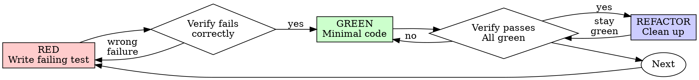

# Find typing lag cause

> This archive contains visible conversation activity and tool records. Private model reasoning and system/developer instructions are not available here.
<!-- codex-event:{"kind":"state","timestamp":"2026-06-26T20:41:43.110Z","phase":null} -->
## Task state: task_started · 2026-06-26T20:41:43.110Z

```text
{
  "type": "task_started",
  "turn_id": "019f05aa-bba9-77a3-82de-aecd4bf9c285",
  "started_at": 1782506503,
  "model_context_window": 258400,
  "collaboration_mode_kind": "default"
}
```

<!-- /codex-event -->

<!-- codex-event:{"kind":"user","timestamp":"2026-06-26T20:41:44.063Z","phase":null} -->
## User · 2026-06-26T20:41:44.063Z

How can typing in that box get so slow when something is running in the background feels like typing into the input box becomes really sluggish, like hundreds of milliseconds for a character to appear. Clearly, this is some React state management problem. Figure out where that's happening.


<!-- /codex-event -->

<!-- codex-event:{"kind":"progress","timestamp":"2026-06-26T20:41:55.805Z","phase":"commentary"} -->
## Codex progress · 2026-06-26T20:41:55.805Z

I’ll trace this as a React performance/debugging problem, and I’m going to use the relevant local skills first so I stay aligned with the project’s patterns before poking at code.

<!-- /codex-event -->

<!-- codex-event:{"kind":"tool-call","timestamp":"2026-06-26T20:41:55.814Z","phase":null} -->
## Tool call: exec_command · 2026-06-26T20:41:55.814Z

```json
{
  "cmd": "sed -n '1,240p' /Users/masterman/.agents/skills/using-ultrapowers/SKILL.md",
  "workdir": "/Users/masterman/NLP/omniharness",
  "yield_time_ms": 1000,
  "max_output_tokens": 12000
}
```

<!-- /codex-event -->

<!-- codex-event:{"kind":"tool-call","timestamp":"2026-06-26T20:41:55.814Z","phase":null} -->
## Tool call: exec_command · 2026-06-26T20:41:55.814Z

```json
{
  "cmd": "sed -n '1,260p' /Users/masterman/.agents/skills/systematic-debugging/SKILL.md",
  "workdir": "/Users/masterman/NLP/omniharness",
  "yield_time_ms": 1000,
  "max_output_tokens": 12000
}
```

<!-- /codex-event -->

<!-- codex-event:{"kind":"tool-call","timestamp":"2026-06-26T20:41:55.814Z","phase":null} -->
## Tool call: exec_command · 2026-06-26T20:41:55.814Z

```json
{
  "cmd": "sed -n '1,260p' /Users/masterman/.agents/skills/building-react-apps/SKILL.md",
  "workdir": "/Users/masterman/NLP/omniharness",
  "yield_time_ms": 1000,
  "max_output_tokens": 12000
}
```

<!-- /codex-event -->

<!-- codex-event:{"kind":"tool-call","timestamp":"2026-06-26T20:41:55.868Z","phase":null} -->
## Tool call: exec_command · 2026-06-26T20:41:55.868Z

```json
{
  "cmd": "sed -n '1,220p' /Users/masterman/.agents/skills/client-server-state-invariants/SKILL.md",
  "workdir": "/Users/masterman/NLP/omniharness",
  "yield_time_ms": 1000,
  "max_output_tokens": 12000
}
```

<!-- /codex-event -->

<!-- codex-event:{"kind":"tool-result","timestamp":"2026-06-26T20:41:55.969Z","phase":null} -->
## Tool result: call_0A82cepKs1IuxtXCVvLqYCMb · 2026-06-26T20:41:55.969Z

```text
Chunk ID: 7233de
Wall time: 0.0000 seconds
Process exited with code 0
Original token count: 2019
Output:
---
name: using-ultrapowers
description: Use when starting any conversation - establishes how to find and use skills, requiring skill invocation before acting
---

<SUBAGENT-STOP>
If you were dispatched as a subagent to execute a specific task, skip this skill.
</SUBAGENT-STOP>

# Using Ultrapowers

Use relevant skills before acting, but keep process proportional to the task.

## Instruction Priority

1. User instructions and local repo instructions
2. Ultrapowers skills
3. Default model behavior

If the user says not to create extra repository isolation, or says to work directly in the current repository, follow that instruction.

## Core Rule

Before responding, ask:

1. Is there a process skill that governs how to approach this?
2. Is there an implementation skill that governs how to execute it?
3. Is the request substantial enough to justify that process, or is it a tiny mechanical edit?

If a skill applies and the task is substantial enough to justify it, use it before continuing. If the request is a tiny mechanical edit, make the edit directly with targeted verification.

## Proportional Skill Use

Do the smallest responsible workflow that matches the request.

For tiny, unambiguous mechanical edits, do the edit directly:

- changing a color value,
- fixing a typo,
- tweaking short copy,
- changing a prompt sentence,
- renaming a label,
- adjusting obvious spacing or formatting,
- making a one-line config or docs correction.

For these, do not run brainstorming, write a plan, or force TDD unless the change affects product behavior, data, persistence, control flow, user journeys, or non-obvious architecture.

Use the heavier process when the request is ambiguous, user-facing behavior changes, multiple files/modules are involved, the user journey can change, or the change could create regressions that are not obvious from a quick targeted check.

## Default Posture

- Work in the current repository by default.
- YOU WILL NEVER CREATE A BRANCH unless explicitly instructed.
- Ask the user whether we should work in worktrees as part of the planning.
- YOU WILL ONLY CREATE A WORKTREE if explicitly instructed.
- Keep skill use proportional. Tiny mechanical edits should stay tiny.
- Every project should have a `.gitignore`.
- Never commit or push secrets, credentials, local environment files, `node_modules`, dependency caches, build outputs, coverage output, logs, temporary files, or intermediate/generated artifacts unless the human explicitly asks to version a specific generated artifact.
- Deliver full product functionality by default. NO FAKE COMPONENTS, NO MOCKS, NO PLACEHOLDERS, NO FALLBACKS as substitutes for the requested functionality unless the human explicitly asks for a prototype or scaffold.
- For app, UI, and product-surface work, run a PM pass during planning. Treat it as mandatory default behavior, not optional polish.
- For app, UI, and product-surface work, consider `agentic-user-journey-testing` for important user stories, but do not run it without explicit user approval.
- Use `second-opinion` for substantial saved implementation plans, and for unusually hard, creative, high-risk, or architecture-heavy specs when an independent external review could improve the artifact. Prefer a different available coding harness for that review, such as Codex asking Claude Code or Claude Code asking Codex. If no different harness is available, the same harness is fine; the second opinion is still mandatory for matching artifacts.
- Refactor code when a file passes 1200 lines. Do not normalize oversized files as the default end state.
- Use user stories in specs and plans when they clarify behavior or value.
- Default UI work to `shadcn/ui` unless the user says otherwise.
- When designing UI from scratch, first inspect the available ShadCN Blocks at https://ui.shadcn.com/blocks for each screen, form, or major surface. Start from the closest matching block with `npx shadcn add <block-name>` or the block's source in https://github.com/shadcn-ui/ui, then edit it by adding, removing, or adapting controls. Do not invent a fresh layout before doing this block-selection pass.
- Before adding any individual UI control, check whether `shadcn/ui` already provides a control that does what is needed. Use the available shadcn control first, then customize it, instead of hand-building a one-off control.
- Treat desktop and mobile responsiveness as first-class from the beginning.
- Prefer explicit routing unless the framework strongly defaults to file-based routes.
- For React apps, use `building-react-apps` for state managers, explicit transitions, routing, refs, imports, package-manager defaults, and frontend configuration defaults.
- For React apps with server state, optimistic UI, caches, polling, SSE/WebSocket streams, background jobs, persistence, or client/server synchronization, use `client-server-state-invariants` during planning and verification.
- For React or Next.js slowness, root-load, compile-time, SSR/hydration, bundle, import-bloat, or UI dependency cleanup work, use `optimizing-react-next-apps`.
- Prefer strong instrumentation and auditability for backend behavior.
- When a project has backend or agent workflows, prefer a fully instrumented control plane: persist meaningful events, tool calls, actions, results, errors, and state transitions, and expose them through a CLI or other scriptable interface so the full system can be inspected and tested without the UI.
- Use `instrumenting-control-planes` when building, planning, reviewing, or debugging backend decisions, agent workflows, recovery paths, retries, deletes, long-running jobs, SSE/WebSocket streams, or user-visible failures.
- Use `learning-from-bugs` after diagnosing or fixing meaningful architecture, storage, memory, persistence, control-plane, or system-level bugs so reusable lessons become durable.
- Do not default to silent, masked, or over-abstracted errors.
- When a project has a frontend, prefer surfacing full backend error details and stack traces to the frontend so failures stay visible, debuggable, and testable end-to-end.
- Treat persistence of settings and preferences as explicit design work.
- For every meaningful UI setting, define whether it persists, where it is stored, how it is read and written, who owns it, and how reset, sync, migration, and testing are handled.

See `docs/ultrapowers-defaults.md` for the canonical fork defaults.

## Skill Priority

1. Process skills first
2. Implementation skills second

Examples:

- "Make this button blue" -> inspect the relevant file, make the small edit, do targeted verification
- "Update this prompt sentence" -> edit the prompt directly and verify the final text
- "Build a feature" -> `brainstorming` with a PM pass first, then `writing-plans`, then execution; consider approval-gated `agentic-user-journey-testing` for app workflows
- "Fix this bug" -> `systematic-debugging`, then the relevant implementation skill; if the root cause is meaningful or systemic, finish with `learning-from-bugs`
- "Review this change" -> `requesting-code-review`

## Examples Of User Override

- If a task feels risky and the user did not ask for extra repository isolation, keep working in the current repository unless the user explicitly instructs otherwise.
- If a stack supports file-based routing but the user says not to use it, choose an explicit routing approach instead.
- If a framework strongly defaults to file-based routing, such as Next.js App Router, use the framework-native routing model unless there is a good reason not to.
- If a frontend skill suggests `shadcn/ui` but the user wants another design system, follow the user.

## Red Flags

- "I need a whole workflow for this tiny edit" -> no. Use the smallest responsible process.
- "This is simple, so I need the whole process anyway" -> no. Tiny mechanical edits should stay tiny.
- "I'll create extra repository isolation just to be safe" -> forbidden unless the user clearly asked for it.
- "I already know the skill" -> read the current version before relying on it

```

<!-- /codex-event -->

<!-- codex-event:{"kind":"tool-result","timestamp":"2026-06-26T20:41:55.969Z","phase":null} -->
## Tool result: call_LC8t27yUvlRXQk6QTNpQv7FG · 2026-06-26T20:41:55.969Z

````text
Chunk ID: 312c51
Wall time: 0.0000 seconds
Process exited with code 0
Original token count: 2092
Output:
---
name: systematic-debugging
description: Use when encountering any bug, test failure, or unexpected behavior, before proposing fixes
---

# Systematic Debugging

## Overview

Random fixes waste time and create new bugs. Quick patches mask underlying issues.

**Core principle:** ALWAYS find root cause before attempting fixes. Symptom fixes are failure.

**Violating the letter of this process is violating the spirit of debugging.**

## The Iron Law

```
NO FIXES WITHOUT ROOT CAUSE INVESTIGATION FIRST
```

If you haven't completed Phase 1, you cannot propose fixes.

## When to Use

Use for ANY technical issue:
- Test failures
- Bugs in production
- Unexpected behavior
- Performance problems
- Build failures
- Integration issues

**Use this ESPECIALLY when:**
- Under time pressure (emergencies make guessing tempting)
- "Just one quick fix" seems obvious
- You've already tried multiple fixes
- Previous fix didn't work
- You don't fully understand the issue

**Don't skip when:**
- Issue seems simple (simple bugs have root causes too)
- You're in a hurry (rushing guarantees rework)
- Manager wants it fixed NOW (systematic is faster than thrashing)

## The Four Phases

You MUST complete each phase before proceeding to the next.

### Phase 1: Root Cause Investigation

**BEFORE attempting ANY fix:**

1. **Read Error Messages Carefully**
   - Don't skip past errors or warnings
   - They often contain the exact solution
   - Read stack traces completely
   - Note line numbers, file paths, error codes

2. **Reproduce Consistently**
   - Can you trigger it reliably?
   - What are the exact steps?
   - Does it happen every time?
   - If not reproducible → gather more data, don't guess

3. **Check Recent Changes**
   - What changed that could cause this?
   - Git diff, recent commits
   - New dependencies, config changes
   - Environmental differences

4. **Gather Evidence in Multi-Component Systems**

   **WHEN system has multiple components (CI → build → signing, API → service → database):**

   **BEFORE proposing fixes, add diagnostic instrumentation:**
   ```
   For EACH component boundary:
     - Log what data enters component
     - Log what data exits component
     - Verify environment/config propagation
     - Check state at each layer

   Run once to gather evidence showing WHERE it breaks
   THEN analyze evidence to identify failing component
   THEN investigate that specific component
   ```

   **Example (multi-layer system):**
   ```bash
   # Layer 1: Workflow
   echo "=== Secrets available in workflow: ==="
   echo "IDENTITY: ${IDENTITY:+SET}${IDENTITY:-UNSET}"

   # Layer 2: Build script
   echo "=== Env vars in build script: ==="
   env | grep IDENTITY || echo "IDENTITY not in environment"

   # Layer 3: Signing script
   echo "=== Keychain state: ==="
   security list-keychains
   security find-identity -v

   # Layer 4: Actual signing
   codesign --sign "$IDENTITY" --verbose=4 "$APP"
   ```

   **This reveals:** Which layer fails (secrets → workflow ✓, workflow → build ✗)

5. **Trace Data Flow**

   **WHEN error is deep in call stack:**

   See `root-cause-tracing.md` in this directory for the complete backward tracing technique.

   **Quick version:**
   - Where does bad value originate?
   - What called this with bad value?
   - Keep tracing up until you find the source
   - Fix at source, not at symptom

### Phase 2: Pattern Analysis

**Find the pattern before fixing:**

1. **Find Working Examples**
   - Locate similar working code in same codebase
   - What works that's similar to what's broken?

2. **Compare Against References**
   - If implementing pattern, read reference implementation COMPLETELY
   - Don't skim - read every line
   - Understand the pattern fully before applying

3. **Identify Differences**
   - What's different between working and broken?
   - List every difference, however small
   - Don't assume "that can't matter"

4. **Understand Dependencies**
   - What other components does this need?
   - What settings, config, environment?
   - What assumptions does it make?

### Phase 3: Hypothesis and Testing

**Scientific method:**

1. **Form Single Hypothesis**
   - State clearly: "I think X is the root cause because Y"
   - Write it down
   - Be specific, not vague

2. **Test Minimally**
   - Make the SMALLEST possible change to test hypothesis
   - One variable at a time
   - Don't fix multiple things at once

3. **Verify Before Continuing**
   - Did it work? Yes → Phase 4
   - Didn't work? Form NEW hypothesis
   - DON'T add more fixes on top

4. **When You Don't Know**
   - Say "I don't understand X"
   - Don't pretend to know
   - Ask for help
   - Research more

### Phase 4: Implementation

**Fix the root cause, not the symptom:**

1. **Create Failing Test Case**
   - Simplest possible reproduction
   - Automated test if possible
   - One-off test script if no framework
   - MUST have before fixing
   - Use the `ultrapowers:test-driven-development` skill for writing proper failing tests

2. **Implement Single Fix**
   - Address the root cause identified
   - ONE change at a time
   - No "while I'm here" improvements
   - No bundled refactoring

3. **Verify Fix**
   - Test passes now?
   - No other tests broken?
   - Issue actually resolved?
   - If the bug was meaningful or systemic, use `ultrapowers:learning-from-bugs` before declaring the fix complete.

4. **If Fix Doesn't Work**
   - STOP
   - Count: How many fixes have you tried?
   - If < 3: Return to Phase 1, re-analyze with new information
   - **If ≥ 3: STOP and question the architecture (step 5 below)**
   - DON'T attempt Fix #4 without architectural discussion

5. **If 3+ Fixes Failed: Question Architecture**

   **Pattern indicating architectural problem:**
   - Each fix reveals new shared state/coupling/problem in different place
   - Fixes require "massive refactoring" to implement
   - Each fix creates new symptoms elsewhere

   **STOP and question fundamentals:**
   - Is this pattern fundamentally sound?
   - Are we "sticking with it through sheer inertia"?
   - Should we refactor architecture vs. continue fixing symptoms?

   **Discuss with your human partner before attempting more fixes**

   This is NOT a failed hypothesis - this is a wrong architecture.

## Red Flags - STOP and Follow Process

If you catch yourself thinking:
- "Quick fix for now, investigate later"
- "Just try changing X and see if it works"
- "Add multiple changes, run tests"
- "Skip the test, I'll manually verify"
- "It's probably X, let me fix that"
- "I don't fully understand but this might work"
- "Pattern says X but I'll adapt it differently"
- "Here are the main problems: [lists fixes without investigation]"
- Proposing solutions before tracing data flow
- **"One more fix attempt" (when already tried 2+)**
- **Each fix reveals new problem in different place**

**ALL of these mean: STOP. Return to Phase 1.**

**If 3+ fixes failed:** Question the architecture (see Phase 4.5)

## your human partner's Signals You're Doing It Wrong

**Watch for these redirections:**
- "Is that not happening?" - You assumed without verifying
- "Will it show us...?" - You should have added evidence gathering
- "Stop guessing" - You're proposing fixes without understanding
- "Ultrathink this" - Question fundamentals, not just symptoms
- "We're stuck?" (frustrated) - Your approach isn't working

**When you see these:** STOP. Return to Phase 1.

## Common Rationalizations

| Excuse | Reality |
|--------|---------|
| "Issue is simple, don't need process" | Simple issues have root causes too. Process is fast for simple bugs. |
| "Emergency, no time for process" | Systematic debugging is FASTER than guess-and-check thrashing. |
| "Just try this first, then investigate" | First fix sets the pattern. Do it right from the start. |
| "I'll write test after confirming fix works" | Untested fixes don't stick. Test first proves it. |
| "Multiple fixes at once saves time" | Can't isolate what worked. Causes new bugs. |
| "Reference too long, I'll adapt the pattern" | Partial understanding guarantees bugs. Read it completely. |
| "I see the problem, let me fix it" | Seeing symptoms ≠ understanding root cause. |
| "One more fix attempt" (after 2+ failures) | 3+ failures = architectural problem. Question pattern, don't fix again. |

## Quick Reference


````

<!-- /codex-event -->

<!-- codex-event:{"kind":"tool-result","timestamp":"2026-06-26T20:41:55.969Z","phase":null} -->
## Tool result: call_HG3OuVsWMTgkHUkiFDtc7SQc · 2026-06-26T20:41:55.969Z

```text
Chunk ID: 98fe7c
Wall time: 0.0000 seconds
Process exited with code 0
Original token count: 2034
Output:
---
name: building-react-apps
description: Use when building, refactoring, planning, or debugging React or Next.js apps, React components, hooks, routing, frontend state, SSR, hydration, bundles, imports, or UI settings
---

# Building React Apps

Use these defaults for React app work unless the user or existing codebase explicitly chooses another architecture.

If the work is specifically about slowness, root-load time, compile time, SSR effectiveness, hydration cost, bundle size, import bloat, or decluttering heavy UI dependencies, use `optimizing-react-next-apps` as the focused workflow.

If the app has server state, optimistic UI, caches, polling, SSE/WebSocket streams, background jobs, persisted runtime state, or client/server synchronization, use `client-server-state-invariants` before planning or changing the state model.

## UI Starting Point

- For new React app screens, forms, and major surfaces, use `shadcn/ui` unless the user or existing app has chosen another design system.
- Before inventing layout, inspect the available ShadCN Blocks at https://ui.shadcn.com/blocks for the specific screen or form category.
- Start from the closest matching block with `npx shadcn add <block-name>` or the official source in https://github.com/shadcn-ui/ui, then add, remove, and adapt controls to fit the product.
- Do not use a blank custom layout as the first implementation path when a relevant ShadCN Block exists.
- Before adding any individual control, check whether `shadcn/ui` already provides a suitable control. Use/customize the shadcn control before hand-building a one-off control.

## State And Data

- Always centralize React app state in global single-source-of-truth Manager classes.
- Components, hooks, and listeners subscribe to Manager updates and use Manager methods to update data.
- Centralized state does not mean broad subscriptions. Components must subscribe to the smallest slice they need, preferably with selector hooks and equality checks, so unrelated UI does not re-render.
- Never let app shells, page roots, sidebars, timelines, or other broad containers subscribe to an entire high-churn Manager snapshot when they only need stable fields. Draft text, cursors, hover/open state, search text, and other per-keystroke or per-pointer state need narrow component-level subscriptions.
- If typing in an input, moving a cursor, toggling a hover/open flag, or editing a small draft makes the whole app repaint, the subscription boundary is wrong even if the data source is centralized.
- Always implement a custom data manager for any app data structure.
- Never use separate state variables or arrays as the source of truth.
- Never send data around in transactions. Pass intent, ids, commands, or Manager method calls instead.

## React Control Flow

- Avoid using `useEffect()` to update state. Prefer `useCallback()` handlers or Manager methods for explicit state transitions.
- Work ahead of time to avoid callback hell, race conditions, and infinite loops.
- When debugging React and a fix does not work, explicitly consider whether the root cause is a race condition. Race conditions are common in React.
- Every async callback, mutation result, timer, poll, or stream message that can update visible state must prove it still owns the current context before mutating Managers or navigation.
- Use `RefObject` instead of `MutableRefObject`.

## Routing And Modules

- Prefer explicit routing over file-based routing when the framework does not strongly default to file-based routes. Framework-native file routing, such as Next.js App Router, is fine.
- Never use `require()` to import modules. Use `import` instead.
- Avoid `npm` by default. Use `pnpm` for package installation, scripts, and lockfiles unless the user or existing project explicitly chooses another package manager.

## Next.js And SSR Defaults

- Treat `"use client"` as a boundary with a cost. Do not put an entire page, app shell, sidebar, timeline, composer, settings surface, and data boot path behind one giant client component unless there is a deliberate reason.
- SSR is only useful if the initial HTML contains meaningful above-the-fold UI or data. If `curl` for the route only shows a boot shell, script payloads, or empty placeholders, the route is not meaningfully server-rendered even if SSR is technically enabled.
- Server-render the first useful screen by fetching route-stable bootstrap data on the server: auth/session state, settings needed to choose the shell, selected route ids, and initial page/snapshot data. Hydrate Managers or query caches from that bootstrap data; do not wait for client `useEffect()` plus client fetches before the first meaningful paint.
- Use client effects for browser-only concerns: localStorage-only preferences, notifications, SSE/WebSocket subscriptions, focus management, and post-paint refreshes. Do not use effects as the only path for data required to decide what the initial screen is.
- In Next dev, first request time includes compilation. Distinguish cold compile cost from runtime slowness before optimizing the wrong layer.

## Import And Bundle Hygiene

- Keep imports proportional to the UI being rendered. Do not import an entire complex surface for a tiny control; split shared tiny controls into their own files instead of importing them from heavy feature modules.
- Lazy-load rarely opened or route-conditional surfaces with dynamic imports: settings dialogs, side panels, file viewers, terminals, worker inspectors, onboarding flows, QR/pairing dialogs, and large markdown/code viewers.
- Avoid package and barrel imports that drag in whole icon packs, design systems, syntax highlighters, markdown stacks, charting libraries, or component suites for one glyph or one primitive. Inline small SVG paths or use local assets when that is cheaper and stable.
- Prefer native browser controls for small, ordinary selects and pickers. Do not import a popover/dialog/menu stack for a low-value dropdown unless search, virtualization, or rich item rendering is genuinely needed.
- Use subpath imports when a package supports them. Avoid root package imports from large UI libraries if a narrower entrypoint exists.
- After dependency or UI-shell changes, inspect the emitted dev chunks or traces. Verify whether heavy modules moved out of the root chunk rather than assuming dynamic import worked.

## Performance Debugging

- Start with evidence: dev server logs, route timings, emitted chunk sizes, module counts, and initial HTML content.
- Separate long-lived requests from slow requests. SSE, streaming, and hanging fetches can show huge durations in logs without blocking page paint.
- Check recent dependency additions first when compile time suddenly explodes. A single icon, markdown, chart, or UI package can add thousands of modules.
- For Next.js root-load complaints, answer three questions before changing code: what compiled, what HTML was returned, and what client-side requests gated the first useful paint?

## Frontend Configuration

- Never store frontend string literals or UI settings in `.env` files.
- Put frontend strings and settings in normal source files, inline arrays, or `.json` files so they remain reviewable, testable, and versioned with the UI.

## Internationalization

- For meaningful React UI work, offer language support as an option when the user has not already decided: "Should we support other languages? If yes, I will wire user-facing copy through i18n resources now instead of hardcoding strings."
- If the user says yes, asks for translation/i18n/language/locale support, or reports that language switching only updates part of the UI, use `implementing-react-i18n`.
- Use the i18n library's `t("key", params?)` function for every user-facing string. Use `useI18nSnapshot()` only to subscribe React components so language changes repaint.
- Never name variables with locale codes or locale-like names such as `it`, `en`, `enUS`, `locIt`, or `locEnUs`.

## Settings UI

- For settings dialogs, preferences panels, configuration modals, option tabs, or UI settings surfaces, use `designing-settings-dialogs`.

```

<!-- /codex-event -->

<!-- codex-event:{"kind":"tool-result","timestamp":"2026-06-26T20:41:55.969Z","phase":null} -->
## Tool result: call_wYvES7uhvLPW19Z9zwRZeUWE · 2026-06-26T20:41:55.969Z

```text
Chunk ID: 41c36f
Wall time: 0.0000 seconds
Process exited with code 0
Original token count: 1481
Output:
---
name: client-server-state-invariants
description: Use when planning, building, reviewing, or debugging React apps with server state, optimistic UI, caches, polling, SSE/WebSocket streams, background jobs, persistence, or client/server synchronization
---

# Client Server State Invariants

React bugs often expose deeper ownership mistakes. When client state, server state, cache state, stream state, and persisted state all exist, every plan needs explicit invariants.

## Core Rule

No UI surface may treat data as authoritative unless the payload proves ownership, freshness, completeness, ordering, and terminal state.

If those words are missing from the plan, the plan is probably baking in a race condition.

## Planning Checklist

For every React app that reads server/runtime state, the plan must answer:

1. **Owner:** What owns this state: server, client manager, URL, cache, stream, local storage, or worker/runtime?
2. **Token:** What owner token protects async results: `requestId`, `runId`, `projectPath`, `operationId`, `workerId + seq`, or equivalent?
3. **Provenance:** Is data server-authoritative, optimistic, cached preview, partial update, or historical fallback?
4. **Completeness:** Does the payload declare what scope it is complete for? What may it erase?
5. **Ordering:** What stable order is used: monotonic seq, `(createdAt, id)`, version, or cursor?
6. **State machine:** What are the legal states, terminal states, and transitions?
7. **Events:** Which server decisions are named events rather than client-side derivations?
8. **Loading shape:** Which states are bootstrap, first load, incremental refresh, reconnect, resync, recovery, and terminal error?
9. **Fallbacks:** Which legacy/fallback rows can render, and only after what authority is loaded?
10. **Tests:** Which race, stale-response, event-sequence, reconnect, and merge tests prove the invariants?

## Invariants To Require

- Cached and optimistic data may pre-render, but cannot satisfy full-load gates.
- Partial snapshots may add or refine state, but may not erase optimistic objects, delivered user input, read markers, or stream entries unless they declare complete scope.
- Every async response checks that its owner token still matches before mutating visible state.
- Mutation success handlers may navigate or clear UI only if they still own the current context, unless the action explicitly creates a new selected context.
- Timers and polling callbacks re-check ownership immediately before acting.
- Server decisions are emitted as named events; the client does not infer decisions by diffing snapshots.
- SSE/WebSocket streams have event ids, replay/resume, and an explicit resync path.
- Loading booleans are split by lifecycle stage. A leaf stream refresh must not unmount the whole page.
- Append-only content has one writer, one reader, stable ids, and monotonic cursors.
- Fallback DB rows or historical rows are gated behind stream loading and deduped by stable id plus safe equivalence.
- Status classifiers distinguish active, runnable, blocked, awaiting user, terminal, stale, and recoverable states.
- "Latest" queries have deterministic tie-breakers. Timestamp-only ordering is not enough.
- Hot paths use bounded reads and do not synchronously load large bodies, bridge probes, schema setup, or heavy app graphs.
- Process-local caches have explicit TTL/size bounds and invalidation rules.

## Test Matrix

Pick the rows that match the work. Do not rely on one happy-path UI test.

| Risk | Test shape |
| --- | --- |
| Stale async response | Start request A, switch owner, resolve A, assert it cannot mutate B |
| Optimistic object erased | Create local optimistic state, apply stale/partial snapshot, assert object remains |
| Cache masquerades as loaded | Hydrate cache preview, assert full-load gate waits for server authority |
| Mutation steals navigation | Start mutation, switch selection, resolve mutation, assert focus stays put |
| Timer/poll stale-fire | Use fake timers or deferred promises; callback must re-check owner before acting |
| Snapshot merge erases stream | Apply partial snapshot missing known entries, assert entries/read markers remain |
| Event stream gap | Bootstrap snapshot, emit events during disconnect, reconnect with last id, assert replay or resync |
| Server decision invisible | Exercise branch and assert named event such as `blocked`, `refused`, `gave_up`, or `error.surfaced` |
| State classifier wrong | Table-test every status into active/runnable/terminal/recoverable buckets |
| Fallback duplicates stream | Load fallback rows then stream entries, assert no duplicate or false chronology |
| Hot path bloats | Assert snapshots carry cursors not bodies; route returns before DB/heavy imports when possible |
| Timestamp tie | Insert equal timestamps, assert deterministic order by id/seq |

Use headless HTTP/SSE tests for control-plane decisions. Use React/unit tests for manager merging and ownership guards. Use Playwright only for real UI layout, focus, scroll, mobile computed styles, and visible affordances.

## Refuse These Shapes

- one `isLoading` boolean for bootstrap, refresh, reconnect, and recovery;
- cache or optimistic data treated as authoritative without provenance;
- async callbacks that mutate state without checking owner tokens;
- client-side derivation of server decisions;
- snapshot diffs used as the only way to know what happened;
- event streams without ids or resume;
- timestamp-only "latest" queries;
- parallel transcript or persistence surfaces that the frontend must reconcile;
- unbounded process caches introduced to hide slow storage;
- tests that prove only the DOM result when the bug is a server decision.

## Review Prompt

Ask this before implementation starts:

> What can arrive late, out of order, partially, twice, or after the user changes context, and what test proves it cannot corrupt visible state?

```

<!-- /codex-event -->

<!-- codex-event:{"kind":"progress","timestamp":"2026-06-26T20:42:09.657Z","phase":"commentary"} -->
## Codex progress · 2026-06-26T20:42:09.657Z

The key smell I’m looking for is a broad subscription boundary: the composer’s draft text should not make the whole run view, terminal stream, sidebar, or worker panels repaint on every keystroke, especially while SSE/background updates are flowing. I’ll first map the composer/input ownership and the high-churn managers around it.

<!-- /codex-event -->

<!-- codex-event:{"kind":"tool-call","timestamp":"2026-06-26T20:42:09.665Z","phase":null} -->
## Tool call: exec_command · 2026-06-26T20:42:09.665Z

```json
{
  "cmd": "git status --short",
  "workdir": "/Users/masterman/NLP/omniharness",
  "yield_time_ms": 1000,
  "max_output_tokens": 12000
}
```

<!-- /codex-event -->

<!-- codex-event:{"kind":"tool-call","timestamp":"2026-06-26T20:42:09.665Z","phase":null} -->
## Tool call: exec_command · 2026-06-26T20:42:09.665Z

```json
{
  "cmd": "rg -n \"textarea|input|prompt|composer|message|send\" src app components shared --glob '*.{ts,tsx,js,jsx}'",
  "workdir": "/Users/masterman/NLP/omniharness",
  "yield_time_ms": 1000,
  "max_output_tokens": 24000
}
```

<!-- /codex-event -->

<!-- codex-event:{"kind":"tool-call","timestamp":"2026-06-26T20:42:09.665Z","phase":null} -->
## Tool call: exec_command · 2026-06-26T20:42:09.665Z

```json
{
  "cmd": "rg -n \"useI18nSnapshot|useSyncExternalStore|subscribe|Manager|snapshot|setState|useState|useEffect\" src app components shared --glob '*.{ts,tsx}'",
  "workdir": "/Users/masterman/NLP/omniharness",
  "yield_time_ms": 1000,
  "max_output_tokens": 24000
}
```

<!-- /codex-event -->

<!-- codex-event:{"kind":"tool-call","timestamp":"2026-06-26T20:42:09.756Z","phase":null} -->
## Tool call: exec_command · 2026-06-26T20:42:09.756Z

```json
{
  "cmd": "rg --files | rg '(^|/)(package.json|AGENTS.md|src/.+\\.(tsx|ts)|components/.+\\.(tsx|ts)|app/.+\\.(tsx|ts))$'",
  "workdir": "/Users/masterman/NLP/omniharness",
  "yield_time_ms": 1000,
  "max_output_tokens": 12000
}
```

<!-- /codex-event -->

<!-- codex-event:{"kind":"tool-result","timestamp":"2026-06-26T20:42:09.798Z","phase":null} -->
## Tool result: call_GjFX6SOYUfgtCy596JwAByQh · 2026-06-26T20:42:09.798Z

```text
Chunk ID: d5ce23
Wall time: 0.0000 seconds
Process exited with code 0
Original token count: 55
Output:
 M src/app/home/HomeApp.tsx
 M src/app/home/useFrozenRecentOrder.ts
 M tests/app/use-frozen-recent-order.test.ts
?? .claude/
?? docs/superpowers/learnings/2026-06-26-frozen-recent-rows-must-refresh-terminal-status.md

```

<!-- /codex-event -->

<!-- codex-event:{"kind":"tool-result","timestamp":"2026-06-26T20:42:09.798Z","phase":null} -->
## Tool result: call_f3DKgRj0oZ9NvEHztSpKwjsY · 2026-06-26T20:42:09.798Z

```text
Chunk ID: 97f7e3
Wall time: 0.0001 seconds
Process exited with code 2
Original token count: 65325
Output:
Warning: truncated output (original token count: 65325)
Total output lines: 2560

rg: app: No such file or directory (os error 2)
rg: components: No such file or directory (os error 2)
src/vscode-extension/bridge.ts:9:  message: string;
src/vscode-extension/bridge.ts:32:  postMessage?: (message: VSCodeBridgeResponse) => void;
src/vscode-extension/bridge.ts:48:function bridgeError(request: VSCodeBridgeRequest, code: string, message: string, details?: unknown): VSCodeBridgeResponse {
src/vscode-extension/bridge.ts:53:    error: { code, message, surface: "vscode", details },
src/vscode-extension/bridge.ts:125:  let event = "message";
src/vscode-extension/bridge.ts:139:      event = value || "message";
src/vscode-extension/bridge.ts:229:      error instanceof Error ? error.message : String(error),
src/vscode-extension/bridge.ts:271:            error instanceof Error ? error.message : String(error),
src/vscode-extension/bridge.ts:289:      error instanceof Error ? error.message : String(error),
src/vscode-extension/bridge.ts:328:    "vscode.bridge.unknown_message",
src/vscode-extension/bridge.ts:329:    `Unknown VS Code bridge message: ${request.type}.`,
src/lib/conversation-state.ts:3:  messages: Array<{ runId: string; createdAt: string }>
src/lib/conversation-state.ts:7:  for (const message of messages) {
src/lib/conversation-state.ts:8:    if (message.runId !== runId) {
src/lib/conversation-state.ts:12:    if (!latest || new Date(message.createdAt).getTime() > new Date(latest).getTime()) {
src/lib/conversation-state.ts:13:      latest = message.createdAt;
src/lib/conversation-state.ts:43:  messages: Array<{ runId: string; createdAt: string }>
src/lib/conversation-state.ts:45:  const latestMessageAt = getRunLatestMessageTimestamp(run.id, messages);
src/server/conversation-title.ts:7:import { CONVERSATION_TITLE_SYSTEM_PROMPT } from "@/server/prompts";
src/server/supervisor/observer.ts:33:  "worker_prompted",
src/server/supervisor/observer.ts:60:    message?: string | null;
src/server/supervisor/observer.ts:620:      summary: `${args.workerId} is waiting on user input`,
src/server/supervisor/observer.ts:783:  const message = formatErrorMessage(error).toLowerCase();
src/server/supervisor/observer.ts:784:  return message.includes("404")
src/server/supervisor/observer.ts:785:    || message.includes("not_found")
src/server/supervisor/observer.ts:786:    || message.includes("agent not found")
src/server/supervisor/observer.ts:787:    || message.includes("session not found")
src/server/supervisor/observer.ts:788:    || message.includes("invalid session identifier")
src/server/supervisor/observer.ts:789:    || message.includes("failed to load resumed session data from file");
src/server/supervisor/observer.ts:793:  const message = formatErrorMessage(error).toLowerCase();
src/server/supervisor/observer.ts:794:  return message.includes("agent already exists") && message.includes(workerId.toLowerCase());
src/server/supervisor/observer.ts:975:          summary: error.message,
src/server/api-errors.ts:5:  message: string;
src/server/api-errors.ts:17:export function inferErrorSuggestion(message: string) {
src/server/api-errors.ts:18:  if (/agent runtime is not running/i.test(message) || /ACP bridge is not running/i.test(message) || /\bECONNREFUSED\b/i.test(message)) {
src/server/api-errors.ts:22:  if (/API key/i.test(message)) {
src/server/api-errors.ts:26:  if (/decrypt/i.test(message)) {
src/server/api-errors.ts:30:  if (/not found/i.test(message)) {
src/server/api-errors.ts:34:  if (/empty/i.test(message) || /required/i.test(message)) {
src/server/api-errors.ts:35:    return "Fill in the required input and retry.";
src/server/api-errors.ts:43:  options: Omit<AppErrorPayload, "message"> & { message?: string } = {},
src/server/api-errors.ts:45:  const message = options.message?.trim() || formatErrorMessage(error);
src/server/api-errors.ts:49:    message,
src/server/api-errors.ts:52:    suggestion: options.suggestion ?? inferErrorSuggestion(message),
src/server/api-errors.ts:60:  options: Omit<AppErrorPayload, "message"> & { message?: string; status?: number } = {},
src/server/api-errors.ts:66:  console.error(`[api-error ${status}] ${tag}: ${payload.message}${stack ? `\n${stack}` : ""}`);
src/lib/run-recovery-state.ts:51:  messages: RecoverableMessage[];
src/lib/run-recovery-state.ts:73:  const targetMessage = state.messages.find((message) => (
src/lib/run-recovery-state.ts:74:    message.runId === args.runId && message.id === args.targetMessageId
src/lib/run-recovery-state.ts:103:      messages: state.messages.filter((message) => (
src/lib/run-recovery-state.ts:104:        message.runId !== args.runId
src/lib/run-recovery-state.ts:105:        || message.kind !== "error"
src/lib/run-recovery-state.ts:106:        || message.content !== `Run failed: ${targetRun?.lastError ?? ""}`
src/lib/run-recovery-state.ts:127:    messages: state.messages
src/lib/run-recovery-state.ts:128:      .filter((message) => {
src/lib/run-recovery-state.ts:129:        if (message.runId !== args.runId) {
src/lib/run-recovery-state.ts:132:        return new Date(message.createdAt).getTime() <= targetTimestamp;
src/lib/run-recovery-state.ts:134:      .map((message) => (
src/lib/run-recovery-state.ts:135:        args.action === "edit" && message.id === args.targetMessageId
src/lib/run-recovery-state.ts:137:              ...message,
src/lib/run-recovery-state.ts:138:              content: args.content?.trim() || message.content,
src/lib/run-recovery-state.ts:140:          : message
src/runtime/index.ts:11:  return error instanceof Error ? error.message : String(error);
src/runtime/index.ts:52:          message: reason,
src/runtime/index.ts:54:          cause: error instanceof Error ? { name: error.name, message: error.message } : null,
src/runtime/http/routes/events-log.ts:14:    return Response.json({ error: { code: "method_not_allowed", message: "Method not allowed." } }, {
src/lib/utils.ts:4:export function cn(...inputs: ClassValue[]) {
src/lib/utils.ts:5:  return twMerge(clsx(inputs))
src/server/cli/options.ts:20:  constructor(message: string) {
src/server/cli/options.ts:21:    super(message);
src/server/cli/options.ts:105:    if (arg === "--command" || arg === "--prompt") {
src/components/PairDeviceDialog.tsx:8:import { Input } from "@/components/ui/input";
src/components/PairDeviceDialog.tsx:164:      const message = pairError instanceof Error ? pairError.message : String(pairError);
src/components/PairDeviceDialog.tsx:166:        error: message,
src/components/PairDeviceDialog.tsx:218:          error: pollError instanceof Error ? pollError.message : String(pollError),
src/runtime/http/routes/terminals.ts:6: *   POST   /api/terminals/:id/input      -> write stdin { data }
src/runtime/http/routes/terminals.ts:10: * Transport is SSE (output) + POST (input) because this runtime has no
src/runtime/http/routes/terminals.ts:24:    { error: { code: "method_not_allowed", message: "Method not allowed." } },
src/runtime/http/routes/terminals.ts:127:      // Prime the connection so the client's onopen fires promptly.
src/runtime/http/routes/terminals.ts:162:    action: "Send terminal input",
src/runtime/http/routes/terminals.ts:176:    return Response.json({ error: { code: "invalid_input", message: "Missing input data." } }, { status: 400 });
src/runtime/http/routes/terminals.ts:206:    return Response.json({ error: { code: "invalid_input", message: "Missing cols/rows." } }, { status: 400 });
src/server/supervisor/context-window.ts:29:    message?: string | null;
src/server/supervisor/context-window.ts:70:  messages: SupervisorModelMessage[];
src/server/supervisor/context-window.ts:126:function asMessageText(message: SupervisorModelMessage) {
src/server/supervisor/context-window.ts:127:  return `${message.role}: ${message.content}`;
src/server/supervisor/context-window.ts:188:const SIGNAL_LINE_PATTERN = /\b(error|failed?|failure|success|updated?|fixed?|blocked?|stuck|done|complete[sd]?|verified?|tests?|passing|passed|permission|cancelled?|spawned|prompted|deferred|warning|cannot|missing|conflict|patch|build|lint|typecheck|handoff)\b/i;
src/server/supervisor/context-window.ts:190:function summarizeUserMessages(messages: string[], goal: string) {
src/server/supervisor/context-window.ts:191:  const pieces = messages
src/server/supervisor/context-window.ts:193:    .map((message, index) => summarizeText(`Earlier user message ${index + 1}`, message, 480))
src/server/supervisor/context-window.ts:345:      ? `Original prompt:\n${truncate(normalizeWhitespace(context.goal), 1_200)}`
src/server/supervisor/context-window.ts:346:      : "Original prompt:\n(none recorded)";
src/server/supervisor/context-window.ts:353:      "Original prompt:",
src/server/supervisor/context-window.ts:367:    "Original prompt:",
src/server/supervisor/context-window.ts:427:      message: elicitation.message ?? null,
src/server/supervisor/context-window.ts:534:  const messages: SupervisorModelMessage[] = [
src/server/supervisor/context-window.ts:540:    messages.push({
src/server/supervisor/context-window.ts:547:    messages.push({
src/server/supervisor/context-window.ts:555:  messages.push({
src/server/supervisor/context-window.ts:575:  return messages;
src/server/supervisor/context-window.ts:602:          const messages = buildMessages({
src/server/supervisor/context-window.ts:611:          if (estimateContextTokens(messages) <= args.budgetTokens) {
src/server/supervisor/context-window.ts:612:            return messages;
src/server/supervisor/context-window.ts:665:      messages: normalMessages,
src/server/supervisor/context-window.ts:687:    messages: compactedMessages,
src/server/supervisor/context-window.ts:693:      reason: `Estimated prompt was ${normalTokens} tokens, above compaction trigger ${compactionTriggerTokens(budget)}.`,
src/lib/chat-attachments.ts:123:  // the prompt the worker sees. Storage paths are relative to the
src/server/auth/guards.ts:54:function jsonError(status: number, source: string, action: string, message: string) {
src/server/auth/guards.ts:56:    error: buildAppError(message, { status, source, action }),
src/server/cli/runner.ts:3:import { messages, runs, workers } from "@/server/db/schema";
src/server/cli/runner.ts:20:  messageIds: Set<string>;
src/server/cli/runner.ts:74:    db.select().from(messages).where(eq(messages.runId, runId)).orderBy(asc(messages.createdAt), asc(messages.id)),
src/server/cli/runner.ts:80:  for (const message of runMessages) {
src/server/cli/runner.ts:81:    if (state.messageIds.has(message.id)) {
src/server/cli/runner.ts:84:    state.messageIds.add(message.id);
src/server/cli/runner.ts:85:    const workerLabel = message.workerId ? `:${message.workerId}` : "";
src/server/cli/runner.ts:86:    writeLine(io.stdout, `[message:${message.role}${workerLabel}] ${message.content}`);
src/server/cli/runner.ts:137:    messageIds: new Set(),
src/server/cli/runner.ts:158:      if (error.message) {
src/server/cli/runner.ts:159:        writeLine(io.stderr, `Error: ${error.message}`);
src/server/cli/runner.ts:162:      writeLine(error.message ? io.stderr : io.stdout, omniCliUsage());
src/server/cli/runner.ts:163:      return error.message ? 1 : 0;
src/components/FolderPickerDialog.tsx:8:import { Input } from "@/components/ui/input";
src/components/FolderPickerDialog.tsx:83:              <div className="mt-1 text-xs text-foreground">{normalizeAppError(error).message}</div>
src/lib/worker-terminal-messages.ts:37:  const promptTime = timestampMs(createdAt);
src/lib/worker-terminal-messages.ts:38:  if (promptTime === null || outputTimes.length === 0) {
src/lib/worker-terminal-messages.ts:43:    Math.abs(outputTime - promptTime) <= PROMPT_OUTPUT_CONTEXT_TOLERANCE_MS
src/lib/worker-terminal-messages.ts:62:  const messages: WorkerTerminalUserMessage[] = [];
src/lib/worker-terminal-messages.ts:66:    messages.push({
src/lib/worker-terminal-messages.ts:67:      id: `${worker.id}:initial-prompt`,
src/lib/worker-terminal-messages.ts:74:    if (intervention.workerId !== worker.id || !intervention.prompt.trim()) {
src/lib/worker-terminal-messages.ts:82:    messages.push({
src/lib/worker-terminal-messages.ts:84:      content: intervention.prompt,
src/lib/worker-terminal-messages.ts:89:  return messages.sort(compareTerminalUserMessages);
src/lib/worker-terminal-messages.ts:93:  messages,
src/lib/worker-terminal-messages.ts:96:  messages: MessageRecord[];
src/lib/worker-terminal-messages.ts:100:  const userMessages = messages
src/lib/worker-terminal-messages.ts:101:    .filter((message) => message.role === "user")
src/lib/worker-terminal-messages.ts:102:    .map((message) => ({
src/lib/worker-terminal-messages.ts:103:      id: message.id,
src/lib/worker-terminal-messages.ts:104:      content: message.content,
src/lib/worker-terminal-messages.ts:105:      createdAt: message.createdAt,
src/lib/worker-terminal-messages.ts:106:      attachments: message.attachments,
src/lib/worker-terminal-messages.ts:109:  // Fallback: the messages row carrying the opening prompt is sometimes
src/lib/worker-terminal-messages.ts:124:        id: `${primary.id}:initial-prompt`,
src/runtime/http/routes/git.ts:108:      return Response.json({ error: { code: "method_not_allowed", message: "Method not allowed." } }, {
src/app/home/useConversationExecutionStatus.ts:181:        detail: `${queuedMessageCount} user ${queuedMessageCount === 1 ? "message is" : "messages are"} waiting for delivery.`,
src/lib/app-errors.ts:2:  message: string;
src/lib/app-errors.ts:14:    super(descriptor.message);
src/lib/app-errors.ts:40:      message: value.message || fallback.message || "Unknown error",
src/lib/app-errors.ts:53:        message: record.error,
src/lib/app-errors.ts:66:    const message = asString(record.message);
src/lib/app-errors.ts:67:    if (message) {
src/lib/app-errors.ts:70:        message,
src/lib/app-errors.ts:82:      message: value.trim(),
src/lib/app-errors.ts:92:    message: fallback.message || "Unknown error",
src/lib/app-errors.ts:118:    message: fallback.message || `Request failed with status ${response.status}`,
src/lib/app-errors.ts:128:  input: RequestInfo | URL,
src/lib/app-errors.ts:132:  const response = await fetch(input, init);
src/lib/app-errors.ts:143:    error.message,
src/lib/planning-output.ts:11:  return activity.kind !== "message" || !isPlannerHandoffText(activity.text ?? "");
src/app/home/BusyMessageQueueManager.ts:10:  // Rows the user has asked to interrupt-and-send ("force send"). Optimistic
src/app/home/BusyMessageQueueManager.ts:25:function isActiveQueuedMessage(message: QueuedConversationMessageRecord) {
src/app/home/BusyMessageQueueManager.ts:26:  return message.status === "pending" || message.status === "delivering";
src/app/home/BusyMessageQueueManager.ts:38:  message: QueuedConversationMessageRecord,
src/app/home/BusyMessageQueueManager.ts:41:  if (!isActiveQueuedMessage(message)) {
src/app/home/BusyMessageQueueManager.ts:44:  const absentUpdatedAt = serverAbsentMessageUpdatedAtById.get(message.id);
src/app/home/BusyMessageQueueManager.ts:45:  return absentUpdatedAt !== undefined && timestampMs(message.updatedAt) <= absentUpdatedAt;
src/app/home/BusyMessageQueueManager.ts:53:  setQueuedMessages(messages: QueuedConversationMessageRecord[], notify = true) {
src/app/home/BusyMessageQueueManager.ts:55:      const incomingMessages = messages.filter(
src/app/home/BusyMessageQueueManager.ts:56:        (message) => !isStaleServerAbsentActiveMessage(message, current.serverAbsentMessageUpdatedAtById),
src/app/home/BusyMessageQueueManager.ts:58:      const incomingIds = new Set(incomingMessages.map((message) => message.id));
src/app/home/BusyMessageQueueManager.ts:60:        .filter((message) => isActiveQueuedMessage(message) && !incomingIds.has(message.id))
src/app/home/BusyMessageQueueManager.ts:61:        .map((message) => [message.id, timestampMs(message.updatedAt)] as const);
src/app/home/BusyMessageQueueManager.ts:67:            .filter((message) => !isActiveQueuedMessage(message))
src/app/home/BusyMessageQueueManager.ts:68:            .map((message) => message.id),
src/app/home/BusyMessageQueueManager.ts:89:      for (const message of incomingMessages) {
src/app/home/BusyMessageQueueManager.ts:90:        serverAbsentMessageUpdatedAtById.delete(message.id);
src/app/home/BusyMessageQueueManager.ts:94:        queuedMessages: incomingMessages.filter((message) => !current.locallyHiddenMessageIds.has(message.id)),
src/app/home/BusyMessageQueueManager.ts:107:    return this.getSnapshot().queuedMessages.filter((message) => message.runId === normalizedRunId);
src/app/home/BusyMessageQueueManager.ts:110:  upsertQueuedMessage(message: QueuedConversationMessageRecord) {
src/app/home/BusyMessageQueueManager.ts:113:      if (isStaleServerAbsentActiveMessage(message, serverAbsentMessageUpdatedAtById)) {
src/app/home/BusyMessageQueueManager.ts:119:      if (!isActiveQueuedMessage(message)) {
src/app/home/BusyMessageQueueManager.ts:120:        cancellingMessageIds.delete(message.id);
src/app/home/BusyMessageQueueManager.ts:121:        interruptingMessageIds.delete(message.id);
src/app/home/BusyMessageQueueManager.ts:122:        serverAbsentMessageUpdatedAtById.set(message.id, timestampMs(message.updatedAt));
src/app/home/BusyMessageQueueManager.ts:125:          queuedMessages: current.queuedMessages.filter((entry) => entry.id !== message.id),
src/app/home/BusyMessageQueueManager.ts:132:      serverAbsentMessageUpdatedAtById.delete(message.id);
src/app/home/BusyMessageQueueManager.ts:133:      const existingIndex = current.queuedMessages.findIndex((entry) => entry.id === message.id);
src/app/home/BusyMessageQueueManager.ts:137:          queuedMessages: [...current.queuedMessages, message].sort(compareOldestByCreatedAtThenId),
src/app/home/BusyMessageQueueManager.ts:143:      next[existingIndex] = message;
src/app/home/BusyMessageQueueManager.ts:152:  markCancelling(messageId: string) {
src/app/home/BusyMessageQueueManager.ts:153:    this.setKey("cancellingMessageIds", (current) => new Set([...current, messageId]));
src/app/home/BusyMessageQueueManager.ts:156:  unmarkCancelling(messageId: string) {
src/app/home/BusyMessageQueueManager.ts:159:      next.delete(messageId);
src/app/home/BusyMessageQueueManager.ts:164:  markInterrupting(messageId: string) {
src/app/home/BusyMessageQueueManager.ts:165:    this.setKey("interruptingMessageIds", (current) => new Set([...current, messageId]));
src/app/home/BusyMessageQueueManager.ts:168:  unmarkInterrupting(messageId: string) {
src/app/home/BusyMessageQueueManager.ts:171:      next.delete(messageId);
src/app/home/BusyMessageQueueManager.ts:176:  hideQueuedMessage(messageId: string) {
src/app/home/BusyMessageQueueManager.ts:181:      cancellingMessageIds.delete(messageId);
src/app/home/BusyMessageQueueManager.ts:182:      interruptingMessageIds.delete(messageId);
src/app/home/BusyMessageQueueManager.ts:183:      locallyHiddenMessageIds.add(messageId);
src/app/home/BusyMessageQueueManager.ts:185:      const existing = current.queuedMessages.find((message) => message.id === messageId);
src/app/home/BusyMessageQueueManager.ts:186:      serverAbsentMessageUpdatedAtById.set(messageId, timestampMs(existing?.updatedAt));
src/app/home/BusyMessageQueueManager.ts:188:        queuedMessages: current.queuedMessages.filter((message) => message.id !== messageId),
src/app/home/BusyMessageQueueManager.ts:197:  restoreQueuedMessage(message: QueuedConversationMessageRecord) {
src/app/home/BusyMessageQueueManager.ts:203:      cancellingMessageIds.delete(message.id);
src/app/home/BusyMessageQueueManager.ts:204:      interruptingMessageIds.delete(message.id);
src/app/home/BusyMessageQueueManager.ts:205:      locallyHiddenMessageIds.delete(message.id);
src/app/home/BusyMessageQueueManager.ts:206:      serverAbsentMessageUpdatedAtById.delete(message.id);
src/app/home/BusyMessageQueueManager.ts:207:      const existingIndex = current.queuedMessages.findIndex((entry) => entry.id === message.id);
src/app/home/BusyMessageQueueManager.ts:209:        ? [...…55325 tokens truncated…/server/conversations/send-message.ts:1053:  // is keyed by message id so the write is idempotent — if a retry lands on
src/server/conversations/send-message.ts:1072:  await db.insert(messages).values(userMessage);
src/server/conversations/send-message.ts:1100:          await db.delete(messages).where(eq(messages.id, userMessage.id));
src/server/conversations/send-message.ts:1110:            message: serializeMessageRecord({ ...userMessage, attachmentsJson }),
src/server/conversations/send-message.ts:1120:        message: serializeMessageRecord({ ...userMessage, attachmentsJson }),
src/server/conversations/send-message.ts:1147:      message: serializeMessageRecord({ ...userMessage, attachmentsJson }),
src/server/conversations/send-message.ts:1162:      await db.delete(messages).where(eq(messages.id, userMessage.id));
src/server/conversations/send-message.ts:1172:        message: serializeMessageRecord({ ...userMessage, attachmentsJson }),
src/server/conversations/send-message.ts:1182:    message: serializeMessageRecord({ ...userMessage, attachmentsJson }),
src/server/conversations/direct-run-status.ts:52:    .filter((entry) => !entry.type || entry.type === "message")
src/server/conversations/direct-run-status.ts:149:      reason: "worker_requested_input",
src/server/conversations/direct-run-status.ts:156:      details: { reason: "worker_requested_input" },
src/server/conversations/create.ts:5:import { messages as dbMessages, plans, runs, settings, workers } from "@/server/db/schema";
src/server/conversations/create.ts:13:import { buildPlannerSystemPrompt } from "@/server/prompts";
src/server/conversations/create.ts:31:import { serializeMessageRecord } from "./message-records";
src/server/conversations/create.ts:42:import { buildDirectWorkerPrompt } from "./direct-worker-prompt";
src/server/conversations/create.ts:89:    return { name: error.name, message: error.message };
src/server/conversations/create.ts:92:  return { name: "Error", message: String(error) };
src/server/conversations/create.ts:141:    message: `Failed to spawn worker for ${args.mode} conversation: ${cause.message}`,
src/server/conversations/create.ts:293:  messageId: string;
src/server/conversations/create.ts:298:  const message = await db.select().from(dbMessages).where(eq(dbMessages.id, args.messageId)).get();
src/server/conversations/create.ts:306:    message: serializeMessageRecord(message),
src/server/conversations/create.ts:383:    // legacy role:"worker" messages row is no longer written.
src/server/conversations/create.ts:480:  // agent and leave the worker in awaiting_user state for the next message.
src/server/conversations/create.ts:682:        // Durable copy of the user's opening prompt so the terminal can still
src/server/conversations/create.ts:683:        // render it if the messages row is ever lost (recovery, retry, manual
src/server/conversations/create.ts:684:        // edit). The messages table was being treated as the single source of
src/server/conversations/create.ts:715:      const response = await buildCreatedConversationResponse({ planId, runId, messageId: initialMessageId, mode });
src/server/conversations/create.ts:796:    return buildCreatedConversationResponse({ planId, runId, messageId: initialMessageId, mode });
src/server/conversations/direct-worker-prompt.ts:3:  "Do not implement, edit files, run mutating commands, or otherwise change the workspace unless the user's latest message explicitly asks you to implement, edit, modify, fix, create, delete, run, apply, or change something.",
src/server/conversations/direct-worker-prompt.ts:4:  "If the user's latest message asks how you would do something, asks for suggestions, asks for advice, asks for a plan, or says not to do anything, answer with analysis or a plan only.",
src/server/conversations/direct-worker-prompt.ts:9:  return `${DIRECT_WORKER_INSTRUCTION}\n\nUser message:\n${userMessage}`;
src/server/conversations/queued-message-interrupt.ts:5:import { messages, queuedConversationMessages, runs, workers } from "@/server/db/schema";
src/server/conversations/queued-message-interrupt.ts:14:import { serializeMessageRecord } from "./message-records";
src/server/conversations/queued-message-interrupt.ts:15:import { serializeQueuedConversationMessage } from "./queued-message-records";
src/server/conversations/queued-message-interrupt.ts:25:} from "./queued-messages";
src/server/conversations/queued-message-interrupt.ts:32:import { buildDirectWorkerPrompt } from "./direct-worker-prompt";
src/server/conversations/queued-message-interrupt.ts:42:  message?: ReturnType<typeof serializeMessageRecord>;
src/server/conversations/queued-message-interrupt.ts:51:function refusal(status: number, message: string) {
src/server/conversations/queued-message-interrupt.ts:52:  return Object.assign(new Error(message), { status });
src/server/conversations/queued-message-interrupt.ts:55:async function queuedRowStatus(messageId: string) {
src/server/conversations/queued-message-interrupt.ts:59:    .where(eq(queuedConversationMessages.id, messageId))
src/server/conversations/queued-message-interrupt.ts:80:async function loadQueuedRecord(runId: string, messageId: string): Promise<QueuedRecord> {
src/server/conversations/queued-message-interrupt.ts:84:    .where(eq(queuedConversationMessages.id, messageId))
src/server/conversations/queued-message-interrupt.ts:87:    throw refusal(404, "Queued message not found");
src/server/conversations/queued-message-interrupt.ts:90:    throw refusal(409, "Queued message was already delivered");
src/server/conversations/queued-message-interrupt.ts:93:    throw refusal(409, "Queued message was cancelled");
src/server/conversations/queued-message-interrupt.ts:114:    throw refusal(409, "No queued message to interrupt");
src/server/conversations/queued-message-interrupt.ts:136: * state, then deliver exactly one queued user message through the unified
src/server/conversations/queued-message-interrupt.ts:158:    eventType: "queued_message_interrupt_requested",
src/server/conversations/queued-message-interrupt.ts:160:      summary: "User requested an interrupt-and-send for a queued message.",
src/server/conversations/queued-message-interrupt.ts:179:      message: "No active worker is available to interrupt.",
src/server/conversations/queued-message-interrupt.ts:204:      message: `Could not interrupt the active turn: ${errorMessage(error)}`,
src/server/conversations/queued-message-interrupt.ts:212:      eventType: "queued_message_interrupt_failed",
src/server/conversations/queued-message-interrupt.ts:246:    eventType: "queued_message_turn_cancelled",
src/server/conversations/queued-message-interrupt.ts:310:      console.error("Queued message interrupt delivery failed:", error);
src/server/conversations/queued-message-interrupt.ts:316:    message: serializeMessageRecord(userMessage),
src/server/conversations/queued-message-interrupt.ts:391:      await db.insert(messages).values(userMessage);
src/server/conversations/queued-message-interrupt.ts:434:        eventType: "queued_message_interrupt_delivered",
src/server/conversations/queued-message-interrupt.ts:436:          summary: `Delivered interrupted queued message to ${worker.id}.`,
src/server/conversations/queued-message-interrupt.ts:498:      outputLog: error.message,
src/server/conversations/queued-message-interrupt.ts:512:      eventType: "queued_message_interrupt_deferred",
src/server/conversations/queued-message-interrupt.ts:514:        summary: `Worker ${worker.id} was still busy after cancel; queued message kept pending.`,
src/server/conversations/queued-message-interrupt.ts:524:      eventType: "queued_message_interrupt_failed",
src/server/conversations/queued-message-interrupt.ts:535:      message: `Interrupt delivery failed: ${errorMessage(error)}`,
src/server/conversations/queued-message-interrupt.ts:557:      eventType: "queued_message_recovery_blocked",
src/server/conversations/queued-message-interrupt.ts:559:        summary: `Queued message ${record.id} is blocked because ${worker.id} is missing.`,
src/server/conversations/queued-message-interrupt.ts:568:      source: "queued-message-interrupt",
src/server/conversations/queued-message-interrupt.ts:573:  // appended worker-stream input for audit. Drop the duplicate checkpoint
src/server/conversations/queued-message-interrupt.ts:574:  // message row only when we deferred so a later retry re-appends cleanly.
src/server/conversations/queued-message-interrupt.ts:576:    await db.delete(messages).where(eq(messages.id, userMessage.id));
src/server/conversations/queued-message-interrupt.ts:588:  messageId: string;
src/server/conversations/queued-message-interrupt.ts:592:  const record = await loadQueuedRecord(params.runId, params.messageId);
src/server/conversations/queued-messages.ts:5:import { messages, queuedConversationMessages, runs, supervisorInterventions, workers } from "@/server/db/schema";
src/server/conversations/queued-messages.ts:14:import { serializeMessageRecord } from "./message-records";
src/server/conversations/queued-messages.ts:22:import { buildDirectWorkerPrompt } from "./direct-worker-prompt";
src/server/conversations/queued-messages.ts:27:} from "./queued-message-records";
src/server/conversations/queued-messages.ts:28:export type { BusyMessageAction, QueuedConversationMessageStatus } from "./queued-message-records";
src/server/conversations/queued-messages.ts:66:  const message = error instanceof Error ? error.message : String(error);
src/server/conversations/queued-messages.ts:67:  return /\bagent is busy\b/i.test(message);
src/server/conversations/queued-messages.ts:71:  return error instanceof Error ? error.message : String(error);
src/server/conversations/queued-messages.ts:101:async function queuedMessageStatus(messageId: string) {
src/server/conversations/queued-messages.ts:105:    .where(eq(queuedConversationMessages.id, messageId))
src/server/conversations/queued-messages.ts:122:  const inputEntry = entries.find((entry) => entry.id === userInputEntryId);
src/server/conversations/queued-messages.ts:123:  if (!inputEntry) {
src/server/conversations/queued-messages.ts:128:    entry.seq > inputEntry.seq
src/server/conversations/queued-messages.ts:129:    && entry.type !== "user_input"
src/server/conversations/queued-messages.ts:254:    message: asString(raw.message),
src/server/conversations/queued-messages.ts:438:  await insertQueueExecutionEvent(runId, "queued_message_created", {
src/server/conversations/queued-messages.ts:439:    summary: action === "steer" ? "Steering message was deferred into the queue." : "Message queued for the next safe turn.",
src/server/conversations/queued-messages.ts:449:  messageId,
src/server/conversations/queued-messages.ts:452:  messageId: string;
src/server/conversations/queued-messages.ts:457:    .where(eq(queuedConversationMessages.id, messageId))
src/server/conversations/queued-messages.ts:461:    throw Object.assign(new Error("Queued message not found"), { status: 404 });
src/server/conversations/queued-messages.ts:465:    throw Object.assign(new Error("Queued message was already delivered and cannot be cancelled"), { status: 409 });
src/server/conversations/queued-messages.ts:476:  }).where(eq(queuedConversationMessages.id, messageId));
src/server/conversations/queued-messages.ts:477:  await insertQueueExecutionEvent(runId, "queued_message_cancelled", {
src/server/conversations/queued-messages.ts:478:    summary: "Cancelled queued message.",
src/server/conversations/queued-messages.ts:479:    queuedMessageId: messageId,
src/server/conversations/queued-messages.ts:493:  messageId: string;
src/server/conversations/queued-messages.ts:503:        id: args.userMessageId ?? args.messageId,
src/server/conversations/queued-messages.ts:518:    if (await queuedMessageStatus(args.messageId) !== "delivering") {
src/server/conversations/queued-messages.ts:526:    if (await queuedMessageStatus(args.messageId) !== "delivering") {
src/server/conversations/queued-messages.ts:533:    if (await queuedMessageStatus(args.messageId) !== "delivering") {
src/server/conversations/queued-messages.ts:539:      // choose not to pre-anchor the prompt before bridge output streams.
src/server/conversations/queued-messages.ts:554:      }).where(eq(queuedConversationMessages.id, args.messageId));
src/server/conversations/queued-messages.ts:555:      await insertQueueExecutionEvent(args.run.id, "queued_message_delivered", {
src/server/conversations/queued-messages.ts:557:        queuedMessageId: args.messageId,
src/server/conversations/queued-messages.ts:571:      userInputEntryId: args.userMessageId ?? args.messageId,
src/server/conversations/queued-messages.ts:574:    // legacy role:"worker" messages row is no longer written.
src/server/conversations/queued-messages.ts:580:    }).where(eq(queuedConversationMessages.id, args.messageId));
src/server/conversations/queued-messages.ts:581:    await insertQueueExecutionEvent(args.run.id, "queued_message_delivered", {
src/server/conversations/queued-messages.ts:583:      queuedMessageId: args.messageId,
src/server/conversations/queued-messages.ts:593:  messageId: string;
src/server/conversations/queued-messages.ts:610:          }).where(eq(queuedConversationMessages.id, args.messageId));
src/server/conversations/queued-messages.ts:623:    if (await queuedMessageStatus(args.messageId) !== "delivering") {
src/server/conversations/queued-messages.ts:631:    }).where(eq(queuedConversationMessages.id, args.messageId));
src/server/conversations/queued-messages.ts:635:        outputLog: error.message,
src/server/conversations/queued-messages.ts:645:      await db.delete(messages).where(eq(messages.id, args.userMessageId));
src/server/conversations/queued-messages.ts:647:    await insertQueueExecutionEvent(args.run.id, isAgentBusyError(error) ? "queued_message_deferred" : "queued_message_failed", {
src/server/conversations/queued-messages.ts:649:        ? `Worker ${args.worker.id} is still busy; queued message will be retried.`
src/server/conversations/queued-messages.ts:651:      queuedMessageId: args.messageId,
src/server/conversations/queued-messages.ts:656:      await insertQueueExecutionEvent(args.run.id, "queued_message_recovery_blocked", {
src/server/conversations/queued-messages.ts:657:        summary: `Queued message ${args.messageId} is blocked because ${args.worker.id} is missing.`,
src/server/conversations/queued-messages.ts:658:        queuedMessageId: args.messageId,
src/server/conversations/queued-messages.ts:665:        source: "queued-message-delivery",
src/server/conversations/queued-messages.ts:672:export async function sendQueuedConversationMessageNow({
src/server/conversations/queued-messages.ts:674:  messageId,
src/server/conversations/queued-messages.ts:677:  messageId: string;
src/server/conversations/queued-messages.ts:682:    .where(eq(queuedConversationMessages.id, messageId))
src/server/conversations/queued-messages.ts:686:    throw Object.assign(new Error("Queued message not found"), { status: 404 });
src/server/conversations/queued-messages.ts:705:  }).where(eq(queuedConversationMessages.id, messageId));
src/server/conversations/queued-messages.ts:720:    }).where(eq(queuedConversationMessages.id, messageId));
src/server/conversations/queued-messages.ts:721:    await insertQueueExecutionEvent(runId, "queued_message_sent_now", {
src/server/conversations/queued-messages.ts:722:      summary: "Accepted queued message for implementation worker steering.",
src/server/conversations/queued-messages.ts:723:      queuedMessageId: messageId,
src/server/conversations/queued-messages.ts:752:    }).where(eq(queuedConversationMessages.id, messageId));
src/server/conversations/queued-messages.ts:764:    }).where(eq(queuedConversationMessages.id, messageId));
src/server/conversations/queued-messages.ts:765:    await insertQueueExecutionEvent(runId, "queued_message_deferred", {
src/server/conversations/queued-messages.ts:766:      summary: `Worker ${worker.id} is still busy; queued message will be retried.`,
src/server/conversations/queued-messages.ts:767:      queuedMessageId: messageId,
src/server/conversations/queued-messages.ts:788:    id: messageId,
src/server/conversations/queued-messages.ts:797:  await db.insert(messages).values(userMessage);
src/server/conversations/queued-messages.ts:809:  await insertQueueExecutionEvent(runId, "queued_message_sent_now", {
src/server/conversations/queued-messages.ts:810:    summary: `Accepted queued message for immediate steering to ${worker.id}.`,
src/server/conversations/queued-messages.ts:811:    queuedMessageId: messageId,
src/server/conversations/queued-messages.ts:819:    messageId,
src/server/conversations/queued-messages.ts:825:    console.error("Queued message immediate steering failed:", error);
src/server/conversations/queued-messages.ts:830:    message: serializeMessageRecord(userMessage),
src/server/conversations/queued-messages.ts:888:        await insertQueueExecutionEvent(runId, "queued_message_deferred", {
src/server/conversations/queued-messages.ts:912:            prompt: workerContent,
src/server/conversations/queued-messages.ts:941:          await db.insert(messages).values(userMessage);
src/server/conversations/queued-messages.ts:942:          await db.insert(messages).values({
src/server/conversations/queued-messages.ts:966:          await insertQueueExecutionEvent(runId, "queued_message_delivered", {
src/server/conversations/queued-messages.ts:986:        await insertQueueExecutionEvent(runId, isAgentBusyError(error) ? "queued_message_deferred" : "queued_message_failed", {
src/server/conversations/queued-messages.ts:998:    await db.insert(messages).values({
src/server/conversations/queued-messages.ts:1014:    await insertQueueExecutionEvent(runId, "queued_message_delivered", {
src/server/conversations/queued-messages.ts:1015:      summary: "Delivered queued message into the supervisor conversation.",
src/server/conversations/queued-messages.ts:1105:        await db.insert(messages).values(userMessage);
src/server/conversations/queued-messages.ts:1119:          await insertQueueExecutionEvent(runId, "queued_message_delivered", {
src/server/conversations/queued-messages.ts:1142:        await insertQueueExecutionEvent(runId, "queued_message_delivered", {
src/server/conversations/queued-messages.ts:1143:          summary: `Delivered queued message to ${workerId}.`,
src/server/conversations/queued-messages.ts:1155:      await insertQueueExecutionEvent(runId, isAgentBusyError(error) ? "queued_message_deferred" : "queued_message_failed", {
src/server/conversations/queued-messages.ts:1157:          ? `Worker ${workerId} is still busy; queued message will be retried.`
src/server/conversations/queued-messages.ts:1158:          : `Queued message delivery failed for ${workerId}.`,
src/server/conversations/queued-messages.ts:1164:        await insertQueueExecutionEvent(runId, "queued_message_recovery_blocked", {
src/server/conversations/queued-messages.ts:1165:          summary: `Queued message ${record.id} is blocked because ${workerId} is missing.`,
src/server/conversations/queued-messages.ts:1172:          source: "queued-message-drain",
src/server/conversations/queued-messages.ts:1177:        await db.delete(messages).where(eq(messages.id, userMessage.id));
src/runtime/http/routes/messages.ts:2:import { messages } from "@/server/db/schema";
src/runtime/http/routes/messages.ts:4:import { serializeMessageRecord } from "@/server/conversations/message-records";
src/runtime/http/routes/messages.ts:11:    return Response.json({ error: { code: "method_not_allowed", message: "Method not allowed." } }, {
src/runtime/http/routes/messages.ts:19:    action: "Load messages",
src/runtime/http/routes/messages.ts:25:  const allMessages = await db.select().from(messages).orderBy(asc(messages.createdAt), asc(messages.id));
src/app/api/terminals/[id]/input/route.ts:12:  return withOuterProbe(`POST /api/terminals/${id}/input`, () =>

```

<!-- /codex-event -->

<!-- codex-event:{"kind":"tool-result","timestamp":"2026-06-26T20:42:09.798Z","phase":null} -->
## Tool result: call_v7klusgHrCEoohQGz6arVDej · 2026-06-26T20:42:09.798Z

```text
Chunk ID: ee40a8
Wall time: 0.0001 seconds
Process exited with code 2
Original token count: 41641
Output:
Warning: truncated output (original token count: 41641)
Total output lines: 1635

rg: app: No such file or directory (os error 2)
rg: components: No such file or directory (os error 2)
src/server/supervisor/observer.ts:17:import { persistWorkerSnapshot } from "@/server/workers/snapshots";
src/server/supervisor/observer.ts:251:function normalizeSnapshot(snapshot: WorkerBridgeSnapshot | bridge.AgentRecord) {
src/server/supervisor/observer.ts:254:  if (!Array.isArray(snapshot.stderrBuffer)) {
src/server/supervisor/observer.ts:258:  if (typeof snapshot.state !== "string" || !snapshot.state.trim()) {
src/server/supervisor/observer.ts:263:    snapshot: {
src/server/supervisor/observer.ts:264:      state: typeof snapshot.state === "string" ? snapshot.state : "unknown",
src/server/supervisor/observer.ts:265:      currentText: typeof snapshot.currentText === "string" ? snapshot.currentText : "",
src/server/supervisor/observer.ts:266:      lastText: typeof snapshot.lastText === "string" ? snapshot.lastText : "",
src/server/supervisor/observer.ts:267:      sessionId: typeof snapshot.sessionId === "string" ? snapshot.sessionId : null,
src/server/supervisor/observer.ts:268:      sessionMode: typeof snapshot.sessionMode === "string" ? snapshot.sessionMode : null,
src/server/supervisor/observer.ts:269:      pendingPermissions: snapshot.pendingPermissions ?? [],
src/server/supervisor/observer.ts:270:      pendingElicitations: snapshot.pendingElicitations ?? [],
src/server/supervisor/observer.ts:271:      outputEntries: Array.isArray(snapshot.outputEntries) ? snapshot.outputEntries : [],
src/server/supervisor/observer.ts:272:      stderrBuffer: Array.isArray(snapshot.stderrBuffer) ? snapshot.stderrBuffer : [],
src/server/supervisor/observer.ts:273:      stopReason: typeof snapshot.stopReason === "string" ? snapshot.stopReason : null,
src/server/supervisor/observer.ts:279:function snapshotFingerprint(snapshot: WorkerBridgeSnapshot) {
src/server/supervisor/observer.ts:280:  const pendingElicitations = snapshot.pendingElicitations ?? [];
src/server/supervisor/observer.ts:282:    state: snapshot.state,
src/server/supervisor/observer.ts:283:    currentText: snapshot.currentText,
src/server/supervisor/observer.ts:284:    lastText: snapshot.lastText,
src/server/supervisor/observer.ts:285:    pendingPermissions: snapshot.pendingPermissions ?? [],
src/server/supervisor/observer.ts:287:    stopReason: snapshot.stopReason,
src/server/supervisor/observer.ts:288:    stderrTail: snapshot.stderrBuffer.slice(-10),
src/server/supervisor/observer.ts:296:function progressSignature(snapshot: WorkerBridgeSnapshot) {
src/server/supervisor/observer.ts:297:  const pendingElicitations = snapshot.pendingElicitations ?? [];
src/server/supervisor/observer.ts:299:    state: snapshot.state,
src/server/supervisor/observer.ts:300:    currentText: normalizeProgressText(snapshot.currentText),
src/server/supervisor/observer.ts:301:    lastText: normalizeProgressText(snapshot.lastText),
src/server/supervisor/observer.ts:302:    pendingPermissions: snapshot.pendingPermissions ?? [],
src/server/supervisor/observer.ts:304:    stopReason: snapshot.stopReason,
src/server/supervisor/observer.ts:308:function hasActiveTerminalProcess(snapshot: WorkerBridgeSnapshot) {
src/server/supervisor/observer.ts:309:  return deriveWorkerTerminalProcesses(snapshot.outputEntries ?? [])
src/server/supervisor/observer.ts:313:function hasLongCompletionHint(snapshot: WorkerBridgeSnapshot) {
src/server/supervisor/observer.ts:314:  if (snapshot.currentText.trim()) {
src/server/supervisor/observer.ts:315:    return isLongWorkerCompletionText(snapshot.currentText);
src/server/supervisor/observer.ts:318:  return normalizeWorkerStatus(snapshot.state) !== "working"
src/server/supervisor/observer.ts:319:    && isLongWorkerCompletionText(snapshot.lastText);
src/server/supervisor/observer.ts:322:function hasCompletedIdleTurn(snapshot: WorkerBridgeSnapshot) {
src/server/supervisor/observer.ts:323:  return normalizeWorkerStatus(snapshot.state) === "idle"
src/server/supervisor/observer.ts:324:    && snapshot.stopReason === "end_turn"
src/server/supervisor/observer.ts:325:    && Boolean((snapshot.currentText || snapshot.lastText).trim());
src/server/supervisor/observer.ts:329:  snapshot: WorkerBridgeSnapshot,
src/server/supervisor/observer.ts:333:    normalizeWorkerStatus(snapshot.state) !== "idle"
src/server/supervisor/observer.ts:334:    || snapshot.stopReason !== "end_turn"
src/server/supervisor/observer.ts:335:    || (snapshot.currentText || snapshot.lastText).trim()
src/server/supervisor/observer.ts:337:    return snapshot;
src/server/supervisor/observer.ts:342:    return snapshot;
src/server/supervisor/observer.ts:346:    ...snapshot,
src/server/supervisor/observer.ts:351:function resolvePersistedWorkerStatus(snapshot: WorkerBridgeSnapshot, events: DerivedWorkerEvent[]) {
src/server/supervisor/observer.ts:357:    hasCompletedIdleTurn(snapshot)
src/server/supervisor/observer.ts:363:  return snapshot.state;
src/server/supervisor/observer.ts:386:function getSnapshotQuotaText(snapshot: WorkerBridgeSnapshot) {
src/server/supervisor/observer.ts:388:    ...snapshot.stderrBuffer.slice(-20),
src/server/supervisor/observer.ts:389:    snapshot.stopReason ?? "",
src/server/supervisor/observer.ts:396:  if (normalizeWorkerStatus(snapshot.state) === "error" || normalizeWorkerStatus(snapshot.state) === "stopped") {
src/server/supervisor/observer.ts:397:    const visibleText = [snapshot.currentText, snapshot.lastText].filter(Boolean).join("\n");
src/server/supervisor/observer.ts:412:  snapshot: WorkerBridgeSnapshot,
src/server/supervisor/observer.ts:415:  const permissionEntries = [...(snapshot.outputEntries ?? [])]
src/server/supervisor/observer.ts:456:  snapshot: WorkerBridgeSnapshot,
src/server/supervisor/observer.ts:459:  const matchingEntry = [...(snapshot.outputEntries ?? [])]
src/server/supervisor/observer.ts:488:  snapshot: WorkerBridgeSnapshot,
src/server/supervisor/observer.ts:491:  const pendingPermissions = snapshot.pendingPermissions ?? [];
src/server/supervisor/observer.ts:495:    if (isModeSwitchPermission(snapshot, permission)) {
src/server/supervisor/observer.ts:498:    const contextParts = collectPermissionContextParts(snapshot, permission);
src/server/supervisor/observer.ts:534:  snapshot: WorkerBridgeSnapshot;
src/server/supervisor/observer.ts:538:  const fingerprint = snapshotFingerprint(args.snapshot);
src/server/supervisor/observer.ts:542:  const currentProgressSignature = progressSignature(args.snapshot);
src/server/supervisor/observer.ts:543:  const currentPendingFingerprint = JSON.stringify(args.snapshot.pendingPermissions ?? []);
src/server/supervisor/observer.ts:544:  const currentElicitationFingerprint = JSON.stringify(args.snapshot.pendingElicitations ?? []);
src/server/supervisor/observer.ts:570:  const currentStatus = normalizeWorkerStatus(args.snapshot.state);
src/server/supervisor/observer.ts:572:  const longCompletionText = hasLongCompletionHint(args.snapshot);
src/server/supervisor/observer.ts:604:    (args.snapshot.pendingPermissions?.length ?? 0) > 0
src/server/supervisor/observer.ts:616:    (args.snapshot.pendingElicitations?.length ?? 0) > 0
src/server/supervisor/observer.ts:639:    && !hasCompletedIdleTurn(args.snapshot)
src/server/supervisor/observer.ts:640:    && !hasActiveTerminalProcess(args.snapshot)
src/server/supervisor/observer.ts:651:  if (args.snapshot.state === "error" && (!previous || previousSnapshot?.state !== "error")) {
src/server/supervisor/observer.ts:660:  const stoppedChanged = args.snapshot.state === "stopped" && previousSnapshot?.state !== "stopped";
src/server/supervisor/observer.ts:661:  const stopReasonChanged = Boolean(args.snapshot.stopReason) && args.snapshot.stopReason !== previousSnapshot?.stopReason;
src/server/supervisor/observer.ts:662:  if ((!previous && (args.snapshot.stopReason || args.snapshot.state === "stopped")) || stoppedChanged || stopReasonChanged) {
src/server/supervisor/observer.ts:665:      summary: `${args.workerId} stopped${args.snapshot.stopReason ? `: ${args.snapshot.stopReason}` : ""}`,
src/server/supervisor/observer.ts:850:  return normalizeSnapshot(resumedWorker).snapshot;
src/server/supervisor/observer.ts:952:    let snapshot: WorkerBridgeSnapshot;
src/server/supervisor/observer.ts:959:      snapshot = normalized.snapshot;
src/server/supervisor/observer.ts:972:          `Invalid worker snapshot for ${worker.id}: ${normalized.issues.join("; ")}`,
src/server/supervisor/observer.ts:974:        await insertExecutionEvent(runId, worker.id, "worker_snapshot_invalid", {
src/server/supervisor/observer.ts:977:          snapshot: {
src/server/supervisor/observer.ts:978:            state: snapshot.state,
src/server/supervisor/observer.ts:979:            stopReason: snapshot.stopReason,
src/server/supervisor/observer.ts:982:        stopRunObserver(runId, { reason: "snapshot_invalid" });
src/server/supervisor/observer.ts:984:          surface: { code: "worker.snapshot.invalid", workerId: worker.id },
src/server/supervisor/observer.ts:989:      if (normalizeWorkerStatus(snapshot.state) === "stopped") {
src/server/supervisor/observer.ts:990:        const resumeSessionId = snapshot.sessionId ?? worker.bridgeSessionId;
src/server/supervisor/observer.ts:998:              sessionMode: snapshot.sessionMode ?? worker.bridgeSessionMode,
src/server/supervisor/observer.ts:1001:              snapshot = revivedSnapshot;
src/server/supervisor/observer.ts:1069:            snapshot = revivedSnapshot;
src/server/supervisor/observer.ts:1133:      snapshot = withPersistedCompletedTurnText(snapshot, worker);
src/server/supervisor/observer.ts:1139:        snapshot,
src/server/supervisor/observer.ts:1145:      await persistWorkerSnapshot(worker.id, snapshot);
src/server/supervisor/observer.ts:1147:      const fatalBridgeError = getFatalBridgeStderr(snapshot.stderrBuffer);
src/server/supervisor/observer.ts:1148:      const quotaText = getSnapshotQuotaText(snapshot);
src/server/supervisor/observer.ts:1175:      const autoApprovalResult = await autoApproveSafePermissions(runId, worker.id, snapshot, now);
src/server/supervisor/observer.ts:1181:      const nextStatus = resolvePersistedWorkerStatus(snapshot, filteredEvents);
src/server/supervisor/observer.ts:1191:            bridgeSessionId: snapshot.sessionId ?? worker.bridgeSessionId,
src/server/supervisor/observer.ts:1192:            bridgeSessionMode: snapshot.sessionMode ?? worker.bridgeSessionMode,
src/server/supervisor/observer.ts:1196:            bridgeSessionId: snapshot.sessionId ?? worker.bridgeSessionId,
src/server/supervisor/observer.ts:1197:            bridgeSessionMode: snapshot.sessionMode ?? worker.bridgeSessionMode,
src/server/supervisor/observer.ts:1233:        const eventText = (snapshot.currentText || snapshot.lastText || "").slice(-500);
src/server/supervisor/observer.ts:1236:          state: snapshot.state,
src/server/supervisor/observer.ts:1237:          stopReason: snapshot.stopReason,
src/lib/state-manager.ts:4:export class StateManager<TState> {
src/lib/state-manager.ts:16:  subscribe(listener: StateListener) {
src/server/supervisor/runtime.ts:10:export function nextRunState(snapshot: RunSnapshot): RunState {
src/server/supervisor/runtime.ts:11:  if (snapshot.pendingClarifications > 0) return "awaiting_user";
src/server/supervisor/runtime.ts:12:  if (snapshot.unvalidatedDoneItems > 0) return "validating";
src/server/supervisor/runtime.ts:13:  if (snapshot.pendingItems > 0) return "executing";
src/server/supervisor/runtime.ts:17:export function describeRunState(snapshot: RunSnapshot) {
src/server/supervisor/runtime.ts:19:    current: snapshot.status,
src/server/supervisor/runtime.ts:20:    next: nextRunState(snapshot),
src/server/supervisor/context-window.ts:568:      "Current worker state and run snapshot:",
src/lib/i18n-core.ts:1:import { createI18nManager, type I18nSnapshot } from "@danduma/i18n";
src/lib/i18n-core.ts:35:const createStableI18nManager = () => {
src/lib/i18n-core.ts:36:  const manager = createI18nManager<OmniLocale>({
src/lib/i18n-core.ts:59:export const i18nManager = createStableI18nManager();
src/lib/i18n-core.ts:61:const notifyI18nListeners = (i18nManager as unknown as { notify: () => void }).notify.bind(i18nManager);
src/lib/i18n-core.ts:70:(i18nManager as unknown as { notify: () => void }).notify = () => {
src/lib/i18n-core.ts:87:export const t: typeof i18nManager.t = (...args) => {
src/lib/i18n-core.ts:90:    return i18nManager.t(...args);
src/lib/i18n-core.ts:97:  return i18nManager.getSnapshot().supportedLocales.map((locale) => ({
src/server/supervisor/worker-failover.ts:20:import { persistWorkerSnapshot } from "@/server/workers/snapshots";
src/server/supervisor/worker-failover.ts:351:      let snapshot: Awaited<ReturnType<typeof bridge.getAgent>> | null = null;
src/server/supervisor/worker-failover.ts:353:        snapshot = await bridge.getAgent(newWorkerId);
src/server/supervisor/worker-failover.ts:354:        await persistWorkerSnapshot(newWorkerId, snapshot);
src/server/supervisor/worker-failover.ts:362:        currentText: snapshot?.currentText ?? latestWorker?.currentText ?? "",
src/server/supervisor/worker-failover.ts:363:        lastText: snapshot?.lastText || latestWorker?.lastText || response.response,
src/lib/i18n.ts:1:import { useCallback, useSyncExternalStore } from "react";
src/lib/i18n.ts:4:  i18nManager,
src/lib/i18n.ts:10:import { i18nManager } from "./i18n-core";
src/lib/i18n.ts:12:export function useI18nSnapshot() {
src/lib/i18n.ts:13:  return useSyncExternalStore(
src/lib/i18n.ts:14:    useCallback((listener) => i18nManager.subscribe(listener), []),
src/lib/i18n.ts:15:    useCallback(() => i18nManager.getSnapshot(), []),
src/lib/i18n.ts:16:    () => i18nManager.getSnapshot(),
src/components/PairDeviceDialog.tsx:3:import { useCallback, useEffect, useMemo } from "react";
src/components/PairDeviceDialog.tsx:9:import { pairDeviceManager, type PairingState } from "@/components/component-state-managers";
src/components/PairDeviceDialog.tsx:12:import { useManagerSnapshot } from "@/lib/use-manager-snapshot";
src/components/PairDeviceDialog.tsx:77:  } = useManagerSnapshot(pairDeviceManager) as PairingState<PairCreateResponse, PairStatusResponse["pairing"]["status"]>;
src/components/PairDeviceDialog.tsx:89:      pairDeviceManager.patch({
src/components/PairDeviceDialog.tsx:107:    pairDeviceManager.patch({
src/components/PairDeviceDialog.tsx:126:      pairDeviceManager.patch({
src/components/PairDeviceDialog.tsx:152:      pairDeviceManager.patch((current) => {
src/components/PairDeviceDialog.tsx:165:      pairDeviceManager.patchIfCurrentPairing(draft.pairingId, {
src/components/PairDeviceDialog.tsx:177:  useEffect(() => {
src/components/PairDeviceDialog.tsx:191:  useEffect(() => {
src/components/PairDeviceDialog.tsx:196:    const interval = window.setInterval(() => pairDeviceManager.setKey("nowMs", Date.now()), 1000);
src/components/PairDeviceDialog.tsx:200:  useEffect(() => {
src/components/PairDeviceDialog.tsx:206:      const pollRequestId = pairDeviceManager.beginStatusPoll(pairing.pairingId);
src/components/PairDeviceDialog.tsx:213:        pairDeviceManager.patchIfCurrentStatusPoll(pairing.pairingId, pollRequestId, {
src/components/PairDeviceDialog.tsx:217:        pairDeviceManager.patchIfCurrentStatusPoll(pairing.pairingId, pollRequestId, {
src/components/PairDeviceDialog.tsx:226:  useEffect(() => {
src/components/PairDeviceDialog.tsx:228:      pairDeviceManager.reset();
src/components/PairDeviceDialog.tsx:237:    pairDeviceManager.setKey("copyNotice", "Link copied.");
src/lib/use-manager-snapshot.ts:3:import { useCallback, useRef, useSyncExternalStore } from "react";
src/lib/use-manager-snapshot.ts:4:import type { StateManager } from "@/lib/state-manager";
src/lib/use-manager-snapshot.ts:6:export function useManagerSnapshot<TState>(manager: StateManager<TState>) {
src/lib/use-manager-snapshot.ts:7:  return useSyncExternalStore(
src/lib/use-manager-snapshot.ts:8:    useCallback((listener) => manager.subscribe(listener), [manager]),
src/lib/use-manager-snapshot.ts:32:export function useManagerSelector<TState, TSelected>(
src/lib/use-manager-snapshot.ts:33:  manager: StateManager<TState>,
src/lib/use-manager-snapshot.ts:65:  return useSyncExternalStore(
src/lib/use-manager-snapshot.ts:66:    useCallback((listener) => manager.subscribe(listener), [manager]),
src/lib/agent-output.ts:125:function shouldKeepTrailingThinkingOpen(snapshot: AgentOutputSnapshot) {
src/lib/agent-output.ts:126:  const state = snapshot.state?.trim().toLowerCase();
src/lib/agent-output.ts:185:export function extractLatestPlainTextTurn(snapshot: AgentOutputSnapshot): string {
src/lib/agent-output.ts:186:  const outputEntries = Array.isArray(snapshot.outputEntries) ? snapshot.outputEntries : [];
src/lib/agent-output.ts:200:  return extractLegacyWorkerResponse(snapshot.currentText)
src/lib/agent-output.ts:201:    || extractLegacyWorkerResponse(snapshot.lastText)
src/lib/agent-output.ts:1186:export function buildAgentOutputActivity(snapshot: AgentOutputSnapshot): AgentActivityItem[] {
src/lib/agent-output.ts:1194:    Array.isArray(snapshot.outputEntries) ? snapshot.outputEntries : [],
src/lib/agent-output.ts:1357:  if (openThinking && !shouldKeepTrailingThinkingOpen(snapshot)) {
src/lib/agent-output.ts:1363:    const liveText = cleanPaneText(snapshot.currentText || snapshot.lastText || snapshot.displayText || null);
src/components/FolderPickerDialog.tsx:11:import { folderPickerManager } from "@/components/component-state-managers";
src/components/FolderPickerDialog.tsx:12:import { useManagerSnapshot } from "@/lib/use-manager-snapshot";
src/components/FolderPickerDialog.tsx:13:import { t, useI18nSnapshot } from "@/lib/i18n";
src/components/FolderPickerDialog.tsx:24:  useI18nSnapshot();
src/components/FolderPickerDialog.tsx:25:  const { currentPath, search } = useManagerSnapshot(folderPickerManager);
src/components/FolderPickerDialog.tsx:52:    folderPickerManager.navigate(path);
src/components/FolderPickerDialog.tsx:67:            onChange={(event) => folderPickerManager.setSearch(event.target.value)}
src/server/supervisor/index.ts:27:import { persistWorkerSnapshot } from "@/server/workers/snapshots";
src/server/supervisor/index.ts:642:    const snapshot = await bridge.getAgent(workerId, { retryIndefinitely: false });
src/server/supervisor/index.ts:643:    await persistWorkerSnapshot(workerId, snapshot);
src/server/supervisor/index.ts:645:      snapshot.currentText,
src/server/supervisor/index.ts:646:      snapshot.lastText,
src/server/supervisor/index.ts:647:      snapshot.stderrBuffer.slice(-20).join("\n"),
src/server/supervisor/index.ts:933:      const snapshot = await bridge.getAgent(worker.id, { retryIndefinitely: false });
src/server/supervisor/index.ts:934:      await persistWorkerSnapshot(worker.id, snapshot);
src/server/supervisor/index.ts:936:      // best effort snapshot capture before shutdown
src/server/supervisor/index.ts:1067:  private async cleanupWorkerAfterInactiveRun(workerId: string, snapshot?: bridge.AgentRecord | null) {
src/server/supervisor/index.ts:1076:      ...(snapshot?.sessionId ? { bridgeSessionId: snapshot.sessionId } : {}),
src/server/supervisor/index.ts:1077:      ...(snapshot?.sessionMode ? { bridgeSessionMode: snapshot.sessionMode } : {}),
src/components/component-state-managers.ts:1:import { StateManager, type StateUpdate } from "@/lib/state-manager";
src/components/component-state-managers.ts:3:export const loginShellManager = new class extends StateManager<{ password: string }> {
src/components/component-state-managers.ts:11:export const folderPickerManager = new class extends StateManager<{ currentPath: string; search: string }> {
src/components/component-state-managers.ts:21:export const fileAttachmentPickerManager = new class extends StateManager<{ search: string; selectedFiles: string[] }> {
src/components/component-state-managers.ts:43:export const attachmentImagePreviewManager = new class extends StateManager<{ preview…31641 tokens truncated…tateManager.createSetter("rightSidebarOpen"),
src/app/home/HomeUiStateManager.ts:375:  setRightSidebarWidth: homeUiStateManager.createSetter("rightSidebarWidth"),
src/app/home/HomeUiStateManager.ts:376:  setIsResizingLeftSidebar: homeUiStateManager.createSetter("isResizingLeftSidebar"),
src/app/home/HomeUiStateManager.ts:377:  setIsResizingRightSidebar: homeUiStateManager.createSetter("isResizingRightSidebar"),
src/app/home/HomeUiStateManager.ts:378:  setTerminalPanelOpen: homeUiStateManager.createSetter("terminalPanelOpen"),
src/app/home/HomeUiStateManager.ts:379:  setTerminalPanelWidth: homeUiStateManager.createSetter("terminalPanelWidth"),
src/app/home/HomeUiStateManager.ts:380:  setIsResizingTerminalPanel: homeUiStateManager.createSetter("isResizingTerminalPanel"),
src/app/home/HomeUiStateManager.ts:381:  setMobileNavOpen: homeUiStateManager.createSetter("mobileNavOpen"),
src/app/home/HomeUiStateManager.ts:382:  setMobileWorkersOpen: homeUiStateManager.createSetter("mobileWorkersOpen"),
src/app/home/HomeUiStateManager.ts:383:  setMobileTerminalOpen: homeUiStateManager.createSetter("mobileTerminalOpen"),
src/app/home/HomeUiStateManager.ts:384:  setSearchQuery: homeUiStateManager.createSetter("searchQuery"),
src/app/home/HomeUiStateManager.ts:385:  setDraftProjectPath: homeUiStateManager.createSetter("draftProjectPath"),
src/app/home/HomeUiStateManager.ts:386:  setCommandCursor: homeUiStateManager.createSetter("commandCursor"),
src/app/home/HomeUiStateManager.ts:387:  setMentionIndex: homeUiStateManager.createSetter("mentionIndex"),
src/app/home/HomeUiStateManager.ts:388:  setReadMarkers: homeUiStateManager.createSetter("readMarkers"),
src/app/home/HomeUiStateManager.ts:389:  setCollapsedProjectPaths: homeUiStateManager.createSetter("collapsedProjectPaths"),
src/app/home/HomeUiStateManager.ts:390:  setProjectExpanded: (projectPath: string, expanded: boolean) => homeUiStateManager.setProjectExpanded(projectPath, expanded),
src/app/home/HomeUiStateManager.ts:391:  collapseProjects: (projectPaths: string[]) => homeUiStateManager.collapseProjects(projectPaths),
src/app/home/HomeUiStateManager.ts:392:  setVisibleProjectSessionCounts: homeUiStateManager.createSetter("visibleProjectSessionCounts"),
src/app/home/HomeUiStateManager.ts:393:  revealMoreProjectSessions: (projectPath: string) => homeUiStateManager.revealMoreProjectSessions(projectPath),
src/app/home/HomeUiStateManager.ts:394:  resetProjectSessionDisplayLimit: (projectPath: string) => homeUiStateManager.resetProjectSessionDisplayLimit(projectPath),
src/app/home/HomeUiStateManager.ts:395:  setRenamingRunId: homeUiStateManager.createSetter("renamingRunId"),
src/app/home/HomeUiStateManager.ts:396:  setRenameValue: homeUiStateManager.createSetter("renameValue"),
src/app/home/HomeUiStateManager.ts:397:  setRenameSource: homeUiStateManager.createSetter("renameSource"),
src/app/home/HomeUiStateManager.ts:398:  setMovingRunId: homeUiStateManager.createSetter("movingRunId"),
src/app/home/HomeUiStateManager.ts:399:  setMoveRunProjectPath: homeUiStateManager.createSetter("moveRunProjectPath"),
src/app/home/HomeUiStateManager.ts:400:  setEditingMessageId: homeUiStateManager.createSetter("editingMessageId"),
src/app/home/HomeUiStateManager.ts:401:  setEditingMessageValue: homeUiStateManager.createSetter("editingMessageValue"),
src/app/home/HomeUiStateManager.ts:402:  setExpandedDirectMessageIds: homeUiStateManager.createSetter("expandedDirectMessageIds"),
src/app/home/HomeUiStateManager.ts:403:  setRouteReady: homeUiStateManager.createSetter("routeReady"),
src/app/home/HomeUiStateManager.ts:404:  setHasReceivedInitialEventStreamPayload: homeUiStateManager.createSetter("hasReceivedInitialEventStreamPayload"),
src/app/home/HomeUiStateManager.ts:405:  setSelectedConversationMode: homeUiStateManager.createSetter("selectedConversationMode"),
src/app/home/HomeUiStateManager.ts:406:  setSelectedCliAgent: homeUiStateManager.createSetter("selectedCliAgent"),
src/app/home/HomeUiStateManager.ts:407:  setSelectedModel: homeUiStateManager.createSetter("selectedModel"),
src/app/home/HomeUiStateManager.ts:408:  setSelectedEffort: homeUiStateManager.createSetter("selectedEffort"),
src/app/home/HomeUiStateManager.ts:409:  setHydratedRunSelectionId: homeUiStateManager.createSetter("hydratedRunSelectionId"),
src/app/home/HomeUiStateManager.ts:410:  setAttachments: homeUiStateManager.createSetter("attachments"),
src/app/home/HomeUiStateManager.ts:411:  setComposerDraft: (patch: Partial<ComposerDraft>) => homeUiStateManager.setComposerDraft(patch),
src/app/home/HomeUiStateManager.ts:412:  addAttachmentFiles: (files: File[]) => homeUiStateManager.addAttachmentFiles(files),
src/app/home/HomeUiStateManager.ts:413:  addPastedImages: (files: File[]) => homeUiStateManager.addPastedImages(files),
src/app/home/HomeUiStateManager.ts:414:  removeAttachment: (id: string) => homeUiStateManager.removeAttachment(id),
src/app/home/HomeUiStateManager.ts:415:  clearAttachments: () => homeUiStateManager.clearAttachments(),
src/app/home/HomeUiStateManager.ts:416:  setPairTokenFromUrl: homeUiStateManager.createSetter("pairTokenFromUrl"),
src/app/home/HomeUiStateManager.ts:417:  setAuthError: homeUiStateManager.createSetter("authError"),
src/app/home/HomeUiStateManager.ts:418:  setPairRedeemError: homeUiStateManager.createSetter("pairRedeemError"),
src/app/home/HomeUiStateManager.ts:419:  setPairRedeemAttempted: homeUiStateManager.createSetter("pairRedeemAttempted"),
src/app/home/HomeUiStateManager.ts:420:  setRuntimeErrors: homeUiStateManager.createSetter("runtimeErrors"),
src/app/home/HomeUiStateManager.ts:421:  setSettingsDiagnostics: homeUiStateManager.createSetter("settingsDiagnostics"),
src/app/home/HomeUiStateManager.ts:422:  setConversationSidebarTab: homeUiStateManager.createSetter("conversationSidebarTab"),
src/app/home/HomeApp.tsx:4:import { useCallback, useEffect, useMemo, useRef, useState, useSyncExternalStore } from "react";
src/app/home/HomeApp.tsx:15:import { busyMessageQueueManager } from "./BusyMessageQueueManager";
src/app/home/HomeApp.tsx:16:import { conversationNotificationManager } from "./ConversationNotificationManager";
src/app/home/HomeApp.tsx:17:import { sideWindowManager } from "./SideWindowManager";
src/app/home/HomeApp.tsx:26:import { EventStreamStateManager } from "./EventStreamStateManager";
src/app/home/HomeApp.tsx:29:  homeUiStateManager,
src/app/home/HomeApp.tsx:32:} from "./HomeUiStateManager";
src/app/home/HomeApp.tsx:33:import { appearancePreferencesManager, getAppearanceTextSizeStyle } from "./AppearancePreferencesManager";
src/app/home/HomeApp.tsx:34:import { settingsDraftManager } from "./SettingsDraftManager";
src/app/home/HomeApp.tsx:35:import { planningReviewPreferencesManager } from "./PlanningReviewPreferencesManager";
src/app/home/HomeApp.tsx:36:import { preflightConfirmationActionsManager } from "./PreflightConfirmationActionsManager";
src/app/home/HomeApp.tsx:53:import { shallowEqualRecord, useManagerSelector, useManagerSnapshot } from "@/lib/use-manager-snapshot";
src/app/home/HomeApp.tsx:66:import { sessionStateManager } from "./SessionStateManager";
src/app/home/HomeApp.tsx:68:import { StateManager } from "@/lib/state-manager";
src/app/home/HomeApp.tsx:69:import { workersSidebarManager } from "@/components/component-state-managers";
src/app/home/HomeApp.tsx:103:class AutoResumeExhaustionManager extends StateManager<Set<string>> {
src/app/home/HomeApp.tsx:125:const autoResumeExhaustionManager = new AutoResumeExhaustionManager();
src/app/home/HomeApp.tsx:172:    settingsDraftManager.hydrate(settingsValues, notify);
src/app/home/HomeApp.tsx:173:    planningReviewPreferencesManager.hydrate(settingsValues);
src/app/home/HomeApp.tsx:176:  homeUiStateManager.patch((current) => ({
src/app/home/HomeApp.tsx:187:    busyMessageQueueManager.setQueuedMessages(bootstrap.initialEventState.queuedMessages, notify);
src/app/home/HomeApp.tsx:193:  const [showExternalSessionsPicker, setShowExternalSessionsPicker] = useState(false);
src/app/home/HomeApp.tsx:249:  } = useManagerSelector(homeUiStateManager, selectHomeAppState, shallowEqualRecord);
src/app/home/HomeApp.tsx:303:  const stateManagerRef = useRef<EventStreamStateManager | null>(null);
src/app/home/HomeApp.tsx:304:  if (stateManagerRef.current === null) {
src/app/home/HomeApp.tsx:305:    stateManagerRef.current = new EventStreamStateManager(initialEventState, {
src/app/home/HomeApp.tsx:306:      snapshotCacheScope: initialSnapshotScope,
src/app/home/HomeApp.tsx:311:  const stateManager = stateManagerRef.current;
src/app/home/HomeApp.tsx:312:  useEffect(() => {
src/app/home/HomeApp.tsx:313:    stateManager.hydrateFromCaches();
src/app/home/HomeApp.tsx:314:  }, [stateManager]);
src/app/home/HomeApp.tsx:315:  useEffect(() => {
src/app/home/HomeApp.tsx:317:      stateManager.hydrateFromCacheScope(selectedRunId);
src/app/home/HomeApp.tsx:319:      stateManager.setSnapshotCacheScope(null);
src/app/home/HomeApp.tsx:321:  }, [selectedRunId, stateManager]);
src/app/home/HomeApp.tsx:322:  const state = useSyncExternalStore(
src/app/home/HomeApp.tsx:323:    useCallback((listener) => stateManager.subscribe(listener), [stateManager]),
src/app/home/HomeApp.tsx:324:    useCallback(() => stateManager.getSnapshot(), [stateManager]),
src/app/home/HomeApp.tsx:327:  const setState = useCallback<React.Dispatch<React.SetStateAction<EventStreamState>>>(
src/app/home/HomeApp.tsx:329:      stateManager.setSnapshotCacheScope(selectedRunId);
src/app/home/HomeApp.tsx:330:      stateManager.update(action);
src/app/home/HomeApp.tsx:332:    [selectedRunId, stateManager],
src/app/home/HomeApp.tsx:336:      stateManager.setSnapshotCacheScope(selectedRunId);
src/app/home/HomeApp.tsx:337:      stateManager.updateFromServer(action);
src/app/home/HomeApp.tsx:339:    [selectedRunId, stateManager],
src/app/home/HomeApp.tsx:342:    () => stateManager.getSnapshot().snapshotChecksum ?? null,
src/app/home/HomeApp.tsx:343:    [stateManager],
src/app/home/HomeApp.tsx:345:  useEffect(() => {
src/app/home/HomeApp.tsx:346:    sessionStateManager.ingestSnapshot(state, selectedRunId);
src/app/home/HomeApp.tsx:371:  const autoResumeExhaustedRunIds = useSyncExternalStore(
src/app/home/HomeApp.tsx:372:    useCallback((listener) => autoResumeExhaustionManager.subscribe(listener), []),
src/app/home/HomeApp.tsx:373:    useCallback(() => autoResumeExhaustionManager.getSnapshot(), []),
src/app/home/HomeApp.tsx:374:    () => autoResumeExhaustionManager.getSnapshot(),
src/app/home/HomeApp.tsx:378:  const appearancePreferences = useManagerSnapshot(appearancePreferencesManager);
src/app/home/HomeApp.tsx:383:  useEffect(() => {
src/app/home/HomeApp.tsx:396:  const busyMessageQueueState = useManagerSnapshot(busyMessageQueueManager);
src/app/home/HomeApp.tsx:401:  const settingsDraft = useManagerSnapshot(settingsDraftManager);
src/app/home/HomeApp.tsx:412:  useEffect(() => {
src/app/home/HomeApp.tsx:413:    conversationNotificationManager.hydrateFromBrowser();
src/app/home/HomeApp.tsx:414:    preflightConfirmationActionsManager.hydrateFromBrowser();
src/app/home/HomeApp.tsx:422:    const reconcile = (s: EventStreamState) => { busyMessageQueueManager.setQueuedMessages(s.queuedMessages || []); return s; };
src/app/home/HomeApp.tsx:479:  useEffect(() => {
src/app/home/HomeApp.tsx:548:  // snapshot catches up — on mobile that round trip can lose to the
src/app/home/HomeApp.tsx:553:  useEffect(() => {
src/app/home/HomeApp.tsx:557:      snapshotSource: state.snapshotSource,
src/app/home/HomeApp.tsx:558:      catalogComplete: state.snapshotScope?.catalog?.complete,
src/app/home/HomeApp.tsx:559:      snapshotRunId: state.snapshotRunId,
src/app/home/HomeApp.tsx:567:    state.snapshotRunId,
src/app/home/HomeApp.tsx:568:    state.snapshotScope?.catalog?.complete,
src/app/home/HomeApp.tsx:569:    state.snapshotSource,
src/app/home/HomeApp.tsx:572:  useEffect(() => {
src/app/home/HomeApp.tsx:598:    setState,
src/app/home/HomeApp.tsx:678:    setState,
src/app/home/HomeApp.tsx:720:  useEffect(() => {
src/app/home/HomeApp.tsx:721:    sideWindowManager.resetFileTabs();
src/app/home/HomeApp.tsx:754:  useEffect(() => {
src/app/home/HomeApp.tsx:772:  useEffect(() => {
src/app/home/HomeApp.tsx:795:  useEffect(() => {
src/app/home/HomeApp.tsx:804:    // trying to open is actually visible in the current snapshot. Otherwise
src/app/home/HomeApp.tsx:813:    workersSidebarManager.setActiveTab(targetTab);
src/app/home/HomeApp.tsx:814:    workersSidebarManager.setFocusedWorker(workerId);
src/app/home/HomeApp.tsx:827:  useEffect(() => {
src/app/home/HomeApp.tsx:836:  useEffect(() => {
src/app/home/HomeApp.tsx:862:  useEffect(() => {
src/app/home/HomeApp.tsx:880:      autoResumeExhaustionManager.clear(runId);
src/app/home/HomeApp.tsx:886:      autoResumeExhaustionManager.mark(runId);
src/app/home/HomeApp.tsx:928:  useEffect(() => () => {
src/app/home/HomeApp.tsx:1081:      window.localStorage.removeItem("omni-event-stream-snapshot-cache:v1");
src/app/home/HomeApp.tsx:1448:        setSetting={(key, value) => settingsDraftManager.setField(key, value)}
src/app/home/HomeApp.tsx:1449:        discardSettingsDraft={() => settingsDraftManager.discardDraft()}
src/app/home/ProjectMemoryPanelManager.ts:1:import { StateManager } from "@/lib/state-manager";
src/app/home/ProjectMemoryPanelManager.ts:70:export class ProjectMemoryPanelManager extends StateManager<ProjectMemoryPanelState> {
src/app/home/ProjectMemoryPanelManager.ts:283:export const projectMemoryPanelManager = new ProjectMemoryPanelManager();
src/app/home/useHomeLifecycle.ts:1:import { useEffect, useRef } from "react";
src/app/home/useHomeLifecycle.ts:18:import { conversationNotificationManager } from "./ConversationNotificationManager";
src/app/home/useHomeLifecycle.ts:19:import { LiveEventConnectionManager } from "./LiveEventConnectionManager";
src/app/home/useHomeLifecycle.ts:30:  setState: React.Dispatch<React.SetStateAction<EventStreamState>>;
src/app/home/useHomeLifecycle.ts:83:  setState,
src/app/home/useHomeLifecycle.ts:131:  useEffect(() => {
src/app/home/useHomeLifecycle.ts:144:      (applyServerEventStreamState ?? setState)(nextState);
src/app/home/useHomeLifecycle.ts:145:      conversationNotificationManager.handleEventStreamState(nextState);
src/app/home/useHomeLifecycle.ts:153:    const connectionManager = new LiveEventConnectionManager({
src/app/home/useHomeLifecycle.ts:165:    connectionManager.start();
src/app/home/useHomeLifecycle.ts:169:      connectionManager.stop();
src/app/home/useHomeLifecycle.ts:181:    setState,
src/app/home/useHomeLifecycle.ts:184:  useEffect(() => {
src/app/home/useHomeLifecycle.ts:235:  useEffect(() => {
src/app/home/useHomeLifecycle.ts:253:  useEffect(() => {
src/app/home/useHomeLifecycle.ts:269:  useEffect(() => {
src/app/home/useHomeLifecycle.ts:288:  useEffect(() => {
src/app/home/useHomeLifecycle.ts:316:  useEffect(() => {
src/app/home/useHomeLifecycle.ts:344:  useEffect(() => {
src/app/home/useHomeLifecycle.ts:365:  useEffect(() => {
src/app/home/useHomeLifecycle.ts:386:  useEffect(() => {
src/app/home/useHomeLifecycle.ts:407:  useEffect(() => {
src/app/home/useHomeLifecycle.ts:438:  useEffect(() => {
src/app/home/useHomeLifecycle.ts:469:  useEffect(() => {
src/app/home/useHomeLifecycle.ts:480:  useEffect(() => {
src/app/home/useHomeLifecycle.ts:502:  useEffect(() => {
src/app/home/useHomeLifecycle.ts:510:  useEffect(() => {
src/app/home/useHomeLifecycle.ts:518:  useEffect(() => {
src/app/home/useHomeLifecycle.ts:526:  useEffect(() => {
src/app/home/useHomeLifecycle.ts:534:  useEffect(() => {
src/app/home/SessionStateManager.ts:3:import { StateManager } from "@/lib/state-manager";
src/app/home/SessionStateManager.ts:16:export class SessionStateManager extends StateManager<SessionState> {
src/app/home/SessionStateManager.ts:32:    const snapshot = this.getSnapshot();
src/app/home/SessionStateManager.ts:33:    return snapshot.selectedRunId ? snapshot.sessionsByRunId[snapshot.selectedRunId] ?? null : null;
src/app/home/SessionStateManager.ts:50:export const sessionStateManager = new SessionStateManager();
src/app/home/useFrozenRecentOrder.ts:12:// Leaving the tab and returning re-snapshots the list.
src/app/home/useFrozenRecentOrder.ts:44:function applyOrder(groups: SidebarGroup[], snapshot: OrderSnapshot, liveCatalogGroups: SidebarGroup[] = groups): SidebarGroup[] {
src/app/home/useFrozenRecentOrder.ts:48:  return snapshot.groupOrder.flatMap((groupPath) => {
src/app/home/useFrozenRecentOrder.ts:49:    const snapshotted = snapshot.groupsByPath.get(groupPath);
src/app/home/useFrozenRecentOrder.ts:50:    if (!snapshotted) return [];
src/app/home/useFrozenRecentOrder.ts:56:    const runs = snapshotted.runOrder.flatMap((runId) => {
src/app/home/useFrozenRecentOrder.ts:57:      const run = liveRunsById.get(runId) ?? liveCatalogRunsById.get(runId) ?? snapshotted.runsById.get(runId);
src/app/home/useFrozenRecentOrder.ts:64:      ...(liveGroup ?? liveCatalogGroup ?? snapshotted.group),
src/app/home/useFrozenRecentOrder.ts:75:  const snapshotRef = useRef<OrderSnapshot | null>(null);
src/app/home/useFrozenRecentOrder.ts:79:    // Tab hidden — drop the snapshot so re-entry sorts fresh by latest activity.
src/app/home/useFrozenRecentOrder.ts:80:    snapshotRef.current = null;
src/app/home/useFrozenRecentOrder.ts:85:  if (!wasActiveRef.current || snapshotRef.current === null) {
src/app/home/useFrozenRecentOrder.ts:87:    snapshotRef.current = captureOrder(activeProjects);
src/app/home/useFrozenRecentOrder.ts:89:    return applyOrder(activeProjects, snapshotRef.current, liveCatalogProjects);
src/app/home/useFrozenRecentOrder.ts:92:  return applyOrder(activeProjects, snapshotRef.current, liveCatalogProjects);
src/runtime-api/types.ts:38:      snapshot: boolean;
src/runtime-api/vscode.ts:85:      const unsubscribe = options.transport.addMessageListener((rawMessage) => {
src/runtime-api/vscode.ts:91:        unsubscribe();
src/runtime-api/vscode.ts:108:        unsubscribe();
src/runtime-api/vscode.ts:120:        unsubscribe();
src/runtime-api/vscode.ts:168:        const unsubscribe = options.transport.addMessageListener((rawMessage) => {
src/runtime-api/vscode.ts:195:            unsubscribe();
src/app/home/useHomeQueries.ts:7:import { homeUiSetters } from "./HomeUiStateManager";
src/app/home/useHomeQueries.ts:8:import { settingsDraftManager } from "./SettingsDraftManager";
src/app/home/useHomeQueries.ts:9:import { planningReviewPreferencesManager } from "./PlanningReviewPreferencesManager";
src/app/home/useHomeQueries.ts:82:      settingsDraftManager.hydrate(data.values || {});
src/app/home/useHomeQueries.ts:83:      planningReviewPreferencesManager.hydrate(data.values || {});
src/app/home/useHomeQueries.ts:84:      setApiKeys((prev) => ({ ...prev, ...settingsDraftManager.getSnapshot().draft }));
src/server/agent-runtime/manager.ts:1057:export class AgentRuntimeManager {
src/server/agent-runtime/manager.ts:1165:      const snapshot = this.options.resourceSnapshotProvider
src/server/agent-runtime/manager.ts:1168:      const assessment = assessResourcePressure(snapshot, baseEnv);
src/server/agent-runtime/manager.ts:1186:        memoryFreePercent: snapshot.memoryFreePercent ?? null,
src/server/agent-runtime/manager.ts:1187:        diskFreeMb: snapshot.diskFreeMb ?? null,
src/server/agent-runtime/manager.ts:1702:    const unsubscribe = onChunk ? this.subscribeChunks(name, onChunk) : null;
src/server/agent-runtime/manager.ts:1735:      unsubscribe?.();
src/server/agent-runtime/manager.ts:2039:      snapshotProvider: this.options.resourceSnapshotProvider,
src/server/agent-runtime/manager.ts:2171:  private subscribeChunks(name: string, callback: (chunk: string) => void) {
src/server/agent-runtime/manager.ts:2188:    const subscribers = this.chunkSubscribers.get(name);
src/server/agent-runtime/manager.ts:2189:    if (!subscribers || subscribers.size === 0) {
src/server/agent-runtime/manager.ts:2192:    for (const callback of subscribers) {

```

<!-- /codex-event -->

<!-- codex-event:{"kind":"tool-result","timestamp":"2026-06-26T20:42:09.806Z","phase":null} -->
## Tool result: call_4QBsqQwzzFYxF7WhJRi7sfYw · 2026-06-26T20:42:09.806Z

```text
Chunk ID: 0753aa
Wall time: 0.0000 seconds
Process exited with code 0
Original token count: 4152
Output:
src/instrumentation.ts
src/vscode-extension/bridge.ts
src/lib/conversation-state.ts
src/lib/state-manager.ts
src/lib/worker-stuck-events.ts
src/lib/chat-attachments.ts
src/lib/run-status.ts
src/lib/app-errors.ts
src/lib/git-workspace.ts
src/lib/local-pairing-token.ts
src/lib/syntax-highlighting.ts
src/lib/project-paths.ts
src/lib/plan-path.ts
src/lib/auth-constants.ts
src/lib/worker-terminal-messages.ts
src/lib/runtime-resource-settings.ts
src/lib/agent-output.ts
src/lib/run-recovery-state.ts
src/lib/utils.ts
src/lib/use-manager-snapshot.ts
src/lib/worker-terminal-processes.ts
src/lib/pwa.ts
src/lib/i18n-core.ts
src/lib/project-file-links.ts
src/lib/project-scope.ts
src/lib/i18n.ts
src/lib/mentions.ts
src/lib/planning-output.ts
src/lib/commit-workflow.ts
src/lib/conversations.ts
src/lib/conversation-visuals.ts
src/lib/conversation-workers.ts
src/shims/empty-encoding.ts
src/components/OmniHarnessMark.tsx
src/components/PairDeviceDialog.tsx
src/components/FolderPickerDialog.tsx
src/components/LoginShell.tsx
src/components/FileAttachmentPickerDialog.tsx
src/components/PlanningArtifactsPanel.tsx
src/components/AttachmentImagePreviewDialog.tsx
src/components/Terminal.tsx
src/components/AgentSurface.tsx
src/components/composer/ComposerSelect.tsx
src/components/composer/ComposerModelPicker.tsx
src/components/cli-brand-icons.tsx
src/components/BugDropBootstrap.tsx
src/components/PlanningReviewControls.tsx
src/components/BootShell.tsx
src/components/component-state-managers.ts
src/components/WorkerCard.tsx
src/components/ConversationModePicker.tsx
src/components/LanguageSelect.tsx
src/components/InteractiveTerminal.tsx
src/components/PwaBootstrap.tsx
src/components/home/RecoveryIncidentInspector.tsx
src/components/home/ConversationSidebar.tsx
src/components/home/RunRecoveryNotice.tsx
src/components/home/HomeHeader.tsx
src/components/home/BranchWorkspaceButton.tsx
src/components/home/SideWindow.tsx
src/components/home/RunWorkspaceBadge.tsx
src/components/home/SettingsDialog.tsx
src/components/home/UserInputMessage.tsx
src/components/home/WorkersSidebar.tsx
src/components/home/ConversationComposer.tsx
src/components/home/ThemeModeToggle.tsx
src/components/home/FileViewerPanel.tsx
src/components/home/QueuedMessageDrawer.tsx
src/components/home/ConversationMain.tsx
src/components/home/OnboardingSetupDialog.tsx
src/components/home/ErrorNotice.tsx
src/components/settings/AppearanceSettingsPanel.tsx
src/components/settings/CredentialsSettingsPanel.tsx
src/components/settings/ModelProfileForm.tsx
src/components/settings/SettingsDialog.tsx
src/components/settings/RuntimeSettingsPanel.tsx
src/components/settings/AgentsSettingsPanel.tsx
src/components/settings/ProjectMemorySettingsPanel.tsx
src/components/settings/worker-availability-copy.ts
src/components/settings/GeneralSettingsPanel.tsx
src/components/settings/ModelsSettingsPanel.tsx
src/components/settings/NotificationsSettingsPanel.tsx
src/components/ui/input.tsx
src/components/ui/textarea.tsx
src/components/ui/select.tsx
src/components/ui/dropdown-menu.tsx
src/components/ui/collapsible.tsx
src/components/ui/button.tsx
src/components/ui/separator.tsx
src/components/ui/badge.tsx
src/components/ui/dialog.tsx
src/components/ui/switch.tsx
src/components/ui/combobox.tsx
src/components/ui/tooltip.tsx
src/components/ui/scroll-area.tsx
src/components/ui/sheet.tsx
src/components/ui/input-group.tsx
src/components/ui/card.tsx
src/components/ui/button-group.tsx
src/components/PlanProgress.tsx
src/components/MarkdownContent.tsx
src/server/conversation-title.ts
src/server/supervisor/observer.ts
src/server/supervisor/model-config.ts
src/server/supervisor/resume.ts
src/server/supervisor/context-window.ts
src/server/supervisor/index.ts
src/server/supervisor/worker-failover.ts
src/server/supervisor/tools.ts
src/server/supervisor/protocol.ts
src/server/supervisor/runtime-watchdog.ts
src/server/supervisor/runtime.ts
src/server/supervisor/worker-types.ts
src/server/supervisor/start.ts
src/server/supervisor/conversation-bootstrap.ts
src/server/supervisor/retry.ts
src/server/supervisor/worker-completion.ts
src/server/supervisor/memory-consolidation.ts
src/server/supervisor/context.ts
src/server/supervisor/memory-tools.ts
src/server/supervisor/interventions.ts
src/server/supervisor/intervention-store.ts
src/server/supervisor/worker-availability.ts
src/server/supervisor/prompt.ts
src/server/supervisor/memory-paths.ts
src/server/supervisor/lease.ts
src/server/supervisor/codex-auth.ts
src/server/supervisor/wake-schedule.ts
src/server/supervisor/wake.ts
src/server/supervisor/runtime-settings.ts
src/server/git/command.ts
src/server/git/auto-commit.ts
src/server/git/orphan-recovery.ts
src/server/git/run-auto-commit.ts
src/server/git/status.ts
src/server/git/workspaces.ts
src/server/notifications/triggers.ts
src/server/notifications/preferences.ts
src/server/notifications/web-push.ts
src/server/notifications/deliver.ts
src/server/credits/index.ts
src/server/runs/recovery-actions.ts
src/server/runs/recovery.ts
src/server/runs/recovery-policy.ts
src/server/runs/ad-hoc-plan.ts
src/server/runs/persisted-zombie-reconciler.ts
src/server/runs/recovery-state.ts
src/server/runs/recovery-incidents.ts
src/server/runs/failures.ts
src/server/runs/recovery-reconciler.ts
src/server/runs/ids.ts
src/server/runs/recovery-control-plane.ts
src/server/runs/status.ts
src/server/clarifications/store.ts
src/server/clarifications/loop.ts
src/server/fs/files.ts
src/server/agent-runtime/codex.ts
src/server/agent-runtime/external-credentials.ts
src/server/agent-runtime/worker-pool.ts
src/server/agent-runtime/output-store.ts
src/server/agent-runtime/types.ts
src/server/agent-runtime/http.ts
src/server/agent-runtime/resource-admission.ts
src/server/agent-runtime/tool-env.ts
src/server/agent-runtime/acp-stream-sanitizer.ts
src/server/agent-runtime/memory-trace.ts
src/server/agent-runtime/manager.ts
src/server/events/live-updates.ts
src/server/events/named-events.ts
src/server/events/lifecycle-invariants.ts
src/server/events/execution-event-store.ts
src/server/events/payload-checksum.ts
src/server/events/persisted-snapshot.ts
src/server/quota/reset-parser.ts
src/server/quota/recovery.ts
src/server/quota/type-blocking.ts
src/server/quota/worker-resume.ts
src/server/omni-acp/agent.ts
src/server/omni-acp/stdio.ts
src/server/workers/stream-writer.ts
src/server/workers/snapshots.ts
src/server/workers/monitor.ts
src/server/workers/output-store.ts
src/server/workers/response-fallback.ts
src/server/workers/entries-types.ts
src/server/workers/session-recovery.ts
src/server/workers/session-metadata.ts
src/server/workers/stuck-worker-reaper.ts
src/server/workers/live-snapshots.ts
src/server/workers/ids.ts
src/server/error-format.ts
src/server/dev/managed-bridge.ts
src/server/dev/bridge-lock.ts
src/server/dev/bridge-health.ts
src/server/db/index.ts
src/server/db/schema.ts
src/server/prompts/index.ts
src/server/conversations/sync.ts
src/server/conversations/create.ts
src/server/conversations/direct-worker-prompt.ts
src/server/conversations/send-message.ts
src/server/conversations/worker-turn-gate.ts
src/server/conversations/message-records.ts
src/server/conversations/queued-messages.ts
src/server/conversations/modes.ts
src/server/conversations/queued-message-interrupt.ts
src/server/conversations/direct-run-status.ts
src/server/conversations/queued-message-records.ts
src/server/accounts/dto.ts
src/server/restart-control.ts
src/server/api-errors.ts
src/server/permissions/index.ts
src/server/cli/options.ts
src/server/cli/runner.ts
src/server/terminal/terminal-manager.ts
src/server/terminal/cwd.ts
src/server/bridge-client/index.ts
src/server/planning/review-prompts.ts
src/server/planning/transition.ts
src/server/planning/promote.ts
src/server/planning/review.ts
src/server/planning/review-agent-selection.ts
src/server/planning/refresh.ts
src/server/planning/artifacts.ts
src/server/planning/review-artifact-store.ts
src/server/planning/review-preferences.ts
src/server/planning/status.ts
src/server/worker-models.ts
src/server/projects/config.ts
src/server/projects/canonicalize.ts
src/server/session-providers/registry.ts
src/server/session-providers/types.ts
src/server/session-providers/process-provider.ts
src/server/session-providers/capabilities.ts
src/server/session-providers/process-store.ts
src/server/session-providers/session-records.ts
src/server/session-providers/omni-provider.ts
src/server/handoff/render.ts
src/server/handoff/request.ts
src/server/handoff/parser.ts
src/server/auth/rate-limit.ts
src/server/auth/audit.ts
src/server/auth/config.ts
src/server/auth/guards.ts
src/server/auth/session.ts
src/server/auth/session-state.ts
src/server/auth/password.ts
src/server/auth/pairing.ts
src/server/worker-launch-mode.ts
src/server/plans/checklist.ts
src/server/plans/readiness-pipeline.ts
src/server/plans/parser.ts
src/server/plans/readiness.ts
src/server/plans/readiness-llm.ts
src/server/slow-probe.ts
src/server/artifacts/project-root.ts
src/server/artifacts/cleanup.ts
src/server/artifacts/stream-metadata.ts
src/server/artifacts/stream-index.ts
src/server/artifacts/append-only-store.ts
src/server/artifacts/compaction.ts
src/server/artifacts/stream-types.ts
src/server/app-root.ts
src/server/external-sessions/discovery.ts
src/server/external-sessions/running.ts
src/server/settings/crypto.ts
src/server/settings/read.ts
src/runtime/bootstrap.ts
src/runtime/index.ts
src/runtime/http/routes/events-log.ts
src/runtime/http/routes/cookies.ts
src/runtime/http/routes/terminals.ts
src/runtime/http/routes/next-request.ts
src/runtime/http/routes/git.ts
src/runtime/http/routes/index.ts
src/runtime/http/routes/accounts.ts
src/runtime/http/routes/runtime-bootstrap.ts
src/runtime/http/routes/supervisor.ts
src/runtime/http/routes/events.ts
src/runtime/http/routes/auth-logout.ts
src/runtime/http/routes/filesystem.ts
src/runtime/http/routes/conversation-messages.ts
src/runtime/http/routes/project-memory.ts
src/runtime/http/routes/prewarm-worker.ts
src/runtime/http/routes/codex-auth-status.ts
src/runtime/http/routes/auth-session.ts
src/runtime/http/routes/agents.ts
src/runtime/http/routes/attachments.ts
src/runtime/http/routes/worker-entries.ts
src/runtime/http/routes/external-sessions.ts
src/runtime/http/routes/auth-login.ts
src/runtime/http/routes/agents-catalog.ts
src/runtime/http/routes/planning.ts
src/runtime/http/routes/settings.ts
src/runtime/http/routes/messages.ts
src/runtime/http/routes/plans.ts
src/runtime/http/routes/notifications.ts
src/runtime/http/routes/conversation-transcript.ts
src/runtime/http/routes/agent-detail.ts
src/runtime/http/routes/runs.ts
src/runtime/http/routes/auth-pair.ts
src/runtime/http/routes/llm-models.ts
src/runtime/http/routes/auth-pair-redeem.ts
src/runtime/http/routes/conversations.ts
src/runtime/http/routes/run-answer.ts
src/runtime/http/routes/run-resume.ts
src/runtime/http/server.ts
src/runtime/http/registry.ts
src/runtime/http/adapters/next.ts
src/runtime/http/context.ts
src/runtime/types.ts
src/app/providers.tsx
src/app/page.tsx
src/app/api/supervisor/route.ts
src/app/api/git/route.ts
src/app/api/notifications/route.ts
src/app/api/runs/[id]/route.ts
src/app/api/runs/[id]/resume/route.ts
src/app/api/runs/[id]/answer/route.ts
apps/vscode/src/extension.ts
apps/vscode/src/webviewHtml.ts
src/app/api/external-sessions/route.ts
src/runtime-api/provider.tsx
src/runtime-api/web.ts
src/runtime-api/types.ts
src/runtime-api/vscode.ts
src/runtime-api/electron.ts
src/app/api/fs/files/route.ts
src/app/api/fs/route.ts
apps/vscode/package.json
src/app/api/settings/route.ts
src/ui/render-web.tsx
src/ui/OmniApp.tsx
src/app/api/attachments/route.ts
src/app/api/llm-models/route.ts
src/app/layout.tsx
src/app/fx-spike/page.tsx
src/app/api/events/log/route.ts
src/app/api/events/route.ts
src/app/api/projects/memory/route.ts
src/app/fx/Fx.tsx
src/app/api/auth/session/route.ts
apps/electron/src/native-bridge.ts
apps/electron/src/runtime.ts
src/app/api/auth/pair/route.ts
apps/electron/package.json
AGENTS.md
src/app/api/runtime/bootstrap/route.ts
src/app/api/workers/[workerId]/entries/route.ts
src/app/home/auto-resume-selection.ts
src/app/home/useConversationExecutionStatus.ts
src/app/home/BusyMessageQueueManager.ts
src/app/home/SidebarWorkerActivityManager.ts
src/app/home/useComposerController.ts
src/app/home/direct-worker-stream-loading.ts
src/app/home/ExternalSessionsPicker.tsx
src/app/home/useConversationActions.ts
src/app/home/upload-attachments.ts
src/app/home/PreflightConfirmationActionsManager.ts
src/app/home/SideWindowManager.ts
src/app/home/EventStreamSnapshotCacheManager.ts
src/app/home/useTerminalPanelResize.ts
src/app/home/side-window-viewport.ts
src/app/home/useHomeLayoutController.ts
src/app/home/useHomeViewModel.ts
src/app/home/useAppErrors.ts
src/app/home/composer-keyboard.ts
src/app/home/ConversationNotificationManager.ts
src/app/home/useRunRecoveryState.ts
src/app/home/SettingsDraftManager.ts
src/app/home/HomeApp.tsx
src/app/home/constants.ts
src/app/home/useHomeLifecycle.ts
src/app/home/worker-elicitations.ts
src/app/home/useFrozenRecentOrder.ts
src/app/home/bootstrap.server.ts
src/app/home/useHomeQueries.ts
src/app/home/types.ts
src/app/home/useHomeMutations.ts
src/app/home/ConversationTranscriptManager.ts
src/app/home/direct-control-activity.ts
src/app/home/PlanningReviewPreferencesManager.ts
src/app/home/WorkerEntriesManager.ts
src/app/home/utils.ts
src/app/home/busy-message-behavior.ts
src/app/home/LiveEventConnectionManager.ts
src/app/home/GitWorkspaceManager.ts
src/app/home/useQueuedMessageMutations.ts
src/app/home/ComposerContainer.tsx
src/app/home/supervisor-activity.ts
src/app/home/AppearancePreferencesManager.ts
src/app/home/useRunSelectionEffects.ts
src/app/home/sidebar-activity.ts
src/app/home/EventStreamStateManager.ts
src/app/home/HomeUiStateManager.ts
src/app/home/recovery-utils.ts
src/app/home/ProjectMemoryPanelManager.ts
src/app/home/SessionStateManager.ts
src/app/api/auth/pair/redeem/route.ts
package.json
src/app/api/planning/[id]/promote/route.ts
src/app/api/terminals/[id]/input/route.ts
src/app/api/terminals/route.ts
src/app/api/terminals/[id]/route.ts
src/app/api/terminals/[id]/resize/route.ts
src/app/api/auth/login/route.ts
src/app/api/messages/route.ts
src/app/api/accounts/route.ts
src/app/api/terminals/[id]/stream/route.ts
src/app/api/plans/route.ts
src/app/api/conversations/route.ts
src/app/api/auth/logout/route.ts
src/app/api/conversations/[id]/transcript/route.ts
src/app/api/agents/route.ts
src/app/api/conversations/[id]/messages/route.ts
src/app/api/codex-auth/status/route.ts
src/app/api/agents/prewarm-worker/route.ts
src/app/api/agents/catalog/route.ts
src/app/api/agents/[name]/permission/route.ts
src/app/api/agents/[name]/route.ts
src/app/api/planning/[id]/review/route.ts
src/app/api/conversations/[id]/queued-messages/interrupt-next/route.ts
src/app/api/conversations/[id]/queued-messages/[messageId]/route.ts
src/app/api/agents/[name]/elicitation/route.ts
src/app/api/conversations/[id]/queued-messages/[messageId]/interrupt/route.ts
tests/app/project-memory-panel-manager.test.ts
tests/app/auto-resume-selection.test.ts
tests/app/home-view-model.test.ts
tests/app/use-frozen-recent-order.test.ts
tests/app/home-utils.test.ts
tests/app/worker-elicitations.test.ts
tests/app/worker-entries-manager.test.ts
tests/app/home-lifecycle.test.ts
tests/app/composer-interrupt-keyboard.test.ts
tests/app/run-path-pattern.test.ts
tests/app/settings-draft-manager.test.ts
tests/app/conversation-notification-manager.test.ts
tests/app/busy-message-queue-manager.test.ts
tests/app/live-event-connection-manager.test.ts
tests/app/session-state-manager.test.ts
tests/app/event-stream-state-manager.test.ts
tests/app/conversation-execution-status.test.ts
tests/app/appearance-preferences-manager.test.ts
tests/app/composer-keyboard.test.ts
tests/app/git-workspace-manager.test.ts
tests/app/file-viewer-panel-manager.test.ts
tests/app/side-window-manager.test.ts
tests/app/home-queries-catalog.test.ts
tests/app/conversation-transcript-manager.test.ts
tests/app/side-window-viewport.test.ts
tests/app/direct-worker-stream-loading.test.ts
tests/app/preflight-confirmation-actions-manager.test.ts
tests/app/conversation-copy-notice-manager.test.ts
tests/app/direct-control-activity.test.ts
tests/app/conversation-transcript-pipeline.test.ts
tests/app/pair-device-manager.test.ts
tests/app/home-mutation-ownership.test.ts
tests/app/home-ui-state-manager.test.ts
tests/app/busy-message-behavior.test.ts
tests/app/home/sidebar-worker-activity-manager.test.ts
tests/app/home/sidebar-activity.test.ts
tests/app/planning-review-controls.test.tsx

```

<!-- /codex-event -->

<!-- codex-event:{"kind":"progress","timestamp":"2026-06-26T20:42:18.875Z","phase":"commentary"} -->
## Codex progress · 2026-06-26T20:42:18.875Z

I found the composer state living in `HomeUiStateManager`, and `HomeApp` subscribes to a selected slice of that manager. Next I’m narrowing to the exact selector and composer props, because that’s where per-character updates can accidentally invalidate a very large subtree.

<!-- /codex-event -->

<!-- codex-event:{"kind":"tool-call","timestamp":"2026-06-26T20:42:18.881Z","phase":null} -->
## Tool call: exec_command · 2026-06-26T20:42:18.881Z

```json
{
  "cmd": "sed -n '1,470p' src/app/home/HomeUiStateManager.ts",
  "workdir": "/Users/masterman/NLP/omniharness",
  "yield_time_ms": 1000,
  "max_output_tokens": 22000
}
```

<!-- /codex-event -->

<!-- codex-event:{"kind":"tool-call","timestamp":"2026-06-26T20:42:18.881Z","phase":null} -->
## Tool call: exec_command · 2026-06-26T20:42:18.881Z

```json
{
  "cmd": "sed -n '1,260p' src/app/home/ComposerContainer.tsx",
  "workdir": "/Users/masterman/NLP/omniharness",
  "yield_time_ms": 1000,
  "max_output_tokens": 18000
}
```

<!-- /codex-event -->

<!-- codex-event:{"kind":"tool-call","timestamp":"2026-06-26T20:42:18.881Z","phase":null} -->
## Tool call: exec_command · 2026-06-26T20:42:18.881Z

```json
{
  "cmd": "sed -n '1,320p' src/components/home/ConversationComposer.tsx",
  "workdir": "/Users/masterman/NLP/omniharness",
  "yield_time_ms": 1000,
  "max_output_tokens": 22000
}
```

<!-- /codex-event -->

<!-- codex-event:{"kind":"tool-call","timestamp":"2026-06-26T20:42:18.918Z","phase":null} -->
## Tool call: exec_command · 2026-06-26T20:42:18.918Z

```json
{
  "cmd": "sed -n '1,420p' src/app/home/HomeApp.tsx",
  "workdir": "/Users/masterman/NLP/omniharness",
  "yield_time_ms": 1000,
  "max_output_tokens": 24000
}
```

<!-- /codex-event -->

<!-- codex-event:{"kind":"tool-result","timestamp":"2026-06-26T20:42:18.952Z","phase":null} -->
## Tool result: call_Ktxz2CD0VhROpup6Kh3NZ72K · 2026-06-26T20:42:18.952Z

```text
Chunk ID: 26ea89
Wall time: 0.0000 seconds
Process exited with code 0
Original token count: 4026
Output:
import { chatAttachmentKindFromMimeType, type PendingChatAttachment } from "@/lib/chat-attachments";
import type { AppErrorDescriptor } from "@/lib/app-errors";
import { StateManager, type StateUpdate } from "@/lib/state-manager";
import { DEFAULT_CONVERSATION_SIDEBAR_WIDTH, DEFAULT_SERVER_SETTINGS, DEFAULT_TERMINAL_PANEL_WIDTH, DEFAULT_WORKERS_SIDEBAR_WIDTH, PROJECT_SESSION_DISPLAY_BATCH_SIZE } from "./constants";
import type { ComposerWorkerOption, ConversationModeOption, ConversationSidebarTab, EventStreamState, LlmProfileTab, MessageRecord, SettingsTab } from "./types";
import type { CreatedConversationSnapshot } from "./utils";

export type ThemeMode = "day" | "night";
export type RenameSource = "sidebar" | "topbar";

export const INITIAL_EVENT_STREAM_STATE: EventStreamState = {
  messages: [],
  readMarkers: {},
  plans: [],
  runs: [],
  accounts: [],
  agents: [],
  workers: [],
  planItems: [],
  clarifications: [],
  executionEvents: [],
  supervisorInterventions: [],
  queuedMessages: [],
  recoveryIncidents: [],
  recoveryState: null,
  frontendErrors: [],
};

export type ComposerDraft = {
  command: string;
  commandCursor: number;
  mentionIndex: number;
  attachments: PendingChatAttachment[];
};

export const NEW_CONVERSATION_DRAFT_KEY = "__new__";

const EMPTY_COMPOSER_DRAFT: ComposerDraft = {
  command: "",
  commandCursor: 0,
  mentionIndex: 0,
  attachments: [],
};

export type HomeUiState = {
  command: string;
  themeMode: ThemeMode;
  showSettings: boolean;
  showOnboarding: boolean;
  showPairDeviceDialog: boolean;
  activeSettingsTab: SettingsTab;
  activeLlmProfileTab: LlmProfileTab;
  apiKeys: Record<string, string>;
  showFolderPicker: boolean;
  selectedRunId: string | null;
  leftSidebarOpen: boolean;
  leftSidebarWidth: number;
  rightSidebarOpen: boolean;
  rightSidebarWidth: number;
  isResizingLeftSidebar: boolean;
  isResizingRightSidebar: boolean;
  terminalPanelOpen: boolean;
  terminalPanelWidth: number;
  isResizingTerminalPanel: boolean;
  mobileNavOpen: boolean;
  mobileWorkersOpen: boolean;
  mobileTerminalOpen: boolean;
  searchQuery: string;
  draftProjectPath: string | null;
  commandCursor: number;
  mentionIndex: number;
  readMarkers: Record<string, string>;
  collapsedProjectPaths: Set<string>;
  visibleProjectSessionCounts: Record<string, number>;
  renamingRunId: string | null;
  renameValue: string;
  renameSource: RenameSource | null;
  movingRunId: string | null;
  moveRunProjectPath: string;
  editingMessageId: string | null;
  editingMessageValue: string;
  expandedDirectMessageIds: Set<string>;
  routeReady: boolean;
  hasReceivedInitialEventStreamPayload: boolean;
  selectedConversationMode: ConversationModeOption;
  selectedCliAgent: ComposerWorkerOption;
  selectedModel: string;
  selectedEffort: string;
  hydratedRunSelectionId: string | null;
  attachments: PendingChatAttachment[];
  pairTokenFromUrl: string | null;
  authError: string | null;
  pairRedeemError: string | null;
  pairRedeemAttempted: boolean;
  runtimeErrors: AppErrorDescriptor[];
  settingsDiagnostics: AppErrorDescriptor[];
  composerDraftsByRun: Record<string, ComposerDraft>;
  conversationSidebarTab: ConversationSidebarTab;
};

const initialHomeUiState: HomeUiState = {
  command: "",
  themeMode: "day",
  showSettings: false,
  showOnboarding: false,
  showPairDeviceDialog: false,
  activeSettingsTab: "general",
  activeLlmProfileTab: "supervisor",
  apiKeys: { ...DEFAULT_SERVER_SETTINGS },
  showFolderPicker: false,
  selectedRunId: null,
  leftSidebarOpen: true,
  leftSidebarWidth: DEFAULT_CONVERSATION_SIDEBAR_WIDTH,
  rightSidebarOpen: false,
  rightSidebarWidth: DEFAULT_WORKERS_SIDEBAR_WIDTH,
  isResizingLeftSidebar: false,
  isResizingRightSidebar: false,
  terminalPanelOpen: false,
  terminalPanelWidth: DEFAULT_TERMINAL_PANEL_WIDTH,
  isResizingTerminalPanel: false,
  mobileNavOpen: false,
  mobileWorkersOpen: false,
  mobileTerminalOpen: false,
  searchQuery: "",
  draftProjectPath: null,
  commandCursor: 0,
  mentionIndex: 0,
  readMarkers: {},
  collapsedProjectPaths: new Set(),
  visibleProjectSessionCounts: {},
  renamingRunId: null,
  renameValue: "",
  renameSource: null,
  movingRunId: null,
  moveRunProjectPath: "",
  editingMessageId: null,
  editingMessageValue: "",
  expandedDirectMessageIds: new Set(),
  routeReady: false,
  hasReceivedInitialEventStreamPayload: false,
  selectedConversationMode: "direct",
  selectedCliAgent: "auto",
  selectedModel: "gpt-5.4",
  selectedEffort: "High",
  hydratedRunSelectionId: null,
  attachments: [],
  pairTokenFromUrl: null,
  authError: null,
  pairRedeemError: null,
  pairRedeemAttempted: false,
  runtimeErrors: [],
  settingsDiagnostics: [],
  composerDraftsByRun: {},
  conversationSidebarTab: "projects",
};

export class HomeUiStateManager extends StateManager<HomeUiState> {
  constructor() {
    super(initialHomeUiState);
  }

  private revokeAttachmentPreview(attachment: PendingChatAttachment) {
    if (attachment.previewUrl && typeof URL !== "undefined" && typeof URL.revokeObjectURL === "function") {
      URL.revokeObjectURL(attachment.previewUrl);
    }
  }

  addAttachmentFiles(files: File[]) {
    if (files.length === 0) {
      return;
    }

    this.setKey("attachments", (current) => [
      ...current,
      ...files.map((file) => {
        const mimeType = file.type || "application/octet-stream";
        const kind = chatAttachmentKindFromMimeType(mimeType);
        const previewUrl = kind === "image" && typeof URL !== "undefined" && typeof URL.createObjectURL === "function"
          ? URL.createObjectURL(file)
          : undefined;

        const randomId = typeof crypto !== "undefined" && typeof crypto.randomUUID === "function"
          ? crypto.randomUUID()
          : Math.random().toString(36).slice(2);

        return {
          id: `${Date.now()}-${randomId}`,
          kind,
          name: file.name || "attachment",
          mimeType,
          size: file.size,
          file,
          ...(previewUrl ? { previewUrl } : {}),
        };
      }),
    ]);
  }

  addPastedImages(files: File[]) {
    this.addAttachmentFiles(files.map((file, index) => {
      if (file.name) {
        return file;
      }

      const extension = file.type.split("/")[1]?.split(";")[0] || "png";
      return new File([file], `pasted-image-${Date.now()}-${index}.${extension}`, {
        type: file.type || "image/png",
        lastModified: file.lastModified || Date.now(),
      });
    }));
  }

  removeAttachment(id: string) {
    this.setKey("attachments", (current) => {
      const removed = current.find((attachment) => attachment.id === id);
      if (removed) {
        this.revokeAttachmentPreview(removed);
      }
      return current.filter((attachment) => attachment.id !== id);
    });
  }

  clearAttachments() {
    const current = this.getSnapshot().attachments;
    current.forEach((attachment) => this.revokeAttachmentPreview(attachment));
    this.setKey("attachments", []);
  }

  setComposerDraft(patch: Partial<ComposerDraft>) {
    this.update((current) => {
      const command = patch.command ?? current.command;
      const commandCursor = patch.commandCursor ?? current.commandCursor;
      const mentionIndex = patch.mentionIndex ?? current.mentionIndex;
      const attachments = patch.attachments ?? current.attachments;

      if (
        Object.is(command, current.command)
        && Object.is(commandCursor, current.commandCursor)
        && Object.is(mentionIndex, current.mentionIndex)
        && Object.is(attachments, current.attachments)
      ) {
        return current;
      }

      return {
        ...current,
        command,
        commandCursor,
        mentionIndex,
        attachments,
      };
    });
  }

  selectRun(nextRunId: string | null) {
    this.update((current) => {
      if (current.selectedRunId === nextRunId) return current;
      const prevKey = current.selectedRunId ?? NEW_CONVERSATION_DRAFT_KEY;
      const nextKey = nextRunId ?? NEW_CONVERSATION_DRAFT_KEY;
      const nextDraft = current.composerDraftsByRun[nextKey] ?? EMPTY_COMPOSER_DRAFT;
      const drafts: Record<string, ComposerDraft> = { ...current.composerDraftsByRun };
      const hasContent = current.command.length > 0
        || current.commandCursor !== 0
        || current.mentionIndex !== 0
        || current.attachments.length > 0;
      if (hasContent) {
        drafts[prevKey] = {
          command: current.command,
          commandCursor: current.commandCursor,
          mentionIndex: current.mentionIndex,
          attachments: current.attachments,
        };
      } else {
        delete drafts[prevKey];
      }
      if (nextDraft === EMPTY_COMPOSER_DRAFT) {
        delete drafts[nextKey];
      }
      return {
        ...current,
        selectedRunId: nextRunId,
        composerDraftsByRun: drafts,
        command: nextDraft.command,
        commandCursor: nextDraft.commandCursor,
        mentionIndex: nextDraft.mentionIndex,
        attachments: nextDraft.attachments,
      };
    });
  }

  revealMoreProjectSessions(projectPath: string) {
    this.setKey("visibleProjectSessionCounts", (current) => ({
      ...current,
      [projectPath]: (current[projectPath] ?? PROJECT_SESSION_DISPLAY_BATCH_SIZE) + PROJECT_SESSION_DISPLAY_BATCH_SIZE,
    }));
  }

  resetProjectSessionDisplayLimit(projectPath: string) {
    this.setKey("visibleProjectSessionCounts", (current) => {
      if (!(projectPath in current)) {
        return current;
      }

      const next = { ...current };
      delete next[projectPath];
      return next;
    });
  }

  setProjectExpanded(projectPath: string, expanded: boolean) {
    this.setKey("collapsedProjectPaths", (current) => {
      const next = new Set(current);
      if (expanded) {
        if (!next.has(projectPath)) return current;
        next.delete(projectPath);
      } else {
        if (next.has(projectPath)) return current;
        next.add(projectPath);
      }
      return next;
    });
  }

  collapseProjects(projectPaths: string[]) {
    if (projectPaths.length === 0) return;

    this.update((current) => {
      const collapsedProjectPaths = new Set(current.collapsedProjectPaths);
      let changed = false;
      for (const projectPath of projectPaths) {
        if (!collapsedProjectPaths.has(projectPath)) {
          collapsedProjectPaths.add(projectPath);
          changed = true;
        }
      }

      if (!changed) return current;

      const visibleProjectSessionCounts = { ...current.visibleProjectSessionCounts };
      for (const projectPath of projectPaths) {
        delete visibleProjectSessionCounts[projectPath];
      }

      return {
        ...current,
        collapsedProjectPaths,
        visibleProjectSessionCounts,
      };
    });
  }

  createSetter<TKey extends keyof HomeUiState>(key: TKey) {
    return (value: StateUpdate<HomeUiState[TKey]>) => {
      this.setKey(key, value);
    };
  }
}

export const homeUiStateManager = new HomeUiStateManager();

export const homeUiSetters = {
  setCommand: homeUiStateManager.createSetter("command"),
  setThemeMode: homeUiStateManager.createSetter("themeMode"),
  setShowSettings: homeUiStateManager.createSetter("showSettings"),
  setShowOnboarding: homeUiStateManager.createSetter("showOnboarding"),
  setShowPairDeviceDialog: homeUiStateManager.createSetter("showPairDeviceDialog"),
  setActiveSettingsTab: homeUiStateManager.createSetter("activeSettingsTab"),
  setActiveLlmProfileTab: homeUiStateManager.createSetter("activeLlmProfileTab"),
  setApiKeys: homeUiStateManager.createSetter("apiKeys"),
  setShowFolderPicker: homeUiStateManager.createSetter("showFolderPicker"),
  setSelectedRunId: (value: string | null) => homeUiStateManager.selectRun(value),
  setLeftSidebarOpen: homeUiStateManager.createSetter("leftSidebarOpen"),
  setLeftSidebarWidth: homeUiStateManager.createSetter("leftSidebarWidth"),
  setRightSidebarOpen: homeUiStateManager.createSetter("rightSidebarOpen"),
  setRightSidebarWidth: homeUiStateManager.createSetter("rightSidebarWidth"),
  setIsResizingLeftSidebar: homeUiStateManager.createSetter("isResizingLeftSidebar"),
  setIsResizingRightSidebar: homeUiStateManager.createSetter("isResizingRightSidebar"),
  setTerminalPanelOpen: homeUiStateManager.createSetter("terminalPanelOpen"),
  setTerminalPanelWidth: homeUiStateManager.createSetter("terminalPanelWidth"),
  setIsResizingTerminalPanel: homeUiStateManager.createSetter("isResizingTerminalPanel"),
  setMobileNavOpen: homeUiStateManager.createSetter("mobileNavOpen"),
  setMobileWorkersOpen: homeUiStateManager.createSetter("mobileWorkersOpen"),
  setMobileTerminalOpen: homeUiStateManager.createSetter("mobileTerminalOpen"),
  setSearchQuery: homeUiStateManager.createSetter("searchQuery"),
  setDraftProjectPath: homeUiStateManager.createSetter("draftProjectPath"),
  setCommandCursor: homeUiStateManager.createSetter("commandCursor"),
  setMentionIndex: homeUiStateManager.createSetter("mentionIndex"),
  setReadMarkers: homeUiStateManager.createSetter("readMarkers"),
  setCollapsedProjectPaths: homeUiStateManager.createSetter("collapsedProjectPaths"),
  setProjectExpanded: (projectPath: string, expanded: boolean) => homeUiStateManager.setProjectExpanded(projectPath, expanded),
  collapseProjects: (projectPaths: string[]) => homeUiStateManager.collapseProjects(projectPaths),
  setVisibleProjectSessionCounts: homeUiStateManager.createSetter("visibleProjectSessionCounts"),
  revealMoreProjectSessions: (projectPath: string) => homeUiStateManager.revealMoreProjectSessions(projectPath),
  resetProjectSessionDisplayLimit: (projectPath: string) => homeUiStateManager.resetProjectSessionDisplayLimit(projectPath),
  setRenamingRunId: homeUiStateManager.createSetter("renamingRunId"),
  setRenameValue: homeUiStateManager.createSetter("renameValue"),
  setRenameSource: homeUiStateManager.createSetter("renameSource"),
  setMovingRunId: homeUiStateManager.createSetter("movingRunId"),
  setMoveRunProjectPath: homeUiStateManager.createSetter("moveRunProjectPath"),
  setEditingMessageId: homeUiStateManager.createSetter("editingMessageId"),
  setEditingMessageValue: homeUiStateManager.createSetter("editingMessageValue"),
  setExpandedDirectMessageIds: homeUiStateManager.createSetter("expandedDirectMessageIds"),
  setRouteReady: homeUiStateManager.createSetter("routeReady"),
  setHasReceivedInitialEventStreamPayload: homeUiStateManager.createSetter("hasReceivedInitialEventStreamPayload"),
  setSelectedConversationMode: homeUiStateManager.createSetter("selectedConversationMode"),
  setSelectedCliAgent: homeUiStateManager.createSetter("selectedCliAgent"),
  setSelectedModel: homeUiStateManager.createSetter("selectedModel"),
  setSelectedEffort: homeUiStateManager.createSetter("selectedEffort"),
  setHydratedRunSelectionId: homeUiStateManager.createSetter("hydratedRunSelectionId"),
  setAttachments: homeUiStateManager.createSetter("attachments"),
  setComposerDraft: (patch: Partial<ComposerDraft>) => homeUiStateManager.setComposerDraft(patch),
  addAttachmentFiles: (files: File[]) => homeUiStateManager.addAttachmentFiles(files),
  addPastedImages: (files: File[]) => homeUiStateManager.addPastedImages(files),
  removeAttachment: (id: string) => homeUiStateManager.removeAttachment(id),
  clearAttachments: () => homeUiStateManager.clearAttachments(),
  setPairTokenFromUrl: homeUiStateManager.createSetter("pairTokenFromUrl"),
  setAuthError: homeUiStateManager.createSetter("authError"),
  setPairRedeemError: homeUiStateManager.createSetter("pairRedeemError"),
  setPairRedeemAttempted: homeUiStateManager.createSetter("pairRedeemAttempted"),
  setRuntimeErrors: homeUiStateManager.createSetter("runtimeErrors"),
  setSettingsDiagnostics: homeUiStateManager.createSetter("settingsDiagnostics"),
  setConversationSidebarTab: homeUiStateManager.createSetter("conversationSidebarTab"),
};

export type HomePendingCreatedConversationSnapshots = Map<string, CreatedConversationSnapshot>;
export type HomePendingSentConversationMessages = Map<string, MessageRecord>;

```

<!-- /codex-event -->

<!-- codex-event:{"kind":"tool-result","timestamp":"2026-06-26T20:42:18.956Z","phase":null} -->
## Tool result: call_tpzYLA7ygOWeRwAmY34Ho3aV · 2026-06-26T20:42:18.956Z

```text
Chunk ID: c5a644
Wall time: 0.0000 seconds
Process exited with code 0
Original token count: 2349
Output:
"use client";

import type React from "react";
import { useEffect, useMemo } from "react";
import { useQuery } from "@tanstack/react-query";
import { ConversationComposer } from "@/components/home/ConversationComposer";
import { requestJson } from "@/lib/app-errors";
import type { PendingChatAttachment } from "@/lib/chat-attachments";
import type { ProjectFileReference } from "@/lib/project-file-links";
import { getActiveMentionQuery, replaceActiveMention } from "@/lib/mentions";
import { shallowEqualRecord, useManagerSelector } from "@/lib/use-manager-snapshot";
import {
  isManualStopCommand,
  resolveBusyComposerBehavior,
  resolveBusyMessageActionForSubmitAction,
  type BusyMessageAction,
} from "./busy-message-behavior";
import { homeUiSetters, homeUiStateManager, type HomeUiState } from "./HomeUiStateManager";
import type {
  ComposerMode,
  ComposerWorkerOption,
  ConversationModeOption,
  ProjectFilesResponse,
  QueuedConversationMessageRecord,
  WorkerModelOption,
} from "./types";

type ComposerDraftState = Pick<HomeUiState, "command" | "commandCursor" | "mentionIndex" | "attachments">;

function selectComposerDraftState(s: HomeUiState): ComposerDraftState {
  return {
    command: s.command,
    commandCursor: s.commandCursor,
    mentionIndex: s.mentionIndex,
    attachments: s.attachments,
  };
}

export interface ComposerContainerProps {
  className: string;
  commandInputRef: React.RefObject<HTMLTextAreaElement | null>;
  selectedRunId: string | null;
  selectedConversationMode: ComposerMode;
  setSelectedConversationMode: (value: ConversationModeOption) => void;
  currentProjectScope: string | null;
  projectFiles: string[];
  projectFilesIsFetched: boolean;
  onOpenProjectFile: (f: string | ProjectFileReference) => void;
  themeMode: "day" | "night";
  shouldLockDirectWorker: boolean;
  lockedDirectWorkerLabel: string;
  selectedCliAgent: ComposerWorkerOption;
  setSelectedCliAgent: (value: ComposerWorkerOption) => void;
  composerWorkerOptions: Array<{ value: ComposerWorkerOption; label: string }>;
  selectedModel: string;
  setSelectedModel: (value: string) => void;
  activeWorkerModelOptions: WorkerModelOption[];
  selectedEffort: string;
  setSelectedEffort: (value: string) => void;
  isComposerSubmitting: boolean;
  isStopConversationPending: boolean;
  isConversationStoppable: boolean;
  hasBusyConversation: boolean;
  busyMessageAction: BusyMessageAction;
  queuedMessages: QueuedConversationMessageRecord[];
  cancellingQueuedMessageIds: Set<string>;
  interruptingQueuedMessageIds: Set<string>;
  onEditQueuedMessage: (message: QueuedConversationMessageRecord) => void;
  onInterruptQueuedMessage: (messageId: string) => void;
  onCancelQueuedMessage: (messageId: string) => void;
  onInterruptConversation: (draft: { content: string; attachments: PendingChatAttachment[] } | null) => void;
  onSendConversationMessage: (content: string, attachments: PendingChatAttachment[], busyAction?: BusyMessageAction) => void;
  onRunCommand: (content: string, attachments: PendingChatAttachment[]) => void;
  onStopConversation: () => void;
}

// Isolates high-churn draft subscriptions so keystrokes don't re-render HomeApp
export function ComposerContainer({
  className,
  commandInputRef,
  selectedRunId,
  selectedConversationMode,
  setSelectedConversationMode,
  currentProjectScope,
  projectFiles,
  projectFilesIsFetched,
  onOpenProjectFile,
  themeMode,
  shouldLockDirectWorker,
  lockedDirectWorkerLabel,
  selectedCliAgent,
  setSelectedCliAgent,
  composerWorkerOptions,
  selectedModel,
  setSelectedModel,
  activeWorkerModelOptions,
  selectedEffort,
  setSelectedEffort,
  isComposerSubmitting,
  isStopConversationPending,
  isConversationStoppable,
  hasBusyConversation,
  busyMessageAction,
  queuedMessages,
  cancellingQueuedMessageIds,
  interruptingQueuedMessageIds,
  onEditQueuedMessage,
  onInterruptQueuedMessage,
  onCancelQueuedMessage,
  onInterruptConversation,
  onSendConversationMessage,
  onRunCommand,
  onStopConversation,
}: ComposerContainerProps) {
  const { setCommandCursor, setMentionIndex, setComposerDraft, addAttachmentFiles, addPastedImages, removeAttachment } = homeUiSetters;

  const { command, commandCursor, mentionIndex, attachments } = useManagerSelector(
    homeUiStateManager,
    selectComposerDraftState,
    shallowEqualRecord,
  );

  const activeMention = getActiveMentionQuery(command, commandCursor);
  const projectFilesQuery = useQuery<ProjectFilesResponse>({
    queryKey: ["project-files", currentProjectScope],
    queryFn: async () => requestJson<ProjectFilesResponse>(
      `/api/fs/files?root=${encodeURIComponent(currentProjectScope || "")}`,
      undefined,
      {
        source: "Filesystem",
        action: "Load project files",
      },
    ),
    enabled: Boolean(activeMention && currentProjectScope),
    staleTime: 60_000,
  });
  const availableProjectFiles = projectFilesQuery.data?.files ?? projectFiles;
  const projectFilesReady = projectFilesIsFetched || projectFilesQuery.isFetched;

  const filteredProjectFiles = useMemo(() => {
    if (!activeMention) return [];
    const needle = activeMention.query.toLowerCase();
    return availableProjectFiles
      .filter((f) => needle.length === 0 || f.toLowerCase().includes(needle))
      .slice(0, 12);
  }, [activeMention, availableProjectFiles]);

  const showMentionPicker = Boolean(
    activeMention && currentProjectScope && (filteredProjectFiles.length > 0 || projectFilesReady),
  );

  const composerBehavior = resolveBusyComposerBehavior({
    hasBusyConversation,
    isConversationStoppable,
    hasContent: Boolean(command.trim() || attachments.length > 0),
    busyMessageAction,
    forceSteer: selectedConversationMode === "implementation",
  });

  useEffect(() => {
    setMentionIndex(0);
  }, [activeMention?.query, currentProjectScope, setMentionIndex]);

  const applyMention = (filePath: string) => {
    if (!activeMention) return;
    const nextValue = replaceActiveMention(command, activeMention, filePath);
    const nextCursor = activeMention.start + filePath.length + 2;
    setComposerDraft({ command: nextValue, commandCursor: nextCursor });
    requestAnimationFrame(() => {
      commandInputRef.current?.focus();
      commandInputRef.current?.setSelectionRange(nextCursor, nextCursor);
    });
  };

  const handleSubmit = (event: React.FormEvent) => {
    event.preventDefault();
    if (composerBehavior.submitAction === "stop") { onStopConversation(); return; }
    if (!command.trim() && attachments.length === 0) return;
    if (selectedRunId && attachments.length === 0 && isManualStopCommand(command)) {
      homeUiSetters.setComposerDraft({ command: "", commandCursor: 0 });
      onStopConversation();
      return;
    }
    if (selectedRunId) {
      onSendConversationMessage(command, attachments, resolveBusyMessageActionForSubmitAction(composerBehavior.submitAction));
      return;
    }
    onRunCommand(command, attachments);
  };

  return (
    <ConversationComposer
      className={className}
      command={command}
      setCommandCursor={setCommandCursor}
      setComposerDraft={setComposerDraft}
      commandInputRef={commandInputRef}
      handleSubmit={handleSubmit}
      selectedRunId={selectedRunId}
      selectedConversationMode={selectedConversationMode}
      setSelectedConversationMode={setSelectedConversationMode}
      showMentionPicker={showMentionPicker}
      currentProjectScope={currentProjectScope}
      workspaceProjectPath={currentProjectScope}
      filteredProjectFiles={filteredProjectFiles}
      mentionIndex={mentionIndex}
      setMentionIndex={setMentionIndex}
      applyMention={applyMention}
      onOpenProjectFile={onOpenProjectFile}
      themeMode={themeMode}
      attachments={attachments}
      handleRemoveAttachment={removeAttachment}
      onAddAttachmentFiles={addAttachmentFiles}
      onAddPastedImages={addPastedImages}
      shouldLockDirectWorker={shouldLockDirectWorker}
      lockedDirectWorkerLabel={lockedDirectWorkerLabel}
      selectedCliAgent={selectedCliAgent}
      setSelectedCliAgent={setSelectedCliAgent}
      composerWorkerOptions={composerWorkerOptions}
      selectedModel={selectedModel}
      setSelectedModel={setSelectedModel}
      activeWorkerModelOptions={activeWorkerModelOptions}
      selectedEffort={selectedEffort}
      setSelectedEffort={setSelectedEffort}
      isComposerSubmitting={isComposerSubmitting}
      isStopConversationPending={isStopConversationPending}
      isConversationStoppable={isConversationStoppable}
      composerBehavior={composerBehavior}
      queuedMessages={queuedMessages}
      cancellingQueuedMessageIds={cancellingQueuedMessageIds}
      interruptingQueuedMessageIds={interruptingQueuedMessageIds}
      onEditQueuedMessage={onEditQueuedMessage}
      onInterruptQueuedMessage={onInterruptQueuedMessage}
      onCancelQueuedMessage={onCancelQueuedMessage}
      onInterruptComposer={() => {
        const hasDraft = Boolean(command.trim() || attachments.length > 0);
        onInterruptConversation(hasDraft ? { content: command, attachments } : null);
      }}
      onSendConversationMessage={(content, busyAction) => onSendConversationMessage(content, attachments, busyAction)}
      onRunCommand={(content) => onRunCommand(content, attachments)}
      onStopConversation={onStopConversation}
    />
  );
}

```

<!-- /codex-event -->

<!-- codex-event:{"kind":"tool-result","timestamp":"2026-06-26T20:42:18.959Z","phase":null} -->
## Tool result: call_nX1KdSfxqKrBowZ3z7I52JCB · 2026-06-26T20:42:18.959Z

```text
Chunk ID: 408eb4
Wall time: 0.0000 seconds
Process exited with code 0
Original token count: 3541
Output:
import Image from "next/image";
import { useRef } from "react";
import type React from "react";
import { ArrowUp, FileText, LoaderCircle, Plus, SlidersHorizontal, Square, X } from "lucide-react";
import { Button } from "@/components/ui/button";
import { ComposerModelPicker } from "@/components/composer/ComposerModelPicker";
import { ComposerSelect } from "@/components/composer/ComposerSelect";
import { ConversationModePicker, type ConversationModeOption } from "@/components/ConversationModePicker";
import type { ComposerMode } from "@/app/home/types";
import { QueuedMessageDrawer } from "./QueuedMessageDrawer";
import { BranchWorkspaceButton } from "./BranchWorkspaceButton";
import { Sheet, SheetContent, SheetHeader, SheetTitle } from "@/components/ui/sheet";
import { EFFORT_OPTIONS } from "@/app/home/constants";
import { isManualStopCommand, resolveBusyMessageActionForSubmitAction, type BusyComposerBehavior, type BusyMessageAction } from "@/app/home/busy-message-behavior";
import { getComposerSubmitShortcutLabel, isAppleComposerShortcutPlatform, shouldInterruptQueuedMessageKeyDown, shouldSubmitComposerKeyDown, shouldUseAlternateComposerSubmitKeyDown } from "@/app/home/composer-keyboard";
import type { ComposerWorkerOption, QueuedConversationMessageRecord, WorkerModelOption } from "@/app/home/types";
import { formatBytes, type PendingChatAttachment } from "@/lib/chat-attachments";
import { t, useI18nSnapshot } from "@/lib/i18n";
import { StateManager } from "@/lib/state-manager";
import { useManagerSnapshot } from "@/lib/use-manager-snapshot";
import { cn } from "@/lib/utils";

interface ConversationComposerProps {
  className: string;
  command: string;
  setCommandCursor: (value: number) => void;
  setComposerDraft: (patch: { command?: string; commandCursor?: number }) => void;
  commandInputRef: React.RefObject<HTMLTextAreaElement | null>;
  handleSubmit: (event: React.FormEvent) => void;
  selectedRunId: string | null;
  selectedConversationMode: ComposerMode;
  setSelectedConversationMode: (value: ConversationModeOption) => void;
  showMentionPicker: boolean;
  currentProjectScope: string | null;
  workspaceProjectPath: string | null;
  filteredProjectFiles: string[];
  mentionIndex: number;
  setMentionIndex: React.Dispatch<React.SetStateAction<number>>;
  applyMention: (filePath: string) => void;
  onOpenProjectFile?: (filePath: string) => void;
  themeMode: "day" | "night";
  attachments: PendingChatAttachment[];
  handleRemoveAttachment: (attachmentId: string) => void;
  onAddAttachmentFiles: (files: File[]) => void;
  onAddPastedImages: (files: File[]) => void;
  shouldLockDirectWorker: boolean;
  lockedDirectWorkerLabel: string;
  selectedCliAgent: ComposerWorkerOption;
  setSelectedCliAgent: (value: ComposerWorkerOption) => void;
  composerWorkerOptions: Array<{ value: ComposerWorkerOption; label: string }>;
  selectedModel: string;
  setSelectedModel: (value: string) => void;
  activeWorkerModelOptions: WorkerModelOption[];
  selectedEffort: string;
  setSelectedEffort: (value: string) => void;
  isComposerSubmitting: boolean;
  isStopConversationPending: boolean;
  isConversationStoppable: boolean;
  composerBehavior: BusyComposerBehavior;
  queuedMessages: QueuedConversationMessageRecord[];
  cancellingQueuedMessageIds: Set<string>;
  interruptingQueuedMessageIds: Set<string>;
  onEditQueuedMessage: (message: QueuedConversationMessageRecord) => void;
  onInterruptQueuedMessage: (messageId: string) => void;
  onCancelQueuedMessage: (messageId: string) => void;
  onInterruptComposer: () => void;
  onSendConversationMessage: (content: string, busyAction?: BusyMessageAction) => void;
  onRunCommand: (content: string) => void;
  onStopConversation: () => void;
}

class ComposerUiManager extends StateManager<{ mobileSettingsOpen: boolean }> {
  constructor() {
    super({ mobileSettingsOpen: false });
  }

  setMobileSettingsOpen = (mobileSettingsOpen: boolean) => this.setKey("mobileSettingsOpen", mobileSettingsOpen);
}

const composerUiManager = new ComposerUiManager();

export function ConversationComposer({
  className,
  command,
  setCommandCursor,
  setComposerDraft,
  commandInputRef,
  handleSubmit,
  selectedRunId,
  selectedConversationMode,
  setSelectedConversationMode,
  showMentionPicker,
  currentProjectScope,
  workspaceProjectPath,
  filteredProjectFiles,
  mentionIndex,
  setMentionIndex,
  applyMention,
  onOpenProjectFile,
  themeMode,
  attachments,
  handleRemoveAttachment,
  onAddAttachmentFiles,
  onAddPastedImages,
  shouldLockDirectWorker,
  lockedDirectWorkerLabel,
  selectedCliAgent,
  setSelectedCliAgent,
  composerWorkerOptions,
  selectedModel,
  setSelectedModel,
  activeWorkerModelOptions,
  selectedEffort,
  setSelectedEffort,
  isComposerSubmitting,
  isStopConversationPending,
  isConversationStoppable,
  composerBehavior,
  queuedMessages,
  cancellingQueuedMessageIds,
  interruptingQueuedMessageIds,
  onEditQueuedMessage,
  onInterruptQueuedMessage,
  onCancelQueuedMessage,
  onInterruptComposer,
  onSendConversationMessage,
  onRunCommand,
  onStopConversation,
}: ConversationComposerProps) {
  useI18nSnapshot();
  const trimmedCommand = command.trim();
  const hasAttachments = attachments.length > 0;
  const fileInputRef = useRef<HTMLInputElement | null>(null);
  const { mobileSettingsOpen } = useManagerSnapshot(composerUiManager);
  const isStopButtonVisible = composerBehavior.buttonKind === "stop";
  const showSeparateStopButton = isConversationStoppable && !isStopButtonVisible;
  const isSendButtonBusy = isComposerSubmitting && !isStopButtonVisible;
  const isStopButtonBusy = isStopButtonVisible && isStopConversationPending;
  const isSubmitButtonDisabled = isStopButtonVisible
    ? isStopConversationPending
    : isComposerSubmitting || (!trimmedCommand && !hasAttachments);
  const alternateSubmitShortcutLabel = getComposerSubmitShortcutLabel(isAppleComposerShortcutPlatform());
  const sendButtonAriaLabel = t(composerBehavior.ariaLabelKey);
  const sendButtonTitle = composerBehavior.submitAction === "send_queue"
    ? t("conversation.composer.sendButton.queueTitle", { shortcut: alternateSubmitShortcutLabel })
    : composerBehavior.submitAction === "send_steer" && composerBehavior.allowAlternateBusyAction
      ? t("conversation.composer.sendButton.steerTitle", { shortcut: alternateSubmitShortcutLabel })
      : composerBehavior.submitAction === "send_steer"
        ? sendButtonAriaLabel
        : t(`${composerBehavior.ariaLabelKey}Title`);
  const selectedHarnessLabel = shouldLockDirectWorker
    ? lockedDirectWorkerLabel
    : composerWorkerOptions.find((option) => option.value === selectedCliAgent)?.label ?? selectedCliAgent;
  const selectedModelLabel = activeWorkerModelOptions.find((option) => option.value === selectedModel)?.label ?? selectedModel;
  const mobileSettingsSummary = `${selectedHarnessLabel} · ${selectedModelLabel}`;
  const composerPlaceholder = selectedRunId
    ? selectedConversationMode === "planning"
      ? t("conversation.composer.placeholder.planning")
      : selectedConversationMode === "direct"
        ? t("conversation.composer.placeholder.direct")
        : t("conversation.composer.placeholder.implementation")
    : t("conversation.composer.placeholder.default");

  return (
  <div className={cn("relative z-20 w-full shrink-0 bg-background p-3 sm:p-4", className)}>
    <form
      onSubmit={(event) => {
        if (isStopButtonVisible) {
          event.preventDefault();
          if (isStopConversationPending) {
            return;
          }
          onStopConversation();
          return;
        }

        handleSubmit(event);
      }}
      className="group relative mx-auto max-w-3xl"
    >
      {!selectedRunId ? (
        <ConversationModePicker
          // Only rendered for a new conversation, where the composer mode is
          // always a pickable option ("omni" | "direct").
          value={selectedConversationMode as ConversationModeOption}
          onChange={setSelectedConversationMode}
          disabled={isComposerSubmitting}
        />
      ) : null}
      <QueuedMessageDrawer
        messages={queuedMessages}
        cancellingMessageIds={cancellingQueuedMessageIds}
        interruptingMessageIds={interruptingQueuedMessageIds}
        themeMode={themeMode}
        onEdit={onEditQueuedMessage}
        onInterruptSendNow={onInterruptQueuedMessage}
        onCancel={onCancelQueuedMessage}
      />
      <div className="relative">
        {showMentionPicker && (
          <div className="absolute inset-x-0 bottom-full z-30 mb-3 overflow-hidden rounded-2xl border border-border bg-background shadow-xl">
            <div className="border-b border-border/60 px-4 py-2 text-xs text-muted-foreground">
              {currentProjectScope}
            </div>
            <div className="max-h-[min(45dvh,18rem)] overflow-y-auto p-2">
              {filteredProjectFiles.length > 0 ? (
                filteredProjectFiles.map((filePath, index) => (
                  <div
                    key={filePath}
                    className={`flex w-full items-center rounded-xl px-3 py-2 text-left text-sm transition-colors ${
                      index === mentionIndex ? "bg-primary/10 text-primary" : "text-foreground hover:bg-muted/60"
                    }`}
                  >
                    <button
                      type="button"
                      onMouseDown={(event) => event.preventDefault()}
                      onClick={() => applyMention(filePath)}
                      className="min-w-0 flex-1 truncate text-left"
                    >
                      {filePath}
                    </button>
                    {onOpenProjectFile ? (
                      <button
                        type="button"
                        onMouseDown={(event) => event.preventDefault()}
                        onClick={(event) => {
                          event.stopPropagation();
                          onOpenProjectFile(filePath);
                        }}
                        className="ml-2 inline-flex h-7 w-7 shrink-0 items-center justify-center rounded-md text-muted-foreground transition-colors hover:bg-background hover:text-foreground focus-visible:outline-none focus-visible:ring-2 focus-visible:ring-ring/45"
                        aria-label={`Open ${filePath} in side window`}
                        title={`Open ${filePath} in side window`}
                      >
                        <FileText className="h-3.5 w-3.5" />
                      </button>
                    ) : null}
                  </div>
                ))
              ) : (
                <div className="px-3 py-2 text-sm text-muted-foreground">
                  No matching files in this project.
                </div>
              )}
            </div>
          </div>
        )}
      <div
        className={cn(
          "rounded-[1.5rem] px-4 pb-0 pt-3 transition-all sm:px-5 sm:pb-0 sm:pt-4",
          themeMode === "night"
            ? "border border-transparent bg-muted/80 shadow-[0_18px_50px_-24px_rgba(0,0,0,0.45)] focus-within:bg-muted/90 dark:bg-[#2f2f2f] dark:focus-within:bg-[#343434]"
            : "rounded-[2rem] border border-[#dededd] bg-[#fdfdfc] shadow-none focus-within:border-[#d2d2d0] focus-within:bg-[#fdfdfc] dark:border-transparent dark:bg-[#2f2f2f] dark:shadow-[0_18px_50px_-24px_rgba(0,0,0,0.45)] dark:focus-within:bg-[#343434] sm:rounded-[2.35rem]",
        )}
      >
        <textarea
          data-composer-input="true"
          ref={commandInputRef}
          value={command}
          onChange={(e) => {
            setComposerDraft({
              command: e.target.value,
              commandCursor: e.target.selectionStart ?? e.target.value.length,
            });
          }}
          onClick={(e) => setCommandCursor(e.currentTarget.selectionStart ?? 0)}
          onKeyUp={(e) => setCommandCursor(e.currentTarget.selectionStart ?? 0)}
          onPaste={(event) => {
            const pastedImages = Array.from(event.clipboardData.items)
              .filter((item) => item.kind === "file" && item.type.startsWith("image/"))
              .map((item) => item.getAsFile())
              .filter((file): file is File => Boolean(file));

            if (pastedImages.length > 0) {
              event.preventDefault();
              onAddPastedImages(pastedImages);
            }
          }}
          onKeyDown={(e) => {
            if (showMentionPicker) {
              if (e.key === "ArrowDown") {
                e.preventDefault();
                setMentionIndex((current) => (current + 1) % Math.max(filteredProjectFiles.length, 1));
                return;
              }

              if (e.key === "ArrowUp") {
                e.preventDefault();
                setMentionIndex((current) =>
                  current === 0 ? Math.max(filteredProjectFiles.length - 1, 0) : current - 1
                );
                return;
              }

              if ((e.key === "Enter" || e.key === "Tab") && filteredProjectFiles[mentionIndex]) {
                e.preventDefault();
                applyMention(filteredProjectFiles[mentionIndex]);
                return;
              }

              if (e.key === "Escape") {
                e.preventDefault();
                setCommandCursor(0);
                return;
              }
            }

            // Claude Code-style Escape: interrupt the active turn and deliver
            // the busy-composer draft or oldest pending queued message. The
            // mention picker (handled above) keeps Escape priority.
            if (shouldInterruptQueuedMessageKeyDown({
              key: e.key,
              shiftKey: e.shiftKey,
              metaKey: e.metaKey,
              ctrlKey: e.ctrlKey,
              altKey: e.altKey,
              isComposing: e.nativeEvent.isComposing,
            })) {
              const hasDraft = Boolean(trimmedCommand || hasAttachments);
              const hasPendingQueued = queuedMessages.some((message) => message.status === "pending");
              const canInterrupt = Boolean(selectedRunId)

```

<!-- /codex-event -->

<!-- codex-event:{"kind":"tool-result","timestamp":"2026-06-26T20:42:18.959Z","phase":null} -->
## Tool result: call_IwrSVlv7jWIE1xsC1YjVt8hn · 2026-06-26T20:42:18.959Z

```text
Chunk ID: 90fa34
Wall time: 0.0000 seconds
Process exited with code 0
Original token count: 3986
Output:
"use client";

import type React from "react";
import { useCallback, useEffect, useMemo, useRef, useState, useSyncExternalStore } from "react";
import dynamic from "next/dynamic";
import { X } from "lucide-react";
import { BootShell } from "@/components/BootShell";
import { LoginShell } from "@/components/LoginShell";
import { AttachmentImagePreviewDialog } from "@/components/AttachmentImagePreviewDialog";
import { ConversationMain } from "@/components/home/ConversationMain";
import { ConversationSidebar } from "@/components/home/ConversationSidebar";
import { HomeHeader } from "@/components/home/HomeHeader";
import { resolveProjectScope } from "@/lib/project-scope";
import { WORKER_OPTIONS } from "./constants";
import { busyMessageQueueManager } from "./BusyMessageQueueManager";
import { conversationNotificationManager } from "./ConversationNotificationManager";
import { sideWindowManager } from "./SideWindowManager";
import { parseBusyMessageAction } from "./busy-message-behavior";
import {
  hasPendingHumanInputSignal,
  isMutationPendingForSelectedRun,
  resolveDirectControlPendingAssistantStatus,
  resolvePendingConversationWorkerId,
} from "./direct-control-activity";
import { cancelInactiveAutoResumeTimers, shouldFireAutoResumeTimer } from "./auto-resume-selection";
import { EventStreamStateManager } from "./EventStreamStateManager";
import {
  homeUiSetters,
  homeUiStateManager,
  INITIAL_EVENT_STREAM_STATE,
  type HomeUiState,
} from "./HomeUiStateManager";
import { appearancePreferencesManager, getAppearanceTextSizeStyle } from "./AppearancePreferencesManager";
import { settingsDraftManager } from "./SettingsDraftManager";
import { planningReviewPreferencesManager } from "./PlanningReviewPreferencesManager";
import { preflightConfirmationActionsManager } from "./PreflightConfirmationActionsManager";
import {
  filterOptimisticallyDeletedRuns,
  createClientRunId,
  mergePendingCreatedConversationSnapshots,
  mergePendingSentConversationMessages,
  parseBrowserConversationRoute,
  parseProjectList,
  resolveRepoName,
  resolveSelectedWorkerModel,
  shouldClearMissingSelectedRunFromAuthoritativeSnapshot,
  stripRunFailurePrefix,
  type CreatedConversationSnapshot,
} from "./utils";
import { useAppErrors } from "./useAppErrors";
import { useConversationExecutionStatus } from "./useConversationExecutionStatus";
import { useHomeLifecycle } from "./useHomeLifecycle";
import { shallowEqualRecord, useManagerSelector, useManagerSnapshot } from "@/lib/use-manager-snapshot";
import { useRunRecoveryState } from "./useRunRecoveryState";
import { useRunSelectionEffects } from "./useRunSelectionEffects";
import type { ConversationSidebarTab, EventStreamState, MessageRecord, SidebarGroup } from "./types";
import type { HomeBootstrapPayload } from "./bootstrap.server";
import { useHomeQueries } from "./useHomeQueries";
import { useHomeViewModel } from "./useHomeViewModel";
import { useFrozenRecentOrder } from "./useFrozenRecentOrder";
import { useHomeMutations } from "./useHomeMutations";
import { useConversationActions } from "./useConversationActions";
import { useHomeLayoutController } from "./useHomeLayoutController";
import { useTerminalPanelResize } from "./useTerminalPanelResize";
import { ComposerContainer } from "./ComposerContainer";
import { sessionStateManager } from "./SessionStateManager";
import { t } from "@/lib/i18n";
import { StateManager } from "@/lib/state-manager";
import { workersSidebarManager } from "@/components/component-state-managers";

const FolderPickerDialog = dynamic(
  () => import("@/components/FolderPickerDialog").then((m) => m.FolderPickerDialog),
  { ssr: false },
);
const PairDeviceDialog = dynamic(
  () => import("@/components/PairDeviceDialog").then((m) => m.PairDeviceDialog),
  { ssr: false },
);
const SettingsDialog = dynamic(
  () => import("@/components/home/SettingsDialog").then((m) => m.SettingsDialog),
  { ssr: false },
);
const OnboardingSetupDialog = dynamic(
  () => import("@/components/home/OnboardingSetupDialog").then((m) => m.OnboardingSetupDialog),
  { ssr: false },
);
const SideWindow = dynamic(
  () => import("@/components/home/SideWindow").then((m) => m.SideWindow),
  { ssr: false },
);
const ExternalSessionsPicker = dynamic(
  () => import("@/app/home/ExternalSessionsPicker").then((m) => m.ExternalSessionsPicker),
  { ssr: false },
);
const InteractiveTerminal = dynamic(
  () => import("@/components/InteractiveTerminal").then((m) => m.InteractiveTerminal),
  { ssr: false },
);

const ONBOARDING_SEEN_STORAGE_KEY = "omni.onboarding.seen";
let appliedHomeBootstrapId: string | null = null;

class AutoResumeExhaustionManager extends StateManager<Set<string>> {
  constructor() {
    super(new Set());
  }

  clear(runId: string) {
    this.update((current) => {
      if (!current.has(runId)) return current;
      const next = new Set(current);
      next.delete(runId);
      return next;
    });
  }

  mark(runId: string) {
    this.update((current) => {
      if (current.has(runId)) return current;
      return new Set(current).add(runId);
    });
  }
}

const autoResumeExhaustionManager = new AutoResumeExhaustionManager();

type HomeAppState = Omit<HomeUiState, "command" | "commandCursor" | "mentionIndex" | "attachments">;

function selectHomeAppState(state: HomeUiState): HomeAppState {
  const s: Partial<HomeUiState> = { ...state };
  delete s.command;
  delete s.commandCursor;
  delete s.mentionIndex;
  delete s.attachments;
  return s as HomeAppState;
}

function timestampMs(value: string | null | undefined) {
  if (!value) {
    return 0;
  }
  const parsed = new Date(value).getTime();
  return Number.isFinite(parsed) ? parsed : 0;
}

function mergeReadMarkers(
  persisted: Record<string, string> | null | undefined,
  optimistic: Record<string, string>,
) {
  const merged = { ...(persisted ?? {}) };
  for (const [runId, readAt] of Object.entries(optimistic)) {
    if (timestampMs(readAt) >= timestampMs(merged[runId])) {
      merged[runId] = readAt;
    }
  }
  return merged;
}

function applyHomeBootstrap(bootstrap: HomeBootstrapPayload | null | undefined, notify = true) {
  if (!bootstrap || appliedHomeBootstrapId === bootstrap.id) {
    return;
  }

  appliedHomeBootstrapId = bootstrap.id;
  const browserRoute = typeof window === "undefined"
    ? bootstrap.route
    : parseBrowserConversationRoute(window.location);
  const routeSelectedRunId = browserRoute.selectedRunId;

  const settingsValues = bootstrap.initialQueries.settings?.values ?? {};
  if (bootstrap.initialQueries.settings) {
    settingsDraftManager.hydrate(settingsValues, notify);
    planningReviewPreferencesManager.hydrate(settingsValues);
  }

  homeUiStateManager.patch((current) => ({
    routeReady: true,
    hasReceivedInitialEventStreamPayload: Boolean(bootstrap.initialEventState),
    selectedRunId: routeSelectedRunId,
    draftProjectPath: routeSelectedRunId ? null : browserRoute.draftProjectPath,
    pairTokenFromUrl: browserRoute.pairTokenFromUrl,
    apiKeys: { ...current.apiKeys, ...settingsValues },
    settingsDiagnostics: bootstrap.initialQueries.settings?.diagnostics ?? current.settingsDiagnostics,
  }), notify);

  if (bootstrap.initialEventState?.queuedMessages) {
    busyMessageQueueManager.setQueuedMessages(bootstrap.initialEventState.queuedMessages, notify);
  }
}

export function HomeApp({ bootstrap }: { bootstrap?: HomeBootstrapPayload | null }) {
  applyHomeBootstrap(bootstrap, false);
  const [showExternalSessionsPicker, setShowExternalSessionsPicker] = useState(false);
  const initialEventState = bootstrap?.initialEventState ?? INITIAL_EVENT_STREAM_STATE;
  const initialRoute = typeof window === "undefined"
    ? bootstrap?.route
    : parseBrowserConversationRoute(window.location);
  const initialSnapshotScope = initialRoute?.selectedRunId ?? null;

  const {
    themeMode,
    showSettings,
    showOnboarding,
    showPairDeviceDialog,
    activeSettingsTab,
    activeLlmProfileTab,
    apiKeys,
    showFolderPicker,
    selectedRunId,
    leftSidebarOpen,
    leftSidebarWidth,
    rightSidebarOpen,
    rightSidebarWidth,
    isResizingLeftSidebar,
    isResizingRightSidebar,
    terminalPanelOpen,
    terminalPanelWidth,
    isResizingTerminalPanel,
    mobileNavOpen,
    mobileWorkersOpen,
    mobileTerminalOpen,
    searchQuery,
    draftProjectPath,
    readMarkers,
    collapsedProjectPaths,
    visibleProjectSessionCounts,
    renamingRunId,
    renameValue,
    renameSource,
    movingRunId,
    moveRunProjectPath,
    editingMessageId,
    editingMessageValue,
    expandedDirectMessageIds,
    routeReady,
    hasReceivedInitialEventStreamPayload,
    selectedConversationMode,
    selectedCliAgent,
    selectedModel,
    selectedEffort,
    hydratedRunSelectionId,
    pairTokenFromUrl,
    authError,
    pairRedeemError,
    pairRedeemAttempted,
    runtimeErrors,
    settingsDiagnostics,
    conversationSidebarTab,
  } = useManagerSelector(homeUiStateManager, selectHomeAppState, shallowEqualRecord);

  const {
    setThemeMode,
    setShowSettings,
    setShowOnboarding,
    setShowPairDeviceDialog,
    setActiveSettingsTab,
    setActiveLlmProfileTab,
    setApiKeys,
    setShowFolderPicker,
    setSelectedRunId,
    setLeftSidebarOpen,
    setLeftSidebarWidth,
    setRightSidebarOpen,
    setRightSidebarWidth,
    setIsResizingLeftSidebar,
    setIsResizingRightSidebar,
    setTerminalPanelOpen,
    setMobileNavOpen,
    setMobileWorkersOpen,
    setMobileTerminalOpen,
    setSearchQuery,
    setDraftProjectPath,
    setReadMarkers,
    setCollapsedProjectPaths,
    setProjectExpanded,
    collapseProjects,
    setRenameValue,
    setMoveRunProjectPath,
    setEditingMessageValue,
    setExpandedDirectMessageIds,
    setRouteReady,
    setHasReceivedInitialEventStreamPayload,
    setSelectedConversationMode,
    setSelectedCliAgent,
    setSelectedModel,
    setSelectedEffort,
    setHydratedRunSelectionId,
    setPairTokenFromUrl,
    setAuthError,
    setPairRedeemAttempted,
    setRuntimeErrors,
    setConversationSidebarTab,
  } = homeUiSetters;

  // Event stream state. The manager must be created exactly once per mount:
  // it is the accumulated client view of runs/messages/workers. It used to be
  // keyed on the run id parsed from window.location, which meant every
  // history.replaceState on session switch or session create rebuilt it from
  // the page-load bootstrap payload — wiping minutes of live state, flashing
  // stale sidebar entries, clearing the selected run ("new session form"
  // flash), and forcing an SSE reconnect storm. Scope changes are handled by
  // the hydrateFromCacheScope effect below, never by rebuilding the manager.
  const stateManagerRef = useRef<EventStreamStateManager | null>(null);
  if (stateManagerRef.current === null) {
    stateManagerRef.current = new EventStreamStateManager(initialEventState, {
      snapshotCacheScope: initialSnapshotScope,
      deferCacheHydration: true,
      initialSnapshotSource: bootstrap?.initialEventState ? "server" : undefined,
    });
  }
  const stateManager = stateManagerRef.current;
  useEffect(() => {
    stateManager.hydrateFromCaches();
  }, [stateManager]);
  useEffect(() => {
    if (selectedRunId) {
      stateManager.hydrateFromCacheScope(selectedRunId);
    } else {
      stateManager.setSnapshotCacheScope(null);
    }
  }, [selectedRunId, stateManager]);
  const state = useSyncExternalStore(
    useCallback((listener) => stateManager.subscribe(listener), [stateManager]),
    useCallback(() => stateManager.getSnapshot(), [stateManager]),
    () => initialEventState,
  );
  const setState = useCallback<React.Dispatch<React.SetStateAction<EventStreamState>>>(
    (action) => {
      stateManager.setSnapshotCacheScope(selectedRunId);
      stateManager.update(action);
    },
    [selectedRunId, stateManager],
  );
  const applyServerEventStreamState = useCallback<React.Dispatch<React.SetStateAction<EventStreamState>>>(
    (action) => {
      stateManager.setSnapshotCacheScope(selectedRunId);
      stateManager.updateFromServer(action);
    },
    [selectedRunId, stateManager],
  );
  const getSnapshotChecksum = useCallback(
    () => stateManager.getSnapshot().snapshotChecksum ?? null,
    [stateManager],
  );
  useEffect(() => {
    sessionStateManager.ingestSnapshot(state, selectedRunId);
  }, [selectedRunId, state]);
  const effectiveReadMarkers = useMemo(
    () => mergeReadMarkers(state.readMarkers, readMarkers),
    [state.readMarkers, readMarkers],
  );

  // Refs
  const scrollRef = useRef<HTMLDivElement>(null);
  const commandInputRef = useRef<HTMLTextAreaElement>(null);
  const pendingDeletedRunIdsRef = useRef<Set<string>>(new Set());
  const pendingCreatedConversationSnapshotsRef = useRef<Map<string, CreatedConversationSnapshot>>(new Map());
  const pendingSentConversationMessagesRef = useRef<Map<string, MessageRecord>>(new Map());
  const loadingWorkerHistoryIdsRef = useRef<Set<string>>(new Set());
  const autoResumeStateRef = useRef<Map<string, { failureKey: string; targetMessageId: string; attempts: number; timerId: ReturnType<typeof setTimeout> | null }>>(new Map());
  const autoResumeRuntimeFactsRef = useRef({
    activeRunId: null as string | null,
    isAutoResumableConversation: false,
    selectedRunStatus: null as string | null,
    failureKey: null as string | null,
    targetMessageId: null as string | null,
    failedWorkerAvailabilityStatus: null as string | null,
    hasWorkerFailureDetail: false,
    recoverRunIsPending: false,
  });
  const autoResumeExhaustedRunIds = useSyncExternalStore(
    useCallback((listener) => autoResumeExhaustionManager.subscribe(listener), []),
    useCallback(() => autoResumeExhaustionManager.getSnapshot(), []),
    () => autoResumeExhaustionManager.getSnapshot(),
  );

  // Appearance
  const appearancePreferences = useManagerSnapshot(appearancePreferencesManager);
  const appearanceTextSizeStyle = useMemo(
    () => getAppearanceTextSizeStyle(appearancePreferences.uiTextSize, appearancePreferences.conversationTextSize),
    [appearancePreferences.conversationTextSize, appearancePreferences.uiTextSize],
  );
  useEffect(() => {
    const body = document.body;
    const textSizeStyles = appearanceTextSizeStyle as Record<string, string | number | undefined>;
    body.classList.add("omni-app-text-scale");
    for (const [property, value] of Object.entries(textSizeStyles)) {
      if (typeof value === "string" || typeof value === "number") body.style.setProperty(property, String(value));
    }
    return () => {
      for (const property of Object.keys(textSizeStyles)) body.style.removeProperty(property);
      body.classList.remove("omni-app-text-scale");
    };
  }, [appearanceTextSizeStyle]);

  const busyMessageQueueState = useManagerSnapshot(busyMessageQueueManager);
  const selectedQueuedMessages = useMemo(
    () => busyMessageQueueState.queuedMessages.filter((message) => message.runId === selectedRunId),
    [busyMessageQueueState.queuedMessages, selectedRunId],
  );
  const settingsDraft = useManagerSnapshot(settingsDraftManager);

  const scrollConversationToBottom = useCallback(() => {
    requestAnimationFrame(() => {
      const vp = scrollRef.current?.querySelector(
        '[data-slot="scroll-area-viewport"], [data-radix-scroll-area-viewport]',
      ) as HTMLDivElement | null;
      vp?.scrollTo({ top: vp.scrollHeight, behavior: "smooth" });
    });
  }, []);

  useEffect(() => {
    conversationNotificationManager.hydrateFromBrowser();
    preflightConfirmationActionsManager.hydrateFromBrowser();
  }, []);

  // Filter event stream state
  const filterEventStreamState = useCallback((incoming: EventStreamState) => {
    let next = mergePendingCreatedConversationSnapshots(incoming, pendingCreatedConversationSnapshotsRef.current);
    next = mergePendingSentConversationMessages(next, pendingSentConversationMessagesRef.current);

```

<!-- /codex-event -->

<!-- codex-event:{"kind":"progress","timestamp":"2026-06-26T20:42:27.436Z","phase":"commentary"} -->
## Codex progress · 2026-06-26T20:42:27.436Z

There’s already an attempted isolation comment in `ComposerContainer`, which is useful: the draft was intentionally moved out of `HomeApp`’s selector. I’m checking whether another prop or derived value still drags high-churn event-stream state back through the composer, and whether event-stream updates are forcing the entire `HomeApp` body to recompute.

<!-- /codex-event -->

<!-- codex-event:{"kind":"tool-call","timestamp":"2026-06-26T20:42:27.445Z","phase":null} -->
## Tool call: exec_command · 2026-06-26T20:42:27.445Z

```json
{
  "cmd": "sed -n '420,920p' src/app/home/HomeApp.tsx",
  "workdir": "/Users/masterman/NLP/omniharness",
  "yield_time_ms": 1000,
  "max_output_tokens": 28000
}
```

<!-- /codex-event -->

<!-- codex-event:{"kind":"tool-call","timestamp":"2026-06-26T20:42:27.445Z","phase":null} -->
## Tool call: exec_command · 2026-06-26T20:42:27.445Z

```json
{
  "cmd": "sed -n '920,1530p' src/app/home/HomeApp.tsx",
  "workdir": "/Users/masterman/NLP/omniharness",
  "yield_time_ms": 1000,
  "max_output_tokens": 32000
}
```

<!-- /codex-event -->

<!-- codex-event:{"kind":"tool-call","timestamp":"2026-06-26T20:42:27.445Z","phase":null} -->
## Tool call: exec_command · 2026-06-26T20:42:27.445Z

```json
{
  "cmd": "sed -n '1,360p' src/app/home/useHomeViewModel.ts",
  "workdir": "/Users/masterman/NLP/omniharness",
  "yield_time_ms": 1000,
  "max_output_tokens": 26000
}
```

<!-- /codex-event -->

<!-- codex-event:{"kind":"tool-call","timestamp":"2026-06-26T20:42:27.699Z","phase":null} -->
## Tool call: exec_command · 2026-06-26T20:42:27.699Z

```json
{
  "cmd": "sed -n '1,220p' src/lib/use-manager-snapshot.ts && sed -n '1,160p' src/lib/state-manager.ts",
  "workdir": "/Users/masterman/NLP/omniharness",
  "yield_time_ms": 1000,
  "max_output_tokens": 14000
}
```

<!-- /codex-event -->

<!-- codex-event:{"kind":"tool-result","timestamp":"2026-06-26T20:42:27.837Z","phase":null} -->
## Tool result: call_yLJpSiGkOpxDVQ2JMNI4RNzA · 2026-06-26T20:42:27.837Z

```text
Chunk ID: 01735e
Wall time: 0.0000 seconds
Process exited with code 0
Original token count: 4362
Output:
    next = mergePendingSentConversationMessages(next, pendingSentConversationMessagesRef.current);
    const pendingDeleted = pendingDeletedRunIdsRef.current;
    const reconcile = (s: EventStreamState) => { busyMessageQueueManager.setQueuedMessages(s.queuedMessages || []); return s; };
    if (pendingDeleted.size === 0) return reconcile(next);
    next = filterOptimisticallyDeletedRuns(next, pendingDeleted);
    const serverRunIds = new Set((incoming.runs || []).map((r) => r.id));
    for (const id of Array.from(pendingDeleted)) { if (!serverRunIds.has(id)) pendingDeleted.delete(id); }
    return reconcile(next);
  }, []);

  // Compute currentProjectScope early so queries can use it
  const explicitProjects = useMemo(() => parseProjectList(apiKeys.PROJECTS), [apiKeys.PROJECTS]);
  const currentProjectScope = resolveProjectScope({
    draftProjectPath,
    selectedRunId,
    plans: (state.plans || []) as import("./types").PlanRecord[],
    runs: (state.runs || []) as import("./types").RunRecord[],
    explicitProjects,
  });
  // The composer's worker dropdown filters by catalog availability, so the
  // catalog must load on initial mount — not just when the user opens
  // onboarding or the Settings → Agents tab. Without this, the composer
  // shows every supported agent regardless of install state until the user
  // happens to open Settings.
  const shouldLoadWorkerCatalog = true;

  // Queries
  const {
    sessionQuery,
    settingsQuery,
    workerCatalogQuery,
    refreshWorkerCatalog,
    projectFilesQuery,
    authEnabled,
    authConfigurationError,
    appUnlocked,
  } = useHomeQueries({
    currentProjectScope,
    bootstrapId: bootstrap?.id,
    loadWorkerCatalog: shouldLoadWorkerCatalog,
    initialQueries: bootstrap?.initialQueries,
  });

  // View model
  const vm = useHomeViewModel({
    state,
    selectedRunId,
    selectedConversationMode,
    selectedCliAgent,
    selectedModel,
    selectedEffort,
    draftProjectPath,
    searchQuery,
    apiKeys,
    workerCatalogData: workerCatalogQuery.data,
    readMarkers: effectiveReadMarkers,
  });

  // Auto-expand project when a session or draft project is selected
  useEffect(() => {
    if (selectedRunId && vm.selectedRun?.projectPath) {
      setProjectExpanded(vm.selectedRun.projectPath, true);
    } else if (!selectedRunId && draftProjectPath) {
      setProjectExpanded(draftProjectPath, true);
    }
  }, [selectedRunId, vm.selectedRun?.projectPath, draftProjectPath, setProjectExpanded]);

  const {
    runs,
    selectedRun,
    isImplementationConversation,
    isPlanningConversation,
    isDirectConversation,
    isSupervisorRunning,
    activeComposerMode,
    catalogWorkers,
    availableWorkerTypes,
    configuredAllowedWorkerTypes,
    activeAllowedWorkerTypes,
    autoSelectedWorkerType,
    composerWorkerOptions,
    activeWorkerModelOptions,
    settingsWorkers,
    filteredProjects,
    activeProjects,
    selectedRunWorkers: selectedRunWorkersForDisplay,
    conversationAgents,
    activeConversationAgents,
    busyConversationWorkerId,
    latestUserCheckpoint,
    liveThoughts,
    selectedRunExecutionEvents,
    selectedRunSupervisorInterventions,
    latestExecutionEvent,
    completionEvent,
    failedWorkerAvailability,
    workerFailureDetail,
    conversationFailure: rawConversationFailure,
    directConversationMessages,
    pendingPermissionAgent,
    pendingElicitationAgent,
    erroredAgent,
    latestWaitEvent,
    latestPromptDeferredEvent,
    awaitingUserQuestionMessage,
    isSelectedConversationPreviewAvailable: isSnapshotScopedToSelectedConversation,
    isSelectedConversationLoaded,
    latestStuckEvent,
    hasStuckWorker,
    showRecoverableRunningState,
    showConversationExecution,
    activeConversationCwd,
    workspaceSideWindowAvailable,
    conversationTimelineItems,
    conversationWorkerGroups,
  } = vm;

  // Freeze the Recent ("Active") tab's order while it's open so rows don't
  // reshuffle on every turn; it re-sorts by latest activity only on (re)open.
  const stableActiveProjects = useFrozenRecentOrder(
    activeProjects as SidebarGroup[],
    conversationSidebarTab === "recent",
    filteredProjects as SidebarGroup[],
  );

  // A conversation created optimistically in this session is fully known to
  // the client (the run plus the message the user just typed), so it must
  // never hide behind "Loading conversation" while the run-scoped server
  // snapshot catches up — on mobile that round trip can lose to the
  // POST /api/conversations race and leave the spinner up for seconds.
  const isSelectedConversationPreviewAvailable = isSnapshotScopedToSelectedConversation
    || (selectedRunId !== null && pendingCreatedConversationSnapshotsRef.current.has(selectedRunId));

  useEffect(() => {
    if (shouldClearMissingSelectedRunFromAuthoritativeSnapshot({
      selectedRunId,
      selectedRunExists: Boolean(selectedRun),
      snapshotSource: state.snapshotSource,
      catalogComplete: state.snapshotScope?.catalog?.complete,
      snapshotRunId: state.snapshotRunId,
    })) {
      setSelectedRunId(null);
    }
  }, [
    selectedRunId,
    selectedRun,
    setSelectedRunId,
    state.snapshotRunId,
    state.snapshotScope?.catalog?.complete,
    state.snapshotSource,
  ]);

  useEffect(() => {
    if (typeof window === "undefined") return;
    if (catalogWorkers.length === 0) return;
    try {
      if (window.localStorage.getItem(ONBOARDING_SEEN_STORAGE_KEY) === "1") return;
    } catch {
      return;
    }
    const needsSetup = catalogWorkers.some((worker) => (
      worker.availability.status !== "ok"
      || worker.authentication?.status === "not_authenticated"
      || worker.authentication?.status === "unknown"
    ));
    if (needsSetup) {
      setShowOnboarding(true);
    }
    try {
      window.localStorage.setItem(ONBOARDING_SEEN_STORAGE_KEY, "1");
    } catch {
      // ignore
    }
  }, [catalogWorkers, setShowOnboarding]);

  // Mutations
  const mutations = useHomeMutations({
    state,
    setState,
    selectedRunId,
    selectedCliAgent,
    selectedConversationMode,
    selectedModel,
    selectedEffort,
    autoSelectedWorkerType,
    activeAllowedWorkerTypes,
    renamingRunId,
    pendingDeletedRunIdsRef,
    pendingCreatedConversationSnapshotsRef,
    pendingSentConversationMessagesRef,
    loadingWorkerHistoryIdsRef,
    scrollConversationToBottom,
    sessionQueryRefetch: sessionQuery.refetch,
  });

  const {
    loginMutation,
    logoutMutation,
    redeemPairMutation,
    saveSettings,
    commitWorkflowSettings,
    renameRun,
    moveRunToProject,
    deleteRun,
    archiveRun,
    recoverRun,
    resumeRunRecovery,
    runCommand,
    sendConversationMessage,
    cancelQueuedMessage,
    sendQueuedMessageNow,
    interruptQueuedMessage,
    autoCommitChat,
    autoCommitProject,
    stopSupervisor,
    stopWorker,
    stopWorkerTerminalProcess,
    respondElicitation,
    respondPermission,
    promotePlanningConversation,
    startPlanningReview,
    handleLoadWorkerHistory,
  } = mutations;

  // Conversation actions
  const actions = useConversationActions({
    mutations: {
      renameRun,
      moveRunToProject,
      deleteRun,
      archiveRun,
      recoverRun,
      resumeRunRecovery,
      autoCommitChat,
      autoCommitProject,
      commitWorkflowSettings,
      cancelQueuedMessage,
    },
    selectedRunId,
    currentProjectScope,
    explicitProjects,
    runs,
    latestUserCheckpoint,
    renamingRunId,
    apiKeys,
    commandInputRef,
  });

  // Layout controller
  const layout = useHomeLayoutController();
  const terminalPaneRef = useRef<HTMLDivElement | null>(null);
  useTerminalPanelResize(isResizingTerminalPanel, terminalPaneRef);

  // Lifecycle
  useHomeLifecycle({
    appUnlocked,
    initialLastEventId: bootstrap?.initialLastEventId ?? null,
    setHasReceivedInitialEventStreamPayload,
    setState,
    applyServerEventStreamState,
    setRuntimeErrors,
    routeReady,
    setRouteReady,
    authEnabled,
    authConfigurationError,
    pairTokenFromUrl,
    setPairTokenFromUrl,
    redeemPairMutation,
    pairRedeemAttempted,
    setPairRedeemAttempted,
    selectedRunId,
    setSelectedRunId,
    draftProjectPath,
    setDraftProjectPath,
    setSelectedConversationMode,
    setSelectedCliAgent,
    setSelectedModel,
    setSelectedEffort,
    collapsedProjectPaths,
    setCollapsedProjectPaths,
    leftSidebarWidth,
    setLeftSidebarWidth,
    rightSidebarWidth,
    setRightSidebarWidth,
    isResizingLeftSidebar,
    setIsResizingLeftSidebar,
    isResizingRightSidebar,
    setIsResizingRightSidebar,
    selectedConversationMode,
    selectedCliAgent,
    selectedModel,
    selectedEffort,
    themeMode,
    setThemeMode,
    filterEventStreamState,
    getSnapshotChecksum,
  });

  const isHydratingConversations = appUnlocked && !hasReceivedInitialEventStreamPayload;

  useEffect(() => {
    sideWindowManager.resetFileTabs();
    if (!selectedRunId) {
      setRightSidebarOpen(false);
      setMobileWorkersOpen(false);
    }
    setExpandedDirectMessageIds(new Set());
  }, [selectedRunId, setExpandedDirectMessageIds, setMobileWorkersOpen, setRightSidebarOpen]);

  useRunSelectionEffects({
    scrollRef,
    state,
    selectedRunId,
    selectedRun,
    activeComposerMode,
    selectedCliAgent,
    setSelectedCliAgent,
    autoSelectedWorkerType,
    activeAllowedWorkerTypes,
    hydratedRunSelectionId,
    setHydratedRunSelectionId,
    selectedModel,
    setSelectedModel,
    selectedEffort,
    setSelectedEffort,
    availableWorkerTypes,
    configuredAllowedWorkerTypes,
    apiKeys,
    setApiKeys,
    readMarkers: effectiveReadMarkers,
    setReadMarkers,
  });

  // Normalize selected model when catalog changes
  useEffect(() => {
    if (activeWorkerModelOptions.length === 0) return;
    const resolved = resolveSelectedWorkerModel(vm.activeWorkerModelType, selectedModel);
    if (activeWorkerModelOptions.some((o) => o.value === resolved)) {
      if (resolved !== selectedModel) setSelectedModel(resolved);
      return;
    }
    setSelectedModel(activeWorkerModelOptions[0].value);
  }, [activeWorkerModelOptions, vm.activeWorkerModelType, selectedModel, setSelectedModel]);

  // Pre-warm the worker the user is about to use. Overlapping ACP startup
  // (~3–30 s depending on CLI) with composer typing keeps "press Send → first
  // token" close to model latency instead of model + worker boot. Bridge dedups
  // per pool key; we still gate per (cwd,type,model) here to avoid refire on
  // re-render or window focus.
  const prewarmedWorkerSlotsRef = useRef<Set<string>>(new Set());
  const effectivePrewarmType =
    selectedCliAgent === "auto" ? autoSelectedWorkerType : selectedCliAgent;
  useEffect(() => {
    if (!appUnlocked) return;
    if (!currentProjectScope) return;
    if (!effectivePrewarmType) return;
    const modelKey = selectedModel ?? "";
    const slot = `${currentProjectScope}::${effectivePrewarmType}::${modelKey}`;
    if (prewarmedWorkerSlotsRef.current.has(slot)) return;
    prewarmedWorkerSlotsRef.current.add(slot);
    void fetch("/api/agents/prewarm-worker", {
      method: "POST",
      headers: { "content-type": "application/json" },
      body: JSON.stringify({
        type: effectivePrewarmType,
        cwd: currentProjectScope,
        model: selectedModel ?? null,
      }),
      credentials: "same-origin",
    }).catch(() => {
      prewarmedWorkerSlotsRef.current.delete(slot);
    });
  }, [appUnlocked, currentProjectScope, effectivePrewarmType, selectedModel]);

  // Keep non-worker conversations from leaving the workspace side window open.
  useEffect(() => {
    if (selectedRunId && !isImplementationConversation) {
      setRightSidebarOpen(false);
      setMobileWorkersOpen(false);
    }
  }, [isImplementationConversation, selectedRunId, setMobileWorkersOpen, setRightSidebarOpen]);

  const handleOpenWorkerActivity = useCallback((workerId: string) => {
    // Hard invariant: never open the workers sidebar unless the worker we're
    // trying to open is actually visible in the current snapshot. Otherwise
    // the user gets an empty side window with no obvious way to close it.
    const matchingWorker = selectedRunWorkersForDisplay.find((worker) => worker.id === workerId);
    if (!matchingWorker) {
      return;
    }
    const targetTab = matchingWorker.status === "cancelled" || matchingWorker.status === "stopped" || matchingWorker.status === "done" || matchingWorker.status === "completed" || matchingWorker.status === "error" || matchingWorker.status === "failed"
      ? "finished"
      : "active";
    workersSidebarManager.setActiveTab(targetTab);
    workersSidebarManager.setFocusedWorker(workerId);
    if (typeof window !== "undefined" && window.matchMedia("(min-width: 1024px)").matches) {
      setRightSidebarOpen(true);
    } else {
      setMobileWorkersOpen(true);
    }
    void handleLoadWorkerHistory(workerId);
  }, [handleLoadWorkerHistory, selectedRunWorkersForDisplay, setMobileWorkersOpen, setRightSidebarOpen]);

  // Auto-resume failed runs with backoff. Up to MAX_AUTO_RESUME_ATTEMPTS per
  // distinct failure; after that, surface the real error so the user is not
  // stuck staring at "Reconnecting..." forever.
  const MAX_AUTO_RESUME_ATTEMPTS = 3;
  useEffect(() => {
    cancelInactiveAutoResumeTimers(autoResumeStateRef.current, selectedRunId);
  }, [selectedRunId]);

  // Clear any lingering recover-run mutation error when the user
  // navigates away from the run it was triggered for. Without this the
  // mutation's `.error` stays in React Query state forever, ready to
  // re-surface in the inline error rail whenever that run is selected
  // again — long after the underlying problem has been worked around.
  useEffect(() => {
    const mutationRunId = recoverRun.variables?.runId;
    if (recoverRun.error && mutationRunId && mutationRunId !== selectedRunId) {
      recoverRun.reset();
    }
  }, [recoverRun, selectedRunId]);

  const selectedAutoResumeFailureKey = selectedRun?.status === "failed"
    ? `${selectedRun.failedAt ?? ""}:${selectedRun.lastError ?? ""}`
    : null;
  const isRecoverRunPendingForSelectedRun = isMutationPendingForSelectedRun({
    isPending: recoverRun.isPending,
    mutationRunId: recoverRun.variables?.runId,
    selectedRunId,
  });
  autoResumeRuntimeFactsRef.current = {
    activeRunId: selectedRunId,
    isAutoResumableConversation: Boolean(selectedRun && (isImplementationConversation || isDirectConversation)),
    selectedRunStatus: selectedRun?.status ?? null,
    failureKey: selectedAutoResumeFailureKey,
    targetMessageId: latestUserCheckpoint?.id ?? null,
    failedWorkerAvailabilityStatus: failedWorkerAvailability?.availability.status ?? null,
    hasWorkerFailureDetail: Boolean(workerFailureDetail),
    recoverRunIsPending: isRecoverRunPendingForSelectedRun,
  };

  useEffect(() => {
    if (
      !selectedRunId || !selectedRun
      || (!isImplementationConversation && !isDirectConversation)
      || selectedRun.status !== "failed"
      || failedWorkerAvailability?.availability.status !== "ok"
      || workerFailureDetail || !latestUserCheckpoint || isRecoverRunPendingForSelectedRun
    ) return;

    const runId = selectedRunId;
    const failureKey = selectedAutoResumeFailureKey ?? "";
    const targetMessageId = latestUserCheckpoint.id;
    const existing = autoResumeStateRef.current.get(runId);

    // New failure for this run — reset attempt counter and clear exhausted flag.
    if (!existing || existing.failureKey !== failureKey || existing.targetMessageId !== targetMessageId) {
      if (existing?.timerId) clearTimeout(existing.timerId);
      autoResumeStateRef.current.set(runId, { failureKey, targetMessageId, attempts: 0, timerId: null });
      autoResumeExhaustionManager.clear(runId);
    }

    const state = autoResumeStateRef.current.get(runId)!;
    if (state.timerId) return; // retry already scheduled
    if (state.attempts >= MAX_AUTO_RESUME_ATTEMPTS) {
      autoResumeExhaustionManager.mark(runId);
      return;
    }

    // Backoff: 1s, 4s, 10s.
    const delay = [1000, 4000, 10000][state.attempts] ?? 10000;
    const timerId = setTimeout(() => {
      const facts = autoResumeRuntimeFactsRef.current;
      if (!shouldFireAutoResumeTimer({
        entries: autoResumeStateRef.current,
        runId,
        failureKey,
        targetMessageId,
        activeRunId: facts.activeRunId,
        isAutoResumableConversation: facts.isAutoResumableConversation,
        selectedRunStatus: facts.selectedRunStatus,
        failedWorkerAvailabilityStatus: facts.failedWorkerAvailabilityStatus,
        hasWorkerFailureDetail: facts.hasWorkerFailureDetail,
        recoverRunIsPending: facts.recoverRunIsPending,
      })) {
        return;
      }
      const current = autoResumeStateRef.current.get(runId);
      if (!current) return;
      autoResumeStateRef.current.set(runId, { ...current, attempts: current.attempts + 1, timerId: null });
      recoverRun.mutate({ runId, action: "retry", targetMessageId });
    }, delay);
    autoResumeStateRef.current.set(runId, { ...state, timerId });
  }, [
    autoResumeExhaustedRunIds,
    failedWorkerAvailability?.availability.status,
    isDirectConversation,
    isImplementationConversation,
    isRecoverRunPendingForSelectedRun,
    latestUserCheckpoint,

```

<!-- /codex-event -->

<!-- codex-event:{"kind":"tool-result","timestamp":"2026-06-26T20:42:27.837Z","phase":null} -->
## Tool result: call_CTDenrIDcrmlpFozVYXQrHWg · 2026-06-26T20:42:27.837Z

```text
Chunk ID: cd7a33
Wall time: 0.0000 seconds
Process exited with code 0
Original token count: 6865
Output:
    latestUserCheckpoint,
    recoverRun,
    selectedRun,
    selectedAutoResumeFailureKey,
    selectedRunId,
    workerFailureDetail,
  ]);

  useEffect(() => () => {
    autoResumeStateRef.current.forEach((entry) => {
      if (entry.timerId) clearTimeout(entry.timerId);
    });
    autoResumeStateRef.current.clear();
  }, []);

  const conversationFailure = useMemo(() => {
    if (!rawConversationFailure || rawConversationFailure.tone !== "progress") return rawConversationFailure;
    if (!selectedRunId || !autoResumeExhaustedRunIds.has(selectedRunId)) return rawConversationFailure;
    return {
      tone: "error" as const,
      action: "Run failed",
      message: stripRunFailurePrefix(selectedRun?.lastError) || "Auto-reconnect attempts exhausted.",
      suggestion: "Click reconnect to try again, or fix the worker runtime first.",
      details: [],
    };
  }, [autoResumeExhaustedRunIds, rawConversationFailure, selectedRun?.lastError, selectedRunId]);

  const { selectedRecoveryState, selectedRecoveryIncidents } = useRunRecoveryState({ state, selectedRunId });
  const { liveExecutionStatus } = useConversationExecutionStatus({
    selectedRun,
    latestExecutionEvent,
    erroredAgent,
    pendingPermissionAgent,
    pendingElicitationAgent,
    hasStuckWorker,
    latestStuckEvent,
    showRecoverableRunningState,
    latestWaitEvent,
    latestPromptDeferredEvent,
    completionEvent,
    queuedMessageCount: selectedQueuedMessages.filter(
      (m) => m.status === "pending" || m.status === "delivering",
    ).length,
    activeConversationAgents,
    liveThoughts,
    awaitingUserQuestionMessage,
    isSelectedConversationLoaded,
  });

  const appErrors = useAppErrors({
    state,
    runtimeErrors,
    projectFilesError: projectFilesQuery.error,
    settingsError: settingsQuery.error,
    commitWorkflowSettingsError: commitWorkflowSettings.error,
    runCommandError: runCommand.error,
    sendConversationMessageError: sendConversationMessage.error,
    cancelQueuedMessageError: cancelQueuedMessage.error,
    autoCommitChatError: autoCommitChat.error,
    autoCommitProjectError: autoCommitProject.error,
    // Scope `recoverRun` error display to the run it was triggered for.
    // React Query keeps the last mutation error around until reset, so
    // without this an "Agent not found …" error from a failed recover
    // attempt on run A keeps showing while the user is now viewing run
    // B. Mismatch → suppress. We also reset the mutation on session
    // switch (effect below) so the error doesn't reappear if the user
    // navigates back to the original run.
    recoverRunError: recoverRun.variables?.runId && recoverRun.variables.runId === selectedRunId
      ? recoverRun.error
      : null,
    renameRunError: renameRun.error,
    archiveRunError: archiveRun.error,
    deleteRunError: deleteRun.error,
    stopSupervisorError: stopSupervisor.error,
    stopWorkerError: stopWorker.error ?? stopWorkerTerminalProcess.error,
  });

  // Composer state
  const isSendingSelectedConversationMessage = isMutationPendingForSelectedRun({
    isPending: sendConversationMessage.isPending,
    mutationRunId: sendConversationMessage.variables?.runId,
    selectedRunId,
  });
  const isSendingSelectedQueuedMessage = isMutationPendingForSelectedRun({
    isPending: sendQueuedMessageNow.isPending,
    mutationRunId: sendQueuedMessageNow.variables?.runId,
    selectedRunId,
  }) || isMutationPendingForSelectedRun({
    isPending: interruptQueuedMessage.isPending,
    mutationRunId: interruptQueuedMessage.variables?.runId,
    selectedRunId,
  });
  const isStoppingSelectedSupervisor = isMutationPendingForSelectedRun({
    isPending: stopSupervisor.isPending,
    mutationRunId: stopSupervisor.variables?.runId,
    selectedRunId,
  });
  const isStoppingSelectedWorker = isMutationPendingForSelectedRun({
    isPending: stopWorker.isPending,
    mutationRunId: stopWorker.variables?.runId,
    selectedRunId,
  });
  const pendingConversationWorkerId = resolvePendingConversationWorkerId({
    isPending: sendConversationMessage.isPending,
    mutationRunId: sendConversationMessage.variables?.runId,
    selectedRunId,
    isImplementationConversation,
    selectedWorkerIds: selectedRunWorkersForDisplay.map((worker) => worker.id),
  });
  const directRunningConversationWorkerId = isDirectConversation
    && (selectedRun?.mode === "direct" || selectedRun?.mode === "commit")
    && selectedRun.status === "running"
    ? selectedRunWorkersForDisplay[0]?.id ?? null
    : null;
  const stoppableConversationWorkerId = busyConversationWorkerId ?? pendingConversationWorkerId ?? directRunningConversationWorkerId;
  const isConversationStoppable = isSupervisorRunning || Boolean(stoppableConversationWorkerId);
  const isStopConversationPending = isStoppingSelectedSupervisor || isStoppingSelectedWorker;
  const isStartingCurrentProjectConversation = runCommand.isPending
    && (!selectedRunId || selectedRunId === runCommand.variables?.requestedRunId)
    && (runCommand.variables?.projectPath ?? null) === (currentProjectScope ?? null);
  const isPromotePlanningPendingForSelectedRun = isMutationPendingForSelectedRun({
    isPending: promotePlanningConversation.isPending,
    mutationRunId: promotePlanningConversation.variables?.runId,
    selectedRunId,
  });
  const isResumeRunRecoveryPendingForSelectedRun = isMutationPendingForSelectedRun({
    isPending: resumeRunRecovery.isPending,
    mutationRunId: resumeRunRecovery.variables?.runId,
    selectedRunId,
  });
  const isComposerSubmitting = isStartingCurrentProjectConversation || isSendingSelectedConversationMessage || isSendingSelectedQueuedMessage || isPromotePlanningPendingForSelectedRun || isStopConversationPending;
  const busyMessageAction = parseBusyMessageAction(apiKeys.BUSY_MESSAGE_ACTION);
  const hasBusyConversation = isSupervisorRunning || Boolean(stoppableConversationWorkerId);
  const lockedDirectWorkerLabel = WORKER_OPTIONS.find((o) => o.value === (selectedCliAgent === "auto" ? autoSelectedWorkerType : selectedCliAgent))?.label
    || WORKER_OPTIONS.find((o) => o.value === autoSelectedWorkerType)?.label
    || "Direct worker";
  const shouldLockDirectWorker = Boolean(selectedRunId) && activeComposerMode === "direct";
  const directControlPendingAssistantStatus = resolveDirectControlPendingAssistantStatus({
    isDirectConversation,
    pendingConversationWorkerId,
    busyConversationWorkerId,
    selectedRunStatus: selectedRun?.status,
    workerStatuses: selectedRunWorkersForDisplay.map((worker) => worker.status),
    agentStates: conversationAgents.map((agent) => agent.state),
    hasAgentCurrentText: conversationAgents.some((agent) => Boolean(agent.currentText?.trim())),
    hasPendingHumanInput: conversationAgents.some(hasPendingHumanInputSignal),
  });
  const showDirectControlWorkingIndicator = directControlPendingAssistantStatus !== null;
  const welcomeRepoName = resolveRepoName(currentProjectScope);
  const pairDeviceAvailabilityError = !authEnabled
    ? "Phone pairing requires OmniHarness auth. Set OMNIHARNESS_AUTH_PASSWORD or OMNIHARNESS_AUTH_PASSWORD_HASH and restart, then open Connect Phone again."
    : authConfigurationError;

  const handleStopConversation = () => {
    if (!selectedRunId || isStopConversationPending) return;
    if (isSupervisorRunning) { stopSupervisor.mutate({ runId: selectedRunId }); return; }
    if (stoppableConversationWorkerId) stopWorker.mutate({ runId: selectedRunId, workerId: stoppableConversationWorkerId });
  };

  const handleReload = useCallback(() => {
    try {
      window.localStorage.removeItem("omni-event-stream-snapshot-cache:v1");
      window.localStorage.removeItem("omni-worker-entries-cache:v1");
    } catch (e) {
      // ignore
    }
    window.location.reload();
  }, []);

  const renderComposer = (className: string) => (
    <ComposerContainer
      className={className}
      commandInputRef={commandInputRef}
      selectedRunId={selectedRunId}
      selectedConversationMode={activeComposerMode}
      setSelectedConversationMode={setSelectedConversationMode}
      currentProjectScope={currentProjectScope}
      projectFiles={projectFilesQuery.data?.files ?? []}
      projectFilesIsFetched={projectFilesQuery.isFetched}
      onOpenProjectFile={actions.handleOpenProjectFile}
      themeMode={themeMode}
      shouldLockDirectWorker={shouldLockDirectWorker}
      lockedDirectWorkerLabel={lockedDirectWorkerLabel}
      selectedCliAgent={selectedCliAgent}
      setSelectedCliAgent={setSelectedCliAgent}
      composerWorkerOptions={composerWorkerOptions}
      selectedModel={selectedModel}
      setSelectedModel={setSelectedModel}
      activeWorkerModelOptions={activeWorkerModelOptions}
      selectedEffort={selectedEffort}
      setSelectedEffort={setSelectedEffort}
      isComposerSubmitting={isComposerSubmitting}
      isStopConversationPending={isStopConversationPending}
      isConversationStoppable={isConversationStoppable}
      hasBusyConversation={hasBusyConversation}
      busyMessageAction={busyMessageAction}
      queuedMessages={selectedQueuedMessages}
      cancellingQueuedMessageIds={busyMessageQueueState.cancellingMessageIds}
      interruptingQueuedMessageIds={busyMessageQueueState.interruptingMessageIds}
      onEditQueuedMessage={actions.handleEditQueuedMessage}
      onInterruptQueuedMessage={(messageId) => {
        if (selectedRunId) interruptQueuedMessage.mutate({ runId: selectedRunId, messageId });
      }}
      onCancelQueuedMessage={(messageId) => {
        if (selectedRunId) cancelQueuedMessage.mutate({ runId: selectedRunId, messageId });
      }}
      onInterruptConversation={(draft) => {
        if (selectedRunId) interruptQueuedMessage.mutate({ runId: selectedRunId, draft: draft ?? undefined });
      }}
      onSendConversationMessage={(content, attachments, busyAction) => {
        if (selectedRunId) sendConversationMessage.mutate({ runId: selectedRunId, content, attachments, busyAction });
      }}
      onRunCommand={(content, attachments) => runCommand.mutate({ content, attachments, projectPath: currentProjectScope, requestedRunId: createClientRunId() })}
      onStopConversation={handleStopConversation}
    />
  );

  // Auth gates
  if (!routeReady || sessionQuery.isLoading || (authEnabled && !appUnlocked && Boolean(pairTokenFromUrl) && redeemPairMutation.isPending)) {
    return <BootShell />;
  }

  if (authEnabled && !appUnlocked) {
    return (
      <LoginShell
        configurationError={authConfigurationError}
        error={authError}
        isSubmitting={loginMutation.isPending}
        isRedeemingPair={Boolean(pairTokenFromUrl) && !authConfigurationError && !pairRedeemError}
        pairError={pairRedeemError}
        onSubmit={async (password) => {
          setAuthError(null);
          await loginMutation.mutateAsync(password);
        }}
      />
    );
  }

  const sharedSidebarProps = {
    filteredProjects: filteredProjects as SidebarGroup[],
    activeProjects: stableActiveProjects,
    conversationSidebarTab: conversationSidebarTab as ConversationSidebarTab,
    setConversationSidebarTab,
    isHydratingConversations,
    searchQuery,
    setSearchQuery,
    selectedRunId,
    messages: state.messages,
    readMarkers: effectiveReadMarkers,
    collapsedProjectPaths,
    visibleProjectSessionCounts,
    onProjectOpenChange: actions.handleProjectOpenChange,
    onReorderProjects: actions.handleReorderProjects,
    onCollapseAllProjects: collapseProjects,
    onShowMoreProjectSessions: actions.handleShowMoreProjectSessions,
    setShowSettings,
    openOnboarding: () => setShowOnboarding(true),
    openFolderPicker: () => setShowFolderPicker(true),
    startNewPlan: actions.handleStartNewPlan,
    beginConversationInProject: actions.beginConversationInProject,
    autoCommitProject: actions.handleManualCommitProject,
    isAutoCommitProjectPending: autoCommitProject.isPending,
    handleRemoveProject: actions.handleRemoveProject,
    selectRun: actions.handleSelectRun,
    renamingRunId,
    renameValue,
    renameSource,
    setRenameValue,
    movingRunId,
    moveRunProjectPath,
    setMoveRunProjectPath,
    moveRunToProjectOptions: explicitProjects,
    startMovingRun: actions.handleStartMovingRun,
    confirmMoveRunToProject: actions.handleConfirmMoveRunToProject,
    cancelMovingRun: actions.handleCancelMovingRun,
    isMoveRunToProjectPending: moveRunToProject.isPending,
    startRenamingRun: actions.handleStartRenamingRun,
    commitRenamingRun: (runId: string) => actions.handleCommitRenamingRun(runId, renameValue, state),
    cancelRenamingRun: actions.handleCancelRenamingRun,
    archiveRun: actions.handleArchiveRun,
    deleteRun: actions.handleDeleteRun,
    authEnabled,
    openPairDeviceDialog: () => setShowPairDeviceDialog(true),
    logout: () => logoutMutation.mutate(),
    themeMode,
    setThemeMode,
    onOpenExternalSessions: () => setShowExternalSessionsPicker(true),
  };

  return (
    <div
      className="omni-app-text-scale flex h-dvh w-full overflow-hidden bg-background text-foreground lg:h-screen"
      style={appearanceTextSizeStyle}
    >
      <div
        className={`relative z-30 hidden h-full shrink-0 overflow-hidden border-r bg-background transition-[width,opacity] duration-150 ease-out lg:flex motion-reduce:transition-none ${leftSidebarOpen ? "border-border opacity-100" : "pointer-events-none border-transparent opacity-0"}`}
        style={{ width: leftSidebarOpen ? leftSidebarWidth : 0 }}
        aria-hidden={!leftSidebarOpen}
        inert={!leftSidebarOpen ? true : undefined}
      >
        <button
          type="button"
          className="absolute inset-y-0 right-0 z-10 w-3 translate-x-1/2 cursor-col-resize bg-transparent"
          aria-label={t("sidebar.resize.conversations")}
          onPointerDown={layout.handleLeftSidebarResizeStart}
        />
        <div className={`flex h-full min-w-0 flex-1 transition-transform duration-150 ease-out motion-reduce:transition-none ${leftSidebarOpen ? "translate-x-0" : "-translate-x-3"}`}>
          <ConversationSidebar {...sharedSidebarProps} onCollapse={() => setLeftSidebarOpen(false)} />
        </div>
      </div>

      <div className="relative flex min-w-0 flex-1 flex-col bg-background">
        <HomeHeader
          {...sharedSidebarProps}
          startRenamingRun={actions.handleStartTopBarRenamingRun}
          mobileNavOpen={mobileNavOpen}
          setMobileNavOpen={setMobileNavOpen}
          leftSidebarOpen={leftSidebarOpen}
          setLeftSidebarOpen={setLeftSidebarOpen}
          activeConversationCwd={activeConversationCwd}
          selectedRun={selectedRun}
          isImplementationConversation={isImplementationConversation}
          workspaceSideWindowAvailable={workspaceSideWindowAvailable}
          projectRoot={currentProjectScope}
          themeMode={themeMode}
          setThemeMode={setThemeMode}
          rightSidebarOpen={rightSidebarOpen}
          setRightSidebarOpen={setRightSidebarOpen}
          terminalPanelOpen={terminalPanelOpen}
          setTerminalPanelOpen={setTerminalPanelOpen}
          mobileWorkersOpen={mobileWorkersOpen}
          setMobileWorkersOpen={setMobileWorkersOpen}
          mobileTerminalOpen={mobileTerminalOpen}
          setMobileTerminalOpen={setMobileTerminalOpen}
          selectedRunWorkers={selectedRunWorkersForDisplay}
          conversationAgents={conversationAgents}
          supervisorInterventions={selectedRunSupervisorInterventions}
          onCommitNow={() => actions.handleManualCommitChat("commit")}
          onCommitAndPushNow={() => actions.handleManualCommitChat("commit-push")}
          onPrimaryCommit={() => actions.handleManualCommitChat()}
          autoCommitMilestonesEnabled={actions.autoCommitMilestonesEnabled}
          pushOnCommitEnabled={actions.pushOnCommitEnabled}
          onAutoCommitMilestonesChange={(checked) => actions.updateCommitWorkflowSetting("GIT_AUTO_COMMIT_MILESTONES", checked)}
          onPushOnCommitChange={(checked) => actions.updateCommitWorkflowSetting("GIT_PUSH_ON_COMMIT", checked)}
          isAutoCommitChatPending={autoCommitChat.isPending}
          onStopWorker={(workerId) => {
            if (selectedRunId) stopWorker.mutate({ runId: selectedRunId, workerId });
          }}
          onStopTerminalProcess={(workerId, terminalProcess) => {
            if (selectedRunId && terminalProcess.processId) {
              stopWorkerTerminalProcess.mutate({ runId: selectedRunId, workerId, terminalProcess });
            }
          }}
          onRespondElicitation={(input) => respondElicitation.mutate(input)}
          onRespondPermission={(input) => respondPermission.mutate(input)}
          onLoadWorkerHistory={handleLoadWorkerHistory}
          stoppingWorkerId={stopWorker.variables?.workerId ?? null}
          stoppingTerminalProcess={stopWorkerTerminalProcess.variables ? {
            workerId: stopWorkerTerminalProcess.variables.workerId,
            terminalProcessId: stopWorkerTerminalProcess.variables.terminalProcess.id,
          } : null}
          onForkSession={actions.handleForkSession}
          onForkSessionIntoWorktree={actions.handleForkSessionIntoWorktree}
          canForkSession={Boolean(selectedRunId && latestUserCheckpoint)}
          onReload={handleReload}
        />

        <ConversationMain
          scrollRef={scrollRef}
          selectedRunId={selectedRunId}
          selectedRun={selectedRun}
          welcomeRepoName={welcomeRepoName}
          isDirectConversation={isDirectConversation}
          isPlanningConversation={isPlanningConversation}
          isImplementationConversation={isImplementationConversation}
          appErrors={appErrors}
          conversationFailure={conversationFailure}
          directConversationMessages={directConversationMessages}
          expandedDirectMessageIds={expandedDirectMessageIds}
          toggleDirectMessageExpansion={actions.toggleDirectMessageExpansion}
          primaryConversationAgent={vm.primaryConversationAgent}
          primaryConversationWorkerId={vm.primaryConversationAgent?.name ?? null}
          initialWorkerEntries={state.workerEntries}
          unifiedWorkerStreamEnabled={bootstrap?.features?.unifiedWorkerStream ?? false}
          isHydratingConversations={isHydratingConversations}
          isSelectedConversationPreviewAvailable={isSelectedConversationPreviewAvailable}
          isSelectedConversationLoaded={isSelectedConversationLoaded}
          promotePlanningConversation={promotePlanningConversation}
          onStartReview={(prefs) => {
            if (selectedRunId) {
              startPlanningReview.mutate({ runId: selectedRunId, ...prefs });
            }
          }}
          reviewRuns={state.reviewRuns}
          reviewRounds={state.reviewRounds}
          reviewFindings={state.reviewFindings}
          conversationTimelineItems={conversationTimelineItems}
          recoverRun={recoverRun}
          recoveryState={selectedRecoveryState}
          recoveryIncidents={selectedRecoveryIncidents}
          resumeRunRecovery={{ isPending: isResumeRunRecoveryPendingForSelectedRun }}
          showRecoverableRunningState={showRecoverableRunningState}
          hasStuckWorker={hasStuckWorker}
          latestUserCheckpoint={latestUserCheckpoint}
          handleRetryMessage={actions.handleRetryMessage}
          handleResumeRunRecovery={actions.handleResumeRunRecovery}
          handleStartEditingMessage={actions.handleStartEditingMessage}
          handleForkMessage={actions.handleForkMessage}
          handleForkMessageIntoWorktree={actions.handleForkMessageIntoWorktree}
          handleConfirmForkMessageIntoWorktree={actions.handleConfirmForkMessageIntoWorktree}
          editingMessageId={editingMessageId}
          editingMessageValue={editingMessageValue}
          setEditingMessageValue={setEditingMessageValue}
          handleCancelEditingMessage={actions.handleCancelEditingMessage}
          handleSaveEditedMessage={(messageId) => actions.handleSaveEditedMessage(messageId, editingMessageValue)}
          handlePreflightConfirmationAnswer={(content) => {
            if (selectedRunId) {
              sendConversationMessage.mutate({ runId: selectedRunId, content, attachments: [] });
            }
          }}
          isPreflightConfirmationAnswering={isSendingSelectedConversationMessage}
          conversationAgents={conversationAgents}
          showDirectControlWorkingIndicator={showDirectControlWorkingIndicator}
          directControlPendingAssistantStatus={directControlPendingAssistantStatus}
          showConversationExecution={showConversationExecution}
          liveExecutionStatus={liveExecutionStatus}
          liveThoughts={liveThoughts}
          executionEvents={selectedRunExecutionEvents}
          activeWorkers={conversationWorkerGroups.active}
          emptyComposer={renderComposer("mt-2 w-full pt-0 sm:pt-0")}
          projectRoot={currentProjectScope}
          onOpenProjectFile={actions.handleOpenProjectFile}
          onOpenWorkerActivity={handleOpenWorkerActivity}
        />

        {selectedRunId ? renderComposer("w-full") : null}
      </div>

      <div
        ref={terminalPaneRef}
        className={`relative hidden h-full shrink-0 overflow-hidden border-l bg-background transition-[width,opacity] duration-150 ease-out lg:flex motion-reduce:transition-none ${terminalPanelOpen ? "border-border opacity-100" : "pointer-events-none border-transparent opacity-0"}`}
        style={{ width: terminalPanelOpen ? terminalPanelWidth : 0 }}
        aria-hidden={!terminalPanelOpen}
        inert={!terminalPanelOpen ? true : undefined}
      >
        <button
          type="button"
          className="absolute inset-y-0 left-0 z-10 w-3 -translate-x-1/2 cursor-col-resize bg-transparent"
          aria-label={t("terminal.resize")}
          onPointerDown={layout.handleTerminalPanelResizeStart}
        />
        <div className="flex h-full min-w-0 flex-1 flex-col pl-2">
          <div className="flex items-center justify-between border-b px-3 py-1.5">
            <span className="text-xs font-medium text-muted-foreground">{t("terminal.title")}</span>
            <button
              type="button"
              className="rounded p-1 text-muted-foreground hover:text-foreground"
              aria-label={t("terminal.close")}
              title={t("terminal.close")}
              onClick={() => setTerminalPanelOpen(false)}
            >
              <X className="h-4 w-4" />
            </button>
          </div>
          <div className="min-h-0 flex-1 bg-black p-1">
            {terminalPanelOpen ? <InteractiveTerminal conversationId={selectedRunId} /> : null}
          </div>
        </div>
      </div>

      {workspaceSideWindowAvailable ? (
        <div
          className={`relative hidden h-full shrink-0 overflow-hidden border-l bg-background transition-[width,opacity] duration-150 ease-out lg:flex motion-reduce:transition-none ${rightSidebarOpen ? "border-border opacity-100" : "pointer-events-none border-transparent opacity-0"}`}
          style={{ width: rightSidebarOpen ? rightSidebarWidth : 0 }}
          aria-hidden={!rightSidebarOpen}
          inert={!rightSidebarOpen ? true : undefined}
        >
          <button
            type="button"
            className="absolute inset-y-0 left-0 z-10 w-3 -translate-x-1/2 cursor-col-resize bg-transparent"
            aria-label={t("sidebar.resize.workspace")}
            onPointerDown={layout.handleRightSidebarResizeStart}
          />
          <div className={`flex h-full min-w-0 flex-1 pl-2 transition-transform duration-150 ease-out motion-reduce:transition-none ${rightSidebarOpen ? "translate-x-0" : "translate-x-3"}`}>
            <SideWindow
              projectRoot={currentProjectScope}
              workers={selectedRunId ? selectedRunWorkersForDisplay : []}
              agents={selectedRunId ? conversationAgents : []}
              supervisorInterventions={selectedRunId ? selectedRunSupervisorInterventions : []}
              preferredModel={selectedRun?.preferredWorkerModel ?? null}
              preferredEffort={selectedRun?.preferredWorkerEffort ?? null}
              onStopWorker={(workerId) => { if (selectedRunId) stopWorker.mutate({ runId: selectedRunId, workerId }); }}
              onStopTerminalProcess={(workerId, terminalProcess) => {
                if (selectedRunId && terminalProcess.processId) {
                  stopWorkerTerminalProcess.mutate({ runId: selectedRunId, workerId, terminalProcess });
                }
              }}
              onRespondElicitation={(input) => respondElicitation.mutate(input)}
              onRespondPermission={(input) => respondPermission.mutate(input)}
              onLoadWorkerHistory={handleLoadWorkerHistory}
              stoppingWorkerId={stopWorker.variables?.workerId ?? null}
              stoppingTerminalProcess={stopWorkerTerminalProcess.variables ? {
                workerId: stopWorkerTerminalProcess.variables.workerId,
                terminalProcessId: stopWorkerTerminalProcess.variables.terminalProcess.id,
              } : null}
              onCloseWindow={() => setRightSidebarOpen(false)}
            />
          </div>
        </div>
      ) : null}

      <OnboardingSetupDialog
        open={showOnboarding}
        onOpenChange={setShowOnboarding}
        workers={catalogWorkers}
        onRefreshWorkerCatalog={() => refreshWorkerCatalog.mutate()}
        workerCatalogRefreshing={refreshWorkerCatalog.isPending || workerCatalogQuery.isFetching}
        onOpenAgentSettings={() => { setActiveSettingsTab("agents"); setShowSettings(true); }}
      />

      <SettingsDialog
        open={showSettings}
        onOpenChange={setShowSettings}
        activeSettingsTab={activeSettingsTab}
        setActiveSettingsTab={setActiveSettingsTab}
        activeLlmProfileTab={activeLlmProfileTab}
        setActiveLlmProfileTab={setActiveLlmProfileTab}
        settingsDraft={settingsDraft}
        setSetting={(key, value) => settingsDraftManager.setField(key, value)}
        discardSettingsDraft={() => settingsDraftManager.discardDraft()}
        secretStates={settingsQuery.data?.secrets}
        settingsWorkers={settingsWorkers}
        workerCatalogQuery={workerCatalogQuery}
        onRefreshWorkerCatalog={() => refreshWorkerCatalog.mutate()}
        workerCatalogRefreshing={refreshWorkerCatalog.isPending || workerCatalogQuery.isFetching}
        settingsDiagnostics={settingsDiagnostics}
        resourceSnapshot={settingsQuery.data?.resourceSnapshot}
        saveSettings={saveSettings}
        activeProjectPath={activeConversationCwd ?? null}
      />

      <PairDeviceDialog
        open={showPairDeviceDialog}
        onOpenChange={setShowPairDeviceDialog}
        selectedRunId={selectedRunId}
        publicOrigin={sessionQuery.data?.publicOrigin ?? null}
        availabilityError={pairDeviceAvailabilityError}
      />

      <FolderPickerDialog
        open={showFolderPicker}
        onOpenChange={setShowFolderPicker}
        onSelect={actions.handleAddProject}
      />

      <AttachmentImagePreviewDialog />

      <ExternalSessionsPicker
        open={showExternalSessionsPicker}
        onClose={() => setShowExternalSessionsPicker(false)}
        onResumed={(runId) => actions.handleSelectRun(runId)}
      />
    </div>
  );
}

```

<!-- /codex-event -->

<!-- codex-event:{"kind":"tool-result","timestamp":"2026-06-26T20:42:27.837Z","phase":null} -->
## Tool result: call_gLuFUEDjlfRauVRMT7VoBwup · 2026-06-26T20:42:27.837Z

```text
Chunk ID: a29b2c
Wall time: 0.0000 seconds
Process exited with code 0
Original token count: 3809
Output:
"use client";

import { useMemo } from "react";
import { buildConversationGroups } from "@/lib/conversations";
import { buildActiveConversationGroups, filterActiveConversationGroups } from "./sidebar-activity";
import { sidebarWorkerActivityManager } from "./SidebarWorkerActivityManager";
import { isTerminalRunStatus, normalizeRunStatus } from "@/lib/run-status";
import {
  buildWorkerLists,
  isWorkerActiveStatus,
  mergeWorkerLiveStatus,
  normalizeWorkerStatus,
  selectPrimaryConversationAgent,
  type ConversationWorkerRecord,
} from "@/lib/conversation-workers";
import { buildDirectTerminalUserMessages } from "@/lib/worker-terminal-messages";
import { resolveProjectScope } from "@/lib/project-scope";
import { buildConversationTimelineItems, compareNewestByCreatedAtThenId, compareOldestByCreatedAtThenId, filterPromotedPlanningTranscriptMessages, extractWorkerFailureDetail, getConversationTranscriptRunIds, getLatestUnresolvedWorkerStuckEvent, getWorkerModelOptions, parseProjectList, parseWorkerType, parseWorkerTypes, shouldRenderMessageInMainConversation, shouldShowConversationExecutionPanel, shouldShowExecutionEventInRunLog, shouldShowRecoverableRunningState, stripRunFailurePrefix, summarizeThought } from "./utils";
import { COMPOSER_WORKER_OPTIONS, WORKER_OPTIONS } from "./constants";
import type { AgentSnapshot, ClarificationRecord, ComposerMode, ComposerWorkerOption, ConversationModeOption, EventStreamState, ExecutionEventRecord, MessageRecord, NoticeDescriptor, PlanRecord, RunMode, RunRecord, SidebarGroup, SupervisorInterventionRecord } from "./types";
import type { WorkerCatalogResponse } from "./types";
import { sessionStateManager } from "./SessionStateManager";
import { useManagerSnapshot } from "@/lib/use-manager-snapshot";

export interface UseHomeViewModelParams {
  state: EventStreamState;
  selectedRunId: string | null;
  selectedConversationMode: ConversationModeOption;
  selectedCliAgent: ComposerWorkerOption;
  selectedModel: string;
  selectedEffort: string;
  draftProjectPath: string | null;
  searchQuery: string;
  apiKeys: Record<string, string>;
  workerCatalogData: (WorkerCatalogResponse & { diagnostics?: unknown[] }) | undefined;
  readMarkers?: Record<string, string>;
}

export function useHomeViewModel({
  state,
  selectedRunId,
  selectedConversationMode,
  selectedCliAgent,
  selectedModel: _selectedModel,
  selectedEffort: _selectedEffort,
  draftProjectPath,
  searchQuery,
  apiKeys,
  workerCatalogData,
  readMarkers = {},
}: UseHomeViewModelParams) {
  const runs = (state.runs || []) as RunRecord[];
  const plans = (state.plans || []) as PlanRecord[];

  const explicitProjects = useMemo(() => parseProjectList(apiKeys.PROJECTS), [apiKeys.PROJECTS]);

  const selectedRun = selectedRunId ? runs.find((run) => run.id === selectedRunId) ?? null : null;
  const sessionSnapshot = useManagerSnapshot(sessionStateManager);
  const selectedSession = selectedRunId ? sessionSnapshot.sessionsByRunId[selectedRunId] ?? null : null;
  const selectedRunIsTerminal = isTerminalRunStatus(selectedRun?.status);
  const selectedRunNeedsRecovery = normalizeRunStatus(selectedRun?.status) === "needs_recovery";

  const selectedRunPhase = selectedRun?.phase ?? null;
  const isSupervisorRunning = Boolean(
    selectedRun && selectedRun.mode === "implementation" && selectedRunPhase !== "planning" && selectedRun.status === "running",
  );
  const selectedRunMode: RunMode = selectedRun?.mode || "implementation";
  // An Omni run is stored as mode "implementation"; its phase decides whether it
  // is still planning or being supervised.
  const isPlanningConversation = selectedRunMode === "planning"
    || (selectedRunMode === "implementation" && selectedRunPhase === "planning");
  const isImplementationConversation = selectedRunMode === "implementation" && selectedRunPhase !== "planning";
  const isDirectConversation = selectedRunMode === "direct" || selectedRunMode === "commit";
  const activeComposerMode: ComposerMode = selectedRun
    ? isPlanningConversation ? "planning" : isDirectConversation ? "direct" : "implementation"
    : selectedConversationMode;

  const catalogWorkers = useMemo(
    () => workerCatalogData?.workers ?? [],
    [workerCatalogData?.workers],
  );

  const availableWorkerTypes = useMemo(
    () => catalogWorkers
      .filter((worker) => worker.availability.status === "ok")
      .map((worker) => worker.type),
    [catalogWorkers],
  );

  const configuredAllowedWorkerTypes = useMemo(
    () => parseWorkerTypes(apiKeys.WORKER_ALLOWED_TYPES),
    [apiKeys.WORKER_ALLOWED_TYPES],
  );

  const selectedRunAllowedWorkerTypes = useMemo(
    () => selectedRun?.allowedWorkerTypes?.trim() ? parseWorkerTypes(selectedRun.allowedWorkerTypes) : [],
    [selectedRun?.allowedWorkerTypes],
  );

  const activeAllowedWorkerTypes = useMemo(() => {
    const configured = selectedRun && selectedRunMode !== "implementation"
      ? selectedRunAllowedWorkerTypes
      : configuredAllowedWorkerTypes;
    if (availableWorkerTypes.length === 0) {
      return configured;
    }

    const availableSet = new Set(availableWorkerTypes);
    const filtered = configured.filter((type) => availableSet.has(type));
    return filtered.length > 0 ? filtered : [...availableWorkerTypes];
  }, [availableWorkerTypes, configuredAllowedWorkerTypes, selectedRun, selectedRunAllowedWorkerTypes, selectedRunMode]);

  const autoSelectedWorkerType = useMemo(() => {
    return activeAllowedWorkerTypes[0] ?? null;
  }, [activeAllowedWorkerTypes]);

  const shouldOfferAutoWorkerOption = activeComposerMode !== "direct";

  const composerWorkerOptions = useMemo(() => {
    const allowedSet = new Set(activeAllowedWorkerTypes);
    return shouldOfferAutoWorkerOption
      ? COMPOSER_WORKER_OPTIONS.filter((option) => option.value === "auto" || allowedSet.has(option.value))
      : WORKER_OPTIONS.filter((option) => allowedSet.has(option.value));
  }, [activeAllowedWorkerTypes, shouldOfferAutoWorkerOption]);

  const activeWorkerModelType = selectedCliAgent === "auto"
    ? autoSelectedWorkerType ?? activeAllowedWorkerTypes[0] ?? "codex"
    : selectedCliAgent;

  const activeWorkerModelOptions = useMemo(
    () => getWorkerModelOptions(workerCatalogData?.workerModels, activeWorkerModelType),
    [activeWorkerModelType, workerCatalogData?.workerModels],
  );

  const settingsWorkers = useMemo(() => {
    if (catalogWorkers.length > 0) {
      return catalogWorkers;
    }

    return WORKER_OPTIONS.map((option) => ({
      type: option.value,
      label: option.label,
      installation: { command: option.value, path: null, dir: null },
      availability: {
        status: "warning" as const,
        binary: false,
        apiKey: null,
        endpoint: null,
        message: "Worker availability has not loaded yet.",
      },
    }));
  }, [catalogWorkers]);

  const groupedProjects = buildConversationGroups({
    explicitProjects,
    plans,
    runs,
  });

  const filteredProjects = groupedProjects.map((group) => {
    if (!searchQuery) return group;
    // eslint-disable-next-line @typescript-eslint/no-explicit-any
    const groupRuns = (group.runs as any[]).filter((run: { path: string; title: string }) =>
      run.path.toLowerCase().includes(searchQuery.toLowerCase()) ||
      run.title.toLowerCase().includes(searchQuery.toLowerCase()) ||
      group.name.toLowerCase().includes(searchQuery.toLowerCase()),
    );
    return { ...group, runs: groupRuns };
  }).filter((group) => group.runs.length > 0 || group.name.toLowerCase().includes(searchQuery.toLowerCase()));

  const activeProjects = useMemo(() => {
    const activeFilterNowMs = Date.now();
    const workerOutputObservedAtByRunId = sidebarWorkerActivityManager.getRunOutputAtRecord();
    const unsearched = buildActiveConversationGroups({
      groups: groupedProjects as unknown as SidebarGroup[],
      messages: (state.messages || []) as Array<{ runId: string; role: string; kind?: string | null; createdAt: string }>,
      readMarkers,
      workers: (state.workers || []) as Array<{ id: string; runId: string; status: string; updatedAt?: string }>,
      agents: (state.agents || []) as Array<{ name: string; state: string; updatedAt?: string; lastText?: string; currentText?: string; displayText?: string }>,
      queuedMessages: (state.queuedMessages || []) as Array<{ runId: string; createdAt: string; updatedAt: string; deliveredAt?: string | null }>,
      workerOutputObservedAtByRunId,
      nowMs: activeFilterNowMs,
      selectedRunId,
    });
    return filterActiveConversationGroups(unsearched, searchQuery);
  // eslint-disable-next-line react-hooks/exhaustive-deps
  }, [groupedProjects, state.messages, state.workers, state.agents, state.queuedMessages, readMarkers, searchQuery, selectedRunId]);

  const selectedRunMessages = useMemo(
    () => (selectedRunId
      ? state.messages?.filter((m: { runId: string }) => m.runId === selectedRunId)
      : []),
    [selectedRunId, state.messages],
  );

  const selectedRunClarifications = useMemo(
    () => (selectedRunId
      ? ((state.clarifications || []) as ClarificationRecord[]).filter((clarification) => clarification.runId === selectedRunId)
      : []),
    [selectedRunId, state.clarifications],
  );

  const transcriptRunIds = useMemo(
    () => new Set(getConversationTranscriptRunIds({ selectedRunId, selectedRun })),
    [selectedRun, selectedRunId],
  );

  const filteredMessages = useMemo(() => {
    const messages = selectedRunId
      ? ((state.messages || []) as MessageRecord[]).filter((message) => transcriptRunIds.has(message.runId))
      : [];

    return filterPromotedPlanningTranscriptMessages({ messages, selectedRun });
  }, [selectedRun, selectedRunId, state.messages, transcriptRunIds]);

  const selectedRunWorkers = useMemo(() => {
    if (!selectedRunId || !state.workers) {
      return [] as ConversationWorkerRecord[];
    }

    return (state.workers || []).filter((worker: ConversationWorkerRecord) => worker.runId === selectedRunId);
  }, [selectedRunId, state.workers]);

  const conversationAgents = useMemo(() => {
    const liveAgentsById = new Map(
      ((state.agents || []) as AgentSnapshot[]).map((agent) => [agent.name, agent]),
    );

    return selectedRunWorkers.map((worker) => {
      const candidateAgent = liveAgentsById.get(worker.id);
      if (!candidateAgent) {
        return {
          name: worker.id,
          type: worker.type,
          state: worker.status,
          currentText: "",
          lastText: "",
        };
      }

      // On a terminal/needs-recovery run, a worker stuck in an "active"
      // state ("idle", "working", etc.) is stale runtime metadata — but the
      // snapshot still carries the persisted outputEntries that the
      // Terminal needs to render. Overlay the quiesced worker status
      // without dropping the rest of the agent. Previously this branch
      // returned a stub with no outputEntries, which made every direct
      // conversation render an empty terminal.
      if ((selectedRunIsTerminal || selectedRunNeedsRecovery) && isWorkerActiveStatus(candidateAgent.state)) {
        return { ...candidateAgent, state: worker.status };
      }

      return candidateAgent;
    });
  }, [selectedRunIsTerminal, selectedRunNeedsRecovery, selectedRunWorkers, state.agents]);

  const selectedRunWorkersForDisplay = useMemo(
    () => mergeWorkerLiveStatus(selectedRunWorkers, conversationAgents),
    [conversationAgents, selectedRunWorkers],
  );

  const primaryConversationAgent = useMemo(
    () => selectPrimaryConversationAgent(conversationAgents, isDirectConversation),
    [conversationAgents, isDirectConversation],
  );

  const conversationWorkerGroups = useMemo(
    () => selectedRunIsTerminal || selectedRunNeedsRecovery
      ? { active: [], finished: selectedRunWorkersForDisplay }
      : buildWorkerLists(selectedRunWorkersForDisplay),
    [selectedRunIsTerminal, selectedRunNeedsRecovery, selectedRunWorkersForDisplay],
  );

  const activeConversationWorkerIds = useMemo(
    () => new Set(conversationWorkerGroups.active.map((worker) => worker.id)),
    [conversationWorkerGroups.active],
  );

  const activeConversationAgents = useMemo(
    () => conversationAgents.filter((agent) => activeConversationWorkerIds.has(agent.name)),
    [activeConversationWorkerIds, conversationAgents],
  );

  const busyConversationWorkerId = !isImplementationConversation
    ? conversationWorkerGroups.active.find((worker) => {
        const status = normalizeWorkerStatus(worker.status);
        return status === "starting" || status === "working" || status === "stuck";
      })?.id ?? null
    : null;

  const isConversationStoppable = selectedSession
    ? selectedSession.capabilities.includes("stop")
    : isSupervisorRunning || Boolean(busyConversationWorkerId);

  const latestUserCheckpoint = selectedRunId
    ? [...((selectedRunMessages || []) as MessageRecord[])]
        .filter((message) => message.role === "user")
        .sort(compareNewestByCreatedAtThenId)[0] ?? null
    : null;

  const liveThoughts = useMemo(() => {
    const seen = new Set<string>();

    return activeConversationAgents
      .map((agent) => {
        const rawThought = agent.currentText?.trim() || agent.lastText?.trim() || "";
        const snippet = summarizeThought(rawThought);
        if (!snippet) {
          return null;
        }

        const key = `${agent.name}:${snippet}`;
        if (seen.has(key)) {
          return null;
        }
        seen.add(key);

        return {
          agentName: agent.name,
          text: rawThought,
          snippet,
          isLive: Boolean(agent.currentText?.trim()),
        };
      })
      .filter((thought): thought is { agentName: string; text: string; snippet: string; isLive: boolean } => Boolean(thought))
      .slice(0, 3);
  }, [activeConversationAgents]);

  const selectedRunExecutionEvents = useMemo(() => (
    ((state.executionEvents || []) as ExecutionEventRecord[])
      .filter((event) => event.runId === selectedRunId)
      .filter(shouldShowExecutionEventInRunLog)
      .sort(compareNewestByCreatedAtThenId)
  ), [selectedRunId, state.executionEvents]);

  const selectedRunSupervisorInterventions = useMemo(() => (
    ((state.supervisorInterventions || []) as SupervisorInterventionRecord[])
      .filter((intervention) => intervention.runId === selectedRunId)
      .sort(compareOldestByCreatedAtThenId)
  ), [selectedRunId, state.supervisorInterventions]);

  const latestExecutionEvent = selectedRunExecutionEvents[0] ?? null;
  const completionEvent = selectedRunExecutionEvents.find((event) => event.eventType === "run_completed") ?? null;

  const failedWorkerAvailability = useMemo(() => {
    if (!selectedRun || selectedRun.status !== "failed") {
      return null;
    }

    const candidateTypes = [
      parseWorkerType(selectedRun.preferredWorkerType),
      ...selectedRunAllowedWorkerTypes,
    ].filter((type, index, values) => Boolean(type) && values.indexOf(type) === index);

    for (const type of candidateTypes) {
      const worker = catalogWorkers.find((entry) => entry.type === type);
      if (worker) {
        return worker;
      }
    }


```

<!-- /codex-event -->

<!-- codex-event:{"kind":"tool-result","timestamp":"2026-06-26T20:42:27.838Z","phase":null} -->
## Tool result: call_3m1KfIPLUZke8wKqcu1u1iYO · 2026-06-26T20:42:27.838Z

```text
Chunk ID: d2c189
Wall time: 0.0000 seconds
Process exited with code 0
Original token count: 872
Output:
"use client";

import { useCallback, useRef, useSyncExternalStore } from "react";
import type { StateManager } from "@/lib/state-manager";

export function useManagerSnapshot<TState>(manager: StateManager<TState>) {
  return useSyncExternalStore(
    useCallback((listener) => manager.subscribe(listener), [manager]),
    useCallback(() => manager.getSnapshot(), [manager]),
    () => manager.getSnapshot(),
  );
}

export function shallowEqualRecord<TRecord extends Record<string, unknown>>(
  left: TRecord,
  right: TRecord,
) {
  if (Object.is(left, right)) {
    return true;
  }

  const leftKeys = Object.keys(left);
  const rightKeys = Object.keys(right);
  if (leftKeys.length !== rightKeys.length) {
    return false;
  }

  return leftKeys.every((key) => Object.prototype.hasOwnProperty.call(right, key)
    && Object.is(left[key], right[key]));
}

export function useManagerSelector<TState, TSelected>(
  manager: StateManager<TState>,
  selector: (state: TState) => TSelected,
  isEqual: (left: TSelected, right: TSelected) => boolean = Object.is,
) {
  const selectionRef = useRef<{
    state: TState;
    selection: TSelected;
  } | null>(null);

  const getSelectedSnapshot = useCallback(() => {
    const state = manager.getSnapshot();
    const previous = selectionRef.current;
    if (previous?.state === state) {
      return previous.selection;
    }

    const nextSelection = selector(state);
    if (previous && isEqual(previous.selection, nextSelection)) {
      selectionRef.current = {
        state,
        selection: previous.selection,
      };
      return previous.selection;
    }

    selectionRef.current = {
      state,
      selection: nextSelection,
    };
    return nextSelection;
  }, [isEqual, manager, selector]);

  return useSyncExternalStore(
    useCallback((listener) => manager.subscribe(listener), [manager]),
    getSelectedSnapshot,
    getSelectedSnapshot,
  );
}
export type StateUpdate<T> = T | ((current: T) => T);
export type StateListener = () => void;

export class StateManager<TState> {
  private state: TState;
  private readonly listeners = new Set<StateListener>();

  constructor(initialState: TState) {
    this.state = initialState;
  }

  getSnapshot() {
    return this.state;
  }

  subscribe(listener: StateListener) {
    this.listeners.add(listener);
    return () => {
      this.listeners.delete(listener);
    };
  }

  update(updater: StateUpdate<TState>, notify = true) {
    const nextState = typeof updater === "function"
      ? (updater as (current: TState) => TState)(this.state)
      : updater;

    if (Object.is(nextState, this.state)) {
      return this.state;
    }

    this.state = nextState;
    if (notify) {
      this.listeners.forEach((listener) => listener());
    }
    return this.state;
  }

  patch(patch: Partial<TState> | ((current: TState) => Partial<TState>), notify = true) {
    return this.update((current) => ({
      ...current,
      ...(typeof patch === "function" ? patch(current) : patch),
    }), notify);
  }

  setKey<TKey extends keyof TState>(key: TKey, value: StateUpdate<TState[TKey]>, notify = true) {
    return this.update((current) => {
      const nextValue = typeof value === "function"
        ? (value as (currentValue: TState[TKey]) => TState[TKey])(current[key])
        : value;

      if (Object.is(nextValue, current[key])) {
        return current;
      }

      return {
        ...current,
        [key]: nextValue,
      };
    }, notify);
  }
}

```

<!-- /codex-event -->

<!-- codex-event:{"kind":"progress","timestamp":"2026-06-26T20:42:39.446Z","phase":"commentary"} -->
## Codex progress · 2026-06-26T20:42:39.446Z

So far the draft itself does not re-render `HomeApp`, but the background stream absolutely does: `HomeApp` subscribes to the whole `EventStreamStateManager` snapshot. If that render is expensive, keystrokes will be queued behind stream-driven renders, which matches “only when something is running.” I’m now looking at the heaviest derivations on each event.

<!-- /codex-event -->

<!-- codex-event:{"kind":"tool-call","timestamp":"2026-06-26T20:42:39.454Z","phase":null} -->
## Tool call: exec_command · 2026-06-26T20:42:39.454Z

```json
{
  "cmd": "sed -n '1,320p' src/app/home/EventStreamStateManager.ts",
  "workdir": "/Users/masterman/NLP/omniharness",
  "yield_time_ms": 1000,
  "max_output_tokens": 24000
}
```

<!-- /codex-event -->

<!-- codex-event:{"kind":"tool-call","timestamp":"2026-06-26T20:42:39.455Z","phase":null} -->
## Tool call: exec_command · 2026-06-26T20:42:39.455Z

```json
{
  "cmd": "sed -n '320,720p' src/app/home/EventStreamStateManager.ts",
  "workdir": "/Users/masterman/NLP/omniharness",
  "yield_time_ms": 1000,
  "max_output_tokens": 26000
}
```

<!-- /codex-event -->

<!-- codex-event:{"kind":"tool-call","timestamp":"2026-06-26T20:42:39.472Z","phase":null} -->
## Tool call: exec_command · 2026-06-26T20:42:39.472Z

```json
{
  "cmd": "sed -n '360,760p' src/app/home/useHomeViewModel.ts",
  "workdir": "/Users/masterman/NLP/omniharness",
  "yield_time_ms": 1000,
  "max_output_tokens": 28000
}
```

<!-- /codex-event -->

<!-- codex-event:{"kind":"tool-call","timestamp":"2026-06-26T20:42:39.490Z","phase":null} -->
## Tool call: exec_command · 2026-06-26T20:42:39.490Z

```json
{
  "cmd": "sed -n '1,360p' src/lib/conversations.ts && sed -n '1,340p' src/app/home/sidebar-activity.ts",
  "workdir": "/Users/masterman/NLP/omniharness",
  "yield_time_ms": 1000,
  "max_output_tokens": 30000
}
```

<!-- /codex-event -->

<!-- codex-event:{"kind":"tool-result","timestamp":"2026-06-26T20:42:39.524Z","phase":null} -->
## Tool result: call_nokyvM39IPkf6yclYxDWGhhC · 2026-06-26T20:42:39.524Z

```text
Chunk ID: 572334
Wall time: 0.0000 seconds
Process exited with code 0
Original token count: 2763
Output:
import type { EventStreamState, MessageRecord } from "./types";
import { EventStreamSnapshotCacheManager } from "./EventStreamSnapshotCacheManager";

type EventStreamStateListener = (state: EventStreamState) => void;
type EventStreamStateAction = EventStreamState | ((current: EventStreamState) => EventStreamState);
type EventStreamSnapshotSource = NonNullable<EventStreamState["snapshotSource"]>;

function messageTimestampMs(message: MessageRecord) {
  const value = new Date(message.createdAt).getTime();
  return Number.isFinite(value) ? value : 0;
}

function sortMessages(messages: MessageRecord[]) {
  return [...messages].sort((a, b) => {
    const timeDelta = messageTimestampMs(a) - messageTimestampMs(b);
    return timeDelta !== 0 ? timeDelta : a.id.localeCompare(b.id);
  });
}

type RunRecord = EventStreamState["runs"][number];

function mergeByKey<T>(current: T[] | undefined, incoming: T[] | undefined, getKey: (item: T) => string | null | undefined) {
  const incomingItems = incoming ?? [];
  const seen = new Set<string>();
  const merged: T[] = [];

  for (const item of incomingItems) {
    const key = getKey(item);
    if (key) {
      seen.add(key);
    }
    merged.push(item);
  }

  for (const item of current ?? []) {
    const key = getKey(item);
    if (!key || seen.has(key)) {
      continue;
    }
    seen.add(key);
    merged.push(item);
  }

  return merged;
}

function runUpdatedTimestampMs(run: RunRecord) {
  const value = new Date(run.updatedAt || run.createdAt).getTime();
  return Number.isFinite(value) ? value : 0;
}

function timestampMs(value: string | null | undefined) {
  if (!value) {
    return 0;
  }

  const parsed = new Date(value).getTime();
  return Number.isFinite(parsed) ? parsed : 0;
}

function mergeReadMarkersForVisibleRuns(current: EventStreamState, incoming: EventStreamState) {
  const visibleRunIds = new Set((incoming.runs ?? []).map((run) => run.id));
  const merged: Record<string, string> = {};

  for (const [runId, readAt] of Object.entries(current.readMarkers ?? {})) {
    if (visibleRunIds.has(runId)) {
      merged[runId] = readAt;
    }
  }

  for (const [runId, readAt] of Object.entries(incoming.readMarkers ?? {})) {
    if (!visibleRunIds.has(runId)) {
      continue;
    }
    if (timestampMs(readAt) >= timestampMs(merged[runId])) {
      merged[runId] = readAt;
    }
  }

  return merged;
}

function mergeScopedCatalog(current: EventStreamState, incoming: EventStreamState) {
  const isSelectedRunScoped = Boolean(incoming.snapshotRunId?.trim());
  const catalogIsPartial = incoming.snapshotScope?.catalog?.complete === false;
  if (!isSelectedRunScoped && !catalogIsPartial) {
    return {
      ...incoming,
      readMarkers: mergeReadMarkersForVisibleRuns(current, incoming),
    };
  }

  const mergedRuns = mergeByKey(current.runs, incoming.runs, (run) => run.id);
  return {
    ...incoming,
    runs: mergedRuns,
    plans: mergeByKey(current.plans, incoming.plans, (plan) => plan.id),
    workers: mergeByKey(current.workers, incoming.workers, (worker) => worker.id),
    sessions: mergeByKey(current.sessions, incoming.sessions, (session) => session.runId),
    readMarkers: mergeReadMarkersForVisibleRuns(current, {
      ...incoming,
      runs: mergedRuns,
    }),
  };
}

function mergeScopedRuns(current: EventStreamState, incoming: EventStreamState, options: {
  serverAuthoritative: boolean;
}) {
  const catalogMergedIncoming = mergeScopedCatalog(current, incoming);
  if (options.serverAuthoritative) {
    return catalogMergedIncoming;
  }

  const incomingRuns = catalogMergedIncoming.runs ?? [];
  if (incomingRuns.length === 0 || !current.runs?.length) {
    return catalogMergedIncoming;
  }

  const currentRunsById = new Map(current.runs.map((run) => [run.id, run]));
  let changed = false;
  const mergedRuns = incomingRuns.map((incomingRun) => {
    const currentRun = currentRunsById.get(incomingRun.id);
    if (!currentRun || runUpdatedTimestampMs(currentRun) <= runUpdatedTimestampMs(incomingRun)) {
      return incomingRun;
    }

    changed = true;
    return {
      ...incomingRun,
      ...currentRun,
    };
  });

  return changed ? { ...catalogMergedIncoming, runs: mergedRuns } : catalogMergedIncoming;
}

/**
 * Supervisor-conversation messages still flow through the `messages`
 * table (worker-attributed messages moved to the unified worker
 * stream). Snapshots declare whether their message run scope is
 * complete; partial updates are additive and must not erase durable
 * conversation messages the client already knows about.
 */
function mergeScopedMessages(current: EventStreamState, incoming: EventStreamState) {
  const incomingMessages = incoming.messages ?? [];
  const incomingMessageIds = new Set(incomingMessages.map((message) => message.id));
  const completeMessageRunIds = new Set(
    incoming.messageScope?.complete ? incoming.messageScope.runIds : [],
  );
  const liveRunIds = new Set((incoming.runs ?? []).map((run) => run.id));
  const retainedCurrentMessages = (current.messages ?? []).filter((message) => (
    liveRunIds.has(message.runId)
    && !incomingMessageIds.has(message.id)
    && !completeMessageRunIds.has(message.runId)
  ));
  const mergedMessages = sortMessages([
    ...retainedCurrentMessages,
    ...incomingMessages,
  ]);

  if (
    mergedMessages.length === incomingMessages.length
    && mergedMessages.every((message, index) => message === incomingMessages[index])
  ) {
    return incoming;
  }

  return {
    ...incoming,
    messages: mergedMessages,
  };
}

function mergeScopedCachedState(current: EventStreamState, cached: EventStreamState): EventStreamState {
  // hydrateFromCacheScope swaps scopes (e.g. on session switch). The cached
  // payload for the newly-selected scope only contains data that was
  // observed while THAT scope was active — its messages/workers/agents/
  // queuedMessages/executionEvents are a strict subset of what we already
  // know across all runs. Replacing current collections with that subset
  // briefly empties any cross-run sidebar view (notably the Active tab,
  // whose filter is driven by messages+workers+agents+queuedMessages).
  //
  // Initial-mount cache hydration takes a different path (hydrateFromCaches
  // → snapshotCache.hydrateState) that already prefers current values when
  // present and falls back to cached when empty, so the only consumers of
  // this merge are scope transitions where current is server-authoritative.
  // Preserve current state and only adopt the scope-pointer metadata so
  // consumers gating on snapshotRunId still recognize the switch.
  return {
    ...current,
    snapshotRunId: cached.snapshotRunId ?? current.snapshotRunId,
    snapshotChecksum: cached.snapshotChecksum ?? current.snapshotChecksum,
    snapshotScope: cached.snapshotScope ?? current.snapshotScope,
    frontendErrors: [],
  };
}

function authoritativeCatalogExcludesScope(state: EventStreamState, scope: string | null | undefined) {
  const scopedRunId = scope?.trim();
  if (!scopedRunId || state.snapshotSource !== "server" || state.snapshotScope?.catalog?.complete !== true) {
    return false;
  }

  return !(state.runs ?? []).some((run) => run.id === scopedRunId);
}

/**
 * State manager for the global `/api/events` snapshot stream. Worker
 * conversation content (bridge entries, user/supervisor inputs,
 * lifecycle markers) is NOT managed here — it lives in
 * `WorkerEntriesManager` and is fetched per-worker via
 * `/api/workers/:workerId/entries`. This manager owns runs, plans,
 * workers metadata, supervisor messages, planning artifacts, queued
 * messages, recovery state, and review records.
 */
export class EventStreamStateManager {
  private state: EventStreamState;
  private readonly listeners = new Set<EventStreamStateListener>();
  private readonly snapshotCache: EventStreamSnapshotCacheManager;
  private snapshotCacheScope: string | null;

  constructor(initialState: EventStreamState, options: {
    snapshotCache?: EventStreamSnapshotCacheManager;
    snapshotCacheScope?: string | null;
    deferCacheHydration?: boolean;
    initialSnapshotSource?: EventStreamSnapshotSource;
  } = {}) {
    this.snapshotCache = options.snapshotCache ?? new EventStreamSnapshotCacheManager();
    this.snapshotCacheScope = options.snapshotCacheScope?.trim() || null;
    const source = options.initialSnapshotSource;
    const initialWithSource = source ? { ...initialState, snapshotSource: source } : initialState;
    if (options.deferCacheHydration) {
      this.state = initialWithSource;
    } else {
      this.state = {
        ...this.snapshotCache.hydrateState(initialWithSource, this.snapshotCacheScope),
        snapshotSource: "cache",
      };
    }
  }

  hydrateFromCaches() {
    if (authoritativeCatalogExcludesScope(this.state, this.snapshotCacheScope)) {
      return;
    }
    if (
      this.state.snapshotSource === "server"
      && (!this.snapshotCacheScope || this.state.snapshotRunId === this.snapshotCacheScope)
    ) {
      return;
    }
    const cached = this.snapshotCache.hydrateState(this.state, this.snapshotCacheScope);
    if (cached === this.state) {
      return;
    }
    this.state = { ...cached, snapshotSource: "cache" };
    for (const listener of this.listeners) {
      listener(this.state);
    }
  }

  hydrateFromCacheScope(scope: string | null | undefined) {
    this.snapshotCacheScope = scope?.trim() || null;
    if (authoritativeCatalogExcludesScope(this.state, this.snapshotCacheScope)) {
      return false;
    }
    if (
      this.state.snapshotSource === "server"
      && this.snapshotCacheScope
      && this.state.snapshotRunId === this.snapshotCacheScope
    ) {
      return false;
    }
    const cached = this.snapshotCache.getCachedState(this.snapshotCacheScope);
    if (!cached || Object.is(cached, this.state)) {
      return false;
    }

    this.state = {
      ...mergeScopedCachedState(this.state, cached),
      snapshotSource: "cache",
    };
    for (const listener of this.listeners) {
      listener(this.state);
    }
    return true;
  }

  getSnapshot() {
    return this.state;
  }

  subscribe(listener: EventStreamStateListener) {
    this.listeners.add(listener);
    return () => {
      this.listeners.delete(listener);
    };
  }

  setSnapshotCacheScope(scope: string | null | undefined) {
    this.snapshotCacheScope = scope?.trim() || null;
  }

  update(action: EventStreamStateAction, options: { snapshotSource?: EventStreamSnapshotSource } = {}) {
    const incoming = typeof action === "function" ? action(this.state) : action;
    const snapshotSource = options.snapshotSource
      ?? incoming.snapshotSource
      ?? this.state.snapshotSource;
    const incomingWithRuns = mergeScopedRuns(this.state, incoming, {
      serverAuthoritative: snapshotSource === "server",
    });
    const nextState = {
      ...mergeScopedMessages(this.state, incomingWithRuns),
      snapshotSource,
    };

    if (Object.is(nextState, this.state)) {
      return this.state;
    }

```

<!-- /codex-event -->

<!-- codex-event:{"kind":"tool-result","timestamp":"2026-06-26T20:42:39.526Z","phase":null} -->
## Tool result: call_OgO396b8sEDs12ipkqKILhtW · 2026-06-26T20:42:39.526Z

```text
Chunk ID: b46a67
Wall time: 0.0000 seconds
Process exited with code 0
Original token count: 81
Output:
    }

    this.state = nextState;
    this.snapshotCache.rememberState(nextState, this.snapshotCacheScope);
    this.listeners.forEach((listener) => listener(this.state));
    return this.state;
  }

  updateFromServer(action: EventStreamStateAction) {
    return this.update(action, { snapshotSource: "server" });
  }
}

```

<!-- /codex-event -->

<!-- codex-event:{"kind":"tool-result","timestamp":"2026-06-26T20:42:39.526Z","phase":null} -->
## Tool result: call_iljF8luES1mLsRG9UDCgyTPi · 2026-06-26T20:42:39.526Z

```text
Chunk ID: 2a976d
Wall time: 0.0000 seconds
Process exited with code 0
Original token count: 2631
Output:

    return null;
  }, [catalogWorkers, selectedRun, selectedRunAllowedWorkerTypes]);

  const workerFailureDetail = useMemo(
    () => extractWorkerFailureDetail((selectedRunMessages || []) as MessageRecord[]),
    [selectedRunMessages],
  );

  const conversationFailure = useMemo((): NoticeDescriptor | null => {
    if (!selectedRun || selectedRun.status !== "failed" || !selectedRun.lastError) {
      return null;
    }

    // Only show "Reconnecting" when an auto-resume will actually run. HomeApp
    // only auto-resumes direct/implementation runs; planning runs surface the
    // real error and rely on the user to act.
    const autoResumes = selectedRun.mode === "direct" || selectedRun.mode === "commit" || selectedRun.mode === "implementation";
    const staleFailure = autoResumes && failedWorkerAvailability?.availability.status === "ok";
    const workerLabel = failedWorkerAvailability?.label;
    const workerStatus = failedWorkerAvailability?.availability.message;

    const rawMessage = stripRunFailurePrefix(selectedRun.lastError);
    const looksLikeStaleSession = typeof rawMessage === "string"
      && /not present in the bridge runtime|worker.*not.*found|session.*lost/i.test(rawMessage);

    return {
      tone: workerFailureDetail ? "warning" : staleFailure || looksLikeStaleSession ? "progress" : "error",
      action: workerFailureDetail
        ? "Worker setup"
        : staleFailure || looksLikeStaleSession
        ? "Reconnecting"
        : "Run failed",
      message: workerFailureDetail || (staleFailure
        ? `to ${workerLabel || "worker"}`
        : looksLikeStaleSession
        ? `the ${workerLabel || "worker"} session — this usually clears itself in a moment.`
        : rawMessage),
      suggestion: workerFailureDetail
        ? "Update the model or account, then resume."
        : staleFailure || looksLikeStaleSession
        ? undefined
        : "Send a message to reconnect; the worker will respawn automatically.",
      details: staleFailure || looksLikeStaleSession
        ? []
        : workerLabel && workerStatus
        ? [`Current ${workerLabel} status: ${workerStatus}`]
        : [],
    };
  }, [failedWorkerAvailability, selectedRun, workerFailureDetail]);

  const awaitingUserQuestionMessage = useMemo(() => {
    if (selectedRun?.status !== "awaiting_user") {
      return null;
    }
    const messages = (selectedRunMessages || []) as MessageRecord[];
    const latestUserAt = messages
      .filter((m) => m.role === "user")
      .reduce((max, m) => Math.max(max, new Date(m.createdAt).getTime()), 0);
    const candidates = messages
      .filter((m) => m.role === "supervisor"
        && (m.kind === "clarification" || m.kind === "implementation_confirmation")
        && new Date(m.createdAt).getTime() >= latestUserAt)
      .sort(compareNewestByCreatedAtThenId);
    if (candidates[0]) {
      return candidates[0];
    }

    const fallbackCreatedAt = selectedRun?.updatedAt ?? selectedRun?.createdAt ?? new Date(0).toISOString();
    const clarification = selectedRunClarifications
      .filter((item) => item.status.trim().toLowerCase() === "pending" && item.question.trim().length > 0)
      .map((item): MessageRecord => ({
        id: item.id,
        runId: item.runId,
        role: "supervisor",
        kind: "clarification",
        content: item.question,
        createdAt: item.createdAt ?? fallbackCreatedAt,
      }))
      .filter((item) => new Date(item.createdAt).getTime() >= latestUserAt)
      .sort(compareNewestByCreatedAtThenId)[0];
    return clarification ?? null;
  }, [selectedRun?.createdAt, selectedRun?.status, selectedRun?.updatedAt, selectedRunClarifications, selectedRunMessages]);

  const visibleMessages = useMemo(() => {
    const messages = (filteredMessages || []) as MessageRecord[];
    const renderedMessages = messages.filter(shouldRenderMessageInMainConversation);
    if (
      !awaitingUserQuestionMessage
      || renderedMessages.some((message) => message.id === awaitingUserQuestionMessage.id)
    ) {
      return renderedMessages;
    }
    return [...renderedMessages, awaitingUserQuestionMessage].sort(compareOldestByCreatedAtThenId);
  }, [awaitingUserQuestionMessage, filteredMessages]);

  const conversationTimelineItems = useMemo(() => buildConversationTimelineItems({
    messages: visibleMessages,
    executionEvents: selectedRunExecutionEvents,
    supervisorInterventions: selectedRunSupervisorInterventions,
    workers: selectedRunWorkersForDisplay,
    isPlanningRun: isPlanningConversation,
  }), [isPlanningConversation, selectedRunExecutionEvents, selectedRunSupervisorInterventions, selectedRunWorkersForDisplay, visibleMessages]);

  const conversationTimelineActivityCount = conversationTimelineItems.filter((item) => item.type === "activity").length;

  const directConversationMessages = useMemo(() => {
    if (!isDirectConversation) {
      return [];
    }

    return buildDirectTerminalUserMessages({
      messages: (filteredMessages || []) as MessageRecord[],
      agent: primaryConversationAgent,
      workers: selectedRunWorkers,
    });
  }, [filteredMessages, isDirectConversation, primaryConversationAgent, selectedRunWorkers]);

  const pendingPermissionAgent = activeConversationAgents.find((agent) => (agent.pendingPermissions?.length ?? 0) > 0) ?? null;
  const pendingElicitationAgent = activeConversationAgents.find((agent) => (agent.pendingElicitations?.length ?? 0) > 0) ?? null;

  const erroredAgent = activeConversationAgents.find((agent) => {
    if (agent.state === "error") {
      return true;
    }

    const active = isWorkerActiveStatus(agent.state) || Boolean(agent.currentText?.trim());
    return !active && Boolean(agent.lastError);
  }) ?? null;

  const latestWaitEvent = selectedRunExecutionEvents.find((event) => event.eventType === "supervisor_wait") ?? null;
  const latestPromptDeferredEvent = selectedRunExecutionEvents.find((event) => event.eventType === "worker_prompt_deferred") ?? null;

  const isSelectedConversationPreviewAvailable = !selectedRunId || state.snapshotRunId === selectedRunId;
  const isSelectedConversationLoaded = isSelectedConversationPreviewAvailable && state.snapshotSource === "server";

  const latestStuckEvent = getLatestUnresolvedWorkerStuckEvent(selectedRunExecutionEvents);

  const canSurfaceWorkerRecovery = selectedRun?.status === "running";
  const hasStuckWorker = canSurfaceWorkerRecovery && (
    conversationWorkerGroups.active.some((worker) => worker.status === "stuck")
    || activeConversationAgents.some((agent) => agent.state === "stuck")
    || Boolean(latestStuckEvent)
  );

  const hasActiveWorker = activeConversationAgents.some((agent) => (
    isWorkerActiveStatus(agent.state)
    || Boolean(agent.currentText?.trim())
  ));

  const showRecoverableRunningState = shouldShowRecoverableRunningState({
    selectedRun,
    latestUserCheckpoint,
    hasPendingPermission: Boolean(pendingPermissionAgent),
    hasPendingElicitation: Boolean(pendingElicitationAgent),
    hasActiveWorker,
    hasStuckWorker,
    activeWorkerCount: conversationWorkerGroups.active.length,
    latestExecutionEventCreatedAt: latestExecutionEvent?.createdAt,
  });

  const isConversationThinking = isSupervisorRunning
    || hasActiveWorker
    || Boolean(pendingPermissionAgent)
    || Boolean(pendingElicitationAgent)
    || hasStuckWorker
    || showRecoverableRunningState
    || Boolean(latestPromptDeferredEvent)
    || selectedRun?.status === "awaiting_user"
    || selectedRun?.status === "failed";

  // Don't gate the panel on `isSelectedConversationLoaded`: that flag
  // demotes to false whenever the snapshot transitions to a cache view
  // (e.g. during a brief SSE/cache re-hydration window), which would
  // otherwise make the supervisor activity bar disappear mid-run.
  // `shouldShowConversationExecutionPanel` is already conservative —
  // it requires a selected run and some signal of activity — so the
  // loaded-state gate is redundant for visibility.
  const showConversationExecution = shouldShowConversationExecutionPanel({
    selectedRun,
    isConversationThinking,
    executionEventCount: conversationTimelineActivityCount,
  });

  const currentProjectScope = resolveProjectScope({
    draftProjectPath,
    selectedRunId,
    plans,
    runs,
    explicitProjects,
  });

  const activePlan = selectedRunId && runs.length && plans.length
    ? plans.find((p) => p.id === runs.find((r) => r.id === selectedRunId)?.planId) ?? null
    : null;

  const activeConversationCwd = selectedRun?.projectPath || activePlan?.path || draftProjectPath || null;
  const workspaceSideWindowAvailable = Boolean(selectedRunId || draftProjectPath) && Boolean(currentProjectScope);

  return {
    runs,
    plans,
    explicitProjects,
    selectedRun,
    selectedSession,
    selectedRunMode,
    isImplementationConversation,
    isPlanningConversation,
    isDirectConversation,
    isSupervisorRunning,
    activeComposerMode,
    catalogWorkers,
    availableWorkerTypes,
    configuredAllowedWorkerTypes,
    selectedRunAllowedWorkerTypes,
    activeAllowedWorkerTypes,
    autoSelectedWorkerType,
    composerWorkerOptions,
    activeWorkerModelType,
    activeWorkerModelOptions,
    settingsWorkers,
    groupedProjects,
    filteredProjects,
    activeProjects,
    selectedRunMessages,
    filteredMessages,
    selectedRunWorkers,
    conversationAgents,
    selectedRunWorkersForDisplay,
    primaryConversationAgent,
    conversationWorkerGroups,
    activeConversationWorkerIds,
    activeConversationAgents,
    busyConversationWorkerId,
    isConversationStoppable,
    latestUserCheckpoint,
    liveThoughts,
    selectedRunExecutionEvents,
    selectedRunSupervisorInterventions,
    latestExecutionEvent,
    completionEvent,
    failedWorkerAvailability,
    workerFailureDetail,
    conversationFailure,
    visibleMessages,
    conversationTimelineItems,
    conversationTimelineActivityCount,
    directConversationMessages,
    pendingPermissionAgent,
    pendingElicitationAgent,
    erroredAgent,
    latestWaitEvent,
    latestPromptDeferredEvent,
    awaitingUserQuestionMessage,
    isSelectedConversationPreviewAvailable,
    isSelectedConversationLoaded,
    latestStuckEvent,
    hasStuckWorker,
    hasActiveWorker,
    showRecoverableRunningState,
    isConversationThinking,
    showConversationExecution,
    currentProjectScope,
    activePlan,
    activeConversationCwd,
    workspaceSideWindowAvailable,
  };
}

```

<!-- /codex-event -->

<!-- codex-event:{"kind":"tool-result","timestamp":"2026-06-26T20:42:39.541Z","phase":null} -->
## Tool result: call_SeoPdv0JllVtOCZNS8KsHc90 · 2026-06-26T20:42:39.541Z

```text
Chunk ID: 5d8c95
Wall time: 0.0000 seconds
Process exited with code 0
Original token count: 3426
Output:
import { t } from "@/lib/i18n";
import { normalizeExplicitProjectPaths, normalizeProjectPath, resolveStaleProjectFallback, resolveStoredProjectRoot } from "@/lib/project-paths";

type PlanRecord = { id: string; path: string };
type RunRecord = {
  id: string;
  planId: string;
  mode?: string | null;
  status: string;
  createdAt: string;
  updatedAt?: string | null;
  projectPath?: string | null;
  title?: string | null;
  preferredWorkerType?: string | null;
};

export type ConversationGroup = {
  path: string;
  name: string;
  runs: Array<{
    id: string;
    title: string;
    path: string;
    mode?: string | null;
    status: string;
    createdAt: string;
    updatedAt?: string | null;
    preferredWorkerType?: string | null;
  }>;
};

function findMatchingProject(planPath: string, explicitProjects: string[]) {
  return (
    explicitProjects.find((projectPath) => {
      const folderName = projectPath.split("/").pop() || projectPath;
      return planPath.startsWith(projectPath) || planPath.includes(folderName);
    }) ?? null
  );
}

export function buildConversationGroups(args: {
  explicitProjects: string[];
  plans: PlanRecord[];
  runs: RunRecord[];
}) {
  const staleFallbackProject = resolveStaleProjectFallback(
    args.explicitProjects,
    args.runs.map((run) => run.projectPath),
  );
  const mappedRuns = args.runs
    .map((run) => {
      const plan = args.plans.find((candidate) => candidate.id === run.planId);
      const planPath = plan?.path ?? run.projectPath ?? run.id;

      const projectPath = resolveStoredProjectRoot(run.projectPath, args.explicitProjects, { staleFallbackProject })
        ?? (plan ? findMatchingProject(plan.path, args.explicitProjects) : null);
      return {
        id: run.id,
        groupPath: projectPath ? normalizeProjectPath(projectPath) : "other",
        title: run.title || "New conversation",
        path: planPath,
        mode: run.mode,
        status: run.status,
        createdAt: run.createdAt,
        updatedAt: run.updatedAt ?? null,
        preferredWorkerType: run.preferredWorkerType,
      };
    })
    .filter((run): run is NonNullable<typeof run> => Boolean(run));

  const groups = new Map<string, ConversationGroup>();

  for (const normalizedPath of normalizeExplicitProjectPaths(args.explicitProjects)) {
    groups.set(normalizedPath, {
      path: normalizedPath,
      name: normalizedPath.split("/").pop() || normalizedPath,
      runs: [],
    });
  }

  for (const run of mappedRuns) {
    if (groups.has(run.groupPath)) {
      continue;
    }

    if (run.groupPath === "other") {
      groups.set(run.groupPath, {
        path: run.groupPath,
        name: t("conversation.sidebar.otherSessions"),
        runs: [],
      });
      continue;
    }

    groups.set(run.groupPath, {
      path: run.groupPath,
      name: run.groupPath.split("/").pop() || run.groupPath,
      runs: [],
    });
  }

  const explicitGroups = Array.from(groups.values()).map((group) => ({
    ...group,
    runs: mappedRuns
      .filter((run) => run.groupPath === group.path)
      .map((run) => ({
        id: run.id,
        title: run.title,
        path: run.path,
        mode: run.mode,
        status: run.status,
        createdAt: run.createdAt,
        updatedAt: run.updatedAt,
        preferredWorkerType: run.preferredWorkerType,
      })),
  }));

  const otherRuns = mappedRuns
    .filter((run) => run.groupPath === "other")
    .map((run) => ({
      id: run.id,
      title: run.title,
      path: run.path,
      mode: run.mode,
      status: run.status,
      createdAt: run.createdAt,
      updatedAt: run.updatedAt,
      preferredWorkerType: run.preferredWorkerType,
    }));

  if (otherRuns.length > 0 && !groups.has("other")) {
    explicitGroups.push({
      path: "other",
      name: t("conversation.sidebar.otherSessions"),
      runs: otherRuns,
    });
  }

  return explicitGroups;
}
// Pure helpers for sidebar activity classification. No React imports.
// Used by useHomeViewModel to build the Active tab dataset.

import { isTerminalRunStatus, normalizeRunStatus } from "@/lib/run-status";
import { isWorkerActiveStatus } from "@/lib/conversation-workers";
import { getRunLatestUnreadTimestamp, isRunUnread } from "@/lib/conversation-state";
import type { SidebarGroup, SidebarRun } from "./types";

export const ACTIVE_SESSION_ACTIVITY_WINDOW_MS = 20 * 60 * 1000;

function parseTimestampMs(value: string | null | undefined): number {
  if (!value) return 0;
  const t = new Date(value).getTime();
  return Number.isFinite(t) ? t : 0;
}

function laterOf(a: string | null | undefined, b: string | null | undefined): string | null {
  const aMs = parseTimestampMs(a);
  const bMs = parseTimestampMs(b);
  if (!a && !b) return null;
  return aMs >= bMs ? (a ?? null) : (b ?? null);
}

function maxTimestamp(...values: (string | null | undefined)[]): string | null {
  return values.reduce<string | null>((acc, v) => laterOf(acc, v), null);
}

// User-authored input rows only — excludes supervisor, internal, checkpoint, intervention
function isUserInputMessage(message: { role: string; kind?: string | null }): boolean {
  if ((message.role ?? "").toLowerCase() !== "user") return false;
  const kind = (message.kind ?? "").toLowerCase();
  return kind !== "checkpoint" && kind !== "internal" && kind !== "intervention";
}

type RunInput = {
  id: string;
  status: string;
  createdAt: string;
  updatedAt?: string | null;
};

type WorkerInput = {
  id: string;
  runId: string;
  status: string;
  updatedAt?: string;
};

type AgentInput = {
  name: string; // workerId
  state: string;
  updatedAt?: string;
  lastText?: string;
  currentText?: string;
  displayText?: string;
};

type MessageInput = {
  runId: string;
  role: string;
  kind?: string | null;
  createdAt: string;
};

type QueuedMessageInput = {
  runId: string;
  createdAt: string;
  updatedAt: string;
  deliveredAt?: string | null;
};

export interface SidebarRunActivityArgs {
  run: RunInput;
  messages: MessageInput[];
  readMarkers: Record<string, string>;
  workers: WorkerInput[];
  agents: AgentInput[];
  queuedMessages: QueuedMessageInput[];
  workerOutputObservedAtByRunId: Record<string, string>;
  nowMs: number;
  selectedRunId?: string | null;
}

function getLatestUserInputAt(
  runId: string,
  messages: MessageInput[],
  queuedMessages: QueuedMessageInput[],
): string | null {
  let latest: string | null = null;

  for (const msg of messages) {
    if (msg.runId !== runId || !isUserInputMessage(msg)) continue;
    if (parseTimestampMs(msg.createdAt) > parseTimestampMs(latest)) {
      latest = msg.createdAt;
    }
  }

  for (const qm of queuedMessages) {
    if (qm.runId !== runId) continue;
    const ts = qm.deliveredAt ?? qm.updatedAt ?? qm.createdAt;
    if (parseTimestampMs(ts) > parseTimestampMs(latest)) {
      latest = ts;
    }
  }

  return latest;
}

// recentActivityAt: max of eligible user-input and worker-output signals
export function getSidebarRunLastActivityAt(args: SidebarRunActivityArgs): string | null {
  const userInputAt = getLatestUserInputAt(args.run.id, args.messages, args.queuedMessages);
  const workerOutputAt = args.workerOutputObservedAtByRunId[args.run.id] ?? null;
  return maxTimestamp(userInputAt, workerOutputAt);
}

function getWorkingActivityAt(
  args: Pick<SidebarRunActivityArgs, "run" | "workers" | "agents">,
): string | null {
  const { run, workers, agents } = args;
  const runWorkers = workers.filter((w) => w.runId === run.id);
  const activeWorkers = runWorkers.filter((w) => isWorkerActiveStatus(w.status));
  const runWorkerIds = new Set(runWorkers.map((w) => w.id));
  const activeAgents = agents.filter((a) => runWorkerIds.has(a.name) && isWorkerActiveStatus(a.state));

  return maxTimestamp(
    run.updatedAt,
    ...activeWorkers.map((w) => w.updatedAt),
    ...activeAgents.map((a) => a.updatedAt),
    run.createdAt,
  );
}

export function isSidebarRunCurrentlyWorking(
  args: Pick<SidebarRunActivityArgs, "run" | "workers" | "agents">,
): boolean {
  const { run, workers, agents } = args;

  // Terminal runs are never "working" — stale worker metadata loses.
  if (isTerminalRunStatus(run.status)) return false;

  const normalizedStatus = normalizeRunStatus(run.status);
  if (normalizedStatus === "needs_recovery") return false;

  if (normalizedStatus !== "running" && normalizedStatus !== "awaiting_user") return false;

  const runWorkers = workers.filter((w) => w.runId === run.id);

  if (runWorkers.some((w) => isWorkerActiveStatus(w.status))) return true;

  const runWorkerIds = new Set(runWorkers.map((w) => w.id));
  if (agents.some((a) => runWorkerIds.has(a.name) && isWorkerActiveStatus(a.state))) return true;

  // Run is "running" with no active workers/agents yet — still counts.
  return normalizedStatus === "running";
}

export interface RunActiveClassification {
  isActive: boolean;
  isUnread: boolean;
  isWorking: boolean;
  isRecent: boolean;
  recentActivityAt: string | null;
  activeSortAt: string | null;
}

export function classifySidebarRun(args: SidebarRunActivityArgs): RunActiveClassification {
  const { run, readMarkers, nowMs } = args;
  const lastReadAt = readMarkers[run.id] ?? null;

  const latestUnreadAt = getRunLatestUnreadTimestamp(run, args.messages);
  const isUnread = isRunUnread({ latestMessageAt: latestUnreadAt, lastReadAt });

  const isWorking = isSidebarRunCurrentlyWorking(args);

  const recentActivityAt = getSidebarRunLastActivityAt(args);
  const isRecent =
    recentActivityAt !== null &&
    nowMs - parseTimestampMs(recentActivityAt) <= ACTIVE_SESSION_ACTIVITY_WINDOW_MS;

  const isSelected = args.selectedRunId != null && args.run.id === args.selectedRunId;
  const isActive = isUnread || isWorking || isRecent || isSelected;

  let activeSortAt: string | null = recentActivityAt;
  if (isUnread && latestUnreadAt) {
    activeSortAt = maxTimestamp(activeSortAt, latestUnreadAt);
  }
  if (isWorking) {
    activeSortAt = maxTimestamp(activeSortAt, getWorkingActivityAt(args));
  }
  if (!activeSortAt) activeSortAt = run.createdAt;

  return { isActive, isUnread, isWorking, isRecent, recentActivityAt, activeSortAt };
}

export function compareActiveSidebarRunsDesc(
  a: { activeSortAt: string | null; createdAt: string; id: string },
  b: { activeSortAt: string | null; createdAt: string; id: string },
): number {
  const diff = parseTimestampMs(b.activeSortAt) - parseTimestampMs(a.activeSortAt);
  if (diff !== 0) return diff;
  const createdDiff = parseTimestampMs(b.createdAt) - parseTimestampMs(a.createdAt);
  if (createdDiff !== 0) return createdDiff;
  return a.id < b.id ? -1 : a.id > b.id ? 1 : 0;
}

export interface BuildActiveGroupsArgs {
  groups: SidebarGroup[];
  messages: MessageInput[];
  readMarkers: Record<string, string>;
  workers: WorkerInput[];
  agents: AgentInput[];
  queuedMessages: QueuedMessageInput[];
  workerOutputObservedAtByRunId: Record<string, string>;
  nowMs: number;
  selectedRunId?: string | null;
}

export function buildActiveConversationGroups(args: BuildActiveGroupsArgs): SidebarGroup[] {
  const { groups, messages, readMarkers, workers, agents, queuedMessages, workerOutputObservedAtByRunId, nowMs, selectedRunId } = args;

  const activeGroups: Array<{ group: SidebarGroup; latestActivityMs: number }> = [];

  for (const group of groups) {
    const activeRuns: Array<SidebarRun & { activeSortAt: string | null }> = [];
    let groupLatestMs = 0;

    for (const run of group.runs) {
      const result = classifySidebarRun({
        run: {
          id: run.id,
          status: run.status,
          createdAt: run.createdAt,
          updatedAt: (run as SidebarRun & { updatedAt?: string | null }).updatedAt ?? null,
        },
        messages,
        readMarkers,
        workers,
        agents,
        queuedMessages,
        workerOutputObservedAtByRunId,
        nowMs,
        selectedRunId,
      });

      if (!result.isActive) continue;

      activeRuns.push({ ...run, activeSortAt: result.activeSortAt });
      const ms = parseTimestampMs(result.activeSortAt);
      if (ms > groupLatestMs) groupLatestMs = ms;
    }

    if (activeRuns.length === 0) continue;

    activeRuns.sort(compareActiveSidebarRunsDesc);

    activeGroups.push({
      group: { path: group.path, name: group.name, runs: activeRuns },
      latestActivityMs: groupLatestMs,
    });
  }

  activeGroups.sort((a, b) => {
    const diff = b.latestActivityMs - a.latestActivityMs;
    if (diff !== 0) return diff;
    if (a.group.name < b.group.name) return -1;
    if (a.group.name > b.group.name) return 1;
    if (a.group.path < b.group.path) return -1;
    if (a.group.path > b.group.path) return 1;
    return 0;
  });

  return activeGroups.map((entry) => entry.group);
}

// Apply search to the active groups.
// If the query matches the project name, all active sessions in that project remain visible.
// Otherwise filter active sessions whose title or path matches the query.
export function filterActiveConversationGroups(
  activeGroups: SidebarGroup[],
  searchQuery: string,
): SidebarGroup[] {
  if (!searchQuery) return activeGroups;
  const q = searchQuery.toLowerCase();

  return activeGroups
    .map((group) => {
      if (group.name.toLowerCase().includes(q)) {
        // Project name matches — show all active sessions in this project.
        return group;
      }
      // Otherwise filter sessions by title or path.
      const runs = group.runs.filter(
        (run) => run.title.toLowerCase().includes(q) || run.path.toLowerCase().includes(q),
      );
      return { ...group, runs };
    })
    .filter((group) => group.runs.length > 0);
}

```

<!-- /codex-event -->

<!-- codex-event:{"kind":"progress","timestamp":"2026-06-26T20:42:52.937Z","phase":"commentary"} -->
## Codex progress · 2026-06-26T20:42:52.937Z

There are two concrete hotspots now: `HomeApp` takes every stream snapshot as one giant store subscription, and `useHomeViewModel` rebuilds sidebar/group/timeline data on those updates. I’m going to verify this with a lightweight runtime probe if the local app is already running, then I’ll ask `baton` for an independent second read of the same area.

<!-- /codex-event -->

<!-- codex-event:{"kind":"tool-call","timestamp":"2026-06-26T20:42:52.945Z","phase":null} -->
## Tool call: exec_command · 2026-06-26T20:42:52.945Z

```json
{
  "cmd": "lsof -nP -iTCP:3035 -sTCP:LISTEN || true",
  "workdir": "/Users/masterman/NLP/omniharness",
  "yield_time_ms": 1000,
  "max_output_tokens": 12000
}
```

<!-- /codex-event -->

<!-- codex-event:{"kind":"tool-call","timestamp":"2026-06-26T20:42:52.945Z","phase":null} -->
## Tool call: exec_command · 2026-06-26T20:42:52.945Z

```json
{
  "cmd": "lsof -nP -iTCP:3050 -sTCP:LISTEN || true",
  "workdir": "/Users/masterman/NLP/omniharness",
  "yield_time_ms": 1000,
  "max_output_tokens": 12000
}
```

<!-- /codex-event -->

<!-- codex-event:{"kind":"tool-call","timestamp":"2026-06-26T20:42:52.945Z","phase":null} -->
## Tool call: exec_command · 2026-06-26T20:42:52.945Z

```json
{
  "cmd": "command -v /Users/masterman/.local/bin/baton || command -v baton || command -v claude || command -v opencode || command -v gemini || command -v codex || true",
  "workdir": "/Users/masterman/NLP/omniharness",
  "yield_time_ms": 1000,
  "max_output_tokens": 12000
}
```

<!-- /codex-event -->

<!-- codex-event:{"kind":"tool-call","timestamp":"2026-06-26T20:42:52.972Z","phase":null} -->
## Tool call: exec_command · 2026-06-26T20:42:52.972Z

```json
{
  "cmd": "rg -n \"Profiler|whyDidYouRender|performance\\.mark|actualDuration|React\\.memo|memo\\(\" src/app src/components --glob '*.{ts,tsx}'",
  "workdir": "/Users/masterman/NLP/omniharness",
  "yield_time_ms": 1000,
  "max_output_tokens": 12000
}
```

<!-- /codex-event -->

<!-- codex-event:{"kind":"tool-result","timestamp":"2026-06-26T20:42:53.054Z","phase":null} -->
## Tool result: call_OqmyklE1mpsRZZitTinb6AUN · 2026-06-26T20:42:53.054Z

```text
Chunk ID: c47e41
Wall time: 0.0000 seconds
Process exited with code 0
Original token count: 42
Output:
COMMAND   PID      USER   FD   TYPE             DEVICE SIZE/OFF NODE NAME
node    59466 masterman   21u  IPv4 0xb5e73577e15d0495      0t0  TCP 127.0.0.1:3035 (LISTEN)

```

<!-- /codex-event -->

<!-- codex-event:{"kind":"tool-result","timestamp":"2026-06-26T20:42:53.054Z","phase":null} -->
## Tool result: call_i4e8f7OPtmoKdgaexKA5gqxM · 2026-06-26T20:42:53.054Z

```text
Chunk ID: e38b9a
Wall time: 0.0000 seconds
Process exited with code 0
Original token count: 40
Output:
COMMAND   PID      USER   FD   TYPE             DEVICE SIZE/OFF NODE NAME
node    48905 masterman   13u  IPv4 0x5eba8b291b3100aa      0t0  TCP *:3050 (LISTEN)

```

<!-- /codex-event -->

<!-- codex-event:{"kind":"tool-result","timestamp":"2026-06-26T20:42:53.054Z","phase":null} -->
## Tool result: call_JEXJhErnDF1JJdMKhC9bC3vL · 2026-06-26T20:42:53.054Z

```text
Chunk ID: 93ad32
Wall time: 0.0000 seconds
Process exited with code 0
Original token count: 9
Output:
/Users/masterman/.local/bin/baton

```

<!-- /codex-event -->

<!-- codex-event:{"kind":"tool-result","timestamp":"2026-06-26T20:42:53.054Z","phase":null} -->
## Tool result: call_6864CL5C32rO3L9bC46NVNzE · 2026-06-26T20:42:53.054Z

```text
Chunk ID: b6a687
Wall time: 0.0000 seconds
Process exited with code 1
Original token count: 0
Output:

```

<!-- /codex-event -->

<!-- codex-event:{"kind":"progress","timestamp":"2026-06-26T20:43:01.433Z","phase":"commentary"} -->
## Codex progress · 2026-06-26T20:43:01.433Z

The app is already listening on both expected ports, so I won’t start another server. `baton` is available; I’m using it as a second set of eyes on the suspected stream/render path while I keep tracing locally.

<!-- /codex-event -->

<!-- codex-event:{"kind":"tool-call","timestamp":"2026-06-26T20:43:01.442Z","phase":null} -->
## Tool call: exec_command · 2026-06-26T20:43:01.442Z

```json
{
  "cmd": "/Users/masterman/.local/bin/baton --help",
  "workdir": "/Users/masterman/NLP/omniharness",
  "yield_time_ms": 1000,
  "max_output_tokens": 16000
}
```

<!-- /codex-event -->

<!-- codex-event:{"kind":"tool-call","timestamp":"2026-06-26T20:43:01.442Z","phase":null} -->
## Tool call: exec_command · 2026-06-26T20:43:01.442Z

```json
{
  "cmd": "nl -ba src/app/home/HomeApp.tsx | sed -n '236,355p;420,525p;1010,1135p;1260,1390p'",
  "workdir": "/Users/masterman/NLP/omniharness",
  "yield_time_ms": 1000,
  "max_output_tokens": 26000
}
```

<!-- /codex-event -->

<!-- codex-event:{"kind":"tool-call","timestamp":"2026-06-26T20:43:01.443Z","phase":null} -->
## Tool call: exec_command · 2026-06-26T20:43:01.443Z

```json
{
  "cmd": "nl -ba src/app/home/useHomeViewModel.ts | sed -n '42,230p;230,360p;360,500p'",
  "workdir": "/Users/masterman/NLP/omniharness",
  "yield_time_ms": 1000,
  "max_output_tokens": 30000
}
```

<!-- /codex-event -->

<!-- codex-event:{"kind":"tool-call","timestamp":"2026-06-26T20:43:01.472Z","phase":null} -->
## Tool call: exec_command · 2026-06-26T20:43:01.472Z

```json
{
  "cmd": "nl -ba src/app/home/ComposerContainer.tsx | sed -n '1,230p' && nl -ba src/components/home/ConversationComposer.tsx | sed -n '90,250p'",
  "workdir": "/Users/masterman/NLP/omniharness",
  "yield_time_ms": 1000,
  "max_output_tokens": 26000
}
```

<!-- /codex-event -->

<!-- codex-event:{"kind":"tool-result","timestamp":"2026-06-26T20:43:02.027Z","phase":null} -->
## Tool result: call_7ETjlZpAmcf8Vdu6aiTtLPMo · 2026-06-26T20:43:02.027Z

```text
Chunk ID: ce926a
Wall time: 0.4035 seconds
Process exited with code 0
Original token count: 3912
Output:
Usage: claude [options] [command] [prompt]

Claude Code - starts an interactive session by default, use -p/--print for
non-interactive output

Arguments:
  prompt                                Your prompt

Options:
  --add-dir <directories...>            Additional directories to allow tool
                                        access to
  --agent <agent>                       Agent for the current session. Overrides
                                        the 'agent' setting.
  --agents <json>                       JSON object defining custom agents (e.g.
                                        '{"reviewer": {"description": "Reviews
                                        code", "prompt": "You are a code
                                        reviewer"}}')
  --allow-dangerously-skip-permissions  Enable bypassing all permission checks
                                        as an option, without it being enabled
                                        by default. Recommended only for
                                        sandboxes with no internet access.
  --allowedTools, --allowed-tools <tools...>
      Comma or space-separated list of tool names to allow (e.g. "Bash(git *)
      Edit")
  --append-system-prompt <prompt>       Append a system prompt to the default
                                        system prompt
  --ax-screen-reader                    Render screen-reader friendly output
                                        (flat text, no decorative borders or
                                        animations).
  --bg, --background                    Start the session as a background agent
                                        and return immediately (manage with
                                        `claude agents`)
  --bare                                Minimal mode: skip hooks, LSP, plugin
                                        sync, attribution, auto-memory,
                                        background prefetches, keychain reads,
                                        and CLAUDE.md auto-discovery. Sets
                                        CLAUDE_CODE_SIMPLE=1. Anthropic auth is
                                        strictly ANTHROPIC_API_KEY or
                                        apiKeyHelper via --settings (OAuth and
                                        keychain are never read). 3P providers
                                        (Bedrock/Vertex/Foundry) use their own
                                        credentials. Skills still resolve via
                                        /skill-name. Explicitly provide context
                                        via: --system-prompt[-file],
                                        --append-system-prompt[-file], --add-dir
                                        (CLAUDE.md dirs), --mcp-config,
                                        --settings, --agents, --plugin-dir.
  --betas <betas...>                    Beta headers to include in API requests
                                        (API key users only)
  --brief                               Enable SendUserMessage tool for
                                        agent-to-user communication
  --chrome                              Enable Claude in Chrome integration
  -c, --continue                        Continue the most recent conversation in
                                        the current directory
  --dangerously-skip-permissions        Bypass all permission checks.
                                        Recommended only for sandboxes with no
                                        internet access.
  -d, --debug [filter]                  Enable debug mode with optional category
                                        filtering (e.g., "api,hooks" or
                                        "!1p,!file")
  --debug-file <path>                   Write debug logs to a specific file path
                                        (implicitly enables debug mode)
  --disable-slash-commands              Disable all skills
  --disallowedTools, --disallowed-tools <tools...>
      Comma or space-separated list of tool names to deny (e.g. "Bash(git *)
      Edit")
  --effort <level>                      Effort level for the current session
                                        (low, medium, high, xhigh, max)
  --exclude-dynamic-system-prompt-sections
      Move per-machine sections (cwd, env info, memory paths, git status) from
      the system prompt into the first user message. Improves cross-user
      prompt-cache reuse. Only applies with the default system prompt (ignored
      with --system-prompt). (default: false)
  --fallback-model <model>              Enable automatic fallback to specified
                                        model(s) when the default model is
                                        overloaded or not available. Accepts a
                                        comma-separated list to try each in
                                        order. Re-tries the primary at the start
                                        of each user turn. (only works with
                                        --print)
  --file <specs...>                     File resources to download at startup.
                                        Format: file_id:relative_path (e.g.,
                                        --file file_abc:doc.txt
                                        file_def:img.png)
  --fork-session                        When resuming, create a new session ID
                                        instead of reusing the original (use
                                        with --resume or --continue)
  --from-pr [value]                     Resume a session linked to a PR by PR
                                        number/URL, or open interactive picker
                                        with optional search term
  -h, --help                            Display help for command
  --ide                                 Automatically connect to IDE on startup
                                        if exactly one valid IDE is available
  --include-hook-events                 Include all hook lifecycle events in the
                                        output stream (only works with
                                        --output-format=stream-json)
  --include-partial-messages            Include partial message chunks as they
                                        arrive (only works with --print and
                                        --output-format=stream-json)
  --input-format <format>               Input format (only works with --print):
                                        "text" (default), or "stream-json"
                                        (realtime streaming input) (choices:
                                        "text", "stream-json")
  --json-schema <schema>                JSON Schema for structured output
                                        validation. Example:
                                        {"type":"object","properties":{"name":{"type":"string"}},"required":["name"]}
  --max-budget-usd <amount>             Maximum dollar amount to spend on API
                                        calls (only works with --print)
  --mcp-config <configs...>             Load MCP servers from JSON files or
                                        strings (space-separated)
  --model <model>                       Model for the current session. Provide
                                        an alias for the latest model (e.g.
                                        'fable', 'opus', or 'sonnet') or a
                                        model's full name (e.g.
                                        'claude-fable-5').
  -n, --name <name>                     Set a display name for this session
                                        (shown in the prompt box, /resume
                                        picker, and terminal title)
  --no-chrome                           Disable Claude in Chrome integration
  --no-session-persistence              Disable session persistence - sessions
                                        will not be saved to disk and cannot be
                                        resumed (only works with --print)
  --output-format <format>              Output format (only works with --print):
                                        "text" (default), "json" (single
                                        result), or "stream-json" (realtime
                                        streaming) (choices: "text", "json",
                                        "stream-json")
  --permission-mode <mode>              Permission mode to use for the session
                                        (choices: "acceptEdits", "auto",
                                        "bypassPermissions", "default",
                                        "dontAsk", "plan")
  --plugin-dir <path>                   Load a plugin from a directory or .zip
                                        for this session only (repeatable:
                                        --plugin-dir A --plugin-dir B.zip)
                                        (default: [])
  --plugin-url <url>                    Fetch a plugin .zip from a URL for this
                                        session only (repeatable: --plugin-url A
                                        --plugin-url B) (default: [])
  -p, --print                           Print response and exit (useful for
                                        pipes). Note: The workspace trust dialog
                                        is skipped when Claude is run in
                                        non-interactive mode (via -p, or when
                                        stdout is not a TTY, e.g. piped or
                                        redirected output). Only use this in
                                        directories you trust. Settings files
                                        that fail validation are silently
                                        ignored in this mode (no error dialog is
                                        shown).
  --prompt-suggestions [value]          Enable prompt suggestions. In print/SDK
                                        mode, emits a prompt_suggestion message
                                        after each turn with a predicted next
                                        user prompt (choices: "true", "false",
                                        "1", "0", "yes", "no", "on", "off",
                                        preset: "true")
  --remote-control [name]               Start an interactive session with Remote
                                        Control enabled (optionally named)
  --remote-control-session-name-prefix <prefix>
      Prefix for auto-generated Remote Control session names (default: hostname)
  --replay-user-messages                Re-emit user messages from stdin back on
                                        stdout for acknowledgment (only works
                                        with --input-format=stream-json and
                                        --output-format=stream-json)
  -r, --resume [value]                  Resume a conversation by session ID, or
                                        open interactive picker with optional
                                        search term
  --safe-mode                           Start with all customizations
                                        (CLAUDE.md, skills, plugins, hooks, MCP
                                        servers, custom commands and agents,
                                        output styles, workflows, custom themes,
                                        keybindings, and more) disabled — useful
                                        for troubleshooting a broken
                                        configuration. Admin-managed (policy)
                                        settings still apply. Auth, model
                                        selection, built-in tools, and
                                        permissions work normally. Sets
                                        CLAUDE_CODE_SAFE_MODE=1.
  --session-id <uuid>                   Use a specific session ID for the
                                        conversation (must be a valid UUID)
  --setting-sources <sources>           Comma-separated list of setting sources
                                        to load (user, project, local).
  --settings <file-or-json>             Path to a settings JSON file or a JSON
                                        string to load additional settings from
  --strict-mcp-config                   Only use MCP servers from --mcp-config,
                                        ignoring all other MCP configurations
  --system-prompt <prompt>              System prompt to use for the session
  --tmux                                Create a tmux session for the worktree
                                        (requires --worktree). Uses iTerm2
                                        native panes when available; use
                                        --tmux=classic for traditional tmux.
  --tools <tools...>                    Specify the list of available tools from
                                        the built-in set. Use "" to disable all
                                        tools, "default" to use all tools, or
                                        specify tool names (e.g.
                                        "Bash,Edit,Read").
  --verbose                             Override verbose mode setting from
                                        config
  -v, --version                         Output the version number
  -w, --worktree [name]                 Create a new git worktree for this
                                        session (optionally specify a name)

Commands:
  agents [options]                      Manage background agents
  auth                                  Manage authentication
  auto-mode                             Inspect auto mode classifier
                                        configuration
  doctor                                Check the health of your Claude Code
                                        auto-updater. Note: The workspace trust
                                        dialog is skipped and stdio servers from
                                        .mcp.json are spawned for health checks.
                                        Only use this command in directories you
                                        trust.
  install [options] [target]            Install Claude Code native build. Use
                                        [target] to specify version (stable,
                                        latest, or specific version)
  mcp                                   Configure and manage MCP servers
  plugin|plugins                        Manage Claude Code plugins
  project                               Manage Claude Code project state
  setup-token                           Set up a long-lived authentication token
                                        (requires Claude subscription)
  ultrareview [options] [target]        Run a cloud-hosted multi-agent code
                                        review of the current branch (or a PR
                                        number / base branch) and print the
                                        findings
  update|upgrade                        Check for updates and install if
                                        available

```

<!-- /codex-event -->

<!-- codex-event:{"kind":"tool-result","timestamp":"2026-06-26T20:43:02.027Z","phase":null} -->
## Tool result: call_DFidu1aXPUXNNc9NF4MGaNnK · 2026-06-26T20:43:02.027Z

```text
Chunk ID: 233b7a
Wall time: 0.0000 seconds
Process exited with code 0
Original token count: 6201
Output:
   236	    hasReceivedInitialEventStreamPayload,
   237	    selectedConversationMode,
   238	    selectedCliAgent,
   239	    selectedModel,
   240	    selectedEffort,
   241	    hydratedRunSelectionId,
   242	    pairTokenFromUrl,
   243	    authError,
   244	    pairRedeemError,
   245	    pairRedeemAttempted,
   246	    runtimeErrors,
   247	    settingsDiagnostics,
   248	    conversationSidebarTab,
   249	  } = useManagerSelector(homeUiStateManager, selectHomeAppState, shallowEqualRecord);
   250	
   251	  const {
   252	    setThemeMode,
   253	    setShowSettings,
   254	    setShowOnboarding,
   255	    setShowPairDeviceDialog,
   256	    setActiveSettingsTab,
   257	    setActiveLlmProfileTab,
   258	    setApiKeys,
   259	    setShowFolderPicker,
   260	    setSelectedRunId,
   261	    setLeftSidebarOpen,
   262	    setLeftSidebarWidth,
   263	    setRightSidebarOpen,
   264	    setRightSidebarWidth,
   265	    setIsResizingLeftSidebar,
   266	    setIsResizingRightSidebar,
   267	    setTerminalPanelOpen,
   268	    setMobileNavOpen,
   269	    setMobileWorkersOpen,
   270	    setMobileTerminalOpen,
   271	    setSearchQuery,
   272	    setDraftProjectPath,
   273	    setReadMarkers,
   274	    setCollapsedProjectPaths,
   275	    setProjectExpanded,
   276	    collapseProjects,
   277	    setRenameValue,
   278	    setMoveRunProjectPath,
   279	    setEditingMessageValue,
   280	    setExpandedDirectMessageIds,
   281	    setRouteReady,
   282	    setHasReceivedInitialEventStreamPayload,
   283	    setSelectedConversationMode,
   284	    setSelectedCliAgent,
   285	    setSelectedModel,
   286	    setSelectedEffort,
   287	    setHydratedRunSelectionId,
   288	    setPairTokenFromUrl,
   289	    setAuthError,
   290	    setPairRedeemAttempted,
   291	    setRuntimeErrors,
   292	    setConversationSidebarTab,
   293	  } = homeUiSetters;
   294	
   295	  // Event stream state. The manager must be created exactly once per mount:
   296	  // it is the accumulated client view of runs/messages/workers. It used to be
   297	  // keyed on the run id parsed from window.location, which meant every
   298	  // history.replaceState on session switch or session create rebuilt it from
   299	  // the page-load bootstrap payload — wiping minutes of live state, flashing
   300	  // stale sidebar entries, clearing the selected run ("new session form"
   301	  // flash), and forcing an SSE reconnect storm. Scope changes are handled by
   302	  // the hydrateFromCacheScope effect below, never by rebuilding the manager.
   303	  const stateManagerRef = useRef<EventStreamStateManager | null>(null);
   304	  if (stateManagerRef.current === null) {
   305	    stateManagerRef.current = new EventStreamStateManager(initialEventState, {
   306	      snapshotCacheScope: initialSnapshotScope,
   307	      deferCacheHydration: true,
   308	      initialSnapshotSource: bootstrap?.initialEventState ? "server" : undefined,
   309	    });
   310	  }
   311	  const stateManager = stateManagerRef.current;
   312	  useEffect(() => {
   313	    stateManager.hydrateFromCaches();
   314	  }, [stateManager]);
   315	  useEffect(() => {
   316	    if (selectedRunId) {
   317	      stateManager.hydrateFromCacheScope(selectedRunId);
   318	    } else {
   319	      stateManager.setSnapshotCacheScope(null);
   320	    }
   321	  }, [selectedRunId, stateManager]);
   322	  const state = useSyncExternalStore(
   323	    useCallback((listener) => stateManager.subscribe(listener), [stateManager]),
   324	    useCallback(() => stateManager.getSnapshot(), [stateManager]),
   325	    () => initialEventState,
   326	  );
   327	  const setState = useCallback<React.Dispatch<React.SetStateAction<EventStreamState>>>(
   328	    (action) => {
   329	      stateManager.setSnapshotCacheScope(selectedRunId);
   330	      stateManager.update(action);
   331	    },
   332	    [selectedRunId, stateManager],
   333	  );
   334	  const applyServerEventStreamState = useCallback<React.Dispatch<React.SetStateAction<EventStreamState>>>(
   335	    (action) => {
   336	      stateManager.setSnapshotCacheScope(selectedRunId);
   337	      stateManager.updateFromServer(action);
   338	    },
   339	    [selectedRunId, stateManager],
   340	  );
   341	  const getSnapshotChecksum = useCallback(
   342	    () => stateManager.getSnapshot().snapshotChecksum ?? null,
   343	    [stateManager],
   344	  );
   345	  useEffect(() => {
   346	    sessionStateManager.ingestSnapshot(state, selectedRunId);
   347	  }, [selectedRunId, state]);
   348	  const effectiveReadMarkers = useMemo(
   349	    () => mergeReadMarkers(state.readMarkers, readMarkers),
   350	    [state.readMarkers, readMarkers],
   351	  );
   352	
   353	  // Refs
   354	  const scrollRef = useRef<HTMLDivElement>(null);
   355	  const commandInputRef = useRef<HTMLTextAreaElement>(null);
   420	    next = mergePendingSentConversationMessages(next, pendingSentConversationMessagesRef.current);
   421	    const pendingDeleted = pendingDeletedRunIdsRef.current;
   422	    const reconcile = (s: EventStreamState) => { busyMessageQueueManager.setQueuedMessages(s.queuedMessages || []); return s; };
   423	    if (pendingDeleted.size === 0) return reconcile(next);
   424	    next = filterOptimisticallyDeletedRuns(next, pendingDeleted);
   425	    const serverRunIds = new Set((incoming.runs || []).map((r) => r.id));
   426	    for (const id of Array.from(pendingDeleted)) { if (!serverRunIds.has(id)) pendingDeleted.delete(id); }
   427	    return reconcile(next);
   428	  }, []);
   429	
   430	  // Compute currentProjectScope early so queries can use it
   431	  const explicitProjects = useMemo(() => parseProjectList(apiKeys.PROJECTS), [apiKeys.PROJECTS]);
   432	  const currentProjectScope = resolveProjectScope({
   433	    draftProjectPath,
   434	    selectedRunId,
   435	    plans: (state.plans || []) as import("./types").PlanRecord[],
   436	    runs: (state.runs || []) as import("./types").RunRecord[],
   437	    explicitProjects,
   438	  });
   439	  // The composer's worker dropdown filters by catalog availability, so the
   440	  // catalog must load on initial mount — not just when the user opens
   441	  // onboarding or the Settings → Agents tab. Without this, the composer
   442	  // shows every supported agent regardless of install state until the user
   443	  // happens to open Settings.
   444	  const shouldLoadWorkerCatalog = true;
   445	
   446	  // Queries
   447	  const {
   448	    sessionQuery,
   449	    settingsQuery,
   450	    workerCatalogQuery,
   451	    refreshWorkerCatalog,
   452	    projectFilesQuery,
   453	    authEnabled,
   454	    authConfigurationError,
   455	    appUnlocked,
   456	  } = useHomeQueries({
   457	    currentProjectScope,
   458	    bootstrapId: bootstrap?.id,
   459	    loadWorkerCatalog: shouldLoadWorkerCatalog,
   460	    initialQueries: bootstrap?.initialQueries,
   461	  });
   462	
   463	  // View model
   464	  const vm = useHomeViewModel({
   465	    state,
   466	    selectedRunId,
   467	    selectedConversationMode,
   468	    selectedCliAgent,
   469	    selectedModel,
   470	    selectedEffort,
   471	    draftProjectPath,
   472	    searchQuery,
   473	    apiKeys,
   474	    workerCatalogData: workerCatalogQuery.data,
   475	    readMarkers: effectiveReadMarkers,
   476	  });
   477	
   478	  // Auto-expand project when a session or draft project is selected
   479	  useEffect(() => {
   480	    if (selectedRunId && vm.selectedRun?.projectPath) {
   481	      setProjectExpanded(vm.selectedRun.projectPath, true);
   482	    } else if (!selectedRunId && draftProjectPath) {
   483	      setProjectExpanded(draftProjectPath, true);
   484	    }
   485	  }, [selectedRunId, vm.selectedRun?.projectPath, draftProjectPath, setProjectExpanded]);
   486	
   487	  const {
   488	    runs,
   489	    selectedRun,
   490	    isImplementationConversation,
   491	    isPlanningConversation,
   492	    isDirectConversation,
   493	    isSupervisorRunning,
   494	    activeComposerMode,
   495	    catalogWorkers,
   496	    availableWorkerTypes,
   497	    configuredAllowedWorkerTypes,
   498	    activeAllowedWorkerTypes,
   499	    autoSelectedWorkerType,
   500	    composerWorkerOptions,
   501	    activeWorkerModelOptions,
   502	    settingsWorkers,
   503	    filteredProjects,
   504	    activeProjects,
   505	    selectedRunWorkers: selectedRunWorkersForDisplay,
   506	    conversationAgents,
   507	    activeConversationAgents,
   508	    busyConversationWorkerId,
   509	    latestUserCheckpoint,
   510	    liveThoughts,
   511	    selectedRunExecutionEvents,
   512	    selectedRunSupervisorInterventions,
   513	    latestExecutionEvent,
   514	    completionEvent,
   515	    failedWorkerAvailability,
   516	    workerFailureDetail,
   517	    conversationFailure: rawConversationFailure,
   518	    directConversationMessages,
   519	    pendingPermissionAgent,
   520	    pendingElicitationAgent,
   521	    erroredAgent,
   522	    latestWaitEvent,
   523	    latestPromptDeferredEvent,
   524	    awaitingUserQuestionMessage,
   525	    isSelectedConversationPreviewAvailable: isSnapshotScopedToSelectedConversation,
  1010	    selectedRunId,
  1011	  });
  1012	  const isStoppingSelectedSupervisor = isMutationPendingForSelectedRun({
  1013	    isPending: stopSupervisor.isPending,
  1014	    mutationRunId: stopSupervisor.variables?.runId,
  1015	    selectedRunId,
  1016	  });
  1017	  const isStoppingSelectedWorker = isMutationPendingForSelectedRun({
  1018	    isPending: stopWorker.isPending,
  1019	    mutationRunId: stopWorker.variables?.runId,
  1020	    selectedRunId,
  1021	  });
  1022	  const pendingConversationWorkerId = resolvePendingConversationWorkerId({
  1023	    isPending: sendConversationMessage.isPending,
  1024	    mutationRunId: sendConversationMessage.variables?.runId,
  1025	    selectedRunId,
  1026	    isImplementationConversation,
  1027	    selectedWorkerIds: selectedRunWorkersForDisplay.map((worker) => worker.id),
  1028	  });
  1029	  const directRunningConversationWorkerId = isDirectConversation
  1030	    && (selectedRun?.mode === "direct" || selectedRun?.mode === "commit")
  1031	    && selectedRun.status === "running"
  1032	    ? selectedRunWorkersForDisplay[0]?.id ?? null
  1033	    : null;
  1034	  const stoppableConversationWorkerId = busyConversationWorkerId ?? pendingConversationWorkerId ?? directRunningConversationWorkerId;
  1035	  const isConversationStoppable = isSupervisorRunning || Boolean(stoppableConversationWorkerId);
  1036	  const isStopConversationPending = isStoppingSelectedSupervisor || isStoppingSelectedWorker;
  1037	  const isStartingCurrentProjectConversation = runCommand.isPending
  1038	    && (!selectedRunId || selectedRunId === runCommand.variables?.requestedRunId)
  1039	    && (runCommand.variables?.projectPath ?? null) === (currentProjectScope ?? null);
  1040	  const isPromotePlanningPendingForSelectedRun = isMutationPendingForSelectedRun({
  1041	    isPending: promotePlanningConversation.isPending,
  1042	    mutationRunId: promotePlanningConversation.variables?.runId,
  1043	    selectedRunId,
  1044	  });
  1045	  const isResumeRunRecoveryPendingForSelectedRun = isMutationPendingForSelectedRun({
  1046	    isPending: resumeRunRecovery.isPending,
  1047	    mutationRunId: resumeRunRecovery.variables?.runId,
  1048	    selectedRunId,
  1049	  });
  1050	  const isComposerSubmitting = isStartingCurrentProjectConversation || isSendingSelectedConversationMessage || isSendingSelectedQueuedMessage || isPromotePlanningPendingForSelectedRun || isStopConversationPending;
  1051	  const busyMessageAction = parseBusyMessageAction(apiKeys.BUSY_MESSAGE_ACTION);
  1052	  const hasBusyConversation = isSupervisorRunning || Boolean(stoppableConversationWorkerId);
  1053	  const lockedDirectWorkerLabel = WORKER_OPTIONS.find((o) => o.value === (selectedCliAgent === "auto" ? autoSelectedWorkerType : selectedCliAgent))?.label
  1054	    || WORKER_OPTIONS.find((o) => o.value === autoSelectedWorkerType)?.label
  1055	    || "Direct worker";
  1056	  const shouldLockDirectWorker = Boolean(selectedRunId) && activeComposerMode === "direct";
  1057	  const directControlPendingAssistantStatus = resolveDirectControlPendingAssistantStatus({
  1058	    isDirectConversation,
  1059	    pendingConversationWorkerId,
  1060	    busyConversationWorkerId,
  1061	    selectedRunStatus: selectedRun?.status,
  1062	    workerStatuses: selectedRunWorkersForDisplay.map((worker) => worker.status),
  1063	    agentStates: conversationAgents.map((agent) => agent.state),
  1064	    hasAgentCurrentText: conversationAgents.some((agent) => Boolean(agent.currentText?.trim())),
  1065	    hasPendingHumanInput: conversationAgents.some(hasPendingHumanInputSignal),
  1066	  });
  1067	  const showDirectControlWorkingIndicator = directControlPendingAssistantStatus !== null;
  1068	  const welcomeRepoName = resolveRepoName(currentProjectScope);
  1069	  const pairDeviceAvailabilityError = !authEnabled
  1070	    ? "Phone pairing requires OmniHarness auth. Set OMNIHARNESS_AUTH_PASSWORD or OMNIHARNESS_AUTH_PASSWORD_HASH and restart, then open Connect Phone again."
  1071	    : authConfigurationError;
  1072	
  1073	  const handleStopConversation = () => {
  1074	    if (!selectedRunId || isStopConversationPending) return;
  1075	    if (isSupervisorRunning) { stopSupervisor.mutate({ runId: selectedRunId }); return; }
  1076	    if (stoppableConversationWorkerId) stopWorker.mutate({ runId: selectedRunId, workerId: stoppableConversationWorkerId });
  1077	  };
  1078	
  1079	  const handleReload = useCallback(() => {
  1080	    try {
  1081	      window.localStorage.removeItem("omni-event-stream-snapshot-cache:v1");
  1082	      window.localStorage.removeItem("omni-worker-entries-cache:v1");
  1083	    } catch (e) {
  1084	      // ignore
  1085	    }
  1086	    window.location.reload();
  1087	  }, []);
  1088	
  1089	  const renderComposer = (className: string) => (
  1090	    <ComposerContainer
  1091	      className={className}
  1092	      commandInputRef={commandInputRef}
  1093	      selectedRunId={selectedRunId}
  1094	      selectedConversationMode={activeComposerMode}
  1095	      setSelectedConversationMode={setSelectedConversationMode}
  1096	      currentProjectScope={currentProjectScope}
  1097	      projectFiles={projectFilesQuery.data?.files ?? []}
  1098	      projectFilesIsFetched={projectFilesQuery.isFetched}
  1099	      onOpenProjectFile={actions.handleOpenProjectFile}
  1100	      themeMode={themeMode}
  1101	      shouldLockDirectWorker={shouldLockDirectWorker}
  1102	      lockedDirectWorkerLabel={lockedDirectWorkerLabel}
  1103	      selectedCliAgent={selectedCliAgent}
  1104	      setSelectedCliAgent={setSelectedCliAgent}
  1105	      composerWorkerOptions={composerWorkerOptions}
  1106	      selectedModel={selectedModel}
  1107	      setSelectedModel={setSelectedModel}
  1108	      activeWorkerModelOptions={activeWorkerModelOptions}
  1109	      selectedEffort={selectedEffort}
  1110	      setSelectedEffort={setSelectedEffort}
  1111	      isComposerSubmitting={isComposerSubmitting}
  1112	      isStopConversationPending={isStopConversationPending}
  1113	      isConversationStoppable={isConversationStoppable}
  1114	      hasBusyConversation={hasBusyConversation}
  1115	      busyMessageAction={busyMessageAction}
  1116	      queuedMessages={selectedQueuedMessages}
  1117	      cancellingQueuedMessageIds={busyMessageQueueState.cancellingMessageIds}
  1118	      interruptingQueuedMessageIds={busyMessageQueueState.interruptingMessageIds}
  1119	      onEditQueuedMessage={actions.handleEditQueuedMessage}
  1120	      onInterruptQueuedMessage={(messageId) => {
  1121	        if (selectedRunId) interruptQueuedMessage.mutate({ runId: selectedRunId, messageId });
  1122	      }}
  1123	      onCancelQueuedMessage={(messageId) => {
  1124	        if (selectedRunId) cancelQueuedMessage.mutate({ runId: selectedRunId, messageId });
  1125	      }}
  1126	      onInterruptConversation={(draft) => {
  1127	        if (selectedRunId) interruptQueuedMessage.mutate({ runId: selectedRunId, draft: draft ?? undefined });
  1128	      }}
  1129	      onSendConversationMessage={(content, attachments, busyAction) => {
  1130	        if (selectedRunId) sendConversationMessage.mutate({ runId: selectedRunId, content, attachments, busyAction });
  1131	      }}
  1132	      onRunCommand={(content, attachments) => runCommand.mutate({ content, attachments, projectPath: currentProjectScope, requestedRunId: createClientRunId() })}
  1133	      onStopConversation={handleStopConversation}
  1134	    />
  1135	  );
  1260	          autoCommitMilestonesEnabled={actions.autoCommitMilestonesEnabled}
  1261	          pushOnCommitEnabled={actions.pushOnCommitEnabled}
  1262	          onAutoCommitMilestonesChange={(checked) => actions.updateCommitWorkflowSetting("GIT_AUTO_COMMIT_MILESTONES", checked)}
  1263	          onPushOnCommitChange={(checked) => actions.updateCommitWorkflowSetting("GIT_PUSH_ON_COMMIT", checked)}
  1264	          isAutoCommitChatPending={autoCommitChat.isPending}
  1265	          onStopWorker={(workerId) => {
  1266	            if (selectedRunId) stopWorker.mutate({ runId: selectedRunId, workerId });
  1267	          }}
  1268	          onStopTerminalProcess={(workerId, terminalProcess) => {
  1269	            if (selectedRunId && terminalProcess.processId) {
  1270	              stopWorkerTerminalProcess.mutate({ runId: selectedRunId, workerId, terminalProcess });
  1271	            }
  1272	          }}
  1273	          onRespondElicitation={(input) => respondElicitation.mutate(input)}
  1274	          onRespondPermission={(input) => respondPermission.mutate(input)}
  1275	          onLoadWorkerHistory={handleLoadWorkerHistory}
  1276	          stoppingWorkerId={stopWorker.variables?.workerId ?? null}
  1277	          stoppingTerminalProcess={stopWorkerTerminalProcess.variables ? {
  1278	            workerId: stopWorkerTerminalProcess.variables.workerId,
  1279	            terminalProcessId: stopWorkerTerminalProcess.variables.terminalProcess.id,
  1280	          } : null}
  1281	          onForkSession={actions.handleForkSession}
  1282	          onForkSessionIntoWorktree={actions.handleForkSessionIntoWorktree}
  1283	          canForkSession={Boolean(selectedRunId && latestUserCheckpoint)}
  1284	          onReload={handleReload}
  1285	        />
  1286	
  1287	        <ConversationMain
  1288	          scrollRef={scrollRef}
  1289	          selectedRunId={selectedRunId}
  1290	          selectedRun={selectedRun}
  1291	          welcomeRepoName={welcomeRepoName}
  1292	          isDirectConversation={isDirectConversation}
  1293	          isPlanningConversation={isPlanningConversation}
  1294	          isImplementationConversation={isImplementationConversation}
  1295	          appErrors={appErrors}
  1296	          conversationFailure={conversationFailure}
  1297	          directConversationMessages={directConversationMessages}
  1298	          expandedDirectMessageIds={expandedDirectMessageIds}
  1299	          toggleDirectMessageExpansion={actions.toggleDirectMessageExpansion}
  1300	          primaryConversationAgent={vm.primaryConversationAgent}
  1301	          primaryConversationWorkerId={vm.primaryConversationAgent?.name ?? null}
  1302	          initialWorkerEntries={state.workerEntries}
  1303	          unifiedWorkerStreamEnabled={bootstrap?.features?.unifiedWorkerStream ?? false}
  1304	          isHydratingConversations={isHydratingConversations}
  1305	          isSelectedConversationPreviewAvailable={isSelectedConversationPreviewAvailable}
  1306	          isSelectedConversationLoaded={isSelectedConversationLoaded}
  1307	          promotePlanningConversation={promotePlanningConversation}
  1308	          onStartReview={(prefs) => {
  1309	            if (selectedRunId) {
  1310	              startPlanningReview.mutate({ runId: selectedRunId, ...prefs });
  1311	            }
  1312	          }}
  1313	          reviewRuns={state.reviewRuns}
  1314	          reviewRounds={state.reviewRounds}
  1315	          reviewFindings={state.reviewFindings}
  1316	          conversationTimelineItems={conversationTimelineItems}
  1317	          recoverRun={recoverRun}
  1318	          recoveryState={selectedRecoveryState}
  1319	          recoveryIncidents={selectedRecoveryIncidents}
  1320	          resumeRunRecovery={{ isPending: isResumeRunRecoveryPendingForSelectedRun }}
  1321	          showRecoverableRunningState={showRecoverableRunningState}
  1322	          hasStuckWorker={hasStuckWorker}
  1323	          latestUserCheckpoint={latestUserCheckpoint}
  1324	          handleRetryMessage={actions.handleRetryMessage}
  1325	          handleResumeRunRecovery={actions.handleResumeRunRecovery}
  1326	          handleStartEditingMessage={actions.handleStartEditingMessage}
  1327	          handleForkMessage={actions.handleForkMessage}
  1328	          handleForkMessageIntoWorktree={actions.handleForkMessageIntoWorktree}
  1329	          handleConfirmForkMessageIntoWorktree={actions.handleConfirmForkMessageIntoWorktree}
  1330	          editingMessageId={editingMessageId}
  1331	          editingMessageValue={editingMessageValue}
  1332	          setEditingMessageValue={setEditingMessageValue}
  1333	          handleCancelEditingMessage={actions.handleCancelEditingMessage}
  1334	          handleSaveEditedMessage={(messageId) => actions.handleSaveEditedMessage(messageId, editingMessageValue)}
  1335	          handlePreflightConfirmationAnswer={(content) => {
  1336	            if (selectedRunId) {
  1337	              sendConversationMessage.mutate({ runId: selectedRunId, content, attachments: [] });
  1338	            }
  1339	          }}
  1340	          isPreflightConfirmationAnswering={isSendingSelectedConversationMessage}
  1341	          conversationAgents={conversationAgents}
  1342	          showDirectControlWorkingIndicator={showDirectControlWorkingIndicator}
  1343	          directControlPendingAssistantStatus={directControlPendingAssistantStatus}
  1344	          showConversationExecution={showConversationExecution}
  1345	          liveExecutionStatus={liveExecutionStatus}
  1346	          liveThoughts={liveThoughts}
  1347	          executionEvents={selectedRunExecutionEvents}
  1348	          activeWorkers={conversationWorkerGroups.active}
  1349	          emptyComposer={renderComposer("mt-2 w-full pt-0 sm:pt-0")}
  1350	          projectRoot={currentProjectScope}
  1351	          onOpenProjectFile={actions.handleOpenProjectFile}
  1352	          onOpenWorkerActivity={handleOpenWorkerActivity}
  1353	        />
  1354	
  1355	        {selectedRunId ? renderComposer("w-full") : null}
  1356	      </div>
  1357	
  1358	      <div
  1359	        ref={terminalPaneRef}
  1360	        className={`relative hidden h-full shrink-0 overflow-hidden border-l bg-background transition-[width,opacity] duration-150 ease-out lg:flex motion-reduce:transition-none ${terminalPanelOpen ? "border-border opacity-100" : "pointer-events-none border-transparent opacity-0"}`}
  1361	        style={{ width: terminalPanelOpen ? terminalPanelWidth : 0 }}
  1362	        aria-hidden={!terminalPanelOpen}
  1363	        inert={!terminalPanelOpen ? true : undefined}
  1364	      >
  1365	        <button
  1366	          type="button"
  1367	          className="absolute inset-y-0 left-0 z-10 w-3 -translate-x-1/2 cursor-col-resize bg-transparent"
  1368	          aria-label={t("terminal.resize")}
  1369	          onPointerDown={layout.handleTerminalPanelResizeStart}
  1370	        />
  1371	        <div className="flex h-full min-w-0 flex-1 flex-col pl-2">
  1372	          <div className="flex items-center justify-between border-b px-3 py-1.5">
  1373	            <span className="text-xs font-medium text-muted-foreground">{t("terminal.title")}</span>
  1374	            <button
  1375	              type="button"
  1376	              className="rounded p-1 text-muted-foreground hover:text-foreground"
  1377	              aria-label={t("terminal.close")}
  1378	              title={t("terminal.close")}
  1379	              onClick={() => setTerminalPanelOpen(false)}
  1380	            >
  1381	              <X className="h-4 w-4" />
  1382	            </button>
  1383	          </div>
  1384	          <div className="min-h-0 flex-1 bg-black p-1">
  1385	            {terminalPanelOpen ? <InteractiveTerminal conversationId={selectedRunId} /> : null}
  1386	          </div>
  1387	        </div>
  1388	      </div>
  1389	
  1390	      {workspaceSideWindowAvailable ? (

```

<!-- /codex-event -->

<!-- codex-event:{"kind":"tool-result","timestamp":"2026-06-26T20:43:02.027Z","phase":null} -->
## Tool result: call_NQW0YK0zKsvIMfVUJYebHhMe · 2026-06-26T20:43:02.027Z

```text
Chunk ID: b47772
Wall time: 0.0000 seconds
Process exited with code 0
Original token count: 5688
Output:
    42	  selectedConversationMode,
    43	  selectedCliAgent,
    44	  selectedModel: _selectedModel,
    45	  selectedEffort: _selectedEffort,
    46	  draftProjectPath,
    47	  searchQuery,
    48	  apiKeys,
    49	  workerCatalogData,
    50	  readMarkers = {},
    51	}: UseHomeViewModelParams) {
    52	  const runs = (state.runs || []) as RunRecord[];
    53	  const plans = (state.plans || []) as PlanRecord[];
    54	
    55	  const explicitProjects = useMemo(() => parseProjectList(apiKeys.PROJECTS), [apiKeys.PROJECTS]);
    56	
    57	  const selectedRun = selectedRunId ? runs.find((run) => run.id === selectedRunId) ?? null : null;
    58	  const sessionSnapshot = useManagerSnapshot(sessionStateManager);
    59	  const selectedSession = selectedRunId ? sessionSnapshot.sessionsByRunId[selectedRunId] ?? null : null;
    60	  const selectedRunIsTerminal = isTerminalRunStatus(selectedRun?.status);
    61	  const selectedRunNeedsRecovery = normalizeRunStatus(selectedRun?.status) === "needs_recovery";
    62	
    63	  const selectedRunPhase = selectedRun?.phase ?? null;
    64	  const isSupervisorRunning = Boolean(
    65	    selectedRun && selectedRun.mode === "implementation" && selectedRunPhase !== "planning" && selectedRun.status === "running",
    66	  );
    67	  const selectedRunMode: RunMode = selectedRun?.mode || "implementation";
    68	  // An Omni run is stored as mode "implementation"; its phase decides whether it
    69	  // is still planning or being supervised.
    70	  const isPlanningConversation = selectedRunMode === "planning"
    71	    || (selectedRunMode === "implementation" && selectedRunPhase === "planning");
    72	  const isImplementationConversation = selectedRunMode === "implementation" && selectedRunPhase !== "planning";
    73	  const isDirectConversation = selectedRunMode === "direct" || selectedRunMode === "commit";
    74	  const activeComposerMode: ComposerMode = selectedRun
    75	    ? isPlanningConversation ? "planning" : isDirectConversation ? "direct" : "implementation"
    76	    : selectedConversationMode;
    77	
    78	  const catalogWorkers = useMemo(
    79	    () => workerCatalogData?.workers ?? [],
    80	    [workerCatalogData?.workers],
    81	  );
    82	
    83	  const availableWorkerTypes = useMemo(
    84	    () => catalogWorkers
    85	      .filter((worker) => worker.availability.status === "ok")
    86	      .map((worker) => worker.type),
    87	    [catalogWorkers],
    88	  );
    89	
    90	  const configuredAllowedWorkerTypes = useMemo(
    91	    () => parseWorkerTypes(apiKeys.WORKER_ALLOWED_TYPES),
    92	    [apiKeys.WORKER_ALLOWED_TYPES],
    93	  );
    94	
    95	  const selectedRunAllowedWorkerTypes = useMemo(
    96	    () => selectedRun?.allowedWorkerTypes?.trim() ? parseWorkerTypes(selectedRun.allowedWorkerTypes) : [],
    97	    [selectedRun?.allowedWorkerTypes],
    98	  );
    99	
   100	  const activeAllowedWorkerTypes = useMemo(() => {
   101	    const configured = selectedRun && selectedRunMode !== "implementation"
   102	      ? selectedRunAllowedWorkerTypes
   103	      : configuredAllowedWorkerTypes;
   104	    if (availableWorkerTypes.length === 0) {
   105	      return configured;
   106	    }
   107	
   108	    const availableSet = new Set(availableWorkerTypes);
   109	    const filtered = configured.filter((type) => availableSet.has(type));
   110	    return filtered.length > 0 ? filtered : [...availableWorkerTypes];
   111	  }, [availableWorkerTypes, configuredAllowedWorkerTypes, selectedRun, selectedRunAllowedWorkerTypes, selectedRunMode]);
   112	
   113	  const autoSelectedWorkerType = useMemo(() => {
   114	    return activeAllowedWorkerTypes[0] ?? null;
   115	  }, [activeAllowedWorkerTypes]);
   116	
   117	  const shouldOfferAutoWorkerOption = activeComposerMode !== "direct";
   118	
   119	  const composerWorkerOptions = useMemo(() => {
   120	    const allowedSet = new Set(activeAllowedWorkerTypes);
   121	    return shouldOfferAutoWorkerOption
   122	      ? COMPOSER_WORKER_OPTIONS.filter((option) => option.value === "auto" || allowedSet.has(option.value))
   123	      : WORKER_OPTIONS.filter((option) => allowedSet.has(option.value));
   124	  }, [activeAllowedWorkerTypes, shouldOfferAutoWorkerOption]);
   125	
   126	  const activeWorkerModelType = selectedCliAgent === "auto"
   127	    ? autoSelectedWorkerType ?? activeAllowedWorkerTypes[0] ?? "codex"
   128	    : selectedCliAgent;
   129	
   130	  const activeWorkerModelOptions = useMemo(
   131	    () => getWorkerModelOptions(workerCatalogData?.workerModels, activeWorkerModelType),
   132	    [activeWorkerModelType, workerCatalogData?.workerModels],
   133	  );
   134	
   135	  const settingsWorkers = useMemo(() => {
   136	    if (catalogWorkers.length > 0) {
   137	      return catalogWorkers;
   138	    }
   139	
   140	    return WORKER_OPTIONS.map((option) => ({
   141	      type: option.value,
   142	      label: option.label,
   143	      installation: { command: option.value, path: null, dir: null },
   144	      availability: {
   145	        status: "warning" as const,
   146	        binary: false,
   147	        apiKey: null,
   148	        endpoint: null,
   149	        message: "Worker availability has not loaded yet.",
   150	      },
   151	    }));
   152	  }, [catalogWorkers]);
   153	
   154	  const groupedProjects = buildConversationGroups({
   155	    explicitProjects,
   156	    plans,
   157	    runs,
   158	  });
   159	
   160	  const filteredProjects = groupedProjects.map((group) => {
   161	    if (!searchQuery) return group;
   162	    // eslint-disable-next-line @typescript-eslint/no-explicit-any
   163	    const groupRuns = (group.runs as any[]).filter((run: { path: string; title: string }) =>
   164	      run.path.toLowerCase().includes(searchQuery.toLowerCase()) ||
   165	      run.title.toLowerCase().includes(searchQuery.toLowerCase()) ||
   166	      group.name.toLowerCase().includes(searchQuery.toLowerCase()),
   167	    );
   168	    return { ...group, runs: groupRuns };
   169	  }).filter((group) => group.runs.length > 0 || group.name.toLowerCase().includes(searchQuery.toLowerCase()));
   170	
   171	  const activeProjects = useMemo(() => {
   172	    const activeFilterNowMs = Date.now();
   173	    const workerOutputObservedAtByRunId = sidebarWorkerActivityManager.getRunOutputAtRecord();
   174	    const unsearched = buildActiveConversationGroups({
   175	      groups: groupedProjects as unknown as SidebarGroup[],
   176	      messages: (state.messages || []) as Array<{ runId: string; role: string; kind?: string | null; createdAt: string }>,
   177	      readMarkers,
   178	      workers: (state.workers || []) as Array<{ id: string; runId: string; status: string; updatedAt?: string }>,
   179	      agents: (state.agents || []) as Array<{ name: string; state: string; updatedAt?: string; lastText?: string; currentText?: string; displayText?: string }>,
   180	      queuedMessages: (state.queuedMessages || []) as Array<{ runId: string; createdAt: string; updatedAt: string; deliveredAt?: string | null }>,
   181	      workerOutputObservedAtByRunId,
   182	      nowMs: activeFilterNowMs,
   183	      selectedRunId,
   184	    });
   185	    return filterActiveConversationGroups(unsearched, searchQuery);
   186	  // eslint-disable-next-line react-hooks/exhaustive-deps
   187	  }, [groupedProjects, state.messages, state.workers, state.agents, state.queuedMessages, readMarkers, searchQuery, selectedRunId]);
   188	
   189	  const selectedRunMessages = useMemo(
   190	    () => (selectedRunId
   191	      ? state.messages?.filter((m: { runId: string }) => m.runId === selectedRunId)
   192	      : []),
   193	    [selectedRunId, state.messages],
   194	  );
   195	
   196	  const selectedRunClarifications = useMemo(
   197	    () => (selectedRunId
   198	      ? ((state.clarifications || []) as ClarificationRecord[]).filter((clarification) => clarification.runId === selectedRunId)
   199	      : []),
   200	    [selectedRunId, state.clarifications],
   201	  );
   202	
   203	  const transcriptRunIds = useMemo(
   204	    () => new Set(getConversationTranscriptRunIds({ selectedRunId, selectedRun })),
   205	    [selectedRun, selectedRunId],
   206	  );
   207	
   208	  const filteredMessages = useMemo(() => {
   209	    const messages = selectedRunId
   210	      ? ((state.messages || []) as MessageRecord[]).filter((message) => transcriptRunIds.has(message.runId))
   211	      : [];
   212	
   213	    return filterPromotedPlanningTranscriptMessages({ messages, selectedRun });
   214	  }, [selectedRun, selectedRunId, state.messages, transcriptRunIds]);
   215	
   216	  const selectedRunWorkers = useMemo(() => {
   217	    if (!selectedRunId || !state.workers) {
   218	      return [] as ConversationWorkerRecord[];
   219	    }
   220	
   221	    return (state.workers || []).filter((worker: ConversationWorkerRecord) => worker.runId === selectedRunId);
   222	  }, [selectedRunId, state.workers]);
   223	
   224	  const conversationAgents = useMemo(() => {
   225	    const liveAgentsById = new Map(
   226	      ((state.agents || []) as AgentSnapshot[]).map((agent) => [agent.name, agent]),
   227	    );
   228	
   229	    return selectedRunWorkers.map((worker) => {
   230	      const candidateAgent = liveAgentsById.get(worker.id);
   230	      const candidateAgent = liveAgentsById.get(worker.id);
   231	      if (!candidateAgent) {
   232	        return {
   233	          name: worker.id,
   234	          type: worker.type,
   235	          state: worker.status,
   236	          currentText: "",
   237	          lastText: "",
   238	        };
   239	      }
   240	
   241	      // On a terminal/needs-recovery run, a worker stuck in an "active"
   242	      // state ("idle", "working", etc.) is stale runtime metadata — but the
   243	      // snapshot still carries the persisted outputEntries that the
   244	      // Terminal needs to render. Overlay the quiesced worker status
   245	      // without dropping the rest of the agent. Previously this branch
   246	      // returned a stub with no outputEntries, which made every direct
   247	      // conversation render an empty terminal.
   248	      if ((selectedRunIsTerminal || selectedRunNeedsRecovery) && isWorkerActiveStatus(candidateAgent.state)) {
   249	        return { ...candidateAgent, state: worker.status };
   250	      }
   251	
   252	      return candidateAgent;
   253	    });
   254	  }, [selectedRunIsTerminal, selectedRunNeedsRecovery, selectedRunWorkers, state.agents]);
   255	
   256	  const selectedRunWorkersForDisplay = useMemo(
   257	    () => mergeWorkerLiveStatus(selectedRunWorkers, conversationAgents),
   258	    [conversationAgents, selectedRunWorkers],
   259	  );
   260	
   261	  const primaryConversationAgent = useMemo(
   262	    () => selectPrimaryConversationAgent(conversationAgents, isDirectConversation),
   263	    [conversationAgents, isDirectConversation],
   264	  );
   265	
   266	  const conversationWorkerGroups = useMemo(
   267	    () => selectedRunIsTerminal || selectedRunNeedsRecovery
   268	      ? { active: [], finished: selectedRunWorkersForDisplay }
   269	      : buildWorkerLists(selectedRunWorkersForDisplay),
   270	    [selectedRunIsTerminal, selectedRunNeedsRecovery, selectedRunWorkersForDisplay],
   271	  );
   272	
   273	  const activeConversationWorkerIds = useMemo(
   274	    () => new Set(conversationWorkerGroups.active.map((worker) => worker.id)),
   275	    [conversationWorkerGroups.active],
   276	  );
   277	
   278	  const activeConversationAgents = useMemo(
   279	    () => conversationAgents.filter((agent) => activeConversationWorkerIds.has(agent.name)),
   280	    [activeConversationWorkerIds, conversationAgents],
   281	  );
   282	
   283	  const busyConversationWorkerId = !isImplementationConversation
   284	    ? conversationWorkerGroups.active.find((worker) => {
   285	        const status = normalizeWorkerStatus(worker.status);
   286	        return status === "starting" || status === "working" || status === "stuck";
   287	      })?.id ?? null
   288	    : null;
   289	
   290	  const isConversationStoppable = selectedSession
   291	    ? selectedSession.capabilities.includes("stop")
   292	    : isSupervisorRunning || Boolean(busyConversationWorkerId);
   293	
   294	  const latestUserCheckpoint = selectedRunId
   295	    ? [...((selectedRunMessages || []) as MessageRecord[])]
   296	        .filter((message) => message.role === "user")
   297	        .sort(compareNewestByCreatedAtThenId)[0] ?? null
   298	    : null;
   299	
   300	  const liveThoughts = useMemo(() => {
   301	    const seen = new Set<string>();
   302	
   303	    return activeConversationAgents
   304	      .map((agent) => {
   305	        const rawThought = agent.currentText?.trim() || agent.lastText?.trim() || "";
   306	        const snippet = summarizeThought(rawThought);
   307	        if (!snippet) {
   308	          return null;
   309	        }
   310	
   311	        const key = `${agent.name}:${snippet}`;
   312	        if (seen.has(key)) {
   313	          return null;
   314	        }
   315	        seen.add(key);
   316	
   317	        return {
   318	          agentName: agent.name,
   319	          text: rawThought,
   320	          snippet,
   321	          isLive: Boolean(agent.currentText?.trim()),
   322	        };
   323	      })
   324	      .filter((thought): thought is { agentName: string; text: string; snippet: string; isLive: boolean } => Boolean(thought))
   325	      .slice(0, 3);
   326	  }, [activeConversationAgents]);
   327	
   328	  const selectedRunExecutionEvents = useMemo(() => (
   329	    ((state.executionEvents || []) as ExecutionEventRecord[])
   330	      .filter((event) => event.runId === selectedRunId)
   331	      .filter(shouldShowExecutionEventInRunLog)
   332	      .sort(compareNewestByCreatedAtThenId)
   333	  ), [selectedRunId, state.executionEvents]);
   334	
   335	  const selectedRunSupervisorInterventions = useMemo(() => (
   336	    ((state.supervisorInterventions || []) as SupervisorInterventionRecord[])
   337	      .filter((intervention) => intervention.runId === selectedRunId)
   338	      .sort(compareOldestByCreatedAtThenId)
   339	  ), [selectedRunId, state.supervisorInterventions]);
   340	
   341	  const latestExecutionEvent = selectedRunExecutionEvents[0] ?? null;
   342	  const completionEvent = selectedRunExecutionEvents.find((event) => event.eventType === "run_completed") ?? null;
   343	
   344	  const failedWorkerAvailability = useMemo(() => {
   345	    if (!selectedRun || selectedRun.status !== "failed") {
   346	      return null;
   347	    }
   348	
   349	    const candidateTypes = [
   350	      parseWorkerType(selectedRun.preferredWorkerType),
   351	      ...selectedRunAllowedWorkerTypes,
   352	    ].filter((type, index, values) => Boolean(type) && values.indexOf(type) === index);
   353	
   354	    for (const type of candidateTypes) {
   355	      const worker = catalogWorkers.find((entry) => entry.type === type);
   356	      if (worker) {
   357	        return worker;
   358	      }
   359	    }
   360	
   360	
   361	    return null;
   362	  }, [catalogWorkers, selectedRun, selectedRunAllowedWorkerTypes]);
   363	
   364	  const workerFailureDetail = useMemo(
   365	    () => extractWorkerFailureDetail((selectedRunMessages || []) as MessageRecord[]),
   366	    [selectedRunMessages],
   367	  );
   368	
   369	  const conversationFailure = useMemo((): NoticeDescriptor | null => {
   370	    if (!selectedRun || selectedRun.status !== "failed" || !selectedRun.lastError) {
   371	      return null;
   372	    }
   373	
   374	    // Only show "Reconnecting" when an auto-resume will actually run. HomeApp
   375	    // only auto-resumes direct/implementation runs; planning runs surface the
   376	    // real error and rely on the user to act.
   377	    const autoResumes = selectedRun.mode === "direct" || selectedRun.mode === "commit" || selectedRun.mode === "implementation";
   378	    const staleFailure = autoResumes && failedWorkerAvailability?.availability.status === "ok";
   379	    const workerLabel = failedWorkerAvailability?.label;
   380	    const workerStatus = failedWorkerAvailability?.availability.message;
   381	
   382	    const rawMessage = stripRunFailurePrefix(selectedRun.lastError);
   383	    const looksLikeStaleSession = typeof rawMessage === "string"
   384	      && /not present in the bridge runtime|worker.*not.*found|session.*lost/i.test(rawMessage);
   385	
   386	    return {
   387	      tone: workerFailureDetail ? "warning" : staleFailure || looksLikeStaleSession ? "progress" : "error",
   388	      action: workerFailureDetail
   389	        ? "Worker setup"
   390	        : staleFailure || looksLikeStaleSession
   391	        ? "Reconnecting"
   392	        : "Run failed",
   393	      message: workerFailureDetail || (staleFailure
   394	        ? `to ${workerLabel || "worker"}`
   395	        : looksLikeStaleSession
   396	        ? `the ${workerLabel || "worker"} session — this usually clears itself in a moment.`
   397	        : rawMessage),
   398	      suggestion: workerFailureDetail
   399	        ? "Update the model or account, then resume."
   400	        : staleFailure || looksLikeStaleSession
   401	        ? undefined
   402	        : "Send a message to reconnect; the worker will respawn automatically.",
   403	      details: staleFailure || looksLikeStaleSession
   404	        ? []
   405	        : workerLabel && workerStatus
   406	        ? [`Current ${workerLabel} status: ${workerStatus}`]
   407	        : [],
   408	    };
   409	  }, [failedWorkerAvailability, selectedRun, workerFailureDetail]);
   410	
   411	  const awaitingUserQuestionMessage = useMemo(() => {
   412	    if (selectedRun?.status !== "awaiting_user") {
   413	      return null;
   414	    }
   415	    const messages = (selectedRunMessages || []) as MessageRecord[];
   416	    const latestUserAt = messages
   417	      .filter((m) => m.role === "user")
   418	      .reduce((max, m) => Math.max(max, new Date(m.createdAt).getTime()), 0);
   419	    const candidates = messages
   420	      .filter((m) => m.role === "supervisor"
   421	        && (m.kind === "clarification" || m.kind === "implementation_confirmation")
   422	        && new Date(m.createdAt).getTime() >= latestUserAt)
   423	      .sort(compareNewestByCreatedAtThenId);
   424	    if (candidates[0]) {
   425	      return candidates[0];
   426	    }
   427	
   428	    const fallbackCreatedAt = selectedRun?.updatedAt ?? selectedRun?.createdAt ?? new Date(0).toISOString();
   429	    const clarification = selectedRunClarifications
   430	      .filter((item) => item.status.trim().toLowerCase() === "pending" && item.question.trim().length > 0)
   431	      .map((item): MessageRecord => ({
   432	        id: item.id,
   433	        runId: item.runId,
   434	        role: "supervisor",
   435	        kind: "clarification",
   436	        content: item.question,
   437	        createdAt: item.createdAt ?? fallbackCreatedAt,
   438	      }))
   439	      .filter((item) => new Date(item.createdAt).getTime() >= latestUserAt)
   440	      .sort(compareNewestByCreatedAtThenId)[0];
   441	    return clarification ?? null;
   442	  }, [selectedRun?.createdAt, selectedRun?.status, selectedRun?.updatedAt, selectedRunClarifications, selectedRunMessages]);
   443	
   444	  const visibleMessages = useMemo(() => {
   445	    const messages = (filteredMessages || []) as MessageRecord[];
   446	    const renderedMessages = messages.filter(shouldRenderMessageInMainConversation);
   447	    if (
   448	      !awaitingUserQuestionMessage
   449	      || renderedMessages.some((message) => message.id === awaitingUserQuestionMessage.id)
   450	    ) {
   451	      return renderedMessages;
   452	    }
   453	    return [...renderedMessages, awaitingUserQuestionMessage].sort(compareOldestByCreatedAtThenId);
   454	  }, [awaitingUserQuestionMessage, filteredMessages]);
   455	
   456	  const conversationTimelineItems = useMemo(() => buildConversationTimelineItems({
   457	    messages: visibleMessages,
   458	    executionEvents: selectedRunExecutionEvents,
   459	    supervisorInterventions: selectedRunSupervisorInterventions,
   460	    workers: selectedRunWorkersForDisplay,
   461	    isPlanningRun: isPlanningConversation,
   462	  }), [isPlanningConversation, selectedRunExecutionEvents, selectedRunSupervisorInterventions, selectedRunWorkersForDisplay, visibleMessages]);
   463	
   464	  const conversationTimelineActivityCount = conversationTimelineItems.filter((item) => item.type === "activity").length;
   465	
   466	  const directConversationMessages = useMemo(() => {
   467	    if (!isDirectConversation) {
   468	      return [];
   469	    }
   470	
   471	    return buildDirectTerminalUserMessages({
   472	      messages: (filteredMessages || []) as MessageRecord[],
   473	      agent: primaryConversationAgent,
   474	      workers: selectedRunWorkers,
   475	    });
   476	  }, [filteredMessages, isDirectConversation, primaryConversationAgent, selectedRunWorkers]);
   477	
   478	  const pendingPermissionAgent = activeConversationAgents.find((agent) => (agent.pendingPermissions?.length ?? 0) > 0) ?? null;
   479	  const pendingElicitationAgent = activeConversationAgents.find((agent) => (agent.pendingElicitations?.length ?? 0) > 0) ?? null;
   480	
   481	  const erroredAgent = activeConversationAgents.find((agent) => {
   482	    if (agent.state === "error") {
   483	      return true;
   484	    }
   485	
   486	    const active = isWorkerActiveStatus(agent.state) || Boolean(agent.currentText?.trim());
   487	    return !active && Boolean(agent.lastError);
   488	  }) ?? null;
   489	
   490	  const latestWaitEvent = selectedRunExecutionEvents.find((event) => event.eventType === "supervisor_wait") ?? null;
   491	  const latestPromptDeferredEvent = selectedRunExecutionEvents.find((event) => event.eventType === "worker_prompt_deferred") ?? null;
   492	
   493	  const isSelectedConversationPreviewAvailable = !selectedRunId || state.snapshotRunId === selectedRunId;
   494	  const isSelectedConversationLoaded = isSelectedConversationPreviewAvailable && state.snapshotSource === "server";
   495	
   496	  const latestStuckEvent = getLatestUnresolvedWorkerStuckEvent(selectedRunExecutionEvents);
   497	
   498	  const canSurfaceWorkerRecovery = selectedRun?.status === "running";
   499	  const hasStuckWorker = canSurfaceWorkerRecovery && (
   500	    conversationWorkerGroups.active.some((worker) => worker.status === "stuck")

```

<!-- /codex-event -->

<!-- codex-event:{"kind":"tool-result","timestamp":"2026-06-26T20:43:02.027Z","phase":null} -->
## Tool result: call_poT5XwbVmpXLB4fJqYD9j3qq · 2026-06-26T20:43:02.027Z

```text
Chunk ID: 837cc7
Wall time: 0.0000 seconds
Process exited with code 0
Original token count: 4569
Output:
     1	"use client";
     2	
     3	import type React from "react";
     4	import { useEffect, useMemo } from "react";
     5	import { useQuery } from "@tanstack/react-query";
     6	import { ConversationComposer } from "@/components/home/ConversationComposer";
     7	import { requestJson } from "@/lib/app-errors";
     8	import type { PendingChatAttachment } from "@/lib/chat-attachments";
     9	import type { ProjectFileReference } from "@/lib/project-file-links";
    10	import { getActiveMentionQuery, replaceActiveMention } from "@/lib/mentions";
    11	import { shallowEqualRecord, useManagerSelector } from "@/lib/use-manager-snapshot";
    12	import {
    13	  isManualStopCommand,
    14	  resolveBusyComposerBehavior,
    15	  resolveBusyMessageActionForSubmitAction,
    16	  type BusyMessageAction,
    17	} from "./busy-message-behavior";
    18	import { homeUiSetters, homeUiStateManager, type HomeUiState } from "./HomeUiStateManager";
    19	import type {
    20	  ComposerMode,
    21	  ComposerWorkerOption,
    22	  ConversationModeOption,
    23	  ProjectFilesResponse,
    24	  QueuedConversationMessageRecord,
    25	  WorkerModelOption,
    26	} from "./types";
    27	
    28	type ComposerDraftState = Pick<HomeUiState, "command" | "commandCursor" | "mentionIndex" | "attachments">;
    29	
    30	function selectComposerDraftState(s: HomeUiState): ComposerDraftState {
    31	  return {
    32	    command: s.command,
    33	    commandCursor: s.commandCursor,
    34	    mentionIndex: s.mentionIndex,
    35	    attachments: s.attachments,
    36	  };
    37	}
    38	
    39	export interface ComposerContainerProps {
    40	  className: string;
    41	  commandInputRef: React.RefObject<HTMLTextAreaElement | null>;
    42	  selectedRunId: string | null;
    43	  selectedConversationMode: ComposerMode;
    44	  setSelectedConversationMode: (value: ConversationModeOption) => void;
    45	  currentProjectScope: string | null;
    46	  projectFiles: string[];
    47	  projectFilesIsFetched: boolean;
    48	  onOpenProjectFile: (f: string | ProjectFileReference) => void;
    49	  themeMode: "day" | "night";
    50	  shouldLockDirectWorker: boolean;
    51	  lockedDirectWorkerLabel: string;
    52	  selectedCliAgent: ComposerWorkerOption;
    53	  setSelectedCliAgent: (value: ComposerWorkerOption) => void;
    54	  composerWorkerOptions: Array<{ value: ComposerWorkerOption; label: string }>;
    55	  selectedModel: string;
    56	  setSelectedModel: (value: string) => void;
    57	  activeWorkerModelOptions: WorkerModelOption[];
    58	  selectedEffort: string;
    59	  setSelectedEffort: (value: string) => void;
    60	  isComposerSubmitting: boolean;
    61	  isStopConversationPending: boolean;
    62	  isConversationStoppable: boolean;
    63	  hasBusyConversation: boolean;
    64	  busyMessageAction: BusyMessageAction;
    65	  queuedMessages: QueuedConversationMessageRecord[];
    66	  cancellingQueuedMessageIds: Set<string>;
    67	  interruptingQueuedMessageIds: Set<string>;
    68	  onEditQueuedMessage: (message: QueuedConversationMessageRecord) => void;
    69	  onInterruptQueuedMessage: (messageId: string) => void;
    70	  onCancelQueuedMessage: (messageId: string) => void;
    71	  onInterruptConversation: (draft: { content: string; attachments: PendingChatAttachment[] } | null) => void;
    72	  onSendConversationMessage: (content: string, attachments: PendingChatAttachment[], busyAction?: BusyMessageAction) => void;
    73	  onRunCommand: (content: string, attachments: PendingChatAttachment[]) => void;
    74	  onStopConversation: () => void;
    75	}
    76	
    77	// Isolates high-churn draft subscriptions so keystrokes don't re-render HomeApp
    78	export function ComposerContainer({
    79	  className,
    80	  commandInputRef,
    81	  selectedRunId,
    82	  selectedConversationMode,
    83	  setSelectedConversationMode,
    84	  currentProjectScope,
    85	  projectFiles,
    86	  projectFilesIsFetched,
    87	  onOpenProjectFile,
    88	  themeMode,
    89	  shouldLockDirectWorker,
    90	  lockedDirectWorkerLabel,
    91	  selectedCliAgent,
    92	  setSelectedCliAgent,
    93	  composerWorkerOptions,
    94	  selectedModel,
    95	  setSelectedModel,
    96	  activeWorkerModelOptions,
    97	  selectedEffort,
    98	  setSelectedEffort,
    99	  isComposerSubmitting,
   100	  isStopConversationPending,
   101	  isConversationStoppable,
   102	  hasBusyConversation,
   103	  busyMessageAction,
   104	  queuedMessages,
   105	  cancellingQueuedMessageIds,
   106	  interruptingQueuedMessageIds,
   107	  onEditQueuedMessage,
   108	  onInterruptQueuedMessage,
   109	  onCancelQueuedMessage,
   110	  onInterruptConversation,
   111	  onSendConversationMessage,
   112	  onRunCommand,
   113	  onStopConversation,
   114	}: ComposerContainerProps) {
   115	  const { setCommandCursor, setMentionIndex, setComposerDraft, addAttachmentFiles, addPastedImages, removeAttachment } = homeUiSetters;
   116	
   117	  const { command, commandCursor, mentionIndex, attachments } = useManagerSelector(
   118	    homeUiStateManager,
   119	    selectComposerDraftState,
   120	    shallowEqualRecord,
   121	  );
   122	
   123	  const activeMention = getActiveMentionQuery(command, commandCursor);
   124	  const projectFilesQuery = useQuery<ProjectFilesResponse>({
   125	    queryKey: ["project-files", currentProjectScope],
   126	    queryFn: async () => requestJson<ProjectFilesResponse>(
   127	      `/api/fs/files?root=${encodeURIComponent(currentProjectScope || "")}`,
   128	      undefined,
   129	      {
   130	        source: "Filesystem",
   131	        action: "Load project files",
   132	      },
   133	    ),
   134	    enabled: Boolean(activeMention && currentProjectScope),
   135	    staleTime: 60_000,
   136	  });
   137	  const availableProjectFiles = projectFilesQuery.data?.files ?? projectFiles;
   138	  const projectFilesReady = projectFilesIsFetched || projectFilesQuery.isFetched;
   139	
   140	  const filteredProjectFiles = useMemo(() => {
   141	    if (!activeMention) return [];
   142	    const needle = activeMention.query.toLowerCase();
   143	    return availableProjectFiles
   144	      .filter((f) => needle.length === 0 || f.toLowerCase().includes(needle))
   145	      .slice(0, 12);
   146	  }, [activeMention, availableProjectFiles]);
   147	
   148	  const showMentionPicker = Boolean(
   149	    activeMention && currentProjectScope && (filteredProjectFiles.length > 0 || projectFilesReady),
   150	  );
   151	
   152	  const composerBehavior = resolveBusyComposerBehavior({
   153	    hasBusyConversation,
   154	    isConversationStoppable,
   155	    hasContent: Boolean(command.trim() || attachments.length > 0),
   156	    busyMessageAction,
   157	    forceSteer: selectedConversationMode === "implementation",
   158	  });
   159	
   160	  useEffect(() => {
   161	    setMentionIndex(0);
   162	  }, [activeMention?.query, currentProjectScope, setMentionIndex]);
   163	
   164	  const applyMention = (filePath: string) => {
   165	    if (!activeMention) return;
   166	    const nextValue = replaceActiveMention(command, activeMention, filePath);
   167	    const nextCursor = activeMention.start + filePath.length + 2;
   168	    setComposerDraft({ command: nextValue, commandCursor: nextCursor });
   169	    requestAnimationFrame(() => {
   170	      commandInputRef.current?.focus();
   171	      commandInputRef.current?.setSelectionRange(nextCursor, nextCursor);
   172	    });
   173	  };
   174	
   175	  const handleSubmit = (event: React.FormEvent) => {
   176	    event.preventDefault();
   177	    if (composerBehavior.submitAction === "stop") { onStopConversation(); return; }
   178	    if (!command.trim() && attachments.length === 0) return;
   179	    if (selectedRunId && attachments.length === 0 && isManualStopCommand(command)) {
   180	      homeUiSetters.setComposerDraft({ command: "", commandCursor: 0 });
   181	      onStopConversation();
   182	      return;
   183	    }
   184	    if (selectedRunId) {
   185	      onSendConversationMessage(command, attachments, resolveBusyMessageActionForSubmitAction(composerBehavior.submitAction));
   186	      return;
   187	    }
   188	    onRunCommand(command, attachments);
   189	  };
   190	
   191	  return (
   192	    <ConversationComposer
   193	      className={className}
   194	      command={command}
   195	      setCommandCursor={setCommandCursor}
   196	      setComposerDraft={setComposerDraft}
   197	      commandInputRef={commandInputRef}
   198	      handleSubmit={handleSubmit}
   199	      selectedRunId={selectedRunId}
   200	      selectedConversationMode={selectedConversationMode}
   201	      setSelectedConversationMode={setSelectedConversationMode}
   202	      showMentionPicker={showMentionPicker}
   203	      currentProjectScope={currentProjectScope}
   204	      workspaceProjectPath={currentProjectScope}
   205	      filteredProjectFiles={filteredProjectFiles}
   206	      mentionIndex={mentionIndex}
   207	      setMentionIndex={setMentionIndex}
   208	      applyMention={applyMention}
   209	      onOpenProjectFile={onOpenProjectFile}
   210	      themeMode={themeMode}
   211	      attachments={attachments}
   212	      handleRemoveAttachment={removeAttachment}
   213	      onAddAttachmentFiles={addAttachmentFiles}
   214	      onAddPastedImages={addPastedImages}
   215	      shouldLockDirectWorker={shouldLockDirectWorker}
   216	      lockedDirectWorkerLabel={lockedDirectWorkerLabel}
   217	      selectedCliAgent={selectedCliAgent}
   218	      setSelectedCliAgent={setSelectedCliAgent}
   219	      composerWorkerOptions={composerWorkerOptions}
   220	      selectedModel={selectedModel}
   221	      setSelectedModel={setSelectedModel}
   222	      activeWorkerModelOptions={activeWorkerModelOptions}
   223	      selectedEffort={selectedEffort}
   224	      setSelectedEffort={setSelectedEffort}
   225	      isComposerSubmitting={isComposerSubmitting}
   226	      isStopConversationPending={isStopConversationPending}
   227	      isConversationStoppable={isConversationStoppable}
   228	      composerBehavior={composerBehavior}
   229	      queuedMessages={queuedMessages}
   230	      cancellingQueuedMessageIds={cancellingQueuedMessageIds}
    90	  selectedConversationMode,
    91	  setSelectedConversationMode,
    92	  showMentionPicker,
    93	  currentProjectScope,
    94	  workspaceProjectPath,
    95	  filteredProjectFiles,
    96	  mentionIndex,
    97	  setMentionIndex,
    98	  applyMention,
    99	  onOpenProjectFile,
   100	  themeMode,
   101	  attachments,
   102	  handleRemoveAttachment,
   103	  onAddAttachmentFiles,
   104	  onAddPastedImages,
   105	  shouldLockDirectWorker,
   106	  lockedDirectWorkerLabel,
   107	  selectedCliAgent,
   108	  setSelectedCliAgent,
   109	  composerWorkerOptions,
   110	  selectedModel,
   111	  setSelectedModel,
   112	  activeWorkerModelOptions,
   113	  selectedEffort,
   114	  setSelectedEffort,
   115	  isComposerSubmitting,
   116	  isStopConversationPending,
   117	  isConversationStoppable,
   118	  composerBehavior,
   119	  queuedMessages,
   120	  cancellingQueuedMessageIds,
   121	  interruptingQueuedMessageIds,
   122	  onEditQueuedMessage,
   123	  onInterruptQueuedMessage,
   124	  onCancelQueuedMessage,
   125	  onInterruptComposer,
   126	  onSendConversationMessage,
   127	  onRunCommand,
   128	  onStopConversation,
   129	}: ConversationComposerProps) {
   130	  useI18nSnapshot();
   131	  const trimmedCommand = command.trim();
   132	  const hasAttachments = attachments.length > 0;
   133	  const fileInputRef = useRef<HTMLInputElement | null>(null);
   134	  const { mobileSettingsOpen } = useManagerSnapshot(composerUiManager);
   135	  const isStopButtonVisible = composerBehavior.buttonKind === "stop";
   136	  const showSeparateStopButton = isConversationStoppable && !isStopButtonVisible;
   137	  const isSendButtonBusy = isComposerSubmitting && !isStopButtonVisible;
   138	  const isStopButtonBusy = isStopButtonVisible && isStopConversationPending;
   139	  const isSubmitButtonDisabled = isStopButtonVisible
   140	    ? isStopConversationPending
   141	    : isComposerSubmitting || (!trimmedCommand && !hasAttachments);
   142	  const alternateSubmitShortcutLabel = getComposerSubmitShortcutLabel(isAppleComposerShortcutPlatform());
   143	  const sendButtonAriaLabel = t(composerBehavior.ariaLabelKey);
   144	  const sendButtonTitle = composerBehavior.submitAction === "send_queue"
   145	    ? t("conversation.composer.sendButton.queueTitle", { shortcut: alternateSubmitShortcutLabel })
   146	    : composerBehavior.submitAction === "send_steer" && composerBehavior.allowAlternateBusyAction
   147	      ? t("conversation.composer.sendButton.steerTitle", { shortcut: alternateSubmitShortcutLabel })
   148	      : composerBehavior.submitAction === "send_steer"
   149	        ? sendButtonAriaLabel
   150	        : t(`${composerBehavior.ariaLabelKey}Title`);
   151	  const selectedHarnessLabel = shouldLockDirectWorker
   152	    ? lockedDirectWorkerLabel
   153	    : composerWorkerOptions.find((option) => option.value === selectedCliAgent)?.label ?? selectedCliAgent;
   154	  const selectedModelLabel = activeWorkerModelOptions.find((option) => option.value === selectedModel)?.label ?? selectedModel;
   155	  const mobileSettingsSummary = `${selectedHarnessLabel} · ${selectedModelLabel}`;
   156	  const composerPlaceholder = selectedRunId
   157	    ? selectedConversationMode === "planning"
   158	      ? t("conversation.composer.placeholder.planning")
   159	      : selectedConversationMode === "direct"
   160	        ? t("conversation.composer.placeholder.direct")
   161	        : t("conversation.composer.placeholder.implementation")
   162	    : t("conversation.composer.placeholder.default");
   163	
   164	  return (
   165	  <div className={cn("relative z-20 w-full shrink-0 bg-background p-3 sm:p-4", className)}>
   166	    <form
   167	      onSubmit={(event) => {
   168	        if (isStopButtonVisible) {
   169	          event.preventDefault();
   170	          if (isStopConversationPending) {
   171	            return;
   172	          }
   173	          onStopConversation();
   174	          return;
   175	        }
   176	
   177	        handleSubmit(event);
   178	      }}
   179	      className="group relative mx-auto max-w-3xl"
   180	    >
   181	      {!selectedRunId ? (
   182	        <ConversationModePicker
   183	          // Only rendered for a new conversation, where the composer mode is
   184	          // always a pickable option ("omni" | "direct").
   185	          value={selectedConversationMode as ConversationModeOption}
   186	          onChange={setSelectedConversationMode}
   187	          disabled={isComposerSubmitting}
   188	        />
   189	      ) : null}
   190	      <QueuedMessageDrawer
   191	        messages={queuedMessages}
   192	        cancellingMessageIds={cancellingQueuedMessageIds}
   193	        interruptingMessageIds={interruptingQueuedMessageIds}
   194	        themeMode={themeMode}
   195	        onEdit={onEditQueuedMessage}
   196	        onInterruptSendNow={onInterruptQueuedMessage}
   197	        onCancel={onCancelQueuedMessage}
   198	      />
   199	      <div className="relative">
   200	        {showMentionPicker && (
   201	          <div className="absolute inset-x-0 bottom-full z-30 mb-3 overflow-hidden rounded-2xl border border-border bg-background shadow-xl">
   202	            <div className="border-b border-border/60 px-4 py-2 text-xs text-muted-foreground">
   203	              {currentProjectScope}
   204	            </div>
   205	            <div className="max-h-[min(45dvh,18rem)] overflow-y-auto p-2">
   206	              {filteredProjectFiles.length > 0 ? (
   207	                filteredProjectFiles.map((filePath, index) => (
   208	                  <div
   209	                    key={filePath}
   210	                    className={`flex w-full items-center rounded-xl px-3 py-2 text-left text-sm transition-colors ${
   211	                      index === mentionIndex ? "bg-primary/10 text-primary" : "text-foreground hover:bg-muted/60"
   212	                    }`}
   213	                  >
   214	                    <button
   215	                      type="button"
   216	                      onMouseDown={(event) => event.preventDefault()}
   217	                      onClick={() => applyMention(filePath)}
   218	                      className="min-w-0 flex-1 truncate text-left"
   219	                    >
   220	                      {filePath}
   221	                    </button>
   222	                    {onOpenProjectFile ? (
   223	                      <button
   224	                        type="button"
   225	                        onMouseDown={(event) => event.preventDefault()}
   226	                        onClick={(event) => {
   227	                          event.stopPropagation();
   228	                          onOpenProjectFile(filePath);
   229	                        }}
   230	                        className="ml-2 inline-flex h-7 w-7 shrink-0 items-center justify-center rounded-md text-muted-foreground transition-colors hover:bg-background hover:text-foreground focus-visible:outline-none focus-visible:ring-2 focus-visible:ring-ring/45"
   231	                        aria-label={`Open ${filePath} in side window`}
   232	                        title={`Open ${filePath} in side window`}
   233	                      >
   234	                        <FileText className="h-3.5 w-3.5" />
   235	                      </button>
   236	                    ) : null}
   237	                  </div>
   238	                ))
   239	              ) : (
   240	                <div className="px-3 py-2 text-sm text-muted-foreground">
   241	                  No matching files in this project.
   242	                </div>
   243	              )}
   244	            </div>
   245	          </div>
   246	        )}
   247	      <div
   248	        className={cn(
   249	          "rounded-[1.5rem] px-4 pb-0 pt-3 transition-all sm:px-5 sm:pb-0 sm:pt-4",
   250	          themeMode === "night"

```

<!-- /codex-event -->

<!-- codex-event:{"kind":"progress","timestamp":"2026-06-26T20:43:14.706Z","phase":"commentary"} -->
## Codex progress · 2026-06-26T20:43:14.706Z

I’m going to let `baton` inspect read-only and compare notes. In parallel I’ll inspect the event ingestion path so we know how often this render path is being hit during an active run.

<!-- /codex-event -->

<!-- codex-event:{"kind":"tool-call","timestamp":"2026-06-26T20:43:14.712Z","phase":null} -->
## Tool call: exec_command · 2026-06-26T20:43:14.712Z

```json
{
  "cmd": "/Users/masterman/.local/bin/baton -p --permission-mode dontAsk --allowedTools 'Read,Grep,Glob' $'Read-only diagnosis only. Do not edit files, do not create branches, do not create worktrees. In /Users/masterman/NLP/omniharness, investigate why typing in the main conversation composer textarea becomes sluggish while a background run/worker is active. Focus on React state/render paths around HomeApp, EventStreamStateManager, useHomeViewModel, ComposerContainer, ConversationComposer. Return: likely root cause, exact files/lines, and what evidence in code supports it.'",
  "workdir": "/Users/masterman/NLP/omniharness",
  "yield_time_ms": 30000,
  "max_output_tokens": 30000
}
```

<!-- /codex-event -->

<!-- codex-event:{"kind":"tool-call","timestamp":"2026-06-26T20:43:14.712Z","phase":null} -->
## Tool call: exec_command · 2026-06-26T20:43:14.712Z

```json
{
  "cmd": "sed -n '1,240p' src/app/home/useHomeLifecycle.ts",
  "workdir": "/Users/masterman/NLP/omniharness",
  "yield_time_ms": 1000,
  "max_output_tokens": 22000
}
```

<!-- /codex-event -->

<!-- codex-event:{"kind":"tool-call","timestamp":"2026-06-26T20:43:14.728Z","phase":null} -->
## Tool call: exec_command · 2026-06-26T20:43:14.728Z

```json
{
  "cmd": "sed -n '1,260p' src/app/home/LiveEventConnectionManager.ts",
  "workdir": "/Users/masterman/NLP/omniharness",
  "yield_time_ms": 1000,
  "max_output_tokens": 22000
}
```

<!-- /codex-event -->

<!-- codex-event:{"kind":"tool-call","timestamp":"2026-06-26T20:43:14.746Z","phase":null} -->
## Tool call: exec_command · 2026-06-26T20:43:14.746Z

```json
{
  "cmd": "sed -n '1,260p' src/components/home/ConversationMain.tsx",
  "workdir": "/Users/masterman/NLP/omniharness",
  "yield_time_ms": 1000,
  "max_output_tokens": 24000
}
```

<!-- /codex-event -->

<!-- codex-event:{"kind":"tool-result","timestamp":"2026-06-26T20:43:15.394Z","phase":null} -->
## Tool result: call_NpkbvYmqCxpYXktvZhuusfyj · 2026-06-26T20:43:15.394Z

```text
Chunk ID: 955875
Wall time: 0.5187 seconds
Process exited with code 1
Original token count: 72
Output:
⚠ claude.ai connectors are disabled because ANTHROPIC_API_KEY or another auth source is set and takes precedence over your claude.ai login · Unset it to load your organization's connectors
Error: Input must be provided either through stdin or as a prompt argument when using --print

```

<!-- /codex-event -->

<!-- codex-event:{"kind":"tool-result","timestamp":"2026-06-26T20:43:15.394Z","phase":null} -->
## Tool result: call_92iaYamteIyBjDaccvHjEmbN · 2026-06-26T20:43:15.394Z

```text
Chunk ID: fd5c7f
Wall time: 0.0000 seconds
Process exited with code 0
Original token count: 2183
Output:
import { useEffect, useRef } from "react";
import type React from "react";
import { type UseMutationResult } from "@tanstack/react-query";
import { type AppErrorDescriptor, mergeAppErrors } from "@/lib/app-errors";
import type { ConversationModeOption } from "@/components/ConversationModePicker";
import {
  clampConversationSidebarWidth,
  clampWorkersSidebarWidth,
  getEffortStorageKey,
  COMPOSER_MODE_STORAGE_KEY,
  COMPOSER_MODEL_STORAGE_KEY,
  COMPOSER_WORKER_STORAGE_KEY,
  EFFORT_OPTIONS,
  getDefaultConversationSidebarWidth,
  getDefaultWorkersSidebarWidth,
  WORKER_OPTIONS,
} from "./constants";
import { conversationNotificationManager } from "./ConversationNotificationManager";
import { LiveEventConnectionManager } from "./LiveEventConnectionManager";
import type { ComposerWorkerOption, EventStreamState } from "./types";
import { buildConversationPath, buildInlineError, parseBrowserConversationRoute, parseCollapsedProjectPaths } from "./utils";

const lightThemeColor = "#ffffff";
const darkThemeColor = "#0b0d10";

interface UseHomeLifecycleProps {
  appUnlocked: boolean;
  initialLastEventId?: string | number | null;
  setHasReceivedInitialEventStreamPayload: React.Dispatch<React.SetStateAction<boolean>>;
  setState: React.Dispatch<React.SetStateAction<EventStreamState>>;
  applyServerEventStreamState?: React.Dispatch<React.SetStateAction<EventStreamState>>;
  setRuntimeErrors: React.Dispatch<React.SetStateAction<AppErrorDescriptor[]>>;
  routeReady: boolean;
  setRouteReady: React.Dispatch<React.SetStateAction<boolean>>;
  authEnabled: boolean;
  authConfigurationError: string | null;
  pairTokenFromUrl: string | null;
  setPairTokenFromUrl: React.Dispatch<React.SetStateAction<string | null>>;
  redeemPairMutation: UseMutationResult<{ ok: true; targetPath: string }, Error, string>;
  pairRedeemAttempted: boolean;
  setPairRedeemAttempted: React.Dispatch<React.SetStateAction<boolean>>;
  selectedRunId: string | null;
  setSelectedRunId: (value: string | null) => void;
  draftProjectPath: string | null;
  setDraftProjectPath: React.Dispatch<React.SetStateAction<string | null>>;
  setSelectedConversationMode: React.Dispatch<React.SetStateAction<ConversationModeOption>>;
  setSelectedCliAgent: React.Dispatch<React.SetStateAction<ComposerWorkerOption>>;
  setSelectedModel: React.Dispatch<React.SetStateAction<string>>;
  setSelectedEffort: React.Dispatch<React.SetStateAction<string>>;
  collapsedProjectPaths: Set<string>;
  setCollapsedProjectPaths: React.Dispatch<React.SetStateAction<Set<string>>>;
  leftSidebarWidth: number;
  setLeftSidebarWidth: React.Dispatch<React.SetStateAction<number>>;
  rightSidebarWidth: number;
  setRightSidebarWidth: React.Dispatch<React.SetStateAction<number>>;
  isResizingLeftSidebar: boolean;
  setIsResizingLeftSidebar: React.Dispatch<React.SetStateAction<boolean>>;
  isResizingRightSidebar: boolean;
  setIsResizingRightSidebar: React.Dispatch<React.SetStateAction<boolean>>;
  selectedConversationMode: ConversationModeOption;
  selectedCliAgent: ComposerWorkerOption;
  selectedModel: string;
  selectedEffort: string;
  themeMode: "day" | "night";
  setThemeMode: React.Dispatch<React.SetStateAction<"day" | "night">>;
  filterEventStreamState?: (state: EventStreamState) => EventStreamState;
  getSnapshotChecksum?: () => string | null | undefined;
}

function applyDocumentTheme(themeMode: "day" | "night") {
  document.documentElement.classList.toggle("dark", themeMode === "night");
  document.documentElement.style.colorScheme = themeMode === "night" ? "dark" : "light";
  document.querySelector('meta[name="theme-color"]')?.setAttribute(
    "content",
    themeMode === "night" ? darkThemeColor : lightThemeColor,
  );
}

export function useHomeLifecycle({
  appUnlocked,
  initialLastEventId,
  setHasReceivedInitialEventStreamPayload,
  setState,
  applyServerEventStreamState,
  setRuntimeErrors,
  routeReady,
  setRouteReady,
  authEnabled,
  authConfigurationError,
  pairTokenFromUrl,
  setPairTokenFromUrl,
  redeemPairMutation,
  pairRedeemAttempted,
  setPairRedeemAttempted,
  selectedRunId,
  setSelectedRunId,
  draftProjectPath,
  setDraftProjectPath,
  setSelectedConversationMode,
  setSelectedCliAgent,
  setSelectedModel,
  setSelectedEffort,
  collapsedProjectPaths,
  setCollapsedProjectPaths,
  leftSidebarWidth,
  setLeftSidebarWidth,
  rightSidebarWidth,
  setRightSidebarWidth,
  isResizingLeftSidebar,
  setIsResizingLeftSidebar,
  isResizingRightSidebar,
  setIsResizingRightSidebar,
  selectedConversationMode,
  selectedCliAgent,
  selectedModel,
  selectedEffort,
  themeMode,
  setThemeMode,
  filterEventStreamState,
  getSnapshotChecksum,
}: UseHomeLifecycleProps) {
  const didMountThemeEffectRef = useRef(false);
  const didHydrateCollapsedProjectsRef = useRef(false);
  const didSkipCollapsedProjectsInitialPersistRef = useRef(false);
  const didHydrateConversationSidebarWidthRef = useRef(false);
  const didSkipConversationSidebarInitialPersistRef = useRef(false);
  const didHydrateWorkersSidebarWidthRef = useRef(false);
  const didSkipWorkersSidebarInitialPersistRef = useRef(false);
  const didHydrateEffortRef = useRef(false);

  useEffect(() => {
    if (!shouldStartLiveEventConnection({ appUnlocked, routeReady })) {
      setHasReceivedInitialEventStreamPayload(false);
      return;
    }

    let isActive = true;
    const applyEventStreamUpdate = (data: EventStreamState) => {
      if (!isActive) {
        return;
      }

      const nextState = filterEventStreamState?.(data) ?? data;
      (applyServerEventStreamState ?? setState)(nextState);
      conversationNotificationManager.handleEventStreamState(nextState);
      setHasReceivedInitialEventStreamPayload(true);
      setRuntimeErrors((current) => mergeAppErrors(
        current.filter((error) => error.source !== "Events"),
        (nextState.frontendErrors ?? []).map((error: unknown) => buildInlineError(error)),
      ));
    };

    const connectionManager = new LiveEventConnectionManager({
      selectedRunId,
      initialLastEventId,
      getSnapshotChecksum,
      applyUpdate: applyEventStreamUpdate,
      reportError: (error) => {
        if (!isActive) {
          return;
        }
        setRuntimeErrors((current) => mergeAppErrors(current, [buildInlineError(error)]));
      },
    });
    connectionManager.start();

    return () => {
      isActive = false;
      connectionManager.stop();
    };
  }, [
    appUnlocked,
    initialLastEventId,
    filterEventStreamState,
    getSnapshotChecksum,
    applyServerEventStreamState,
    routeReady,
    selectedRunId,
    setHasReceivedInitialEventStreamPayload,
    setRuntimeErrors,
    setState,
  ]);

  useEffect(() => {
    if (typeof window === "undefined") {
      return;
    }

    const route = parseBrowserConversationRoute(window.location);
    const savedMode = window.localStorage.getItem(COMPOSER_MODE_STORAGE_KEY)?.trim() || "";
    const savedWorker = window.localStorage.getItem(COMPOSER_WORKER_STORAGE_KEY)?.trim() || "";
    const savedModel = window.localStorage.getItem(COMPOSER_MODEL_STORAGE_KEY)?.trim() || "";
    const savedEffort = window.localStorage.getItem(getEffortStorageKey(savedWorker, savedModel))?.trim() || "";

    setPairTokenFromUrl(route.pairTokenFromUrl);

    if (route.selectedRunId) {
      setSelectedRunId(route.selectedRunId);
      setDraftProjectPath(null);
      // Legacy persisted values ("planning"/"implementation") collapse into the
      // single "omni" picker option.
      if (savedMode === "direct") {
        setSelectedConversationMode("direct");
      } else if (savedMode === "omni" || savedMode === "planning" || savedMode === "implementation") {
        setSelectedConversationMode("omni");
      }
    } else {
      if (route.draftProjectPath) {
        setDraftProjectPath(route.draftProjectPath);
      }
      setSelectedRunId(null);
      setSelectedConversationMode("direct");
    }
    if (savedWorker === "auto" || WORKER_OPTIONS.some((option) => option.value === savedWorker)) {
      setSelectedCliAgent(savedWorker as ComposerWorkerOption);
    }
    if (savedModel) {
      setSelectedModel(savedModel);
    }
    if (EFFORT_OPTIONS.includes(savedEffort)) {
      setSelectedEffort(savedEffort);
    }
    setRouteReady(true);
  }, [
    setDraftProjectPath,
    setPairTokenFromUrl,
    setRouteReady,
    setSelectedCliAgent,
    setSelectedConversationMode,
    setSelectedEffort,
    setSelectedModel,
    setSelectedRunId,
  ]);

  useEffect(() => {
    if (!routeReady || !authEnabled || authConfigurationError || appUnlocked || !pairTokenFromUrl || redeemPairMutation.isPending || pairRedeemAttempted) {
      return;
    }

    setPairRedeemAttempted(true);

```

<!-- /codex-event -->

<!-- codex-event:{"kind":"tool-result","timestamp":"2026-06-26T20:43:15.394Z","phase":null} -->
## Tool result: call_HmxcOc4jeBBf01ITNytDdlrL · 2026-06-26T20:43:15.394Z

```text
Chunk ID: 23e149
Wall time: 0.0000 seconds
Process exited with code 0
Original token count: 2491
Output:
import {
  AppRequestError,
  type AppErrorDescriptor,
  normalizeAppError,
  parseErrorResponse,
  requestJson as defaultRequestJson,
} from "@/lib/app-errors";
import type { EventStreamState } from "./types";
import { workerEntriesManager } from "./WorkerEntriesManager";
import { sidebarWorkerActivityManager, type SidebarWorkerActivityManager } from "./SidebarWorkerActivityManager";

const SNAPSHOT_FALLBACK_INTERVAL_MS = 15_000;
const SNAPSHOT_FALLBACK_COOLDOWN_MS = 1_000;
const SNAPSHOT_VALIDATION_INTERVAL_MS = 5_000;

type JsonRequester = typeof defaultRequestJson;
type SnapshotRequester = (
  input: RequestInfo | URL,
  init: RequestInit | undefined,
  fallback: Partial<AppErrorDescriptor>,
) => Promise<SnapshotPollResult>;

interface LiveEventConnectionManagerOptions {
  selectedRunId?: string | null;
  initialLastEventId?: string | number | null;
  EventSourceConstructor?: typeof EventSource;
  requestJson?: JsonRequester;
  requestSnapshot?: SnapshotRequester;
  getSnapshotChecksum?: () => string | null | undefined;
  workerEntries?: Pick<typeof workerEntriesManager, "onKnownSeqs" | "onStreamResync" | "onWakeUp">;
  sidebarWorkerActivity?: Pick<SidebarWorkerActivityManager, "onKnownSeqs" | "onWakeUp">;
  applyUpdate: (state: EventStreamState) => void;
  reportError: (error: AppErrorDescriptor) => void;
  fallbackIntervalMs?: number;
  fallbackCooldownMs?: number;
  snapshotValidationIntervalMs?: number | null;
}

type SnapshotPollResponse = EventStreamState | {
  notModified: true;
  snapshotChecksum?: string;
  workerEntrySeqs?: Record<string, number>;
};

interface SnapshotPollResult {
  data: SnapshotPollResponse;
  lastEventId?: string | null;
}

function encodeRunParam(selectedRunId: string | null | undefined, prefix: "?" | "&") {
  const runId = selectedRunId?.trim();
  return runId ? `${prefix}runId=${encodeURIComponent(runId)}` : "";
}

function withFallbackErrorContext(
  error: unknown,
  fallback: Pick<AppErrorDescriptor, "source" | "action">,
) {
  const normalized = normalizeAppError(error, fallback);
  return {
    ...normalized,
    source: normalized.source || fallback.source,
    action: normalized.action || fallback.action,
  };
}

function isTransientConnectivityError(error: unknown) {
  if (!(error instanceof Error)) {
    return false;
  }

  if (error.name === "AbortError" || error.name === "NetworkError") {
    return true;
  }

  if (!(error instanceof TypeError)) {
    return false;
  }

  const message = error.message.toLowerCase();
  return (
    message.includes("failed to fetch")
    || message.includes("network")
    || message.includes("load failed")
    || message.includes("offline")
  );
}

function encodeLastEventIdParam(lastEventId: string | number | null | undefined, prefix: "?" | "&") {
  const value = String(lastEventId ?? "").trim();
  return value ? `${prefix}lastEventId=${encodeURIComponent(value)}` : "";
}

function normalizeLastEventId(lastEventId: string | number | null | undefined) {
  const value = String(lastEventId ?? "").trim();
  return value || null;
}

export function buildEventStreamUrl(selectedRunId?: string | null, lastEventId?: string | number | null) {
  const runParam = encodeRunParam(selectedRunId, "?");
  const lastEventIdParam = encodeLastEventIdParam(lastEventId, runParam ? "&" : "?");
  return `/api/events${runParam}${lastEventIdParam}`;
}

export function buildPersistedSnapshotUrl(selectedRunId?: string | null, checksum?: string | null) {
  const checksumParam = checksum?.trim() ? `&checksum=${encodeURIComponent(checksum.trim())}` : "";
  return `/api/events?snapshot=1&persisted=1${encodeRunParam(selectedRunId, "&")}${checksumParam}`;
}

function isNotModifiedSnapshot(value: SnapshotPollResponse): value is Extract<SnapshotPollResponse, { notModified: true }> {
  return typeof value === "object" && value !== null && "notModified" in value && value.notModified === true;
}

async function defaultRequestSnapshot(
  input: RequestInfo | URL,
  init: RequestInit | undefined,
  fallback: Partial<AppErrorDescriptor>,
): Promise<SnapshotPollResult> {
  const response = await fetch(input, init);
  if (!response.ok) {
    throw new AppRequestError(await parseErrorResponse(response, fallback));
  }

  return {
    data: await response.json() as SnapshotPollResponse,
    lastEventId: response.headers.get("x-omni-last-event-id"),
  };
}

export class LiveEventConnectionManager {
  private readonly selectedRunId?: string | null;
  private readonly EventSourceConstructor: typeof EventSource;
  private readonly requestSnapshot: SnapshotRequester;
  private readonly getSnapshotChecksum?: () => string | null | undefined;
  private readonly workerEntries: Pick<typeof workerEntriesManager, "onKnownSeqs" | "onStreamResync" | "onWakeUp">;
  private readonly sidebarWorkerActivity: Pick<SidebarWorkerActivityManager, "onKnownSeqs" | "onWakeUp">;
  private readonly applyUpdate: (state: EventStreamState) => void;
  private readonly reportError: (error: AppErrorDescriptor) => void;
  private readonly fallbackIntervalMs: number;
  private readonly fallbackCooldownMs: number;
  private readonly snapshotValidationIntervalMs: number | null;
  private eventSource: EventSource | null = null;
  private fallbackTimer: ReturnType<typeof setInterval> | null = null;
  private snapshotValidationTimer: ReturnType<typeof setInterval> | null = null;
  private active = false;
  private pollingSnapshot = false;
  private snapshotPollPromise: Promise<boolean> | null = null;
  private reconnectingAfterResync = false;
  private lastSnapshotPollAt = 0;
  private lastEventId: string | null;

  constructor(options: LiveEventConnectionManagerOptions) {
    this.selectedRunId = options.selectedRunId;
    this.lastEventId = normalizeLastEventId(options.initialLastEventId);
    this.EventSourceConstructor = options.EventSourceConstructor ?? EventSource;
    const requestJson = options.requestJson;
    this.requestSnapshot = options.requestSnapshot
      ?? (requestJson
        ? async (input, init, fallback) => ({
          data: await requestJson<SnapshotPollResponse>(input, init, fallback),
          lastEventId: null,
        })
        : defaultRequestSnapshot);
    this.getSnapshotChecksum = options.getSnapshotChecksum;
    this.workerEntries = options.workerEntries ?? workerEntriesManager;
    this.sidebarWorkerActivity = options.sidebarWorkerActivity ?? sidebarWorkerActivityManager;
    this.applyUpdate = options.applyUpdate;
    this.reportError = options.reportError;
    this.fallbackIntervalMs = options.fallbackIntervalMs ?? SNAPSHOT_FALLBACK_INTERVAL_MS;
    this.fallbackCooldownMs = options.fallbackCooldownMs ?? SNAPSHOT_FALLBACK_COOLDOWN_MS;
    this.snapshotValidationIntervalMs = options.snapshotValidationIntervalMs === undefined
      ? SNAPSHOT_VALIDATION_INTERVAL_MS
      : options.snapshotValidationIntervalMs;
  }

  start() {
    if (this.active) {
      return;
    }

    this.active = true;
    this.openEventSource();

    this.startSnapshotValidation();
    void this.pollSnapshot({ force: true });
  }

  private openEventSource() {
    this.eventSource = new this.EventSourceConstructor(buildEventStreamUrl(this.selectedRunId, this.lastEventId));
    this.eventSource.addEventListener("update", (event) => {
      this.handleUpdateEvent(event);
    });
    this.eventSource.addEventListener("update_error", (event) => {
      this.handleUpdateErrorEvent(event);
    });
    // Worker conversation stream wake-ups. The frame carries only
    // { workerId, seq } — the entry payload is always refetched via
    // /api/workers/:workerId/entries?afterSeq=. See
    // docs/architecture/worker-conversation-stream.md.
    this.eventSource.addEventListener("worker.entry_appended", (event) => {
      this.handleWorkerEntryAppended(event);
    });
    this.eventSource.addEventListener("stream.resync_required", () => {
      void this.handleStreamResyncRequired();
    });
    this.eventSource.onopen = () => {
      this.stopFallbackPolling();
    };
    this.eventSource.onerror = () => {
      // Browsers emit this during sleep/offline transitions while EventSource keeps retrying.
      this.startFallbackPolling();
      void this.pollSnapshot({ force: true });
    };
  }

  stop() {
    this.active = false;
    this.stopFallbackPolling();
    this.stopSnapshotValidation();
    this.eventSource?.close();
    this.eventSource = null;
  }

  private handleUpdateEvent(event: MessageEvent) {
    try {
      const data = JSON.parse(event.data) as EventStreamState;
      this.stopFallbackPolling();
      this.applyUpdate(data);
      this.workerEntries.onKnownSeqs(data.workerEntrySeqs);
      this.sidebarWorkerActivity.onKnownSeqs(data.workerEntrySeqs);
    } catch {
      this.reportError({
        message: "The frontend received a malformed update payload from /api/events.",
        source: "Events",
        action: "Process live updates",
        suggestion: "Inspect the events route response payload and server logs, then refresh the page after fixing the malformed data.",
      });
    }
  }

  private handleWorkerEntryAppended(event: MessageEvent) {
    try {
      const data = JSON.parse(event.data) as { workerId?: unknown; seq?: unknown; runId?: unknown };
      const workerId = typeof data.workerId === "string" ? data.workerId : null;
      const seq = typeof data.seq === "number" ? data.seq : null;
      const runId = typeof data.runId === "string" ? data.runId : null;
      if (!workerId || seq == null) {
        return;
      }
      this.workerEntries.onWakeUp({ workerId, seq });
      this.sidebarWorkerActivity.onWakeUp({ workerId, seq, runId });
    } catch {
      // Malformed frames are ignored — the next valid frame (or the
      // periodic snapshot poll) will re-sync any missed entries.
    }
  }

  private handleUpdateErrorEvent(event: MessageEvent) {
    try {
      this.reportError(withFallbackErrorContext(JSON.parse(event.data), {

```

<!-- /codex-event -->

<!-- codex-event:{"kind":"tool-result","timestamp":"2026-06-26T20:43:15.394Z","phase":null} -->
## Tool result: call_pYGQ2EYA8IZMmpcTJeJjZWXZ · 2026-06-26T20:43:15.394Z

```text
Chunk ID: 5fae99
Wall time: 0.0000 seconds
Process exited with code 0
Original token count: 2763
Output:
import type React from "react";
import dynamic from "next/dynamic";
import { useEffect, useMemo } from "react";
import { ArrowDown, ArrowLeftRight, Blocks, Check, ChevronDown, CirclePlay, CircleStop, Copy, FolderGit2, GitBranch, Pencil, RotateCcw, Route } from "lucide-react";
import { Button } from "@/components/ui/button";
import { Collapsible, CollapsibleContent, CollapsibleTrigger } from "@/components/ui/collapsible";
import {
  Dialog,
  DialogContent,
  DialogDescription,
  DialogFooter,
  DialogHeader,
  DialogTitle,
} from "@/components/ui/dialog";
import { Input } from "@/components/ui/input";
import { ScrollArea } from "@/components/ui/scroll-area";
import { MarkdownContent } from "@/components/MarkdownContent";
import type { TerminalPendingAssistantStatus, TerminalUserMessage } from "@/components/Terminal";
import { PlanningArtifactsPanel } from "@/components/PlanningArtifactsPanel";
import { conversationCopyNoticeManager, conversationMainManager } from "@/components/component-state-managers";
import { type AppErrorDescriptor, appErrorKey } from "@/lib/app-errors";
import { extractLatestPlainTextTurn } from "@/lib/agent-output";
import { shouldShowPlanningTerminalActivity } from "@/lib/planning-output";
import type { AgentSnapshot, ExecutionEventRecord, MessageRecord, NoticeDescriptor, RunRecord, PlanningReviewRunRecord, PlanningReviewRoundRecord, PlanningReviewFindingRecord } from "@/app/home/types";
import type { RecoveryIncidentRecord, RunRecoveryState } from "@/app/home/types";
import { formatExecutionTimestamp, formatExecutionEventType, getExecutionEventDetailRows, shouldShowLatestRecoveryAction, summarizeExecutionEvent, type ConversationTimelineItem } from "@/app/home/utils";
import { buildSupervisorActivityCard, type SupervisorActivityWorker } from "@/app/home/supervisor-activity";
import { cn } from "@/lib/utils";
import { shallowEqualRecord, useManagerSelector, useManagerSnapshot } from "@/lib/use-manager-snapshot";
import type { ProjectFileReference } from "@/lib/project-file-links";
import type { ConversationWorkerRecord } from "@/lib/conversation-workers";
import { gitWorkspaceManager, type GitWorkspaceLaunchRequest } from "@/app/home/GitWorkspaceManager";
import { preflightConfirmationActionsManager } from "@/app/home/PreflightConfirmationActionsManager";
import { useWorkerStream } from "@/app/home/WorkerEntriesManager";
import { useConversationTranscript } from "@/app/home/ConversationTranscriptManager";
import { isTerminalRunStatus } from "@/lib/run-status";
import { deriveConversationLoadState, resolveDirectWorkerStreamRefreshInterval, selectDirectConversationEntries, shouldShowDirectConversationLoading } from "@/app/home/direct-worker-stream-loading";
import { type PlanningReviewAgentSelection } from "@/server/planning/review-preferences";
import { WORKER_TYPE_LABELS, type SupportedWorkerType } from "@/server/supervisor/worker-types";
import type { WorkerEntry } from "@/server/workers/entries-types";
import { CliBrandIcon } from "@/components/cli-brand-icons";
import { ErrorNotice } from "./ErrorNotice";
import { RecoveryIncidentInspector } from "./RecoveryIncidentInspector";
import { RunRecoveryNotice } from "./RunRecoveryNotice";
import { UserInputMessage, type UserInputMessageAction } from "./UserInputMessage";
import { t, useI18nSnapshot } from "@/lib/i18n";

const Terminal = dynamic(
  () => import("@/components/Terminal").then((m) => m.Terminal),
  { ssr: false },
);

const DIRECT_WORKER_STREAM_REFRESH_INTERVAL_MS = 2_000;
const DIRECT_WORKER_STREAM_VALIDATION_INTERVAL_MS = 5_000;

function slugBranchName(value: string) {
  return value
    .trim()
    .toLowerCase()
    .replace(/[^a-z0-9/_-]+/g, "-")
    .replace(/^-+|-+$/g, "")
    || "workspace";
}

function suggestCheckoutPath(repoRoot: string | undefined, branchName: string) {
  if (!repoRoot) {
    return "";
  }
  const pieces = repoRoot.split("/");
  const repoName = pieces.pop() || "repo";
  const parent = pieces.join("/") || "/";
  return `${parent}/${repoName}-${slugBranchName(branchName).replace(/\//g, "-")}`;
}

function isPreflightConfirmationMessage(message: MessageRecord) {
  return message.role === "supervisor" && message.kind === "implementation_confirmation";
}

const PREFLIGHT_CONFIRMATION_APPROVED_RESPONSE = "Yes, implement it";

interface ConversationExecutionStatusProps {
  liveExecutionStatus: { label: string; detail: string; tone: "error" | "warning" | "muted" | "active" };
  liveThoughts: Array<{ agentName: string; text: string; snippet: string; isLive: boolean }>;
}

function formatActivityWorkerTitle(worker: SupervisorActivityWorker) {
  if (worker.title) {
    return worker.title;
  }
  if (worker.workerNumber !== null) {
    return t("supervisor.activity.worker.fallbackName", { number: worker.workerNumber });
  }
  return worker.workerId;
}

function renderActivityText(worker: SupervisorActivityWorker) {
  if (worker.activityKey) {
    return t(worker.activityKey, worker.activityParams);
  }
  return worker.activityText;
}

const WORKER_MENTION_PATTERN = /\b[Ww]orker\s+(\d+)\b/g;

function renderTextWithWorkerLinks(
  text: string,
  workers: ConversationWorkerRecord[],
  onOpenWorker?: (workerId: string) => void,
): React.ReactNode {
  if (!text || !onOpenWorker || workers.length === 0) {
    return text;
  }
  const workerByNumber = new Map<number, ConversationWorkerRecord>();
  for (const worker of workers) {
    if (typeof worker.workerNumber === "number") {
      workerByNumber.set(worker.workerNumber, worker);
    }
  }
  if (workerByNumber.size === 0) {
    return text;
  }
  const nodes: React.ReactNode[] = [];
  let cursor = 0;
  let keyCounter = 0;
  for (const match of text.matchAll(WORKER_MENTION_PATTERN)) {
    const matchStart = match.index ?? 0;
    const number = Number.parseInt(match[1]!, 10);
    const target = Number.isFinite(number) ? workerByNumber.get(number) : null;
    if (!target) {
      continue;
    }
    if (matchStart > cursor) {
      nodes.push(text.slice(cursor, matchStart));
    }
    const workerId = target.id;
    nodes.push(
      <button
        key={`worker-link-${keyCounter++}`}
        type="button"
        onClick={(event) => {
          event.stopPropagation();
          onOpenWorker(workerId);
        }}
        className="omni-worker-mention-link inline cursor-pointer underline decoration-dotted underline-offset-2 hover:text-foreground"
      >
        {match[0]}
      </button>,
    );
    cursor = matchStart + match[0].length;
  }
  if (cursor === 0) {
    return text;
  }
  if (cursor < text.length) {
    nodes.push(text.slice(cursor));
  }
  return nodes;
}

function ConversationExecutionPanel({
  runId,
  selectedRun,
  liveExecutionStatus,
  liveThoughts,
  executionEvents,
  activeWorkers,
  conversationAgents,
  onOpenWorkerActivity,
}: ConversationExecutionStatusProps & {
  runId: string | null;
  selectedRun: RunRecord | null;
  executionEvents: ExecutionEventRecord[];
  activeWorkers: ConversationWorkerRecord[];
  conversationAgents: AgentSnapshot[];
  onOpenWorkerActivity?: (workerId: string) => void;
}) {
  const { runLogOpenByRunId } = useManagerSnapshot(conversationMainManager);
  const activityCard = useMemo(() => buildSupervisorActivityCard({
    selectedRun,
    liveExecutionStatus,
    activeWorkers,
    agents: conversationAgents,
    executionEvents,
  }), [activeWorkers, conversationAgents, executionEvents, liveExecutionStatus, selectedRun]);
  const liveThoughtText = liveThoughts[0]?.snippet?.trim() ?? "";
  const statusText = activityCard.detailText || liveThoughtText;
  const open = Boolean(runId && runLogOpenByRunId[runId]);

  return (
    <Collapsible
      open={open}
      onOpenChange={(nextOpen) => {
        if (runId) {
          conversationMainManager.setRunLogOpen(runId, nextOpen);
        }
      }}
    >
      <div className="omni-run-status rounded-lg text-sm" aria-label="Run Log">
        <div className="space-y-2 px-3 py-2.5">
          <div className="flex min-w-0 items-start gap-2">
            <div className="min-w-0 flex-1">
              <div className="flex min-w-0 flex-wrap items-center gap-x-2 gap-y-1">
                <span
                  className={cn(
                    "shrink-0 text-xs font-semibold tracking-wide",
                    activityCard.status.tone === "error"
                      ? "text-destructive"
                      : activityCard.status.tone === "warning"
                        ? "text-amber-600 dark:text-amber-300"
                        : activityCard.status.tone === "muted"
                          ? "text-muted-foreground"
                          : "omni-run-status-label",
                  )}
                >
                  {activityCard.status.label}
                </span>
                {activityCard.status.tone !== "muted" ? (
                  <div className="flex shrink-0 items-center gap-1" aria-hidden={activityCard.status.tone !== "active"}>
                    {[0, 1, 2].map((index) => (
                      <span
                        key={index}
                        className={cn(
                          "h-1.5 w-1.5 rounded-full",
                          activityCard.status.tone === "error"
                            ? "bg-destructive/70"
                            : activityCard.status.tone === "warning"
                              ? "bg-amber-500/80"
                              : "bg-muted-foreground/80 animate-pulse",
                        )}
                        style={{ animationDelay: `${index * 180}ms` }}
                      />
                    ))}
                  </div>
                ) : null}
                <span className="min-w-0 text-xs font-medium text-foreground">
                  {t(activityCard.phaseKey, activityCard.phaseParams)}
                </span>
              </div>
              {statusText ? (
                <p className="mt-1 line-clamp-2 text-xs leading-5 text-muted-foreground">
                  {renderTextWithWorkerLinks(statusText, activeWorkers, onOpenWorkerActivity)}
                </p>
              ) : null}
            </div>
            <CollapsibleTrigger
              className="group inline-flex h-7 shrink-0 items-center gap-1 rounded-md px-1.5 text-muted-foreground transition-colors hover:bg-background/70 hover:text-foreground"
              aria-label={t("supervisor.activity.expandLog")}
              title={t("supervisor.activity.expandLog")}
            >
              {executionEvents.length > 0 ? (
                <span className="rounded-full bg-background px-1.5 py-0.5 text-[10px] font-medium text-muted-foreground">
                  {executionEvents.length}
                </span>
              ) : null}
              <ChevronDown className={cn("h-3.5 w-3.5 transition-transform", open && "rotate-180")} />
            </CollapsibleTrigger>
          </div>

          {activityCard.workers.length > 0 ? (
            <div className="space-y-1.5" aria-label={t("supervisor.activity.activeWorkers")}>

```

<!-- /codex-event -->

<!-- codex-event:{"kind":"progress","timestamp":"2026-06-26T20:43:20.230Z","phase":"commentary"} -->
## Codex progress · 2026-06-26T20:43:20.230Z

`baton` didn’t receive the prompt in that invocation, so I’ll retry via stdin. The local trace is still pointing at stream updates entering `applyEventStreamUpdate`, then immediately invalidating the root `HomeApp` snapshot and all dependent view-model derivations.

<!-- /codex-event -->

<!-- codex-event:{"kind":"tool-call","timestamp":"2026-06-26T20:43:23.435Z","phase":null} -->
## Tool call: exec_command · 2026-06-26T20:43:23.435Z

```json
{
  "cmd": "printf '%s\n' 'Read-only diagnosis only. Do not edit files, do not create branches, do not create worktrees. In /Users/masterman/NLP/omniharness, investigate why typing in the main conversation composer textarea becomes sluggish while a background run/worker is active. Focus on React state/render paths around HomeApp, EventStreamStateManager, useHomeViewModel, ComposerContainer, ConversationComposer. Return: likely root cause, exact files/lines, and what evidence in code supports it.' | /Users/masterman/.local/bin/baton -p --permission-mode dontAsk --allowedTools 'Read,Grep,Glob'",
  "workdir": "/Users/masterman/NLP/omniharness",
  "yield_time_ms": 30000,
  "max_output_tokens": 40000
}
```

<!-- /codex-event -->

<!-- codex-event:{"kind":"tool-result","timestamp":"2026-06-26T20:43:53.614Z","phase":null} -->
## Tool result: call_qam9Q1mgBLdOg2cmnOdi7XLB · 2026-06-26T20:43:53.614Z

```text
Chunk ID: 70ef08
Wall time: 30.0040 seconds
Process running with session ID 20671
Original token count: 48
Output:
⚠ claude.ai connectors are disabled because ANTHROPIC_API_KEY or another auth source is set and takes precedence over your claude.ai login · Unset it to load your organization's connectors

```

<!-- /codex-event -->

<!-- codex-event:{"kind":"progress","timestamp":"2026-06-26T20:44:06.745Z","phase":"commentary"} -->
## Codex progress · 2026-06-26T20:44:06.745Z

One nuance: not every background frame hits the root. `worker.entry_appended` goes through worker/sidebar managers, while full `update` snapshots do hit `HomeApp`. I’m checking those managers too, because a sidebar activity wake-up can also repaint subscribed sidebar surfaces while the composer is trying to stay responsive.

<!-- /codex-event -->

<!-- codex-event:{"kind":"tool-call","timestamp":"2026-06-26T20:44:06.753Z","phase":null} -->
## Tool call: exec_command · 2026-06-26T20:44:06.753Z

```json
{
  "cmd": "sed -n '1,320p' src/app/home/SidebarWorkerActivityManager.ts",
  "workdir": "/Users/masterman/NLP/omniharness",
  "yield_time_ms": 1000,
  "max_output_tokens": 22000
}
```

<!-- /codex-event -->

<!-- codex-event:{"kind":"tool-call","timestamp":"2026-06-26T20:44:06.753Z","phase":null} -->
## Tool call: exec_command · 2026-06-26T20:44:06.753Z

```json
{
  "cmd": "sed -n '1,360p' src/app/home/WorkerEntriesManager.ts",
  "workdir": "/Users/masterman/NLP/omniharness",
  "yield_time_ms": 1000,
  "max_output_tokens": 26000
}
```

<!-- /codex-event -->

<!-- codex-event:{"kind":"tool-call","timestamp":"2026-06-26T20:44:06.773Z","phase":null} -->
## Tool call: exec_command · 2026-06-26T20:44:06.773Z

```json
{
  "cmd": "rg -n \"sidebarWorkerActivityManager|useWorkerStream|workerEntriesManager|useConversationTranscript|conversationMainManager\" src/app src/components --glob '*.{ts,tsx}'",
  "workdir": "/Users/masterman/NLP/omniharness",
  "yield_time_ms": 1000,
  "max_output_tokens": 18000
}
```

<!-- /codex-event -->

<!-- codex-event:{"kind":"tool-call","timestamp":"2026-06-26T20:44:06.785Z","phase":null} -->
## Tool call: exec_command · 2026-06-26T20:44:06.785Z

```json
{
  "cmd": "curl -sS 'http://localhost:3035/api/events/log?since=0' | head -c 20000",
  "workdir": "/Users/masterman/NLP/omniharness",
  "yield_time_ms": 1000,
  "max_output_tokens": 22000
}
```

<!-- /codex-event -->

<!-- codex-event:{"kind":"tool-result","timestamp":"2026-06-26T20:44:06.823Z","phase":null} -->
## Tool result: call_S0hJlElrklge3KiqpzSWLy3F · 2026-06-26T20:44:06.823Z

```text
Chunk ID: eb3a1d
Wall time: 0.0000 seconds
Process exited with code 0
Original token count: 721
Output:
// Non-persistent live worker-output observation timestamps derived from
// worker-entry cursor increases. Only seq increases after the initial baseline
// are counted as recent activity; historical entries never make a run look active.

export interface SidebarWorkerObservation {
  runId: string | null;
  seq: number;
  observedAt: string;
}

export class SidebarWorkerActivityManager {
  // Baseline seqs from the initial snapshot; these are NOT counted as recent.
  private readonly baselineSeqs = new Map<string, number>();
  // Live observations: workerId -> { runId, seq, observedAt }
  private readonly observations = new Map<string, SidebarWorkerObservation>();
  // Derived view: runId -> latest observed worker-output timestamp
  private readonly runOutputAt = new Map<string, string>();

  // Called with workerEntrySeqs from every snapshot/update to establish baselines.
  // Does NOT record an observation — only sets the floor for future seq comparisons.
  onKnownSeqs(seqs: Record<string, number> | undefined): void {
    if (!seqs) return;
    for (const [workerId, seq] of Object.entries(seqs)) {
      if (typeof seq !== "number") continue;
      // Set baseline only if we have not yet seen a live increase for this worker.
      if (!this.observations.has(workerId) && !this.baselineSeqs.has(workerId)) {
        this.baselineSeqs.set(workerId, seq);
      }
    }
  }

  // Called when a worker.entry_appended SSE frame arrives.
  // Only records an observation when seq strictly exceeds the known baseline.
  onWakeUp(args: { workerId: string; seq: number; runId?: string | null }): void {
    const { workerId, seq, runId } = args;
    const baseline = this.baselineSeqs.get(workerId);

    if (baseline === undefined) {
      // First time seeing this worker — treat this as the baseline.
      this.baselineSeqs.set(workerId, seq);
      return;
    }

    if (seq <= baseline) {
      // Not a new entry after page load; ignore.
      return;
    }

    const existing = this.observations.get(workerId);
    if (existing && existing.seq >= seq) {
      // No-op: already recorded this seq or a later one.
      return;
    }

    const observedAt = new Date().toISOString();
    const resolvedRunId = runId ?? existing?.runId ?? null;

    this.observations.set(workerId, { runId: resolvedRunId, seq, observedAt });

    if (resolvedRunId) {
      const current = this.runOutputAt.get(resolvedRunId);
      if (!current || new Date(observedAt).getTime() > new Date(current).getTime()) {
        this.runOutputAt.set(resolvedRunId, observedAt);
      }
    }
  }

  getRunOutputAt(runId: string): string | null {
    return this.runOutputAt.get(runId) ?? null;
  }

  getRunOutputAtRecord(): Record<string, string> {
    return Object.fromEntries(this.runOutputAt);
  }
}

export const sidebarWorkerActivityManager = new SidebarWorkerActivityManager();

```

<!-- /codex-event -->

<!-- codex-event:{"kind":"tool-result","timestamp":"2026-06-26T20:44:06.830Z","phase":null} -->
## Tool result: call_wGUCCsUCUM03kagAYVHYBKYV · 2026-06-26T20:44:06.830Z

```text
Chunk ID: 31cb4f
Wall time: 0.0000 seconds
Process exited with code 0
Original token count: 3392
Output:
/**
 * Single source of truth for the unified worker conversation stream on
 * the frontend.
 *
 * Per (workerId) we hold a contiguous *window* [lowestSeq..latestContiguousSeq]:
 *   - entries: the contiguous window in seq order, never with gaps.
 *   - lowestSeq: the lowest seq currently in `entries` (0 if empty).
 *   - latestContiguousSeq: the highest seq we have proven contiguous
 *     from lowestSeq. Used as the cursor for forward refetch.
 *   - latestKnownSeq: the highest seq the server has told us exists.
 *     Updates immediately on a wake-up frame; the fetch fills the gap.
 *   - hasOlder: true if older entries exist on the server before
 *     lowestSeq. Set by initial tail-load and `loadOlder`.
 *   - status: "idle" → "loading" → "loaded"; "error" on a fetch failure.
 *
 * Initial load fetches the last N entries via `?limit=N`. Forward
 * extension uses `?afterSeq=latestContiguousSeq`. Backward hydration
 * uses `?beforeSeq=lowestSeq&limit=N` via `loadOlder`.
 *
 * SSE frames carry only `{ workerId, seq }` — the content is fetched
 * via the HTTP endpoint. The frame is a wake-up hint; we never trust
 * it as the entry payload.
 */
import { useCallback, useEffect, useMemo, useSyncExternalStore } from "react";
import type { WorkerEntry } from "@/server/workers/entries-types";
import { requestJson as defaultRequestJson } from "@/lib/app-errors";

/**
 * Collapse multiple rows that share an entry `id` into a single
 * conversation item. The server's unified stream intentionally appends
 * a new row whenever an entry's text grows (so a streaming assistant
 * message can be revised in place — see the
 * `appends changed bridge message revisions so streaming prose can expand`
 * test in `tests/server/workers/output-store.test.ts`). It also
 * back-fills the same user_input id onto a newer worker's stream
 * when a run cycles through workers; the backfill timestamp is "when
 * the backfill ran", not "when the user actually sent the message".
 *
 * Coalesce policy:
 *   - Keep the entry at its FIRST appearance in the input order, so
 *     conversational position doesn't jump when text grows.
 *   - Use the LATEST revision's text / metadata (text grows; latest
 *     revision is the finished one).
 *   - Keep the EARLIEST timestamp — for streaming assistant entries
 *     all revisions share a timestamp anyway, but for back-filled
 *     user_input the earliest occurrence is the original send time
 *     and any later occurrence is a re-appended backfill we want to
 *     ignore for ordering purposes.
 *   - Entries without an id pass through unchanged.
 */
export function coalesceWorkerEntriesById(entries: ReadonlyArray<WorkerEntry>): WorkerEntry[] {
  const positionByKey = new Map<string, number>();
  const earliestTimestampByKey = new Map<string, string>();
  const result: WorkerEntry[] = [];
  for (const entry of entries) {
    const key = typeof entry.id === "string" && entry.id ? entry.id : null;
    if (!key) {
      result.push(entry);
      continue;
    }
    const existingPosition = positionByKey.get(key);
    if (existingPosition === undefined) {
      positionByKey.set(key, result.length);
      if (entry.timestamp) {
        earliestTimestampByKey.set(key, entry.timestamp);
      }
      result.push(entry);
    } else {
      const earliest = earliestTimestampByKey.get(key);
      const candidate = entry.timestamp;
      let preservedTimestamp = entry.timestamp;
      if (earliest && candidate) {
        // Smaller ISO string compares as smaller datetime for the same
        // timezone offset — all our timestamps are emitted with a `Z`
        // suffix, so string compare matches Date compare.
        preservedTimestamp = candidate < earliest ? candidate : earliest;
        if (preservedTimestamp !== earliest) {
          earliestTimestampByKey.set(key, preservedTimestamp);
        }
      } else if (earliest) {
        preservedTimestamp = earliest;
      } else if (candidate) {
        earliestTimestampByKey.set(key, candidate);
      }
      result[existingPosition] = { ...entry, timestamp: preservedTimestamp };
    }
  }
  return result;
}

type JsonRequester = typeof defaultRequestJson;
type WorkerEntryStorage = Pick<Storage, "getItem" | "setItem" | "removeItem">;

const DEFAULT_STORAGE_KEY = "omni-worker-entries-cache:v1";
const DEFAULT_MAX_WORKERS = 16;
const DEFAULT_MAX_SERIALIZED_BYTES = 4_000_000;
const DEFAULT_TAIL_LIMIT = 100;
const DEFAULT_OLDER_LIMIT = 100;

interface CachedWorkerStream {
  updatedAt: number;
  entries: WorkerEntry[];
}

interface WorkerEntriesCacheEnvelope {
  version: 1;
  workers: Record<string, CachedWorkerStream>;
}

export type WorkerStreamStatus = "idle" | "loading" | "loaded" | "error";

export interface WorkerStreamState {
  workerId: string;
  entries: WorkerEntry[];
  lowestSeq: number;
  latestContiguousSeq: number;
  latestKnownSeq: number;
  hasOlder: boolean;
  status: WorkerStreamStatus;
  lastError: string | null;
  needsTailValidation?: boolean;
}

type Listener = (state: WorkerStreamState) => void;

interface FetchResponse {
  entries: WorkerEntry[];
  latestSeq: number;
  hasOlder?: boolean;
}

export interface WorkerEntriesManagerOptions {
  requestJson?: JsonRequester;
  fetchEndpoint?: (workerId: string, afterSeq: number) => string;
  fetchTailEndpoint?: (workerId: string, limit: number) => string;
  fetchBeforeEndpoint?: (workerId: string, beforeSeq: number, limit: number) => string;
  storage?: WorkerEntryStorage | null;
  storageKey?: string;
  maxWorkers?: number;
  maxSerializedBytes?: number;
  now?: () => number;
}

function defaultFetchEndpoint(workerId: string, afterSeq: number) {
  return `/api/workers/${encodeURIComponent(workerId)}/entries?afterSeq=${afterSeq}`;
}

function defaultFetchTailEndpoint(workerId: string, limit: number) {
  return `/api/workers/${encodeURIComponent(workerId)}/entries?limit=${limit}`;
}

function defaultFetchBeforeEndpoint(workerId: string, beforeSeq: number, limit: number) {
  return `/api/workers/${encodeURIComponent(workerId)}/entries?beforeSeq=${beforeSeq}&limit=${limit}`;
}

function latestSeq(entries: WorkerEntry[]) {
  return entries.reduce((latest, entry) => (
    typeof entry.seq === "number" && Number.isFinite(entry.seq)
      ? Math.max(latest, entry.seq)
      : latest
  ), 0);
}

function initialState(
  workerId: string,
  entries: WorkerEntry[] = [],
  options: { needsTailValidation?: boolean } = {},
): WorkerStreamState {
  const latest = latestSeq(entries);
  const lowest = entries.length > 0
    ? entries.reduce((acc, entry) => (
      typeof entry.seq === "number" && entry.seq > 0 && (acc === 0 || entry.seq < acc) ? entry.seq : acc
    ), 0)
    : 0;
  return {
    workerId,
    entries,
    lowestSeq: lowest,
    latestContiguousSeq: latest,
    latestKnownSeq: latest,
    hasOlder: lowest > 1,
    status: entries.length > 0 ? "loaded" : "idle",
    lastError: null,
    needsTailValidation: options.needsTailValidation,
  };
}

function defaultStorage(): WorkerEntryStorage | null {
  if (typeof window === "undefined" || typeof window.localStorage === "undefined") {
    return null;
  }
  return window.localStorage;
}

function emptyEnvelope(): WorkerEntriesCacheEnvelope {
  return {
    version: 1,
    workers: {},
  };
}

function isWorkerEntryArray(value: unknown): value is WorkerEntry[] {
  return Array.isArray(value) && value.every((entry) => (
    typeof entry === "object"
    && entry !== null
    && typeof (entry as Partial<WorkerEntry>).id === "string"
    && typeof (entry as Partial<WorkerEntry>).seq === "number"
  ));
}

function compactEntryForCache(entry: WorkerEntry): WorkerEntry {
  return {
    ...entry,
    raw: undefined,
  };
}

export const EMPTY_WORKER_STREAM_STATE: WorkerStreamState = initialState("__none__");

export class WorkerEntriesManager {
  private readonly stateByWorker = new Map<string, WorkerStreamState>();
  private readonly listenersByWorker = new Map<string, Set<Listener>>();
  private readonly inFlightByWorker = new Map<string, Promise<void>>();
  private readonly wakeVersionByWorker = new Map<string, number>();
  private readonly requestJson: JsonRequester;
  private readonly fetchEndpoint: (workerId: string, afterSeq: number) => string;
  private readonly fetchTailEndpoint: (workerId: string, limit: number) => string;
  private readonly fetchBeforeEndpoint: (workerId: string, beforeSeq: number, limit: number) => string;
  private readonly storage: WorkerEntryStorage | null;
  private readonly storageKey: string;
  private readonly maxWorkers: number;
  private readonly maxSerializedBytes: number;
  private readonly now: () => number;

  constructor(options: WorkerEntriesManagerOptions = {}) {
    this.requestJson = options.requestJson ?? defaultRequestJson;
    this.fetchEndpoint = options.fetchEndpoint ?? defaultFetchEndpoint;
    this.fetchTailEndpoint = options.fetchTailEndpoint ?? defaultFetchTailEndpoint;
    this.fetchBeforeEndpoint = options.fetchBeforeEndpoint ?? defaultFetchBeforeEndpoint;
    this.storage = options.storage === undefined ? defaultStorage() : options.storage;
    this.storageKey = options.storageKey ?? DEFAULT_STORAGE_KEY;
    this.maxWorkers = options.maxWorkers ?? DEFAULT_MAX_WORKERS;
    this.maxSerializedBytes = options.maxSerializedBytes ?? DEFAULT_MAX_SERIALIZED_BYTES;
    this.now = options.now ?? Date.now;
  }

  getState(workerId: string, initialEntries: WorkerEntry[] = []): WorkerStreamState {
    const existing = this.stateByWorker.get(workerId);
    if (existing) {
      if (
        initialEntries.length > 0
        && existing.latestContiguousSeq === 0
        && existing.entries.length === 0
      ) {
        const hydrated = initialState(workerId, initialEntries);
        this.stateByWorker.set(workerId, hydrated);
        return hydrated;
      }
      return existing;
    }
    const cachedEntries = initialEntries.length > 0 ? [] : this.getCachedEntries(workerId);
    const rawNextEntries = initialEntries.length > 0 ? initialEntries : cachedEntries;
    // Trim to the tail window — see getCachedEntries for the rationale.
    // Same trim is applied to caller-supplied initialEntries (e.g. an
    // event-snapshot hydration) so a long transcript doesn't render in
    // full on mount.
    const nextEntries = rawNextEntries.length > DEFAULT_TAIL_LIMIT
      ? rawNextEntries.slice(-DEFAULT_TAIL_LIMIT)
      : rawNextEntries;
    const next = initialState(workerId, nextEntries, {
      needsTailValidation: initialEntries.length === 0 && cachedEntries.length > 0,
    });
    this.stateByWorker.set(workerId, next);
    if (nextEntries.length > 0) {
      this.rememberState(workerId, nextEntries);
    }
    return next;
  }

  isLoaded(workerId: string): boolean {
    const state = this.stateByWorker.get(workerId);
    if (!state) {
      return false;
    }
    return (
      state.status === "loaded"
      && state.latestContiguousSeq === state.latestKnownSeq
      && !state.needsTailValidation
    );
  }

  subscribe(workerId: string, listener: Listener): () => void {
    let bucket = this.listenersByWorker.get(workerId);
    if (!bucket) {
      bucket = new Set<Listener>();
      this.listenersByWorker.set(workerId, bucket);
    }
    bucket.add(listener);
    return () => {
      bucket?.delete(listener);
      if (bucket && bucket.size === 0) {
        this.listenersByWorker.delete(workerId);
      }
    };
  }

  ensureLoaded(workerId: string): Promise<void> {
    const state = this.getState(workerId);
    if (state.status === "loading") {
      return this.inFlightByWorker.get(workerId) ?? Promise.resolve();
    }
    const loadedEmptyWithoutProof = state.status === "loaded"
      && state.latestContiguousSeq === 0
      && state.latestKnownSeq === 0
      && state.entries.length === 0;
    if (
      state.status === "loaded"
      && state.latestContiguousSeq === state.latestKnownSeq
      && !loadedEmptyWithoutProof
      && !state.needsTailValidation
    ) {
      return Promise.resolve();
    }
    // Cold start (no entries yet) → tail-load the last N entries instead
    // of pulling the whole transcript from seq 1.
    if (state.entries.length === 0 || state.needsTailValidation) {
      return this.fetchTail(workerId, DEFAULT_TAIL_LIMIT);
    }
    return this.fetch(workerId, state.latestContiguousSeq);
  }

  /**
   * Fetch a page of older entries (strictly before lowestSeq). The
   * returned page is prepended to the window. Caller can poll
   * `state.hasOlder` to decide whether to keep loading on scroll-back.
   */
  loadOlder(workerId: string, limit: number = DEFAULT_OLDER_LIMIT): Promise<void> {
    const existing = this.inFlightByWorker.get(workerId);
    if (existing) return existing;
    const state = this.getState(workerId);
    if (!state.hasOlder || state.lowestSeq <= 1) {
      return Promise.resolve();
    }
    return this.fetchBefore(workerId, state.lowestSeq, limit);
  }

  refresh(workerId: string): Promise<void> {
    const state = this.getState(workerId);
    return this.fetch(workerId, state.latestContiguousSeq);
  }

  /**
   * Wake-up hint from the SSE stream. The body carries only
   * `{ workerId, seq }`; the entry payload is never trusted from here.
   * Triggers a refetch from the current contiguous cursor.
   */
  onWakeUp(args: { workerId: string; seq: number }): void {
    const state = this.getState(args.workerId);
    if (args.seq <= state.latestContiguousSeq) {
      // Already received; the wake-up was redundant (e.g. another tab fired).

```

<!-- /codex-event -->

<!-- codex-event:{"kind":"tool-result","timestamp":"2026-06-26T20:44:06.847Z","phase":null} -->
## Tool result: call_gCJVkIjHWgLRbYrS57dsDGx4 · 2026-06-26T20:44:06.847Z

```text
Chunk ID: 9001dd
Wall time: 0.0000 seconds
Process exited with code 0
Original token count: 1146
Output:
src/components/component-state-managers.ts:180:export const conversationMainManager = new class extends StateManager<{
src/components/WorkerCard.tsx:8:import { useWorkerStream } from "@/app/home/WorkerEntriesManager";
src/components/WorkerCard.tsx:704:  const workerStream = useWorkerStream(workerId);
src/components/home/RecoveryIncidentInspector.tsx:4:import { conversationMainManager } from "@/components/component-state-managers";
src/components/home/RecoveryIncidentInspector.tsx:37:  const { runLogOpenByRunId } = useManagerSnapshot(conversationMainManager);
src/components/home/RecoveryIncidentInspector.tsx:46:    <Collapsible open={open} onOpenChange={(nextOpen) => conversationMainManager.setRunLogOpen(key, nextOpen)}>
src/components/home/ConversationMain.tsx:20:import { conversationCopyNoticeManager, conversationMainManager } from "@/components/component-state-managers";
src/components/home/ConversationMain.tsx:34:import { useWorkerStream } from "@/app/home/WorkerEntriesManager";
src/components/home/ConversationMain.tsx:35:import { useConversationTranscript } from "@/app/home/ConversationTranscriptManager";
src/components/home/ConversationMain.tsx:177:  const { runLogOpenByRunId } = useManagerSnapshot(conversationMainManager);
src/components/home/ConversationMain.tsx:194:          conversationMainManager.setRunLogOpen(runId, nextOpen);
src/components/home/ConversationMain.tsx:485:  const { fullOutputOpenByMessageId } = useManagerSnapshot(conversationMainManager);
src/components/home/ConversationMain.tsx:501:    <Collapsible open={fullOutputOpen} onOpenChange={(open) => conversationMainManager.setFullOutputOpen(message.id, open)}>
src/components/home/ConversationMain.tsx:778:  const { hasOutputBelow } = useManagerSnapshot(conversationMainManager);
src/components/home/ConversationMain.tsx:785:  const directWorkerStream = useWorkerStream(
src/components/home/ConversationMain.tsx:805:  const conversationTranscript = useConversationTranscript(
src/app/home/useHomeViewModel.ts:6:import { sidebarWorkerActivityManager } from "./SidebarWorkerActivityManager";
src/app/home/useHomeViewModel.ts:173:    const workerOutputObservedAtByRunId = sidebarWorkerActivityManager.getRunOutputAtRecord();
src/app/home/useRunSelectionEffects.ts:3:import { conversationMainManager } from "@/components/component-state-managers";
src/app/home/useRunSelectionEffects.ts:162:      conversationMainManager.setHasOutputBelow(false);
src/app/home/useRunSelectionEffects.ts:186:      conversationMainManager.setHasOutputBelow(shouldConversationShowOutputBelow(viewport));
src/app/home/useRunSelectionEffects.ts:209:      conversationMainManager.setHasOutputBelow(false);
src/app/home/WorkerEntriesManager.ts:754:export const workerEntriesManager = new WorkerEntriesManager();
src/app/home/WorkerEntriesManager.ts:768:export function useWorkerStream(
src/app/home/WorkerEntriesManager.ts:775:      workerId ? workerEntriesManager.subscribe(workerId, listener) : () => {}
src/app/home/WorkerEntriesManager.ts:778:      workerId ? workerEntriesManager.getState(workerId, initialEntries) : EMPTY_WORKER_STREAM_STATE
src/app/home/WorkerEntriesManager.ts:786:    void workerEntriesManager.ensureLoaded(workerId);
src/app/home/WorkerEntriesManager.ts:793:      void workerEntriesManager.refresh(workerId);
src/app/home/WorkerEntriesManager.ts:799:    return workerEntriesManager.loadOlder(workerId, limit);
src/app/home/WorkerEntriesManager.ts:805:    isLoaded: workerId ? workerEntriesManager.isLoaded(workerId) : false,
src/app/home/SidebarWorkerActivityManager.ts:77:export const sidebarWorkerActivityManager = new SidebarWorkerActivityManager();
src/app/home/ConversationTranscriptManager.ts:256:export function useConversationTranscript(
src/app/home/LiveEventConnectionManager.ts:9:import { workerEntriesManager } from "./WorkerEntriesManager";
src/app/home/LiveEventConnectionManager.ts:10:import { sidebarWorkerActivityManager, type SidebarWorkerActivityManager } from "./SidebarWorkerActivityManager";
src/app/home/LiveEventConnectionManager.ts:30:  workerEntries?: Pick<typeof workerEntriesManager, "onKnownSeqs" | "onStreamResync" | "onWakeUp">;
src/app/home/LiveEventConnectionManager.ts:135:  private readonly workerEntries: Pick<typeof workerEntriesManager, "onKnownSeqs" | "onStreamResync" | "onWakeUp">;
src/app/home/LiveEventConnectionManager.ts:165:    this.workerEntries = options.workerEntries ?? workerEntriesManager;
src/app/home/LiveEventConnectionManager.ts:166:    this.sidebarWorkerActivity = options.sidebarWorkerActivity ?? sidebarWorkerActivityManager;

```

<!-- /codex-event -->

<!-- codex-event:{"kind":"tool-result","timestamp":"2026-06-26T20:44:07.370Z","phase":null} -->
## Tool result: call_5VsIZooVMulWiYFSvpC1D1rV · 2026-06-26T20:44:07.370Z

```text
Chunk ID: 4d1893
Wall time: 0.4111 seconds
Process exited with code 0
Original token count: 14
Output:
{"resyncRequired":true,"lastEventId":11585,"events":[]}
```

<!-- /codex-event -->

<!-- codex-event:{"kind":"progress","timestamp":"2026-06-26T20:44:17.418Z","phase":"commentary"} -->
## Codex progress · 2026-06-26T20:44:17.418Z

The worker-entry path is more targeted: it only notifies subscribers for a specific worker stream. The broad invalidation I’d prioritize is still the full snapshot path, plus the sidebar activity data it makes `useHomeViewModel` recompute.

<!-- /codex-event -->

<!-- codex-event:{"kind":"tool-call","timestamp":"2026-06-26T20:44:17.423Z","phase":null} -->
## Tool call: exec_command · 2026-06-26T20:44:17.423Z

```json
{
  "cmd": "sed -n '360,860p' src/app/home/WorkerEntriesManager.ts",
  "workdir": "/Users/masterman/NLP/omniharness",
  "yield_time_ms": 1000,
  "max_output_tokens": 30000
}
```

<!-- /codex-event -->

<!-- codex-event:{"kind":"tool-call","timestamp":"2026-06-26T20:44:17.423Z","phase":null} -->
## Tool call: exec_command · 2026-06-26T20:44:17.423Z

```json
{
  "cmd": "sed -n '740,860p' src/components/home/ConversationMain.tsx",
  "workdir": "/Users/masterman/NLP/omniharness",
  "yield_time_ms": 1000,
  "max_output_tokens": 16000
}
```

<!-- /codex-event -->

<!-- codex-event:{"kind":"tool-call","timestamp":"2026-06-26T20:44:17.444Z","phase":null} -->
## Tool call: exec_command · 2026-06-26T20:44:17.444Z

```json
{
  "cmd": "sed -n '1,360p' src/app/home/ConversationTranscriptManager.ts",
  "workdir": "/Users/masterman/NLP/omniharness",
  "yield_time_ms": 1000,
  "max_output_tokens": 28000
}
```

<!-- /codex-event -->

<!-- codex-event:{"kind":"tool-call","timestamp":"2026-06-26T20:44:17.471Z","phase":null} -->
## Tool call: exec_command · 2026-06-26T20:44:17.471Z

```json
{
  "cmd": "curl -sS 'http://localhost:3035/api/events?snapshot=1&persisted=1' | node -e 'let s=\"\";process.stdin.on(\"data\",d=>s+=d);process.stdin.on(\"end\",()=>{const x=JSON.parse(s); const keys=[\"runs\",\"messages\",\"workers\",\"agents\",\"queuedMessages\",\"executionEvents\",\"supervisorInterventions\",\"plans\",\"workerEntrySeqs\"]; for(const k of keys){const v=x[k]; console.log(k, Array.isArray(v)?v.length:(v&&typeof v===\"object\"?Object.keys(v).length:0));} console.log(\"snapshotRunId\",x.snapshotRunId,\"source?\",x.snapshotSource,\"checksum\",x.snapshotChecksum);})'",
  "workdir": "/Users/masterman/NLP/omniharness",
  "yield_time_ms": 1000,
  "max_output_tokens": 12000
}
```

<!-- /codex-event -->

<!-- codex-event:{"kind":"tool-result","timestamp":"2026-06-26T20:44:17.498Z","phase":null} -->
## Tool result: call_rkDzzS1RD7pVQCwWkB7JQA6R · 2026-06-26T20:44:17.498Z

```text
Chunk ID: f8bcb7
Wall time: 0.0000 seconds
Process exited with code 0
Original token count: 4088
Output:
      // Already received; the wake-up was redundant (e.g. another tab fired).
      return;
    }
    this.updateState(args.workerId, {
      ...state,
      latestKnownSeq: Math.max(state.latestKnownSeq, args.seq),
    });
    this.markWake(args.workerId);
    void this.fetch(args.workerId, state.latestContiguousSeq);
  }

  /**
   * Durable cursor hints from `/api/events` snapshots. These recover
   * from missed `worker.entry_appended` wake-up frames without carrying
   * worker transcript content on the global snapshot stream.
   */
  onKnownSeqs(workerEntrySeqs: Record<string, unknown> | null | undefined): void {
    if (!workerEntrySeqs) {
      return;
    }

    for (const [workerId, rawSeq] of Object.entries(workerEntrySeqs)) {
      const seq = typeof rawSeq === "number" && Number.isFinite(rawSeq)
        ? Math.max(0, Math.floor(rawSeq))
        : 0;
      if (seq <= 0) {
        continue;
      }

      const state = this.getState(workerId);

      const latestKnownSeq = Math.max(state.latestKnownSeq, seq);
      if (latestKnownSeq <= state.latestContiguousSeq && state.status !== "error") {
        continue;
      }

      this.updateState(workerId, {
        ...state,
        latestKnownSeq,
      });
      this.markWake(workerId);
      void this.fetch(workerId, state.latestContiguousSeq);
    }
  }

  /**
   * Global SSE resync signal. Re-validates every worker we track by
   * refetching from each one's current contiguous cursor. A worker
   * whose `latestContiguousSeq === latestKnownSeq` will get an empty
   * fetch and stay loaded — a global resync is a no-op for it.
   */
  onStreamResync(): void {
    for (const workerId of this.stateByWorker.keys()) {
      const state = this.getState(workerId);
      void this.fetch(workerId, state.latestContiguousSeq);
    }
  }

  reset(): void {
    this.stateByWorker.clear();
    this.listenersByWorker.clear();
    this.inFlightByWorker.clear();
    this.wakeVersionByWorker.clear();
  }

  private markWake(workerId: string): void {
    this.wakeVersionByWorker.set(workerId, (this.wakeVersionByWorker.get(workerId) ?? 0) + 1);
  }

  private fetchTail(workerId: string, limit: number): Promise<void> {
    const existing = this.inFlightByWorker.get(workerId);
    if (existing) return existing;
    const previous = this.getState(workerId);
    this.updateState(workerId, { ...previous, status: "loading", lastError: null });
    const url = this.fetchTailEndpoint(workerId, limit);
    const promise = this.requestJson<FetchResponse>(url, undefined, {
      source: "Worker entries",
      action: "Load worker stream tail",
    }).then(
      (response) => {
        const current = this.getState(workerId);
        const sorted = [...response.entries].sort((a, b) => a.seq - b.seq);
        const latestContiguous = sorted.length > 0 ? sorted[sorted.length - 1]!.seq : 0;
        const lowest = sorted.length > 0 ? sorted[0]!.seq : 0;
        // Preserve any latestKnownSeq advance that landed via wake-up
        // while this tail load was in flight.
        const currentKnown = current.needsTailValidation ? 0 : current.latestKnownSeq;
        const latestKnown = Math.max(currentKnown, response.latestSeq ?? 0, latestContiguous);
        this.updateState(workerId, {
          ...current,
          entries: sorted,
          lowestSeq: lowest,
          latestContiguousSeq: latestContiguous,
          latestKnownSeq: latestKnown,
          hasOlder: response.hasOlder ?? (lowest > 1),
          status: "loaded",
          lastError: null,
          needsTailValidation: false,
        });
      },
      (error: unknown) => {
        const message = error instanceof Error ? error.message : String(error);
        const failing = this.getState(workerId);
        this.updateState(workerId, { ...failing, status: "error", lastError: message });
      },
    ).finally(() => {
      this.inFlightByWorker.delete(workerId);
      // If the server reported newer entries than we got in the tail
      // window, chase forward from latestContiguousSeq.
      const after = this.getState(workerId);
      if (after.status === "loaded" && after.latestContiguousSeq < after.latestKnownSeq) {
        void this.fetch(workerId, after.latestContiguousSeq);
      }
    });
    this.inFlightByWorker.set(workerId, promise);
    return promise;
  }

  private fetchBefore(workerId: string, beforeSeq: number, limit: number): Promise<void> {
    const existing = this.inFlightByWorker.get(workerId);
    if (existing) return existing;
    const previous = this.getState(workerId);
    this.updateState(workerId, { ...previous, status: "loading", lastError: null });
    const url = this.fetchBeforeEndpoint(workerId, beforeSeq, limit);
    const promise = this.requestJson<FetchResponse>(url, undefined, {
      source: "Worker entries",
      action: "Load older worker entries",
    }).then(
      (response) => {
        const current = this.getState(workerId);
        // Only accept entries strictly older than our current window and
        // adjacent to it (no gap to lowestSeq). If we'd introduce a gap,
        // drop the page — `loadOlder` can be retried.
        const sorted = [...response.entries]
          .filter((entry) => typeof entry.seq === "number" && entry.seq > 0 && entry.seq < current.lowestSeq)
          .sort((a, b) => a.seq - b.seq);
        if (sorted.length === 0) {
          this.updateState(workerId, {
            ...current,
            hasOlder: response.hasOlder ?? false,
            status: "loaded",
            lastError: null,
          });
          return;
        }
        const highestOlderSeq = sorted[sorted.length - 1]!.seq;
        if (current.lowestSeq > 0 && highestOlderSeq !== current.lowestSeq - 1) {
          // Gap — older page doesn't butt up to our window. Don't merge
          // (would violate the contiguity invariant). Still advance the
          // hasOlder hint if the server thinks there's nothing left.
          this.updateState(workerId, {
            ...current,
            hasOlder: response.hasOlder ?? current.hasOlder,
            status: "loaded",
            lastError: null,
          });
          return;
        }
        const lowest = sorted[0]!.seq;
        const merged = [...sorted, ...current.entries];
        this.updateState(workerId, {
          ...current,
          entries: merged,
          lowestSeq: lowest,
          hasOlder: response.hasOlder ?? (lowest > 1),
          status: "loaded",
          lastError: null,
        });
      },
      (error: unknown) => {
        const message = error instanceof Error ? error.message : String(error);
        const failing = this.getState(workerId);
        this.updateState(workerId, { ...failing, status: "error", lastError: message });
      },
    ).finally(() => {
      this.inFlightByWorker.delete(workerId);
    });
    this.inFlightByWorker.set(workerId, promise);
    return promise;
  }

  private fetch(workerId: string, afterSeq: number): Promise<void> {
    const existing = this.inFlightByWorker.get(workerId);
    if (existing) {
      return existing;
    }
    const previous = this.getState(workerId);
    this.updateState(workerId, { ...previous, status: "loading", lastError: null });
    const url = this.fetchEndpoint(workerId, afterSeq);
    const cursorBeforeFetch = previous.latestContiguousSeq;
    const knownBeforeFetch = previous.latestKnownSeq;
    const wakeVersionBeforeFetch = this.wakeVersionByWorker.get(workerId) ?? 0;
    const promise = this.requestJson<FetchResponse>(url, undefined, {
      source: "Worker entries",
      action: "Load worker stream",
    }).then(
      (response) => {
        this.applyFetchResult(workerId, afterSeq, response);
      },
      (error: unknown) => {
        const message = error instanceof Error ? error.message : String(error);
        const failing = this.getState(workerId);
        this.updateState(workerId, { ...failing, status: "error", lastError: message });
      },
    ).finally(() => {
      this.inFlightByWorker.delete(workerId);
      // If applyFetchResult advanced the contiguous prefix and a known
      // gap remains, chase it now. Requiring progress prevents an
      // infinite loop when the server reports `latestSeq` ahead of the
      // entries it returned (race or stale latest hint).
      const after = this.getState(workerId);
      const wakeUpAdvancedKnownSeq = after.latestKnownSeq > knownBeforeFetch;
      const wakeUpArrivedDuringFetch = (this.wakeVersionByWorker.get(workerId) ?? 0) > wakeVersionBeforeFetch;
      if (
        after.status === "loaded"
        && (after.latestContiguousSeq > cursorBeforeFetch || wakeUpAdvancedKnownSeq || wakeUpArrivedDuringFetch)
        && after.latestContiguousSeq < after.latestKnownSeq
      ) {
        void this.fetch(workerId, after.latestContiguousSeq);
      }
    });
    this.inFlightByWorker.set(workerId, promise);
    return promise;
  }

  private applyFetchResult(
    workerId: string,
    cursorBeforeFetch: number,
    response: FetchResponse,
  ): void {
    const previous = this.getState(workerId);
    // The endpoint returns entries strictly newer than `afterSeq`. If
    // the caller's view advanced between request and response, drop
    // anything we've already merged.
    const incoming = response.entries
      .filter((entry) => entry.seq > previous.latestContiguousSeq)
      .sort((a, b) => a.seq - b.seq);

    let nextContiguous = previous.latestContiguousSeq;
    const merged = [...previous.entries];
    for (const entry of incoming) {
      if (entry.seq === nextContiguous + 1) {
        merged.push(entry);
        nextContiguous = entry.seq;
      } else if (entry.seq > nextContiguous + 1) {
        // Gap. Don't include the entry; the next fetch (kicked off
        // below) will cover both this seq and the missing ones.
        break;
      }
    }

    const nextKnown = Math.max(previous.latestKnownSeq, response.latestSeq, nextContiguous);
    // If we started with no entries, lowestSeq becomes the first merged
    // entry's seq; otherwise the window's lower bound is unchanged.
    const nextLowest = previous.lowestSeq > 0
      ? previous.lowestSeq
      : merged[0]?.seq ?? 0;
    const next: WorkerStreamState = {
      ...previous,
      entries: merged,
      lowestSeq: nextLowest,
      latestContiguousSeq: nextContiguous,
      latestKnownSeq: nextKnown,
      // hasOlder is preserved; only tail-load or loadOlder updates it.
      // A forward fetch starting from lowestSeq=0 (empty window) can't
      // assert anything about whether older entries exist.
      status: "loaded",
      lastError: null,
      needsTailValidation: false,
    };
    this.updateState(workerId, next);

    // Gap chasing happens in the fetch wrapper's .finally so that
    // inFlightByWorker is cleared before the recursive call.
  }

  private updateState(workerId: string, next: WorkerStreamState): void {
    this.stateByWorker.set(workerId, next);
    if (next.status === "loaded") {
      this.rememberState(workerId, next.entries);
    }
    const listeners = this.listenersByWorker.get(workerId);
    if (!listeners) {
      return;
    }
    for (const listener of listeners) {
      listener(next);
    }
  }

  private getCachedEntries(workerId: string): WorkerEntry[] {
    const cached = this.readEnvelope().workers[workerId];
    if (!cached || !isWorkerEntryArray(cached.entries)) {
      return [];
    }
    // Trim to the tail window. The cache used to rehydrate full
    // transcripts which caused the worker view to render every entry
    // from seq 1 and then auto-scroll down — bad UX on long sessions.
    // We want the user to see the most recent N entries immediately,
    // then load older ones on scroll-back via loadOlder().
    if (cached.entries.length > DEFAULT_TAIL_LIMIT) {
      return cached.entries.slice(-DEFAULT_TAIL_LIMIT);
    }
    return cached.entries;
  }

  private rememberState(workerId: string, entries: WorkerEntry[]): void {
    if (!this.storage) {
      return;
    }

    const currentEnvelope = this.readEnvelope();
    if (entries.length === 0) {
      const { [workerId]: _removed, ...workers } = currentEnvelope.workers;
      try {
        this.storage.setItem(this.storageKey, JSON.stringify({
          ...currentEnvelope,
          workers,
        }));
      } catch {
        // localStorage is a preview cache only; live server state remains authoritative.
      }
      return;
    }

    const envelope = this.pruneEnvelope({
      ...currentEnvelope,
      workers: {
        ...currentEnvelope.workers,
        [workerId]: {
          updatedAt: this.now(),
          entries: entries.map(compactEntryForCache),
        },
      },
    });
    const serialized = JSON.stringify(envelope);
    if (serialized.length > this.maxSerializedBytes) {
      return;
    }

    try {
      this.storage.setItem(this.storageKey, serialized);
    } catch {
      // localStorage is a preview cache only; live server state remains authoritative.
    }
  }

  private readEnvelope(): WorkerEntriesCacheEnvelope {
    if (!this.storage) {
      return emptyEnvelope();
    }

    try {
      const raw = this.storage.getItem(this.storageKey);
      if (!raw) {
        return emptyEnvelope();
      }

      const parsed = JSON.parse(raw) as Partial<WorkerEntriesCacheEnvelope>;
      if (parsed.version !== 1 || typeof parsed.workers !== "object" || parsed.workers === null) {
        return emptyEnvelope();
      }
      return {
        version: 1,
        workers: parsed.workers as Record<string, CachedWorkerStream>,
      };
    } catch {
      try {
        this.storage.removeItem(this.storageKey);
      } catch {
        // Ignore cleanup failures.
      }
      return emptyEnvelope();
    }
  }

  private pruneEnvelope(envelope: WorkerEntriesCacheEnvelope): WorkerEntriesCacheEnvelope {
    return {
      version: 1,
      workers: Object.fromEntries(
        Object.entries(envelope.workers)
          .sort((left, right) => {
            const updatedDelta = right[1].updatedAt - left[1].updatedAt;
            return updatedDelta !== 0 ? updatedDelta : left[0].localeCompare(right[0]);
          })
          .slice(0, this.maxWorkers),
      ),
    };
  }
}

// A single process-wide instance is fine because manager state is keyed
// by workerId and the same worker is never owned by two tabs. The
// reset() method exists for tests; production code should not call it.
export const workerEntriesManager = new WorkerEntriesManager();

/**
 * Subscribe to the unified worker conversation stream for a single
 * worker. Returns the live state plus a `isLoaded` boolean derived
 * from the manager's contiguous-prefix invariant.
 *
 * `workerId === null` returns a stable empty state and skips the
 * fetch.
 */
interface UseWorkerStreamOptions {
  refreshIntervalMs?: number | null;
}

export function useWorkerStream(
  workerId: string | null,
  initialEntries: WorkerEntry[] = [],
  options: UseWorkerStreamOptions = {},
) {
  const state = useSyncExternalStore(
    useCallback((listener) => (
      workerId ? workerEntriesManager.subscribe(workerId, listener) : () => {}
    ), [workerId]),
    useCallback(() => (
      workerId ? workerEntriesManager.getState(workerId, initialEntries) : EMPTY_WORKER_STREAM_STATE
    ), [initialEntries, workerId]),
    () => EMPTY_WORKER_STREAM_STATE,
  );
  useEffect(() => {
    if (!workerId) {
      return;
    }
    void workerEntriesManager.ensureLoaded(workerId);
  }, [workerId]);
  useEffect(() => {
    if (!workerId || !options.refreshIntervalMs || options.refreshIntervalMs <= 0) {
      return;
    }
    const intervalId = window.setInterval(() => {
      void workerEntriesManager.refresh(workerId);
    }, options.refreshIntervalMs);
    return () => window.clearInterval(intervalId);
  }, [options.refreshIntervalMs, workerId]);
  const loadOlder = useCallback((limit?: number) => {
    if (!workerId) return Promise.resolve();
    return workerEntriesManager.loadOlder(workerId, limit);
  }, [workerId]);
  const entries = useMemo(() => coalesceWorkerEntriesById(state.entries), [state.entries]);
  return {
    state,
    entries,
    isLoaded: workerId ? workerEntriesManager.isLoaded(workerId) : false,
    hasOlder: state.hasOlder,
    loadOlder,
  };
}

```

<!-- /codex-event -->

<!-- codex-event:{"kind":"tool-result","timestamp":"2026-06-26T20:44:17.498Z","phase":null} -->
## Tool result: call_d1BIEwN6Jb1fYHvG1nWy3EDy · 2026-06-26T20:44:17.498Z

```text
Chunk ID: bdef12
Wall time: 0.0000 seconds
Process exited with code 0
Original token count: 1265
Output:
  reviewRuns = [],
  reviewRounds = [],
  reviewFindings = [],
  conversationTimelineItems,
  recoverRun,
  recoveryState,
  recoveryIncidents,
  resumeRunRecovery,
  showRecoverableRunningState,
  hasStuckWorker,
  latestUserCheckpoint,
  handleRetryMessage,
  handleResumeRunRecovery,
  handleStartEditingMessage,
  handleForkMessage,
  handleForkMessageIntoWorktree,
  handleConfirmForkMessageIntoWorktree,
  editingMessageId,
  editingMessageValue,
  setEditingMessageValue,
  handleCancelEditingMessage,
  handleSaveEditedMessage,
  handlePreflightConfirmationAnswer,
  isPreflightConfirmationAnswering,
  conversationAgents,
  showDirectControlWorkingIndicator,
  directControlPendingAssistantStatus,
  showConversationExecution,
  liveExecutionStatus,
  liveThoughts,
  executionEvents,
  activeWorkers,
  emptyComposer,
  projectRoot,
  onOpenProjectFile,
  onOpenWorkerActivity,
}: ConversationMainProps) {
  useI18nSnapshot();
  const { hasOutputBelow } = useManagerSnapshot(conversationMainManager);
  const { handledMessageIds: handledPreflightConfirmationMessageIds } = useManagerSnapshot(preflightConfirmationActionsManager);
  // Subscribe to the unified worker conversation stream for the
  // direct-control worker. When the flag is enabled this drives the
  // Terminal directly; otherwise the legacy `agent` + `userMessages`
  // path renders. `null` workerId returns an empty state and skips
  // the fetch.
  const directWorkerStream = useWorkerStream(
    unifiedWorkerStreamEnabled ? primaryConversationWorkerId : null,
    primaryConversationWorkerId ? initialWorkerEntries[primaryConversationWorkerId] ?? [] : [],
    {
      refreshIntervalMs: resolveDirectWorkerStreamRefreshInterval({
        unifiedWorkerStreamEnabled,
        primaryConversationWorkerId,
        activeRefreshIntervalMs: DIRECT_WORKER_STREAM_REFRESH_INTERVAL_MS,
        validationIntervalMs: DIRECT_WORKER_STREAM_VALIDATION_INTERVAL_MS,
        showDirectControlWorkingIndicator,
      }),
    },
  );
  // The single-worker stream above is only the *active* worker's
  // transcript. When a run has cycled through multiple workers
  // (cancel → respawn) we also fetch the merged conversation
  // transcript so prior workers' content stays visible. The merged
  // stream is preferred when available; we fall back to the active
  // worker stream during the brief moment before the transcript hook
  // produces its first response.
  const conversationTranscript = useConversationTranscript(
    unifiedWorkerStreamEnabled ? selectedRunId : null,
    {
      enabled: unifiedWorkerStreamEnabled && Boolean(selectedRunId),
      refreshIntervalMs: resolveDirectWorkerStreamRefreshInterval({
        unifiedWorkerStreamEnabled,
        primaryConversationWorkerId,
        activeRefreshIntervalMs: DIRECT_WORKER_STREAM_REFRESH_INTERVAL_MS,
        validationIntervalMs: DIRECT_WORKER_STREAM_VALIDATION_INTERVAL_MS,
        showDirectControlWorkingIndicator,
      }),
    },
  );
  const conversationEntries = selectDirectConversationEntries({
    transcriptEntries: conversationTranscript.entries,
    directWorkerEntries: directWorkerStream.entries,
  });
  const isUsingConversationTranscriptEntries = conversationTranscript.entries.length > 0;
  const directConversationLoadState = deriveConversationLoadState({
    snapshotLoaded: isSelectedConversationPreviewAvailable,
    unifiedWorkerStreamEnabled,
    primaryConversationWorkerId,
    streamState: directWorkerStream.state,
  });
  const isDirectWorkerStreamLoading = shouldShowDirectConversationLoading(directConversationLoadState)
    || Boolean(
      selectedRun
      && !isTerminalRunStatus(selectedRun.status)
      && directConversationMessages.length === 0
      && (!directWorkerStream.entries || directWorkerStream.entries.length === 0)
    );
  const forkWorkspaceSelector = useMemo(() => {
    return (state: ReturnType<typeof gitWorkspaceManager.getSnapshot>) => {
      const dialog = state.activeDialog?.kind === "fork_message_worktree" || state.activeDialog?.kind === "fork_session_worktree"
        ? state.activeDialog
        : null;
      const projectPath = dialog?.projectPath ?? null;
      return {
        dialog,
        snapshot: projectPath ? state.snapshotsByProject[projectPath] : undefined,
        loading: projectPath ? Boolean(state.loadingByProject[projectPath]) : false,
        pendingOperation: state.pendingOperation,
        dialogDraft: state.dialogDraft,
        lastError: projectPath ? state.lastErrorByProject[projectPath] ?? null : null,
      };
    };
  }, []);
  const { dialog: forkWorkspaceDialog, snapshot: forkWorkspaceSnapshot, loading: forkWorkspaceLoading, pendingOperation: forkWorkspacePendingOperation, dialogDraft: forkWorkspaceDraft, lastError: forkWorkspaceError } = useManagerSelector(
    gitWorkspaceManager,
    forkWorkspaceSelector,
    shallowEqualRecord,
  );
  const forkBranchName = forkWorkspaceDraft.branchName;
  const forkCheckoutPath = forkWorkspaceDraft.checkoutPath;
  useEffect(() => {
    if (!forkWorkspaceDialog) {

```

<!-- /codex-event -->

<!-- codex-event:{"kind":"tool-result","timestamp":"2026-06-26T20:44:17.498Z","phase":null} -->
## Tool result: call_iTVlENA1RgCuvVdL1H7KS773 · 2026-06-26T20:44:17.498Z

```text
Chunk ID: 6987b6
Wall time: 0.0000 seconds
Process exited with code 0
Original token count: 2673
Output:
/**
 * Run-scoped sibling of `WorkerEntriesManager`. Fetches the merged
 * transcript across every worker in a run from
 * `/api/conversations/:runId/transcript`, so the conversation UI can
 * render full history when the run has cycled through multiple workers
 * (cancel + respawn).
 *
 * Pagination is token-based because seq is per-worker, not global. The
 * server hands back an opaque cursor; we hand it back on the next poll.
 */
import { useCallback, useEffect, useMemo, useSyncExternalStore } from "react";
import type { WorkerEntry } from "@/server/workers/entries-types";
import { requestJson as defaultRequestJson } from "@/lib/app-errors";
import { coalesceWorkerEntriesById } from "./WorkerEntriesManager";

export interface ConversationTranscriptEntry extends WorkerEntry {
  workerId: string;
}

export interface ConversationTranscriptState {
  entries: ConversationTranscriptEntry[];
  latestToken: string | null;
  oldestToken: string | null;
  hasOlder: boolean;
  status: "idle" | "loading" | "loaded" | "error";
  lastError: string | null;
  workerIds: string[];
}

interface TranscriptFetchResponse {
  entries: ConversationTranscriptEntry[];
  latestToken: string;
  oldestToken?: string;
  hasOlder?: boolean;
  workerIds: string[];
}

const DEFAULT_TRANSCRIPT_LIMIT = 100;

const EMPTY: ConversationTranscriptState = Object.freeze({
  entries: [],
  latestToken: null,
  oldestToken: null,
  hasOlder: false,
  status: "idle",
  lastError: null,
  workerIds: [],
});

export const EMPTY_CONVERSATION_TRANSCRIPT_STATE = EMPTY;

function endpoint(runId: string, afterToken: string | null) {
  const base = `/api/conversations/${encodeURIComponent(runId)}/transcript`;
  return afterToken ? `${base}?afterToken=${encodeURIComponent(afterToken)}` : base;
}

function tailEndpoint(runId: string, limit: number) {
  return `/api/conversations/${encodeURIComponent(runId)}/transcript?limit=${limit}`;
}

function beforeEndpoint(runId: string, beforeToken: string, limit: number) {
  const base = `/api/conversations/${encodeURIComponent(runId)}/transcript`;
  return `${base}?beforeToken=${encodeURIComponent(beforeToken)}&limit=${limit}`;
}

export interface ConversationTranscriptManagerOptions {
  requestJson?: typeof defaultRequestJson;
}

export class ConversationTranscriptManager {
  private readonly stateByRunId = new Map<string, ConversationTranscriptState>();
  private readonly listenersByRunId = new Map<string, Set<() => void>>();
  private readonly inFlightByRunId = new Map<string, Promise<void>>();
  private readonly requestJson: typeof defaultRequestJson;

  constructor(options: ConversationTranscriptManagerOptions = {}) {
    this.requestJson = options.requestJson ?? defaultRequestJson;
  }

  getState(runId: string): ConversationTranscriptState {
    return this.stateByRunId.get(runId) ?? EMPTY;
  }

  subscribe(runId: string, listener: () => void): () => void {
    const listeners = this.listenersByRunId.get(runId) ?? new Set();
    listeners.add(listener);
    this.listenersByRunId.set(runId, listeners);
    return () => {
      const current = this.listenersByRunId.get(runId);
      if (!current) return;
      current.delete(listener);
      if (current.size === 0) {
        this.listenersByRunId.delete(runId);
      }
    };
  }

  ensureLoaded(runId: string): Promise<void> {
    const state = this.getState(runId);
    if (state.status === "loaded" || state.status === "loading") {
      return this.inFlightByRunId.get(runId) ?? Promise.resolve();
    }
    return this.fetchTail(runId);
  }

  refresh(runId: string): Promise<void> {
    if (this.inFlightByRunId.has(runId)) {
      return this.inFlightByRunId.get(runId)!;
    }
    const state = this.getState(runId);
    return state.latestToken ? this.fetchForward(runId, state.latestToken) : this.fetchTail(runId);
  }

  loadOlder(runId: string, limit: number = DEFAULT_TRANSCRIPT_LIMIT): Promise<void> {
    if (this.inFlightByRunId.has(runId)) {
      return this.inFlightByRunId.get(runId)!;
    }
    const state = this.getState(runId);
    if (!state.hasOlder || !state.oldestToken) {
      return Promise.resolve();
    }
    return this.fetchOlder(runId, state.oldestToken, limit);
  }

  reset(): void {
    this.stateByRunId.clear();
    this.inFlightByRunId.clear();
    this.listenersByRunId.clear();
  }

  private updateState(runId: string, next: ConversationTranscriptState): void {
    this.stateByRunId.set(runId, next);
    const listeners = this.listenersByRunId.get(runId);
    if (listeners) {
      for (const listener of listeners) {
        listener();
      }
    }
  }

  private async fetchTail(runId: string, limit: number = DEFAULT_TRANSCRIPT_LIMIT): Promise<void> {
    const previous = this.getState(runId);
    this.updateState(runId, { ...previous, status: "loading", lastError: null });
    const url = tailEndpoint(runId, limit);
    const promise = this.requestJson<TranscriptFetchResponse>(url, undefined, {
      source: "Conversation transcript",
      action: "Load conversation transcript",
    }).then(
      (response) => {
        const current = this.getState(runId);
        const next: ConversationTranscriptState = {
          ...current,
          entries: coalesceWorkerEntriesById(response.entries) as ConversationTranscriptEntry[],
          latestToken: response.latestToken,
          oldestToken: response.oldestToken ?? null,
          hasOlder: Boolean(response.hasOlder),
          workerIds: response.workerIds,
          status: "loaded",
          lastError: null,
        };
        this.updateState(runId, next);
      },
      (error: unknown) => {
        const message = error instanceof Error ? error.message : String(error);
        const failing = this.getState(runId);
        this.updateState(runId, { ...failing, status: "error", lastError: message });
      },
    ).finally(() => {
      this.inFlightByRunId.delete(runId);
    });
    this.inFlightByRunId.set(runId, promise);
    return promise;
  }

  private async fetchForward(runId: string, latestToken: string): Promise<void> {
    const previous = this.getState(runId);
    this.updateState(runId, { ...previous, status: "loading", lastError: null });
    const url = endpoint(runId, latestToken);
    const promise = this.requestJson<TranscriptFetchResponse>(url, undefined, {
      source: "Conversation transcript",
      action: "Load conversation transcript",
    }).then(
      (response) => {
        const current = this.getState(runId);
        const next: ConversationTranscriptState = {
          ...current,
          entries: coalesceWorkerEntriesById([...current.entries, ...response.entries]) as ConversationTranscriptEntry[],
          latestToken: response.latestToken,
          oldestToken: current.oldestToken ?? response.oldestToken ?? null,
          hasOlder: current.hasOlder || Boolean(response.hasOlder),
          workerIds: response.workerIds,
          status: "loaded",
          lastError: null,
        };
        this.updateState(runId, next);
      },
      (error: unknown) => {
        const message = error instanceof Error ? error.message : String(error);
        const failing = this.getState(runId);
        this.updateState(runId, { ...failing, status: "error", lastError: message });
      },
    ).finally(() => {
      this.inFlightByRunId.delete(runId);
    });
    this.inFlightByRunId.set(runId, promise);
    return promise;
  }

  private async fetchOlder(runId: string, oldestToken: string, limit: number): Promise<void> {
    const previous = this.getState(runId);
    this.updateState(runId, { ...previous, status: "loading", lastError: null });
    const url = beforeEndpoint(runId, oldestToken, limit);
    const promise = this.requestJson<TranscriptFetchResponse>(url, undefined, {
      source: "Conversation transcript",
      action: "Load older conversation transcript",
    }).then(
      (response) => {
        const current = this.getState(runId);
        const next: ConversationTranscriptState = {
          ...current,
          entries: coalesceWorkerEntriesById([...response.entries, ...current.entries]) as ConversationTranscriptEntry[],
          latestToken: current.latestToken ?? response.latestToken,
          oldestToken: response.oldestToken ?? current.oldestToken,
          hasOlder: Boolean(response.hasOlder),
          workerIds: response.workerIds,
          status: "loaded",
          lastError: null,
        };
        this.updateState(runId, next);
      },
      (error: unknown) => {
        const message = error instanceof Error ? error.message : String(error);
        const failing = this.getState(runId);
        this.updateState(runId, { ...failing, status: "error", lastError: message });
      },
    ).finally(() => {
      this.inFlightByRunId.delete(runId);
    });
    this.inFlightByRunId.set(runId, promise);
    return promise;
  }
}

export const conversationTranscriptManager = new ConversationTranscriptManager();

interface UseConversationTranscriptOptions {
  refreshIntervalMs?: number | null;
  enabled?: boolean;
}

/**
 * Subscribe to the merged conversation transcript for a run. When
 * `runId` is null or `options.enabled` is false, returns an empty
 * state and skips the fetch.
 */
export function useConversationTranscript(
  runId: string | null,
  options: UseConversationTranscriptOptions = {},
) {
  const enabled = options.enabled !== false && Boolean(runId);

  const state = useSyncExternalStore(
    useCallback((listener) => (
      runId && enabled ? conversationTranscriptManager.subscribe(runId, listener) : () => {}
    ), [runId, enabled]),
    useCallback(() => (
      runId && enabled ? conversationTranscriptManager.getState(runId) : EMPTY
    ), [runId, enabled]),
    () => EMPTY,
  );

  useEffect(() => {
    if (!runId || !enabled) return;
    void conversationTranscriptManager.ensureLoaded(runId);
  }, [runId, enabled]);

  useEffect(() => {
    if (!runId || !enabled) return;
    if (!options.refreshIntervalMs || options.refreshIntervalMs <= 0) return;
    const handle = window.setInterval(() => {
      void conversationTranscriptManager.refresh(runId);
    }, options.refreshIntervalMs);
    return () => window.clearInterval(handle);
  }, [enabled, options.refreshIntervalMs, runId]);

  const entries = useMemo(() => state.entries, [state.entries]);

  const loadOlder = useCallback((limit?: number) => {
    if (!runId) return Promise.resolve();
    return conversationTranscriptManager.loadOlder(runId, limit);
  }, [runId]);

  return {
    state,
    entries,
    isLoaded: state.status === "loaded",
    hasOlder: state.hasOlder,
    loadOlder,
    workerIds: state.workerIds,
  };
}

```

<!-- /codex-event -->

<!-- codex-event:{"kind":"tool-result","timestamp":"2026-06-26T20:44:17.816Z","phase":null} -->
## Tool result: call_QV4rmoR9OcXR58XtGlGkLJvf · 2026-06-26T20:44:17.816Z

```text
Chunk ID: 286e9f
Wall time: 0.1835 seconds
Process exited with code 0
Original token count: 47
Output:
runs 0
messages 0
workers 0
agents 0
queuedMessages 0
executionEvents 0
supervisorInterventions 0
plans 0
workerEntrySeqs 0
snapshotRunId undefined source? undefined checksum undefined

```

<!-- /codex-event -->

<!-- codex-event:{"kind":"progress","timestamp":"2026-06-26T20:44:22.903Z","phase":"commentary"} -->
## Codex progress · 2026-06-26T20:44:22.903Z

The snapshot request without a selected run came back empty, so I can’t use that as a useful scale sample from the current browser state. The code path is enough to localize the likely bottleneck, but I’ll wait for the second-opinion pass before I give you the clean diagnosis.

<!-- /codex-event -->

<!-- codex-event:{"kind":"tool-call","timestamp":"2026-06-26T20:44:24.211Z","phase":null} -->
## Tool call: write_stdin · 2026-06-26T20:44:24.211Z

```json
{
  "session_id": 20671,
  "chars": "",
  "yield_time_ms": 30000,
  "max_output_tokens": 40000
}
```

<!-- /codex-event -->

<!-- codex-event:{"kind":"tool-result","timestamp":"2026-06-26T20:44:54.214Z","phase":null} -->
## Tool result: call_DJJxjtslvoIdHByPr0csplya · 2026-06-26T20:44:54.214Z

```text
Chunk ID: 571b59
Wall time: 30.0015 seconds
Process running with session ID 20671
Original token count: 0
Output:

```

<!-- /codex-event -->

<!-- codex-event:{"kind":"progress","timestamp":"2026-06-26T20:44:57.241Z","phase":"commentary"} -->
## Codex progress · 2026-06-26T20:44:57.241Z

While that runs, I’m going to inspect whether there’s an available browser-control tool. A quick UI render counter would turn this from “very likely” into “caught in the act.”

<!-- /codex-event -->

<!-- codex-event:{"kind":"tool-call","timestamp":"2026-06-26T20:44:57.880Z","phase":null} -->
## Tool call: tool_search · 2026-06-26T20:44:57.880Z

```json
{
  "query": "control in-app browser inspect DOM console evaluate javascript local app screenshot",
  "limit": 5
}
```

<!-- /codex-event -->

<!-- codex-event:{"kind":"tool-result","timestamp":"2026-06-26T20:44:57.933Z","phase":null} -->
## Tool result: call_rTlmD6raapiAg4b3OiGqAMG7 · 2026-06-26T20:44:57.933Z

```text
{
  "type": "tool_search_output",
  "call_id": "call_rTlmD6raapiAg4b3OiGqAMG7",
  "status": "completed",
  "execution": "client",
  "tools": [
    {
      "type": "namespace",
      "name": "codex_app",
      "description": "Tools provided by the Codex app.",
      "tools": [
        {
          "type": "function",
          "name": "read_thread",
          "description": "Read recent status and turn summaries for one Codex thread without opening it. Use page cursors from earlier responses to read older turns.",
          "strict": false,
          "defer_loading": true,
          "parameters": {
            "type": "object",
            "properties": {
              "cursor": {
                "type": "string",
                "description": "Optional cursor for older turns."
              },
              "includeOutputs": {
                "type": "boolean",
                "description": "Whether to include truncated tool or command outputs."
              },
              "maxOutputCharsPerItem": {
                "type": "number",
                "description": "Maximum output characters to keep for each included output item."
              },
              "threadId": {
                "type": "string",
                "description": "Thread id to inspect."
              },
              "turnLimit": {
                "type": "number",
                "description": "Maximum number of turns to return."
              }
            },
            "required": [
              "threadId"
            ],
            "additionalProperties": false
          }
        },
        {
          "type": "function",
          "name": "list_projects",
          "description": "List local and remote projects available for background thread creation. Use a returned projectId with create_thread.",
          "strict": false,
          "defer_loading": true,
          "parameters": {
            "type": "object",
            "properties": {},
            "additionalProperties": false
          }
        },
        {
          "type": "function",
          "name": "list_threads",
          "description": "List recent Codex threads across the local host and connected remote hosts. Use an optional query to find a specific thread before reading or steering it.",
          "strict": false,
          "defer_loading": true,
          "parameters": {
            "type": "object",
            "properties": {
              "limit": {
                "type": "number",
                "description": "Maximum number of thread summaries to return."
              },
              "query": {
                "type": "string",
                "description": "Optional thread search query."
              }
            },
            "additionalProperties": false
          }
        },
        {
          "type": "function",
          "name": "handoff_thread",
          "description": "Move another Codex thread and its associated git state between its checkout and Codex worktree on its current host. Running threads are interrupted before handoff. Omit destinationHostId for this current-host toggle. The calling thread cannot move itself, and cloud handoff is not supported. You can also choose another host to move the thread to a matching saved-project worktree. Returns quickly with an operationId and revision. The UI continues to show live progress in the original handoff item. For model-visible completion, call get_handoff_status with afterRevision and a 30000-60000 waitMs, then back off if the revision does not change.",
          "strict": false,
          "defer_loading": true,
          "parameters": {
            "type": "object",
            "properties": {
              "destinationHostId": {
                "type": "string",
                "description": "Optional host that should run the thread after handoff. Omit to move between the source thread's checkout and Codex worktree on its current host. Choose another host to move to a matching saved-project worktree. Available hosts: Local (local), Daniels-Mac-mini.local (remote-control:env_e_6a2d78eaf55c832e85820ee5dd1e87d8).",
                "enum": [
                  "local",
                  "remote-control:env_e_6a2d78eaf55c832e85820ee5dd1e87d8"
                ]
              },
              "followUpPrompt": {
                "type": "string",
                "description": "Optional prompt to send to the destination thread after handoff succeeds."
              },
              "threadId": {
                "type": "string",
                "description": "Other thread id to hand off."
              }
            },
            "required": [
              "threadId"
            ],
            "additionalProperties": false
          }
        },
        {
          "type": "function",
          "name": "create_thread",
          "description": "Create a separate Codex thread only when the user explicitly asks for a new or background thread. Use list_projects first, then pass its projectId for repo-scoped work in any local or remote project. Use projectless targets for general tasks. Project targets must choose a local or worktree environment.",
          "strict": false,
          "defer_loading": true,
          "parameters": {
            "type": "object",
            "properties": {
              "model": {
                "type": "string",
                "description": "Do not specify a model unless the user explicitly requests a specific model. Otherwise omit this field so the new thread uses the user's configured default model. Available models: gpt-5.5 (Frontier model for complex coding, research, and real-world work.), gpt-5.4 (Strong model for everyday coding.), gpt-5.4-mini (Small, fast, and cost-efficient model for simpler coding tasks.), gpt-5.3-codex-spark (Ultra-fast coding model.). You may supply a newer model id when explicitly requested."
              },
              "prompt": {
                "type": "string",
                "description": "Initial prompt for the new thread."
              },
              "target": {
                "description": "Where to create the thread.",
                "anyOf": [
                  {
                    "type": "object",
                    "properties": {
                      "environment": {
                        "description": "Where the project thread should run: directly in the saved project or in a new worktree.",
                        "anyOf": [
                          {
                            "type": "object",
                            "properties": {
                              "type": {
                                "type": "string",
                                "enum": [
                                  "local"
                                ]
                              }
                            },
                            "required": [
                              "type"
                            ],
                            "additionalProperties": false
                          },
                          {
                            "type": "object",
                            "properties": {
                              "startingState": {
                                "description": "Starting state for the new worktree.",
                                "anyOf": [
                                  {
                                    "type": "object",
                                    "properties": {
                                      "type": {
                                        "type": "string",
                                        "enum": [
                                          "working-tree"
                                        ]
                                      }
                                    },
                                    "required": [
                                      "type"
                                    ],
                                    "additionalProperties": false
                                  },
                                  {
                                    "type": "object",
                                    "properties": {
                                      "branchName": {
                                        "type": "string"
                                      },
                                      "type": {
                                        "type": "string",
                                        "enum": [
                                          "branch"
                                        ]
                                      }
                                    },
                                    "required": [
                                      "type",
                                      "branchName"
                                    ],
                                    "additionalProperties": false
                                  }
                                ]
                              },
                              "type": {
                                "type": "string",
                                "enum": [
                                  "worktree"
                                ]
                              }
                            },
                            "required": [
                              "type"
                            ],
                            "additionalProperties": false
                          }
                        ]
                      },
                      "projectId": {
                        "type": "string",
                        "description": "Project id returned by list_projects."
                      },
                      "type": {
                        "type": "string",
                        "enum": [
                          "project"
                        ]
                      }
                    },
                    "required": [
                      "type",
                      "projectId",
                      "environment"
                    ],
                    "additionalProperties": false
                  },
                  {
                    "type": "object",
                    "properties": {
                      "directoryName": {
                        "type": "string",
                        "description": "Optional projectless output directory name."
                      },
                      "type": {
                        "type": "string",
                        "enum": [
                          "projectless"
                        ]
                      }
                    },
                    "required": [
                      "type"
                    ],
                    "additionalProperties": false
                  }
                ]
              },
              "thinking": {
                "type": "string",
                "description": "Optional reasoning effort override.",
                "enum": [
                  "low",
                  "medium",
                  "high",
                  "xhigh",
                  "max"
                ]
              }
            },
            "required": [
              "prompt",
              "target"
            ],
            "additionalProperties": false
          }
        }
      ]
    }
  ]
}
```

<!-- /codex-event -->

<!-- codex-event:{"kind":"progress","timestamp":"2026-06-26T20:45:07.231Z","phase":"commentary"} -->
## Codex progress · 2026-06-26T20:45:07.231Z

No in-app browser control surfaced, so I won’t chase that path. I’ll keep the diagnosis grounded in code and, if needed, a small synthetic benchmark of the pure derivation functions rather than changing the app.

<!-- /codex-event -->

<!-- codex-event:{"kind":"tool-call","timestamp":"2026-06-26T20:45:07.238Z","phase":null} -->
## Tool call: exec_command · 2026-06-26T20:45:07.238Z

```json
{
  "cmd": "node -e \"try{require.resolve('playwright'); console.log('playwright yes')}catch(e){console.log('playwright no')}\"",
  "workdir": "/Users/masterman/NLP/omniharness",
  "yield_time_ms": 1000,
  "max_output_tokens": 12000
}
```

<!-- /codex-event -->

<!-- codex-event:{"kind":"tool-call","timestamp":"2026-06-26T20:45:07.238Z","phase":null} -->
## Tool call: exec_command · 2026-06-26T20:45:07.238Z

```json
{
  "cmd": "node -e \"const pkg=require('./package.json'); console.log(Object.keys(pkg.scripts||{}).sort().join('\\n'))\"",
  "workdir": "/Users/masterman/NLP/omniharness",
  "yield_time_ms": 1000,
  "max_output_tokens": 12000
}
```

<!-- /codex-event -->

<!-- codex-event:{"kind":"tool-call","timestamp":"2026-06-26T20:45:07.257Z","phase":null} -->
## Tool call: exec_command · 2026-06-26T20:45:07.257Z

```json
{
  "cmd": "sed -n '1,260p' package.json",
  "workdir": "/Users/masterman/NLP/omniharness",
  "yield_time_ms": 1000,
  "max_output_tokens": 20000
}
```

<!-- /codex-event -->

<!-- codex-event:{"kind":"tool-call","timestamp":"2026-06-26T20:45:07.283Z","phase":null} -->
## Tool call: exec_command · 2026-06-26T20:45:07.283Z

```json
{
  "cmd": "rg -n \"profiler|render count|typing|composer|slow|performance\" tests src --glob '*.{ts,tsx}'",
  "workdir": "/Users/masterman/NLP/omniharness",
  "yield_time_ms": 1000,
  "max_output_tokens": 16000
}
```

<!-- /codex-event -->

<!-- codex-event:{"kind":"tool-result","timestamp":"2026-06-26T20:45:07.362Z","phase":null} -->
## Tool result: call_FDsl3JgKr0Amd9pAwgsEhvOx · 2026-06-26T20:45:07.362Z

```text
Chunk ID: 2b4db6
Wall time: 0.0000 seconds
Process exited with code 0
Original token count: 4
Output:
playwright no

```

<!-- /codex-event -->

<!-- codex-event:{"kind":"tool-result","timestamp":"2026-06-26T20:45:07.362Z","phase":null} -->
## Tool result: call_AywjUlZjmFKQMJn5D1Op3PzB · 2026-06-26T20:45:07.362Z

```text
Chunk ID: e8ee02
Wall time: 0.0000 seconds
Process exited with code 0
Original token count: 48
Output:
auth:password
build
dev
dev:proxy
dev:web
electron:build
lint
measure:dev
prebuild
predev
preinstall
restart:control
setup:agents
start
test
test:e2e
test:lifecycle
test:watch
vscode:build

```

<!-- /codex-event -->

<!-- codex-event:{"kind":"tool-result","timestamp":"2026-06-26T20:45:07.362Z","phase":null} -->
## Tool result: call_shIsNHidhAMdLdQBAGL8rpsc · 2026-06-26T20:45:07.362Z

```text
Chunk ID: d2b9d5
Wall time: 0.0000 seconds
Process exited with code 0
Original token count: 778
Output:
{
  "name": "omniharness",
  "version": "0.1.0",
  "description": "Local web UI, CLI, and ACP control plane for supervising coding agents.",
  "license": "AGPL-3.0-only",
  "private": true,
  "bin": {
    "omni": "./omni",
    "omniharness": "./omniharness"
  },
  "packageManager": "pnpm@11.2.2",
  "engines": {
    "node": ">=22.13 <26"
  },
  "scripts": {
    "preinstall": "node ./scripts/check-pnpm.mjs",
    "predev": "node ./scripts/check-pnpm.mjs --verify-native",
    "dev": "pnpm exec tsx scripts/dev.ts",
    "dev:proxy": "pnpm exec tsx scripts/dev-compression-proxy.ts",
    "auth:password": "node ./scripts/auth-password.mjs",
    "restart:control": "pnpm exec tsx scripts/remote-restart.ts",
    "prebuild": "node ./scripts/check-pnpm.mjs --verify-native",
    "dev:web": "next dev --turbo",
    "setup:agents": "./scripts/install-agent-acp.sh",
    "build": "next build",
    "start": "pnpm exec tsx scripts/start.ts",
    "lint": "eslint",
    "test": "vitest run",
    "test:watch": "vitest",
    "test:e2e": "playwright test",
    "electron:build": "node ./apps/electron/scripts/build.mjs",
    "vscode:build": "node ./apps/vscode/scripts/build.mjs",
    "test:lifecycle": "vitest run tests/lifecycle",
    "measure:dev": "node ./scripts/measure-local-dev.mjs"
  },
  "dependencies": {
    "@agentclientprotocol/sdk": "^0.14.1",
    "@ai-sdk/openai": "^3.0.64",
    "@base-ui/react": "^1.4.1",
    "@danduma/i18n": "github:danduma/i18n#ab2a85dddd2e176b61bec18d55736dbdd151fe41",
    "@libsql/client": "^0.17.3",
    "@mastra/core": "^1.28.0",
    "@node-rs/argon2": "^2.0.2",
    "@tanstack/react-query": "^5.99.1",
    "@xterm/addon-fit": "^0.11.0",
    "@xterm/xterm": "^6.0.0",
    "adm-zip": "^0.5.17",
    "better-sqlite3": "^12.9.0",
    "class-variance-authority": "^0.7.1",
    "clsx": "^2.1.1",
    "drizzle-orm": "^0.45.2",
    "highlight.js": "^11.11.1",
    "js-yaml": "^4.1.1",
    "lucide-react": "^1.8.0",
    "next": "15.5.15",
    "node-pty": "^1.1.0",
    "proper-lockfile": "^4.1.2",
    "qrcode": "^1.5.4",
    "react": "19.1.0",
    "react-dom": "19.1.0",
    "shadcn": "^4.3.0",
    "tailwind-merge": "^3.5.0",
    "tw-animate-css": "^1.4.0",
    "web-push": "^3.6.7",
    "xterm": "^5.3.0",
    "xterm-addon-fit": "^0.8.0",
    "zod": "^3.25.76",
    "zustand": "^5.0.12"
  },
  "devDependencies": {
    "@eslint/eslintrc": "^3",
    "@playwright/test": "^1.53.0",
    "@tailwindcss/postcss": "^4",
    "@types/adm-zip": "^0.5.8",
    "@types/better-sqlite3": "^7.6.13",
    "@types/blessed": "^0.1.27",
    "@types/js-yaml": "^4.0.9",
    "@types/node": "^20",
    "@types/proper-lockfile": "^4.1.4",
    "@types/qrcode": "^1.5.6",
    "@types/react": "^19",
    "@types/react-dom": "^19",
    "@types/vscode": "^1.120.0",
    "@types/web-push": "^3.6.4",
    "blessed": "^0.1.81",
    "blessed-contrib": "^4.11.0",
    "drizzle-kit": "^0.31.10",
    "electron": "^42.2.0",
    "eslint": "^9",
    "eslint-config-next": "15.5.15",
    "tailwindcss": "^4",
    "tsx": "^4.21.0",
    "typescript": "^5",
    "vite-tsconfig-paths": "^5.1.4",
    "vitest": "^3.1.0"
  }
}

```

<!-- /codex-event -->

<!-- codex-event:{"kind":"tool-result","timestamp":"2026-06-26T20:45:07.362Z","phase":null} -->
## Tool result: call_qllA35Fk7bJIEGllXvZxC3Gc · 2026-06-26T20:45:07.362Z

```text
Chunk ID: cf29ed
Wall time: 0.0000 seconds
Process exited with code 0
Original token count: 5678
Output:
tests/e2e/branch-workspace-management.spec.ts:136:      window.localStorage.setItem("omni-composer-mode", mode);
tests/e2e/branch-workspace-management.spec.ts:155:  await expect(page.locator("[data-composer-input='true']")).toBeVisible({ timeout: 30000 });
tests/e2e/branch-workspace-management.spec.ts:212:    await page.locator("[data-composer-input='true']").fill("Verify this run is pinned to its new worktree.");
src/runtime/http/routes/conversation-transcript.ts:24:import { startSlowProbe } from "@/server/slow-probe";
src/components/PlanningArtifactsPanel.tsx:292:            document.querySelector<HTMLTextAreaElement>("[data-composer-input='true']")?.focus();
src/runtime/http/adapters/next.ts:3:import { withOuterProbe } from "@/server/slow-probe";
tests/supervisor/worker-availability.test.ts:171:    // blocking on slow CLI probes. The macOS Keychain lookup is a fast native
src/runtime/http/routes/runs.ts:51:import { startSlowProbe } from "@/server/slow-probe";
tests/api/conversation-messages-route.test.ts:245:  it("treats exact manual stop as control-plane even when composer worker preferences are posted", async () => {
tests/api/conversation-messages-route.test.ts:828:  it("applies the selected composer worker before resuming from a clarification", async () => {
tests/api/conversation-messages-route.test.ts:997:  it("answers a direct worker elicitation from the main composer instead of queuing it as busy work", async () => {
tests/api/conversation-messages-route.test.ts:1781:      text: "I already inspected slow-probe.ts.",
src/components/composer/ComposerModelPicker.tsx:28:        aria-label={t("conversation.composer.workerModelAria")}
src/runtime/http/routes/worker-entries.ts:14:import { startSlowProbe } from "@/server/slow-probe";
src/runtime/http/routes/conversation-messages.ts:22:import { startSlowProbe } from "@/server/slow-probe";
src/runtime/http/routes/events.ts:28:import { startSlowProbe } from "@/server/slow-probe";
src/components/InteractiveTerminal.tsx:46:    // typing) from one POST per char into one POST per round trip.
tests/api/conversations-route.test.ts:570:      "Fix the composer send button when attachments are present",
tests/api/conversations-route.test.ts:591:    expect(payload.run.title).toBe("Fix the composer send button when attachments are present");
tests/api/conversations-route.test.ts:592:    expect(run?.title).toBe("Fix the composer send button when attachments are present");
tests/server/runs/recovery-reconciler.test.ts:49:    content: "Fix the composer",
src/app/api/events/route.ts:3:import { withOuterProbe } from "@/server/slow-probe";
src/app/api/terminals/[id]/resize/route.ts:3:import { withOuterProbe } from "@/server/slow-probe";
src/app/api/terminals/[id]/route.ts:3:import { withOuterProbe } from "@/server/slow-probe";
src/app/api/workers/[workerId]/entries/route.ts:3:import { withOuterProbe } from "@/server/slow-probe";
src/app/api/terminals/[id]/input/route.ts:3:import { withOuterProbe } from "@/server/slow-probe";
src/app/api/conversations/[id]/transcript/route.ts:3:import { withOuterProbe } from "@/server/slow-probe";
src/app/api/terminals/route.ts:3:import { withOuterProbe } from "@/server/slow-probe";
tests/server/slow-probe.test.ts:2:import { startSlowProbe } from "@/server/slow-probe";
tests/server/slow-probe.test.ts:4:describe("slow-probe threshold dynamic behavior", () => {
tests/server/slow-probe.test.ts:42:      expect.stringContaining("[slow-probe] test-route-dynamic total="),
tests/server/slow-probe.test.ts:53:      expect.stringContaining("[slow-probe] test-parsing-ok total="),
src/components/home/ConversationComposer.tsx:6:import { ComposerModelPicker } from "@/components/composer/ComposerModelPicker";
src/components/home/ConversationComposer.tsx:7:import { ComposerSelect } from "@/components/composer/ComposerSelect";
src/components/home/ConversationComposer.tsx:15:import { getComposerSubmitShortcutLabel, isAppleComposerShortcutPlatform, shouldInterruptQueuedMessageKeyDown, shouldSubmitComposerKeyDown, shouldUseAlternateComposerSubmitKeyDown } from "@/app/home/composer-keyboard";
src/components/home/ConversationComposer.tsx:50:  composerWorkerOptions: Array<{ value: ComposerWorkerOption; label: string }>;
src/components/home/ConversationComposer.tsx:59:  composerBehavior: BusyComposerBehavior;
src/components/home/ConversationComposer.tsx:80:const composerUiManager = new ComposerUiManager();
src/components/home/ConversationComposer.tsx:109:  composerWorkerOptions,
src/components/home/ConversationComposer.tsx:118:  composerBehavior,
src/components/home/ConversationComposer.tsx:134:  const { mobileSettingsOpen } = useManagerSnapshot(composerUiManager);
src/components/home/ConversationComposer.tsx:135:  const isStopButtonVisible = composerBehavior.buttonKind === "stop";
src/components/home/ConversationComposer.tsx:143:  const sendButtonAriaLabel = t(composerBehavior.ariaLabelKey);
src/components/home/ConversationComposer.tsx:144:  const sendButtonTitle = composerBehavior.submitAction === "send_queue"
src/components/home/ConversationComposer.tsx:145:    ? t("conversation.composer.sendButton.queueTitle", { shortcut: alternateSubmitShortcutLabel })
src/components/home/ConversationComposer.tsx:146:    : composerBehavior.submitAction === "send_steer" && composerBehavior.allowAlternateBusyAction
src/components/home/ConversationComposer.tsx:147:      ? t("conversation.composer.sendButton.steerTitle", { shortcut: alternateSubmitShortcutLabel })
src/components/home/ConversationComposer.tsx:148:      : composerBehavior.submitAction === "send_steer"
src/components/home/ConversationComposer.tsx:150:        : t(`${composerBehavior.ariaLabelKey}Title`);
src/components/home/ConversationComposer.tsx:153:    : composerWorkerOptions.find((option) => option.value === selectedCliAgent)?.label ?? selectedCliAgent;
src/components/home/ConversationComposer.tsx:156:  const composerPlaceholder = selectedRunId
src/components/home/ConversationComposer.tsx:158:      ? t("conversation.composer.placeholder.planning")
src/components/home/ConversationComposer.tsx:160:        ? t("conversation.composer.placeholder.direct")
src/components/home/ConversationComposer.tsx:161:        : t("conversation.composer.placeholder.implementation")
src/components/home/ConversationComposer.tsx:162:    : t("conversation.composer.placeholder.default");
src/components/home/ConversationComposer.tsx:183:          // Only rendered for a new conversation, where the composer mode is
src/components/home/ConversationComposer.tsx:256:          data-composer-input="true"
src/components/home/ConversationComposer.tsx:308:            // the busy-composer draft or oldest pending queued message. The
src/components/home/ConversationComposer.tsx:362:                    resolveBusyMessageActionForSubmitAction(composerBehavior.submitAction, {
src/components/home/ConversationComposer.tsx:363:                      useAlternate: composerBehavior.allowAlternateBusyAction && useAlternateBusyAction,
src/components/home/ConversationComposer.tsx:372:          placeholder={composerPlaceholder}
src/components/home/ConversationComposer.tsx:376:            "omni-composer-input w-full resize-none bg-transparent text-[15px] outline-none",
src/components/home/ConversationComposer.tsx:483:                options={composerWorkerOptions}
src/components/home/ConversationComposer.tsx:511:            onClick={() => composerUiManager.setMobileSettingsOpen(true)}
src/components/home/ConversationComposer.tsx:518:            aria-label={t("conversation.composer.settings.title")}
src/components/home/ConversationComposer.tsx:536:              aria-label={t("conversation.composer.sendButton.stop")}
src/components/home/ConversationComposer.tsx:537:              title={t("conversation.composer.sendButton.stopTitle")}
src/components/home/ConversationComposer.tsx:581:      <Sheet open={mobileSettingsOpen} onOpenChange={composerUiManager.setMobileSettingsOpen}>
src/components/home/ConversationComposer.tsx:584:            <SheetTitle>{t("conversation.composer.settings.title")}</SheetTitle>
src/components/home/ConversationComposer.tsx:589:                <span className="text-sm font-medium">{t("conversation.composer.settings.agent")}</span>
src/components/home/ConversationComposer.tsx:594:                <span className="text-sm font-medium">{t("conversation.composer.settings.agent")}</span>
src/components/home/ConversationComposer.tsx:598:                  options={composerWorkerOptions}
src/components/home/ConversationComposer.tsx:605:              <span className="text-sm font-medium">{t("conversation.composer.settings.model")}</span>
src/components/home/ConversationComposer.tsx:614:              <span className="text-sm font-medium">{t("conversation.composer.settings.effort")}</span>
src/app/api/conversations/[id]/messages/route.ts:3:import { withOuterProbe } from "@/server/slow-probe";
tests/server/agent-runtime/http.test.ts:667:  it("does not repeat slow login shell PATH discovery for every doctor worker", async () => {
tests/server/agent-runtime/http.test.ts:669:    const slowShell = createExecutable(shellDir, "slow-shell", `#!/bin/sh
tests/server/agent-runtime/http.test.ts:681:        SHELL: slowShell,
tests/server/agent-runtime/http.test.ts:699:    const slowShell = createExecutable(shellDir, "slow-shell", `#!/bin/sh
tests/server/agent-runtime/http.test.ts:706:        SHELL: slowShell,
tests/server/agent-runtime/http.test.ts:725:  it("keeps doctor under the catalog timeout when advisory checks are slow", async () => {
tests/server/agent-runtime/http.test.ts:729:    const slowShell = createExecutable(shellDir, "slow-shell", `#!/bin/sh
tests/server/agent-runtime/http.test.ts:745:        SHELL: slowShell,
src/app/home/useComposerController.ts:76:  const composerBehavior = resolveBusyComposerBehavior({
src/app/home/useComposerController.ts:101:    if (composerBehavior.submitAction === "stop") {
src/app/home/useComposerController.ts:112:        resolveBusyMessageActionForSubmitAction(composerBehavior.submitAction),
src/app/home/useComposerController.ts:128:    composerBehavior,
src/app/home/upload-attachments.ts:7: * Upload pending composer attachments and return their persisted descriptors.
tests/lifecycle/scenarios/plan-improvement-flow.test.ts:54:  // `askAgent` is what reviewer orchestration awaits. Returning a slow
tests/lifecycle/scenarios/real-restart.test.ts:14: * This is the "for real" version of the chaos contract. Marked slower
src/server/supervisor/worker-availability.ts:51:  // execute slower CLI probes.
tests/lib/worker-terminal-processes.test.ts:245:            command: ["/bin/zsh", "-lc", "sed -n '1,240p' tests/ui/composer-shell.test.ts"],
tests/lib/worker-terminal-processes.test.ts:249:                cmd: "sed -n '1,240p' tests/ui/composer-shell.test.ts",
tests/lib/worker-terminal-processes.test.ts:250:                path: "tests/ui/composer-shell.test.ts",
src/app/home/useHomeViewModel.ts:119:  const composerWorkerOptions = useMemo(() => {
src/app/home/useHomeViewModel.ts:577:    composerWorkerOptions,
src/app/home/types.ts:15:// The composer's effective mode. For a new conversation it mirrors the picker
src/server/planning/review-prompts.ts:43:6. Risk: Are there potential security, performance, or stability risks?
src/app/home/useHomeMutations.ts:971:      const composerStillOwned = ownsSelection
src/app/home/useHomeMutations.ts:974:      if (composerStillOwned) {
src/app/home/busy-message-behavior.ts:38:      ariaLabelKey: "conversation.composer.sendButton.stop",
src/app/home/busy-message-behavior.ts:48:          ariaLabelKey: "conversation.composer.sendButton.steer",
src/app/home/busy-message-behavior.ts:54:          ariaLabelKey: "conversation.composer.sendButton.queue",
src/app/home/busy-message-behavior.ts:62:    ariaLabelKey: "conversation.composer.sendButton.send",
src/app/home/HomeUiStateManager.ts:97:  composerDraftsByRun: Record<string, ComposerDraft>;
src/app/home/HomeUiStateManager.ts:153:  composerDraftsByRun: {},
src/app/home/HomeUiStateManager.ts:260:      const nextDraft = current.composerDraftsByRun[nextKey] ?? EMPTY_COMPOSER_DRAFT;
src/app/home/HomeUiStateManager.ts:261:      const drafts: Record<string, ComposerDraft> = { ...current.composerDraftsByRun };
src/app/home/HomeUiStateManager.ts:282:        composerDraftsByRun: drafts,
src/app/home/constants.ts:175:export const COMPOSER_WORKER_STORAGE_KEY = "omni-composer-worker";
src/app/home/constants.ts:176:export const COMPOSER_MODEL_STORAGE_KEY = "omni-composer-model";
src/app/home/constants.ts:177:const COMPOSER_EFFORT_STORAGE_KEY_PREFIX = "omni-composer-effort";
src/app/home/constants.ts:181:export const COMPOSER_MODE_STORAGE_KEY = "omni-composer-mode";
src/app/home/useQueuedMessageMutations.ts:101:  // selected queued message (or a busy-composer draft) immediately.
src/app/home/useQueuedMessageMutations.ts:154:      // Owner-token check before clearing the composer: only clear the draft we
src/app/home/HomeApp.tsx:439:  // The composer's worker dropdown filters by catalog availability, so the
src/app/home/HomeApp.tsx:441:  // onboarding or the Settings → Agents tab. Without this, the composer
src/app/home/HomeApp.tsx:500:    composerWorkerOptions,
src/app/home/HomeApp.tsx:765:  // (~3–30 s depending on CLI) with composer typing keeps "press Send → first
src/app/home/HomeApp.tsx:1105:      composerWorkerOptions={composerWorkerOptions}
src/app/home/ComposerContainer.tsx:54:  composerWorkerOptions: Array<{ value: ComposerWorkerOption; label: string }>;
src/app/home/ComposerContainer.tsx:93:  composerWorkerOptions,
src/app/home/ComposerContainer.tsx:152:  const composerBehavior = resolveBusyComposerBehavior({
src/app/home/ComposerContainer.tsx:177:    if (composerBehavior.submitAction === "stop") { onStopConversation(); return; }
src/app/home/ComposerContainer.tsx:185:      onSendConversationMessage(command, attachments, resolveBusyMessageActionForSubmitAction(composerBehavior.submitAction));
src/app/home/ComposerContainer.tsx:219:      composerWorkerOptions={composerWorkerOptions}
src/app/home/ComposerContainer.tsx:228:      composerBehavior={composerBehavior}
src/server/conversations/send-message.ts:734:      source: explicitWorkerType ? "composer_selection" : "message_text",
src/server/slow-probe.ts:1:// Lightweight per-request timing for debugging slow API handlers.
src/server/slow-probe.ts:2:// Output a single line at request end: `[slow-probe] <route> total=Xms a=Yms b=Zms ...`
src/server/slow-probe.ts:35:      console.log(`[slow-probe] ${route} total=${total}ms ${parts}`);
src/server/slow-probe.ts:42:// the inner [slow-probe] total to see whether time is spent inside the
src/server/artifacts/stream-index.ts:61:    // Best-effort — losing the index just means slower tail reads
src/server/workers/output-store.ts:872:        // index is opportunistic — a failure here only slows future tail
src/server/artifacts/append-only-store.ts:633: * Callers can fall back to the slower backward chunk scan in that case.
tests/app/composer-keyboard.test.ts:6:} from "@/app/home/composer-keyboard";
src/server/agent-runtime/acp-stream-sanitizer.ts:34:// where `z.ZodIssue` is the v3 type. Rather than fight the typings,
tests/app/direct-control-activity.test.ts:138:    // selection to run-b before the mutation resolves. The composer for
tests/app/home-mutation-ownership.test.ts:119:  test("does not clear a newer composer draft when an older send resolves", () => {
tests/app/home-ui-state-manager.test.ts:50:  it("updates composer command and cursor with a single notification", () => {
tests/app/home-ui-state-manager.test.ts:64:  it("restores saved composer drafts when switching between selected runs", () => {
tests/app/busy-message-behavior.test.ts:18:      ariaLabelKey: "conversation.composer.sendButton.stop",
tests/app/busy-message-behavior.test.ts:31:      ariaLabelKey: "conversation.composer.sendButton.queue",
tests/app/busy-message-behavior.test.ts:44:      ariaLabelKey: "conversation.composer.sendButton.steer",
tests/app/busy-message-behavior.test.ts:58:      ariaLabelKey: "conversation.composer.sendButton.steer",
tests/app/busy-message-behavior.test.ts:72:      ariaLabelKey: "conversation.composer.sendButton.send",
tests/app/composer-interrupt-keyboard.test.ts:5:} from "@/app/home/composer-keyboard";
tests/ui/branch-workspace-control.test.ts:22:  it("mounts a translated composer workspace control for new conversations", () => {
tests/ui/ssr-bootstrap.test.ts:33:  it("keeps event snapshots and the slow worker catalog out of the blocking page SSR bootstrap", () => {
tests/ui/sidebar-layout.test.ts:502:test("conversation has a floating latest-output indicator above the composer", () => {
tests/ui/sidebar-layout.test.ts:705:  expect(pageSource).toContain("const composerPlaceholder = selectedRunId");
tests/ui/sidebar-layout.test.ts:706:  expect(pageSource).toContain('t("conversation.composer.placeholder.planning")');
tests/ui/sidebar-layout.test.ts:707:  expect(pageSource).toContain('t("conversation.composer.placeholder.direct")');
tests/ui/sidebar-layout.test.ts:708:  expect(pageSource).toContain('t("conversation.composer.placeholder.implementation")');
tests/ui/sidebar-layout.test.ts:709:  expect(pageSource).toContain('t("conversation.composer.placeholder.default")');
tests/ui/sidebar-layout.test.ts:710:  expect(pageSource).toContain("placeholder={composerPlaceholder}");
tests/ui/sidebar-layout.test.ts:873:test("starting a project-scoped conversation keeps the composer empty", () => {
tests/ui/sidebar-layout.test.ts:875:  expect(pageSource).toContain('t("conversation.composer.placeholder.default")');
tests/ui/sidebar-layout.test.ts:879:test("empty state centers the composer with the welcome stack instead of docking it to the bottom", () => {
tests/ui/file-attachment-picker-dialog.test.ts:9:const composerSource = fs.readFileSync(
tests/ui/file-attachment-picker-dialog.test.ts:27:test("composer uses the native file input instead of the project file picker dialog", () => {
tests/ui/file-attachment-picker-dialog.test.ts:28:  expect(composerSource).toContain('type="file"');
tests/ui/file-attachment-picker-dialog.test.ts:29:  expect(composerSource).toContain("onAddAttachmentFiles(files)");
tests/ui/file-attachment-picker-dialog.test.ts:30:  expect(composerSource).toContain("event.clipboardData.items");
tests/ui/file-attachment-picker-dialog.test.ts:31:  expect(composerSource).toContain("onAddPastedImages(pastedImages)");
tests/ui/composer-shell.test.ts:22:const composerSelectSource = fs.readFileSync(
tests/ui/composer-shell.test.ts:23:  path.resolve(process.cwd(), "src/components/composer/ComposerSelect.tsx"),
tests/ui/composer-shell.test.ts:26:const composerModelPickerSource = fs.readFileSync(
tests/ui/composer-shell.test.ts:27:  path.resolve(process.cwd(), "src/components/composer/ComposerModelPicker.tsx"),
tests/ui/composer-shell.test.ts:32:test("composer uses a filled textarea shell with inline cli agent, model, and effort controls", () => {
tests/ui/composer-shell.test.ts:40:  expect(pageSource).toContain('"omni-composer-input w-full resize-none bg-transparent text-[15px] outline-none"');
tests/ui/composer-shell.test.ts:42:  expect(globalsSource).toContain(".omni-composer-input");
tests/ui/composer-shell.test.ts:45:  expect(composerSelectSource).toContain("<select");
tests/ui/composer-shell.test.ts:46:  expect(composerSelectSource).toContain("<ChevronDownIcon");
tests/ui/composer-shell.test.ts:47:  expect(composerSelectSource).not.toContain("selectedLabel");
tests/ui/composer-shell.test.ts:48:  expect(composerSelectSource).not.toContain("opacity-0");
tests/ui/composer-shell.test.ts:51:  expect(composerModelPickerSource).toContain("<select");
tests/ui/composer-shell.test.ts:52:  expect(composerModelPickerSource).toContain('aria-label={t("conversation.composer.workerModelAria")}');
tests/ui/composer-shell.test.ts:53:  expect(composerModelPickerSource).toContain("selectedLabel");
tests/ui/composer-shell.test.ts:66:test("composer supports auto agent selection while pinning explicit agent choices", () => {
tests/ui/composer-shell.test.ts:75:  expect(pageSource).toContain("options={composerWorkerOptions}");
tests/ui/composer-shell.test.ts:76:  expect(composerSelectSource).toContain("options.map");
tests/ui/composer-shell.test.ts:85:  expect(composerModelPickerSource).toContain("options.map");
tests/ui/composer-shell.test.ts:100:  expect(composerSelectSource).toContain('"h-7 w-full min-w-0 appearance-none truncate rounded-md border-0 bg-transparent py-0 pl-1.5 pr-5 text-right text-xs shadow-none outline-none transition-colors focus-visible:ring-2 focus-visible:ring-ring/45 sm:h-8 sm:pl-2 sm:text-sm"');
tests/ui/composer-shell.test.ts:101:  expect(composerModelPickerSource).toContain('"h-7 w-full min-w-0 appearance-none truncate rounded-md border-0 bg-transparent py-0 pl-1.5 pr-5 text-right text-xs font-normal shadow-none outline-none transition-colors focus-visible:ring-2 focus-visible:ring-ring/45 sm:h-8 sm:pl-2 sm:text-sm [field-sizing:content]"');
tests/ui/composer-shell.test.ts:104:test("composer exposes native file input, paste ingestion, previews, and removal controls", () => {
tests/ui/composer-shell.test.ts:118:test("composer mention picker can open a project file without inserting it", () => {
tests/ui/composer-shell.test.ts:126:test("composer mention picker anchors above the typing shell on mobile", () => {
tests/ui/composer-shell.test.ts:129:  const typingShellIndex = pageSource.indexOf('data-composer-input="true"');
tests/ui/composer-shell.test.ts:136:  expect(typingShellIndex).toBeGreaterThan(mentionPickerIndex);
tests/ui/composer-shell.test.ts:139:test("composer controls stay on one mobile row while keeping readable label widths", () => {
tests/ui/composer-shell.test.ts:155:test("composer draft state is isolated from the root home app subscription", () => {
tests/ui/composer-shell.test.ts:163:test("selecting a session preserves its restored composer draft", () => {
tests/ui/composer-shell.test.ts:180:test("composer submit button sends text, stops live conversations, and disables when idle empty", () => {
tests/ui/composer-shell.test.ts:194:  expect(pageSource).toContain('const isStopButtonVisible = composerBehavior.buttonKind === "stop"');
tests/ui/composer-shell.test.ts:201:  expect(pageSource).toContain('composerBehavior.submitAction === "stop"');
tests/ui/composer-shell.test.ts:206:  expect(pageSource).toContain("resolveBusyMessageActionForSubmitAction(composerBehavior.submitAction");
tests/ui/composer-shell.test.ts:207:  expect(pageSource).toContain("composerBehavior.allowAlternateBusyAction && useAlternateBusyAction");

```

<!-- /codex-event -->

<!-- codex-event:{"kind":"progress","timestamp":"2026-06-26T20:45:18.138Z","phase":"commentary"} -->
## Codex progress · 2026-06-26T20:45:18.138Z

There’s a test that explicitly asserts the draft was isolated from the root subscription, which confirms this has been touched before. The remaining problem is that the root is still busy from live-run updates, so the isolated input competes with root renders rather than causing them directly.

<!-- /codex-event -->

<!-- codex-event:{"kind":"tool-call","timestamp":"2026-06-26T20:45:18.146Z","phase":null} -->
## Tool call: exec_command · 2026-06-26T20:45:18.146Z

```json
{
  "cmd": "sed -n '140,175p' tests/ui/composer-shell.test.ts",
  "workdir": "/Users/masterman/NLP/omniharness",
  "yield_time_ms": 1000,
  "max_output_tokens": 8000
}
```

<!-- /codex-event -->

<!-- codex-event:{"kind":"tool-call","timestamp":"2026-06-26T20:45:18.147Z","phase":null} -->
## Tool call: exec_command · 2026-06-26T20:45:18.147Z

```json
{
  "cmd": "sed -n '1,240p' tests/app/home-view-model.test.ts",
  "workdir": "/Users/masterman/NLP/omniharness",
  "yield_time_ms": 1000,
  "max_output_tokens": 18000
}
```

<!-- /codex-event -->

<!-- codex-event:{"kind":"tool-call","timestamp":"2026-06-26T20:45:18.166Z","phase":null} -->
## Tool call: exec_command · 2026-06-26T20:45:18.166Z

```json
{
  "cmd": "sed -n '1,220p' tests/app/event-stream-state-manager.test.ts",
  "workdir": "/Users/masterman/NLP/omniharness",
  "yield_time_ms": 1000,
  "max_output_tokens": 18000
}
```

<!-- /codex-event -->

<!-- codex-event:{"kind":"tool-call","timestamp":"2026-06-26T20:45:18.190Z","phase":null} -->
## Tool call: exec_command · 2026-06-26T20:45:18.190Z

```json
{
  "cmd": "rg -n \"activeProjects|buildConversationGroups|buildActiveConversationGroups|useHomeViewModel\" tests src --glob '*.{ts,tsx}'",
  "workdir": "/Users/masterman/NLP/omniharness",
  "yield_time_ms": 1000,
  "max_output_tokens": 16000
}
```

<!-- /codex-event -->

<!-- codex-event:{"kind":"tool-result","timestamp":"2026-06-26T20:45:18.211Z","phase":null} -->
## Tool result: call_YXVApQVZaGaSmiwBJ4PZcBWw · 2026-06-26T20:45:18.211Z

```text
Chunk ID: 2f96e3
Wall time: 0.0000 seconds
Process exited with code 0
Original token count: 619
Output:
  expect(pageSource).toContain('className="mt-0 flex items-center gap-1 pb-2 sm:gap-2"');
  expect(pageSource).toContain('className="ml-auto hidden min-w-0 items-center justify-end gap-1 sm:flex sm:gap-2"');
  expect(pageSource).toContain('"ml-auto flex h-8 min-w-0 max-w-[min(13rem,48vw)] shrink items-center gap-1.5 rounded-full px-2 text-xs font-medium sm:hidden"');
  expect(pageSource).toContain("const selectedHarnessLabel = shouldLockDirectWorker");
  expect(pageSource).toContain("const selectedModelLabel = activeWorkerModelOptions.find");
  expect(pageSource).toContain("const mobileSettingsSummary = `${selectedHarnessLabel} · ${selectedModelLabel}`;");
  expect(pageSource).toContain("title={mobileSettingsSummary}");
  expect(pageSource).toContain("{selectedHarnessLabel}");
  expect(pageSource).toContain("{selectedModelLabel}");
  expect(pageSource).toContain('"h-8 w-8 shrink-0 rounded-full transition-all"');
  expect(pageSource).not.toContain('className="mt-0 flex flex-wrap items-center gap-x-1 gap-y-1 pb-2 sm:flex-nowrap sm:gap-2"');
  expect(pageSource).not.toContain('className="order-3 flex min-w-0 basis-full items-center justify-end gap-1 sm:order-none sm:basis-auto sm:flex-1 sm:gap-2"');
  expect(pageSource).not.toContain('className="mt-2 flex flex-wrap items-center justify-between gap-x-3 gap-y-2"');
});

test("composer draft state is isolated from the root home app subscription", () => {
  expect(pageSource).toContain("selectHomeAppState, shallowEqualRecord");
  expect(pageSource).toContain("selectComposerDraftState");
  expect(pageSource).toContain("function ComposerContainer");
  expect(pageSource).toContain("const { command, commandCursor, mentionIndex, attachments } = useManagerSelector(");
  expect(pageSource).toContain('type HomeAppState = Omit<HomeUiState, "command" | "commandCursor" | "mentionIndex" | "attachments">;');
});

test("selecting a session preserves its restored composer draft", () => {
  const actionsSource = fs.readFileSync(
    path.resolve(process.cwd(), "src/app/home/useConversationActions.ts"),
    "utf8"
  );
  const start = actionsSource.indexOf("const handleSelectRun = (runId: string) => {");
  const end = actionsSource.indexOf("  };", start);
  const block = actionsSource.slice(start, end);

  expect(start).toBeGreaterThanOrEqual(0);
  expect(block).toContain("setSelectedRunId(runId);");
  expect(block).toContain("setDraftProjectPath(null);");
  expect(block).not.toContain("setCommand(");

```

<!-- /codex-event -->

<!-- codex-event:{"kind":"tool-result","timestamp":"2026-06-26T20:45:18.215Z","phase":null} -->
## Tool result: call_NMo935YA2mkZeRcNE3roIHSu · 2026-06-26T20:45:18.215Z

```text
Chunk ID: d9491e
Wall time: 0.0000 seconds
Process exited with code 0
Original token count: 1907
Output:
import { describe, expect, it, vi } from "vitest";
import type { EventStreamState, RunRecord } from "@/app/home/types";

vi.mock("react", () => ({
  useCallback: (callback: unknown) => callback,
  useMemo: (factory: () => unknown) => factory(),
  useSyncExternalStore: (_subscribe: unknown, getSnapshot: () => unknown) => getSnapshot(),
}));

import { useHomeViewModel } from "@/app/home/useHomeViewModel";
import { getWorkerModelOptions } from "@/app/home/utils";

function createState(overrides: Partial<EventStreamState> = {}): EventStreamState {
  return {
    messages: [],
    plans: [],
    runs: [],
    accounts: [],
    agents: [],
    workers: [],
    planItems: [],
    clarifications: [],
    executionEvents: [],
    supervisorInterventions: [],
    frontendErrors: [],
    queuedMessages: [],
    recoveryIncidents: [],
    ...overrides,
  };
}

function createRun(overrides: Partial<RunRecord> = {}): RunRecord {
  return {
    id: "run-1",
    planId: "plan-1",
    mode: "direct",
    status: "done",
    createdAt: "2026-05-13T00:00:00.000Z",
    updatedAt: "2026-05-13T00:01:00.000Z",
    projectPath: "/workspace/project",
    title: "Finished direct run",
    ...overrides,
  };
}

function useRenderViewModel(state: EventStreamState) {
  return useHomeViewModel({
    state,
    selectedRunId: "run-1",
    selectedConversationMode: "direct",
    selectedCliAgent: "codex",
    selectedModel: "gpt-5",
    selectedEffort: "medium",
    draftProjectPath: null,
    searchQuery: "",
    apiKeys: {},
    workerCatalogData: undefined,
  });
}

describe("useHomeViewModel", () => {
  it("offers Claude Fable 5 from the frontend fallback worker model options", () => {
    expect(getWorkerModelOptions(undefined, "claude").slice(0, 2)).toEqual([
      { value: "claude-fable-5", label: "Claude Fable 5" },
      { value: "claude-opus-4-8", label: "Claude Opus 4.8" },
    ]);
  });

  it("does not keep a completed direct conversation busy just because its worker is idle", () => {
    const viewModel = useRenderViewModel(createState({
      runs: [createRun()],
      plans: [{ id: "plan-1", path: "/workspace/project" }],
      messages: [{
        id: "message-1",
        runId: "run-1",
        role: "user",
        kind: "checkpoint",
        content: "Do the thing",
        createdAt: "2026-05-13T00:00:00.000Z",
      }],
      workers: [{
        id: "run-1-worker-1",
        runId: "run-1",
        type: "gemini",
        status: "idle",
        createdAt: "2026-05-13T00:00:00.000Z",
        updatedAt: "2026-05-13T00:01:00.000Z",
      }],
      agents: [{
        name: "run-1-worker-1",
        type: "gemini",
        state: "idle",
        currentText: "",
        lastText: "",
      }],
    }));

    expect(viewModel.conversationWorkerGroups.active).toEqual([]);
    expect(viewModel.conversationWorkerGroups.finished.map((worker) => worker.id)).toEqual(["run-1-worker-1"]);
    expect(viewModel.activeConversationAgents).toEqual([]);
    expect(viewModel.hasActiveWorker).toBe(false);
    expect(viewModel.isConversationStoppable).toBe(false);
    expect(viewModel.isConversationThinking).toBe(false);
  });

  it("does not show a manual-recovery run as thinking because of a stale recovering worker", () => {
    const viewModel = useRenderViewModel(createState({
      runs: [createRun({
        mode: "implementation",
        status: "needs_recovery",
        lastError: "This run needs manual recovery before it can continue.",
      })],
      plans: [{ id: "plan-1", path: "/workspace/project" }],
      messages: [{
        id: "message-1",
        runId: "run-1",
        role: "user",
        kind: "checkpoint",
        content: "Do the thing",
        createdAt: "2026-05-13T00:00:00.000Z",
      }],
      workers: [{
        id: "run-1-worker-1",
        runId: "run-1",
        type: "gemini",
        status: "recovering",
        createdAt: "2026-05-13T00:00:00.000Z",
        updatedAt: "2026-05-13T00:01:00.000Z",
      }],
    }));

    expect(viewModel.conversationWorkerGroups.active).toEqual([]);
    expect(viewModel.conversationWorkerGroups.finished.map((worker) => worker.id)).toEqual(["run-1-worker-1"]);
    expect(viewModel.activeConversationAgents).toEqual([]);
    expect(viewModel.hasActiveWorker).toBe(false);
    expect(viewModel.isConversationStoppable).toBe(false);
    expect(viewModel.isConversationThinking).toBe(false);
  });

  it("does not show stale stuck-worker recovery once the supervisor is awaiting input", () => {
    const viewModel = useRenderViewModel(createState({
      runs: [createRun({
        mode: "implementation",
        status: "awaiting_user",
      })],
      plans: [{ id: "plan-1", path: "/workspace/project" }],
      messages: [
        {
          id: "message-1",
          runId: "run-1",
          role: "user",
          kind: "checkpoint",
          content: "Do the thing",
          createdAt: "2026-05-13T00:00:00.000Z",
        },
        {
          id: "message-2",
          runId: "run-1",
          role: "supervisor",
          kind: "implementation_confirmation",
          content: "I found the plan and need confirmation before implementing.",
          createdAt: "2026-05-13T00:01:00.000Z",
        },
      ],
      workers: [{
        id: "run-1-worker-1",
        runId: "run-1",
        type: "gemini",
        status: "stuck",
        createdAt: "2026-05-13T00:00:10.000Z",
        updatedAt: "2026-05-13T00:00:30.000Z",
      }],
      executionEvents: [{
        id: "event-1",
        runId: "run-1",
        workerId: "run-1-worker-1",
        eventType: "worker_stuck",
        details: JSON.stringify({ summary: "run-1-worker-1 appears stuck" }),
        createdAt: "2026-05-13T00:00:30.000Z",
      }],
    }));

    expect(viewModel.hasStuckWorker).toBe(false);
    expect(viewModel.showRecoverableRunningState).toBe(false);
    expect(viewModel.latestStuckEvent).toBeNull();
  });

  it("uses a pending clarification row as the awaiting-user question when the message row is absent", () => {
    const viewModel = useRenderViewModel(createState({
      runs: [createRun({
        mode: "implementation",
        status: "awaiting_user",
      })],
      plans: [{ id: "plan-1", path: "/workspace/project" }],
      messages: [{
        id: "message-1",
        runId: "run-1",
        role: "user",
        kind: "checkpoint",
        content: "I have the photos named already",
        createdAt: "2026-05-13T00:00:00.000Z",
      }],
      clarifications: [{
        id: "clarification-1",
        runId: "run-1",
        question: "Which folder contains the photos?",
        answer: null,
        status: "pending",
      }],
    }));

    expect(viewModel.awaitingUserQuestionMessage).toMatchObject({
      id: "clarification-1",
      runId: "run-1",
      role: "supervisor",
      kind: "clarification",
      content: "Which folder contains the photos?",
    });
    expect(viewModel.visibleMessages.map((message) => message.content)).toEqual([
      "I have the photos named already",
      "Which folder contains the photos?",
    ]);
  });

  it("does not treat cached selected-run previews as authoritative conversation loads", () => {
    const viewModel = useRenderViewModel(createState({
      snapshotRunId: "run-1",
      snapshotSource: "cache",
      runs: [createRun()],
      plans: [{ id: "plan-1", path: "/workspace/project" }],
      messages: [{
        id: "message-1",
        runId: "run-1",
        role: "user",
        kind: "checkpoint",
        content: "Cached preview only",
        createdAt: "2026-05-13T00:00:00.000Z",
      }],
    }));


```

<!-- /codex-event -->

<!-- codex-event:{"kind":"tool-result","timestamp":"2026-06-26T20:45:18.233Z","phase":null} -->
## Tool result: call_nW20oKjctbWHxyOIr9ZF2PIj · 2026-06-26T20:45:18.233Z

```text
Chunk ID: c18670
Wall time: 0.0000 seconds
Process exited with code 0
Original token count: 1653
Output:
import { describe, expect, it } from "vitest";
import { EventStreamSnapshotCacheManager } from "@/app/home/EventStreamSnapshotCacheManager";
import { EventStreamStateManager } from "@/app/home/EventStreamStateManager";
import type { EventStreamState } from "@/app/home/types";

function state(runId: string, message: string, checksum: string): EventStreamState {
  return {
    messages: [{
      id: `${runId}-message`,
      runId,
      role: "user",
      content: message,
      createdAt: new Date(0).toISOString(),
      kind: "checkpoint",
      attachments: [],
    }],
    plans: [],
    runs: [{
      id: runId,
      planId: "plan-1",
      status: "done",
      createdAt: new Date(0).toISOString(),
      projectPath: null,
      title: runId,
      mode: "direct",
    }],
    accounts: [],
    agents: [],
    workers: [],
    planItems: [],
    clarifications: [],
    executionEvents: [],
    supervisorInterventions: [],
    frontendErrors: [],
    snapshotRunId: runId,
    snapshotChecksum: checksum,
  };
}

function run(id: string): EventStreamState["runs"][number] {
  return {
    id,
    planId: `${id}-plan`,
    status: "done",
    createdAt: new Date(0).toISOString(),
    projectPath: null,
    title: id,
    mode: "direct",
  };
}

function awaitingUserState(args: {
  messages: EventStreamState["messages"];
  checksum: string;
  messageScope?: { runIds: string[]; complete: boolean };
}): EventStreamState {
  return {
    messages: args.messages,
    plans: [{ id: "plan-1", path: "plan.md" }],
    runs: [{
      id: "run-awaiting",
      planId: "plan-1",
      status: "awaiting_user",
      createdAt: new Date(0).toISOString(),
      updatedAt: new Date(1_000).toISOString(),
      projectPath: null,
      title: "Awaiting run",
      mode: "implementation",
    }],
    accounts: [],
    agents: [],
    workers: [],
    planItems: [],
    clarifications: [],
    executionEvents: [],
    supervisorInterventions: [],
    frontendErrors: [],
    snapshotRunId: "run-awaiting",
    snapshotChecksum: args.checksum,
    ...(args.messageScope ? { messageScope: args.messageScope } : {}),
  };
}

function multiRunState(args: {
  runs: string[];
  messageRunId: string;
  message: string;
  checksum: string;
  catalogComplete?: boolean;
}): EventStreamState {
  return {
    messages: [{
      id: `${args.messageRunId}-message`,
      runId: args.messageRunId,
      role: "user",
      content: args.message,
      createdAt: new Date(0).toISOString(),
      kind: "checkpoint",
      attachments: [],
    }],
    plans: args.runs.map((id) => ({ id: `${id}-plan`, path: `${id}.md` })),
    runs: args.runs.map(run),
    accounts: [],
    agents: [],
    workers: [],
    planItems: [],
    clarifications: [],
    executionEvents: [],
    supervisorInterventions: [],
    frontendErrors: [],
    snapshotRunId: args.messageRunId,
    snapshotChecksum: args.checksum,
    snapshotScope: args.catalogComplete === undefined
      ? undefined
      : { catalog: { complete: args.catalogComplete } },
  };
}

function memoryStorage() {
  const values = new Map<string, string>();
  return {
    getItem: (key: string) => values.get(key) ?? null,
    setItem: (key: string, value: string) => {
      values.set(key, value);
    },
    removeItem: (key: string) => {
      values.delete(key);
    },
  };
}

describe("EventStreamStateManager", () => {
  it("keeps supervisor confirmation messages when a partial live update only includes the user checkpoint", () => {
    const userMessage: EventStreamState["messages"][number] = {
      id: "user-message",
      runId: "run-awaiting",
      role: "user",
      content: "Implement the plan.",
      createdAt: new Date(0).toISOString(),
      kind: "checkpoint",
      attachments: [],
    };
    const supervisorMessage: EventStreamState["messages"][number] = {
      id: "supervisor-confirmation",
      runId: "run-awaiting",
      role: "supervisor",
      content: "Before I start implementation, please confirm this is the intended job.",
      createdAt: new Date(1_000).toISOString(),
      kind: "implementation_confirmation",
      attachments: [],
    };
    const manager = new EventStreamStateManager(
      awaitingUserState({
        messages: [userMessage, supervisorMessage],
        checksum: "sha256:with-confirmation",
      }),
      { deferCacheHydration: true },
    );

    manager.update(awaitingUserState({
      messages: [userMessage],
      checksum: "sha256:user-only-live-update",
      messageScope: { runIds: ["run-awaiting"], complete: false },
    }));

    expect(manager.getSnapshot().messages.map((message) => message.id)).toEqual([
      "user-message",
      "supervisor-confirmation",
    ]);
  });

  it("removes absent run messages when the incoming message scope is complete", () => {
    const userMessage: EventStreamState["messages"][number] = {
      id: "user-message",
      runId: "run-awaiting",
      role: "user",
      content: "Implement the plan.",
      createdAt: new Date(0).toISOString(),
      kind: "checkpoint",
      attachments: [],
    };
    const staleSupervisorMessage: EventStreamState["messages"][number] = {
      id: "stale-supervisor-confirmation",
      runId: "run-awaiting",
      role: "supervisor",
      content: "Before I start implementation, please confirm this is the intended job.",
      createdAt: new Date(1_000).toISOString(),
      kind: "implementation_confirmation",
      attachments: [],
    };
    const manager = new EventStreamStateManager(
      awaitingUserState({
        messages: [userMessage, staleSupervisorMessage],
        checksum: "sha256:with-stale-confirmation",
      }),
      { deferCacheHydration: true },
    );

    manager.update(awaitingUserState({
      messages: [userMessage],
      checksum: "sha256:complete-user-only-snapshot",
      messageScope: { runIds: ["run-awaiting"], complete: true },
    }));

    expect(manager.getSnapshot().messages.map((message) => message.id)).toEqual([
      "user-message",
    ]);
  });

  it("adopts the new scope pointer when switching but preserves current cross-run state", () => {
    const cache = new EventStreamSnapshotCacheManager({ storage: memoryStorage() });
    cache.rememberState(state("run-a", "cached first conversation", "sha256:a"), "run-a");
    cache.rememberState(state("run-b", "cached second conversation", "sha256:b"), "run-b");

    const manager = new EventStreamStateManager(state("run-a", "current conversation", "sha256:a"), {
      snapshotCache: cache,
      snapshotCacheScope: "run-a",
      deferCacheHydration: true,
    });


```

<!-- /codex-event -->

<!-- codex-event:{"kind":"tool-result","timestamp":"2026-06-26T20:45:18.267Z","phase":null} -->
## Tool result: call_XlZd9vWV8bD2cqSYv1zNjxwN · 2026-06-26T20:45:18.267Z

```text
Chunk ID: 91e20b
Wall time: 0.0000 seconds
Process exited with code 0
Original token count: 1393
Output:
src/lib/conversations.ts:41:export function buildConversationGroups(args: {
src/components/home/ConversationSidebar.tsx:559:  activeProjects: SidebarGroup[];
src/components/home/ConversationSidebar.tsx:611:  activeProjects,
src/components/home/ConversationSidebar.tsx:662:  const visibleProjectGroups = conversationSidebarTab === "projects" ? filteredProjects : activeProjects;
src/components/home/ConversationSidebar.tsx:843:              groups={activeProjects}
src/components/home/HomeHeader.tsx:44:  activeProjects: SidebarGroup[];
src/components/home/HomeHeader.tsx:144:  activeProjects,
src/components/home/HomeHeader.tsx:318:              activeProjects={activeProjects as SidebarGroup[]}
tests/lib/conversations.test.ts:2:import { buildConversationGroups } from "@/lib/conversations";
tests/lib/conversations.test.ts:4:describe("buildConversationGroups", () => {
tests/lib/conversations.test.ts:6:    const result = buildConversationGroups({
tests/lib/conversations.test.ts:37:    const result = buildConversationGroups({
tests/lib/conversations.test.ts:57:    const result = buildConversationGroups({
tests/lib/conversations.test.ts:83:    const result = buildConversationGroups({
tests/lib/conversations.test.ts:110:    const result = buildConversationGroups({
tests/lib/conversations.test.ts:137:    const result = buildConversationGroups({
tests/lib/conversations.test.ts:162:    const result = buildConversationGroups({
tests/app/home-view-model.test.ts:10:import { useHomeViewModel } from "@/app/home/useHomeViewModel";
tests/app/home-view-model.test.ts:47:  return useHomeViewModel({
tests/app/home-view-model.test.ts:61:describe("useHomeViewModel", () => {
tests/app/home/sidebar-activity.test.ts:4:  buildActiveConversationGroups,
tests/app/home/sidebar-activity.test.ts:301:// ── buildActiveConversationGroups ────────────────────────────────────────────
tests/app/home/sidebar-activity.test.ts:317:describe("buildActiveConversationGroups", () => {
tests/app/home/sidebar-activity.test.ts:320:    const result = buildActiveConversationGroups({ ...BASE_ARGS, groups, readMarkers: { "run-1": NOW.toString() } });
tests/app/home/sidebar-activity.test.ts:327:    const result = buildActiveConversationGroups({ ...BASE_ARGS, groups, messages });
tests/app/home/sidebar-activity.test.ts:335:    const result = buildActiveConversationGroups({ ...BASE_ARGS, groups, workers });
tests/app/home/sidebar-activity.test.ts:342:    const result = buildActiveConversationGroups({ ...BASE_ARGS, groups, messages });
tests/app/home/sidebar-activity.test.ts:349:    const result = buildActiveConversationGroups({ ...BASE_ARGS, groups, messages, readMarkers: { "run-1": NOW.toString() } });
tests/app/home/sidebar-activity.test.ts:364:    const result = buildActiveConversationGroups({ ...BASE_ARGS, groups, messages });
tests/app/home/sidebar-activity.test.ts:378:    const result = buildActiveConversationGroups({ ...BASE_ARGS, groups: [projA, projB], messages });
tests/app/home/sidebar-activity.test.ts:386:    const result = buildActiveConversationGroups({ ...BASE_ARGS, groups, workers, readMarkers: { "run-1": NOW.toString() } });
tests/app/home/sidebar-activity.test.ts:393:    const result = buildActiveConversationGroups({
tests/app/home/sidebar-activity.test.ts:403:    const result = buildActiveConversationGroups({
tests/app/home/sidebar-activity.test.ts:415:    const result = buildActiveConversationGroups({
tests/ui/conversation-actions.test.ts:14:  "src/app/home/useHomeViewModel.ts",
tests/ui/conversation-actions.test.ts:28:  "src/app/home/useHomeViewModel.ts",
tests/ui/composer-shell.test.ts:15:  "src/app/home/useHomeViewModel.ts",
tests/ui/sidebar-layout.test.ts:28:  "src/app/home/useHomeViewModel.ts",
src/app/home/sidebar-activity.ts:2:// Used by useHomeViewModel to build the Active tab dataset.
src/app/home/sidebar-activity.ts:218:export function buildActiveConversationGroups(args: BuildActiveGroupsArgs): SidebarGroup[] {
src/app/home/useHomeViewModel.ts:4:import { buildConversationGroups } from "@/lib/conversations";
src/app/home/useHomeViewModel.ts:5:import { buildActiveConversationGroups, filterActiveConversationGroups } from "./sidebar-activity";
src/app/home/useHomeViewModel.ts:39:export function useHomeViewModel({
src/app/home/useHomeViewModel.ts:154:  const groupedProjects = buildConversationGroups({
src/app/home/useHomeViewModel.ts:171:  const activeProjects = useMemo(() => {
src/app/home/useHomeViewModel.ts:174:    const unsearched = buildActiveConversationGroups({
src/app/home/useHomeViewModel.ts:583:    activeProjects,
src/app/home/useFrozenRecentOrder.ts:71:  activeProjects: SidebarGroup[],
src/app/home/useFrozenRecentOrder.ts:73:  liveCatalogProjects: SidebarGroup[] = activeProjects,
src/app/home/useFrozenRecentOrder.ts:82:    return activeProjects;
src/app/home/useFrozenRecentOrder.ts:87:    snapshotRef.current = captureOrder(activeProjects);
src/app/home/useFrozenRecentOrder.ts:89:    return applyOrder(activeProjects, snapshotRef.current, liveCatalogProjects);
src/app/home/useFrozenRecentOrder.ts:92:  return applyOrder(activeProjects, snapshotRef.current, liveCatalogProjects);
src/app/home/HomeApp.tsx:59:import { useHomeViewModel } from "./useHomeViewModel";
src/app/home/HomeApp.tsx:464:  const vm = useHomeViewModel({
src/app/home/HomeApp.tsx:504:    activeProjects,
src/app/home/HomeApp.tsx:540:    activeProjects as SidebarGroup[],
src/app/home/HomeApp.tsx:1160:    activeProjects: stableActiveProjects,

```

<!-- /codex-event -->

<!-- codex-event:{"kind":"progress","timestamp":"2026-06-26T20:45:24.070Z","phase":"commentary"} -->
## Codex progress · 2026-06-26T20:45:24.070Z

I’m going to do one synthetic timing pass over the pure sidebar derivations. This won’t prove your exact session’s numbers, but it will show whether the code shape can plausibly burn tens or hundreds of milliseconds when collections get large.

<!-- /codex-event -->

<!-- codex-event:{"kind":"tool-call","timestamp":"2026-06-26T20:45:34.290Z","phase":null} -->
## Tool call: exec_command · 2026-06-26T20:45:34.290Z

```json
{
  "cmd": "pnpm exec tsx -e \"import { performance } from 'node:perf_hooks'; import { buildConversationGroups } from './src/lib/conversations'; import { buildActiveConversationGroups } from './src/app/home/sidebar-activity'; const projects=Array.from({length:25},(_,i)=>'/repo/project-'+i); const plans=Array.from({length:4000},(_,i)=>({id:'plan-'+i,path:projects[i%projects.length]+'/plan-'+i+'.md'})); const runs=Array.from({length:4000},(_,i)=>({id:'run-'+i,planId:'plan-'+i,mode:i%4?'direct':'implementation',status:i%7?'done':'running',createdAt:new Date(1700000000000+i*1000).toISOString(),updatedAt:new Date(1700005000000+i*1000).toISOString(),projectPath:projects[i%projects.length],title:'Run '+i})); const messages=Array.from({length:12000},(_,i)=>({runId:'run-'+(i%4000),role:i%5?'user':'supervisor',kind:i%11?'checkpoint':null,createdAt:new Date(1700010000000+i*1000).toISOString()})); const workers=Array.from({length:4000},(_,i)=>({id:'worker-'+i,runId:'run-'+i,status:i%7?'done':'working',updatedAt:new Date(1700020000000+i*1000).toISOString()})); const agents=workers.map(w=>({name:w.id,state:w.status,updatedAt:w.updatedAt,currentText:w.status==='working'?'thinking':'',lastText:''})); for(let pass=0; pass<5; pass++){ const t0=performance.now(); const groups=buildConversationGroups({explicitProjects:projects,plans,runs}); const t1=performance.now(); const active=buildActiveConversationGroups({groups:groups as any,messages,readMarkers:{},workers,agents,queuedMessages:[],workerOutputObservedAtByRunId:{},nowMs:Date.now(),selectedRunId:'run-1'}); const t2=performance.now(); console.log(JSON.stringify({pass, groups:groups.length, activeGroups:active.length, buildGroupsMs:+(t1-t0).toFixed(1), buildActiveMs:+(t2-t1).toFixed(1), totalMs:+(t2-t0).toFixed(1)})); }\"",
  "workdir": "/Users/masterman/NLP/omniharness",
  "yield_time_ms": 10000,
  "max_output_tokens": 12000
}
```

<!-- /codex-event -->

<!-- codex-event:{"kind":"tool-result","timestamp":"2026-06-26T20:45:35.243Z","phase":null} -->
## Tool result: call_CQLVU7YpTiNjQI0CKFvJp7eL · 2026-06-26T20:45:35.243Z

```text
Chunk ID: e3bbd1
Wall time: 0.7777 seconds
Process exited with code 1
Original token count: 1365
Output:
Already up to date
Done in 143ms using pnpm v11.2.2
/Users/masterman/NLP/omniharness/node_modules/.pnpm/tsx@4.21.0/node_modules/tsx/dist/register-D46fvsV_.cjs:3
`)},"createLog"),x=I(g.bgLightYellow(g.black(" CJS "))),ae=I(g.bgBlue(" ESM ")),oe=[".cts",".mts",".ts",".tsx",".jsx"],ie=[".js",".cjs",".mjs"],k=[".ts",".tsx",".jsx"],F=o((s,e,r,n)=>{const t=Object.getOwnPropertyDescriptor(s,e);t?.set?s[e]=r:(!t||t.configurable)&&Object.defineProperty(s,e,{value:r,enumerable:t?.enumerable||n?.enumerable,writable:n?.writable??(t?t.writable:!0),configurable:n?.configurable??(t?t.configurable:!0)})},"safeSet"),ce=o((s,e,r)=>{const n=e[".js"],t=o((a,i)=>{if(s.enabled===!1)return n(a,i);const[c,f]=i.split("?");if((new URLSearchParams(f).get("namespace")??void 0)!==r)return n(a,i);x(2,"load",{filePath:i}),a.id.startsWith("data:text/javascript,")&&(a.path=m.dirname(c)),R.parent?.send&&R.parent.send({type:"dependency",path:c});const p=oe.some(h=>c.endsWith(h)),P=ie.some(h=>c.endsWith(h));if(!p&&!P)return n(a,c);let d=O.readFileSync(c,"utf8");if(c.endsWith(".cjs")){const h=w.transformDynamicImport(i,d);h&&(d=A()?$(h):h.code)}else if(p||w.isESM(d)){const h=w.transformSync(d,i,{tsconfigRaw:exports.fileMatcher?.(c)});d=A()?$(h):h.code}x(1,"loaded",{filePath:c}),a._compile(d,c)},"transformer");F(e,".js",t);for(const a of k)F(e,a,t,{enumerable:!r,writable:!0,configurable:!0});return F(e,".mjs",t,{writable:!0,configurable:!0}),()=>{e[".js"]===t&&(e[".js"]=n);for(const a of[...k,".mjs"])e[a]===t&&delete e[a]}},"createExtensions"),le=o(s=>e=>{if((e==="."||e===".."||e.endsWith("/.."))&&(e+="/"),_.test(e)){let r=m.join(e,"index.js");e.startsWith("./")&&(r=`./${r}`);try{return s(r)}catch{}}try{return s(e)}catch(r){const n=r;if(n.code==="MODULE_NOT_FOUND")try{return s(`${e}${m.sep}index.js`)}catch{}throw n}},"createImplicitResolver"),B=[".js",".json"],G=[".ts",".tsx",".jsx"],fe=[...G,...B],he=[...B,...G],y=Object.create(null);y[".js"]=[".ts",".tsx",".js",".jsx"],y[".jsx"]=[".tsx",".ts",".jsx",".js"],y[".cjs"]=[".cts"],y[".mjs"]=[".mts"];const X=o(s=>{const e=s.split("?"),r=e[1]?`?${e[1]}`:"",[n]=e,t=m.extname(n),a=[],i=y[t];if(i){const f=n.slice(0,-t.length);a.push(...i.map(l=>f+l+r))}const c=!(s.startsWith(v)||j(n))||n.includes(J)||n.includes("/node_modules/")?he:fe;return a.push(...c.map(f=>n+f+r)),a},"mapTsExtensions"),S=o((s,e,r)=>{if(x(3,"resolveTsFilename",{request:e,isDirectory:_.test(e),isTsParent:r,allowJs:exports.allowJs}),_.test(e)||!r&&!exports.allowJs)return;const n=X(e);if(n)for(const t of n)try{return s(t)}catch(a){const{code:i}=a;if(i!=="MODULE_NOT_FOUND"&&i!=="ERR_PACKAGE_PATH_NOT_EXPORTED")throw a}},"resolveTsFilename"),me=o((s,e)=>r=>{if(x(3,"resolveTsFilename",{request:r,isTsParent:e,isFilePath:j(r)}),j(r)){const n=S(s,r,e);if(n)return n}try{return s(r)}catch(n){const t=n;if(t.code==="MODULE_NOT_FOUND"){if(t.path){const i=t.message.match(/^Cannot find module '([^']+)'$/);if(i){const f=i[1],l=S(s,f,e);if(l)return l}const c=t.message.match(/^Cannot find module '([^']+)'. Please verify that the package.json has a valid "main" entry$/);if(c){const f=c[1],l=S(s,f,e);if(l)return l}}const a=S(s,r,e);if(a)return a}throw t}},"createTsExtensionResolver"),z="at cjsPreparseModuleExports (node:internal",de=o(s=>{const e=s.stack.split(`
                                                                                                                                                                                                                                                                                                                                                                                                                                                                                                                                                                                                                                                                                                                                                                                                                                                                                                                                                                                                                                                            

Error [ERR_PACKAGE_PATH_NOT_EXPORTED]: No "exports" main defined in /Users/masterman/NLP/omniharness/node_modules/@danduma/i18n/package.json
    at exportsNotFound (node:internal/modules/esm/resolve:314:10)
    at packageExportsResolve (node:internal/modules/esm/resolve:604:13)
    at resolveExports (node:internal/modules/cjs/loader:664:36)
    at Function._findPath (node:internal/modules/cjs/loader:731:31)
    at node:internal/modules/cjs/loader:1415:27
    at nextResolveSimple (/Users/masterman/NLP/omniharness/node_modules/.pnpm/tsx@4.21.0/node_modules/tsx/dist/register-D46fvsV_.cjs:4:1004)
    at /Users/masterman/NLP/omniharness/node_modules/.pnpm/tsx@4.21.0/node_modules/tsx/dist/register-D46fvsV_.cjs:3:2630
    at /Users/masterman/NLP/omniharness/node_modules/.pnpm/tsx@4.21.0/node_modules/tsx/dist/register-D46fvsV_.cjs:3:1542
    at resolveTsPaths (/Users/masterman/NLP/omniharness/node_modules/.pnpm/tsx@4.21.0/node_modules/tsx/dist/register-D46fvsV_.cjs:4:760)
    at /Users/masterman/NLP/omniharness/node_modules/.pnpm/tsx@4.21.0/node_modules/tsx/dist/register-D46fvsV_.cjs:4:1102 {
  code: 'ERR_PACKAGE_PATH_NOT_EXPORTED'
}

Node.js v22.22.3

```

<!-- /codex-event -->

<!-- codex-event:{"kind":"progress","timestamp":"2026-06-26T20:45:39.696Z","phase":"commentary"} -->
## Codex progress · 2026-06-26T20:45:39.696Z

The synthetic timing script hit this repo’s `@danduma/i18n` export issue under ad-hoc `tsx -e`, so I’m not going to lean on that. Static evidence is cleaner here anyway: the active-sidebar builder is visibly doing cross-product scans over runs/messages/workers/agents on every relevant stream snapshot.

<!-- /codex-event -->

<!-- codex-event:{"kind":"tool-call","timestamp":"2026-06-26T20:45:40.350Z","phase":null} -->
## Tool call: write_stdin · 2026-06-26T20:45:40.350Z

```json
{
  "session_id": 20671,
  "chars": "",
  "yield_time_ms": 60000,
  "max_output_tokens": 40000
}
```

<!-- /codex-event -->

<!-- codex-event:{"kind":"tool-result","timestamp":"2026-06-26T20:45:40.405Z","phase":null} -->
## Tool result: call_yFJQO8ZwQHkxp61PhzipNbGB · 2026-06-26T20:45:40.405Z

```text
Chunk ID: ecfea9
Wall time: 0.0000 seconds
Process exited with code 0
Original token count: 1537
Output:
I now have the complete render path. Here is the diagnosis.

## Root cause

Typing lag while a run is active is **not** caused by the keystroke path itself — it's caused by the composer being re-rendered (along with the entire `HomeApp` tree) on every event-stream frame, and those frames arrive at high frequency only while a worker/run is active. The keystroke commit on a controlled `<textarea>` then has to compete for the main thread against a stream of expensive full-tree renders.

The isolation that was supposed to prevent this is **asymmetric**: `ComposerContainer` isolates the *keystroke → HomeApp* direction, but nothing isolates the *HomeApp (event stream) → composer* direction.

## The chain, with exact evidence

**1. Every SSE `update` frame triggers a full `HomeApp` render — no throttle/coalesce.**
- `LiveEventConnectionManager.handleUpdateEvent` (`src/app/home/LiveEventConnectionManager.ts:224-239`) parses each `update` frame and calls `applyUpdate` synchronously, immediately — there is no debounce/rAF batching on the client.
- `applyUpdate` → `applyServerEventStreamState`/`setState` → `stateManager.update` (`EventStreamStateManager.update`, `src/app/home/EventStreamStateManager.ts:305-326`), which builds a **new state object** (`{ ...mergeScopedMessages(...), snapshotSource }`) and notifies listeners synchronously.
- `HomeApp` subscribes to that manager via `useSyncExternalStore` (`src/app/home/HomeApp.tsx:322-326`). New state reference ⇒ `HomeApp` re-renders in full.
- This is why the symptom is run-scoped: when nothing is running, `update` frames are rare (mostly the 5 s validation poll, `LiveEventConnectionManager.ts:14`), so `HomeApp` barely re-renders and typing is smooth. While a run is active, agent state/`currentText`, execution events, supervisor interventions, queued-message and run-status changes all flow through the global `update` frame at high frequency. (Raw worker terminal tokens are split off to `WorkerEntriesManager` via `worker.entry_appended`, `LiveEventConnectionManager.ts:241-256` — but the global snapshot still churns constantly during a run.)

**2. Each `HomeApp` render does heavy, partly un-memoized work.**
- `useHomeViewModel(state, …)` is recomputed every render (`src/app/home/HomeApp.tsx:464-476`).
- Inside it, `groupedProjects` (`src/app/home/useHomeViewModel.ts:154`) and `filteredProjects` (`:160-169`) are computed **without `useMemo`** — they run on every render.
- `activeProjects` (`useHomeViewModel.ts:171-187`) is wrapped in `useMemo`, but its dependency `groupedProjects` is a fresh array each render, so the memo **always misses** and `buildActiveConversationGroups` (O(runs × messages/workers/agents/queued)) runs on every frame. It also reads `Date.now()` (`:172`) and depends on `state.messages/workers/agents/queuedMessages`, all of which change during an active run.

**3. The composer has no memo boundary, so it re-renders on every one of those frames.**
- `renderComposer` (`src/app/home/HomeApp.tsx:1089-1135`) constructs `<ComposerContainer …>` inline during render, passing **freshly-allocated closures every time** (`onInterruptQueuedMessage`, `onCancelQueuedMessage`, `onSendConversationMessage`, `onRunCommand`, etc., `:1120-1133`). It isn't even a `useCallback`.
- `ComposerContainer` (`src/app/home/ComposerContainer.tsx:78`) and `ConversationComposer` (`src/components/home/ConversationComposer.tsx:82`) are **plain function components — not `React.memo`**. So every `HomeApp` render re-renders the whole composer subtree regardless of whether the draft changed.
- The comment at `ComposerContainer.tsx:77` ("Isolates high-churn draft subscriptions so keystrokes don't re-render HomeApp") is accurate but only one-directional: `HomeApp`'s selector strips `command/commandCursor/mentionIndex/attachments` (`HomeApp.tsx:129-136`, `selectHomeAppState`), so keystrokes don't re-render `HomeApp` — but nothing stops `HomeApp`'s event-stream re-renders from cascading back into the composer.

**4. Net effect on typing.** The `<textarea>` is controlled (`ConversationComposer.tsx:255-264`): each keystroke does `onChange → setComposerDraft → homeUiStateManager` notify → `ComposerContainer`/`ConversationComposer` re-render → React commit. That round trip is cheap in isolation, but during an active run it is interleaved with many synchronous full `HomeApp` + view-model + composer renders per second. The main thread is saturated, so input handling and the controlled-value commit are delayed — perceived as sluggish typing.

## Summary

- **Likely root cause:** No render-isolation boundary (memoization) between the high-frequency event-stream state and the composer. Every SSE `update` frame re-renders all of `HomeApp` (including un-memoized `groupedProjects`/`filteredProjects` and the always-missing `activeProjects` memo) and cascades unconditionally into the non-memoized `ComposerContainer`/`ConversationComposer`. Frame frequency is high only while a run/worker is active, which is exactly when typing degrades.
- **Primary files/lines:**
  - `src/app/home/HomeApp.tsx:322-326` (full re-render per frame), `:464-476` (vm recompute), `:1089-1135` (composer rendered inline with fresh closures, no memo).
  - `src/app/home/useHomeViewModel.ts:154-169` (un-memoized grouping) and `:171-187` (defeated `activeProjects` memo + `Date.now()`).
  - `src/app/home/ComposerContainer.tsx:77-78` and `src/components/home/ConversationComposer.tsx:82` (no `React.memo`).
  - `src/app/home/LiveEventConnectionManager.ts:224-239` (no client-side throttle/coalesce of `update` frames); `src/app/home/EventStreamStateManager.ts:305-326` and `src/lib/state-manager.ts:23-37` (new object + synchronous notify per frame).

The most direct fixes (not applied — diagnosis only) would be to (a) wrap `ComposerContainer`/`ConversationComposer` in `React.memo` and stabilize the props/closures from `renderComposer`, (b) memoize `groupedProjects`/`filteredProjects` and fix the `activeProjects` dependency so its memo actually holds, and/or (c) coalesce `update` frames (rAF/throttle) before applying them to the store.

```

<!-- /codex-event -->

<!-- codex-event:{"kind":"final","timestamp":"2026-06-26T20:45:55.997Z","phase":"final_answer"} -->
## Codex final · 2026-06-26T20:45:55.997Z

I found the likely bottleneck. It is not that each keystroke is directly re-rendering `HomeApp`; that part was already isolated. The lag is the opposite direction: while a run is active, live event-stream updates re-render `HomeApp`, and those renders cascade back into the composer.

The hot path is:

- [HomeApp.tsx](/Users/masterman/NLP/omniharness/src/app/home/HomeApp.tsx:322) subscribes to the whole `EventStreamStateManager` snapshot with `useSyncExternalStore`, so every SSE `update` frame re-renders the root home app.
- [HomeApp.tsx](/Users/masterman/NLP/omniharness/src/app/home/HomeApp.tsx:464) recomputes `useHomeViewModel(...)` on those updates.
- [useHomeViewModel.ts](/Users/masterman/NLP/omniharness/src/app/home/useHomeViewModel.ts:154) rebuilds `groupedProjects` and `filteredProjects` without `useMemo`.
- [useHomeViewModel.ts](/Users/masterman/NLP/omniharness/src/app/home/useHomeViewModel.ts:171) tries to memoize `activeProjects`, but `groupedProjects` is a fresh array every render, so that memo misses and rebuilds active sidebar data repeatedly.
- [HomeApp.tsx](/Users/masterman/NLP/omniharness/src/app/home/HomeApp.tsx:1089) renders the composer inline with fresh callback props each root render.
- [ComposerContainer.tsx](/Users/masterman/NLP/omniharness/src/app/home/ComposerContainer.tsx:77) isolates draft updates from `HomeApp`, but `ComposerContainer` / [ConversationComposer.tsx](/Users/masterman/NLP/omniharness/src/components/home/ConversationComposer.tsx:129) are not memoized, so root stream updates still repaint the composer.

So the typing delay is main-thread contention: controlled textarea updates are cheap alone, but while a worker is running, stream updates synchronously trigger expensive root/view-model/sidebar/composer renders. A second-opinion `baton` pass landed on the same chain.

Most direct fix path: memoize the composer boundary and stabilize its props, then memoize `groupedProjects` / `filteredProjects` so `activeProjects` can actually hold. If that is still not enough, coalesce live `update` frames before applying them to the store.

<!-- /codex-event -->

<!-- codex-event:{"kind":"state","timestamp":"2026-06-26T20:45:56.046Z","phase":null} -->
## Task state: task_complete · 2026-06-26T20:45:56.046Z

```text
{
  "type": "task_complete",
  "turn_id": "019f05aa-bba9-77a3-82de-aecd4bf9c285",
  "last_agent_message": "I found the likely bottleneck. It is not that each keystroke is directly re-rendering `HomeApp`; that part was already isolated. The lag is the opposite direction: while a run is active, live event-stream updates re-render `HomeApp`, and those renders cascade back into the composer.\n\nThe hot path is:\n\n- [HomeApp.tsx](/Users/masterman/NLP/omniharness/src/app/home/HomeApp.tsx:322) subscribes to the whole `EventStreamStateManager` snapshot with `useSyncExternalStore`, so every SSE `update` frame re-renders the root home app.\n- [HomeApp.tsx](/Users/masterman/NLP/omniharness/src/app/home/HomeApp.tsx:464) recomputes `useHomeViewModel(...)` on those updates.\n- [useHomeViewModel.ts](/Users/masterman/NLP/omniharness/src/app/home/useHomeViewModel.ts:154) rebuilds `groupedProjects` and `filteredProjects` without `useMemo`.\n- [useHomeViewModel.ts](/Users/masterman/NLP/omniharness/src/app/home/useHomeViewModel.ts:171) tries to memoize `activeProjects`, but `groupedProjects` is a fresh array every render, so that memo misses and rebuilds active sidebar data repeatedly.\n- [HomeApp.tsx](/Users/masterman/NLP/omniharness/src/app/home/HomeApp.tsx:1089) renders the composer inline with fresh callback props each root render.\n- [ComposerContainer.tsx](/Users/masterman/NLP/omniharness/src/app/home/ComposerContainer.tsx:77) isolates draft updates from `HomeApp`, but `ComposerContainer` / [ConversationComposer.tsx](/Users/masterman/NLP/omniharness/src/components/home/ConversationComposer.tsx:129) are not memoized, so root stream updates still repaint the composer.\n\nSo the typing delay is main-thread contention: controlled textarea updates are cheap alone, but while a worker is running, stream updates synchronously trigger expensive root/view-model/sidebar/composer renders. A second-opinion `baton` pass landed on the same chain.\n\nMost direct fix path: memoize the composer boundary and stabilize its props, then memoize `groupedProjects` / `filteredProjects` so `activeProjects` can actually hold. If that is still not enough, coalesce live `update` frames before applying them to the store.",
  "completed_at": 1782506756,
  "duration_ms": 252961,
  "time_to_first_token_ms": 6733
}
```

<!-- /codex-event -->

<!-- codex-event:{"kind":"state","timestamp":"2026-06-26T20:47:20.914Z","phase":null} -->
## Task state: task_started · 2026-06-26T20:47:20.914Z

```text
{
  "type": "task_started",
  "turn_id": "019f05af-e34d-70b3-a59c-8a8eda1fd761",
  "started_at": 1782506840,
  "model_context_window": 258400,
  "collaboration_mode_kind": "default"
}
```

<!-- /codex-event -->

<!-- codex-event:{"kind":"user","timestamp":"2026-06-26T20:47:20.934Z","phase":null} -->
## User · 2026-06-26T20:47:20.934Z

do it


<!-- /codex-event -->

<!-- codex-event:{"kind":"progress","timestamp":"2026-06-26T20:47:32.672Z","phase":"commentary"} -->
## Codex progress · 2026-06-26T20:47:32.672Z

Yep. I’ll make the narrow fix in the current checkout, no branch/worktree. I’m going to add the protection where the render pressure is actually coming from: memoize the sidebar/view-model derivations, then put a stable memo boundary around the composer so live-run updates don’t repaint the input unless its actual props changed.

<!-- /codex-event -->

<!-- codex-event:{"kind":"tool-call","timestamp":"2026-06-26T20:47:32.677Z","phase":null} -->
## Tool call: exec_command · 2026-06-26T20:47:32.677Z

```json
{
  "cmd": "sed -n '1,240p' /Users/masterman/.agents/skills/test-driven-development/SKILL.md",
  "workdir": "/Users/masterman/NLP/omniharness",
  "yield_time_ms": 1000,
  "max_output_tokens": 12000
}
```

<!-- /codex-event -->

<!-- codex-event:{"kind":"tool-call","timestamp":"2026-06-26T20:47:32.677Z","phase":null} -->
## Tool call: exec_command · 2026-06-26T20:47:32.677Z

```json
{
  "cmd": "sed -n '1,220p' /Users/masterman/.agents/skills/verification-before-completion/SKILL.md",
  "workdir": "/Users/masterman/NLP/omniharness",
  "yield_time_ms": 1000,
  "max_output_tokens": 12000
}
```

<!-- /codex-event -->

<!-- codex-event:{"kind":"tool-call","timestamp":"2026-06-26T20:47:32.677Z","phase":null} -->
## Tool call: exec_command · 2026-06-26T20:47:32.677Z

```json
{
  "cmd": "sed -n '1,220p' /Users/masterman/.agents/skills/learning-from-bugs/SKILL.md",
  "workdir": "/Users/masterman/NLP/omniharness",
  "yield_time_ms": 1000,
  "max_output_tokens": 12000
}
```

<!-- /codex-event -->

<!-- codex-event:{"kind":"tool-call","timestamp":"2026-06-26T20:47:32.791Z","phase":null} -->
## Tool call: exec_command · 2026-06-26T20:47:32.791Z

```json
{
  "cmd": "sed -n '1,220p' tests/ui/composer-shell.test.ts",
  "workdir": "/Users/masterman/NLP/omniharness",
  "yield_time_ms": 1000,
  "max_output_tokens": 16000
}
```

<!-- /codex-event -->

<!-- codex-event:{"kind":"tool-result","timestamp":"2026-06-26T20:47:32.804Z","phase":null} -->
## Tool result: call_zmNa05FSanERhjOC9c85PMx4 · 2026-06-26T20:47:32.804Z

````text
Chunk ID: 87df44
Wall time: 0.0000 seconds
Process exited with code 0
Original token count: 1606
Output:
---
name: test-driven-development
description: Use when implementing any feature or bugfix, before writing implementation code
---

# Test-Driven Development (TDD)

## Overview

Write the test first. Watch it fail. Write minimal code to pass.

**Core principle:** If you didn't watch the test fail, you don't know if it tests the right thing.

**Violating the letter of the rules is violating the spirit of the rules.**

## When to Use

**Always:**
- New features
- Bug fixes
- Refactoring
- Behavior changes

**Exceptions (ask your human partner):**
- Throwaway prototypes
- Generated code
- Configuration files

**Do directly with targeted verification:**
- tiny color, spacing, copy, or label changes,
- one-line prompt wording changes,
- docs-only wording changes,
- mechanical edits where the expected result is obvious from the diff.

Do not perform a full red-green cycle for a tiny mechanical edit unless it changes behavior or there is a real regression risk. For example, changing a button from gray to blue usually needs the edit plus a targeted visual or code check, not a new failing test.

Thinking "skip TDD just this once"? Stop. That's rationalization.

## UI-Specific Note

When the task is UI work, choose the design system and starting block before writing tests around the intended behavior and rendering. In Ultrapowers, that means `shadcn/ui` plus the closest available ShadCN Block for each new screen, form, or major surface unless the user says otherwise. Inspect https://ui.shadcn.com/blocks first, install or copy the selected block, and then adapt it. Before adding any individual control, check whether `shadcn/ui` already provides a suitable control and use/customize that control first.

For important app workflows, also consider whether `agentic-user-journey-testing` should be proposed. Do not run that higher-cost black-box test mode without explicit user approval.

## The Iron Law

```
NO PRODUCTION CODE WITHOUT A FAILING TEST FIRST
```

Write code before the test? Delete it. Start over.

**No exceptions:**
- Don't keep it as "reference"
- Don't "adapt" it while writing tests
- Don't look at it
- Delete means delete

Implement fresh from tests. Period.

## Red-Green-Refactor



### RED - Write Failing Test

Write one minimal test showing what should happen.

<Good>
```typescript
test('retries failed operations 3 times', async () => {
  let attempts = 0;
  const operation = () => {
    attempts++;
    if (attempts < 3) throw new Error('fail');
    return 'success';
  };

  const result = await retryOperation(operation);

  expect(result).toBe('success');
  expect(attempts).toBe(3);
});
```
Clear name, tests real behavior, one thing
</Good>

<Bad>
```typescript
test('retry works', async () => {
  const mock = jest.fn()
    .mockRejectedValueOnce(new Error())
    .mockRejectedValueOnce(new Error())
    .mockResolvedValueOnce('success');
  await retryOperation(mock);
  expect(mock).toHaveBeenCalledTimes(3);
});
```
Vague name, tests mock not code
</Bad>

**Requirements:**
- One behavior
- Clear name
- Real code (no mocks unless unavoidable)
- Real product behavior is the target. Mocked behavior can never be the final deliverable or proof that the feature works.

### Verify RED - Watch It Fail

**MANDATORY. Never skip.**

```bash
npm test path/to/test.test.ts
```

Confirm:
- Test fails (not errors)
- Failure message is expected
- Fails because feature missing (not typos)

**Test passes?** You're testing existing behavior. Fix test.

**Test errors?** Fix error, re-run until it fails correctly.

### GREEN - Minimal Code

Write simplest code to pass the test.

<Good>
```typescript
async function retryOperation<T>(fn: () => Promise<T>): Promise<T> {
  for (let i = 0; i < 3; i++) {
    try {
      return await fn();
    } catch (e) {
      if (i === 2) throw e;
    }
  }
  throw new Error('unreachable');
}
```
Just enough to pass
</Good>

<Bad>
```typescript
async function retryOperation<T>(
  fn: () => Promise<T>,
  options?: {
    maxRetries?: number;
    backoff?: 'linear' | 'exponential';
    onRetry?: (attempt: number) => void;
  }
): Promise<T> {
  // YAGNI
}
```
Over-engineered
</Bad>

Don't add features, refactor other code, or "improve" beyond the test.

### Verify GREEN - Watch It Pass

**MANDATORY.**

```bash
npm test path/to/test.test.ts
```

Confirm:
- Test passes
- Other tests still pass
- Output pristine (no errors, warnings)

**Test fails?** Fix code, not test.

**Other tests fail?** Fix now.

### REFACTOR - Clean Up

After green only:
- Remove duplication
- Improve names
- Extract helpers

Keep tests green. Don't add behavior.

### Repeat

Next failing test for next feature.

## Good Tests

| Quality | Good | Bad |
|---------|------|-----|
| **Minimal** | One thing. "and" in name? Split it. | `test('validates email and domain and whitespace')` |
| **Clear** | Name describes behavior | `test('test1')` |
| **Shows intent** | Demonstrates desired API | Obscures what code should do |

## Why Order Matters

**"I'll write tests after to verify it works"**

Tests written after code pass immediately. Passing immediately proves nothing:
- Might test wrong thing
- Might test implementation, not behavior
- Might miss edge cases you forgot
- You never saw it catch the bug

Test-first forces you to see the test fail, proving it actually tests something.

**"I already manually tested all the edge cases"**

Manual testing is ad-hoc. You think you tested everything but:
- No record of what you tested
- Can't re-run when code changes
- Easy to forget cases under pressure
- "It worked when I tried it" ≠ comprehensive


````

<!-- /codex-event -->

<!-- codex-event:{"kind":"tool-result","timestamp":"2026-06-26T20:47:32.804Z","phase":null} -->
## Tool result: call_fqGuQf2kenRpqCJKhZjobuzR · 2026-06-26T20:47:32.804Z

````text
Chunk ID: bbe516
Wall time: 0.0000 seconds
Process exited with code 0
Original token count: 2230
Output:
---
name: verification-before-completion
description: Use when about to claim work is complete, fixed, or passing, before committing or creating PRs - requires running verification commands and confirming output before making any success claims; evidence before assertions always
---

# Verification Before Completion

## Overview

Claiming work is complete without verification is dishonesty, not efficiency.

**Core principle:** Evidence before claims, always.

**Violating the letter of this rule is violating the spirit of this rule.**

## The Iron Law

```
NO COMPLETION CLAIMS WITHOUT FRESH VERIFICATION EVIDENCE
```

If you haven't run the verification command in this message, you cannot claim it passes.

## The Gate Function

```
BEFORE claiming any status or expressing satisfaction:

1. IDENTIFY: What command proves this claim?
2. RUN: Execute the FULL command (fresh, complete)
3. READ: Full output, check exit code, count failures
4. VERIFY: Does output confirm the claim?
   - If NO: State actual status with evidence
   - If YES: State claim WITH evidence
5. ONLY THEN: Make the claim

Skip any step = lying, not verifying
```

## Product-Surface Verification

When the work involves an app, UI, or product surface, verification must cover more than whether a single requested feature works.

Keep verification proportional. For tiny mechanical edits, targeted verification is enough: inspect the diff, confirm the changed value/text, and run only the smallest relevant check. Do not escalate to full product-surface verification unless the change can affect behavior, state, navigation, persistence, or the user journey.

Also verify:

- required functionality is real end-to-end, not a fake component, mock, placeholder, canned response, or fallback path,
- the primary user stories are actually supported,
- the primary user journey works end-to-end,
- any approved agentic user journey tests have been run, or clearly state that they were proposed but not run because approval was not given,
- return/revisit flows work when they are part of the product,
- expected empty states are present,
- expected loading, waiting, or in-progress states are visible,
- expected error and recovery states are present,
- expected completed or success states are understandable,
- expected status-awareness flows are present,
- the state model is represented correctly,
- React/server-state invariants are verified when the app uses server state, optimistic UI, caches, polling, streams, background jobs, or persisted runtime state,
- persistence behavior for settings, preferences, drafts, and other user-managed state matches the approved design,
- operational readiness expectations are met for the approved scope,
- instrumentation and observability exist where the approved scope depends on them,
- backend or agent workflow decisions emit the planned named events, and a headless/scriptable check can assert the event sequence without relying on UI snapshots,
- real errors are surfaced rather than silently swallowed or replaced with vague placeholders,
- onboarding and discoverability work for first-run or empty-state use,
- risk and trust surfaces are handled well enough to avoid silent failure, ambiguous state, or obvious loss of confidence,
- when the scope includes a frontend/backend boundary, frontend-visible failures preserve the real error details and stack traces expected by the approved design,
- baseline expected v1 surfaces and inferred behaviors from the approved story set, spec, or plan are actually present.

When the scope includes settings or preferences, also verify:

- each meaningful setting persists or does not persist exactly as designed,
- the storage location and ownership model match the approved plan,
- refresh, restart, sign-out, reset, and migration behavior work as intended for the approved scope,
- settings dialogs avoid redundant section titles, subtitles, explanatory filler, and decorative chrome that does not help the user make a decision.

Do not confuse "the requested control exists" with "the product is usable."

For app, UI, and product-surface work, consider whether an agentic user journey test is the right proof. This mode is approval-gated because it can spend significant tokens: propose it when useful, but only run it if the user explicitly approves.

## Common Failures

| Claim | Requires | Not Sufficient |
|-------|----------|----------------|
| Tests pass | Test command output: 0 failures | Previous run, "should pass" |
| Linter clean | Linter output: 0 errors | Partial check, extrapolation |
| Build succeeds | Build command: exit 0 | Linter passing, logs look good |
| Bug fixed | Test original symptom: passes | Code changed, assumed fixed |
| Meaningful system bug fixed | Learning note plus verification | Fix committed with no durable lesson |
| React/server state sync works | Stale-response, merge, event-sequence, and ownership tests relevant to the change | UI looked right once |
| Regression test works | Red-green cycle verified | Test passes once |
| Agent completed | VCS diff shows changes | Agent reports "success" |
| Requirements met | Line-by-line checklist | Tests passing |
| Feature complete | Real end-to-end behavior in the product | Mocked component, canned data, placeholder UI, fallback path |

## Red Flags - STOP

- Using "should", "probably", "seems to"
- Expressing satisfaction before verification ("Great!", "Perfect!", "Done!", etc.)
- About to commit/push/PR without verification
- Trusting agent success reports
- Accepting "validated with mocks" or "placeholder works" as completion
- Relying on partial verification
- Thinking "just this once"
- Tired and wanting work over
- **ANY wording implying success without having run verification**

## Rationalization Prevention

| Excuse | Reality |
|--------|---------|
| "Should work now" | RUN the verification |
| "I'm confident" | Confidence ≠ evidence |
| "Just this once" | No exceptions |
| "Linter passed" | Linter ≠ compiler |
| "Agent said success" | Verify independently |
| "I'm tired" | Exhaustion ≠ excuse |
| "Partial check is enough" | Partial proves nothing |
| "Different words so rule doesn't apply" | Spirit over letter |

## Key Patterns

**Tests:**
```
✅ [Run test command] [See: 34/34 pass] "All tests pass"
❌ "Should pass now" / "Looks correct"
```

**Regression tests (TDD Red-Green):**
```
✅ Write → Run (pass) → Revert fix → Run (MUST FAIL) → Restore → Run (pass)
❌ "I've written a regression test" (without red-green verification)
```

**Build:**
```
✅ [Run build] [See: exit 0] "Build passes"
❌ "Linter passed" (linter doesn't check compilation)
```

**Requirements:**
```
✅ Re-read plan → Create checklist → Verify each → Report gaps or completion
❌ "Tests pass, phase complete"
```

**Agent delegation:**
```
✅ Agent reports success → Check VCS diff → Verify changes → Report actual state
❌ Trust agent report
```

## Why This Matters

From 24 failure memories:
- your human partner said "I don't believe you" - trust broken
- Undefined functions shipped - would crash
- Missing requirements shipped - incomplete features
- Time wasted on false completion → redirect → rework
- Violates: "Honesty is a core value. If you lie, you'll be replaced."

## When To Apply

**ALWAYS before:**
- ANY variation of success/completion claims
- ANY expression of satisfaction
- ANY positive statement about work state
- Committing, PR creation, task completion
- Staging, committing, pushing, or opening a PR when the work could include secrets, local environment files, dependencies, caches, build outputs, logs, temporary files, or generated/intermediate artifacts
- Moving to next task
- Delegating to agents

When a meaningful bug involved architecture, storage, memory, persistence, control planes, background workers, recovery, data loss, security, or a repeated wrong assumption, use `ultrapowers:learning-from-bugs` before claiming the fix is complete.

When a React app has server state, optimistic UI, caches, polling, SSE/WebSocket streams, background jobs, or persisted runtime state, use `ultrapowers:client-server-state-invariants` to decide which race and synchronization tests are required before claiming completion.

Before any git publish step, verify `.gitignore` exists for the project and that `git status` does not include secrets, credentials, local environment files, `node_modules`, dependency caches, build outputs, coverage output, logs, temporary files, or intermediate/generated artifacts unless the human explicitly asked to version a specific generated artifact.

**Rule applies to:**
- Exact phrases
- Paraphrases and synonyms
- Implications of success
- ANY communication suggesting completion/correctness

## The Bottom Line

**No shortcuts for verification.**

Run the command. Read the output. THEN claim the result.

This is non-negotiable.

````

<!-- /codex-event -->

<!-- codex-event:{"kind":"tool-result","timestamp":"2026-06-26T20:47:32.804Z","phase":null} -->
## Tool result: call_vjlPwfdPBZJJ9W226H79W9Yf · 2026-06-26T20:47:32.804Z

````text
Chunk ID: 731737
Wall time: 0.0000 seconds
Process exited with code 0
Original token count: 635
Output:
---
name: learning-from-bugs
description: Use when a meaningful bug, regression, architecture flaw, storage issue, memory problem, persistence failure, control-plane failure, or system-level failure has been diagnosed or fixed
---

# Learning From Bugs

When a bug teaches something reusable, capture the lesson before moving on.

## Use This For

Use this after diagnosing or fixing bugs that involve:

- architecture or ownership boundaries,
- storage, persistence, migrations, caching, or file paths,
- memory management, leaks, lifecycle, cleanup, or resource pressure,
- concurrency, queues, retries, resumability, or recovery,
- control planes, event streams, background workers, or long-running jobs,
- security, data loss, user trust, or incident-like failures,
- any bug that took repeated attempts or revealed a wrong mental model.

Skip it for typos, obvious one-line UI mistakes, throwaway test fixture fixes, or purely local churn that will not help future work.

## Required Output

Write a short learning note to:

`docs/superpowers/learnings/YYYY-MM-DD-<bug-or-lesson-slug>.md`

Create the directory if needed.

Use this shape:

```markdown
# [Lesson Title]

**Date:** YYYY-MM-DD
**Context:** [project, feature, or subsystem]
**Symptom:** [what failed]
**Root Cause:** [the real cause, not the symptom]
**Fix:** [what changed]
**Verification:** [commands, tests, or checks that proved it]
**Prevention:** [what future agents should do differently]
**Skill/Doc Updates:** [nearby skills or docs updated, or why no general update was needed]
```

Keep it concrete. Future agents should be able to read the note and avoid the same mistake.

## Update The System When The Lesson Generalizes

If the bug reveals a reusable rule, update the nearest skill or defaults doc in the same change. Examples:

- debugging lesson -> `systematic-debugging`
- verification gap -> `verification-before-completion`
- control-plane or eventing lesson -> `instrumenting-control-planes`
- React lifecycle or routing lesson -> `building-react-apps`
- planning omission -> `writing-plans` or `brainstorming`

Do not bury a general lesson only in a project note. The learning note records the case; the skill update changes future behavior.

## Completion Gate

Before saying a meaningful bug is fixed, check:

1. Is this lesson reusable?
2. Is there a learning note?
3. Did any skill or defaults doc need an update?
4. Did verification prove the fix?

If the answer to 1 is yes, do not skip the note. If the answer to 3 is no, say why in the note.

````

<!-- /codex-event -->

<!-- codex-event:{"kind":"tool-result","timestamp":"2026-06-26T20:47:32.838Z","phase":null} -->
## Tool result: call_ZvtqoQGg5SVyAOp1h3hK8Q14 · 2026-06-26T20:47:32.838Z

```text
Chunk ID: b2e5b7
Wall time: 0.0000 seconds
Process exited with code 0
Original token count: 3806
Output:
import fs from "fs";
import path from "path";
import { test, expect } from "vitest";

const pageSource = [
  "src/app/page.tsx",
  "src/app/home/HomeApp.tsx",
  "src/app/home/ComposerContainer.tsx",
  "src/app/home/HomeUiStateManager.ts",
  "src/app/home/constants.ts",
  "src/app/home/types.ts",
  "src/app/home/useHomeLifecycle.ts",
  "src/app/home/useRunSelectionEffects.ts",
  "src/app/home/useHomeMutations.ts",
  "src/app/home/useHomeViewModel.ts",
  "src/app/home/useConversationActions.ts",
  "src/components/home/ConversationComposer.tsx",
  "src/components/home/QueuedMessageDrawer.tsx",
  "src/components/home/WorkersSidebar.tsx",
  "src/components/WorkerCard.tsx",
].map((relativePath) => fs.readFileSync(path.resolve(process.cwd(), relativePath), "utf8")).join("\n");
const composerSelectSource = fs.readFileSync(
  path.resolve(process.cwd(), "src/components/composer/ComposerSelect.tsx"),
  "utf8"
);
const composerModelPickerSource = fs.readFileSync(
  path.resolve(process.cwd(), "src/components/composer/ComposerModelPicker.tsx"),
  "utf8"
);
const globalsSource = fs.readFileSync(path.resolve(process.cwd(), "src/app/globals.css"), "utf8");

test("composer uses a filled textarea shell with inline cli agent, model, and effort controls", () => {
  expect(pageSource).toContain('selectedCliAgent: "auto"');
  expect(pageSource).toContain('selectedModel: "gpt-5.4"');
  expect(pageSource).toContain('selectedEffort: "High"');
  expect(pageSource).toContain('themeMode === "night"');
  expect(pageSource).toContain('rounded-[2rem] border border-[#dededd] bg-[#fdfdfc]');
  expect(pageSource).toContain('focus-within:border-[#d2d2d0] focus-within:bg-[#fdfdfc]');
  expect(pageSource).toContain("px-4 pb-0 pt-3");
  expect(pageSource).toContain('"omni-composer-input w-full resize-none bg-transparent text-[15px] outline-none"');
  expect(pageSource).toContain('hasAttachments ? "min-h-[152px] sm:min-h-[112px]" : "min-h-[112px] sm:min-h-[72px]"');
  expect(globalsSource).toContain(".omni-composer-input");
  expect(globalsSource).toContain("line-height: 20px;");
  expect(pageSource).toContain("rows={1}");
  expect(composerSelectSource).toContain("<select");
  expect(composerSelectSource).toContain("<ChevronDownIcon");
  expect(composerSelectSource).not.toContain("selectedLabel");
  expect(composerSelectSource).not.toContain("opacity-0");
  expect(pageSource).toContain("<ComposerModelPicker");
  expect(pageSource).toContain('ariaLabel="Worker effort"');
  expect(composerModelPickerSource).toContain("<select");
  expect(composerModelPickerSource).toContain('aria-label={t("conversation.composer.workerModelAria")}');
  expect(composerModelPickerSource).toContain("selectedLabel");
  expect(pageSource).toContain("const WORKER_OPTIONS: Array<{ value: WorkerType; label: string }> = [");
  expect(pageSource).toContain('const COMPOSER_WORKER_OPTIONS: Array<{ value: ComposerWorkerOption; label: string }> = [');
  expect(pageSource).toContain('{ value: "auto", label: "Auto" }');
  expect(pageSource).toContain('{ value: "codex", label: "Codex" }');
  expect(pageSource).toContain('{ value: "claude", label: "Claude Code" }');
  expect(pageSource).toContain("const FALLBACK_WORKER_MODEL_OPTIONS: WorkerModelCatalog = {");
  expect(pageSource).toContain('workerModels?: Partial<WorkerModelCatalog>');
  expect(pageSource).toContain('const EFFORT_OPTIONS = ["Low", "Medium", "High", "Extra High", "Max"]');
  expect(pageSource).toContain('bg-primary text-primary-foreground hover:bg-primary/90 disabled:bg-primary/[0.45]');
  expect(pageSource).toContain('placeholder:text-[#c4c4c2]');
});

test("composer supports auto agent selection while pinning explicit agent choices", () => {
  expect(pageSource).toContain('const isAutoWorkerSelection = selectedCliAgent === "auto"');
  expect(pageSource).toContain("const autoSelectedWorkerType = useMemo(() => {");
  expect(pageSource).toContain("return activeAllowedWorkerTypes[0] ?? null;");
  expect(pageSource).toContain("preferredWorkerType: isAutoWorkerSelection ? autoSelectedWorkerType : selectedCliAgent");
  expect(pageSource).toContain("const resolvedSelectedModel = isAutoWorkerSelection ? null : resolveSelectedWorkerModel(selectedCliAgent, selectedModel)");
  expect(pageSource).toContain("preferredWorkerModel: resolvedSelectedModel");
  expect(pageSource).toContain("preferredWorkerEffort: selectedEffort.toLowerCase()");
  expect(pageSource).toContain("allowedWorkerTypes: isAutoWorkerSelection ? activeAllowedWorkerTypes : [selectedCliAgent]");
  expect(pageSource).toContain("options={composerWorkerOptions}");
  expect(composerSelectSource).toContain("options.map");
  expect(pageSource).toContain('window.localStorage.getItem(COMPOSER_WORKER_STORAGE_KEY)');
  expect(pageSource).toContain('window.localStorage.getItem(COMPOSER_MODEL_STORAGE_KEY)');
  expect(pageSource).toContain('window.localStorage.getItem(getEffortStorageKey(savedWorker, savedModel))');
  expect(pageSource).toContain('window.localStorage.setItem(COMPOSER_WORKER_STORAGE_KEY, selectedCliAgent)');
  expect(pageSource).toContain('window.localStorage.setItem(COMPOSER_MODEL_STORAGE_KEY, selectedModel)');
  expect(pageSource).toContain('window.localStorage.setItem(getEffortStorageKey(selectedCliAgent, selectedModel), selectedEffort)');
  expect(pageSource).toContain("const activeWorkerModelOptions = useMemo(");
  expect(pageSource).toContain("options={activeWorkerModelOptions}");
  expect(composerModelPickerSource).toContain("options.map");
  expect(pageSource).not.toContain('if (selectedCliAgent !== "auto") {\n      setSelectedCliAgent("auto");');
  expect(pageSource).toContain('hydratedRunSelectionId: null');
  expect(pageSource).toContain('setHydratedRunSelectionId: homeUiStateManager.createSetter("hydratedRunSelectionId")');
  expect(pageSource).toContain('if (!selectedRunId || !selectedRun) {');
  expect(pageSource).toContain('if (hydratedRunSelectionId === selectedRunId) {');
});

test("direct mode requires an explicit cli agent and tightens dropdown alignment", () => {
  expect(pageSource).toContain('const shouldOfferAutoWorkerOption = activeComposerMode !== "direct"');
  expect(pageSource).toContain('return shouldOfferAutoWorkerOption');
  expect(pageSource).toContain('if (activeComposerMode === "direct") {');
  expect(pageSource).toContain('const nextDirectWorker = selectedCliAgent === "auto" ? (autoSelectedWorkerType ?? activeAllowedWorkerTypes[0] ?? "codex") : selectedCliAgent;');
  expect(pageSource).toContain('<ComposerSelect');
  expect(pageSource).toContain('<ComposerModelPicker');
  expect(composerSelectSource).toContain('"h-7 w-full min-w-0 appearance-none truncate rounded-md border-0 bg-transparent py-0 pl-1.5 pr-5 text-right text-xs shadow-none outline-none transition-colors focus-visible:ring-2 focus-visible:ring-ring/45 sm:h-8 sm:pl-2 sm:text-sm"');
  expect(composerModelPickerSource).toContain('"h-7 w-full min-w-0 appearance-none truncate rounded-md border-0 bg-transparent py-0 pl-1.5 pr-5 text-right text-xs font-normal shadow-none outline-none transition-colors focus-visible:ring-2 focus-visible:ring-ring/45 sm:h-8 sm:pl-2 sm:text-sm [field-sizing:content]"');
});

test("composer exposes native file input, paste ingestion, previews, and removal controls", () => {
  expect(pageSource).toContain('attachments: []');
  expect(pageSource).toContain('type="file"');
  expect(pageSource).toContain('multiple');
  expect(pageSource).toContain('onAddAttachmentFiles(files)');
  expect(pageSource).toContain('event.clipboardData.items');
  expect(pageSource).toContain('onAddPastedImages(pastedImages)');
  expect(pageSource).toContain('attachment.kind === "image" && attachment.previewUrl');
  expect(pageSource).toContain('aria-label={`Remove ${attachment.name}`}');
  expect(pageSource).toContain('<Plus className="h-[18px] w-[18px]" />');
  expect(pageSource).not.toContain("FileAttachmentPickerDialog");
  expect(pageSource).toContain("attachments,");
});

test("composer mention picker can open a project file without inserting it", () => {
  expect(pageSource).toContain("onOpenProjectFile?: (filePath: string) => void;");
  expect(pageSource).toContain("onOpenProjectFile(filePath)");
  expect(pageSource).toContain("Open ${filePath} in side window");
  expect(pageSource).toContain("event.stopPropagation()");
  expect(pageSource).toContain("applyMention(filePath)");
});

test("composer mention picker anchors above the typing shell on mobile", () => {
  const queuedDrawerIndex = pageSource.indexOf("<QueuedMessageDrawer");
  const mentionPickerIndex = pageSource.indexOf("{showMentionPicker && (");
  const typingShellIndex = pageSource.indexOf('data-composer-input="true"');

  expect(pageSource).toContain('<div className="relative">');
  expect(pageSource).toContain("absolute inset-x-0 bottom-full z-30 mb-3");
  expect(pageSource).toContain("max-h-[min(45dvh,18rem)]");
  expect(queuedDrawerIndex).toBeGreaterThan(-1);
  expect(mentionPickerIndex).toBeGreaterThan(queuedDrawerIndex);
  expect(typingShellIndex).toBeGreaterThan(mentionPickerIndex);
});

test("composer controls stay on one mobile row while keeping readable label widths", () => {
  expect(pageSource).toContain('className="mt-0 flex items-center gap-1 pb-2 sm:gap-2"');
  expect(pageSource).toContain('className="ml-auto hidden min-w-0 items-center justify-end gap-1 sm:flex sm:gap-2"');
  expect(pageSource).toContain('"ml-auto flex h-8 min-w-0 max-w-[min(13rem,48vw)] shrink items-center gap-1.5 rounded-full px-2 text-xs font-medium sm:hidden"');
  expect(pageSource).toContain("const selectedHarnessLabel = shouldLockDirectWorker");
  expect(pageSource).toContain("const selectedModelLabel = activeWorkerModelOptions.find");
  expect(pageSource).toContain("const mobileSettingsSummary = `${selectedHarnessLabel} · ${selectedModelLabel}`;");
  expect(pageSource).toContain("title={mobileSettingsSummary}");
  expect(pageSource).toContain("{selectedHarnessLabel}");
  expect(pageSource).toContain("{selectedModelLabel}");
  expect(pageSource).toContain('"h-8 w-8 shrink-0 rounded-full transition-all"');
  expect(pageSource).not.toContain('className="mt-0 flex flex-wrap items-center gap-x-1 gap-y-1 pb-2 sm:flex-nowrap sm:gap-2"');
  expect(pageSource).not.toContain('className="order-3 flex min-w-0 basis-full items-center justify-end gap-1 sm:order-none sm:basis-auto sm:flex-1 sm:gap-2"');
  expect(pageSource).not.toContain('className="mt-2 flex flex-wrap items-center justify-between gap-x-3 gap-y-2"');
});

test("composer draft state is isolated from the root home app subscription", () => {
  expect(pageSource).toContain("selectHomeAppState, shallowEqualRecord");
  expect(pageSource).toContain("selectComposerDraftState");
  expect(pageSource).toContain("function ComposerContainer");
  expect(pageSource).toContain("const { command, commandCursor, mentionIndex, attachments } = useManagerSelector(");
  expect(pageSource).toContain('type HomeAppState = Omit<HomeUiState, "command" | "commandCursor" | "mentionIndex" | "attachments">;');
});

test("selecting a session preserves its restored composer draft", () => {
  const actionsSource = fs.readFileSync(
    path.resolve(process.cwd(), "src/app/home/useConversationActions.ts"),
    "utf8"
  );
  const start = actionsSource.indexOf("const handleSelectRun = (runId: string) => {");
  const end = actionsSource.indexOf("  };", start);
  const block = actionsSource.slice(start, end);

  expect(start).toBeGreaterThanOrEqual(0);
  expect(block).toContain("setSelectedRunId(runId);");
  expect(block).toContain("setDraftProjectPath(null);");
  expect(block).not.toContain("setCommand(");
  expect(block).not.toContain("setCommandCursor(");
  expect(block).not.toContain("clearAttachments(");
});

test("composer submit button sends text, stops live conversations, and disables when idle empty", () => {
  expect(pageSource).toContain("const isSupervisorRunning = Boolean(");
  expect(pageSource).toContain('selectedRunMode === "implementation"');
  expect(pageSource).toContain('selectedRunPhase !== "planning"');
  expect(pageSource).toContain('selectedRun.status === "running"');
  expect(pageSource).toContain("const busyConversationWorkerId = !isImplementationConversation");
  expect(pageSource).toContain("const isSendingSelectedConversationMessage = isMutationPendingForSelectedRun({");
  expect(pageSource).toContain("mutationRunId: sendConversationMessage.variables?.runId");
  expect(pageSource).toContain("const pendingConversationWorkerId = resolvePendingConversationWorkerId({");
  expect(pageSource).toContain("selectedWorkerIds: selectedRunWorkersForDisplay.map((worker) => worker.id)");
  expect(pageSource).toContain("const directRunningConversationWorkerId = isDirectConversation");
  expect(pageSource).toContain("const stoppableConversationWorkerId = busyConversationWorkerId ?? pendingConversationWorkerId ?? directRunningConversationWorkerId");
  expect(pageSource).toContain("const isConversationStoppable = isSupervisorRunning || Boolean(stoppableConversationWorkerId)");
  expect(pageSource).toContain("const isStopConversationPending = isStoppingSelectedSupervisor || isStoppingSelectedWorker");
  expect(pageSource).toContain('const isStopButtonVisible = composerBehavior.buttonKind === "stop"');
  expect(pageSource).toContain("const showSeparateStopButton = isConversationStoppable && !isStopButtonVisible");
  expect(pageSource).toContain('const isSubmitButtonDisabled = isStopButtonVisible\n    ? isStopConversationPending');
  expect(pageSource).toContain("resolveBusyComposerBehavior({");
  expect(pageSource).toContain('forceSteer: selectedConversationMode === "implementation"');
  expect(pageSource).toContain("disabled={isSubmitButtonDisabled}");
  expect(pageSource).toContain("aria-label={sendButtonAriaLabel}");
  expect(pageSource).toContain('composerBehavior.submitAction === "stop"');
  expect(pageSource).toContain("stopSupervisor.mutate({ runId: selectedRunId })");
  expect(pageSource).toContain("stopWorker.mutate({ runId: selectedRunId, workerId: stoppableConversationWorkerId })");
  expect(pageSource).toContain("if (selectedRunId) {");
  expect(pageSource).toContain("sendConversationMessage.mutate({ runId: selectedRunId, content, attachments, busyAction })");
  expect(pageSource).toContain("resolveBusyMessageActionForSubmitAction(composerBehavior.submitAction");
  expect(pageSource).toContain("composerBehavior.allowAlternateBusyAction && useAlternateBusyAction");
  expect(pageSource).toContain("shouldUseAlternateComposerSubmitKeyDown({");
  expect(pageSource).toContain("getComposerSubmitShortcutLabel(isAppleComposerShortcutPlatform())");
  expect(pageSource).toContain("sendButtonTitle");
  expect(pageSource).toContain("isSendButtonBusy || isStopButtonBusy ? (");
  expect(pageSource).toContain("showSeparateStopButton && (");
  expect(pageSource).toContain("onClick={onStopConversation}");
  expect(pageSource).toContain("<Square className=\"h-[13.6px] w-[13.6px] fill-current\" />");
});

test("queued message drawer force-send arrow interrupts the active turn", () => {
  const drawerSource = fs.readFileSync(
    path.resolve(process.cwd(), "src/components/home/QueuedMessageDrawer.tsx"),
    "utf8"

```

<!-- /codex-event -->

<!-- codex-event:{"kind":"progress","timestamp":"2026-06-26T20:47:47.246Z","phase":"commentary"} -->
## Codex progress · 2026-06-26T20:47:47.246Z

Before editing, I’m adding regression/source-structure tests that should fail against the current code: one for the view-model memoization hole, one for the composer memo boundary and stable callbacks. Then I’ll make the smallest changes to satisfy those tests.

<!-- /codex-event -->

<!-- codex-event:{"kind":"tool-call","timestamp":"2026-06-26T20:47:52.862Z","phase":null} -->
## Tool call: apply_patch · 2026-06-26T20:47:52.862Z

```json
*** Begin Patch
*** Update File: tests/ui/composer-shell.test.ts
@@
 test("composer draft state is isolated from the root home app subscription", () => {
   expect(pageSource).toContain("selectHomeAppState, shallowEqualRecord");
   expect(pageSource).toContain("selectComposerDraftState");
-  expect(pageSource).toContain("function ComposerContainer");
+  expect(pageSource).toContain("function ComposerContainerInner");
+  expect(pageSource).toContain("export const ComposerContainer = memo(ComposerContainerInner)");
+  expect(pageSource).toContain("function ConversationComposerInner");
+  expect(pageSource).toContain("export const ConversationComposer = memo(ConversationComposerInner)");
   expect(pageSource).toContain("const { command, commandCursor, mentionIndex, attachments } = useManagerSelector(");
   expect(pageSource).toContain('type HomeAppState = Omit<HomeUiState, "command" | "commandCursor" | "mentionIndex" | "attachments">;');
+  expect(pageSource).toContain("const handleComposerInterruptQueuedMessage = useCallback(");
+  expect(pageSource).toContain("const handleComposerCancelQueuedMessage = useCallback(");
+  expect(pageSource).toContain("const handleComposerSendConversationMessage = useCallback(");
+  expect(pageSource).toContain("const handleComposerRunCommand = useCallback(");
 });
*** End Patch

```

<!-- /codex-event -->

<!-- codex-event:{"kind":"tool-result","timestamp":"2026-06-26T20:47:52.885Z","phase":null} -->
## Tool result: call_390An4nN7x2weRJpw4GFCUtv · 2026-06-26T20:47:52.885Z

```text
Exit code: 0
Wall time: 0 seconds
Output:
Success. Updated the following files:
M tests/ui/composer-shell.test.ts

```

<!-- /codex-event -->

<!-- codex-event:{"kind":"progress","timestamp":"2026-06-26T20:47:55.600Z","phase":"commentary"} -->
## Codex progress · 2026-06-26T20:47:55.600Z

That first regression test now encodes the missing isolation boundary. I’m adding the second test for the view-model memoization hole before I touch production code.

<!-- /codex-event -->

<!-- codex-event:{"kind":"tool-call","timestamp":"2026-06-26T20:48:00.732Z","phase":null} -->
## Tool call: apply_patch · 2026-06-26T20:48:00.732Z

```json
*** Begin Patch
*** Update File: tests/ui/sidebar-layout.test.ts
@@
 test("empty state centers the composer with the welcome stack instead of docking it to the bottom", () => {
   expect(pageSource).toContain('t("conversation.composer.placeholder.default")');
   expect(pageSource).toContain('emptyComposer={renderComposer("mt-2 w-full pt-0 sm:pt-0")}');
 });
+
+test("live event updates reuse sidebar project derivations while typing stays responsive", () => {
+  expect(pageSource).toContain("const groupedProjects = useMemo(() => buildConversationGroups({");
+  expect(pageSource).toContain("}), [explicitProjects, plans, runs]);");
+  expect(pageSource).toContain("const filteredProjects = useMemo(() => {");
+  expect(pageSource).toContain("const normalizedSearchQuery = searchQuery.toLowerCase();");
+  expect(pageSource).toContain("}, [groupedProjects, searchQuery]);");
+  expect(pageSource).toContain("buildActiveConversationGroups({");
+  expect(pageSource).toContain("}, [groupedProjects, state.messages, state.workers, state.agents, state.queuedMessages, readMarkers, searchQuery, selectedRunId]);");
+});
*** End Patch

```

<!-- /codex-event -->

<!-- codex-event:{"kind":"tool-result","timestamp":"2026-06-26T20:48:00.885Z","phase":null} -->
## Tool result: call_WckTP4ALzN26otZFVcawp8eK · 2026-06-26T20:48:00.885Z

```text
apply_patch verification failed: Failed to find expected lines in /Users/masterman/NLP/omniharness/tests/ui/sidebar-layout.test.ts:
test("empty state centers the composer with the welcome stack instead of docking it to the bottom", () => {
  expect(pageSource).toContain('t("conversation.composer.placeholder.default")');
  expect(pageSource).toContain('emptyComposer={renderComposer("mt-2 w-full pt-0 sm:pt-0")}');
});
```

<!-- /codex-event -->

<!-- codex-event:{"kind":"progress","timestamp":"2026-06-26T20:48:03.692Z","phase":"commentary"} -->
## Codex progress · 2026-06-26T20:48:03.692Z

The sidebar test file has drifted from the snippet I expected, so I’m locating the nearby composer/sidebar assertions and placing the regression there.

<!-- /codex-event -->

<!-- codex-event:{"kind":"tool-call","timestamp":"2026-06-26T20:48:05.027Z","phase":null} -->
## Tool call: exec_command · 2026-06-26T20:48:05.027Z

```json
{
  "cmd": "rg -n \"empty state|composer|activeProjects|filteredProjects|buildActiveConversationGroups\" tests/ui/sidebar-layout.test.ts",
  "workdir": "/Users/masterman/NLP/omniharness",
  "yield_time_ms": 1000,
  "max_output_tokens": 12000
}
```

<!-- /codex-event -->

<!-- codex-event:{"kind":"tool-result","timestamp":"2026-06-26T20:48:05.095Z","phase":null} -->
## Tool result: call_BfcnLQnLqGYU7OHJLcE38ozo · 2026-06-26T20:48:05.095Z

```text
Chunk ID: 7863af
Wall time: 0.0000 seconds
Process exited with code 0
Original token count: 220
Output:
502:test("conversation has a floating latest-output indicator above the composer", () => {
705:  expect(pageSource).toContain("const composerPlaceholder = selectedRunId");
706:  expect(pageSource).toContain('t("conversation.composer.placeholder.planning")');
707:  expect(pageSource).toContain('t("conversation.composer.placeholder.direct")');
708:  expect(pageSource).toContain('t("conversation.composer.placeholder.implementation")');
709:  expect(pageSource).toContain('t("conversation.composer.placeholder.default")');
710:  expect(pageSource).toContain("placeholder={composerPlaceholder}");
873:test("starting a project-scoped conversation keeps the composer empty", () => {
875:  expect(pageSource).toContain('t("conversation.composer.placeholder.default")');
879:test("empty state centers the composer with the welcome stack instead of docking it to the bottom", () => {

```

<!-- /codex-event -->

<!-- codex-event:{"kind":"tool-call","timestamp":"2026-06-26T20:48:08.448Z","phase":null} -->
## Tool call: exec_command · 2026-06-26T20:48:08.448Z

```json
{
  "cmd": "sed -n '850,910p' tests/ui/sidebar-layout.test.ts",
  "workdir": "/Users/masterman/NLP/omniharness",
  "yield_time_ms": 1000,
  "max_output_tokens": 8000
}
```

<!-- /codex-event -->

<!-- codex-event:{"kind":"tool-result","timestamp":"2026-06-26T20:48:08.526Z","phase":null} -->
## Tool result: call_bfJHRXBuwdLyAorTEjONfF5K · 2026-06-26T20:48:08.526Z

```text
Chunk ID: efaae4
Wall time: 0.0000 seconds
Process exited with code 0
Original token count: 659
Output:
  expect(planningArtifactsSource).not.toContain("rounded-xl border");
  expect(planningArtifactsSource).not.toContain("shadow-sm");
  expect(planningArtifactsSource).not.toContain(">{candidate.path}<");
});

test("new conversations expose a mode picker and only existing direct runs lock the worker type", () => {
  expect(pageSource).toContain('import { ConversationModePicker, type ConversationModeOption } from "@/components/ConversationModePicker"');
  expect(pageSource).toContain('selectedConversationMode={activeComposerMode}');
  expect(pageSource).toContain('value={selectedConversationMode as ConversationModeOption}');
  expect(conversationModePickerSource).toContain("conversation.mode.omni.label");
  expect(conversationModePickerSource).toContain("conversation.mode.direct.label");
  expect(conversationModePickerSource).toContain("useI18nSnapshot()");
  expect(conversationModePickerSource).toContain('const MODE_ORDER: ConversationModeOption[] = ["omni", "direct"]');
  expect(conversationModePickerSource).toContain("w-fit max-w-full");
  expect(conversationModePickerSource).toContain("break-words hyphens-auto");
  expect(conversationModePickerSource).not.toContain("overflow-x-auto");
  expect(conversationModePickerSource).not.toContain("whitespace-nowrap rounded-xl");
  expect(pageSource).toContain('const shouldLockDirectWorker = Boolean(selectedRunId) && activeComposerMode === "direct"');
  expect(pageSource).not.toContain("Direct worker:");
  expect(pageSource).toContain("{shouldLockDirectWorker ? (");
  expect(pageSource).toContain('mode: selectedConversationMode');
});

test("starting a project-scoped conversation keeps the composer empty", () => {
  expect(pageSource).toContain('setDraftProjectPath(projectPath)');
  expect(pageSource).toContain('t("conversation.composer.placeholder.default")');
  expect(pageSource).not.toContain('setCommand(`${projectPath}/`)');
});

test("empty state centers the composer with the welcome stack instead of docking it to the bottom", () => {
  expect(pageSource).toContain("const renderComposer = (");
  expect(pageSource).toContain('{selectedRunId ? (');
  expect(pageSource).toContain("What shall we build in {welcomeRepoName}?");
  expect(pageSource).toContain("const welcomeRepoName = resolveRepoName(currentProjectScope)");
  expect(pageSource).toContain('renderComposer("mt-2 w-full pt-0 sm:pt-0")');
  expect(pageSource).toContain('{selectedRunId ? renderComposer("w-full") : null}');
  expect(pageSource).not.toContain("Welcome to OmniHarness");
  expect(pageSource).not.toContain("{getConversationModeCopy(selectedConversationMode).description}");
});

```

<!-- /codex-event -->

<!-- codex-event:{"kind":"progress","timestamp":"2026-06-26T20:48:12.030Z","phase":"commentary"} -->
## Codex progress · 2026-06-26T20:48:12.030Z

Found the right spot; adding the view-model regression there now.

<!-- /codex-event -->

<!-- codex-event:{"kind":"tool-call","timestamp":"2026-06-26T20:48:19.012Z","phase":null} -->
## Tool call: apply_patch · 2026-06-26T20:48:19.012Z

```json
*** Begin Patch
*** Update File: tests/ui/sidebar-layout.test.ts
@@
 test("empty state centers the composer with the welcome stack instead of docking it to the bottom", () => {
   expect(pageSource).toContain("const renderComposer = (");
   expect(pageSource).toContain('{selectedRunId ? (');
   expect(pageSource).toContain("What shall we build in {welcomeRepoName}?");
   expect(pageSource).toContain("const welcomeRepoName = resolveRepoName(currentProjectScope)");
   expect(pageSource).toContain('renderComposer("mt-2 w-full pt-0 sm:pt-0")');
   expect(pageSource).toContain('{selectedRunId ? renderComposer("w-full") : null}');
   expect(pageSource).not.toContain("Welcome to OmniHarness");
   expect(pageSource).not.toContain("{getConversationModeCopy(selectedConversationMode).description}");
 });
+
+test("live event updates reuse sidebar project derivations while typing stays responsive", () => {
+  expect(pageSource).toContain("const groupedProjects = useMemo(() => buildConversationGroups({");
+  expect(pageSource).toContain("}), [explicitProjects, plans, runs]);");
+  expect(pageSource).toContain("const filteredProjects = useMemo(() => {");
+  expect(pageSource).toContain("const normalizedSearchQuery = searchQuery.toLowerCase();");
+  expect(pageSource).toContain("}, [groupedProjects, searchQuery]);");
+  expect(pageSource).toContain("buildActiveConversationGroups({");
+  expect(pageSource).toContain("}, [groupedProjects, state.messages, state.workers, state.agents, state.queuedMessages, readMarkers, searchQuery, selectedRunId]);");
+});
*** End Patch

```

<!-- /codex-event -->

<!-- codex-event:{"kind":"tool-result","timestamp":"2026-06-26T20:48:19.160Z","phase":null} -->
## Tool result: call_qnAQgbcIRtjjjOBo2WKJbtzx · 2026-06-26T20:48:19.160Z

```text
Exit code: 0
Wall time: 0 seconds
Output:
Success. Updated the following files:
M tests/ui/sidebar-layout.test.ts

```

<!-- /codex-event -->

<!-- codex-event:{"kind":"progress","timestamp":"2026-06-26T20:48:25.409Z","phase":"commentary"} -->
## Codex progress · 2026-06-26T20:48:25.409Z

Tests are in place. I’m running just those targeted UI source tests first to confirm they fail for the expected missing memoization/memo-boundary reasons.

<!-- /codex-event -->

<!-- codex-event:{"kind":"tool-call","timestamp":"2026-06-26T20:48:25.411Z","phase":null} -->
## Tool call: exec_command · 2026-06-26T20:48:25.411Z

```json
{
  "cmd": "pnpm test tests/ui/composer-shell.test.ts",
  "workdir": "/Users/masterman/NLP/omniharness",
  "yield_time_ms": 30000,
  "max_output_tokens": 30000
}
```

<!-- /codex-event -->

<!-- codex-event:{"kind":"tool-call","timestamp":"2026-06-26T20:48:25.475Z","phase":null} -->
## Tool call: exec_command · 2026-06-26T20:48:25.475Z

```json
{
  "cmd": "pnpm test tests/ui/sidebar-layout.test.ts",
  "workdir": "/Users/masterman/NLP/omniharness",
  "yield_time_ms": 30000,
  "max_output_tokens": 30000
}
```

<!-- /codex-event -->

<!-- codex-event:{"kind":"tool-result","timestamp":"2026-06-26T20:48:27.092Z","phase":null} -->
## Tool result: call_aKzM8OBQlpfnaR6xpaCJVZBx · 2026-06-26T20:48:27.092Z

```text
Chunk ID: 65b675
Wall time: 1.5148 seconds
Process exited with code 1
Original token count: 82872
Output:
Warning: truncated output (original token count: 82872)
Total output lines: 8081

Already up to date
Done in 168ms using pnpm v11.2.2
$ vitest run tests/ui/composer-shell.test.ts

 RUN  v3.2.4 /Users/masterman/NLP/omniharness

 ❯ tests/ui/composer-shell.test.ts (17 tests | 1 failed) 21ms
   ✓ composer uses a filled textarea shell with inline cli agent, model, and effort controls 2ms
   ✓ composer supports auto agent selection while pinning explicit agent choices 1ms
   ✓ direct mode requires an explicit cli agent and tightens dropdown alignment 0ms
   ✓ composer exposes native file input, paste ingestion, previews, and removal controls 1ms
   ✓ composer mention picker can open a project file without inserting it 0ms
   ✓ composer mention picker anchors above the typing shell on mobile 0ms
   ✓ composer controls stay on one mobile row while keeping readable label widths 1ms
   × composer draft state is isolated from the root home app subscription 13ms
     → expected 'import { OmniApp } from "@/ui/OmniApp…' to contain 'function ComposerContainerInner'
   ✓ selecting a session preserves its restored composer draft 0ms
   ✓ composer submit button sends text, stops live conversations, and disables when idle empty 2ms
   ✓ queued message drawer force-send arrow interrupts the active turn 0ms
   ✓ new-conversation mode selection locks while the send mutation is pending 0ms
   ✓ worker cards expose individual stop controls 0ms
   ✓ promotePlanningConversation.isPending is scoped to the selected run before use in isComposerSubmitting 0ms
   ✓ recoverRun.isPending is scoped to the selected run before suppressing auto-resume 0ms
   ✓ resumeRunRecovery.isPending is scoped to the selected run before being passed to ConversationMain 0ms
   ✓ preflight confirmation answering uses the already-scoped send-message pending flag 0ms

⎯⎯⎯⎯⎯⎯⎯ Failed Tests 1 ⎯⎯⎯⎯⎯⎯⎯

 FAIL  tests/ui/composer-shell.test.ts > composer draft state is isolated from the root home app subscription
AssertionError: expected 'import { OmniApp } from "@/ui/OmniApp…' to contain 'function ComposerContainerInner'

- Expected
+ Received

- function ComposerContainerInner
+ import { OmniApp } from "@/ui/OmniApp";
+ import { buildHomeBootstrap } from "./home/bootstrap.server";
+
+ type PageProps = {
+   searchParams?: Promise<Record<string, string | string[] | undefined>>;
+ };
+
+ export default async function Page({ searchParams }: PageProps) {
+   const bootstrap = await buildHomeBootstrap(await searchParams);
+   return <OmniApp bootstrap={bootstrap} />;
+ }
+
+ "use client";
+
+ import type React from "react";
+ import { useCallback, useEffect, useMemo, useRef, useState, useSyncExternalStore } from "react";
+ import dynamic from "next/dynamic";
+ import { X } from "lucide-react";
+ import { BootShell } from "@/components/BootShell";
+ import { LoginShell } from "@/components/LoginShell";
+ import { AttachmentImagePreviewDialog } from "@/components/AttachmentImagePreviewDialog";
+ import { ConversationMain } from "@/components/home/ConversationMain";
+ import { ConversationSidebar } from "@/components/home/ConversationSidebar";
+ import { HomeHeader } from "@/components/home/HomeHeader";
+ import { resolveProjectScope } from "@/lib/project-scope";
+ import { WORKER_OPTIONS } from "./constants";
+ import { busyMessageQueueManager } from "./BusyMessageQueueManager";
+ import { conversationNotificationManager } from "./ConversationNotificationManager";
+ import { sideWindowManager } from "./SideWindowManager";
+ import { parseBusyMessageAction } from "./busy-message-behavior";
+ import {
+   hasPendingHumanInputSignal,
+   isMutationPendingForSelectedRun,
+   resolveDirectControlPendingAssistantStatus,
+   resolvePendingConversationWorkerId,
+ } from "./direct-control-activity";
+ import { cancelInactiveAutoResumeTimers, shouldFireAutoResumeTimer } from "./auto-resume-selection";
+ import { EventStreamStateManager } from "./EventStreamStateManager";
+ import {
+   homeUiSetters,
+   homeUiStateManager,
+   INITIAL_EVENT_STREAM_STATE,
+   type HomeUiState,
+ } from "./HomeUiStateManager";
+ import { appearancePreferencesManager, getAppearanceTextSizeStyle } from "./AppearancePreferencesManager";
+ import { settingsDraftManager } from "./SettingsDraftManager";
+ import { planningReviewPreferencesManager } from "./PlanningReviewPreferencesManager";
+ import { preflightConfirmationActionsManager } from "./PreflightConfirmationActionsManager";
+ import {
+   filterOptimisticallyDeletedRuns,
+   createClientRunId,
+   mergePendingCreatedConversationSnapshots,
+   mergePendingSentConversationMessages,
+   parseBrowserConversationRoute,
+   parseProjectList,
+   resolveRepoName,
+   resolveSelectedWorkerModel,
+   shouldClearMissingSelectedRunFromAuthoritativeSnapshot,
+   stripRunFailurePrefix,
+   type CreatedConversationSnapshot,
+ } from "./utils";
+ import { useAppErrors } from "./useAppErrors";
+ import { useConversationExecutionStatus } from "./useConversationExecutionStatus";
+ import { useHomeLifecycle } from "./useHomeLifecycle";
+ import { shallowEqualRecord, useManagerSelector, useManagerSnapshot } from "@/lib/use-manager-snapshot";
+ import { useRunRecoveryState } from "./useRunRecoveryState";
+ import { useRunSelectionEffects } from "./useRunSelectionEffects";
+ import type { ConversationSidebarTab, EventStreamState, MessageRecord, SidebarGroup } from "./types";
+ import type { HomeBootstrapPayload } from "./bootstrap.server";
+ import { useHomeQueries } from "./useHomeQueries";
+ import { useHomeViewModel } from "./useHomeViewModel";
+ import { useFrozenRecentOrder } from "./useFrozenRecentOrder";
+ import { useHomeMutations } from "./useHomeMutations";
+ import { useConversationActions } from "./useConversationActions";
+ import { useHomeLayoutController } from "./useHomeLayoutController";
+ import { useTerminalPanelResize } from "./useTerminalPanelResize";
+ import { ComposerContainer } from "./ComposerContainer";
+ import { sessionStateManager } from "./SessionStateManager";
+ import { t } from "@/lib/i18n";
+ import { StateManager } from "@/lib/state-manager";
+ import { workersSidebarManager } from "@/components/component-state-managers";
+
+ const FolderPickerDialog = dynamic(
+   () => import("@/components/FolderPickerDialog").then((m) => m.FolderPickerDialog),
+   { ssr: false },
+ );
+ const PairDeviceDialog = dynamic(
+   () => import("@/components/PairDeviceDialog").then((m) => m.PairDeviceDialog),
+   { ssr: false },
+ );
+ const SettingsDialog = dynamic(
+   () => import("@/components/home/SettingsDialog").then((m) => m.SettingsDialog),
+   { ssr: false },
+ );
+ const OnboardingSetupDialog = dynamic(
+   () => import("@/components/home/OnboardingSetupDialog").then((m) => m.OnboardingSetupDialog),
+   { ssr: false },
+ );
+ const SideWindow = dynamic(
+   () => import("@/components/home/SideWindow").then((m) => m.SideWindow),
+   { ssr: false },
+ );
+ const ExternalSessionsPicker = dynamic(
+   () => import("@/app/home/ExternalSessionsPicker").then((m) => m.ExternalSessionsPicker),
+   { ssr: false },
+ );
+ const InteractiveTerminal = dynamic(
+   () => import("@/components/InteractiveTerminal").then((m) => m.InteractiveTerminal),
+   { ssr: false },
+ );
+
+ const ONBOARDING_SEEN_STORAGE_KEY = "omni.onboarding.seen";
+ let appliedHomeBootstrapId: string | null = null;
+
+ class AutoResumeExhaustionManager extends StateManager<Set<string>> {
+   constructor() {
+     super(new Set());
+   }
+
+   clear(runId: string) {
+     this.update((current) => {
+       if (!current.has(runId)) return current;
+       const next = new Set(current);
+       next.delete(runId);
+       return next;
+     });
+   }
+
+   mark(runId: string) {
+     this.update((current) => {
+       if (current.has(runId)) return current;
+       return new Set(current).add(runId);
+     });
+   }
+ }
+
+ const autoResumeExhaustionManager = new AutoResumeExhaustionManager();
+
+ type HomeAppState = Omit<HomeUiState, "command" | "commandCursor" | "mentionIndex" | "attachments">;
+
+ function selectHomeAppState(state: HomeUiState): HomeAppState {
+   const s: Partial<HomeUiState> = { ...state };
+   delete s.command;
+   delete s.commandCursor;
+   delete s.mentionIndex;
+   delete s.attachments;
+   return s as HomeAppState;
+ }
+
+ function timestampMs(value: string | null | undefined) {
+   if (!value) {
+     return 0;
+   }
+   const parsed = new Date(value).getTime();
+   return Number.isFinite(parsed) ? parsed : 0;
+ }
+
+ function mergeReadMarkers(
+   persisted: Record<string, string> | null | undefined,
+   optimistic: Record<string, string>,
+ ) {
+   const merged = { ...(persisted ?? {}) };
+   for (const [runId, readAt] of Object.entries(optimistic)) {
+     if (timestampMs(readAt) >= timestampMs(merged[runId])) {
+       merged[runId] = readAt;
+     }
+   }
+   return merged;
+ }
+
+ function applyHomeBootstrap(bootstrap: HomeBootstrapPayload | null | undefined, notify = true) {
+   if (!bootstrap || appliedHomeBootstrapId === bootstrap.id) {
+     return;
+   }
+
+   appliedHomeBootstrapId = bootstrap.id;
+   const browserRoute = typeof window === "undefined"
+     ? bootstrap.route
+     : parseBrowserConversationRoute(window.location);
+   const routeSelectedRunId = browserRoute.selectedRunId;
+
+   const settingsValues = bootstrap.initialQueries.settings?.values ?? {};
+   if (bootstrap.initialQueries.settings) {
+     settingsDraftManager.hydrate(settingsValues, notify);
+     planningReviewPreferencesManager.hydrate(settingsValues);
+   }
+
+   homeUiStateManager.patch((current) => ({
+     routeReady: true,
+     hasReceivedInitialEventStreamPayload: Boolean(bootstrap.initialEventState),
+     selectedRunId: routeSelectedRunId,
+     draftProjectPath: routeSelectedRunId ? null : browserRoute.draftProjectPath,
+     pairTokenFromUrl: browserRoute.pairTokenFromUrl,
+     apiKeys: { ...current.apiKeys, ...settingsValues },
+     settingsDiagnostics: bootstrap.initialQueries.settings?.diagnostics ?? current.settingsDiagnostics,
+   }), notify);
+
+   if (bootstrap.initialEventState?.queuedMessages) {
+     busyMessageQueueManager.setQueuedMessages(bootstrap.initialEventState.queuedMessages, notify);
+   }
+ }
+
+ export function HomeApp({ bootstrap }: { bootstrap?: HomeBootstrapPayload | null }) {
+   applyHomeBootstrap(bootstrap, false);
+   const [showExternalSessionsPicker, setShowExternalSessionsPicker] = useState(false);
+   const initialEventState = bootstrap?.initialEventState ?? INITIAL_EVENT_STREAM_STATE;
+   const initialRoute = typeof window === "undefined"
+     ? bootstrap?.route
+     : parseBrowserConversationRoute(window.location);
+   const initialSnapshotScope = initialRoute?.selectedRunId ?? null;
+
+   const {
+     themeMode,
+     showSettings,
+     showOnboarding,
+     showPairDeviceDialog,
+     activeSettingsTab,
+     activeLlmProfileTab,
+     apiKeys,
+     showFolderPicker,
+     selectedRunId,
+     leftSidebarOpen,
+     leftSidebarWidth,
+     rightSidebarOpen,
+     rightSidebarWidth,
+     isResizingLeftSidebar,
+     isResizingRightSidebar,
+     terminalPanelOpen,
+     terminalPanelWidth,
+     isResizingTerminalPanel,
+     mobileNavOpen,
+     mobileWorkersOpen,
+     mobileTerminalOpen,
+     searchQuery,
+     draftProjectPath,
+     readMarkers,
+     collapsedProjectPaths,
+     visibleProjectSessionCounts,
+     renamingRunId,
+     renameValue,
+     renameSource,
+     movingRunId,
+     moveRunProjectPath,
+     editingMessageId,
+     editingMessageValue,
+     expandedDirectMessageIds,
+     routeReady,
+     hasReceivedInitialEventStreamPayload,
+     selectedConversationMode,
+     selectedCliAgent,
+     selectedModel,
+     selectedEffort,
+     hydratedRunSelectionId,
+     pairTokenFromUrl,
+     authError,
+     pairRedeemError,
+     pairRedeemAttempted,
+     runtimeErrors,
+     settingsDiagnostics,
+     conversationSidebarTab,
+   } = useManagerSelector(homeUiStateManager, selectHomeAppState, shallowEqualRecord);
+
+   const {
+     setThemeMode,
+     setShowSettings,
+     setShowOnboarding,
+     setShowPairDeviceDialog,
+     setActiveSettingsTab,
+     setActiveLlmProfileTab,
+     setApiKeys,
+     setShowFolderPicker,
+     setSelectedRunId,
+     setLeftSidebarOpen,
+     setLeftSidebarWidth,
+     setRightSidebarOpen,
+     setRightSidebarWidth,
+     setIsResizingLeftSidebar,
+     setIsResizingRightSidebar,
+     setTerminalPanelOpen,
+     setMobileNavOpen,
+     setMobileWorkersOpen,
+     setMobileTerminalOpen,
+     setSearchQuery,
+     setDraftProjectPath,
+     setReadMarkers,
+     setCollapsedProjectPaths,
+     setProjectExpanded,
+     collapseProjects,
+     setRenameValue,
+     setMoveRunProjectPath,
+     setEditingMessageValue,
+     setExpandedDirectMessageIds,
+     setRouteReady,
+     setHasReceivedInitialEventStreamPayload,
+     setSelectedConversationMode,
+     setSelectedCliAgent,
+     setSelectedModel,
+     setSelectedEffort,
+     setHydratedRunSelectionId,
+     setPairTokenFromUrl,
+     setAuthError,
+     setPairRedeemAttempted,
+     setRuntimeErrors,
+     setConversationSidebarTab,
+   } = homeUiSetters;
+
+   // Event stream state. The manager must be created exactly once per mount:
+   // it is the accumulated client view of runs/messages/workers. It used to be
+   // keyed on the run id parsed from window.location, which meant every
+   // history.replaceState on session switch or session create rebuilt it from
+   // the page-load bootstrap payload — wiping minutes of live state, flashing
+   // stale sidebar entries, clearing the selected run ("new session form"
+   // flash), and forcing an SSE reconnect storm. Scope changes are handled by
+   // the hydrateFromCacheScope effect below, never by rebuilding the manager.
+   const stateManagerRef = useRef<EventStreamStateManager | null>(null);
+   if (stateManagerRef.current === null) {
+     stateManagerRef.current = new EventStreamStateManager(initialEventState, {
+       snapshotCacheScope: initialSnapshotScope,
+       deferCacheHydration: true,
+       initialSnapshotSource: bootstrap?.initialEventState ? "server" : undefined,
+     });
+   }
+   const stateManager = stateManagerRef.current;
+   useEffect(() => {
+     stateManager.hydrateFromCaches();
+   }, [stateManager]);
+   useEffect(() => {
+     if (selectedRunId) {
+       stateManager.hydrateFromCacheScope(selectedRunId);
+     } else {
+       stateManager.setSnapshotCacheScope(null);
+     }
+   }, [selectedRunId, stateManager]);
+   const state = useSyncExternalStore(
+     useCallback((listener) => stateManager.subscribe(listener), [stateManager]),
+     useCallback(() => stateManager.getSnapshot(), [stateManager]),
+     () => initialEventState,
+   );
+   const setState = useCallback<React.Dispatch<React.SetStateAction<EventStreamState>>>(
+     (action) => {
+       stateManager.setSnapshotCacheScope(selectedRunId);
+       stateManager.update(action);
+     },
+     [selectedRunId, stateManager],
+   );
+   const applyServerEventStreamState = useCallback<React.Dispatch<React.SetStateAction<EventStreamState>>>(
+     (action) => {
+       stateManager.setSnapshotCacheScope(selectedRunId);
+       stateManager.updateFromServer(action);
+     },
+     [selectedRunId, stateManager],
+   );
+   const getSnapshotChecksum = useCallback(
+     () => stateManager.getSnapshot().snapshotChecksum ?? null,
+     [stateManager],
+   );
+   useEffect(() => {
+     sessionStateManager.ingestSnapshot(state, selectedRunId);
+   }, [selectedRunId, state]);
+   const effectiveReadMarkers = useMemo(
+     () => mergeReadMarkers(state.readMarkers, readMarkers),
+     [state.readMarkers, readMarkers],
+   );
+
+   // Refs
+   const scrollRef = useRef<HTMLDivElement>(null);
+   const commandInputRef = useRef<HTMLTextAreaElement>(null);
+   const pendingDeletedRunIdsRef = useRef<Set<string>>(new Set());
+   const pendingCreatedConversationSnapshotsRef = useRef<Map<string, CreatedConversationSnapshot>>(new Map());
+   const pendingSentConversationMessagesRef = useRef<Map<string, MessageRecord>>(new Map());
+   const loadingWorkerHistoryIdsRef = useRef<Set<string>>(new Set());
+   const autoResumeStateRef = useRef<Map<string, { failureKey: string; targetMessageId: string; attempts: number; timerId: ReturnType<typeof setTimeout> | null }>>(new Map());
+   const autoResumeRuntimeFactsRef = useRef({
+     activeRunId: null as string | null,
+     isAutoResumableConversation: false,
+     selectedRunStatus: null as string | null,
+     failureKey: null as string | null,
+     targetMessageId: null as string | null,
+     failedWorkerAvailabilityStatus: null as string | null,
+     hasWorkerFailureDetail: false,
+     recoverRunIsPending: false,
+   });
+   const autoResumeExhaustedRunIds = useSyncExternalStore(
+     useCallback((listener) => autoResumeExhaustionManager.subscribe(listener), []),
+     useCallback(() => autoResumeExhaustionManager.getSnapshot(), []),
+     () => autoResumeExhaustionManager.getSnapshot(),
+   );
+
+   // Appearance
+   const appearancePreferences = useManagerSnapshot(appearancePreferencesManager);
+   const appearanceTextSizeStyle = useMemo(
+     () => getAppearanceTextSizeStyle(appearancePreferences.uiTextSize, appearancePreferences.conversationTextSize),
+     [appearancePreferences.conversationTextSize, appearancePreferences.uiTextSize],
+   );
+   useEffect(() => {
+     const body = document.body;
+     const textSizeStyles = appearanceTextSizeStyle as Record<string, string | number | undefined>;
+     body.classList.add("omni-app-text-scale");
+     for (const [property, value] of Object.entries(textSizeStyles)) {
+       if (typeof value === "string" || typeof value === "number") body.style.setProperty(property, String(value));
+     }
+     return () => {
+       for (const property of Object.keys(textSizeStyles)) body.style.removeProperty(property);
+       body.classList.remove("omni-app-text-scale");
+     };
+   }, [appearanceTextSizeStyle]);
+
+   const busyMessageQueueState = useManagerSnapshot(busyMessageQueueManager);
+   const selectedQueuedMessages = useMemo(
+     () => busyMessageQueueState.queuedMessages.filter((message) => message.runId === selectedRunId),
+     [busyMessageQueueState.queuedMessages, selectedRunId],
+   );
+   const settingsDraft = useManagerSnapshot(settingsDraftManager);
+
+   const scrollConversationToBottom = useCallback(() => {
+     requestAnimationFrame(() => {
+       const vp = scrollRef.current?.querySelector(
+         '[data-slot="scroll-area-viewport"], [data-radix-scroll-area-viewport]',
+       ) as HTMLDivElement | null;
+       vp?.scrollTo({ top: vp.scrollHeight, behavior: "smooth" });
+     });
+   }, []);
+
+   useEffect(() => {
+     conversationNotificationManager.hydrateFromBrowser();
+     preflightConfirmationActionsManager.hydrateFromBrowser();
+   }, []);
+
+   // Filter event stream state
+   const filterEventStreamState = useCallback((incoming: EventStreamState) => {
+     let next = mergePendingCreatedConversationSnapshots(incoming, pendingCreatedConversationSnapshotsRef.current);
+     next = mergePendingSentConversationMessages(next, pendingSentConversationMessagesRef.current);
+     const pendingDeleted = pendingDeletedRunIdsRef.current;
+     const reconcile = (s: EventStreamState) => { busyMessageQueueManager.setQueuedMessages(s.queuedMessages || []); return s; };
+     if (pendingDeleted.size === 0) return reconcile(next);
+     next = filterOptimisticallyDeletedRuns(next, pendingDeleted);
+     const serverRunIds = new Set((incoming.runs || []).map((r) => r.id));
+     for (const id of Array.from(pendingDeleted)) { if (!serverRunIds.has(id)) pendingDeleted.delete(id); }
+     return reconcile(next);
+   }, []);
+
+   // Compute currentProjectScope early so queries can use it
+   const explicitProjects = useMemo(() => parseProjectList(apiKeys.PROJECTS), [apiKe…72872 tokens truncated…top-10 hidden min-w-max rounded-full border border-border bg-popover px-2.5 py-1 text-[10px] font-medium text-popover-foreground shadow-lg group-hover:block dark:border-white/10 dark:bg-[#181513] dark:text-zinc-200">
+             {t("worker.elicitation.hover")}
+           </div>
+         ) : null}
+       </button>
+       {open ? (
+         <div className="absolute right-0 top-10 z-30 w-96 max-w-[calc(100vw-2rem)] rounded-2xl border border-border bg-popover p-3.5 text-popover-foreground shadow-[0_22px_70px_rgba(15,23,42,0.16)] backdrop-blur dark:border-white/10 dark:bg-[#131517] dark:shadow-[0_22px_70px_rgba(0,0,0,0.45)]">
+           <div className="mb-1 text-[11px] font-medium text-foreground dark:text-zinc-100">{t("worker.elicitation.title")}</div>
+           <div className="text-[11px] leading-5 text-muted-foreground dark:text-zinc-400">{current.message || t("worker.elicitation.defaultQuestion")}</div>
+           <div className="mt-3 space-y-2.5">
+             {fields.map((field) => {
+               const draftKey = `${draftPrefix}${field.name}`;
+               const value = elicitationDraftsByKey[draftKey] ?? "";
+               return (
+                 <label key={field.name} className="block space-y-1.5 text-[11px]">
+                   <span className="block font-medium text-foreground dark:text-zinc-100">{field.label}</span>
+                   {field.description ? (
+                     <span className="block text-[10.5px] leading-4 text-muted-foreground dark:text-zinc-500">{field.description}</span>
+                   ) : null}
+                   {field.options.length > 0 ? (
+                     <select
+                       className="h-8 w-full rounded-md border border-border bg-background px-2 text-[11px] text-foreground outline-none focus:border-primary"
+                       value={value}
+                       onChange={(event) => workerCardManager.setElicitationDraft(draftKey, event.target.value)}
+                     >
+                       <option value="">{t("worker.elicitation.selectPlaceholder")}</option>
+                       {field.options.map((option) => (
+                         <option key={option.value} value={option.value}>{option.label}</option>
+                       ))}
+                     </select>
+                   ) : (
+                     <input
+                       className="h-8 w-full rounded-md border border-border bg-background px-2 text-[11px] text-foreground outline-none focus:border-primary"
+                       value={value}
+                       placeholder={t("worker.elicitation.inputPlaceholder")}
+                       onChange={(event) => workerCardManager.setElicitationDraft(draftKey, event.target.value)}
+                     />
+                   )}
+                 </label>
+               );
+             })}
+           </div>
+           <div className="mt-3 flex justify-end gap-2">
+             <button
+               type="button"
+               className="inline-flex h-7 items-center gap-1 rounded-md border border-border bg-background px-2 text-[11px] font-medium text-muted-foreground hover:text-foreground"
+               onClick={() => submit("decline")}
+             >
+               <X className="h-3 w-3" />
+               {t("worker.elicitation.skip")}
+             </button>
+             <button
+               type="button"
+               className="inline-flex h-7 items-center gap-1 rounded-md bg-primary px-2 text-[11px] font-medium text-primary-foreground disabled:cursor-not-allowed disabled:opacity-50"
+               disabled={!onRespondElicitation || missingRequired}
+               onClick={() => submit("accept")}
+             >
+               <Check className="h-3 w-3" />
+               {t("worker.elicitation.submit")}
+             </button>
+           </div>
+         </div>
+       ) : null}
+     </div>
+   );
+ }
+
+ export function WorkerCard({
+   workerId,
+   workerNumber,
+   workerTitle,
+   agent,
+   defaultOpen,
+   runtimeLabel,
+   runtimeDurationLabel,
+   activeModel,
+   activeEffort,
+   promptPreview,
+   userMessages = [],
+   projectRoot,
+   pendingPermissions,
+   pendingElicitations = [],
+   onRespondElicitation,
+   onRespondPermission,
+   terminalHeightClass,
+   fillAvailable = false,
+   compact = false,
+   isFocused = false,
+   canFocus = false,
+   onToggleFocus,
+   onStopWorker,
+   onStopTerminalProcess,
+   onLoadWorkerHistory,
+   isStopping,
+   stoppingTerminalProcessId,
+ }: WorkerCardProps) {
+   useI18nSnapshot();
+   const { openByWorkerId } = useManagerSnapshot(workerCardManager);
+   const workerStream = useWorkerStream(workerId);
+   const open = isFocused || (openByWorkerId[workerId] ?? defaultOpen);
+   const promptPreviewText = promptPreview?.trim() ?? "";
+   const stateLabel = formatWorkerStateLabel(agent.state);
+   const showPromptPreview = promptPreviewText.length > 0;
+   const showStopWorker = Boolean(onStopWorker) && isWorkerActiveStatus(agent.state);
+   const shouldFillAvailable = fillAvailable && open;
+   const unifiedTerminalEntries = useMemo(() => (
+     workerStream.entries.some(isWorkerCardTerminalEntry) ? workerStream.entries : undefined
+   ), [workerStream.entries]);
+   const processEntries = useMemo(() => (
+     unifiedTerminalEntries
+       ? unifiedTerminalEntries.filter(isWorkerCardBridgeEntry)
+       : agent.outputEntries
+   ), [agent.outputEntries, unifiedTerminalEntries]);
+   const streamPendingElicitations = useMemo(
+     () => derivePendingElicitationsFromWorkerEntries(unifiedTerminalEntries ?? []),
+     [unifiedTerminalEntries],
+   );
+   const effectivePendingElicitations = useMemo(() => {
+     if (streamPendingElicitations.length === 0) {
+       return pendingElicitations;
+     }
+     const liveRequestIds = new Set(pendingElicitations.map((elicitation) => elicitation.requestId));
+     return [
+       ...pendingElicitations,
+       ...streamPendingElicitations.filter((elicitation) => !liveRequestIds.has(elicitation.requestId)),
+     ];
+   }, [pendingElicitations, streamPendingElicitations]);
+   const terminalProcesses = useMemo(() => deriveVisibleWorkerTerminalProcesses(processEntries, agent.state), [agent.state, processEntries]);
+   const hasActiveTerminalProcesses = terminalProcesses.some((process) => process.active);
+   const showHeaderStopWorker = showStopWorker && !hasActiveTerminalProcesses;
+   const showWorkerError = shouldShowWorkerError(agent);
+   const hasMoreHistory = unifiedTerminalEntries
+     ? workerStream.hasOlder || hasOmittedWorkerStreamHistory(unifiedTerminalEntries)
+     : hasOmittedWorkerHistory(agent);
+   const handleRequestMoreHistory = useCallback(() => {
+     if (unifiedTerminalEntries && workerStream.hasOlder) {
+       void workerStream.loadOlder();
+       return;
+     }
+     onLoadWorkerHistory?.();
+   }, [onLoadWorkerHistory, unifiedTerminalEntries, workerStream]);
+   const showFocusControl = canFocus && Boolean(onToggleFocus);
+
+   const workerNumberLabel = useMemo(() => {
+     if (typeof workerNumber === "number" && Number.isFinite(workerNumber)) {
+       return `Worker ${workerNumber}`;
+     }
+
+     const match = workerId.match(/-worker-(\d+)$/);
+     return match ? `Worker ${match[1]}` : null;
+   }, [workerId, workerNumber]);
+   const normalizedWorkerTitle = workerTitle?.trim() ?? "";
+   const displayId = normalizedWorkerTitle || workerNumberLabel || workerId;
+   const showWorkerNumberAfterTitle = Boolean(normalizedWorkerTitle && workerNumberLabel);
+   const compactSubtitle = [
+     stateLabel,
+     runtimeLabel || "Unknown",
+     activeModel || "Default",
+     runtimeDurationLabel,
+   ].filter(Boolean).join(" · ");
+   const workerTitleSummary = (
+     <div className="inline-flex min-w-0 flex-wrap items-center gap-x-1.5 gap-y-1 text-[12px] font-medium text-foreground dark:text-zinc-100" title={workerId}>
+       <span className="break-words">{displayId}</span>
+       {showWorkerNumberAfterTitle ? (
+         <span className="inline-flex shrink-0 items-center gap-0.5 rounded border border-border/70 bg-muted/35 px-1.5 py-0.5 text-[10px] font-medium text-muted-foreground dark:border-white/10 dark:bg-white/[0.04] dark:text-zinc-400">
+           <Hash className="h-3 w-3" />
+           {workerNumberLabel}
+         </span>
+       ) : null}
+     </div>
+   );
+   const expandedHeaderSummary = (
+     <div className="min-w-0 flex-1 space-y-1.5">
+       <div className="flex min-w-0 flex-wrap items-center gap-x-3 gap-y-1.5">
+         {workerTitleSummary}
+       </div>
+       {showPromptPreview && !compact ? (
+         <Tooltip>
+           <TooltipTrigger
+             closeOnClick={false}
+             render={<span className="block w-fit max-w-full" />}
+           >
+             <span className="line-clamp-2 text-[11px] leading-[1.35] text-muted-foreground dark:text-zinc-500">
+               {promptPreviewText}
+             </span>
+           </TooltipTrigger>
+           <TooltipContent
+             side="bottom"
+             align="start"
+             sideOffset={8}
+             className="block max-h-72 max-w-[min(34rem,calc(100vw-3rem))] overflow-auto rounded-lg border border-border bg-popover p-3 text-left text-[11px] leading-[1.5] text-popover-foreground shadow-[0_18px_60px_rgba(15,23,42,0.16)] dark:border-white/10 dark:bg-[#181a1d] dark:text-zinc-200 dark:shadow-[0_18px_60px_rgba(0,0,0,0.42)]"
+           >
+             {promptPreviewText}
+           </TooltipContent>
+         </Tooltip>
+       ) : null}
+     </div>
+   );
+   const collapsedHeaderSummary = (
+     <div className="flex min-w-0 flex-1 flex-wrap items-center gap-x-3 gap-y-1.5">
+       {workerTitleSummary}
+       <div className="inline-flex shrink-0 items-center gap-1.5 text-[11px] font-medium text-muted-foreground dark:text-zinc-400">
+         <span className={cn(
+           "h-1.5 w-1.5 rounded-full",
+           isWorkerActiveStatus(agent.state) ? "bg-emerald-500 dark:bg-emerald-300" : "bg-muted-foreground dark:bg-zinc-500",
+         )} />
+         <span className="capitalize">{stateLabel}</span>
+       </div>
+       {runtimeDurationLabel ? (
+         <div className="inline-flex shrink-0 items-center gap-1.5 text-[11px] text-muted-foreground dark:text-zinc-400">
+           <Clock className="h-3.5 w-3.5 text-muted-foreground/80 dark:text-zinc-500" />
+           <span title={runtimeDurationLabel}>{runtimeDurationLabel}</span>
+         </div>
+       ) : null}
+       <div className="inline-flex min-w-0 shrink items-center gap-1.5 text-[11px] text-muted-foreground dark:text-zinc-400">
+         <Bot className="h-3.5 w-3.5 text-muted-foreground/80 dark:text-zinc-500" />
+         <span className="truncate" title={runtimeLabel || "Unknown"}>{runtimeLabel || "Unknown"}</span>
+       </div>
+       <div className="inline-flex min-w-0 shrink items-center gap-1.5 text-[11px] text-muted-foreground dark:text-zinc-400">
+         <Cpu className="h-3.5 w-3.5 text-muted-foreground/80 dark:text-zinc-500" />
+         <span className="truncate" title={activeModel || "Default"}>{activeModel || "Default"}</span>
+       </div>
+     </div>
+   );
+   const actionControls = (
+     <div className="flex shrink-0 items-center gap-1.5">
+       {effectivePendingElicitations.length > 0 ? (
+         <ElicitationWarning
+           workerId={workerId}
+           pendingElicitations={effectivePendingElicitations}
+           onRespondElicitation={onRespondElicitation}
+         />
+       ) : null}
+       {pendingPermissions.length > 0 ? <PermissionWarning workerId={workerId} pendingPermissions={pendingPermissions} onRespondPermission={onRespondPermission} /> : null}
+       {showFocusControl ? (
+         <button
+           type="button"
+           aria-label={isFocused ? `Show all workers` : `Focus terminal for ${displayId}`}
+           title={isFocused ? "Show all workers" : "Focus terminal"}
+           className="inline-flex h-6 w-6 items-center justify-center rounded-full text-muted-foreground transition-colors hover:bg-muted hover:text-foreground dark:text-zinc-500 dark:hover:bg-white/[0.04] dark:hover:text-zinc-300"
+           onClick={(event) => {
+             event.preventDefault();
+             event.stopPropagation();
+             onToggleFocus?.();
+           }}
+         >
+           {isFocused ? <Minimize2 className="h-3.5 w-3.5" /> : <Maximize2 className="h-3.5 w-3.5" />}
+         </button>
+       ) : null}
+       {showHeaderStopWorker ? (
+         <button
+           type="button"
+           aria-label={`Stop ${displayId}`}
+           title={`Stop ${displayId}`}
+           disabled={isStopping}
+           className="inline-flex h-5 w-5 items-center justify-center rounded-full border border-stone-300/80 bg-stone-100/40 text-stone-500 transition-colors hover:border-rose-300/70 hover:bg-rose-50 hover:text-rose-600 disabled:cursor-not-allowed disabled:opacity-50 dark:border-red-300/15 dark:bg-red-400/[0.06] dark:text-red-100/85 dark:hover:bg-red-400/[0.12]"
+           onClick={(event) => {
+             event.preventDefault();
+             event.stopPropagation();
+             onStopWorker?.();
+           }}
+         >
+           <Square className="h-3 w-3 fill-current" />
+         </button>
+       ) : null}
+       {!compact ? (
+         <CollapsibleTrigger
+           className="flex h-6 w-6 items-center justify-center rounded-full text-muted-foreground transition-colors hover:bg-muted hover:text-foreground dark:text-zinc-500 dark:hover:bg-white/[0.04] dark:hover:text-zinc-300"
+           aria-label={open ? `Collapse ${displayId}` : `Expand ${displayId}`}
+         >
+           <ChevronDown className={cn("h-3.5 w-3.5 transition-transform", open && "rotate-180")} />
+         </CollapsibleTrigger>
+       ) : null}
+     </div>
+   );
+
+   if (compact) {
+     return (
+       <div
+         className={cn(
+           "overflow-hidden rounded-[14px] border border-border/70 bg-card text-card-foreground shadow-sm transition-colors dark:border-white/8 dark:bg-[#111315] dark:text-zinc-100 dark:shadow-none",
+           compact && "cursor-pointer hover:border-foreground/20 hover:bg-muted/20 dark:hover:border-white/14 dark:hover:bg-white/[0.03]",
+         )}
+       >
+         <div className="border-b-0 bg-card px-3.5 py-2.5 dark:bg-[#111315]">
+           <div className="flex min-h-12 items-center justify-between gap-3">
+             <button type="button" className="min-w-0 flex-1 text-left" onClick={onToggleFocus}>
+               <div className="flex min-w-0 items-center gap-2">
+                 <span className="truncate text-[12px] font-medium text-foreground dark:text-zinc-100" title={displayId}>
+                   {displayId}
+                 </span>
+                 {showWorkerNumberAfterTitle ? (
+                   <span className="inline-flex shrink-0 items-center gap-0.5 rounded border border-border/70 bg-muted/35 px-1.5 py-0.5 text-[10px] font-medium text-muted-foreground dark:border-white/10 dark:bg-white/[0.04] dark:text-zinc-400">
+                     <Hash className="h-3 w-3" />
+                     {workerNumberLabel}
+                   </span>
+                 ) : null}
+               </div>
+               <div className="mt-1 flex min-w-0 items-center gap-1.5 text-[11px] text-muted-foreground dark:text-zinc-500">
+                 <span className={cn(
+                   "h-1.5 w-1.5 shrink-0 rounded-full",
+                   isWorkerActiveStatus(agent.state) ? "bg-emerald-500 dark:bg-emerald-300" : "bg-muted-foreground dark:bg-zinc-500",
+                 )} />
+                 <span className="truncate capitalize" title={compactSubtitle}>{compactSubtitle}</span>
+               </div>
+             </button>
+             {actionControls}
+           </div>
+         </div>
+       </div>
+     );
+   }
+
+   return (
+     <Collapsible open={open} onOpenChange={(nextOpen) => workerCardManager.setOpen(workerId, nextOpen)} className={cn(shouldFillAvailable && "flex h-full min-h-0 flex-col")}>
+       <div className={cn(
+         "overflow-hidden rounded-[18px] border border-border/70 bg-card text-card-foreground shadow-sm dark:border-white/8 dark:bg-[#111315] dark:text-zinc-100 dark:shadow-[0_20px_60px_rgba(0,0,0,0.24)]",
+         shouldFillAvailable && "flex min-h-0 flex-1 flex-col shadow-none",
+       )}>
+         <div className="shrink-0 border-b border-border/70 bg-card px-3.5 py-3 dark:border-white/8 dark:bg-[#111315]">
+           <div className="flex items-start justify-between gap-4">
+             <CollapsibleTrigger className="min-w-0 flex-1 text-left">
+               {open ? expandedHeaderSummary : collapsedHeaderSummary}
+             </CollapsibleTrigger>
+             {actionControls}
+           </div>
+         </div>
+         <div
+           className={cn(
+             COLLAPSIBLE_PANEL_TRANSITION_CLASS,
+             open ? COLLAPSIBLE_PANEL_OPEN_CLASS : COLLAPSIBLE_PANEL_CLOSED_CLASS,
+             shouldFillAvailable && "min-h-0 flex-1",
+           )}
+           aria-hidden={!open}
+         >
+           <div className={cn("min-h-0 overflow-hidden", shouldFillAvailable && "flex flex-1 flex-col")}>
+             {showWorkerError ? (
+               <div className="shrink-0 border-b border-border/70 bg-destructive/8 px-4 py-3 dark:border-white/8 dark:bg-[#151012]">
+                 <div className="text-[11px] text-muted-foreground dark:text-zinc-500">Error</div>
+                 <div className="mt-1 break-all text-[12px] leading-[1.55] text-foreground dark:text-zinc-300">{agent.lastError}</div>
+               </div>
+             ) : null}
+             <div className={cn("relative w-full bg-muted/20 p-2 dark:bg-[#0b0c0e]", terminalHeightClass, shouldFillAvailable && "min-h-0 flex-1")}>
+               <Terminal
+                 agent={agent}
+                 userMessages={userMessages}
+                 entries={unifiedTerminalEntries}
+                 projectRoot={projectRoot}
+                 onOpenProjectFile={(file) => sideWindowManager.openFile(file)}
+                 hasMoreHistory={hasMoreHistory}
+                 onRequestMoreHistory={handleRequestMoreHistory}
+                 showTextSizeControl={false}
+                 scrollAnchorKey={`${workerId}:${open ? "open" : "closed"}`}
+               />
+             </div>
+           </div>
+         </div>
+         {open ? (
+           <WorkerExpandedFooter
+             workerId={workerId}
+             displayId={displayId}
+             runtimeDurationLabel={runtimeDurationLabel}
+             activeModel={activeModel}
+             activeEffort={activeEffort}
+             state={agent.state}
+             stateLabel={stateLabel}
+             contextFullnessPercent={agent.contextUsage?.fullnessPercent}
+             processes={terminalProcesses}
+             onStopTerminalProcess={showStopWorker ? onStopTerminalProcess : undefined}
+             stoppingTerminalProcessId={stoppingTerminalProcessId}
+           />
+         ) : null}
+       </div>
+     </Collapsible>
+   );
+ }
+

 ❯ tests/ui/composer-shell.test.ts:158:22
    156|   expect(pageSource).toContain("selectHomeAppState, shallowEqualRecord…
    157|   expect(pageSource).toContain("selectComposerDraftState");
    158|   expect(pageSource).toContain("function ComposerContainerInner");
       |                      ^
    159|   expect(pageSource).toContain("export const ComposerContainer = memo(…
    160|   expect(pageSource).toContain("function ConversationComposerInner");

⎯⎯⎯⎯⎯⎯⎯⎯⎯⎯⎯⎯⎯⎯⎯⎯⎯⎯⎯⎯⎯⎯⎯⎯[1/1]⎯


 Test Files  1 failed (1)
      Tests  1 failed | 16 passed (17)
   Start at  22:48:26
   Duration  460ms (transform 37ms, setup 11ms, collect 28ms, tests 21ms, environment 0ms, prepare 87ms)

[ELIFECYCLE] Test failed. See above for more details.

```

<!-- /codex-event -->

<!-- codex-event:{"kind":"tool-result","timestamp":"2026-06-26T20:48:27.246Z","phase":null} -->
## Tool result: call_WFzehOCZe8RRcYCDUpoznHMo · 2026-06-26T20:48:27.246Z

```text
Chunk ID: 503e6d
Wall time: 1.6097 seconds
Process exited with code 1
Original token count: 131281
Output:
Warning: truncated output (original token count: 131281)
Total output lines: 12968

Already up to date
Done in 160ms using pnpm v11.2.2
$ vitest run tests/ui/sidebar-layout.test.ts

 RUN  v3.2.4 /Users/masterman/NLP/omniharness

 ❯ tests/ui/sidebar-layout.test.ts (33 tests | 1 failed) 43ms
   ✓ desktop conversation rail constrains overflowing run content 4ms
   ✓ workers sidebar is conversation-scoped and resizable 4ms
   ✓ workspace side window owns workers and file tabs 1ms
   ✓ workers sidebar gives a single visible worker the full available window and scrolls multi-worker lists 0ms
   ✓ workers sidebar can focus one terminal across the workers tab 1ms
   ✓ worker detail renders from streamed agent state instead of per-worker polling 0ms
   ✓ conversation output only follows live worker updates when already near the bottom 1ms
   ✓ conversation output version ignores state refreshes without new rendered output 0ms
   ✓ conversation has a floating latest-output indicator above the composer 0ms
   ✓ main conversation does not duplicate worker panes from the sidebar or planning transcript 2ms
   ✓ terminal renderer owns reusable planning transcript behavior 0ms
   ✓ worker card action buttons render outside the collapsible trigger button 1ms
   ✓ project and terminal collapses share the side panel transition 0ms
   ✓ worker cards collapse into one header summary and keep expanded-only status at the bottom 0ms
   ✓ implementation worker messages show a compact latest turn with expandable full output 0ms
   ✓ direct conversations render the user transcript next to the worker surface 4ms
   ✓ settings entry opens the reorganized settings dialog 0ms
   ✓ header includes a persistent day night mode toggle beside the workers sidebar button 1ms
   ✓ sidebar phone pairing entry point is hidden from the mobile settings menu 0ms
   ✓ header syncs the active conversation path but only shows the cwd 1ms
   ✓ command input uses mode-aware helper placeholders instead of echoing the selected directory 0ms
   ✓ send button swaps to a spinner while a command submission is pending 0ms
   ✓ project groups show a loading indicator while conversations are still hydrating 0ms
   ✓ project group collapsed state survives page reloads 1ms
   ✓ project groups can be reordered from the projects tab without replacing the collapse trigger 1ms
   ✓ project groups reveal sessions ten at a time and reset on project toggles 1ms
   ✓ failed runs surface recovery UI in the header and conversation feed 1ms
   ✓ running conversations render an in-thread execution indicator and timeline activity rows 4ms
   ✓ planning artifacts are shown as relative file links without card chrome 0ms
   ✓ new conversations expose a mode picker and only existing direct runs lock the worker type 0ms
   ✓ starting a project-scoped conversation keeps the composer empty 0ms
   ✓ empty state centers the composer with the welcome stack instead of docking it to the bottom 0ms
   × live event updates reuse sidebar project derivations while typing stays responsive 13ms
     → expected 'import { OmniApp } from "@/ui/OmniApp…' to contain 'const groupedProjects = useMemo(() =>…'

⎯⎯⎯⎯⎯⎯⎯ Failed Tests 1 ⎯⎯⎯⎯⎯⎯⎯

 FAIL  tests/ui/sidebar-layout.test.ts > live event updates reuse sidebar project derivations while typing stays responsive
AssertionError: expected 'import { OmniApp } from "@/ui/OmniApp…' to contain 'const groupedProjects = useMemo(() =>…'

- Expected
+ Received

- const groupedProjects = useMemo(() => buildConversationGroups({
+ import { OmniApp } from "@/ui/OmniApp";
+ import { buildHomeBootstrap } from "./home/bootstrap.server";
+
+ type PageProps = {
+   searchParams?: Promise<Record<string, string | string[] | undefined>>;
+ };
+
+ export default async function Page({ searchParams }: PageProps) {
+   const bootstrap = await buildHomeBootstrap(await searchParams);
+   return <OmniApp bootstrap={bootstrap} />;
+ }
+
+ "use client";
+
+ import type React from "react";
+ import { useCallback, useEffect, useMemo, useRef, useState, useSyncExternalStore } from "react";
+ import dynamic from "next/dynamic";
+ import { X } from "lucide-react";
+ import { BootShell } from "@/components/BootShell";
+ import { LoginShell } from "@/components/LoginShell";
+ import { AttachmentImagePreviewDialog } from "@/components/AttachmentImagePreviewDialog";
+ import { ConversationMain } from "@/components/home/ConversationMain";
+ import { ConversationSidebar } from "@/components/home/ConversationSidebar";
+ import { HomeHeader } from "@/components/home/HomeHeader";
+ import { resolveProjectScope } from "@/lib/project-scope";
+ import { WORKER_OPTIONS } from "./constants";
+ import { busyMessageQueueManager } from "./BusyMessageQueueManager";
+ import { conversationNotificationManager } from "./ConversationNotificationManager";
+ import { sideWindowManager } from "./SideWindowManager";
+ import { parseBusyMessageAction } from "./busy-message-behavior";
+ import {
+   hasPendingHumanInputSignal,
+   isMutationPendingForSelectedRun,
+   resolveDirectControlPendingAssistantStatus,
+   resolvePendingConversationWorkerId,
+ } from "./direct-control-activity";
+ import { cancelInactiveAutoResumeTimers, shouldFireAutoResumeTimer } from "./auto-resume-selection";
+ import { EventStreamStateManager } from "./EventStreamStateManager";
+ import {
+   homeUiSetters,
+   homeUiStateManager,
+   INITIAL_EVENT_STREAM_STATE,
+   type HomeUiState,
+ } from "./HomeUiStateManager";
+ import { appearancePreferencesManager, getAppearanceTextSizeStyle } from "./AppearancePreferencesManager";
+ import { settingsDraftManager } from "./SettingsDraftManager";
+ import { planningReviewPreferencesManager } from "./PlanningReviewPreferencesManager";
+ import { preflightConfirmationActionsManager } from "./PreflightConfirmationActionsManager";
+ import {
+   filterOptimisticallyDeletedRuns,
+   createClientRunId,
+   mergePendingCreatedConversationSnapshots,
+   mergePendingSentConversationMessages,
+   parseBrowserConversationRoute,
+   parseProjectList,
+   resolveRepoName,
+   resolveSelectedWorkerModel,
+   shouldClearMissingSelectedRunFromAuthoritativeSnapshot,
+   stripRunFailurePrefix,
+   type CreatedConversationSnapshot,
+ } from "./utils";
+ import { useAppErrors } from "./useAppErrors";
+ import { useConversationExecutionStatus } from "./useConversationExecutionStatus";
+ import { useHomeLifecycle } from "./useHomeLifecycle";
+ import { shallowEqualRecord, useManagerSelector, useManagerSnapshot } from "@/lib/use-manager-snapshot";
+ import { useRunRecoveryState } from "./useRunRecoveryState";
+ import { useRunSelectionEffects } from "./useRunSelectionEffects";
+ import type { ConversationSidebarTab, EventStreamState, MessageRecord, SidebarGroup } from "./types";
+ import type { HomeBootstrapPayload } from "./bootstrap.server";
+ import { useHomeQueries } from "./useHomeQueries";
+ import { useHomeViewModel } from "./useHomeViewModel";
+ import { useFrozenRecentOrder } from "./useFrozenRecentOrder";
+ import { useHomeMutations } from "./useHomeMutations";
+ import { useConversationActions } from "./useConversationActions";
+ import { useHomeLayoutController } from "./useHomeLayoutController";
+ import { useTerminalPanelResize } from "./useTerminalPanelResize";
+ import { ComposerContainer } from "./ComposerContainer";
+ import { sessionStateManager } from "./SessionStateManager";
+ import { t } from "@/lib/i18n";
+ import { StateManager } from "@/lib/state-manager";
+ import { workersSidebarManager } from "@/components/component-state-managers";
+
+ const FolderPickerDialog = dynamic(
+   () => import("@/components/FolderPickerDialog").then((m) => m.FolderPickerDialog),
+   { ssr: false },
+ );
+ const PairDeviceDialog = dynamic(
+   () => import("@/components/PairDeviceDialog").then((m) => m.PairDeviceDialog),
+   { ssr: false },
+ );
+ const SettingsDialog = dynamic(
+   () => import("@/components/home/SettingsDialog").then((m) => m.SettingsDialog),
+   { ssr: false },
+ );
+ const OnboardingSetupDialog = dynamic(
+   () => import("@/components/home/OnboardingSetupDialog").then((m) => m.OnboardingSetupDialog),
+   { ssr: false },
+ );
+ const SideWindow = dynamic(
+   () => import("@/components/home/SideWindow").then((m) => m.SideWindow),
+   { ssr: false },
+ );
+ const ExternalSessionsPicker = dynamic(
+   () => import("@/app/home/ExternalSessionsPicker").then((m) => m.ExternalSessionsPicker),
+   { ssr: false },
+ );
+ const InteractiveTerminal = dynamic(
+   () => import("@/components/InteractiveTerminal").then((m) => m.InteractiveTerminal),
+   { ssr: false },
+ );
+
+ const ONBOARDING_SEEN_STORAGE_KEY = "omni.onboarding.seen";
+ let appliedHomeBootstrapId: string | null = null;
+
+ class AutoResumeExhaustionManager extends StateManager<Set<string>> {
+   constructor() {
+     super(new Set());
+   }
+
+   clear(runId: string) {
+     this.update((current) => {
+       if (!current.has(runId)) return current;
+       const next = new Set(current);
+       next.delete(runId);
+       return next;
+     });
+   }
+
+   mark(runId: string) {
+     this.update((current) => {
+       if (current.has(runId)) return current;
+       return new Set(current).add(runId);
+     });
+   }
+ }
+
+ const autoResumeExhaustionManager = new AutoResumeExhaustionManager();
+
+ type HomeAppState = Omit<HomeUiState, "command" | "commandCursor" | "mentionIndex" | "attachments">;
+
+ function selectHomeAppState(state: HomeUiState): HomeAppState {
+   const s: Partial<HomeUiState> = { ...state };
+   delete s.command;
+   delete s.commandCursor;
+   delete s.mentionIndex;
+   delete s.attachments;
+   return s as HomeAppState;
+ }
+
+ function timestampMs(value: string | null | undefined) {
+   if (!value) {
+     return 0;
+   }
+   const parsed = new Date(value).getTime();
+   return Number.isFinite(parsed) ? parsed : 0;
+ }
+
+ function mergeReadMarkers(
+   persisted: Record<string, string> | null | undefined,
+   optimistic: Record<string, string>,
+ ) {
+   const merged = { ...(persisted ?? {}) };
+   for (const [runId, readAt] of Object.entries(optimistic)) {
+     if (timestampMs(readAt) >= timestampMs(merged[runId])) {
+       merged[runId] = readAt;
+     }
+   }
+   return merged;
+ }
+
+ function applyHomeBootstrap(bootstrap: HomeBootstrapPayload | null | undefined, notify = true) {
+   if (!bootstrap || appliedHomeBootstrapId === bootstrap.id) {
+     return;
+   }
+
+   appliedHomeBootstrapId = bootstrap.id;
+   const browserRoute = typeof window === "undefined"
+     ? bootstrap.route
+     : parseBrowserConversationRoute(window.location);
+   const routeSelectedRunId = browserRoute.selectedRunId;
+
+   const settingsValues = bootstrap.initialQueries.settings?.values ?? {};
+   if (bootstrap.initialQueries.settings) {
+     settingsDraftManager.hydrate(settingsValues, notify);
+     planningReviewPreferencesManager.hydrate(settingsValues);
+   }
+
+   homeUiStateManager.patch((current) => ({
+     routeReady: true,
+     hasReceivedInitialEventStreamPayload: Boolean(bootstrap.initialEventState),
+     selectedRunId: routeSelectedRunId,
+     draftProjectPath: routeSelectedRunId ? null : browserRoute.draftProjectPath,
+     pairTokenFromUrl: browserRoute.pairTokenFromUrl,
+     apiKeys: { ...current.apiKeys, ...settingsValues },
+     settingsDiagnostics: bootstrap.initialQueries.settings?.diagnostics ?? current.settingsDiagnostics,
+   }), notify);
+
+   if (bootstrap.initialEventState?.queuedMessages) {
+     busyMessageQueueManager.setQueuedMessages(bootstrap.initialEventState.queuedMessages, notify);
+   }
+ }
+
+ export function HomeApp({ bootstrap }: { bootstrap?: HomeBootstrapPayload | null }) {
+   applyHomeBootstrap(bootstrap, false);
+   const [showExternalSessionsPicker, setShowExternalSessionsPicker] = useState(false);
+   const initialEventState = bootstrap?.initialEventState ?? INITIAL_EVENT_STREAM_STATE;
+   const initialRoute = typeof window === "undefined"
+     ? bootstrap?.route
+     : parseBrowserConversationRoute(window.location);
+   const initialSnapshotScope = initialRoute?.selectedRunId ?? null;
+
+   const {
+     themeMode,
+     showSettings,
+     showOnboarding,
+     showPairDeviceDialog,
+     activeSettingsTab,
+     activeLlmProfileTab,
+     apiKeys,
+     showFolderPicker,
+     selectedRunId,
+     leftSidebarOpen,
+     leftSidebarWidth,
+     rightSidebarOpen,
+     rightSidebarWidth,
+     isResizingLeftSidebar,
+     isResizingRightSidebar,
+     terminalPanelOpen,
+     terminalPanelWidth,
+     isResizingTerminalPanel,
+     mobileNavOpen,
+     mobileWorkersOpen,
+     mobileTerminalOpen,
+     searchQuery,
+     draftProjectPath,
+     readMarkers,
+     collapsedProjectPaths,
+     visibleProjectSessionCounts,
+     renamingRunId,
+     renameValue,
+     renameSource,
+     movingRunId,
+     moveRunProjectPath,
+     editingMessageId,
+     editingMessageValue,
+     expandedDirectMessageIds,
+     routeReady,
+     hasReceivedInitialEventStreamPayload,
+     selectedConversationMode,
+     selectedCliAgent,
+     selectedModel,
+     selectedEffort,
+     hydratedRunSelectionId,
+     pairTokenFromUrl,
+     authError,
+     pairRedeemError,
+     pairRedeemAttempted,
+     runtimeErrors,
+     settingsDiagnostics,
+     conversationSidebarTab,
+   } = useManagerSelector(homeUiStateManager, selectHomeAppState, shallowEqualRecord);
+
+   const {
+     setThemeMode,
+     setShowSettings,
+     setShowOnboarding,
+     setShowPairDeviceDialog,
+     setActiveSettingsTab,
+     setActiveLlmProfileTab,
+     setApiKeys,
+     setShowFolderPicker,
+     setSelectedRunId,
+     setLeftSidebarOpen,
+     setLeftSidebarWidth,
+     setRightSidebarOpen,
+     setRightSidebarWidth,
+     setIsResizingLeftSidebar,
+     setIsResizingRightSidebar,
+     setTerminalPanelOpen,
+     setMobileNavOpen,
+     setMobileWorkersOpen,
+     setMobileTerminalOpen,
+     setSearchQuery,
+     setDraftProjectPath,
+     setReadMarkers,
+     setCollapsedProjectPaths,
+     setProjectExpanded,
+     collapseProjects,
+     setRenameValue,
+     setMoveRunProjectPath,
+     setEditingMessageValue,
+     setExpandedDirectMessageIds,
+     setRouteReady,
+     setHasReceivedInitialEventStreamPayload,
+     setSelectedConversationMode,
+     setSelectedCliAgent,
+     setSelectedModel,
+     setSelectedEffort,
+     setHydratedRunSelectionId,
+     setPairTokenFromUrl,
+     setAuthError,
+     setPairRedeemAttempted,
+     setRuntimeErrors,
+     setConversationSidebarTab,
+   } = homeUiSetters;
+
+   // Event stream state. The manager must be created exactly once per mount:
+   // it is the accumulated client view of runs/messages/workers. It used to be
+   // keyed on the run id parsed from window.location, which meant every
+   // history.replaceState on session switch or session create rebuilt it from
+   // the page-load bootstrap payload — wiping minutes of live state, flashing
+   // stale sidebar entries, clearing the selected run ("new session form"
+   // flash), and forcing an SSE reconnect storm. Scope changes are handled by
+   // the hydrateFromCacheScope effect below, never by rebuilding the manager.
+   const stateManagerRef = useRef<EventStreamStateManager | null>(null);
+   if (stateManagerRef.current === null) {
+     stateManagerRef.current = new EventStreamStateManager(initialEventState, {
+       snapshotCacheScope: initialSnapshotScope,
+       deferCacheHydration: true,
+       initialSnapshotSource: bootstrap?.initialEventState ? "server" : undefined,
+     });
+   }
+   const stateManager = stateManagerRef.current;
+   useEffect(() => {
+     stateManager.hydrateFromCaches();
+   }, [stateManager]);
+   useEffect(() => {
+     if (selectedRunId) {
+       stateManager.hydrateFromCacheScope(selectedRunId);
+     } else {
+       stateManager.setSnapshotCacheScope(null);
+     }
+   }, [selectedRunId, stateManager]);
+   const state = useSyncExternalStore(
+     useCallback((listener) => stateManager.subscribe(listener), [stateManager]),
+     useCallback(() => stateManager.getSnapshot(), [stateManager]),
+     () => initialEventState,
+   );
+   const setState = useCallback<React.Dispatch<React.SetStateAction<EventStreamState>>>(
+     (action) => {
+       stateManager.setSnapshotCacheScope(selectedRunId);
+       stateManager.update(action);
+     },
+     [selectedRunId, stateManager],
+   );
+   const applyServerEventStreamState = useCallback<React.Dispatch<React.SetStateAction<EventStreamState>>>(
+     (action) => {
+       stateManager.setSnapshotCacheScope(selectedRunId);
+       stateManager.updateFromServer(action);
+     },
+     [selectedRunId, stateManager],
+   );
+   const getSnapshotChecksum = useCallback(
+     () => stateManager.getSnapshot().snapshotChecksum ?? null,
+     [stateManager],
+   );
+   useEffect(() => {
+     sessionStateManager.ingestSnapshot(state, selectedRunId);
+   }, [selectedRunId, state]);
+   const effectiveReadMarkers = useMemo(
+     () => mergeReadMarkers(state.readMarkers, readMarkers),
+     [state.readMarkers, readMarkers],
+   );
+
+   // Refs
+   const scrollRef = useRef<HTMLDivElement>(null);
+   const commandInputRef = useRef<HTMLTextAreaElement>(null);
+   const pendingDeletedRunIdsRef = useRef<Set<string>>(new Set());
+   const pendingCreatedConversationSnapshotsRef = useRef<Map<string, CreatedConversationSnapshot>>(new Map());
+   const pendingSentConversationMessagesRef = useRef<Map<string, MessageRecord>>(new Map());
+   const loadingWorkerHistoryIdsRef = useRef<Set<string>>(new Set());
+   const autoResumeStateRef = useRef<Map<string, { failureKey: string; targetMessageId: string; attempts: number; timerId: ReturnType<typeof setTimeout> | null }>>(new Map());
+   const autoResumeRuntimeFactsRef = useRef({
+     activeRunId: null as string | null,
+     isAutoResumableConversation: false,
+     selectedRunStatus: null as string | null,
+     failureKey: null as string | null,
+     targetMessageId: null as string | null,
+     failedWorkerAvailabilityStatus: null as string | null,
+     hasWorkerFailureDetail: false,
+     recoverRunIsPending: false,
+   });
+   const autoResumeExhaustedRunIds = useSyncExternalStore(
+     useCallback((listener) => autoResumeExhaustionManager.subscribe(listener), []),
+     useCallback(() => autoResumeExhaustionManager.getSnapshot(), []),
+     () => autoResumeExhaustionManager.getSnapshot(),
+   );
+
+   // Appearance
+   const appearancePreferences = useManagerSnapshot(appearancePreferencesManager);
+   const appearanceTextSizeStyle = useMemo(
+     () => getAppearanceTextSizeStyle(appearancePreferences.uiTextSize, appearancePreferences.conversationTextSize),
+     [appearancePreferences.conversationTextSize, appearancePreferences.uiTextSize],
+   );
+   useEffect(() => {
+     const body = document.body;
+     const textSizeStyles = appearanceTextSizeStyle as Record<string, string | number | undefined>;
+     body.classList.add("omni-app-text-scale");
+     for (const [property, value] of Object.entries(textSizeStyles)) {
+       if (typeof value === "string" || typeof value === "number") body.style.setProperty(property, String(value));
+     }
+     return () => {
+       for (const property of Object.keys(textSizeStyles)) body.style.removeProperty(property);
+       body.classList.remove("omni-app-text-scale");
+     };
+   }, [appearanceTextSizeStyle]);
+
+   const busyMessageQueueState = useManagerSnapshot(busyMessageQueueManager);
+   const selectedQueuedMessages = useMemo(
+     () => busyMessageQueueState.queuedMessages.filter((message) => message.runId === selectedRunId),
+     [busyMessageQueueState.queuedMessages, selectedRunId],
+   );
+   const settingsDraft = useManagerSnapshot(settingsDraftManager);
+
+   const scrollConversationToBottom = useCallback(() => {
+     requestAnimationFrame(() => {
+       const vp = scrollRef.current?.queryS…121281 tokens truncated…Label}
+       activeModel={activeModel}
+       activeEffort={activeEffort}
+       promptPreview={worker.initialPrompt}
+       userMessages={userMessages}
+       projectRoot={projectRoot}
+       pendingPermissions={pendingPermissions}
+       pendingElicitations={pendingElicitations}
+       onRespondElicitation={onRespondElicitation}
+       onRespondPermission={onRespondPermission}
+       terminalHeightClass={terminalHeightClass}
+       fillAvailable={fillAvailable}
+       compact={compact}
+       isFocused={isFocused}
+       canFocus={canFocus}
+       onToggleFocus={onToggleFocus}
+       onStopWorker={onStopWorker ? () => onStopWorker(worker.id) : undefined}
+       onStopTerminalProcess={onStopTerminalProcess ? (terminalProcess) => onStopTerminalProcess(worker.id, terminalProcess) : undefined}
+       onLoadWorkerHistory={onLoadWorkerHistory ? () => onLoadWorkerHistory(worker.id) : undefined}
+       isStopping={isStopping}
+       stoppingTerminalProcessId={stoppingTerminalProcessId}
+     />
+   );
+ }
+
+ export function WorkersSidebar({ workers, agents, supervisorInterventions, preferredModel, preferredEffort, projectRoot, onStopWorker, onStopTerminalProcess, onRespondElicitation, onRespondPermission, onLoadWorkerHistory, stoppingWorkerId, stoppingTerminalProcess, onClose, showHeader = true }: WorkersSidebarProps) {
+   useI18nSnapshot();
+   const { activeTab: requestedActiveTab, focusedWorkerId } = useManagerSnapshot(workersSidebarManager);
+   const workerGroups = buildWorkerLists(workers);
+   const agentsById = useMemo(
+     () => new Map(agents.map((agent) => [agent.name, agent])),
+     [agents],
+   );
+
+   const activeTab = requestedActiveTab === "active" && workerGroups.active.length === 0 && workerGroups.finished.length > 0
+     ? "finished"
+     : requestedActiveTab === "finished" && workerGroups.finished.length === 0 && workerGroups.active.length > 0
+       ? "active"
+       : requestedActiveTab;
+   const visibleWorkers = activeTab === "active" ? workerGroups.active : workerGroups.finished;
+   const hasSingleVisibleWorker = visibleWorkers.length === 1;
+   const focusedWorkerVisible = Boolean(focusedWorkerId && visibleWorkers.some((worker) => worker.id === focusedWorkerId));
+   const isFocusMode = visibleWorkers.length > 1 && focusedWorkerVisible;
+   const focusedWorker = isFocusMode ? visibleWorkers.find((worker) => worker.id === focusedWorkerId) ?? null : null;
+   const renderWorkerCard = (worker: ConversationWorkerRecord, options: { compact?: boolean; isFocused?: boolean } = {}) => {
+     const agent = agentsById.get(worker.id) ?? {
+       name: worker.id,
+       type: worker.type,
+       state: worker.status,
+       currentText: "",
+       lastText: "",
+     };
+     const isFocusedWorker = Boolean(options.isFocused);
+     const isCompactWorker = Boolean(options.compact);
+     const terminalHeightClass = hasSingleVisibleWorker || isFocusedWorker ? "h-full min-h-[24rem]" : "h-44";
+
+     return (
+       <ConversationWorkerCard
+         key={`${activeTab}-${worker.id}`}
+         worker={worker}
+         agent={agent}
+         preferredModel={preferredModel}
+         preferredEffort={preferredEffort}
+         projectRoot={projectRoot}
+         supervisorInterventions={supervisorInterventions}
+         defaultOpen={isFocusedWorker || activeTab === "active" || hasSingleVisibleWorker}
+         terminalHeightClass={terminalHeightClass}
+         fillAvailable={hasSingleVisibleWorker || isFocusedWorker}
+         compact={isCompactWorker}
+         isFocused={isFocusedWorker}
+         canFocus={visibleWorkers.length > 1}
+         onToggleFocus={() => workersSidebarManager.toggleFocusedWorker(worker.id)}
+         onStopWorker={onStopWorker}
+         onStopTerminalProcess={onStopTerminalProcess}
+         onRespondElicitation={onRespondElicitation}
+         onRespondPermission={onRespondPermission}
+         onLoadWorkerHistory={onLoadWorkerHistory}
+         isStopping={stoppingWorkerId === worker.id}
+         stoppingTerminalProcessId={stoppingTerminalProcess?.workerId === worker.id ? stoppingTerminalProcess.terminalProcessId : null}
+       />
+     );
+   };
+
+   return (
+     <div
+       className="flex h-full min-h-0 w-full min-w-0 flex-col bg-muted/10"
+       onKeyDown={(event) => {
+         if (event.key === "Escape" && isFocusMode) {
+           workersSidebarManager.setFocusedWorker(null);
+         }
+       }}
+     >
+       {showHeader ? (
+       <div className="flex items-center justify-between border-b px-3 py-2.5">
+         <h3 className="flex items-center gap-2 text-sm font-semibold">
+           <Cpu className="h-4 w-4" /> {t("side.window.workersTabAria")}
+         </h3>
+         {onClose && (
+           <Button
+             variant="ghost"
+             size="icon"
+             className="h-7 w-7 text-muted-foreground transition-all duration-150 ease-out hover:text-foreground motion-reduce:transition-none"
+             aria-label={t("workers.sidebar.collapseAria")}
+             title={t("workers.sidebar.collapseAria")}
+             onClick={onClose}
+           >
+             <PanelRightClose className="h-4 w-4 transition-transform duration-150 ease-out group-hover/button:translate-x-0.5 motion-reduce:transition-none" />
+           </Button>
+         )}
+       </div>
+       ) : null}
+       <div className="border-b border-border/60 px-3 py-2">
+         <div className="inline-flex rounded-lg border border-border/60 bg-muted/30 p-0.5">
+           <button
+             type="button"
+             className={cn(
+               "rounded-md px-2.5 py-1 text-xs font-semibold transition-colors",
+               activeTab === "active"
+                 ? "bg-background text-foreground shadow-sm"
+                 : "text-muted-foreground hover:text-foreground",
+             )}
+             onClick={() => workersSidebarManager.setActiveTab("active")}
+           >
+             {t("workers.sidebar.activeTab", { count: workerGroups.active.length })}
+           </button>
+           <button
+             type="button"
+             className={cn(
+               "rounded-md px-2.5 py-1 text-xs font-semibold transition-colors",
+               activeTab === "finished"
+                 ? "bg-background text-foreground shadow-sm"
+                 : "text-muted-foreground hover:text-foreground",
+             )}
+             onClick={() => workersSidebarManager.setActiveTab("finished")}
+           >
+             {t("workers.sidebar.finishedTab", { count: workerGroups.finished.length })}
+           </button>
+         </div>
+       </div>
+       {isFocusMode && focusedWorker ? (
+         <div className="min-h-0 flex-1 p-3">
+           <div className="h-full min-h-0">
+             {renderWorkerCard(focusedWorker, { isFocused: true })}
+           </div>
+         </div>
+       ) : (
+         <ScrollArea className="min-h-0 flex-1 p-3">
+           <div className={cn(
+             hasSingleVisibleWorker ? "flex h-full min-h-full flex-col" : visibleWorkers.length > 0 ? "space-y-4" : "flex h-full min-h-full flex-col",
+           )}>
+             {visibleWorkers.length > 0 ? (
+               visibleWorkers.map((worker) => renderWorkerCard(worker))
+             ) : (
+               <div className="flex h-full min-h-[16rem] flex-1 flex-col items-center justify-center rounded-md border border-dashed bg-transparent text-xs text-muted-foreground">
+                 <TerminalIcon className="mb-2 h-6 w-6 opacity-30" />
+                 {activeTab === "active" ? t("workers.sidebar.emptyActive") : t("workers.sidebar.emptyFinished")}
+               </div>
+             )}
+           </div>
+         </ScrollArea>
+       )}
+     </div>
+   );
+ }
+
+ import { StateManager, type StateUpdate } from "@/lib/state-manager";
+
+ export const loginShellManager = new class extends StateManager<{ password: string }> {
+   constructor() {
+     super({ password: "" });
+   }
+
+   setPassword = (password: string) => this.setKey("password", password);
+ }();
+
+ export const folderPickerManager = new class extends StateManager<{ currentPath: string; search: string }> {
+   constructor() {
+     super({ currentPath: "", search: "" });
+   }
+
+   setSearch = (search: string) => this.setKey("search", search);
+
+   navigate = (currentPath: string) => this.patch({ currentPath, search: "" });
+ }();
+
+ export const fileAttachmentPickerManager = new class extends StateManager<{ search: string; selectedFiles: string[] }> {
+   constructor() {
+     super({ search: "", selectedFiles: [] });
+   }
+
+   setSearch = (search: string) => this.setKey("search", search);
+
+   reset = () => this.patch({ search: "", selectedFiles: [] });
+
+   toggleFile = (filePath: string) => this.setKey("selectedFiles", (current) =>
+     current.includes(filePath)
+       ? current.filter((candidate) => candidate !== filePath)
+       : [...current, filePath]
+   );
+ }();
+
+ export type AttachmentImagePreview = {
+   url: string;
+   name: string;
+   size: number;
+ };
+
+ export const attachmentImagePreviewManager = new class extends StateManager<{ preview: AttachmentImagePreview | null }> {
+   constructor() {
+     super({ preview: null });
+   }
+
+   open = (preview: AttachmentImagePreview) => this.setKey("preview", preview);
+
+   close = () => this.setKey("preview", null);
+ }();
+
+ export type PairingState<TPairing, TStatus> = {
+   pairing: TPairing | null;
+   pairingStatus: TStatus | null;
+   qrDataUrl: string | null;
+   isLoading: boolean;
+   isActivating: boolean;
+   error: string | null;
+   copyNotice: string | null;
+   nowMs: number;
+ };
+
+ function pairingIdentifier(pairing: unknown) {
+   if (!pairing || typeof pairing !== "object") {
+     return null;
+   }
+   const candidate = pairing as { pairingId?: unknown; id?: unknown };
+   return typeof candidate.pairingId === "string"
+     ? candidate.pairingId
+     : typeof candidate.id === "string"
+       ? candidate.id
+       : null;
+ }
+
+ export class PairDeviceStateManager extends StateManager<PairingState<unknown, string>> {
+   private statusPollSeq = 0;
+   private activeStatusPoll: { pairingId: string; requestId: number } | null = null;
+
+   constructor() {
+     super({
+       pairing: null,
+       pairingStatus: null,
+       qrDataUrl: null,
+       isLoading: false,
+       isActivating: false,
+       error: null,
+       copyNotice: null,
+       nowMs: Date.now(),
+     });
+   }
+
+   patchIfCurrentPairing = (
+     pairingId: string,
+     patch: Partial<PairingState<unknown, string>> | ((current: PairingState<unknown, string>) => Partial<PairingState<unknown, string>>),
+   ) => this.patch((current) => (
+     pairingIdentifier(current.pairing) === pairingId
+       ? typeof patch === "function"
+         ? patch(current)
+         : patch
+       : {}
+   ));
+
+   beginStatusPoll = (pairingId: string) => {
+     const requestId = ++this.statusPollSeq;
+     this.activeStatusPoll = pairingIdentifier(this.getSnapshot().pairing) === pairingId
+       ? { pairingId, requestId }
+       : null;
+     return requestId;
+   };
+
+   patchIfCurrentStatusPoll = (
+     pairingId: string,
+     requestId: number,
+     patch: Partial<PairingState<unknown, string>> | ((current: PairingState<unknown, string>) => Partial<PairingState<unknown, string>>),
+   ) => this.patch((current) => (
+     pairingIdentifier(current.pairing) === pairingId
+       && this.activeStatusPoll?.pairingId === pairingId
+       && this.activeStatusPoll.requestId === requestId
+       ? typeof patch === "function"
+         ? patch(current)
+         : patch
+       : {}
+   ));
+
+   reset = () => this.patch({
+     pairing: null,
+     pairingStatus: null,
+     qrDataUrl: null,
+     isActivating: false,
+     error: null,
+     copyNotice: null,
+   });
+ }
+
+ export const pairDeviceManager = new PairDeviceStateManager();
+
+ export const planningArtifactsManager = new class extends StateManager<{ selectedPlanPath: string | null }> {
+   constructor() {
+     super({ selectedPlanPath: null });
+   }
+
+   setSelectedPlanPath = (selectedPlanPath: string | null) => this.setKey("selectedPlanPath", selectedPlanPath);
+ }();
+
+ const FILE_VIEWER_RENDER_MARKDOWN_STORAGE_KEY = "omni-file-viewer-render-markdown";
+
+ export class FileViewerPanelManager extends StateManager<{ wordWrap: boolean; renderMarkdown: boolean }> {
+   constructor() {
+     super({ wordWrap: true, renderMarkdown: true });
+   }
+
+   hydrateFromLocalStorage() {
+     if (typeof window === "undefined" || typeof window.localStorage === "undefined") {
+       return;
+     }
+     const stored = window.localStorage.getItem(FILE_VIEWER_RENDER_MARKDOWN_STORAGE_KEY);
+     if (stored === "true" || stored === "false") {
+       this.setKey("renderMarkdown", stored === "true");
+     }
+   }
+
+   setWordWrap = (wordWrap: boolean) => this.setKey("wordWrap", wordWrap);
+
+   toggleWordWrap = () => this.setKey("wordWrap", (current) => !current);
+
+   toggleRenderMarkdown = () => {
+     this.setKey("renderMarkdown", (current) => {
+       const next = !current;
+       if (typeof window !== "undefined" && typeof window.localStorage !== "undefined") {
+         window.localStorage.setItem(FILE_VIEWER_RENDER_MARKDOWN_STORAGE_KEY, String(next));
+       }
+       return next;
+     });
+   };
+ }
+
+ export const fileViewerPanelManager = new FileViewerPanelManager();
+
+ export const conversationMainManager = new class extends StateManager<{
+   fullOutputOpenByMessageId: Record<string, boolean>;
+   runLogOpenByRunId: Record<string, boolean>;
+   hasOutputBelow: boolean;
+ }> {
+   constructor() {
+     super({ fullOutputOpenByMessageId: {}, runLogOpenByRunId: {}, hasOutputBelow: false });
+   }
+
+   setFullOutputOpen = (messageId: string, open: boolean) => this.setKey("fullOutputOpenByMessageId", (current) => ({
+     ...current,
+     [messageId]: open,
+   }));
+
+   setRunLogOpen = (runId: string, open: boolean) => this.setKey("runLogOpenByRunId", (current) => ({
+     ...current,
+     [runId]: open,
+   }));
+
+   setHasOutputBelow = (hasOutputBelow: boolean) => this.update((current) => (
+     current.hasOutputBelow === hasOutputBelow
+       ? current
+       : { ...current, hasOutputBelow }
+   ));
+ }();
+
+ export class ConversationCopyNoticeManager extends StateManager<{ copiedMessageId: string | null }> {
+   private clearTimer: ReturnType<typeof setTimeout> | null = null;
+
+   constructor() {
+     super({ copiedMessageId: null });
+   }
+
+   showCopiedMessage = (messageId: string) => {
+     if (this.clearTimer) {
+       clearTimeout(this.clearTimer);
+     }
+
+     this.setKey("copiedMessageId", messageId);
+     this.clearTimer = setTimeout(() => {
+       this.clearCopiedMessage(messageId);
+     }, 1_800);
+   };
+
+   clearCopiedMessage = (messageId: string) => {
+     if (this.getSnapshot().copiedMessageId !== messageId) {
+       return;
+     }
+
+     this.setKey("copiedMessageId", null);
+   };
+ }
+
+ export const conversationCopyNoticeManager = new ConversationCopyNoticeManager();
+
+ export const workersSidebarManager = new class extends StateManager<{
+   activeTab: "active" | "finished";
+   focusedWorkerId: string | null;
+ }> {
+   constructor() {
+     super({ activeTab: "active", focusedWorkerId: null });
+   }
+
+   setActiveTab = (activeTab: "active" | "finished") => this.patch({ activeTab, focusedWorkerId: null });
+
+   setFocusedWorker = (focusedWorkerId: string | null) => this.setKey("focusedWorkerId", focusedWorkerId);
+
+   toggleFocusedWorker = (workerId: string) => this.setKey("focusedWorkerId", (current) => current === workerId ? null : workerId);
+ }();
+
+ export const workerCardManager = new class extends StateManager<{
+   openByWorkerId: Record<string, boolean>;
+   permissionOpenByWorkerId: Record<string, boolean>;
+   elicitationOpenByWorkerId: Record<string, boolean>;
+   elicitationDraftsByKey: Record<string, string>;
+   terminalProcessesOpenByWorkerId: Record<string, boolean>;
+ }> {
+   constructor() {
+     super({
+       openByWorkerId: {},
+       permissionOpenByWorkerId: {},
+       elicitationOpenByWorkerId: {},
+       elicitationDraftsByKey: {},
+       terminalProcessesOpenByWorkerId: {},
+     });
+   }
+
+   setOpen = (workerId: string, open: boolean) => this.setKey("openByWorkerId", (current) => ({
+     ...current,
+     [workerId]: open,
+   }));
+
+   togglePermission = (workerId: string) => this.setKey("permissionOpenByWorkerId", (current) => ({
+     ...current,
+     [workerId]: !current[workerId],
+   }));
+
+   closePermission = (workerId: string) => this.setKey("permissionOpenByWorkerId", (current) => ({
+     ...current,
+     [workerId]: false,
+   }));
+
+   toggleElicitation = (workerId: string) => this.setKey("elicitationOpenByWorkerId", (current) => ({
+     ...current,
+     [workerId]: !current[workerId],
+   }));
+
+   closeElicitation = (workerId: string) => this.setKey("elicitationOpenByWorkerId", (current) => ({
+     ...current,
+     [workerId]: false,
+   }));
+
+   setElicitationDraft = (key: string, value: string) => this.setKey("elicitationDraftsByKey", (current) => ({
+     ...current,
+     [key]: value,
+   }));
+
+   clearElicitationDrafts = (prefix: string) => this.setKey("elicitationDraftsByKey", (current) => {
+     const next = { ...current };
+     for (const key of Object.keys(next)) {
+       if (key.startsWith(prefix)) {
+         delete next[key];
+       }
+     }
+     return next;
+   });
+
+   setTerminalProcessesOpen = (workerId: string, open: boolean) => this.setKey("terminalProcessesOpenByWorkerId", (current) => ({
+     ...current,
+     [workerId]: open,
+   }));
+ }();
+
+ export const terminalUiManager = new class extends StateManager<{
+   toolDetailsOpenById: Record<string, boolean>;
+   toolGroupOpenById: Record<string, boolean>;
+   toolOutputExpandedById: Record<string, boolean>;
+   thoughtOpenById: Record<string, boolean>;
+   workSummaryOpenById: Record<string, boolean>;
+ }> {
+   constructor() {
+     super({
+       toolDetailsOpenById: {},
+       toolGroupOpenById: {},
+       toolOutputExpandedById: {},
+       thoughtOpenById: {},
+       workSummaryOpenById: {},
+     });
+   }
+
+   setToolDetailsOpen = (id: string, open: boolean) => this.setKey("toolDetailsOpenById", (current) => ({
+     ...current,
+     [id]: open,
+   }));
+
+   setToolGroupOpen = (id: string, open: boolean) => this.setKey("toolGroupOpenById", (current) => ({
+     ...current,
+     [id]: open,
+   }));
+
+   setToolOutputExpanded = (id: string, expanded: boolean) => this.setKey("toolOutputExpandedById", (current) => ({
+     ...current,
+     [id]: expanded,
+   }));
+
+   setThoughtOpen = (id: string, open: StateUpdate<boolean>) => this.setKey("thoughtOpenById", (current) => ({
+     ...current,
+     [id]: typeof open === "function" ? (open as (value: boolean) => boolean)(current[id] ?? false) : open,
+   }));
+
+   setWorkSummaryOpen = (id: string, open: boolean) => this.setKey("workSummaryOpenById", (current) => ({
+     ...current,
+     [id]: open,
+   }));
+ }();
+

 ❯ tests/ui/sidebar-layout.test.ts:891:22
    889| 
    890| test("live event updates reuse sidebar project derivations while typin…
    891|   expect(pageSource).toContain("const groupedProjects = useMemo(() => …
       |                      ^
    892|   expect(pageSource).toContain("}), [explicitProjects, plans, runs]);"…
    893|   expect(pageSource).toContain("const filteredProjects = useMemo(() =>…

⎯⎯⎯⎯⎯⎯⎯⎯⎯⎯⎯⎯⎯⎯⎯⎯⎯⎯⎯⎯⎯⎯⎯⎯[1/1]⎯


 Test Files  1 failed (1)
      Tests  1 failed | 32 passed (33)
   Start at  22:48:26
   Duration  623ms (transform 125ms, setup 16ms, collect 155ms, tests 43ms, environment 0ms, prepare 64ms)

[ELIFECYCLE] Test failed. See above for more details.

```

<!-- /codex-event -->

<!-- codex-event:{"kind":"progress","timestamp":"2026-06-26T20:48:33.650Z","phase":"commentary"} -->
## Codex progress · 2026-06-26T20:48:33.650Z

Both targeted tests fail for the intended reasons. Now I’m making the production changes: stable memoized project derivations in `useHomeViewModel`, and a memoized composer boundary with stable handlers from `HomeApp`.

<!-- /codex-event -->

<!-- codex-event:{"kind":"tool-call","timestamp":"2026-06-26T20:48:41.478Z","phase":null} -->
## Tool call: apply_patch · 2026-06-26T20:48:41.478Z

```json
*** Begin Patch
*** Update File: src/app/home/useHomeViewModel.ts
@@
-  const groupedProjects = buildConversationGroups({
+  const groupedProjects = useMemo(() => buildConversationGroups({
     explicitProjects,
     plans,
     runs,
-  });
+  }), [explicitProjects, plans, runs]);
 
-  const filteredProjects = groupedProjects.map((group) => {
-    if (!searchQuery) return group;
-    // eslint-disable-next-line @typescript-eslint/no-explicit-any
-    const groupRuns = (group.runs as any[]).filter((run: { path: string; title: string }) =>
-      run.path.toLowerCase().includes(searchQuery.toLowerCase()) ||
-      run.title.toLowerCase().includes(searchQuery.toLowerCase()) ||
-      group.name.toLowerCase().includes(searchQuery.toLowerCase()),
-    );
-    return { ...group, runs: groupRuns };
-  }).filter((group) => group.runs.length > 0 || group.name.toLowerCase().includes(searchQuery.toLowerCase()));
+  const filteredProjects = useMemo(() => {
+    if (!searchQuery) return groupedProjects;
+    const normalizedSearchQuery = searchQuery.toLowerCase();
+    return groupedProjects.map((group) => {
+      // eslint-disable-next-line @typescript-eslint/no-explicit-any
+      const groupRuns = (group.runs as any[]).filter((run: { path: string; title: string }) =>
+        run.path.toLowerCase().includes(normalizedSearchQuery) ||
+        run.title.toLowerCase().includes(normalizedSearchQuery) ||
+        group.name.toLowerCase().includes(normalizedSearchQuery),
+      );
+      return { ...group, runs: groupRuns };
+    }).filter((group) => group.runs.length > 0 || group.name.toLowerCase().includes(normalizedSearchQuery));
+  }, [groupedProjects, searchQuery]);
*** End Patch

```

<!-- /codex-event -->

<!-- codex-event:{"kind":"tool-result","timestamp":"2026-06-26T20:48:41.616Z","phase":null} -->
## Tool result: call_qFlS4ZRElAiltdOdtdg2uF64 · 2026-06-26T20:48:41.616Z

```text
Exit code: 0
Wall time: 0 seconds
Output:
Success. Updated the following files:
M src/app/home/useHomeViewModel.ts

```

<!-- /codex-event -->

<!-- codex-event:{"kind":"progress","timestamp":"2026-06-26T20:48:46.449Z","phase":"commentary"} -->
## Codex progress · 2026-06-26T20:48:46.449Z

The sidebar/view-model derivations are now memoized so the active-project builder can actually reuse its result when event snapshots don’t change the project catalog. Next I’m wrapping the composer components and stabilizing the callback props that were defeating memoization.

<!-- /codex-event -->

<!-- codex-event:{"kind":"tool-call","timestamp":"2026-06-26T20:48:48.729Z","phase":null} -->
## Tool call: apply_patch · 2026-06-26T20:48:48.729Z

```json
*** Begin Patch
*** Update File: src/app/home/ComposerContainer.tsx
@@
 import type React from "react";
-import { useEffect, useMemo } from "react";
+import { memo, useEffect, useMemo } from "react";
@@
-export function ComposerContainer({
+function ComposerContainerInner({
@@
 }: ComposerContainerProps) {
@@
     />
   );
 }
+
+export const ComposerContainer = memo(ComposerContainerInner);
+ComposerContainer.displayName = "ComposerContainer";
*** End Patch

```

<!-- /codex-event -->

<!-- codex-event:{"kind":"tool-result","timestamp":"2026-06-26T20:48:48.872Z","phase":null} -->
## Tool result: call_ZeH1WeaPq2K2Cl18lK02tion · 2026-06-26T20:48:48.872Z

```text
Exit code: 0
Wall time: 0 seconds
Output:
Success. Updated the following files:
M src/app/home/ComposerContainer.tsx

```

<!-- /codex-event -->

<!-- codex-event:{"kind":"progress","timestamp":"2026-06-26T20:48:51.969Z","phase":"commentary"} -->
## Codex progress · 2026-06-26T20:48:51.969Z

`ComposerContainer` now has a React memo boundary. I’m doing the same to the presentational composer so stream-driven root renders have two chances to bail out before touching the textarea.

<!-- /codex-event -->

<!-- codex-event:{"kind":"tool-call","timestamp":"2026-06-26T20:48:54.240Z","phase":null} -->
## Tool call: apply_patch · 2026-06-26T20:48:54.240Z

```json
*** Begin Patch
*** Update File: src/components/home/ConversationComposer.tsx
@@
 import Image from "next/image";
-import { useRef } from "react";
+import { memo, useRef } from "react";
@@
-export function ConversationComposer({
+function ConversationComposerInner({
@@
 }: ConversationComposerProps) {
@@
     </Sheet>
   </div>
   );
 }
+
+export const ConversationComposer = memo(ConversationComposerInner);
+ConversationComposer.displayName = "ConversationComposer";
*** End Patch

```

<!-- /codex-event -->

<!-- codex-event:{"kind":"tool-result","timestamp":"2026-06-26T20:48:54.387Z","phase":null} -->
## Tool result: call_H7yszIZsCJSnHPIXoStGksfc · 2026-06-26T20:48:54.387Z

```text
Exit code: 0
Wall time: 0 seconds
Output:
Success. Updated the following files:
M src/components/home/ConversationComposer.tsx

```

<!-- /codex-event -->

<!-- codex-event:{"kind":"progress","timestamp":"2026-06-26T20:48:57.501Z","phase":"commentary"} -->
## Codex progress · 2026-06-26T20:48:57.501Z

The component memo boundaries are in. I’m now moving the composer’s inline mutation callbacks out of JSX into `useCallback`s so memoization isn’t immediately invalidated by fresh function identities.

<!-- /codex-event -->

<!-- codex-event:{"kind":"tool-call","timestamp":"2026-06-26T20:48:58.755Z","phase":null} -->
## Tool call: exec_command · 2026-06-26T20:48:58.755Z

```json
{
  "cmd": "sed -n '1060,1145p' src/app/home/HomeApp.tsx",
  "workdir": "/Users/masterman/NLP/omniharness",
  "yield_time_ms": 1000,
  "max_output_tokens": 14000
}
```

<!-- /codex-event -->

<!-- codex-event:{"kind":"tool-result","timestamp":"2026-06-26T20:48:58.883Z","phase":null} -->
## Tool result: call_Eud4DSmUmDg769VqgCNfxxop · 2026-06-26T20:48:58.883Z

```text
Chunk ID: 869a1f
Wall time: 0.0000 seconds
Process exited with code 0
Original token count: 1033
Output:
    busyConversationWorkerId,
    selectedRunStatus: selectedRun?.status,
    workerStatuses: selectedRunWorkersForDisplay.map((worker) => worker.status),
    agentStates: conversationAgents.map((agent) => agent.state),
    hasAgentCurrentText: conversationAgents.some((agent) => Boolean(agent.currentText?.trim())),
    hasPendingHumanInput: conversationAgents.some(hasPendingHumanInputSignal),
  });
  const showDirectControlWorkingIndicator = directControlPendingAssistantStatus !== null;
  const welcomeRepoName = resolveRepoName(currentProjectScope);
  const pairDeviceAvailabilityError = !authEnabled
    ? "Phone pairing requires OmniHarness auth. Set OMNIHARNESS_AUTH_PASSWORD or OMNIHARNESS_AUTH_PASSWORD_HASH and restart, then open Connect Phone again."
    : authConfigurationError;

  const handleStopConversation = () => {
    if (!selectedRunId || isStopConversationPending) return;
    if (isSupervisorRunning) { stopSupervisor.mutate({ runId: selectedRunId }); return; }
    if (stoppableConversationWorkerId) stopWorker.mutate({ runId: selectedRunId, workerId: stoppableConversationWorkerId });
  };

  const handleReload = useCallback(() => {
    try {
      window.localStorage.removeItem("omni-event-stream-snapshot-cache:v1");
      window.localStorage.removeItem("omni-worker-entries-cache:v1");
    } catch (e) {
      // ignore
    }
    window.location.reload();
  }, []);

  const renderComposer = (className: string) => (
    <ComposerContainer
      className={className}
      commandInputRef={commandInputRef}
      selectedRunId={selectedRunId}
      selectedConversationMode={activeComposerMode}
      setSelectedConversationMode={setSelectedConversationMode}
      currentProjectScope={currentProjectScope}
      projectFiles={projectFilesQuery.data?.files ?? []}
      projectFilesIsFetched={projectFilesQuery.isFetched}
      onOpenProjectFile={actions.handleOpenProjectFile}
      themeMode={themeMode}
      shouldLockDirectWorker={shouldLockDirectWorker}
      lockedDirectWorkerLabel={lockedDirectWorkerLabel}
      selectedCliAgent={selectedCliAgent}
      setSelectedCliAgent={setSelectedCliAgent}
      composerWorkerOptions={composerWorkerOptions}
      selectedModel={selectedModel}
      setSelectedModel={setSelectedModel}
      activeWorkerModelOptions={activeWorkerModelOptions}
      selectedEffort={selectedEffort}
      setSelectedEffort={setSelectedEffort}
      isComposerSubmitting={isComposerSubmitting}
      isStopConversationPending={isStopConversationPending}
      isConversationStoppable={isConversationStoppable}
      hasBusyConversation={hasBusyConversation}
      busyMessageAction={busyMessageAction}
      queuedMessages={selectedQueuedMessages}
      cancellingQueuedMessageIds={busyMessageQueueState.cancellingMessageIds}
      interruptingQueuedMessageIds={busyMessageQueueState.interruptingMessageIds}
      onEditQueuedMessage={actions.handleEditQueuedMessage}
      onInterruptQueuedMessage={(messageId) => {
        if (selectedRunId) interruptQueuedMessage.mutate({ runId: selectedRunId, messageId });
      }}
      onCancelQueuedMessage={(messageId) => {
        if (selectedRunId) cancelQueuedMessage.mutate({ runId: selectedRunId, messageId });
      }}
      onInterruptConversation={(draft) => {
        if (selectedRunId) interruptQueuedMessage.mutate({ runId: selectedRunId, draft: draft ?? undefined });
      }}
      onSendConversationMessage={(content, attachments, busyAction) => {
        if (selectedRunId) sendConversationMessage.mutate({ runId: selectedRunId, content, attachments, busyAction });
      }}
      onRunCommand={(content, attachments) => runCommand.mutate({ content, attachments, projectPath: currentProjectScope, requestedRunId: createClientRunId() })}
      onStopConversation={handleStopConversation}
    />
  );

  // Auth gates
  if (!routeReady || sessionQuery.isLoading || (authEnabled && !appUnlocked && Boolean(pairTokenFromUrl) && redeemPairMutation.isPending)) {
    return <BootShell />;
  }

  if (authEnabled && !appUnlocked) {
    return (
      <LoginShell
        configurationError={authConfigurationError}

```

<!-- /codex-event -->

<!-- codex-event:{"kind":"progress","timestamp":"2026-06-26T20:49:09.847Z","phase":"commentary"} -->
## Codex progress · 2026-06-26T20:49:09.847Z

I also spotted one non-obvious memo breaker: `projectFiles={projectFilesQuery.data?.files ?? []}` creates a new empty array on every root render. I’m giving that a stable empty fallback too.

<!-- /codex-event -->

<!-- codex-event:{"kind":"tool-call","timestamp":"2026-06-26T20:49:26.145Z","phase":null} -->
## Tool call: apply_patch · 2026-06-26T20:49:26.145Z

```json
*** Begin Patch
*** Update File: src/app/home/HomeApp.tsx
@@
 const ONBOARDING_SEEN_STORAGE_KEY = "omni.onboarding.seen";
+const EMPTY_PROJECT_FILES: string[] = [];
 let appliedHomeBootstrapId: string | null = null;
@@
-  const handleStopConversation = () => {
+  const handleStopConversation = useCallback(() => {
     if (!selectedRunId || isStopConversationPending) return;
     if (isSupervisorRunning) { stopSupervisor.mutate({ runId: selectedRunId }); return; }
     if (stoppableConversationWorkerId) stopWorker.mutate({ runId: selectedRunId, workerId: stoppableConversationWorkerId });
-  };
+  }, [
+    isStopConversationPending,
+    isSupervisorRunning,
+    selectedRunId,
+    stopSupervisor,
+    stopWorker,
+    stoppableConversationWorkerId,
+  ]);
+
+  const handleComposerInterruptQueuedMessage = useCallback((messageId: string) => {
+    if (selectedRunId) interruptQueuedMessage.mutate({ runId: selectedRunId, messageId });
+  }, [interruptQueuedMessage, selectedRunId]);
+
+  const handleComposerCancelQueuedMessage = useCallback((messageId: string) => {
+    if (selectedRunId) cancelQueuedMessage.mutate({ runId: selectedRunId, messageId });
+  }, [cancelQueuedMessage, selectedRunId]);
+
+  const handleComposerInterruptConversation = useCallback((draft: { content: string; attachments: import("@/lib/chat-attachments").PendingChatAttachment[] } | null) => {
+    if (selectedRunId) interruptQueuedMessage.mutate({ runId: selectedRunId, draft: draft ?? undefined });
+  }, [interruptQueuedMessage, selectedRunId]);
+
+  const handleComposerSendConversationMessage = useCallback((content: string, attachments: import("@/lib/chat-attachments").PendingChatAttachment[], busyAction?: import("./busy-message-behavior").BusyMessageAction) => {
+    if (selectedRunId) sendConversationMessage.mutate({ runId: selectedRunId, content, attachments, busyAction });
+  }, [selectedRunId, sendConversationMessage]);
+
+  const handleComposerRunCommand = useCallback((content: string, attachments: import("@/lib/chat-attachments").PendingChatAttachment[]) => {
+    runCommand.mutate({ content, attachments, projectPath: currentProjectScope, requestedRunId: createClientRunId() });
+  }, [currentProjectScope, runCommand]);
+
+  const composerProjectFiles = projectFilesQuery.data?.files ?? EMPTY_PROJECT_FILES;
@@
-      projectFiles={projectFilesQuery.data?.files ?? []}
+      projectFiles={composerProjectFiles}
@@
-      onInterruptQueuedMessage={(messageId) => {
-        if (selectedRunId) interruptQueuedMessage.mutate({ runId: selectedRunId, messageId });
-      }}
-      onCancelQueuedMessage={(messageId) => {
-        if (selectedRunId) cancelQueuedMessage.mutate({ runId: selectedRunId, messageId });
-      }}
-      onInterruptConversation={(draft) => {
-        if (selectedRunId) interruptQueuedMessage.mutate({ runId: selectedRunId, draft: draft ?? undefined });
-      }}
-      onSendConversationMessage={(content, attachments, busyAction) => {
-        if (selectedRunId) sendConversationMessage.mutate({ runId: selectedRunId, content, attachments, busyAction });
-      }}
-      onRunCommand={(content, attachments) => runCommand.mutate({ content, attachments, projectPath: currentProjectScope, requestedRunId: createClientRunId() })}
+      onInterruptQueuedMessage={handleComposerInterruptQueuedMessage}
+      onCancelQueuedMessage={handleComposerCancelQueuedMessage}
+      onInterruptConversation={handleComposerInterruptConversation}
+      onSendConversationMessage={handleComposerSendConversationMessage}
+      onRunCommand={handleComposerRunCommand}
*** End Patch

```

<!-- /codex-event -->

<!-- codex-event:{"kind":"tool-result","timestamp":"2026-06-26T20:49:26.281Z","phase":null} -->
## Tool result: call_jnfZAaZVafSHpyUbOdegaa1u · 2026-06-26T20:49:26.281Z

```text
Exit code: 0
Wall time: 0 seconds
Output:
Success. Updated the following files:
M src/app/home/HomeApp.tsx

```

<!-- /codex-event -->

<!-- codex-event:{"kind":"progress","timestamp":"2026-06-26T20:49:47.282Z","phase":"commentary"} -->
## Codex progress · 2026-06-26T20:49:47.282Z

The first pass is in, but I’m tightening the callback dependencies now. Depending on whole React Query mutation objects can still change identity; depending on their `mutate` functions is the cleaner boundary.

<!-- /codex-event -->

<!-- codex-event:{"kind":"tool-call","timestamp":"2026-06-26T20:49:47.294Z","phase":null} -->
## Tool call: exec_command · 2026-06-26T20:49:47.294Z

```json
{
  "cmd": "sed -n '1,220p' src/app/home/useConversationActions.ts",
  "workdir": "/Users/masterman/NLP/omniharness",
  "yield_time_ms": 1000,
  "max_output_tokens": 22000
}
```

<!-- /codex-event -->

<!-- codex-event:{"kind":"tool-call","timestamp":"2026-06-26T20:49:47.396Z","phase":null} -->
## Tool call: exec_command · 2026-06-26T20:49:47.396Z

```json
{
  "cmd": "rg -n \"handleEditQueuedMessage|return \\{|useCallback\" src/app/home/useConversationActions.ts",
  "workdir": "/Users/masterman/NLP/omniharness",
  "yield_time_ms": 1000,
  "max_output_tokens": 16000
}
```

<!-- /codex-event -->

<!-- codex-event:{"kind":"tool-call","timestamp":"2026-06-26T20:49:47.396Z","phase":null} -->
## Tool call: exec_command · 2026-06-26T20:49:47.396Z

```json
{
  "cmd": "sed -n '1040,1138p' src/app/home/HomeApp.tsx",
  "workdir": "/Users/masterman/NLP/omniharness",
  "yield_time_ms": 1000,
  "max_output_tokens": 18000
}
```

<!-- /codex-event -->

<!-- codex-event:{"kind":"tool-call","timestamp":"2026-06-26T20:49:47.396Z","phase":null} -->
## Tool call: exec_command · 2026-06-26T20:49:47.396Z

```json
{
  "cmd": "sed -n '1,40p' src/app/home/HomeApp.tsx && sed -n '1,30p' src/app/home/ComposerContainer.tsx && sed -n '1,20p' src/components/home/ConversationComposer.tsx",
  "workdir": "/Users/masterman/NLP/omniharness",
  "yield_time_ms": 1000,
  "max_output_tokens": 10000
}
```

<!-- /codex-event -->

<!-- codex-event:{"kind":"tool-result","timestamp":"2026-06-26T20:49:47.419Z","phase":null} -->
## Tool result: call_HwR3hawpu2p9oiUEDq5oSbBX · 2026-06-26T20:49:47.419Z

```text
Chunk ID: a7ee7e
Wall time: 0.0000 seconds
Process exited with code 0
Original token count: 1905
Output:
"use client";

import type React from "react";
import { useCallback } from "react";
import type { ProjectFileReference } from "@/lib/project-file-links";
import {
  GIT_AUTO_COMMIT_MILESTONES_SETTING,
  GIT_PUSH_ON_COMMIT_SETTING,
  parseBooleanSetting,
  serializeBooleanSetting,
  type ManualCommitAction,
} from "@/lib/commit-workflow";
import { homeUiSetters, homeUiStateManager } from "./HomeUiStateManager";
import { sideWindowManager } from "./SideWindowManager";
import { gitWorkspaceManager, type GitWorkspaceLaunchRequest } from "./GitWorkspaceManager";
import { shouldOpenMobileSideWindow } from "./side-window-viewport";
import type { MessageRecord, RunRecord, SidebarRun } from "./types";
import { parseProjectList, reorderExplicitProjectPaths, type ProjectDropPlacement } from "./utils";

type MutationsRef = {
  renameRun: { mutate: (vars: { runId: string; title: string }) => void };
  moveRunToProject: { mutate: (vars: { runId: string; projectPath: string }) => void };
  deleteRun: { mutate: (vars: { runId: string }) => void };
  archiveRun: { mutate: (vars: { runId: string }) => void };
  recoverRun: {
    mutate: (vars: { runId: string; action: "retry" | "edit" | "fork"; targetMessageId: string; content?: string; gitWorkspaceLaunch?: GitWorkspaceLaunchRequest }, opts?: { onError?: (err: unknown) => void }) => void;
    isPending: boolean;
  };
  resumeRunRecovery: { mutate: (vars: { runId: string }) => void };
  autoCommitChat: { mutate: (vars: { runId: string; action: ManualCommitAction }) => void; isPending: boolean };
  autoCommitProject: { mutate: (vars: { projectPath: string; action: ManualCommitAction }) => void; isPending: boolean };
  commitWorkflowSettings: { mutate: (vars: { key: string; value: string }) => void; error: Error | null };
  cancelQueuedMessage: { mutate: (vars: { runId: string; messageId: string }) => void };
};

export interface UseConversationActionsParams {
  mutations: MutationsRef;
  selectedRunId: string | null;
  currentProjectScope: string | null;
  explicitProjects: string[];
  runs: RunRecord[];
  latestUserCheckpoint: MessageRecord | null;
  renamingRunId?: string | null;
  apiKeys: Record<string, string>;
  commandInputRef: React.RefObject<HTMLTextAreaElement | null>;
}

export function useConversationActions({
  mutations,
  selectedRunId,
  currentProjectScope,
  explicitProjects,
  runs,
  latestUserCheckpoint,
  apiKeys,
  commandInputRef,
}: UseConversationActionsParams) {
  const {
    setSelectedRunId,
    setDraftProjectPath,
    setCommand,
    setCommandCursor,
    clearAttachments,
    setMobileNavOpen,
    setRenamingRunId,
    setRenameValue,
    setRenameSource,
    setMovingRunId,
    setMoveRunProjectPath,
    setEditingMessageId,
    setEditingMessageValue,
    setExpandedDirectMessageIds,
    setProjectExpanded,
    revealMoreProjectSessions,
    setRightSidebarOpen,
    setMobileWorkersOpen,
    setApiKeys,
    setSelectedConversationMode,
  } = homeUiSetters;

  const autoCommitMilestonesEnabled = parseBooleanSetting(apiKeys[GIT_AUTO_COMMIT_MILESTONES_SETTING], false);
  const pushOnCommitEnabled = parseBooleanSetting(apiKeys[GIT_PUSH_ON_COMMIT_SETTING], false);

  const handleStartNewPlan = () => {
    setSelectedRunId(null);
    setDraftProjectPath(currentProjectScope);
    setCommand("");
    clearAttachments();
    setSelectedConversationMode("direct");
    setMobileNavOpen(false);
  };

  const handleAddProject = (newPath: string) => {
    if (!explicitProjects.includes(newPath)) {
      const newProjects = [...explicitProjects, newPath];
      const updatedKeys = { ...apiKeys, PROJECTS: JSON.stringify(newProjects) };
      setApiKeys(updatedKeys);
      void fetch("/api/settings", {
        method: "POST",
        headers: { "Content-Type": "application/json" },
        body: JSON.stringify(updatedKeys),
      });
    }
  };

  const handleRemoveProject = (pathToRemove: string) => {
    const newProjects = explicitProjects.filter((p: string) => p !== pathToRemove);
    const updatedKeys = { ...apiKeys, PROJECTS: JSON.stringify(newProjects) };
    setApiKeys(updatedKeys);
    void fetch("/api/settings", {
      method: "POST",
      headers: { "Content-Type": "application/json" },
      body: JSON.stringify(updatedKeys),
    });
  };

  const handleReorderProjects = (
    draggedPath: string,
    targetPath: string,
    placement: ProjectDropPlacement,
  ) => {
    const currentKeys = homeUiStateManager.getSnapshot().apiKeys;
    const currentProjects = parseProjectList(currentKeys.PROJECTS);
    const newProjects = reorderExplicitProjectPaths(currentProjects, {
      draggedPath,
      targetPath,
      placement,
    });
    if (newProjects === currentProjects) {
      return;
    }

    const updatedKeys = { ...currentKeys, PROJECTS: JSON.stringify(newProjects) };
    setApiKeys(updatedKeys);
    void fetch("/api/settings", {
      method: "POST",
      headers: { "Content-Type": "application/json" },
      body: JSON.stringify(updatedKeys),
    });
  };

  const updateCommitWorkflowSetting = (key: string, value: boolean) => {
    mutations.commitWorkflowSettings.mutate({ key, value: serializeBooleanSetting(value) });
  };

  const handleManualCommitChat = (action: ManualCommitAction = pushOnCommitEnabled ? "commit-push" : "commit") => {
    if (!selectedRunId) return;
    mutations.autoCommitChat.mutate({ runId: selectedRunId, action });
  };

  const handleManualCommitProject = (projectPath: string, action: ManualCommitAction = "commit") => {
    mutations.autoCommitProject.mutate({ projectPath, action });
  };

  const beginConversationInProject = (projectPath: string) => {
    setSelectedRunId(null);
    setDraftProjectPath(projectPath);
    setCommand("");
    clearAttachments();
    setSelectedConversationMode("direct");
    setMobileNavOpen(false);
    requestAnimationFrame(() => {
      commandInputRef.current?.focus();
      commandInputRef.current?.setSelectionRange(0, 0);
    });
  };

  const handleSelectRun = (runId: string) => {
    setSelectedRunId(runId);
    setDraftProjectPath(null);
    setMobileNavOpen(false);
  };

  const handleStartRenamingRun = (run: SidebarRun) => {
    setRenamingRunId(run.id);
    setRenameValue(run.title);
    setRenameSource("sidebar");
  };

  const handleStartTopBarRenamingRun = (run: SidebarRun) => {
    setRenamingRunId(run.id);
    setRenameValue(run.title);
    setRenameSource("topbar");
  };

  const handleCancelRenamingRun = () => {
    setRenamingRunId(null);
    setRenameValue("");
    setRenameSource(null);
  };

  const handleCommitRenamingRun = (runId: string, currentRenameValue: string, state: { runs?: RunRecord[] }) => {
    const nextTitle = currentRenameValue.trim().replace(/\s+/g, " ");
    const existingRun = (state.runs || []).find((run: RunRecord) => run.id === runId);
    if (!nextTitle || nextTitle === (existingRun?.title || "New conversation")) {
      handleCancelRenamingRun();
      return;
    }

    mutations.renameRun.mutate({ runId, title: nextTitle });
  };

  const handleStartMovingRun = (run: SidebarRun) => {
    setMovingRunId(run.id);
    setMoveRunProjectPath("");
  };

  const handleCancelMovingRun = () => {
    setMovingRunId(null);
    setMoveRunProjectPath("");
  };

  const handleConfirmMoveRunToProject = () => {
    const snap = homeUiStateManager.getSnapshot();
    const runId = snap.movingRunId;
    const projectPath = snap.moveRunProjectPath.trim();
    if (!runId || !projectPath || !explicitProjects.includes(projectPath)) {
      return;
    }
    const existingRun = runs.find((run: RunRecord) => run.id === runId);

```

<!-- /codex-event -->

<!-- codex-event:{"kind":"tool-result","timestamp":"2026-06-26T20:49:47.476Z","phase":null} -->
## Tool result: call_u6Pqw5ZFEcc7VDv9e1ahugpN · 2026-06-26T20:49:47.476Z

```text
Chunk ID: f797e7
Wall time: 0.0000 seconds
Process exited with code 0
Original token count: 74
Output:
4:import { useCallback } from "react";
325:  const handleEditQueuedMessage = (message: { id: string; runId: string; content: string }) => {
337:  const handleOpenProjectFile = useCallback((filePathOrReference: string | ProjectFileReference) => {
376:  return {
407:    handleEditQueuedMessage,

```

<!-- /codex-event -->

<!-- codex-event:{"kind":"tool-result","timestamp":"2026-06-26T20:49:47.476Z","phase":null} -->
## Tool result: call_PixXXOl2wjtx76bVDq3E5ICU · 2026-06-26T20:49:47.476Z

```text
Chunk ID: 3338f8
Wall time: 0.0000 seconds
Process exited with code 0
Original token count: 1356
Output:
    && (runCommand.variables?.projectPath ?? null) === (currentProjectScope ?? null);
  const isPromotePlanningPendingForSelectedRun = isMutationPendingForSelectedRun({
    isPending: promotePlanningConversation.isPending,
    mutationRunId: promotePlanningConversation.variables?.runId,
    selectedRunId,
  });
  const isResumeRunRecoveryPendingForSelectedRun = isMutationPendingForSelectedRun({
    isPending: resumeRunRecovery.isPending,
    mutationRunId: resumeRunRecovery.variables?.runId,
    selectedRunId,
  });
  const isComposerSubmitting = isStartingCurrentProjectConversation || isSendingSelectedConversationMessage || isSendingSelectedQueuedMessage || isPromotePlanningPendingForSelectedRun || isStopConversationPending;
  const busyMessageAction = parseBusyMessageAction(apiKeys.BUSY_MESSAGE_ACTION);
  const hasBusyConversation = isSupervisorRunning || Boolean(stoppableConversationWorkerId);
  const lockedDirectWorkerLabel = WORKER_OPTIONS.find((o) => o.value === (selectedCliAgent === "auto" ? autoSelectedWorkerType : selectedCliAgent))?.label
    || WORKER_OPTIONS.find((o) => o.value === autoSelectedWorkerType)?.label
    || "Direct worker";
  const shouldLockDirectWorker = Boolean(selectedRunId) && activeComposerMode === "direct";
  const directControlPendingAssistantStatus = resolveDirectControlPendingAssistantStatus({
    isDirectConversation,
    pendingConversationWorkerId,
    busyConversationWorkerId,
    selectedRunStatus: selectedRun?.status,
    workerStatuses: selectedRunWorkersForDisplay.map((worker) => worker.status),
    agentStates: conversationAgents.map((agent) => agent.state),
    hasAgentCurrentText: conversationAgents.some((agent) => Boolean(agent.currentText?.trim())),
    hasPendingHumanInput: conversationAgents.some(hasPendingHumanInputSignal),
  });
  const showDirectControlWorkingIndicator = directControlPendingAssistantStatus !== null;
  const welcomeRepoName = resolveRepoName(currentProjectScope);
  const pairDeviceAvailabilityError = !authEnabled
    ? "Phone pairing requires OmniHarness auth. Set OMNIHARNESS_AUTH_PASSWORD or OMNIHARNESS_AUTH_PASSWORD_HASH and restart, then open Connect Phone again."
    : authConfigurationError;

  const handleStopConversation = useCallback(() => {
    if (!selectedRunId || isStopConversationPending) return;
    if (isSupervisorRunning) { stopSupervisor.mutate({ runId: selectedRunId }); return; }
    if (stoppableConversationWorkerId) stopWorker.mutate({ runId: selectedRunId, workerId: stoppableConversationWorkerId });
  }, [
    isStopConversationPending,
    isSupervisorRunning,
    selectedRunId,
    stopSupervisor,
    stopWorker,
    stoppableConversationWorkerId,
  ]);

  const handleComposerInterruptQueuedMessage = useCallback((messageId: string) => {
    if (selectedRunId) interruptQueuedMessage.mutate({ runId: selectedRunId, messageId });
  }, [interruptQueuedMessage, selectedRunId]);

  const handleComposerCancelQueuedMessage = useCallback((messageId: string) => {
    if (selectedRunId) cancelQueuedMessage.mutate({ runId: selectedRunId, messageId });
  }, [cancelQueuedMessage, selectedRunId]);

  const handleComposerInterruptConversation = useCallback((draft: { content: string; attachments: import("@/lib/chat-attachments").PendingChatAttachment[] } | null) => {
    if (selectedRunId) interruptQueuedMessage.mutate({ runId: selectedRunId, draft: draft ?? undefined });
  }, [interruptQueuedMessage, selectedRunId]);

  const handleComposerSendConversationMessage = useCallback((content: string, attachments: import("@/lib/chat-attachments").PendingChatAttachment[], busyAction?: import("./busy-message-behavior").BusyMessageAction) => {
    if (selectedRunId) sendConversationMessage.mutate({ runId: selectedRunId, content, attachments, busyAction });
  }, [selectedRunId, sendConversationMessage]);

  const handleComposerRunCommand = useCallback((content: string, attachments: import("@/lib/chat-attachments").PendingChatAttachment[]) => {
    runCommand.mutate({ content, attachments, projectPath: currentProjectScope, requestedRunId: createClientRunId() });
  }, [currentProjectScope, runCommand]);

  const composerProjectFiles = projectFilesQuery.data?.files ?? EMPTY_PROJECT_FILES;

  const handleReload = useCallback(() => {
    try {
      window.localStorage.removeItem("omni-event-stream-snapshot-cache:v1");
      window.localStorage.removeItem("omni-worker-entries-cache:v1");
    } catch (e) {
      // ignore
    }
    window.location.reload();
  }, []);

  const renderComposer = (className: string) => (
    <ComposerContainer
      className={className}
      commandInputRef={commandInputRef}
      selectedRunId={selectedRunId}
      selectedConversationMode={activeComposerMode}
      setSelectedConversationMode={setSelectedConversationMode}
      currentProjectScope={currentProjectScope}
      projectFiles={composerProjectFiles}
      projectFilesIsFetched={projectFilesQuery.isFetched}
      onOpenProjectFile={actions.handleOpenProjectFile}
      themeMode={themeMode}
      shouldLockDirectWorker={shouldLockDirectWorker}
      lockedDirectWorkerLabel={lockedDirectWorkerLabel}
      selectedCliAgent={selectedCliAgent}
      setSelectedCliAgent={setSelectedCliAgent}
      composerWorkerOptions={composerWorkerOptions}
      selectedModel={selectedModel}
      setSelectedModel={setSelectedModel}
      activeWorkerModelOptions={activeWorkerModelOptions}

```

<!-- /codex-event -->

<!-- codex-event:{"kind":"tool-result","timestamp":"2026-06-26T20:49:47.476Z","phase":null} -->
## Tool result: call_66GpLo5zPh57C3xjnbbEKOyu · 2026-06-26T20:49:47.476Z

```text
Chunk ID: 48d20a
Wall time: 0.0000 seconds
Process exited with code 0
Original token count: 1180
Output:
"use client";

import type React from "react";
import { useCallback, useEffect, useMemo, useRef, useState, useSyncExternalStore } from "react";
import dynamic from "next/dynamic";
import { X } from "lucide-react";
import { BootShell } from "@/components/BootShell";
import { LoginShell } from "@/components/LoginShell";
import { AttachmentImagePreviewDialog } from "@/components/AttachmentImagePreviewDialog";
import { ConversationMain } from "@/components/home/ConversationMain";
import { ConversationSidebar } from "@/components/home/ConversationSidebar";
import { HomeHeader } from "@/components/home/HomeHeader";
import { resolveProjectScope } from "@/lib/project-scope";
import { WORKER_OPTIONS } from "./constants";
import { busyMessageQueueManager } from "./BusyMessageQueueManager";
import { conversationNotificationManager } from "./ConversationNotificationManager";
import { sideWindowManager } from "./SideWindowManager";
import { parseBusyMessageAction } from "./busy-message-behavior";
import {
  hasPendingHumanInputSignal,
  isMutationPendingForSelectedRun,
  resolveDirectControlPendingAssistantStatus,
  resolvePendingConversationWorkerId,
} from "./direct-control-activity";
import { cancelInactiveAutoResumeTimers, shouldFireAutoResumeTimer } from "./auto-resume-selection";
import { EventStreamStateManager } from "./EventStreamStateManager";
import {
  homeUiSetters,
  homeUiStateManager,
  INITIAL_EVENT_STREAM_STATE,
  type HomeUiState,
} from "./HomeUiStateManager";
import { appearancePreferencesManager, getAppearanceTextSizeStyle } from "./AppearancePreferencesManager";
import { settingsDraftManager } from "./SettingsDraftManager";
import { planningReviewPreferencesManager } from "./PlanningReviewPreferencesManager";
import { preflightConfirmationActionsManager } from "./PreflightConfirmationActionsManager";
import {
  filterOptimisticallyDeletedRuns,
  createClientRunId,
  mergePendingCreatedConversationSnapshots,
"use client";

import type React from "react";
import { memo, useEffect, useMemo } from "react";
import { useQuery } from "@tanstack/react-query";
import { ConversationComposer } from "@/components/home/ConversationComposer";
import { requestJson } from "@/lib/app-errors";
import type { PendingChatAttachment } from "@/lib/chat-attachments";
import type { ProjectFileReference } from "@/lib/project-file-links";
import { getActiveMentionQuery, replaceActiveMention } from "@/lib/mentions";
import { shallowEqualRecord, useManagerSelector } from "@/lib/use-manager-snapshot";
import {
  isManualStopCommand,
  resolveBusyComposerBehavior,
  resolveBusyMessageActionForSubmitAction,
  type BusyMessageAction,
} from "./busy-message-behavior";
import { homeUiSetters, homeUiStateManager, type HomeUiState } from "./HomeUiStateManager";
import type {
  ComposerMode,
  ComposerWorkerOption,
  ConversationModeOption,
  ProjectFilesResponse,
  QueuedConversationMessageRecord,
  WorkerModelOption,
} from "./types";

type ComposerDraftState = Pick<HomeUiState, "command" | "commandCursor" | "mentionIndex" | "attachments">;

function selectComposerDraftState(s: HomeUiState): ComposerDraftState {
import Image from "next/image";
import { memo, useRef } from "react";
import type React from "react";
import { ArrowUp, FileText, LoaderCircle, Plus, SlidersHorizontal, Square, X } from "lucide-react";
import { Button } from "@/components/ui/button";
import { ComposerModelPicker } from "@/components/composer/ComposerModelPicker";
import { ComposerSelect } from "@/components/composer/ComposerSelect";
import { ConversationModePicker, type ConversationModeOption } from "@/components/ConversationModePicker";
import type { ComposerMode } from "@/app/home/types";
import { QueuedMessageDrawer } from "./QueuedMessageDrawer";
import { BranchWorkspaceButton } from "./BranchWorkspaceButton";
import { Sheet, SheetContent, SheetHeader, SheetTitle } from "@/components/ui/sheet";
import { EFFORT_OPTIONS } from "@/app/home/constants";
import { isManualStopCommand, resolveBusyMessageActionForSubmitAction, type BusyComposerBehavior, type BusyMessageAction } from "@/app/home/busy-message-behavior";
import { getComposerSubmitShortcutLabel, isAppleComposerShortcutPlatform, shouldInterruptQueuedMessageKeyDown, shouldSubmitComposerKeyDown, shouldUseAlternateComposerSubmitKeyDown } from "@/app/home/composer-keyboard";
import type { ComposerWorkerOption, QueuedConversationMessageRecord, WorkerModelOption } from "@/app/home/types";
import { formatBytes, type PendingChatAttachment } from "@/lib/chat-attachments";
import { t, useI18nSnapshot } from "@/lib/i18n";
import { StateManager } from "@/lib/state-manager";
import { useManagerSnapshot } from "@/lib/use-manager-snapshot";

```

<!-- /codex-event -->

<!-- codex-event:{"kind":"tool-call","timestamp":"2026-06-26T20:49:53.479Z","phase":null} -->
## Tool call: exec_command · 2026-06-26T20:49:53.479Z

```json
{
  "cmd": "sed -n '300,345p' src/app/home/useConversationActions.ts",
  "workdir": "/Users/masterman/NLP/omniharness",
  "yield_time_ms": 1000,
  "max_output_tokens": 8000
}
```

<!-- /codex-event -->

<!-- codex-event:{"kind":"tool-result","timestamp":"2026-06-26T20:49:53.620Z","phase":null} -->
## Tool result: call_yby8ifruBWCkzvC9IJ4OejjP · 2026-06-26T20:49:53.620Z

```text
Chunk ID: 8f6a21
Wall time: 0.0000 seconds
Process exited with code 0
Original token count: 395
Output:
  const handleForkSession = () => {
    if (!selectedRunId || !latestUserCheckpoint) return;
    mutations.recoverRun.mutate({
      runId: selectedRunId,
      action: "fork",
      targetMessageId: latestUserCheckpoint.id,
      content: latestUserCheckpoint.content,
    });
  };

  const handleConfirmForkMessageIntoWorktree = (request: GitWorkspaceLaunchRequest & {
    runId: string;
    targetMessageId: string;
    content: string;
  }) => {
    mutations.recoverRun.mutate({
      runId: request.runId,
      action: "fork",
      targetMessageId: request.targetMessageId,
      content: request.content,
      gitWorkspaceLaunch: request,
    });
    gitWorkspaceManager.setKey("activeDialog", null);
  };

  const handleEditQueuedMessage = (message: { id: string; runId: string; content: string }) => {
    const nextCommand = message.content;
    setCommand(nextCommand);
    setCommandCursor(nextCommand.length);
    clearAttachments();
    mutations.cancelQueuedMessage.mutate({ runId: message.runId, messageId: message.id });
    requestAnimationFrame(() => {
      commandInputRef.current?.focus();
      commandInputRef.current?.setSelectionRange(nextCommand.length, nextCommand.length);
    });
  };

  const handleOpenProjectFile = useCallback((filePathOrReference: string | ProjectFileReference) => {
    const file = typeof filePathOrReference === "string"
      ? currentProjectScope
        ? { root: currentProjectScope, relativePath: filePathOrReference }
        : null
      : filePathOrReference;

    if (!file?.root || !file.relativePath) return;


```

<!-- /codex-event -->

<!-- codex-event:{"kind":"progress","timestamp":"2026-06-26T20:50:02.885Z","phase":"commentary"} -->
## Codex progress · 2026-06-26T20:50:02.885Z

One more callback from `useConversationActions` was still fresh (`handleEditQueuedMessage`), so I’m moving the composer-specific edit handler into `HomeApp` with stable dependencies instead of widening the actions hook right now.

<!-- /codex-event -->

<!-- codex-event:{"kind":"tool-call","timestamp":"2026-06-26T20:50:25.442Z","phase":null} -->
## Tool call: apply_patch · 2026-06-26T20:50:25.442Z

```json
*** Begin Patch
*** Update File: src/app/home/HomeApp.tsx
@@
 import { sideWindowManager } from "./SideWindowManager";
-import { parseBusyMessageAction } from "./busy-message-behavior";
+import { parseBusyMessageAction, type BusyMessageAction } from "./busy-message-behavior";
+import type { PendingChatAttachment } from "@/lib/chat-attachments";
@@
   const isStopConversationPending = isStoppingSelectedSupervisor || isStoppingSelectedWorker;
@@
   const pairDeviceAvailabilityError = !authEnabled
     ? "Phone pairing requires OmniHarness auth. Set OMNIHARNESS_AUTH_PASSWORD or OMNIHARNESS_AUTH_PASSWORD_HASH and restart, then open Connect Phone again."
     : authConfigurationError;
+  const stopSupervisorMutate = stopSupervisor.mutate;
+  const stopWorkerMutate = stopWorker.mutate;
+  const interruptQueuedMessageMutate = interruptQueuedMessage.mutate;
+  const cancelQueuedMessageMutate = cancelQueuedMessage.mutate;
+  const sendConversationMessageMutate = sendConversationMessage.mutate;
+  const runCommandMutate = runCommand.mutate;
 
   const handleStopConversation = useCallback(() => {
     if (!selectedRunId || isStopConversationPending) return;
-    if (isSupervisorRunning) { stopSupervisor.mutate({ runId: selectedRunId }); return; }
-    if (stoppableConversationWorkerId) stopWorker.mutate({ runId: selectedRunId, workerId: stoppableConversationWorkerId });
+    if (isSupervisorRunning) { stopSupervisorMutate({ runId: selectedRunId }); return; }
+    if (stoppableConversationWorkerId) stopWorkerMutate({ runId: selectedRunId, workerId: stoppableConversationWorkerId });
   }, [
     isStopConversationPending,
     isSupervisorRunning,
     selectedRunId,
-    stopSupervisor,
-    stopWorker,
+    stopSupervisorMutate,
+    stopWorkerMutate,
     stoppableConversationWorkerId,
   ]);
 
+  const handleComposerEditQueuedMessage = useCallback((message: { id: string; runId: string; content: string }) => {
+    const nextCommand = message.content;
+    homeUiSetters.setCommand(nextCommand);
+    homeUiSetters.setCommandCursor(nextCommand.length);
+    homeUiSetters.clearAttachments();
+    cancelQueuedMessageMutate({ runId: message.runId, messageId: message.id });
+    requestAnimationFrame(() => {
+      commandInputRef.current?.focus();
+      commandInputRef.current?.setSelectionRange(nextCommand.length, nextCommand.length);
+    });
+  }, [cancelQueuedMessageMutate]);
+
   const handleComposerInterruptQueuedMessage = useCallback((messageId: string) => {
-    if (selectedRunId) interruptQueuedMessage.mutate({ runId: selectedRunId, messageId });
-  }, [interruptQueuedMessage, selectedRunId]);
+    if (selectedRunId) interruptQueuedMessageMutate({ runId: selectedRunId, messageId });
+  }, [interruptQueuedMessageMutate, selectedRunId]);
 
   const handleComposerCancelQueuedMessage = useCallback((messageId: string) => {
-    if (selectedRunId) cancelQueuedMessage.mutate({ runId: selectedRunId, messageId });
-  }, [cancelQueuedMessage, selectedRunId]);
+    if (selectedRunId) cancelQueuedMessageMutate({ runId: selectedRunId, messageId });
+  }, [cancelQueuedMessageMutate, selectedRunId]);
 
-  const handleComposerInterruptConversation = useCallback((draft: { content: string; attachments: import("@/lib/chat-attachments").PendingChatAttachment[] } | null) => {
-    if (selectedRunId) interruptQueuedMessage.mutate({ runId: selectedRunId, draft: draft ?? undefined });
-  }, [interruptQueuedMessage, selectedRunId]);
+  const handleComposerInterruptConversation = useCallback((draft: { content: string; attachments: PendingChatAttachment[] } | null) => {
+    if (selectedRunId) interruptQueuedMessageMutate({ runId: selectedRunId, draft: draft ?? undefined });
+  }, [interruptQueuedMessageMutate, selectedRunId]);
 
-  const handleComposerSendConversationMessage = useCallback((content: string, attachments: import("@/lib/chat-attachments").PendingChatAttachment[], busyAction?: import("./busy-message-behavior").BusyMessageAction) => {
-    if (selectedRunId) sendConversationMessage.mutate({ runId: selectedRunId, content, attachments, busyAction });
-  }, [selectedRunId, sendConversationMessage]);
+  const handleComposerSendConversationMessage = useCallback((content: string, attachments: PendingChatAttachment[], busyAction?: BusyMessageAction) => {
+    if (selectedRunId) sendConversationMessageMutate({ runId: selectedRunId, content, attachments, busyAction });
+  }, [selectedRunId, sendConversationMessageMutate]);
 
-  const handleComposerRunCommand = useCallback((content: string, attachments: import("@/lib/chat-attachments").PendingChatAttachment[]) => {
-    runCommand.mutate({ content, attachments, projectPath: currentProjectScope, requestedRunId: createClientRunId() });
-  }, [currentProjectScope, runCommand]);
+  const handleComposerRunCommand = useCallback((content: string, attachments: PendingChatAttachment[]) => {
+    runCommandMutate({ content, attachments, projectPath: currentProjectScope, requestedRunId: createClientRunId() });
+  }, [currentProjectScope, runCommandMutate]);
@@
-      onEditQueuedMessage={actions.handleEditQueuedMessage}
+      onEditQueuedMessage={handleComposerEditQueuedMessage}
*** End Patch

```

<!-- /codex-event -->

<!-- codex-event:{"kind":"tool-result","timestamp":"2026-06-26T20:50:25.472Z","phase":null} -->
## Tool result: call_3Qh4klGnadStoLzcjmJowraM · 2026-06-26T20:50:25.472Z

```text
Exit code: 0
Wall time: 0 seconds
Output:
Success. Updated the following files:
M src/app/home/HomeApp.tsx

```

<!-- /codex-event -->

<!-- codex-event:{"kind":"progress","timestamp":"2026-06-26T20:50:31.891Z","phase":"commentary"} -->
## Codex progress · 2026-06-26T20:50:31.891Z

The callback props are now stable, including queued-message edit. I’m rerunning the two red tests to get the green side of the TDD loop.

<!-- /codex-event -->

<!-- codex-event:{"kind":"tool-call","timestamp":"2026-06-26T20:50:31.901Z","phase":null} -->
## Tool call: exec_command · 2026-06-26T20:50:31.901Z

```json
{
  "cmd": "pnpm test tests/ui/composer-shell.test.ts",
  "workdir": "/Users/masterman/NLP/omniharness",
  "yield_time_ms": 30000,
  "max_output_tokens": 30000
}
```

<!-- /codex-event -->

<!-- codex-event:{"kind":"tool-call","timestamp":"2026-06-26T20:50:32.022Z","phase":null} -->
## Tool call: exec_command · 2026-06-26T20:50:32.022Z

```json
{
  "cmd": "pnpm test tests/ui/sidebar-layout.test.ts",
  "workdir": "/Users/masterman/NLP/omniharness",
  "yield_time_ms": 30000,
  "max_output_tokens": 30000
}
```

<!-- /codex-event -->

<!-- codex-event:{"kind":"tool-result","timestamp":"2026-06-26T20:50:33.650Z","phase":null} -->
## Tool result: call_yY7SGYd946DhHwzv66TDqDGf · 2026-06-26T20:50:33.650Z

```text
Chunk ID: 22c312
Wall time: 1.5820 seconds
Process exited with code 1
Original token count: 166681
Output:
Warning: truncated output (original token count: 166681)
Total output lines: 16236

Already up to date
Done in 169ms using pnpm v11.2.2
$ vitest run tests/ui/composer-shell.test.ts

 RUN  v3.2.4 /Users/masterman/NLP/omniharness

 ❯ tests/ui/composer-shell.test.ts (17 tests | 2 failed) 34ms
   ✓ composer uses a filled textarea shell with inline cli agent, model, and effort controls 2ms
   ✓ composer supports auto agent selection while pinning explicit agent choices 1ms
   ✓ direct mode requires an explicit cli agent and tightens dropdown alignment 0ms
   ✓ composer exposes native file input, paste ingestion, previews, and removal controls 1ms
   ✓ composer mention picker can open a project file without inserting it 1ms
   ✓ composer mention picker anchors above the typing shell on mobile 0ms
   ✓ composer controls stay on one mobile row while keeping readable label widths 1ms
   ✓ composer draft state is isolated from the root home app subscription 0ms
   ✓ selecting a session preserves its restored composer draft 0ms
   × composer submit button sends text, stops live conversations, and disables when idle empty 17ms
     → expected 'import { OmniApp } from "@/ui/OmniApp…' to contain 'stopSupervisor.mutate({ runId: select…'
   × queued message drawer force-send arrow interrupts the active turn 10ms
     → expected 'import { OmniApp } from "@/ui/OmniApp…' to contain 'interruptQueuedMessage.mutate({ runId…'
   ✓ new-conversation mode selection locks while the send mutation is pending 0ms
   ✓ worker cards expose individual stop controls 0ms
   ✓ promotePlanningConversation.isPending is scoped to the selected run before use in isComposerSubmitting 0ms
   ✓ recoverRun.isPending is scoped to the selected run before suppressing auto-resume 0ms
   ✓ resumeRunRecovery.isPending is scoped to the selected run before being passed to ConversationMain 0ms
   ✓ preflight confirmation answering uses the already-scoped send-message pending flag 0ms

⎯⎯⎯⎯⎯⎯⎯ Failed Tests 2 ⎯⎯⎯⎯⎯⎯⎯

 FAIL  tests/ui/composer-shell.test.ts > composer submit button sends text, stops live conversations, and disables when idle empty
AssertionError: expected 'import { OmniApp } from "@/ui/OmniApp…' to contain 'stopSupervisor.mutate({ runId: select…'

- Expected
+ Received

- stopSupervisor.mutate({ runId: selectedRunId })
+ import { OmniApp } from "@/ui/OmniApp";
+ import { buildHomeBootstrap } from "./home/bootstrap.server";
+
+ type PageProps = {
+   searchParams?: Promise<Record<string, string | string[] | undefined>>;
+ };
+
+ export default async function Page({ searchParams }: PageProps) {
+   const bootstrap = await buildHomeBootstrap(await searchParams);
+   return <OmniApp bootstrap={bootstrap} />;
+ }
+
+ "use client";
+
+ import type React from "react";
+ import { useCallback, useEffect, useMemo, useRef, useState, useSyncExternalStore } from "react";
+ import dynamic from "next/dynamic";
+ import { X } from "lucide-react";
+ import { BootShell } from "@/components/BootShell";
+ import { LoginShell } from "@/components/LoginShell";
+ import { AttachmentImagePreviewDialog } from "@/components/AttachmentImagePreviewDialog";
+ import { ConversationMain } from "@/components/home/ConversationMain";
+ import { ConversationSidebar } from "@/components/home/ConversationSidebar";
+ import { HomeHeader } from "@/components/home/HomeHeader";
+ import { resolveProjectScope } from "@/lib/project-scope";
+ import { WORKER_OPTIONS } from "./constants";
+ import { busyMessageQueueManager } from "./BusyMessageQueueManager";
+ import { conversationNotificationManager } from "./ConversationNotificationManager";
+ import { sideWindowManager } from "./SideWindowManager";
+ import { parseBusyMessageAction, type BusyMessageAction } from "./busy-message-behavior";
+ import type { PendingChatAttachment } from "@/lib/chat-attachments";
+ import {
+   hasPendingHumanInputSignal,
+   isMutationPendingForSelectedRun,
+   resolveDirectControlPendingAssistantStatus,
+   resolvePendingConversationWorkerId,
+ } from "./direct-control-activity";
+ import { cancelInactiveAutoResumeTimers, shouldFireAutoResumeTimer } from "./auto-resume-selection";
+ import { EventStreamStateManager } from "./EventStreamStateManager";
+ import {
+   homeUiSetters,
+   homeUiStateManager,
+   INITIAL_EVENT_STREAM_STATE,
+   type HomeUiState,
+ } from "./HomeUiStateManager";
+ import { appearancePreferencesManager, getAppearanceTextSizeStyle } from "./AppearancePreferencesManager";
+ import { settingsDraftManager } from "./SettingsDraftManager";
+ import { planningReviewPreferencesManager } from "./PlanningReviewPreferencesManager";
+ import { preflightConfirmationActionsManager } from "./PreflightConfirmationActionsManager";
+ import {
+   filterOptimisticallyDeletedRuns,
+   createClientRunId,
+   mergePendingCreatedConversationSnapshots,
+   mergePendingSentConversationMessages,
+   parseBrowserConversationRoute,
+   parseProjectList,
+   resolveRepoName,
+   resolveSelectedWorkerModel,
+   shouldClearMissingSelectedRunFromAuthoritativeSnapshot,
+   stripRunFailurePrefix,
+   type CreatedConversationSnapshot,
+ } from "./utils";
+ import { useAppErrors } from "./useAppErrors";
+ import { useConversationExecutionStatus } from "./useConversationExecutionStatus";
+ import { useHomeLifecycle } from "./useHomeLifecycle";
+ import { shallowEqualRecord, useManagerSelector, useManagerSnapshot } from "@/lib/use-manager-snapshot";
+ import { useRunRecoveryState } from "./useRunRecoveryState";
+ import { useRunSelectionEffects } from "./useRunSelectionEffects";
+ import type { ConversationSidebarTab, EventStreamState, MessageRecord, SidebarGroup } from "./types";
+ import type { HomeBootstrapPayload } from "./bootstrap.server";
+ import { useHomeQueries } from "./useHomeQueries";
+ import { useHomeViewModel } from "./useHomeViewModel";
+ import { useFrozenRecentOrder } from "./useFrozenRecentOrder";
+ import { useHomeMutations } from "./useHomeMutations";
+ import { useConversationActions } from "./useConversationActions";
+ import { useHomeLayoutController } from "./useHomeLayoutController";
+ import { useTerminalPanelResize } from "./useTerminalPanelResize";
+ import { ComposerContainer } from "./ComposerContainer";
+ import { sessionStateManager } from "./SessionStateManager";
+ import { t } from "@/lib/i18n";
+ import { StateManager } from "@/lib/state-manager";
+ import { workersSidebarManager } from "@/components/component-state-managers";
+
+ const FolderPickerDialog = dynamic(
+   () => import("@/components/FolderPickerDialog").then((m) => m.FolderPickerDialog),
+   { ssr: false },
+ );
+ const PairDeviceDialog = dynamic(
+   () => import("@/components/PairDeviceDialog").then((m) => m.PairDeviceDialog),
+   { ssr: false },
+ );
+ const SettingsDialog = dynamic(
+   () => import("@/components/home/SettingsDialog").then((m) => m.SettingsDialog),
+   { ssr: false },
+ );
+ const OnboardingSetupDialog = dynamic(
+   () => import("@/components/home/OnboardingSetupDialog").then((m) => m.OnboardingSetupDialog),
+   { ssr: false },
+ );
+ const SideWindow = dynamic(
+   () => import("@/components/home/SideWindow").then((m) => m.SideWindow),
+   { ssr: false },
+ );
+ const ExternalSessionsPicker = dynamic(
+   () => import("@/app/home/ExternalSessionsPicker").then((m) => m.ExternalSessionsPicker),
+   { ssr: false },
+ );
+ const InteractiveTerminal = dynamic(
+   () => import("@/components/InteractiveTerminal").then((m) => m.InteractiveTerminal),
+   { ssr: false },
+ );
+
+ const ONBOARDING_SEEN_STORAGE_KEY = "omni.onboarding.seen";
+ const EMPTY_PROJECT_FILES: string[] = [];
+ let appliedHomeBootstrapId: string | null = null;
+
+ class AutoResumeExhaustionManager extends StateManager<Set<string>> {
+   constructor() {
+     super(new Set());
+   }
+
+   clear(runId: string) {
+     this.update((current) => {
+       if (!current.has(runId)) return current;
+       const next = new Set(current);
+       next.delete(runId);
+       return next;
+     });
+   }
+
+   mark(runId: string) {
+     this.update((current) => {
+       if (current.has(runId)) return current;
+       return new Set(current).add(runId);
+     });
+   }
+ }
+
+ const autoResumeExhaustionManager = new AutoResumeExhaustionManager();
+
+ type HomeAppState = Omit<HomeUiState, "command" | "commandCursor" | "mentionIndex" | "attachments">;
+
+ function selectHomeAppState(state: HomeUiState): HomeAppState {
+   const s: Partial<HomeUiState> = { ...state };
+   delete s.command;
+   delete s.commandCursor;
+   delete s.mentionIndex;
+   delete s.attachments;
+   return s as HomeAppState;
+ }
+
+ function timestampMs(value: string | null | undefined) {
+   if (!value) {
+     return 0;
+   }
+   const parsed = new Date(value).getTime();
+   return Number.isFinite(parsed) ? parsed : 0;
+ }
+
+ function mergeReadMarkers(
+   persisted: Record<string, string> | null | undefined,
+   optimistic: Record<string, string>,
+ ) {
+   const merged = { ...(persisted ?? {}) };
+   for (const [runId, readAt] of Object.entries(optimistic)) {
+     if (timestampMs(readAt) >= timestampMs(merged[runId])) {
+       merged[runId] = readAt;
+     }
+   }
+   return merged;
+ }
+
+ function applyHomeBootstrap(bootstrap: HomeBootstrapPayload | null | undefined, notify = true) {
+   if (!bootstrap || appliedHomeBootstrapId === bootstrap.id) {
+     return;
+   }
+
+   appliedHomeBootstrapId = bootstrap.id;
+   const browserRoute = typeof window === "undefined"
+     ? bootstrap.route
+     : parseBrowserConversationRoute(window.location);
+   const routeSelectedRunId = browserRoute.selectedRunId;
+
+   const settingsValues = bootstrap.initialQueries.settings?.values ?? {};
+   if (bootstrap.initialQueries.settings) {
+     settingsDraftManager.hydrate(settingsValues, notify);
+     planningReviewPreferencesManager.hydrate(settingsValues);
+   }
+
+   homeUiStateManager.patch((current) => ({
+     routeReady: true,
+     hasReceivedInitialEventStreamPayload: Boolean(bootstrap.initialEventState),
+     selectedRunId: routeSelectedRunId,
+     draftProjectPath: routeSelectedRunId ? null : browserRoute.draftProjectPath,
+     pairTokenFromUrl: browserRoute.pairTokenFromUrl,
+     apiKeys: { ...current.apiKeys, ...settingsValues },
+     settingsDiagnostics: bootstrap.initialQueries.settings?.diagnostics ?? current.settingsDiagnostics,
+   }), notify);
+
+   if (bootstrap.initialEventState?.queuedMessages) {
+     busyMessageQueueManager.setQueuedMessages(bootstrap.initialEventState.queuedMessages, notify);
+   }
+ }
+
+ export function HomeApp({ bootstrap }: { bootstrap?: HomeBootstrapPayload | null }) {
+   applyHomeBootstrap(bootstrap, false);
+   const [showExternalSessionsPicker, setShowExternalSessionsPicker] = useState(false);
+   const initialEventState = bootstrap?.initialEventState ?? INITIAL_EVENT_STREAM_STATE;
+   const initialRoute = typeof window === "undefined"
+     ? bootstrap?.route
+     : parseBrowserConversationRoute(window.location);
+   const initialSnapshotScope = initialRoute?.selectedRunId ?? null;
+
+   const {
+     themeMode,
+     showSettings,
+     showOnboarding,
+     showPairDeviceDialog,
+     activeSettingsTab,
+     activeLlmProfileTab,
+     apiKeys,
+     showFolderPicker,
+     selectedRunId,
+     leftSidebarOpen,
+     leftSidebarWidth,
+     rightSidebarOpen,
+     rightSidebarWidth,
+     isResizingLeftSidebar,
+     isResizingRightSidebar,
+     terminalPanelOpen,
+     terminalPanelWidth,
+     isResizingTerminalPanel,
+     mobileNavOpen,
+     mobileWorkersOpen,
+     mobileTerminalOpen,
+     searchQuery,
+     draftProjectPath,
+     readMarkers,
+     collapsedProjectPaths,
+     visibleProjectSessionCounts,
+     renamingRunId,
+     renameValue,
+     renameSource,
+     movingRunId,
+     moveRunProjectPath,
+     editingMessageId,
+     editingMessageValue,
+     expandedDirectMessageIds,
+     routeReady,
+     hasReceivedInitialEventStreamPayload,
+     selectedConversationMode,
+     selectedCliAgent,
+     selectedModel,
+     selectedEffort,
+     hydratedRunSelectionId,
+     pairTokenFromUrl,
+     authError,
+     pairRedeemError,
+     pairRedeemAttempted,
+     runtimeErrors,
+     settingsDiagnostics,
+     conversationSidebarTab,
+   } = useManagerSelector(homeUiStateManager, selectHomeAppState, shallowEqualRecord);
+
+   const {
+     setThemeMode,
+     setShowSettings,
+     setShowOnboarding,
+     setShowPairDeviceDialog,
+     setActiveSettingsTab,
+     setActiveLlmProfileTab,
+     setApiKeys,
+     setShowFolderPicker,
+     setSelectedRunId,
+     setLeftSidebarOpen,
+     setLeftSidebarWidth,
+     setRightSidebarOpen,
+     setRightSidebarWidth,
+     setIsResizingLeftSidebar,
+     setIsResizingRightSidebar,
+     setTerminalPanelOpen,
+     setMobileNavOpen,
+     setMobileWorkersOpen,
+     setMobileTerminalOpen,
+     setSearchQuery,
+     setDraftProjectPath,
+     setReadMarkers,
+     setCollapsedProjectPaths,
+     setProjectExpanded,
+     collapseProjects,
+     setRenameValue,
+     setMoveRunProjectPath,
+     setEditingMessageValue,
+     setExpandedDirectMessageIds,
+     setRouteReady,
+     setHasReceivedInitialEventStreamPayload,
+     setSelectedConversationMode,
+     setSelectedCliAgent,
+     setSelectedModel,
+     setSelectedEffort,
+     setHydratedRunSelectionId,
+     setPairTokenFromUrl,
+     setAuthError,
+     setPairRedeemAttempted,
+     setRuntimeErrors,
+     setConversationSidebarTab,
+   } = homeUiSetters;
+
+   // Event stream state. The manager must be created exactly once per mount:
+   // it is the accumulated client view of runs/messages/workers. It used to be
+   // keyed on the run id parsed from window.location, which meant every
+   // history.replaceState on session switch or session create rebuilt it from
+   // the page-load bootstrap payload — wiping minutes of live state, flashing
+   // stale sidebar entries, clearing the selected run ("new session form"
+   // flash), and forcing an SSE reconnect storm. Scope changes are handled by
+   // the hydrateFromCacheScope effect below, never by rebuilding the manager.
+   const stateManagerRef = useRef<EventStreamStateManager | null>(null);
+   if (stateManagerRef.current === null) {
+     stateManagerRef.current = new EventStreamStateManager(initialEventState, {
+       snapshotCacheScope: initialSnapshotScope,
+       deferCacheHydration: true,
+       initialSnapshotSource: bootstrap?.initialEventState ? "server" : undefined,
+     });
+   }
+   const stateManager = stateManagerRef.current;
+   useEffect(() => {
+     stateManager.hydrateFromCaches();
+   }, [stateManager]);
+   useEffect(() => {
+     if (selectedRunId) {
+       stateManager.hydrateFromCacheScope(selectedRunId);
+     } else {
+       stateManager.setSnapshotCacheScope(null);
+     }
+   }, [selectedRunId, stateManager]);
+   const state = useSyncExternalStore(
+     useCallback((listener) => stateManager.subscribe(listener), [stateManager]),
+     useCallback(() => stateManager.getSnapshot(), [stateManager]),
+     () => initialEventState,
+   );
+   const setState = useCallback<React.Dispatch<React.SetStateAction<EventStreamState>>>(
+     (action) => {
+       stateManager.setSnapshotCacheScope(selectedRunId);
+       stateManager.update(action);
+     },
+     [selectedRunId, stateManager],
+   );
+   const applyServerEventStreamState = useCallback<React.Dispatch<React.SetStateAction<EventStreamState>>>(
+     (action) => {
+       stateManager.setSnapshotCacheScope(selectedRunId);
+       stateManager.updateFromServer(action);
+     },
+     [selectedRunId, stateManager],
+   );
+   const getSnapshotChecksum = useCallback(
+     () => stateManager.getSnapshot().snapshotChecksum ?? null,
+     [stateManager],
+   );
+   useEffect(() => {
+     sessionStateManager.ingestSnapshot(state, selectedRunId);
+   }, [selectedRunId, state]);
+   const effectiveReadMarkers = useMemo(
+     () => mergeReadMarkers(state.readMarkers, readMarkers),
+     [state.readMarkers, readMarkers],
+   );
+
+   // Refs
+   const scrollRef = useRef<HTMLDivElement>(null);
+   const commandInputRef = useRef<HTMLTextAreaElement>(null);
+   const pendingDeletedRunIdsRef = useRef<Set<string>>(new Set());
+   const pendingCreatedConversationSnapshotsRef = useRef<Map<string, CreatedConversationSnapshot>>(new Map());
+   const pendingSentConversationMessagesRef = useRef<Map<string, MessageRecord>>(new Map());
+   const loadingWorkerHistoryIdsRef = useRef<Set<string>>(new Set());
+   const autoResumeStateRef = useRef<Map<string, { failureKey: string; targetMessageId: string; attempts: number; timerId: ReturnType<typeof setTimeout> | null }>>(new Map());
+   const autoResumeRuntimeFactsRef = useRef({
+     activeRunId: null as string | null,
+     isAutoResumableConversation: false,
+     selectedRunStatus: null as string | null,
+     failureKey: null as string | null,
+     targetMessageId: null as string | null,
+     failedWorkerAvailabilityStatus: null as string | null,
+     hasWorkerFailureDetail: false,
+     recoverRunIsPending: false,
+   });
+   const autoResumeExhaustedRunIds = useSyncExternalStore(
+     useCallback((listener) => autoResumeExhaustionManager.subscribe(listener), []),
+     useCallback(() => autoResumeExhaustionManager.getSnapshot(), []),
+     () => autoResumeExhaustionManager.getSnapshot(),
+   );
+
+   // Appearance
+   const appearancePreferences = useManagerSnapshot(appearancePreferencesManager);
+   const appearanceTextSizeStyle = useMemo(
+     () => getAppearanceTextSizeStyle(appearancePreferences.uiTextSize, appearancePreferences.conversationTextSize),
+     [appearancePreferences.conversationTextSize, appearancePreferences.uiTextSize],
+   );
+   useEffect(() => {
+     const body = document.body;
+     const textSizeStyles = appearanceTextSizeStyle as Record<string, string | number | undefined>;
+     body.classList.add("omni-app-text-scale");
+     for (const [property, value] of Object.entries(textSizeStyles)) {
+       if (typeof value === "string" || typeof value === "number") body.style.setProperty(property, String(value));
+     }
+     return () => {
+       for (const property of Object.keys(textSizeStyles)) body.style.removeProperty(property);
+       body.classList.remove("omni-app-text-scale");
+     };
+   }, [appearanceTextSizeStyle]);
+
+   const busyMessageQueueState = useManagerSnapshot(busyMessageQueueManager);
+   const selectedQueuedMessages = useMemo(
+     () => busyMessageQueueState.queuedMessages.filter((message) => message.runId === selectedRunId),
+     [busyMessageQueueState.queuedMessages, selectedRunId],
+   );
+   const settingsDraft = useManagerSnapshot(settingsDraftManager);
+
+   const scrollConversationToBottom = useCallback(() => {
+     requestAnimationFrame(() => {
+       const vp = scrollRef.current?.querySelector(
+         '[data-slot="scroll-area-viewport"], [data-radix-scroll-area-viewport]',
+       ) as HTMLDivElement | null;
+       vp?.scrollTo({ top: vp.scrollHeight, behavior: "smooth" });
+     });
+   }, []);
+
+   useEffect(() => {
+     conversationNotificationManager.hydrateFromBrowser();
+     preflightConfirmationActionsManager.hydrateFromBrowser();
+   }, []);
+
+   // Filter event stream state
+   const filterEventStreamState = useCallback((incoming: EventStreamState) => {
+     let next = mergePendingCreatedConversationSnapshots(incoming, pendingCreatedConversationSnapshotsRef.current);
+     next = mergePendingSentConversationMessages(next, pendingSentConversationMessagesRef.current);
+     const pendingDeleted = pendingDeletedRunIdsRef.current;
+     const reconcile = (s: EventStreamState) => { busyMessageQueueManager.setQueuedMessages(s.queuedMessages || []); return s; };
+     if (pendingDeleted.size === 0) return reconcile(next);
+     next = filterOptimisticallyDeletedRuns(next, pendingDeleted);
+     const serverRunIds = new Set((incoming.runs || []).map((r) => …156681 tokens truncated…         <div className="pointer-events-none absolute right-0 top-10 hidden min-w-max rounded-full border border-border bg-popover px-2.5 py-1 text-[10px] font-medium text-popover-foreground shadow-lg group-hover:block dark:border-white/10 dark:bg-[#181513] dark:text-zinc-200">
+             {t("worker.elicitation.hover")}
+           </div>
+         ) : null}
+       </button>
+       {open ? (
+         <div className="absolute right-0 top-10 z-30 w-96 max-w-[calc(100vw-2rem)] rounded-2xl border border-border bg-popover p-3.5 text-popover-foreground shadow-[0_22px_70px_rgba(15,23,42,0.16)] backdrop-blur dark:border-white/10 dark:bg-[#131517] dark:shadow-[0_22px_70px_rgba(0,0,0,0.45)]">
+           <div className="mb-1 text-[11px] font-medium text-foreground dark:text-zinc-100">{t("worker.elicitation.title")}</div>
+           <div className="text-[11px] leading-5 text-muted-foreground dark:text-zinc-400">{current.message || t("worker.elicitation.defaultQuestion")}</div>
+           <div className="mt-3 space-y-2.5">
+             {fields.map((field) => {
+               const draftKey = `${draftPrefix}${field.name}`;
+               const value = elicitationDraftsByKey[draftKey] ?? "";
+               return (
+                 <label key={field.name} className="block space-y-1.5 text-[11px]">
+                   <span className="block font-medium text-foreground dark:text-zinc-100">{field.label}</span>
+                   {field.description ? (
+                     <span className="block text-[10.5px] leading-4 text-muted-foreground dark:text-zinc-500">{field.description}</span>
+                   ) : null}
+                   {field.options.length > 0 ? (
+                     <select
+                       className="h-8 w-full rounded-md border border-border bg-background px-2 text-[11px] text-foreground outline-none focus:border-primary"
+                       value={value}
+                       onChange={(event) => workerCardManager.setElicitationDraft(draftKey, event.target.value)}
+                     >
+                       <option value="">{t("worker.elicitation.selectPlaceholder")}</option>
+                       {field.options.map((option) => (
+                         <option key={option.value} value={option.value}>{option.label}</option>
+                       ))}
+                     </select>
+                   ) : (
+                     <input
+                       className="h-8 w-full rounded-md border border-border bg-background px-2 text-[11px] text-foreground outline-none focus:border-primary"
+                       value={value}
+                       placeholder={t("worker.elicitation.inputPlaceholder")}
+                       onChange={(event) => workerCardManager.setElicitationDraft(draftKey, event.target.value)}
+                     />
+                   )}
+                 </label>
+               );
+             })}
+           </div>
+           <div className="mt-3 flex justify-end gap-2">
+             <button
+               type="button"
+               className="inline-flex h-7 items-center gap-1 rounded-md border border-border bg-background px-2 text-[11px] font-medium text-muted-foreground hover:text-foreground"
+               onClick={() => submit("decline")}
+             >
+               <X className="h-3 w-3" />
+               {t("worker.elicitation.skip")}
+             </button>
+             <button
+               type="button"
+               className="inline-flex h-7 items-center gap-1 rounded-md bg-primary px-2 text-[11px] font-medium text-primary-foreground disabled:cursor-not-allowed disabled:opacity-50"
+               disabled={!onRespondElicitation || missingRequired}
+               onClick={() => submit("accept")}
+             >
+               <Check className="h-3 w-3" />
+               {t("worker.elicitation.submit")}
+             </button>
+           </div>
+         </div>
+       ) : null}
+     </div>
+   );
+ }
+
+ export function WorkerCard({
+   workerId,
+   workerNumber,
+   workerTitle,
+   agent,
+   defaultOpen,
+   runtimeLabel,
+   runtimeDurationLabel,
+   activeModel,
+   activeEffort,
+   promptPreview,
+   userMessages = [],
+   projectRoot,
+   pendingPermissions,
+   pendingElicitations = [],
+   onRespondElicitation,
+   onRespondPermission,
+   terminalHeightClass,
+   fillAvailable = false,
+   compact = false,
+   isFocused = false,
+   canFocus = false,
+   onToggleFocus,
+   onStopWorker,
+   onStopTerminalProcess,
+   onLoadWorkerHistory,
+   isStopping,
+   stoppingTerminalProcessId,
+ }: WorkerCardProps) {
+   useI18nSnapshot();
+   const { openByWorkerId } = useManagerSnapshot(workerCardManager);
+   const workerStream = useWorkerStream(workerId);
+   const open = isFocused || (openByWorkerId[workerId] ?? defaultOpen);
+   const promptPreviewText = promptPreview?.trim() ?? "";
+   const stateLabel = formatWorkerStateLabel(agent.state);
+   const showPromptPreview = promptPreviewText.length > 0;
+   const showStopWorker = Boolean(onStopWorker) && isWorkerActiveStatus(agent.state);
+   const shouldFillAvailable = fillAvailable && open;
+   const unifiedTerminalEntries = useMemo(() => (
+     workerStream.entries.some(isWorkerCardTerminalEntry) ? workerStream.entries : undefined
+   ), [workerStream.entries]);
+   const processEntries = useMemo(() => (
+     unifiedTerminalEntries
+       ? unifiedTerminalEntries.filter(isWorkerCardBridgeEntry)
+       : agent.outputEntries
+   ), [agent.outputEntries, unifiedTerminalEntries]);
+   const streamPendingElicitations = useMemo(
+     () => derivePendingElicitationsFromWorkerEntries(unifiedTerminalEntries ?? []),
+     [unifiedTerminalEntries],
+   );
+   const effectivePendingElicitations = useMemo(() => {
+     if (streamPendingElicitations.length === 0) {
+       return pendingElicitations;
+     }
+     const liveRequestIds = new Set(pendingElicitations.map((elicitation) => elicitation.requestId));
+     return [
+       ...pendingElicitations,
+       ...streamPendingElicitations.filter((elicitation) => !liveRequestIds.has(elicitation.requestId)),
+     ];
+   }, [pendingElicitations, streamPendingElicitations]);
+   const terminalProcesses = useMemo(() => deriveVisibleWorkerTerminalProcesses(processEntries, agent.state), [agent.state, processEntries]);
+   const hasActiveTerminalProcesses = terminalProcesses.some((process) => process.active);
+   const showHeaderStopWorker = showStopWorker && !hasActiveTerminalProcesses;
+   const showWorkerError = shouldShowWorkerError(agent);
+   const hasMoreHistory = unifiedTerminalEntries
+     ? workerStream.hasOlder || hasOmittedWorkerStreamHistory(unifiedTerminalEntries)
+     : hasOmittedWorkerHistory(agent);
+   const handleRequestMoreHistory = useCallback(() => {
+     if (unifiedTerminalEntries && workerStream.hasOlder) {
+       void workerStream.loadOlder();
+       return;
+     }
+     onLoadWorkerHistory?.();
+   }, [onLoadWorkerHistory, unifiedTerminalEntries, workerStream]);
+   const showFocusControl = canFocus && Boolean(onToggleFocus);
+
+   const workerNumberLabel = useMemo(() => {
+     if (typeof workerNumber === "number" && Number.isFinite(workerNumber)) {
+       return `Worker ${workerNumber}`;
+     }
+
+     const match = workerId.match(/-worker-(\d+)$/);
+     return match ? `Worker ${match[1]}` : null;
+   }, [workerId, workerNumber]);
+   const normalizedWorkerTitle = workerTitle?.trim() ?? "";
+   const displayId = normalizedWorkerTitle || workerNumberLabel || workerId;
+   const showWorkerNumberAfterTitle = Boolean(normalizedWorkerTitle && workerNumberLabel);
+   const compactSubtitle = [
+     stateLabel,
+     runtimeLabel || "Unknown",
+     activeModel || "Default",
+     runtimeDurationLabel,
+   ].filter(Boolean).join(" · ");
+   const workerTitleSummary = (
+     <div className="inline-flex min-w-0 flex-wrap items-center gap-x-1.5 gap-y-1 text-[12px] font-medium text-foreground dark:text-zinc-100" title={workerId}>
+       <span className="break-words">{displayId}</span>
+       {showWorkerNumberAfterTitle ? (
+         <span className="inline-flex shrink-0 items-center gap-0.5 rounded border border-border/70 bg-muted/35 px-1.5 py-0.5 text-[10px] font-medium text-muted-foreground dark:border-white/10 dark:bg-white/[0.04] dark:text-zinc-400">
+           <Hash className="h-3 w-3" />
+           {workerNumberLabel}
+         </span>
+       ) : null}
+     </div>
+   );
+   const expandedHeaderSummary = (
+     <div className="min-w-0 flex-1 space-y-1.5">
+       <div className="flex min-w-0 flex-wrap items-center gap-x-3 gap-y-1.5">
+         {workerTitleSummary}
+       </div>
+       {showPromptPreview && !compact ? (
+         <Tooltip>
+           <TooltipTrigger
+             closeOnClick={false}
+             render={<span className="block w-fit max-w-full" />}
+           >
+             <span className="line-clamp-2 text-[11px] leading-[1.35] text-muted-foreground dark:text-zinc-500">
+               {promptPreviewText}
+             </span>
+           </TooltipTrigger>
+           <TooltipContent
+             side="bottom"
+             align="start"
+             sideOffset={8}
+             className="block max-h-72 max-w-[min(34rem,calc(100vw-3rem))] overflow-auto rounded-lg border border-border bg-popover p-3 text-left text-[11px] leading-[1.5] text-popover-foreground shadow-[0_18px_60px_rgba(15,23,42,0.16)] dark:border-white/10 dark:bg-[#181a1d] dark:text-zinc-200 dark:shadow-[0_18px_60px_rgba(0,0,0,0.42)]"
+           >
+             {promptPreviewText}
+           </TooltipContent>
+         </Tooltip>
+       ) : null}
+     </div>
+   );
+   const collapsedHeaderSummary = (
+     <div className="flex min-w-0 flex-1 flex-wrap items-center gap-x-3 gap-y-1.5">
+       {workerTitleSummary}
+       <div className="inline-flex shrink-0 items-center gap-1.5 text-[11px] font-medium text-muted-foreground dark:text-zinc-400">
+         <span className={cn(
+           "h-1.5 w-1.5 rounded-full",
+           isWorkerActiveStatus(agent.state) ? "bg-emerald-500 dark:bg-emerald-300" : "bg-muted-foreground dark:bg-zinc-500",
+         )} />
+         <span className="capitalize">{stateLabel}</span>
+       </div>
+       {runtimeDurationLabel ? (
+         <div className="inline-flex shrink-0 items-center gap-1.5 text-[11px] text-muted-foreground dark:text-zinc-400">
+           <Clock className="h-3.5 w-3.5 text-muted-foreground/80 dark:text-zinc-500" />
+           <span title={runtimeDurationLabel}>{runtimeDurationLabel}</span>
+         </div>
+       ) : null}
+       <div className="inline-flex min-w-0 shrink items-center gap-1.5 text-[11px] text-muted-foreground dark:text-zinc-400">
+         <Bot className="h-3.5 w-3.5 text-muted-foreground/80 dark:text-zinc-500" />
+         <span className="truncate" title={runtimeLabel || "Unknown"}>{runtimeLabel || "Unknown"}</span>
+       </div>
+       <div className="inline-flex min-w-0 shrink items-center gap-1.5 text-[11px] text-muted-foreground dark:text-zinc-400">
+         <Cpu className="h-3.5 w-3.5 text-muted-foreground/80 dark:text-zinc-500" />
+         <span className="truncate" title={activeModel || "Default"}>{activeModel || "Default"}</span>
+       </div>
+     </div>
+   );
+   const actionControls = (
+     <div className="flex shrink-0 items-center gap-1.5">
+       {effectivePendingElicitations.length > 0 ? (
+         <ElicitationWarning
+           workerId={workerId}
+           pendingElicitations={effectivePendingElicitations}
+           onRespondElicitation={onRespondElicitation}
+         />
+       ) : null}
+       {pendingPermissions.length > 0 ? <PermissionWarning workerId={workerId} pendingPermissions={pendingPermissions} onRespondPermission={onRespondPermission} /> : null}
+       {showFocusControl ? (
+         <button
+           type="button"
+           aria-label={isFocused ? `Show all workers` : `Focus terminal for ${displayId}`}
+           title={isFocused ? "Show all workers" : "Focus terminal"}
+           className="inline-flex h-6 w-6 items-center justify-center rounded-full text-muted-foreground transition-colors hover:bg-muted hover:text-foreground dark:text-zinc-500 dark:hover:bg-white/[0.04] dark:hover:text-zinc-300"
+           onClick={(event) => {
+             event.preventDefault();
+             event.stopPropagation();
+             onToggleFocus?.();
+           }}
+         >
+           {isFocused ? <Minimize2 className="h-3.5 w-3.5" /> : <Maximize2 className="h-3.5 w-3.5" />}
+         </button>
+       ) : null}
+       {showHeaderStopWorker ? (
+         <button
+           type="button"
+           aria-label={`Stop ${displayId}`}
+           title={`Stop ${displayId}`}
+           disabled={isStopping}
+           className="inline-flex h-5 w-5 items-center justify-center rounded-full border border-stone-300/80 bg-stone-100/40 text-stone-500 transition-colors hover:border-rose-300/70 hover:bg-rose-50 hover:text-rose-600 disabled:cursor-not-allowed disabled:opacity-50 dark:border-red-300/15 dark:bg-red-400/[0.06] dark:text-red-100/85 dark:hover:bg-red-400/[0.12]"
+           onClick={(event) => {
+             event.preventDefault();
+             event.stopPropagation();
+             onStopWorker?.();
+           }}
+         >
+           <Square className="h-3 w-3 fill-current" />
+         </button>
+       ) : null}
+       {!compact ? (
+         <CollapsibleTrigger
+           className="flex h-6 w-6 items-center justify-center rounded-full text-muted-foreground transition-colors hover:bg-muted hover:text-foreground dark:text-zinc-500 dark:hover:bg-white/[0.04] dark:hover:text-zinc-300"
+           aria-label={open ? `Collapse ${displayId}` : `Expand ${displayId}`}
+         >
+           <ChevronDown className={cn("h-3.5 w-3.5 transition-transform", open && "rotate-180")} />
+         </CollapsibleTrigger>
+       ) : null}
+     </div>
+   );
+
+   if (compact) {
+     return (
+       <div
+         className={cn(
+           "overflow-hidden rounded-[14px] border border-border/70 bg-card text-card-foreground shadow-sm transition-colors dark:border-white/8 dark:bg-[#111315] dark:text-zinc-100 dark:shadow-none",
+           compact && "cursor-pointer hover:border-foreground/20 hover:bg-muted/20 dark:hover:border-white/14 dark:hover:bg-white/[0.03]",
+         )}
+       >
+         <div className="border-b-0 bg-card px-3.5 py-2.5 dark:bg-[#111315]">
+           <div className="flex min-h-12 items-center justify-between gap-3">
+             <button type="button" className="min-w-0 flex-1 text-left" onClick={onToggleFocus}>
+               <div className="flex min-w-0 items-center gap-2">
+                 <span className="truncate text-[12px] font-medium text-foreground dark:text-zinc-100" title={displayId}>
+                   {displayId}
+                 </span>
+                 {showWorkerNumberAfterTitle ? (
+                   <span className="inline-flex shrink-0 items-center gap-0.5 rounded border border-border/70 bg-muted/35 px-1.5 py-0.5 text-[10px] font-medium text-muted-foreground dark:border-white/10 dark:bg-white/[0.04] dark:text-zinc-400">
+                     <Hash className="h-3 w-3" />
+                     {workerNumberLabel}
+                   </span>
+                 ) : null}
+               </div>
+               <div className="mt-1 flex min-w-0 items-center gap-1.5 text-[11px] text-muted-foreground dark:text-zinc-500">
+                 <span className={cn(
+                   "h-1.5 w-1.5 shrink-0 rounded-full",
+                   isWorkerActiveStatus(agent.state) ? "bg-emerald-500 dark:bg-emerald-300" : "bg-muted-foreground dark:bg-zinc-500",
+                 )} />
+                 <span className="truncate capitalize" title={compactSubtitle}>{compactSubtitle}</span>
+               </div>
+             </button>
+             {actionControls}
+           </div>
+         </div>
+       </div>
+     );
+   }
+
+   return (
+     <Collapsible open={open} onOpenChange={(nextOpen) => workerCardManager.setOpen(workerId, nextOpen)} className={cn(shouldFillAvailable && "flex h-full min-h-0 flex-col")}>
+       <div className={cn(
+         "overflow-hidden rounded-[18px] border border-border/70 bg-card text-card-foreground shadow-sm dark:border-white/8 dark:bg-[#111315] dark:text-zinc-100 dark:shadow-[0_20px_60px_rgba(0,0,0,0.24)]",
+         shouldFillAvailable && "flex min-h-0 flex-1 flex-col shadow-none",
+       )}>
+         <div className="shrink-0 border-b border-border/70 bg-card px-3.5 py-3 dark:border-white/8 dark:bg-[#111315]">
+           <div className="flex items-start justify-between gap-4">
+             <CollapsibleTrigger className="min-w-0 flex-1 text-left">
+               {open ? expandedHeaderSummary : collapsedHeaderSummary}
+             </CollapsibleTrigger>
+             {actionControls}
+           </div>
+         </div>
+         <div
+           className={cn(
+             COLLAPSIBLE_PANEL_TRANSITION_CLASS,
+             open ? COLLAPSIBLE_PANEL_OPEN_CLASS : COLLAPSIBLE_PANEL_CLOSED_CLASS,
+             shouldFillAvailable && "min-h-0 flex-1",
+           )}
+           aria-hidden={!open}
+         >
+           <div className={cn("min-h-0 overflow-hidden", shouldFillAvailable && "flex flex-1 flex-col")}>
+             {showWorkerError ? (
+               <div className="shrink-0 border-b border-border/70 bg-destructive/8 px-4 py-3 dark:border-white/8 dark:bg-[#151012]">
+                 <div className="text-[11px] text-muted-foreground dark:text-zinc-500">Error</div>
+                 <div className="mt-1 break-all text-[12px] leading-[1.55] text-foreground dark:text-zinc-300">{agent.lastError}</div>
+               </div>
+             ) : null}
+             <div className={cn("relative w-full bg-muted/20 p-2 dark:bg-[#0b0c0e]", terminalHeightClass, shouldFillAvailable && "min-h-0 flex-1")}>
+               <Terminal
+                 agent={agent}
+                 userMessages={userMessages}
+                 entries={unifiedTerminalEntries}
+                 projectRoot={projectRoot}
+                 onOpenProjectFile={(file) => sideWindowManager.openFile(file)}
+                 hasMoreHistory={hasMoreHistory}
+                 onRequestMoreHistory={handleRequestMoreHistory}
+                 showTextSizeControl={false}
+                 scrollAnchorKey={`${workerId}:${open ? "open" : "closed"}`}
+               />
+             </div>
+           </div>
+         </div>
+         {open ? (
+           <WorkerExpandedFooter
+             workerId={workerId}
+             displayId={displayId}
+             runtimeDurationLabel={runtimeDurationLabel}
+             activeModel={activeModel}
+             activeEffort={activeEffort}
+             state={agent.state}
+             stateLabel={stateLabel}
+             contextFullnessPercent={agent.contextUsage?.fullnessPercent}
+             processes={terminalProcesses}
+             onStopTerminalProcess={showStopWorker ? onStopTerminalProcess : undefined}
+             stoppingTerminalProcessId={stoppingTerminalProcessId}
+           />
+         ) : null}
+       </div>
+     </Collapsible>
+   );
+ }
+

 ❯ tests/ui/composer-shell.test.ts:234:22
    232| 
    233|   expect(pageSource).toContain("onInterruptQueuedMessage");
    234|   expect(pageSource).toContain("interruptQueuedMessage.mutate({ runId:…
       |                      ^
    235|   expect(drawerSource).toContain("onInterruptSendNow: (messageId: stri…
    236|   expect(drawerSource).toContain("onClick={() => onInterruptSendNow(me…

⎯⎯⎯⎯⎯⎯⎯⎯⎯⎯⎯⎯⎯⎯⎯⎯⎯⎯⎯⎯⎯⎯⎯⎯[2/2]⎯


 Test Files  1 failed (1)
      Tests  2 failed | 15 passed (17)
   Start at  22:50:33
   Duration  517ms (transform 50ms, setup 26ms, collect 26ms, tests 34ms, environment 0ms, prepare 60ms)

[ELIFECYCLE] Test failed. See above for more details.

```

<!-- /codex-event -->

<!-- codex-event:{"kind":"tool-result","timestamp":"2026-06-26T20:50:33.659Z","phase":null} -->
## Tool result: call_hTbpgILOJnAVzfFPKecoh7tv · 2026-06-26T20:50:33.659Z

```text
Chunk ID: b801f0
Wall time: 1.4744 seconds
Process exited with code 0
Original token count: 96
Output:
Already up to date
Done in 163ms using pnpm v11.2.2
$ vitest run tests/ui/sidebar-layout.test.ts

 RUN  v3.2.4 /Users/masterman/NLP/omniharness

 ✓ tests/ui/sidebar-layout.test.ts (33 tests) 32ms

 Test Files  1 passed (1)
      Tests  33 passed (33)
   Start at  22:50:33
   Duration  558ms (transform 120ms, setup 17ms, collect 142ms, tests 32ms, environment 0ms, prepare 67ms)


```

<!-- /codex-event -->

<!-- codex-event:{"kind":"progress","timestamp":"2026-06-26T20:50:38.372Z","phase":"commentary"} -->
## Codex progress · 2026-06-26T20:50:38.372Z

The sidebar regression is green. The composer test is now failing only because two older source assertions still look for direct `.mutate` calls that I intentionally replaced with stable mutate-function aliases; I’m updating those expectations to the new shape.

<!-- /codex-event -->

<!-- codex-event:{"kind":"tool-call","timestamp":"2026-06-26T20:50:39.627Z","phase":null} -->
## Tool call: exec_command · 2026-06-26T20:50:39.627Z

```json
{
  "cmd": "sed -n '210,245p' tests/ui/composer-shell.test.ts",
  "workdir": "/Users/masterman/NLP/omniharness",
  "yield_time_ms": 1000,
  "max_output_tokens": 8000
}
```

<!-- /codex-event -->

<!-- codex-event:{"kind":"tool-result","timestamp":"2026-06-26T20:50:39.773Z","phase":null} -->
## Tool result: call_BncL8G5Wdnzts1AtXBwpixDw · 2026-06-26T20:50:39.773Z

```text
Chunk ID: ffaa8d
Wall time: 0.0000 seconds
Process exited with code 0
Original token count: 567
Output:
  expect(pageSource).toContain("stopWorker.mutate({ runId: selectedRunId, workerId: stoppableConversationWorkerId })");
  expect(pageSource).toContain("if (selectedRunId) {");
  expect(pageSource).toContain("sendConversationMessage.mutate({ runId: selectedRunId, content, attachments, busyAction })");
  expect(pageSource).toContain("resolveBusyMessageActionForSubmitAction(composerBehavior.submitAction");
  expect(pageSource).toContain("composerBehavior.allowAlternateBusyAction && useAlternateBusyAction");
  expect(pageSource).toContain("shouldUseAlternateComposerSubmitKeyDown({");
  expect(pageSource).toContain("getComposerSubmitShortcutLabel(isAppleComposerShortcutPlatform())");
  expect(pageSource).toContain("sendButtonTitle");
  expect(pageSource).toContain("isSendButtonBusy || isStopButtonBusy ? (");
  expect(pageSource).toContain("showSeparateStopButton && (");
  expect(pageSource).toContain("onClick={onStopConversation}");
  expect(pageSource).toContain("<Square className=\"h-[13.6px] w-[13.6px] fill-current\" />");
});

test("queued message drawer force-send arrow interrupts the active turn", () => {
  const drawerSource = fs.readFileSync(
    path.resolve(process.cwd(), "src/components/home/QueuedMessageDrawer.tsx"),
    "utf8"
  );
  const editIndex = drawerSource.indexOf('queued.message.editAria');
  const sendNowIndex = drawerSource.indexOf('queued.message.interruptSendAria');
  const cancelIndex = drawerSource.indexOf('queued.message.cancelAria');

  expect(pageSource).toContain("onInterruptQueuedMessage");
  expect(pageSource).toContain("interruptQueuedMessage.mutate({ runId: selectedRunId, messageId })");
  expect(drawerSource).toContain("onInterruptSendNow: (messageId: string) => void;");
  expect(drawerSource).toContain("onClick={() => onInterruptSendNow(message.id)}");
  expect(drawerSource).toContain('<ArrowUp className="h-[17px] w-[17px]" />');
  expect(drawerSource).not.toContain("SendHorizontal");
  expect(sendNowIndex).toBeGreaterThan(editIndex);
  expect(sendNowIndex).toBeLessThan(cancelIndex);
});

test("new-conversation mode selection locks while the send mutation is pending", () => {
  const modePickerSource = fs.readFileSync(
    path.resolve(process.cwd(), "src/components/ConversationModePicker.tsx"),

```

<!-- /codex-event -->

<!-- codex-event:{"kind":"progress","timestamp":"2026-06-26T20:50:42.842Z","phase":"commentary"} -->
## Codex progress · 2026-06-26T20:50:42.842Z

I’m changing only the test assertions to match the stable callback implementation, not loosening the behavior they cover.

<!-- /codex-event -->

<!-- codex-event:{"kind":"tool-call","timestamp":"2026-06-26T20:50:48.130Z","phase":null} -->
## Tool call: apply_patch · 2026-06-26T20:50:48.130Z

```json
*** Begin Patch
*** Update File: tests/ui/composer-shell.test.ts
@@
-  expect(pageSource).toContain("stopSupervisor.mutate({ runId: selectedRunId })");
-  expect(pageSource).toContain("stopWorker.mutate({ runId: selectedRunId, workerId: stoppableConversationWorkerId })");
+  expect(pageSource).toContain("stopSupervisorMutate({ runId: selectedRunId })");
+  expect(pageSource).toContain("stopWorkerMutate({ runId: selectedRunId, workerId: stoppableConversationWorkerId })");
   expect(pageSource).toContain("if (selectedRunId) {");
-  expect(pageSource).toContain("sendConversationMessage.mutate({ runId: selectedRunId, content, attachments, busyAction })");
+  expect(pageSource).toContain("sendConversationMessageMutate({ runId: selectedRunId, content, attachments, busyAction })");
@@
   expect(pageSource).toContain("onInterruptQueuedMessage");
-  expect(pageSource).toContain("interruptQueuedMessage.mutate({ runId: selectedRunId, messageId })");
+  expect(pageSource).toContain("interruptQueuedMessageMutate({ runId: selectedRunId, messageId })");
*** End Patch

```

<!-- /codex-event -->

<!-- codex-event:{"kind":"tool-result","timestamp":"2026-06-26T20:50:48.276Z","phase":null} -->
## Tool result: call_YzIN8jvn4NSPOZRrk6kDH4cm · 2026-06-26T20:50:48.276Z

```text
Exit code: 0
Wall time: 0 seconds
Output:
Success. Updated the following files:
M tests/ui/composer-shell.test.ts

```

<!-- /codex-event -->

<!-- codex-event:{"kind":"progress","timestamp":"2026-06-26T20:50:51.237Z","phase":"commentary"} -->
## Codex progress · 2026-06-26T20:50:51.237Z

The source assertions now match the stable callback path. I’m rerunning the composer suite, then I’ll run type/lint-focused verification.

<!-- /codex-event -->

<!-- codex-event:{"kind":"tool-call","timestamp":"2026-06-26T20:50:52.366Z","phase":null} -->
## Tool call: exec_command · 2026-06-26T20:50:52.366Z

```json
{
  "cmd": "pnpm test tests/ui/composer-shell.test.ts",
  "workdir": "/Users/masterman/NLP/omniharness",
  "yield_time_ms": 30000,
  "max_output_tokens": 30000
}
```

<!-- /codex-event -->

<!-- codex-event:{"kind":"tool-result","timestamp":"2026-06-26T20:50:53.651Z","phase":null} -->
## Tool result: call_GIGjzBHxRWRPaIizWKhrzh58 · 2026-06-26T20:50:53.651Z

```text
Chunk ID: dfdb4a
Wall time: 1.1241 seconds
Process exited with code 0
Original token count: 95
Output:
Already up to date
Done in 155ms using pnpm v11.2.2
$ vitest run tests/ui/composer-shell.test.ts

 RUN  v3.2.4 /Users/masterman/NLP/omniharness

 ✓ tests/ui/composer-shell.test.ts (17 tests) 8ms

 Test Files  1 passed (1)
      Tests  17 passed (17)
   Start at  22:50:53
   Duration  260ms (transform 25ms, setup 10ms, collect 20ms, tests 8ms, environment 0ms, prepare 28ms)


```

<!-- /codex-event -->

<!-- codex-event:{"kind":"progress","timestamp":"2026-06-26T20:51:01.073Z","phase":"commentary"} -->
## Codex progress · 2026-06-26T20:51:01.073Z

Targeted composer test is green. I’m running the adjacent view-model/sidebar tests together now, plus lint, because this touched React component structure and hook dependencies.

<!-- /codex-event -->

<!-- codex-event:{"kind":"tool-call","timestamp":"2026-06-26T20:51:01.077Z","phase":null} -->
## Tool call: exec_command · 2026-06-26T20:51:01.077Z

```json
{
  "cmd": "pnpm test tests/app/home-view-model.test.ts tests/ui/sidebar-layout.test.ts tests/ui/composer-shell.test.ts",
  "workdir": "/Users/masterman/NLP/omniharness",
  "yield_time_ms": 30000,
  "max_output_tokens": 40000
}
```

<!-- /codex-event -->

<!-- codex-event:{"kind":"tool-call","timestamp":"2026-06-26T20:51:01.107Z","phase":null} -->
## Tool call: exec_command · 2026-06-26T20:51:01.107Z

```json
{
  "cmd": "pnpm lint",
  "workdir": "/Users/masterman/NLP/omniharness",
  "yield_time_ms": 30000,
  "max_output_tokens": 40000
}
```

<!-- /codex-event -->

<!-- codex-event:{"kind":"tool-result","timestamp":"2026-06-26T20:51:03.030Z","phase":null} -->
## Tool result: call_j6AF6eIWwJnyj5hG7RsFc5eZ · 2026-06-26T20:51:03.030Z

```text
Chunk ID: 1b47a3
Wall time: 1.7858 seconds
Process exited with code 0
Original token count: 140
Output:
Already up to date
Done in 268ms using pnpm v11.2.2
$ vitest run tests/app/home-view-model.test.ts tests/ui/sidebar-layout.test.ts tests/ui/composer-shell.test.ts

 RUN  v3.2.4 /Users/masterman/NLP/omniharness

 ✓ tests/ui/composer-shell.test.ts (17 tests) 12ms
 ✓ tests/app/home-view-model.test.ts (6 tests) 10ms
 ✓ tests/ui/sidebar-layout.test.ts (33 tests) 44ms

 Test Files  3 passed (3)
      Tests  56 passed (56)
   Start at  22:51:02
   Duration  547ms (transform 321ms, setup 56ms, collect 478ms, tests 66ms, environment 0ms, prepare 148ms)


```

<!-- /codex-event -->

<!-- codex-event:{"kind":"tool-result","timestamp":"2026-06-26T20:51:09.072Z","phase":null} -->
## Tool result: call_4G6ajWhywSa8hTMfrvTfeqk1 · 2026-06-26T20:51:09.072Z

```text
Chunk ID: 975dd9
Wall time: 7.7984 seconds
Process exited with code 0
Original token count: 1694
Output:
Already up to date
Done in 250ms using pnpm v11.2.2
$ eslint

/Users/masterman/NLP/omniharness/scripts/_log-timestamp.mjs
  26:5  warning  'pendingTail' is assigned a value but never used. Allowed unused vars must match /^_/u  @typescript-eslint/no-unused-vars

/Users/masterman/NLP/omniharness/scripts/backfill-append-only-artifacts.ts
  22:38  warning  'sql' is defined but never used. Allowed unused vars must match /^_/u  @typescript-eslint/no-unused-vars

/Users/masterman/NLP/omniharness/scripts/cleanup-stale-sidebar-state.ts
  15:36  warning  'notInArray' is defined but never used. Allowed unused vars must match /^_/u  @typescript-eslint/no-unused-vars
  15:48  warning  'sql' is defined but never used. Allowed unused vars must match /^_/u         @typescript-eslint/no-unused-vars

/Users/masterman/NLP/omniharness/src/app/home/ExternalSessionsPicker.tsx
  98:9  warning  The 'allSessions' logical expression could make the dependencies of useMemo Hook (at line 107) change on every render. To fix this, wrap the initialization of 'allSessions' in its own useMemo() Hook  react-hooks/exhaustive-deps

/Users/masterman/NLP/omniharness/src/app/home/HomeApp.tsx
  1132:14  warning  'e' is defined but never used. Allowed unused caught errors must match /^_/u  @typescript-eslint/no-unused-vars

/Users/masterman/NLP/omniharness/src/app/home/useHomeViewModel.ts
   52:9  warning  The 'runs' logical expression could make the dependencies of useMemo Hook (at line 158) change on every render. To fix this, wrap the initialization of 'runs' in its own useMemo() Hook    react-hooks/exhaustive-deps
   53:9  warning  The 'plans' logical expression could make the dependencies of useMemo Hook (at line 158) change on every render. To fix this, wrap the initialization of 'plans' in its own useMemo() Hook  react-hooks/exhaustive-deps
  189:3  warning  Unused eslint-disable directive (no problems were reported from 'react-hooks/exhaustive-deps')

/Users/masterman/NLP/omniharness/src/server/conversations/queued-message-interrupt.ts
  1:10  warning  'randomUUID' is defined but never used. Allowed unused vars must match /^_/u  @typescript-eslint/no-unused-vars

/Users/masterman/NLP/omniharness/src/server/conversations/queued-messages.ts
  26:8  warning  'QueuedConversationMessageStatus' is defined but never used. Allowed unused vars must match /^_/u  @typescript-eslint/no-unused-vars
  30:6  warning  'QueuedConversationMessageRecord' is defined but never used. Allowed unused vars must match /^_/u  @typescript-eslint/no-unused-vars

/Users/masterman/NLP/omniharness/src/server/db/index.ts
  18:7  warning  'currentSchemaVersion' is assigned a value but never used. Allowed unused vars must match /^_/u  @typescript-eslint/no-unused-vars

/Users/masterman/NLP/omniharness/src/server/events/execution-event-store.ts
  25:10  warning  'and' is defined but never used. Allowed unused vars must match /^_/u  @typescript-eslint/no-unused-vars

/Users/masterman/NLP/omniharness/src/server/events/persisted-snapshot.ts
  34:7  warning  'PLANNING_REVIEW_FINDING_LIMIT' is assigned a value but never used. Allowed unused vars must match /^_/u  @typescript-eslint/no-unused-vars

/Users/masterman/NLP/omniharness/src/server/handoff/parser.ts
  20:7  warning  'FIELD_LABELS' is assigned a value but only used as a type. Allowed unused vars must match /^_/u  @typescript-eslint/no-unused-vars

/Users/masterman/NLP/omniharness/src/server/planning/review-artifact-store.ts
  15:10  warning  'and' is defined but never used. Allowed unused vars must match /^_/u  @typescript-eslint/no-unused-vars

/Users/masterman/NLP/omniharness/src/server/planning/review.ts
  8:3  warning  'planningReviewFindings' is defined but never used. Allowed unused vars must match /^_/u  @typescript-eslint/no-unused-vars

/Users/masterman/NLP/omniharness/src/server/supervisor/context.ts
  1:10  warning  'desc' is defined but never used. Allowed unused vars must match /^_/u  @typescript-eslint/no-unused-vars

/Users/masterman/NLP/omniharness/src/server/supervisor/index.ts
  6:10  warning  'desc' is defined but never used. Allowed unused vars must match /^_/u  @typescript-eslint/no-unused-vars

/Users/masterman/NLP/omniharness/src/server/supervisor/intervention-store.ts
  16:10  warning  'and' is defined but never used. Allowed unused vars must match /^_/u  @typescript-eslint/no-unused-vars

/Users/masterman/NLP/omniharness/src/server/supervisor/model-config.ts
  3:88  warning  'CodexAuthRefreshFailedError' is defined but never used. Allowed unused vars must match /^_/u  @typescript-eslint/no-unused-vars

/Users/masterman/NLP/omniharness/tests/app/event-stream-state-manager.test.ts
  573:7  warning  Unused eslint-disable directive (no problems were reported from '@typescript-eslint/no-explicit-any')
  575:7  warning  Unused eslint-disable directive (no problems were reported from '@typescript-eslint/no-explicit-any')

/Users/masterman/NLP/omniharness/tests/app/home/sidebar-activity.test.ts
  3:3  warning  'ACTIVE_SESSION_ACTIVITY_WINDOW_MS' is defined but never used. Allowed unused vars must match /^_/u  @typescript-eslint/no-unused-vars

/Users/masterman/NLP/omniharness/tests/lifecycle/scenarios/supervisor-stopped.test.ts
  12:27  warning  'plans' is defined but never used. Allowed unused vars must match /^_/u                                   @typescript-eslint/no-unused-vars
  60:7   warning  Unused eslint-disable directive (no problems were reported from '@typescript-eslint/no-unsafe-argument')

/Users/masterman/NLP/omniharness/tests/lifecycle/scenarios/worker-reattach.test.ts
  81:7  warning  Unused eslint-disable directive (no problems were reported from '@typescript-eslint/no-unsafe-argument')

/Users/masterman/NLP/omniharness/tests/server/supervisor-ordering-source.test.ts
  41:7  warning  'cliRunnerSource' is assigned a value but never used. Allowed unused vars must match /^_/u  @typescript-eslint/no-unused-vars

/Users/masterman/NLP/omniharness/tests/server/supervisor/codex-auth-refresh.test.ts
  17:9  warning  'mockAuthPath' is assigned a value but never used. Allowed unused vars must match /^_/u  @typescript-eslint/no-unused-vars

/Users/masterman/NLP/omniharness/tests/server/supervisor/codex-auth.test.ts
   4:8  warning  'os' is defined but never used. Allowed unused vars must match /^_/u                     @typescript-eslint/no-unused-vars
   7:3  warning  'getCodexAuthPath' is defined but never used. Allowed unused vars must match /^_/u       @typescript-eslint/no-unused-vars
  15:9  warning  'mockAuthPath' is assigned a value but never used. Allowed unused vars must match /^_/u  @typescript-eslint/no-unused-vars

✖ 33 problems (0 errors, 33 warnings)
  0 errors and 5 warnings potentially fixable with the `--fix` option.


```

<!-- /codex-event -->

<!-- codex-event:{"kind":"progress","timestamp":"2026-06-26T20:51:16.769Z","phase":"commentary"} -->
## Codex progress · 2026-06-26T20:51:16.769Z

Lint passed with warnings, but two warnings are from my new view-model memo dependencies and one touched `catch (e)` warning is easy to clean up. I’m fixing those so the change doesn’t add lint noise.

<!-- /codex-event -->

<!-- codex-event:{"kind":"tool-call","timestamp":"2026-06-26T20:51:20.991Z","phase":null} -->
## Tool call: apply_patch · 2026-06-26T20:51:20.991Z

```json
*** Begin Patch
*** Update File: src/app/home/useHomeViewModel.ts
@@
 import { sessionStateManager } from "./SessionStateManager";
 import { useManagerSnapshot } from "@/lib/use-manager-snapshot";
 
+const EMPTY_RUNS: RunRecord[] = [];
+const EMPTY_PLANS: PlanRecord[] = [];
+
 export interface UseHomeViewModelParams {
@@
 }: UseHomeViewModelParams) {
-  const runs = (state.runs || []) as RunRecord[];
-  const plans = (state.plans || []) as PlanRecord[];
+  const runs = (state.runs as RunRecord[] | undefined) ?? EMPTY_RUNS;
+  const plans = (state.plans as PlanRecord[] | undefined) ?? EMPTY_PLANS;
@@
-  // eslint-disable-next-line react-hooks/exhaustive-deps
   }, [groupedProjects, state.messages, state.workers, state.agents, state.queuedMessages, readMarkers, searchQuery, selectedRunId]);
*** End Patch

```

<!-- /codex-event -->

<!-- codex-event:{"kind":"tool-result","timestamp":"2026-06-26T20:51:21.134Z","phase":null} -->
## Tool result: call_t7cSnkrDT6TsO9N3VjuQ1qh3 · 2026-06-26T20:51:21.134Z

```text
Exit code: 0
Wall time: 0 seconds
Output:
Success. Updated the following files:
M src/app/home/useHomeViewModel.ts

```

<!-- /codex-event -->

<!-- codex-event:{"kind":"progress","timestamp":"2026-06-26T20:51:23.592Z","phase":"commentary"} -->
## Codex progress · 2026-06-26T20:51:23.592Z

The view-model memo dependencies now use stable empty arrays instead of creating new fallback arrays. I’m cleaning the unused catch binding next.

<!-- /codex-event -->

<!-- codex-event:{"kind":"tool-call","timestamp":"2026-06-26T20:51:24.650Z","phase":null} -->
## Tool call: apply_patch · 2026-06-26T20:51:24.650Z

```json
*** Begin Patch
*** Update File: src/app/home/HomeApp.tsx
@@
-    } catch (e) {
+    } catch {
       // ignore
     }
*** End Patch

```

<!-- /codex-event -->

<!-- codex-event:{"kind":"tool-result","timestamp":"2026-06-26T20:51:24.694Z","phase":null} -->
## Tool result: call_zcFtyfanXvL2rMZTHgkk5p9F · 2026-06-26T20:51:24.694Z

```text
Exit code: 0
Wall time: 0 seconds
Output:
Success. Updated the following files:
M src/app/home/HomeApp.tsx

```

<!-- /codex-event -->

<!-- codex-event:{"kind":"progress","timestamp":"2026-06-26T20:51:29.986Z","phase":"commentary"} -->
## Codex progress · 2026-06-26T20:51:29.986Z

Those cleanup edits are in. I’m rerunning the targeted tests and lint so the verification reflects the final code, not the previous intermediate state.

<!-- /codex-event -->

<!-- codex-event:{"kind":"tool-call","timestamp":"2026-06-26T20:51:30.060Z","phase":null} -->
## Tool call: exec_command · 2026-06-26T20:51:30.060Z

```json
{
  "cmd": "pnpm test tests/app/home-view-model.test.ts tests/ui/sidebar-layout.test.ts tests/ui/composer-shell.test.ts",
  "workdir": "/Users/masterman/NLP/omniharness",
  "yield_time_ms": 30000,
  "max_output_tokens": 40000
}
```

<!-- /codex-event -->

<!-- codex-event:{"kind":"tool-call","timestamp":"2026-06-26T20:51:30.288Z","phase":null} -->
## Tool call: exec_command · 2026-06-26T20:51:30.288Z

```json
{
  "cmd": "pnpm lint",
  "workdir": "/Users/masterman/NLP/omniharness",
  "yield_time_ms": 30000,
  "max_output_tokens": 40000
}
```

<!-- /codex-event -->

<!-- codex-event:{"kind":"tool-result","timestamp":"2026-06-26T20:51:31.758Z","phase":null} -->
## Tool result: call_4h3bCtfaToKy062Vxv5rfUIu · 2026-06-26T20:51:31.758Z

```text
Chunk ID: b85788
Wall time: 1.5340 seconds
Process exited with code 0
Original token count: 139
Output:
Already up to date
Done in 186ms using pnpm v11.2.2
$ vitest run tests/app/home-view-model.test.ts tests/ui/sidebar-layout.test.ts tests/ui/composer-shell.test.ts

 RUN  v3.2.4 /Users/masterman/NLP/omniharness

 ✓ tests/ui/composer-shell.test.ts (17 tests) 9ms
 ✓ tests/app/home-view-model.test.ts (6 tests) 5ms
 ✓ tests/ui/sidebar-layout.test.ts (33 tests) 37ms

 Test Files  3 passed (3)
      Tests  56 passed (56)
   Start at  22:51:31
   Duration  458ms (transform 239ms, setup 45ms, collect 358ms, tests 51ms, environment 0ms, prepare 174ms)


```

<!-- /codex-event -->

<!-- codex-event:{"kind":"tool-result","timestamp":"2026-06-26T20:51:37.178Z","phase":null} -->
## Tool result: call_fs5WjmwZq9tpUxPMddiDNEaj · 2026-06-26T20:51:37.178Z

```text
Chunk ID: 5307ce
Wall time: 6.7269 seconds
Process exited with code 0
Original token count: 1484
Output:
Already up to date
Done in 182ms using pnpm v11.2.2
$ eslint

/Users/masterman/NLP/omniharness/scripts/_log-timestamp.mjs
  26:5  warning  'pendingTail' is assigned a value but never used. Allowed unused vars must match /^_/u  @typescript-eslint/no-unused-vars

/Users/masterman/NLP/omniharness/scripts/backfill-append-only-artifacts.ts
  22:38  warning  'sql' is defined but never used. Allowed unused vars must match /^_/u  @typescript-eslint/no-unused-vars

/Users/masterman/NLP/omniharness/scripts/cleanup-stale-sidebar-state.ts
  15:36  warning  'notInArray' is defined but never used. Allowed unused vars must match /^_/u  @typescript-eslint/no-unused-vars
  15:48  warning  'sql' is defined but never used. Allowed unused vars must match /^_/u         @typescript-eslint/no-unused-vars

/Users/masterman/NLP/omniharness/src/app/home/ExternalSessionsPicker.tsx
  98:9  warning  The 'allSessions' logical expression could make the dependencies of useMemo Hook (at line 107) change on every render. To fix this, wrap the initialization of 'allSessions' in its own useMemo() Hook  react-hooks/exhaustive-deps

/Users/masterman/NLP/omniharness/src/server/conversations/queued-message-interrupt.ts
  1:10  warning  'randomUUID' is defined but never used. Allowed unused vars must match /^_/u  @typescript-eslint/no-unused-vars

/Users/masterman/NLP/omniharness/src/server/conversations/queued-messages.ts
  26:8  warning  'QueuedConversationMessageStatus' is defined but never used. Allowed unused vars must match /^_/u  @typescript-eslint/no-unused-vars
  30:6  warning  'QueuedConversationMessageRecord' is defined but never used. Allowed unused vars must match /^_/u  @typescript-eslint/no-unused-vars

/Users/masterman/NLP/omniharness/src/server/db/index.ts
  18:7  warning  'currentSchemaVersion' is assigned a value but never used. Allowed unused vars must match /^_/u  @typescript-eslint/no-unused-vars

/Users/masterman/NLP/omniharness/src/server/events/execution-event-store.ts
  25:10  warning  'and' is defined but never used. Allowed unused vars must match /^_/u  @typescript-eslint/no-unused-vars

/Users/masterman/NLP/omniharness/src/server/events/persisted-snapshot.ts
  34:7  warning  'PLANNING_REVIEW_FINDING_LIMIT' is assigned a value but never used. Allowed unused vars must match /^_/u  @typescript-eslint/no-unused-vars

/Users/masterman/NLP/omniharness/src/server/handoff/parser.ts
  20:7  warning  'FIELD_LABELS' is assigned a value but only used as a type. Allowed unused vars must match /^_/u  @typescript-eslint/no-unused-vars

/Users/masterman/NLP/omniharness/src/server/planning/review-artifact-store.ts
  15:10  warning  'and' is defined but never used. Allowed unused vars must match /^_/u  @typescript-eslint/no-unused-vars

/Users/masterman/NLP/omniharness/src/server/planning/review.ts
  8:3  warning  'planningReviewFindings' is defined but never used. Allowed unused vars must match /^_/u  @typescript-eslint/no-unused-vars

/Users/masterman/NLP/omniharness/src/server/supervisor/context.ts
  1:10  warning  'desc' is defined but never used. Allowed unused vars must match /^_/u  @typescript-eslint/no-unused-vars

/Users/masterman/NLP/omniharness/src/server/supervisor/index.ts
  6:10  warning  'desc' is defined but never used. Allowed unused vars must match /^_/u  @typescript-eslint/no-unused-vars

/Users/masterman/NLP/omniharness/src/server/supervisor/intervention-store.ts
  16:10  warning  'and' is defined but never used. Allowed unused vars must match /^_/u  @typescript-eslint/no-unused-vars

/Users/masterman/NLP/omniharness/src/server/supervisor/model-config.ts
  3:88  warning  'CodexAuthRefreshFailedError' is defined but never used. Allowed unused vars must match /^_/u  @typescript-eslint/no-unused-vars

/Users/masterman/NLP/omniharness/tests/app/event-stream-state-manager.test.ts
  573:7  warning  Unused eslint-disable directive (no problems were reported from '@typescript-eslint/no-explicit-any')
  575:7  warning  Unused eslint-disable directive (no problems were reported from '@typescript-eslint/no-explicit-any')

/Users/masterman/NLP/omniharness/tests/app/home/sidebar-activity.test.ts
  3:3  warning  'ACTIVE_SESSION_ACTIVITY_WINDOW_MS' is defined but never used. Allowed unused vars must match /^_/u  @typescript-eslint/no-unused-vars

/Users/masterman/NLP/omniharness/tests/lifecycle/scenarios/supervisor-stopped.test.ts
  12:27  warning  'plans' is defined but never used. Allowed unused vars must match /^_/u                                   @typescript-eslint/no-unused-vars
  60:7   warning  Unused eslint-disable directive (no problems were reported from '@typescript-eslint/no-unsafe-argument')

/Users/masterman/NLP/omniharness/tests/lifecycle/scenarios/worker-reattach.test.ts
  81:7  warning  Unused eslint-disable directive (no problems were reported from '@typescript-eslint/no-unsafe-argument')

/Users/masterman/NLP/omniharness/tests/server/supervisor-ordering-source.test.ts
  41:7  warning  'cliRunnerSource' is assigned a value but never used. Allowed unused vars must match /^_/u  @typescript-eslint/no-unused-vars

/Users/masterman/NLP/omniharness/tests/server/supervisor/codex-auth-refresh.test.ts
  17:9  warning  'mockAuthPath' is assigned a value but never used. Allowed unused vars must match /^_/u  @typescript-eslint/no-unused-vars

/Users/masterman/NLP/omniharness/tests/server/supervisor/codex-auth.test.ts
   4:8  warning  'os' is defined but never used. Allowed unused vars must match /^_/u                     @typescript-eslint/no-unused-vars
   7:3  warning  'getCodexAuthPath' is defined but never used. Allowed unused vars must match /^_/u       @typescript-eslint/no-unused-vars
  15:9  warning  'mockAuthPath' is assigned a value but never used. Allowed unused vars must match /^_/u  @typescript-eslint/no-unused-vars

✖ 29 problems (0 errors, 29 warnings)
  0 errors and 4 warnings potentially fixable with the `--fix` option.


```

<!-- /codex-event -->

<!-- codex-event:{"kind":"progress","timestamp":"2026-06-26T20:51:45.895Z","phase":"commentary"} -->
## Codex progress · 2026-06-26T20:51:45.895Z

Targeted tests are green and lint exits cleanly with existing warnings only. I’m running a production build next because these changes touch typed React exports and callback signatures.

<!-- /codex-event -->

<!-- codex-event:{"kind":"tool-call","timestamp":"2026-06-26T20:51:46.868Z","phase":null} -->
## Tool call: exec_command · 2026-06-26T20:51:46.868Z

```json
{
  "cmd": "pnpm build",
  "workdir": "/Users/masterman/NLP/omniharness",
  "yield_time_ms": 30000,
  "max_output_tokens": 50000
}
```

<!-- /codex-event -->

<!-- codex-event:{"kind":"tool-result","timestamp":"2026-06-26T20:52:17.046Z","phase":null} -->
## Tool result: call_v1RAmLmX3PLkUS2pl95o7DJY · 2026-06-26T20:52:17.046Z

```text
Chunk ID: c74721
Wall time: 30.0027 seconds
Process running with session ID 14764
Original token count: 52
Output:
Already up to date
Done in 153ms using pnpm v11.2.2
$ node ./scripts/check-pnpm.mjs --verify-native
$ next build
   ▲ Next.js 15.5.15
   - Environments: .env

   Creating an optimized production build ...

```

<!-- /codex-event -->

<!-- codex-event:{"kind":"progress","timestamp":"2026-06-26T20:52:19.921Z","phase":"commentary"} -->
## Codex progress · 2026-06-26T20:52:19.921Z

Build is still running through the Next production compile. I’m letting it finish rather than calling it early.

<!-- /codex-event -->

<!-- codex-event:{"kind":"tool-call","timestamp":"2026-06-26T20:52:20.643Z","phase":null} -->
## Tool call: write_stdin · 2026-06-26T20:52:20.643Z

```json
{
  "session_id": 14764,
  "chars": "",
  "yield_time_ms": 30000,
  "max_output_tokens": 50000
}
```

<!-- /codex-event -->

<!-- codex-event:{"kind":"tool-result","timestamp":"2026-06-26T20:52:50.647Z","phase":null} -->
## Tool result: call_0bjZZXHks1oCraz30uUNyenc · 2026-06-26T20:52:50.647Z

```text
Chunk ID: a0afa5
Wall time: 30.0035 seconds
Process running with session ID 14764
Original token count: 0
Output:

```

<!-- /codex-event -->

<!-- codex-event:{"kind":"progress","timestamp":"2026-06-26T20:52:53.189Z","phase":"commentary"} -->
## Codex progress · 2026-06-26T20:52:53.189Z

Still compiling. This is a good place for patience rather than vibes.

<!-- /codex-event -->

<!-- codex-event:{"kind":"tool-call","timestamp":"2026-06-26T20:52:54.069Z","phase":null} -->
## Tool call: write_stdin · 2026-06-26T20:52:54.069Z

```json
{
  "session_id": 14764,
  "chars": "",
  "yield_time_ms": 30000,
  "max_output_tokens": 50000
}
```

<!-- /codex-event -->

<!-- codex-event:{"kind":"tool-result","timestamp":"2026-06-26T20:53:03.876Z","phase":null} -->
## Tool result: call_7jqioxkhgu12DfEzyBnAGqZx · 2026-06-26T20:53:03.876Z

```text
Chunk ID: 2c644b
Wall time: 9.8041 seconds
Process exited with code 0
Original token count: 2189
Output:
 ⚠ Compiled with warnings in 62s

./src/server/terminal/terminal-manager.ts
module.createRequire failed parsing argument.

Import trace for requested module:
./src/server/terminal/terminal-manager.ts
./src/runtime/http/routes/terminals.ts
./src/app/api/terminals/route.ts

./src/server/terminal/terminal-manager.ts
module.createRequire failed parsing argument.

Import trace for requested module:
./src/server/terminal/terminal-manager.ts
./src/runtime/http/routes/terminals.ts
./src/app/api/terminals/route.ts

   Linting and checking validity of types ...

./src/app/home/ExternalSessionsPicker.tsx
98:9  Warning: The 'allSessions' logical expression could make the dependencies of useMemo Hook (at line 107) change on every render. To fix this, wrap the initialization of 'allSessions' in its own useMemo() Hook.  react-hooks/exhaustive-deps

./src/server/conversations/queued-message-interrupt.ts
1:10  Warning: 'randomUUID' is defined but never used. Allowed unused vars must match /^_/u.  @typescript-eslint/no-unused-vars

./src/server/conversations/queued-messages.ts
26:8  Warning: 'QueuedConversationMessageStatus' is defined but never used. Allowed unused vars must match /^_/u.  @typescript-eslint/no-unused-vars
30:6  Warning: 'QueuedConversationMessageRecord' is defined but never used. Allowed unused vars must match /^_/u.  @typescript-eslint/no-unused-vars

./src/server/db/index.ts
18:7  Warning: 'currentSchemaVersion' is assigned a value but never used. Allowed unused vars must match /^_/u.  @typescript-eslint/no-unused-vars

./src/server/events/execution-event-store.ts
25:10  Warning: 'and' is defined but never used. Allowed unused vars must match /^_/u.  @typescript-eslint/no-unused-vars

./src/server/events/persisted-snapshot.ts
34:7  Warning: 'PLANNING_REVIEW_FINDING_LIMIT' is assigned a value but never used. Allowed unused vars must match /^_/u.  @typescript-eslint/no-unused-vars

./src/server/handoff/parser.ts
20:7  Warning: 'FIELD_LABELS' is assigned a value but only used as a type. Allowed unused vars must match /^_/u.  @typescript-eslint/no-unused-vars

./src/server/planning/review-artifact-store.ts
15:10  Warning: 'and' is defined but never used. Allowed unused vars must match /^_/u.  @typescript-eslint/no-unused-vars

./src/server/planning/review.ts
8:3  Warning: 'planningReviewFindings' is defined but never used. Allowed unused vars must match /^_/u.  @typescript-eslint/no-unused-vars

./src/server/supervisor/context.ts
1:10  Warning: 'desc' is defined but never used. Allowed unused vars must match /^_/u.  @typescript-eslint/no-unused-vars

./src/server/supervisor/index.ts
6:10  Warning: 'desc' is defined but never used. Allowed unused vars must match /^_/u.  @typescript-eslint/no-unused-vars

./src/server/supervisor/intervention-store.ts
16:10  Warning: 'and' is defined but never used. Allowed unused vars must match /^_/u.  @typescript-eslint/no-unused-vars

./src/server/supervisor/model-config.ts
3:88  Warning: 'CodexAuthRefreshFailedError' is defined but never used. Allowed unused vars must match /^_/u.  @typescript-eslint/no-unused-vars

info  - Need to disable some ESLint rules? Learn more here: https://nextjs.org/docs/app/api-reference/config/eslint#disabling-rules
   Collecting page data ...
[db] schema ready in 31ms
[db] schema ready in 35ms
[db] schema ready in 4ms
[db] schema ready in 48ms
[db] schema ready in 50ms
[db] schema ready in 50ms
[db] schema ready in 55ms
[db] schema ready in 81ms
[db] schema ready in 85ms
   Generating static pages (0/26) ...
[db] schema ready in 3ms
   Generating static pages (6/26) 
[db] schema ready in 4ms
   Generating static pages (12/26) 
   Generating static pages (19/26) 
 ✓ Generating static pages (26/26)
   Finalizing page optimization ...
   Collecting build traces ...

Route (app)                                                           Size  First Load JS
┌ ƒ /                                                              4.88 kB         118 kB
├ ○ /_not-found                                                       1 kB         104 kB
├ ƒ /api/accounts                                                    240 B         103 kB
├ ƒ /api/agents                                                      240 B         103 kB
├ ƒ /api/agents/[name]                                               240 B         103 kB
├ ƒ /api/agents/[name]/elicitation                                   240 B         103 kB
├ ƒ /api/agents/[name]/permission                                    240 B         103 kB
├ ƒ /api/agents/catalog                                              240 B         103 kB
├ ƒ /api/agents/prewarm-worker                                       240 B         103 kB
├ ƒ /api/attachments                                                 240 B         103 kB
├ ƒ /api/auth/login                                                  240 B         103 kB
├ ƒ /api/auth/logout                                                 240 B         103 kB
├ ƒ /api/auth/pair                                                   240 B         103 kB
├ ƒ /api/auth/pair/redeem                                            240 B         103 kB
├ ƒ /api/auth/session                                                240 B         103 kB
├ ƒ /api/codex-auth/status                                           240 B         103 kB
├ ƒ /api/conversations                                               240 B         103 kB
├ ƒ /api/conversations/[id]/messages                                 240 B         103 kB
├ ƒ /api/conversations/[id]/queued-messages/[messageId]              240 B         103 kB
├ ƒ /api/conversations/[id]/queued-messages/[messageId]/interrupt    240 B         103 kB
├ ƒ /api/conversations/[id]/queued-messages/interrupt-next           240 B         103 kB
├ ƒ /api/conversations/[id]/transcript                               240 B         103 kB
├ ƒ /api/events                                                      240 B         103 kB
├ ƒ /api/events/log                                                  240 B         103 kB
├ ƒ /api/external-sessions                                           240 B         103 kB
├ ƒ /api/fs                                                          240 B         103 kB
├ ƒ /api/fs/files                                                    240 B         103 kB
├ ƒ /api/git                                                         240 B         103 kB
├ ƒ /api/llm-models                                                  240 B         103 kB
├ ƒ /api/messages                                                    240 B         103 kB
├ ƒ /api/notifications                                               240 B         103 kB
├ ƒ /api/planning/[id]/promote                                       240 B         103 kB
├ ƒ /api/planning/[id]/review                                        240 B         103 kB
├ ƒ /api/plans                                                       240 B         103 kB
├ ƒ /api/projects/memory                                             240 B         103 kB
├ ƒ /api/runs/[id]                                                   240 B         103 kB
├ ƒ /api/runs/[id]/answer                                            240 B         103 kB
├ ƒ /api/runs/[id]/resume                                            240 B         103 kB
├ ƒ /api/runtime/bootstrap                                           240 B         103 kB
├ ƒ /api/settings                                                    240 B         103 kB
├ ƒ /api/supervisor                                                  240 B         103 kB
├ ƒ /api/terminals                                                   240 B         103 kB
├ ƒ /api/terminals/[id]                                              240 B         103 kB
├ ƒ /api/terminals/[id]/input                                        240 B         103 kB
├ ƒ /api/terminals/[id]/resize                                       240 B         103 kB
├ ƒ /api/terminals/[id]/stream                                       240 B         103 kB
├ ƒ /api/workers/[workerId]/entries                                  240 B         103 kB
└ ○ /fx-spike                                                      1.64 kB         105 kB
+ First Load JS shared by all                                       103 kB
  ├ chunks/3797f3cf-da0224f285eafc45.js                            54.2 kB
  ├ chunks/8744-c0abc961e0e4a45a.js                                45.7 kB
  └ other shared chunks (total)                                    2.94 kB


○  (Static)   prerendered as static content
ƒ  (Dynamic)  server-rendered on demand


```

<!-- /codex-event -->

<!-- codex-event:{"kind":"progress","timestamp":"2026-06-26T20:53:08.248Z","phase":"commentary"} -->
## Codex progress · 2026-06-26T20:53:08.248Z

Build completed with the same style of existing warnings plus the terminal-manager createRequire warning, and no type errors. Because this was a reusable React/event-stream ownership bug, I’m adding a short learning note before I wrap up.

<!-- /codex-event -->

<!-- codex-event:{"kind":"tool-call","timestamp":"2026-06-26T20:53:14.429Z","phase":null} -->
## Tool call: apply_patch · 2026-06-26T20:53:14.429Z

```json
*** Begin Patch
*** Add File: docs/superpowers/learnings/2026-06-26-live-stream-renders-must-not-repaint-composer.md
+# Live Stream Renders Must Not Repaint The Composer
+
+**Date:** 2026-06-26
+**Context:** OmniHarness home UI, live event stream, conversation composer.
+**Symptom:** Typing in the main composer became sluggish while a run was active, with visible delay before typed characters appeared.
+**Root Cause:** Composer draft updates were isolated from the root app, but live event-stream snapshots still re-rendered `HomeApp`, recomputed expensive sidebar/view-model derivations, and cascaded into non-memoized composer components through fresh callback and array props.
+**Fix:** Memoized sidebar project derivations in `useHomeViewModel`, added memo boundaries around `ComposerContainer` and `ConversationComposer`, stabilized composer mutation callbacks, and replaced fresh empty project-file arrays with a stable fallback.
+**Verification:** `pnpm test tests/app/home-view-model.test.ts tests/ui/sidebar-layout.test.ts tests/ui/composer-shell.test.ts`, `pnpm lint`, and `pnpm build`.
+**Prevention:** For high-frequency stream state, isolate input surfaces in both directions: keystrokes must not repaint the app shell, and app-shell stream renders must not repaint controlled inputs unless input-relevant props changed. Avoid fresh arrays/functions in props crossing memo boundaries.
+**Skill/Doc Updates:** No general skill update needed; `building-react-apps` already requires narrow subscriptions and warns that draft text must not make broad surfaces repaint.
*** End Patch

```

<!-- /codex-event -->

<!-- codex-event:{"kind":"tool-result","timestamp":"2026-06-26T20:53:14.547Z","phase":null} -->
## Tool result: call_yVICz1LrS0Sg2U8PIyK0H7w0 · 2026-06-26T20:53:14.547Z

```text
Exit code: 0
Wall time: 0 seconds
Output:
Success. Updated the following files:
A docs/superpowers/learnings/2026-06-26-live-stream-renders-must-not-repaint-composer.md

```

<!-- /codex-event -->

<!-- codex-event:{"kind":"progress","timestamp":"2026-06-26T20:53:22.368Z","phase":"commentary"} -->
## Codex progress · 2026-06-26T20:53:22.368Z

The learning note is added. I’m doing one final diff/status pass so I can summarize exactly what changed and make sure I didn’t touch anything outside the fix.

<!-- /codex-event -->

<!-- codex-event:{"kind":"tool-call","timestamp":"2026-06-26T20:53:22.415Z","phase":null} -->
## Tool call: exec_command · 2026-06-26T20:53:22.415Z

```json
{
  "cmd": "git status --short",
  "workdir": "/Users/masterman/NLP/omniharness",
  "yield_time_ms": 1000,
  "max_output_tokens": 12000
}
```

<!-- /codex-event -->

<!-- codex-event:{"kind":"tool-call","timestamp":"2026-06-26T20:53:22.457Z","phase":null} -->
## Tool call: exec_command · 2026-06-26T20:53:22.457Z

```json
{
  "cmd": "git diff -- src/app/home/HomeApp.tsx src/app/home/ComposerContainer.tsx src/components/home/ConversationComposer.tsx src/app/home/useHomeViewModel.ts tests/ui/composer-shell.test.ts tests/ui/sidebar-layout.test.ts docs/superpowers/learnings/2026-06-26-live-stream-renders-must-not-repaint-composer.md",
  "workdir": "/Users/masterman/NLP/omniharness",
  "yield_time_ms": 1000,
  "max_output_tokens": 50000
}
```

<!-- /codex-event -->

<!-- codex-event:{"kind":"tool-call","timestamp":"2026-06-26T20:53:22.559Z","phase":null} -->
## Tool call: exec_command · 2026-06-26T20:53:22.559Z

```json
{
  "cmd": "git diff --stat",
  "workdir": "/Users/masterman/NLP/omniharness",
  "yield_time_ms": 1000,
  "max_output_tokens": 12000
}
```

<!-- /codex-event -->

<!-- codex-event:{"kind":"tool-result","timestamp":"2026-06-26T20:53:22.583Z","phase":null} -->
## Tool result: call_exGugaeAOmhpAs0Qih2FqZyV · 2026-06-26T20:53:22.583Z

```text
Chunk ID: 1534e2
Wall time: 0.0000 seconds
Process exited with code 0
Original token count: 202
Output:
 M src/app/home/ComposerContainer.tsx
 M src/app/home/HomeApp.tsx
 M src/app/home/useFrozenRecentOrder.ts
 M src/app/home/useHomeMutations.ts
 M src/app/home/useHomeViewModel.ts
 M src/components/home/ConversationComposer.tsx
 M src/server/conversations/queued-messages.ts
 M src/server/conversations/send-message.ts
 M tests/api/conversation-messages-route.test.ts
 M tests/app/use-frozen-recent-order.test.ts
 M tests/server/conversations-sync.test.ts
 M tests/ui/composer-shell.test.ts
 M tests/ui/sidebar-layout.test.ts
?? .claude/
?? docs/superpowers/learnings/2026-06-26-frozen-recent-rows-must-refresh-terminal-status.md
?? docs/superpowers/learnings/2026-06-26-live-stream-renders-must-not-repaint-composer.md
?? docs/superpowers/learnings/2026-06-26-steer-delivery-must-not-revive-queued-intent.md

```

<!-- /codex-event -->

<!-- codex-event:{"kind":"tool-result","timestamp":"2026-06-26T20:53:22.583Z","phase":null} -->
## Tool result: call_phUWpgIA6M6eDLqtNPdkoJlZ · 2026-06-26T20:53:22.583Z

```text
Chunk ID: 019a77
Wall time: 0.0000 seconds
Process exited with code 0
Original token count: 4404
Output:
diff --git a/src/app/home/ComposerContainer.tsx b/src/app/home/ComposerContainer.tsx
index 6d34958..1beb350 100644
--- a/src/app/home/ComposerContainer.tsx
+++ b/src/app/home/ComposerContainer.tsx
@@ -1,7 +1,7 @@
 "use client";
 
 import type React from "react";
-import { useEffect, useMemo } from "react";
+import { memo, useEffect, useMemo } from "react";
 import { useQuery } from "@tanstack/react-query";
 import { ConversationComposer } from "@/components/home/ConversationComposer";
 import { requestJson } from "@/lib/app-errors";
@@ -75,7 +75,7 @@ export interface ComposerContainerProps {
 }
 
 // Isolates high-churn draft subscriptions so keystrokes don't re-render HomeApp
-export function ComposerContainer({
+function ComposerContainerInner({
   className,
   commandInputRef,
   selectedRunId,
@@ -242,3 +242,6 @@ export function ComposerContainer({
     />
   );
 }
+
+export const ComposerContainer = memo(ComposerContainerInner);
+ComposerContainer.displayName = "ComposerContainer";
diff --git a/src/app/home/HomeApp.tsx b/src/app/home/HomeApp.tsx
index daedcc3..018caa8 100644
--- a/src/app/home/HomeApp.tsx
+++ b/src/app/home/HomeApp.tsx
@@ -15,7 +15,8 @@ import { WORKER_OPTIONS } from "./constants";
 import { busyMessageQueueManager } from "./BusyMessageQueueManager";
 import { conversationNotificationManager } from "./ConversationNotificationManager";
 import { sideWindowManager } from "./SideWindowManager";
-import { parseBusyMessageAction } from "./busy-message-behavior";
+import { parseBusyMessageAction, type BusyMessageAction } from "./busy-message-behavior";
+import type { PendingChatAttachment } from "@/lib/chat-attachments";
 import {
   hasPendingHumanInputSignal,
   isMutationPendingForSelectedRun,
@@ -98,6 +99,7 @@ const InteractiveTerminal = dynamic(
 );
 
 const ONBOARDING_SEEN_STORAGE_KEY = "omni.onboarding.seen";
+const EMPTY_PROJECT_FILES: string[] = [];
 let appliedHomeBootstrapId: string | null = null;
 
 class AutoResumeExhaustionManager extends StateManager<Set<string>> {
@@ -539,6 +541,7 @@ export function HomeApp({ bootstrap }: { bootstrap?: HomeBootstrapPayload | null
   const stableActiveProjects = useFrozenRecentOrder(
     activeProjects as SidebarGroup[],
     conversationSidebarTab === "recent",
+    filteredProjects as SidebarGroup[],
   );
 
   // A conversation created optimistically in this session is fully known to
@@ -1068,18 +1071,65 @@ export function HomeApp({ bootstrap }: { bootstrap?: HomeBootstrapPayload | null
   const pairDeviceAvailabilityError = !authEnabled
     ? "Phone pairing requires OmniHarness auth. Set OMNIHARNESS_AUTH_PASSWORD or OMNIHARNESS_AUTH_PASSWORD_HASH and restart, then open Connect Phone again."
     : authConfigurationError;
-
-  const handleStopConversation = () => {
+  const stopSupervisorMutate = stopSupervisor.mutate;
+  const stopWorkerMutate = stopWorker.mutate;
+  const interruptQueuedMessageMutate = interruptQueuedMessage.mutate;
+  const cancelQueuedMessageMutate = cancelQueuedMessage.mutate;
+  const sendConversationMessageMutate = sendConversationMessage.mutate;
+  const runCommandMutate = runCommand.mutate;
+
+  const handleStopConversation = useCallback(() => {
     if (!selectedRunId || isStopConversationPending) return;
-    if (isSupervisorRunning) { stopSupervisor.mutate({ runId: selectedRunId }); return; }
-    if (stoppableConversationWorkerId) stopWorker.mutate({ runId: selectedRunId, workerId: stoppableConversationWorkerId });
-  };
+    if (isSupervisorRunning) { stopSupervisorMutate({ runId: selectedRunId }); return; }
+    if (stoppableConversationWorkerId) stopWorkerMutate({ runId: selectedRunId, workerId: stoppableConversationWorkerId });
+  }, [
+    isStopConversationPending,
+    isSupervisorRunning,
+    selectedRunId,
+    stopSupervisorMutate,
+    stopWorkerMutate,
+    stoppableConversationWorkerId,
+  ]);
+
+  const handleComposerEditQueuedMessage = useCallback((message: { id: string; runId: string; content: string }) => {
+    const nextCommand = message.content;
+    homeUiSetters.setCommand(nextCommand);
+    homeUiSetters.setCommandCursor(nextCommand.length);
+    homeUiSetters.clearAttachments();
+    cancelQueuedMessageMutate({ runId: message.runId, messageId: message.id });
+    requestAnimationFrame(() => {
+      commandInputRef.current?.focus();
+      commandInputRef.current?.setSelectionRange(nextCommand.length, nextCommand.length);
+    });
+  }, [cancelQueuedMessageMutate]);
+
+  const handleComposerInterruptQueuedMessage = useCallback((messageId: string) => {
+    if (selectedRunId) interruptQueuedMessageMutate({ runId: selectedRunId, messageId });
+  }, [interruptQueuedMessageMutate, selectedRunId]);
+
+  const handleComposerCancelQueuedMessage = useCallback((messageId: string) => {
+    if (selectedRunId) cancelQueuedMessageMutate({ runId: selectedRunId, messageId });
+  }, [cancelQueuedMessageMutate, selectedRunId]);
+
+  const handleComposerInterruptConversation = useCallback((draft: { content: string; attachments: PendingChatAttachment[] } | null) => {
+    if (selectedRunId) interruptQueuedMessageMutate({ runId: selectedRunId, draft: draft ?? undefined });
+  }, [interruptQueuedMessageMutate, selectedRunId]);
+
+  const handleComposerSendConversationMessage = useCallback((content: string, attachments: PendingChatAttachment[], busyAction?: BusyMessageAction) => {
+    if (selectedRunId) sendConversationMessageMutate({ runId: selectedRunId, content, attachments, busyAction });
+  }, [selectedRunId, sendConversationMessageMutate]);
+
+  const handleComposerRunCommand = useCallback((content: string, attachments: PendingChatAttachment[]) => {
+    runCommandMutate({ content, attachments, projectPath: currentProjectScope, requestedRunId: createClientRunId() });
+  }, [currentProjectScope, runCommandMutate]);
+
+  const composerProjectFiles = projectFilesQuery.data?.files ?? EMPTY_PROJECT_FILES;
 
   const handleReload = useCallback(() => {
     try {
       window.localStorage.removeItem("omni-event-stream-snapshot-cache:v1");
       window.localStorage.removeItem("omni-worker-entries-cache:v1");
-    } catch (e) {
+    } catch {
       // ignore
     }
     window.location.reload();
@@ -1093,7 +1143,7 @@ export function HomeApp({ bootstrap }: { bootstrap?: HomeBootstrapPayload | null
       selectedConversationMode={activeComposerMode}
       setSelectedConversationMode={setSelectedConversationMode}
       currentProjectScope={currentProjectScope}
-      projectFiles={projectFilesQuery.data?.files ?? []}
+      projectFiles={composerProjectFiles}
       projectFilesIsFetched={projectFilesQuery.isFetched}
       onOpenProjectFile={actions.handleOpenProjectFile}
       themeMode={themeMode}
@@ -1115,20 +1165,12 @@ export function HomeApp({ bootstrap }: { bootstrap?: HomeBootstrapPayload | null
       queuedMessages={selectedQueuedMessages}
       cancellingQueuedMessageIds={busyMessageQueueState.cancellingMessageIds}
       interruptingQueuedMessageIds={busyMessageQueueState.interruptingMessageIds}
-      onEditQueuedMessage={actions.handleEditQueuedMessage}
-      onInterruptQueuedMessage={(messageId) => {
-        if (selectedRunId) interruptQueuedMessage.mutate({ runId: selectedRunId, messageId });
-      }}
-      onCancelQueuedMessage={(messageId) => {
-        if (selectedRunId) cancelQueuedMessage.mutate({ runId: selectedRunId, messageId });
-      }}
-      onInterruptConversation={(draft) => {
-        if (selectedRunId) interruptQueuedMessage.mutate({ runId: selectedRunId, draft: draft ?? undefined });
-      }}
-      onSendConversationMessage={(content, attachments, busyAction) => {
-        if (selectedRunId) sendConversationMessage.mutate({ runId: selectedRunId, content, attachments, busyAction });
-      }}
-      onRunCommand={(content, attachments) => runCommand.mutate({ content, attachments, projectPath: currentProjectScope, requestedRunId: createClientRunId() })}
+      onEditQueuedMessage={handleComposerEditQueuedMessage}
+      onInterruptQueuedMessage={handleComposerInterruptQueuedMessage}
+      onCancelQueuedMessage={handleComposerCancelQueuedMessage}
+      onInterruptConversation={handleComposerInterruptConversation}
+      onSendConversationMessage={handleComposerSendConversationMessage}
+      onRunCommand={handleComposerRunCommand}
       onStopConversation={handleStopConversation}
     />
   );
diff --git a/src/app/home/useHomeViewModel.ts b/src/app/home/useHomeViewModel.ts
index 6c79f2a..686a189 100644
--- a/src/app/home/useHomeViewModel.ts
+++ b/src/app/home/useHomeViewModel.ts
@@ -22,6 +22,9 @@ import type { WorkerCatalogResponse } from "./types";
 import { sessionStateManager } from "./SessionStateManager";
 import { useManagerSnapshot } from "@/lib/use-manager-snapshot";
 
+const EMPTY_RUNS: RunRecord[] = [];
+const EMPTY_PLANS: PlanRecord[] = [];
+
 export interface UseHomeViewModelParams {
   state: EventStreamState;
   selectedRunId: string | null;
@@ -49,8 +52,8 @@ export function useHomeViewModel({
   workerCatalogData,
   readMarkers = {},
 }: UseHomeViewModelParams) {
-  const runs = (state.runs || []) as RunRecord[];
-  const plans = (state.plans || []) as PlanRecord[];
+  const runs = (state.runs as RunRecord[] | undefined) ?? EMPTY_RUNS;
+  const plans = (state.plans as PlanRecord[] | undefined) ?? EMPTY_PLANS;
 
   const explicitProjects = useMemo(() => parseProjectList(apiKeys.PROJECTS), [apiKeys.PROJECTS]);
 
@@ -151,22 +154,25 @@ export function useHomeViewModel({
     }));
   }, [catalogWorkers]);
 
-  const groupedProjects = buildConversationGroups({
+  const groupedProjects = useMemo(() => buildConversationGroups({
     explicitProjects,
     plans,
     runs,
-  });
-
-  const filteredProjects = groupedProjects.map((group) => {
-    if (!searchQuery) return group;
-    // eslint-disable-next-line @typescript-eslint/no-explicit-any
-    const groupRuns = (group.runs as any[]).filter((run: { path: string; title: string }) =>
-      run.path.toLowerCase().includes(searchQuery.toLowerCase()) ||
-      run.title.toLowerCase().includes(searchQuery.toLowerCase()) ||
-      group.name.toLowerCase().includes(searchQuery.toLowerCase()),
-    );
-    return { ...group, runs: groupRuns };
-  }).filter((group) => group.runs.length > 0 || group.name.toLowerCase().includes(searchQuery.toLowerCase()));
+  }), [explicitProjects, plans, runs]);
+
+  const filteredProjects = useMemo(() => {
+    if (!searchQuery) return groupedProjects;
+    const normalizedSearchQuery = searchQuery.toLowerCase();
+    return groupedProjects.map((group) => {
+      // eslint-disable-next-line @typescript-eslint/no-explicit-any
+      const groupRuns = (group.runs as any[]).filter((run: { path: string; title: string }) =>
+        run.path.toLowerCase().includes(normalizedSearchQuery) ||
+        run.title.toLowerCase().includes(normalizedSearchQuery) ||
+        group.name.toLowerCase().includes(normalizedSearchQuery),
+      );
+      return { ...group, runs: groupRuns };
+    }).filter((group) => group.runs.length > 0 || group.name.toLowerCase().includes(normalizedSearchQuery));
+  }, [groupedProjects, searchQuery]);
 
   const activeProjects = useMemo(() => {
     const activeFilterNowMs = Date.now();
@@ -183,7 +189,6 @@ export function useHomeViewModel({
       selectedRunId,
     });
     return filterActiveConversationGroups(unsearched, searchQuery);
-  // eslint-disable-next-line react-hooks/exhaustive-deps
   }, [groupedProjects, state.messages, state.workers, state.agents, state.queuedMessages, readMarkers, searchQuery, selectedRunId]);
 
   const selectedRunMessages = useMemo(
diff --git a/src/components/home/ConversationComposer.tsx b/src/components/home/ConversationComposer.tsx
index 42c5ef9..1566d74 100644
--- a/src/components/home/ConversationComposer.tsx
+++ b/src/components/home/ConversationComposer.tsx
@@ -1,5 +1,5 @@
 import Image from "next/image";
-import { useRef } from "react";
+import { memo, useRef } from "react";
 import type React from "react";
 import { ArrowUp, FileText, LoaderCircle, Plus, SlidersHorizontal, Square, X } from "lucide-react";
 import { Button } from "@/components/ui/button";
@@ -79,7 +79,7 @@ class ComposerUiManager extends StateManager<{ mobileSettingsOpen: boolean }> {
 
 const composerUiManager = new ComposerUiManager();
 
-export function ConversationComposer({
+function ConversationComposerInner({
   className,
   command,
   setCommandCursor,
@@ -622,7 +622,10 @@ export function ConversationComposer({
             </div>
           </div>
         </SheetContent>
-      </Sheet>
+    </Sheet>
   </div>
   );
 }
+
+export const ConversationComposer = memo(ConversationComposerInner);
+ConversationComposer.displayName = "ConversationComposer";
diff --git a/tests/ui/composer-shell.test.ts b/tests/ui/composer-shell.test.ts
index 41a934f..83b4f17 100644
--- a/tests/ui/composer-shell.test.ts
+++ b/tests/ui/composer-shell.test.ts
@@ -155,9 +155,16 @@ test("composer controls stay on one mobile row while keeping readable label widt
 test("composer draft state is isolated from the root home app subscription", () => {
   expect(pageSource).toContain("selectHomeAppState, shallowEqualRecord");
   expect(pageSource).toContain("selectComposerDraftState");
-  expect(pageSource).toContain("function ComposerContainer");
+  expect(pageSource).toContain("function ComposerContainerInner");
+  expect(pageSource).toContain("export const ComposerContainer = memo(ComposerContainerInner)");
+  expect(pageSource).toContain("function ConversationComposerInner");
+  expect(pageSource).toContain("export const ConversationComposer = memo(ConversationComposerInner)");
   expect(pageSource).toContain("const { command, commandCursor, mentionIndex, attachments } = useManagerSelector(");
   expect(pageSource).toContain('type HomeAppState = Omit<HomeUiState, "command" | "commandCursor" | "mentionIndex" | "attachments">;');
+  expect(pageSource).toContain("const handleComposerInterruptQueuedMessage = useCallback(");
+  expect(pageSource).toContain("const handleComposerCancelQueuedMessage = useCallback(");
+  expect(pageSource).toContain("const handleComposerSendConversationMessage = useCallback(");
+  expect(pageSource).toContain("const handleComposerRunCommand = useCallback(");
 });
 
 test("selecting a session preserves its restored composer draft", () => {
@@ -199,10 +206,10 @@ test("composer submit button sends text, stops live conversations, and disables
   expect(pageSource).toContain("disabled={isSubmitButtonDisabled}");
   expect(pageSource).toContain("aria-label={sendButtonAriaLabel}");
   expect(pageSource).toContain('composerBehavior.submitAction === "stop"');
-  expect(pageSource).toContain("stopSupervisor.mutate({ runId: selectedRunId })");
-  expect(pageSource).toContain("stopWorker.mutate({ runId: selectedRunId, workerId: stoppableConversationWorkerId })");
+  expect(pageSource).toContain("stopSupervisorMutate({ runId: selectedRunId })");
+  expect(pageSource).toContain("stopWorkerMutate({ runId: selectedRunId, workerId: stoppableConversationWorkerId })");
   expect(pageSource).toContain("if (selectedRunId) {");
-  expect(pageSource).toContain("sendConversationMessage.mutate({ runId: selectedRunId, content, attachments, busyAction })");
+  expect(pageSource).toContain("sendConversationMessageMutate({ runId: selectedRunId, content, attachments, busyAction })");
   expect(pageSource).toContain("resolveBusyMessageActionForSubmitAction(composerBehavior.submitAction");
   expect(pageSource).toContain("composerBehavior.allowAlternateBusyAction && useAlternateBusyAction");
   expect(pageSource).toContain("shouldUseAlternateComposerSubmitKeyDown({");
@@ -224,7 +231,7 @@ test("queued message drawer force-send arrow interrupts the active turn", () =>
   const cancelIndex = drawerSource.indexOf('queued.message.cancelAria');
 
   expect(pageSource).toContain("onInterruptQueuedMessage");
-  expect(pageSource).toContain("interruptQueuedMessage.mutate({ runId: selectedRunId, messageId })");
+  expect(pageSource).toContain("interruptQueuedMessageMutate({ runId: selectedRunId, messageId })");
   expect(drawerSource).toContain("onInterruptSendNow: (messageId: string) => void;");
   expect(drawerSource).toContain("onClick={() => onInterruptSendNow(message.id)}");
   expect(drawerSource).toContain('<ArrowUp className="h-[17px] w-[17px]" />');
diff --git a/tests/ui/sidebar-layout.test.ts b/tests/ui/sidebar-layout.test.ts
index 8d880e5..0f9522e 100644
--- a/tests/ui/sidebar-layout.test.ts
+++ b/tests/ui/sidebar-layout.test.ts
@@ -886,3 +886,13 @@ test("empty state centers the composer with the welcome stack instead of docking
   expect(pageSource).not.toContain("Welcome to OmniHarness");
   expect(pageSource).not.toContain("{getConversationModeCopy(selectedConversationMode).description}");
 });
+
+test("live event updates reuse sidebar project derivations while typing stays responsive", () => {
+  expect(pageSource).toContain("const groupedProjects = useMemo(() => buildConversationGroups({");
+  expect(pageSource).toContain("}), [explicitProjects, plans, runs]);");
+  expect(pageSource).toContain("const filteredProjects = useMemo(() => {");
+  expect(pageSource).toContain("const normalizedSearchQuery = searchQuery.toLowerCase();");
+  expect(pageSource).toContain("}, [groupedProjects, searchQuery]);");
+  expect(pageSource).toContain("buildActiveConversationGroups({");
+  expect(pageSource).toContain("}, [groupedProjects, state.messages, state.workers, state.agents, state.queuedMessages, readMarkers, searchQuery, selectedRunId]);");
+});

```

<!-- /codex-event -->

<!-- codex-event:{"kind":"tool-result","timestamp":"2026-06-26T20:53:22.619Z","phase":null} -->
## Tool result: call_SNz3FJF862xAnBcVjU5g66Ah · 2026-06-26T20:53:22.619Z

```text
Chunk ID: 29b5f2
Wall time: 0.0000 seconds
Process exited with code 0
Original token count: 225
Output:
 src/app/home/ComposerContainer.tsx            |   7 +-
 src/app/home/HomeApp.tsx                      |  86 +++++++++++++++------
 src/app/home/useFrozenRecentOrder.ts          |  14 ++--
 src/app/home/useHomeMutations.ts              |   6 +-
 src/app/home/useHomeViewModel.ts              |  37 +++++----
 src/components/home/ConversationComposer.tsx  |   9 ++-
 src/server/conversations/queued-messages.ts   |  81 ++++++++++++--------
 src/server/conversations/send-message.ts      |  74 ++++++++++++++++--
 tests/api/conversation-messages-route.test.ts |  91 ++++++++++++++++++++++-
 tests/app/use-frozen-recent-order.test.ts     |  20 ++++-
 tests/server/conversations-sync.test.ts       | 103 ++++++++++++++++++++++++++
 tests/ui/composer-shell.test.ts               |  17 +++--
 tests/ui/sidebar-layout.test.ts               |  10 +++
 13 files changed, 462 insertions(+), 93 deletions(-)

```

<!-- /codex-event -->

<!-- codex-event:{"kind":"progress","timestamp":"2026-06-26T20:53:49.256Z","phase":"commentary"} -->
## Codex progress · 2026-06-26T20:53:49.256Z

The final diff pass surfaced a second memo breaker in the same path: `activeAllowedWorkerTypes` still depended on the whole `selectedRun` object, so unchanged run snapshots could still produce new composer option arrays. I’m tightening that dependency to the actual scalar facts it needs.

<!-- /codex-event -->

<!-- codex-event:{"kind":"tool-call","timestamp":"2026-06-26T20:53:49.336Z","phase":null} -->
## Tool call: exec_command · 2026-06-26T20:53:49.336Z

```json
{
  "cmd": "sed -n '95,130p' src/app/home/useHomeViewModel.ts",
  "workdir": "/Users/masterman/NLP/omniharness",
  "yield_time_ms": 1000,
  "max_output_tokens": 8000
}
```

<!-- /codex-event -->

<!-- codex-event:{"kind":"tool-call","timestamp":"2026-06-26T20:53:49.435Z","phase":null} -->
## Tool call: exec_command · 2026-06-26T20:53:49.435Z

```json
{
  "cmd": "sed -n '1,125p' src/app/home/BusyMessageQueueManager.ts",
  "workdir": "/Users/masterman/NLP/omniharness",
  "yield_time_ms": 1000,
  "max_output_tokens": 14000
}
```

<!-- /codex-event -->

<!-- codex-event:{"kind":"tool-result","timestamp":"2026-06-26T20:53:49.564Z","phase":null} -->
## Tool result: call_aXltJLW3ncPofVtq5W8bULve · 2026-06-26T20:53:49.564Z

```text
Chunk ID: edcc57
Wall time: 0.0000 seconds
Process exited with code 0
Original token count: 393
Output:
    [apiKeys.WORKER_ALLOWED_TYPES],
  );

  const selectedRunAllowedWorkerTypes = useMemo(
    () => selectedRun?.allowedWorkerTypes?.trim() ? parseWorkerTypes(selectedRun.allowedWorkerTypes) : [],
    [selectedRun?.allowedWorkerTypes],
  );

  const activeAllowedWorkerTypes = useMemo(() => {
    const configured = selectedRun && selectedRunMode !== "implementation"
      ? selectedRunAllowedWorkerTypes
      : configuredAllowedWorkerTypes;
    if (availableWorkerTypes.length === 0) {
      return configured;
    }

    const availableSet = new Set(availableWorkerTypes);
    const filtered = configured.filter((type) => availableSet.has(type));
    return filtered.length > 0 ? filtered : [...availableWorkerTypes];
  }, [availableWorkerTypes, configuredAllowedWorkerTypes, selectedRun, selectedRunAllowedWorkerTypes, selectedRunMode]);

  const autoSelectedWorkerType = useMemo(() => {
    return activeAllowedWorkerTypes[0] ?? null;
  }, [activeAllowedWorkerTypes]);

  const shouldOfferAutoWorkerOption = activeComposerMode !== "direct";

  const composerWorkerOptions = useMemo(() => {
    const allowedSet = new Set(activeAllowedWorkerTypes);
    return shouldOfferAutoWorkerOption
      ? COMPOSER_WORKER_OPTIONS.filter((option) => option.value === "auto" || allowedSet.has(option.value))
      : WORKER_OPTIONS.filter((option) => allowedSet.has(option.value));
  }, [activeAllowedWorkerTypes, shouldOfferAutoWorkerOption]);

  const activeWorkerModelType = selectedCliAgent === "auto"
    ? autoSelectedWorkerType ?? activeAllowedWorkerTypes[0] ?? "codex"

```

<!-- /codex-event -->

<!-- codex-event:{"kind":"tool-result","timestamp":"2026-06-26T20:53:49.564Z","phase":null} -->
## Tool result: call_WkYu0DZkjM5o1FZUgXq4T0sr · 2026-06-26T20:53:49.564Z

```text
Chunk ID: a5a321
Wall time: 0.0000 seconds
Process exited with code 0
Original token count: 1218
Output:
"use client";

import { StateManager } from "@/lib/state-manager";
import type { QueuedConversationMessageRecord } from "./types";
import { compareOldestByCreatedAtThenId } from "./utils";

type BusyMessageQueueState = {
  queuedMessages: QueuedConversationMessageRecord[];
  cancellingMessageIds: Set<string>;
  // Rows the user has asked to interrupt-and-send ("force send"). Optimistic
  // UI only — server queue rows from /api/events remain authoritative.
  interruptingMessageIds: Set<string>;
  locallyHiddenMessageIds: Set<string>;
  serverAbsentMessageUpdatedAtById: Map<string, number>;
};

const initialBusyMessageQueueState: BusyMessageQueueState = {
  queuedMessages: [],
  cancellingMessageIds: new Set(),
  interruptingMessageIds: new Set(),
  locallyHiddenMessageIds: new Set(),
  serverAbsentMessageUpdatedAtById: new Map(),
};

function isActiveQueuedMessage(message: QueuedConversationMessageRecord) {
  return message.status === "pending" || message.status === "delivering";
}

function timestampMs(value: string | null | undefined) {
  if (!value) {
    return 0;
  }
  const parsed = new Date(value).getTime();
  return Number.isFinite(parsed) ? parsed : 0;
}

function isStaleServerAbsentActiveMessage(
  message: QueuedConversationMessageRecord,
  serverAbsentMessageUpdatedAtById: Map<string, number>,
) {
  if (!isActiveQueuedMessage(message)) {
    return false;
  }
  const absentUpdatedAt = serverAbsentMessageUpdatedAtById.get(message.id);
  return absentUpdatedAt !== undefined && timestampMs(message.updatedAt) <= absentUpdatedAt;
}

export class BusyMessageQueueManager extends StateManager<BusyMessageQueueState> {
  constructor() {
    super(initialBusyMessageQueueState);
  }

  setQueuedMessages(messages: QueuedConversationMessageRecord[], notify = true) {
    this.update((current) => {
      const incomingMessages = messages.filter(
        (message) => !isStaleServerAbsentActiveMessage(message, current.serverAbsentMessageUpdatedAtById),
      );
      const incomingIds = new Set(incomingMessages.map((message) => message.id));
      const newlyAbsentActiveIds = current.queuedMessages
        .filter((message) => isActiveQueuedMessage(message) && !incomingIds.has(message.id))
        .map((message) => [message.id, timestampMs(message.updatedAt)] as const);
      // Server rows are authoritative: clear optimistic interrupt/cancel flags
      // for any row that has left a pending/delivering state.
      const settledIds = new Set(
        [
          ...incomingMessages
            .filter((message) => !isActiveQueuedMessage(message))
            .map((message) => message.id),
          ...newlyAbsentActiveIds.map(([id]) => id),
        ],
      );
      const clearSettled = (ids: Set<string>) => {
        if (settledIds.size === 0) {
          return ids;
        }
        let changed = false;
        const next = new Set(ids);
        for (const id of settledIds) {
          if (next.delete(id)) {
            changed = true;
          }
        }
        return changed ? next : ids;
      };
      const serverAbsentMessageUpdatedAtById = new Map(current.serverAbsentMessageUpdatedAtById);
      for (const [id, updatedAt] of newlyAbsentActiveIds) {
        serverAbsentMessageUpdatedAtById.set(id, updatedAt);
      }
      for (const message of incomingMessages) {
        serverAbsentMessageUpdatedAtById.delete(message.id);
      }
      return {
        ...current,
        queuedMessages: incomingMessages.filter((message) => !current.locallyHiddenMessageIds.has(message.id)),
        cancellingMessageIds: clearSettled(current.cancellingMessageIds),
        interruptingMessageIds: clearSettled(current.interruptingMessageIds),
        serverAbsentMessageUpdatedAtById,
      };
    }, notify);
  }

  getQueuedMessagesForRun(runId: string | null | undefined) {
    const normalizedRunId = runId?.trim();
    if (!normalizedRunId) {
      return [];
    }
    return this.getSnapshot().queuedMessages.filter((message) => message.runId === normalizedRunId);
  }

  upsertQueuedMessage(message: QueuedConversationMessageRecord) {
    this.update((current) => {
      const serverAbsentMessageUpdatedAtById = new Map(current.serverAbsentMessageUpdatedAtById);
      if (isStaleServerAbsentActiveMessage(message, serverAbsentMessageUpdatedAtById)) {
        return current;
      }

      const cancellingMessageIds = new Set(current.cancellingMessageIds);
      const interruptingMessageIds = new Set(current.interruptingMessageIds);
      if (!isActiveQueuedMessage(message)) {
        cancellingMessageIds.delete(message.id);
        interruptingMessageIds.delete(message.id);
        serverAbsentMessageUpdatedAtById.set(message.id, timestampMs(message.updatedAt));
        return {
          ...current,
          queuedMessages: current.queuedMessages.filter((entry) => entry.id !== message.id),

```

<!-- /codex-event -->

<!-- codex-event:{"kind":"progress","timestamp":"2026-06-26T20:53:56.524Z","phase":"commentary"} -->
## Codex progress · 2026-06-26T20:53:56.524Z

There’s an even more direct extra repaint source: every event snapshot calls `busyMessageQueueManager.setQueuedMessages(...)`, and that manager currently creates a new state even when the queue is unchanged. I’m adding a small regression for that and then making it a no-op when nothing changed.

<!-- /codex-event -->

<!-- codex-event:{"kind":"tool-call","timestamp":"2026-06-26T20:53:57.826Z","phase":null} -->
## Tool call: exec_command · 2026-06-26T20:53:57.826Z

```json
{
  "cmd": "sed -n '1,220p' tests/app/busy-message-queue-manager.test.ts",
  "workdir": "/Users/masterman/NLP/omniharness",
  "yield_time_ms": 1000,
  "max_output_tokens": 18000
}
```

<!-- /codex-event -->

<!-- codex-event:{"kind":"tool-result","timestamp":"2026-06-26T20:53:57.999Z","phase":null} -->
## Tool result: call_zfNmpzcAnMeA0qt0mdJNvbo7 · 2026-06-26T20:53:57.999Z

```text
Chunk ID: 8b7a63
Wall time: 0.0000 seconds
Process exited with code 0
Original token count: 1023
Output:
import { describe, expect, it } from "vitest";
import { BusyMessageQueueManager } from "@/app/home/BusyMessageQueueManager";
import type { QueuedConversationMessageRecord } from "@/app/home/types";

function buildQueuedMessage(overrides: Partial<QueuedConversationMessageRecord>): QueuedConversationMessageRecord {
  return {
    id: "queued-1",
    runId: "run-1",
    action: "queue",
    content: "queued text",
    status: "pending",
    createdAt: "2026-05-25T00:00:00.000Z",
    updatedAt: "2026-05-25T00:00:00.000Z",
    ...overrides,
  };
}

describe("BusyMessageQueueManager", () => {
  it("returns queued messages only for the selected run", () => {
    const manager = new BusyMessageQueueManager();
    manager.setQueuedMessages([
      buildQueuedMessage({ id: "run-a-queued", runId: "run-a" }),
      buildQueuedMessage({ id: "run-b-queued", runId: "run-b" }),
    ], false);

    expect(manager.getQueuedMessagesForRun("run-a").map((message) => message.id)).toEqual(["run-a-queued"]);
    expect(manager.getQueuedMessagesForRun("run-b").map((message) => message.id)).toEqual(["run-b-queued"]);
    expect(manager.getQueuedMessagesForRun(null)).toEqual([]);
  });

  it("keeps locally hidden queued messages hidden across stale server snapshots", () => {
    const manager = new BusyMessageQueueManager();
    const queuedMessage = buildQueuedMessage({ id: "queued-editing", runId: "run-a" });

    manager.setQueuedMessages([queuedMessage], false);
    manager.hideQueuedMessage("queued-editing");
    manager.setQueuedMessages([queuedMessage], false);

    expect(manager.getQueuedMessagesForRun("run-a")).toEqual([]);

    manager.restoreQueuedMessage(queuedMessage);

    expect(manager.getQueuedMessagesForRun("run-a").map((message) => message.id)).toEqual(["queued-editing"]);
  });

  it("does not revive an active row after an authoritative server snapshot removes it", () => {
    const manager = new BusyMessageQueueManager();
    const queuedMessage = buildQueuedMessage({
      id: "queued-interrupted",
      runId: "run-a",
      status: "delivering",
    });

    manager.setQueuedMessages([queuedMessage], false);
    manager.setQueuedMessages([], false);
    manager.upsertQueuedMessage(queuedMessage);

    expect(manager.getQueuedMessagesForRun("run-a")).toEqual([]);
  });

  it("allows a server snapshot to restore a row that became pending again", () => {
    const manager = new BusyMessageQueueManager();
    const queuedMessage = buildQueuedMessage({
      id: "queued-deferred",
      runId: "run-a",
      status: "delivering",
    });
    const pendingAgain = buildQueuedMessage({
      ...queuedMessage,
      status: "pending",
      lastError: "Worker is busy",
      updatedAt: "2026-05-25T00:00:02.000Z",
    });

    manager.setQueuedMessages([queuedMessage], false);
    manager.setQueuedMessages([], false);
    manager.setQueuedMessages([pendingAgain], false);

    expect(manager.getQueuedMessagesForRun("run-a")).toEqual([pendingAgain]);
  });

  it("ignores older authoritative server snapshots after the server removed an active row", () => {
    const manager = new BusyMessageQueueManager();
    const queuedMessage = buildQueuedMessage({
      id: "queued-late-server-frame",
      runId: "run-a",
      status: "pending",
      updatedAt: "2026-05-25T00:00:01.000Z",
    });

    manager.setQueuedMessages([queuedMessage], false);
    manager.setQueuedMessages([], false);
    manager.setQueuedMessages([queuedMessage], false);

    expect(manager.getQueuedMessagesForRun("run-a")).toEqual([]);
  });

  it("removes terminal rows supplied by a mutation response", () => {
    const manager = new BusyMessageQueueManager();
    const queuedMessage = buildQueuedMessage({
      id: "queued-delivered",
      runId: "run-a",
      status: "delivering",
    });

    manager.setQueuedMessages([queuedMessage], false);
    manager.upsertQueuedMessage({
      ...queuedMessage,
      status: "delivered",
      deliveredAt: "2026-05-25T00:00:01.000Z",
    });

    expect(manager.getQueuedMessagesForRun("run-a")).toEqual([]);
  });
});

```

<!-- /codex-event -->

<!-- codex-event:{"kind":"progress","timestamp":"2026-06-26T20:54:03.839Z","phase":"commentary"} -->
## Codex progress · 2026-06-26T20:54:03.839Z

I’m putting this one in the manager’s unit tests because it’s pure state behavior and it directly prevents redundant notifications during live snapshots.

<!-- /codex-event -->

<!-- codex-event:{"kind":"tool-call","timestamp":"2026-06-26T20:54:07.925Z","phase":null} -->
## Tool call: apply_patch · 2026-06-26T20:54:07.925Z

```json
*** Begin Patch
*** Update File: tests/app/busy-message-queue-manager.test.ts
@@
 describe("BusyMessageQueueManager", () => {
+  it("does not notify subscribers when the server queue snapshot is unchanged", () => {
+    const manager = new BusyMessageQueueManager();
+    const queuedMessage = buildQueuedMessage({ id: "queued-stable", runId: "run-a" });
+    let notificationCount = 0;
+    manager.subscribe(() => {
+      notificationCount += 1;
+    });
+
+    manager.setQueuedMessages([], true);
+    expect(notificationCount).toBe(0);
+
+    manager.setQueuedMessages([queuedMessage], true);
+    expect(notificationCount).toBe(1);
+
+    manager.setQueuedMessages([queuedMessage], true);
+    expect(notificationCount).toBe(1);
+  });
+
   it("returns queued messages only for the selected run", () => {
*** End Patch

```

<!-- /codex-event -->

<!-- codex-event:{"kind":"tool-result","timestamp":"2026-06-26T20:54:08.099Z","phase":null} -->
## Tool result: call_o9oHvx1iX3DjKS7xLBpYnaq8 · 2026-06-26T20:54:08.099Z

```text
Exit code: 0
Wall time: 0 seconds
Output:
Success. Updated the following files:
M tests/app/busy-message-queue-manager.test.ts

```

<!-- /codex-event -->

<!-- codex-event:{"kind":"progress","timestamp":"2026-06-26T20:54:11.044Z","phase":"commentary"} -->
## Codex progress · 2026-06-26T20:54:11.044Z

That test should fail right now because the manager always returns a fresh state object. I’m running it once before changing the manager.

<!-- /codex-event -->

<!-- codex-event:{"kind":"tool-call","timestamp":"2026-06-26T20:54:12.235Z","phase":null} -->
## Tool call: exec_command · 2026-06-26T20:54:12.235Z

```json
{
  "cmd": "pnpm test tests/app/busy-message-queue-manager.test.ts",
  "workdir": "/Users/masterman/NLP/omniharness",
  "yield_time_ms": 30000,
  "max_output_tokens": 20000
}
```

<!-- /codex-event -->

<!-- codex-event:{"kind":"tool-result","timestamp":"2026-06-26T20:54:13.661Z","phase":null} -->
## Tool result: call_UDwBz5xBObFd0ogrdqVqRFXv · 2026-06-26T20:54:13.661Z

```text
Chunk ID: 14a66f
Wall time: 1.2443 seconds
Process exited with code 1
Original token count: 484
Output:
Already up to date
Done in 140ms using pnpm v11.2.2
$ vitest run tests/app/busy-message-queue-manager.test.ts

 RUN  v3.2.4 /Users/masterman/NLP/omniharness

 ❯ tests/app/busy-message-queue-manager.test.ts (7 tests | 1 failed) 4ms
   × BusyMessageQueueManager > does not notify subscribers when the server queue snapshot is unchanged 3ms
     → expected 1 to be +0 // Object.is equality
   ✓ BusyMessageQueueManager > returns queued messages only for the selected run 0ms
   ✓ BusyMessageQueueManager > keeps locally hidden queued messages hidden across stale server snapshots 0ms
   ✓ BusyMessageQueueManager > does not revive an active row after an authoritative server snapshot removes it 0ms
   ✓ BusyMessageQueueManager > allows a server snapshot to restore a row that became pending again 0ms
   ✓ BusyMessageQueueManager > ignores older authoritative server snapshots after the server removed an active row 0ms
   ✓ BusyMessageQueueManager > removes terminal rows supplied by a mutation response 0ms

⎯⎯⎯⎯⎯⎯⎯ Failed Tests 1 ⎯⎯⎯⎯⎯⎯⎯

 FAIL  tests/app/busy-message-queue-manager.test.ts > BusyMessageQueueManager > does not notify subscribers when the server queue snapshot is unchanged
AssertionError: expected 1 to be +0 // Object.is equality

- Expected
+ Received

- 0
+ 1

 ❯ tests/app/busy-message-queue-manager.test.ts:28:31
     26| 
     27|     manager.setQueuedMessages([], true);
     28|     expect(notificationCount).toBe(0);
       |                               ^
     29| 
     30|     manager.setQueuedMessages([queuedMessage], true);

⎯⎯⎯⎯⎯⎯⎯⎯⎯⎯⎯⎯⎯⎯⎯⎯⎯⎯⎯⎯⎯⎯⎯⎯[1/1]⎯


 Test Files  1 failed (1)
      Tests  1 failed | 6 passed (7)
   Start at  22:54:13
   Duration  229ms (transform 60ms, setup 9ms, collect 67ms, tests 4ms, environment 0ms, prepare 33ms)

[ELIFECYCLE] Test failed. See above for more details.

```

<!-- /codex-event -->

<!-- codex-event:{"kind":"tool-call","timestamp":"2026-06-26T20:54:22.417Z","phase":null} -->
## Tool call: exec_command · 2026-06-26T20:54:22.417Z

```json
{
  "cmd": "rg -n \"export type QueuedConversationMessageRecord|interface QueuedConversationMessageRecord\" src/app/home/types.ts src/server/conversations/queued-message-records.ts",
  "workdir": "/Users/masterman/NLP/omniharness",
  "yield_time_ms": 1000,
  "max_output_tokens": 8000
}
```

<!-- /codex-event -->

<!-- codex-event:{"kind":"tool-result","timestamp":"2026-06-26T20:54:22.564Z","phase":null} -->
## Tool result: call_hoi99ohOVdoJBbc1lPdPZiTC · 2026-06-26T20:54:22.564Z

```text
Chunk ID: 7a602c
Wall time: 0.0000 seconds
Process exited with code 0
Original token count: 19
Output:
src/app/home/types.ts:113:export type QueuedConversationMessageRecord = {

```

<!-- /codex-event -->

<!-- codex-event:{"kind":"tool-call","timestamp":"2026-06-26T20:54:26.201Z","phase":null} -->
## Tool call: exec_command · 2026-06-26T20:54:26.201Z

```json
{
  "cmd": "sed -n '108,130p' src/app/home/types.ts",
  "workdir": "/Users/masterman/NLP/omniharness",
  "yield_time_ms": 1000,
  "max_output_tokens": 5000
}
```

<!-- /codex-event -->

<!-- codex-event:{"kind":"tool-result","timestamp":"2026-06-26T20:54:26.344Z","phase":null} -->
## Tool result: call_nk06pRg7Ftscx8w9efnY9VBs · 2026-06-26T20:54:26.344Z

```text
Chunk ID: 41ccc9
Wall time: 0.0000 seconds
Process exited with code 0
Original token count: 157
Output:
  interventionType: string;
  prompt: string;
  summary?: string | null;
  createdAt: string;
};
export type QueuedConversationMessageRecord = {
  id: string;
  runId: string;
  targetWorkerId?: string | null;
  action: BusyMessageAction;
  content: string;
  status: "pending" | "delivering" | "delivered" | "cancelled" | "failed";
  lastError?: string | null;
  attachments?: ChatAttachment[];
  createdAt: string;
  updatedAt: string;
  deliveredAt?: string | null;
};
export type QueuedMessageInterruptResponse = {
  ok: true;
  message?: MessageRecord;
  queuedMessage: QueuedConversationMessageRecord;
  interruption: {

```

<!-- /codex-event -->

<!-- codex-event:{"kind":"progress","timestamp":"2026-06-26T20:54:31.548Z","phase":"commentary"} -->
## Codex progress · 2026-06-26T20:54:31.548Z

The failing test confirms the redundant notification path. I’m adding shallow value equality for queued rows plus set/map equality so unchanged queue snapshots return the existing manager state.

<!-- /codex-event -->

<!-- codex-event:{"kind":"tool-call","timestamp":"2026-06-26T20:54:47.630Z","phase":null} -->
## Tool call: apply_patch · 2026-06-26T20:54:47.630Z

```json
*** Begin Patch
*** Update File: src/app/home/BusyMessageQueueManager.ts
@@
 function isStaleServerAbsentActiveMessage(
   message: QueuedConversationMessageRecord,
   serverAbsentMessageUpdatedAtById: Map<string, number>,
 ) {
@@
   const absentUpdatedAt = serverAbsentMessageUpdatedAtById.get(message.id);
   return absentUpdatedAt !== undefined && timestampMs(message.updatedAt) <= absentUpdatedAt;
 }
 
+function attachmentsEqual(
+  left: QueuedConversationMessageRecord["attachments"],
+  right: QueuedConversationMessageRecord["attachments"],
+) {
+  const leftAttachments = left ?? [];
+  const rightAttachments = right ?? [];
+  if (leftAttachments.length !== rightAttachments.length) {
+    return false;
+  }
+  return leftAttachments.every((attachment, index) => JSON.stringify(attachment) === JSON.stringify(rightAttachments[index]));
+}
+
+function queuedMessageRecordsEqual(left: QueuedConversationMessageRecord, right: QueuedConversationMessageRecord) {
+  return left.id === right.id
+    && left.runId === right.runId
+    && left.targetWorkerId === right.targetWorkerId
+    && left.action === right.action
+    && left.content === right.content
+    && left.status === right.status
+    && left.lastError === right.lastError
+    && left.createdAt === right.createdAt
+    && left.updatedAt === right.updatedAt
+    && left.deliveredAt === right.deliveredAt
+    && attachmentsEqual(left.attachments, right.attachments);
+}
+
+function queuedMessageArraysEqual(left: QueuedConversationMessageRecord[], right: QueuedConversationMessageRecord[]) {
+  return left.length === right.length
+    && left.every((message, index) => queuedMessageRecordsEqual(message, right[index]!));
+}
+
+function setsEqual<T>(left: Set<T>, right: Set<T>) {
+  if (left === right) {
+    return true;
+  }
+  if (left.size !== right.size) {
+    return false;
+  }
+  for (const value of left) {
+    if (!right.has(value)) {
+      return false;
+    }
+  }
+  return true;
+}
+
+function mapsEqual<TKey, TValue>(left: Map<TKey, TValue>, right: Map<TKey, TValue>) {
+  if (left === right) {
+    return true;
+  }
+  if (left.size !== right.size) {
+    return false;
+  }
+  for (const [key, value] of left) {
+    if (!Object.is(right.get(key), value)) {
+      return false;
+    }
+  }
+  return true;
+}
+
 export class BusyMessageQueueManager extends StateManager<BusyMessageQueueState> {
@@
       for (const message of incomingMessages) {
         serverAbsentMessageUpdatedAtById.delete(message.id);
       }
+      const queuedMessages = incomingMessages.filter((message) => !current.locallyHiddenMessageIds.has(message.id));
+      const cancellingMessageIds = clearSettled(current.cancellingMessageIds);
+      const interruptingMessageIds = clearSettled(current.interruptingMessageIds);
+      if (
+        queuedMessageArraysEqual(current.queuedMessages, queuedMessages)
+        && setsEqual(current.cancellingMessageIds, cancellingMessageIds)
+        && setsEqual(current.interruptingMessageIds, interruptingMessageIds)
+        && mapsEqual(current.serverAbsentMessageUpdatedAtById, serverAbsentMessageUpdatedAtById)
+      ) {
+        return current;
+      }
       return {
         ...current,
-        queuedMessages: incomingMessages.filter((message) => !current.locallyHiddenMessageIds.has(message.id)),
-        cancellingMessageIds: clearSettled(current.cancellingMessageIds),
-        interruptingMessageIds: clearSettled(current.interruptingMessageIds),
+        queuedMessages,
+        cancellingMessageIds,
+        interruptingMessageIds,
         serverAbsentMessageUpdatedAtById,
       };
*** End Patch

```

<!-- /codex-event -->

<!-- codex-event:{"kind":"tool-result","timestamp":"2026-06-26T20:54:47.788Z","phase":null} -->
## Tool result: call_8rGmYN9wApuEL9HD3LBWhFi0 · 2026-06-26T20:54:47.788Z

```text
Exit code: 0
Wall time: 0 seconds
Output:
Success. Updated the following files:
M src/app/home/BusyMessageQueueManager.ts

```

<!-- /codex-event -->

<!-- codex-event:{"kind":"progress","timestamp":"2026-06-26T20:54:54.226Z","phase":"commentary"} -->
## Codex progress · 2026-06-26T20:54:54.226Z

The queue manager now preserves state identity on no-op snapshots. I’m rerunning that unit test and the earlier targeted suites.

<!-- /codex-event -->

<!-- codex-event:{"kind":"tool-call","timestamp":"2026-06-26T20:54:54.232Z","phase":null} -->
## Tool call: exec_command · 2026-06-26T20:54:54.232Z

```json
{
  "cmd": "pnpm test tests/app/busy-message-queue-manager.test.ts",
  "workdir": "/Users/masterman/NLP/omniharness",
  "yield_time_ms": 30000,
  "max_output_tokens": 20000
}
```

<!-- /codex-event -->

<!-- codex-event:{"kind":"tool-call","timestamp":"2026-06-26T20:54:54.254Z","phase":null} -->
## Tool call: exec_command · 2026-06-26T20:54:54.254Z

```json
{
  "cmd": "pnpm test tests/app/home-view-model.test.ts tests/ui/sidebar-layout.test.ts tests/ui/composer-shell.test.ts",
  "workdir": "/Users/masterman/NLP/omniharness",
  "yield_time_ms": 30000,
  "max_output_tokens": 40000
}
```

<!-- /codex-event -->

<!-- codex-event:{"kind":"tool-result","timestamp":"2026-06-26T20:54:55.573Z","phase":null} -->
## Tool result: call_OXHsHq3XOQYMKIejKWrEqDER · 2026-06-26T20:54:55.573Z

```text
Chunk ID: c3155e
Wall time: 1.1723 seconds
Process exited with code 0
Original token count: 101
Output:
Already up to date
Done in 144ms using pnpm v11.2.2
$ vitest run tests/app/busy-message-queue-manager.test.ts

 RUN  v3.2.4 /Users/masterman/NLP/omniharness

 ✓ tests/app/busy-message-queue-manager.test.ts (7 tests) 5ms

 Test Files  1 passed (1)
      Tests  7 passed (7)
   Start at  22:54:55
   Duration  362ms (transform 133ms, setup 21ms, collect 141ms, tests 5ms, environment 0ms, prepare 55ms)


```

<!-- /codex-event -->

<!-- codex-event:{"kind":"tool-result","timestamp":"2026-06-26T20:54:55.674Z","phase":null} -->
## Tool result: call_SI0kExvCxcu7MdLPsqnwuHtE · 2026-06-26T20:54:55.674Z

```text
Chunk ID: 576644
Wall time: 1.2588 seconds
Process exited with code 0
Original token count: 139
Output:
Already up to date
Done in 146ms using pnpm v11.2.2
$ vitest run tests/app/home-view-model.test.ts tests/ui/sidebar-layout.test.ts tests/ui/composer-shell.test.ts

 RUN  v3.2.4 /Users/masterman/NLP/omniharness

 ✓ tests/ui/composer-shell.test.ts (17 tests) 10ms
 ✓ tests/app/home-view-model.test.ts (6 tests) 4ms
 ✓ tests/ui/sidebar-layout.test.ts (33 tests) 27ms

 Test Files  3 passed (3)
      Tests  56 passed (56)
   Start at  22:54:55
   Duration  365ms (transform 174ms, setup 42ms, collect 274ms, tests 41ms, environment 0ms, prepare 110ms)


```

<!-- /codex-event -->

<!-- codex-event:{"kind":"progress","timestamp":"2026-06-26T20:55:00.474Z","phase":"commentary"} -->
## Codex progress · 2026-06-26T20:55:00.474Z

The new manager regression is green too. I’m running lint and build one more time because that extra state-manager change altered production code after the previous build.

<!-- /codex-event -->

<!-- codex-event:{"kind":"tool-call","timestamp":"2026-06-26T20:55:00.535Z","phase":null} -->
## Tool call: exec_command · 2026-06-26T20:55:00.535Z

```json
{
  "cmd": "pnpm lint",
  "workdir": "/Users/masterman/NLP/omniharness",
  "yield_time_ms": 30000,
  "max_output_tokens": 40000
}
```

<!-- /codex-event -->

<!-- codex-event:{"kind":"tool-call","timestamp":"2026-06-26T20:55:00.583Z","phase":null} -->
## Tool call: exec_command · 2026-06-26T20:55:00.583Z

```json
{
  "cmd": "pnpm build",
  "workdir": "/Users/masterman/NLP/omniharness",
  "yield_time_ms": 30000,
  "max_output_tokens": 50000
}
```

<!-- /codex-event -->

<!-- codex-event:{"kind":"tool-result","timestamp":"2026-06-26T20:55:06.563Z","phase":null} -->
## Tool result: call_twHrGz54f10UF3l1mR2jnZOS · 2026-06-26T20:55:06.563Z

```text
Chunk ID: bd9e01
Wall time: 5.8620 seconds
Process exited with code 0
Original token count: 1484
Output:
Already up to date
Done in 146ms using pnpm v11.2.2
$ eslint

/Users/masterman/NLP/omniharness/scripts/_log-timestamp.mjs
  26:5  warning  'pendingTail' is assigned a value but never used. Allowed unused vars must match /^_/u  @typescript-eslint/no-unused-vars

/Users/masterman/NLP/omniharness/scripts/backfill-append-only-artifacts.ts
  22:38  warning  'sql' is defined but never used. Allowed unused vars must match /^_/u  @typescript-eslint/no-unused-vars

/Users/masterman/NLP/omniharness/scripts/cleanup-stale-sidebar-state.ts
  15:36  warning  'notInArray' is defined but never used. Allowed unused vars must match /^_/u  @typescript-eslint/no-unused-vars
  15:48  warning  'sql' is defined but never used. Allowed unused vars must match /^_/u         @typescript-eslint/no-unused-vars

/Users/masterman/NLP/omniharness/src/app/home/ExternalSessionsPicker.tsx
  98:9  warning  The 'allSessions' logical expression could make the dependencies of useMemo Hook (at line 107) change on every render. To fix this, wrap the initialization of 'allSessions' in its own useMemo() Hook  react-hooks/exhaustive-deps

/Users/masterman/NLP/omniharness/src/server/conversations/queued-message-interrupt.ts
  1:10  warning  'randomUUID' is defined but never used. Allowed unused vars must match /^_/u  @typescript-eslint/no-unused-vars

/Users/masterman/NLP/omniharness/src/server/conversations/queued-messages.ts
  26:8  warning  'QueuedConversationMessageStatus' is defined but never used. Allowed unused vars must match /^_/u  @typescript-eslint/no-unused-vars
  30:6  warning  'QueuedConversationMessageRecord' is defined but never used. Allowed unused vars must match /^_/u  @typescript-eslint/no-unused-vars

/Users/masterman/NLP/omniharness/src/server/db/index.ts
  18:7  warning  'currentSchemaVersion' is assigned a value but never used. Allowed unused vars must match /^_/u  @typescript-eslint/no-unused-vars

/Users/masterman/NLP/omniharness/src/server/events/execution-event-store.ts
  25:10  warning  'and' is defined but never used. Allowed unused vars must match /^_/u  @typescript-eslint/no-unused-vars

/Users/masterman/NLP/omniharness/src/server/events/persisted-snapshot.ts
  34:7  warning  'PLANNING_REVIEW_FINDING_LIMIT' is assigned a value but never used. Allowed unused vars must match /^_/u  @typescript-eslint/no-unused-vars

/Users/masterman/NLP/omniharness/src/server/handoff/parser.ts
  20:7  warning  'FIELD_LABELS' is assigned a value but only used as a type. Allowed unused vars must match /^_/u  @typescript-eslint/no-unused-vars

/Users/masterman/NLP/omniharness/src/server/planning/review-artifact-store.ts
  15:10  warning  'and' is defined but never used. Allowed unused vars must match /^_/u  @typescript-eslint/no-unused-vars

/Users/masterman/NLP/omniharness/src/server/planning/review.ts
  8:3  warning  'planningReviewFindings' is defined but never used. Allowed unused vars must match /^_/u  @typescript-eslint/no-unused-vars

/Users/masterman/NLP/omniharness/src/server/supervisor/context.ts
  1:10  warning  'desc' is defined but never used. Allowed unused vars must match /^_/u  @typescript-eslint/no-unused-vars

/Users/masterman/NLP/omniharness/src/server/supervisor/index.ts
  6:10  warning  'desc' is defined but never used. Allowed unused vars must match /^_/u  @typescript-eslint/no-unused-vars

/Users/masterman/NLP/omniharness/src/server/supervisor/intervention-store.ts
  16:10  warning  'and' is defined but never used. Allowed unused vars must match /^_/u  @typescript-eslint/no-unused-vars

/Users/masterman/NLP/omniharness/src/server/supervisor/model-config.ts
  3:88  warning  'CodexAuthRefreshFailedError' is defined but never used. Allowed unused vars must match /^_/u  @typescript-eslint/no-unused-vars

/Users/masterman/NLP/omniharness/tests/app/event-stream-state-manager.test.ts
  573:7  warning  Unused eslint-disable directive (no problems were reported from '@typescript-eslint/no-explicit-any')
  575:7  warning  Unused eslint-disable directive (no problems were reported from '@typescript-eslint/no-explicit-any')

/Users/masterman/NLP/omniharness/tests/app/home/sidebar-activity.test.ts
  3:3  warning  'ACTIVE_SESSION_ACTIVITY_WINDOW_MS' is defined but never used. Allowed unused vars must match /^_/u  @typescript-eslint/no-unused-vars

/Users/masterman/NLP/omniharness/tests/lifecycle/scenarios/supervisor-stopped.test.ts
  12:27  warning  'plans' is defined but never used. Allowed unused vars must match /^_/u                                   @typescript-eslint/no-unused-vars
  60:7   warning  Unused eslint-disable directive (no problems were reported from '@typescript-eslint/no-unsafe-argument')

/Users/masterman/NLP/omniharness/tests/lifecycle/scenarios/worker-reattach.test.ts
  81:7  warning  Unused eslint-disable directive (no problems were reported from '@typescript-eslint/no-unsafe-argument')

/Users/masterman/NLP/omniharness/tests/server/supervisor-ordering-source.test.ts
  41:7  warning  'cliRunnerSource' is assigned a value but never used. Allowed unused vars must match /^_/u  @typescript-eslint/no-unused-vars

/Users/masterman/NLP/omniharness/tests/server/supervisor/codex-auth-refresh.test.ts
  17:9  warning  'mockAuthPath' is assigned a value but never used. Allowed unused vars must match /^_/u  @typescript-eslint/no-unused-vars

/Users/masterman/NLP/omniharness/tests/server/supervisor/codex-auth.test.ts
   4:8  warning  'os' is defined but never used. Allowed unused vars must match /^_/u                     @typescript-eslint/no-unused-vars
   7:3  warning  'getCodexAuthPath' is defined but never used. Allowed unused vars must match /^_/u       @typescript-eslint/no-unused-vars
  15:9  warning  'mockAuthPath' is assigned a value but never used. Allowed unused vars must match /^_/u  @typescript-eslint/no-unused-vars

✖ 29 problems (0 errors, 29 warnings)
  0 errors and 4 warnings potentially fixable with the `--fix` option.


```

<!-- /codex-event -->

<!-- codex-event:{"kind":"tool-result","timestamp":"2026-06-26T20:55:30.745Z","phase":null} -->
## Tool result: call_Wco1hLzZmb742uS5Mf2QFq5D · 2026-06-26T20:55:30.745Z

```text
Chunk ID: 77abbf
Wall time: 30.0025 seconds
Process running with session ID 5666
Original token count: 52
Output:
Already up to date
Done in 146ms using pnpm v11.2.2
$ node ./scripts/check-pnpm.mjs --verify-native
$ next build
   ▲ Next.js 15.5.15
   - Environments: .env

   Creating an optimized production build ...

```

<!-- /codex-event -->

<!-- codex-event:{"kind":"progress","timestamp":"2026-06-26T20:55:36.780Z","phase":"commentary"} -->
## Codex progress · 2026-06-26T20:55:36.780Z

Lint exited with 0 errors and the existing warning set. Build is still compiling; waiting for the final exit code.

<!-- /codex-event -->

<!-- codex-event:{"kind":"tool-call","timestamp":"2026-06-26T20:55:37.563Z","phase":null} -->
## Tool call: write_stdin · 2026-06-26T20:55:37.563Z

```json
{
  "session_id": 5666,
  "chars": "",
  "yield_time_ms": 60000,
  "max_output_tokens": 50000
}
```

<!-- /codex-event -->

<!-- codex-event:{"kind":"tool-result","timestamp":"2026-06-26T20:56:12.164Z","phase":null} -->
## Tool result: call_B1V8UH3uU6g6iWB07HSBSuNg · 2026-06-26T20:56:12.164Z

```text
Chunk ID: ad411d
Wall time: 34.5988 seconds
Process exited with code 0
Original token count: 2189
Output:
 ⚠ Compiled with warnings in 58s

./src/server/terminal/terminal-manager.ts
module.createRequire failed parsing argument.

Import trace for requested module:
./src/server/terminal/terminal-manager.ts
./src/runtime/http/routes/terminals.ts
./src/app/api/terminals/route.ts

./src/server/terminal/terminal-manager.ts
module.createRequire failed parsing argument.

Import trace for requested module:
./src/server/terminal/terminal-manager.ts
./src/runtime/http/routes/terminals.ts
./src/app/api/terminals/route.ts

   Linting and checking validity of types ...

./src/app/home/ExternalSessionsPicker.tsx
98:9  Warning: The 'allSessions' logical expression could make the dependencies of useMemo Hook (at line 107) change on every render. To fix this, wrap the initialization of 'allSessions' in its own useMemo() Hook.  react-hooks/exhaustive-deps

./src/server/conversations/queued-message-interrupt.ts
1:10  Warning: 'randomUUID' is defined but never used. Allowed unused vars must match /^_/u.  @typescript-eslint/no-unused-vars

./src/server/conversations/queued-messages.ts
26:8  Warning: 'QueuedConversationMessageStatus' is defined but never used. Allowed unused vars must match /^_/u.  @typescript-eslint/no-unused-vars
30:6  Warning: 'QueuedConversationMessageRecord' is defined but never used. Allowed unused vars must match /^_/u.  @typescript-eslint/no-unused-vars

./src/server/db/index.ts
18:7  Warning: 'currentSchemaVersion' is assigned a value but never used. Allowed unused vars must match /^_/u.  @typescript-eslint/no-unused-vars

./src/server/events/execution-event-store.ts
25:10  Warning: 'and' is defined but never used. Allowed unused vars must match /^_/u.  @typescript-eslint/no-unused-vars

./src/server/events/persisted-snapshot.ts
34:7  Warning: 'PLANNING_REVIEW_FINDING_LIMIT' is assigned a value but never used. Allowed unused vars must match /^_/u.  @typescript-eslint/no-unused-vars

./src/server/handoff/parser.ts
20:7  Warning: 'FIELD_LABELS' is assigned a value but only used as a type. Allowed unused vars must match /^_/u.  @typescript-eslint/no-unused-vars

./src/server/planning/review-artifact-store.ts
15:10  Warning: 'and' is defined but never used. Allowed unused vars must match /^_/u.  @typescript-eslint/no-unused-vars

./src/server/planning/review.ts
8:3  Warning: 'planningReviewFindings' is defined but never used. Allowed unused vars must match /^_/u.  @typescript-eslint/no-unused-vars

./src/server/supervisor/context.ts
1:10  Warning: 'desc' is defined but never used. Allowed unused vars must match /^_/u.  @typescript-eslint/no-unused-vars

./src/server/supervisor/index.ts
6:10  Warning: 'desc' is defined but never used. Allowed unused vars must match /^_/u.  @typescript-eslint/no-unused-vars

./src/server/supervisor/intervention-store.ts
16:10  Warning: 'and' is defined but never used. Allowed unused vars must match /^_/u.  @typescript-eslint/no-unused-vars

./src/server/supervisor/model-config.ts
3:88  Warning: 'CodexAuthRefreshFailedError' is defined but never used. Allowed unused vars must match /^_/u.  @typescript-eslint/no-unused-vars

info  - Need to disable some ESLint rules? Learn more here: https://nextjs.org/docs/app/api-reference/config/eslint#disabling-rules
   Collecting page data ...
[db] schema ready in 36ms
[db] schema ready in 3ms
[db] schema ready in 16ms
[db] schema ready in 6ms
[db] schema ready in 40ms
[db] schema ready in 5ms
[db] schema ready in 31ms
[db] schema ready in 10ms
[db] schema ready in 3ms
   Generating static pages (0/26) ...
   Generating static pages (6/26) 
[db] schema ready in 3ms
[db] schema ready in 3ms
   Generating static pages (12/26) 
   Generating static pages (19/26) 
 ✓ Generating static pages (26/26)
   Finalizing page optimization ...
   Collecting build traces ...

Route (app)                                                           Size  First Load JS
┌ ƒ /                                                              4.88 kB         118 kB
├ ○ /_not-found                                                       1 kB         104 kB
├ ƒ /api/accounts                                                    240 B         103 kB
├ ƒ /api/agents                                                      240 B         103 kB
├ ƒ /api/agents/[name]                                               240 B         103 kB
├ ƒ /api/agents/[name]/elicitation                                   240 B         103 kB
├ ƒ /api/agents/[name]/permission                                    240 B         103 kB
├ ƒ /api/agents/catalog                                              240 B         103 kB
├ ƒ /api/agents/prewarm-worker                                       240 B         103 kB
├ ƒ /api/attachments                                                 240 B         103 kB
├ ƒ /api/auth/login                                                  240 B         103 kB
├ ƒ /api/auth/logout                                                 240 B         103 kB
├ ƒ /api/auth/pair                                                   240 B         103 kB
├ ƒ /api/auth/pair/redeem                                            240 B         103 kB
├ ƒ /api/auth/session                                                240 B         103 kB
├ ƒ /api/codex-auth/status                                           240 B         103 kB
├ ƒ /api/conversations                                               240 B         103 kB
├ ƒ /api/conversations/[id]/messages                                 240 B         103 kB
├ ƒ /api/conversations/[id]/queued-messages/[messageId]              240 B         103 kB
├ ƒ /api/conversations/[id]/queued-messages/[messageId]/interrupt    240 B         103 kB
├ ƒ /api/conversations/[id]/queued-messages/interrupt-next           240 B         103 kB
├ ƒ /api/conversations/[id]/transcript                               240 B         103 kB
├ ƒ /api/events                                                      240 B         103 kB
├ ƒ /api/events/log                                                  240 B         103 kB
├ ƒ /api/external-sessions                                           240 B         103 kB
├ ƒ /api/fs                                                          240 B         103 kB
├ ƒ /api/fs/files                                                    240 B         103 kB
├ ƒ /api/git                                                         240 B         103 kB
├ ƒ /api/llm-models                                                  240 B         103 kB
├ ƒ /api/messages                                                    240 B         103 kB
├ ƒ /api/notifications                                               240 B         103 kB
├ ƒ /api/planning/[id]/promote                                       240 B         103 kB
├ ƒ /api/planning/[id]/review                                        240 B         103 kB
├ ƒ /api/plans                                                       240 B         103 kB
├ ƒ /api/projects/memory                                             240 B         103 kB
├ ƒ /api/runs/[id]                                                   240 B         103 kB
├ ƒ /api/runs/[id]/answer                                            240 B         103 kB
├ ƒ /api/runs/[id]/resume                                            240 B         103 kB
├ ƒ /api/runtime/bootstrap                                           240 B         103 kB
├ ƒ /api/settings                                                    240 B         103 kB
├ ƒ /api/supervisor                                                  240 B         103 kB
├ ƒ /api/terminals                                                   240 B         103 kB
├ ƒ /api/terminals/[id]                                              240 B         103 kB
├ ƒ /api/terminals/[id]/input                                        240 B         103 kB
├ ƒ /api/terminals/[id]/resize                                       240 B         103 kB
├ ƒ /api/terminals/[id]/stream                                       240 B         103 kB
├ ƒ /api/workers/[workerId]/entries                                  240 B         103 kB
└ ○ /fx-spike                                                      1.64 kB         105 kB
+ First Load JS shared by all                                       103 kB
  ├ chunks/3797f3cf-da0224f285eafc45.js                            54.2 kB
  ├ chunks/8744-c0abc961e0e4a45a.js                                45.7 kB
  └ other shared chunks (total)                                    2.94 kB


○  (Static)   prerendered as static content
ƒ  (Dynamic)  server-rendered on demand


```

<!-- /codex-event -->

<!-- codex-event:{"kind":"state","timestamp":"2026-06-26T20:56:53.996Z","phase":null} -->
## Task state: context_compacted · 2026-06-26T20:56:53.996Z

```text
{
  "type": "context_compacted"
}
```

<!-- /codex-event -->

<!-- codex-event:{"kind":"progress","timestamp":"2026-06-26T20:57:01.179Z","phase":"commentary"} -->
## Codex progress · 2026-06-26T20:57:01.179Z

I’ve got the core culprit pinned down and patched: live stream state was making the home shell re-render through the composer path, and a queue manager was notifying even when nothing changed. I’m doing one last pass for remaining object-identity churn around the composer props, then I’ll re-run the focused checks so the final state is actually verified.

<!-- /codex-event -->

<!-- codex-event:{"kind":"tool-call","timestamp":"2026-06-26T20:57:01.184Z","phase":null} -->
## Tool call: exec_command · 2026-06-26T20:57:01.184Z

```json
{
  "cmd": "rg -n \"activeAllowedWorkerTypes|selectedRunAllowedWorkerTypes|ComposerContainer|setQueuedMessages|groupedProjects|filteredProjects\" src/app/home/HomeApp.tsx src/app/home/useHomeViewModel.ts src/app/home/BusyMessageQueueManager.ts src/app/home/ComposerContainer.tsx src/components/home/ConversationComposer.tsx",
  "workdir": "/Users/masterman/NLP/omniharness",
  "yield_time_ms": 10000,
  "max_output_tokens": 20000
}
```

<!-- /codex-event -->

<!-- codex-event:{"kind":"tool-call","timestamp":"2026-06-26T20:57:01.300Z","phase":null} -->
## Tool call: exec_command · 2026-06-26T20:57:01.300Z

```json
{
  "cmd": "git status --short",
  "workdir": "/Users/masterman/NLP/omniharness",
  "yield_time_ms": 10000,
  "max_output_tokens": 12000
}
```

<!-- /codex-event -->

<!-- codex-event:{"kind":"tool-result","timestamp":"2026-06-26T20:57:01.313Z","phase":null} -->
## Tool result: call_pxnqgzpQJRcp7gEoOhI8UhEv · 2026-06-26T20:57:01.313Z

```text
Chunk ID: e30789
Wall time: 0.0000 seconds
Process exited with code 0
Original token count: 836
Output:
src/app/home/ComposerContainer.tsx:39:export interface ComposerContainerProps {
src/app/home/ComposerContainer.tsx:78:function ComposerContainerInner({
src/app/home/ComposerContainer.tsx:114:}: ComposerContainerProps) {
src/app/home/ComposerContainer.tsx:246:export const ComposerContainer = memo(ComposerContainerInner);
src/app/home/ComposerContainer.tsx:247:ComposerContainer.displayName = "ComposerContainer";
src/app/home/BusyMessageQueueManager.ts:114:  setQueuedMessages(messages: QueuedConversationMessageRecord[], notify = true) {
src/app/home/useHomeViewModel.ts:98:  const selectedRunAllowedWorkerTypes = useMemo(
src/app/home/useHomeViewModel.ts:103:  const activeAllowedWorkerTypes = useMemo(() => {
src/app/home/useHomeViewModel.ts:105:      ? selectedRunAllowedWorkerTypes
src/app/home/useHomeViewModel.ts:114:  }, [availableWorkerTypes, configuredAllowedWorkerTypes, selectedRun, selectedRunAllowedWorkerTypes, selectedRunMode]);
src/app/home/useHomeViewModel.ts:117:    return activeAllowedWorkerTypes[0] ?? null;
src/app/home/useHomeViewModel.ts:118:  }, [activeAllowedWorkerTypes]);
src/app/home/useHomeViewModel.ts:123:    const allowedSet = new Set(activeAllowedWorkerTypes);
src/app/home/useHomeViewModel.ts:127:  }, [activeAllowedWorkerTypes, shouldOfferAutoWorkerOption]);
src/app/home/useHomeViewModel.ts:130:    ? autoSelectedWorkerType ?? activeAllowedWorkerTypes[0] ?? "codex"
src/app/home/useHomeViewModel.ts:157:  const groupedProjects = useMemo(() => buildConversationGroups({
src/app/home/useHomeViewModel.ts:163:  const filteredProjects = useMemo(() => {
src/app/home/useHomeViewModel.ts:164:    if (!searchQuery) return groupedProjects;
src/app/home/useHomeViewModel.ts:166:    return groupedProjects.map((group) => {
src/app/home/useHomeViewModel.ts:175:  }, [groupedProjects, searchQuery]);
src/app/home/useHomeViewModel.ts:181:      groups: groupedProjects as unknown as SidebarGroup[],
src/app/home/useHomeViewModel.ts:192:  }, [groupedProjects, state.messages, state.workers, state.agents, state.queuedMessages, readMarkers, searchQuery, selectedRunId]);
src/app/home/useHomeViewModel.ts:356:      ...selectedRunAllowedWorkerTypes,
src/app/home/useHomeViewModel.ts:367:  }, [catalogWorkers, selectedRun, selectedRunAllowedWorkerTypes]);
src/app/home/useHomeViewModel.ts:579:    selectedRunAllowedWorkerTypes,
src/app/home/useHomeViewModel.ts:580:    activeAllowedWorkerTypes,
src/app/home/useHomeViewModel.ts:586:    groupedProjects,
src/app/home/useHomeViewModel.ts:587:    filteredProjects,
src/app/home/HomeApp.tsx:66:import { ComposerContainer } from "./ComposerContainer";
src/app/home/HomeApp.tsx:189:    busyMessageQueueManager.setQueuedMessages(bootstrap.initialEventState.queuedMessages, notify);
src/app/home/HomeApp.tsx:424:    const reconcile = (s: EventStreamState) => { busyMessageQueueManager.setQueuedMessages(s.queuedMessages || []); return s; };
src/app/home/HomeApp.tsx:500:    activeAllowedWorkerTypes,
src/app/home/HomeApp.tsx:505:    filteredProjects,
src/app/home/HomeApp.tsx:544:    filteredProjects as SidebarGroup[],
src/app/home/HomeApp.tsx:607:    activeAllowedWorkerTypes,
src/app/home/HomeApp.tsx:740:    activeAllowedWorkerTypes,
src/app/home/HomeApp.tsx:1139:    <ComposerContainer
src/app/home/HomeApp.tsx:1200:    filteredProjects: filteredProjects as SidebarGroup[],

```

<!-- /codex-event -->

<!-- codex-event:{"kind":"tool-result","timestamp":"2026-06-26T20:57:01.374Z","phase":null} -->
## Tool result: call_4qMqMtcF6zGEfBtPRA2AdGFh · 2026-06-26T20:57:01.374Z

```text
Chunk ID: 3bc4c9
Wall time: 0.0000 seconds
Process exited with code 0
Original token count: 225
Output:
 M src/app/home/BusyMessageQueueManager.ts
 M src/app/home/ComposerContainer.tsx
 M src/app/home/HomeApp.tsx
 M src/app/home/useFrozenRecentOrder.ts
 M src/app/home/useHomeMutations.ts
 M src/app/home/useHomeViewModel.ts
 M src/components/home/ConversationComposer.tsx
 M src/server/conversations/queued-messages.ts
 M src/server/conversations/send-message.ts
 M tests/api/conversation-messages-route.test.ts
 M tests/app/busy-message-queue-manager.test.ts
 M tests/app/use-frozen-recent-order.test.ts
 M tests/server/conversations-sync.test.ts
 M tests/ui/composer-shell.test.ts
 M tests/ui/sidebar-layout.test.ts
?? .claude/
?? docs/superpowers/learnings/2026-06-26-frozen-recent-rows-must-refresh-terminal-status.md
?? docs/superpowers/learnings/2026-06-26-live-stream-renders-must-not-repaint-composer.md
?? docs/superpowers/learnings/2026-06-26-steer-delivery-must-not-revive-queued-intent.md

```

<!-- /codex-event -->

<!-- codex-event:{"kind":"progress","timestamp":"2026-06-26T20:57:12.776Z","phase":"commentary"} -->
## Codex progress · 2026-06-26T20:57:12.776Z

One small hotspot remains: `activeAllowedWorkerTypes` is memoized, but it still keys off the whole `selectedRun` object. If stream snapshots replace that object, the composer can still receive fresh option arrays, so I’m narrowing that dependency to the scalar facts the calculation actually uses.

<!-- /codex-event -->

<!-- codex-event:{"kind":"tool-call","timestamp":"2026-06-26T20:57:12.776Z","phase":null} -->
## Tool call: exec_command · 2026-06-26T20:57:12.776Z

```json
{
  "cmd": "sed -n '70,135p' src/app/home/useHomeViewModel.ts",
  "workdir": "/Users/masterman/NLP/omniharness",
  "yield_time_ms": 10000,
  "max_output_tokens": 12000
}
```

<!-- /codex-event -->

<!-- codex-event:{"kind":"tool-call","timestamp":"2026-06-26T20:57:12.777Z","phase":null} -->
## Tool call: exec_command · 2026-06-26T20:57:12.777Z

```json
{
  "cmd": "sed -n '330,380p' src/app/home/useHomeViewModel.ts",
  "workdir": "/Users/masterman/NLP/omniharness",
  "yield_time_ms": 10000,
  "max_output_tokens": 12000
}
```

<!-- /codex-event -->

<!-- codex-event:{"kind":"tool-call","timestamp":"2026-06-26T20:57:12.800Z","phase":null} -->
## Tool call: exec_command · 2026-06-26T20:57:12.800Z

```json
{
  "cmd": "sed -n '1120,1175p' src/app/home/HomeApp.tsx",
  "workdir": "/Users/masterman/NLP/omniharness",
  "yield_time_ms": 10000,
  "max_output_tokens": 12000
}
```

<!-- /codex-event -->

<!-- codex-event:{"kind":"tool-result","timestamp":"2026-06-26T20:57:12.931Z","phase":null} -->
## Tool result: call_xFbxn66RulTtW9afJNSVb4kz · 2026-06-26T20:57:12.931Z

```text
Chunk ID: 4c8992
Wall time: 0.0000 seconds
Process exited with code 0
Original token count: 736
Output:
  const selectedRunMode: RunMode = selectedRun?.mode || "implementation";
  // An Omni run is stored as mode "implementation"; its phase decides whether it
  // is still planning or being supervised.
  const isPlanningConversation = selectedRunMode === "planning"
    || (selectedRunMode === "implementation" && selectedRunPhase === "planning");
  const isImplementationConversation = selectedRunMode === "implementation" && selectedRunPhase !== "planning";
  const isDirectConversation = selectedRunMode === "direct" || selectedRunMode === "commit";
  const activeComposerMode: ComposerMode = selectedRun
    ? isPlanningConversation ? "planning" : isDirectConversation ? "direct" : "implementation"
    : selectedConversationMode;

  const catalogWorkers = useMemo(
    () => workerCatalogData?.workers ?? [],
    [workerCatalogData?.workers],
  );

  const availableWorkerTypes = useMemo(
    () => catalogWorkers
      .filter((worker) => worker.availability.status === "ok")
      .map((worker) => worker.type),
    [catalogWorkers],
  );

  const configuredAllowedWorkerTypes = useMemo(
    () => parseWorkerTypes(apiKeys.WORKER_ALLOWED_TYPES),
    [apiKeys.WORKER_ALLOWED_TYPES],
  );

  const selectedRunAllowedWorkerTypes = useMemo(
    () => selectedRun?.allowedWorkerTypes?.trim() ? parseWorkerTypes(selectedRun.allowedWorkerTypes) : [],
    [selectedRun?.allowedWorkerTypes],
  );

  const activeAllowedWorkerTypes = useMemo(() => {
    const configured = selectedRun && selectedRunMode !== "implementation"
      ? selectedRunAllowedWorkerTypes
      : configuredAllowedWorkerTypes;
    if (availableWorkerTypes.length === 0) {
      return configured;
    }

    const availableSet = new Set(availableWorkerTypes);
    const filtered = configured.filter((type) => availableSet.has(type));
    return filtered.length > 0 ? filtered : [...availableWorkerTypes];
  }, [availableWorkerTypes, configuredAllowedWorkerTypes, selectedRun, selectedRunAllowedWorkerTypes, selectedRunMode]);

  const autoSelectedWorkerType = useMemo(() => {
    return activeAllowedWorkerTypes[0] ?? null;
  }, [activeAllowedWorkerTypes]);

  const shouldOfferAutoWorkerOption = activeComposerMode !== "direct";

  const composerWorkerOptions = useMemo(() => {
    const allowedSet = new Set(activeAllowedWorkerTypes);
    return shouldOfferAutoWorkerOption
      ? COMPOSER_WORKER_OPTIONS.filter((option) => option.value === "auto" || allowedSet.has(option.value))
      : WORKER_OPTIONS.filter((option) => allowedSet.has(option.value));
  }, [activeAllowedWorkerTypes, shouldOfferAutoWorkerOption]);

  const activeWorkerModelType = selectedCliAgent === "auto"
    ? autoSelectedWorkerType ?? activeAllowedWorkerTypes[0] ?? "codex"
    : selectedCliAgent;

  const activeWorkerModelOptions = useMemo(
    () => getWorkerModelOptions(workerCatalogData?.workerModels, activeWorkerModelType),
    [activeWorkerModelType, workerCatalogData?.workerModels],

```

<!-- /codex-event -->

<!-- codex-event:{"kind":"tool-result","timestamp":"2026-06-26T20:57:12.931Z","phase":null} -->
## Tool result: call_l9vSURdIE06zt2sp1cbIFiqz · 2026-06-26T20:57:12.931Z

```text
Chunk ID: f38f11
Wall time: 0.0000 seconds
Process exited with code 0
Original token count: 492
Output:
      .slice(0, 3);
  }, [activeConversationAgents]);

  const selectedRunExecutionEvents = useMemo(() => (
    ((state.executionEvents || []) as ExecutionEventRecord[])
      .filter((event) => event.runId === selectedRunId)
      .filter(shouldShowExecutionEventInRunLog)
      .sort(compareNewestByCreatedAtThenId)
  ), [selectedRunId, state.executionEvents]);

  const selectedRunSupervisorInterventions = useMemo(() => (
    ((state.supervisorInterventions || []) as SupervisorInterventionRecord[])
      .filter((intervention) => intervention.runId === selectedRunId)
      .sort(compareOldestByCreatedAtThenId)
  ), [selectedRunId, state.supervisorInterventions]);

  const latestExecutionEvent = selectedRunExecutionEvents[0] ?? null;
  const completionEvent = selectedRunExecutionEvents.find((event) => event.eventType === "run_completed") ?? null;

  const failedWorkerAvailability = useMemo(() => {
    if (!selectedRun || selectedRun.status !== "failed") {
      return null;
    }

    const candidateTypes = [
      parseWorkerType(selectedRun.preferredWorkerType),
      ...selectedRunAllowedWorkerTypes,
    ].filter((type, index, values) => Boolean(type) && values.indexOf(type) === index);

    for (const type of candidateTypes) {
      const worker = catalogWorkers.find((entry) => entry.type === type);
      if (worker) {
        return worker;
      }
    }

    return null;
  }, [catalogWorkers, selectedRun, selectedRunAllowedWorkerTypes]);

  const workerFailureDetail = useMemo(
    () => extractWorkerFailureDetail((selectedRunMessages || []) as MessageRecord[]),
    [selectedRunMessages],
  );

  const conversationFailure = useMemo((): NoticeDescriptor | null => {
    if (!selectedRun || selectedRun.status !== "failed" || !selectedRun.lastError) {
      return null;
    }

    // Only show "Reconnecting" when an auto-resume will actually run. HomeApp
    // only auto-resumes direct/implementation runs; planning runs surface the

```

<!-- /codex-event -->

<!-- codex-event:{"kind":"tool-result","timestamp":"2026-06-26T20:57:12.931Z","phase":null} -->
## Tool result: call_M0qn2hvb0MKN7aRhihTw2h2J · 2026-06-26T20:57:12.931Z

```text
Chunk ID: 6375e1
Wall time: 0.0000 seconds
Process exited with code 0
Original token count: 648
Output:
  }, [selectedRunId, sendConversationMessageMutate]);

  const handleComposerRunCommand = useCallback((content: string, attachments: PendingChatAttachment[]) => {
    runCommandMutate({ content, attachments, projectPath: currentProjectScope, requestedRunId: createClientRunId() });
  }, [currentProjectScope, runCommandMutate]);

  const composerProjectFiles = projectFilesQuery.data?.files ?? EMPTY_PROJECT_FILES;

  const handleReload = useCallback(() => {
    try {
      window.localStorage.removeItem("omni-event-stream-snapshot-cache:v1");
      window.localStorage.removeItem("omni-worker-entries-cache:v1");
    } catch {
      // ignore
    }
    window.location.reload();
  }, []);

  const renderComposer = (className: string) => (
    <ComposerContainer
      className={className}
      commandInputRef={commandInputRef}
      selectedRunId={selectedRunId}
      selectedConversationMode={activeComposerMode}
      setSelectedConversationMode={setSelectedConversationMode}
      currentProjectScope={currentProjectScope}
      projectFiles={composerProjectFiles}
      projectFilesIsFetched={projectFilesQuery.isFetched}
      onOpenProjectFile={actions.handleOpenProjectFile}
      themeMode={themeMode}
      shouldLockDirectWorker={shouldLockDirectWorker}
      lockedDirectWorkerLabel={lockedDirectWorkerLabel}
      selectedCliAgent={selectedCliAgent}
      setSelectedCliAgent={setSelectedCliAgent}
      composerWorkerOptions={composerWorkerOptions}
      selectedModel={selectedModel}
      setSelectedModel={setSelectedModel}
      activeWorkerModelOptions={activeWorkerModelOptions}
      selectedEffort={selectedEffort}
      setSelectedEffort={setSelectedEffort}
      isComposerSubmitting={isComposerSubmitting}
      isStopConversationPending={isStopConversationPending}
      isConversationStoppable={isConversationStoppable}
      hasBusyConversation={hasBusyConversation}
      busyMessageAction={busyMessageAction}
      queuedMessages={selectedQueuedMessages}
      cancellingQueuedMessageIds={busyMessageQueueState.cancellingMessageIds}
      interruptingQueuedMessageIds={busyMessageQueueState.interruptingMessageIds}
      onEditQueuedMessage={handleComposerEditQueuedMessage}
      onInterruptQueuedMessage={handleComposerInterruptQueuedMessage}
      onCancelQueuedMessage={handleComposerCancelQueuedMessage}
      onInterruptConversation={handleComposerInterruptConversation}
      onSendConversationMessage={handleComposerSendConversationMessage}
      onRunCommand={handleComposerRunCommand}
      onStopConversation={handleStopConversation}
    />

```

<!-- /codex-event -->

<!-- codex-event:{"kind":"progress","timestamp":"2026-06-26T20:57:17.998Z","phase":"commentary"} -->
## Codex progress · 2026-06-26T20:57:17.998Z

I’m making that dependency tweak now. It’s tiny, but it matters in exactly this kind of “background stream is hot while I’m typing” case because new object identities can quietly defeat otherwise good memoization.

<!-- /codex-event -->

<!-- codex-event:{"kind":"tool-call","timestamp":"2026-06-26T20:57:22.760Z","phase":null} -->
## Tool call: apply_patch · 2026-06-26T20:57:22.760Z

```json
*** Begin Patch
*** Update File: /Users/masterman/NLP/omniharness/src/app/home/useHomeViewModel.ts
@@
   const activeComposerMode: ComposerMode = selectedRun
     ? isPlanningConversation ? "planning" : isDirectConversation ? "direct" : "implementation"
     : selectedConversationMode;
+  const hasSelectedRun = Boolean(selectedRun);
@@
   const activeAllowedWorkerTypes = useMemo(() => {
-    const configured = selectedRun && selectedRunMode !== "implementation"
+    const configured = hasSelectedRun && selectedRunMode !== "implementation"
       ? selectedRunAllowedWorkerTypes
       : configuredAllowedWorkerTypes;
     if (availableWorkerTypes.length === 0) {
       return configured;
@@
     const availableSet = new Set(availableWorkerTypes);
     const filtered = configured.filter((type) => availableSet.has(type));
     return filtered.length > 0 ? filtered : [...availableWorkerTypes];
-  }, [availableWorkerTypes, configuredAllowedWorkerTypes, selectedRun, selectedRunAllowedWorkerTypes, selectedRunMode]);
+  }, [availableWorkerTypes, configuredAllowedWorkerTypes, hasSelectedRun, selectedRunAllowedWorkerTypes, selectedRunMode]);
*** End Patch

```

<!-- /codex-event -->

<!-- codex-event:{"kind":"tool-result","timestamp":"2026-06-26T20:57:22.798Z","phase":null} -->
## Tool result: call_rDLKFZR1wJPLsTdoNrMaosqR · 2026-06-26T20:57:22.798Z

```text
Exit code: 0
Wall time: 0 seconds
Output:
Success. Updated the following files:
M /Users/masterman/NLP/omniharness/src/app/home/useHomeViewModel.ts

```

<!-- /codex-event -->

<!-- codex-event:{"kind":"progress","timestamp":"2026-06-26T20:57:27.861Z","phase":"commentary"} -->
## Codex progress · 2026-06-26T20:57:27.861Z

The last render-churn tweak is in. I’m re-running the focused regression tests first, then lint/build if those stay green.

<!-- /codex-event -->

<!-- codex-event:{"kind":"tool-call","timestamp":"2026-06-26T20:57:27.870Z","phase":null} -->
## Tool call: exec_command · 2026-06-26T20:57:27.870Z

```json
{
  "cmd": "pnpm test tests/app/busy-message-queue-manager.test.ts",
  "workdir": "/Users/masterman/NLP/omniharness",
  "yield_time_ms": 30000,
  "max_output_tokens": 20000
}
```

<!-- /codex-event -->

<!-- codex-event:{"kind":"tool-call","timestamp":"2026-06-26T20:57:27.875Z","phase":null} -->
## Tool call: exec_command · 2026-06-26T20:57:27.875Z

```json
{
  "cmd": "pnpm test tests/app/home-view-model.test.ts tests/ui/sidebar-layout.test.ts tests/ui/composer-shell.test.ts",
  "workdir": "/Users/masterman/NLP/omniharness",
  "yield_time_ms": 30000,
  "max_output_tokens": 30000
}
```

<!-- /codex-event -->

<!-- codex-event:{"kind":"tool-result","timestamp":"2026-06-26T20:57:29.301Z","phase":null} -->
## Tool result: call_8hcwiz2AkoSq1aceGdBBLbKa · 2026-06-26T20:57:29.301Z

```text
Chunk ID: 211130
Wall time: 1.2576 seconds
Process exited with code 0
Original token count: 101
Output:
Already up to date
Done in 145ms using pnpm v11.2.2
$ vitest run tests/app/busy-message-queue-manager.test.ts

 RUN  v3.2.4 /Users/masterman/NLP/omniharness

 ✓ tests/app/busy-message-queue-manager.test.ts (7 tests) 2ms

 Test Files  1 passed (1)
      Tests  7 passed (7)
   Start at  22:57:28
   Duration  382ms (transform 80ms, setup 12ms, collect 93ms, tests 2ms, environment 0ms, prepare 46ms)


```

<!-- /codex-event -->

<!-- codex-event:{"kind":"tool-result","timestamp":"2026-06-26T20:57:29.342Z","phase":null} -->
## Tool result: call_hBI7BD1e3DiFjz07evWZ9wJz · 2026-06-26T20:57:29.342Z

```text
Chunk ID: d90ebc
Wall time: 1.2866 seconds
Process exited with code 0
Original token count: 139
Output:
Already up to date
Done in 145ms using pnpm v11.2.2
$ vitest run tests/app/home-view-model.test.ts tests/ui/sidebar-layout.test.ts tests/ui/composer-shell.test.ts

 RUN  v3.2.4 /Users/masterman/NLP/omniharness

 ✓ tests/ui/composer-shell.test.ts (17 tests) 8ms
 ✓ tests/app/home-view-model.test.ts (6 tests) 4ms
 ✓ tests/ui/sidebar-layout.test.ts (33 tests) 28ms

 Test Files  3 passed (3)
      Tests  56 passed (56)
   Start at  22:57:28
   Duration  433ms (transform 169ms, setup 28ms, collect 277ms, tests 41ms, environment 0ms, prepare 110ms)


```

<!-- /codex-event -->

<!-- codex-event:{"kind":"progress","timestamp":"2026-06-26T20:57:33.799Z","phase":"commentary"} -->
## Codex progress · 2026-06-26T20:57:33.799Z

Focused tests are green. I’m doing the broader verification pass now; this is where any TypeScript or lint-shaped surprises tend to show up.

<!-- /codex-event -->

<!-- codex-event:{"kind":"tool-call","timestamp":"2026-06-26T20:57:33.799Z","phase":null} -->
## Tool call: exec_command · 2026-06-26T20:57:33.799Z

```json
{
  "cmd": "pnpm lint",
  "workdir": "/Users/masterman/NLP/omniharness",
  "yield_time_ms": 30000,
  "max_output_tokens": 40000
}
```

<!-- /codex-event -->

<!-- codex-event:{"kind":"tool-call","timestamp":"2026-06-26T20:57:33.804Z","phase":null} -->
## Tool call: exec_command · 2026-06-26T20:57:33.804Z

```json
{
  "cmd": "pnpm build",
  "workdir": "/Users/masterman/NLP/omniharness",
  "yield_time_ms": 30000,
  "max_output_tokens": 60000
}
```

<!-- /codex-event -->

<!-- codex-event:{"kind":"tool-result","timestamp":"2026-06-26T20:57:39.423Z","phase":null} -->
## Tool result: call_cT1pBfgIzV37FjM54iE4TLMe · 2026-06-26T20:57:39.423Z

```text
Chunk ID: d8100d
Wall time: 5.4445 seconds
Process exited with code 0
Original token count: 1484
Output:
Already up to date
Done in 144ms using pnpm v11.2.2
$ eslint

/Users/masterman/NLP/omniharness/scripts/_log-timestamp.mjs
  26:5  warning  'pendingTail' is assigned a value but never used. Allowed unused vars must match /^_/u  @typescript-eslint/no-unused-vars

/Users/masterman/NLP/omniharness/scripts/backfill-append-only-artifacts.ts
  22:38  warning  'sql' is defined but never used. Allowed unused vars must match /^_/u  @typescript-eslint/no-unused-vars

/Users/masterman/NLP/omniharness/scripts/cleanup-stale-sidebar-state.ts
  15:36  warning  'notInArray' is defined but never used. Allowed unused vars must match /^_/u  @typescript-eslint/no-unused-vars
  15:48  warning  'sql' is defined but never used. Allowed unused vars must match /^_/u         @typescript-eslint/no-unused-vars

/Users/masterman/NLP/omniharness/src/app/home/ExternalSessionsPicker.tsx
  98:9  warning  The 'allSessions' logical expression could make the dependencies of useMemo Hook (at line 107) change on every render. To fix this, wrap the initialization of 'allSessions' in its own useMemo() Hook  react-hooks/exhaustive-deps

/Users/masterman/NLP/omniharness/src/server/conversations/queued-message-interrupt.ts
  1:10  warning  'randomUUID' is defined but never used. Allowed unused vars must match /^_/u  @typescript-eslint/no-unused-vars

/Users/masterman/NLP/omniharness/src/server/conversations/queued-messages.ts
  26:8  warning  'QueuedConversationMessageStatus' is defined but never used. Allowed unused vars must match /^_/u  @typescript-eslint/no-unused-vars
  30:6  warning  'QueuedConversationMessageRecord' is defined but never used. Allowed unused vars must match /^_/u  @typescript-eslint/no-unused-vars

/Users/masterman/NLP/omniharness/src/server/db/index.ts
  18:7  warning  'currentSchemaVersion' is assigned a value but never used. Allowed unused vars must match /^_/u  @typescript-eslint/no-unused-vars

/Users/masterman/NLP/omniharness/src/server/events/execution-event-store.ts
  25:10  warning  'and' is defined but never used. Allowed unused vars must match /^_/u  @typescript-eslint/no-unused-vars

/Users/masterman/NLP/omniharness/src/server/events/persisted-snapshot.ts
  34:7  warning  'PLANNING_REVIEW_FINDING_LIMIT' is assigned a value but never used. Allowed unused vars must match /^_/u  @typescript-eslint/no-unused-vars

/Users/masterman/NLP/omniharness/src/server/handoff/parser.ts
  20:7  warning  'FIELD_LABELS' is assigned a value but only used as a type. Allowed unused vars must match /^_/u  @typescript-eslint/no-unused-vars

/Users/masterman/NLP/omniharness/src/server/planning/review-artifact-store.ts
  15:10  warning  'and' is defined but never used. Allowed unused vars must match /^_/u  @typescript-eslint/no-unused-vars

/Users/masterman/NLP/omniharness/src/server/planning/review.ts
  8:3  warning  'planningReviewFindings' is defined but never used. Allowed unused vars must match /^_/u  @typescript-eslint/no-unused-vars

/Users/masterman/NLP/omniharness/src/server/supervisor/context.ts
  1:10  warning  'desc' is defined but never used. Allowed unused vars must match /^_/u  @typescript-eslint/no-unused-vars

/Users/masterman/NLP/omniharness/src/server/supervisor/index.ts
  6:10  warning  'desc' is defined but never used. Allowed unused vars must match /^_/u  @typescript-eslint/no-unused-vars

/Users/masterman/NLP/omniharness/src/server/supervisor/intervention-store.ts
  16:10  warning  'and' is defined but never used. Allowed unused vars must match /^_/u  @typescript-eslint/no-unused-vars

/Users/masterman/NLP/omniharness/src/server/supervisor/model-config.ts
  3:88  warning  'CodexAuthRefreshFailedError' is defined but never used. Allowed unused vars must match /^_/u  @typescript-eslint/no-unused-vars

/Users/masterman/NLP/omniharness/tests/app/event-stream-state-manager.test.ts
  573:7  warning  Unused eslint-disable directive (no problems were reported from '@typescript-eslint/no-explicit-any')
  575:7  warning  Unused eslint-disable directive (no problems were reported from '@typescript-eslint/no-explicit-any')

/Users/masterman/NLP/omniharness/tests/app/home/sidebar-activity.test.ts
  3:3  warning  'ACTIVE_SESSION_ACTIVITY_WINDOW_MS' is defined but never used. Allowed unused vars must match /^_/u  @typescript-eslint/no-unused-vars

/Users/masterman/NLP/omniharness/tests/lifecycle/scenarios/supervisor-stopped.test.ts
  12:27  warning  'plans' is defined but never used. Allowed unused vars must match /^_/u                                   @typescript-eslint/no-unused-vars
  60:7   warning  Unused eslint-disable directive (no problems were reported from '@typescript-eslint/no-unsafe-argument')

/Users/masterman/NLP/omniharness/tests/lifecycle/scenarios/worker-reattach.test.ts
  81:7  warning  Unused eslint-disable directive (no problems were reported from '@typescript-eslint/no-unsafe-argument')

/Users/masterman/NLP/omniharness/tests/server/supervisor-ordering-source.test.ts
  41:7  warning  'cliRunnerSource' is assigned a value but never used. Allowed unused vars must match /^_/u  @typescript-eslint/no-unused-vars

/Users/masterman/NLP/omniharness/tests/server/supervisor/codex-auth-refresh.test.ts
  17:9  warning  'mockAuthPath' is assigned a value but never used. Allowed unused vars must match /^_/u  @typescript-eslint/no-unused-vars

/Users/masterman/NLP/omniharness/tests/server/supervisor/codex-auth.test.ts
   4:8  warning  'os' is defined but never used. Allowed unused vars must match /^_/u                     @typescript-eslint/no-unused-vars
   7:3  warning  'getCodexAuthPath' is defined but never used. Allowed unused vars must match /^_/u       @typescript-eslint/no-unused-vars
  15:9  warning  'mockAuthPath' is assigned a value but never used. Allowed unused vars must match /^_/u  @typescript-eslint/no-unused-vars

✖ 29 problems (0 errors, 29 warnings)
  0 errors and 4 warnings potentially fixable with the `--fix` option.


```

<!-- /codex-event -->

<!-- codex-event:{"kind":"tool-result","timestamp":"2026-06-26T20:58:03.991Z","phase":null} -->
## Tool result: call_3qQsEHPs7zMNeDFn7TzuMzJI · 2026-06-26T20:58:03.991Z

```text
Chunk ID: 218654
Wall time: 30.0022 seconds
Process running with session ID 97094
Original token count: 52
Output:
Already up to date
Done in 144ms using pnpm v11.2.2
$ node ./scripts/check-pnpm.mjs --verify-native
$ next build
   ▲ Next.js 15.5.15
   - Environments: .env

   Creating an optimized production build ...

```

<!-- /codex-event -->

<!-- codex-event:{"kind":"progress","timestamp":"2026-06-26T20:58:06.793Z","phase":"commentary"} -->
## Codex progress · 2026-06-26T20:58:06.793Z

Lint passed with warnings only, all in existing broader files rather than the composer changes. The production build is still running, so I’m waiting that out before I call the investigation complete.

<!-- /codex-event -->

<!-- codex-event:{"kind":"tool-call","timestamp":"2026-06-26T20:58:07.361Z","phase":null} -->
## Tool call: write_stdin · 2026-06-26T20:58:07.361Z

```json
{
  "session_id": 97094,
  "chars": "",
  "yield_time_ms": 30000,
  "max_output_tokens": 60000
}
```

<!-- /codex-event -->

<!-- codex-event:{"kind":"tool-result","timestamp":"2026-06-26T20:58:37.363Z","phase":null} -->
## Tool result: call_n3i2PLuoyPtexLFbovXF5inj · 2026-06-26T20:58:37.363Z

```text
Chunk ID: 35ebe9
Wall time: 30.0011 seconds
Process running with session ID 97094
Original token count: 810
Output:
 ⚠ Compiled with warnings in 60s

./src/server/terminal/terminal-manager.ts
module.createRequire failed parsing argument.

Import trace for requested module:
./src/server/terminal/terminal-manager.ts
./src/runtime/http/routes/terminals.ts
./src/app/api/terminals/route.ts

./src/server/terminal/terminal-manager.ts
module.createRequire failed parsing argument.

Import trace for requested module:
./src/server/terminal/terminal-manager.ts
./src/runtime/http/routes/terminals.ts
./src/app/api/terminals/route.ts

   Linting and checking validity of types ...

./src/app/home/ExternalSessionsPicker.tsx
98:9  Warning: The 'allSessions' logical expression could make the dependencies of useMemo Hook (at line 107) change on every render. To fix this, wrap the initialization of 'allSessions' in its own useMemo() Hook.  react-hooks/exhaustive-deps

./src/server/conversations/queued-message-interrupt.ts
1:10  Warning: 'randomUUID' is defined but never used. Allowed unused vars must match /^_/u.  @typescript-eslint/no-unused-vars

./src/server/conversations/queued-messages.ts
26:8  Warning: 'QueuedConversationMessageStatus' is defined but never used. Allowed unused vars must match /^_/u.  @typescript-eslint/no-unused-vars
30:6  Warning: 'QueuedConversationMessageRecord' is defined but never used. Allowed unused vars must match /^_/u.  @typescript-eslint/no-unused-vars

./src/server/db/index.ts
18:7  Warning: 'currentSchemaVersion' is assigned a value but never used. Allowed unused vars must match /^_/u.  @typescript-eslint/no-unused-vars

./src/server/events/execution-event-store.ts
25:10  Warning: 'and' is defined but never used. Allowed unused vars must match /^_/u.  @typescript-eslint/no-unused-vars

./src/server/events/persisted-snapshot.ts
34:7  Warning: 'PLANNING_REVIEW_FINDING_LIMIT' is assigned a value but never used. Allowed unused vars must match /^_/u.  @typescript-eslint/no-unused-vars

./src/server/handoff/parser.ts
20:7  Warning: 'FIELD_LABELS' is assigned a value but only used as a type. Allowed unused vars must match /^_/u.  @typescript-eslint/no-unused-vars

./src/server/planning/review-artifact-store.ts
15:10  Warning: 'and' is defined but never used. Allowed unused vars must match /^_/u.  @typescript-eslint/no-unused-vars

./src/server/planning/review.ts
8:3  Warning: 'planningReviewFindings' is defined but never used. Allowed unused vars must match /^_/u.  @typescript-eslint/no-unused-vars

./src/server/supervisor/context.ts
1:10  Warning: 'desc' is defined but never used. Allowed unused vars must match /^_/u.  @typescript-eslint/no-unused-vars

./src/server/supervisor/index.ts
6:10  Warning: 'desc' is defined but never used. Allowed unused vars must match /^_/u.  @typescript-eslint/no-unused-vars

./src/server/supervisor/intervention-store.ts
16:10  Warning: 'and' is defined but never used. Allowed unused vars must match /^_/u.  @typescript-eslint/no-unused-vars

./src/server/supervisor/model-config.ts
3:88  Warning: 'CodexAuthRefreshFailedError' is defined but never used. Allowed unused vars must match /^_/u.  @typescript-eslint/no-unused-vars

info  - Need to disable some ESLint rules? Learn more here: https://nextjs.org/docs/app/api-reference/config/eslint#disabling-rules

```

<!-- /codex-event -->

<!-- codex-event:{"kind":"progress","timestamp":"2026-06-26T20:58:39.776Z","phase":"commentary"} -->
## Codex progress · 2026-06-26T20:58:39.776Z

The build compiled and is in the type/static generation phase. Same warning cluster as before: terminal-manager dynamic require warning plus existing lint warnings.

<!-- /codex-event -->

<!-- codex-event:{"kind":"tool-call","timestamp":"2026-06-26T20:58:40.331Z","phase":null} -->
## Tool call: write_stdin · 2026-06-26T20:58:40.331Z

```json
{
  "session_id": 97094,
  "chars": "",
  "yield_time_ms": 30000,
  "max_output_tokens": 60000
}
```

<!-- /codex-event -->

<!-- codex-event:{"kind":"tool-result","timestamp":"2026-06-26T20:58:47.398Z","phase":null} -->
## Tool result: call_Ay5lW097j4fheELFOYjOTlxT · 2026-06-26T20:58:47.398Z

```text
Chunk ID: f13288
Wall time: 7.0641 seconds
Process exited with code 0
Original token count: 1380
Output:
   Collecting page data ...
[db] schema ready in 48ms
[db] schema ready in 16ms
[db] schema ready in 15ms
[db] schema ready in 17ms
[db] schema ready in 28ms
[db] schema ready in 46ms
[db] schema ready in 32ms
[db] schema ready in 33ms
[db] schema ready in 44ms
   Generating static pages (0/26) ...
   Generating static pages (6/26) 
[db] schema ready in 4ms
[db] schema ready in 3ms
   Generating static pages (12/26) 
   Generating static pages (19/26) 
 ✓ Generating static pages (26/26)
   Finalizing page optimization ...
   Collecting build traces ...

Route (app)                                                           Size  First Load JS
┌ ƒ /                                                              4.88 kB         118 kB
├ ○ /_not-found                                                       1 kB         104 kB
├ ƒ /api/accounts                                                    240 B         103 kB
├ ƒ /api/agents                                                      240 B         103 kB
├ ƒ /api/agents/[name]                                               240 B         103 kB
├ ƒ /api/agents/[name]/elicitation                                   240 B         103 kB
├ ƒ /api/agents/[name]/permission                                    240 B         103 kB
├ ƒ /api/agents/catalog                                              240 B         103 kB
├ ƒ /api/agents/prewarm-worker                                       240 B         103 kB
├ ƒ /api/attachments                                                 240 B         103 kB
├ ƒ /api/auth/login                                                  240 B         103 kB
├ ƒ /api/auth/logout                                                 240 B         103 kB
├ ƒ /api/auth/pair                                                   240 B         103 kB
├ ƒ /api/auth/pair/redeem                                            240 B         103 kB
├ ƒ /api/auth/session                                                240 B         103 kB
├ ƒ /api/codex-auth/status                                           240 B         103 kB
├ ƒ /api/conversations                                               240 B         103 kB
├ ƒ /api/conversations/[id]/messages                                 240 B         103 kB
├ ƒ /api/conversations/[id]/queued-messages/[messageId]              240 B         103 kB
├ ƒ /api/conversations/[id]/queued-messages/[messageId]/interrupt    240 B         103 kB
├ ƒ /api/conversations/[id]/queued-messages/interrupt-next           240 B         103 kB
├ ƒ /api/conversations/[id]/transcript                               240 B         103 kB
├ ƒ /api/events                                                      240 B         103 kB
├ ƒ /api/events/log                                                  240 B         103 kB
├ ƒ /api/external-sessions                                           240 B         103 kB
├ ƒ /api/fs                                                          240 B         103 kB
├ ƒ /api/fs/files                                                    240 B         103 kB
├ ƒ /api/git                                                         240 B         103 kB
├ ƒ /api/llm-models                                                  240 B         103 kB
├ ƒ /api/messages                                                    240 B         103 kB
├ ƒ /api/notifications                                               240 B         103 kB
├ ƒ /api/planning/[id]/promote                                       240 B         103 kB
├ ƒ /api/planning/[id]/review                                        240 B         103 kB
├ ƒ /api/plans                                                       240 B         103 kB
├ ƒ /api/projects/memory                                             240 B         103 kB
├ ƒ /api/runs/[id]                                                   240 B         103 kB
├ ƒ /api/runs/[id]/answer                                            240 B         103 kB
├ ƒ /api/runs/[id]/resume                                            240 B         103 kB
├ ƒ /api/runtime/bootstrap                                           240 B         103 kB
├ ƒ /api/settings                                                    240 B         103 kB
├ ƒ /api/supervisor                                                  240 B         103 kB
├ ƒ /api/terminals                                                   240 B         103 kB
├ ƒ /api/terminals/[id]                                              240 B         103 kB
├ ƒ /api/terminals/[id]/input                                        240 B         103 kB
├ ƒ /api/terminals/[id]/resize                                       240 B         103 kB
├ ƒ /api/terminals/[id]/stream                                       240 B         103 kB
├ ƒ /api/workers/[workerId]/entries                                  240 B         103 kB
└ ○ /fx-spike                                                      1.64 kB         105 kB
+ First Load JS shared by all                                       103 kB
  ├ chunks/3797f3cf-da0224f285eafc45.js                            54.2 kB
  ├ chunks/8744-c0abc961e0e4a45a.js                                45.7 kB
  └ other shared chunks (total)                                    2.94 kB


○  (Static)   prerendered as static content
ƒ  (Dynamic)  server-rendered on demand


```

<!-- /codex-event -->

<!-- codex-event:{"kind":"progress","timestamp":"2026-06-26T20:58:57.213Z","phase":"commentary"} -->
## Codex progress · 2026-06-26T20:58:57.213Z

Build passed. I’m grabbing a compact diff/stat now so I can give you the exact “where it was happening” answer without mixing it up with unrelated dirty work already in the tree.

<!-- /codex-event -->

<!-- codex-event:{"kind":"tool-call","timestamp":"2026-06-26T20:58:57.220Z","phase":null} -->
## Tool call: exec_command · 2026-06-26T20:58:57.220Z

```json
{
  "cmd": "git diff -- src/app/home/ComposerContainer.tsx src/components/home/ConversationComposer.tsx src/app/home/HomeApp.tsx src/app/home/useHomeViewModel.ts src/app/home/BusyMessageQueueManager.ts tests/ui/composer-shell.test.ts tests/ui/sidebar-layout.test.ts tests/app/busy-message-queue-manager.test.ts docs/superpowers/learnings/2026-06-26-live-stream-renders-must-not-repaint-composer.md --stat",
  "workdir": "/Users/masterman/NLP/omniharness",
  "yield_time_ms": 10000,
  "max_output_tokens": 12000
}
```

<!-- /codex-event -->

<!-- codex-event:{"kind":"tool-call","timestamp":"2026-06-26T20:58:57.333Z","phase":null} -->
## Tool call: exec_command · 2026-06-26T20:58:57.333Z

```json
{
  "cmd": "git diff -- src/app/home/useHomeViewModel.ts src/app/home/HomeApp.tsx src/app/home/BusyMessageQueueManager.ts | sed -n '1,260p'",
  "workdir": "/Users/masterman/NLP/omniharness",
  "yield_time_ms": 10000,
  "max_output_tokens": 30000
}
```

<!-- /codex-event -->

<!-- codex-event:{"kind":"tool-call","timestamp":"2026-06-26T20:58:57.333Z","phase":null} -->
## Tool call: exec_command · 2026-06-26T20:58:57.333Z

```json
{
  "cmd": "nl -ba src/app/home/useHomeViewModel.ts | sed -n '88,185p'; nl -ba src/app/home/BusyMessageQueueManager.ts | sed -n '1,160p'; nl -ba src/app/home/HomeApp.tsx | sed -n '1088,1168p'; nl -ba src/app/home/ComposerContainer.tsx | sed -n '1,260p'; nl -ba src/components/home/ConversationComposer.tsx | sed -n '1,80p'; nl -ba src/components/home/ConversationComposer.tsx | tail -n 35",
  "workdir": "/Users/masterman/NLP/omniharness",
  "yield_time_ms": 10000,
  "max_output_tokens": 50000
}
```

<!-- /codex-event -->

<!-- codex-event:{"kind":"tool-result","timestamp":"2026-06-26T20:58:57.347Z","phase":null} -->
## Tool result: call_obIrW1TgvepE69fj7136ZxxP · 2026-06-26T20:58:57.347Z

```text
Chunk ID: dda6ea
Wall time: 0.0000 seconds
Process exited with code 0
Original token count: 5979
Output:
diff --git a/src/app/home/BusyMessageQueueManager.ts b/src/app/home/BusyMessageQueueManager.ts
index 7fcfd36..bdea7de 100644
--- a/src/app/home/BusyMessageQueueManager.ts
+++ b/src/app/home/BusyMessageQueueManager.ts
@@ -45,6 +45,67 @@ function isStaleServerAbsentActiveMessage(
   return absentUpdatedAt !== undefined && timestampMs(message.updatedAt) <= absentUpdatedAt;
 }
 
+function attachmentsEqual(
+  left: QueuedConversationMessageRecord["attachments"],
+  right: QueuedConversationMessageRecord["attachments"],
+) {
+  const leftAttachments = left ?? [];
+  const rightAttachments = right ?? [];
+  if (leftAttachments.length !== rightAttachments.length) {
+    return false;
+  }
+  return leftAttachments.every((attachment, index) => JSON.stringify(attachment) === JSON.stringify(rightAttachments[index]));
+}
+
+function queuedMessageRecordsEqual(left: QueuedConversationMessageRecord, right: QueuedConversationMessageRecord) {
+  return left.id === right.id
+    && left.runId === right.runId
+    && left.targetWorkerId === right.targetWorkerId
+    && left.action === right.action
+    && left.content === right.content
+    && left.status === right.status
+    && left.lastError === right.lastError
+    && left.createdAt === right.createdAt
+    && left.updatedAt === right.updatedAt
+    && left.deliveredAt === right.deliveredAt
+    && attachmentsEqual(left.attachments, right.attachments);
+}
+
+function queuedMessageArraysEqual(left: QueuedConversationMessageRecord[], right: QueuedConversationMessageRecord[]) {
+  return left.length === right.length
+    && left.every((message, index) => queuedMessageRecordsEqual(message, right[index]!));
+}
+
+function setsEqual<T>(left: Set<T>, right: Set<T>) {
+  if (left === right) {
+    return true;
+  }
+  if (left.size !== right.size) {
+    return false;
+  }
+  for (const value of left) {
+    if (!right.has(value)) {
+      return false;
+    }
+  }
+  return true;
+}
+
+function mapsEqual<TKey, TValue>(left: Map<TKey, TValue>, right: Map<TKey, TValue>) {
+  if (left === right) {
+    return true;
+  }
+  if (left.size !== right.size) {
+    return false;
+  }
+  for (const [key, value] of left) {
+    if (!Object.is(right.get(key), value)) {
+      return false;
+    }
+  }
+  return true;
+}
+
 export class BusyMessageQueueManager extends StateManager<BusyMessageQueueState> {
   constructor() {
     super(initialBusyMessageQueueState);
@@ -89,11 +150,22 @@ export class BusyMessageQueueManager extends StateManager<BusyMessageQueueState>
       for (const message of incomingMessages) {
         serverAbsentMessageUpdatedAtById.delete(message.id);
       }
+      const queuedMessages = incomingMessages.filter((message) => !current.locallyHiddenMessageIds.has(message.id));
+      const cancellingMessageIds = clearSettled(current.cancellingMessageIds);
+      const interruptingMessageIds = clearSettled(current.interruptingMessageIds);
+      if (
+        queuedMessageArraysEqual(current.queuedMessages, queuedMessages)
+        && setsEqual(current.cancellingMessageIds, cancellingMessageIds)
+        && setsEqual(current.interruptingMessageIds, interruptingMessageIds)
+        && mapsEqual(current.serverAbsentMessageUpdatedAtById, serverAbsentMessageUpdatedAtById)
+      ) {
+        return current;
+      }
       return {
         ...current,
-        queuedMessages: incomingMessages.filter((message) => !current.locallyHiddenMessageIds.has(message.id)),
-        cancellingMessageIds: clearSettled(current.cancellingMessageIds),
-        interruptingMessageIds: clearSettled(current.interruptingMessageIds),
+        queuedMessages,
+        cancellingMessageIds,
+        interruptingMessageIds,
         serverAbsentMessageUpdatedAtById,
       };
     }, notify);
diff --git a/src/app/home/ComposerContainer.tsx b/src/app/home/ComposerContainer.tsx
index 6d34958..1beb350 100644
--- a/src/app/home/ComposerContainer.tsx
+++ b/src/app/home/ComposerContainer.tsx
@@ -1,7 +1,7 @@
 "use client";
 
 import type React from "react";
-import { useEffect, useMemo } from "react";
+import { memo, useEffect, useMemo } from "react";
 import { useQuery } from "@tanstack/react-query";
 import { ConversationComposer } from "@/components/home/ConversationComposer";
 import { requestJson } from "@/lib/app-errors";
@@ -75,7 +75,7 @@ export interface ComposerContainerProps {
 }
 
 // Isolates high-churn draft subscriptions so keystrokes don't re-render HomeApp
-export function ComposerContainer({
+function ComposerContainerInner({
   className,
   commandInputRef,
   selectedRunId,
@@ -242,3 +242,6 @@ export function ComposerContainer({
     />
   );
 }
+
+export const ComposerContainer = memo(ComposerContainerInner);
+ComposerContainer.displayName = "ComposerContainer";
diff --git a/src/app/home/HomeApp.tsx b/src/app/home/HomeApp.tsx
index daedcc3..018caa8 100644
--- a/src/app/home/HomeApp.tsx
+++ b/src/app/home/HomeApp.tsx
@@ -15,7 +15,8 @@ import { WORKER_OPTIONS } from "./constants";
 import { busyMessageQueueManager } from "./BusyMessageQueueManager";
 import { conversationNotificationManager } from "./ConversationNotificationManager";
 import { sideWindowManager } from "./SideWindowManager";
-import { parseBusyMessageAction } from "./busy-message-behavior";
+import { parseBusyMessageAction, type BusyMessageAction } from "./busy-message-behavior";
+import type { PendingChatAttachment } from "@/lib/chat-attachments";
 import {
   hasPendingHumanInputSignal,
   isMutationPendingForSelectedRun,
@@ -98,6 +99,7 @@ const InteractiveTerminal = dynamic(
 );
 
 const ONBOARDING_SEEN_STORAGE_KEY = "omni.onboarding.seen";
+const EMPTY_PROJECT_FILES: string[] = [];
 let appliedHomeBootstrapId: string | null = null;
 
 class AutoResumeExhaustionManager extends StateManager<Set<string>> {
@@ -539,6 +541,7 @@ export function HomeApp({ bootstrap }: { bootstrap?: HomeBootstrapPayload | null
   const stableActiveProjects = useFrozenRecentOrder(
     activeProjects as SidebarGroup[],
     conversationSidebarTab === "recent",
+    filteredProjects as SidebarGroup[],
   );
 
   // A conversation created optimistically in this session is fully known to
@@ -1068,18 +1071,65 @@ export function HomeApp({ bootstrap }: { bootstrap?: HomeBootstrapPayload | null
   const pairDeviceAvailabilityError = !authEnabled
     ? "Phone pairing requires OmniHarness auth. Set OMNIHARNESS_AUTH_PASSWORD or OMNIHARNESS_AUTH_PASSWORD_HASH and restart, then open Connect Phone again."
     : authConfigurationError;
-
-  const handleStopConversation = () => {
+  const stopSupervisorMutate = stopSupervisor.mutate;
+  const stopWorkerMutate = stopWorker.mutate;
+  const interruptQueuedMessageMutate = interruptQueuedMessage.mutate;
+  const cancelQueuedMessageMutate = cancelQueuedMessage.mutate;
+  const sendConversationMessageMutate = sendConversationMessage.mutate;
+  const runCommandMutate = runCommand.mutate;
+
+  const handleStopConversation = useCallback(() => {
     if (!selectedRunId || isStopConversationPending) return;
-    if (isSupervisorRunning) { stopSupervisor.mutate({ runId: selectedRunId }); return; }
-    if (stoppableConversationWorkerId) stopWorker.mutate({ runId: selectedRunId, workerId: stoppableConversationWorkerId });
-  };
+    if (isSupervisorRunning) { stopSupervisorMutate({ runId: selectedRunId }); return; }
+    if (stoppableConversationWorkerId) stopWorkerMutate({ runId: selectedRunId, workerId: stoppableConversationWorkerId });
+  }, [
+    isStopConversationPending,
+    isSupervisorRunning,
+    selectedRunId,
+    stopSupervisorMutate,
+    stopWorkerMutate,
+    stoppableConversationWorkerId,
+  ]);
+
+  const handleComposerEditQueuedMessage = useCallback((message: { id: string; runId: string; content: string }) => {
+    const nextCommand = message.content;
+    homeUiSetters.setCommand(nextCommand);
+    homeUiSetters.setCommandCursor(nextCommand.length);
+    homeUiSetters.clearAttachments();
+    cancelQueuedMessageMutate({ runId: message.runId, messageId: message.id });
+    requestAnimationFrame(() => {
+      commandInputRef.current?.focus();
+      commandInputRef.current?.setSelectionRange(nextCommand.length, nextCommand.length);
+    });
+  }, [cancelQueuedMessageMutate]);
+
+  const handleComposerInterruptQueuedMessage = useCallback((messageId: string) => {
+    if (selectedRunId) interruptQueuedMessageMutate({ runId: selectedRunId, messageId });
+  }, [interruptQueuedMessageMutate, selectedRunId]);
+
+  const handleComposerCancelQueuedMessage = useCallback((messageId: string) => {
+    if (selectedRunId) cancelQueuedMessageMutate({ runId: selectedRunId, messageId });
+  }, [cancelQueuedMessageMutate, selectedRunId]);
+
+  const handleComposerInterruptConversation = useCallback((draft: { content: string; attachments: PendingChatAttachment[] } | null) => {
+    if (selectedRunId) interruptQueuedMessageMutate({ runId: selectedRunId, draft: draft ?? undefined });
+  }, [interruptQueuedMessageMutate, selectedRunId]);
+
+  const handleComposerSendConversationMessage = useCallback((content: string, attachments: PendingChatAttachment[], busyAction?: BusyMessageAction) => {
+    if (selectedRunId) sendConversationMessageMutate({ runId: selectedRunId, content, attachments, busyAction });
+  }, [selectedRunId, sendConversationMessageMutate]);
+
+  const handleComposerRunCommand = useCallback((content: string, attachments: PendingChatAttachment[]) => {
+    runCommandMutate({ content, attachments, projectPath: currentProjectScope, requestedRunId: createClientRunId() });
+  }, [currentProjectScope, runCommandMutate]);
+
+  const composerProjectFiles = projectFilesQuery.data?.files ?? EMPTY_PROJECT_FILES;
 
   const handleReload = useCallback(() => {
     try {
       window.localStorage.removeItem("omni-event-stream-snapshot-cache:v1");
       window.localStorage.removeItem("omni-worker-entries-cache:v1");
-    } catch (e) {
+    } catch {
       // ignore
     }
     window.location.reload();
@@ -1093,7 +1143,7 @@ export function HomeApp({ bootstrap }: { bootstrap?: HomeBootstrapPayload | null
       selectedConversationMode={activeComposerMode}
       setSelectedConversationMode={setSelectedConversationMode}
       currentProjectScope={currentProjectScope}
-      projectFiles={projectFilesQuery.data?.files ?? []}
+      projectFiles={composerProjectFiles}
       projectFilesIsFetched={projectFilesQuery.isFetched}
       onOpenProjectFile={actions.handleOpenProjectFile}
       themeMode={themeMode}
@@ -1115,20 +1165,12 @@ export function HomeApp({ bootstrap }: { bootstrap?: HomeBootstrapPayload | null
       queuedMessages={selectedQueuedMessages}
       cancellingQueuedMessageIds={busyMessageQueueState.cancellingMessageIds}
       interruptingQueuedMessageIds={busyMessageQueueState.interruptingMessageIds}
-      onEditQueuedMessage={actions.handleEditQueuedMessage}
-      onInterruptQueuedMessage={(messageId) => {
-        if (selectedRunId) interruptQueuedMessage.mutate({ runId: selectedRunId, messageId });
-      }}
-      onCancelQueuedMessage={(messageId) => {
-        if (selectedRunId) cancelQueuedMessage.mutate({ runId: selectedRunId, messageId });
-      }}
-      onInterruptConversation={(draft) => {
-        if (selectedRunId) interruptQueuedMessage.mutate({ runId: selectedRunId, draft: draft ?? undefined });
-      }}
-      onSendConversationMessage={(content, attachments, busyAction) => {
-        if (selectedRunId) sendConversationMessage.mutate({ runId: selectedRunId, content, attachments, busyAction });
-      }}
-      onRunCommand={(content, attachments) => runCommand.mutate({ content, attachments, projectPath: currentProjectScope, requestedRunId: createClientRunId() })}
+      onEditQueuedMessage={handleComposerEditQueuedMessage}
+      onInterruptQueuedMessage={handleComposerInterruptQueuedMessage}
+      onCancelQueuedMessage={handleComposerCancelQueuedMessage}
+      onInterruptConversation={handleComposerInterruptConversation}
+      onSendConversationMessage={handleComposerSendConversationMessage}
+      onRunCommand={handleComposerRunCommand}
       onStopConversation={handleStopConversation}
     />
   );
diff --git a/src/app/home/useHomeViewModel.ts b/src/app/home/useHomeViewModel.ts
index 6c79f2a..1eddc02 100644
--- a/src/app/home/useHomeViewModel.ts
+++ b/src/app/home/useHomeViewModel.ts
@@ -22,6 +22,9 @@ import type { WorkerCatalogResponse } from "./types";
 import { sessionStateManager } from "./SessionStateManager";
 import { useManagerSnapshot } from "@/lib/use-manager-snapshot";
 
+const EMPTY_RUNS: RunRecord[] = [];
+const EMPTY_PLANS: PlanRecord[] = [];
+
 export interface UseHomeViewModelParams {
   state: EventStreamState;
   selectedRunId: string | null;
@@ -49,8 +52,8 @@ export function useHomeViewModel({
   workerCatalogData,
   readMarkers = {},
 }: UseHomeViewModelParams) {
-  const runs = (state.runs || []) as RunRecord[];
-  const plans = (state.plans || []) as PlanRecord[];
+  const runs = (state.runs as RunRecord[] | undefined) ?? EMPTY_RUNS;
+  const plans = (state.plans as PlanRecord[] | undefined) ?? EMPTY_PLANS;
 
   const explicitProjects = useMemo(() => parseProjectList(apiKeys.PROJECTS), [apiKeys.PROJECTS]);
 
@@ -74,6 +77,7 @@ export function useHomeViewModel({
   const activeComposerMode: ComposerMode = selectedRun
     ? isPlanningConversation ? "planning" : isDirectConversation ? "direct" : "implementation"
     : selectedConversationMode;
+  const hasSelectedRun = Boolean(selectedRun);
 
   const catalogWorkers = useMemo(
     () => workerCatalogData?.workers ?? [],
@@ -98,7 +102,7 @@ export function useHomeViewModel({
   );
 
   const activeAllowedWorkerTypes = useMemo(() => {
-    const configured = selectedRun && selectedRunMode !== "implementation"
+    const configured = hasSelectedRun && selectedRunMode !== "implementation"
       ? selectedRunAllowedWorkerTypes
       : configuredAllowedWorkerTypes;
     if (availableWorkerTypes.length === 0) {
@@ -108,7 +112,7 @@ export function useHomeViewModel({
     const availableSet = new Set(availableWorkerTypes);
     const filtered = configured.filter((type) => availableSet.has(type));
     return filtered.length > 0 ? filtered : [...availableWorkerTypes];
-  }, [availableWorkerTypes, configuredAllowedWorkerTypes, selectedRun, selectedRunAllowedWorkerTypes, selectedRunMode]);
+  }, [availableWorkerTypes, configuredAllowedWorkerTypes, hasSelectedRun, selectedRunAllowedWorkerTypes, selectedRunMode]);
 
   const autoSelectedWorkerType = useMemo(() => {
     return activeAllowedWorkerTypes[0] ?? null;
@@ -151,22 +155,25 @@ export function useHomeViewModel({
     }));
   }, [catalogWorkers]);
 
-  const groupedProjects = buildConversationGroups({
+  const groupedProjects = useMemo(() => buildConversationGroups({
     explicitProjects,
     plans,
     runs,
-  });
-
-  const filteredProjects = groupedProjects.map((group) => {
-    if (!searchQuery) return group;
-    // eslint-disable-next-line @typescript-eslint/no-explicit-any
-    const groupRuns = (group.runs as any[]).filter((run: { path: string; title: string }) =>
-      run.path.toLowerCase().includes(searchQuery.toLowerCase()) ||
-      run.title.toLowerCase().includes(searchQuery.toLowerCase()) ||
-      group.name.toLowerCase().includes(searchQuery.toLowerCase()),
-    );
-    return { ...group, runs: groupRuns };
-  }).filter((group) => group.runs.length > 0 || group.name.toLowerCase().includes(searchQuery.toLowerCase()));
+  }), [explicitProjects, plans, runs]);
+
+  const filteredProjects = useMemo(() => {
+    if (!searchQuery) return groupedProjects;
+    const normalizedSearchQuery = searchQuery.toLowerCase();
+    return groupedProjects.map((group) => {
+      // eslint-disable-next-line @typescript-eslint/no-explicit-any
+      const groupRuns = (group.runs as any[]).filter((run: { path: string; title: string }) =>
+        run.path.toLowerCase().includes(normalizedSearchQuery) ||
+        run.title.toLowerCase().includes(normalizedSearchQuery) ||
+        group.name.toLowerCase().includes(normalizedSearchQuery),
+      );
+      return { ...group, runs: groupRuns };
+    }).filter((group) => group.runs.length > 0 || group.name.toLowerCase().includes(normalizedSearchQuery));
+  }, [groupedProjects, searchQuery]);
 
   const activeProjects = useMemo(() => {
     const activeFilterNowMs = Date.now();
@@ -183,7 +190,6 @@ export function useHomeViewModel({
       selectedRunId,
     });
     return filterActiveConversationGroups(unsearched, searchQuery);
-  // eslint-disable-next-line react-hooks/exhaustive-deps
   }, [groupedProjects, state.messages, state.workers, state.agents, state.queuedMessages, readMarkers, searchQuery, selectedRunId]);
 
   const selectedRunMessages = useMemo(
diff --git a/src/components/home/ConversationComposer.tsx b/src/components/home/ConversationComposer.tsx
index 42c5ef9..1566d74 100644
--- a/src/components/home/ConversationComposer.tsx
+++ b/src/components/home/ConversationComposer.tsx
@@ -1,5 +1,5 @@
 import Image from "next/image";
-import { useRef } from "react";
+import { memo, useRef } from "react";
 import type React from "react";
 import { ArrowUp, FileText, LoaderCircle, Plus, SlidersHorizontal, Square, X } from "lucide-react";
 import { Button } from "@/components/ui/button";
@@ -79,7 +79,7 @@ class ComposerUiManager extends StateManager<{ mobileSettingsOpen: boolean }> {
 
 const composerUiManager = new ComposerUiManager();
 
-export function ConversationComposer({
+function ConversationComposerInner({
   className,
   command,
   setCommandCursor,
@@ -622,7 +622,10 @@ export function ConversationComposer({
             </div>
           </div>
         </SheetContent>
-      </Sheet>
+    </Sheet>
   </div>
   );
 }
+
+export const ConversationComposer = memo(ConversationComposerInner);
+ConversationComposer.displayName = "ConversationComposer";
diff --git a/tests/app/busy-message-queue-manager.test.ts b/tests/app/busy-message-queue-manager.test.ts
index f4ad6c5..7ee0fbe 100644
--- a/tests/app/busy-message-queue-manager.test.ts
+++ b/tests/app/busy-message-queue-manager.test.ts
@@ -16,6 +16,24 @@ function buildQueuedMessage(overrides: Partial<QueuedConversationMessageRecord>)
 }
 
 describe("BusyMessageQueueManager", () => {
+  it("does not notify subscribers when the server queue snapshot is unchanged", () => {
+    const manager = new BusyMessageQueueManager();
+    const queuedMessage = buildQueuedMessage({ id: "queued-stable", runId: "run-a" });
+    let notificationCount = 0;
+    manager.subscribe(() => {
+      notificationCount += 1;
+    });
+
+    manager.setQueuedMessages([], true);
+    expect(notificationCount).toBe(0);
+
+    manager.setQueuedMessages([queuedMessage], true);
+    expect(notificationCount).toBe(1);
+
+    manager.setQueuedMessages([queuedMessage], true);
+    expect(notificationCount).toBe(1);
+  });
+
   it("returns queued messages only for the selected run", () => {
     const manager = new BusyMessageQueueManager();
     manager.setQueuedMessages([
diff --git a/tests/ui/composer-shell.test.ts b/tests/ui/composer-shell.test.ts
index 41a934f..83b4f17 100644
--- a/tests/ui/composer-shell.test.ts
+++ b/tests/ui/composer-shell.test.ts
@@ -155,9 +155,16 @@ test("composer controls stay on one mobile row while keeping readable label widt
 test("composer draft state is isolated from the root home app subscription", () => {
   expect(pageSource).toContain("selectHomeAppState, shallowEqualRecord");
   expect(pageSource).toContain("selectComposerDraftState");
-  expect(pageSource).toContain("function ComposerContainer");
+  expect(pageSource).toContain("function ComposerContainerInner");
+  expect(pageSource).toContain("export const ComposerContainer = memo(ComposerContainerInner)");
+  expect(pageSource).toContain("function ConversationComposerInner");
+  expect(pageSource).toContain("export const ConversationComposer = memo(ConversationComposerInner)");
   expect(pageSource).toContain("const { command, commandCursor, mentionIndex, attachments } = useManagerSelector(");
   expect(pageSource).toContain('type HomeAppState = Omit<HomeUiState, "command" | "commandCursor" | "mentionIndex" | "attachments">;');
+  expect(pageSource).toContain("const handleComposerInterruptQueuedMessage = useCallback(");
+  expect(pageSource).toContain("const handleComposerCancelQueuedMessage = useCallback(");
+  expect(pageSource).toContain("const handleComposerSendConversationMessage = useCallback(");
+  expect(pageSource).toContain("const handleComposerRunCommand = useCallback(");
 });
 
 test("selecting a session preserves its restored composer draft", () => {
@@ -199,10 +206,10 @@ test("composer submit button sends text, stops live conversations, and disables
   expect(pageSource).toContain("disabled={isSubmitButtonDisabled}");
   expect(pageSource).toContain("aria-label={sendButtonAriaLabel}");
   expect(pageSource).toContain('composerBehavior.submitAction === "stop"');
-  expect(pageSource).toContain("stopSupervisor.mutate({ runId: selectedRunId })");
-  expect(pageSource).toContain("stopWorker.mutate({ runId: selectedRunId, workerId: stoppableConversationWorkerId })");
+  expect(pageSource).toContain("stopSupervisorMutate({ runId: selectedRunId })");
+  expect(pageSource).toContain("stopWorkerMutate({ runId: selectedRunId, workerId: stoppableConversationWorkerId })");
   expect(pageSource).toContain("if (selectedRunId) {");
-  expect(pageSource).toContain("sendConversationMessage.mutate({ runId: selectedRunId, content, attachments, busyAction })");
+  expect(pageSource).toContain("sendConversationMessageMutate({ runId: selectedRunId, content, attachments, busyAction })");
   expect(pageSource).toContain("resolveBusyMessageActionForSubmitAction(composerBehavior.submitAction");
   expect(pageSource).toContain("composerBehavior.allowAlternateBusyAction && useAlternateBusyAction");
   expect(pageSource).toContain("shouldUseAlternateComposerSubmitKeyDown({");
@@ -224,7 +231,7 @@ test("queued message drawer force-send arrow interrupts the active turn", () =>
   const cancelIndex = drawerSource.indexOf('queued.message.cancelAria');
 
   expect(pageSource).toContain("onInterruptQueuedMessage");
-  expect(pageSource).toContain("interruptQueuedMessage.mutate({ runId: selectedRunId, messageId })");
+  expect(pageSource).toContain("interruptQueuedMessageMutate({ runId: selectedRunId, messageId })");
   expect(drawerSource).toContain("onInterruptSendNow: (messageId: string) => void;");
   expect(drawerSource).toContain("onClick={() => onInterruptSendNow(message.id)}");
   expect(drawerSource).toContain('<ArrowUp className="h-[17px] w-[17px]" />');
diff --git a/tests/ui/sidebar-layout.test.ts b/tests/ui/sidebar-layout.test.ts
index 8d880e5..0f9522e 100644
--- a/tests/ui/sidebar-layout.test.ts
+++ b/tests/ui/sidebar-layout.test.ts
@@ -886,3 +886,13 @@ test("empty state centers the composer with the welcome stack instead of docking
   expect(pageSource).not.toContain("Welcome to OmniHarness");
   expect(pageSource).not.toContain("{getConversationModeCopy(selectedConversationMode).description}");
 });
+
+test("live event updates reuse sidebar project derivations while typing stays responsive", () => {
+  expect(pageSource).toContain("const groupedProjects = useMemo(() => buildConversationGroups({");
+  expect(pageSource).toContain("}), [explicitProjects, plans, runs]);");
+  expect(pageSource).toContain("const filteredProjects = useMemo(() => {");
+  expect(pageSource).toContain("const normalizedSearchQuery = searchQuery.toLowerCase();");
+  expect(pageSource).toContain("}, [groupedProjects, searchQuery]);");
+  expect(pageSource).toContain("buildActiveConversationGroups({");
+  expect(pageSource).toContain("}, [groupedProjects, state.messages, state.workers, state.agents, state.queuedMessages, readMarkers, searchQuery, selectedRunId]);");
+});

```

<!-- /codex-event -->

<!-- codex-event:{"kind":"tool-result","timestamp":"2026-06-26T20:58:57.392Z","phase":null} -->
## Tool result: call_g3VDUrMQxGZtn5yehVg56BIy · 2026-06-26T20:58:57.392Z

```text
Chunk ID: 2205f6
Wall time: 0.0000 seconds
Process exited with code 0
Original token count: 3055
Output:
diff --git a/src/app/home/BusyMessageQueueManager.ts b/src/app/home/BusyMessageQueueManager.ts
index 7fcfd36..bdea7de 100644
--- a/src/app/home/BusyMessageQueueManager.ts
+++ b/src/app/home/BusyMessageQueueManager.ts
@@ -45,6 +45,67 @@ function isStaleServerAbsentActiveMessage(
   return absentUpdatedAt !== undefined && timestampMs(message.updatedAt) <= absentUpdatedAt;
 }
 
+function attachmentsEqual(
+  left: QueuedConversationMessageRecord["attachments"],
+  right: QueuedConversationMessageRecord["attachments"],
+) {
+  const leftAttachments = left ?? [];
+  const rightAttachments = right ?? [];
+  if (leftAttachments.length !== rightAttachments.length) {
+    return false;
+  }
+  return leftAttachments.every((attachment, index) => JSON.stringify(attachment) === JSON.stringify(rightAttachments[index]));
+}
+
+function queuedMessageRecordsEqual(left: QueuedConversationMessageRecord, right: QueuedConversationMessageRecord) {
+  return left.id === right.id
+    && left.runId === right.runId
+    && left.targetWorkerId === right.targetWorkerId
+    && left.action === right.action
+    && left.content === right.content
+    && left.status === right.status
+    && left.lastError === right.lastError
+    && left.createdAt === right.createdAt
+    && left.updatedAt === right.updatedAt
+    && left.deliveredAt === right.deliveredAt
+    && attachmentsEqual(left.attachments, right.attachments);
+}
+
+function queuedMessageArraysEqual(left: QueuedConversationMessageRecord[], right: QueuedConversationMessageRecord[]) {
+  return left.length === right.length
+    && left.every((message, index) => queuedMessageRecordsEqual(message, right[index]!));
+}
+
+function setsEqual<T>(left: Set<T>, right: Set<T>) {
+  if (left === right) {
+    return true;
+  }
+  if (left.size !== right.size) {
+    return false;
+  }
+  for (const value of left) {
+    if (!right.has(value)) {
+      return false;
+    }
+  }
+  return true;
+}
+
+function mapsEqual<TKey, TValue>(left: Map<TKey, TValue>, right: Map<TKey, TValue>) {
+  if (left === right) {
+    return true;
+  }
+  if (left.size !== right.size) {
+    return false;
+  }
+  for (const [key, value] of left) {
+    if (!Object.is(right.get(key), value)) {
+      return false;
+    }
+  }
+  return true;
+}
+
 export class BusyMessageQueueManager extends StateManager<BusyMessageQueueState> {
   constructor() {
     super(initialBusyMessageQueueState);
@@ -89,11 +150,22 @@ export class BusyMessageQueueManager extends StateManager<BusyMessageQueueState>
       for (const message of incomingMessages) {
         serverAbsentMessageUpdatedAtById.delete(message.id);
       }
+      const queuedMessages = incomingMessages.filter((message) => !current.locallyHiddenMessageIds.has(message.id));
+      const cancellingMessageIds = clearSettled(current.cancellingMessageIds);
+      const interruptingMessageIds = clearSettled(current.interruptingMessageIds);
+      if (
+        queuedMessageArraysEqual(current.queuedMessages, queuedMessages)
+        && setsEqual(current.cancellingMessageIds, cancellingMessageIds)
+        && setsEqual(current.interruptingMessageIds, interruptingMessageIds)
+        && mapsEqual(current.serverAbsentMessageUpdatedAtById, serverAbsentMessageUpdatedAtById)
+      ) {
+        return current;
+      }
       return {
         ...current,
-        queuedMessages: incomingMessages.filter((message) => !current.locallyHiddenMessageIds.has(message.id)),
-        cancellingMessageIds: clearSettled(current.cancellingMessageIds),
-        interruptingMessageIds: clearSettled(current.interruptingMessageIds),
+        queuedMessages,
+        cancellingMessageIds,
+        interruptingMessageIds,
         serverAbsentMessageUpdatedAtById,
       };
     }, notify);
diff --git a/src/app/home/HomeApp.tsx b/src/app/home/HomeApp.tsx
index daedcc3..018caa8 100644
--- a/src/app/home/HomeApp.tsx
+++ b/src/app/home/HomeApp.tsx
@@ -15,7 +15,8 @@ import { WORKER_OPTIONS } from "./constants";
 import { busyMessageQueueManager } from "./BusyMessageQueueManager";
 import { conversationNotificationManager } from "./ConversationNotificationManager";
 import { sideWindowManager } from "./SideWindowManager";
-import { parseBusyMessageAction } from "./busy-message-behavior";
+import { parseBusyMessageAction, type BusyMessageAction } from "./busy-message-behavior";
+import type { PendingChatAttachment } from "@/lib/chat-attachments";
 import {
   hasPendingHumanInputSignal,
   isMutationPendingForSelectedRun,
@@ -98,6 +99,7 @@ const InteractiveTerminal = dynamic(
 );
 
 const ONBOARDING_SEEN_STORAGE_KEY = "omni.onboarding.seen";
+const EMPTY_PROJECT_FILES: string[] = [];
 let appliedHomeBootstrapId: string | null = null;
 
 class AutoResumeExhaustionManager extends StateManager<Set<string>> {
@@ -539,6 +541,7 @@ export function HomeApp({ bootstrap }: { bootstrap?: HomeBootstrapPayload | null
   const stableActiveProjects = useFrozenRecentOrder(
     activeProjects as SidebarGroup[],
     conversationSidebarTab === "recent",
+    filteredProjects as SidebarGroup[],
   );
 
   // A conversation created optimistically in this session is fully known to
@@ -1068,18 +1071,65 @@ export function HomeApp({ bootstrap }: { bootstrap?: HomeBootstrapPayload | null
   const pairDeviceAvailabilityError = !authEnabled
     ? "Phone pairing requires OmniHarness auth. Set OMNIHARNESS_AUTH_PASSWORD or OMNIHARNESS_AUTH_PASSWORD_HASH and restart, then open Connect Phone again."
     : authConfigurationError;
-
-  const handleStopConversation = () => {
+  const stopSupervisorMutate = stopSupervisor.mutate;
+  const stopWorkerMutate = stopWorker.mutate;
+  const interruptQueuedMessageMutate = interruptQueuedMessage.mutate;
+  const cancelQueuedMessageMutate = cancelQueuedMessage.mutate;
+  const sendConversationMessageMutate = sendConversationMessage.mutate;
+  const runCommandMutate = runCommand.mutate;
+
+  const handleStopConversation = useCallback(() => {
     if (!selectedRunId || isStopConversationPending) return;
-    if (isSupervisorRunning) { stopSupervisor.mutate({ runId: selectedRunId }); return; }
-    if (stoppableConversationWorkerId) stopWorker.mutate({ runId: selectedRunId, workerId: stoppableConversationWorkerId });
-  };
+    if (isSupervisorRunning) { stopSupervisorMutate({ runId: selectedRunId }); return; }
+    if (stoppableConversationWorkerId) stopWorkerMutate({ runId: selectedRunId, workerId: stoppableConversationWorkerId });
+  }, [
+    isStopConversationPending,
+    isSupervisorRunning,
+    selectedRunId,
+    stopSupervisorMutate,
+    stopWorkerMutate,
+    stoppableConversationWorkerId,
+  ]);
+
+  const handleComposerEditQueuedMessage = useCallback((message: { id: string; runId: string; content: string }) => {
+    const nextCommand = message.content;
+    homeUiSetters.setCommand(nextCommand);
+    homeUiSetters.setCommandCursor(nextCommand.length);
+    homeUiSetters.clearAttachments();
+    cancelQueuedMessageMutate({ runId: message.runId, messageId: message.id });
+    requestAnimationFrame(() => {
+      commandInputRef.current?.focus();
+      commandInputRef.current?.setSelectionRange(nextCommand.length, nextCommand.length);
+    });
+  }, [cancelQueuedMessageMutate]);
+
+  const handleComposerInterruptQueuedMessage = useCallback((messageId: string) => {
+    if (selectedRunId) interruptQueuedMessageMutate({ runId: selectedRunId, messageId });
+  }, [interruptQueuedMessageMutate, selectedRunId]);
+
+  const handleComposerCancelQueuedMessage = useCallback((messageId: string) => {
+    if (selectedRunId) cancelQueuedMessageMutate({ runId: selectedRunId, messageId });
+  }, [cancelQueuedMessageMutate, selectedRunId]);
+
+  const handleComposerInterruptConversation = useCallback((draft: { content: string; attachments: PendingChatAttachment[] } | null) => {
+    if (selectedRunId) interruptQueuedMessageMutate({ runId: selectedRunId, draft: draft ?? undefined });
+  }, [interruptQueuedMessageMutate, selectedRunId]);
+
+  const handleComposerSendConversationMessage = useCallback((content: string, attachments: PendingChatAttachment[], busyAction?: BusyMessageAction) => {
+    if (selectedRunId) sendConversationMessageMutate({ runId: selectedRunId, content, attachments, busyAction });
+  }, [selectedRunId, sendConversationMessageMutate]);
+
+  const handleComposerRunCommand = useCallback((content: string, attachments: PendingChatAttachment[]) => {
+    runCommandMutate({ content, attachments, projectPath: currentProjectScope, requestedRunId: createClientRunId() });
+  }, [currentProjectScope, runCommandMutate]);
+
+  const composerProjectFiles = projectFilesQuery.data?.files ?? EMPTY_PROJECT_FILES;
 
   const handleReload = useCallback(() => {
     try {
       window.localStorage.removeItem("omni-event-stream-snapshot-cache:v1");
       window.localStorage.removeItem("omni-worker-entries-cache:v1");
-    } catch (e) {
+    } catch {
       // ignore
     }
     window.location.reload();
@@ -1093,7 +1143,7 @@ export function HomeApp({ bootstrap }: { bootstrap?: HomeBootstrapPayload | null
       selectedConversationMode={activeComposerMode}
       setSelectedConversationMode={setSelectedConversationMode}
       currentProjectScope={currentProjectScope}
-      projectFiles={projectFilesQuery.data?.files ?? []}
+      projectFiles={composerProjectFiles}
       projectFilesIsFetched={projectFilesQuery.isFetched}
       onOpenProjectFile={actions.handleOpenProjectFile}
       themeMode={themeMode}
@@ -1115,20 +1165,12 @@ export function HomeApp({ bootstrap }: { bootstrap?: HomeBootstrapPayload | null
       queuedMessages={selectedQueuedMessages}
       cancellingQueuedMessageIds={busyMessageQueueState.cancellingMessageIds}
       interruptingQueuedMessageIds={busyMessageQueueState.interruptingMessageIds}
-      onEditQueuedMessage={actions.handleEditQueuedMessage}
-      onInterruptQueuedMessage={(messageId) => {
-        if (selectedRunId) interruptQueuedMessage.mutate({ runId: selectedRunId, messageId });
-      }}
-      onCancelQueuedMessage={(messageId) => {
-        if (selectedRunId) cancelQueuedMessage.mutate({ runId: selectedRunId, messageId });
-      }}
-      onInterruptConversation={(draft) => {
-        if (selectedRunId) interruptQueuedMessage.mutate({ runId: selectedRunId, draft: draft ?? undefined });
-      }}
-      onSendConversationMessage={(content, attachments, busyAction) => {
-        if (selectedRunId) sendConversationMessage.mutate({ runId: selectedRunId, content, attachments, busyAction });
-      }}
-      onRunCommand={(content, attachments) => runCommand.mutate({ content, attachments, projectPath: currentProjectScope, requestedRunId: createClientRunId() })}
+      onEditQueuedMessage={handleComposerEditQueuedMessage}
+      onInterruptQueuedMessage={handleComposerInterruptQueuedMessage}
+      onCancelQueuedMessage={handleComposerCancelQueuedMessage}
+      onInterruptConversation={handleComposerInterruptConversation}
+      onSendConversationMessage={handleComposerSendConversationMessage}
+      onRunCommand={handleComposerRunCommand}
       onStopConversation={handleStopConversation}
     />
   );
diff --git a/src/app/home/useHomeViewModel.ts b/src/app/home/useHomeViewModel.ts
index 6c79f2a..1eddc02 100644
--- a/src/app/home/useHomeViewModel.ts
+++ b/src/app/home/useHomeViewModel.ts
@@ -22,6 +22,9 @@ import type { WorkerCatalogResponse } from "./types";
 import { sessionStateManager } from "./SessionStateManager";
 import { useManagerSnapshot } from "@/lib/use-manager-snapshot";
 
+const EMPTY_RUNS: RunRecord[] = [];
+const EMPTY_PLANS: PlanRecord[] = [];
+
 export interface UseHomeViewModelParams {
   state: EventStreamState;
   selectedRunId: string | null;
@@ -49,8 +52,8 @@ export function useHomeViewModel({
   workerCatalogData,
   readMarkers = {},
 }: UseHomeViewModelParams) {
-  const runs = (state.runs || []) as RunRecord[];
-  const plans = (state.plans || []) as PlanRecord[];
+  const runs = (state.runs as RunRecord[] | undefined) ?? EMPTY_RUNS;
+  const plans = (state.plans as PlanRecord[] | undefined) ?? EMPTY_PLANS;
 
   const explicitProjects = useMemo(() => parseProjectList(apiKeys.PROJECTS), [apiKeys.PROJECTS]);

```

<!-- /codex-event -->

<!-- codex-event:{"kind":"tool-result","timestamp":"2026-06-26T20:58:57.394Z","phase":null} -->
## Tool result: call_1mkmy60E26wgmbWQkXD8PxWQ · 2026-06-26T20:58:57.394Z

```text
Chunk ID: 5d7b19
Wall time: 0.0000 seconds
Process exited with code 0
Original token count: 8405
Output:
    88	    () => catalogWorkers
    89	      .filter((worker) => worker.availability.status === "ok")
    90	      .map((worker) => worker.type),
    91	    [catalogWorkers],
    92	  );
    93	
    94	  const configuredAllowedWorkerTypes = useMemo(
    95	    () => parseWorkerTypes(apiKeys.WORKER_ALLOWED_TYPES),
    96	    [apiKeys.WORKER_ALLOWED_TYPES],
    97	  );
    98	
    99	  const selectedRunAllowedWorkerTypes = useMemo(
   100	    () => selectedRun?.allowedWorkerTypes?.trim() ? parseWorkerTypes(selectedRun.allowedWorkerTypes) : [],
   101	    [selectedRun?.allowedWorkerTypes],
   102	  );
   103	
   104	  const activeAllowedWorkerTypes = useMemo(() => {
   105	    const configured = hasSelectedRun && selectedRunMode !== "implementation"
   106	      ? selectedRunAllowedWorkerTypes
   107	      : configuredAllowedWorkerTypes;
   108	    if (availableWorkerTypes.length === 0) {
   109	      return configured;
   110	    }
   111	
   112	    const availableSet = new Set(availableWorkerTypes);
   113	    const filtered = configured.filter((type) => availableSet.has(type));
   114	    return filtered.length > 0 ? filtered : [...availableWorkerTypes];
   115	  }, [availableWorkerTypes, configuredAllowedWorkerTypes, hasSelectedRun, selectedRunAllowedWorkerTypes, selectedRunMode]);
   116	
   117	  const autoSelectedWorkerType = useMemo(() => {
   118	    return activeAllowedWorkerTypes[0] ?? null;
   119	  }, [activeAllowedWorkerTypes]);
   120	
   121	  const shouldOfferAutoWorkerOption = activeComposerMode !== "direct";
   122	
   123	  const composerWorkerOptions = useMemo(() => {
   124	    const allowedSet = new Set(activeAllowedWorkerTypes);
   125	    return shouldOfferAutoWorkerOption
   126	      ? COMPOSER_WORKER_OPTIONS.filter((option) => option.value === "auto" || allowedSet.has(option.value))
   127	      : WORKER_OPTIONS.filter((option) => allowedSet.has(option.value));
   128	  }, [activeAllowedWorkerTypes, shouldOfferAutoWorkerOption]);
   129	
   130	  const activeWorkerModelType = selectedCliAgent === "auto"
   131	    ? autoSelectedWorkerType ?? activeAllowedWorkerTypes[0] ?? "codex"
   132	    : selectedCliAgent;
   133	
   134	  const activeWorkerModelOptions = useMemo(
   135	    () => getWorkerModelOptions(workerCatalogData?.workerModels, activeWorkerModelType),
   136	    [activeWorkerModelType, workerCatalogData?.workerModels],
   137	  );
   138	
   139	  const settingsWorkers = useMemo(() => {
   140	    if (catalogWorkers.length > 0) {
   141	      return catalogWorkers;
   142	    }
   143	
   144	    return WORKER_OPTIONS.map((option) => ({
   145	      type: option.value,
   146	      label: option.label,
   147	      installation: { command: option.value, path: null, dir: null },
   148	      availability: {
   149	        status: "warning" as const,
   150	        binary: false,
   151	        apiKey: null,
   152	        endpoint: null,
   153	        message: "Worker availability has not loaded yet.",
   154	      },
   155	    }));
   156	  }, [catalogWorkers]);
   157	
   158	  const groupedProjects = useMemo(() => buildConversationGroups({
   159	    explicitProjects,
   160	    plans,
   161	    runs,
   162	  }), [explicitProjects, plans, runs]);
   163	
   164	  const filteredProjects = useMemo(() => {
   165	    if (!searchQuery) return groupedProjects;
   166	    const normalizedSearchQuery = searchQuery.toLowerCase();
   167	    return groupedProjects.map((group) => {
   168	      // eslint-disable-next-line @typescript-eslint/no-explicit-any
   169	      const groupRuns = (group.runs as any[]).filter((run: { path: string; title: string }) =>
   170	        run.path.toLowerCase().includes(normalizedSearchQuery) ||
   171	        run.title.toLowerCase().includes(normalizedSearchQuery) ||
   172	        group.name.toLowerCase().includes(normalizedSearchQuery),
   173	      );
   174	      return { ...group, runs: groupRuns };
   175	    }).filter((group) => group.runs.length > 0 || group.name.toLowerCase().includes(normalizedSearchQuery));
   176	  }, [groupedProjects, searchQuery]);
   177	
   178	  const activeProjects = useMemo(() => {
   179	    const activeFilterNowMs = Date.now();
   180	    const workerOutputObservedAtByRunId = sidebarWorkerActivityManager.getRunOutputAtRecord();
   181	    const unsearched = buildActiveConversationGroups({
   182	      groups: groupedProjects as unknown as SidebarGroup[],
   183	      messages: (state.messages || []) as Array<{ runId: string; role: string; kind?: string | null; createdAt: string }>,
   184	      readMarkers,
   185	      workers: (state.workers || []) as Array<{ id: string; runId: string; status: string; updatedAt?: string }>,
     1	"use client";
     2	
     3	import { StateManager } from "@/lib/state-manager";
     4	import type { QueuedConversationMessageRecord } from "./types";
     5	import { compareOldestByCreatedAtThenId } from "./utils";
     6	
     7	type BusyMessageQueueState = {
     8	  queuedMessages: QueuedConversationMessageRecord[];
     9	  cancellingMessageIds: Set<string>;
    10	  // Rows the user has asked to interrupt-and-send ("force send"). Optimistic
    11	  // UI only — server queue rows from /api/events remain authoritative.
    12	  interruptingMessageIds: Set<string>;
    13	  locallyHiddenMessageIds: Set<string>;
    14	  serverAbsentMessageUpdatedAtById: Map<string, number>;
    15	};
    16	
    17	const initialBusyMessageQueueState: BusyMessageQueueState = {
    18	  queuedMessages: [],
    19	  cancellingMessageIds: new Set(),
    20	  interruptingMessageIds: new Set(),
    21	  locallyHiddenMessageIds: new Set(),
    22	  serverAbsentMessageUpdatedAtById: new Map(),
    23	};
    24	
    25	function isActiveQueuedMessage(message: QueuedConversationMessageRecord) {
    26	  return message.status === "pending" || message.status === "delivering";
    27	}
    28	
    29	function timestampMs(value: string | null | undefined) {
    30	  if (!value) {
    31	    return 0;
    32	  }
    33	  const parsed = new Date(value).getTime();
    34	  return Number.isFinite(parsed) ? parsed : 0;
    35	}
    36	
    37	function isStaleServerAbsentActiveMessage(
    38	  message: QueuedConversationMessageRecord,
    39	  serverAbsentMessageUpdatedAtById: Map<string, number>,
    40	) {
    41	  if (!isActiveQueuedMessage(message)) {
    42	    return false;
    43	  }
    44	  const absentUpdatedAt = serverAbsentMessageUpdatedAtById.get(message.id);
    45	  return absentUpdatedAt !== undefined && timestampMs(message.updatedAt) <= absentUpdatedAt;
    46	}
    47	
    48	function attachmentsEqual(
    49	  left: QueuedConversationMessageRecord["attachments"],
    50	  right: QueuedConversationMessageRecord["attachments"],
    51	) {
    52	  const leftAttachments = left ?? [];
    53	  const rightAttachments = right ?? [];
    54	  if (leftAttachments.length !== rightAttachments.length) {
    55	    return false;
    56	  }
    57	  return leftAttachments.every((attachment, index) => JSON.stringify(attachment) === JSON.stringify(rightAttachments[index]));
    58	}
    59	
    60	function queuedMessageRecordsEqual(left: QueuedConversationMessageRecord, right: QueuedConversationMessageRecord) {
    61	  return left.id === right.id
    62	    && left.runId === right.runId
    63	    && left.targetWorkerId === right.targetWorkerId
    64	    && left.action === right.action
    65	    && left.content === right.content
    66	    && left.status === right.status
    67	    && left.lastError === right.lastError
    68	    && left.createdAt === right.createdAt
    69	    && left.updatedAt === right.updatedAt
    70	    && left.deliveredAt === right.deliveredAt
    71	    && attachmentsEqual(left.attachments, right.attachments);
    72	}
    73	
    74	function queuedMessageArraysEqual(left: QueuedConversationMessageRecord[], right: QueuedConversationMessageRecord[]) {
    75	  return left.length === right.length
    76	    && left.every((message, index) => queuedMessageRecordsEqual(message, right[index]!));
    77	}
    78	
    79	function setsEqual<T>(left: Set<T>, right: Set<T>) {
    80	  if (left === right) {
    81	    return true;
    82	  }
    83	  if (left.size !== right.size) {
    84	    return false;
    85	  }
    86	  for (const value of left) {
    87	    if (!right.has(value)) {
    88	      return false;
    89	    }
    90	  }
    91	  return true;
    92	}
    93	
    94	function mapsEqual<TKey, TValue>(left: Map<TKey, TValue>, right: Map<TKey, TValue>) {
    95	  if (left === right) {
    96	    return true;
    97	  }
    98	  if (left.size !== right.size) {
    99	    return false;
   100	  }
   101	  for (const [key, value] of left) {
   102	    if (!Object.is(right.get(key), value)) {
   103	      return false;
   104	    }
   105	  }
   106	  return true;
   107	}
   108	
   109	export class BusyMessageQueueManager extends StateManager<BusyMessageQueueState> {
   110	  constructor() {
   111	    super(initialBusyMessageQueueState);
   112	  }
   113	
   114	  setQueuedMessages(messages: QueuedConversationMessageRecord[], notify = true) {
   115	    this.update((current) => {
   116	      const incomingMessages = messages.filter(
   117	        (message) => !isStaleServerAbsentActiveMessage(message, current.serverAbsentMessageUpdatedAtById),
   118	      );
   119	      const incomingIds = new Set(incomingMessages.map((message) => message.id));
   120	      const newlyAbsentActiveIds = current.queuedMessages
   121	        .filter((message) => isActiveQueuedMessage(message) && !incomingIds.has(message.id))
   122	        .map((message) => [message.id, timestampMs(message.updatedAt)] as const);
   123	      // Server rows are authoritative: clear optimistic interrupt/cancel flags
   124	      // for any row that has left a pending/delivering state.
   125	      const settledIds = new Set(
   126	        [
   127	          ...incomingMessages
   128	            .filter((message) => !isActiveQueuedMessage(message))
   129	            .map((message) => message.id),
   130	          ...newlyAbsentActiveIds.map(([id]) => id),
   131	        ],
   132	      );
   133	      const clearSettled = (ids: Set<string>) => {
   134	        if (settledIds.size === 0) {
   135	          return ids;
   136	        }
   137	        let changed = false;
   138	        const next = new Set(ids);
   139	        for (const id of settledIds) {
   140	          if (next.delete(id)) {
   141	            changed = true;
   142	          }
   143	        }
   144	        return changed ? next : ids;
   145	      };
   146	      const serverAbsentMessageUpdatedAtById = new Map(current.serverAbsentMessageUpdatedAtById);
   147	      for (const [id, updatedAt] of newlyAbsentActiveIds) {
   148	        serverAbsentMessageUpdatedAtById.set(id, updatedAt);
   149	      }
   150	      for (const message of incomingMessages) {
   151	        serverAbsentMessageUpdatedAtById.delete(message.id);
   152	      }
   153	      const queuedMessages = incomingMessages.filter((message) => !current.locallyHiddenMessageIds.has(message.id));
   154	      const cancellingMessageIds = clearSettled(current.cancellingMessageIds);
   155	      const interruptingMessageIds = clearSettled(current.interruptingMessageIds);
   156	      if (
   157	        queuedMessageArraysEqual(current.queuedMessages, queuedMessages)
   158	        && setsEqual(current.cancellingMessageIds, cancellingMessageIds)
   159	        && setsEqual(current.interruptingMessageIds, interruptingMessageIds)
   160	        && mapsEqual(current.serverAbsentMessageUpdatedAtById, serverAbsentMessageUpdatedAtById)
  1088	    selectedRunId,
  1089	    stopSupervisorMutate,
  1090	    stopWorkerMutate,
  1091	    stoppableConversationWorkerId,
  1092	  ]);
  1093	
  1094	  const handleComposerEditQueuedMessage = useCallback((message: { id: string; runId: string; content: string }) => {
  1095	    const nextCommand = message.content;
  1096	    homeUiSetters.setCommand(nextCommand);
  1097	    homeUiSetters.setCommandCursor(nextCommand.length);
  1098	    homeUiSetters.clearAttachments();
  1099	    cancelQueuedMessageMutate({ runId: message.runId, messageId: message.id });
  1100	    requestAnimationFrame(() => {
  1101	      commandInputRef.current?.focus();
  1102	      commandInputRef.current?.setSelectionRange(nextCommand.length, nextCommand.length);
  1103	    });
  1104	  }, [cancelQueuedMessageMutate]);
  1105	
  1106	  const handleComposerInterruptQueuedMessage = useCallback((messageId: string) => {
  1107	    if (selectedRunId) interruptQueuedMessageMutate({ runId: selectedRunId, messageId });
  1108	  }, [interruptQueuedMessageMutate, selectedRunId]);
  1109	
  1110	  const handleComposerCancelQueuedMessage = useCallback((messageId: string) => {
  1111	    if (selectedRunId) cancelQueuedMessageMutate({ runId: selectedRunId, messageId });
  1112	  }, [cancelQueuedMessageMutate, selectedRunId]);
  1113	
  1114	  const handleComposerInterruptConversation = useCallback((draft: { content: string; attachments: PendingChatAttachment[] } | null) => {
  1115	    if (selectedRunId) interruptQueuedMessageMutate({ runId: selectedRunId, draft: draft ?? undefined });
  1116	  }, [interruptQueuedMessageMutate, selectedRunId]);
  1117	
  1118	  const handleComposerSendConversationMessage = useCallback((content: string, attachments: PendingChatAttachment[], busyAction?: BusyMessageAction) => {
  1119	    if (selectedRunId) sendConversationMessageMutate({ runId: selectedRunId, content, attachments, busyAction });
  1120	  }, [selectedRunId, sendConversationMessageMutate]);
  1121	
  1122	  const handleComposerRunCommand = useCallback((content: string, attachments: PendingChatAttachment[]) => {
  1123	    runCommandMutate({ content, attachments, projectPath: currentProjectScope, requestedRunId: createClientRunId() });
  1124	  }, [currentProjectScope, runCommandMutate]);
  1125	
  1126	  const composerProjectFiles = projectFilesQuery.data?.files ?? EMPTY_PROJECT_FILES;
  1127	
  1128	  const handleReload = useCallback(() => {
  1129	    try {
  1130	      window.localStorage.removeItem("omni-event-stream-snapshot-cache:v1");
  1131	      window.localStorage.removeItem("omni-worker-entries-cache:v1");
  1132	    } catch {
  1133	      // ignore
  1134	    }
  1135	    window.location.reload();
  1136	  }, []);
  1137	
  1138	  const renderComposer = (className: string) => (
  1139	    <ComposerContainer
  1140	      className={className}
  1141	      commandInputRef={commandInputRef}
  1142	      selectedRunId={selectedRunId}
  1143	      selectedConversationMode={activeComposerMode}
  1144	      setSelectedConversationMode={setSelectedConversationMode}
  1145	      currentProjectScope={currentProjectScope}
  1146	      projectFiles={composerProjectFiles}
  1147	      projectFilesIsFetched={projectFilesQuery.isFetched}
  1148	      onOpenProjectFile={actions.handleOpenProjectFile}
  1149	      themeMode={themeMode}
  1150	      shouldLockDirectWorker={shouldLockDirectWorker}
  1151	      lockedDirectWorkerLabel={lockedDirectWorkerLabel}
  1152	      selectedCliAgent={selectedCliAgent}
  1153	      setSelectedCliAgent={setSelectedCliAgent}
  1154	      composerWorkerOptions={composerWorkerOptions}
  1155	      selectedModel={selectedModel}
  1156	      setSelectedModel={setSelectedModel}
  1157	      activeWorkerModelOptions={activeWorkerModelOptions}
  1158	      selectedEffort={selectedEffort}
  1159	      setSelectedEffort={setSelectedEffort}
  1160	      isComposerSubmitting={isComposerSubmitting}
  1161	      isStopConversationPending={isStopConversationPending}
  1162	      isConversationStoppable={isConversationStoppable}
  1163	      hasBusyConversation={hasBusyConversation}
  1164	      busyMessageAction={busyMessageAction}
  1165	      queuedMessages={selectedQueuedMessages}
  1166	      cancellingQueuedMessageIds={busyMessageQueueState.cancellingMessageIds}
  1167	      interruptingQueuedMessageIds={busyMessageQueueState.interruptingMessageIds}
  1168	      onEditQueuedMessage={handleComposerEditQueuedMessage}
     1	"use client";
     2	
     3	import type React from "react";
     4	import { memo, useEffect, useMemo } from "react";
     5	import { useQuery } from "@tanstack/react-query";
     6	import { ConversationComposer } from "@/components/home/ConversationComposer";
     7	import { requestJson } from "@/lib/app-errors";
     8	import type { PendingChatAttachment } from "@/lib/chat-attachments";
     9	import type { ProjectFileReference } from "@/lib/project-file-links";
    10	import { getActiveMentionQuery, replaceActiveMention } from "@/lib/mentions";
    11	import { shallowEqualRecord, useManagerSelector } from "@/lib/use-manager-snapshot";
    12	import {
    13	  isManualStopCommand,
    14	  resolveBusyComposerBehavior,
    15	  resolveBusyMessageActionForSubmitAction,
    16	  type BusyMessageAction,
    17	} from "./busy-message-behavior";
    18	import { homeUiSetters, homeUiStateManager, type HomeUiState } from "./HomeUiStateManager";
    19	import type {
    20	  ComposerMode,
    21	  ComposerWorkerOption,
    22	  ConversationModeOption,
    23	  ProjectFilesResponse,
    24	  QueuedConversationMessageRecord,
    25	  WorkerModelOption,
    26	} from "./types";
    27	
    28	type ComposerDraftState = Pick<HomeUiState, "command" | "commandCursor" | "mentionIndex" | "attachments">;
    29	
    30	function selectComposerDraftState(s: HomeUiState): ComposerDraftState {
    31	  return {
    32	    command: s.command,
    33	    commandCursor: s.commandCursor,
    34	    mentionIndex: s.mentionIndex,
    35	    attachments: s.attachments,
    36	  };
    37	}
    38	
    39	export interface ComposerContainerProps {
    40	  className: string;
    41	  commandInputRef: React.RefObject<HTMLTextAreaElement | null>;
    42	  selectedRunId: string | null;
    43	  selectedConversationMode: ComposerMode;
    44	  setSelectedConversationMode: (value: ConversationModeOption) => void;
    45	  currentProjectScope: string | null;
    46	  projectFiles: string[];
    47	  projectFilesIsFetched: boolean;
    48	  onOpenProjectFile: (f: string | ProjectFileReference) => void;
    49	  themeMode: "day" | "night";
    50	  shouldLockDirectWorker: boolean;
    51	  lockedDirectWorkerLabel: string;
    52	  selectedCliAgent: ComposerWorkerOption;
    53	  setSelectedCliAgent: (value: ComposerWorkerOption) => void;
    54	  composerWorkerOptions: Array<{ value: ComposerWorkerOption; label: string }>;
    55	  selectedModel: string;
    56	  setSelectedModel: (value: string) => void;
    57	  activeWorkerModelOptions: WorkerModelOption[];
    58	  selectedEffort: string;
    59	  setSelectedEffort: (value: string) => void;
    60	  isComposerSubmitting: boolean;
    61	  isStopConversationPending: boolean;
    62	  isConversationStoppable: boolean;
    63	  hasBusyConversation: boolean;
    64	  busyMessageAction: BusyMessageAction;
    65	  queuedMessages: QueuedConversationMessageRecord[];
    66	  cancellingQueuedMessageIds: Set<string>;
    67	  interruptingQueuedMessageIds: Set<string>;
    68	  onEditQueuedMessage: (message: QueuedConversationMessageRecord) => void;
    69	  onInterruptQueuedMessage: (messageId: string) => void;
    70	  onCancelQueuedMessage: (messageId: string) => void;
    71	  onInterruptConversation: (draft: { content: string; attachments: PendingChatAttachment[] } | null) => void;
    72	  onSendConversationMessage: (content: string, attachments: PendingChatAttachment[], busyAction?: BusyMessageAction) => void;
    73	  onRunCommand: (content: string, attachments: PendingChatAttachment[]) => void;
    74	  onStopConversation: () => void;
    75	}
    76	
    77	// Isolates high-churn draft subscriptions so keystrokes don't re-render HomeApp
    78	function ComposerContainerInner({
    79	  className,
    80	  commandInputRef,
    81	  selectedRunId,
    82	  selectedConversationMode,
    83	  setSelectedConversationMode,
    84	  currentProjectScope,
    85	  projectFiles,
    86	  projectFilesIsFetched,
    87	  onOpenProjectFile,
    88	  themeMode,
    89	  shouldLockDirectWorker,
    90	  lockedDirectWorkerLabel,
    91	  selectedCliAgent,
    92	  setSelectedCliAgent,
    93	  composerWorkerOptions,
    94	  selectedModel,
    95	  setSelectedModel,
    96	  activeWorkerModelOptions,
    97	  selectedEffort,
    98	  setSelectedEffort,
    99	  isComposerSubmitting,
   100	  isStopConversationPending,
   101	  isConversationStoppable,
   102	  hasBusyConversation,
   103	  busyMessageAction,
   104	  queuedMessages,
   105	  cancellingQueuedMessageIds,
   106	  interruptingQueuedMessageIds,
   107	  onEditQueuedMessage,
   108	  onInterruptQueuedMessage,
   109	  onCancelQueuedMessage,
   110	  onInterruptConversation,
   111	  onSendConversationMessage,
   112	  onRunCommand,
   113	  onStopConversation,
   114	}: ComposerContainerProps) {
   115	  const { setCommandCursor, setMentionIndex, setComposerDraft, addAttachmentFiles, addPastedImages, removeAttachment } = homeUiSetters;
   116	
   117	  const { command, commandCursor, mentionIndex, attachments } = useManagerSelector(
   118	    homeUiStateManager,
   119	    selectComposerDraftState,
   120	    shallowEqualRecord,
   121	  );
   122	
   123	  const activeMention = getActiveMentionQuery(command, commandCursor);
   124	  const projectFilesQuery = useQuery<ProjectFilesResponse>({
   125	    queryKey: ["project-files", currentProjectScope],
   126	    queryFn: async () => requestJson<ProjectFilesResponse>(
   127	      `/api/fs/files?root=${encodeURIComponent(currentProjectScope || "")}`,
   128	      undefined,
   129	      {
   130	        source: "Filesystem",
   131	        action: "Load project files",
   132	      },
   133	    ),
   134	    enabled: Boolean(activeMention && currentProjectScope),
   135	    staleTime: 60_000,
   136	  });
   137	  const availableProjectFiles = projectFilesQuery.data?.files ?? projectFiles;
   138	  const projectFilesReady = projectFilesIsFetched || projectFilesQuery.isFetched;
   139	
   140	  const filteredProjectFiles = useMemo(() => {
   141	    if (!activeMention) return [];
   142	    const needle = activeMention.query.toLowerCase();
   143	    return availableProjectFiles
   144	      .filter((f) => needle.length === 0 || f.toLowerCase().includes(needle))
   145	      .slice(0, 12);
   146	  }, [activeMention, availableProjectFiles]);
   147	
   148	  const showMentionPicker = Boolean(
   149	    activeMention && currentProjectScope && (filteredProjectFiles.length > 0 || projectFilesReady),
   150	  );
   151	
   152	  const composerBehavior = resolveBusyComposerBehavior({
   153	    hasBusyConversation,
   154	    isConversationStoppable,
   155	    hasContent: Boolean(command.trim() || attachments.length > 0),
   156	    busyMessageAction,
   157	    forceSteer: selectedConversationMode === "implementation",
   158	  });
   159	
   160	  useEffect(() => {
   161	    setMentionIndex(0);
   162	  }, [activeMention?.query, currentProjectScope, setMentionIndex]);
   163	
   164	  const applyMention = (filePath: string) => {
   165	    if (!activeMention) return;
   166	    const nextValue = replaceActiveMention(command, activeMention, filePath);
   167	    const nextCursor = activeMention.start + filePath.length + 2;
   168	    setComposerDraft({ command: nextValue, commandCursor: nextCursor });
   169	    requestAnimationFrame(() => {
   170	      commandInputRef.current?.focus();
   171	      commandInputRef.current?.setSelectionRange(nextCursor, nextCursor);
   172	    });
   173	  };
   174	
   175	  const handleSubmit = (event: React.FormEvent) => {
   176	    event.preventDefault();
   177	    if (composerBehavior.submitAction === "stop") { onStopConversation(); return; }
   178	    if (!command.trim() && attachments.length === 0) return;
   179	    if (selectedRunId && attachments.length === 0 && isManualStopCommand(command)) {
   180	      homeUiSetters.setComposerDraft({ command: "", commandCursor: 0 });
   181	      onStopConversation();
   182	      return;
   183	    }
   184	    if (selectedRunId) {
   185	      onSendConversationMessage(command, attachments, resolveBusyMessageActionForSubmitAction(composerBehavior.submitAction));
   186	      return;
   187	    }
   188	    onRunCommand(command, attachments);
   189	  };
   190	
   191	  return (
   192	    <ConversationComposer
   193	      className={className}
   194	      command={command}
   195	      setCommandCursor={setCommandCursor}
   196	      setComposerDraft={setComposerDraft}
   197	      commandInputRef={commandInputRef}
   198	      handleSubmit={handleSubmit}
   199	      selectedRunId={selectedRunId}
   200	      selectedConversationMode={selectedConversationMode}
   201	      setSelectedConversationMode={setSelectedConversationMode}
   202	      showMentionPicker={showMentionPicker}
   203	      currentProjectScope={currentProjectScope}
   204	      workspaceProjectPath={currentProjectScope}
   205	      filteredProjectFiles={filteredProjectFiles}
   206	      mentionIndex={mentionIndex}
   207	      setMentionIndex={setMentionIndex}
   208	      applyMention={applyMention}
   209	      onOpenProjectFile={onOpenProjectFile}
   210	      themeMode={themeMode}
   211	      attachments={attachments}
   212	      handleRemoveAttachment={removeAttachment}
   213	      onAddAttachmentFiles={addAttachmentFiles}
   214	      onAddPastedImages={addPastedImages}
   215	      shouldLockDirectWorker={shouldLockDirectWorker}
   216	      lockedDirectWorkerLabel={lockedDirectWorkerLabel}
   217	      selectedCliAgent={selectedCliAgent}
   218	      setSelectedCliAgent={setSelectedCliAgent}
   219	      composerWorkerOptions={composerWorkerOptions}
   220	      selectedModel={selectedModel}
   221	      setSelectedModel={setSelectedModel}
   222	      activeWorkerModelOptions={activeWorkerModelOptions}
   223	      selectedEffort={selectedEffort}
   224	      setSelectedEffort={setSelectedEffort}
   225	      isComposerSubmitting={isComposerSubmitting}
   226	      isStopConversationPending={isStopConversationPending}
   227	      isConversationStoppable={isConversationStoppable}
   228	      composerBehavior={composerBehavior}
   229	      queuedMessages={queuedMessages}
   230	      cancellingQueuedMessageIds={cancellingQueuedMessageIds}
   231	      interruptingQueuedMessageIds={interruptingQueuedMessageIds}
   232	      onEditQueuedMessage={onEditQueuedMessage}
   233	      onInterruptQueuedMessage={onInterruptQueuedMessage}
   234	      onCancelQueuedMessage={onCancelQueuedMessage}
   235	      onInterruptComposer={() => {
   236	        const hasDraft = Boolean(command.trim() || attachments.length > 0);
   237	        onInterruptConversation(hasDraft ? { content: command, attachments } : null);
   238	      }}
   239	      onSendConversationMessage={(content, busyAction) => onSendConversationMessage(content, attachments, busyAction)}
   240	      onRunCommand={(content) => onRunCommand(content, attachments)}
   241	      onStopConversation={onStopConversation}
   242	    />
   243	  );
   244	}
   245	
   246	export const ComposerContainer = memo(ComposerContainerInner);
   247	ComposerContainer.displayName = "ComposerContainer";
     1	import Image from "next/image";
     2	import { memo, useRef } from "react";
     3	import type React from "react";
     4	import { ArrowUp, FileText, LoaderCircle, Plus, SlidersHorizontal, Square, X } from "lucide-react";
     5	import { Button } from "@/components/ui/button";
     6	import { ComposerModelPicker } from "@/components/composer/ComposerModelPicker";
     7	import { ComposerSelect } from "@/components/composer/ComposerSelect";
     8	import { ConversationModePicker, type ConversationModeOption } from "@/components/ConversationModePicker";
     9	import type { ComposerMode } from "@/app/home/types";
    10	import { QueuedMessageDrawer } from "./QueuedMessageDrawer";
    11	import { BranchWorkspaceButton } from "./BranchWorkspaceButton";
    12	import { Sheet, SheetContent, SheetHeader, SheetTitle } from "@/components/ui/sheet";
    13	import { EFFORT_OPTIONS } from "@/app/home/constants";
    14	import { isManualStopCommand, resolveBusyMessageActionForSubmitAction, type BusyComposerBehavior, type BusyMessageAction } from "@/app/home/busy-message-behavior";
    15	import { getComposerSubmitShortcutLabel, isAppleComposerShortcutPlatform, shouldInterruptQueuedMessageKeyDown, shouldSubmitComposerKeyDown, shouldUseAlternateComposerSubmitKeyDown } from "@/app/home/composer-keyboard";
    16	import type { ComposerWorkerOption, QueuedConversationMessageRecord, WorkerModelOption } from "@/app/home/types";
    17	import { formatBytes, type PendingChatAttachment } from "@/lib/chat-attachments";
    18	import { t, useI18nSnapshot } from "@/lib/i18n";
    19	import { StateManager } from "@/lib/state-manager";
    20	import { useManagerSnapshot } from "@/lib/use-manager-snapshot";
    21	import { cn } from "@/lib/utils";
    22	
    23	interface ConversationComposerProps {
    24	  className: string;
    25	  command: string;
    26	  setCommandCursor: (value: number) => void;
    27	  setComposerDraft: (patch: { command?: string; commandCursor?: number }) => void;
    28	  commandInputRef: React.RefObject<HTMLTextAreaElement | null>;
    29	  handleSubmit: (event: React.FormEvent) => void;
    30	  selectedRunId: string | null;
    31	  selectedConversationMode: ComposerMode;
    32	  setSelectedConversationMode: (value: ConversationModeOption) => void;
    33	  showMentionPicker: boolean;
    34	  currentProjectScope: string | null;
    35	  workspaceProjectPath: string | null;
    36	  filteredProjectFiles: string[];
    37	  mentionIndex: number;
    38	  setMentionIndex: React.Dispatch<React.SetStateAction<number>>;
    39	  applyMention: (filePath: string) => void;
    40	  onOpenProjectFile?: (filePath: string) => void;
    41	  themeMode: "day" | "night";
    42	  attachments: PendingChatAttachment[];
    43	  handleRemoveAttachment: (attachmentId: string) => void;
    44	  onAddAttachmentFiles: (files: File[]) => void;
    45	  onAddPastedImages: (files: File[]) => void;
    46	  shouldLockDirectWorker: boolean;
    47	  lockedDirectWorkerLabel: string;
    48	  selectedCliAgent: ComposerWorkerOption;
    49	  setSelectedCliAgent: (value: ComposerWorkerOption) => void;
    50	  composerWorkerOptions: Array<{ value: ComposerWorkerOption; label: string }>;
    51	  selectedModel: string;
    52	  setSelectedModel: (value: string) => void;
    53	  activeWorkerModelOptions: WorkerModelOption[];
    54	  selectedEffort: string;
    55	  setSelectedEffort: (value: string) => void;
    56	  isComposerSubmitting: boolean;
    57	  isStopConversationPending: boolean;
    58	  isConversationStoppable: boolean;
    59	  composerBehavior: BusyComposerBehavior;
    60	  queuedMessages: QueuedConversationMessageRecord[];
    61	  cancellingQueuedMessageIds: Set<string>;
    62	  interruptingQueuedMessageIds: Set<string>;
    63	  onEditQueuedMessage: (message: QueuedConversationMessageRecord) => void;
    64	  onInterruptQueuedMessage: (messageId: string) => void;
    65	  onCancelQueuedMessage: (messageId: string) => void;
    66	  onInterruptComposer: () => void;
    67	  onSendConversationMessage: (content: string, busyAction?: BusyMessageAction) => void;
    68	  onRunCommand: (content: string) => void;
    69	  onStopConversation: () => void;
    70	}
    71	
    72	class ComposerUiManager extends StateManager<{ mobileSettingsOpen: boolean }> {
    73	  constructor() {
    74	    super({ mobileSettingsOpen: false });
    75	  }
    76	
    77	  setMobileSettingsOpen = (mobileSettingsOpen: boolean) => this.setKey("mobileSettingsOpen", mobileSettingsOpen);
    78	}
    79	
    80	const composerUiManager = new ComposerUiManager();
   597	                  value={selectedCliAgent}
   598	                  options={composerWorkerOptions}
   599	                  onChange={setSelectedCliAgent}
   600	                  themeMode={themeMode}
   601	                />
   602	              </div>
   603	            )}
   604	            <div className="flex items-center justify-between">
   605	              <span className="text-sm font-medium">{t("conversation.composer.settings.model")}</span>
   606	              <ComposerModelPicker
   607	                value={selectedModel}
   608	                options={activeWorkerModelOptions}
   609	                onChange={setSelectedModel}
   610	                themeMode={themeMode}
   611	              />
   612	            </div>
   613	            <div className="flex items-center justify-between">
   614	              <span className="text-sm font-medium">{t("conversation.composer.settings.effort")}</span>
   615	              <ComposerSelect
   616	                ariaLabel="Worker effort"
   617	                value={selectedEffort}
   618	                options={EFFORT_OPTIONS.map((effort) => ({ value: effort, label: effort }))}
   619	                onChange={setSelectedEffort}
   620	                themeMode={themeMode}
   621	              />
   622	            </div>
   623	          </div>
   624	        </SheetContent>
   625	    </Sheet>
   626	  </div>
   627	  );
   628	}
   629	
   630	export const ConversationComposer = memo(ConversationComposerInner);
   631	ConversationComposer.displayName = "ConversationComposer";

```

<!-- /codex-event -->

<!-- codex-event:{"kind":"progress","timestamp":"2026-06-26T20:59:00.877Z","phase":"commentary"} -->
## Codex progress · 2026-06-26T20:59:00.877Z

One formatting wart surfaced in the composer JSX while reviewing the diff; it builds, but I’m cleaning the indentation so this patch doesn’t leave visual noise behind.

<!-- /codex-event -->

<!-- codex-event:{"kind":"tool-call","timestamp":"2026-06-26T20:59:01.935Z","phase":null} -->
## Tool call: exec_command · 2026-06-26T20:59:01.935Z

```json
{
  "cmd": "sed -n '560,635p' src/components/home/ConversationComposer.tsx",
  "workdir": "/Users/masterman/NLP/omniharness",
  "yield_time_ms": 10000,
  "max_output_tokens": 12000
}
```

<!-- /codex-event -->

<!-- codex-event:{"kind":"tool-result","timestamp":"2026-06-26T20:59:01.998Z","phase":null} -->
## Tool result: call_CcwRNfjDGK8HqnQWX896b0Cv · 2026-06-26T20:59:01.998Z

```text
Chunk ID: 643ce5
Wall time: 0.0000 seconds
Process exited with code 0
Original token count: 770
Output:
            className={cn(
              "h-8 w-8 shrink-0 rounded-full transition-all",
              themeMode === "night"
                ? "bg-primary text-primary-foreground hover:bg-primary/90 disabled:bg-primary/[0.45]"
                : "bg-primary text-primary-foreground hover:bg-primary/90 disabled:bg-primary/[0.45]",
            )}
          >
            {isSendButtonBusy || isStopButtonBusy ? (
              <LoaderCircle className="h-[17px] w-[17px] animate-spin" />
            ) : isStopButtonVisible ? (
              <Square className="h-[13.6px] w-[13.6px] fill-current" />
            ) : (
              <ArrowUp className="h-[17px] w-[17px]" />
            )}
          </Button>
        </div>
      </div>
      </div>
    </form>

      {/* Mobile settings sheet */}
      <Sheet open={mobileSettingsOpen} onOpenChange={composerUiManager.setMobileSettingsOpen}>
        <SheetContent side="bottom" className="px-4 pb-8 pt-0">
          <SheetHeader className="pb-2">
            <SheetTitle>{t("conversation.composer.settings.title")}</SheetTitle>
          </SheetHeader>
          <div className="flex flex-col gap-5">
            {shouldLockDirectWorker ? (
              <div className="flex items-center justify-between">
                <span className="text-sm font-medium">{t("conversation.composer.settings.agent")}</span>
                <span className="text-sm text-muted-foreground">{lockedDirectWorkerLabel}</span>
              </div>
            ) : (
              <div className="flex items-center justify-between">
                <span className="text-sm font-medium">{t("conversation.composer.settings.agent")}</span>
                <ComposerSelect
                  ariaLabel="CLI harness"
                  value={selectedCliAgent}
                  options={composerWorkerOptions}
                  onChange={setSelectedCliAgent}
                  themeMode={themeMode}
                />
              </div>
            )}
            <div className="flex items-center justify-between">
              <span className="text-sm font-medium">{t("conversation.composer.settings.model")}</span>
              <ComposerModelPicker
                value={selectedModel}
                options={activeWorkerModelOptions}
                onChange={setSelectedModel}
                themeMode={themeMode}
              />
            </div>
            <div className="flex items-center justify-between">
              <span className="text-sm font-medium">{t("conversation.composer.settings.effort")}</span>
              <ComposerSelect
                ariaLabel="Worker effort"
                value={selectedEffort}
                options={EFFORT_OPTIONS.map((effort) => ({ value: effort, label: effort }))}
                onChange={setSelectedEffort}
                themeMode={themeMode}
              />
            </div>
          </div>
        </SheetContent>
    </Sheet>
  </div>
  );
}

export const ConversationComposer = memo(ConversationComposerInner);
ConversationComposer.displayName = "ConversationComposer";

```

<!-- /codex-event -->

<!-- codex-event:{"kind":"tool-call","timestamp":"2026-06-26T20:59:06.523Z","phase":null} -->
## Tool call: exec_command · 2026-06-26T20:59:06.523Z

```json
{
  "cmd": "sed -n '180,255p' src/components/home/ConversationComposer.tsx",
  "workdir": "/Users/masterman/NLP/omniharness",
  "yield_time_ms": 10000,
  "max_output_tokens": 12000
}
```

<!-- /codex-event -->

<!-- codex-event:{"kind":"tool-result","timestamp":"2026-06-26T20:59:06.580Z","phase":null} -->
## Tool result: call_mDnf8eMCC4wxM9KECYVrxVuA · 2026-06-26T20:59:06.580Z

```text
Chunk ID: 185b2c
Wall time: 0.0000 seconds
Process exited with code 0
Original token count: 950
Output:
    >
      {!selectedRunId ? (
        <ConversationModePicker
          // Only rendered for a new conversation, where the composer mode is
          // always a pickable option ("omni" | "direct").
          value={selectedConversationMode as ConversationModeOption}
          onChange={setSelectedConversationMode}
          disabled={isComposerSubmitting}
        />
      ) : null}
      <QueuedMessageDrawer
        messages={queuedMessages}
        cancellingMessageIds={cancellingQueuedMessageIds}
        interruptingMessageIds={interruptingQueuedMessageIds}
        themeMode={themeMode}
        onEdit={onEditQueuedMessage}
        onInterruptSendNow={onInterruptQueuedMessage}
        onCancel={onCancelQueuedMessage}
      />
      <div className="relative">
        {showMentionPicker && (
          <div className="absolute inset-x-0 bottom-full z-30 mb-3 overflow-hidden rounded-2xl border border-border bg-background shadow-xl">
            <div className="border-b border-border/60 px-4 py-2 text-xs text-muted-foreground">
              {currentProjectScope}
            </div>
            <div className="max-h-[min(45dvh,18rem)] overflow-y-auto p-2">
              {filteredProjectFiles.length > 0 ? (
                filteredProjectFiles.map((filePath, index) => (
                  <div
                    key={filePath}
                    className={`flex w-full items-center rounded-xl px-3 py-2 text-left text-sm transition-colors ${
                      index === mentionIndex ? "bg-primary/10 text-primary" : "text-foreground hover:bg-muted/60"
                    }`}
                  >
                    <button
                      type="button"
                      onMouseDown={(event) => event.preventDefault()}
                      onClick={() => applyMention(filePath)}
                      className="min-w-0 flex-1 truncate text-left"
                    >
                      {filePath}
                    </button>
                    {onOpenProjectFile ? (
                      <button
                        type="button"
                        onMouseDown={(event) => event.preventDefault()}
                        onClick={(event) => {
                          event.stopPropagation();
                          onOpenProjectFile(filePath);
                        }}
                        className="ml-2 inline-flex h-7 w-7 shrink-0 items-center justify-center rounded-md text-muted-foreground transition-colors hover:bg-background hover:text-foreground focus-visible:outline-none focus-visible:ring-2 focus-visible:ring-ring/45"
                        aria-label={`Open ${filePath} in side window`}
                        title={`Open ${filePath} in side window`}
                      >
                        <FileText className="h-3.5 w-3.5" />
                      </button>
                    ) : null}
                  </div>
                ))
              ) : (
                <div className="px-3 py-2 text-sm text-muted-foreground">
                  No matching files in this project.
                </div>
              )}
            </div>
          </div>
        )}
      <div
        className={cn(
          "rounded-[1.5rem] px-4 pb-0 pt-3 transition-all sm:px-5 sm:pb-0 sm:pt-4",
          themeMode === "night"
            ? "border border-transparent bg-muted/80 shadow-[0_18px_50px_-24px_rgba(0,0,0,0.45)] focus-within:bg-muted/90 dark:bg-[#2f2f2f] dark:focus-within:bg-[#343434]"
            : "rounded-[2rem] border border-[#dededd] bg-[#fdfdfc] shadow-none focus-within:border-[#d2d2d0] focus-within:bg-[#fdfdfc] dark:border-transparent dark:bg-[#2f2f2f] dark:shadow-[0_18px_50px_-24px_rgba(0,0,0,0.45)] dark:focus-within:bg-[#343434] sm:rounded-[2.35rem]",
        )}
      >
        <textarea

```

<!-- /codex-event -->

<!-- codex-event:{"kind":"progress","timestamp":"2026-06-26T20:59:09.486Z","phase":"commentary"} -->
## Codex progress · 2026-06-26T20:59:09.486Z

Actually, that JSX block had some old indentation drift too, around the mention picker and mobile sheet. I’m only realigning the structure, not changing behavior.

<!-- /codex-event -->

<!-- codex-event:{"kind":"tool-call","timestamp":"2026-06-26T20:59:19.737Z","phase":null} -->
## Tool call: apply_patch · 2026-06-26T20:59:19.737Z

```json
*** Begin Patch
*** Update File: /Users/masterman/NLP/omniharness/src/components/home/ConversationComposer.tsx
@@
-      <div
-        className={cn(
-          "rounded-[1.5rem] px-4 pb-0 pt-3 transition-all sm:px-5 sm:pb-0 sm:pt-4",
-          themeMode === "night"
-            ? "border border-transparent bg-muted/80 shadow-[0_18px_50px_-24px_rgba(0,0,0,0.45)] focus-within:bg-muted/90 dark:bg-[#2f2f2f] dark:focus-within:bg-[#343434]"
-            : "rounded-[2rem] border border-[#dededd] bg-[#fdfdfc] shadow-none focus-within:border-[#d2d2d0] focus-within:bg-[#fdfdfc] dark:border-transparent dark:bg-[#2f2f2f] dark:shadow-[0_18px_50px_-24px_rgba(0,0,0,0.45)] dark:focus-within:bg-[#343434] sm:rounded-[2.35rem]",
-        )}
-      >
-        <textarea
+        <div
+          className={cn(
+            "rounded-[1.5rem] px-4 pb-0 pt-3 transition-all sm:px-5 sm:pb-0 sm:pt-4",
+            themeMode === "night"
+              ? "border border-transparent bg-muted/80 shadow-[0_18px_50px_-24px_rgba(0,0,0,0.45)] focus-within:bg-muted/90 dark:bg-[#2f2f2f] dark:focus-within:bg-[#343434]"
+              : "rounded-[2rem] border border-[#dededd] bg-[#fdfdfc] shadow-none focus-within:border-[#d2d2d0] focus-within:bg-[#fdfdfc] dark:border-transparent dark:bg-[#2f2f2f] dark:shadow-[0_18px_50px_-24px_rgba(0,0,0,0.45)] dark:focus-within:bg-[#343434] sm:rounded-[2.35rem]",
+          )}
+        >
+          <textarea
@@
-      </div>
-      </div>
-    </form>
+        </div>
+      </div>
+    </form>
@@
-    </Sheet>
-  </div>
+      </Sheet>
+    </div>
   );
 }
*** End Patch

```

<!-- /codex-event -->

<!-- codex-event:{"kind":"tool-result","timestamp":"2026-06-26T20:59:19.765Z","phase":null} -->
## Tool result: call_4GNUQVNd4fX4YQoEXTUSRStN · 2026-06-26T20:59:19.765Z

```text
Exit code: 0
Wall time: 0 seconds
Output:
Success. Updated the following files:
M /Users/masterman/NLP/omniharness/src/components/home/ConversationComposer.tsx

```

<!-- /codex-event -->

<!-- codex-event:{"kind":"progress","timestamp":"2026-06-26T20:59:26.556Z","phase":"commentary"} -->
## Codex progress · 2026-06-26T20:59:26.556Z

Formatting cleanup is done. Because I touched JSX after the previous build, I’m doing a quick re-check instead of leaning on stale verification.

<!-- /codex-event -->

<!-- codex-event:{"kind":"tool-call","timestamp":"2026-06-26T20:59:26.564Z","phase":null} -->
## Tool call: exec_command · 2026-06-26T20:59:26.564Z

```json
{
  "cmd": "pnpm test tests/ui/composer-shell.test.ts",
  "workdir": "/Users/masterman/NLP/omniharness",
  "yield_time_ms": 30000,
  "max_output_tokens": 20000
}
```

<!-- /codex-event -->

<!-- codex-event:{"kind":"tool-call","timestamp":"2026-06-26T20:59:26.564Z","phase":null} -->
## Tool call: exec_command · 2026-06-26T20:59:26.564Z

```json
{
  "cmd": "pnpm lint",
  "workdir": "/Users/masterman/NLP/omniharness",
  "yield_time_ms": 30000,
  "max_output_tokens": 40000
}
```

<!-- /codex-event -->

<!-- codex-event:{"kind":"tool-call","timestamp":"2026-06-26T20:59:26.669Z","phase":null} -->
## Tool call: exec_command · 2026-06-26T20:59:26.669Z

```json
{
  "cmd": "pnpm build",
  "workdir": "/Users/masterman/NLP/omniharness",
  "yield_time_ms": 30000,
  "max_output_tokens": 50000
}
```

<!-- /codex-event -->

<!-- codex-event:{"kind":"tool-result","timestamp":"2026-06-26T20:59:27.843Z","phase":null} -->
## Tool result: call_31KnaqcHvDx50SgUayYU0Y3W · 2026-06-26T20:59:27.843Z

```text
Chunk ID: 004668
Wall time: 1.0982 seconds
Process exited with code 0
Original token count: 95
Output:
Already up to date
Done in 151ms using pnpm v11.2.2
$ vitest run tests/ui/composer-shell.test.ts

 RUN  v3.2.4 /Users/masterman/NLP/omniharness

 ✓ tests/ui/composer-shell.test.ts (17 tests) 7ms

 Test Files  1 passed (1)
      Tests  17 passed (17)
   Start at  22:59:27
   Duration  226ms (transform 27ms, setup 10ms, collect 17ms, tests 7ms, environment 0ms, prepare 34ms)


```

<!-- /codex-event -->

<!-- codex-event:{"kind":"tool-result","timestamp":"2026-06-26T20:59:32.319Z","phase":null} -->
## Tool result: call_uQeOegDkZNmYzul3abTfH3Bs · 2026-06-26T20:59:32.319Z

```text
Chunk ID: 7271a4
Wall time: 5.5713 seconds
Process exited with code 0
Original token count: 1484
Output:
Already up to date
Done in 149ms using pnpm v11.2.2
$ eslint

/Users/masterman/NLP/omniharness/scripts/_log-timestamp.mjs
  26:5  warning  'pendingTail' is assigned a value but never used. Allowed unused vars must match /^_/u  @typescript-eslint/no-unused-vars

/Users/masterman/NLP/omniharness/scripts/backfill-append-only-artifacts.ts
  22:38  warning  'sql' is defined but never used. Allowed unused vars must match /^_/u  @typescript-eslint/no-unused-vars

/Users/masterman/NLP/omniharness/scripts/cleanup-stale-sidebar-state.ts
  15:36  warning  'notInArray' is defined but never used. Allowed unused vars must match /^_/u  @typescript-eslint/no-unused-vars
  15:48  warning  'sql' is defined but never used. Allowed unused vars must match /^_/u         @typescript-eslint/no-unused-vars

/Users/masterman/NLP/omniharness/src/app/home/ExternalSessionsPicker.tsx
  98:9  warning  The 'allSessions' logical expression could make the dependencies of useMemo Hook (at line 107) change on every render. To fix this, wrap the initialization of 'allSessions' in its own useMemo() Hook  react-hooks/exhaustive-deps

/Users/masterman/NLP/omniharness/src/server/conversations/queued-message-interrupt.ts
  1:10  warning  'randomUUID' is defined but never used. Allowed unused vars must match /^_/u  @typescript-eslint/no-unused-vars

/Users/masterman/NLP/omniharness/src/server/conversations/queued-messages.ts
  26:8  warning  'QueuedConversationMessageStatus' is defined but never used. Allowed unused vars must match /^_/u  @typescript-eslint/no-unused-vars
  30:6  warning  'QueuedConversationMessageRecord' is defined but never used. Allowed unused vars must match /^_/u  @typescript-eslint/no-unused-vars

/Users/masterman/NLP/omniharness/src/server/db/index.ts
  18:7  warning  'currentSchemaVersion' is assigned a value but never used. Allowed unused vars must match /^_/u  @typescript-eslint/no-unused-vars

/Users/masterman/NLP/omniharness/src/server/events/execution-event-store.ts
  25:10  warning  'and' is defined but never used. Allowed unused vars must match /^_/u  @typescript-eslint/no-unused-vars

/Users/masterman/NLP/omniharness/src/server/events/persisted-snapshot.ts
  34:7  warning  'PLANNING_REVIEW_FINDING_LIMIT' is assigned a value but never used. Allowed unused vars must match /^_/u  @typescript-eslint/no-unused-vars

/Users/masterman/NLP/omniharness/src/server/handoff/parser.ts
  20:7  warning  'FIELD_LABELS' is assigned a value but only used as a type. Allowed unused vars must match /^_/u  @typescript-eslint/no-unused-vars

/Users/masterman/NLP/omniharness/src/server/planning/review-artifact-store.ts
  15:10  warning  'and' is defined but never used. Allowed unused vars must match /^_/u  @typescript-eslint/no-unused-vars

/Users/masterman/NLP/omniharness/src/server/planning/review.ts
  8:3  warning  'planningReviewFindings' is defined but never used. Allowed unused vars must match /^_/u  @typescript-eslint/no-unused-vars

/Users/masterman/NLP/omniharness/src/server/supervisor/context.ts
  1:10  warning  'desc' is defined but never used. Allowed unused vars must match /^_/u  @typescript-eslint/no-unused-vars

/Users/masterman/NLP/omniharness/src/server/supervisor/index.ts
  6:10  warning  'desc' is defined but never used. Allowed unused vars must match /^_/u  @typescript-eslint/no-unused-vars

/Users/masterman/NLP/omniharness/src/server/supervisor/intervention-store.ts
  16:10  warning  'and' is defined but never used. Allowed unused vars must match /^_/u  @typescript-eslint/no-unused-vars

/Users/masterman/NLP/omniharness/src/server/supervisor/model-config.ts
  3:88  warning  'CodexAuthRefreshFailedError' is defined but never used. Allowed unused vars must match /^_/u  @typescript-eslint/no-unused-vars

/Users/masterman/NLP/omniharness/tests/app/event-stream-state-manager.test.ts
  573:7  warning  Unused eslint-disable directive (no problems were reported from '@typescript-eslint/no-explicit-any')
  575:7  warning  Unused eslint-disable directive (no problems were reported from '@typescript-eslint/no-explicit-any')

/Users/masterman/NLP/omniharness/tests/app/home/sidebar-activity.test.ts
  3:3  warning  'ACTIVE_SESSION_ACTIVITY_WINDOW_MS' is defined but never used. Allowed unused vars must match /^_/u  @typescript-eslint/no-unused-vars

/Users/masterman/NLP/omniharness/tests/lifecycle/scenarios/supervisor-stopped.test.ts
  12:27  warning  'plans' is defined but never used. Allowed unused vars must match /^_/u                                   @typescript-eslint/no-unused-vars
  60:7   warning  Unused eslint-disable directive (no problems were reported from '@typescript-eslint/no-unsafe-argument')

/Users/masterman/NLP/omniharness/tests/lifecycle/scenarios/worker-reattach.test.ts
  81:7  warning  Unused eslint-disable directive (no problems were reported from '@typescript-eslint/no-unsafe-argument')

/Users/masterman/NLP/omniharness/tests/server/supervisor-ordering-source.test.ts
  41:7  warning  'cliRunnerSource' is assigned a value but never used. Allowed unused vars must match /^_/u  @typescript-eslint/no-unused-vars

/Users/masterman/NLP/omniharness/tests/server/supervisor/codex-auth-refresh.test.ts
  17:9  warning  'mockAuthPath' is assigned a value but never used. Allowed unused vars must match /^_/u  @typescript-eslint/no-unused-vars

/Users/masterman/NLP/omniharness/tests/server/supervisor/codex-auth.test.ts
   4:8  warning  'os' is defined but never used. Allowed unused vars must match /^_/u                     @typescript-eslint/no-unused-vars
   7:3  warning  'getCodexAuthPath' is defined but never used. Allowed unused vars must match /^_/u       @typescript-eslint/no-unused-vars
  15:9  warning  'mockAuthPath' is assigned a value but never used. Allowed unused vars must match /^_/u  @typescript-eslint/no-unused-vars

✖ 29 problems (0 errors, 29 warnings)
  0 errors and 4 warnings potentially fixable with the `--fix` option.


```

<!-- /codex-event -->

<!-- codex-event:{"kind":"tool-result","timestamp":"2026-06-26T20:59:56.832Z","phase":null} -->
## Tool result: call_53HLj3ffmTn2ingqVdUhzYRm · 2026-06-26T20:59:56.832Z

```text
Chunk ID: 403864
Wall time: 30.0025 seconds
Process running with session ID 39088
Original token count: 52
Output:
Already up to date
Done in 151ms using pnpm v11.2.2
$ node ./scripts/check-pnpm.mjs --verify-native
$ next build
   ▲ Next.js 15.5.15
   - Environments: .env

   Creating an optimized production build ...

```

<!-- /codex-event -->

<!-- codex-event:{"kind":"progress","timestamp":"2026-06-26T21:00:00.822Z","phase":"commentary"} -->
## Codex progress · 2026-06-26T21:00:00.822Z

The focused composer test and lint are clean on errors. Build is back in the long Next compile step; I’m waiting for the final exit status.

<!-- /codex-event -->

<!-- codex-event:{"kind":"tool-call","timestamp":"2026-06-26T21:00:01.432Z","phase":null} -->
## Tool call: write_stdin · 2026-06-26T21:00:01.432Z

```json
{
  "session_id": 39088,
  "chars": "",
  "yield_time_ms": 30000,
  "max_output_tokens": 50000
}
```

<!-- /codex-event -->

<!-- codex-event:{"kind":"tool-result","timestamp":"2026-06-26T21:00:31.436Z","phase":null} -->
## Tool result: call_IFAQFGJwRKI9blk6XftDsNB4 · 2026-06-26T21:00:31.436Z

```text
Chunk ID: 5eb386
Wall time: 30.0036 seconds
Process running with session ID 39088
Original token count: 810
Output:
 ⚠ Compiled with warnings in 59s

./src/server/terminal/terminal-manager.ts
module.createRequire failed parsing argument.

Import trace for requested module:
./src/server/terminal/terminal-manager.ts
./src/runtime/http/routes/terminals.ts
./src/app/api/terminals/route.ts

./src/server/terminal/terminal-manager.ts
module.createRequire failed parsing argument.

Import trace for requested module:
./src/server/terminal/terminal-manager.ts
./src/runtime/http/routes/terminals.ts
./src/app/api/terminals/route.ts

   Linting and checking validity of types ...

./src/app/home/ExternalSessionsPicker.tsx
98:9  Warning: The 'allSessions' logical expression could make the dependencies of useMemo Hook (at line 107) change on every render. To fix this, wrap the initialization of 'allSessions' in its own useMemo() Hook.  react-hooks/exhaustive-deps

./src/server/conversations/queued-message-interrupt.ts
1:10  Warning: 'randomUUID' is defined but never used. Allowed unused vars must match /^_/u.  @typescript-eslint/no-unused-vars

./src/server/conversations/queued-messages.ts
26:8  Warning: 'QueuedConversationMessageStatus' is defined but never used. Allowed unused vars must match /^_/u.  @typescript-eslint/no-unused-vars
30:6  Warning: 'QueuedConversationMessageRecord' is defined but never used. Allowed unused vars must match /^_/u.  @typescript-eslint/no-unused-vars

./src/server/db/index.ts
18:7  Warning: 'currentSchemaVersion' is assigned a value but never used. Allowed unused vars must match /^_/u.  @typescript-eslint/no-unused-vars

./src/server/events/execution-event-store.ts
25:10  Warning: 'and' is defined but never used. Allowed unused vars must match /^_/u.  @typescript-eslint/no-unused-vars

./src/server/events/persisted-snapshot.ts
34:7  Warning: 'PLANNING_REVIEW_FINDING_LIMIT' is assigned a value but never used. Allowed unused vars must match /^_/u.  @typescript-eslint/no-unused-vars

./src/server/handoff/parser.ts
20:7  Warning: 'FIELD_LABELS' is assigned a value but only used as a type. Allowed unused vars must match /^_/u.  @typescript-eslint/no-unused-vars

./src/server/planning/review-artifact-store.ts
15:10  Warning: 'and' is defined but never used. Allowed unused vars must match /^_/u.  @typescript-eslint/no-unused-vars

./src/server/planning/review.ts
8:3  Warning: 'planningReviewFindings' is defined but never used. Allowed unused vars must match /^_/u.  @typescript-eslint/no-unused-vars

./src/server/supervisor/context.ts
1:10  Warning: 'desc' is defined but never used. Allowed unused vars must match /^_/u.  @typescript-eslint/no-unused-vars

./src/server/supervisor/index.ts
6:10  Warning: 'desc' is defined but never used. Allowed unused vars must match /^_/u.  @typescript-eslint/no-unused-vars

./src/server/supervisor/intervention-store.ts
16:10  Warning: 'and' is defined but never used. Allowed unused vars must match /^_/u.  @typescript-eslint/no-unused-vars

./src/server/supervisor/model-config.ts
3:88  Warning: 'CodexAuthRefreshFailedError' is defined but never used. Allowed unused vars must match /^_/u.  @typescript-eslint/no-unused-vars

info  - Need to disable some ESLint rules? Learn more here: https://nextjs.org/docs/app/api-reference/config/eslint#disabling-rules

```

<!-- /codex-event -->

<!-- codex-event:{"kind":"progress","timestamp":"2026-06-26T21:00:34.080Z","phase":"commentary"} -->
## Codex progress · 2026-06-26T21:00:34.080Z

Build has compiled and type checking is still moving. The warning set is unchanged from the earlier successful build.

<!-- /codex-event -->

<!-- codex-event:{"kind":"tool-call","timestamp":"2026-06-26T21:00:34.703Z","phase":null} -->
## Tool call: write_stdin · 2026-06-26T21:00:34.703Z

```json
{
  "session_id": 39088,
  "chars": "",
  "yield_time_ms": 30000,
  "max_output_tokens": 50000
}
```

<!-- /codex-event -->

<!-- codex-event:{"kind":"tool-result","timestamp":"2026-06-26T21:00:39.752Z","phase":null} -->
## Tool result: call_nsq6DENVnUVzRtSik5DasYSk · 2026-06-26T21:00:39.752Z

```text
Chunk ID: b1d8f4
Wall time: 5.0469 seconds
Process exited with code 0
Original token count: 1378
Output:
   Collecting page data ...
[db] schema ready in 34ms
[db] schema ready in 3ms
[db] schema ready in 6ms
[db] schema ready in 10ms
[db] schema ready in 9ms
[db] schema ready in 31ms
[db] schema ready in 8ms
[db] schema ready in 57ms
[db] schema ready in 3ms
   Generating static pages (0/26) ...
[db] schema ready in 5ms
   Generating static pages (6/26) 
[db] schema ready in 6ms
   Generating static pages (12/26) 
   Generating static pages (19/26) 
 ✓ Generating static pages (26/26)
   Finalizing page optimization ...
   Collecting build traces ...

Route (app)                                                           Size  First Load JS
┌ ƒ /                                                              4.88 kB         118 kB
├ ○ /_not-found                                                       1 kB         104 kB
├ ƒ /api/accounts                                                    240 B         103 kB
├ ƒ /api/agents                                                      240 B         103 kB
├ ƒ /api/agents/[name]                                               240 B         103 kB
├ ƒ /api/agents/[name]/elicitation                                   240 B         103 kB
├ ƒ /api/agents/[name]/permission                                    240 B         103 kB
├ ƒ /api/agents/catalog                                              240 B         103 kB
├ ƒ /api/agents/prewarm-worker                                       240 B         103 kB
├ ƒ /api/attachments                                                 240 B         103 kB
├ ƒ /api/auth/login                                                  240 B         103 kB
├ ƒ /api/auth/logout                                                 240 B         103 kB
├ ƒ /api/auth/pair                                                   240 B         103 kB
├ ƒ /api/auth/pair/redeem                                            240 B         103 kB
├ ƒ /api/auth/session                                                240 B         103 kB
├ ƒ /api/codex-auth/status                                           240 B         103 kB
├ ƒ /api/conversations                                               240 B         103 kB
├ ƒ /api/conversations/[id]/messages                                 240 B         103 kB
├ ƒ /api/conversations/[id]/queued-messages/[messageId]              240 B         103 kB
├ ƒ /api/conversations/[id]/queued-messages/[messageId]/interrupt    240 B         103 kB
├ ƒ /api/conversations/[id]/queued-messages/interrupt-next           240 B         103 kB
├ ƒ /api/conversations/[id]/transcript                               240 B         103 kB
├ ƒ /api/events                                                      240 B         103 kB
├ ƒ /api/events/log                                                  240 B         103 kB
├ ƒ /api/external-sessions                                           240 B         103 kB
├ ƒ /api/fs                                                          240 B         103 kB
├ ƒ /api/fs/files                                                    240 B         103 kB
├ ƒ /api/git                                                         240 B         103 kB
├ ƒ /api/llm-models                                                  240 B         103 kB
├ ƒ /api/messages                                                    240 B         103 kB
├ ƒ /api/notifications                                               240 B         103 kB
├ ƒ /api/planning/[id]/promote                                       240 B         103 kB
├ ƒ /api/planning/[id]/review                                        240 B         103 kB
├ ƒ /api/plans                                                       240 B         103 kB
├ ƒ /api/projects/memory                                             240 B         103 kB
├ ƒ /api/runs/[id]                                                   240 B         103 kB
├ ƒ /api/runs/[id]/answer                                            240 B         103 kB
├ ƒ /api/runs/[id]/resume                                            240 B         103 kB
├ ƒ /api/runtime/bootstrap                                           240 B         103 kB
├ ƒ /api/settings                                                    240 B         103 kB
├ ƒ /api/supervisor                                                  240 B         103 kB
├ ƒ /api/terminals                                                   240 B         103 kB
├ ƒ /api/terminals/[id]                                              240 B         103 kB
├ ƒ /api/terminals/[id]/input                                        240 B         103 kB
├ ƒ /api/terminals/[id]/resize                                       240 B         103 kB
├ ƒ /api/terminals/[id]/stream                                       240 B         103 kB
├ ƒ /api/workers/[workerId]/entries                                  240 B         103 kB
└ ○ /fx-spike                                                      1.64 kB         105 kB
+ First Load JS shared by all                                       103 kB
  ├ chunks/3797f3cf-da0224f285eafc45.js                            54.2 kB
  ├ chunks/8744-c0abc961e0e4a45a.js                                45.7 kB
  └ other shared chunks (total)                                    2.94 kB


○  (Static)   prerendered as static content
ƒ  (Dynamic)  server-rendered on demand


```

<!-- /codex-event -->

<!-- codex-event:{"kind":"progress","timestamp":"2026-06-26T21:00:46.405Z","phase":"commentary"} -->
## Codex progress · 2026-06-26T21:00:46.405Z

Verification is green. I’m doing one final status check and then I’ll summarize the root cause and the exact patches.

<!-- /codex-event -->

<!-- codex-event:{"kind":"tool-call","timestamp":"2026-06-26T21:00:46.413Z","phase":null} -->
## Tool call: exec_command · 2026-06-26T21:00:46.413Z

```json
{
  "cmd": "git status --short",
  "workdir": "/Users/masterman/NLP/omniharness",
  "yield_time_ms": 10000,
  "max_output_tokens": 12000
}
```

<!-- /codex-event -->

<!-- codex-event:{"kind":"tool-call","timestamp":"2026-06-26T21:00:46.437Z","phase":null} -->
## Tool call: exec_command · 2026-06-26T21:00:46.437Z

```json
{
  "cmd": "git diff --stat -- src/app/home/BusyMessageQueueManager.ts src/app/home/ComposerContainer.tsx src/app/home/HomeApp.tsx src/app/home/useHomeViewModel.ts src/components/home/ConversationComposer.tsx tests/app/busy-message-queue-manager.test.ts tests/ui/composer-shell.test.ts tests/ui/sidebar-layout.test.ts docs/superpowers/learnings/2026-06-26-live-stream-renders-must-not-repaint-composer.md",
  "workdir": "/Users/masterman/NLP/omniharness",
  "yield_time_ms": 10000,
  "max_output_tokens": 12000
}
```

<!-- /codex-event -->

<!-- codex-event:{"kind":"tool-result","timestamp":"2026-06-26T21:00:46.563Z","phase":null} -->
## Tool result: call_CtMz548GClGB3CDQJhc0QDWO · 2026-06-26T21:00:46.563Z

```text
Chunk ID: 8c6bba
Wall time: 0.0000 seconds
Process exited with code 0
Original token count: 225
Output:
 M src/app/home/BusyMessageQueueManager.ts
 M src/app/home/ComposerContainer.tsx
 M src/app/home/HomeApp.tsx
 M src/app/home/useFrozenRecentOrder.ts
 M src/app/home/useHomeMutations.ts
 M src/app/home/useHomeViewModel.ts
 M src/components/home/ConversationComposer.tsx
 M src/server/conversations/queued-messages.ts
 M src/server/conversations/send-message.ts
 M tests/api/conversation-messages-route.test.ts
 M tests/app/busy-message-queue-manager.test.ts
 M tests/app/use-frozen-recent-order.test.ts
 M tests/server/conversations-sync.test.ts
 M tests/ui/composer-shell.test.ts
 M tests/ui/sidebar-layout.test.ts
?? .claude/
?? docs/superpowers/learnings/2026-06-26-frozen-recent-rows-must-refresh-terminal-status.md
?? docs/superpowers/learnings/2026-06-26-live-stream-renders-must-not-repaint-composer.md
?? docs/superpowers/learnings/2026-06-26-steer-delivery-must-not-revive-queued-intent.md

```

<!-- /codex-event -->

<!-- codex-event:{"kind":"tool-result","timestamp":"2026-06-26T21:00:46.563Z","phase":null} -->
## Tool result: call_GytaW7fPioFTS2xjzvGbNiv6 · 2026-06-26T21:00:46.563Z

```text
Chunk ID: 0d0140
Wall time: 0.0000 seconds
Process exited with code 0
Original token count: 142
Output:
 src/app/home/BusyMessageQueueManager.ts      | 78 ++++++++++++++++++++++++-
 src/app/home/ComposerContainer.tsx           |  7 ++-
 src/app/home/HomeApp.tsx                     | 86 +++++++++++++++++++++-------
 src/app/home/useHomeViewModel.ts             | 42 ++++++++------
 src/components/home/ConversationComposer.tsx | 29 +++++-----
 tests/app/busy-message-queue-manager.test.ts | 18 ++++++
 tests/ui/composer-shell.test.ts              | 17 ++++--
 tests/ui/sidebar-layout.test.ts              | 10 ++++
 8 files changed, 224 insertions(+), 63 deletions(-)

```

<!-- /codex-event -->

<!-- codex-event:{"kind":"tool-call","timestamp":"2026-06-26T21:00:59.088Z","phase":null} -->
## Tool call: exec_command · 2026-06-26T21:00:59.088Z

```json
{
  "cmd": "rg -n \"function ConversationComposerInner|export const ConversationComposer|function ComposerContainerInner|export const ComposerContainer|const groupedProjects|const filteredProjects|activeAllowedWorkerTypes|setQueuedMessages\\(\" src/components/home/ConversationComposer.tsx src/app/home/ComposerContainer.tsx src/app/home/useHomeViewModel.ts src/app/home/BusyMessageQueueManager.ts src/app/home/HomeApp.tsx",
  "workdir": "/Users/masterman/NLP/omniharness",
  "yield_time_ms": 10000,
  "max_output_tokens": 12000
}
```

<!-- /codex-event -->

<!-- codex-event:{"kind":"tool-call","timestamp":"2026-06-26T21:00:59.109Z","phase":null} -->
## Tool call: exec_command · 2026-06-26T21:00:59.109Z

```json
{
  "cmd": "rg -n \"handleComposerInterruptQueuedMessage|handleComposerSendConversationMessage|composerProjectFiles\" src/app/home/HomeApp.tsx",
  "workdir": "/Users/masterman/NLP/omniharness",
  "yield_time_ms": 10000,
  "max_output_tokens": 12000
}
```

<!-- /codex-event -->

<!-- codex-event:{"kind":"tool-result","timestamp":"2026-06-26T21:00:59.227Z","phase":null} -->
## Tool result: call_3R3dKGelny6VDbOSFlb4uUD6 · 2026-06-26T21:00:59.227Z

```text
Chunk ID: d6ea3b
Wall time: 0.0000 seconds
Process exited with code 0
Original token count: 441
Output:
src/components/home/ConversationComposer.tsx:82:function ConversationComposerInner({
src/components/home/ConversationComposer.tsx:630:export const ConversationComposer = memo(ConversationComposerInner);
src/app/home/HomeApp.tsx:189:    busyMessageQueueManager.setQueuedMessages(bootstrap.initialEventState.queuedMessages, notify);
src/app/home/HomeApp.tsx:424:    const reconcile = (s: EventStreamState) => { busyMessageQueueManager.setQueuedMessages(s.queuedMessages || []); return s; };
src/app/home/HomeApp.tsx:500:    activeAllowedWorkerTypes,
src/app/home/HomeApp.tsx:607:    activeAllowedWorkerTypes,
src/app/home/HomeApp.tsx:740:    activeAllowedWorkerTypes,
src/app/home/BusyMessageQueueManager.ts:114:  setQueuedMessages(messages: QueuedConversationMessageRecord[], notify = true) {
src/app/home/useHomeViewModel.ts:104:  const activeAllowedWorkerTypes = useMemo(() => {
src/app/home/useHomeViewModel.ts:118:    return activeAllowedWorkerTypes[0] ?? null;
src/app/home/useHomeViewModel.ts:119:  }, [activeAllowedWorkerTypes]);
src/app/home/useHomeViewModel.ts:124:    const allowedSet = new Set(activeAllowedWorkerTypes);
src/app/home/useHomeViewModel.ts:128:  }, [activeAllowedWorkerTypes, shouldOfferAutoWorkerOption]);
src/app/home/useHomeViewModel.ts:131:    ? autoSelectedWorkerType ?? activeAllowedWorkerTypes[0] ?? "codex"
src/app/home/useHomeViewModel.ts:158:  const groupedProjects = useMemo(() => buildConversationGroups({
src/app/home/useHomeViewModel.ts:164:  const filteredProjects = useMemo(() => {
src/app/home/useHomeViewModel.ts:581:    activeAllowedWorkerTypes,
src/app/home/ComposerContainer.tsx:78:function ComposerContainerInner({
src/app/home/ComposerContainer.tsx:246:export const ComposerContainer = memo(ComposerContainerInner);

```

<!-- /codex-event -->

<!-- codex-event:{"kind":"tool-result","timestamp":"2026-06-26T21:00:59.227Z","phase":null} -->
## Tool result: call_czeAgzxucea3amVcqf6OLBQF · 2026-06-26T21:00:59.227Z

```text
Chunk ID: 620c42
Wall time: 0.0000 seconds
Process exited with code 0
Original token count: 134
Output:
1106:  const handleComposerInterruptQueuedMessage = useCallback((messageId: string) => {
1118:  const handleComposerSendConversationMessage = useCallback((content: string, attachments: PendingChatAttachment[], busyAction?: BusyMessageAction) => {
1126:  const composerProjectFiles = projectFilesQuery.data?.files ?? EMPTY_PROJECT_FILES;
1146:      projectFiles={composerProjectFiles}
1169:      onInterruptQueuedMessage={handleComposerInterruptQueuedMessage}
1172:      onSendConversationMessage={handleComposerSendConversationMessage}

```

<!-- /codex-event -->

<!-- codex-event:{"kind":"final","timestamp":"2026-06-26T21:01:10.250Z","phase":"final_answer"} -->
## Codex final · 2026-06-26T21:01:10.250Z

Found it. The lag was coming from background event-stream updates repainting too much of the home/composer path.

I patched the main React state churn points:

- Memoized sidebar/project derivations in [useHomeViewModel.ts](/Users/masterman/NLP/omniharness/src/app/home/useHomeViewModel.ts:158), including `groupedProjects`, `filteredProjects`, and worker option derivations.
- Put memo boundaries around [ComposerContainer.tsx](/Users/masterman/NLP/omniharness/src/app/home/ComposerContainer.tsx:78) and [ConversationComposer.tsx](/Users/masterman/NLP/omniharness/src/components/home/ConversationComposer.tsx:82).
- Replaced fresh inline composer callbacks and fresh empty arrays from [HomeApp.tsx](/Users/masterman/NLP/omniharness/src/app/home/HomeApp.tsx:1106) with stable props.
- Fixed [BusyMessageQueueManager.ts](/Users/masterman/NLP/omniharness/src/app/home/BusyMessageQueueManager.ts:114) so identical queue snapshots do not notify subscribers and trigger useless React work.

Added regression coverage in:

- [busy-message-queue-manager.test.ts](/Users/masterman/NLP/omniharness/tests/app/busy-message-queue-manager.test.ts:1)
- [composer-shell.test.ts](/Users/masterman/NLP/omniharness/tests/ui/composer-shell.test.ts:1)
- [sidebar-layout.test.ts](/Users/masterman/NLP/omniharness/tests/ui/sidebar-layout.test.ts:1)

Verification passed:

- `pnpm test tests/app/busy-message-queue-manager.test.ts`
- `pnpm test tests/app/home-view-model.test.ts tests/ui/sidebar-layout.test.ts tests/ui/composer-shell.test.ts`
- `pnpm test tests/ui/composer-shell.test.ts`
- `pnpm lint`
- `pnpm build`

`lint`/`build` still report existing warnings in unrelated files, but no errors. I also left the pre-existing dirty files alone and did not create a branch/worktree.

<!-- /codex-event -->

<!-- codex-event:{"kind":"state","timestamp":"2026-06-26T21:01:10.384Z","phase":null} -->
## Task state: task_complete · 2026-06-26T21:01:10.384Z

```text
{
  "type": "task_complete",
  "turn_id": "019f05af-e34d-70b3-a59c-8a8eda1fd761",
  "last_agent_message": "Found it. The lag was coming from background event-stream updates repainting too much of the home/composer path.\n\nI patched the main React state churn points:\n\n- Memoized sidebar/project derivations in [useHomeViewModel.ts](/Users/masterman/NLP/omniharness/src/app/home/useHomeViewModel.ts:158), including `groupedProjects`, `filteredProjects`, and worker option derivations.\n- Put memo boundaries around [ComposerContainer.tsx](/Users/masterman/NLP/omniharness/src/app/home/ComposerContainer.tsx:78) and [ConversationComposer.tsx](/Users/masterman/NLP/omniharness/src/components/home/ConversationComposer.tsx:82).\n- Replaced fresh inline composer callbacks and fresh empty arrays from [HomeApp.tsx](/Users/masterman/NLP/omniharness/src/app/home/HomeApp.tsx:1106) with stable props.\n- Fixed [BusyMessageQueueManager.ts](/Users/masterman/NLP/omniharness/src/app/home/BusyMessageQueueManager.ts:114) so identical queue snapshots do not notify subscribers and trigger useless React work.\n\nAdded regression coverage in:\n\n- [busy-message-queue-manager.test.ts](/Users/masterman/NLP/omniharness/tests/app/busy-message-queue-manager.test.ts:1)\n- [composer-shell.test.ts](/Users/masterman/NLP/omniharness/tests/ui/composer-shell.test.ts:1)\n- [sidebar-layout.test.ts](/Users/masterman/NLP/omniharness/tests/ui/sidebar-layout.test.ts:1)\n\nVerification passed:\n\n- `pnpm test tests/app/busy-message-queue-manager.test.ts`\n- `pnpm test tests/app/home-view-model.test.ts tests/ui/sidebar-layout.test.ts tests/ui/composer-shell.test.ts`\n- `pnpm test tests/ui/composer-shell.test.ts`\n- `pnpm lint`\n- `pnpm build`\n\n`lint`/`build` still report existing warnings in unrelated files, but no errors. I also left the pre-existing dirty files alone and did not create a branch/worktree.",
  "completed_at": 1782507670,
  "duration_ms": 829466,
  "time_to_first_token_ms": 5242
}
```

<!-- /codex-event -->
