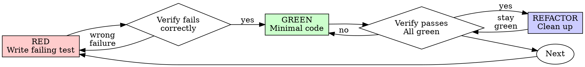

# Fix queued message duplication

> This archive contains visible conversation activity and tool records. Private model reasoning and system/developer instructions are not available here.
<!-- codex-event:{"kind":"state","timestamp":"2026-06-26T20:41:00.694Z","phase":null} -->
## Task state: task_started · 2026-06-26T20:41:00.694Z

```text
{
  "type": "task_started",
  "turn_id": "019f05aa-15f3-76e3-89ec-1bb4f1f77697",
  "started_at": 1782506460,
  "model_context_window": 258400,
  "collaboration_mode_kind": "default"
}
```

<!-- /codex-event -->

<!-- codex-event:{"kind":"user","timestamp":"2026-06-26T20:41:00.710Z","phase":null} -->
## User · 2026-06-26T20:41:00.710Z


# Files mentioned by the user:

## Screenshot 2026-06-26 at 23.39.52.png: /Users/masterman/.codex/attachments/dc409b31-0e5b-4d79-8283-de3e800c6144/Screenshot 2026-06-26 at 23.39.52.png

## My request for Codex:
There are still a trillion issues with sending messages that get cued and then get forced sent and then they disappear and then they reappear when the agent is done, but they reappear as cued messages which then I force send and then they appear duplicated.

this from session 279f067d7f7c


<!-- /codex-event -->

<!-- codex-event:{"kind":"progress","timestamp":"2026-06-26T20:41:13.926Z","phase":"commentary"} -->
## Codex progress · 2026-06-26T20:41:13.926Z

I’ll trace this from the persisted session first, then follow the queue/force-send path through the UI and server so we fix the actual state transition instead of just the duplicate rendering symptom. I’m going to use the project’s debugging and state-invariant guidance, plus baton for a second opinion as requested by the repo instructions.

<!-- /codex-event -->

<!-- codex-event:{"kind":"tool-call","timestamp":"2026-06-26T20:41:13.939Z","phase":null} -->
## Tool call: exec_command · 2026-06-26T20:41:13.939Z

```json
{
  "cmd": "sed -n '1,220p' /Users/masterman/.agents/skills/using-ultrapowers/SKILL.md",
  "workdir": "/Users/masterman/NLP/omniharness",
  "yield_time_ms": 10000,
  "max_output_tokens": 20000
}
```

<!-- /codex-event -->

<!-- codex-event:{"kind":"tool-call","timestamp":"2026-06-26T20:41:13.939Z","phase":null} -->
## Tool call: exec_command · 2026-06-26T20:41:13.939Z

```json
{
  "cmd": "sed -n '1,260p' /Users/masterman/.agents/skills/systematic-debugging/SKILL.md",
  "workdir": "/Users/masterman/NLP/omniharness",
  "yield_time_ms": 10000,
  "max_output_tokens": 20000
}
```

<!-- /codex-event -->

<!-- codex-event:{"kind":"tool-call","timestamp":"2026-06-26T20:41:13.965Z","phase":null} -->
## Tool call: exec_command · 2026-06-26T20:41:13.965Z

```json
{
  "cmd": "sed -n '1,240p' /Users/masterman/.agents/skills/client-server-state-invariants/SKILL.md",
  "workdir": "/Users/masterman/NLP/omniharness",
  "yield_time_ms": 10000,
  "max_output_tokens": 20000
}
```

<!-- /codex-event -->

<!-- codex-event:{"kind":"tool-call","timestamp":"2026-06-26T20:41:13.965Z","phase":null} -->
## Tool call: exec_command · 2026-06-26T20:41:13.965Z

```json
{
  "cmd": "sed -n '1,240p' /Users/masterman/.agents/skills/instrumenting-control-planes/SKILL.md",
  "workdir": "/Users/masterman/NLP/omniharness",
  "yield_time_ms": 10000,
  "max_output_tokens": 20000
}
```

<!-- /codex-event -->

<!-- codex-event:{"kind":"tool-result","timestamp":"2026-06-26T20:41:13.991Z","phase":null} -->
## Tool result: call_O23RXwMydK8JsvRFzkPEsBla · 2026-06-26T20:41:13.991Z

```text
Chunk ID: ae38ed
Wall time: 0.0000 seconds
Process exited with code 0
Original token count: 2019
Output:
---
name: using-ultrapowers
description: Use when starting any conversation - establishes how to find and use skills, requiring skill invocation before acting
---

<SUBAGENT-STOP>
If you were dispatched as a subagent to execute a specific task, skip this skill.
</SUBAGENT-STOP>

# Using Ultrapowers

Use relevant skills before acting, but keep process proportional to the task.

## Instruction Priority

1. User instructions and local repo instructions
2. Ultrapowers skills
3. Default model behavior

If the user says not to create extra repository isolation, or says to work directly in the current repository, follow that instruction.

## Core Rule

Before responding, ask:

1. Is there a process skill that governs how to approach this?
2. Is there an implementation skill that governs how to execute it?
3. Is the request substantial enough to justify that process, or is it a tiny mechanical edit?

If a skill applies and the task is substantial enough to justify it, use it before continuing. If the request is a tiny mechanical edit, make the edit directly with targeted verification.

## Proportional Skill Use

Do the smallest responsible workflow that matches the request.

For tiny, unambiguous mechanical edits, do the edit directly:

- changing a color value,
- fixing a typo,
- tweaking short copy,
- changing a prompt sentence,
- renaming a label,
- adjusting obvious spacing or formatting,
- making a one-line config or docs correction.

For these, do not run brainstorming, write a plan, or force TDD unless the change affects product behavior, data, persistence, control flow, user journeys, or non-obvious architecture.

Use the heavier process when the request is ambiguous, user-facing behavior changes, multiple files/modules are involved, the user journey can change, or the change could create regressions that are not obvious from a quick targeted check.

## Default Posture

- Work in the current repository by default.
- YOU WILL NEVER CREATE A BRANCH unless explicitly instructed.
- Ask the user whether we should work in worktrees as part of the planning.
- YOU WILL ONLY CREATE A WORKTREE if explicitly instructed.
- Keep skill use proportional. Tiny mechanical edits should stay tiny.
- Every project should have a `.gitignore`.
- Never commit or push secrets, credentials, local environment files, `node_modules`, dependency caches, build outputs, coverage output, logs, temporary files, or intermediate/generated artifacts unless the human explicitly asks to version a specific generated artifact.
- Deliver full product functionality by default. NO FAKE COMPONENTS, NO MOCKS, NO PLACEHOLDERS, NO FALLBACKS as substitutes for the requested functionality unless the human explicitly asks for a prototype or scaffold.
- For app, UI, and product-surface work, run a PM pass during planning. Treat it as mandatory default behavior, not optional polish.
- For app, UI, and product-surface work, consider `agentic-user-journey-testing` for important user stories, but do not run it without explicit user approval.
- Use `second-opinion` for substantial saved implementation plans, and for unusually hard, creative, high-risk, or architecture-heavy specs when an independent external review could improve the artifact. Prefer a different available coding harness for that review, such as Codex asking Claude Code or Claude Code asking Codex. If no different harness is available, the same harness is fine; the second opinion is still mandatory for matching artifacts.
- Refactor code when a file passes 1200 lines. Do not normalize oversized files as the default end state.
- Use user stories in specs and plans when they clarify behavior or value.
- Default UI work to `shadcn/ui` unless the user says otherwise.
- When designing UI from scratch, first inspect the available ShadCN Blocks at https://ui.shadcn.com/blocks for each screen, form, or major surface. Start from the closest matching block with `npx shadcn add <block-name>` or the block's source in https://github.com/shadcn-ui/ui, then edit it by adding, removing, or adapting controls. Do not invent a fresh layout before doing this block-selection pass.
- Before adding any individual UI control, check whether `shadcn/ui` already provides a control that does what is needed. Use the available shadcn control first, then customize it, instead of hand-building a one-off control.
- Treat desktop and mobile responsiveness as first-class from the beginning.
- Prefer explicit routing unless the framework strongly defaults to file-based routes.
- For React apps, use `building-react-apps` for state managers, explicit transitions, routing, refs, imports, package-manager defaults, and frontend configuration defaults.
- For React apps with server state, optimistic UI, caches, polling, SSE/WebSocket streams, background jobs, persistence, or client/server synchronization, use `client-server-state-invariants` during planning and verification.
- For React or Next.js slowness, root-load, compile-time, SSR/hydration, bundle, import-bloat, or UI dependency cleanup work, use `optimizing-react-next-apps`.
- Prefer strong instrumentation and auditability for backend behavior.
- When a project has backend or agent workflows, prefer a fully instrumented control plane: persist meaningful events, tool calls, actions, results, errors, and state transitions, and expose them through a CLI or other scriptable interface so the full system can be inspected and tested without the UI.
- Use `instrumenting-control-planes` when building, planning, reviewing, or debugging backend decisions, agent workflows, recovery paths, retries, deletes, long-running jobs, SSE/WebSocket streams, or user-visible failures.
- Use `learning-from-bugs` after diagnosing or fixing meaningful architecture, storage, memory, persistence, control-plane, or system-level bugs so reusable lessons become durable.
- Do not default to silent, masked, or over-abstracted errors.
- When a project has a frontend, prefer surfacing full backend error details and stack traces to the frontend so failures stay visible, debuggable, and testable end-to-end.
- Treat persistence of settings and preferences as explicit design work.
- For every meaningful UI setting, define whether it persists, where it is stored, how it is read and written, who owns it, and how reset, sync, migration, and testing are handled.

See `docs/ultrapowers-defaults.md` for the canonical fork defaults.

## Skill Priority

1. Process skills first
2. Implementation skills second

Examples:

- "Make this button blue" -> inspect the relevant file, make the small edit, do targeted verification
- "Update this prompt sentence" -> edit the prompt directly and verify the final text
- "Build a feature" -> `brainstorming` with a PM pass first, then `writing-plans`, then execution; consider approval-gated `agentic-user-journey-testing` for app workflows
- "Fix this bug" -> `systematic-debugging`, then the relevant implementation skill; if the root cause is meaningful or systemic, finish with `learning-from-bugs`
- "Review this change" -> `requesting-code-review`

## Examples Of User Override

- If a task feels risky and the user did not ask for extra repository isolation, keep working in the current repository unless the user explicitly instructs otherwise.
- If a stack supports file-based routing but the user says not to use it, choose an explicit routing approach instead.
- If a framework strongly defaults to file-based routing, such as Next.js App Router, use the framework-native routing model unless there is a good reason not to.
- If a frontend skill suggests `shadcn/ui` but the user wants another design system, follow the user.

## Red Flags

- "I need a whole workflow for this tiny edit" -> no. Use the smallest responsible process.
- "This is simple, so I need the whole process anyway" -> no. Tiny mechanical edits should stay tiny.
- "I'll create extra repository isolation just to be safe" -> forbidden unless the user clearly asked for it.
- "I already know the skill" -> read the current version before relying on it

```

<!-- /codex-event -->

<!-- codex-event:{"kind":"tool-result","timestamp":"2026-06-26T20:41:13.991Z","phase":null} -->
## Tool result: call_BVGuGBeWQEiDDWObGiG6MCpu · 2026-06-26T20:41:13.991Z

````text
Chunk ID: 696b48
Wall time: 0.0000 seconds
Process exited with code 0
Original token count: 2092
Output:
---
name: systematic-debugging
description: Use when encountering any bug, test failure, or unexpected behavior, before proposing fixes
---

# Systematic Debugging

## Overview

Random fixes waste time and create new bugs. Quick patches mask underlying issues.

**Core principle:** ALWAYS find root cause before attempting fixes. Symptom fixes are failure.

**Violating the letter of this process is violating the spirit of debugging.**

## The Iron Law

```
NO FIXES WITHOUT ROOT CAUSE INVESTIGATION FIRST
```

If you haven't completed Phase 1, you cannot propose fixes.

## When to Use

Use for ANY technical issue:
- Test failures
- Bugs in production
- Unexpected behavior
- Performance problems
- Build failures
- Integration issues

**Use this ESPECIALLY when:**
- Under time pressure (emergencies make guessing tempting)
- "Just one quick fix" seems obvious
- You've already tried multiple fixes
- Previous fix didn't work
- You don't fully understand the issue

**Don't skip when:**
- Issue seems simple (simple bugs have root causes too)
- You're in a hurry (rushing guarantees rework)
- Manager wants it fixed NOW (systematic is faster than thrashing)

## The Four Phases

You MUST complete each phase before proceeding to the next.

### Phase 1: Root Cause Investigation

**BEFORE attempting ANY fix:**

1. **Read Error Messages Carefully**
   - Don't skip past errors or warnings
   - They often contain the exact solution
   - Read stack traces completely
   - Note line numbers, file paths, error codes

2. **Reproduce Consistently**
   - Can you trigger it reliably?
   - What are the exact steps?
   - Does it happen every time?
   - If not reproducible → gather more data, don't guess

3. **Check Recent Changes**
   - What changed that could cause this?
   - Git diff, recent commits
   - New dependencies, config changes
   - Environmental differences

4. **Gather Evidence in Multi-Component Systems**

   **WHEN system has multiple components (CI → build → signing, API → service → database):**

   **BEFORE proposing fixes, add diagnostic instrumentation:**
   ```
   For EACH component boundary:
     - Log what data enters component
     - Log what data exits component
     - Verify environment/config propagation
     - Check state at each layer

   Run once to gather evidence showing WHERE it breaks
   THEN analyze evidence to identify failing component
   THEN investigate that specific component
   ```

   **Example (multi-layer system):**
   ```bash
   # Layer 1: Workflow
   echo "=== Secrets available in workflow: ==="
   echo "IDENTITY: ${IDENTITY:+SET}${IDENTITY:-UNSET}"

   # Layer 2: Build script
   echo "=== Env vars in build script: ==="
   env | grep IDENTITY || echo "IDENTITY not in environment"

   # Layer 3: Signing script
   echo "=== Keychain state: ==="
   security list-keychains
   security find-identity -v

   # Layer 4: Actual signing
   codesign --sign "$IDENTITY" --verbose=4 "$APP"
   ```

   **This reveals:** Which layer fails (secrets → workflow ✓, workflow → build ✗)

5. **Trace Data Flow**

   **WHEN error is deep in call stack:**

   See `root-cause-tracing.md` in this directory for the complete backward tracing technique.

   **Quick version:**
   - Where does bad value originate?
   - What called this with bad value?
   - Keep tracing up until you find the source
   - Fix at source, not at symptom

### Phase 2: Pattern Analysis

**Find the pattern before fixing:**

1. **Find Working Examples**
   - Locate similar working code in same codebase
   - What works that's similar to what's broken?

2. **Compare Against References**
   - If implementing pattern, read reference implementation COMPLETELY
   - Don't skim - read every line
   - Understand the pattern fully before applying

3. **Identify Differences**
   - What's different between working and broken?
   - List every difference, however small
   - Don't assume "that can't matter"

4. **Understand Dependencies**
   - What other components does this need?
   - What settings, config, environment?
   - What assumptions does it make?

### Phase 3: Hypothesis and Testing

**Scientific method:**

1. **Form Single Hypothesis**
   - State clearly: "I think X is the root cause because Y"
   - Write it down
   - Be specific, not vague

2. **Test Minimally**
   - Make the SMALLEST possible change to test hypothesis
   - One variable at a time
   - Don't fix multiple things at once

3. **Verify Before Continuing**
   - Did it work? Yes → Phase 4
   - Didn't work? Form NEW hypothesis
   - DON'T add more fixes on top

4. **When You Don't Know**
   - Say "I don't understand X"
   - Don't pretend to know
   - Ask for help
   - Research more

### Phase 4: Implementation

**Fix the root cause, not the symptom:**

1. **Create Failing Test Case**
   - Simplest possible reproduction
   - Automated test if possible
   - One-off test script if no framework
   - MUST have before fixing
   - Use the `ultrapowers:test-driven-development` skill for writing proper failing tests

2. **Implement Single Fix**
   - Address the root cause identified
   - ONE change at a time
   - No "while I'm here" improvements
   - No bundled refactoring

3. **Verify Fix**
   - Test passes now?
   - No other tests broken?
   - Issue actually resolved?
   - If the bug was meaningful or systemic, use `ultrapowers:learning-from-bugs` before declaring the fix complete.

4. **If Fix Doesn't Work**
   - STOP
   - Count: How many fixes have you tried?
   - If < 3: Return to Phase 1, re-analyze with new information
   - **If ≥ 3: STOP and question the architecture (step 5 below)**
   - DON'T attempt Fix #4 without architectural discussion

5. **If 3+ Fixes Failed: Question Architecture**

   **Pattern indicating architectural problem:**
   - Each fix reveals new shared state/coupling/problem in different place
   - Fixes require "massive refactoring" to implement
   - Each fix creates new symptoms elsewhere

   **STOP and question fundamentals:**
   - Is this pattern fundamentally sound?
   - Are we "sticking with it through sheer inertia"?
   - Should we refactor architecture vs. continue fixing symptoms?

   **Discuss with your human partner before attempting more fixes**

   This is NOT a failed hypothesis - this is a wrong architecture.

## Red Flags - STOP and Follow Process

If you catch yourself thinking:
- "Quick fix for now, investigate later"
- "Just try changing X and see if it works"
- "Add multiple changes, run tests"
- "Skip the test, I'll manually verify"
- "It's probably X, let me fix that"
- "I don't fully understand but this might work"
- "Pattern says X but I'll adapt it differently"
- "Here are the main problems: [lists fixes without investigation]"
- Proposing solutions before tracing data flow
- **"One more fix attempt" (when already tried 2+)**
- **Each fix reveals new problem in different place**

**ALL of these mean: STOP. Return to Phase 1.**

**If 3+ fixes failed:** Question the architecture (see Phase 4.5)

## your human partner's Signals You're Doing It Wrong

**Watch for these redirections:**
- "Is that not happening?" - You assumed without verifying
- "Will it show us...?" - You should have added evidence gathering
- "Stop guessing" - You're proposing fixes without understanding
- "Ultrathink this" - Question fundamentals, not just symptoms
- "We're stuck?" (frustrated) - Your approach isn't working

**When you see these:** STOP. Return to Phase 1.

## Common Rationalizations

| Excuse | Reality |
|--------|---------|
| "Issue is simple, don't need process" | Simple issues have root causes too. Process is fast for simple bugs. |
| "Emergency, no time for process" | Systematic debugging is FASTER than guess-and-check thrashing. |
| "Just try this first, then investigate" | First fix sets the pattern. Do it right from the start. |
| "I'll write test after confirming fix works" | Untested fixes don't stick. Test first proves it. |
| "Multiple fixes at once saves time" | Can't isolate what worked. Causes new bugs. |
| "Reference too long, I'll adapt the pattern" | Partial understanding guarantees bugs. Read it completely. |
| "I see the problem, let me fix it" | Seeing symptoms ≠ understanding root cause. |
| "One more fix attempt" (after 2+ failures) | 3+ failures = architectural problem. Question pattern, don't fix again. |

## Quick Reference


````

<!-- /codex-event -->

<!-- codex-event:{"kind":"tool-result","timestamp":"2026-06-26T20:41:14.015Z","phase":null} -->
## Tool result: call_TbGgGAlem0lRMbjr0lKruCgz · 2026-06-26T20:41:14.015Z

```text
Chunk ID: aaea26
Wall time: 0.0000 seconds
Process exited with code 0
Original token count: 1481
Output:
---
name: client-server-state-invariants
description: Use when planning, building, reviewing, or debugging React apps with server state, optimistic UI, caches, polling, SSE/WebSocket streams, background jobs, persistence, or client/server synchronization
---

# Client Server State Invariants

React bugs often expose deeper ownership mistakes. When client state, server state, cache state, stream state, and persisted state all exist, every plan needs explicit invariants.

## Core Rule

No UI surface may treat data as authoritative unless the payload proves ownership, freshness, completeness, ordering, and terminal state.

If those words are missing from the plan, the plan is probably baking in a race condition.

## Planning Checklist

For every React app that reads server/runtime state, the plan must answer:

1. **Owner:** What owns this state: server, client manager, URL, cache, stream, local storage, or worker/runtime?
2. **Token:** What owner token protects async results: `requestId`, `runId`, `projectPath`, `operationId`, `workerId + seq`, or equivalent?
3. **Provenance:** Is data server-authoritative, optimistic, cached preview, partial update, or historical fallback?
4. **Completeness:** Does the payload declare what scope it is complete for? What may it erase?
5. **Ordering:** What stable order is used: monotonic seq, `(createdAt, id)`, version, or cursor?
6. **State machine:** What are the legal states, terminal states, and transitions?
7. **Events:** Which server decisions are named events rather than client-side derivations?
8. **Loading shape:** Which states are bootstrap, first load, incremental refresh, reconnect, resync, recovery, and terminal error?
9. **Fallbacks:** Which legacy/fallback rows can render, and only after what authority is loaded?
10. **Tests:** Which race, stale-response, event-sequence, reconnect, and merge tests prove the invariants?

## Invariants To Require

- Cached and optimistic data may pre-render, but cannot satisfy full-load gates.
- Partial snapshots may add or refine state, but may not erase optimistic objects, delivered user input, read markers, or stream entries unless they declare complete scope.
- Every async response checks that its owner token still matches before mutating visible state.
- Mutation success handlers may navigate or clear UI only if they still own the current context, unless the action explicitly creates a new selected context.
- Timers and polling callbacks re-check ownership immediately before acting.
- Server decisions are emitted as named events; the client does not infer decisions by diffing snapshots.
- SSE/WebSocket streams have event ids, replay/resume, and an explicit resync path.
- Loading booleans are split by lifecycle stage. A leaf stream refresh must not unmount the whole page.
- Append-only content has one writer, one reader, stable ids, and monotonic cursors.
- Fallback DB rows or historical rows are gated behind stream loading and deduped by stable id plus safe equivalence.
- Status classifiers distinguish active, runnable, blocked, awaiting user, terminal, stale, and recoverable states.
- "Latest" queries have deterministic tie-breakers. Timestamp-only ordering is not enough.
- Hot paths use bounded reads and do not synchronously load large bodies, bridge probes, schema setup, or heavy app graphs.
- Process-local caches have explicit TTL/size bounds and invalidation rules.

## Test Matrix

Pick the rows that match the work. Do not rely on one happy-path UI test.

| Risk | Test shape |
| --- | --- |
| Stale async response | Start request A, switch owner, resolve A, assert it cannot mutate B |
| Optimistic object erased | Create local optimistic state, apply stale/partial snapshot, assert object remains |
| Cache masquerades as loaded | Hydrate cache preview, assert full-load gate waits for server authority |
| Mutation steals navigation | Start mutation, switch selection, resolve mutation, assert focus stays put |
| Timer/poll stale-fire | Use fake timers or deferred promises; callback must re-check owner before acting |
| Snapshot merge erases stream | Apply partial snapshot missing known entries, assert entries/read markers remain |
| Event stream gap | Bootstrap snapshot, emit events during disconnect, reconnect with last id, assert replay or resync |
| Server decision invisible | Exercise branch and assert named event such as `blocked`, `refused`, `gave_up`, or `error.surfaced` |
| State classifier wrong | Table-test every status into active/runnable/terminal/recoverable buckets |
| Fallback duplicates stream | Load fallback rows then stream entries, assert no duplicate or false chronology |
| Hot path bloats | Assert snapshots carry cursors not bodies; route returns before DB/heavy imports when possible |
| Timestamp tie | Insert equal timestamps, assert deterministic order by id/seq |

Use headless HTTP/SSE tests for control-plane decisions. Use React/unit tests for manager merging and ownership guards. Use Playwright only for real UI layout, focus, scroll, mobile computed styles, and visible affordances.

## Refuse These Shapes

- one `isLoading` boolean for bootstrap, refresh, reconnect, and recovery;
- cache or optimistic data treated as authoritative without provenance;
- async callbacks that mutate state without checking owner tokens;
- client-side derivation of server decisions;
- snapshot diffs used as the only way to know what happened;
- event streams without ids or resume;
- timestamp-only "latest" queries;
- parallel transcript or persistence surfaces that the frontend must reconcile;
- unbounded process caches introduced to hide slow storage;
- tests that prove only the DOM result when the bug is a server decision.

## Review Prompt

Ask this before implementation starts:

> What can arrive late, out of order, partially, twice, or after the user changes context, and what test proves it cannot corrupt visible state?

```

<!-- /codex-event -->

<!-- codex-event:{"kind":"tool-result","timestamp":"2026-06-26T20:41:14.015Z","phase":null} -->
## Tool result: call_xKigXaAPPiFs7uxCbWjSXfSH · 2026-06-26T20:41:14.015Z

````text
Chunk ID: dc8b1c
Wall time: 0.0000 seconds
Process exited with code 0
Original token count: 1303
Output:
---
name: instrumenting-control-planes
description: Use when building, planning, reviewing, or debugging apps with backend decisions, agent workflows, long-running jobs, SSE/WebSocket streams, recovery paths, deletes, retries, or user-visible failures
---

# Instrumenting Control Planes

Build the control plane as a product surface. If the server decides, refuses, retries, spawns, deletes, recovers, gives up, or fails, that decision must be observable by users, operators, and tests.

If a React UI consumes the control plane through server state, optimistic UI, caches, polling, SSE/WebSocket streams, or persisted runtime state, also use `client-server-state-invariants`.

## Core Rule

Every meaningful server-side state transition emits a named, durable event. The UI and tests consume the same production event surface.

Do not rely on snapshot diffs, rendered DOM state, logs only, or client-side re-derivation to prove what the server decided.

## Hot Path Rule

No user bootstrap, catalog, status, reconnect, or recovery request may depend on a lock-prone database write path or external health probe finishing. Serve these paths from a bounded read model, memory cache, append-only event log, or stale-but-marked snapshot; queue reconciliation writes outside the request. Every dependency on a database or bridge call in a hot path needs a short timeout, cancellation, and an explicit degraded response.

If SQLite, local files, or a single-writer store is used, assume writer contention can freeze readers at the worst moment. Use one writer, WAL/busy-timeout discipline, short transactions, bounded queues, and headless chaos tests that run bootstrap/reload while writes are active. A 25s UI request is a control-plane failure, even if the database eventually returns.

## Event Contract

For each backend or agent workflow, define:

- named events for decisions: `worker.spawned`, `worker.reattached`, `plan.ready`, `plan.review.blocked`, `recovery.gave_up`, `conversation.delete_failed`;
- payloads with stable ids, `prev`/`next` status when relevant, reason codes, and enough context to debug;
- `error.surfaced` or an equivalent user-facing failure event for every failure the user should know about;
- durable persistence or a bounded replay buffer so short disconnects do not erase history;
- a scriptable read path: CLI, HTTP endpoint, sqlite query, or event log command.

If a decision cannot be asserted from this surface, the design is incomplete.

If debugging a control-plane failure reveals a reusable lesson, use `ultrapowers:learning-from-bugs` after the fix is verified.

## Streaming Requirements

For SSE or WebSocket-like streams:

- emit named events alongside any snapshot/update frame;
- include monotonic event ids;
- support resume from the last seen id;
- replay missed events from a bounded buffer;
- emit an explicit resync-required event when replay is impossible;
- bootstrap from a snapshot, then tail events.

Snapshots show current truth. Named events show why it became true.

## Testing Standard

Control-plane tests should usually be headless HTTP/SSE scenario tests, not browser tests. Browser automation is for UI behavior; control-plane tests assert server decisions directly.

Write scenario assertions as event transcripts:

```ts
expect(events).toHaveEmitted("worker.spawned", { runId });
expect(events).toHaveEmitted("worker.status", { next: "running" });
chaos.killServer();
chaos.restartServer();
expect(events).toHaveEmitted("worker.reattached", { runId });
expect(events).not.toHaveEmitted("worker.recreated", { runId });
```

Chaos belongs outside production code paths: drop connections in the client, fail fetches in the harness, restart the server process, and use seeds for reproducibility.

## Refuse These Shapes

- silent early returns in server methods;
- swallowed `catch` blocks;
- client-side derivation of server decisions;
- response-code-only user failures;
- event streams without ids or resume;
- tests that infer control-plane behavior from rendered state;
- delete handlers that do not enumerate dependent rows or emit typed failure events;
- recovery loops without terminal events such as `gave_up` or `abandoned`;
- request handlers that wait on inline reconciliation writes, SQLite contention, or bridge `/doctor` checks before returning bootstrap data;
- test-only behavior branches in production code.

## Design Checklist

Before implementing a backend or agent workflow, answer:

1. What decisions can this workflow make?
2. What named event is emitted for each decision, including refusal and failure?
3. Where are events persisted or buffered?
4. How does a client resume after disconnect?
5. Which request paths must keep working while persistence or bridge dependencies are slow, locked, or stale?
6. How can a CLI or test harness inspect the exact event sequence without the UI?
7. Which headless scenario proves the happy path, failure path, recovery path, terminal state, and hot-path timeout/degraded path?
8. Which client state consumes these events, and how does it prove ownership, freshness, completeness, ordering, and replay/resync?

If the answer is "the UI can figure it out", name the missing event instead.

````

<!-- /codex-event -->

<!-- codex-event:{"kind":"progress","timestamp":"2026-06-26T20:41:23.927Z","phase":"commentary"} -->
## Codex progress · 2026-06-26T20:41:23.927Z

I’ve got the guardrails loaded: this is almost certainly a client/server ownership problem around queued messages, optimistic delivery, and later snapshot/stream reconciliation. Next I’m pulling the persisted evidence for `279f067d7f7c` and locating the code paths that create, force-send, persist, and render queued messages.

<!-- /codex-event -->

<!-- codex-event:{"kind":"tool-call","timestamp":"2026-06-26T20:41:23.941Z","phase":null} -->
## Tool call: exec_command · 2026-06-26T20:41:23.941Z

```json
{
  "cmd": "ls -la && rg --files | rg '(^|/)sqlite\\.db$|queued|queue|message|WorkerEntries|Terminal|lifecycle-observability|worker-conversation-stream'",
  "workdir": "/Users/masterman/NLP/omniharness",
  "yield_time_ms": 10000,
  "max_output_tokens": 20000
}
```

<!-- /codex-event -->

<!-- codex-event:{"kind":"tool-call","timestamp":"2026-06-26T20:41:23.948Z","phase":null} -->
## Tool call: exec_command · 2026-06-26T20:41:23.948Z

```json
{
  "cmd": "find . -maxdepth 3 -name 'sqlite.db' -o -name '*.db'",
  "workdir": "/Users/masterman/NLP/omniharness",
  "yield_time_ms": 10000,
  "max_output_tokens": 20000
}
```

<!-- /codex-event -->

<!-- codex-event:{"kind":"tool-call","timestamp":"2026-06-26T20:41:23.948Z","phase":null} -->
## Tool call: exec_command · 2026-06-26T20:41:23.948Z

```json
{
  "cmd": "sed -n '1,260p' docs/architecture/lifecycle-observability-and-testing.md",
  "workdir": "/Users/masterman/NLP/omniharness",
  "yield_time_ms": 10000,
  "max_output_tokens": 30000
}
```

<!-- /codex-event -->

<!-- codex-event:{"kind":"tool-call","timestamp":"2026-06-26T20:41:23.958Z","phase":null} -->
## Tool call: exec_command · 2026-06-26T20:41:23.958Z

```json
{
  "cmd": "sed -n '1,240p' docs/architecture/worker-conversation-stream.md",
  "workdir": "/Users/masterman/NLP/omniharness",
  "yield_time_ms": 10000,
  "max_output_tokens": 30000
}
```

<!-- /codex-event -->

<!-- codex-event:{"kind":"tool-result","timestamp":"2026-06-26T20:41:24.017Z","phase":null} -->
## Tool result: call_BBq1mifiPofPfKOXP2tffcjf · 2026-06-26T20:41:24.017Z

```text
Chunk ID: 678127
Wall time: 0.0000 seconds
Process exited with code 0
Original token count: 1631
Output:
total 175992
drwxr-xr-x  63 masterman  staff      2016 Jun 26 22:22 .
drwxr-xr-x  45 masterman  staff      1440 Jun 25 16:09 ..
-rw-r--r--@  1 masterman  staff     10244 Jun 26 22:41 .DS_Store
drwxr-xr-x   3 masterman  staff        96 Apr 27 07:59 .agents
drwxr-xr-x   5 masterman  staff       160 Jun 24 21:31 .claude
-rw-r--r--   1 masterman  staff     48702 May 25 05:07 .codex-current-supervisor-ui.png
-rw-------   1 masterman  staff       173 Jun  3 01:00 .env
-rw-r--r--   1 masterman  staff      2085 Jun  3 11:35 .env.example
drwxr-xr-x  23 masterman  staff       736 Jun 26 22:22 .git
drwxr-xr-x   3 masterman  staff        96 Jun  3 00:44 .github
-rw-r--r--   1 masterman  staff      1237 May 30 11:05 .gitignore
drwxr-xr-x@ 26 masterman  staff       832 Jun 26 22:41 .next
-rw-r--r--   1 masterman  staff         3 May  9 17:00 .nvmrc
drwxr-xr-x  23 masterman  staff       736 Jun 23 15:36 .omniharness
-rw-------   1 masterman  staff        44 May  2 07:48 .omniharness-auth.key
drwxr-xr-x@  4 masterman  staff       128 Jun 14 17:49 .pnpm-store
drwxr-xr-x@  9 masterman  staff       288 Jun 21 15:16 .tmp-rdp-share
-rw-r--r--@  1 masterman  staff      5743 Jun 15 17:32 AGENTS.md
-rw-r--r--   1 masterman  staff       892 Jun  3 11:35 CHANGELOG.md
-rw-r--r--   1 masterman  staff        30 May 15 07:00 CLAUDE.md
-rw-r--r--   1 masterman  staff     34523 May 23 17:11 LICENSE
-rw-r--r--@  1 masterman  staff     19785 Jun 21 15:01 README.md
drwxr-xr-x   5 masterman  staff       160 May 18 17:52 apps
drwxr-xr-x  20 masterman  staff       640 Jun 25 16:47 attachments
-rw-r--r--   1 masterman  staff       520 Apr 19 11:40 components.json
drwxr-xr-x   3 masterman  staff        96 Apr 27 08:13 config
-rwxr-xr-x   1 masterman  staff      2095 May 14 14:36 controller.sh
drwxr-xr-x   3 masterman  staff        96 May 30 13:12 docker
drwxr-xr-x   5 masterman  staff       160 May 11 11:14 docs
-rw-r--r--   1 masterman  staff       207 Apr 19 11:40 drizzle.config.ts
-rwxr-xr-x   1 masterman  staff        66 Apr 20 15:58 e2e-test.sh
-rw-r--r--@  1 masterman  staff      1273 Jun 14 18:00 eslint.config.mjs
-rw-r--r--   1 masterman  staff      7360 Apr 27 19:09 loading_screen_skills.md
-rw-r--r--   1 masterman  staff       262 Apr 19 11:33 next-env.d.ts
-rw-r--r--   1 masterman  staff       760 May 13 18:04 next.config.ts
drwxr-xr-x@ 54 masterman  staff      1728 Jun 21 11:40 node_modules
-rwxr-xr-x@  1 masterman  staff      1513 Jun 14 16:12 omni
-rwxr-xr-x   1 masterman  staff       470 May  2 08:21 omni-cli.ts
-rwxr-xr-x@  1 masterman  staff      2303 Jun 14 17:25 omni.sh
-rwxr-xr-x@  1 masterman  staff     11510 Jun 15 18:20 omniharness
-rw-r--r--@  1 masterman  staff      3110 Jun 21 15:00 package.json
drwxr-xr-x@  7 masterman  staff       224 Jun 23 15:52 plans
-rw-r--r--   1 masterman  staff       733 May 14 05:18 playwright.config.ts
-rw-r--r--@  1 masterman  staff    333728 Jun 21 11:34 pnpm-lock.yaml
-rw-r--r--@  1 masterman  staff       367 Jun 21 10:53 pnpm-workspace.yaml
-rw-r--r--   1 masterman  staff        81 Apr 19 11:33 postcss.config.mjs
drwxr-xr-x  14 masterman  staff       448 May 15 09:31 public
drwxr-xr-x  36 masterman  staff      1152 Jun 21 15:00 scripts
-rw-------   1 masterman  staff      2880 May 30 10:46 session-2026-05-30T08-30-50-omniharness-5e76d6ca.jsonl
drwxr-xr-x   4 masterman  staff       128 Jun 14 17:09 shared
-rw-r--r--@  1 masterman  staff  68882432 Jun 26 22:38 sqlite.db
-rw-r--r--@  1 masterman  staff     32768 Jun 26 22:14 sqlite.db-shm
-rw-r--r--@  1 masterman  staff   4165352 Jun 26 22:41 sqlite.db-wal
drwxr-xr-x  13 masterman  staff       416 May 18 16:59 src
-rwxr-xr-x@  1 masterman  staff      1087 Jun 14 17:25 start.sh
-rw-r--r--   1 masterman  staff      4110 Apr 24 11:12 system_message_renderer.patch
drwxr-xr-x   3 masterman  staff        96 May 14 17:57 test-results
drwxr-xr-x  30 masterman  staff       960 May 30 11:00 tests
drwxr-xr-x   9 masterman  staff       288 May 20 04:59 tmp
-rw-r--r--   1 masterman  staff       630 May 21 18:07 tsconfig.json
-rw-r--r--@  1 masterman  staff    677053 Jun 26 22:22 tsconfig.tsbuildinfo
drwxr-xr-x   7 masterman  staff       224 Jun 14 16:34 vibes
-rw-r--r--   1 masterman  staff       692 May 15 09:11 vitest.config.ts
src/lib/worker-terminal-messages.ts
src/components/Terminal.tsx
src/components/InteractiveTerminal.tsx
src/app/home/useTerminalPanelResize.ts
src/app/home/WorkerEntriesManager.ts
src/app/home/busy-message-behavior.ts
tests/api/conversation-messages-route.test.ts
tests/app/busy-message-behavior.test.ts
tests/app/busy-message-queue-manager.test.ts
docs/superpowers/learnings/2026-05-20-server-empty-queue-must-clear-cache.md
docs/superpowers/learnings/2026-05-20-queued-steering-delivery-requires-post-input-output.md
docs/superpowers/learnings/2026-05-24-terminal-runs-must-retire-stale-pending-messages.md
docs/superpowers/learnings/2026-05-25-browser-route-and-queue-ownership.md
docs/superpowers/learnings/2026-06-15-partial-queue-mutations-must-not-revive-server-absent-rows.md
docs/superpowers/learnings/2026-05-20-streaming-message-is-not-completion.md
docs/superpowers/learnings/2026-05-20-queued-fifo-needs-logical-clock.md
docs/superpowers/learnings/2026-06-16-queued-drain-claims-must-be-atomic.md
tests/lib/worker-terminal-messages.test.ts
docs/superpowers/specs/2026-05-02-busy-conversation-steer-queue-design.md
src/runtime/http/routes/conversation-messages.ts
src/runtime/http/routes/messages.ts
docs/architecture/worker-conversation-stream.md
docs/architecture/lifecycle-observability-and-testing.md
docs/superpowers/plans/2026-06-14-escape-interrupt-queued-message.md
docs/superpowers/plans/2026-05-02-busy-conversation-steer-queue.md
docs/superpowers/plans/lifecycle-observability-and-chaos-harness.md
docs/superpowers/plans/2026-05-16-unified-worker-conversation-stream.md
tests/server/queued-messages.test.ts
src/server/conversations/send-message.ts
src/server/conversations/message-records.ts
src/server/conversations/queued-messages.ts
src/server/conversations/queued-message-interrupt.ts
src/server/conversations/queued-message-records.ts
tests/server/queued-message-interrupt.test.ts
src/app/api/messages/route.ts
tests/server/conversations/reconcile-user-messages.test.ts
src/app/api/conversations/[id]/messages/route.ts
src/app/api/conversations/[id]/queued-messages/[messageId]/route.ts
src/app/api/conversations/[id]/queued-messages/interrupt-next/route.ts
src/app/api/conversations/[id]/queued-messages/[messageId]/interrupt/route.ts

```

<!-- /codex-event -->

<!-- codex-event:{"kind":"tool-result","timestamp":"2026-06-26T20:41:24.034Z","phase":null} -->
## Tool result: call_jqM1wwVMwoOE3DwzVGprQRFe · 2026-06-26T20:41:24.034Z

```text
Chunk ID: e67972
Wall time: 0.0000 seconds
Process exited with code 0
Original token count: 10
Output:
./.pnpm-store/v11/index.db
./sqlite.db

```

<!-- /codex-event -->

<!-- codex-event:{"kind":"tool-result","timestamp":"2026-06-26T20:41:24.034Z","phase":null} -->
## Tool result: call_LdxvsZ6cvhnOYh1sFeL8pDfb · 2026-06-26T20:41:24.034Z

````text
Chunk ID: 4fe1c5
Wall time: 0.0000 seconds
Process exited with code 0
Original token count: 3126
Output:
# Lifecycle Observability & Resilience Testing

> What we keep getting wrong, why our tests don't catch it, and the discipline that fixes it.

Related: `docs/architecture/hot-path-responsiveness-and-resource-leaks.md`
documents the May 2026 reload/worker-streaming latency incident and the
resource-ownership rules for keeping page bootstrap, SSE, and worker stream
paths responsive while agents are running.

Related: `docs/architecture/timing-determinism-audit.md` records the May 20,
2026 audit of race-prone frontend and control-plane patterns: cached snapshots
pretending to be authoritative, stale async callbacks, timer-owned actions,
timestamp-only ordering, and silent wake/lease contention.

## Why this document exists

Over a single afternoon we hit three production-class bugs that the existing test
suite did not catch and could not have caught:

1. **Session fails to reconnect after a server restart and gives up after the
   first attempt.** No user-visible message, no telemetry event, no recovery
   incident — just a silently dead session.
2. **`DELETE /conversations/:id` fails with a foreign-key constraint** because
   related rows in dependent tables were not cleared first. The error surfaces
   as an opaque 500.
3. **Running plan-improvement agents fails because leftover state blocks the
   new run.** The block is silent; the user sees nothing happen and assumes the
   button is broken.

These are not unrelated bugs. They share a single root cause:

> **The server makes state transitions that nobody observes.** Neither the user,
> nor the UI, nor any test client can tell what the server decided. So bugs in
> the *decision* (gave up too early, took the wrong branch, refused silently)
> are invisible.

This document records what we learned and the rules we now follow so that this
class of bug stops shipping.

Related incident note: `docs/architecture/supervisor-worker-switching-incident.md`
records the worker-switching failure from session `690d2fa9f2a7`, where
`awaiting_user` was treated as runnable, Gemini workers were live but persisted
as `starting`, and duplicate continuation workers were spawned.

Related direct-control note:
`docs/architecture/direct-control-session-regressions.md` records the
`ffb912d4d5d7`, `937e642f3535`, and `734cc38f4d7f` regressions around
lifecycle noise, stale queued send-now state, missing unified-stream worker
output, and permanent "Thinking..." indicators.

Related state-staleness note:
`docs/architecture/state-staleness-and-session-lifecycle-lessons.md` records
the `0785684884fa`, `14260d2a2df0`, `ecea142f7344`, and `18fc406457f3`
regressions around stale SSE/cache payloads, queued-message races, direct-run
status classification, unread markers, and worker-stream loading.

---

## What we found in the audit

A targeted audit of `src/app/api/events/route.ts` plus the planning, recovery,
and bridge-client subsystems revealed the structural gaps.

### 1. The SSE stream is a snapshot stream, not an event stream

`/api/events` emits exactly one named event: `update`, whose payload is the
*entire* current state of the world for the selected run (messages, plans,
runs, workers, planItems, clarifications, executionEvents, supervisor
interventions, queued messages, recovery incidents, review runs/rounds/findings).

There are no other named events. An observer cannot ask "did a worker spawn?"
or "was a recovery attempted?" — only "is the state now different?" To answer
the first kind of question the client must **diff snapshots**, which is:

- **Ambiguous** — many transitions produce identical visible state (a worker
  that was reattached and a worker that was recreated both end up as
  `status="running"`).
- **Lossy** — fast transitions can be coalesced inside a single snapshot
  interval and disappear entirely. (e.g. `starting → running → completed`
  inside one 15s window.)
- **Forced to re-derive server decisions** — the client has to reconstruct
  *why* state changed, which requires duplicating server logic.

### 2. There is no event ID and no resume

The SSE frames have no `id:` field. There is no `Last-Event-ID` handling on the
server. A client that disconnects and reconnects gets a fresh snapshot and has
*no way to know* whether events fired during the gap. For chaos testing (where
we deliberately drop the connection) this is fatal — we cannot assert
"between t0 and t1 the server emitted [X, Y, Z]" because the wire format does
not carry that information.

There is a `?snapshot=1` bootstrap endpoint, which is good. There is no
"give me the events I missed since id N" endpoint, which is the gap.

### 3. Several decisions are invisible to the wire

Concrete state transitions that **the server makes** but **never tells anyone
about**:

| Transition | Where it happens | Wire visibility |
|---|---|---|
| Worker spawned | `bridge-client/index.ts spawnAgent` | None — inferred from a row appearing |
| Worker reattached vs recreated after restart | `restart-control.ts` / recovery path | **None** — both look like `status="running"` |
| Recovery gave up after N attempts | `recoveryIncidents.autoAttemptCount` increments | Partial — count is visible but there is no terminal "abandoned" state |
| Plan readiness reached | `derivePlanningStatus()` — runs **client-side** | **None** — it is a client-side derivation, not a server event |
| Plan-improvement blocked by leftover state | `planning/review.ts` early-return | **None** — silent refusal |
| Conversation delete FK violation | `/api/conversations/[id]` DELETE | None as a typed event — only a 500 response |
| Message ack / persisted / streaming chunk | `conversations/send-message.ts` | Partial — only the resulting queued-message status |

Every row in this table is a bug class waiting to ship. If the server can
silently decide "I gave up", "I refused", "I took branch B not A", and the
test harness has no way to assert which branch it took, the test harness is
structurally incapable of catching the bug.

### 4. The user-facing surface mirrors the test-facing surface

The reason "leftover state blocked the run" did not show a user message is the
**same reason** no test could detect it: there was no event for it. Make the
state transitions observable, and both the UI fix and the test coverage
follow. Conversely, if a transition is observable only by re-deriving from a
snapshot diff, both the UI and tests will be brittle in the same ways.

This is the central insight: **observability for users and observability for
tests are the same problem**.

### 5. Playwright e2e is the wrong layer for resilience

The existing `tests/e2e/*.spec.ts` files boot Chromium. They are slow (tens of
seconds per scenario), flaky against real subprocess restarts, and they
exercise UI rendering rather than control-plane decisions. The bugs we are
hitting are not UI bugs — they are control-plane bugs. We should be hitting
HTTP/SSE directly, in Node, with no browser. The UI is one consumer of the
control plane; the chaos harness is another.

---

## The rules we now follow

These are not suggestions. They are the discipline that makes this class of
bug stop happening.

### Rule 1: every server-side state transition emits a named event

If the server makes a decision — spawn, reattach, recreate, give up, refuse,
delete, fail — that decision is published on the event stream with a
**named event type**, not just a state delta. Examples:

- `worker.spawned`, `worker.status` (with `prev` and `next`), `worker.terminal`
- `worker.reattached`, `worker.recreated`
- `plan.ready`, `plan.review.started`, `plan.review.finished`,
  `plan.review.blocked` (with a `reason`)
- `recovery.opened`, `recovery.attempt`, `recovery.gave_up`, `recovery.resolved`
- `conversation.deleted`, `conversation.delete_failed` (with FK details)
- `error.surfaced` — the catch-all for anything the user should know about

**Rule of thumb:** if a server method has an early-return, a try/catch that
swallows, or a branch that depends on a state check, it emits an event.
"Silent" is a code smell.

### Rule 2: errors that affect the user are events, not just response codes

A 500 with a body is not enough. A 200 that quietly did nothing is worse. Every
user-relevant failure publishes `error.surfaced` with a stable code, a
human-readable message, and the relevant run/worker/conversation ids. The UI's
job is to render `error.surfaced` events into toasts/banners. The test
harness's job is to assert that the expected `error.surfaced` event fired.

A failure that does not produce an `error.surfaced` event is a bug — even if
the underlying behaviour is technically correct — because it is invisible to
the user and to the tests.

### Rule 3: the event stream is SSE-spec compliant

- Every frame has an `id:` field. IDs are monotonic.
- The server keeps a bounded **ring buffer** (≥ 500 entries) of recent events.
- The server honours `Last-Event-ID` on reconnect: it replays everything after
  that id from the buffer, then resumes live streaming.
- If the requested id has fallen out of the buffer, the server emits a
  `stream.resync_required` event so the client knows to re-bootstrap from
  `?snapshot=1` rather than silently miss events.

This is the SSE spec. We were not following it. We are now.

### Rule 4: named events alongside, not instead of, snapshots

The existing `update` snapshot event stays. The UI keeps consuming it. The new
named events are *additional* frames on the same stream. Clients that don't
care about a given event type ignore it. There is no `?test=1` flag, no
separate test endpoint, no parallel surface that can drift.

If a transition is worth emitting for tests, it is worth emitting in
production. Anything else creates a second observability surface that will
diverge from reality.

### Rule 5: chaos testing belongs in the client, not the server

We do **not** add fault-injection code paths to the server. We do not add a
"random failure" mode. The server stays clean. Chaos lives in the test
client as middleware:

- An SSE wrapper that can drop the connection on command.
- A `fetch` wrapper that can fail a configurable percentage of requests.
- A harness that can SIGKILL the spawned server process and restart it.

Faults are seeded for reproducibility. Every failure has a seed; replaying
the seed reproduces the failure.

### Rule 6: tests assert on event sequences, not on rendered state

A scenario test reads like a transcript:

```
expect(events).toHaveEmitted("worker.spawned", { runId });
expect(events).toHaveEmitted("worker.status", { next: "running" });
chaos.killServer();
chaos.restartServer();
expect(events).toHaveEmitted("worker.reattached", { runId });
// not "worker.recreated", not absence — explicitly reattached
```

### Rule 7: cleanup waits for server-owned background work

Lifecycle scenarios may call routes that intentionally return before a direct
worker turn finishes. That is fine for product latency, but it is not fine for
test cleanup to delete `OMNIHARNESS_ROOT` while those server-owned tasks are
still writing worker JSONL, recovery rows, or named events.

Required shape:

- Fire-and-forget direct/planning turns are registered as background
  conversation tasks.
- The lifecycle harness waits for registered background tasks before deleting
  its temp root.
- A timeout while waiting is a test failure, not harmless stderr after the test
  already passed.
- Do not paper over storage `ENOENT` from cleanup races by retrying file writes;
  the ownership bug is untracked background work.

Asserting on rendered DOM state is the wrong granularity. We assert on the
server's *decisions*, which are now first-class events.

### Rule 7: the test harness runs in isolation

A separate Node process. A temporary `OMNI_HOME`. A fresh sqlite. A dedicated
port. No collision with the real dev server. Tear it all down on exit.
Scenarios can run in parallel because each one owns its own server.

### Rule 8: snapshot bootstrap, event tail thereafter

Every harness client starts by calling `GET /api/events?snapshot=1` for state
truth, then opens the SSE stream with `Last-Event-ID` set to the id at
snapshot time. This is the canonical pattern. The UI should do this too;
right now it doesn't, which is a latent bug.

### Rule 9: snapshots declare scoped completeness

An event snapshot may be a full replacement for a selected run's transcript,
or it may be only a partial update. The payload must say which one it is.


````

<!-- /codex-event -->

<!-- codex-event:{"kind":"tool-result","timestamp":"2026-06-26T20:41:24.034Z","phase":null} -->
## Tool result: call_1H2tKsPmB9O03BZS3llneUtx · 2026-06-26T20:41:24.034Z

````text
Chunk ID: 70c36e
Wall time: 0.0000 seconds
Process exited with code 0
Original token count: 2958
Output:
# Worker Conversation Stream

The worker conversation stream is the single source of truth for every
direct conversation with a single worker — direct-control mode (user ↔
worker) and supervisor-driven worker turns (supervisor ↔ worker). It
replaces an earlier design where worker content was split between the
`messages` table, the bridge's in-memory `outputEntries`, and JSONL
files; reconciling those three surfaces on the frontend was the source
of a long-running class of bugs.

The plan that introduced this surface is at
`docs/superpowers/plans/2026-05-16-unified-worker-conversation-stream.md`.

Operational constraints for keeping this stream responsive under long-running
workers are captured in
`docs/architecture/hot-path-responsiveness-and-resource-leaks.md`. In
particular, snapshots carry worker seq cursors rather than transcript bodies,
incremental reads use bounded JSONL tail scans, and normal streaming appends
must not rebuild the full transcript cache on every chunk.

Direct-control regressions found after this cutover, including blank worker
output, queued send-now persistence, duplicate first messages, and stuck
"Thinking..." states, are documented in
`docs/architecture/direct-control-session-regressions.md`.

Frontend loading and stale-cache regressions involving sessions
`7ebf2bc8e556` and `17a194b3c1c1` are documented in
`docs/architecture/state-staleness-and-session-lifecycle-lessons.md`. That
note covers the fallback rule for legacy `messages` rows: use them only after
the relevant worker stream is loaded, and never let them render ahead of
unknown stream content.

Related incident note: `docs/architecture/supervisor-worker-switching-incident.md`
documents a transcript-ordering regression where a supervisor-spawned worker
streamed bridge output before the server appended the initial
`supervisor_input`, causing the prompt to render at the end of the worker
conversation.

## File format

One file per worker, in append-only JSONL. The location is project-local
when a project is known, with a fallback to the legacy global root:

```
<projectPath>/.omniharness/run-data/<runId>/workers/<workerId>.jsonl   (preferred)
<appData>/run-data/<runId>/<workerId>.jsonl                            (legacy, read-only)
```

After the worker reaches a terminal status and the file has been idle
for at least 5 minutes, it is gzipped to `<workerId>.jsonl.gz`. Reads
are transparent across both. If the worker resumes after compaction
(e.g. recovery), the next append auto-expands the gzip back to plain
JSONL.

Worker streams share the generic engine in
`src/server/artifacts/append-only-store.ts` with execution events,
supervisor interventions, and planning review findings: same lock
discipline, same compaction policy, same sparse seq→offset index for
fast tail-N reads.

Each line is one JSON object of type `WorkerEntry`
(`src/server/workers/entries-types.ts`). Two families of entries share
the file:

- **Bridge-produced** (`message`, `thought`, `tool_call`,
  `tool_call_update`, `permission`) — what the bridge emits as the
  worker speaks, thinks, or runs tools. The bridge's
  `BridgeOutputEntry` shape (in `src/server/bridge-client/index.ts`) is
  **not** extended; we convert at the writer boundary so the bridge
  never has to know about server-produced types.
- **Server-produced** (`user_input`, `supervisor_input`, `system_note`,
  `lifecycle`) — synthesized by the server on each delivery boundary
  and on observable lifecycle transitions.

Use `isBridgeOutputEntry(entry)` / `isServerProducedEntry(entry)` to
discriminate; never branch ad-hoc on `entry.type`.

## Seq invariants

Every entry carries a `seq: number` that is:

- Monotonically increasing per `(runId, workerId)`.
- Assigned at write time by `appendWorkerEntry` in
  `src/server/workers/output-store.ts`. The bridge never sees it.
- Persistently stored on disk; the file is the cursor's authority.
- Backfilled lazily on read for any legacy line that predates seq
  (assigned in file order, no rewrite). The next compaction sweep
  writes the assigned seq back to disk.

The writer caches the next-seq, seen ids, fingerprints, and file stat in
memory keyed by `(runId, workerId)`. It rebuilds from disk on first use after a
process restart, or when the file stat shows another writer changed the file.
Normal streaming appends must reuse the cache and advance the cursor without
re-reading the whole transcript. A truncated last line (crash mid-write) is
tolerated: `parseLines` skips the malformed bytes, and the next append starts
from `max-valid-seq + 1` and prefixes its own line with `\n` so the broken
trailer stays on its own line.

## Dedup-by-id

`appendWorkerEntry(runId, workerId, entry)` checks `entry.id` against
the file's seen-ids set before writing. If the id is already present,
the call is a no-op and the previously persisted entry is returned.
This makes the snapshot poll path (`persistWorkerSnapshot` →
`writeWorkerOutputEntries`) idempotent under bridge polling restarts
and rebuilds: an entry is never re-added once written.

Bridge entries' ids come from the bridge itself. Server-produced
entries (user_input, supervisor_input, lifecycle, system_note) are
assigned a uuid when constructed. Backfilled entries (the
`scripts/backfill-worker-entries.ts` script) reuse the source row id
(`messages.id` / `executionEvents.id`) so a partially completed
backfill is resumable.

## Write-acceptance semantics

Append-only persistence makes "insert then delete on busy" impossible
to undo. Inputs are categorized by their acceptance state and only
appended on durable acceptance:

| State        | Trigger                                              | Stream action                                                                              |
|--------------|------------------------------------------------------|--------------------------------------------------------------------------------------------|
| `accepted`   | Server has validated a direct/planning prompt that the UI will render immediately | **append first**, then write any `messages` mirror row; the stream is the display authority |
| `accepted`   | Server has validated a request that is not worker-stream-backed | nothing yet                                                                                |
| `queued`     | Inserted into `queuedConversationMessages`           | nothing yet                                                                                |
| `delivered`  | `askAgent()` returned OR `queued_message_delivered`  | **append** `user_input` / `supervisor_input` with `timestamp = deliveredAt`                |
| `failed`     | Validation error, busy retry, etc.                   | nothing — caller's responsibility to retry; `queuedConversationMessages` carries pending UI |

The JSONL is a transcript of what was **delivered to the worker**, not
of what the user attempted. "Pending / queued" UI state comes from
`queuedConversationMessages` (which already existed), not from the
stream.

For worker-backed direct/planning conversations, the JSONL stream is the
primary transcript. A `messages` row for the same user input is only a DB
mirror/index and must never get ahead of the stream. If an existing user
message row has no matching `user_input` entry, the server refuses the
next message instead of inserting another row.

## One writer, one reader

There is one writer per worker file (`appendWorkerEntry`) and one
reader endpoint (`GET /api/workers/:workerId/entries?afterSeq=N`).
Every code path that persists worker conversation content goes through
the writer; every frontend code path that renders worker conversation
content goes through the reader.

The writer holds an in-process per-worker mutex
(`writeChainByKey` in `output-store.ts`). All file mutations for a
given `(runId, workerId)` — append, expand-from-gz, compact-to-gz,
delete — acquire this mutex. An earlier version of the compaction
sweep bypassed the chain; that latent loss bug is fixed.

The in-process chain is paired with an OS-visible worker-file lock so Next dev
module instances and process boundaries cannot interleave file mutations. The
single-writer-per-worker invariant is load-bearing.

## Two cursors, kept distinct

- **Global SSE event id** (the `id:` field on every SSE frame, backed
  by the ring buffer in `src/server/events/named-events.ts`) — used
  for liveness, drain, and `stream.resync_required` signaling. Stays
  exactly as before.
- **Per-worker `entry.seq`** — the durable content cursor. Used by
  the entries endpoint, by the frontend's contiguous-range tracking,
  and by the resync path.

SSE frames are wake-up hints; content always comes via
`?afterSeq=`. The `worker.entry_appended` named event carries only
`{ workerId, seq }`, never the entry body. A global ring-buffer
overflow (`stream.resync_required`) triggers a refetch from the
per-worker contiguous cursor — no global resync is needed for workers
whose `latestContiguousSeq === latestKnownSeq`.

## Frontend loading invariant

`WorkerEntriesManager` (`src/app/home/WorkerEntriesManager.ts`) tracks
per-worker state. The contract is:

- `entries` is always the contiguous prefix `[1..latestContiguousSeq]`,
  with no gaps.
- `latestKnownSeq` is the highest seq the server has told us exists.
- `isLoaded(workerId)` is `true` iff `latestContiguousSeq ===
  latestKnownSeq && status === "loaded"`.

The Terminal renders either entries (when provided) or the legacy
`agent` + `userMessages` props (before cutover). When `entries` is provided,
the worker stream is the transcript authority. Legacy `userMessages` rows may
be used only as a gated fallback for stale historical data after
`WorkerEntriesManager.isLoaded(workerId)` is true; before that point, rendering
fallback rows can create a false chronology while the contiguous stream is
still arriving.

## Dual-write feature flag

`OMNI_UNIFIED_WORKER_STREAM` controls server-side dual-writes through
`appendUserInputOnDelivery` / `appendSupervisorInputOnDelivery` /
`appendLifecycleEntry`. The bootstrap surfaces this flag to the
frontend at `features.unifiedWorkerStream` so the reader can flip
together with the writer.

**Default after Phase 4 cutover: ON.** Setting the env var to
`0` / `false` / `off` reverts to the legacy reader path. The flag is
removed entirely in Phase 5.

## Observation plan

Phase 4 ships with the flag defaulted ON but the legacy `messages`
writes still happening (dual-write). Watch for:

- Disk growth under `app-data/run-data/` — lifecycle entries are
  small, but they multiply per worker. Existing 5-minute idle
  gzip-compaction handles them transparently.
- SSE message volume — each `appendWorkerEntry` emits one
  `worker.entry_appended` named event into the ring buffer.
- Frontend "loading" spinner duration on direct-control conversations
  with large transcripts. The contiguous-prefix invariant should keep
  this under one round-trip per worker.
- Any user reports of missing content.
- Re-running `pnpm tsx scripts/backfill-worker-entries.ts --dry-run`
  reports zero manual-attribution cases.

## Don't add a parallel persistence layer

If you need to persist new worker conversation content — a new
tool-call shape, a new lifecycle marker, a new server-injected note —
extend `WorkerEntry` and route it through `appendWorkerEntry`. Don't
add a sibling JSONL, a new `messages.kind`, or an in-memory cache that
the frontend has to reconcile against the stream.

Provider-backed sessions use the same stream. A local process session
creates a normal `workers` row with `type = "process"` and appends
stdout, stderr, stdin, and lifecycle markers to
`app-data/run-data/<runId>/<workerId>.jsonl`. The session provider
model is described in `docs/architecture/session-provider-model.md`.

````

<!-- /codex-event -->

<!-- codex-event:{"kind":"progress","timestamp":"2026-06-26T20:41:34.853Z","phase":"commentary"} -->
## Codex progress · 2026-06-26T20:41:34.853Z

The project docs already name this exact bug family: pending UI is `queuedConversationMessages`, delivered transcript is the worker JSONL, and fallback DB rows must be gated/deduped. I’m going to compare what the database says for this session against what the worker stream contains.

<!-- /codex-event -->

<!-- codex-event:{"kind":"tool-call","timestamp":"2026-06-26T20:41:34.866Z","phase":null} -->
## Tool call: exec_command · 2026-06-26T20:41:34.866Z

```json
{
  "cmd": "sqlite3 sqlite.db \".tables\"",
  "workdir": "/Users/masterman/NLP/omniharness",
  "yield_time_ms": 10000,
  "max_output_tokens": 20000
}
```

<!-- /codex-event -->

<!-- codex-event:{"kind":"tool-call","timestamp":"2026-06-26T20:41:34.884Z","phase":null} -->
## Tool call: exec_command · 2026-06-26T20:41:34.884Z

```json
{
  "cmd": "sqlite3 sqlite.db \"select id,status,projectPath,conversationId,currentWorkerId,createdAt,updatedAt from runs where id like '279f067d7f7c%' or conversationId like '279f067d7f7c%';\"",
  "workdir": "/Users/masterman/NLP/omniharness",
  "yield_time_ms": 10000,
  "max_output_tokens": 20000
}
```

<!-- /codex-event -->

<!-- codex-event:{"kind":"tool-call","timestamp":"2026-06-26T20:41:34.885Z","phase":null} -->
## Tool call: exec_command · 2026-06-26T20:41:34.885Z

```json
{
  "cmd": "sqlite3 sqlite.db \"select id,runId,workerId,type,status,createdAt,updatedAt from workers where runId like '279f067d7f7c%' or id like '279f067d7f7c%' order by createdAt;\"",
  "workdir": "/Users/masterman/NLP/omniharness",
  "yield_time_ms": 10000,
  "max_output_tokens": 20000
}
```

<!-- /codex-event -->

<!-- codex-event:{"kind":"tool-call","timestamp":"2026-06-26T20:41:34.897Z","phase":null} -->
## Tool call: exec_command · 2026-06-26T20:41:34.897Z

```json
{
  "cmd": "command -v /Users/masterman/.local/bin/baton || command -v baton || command -v claude || command -v opencode || command -v gemini || command -v codex",
  "workdir": "/Users/masterman/NLP/omniharness",
  "yield_time_ms": 10000,
  "max_output_tokens": 20000
}
```

<!-- /codex-event -->

<!-- codex-event:{"kind":"tool-result","timestamp":"2026-06-26T20:41:34.985Z","phase":null} -->
## Tool result: call_tT22O6mj6ierPFA7feN44W8o · 2026-06-26T20:41:34.985Z

```text
Chunk ID: be0d80
Wall time: 0.0000 seconds
Process exited with code 0
Original token count: 192
Output:
accounts                      planning_review_rounds      
artifact_streams              planning_review_runs        
auth_events                   plans                       
auth_pair_tokens              process_sessions            
auth_sessions                 queued_conversation_messages
clarifications                recovery_incidents          
conversation_read_markers     runs                        
credit_events                 settings                    
execution_events              supervisor_interventions    
messages                      supervisor_scheduled_wakes  
notification_subscriptions    worker_assignments          
plan_items                    worker_counters             
planning_review_findings      workers                     

```

<!-- /codex-event -->

<!-- codex-event:{"kind":"tool-result","timestamp":"2026-06-26T20:41:34.985Z","phase":null} -->
## Tool result: call_lPwzX1D502nor7To3ezxzUNu · 2026-06-26T20:41:34.985Z

```text
Chunk ID: 2f9cc0
Wall time: 0.0000 seconds
Process exited with code 1
Original token count: 41
Output:
Error: in prepare, no such column: projectPath
  select id,status,projectPath,conversationId,currentWorkerId,createdAt,updatedA
                   ^--- error here

```

<!-- /codex-event -->

<!-- codex-event:{"kind":"tool-result","timestamp":"2026-06-26T20:41:34.985Z","phase":null} -->
## Tool result: call_RpnhoXCJsnBdboCrJIpZO309 · 2026-06-26T20:41:34.985Z

```text
Chunk ID: 8613e2
Wall time: 0.0000 seconds
Process exited with code 1
Original token count: 38
Output:
Error: in prepare, no such column: runId
  select id,runId,workerId,type,status,createdAt,updatedAt from workers where ru
            ^--- error here

```

<!-- /codex-event -->

<!-- codex-event:{"kind":"tool-result","timestamp":"2026-06-26T20:41:34.985Z","phase":null} -->
## Tool result: call_vIl6xj1hsTtqkxS4oXcTqnSE · 2026-06-26T20:41:34.985Z

```text
Chunk ID: 44f93e
Wall time: 0.0000 seconds
Process exited with code 0
Original token count: 9
Output:
/Users/masterman/.local/bin/baton

```

<!-- /codex-event -->

<!-- codex-event:{"kind":"tool-call","timestamp":"2026-06-26T20:41:42.868Z","phase":null} -->
## Tool call: exec_command · 2026-06-26T20:41:42.868Z

```json
{
  "cmd": "sqlite3 sqlite.db \"pragma table_info(runs); pragma table_info(workers); pragma table_info(messages); pragma table_info(queued_conversation_messages);\"",
  "workdir": "/Users/masterman/NLP/omniharness",
  "yield_time_ms": 10000,
  "max_output_tokens": 30000
}
```

<!-- /codex-event -->

<!-- codex-event:{"kind":"tool-call","timestamp":"2026-06-26T20:41:42.868Z","phase":null} -->
## Tool call: exec_command · 2026-06-26T20:41:42.868Z

```json
{
  "cmd": "/Users/masterman/.local/bin/baton --help",
  "workdir": "/Users/masterman/NLP/omniharness",
  "yield_time_ms": 10000,
  "max_output_tokens": 12000
}
```

<!-- /codex-event -->

<!-- codex-event:{"kind":"tool-call","timestamp":"2026-06-26T20:41:42.868Z","phase":null} -->
## Tool call: exec_command · 2026-06-26T20:41:42.868Z

```json
{
  "cmd": "rg -n \"queued_conversation_messages|queuedConversationMessages|queued messages|force|send now|interrupt|queued\" src tests shared docs/superpowers/learnings docs/architecture/direct-control-session-regressions.md docs/architecture/state-staleness-and-session-lifecycle-lessons.md",
  "workdir": "/Users/masterman/NLP/omniharness",
  "yield_time_ms": 10000,
  "max_output_tokens": 40000
}
```

<!-- /codex-event -->

<!-- codex-event:{"kind":"tool-result","timestamp":"2026-06-26T20:41:42.905Z","phase":null} -->
## Tool result: call_8TolMqYEAQzmVidoVy1SeNSg · 2026-06-26T20:41:42.905Z

```text
Chunk ID: 69a31a
Wall time: 0.0000 seconds
Process exited with code 0
Original token count: 488
Output:
0|id|TEXT|1||1
1|plan_id|TEXT|1||0
2|status|TEXT|1||0
3|created_at|INTEGER|1||0
4|updated_at|INTEGER|1||0
5|project_path|TEXT|0||0
6|title|TEXT|0||0
7|parent_run_id|TEXT|0||0
8|forked_from_message_id|TEXT|0||0
9|failed_at|INTEGER|0||0
10|last_error|TEXT|0||0
11|preferred_worker_type|TEXT|0||0
12|allowed_worker_types|TEXT|0||0
13|preferred_worker_model|TEXT|0||0
14|preferred_worker_effort|TEXT|0||0
15|mode|TEXT|1|'implementation'|0
16|spec_path|TEXT|0||0
17|artifact_plan_path|TEXT|0||0
18|planner_artifacts_json|TEXT|0||0
19|archived_at|INTEGER|0||0
20|auto_commit_milestones|INTEGER|1|0|0
21|push_on_commit|INTEGER|1|0|0
22|git_baseline_json|TEXT|0||0
23|completion_commit_sha|TEXT|0||0
24|memory_metadata_revision|INTEGER|1|0|0
25|last_memory_consolidation_at|INTEGER|0||0
26|git_workspace_json|TEXT|0||0
27|planner_readiness_verdict_json|TEXT|0||0
28|session_type|TEXT|1|'omni'|0
29|phase|TEXT|0||0
0|id|TEXT|1||1
1|run_id|TEXT|1||0
2|type|TEXT|1||0
3|status|TEXT|1||0
4|cwd|TEXT|1||0
5|created_at|INTEGER|1||0
6|updated_at|INTEGER|1||0
7|output_log|TEXT|1|''|0
8|bridge_session_id|TEXT|0||0
9|bridge_session_mode|TEXT|0||0
10|output_entries_json|TEXT|1|''|0
11|current_text|TEXT|1|''|0
12|last_text|TEXT|1|''|0
13|title|TEXT|1|''|0
14|initial_prompt|TEXT|1|''|0
15|worker_number|INTEGER|0||0
16|active_work_started_at|INTEGER|0||0
17|active_work_duration_ms|INTEGER|1|0|0
18|worker_role|TEXT|0||0
19|allocation_key|TEXT|0||0
20|turn_generation|INTEGER|1|0|0
0|id|TEXT|1||1
1|run_id|TEXT|1||0
2|role|TEXT|1||0
3|content|TEXT|1||0
4|worker_id|TEXT|0||0
5|created_at|INTEGER|1||0
6|kind|TEXT|0||0
7|superseded_at|INTEGER|0||0
8|edited_from_message_id|TEXT|0||0
9|attachments_json|TEXT|0||0
0|id|TEXT|1||1
1|run_id|TEXT|1||0
2|target_worker_id|TEXT|0||0
3|action|TEXT|1||0
4|content|TEXT|1||0
5|attachments_json|TEXT|0||0
6|status|TEXT|1||0
7|last_error|TEXT|0||0
8|created_at|INTEGER|1||0
9|updated_at|INTEGER|1||0
10|delivered_at|INTEGER|0||0

```

<!-- /codex-event -->

<!-- codex-event:{"kind":"tool-result","timestamp":"2026-06-26T20:41:43.517Z","phase":null} -->
## Tool result: call_eQ9zCvakOz955vQbxH89haOF · 2026-06-26T20:41:43.517Z

```text
Chunk ID: 508256
Wall time: 0.4822 seconds
Process exited with code 0
Original token count: 3912
Output:
Usage: claude [options] [command] [prompt]

Claude Code - starts an interactive session by default, use -p/--print for
non-interactive output

Arguments:
  prompt                                Your prompt

Options:
  --add-dir <directories...>            Additional directories to allow tool
                                        access to
  --agent <agent>                       Agent for the current session. Overrides
                                        the 'agent' setting.
  --agents <json>                       JSON object defining custom agents (e.g.
                                        '{"reviewer": {"description": "Reviews
                                        code", "prompt": "You are a code
                                        reviewer"}}')
  --allow-dangerously-skip-permissions  Enable bypassing all permission checks
                                        as an option, without it being enabled
                                        by default. Recommended only for
                                        sandboxes with no internet access.
  --allowedTools, --allowed-tools <tools...>
      Comma or space-separated list of tool names to allow (e.g. "Bash(git *)
      Edit")
  --append-system-prompt <prompt>       Append a system prompt to the default
                                        system prompt
  --ax-screen-reader                    Render screen-reader friendly output
                                        (flat text, no decorative borders or
                                        animations).
  --bg, --background                    Start the session as a background agent
                                        and return immediately (manage with
                                        `claude agents`)
  --bare                                Minimal mode: skip hooks, LSP, plugin
                                        sync, attribution, auto-memory,
                                        background prefetches, keychain reads,
                                        and CLAUDE.md auto-discovery. Sets
                                        CLAUDE_CODE_SIMPLE=1. Anthropic auth is
                                        strictly ANTHROPIC_API_KEY or
                                        apiKeyHelper via --settings (OAuth and
                                        keychain are never read). 3P providers
                                        (Bedrock/Vertex/Foundry) use their own
                                        credentials. Skills still resolve via
                                        /skill-name. Explicitly provide context
                                        via: --system-prompt[-file],
                                        --append-system-prompt[-file], --add-dir
                                        (CLAUDE.md dirs), --mcp-config,
                                        --settings, --agents, --plugin-dir.
  --betas <betas...>                    Beta headers to include in API requests
                                        (API key users only)
  --brief                               Enable SendUserMessage tool for
                                        agent-to-user communication
  --chrome                              Enable Claude in Chrome integration
  -c, --continue                        Continue the most recent conversation in
                                        the current directory
  --dangerously-skip-permissions        Bypass all permission checks.
                                        Recommended only for sandboxes with no
                                        internet access.
  -d, --debug [filter]                  Enable debug mode with optional category
                                        filtering (e.g., "api,hooks" or
                                        "!1p,!file")
  --debug-file <path>                   Write debug logs to a specific file path
                                        (implicitly enables debug mode)
  --disable-slash-commands              Disable all skills
  --disallowedTools, --disallowed-tools <tools...>
      Comma or space-separated list of tool names to deny (e.g. "Bash(git *)
      Edit")
  --effort <level>                      Effort level for the current session
                                        (low, medium, high, xhigh, max)
  --exclude-dynamic-system-prompt-sections
      Move per-machine sections (cwd, env info, memory paths, git status) from
      the system prompt into the first user message. Improves cross-user
      prompt-cache reuse. Only applies with the default system prompt (ignored
      with --system-prompt). (default: false)
  --fallback-model <model>              Enable automatic fallback to specified
                                        model(s) when the default model is
                                        overloaded or not available. Accepts a
                                        comma-separated list to try each in
                                        order. Re-tries the primary at the start
                                        of each user turn. (only works with
                                        --print)
  --file <specs...>                     File resources to download at startup.
                                        Format: file_id:relative_path (e.g.,
                                        --file file_abc:doc.txt
                                        file_def:img.png)
  --fork-session                        When resuming, create a new session ID
                                        instead of reusing the original (use
                                        with --resume or --continue)
  --from-pr [value]                     Resume a session linked to a PR by PR
                                        number/URL, or open interactive picker
                                        with optional search term
  -h, --help                            Display help for command
  --ide                                 Automatically connect to IDE on startup
                                        if exactly one valid IDE is available
  --include-hook-events                 Include all hook lifecycle events in the
                                        output stream (only works with
                                        --output-format=stream-json)
  --include-partial-messages            Include partial message chunks as they
                                        arrive (only works with --print and
                                        --output-format=stream-json)
  --input-format <format>               Input format (only works with --print):
                                        "text" (default), or "stream-json"
                                        (realtime streaming input) (choices:
                                        "text", "stream-json")
  --json-schema <schema>                JSON Schema for structured output
                                        validation. Example:
                                        {"type":"object","properties":{"name":{"type":"string"}},"required":["name"]}
  --max-budget-usd <amount>             Maximum dollar amount to spend on API
                                        calls (only works with --print)
  --mcp-config <configs...>             Load MCP servers from JSON files or
                                        strings (space-separated)
  --model <model>                       Model for the current session. Provide
                                        an alias for the latest model (e.g.
                                        'fable', 'opus', or 'sonnet') or a
                                        model's full name (e.g.
                                        'claude-fable-5').
  -n, --name <name>                     Set a display name for this session
                                        (shown in the prompt box, /resume
                                        picker, and terminal title)
  --no-chrome                           Disable Claude in Chrome integration
  --no-session-persistence              Disable session persistence - sessions
                                        will not be saved to disk and cannot be
                                        resumed (only works with --print)
  --output-format <format>              Output format (only works with --print):
                                        "text" (default), "json" (single
                                        result), or "stream-json" (realtime
                                        streaming) (choices: "text", "json",
                                        "stream-json")
  --permission-mode <mode>              Permission mode to use for the session
                                        (choices: "acceptEdits", "auto",
                                        "bypassPermissions", "default",
                                        "dontAsk", "plan")
  --plugin-dir <path>                   Load a plugin from a directory or .zip
                                        for this session only (repeatable:
                                        --plugin-dir A --plugin-dir B.zip)
                                        (default: [])
  --plugin-url <url>                    Fetch a plugin .zip from a URL for this
                                        session only (repeatable: --plugin-url A
                                        --plugin-url B) (default: [])
  -p, --print                           Print response and exit (useful for
                                        pipes). Note: The workspace trust dialog
                                        is skipped when Claude is run in
                                        non-interactive mode (via -p, or when
                                        stdout is not a TTY, e.g. piped or
                                        redirected output). Only use this in
                                        directories you trust. Settings files
                                        that fail validation are silently
                                        ignored in this mode (no error dialog is
                                        shown).
  --prompt-suggestions [value]          Enable prompt suggestions. In print/SDK
                                        mode, emits a prompt_suggestion message
                                        after each turn with a predicted next
                                        user prompt (choices: "true", "false",
                                        "1", "0", "yes", "no", "on", "off",
                                        preset: "true")
  --remote-control [name]               Start an interactive session with Remote
                                        Control enabled (optionally named)
  --remote-control-session-name-prefix <prefix>
      Prefix for auto-generated Remote Control session names (default: hostname)
  --replay-user-messages                Re-emit user messages from stdin back on
                                        stdout for acknowledgment (only works
                                        with --input-format=stream-json and
                                        --output-format=stream-json)
  -r, --resume [value]                  Resume a conversation by session ID, or
                                        open interactive picker with optional
                                        search term
  --safe-mode                           Start with all customizations
                                        (CLAUDE.md, skills, plugins, hooks, MCP
                                        servers, custom commands and agents,
                                        output styles, workflows, custom themes,
                                        keybindings, and more) disabled — useful
                                        for troubleshooting a broken
                                        configuration. Admin-managed (policy)
                                        settings still apply. Auth, model
                                        selection, built-in tools, and
                                        permissions work normally. Sets
                                        CLAUDE_CODE_SAFE_MODE=1.
  --session-id <uuid>                   Use a specific session ID for the
                                        conversation (must be a valid UUID)
  --setting-sources <sources>           Comma-separated list of setting sources
                                        to load (user, project, local).
  --settings <file-or-json>             Path to a settings JSON file or a JSON
                                        string to load additional settings from
  --strict-mcp-config                   Only use MCP servers from --mcp-config,
                                        ignoring all other MCP configurations
  --system-prompt <prompt>              System prompt to use for the session
  --tmux                                Create a tmux session for the worktree
                                        (requires --worktree). Uses iTerm2
                                        native panes when available; use
                                        --tmux=classic for traditional tmux.
  --tools <tools...>                    Specify the list of available tools from
                                        the built-in set. Use "" to disable all
                                        tools, "default" to use all tools, or
                                        specify tool names (e.g.
                                        "Bash,Edit,Read").
  --verbose                             Override verbose mode setting from
                                        config
  -v, --version                         Output the version number
  -w, --worktree [name]                 Create a new git worktree for this
                                        session (optionally specify a name)

Commands:
  agents [options]                      Manage background agents
  auth                                  Manage authentication
  auto-mode                             Inspect auto mode classifier
                                        configuration
  doctor                                Check the health of your Claude Code
                                        auto-updater. Note: The workspace trust
                                        dialog is skipped and stdio servers from
                                        .mcp.json are spawned for health checks.
                                        Only use this command in directories you
                                        trust.
  install [options] [target]            Install Claude Code native build. Use
                                        [target] to specify version (stable,
                                        latest, or specific version)
  mcp                                   Configure and manage MCP servers
  plugin|plugins                        Manage Claude Code plugins
  project                               Manage Claude Code project state
  setup-token                           Set up a long-lived authentication token
                                        (requires Claude subscription)
  ultrareview [options] [target]        Run a cloud-hosted multi-agent code
                                        review of the current branch (or a PR
                                        number / base branch) and print the
                                        findings
  update|upgrade                        Check for updates and install if
                                        available

```

<!-- /codex-event -->

<!-- codex-event:{"kind":"tool-result","timestamp":"2026-06-26T20:41:43.517Z","phase":null} -->
## Tool result: call_MBAPK3jxY6608en5LB71Mg3u · 2026-06-26T20:41:43.517Z

```text
Chunk ID: 32305f
Wall time: 0.0000 seconds
Process exited with code 0
Original token count: 35790
Output:
Warning: truncated output (original token count: 35790)
Total output lines: 1162

docs/architecture/direct-control-session-regressions.md:28:the unified worker stream initially stopped after the queued `user_input`.
docs/architecture/direct-control-session-regressions.md:32:Root cause: the force-send queued delivery path called `askAgent()` and marked
docs/architecture/direct-control-session-regressions.md:33:the queued row delivered, but did not run the normal response finalization path:
docs/architecture/direct-control-session-regressions.md:40:Rule: every successful worker turn, including queued delivery and recovery
docs/architecture/direct-control-session-regressions.md:58:### Fast follow-up became a queued steer
docs/architecture/direct-control-session-regressions.md:61:queued steer instead of an immediate bridge interruption.
docs/architecture/direct-control-session-regressions.md:64:through `queuedConversationMessages` to avoid colliding with an in-flight
docs/architecture/direct-control-session-regressions.md:69:"attempt delivery now"; if accepted into the chat, the queued drawer should no
docs/architecture/direct-control-session-regressions.md:72:### Force-send left a delivered item in the queued drawer
docs/architecture/direct-control-session-regressions.md:74:Force-sent queued messages could appear in the chat but remain visible in the
docs/architecture/direct-control-session-regressions.md:75:queued list.
docs/architecture/direct-control-session-regressions.md:78:still `delivering`. The frontend kept the optimistic queued record in
docs/architecture/direct-control-session-regressions.md:84:the user's perspective. Hide it from the queued drawer immediately unless the
docs/architecture/direct-control-session-regressions.md:192:from queued_conversation_messages
docs/architecture/direct-control-session-regressions.md:216:- If `queued_conversation_messages.status = delivered` but the drawer shows it,
docs/architecture/direct-control-session-regressions.md:246:This applies to initial prompts, direct follow-ups, queued send-now, queued
docs/architecture/direct-control-session-regressions.md:252:`queuedConversationMessages` is UI state for pending work. The worker stream is
docs/architecture/direct-control-session-regressions.md:257:  ordinary queued item once a user message has been accepted into chat.
docs/architecture/direct-control-session-regressions.md:312:### Queued drawer represents queued work, not accepted work
docs/architecture/direct-control-session-regressions.md:324:Any change touching direct-control delivery, queued messages, worker stream
docs/architecture/direct-control-session-regressions.md:332:| Fast direct follow-up while worker active | message is queued or serialized explicitly, with visible pending state |
docs/architecture/direct-control-session-regressions.md:333:| Send-now queued direct message | user input is appended before assistant output, queue row becomes delivered, run becomes `done` or `awaiting_user` |
docs/architecture/direct-control-session-regressions.md:334:| Send-now accepted into chat | queued drawer hides the item immediately |
docs/architecture/direct-control-session-regressions.md:363:4. Can a queued item remain visible after it has been accepted into chat?
docs/architecture/state-staleness-and-session-lifecycle-lessons.md:43:- `14260d2a2df0` also showed an old queued item that had already been deleted,
docs/architecture/state-staleness-and-session-lifecycle-lessons.md:48:- The UI state for queued messages and active worker output was too easy to
docs/architecture/state-staleness-and-session-lifecycle-lessons.md:50:- A queued row in `delivering` state was not cancelable through the same path
docs/architecture/state-staleness-and-session-lifecycle-lessons.md:61:- A cancelled or missing queued row must never resurrect itself through a late
docs/architecture/state-staleness-and-session-lifecycle-lessons.md:63:- A forced queued send must use one stable message id for the UI row, the
docs/architecture/state-staleness-and-session-lifecycle-lessons.md:65:- The queued drawer may disable edit/send while delivering, but cancel must
docs/architecture/state-staleness-and-session-lifecycle-lessons.md:70:- Cancelling a `delivering` queued message hides it and does not append it to
docs/architecture/state-staleness-and-session-lifecycle-lessons.md:74:- Forcing queued send anchors the delivered user input to the same id the UI
docs/architecture/state-staleness-and-session-lifecycle-lessons.md:204:  - `queued_conversation_messages`
docs/architecture/state-staleness-and-session-lifecycle-lessons.md:369:- A lone pending assistant indicator does not force an initial scroll.
docs/architecture/state-staleness-and-session-lifecycle-lessons.md:384:4. Query `queued_conversation_messages` for the run. Check whether old rows are
docs/architecture/state-staleness-and-session-lifecycle-lessons.md:489:- Reading queued-message status once, then doing async bridge work without
docs/superpowers/learnings/2026-05-20-server-empty-queue-must-clear-cache.md:4:**Context:** OmniHarness queued steering, event snapshots, frontend snapshot cache
docs/superpowers/learnings/2026-05-20-server-empty-queue-must-clear-cache.md:5:**Symptom:** A queued steering message delivered to the worker, but the UI kept showing it in the queued-message drawer, so the same user text appeared both in the worker stream and in the queue.
docs/superpowers/learnings/2026-05-20-server-empty-queue-must-clear-cache.md:6:**Root Cause:** The server correctly omits delivered queue rows from `queuedMessages`, but `EventStreamSnapshotCacheManager` treated an authoritative server `queuedMessages: []` the same as missing data and restored stale cached pending queue rows.
docs/superpowers/learnings/2026-05-20-server-empty-queue-must-clear-cache.md:8:**Verification:** `pnpm test tests/app/event-stream-state-manager.test.ts` covers stale cached queued rows being cleared by an empty server queue. `pnpm test tests/server/queued-messages.test.ts` confirms queued-message delivery behavior still passes.
shared/locales/es.json:259:  "recovery.inspector.queuedMessage": "Queued message:",
shared/locales/es.json:355:  "queued.message.drawerTitle": "Queued messages",
shared/locales/es.json:356:  "queued.message.editAria": "Edit queued message",
shared/locales/es.json:357:  "queued.message.sendNowAria": "Send queued message now",
shared/locales/es.json:358:  "queued.message.interruptSendAria": "Interrumpir y enviar ahora",
shared/locales/es.json:359:  "queued.message.interruptSendTitle": "Detener el turno actual y enviar esto ahora",
shared/locales/es.json:360:  "conversation.composer.interruptQueuedAria": "Interrumpir y enviar",
shared/locales/es.json:361:  "conversation.composer.interruptQueuedTitle": "Pulsa Escape para detener el turno actual y enviar",
shared/locales/es.json:362:  "queued.message.cancelAria": "Cancel queued message",
docs/superpowers/learnings/2026-05-20-supervisor-timestamp-tie-breakers.md:5:**Symptom:** Several server paths asked for "latest", "recent", or chronological replay using only `createdAt`/`updatedAt`. Equal timestamps can occur when rows are inserted in the same millisecond, and SQLite is not a stable ordering oracle for ties. That can change which supervisor file read is considered latest, which queued message drains first, which checkpoint is recovered, or how CLI/ACP replay orders rows.
docs/superpowers/learnings/2026-05-20-supervisor-timestamp-tie-breakers.md:6:**Root Cause:** Some snapshot/frontend paths had already learned to order by `(createdAt, id)`, but supervisor context, observer helpers, handoff synthesis, queued-message draining, recovery reads, CLI/ACP replay, plan/session list endpoints, the all-messages route, planning promotion transcript copying, recovery fork selection, quota incident selection, recovery notice selection, and snapshot-cache pruning still had timestamp-only SQL or timestamp-only in-memory sorts.
docs/superpowers/learnings/2026-05-20-supervisor-timestamp-tie-breakers.md:7:**Fix:** Added id tie-breakers to supervisor execution-event reads and explicit `createdAt + id` comparators for supervisor context message/worker in-memory sorting. Extended the same rule to handoff, recovery, queued-message, CLI, ACP, worker-snapshot, planning-refresh, plan-list, all-messages, planning-promotion, fork-recovery message selection, quota incident selection, recovery notice selection, and snapshot cache pruning.
docs/superpowers/learnings/2026-05-21-ownerless-worker-output-lock.md:10:**Skill/Doc Updates:** No general skill update needed; the project-specific concurrency rule is captured here and enforced by the regression test.
shared/locales/ko.json:259:  "recovery.inspector.queuedMessage": "Queued message:",
shared/locales/ko.json:355:  "queued.message.drawerTitle": "Queued messages",
shared/locales/ko.json:356:  "queued.message.editAria": "Edit queued message",
shared/locales/ko.json:357:  "queued.message.sendNowAria": "Send queued message now",
shared/locales/ko.json:358:  "queued.message.interruptSendAria": "중단하고 지금 보내기",
shared/locales/ko.json:359:  "queued.message.interruptSendTitle": "현재 턴을 멈추고 지금 보냅니다",
shared/locales/ko.json:360:  "conversation.composer.interruptQueuedAria": "중단하고 보내기",
shared/locales/ko.json:361:  "conversation.composer.interruptQueuedTitle": "Esc 키를 눌러 현재 턴을 멈추고 보냅니다",
shared/locales/ko.json:362:  "queued.message.cancelAria": "Cancel queued message",
docs/superpowers/learnings/2026-06-15-input-ready-state-must-not-render-as-working.md:4:**Context:** OmniHarness direct worker permissions, elicitations, queue interruption, direct terminal activity, and execution status
docs/superpowers/learnings/2026-06-15-input-ready-state-must-not-render-as-working.md:5:**Symptom:** A worker showed a pending `switch_mode` permission request, the conversation still said `Working`, the direct terminal rendered its own `Working...` indicator, and a user reply stayed stuck in queued/delivering state.
docs/superpowers/learnings/2026-06-15-input-ready-state-must-not-render-as-working.md:6:**Root Cause:** The status and direct-terminal activity layers only trusted live metadata and ignored pending permission or elicitation entries already present in the worker stream. The shared worker-entry type also omitted the runtime's `elicitation` entry type. Interrupt delivery returned early when its worker turn generation became stale, which could leave the queued row in `delivering` if no newer delivery owner updated it.
docs/superpowers/learnings/2026-06-15-input-ready-state-must-not-render-as-working.md:7:**Fix:** Treat pending permission and elicitation stream entries as authoritative input-ready signals for the status banner and direct terminal pending-assistant indicator, add `elicitation` to the shared worker-entry type, and allow stale interrupt delivery failures to restore the row to `pending` or `failed` when the row is still the same delivering attempt.
docs/superpowers/learnings/2026-06-15-input-ready-state-must-not-render-as-working.md:8:**Verification:** Regression tests were added for permission-stream status, elicitation-stream status, direct-terminal working suppression while human input is pending, and stale interrupt delivery. Affected suites passed with `node_modules/.bin/vitest run tests/app/direct-control-activity.test.ts tests/app/conversation-execution-status.test.ts tests/api/conversation-messages-route.test.ts tests/lib/agent-output.test.ts tests/server/conversations-sync.test.ts`.
docs/superpowers/learnings/2026-05-20-queued-fifo-needs-logical-clock.md:5:**Symptom:** Full-suite verification exposed queued messages draining as `Second queued note`, then `First queued note` when both were created inside the same persisted timestamp bucket.
docs/superpowers/learnings/2026-05-20-queued-fifo-needs-logical-clock.md:7:**Fix:** Queue creation now assigns a per-run monotonic logical timestamp with a one-second tick, and drained checkpoint messages use the queued record's createdAt. This preserves FIFO through DB reads that order by `createdAt`.
docs/superpowers/learnings/2026-05-20-queued-fifo-needs-logical-clock.md:8:**Verification:** `pnpm vitest run tests/server/queued-messages.test.ts`.
docs/superpowers/learnings/2026-06-16-queued-drain-claims-must-be-atomic.md:4:**Context:** OmniHarness direct-control queued messages, live worker sync, event snapshots, and frontend queue rendering
docs/superpowers/learnings/2026-06-16-queued-drain-claims-must-be-atomic.md:5:**Symptom:** A force-steered queued message was delivered in SQLite and the worker stream, but the UI could still show the same row in the queued-message drawer while `Working...` flickered in the terminal.
docs/superpowers/learnings/2026-06-16-queued-drain-claims-must-be-atomic.md:6:**Root Cause:** Concurrent live sync paths could observe the same pending queued row and race through the drain path. The worker drain changed the row to `delivering` without a compare-and-swap status guard, then flipped run/worker state before serialized delivery. Late active snapshots could also arrive after an authoritative empty queue snapshot and revive a stale active row in the frontend.
docs/superpowers/learnings/2026-06-16-queued-drain-claims-must-be-atomic.md:8:**Verification:** `./node_modules/.bin/vitest run tests/app/busy-message-queue-manager.test.ts tests/server/live-worker-snapshots.test.ts tests/server/conversations-sync.test.ts tests/server/queued-messages.test.ts` passed with 46 tests.
tests/supervisor/wake-schedule.test.ts:16:  queuedConversationMessages,
tests/supervisor/wake-schedule.test.ts:72:    await db.delete(queuedConversationMessages);
docs/superpowers/learnings/2026-06-15-pending-elicitations-are-input-ready.md:4:**Context:** OmniHarness direct worker conversations, queued messages, and CLI elicitation rendering
docs/superpowers/learnings/2026-06-15-pending-elicitations-are-input-ready.md:5:**Symptom:** A Claude `AskUserQuestion` prompt rendered as a Bash command, the conversation still displayed as working, and the user's answer stayed queued behind the worker's `working` status.
docs/superpowers/learnings/2026-06-15-clean-staged-builds-catch-partial-feature-pushes.md:8:**Verification:** Ran a clean staged production build with `PNPM_CONFIG_VERIFY_DEPS_BEFORE_RUN=false pnpm build`, then ran the focused clean staged Vitest suite covering launcher auth, queued-message interruption, elicitation flow, schema migration, and UI source assertions.
docs/superpowers/learnings/2026-05-20-stale-gemini-session-recovery.md:8:**Verification:** Checked `sqlite.db` run, worker, event, queued-message, and recovery rows; confirmed the stale Gemini id was absent from the Gemini chat store; ran `pnpm vitest run tests/server/runs/recovery-reconciler.test.ts tests/supervisor/index.test.ts tests/api/run-route.test.ts`; then resumed `ca18b7e86437` and verified `ca18b7e86437-worker-7` was `working` with bridge session `27ad6db2-6001-443f-b5f1-0907d5934edd`.
shared/locales/fr.json:177:  "conversation.mode.omni.description": "Utilisez le mode planification directement dans le CLI sélectionné. Une fois le plan terminé, omni prendra le relais, le confirmera selon votre intention et gardera les agents au travail sans interruption jusqu'à son implémentation complète.",
shared/locales/fr.json:259:  "recovery.inspector.queuedMessage": "Queued message:",
shared/locales/fr.json:355:  "queued.message.drawerTitle": "Queued messages",
shared/locales/fr.json:356:  "queued.message.editAria": "Edit queued message",
shared/locales/fr.json:357:  "queued.message.sendNowAria": "Send queued message now",
shared/locales/fr.json:358:  "queued.message.interruptSendAria": "Interrompre et envoyer maintenant",
shared/locales/fr.json:359:  "queued.message.interruptSendTitle": "Arrêter le tour en cours et envoyer maintenant",
shared/locales/fr.json:360:  "conversation.composer.interruptQueuedAria": "Interrompre et envoyer",
shared/locales/fr.json:361:  "conversation.composer.interruptQueuedTitle": "Appuyez sur Échap pour arrêter le tour en cours et envoyer",
shared/locales/fr.json:362:  "queued.message.cancelAria": "Cancel queued message",
docs/superpowers/learnings/2026-05-20-direct-active-stream-stop-and-refresh.md:5:**Symptom:** A direct session could show "Thinking..." with no stop button. Another direct follow-up had worker output persisted on disk, but the selected frontend terminal stayed empty until a force reload or session switch.
docs/superpowers/learnings/2026-06-23-external-claude-resume-direct.md:7:**Fix:** Treat any `externalClaudeSessionId` as a direct Claude resume at both the HTTP route boundary and the shared `createConversation` chokepoint. The route no longer starts supervisor runtime warmup for this request, and `createConversation` forces the direct worker path with worker type `claude`.
shared/locales/it.json:259:  "recovery.inspector.queuedMessage": "Queued message:",
shared/locales/it.json:355:  "queued.message.drawerTitle": "Queued messages",
shared/locales/it.json:356:  "queued.message.editAria": "Edit queued message",
shared/locales/it.json:357:  "queued.message.sendNowAria": "Send queued message now",
shared/locales/it.json:358:  "queued.message.interruptSendAria": "Interrompi e invia ora",
shared/locales/it.json:359:  "queued.message.interruptSendTitle": "Ferma il turno corrente e invia subito",
shared/locales/it.json:360:  "conversation.composer.interruptQueuedAria": "Interrompi e invia",
shared/locales/it.json:361:  "conversation.composer.interruptQueuedTitle": "Premi Esc per fermare il turno corrente e inviare",
shared/locales/it.json:362:  "queued.message.cancelAria": "Cancel queued message",
docs/superpowers/learnings/2026-05-21-artifact-lock-owner-races.md:7:**Fix:** Recovered the run's worker streams, parked stale active workers, cleared the failed run state, queued a supervisor wake, and hardened the shared artifact lock to reclaim ownerless lock directories and retry recoverable owner metadata races.
docs/superpowers/learnings/2026-06-14-full-access-elicitations-must-wait-for-user.md:10:**Skill/Doc Updates:** No global skill update needed; the project-specific control-plane rule is captured here and enforced by the regression test.
docs/superpowers/learnings/2026-05-20-direct-adapter-stale-working.md:5:**Symptom:** Session `e89818e9d776` stayed visibly stuck on "Thinking..." even though the worker transcript had a final assistant answer and no queued/recovery blockers.
docs/superpowers/learnings/2026-05-20-persist-run-failure-must-surface.md:6:**Root Cause:** `persistRunFailure(runId, error)` only wrote DB rows. Each call site was independently responsible for emitting `error.surfaced` and most did not. The contract was implicit and easy to drift away from, so adding a new failure branch did not statically force the engineer to add a surface.
docs/superpowers/learnings/2026-05-20-persist-run-failure-must-surface.md:12:- Closed `SurfacedErrorCode` unions are the right tool: adding a new failure branch forces an explicit code, which is testable and greppable.
docs/superpowers/learnings/2026-06-14-direct-conversation-title-generation.md:9:**Prevention:** Do not conflate direct-control worker ownership with disabled background metadata. If a mode persists a temporary fallback title, add behavioral coverage for whether the replacement title is queued.
shared/locales/en.json:162:  "settings.runtime.preserveQueuedMessages": "Preserve queued messages",
shared/locales/en.json:289:  "recovery.inspector.queuedMessage": "Queued message:",
shared/locales/en.json:385:  "queued.message.drawerTitle": "Queued messages",
shared/locales/en.json:386:  "queued.message.editAria": "Edit queued message",
shared/locales/en.json:387:  "queued.message.sendNowAria": "Send queued message now",
shared/locales/en.json:388:  "queued.message.interruptSendAria": "Interrupt and send now",
shared/locales/en.json:389:  "queued.message.interruptSendTitle": "S…25790 tokens truncated…rrupt_deferred",
src/server/conversations/queued-message-interrupt.ts:514:        summary: `Worker ${worker.id} was still busy after cancel; queued message kept pending.`,
src/server/conversations/queued-message-interrupt.ts:515:        queuedMessageId: record.id,
src/server/conversations/queued-message-interrupt.ts:524:      eventType: "queued_message_interrupt_failed",
src/server/conversations/queued-message-interrupt.ts:527:        queuedMessageId: record.id,
src/server/conversations/queued-message-interrupt.ts:534:      code: "queue.interrupt.delivery_failed",
src/server/conversations/queued-message-interrupt.ts:543:    kind: "queue.interrupt_delivery_failed",
src/server/conversations/queued-message-interrupt.ts:546:    queuedMessageId: record.id,
src/server/conversations/queued-message-interrupt.ts:557:      eventType: "queued_message_recovery_blocked",
src/server/conversations/queued-message-interrupt.ts:560:        queuedMessageId: record.id,
src/server/conversations/queued-message-interrupt.ts:568:      source: "queued-message-interrupt",
src/server/conversations/queued-message-interrupt.ts:586:export async function interruptAndSendQueuedConversationMessageNow(params: {
src/server/conversations/queued-message-interrupt.ts:593:  return interruptAndDeliver({ run, record, source: params.source ?? "drawer" });
src/server/conversations/queued-message-interrupt.ts:596:export async function interruptAndSendNextQueuedConversationMessage(params: {
src/server/conversations/queued-message-interrupt.ts:602:  return interruptAndDeliver({ run, record, source: params.source ?? "escape" });
src/server/conversations/queued-message-interrupt.ts:605:export async function interruptWithDraftMessage(params: {
src/server/conversations/queued-message-interrupt.ts:617:      kind: "queue.interrupt_refused",
src/server/conversations/queued-message-interrupt.ts:620:      queuedMessageId: null,
src/server/conversations/queued-message-interrupt.ts:627:  // Persist the draft as exactly one queued row, then deliver that same id.
src/server/conversations/queued-message-interrupt.ts:636:  return interruptAndDeliver({ run, record, source: params.source ?? "escape" });
src/runtime/http/routes/planning.ts:34:      enforceSameOrigin: true,
src/runtime/http/routes/planning.ts:82:      enforceSameOrigin: true,
src/app/api/terminals/[id]/input/route.ts:5:export const dynamic = "force-dynamic";
src/app/api/workers/[workerId]/entries/route.ts:5:export const dynamic = "force-dynamic";
src/app/api/messages/route.ts:4:export const dynamic = "force-dynamic";
src/runtime/http/routes/settings.ts:75:    enforceSameOrigin: true,
src/app/home/useConversationExecutionStatus.ts:19:  queuedMessageCount: number;
src/app/home/useConversationExecutionStatus.ts:56:  queuedMessageCount,
src/app/home/useConversationExecutionStatus.ts:178:    if (queuedMessageCount > 0) {
src/app/home/useConversationExecutionStatus.ts:180:        label: queuedMessageCount === 1 ? "Queued follow-up" : "Queued follow-ups",
src/app/home/useConversationExecutionStatus.ts:181:        detail: `${queuedMessageCount} user ${queuedMessageCount === 1 ? "message is" : "messages are"} waiting for delivery.`,
src/app/home/useConversationExecutionStatus.ts:201:        label: "Retry queued",
src/app/home/useConversationExecutionStatus.ts:230:  }, [activeConversationAgents, awaitingUserQuestionMessage, completionEvent, erroredAgent, hasStuckWorker, isSelectedConversationLoaded, latestExecutionEvent, latestPromptDeferredEvent, latestStuckEvent, latestWaitEvent, liveThoughts, pendingElicitationAgent, pendingPermissionAgent, queuedMessageCount, selectedRun, showRecoverableRunningState]);
src/app/home/useQueuedMessageMutations.ts:21:  queuedMessage?: NonNullable<EventStreamState["queuedMessages"]>[number];
src/app/home/useQueuedMessageMutations.ts:38:    mutationFn: async ({ runId, messageId }: { runId: string; messageId: string }) => requestJson<{ ok: true }>(`/api/conversations/${runId}/queued-messages/${messageId}`, {
src/app/home/useQueuedMessageMutations.ts:42:      action: "Cancel queued message",
src/app/home/useQueuedMessageMutations.ts:45:      const previousQueuedMessage = busyMessageQueueManager.getSnapshot().queuedMessages.find((message) => message.id === messageId) ?? null;
src/app/home/useQueuedMessageMutations.ts:60:    mutationFn: async ({ runId, messageId }: { runId: string; messageId: string }) => requestJson<QueuedMessageMutationResponse>(`/api/conversations/${runId}/queued-messages/${messageId}`, {
src/app/home/useQueuedMessageMutations.ts:64:      action: "Send queued message now",
src/app/home/useQueuedMessageMutations.ts:82:      if (data.message && data.queuedMessage?.status === "delivering") {
src/app/home/useQueuedMessageMutations.ts:87:      if (data.queuedMessage && (data.queuedMessage.status === "pending" || data.queuedMessage.status === "delivering")) {
src/app/home/useQueuedMessageMutations.ts:88:        busyMessageQueueManager.upsertQueuedMessage(data.queuedMessage);
src/app/home/useQueuedMessageMutations.ts:100:  // Force-send / Escape interrupt: cancel the active turn and deliver the
src/app/home/useQueuedMessageMutations.ts:101:  // selected queued message (or a busy-composer draft) immediately.
src/app/home/useQueuedMessageMutations.ts:102:  const interruptQueuedMessage = useMutation({
src/app/home/useQueuedMessageMutations.ts:114:        return requestJson<QueuedMessageInterruptResponse>(`/api/conversations/${variables.runId}/queued-messages/${variables.messageId}/interrupt`, {
src/app/home/useQueuedMessageMutations.ts:118:          action: "Interrupt and send queued message",
src/app/home/useQueuedMessageMutations.ts:125:      return requestJson<QueuedMessageInterruptResponse>(`/api/conversations/${variables.runId}/queued-messages/interrupt-next`, {
src/app/home/useQueuedMessageMutations.ts:133:        action: "Interrupt and send queued message",
src/app/home/useQueuedMessageMutations.ts:147:      if (data.queuedMessage) {
src/app/home/useQueuedMessageMutations.ts:148:        busyMessageQueueManager.upsertQueuedMessage(data.queuedMessage);
src/app/home/useQueuedMessageMutations.ts:177:    interruptQueuedMessage,
src/server/conversations/queued-message-records.ts:2:import type { queuedConversationMessages } from "@/server/db/schema";
src/server/conversations/queued-message-records.ts:7:type QueuedConversationMessageRecord = typeof queuedConversationMessages.$inferSelect;
src/app/home/types.ts:129:  queuedMessage: QueuedConversationMessageRecord;
src/app/home/types.ts:130:  interruption: {
src/app/home/types.ts:140:  queuedMessageId?: string | null;
src/app/home/types.ts:197:  queuedMessageId?: string | null;
src/app/home/types.ts:355:  queuedMessages?: QueuedConversationMessageRecord[];
src/runtime/http/routes/notifications.ts:32:    enforceSameOrigin: true,
src/runtime/http/routes/notifications.ts:57:    enforceSameOrigin: true,
src/app/home/ComposerContainer.tsx:65:  queuedMessages: QueuedConversationMessageRecord[];
src/app/home/ComposerContainer.tsx:67:  interruptingQueuedMessageIds: Set<string>;
src/app/home/ComposerContainer.tsx:104:  queuedMessages,
src/app/home/ComposerContainer.tsx:106:  interruptingQueuedMessageIds,
src/app/home/ComposerContainer.tsx:157:    forceSteer: selectedConversationMode === "implementation",
src/app/home/ComposerContainer.tsx:229:      queuedMessages={queuedMessages}
src/app/home/ComposerContainer.tsx:231:      interruptingQueuedMessageIds={interruptingQueuedMessageIds}
src/app/home/BusyMessageQueueManager.ts:8:  queuedMessages: QueuedConversationMessageRecord[];
src/app/home/BusyMessageQueueManager.ts:10:  // Rows the user has asked to interrupt-and-send ("force send"). Optimistic
src/app/home/BusyMessageQueueManager.ts:12:  interruptingMessageIds: Set<string>;
src/app/home/BusyMessageQueueManager.ts:18:  queuedMessages: [],
src/app/home/BusyMessageQueueManager.ts:20:  interruptingMessageIds: new Set(),
src/app/home/BusyMessageQueueManager.ts:59:      const newlyAbsentActiveIds = current.queuedMessages
src/app/home/BusyMessageQueueManager.ts:62:      // Server rows are authoritative: clear optimistic interrupt/cancel flags
src/app/home/BusyMessageQueueManager.ts:94:        queuedMessages: incomingMessages.filter((message) => !current.locallyHiddenMessageIds.has(message.id)),
src/app/home/BusyMessageQueueManager.ts:96:        interruptingMessageIds: clearSettled(current.interruptingMessageIds),
src/app/home/BusyMessageQueueManager.ts:107:    return this.getSnapshot().queuedMessages.filter((message) => message.runId === normalizedRunId);
src/app/home/BusyMessageQueueManager.ts:118:      const interruptingMessageIds = new Set(current.interruptingMessageIds);
src/app/home/BusyMessageQueueManager.ts:121:        interruptingMessageIds.delete(message.id);
src/app/home/BusyMessageQueueManager.ts:125:          queuedMessages: current.queuedMessages.filter((entry) => entry.id !== message.id),
src/app/home/BusyMessageQueueManager.ts:127:          interruptingMessageIds,
src/app/home/BusyMessageQueueManager.ts:133:      const existingIndex = current.queuedMessages.findIndex((entry) => entry.id === message.id);
src/app/home/BusyMessageQueueManager.ts:137:          queuedMessages: [...current.queuedMessages, message].sort(compareOldestByCreatedAtThenId),
src/app/home/BusyMessageQueueManager.ts:142:      const next = [...current.queuedMessages];
src/app/home/BusyMessageQueueManager.ts:146:        queuedMessages: next,
src/app/home/BusyMessageQueueManager.ts:165:    this.setKey("interruptingMessageIds", (current) => new Set([...current, messageId]));
src/app/home/BusyMessageQueueManager.ts:169:    this.setKey("interruptingMessageIds", (current) => {
src/app/home/BusyMessageQueueManager.ts:179:      const interruptingMessageIds = new Set(current.interruptingMessageIds);
src/app/home/BusyMessageQueueManager.ts:182:      interruptingMessageIds.delete(messageId);
src/app/home/BusyMessageQueueManager.ts:185:      const existing = current.queuedMessages.find((message) => message.id === messageId);
src/app/home/BusyMessageQueueManager.ts:188:        queuedMessages: current.queuedMessages.filter((message) => message.id !== messageId),
src/app/home/BusyMessageQueueManager.ts:190:        interruptingMessageIds,
src/app/home/BusyMessageQueueManager.ts:200:      const interruptingMessageIds = new Set(current.interruptingMessageIds);
src/app/home/BusyMessageQueueManager.ts:204:      interruptingMessageIds.delete(message.id);
src/app/home/BusyMessageQueueManager.ts:207:      const existingIndex = current.queuedMessages.findIndex((entry) => entry.id === message.id);
src/app/home/BusyMessageQueueManager.ts:208:      const queuedMessages = existingIndex === -1
src/app/home/BusyMessageQueueManager.ts:209:        ? [...current.queuedMessages, message].sort(compareOldestByCreatedAtThenId)
src/app/home/BusyMessageQueueManager.ts:210:        : current.queuedMessages.map((entry) => entry.id === message.id ? message : entry);
src/app/home/BusyMessageQueueManager.ts:212:        queuedMessages,
src/app/home/BusyMessageQueueManager.ts:214:        interruptingMessageIds,
src/server/restart-control.ts:304:      fs.rmSync(config.pidFile, { force: true });
src/server/restart-control.ts:331:      // until enough output accumulates to force a flush.
src/runtime/http/routes/run-answer.ts:24:      enforceSameOrigin: true,
src/runtime/http/routes/llm-models.ts:24:      enforceSameOrigin: true,
src/runtime/http/routes/run-resume.ts:20:      enforceSameOrigin: true,
src/app/api/accounts/route.ts:4:export const dynamic = "force-dynamic";
src/app/home/useHomeMutations.ts:862:        queuedMessage?: NonNullable<EventStreamState["queuedMessages"]>[number];
src/app/home/useHomeMutations.ts:884:      if (data.queuedMessage) {
src/app/home/useHomeMutations.ts:885:        busyMessageQueueManager.upsertQueuedMessage(data.queuedMessage);
src/app/home/useHomeMutations.ts:909:  const { cancelQueuedMessage, sendQueuedMessageNow, interruptQueuedMessage } = useQueuedMessageMutations({
src/app/home/useHomeMutations.ts:1209:    interruptQueuedMessage,
src/runtime/http/routes/conversations.ts:132:      enforceSameOrigin: true,
src/runtime/http/routes/auth-pair.ts:31:    enforceSameOrigin: true,
src/runtime/http/routes/agent-detail.ts:203:    enforceSameOrigin: true,
src/runtime/http/routes/agent-detail.ts:255:    enforceSameOrigin: true,
src/server/quota/worker-resume.ts:49:    "Continue the interrupted work now that the quota wait has cleared.",
src/runtime/http/routes/runs.ts:30:  queuedConversationMessages,
src/runtime/http/routes/runs.ts:318:      enforceSameOrigin: true,
src/runtime/http/routes/runs.ts:435:      enforceSameOrigin: true,
src/runtime/http/routes/runs.ts:721:      enforceSameOrigin: true,
src/runtime/http/routes/runs.ts:771:    await db.delete(queuedConversationMessages).where(eq(queuedConversationMessages.runId, runId));
src/app/home/sidebar-activity.ts:78:  queuedMessages: QueuedMessageInput[];
src/app/home/sidebar-activity.ts:87:  queuedMessages: QueuedMessageInput[],
src/app/home/sidebar-activity.ts:98:  for (const qm of queuedMessages) {
src/app/home/sidebar-activity.ts:111:  const userInputAt = getLatestUserInputAt(args.run.id, args.messages, args.queuedMessages);
src/app/home/sidebar-activity.ts:212:  queuedMessages: QueuedMessageInput[];
src/app/home/sidebar-activity.ts:219:  const { groups, messages, readMarkers, workers, agents, queuedMessages, workerOutputObservedAtByRunId, nowMs, selectedRunId } = args;
src/app/home/sidebar-activity.ts:239:        queuedMessages,
src/server/agent-runtime/manager.ts:531:        rmSync(linkPath, { force: true, recursive: true });
src/server/agent-runtime/manager.ts:1670:      const forceKillTimer = setTimeout(() => {
src/server/agent-runtime/manager.ts:1675:      forceKillTimer.unref?.();
src/server/agent-runtime/manager.ts:1816:    // auto-approved (see requestPermission). Permission requests that queued up
src/server/agent-runtime/manager.ts:2205:  // Approve every queued permission using the auto-approve option a live
src/app/home/EventStreamStateManager.ts:179:  // queuedMessages/executionEvents are a strict subset of what we already
src/app/home/EventStreamStateManager.ts:182:  // whose filter is driven by messages+workers+agents+queuedMessages).
src/app/home/EventStreamStateManager.ts:214: * workers metadata, supervisor messages, planning artifacts, queued
src/server/events/named-events.ts:44:  | "queue.interrupt.refused"
src/server/events/named-events.ts:45:  | "queue.interrupt.cancel_failed"
src/server/events/named-events.ts:46:  | "queue.interrupt.delivery_failed"
src/server/events/named-events.ts:260:  // Escape / force-send interruption control plane. See
src/server/events/named-events.ts:263:      kind: "queue.interrupt_requested";
src/server/events/named-events.ts:266:      queuedMessageId: string | null;
src/server/events/named-events.ts:270:      kind: "queue.interrupt_refused";
src/server/events/named-events.ts:273:      queuedMessageId: string | null;
src/server/events/named-events.ts:278:      kind: "queue.interrupt_cancelled_turn";
src/server/events/named-events.ts:281:      queuedMessageId: string;
src/server/events/named-events.ts:286:      kind: "queue.interrupt_delivery_started";
src/server/events/named-events.ts:289:      queuedMessageId: string;
src/server/events/named-events.ts:294:      kind: "queue.interrupt_delivery_finished";
src/server/events/named-events.ts:297:      queuedMessageId: string;
src/server/events/named-events.ts:302:      kind: "queue.interrupt_delivery_failed";
src/server/events/named-events.ts:305:      queuedMessageId: string;
src/app/home/HomeUiStateManager.ts:23:  queuedMessages: [],
src/app/home/busy-message-behavior.ts:26:  forceSteer,
src/app/home/busy-message-behavior.ts:32:  forceSteer?: boolean;
src/app/home/busy-message-behavior.ts:44:    return busyMessageAction === "steer" || forceSteer
src/app/home/busy-message-behavior.ts:49:          allowAlternateBusyAction: !forceSteer,
src/app/home/LiveEventConnectionManager.ts:185:    void this.pollSnapshot({ force: true });
src/app/home/LiveEventConnectionManager.ts:212:      void this.pollSnapshot({ force: true });
src/app/home/LiveEventConnectionManager.ts:273:    void this.pollSnapshot({ force: true });
src/app/home/LiveEventConnectionManager.ts:286:      const snapshotLoaded = await this.pollSnapshot({ force: true });
src/app/home/LiveEventConnectionManager.ts:340:  private async pollSnapshot(options: { force?: boolean } = {}): Promise<boolean> {
src/app/home/LiveEventConnectionManager.ts:348:      || (!options.force && now - this.lastSnapshotPollAt < this.fallbackCooldownMs)
src/server/events/persisted-snapshot.ts:9:  queuedConversationMessages,
src/server/events/persisted-snapshot.ts:163:    queuedMessageId: incident.queuedMessageId,
src/server/events/persisted-snapshot.ts:197:    queuedMessageId: active.queuedMessageId,
src/server/events/persisted-snapshot.ts:212:function serializeQueuedConversationMessage(record: typeof queuedConversationMessages.$inferSelect) {
src/server/events/persisted-snapshot.ts:282:      ? db.select().from(queuedConversationMessages)
src/server/events/persisted-snapshot.ts:284:          eq(queuedConversationMessages.runId, selectedRunId),
src/server/events/persisted-snapshot.ts:285:          inArray(queuedConversationMessages.status, ["pending", "delivering"]),
src/server/events/persisted-snapshot.ts:287:        .orderBy(desc(queuedConversationMessages.createdAt), desc(queuedConversationMessages.id))
src/server/events/persisted-snapshot.ts:350:    queuedMessages: allQueuedMessages
src/app/home/upload-attachments.ts:8: * Shared by the conversation-send and queued-message mutation hooks.
src/app/home/composer-keyboard.ts:47: * Claude Code-style Escape-to-interrupt. Returns true only for a bare Escape
src/app/home/composer-keyboard.ts:50: * a busy turn plus draft/queued intent to deliver.
src/app/home/utils.ts:72:    queuedMessages: (current.queuedMessages || []).filter((item) => item.runId !== runId),
src/app/home/HomeApp.tsx:186:  if (bootstrap.initialEventState?.queuedMessages) {
src/app/home/HomeApp.tsx:187:    busyMessageQueueManager.setQueuedMessages(bootstrap.initialEventState.queuedMessages, notify);
src/app/home/HomeApp.tsx:398:    () => busyMessageQueueState.queuedMessages.filter((message) => message.runId === selectedRunId),
src/app/home/HomeApp.tsx:399:    [busyMessageQueueState.queuedMessages, selectedRunId],
src/app/home/HomeApp.tsx:422:    const reconcile = (s: EventStreamState) => { busyMessageQueueManager.setQueuedMessages(s.queuedMessages || []); return s; };
src/app/home/HomeApp.tsx:631:    interruptQueuedMessage,
src/app/home/HomeApp.tsx:960:    queuedMessageCount: selectedQueuedMessages.filter(
src/app/home/HomeApp.tsx:1008:    isPending: interruptQueuedMessage.isPending,
src/app/home/HomeApp.tsx:1009:    mutationRunId: interruptQueuedMessage.variables?.runId,
src/app/home/HomeApp.tsx:1116:      queuedMessages={selectedQueuedMessages}
src/app/home/HomeApp.tsx:1118:      interruptingQueuedMessageIds={busyMessageQueueState.interruptingMessageIds}
src/app/home/HomeApp.tsx:1121:        if (selectedRunId) interruptQueuedMessage.mutate({ runId: selectedRunId, messageId });
src/app/home/HomeApp.tsx:1127:        if (selectedRunId) interruptQueuedMessage.mutate({ runId: selectedRunId, draft: draft ?? undefined });
src/app/home/useAppErrors.ts:91:        action: "Cancel queued message",
src/app/home/EventStreamSnapshotCacheManager.ts:123:      queuedMessages: preferInitialArray(initialState.queuedMessages, cachedState.queuedMessages, arrayMergeOptions),
src/app/home/useHomeViewModel.ts:180:      queuedMessages: (state.queuedMessages || []) as Array<{ runId: string; createdAt: string; updatedAt: string; deliveredAt?: string | null }>,
src/app/home/useHomeViewModel.ts:187:  }, [groupedProjects, state.messages, state.workers, state.agents, state.queuedMessages, readMarkers, searchQuery, selectedRunId]);

```

<!-- /codex-event -->

<!-- codex-event:{"kind":"progress","timestamp":"2026-06-26T20:41:54.526Z","phase":"commentary"} -->
## Codex progress · 2026-06-26T20:41:54.526Z

There are already regression notes for “force-send left a delivered item in the queued drawer” and “partial queue mutations must not revive server-absent rows,” so I’m treating this as a recurrence around the same invariant. I’m checking whether this specific session has both a delivered queue row and a stream/user-message mirror for the same text.

<!-- /codex-event -->

<!-- codex-event:{"kind":"tool-call","timestamp":"2026-06-26T20:41:54.539Z","phase":null} -->
## Tool call: exec_command · 2026-06-26T20:41:54.539Z

```json
{
  "cmd": "sqlite3 -header -column sqlite.db \"select id,status,project_path,title,created_at,updated_at,session_type,phase from runs where id like '279f067d7f7c%';\"",
  "workdir": "/Users/masterman/NLP/omniharness",
  "yield_time_ms": 10000,
  "max_output_tokens": 20000
}
```

<!-- /codex-event -->

<!-- codex-event:{"kind":"tool-call","timestamp":"2026-06-26T20:41:54.539Z","phase":null} -->
## Tool call: exec_command · 2026-06-26T20:41:54.539Z

```json
{
  "cmd": "sqlite3 -header -column sqlite.db \"select id,run_id,type,status,cwd,bridge_session_id,worker_number,turn_generation,created_at,updated_at from workers where run_id like '279f067d7f7c%' order by created_at,id;\"",
  "workdir": "/Users/masterman/NLP/omniharness",
  "yield_time_ms": 10000,
  "max_output_tokens": 20000
}
```

<!-- /codex-event -->

<!-- codex-event:{"kind":"tool-call","timestamp":"2026-06-26T20:41:54.544Z","phase":null} -->
## Tool call: exec_command · 2026-06-26T20:41:54.544Z

```json
{
  "cmd": "sqlite3 -header -column sqlite.db \"select id,run_id,role,worker_id,kind,created_at,substr(content,1,160) as content from messages where run_id like '279f067d7f7c%' order by created_at,id;\"",
  "workdir": "/Users/masterman/NLP/omniharness",
  "yield_time_ms": 10000,
  "max_output_tokens": 30000
}
```

<!-- /codex-event -->

<!-- codex-event:{"kind":"tool-call","timestamp":"2026-06-26T20:41:54.565Z","phase":null} -->
## Tool call: exec_command · 2026-06-26T20:41:54.565Z

```json
{
  "cmd": "sqlite3 -header -column sqlite.db \"select id,run_id,target_worker_id,action,status,created_at,updated_at,delivered_at,substr(content,1,180) as content from queued_conversation_messages where run_id like '279f067d7f7c%' order by created_at,id;\"",
  "workdir": "/Users/masterman/NLP/omniharness",
  "yield_time_ms": 10000,
  "max_output_tokens": 30000
}
```

<!-- /codex-event -->

<!-- codex-event:{"kind":"tool-result","timestamp":"2026-06-26T20:41:54.595Z","phase":null} -->
## Tool result: call_EE6LXxYlS3yMdRUU3uiouOHq · 2026-06-26T20:41:54.595Z

```text
Chunk ID: c66501
Wall time: 0.0000 seconds
Process exited with code 0
Original token count: 109
Output:
id            status  project_path                       title                                       created_at  updated_at  session_type  phase
------------  ------  ---------------------------------  ------------------------------------------  ----------  ----------  ------------  -----
279f067d7f7c  done    /Users/masterman/NLP/directorscut  Implement CloudCaptions Style Reproduction  1782421824  1782506378  omni               

```

<!-- /codex-event -->

<!-- codex-event:{"kind":"tool-result","timestamp":"2026-06-26T20:41:54.601Z","phase":null} -->
## Tool result: call_dWPcUE0XTqitVZGfmWEqrKgp · 2026-06-26T20:41:54.601Z

```text
Chunk ID: 554a74
Wall time: 0.0000 seconds
Process exited with code 0
Original token count: 137
Output:
id                     run_id        type    status   cwd                                bridge_session_id                     worker_number  turn_generation  created_at  updated_at
---------------------  ------------  ------  -------  ---------------------------------  ------------------------------------  -------------  ---------------  ----------  ----------
279f067d7f7c-worker-1  279f067d7f7c  claude  working  /Users/masterman/NLP/directorscut  6c60c89e-b90f-44b1-9e41-0353b9698293  1              1                1782421824  1782506381

```

<!-- /codex-event -->

<!-- codex-event:{"kind":"tool-result","timestamp":"2026-06-26T20:41:54.608Z","phase":null} -->
## Tool result: call_NgKT1XfwguYXo7SF7WTr2lyB · 2026-06-26T20:41:54.608Z

```text
Chunk ID: c6ba5f
Wall time: 0.0000 seconds
Process exited with code 0
Original token count: 635
Output:
id                                    run_id        role  worker_id  kind        created_at  content                                                                                                                                                         
------------------------------------  ------------  ----  ---------  ----------  ----------  ----------------------------------------------------------------------------------------------------------------------------------------------------------------
901718a3-4156-4d4d-8f62-39bb53c17dd7  279f067d7f7c  user             checkpoint  1782421824  /goal fully implement @docs/superpowers/plans/2026-06-24-caption-style-copy-reproduction-cloudcaptions.md                                                       
970d60a7-a144-4709-92cb-533f6b0f5228  279f067d7f7c  user             checkpoint  1782422077  Fucking build it now                                                                                                                                            
fa9dd519-e2d5-4478-a213-4617daf9d260  279f067d7f7c  user             checkpoint  1782500067  /goal fully implement phase 2 tail, phase 3, phase 4                                                                                                            
4872257f-e9a2-422e-a775-07508a71f8e0  279f067d7f7c  user             checkpoint  1782504719  what editor are we building this into? what panel is that? explain it to me very simply, imagine I didn't know at all what product this is                      
3e4db8a1-f434-4b68-aaac-6f8cc1a82744  279f067d7f7c  user             checkpoint  1782504919  This is amazing, but we won't for now implement the copy caption style thing. However, we do want to be able to access this from the admin area. So build this c
535f7745-8ac7-4b20-bff1-cbbaa1b16b27  279f067d7f7c  user             checkpoint  1782505699  It's retarded that you expect me to paste into the reference box the output of our software that generates that. We need to bring that software into the server 
14f539a6-af54-475f-a0a7-131f6f9dd67d  279f067d7f7c  user             checkpoint  1782506176  Yes, that software exists and it's probably inside the repo ../segment and now we need to finally bring it into cloudcaptions                                   
1b879159-639a-4c47-908d-2a3f0d181736  279f067d7f7c  user             checkpoint  1782506377  Yes, that software exists and it's probably inside the repo ../segment and now we need to finally bring it into cloudcaptions                                   

```

<!-- /codex-event -->

<!-- codex-event:{"kind":"tool-result","timestamp":"2026-06-26T20:41:54.614Z","phase":null} -->
## Tool result: call_nD33hWCQtNQW7IeEzHvkCjP8 · 2026-06-26T20:41:54.614Z

```text
Chunk ID: 07dac0
Wall time: 0.0000 seconds
Process exited with code 0
Original token count: 192
Output:
id                                    run_id        target_worker_id       action  status  created_at  updated_at  delivered_at  content                                                                                                                      
------------------------------------  ------------  ---------------------  ------  ------  ----------  ----------  ------------  -----------------------------------------------------------------------------------------------------------------------------
1b879159-639a-4c47-908d-2a3f0d181736  279f067d7f7c  279f067d7f7c-worker-1  steer   failed  1782505868  1782506381                Yes, that software exists and it's probably inside the repo ../segment and now we need to finally bring it into cloudcaptions

```

<!-- /codex-event -->

<!-- codex-event:{"kind":"progress","timestamp":"2026-06-26T20:42:05.277Z","phase":"commentary"} -->
## Codex progress · 2026-06-26T20:42:05.277Z

The database shows the duplicate clearly: the same text exists once as message `14f539...` and again as `1b879...`; `1b879...` is also still a queued row, but marked `failed`, not delivered. That means the render path is probably accepting non-pending queue rows or the mutation path is adding a failed force-send response back into local queue state after it has already been accepted into chat.

<!-- /codex-event -->

<!-- codex-event:{"kind":"tool-call","timestamp":"2026-06-26T20:42:05.290Z","phase":null} -->
## Tool call: exec_command · 2026-06-26T20:42:05.290Z

```json
{
  "cmd": "find /Users/masterman/NLP/directorscut/.omniharness/run-data/279f067d7f7c -maxdepth 3 -type f -print 2>/dev/null",
  "workdir": "/Users/masterman/NLP/omniharness",
  "yield_time_ms": 10000,
  "max_output_tokens": 20000
}
```

<!-- /codex-event -->

<!-- codex-event:{"kind":"tool-call","timestamp":"2026-06-26T20:42:05.290Z","phase":null} -->
## Tool call: exec_command · 2026-06-26T20:42:05.290Z

```json
{
  "cmd": "find .omniharness app-data -path '*279f067d7f7c*' -type f -print 2>/dev/null",
  "workdir": "/Users/masterman/NLP/omniharness",
  "yield_time_ms": 10000,
  "max_output_tokens": 20000
}
```

<!-- /codex-event -->

<!-- codex-event:{"kind":"tool-call","timestamp":"2026-06-26T20:42:05.290Z","phase":null} -->
## Tool call: exec_command · 2026-06-26T20:42:05.290Z

```json
{
  "cmd": "sed -n '1,260p' src/app/home/BusyMessageQueueManager.ts",
  "workdir": "/Users/masterman/NLP/omniharness",
  "yield_time_ms": 10000,
  "max_output_tokens": 30000
}
```

<!-- /codex-event -->

<!-- codex-event:{"kind":"tool-call","timestamp":"2026-06-26T20:42:05.314Z","phase":null} -->
## Tool call: exec_command · 2026-06-26T20:42:05.314Z

```json
{
  "cmd": "sed -n '1,240p' src/app/home/useQueuedMessageMutations.ts",
  "workdir": "/Users/masterman/NLP/omniharness",
  "yield_time_ms": 10000,
  "max_output_tokens": 30000
}
```

<!-- /codex-event -->

<!-- codex-event:{"kind":"tool-result","timestamp":"2026-06-26T20:42:05.346Z","phase":null} -->
## Tool result: call_jle6eMeOyKEdSyJM6vq48YmS · 2026-06-26T20:42:05.346Z

```text
Chunk ID: 57eefd
Wall time: 0.0000 seconds
Process exited with code 0
Original token count: 74
Output:
/Users/masterman/NLP/directorscut/.omniharness/run-data/279f067d7f7c/execution-events.jsonl
/Users/masterman/NLP/directorscut/.omniharness/run-data/279f067d7f7c/workers/279f067d7f7c-worker-1.jsonl
/Users/masterman/NLP/directorscut/.omniharness/run-data/279f067d7f7c/execution-events.jsonl.idx

```

<!-- /codex-event -->

<!-- codex-event:{"kind":"tool-result","timestamp":"2026-06-26T20:42:05.395Z","phase":null} -->
## Tool result: call_7UiLIuqkft6fVqu974yqXcul · 2026-06-26T20:42:05.395Z

```text
Chunk ID: 68cd27
Wall time: 0.0000 seconds
Process exited with code 1
Original token count: 16
Output:
.omniharness/agent-runtime-output/279f067d7f7c-worker-1.jsonl

```

<!-- /codex-event -->

<!-- codex-event:{"kind":"tool-result","timestamp":"2026-06-26T20:42:05.395Z","phase":null} -->
## Tool result: call_KlgZcNOejzS0Sc2F1XAQ8eW9 · 2026-06-26T20:42:05.395Z

```text
Chunk ID: 352bbb
Wall time: 0.0000 seconds
Process exited with code 0
Original token count: 2121
Output:
"use client";

import { StateManager } from "@/lib/state-manager";
import type { QueuedConversationMessageRecord } from "./types";
import { compareOldestByCreatedAtThenId } from "./utils";

type BusyMessageQueueState = {
  queuedMessages: QueuedConversationMessageRecord[];
  cancellingMessageIds: Set<string>;
  // Rows the user has asked to interrupt-and-send ("force send"). Optimistic
  // UI only — server queue rows from /api/events remain authoritative.
  interruptingMessageIds: Set<string>;
  locallyHiddenMessageIds: Set<string>;
  serverAbsentMessageUpdatedAtById: Map<string, number>;
};

const initialBusyMessageQueueState: BusyMessageQueueState = {
  queuedMessages: [],
  cancellingMessageIds: new Set(),
  interruptingMessageIds: new Set(),
  locallyHiddenMessageIds: new Set(),
  serverAbsentMessageUpdatedAtById: new Map(),
};

function isActiveQueuedMessage(message: QueuedConversationMessageRecord) {
  return message.status === "pending" || message.status === "delivering";
}

function timestampMs(value: string | null | undefined) {
  if (!value) {
    return 0;
  }
  const parsed = new Date(value).getTime();
  return Number.isFinite(parsed) ? parsed : 0;
}

function isStaleServerAbsentActiveMessage(
  message: QueuedConversationMessageRecord,
  serverAbsentMessageUpdatedAtById: Map<string, number>,
) {
  if (!isActiveQueuedMessage(message)) {
    return false;
  }
  const absentUpdatedAt = serverAbsentMessageUpdatedAtById.get(message.id);
  return absentUpdatedAt !== undefined && timestampMs(message.updatedAt) <= absentUpdatedAt;
}

export class BusyMessageQueueManager extends StateManager<BusyMessageQueueState> {
  constructor() {
    super(initialBusyMessageQueueState);
  }

  setQueuedMessages(messages: QueuedConversationMessageRecord[], notify = true) {
    this.update((current) => {
      const incomingMessages = messages.filter(
        (message) => !isStaleServerAbsentActiveMessage(message, current.serverAbsentMessageUpdatedAtById),
      );
      const incomingIds = new Set(incomingMessages.map((message) => message.id));
      const newlyAbsentActiveIds = current.queuedMessages
        .filter((message) => isActiveQueuedMessage(message) && !incomingIds.has(message.id))
        .map((message) => [message.id, timestampMs(message.updatedAt)] as const);
      // Server rows are authoritative: clear optimistic interrupt/cancel flags
      // for any row that has left a pending/delivering state.
      const settledIds = new Set(
        [
          ...incomingMessages
            .filter((message) => !isActiveQueuedMessage(message))
            .map((message) => message.id),
          ...newlyAbsentActiveIds.map(([id]) => id),
        ],
      );
      const clearSettled = (ids: Set<string>) => {
        if (settledIds.size === 0) {
          return ids;
        }
        let changed = false;
        const next = new Set(ids);
        for (const id of settledIds) {
          if (next.delete(id)) {
            changed = true;
          }
        }
        return changed ? next : ids;
      };
      const serverAbsentMessageUpdatedAtById = new Map(current.serverAbsentMessageUpdatedAtById);
      for (const [id, updatedAt] of newlyAbsentActiveIds) {
        serverAbsentMessageUpdatedAtById.set(id, updatedAt);
      }
      for (const message of incomingMessages) {
        serverAbsentMessageUpdatedAtById.delete(message.id);
      }
      return {
        ...current,
        queuedMessages: incomingMessages.filter((message) => !current.locallyHiddenMessageIds.has(message.id)),
        cancellingMessageIds: clearSettled(current.cancellingMessageIds),
        interruptingMessageIds: clearSettled(current.interruptingMessageIds),
        serverAbsentMessageUpdatedAtById,
      };
    }, notify);
  }

  getQueuedMessagesForRun(runId: string | null | undefined) {
    const normalizedRunId = runId?.trim();
    if (!normalizedRunId) {
      return [];
    }
    return this.getSnapshot().queuedMessages.filter((message) => message.runId === normalizedRunId);
  }

  upsertQueuedMessage(message: QueuedConversationMessageRecord) {
    this.update((current) => {
      const serverAbsentMessageUpdatedAtById = new Map(current.serverAbsentMessageUpdatedAtById);
      if (isStaleServerAbsentActiveMessage(message, serverAbsentMessageUpdatedAtById)) {
        return current;
      }

      const cancellingMessageIds = new Set(current.cancellingMessageIds);
      const interruptingMessageIds = new Set(current.interruptingMessageIds);
      if (!isActiveQueuedMessage(message)) {
        cancellingMessageIds.delete(message.id);
        interruptingMessageIds.delete(message.id);
        serverAbsentMessageUpdatedAtById.set(message.id, timestampMs(message.updatedAt));
        return {
          ...current,
          queuedMessages: current.queuedMessages.filter((entry) => entry.id !== message.id),
          cancellingMessageIds,
          interruptingMessageIds,
          serverAbsentMessageUpdatedAtById,
        };
      }

      serverAbsentMessageUpdatedAtById.delete(message.id);
      const existingIndex = current.queuedMessages.findIndex((entry) => entry.id === message.id);
      if (existingIndex === -1) {
        return {
          ...current,
          queuedMessages: [...current.queuedMessages, message].sort(compareOldestByCreatedAtThenId),
          serverAbsentMessageUpdatedAtById,
        };
      }

      const next = [...current.queuedMessages];
      next[existingIndex] = message;
      return {
        ...current,
        queuedMessages: next,
        serverAbsentMessageUpdatedAtById,
      };
    });
  }

  markCancelling(messageId: string) {
    this.setKey("cancellingMessageIds", (current) => new Set([...current, messageId]));
  }

  unmarkCancelling(messageId: string) {
    this.setKey("cancellingMessageIds", (current) => {
      const next = new Set(current);
      next.delete(messageId);
      return next;
    });
  }

  markInterrupting(messageId: string) {
    this.setKey("interruptingMessageIds", (current) => new Set([...current, messageId]));
  }

  unmarkInterrupting(messageId: string) {
    this.setKey("interruptingMessageIds", (current) => {
      const next = new Set(current);
      next.delete(messageId);
      return next;
    });
  }

  hideQueuedMessage(messageId: string) {
    this.patch((current) => {
      const cancellingMessageIds = new Set(current.cancellingMessageIds);
      const interruptingMessageIds = new Set(current.interruptingMessageIds);
      const locallyHiddenMessageIds = new Set(current.locallyHiddenMessageIds);
      cancellingMessageIds.delete(messageId);
      interruptingMessageIds.delete(messageId);
      locallyHiddenMessageIds.add(messageId);
      const serverAbsentMessageUpdatedAtById = new Map(current.serverAbsentMessageUpdatedAtById);
      const existing = current.queuedMessages.find((message) => message.id === messageId);
      serverAbsentMessageUpdatedAtById.set(messageId, timestampMs(existing?.updatedAt));
      return {
        queuedMessages: current.queuedMessages.filter((message) => message.id !== messageId),
        cancellingMessageIds,
        interruptingMessageIds,
        locallyHiddenMessageIds,
        serverAbsentMessageUpdatedAtById,
      };
    });
  }

  restoreQueuedMessage(message: QueuedConversationMessageRecord) {
    this.patch((current) => {
      const cancellingMessageIds = new Set(current.cancellingMessageIds);
      const interruptingMessageIds = new Set(current.interruptingMessageIds);
      const locallyHiddenMessageIds = new Set(current.locallyHiddenMessageIds);
      const serverAbsentMessageUpdatedAtById = new Map(current.serverAbsentMessageUpdatedAtById);
      cancellingMessageIds.delete(message.id);
      interruptingMessageIds.delete(message.id);
      locallyHiddenMessageIds.delete(message.id);
      serverAbsentMessageUpdatedAtById.delete(message.id);
      const existingIndex = current.queuedMessages.findIndex((entry) => entry.id === message.id);
      const queuedMessages = existingIndex === -1
        ? [...current.queuedMessages, message].sort(compareOldestByCreatedAtThenId)
        : current.queuedMessages.map((entry) => entry.id === message.id ? message : entry);
      return {
        queuedMessages,
        cancellingMessageIds,
        interruptingMessageIds,
        locallyHiddenMessageIds,
        serverAbsentMessageUpdatedAtById,
      };
    });
  }
}

export const busyMessageQueueManager = new BusyMessageQueueManager();

```

<!-- /codex-event -->

<!-- codex-event:{"kind":"tool-result","timestamp":"2026-06-26T20:42:05.395Z","phase":null} -->
## Tool result: call_ozIcbVyGSlROlWY5Ev1W3erZ · 2026-06-26T20:42:05.395Z

```text
Chunk ID: 959fd9
Wall time: 0.0000 seconds
Process exited with code 0
Original token count: 1752
Output:
"use client";

import type React from "react";
import { useMutation } from "@tanstack/react-query";
import type { PendingChatAttachment } from "@/lib/chat-attachments";
import { requestJson } from "@/lib/app-errors";
import { busyMessageQueueManager } from "./BusyMessageQueueManager";
import { homeUiSetters, homeUiStateManager } from "./HomeUiStateManager";
import { uploadPendingChatAttachments } from "./upload-attachments";
import { appendSentConversationMessageSnapshot } from "./utils";
import { ownsConversationSideEffects } from "./useHomeMutations";
import type {
  EventStreamState,
  MessageRecord,
  QueuedMessageInterruptResponse,
} from "./types";

type QueuedMessageMutationResponse = {
  ok: true;
  message?: MessageRecord;
  queuedMessage?: NonNullable<EventStreamState["queuedMessages"]>[number];
};

export interface UseQueuedMessageMutationsParams {
  setState: React.Dispatch<React.SetStateAction<EventStreamState>>;
  pendingSentConversationMessagesRef: React.RefObject<Map<string, MessageRecord>>;
  scrollConversationToBottom: () => void;
}

export function useQueuedMessageMutations({
  setState,
  pendingSentConversationMessagesRef,
  scrollConversationToBottom,
}: UseQueuedMessageMutationsParams) {
  const { setCommand, clearAttachments } = homeUiSetters;

  const cancelQueuedMessage = useMutation({
    mutationFn: async ({ runId, messageId }: { runId: string; messageId: string }) => requestJson<{ ok: true }>(`/api/conversations/${runId}/queued-messages/${messageId}`, {
      method: "DELETE",
    }, {
      source: "Conversations",
      action: "Cancel queued message",
    }),
    onMutate: ({ messageId }) => {
      const previousQueuedMessage = busyMessageQueueManager.getSnapshot().queuedMessages.find((message) => message.id === messageId) ?? null;
      busyMessageQueueManager.markCancelling(messageId);
      busyMessageQueueManager.hideQueuedMessage(messageId);
      return { previousQueuedMessage };
    },
    onError: (_error, variables, context) => {
      if (context?.previousQueuedMessage) {
        busyMessageQueueManager.restoreQueuedMessage(context.previousQueuedMessage);
        return;
      }
      busyMessageQueueManager.unmarkCancelling(variables.messageId);
    },
  });

  const sendQueuedMessageNow = useMutation({
    mutationFn: async ({ runId, messageId }: { runId: string; messageId: string }) => requestJson<QueuedMessageMutationResponse>(`/api/conversations/${runId}/queued-messages/${messageId}`, {
      method: "PATCH",
    }, {
      source: "Conversations",
      action: "Send queued message now",
    }),
    onMutate: ({ messageId }) => {
      busyMessageQueueManager.markCancelling(messageId);
    },
    onSuccess: (data, variables) => {
      const ownsSideEffects = ownsConversationSideEffects({
        runId: variables.runId,
        currentSelectedRunId: homeUiStateManager.getSnapshot().selectedRunId,
      });
      if (data.message) {
        pendingSentConversationMessagesRef.current.set(data.message.id, data.message);
        setState((current) => appendSentConversationMessageSnapshot(current, data.message));
        if (ownsSideEffects) {
          scrollConversationToBottom();
        }
      }

      if (data.message && data.queuedMessage?.status === "delivering") {
        busyMessageQueueManager.hideQueuedMessage(variables.messageId);
        return;
      }

      if (data.queuedMessage && (data.queuedMessage.status === "pending" || data.queuedMessage.status === "delivering")) {
        busyMessageQueueManager.upsertQueuedMessage(data.queuedMessage);
        busyMessageQueueManager.unmarkCancelling(variables.messageId);
        return;
      }

      busyMessageQueueManager.hideQueuedMessage(variables.messageId);
    },
    onError: (_error, variables) => {
      busyMessageQueueManager.unmarkCancelling(variables.messageId);
    },
  });

  // Force-send / Escape interrupt: cancel the active turn and deliver the
  // selected queued message (or a busy-composer draft) immediately.
  const interruptQueuedMessage = useMutation({
    onMutate: (variables: { runId: string; messageId?: string; draft?: { content: string; attachments: PendingChatAttachment[] } }) => {
      if (variables.messageId) {
        busyMessageQueueManager.markInterrupting(variables.messageId);
      }
      return {
        commandAtStart: homeUiStateManager.getSnapshot().command,
        attachmentsAtStart: homeUiStateManager.getSnapshot().attachments,
      };
    },
    mutationFn: async (variables: { runId: string; messageId?: string; draft?: { content: string; attachments: PendingChatAttachment[] } }) => {
      if (variables.messageId) {
        return requestJson<QueuedMessageInterruptResponse>(`/api/conversations/${variables.runId}/queued-messages/${variables.messageId}/interrupt`, {
          method: "POST",
        }, {
          source: "Conversations",
          action: "Interrupt and send queued message",
        });
      }

      const uploadedAttachments = variables.draft
        ? await uploadPendingChatAttachments(variables.draft.attachments)
        : [];
      return requestJson<QueuedMessageInterruptResponse>(`/api/conversations/${variables.runId}/queued-messages/interrupt-next`, {
        method: "POST",
        headers: { "Content-Type": "application/json" },
        body: JSON.stringify(variables.draft
          ? { content: variables.draft.content, attachments: uploadedAttachments }
          : {}),
      }, {
        source: "Conversations",
        action: "Interrupt and send queued message",
      });
    },
    onSuccess: (data, variables, context) => {
      const snapshot = homeUiStateManager.getSnapshot();
      const ownsSideEffects = ownsConversationSideEffects({
        runId: variables.runId,
        currentSelectedRunId: snapshot.selectedRunId,
      });

      if (data.message) {
        pendingSentConversationMessagesRef.current.set(data.message.id, data.message);
        setState((current) => appendSentConversationMessageSnapshot(current, data.message));
      }
      if (data.queuedMessage) {
        busyMessageQueueManager.upsertQueuedMessage(data.queuedMessage);
      }
      if (variables.messageId) {
        busyMessageQueueManager.unmarkInterrupting(variables.messageId);
      }

      // Owner-token check before clearing the composer: only clear the draft we
      // submitted, and only if the user has not switched runs or edited it.
      if (variables.draft && ownsSideEffects && context
        && snapshot.command === context.commandAtStart
        && snapshot.attachments === context.attachmentsAtStart) {
        setCommand("");
        clearAttachments();
      }

      if (ownsSideEffects) {
        scrollConversationToBottom();
      }
    },
    onError: (_error, variables) => {
      if (variables.messageId) {
        busyMessageQueueManager.unmarkInterrupting(variables.messageId);
      }
    },
  });

  return {
    cancelQueuedMessage,
    sendQueuedMessageNow,
    interruptQueuedMessage,
  };
}

```

<!-- /codex-event -->

<!-- codex-event:{"kind":"tool-call","timestamp":"2026-06-26T20:42:17.564Z","phase":null} -->
## Tool call: exec_command · 2026-06-26T20:42:17.564Z

```json
{
  "cmd": "sqlite3 -header -column sqlite.db \"select id,run_id,worker_id,event_type,created_at,substr(summary,1,220) as summary,queued_message_id from execution_events where run_id='279f067d7f7c' and (event_type like '%queued%' or event_type like '%interrupt%' or queued_message_id is not null) order by created_at,id;\"",
  "workdir": "/Users/masterman/NLP/omniharness",
  "yield_time_ms": 10000,
  "max_output_tokens": 40000
}
```

<!-- /codex-event -->

<!-- codex-event:{"kind":"tool-call","timestamp":"2026-06-26T20:42:17.564Z","phase":null} -->
## Tool call: exec_command · 2026-06-26T20:42:17.564Z

```json
{
  "cmd": "tail -n 80 /Users/masterman/NLP/directorscut/.omniharness/run-data/279f067d7f7c/workers/279f067d7f7c-worker-1.jsonl",
  "workdir": "/Users/masterman/NLP/omniharness",
  "yield_time_ms": 10000,
  "max_output_tokens": 40000
}
```

<!-- /codex-event -->

<!-- codex-event:{"kind":"tool-call","timestamp":"2026-06-26T20:42:17.587Z","phase":null} -->
## Tool call: exec_command · 2026-06-26T20:42:17.587Z

```json
{
  "cmd": "sed -n '1,700p' src/server/conversations/queued-message-interrupt.ts",
  "workdir": "/Users/masterman/NLP/omniharness",
  "yield_time_ms": 10000,
  "max_output_tokens": 50000
}
```

<!-- /codex-event -->

<!-- codex-event:{"kind":"tool-call","timestamp":"2026-06-26T20:42:17.595Z","phase":null} -->
## Tool call: exec_command · 2026-06-26T20:42:17.595Z

```json
{
  "cmd": "sed -n '1,260p' src/server/conversations/queued-messages.ts",
  "workdir": "/Users/masterman/NLP/omniharness",
  "yield_time_ms": 10000,
  "max_output_tokens": 40000
}
```

<!-- /codex-event -->

<!-- codex-event:{"kind":"tool-result","timestamp":"2026-06-26T20:42:17.625Z","phase":null} -->
## Tool result: call_4Txs9JO2j8KPMEUzykNeWWx5 · 2026-06-26T20:42:17.625Z

```text
Chunk ID: 1203c1
Wall time: 0.0000 seconds
Process exited with code 1
Original token count: 45
Output:
Error: in prepare, no such column: summary
   id,run_id,worker_id,event_type,created_at,substr(summary,1,220) as summary,qu
                                      error here ---^

```

<!-- /codex-event -->

<!-- codex-event:{"kind":"tool-result","timestamp":"2026-06-26T20:42:17.633Z","phase":null} -->
## Tool result: call_0SrbhbR08toge0Jl4ACRLBPY · 2026-06-26T20:42:17.633Z

```text
Chunk ID: 47dc4c
Wall time: 0.0000 seconds
Process exited with code 0
Original token count: 37316
Output:
Warning: truncated output (original token count: 37316)
Total output lines: 80

{"id":"49a17c3e-148c-4c2f-b5f6-e03af13bc290","type":"thought","text":"I can reuse `PresetTile` for the thumbnails since my `DefaultStyleRow` structure matches what it expects—it has the name, style, and preview image properties. The component will render either the preview image or fall back to a styled \"Aa\" label with the style name. Now I'm restructuring the admin panel with a two-column centered layout following the playground pattern, with the left column handling the list of default styles.\n\nFor the right side, I need to decide on the copy-style modal's input approach. The user wants video input instead of pasting JSON, but building a full video extraction engine requires architectural decisions I don't have yet—whether to handle it server-side, browser-side with OCR, or via URL. I'll build the modal layout and thumbnails now with the paste-JSON fallback still functional so nothing breaks, but I need to present the user with the actual decision points around the video extraction before I can implement that properly. I'm settling on a pragmatic approach: build the UI components (thumbnails, scrolling, modal) with full polish this turn, and present the video extraction architecture as a clear decision point for the user rather than shipping something unverifiable. The heuristic browser-based extractor is honest about its limitations and aligns with the plan's contract, but I want to avoid the appearance of fake results by being explicit about what it can and can't do. I'll set up the copy-style modal with a video reference surface and frame the actual extraction logic behind the user's choice between a heuristic browser approach","timestamp":"2026-06-26T20:33:49.613Z","toolCallId":null,"toolKind":null,"status":null,"seq":2204}
{"id":"49a17c3e-148c-4c2f-b5f6-e03af13bc290","type":"thought","text":"I can reuse `PresetTile` for the thumbnails since my `DefaultStyleRow` structure matches what it expects—it has the name, style, and preview image properties. The component will render either the preview image or fall back to a styled \"Aa\" label with the style name. Now I'm restructuring the admin panel with a two-column centered layout following the playground pattern, with the left column handling the list of default styles.\n\nFor the right side, I need to decide on the copy-style modal's input approach. The user wants video input instead of pasting JSON, but building a full video extraction engine requires architectural decisions I don't have yet—whether to handle it server-side, browser-side with OCR, or via URL. I'll build the modal layout and thumbnails now with the paste-JSON fallback still functional so nothing breaks, but I need to present the user with the actual decision points around the video extraction before I can implement that properly. I'm settling on a pragmatic approach: build the UI components (thumbnails, scrolling, modal) with full polish this turn, and present the video extraction architecture as a clear decision point for the user rather than shipping something unverifiable. The heuristic browser-based extractor is honest about its limitations and aligns with the plan's contract, but I want to avoid the appearance of fake results by being explicit about what it can and can't do. I'll set up the copy-style modal with a video reference surface and frame the actual extraction logic behind the user's choice between a heuristic browser approach now, wiring an OCR provider, or a full","timestamp":"2026-06-26T20:33:49.613Z","toolCallId":null,"toolKind":null,"status":null,"seq":2205}
{"id":"49a17c3e-148c-4c2f-b5f6-e03af13bc290","type":"thought","text":"I can reuse `PresetTile` for the thumbnails since my `DefaultStyleRow` structure matches what it expects—it has the name, style, and preview image properties. The component will render either the preview image or fall back to a styled \"Aa\" label with the style name. Now I'm restructuring the admin panel with a two-column centered layout following the playground pattern, with the left column handling the list of default styles.\n\nFor the right side, I need to decide on the copy-style modal's input approach. The user wants video input instead of pasting JSON, but building a full video extraction engine requires architectural decisions I don't have yet—whether to handle it server-side, browser-side with OCR, or via URL. I'll build the modal layout and thumbnails now with the paste-JSON fallback still functional so nothing breaks, but I need to present the user with the actual decision points around the video extraction before I can implement that properly. I'm settling on a pragmatic approach: build the UI components (thumbnails, scrolling, modal) with full polish this turn, and present the video extraction architecture as a clear decision point for the user rather than shipping something unverifiable. The heuristic browser-based extractor is honest about its limitations and aligns with the plan's contract, but I want to avoid the appearance of fake results by being explicit about what it can and can't do. I'll set up the copy-style modal with a video reference surface and frame the actual extraction logic behind the user's choice between a heuristic browser approach now, wiring an OCR provider, or a full server pipeline.","timestamp":"2026-06-26T20:33:49.613Z","toolCallId":null,"toolKind":null,"status":null,"seq":2206}
{"id":"49a17c3e-148c-4c2f-b5f6-e03af13bc290","type":"thought","text":"I can reuse `PresetTile` for the thumbnails since my `DefaultStyleRow` structure matches what it expects—it has the name, style, and preview image properties. The component will render either the preview image or fall back to a styled \"Aa\" label with the style name. Now I'm restructuring the admin panel with a two-column centered layout following the playground pattern, with the left column handling the list of default styles.\n\nFor the right side, I need to decide on the copy-style modal's input approach. The user wants video input instead of pasting JSON, but building a full video extraction engine requires architectural decisions I don't have yet—whether to handle it server-side, browser-side with OCR, or via URL. I'll build the modal layout and thumbnails now with the paste-JSON fallback still functional so nothing breaks, but I need to present the user with the actual decision points around the video extraction before I can implement that properly. I'm settling on a pragmatic approach: build the UI components (thumbnails, scrolling, modal) with full polish this turn, and present the video extraction architecture as a clear decision point for the user rather than shipping something unverifiable. The heuristic browser-based extractor is honest about its limitations and aligns with the plan's contract, but I want to avoid the appearance of fake results by being explicit about what it can and can't do. I'll set up the copy-style modal with a video reference surface and frame the actual extraction logic behind the user's choice between a heuristic browser approach now, wiring an OCR provider, or a full server pipeline.\n\nFor","timestamp":"2026-06-26T20:33:49.613Z","toolCallId":null,"toolKind":null,"status":null,"seq":2207}
{"id":"49a17c3e-148c-4c2f-b5f6-e03af13bc290","type":"thought","text":"I can reuse `PresetTile` for the thumbnails since my `DefaultStyleRow` structure matches what it expects—it has the name, style, and preview image properties. The component will render either the preview image or fall back to a styled \"Aa\" label with the style name. Now I'm restructuring the admin panel with a two-column centered layout following the playground pattern, with the left column handling the list of default styles.\n\nFor the right side, I need to decide on the copy-style modal's input approach. The user wants video input instead of pasting JSON, but building a full video extraction engine requires architectural decisions I don't have yet—whether to handle it server-side, browser-side with OCR, or via URL. I'll build the modal layout and thumbnails now with the paste-JSON fallback still functional so nothing breaks, but I need to present the user with the actual decision points around the video extraction before I can implement that properly. I'm settling on a pragmatic approach: build the UI components (thumbnails, scrolling, modal) with full polish this turn, and present the video extraction architecture as a clear decision point for the user rather than shipping something unverifiable. The heuristic browser-based extractor is honest about its limitations and aligns with the plan's contract, but I want to avoid the appearance of fake results by being explicit about what it can and can't do. I'll set up the copy-style modal with a video reference surface and frame the actual extraction logic behind the user's choice between a heuristic browser approach now, wiring an OCR provider, or a full server pipeline.\n\nFor this build, I'm focusing on rewriting the admin panel with a two","timestamp":"2026-06-26T20:33:49.613Z","toolCallId":null,"toolKind":null,"status":null,"seq":2208}
{"id":"49a17c3e-148c-4c2f-b5f6-e03af13bc290","type":"thought","text":"I can reuse `PresetTile` for the thumbnails since my `DefaultStyleRow` structure matches what it expects—it has the name, style, and preview image properties. The component will render either the preview image or fall back to a styled \"Aa\" label with the style name. Now I'm restructuring the admin panel with a two-column centered layout following the playground pattern, with the left column handling the list of default styles.\n\nFor the right side, I need to decide on the copy-style modal's input approach. The user wants video input instead of pasting JSON, but building a full video extraction engine requires architectural decisions I don't have yet—whether to handle it server-side, browser-side with OCR, or via URL. I'll build the modal layout and thumbnails now with the paste-JSON fallback still functional so nothing breaks, but I need to present the user with the actual decision points around the video extraction before I can implement that properly. I'm settling on a pragmatic approach: build the UI components (thumbnails, scrolling, modal) with full polish this turn, and present the video extraction architecture as a clear decision point for the user rather than shipping something unverifiable. The heuristic browser-based extractor is honest about its limitations and aligns with the plan's contract, but I want to avoid the appearance of fake results by being explicit about what it can and can't do. I'll set up the copy-style modal with a video reference surface and frame the actual extraction logic behind the user's choice between a heuristic browser approach now, wiring an OCR provider, or a full server pipeline.\n\nFor this build, I'm focusing on rewriting the admin panel with a two-column contained-scroll layout (left: thumbnail grid with a \"New\" tile, right: name, save, live preview, and style","timestamp":"2026-06-26T20:33:49.613Z","toolCallId":null,"toolKind":null,"status":null,"seq":2209}
{"id":"49a17c3e-148c-4c2f-b5f6-e03af13bc290","type":"thought","text":"I can reuse `PresetTile` for the thumbnails since my `DefaultStyleRow` structure matches what it expects—it has the name, style, and preview image properties. The component will render either the preview image or fall back to a styled \"Aa\" label with the style name. Now I'm restructuring the admin panel with a two-column centered layout following the playground pattern, with the left column handling the list of default styles.\n\nFor the right side, I need to decide on the copy-style modal's input approach. The user wants video input instead of pasting JSON, but building a full video extraction engine requires architectural decisions I don't have yet—whether to handle it server-side, browser-side with OCR, or via URL. I'll build the modal layout and thumbnails now with the paste-JSON fallback still functional so nothing breaks, but I need to present the user with the actual decision points around the video extraction before I can implement that properly. I'm settling on a pragmatic approach: build the UI components (thumbnails, scrolling, modal) with full polish this turn, and present the video extraction architecture as a clear decision point for the user rather than shipping something unverifiable. The heuristic browser-based extractor is honest about its limitations and aligns with the plan's contract, but I want to avoid the appearance of fake results by being explicit about what it can and can't do. I'll set up the copy-style modal with a video reference surface and frame the actual extraction logic behind the user's choice between a heuristic browser approach now, wiring an OCR provider, or a full server pipeline.\n\nFor this build, I'm focusing on rewriting the admin panel with a two-column contained-scroll layout (left: thumbnail grid with a \"New\" tile, right: name, save, live preview, and style properties), moving the copy-style button into a modal, and generating preview images client-side when","timestamp":"2026-06-26T20:33:49.613Z","toolCallId":null,"toolKind":null,"status":null,"seq":2210}
{"id":"49a17c3e-148c-4c2f-b5f6-e03af13bc290","type":"thought","text":"I can reuse `PresetTile` for the thumbnails since my `DefaultStyleRow` structure matches what it expects—it has the name, style, and preview image properties. The component will render either the preview image or fall back to a styled \"Aa\" label with the style name. Now I'm restructuring the admin panel with a two-column centered layout following the playground pattern, with the left column handling the list of default styles.\n\nFor the right side, I need to decide on the copy-style modal's input approach. The user wants video input instead of pasting JSON, but building a full video extraction engine requires architectural decisions I don't have yet—whether to handle it server-side, browser-side with OCR, or via URL. I'll build the modal layout and thumbnails now with the paste-JSON fallback still functional so nothing breaks, but I need to present the user with the actual decision points around the video extraction before I can implement that properly. I'm settling on a pragmatic approach: build the UI components (thumbnails, scrolling, modal) with full polish this turn, and present the video extraction architecture as a clear decision point for the user rather than shipping something unverifiable. The heuristic browser-based extractor is honest about its limitations and aligns with the plan's contract, but I want to avoid the appearance of fake results by being explicit about what it can and can't do. I'll set up the copy-style modal with a video reference surface and frame the actual extraction logic behind the user's choice between a heuristic browser approach now, wiring an OCR provider, or a full server pipeline.\n\nFor this build, I'm focusing on rewriting the admin panel with a two-column contained-scroll layout (left: thumbnail grid with a \"New\" tile, right: name, save, live preview, and style properties), moving the copy-style button into a modal, and generating preview images client-side when defaults are saved so the UI shows real thumbnails. The modal will be a simple fixed overlay","timestamp":"2026-06-26T20:33:49.613Z","toolCallId":null,"toolKind":null,"status":null,"seq":2211}
{"id":"49a17c3e-148c-4c2f-b5f6-e03af13bc290","type":"thought","text":"I can reuse `PresetTile` for the thumbnails since my `DefaultStyleRow` structure matches what it expects—it has the name, style, and preview image properties. The component will render either the preview image or fall back to a styled \"Aa\" label with the style name. Now I'm restructuring the admin panel with a two-column centered layout following the playground pattern, with the left column handling the list of default styles.\n\nFor the right side, I need to decide on the copy-style modal's input approach. The user wants video input instead of pasting JSON, but building a full video extraction engine requires architectural decisions I don't have yet—whether to handle it server-side, browser-side with OCR, or via URL. I'll build the modal layout and thumbnails now with the paste-JSON fallback still functional so nothing breaks, but I need to present the user with the actual decision points around the video extraction before I can implement that properly. I'm settling on a pragmatic approach: build the UI components (thumbnails, scrolling, modal) with full polish this turn, and present the video extraction architecture as a clear decision point for the user rather than shipping something unverifiable. The heuristic browser-based extractor is honest about its limitations and aligns with the plan's contract, but I want to avoid the appearance of fake results by being explicit about what it can and can't do. I'll set up the copy-style modal with a video reference surface and frame the actual extraction logic behind the user's choice between a heuristic browser approach now, wiring an OCR provider, or a full server pipeline.\n\nFor this build, I'm focusing on rewriting the admin panel with a two-column contained-scroll layout (left: thumbnail grid with a \"New\" tile, right: name, save, live preview, and style properties), moving the copy-style button into a modal, and generating preview images client-side when defaults are saved so the UI shows real thumbnails. The modal will be a simple fixed overlay controlled by state, and I'll keep the existing CaptionCopyStylePanel functional without adding","timestamp":"2026-06-26T20:33:49.613Z","toolCallId":null,"toolKind":null,"status":null,"seq":2212}
{"id":"49a17c3e-148c-4c2f-b5f6-e03af13bc290","type":"thought","text":"I can reuse `PresetTile` for the thumbnails since my `DefaultStyleRow` structure matches what it expects—it has the name, style, and preview image properties. The component will render either the preview image or fall back to a styled \"Aa\" label with the style name. Now I'm restructuring the admin panel with a two-column centered layout following the playground pattern, with the left column handling the list of default styles.\n\nFor the right side, I need to decide on the copy-style modal's input approach. The user wants video input instead of pasting JSON, but building a full video extraction engine requires architectural decisions I don't have yet—whether to handle it server-side, browser-side with OCR, or via URL. I'll build the modal layout and thumbnails now with the paste-JSON fallback still functional so nothing breaks, but I need to present the user with the actual decision points around the video extraction before I can implement that properly. I'm settling on a pragmatic approach: build the UI components (thumbnails, scrolling, modal) with full polish this turn, and present the video extraction architecture as a clear decision point for the user rather than shipping something unverifiable. The heuristic browser-based extractor is honest about its limitations and aligns with the plan's contract, but I want to avoid the appearance of fake results by being explicit about what it can and can't do. I'll set up the copy-style modal with a video reference surface and frame the actual extraction logic behind the user's choice between a heuristic browser approach now, wiring an OCR provider, or a full server pipeline.\n\nFor this build, I'm focusing on rewriting the admin panel with a two-column contained-scroll layout (left: thumbnail grid with a \"New\" tile, right: name, save, live preview, and style properties), moving the copy-style button into a modal, and generating preview images client-side when defaults are saved so the UI shows real thumbnails. The modal will be a simple fixed overlay controlled by state, and I'll keep the existing CaptionCopyStylePanel functional without adding extraction logic yet. Test…27316 tokens truncated…ssage","text":"Thumbnails + contained-scroll + copy-as-modal are done (4/4). Now the honest part on your first ask.\n\n## What I changed (and verified)\n- **Default styles are now visual thumbnails**, not a text list — reusing the editor's `PresetTile` (shows a rendered image of each style; saving a style now also generates+stores a thumbnail PNG).\n- **Contained scrolling**: a centered, fixed-height two-column container — the thumbnail column scrolls on its own, the controls column scrolls on its own, the page doesn't scroll. Matches the editor's footprint.\n- **Copy-from-reference is now a modal popup**, opened by a button, not a always-open inline block.\n\n## The catch on \"bring the analyzer into the server so I just give it a video\"\nI dug through CloudCaptions' actual infrastructure, and there's a real gap I won't paper over:\n\n1. **There is no program that turns a video into a style yet.** The analyzer I built consumes *observations* (caption position, colour, motion, behind-subject). The thing that *watches a video and produces those observations* — that's the deferred extraction piece, and **nothing of it exists**.\n2. **The server never tou","timestamp":"2026-06-26T20:36:01.847Z","toolCallId":null,"toolKind":null,"status":null,"seq":2270}
{"id":"6705906f-e054-4e51-81ce-bf16cb35645e","type":"message","text":"Thumbnails + contained-scroll + copy-as-modal are done (4/4). Now the honest part on your first ask.\n\n## What I changed (and verified)\n- **Default styles are now visual thumbnails**, not a text list — reusing the editor's `PresetTile` (shows a rendered image of each style; saving a style now also generates+stores a thumbnail PNG).\n- **Contained scrolling**: a centered, fixed-height two-column container — the thumbnail column scrolls on its own, the controls column scrolls on its own, the page doesn't scroll. Matches the editor's footprint.\n- **Copy-from-reference is now a modal popup**, opened by a button, not a always-open inline block.\n\n## The catch on \"bring the analyzer into the server so I just give it a video\"\nI dug through CloudCaptions' actual infrastructure, and there's a real gap I won't paper over:\n\n1. **There is no program that turns a video into a style yet.** The analyzer I built consumes *observations* (caption position, colour, motion, behind-subject). The thing that *watches a video and produces those observations* — that's the deferred extraction piece, and **nothing of it exists**.\n2. **The server never touches video.** CloudCaptions extracts *audio in the browser* and only sends that","timestamp":"2026-06-26T20:36:01.847Z","toolCallId":null,"toolKind":null,"status":null,"seq":2271}
{"id":"6705906f-e054-4e51-81ce-bf16cb35645e","type":"message","text":"Thumbnails + contained-scroll + copy-as-modal are done (4/4). Now the honest part on your first ask.\n\n## What I changed (and verified)\n- **Default styles are now visual thumbnails**, not a text list — reusing the editor's `PresetTile` (shows a rendered image of each style; saving a style now also generates+stores a thumbnail PNG).\n- **Contained scrolling**: a centered, fixed-height two-column container — the thumbnail column scrolls on its own, the controls column scrolls on its own, the page doesn't scroll. Matches the editor's footprint.\n- **Copy-from-reference is now a modal popup**, opened by a button, not a always-open inline block.\n\n## The catch on \"bring the analyzer into the server so I just give it a video\"\nI dug through CloudCaptions' actual infrastructure, and there's a real gap I won't paper over:\n\n1. **There is no program that turns a video into a style yet.** The analyzer I built consumes *observations* (caption position, colour, motion, behind-subject). The thing that *watches a video and produces those observations* — that's the deferred extraction piece, and **nothing of it exists**.\n2. **The server never touches video.** CloudCaptions extracts *audio in the browser* and only sends that up; there's **no server-side ffmpeg / video decode** at all. Frames","timestamp":"2026-06-26T20:36:01.847Z","toolCallId":null,"toolKind":null,"status":null,"seq":2272}
{"id":"6705906f-e054-4e51-81ce-bf16cb35645e","type":"message","text":"Thumbnails + contained-scroll + copy-as-modal are done (4/4). Now the honest part on your first ask.\n\n## What I changed (and verified)\n- **Default styles are now visual thumbnails**, not a text list — reusing the editor's `PresetTile` (shows a rendered image of each style; saving a style now also generates+stores a thumbnail PNG).\n- **Contained scrolling**: a centered, fixed-height two-column container — the thumbnail column scrolls on its own, the controls column scrolls on its own, the page doesn't scroll. Matches the editor's footprint.\n- **Copy-from-reference is now a modal popup**, opened by a button, not a always-open inline block.\n\n## The catch on \"bring the analyzer into the server so I just give it a video\"\nI dug through CloudCaptions' actual infrastructure, and there's a real gap I won't paper over:\n\n1. **There is no program that turns a video into a style yet.** The analyzer I built consumes *observations* (caption position, colour, motion, behind-subject). The thing that *watches a video and produces those observations* — that's the deferred extraction piece, and **nothing of it exists**.\n2. **The server never touches video.** CloudCaptions extracts *audio in the browser* and only sends that up; there's **no server-side ffmpeg / video decode** at all. Frames are grabbed in the browser today.\n3. **No OCR anywhere**, and MediaPipe (for behind-subject) is **brow","timestamp":"2026-06-26T20:36:01.847Z","toolCallId":null,"toolKind":null,"status":null,"seq":2273}
{"id":"6705906f-e054-4e51-81ce-bf16cb35645e","type":"message","text":"Thumbnails + contained-scroll + copy-as-modal are done (4/4). Now the honest part on your first ask.\n\n## What I changed (and verified)\n- **Default styles are now visual thumbnails**, not a text list — reusing the editor's `PresetTile` (shows a rendered image of each style; saving a style now also generates+stores a thumbnail PNG).\n- **Contained scrolling**: a centered, fixed-height two-column container — the thumbnail column scrolls on its own, the controls column scrolls on its own, the page doesn't scroll. Matches the editor's footprint.\n- **Copy-from-reference is now a modal popup**, opened by a button, not a always-open inline block.\n\n## The catch on \"bring the analyzer into the server so I just give it a video\"\nI dug through CloudCaptions' actual infrastructure, and there's a real gap I won't paper over:\n\n1. **There is no program that turns a video into a style yet.** The analyzer I built consumes *observations* (caption position, colour, motion, behind-subject). The thing that *watches a video and produces those observations* — that's the deferred extraction piece, and **nothing of it exists**.\n2. **The server never touches video.** CloudCaptions extracts *audio in the browser* and only sends that up; there's **no server-side ffmpeg / video decode** at all. Frames are grabbed in the browser today.\n3. **No OCR anywhere**, and MediaPipe (for behind-subject) is **browser-only**.\n4. **\"Link a video from the internet\"** can't be decoded directly in the browser (cross-origin/CORS) — it needs a small server","timestamp":"2026-06-26T20:36:01.847Z","toolCallId":null,"toolKind":null,"status":null,"seq":2274}
{"id":"6705906f-e054-4e51-81ce-bf16cb35645e","type":"message","text":"Thumbnails + contained-scroll + copy-as-modal are done (4/4). Now the honest part on your first ask.\n\n## What I changed (and verified)\n- **Default styles are now visual thumbnails**, not a text list — reusing the editor's `PresetTile` (shows a rendered image of each style; saving a style now also generates+stores a thumbnail PNG).\n- **Contained scrolling**: a centered, fixed-height two-column container — the thumbnail column scrolls on its own, the controls column scrolls on its own, the page doesn't scroll. Matches the editor's footprint.\n- **Copy-from-reference is now a modal popup**, opened by a button, not a always-open inline block.\n\n## The catch on \"bring the analyzer into the server so I just give it a video\"\nI dug through CloudCaptions' actual infrastructure, and there's a real gap I won't paper over:\n\n1. **There is no program that turns a video into a style yet.** The analyzer I built consumes *observations* (caption position, colour, motion, behind-subject). The thing that *watches a video and produces those observations* — that's the deferred extraction piece, and **nothing of it exists**.\n2. **The server never touches video.** CloudCaptions extracts *audio in the browser* and only sends that up; there's **no server-side ffmpeg / video decode** at all. Frames are grabbed in the browser today.\n3. **No OCR anywhere**, and MediaPipe (for behind-subject) is **browser-only**.\n4. **\"Link a video from the internet\"** can't be decoded directly in the browser (cross-origin/CORS) — it needs a small server download/proxy.\n\nSo \"just give it a video\" is genuinely buildable, but *where* it runs and *how acc","timestamp":"2026-06-26T20:36:01.847Z","toolCallId":null,"toolKind":null,"status":null,"seq":2275}
{"id":"6705906f-e054-4e51-81ce-bf16cb35645e","type":"message","text":"Thumbnails + contained-scroll + copy-as-modal are done (4/4). Now the honest part on your first ask.\n\n## What I changed (and verified)\n- **Default styles are now visual thumbnails**, not a text list — reusing the editor's `PresetTile` (shows a rendered image of each style; saving a style now also generates+stores a thumbnail PNG).\n- **Contained scrolling**: a centered, fixed-height two-column container — the thumbnail column scrolls on its own, the controls column scrolls on its own, the page doesn't scroll. Matches the editor's footprint.\n- **Copy-from-reference is now a modal popup**, opened by a button, not a always-open inline block.\n\n## The catch on \"bring the analyzer into the server so I just give it a video\"\nI dug through CloudCaptions' actual infrastructure, and there's a real gap I won't paper over:\n\n1. **There is no program that turns a video into a style yet.** The analyzer I built consumes *observations* (caption position, colour, motion, behind-subject). The thing that *watches a video and produces those observations* — that's the deferred extraction piece, and **nothing of it exists**.\n2. **The server never touches video.** CloudCaptions extracts *audio in the browser* and only sends that up; there's **no server-side ffmpeg / video decode** at all. Frames are grabbed in the browser today.\n3. **No OCR anywhere**, and MediaPipe (for behind-subject) is **browser-only**.\n4. **\"Link a video from the internet\"** can't be decoded directly in the browser (cross-origin/CORS) — it needs a small server download/proxy.\n\nSo \"just give it a video\" is genuinely buildable, but *where* it runs and *how accurate* it is are real forks with infra/cost consequences — I sh","timestamp":"2026-06-26T20:36:01.847Z","toolCallId":null,"toolKind":null,"status":null,"seq":2276}
{"id":"6705906f-e054-4e51-81ce-bf16cb35645e","type":"message","text":"Thumbnails + contained-scroll + copy-as-modal are done (4/4). Now the honest part on your first ask.\n\n## What I changed (and verified)\n- **Default styles are now visual thumbnails**, not a text list — reusing the editor's `PresetTile` (shows a rendered image of each style; saving a style now also generates+stores a thumbnail PNG).\n- **Contained scrolling**: a centered, fixed-height two-column container — the thumbnail column scrolls on its own, the controls column scrolls on its own, the page doesn't scroll. Matches the editor's footprint.\n- **Copy-from-reference is now a modal popup**, opened by a button, not a always-open inline block.\n\n## The catch on \"bring the analyzer into the server so I just give it a video\"\nI dug through CloudCaptions' actual infrastructure, and there's a real gap I won't paper over:\n\n1. **There is no program that turns a video into a style yet.** The analyzer I built consumes *observations* (caption position, colour, motion, behind-subject). The thing that *watches a video and produces those observations* — that's the deferred extraction piece, and **nothing of it exists**.\n2. **The server never touches video.** CloudCaptions extracts *audio in the browser* and only sends that up; there's **no server-side ffmpeg / video decode** at all. Frames are grabbed in the browser today.\n3. **No OCR anywhere**, and MediaPipe (for behind-subject) is **browser-only**.\n4. **\"Link a video from the internet\"** can't be decoded directly in the browser (cross-origin/CORS) — it needs a small server download/proxy.\n\nSo \"just give it a video\" is genuinely buildable, but *where* it runs and *how accurate* it is are real forks with infra/cost consequences — I shouldn't silently pick them or ship a button that fakes it.","timestamp":"2026-06-26T20:36:01.847Z","toolCallId":null,"toolKind":null,"status":null,"seq":2277}
{"id":"da634884-9b7b-4e76-9b9c-5afcc199c5fc","type":"tool_call","text":"Asking for your input","timestamp":"2026-06-26T20:36:07.972Z","toolCallId":"toolu_01LRYDXmYJDLVPcoDxuCiwoz","toolKind":"other","status":"pending","raw":{"_meta":{"claudeCode":{"toolName":"AskUserQuestion"}},"content":[],"kind":"other","rawInput":{},"status":"pending","title":"Asking for your input","toolCallId":"toolu_01LRYDXmYJDLVPcoDxuCiwoz","sessionUpdate":"tool_call"},"seq":2278}
{"id":"48f3d59e-72fb-4186-b9ad-cb4342ae40c2","type":"tool_call_update","text":"Tool call toolu_01LRYDXmYJDLVPcoDxuCiwoz updated: There's no video→style extractor yet, and CloudCaptions has no server-side video/ffmpeg/OCR. To make 'just give it a video' real, where should the extraction run? Without OCR, the extractor infers caption roles heuristically (by region size/position — which the analyzer already clusters on). Text content isn't needed to copy a style. Is heuristic-quality acceptable for v1?","timestamp":"2026-06-26T20:36:16.081Z","toolCallId":"toolu_01LRYDXmYJDLVPcoDxuCiwoz","toolKind":null,"status":null,"raw":{"_meta":{"claudeCode":{"toolName":"AskUserQuestion"}},"content":[{"content":{"text":"There's no video→style extractor yet, and CloudCaptions has no server-side video/ffmpeg/OCR. To make 'just give it a video' real, where should the extraction run?","type":"text"},"type":"content"},{"content":{"text":"Without OCR, the extractor infers caption roles heuristically (by region size/position — which the analyzer already clusters on). Text content isn't needed to copy a style. Is heuristic-quality acceptable for v1?","type":"text"},"type":"content"}],"kind":"other","rawInput":{"questions":[{"question":"There's no video→style extractor yet, and CloudCaptions has no server-side video/ffmpeg/OCR. To make 'just give it a video' real, where should the extraction run?","header":"Extraction engine","multiSelect":false,"options":[{"label":"Browser-side (recommended)","description":"Admin picks a video file → the browser samples frames, samples colours/motion, runs MediaPipe for behind-subject, then the analyzer (already in-browser). Matches existing infra + the plan. URL import added via a small server proxy. Fastest path."},{"label":"Server-side pipeline","description":"Add ffmpeg + remote-video download on the CloudCaptions server, extract frames in Node, run the analyzer server-side. Truly 'on the server' but a much bigger infra lift (new binaries, jobs)."},{"label":"Wire a real OCR/vision provider","description":"Use a cloud vision API (Google Vision / AWS Textract+Rekognition) for accurate caption text boxes + role detection. Best quality, but needs API keys, cost, and provider wiring on top of either option above."}]},{"question":"Without OCR, the extractor infers caption roles heuristically (by region size/position — which the analyzer already clusters on). Text content isn't needed to copy a style. Is heuristic-quality acceptable for v1?","header":"v1 accuracy","multiSelect":false,"options":[{"label":"Yes, heuristic v1 is fine","description":"Ship a working best-effort extractor now (with the analyzer's confidence/limitations surfaced), layer OCR in later behind the same boundary."},{"label":"No — OCR from the start","description":"Don't ship until accurate text/role detection is wired (means choosing + integrating an OCR/vision provider first)."}]}]},"title":"Asking for your input","toolCallId":"toolu_01LRYDXmYJDLVPcoDxuCiwoz","sessionUpdate":"tool_call_update"},"seq":2279}
{"id":"bad1fbd7-bf5d-4a75-bb2b-4e607fda88ea","type":"elicitation","text":"Question for user: Please answer the following questions. (3 fields)","timestamp":"2026-06-26T20:36:16.087Z","toolCallId":null,"toolKind":null,"status":"pending","raw":{"mode":"form","sessionId":"6c60c89e-b90f-44b1-9e41-0353b9698293","toolCallId":"toolu_01LRYDXmYJDLVPcoDxuCiwoz","message":"Please answer the following questions.","requestedSchema":{"type":"object","properties":{"question_0":{"type":"string","title":"Extraction engine","description":"There's no video→style extractor yet, and CloudCaptions has no server-side video/ffmpeg/OCR. To make 'just give it a video' real, where should the extraction run?","oneOf":[{"const":"Browser-side (recommended)","title":"Browser-side (recommended) — Admin picks a video file → the browser samples frames, samples colours/motion, runs MediaPipe for behind-subject, then the analyzer (already in-browser). Matches existing infra + the plan. URL import added via a small server proxy. Fastest path."},{"const":"Server-side pipeline","title":"Server-side pipeline — Add ffmpeg + remote-video download on the CloudCaptions server, extract frames in Node, run the analyzer server-side. Truly 'on the server' but a much bigger infra lift (new binaries, jobs)."},{"const":"Wire a real OCR/vision provider","title":"Wire a real OCR/vision provider — Use a cloud vision API (Google Vision / AWS Textract+Rekognition) for accurate caption text boxes + role detection. Best quality, but needs API keys, cost, and provider wiring on top of either option above."}]},"question_1":{"type":"string","title":"v1 accuracy","description":"Without OCR, the extractor infers caption roles heuristically (by region size/position — which the analyzer already clusters on). Text content isn't needed to copy a style. Is heuristic-quality acceptable for v1?","oneOf":[{"const":"Yes, heuristic v1 is fine","title":"Yes, heuristic v1 is fine — Ship a working best-effort extractor now (with the analyzer's confidence/limitations surfaced), layer OCR in later behind the same boundary."},{"const":"No — OCR from the start","title":"No — OCR from the start — Don't ship until accurate text/role detection is wired (means choosing + integrating an OCR/vision provider first)."}]},"customAnswer":{"type":"string","title":"Other","description":"Type your own answer instead of choosing an option above (optional)."}}},"requestId":4},"seq":2280}
{"id":"7faf3a63-760d-4fa0-be77-ed0d16aadba5","type":"elicitation","text":"Question cancelled for request 4","timestamp":"2026-06-26T20:39:37.984Z","toolCallId":null,"toolKind":null,"status":"cancelled","raw":{"requestId":4,"action":"cancel"},"seq":2281}
{"id":"14f539a6-af54-475f-a0a7-131f6f9dd67d","type":"user_input","text":"Yes, that software exists and it's probably inside the repo ../segment and now we need to finally bring it into cloudcaptions","timestamp":"2026-06-26T20:39:38.263Z","authorRole":"user","channel":"stdin","attachments":[],"seq":2282}
{"id":"1b879159-639a-4c47-908d-2a3f0d181736","type":"user_input","text":"Yes, that software exists and it's probably inside the repo ../segment and now we need to finally bring it into cloudcaptions","timestamp":"2026-06-26T20:39:41.280Z","authorRole":"user","channel":"stdin","attachments":[],"seq":2283}

```

<!-- /codex-event -->

<!-- codex-event:{"kind":"tool-result","timestamp":"2026-06-26T20:42:17.640Z","phase":null} -->
## Tool result: call_GjntdnQA10Y82a450VXXrcMa · 2026-06-26T20:42:17.640Z

```text
Chunk ID: 0ed3fc
Wall time: 0.0000 seconds
Process exited with code 0
Original token count: 4972
Output:
import { randomUUID } from "crypto";
import { asc, eq } from "drizzle-orm";
import { askAgent, cancelAgentTurn } from "@/server/bridge-client";
import { db } from "@/server/db";
import { messages, queuedConversationMessages, runs, workers } from "@/server/db/schema";
import { recordExecutionEvent } from "@/server/events/execution-event-store";
import { emitNamedEvent } from "@/server/events/named-events";
import { notifyEventStreamSubscribers } from "@/server/events/live-updates";
import { reconcileRunRecovery } from "@/server/runs/recovery-reconciler";
import { appendAttachmentContext, normalizeChatAttachments, type ChatAttachment } from "@/lib/chat-attachments";
import { getAppDataPath } from "@/server/app-root";
import { appendUserInputOnDelivery } from "@/server/workers/stream-writer";
import { persistRunFailure } from "@/server/runs/failures";
import { serializeMessageRecord } from "./message-records";
import { serializeQueuedConversationMessage } from "./queued-message-records";
import {
  createQueuedConversationMessage,
  errorMessage,
  getLatestRunWorker,
  isAgentBusyError,
  isAgentNotFoundError,
  isCancelledWorkerStatus,
  isEmptyQueuedWorkerOutputError,
  persistDeliveredWorkerResponse,
} from "./queued-messages";
import {
  advanceWorkerTurnGeneration,
  isWorkerTurnGenerationCurrent,
  runWorkerTurn,
  trackConversationBackgroundTask,
} from "./worker-turn-gate";
import { buildDirectWorkerPrompt } from "./direct-worker-prompt";

type RunRecord = typeof runs.$inferSelect;
type WorkerRecord = typeof workers.$inferSelect;
type QueuedRecord = typeof queuedConversationMessages.$inferSelect;

export type InterruptSource = "escape" | "drawer" | "api";

export interface InterruptResult {
  ok: true;
  message?: ReturnType<typeof serializeMessageRecord>;
  queuedMessage: ReturnType<typeof serializeQueuedConversationMessage>;
  interruption: {
    status: "delivering" | "deferred";
    workerId: string;
    cancelDurationMs: number;
  };
}

function refusal(status: number, message: string) {
  return Object.assign(new Error(message), { status });
}

async function queuedRowStatus(messageId: string) {
  const record = await db
    .select({ status: queuedConversationMessages.status })
    .from(queuedConversationMessages)
    .where(eq(queuedConversationMessages.id, messageId))
    .get();
  return record?.status ?? null;
}

function timestampMs(value: Date | string | number | null | undefined) {
  if (value instanceof Date) {
    return value.getTime();
  }
  const parsed = new Date(value ?? 0).getTime();
  return Number.isFinite(parsed) ? parsed : 0;
}

async function loadRun(runId: string): Promise<RunRecord> {
  const run = await db.select().from(runs).where(eq(runs.id, runId)).get();
  if (!run) {
    throw refusal(404, "Conversation not found");
  }
  return run;
}

async function loadQueuedRecord(runId: string, messageId: string): Promise<QueuedRecord> {
  const record = await db
    .select()
    .from(queuedConversationMessages)
    .where(eq(queuedConversationMessages.id, messageId))
    .get();
  if (!record || record.runId !== runId) {
    throw refusal(404, "Queued message not found");
  }
  if (record.status === "delivered") {
    throw refusal(409, "Queued message was already delivered");
  }
  if (record.status === "cancelled") {
    throw refusal(409, "Queued message was cancelled");
  }
  return record;
}

async function selectOldestPendingRecord(runId: string): Promise<QueuedRecord> {
  const records = await db
    .select()
    .from(queuedConversationMessages)
    .where(eq(queuedConversationMessages.runId, runId))
    .orderBy(asc(queuedConversationMessages.createdAt), asc(queuedConversationMessages.id));
  const pending = records.find((record) => record.status === "pending");
  if (!pending) {
    emitNamedEvent({
      kind: "queue.interrupt_refused",
      runId,
      workerId: null,
      queuedMessageId: null,
      reason: "no_user_intent",
      source: "escape",
    });
    throw refusal(409, "No queued message to interrupt");
  }
  return pending;
}

async function resolveInterruptWorker(run: RunRecord, record: QueuedRecord): Promise<WorkerRecord | null> {
  const targetWorker = record.targetWorkerId
    ? await db.select().from(workers).where(eq(workers.id, record.targetWorkerId)).get()
    : null;
  if (targetWorker && targetWorker.runId === run.id && !isCancelledWorkerStatus(targetWorker.status)) {
    return targetWorker;
  }
  const latest = await getLatestRunWorker(run.id, record.targetWorkerId);
  if (latest && latest.runId === run.id && !isCancelledWorkerStatus(latest.status)) {
    return latest;
  }
  return null;
}

/**
 * Core control-plane flow shared by every interrupt entry point:
 * cancel the active turn, advance the worker turn fence into a delivery-safe
 * state, then deliver exactly one queued user message through the unified
 * worker stream. Emits named + execution events for every decision.
 */
async function interruptAndDeliver(args: {
  run: RunRecord;
  record: QueuedRecord;
  source: InterruptSource;
}): Promise<InterruptResult> {
  const { run, record, source } = args;
  const runId = run.id;
  const requestedAt = Date.now();

  emitNamedEvent({
    kind: "queue.interrupt_requested",
    runId,
    workerId: record.targetWorkerId ?? null,
    queuedMessageId: record.id,
    source,
  });
  await recordExecutionEvent({
    runId,
    workerId: record.targetWorkerId ?? null,
    eventType: "queued_message_interrupt_requested",
    details: {
      summary: "User requested an interrupt-and-send for a queued message.",
      queuedMessageId: record.id,
      source,
    },
  });

  const worker = await resolveInterruptWorker(run, record);
  if (!worker) {
    emitNamedEvent({
      kind: "queue.interrupt_refused",
      runId,
      workerId: record.targetWorkerId ?? null,
      queuedMessageId: record.id,
      reason: "worker_missing",
      source,
    });
    emitNamedEvent({
      kind: "error.surfaced",
      code: "queue.interrupt.refused",
      message: "No active worker is available to interrupt.",
      surface: "toast",
      runId,
    });
    throw refusal(409, "No active worker is available to interrupt");
  }

  // Cancel the current worker turn (and any pending permissions).
  const cancelStartedAt = Date.now();
  try {
    await cancelAgentTurn(worker.id);
  } catch (error) {
    emitNamedEvent({
      kind: "queue.interrupt_delivery_failed",
      runId,
      workerId: worker.id,
      queuedMessageId: record.id,
      reason: "cancel_failed",
      deferred: false,
      totalInterruptLatencyMs: Date.now() - requestedAt,
      source,
    });
    emitNamedEvent({
      kind: "error.surfaced",
      code: "queue.interrupt.cancel_failed",
      message: `Could not interrupt the active turn: ${errorMessage(error)}`,
      surface: "toast",
      runId,
      workerId: worker.id,
    });
    await recordExecutionEvent({
      runId,
      workerId: worker.id,
      eventType: "queued_message_interrupt_failed",
      details: {
        summary: `Failed to cancel the active turn for ${worker.id}.`,
        queuedMessageId: record.id,
        error: errorMessage(error),
        source,
      },
    });
    // Keep the queued row pending so user intent is not lost.
    notifyEventStreamSubscribers();
    throw refusal(502, `Could not interrupt the active turn: ${errorMessage(error)}`);
  }
  const cancelDurationMs = Date.now() - cancelStartedAt;

  // Advance the fence and reset persisted worker state into a delivery-safe
  // shape in one mutation so immediate delivery cannot observe stale `working`.
  const cancelledAt = new Date();
  const generation = await advanceWorkerTurnGeneration(worker.id, {
    status: "idle",
    clearCurrentText: true,
    updatedAt: cancelledAt,
  });

  emitNamedEvent({
    kind: "queue.interrupt_cancelled_turn",
    runId,
    workerId: worker.id,
    queuedMessageId: record.id,
    cancelDurationMs,
    source,
  });
  await recordExecutionEvent({
    runId,
    workerId: worker.id,
    eventType: "queued_message_turn_cancelled",
    details: {
      summary: `Interrupted the active turn for ${worker.id}.`,
      queuedMessageId: record.id,
      cancelDurationMs,
      source,
    },
  });

  // Mark the row delivering and move the run back into an active state.
  const startedAt = new Date();
  await db.update(queuedConversationMessages).set({
    action: "steer",
    targetWorkerId: worker.id,
    status: "delivering",
    lastError: null,
    updatedAt: startedAt,
  }).where(eq(queuedConversationMessages.id, record.id));
  await db.update(runs).set({
    status: run.mode === "planning" ? "working" : "running",
    failedAt: null,
    lastError: null,
    updatedAt: startedAt,
  }).where(eq(runs.id, runId));

  emitNamedEvent({
    kind: "queue.interrupt_delivery_started",
    runId,
    workerId: worker.id,
    queuedMessageId: record.id,
    totalInterruptLatencyMs: Date.now() - requestedAt,
    source,
  });
  notifyEventStreamSubscribers();

  const normalizedAttachments = normalizeChatAttachments(
    record.attachmentsJson ? JSON.parse(record.attachmentsJson) : [],
  );
  const workerContent = appendAttachmentContext(record.content, normalizedAttachments, {
    resolvePath: (storagePath) => getAppDataPath(storagePath),
  });

  const userMessage = {
    id: record.id,
    runId,
    role: "user" as const,
    kind: "checkpoint" as const,
    content: record.content,
    attachmentsJson: record.attachmentsJson,
    createdAt: startedAt,
  };

  trackConversationBackgroundTask(
    deliverInterruptedQueuedMessage({
      run,
      worker,
      record,
      userMessage,
      workerContent,
      attachments: normalizedAttachments,
      generation,
      source,
      requestedAt,
    }).catch((error) => {
      console.error("Queued message interrupt delivery failed:", error);
    }),
  );

  return {
    ok: true,
    message: serializeMessageRecord(userMessage),
    queuedMessage: serializeQueuedConversationMessage({
      ...record,
      action: "steer",
      targetWorkerId: worker.id,
      status: "delivering",
      lastError: null,
      updatedAt: startedAt,
      deliveredAt: null,
    }),
    interruption: {
      status: "delivering",
      workerId: worker.id,
      cancelDurationMs,
    },
  };
}

async function deliverInterruptedQueuedMessage(args: {
  run: RunRecord;
  worker: WorkerRecord;
  record: QueuedRecord;
  userMessage: {
    id: string;
    runId: string;
    role: "user";
    kind: "checkpoint";
    content: string;
    attachmentsJson: string | null;
    createdAt: Date;
  };
  workerContent: string;
  attachments: ChatAttachment[];
  generation: number;
  source: InterruptSource;
  requestedAt: number;
}) {
  const { run, worker, record, userMessage, workerContent, attachments, generation, source, requestedAt } = args;
  const runId = run.id;

  // A stale terminal write must never overwrite a newer interrupt delivery or a
  // row the user cancelled mid-flight. Every terminal mutation re-checks both.
  const isStillCurrent = async () => {
    if (await queuedRowStatus(record.id) !== "delivering") {
      return false;
    }
    return isWorkerTurnGenerationCurrent(worker.id, generation);
  };

  try {
    await runWorkerTurn(worker.id, async () => {
      if (!(await isStillCurrent())) {
        notifyEventStreamSubscribers();
        return;
      }

      await db.update(workers).set({
        status: "working",
        updatedAt: new Date(),
      }).where(eq(workers.id, worker.id));

      const deliveredAt = new Date();
      await appendUserInputOnDelivery({
        id: userMessage.id,
        runId,
        workerId: worker.id,
        text: record.content,
        deliveredAt,
        attachments: attachments.map((attachment) => ({
          id: attachment.id,
          filename: attachment.name,
          mimeType: attachment.mimeType,
          sizeBytes: attachment.size,
        })),
      });
      await db.insert(messages).values(userMessage);
      notifyEventStreamSubscribers();

      if (!(await isStillCurrent())) {
        notifyEventStreamSubscribers();
        return;
      }

      const workerPrompt = run.mode === "direct" || run.mode === "commit"
        ? buildDirectWorkerPrompt(workerContent)
        : workerContent;
      const response = await askAgent(worker.id, workerPrompt);
      const finishedAt = new Date();

      // Before any terminal persistence, confirm a newer interrupt has not
      // superseded this delivery and the row was not cancelled.
      if (!(await isStillCurrent())) {
        notifyEventStreamSubscribers();
        return;
      }

      await persistDeliveredWorkerResponse({
        run: { id: runId, mode: run.mode },
        workerId: worker.id,
        response,
        deliveredAt: finishedAt,
        userInputEntryId: userMessage.id,
      });

      if (!(await isStillCurrent())) {
        notifyEventStreamSubscribers();
        return;
      }

      await db.update(queuedConversationMessages).set({
        status: "delivered",
        lastError: null,
        updatedAt: finishedAt,
        deliveredAt: finishedAt,
      }).where(eq(queuedConversationMessages.id, record.id));
      await recordExecutionEvent({
        runId,
        workerId: worker.id,
        eventType: "queued_message_interrupt_delivered",
        details: {
          summary: `Delivered interrupted queued message to ${worker.id}.`,
          queuedMessageId: record.id,
          source,
        },
      });
      emitNamedEvent({
        kind: "queue.interrupt_delivery_finished",
        runId,
        workerId: worker.id,
        queuedMessageId: record.id,
        totalInterruptLatencyMs: Date.now() - requestedAt,
        source,
      });
      notifyEventStreamSubscribers();
    });
  } catch (error) {
    await handleInterruptDeliveryError({ run, worker, record, userMessage, error, generation, source, requestedAt });
  }
}

async function handleInterruptDeliveryError(args: {
  run: RunRecord;
  worker: WorkerRecord;
  record: QueuedRecord;
  userMessage: { id: string; createdAt: Date };
  error: unknown;
  generation: number;
  source: InterruptSource;
  requestedAt: number;
}) {
  const { run, worker, record, userMessage, error, generation, source, requestedAt } = args;
  const runId = run.id;
  const failedAt = new Date();

  // A late failure from an interrupted (older) turn or a row the user cancelled
  // must not flip queue state.
  if (await queuedRowStatus(record.id) !== "delivering") {
    notifyEventStreamSubscribers();
    return;
  }
  if (!(await isWorkerTurnGenerationCurrent(worker.id, generation))) {
    const currentRecord = await db
      .select({ updatedAt: queuedConversationMessages.updatedAt })
      .from(queuedConversationMessages)
      .where(eq(queuedConversationMessages.id, record.id))
      .get();
    if (timestampMs(currentRecord?.updatedAt) > timestampMs(userMessage.createdAt)) {
      notifyEventStreamSubscribers();
      return;
    }
  }

  const busy = isAgentBusyError(error);
  await db.update(queuedConversationMessages).set({
    status: busy ? "pending" : "failed",
    lastError: errorMessage(error),
    updatedAt: failedAt,
  }).where(eq(queuedConversationMessages.id, record.id));

  if (isEmptyQueuedWorkerOutputError(error)) {
    await db.update(workers).set({
      status: "error",
      outputLog: error.message,
      updatedAt: failedAt,
    }).where(eq(workers.id, worker.id));
    if (run.mode === "direct" || run.mode === "commit") {
      await persistRunFailure(runId, error, {
        surface: { code: "worker.idle.empty_output", workerId: worker.id },
      });
    }
  }

  if (busy) {
    await recordExecutionEvent({
      runId,
      workerId: worker.id,
      eventType: "queued_message_interrupt_deferred",
      details: {
        summary: `Worker ${worker.id} was still busy after cancel; queued message kept pending.`,
        queuedMessageId: record.id,
        error: errorMessage(error),
        source,
      },
    });
  } else {
    await recordExecutionEvent({
      runId,
      workerId: worker.id,
      eventType: "queued_message_interrupt_failed",
      details: {
        summary: `Interrupt delivery failed for ${worker.id}.`,
        queuedMessageId: record.id,
        error: errorMessage(error),
        source,
      },
    });
    emitNamedEvent({
      kind: "error.surfaced",
      code: "queue.interrupt.delivery_failed",
      message: `Interrupt delivery failed: ${errorMessage(error)}`,
      surface: "toast",
      runId,
      workerId: worker.id,
    });
  }

  emitNamedEvent({
    kind: "queue.interrupt_delivery_failed",
    runId,
    workerId: worker.id,
    queuedMessageId: record.id,
    reason: busy ? "busy_after_cancel" : "delivery_failed",
    deferred: busy,
    totalInterruptLatencyMs: Date.now() - requestedAt,
    source,
  });

  if (isAgentNotFoundError(error)) {
    await recordExecutionEvent({
      runId,
      workerId: worker.id,
      eventType: "queued_message_recovery_blocked",
      details: {
        summary: `Queued message ${record.id} is blocked because ${worker.id} is missing.`,
        queuedMessageId: record.id,
        error: errorMessage(error),
        source,
      },
    });
    await reconcileRunRecovery({
      runId,
      liveAgents: [],
      source: "queued-message-interrupt",
    });
  }

  // A busy delivery already removed nothing; non-recoverable failures keep the
  // appended worker-stream input for audit. Drop the duplicate checkpoint
  // message row only when we deferred so a later retry re-appends cleanly.
  if (busy) {
    await db.delete(messages).where(eq(messages.id, userMessage.id));
  }

  notifyEventStreamSubscribers();
}

// ---------------------------------------------------------------------------
// Entry points
// ---------------------------------------------------------------------------

export async function interruptAndSendQueuedConversationMessageNow(params: {
  runId: string;
  messageId: string;
  source?: InterruptSource;
}): Promise<InterruptResult> {
  const run = await loadRun(params.runId);
  const record = await loadQueuedRecord(params.runId, params.messageId);
  return interruptAndDeliver({ run, record, source: params.source ?? "drawer" });
}

export async function interruptAndSendNextQueuedConversationMessage(params: {
  runId: string;
  source?: InterruptSource;
}): Promise<InterruptResult> {
  const run = await loadRun(params.runId);
  const record = await selectOldestPendingRecord(params.runId);
  return interruptAndDeliver({ run, record, source: params.source ?? "escape" });
}

export async function interruptWithDraftMessage(params: {
  runId: string;
  content: string;
  attachments?: ChatAttachment[];
  targetWorkerId?: string | null;
  source?: InterruptSource;
}): Promise<InterruptResult> {
  const run = await loadRun(params.runId);
  const trimmed = params.content.trim();
  const normalizedAttachments = normalizeChatAttachments(params.attachments ?? []);
  if (!trimmed && normalizedAttachments.length === 0) {
    emitNamedEvent({
      kind: "queue.interrupt_refused",
      runId: params.runId,
      workerId: params.targetWorkerId ?? null,
      queuedMessageId: null,
      reason: "no_user_intent",
      source: params.source ?? "escape",
    });
    throw refusal(400, "Message content or attachment is required");
  }

  // Persist the draft as exactly one queued row, then deliver that same id.
  const created = await createQueuedConversationMessage({
    runId: params.runId,
    targetWorkerId: params.targetWorkerId ?? null,
    action: "steer",
    content: params.content,
    attachments: normalizedAttachments,
  });
  const record = await loadQueuedRecord(params.runId, created.id);
  return interruptAndDeliver({ run, record, source: params.source ?? "escape" });
}

```

<!-- /codex-event -->

<!-- codex-event:{"kind":"tool-result","timestamp":"2026-06-26T20:42:17.640Z","phase":null} -->
## Tool result: call_UfGcGTNxlDjSWSGovTW9RSWe · 2026-06-26T20:42:17.640Z

```text
Chunk ID: 1e3747
Wall time: 0.0000 seconds
Process exited with code 0
Original token count: 2378
Output:
import { randomUUID } from "crypto";
import { and, asc, desc, eq } from "drizzle-orm";
import { askAgent, getAgent, respondElicitation } from "@/server/bridge-client";
import { db } from "@/server/db";
import { messages, queuedConversationMessages, runs, supervisorInterventions, workers } from "@/server/db/schema";
import { recordExecutionEvent } from "@/server/events/execution-event-store";
import { emitNamedEvent } from "@/server/events/named-events";
import { notifyEventStreamSubscribers } from "@/server/events/live-updates";
import { startSupervisorRun } from "@/server/supervisor/start";
import { recordSupervisorIntervention } from "@/server/supervisor/interventions";
import { reconcileRunRecovery } from "@/server/runs/recovery-reconciler";
import { appendAttachmentContext, normalizeChatAttachments, serializeChatAttachments, type ChatAttachment } from "@/lib/chat-attachments";
import { getAppDataPath } from "@/server/app-root";
import { serializeMessageRecord } from "./message-records";
import { appendUserInputOnDelivery } from "@/server/workers/stream-writer";
import { appendAskResponseFallbackEntry } from "@/server/workers/response-fallback";
import { readWorkerOutputEntries } from "@/server/workers/output-store";
import { persistWorkerSnapshot } from "@/server/workers/snapshots";
import { runWorkerTurn } from "./worker-turn-gate";
import { updateDirectRunStatusFromWorkerOutput } from "./direct-run-status";
import { persistRunFailure } from "@/server/runs/failures";
import { buildDirectWorkerPrompt } from "./direct-worker-prompt";
import {
  serializeQueuedConversationMessage,
  type BusyMessageAction,
  type QueuedConversationMessageStatus,
} from "./queued-message-records";
export type { BusyMessageAction, QueuedConversationMessageStatus } from "./queued-message-records";

type QueuedConversationMessageRecord = typeof queuedConversationMessages.$inferSelect;
export type WorkerAskResponse = Awaited<ReturnType<typeof askAgent>>;
type WorkerSnapshot = Awaited<ReturnType<typeof getAgent>>;
export type WorkerResponseRun = Pick<typeof runs.$inferSelect, "id" | "mode">;
type PendingElicitation = NonNullable<WorkerSnapshot["pendingElicitations"]>[number];
type ElicitationSchema = PendingElicitation["requestedSchema"];
type ElicitationContent = Record<string, string | number | boolean | string[]>;

export class EmptyQueuedWorkerOutputError extends Error {
  constructor(
    readonly runId: string,
    readonly workerId: string,
    readonly responseState: string,
    readonly stopReason?: string | null,
  ) {
    const suffix = stopReason?.trim()
      ? `Stop reason: ${stopReason.trim()}.`
      : `Final state: ${responseState || "unknown"}.`;
    super(`Agent stopped without producing output. ${suffix}`);
    this.name = "EmptyQueuedWorkerOutputError";
  }
}

function workerPromptForRun(run: WorkerResponseRun, content: string) {
  return run.mode === "direct" || run.mode === "commit"
    ? buildDirectWorkerPrompt(content)
    : content;
}

const lastQueuedMessageCreatedAtByRun = new Map<string, number>();

export function parseBusyMessageAction(value: unknown): BusyMessageAction | null {
  return value === "queue" || value === "steer" ? value : null;
}

export function isAgentBusyError(error: unknown) {
  const message = error instanceof Error ? error.message : String(error);
  return /\bagent is busy\b/i.test(message);
}

export function errorMessage(error: unknown) {
  return error instanceof Error ? error.message : String(error);
}

function timestampMs(value: Date | string | number | null | undefined) {
  if (value instanceof Date) {
    return value.getTime();
  }
  const parsed = new Date(value ?? 0).getTime();
  return Number.isFinite(parsed) ? parsed : 0;
}

async function nextQueuedMessageCreatedAt(runId: string) {
  const latest = await db
    .select({ createdAt: queuedConversationMessages.createdAt })
    .from(queuedConversationMessages)
    .where(eq(queuedConversationMessages.runId, runId))
    .orderBy(desc(queuedConversationMessages.createdAt), desc(queuedConversationMessages.id))
    .get();
  const previousMs = Math.max(
    timestampMs(latest?.createdAt),
    lastQueuedMessageCreatedAtByRun.get(runId) ?? 0,
  );
  // Drizzle's SQLite timestamp mode stores integer seconds in this schema,
  // so use a one-second logical tick to preserve FIFO order through DB reads
  // that sort only by createdAt.
  const nextMs = Math.max(Date.now(), previousMs + 1_000);
  lastQueuedMessageCreatedAtByRun.set(runId, nextMs);
  return new Date(nextMs);
}

async function queuedMessageStatus(messageId: string) {
  const record = await db
    .select({ status: queuedConversationMessages.status })
    .from(queuedConversationMessages)
    .where(eq(queuedConversationMessages.id, messageId))
    .get();
  return record?.status ?? null;
}

export function isAgentNotFoundError(error: unknown) {
  return /\bagent not found\b/i.test(errorMessage(error));
}

export function isEmptyQueuedWorkerOutputError(error: unknown): error is EmptyQueuedWorkerOutputError {
  return error instanceof EmptyQueuedWorkerOutputError;
}

function workerStreamHasOutputAfterInput(
  entries: Awaited<ReturnType<typeof readWorkerOutputEntries>>,
  userInputEntryId: string,
) {
  const inputEntry = entries.find((entry) => entry.id === userInputEntryId);
  if (!inputEntry) {
    return false;
  }

  return entries.some((entry) => (
    entry.seq > inputEntry.seq
    && entry.type !== "user_input"
    && entry.text.trim().length > 0
  ));
}

async function assertQueuedDeliveryProducedOutput({
  runId,
  workerId,
  userInputEntryId,
  response,
  snapshot,
}: {
  runId: string;
  workerId: string;
  userInputEntryId: string;
  response: WorkerAskResponse;
  snapshot: WorkerSnapshot | null;
}) {
  if (response.response.trim()) {
    return;
  }

  const entries = await readWorkerOutputEntries(runId, workerId);
  if (workerStreamHasOutputAfterInput(entries, userInputEntryId)) {
    return;
  }

  throw new EmptyQueuedWorkerOutputError(
    runId,
    workerId,
    response.state,
    snapshot?.stopReason,
  );
}

export async function getLatestRunWorker(runId: string, excludedWorkerId?: string | null) {
  const records = await db
    .select()
    .from(workers)
    .where(eq(workers.runId, runId))
    .orderBy(desc(workers.createdAt), desc(workers.id));

  return records.find((worker) => worker.id !== excludedWorkerId) ?? null;
}

export function isCancelledWorkerStatus(status: string | null | undefined) {
  const normalized = status?.trim().toLowerCase().split(":")[0]?.trim() ?? "";
  return normalized === "cancelled" || normalized === "canceled";
}

function isActiveWorkerStatus(status: string | null | undefined) {
  const normalized = status?.trim().toLowerCase().split(":")[0]?.trim() ?? "";
  return normalized === "starting" || normalized === "working" || normalized === "stuck";
}

function hasVisibleWorkerProgress(worker: typeof workers.$inferSelect) {
  return Boolean(
    worker.currentText.trim()
      || worker.lastText.trim()
      || worker.outputLog.trim(),
  );
}

export function isWorkerClearlyBusy(worker: typeof workers.$inferSelect) {
  return isActiveWorkerStatus(worker.status) && hasVisibleWorkerProgress(worker);
}

function formatWorkerLabel(worker: typeof workers.$inferSelect) {
  if (typeof worker.workerNumber === "number" && Number.isFinite(worker.workerNumber)) {
    return `worker ${worker.workerNumber}`;
  }

  const match = worker.id.match(/-worker-(\d+)$/);
  return match ? `worker ${match[1]}` : "the active worker";
}

function asRecord(value: unknown): Record<string, unknown> | null {
  return typeof value === "object" && value !== null && !Array.isArray(value)
    ? value as Record<string, unknown>
    : null;
}

function asString(value: unknown): string | null {
  return typeof value === "string" ? value : null;
}

function asRequestedSchema(value: unknown): ElicitationSchema | null {
  const schema = asRecord(value);
  if (!schema) {
    return null;
  }
  const properties = asRecord(schema.properties) ?? {};
  const required = Array.isArray(schema.required)
    ? schema.required.filter((item): item is string => typeof item === "string")
    : undefined;
  const type = asString(schema.type);
  return {
    properties,
    ...(type ? { type } : {}),
    ...(required ? { required } : {}),
  };
}

function isOpenElicitationEntry(entry: NonNullable<WorkerSnapshot["outputEntries"]>[number]) {
  if (entry.type !== "elicitation") {
    return false;
  }
  const status = (entry.status ?? "pending").trim().toLowerCase();
  return !["answered", "approved", "cancelled", "canceled", "completed", "declined", "denied", "failed", "rejected", "skipped"].includes(status);
}

function pendingElicitationFromEntry(entry: NonNullable<WorkerSnapshot["outputEntries"]>[number]): PendingElicitation | null {
  if (!isOpenElicitationEntry(entry)) {
    return null;
  }
  const raw = asRecord(entry.raw);
  const requestId = raw?.requestId;
  if (!raw || typeof requestId !== "number" || !Number.isFinite(requestId)) {
    return null;
  }
  return {
    requestId,
    requestedAt: entry.timestamp,
    sessionId: asString(raw.sessionId),
    toolCallId: asString(raw.toolCallId ?? entry.toolCallId),
    message: asString(raw.message),
    requestedSchema: asRequestedSchema(raw.requestedSchema),
  };
}

function selectPendingWorkerElicitation(snapshot: WorkerSnapshot | null): PendingElicitation | null {
  const pending = snapshot?.pendingElicitations?.[0] ?? null;

```

<!-- /codex-event -->

<!-- codex-event:{"kind":"tool-call","timestamp":"2026-06-26T20:42:28.258Z","phase":null} -->
## Tool call: exec_command · 2026-06-26T20:42:28.258Z

```json
{
  "cmd": "sqlite3 sqlite.db \"pragma table_info(execution_events);\"",
  "workdir": "/Users/masterman/NLP/omniharness",
  "yield_time_ms": 10000,
  "max_output_tokens": 20000
}
```

<!-- /codex-event -->

<!-- codex-event:{"kind":"tool-call","timestamp":"2026-06-26T20:42:28.258Z","phase":null} -->
## Tool call: exec_command · 2026-06-26T20:42:28.258Z

```json
{
  "cmd": "sed -n '240,620p' src/server/conversations/queued-messages.ts",
  "workdir": "/Users/masterman/NLP/omniharness",
  "yield_time_ms": 10000,
  "max_output_tokens": 50000
}
```

<!-- /codex-event -->

<!-- codex-event:{"kind":"tool-call","timestamp":"2026-06-26T20:42:28.279Z","phase":null} -->
## Tool call: exec_command · 2026-06-26T20:42:28.279Z

```json
{
  "cmd": "sed -n '1,320p' src/server/conversations/send-message.ts",
  "workdir": "/Users/masterman/NLP/omniharness",
  "yield_time_ms": 10000,
  "max_output_tokens": 50000
}
```

<!-- /codex-event -->

<!-- codex-event:{"kind":"tool-call","timestamp":"2026-06-26T20:42:28.279Z","phase":null} -->
## Tool call: exec_command · 2026-06-26T20:42:28.279Z

```json
{
  "cmd": "sed -n '1,260p' src/app/api/conversations/[id]/messages/route.ts && sed -n '1,200p' src/app/api/conversations/[id]/queued-messages/interrupt-next/route.ts",
  "workdir": "/Users/masterman/NLP/omniharness",
  "yield_time_ms": 10000,
  "max_output_tokens": 40000
}
```

<!-- /codex-event -->

<!-- codex-event:{"kind":"tool-result","timestamp":"2026-06-26T20:42:28.316Z","phase":null} -->
## Tool result: call_quajcMDI5AAylAdMenspz6CV · 2026-06-26T20:42:28.316Z

```text
Chunk ID: bdefdb
Wall time: 0.0000 seconds
Process exited with code 0
Original token count: 58
Output:
0|id|TEXT|1||1
1|run_id|TEXT|1||0
2|worker_id|TEXT|0||0
3|plan_item_id|TEXT|0||0
4|event_type|TEXT|1||0
5|details|TEXT|0||0
6|created_at|INTEGER|1||0
7|artifact_seq|INTEGER|0||0
8|details_hash|TEXT|0||0
9|details_preview|TEXT|0||0

```

<!-- /codex-event -->

<!-- codex-event:{"kind":"tool-result","timestamp":"2026-06-26T20:42:28.316Z","phase":null} -->
## Tool result: call_pwFiPZ2T57MVGErep73afZ22 · 2026-06-26T20:42:28.316Z

```text
Chunk ID: 376b95
Wall time: 0.0000 seconds
Process exited with code 0
Original token count: 2864
Output:
function pendingElicitationFromEntry(entry: NonNullable<WorkerSnapshot["outputEntries"]>[number]): PendingElicitation | null {
  if (!isOpenElicitationEntry(entry)) {
    return null;
  }
  const raw = asRecord(entry.raw);
  const requestId = raw?.requestId;
  if (!raw || typeof requestId !== "number" || !Number.isFinite(requestId)) {
    return null;
  }
  return {
    requestId,
    requestedAt: entry.timestamp,
    sessionId: asString(raw.sessionId),
    toolCallId: asString(raw.toolCallId ?? entry.toolCallId),
    message: asString(raw.message),
    requestedSchema: asRequestedSchema(raw.requestedSchema),
  };
}

function selectPendingWorkerElicitation(snapshot: WorkerSnapshot | null): PendingElicitation | null {
  const pending = snapshot?.pendingElicitations?.[0] ?? null;
  if (pending) {
    return pending;
  }
  const entries = snapshot?.outputEntries ?? [];
  for (const entry of entries) {
    const elicitation = pendingElicitationFromEntry(entry);
    if (elicitation) {
      return elicitation;
    }
  }
  return null;
}

function elicitationAnswerContent(text: string, requestedSchema: ElicitationSchema | null | undefined): ElicitationContent {
  const properties = requestedSchema?.properties ?? {};
  const propertyNames = Object.keys(properties);
  if (propertyNames.includes("customAnswer")) {
    return { customAnswer: text };
  }

  const nonCustomFields = propertyNames.filter((name) => name !== "customAnswer");
  if (nonCustomFields.length === 1 && nonCustomFields[0]) {
    return { [nonCustomFields[0]]: text };
  }

  return { response: text };
}

async function answerPendingWorkerElicitation(args: {
  run: typeof runs.$inferSelect;
  worker: typeof workers.$inferSelect;
  snapshot: WorkerSnapshot | null;
  content: string;
  deliveredAt: Date;
}) {
  const elicitation = selectPendingWorkerElicitation(args.snapshot);
  if (!elicitation) {
    return false;
  }

  await respondElicitation(args.worker.id, {
    action: "accept",
    content: elicitationAnswerContent(args.content, elicitation.requestedSchema),
  });
  await db.update(workers).set({
    status: "working",
    updatedAt: args.deliveredAt,
  }).where(eq(workers.id, args.worker.id));
  await db.update(runs).set({
    status: "running",
    failedAt: null,
    lastError: null,
    updatedAt: args.deliveredAt,
  }).where(eq(runs.id, args.run.id));
  emitNamedEvent({
    kind: "worker.status",
    runId: args.run.id,
    workerId: args.worker.id,
    prev: args.worker.status,
    next: "working",
  });
  return true;
}

export async function persistDeliveredWorkerResponse({
  run,
  workerId,
  response,
  deliveredAt,
  userInputEntryId,
}: {
  run: WorkerResponseRun;
  workerId: string;
  response: WorkerAskResponse;
  deliveredAt: Date;
  userInputEntryId: string;
}) {
  const snapshot = await Promise.resolve(getAgent(workerId)).catch(() => null);
  if (snapshot) {
    await persistWorkerSnapshot(workerId, snapshot);
  }
  await appendAskResponseFallbackEntry({
    runId: run.id,
    workerId,
    responseText: response.response,
    snapshot,
  });
  await assertQueuedDeliveryProducedOutput({
    runId: run.id,
    workerId,
    userInputEntryId,
    response,
    snapshot,
  });

  await db.update(workers).set({
    status: snapshot?.state ?? response.state,
    updatedAt: deliveredAt,
  }).where(eq(workers.id, workerId));

  if (run.mode === "direct" || run.mode === "commit") {
    await updateDirectRunStatusFromWorkerOutput({
      runId: run.id,
      workerId,
      workerStatus: snapshot?.state ?? response.state,
      responseText: response.response,
      renderedOutput: snapshot?.renderedOutput,
      currentText: snapshot?.currentText,
      lastText: snapshot?.lastText,
      outputEntries: snapshot?.outputEntries,
      pendingPermissions: snapshot?.pendingPermissions,
      pendingElicitations: snapshot?.pendingElicitations,
    });
  }
}

async function insertQueueExecutionEvent(
  runId: string,
  eventType: string,
  details: Record<string, unknown>,
  workerId?: string | null,
) {
  await recordExecutionEvent({
    runId,
    workerId: workerId ?? null,
    eventType,
    details,
  });
}

export async function listPendingQueuedConversationMessages(runId: string) {
  const records = await db
    .select()
    .from(queuedConversationMessages)
    .where(eq(queuedConversationMessages.runId, runId))
    .orderBy(asc(queuedConversationMessages.createdAt), asc(queuedConversationMessages.id));

  return records
    .filter((record) => record.status === "pending" || record.status === "delivering")
    .map(serializeQueuedConversationMessage);
}

export async function createQueuedConversationMessage({
  runId,
  targetWorkerId = null,
  action,
  content,
  attachments = [],
}: {
  runId: string;
  targetWorkerId?: string | null;
  action: BusyMessageAction;
  content: string;
  attachments?: ChatAttachment[];
}) {
  const trimmedContent = content.trim();
  const normalizedAttachments = normalizeChatAttachments(attachments);
  if (!trimmedContent && normalizedAttachments.length === 0) {
    throw Object.assign(new Error("Message content or attachment is required"), { status: 400 });
  }

  const now = await nextQueuedMessageCreatedAt(runId);
  const record = {
    id: randomUUID(),
    runId,
    targetWorkerId,
    action,
    content: trimmedContent,
    attachmentsJson: serializeChatAttachments(normalizedAttachments),
    status: "pending",
    lastError: null,
    createdAt: now,
    updatedAt: now,
    deliveredAt: null,
  };

  await db.insert(queuedConversationMessages).values(record);
  await insertQueueExecutionEvent(runId, "queued_message_created", {
    summary: action === "steer" ? "Steering message was deferred into the queue." : "Message queued for the next safe turn.",
    queuedMessageId: record.id,
    action,
  }, targetWorkerId);
  notifyEventStreamSubscribers();
  return serializeQueuedConversationMessage(record);
}

export async function cancelQueuedConversationMessage({
  runId,
  messageId,
}: {
  runId: string;
  messageId: string;
}) {
  const record = await db
    .select()
    .from(queuedConversationMessages)
    .where(eq(queuedConversationMessages.id, messageId))
    .get();

  if (!record || record.runId !== runId) {
    throw Object.assign(new Error("Queued message not found"), { status: 404 });
  }

  if (record.status === "delivered") {
    throw Object.assign(new Error("Queued message was already delivered and cannot be cancelled"), { status: 409 });
  }

  if (record.status === "cancelled") {
    return serializeQueuedConversationMessage(record);
  }

  const now = new Date();
  await db.update(queuedConversationMessages).set({
    status: "cancelled",
    updatedAt: now,
  }).where(eq(queuedConversationMessages.id, messageId));
  await insertQueueExecutionEvent(runId, "queued_message_cancelled", {
    summary: "Cancelled queued message.",
    queuedMessageId: messageId,
  }, record.targetWorkerId);
  notifyEventStreamSubscribers();

  return serializeQueuedConversationMessage({
    ...record,
    status: "cancelled",
    updatedAt: now,
  });
}

async function deliverQueuedWorkerSteering(args: {
  run: typeof runs.$inferSelect;
  worker: typeof workers.$inferSelect;
  messageId: string;
  userMessageId?: string | null;
  content: string;
  userText: string;
  attachments: ChatAttachment[];
}) {
  await runWorkerTurn(args.worker.id, async () => {
    let userInputAppended = false;
    const appendQueuedUserInput = async (deliveredAt: Date) => {
      await appendUserInputOnDelivery({
        id: args.userMessageId ?? args.messageId,
        runId: args.run.id,
        workerId: args.worker.id,
        text: args.userText,
        deliveredAt,
        attachments: args.attachments.map((attachment) => ({
          id: attachment.id,
          filename: attachment.name,
          mimeType: attachment.mimeType,
          sizeBytes: attachment.size,
        })),
      });
      userInputAppended = true;
    };

    if (await queuedMessageStatus(args.messageId) !== "delivering") {
      notifyEventStreamSubscribers();
      return;
    }

    await appendQueuedUserInput(new Date());
    notifyEventStreamSubscribers();

    if (await queuedMessageStatus(args.messageId) !== "delivering") {
      notifyEventStreamSubscribers();
      return;
    }

    const snapshotBeforeAsk = await Promise.resolve(getAgent(args.worker.id)).catch(() => null);
    const deliveredAt = new Date();
    if (await queuedMessageStatus(args.messageId) !== "delivering") {
      notifyEventStreamSubscribers();
      return;
    }
    if (!userInputAppended) {
      // Kept as a defensive fallback for future call paths that might
      // choose not to pre-anchor the prompt before bridge output streams.
      await appendQueuedUserInput(deliveredAt);
    }
    if (await answerPendingWorkerElicitation({
      run: args.run,
      worker: args.worker,
      snapshot: snapshotBeforeAsk,
      content: args.userText,
      deliveredAt,
    })) {
      await db.update(queuedConversationMessages).set({
        status: "delivered",
        lastError: null,
        updatedAt: deliveredAt,
        deliveredAt,
      }).where(eq(queuedConversationMessages.id, args.messageId));
      await insertQueueExecutionEvent(args.run.id, "queued_message_delivered", {
        summary: `Delivered queued answer to ${args.worker.id}'s pending question.`,
        queuedMessageId: args.messageId,
        action: "steer",
        delivery: "elicitation",
      }, args.worker.id);
      notifyEventStreamSubscribers();
      return;
    }

    const response = await askAgent(args.worker.id, workerPromptForRun(args.run, args.content));
    await persistDeliveredWorkerResponse({
      run: args.run,
      workerId: args.worker.id,
      response,
      deliveredAt,
      userInputEntryId: args.userMessageId ?? args.messageId,
    });
    // Worker response now lives in the unified worker stream; the
    // legacy role:"worker" messages row is no longer written.
    await db.update(queuedConversationMessages).set({
      status: "delivered",
      lastError: null,
      updatedAt: deliveredAt,
      deliveredAt,
    }).where(eq(queuedConversationMessages.id, args.messageId));
    await insertQueueExecutionEvent(args.run.id, "queued_message_delivered", {
      summary: `Delivered immediate queued steering to ${args.worker.id}.`,
      queuedMessageId: args.messageId,
      action: "steer",
    }, args.worker.id);
    notifyEventStreamSubscribers();
  });
}

async function continueQueuedWorkerSteering(args: {
  run: typeof runs.$inferSelect;
  worker: typeof workers.$inferSelect;
  messageId: string;
  userMessageId?: string | null;
  content: string;
  userText: string;
  attachments: ChatAttachment[];
}) {
  try {
    await deliverQueuedWorkerSteering(args);
    return;
  } catch (error) {
    if (isAgentNotFoundError(error)) {
      const fallbackWorker = await getLatestRunWorker(args.run.id, args.worker.id);
      if (fallbackWorker) {
        try {
          await db.update(queuedConversationMessages).set({
            targetWorkerId: fallbackWorker.id,
            updatedAt: new Date(),
          }).where(eq(queuedConversationMessages.id, args.messageId));
          await deliverQueuedWorkerSteering({
            ...args,
            worker: fallbackWorker,
          });
          return;
        } catch (fallbackError) {
          error = fallbackError;
        }
      }
    }

```

<!-- /codex-event -->

<!-- codex-event:{"kind":"tool-result","timestamp":"2026-06-26T20:42:28.335Z","phase":null} -->
## Tool result: call_B4oxiie15KsGxIbKruIp4qOU · 2026-06-26T20:42:28.335Z

```text
Chunk ID: 7a6598
Wall time: 0.0000 seconds
Process exited with code 0
Original token count: 3240
Output:
import { randomUUID } from "crypto";
import { and, asc, eq } from "drizzle-orm";
import { askAgent, cancelAgent, getAgent, respondElicitation, spawnAgent } from "@/server/bridge-client";
import { db } from "@/server/db";
import { clarifications, messages, runs, workers } from "@/server/db/schema";
import { recordExecutionEvent } from "@/server/events/execution-event-store";
import { answerClarification } from "@/server/clarifications/store";
import { resumeRunAfterClarification } from "@/server/clarifications/loop";
import { startSupervisorRun } from "@/server/supervisor/start";
import { notifyEventStreamSubscribers } from "@/server/events/live-updates";
import { persistWorkerSnapshot } from "@/server/workers/snapshots";
import { readWorkerOutputEntries } from "@/server/workers/output-store";
import { appendWorkerSessionMetadata, readWorkerSessionMetadata } from "@/server/workers/session-metadata";
import { buildTranscriptReplayPrompt, canRecreateRejectedSavedSession, isRejectedSavedSessionErrorMessage, materializeProviderSessionFromWorkerStream } from "@/server/workers/session-recovery";
import { appendAskResponseFallbackEntry } from "@/server/workers/response-fallback";
import { formatErrorMessage, persistRunFailure } from "@/server/runs/failures";
import { refreshPlanningArtifactsForRun } from "@/server/planning/refresh";
import { readWorkerYoloModeEnabled, resolveWorkerLaunchMode } from "@/server/worker-launch-mode";
import { readRuntimeEnvFromSettings } from "@/server/supervisor/runtime-settings";
import { appendAttachmentContext, normalizeChatAttachments, serializeChatAttachments, type ChatAttachment } from "@/lib/chat-attachments";
import { getAppDataPath } from "@/server/app-root";
import { normalizeWorkerType, SUPPORTED_WORKER_TYPES, type SupportedWorkerType } from "@/server/supervisor/worker-types";
import { createQueuedConversationMessage, type BusyMessageAction } from "./queued-messages";
import { serializeMessageRecord } from "./message-records";
import { appendUserInputOnDelivery } from "@/server/workers/stream-writer";
import { runConversationMutation, runWorkerTurn, trackConversationBackgroundTask } from "./worker-turn-gate";
import { updateDirectRunStatusFromWorkerOutput } from "./direct-run-status";
import { isManualStopCommand } from "@/app/home/busy-message-behavior";
import { emitNamedEvent } from "@/server/events/named-events";
import { cancelSupervisorWake } from "@/server/supervisor/wake";
import { clearSupervisorWakeLease } from "@/server/supervisor/lease";
import { stopRunObserver } from "@/server/supervisor/observer";
import { buildDirectWorkerPrompt } from "./direct-worker-prompt";

type RunRecord = typeof runs.$inferSelect;
type WorkerRecord = typeof workers.$inferSelect;
type DirectWorkerSnapshot = Awaited<ReturnType<typeof getAgent>>;
type ElicitationSchema = NonNullable<DirectWorkerSnapshot["pendingElicitations"]>[number]["requestedSchema"];
type ElicitationContent = Record<string, string | number | boolean | string[]>;

function isDirectRunMode(mode: string | null | undefined) {
  return mode === "direct" || mode === "commit";
}

// An Omni run is stored as mode "implementation" for its whole life; its
// `phase` distinguishes the interactive planning stage (planner worker, no
// supervisor) from the supervised implementation stage. Route follow-up
// messages by phase, not raw mode, so a reply during planning reaches the
// planner instead of being treated as a supervisor steer.
function isPlanningRun(run: { mode?: string | null; phase?: string | null }) {
  return run.mode === "planning" || (run.mode === "implementation" && run.phase === "planning");
}

function isSupervisedRun(run: { mode?: string | null; phase?: string | null }) {
  return run.mode === "implementation" && run.phase !== "planning";
}

function isAgentBusyError(error: unknown) {
  return /\bagent is busy\b/i.test(formatErrorMessage(error));
}

function isAgentNotFoundError(error: unknown) {
  return /\b(agent not found|not_found|session not found|invalid session identifier|failed to load resumed session data from file|404)\b/i.test(formatErrorMessage(error));
}

function isAgentAlreadyExistsError(error: unknown, workerId: string) {
  const message = formatErrorMessage(error).toLowerCase();
  return message.includes("agent already exists") && message.includes(workerId.toLowerCase());
}

function normalizeWorkerStatus(status: string | null | undefined) {
  return status?.trim().toLowerCase().split(":")[0]?.trim() ?? "";
}

function isWorkerCancelled(worker: WorkerRecord | null | undefined) {
  const status = normalizeWorkerStatus(worker?.status);
  return status === "cancelled" || status === "canceled";
}

function isStoppableRunStatus(status: string | null | undefined) {
  return ["running", "working", "stuck", "needs_recovery"].includes(normalizeWorkerStatus(status));
}

function isStoppableWorkerStatus(status: string | null | undefined) {
  return ["starting", "working", "idle", "stuck"].includes(normalizeWorkerStatus(status));
}

function workerCreatedAtMs(worker: WorkerRecord) {
  const createdAt = worker.createdAt;
  const value = createdAt instanceof Date ? createdAt.getTime() : new Date(createdAt).getTime();
  return Number.isFinite(value) ? value : 0;
}

function compareWorkersForFollowUp(a: WorkerRecord, b: WorkerRecord) {
  const workerNumberDiff = (b.workerNumber ?? 0) - (a.workerNumber ?? 0);
  if (workerNumberDiff !== 0) {
    return workerNumberDiff;
  }

  const createdAtDiff = workerCreatedAtMs(b) - workerCreatedAtMs(a);
  if (createdAtDiff !== 0) {
    return createdAtDiff;
  }

  return b.id.localeCompare(a.id);
}

async function selectConversationWorker(runId: string) {
  const runWorkers = await db.select().from(workers).where(eq(workers.runId, runId));
  const sortedWorkers = [...runWorkers].sort(compareWorkersForFollowUp);
  return sortedWorkers.find((worker) => !isWorkerCancelled(worker)) ?? sortedWorkers[0] ?? null;
}

function elicitationAnswerContent(text: string, requestedSchema: ElicitationSchema | null | undefined): ElicitationContent {
  const properties = requestedSchema?.properties ?? {};
  const propertyNames = Object.keys(properties);
  if (propertyNames.includes("customAnswer")) {
    return { customAnswer: text };
  }

  const nonCustomFields = propertyNames.filter((name) => name !== "customAnswer");
  if (nonCustomFields.length === 1 && nonCustomFields[0]) {
    return { [nonCustomFields[0]]: text };
  }

  return { response: text };
}

async function answerDirectWorkerElicitation(args: {
  run: RunRecord;
  worker: WorkerRecord;
  userText: string;
  workerText: string;
  attachments: ChatAttachment[];
  attachmentsJson: string | null;
}) {
  const snapshot = await Promise.resolve(getAgent(args.worker.id)).catch(() => null);
  const elicitation = snapshot?.pendingElicitations?.[0] ?? null;
  if (!elicitation) {
    return null;
  }

  const createdAt = new Date();
  const userMessage = {
    id: randomUUID(),
    runId: args.run.id,
    role: "user",
    kind: "checkpoint",
    content: args.userText,
    attachmentsJson: args.attachmentsJson,
    createdAt,
  };

  await appendUserInputOnDelivery({
    id: userMessage.id,
    runId: args.run.id,
    workerId: args.worker.id,
    text: args.userText,
    deliveredAt: createdAt,
    attachments: args.attachments.map((attachment) => ({
      id: attachment.id,
      filename: attachment.name,
      mimeType: attachment.mimeType,
      sizeBytes: attachment.size,
    })),
  });
  await db.insert(messages).values(userMessage);
  await respondElicitation(args.worker.id, {
    action: "accept",
    content: elicitationAnswerContent(args.workerText || args.userText, elicitation.requestedSchema),
  });
  await db.update(workers).set({
    status: "working",
    updatedAt: createdAt,
  }).where(eq(workers.id, args.worker.id));
  await db.update(runs).set({
    status: "running",
    failedAt: null,
    lastError: null,
    updatedAt: createdAt,
  }).where(eq(runs.id, args.run.id));
  emitNamedEvent({
    kind: "worker.status",
    runId: args.run.id,
    workerId: args.worker.id,
    prev: args.worker.status,
    next: "working",
  });
  await recordExecutionEvent({
    runId: args.run.id,
    workerId: args.worker.id,
    planItemId: null,
    eventType: "direct_worker_elicitation_answered",
    details: {
      summary: `Answered pending worker question for ${args.worker.id}.`,
      requestId: elicitation.requestId,
    },
    createdAt,
  });
  notifyEventStreamSubscribers();
  return userMessage;
}

/**
 * Reconcile the DB user-message list against the worker output stream.
 *
 * Historically this asserted the invariant and threw a 409 if any DB row
 * was missing from the stream. That surfaced as "Previous message is
 * still being persisted..." in the UI whenever the send-message flow
 * crashed between the DB insert and the stream write — and the only way
 * out was to hand-edit the DB.
 *
 * New contract: if a row is missing, silently backfill the stream entry
 * from the DB row. The stream is append-only and the user_input entry is
 * keyed by the message id, so the write is idempotent. We never block
 * the caller on this — at worst we log the failure and continue.
 */
export async function reconcileWorkerUserMessagesInStream(runId: string, workerId: string) {
  const [storedUserMessages, entries] = await Promise.all([
    db
      .select()
      .from(messages)
      .where(and(eq(messages.runId, runId), eq(messages.role, "user")))
      .orderBy(asc(messages.createdAt), asc(messages.id)),
    readWorkerOutputEntries(runId, workerId),
  ]);
  const streamUserInputIds = new Set(
    entries
      .filter((entry) => (entry as { type?: string }).type === "user_input")
      .map((entry) => entry.id),
  );
  for (const message of storedUserMessages) {
    if (streamUserInputIds.has(message.id)) continue;
    try {
      await appendUserInputOnDelivery({
        id: message.id,
        runId,
        workerId,
        text: message.content ?? "",
        deliveredAt: message.createdAt instanceof Date
          ? message.createdAt
          : new Date(message.createdAt as unknown as string | number),
      });
    } catch (error) {
      process.stderr.write(
        `[send-message] failed to backfill user_input for message ${message.id} on worker ${workerId}: ${error instanceof Error ? error.message : String(error)}\n`,
      );
    }
  }
}

export async function resumeMissingDirectWorker(run: RunRecord, worker: WorkerRecord) {
  let sessionId = worker.bridgeSessionId?.trim();
  let sessionMode = worker.bridgeSessionMode?.trim();
  if (!sessionId) {
    const metadata = await readWorkerSessionMetadata(worker.runId, worker.id);
    if (metadata) {
      sessionId = metadata.sessionId;
      sessionMode = metadata.sessionMode ?? sessionMode;
      await db.update(workers).set({
        bridgeSessionId: metadata.sessionId,
        bridgeSessionMode: metadata.sessionMode ?? worker.bridgeSessionMode,
        updatedAt: new Date(),
      }).where(eq(workers.id, worker.id));
      emitNamedEvent({
        kind: "worker.session_metadata_repaired",
        runId: worker.runId,
        workerId: worker.id,
      });
    }
  }
  if (!sessionId) {
    const message = `Direct worker ${worker.id} is missing persisted ACP session metadata.`;
    emitNamedEvent({
      kind: "error.surfaced",
      code: "worker.resume.failed",
      message,
      surface: "banner",
      runId: run.id,
      workerId: worker.id,
      cause: null,
    });
    throw Object.assign(new Error(message), { status: 500 });
  }

  const yoloModeEnabled = await readWorkerYoloModeEnabled();
  const workerMode = resolveWorkerLaunchMode(sessionMode, yoloModeEnabled);
  const { env: envParams } = await readRuntimeEnvFromSettings();
  const spawnParams = {
    type: worker.type,
    cwd: worker.cwd,
    name: worker.id,
    ...(workerMode ? { mode: workerMode } : {}),
    env: envParams,
    ...(run.preferredWorkerModel ? { model: run.preferredWorkerModel } : {}),
    ...(run.preferredWorkerEffort ? { effort: run.preferredWorkerEffort } : {}),
  };
  let resumedWorker;
  let recreatedFromRejectedEmptySession = false;
  let transcriptReplayRequired = false;
  try {
    resumedWorker = await spawnAgent({
      ...spawnParams,
      resumeSessionId: sessionId,
    });
  } catch (error) {
    if (isAgentAlreadyExistsError(error, worker.id)) {
      resumedWorker = await getAgent(worker.id);
    } else if (
      isRejectedSavedSessionErrorMessage(formatErrorMessage(error))
      && await canRecreateRejectedSavedSession(run.id, worker.id)
    ) {
      await recordExecutionEvent({
        runId: run.id,
        workerId: worker.id,
        planItemId: null,
        eventType: "worker_session_missing",
        details: {
          summary: `Saved bridge session for ${worker.id} is not recoverable, and the worker stream has no provider transcript.`,
          sessionId,

```

<!-- /codex-event -->

<!-- codex-event:{"kind":"tool-result","timestamp":"2026-06-26T20:42:28.336Z","phase":null} -->
## Tool result: call_p2PsOX2LhlXL5cZlKtxkJMR0 · 2026-06-26T20:42:28.336Z

```text
Chunk ID: c23e41
Wall time: 0.0000 seconds
Process exited with code 1
Original token count: 19
Output:
zsh:1: no matches found: src/app/api/conversations/[id]/messages/route.ts

```

<!-- /codex-event -->

<!-- codex-event:{"kind":"progress","timestamp":"2026-06-26T20:42:41.946Z","phase":"commentary"} -->
## Codex progress · 2026-06-26T20:42:41.946Z

The worker stream confirms two delivered `user_input` entries three seconds apart, while only one user intention appears in the screenshot. The first path answered the pending elicitation; the second path was an interrupt/force-send delivery of a queued row with the same text, which later failed after appending. That gives us a concrete root cause candidate: accepted input is not retiring equivalent queued intent, and failed interrupt delivery can leave accepted content plus a still-settled queue row.

<!-- /codex-event -->

<!-- codex-event:{"kind":"tool-call","timestamp":"2026-06-26T20:42:41.959Z","phase":null} -->
## Tool call: exec_command · 2026-06-26T20:42:41.959Z

```json
{
  "cmd": "sed -n '320,760p' src/server/conversations/send-message.ts",
  "workdir": "/Users/masterman/NLP/omniharness",
  "yield_time_ms": 10000,
  "max_output_tokens": 60000
}
```

<!-- /codex-event -->

<!-- codex-event:{"kind":"tool-call","timestamp":"2026-06-26T20:42:41.960Z","phase":null} -->
## Tool call: exec_command · 2026-06-26T20:42:41.960Z

```json
{
  "cmd": "sed -n '620,980p' src/server/conversations/queued-messages.ts",
  "workdir": "/Users/masterman/NLP/omniharness",
  "yield_time_ms": 10000,
  "max_output_tokens": 60000
}
```

<!-- /codex-event -->

<!-- codex-event:{"kind":"tool-call","timestamp":"2026-06-26T20:42:41.979Z","phase":null} -->
## Tool call: exec_command · 2026-06-26T20:42:41.979Z

```json
{
  "cmd": "sed -n '1,220p' 'src/app/api/conversations/[id]/messages/route.ts' && sed -n '1,220p' 'src/app/api/conversations/[id]/queued-messages/interrupt-next/route.ts' && sed -n '1,220p' 'src/app/api/conversations/[id]/queued-messages/[messageId]/interrupt/route.ts'",
  "workdir": "/Users/masterman/NLP/omniharness",
  "yield_time_ms": 10000,
  "max_output_tokens": 50000
}
```

<!-- /codex-event -->

<!-- codex-event:{"kind":"tool-call","timestamp":"2026-06-26T20:42:41.997Z","phase":null} -->
## Tool call: exec_command · 2026-06-26T20:42:41.997Z

```json
{
  "cmd": "sqlite3 -header -column sqlite.db \"select id,run_id,worker_id,event_type,created_at,details_preview,substr(details,1,400) as details from execution_events where run_id='279f067d7f7c' and (event_type like '%queued%' or event_type like '%interrupt%' or event_type like '%elicitation%') order by created_at,id;\"",
  "workdir": "/Users/masterman/NLP/omniharness",
  "yield_time_ms": 10000,
  "max_output_tokens": 40000
}
```

<!-- /codex-event -->

<!-- codex-event:{"kind":"tool-result","timestamp":"2026-06-26T20:42:42.020Z","phase":null} -->
## Tool result: call_qxD4bXBircnmLjL75xrpQ6UZ · 2026-06-26T20:42:42.020Z

```text
Chunk ID: b1cf97
Wall time: 0.0000 seconds
Process exited with code 0
Original token count: 3848
Output:
          sessionId,
          reason: formatErrorMessage(error),
        },
      });
      await db.update(workers).set({
        status: "starting",
        bridgeSessionId: null,
        bridgeSessionMode: null,
        updatedAt: new Date(),
      }).where(eq(workers.id, worker.id));
      resumedWorker = await spawnAgent(spawnParams);
      recreatedFromRejectedEmptySession = true;
    } else if (isRejectedSavedSessionErrorMessage(formatErrorMessage(error))) {
      const materialized = await materializeProviderSessionFromWorkerStream({
        runId: run.id,
        workerId: worker.id,
        type: worker.type,
        sessionId,
        cwd: worker.cwd,
        errorMessage: formatErrorMessage(error),
        env: envParams,
      });
      if (materialized) {
        await recordExecutionEvent({
          runId: run.id,
          workerId: worker.id,
          planItemId: null,
          eventType: "worker_session_materialized",
          details: {
            summary: `Materialized ${materialized.provider} session ${sessionId} from the saved OmniHarness transcript.`,
            provider: materialized.provider,
            sessionId,
            filePath: materialized.filePath,
            messageCount: materialized.messageCount,
          },
        });
        try {
          resumedWorker = await spawnAgent({
            ...spawnParams,
            resumeSessionId: sessionId,
          });
        } catch (materializedResumeError) {
          await recordExecutionEvent({
            runId: run.id,
            workerId: worker.id,
            planItemId: null,
            eventType: "worker_session_materialized_resume_failed",
            details: {
              summary: `Materialized ${materialized.provider} session ${sessionId}, but ACP resume still failed.`,
              provider: materialized.provider,
              sessionId,
              filePath: materialized.filePath,
              reason: formatErrorMessage(materializedResumeError),
            },
          });
        }
      }
      if (!resumedWorker) {
        await recordExecutionEvent({
          runId: run.id,
          workerId: worker.id,
          planItemId: null,
          eventType: "worker_session_missing",
          details: {
            summary: `Saved bridge session for ${worker.id} is not recoverable; continuing from the saved OmniHarness transcript.`,
            sessionId,
            reason: formatErrorMessage(error),
            transcriptReplay: true,
          },
        });
        await db.update(workers).set({
          status: "starting",
          bridgeSessionId: null,
          bridgeSessionMode: null,
          updatedAt: new Date(),
        }).where(eq(workers.id, worker.id));
        resumedWorker = await spawnAgent(spawnParams);
        transcriptReplayRequired = true;
      }
    } else {
      emitNamedEvent({
        kind: "error.surfaced",
        code: "worker.resume.failed",
        message: formatErrorMessage(error),
        surface: "banner",
        runId: run.id,
        workerId: worker.id,
        cause: error instanceof Error ? { name: error.name, message: error.message } : null,
      });
      throw error;
    }
  }

  await recordExecutionEvent({
    runId: run.id,
    workerId: worker.id,
    planItemId: null,
    eventType: transcriptReplayRequired
      ? "worker_session_recreated_from_transcript"
      : recreatedFromRejectedEmptySession ? "worker_session_recreated" : "worker_session_resumed",
    details: {
      summary: transcriptReplayRequired
        ? `Started a fresh runtime worker for ${worker.id} and continued from the saved OmniHarness transcript.`
        : recreatedFromRejectedEmptySession
        ? `Started a fresh runtime worker for ${worker.id} after its empty saved session was rejected.`
        : `Resumed ${worker.id} from saved session`,
      rejectedSessionId: recreatedFromRejectedEmptySession || transcriptReplayRequired ? sessionId : null,
      sessionId: recreatedFromRejectedEmptySession || transcriptReplayRequired ? resumedWorker.sessionId ?? null : sessionId,
      transcriptReplay: transcriptReplayRequired,
    },
  });
  emitNamedEvent({
    kind: recreatedFromRejectedEmptySession || transcriptReplayRequired ? "worker.recreated" : "worker.reattached",
    runId: run.id,
    workerId: worker.id,
  });

  await db.update(workers).set({
    status: resumedWorker.state,
    bridgeSessionId: resumedWorker.sessionId ?? (recreatedFromRejectedEmptySession ? null : sessionId),
    bridgeSessionMode: resumedWorker.sessionMode ?? sessionMode ?? null,
    updatedAt: new Date(),
  }).where(eq(workers.id, worker.id));
  await appendWorkerSessionMetadata({
    runId: run.id,
    workerId: worker.id,
    sessionId: resumedWorker.sessionId ?? (recreatedFromRejectedEmptySession ? null : sessionId),
    sessionMode: resumedWorker.sessionMode ?? sessionMode ?? null,
    source: "direct-follow-up",
  });

  await persistWorkerSnapshot(worker.id, resumedWorker);
  notifyEventStreamSubscribers();
  return { ...resumedWorker, transcriptReplayRequired };
}

async function askDirectWorkerWithResume(run: RunRecord, worker: WorkerRecord, content: string) {
  const workerPrompt = isDirectRunMode(run.mode) ? buildDirectWorkerPrompt(content) : content;
  try {
    return await askAgent(worker.id, workerPrompt);
  } catch (error) {
    if (!isAgentNotFoundError(error)) {
      throw error;
    }

    const currentWorker = await db.select().from(workers).where(eq(workers.id, worker.id)).get();
    if (isWorkerCancelled(currentWorker)) {
      throw error;
    }

    const resumedWorker = await resumeMissingDirectWorker(run, currentWorker ?? worker);
    if (!resumedWorker) {
      throw error;
    }

    // resumeMissingDirectWorker just wrote the resumed runtime agent's
    // state ("idle" or "starting") into the DB. The askAgent call on the
    // next line drives the runtime to "working", but no other code path
    // touches the workers row until askAgent resolves — which for a long
    // Claude turn is many minutes. Without re-arming the DB row here the
    // frontend sees the worker as idle for the entire turn and never
    // shows the "Thinking…" indicator.
    await db.update(workers).set({
      status: "working",
      updatedAt: new Date(),
    }).where(eq(workers.id, worker.id));
    await db.update(runs).set({
      status: "running",
      failedAt: null,
      lastError: null,
      updatedAt: new Date(),
    }).where(eq(runs.id, run.id));
    notifyEventStreamSubscribers();

    const replayPrompt = resumedWorker.transcriptReplayRequired
      ? await buildTranscriptReplayPrompt({
        runId: run.id,
        workerId: worker.id,
        nextUserPrompt: workerPrompt,
      })
      : null;
    return askAgent(worker.id, replayPrompt ?? workerPrompt);
  }
}

async function continueWorkerConversation({
  run,
  worker,
  content,
  userInputText,
  userInputId,
  attachments,
  appendUserInputBeforeAsk = false,
  allowCancelledWorkerResume = false,
  onUserInputAppended,
}: {
  run: RunRecord;
  worker: WorkerRecord;
  content: string;
  userInputText: string;
  userInputId?: string;
  attachments: ChatAttachment[];
  appendUserInputBeforeAsk?: boolean;
  allowCancelledWorkerResume?: boolean;
  onUserInputAppended?: () => void;
}) {
  try {
    const currentWorker = await db.select().from(workers).where(eq(workers.id, worker.id)).get();
    if (isWorkerCancelled(currentWorker) && !allowCancelledWorkerResume) {
      onUserInputAppended?.();
      return;
    }

    await db.update(workers).set({
      status: "working",
      updatedAt: new Date(),
    }).where(eq(workers.id, worker.id));
    notifyEventStreamSubscribers();

    let userInputAppended = false;
    const appendDeliveredUserInput = async (deliveredAt: Date) => {
      await appendUserInputOnDelivery({
        id: userInputId,
        runId: run.id,
        workerId: worker.id,
        text: userInputText,
        deliveredAt,
        attachments: attachments.map((attachment) => ({
          id: attachment.id,
          filename: attachment.name,
          mimeType: attachment.mimeType,
          sizeBytes: attachment.size,
        })),
      });
      userInputAppended = true;
      onUserInputAppended?.();
    };

    if (appendUserInputBeforeAsk) {
      await appendDeliveredUserInput(new Date());
      notifyEventStreamSubscribers();
    }

    const response = await askDirectWorkerWithResume(run, worker, content);
    if (!userInputAppended) {
      // Append user_input on delivery — `askDirectWorkerWithResume` has
      // resolved successfully, so the prompt definitely reached the
      // worker. Direct fire-and-forget follow-ups opt into pre-ask
      // appending above because the HTTP response returns immediately
      // while the bridge turn is still in flight.
      await appendDeliveredUserInput(new Date());
    }
    const workerAfterResponse = await db.select().from(workers).where(eq(workers.id, worker.id)).get();
    if (isWorkerCancelled(workerAfterResponse)) {
      notifyEventStreamSubscribers();
      return;
    }

    const snapshot = await Promise.resolve(getAgent(worker.id)).catch(() => null);
    if (snapshot) {
      await persistWorkerSnapshot(worker.id, snapshot);
    }
    await appendAskResponseFallbackEntry({
      runId: run.id,
      workerId: worker.id,
      responseText: response.response,
      snapshot,
    });

    const workerAfterSnapshot = await db.select().from(workers).where(eq(workers.id, worker.id)).get();
    if (isWorkerCancelled(workerAfterSnapshot)) {
      notifyEventStreamSubscribers();
      return;
    }

    await db.update(workers).set({
      status: snapshot?.state ?? response.state,
      updatedAt: new Date(),
    }).where(eq(workers.id, worker.id));

    // Worker response now lives in the unified worker stream — the
    // bridge entries written by persistWorkerSnapshot above carry the
    // response text. The legacy role:"worker" messages row is gone.

    if (isPlanningRun(run)) {
      const latestRun = await db.select().from(runs).where(eq(runs.id, run.id)).get();
      const latestWorker = await db.select().from(workers).where(eq(workers.id, worker.id)).get();
      if (latestRun) {
        await refreshPlanningArtifactsForRun({
          run: latestRun,
          worker: latestWorker,
          snapshot,
          responseText: response.response,
        });
      }
    } else if (isDirectRunMode(run.mode)) {
      await updateDirectRunStatusFromWorkerOutput({
        runId: run.id,
        workerId: worker.id,
        workerStatus: snapshot?.state ?? response.state,
        responseText: response.response,
        renderedOutput: snapshot?.renderedOutput,
        currentText: snapshot?.currentText,
        lastText: snapshot?.lastText,
        outputEntries: snapshot?.outputEntries,
        pendingPermissions: snapshot?.pendingPermissions,
        pendingElicitations: snapshot?.pendingElicitations,
      });
    }

    notifyEventStreamSubscribers();
  } catch (error) {
    const currentWorker = await db.select().from(workers).where(eq(workers.id, worker.id)).get();
    if (isWorkerCancelled(currentWorker)) {
      notifyEventStreamSubscribers();
      return;
    }

    if (isAgentBusyError(error)) {
      const now = new Date();
      await db.update(workers).set({
        status: "working",
        updatedAt: now,
      }).where(eq(workers.id, worker.id));
      await db.update(runs).set({
        status: isPlanningRun(run) ? "working" : "running",
        failedAt: null,
        lastError: null,
        updatedAt: now,
      }).where(eq(runs.id, run.id));
      notifyEventStreamSubscribers();
      throw Object.assign(error instanceof Error ? error : new Error(formatErrorMessage(error)), { status: 409 });
    }

    await db.update(workers).set({
      status: "error",
      updatedAt: new Date(),
    }).where(eq(workers.id, worker.id));
    await persistRunFailure(run.id, error, {
      surface: { code: "conversation.continue.failed", workerId: worker.id },
    });
    throw error;
  }
}

type SendConversationMessageArgs = {
  runId: string;
  content: string;
  attachments?: ChatAttachment[];
  busyAction?: BusyMessageAction | null;
  preferredWorkerType?: string | null;
  preferredWorkerModel?: string | null;
  preferredWorkerEffort?: string | null;
  allowedWorkerTypes?: string[] | string | null;
};

function parseExplicitWorkerType(value: string | null | undefined) {
  if (!value?.trim()) {
    return null;
  }
  const normalized = normalizeWorkerType(value.replace(/\s+/g, "-"));
  return SUPPORTED_WORKER_TYPES.includes(normalized as SupportedWorkerType)
    ? normalized as SupportedWorkerType
    : null;
}

function parseWorkerSwitchFromText(content: string) {
  const match = content.match(/\b(?:switch|change|set)\s+(?:the\s+)?(?:cli\s+)?(?:worker|workers|agent|agents|worker\s+agent|worker\s+agents)\s+(?:to|as)\s+(codex|claude(?:[-_\s]+code)?|gemini|open[-_\s]*code|opencode)\b/i);
  if (!match?.[1]) {
    return null;
  }
  return parseExplicitWorkerType(match[1]);
}

async function applyWorkerPreferenceForMessage(args: {
  run: RunRecord;
  content: string;
  preferredWorkerType?: string | null;
  preferredWorkerModel?: string | null;
  preferredWorkerEffort?: string | null;
  allowedWorkerTypes?: string[] | string | null;
}) {
  const explicitWorkerType = parseExplicitWorkerType(args.preferredWorkerType);
  const textWorkerType = parseWorkerSwitchFromText(args.content);
  const nextWorkerType = explicitWorkerType ?? textWorkerType;
  if (!nextWorkerType) {
    return args.run;
  }

  const nextAllowedWorkerTypes = [nextWorkerType];
  const nextPreferredWorkerModel = explicitWorkerType
    ? args.preferredWorkerModel?.trim() || null
    : null;
  const nextPreferredWorkerEffort = args.preferredWorkerEffort?.trim() || args.run.preferredWorkerEffort || null;
  const now = new Date();

  await db.update(runs).set({
    preferredWorkerType: nextWorkerType,
    preferredWorkerModel: nextPreferredWorkerModel,
    preferredWorkerEffort: nextPreferredWorkerEffort,
    allowedWorkerTypes: JSON.stringify(nextAllowedWorkerTypes),
    updatedAt: now,
  }).where(eq(runs.id, args.run.id));
  await recordExecutionEvent({
    runId: args.run.id,
    workerId: null,
    planItemId: null,
    eventType: "worker_selection_changed",
    details: {
      summary: `Changed preferred worker selection to ${nextWorkerType}.`,
      preferredWorkerType: nextWorkerType,
      preferredWorkerModel: nextPreferredWorkerModel,
      preferredWorkerEffort: nextPreferredWorkerEffort,
      allowedWorkerTypes: nextAllowedWorkerTypes,
      source: explicitWorkerType ? "composer_selection" : "message_text",
    },
    createdAt: now,
  });

  return {
    ...args.run,
    preferredWorkerType: nextWorkerType,
    preferredWorkerModel: nextPreferredWorkerModel,
    preferredWorkerEffort: nextPreferredWorkerEffort,
    allowedWorkerTypes: JSON.stringify(nextAllowedWorkerTypes),
    updatedAt: now,
  };
}

async function stopConversationFromManualStopCommand(run: RunRecord) {
  if (!isStoppableRunStatus(run.status)) {
    return {
      ok: true as const,
      stopped: false as const,
      ignored: true as const,
      runId: run.id,
      workerId: null,
      runCancelled: false,
      reason: "not_stoppable" as const,
    };
  }

```

<!-- /codex-event -->

<!-- codex-event:{"kind":"tool-result","timestamp":"2026-06-26T20:42:42.020Z","phase":null} -->
## Tool result: call_K2FqIXRhaCxKVBkNX2ffvcsr · 2026-06-26T20:42:42.020Z

```text
Chunk ID: bf0aff
Wall time: 0.0000 seconds
Process exited with code 0
Original token count: 3112
Output:
    }

    const failedAt = new Date();
    if (await queuedMessageStatus(args.messageId) !== "delivering") {
      notifyEventStreamSubscribers();
      return;
    }
    await db.update(queuedConversationMessages).set({
      status: isAgentBusyError(error) ? "pending" : "failed",
      lastError: errorMessage(error),
      updatedAt: failedAt,
    }).where(eq(queuedConversationMessages.id, args.messageId));
    if (isEmptyQueuedWorkerOutputError(error)) {
      await db.update(workers).set({
        status: "error",
        outputLog: error.message,
        updatedAt: failedAt,
      }).where(eq(workers.id, args.worker.id));
      if (args.run.mode === "direct" || args.run.mode === "commit") {
        await persistRunFailure(args.run.id, error, {
          surface: { code: "worker.idle.empty_output", workerId: args.worker.id },
        });
      }
    }
    if (isAgentBusyError(error) && args.userMessageId) {
      await db.delete(messages).where(eq(messages.id, args.userMessageId));
    }
    await insertQueueExecutionEvent(args.run.id, isAgentBusyError(error) ? "queued_message_deferred" : "queued_message_failed", {
      summary: isAgentBusyError(error)
        ? `Worker ${args.worker.id} is still busy; queued message will be retried.`
        : `Immediate queued steering failed for ${args.worker.id}.`,
      queuedMessageId: args.messageId,
      action: "steer",
      error: errorMessage(error),
    }, args.worker.id);
    if (isAgentNotFoundError(error)) {
      await insertQueueExecutionEvent(args.run.id, "queued_message_recovery_blocked", {
        summary: `Queued message ${args.messageId} is blocked because ${args.worker.id} is missing.`,
        queuedMessageId: args.messageId,
        action: "steer",
        error: errorMessage(error),
      }, args.worker.id);
      await reconcileRunRecovery({
        runId: args.run.id,
        liveAgents: [],
        source: "queued-message-delivery",
      });
    }
    notifyEventStreamSubscribers();
  }
}

export async function sendQueuedConversationMessageNow({
  runId,
  messageId,
}: {
  runId: string;
  messageId: string;
}) {
  const record = await db
    .select()
    .from(queuedConversationMessages)
    .where(eq(queuedConversationMessages.id, messageId))
    .get();

  if (!record || record.runId !== runId || record.status !== "pending") {
    throw Object.assign(new Error("Queued message not found"), { status: 404 });
  }

  const run = await db.select().from(runs).where(eq(runs.id, runId)).get();
  if (!run) {
    throw Object.assign(new Error("Conversation not found"), { status: 404 });
  }

  const normalizedAttachments = normalizeChatAttachments(record.attachmentsJson ? JSON.parse(record.attachmentsJson) : []);
  const workerContent = appendAttachmentContext(record.content, normalizedAttachments, {
    resolvePath: (storagePath) => getAppDataPath(storagePath),
  });
  const startedAt = new Date();

  await db.update(queuedConversationMessages).set({
    action: "steer",
    status: "delivering",
    lastError: null,
    updatedAt: startedAt,
  }).where(eq(queuedConversationMessages.id, messageId));

  if (run.mode === "implementation") {
    await db.update(runs).set({
      status: "running",
      failedAt: null,
      lastError: null,
      updatedAt: startedAt,
    }).where(eq(runs.id, runId));
    await db.update(queuedConversationMessages).set({
      action: "steer",
      status: "pending",
      lastError: null,
      updatedAt: startedAt,
      deliveredAt: null,
    }).where(eq(queuedConversationMessages.id, messageId));
    await insertQueueExecutionEvent(runId, "queued_message_sent_now", {
      summary: "Accepted queued message for implementation worker steering.",
      queuedMessageId: messageId,
      action: "steer",
    });
    startSupervisorRun(runId);
    notifyEventStreamSubscribers();

    return {
      ok: true,
      queuedMessage: serializeQueuedConversationMessage({
        ...record,
        action: "steer",
        status: "pending",
        lastError: null,
        updatedAt: startedAt,
        deliveredAt: null,
      }),
    };
  }

  const targetWorker = record.targetWorkerId
    ? await db.select().from(workers).where(eq(workers.id, record.targetWorkerId)).get()
    : null;
  const worker = targetWorker && targetWorker.runId === runId
    ? targetWorker
    : await getLatestRunWorker(runId, record.targetWorkerId);
  if (!worker || worker.runId !== runId) {
    await db.update(queuedConversationMessages).set({
      status: "pending",
      updatedAt: new Date(),
    }).where(eq(queuedConversationMessages.id, messageId));
    throw Object.assign(new Error("Conversation worker not found"), { status: 404 });
  }

  if (isWorkerClearlyBusy(worker)) {
    const error = `Ask failed: Agent is busy: ${worker.id}`;
    await db.update(queuedConversationMessages).set({
      action: "steer",
      targetWorkerId: worker.id,
      status: "pending",
      lastError: error,
      updatedAt: new Date(),
    }).where(eq(queuedConversationMessages.id, messageId));
    await insertQueueExecutionEvent(runId, "queued_message_deferred", {
      summary: `Worker ${worker.id} is still busy; queued message will be retried.`,
      queuedMessageId: messageId,
      action: "steer",
      error,
    }, worker.id);
    notifyEventStreamSubscribers();

    return {
      ok: true,
      queuedMessage: serializeQueuedConversationMessage({
        ...record,
        targetWorkerId: worker.id,
        action: "steer",
        status: "pending",
        lastError: error,
        updatedAt: startedAt,
        deliveredAt: null,
      }),
    };
  }

  const userMessage = {
    id: messageId,
    runId,
    role: "user",
    kind: "checkpoint",
    content: record.content,
    attachmentsJson: record.attachmentsJson,
    createdAt: startedAt,
  };

  await db.insert(messages).values(userMessage);
  await db.update(runs).set({
    status: run.mode === "planning" ? "working" : "running",
    failedAt: null,
    lastError: null,
    updatedAt: startedAt,
  }).where(eq(runs.id, runId));
  await db.update(workers).set({
    status: "working",
    updatedAt: startedAt,
  }).where(eq(workers.id, worker.id));

  await insertQueueExecutionEvent(runId, "queued_message_sent_now", {
    summary: `Accepted queued message for immediate steering to ${worker.id}.`,
    queuedMessageId: messageId,
    action: "steer",
  }, worker.id);
  notifyEventStreamSubscribers();

  continueQueuedWorkerSteering({
    run,
    worker,
    messageId,
    userMessageId: userMessage.id,
    content: workerContent,
    userText: record.content,
    attachments: normalizedAttachments,
  }).catch((error) => {
    console.error("Queued message immediate steering failed:", error);
  });

  return {
    ok: true,
    message: serializeMessageRecord(userMessage),
    queuedMessage: serializeQueuedConversationMessage({
      ...record,
      targetWorkerId: worker.id,
      action: "steer",
      status: "delivering",
      lastError: null,
      updatedAt: startedAt,
      deliveredAt: null,
    }),
  };
}

async function pendingQueueRecords(runId: string, workerId?: string | null) {
  const records = await db
    .select()
    .from(queuedConversationMessages)
    .where(eq(queuedConversationMessages.runId, runId))
    .orderBy(asc(queuedConversationMessages.createdAt), asc(queuedConversationMessages.id));

  return records.filter((record) => {
    if (record.status !== "pending") {
      return false;
    }

    if (workerId === undefined) {
      return record.targetWorkerId === null;
    }

    return record.targetWorkerId === workerId;
  });
}

export async function drainQueuedImplementationMessages(runId: string) {
  const records = await pendingQueueRecords(runId);
  let deliveredCount = 0;

  for (const record of records) {
    const now = new Date();
    await db.update(queuedConversationMessages).set({
      status: "delivering",
      updatedAt: now,
    }).where(eq(queuedConversationMessages.id, record.id));

    if (record.action === "steer") {
      const targetWorker = record.targetWorkerId
        ? await db.select().from(workers).where(eq(workers.id, record.targetWorkerId)).get()
        : null;
      const worker = targetWorker && targetWorker.runId === runId && !isCancelledWorkerStatus(targetWorker.status)
        ? targetWorker
        : await getLatestRunWorker(runId, record.targetWorkerId);

      if (!worker || worker.runId !== runId || isCancelledWorkerStatus(worker.status)) {
        await db.update(queuedConversationMessages).set({
          status: "pending",
          lastError: "Conversation worker not found",
          updatedAt: new Date(),
        }).where(eq(queuedConversationMessages.id, record.id));
        await insertQueueExecutionEvent(runId, "queued_message_deferred", {
          summary: "No active implementation worker is available; queued steering will be retried.",
          queuedMessageId: record.id,
          action: "steer",
          error: "Conversation worker not found",
        });
        continue;
      }

      const normalizedAttachments = normalizeChatAttachments(record.attachmentsJson ? JSON.parse(record.attachmentsJson) : []);
      const workerContent = appendAttachmentContext(record.content, normalizedAttachments, {
        resolvePath: (storagePath) => getAppDataPath(storagePath),
      });
      let interventionId: string | null = null;

      try {
        await runWorkerTurn(worker.id, async () => {
          await db.update(workers).set({
            status: "working",
            updatedAt: now,
          }).where(eq(workers.id, worker.id));
          const intervention = await recordSupervisorIntervention({
            runId,
            workerId: worker.id,
            prompt: workerContent,
            summary: `Sent user steering to ${worker.id}`,
            interventionType: "continue",
          });
          interventionId = intervention.id;
          const response = await askAgent(worker.id, workerContent);
          const deliveredAt = new Date();
          const userMessage = {
            id: randomUUID(),
            runId,
            role: "user" as const,
            kind: "checkpoint" as const,
            content: record.content,
            attachmentsJson: record.attachmentsJson,
            createdAt: record.createdAt,
          };
          await appendUserInputOnDelivery({
            id: userMessage.id,
            runId,
            workerId: worker.id,
            text: record.content,
            deliveredAt,
            attachments: normalizedAttachments.map((attachment) => ({
              id: attachment.id,
              filename: attachment.name,
              mimeType: attachment.mimeType,
              sizeBytes: attachment.size,
            })),
          });
          await db.insert(messages).values(userMessage);
          await db.insert(messages).values({
            id: randomUUID(),
            runId,
            role: "supervisor",
            kind: "update",
            content: `Got it. I sent that to ${formatWorkerLabel(worker)} and will keep watching the run.`,
            attachmentsJson: null,
            createdAt: deliveredAt,
          });
          await persistDeliveredWorkerResponse({
            run: { id: runId, mode: "implementation" },
            workerId: worker.id,
            response,
            deliveredAt,
            userInputEntryId: userMessage.id,
          });
          // Worker response now lives in the unified worker stream.
          await db.update(queuedConversationMessages).set({
            targetWorkerId: worker.id,
            status: "delivered",
            updatedAt: deliveredAt,
            deliveredAt,
            lastError: null,
          }).where(eq(queuedConversationMessages.id, record.id));
          await insertQueueExecutionEvent(runId, "queued_message_delivered", {
            summary: `Delivered queued steering to ${worker.id}.`,
            queuedMessageId: record.id,
            action: "steer",
          }, worker.id);
        });
        deliveredCount += 1;
      } catch (error) {
        const failedAt = new Date();
        await db.update(queuedConversationMessages).set({
          targetWorkerId: worker.id,
          status: isAgentBusyError(error) ? "pending" : "failed",
          lastError: errorMessage(error),
          updatedAt: failedAt,
        }).where(eq(queuedConversationMessages.id, record.id));

```

<!-- /codex-event -->

<!-- codex-event:{"kind":"tool-result","timestamp":"2026-06-26T20:42:42.033Z","phase":null} -->
## Tool result: call_Ta7Tx2E2QTGsh8RVXbN3IrK7 · 2026-06-26T20:42:42.033Z

```text
Chunk ID: 1628d3
Wall time: 0.0000 seconds
Process exited with code 0
Original token count: 330
Output:
import { NextRequest } from "next/server";
import { handleConversationMessagesRequest } from "@/runtime/http/routes/conversation-messages";
import { withOuterProbe } from "@/server/slow-probe";

export async function POST(
  req: NextRequest,
  { params }: { params: Promise<{ id: string }> },
) {
  const { id } = await params;
  return withOuterProbe(`POST /api/conversations/${id}/messages`, () =>
    handleConversationMessagesRequest(req, { surface: "web", params: { id } }),
  );
}
import { NextRequest } from "next/server";
import { handleQueuedConversationMessageInterruptNextRequest } from "@/runtime/http/routes/conversation-messages";

export async function POST(
  req: NextRequest,
  { params }: { params: Promise<{ id: string }> },
) {
  const { id } = await params;
  return handleQueuedConversationMessageInterruptNextRequest(req, { surface: "web", params: { id } });
}
import { NextRequest } from "next/server";
import { handleQueuedConversationMessageInterruptRequest } from "@/runtime/http/routes/conversation-messages";

export async function POST(
  req: NextRequest,
  { params }: { params: Promise<{ id: string; messageId: string }> },
) {
  const { id, messageId } = await params;
  return handleQueuedConversationMessageInterruptRequest(req, { surface: "web", params: { id, messageId } });
}

```

<!-- /codex-event -->

<!-- codex-event:{"kind":"tool-result","timestamp":"2026-06-26T20:42:42.047Z","phase":null} -->
## Tool result: call_rTY82dramfC9nnDmBx4YbQQO · 2026-06-26T20:42:42.047Z

```text
Chunk ID: e093fc
Wall time: 0.0000 seconds
Process exited with code 0
Original token count: 886
Output:
id                                    run_id        worker_id              event_type                          created_at  details_preview                                                                                                                                                                                 details                                                                                                                                                                                       
------------------------------------  ------------  ---------------------  ----------------------------------  ----------  ----------------------------------------------------------------------------------------------------------------------------------------------------------------------------------------------  ----------------------------------------------------------------------------------------------------------------------------------------------------------------------------------------------
c80e8d29-547f-4a2c-8198-3d2e53f1fb1d  279f067d7f7c  279f067d7f7c-worker-1  direct_worker_elicitation_answered  1782422077  {"summary":"Answered pending worker question for 279f067d7f7c-worker-1.","requestId":2}                                                                                                         {"summary":"Answered pending worker question for 279f067d7f7c-worker-1.","requestId":2}                                                                                                       
fb980179-a749-4029-932b-609ba3e9d839  279f067d7f7c  279f067d7f7c-worker-1  queued_message_created              1782505868  {"summary":"Steering message was deferred into the queue.","queuedMessageId":"1b879159-639a-4c47-908d-2a3f0d181736","action":"steer"}                                                           {"summary":"Steering message was deferred into the queue.","queuedMessageId":"1b879159-639a-4c47-908d-2a3f0d181736","action":"steer"}                                                         
1c758af8-bb07-4624-84a5-f05c4a8022c9  279f067d7f7c  279f067d7f7c-worker-1  queued_message_turn_cancelled       1782506377  {"summary":"Interrupted the active turn for 279f067d7f7c-worker-1.","queuedMessageId":"1b879159-639a-4c47-908d-2a3f0d181736","cancelDurationMs":3,"source":"drawer"}                            {"summary":"Interrupted the active turn for 279f067d7f7c-worker-1.","queuedMessageId":"1b879159-639a-4c47-908d-2a3f0d181736","cancelDurationMs":3,"source":"drawer"}                          
7cd833ff-aeec-49a5-a292-00babe08e7d2  279f067d7f7c  279f067d7f7c-worker-1  queued_message_interrupt_requested  1782506377  {"summary":"User requested an interrupt-and-send for a queued message.","queuedMessageId":"1b879159-639a-4c47-908d-2a3f0d181736","source":"drawer"}                                             {"summary":"User requested an interrupt-and-send for a queued message.","queuedMessageId":"1b879159-639a-4c47-908d-2a3f0d181736","source":"drawer"}                                           
eb75db36-4c5e-4beb-ac1d-cc85acaf3480  279f067d7f7c  279f067d7f7c-worker-1  queued_message_failed               1782506381  {"summary":"Queued message delivery failed for 279f067d7f7c-worker-1.","queuedMessageId":"1b879159-639a-4c47-908d-2a3f0d181736","error":"Respond elicitation failed: no_pending_elicitations"}  {"summary":"Queued message delivery failed for 279f067d7f7c-worker-1.","queuedMessageId":"1b879159-639a-4c47-908d-2a3f0d181736","error":"Respond elicitation failed: no_pending_elicitations"}

```

<!-- /codex-event -->

<!-- codex-event:{"kind":"progress","timestamp":"2026-06-26T20:42:54.265Z","phase":"commentary"} -->
## Codex progress · 2026-06-26T20:42:54.265Z

The execution events tighten the story: that queued row was created at `20:31:08Z`, the real user answer was accepted at `20:39:38Z`, then force-send tried the older queued row at `20:39:37Z/41Z` and failed with `Respond elicitation failed: no_pending_elicitations`. In plain terms: one pending question got two delivery paths racing to satisfy it; the second path found the question already gone but had already appended the duplicate input.

<!-- /codex-event -->

<!-- codex-event:{"kind":"tool-call","timestamp":"2026-06-26T20:42:54.279Z","phase":null} -->
## Tool call: exec_command · 2026-06-26T20:42:54.279Z

```json
{
  "cmd": "rg -n \"Respond elicitation failed|queued_message_failed|answerPendingWorkerElicitation|pendingElicitation|respondElicitation|drainQueued|sendQueuedConversationMessageNow|interruptAnd\" src tests",
  "workdir": "/Users/masterman/NLP/omniharness",
  "yield_time_ms": 10000,
  "max_output_tokens": 50000
}
```

<!-- /codex-event -->

<!-- codex-event:{"kind":"tool-call","timestamp":"2026-06-26T20:42:54.279Z","phase":null} -->
## Tool call: exec_command · 2026-06-26T20:42:54.279Z

```json
{
  "cmd": "sed -n '760,1120p' src/server/conversations/send-message.ts",
  "workdir": "/Users/masterman/NLP/omniharness",
  "yield_time_ms": 10000,
  "max_output_tokens": 50000
}
```

<!-- /codex-event -->

<!-- codex-event:{"kind":"tool-call","timestamp":"2026-06-26T20:42:54.301Z","phase":null} -->
## Tool call: exec_command · 2026-06-26T20:42:54.301Z

```json
{
  "cmd": "sed -n '1,260p' src/runtime/http/routes/conversation-messages.ts",
  "workdir": "/Users/masterman/NLP/omniharness",
  "yield_time_ms": 10000,
  "max_output_tokens": 40000
}
```

<!-- /codex-event -->

<!-- codex-event:{"kind":"tool-call","timestamp":"2026-06-26T20:42:54.321Z","phase":null} -->
## Tool call: exec_command · 2026-06-26T20:42:54.321Z

```json
{
  "cmd": "sed -n '1,260p' tests/server/queued-messages.test.ts && sed -n '1,260p' tests/server/queued-message-interrupt.test.ts",
  "workdir": "/Users/masterman/NLP/omniharness",
  "yield_time_ms": 10000,
  "max_output_tokens": 50000
}
```

<!-- /codex-event -->

<!-- codex-event:{"kind":"tool-result","timestamp":"2026-06-26T20:42:54.372Z","phase":null} -->
## Tool result: call_a89beTODdQifaAM2yOylCOlk · 2026-06-26T20:42:54.372Z

```text
Chunk ID: 5a9b28
Wall time: 0.0000 seconds
Process exited with code 0
Original token count: 4680
Output:
tests/supervisor/observer.test.ts:543:        pendingElicitations: [elicitation],
tests/supervisor/observer.test.ts:553:          pendingElicitations: [],
tests/supervisor/observer.test.ts:564:          pendingElicitations: [],
src/components/WorkerCard.tsx:41:  pendingElicitations?: Array<{
src/components/WorkerCard.tsx:63:type PendingElicitationRecord = NonNullable<WorkerCardAgent["pendingElicitations"]>[number];
src/components/WorkerCard.tsx:79:  pendingElicitations?: PendingElicitationRecord[];
src/components/WorkerCard.tsx:545:  pendingElicitations,
src/components/WorkerCard.tsx:549:  pendingElicitations: PendingElicitationRecord[];
src/components/WorkerCard.tsx:555:  const current = pendingElicitations[0];
src/components/WorkerCard.tsx:556:  const summary = t("worker.elicitation.summary", { count: pendingElicitations.length });
src/components/WorkerCard.tsx:687:  pendingElicitations = [],
src/components/WorkerCard.tsx:725:      return pendingElicitations;
src/components/WorkerCard.tsx:727:    const liveRequestIds = new Set(pendingElicitations.map((elicitation) => elicitation.requestId));
src/components/WorkerCard.tsx:729:      ...pendingElicitations,
src/components/WorkerCard.tsx:732:  }, [pendingElicitations, streamPendingElicitations]);
src/components/WorkerCard.tsx:835:          pendingElicitations={effectivePendingElicitations}
src/components/home/WorkersSidebar.tsx:102:  const pendingElicitations = agent?.pendingElicitations ?? [];
src/components/home/WorkersSidebar.tsx:134:      pendingElicitations={pendingElicitations}
tests/server/conversations-sync.test.ts:27:    respondElicitation: mockRespondElicitation,
tests/server/conversations-sync.test.ts:741:      pendingElicitations: [
tests/server/conversations-sync.test.ts:804:        pendingElicitations: [
tests/server/conversations-sync.test.ts:918:        pendingElicitations: [],
tests/server/conversations-sync.test.ts:1017:        pendingElicitations: [],
src/app/home/useConversationExecutionStatus.ts:12:  pendingElicitationAgent?: AgentSnapshot | null;
src/app/home/useConversationExecutionStatus.ts:35:function pendingElicitationEntryCount(agent: AgentSnapshot | null | undefined) {
src/app/home/useConversationExecutionStatus.ts:39:function pendingElicitationCount(agent: AgentSnapshot | null | undefined) {
src/app/home/useConversationExecutionStatus.ts:40:  const liveCount = agent?.pendingElicitations?.length ?? 0;
src/app/home/useConversationExecutionStatus.ts:41:  return liveCount > 0 ? liveCount : pendingElicitationEntryCount(agent);
src/app/home/useConversationExecutionStatus.ts:49:  pendingElicitationAgent = null,
src/app/home/useConversationExecutionStatus.ts:67:    const elicitationAgent = pendingElicitationAgent
src/app/home/useConversationExecutionStatus.ts:68:      ?? activeConversationAgents.find((agent) => pendingElicitationEntryCount(agent) > 0)
src/app/home/useConversationExecutionStatus.ts:107:      const requestCount = pendingElicitationCount(elicitationAgent);
src/app/home/useConversationExecutionStatus.ts:230:  }, [activeConversationAgents, awaitingUserQuestionMessage, completionEvent, erroredAgent, hasStuckWorker, isSelectedConversationLoaded, latestExecutionEvent, latestPromptDeferredEvent, latestStuckEvent, latestWaitEvent, liveThoughts, pendingElicitationAgent, pendingPermissionAgent, queuedMessageCount, selectedRun, showRecoverableRunningState]);
src/app/home/useHomeViewModel.ts:479:  const pendingElicitationAgent = activeConversationAgents.find((agent) => (agent.pendingElicitations?.length ?? 0) > 0) ?? null;
src/app/home/useHomeViewModel.ts:514:    hasPendingElicitation: Boolean(pendingElicitationAgent),
src/app/home/useHomeViewModel.ts:524:    || Boolean(pendingElicitationAgent)
src/app/home/useHomeViewModel.ts:609:    pendingElicitationAgent,
src/app/home/HomeApp.tsx:520:    pendingElicitationAgent,
src/app/home/HomeApp.tsx:637:    respondElicitation,
src/app/home/HomeApp.tsx:953:    pendingElicitationAgent,
src/app/home/HomeApp.tsx:1273:          onRespondElicitation={(input) => respondElicitation.mutate(input)}
src/app/home/HomeApp.tsx:1417:              onRespondElicitation={(input) => respondElicitation.mutate(input)}
tests/server/queued-messages.test.ts:28:  drainQueuedImplementationMessages,
tests/server/queued-messages.test.ts:29:  drainQueuedWorkerMessages,
tests/server/queued-messages.test.ts:30:  sendQueuedConversationMessageNow,
tests/server/queued-messages.test.ts:197:    const drained = await drainQueuedImplementationMessages(runId);
tests/server/queued-messages.test.ts:231:    const drained = await drainQueuedImplementationMessages(runId);
tests/server/queued-messages.test.ts:277:    const drained = await drainQueuedImplementationMessages(runId);
tests/server/queued-messages.test.ts:310:    const drained = await drainQueuedWorkerMessages({ runId, workerId });
tests/server/queued-messages.test.ts:357:    const drained = await drainQueuedWorkerMessages({ runId, workerId });
tests/server/queued-messages.test.ts:395:    await sendQueuedConversationMessageNow({ runId, messageId: queued.id });
tests/server/queued-messages.test.ts:449:    await sendQueuedConversationMessageNow({ runId, messageId: queued.id });
tests/server/queued-messages.test.ts:496:    await sendQueuedConversationMessageNow({ runId, messageId: queued.id });
tests/server/queued-messages.test.ts:579:    await sendQueuedConversationMessageNow({ runId, messageId: queued.id });
tests/server/queued-messages.test.ts:592:      (rows) => rows.some((event) => event.eventType === "queued_message_failed"),
tests/server/queued-messages.test.ts:608:    expect(events.some((event) => event.eventType === "queued_message_failed")).toBe(true);
tests/server/queued-messages.test.ts:646:    await sendQueuedConversationMessageNow({ runId, messageId: queued.id });
src/app/home/types.ts:234:  pendingElicitations?: Array<{
src/app/home/useHomeMutations.ts:190:    pendingElicitations: current.pendingElicitations,
src/app/home/useHomeMutations.ts:310:            pendingElicitations: (agent.pendingElicitations || []).filter((elicitation) => elicitation.requestId !== requestId),
src/app/home/useHomeMutations.ts:1056:  const respondElicitation = useMutation({
src/app/home/useHomeMutations.ts:1215:    respondElicitation,
src/app/home/direct-control-activity.ts:76:  pendingElicitations?: unknown[] | null;
src/app/home/direct-control-activity.ts:81:    || (agent.pendingElicitations?.length ?? 0) > 0
src/server/supervisor/observer.ts:55:  pendingElicitations?: Array<{
src/server/supervisor/observer.ts:270:      pendingElicitations: snapshot.pendingElicitations ?? [],
src/server/supervisor/observer.ts:280:  const pendingElicitations = snapshot.pendingElicitations ?? [];
src/server/supervisor/observer.ts:286:    ...(pendingElicitations.length > 0 ? { pendingElicitations } : {}),
src/server/supervisor/observer.ts:297:  const pendingElicitations = snapshot.pendingElicitations ?? [];
src/server/supervisor/observer.ts:303:    ...(pendingElicitations.length > 0 ? { pendingElicitations } : {}),
src/server/supervisor/observer.ts:544:  const currentElicitationFingerprint = JSON.stringify(args.snapshot.pendingElicitations ?? []);
src/server/supervisor/observer.ts:549:      const parsed = JSON.parse(previous.fingerprint) as { pendingPermissions?: unknown; pendingElicitations?: unknown };
src/server/supervisor/observer.ts:551:      previousElicitationFingerprint = JSON.stringify(parsed.pendingElicitations ?? []);
src/server/supervisor/observer.ts:616:    (args.snapshot.pendingElicitations?.length ?? 0) > 0
tests/server/queued-message-interrupt.test.ts:27:  interruptAndSendNextQueuedConversationMessage,
tests/server/queued-message-interrupt.test.ts:28:  interruptAndSendQueuedConversationMessageNow,
tests/server/queued-message-interrupt.test.ts:129:    const result = await interruptAndSendQueuedConversationMessageNow({ runId, messageId: queued.id });
tests/server/queued-message-interrupt.test.ts:152:    await interruptAndSendNextQueuedConversationMessage({ runId });
tests/server/queued-message-interrupt.test.ts:181:    await expect(interruptAndSendQueuedConversationMessageNow({ runId, messageId: queued.id })).rejects.toThrow(/interrupt the active turn/i);
tests/server/queued-message-interrupt.test.ts:195:    await interruptAndSendQueuedConversationMessageNow({ runId, messageId: queued.id });
tests/server/queued-message-interrupt.test.ts:215:    await interruptAndSendQueuedConversationMessageNow({ runId, messageId: first.id });
tests/server/dual-write-stream.test.ts:45:  drainQueuedImplementationMessages,
tests/server/dual-write-stream.test.ts:46:  drainQueuedWorkerMessages,
tests/server/dual-write-stream.test.ts:157:    const delivered = await drainQueuedWorkerMessages({ runId, workerId });
tests/server/dual-write-stream.test.ts:181:    const delivered = await drainQueuedWorkerMessages({ runId, workerId });
tests/server/dual-write-stream.test.ts:199:    const delivered = await drainQueuedImplementationMessages(runId);
tests/server/dual-write-stream.test.ts:221:    const delivered = await drainQueuedWorkerMessages({ runId, workerId });
tests/api/conversation-messages-route.test.ts:54:  respondElicitation: mockRespondElicitation,
tests/api/conversation-messages-route.test.ts:1042:      pendingElicitations: [
src/server/supervisor/context-window.ts:24:  pendingElicitations?: Array<{
src/server/supervisor/context-window.ts:424:    pendingElicitations: worker.pendingElicitations?.map((elicitation) => ({
src/server/agent-runtime/types.ts:116:  pendingElicitations: PendingElicitation[];
src/server/supervisor/index.ts:32:import { drainQueuedImplementationMessages } from "@/server/conversations/queued-messages";
src/server/supervisor/index.ts:1127:    await drainQueuedImplementationMessages(this.runId);
src/server/agent-runtime/http.ts:177:        const response: Parameters<typeof manager.respondElicitation>[1] = action === "accept"
src/server/agent-runtime/http.ts:185:        writeJson(res, 200, manager.respondElicitation(parts[1], response));
src/server/bridge-client/index.ts:48:  pendingElicitations?: Array<{
src/server/bridge-client/index.ts:210:function asPendingElicitations(value: unknown): AgentRecord["pendingElicitations"] {
src/server/bridge-client/index.ts:225:          ? (item.requestedSchema as NonNullable<AgentRecord["pendingElicitations"]>[number]["requestedSchema"])
src/server/bridge-client/index.ts:299:    pendingElicitations: asPendingElicitations(record.pendingElicitations),
src/server/bridge-client/index.ts:715:export async function respondElicitation(name: string, answer: ElicitationAnswer) {
tests/server/agent-runtime/http.test.ts:1475:          pendingElicitations?: Array<{ message?: string | null; toolCallId?: string | null }>;
tests/server/agent-runtime/http.test.ts:1478:      (agent) => (agent.pendingElicitations?.length ?? 0) === 1,
tests/server/agent-runtime/http.test.ts:1480:    expect(pendingAgent.pendingElicitations?.[0]).toMatchObject({
tests/server/agent-runtime/http.test.ts:1543:          pendingElicitations?: Array<{ message?: string | null; toolCallId?: string | null }>;
tests/server/agent-runtime/http.test.ts:1547:      (agent) => (agent.pendingElicitations?.length ?? 0) === 1,
tests/server/agent-runtime/http.test.ts:1549:    expect(pendingAgent.pendingElicitations?.[0]).toMatchObject({
src/server/agent-runtime/manager.ts:839:      record.pendingElicitations.push({
src/server/agent-runtime/manager.ts:1319:      pendingElicitations: record.pendingElicitations.map((item) => ({
src/server/agent-runtime/manager.ts:1614:      pendingElicitations: [],
src/server/agent-runtime/manager.ts:1836:  respondElicitation(name: string, response: ElicitationResponse) {
src/server/agent-runtime/manager.ts:1850:      pendingElicitations: record.pendingElicitations.length,
src/server/agent-runtime/manager.ts:2227:    const pending = record.pendingElicitations.shift();
tests/conversations/direct-run-status.test.ts:65:      pendingElicitations: [{ requestId: 1 }],
src/server/supervisor/context.ts:39:  pendingElicitations?: Array<{
src/server/supervisor/context.ts:297:      pendingElicitations: agent.pendingElicitations ?? [],
src/server/conversations/sync.ts:16:import { drainQueuedWorkerMessages } from "./queued-messages";
src/server/conversations/sync.ts:71:    (snapshot?.pendingElicitations?.length ?? 0) > 0
src/server/conversations/sync.ts:90:  if ((agent.pendingElicitations?.length ?? 0) > 0) {
src/server/conversations/sync.ts:273:async function drainQueuedWorkerMessagesWithObservation(args: {
src/server/conversations/sync.ts:302:  const deliveredCount = await drainQueuedWorkerMessages({
src/server/conversations/sync.ts:628:      await drainQueuedWorkerMessagesWithObservation({
src/server/conversations/sync.ts:647:        pendingElicitations: agent.pendingElicitations,
src/server/conversations/sync.ts:660:    await drainQueuedWorkerMessagesWithObservation({
src/server/conversations/sync.ts:719:      await drainQueuedWorkerMessagesWithObservation({
src/server/conversations/sync.ts:738:      await drainQueuedWorkerMessagesWithObservation({
src/runtime/http/routes/agent-detail.ts:2:import { approvePermission, denyPermission, getAgent, getAgentOutput, respondElicitation, type AgentRecord, type ElicitationAnswer } from "@/server/bridge-client";
src/runtime/http/routes/agent-detail.ts:232:    const result = await respondElicitation(name, answer);
src/runtime/http/routes/conversation-messages.ts:13:  sendQueuedConversationMessageNow,
src/runtime/http/routes/conversation-messages.ts:16:  interruptAndSendNextQueuedConversationMessage,
src/runtime/http/routes/conversation-messages.ts:17:  interruptAndSendQueuedConversationMessageNow,
src/runtime/http/routes/conversation-messages.ts:147:      return Response.json(await sendQueuedConversationMessageNow({ runId, messageId }));
src/runtime/http/routes/conversation-messages.ts:202:    return Response.json(await interruptAndSendQueuedConversationMessageNow({ runId, messageId, source: "drawer" }));
src/runtime/http/routes/conversation-messages.ts:249:    return Response.json(await interruptAndSendNextQueuedConversationMessage({ runId, source: "escape" }));
src/server/workers/stuck-worker-reaper.ts:109:    pendingElicitations: snapshot?.pendingElicitations,
src/server/conversations/create.ts:407:        pendingElicitations: snapshot?.pendingElicitations,
src/server/workers/live-snapshots.ts:209:      pendingElicitations: terminalRun ? [] : normalizedAgent.pendingElicitations,
src/server/workers/live-snapshots.ts:263:    pendingElicitations: [],
src/server/conversations/send-message.ts:3:import { askAgent, cancelAgent, getAgent, respondElicitation, spawnAgent } from "@/server/bridge-client";
src/server/conversations/send-message.ts:38:type ElicitationSchema = NonNullable<DirectWorkerSnapshot["pendingElicitations"]>[number]["requestedSchema"];
src/server/conversations/send-message.ts:138:  const elicitation = snapshot?.pendingElicitations?.[0] ?? null;
src/server/conversations/send-message.ts:168:  await respondElicitation(args.worker.id, {
src/server/conversations/send-message.ts:626:        pendingElicitations: snapshot?.pendingElicitations,
src/server/conversations/queued-messages.ts:3:import { askAgent, getAgent, respondElicitation } from "@/server/bridge-client";
src/server/conversations/queued-messages.ts:34:type PendingElicitation = NonNullable<WorkerSnapshot["pendingElicitations"]>[number];
src/server/conversations/queued-messages.ts:240:function pendingElicitationFromEntry(entry: NonNullable<WorkerSnapshot["outputEntries"]>[number]): PendingElicitation | null {
src/server/conversations/queued-messages.ts:260:  const pending = snapshot?.pendingElicitations?.[0] ?? null;
src/server/conversations/queued-messages.ts:266:    const elicitation = pendingElicitationFromEntry(entry);
src/server/conversations/queued-messages.ts:289:async function answerPendingWorkerElicitation(args: {
src/server/conversations/queued-messages.ts:301:  await respondElicitation(args.worker.id, {
src/server/conversations/queued-messages.ts:372:      pendingElicitations: snapshot?.pendingElicitations,
src/server/conversations/queued-messages.ts:542:    if (await answerPendingWorkerElicitation({
src/server/conversations/queued-messages.ts:647:    await insertQueueExecutionEvent(args.run.id, isAgentBusyError(error) ? "queued_message_deferred" : "queued_message_failed", {
src/server/conversations/queued-messages.ts:672:export async function sendQueuedConversationMessageNow({
src/server/conversations/queued-messages.ts:863:export async function drainQueuedImplementationMessages(runId: string) {
src/server/conversations/queued-messages.ts:986:        await insertQueueExecutionEvent(runId, isAgentBusyError(error) ? "queued_message_deferred" : "queued_message_failed", {
src/server/conversations/queued-messages.ts:1028:export async function drainQueuedWorkerMessages({
src/server/conversations/queued-messages.ts:1106:        if (await answerPendingWorkerElicitation({
src/server/conversations/queued-messages.ts:1155:      await insertQueueExecutionEvent(runId, isAgentBusyError(error) ? "queued_message_deferred" : "queued_message_failed", {
src/server/runs/recovery.ts:695:    pendingElicitations: snapshot?.pendingElicitations,
src/server/conversations/direct-run-status.ts:26:  pendingElicitations?: readonly unknown[] | null;
src/server/conversations/direct-run-status.ts:108:    || (source.pendingElicitations?.length ?? 0) > 0
src/server/runs/recovery-reconciler.ts:229:      pendingElicitations: resumed.pendingElicitations,
src/server/conversations/queued-message-interrupt.ts:139:async function interruptAndDeliver(args: {
src/server/conversations/queued-message-interrupt.ts:586:export async function interruptAndSendQueuedConversationMessageNow(params: {
src/server/conversations/queued-message-interrupt.ts:593:  return interruptAndDeliver({ run, record, source: params.source ?? "drawer" });
src/server/conversations/queued-message-interrupt.ts:596:export async function interruptAndSendNextQueuedConversationMessage(params: {
src/server/conversations/queued-message-interrupt.ts:602:  return interruptAndDeliver({ run, record, source: params.source ?? "escape" });
src/server/conversations/queued-message-interrupt.ts:636:  return interruptAndDeliver({ run, record, source: params.source ?? "escape" });
tests/app/conversation-execution-status.test.ts:258:      pendingElicitationAgent: {
tests/app/conversation-execution-status.test.ts:262:        pendingElicitations: [{
tests/app/conversation-execution-status.test.ts:337:      pendingElicitationAgent: null,
tests/app/conversation-execution-status.test.ts:381:      pendingElicitationAgent: null,

```

<!-- /codex-event -->

<!-- codex-event:{"kind":"tool-result","timestamp":"2026-06-26T20:42:54.372Z","phase":null} -->
## Tool result: call_8gZnZEr5TGEqwzifAKFcyWzm · 2026-06-26T20:42:54.372Z

```text
Chunk ID: 9e6d1f
Wall time: 0.0000 seconds
Process exited with code 0
Original token count: 2798
Output:
  }

  if (isSupervisedRun(run)) {
    cancelSupervisorWake(run.id);
    stopRunObserver(run.id);
    await clearSupervisorWakeLease(run.id);
    const runWorkers = await db.select().from(workers).where(eq(workers.runId, run.id));
    const activeWorkers = runWorkers.filter((worker) => isStoppableWorkerStatus(worker.status));
    for (const worker of activeWorkers) {
      void cancelAgent(worker.id).catch(() => undefined);
      await db.update(workers).set({
        status: "cancelled",
        updatedAt: new Date(),
      }).where(eq(workers.id, worker.id));
      emitNamedEvent({
        kind: "worker.status",
        runId: run.id,
        workerId: worker.id,
        prev: worker.status,
        next: "cancelled",
      });
      emitNamedEvent({
        kind: "worker.terminal",
        runId: run.id,
        workerId: worker.id,
        status: "cancelled",
      });
    }

    const now = new Date();
    await db.update(runs).set({
      status: "cancelled",
      updatedAt: now,
    }).where(eq(runs.id, run.id));
    await recordExecutionEvent({
      runId: run.id,
      workerId: null,
      planItemId: null,
      eventType: "supervisor_stopped",
      details: {
        summary: "Stopped supervisor from exact stop command.",
        reason: "User sent an exact stop command.",
        userInitiated: true,
        cancelledWorkerIds: activeWorkers.map((worker) => worker.id),
        source: "manual_stop_message",
      },
      createdAt: now,
    });
    notifyEventStreamSubscribers();
    return {
      ok: true as const,
      stopped: true as const,
      runId: run.id,
      workerId: null,
      runCancelled: true,
    };
  }

  const worker = await selectConversationWorker(run.id);
  if (!worker || !isStoppableWorkerStatus(worker.status)) {
    return {
      ok: true as const,
      stopped: false as const,
      ignored: true as const,
      runId: run.id,
      workerId: worker?.id ?? null,
      runCancelled: false,
      reason: "not_stoppable" as const,
    };
  }

  void cancelAgent(worker.id).catch(() => undefined);
  const now = new Date();
  await db.update(workers).set({
    status: "cancelled",
    updatedAt: now,
  }).where(eq(workers.id, worker.id));
  emitNamedEvent({
    kind: "worker.status",
    runId: run.id,
    workerId: worker.id,
    prev: worker.status,
    next: "cancelled",
  });
  emitNamedEvent({
    kind: "worker.terminal",
    runId: run.id,
    workerId: worker.id,
    status: "cancelled",
  });

  const remainingWorkers = await db.select().from(workers).where(eq(workers.runId, run.id));
  const hasActiveWorker = remainingWorkers.some((candidate) => isStoppableWorkerStatus(candidate.status));
  if (!hasActiveWorker) {
    await db.update(runs).set({
      status: "cancelled",
      updatedAt: now,
    }).where(eq(runs.id, run.id));
  }

  await recordExecutionEvent({
    runId: run.id,
    workerId: worker.id,
    planItemId: null,
    eventType: "worker_cancelled",
    details: {
      summary: `Stopped ${worker.id}`,
      reason: "User sent an exact stop command.",
      runCancelled: !hasActiveWorker,
      source: "manual_stop_message",
    },
    createdAt: now,
  });
  notifyEventStreamSubscribers();
  return {
    ok: true as const,
    stopped: true as const,
    runId: run.id,
    workerId: worker.id,
    runCancelled: !hasActiveWorker,
  };
}

export async function sendConversationMessage(args: SendConversationMessageArgs) {
  return runConversationMutation(args.runId, () => sendConversationMessageUnlocked(args));
}

async function sendConversationMessageUnlocked({
  runId,
  content,
  attachments = [],
  busyAction = null,
  preferredWorkerType = null,
  preferredWorkerModel = null,
  preferredWorkerEffort = null,
  allowedWorkerTypes = null,
}: SendConversationMessageArgs) {
  const trimmedContent = content.trim();
  const normalizedAttachments = normalizeChatAttachments(attachments);
  const attachmentsJson = serializeChatAttachments(normalizedAttachments);
  const workerContent = appendAttachmentContext(trimmedContent, normalizedAttachments, {
    resolvePath: (storagePath) => getAppDataPath(storagePath),
  });
  if (!trimmedContent && normalizedAttachments.length === 0) {
    throw Object.assign(new Error("Message content or attachment is required"), { status: 400 });
  }

  let run = await db.select().from(runs).where(eq(runs.id, runId)).get();
  if (!run) {
    throw Object.assign(new Error("Conversation not found"), { status: 404 });
  }
  if (normalizedAttachments.length === 0 && isManualStopCommand(trimmedContent)) {
    const stopped = await stopConversationFromManualStopCommand(run);
    return stopped;
  }
  run = await applyWorkerPreferenceForMessage({
    run,
    content: trimmedContent,
    preferredWorkerType,
    preferredWorkerModel,
    preferredWorkerEffort,
    allowedWorkerTypes,
  });

  if (isPlanningRun(run) && (run.status === "reviewing_plan" || run.status === "revising_plan")) {
    throw Object.assign(new Error("Plan review is in progress. Please wait for the review to complete before sending further messages."), { status: 409 });
  }

  if (isSupervisedRun(run) && (busyAction === "queue" || busyAction === "steer")) {
    const queuedMessage = await createQueuedConversationMessage({
      runId,
      action: "steer",
      content: trimmedContent,
      attachments: normalizedAttachments,
    });
    startSupervisorRun(runId);
    return { ok: true, queuedMessage };
  }

  if (busyAction === "queue") {
    const worker = await selectConversationWorker(runId);
    if (!worker) {
      throw Object.assign(new Error("Conversation worker not found"), { status: 404 });
    }
    if (isDirectRunMode(run.mode) || isPlanningRun(run)) {
      await reconcileWorkerUserMessagesInStream(runId, worker.id);
    }

    const queuedMessage = await createQueuedConversationMessage({
      runId,
      targetWorkerId: worker.id,
      action: "queue",
      content: trimmedContent,
      attachments: normalizedAttachments,
    });
    return { ok: true, queuedMessage };
  }

  if (isSupervisedRun(run)) {
    const pendingClarification = await db
      .select()
      .from(clarifications)
      .where(and(eq(clarifications.runId, runId), eq(clarifications.status, "pending")))
      .orderBy(asc(clarifications.createdAt), asc(clarifications.id))
      .get();
    const createdAt = new Date();
    const message = {
      id: randomUUID(),
      runId,
      role: "user",
      kind: pendingClarification ? "clarification_answer" : "checkpoint",
      content: trimmedContent,
      attachmentsJson,
      createdAt,
    };

    await db.insert(messages).values(message);

    if (pendingClarification) {
      await answerClarification(pendingClarification.id, trimmedContent);
      const resumeResult = await resumeRunAfterClarification(runId);
      notifyEventStreamSubscribers();
      return {
        ok: true,
        message: serializeMessageRecord({ ...message, attachmentsJson }),
        ...resumeResult,
      };
    }

    await db.update(runs).set({
      status: "running",
      failedAt: null,
      lastError: null,
      updatedAt: new Date(),
    }).where(eq(runs.id, runId));
    startSupervisorRun(runId);
    notifyEventStreamSubscribers();
    return {
      ok: true,
      message: serializeMessageRecord({ ...message, attachmentsJson }),
    };
  }

  const worker = await selectConversationWorker(runId);
  if (!worker) {
    throw Object.assign(new Error("Conversation worker not found"), { status: 404 });
  }
  if (isDirectRunMode(run.mode) || isPlanningRun(run)) {
    await reconcileWorkerUserMessagesInStream(runId, worker.id);
  }

  if (isDirectRunMode(run.mode) && run.status === "awaiting_user") {
    const elicitationAnswer = await answerDirectWorkerElicitation({
      run,
      worker,
      userText: trimmedContent,
      workerText: workerContent,
      attachments: normalizedAttachments,
      attachmentsJson,
    });
    if (elicitationAnswer) {
      return {
        ok: true,
        message: serializeMessageRecord({ ...elicitationAnswer, attachmentsJson }),
      };
    }
  }

  if (busyAction === "steer" && ["starting", "working", "stuck"].includes(worker.status.trim().toLowerCase().split(":")[0] ?? "")) {
    const queuedMessage = await createQueuedConversationMessage({
      runId,
      targetWorkerId: worker.id,
      action: "steer",
      content: trimmedContent,
      attachments: normalizedAttachments,
    });
    return { ok: true, queuedMessage };
  }

  const userMessageCreatedAt = new Date();
  const userMessage = {
    id: randomUUID(),
    runId,
    role: "user",
    kind: "checkpoint",
    content: trimmedContent,
    attachmentsJson,
    createdAt: userMessageCreatedAt,
  };

  // Stream-first: append the user_input entry BEFORE the DB insert so that
  // a crash between the two writes leaves at most a harmless orphan stream
  // entry rather than a DB row the worker can never see. The stream entry
  // is keyed by message id so the write is idempotent — if a retry lands on
  // a row that already exists in the stream, appendUserInputOnDelivery
  // dedups instead of double-appending.
  if (isDirectRunMode(run.mode)) {
    await appendUserInputOnDelivery({
      id: userMessage.id,
      runId: run.id,
      workerId: worker.id,
      text: trimmedContent,
      deliveredAt: userMessageCreatedAt,
      attachments: normalizedAttachments.map((attachment) => ({
        id: attachment.id,
        filename: attachment.name,
        mimeType: attachment.mimeType,
        sizeBytes: attachment.size,
      })),
    });
  }

  await db.insert(messages).values(userMessage);
  await db.update(runs).set({
    status: isPlanningRun(run) ? "working" : "running",
    failedAt: null,
    lastError: null,
    updatedAt: userMessageCreatedAt,
  }).where(eq(runs.id, runId));
  notifyEventStreamSubscribers();

  if (isDirectRunMode(run.mode)) {
    notifyEventStreamSubscribers();
    const allowCancelledWorkerResume = isWorkerCancelled(worker);

    if (busyAction === "steer") {
      try {
        await runWorkerTurn(worker.id, () => continueWorkerConversation({
          run,
          worker,
          content: workerContent,
          userInputText: trimmedContent,
          userInputId: userMessage.id,
          attachments: normalizedAttachments,
          // Already appended above.
          appendUserInputBeforeAsk: false,
          allowCancelledWorkerResume,
        }));
      } catch (error) {
        if (isAgentBusyError(error)) {
          await db.delete(messages).where(eq(messages.id, userMessage.id));
          const queuedMessage = await createQueuedConversationMessage({
            runId,
            targetWorkerId: worker.id,
            action: "steer",
            content: trimmedContent,
            attachments: normalizedAttachments,
          });
          return {
            ok: true,
            message: serializeMessageRecord({ ...userMessage, attachmentsJson }),
            queuedMessage,
          };
        }

        throw error;
      }

      return {
        ok: true,
        message: serializeMessageRecord({ ...userMessage, attachmentsJson }),

```

<!-- /codex-event -->

<!-- codex-event:{"kind":"tool-result","timestamp":"2026-06-26T20:42:54.372Z","phase":null} -->
## Tool result: call_bQhPFWy5UvPIANbqStCyWLKg · 2026-06-26T20:42:54.372Z

```text
Chunk ID: 3e5ca2
Wall time: 0.0000 seconds
Process exited with code 0
Original token count: 2242
Output:
import { errorResponse } from "@/server/api-errors";
import { requireApiSession } from "@/server/auth/guards";
import { sendConversationMessage } from "@/server/conversations/send-message";
import { normalizeChatAttachments } from "@/lib/chat-attachments";
import { db } from "@/server/db";
import { runs } from "@/server/db/schema";
import { eq } from "drizzle-orm";
import { normalizeSessionType } from "@/server/session-providers/capabilities";
import { getSessionProvider } from "@/server/session-providers/registry";
import {
  cancelQueuedConversationMessage,
  parseBusyMessageAction,
  sendQueuedConversationMessageNow,
} from "@/server/conversations/queued-messages";
import {
  interruptAndSendNextQueuedConversationMessage,
  interruptAndSendQueuedConversationMessageNow,
  interruptWithDraftMessage,
} from "@/server/conversations/queued-message-interrupt";
import { emitNamedEvent } from "@/server/events/named-events";
import type { OmniHttpHandler } from "@/runtime/http/registry";
import { startSlowProbe } from "@/server/slow-probe";
import { toNextRequest } from "./next-request";

function statusFromError(error: unknown) {
  return typeof (error as { status?: unknown }).status === "number"
    ? (error as { status: number }).status
    : 500;
}

function requireParam(params: Record<string, string> | undefined, key: string) {
  const value = params?.[key]?.trim();
  if (!value) {
    throw new Error(`${key} route parameter is required.`);
  }
  return value;
}

export const handleConversationMessagesRequest: OmniHttpHandler = async (request, context) => {
  const probe = startSlowProbe(`POST /api/conversations/${context.params?.id ?? "?"}/messages`);
  try {
    if (request.method !== "POST") {
      probe.end();
      return Response.json({ error: { code: "method_not_allowed", message: "Method not allowed." } }, {
        status: 405,
        headers: { allow: "POST" },
      });
    }

    const auth = await requireApiSession(toNextRequest(request), {
      source: "Conversations",
      action: "Send a conversation message",
      enforceSameOrigin: true,
    });
    probe.mark("auth");
    if (auth.response) {
      probe.end();
      return auth.response;
    }

    const runId = requireParam(context.params, "id");
    const body = await request.json();
    probe.mark("body");
    const content = String(body?.content ?? "").trim();
    const attachments = normalizeChatAttachments(body?.attachments);
    const busyAction = parseBusyMessageAction(body?.busyAction);
    const preferredWorkerType = typeof body?.preferredWorkerType === "string" ? body.preferredWorkerType : null;
    const preferredWorkerModel = typeof body?.preferredWorkerModel === "string" ? body.preferredWorkerModel : null;
    const preferredWorkerEffort = typeof body?.preferredWorkerEffort === "string" ? body.preferredWorkerEffort : null;
    const allowedWorkerTypes = Array.isArray(body?.allowedWorkerTypes) || typeof body?.allowedWorkerTypes === "string"
      ? body.allowedWorkerTypes
      : null;
    if (!content && attachments.length === 0) {
      return errorResponse("Message content or attachment is required", {
        status: 400,
        source: "Conversations",
        action: "Send a conversation message",
      });
    }

    const run = await db.select().from(runs).where(eq(runs.id, runId)).get();
    probe.mark("q.runLookup");
    if (!run) {
      probe.end();
      return errorResponse("Conversation not found", {
        status: 404,
        source: "Conversations",
        action: "Send a conversation message",
      });
    }
    const sessionType = normalizeSessionType(run.sessionType);
    if (sessionType === "omni") {
      const result = await sendConversationMessage({
        runId,
        content,
        attachments,
        busyAction,
        preferredWorkerType,
        preferredWorkerModel,
        preferredWorkerEffort,
        allowedWorkerTypes,
      });
      probe.mark("sendConversationMessage");
      const response = Response.json(result);
      probe.end();
      return response;
    }
    const provider = getSessionProvider(sessionType);
    const result = await provider.sendInput({ runId, content, attachments, busyAction });
    probe.mark("provider.sendInput");
    const response = Response.json(result);
    probe.end();
    return response;
  } catch (error) {
    return errorResponse(error, {
      status: statusFromError(error),
      source: "Conversations",
      action: "Send a conversation message",
    });
  } finally {
    probe.end();
  }
};

export const handleQueuedConversationMessageRequest: OmniHttpHandler = async (request, context) => {
  const action = request.method === "DELETE" ? "Cancel queued message" : "Send queued message now";
  try {
    if (request.method !== "PATCH" && request.method !== "DELETE") {
      return Response.json({ error: { code: "method_not_allowed", message: "Method not allowed." } }, {
        status: 405,
        headers: { allow: "PATCH, DELETE" },
      });
    }

    const auth = await requireApiSession(toNextRequest(request), {
      source: "Conversations",
      action,
      enforceSameOrigin: true,
    });
    if (auth.response) {
      return auth.response;
    }

    const runId = requireParam(context.params, "id");
    const messageId = requireParam(context.params, "messageId");
    if (request.method === "PATCH") {
      return Response.json(await sendQueuedConversationMessageNow({ runId, messageId }));
    }

    const queuedMessage = await cancelQueuedConversationMessage({ runId, messageId });
    return Response.json({ ok: true, queuedMessage });
  } catch (error) {
    return errorResponse(error, {
      status: statusFromError(error),
      source: "Conversations",
      action,
    });
  }
};

async function assertOmniInterruptSupported(runId: string, action: string) {
  const run = await db.select().from(runs).where(eq(runs.id, runId)).get();
  if (!run) {
    throw Object.assign(new Error("Conversation not found"), { status: 404 });
  }
  const sessionType = normalizeSessionType(run.sessionType);
  if (sessionType !== "omni") {
    emitNamedEvent({
      kind: "queue.interrupt_refused",
      runId,
      workerId: null,
      queuedMessageId: null,
      reason: "unsupported_session_provider",
      source: "api",
    });
    throw Object.assign(new Error(`${action} is not supported for ${sessionType} sessions.`), { status: 409 });
  }
}

export const handleQueuedConversationMessageInterruptRequest: OmniHttpHandler = async (request, context) => {
  const action = "Interrupt and send queued message";
  try {
    if (request.method !== "POST") {
      return Response.json({ error: { code: "method_not_allowed", message: "Method not allowed." } }, {
        status: 405,
        headers: { allow: "POST" },
      });
    }

    const auth = await requireApiSession(toNextRequest(request), {
      source: "Conversations",
      action,
      enforceSameOrigin: true,
    });
    if (auth.response) {
      return auth.response;
    }

    const runId = requireParam(context.params, "id");
    const messageId = requireParam(context.params, "messageId");
    await assertOmniInterruptSupported(runId, action);
    return Response.json(await interruptAndSendQueuedConversationMessageNow({ runId, messageId, source: "drawer" }));
  } catch (error) {
    return errorResponse(error, {
      status: statusFromError(error),
      source: "Conversations",
      action,
    });
  }
};

export const handleQueuedConversationMessageInterruptNextRequest: OmniHttpHandler = async (request, context) => {
  const action = "Interrupt and send next queued message";
  try {
    if (request.method !== "POST") {
      return Response.json({ error: { code: "method_not_allowed", message: "Method not allowed." } }, {
        status: 405,
        headers: { allow: "POST" },
      });
    }

    const auth = await requireApiSession(toNextRequest(request), {
      source: "Conversations",
      action,
      enforceSameOrigin: true,
    });
    if (auth.response) {
      return auth.response;
    }

    const runId = requireParam(context.params, "id");
    await assertOmniInterruptSupported(runId, action);

    const body = await request.json().catch(() => ({}));
    const content = String(body?.content ?? "").trim();
    const attachments = normalizeChatAttachments(body?.attachments);
    const targetWorkerId = typeof body?.targetWorkerId === "string" ? body.targetWorkerId : null;

    if (content || attachments.length > 0) {
      return Response.json(await interruptWithDraftMessage({
        runId,
        content,
        attachments,
        targetWorkerId,
        source: "escape",
      }));
    }

    return Response.json(await interruptAndSendNextQueuedConversationMessage({ runId, source: "escape" }));
  } catch (error) {
    return errorResponse(error, {
      status: statusFromError(error),
      source: "Conversations",
      action,
    });
  }
};

```

<!-- /codex-event -->

<!-- codex-event:{"kind":"tool-result","timestamp":"2026-06-26T20:42:54.372Z","phase":null} -->
## Tool result: call_oJZOtCp42uat1ezIS1hlC57x · 2026-06-26T20:42:54.372Z

```text
Chunk ID: 1c439f
Wall time: 0.0000 seconds
Process exited with code 0
Original token count: 4922
Output:
import { randomUUID } from "crypto";
import { beforeEach, describe, expect, it, vi } from "vitest";
import { eq } from "drizzle-orm";
import { db } from "@/server/db";
import { executionEvents, messages, plans, queuedConversationMessages, runs, supervisorInterventions, workers } from "@/server/db/schema";
import {
  __resetOutputStoreCachesForTests,
  readWorkerOutputEntries,
  writeWorkerOutputEntries,
} from "@/server/workers/output-store";

const { mockAskAgent, mockGetAgent } = vi.hoisted(() => ({
  mockAskAgent: vi.fn().mockResolvedValue({
    response: "Worker received the queued note.",
    state: "idle",
  }),
  mockGetAgent: vi.fn(),
}));

vi.mock("@/server/bridge-client", () => ({
  askAgent: mockAskAgent,
  getAgent: mockGetAgent,
}));

import {
  cancelQueuedConversationMessage,
  createQueuedConversationMessage,
  drainQueuedImplementationMessages,
  drainQueuedWorkerMessages,
  sendQueuedConversationMessageNow,
} from "@/server/conversations/queued-messages";
import { __resetWorkerTurnChainsForTests } from "@/server/conversations/worker-turn-gate";

function delay(ms: number) {
  return new Promise((resolve) => setTimeout(resolve, ms));
}

function deferred<T>() {
  let resolve!: (value: T) => void;
  const promise = new Promise<T>((promiseResolve) => {
    resolve = promiseResolve;
  });
  return { promise, resolve };
}

async function waitFor<T>(read: () => T | Promise<T>, predicate: (value: T) => boolean, timeoutMs = 1_000) {
  const startedAt = Date.now();
  let latest = await read();

  while (!predicate(latest)) {
    if (Date.now() - startedAt > timeoutMs) {
      throw new Error(`Timed out waiting for expected state. Last value: ${JSON.stringify(latest)}`);
    }

    await delay(10);
    latest = await read();
  }

  return latest;
}

async function createRun(mode: "implementation" | "planning" | "direct" = "implementation") {
  const planId = randomUUID();
  const runId = randomUUID();
  await db.insert(plans).values({
    id: planId,
    path: "docs/superpowers/plans/example.md",
    status: "running",
    createdAt: new Date(),
    updatedAt: new Date(),
  });
  await db.insert(runs).values({
    id: runId,
    planId,
    mode,
    status: "running",
    createdAt: new Date(),
    updatedAt: new Date(),
  });
  return runId;
}

describe("queued conversation messages", () => {
  beforeEach(async () => {
    mockAskAgent.mockReset();
    mockAskAgent.mockResolvedValue({
      response: "Worker received the queued note.",
      state: "idle",
    });
    mockGetAgent.mockReset();
    mockGetAgent.mockResolvedValue({
      name: "worker",
      type: "codex",
      cwd: "/workspace/app",
      state: "idle",
      outputEntries: [],
      renderedOutput: null,
      lastText: "",
      currentText: "",
      stderrBuffer: [],
      stopReason: null,
    });
    __resetWorkerTurnChainsForTests();
    __resetOutputStoreCachesForTests();
    await db.delete(executionEvents);
    await db.delete(supervisorInterventions);
    await db.delete(queuedConversationMessages);
    await db.delete(messages);
    await db.delete(workers);
    await db.delete(runs);
    await db.delete(plans);
  });

  it("creates and cancels pending queue entries without deleting audit rows", async () => {
    const runId = await createRun();
    const queued = await createQueuedConversationMessage({
      runId,
      action: "queue",
      content: "Remember to update the tests.",
      attachments: [],
    });

    await cancelQueuedConversationMessage({ runId, messageId: queued.id });

    const stored = await db.select().from(queuedConversationMessages).where(eq(queuedConversationMessages.id, queued.id)).get();
    expect(stored).toMatchObject({
      runId,
      content: "Remember to update the tests.",
      status: "cancelled",
    });
  });

  it("cancels delivering queue entries so stale send-now rows can be dismissed", async () => {
    const runId = await createRun();
    const queued = await createQueuedConversationMessage({
      runId,
      action: "steer",
      content: "This send-now row got stuck delivering.",
      attachments: [],
    });
    await db.update(queuedConversationMessages).set({
      status: "delivering",
      updatedAt: new Date(),
    }).where(eq(queuedConversationMessages.id, queued.id));

    const cancelled = await cancelQueuedConversationMessage({ runId, messageId: queued.id });

    expect(cancelled).toMatchObject({
      id: queued.id,
      status: "cancelled",
    });
    const stored = await db.select().from(queuedConversationMessages).where(eq(queuedConversationMessages.id, queued.id)).get();
    expect(stored).toMatchObject({
      runId,
      status: "cancelled",
    });
    const events = await db.select().from(executionEvents).where(eq(executionEvents.runId, runId));
    expect(events.some((event) => event.eventType === "queued_message_cancelled")).toBe(true);
  });

  it("cancels failed queue entries so visible audit rows can be dismissed", async () => {
    const runId = await createRun("direct");
    const queued = await createQueuedConversationMessage({
      runId,
      action: "steer",
      content: "This queued row already failed.",
      attachments: [],
    });
    await db.update(queuedConversationMessages).set({
      status: "failed",
      lastError: "Agent stopped without producing output. Final state: idle.",
      updatedAt: new Date(),
    }).where(eq(queuedConversationMessages.id, queued.id));

    const cancelled = await cancelQueuedConversationMessage({ runId, messageId: queued.id });

    expect(cancelled).toMatchObject({
      id: queued.id,
      status: "cancelled",
      lastError: "Agent stopped without producing output. Final state: idle.",
    });
    const stored = await db.select().from(queuedConversationMessages).where(eq(queuedConversationMessages.id, queued.id)).get();
    expect(stored).toMatchObject({
      runId,
      status: "cancelled",
      lastError: "Agent stopped without producing output. Final state: idle.",
    });
    const events = await db.select().from(executionEvents).where(eq(executionEvents.runId, runId));
    expect(events.some((event) => event.eventType === "queued_message_cancelled")).toBe(true);
  });

  it("drains implementation queue entries into user checkpoint messages in FIFO order", async () => {
    const runId = await createRun("implementation");
    await createQueuedConversationMessage({ runId, action: "queue", content: "First queued note", attachments: [] });
    await createQueuedConversationMessage({ runId, action: "queue", content: "Second queued note", attachments: [] });

    const drained = await drainQueuedImplementationMessages(runId);

    expect(drained).toBe(2);
    const storedMessages = await db.select().from(messages).where(eq(messages.runId, runId)).orderBy(messages.createdAt);
    expect(storedMessages.map((message) => message.content)).toEqual(["First queued note", "Second queued note"]);
    expect(storedMessages.every((message) => message.kind === "checkpoint")).toBe(true);

    const remainingPending = await db.select().from(queuedConversationMessages).where(eq(queuedConversationMessages.status, "pending"));
    expect(remainingPending).toHaveLength(0);
  });

  it("drains implementation steering to the active worker instead of only the supervisor transcript", async () => {
    const runId = await createRun("implementation");
    const workerId = `${runId}-worker-1`;
    await db.insert(workers).values({
      id: workerId,
      runId,
      type: "codex",
      status: "idle",
      cwd: "/workspace/app",
      outputLog: "",
      outputEntriesJson: "[]",
      currentText: "",
      lastText: "",
      createdAt: new Date(),
      updatedAt: new Date(),
    });
    await createQueuedConversationMessage({
      runId,
      action: "steer",
      content: "Spawn sub-agents when the work can be split safely.",
      attachments: [],
    });

    const drained = await drainQueuedImplementationMessages(runId);

    expect(drained).toBe(1);
    expect(mockAskAgent).toHaveBeenCalledWith(workerId, "Spawn sub-agents when the work can be split safely.");
    const storedQueued = await db.select().from(queuedConversationMessages).where(eq(queuedConversationMessages.runId, runId)).get();
    expect(storedQueued).toMatchObject({
      status: "delivered",
      action: "steer",
    });
    const interventions = await db.select().from(supervisorInterventions).where(eq(supervisorInterventions.runId, runId));
    expect(interventions).toHaveLength(1);
    expect(interventions[0]).toMatchObject({
      workerId,
      prompt: "Spawn sub-agents when the work can be split safely.",
    });
    const storedMessages = await db.select().from(messages).where(eq(messages.runId, runId)).orderBy(messages.createdAt);
    // Worker response now lives in the unified worker stream — only
    // user + supervisor narration remain in the `messages` table.
    expect(storedMessages.map((message) => message.role)).toEqual(["user", "supervisor"]);
    expect(storedMessages[1]?.content).toContain("sent that to worker 1");
  });

  it("keeps implementation steering pending when the active worker is still busy", async () => {
    const runId = await createRun("implementation");
    const workerId = `${runId}-worker-1`;
    await db.insert(workers).values({
      id: workerId,
      runId,
      type: "codex",
      status: "working",
import { randomUUID } from "crypto";
import { beforeEach, describe, expect, it, vi } from "vitest";
import { eq } from "drizzle-orm";
import { db } from "@/server/db";
import { executionEvents, messages, plans, queuedConversationMessages, runs, workers } from "@/server/db/schema";
import {
  __resetOutputStoreCachesForTests,
  readWorkerOutputEntries,
} from "@/server/workers/output-store";

const { mockAskAgent, mockGetAgent, mockCancelAgentTurn } = vi.hoisted(() => ({
  mockAskAgent: vi.fn(),
  mockGetAgent: vi.fn(),
  mockCancelAgentTurn: vi.fn(),
}));

vi.mock("@/server/bridge-client", () => ({
  askAgent: mockAskAgent,
  getAgent: mockGetAgent,
  cancelAgentTurn: mockCancelAgentTurn,
}));

import {
  createQueuedConversationMessage,
} from "@/server/conversations/queued-messages";
import {
  interruptAndSendNextQueuedConversationMessage,
  interruptAndSendQueuedConversationMessageNow,
  interruptWithDraftMessage,
} from "@/server/conversations/queued-message-interrupt";
import {
  __resetWorkerTurnChainsForTests,
  waitForConversationBackgroundTasksForTests,
} from "@/server/conversations/worker-turn-gate";

function delay(ms: number) {
  return new Promise((resolve) => setTimeout(resolve, ms));
}

function deferred<T>() {
  let resolve!: (value: T) => void;
  let reject!: (reason?: unknown) => void;
  const promise = new Promise<T>((res, rej) => {
    resolve = res;
    reject = rej;
  });
  return { promise, resolve, reject };
}

async function createRun(mode: "implementation" | "planning" | "direct" = "direct") {
  const planId = randomUUID();
  const runId = randomUUID();
  await db.insert(plans).values({
    id: planId,
    path: "docs/superpowers/plans/example.md",
    status: "running",
    createdAt: new Date(),
    updatedAt: new Date(),
  });
  await db.insert(runs).values({
    id: runId,
    planId,
    mode,
    status: "running",
    createdAt: new Date(),
    updatedAt: new Date(),
  });
  return runId;
}

async function createBusyWorker(runId: string, suffix = 1) {
  const workerId = `${runId}-worker-${suffix}`;
  await db.insert(workers).values({
    id: workerId,
    runId,
    type: "codex",
    status: "working",
    cwd: "/workspace/app",
    outputLog: "",
    outputEntriesJson: "[]",
    currentText: "Busy on the previous turn...",
    lastText: "",
    createdAt: new Date(Date.now() - 1000),
    updatedAt: new Date(),
  });
  return workerId;
}

describe("queued conversation message interrupt", () => {
  beforeEach(async () => {
    mockAskAgent.mockReset();
    mockAskAgent.mockResolvedValue({ response: "Acknowledged the interrupt.", state: "idle" });
    mockGetAgent.mockReset();
    mockGetAgent.mockResolvedValue({
      name: "worker",
      type: "codex",
      cwd: "/workspace/app",
      state: "idle",
      outputEntries: [],
      renderedOutput: null,
      lastText: "",
      currentText: "",
      stderrBuffer: [],
      stopReason: null,
    });
    mockCancelAgentTurn.mockReset();
    mockCancelAgentTurn.mockResolvedValue({ ok: true, name: "worker", cancelledPermissions: 0 });
    __resetWorkerTurnChainsForTests();
    __resetOutputStoreCachesForTests();
    await db.delete(executionEvents);
    await db.delete(queuedConversationMessages);
    await db.delete(messages);
    await db.delete(workers);
    await db.delete(runs);
    await db.delete(plans);
  });

  it("interrupts the active turn and delivers a specific queued message", async () => {
    const runId = await createRun("direct");
    const workerId = await createBusyWorker(runId);
    const queued = await createQueuedConversationMessage({
      runId,
      targetWorkerId: workerId,
      action: "queue",
      content: "Actually, focus on the failing test first.",
      attachments: [],
    });

    const result = await interruptAndSendQueuedConversationMessageNow({ runId, messageId: queued.id });
    expect(result.interruption.status).toBe("delivering");
    expect(mockCancelAgentTurn).toHaveBeenCalledWith(workerId);

    await waitForConversationBackgroundTasksForTests();

    const stored = await db.select().from(queuedConversationMessages).where(eq(queuedConversationMessages.id, queued.id)).get();
    expect(stored?.status).toBe("delivered");
    expect(mockAskAgent).toHaveBeenCalledWith(workerId, "Actually, focus on the failing test first.");

    const worker = await db.select().from(workers).where(eq(workers.id, workerId)).get();
    expect(worker?.turnGeneration).toBe(1);

    const entries = await readWorkerOutputEntries(runId, workerId);
    expect(entries.some((entry) => entry.type === "user_input" && entry.text.includes("failing test"))).toBe(true);
  });

  it("selects the oldest pending queued message by (createdAt, id) for interrupt-next", async () => {
    const runId = await createRun("direct");
    const workerId = await createBusyWorker(runId);
    const first = await createQueuedConversationMessage({ runId, targetWorkerId: workerId, action: "queue", content: "First note", attachments: [] });
    await createQueuedConversationMessage({ runId, targetWorkerId: workerId, action: "queue", content: "Second note", attachments: [] });

    await interruptAndSendNextQueuedConversationMessage({ runId });
    await waitForConversationBackgroundTasksForTests();

    expect(mockAskAgent).toHaveBeenCalledTimes(1);
    expect(mockAskAgent).toHaveBeenCalledWith(workerId, "First note");
    const stored = await db.select().from(queuedConversationMessages).where(eq(queuedConversationMessages.id, first.id)).get();
    expect(stored?.status).toBe("delivered");
  });

  it("creates exactly one queued row from a draft and delivers that same id", async () => {
    const runId = await createRun("direct");
    const workerId = await createBusyWorker(runId);

    const result = await interruptWithDraftMessage({ runId, content: "Stop and run the linter.", attachments: [] });
    await waitForConversationBackgroundTasksForTests();

    const rows = await db.select().from(queuedConversationMessages).where(eq(queuedConversationMessages.runId, runId));
    expect(rows).toHaveLength(1);
    expect(rows[0]?.id).toBe(result.queuedMessage.id);
    expect(rows[0]?.status).toBe("delivered");
    expect(mockAskAgent).toHaveBeenCalledWith(workerId, "Stop and run the linter.");
  });

  it("keeps the queued message pending when cancelling the turn fails", async () => {
    const runId = await createRun("direct");
    const workerId = await createBusyWorker(runId);
    const queued = await createQueuedConversationMessage({ runId, targetWorkerId: workerId, action: "queue", content: "Try again", attachments: [] });
    mockCancelAgentTurn.mockRejectedValueOnce(new Error("Cancel turn failed: bridge unreachable"));

    await expect(interruptAndSendQueuedConversationMessageNow({ runId, messageId: queued.id })).rejects.toThrow(/interrupt the active turn/i);
    await waitForConversationBackgroundTasksForTests();

    const stored = await db.select().from(queuedConversationMessages).where(eq(queuedConversationMessages.id, queued.id)).get();
    expect(stored?.status).toBe("pending");
    expect(mockAskAgent).not.toHaveBeenCalled();
  });

  it("keeps the queued message pending when the worker is still busy after cancel", async () => {
    const runId = await createRun("direct");
    const workerId = await createBusyWorker(runId);
    const queued = await createQueuedConversationMessage({ runId, targetWorkerId: workerId, action: "queue", content: "Hurry up", attachments: [] });
    mockAskAgent.mockRejectedValueOnce(new Error("Ask failed: Agent is busy: " + workerId));

    await interruptAndSendQueuedConversationMessageNow({ runId, messageId: queued.id });
    await waitForConversationBackgroundTasksForTests();

    const stored = await db.select().from(queuedConversationMessages).where(eq(queuedConversationMessages.id, queued.id)).get();
    expect(stored?.status).toBe("pending");
    expect(stored?.lastError).toMatch(/agent is busy/i);
    const events = await db.select().from(executionEvents).where(eq(executionEvents.runId, runId));
    expect(events.some((event) => event.eventType === "queued_message_interrupt_deferred")).toBe(true);
  });

  it("does not let a stale interrupted-turn completion overwrite a newer delivery", async () => {
    const runId = await createRun("direct");
    const workerId = await createBusyWorker(runId);
    const first = await createQueuedConversationMessage({ runId, targetWorkerId: workerId, action: "queue", content: "First interrupt", attachments: [] });

    // The first delivery's askAgent hangs until we release it, simulating the
    // interrupted turn finishing late.
    const firstAsk = deferred<{ response: string; state: string }>();
    mockAskAgent.mockReturnValueOnce(firstAsk.promise);

    await interruptAndSendQueuedConversationMessageNow({ runId, messageId: first.id });
    await delay(20);

    // A second interrupt with a draft advances the worker turn fence (to gen 2)
    // while the first delivery is still in flight. Its delivery queues behind
    // the first on the per-worker turn gate.
    const second = await interruptWithDraftMessage({ runId, content: "Second interrupt", attachments: [] });
    await delay(20);

    // Now the stale first turn finally resolves. Its captured generation (1) is
    // behind the fence, so it must no-op instead of marking itself delivered,
    // which frees the gate for the second delivery to run and deliver.
    firstAsk.resolve({ response: "Late output from the interrupted turn.", state: "idle" });
    await waitForConversationBackgroundTasksForTests();

    const storedSecond = await db.select().from(queuedConversationMessages).where(eq(queuedConversationMessages.id, second.queuedMessage.id)).get();
    expect(storedSecond?.status).toBe("delivered");

    // The stale first delivery must not have flipped to delivered after the
    // fence advanced past its captured generation.
    const storedFirst = await db.select().from(queuedConversationMessages).where(eq(queuedConversationMessages.id, first.id)).get();
    expect(storedFirst?.status).not.toBe("delivered");

    const worker = await db.select().from(workers).where(eq(workers.id, workerId)).get();
    expect(worker?.turnGeneration).toBe(2);
  });
});

```

<!-- /codex-event -->

<!-- codex-event:{"kind":"tool-call","timestamp":"2026-06-26T20:43:01.963Z","phase":null} -->
## Tool call: exec_command · 2026-06-26T20:43:01.963Z

```json
{
  "cmd": "sed -n '1120,1210p' src/server/conversations/queued-messages.ts",
  "workdir": "/Users/masterman/NLP/omniharness",
  "yield_time_ms": 10000,
  "max_output_tokens": 20000
}
```

<!-- /codex-event -->

<!-- codex-event:{"kind":"tool-call","timestamp":"2026-06-26T20:43:01.963Z","phase":null} -->
## Tool call: exec_command · 2026-06-26T20:43:01.963Z

```json
{
  "cmd": "sed -n '900,1100p' src/server/conversations/queued-messages.ts",
  "workdir": "/Users/masterman/NLP/omniharness",
  "yield_time_ms": 10000,
  "max_output_tokens": 30000
}
```

<!-- /codex-event -->

<!-- codex-event:{"kind":"tool-call","timestamp":"2026-06-26T20:43:01.980Z","phase":null} -->
## Tool call: exec_command · 2026-06-26T20:43:01.980Z

```json
{
  "cmd": "sed -n '1050,1100p' src/app/home/useHomeMutations.ts",
  "workdir": "/Users/masterman/NLP/omniharness",
  "yield_time_ms": 10000,
  "max_output_tokens": 20000
}
```

<!-- /codex-event -->

<!-- codex-event:{"kind":"tool-call","timestamp":"2026-06-26T20:43:01.997Z","phase":null} -->
## Tool call: exec_command · 2026-06-26T20:43:01.997Z

```json
{
  "cmd": "sed -n '760,900p' src/server/conversations/send-message.ts",
  "workdir": "/Users/masterman/NLP/omniharness",
  "yield_time_ms": 10000,
  "max_output_tokens": 30000
}
```

<!-- /codex-event -->

<!-- codex-event:{"kind":"tool-result","timestamp":"2026-06-26T20:43:02.081Z","phase":null} -->
## Tool result: call_hUA1ipL9CtigQJnrJQOg8SXe · 2026-06-26T20:43:02.081Z

```text
Chunk ID: d1e44a
Wall time: 0.0000 seconds
Process exited with code 0
Original token count: 619
Output:
            summary: `Delivered queued answer to ${workerId}'s pending question.`,
            queuedMessageId: record.id,
            delivery: "elicitation",
          }, workerId);
          return;
        }

        const response = await askAgent(workerId, workerPromptForRun(run, workerContent));
        await persistDeliveredWorkerResponse({
          run,
          workerId,
          response,
          deliveredAt,
          userInputEntryId: userMessage.id,
        });
        // Worker response now lives in the unified worker stream.
        await db.update(queuedConversationMessages).set({
          status: "delivered",
          lastError: null,
          updatedAt: deliveredAt,
          deliveredAt,
        }).where(eq(queuedConversationMessages.id, record.id));
        await insertQueueExecutionEvent(runId, "queued_message_delivered", {
          summary: `Delivered queued message to ${workerId}.`,
          queuedMessageId: record.id,
        }, workerId);
      });
      deliveredCount += 1;
    } catch (error) {
      const failedAt = new Date();
      await db.update(queuedConversationMessages).set({
        status: isAgentBusyError(error) ? "pending" : "failed",
        lastError: errorMessage(error),
        updatedAt: failedAt,
      }).where(eq(queuedConversationMessages.id, record.id));
      await insertQueueExecutionEvent(runId, isAgentBusyError(error) ? "queued_message_deferred" : "queued_message_failed", {
        summary: isAgentBusyError(error)
          ? `Worker ${workerId} is still busy; queued message will be retried.`
          : `Queued message delivery failed for ${workerId}.`,
        queuedMessageId: record.id,
        error: errorMessage(error),
      }, workerId);

      if (isAgentNotFoundError(error)) {
        await insertQueueExecutionEvent(runId, "queued_message_recovery_blocked", {
          summary: `Queued message ${record.id} is blocked because ${workerId} is missing.`,
          queuedMessageId: record.id,
          error: errorMessage(error),
        }, workerId);
        await reconcileRunRecovery({
          runId,
          liveAgents: [],
          source: "queued-message-drain",
        });
      }

      if (isAgentBusyError(error)) {
        await db.delete(messages).where(eq(messages.id, userMessage.id));
      } else {
        break;
      }
    }
  }

  if (deliveredCount > 0 || records.length > 0) {
    notifyEventStreamSubscribers();
  }

  return deliveredCount;
}

```

<!-- /codex-event -->

<!-- codex-event:{"kind":"tool-result","timestamp":"2026-06-26T20:43:02.081Z","phase":null} -->
## Tool result: call_hwak0GxCZDES5SLFEyq4O0F5 · 2026-06-26T20:43:02.081Z

```text
Chunk ID: 3678c3
Wall time: 0.0000 seconds
Process exited with code 0
Original token count: 1748
Output:
      });
      let interventionId: string | null = null;

      try {
        await runWorkerTurn(worker.id, async () => {
          await db.update(workers).set({
            status: "working",
            updatedAt: now,
          }).where(eq(workers.id, worker.id));
          const intervention = await recordSupervisorIntervention({
            runId,
            workerId: worker.id,
            prompt: workerContent,
            summary: `Sent user steering to ${worker.id}`,
            interventionType: "continue",
          });
          interventionId = intervention.id;
          const response = await askAgent(worker.id, workerContent);
          const deliveredAt = new Date();
          const userMessage = {
            id: randomUUID(),
            runId,
            role: "user" as const,
            kind: "checkpoint" as const,
            content: record.content,
            attachmentsJson: record.attachmentsJson,
            createdAt: record.createdAt,
          };
          await appendUserInputOnDelivery({
            id: userMessage.id,
            runId,
            workerId: worker.id,
            text: record.content,
            deliveredAt,
            attachments: normalizedAttachments.map((attachment) => ({
              id: attachment.id,
              filename: attachment.name,
              mimeType: attachment.mimeType,
              sizeBytes: attachment.size,
            })),
          });
          await db.insert(messages).values(userMessage);
          await db.insert(messages).values({
            id: randomUUID(),
            runId,
            role: "supervisor",
            kind: "update",
            content: `Got it. I sent that to ${formatWorkerLabel(worker)} and will keep watching the run.`,
            attachmentsJson: null,
            createdAt: deliveredAt,
          });
          await persistDeliveredWorkerResponse({
            run: { id: runId, mode: "implementation" },
            workerId: worker.id,
            response,
            deliveredAt,
            userInputEntryId: userMessage.id,
          });
          // Worker response now lives in the unified worker stream.
          await db.update(queuedConversationMessages).set({
            targetWorkerId: worker.id,
            status: "delivered",
            updatedAt: deliveredAt,
            deliveredAt,
            lastError: null,
          }).where(eq(queuedConversationMessages.id, record.id));
          await insertQueueExecutionEvent(runId, "queued_message_delivered", {
            summary: `Delivered queued steering to ${worker.id}.`,
            queuedMessageId: record.id,
            action: "steer",
          }, worker.id);
        });
        deliveredCount += 1;
      } catch (error) {
        const failedAt = new Date();
        await db.update(queuedConversationMessages).set({
          targetWorkerId: worker.id,
          status: isAgentBusyError(error) ? "pending" : "failed",
          lastError: errorMessage(error),
          updatedAt: failedAt,
        }).where(eq(queuedConversationMessages.id, record.id));
        if (isAgentBusyError(error) && interventionId) {
          await db.update(supervisorInterventions).set({
            summary: `Deferred user steering to ${worker.id}; worker is busy.`,
          }).where(eq(supervisorInterventions.id, interventionId));
        }
        await insertQueueExecutionEvent(runId, isAgentBusyError(error) ? "queued_message_deferred" : "queued_message_failed", {
          summary: isAgentBusyError(error)
            ? `Worker ${worker.id} is still busy; queued steering will be retried.`
            : `Queued steering delivery failed for ${worker.id}.`,
          queuedMessageId: record.id,
          action: "steer",
          error: errorMessage(error),
        }, worker.id);
      }
      continue;
    }

    await db.insert(messages).values({
      id: randomUUID(),
      runId,
      role: "user" as const,
      kind: "checkpoint" as const,
      content: record.content,
      attachmentsJson: record.attachmentsJson,
      createdAt: record.createdAt,
    });

    await db.update(queuedConversationMessages).set({
      status: "delivered",
      updatedAt: now,
      deliveredAt: now,
      lastError: null,
    }).where(eq(queuedConversationMessages.id, record.id));
    await insertQueueExecutionEvent(runId, "queued_message_delivered", {
      summary: "Delivered queued message into the supervisor conversation.",
      queuedMessageId: record.id,
    });
    deliveredCount += 1;
  }

  if (deliveredCount > 0) {
    notifyEventStreamSubscribers();
  }

  return deliveredCount;
}

export async function drainQueuedWorkerMessages({
  runId,
  workerId,
  snapshot,
}: {
  runId: string;
  workerId: string;
  snapshot?: WorkerSnapshot | null;
}) {
  const worker = await db.select().from(workers).where(eq(workers.id, workerId)).get();
  if (!worker || worker.runId !== runId) {
    return 0;
  }

  const run = await db.select().from(runs).where(eq(runs.id, runId)).get();
  if (!run) {
    return 0;
  }

  const records = await pendingQueueRecords(runId, workerId);
  let deliveredCount = 0;

  for (const record of records) {
    const normalizedAttachments = normalizeChatAttachments(record.attachmentsJson ? JSON.parse(record.attachmentsJson) : []);
    const workerContent = appendAttachmentContext(record.content, normalizedAttachments, {
      resolvePath: (storagePath) => getAppDataPath(storagePath),
    });
    const startedAt = new Date();

    const userMessage = {
      id: randomUUID(),
      runId,
      role: "user" as const,
      kind: "checkpoint" as const,
      content: record.content,
      attachmentsJson: record.attachmentsJson,
      createdAt: startedAt,
    };
    const claimed = await db.update(queuedConversationMessages).set({
      status: "delivering",
      updatedAt: startedAt,
      lastError: null,
    }).where(and(
      eq(queuedConversationMessages.id, record.id),
      eq(queuedConversationMessages.status, "pending"),
    )).returning({ id: queuedConversationMessages.id });
    if (claimed.length === 0) {
      continue;
    }
    await db.update(runs).set({
      status: run.mode === "planning" ? "working" : "running",
      failedAt: null,
      lastError: null,
      updatedAt: startedAt,
    }).where(eq(runs.id, runId));

    try {
      await runWorkerTurn(workerId, async () => {
        await db.update(workers).set({
          status: "working",
          updatedAt: startedAt,
        }).where(eq(workers.id, workerId));
        const snapshotBeforeAsk = snapshot ?? await Promise.resolve(getAgent(workerId)).catch(() => null);
        const deliveredAt = new Date();
        await appendUserInputOnDelivery({
          id: userMessage.id,
          runId,
          workerId,
          text: record.content,
          deliveredAt,
          attachments: normalizedAttachments.map((attachment) => ({
            id: attachment.id,
            filename: attachment.name,

```

<!-- /codex-event -->

<!-- codex-event:{"kind":"tool-result","timestamp":"2026-06-26T20:43:02.081Z","phase":null} -->
## Tool result: call_4KLPU7lfHJvHZSGaBDqKJyLM · 2026-06-26T20:43:02.081Z

```text
Chunk ID: 5a9411
Wall time: 0.0000 seconds
Process exited with code 0
Original token count: 457
Output:
    }, {
      source: "Runs",
      action: "Stop worker terminal",
    }),
  });

  const respondElicitation = useMutation({
    onMutate: (variables: {
      workerId: string;
      requestId: number;
      action: "accept" | "decline" | "cancel";
      content?: Record<string, string | number | boolean | string[]>;
    }) => {
      const previousState = state;
      setState((current) => applyElicitationOptimisticUpdate(current, variables.workerId, variables.requestId));
      return { previousState };
    },
    mutationFn: async ({ workerId, action, content }) => requestJson<{ ok: true }>(`/api/agents/${encodeURIComponent(workerId)}/elicitation`, {
      method: "POST",
      headers: { "Content-Type": "application/json" },
      body: JSON.stringify(action === "accept" ? { action, content: content ?? {} } : { action }),
    }, {
      source: "Agent runtime",
      action: "Respond to worker question",
    }),
    onError: (error, _variables, context) => {
      if (context?.previousState) {
        setState(context.previousState);
      }
      setRuntimeErrors((current) => mergeAppErrors(current, [
        buildInlineError(error, {
          source: "Agent runtime",
          action: "Respond to worker question",
        }),
      ]));
    },
  });

  const respondPermission = useMutation({
    onMutate: (variables: {
      workerId: string;
      requestId: number;
      decision: "approve" | "deny";
      optionId?: string;
    }) => {
      const previousState = state;
      setState((current) => applyPermissionOptimisticUpdate(current, variables.workerId, variables.requestId));
      return { previousState };
    },
    mutationFn: async ({ workerId, decision, optionId }) => requestJson<{ ok: true }>(`/api/agents/${encodeURIComponent(workerId)}/permission`, {
      method: "POST",

```

<!-- /codex-event -->

<!-- codex-event:{"kind":"tool-result","timestamp":"2026-06-26T20:43:02.081Z","phase":null} -->
## Tool result: call_6yKzp1arjbV9EHaDvMqqHXpg · 2026-06-26T20:43:02.081Z

```text
Chunk ID: 80ee3e
Wall time: 0.0000 seconds
Process exited with code 0
Original token count: 1021
Output:
  }

  if (isSupervisedRun(run)) {
    cancelSupervisorWake(run.id);
    stopRunObserver(run.id);
    await clearSupervisorWakeLease(run.id);
    const runWorkers = await db.select().from(workers).where(eq(workers.runId, run.id));
    const activeWorkers = runWorkers.filter((worker) => isStoppableWorkerStatus(worker.status));
    for (const worker of activeWorkers) {
      void cancelAgent(worker.id).catch(() => undefined);
      await db.update(workers).set({
        status: "cancelled",
        updatedAt: new Date(),
      }).where(eq(workers.id, worker.id));
      emitNamedEvent({
        kind: "worker.status",
        runId: run.id,
        workerId: worker.id,
        prev: worker.status,
        next: "cancelled",
      });
      emitNamedEvent({
        kind: "worker.terminal",
        runId: run.id,
        workerId: worker.id,
        status: "cancelled",
      });
    }

    const now = new Date();
    await db.update(runs).set({
      status: "cancelled",
      updatedAt: now,
    }).where(eq(runs.id, run.id));
    await recordExecutionEvent({
      runId: run.id,
      workerId: null,
      planItemId: null,
      eventType: "supervisor_stopped",
      details: {
        summary: "Stopped supervisor from exact stop command.",
        reason: "User sent an exact stop command.",
        userInitiated: true,
        cancelledWorkerIds: activeWorkers.map((worker) => worker.id),
        source: "manual_stop_message",
      },
      createdAt: now,
    });
    notifyEventStreamSubscribers();
    return {
      ok: true as const,
      stopped: true as const,
      runId: run.id,
      workerId: null,
      runCancelled: true,
    };
  }

  const worker = await selectConversationWorker(run.id);
  if (!worker || !isStoppableWorkerStatus(worker.status)) {
    return {
      ok: true as const,
      stopped: false as const,
      ignored: true as const,
      runId: run.id,
      workerId: worker?.id ?? null,
      runCancelled: false,
      reason: "not_stoppable" as const,
    };
  }

  void cancelAgent(worker.id).catch(() => undefined);
  const now = new Date();
  await db.update(workers).set({
    status: "cancelled",
    updatedAt: now,
  }).where(eq(workers.id, worker.id));
  emitNamedEvent({
    kind: "worker.status",
    runId: run.id,
    workerId: worker.id,
    prev: worker.status,
    next: "cancelled",
  });
  emitNamedEvent({
    kind: "worker.terminal",
    runId: run.id,
    workerId: worker.id,
    status: "cancelled",
  });

  const remainingWorkers = await db.select().from(workers).where(eq(workers.runId, run.id));
  const hasActiveWorker = remainingWorkers.some((candidate) => isStoppableWorkerStatus(candidate.status));
  if (!hasActiveWorker) {
    await db.update(runs).set({
      status: "cancelled",
      updatedAt: now,
    }).where(eq(runs.id, run.id));
  }

  await recordExecutionEvent({
    runId: run.id,
    workerId: worker.id,
    planItemId: null,
    eventType: "worker_cancelled",
    details: {
      summary: `Stopped ${worker.id}`,
      reason: "User sent an exact stop command.",
      runCancelled: !hasActiveWorker,
      source: "manual_stop_message",
    },
    createdAt: now,
  });
  notifyEventStreamSubscribers();
  return {
    ok: true as const,
    stopped: true as const,
    runId: run.id,
    workerId: worker.id,
    runCancelled: !hasActiveWorker,
  };
}

export async function sendConversationMessage(args: SendConversationMessageArgs) {
  return runConversationMutation(args.runId, () => sendConversationMessageUnlocked(args));
}

async function sendConversationMessageUnlocked({
  runId,
  content,
  attachments = [],
  busyAction = null,
  preferredWorkerType = null,
  preferredWorkerModel = null,
  preferredWorkerEffort = null,
  allowedWorkerTypes = null,
}: SendConversationMessageArgs) {
  const trimmedContent = content.trim();
  const normalizedAttachments = normalizeChatAttachments(attachments);
  const attachmentsJson = serializeChatAttachments(normalizedAttachments);
  const workerContent = appendAttachmentContext(trimmedContent, normalizedAttachments, {

```

<!-- /codex-event -->

<!-- codex-event:{"kind":"tool-call","timestamp":"2026-06-26T20:43:09.637Z","phase":null} -->
## Tool call: exec_command · 2026-06-26T20:43:09.637Z

```json
{
  "cmd": "sed -n '1028,1175p' src/server/conversations/queued-messages.ts",
  "workdir": "/Users/masterman/NLP/omniharness",
  "yield_time_ms": 10000,
  "max_output_tokens": 40000
}
```

<!-- /codex-event -->

<!-- codex-event:{"kind":"tool-call","timestamp":"2026-06-26T20:43:09.637Z","phase":null} -->
## Tool call: exec_command · 2026-06-26T20:43:09.637Z

```json
{
  "cmd": "sed -n '900,1040p' src/server/conversations/send-message.ts",
  "workdir": "/Users/masterman/NLP/omniharness",
  "yield_time_ms": 10000,
  "max_output_tokens": 30000
}
```

<!-- /codex-event -->

<!-- codex-event:{"kind":"tool-call","timestamp":"2026-06-26T20:43:09.653Z","phase":null} -->
## Tool call: exec_command · 2026-06-26T20:43:09.653Z

```json
{
  "cmd": "sed -n '600,780p' src/server/conversations/sync.ts",
  "workdir": "/Users/masterman/NLP/omniharness",
  "yield_time_ms": 10000,
  "max_output_tokens": 30000
}
```

<!-- /codex-event -->

<!-- codex-event:{"kind":"tool-call","timestamp":"2026-06-26T20:43:09.672Z","phase":null} -->
## Tool call: exec_command · 2026-06-26T20:43:09.672Z

```json
{
  "cmd": "sed -n '1,260p' tests/server/conversations-sync.test.ts | sed -n '720,840p'",
  "workdir": "/Users/masterman/NLP/omniharness",
  "yield_time_ms": 10000,
  "max_output_tokens": 20000
}
```

<!-- /codex-event -->

<!-- codex-event:{"kind":"tool-result","timestamp":"2026-06-26T20:43:09.706Z","phase":null} -->
## Tool result: call_Ht1QElwemMPFBZfktRf49WHd · 2026-06-26T20:43:09.706Z

```text
Chunk ID: 4f77ab
Wall time: 0.0000 seconds
Process exited with code 0
Original token count: 1310
Output:
export async function drainQueuedWorkerMessages({
  runId,
  workerId,
  snapshot,
}: {
  runId: string;
  workerId: string;
  snapshot?: WorkerSnapshot | null;
}) {
  const worker = await db.select().from(workers).where(eq(workers.id, workerId)).get();
  if (!worker || worker.runId !== runId) {
    return 0;
  }

  const run = await db.select().from(runs).where(eq(runs.id, runId)).get();
  if (!run) {
    return 0;
  }

  const records = await pendingQueueRecords(runId, workerId);
  let deliveredCount = 0;

  for (const record of records) {
    const normalizedAttachments = normalizeChatAttachments(record.attachmentsJson ? JSON.parse(record.attachmentsJson) : []);
    const workerContent = appendAttachmentContext(record.content, normalizedAttachments, {
      resolvePath: (storagePath) => getAppDataPath(storagePath),
    });
    const startedAt = new Date();

    const userMessage = {
      id: randomUUID(),
      runId,
      role: "user" as const,
      kind: "checkpoint" as const,
      content: record.content,
      attachmentsJson: record.attachmentsJson,
      createdAt: startedAt,
    };
    const claimed = await db.update(queuedConversationMessages).set({
      status: "delivering",
      updatedAt: startedAt,
      lastError: null,
    }).where(and(
      eq(queuedConversationMessages.id, record.id),
      eq(queuedConversationMessages.status, "pending"),
    )).returning({ id: queuedConversationMessages.id });
    if (claimed.length === 0) {
      continue;
    }
    await db.update(runs).set({
      status: run.mode === "planning" ? "working" : "running",
      failedAt: null,
      lastError: null,
      updatedAt: startedAt,
    }).where(eq(runs.id, runId));

    try {
      await runWorkerTurn(workerId, async () => {
        await db.update(workers).set({
          status: "working",
          updatedAt: startedAt,
        }).where(eq(workers.id, workerId));
        const snapshotBeforeAsk = snapshot ?? await Promise.resolve(getAgent(workerId)).catch(() => null);
        const deliveredAt = new Date();
        await appendUserInputOnDelivery({
          id: userMessage.id,
          runId,
          workerId,
          text: record.content,
          deliveredAt,
          attachments: normalizedAttachments.map((attachment) => ({
            id: attachment.id,
            filename: attachment.name,
            mimeType: attachment.mimeType,
            sizeBytes: attachment.size,
          })),
        });
        await db.insert(messages).values(userMessage);
        if (await answerPendingWorkerElicitation({
          run,
          worker,
          snapshot: snapshotBeforeAsk,
          content: record.content,
          deliveredAt,
        })) {
          await db.update(queuedConversationMessages).set({
            status: "delivered",
            lastError: null,
            updatedAt: deliveredAt,
            deliveredAt,
          }).where(eq(queuedConversationMessages.id, record.id));
          await insertQueueExecutionEvent(runId, "queued_message_delivered", {
            summary: `Delivered queued answer to ${workerId}'s pending question.`,
            queuedMessageId: record.id,
            delivery: "elicitation",
          }, workerId);
          return;
        }

        const response = await askAgent(workerId, workerPromptForRun(run, workerContent));
        await persistDeliveredWorkerResponse({
          run,
          workerId,
          response,
          deliveredAt,
          userInputEntryId: userMessage.id,
        });
        // Worker response now lives in the unified worker stream.
        await db.update(queuedConversationMessages).set({
          status: "delivered",
          lastError: null,
          updatedAt: deliveredAt,
          deliveredAt,
        }).where(eq(queuedConversationMessages.id, record.id));
        await insertQueueExecutionEvent(runId, "queued_message_delivered", {
          summary: `Delivered queued message to ${workerId}.`,
          queuedMessageId: record.id,
        }, workerId);
      });
      deliveredCount += 1;
    } catch (error) {
      const failedAt = new Date();
      await db.update(queuedConversationMessages).set({
        status: isAgentBusyError(error) ? "pending" : "failed",
        lastError: errorMessage(error),
        updatedAt: failedAt,
      }).where(eq(queuedConversationMessages.id, record.id));
      await insertQueueExecutionEvent(runId, isAgentBusyError(error) ? "queued_message_deferred" : "queued_message_failed", {
        summary: isAgentBusyError(error)
          ? `Worker ${workerId} is still busy; queued message will be retried.`
          : `Queued message delivery failed for ${workerId}.`,
        queuedMessageId: record.id,
        error: errorMessage(error),
      }, workerId);

      if (isAgentNotFoundError(error)) {
        await insertQueueExecutionEvent(runId, "queued_message_recovery_blocked", {
          summary: `Queued message ${record.id} is blocked because ${workerId} is missing.`,
          queuedMessageId: record.id,
          error: errorMessage(error),
        }, workerId);
        await reconcileRunRecovery({
          runId,
          liveAgents: [],
          source: "queued-message-drain",
        });
      }


```

<!-- /codex-event -->

<!-- codex-event:{"kind":"tool-result","timestamp":"2026-06-26T20:43:09.706Z","phase":null} -->
## Tool result: call_BXAyiGVs1Nh6lO0VSHlARYpf · 2026-06-26T20:43:09.706Z

```text
Chunk ID: ff9ec6
Wall time: 0.0000 seconds
Process exited with code 0
Original token count: 1149
Output:
  const workerContent = appendAttachmentContext(trimmedContent, normalizedAttachments, {
    resolvePath: (storagePath) => getAppDataPath(storagePath),
  });
  if (!trimmedContent && normalizedAttachments.length === 0) {
    throw Object.assign(new Error("Message content or attachment is required"), { status: 400 });
  }

  let run = await db.select().from(runs).where(eq(runs.id, runId)).get();
  if (!run) {
    throw Object.assign(new Error("Conversation not found"), { status: 404 });
  }
  if (normalizedAttachments.length === 0 && isManualStopCommand(trimmedContent)) {
    const stopped = await stopConversationFromManualStopCommand(run);
    return stopped;
  }
  run = await applyWorkerPreferenceForMessage({
    run,
    content: trimmedContent,
    preferredWorkerType,
    preferredWorkerModel,
    preferredWorkerEffort,
    allowedWorkerTypes,
  });

  if (isPlanningRun(run) && (run.status === "reviewing_plan" || run.status === "revising_plan")) {
    throw Object.assign(new Error("Plan review is in progress. Please wait for the review to complete before sending further messages."), { status: 409 });
  }

  if (isSupervisedRun(run) && (busyAction === "queue" || busyAction === "steer")) {
    const queuedMessage = await createQueuedConversationMessage({
      runId,
      action: "steer",
      content: trimmedContent,
      attachments: normalizedAttachments,
    });
    startSupervisorRun(runId);
    return { ok: true, queuedMessage };
  }

  if (busyAction === "queue") {
    const worker = await selectConversationWorker(runId);
    if (!worker) {
      throw Object.assign(new Error("Conversation worker not found"), { status: 404 });
    }
    if (isDirectRunMode(run.mode) || isPlanningRun(run)) {
      await reconcileWorkerUserMessagesInStream(runId, worker.id);
    }

    const queuedMessage = await createQueuedConversationMessage({
      runId,
      targetWorkerId: worker.id,
      action: "queue",
      content: trimmedContent,
      attachments: normalizedAttachments,
    });
    return { ok: true, queuedMessage };
  }

  if (isSupervisedRun(run)) {
    const pendingClarification = await db
      .select()
      .from(clarifications)
      .where(and(eq(clarifications.runId, runId), eq(clarifications.status, "pending")))
      .orderBy(asc(clarifications.createdAt), asc(clarifications.id))
      .get();
    const createdAt = new Date();
    const message = {
      id: randomUUID(),
      runId,
      role: "user",
      kind: pendingClarification ? "clarification_answer" : "checkpoint",
      content: trimmedContent,
      attachmentsJson,
      createdAt,
    };

    await db.insert(messages).values(message);

    if (pendingClarification) {
      await answerClarification(pendingClarification.id, trimmedContent);
      const resumeResult = await resumeRunAfterClarification(runId);
      notifyEventStreamSubscribers();
      return {
        ok: true,
        message: serializeMessageRecord({ ...message, attachmentsJson }),
        ...resumeResult,
      };
    }

    await db.update(runs).set({
      status: "running",
      failedAt: null,
      lastError: null,
      updatedAt: new Date(),
    }).where(eq(runs.id, runId));
    startSupervisorRun(runId);
    notifyEventStreamSubscribers();
    return {
      ok: true,
      message: serializeMessageRecord({ ...message, attachmentsJson }),
    };
  }

  const worker = await selectConversationWorker(runId);
  if (!worker) {
    throw Object.assign(new Error("Conversation worker not found"), { status: 404 });
  }
  if (isDirectRunMode(run.mode) || isPlanningRun(run)) {
    await reconcileWorkerUserMessagesInStream(runId, worker.id);
  }

  if (isDirectRunMode(run.mode) && run.status === "awaiting_user") {
    const elicitationAnswer = await answerDirectWorkerElicitation({
      run,
      worker,
      userText: trimmedContent,
      workerText: workerContent,
      attachments: normalizedAttachments,
      attachmentsJson,
    });
    if (elicitationAnswer) {
      return {
        ok: true,
        message: serializeMessageRecord({ ...elicitationAnswer, attachmentsJson }),
      };
    }
  }

  if (busyAction === "steer" && ["starting", "working", "stuck"].includes(worker.status.trim().toLowerCase().split(":")[0] ?? "")) {
    const queuedMessage = await createQueuedConversationMessage({
      runId,
      targetWorkerId: worker.id,
      action: "steer",
      content: trimmedContent,
      attachments: normalizedAttachments,
    });
    return { ok: true, queuedMessage };
  }

  const userMessageCreatedAt = new Date();
  const userMessage = {

```

<!-- /codex-event -->

<!-- codex-event:{"kind":"tool-result","timestamp":"2026-06-26T20:43:09.706Z","phase":null} -->
## Tool result: call_2QDgXskpaeyQuqfJOJacrSdj · 2026-06-26T20:43:09.706Z

```text
Chunk ID: e832be
Wall time: 0.0000 seconds
Process exited with code 0
Original token count: 1210
Output:
      status: nextWorkerStatus,
      cwd: agent.cwd || worker.cwd,
      currentText: quiescedDirectWorker ? "" : agent.currentText,
      lastText: agent.lastText,
      updatedAt: new Date(),
    }).where(eq(workers.id, worker.id));
    if (worker.status !== nextWorkerStatus) {
      emitNamedEvent({
        kind: "worker.status",
        runId: run.id,
        workerId: worker.id,
        prev: worker.status,
        next: nextWorkerStatus,
      });
    }

    if (run.mode === "planning") {
      if (refreshPlanningArtifacts) {
        const result = await refreshPlanningArtifactsForRun({
          run,
          worker,
          snapshot: agent,
          status: nextRunState === "running" ? "working" : undefined,
        });
        if (staleBusyFailure && result.status !== "failed") {
          await clearMatchingRunFailureMessage(run);
        }
      }
      await drainQueuedWorkerMessagesWithObservation({
        runId: run.id,
        workerId: worker.id,
        workerStatus: agent.state,
        source: "live_planning_sync",
      });
      continue;
    }

    if (isDirectRunMode(run.mode) && (nextRunState === "awaiting_user" || nextRunState === "done")) {
      await updateDirectRunStatusFromWorkerOutput({
        runId: run.id,
        workerId: worker.id,
        workerStatus: nextWorkerStatus,
        renderedOutput: agent.renderedOutput,
        currentText: agent.currentText,
        lastText: agent.lastText,
        outputEntries: agent.outputEntries,
        pendingPermissions: agent.pendingPermissions,
        pendingElicitations: agent.pendingElicitations,
      });
    } else {
      await db.update(runs).set({
        status: nextRunState,
        lastError: nextRunState === "failed" ? agent.lastError || run.lastError : null,
        failedAt: nextRunState === "failed" ? run.failedAt : null,
        updatedAt: new Date(),
      }).where(eq(runs.id, run.id));
    }
    if (staleBusyFailure && nextRunState !== "failed") {
      await clearMatchingRunFailureMessage(run);
    }
    await drainQueuedWorkerMessagesWithObservation({
      runId: run.id,
      workerId: worker.id,
      workerStatus: nextWorkerStatus,
      source: "live_worker_sync",
      snapshot: agent,
    });
  }

  for (const run of allRuns) {
    const staleBusyFailure = isAgentBusyRunFailure(run);
    if (run.mode === "implementation" || (isTerminalRunStatus(run.status) && !staleBusyFailure)) {
      continue;
    }

    const worker = selectConversationWorker(run.id, allWorkers);
    if (!worker || agents.some((agent) => agent.name === worker.id)) {
      continue;
    }

    if (
      options.selectedRunId === run.id
      && isRecoverableMissingDirectWorkerStatus(worker.status)
    ) {
      const recoveryResult = await reconcileRunRecovery({
        runId: run.id,
        liveAgents: agents,
        source: "conversation-sync",
      });
      if (recoveryResult.action !== "none" && recoveryResult.action !== "wait_for_backoff") {
        continue;
      }
    }

    if (await isEmptyIdlePersistedWorker(worker)) {
      await db.update(workers).set({
        status: "error",
        outputLog: MISSING_IDLE_WORKER_OUTPUT_DIAGNOSTIC,
        updatedAt: new Date(),
      }).where(eq(workers.id, worker.id));
      await persistRunFailure(run.id, new Error(MISSING_IDLE_WORKER_OUTPUT_DIAGNOSTIC), {
        surface: { code: "worker.idle.missing_output", workerId: worker.id },
      });
      continue;
    }

    const nextRunState = await resolvePersistedRunState(run, worker);
    if (run.mode === "planning") {
      if (refreshPlanningArtifacts) {
        await refreshPlanningArtifactsForRun({
          run,
          worker,
          status: nextRunState === "running" ? "working" : undefined,
        });
      }
      continue;
    }

    if (nextRunState === run.status) {
      await drainQueuedWorkerMessagesWithObservation({
        runId: run.id,
        workerId: worker.id,
        workerStatus: worker.status,
        source: "persisted_state_unchanged",
      });
      continue;
    }

    if (isDirectRunMode(run.mode) && (nextRunState === "awaiting_user" || nextRunState === "done")) {
      await updateDirectRunStatusFromWorkerOutput({
        runId: run.id,
        workerId: worker.id,
        workerStatus: worker.status,
        outputLog: worker.outputLog,
        currentText: worker.currentText,
        lastText: worker.lastText,
        outputEntriesJson: worker.outputEntriesJson,
      });
      await drainQueuedWorkerMessagesWithObservation({
        runId: run.id,
        workerId: worker.id,
        workerStatus: worker.status,
        source: "persisted_direct_completion",
      });
    } else {
      await db.update(runs).set({
        status: nextRunState,
        updatedAt: new Date(),
      }).where(eq(runs.id, run.id));
    }
  }
}

```

<!-- /codex-event -->

<!-- codex-event:{"kind":"tool-result","timestamp":"2026-06-26T20:43:09.715Z","phase":null} -->
## Tool result: call_6w6I2ZsEhYOuTY4lybm9uFeh · 2026-06-26T20:43:09.715Z

```text
Chunk ID: f227b7
Wall time: 0.0000 seconds
Process exited with code 0
Original token count: 0
Output:

```

<!-- /codex-event -->

<!-- codex-event:{"kind":"progress","timestamp":"2026-06-26T20:43:14.107Z","phase":"commentary"} -->
## Codex progress · 2026-06-26T20:43:14.107Z

I’m going to get the required second opinion now, scoped read-only: whether the right fix is to retire equivalent queued rows when a direct elicitation answer is accepted, and to avoid pre-appending queued input before confirming an elicitation is still pending. Then I’ll write the regression before changing code.

<!-- /codex-event -->

<!-- codex-event:{"kind":"tool-call","timestamp":"2026-06-26T20:43:18.884Z","phase":null} -->
## Tool call: exec_command · 2026-06-26T20:43:18.884Z

```json
{
  "cmd": "/Users/masterman/.local/bin/baton -p --permission-mode dontAsk --max-budget-usd 1.00 \"Read-only second opinion on OmniHarness bug in /Users/masterman/NLP/omniharness. Session 279f067d7f7c shows duplicate user text: DB messages rows 14f539... and 1b879..., queued_conversation_messages row 1b879... failed with Respond elicitation failed: no_pending_elicitations. Worker stream has user_input seq 2282 id 14f539 from direct elicitation answer, then seq 2283 id 1b879 from queued worker drain/interrupt. Relevant files: src/server/conversations/send-message.ts answerDirectWorkerElicitation; src/server/conversations/queued-messages.ts drainQueuedWorkerMessages appends user_input/messages before answerPendingWorkerElicitation; src/server/conversations/queued-message-interrupt.ts interrupt delivery; src/server/conversations/sync.ts drains queues on live sync. Please identify likely root cause and minimal durable fix/test focus. Do not edit files.\"",
  "workdir": "/Users/masterman/NLP/omniharness",
  "yield_time_ms": 30000,
  "max_output_tokens": 20000
}
```

<!-- /codex-event -->

<!-- codex-event:{"kind":"tool-result","timestamp":"2026-06-26T20:43:49.067Z","phase":null} -->
## Tool result: call_BmfqZzLp9tj4K54iuJ8AMTtB · 2026-06-26T20:43:49.067Z

```text
Chunk ID: b13791
Wall time: 30.0027 seconds
Process running with session ID 45382
Original token count: 48
Output:
⚠ claude.ai connectors are disabled because ANTHROPIC_API_KEY or another auth source is set and takes precedence over your claude.ai login · Unset it to load your organization's connectors

```

<!-- /codex-event -->

<!-- codex-event:{"kind":"tool-call","timestamp":"2026-06-26T20:44:10.001Z","phase":null} -->
## Tool call: exec_command · 2026-06-26T20:44:10.001Z

```json
{
  "cmd": "sed -n '1,180p' src/server/conversations/queued-message-records.ts",
  "workdir": "/Users/masterman/NLP/omniharness",
  "yield_time_ms": 10000,
  "max_output_tokens": 12000
}
```

<!-- /codex-event -->

<!-- codex-event:{"kind":"tool-call","timestamp":"2026-06-26T20:44:10.001Z","phase":null} -->
## Tool call: exec_command · 2026-06-26T20:44:10.001Z

```json
{
  "cmd": "rg -n \"queuedConversationMessages|status.*pending|status.*cancelled|status.*failed\" src/server/db/schema.ts tests/server/queued-messages.test.ts tests/server/conversations-sync.test.ts tests/api/conversation-messages-route.test.ts",
  "workdir": "/Users/masterman/NLP/omniharness",
  "yield_time_ms": 10000,
  "max_output_tokens": 40000
}
```

<!-- /codex-event -->

<!-- codex-event:{"kind":"tool-call","timestamp":"2026-06-26T20:44:10.001Z","phase":null} -->
## Tool call: exec_command · 2026-06-26T20:44:10.001Z

```json
{
  "cmd": "sed -n '520,700p' tests/server/queued-messages.test.ts",
  "workdir": "/Users/masterman/NLP/omniharness",
  "yield_time_ms": 10000,
  "max_output_tokens": 25000
}
```

<!-- /codex-event -->

<!-- codex-event:{"kind":"tool-call","timestamp":"2026-06-26T20:44:10.013Z","phase":null} -->
## Tool call: exec_command · 2026-06-26T20:44:10.013Z

```json
{
  "cmd": "sed -n '1000,1085p' tests/api/conversation-messages-route.test.ts",
  "workdir": "/Users/masterman/NLP/omniharness",
  "yield_time_ms": 10000,
  "max_output_tokens": 20000
}
```

<!-- /codex-event -->

<!-- codex-event:{"kind":"tool-result","timestamp":"2026-06-26T20:44:10.087Z","phase":null} -->
## Tool result: call_0fdJcbwxCsO7eVNezpSnjGvi · 2026-06-26T20:44:10.087Z

```text
Chunk ID: 8b4efc
Wall time: 0.0000 seconds
Process exited with code 0
Original token count: 256
Output:
import { normalizeChatAttachments } from "@/lib/chat-attachments";
import type { queuedConversationMessages } from "@/server/db/schema";

export type BusyMessageAction = "queue" | "steer";
export type QueuedConversationMessageStatus = "pending" | "delivering" | "delivered" | "cancelled" | "failed";

type QueuedConversationMessageRecord = typeof queuedConversationMessages.$inferSelect;

export function serializeQueuedConversationMessage(record: QueuedConversationMessageRecord) {
  return {
    id: record.id,
    runId: record.runId,
    targetWorkerId: record.targetWorkerId,
    action: record.action as BusyMessageAction,
    content: record.content,
    status: record.status as QueuedConversationMessageStatus,
    lastError: record.lastError,
    attachments: normalizeChatAttachments(record.attachmentsJson ? JSON.parse(record.attachmentsJson) : []),
    createdAt: record.createdAt.toISOString(),
    updatedAt: record.updatedAt.toISOString(),
    deliveredAt: record.deliveredAt?.toISOString() ?? null,
  };
}

```

<!-- /codex-event -->

<!-- codex-event:{"kind":"tool-result","timestamp":"2026-06-26T20:44:10.088Z","phase":null} -->
## Tool result: call_88o1B0FppCOdgSqXnKwcQiBE · 2026-06-26T20:44:10.088Z

```text
Chunk ID: feb534
Wall time: 0.0000 seconds
Process exited with code 0
Original token count: 2623
Output:
tests/server/queued-messages.test.ts:5:import { executionEvents, messages, plans, queuedConversationMessages, runs, supervisorInterventions, workers } from "@/server/db/schema";
tests/server/queued-messages.test.ts:107:    await db.delete(queuedConversationMessages);
tests/server/queued-messages.test.ts:125:    const stored = await db.select().from(queuedConversationMessages).where(eq(queuedConversationMessages.id, queued.id)).get();
tests/server/queued-messages.test.ts:129:      status: "cancelled",
tests/server/queued-messages.test.ts:141:    await db.update(queuedConversationMessages).set({
tests/server/queued-messages.test.ts:144:    }).where(eq(queuedConversationMessages.id, queued.id));
tests/server/queued-messages.test.ts:150:      status: "cancelled",
tests/server/queued-messages.test.ts:152:    const stored = await db.select().from(queuedConversationMessages).where(eq(queuedConversationMessages.id, queued.id)).get();
tests/server/queued-messages.test.ts:155:      status: "cancelled",
tests/server/queued-messages.test.ts:169:    await db.update(queuedConversationMessages).set({
tests/server/queued-messages.test.ts:170:      status: "failed",
tests/server/queued-messages.test.ts:173:    }).where(eq(queuedConversationMessages.id, queued.id));
tests/server/queued-messages.test.ts:179:      status: "cancelled",
tests/server/queued-messages.test.ts:182:    const stored = await db.select().from(queuedConversationMessages).where(eq(queuedConversationMessages.id, queued.id)).get();
tests/server/queued-messages.test.ts:185:      status: "cancelled",
tests/server/queued-messages.test.ts:204:    const remainingPending = await db.select().from(queuedConversationMessages).where(eq(queuedConversationMessages.status, "pending"));
tests/server/queued-messages.test.ts:235:    const storedQueued = await db.select().from(queuedConversationMessages).where(eq(queuedConversationMessages.runId, runId)).get();
tests/server/queued-messages.test.ts:280:    const storedQueued = await db.select().from(queuedConversationMessages).where(eq(queuedConversationMessages.runId, runId)).get();
tests/server/queued-messages.test.ts:282:      status: "pending",
tests/server/queued-messages.test.ts:360:    const storedQueued = await db.select().from(queuedConversationMessages).where(eq(queuedConversationMessages.runId, runId)).get();
tests/server/queued-messages.test.ts:363:      status: "pending",
tests/server/queued-messages.test.ts:398:    const stored = await db.select().from(queuedConversationMessages).where(eq(queuedConversationMessages.id, queued.id)).get();
tests/server/queued-messages.test.ts:403:      status: "pending",
tests/server/queued-messages.test.ts:499:      async () => db.select().from(queuedConversationMessages).where(eq(queuedConversationMessages.id, queued.id)).get(),
tests/server/queued-messages.test.ts:582:      async () => db.select().from(queuedConversationMessages).where(eq(queuedConversationMessages.id, queued.id)).get(),
tests/server/queued-messages.test.ts:583:      (record) => record?.status === "failed",
tests/server/queued-messages.test.ts:601:      status: "failed",
tests/server/queued-messages.test.ts:648:      async () => db.select().from(queuedConversationMessages).where(eq(queuedConversationMessages.id, queued.id)).get(),
tests/server/queued-messages.test.ts:659:      async () => db.select().from(queuedConversationMessages).where(eq(queuedConversationMessages.id, queued.id)).get(),
tests/server/queued-messages.test.ts:660:      (record) => record?.status === "cancelled",
tests/server/queued-messages.test.ts:663:    const afterBackgroundSettles = await db.select().from(queuedConversationMessages).where(eq(queuedConversationMessages.id, queued.id)).get();
tests/server/queued-messages.test.ts:666:    expect(stored).toMatchObject({ status: "cancelled" });
tests/server/queued-messages.test.ts:668:      status: "cancelled",
src/server/db/schema.ts:6:  status: text('status').notNull(), // 'pending', 'running', 'done', 'failed'
src/server/db/schema.ts:37:  status: text('status').notNull(), // 'running', 'done', 'failed'
src/server/db/schema.ts:120:export const queuedConversationMessages = sqliteTable('queued_conversation_messages', {
src/server/db/schema.ts:138:  queuedMessageId: text('queued_message_id').references(() => queuedConversationMessages.id),
src/server/db/schema.ts:243:  status: text('status').notNull(), // 'pending', 'in_progress', 'blocked', 'done', 'failed'
src/server/db/schema.ts:255:  status: text('status').notNull(), // 'pending', 'answered', 'dismissed'
src/server/db/schema.ts:265:  status: text('status').notNull(), // 'assigned', 'running', 'completed', 'failed', 'cancelled'
tests/api/conversation-messages-route.test.ts:12:  queuedConversationMessages,
tests/api/conversation-messages-route.test.ts:127:    await db.delete(queuedConversationMessages);
tests/api/conversation-messages-route.test.ts:238:    expect(storedWorker?.status).toBe("cancelled");
tests/api/conversation-messages-route.test.ts:239:    expect(storedRun?.status).toBe("cancelled");
tests/api/conversation-messages-route.test.ts:419:    expect(storedWorker?.status).toBe("cancelled");
tests/api/conversation-messages-route.test.ts:420:    expect(storedRun?.status).toBe("cancelled");
tests/api/conversation-messages-route.test.ts:608:      status: "pending",
tests/api/conversation-messages-route.test.ts:612:    const queuedMessages = await db.select().from(queuedConversationMessages).where(eq(queuedConversationMessages.runId, runId));
tests/api/conversation-messages-route.test.ts:642:    await db.insert(queuedConversationMessages).values({
tests/api/conversation-messages-route.test.ts:649:      status: "pending",
tests/api/conversation-messages-route.test.ts:668:      status: "pending",
tests/api/conversation-messages-route.test.ts:672:    const storedQueued = await db.select().from(queuedConversationMessages).where(eq(queuedConversationMessages.id, queuedMessageId)).get();
tests/api/conversation-messages-route.test.ts:674:    expect(storedQueued?.status).toBe("pending");
tests/api/conversation-messages-route.test.ts:715:    await db.insert(queuedConversationMessages).values({
tests/api/conversation-messages-route.test.ts:722:      status: "pending",
tests/api/conversation-messages-route.test.ts:757:    const storedQueued = await db.select().from(queuedConversationMessages).where(eq(queuedConversationMessages.id, queuedMessageId)).get();
tests/api/conversation-messages-route.test.ts:790:      status: "pending",
tests/api/conversation-messages-route.test.ts:857:      status: "pending",
tests/api/conversation-messages-route.test.ts:915:      status: "pending",
tests/api/conversation-messages-route.test.ts:1083:    const queued = await db.select().from(queuedConversationMessages).where(eq(queuedConversationMessages.runId, runId));
tests/api/conversation-messages-route.test.ts:1508:      status: "cancelled",
tests/api/conversation-messages-route.test.ts:1517:      status: "cancelled",
tests/api/conversation-messages-route.test.ts:1529:      status: "cancelled",
tests/api/conversation-messages-route.test.ts:1850:        status: "cancelled",
tests/api/conversation-messages-route.test.ts:1952:      status: "cancelled",
tests/api/conversation-messages-route.test.ts:1962:    expect(updatedWorker?.status).toBe("cancelled");
tests/api/conversation-messages-route.test.ts:1990:    await db.delete(queuedConversationMessages);
tests/api/conversation-messages-route.test.ts:2032:    const stored = await db.select().from(queuedConversationMessages).where(eq(queuedConversationMessages.id, queued.id)).get();
tests/api/conversation-messages-route.test.ts:2053:    const stored = await db.select().from(queuedConversationMessages).where(eq(queuedConversationMessages.id, first.id)).get();
tests/api/conversation-messages-route.test.ts:2069:    const rows = await db.select().from(queuedConversationMessages).where(eq(queuedConversationMessages.runId, runId));
tests/api/conversation-messages-route.test.ts:2095:    const stored = await db.select().from(queuedConversationMessages).where(eq(queuedConversationMessages.id, queued.id)).get();
tests/api/conversation-messages-route.test.ts:2096:    expect(stored?.status).toBe("pending");
tests/server/conversations-sync.test.ts:5:import { clarifications, conversationReadMarkers, creditEvents, executionEvents, messages, planItems, planningReviewFindings, planningReviewRounds, planningReviewRuns, plans, processSessions, queuedConversationMessages, recoveryIncidents, runs, settings, supervisorInterventions, supervisorScheduledWakes, workerAssignments, workerCounters, workers } from "@/server/db/schema";
tests/server/conversations-sync.test.ts:56:    await db.delete(queuedConversationMessages);
tests/server/conversations-sync.test.ts:302:        status: "cancelled",
tests/server/conversations-sync.test.ts:618:    await db.insert(queuedConversationMessages).values({
tests/server/conversations-sync.test.ts:623:      status: "pending",
tests/server/conversations-sync.test.ts:659:    const queued = await db.select().from(queuedConversationMessages).where(eq(queuedConversationMessages.runId, runId)).get();
tests/server/conversations-sync.test.ts:721:    await db.insert(queuedConversationMessages).values({
tests/server/conversations-sync.test.ts:726:      status: "pending",
tests/server/conversations-sync.test.ts:778:            status: "pending",
tests/server/conversations-sync.test.ts:790:            status: "pending",
tests/server/conversations-sync.test.ts:824:    const queued = await db.select().from(queuedConversationMessages).where(eq(queuedConversationMessages.id, "queued-answer")).get();
tests/server/conversations-sync.test.ts:875:    await db.insert(queuedConversationMessages).values({
tests/server/conversations-sync.test.ts:880:      status: "pending",
tests/server/conversations-sync.test.ts:902:            status: "pending",
tests/server/conversations-sync.test.ts:924:    const queued = await db.select().from(queuedConversationMessages).where(eq(queuedConversationMessages.id, "queued-stale-answer")).get();
tests/server/conversations-sync.test.ts:995:            status: "pending",
tests/server/conversations-sync.test.ts:1013:            status: "pending",
tests/server/conversations-sync.test.ts:1295:    expect(run?.status).toBe("failed");
tests/server/conversations-sync.test.ts:1440:      status: "cancelled",
tests/server/conversations-sync.test.ts:1471:    expect(worker?.status).toBe("cancelled");

```

<!-- /codex-event -->

<!-- codex-event:{"kind":"tool-result","timestamp":"2026-06-26T20:44:10.088Z","phase":null} -->
## Tool result: call_GsA0mUC5WVGZgQCFFtycZuwD · 2026-06-26T20:44:10.088Z

```text
Chunk ID: a8b918
Wall time: 0.0000 seconds
Process exited with code 0
Original token count: 1453
Output:
    expect(storedRun).toMatchObject({ status: "done" });
  });

  it("does not mark send-now queued steering delivered when the worker produces no post-input output", async () => {
    const runId = await createRun("direct");
    const workerId = randomUUID();
    await db.insert(workers).values({
      id: workerId,
      runId,
      type: "codex",
      status: "idle",
      cwd: "/workspace/app",
      outputLog: "",
      outputEntriesJson: "[]",
      currentText: "",
      lastText: "",
      createdAt: new Date(),
      updatedAt: new Date(),
    });
    const previousTimestamp = new Date(Date.now() - 60_000).toISOString();
    await writeWorkerOutputEntries(runId, workerId, [
      {
        id: "previous-answer",
        type: "message",
        text: "Previous answer before the queued message.",
        timestamp: previousTimestamp,
      },
    ]);
    const queued = await createQueuedConversationMessage({
      runId,
      targetWorkerId: workerId,
      action: "queue",
      content: "Why did the goal force-send do nothing?",
      attachments: [],
    });
    mockAskAgent.mockResolvedValueOnce({
      response: "",
      state: "idle",
    });
    mockGetAgent.mockResolvedValueOnce({
      name: workerId,
      type: "codex",
      cwd: "/workspace/app",
      state: "idle",
      outputEntries: [
        {
          id: "previous-answer",
          type: "message",
          text: "Previous answer before the queued message.",
          timestamp: previousTimestamp,
        },
      ],
      renderedOutput: "Previous answer before the queued message.",
      lastText: "",
      currentText: "",
      stderrBuffer: [],
      stopReason: "end_turn",
    });

    await sendQueuedConversationMessageNow({ runId, messageId: queued.id });

    const storedQueued = await waitFor(
      async () => db.select().from(queuedConversationMessages).where(eq(queuedConversationMessages.id, queued.id)).get(),
      (record) => record?.status === "failed",
    );
    // The catch block updates the queue first and emits the failure
    // event last. With the artifact-storage adapter inserting a fresh
    // `artifact_streams` row before each event, the catch path has
    // several awaits between queue-update and event-emit. Wait for the
    // event itself so the assertions see the final state.
    const events = await waitFor(
      async () => db.select().from(executionEvents).where(eq(executionEvents.runId, runId)),
      (rows) => rows.some((event) => event.eventType === "queued_message_failed"),
    );
    const storedRun = await db.select().from(runs).where(eq(runs.id, runId)).get();
    const storedWorker = await db.select().from(workers).where(eq(workers.id, workerId)).get();
    const entries = await readWorkerOutputEntries(runId, workerId);

    expect(storedQueued?.lastError).toContain("stopped without producing output");
    expect(storedQueued?.deliveredAt).toBeNull();
    expect(storedRun).toMatchObject({
      status: "failed",
      lastError: expect.stringContaining("stopped without producing output"),
    });
    expect(storedWorker).toMatchObject({
      status: "error",
      outputLog: expect.stringContaining("stopped without producing output"),
    });
    expect(events.some((event) => event.eventType === "queued_message_failed")).toBe(true);
    expect(events.some((event) => event.eventType === "queued_message_delivered")).toBe(false);
    expect(entries).toEqual(expect.arrayContaining([
      expect.objectContaining({
        id: queued.id,
        type: "user_input",
        text: "Why did the goal force-send do nothing?",
      }),
    ]));
    expect(entries.filter((entry) => entry.type === "message")).toHaveLength(1);
  });

  it("does not resurrect a cancelled send-now delivery when the background bridge call finishes", async () => {
    const runId = await createRun("direct");
    const workerId = randomUUID();
    await db.insert(workers).values({
      id: workerId,
      runId,
      type: "codex",
      status: "idle",
      cwd: "/workspace/app",
      outputLog: "",
      outputEntriesJson: "[]",
      currentText: "",
      lastText: "",
      createdAt: new Date(),
      updatedAt: new Date(),
    });
    const queued = await createQueuedConversationMessage({
      runId,
      targetWorkerId: workerId,
      action: "queue",
      content: "Cancel this while the bridge call is still open.",
      attachments: [],
    });
    const bridgeReply = deferred<{ response: string; state: string }>();
    mockAskAgent.mockImplementationOnce(() => bridgeReply.promise);

    await sendQueuedConversationMessageNow({ runId, messageId: queued.id });
    await waitFor(
      async () => db.select().from(queuedConversationMessages).where(eq(queuedConversationMessages.id, queued.id)).get(),
      (record) => record?.status === "delivering",
    );

    await cancelQueuedConversationMessage({ runId, messageId: queued.id });
    bridgeReply.resolve({
      response: "This response arrived after cancellation.",
      state: "idle",
    });

    const stored = await waitFor(
      async () => db.select().from(queuedConversationMessages).where(eq(queuedConversationMessages.id, queued.id)).get(),
      (record) => record?.status === "cancelled",
    );
    await delay(20);
    const afterBackgroundSettles = await db.select().from(queuedConversationMessages).where(eq(queuedConversationMessages.id, queued.id)).get();
    const events = await db.select().from(executionEvents).where(eq(executionEvents.runId, runId));

    expect(stored).toMatchObject({ status: "cancelled" });
    expect(afterBackgroundSettles).toMatchObject({
      status: "cancelled",
      deliveredAt: null,
    });
    expect(events.some((event) => event.eventType === "queued_message_delivered")).toBe(false);
  });
});

```

<!-- /codex-event -->

<!-- codex-event:{"kind":"tool-result","timestamp":"2026-06-26T20:44:10.088Z","phase":null} -->
## Tool result: call_Bel4oYDoGJYvCaohW0R38zrz · 2026-06-26T20:44:10.088Z

```text
Chunk ID: 550fcf
Wall time: 0.0000 seconds
Process exited with code 0
Original token count: 662
Output:
    const workerId = `${runId}-worker-1`;
    const now = new Date();
    const question = "The terminal feature is done and tested. How should I commit?";

    await db.insert(plans).values({
      id: planId,
      path: "vibes/ad-hoc/direct-elicitation.md",
      status: "running",
      createdAt: now,
      updatedAt: now,
    });
    await db.insert(runs).values({
      id: runId,
      planId,
      mode: "direct",
      status: "awaiting_user",
      createdAt: now,
      updatedAt: now,
    });
    await db.insert(workers).values({
      id: workerId,
      runId,
      type: "claude",
      status: "awaiting_user",
      cwd: "/workspace/app",
      outputLog: "",
      outputEntriesJson: "[]",
      currentText: question,
      lastText: question,
      createdAt: now,
      updatedAt: now,
    });
    mockGetAgent.mockResolvedValueOnce({
      name: workerId,
      type: "claude",
      cwd: "/workspace/app",
      state: "working",
      sessionId: "elicitation-session",
      sessionMode: "full-access",
      outputEntries: [],
      currentText: question,
      lastText: question,
      pendingElicitations: [
        {
          requestId: 2,
          requestedAt: now.toISOString(),
          sessionId: "elicitation-session",
          toolCallId: "ask-tool",
          message: question,
          requestedSchema: {
            type: "object",
            properties: {
              customAnswer: { type: "string", title: "Other" },
            },
          },
        },
      ],
      stderrBuffer: [],
      stopReason: null,
    });

    const response = await POST(new NextRequest(`http://localhost/api/conversations/${runId}/messages`, {
      method: "POST",
      body: JSON.stringify({
        content: "just group files and commit them",
        busyAction: "steer",
      }),
    }), { params: Promise.resolve({ id: runId }) });

    expect(response.status).toBe(200);
    const payload = await response.json();
    expect(payload.message).toMatchObject({
      runId,
      role: "user",
      kind: "checkpoint",
      content: "just group files and commit them",
    });
    expect(mockRespondElicitation).toHaveBeenCalledWith(workerId, {
      action: "accept",
      content: { customAnswer: "just group files and commit them" },
    });
    expect(mockAskAgent).not.toHaveBeenCalled();

    const queued = await db.select().from(queuedConversationMessages).where(eq(queuedConversationMessages.runId, runId));
    const updatedRun = await db.select().from(runs).where(eq(runs.id, runId)).get();
    const updatedWorker = await db.select().from(workers).where(eq(workers.id, workerId)).get();

```

<!-- /codex-event -->

<!-- codex-event:{"kind":"progress","timestamp":"2026-06-26T20:44:18.146Z","phase":"commentary"} -->
## Codex progress · 2026-06-26T20:44:18.146Z

I’ve got the fix shape now: the “answer the pending question” path needs to consume/retire queued duplicates for the same worker/content, and the queue-drain path must not write transcript entries until the bridge has actually accepted an elicitation answer. I’m going to add focused tests around both edges before editing the implementation.

<!-- /codex-event -->

<!-- codex-event:{"kind":"tool-call","timestamp":"2026-06-26T20:44:23.315Z","phase":null} -->
## Tool call: exec_command · 2026-06-26T20:44:23.315Z

```json
{
  "cmd": "sed -n '1,220p' /Users/masterman/.agents/skills/test-driven-development/SKILL.md",
  "workdir": "/Users/masterman/NLP/omniharness",
  "yield_time_ms": 10000,
  "max_output_tokens": 20000
}
```

<!-- /codex-event -->

<!-- codex-event:{"kind":"tool-call","timestamp":"2026-06-26T20:44:25.389Z","phase":null} -->
## Tool call: exec_command · 2026-06-26T20:44:25.389Z

```json
{
  "cmd": "sed -n '1085,1125p' tests/api/conversation-messages-route.test.ts",
  "workdir": "/Users/masterman/NLP/omniharness",
  "yield_time_ms": 10000,
  "max_output_tokens": 20000
}
```

<!-- /codex-event -->

<!-- codex-event:{"kind":"tool-call","timestamp":"2026-06-26T20:44:25.393Z","phase":null} -->
## Tool call: exec_command · 2026-06-26T20:44:25.393Z

```json
{
  "cmd": "sed -n '780,940p' tests/server/conversations-sync.test.ts",
  "workdir": "/Users/masterman/NLP/omniharness",
  "yield_time_ms": 10000,
  "max_output_tokens": 30000
}
```

<!-- /codex-event -->

<!-- codex-event:{"kind":"tool-call","timestamp":"2026-06-26T20:44:25.420Z","phase":null} -->
## Tool call: exec_command · 2026-06-26T20:44:25.420Z

```json
{
  "cmd": "sed -n '1,150p' tests/api/conversation-messages-route.test.ts",
  "workdir": "/Users/masterman/NLP/omniharness",
  "yield_time_ms": 10000,
  "max_output_tokens": 20000
}
```

<!-- /codex-event -->

<!-- codex-event:{"kind":"tool-result","timestamp":"2026-06-26T20:44:25.488Z","phase":null} -->
## Tool result: call_WawHmWVt7NVmgzXDlvgo6CDs · 2026-06-26T20:44:25.488Z

````text
Chunk ID: fbd4e7
Wall time: 0.0000 seconds
Process exited with code 0
Original token count: 1448
Output:
---
name: test-driven-development
description: Use when implementing any feature or bugfix, before writing implementation code
---

# Test-Driven Development (TDD)

## Overview

Write the test first. Watch it fail. Write minimal code to pass.

**Core principle:** If you didn't watch the test fail, you don't know if it tests the right thing.

**Violating the letter of the rules is violating the spirit of the rules.**

## When to Use

**Always:**
- New features
- Bug fixes
- Refactoring
- Behavior changes

**Exceptions (ask your human partner):**
- Throwaway prototypes
- Generated code
- Configuration files

**Do directly with targeted verification:**
- tiny color, spacing, copy, or label changes,
- one-line prompt wording changes,
- docs-only wording changes,
- mechanical edits where the expected result is obvious from the diff.

Do not perform a full red-green cycle for a tiny mechanical edit unless it changes behavior or there is a real regression risk. For example, changing a button from gray to blue usually needs the edit plus a targeted visual or code check, not a new failing test.

Thinking "skip TDD just this once"? Stop. That's rationalization.

## UI-Specific Note

When the task is UI work, choose the design system and starting block before writing tests around the intended behavior and rendering. In Ultrapowers, that means `shadcn/ui` plus the closest available ShadCN Block for each new screen, form, or major surface unless the user says otherwise. Inspect https://ui.shadcn.com/blocks first, install or copy the selected block, and then adapt it. Before adding any individual control, check whether `shadcn/ui` already provides a suitable control and use/customize that control first.

For important app workflows, also consider whether `agentic-user-journey-testing` should be proposed. Do not run that higher-cost black-box test mode without explicit user approval.

## The Iron Law

```
NO PRODUCTION CODE WITHOUT A FAILING TEST FIRST
```

Write code before the test? Delete it. Start over.

**No exceptions:**
- Don't keep it as "reference"
- Don't "adapt" it while writing tests
- Don't look at it
- Delete means delete

Implement fresh from tests. Period.

## Red-Green-Refactor



### RED - Write Failing Test

Write one minimal test showing what should happen.

<Good>
```typescript
test('retries failed operations 3 times', async () => {
  let attempts = 0;
  const operation = () => {
    attempts++;
    if (attempts < 3) throw new Error('fail');
    return 'success';
  };

  const result = await retryOperation(operation);

  expect(result).toBe('success');
  expect(attempts).toBe(3);
});
```
Clear name, tests real behavior, one thing
</Good>

<Bad>
```typescript
test('retry works', async () => {
  const mock = jest.fn()
    .mockRejectedValueOnce(new Error())
    .mockRejectedValueOnce(new Error())
    .mockResolvedValueOnce('success');
  await retryOperation(mock);
  expect(mock).toHaveBeenCalledTimes(3);
});
```
Vague name, tests mock not code
</Bad>

**Requirements:**
- One behavior
- Clear name
- Real code (no mocks unless unavoidable)
- Real product behavior is the target. Mocked behavior can never be the final deliverable or proof that the feature works.

### Verify RED - Watch It Fail

**MANDATORY. Never skip.**

```bash
npm test path/to/test.test.ts
```

Confirm:
- Test fails (not errors)
- Failure message is expected
- Fails because feature missing (not typos)

**Test passes?** You're testing existing behavior. Fix test.

**Test errors?** Fix error, re-run until it fails correctly.

### GREEN - Minimal Code

Write simplest code to pass the test.

<Good>
```typescript
async function retryOperation<T>(fn: () => Promise<T>): Promise<T> {
  for (let i = 0; i < 3; i++) {
    try {
      return await fn();
    } catch (e) {
      if (i === 2) throw e;
    }
  }
  throw new Error('unreachable');
}
```
Just enough to pass
</Good>

<Bad>
```typescript
async function retryOperation<T>(
  fn: () => Promise<T>,
  options?: {
    maxRetries?: number;
    backoff?: 'linear' | 'exponential';
    onRetry?: (attempt: number) => void;
  }
): Promise<T> {
  // YAGNI
}
```
Over-engineered
</Bad>

Don't add features, refactor other code, or "improve" beyond the test.

### Verify GREEN - Watch It Pass

**MANDATORY.**

```bash
npm test path/to/test.test.ts
```

Confirm:
- Test passes
- Other tests still pass
- Output pristine (no errors, warnings)

**Test fails?** Fix code, not test.

**Other tests fail?** Fix now.

### REFACTOR - Clean Up

After green only:
- Remove duplication
- Improve names
- Extract helpers

Keep tests green. Don't add behavior.

### Repeat

Next failing test for next feature.

## Good Tests

| Quality | Good | Bad |
|---------|------|-----|
| **Minimal** | One thing. "and" in name? Split it. | `test('validates email and domain and whitespace')` |
| **Clear** | Name describes behavior | `test('test1')` |
| **Shows intent** | Demonstrates desired API | Obscures what code should do |


````

<!-- /codex-event -->

<!-- codex-event:{"kind":"tool-result","timestamp":"2026-06-26T20:44:25.489Z","phase":null} -->
## Tool result: call_QZXADKbOW07vJYosYtrQS9hN · 2026-06-26T20:44:25.489Z

```text
Chunk ID: 8ca42b
Wall time: 0.0000 seconds
Process exited with code 0
Original token count: 289
Output:
    const updatedWorker = await db.select().from(workers).where(eq(workers.id, workerId)).get();
    expect(queued).toHaveLength(0);
    expect(updatedRun?.status).toBe("running");
    expect(updatedWorker?.status).toBe("working");
  });

  it("shows a direct fire-and-forget follow-up in the worker stream before the bridge turn finishes", async () => {
    const planId = randomUUID();
    const runId = randomUUID();
    const workerId = `${runId}-worker-1`;
    const now = new Date();
    const content = "Add max thinking effort too.";

    await db.insert(plans).values({
      id: planId,
      path: "vibes/ad-hoc/direct.md",
      status: "running",
      createdAt: now,
      updatedAt: now,
    });

    await db.insert(runs).values({
      id: runId,
      planId,
      mode: "direct",
      status: "running",
      createdAt: now,
      updatedAt: now,
    });

    await db.insert(workers).values({
      id: workerId,
      runId,
      type: "codex",
      status: "working",
      cwd: "/workspace/app",
      outputLog: "",
      outputEntriesJson: "[]",
      currentText: "Still working.",
      lastText: "",
      createdAt: now,

```

<!-- /codex-event -->

<!-- codex-event:{"kind":"tool-result","timestamp":"2026-06-26T20:44:25.489Z","phase":null} -->
## Tool result: call_yMAWuJ4pQRCgqWw1T2eQuDb7 · 2026-06-26T20:44:25.489Z

```text
Chunk ID: ca23fa
Wall time: 0.0000 seconds
Process exited with code 0
Original token count: 1321
Output:
            raw: {
              _meta: { claudeCode: { toolName: "AskUserQuestion" } },
              kind: "other",
              title: "Asking for your input",
            },
          },
          {
            id: "elicitation-1",
            type: "elicitation",
            text: `Question for user: ${question}`,
            status: "pending",
            timestamp: new Date(now.getTime() + 1).toISOString(),
            raw: {
              requestId: 2,
              message: question,
              requestedSchema: {
                type: "object",
                properties: {
                  customAnswer: { type: "string", title: "Other" },
                },
              },
            },
          },
        ],
        pendingElicitations: [
          {
            requestId: 2,
            requestedAt: now.toISOString(),
            sessionId: "elicitation-session",
            toolCallId: "ask-tool",
            message: question,
            requestedSchema: {
              type: "object",
              properties: {
                customAnswer: { type: "string", title: "Other" },
              },
            },
          },
        ],
        stderrBuffer: [],
        stopReason: null,
      },
    ], { selectedRunId: runId });

    const queued = await db.select().from(queuedConversationMessages).where(eq(queuedConversationMessages.id, "queued-answer")).get();
    const run = await db.select().from(runs).where(eq(runs.id, runId)).get();
    const worker = await db.select().from(workers).where(eq(workers.id, workerId)).get();

    expect(mockAskAgent).not.toHaveBeenCalled();
    expect(mockRespondElicitation).toHaveBeenCalledWith(workerId, {
      action: "accept",
      content: { customAnswer: "just group files and commit them" },
    });
    expect(queued?.status).toBe("delivered");
    expect(run?.status).toBe("running");
    expect(worker?.status).toBe("working");
  });

  it("drains an awaiting direct worker when the list snapshot only has an open elicitation entry", async () => {
    const planId = randomUUID();
    const runId = randomUUID();
    const workerId = `${runId}-worker-1`;
    const now = new Date(0);
    const question = "The worker is waiting for a direct answer, but the list snapshot is stale.";

    await db.insert(plans).values({
      id: planId,
      path: "vibes/ad-hoc/direct-stale-elicitation-drain.md",
      status: "running",
      createdAt: now,
      updatedAt: now,
    });
    await db.insert(runs).values({
      id: runId,
      planId,
      mode: "direct",
      status: "awaiting_user",
      title: "Direct stale elicitation drain",
      createdAt: now,
      updatedAt: now,
    });
    await db.insert(workers).values({
      id: workerId,
      runId,
      type: "claude",
      status: "working",
      cwd: process.cwd(),
      outputLog: "",
      outputEntriesJson: "[]",
      currentText: question,
      lastText: question,
      workerNumber: 1,
      createdAt: now,
      updatedAt: now,
    });
    await db.insert(queuedConversationMessages).values({
      id: "queued-stale-answer",
      runId,
      targetWorkerId: workerId,
      action: "steer",
      status: "pending",
      content: "answer the pending direct question",
      attachmentsJson: "[]",
      createdAt: new Date(now.getTime() + 3),
      updatedAt: new Date(now.getTime() + 3),
    });
    await syncConversationSessions([
      {
        name: workerId,
        type: "claude",
        cwd: process.cwd(),
        state: "working",
        sessionId: "elicitation-session",
        sessionMode: "full-access",
        currentText: question,
        lastText: question,
        renderedOutput: question,
        outputEntries: [
          {
            id: "elicitation-stale",
            type: "elicitation",
            text: `Question for user: ${question}`,
            status: "pending",
            timestamp: new Date(now.getTime() + 1).toISOString(),
            raw: {
              requestId: 4,
              sessionId: "elicitation-session",
              toolCallId: "ask-tool",
              message: question,
              requestedSchema: {
                type: "object",
                properties: {
                  customAnswer: { type: "string", title: "Other" },
                },
              },
            },
          },
        ],
        pendingElicitations: [],
        stderrBuffer: [],
        stopReason: null,
      },
    ], { selectedRunId: runId });

    const queued = await db.select().from(queuedConversationMessages).where(eq(queuedConversationMessages.id, "queued-stale-answer")).get();
    const events = await db.select().from(executionEvents).where(eq(executionEvents.runId, runId));

    expect(mockGetAgent).not.toHaveBeenCalled();
    expect(mockAskAgent).not.toHaveBeenCalled();
    expect(mockRespondElicitation).toHaveBeenCalledWith(workerId, {
      action: "accept",
      content: { customAnswer: "answer the pending direct question" },
    });
    expect(queued?.status).toBe("delivered");
    expect(events).toEqual(expect.arrayContaining([
      expect.objectContaining({
        eventType: "queue_drain_decision",
        detailsPreview: expect.stringContaining("\"reason\":\"pending_elicitation\""),
      }),
    ]));
  });

```

<!-- /codex-event -->

<!-- codex-event:{"kind":"tool-result","timestamp":"2026-06-26T20:44:25.489Z","phase":null} -->
## Tool result: call_frEctC9p39YX63ExQRWUyeBY · 2026-06-26T20:44:25.489Z

```text
Chunk ID: 294caf
Wall time: 0.0000 seconds
Process exited with code 0
Original token count: 1237
Output:
import { beforeEach, describe, expect, it, vi } from "vitest";
import { NextRequest } from "next/server";
import { randomUUID } from "crypto";
import { eq } from "drizzle-orm";
import { db } from "@/server/db";
import {
  clarifications,
  executionEvents,
  messages,
  planItems,
  plans,
  queuedConversationMessages,
  runs,
  settings,
  supervisorInterventions,
  workerAssignments,
  workerCounters,
  workers,
} from "@/server/db/schema";
import {
  __resetOutputStoreCachesForTests,
  readWorkerOutputEntries,
} from "@/server/workers/output-store";
import { __resetNamedEventsForTests, getNamedEventsSince } from "@/server/events/named-events";

const { mockAskAgent, mockCancelAgent, mockCancelAgentTurn, mockGetAgent, mockRespondElicitation, mockSpawnAgent, mockStartSupervisorRun } = vi.hoisted(() => ({
  mockAskAgent: vi.fn().mockResolvedValue({
    response: "Here is the next planning step.",
    state: "working",
  }),
  mockCancelAgent: vi.fn().mockResolvedValue(undefined),
  mockCancelAgentTurn: vi.fn().mockResolvedValue({ ok: true, name: "worker", cancelledPermissions: 0 }),
  mockGetAgent: vi.fn().mockResolvedValue(null),
  mockSpawnAgent: vi.fn().mockResolvedValue({
    name: "worker-1",
    type: "claude",
    cwd: "/workspace/app",
    state: "idle",
    sessionId: "resumed-session",
    sessionMode: "direct",
    outputEntries: [],
    currentText: "",
    lastText: "",
  }),
  mockRespondElicitation: vi.fn().mockResolvedValue({ ok: true }),
  mockStartSupervisorRun: vi.fn(),
}));

vi.mock("@/server/bridge-client", () => ({
  askAgent: mockAskAgent,
  cancelAgent: mockCancelAgent,
  cancelAgentTurn: mockCancelAgentTurn,
  getAgent: mockGetAgent,
  respondElicitation: mockRespondElicitation,
  spawnAgent: mockSpawnAgent,
}));

vi.mock("@/server/supervisor/start", () => ({
  startSupervisorRun: mockStartSupervisorRun,
}));

import { POST } from "@/app/api/conversations/[id]/messages/route";
import { PATCH as SEND_QUEUED_NOW } from "@/app/api/conversations/[id]/queued-messages/[messageId]/route";
import { POST as INTERRUPT_QUEUED } from "@/app/api/conversations/[id]/queued-messages/[messageId]/interrupt/route";
import { POST as INTERRUPT_NEXT } from "@/app/api/conversations/[id]/queued-messages/interrupt-next/route";
import { createQueuedConversationMessage } from "@/server/conversations/queued-messages";
import {
  __resetWorkerTurnChainsForTests,
  advanceWorkerTurnGeneration,
  waitForConversationBackgroundTasksForTests,
} from "@/server/conversations/worker-turn-gate";

function delay(ms: number) {
  return new Promise((resolve) => setTimeout(resolve, ms));
}

async function waitFor<T>(read: () => T | Promise<T>, predicate: (value: T) => boolean, timeoutMs = 1_000) {
  const startedAt = Date.now();
  let latest = await read();

  while (!predicate(latest)) {
    if (Date.now() - startedAt > timeoutMs) {
      throw new Error(`Timed out waiting for expected state. Last value: ${JSON.stringify(latest)}`);
    }

    await delay(10);
    latest = await read();
  }

  return latest;
}

describe("POST /api/conversations/[id]/messages", () => {
  beforeEach(async () => {
    mockAskAgent.mockReset();
    mockAskAgent.mockResolvedValue({
      response: "Here is the next planning step.",
      state: "working",
    });
    mockCancelAgent.mockReset();
    mockCancelAgent.mockResolvedValue(undefined);
    mockCancelAgentTurn.mockReset();
    mockCancelAgentTurn.mockResolvedValue({ ok: true, name: "worker", cancelledPermissions: 0 });
    mockGetAgent.mockReset();
    mockGetAgent.mockResolvedValue(null);
    mockRespondElicitation.mockReset();
    mockRespondElicitation.mockResolvedValue({ ok: true });
    mockSpawnAgent.mockReset();
    mockSpawnAgent.mockResolvedValue({
      name: "worker-1",
      type: "claude",
      cwd: "/workspace/app",
      state: "idle",
      sessionId: "resumed-session",
      sessionMode: "direct",
      outputEntries: [],
      currentText: "",
      lastText: "",
    });
    mockStartSupervisorRun.mockReset();
    __resetOutputStoreCachesForTests();
    __resetNamedEventsForTests();
    await db.delete(supervisorInterventions);
    await db.delete(workerAssignments);
    await db.delete(executionEvents);
    await db.delete(clarifications);
    await db.delete(queuedConversationMessages);
    await db.delete(messages);
    await db.delete(workers);
    await db.delete(workerCounters);
    await db.delete(planItems);
    await db.delete(settings);
    await db.delete(runs);
    await db.delete(plans);
  });

  it("sends a follow-up message to a planning worker and stores the exchange", async () => {
    const planId = randomUUID();
    const runId = randomUUID();
    const workerId = randomUUID();

    await db.insert(plans).values({
      id: planId,
      path: "vibes/ad-hoc/planning.md",
      status: "running",
      createdAt: new Date(),
      updatedAt: new Date(),
    });

    await db.insert(runs).values({

```

<!-- /codex-event -->

<!-- codex-event:{"kind":"tool-call","timestamp":"2026-06-26T20:44:34.142Z","phase":null} -->
## Tool call: exec_command · 2026-06-26T20:44:34.142Z

```json
{
  "cmd": "sed -n '1,90p' tests/server/conversations-sync.test.ts",
  "workdir": "/Users/masterman/NLP/omniharness",
  "yield_time_ms": 10000,
  "max_output_tokens": 12000
}
```

<!-- /codex-event -->

<!-- codex-event:{"kind":"tool-result","timestamp":"2026-06-26T20:44:34.187Z","phase":null} -->
## Tool result: call_VBxkJWm13Z8aiWJfRaZ7QtmG · 2026-06-26T20:44:34.187Z

```text
Chunk ID: 3394e3
Wall time: 0.0000 seconds
Process exited with code 0
Original token count: 826
Output:
import { randomUUID } from "crypto";
import { beforeEach, describe, expect, it, vi } from "vitest";
import { eq } from "drizzle-orm";
import { db } from "@/server/db";
import { clarifications, conversationReadMarkers, creditEvents, executionEvents, messages, planItems, planningReviewFindings, planningReviewRounds, planningReviewRuns, plans, processSessions, queuedConversationMessages, recoveryIncidents, runs, settings, supervisorInterventions, supervisorScheduledWakes, workerAssignments, workerCounters, workers } from "@/server/db/schema";
import { getEventStreamNotificationVersion } from "@/server/events/live-updates";
import { readWorkerOutputEntries } from "@/server/workers/output-store";

const { mockAskAgent, mockGetAgent, mockRespondElicitation, mockSpawnAgent, mockStartSupervisorRun } = vi.hoisted(() => ({
  mockAskAgent: vi.fn(),
  mockGetAgent: vi.fn(),
  mockRespondElicitation: vi.fn(),
  mockSpawnAgent: vi.fn(),
  mockStartSupervisorRun: vi.fn(),
}));

vi.mock("@/server/supervisor/start", () => ({
  startSupervisorRun: mockStartSupervisorRun,
}));

vi.mock("@/server/bridge-client", async (importOriginal) => {
  const actual = await importOriginal<typeof import("@/server/bridge-client")>();
  return {
    ...actual,
    askAgent: mockAskAgent,
    getAgent: mockGetAgent,
    respondElicitation: mockRespondElicitation,
    spawnAgent: mockSpawnAgent,
  };
});

import { syncConversationSessions } from "@/server/conversations/sync";

describe("syncConversationSessions", () => {
  beforeEach(async () => {
    mockAskAgent.mockReset();
    mockAskAgent.mockResolvedValue({
      response: "Queued continue delivered.",
      state: "idle",
    });
    mockGetAgent.mockReset();
    mockGetAgent.mockResolvedValue(null);
    mockRespondElicitation.mockReset();
    mockRespondElicitation.mockResolvedValue({ ok: true });
    mockSpawnAgent.mockReset();
    mockStartSupervisorRun.mockReset();
    await db.delete(planningReviewFindings);
    await db.delete(planningReviewRounds);
    await db.delete(planningReviewRuns);
    await db.delete(supervisorScheduledWakes);
    await db.delete(supervisorInterventions);
    await db.delete(executionEvents);
    await db.delete(workerAssignments);
    await db.delete(clarifications);
    await db.delete(recoveryIncidents);
    await db.delete(queuedConversationMessages);
    await db.delete(messages);
    await db.delete(processSessions);
    await db.delete(creditEvents);
    await db.delete(workers);
    await db.delete(workerCounters);
    await db.delete(conversationReadMarkers);
    await db.delete(runs);
    await db.delete(planItems);
    await db.delete(plans);
    await db.delete(settings);
  });

  it("resumes a selected direct run when its active worker is missing but has a saved session", async () => {
    const planId = randomUUID();
    const runId = randomUUID();
    const workerId = `${runId}-worker-1`;
    const now = new Date(0);

    await db.insert(plans).values({
      id: planId,
      path: "vibes/ad-hoc/direct.md",
      status: "running",
      createdAt: now,
      updatedAt: now,
    });
    await db.insert(runs).values({
      id: runId,
      planId,
      mode: "direct",
      status: "running",
      title: "Direct recovery",
      createdAt: now,
      updatedAt: now,
    });

```

<!-- /codex-event -->

<!-- codex-event:{"kind":"progress","timestamp":"2026-06-26T20:44:43.209Z","phase":"commentary"} -->
## Codex progress · 2026-06-26T20:44:43.209Z

I’m editing tests first: one API test for “answering the pending question retires an older matching queued row,” and one sync test for “a stale elicitation snapshot that fails with `no_pending_elicitations` must not append a duplicate transcript entry.” After that I’ll run them and make sure they fail for the reason we expect.

<!-- /codex-event -->

<!-- codex-event:{"kind":"tool-call","timestamp":"2026-06-26T20:44:44.723Z","phase":null} -->
## Tool call: exec_command · 2026-06-26T20:44:44.723Z

```json
{
  "cmd": "sed -n '1010,1095p' tests/api/conversation-messages-route.test.ts && sed -n '840,940p' tests/server/conversations-sync.test.ts",
  "workdir": "/Users/masterman/NLP/omniharness",
  "yield_time_ms": 10000,
  "max_output_tokens": 30000
}
```

<!-- /codex-event -->

<!-- codex-event:{"kind":"tool-result","timestamp":"2026-06-26T20:44:44.794Z","phase":null} -->
## Tool result: call_DQwgGhacF8VBcV6QB5e8pPpe · 2026-06-26T20:44:44.794Z

```text
Chunk ID: 4ffe02
Wall time: 0.0000 seconds
Process exited with code 0
Original token count: 1480
Output:
    });
    await db.insert(runs).values({
      id: runId,
      planId,
      mode: "direct",
      status: "awaiting_user",
      createdAt: now,
      updatedAt: now,
    });
    await db.insert(workers).values({
      id: workerId,
      runId,
      type: "claude",
      status: "awaiting_user",
      cwd: "/workspace/app",
      outputLog: "",
      outputEntriesJson: "[]",
      currentText: question,
      lastText: question,
      createdAt: now,
      updatedAt: now,
    });
    mockGetAgent.mockResolvedValueOnce({
      name: workerId,
      type: "claude",
      cwd: "/workspace/app",
      state: "working",
      sessionId: "elicitation-session",
      sessionMode: "full-access",
      outputEntries: [],
      currentText: question,
      lastText: question,
      pendingElicitations: [
        {
          requestId: 2,
          requestedAt: now.toISOString(),
          sessionId: "elicitation-session",
          toolCallId: "ask-tool",
          message: question,
          requestedSchema: {
            type: "object",
            properties: {
              customAnswer: { type: "string", title: "Other" },
            },
          },
        },
      ],
      stderrBuffer: [],
      stopReason: null,
    });

    const response = await POST(new NextRequest(`http://localhost/api/conversations/${runId}/messages`, {
      method: "POST",
      body: JSON.stringify({
        content: "just group files and commit them",
        busyAction: "steer",
      }),
    }), { params: Promise.resolve({ id: runId }) });

    expect(response.status).toBe(200);
    const payload = await response.json();
    expect(payload.message).toMatchObject({
      runId,
      role: "user",
      kind: "checkpoint",
      content: "just group files and commit them",
    });
    expect(mockRespondElicitation).toHaveBeenCalledWith(workerId, {
      action: "accept",
      content: { customAnswer: "just group files and commit them" },
    });
    expect(mockAskAgent).not.toHaveBeenCalled();

    const queued = await db.select().from(queuedConversationMessages).where(eq(queuedConversationMessages.runId, runId));
    const updatedRun = await db.select().from(runs).where(eq(runs.id, runId)).get();
    const updatedWorker = await db.select().from(workers).where(eq(workers.id, workerId)).get();
    expect(queued).toHaveLength(0);
    expect(updatedRun?.status).toBe("running");
    expect(updatedWorker?.status).toBe("working");
  });

  it("shows a direct fire-and-forget follow-up in the worker stream before the bridge turn finishes", async () => {
    const planId = randomUUID();
    const runId = randomUUID();
    const workerId = `${runId}-worker-1`;
    const now = new Date();
    const runId = randomUUID();
    const workerId = `${runId}-worker-1`;
    const now = new Date(0);
    const question = "The worker is waiting for a direct answer, but the list snapshot is stale.";

    await db.insert(plans).values({
      id: planId,
      path: "vibes/ad-hoc/direct-stale-elicitation-drain.md",
      status: "running",
      createdAt: now,
      updatedAt: now,
    });
    await db.insert(runs).values({
      id: runId,
      planId,
      mode: "direct",
      status: "awaiting_user",
      title: "Direct stale elicitation drain",
      createdAt: now,
      updatedAt: now,
    });
    await db.insert(workers).values({
      id: workerId,
      runId,
      type: "claude",
      status: "working",
      cwd: process.cwd(),
      outputLog: "",
      outputEntriesJson: "[]",
      currentText: question,
      lastText: question,
      workerNumber: 1,
      createdAt: now,
      updatedAt: now,
    });
    await db.insert(queuedConversationMessages).values({
      id: "queued-stale-answer",
      runId,
      targetWorkerId: workerId,
      action: "steer",
      status: "pending",
      content: "answer the pending direct question",
      attachmentsJson: "[]",
      createdAt: new Date(now.getTime() + 3),
      updatedAt: new Date(now.getTime() + 3),
    });
    await syncConversationSessions([
      {
        name: workerId,
        type: "claude",
        cwd: process.cwd(),
        state: "working",
        sessionId: "elicitation-session",
        sessionMode: "full-access",
        currentText: question,
        lastText: question,
        renderedOutput: question,
        outputEntries: [
          {
            id: "elicitation-stale",
            type: "elicitation",
            text: `Question for user: ${question}`,
            status: "pending",
            timestamp: new Date(now.getTime() + 1).toISOString(),
            raw: {
              requestId: 4,
              sessionId: "elicitation-session",
              toolCallId: "ask-tool",
              message: question,
              requestedSchema: {
                type: "object",
                properties: {
                  customAnswer: { type: "string", title: "Other" },
                },
              },
            },
          },
        ],
        pendingElicitations: [],
        stderrBuffer: [],
        stopReason: null,
      },
    ], { selectedRunId: runId });

    const queued = await db.select().from(queuedConversationMessages).where(eq(queuedConversationMessages.id, "queued-stale-answer")).get();
    const events = await db.select().from(executionEvents).where(eq(executionEvents.runId, runId));

    expect(mockGetAgent).not.toHaveBeenCalled();
    expect(mockAskAgent).not.toHaveBeenCalled();
    expect(mockRespondElicitation).toHaveBeenCalledWith(workerId, {
      action: "accept",
      content: { customAnswer: "answer the pending direct question" },
    });
    expect(queued?.status).toBe("delivered");
    expect(events).toEqual(expect.arrayContaining([
      expect.objectContaining({
        eventType: "queue_drain_decision",
        detailsPreview: expect.stringContaining("\"reason\":\"pending_elicitation\""),
      }),
    ]));
  });

```

<!-- /codex-event -->

<!-- codex-event:{"kind":"tool-call","timestamp":"2026-06-26T20:44:49.948Z","phase":null} -->
## Tool call: exec_command · 2026-06-26T20:44:49.948Z

```json
{
  "cmd": "rg -n \"direct.*elicitation|pending worker question|just group files\" tests/api/conversation-messages-route.test.ts tests/server/conversations-sync.test.ts",
  "workdir": "/Users/masterman/NLP/omniharness",
  "yield_time_ms": 10000,
  "max_output_tokens": 12000
}
```

<!-- /codex-event -->

<!-- codex-event:{"kind":"tool-result","timestamp":"2026-06-26T20:44:50.015Z","phase":null} -->
## Tool result: call_KkwtpmrC8ZT5RcnjsRzWEdfx · 2026-06-26T20:44:50.015Z

```text
Chunk ID: de9b48
Wall time: 0.0000 seconds
Process exited with code 0
Original token count: 401
Output:
tests/server/conversations-sync.test.ts:684:  it("answers a pending direct worker elicitation instead of leaving the queued reply stuck behind working status", async () => {
tests/server/conversations-sync.test.ts:693:      path: "vibes/ad-hoc/direct-elicitation-queued-drain.md",
tests/server/conversations-sync.test.ts:727:      content: "just group files and commit them",
tests/server/conversations-sync.test.ts:831:      content: { customAnswer: "just group files and commit them" },
tests/server/conversations-sync.test.ts:838:  it("drains an awaiting direct worker when the list snapshot only has an open elicitation entry", async () => {
tests/server/conversations-sync.test.ts:847:      path: "vibes/ad-hoc/direct-stale-elicitation-drain.md",
tests/server/conversations-sync.test.ts:942:  it("keeps a direct run running after an elicitation is answered while the worker continues", async () => {
tests/server/conversations-sync.test.ts:950:      path: "vibes/ad-hoc/direct-answered-elicitation.md",
tests/api/conversation-messages-route.test.ts:997:  it("answers a direct worker elicitation from the main composer instead of queuing it as busy work", async () => {
tests/api/conversation-messages-route.test.ts:1006:      path: "vibes/ad-hoc/direct-elicitation.md",
tests/api/conversation-messages-route.test.ts:1064:        content: "just group files and commit them",
tests/api/conversation-messages-route.test.ts:1075:      content: "just group files and commit them",
tests/api/conversation-messages-route.test.ts:1079:      content: { customAnswer: "just group files and commit them" },

```

<!-- /codex-event -->

<!-- codex-event:{"kind":"progress","timestamp":"2026-06-26T20:44:53.731Z","phase":"commentary"} -->
## Codex progress · 2026-06-26T20:44:53.731Z

I’m making the tests assert the two key invariants directly: once a user answer is accepted, equivalent pending queued work is settled; and if the bridge says the elicitation is no longer pending, the queue drain must not create transcript content.

<!-- /codex-event -->

<!-- codex-event:{"kind":"tool-call","timestamp":"2026-06-26T20:45:00.665Z","phase":null} -->
## Tool call: apply_patch · 2026-06-26T20:45:00.665Z

```json
*** Begin Patch
*** Update File: tests/api/conversation-messages-route.test.ts
@@
     await db.insert(workers).values({
       id: workerId,
       runId,
       type: "claude",
@@
       createdAt: now,
       updatedAt: now,
     });
+    await db.insert(queuedConversationMessages).values({
+      id: "queued-duplicate-answer",
+      runId,
+      targetWorkerId: workerId,
+      action: "steer",
+      status: "pending",
+      content: "just group files and commit them",
+      attachmentsJson: "[]",
+      createdAt: new Date(now.getTime() - 1_000),
+      updatedAt: new Date(now.getTime() - 1_000),
+    });
     mockGetAgent.mockResolvedValueOnce({
       name: workerId,
       type: "claude",
@@
 
     const queued = await db.select().from(queuedConversationMessages).where(eq(queuedConversationMessages.runId, runId));
     const updatedRun = await db.select().from(runs).where(eq(runs.id, runId)).get();
     const updatedWorker = await db.select().from(workers).where(eq(workers.id, workerId)).get();
-    expect(queued).toHaveLength(0);
+    expect(queued).toHaveLength(1);
+    expect(queued[0]).toMatchObject({
+      id: "queued-duplicate-answer",
+      status: "cancelled",
+      lastError: "Answered directly before queued delivery.",
+    });
     expect(updatedRun?.status).toBe("running");
     expect(updatedWorker?.status).toBe("working");
   });
*** End Patch

```

<!-- /codex-event -->

<!-- codex-event:{"kind":"tool-result","timestamp":"2026-06-26T20:45:00.721Z","phase":null} -->
## Tool result: call_brnCxX3UH6T7p4ZAOBqSwoPn · 2026-06-26T20:45:00.721Z

```text
Exit code: 0
Wall time: 0 seconds
Output:
Success. Updated the following files:
M tests/api/conversation-messages-route.test.ts

```

<!-- /codex-event -->

<!-- codex-event:{"kind":"progress","timestamp":"2026-06-26T20:45:03.843Z","phase":"commentary"} -->
## Codex progress · 2026-06-26T20:45:03.843Z

First regression is in place. I’m adding the stale-snapshot regression beside the existing queue-drain elicitation tests so it exercises the same live-sync path that reproduced in the session.

<!-- /codex-event -->

<!-- codex-event:{"kind":"tool-call","timestamp":"2026-06-26T20:45:22.687Z","phase":null} -->
## Tool call: apply_patch · 2026-06-26T20:45:22.687Z

```json
*** Begin Patch
*** Update File: tests/server/conversations-sync.test.ts
@@
   it("drains an awaiting direct worker when the list snapshot only has an open elicitation entry", async () => {
@@
     expect(events).toEqual(expect.arrayContaining([
       expect.objectContaining({
         eventType: "queue_drain_decision",
         detailsPreview: expect.stringContaining("\"reason\":\"pending_elicitation\""),
       }),
     ]));
   });
+
+  it("does not append a queued answer when a stale elicitation snapshot is already answered", async () => {
+    const planId = randomUUID();
+    const runId = randomUUID();
+    const workerId = `${runId}-worker-1`;
+    const now = new Date(0);
+    const question = "The worker already accepted this direct answer.";
+
+    await db.insert(plans).values({
+      id: planId,
+      path: "vibes/ad-hoc/direct-stale-elicitation-no-duplicate.md",
+      status: "running",
+      createdAt: now,
+      updatedAt: now,
+    });
+    await db.insert(runs).values({
+      id: runId,
+      planId,
+      mode: "direct",
+      status: "awaiting_user",
+      title: "Direct stale elicitation no duplicate",
+      createdAt: now,
+      updatedAt: now,
+    });
+    await db.insert(workers).values({
+      id: workerId,
+      runId,
+      type: "claude",
+      status: "working",
+      cwd: process.cwd(),
+      outputLog: "",
+      outputEntriesJson: "[]",
+      currentText: question,
+      lastText: question,
+      workerNumber: 1,
+      createdAt: now,
+      updatedAt: now,
+    });
+    await db.insert(queuedConversationMessages).values({
+      id: "queued-already-answered",
+      runId,
+      targetWorkerId: workerId,
+      action: "steer",
+      status: "pending",
+      content: "answer the pending direct question",
+      attachmentsJson: "[]",
+      createdAt: new Date(now.getTime() + 3),
+      updatedAt: new Date(now.getTime() + 3),
+    });
+    mockRespondElicitation.mockRejectedValueOnce(new Error("Respond elicitation failed: no_pending_elicitations"));
+
+    await syncConversationSessions([
+      {
+        name: workerId,
+        type: "claude",
+        cwd: process.cwd(),
+        state: "working",
+        sessionId: "elicitation-session",
+        sessionMode: "full-access",
+        currentText: question,
+        lastText: question,
+        renderedOutput: question,
+        outputEntries: [
+          {
+            id: "stale-elicitation-entry",
+            type: "elicitation",
+            text: `Question for user: ${question}`,
+            status: "pending",
+            timestamp: new Date(now.getTime() + 1).toISOString(),
+            raw: {
+              requestId: 4,
+              sessionId: "elicitation-session",
+              toolCallId: "ask-tool",
+              message: question,
+              requestedSchema: {
+                type: "object",
+                properties: {
+                  customAnswer: { type: "string", title: "Other" },
+                },
+              },
+            },
+          },
+        ],
+        pendingElicitations: [],
+        stderrBuffer: [],
+        stopReason: null,
+      },
+    ], { selectedRunId: runId });
+
+    const queued = await db.select().from(queuedConversationMessages).where(eq(queuedConversationMessages.id, "queued-already-answered")).get();
+    const storedMessages = await db.select().from(messages).where(eq(messages.runId, runId));
+    const entries = await readWorkerOutputEntries(runId, workerId);
+
+    expect(mockAskAgent).not.toHaveBeenCalled();
+    expect(mockRespondElicitation).toHaveBeenCalledWith(workerId, {
+      action: "accept",
+      content: { customAnswer: "answer the pending direct question" },
+    });
+    expect(queued?.status).toBe("failed");
+    expect(queued?.lastError).toContain("no_pending_elicitations");
+    expect(storedMessages).toHaveLength(0);
+    expect(entries.filter((entry) => entry.type === "user_input")).toHaveLength(0);
+  });
 
   it("keeps a direct run running after an elicitation is answered while the worker continues", async () => {
*** End Patch

```

<!-- /codex-event -->

<!-- codex-event:{"kind":"tool-result","timestamp":"2026-06-26T20:45:22.732Z","phase":null} -->
## Tool result: call_34rfKcA6AEf08qrGglvZbRF8 · 2026-06-26T20:45:22.732Z

```text
Exit code: 0
Wall time: 0 seconds
Output:
Success. Updated the following files:
M tests/server/conversations-sync.test.ts

```

<!-- /codex-event -->

<!-- codex-event:{"kind":"progress","timestamp":"2026-06-26T20:45:29.130Z","phase":"commentary"} -->
## Codex progress · 2026-06-26T20:45:29.130Z

Now I’m running the focused tests in their current red state. The useful failure should be either “queued duplicate still pending” or “stale drain appended a user_input before the bridge rejected it.”

<!-- /codex-event -->

<!-- codex-event:{"kind":"tool-call","timestamp":"2026-06-26T20:45:29.142Z","phase":null} -->
## Tool call: exec_command · 2026-06-26T20:45:29.142Z

```json
{
  "cmd": "./node_modules/.bin/vitest run tests/api/conversation-messages-route.test.ts -t \"answers a direct worker elicitation\"",
  "workdir": "/Users/masterman/NLP/omniharness",
  "yield_time_ms": 30000,
  "max_output_tokens": 30000
}
```

<!-- /codex-event -->

<!-- codex-event:{"kind":"tool-call","timestamp":"2026-06-26T20:45:29.157Z","phase":null} -->
## Tool call: exec_command · 2026-06-26T20:45:29.157Z

```json
{
  "cmd": "./node_modules/.bin/vitest run tests/server/conversations-sync.test.ts -t \"stale elicitation snapshot\"",
  "workdir": "/Users/masterman/NLP/omniharness",
  "yield_time_ms": 30000,
  "max_output_tokens": 30000
}
```

<!-- /codex-event -->

<!-- codex-event:{"kind":"tool-result","timestamp":"2026-06-26T20:45:31.161Z","phase":null} -->
## Tool result: call_ybxVTgwtlWK9QUyfM0Mhqi4D · 2026-06-26T20:45:31.161Z

```text
Chunk ID: c0f47b
Wall time: 1.8519 seconds
Process exited with code 1
Original token count: 1414
Output:

 RUN  v3.2.4 /Users/masterman/NLP/omniharness

stdout | tests/api/conversation-messages-route.test.ts
[db] schema ready in 7ms

 ❯ tests/api/conversation-messages-route.test.ts (32 tests | 1 failed | 31 skipped) 35ms
   ↓ POST /api/conversations/[id]/messages > sends a follow-up message to a planning worker and stores the exchange
   ↓ POST /api/conversations/[id]/messages > treats exact manual stop text during active direct work as a stop action
   ↓ POST /api/conversations/[id]/messages > treats exact manual stop as control-plane even when composer worker preferences are posted
   ↓ POST /api/conversations/[id]/messages > treats exact manual stop text after work already ended as control-plane no-op, not transcript
   ↓ POST /api/conversations/[id]/messages > treats exact manual stop text during active implementation work as a supervisor stop
   ↓ POST /api/conversations/[id]/messages > blocks user messages when planning review is in progress
   ↓ POST /api/conversations/[id]/messages > sends attachment-only follow-ups to a planning worker and persists metadata
   ↓ POST /api/conversations/[id]/messages > stores implementation follow-ups and wakes the supervisor instead of messaging a worker directly
   ↓ POST /api/conversations/[id]/messages > stores active implementation follow-ups as steering instead of queueing the supervisor
   ↓ POST /api/conversations/[id]/messages > sends a queued implementation message immediately as steering
   ↓ POST /api/conversations/[id]/messages > acknowledges queued worker steering before the bridge turn finishes
   ↓ POST /api/conversations/[id]/messages > uses implementation follow-ups to answer pending clarifications
   ↓ POST /api/conversations/[id]/messages > applies the selected composer worker before resuming from a clarification
   ↓ POST /api/conversations/[id]/messages > understands natural language worker switch requests before resuming
   ↓ POST /api/conversations/[id]/messages > does not mark a direct conversation failed when the worker is already busy
   × POST /api/conversations/[id]/messages > answers a direct worker elicitation from the main composer instead of queuing it as busy work 35ms
     → expected { Object (id, runId, ...) } to match object { id: 'queued-duplicate-answer', …(2) }
(8 matching properties omitted from actual)
   ↓ POST /api/conversations/[id]/messages > shows a direct fire-and-forget follow-up in the worker stream before the bridge turn finishes
   ↓ POST /api/conversations/[id]/messages > marks a direct fire-and-forget follow-up done when the worker finishes normally
   ↓ POST /api/conversations/[id]/messages > serializes rapid direct follow-ups before sending them to the worker
   ↓ POST /api/conversations/[id]/messages > backfills a missing previous user message before inserting a direct follow-up
   ↓ POST /api/conversations/[id]/messages > automatically resumes a missing direct worker before sending a follow-up
   ↓ POST /api/conversations/[id]/messages > resumes a stopped direct worker when the user sends a follow-up
   ↓ POST /api/conversations/[id]/messages > creates a fresh direct worker when an empty saved Gemini session cannot be loaded
   ↓ POST /api/conversations/[id]/messages > materializes a Gemini saved session when the project session store is empty
   ↓ POST /api/conversations/[id]/messages > routes direct follow-ups to the latest non-cancelled worker
   ↓ POST /api/conversations/[id]/messages > keeps a direct worker cancelled when a late response arrives after stop
   ↓ POST /api/conversations/[id]/queued-messages interrupt routes > interrupts the active turn and delivers a specific queued message
   ↓ POST /api/conversations/[id]/queued-messages interrupt routes > interrupt-next delivers the oldest pending queued message
   ↓ POST /api/conversations/[id]/queued-messages interrupt routes > interrupt-next with a draft body creates and delivers exactly one queued row
   ↓ POST /api/conversations/[id]/queued-messages interrupt routes > returns an interrupted queued message to pending when busy delivery loses the turn fence
   ↓ POST /api/conversations/[id]/queued-messages interrupt routes > refuses interrupt-next when there is no queued message and no draft
   ↓ POST /api/conversations/[id]/queued-messages interrupt routes > rejects non-POST methods on the interrupt route

⎯⎯⎯⎯⎯⎯⎯ Failed Tests 1 ⎯⎯⎯⎯⎯⎯⎯

 FAIL  tests/api/conversation-messages-route.test.ts > POST /api/conversations/[id]/messages > answers a direct worker elicitation from the main composer instead of queuing it as busy work
AssertionError: expected { Object (id, runId, ...) } to match object { id: 'queued-duplicate-answer', …(2) }
(8 matching properties omitted from actual)

- Expected
+ Received

  {
    "id": "queued-duplicate-answer",
-   "lastError": "Answered directly before queued delivery.",
-   "status": "cancelled",
+   "lastError": null,
+   "status": "pending",
  }

 ❯ tests/api/conversation-messages-route.test.ts:1098:23
    1096|     const updatedWorker = await db.select().from(workers).where(eq(wor…
    1097|     expect(queued).toHaveLength(1);
    1098|     expect(queued[0]).toMatchObject({
       |                       ^
    1099|       id: "queued-duplicate-answer",
    1100|       status: "cancelled",

⎯⎯⎯⎯⎯⎯⎯⎯⎯⎯⎯⎯⎯⎯⎯⎯⎯⎯⎯⎯⎯⎯⎯⎯[1/1]⎯


 Test Files  1 failed (1)
      Tests  1 failed | 31 skipped (32)
   Start at  22:45:29
   Duration  1.51s (transform 412ms, setup 14ms, collect 985ms, tests 35ms, environment 0ms, prepare 59ms)


```

<!-- /codex-event -->

<!-- codex-event:{"kind":"tool-result","timestamp":"2026-06-26T20:45:31.162Z","phase":null} -->
## Tool result: call_wrll36n9i4kyVDcm3ITPa98A · 2026-06-26T20:45:31.162Z

```text
Chunk ID: e45cc7
Wall time: 1.6783 seconds
Process exited with code 1
Original token count: 910
Output:

 RUN  v3.2.4 /Users/masterman/NLP/omniharness

stdout | tests/server/conversations-sync.test.ts
[db] schema ready in 7ms

 ❯ tests/server/conversations-sync.test.ts (20 tests | 1 failed | 19 skipped) 59ms
   ↓ syncConversationSessions > resumes a selected direct run when its active worker is missing but has a saved session
   ↓ syncConversationSessions > marks a selected planning run for recovery when its active worker is missing without a saved session
   ↓ syncConversationSessions > can sync a selected planning worker without refreshing planning artifact fields
   ↓ syncConversationSessions > recovers the latest non-cancelled direct worker instead of completing from an older cancelled worker
   ↓ syncConversationSessions > does not infer awaiting_user from idle direct worker prose
   ↓ syncConversationSessions > completes a running direct run when the live worker is idle with output but no stop reason
   ↓ syncConversationSessions > completes a direct run when a live adapter keeps reporting working after a final assistant message
   ↓ syncConversationSessions > drains queued direct messages after quiescing a live worker that still reports working
   ↓ syncConversationSessions > answers a pending direct worker elicitation instead of leaving the queued reply stuck behind working status
   ↓ syncConversationSessions > drains an awaiting direct worker when the list snapshot only has an open elicitation entry
   × syncConversationSessions > does not append a queued answer when a stale elicitation snapshot is already answered 59ms
     → expected [ { …(10) } ] to have a length of +0 but got 1
   ↓ syncConversationSessions > keeps a direct run running after an elicitation is answered while the worker continues
   ↓ syncConversationSessions > keeps a direct run running when the live worker only has a partial streaming message
   ↓ syncConversationSessions > revives and syncs a selected terminal direct run when the live worker is still streaming
   ↓ syncConversationSessions > does not recover a running implementation worker from an incomplete runtime list
   ↓ syncConversationSessions > fails a running direct run when the live worker is idle with no output
   ↓ syncConversationSessions > completes a direct run when latest worker text supersedes an older question
   ↓ syncConversationSessions > completes a commit run when final text contains an optional follow-up
   ↓ syncConversationSessions > does not resurrect a cancelled implementation worker from a late live bridge snapshot
   ↓ syncConversationSessions > clears stale direct currentText on terminal idle workers

⎯⎯⎯⎯⎯⎯⎯ Failed Tests 1 ⎯⎯⎯⎯⎯⎯⎯

 FAIL  tests/server/conversations-sync.test.ts > syncConversationSessions > does not append a queued answer when a stale elicitation snapshot is already answered
AssertionError: expected [ { …(10) } ] to have a length of +0 but got 1

- Expected
+ Received

- 0
+ 1

 ❯ tests/server/conversations-sync.test.ts:1041:28
    1039|     expect(queued?.status).toBe("failed");
    1040|     expect(queued?.lastError).toContain("no_pending_elicitations");
    1041|     expect(storedMessages).toHaveLength(0);
       |                            ^
    1042|     expect(entries.filter((entry) => entry.type === "user_input")).toH…
    1043|   });

⎯⎯⎯⎯⎯⎯⎯⎯⎯⎯⎯⎯⎯⎯⎯⎯⎯⎯⎯⎯⎯⎯⎯⎯[1/1]⎯


 Test Files  1 failed (1)
      Tests  1 failed | 19 skipped (20)
   Start at  22:45:29
   Duration  1.34s (transform 237ms, setup 14ms, collect 794ms, tests 59ms, environment 0ms, prepare 54ms)


```

<!-- /codex-event -->

<!-- codex-event:{"kind":"progress","timestamp":"2026-06-26T20:45:35.607Z","phase":"commentary"} -->
## Codex progress · 2026-06-26T20:45:35.607Z

Both tests fail exactly on the missing invariants: the direct answer leaves the duplicate queue row pending, and the stale drain writes a duplicate `messages` row before finding out the elicitation is gone. I’m going to make the minimal production changes now: settle matching pending rows on accepted direct answers, and reorder elicitation drain so append/insert happens only after `respondElicitation` succeeds.

<!-- /codex-event -->

<!-- codex-event:{"kind":"tool-call","timestamp":"2026-06-26T20:45:36.357Z","phase":null} -->
## Tool call: write_stdin · 2026-06-26T20:45:36.357Z

```json
{
  "session_id": 45382,
  "chars": "",
  "yield_time_ms": 1000,
  "max_output_tokens": 20000
}
```

<!-- /codex-event -->

<!-- codex-event:{"kind":"tool-result","timestamp":"2026-06-26T20:45:36.398Z","phase":null} -->
## Tool result: call_D6qLooSxC7nVgiY7NwwQ8lXP · 2026-06-26T20:45:36.398Z

```text
Chunk ID: a52d73
Wall time: 0.0000 seconds
Process exited with code 1
Original token count: 8
Output:
Error: Exceeded USD budget (1)
```

<!-- /codex-event -->

<!-- codex-event:{"kind":"progress","timestamp":"2026-06-26T20:45:43.418Z","phase":"commentary"} -->
## Codex progress · 2026-06-26T20:45:43.418Z

Baton started but came back with a budget-limit failure before giving advice, so I’m treating that as unavailable for this check and continuing with the evidence we already have. The failing tests are precise enough to keep the implementation honest.

<!-- /codex-event -->

<!-- codex-event:{"kind":"progress","timestamp":"2026-06-26T20:46:06.309Z","phase":"commentary"} -->
## Codex progress · 2026-06-26T20:46:06.309Z

I’m touching two server modules now. The important bit is keeping “attempted queued input” out of the durable transcript until the runtime actually accepts it, while still preserving audit rows for genuinely delivered inputs.

<!-- /codex-event -->

<!-- codex-event:{"kind":"tool-call","timestamp":"2026-06-26T20:46:16.782Z","phase":null} -->
## Tool call: apply_patch · 2026-06-26T20:46:16.782Z

```json
*** Begin Patch
*** Update File: src/server/conversations/send-message.ts
@@
 async function answerDirectWorkerElicitation(args: {
   run: RunRecord;
   worker: WorkerRecord;
   userText: string;
   workerText: string;
@@
   notifyEventStreamSubscribers();
   return userMessage;
 }
+
+async function retireMatchingQueuedDirectAnswers(args: {
+  runId: string;
+  workerId: string;
+  content: string;
+  attachmentsJson: string | null;
+  answeredAt: Date;
+}) {
+  const queuedRows = await db
+    .select()
+    .from(queuedConversationMessages)
+    .where(eq(queuedConversationMessages.runId, args.runId));
+  const matchingRows = queuedRows.filter((row) => (
+    (row.status === "pending" || row.status === "delivering")
+    && (row.targetWorkerId === args.workerId || row.targetWorkerId === null)
+    && row.content === args.content
+    && (row.attachmentsJson ?? null) === (args.attachmentsJson ?? null)
+  ));
+
+  for (const row of matchingRows) {
+    await db.update(queuedConversationMessages).set({
+      status: "cancelled",
+      lastError: "Answered directly before queued delivery.",
+      updatedAt: args.answeredAt,
+    }).where(eq(queuedConversationMessages.id, row.id));
+    await recordExecutionEvent({
+      runId: args.runId,
+      workerId: row.targetWorkerId ?? args.workerId,
+      planItemId: null,
+      eventType: "queued_message_cancelled",
+      details: {
+        summary: "Cancelled queued duplicate after the answer was delivered directly.",
+        queuedMessageId: row.id,
+        reason: "direct_answer_delivered",
+      },
+      createdAt: args.answeredAt,
+    });
+  }
+}
@@
   if (isDirectRunMode(run.mode) && run.status === "awaiting_user") {
     const elicitationAnswer = await answerDirectWorkerElicitation({
       run,
       worker,
       userText: trimmedContent,
@@
     });
     if (elicitationAnswer) {
+      await retireMatchingQueuedDirectAnswers({
+        runId,
+        workerId: worker.id,
+        content: trimmedContent,
+        attachmentsJson,
+        answeredAt: elicitationAnswer.createdAt,
+      });
+      notifyEventStreamSubscribers();
       return {
         ok: true,
         message: serializeMessageRecord({ ...elicitationAnswer, attachmentsJson }),
       };
     }
*** End Patch

```

<!-- /codex-event -->

<!-- codex-event:{"kind":"tool-result","timestamp":"2026-06-26T20:46:16.827Z","phase":null} -->
## Tool result: call_ux70qKPQ13IvoCKxTaGQwHGU · 2026-06-26T20:46:16.827Z

```text
Exit code: 0
Wall time: 0 seconds
Output:
Success. Updated the following files:
M src/server/conversations/send-message.ts

```

<!-- /codex-event -->

<!-- codex-event:{"kind":"tool-call","timestamp":"2026-06-26T20:46:23.557Z","phase":null} -->
## Tool call: apply_patch · 2026-06-26T20:46:23.557Z

```json
*** Begin Patch
*** Update File: src/server/conversations/send-message.ts
@@
-import { clarifications, messages, runs, workers } from "@/server/db/schema";
+import { clarifications, messages, queuedConversationMessages, runs, workers } from "@/server/db/schema";
*** End Patch

```

<!-- /codex-event -->

<!-- codex-event:{"kind":"tool-result","timestamp":"2026-06-26T20:46:23.604Z","phase":null} -->
## Tool result: call_F4fBpW2Jybsd85Es8CGzBKP4 · 2026-06-26T20:46:23.604Z

```text
Exit code: 0
Wall time: 0 seconds
Output:
Success. Updated the following files:
M src/server/conversations/send-message.ts

```

<!-- /codex-event -->

<!-- codex-event:{"kind":"progress","timestamp":"2026-06-26T20:46:27.646Z","phase":"commentary"} -->
## Codex progress · 2026-06-26T20:46:27.646Z

The direct-answer side now settles any matching pending/delivering queued row with an execution event. I’m moving the queued elicitation acceptance point next, so a stale `no_pending_elicitations` result cannot leave ghost transcript entries behind.

<!-- /codex-event -->

<!-- codex-event:{"kind":"tool-call","timestamp":"2026-06-26T20:46:37.653Z","phase":null} -->
## Tool call: apply_patch · 2026-06-26T20:46:37.653Z

```json
*** Begin Patch
*** Update File: src/server/conversations/queued-messages.ts
@@
 async function deliverQueuedWorkerSteering(args: {
@@
 }) {
+  let userInputAppended = false;
   await runWorkerTurn(args.worker.id, async () => {
-    let userInputAppended = false;
     const appendQueuedUserInput = async (deliveredAt: Date) => {
       await appendUserInputOnDelivery({
         id: args.userMessageId ?? args.messageId,
@@
     if (await queuedMessageStatus(args.messageId) !== "delivering") {
       notifyEventStreamSubscribers();
       return;
     }
 
-    await appendQueuedUserInput(new Date());
-    notifyEventStreamSubscribers();
-
-    if (await queuedMessageStatus(args.messageId) !== "delivering") {
-      notifyEventStreamSubscribers();
-      return;
-    }
-
     const snapshotBeforeAsk = await Promise.resolve(getAgent(args.worker.id)).catch(() => null);
     const deliveredAt = new Date();
     if (await queuedMessageStatus(args.messageId) !== "delivering") {
       notifyEventStreamSubscribers();
       return;
     }
-    if (!userInputAppended) {
-      // Kept as a defensive fallback for future call paths that might
-      // choose not to pre-anchor the prompt before bridge output streams.
-      await appendQueuedUserInput(deliveredAt);
-    }
     if (await answerPendingWorkerElicitation({
       run: args.run,
       worker: args.worker,
       snapshot: snapshotBeforeAsk,
       content: args.userText,
       deliveredAt,
     })) {
+      await appendQueuedUserInput(deliveredAt);
       await db.update(queuedConversationMessages).set({
         status: "delivered",
         lastError: null,
@@
       notifyEventStreamSubscribers();
       return;
     }
 
+    await appendQueuedUserInput(deliveredAt);
+    notifyEventStreamSubscribers();
+
+    if (await queuedMessageStatus(args.messageId) !== "delivering") {
+      notifyEventStreamSubscribers();
+      return;
+    }
+
     const response = await askAgent(args.worker.id, workerPromptForRun(args.run, args.content));
@@
   } catch (error) {
@@
-    if (isAgentBusyError(error) && args.userMessageId) {
+    if (args.userMessageId && (isAgentBusyError(error) || !userInputAppended)) {
       await db.delete(messages).where(eq(messages.id, args.userMessageId));
     }
*** End Patch

```

<!-- /codex-event -->

<!-- codex-event:{"kind":"tool-result","timestamp":"2026-06-26T20:46:37.690Z","phase":null} -->
## Tool result: call_mxCrYdVxjQImhhh28bElnRm1 · 2026-06-26T20:46:37.690Z

```text
Exit code: 0
Wall time: 0 seconds
Output:
Success. Updated the following files:
M src/server/conversations/queued-messages.ts

```

<!-- /codex-event -->

<!-- codex-event:{"kind":"tool-call","timestamp":"2026-06-26T20:46:42.397Z","phase":null} -->
## Tool call: exec_command · 2026-06-26T20:46:42.397Z

```json
{
  "cmd": "sed -n '500,670p' src/server/conversations/queued-messages.ts",
  "workdir": "/Users/masterman/NLP/omniharness",
  "yield_time_ms": 10000,
  "max_output_tokens": 30000
}
```

<!-- /codex-event -->

<!-- codex-event:{"kind":"tool-result","timestamp":"2026-06-26T20:46:42.455Z","phase":null} -->
## Tool result: call_2VadkegTa4el5qe0hio54X2D · 2026-06-26T20:46:42.455Z

```text
Chunk ID: 57ad43
Wall time: 0.0000 seconds
Process exited with code 0
Original token count: 1494
Output:
  await runWorkerTurn(args.worker.id, async () => {
    const appendQueuedUserInput = async (deliveredAt: Date) => {
      await appendUserInputOnDelivery({
        id: args.userMessageId ?? args.messageId,
        runId: args.run.id,
        workerId: args.worker.id,
        text: args.userText,
        deliveredAt,
        attachments: args.attachments.map((attachment) => ({
          id: attachment.id,
          filename: attachment.name,
          mimeType: attachment.mimeType,
          sizeBytes: attachment.size,
        })),
      });
      userInputAppended = true;
    };

    if (await queuedMessageStatus(args.messageId) !== "delivering") {
      notifyEventStreamSubscribers();
      return;
    }

    const snapshotBeforeAsk = await Promise.resolve(getAgent(args.worker.id)).catch(() => null);
    const deliveredAt = new Date();
    if (await queuedMessageStatus(args.messageId) !== "delivering") {
      notifyEventStreamSubscribers();
      return;
    }
    if (await answerPendingWorkerElicitation({
      run: args.run,
      worker: args.worker,
      snapshot: snapshotBeforeAsk,
      content: args.userText,
      deliveredAt,
    })) {
      await appendQueuedUserInput(deliveredAt);
      await db.update(queuedConversationMessages).set({
        status: "delivered",
        lastError: null,
        updatedAt: deliveredAt,
        deliveredAt,
      }).where(eq(queuedConversationMessages.id, args.messageId));
      await insertQueueExecutionEvent(args.run.id, "queued_message_delivered", {
        summary: `Delivered queued answer to ${args.worker.id}'s pending question.`,
        queuedMessageId: args.messageId,
        action: "steer",
        delivery: "elicitation",
      }, args.worker.id);
      notifyEventStreamSubscribers();
      return;
    }

    await appendQueuedUserInput(deliveredAt);
    notifyEventStreamSubscribers();

    if (await queuedMessageStatus(args.messageId) !== "delivering") {
      notifyEventStreamSubscribers();
      return;
    }

    const response = await askAgent(args.worker.id, workerPromptForRun(args.run, args.content));
    await persistDeliveredWorkerResponse({
      run: args.run,
      workerId: args.worker.id,
      response,
      deliveredAt,
      userInputEntryId: args.userMessageId ?? args.messageId,
    });
    // Worker response now lives in the unified worker stream; the
    // legacy role:"worker" messages row is no longer written.
    await db.update(queuedConversationMessages).set({
      status: "delivered",
      lastError: null,
      updatedAt: deliveredAt,
      deliveredAt,
    }).where(eq(queuedConversationMessages.id, args.messageId));
    await insertQueueExecutionEvent(args.run.id, "queued_message_delivered", {
      summary: `Delivered immediate queued steering to ${args.worker.id}.`,
      queuedMessageId: args.messageId,
      action: "steer",
    }, args.worker.id);
    notifyEventStreamSubscribers();
  });
}

async function continueQueuedWorkerSteering(args: {
  run: typeof runs.$inferSelect;
  worker: typeof workers.$inferSelect;
  messageId: string;
  userMessageId?: string | null;
  content: string;
  userText: string;
  attachments: ChatAttachment[];
}) {
  try {
    await deliverQueuedWorkerSteering(args);
    return;
  } catch (error) {
    if (isAgentNotFoundError(error)) {
      const fallbackWorker = await getLatestRunWorker(args.run.id, args.worker.id);
      if (fallbackWorker) {
        try {
          await db.update(queuedConversationMessages).set({
            targetWorkerId: fallbackWorker.id,
            updatedAt: new Date(),
          }).where(eq(queuedConversationMessages.id, args.messageId));
          await deliverQueuedWorkerSteering({
            ...args,
            worker: fallbackWorker,
          });
          return;
        } catch (fallbackError) {
          error = fallbackError;
        }
      }
    }

    const failedAt = new Date();
    if (await queuedMessageStatus(args.messageId) !== "delivering") {
      notifyEventStreamSubscribers();
      return;
    }
    await db.update(queuedConversationMessages).set({
      status: isAgentBusyError(error) ? "pending" : "failed",
      lastError: errorMessage(error),
      updatedAt: failedAt,
    }).where(eq(queuedConversationMessages.id, args.messageId));
    if (isEmptyQueuedWorkerOutputError(error)) {
      await db.update(workers).set({
        status: "error",
        outputLog: error.message,
        updatedAt: failedAt,
      }).where(eq(workers.id, args.worker.id));
      if (args.run.mode === "direct" || args.run.mode === "commit") {
        await persistRunFailure(args.run.id, error, {
          surface: { code: "worker.idle.empty_output", workerId: args.worker.id },
        });
      }
    }
    if (args.userMessageId && (isAgentBusyError(error) || !userInputAppended)) {
      await db.delete(messages).where(eq(messages.id, args.userMessageId));
    }
    await insertQueueExecutionEvent(args.run.id, isAgentBusyError(error) ? "queued_message_deferred" : "queued_message_failed", {
      summary: isAgentBusyError(error)
        ? `Worker ${args.worker.id} is still busy; queued message will be retried.`
        : `Immediate queued steering failed for ${args.worker.id}.`,
      queuedMessageId: args.messageId,
      action: "steer",
      error: errorMessage(error),
    }, args.worker.id);
    if (isAgentNotFoundError(error)) {
      await insertQueueExecutionEvent(args.run.id, "queued_message_recovery_blocked", {
        summary: `Queued message ${args.messageId} is blocked because ${args.worker.id} is missing.`,
        queuedMessageId: args.messageId,
        action: "steer",
        error: errorMessage(error),
      }, args.worker.id);
      await reconcileRunRecovery({
        runId: args.run.id,
        liveAgents: [],
        source: "queued-message-delivery",
      });
    }
    notifyEventStreamSubscribers();
  }
}

export async function sendQueuedConversationMessageNow({
  runId,
  messageId,

```

<!-- /codex-event -->

<!-- codex-event:{"kind":"tool-call","timestamp":"2026-06-26T20:46:53.646Z","phase":null} -->
## Tool call: apply_patch · 2026-06-26T20:46:53.646Z

```json
*** Begin Patch
*** Update File: src/server/conversations/queued-messages.ts
@@
 async function deliverQueuedWorkerSteering(args: {
   run: typeof runs.$inferSelect;
   worker: typeof workers.$inferSelect;
   messageId: string;
   userMessageId?: string | null;
   content: string;
   userText: string;
   attachments: ChatAttachment[];
+  onUserInputAppended?: () => void;
 }) {
-  let userInputAppended = false;
   await runWorkerTurn(args.worker.id, async () => {
@@
       });
-      userInputAppended = true;
+      args.onUserInputAppended?.();
     };
@@
 }) {
+  let userInputAppended = false;
   try {
-    await deliverQueuedWorkerSteering(args);
+    await deliverQueuedWorkerSteering({
+      ...args,
+      onUserInputAppended: () => {
+        userInputAppended = true;
+      },
+    });
     return;
   } catch (error) {
@@
           await deliverQueuedWorkerSteering({
             ...args,
             worker: fallbackWorker,
+            onUserInputAppended: () => {
+              userInputAppended = true;
+            },
           });
*** End Patch

```

<!-- /codex-event -->

<!-- codex-event:{"kind":"tool-result","timestamp":"2026-06-26T20:46:53.696Z","phase":null} -->
## Tool result: call_oVSWdGjgb1VdXRF2zQQrjNSz · 2026-06-26T20:46:53.696Z

```text
Exit code: 0
Wall time: 0 seconds
Output:
Success. Updated the following files:
M src/server/conversations/queued-messages.ts

```

<!-- /codex-event -->

<!-- codex-event:{"kind":"progress","timestamp":"2026-06-26T20:46:58.076Z","phase":"commentary"} -->
## Codex progress · 2026-06-26T20:46:58.076Z

I caught one scoping wrinkle while editing the queued send-now path: the failure handler needs to know whether the user input was actually appended, so I threaded that as an explicit callback instead of relying on hidden state. Continuing with the drain reorder now.

<!-- /codex-event -->

<!-- codex-event:{"kind":"tool-call","timestamp":"2026-06-26T20:47:07.234Z","phase":null} -->
## Tool call: apply_patch · 2026-06-26T20:47:07.234Z

```json
*** Begin Patch
*** Update File: src/server/conversations/queued-messages.ts
@@
     try {
       await runWorkerTurn(workerId, async () => {
         await db.update(workers).set({
           status: "working",
           updatedAt: startedAt,
         }).where(eq(workers.id, workerId));
         const snapshotBeforeAsk = snapshot ?? await Promise.resolve(getAgent(workerId)).catch(() => null);
         const deliveredAt = new Date();
-        await appendUserInputOnDelivery({
-          id: userMessage.id,
-          runId,
-          workerId,
-          text: record.content,
-          deliveredAt,
-          attachments: normalizedAttachments.map((attachment) => ({
-            id: attachment.id,
-            filename: attachment.name,
-            mimeType: attachment.mimeType,
-            sizeBytes: attachment.size,
-          })),
-        });
-        await db.insert(messages).values(userMessage);
         if (await answerPendingWorkerElicitation({
           run,
           worker,
           snapshot: snapshotBeforeAsk,
           content: record.content,
           deliveredAt,
         })) {
+          await appendUserInputOnDelivery({
+            id: userMessage.id,
+            runId,
+            workerId,
+            text: record.content,
+            deliveredAt,
+            attachments: normalizedAttachments.map((attachment) => ({
+              id: attachment.id,
+              filename: attachment.name,
+              mimeType: attachment.mimeType,
+              sizeBytes: attachment.size,
+            })),
+          });
+          await db.insert(messages).values(userMessage);
           await db.update(queuedConversationMessages).set({
             status: "delivered",
             lastError: null,
@@
           }, workerId);
           return;
         }
 
+        await appendUserInputOnDelivery({
+          id: userMessage.id,
+          runId,
+          workerId,
+          text: record.content,
+          deliveredAt,
+          attachments: normalizedAttachments.map((attachment) => ({
+            id: attachment.id,
+            filename: attachment.name,
+            mimeType: attachment.mimeType,
+            sizeBytes: attachment.size,
+          })),
+        });
+        await db.insert(messages).values(userMessage);
         const response = await askAgent(workerId, workerPromptForRun(run, workerContent));
*** End Patch

```

<!-- /codex-event -->

<!-- codex-event:{"kind":"tool-result","timestamp":"2026-06-26T20:47:07.282Z","phase":null} -->
## Tool result: call_4lomf3RYsc0UlhCNk58iZ6hf · 2026-06-26T20:47:07.282Z

```text
Exit code: 0
Wall time: 0 seconds
Output:
Success. Updated the following files:
M src/server/conversations/queued-messages.ts

```

<!-- /codex-event -->

<!-- codex-event:{"kind":"user","timestamp":"2026-06-26T20:47:07.291Z","phase":null} -->
## User · 2026-06-26T20:47:07.291Z

And make sure that not only do you fix this, but also make it guaranteed that when I send a message that isn't cued, it actually is a steer message. I don't care if you need to add some sort of mechanism for delay to wait for the right moment to insert it or if you need to stop the ACP worker to force insert it. I don't care how, but when I send a message that is a steer message, you will make sure that this motherfucker fucking works once and for all.


<!-- /codex-event -->

<!-- codex-event:{"kind":"progress","timestamp":"2026-06-26T20:47:20.292Z","phase":"commentary"} -->
## Codex progress · 2026-06-26T20:47:20.292Z

Got it. I’m folding that into the same fix, because it’s the same broken contract: `steer` cannot mean “maybe park this in the queue and hope a later sync drains it.” I’m going to make the server-side `busyAction: "steer"` path for direct/planning workers claim one delivery owner and either deliver immediately or force-interrupt/deliver, so the queued drawer is not the authority for a non-queued steer.

<!-- /codex-event -->

<!-- codex-event:{"kind":"tool-call","timestamp":"2026-06-26T20:47:26.300Z","phase":null} -->
## Tool call: exec_command · 2026-06-26T20:47:26.300Z

```json
{
  "cmd": "sed -n '1,120p' src/app/home/busy-message-behavior.ts",
  "workdir": "/Users/masterman/NLP/omniharness",
  "yield_time_ms": 10000,
  "max_output_tokens": 16000
}
```

<!-- /codex-event -->

<!-- codex-event:{"kind":"tool-call","timestamp":"2026-06-26T20:47:26.308Z","phase":null} -->
## Tool call: exec_command · 2026-06-26T20:47:26.308Z

```json
{
  "cmd": "rg -n \"busyAction.*steer|forceSteer|allowAlternateBusyAction|busyMessageAction\" src/app/home tests/app tests/api/conversation-messages-route.test.ts tests/server/queued-message-interrupt.test.ts",
  "workdir": "/Users/masterman/NLP/omniharness",
  "yield_time_ms": 10000,
  "max_output_tokens": 30000
}
```

<!-- /codex-event -->

<!-- codex-event:{"kind":"tool-call","timestamp":"2026-06-26T20:47:26.323Z","phase":null} -->
## Tool call: exec_command · 2026-06-26T20:47:26.323Z

```json
{
  "cmd": "sed -n '250,420p' tests/app/busy-message-behavior.test.ts",
  "workdir": "/Users/masterman/NLP/omniharness",
  "yield_time_ms": 10000,
  "max_output_tokens": 20000
}
```

<!-- /codex-event -->

<!-- codex-event:{"kind":"tool-call","timestamp":"2026-06-26T20:47:26.335Z","phase":null} -->
## Tool call: exec_command · 2026-06-26T20:47:26.335Z

```json
{
  "cmd": "sed -n '1120,1215p' src/app/home/useHomeMutations.ts",
  "workdir": "/Users/masterman/NLP/omniharness",
  "yield_time_ms": 10000,
  "max_output_tokens": 24000
}
```

<!-- /codex-event -->

<!-- codex-event:{"kind":"tool-result","timestamp":"2026-06-26T20:47:26.365Z","phase":null} -->
## Tool result: call_y1BiXVfiVEz0O16shzGJnuIW · 2026-06-26T20:47:26.365Z

```text
Chunk ID: cdea76
Wall time: 0.0000 seconds
Process exited with code 0
Original token count: 580
Output:
export type BusyMessageAction = "queue" | "steer";
export type BusyComposerButtonKind = "send" | "stop";
export type BusyComposerSubmitAction = "send_normal" | "send_queue" | "send_steer" | "stop";

export type BusyComposerBehavior = {
  buttonKind: BusyComposerButtonKind;
  submitAction: BusyComposerSubmitAction;
  ariaLabelKey: string;
  allowAlternateBusyAction: boolean;
};

export function parseBusyMessageAction(value: string | null | undefined): BusyMessageAction {
  return value === "steer" ? "steer" : "queue";
}

export function isManualStopCommand(value: string) {
  const normalized = value.trim().toLowerCase();
  return normalized === "stop" || normalized === "/stop";
}

export function resolveBusyComposerBehavior({
  hasBusyConversation,
  isConversationStoppable,
  hasContent,
  busyMessageAction,
  forceSteer,
}: {
  hasBusyConversation: boolean;
  isConversationStoppable: boolean;
  hasContent: boolean;
  busyMessageAction: BusyMessageAction;
  forceSteer?: boolean;
}): BusyComposerBehavior {
  if (isConversationStoppable && !hasContent) {
    return {
      buttonKind: "stop",
      submitAction: "stop",
      ariaLabelKey: "conversation.composer.sendButton.stop",
      allowAlternateBusyAction: false,
    };
  }

  if (hasBusyConversation && hasContent) {
    return busyMessageAction === "steer" || forceSteer
      ? {
          buttonKind: "send",
          submitAction: "send_steer",
          ariaLabelKey: "conversation.composer.sendButton.steer",
          allowAlternateBusyAction: !forceSteer,
        }
      : {
          buttonKind: "send",
          submitAction: "send_queue",
          ariaLabelKey: "conversation.composer.sendButton.queue",
          allowAlternateBusyAction: true,
        };
  }

  return {
    buttonKind: "send",
    submitAction: "send_normal",
    ariaLabelKey: "conversation.composer.sendButton.send",
    allowAlternateBusyAction: false,
  };
}

export function resolveBusyMessageActionForSubmitAction(
  submitAction: BusyComposerSubmitAction,
  options: { useAlternate?: boolean } = {},
): BusyMessageAction | undefined {
  if (submitAction === "send_queue") {
    return options.useAlternate ? "steer" : "queue";
  }

  if (submitAction === "send_steer") {
    return options.useAlternate ? "queue" : "steer";
  }

  return undefined;
}

```

<!-- /codex-event -->

<!-- codex-event:{"kind":"tool-result","timestamp":"2026-06-26T20:47:26.370Z","phase":null} -->
## Tool result: call_Jrvdk1NNkwew13xk3NE2Omtm · 2026-06-26T20:47:26.370Z

```text
Chunk ID: 369bdd
Wall time: 0.0000 seconds
Process exited with code 0
Original token count: 519
Output:
tests/api/conversation-messages-route.test.ts:1076:        busyAction: "steer",
tests/app/busy-message-behavior.test.ts:14:      busyMessageAction: "queue",
tests/app/busy-message-behavior.test.ts:27:      busyMessageAction: "queue",
tests/app/busy-message-behavior.test.ts:40:      busyMessageAction: "steer",
tests/app/busy-message-behavior.test.ts:53:      busyMessageAction: "queue",
tests/app/busy-message-behavior.test.ts:54:      forceSteer: true,
tests/app/busy-message-behavior.test.ts:59:      allowAlternateBusyAction: false,
tests/app/busy-message-behavior.test.ts:68:      busyMessageAction: "queue",
src/app/home/useComposerController.ts:31:  busyMessageAction: BusyMessageAction;
src/app/home/useComposerController.ts:48:  busyMessageAction,
src/app/home/useComposerController.ts:80:    busyMessageAction,
src/app/home/busy-message-behavior.ts:9:  allowAlternateBusyAction: boolean;
src/app/home/busy-message-behavior.ts:25:  busyMessageAction,
src/app/home/busy-message-behavior.ts:26:  forceSteer,
src/app/home/busy-message-behavior.ts:31:  busyMessageAction: BusyMessageAction;
src/app/home/busy-message-behavior.ts:32:  forceSteer?: boolean;
src/app/home/busy-message-behavior.ts:39:      allowAlternateBusyAction: false,
src/app/home/busy-message-behavior.ts:44:    return busyMessageAction === "steer" || forceSteer
src/app/home/busy-message-behavior.ts:49:          allowAlternateBusyAction: !forceSteer,
src/app/home/busy-message-behavior.ts:55:          allowAlternateBusyAction: true,
src/app/home/busy-message-behavior.ts:63:    allowAlternateBusyAction: false,
src/app/home/HomeApp.tsx:1051:  const busyMessageAction = parseBusyMessageAction(apiKeys.BUSY_MESSAGE_ACTION);
src/app/home/HomeApp.tsx:1115:      busyMessageAction={busyMessageAction}
src/app/home/ComposerContainer.tsx:64:  busyMessageAction: BusyMessageAction;
src/app/home/ComposerContainer.tsx:103:  busyMessageAction,
src/app/home/ComposerContainer.tsx:156:    busyMessageAction,
src/app/home/ComposerContainer.tsx:157:    forceSteer: selectedConversationMode === "implementation",

```

<!-- /codex-event -->

<!-- codex-event:{"kind":"tool-result","timestamp":"2026-06-26T20:47:26.371Z","phase":null} -->
## Tool result: call_1HqLUJ7flQa5KdgHpxuTpJrT · 2026-06-26T20:47:26.371Z

```text
Chunk ID: a591f7
Wall time: 0.0000 seconds
Process exited with code 0
Original token count: 0
Output:

```

<!-- /codex-event -->

<!-- codex-event:{"kind":"tool-result","timestamp":"2026-06-26T20:47:26.371Z","phase":null} -->
## Tool result: call_1TokVeorrQgDjMJRvcsJh5D5 · 2026-06-26T20:47:26.371Z

```text
Chunk ID: 93c821
Wall time: 0.0000 seconds
Process exited with code 0
Original token count: 862
Output:
  const promotePlanningConversation = useMutation({
    onMutate: (_payload: { runId: string; planPath: string | null }) => ({
      selectedRunIdAtStart: homeUiStateManager.getSnapshot().selectedRunId,
    }),
    mutationFn: async (payload: { runId: string; planPath: string | null }) => requestJson<{ runId?: string }>(`/api/planning/${payload.runId}/promote`, {
      method: "POST",
      headers: { "Content-Type": "application/json" },
      body: JSON.stringify({ planPath: payload.planPath }),
    }, {
      source: "Planning",
      action: "Promote planning conversation",
    }),
    onSuccess: (data, variables, context) => {
      if (data.runId && shouldSelectSourceRunMutationResult({
        sourceRunId: variables.runId,
        selectedRunIdAtStart: context?.selectedRunIdAtStart ?? null,
        currentSelectedRunId: homeUiStateManager.getSnapshot().selectedRunId,
        resultRunId: data.runId,
      })) {
        setSelectedRunId(data.runId);
        replaceBrowserConversationPath(data.runId, null);
      }
    },
  });

  const startPlanningReview = useMutation({
    mutationFn: async (payload: { runId: string; agentSelection: PlanningReviewAgentSelection; rounds: number }) => requestJson<{ ok: true; reviewRunId: string }>(`/api/planning/${payload.runId}/review`, {
      method: "POST",
      headers: { "Content-Type": "application/json" },
      body: JSON.stringify({ agentSelection: payload.agentSelection, rounds: payload.rounds }),
    }, {
      source: "Planning",
      action: "Start planning review",
    }),
  });

  const handleLoadWorkerHistory = async (workerId: string) => {
    const normalizedWorkerId = workerId.trim();
    if (!normalizedWorkerId || loadingWorkerHistoryIdsRef.current.has(normalizedWorkerId)) {
      return;
    }

    loadingWorkerHistoryIdsRef.current.add(normalizedWorkerId);
    try {
      const agent = await requestJson<AgentSnapshot>(
        `/api/agents/${encodeURIComponent(normalizedWorkerId)}?history=full`,
        undefined,
        {
          source: "Agent runtime",
          action: "Load worker history",
        },
      );

      setState((current: typeof state) => {
        const agentsByName = new Map(
          (current.agents || []).map((candidate: AgentSnapshot) => [candidate.name, candidate]),
        );
        agentsByName.set(agent.name, mergeLoadedWorkerHistoryAgent(agentsByName.get(agent.name), agent));
        return { ...current, agents: Array.from(agentsByName.values()) };
      });
    } catch (error) {
      setRuntimeErrors((current) => mergeAppErrors(current, [
        buildInlineError(error, {
          source: "Agent runtime",
          action: "Load worker history",
          suggestion: "The live stream can continue, but older worker output could not be hydrated. Try again after the agent runtime responds.",
        }),
      ]));
    } finally {
      loadingWorkerHistoryIdsRef.current.delete(normalizedWorkerId);
    }
  };

  return {
    loginMutation,
    logoutMutation,
    redeemPairMutation,
    saveSettings,
    commitWorkflowSettings,
    renameRun,
    moveRunToProject,
    deleteRun,
    archiveRun,
    recoverRun,
    resumeRunRecovery,
    runCommand,
    sendConversationMessage,
    cancelQueuedMessage,
    sendQueuedMessageNow,
    interruptQueuedMessage,
    autoCommitChat,
    autoCommitProject,
    stopSupervisor,
    stopWorker,
    stopWorkerTerminalProcess,
    respondElicitation,

```

<!-- /codex-event -->

<!-- codex-event:{"kind":"tool-call","timestamp":"2026-06-26T20:47:32.290Z","phase":null} -->
## Tool call: exec_command · 2026-06-26T20:47:32.290Z

```json
{
  "cmd": "rg -n \"const sendConversationMessage|busyAction\" src/app/home/useHomeMutations.ts src/app/home/useComposerController.ts src/app/home/ComposerContainer.tsx",
  "workdir": "/Users/masterman/NLP/omniharness",
  "yield_time_ms": 10000,
  "max_output_tokens": 30000
}
```

<!-- /codex-event -->

<!-- codex-event:{"kind":"tool-result","timestamp":"2026-06-26T20:47:32.342Z","phase":null} -->
## Tool result: call_T75LU7mdl0wK5ivKfU9vasDh · 2026-06-26T20:47:32.342Z

```text
Chunk ID: 9c616a
Wall time: 0.0000 seconds
Process exited with code 0
Original token count: 182
Output:
src/app/home/ComposerContainer.tsx:72:  onSendConversationMessage: (content: string, attachments: PendingChatAttachment[], busyAction?: BusyMessageAction) => void;
src/app/home/ComposerContainer.tsx:239:      onSendConversationMessage={(content, busyAction) => onSendConversationMessage(content, attachments, busyAction)}
src/app/home/useComposerController.ts:33:  onSendConversationMessage: (content: string, attachments: PendingChatAttachment[], busyAction?: BusyMessageAction) => void;
src/app/home/useHomeMutations.ts:842:  const sendConversationMessage = useMutation({
src/app/home/useHomeMutations.ts:851:      busyAction?: BusyMessageAction;
src/app/home/useHomeMutations.ts:869:          busyAction: payload.busyAction,

```

<!-- /codex-event -->

<!-- codex-event:{"kind":"tool-call","timestamp":"2026-06-26T20:47:37.264Z","phase":null} -->
## Tool call: exec_command · 2026-06-26T20:47:37.264Z

```json
{
  "cmd": "sed -n '820,910p' src/app/home/useHomeMutations.ts && sed -n '1,110p' src/app/home/useComposerController.ts && sed -n '130,180p' src/app/home/ComposerContainer.tsx",
  "workdir": "/Users/masterman/NLP/omniharness",
  "yield_time_ms": 10000,
  "max_output_tokens": 30000
}
```

<!-- /codex-event -->

<!-- codex-event:{"kind":"tool-result","timestamp":"2026-06-26T20:47:37.318Z","phase":null} -->
## Tool result: call_lhN69I0D5z5FKIxXX7x5D4OD · 2026-06-26T20:47:37.318Z

```text
Chunk ID: 5c025d
Wall time: 0.0000 seconds
Process exited with code 0
Original token count: 2439
Output:
          pendingCreatedConversationSnapshotsRef.current.delete(context.requestedRunId);
        }
        setState((current) => removeRunFromHomeState(current, context.requestedRunId));
      }
      const ownsSelection = context
        ? ownsOptimisticRunSelection({
          requestedRunId: context.requestedRunId,
          currentSelectedRunId: homeUiStateManager.getSnapshot().selectedRunId,
        })
        : false;
      if (context && ownsSelection) {
        setSelectedRunId(context.previousSelectedRunId);
        replaceBrowserConversationPath(context.previousSelectedRunId, context.previousDraftProjectPath);
      }
      const snapshot = homeUiStateManager.getSnapshot();
      if (context && ownsSelection && !snapshot.command.trim()) {
        setCommand(context.previousCommand);
        homeUiSetters.setCommandCursor(context.previousCommandCursor);
      }
    },
  });

  const sendConversationMessage = useMutation({
    onMutate: () => ({
      commandAtStart: homeUiStateManager.getSnapshot().command,
      attachmentsAtStart: homeUiStateManager.getSnapshot().attachments,
    }),
    mutationFn: async (payload: {
      runId: string;
      content: string;
      attachments: PendingChatAttachment[];
      busyAction?: BusyMessageAction;
    }) => {
      const isAutoWorkerSelection = selectedCliAgent === "auto";
      const selectedWorkerType = isAutoWorkerSelection ? autoSelectedWorkerType : selectedCliAgent;
      const resolvedSelectedModel = selectedWorkerType
        ? resolveSelectedWorkerModel(selectedWorkerType as WorkerType, selectedModel)
        : null;
      const uploadedAttachments = await uploadPendingChatAttachments(payload.attachments);
      return requestJson<{
        ok: true;
        message?: MessageRecord;
        queuedMessage?: NonNullable<EventStreamState["queuedMessages"]>[number];
      }>(`/api/conversations/${payload.runId}/messages`, {
        method: "POST",
        headers: { "Content-Type": "application/json" },
        body: JSON.stringify({
          content: payload.content,
          attachments: uploadedAttachments,
          busyAction: payload.busyAction,
          preferredWorkerType: selectedWorkerType,
          preferredWorkerModel: isAutoWorkerSelection ? null : resolvedSelectedModel,
          preferredWorkerEffort: selectedEffort.toLowerCase(),
          allowedWorkerTypes: isAutoWorkerSelection ? activeAllowedWorkerTypes : [selectedWorkerType],
        }),
      }, {
        source: "Conversations",
        action: "Send a conversation message",
      });
    },
    onSuccess: (data, variables, context) => {
      if (data.message) {
        pendingSentConversationMessagesRef.current.set(data.message.id, data.message);
      }
      if (data.queuedMessage) {
        busyMessageQueueManager.upsertQueuedMessage(data.queuedMessage);
      }
      setState((current) => appendSentConversationMessageSnapshot(current, data.message));
      const snapshot = homeUiStateManager.getSnapshot();
      const ownsSideEffects = ownsConversationSideEffects({
        runId: variables.runId,
        currentSelectedRunId: snapshot.selectedRunId,
      });
      if (ownsSideEffects && context && shouldClearSubmittedComposer({
        submittedContent: variables.content,
        commandAtStart: context.commandAtStart,
        currentCommand: snapshot.command,
        attachmentsAtStart: context.attachmentsAtStart,
        currentAttachments: snapshot.attachments,
      })) {
        setCommand("");
        clearAttachments();
      }
      if (ownsSideEffects) {
        scrollConversationToBottom();
      }
    },
  });

  const { cancelQueuedMessage, sendQueuedMessageNow, interruptQueuedMessage } = useQueuedMessageMutations({
    setState,
"use client";

import type React from "react";
import { useEffect, useMemo } from "react";
import { getActiveMentionQuery, replaceActiveMention } from "@/lib/mentions";
import { resolveBusyComposerBehavior, resolveBusyMessageActionForSubmitAction, type BusyMessageAction } from "./busy-message-behavior";
import { homeUiSetters, homeUiStateManager } from "./HomeUiStateManager";
import { shallowEqualRecord, useManagerSelector } from "@/lib/use-manager-snapshot";
import type { HomeUiState } from "./HomeUiStateManager";
import type { PendingChatAttachment } from "@/lib/chat-attachments";
import type { QueuedConversationMessageRecord } from "./types";

type ComposerDraftState = Pick<HomeUiState, "command" | "commandCursor" | "mentionIndex" | "attachments">;

function selectComposerDraftState(state: HomeUiState): ComposerDraftState {
  return {
    command: state.command,
    commandCursor: state.commandCursor,
    mentionIndex: state.mentionIndex,
    attachments: state.attachments,
  };
}

export interface UseComposerControllerParams {
  selectedRunId: string | null;
  currentProjectScope: string | null;
  projectFiles: string[];
  projectFilesIsFetched: boolean;
  hasBusyConversation: boolean;
  isConversationStoppable: boolean;
  busyMessageAction: BusyMessageAction;
  commandInputRef: React.RefObject<HTMLTextAreaElement | null>;
  onSendConversationMessage: (content: string, attachments: PendingChatAttachment[], busyAction?: BusyMessageAction) => void;
  onRunCommand: (content: string, attachments: PendingChatAttachment[]) => void;
  onStopConversation: () => void;
  onEditQueuedMessage: (message: QueuedConversationMessageRecord) => void;
  onCancelQueuedMessage: (messageId: string) => void;
  onInterruptQueuedMessage: (messageId: string) => void;
}

export function useComposerController({
  selectedRunId,
  currentProjectScope,
  projectFiles,
  projectFilesIsFetched,
  hasBusyConversation,
  isConversationStoppable,
  busyMessageAction,
  commandInputRef,
  onSendConversationMessage,
  onRunCommand,
  onStopConversation,
}: UseComposerControllerParams) {
  const { setCommand, setCommandCursor, setMentionIndex, setComposerDraft } = homeUiSetters;

  const { command, commandCursor, mentionIndex, attachments } = useManagerSelector(
    homeUiStateManager,
    selectComposerDraftState,
    shallowEqualRecord,
  );

  const activeMention = getActiveMentionQuery(command, commandCursor);

  const filteredProjectFiles = useMemo(() => {
    if (!activeMention) return [];
    const needle = activeMention.query.toLowerCase();
    return projectFiles
      .filter((filePath) => needle.length === 0 || filePath.toLowerCase().includes(needle))
      .slice(0, 12);
  }, [activeMention, projectFiles]);

  const showMentionPicker = Boolean(
    activeMention && currentProjectScope && (filteredProjectFiles.length > 0 || projectFilesIsFetched),
  );

  const composerBehavior = resolveBusyComposerBehavior({
    hasBusyConversation,
    isConversationStoppable,
    hasContent: Boolean(command.trim() || attachments.length > 0),
    busyMessageAction,
  });

  useEffect(() => {
    setMentionIndex(0);
  }, [activeMention?.query, currentProjectScope, setMentionIndex]);

  const applyMention = (filePath: string) => {
    if (!activeMention) return;

    const nextValue = replaceActiveMention(command, activeMention, filePath);
    const nextCursor = activeMention.start + filePath.length + 2;
    setComposerDraft({ command: nextValue, commandCursor: nextCursor });
    requestAnimationFrame(() => {
      commandInputRef.current?.focus();
      commandInputRef.current?.setSelectionRange(nextCursor, nextCursor);
    });
  };

  const handleSubmit = (event: React.FormEvent) => {
    event.preventDefault();
    if (composerBehavior.submitAction === "stop") {
      onStopConversation();
      return;
    }

    if (!command.trim() && attachments.length === 0) return;

    if (selectedRunId) {
      onSendConversationMessage(
        command,
        source: "Filesystem",
        action: "Load project files",
      },
    ),
    enabled: Boolean(activeMention && currentProjectScope),
    staleTime: 60_000,
  });
  const availableProjectFiles = projectFilesQuery.data?.files ?? projectFiles;
  const projectFilesReady = projectFilesIsFetched || projectFilesQuery.isFetched;

  const filteredProjectFiles = useMemo(() => {
    if (!activeMention) return [];
    const needle = activeMention.query.toLowerCase();
    return availableProjectFiles
      .filter((f) => needle.length === 0 || f.toLowerCase().includes(needle))
      .slice(0, 12);
  }, [activeMention, availableProjectFiles]);

  const showMentionPicker = Boolean(
    activeMention && currentProjectScope && (filteredProjectFiles.length > 0 || projectFilesReady),
  );

  const composerBehavior = resolveBusyComposerBehavior({
    hasBusyConversation,
    isConversationStoppable,
    hasContent: Boolean(command.trim() || attachments.length > 0),
    busyMessageAction,
    forceSteer: selectedConversationMode === "implementation",
  });

  useEffect(() => {
    setMentionIndex(0);
  }, [activeMention?.query, currentProjectScope, setMentionIndex]);

  const applyMention = (filePath: string) => {
    if (!activeMention) return;
    const nextValue = replaceActiveMention(command, activeMention, filePath);
    const nextCursor = activeMention.start + filePath.length + 2;
    setComposerDraft({ command: nextValue, commandCursor: nextCursor });
    requestAnimationFrame(() => {
      commandInputRef.current?.focus();
      commandInputRef.current?.setSelectionRange(nextCursor, nextCursor);
    });
  };

  const handleSubmit = (event: React.FormEvent) => {
    event.preventDefault();
    if (composerBehavior.submitAction === "stop") { onStopConversation(); return; }
    if (!command.trim() && attachments.length === 0) return;
    if (selectedRunId && attachments.length === 0 && isManualStopCommand(command)) {
      homeUiSetters.setComposerDraft({ command: "", commandCursor: 0 });

```

<!-- /codex-event -->

<!-- codex-event:{"kind":"progress","timestamp":"2026-06-26T20:48:30.425Z","phase":"commentary"} -->
## Codex progress · 2026-06-26T20:48:30.425Z

The server currently has a path where `busyAction: "steer"` on a busy worker creates a pending queued row. That’s exactly the contract violation you’re calling out. I’m adding a regression for the composer route now: steer must go through interrupt delivery, not park as a queue item.

<!-- /codex-event -->

<!-- codex-event:{"kind":"tool-call","timestamp":"2026-06-26T20:48:43.958Z","phase":null} -->
## Tool call: apply_patch · 2026-06-26T20:48:43.958Z

```json
*** Begin Patch
*** Update File: tests/api/conversation-messages-route.test.ts
@@
   it("answers a direct worker elicitation from the main composer instead of queuing it as busy work", async () => {
@@
     expect(updatedRun?.status).toBe("running");
     expect(updatedWorker?.status).toBe("working");
   });
+
+  it("force-delivers a busy direct steer instead of leaving it queued", async () => {
+    const planId = randomUUID();
+    const runId = randomUUID();
+    const workerId = `${runId}-worker-1`;
+    const now = new Date();
+
+    await db.insert(plans).values({
+      id: planId,
+      path: "vibes/ad-hoc/direct-force-steer.md",
+      status: "running",
+      createdAt: now,
+      updatedAt: now,
+    });
+    await db.insert(runs).values({
+      id: runId,
+      planId,
+      mode: "direct",
+      status: "running",
+      createdAt: now,
+      updatedAt: now,
+    });
+    await db.insert(workers).values({
+      id: workerId,
+      runId,
+      type: "claude",
+      status: "working",
+      cwd: "/workspace/app",
+      outputLog: "",
+      outputEntriesJson: "[]",
+      currentText: "Still working.",
+      lastText: "",
+      createdAt: now,
+      updatedAt: now,
+    });
+
+    const response = await POST(new NextRequest(`http://localhost/api/conversations/${runId}/messages`, {
+      method: "POST",
+      body: JSON.stringify({
+        content: "Stop doing that and check the repo segment.",
+        busyAction: "steer",
+      }),
+    }), { params: Promise.resolve({ id: runId }) });
+
+    expect(response.status).toBe(200);
+    const payload = await response.json();
+    expect(payload.message).toMatchObject({
+      runId,
+      role: "user",
+      kind: "checkpoint",
+      content: "Stop doing that and check the repo segment.",
+    });
+    expect(mockCancelAgentTurn).toHaveBeenCalledWith(workerId);
+
+    await waitForConversationBackgroundTasksForTests();
+
+    const queued = await db.select().from(queuedConversationMessages).where(eq(queuedConversationMessages.runId, runId));
+    const activeQueued = queued.filter((row) => row.status === "pending" || row.status === "delivering");
+    const entries = await readWorkerOutputEntries(runId, workerId);
+    expect(activeQueued).toHaveLength(0);
+    expect(queued).toHaveLength(1);
+    expect(queued[0]).toMatchObject({
+      status: "delivered",
+      content: "Stop doing that and check the repo segment.",
+    });
+    expect(entries).toEqual(expect.arrayContaining([
+      expect.objectContaining({
+        id: payload.message.id,
+        type: "user_input",
+        text: "Stop doing that and check the repo segment.",
+      }),
+    ]));
+  });
 
   it("shows a direct fire-and-forget follow-up in the worker stream before the bridge turn finishes", async () => {
*** End Patch

```

<!-- /codex-event -->

<!-- codex-event:{"kind":"tool-result","timestamp":"2026-06-26T20:48:44.012Z","phase":null} -->
## Tool result: call_V2zSsB3p4PtpvjNTtlPGsl9s · 2026-06-26T20:48:44.012Z

```text
Exit code: 0
Wall time: 0 seconds
Output:
Success. Updated the following files:
M tests/api/conversation-messages-route.test.ts

```

<!-- /codex-event -->

<!-- codex-event:{"kind":"progress","timestamp":"2026-06-26T20:48:48.161Z","phase":"commentary"} -->
## Codex progress · 2026-06-26T20:48:48.161Z

The new steer contract test is in. I’m running it red now; it should prove the current route is still using the old “create queued row and return queuedMessage” behavior.

<!-- /codex-event -->

<!-- codex-event:{"kind":"tool-call","timestamp":"2026-06-26T20:48:49.631Z","phase":null} -->
## Tool call: exec_command · 2026-06-26T20:48:49.631Z

```json
{
  "cmd": "./node_modules/.bin/vitest run tests/api/conversation-messages-route.test.ts -t \"force-delivers a busy direct steer\"",
  "workdir": "/Users/masterman/NLP/omniharness",
  "yield_time_ms": 30000,
  "max_output_tokens": 30000
}
```

<!-- /codex-event -->

<!-- codex-event:{"kind":"tool-result","timestamp":"2026-06-26T20:48:51.519Z","phase":null} -->
## Tool result: call_M9Yb3vnwltnIjkWB8gdcR60K · 2026-06-26T20:48:51.519Z

```text
Chunk ID: b678e4
Wall time: 1.7193 seconds
Process exited with code 1
Original token count: 1373
Output:

 RUN  v3.2.4 /Users/masterman/NLP/omniharness

stdout | tests/api/conversation-messages-route.test.ts
[db] schema ready in 6ms

 ❯ tests/api/conversation-messages-route.test.ts (33 tests | 1 failed | 32 skipped) 28ms
   ↓ POST /api/conversations/[id]/messages > sends a follow-up message to a planning worker and stores the exchange
   ↓ POST /api/conversations/[id]/messages > treats exact manual stop text during active direct work as a stop action
   ↓ POST /api/conversations/[id]/messages > treats exact manual stop as control-plane even when composer worker preferences are posted
   ↓ POST /api/conversations/[id]/messages > treats exact manual stop text after work already ended as control-plane no-op, not transcript
   ↓ POST /api/conversations/[id]/messages > treats exact manual stop text during active implementation work as a supervisor stop
   ↓ POST /api/conversations/[id]/messages > blocks user messages when planning review is in progress
   ↓ POST /api/conversations/[id]/messages > sends attachment-only follow-ups to a planning worker and persists metadata
   ↓ POST /api/conversations/[id]/messages > stores implementation follow-ups and wakes the supervisor instead of messaging a worker directly
   ↓ POST /api/conversations/[id]/messages > stores active implementation follow-ups as steering instead of queueing the supervisor
   ↓ POST /api/conversations/[id]/messages > sends a queued implementation message immediately as steering
   ↓ POST /api/conversations/[id]/messages > acknowledges queued worker steering before the bridge turn finishes
   ↓ POST /api/conversations/[id]/messages > uses implementation follow-ups to answer pending clarifications
   ↓ POST /api/conversations/[id]/messages > applies the selected composer worker before resuming from a clarification
   ↓ POST /api/conversations/[id]/messages > understands natural language worker switch requests before resuming
   ↓ POST /api/conversations/[id]/messages > does not mark a direct conversation failed when the worker is already busy
   ↓ POST /api/conversations/[id]/messages > answers a direct worker elicitation from the main composer instead of queuing it as busy work
   × POST /api/conversations/[id]/messages > force-delivers a busy direct steer instead of leaving it queued 27ms
     → expected undefined to match object { …(4) }
   ↓ POST /api/conversations/[id]/messages > shows a direct fire-and-forget follow-up in the worker stream before the bridge turn finishes
   ↓ POST /api/conversations/[id]/messages > marks a direct fire-and-forget follow-up done when the worker finishes normally
   ↓ POST /api/conversations/[id]/messages > serializes rapid direct follow-ups before sending them to the worker
   ↓ POST /api/conversations/[id]/messages > backfills a missing previous user message before inserting a direct follow-up
   ↓ POST /api/conversations/[id]/messages > automatically resumes a missing direct worker before sending a follow-up
   ↓ POST /api/conversations/[id]/messages > resumes a stopped direct worker when the user sends a follow-up
   ↓ POST /api/conversations/[id]/messages > creates a fresh direct worker when an empty saved Gemini session cannot be loaded
   ↓ POST /api/conversations/[id]/messages > materializes a Gemini saved session when the project session store is empty
   ↓ POST /api/conversations/[id]/messages > routes direct follow-ups to the latest non-cancelled worker
   ↓ POST /api/conversations/[id]/messages > keeps a direct worker cancelled when a late response arrives after stop
   ↓ POST /api/conversations/[id]/queued-messages interrupt routes > interrupts the active turn and delivers a specific queued message
   ↓ POST /api/conversations/[id]/queued-messages interrupt routes > interrupt-next delivers the oldest pending queued message
   ↓ POST /api/conversations/[id]/queued-messages interrupt routes > interrupt-next with a draft body creates and delivers exactly one queued row
   ↓ POST /api/conversations/[id]/queued-messages interrupt routes > returns an interrupted queued message to pending when busy delivery loses the turn fence
   ↓ POST /api/conversations/[id]/queued-messages interrupt routes > refuses interrupt-next when there is no queued message and no draft
   ↓ POST /api/conversations/[id]/queued-messages interrupt routes > rejects non-POST methods on the interrupt route

⎯⎯⎯⎯⎯⎯⎯ Failed Tests 1 ⎯⎯⎯⎯⎯⎯⎯

 FAIL  tests/api/conversation-messages-route.test.ts > POST /api/conversations/[id]/messages > force-delivers a busy direct steer instead of leaving it queued
AssertionError: expected undefined to match object { …(4) }

- Expected: 
{
  "content": "Stop doing that and check the repo segment.",
  "kind": "checkpoint",
  "role": "user",
  "runId": "4428d27d-c14a-4bc7-8e56-cb4dc17a2083",
}

+ Received: 
undefined

 ❯ tests/api/conversation-messages-route.test.ts:1152:29
    1150|     expect(response.status).toBe(200);
    1151|     const payload = await response.json();
    1152|     expect(payload.message).toMatchObject({
       |                             ^
    1153|       runId,
    1154|       role: "user",

⎯⎯⎯⎯⎯⎯⎯⎯⎯⎯⎯⎯⎯⎯⎯⎯⎯⎯⎯⎯⎯⎯⎯⎯[1/1]⎯


 Test Files  1 failed (1)
      Tests  1 failed | 32 skipped (33)
   Start at  22:48:50
   Duration  1.38s (transform 430ms, setup 8ms, collect 1.08s, tests 28ms, environment 0ms, prepare 37ms)


```

<!-- /codex-event -->

<!-- codex-event:{"kind":"progress","timestamp":"2026-06-26T20:48:55.551Z","phase":"commentary"} -->
## Codex progress · 2026-06-26T20:48:55.551Z

That failed exactly as expected: the API response had no `message`, because it returned only a queued record. I’m changing that path so `steer` uses interrupt delivery and returns the accepted user message as the primary result.

<!-- /codex-event -->

<!-- codex-event:{"kind":"tool-call","timestamp":"2026-06-26T20:49:02.256Z","phase":null} -->
## Tool call: apply_patch · 2026-06-26T20:49:02.256Z

```json
*** Begin Patch
*** Update File: src/server/conversations/send-message.ts
@@
 import { createQueuedConversationMessage, type BusyMessageAction } from "./queued-messages";
+import { interruptWithDraftMessage } from "./queued-message-interrupt";
 import { serializeMessageRecord } from "./message-records";
@@
   if (isSupervisedRun(run) && (busyAction === "queue" || busyAction === "steer")) {
+    if (busyAction === "steer") {
+      const worker = await selectConversationWorker(runId);
+      if (!worker) {
+        throw Object.assign(new Error("Conversation worker not found"), { status: 404 });
+      }
+      return interruptWithDraftMessage({
+        runId,
+        content: trimmedContent,
+        attachments: normalizedAttachments,
+        targetWorkerId: worker.id,
+        source: "api",
+      });
+    }
+
     const queuedMessage = await createQueuedConversationMessage({
       runId,
       action: "steer",
@@
   if (busyAction === "steer" && ["starting", "working", "stuck"].includes(worker.status.trim().toLowerCase().split(":")[0] ?? "")) {
-    const queuedMessage = await createQueuedConversationMessage({
+    return interruptWithDraftMessage({
       runId,
+      content: trimmedContent,
+      attachments: normalizedAttachments,
       targetWorkerId: worker.id,
-      action: "steer",
-      content: trimmedContent,
-      attachments: normalizedAttachments,
+      source: "api",
     });
-    return { ok: true, queuedMessage };
   }
*** End Patch

```

<!-- /codex-event -->

<!-- codex-event:{"kind":"tool-result","timestamp":"2026-06-26T20:49:02.299Z","phase":null} -->
## Tool result: call_q5McdB8ypGIyklN30NtvLn2C · 2026-06-26T20:49:02.299Z

```text
Exit code: 0
Wall time: 0 seconds
Output:
Success. Updated the following files:
M src/server/conversations/send-message.ts

```

<!-- /codex-event -->

<!-- codex-event:{"kind":"progress","timestamp":"2026-06-26T20:49:06.656Z","phase":"commentary"} -->
## Codex progress · 2026-06-26T20:49:06.656Z

The server now routes busy `steer` through forced interrupt delivery. I’m also making the frontend treat the returned queue row as an internal delivery handle for this main-composer steer, hiding it immediately so snapshots cannot make it look like a normal queued message.

<!-- /codex-event -->

<!-- codex-event:{"kind":"tool-call","timestamp":"2026-06-26T20:49:09.338Z","phase":null} -->
## Tool call: apply_patch · 2026-06-26T20:49:09.338Z

```json
*** Begin Patch
*** Update File: src/app/home/useHomeMutations.ts
@@
       if (data.message) {
         pendingSentConversationMessagesRef.current.set(data.message.id, data.message);
       }
       if (data.queuedMessage) {
-        busyMessageQueueManager.upsertQueuedMessage(data.queuedMessage);
+        if (variables.busyAction === "steer" && data.message) {
+          busyMessageQueueManager.hideQueuedMessage(data.queuedMessage.id);
+        } else {
+          busyMessageQueueManager.upsertQueuedMessage(data.queuedMessage);
+        }
       }
*** End Patch

```

<!-- /codex-event -->

<!-- codex-event:{"kind":"tool-result","timestamp":"2026-06-26T20:49:09.383Z","phase":null} -->
## Tool result: call_fRgoMhwLsyfL4yKvw42mnTjL · 2026-06-26T20:49:09.383Z

```text
Exit code: 0
Wall time: 0 seconds
Output:
Success. Updated the following files:
M src/app/home/useHomeMutations.ts

```

<!-- /codex-event -->

<!-- codex-event:{"kind":"progress","timestamp":"2026-06-26T20:49:18.206Z","phase":"commentary"} -->
## Codex progress · 2026-06-26T20:49:18.206Z

Implementation pass one is in. I’m rerunning the three focused regressions now: direct answer retires duplicate queue, stale elicitation drain doesn’t append ghosts, and busy steer force-delivers instead of becoming a visible queued message.

<!-- /codex-event -->

<!-- codex-event:{"kind":"tool-call","timestamp":"2026-06-26T20:49:18.219Z","phase":null} -->
## Tool call: exec_command · 2026-06-26T20:49:18.219Z

```json
{
  "cmd": "./node_modules/.bin/vitest run tests/api/conversation-messages-route.test.ts -t \"answers a direct worker elicitation\"",
  "workdir": "/Users/masterman/NLP/omniharness",
  "yield_time_ms": 30000,
  "max_output_tokens": 30000
}
```

<!-- /codex-event -->

<!-- codex-event:{"kind":"tool-call","timestamp":"2026-06-26T20:49:18.219Z","phase":null} -->
## Tool call: exec_command · 2026-06-26T20:49:18.219Z

```json
{
  "cmd": "./node_modules/.bin/vitest run tests/server/conversations-sync.test.ts -t \"stale elicitation snapshot\"",
  "workdir": "/Users/masterman/NLP/omniharness",
  "yield_time_ms": 30000,
  "max_output_tokens": 30000
}
```

<!-- /codex-event -->

<!-- codex-event:{"kind":"tool-call","timestamp":"2026-06-26T20:49:18.234Z","phase":null} -->
## Tool call: exec_command · 2026-06-26T20:49:18.234Z

```json
{
  "cmd": "./node_modules/.bin/vitest run tests/api/conversation-messages-route.test.ts -t \"force-delivers a busy direct steer\"",
  "workdir": "/Users/masterman/NLP/omniharness",
  "yield_time_ms": 30000,
  "max_output_tokens": 30000
}
```

<!-- /codex-event -->

<!-- codex-event:{"kind":"tool-result","timestamp":"2026-06-26T20:49:20.712Z","phase":null} -->
## Tool result: call_JKeJ3pzdvzVsMLIQaCrxjg3O · 2026-06-26T20:49:20.712Z

```text
Chunk ID: 5c17c0
Wall time: 2.3216 seconds
Process exited with code 1
Original token count: 1442
Output:

 RUN  v3.2.4 /Users/masterman/NLP/omniharness

stdout | tests/api/conversation-messages-route.test.ts
[db] schema ready in 8ms

 ❯ tests/api/conversation-messages-route.test.ts (33 tests | 1 failed | 32 skipped) 42ms
   ↓ POST /api/conversations/[id]/messages > sends a follow-up message to a planning worker and stores the exchange
   ↓ POST /api/conversations/[id]/messages > treats exact manual stop text during active direct work as a stop action
   ↓ POST /api/conversations/[id]/messages > treats exact manual stop as control-plane even when composer worker preferences are posted
   ↓ POST /api/conversations/[id]/messages > treats exact manual stop text after work already ended as control-plane no-op, not transcript
   ↓ POST /api/conversations/[id]/messages > treats exact manual stop text during active implementation work as a supervisor stop
   ↓ POST /api/conversations/[id]/messages > blocks user messages when planning review is in progress
   ↓ POST /api/conversations/[id]/messages > sends attachment-only follow-ups to a planning worker and persists metadata
   ↓ POST /api/conversations/[id]/messages > stores implementation follow-ups and wakes the supervisor instead of messaging a worker directly
   ↓ POST /api/conversations/[id]/messages > stores active implementation follow-ups as steering instead of queueing the supervisor
   ↓ POST /api/conversations/[id]/messages > sends a queued implementation message immediately as steering
   ↓ POST /api/conversations/[id]/messages > acknowledges queued worker steering before the bridge turn finishes
   ↓ POST /api/conversations/[id]/messages > uses implementation follow-ups to answer pending clarifications
   ↓ POST /api/conversations/[id]/messages > applies the selected composer worker before resuming from a clarification
   ↓ POST /api/conversations/[id]/messages > understands natural language worker switch requests before resuming
   ↓ POST /api/conversations/[id]/messages > does not mark a direct conversation failed when the worker is already busy
   × POST /api/conversations/[id]/messages > answers a direct worker elicitation from the main composer instead of queuing it as busy work 41ms
     → expected { Object (id, runId, ...) } to match object { id: 'queued-duplicate-answer', …(2) }
(8 matching properties omitted from actual)
   ↓ POST /api/conversations/[id]/messages > force-delivers a busy direct steer instead of leaving it queued
   ↓ POST /api/conversations/[id]/messages > shows a direct fire-and-forget follow-up in the worker stream before the bridge turn finishes
   ↓ POST /api/conversations/[id]/messages > marks a direct fire-and-forget follow-up done when the worker finishes normally
   ↓ POST /api/conversations/[id]/messages > serializes rapid direct follow-ups before sending them to the worker
   ↓ POST /api/conversations/[id]/messages > backfills a missing previous user message before inserting a direct follow-up
   ↓ POST /api/conversations/[id]/messages > automatically resumes a missing direct worker before sending a follow-up
   ↓ POST /api/conversations/[id]/messages > resumes a stopped direct worker when the user sends a follow-up
   ↓ POST /api/conversations/[id]/messages > creates a fresh direct worker when an empty saved Gemini session cannot be loaded
   ↓ POST /api/conversations/[id]/messages > materializes a Gemini saved session when the project session store is empty
   ↓ POST /api/conversations/[id]/messages > routes direct follow-ups to the latest non-cancelled worker
   ↓ POST /api/conversations/[id]/messages > keeps a direct worker cancelled when a late response arrives after stop
   ↓ POST /api/conversations/[id]/queued-messages interrupt routes > interrupts the active turn and delivers a specific queued message
   ↓ POST /api/conversations/[id]/queued-messages interrupt routes > interrupt-next delivers the oldest pending queued message
   ↓ POST /api/conversations/[id]/queued-messages interrupt routes > interrupt-next with a draft body creates and delivers exactly one queued row
   ↓ POST /api/conversations/[id]/queued-messages interrupt routes > returns an interrupted queued message to pending when busy delivery loses the turn fence
   ↓ POST /api/conversations/[id]/queued-messages interrupt routes > refuses interrupt-next when there is no queued message and no draft
   ↓ POST /api/conversations/[id]/queued-messages interrupt routes > rejects non-POST methods on the interrupt route

⎯⎯⎯⎯⎯⎯⎯ Failed Tests 1 ⎯⎯⎯⎯⎯⎯⎯

 FAIL  tests/api/conversation-messages-route.test.ts > POST /api/conversations/[id]/messages > answers a direct worker elicitation from the main composer instead of queuing it as busy work
AssertionError: expected { Object (id, runId, ...) } to match object { id: 'queued-duplicate-answer', …(2) }
(8 matching properties omitted from actual)

- Expected
+ Received

  {
    "id": "queued-duplicate-answer",
-   "lastError": "Answered directly before queued delivery.",
-   "status": "cancelled",
+   "lastError": null,
+   "status": "pending",
  }

 ❯ tests/api/conversation-messages-route.test.ts:1098:23
    1096|     const updatedWorker = await db.select().from(workers).where(eq(wor…
    1097|     expect(queued).toHaveLength(1);
    1098|     expect(queued[0]).toMatchObject({
       |                       ^
    1099|       id: "queued-duplicate-answer",
    1100|       status: "cancelled",

⎯⎯⎯⎯⎯⎯⎯⎯⎯⎯⎯⎯⎯⎯⎯⎯⎯⎯⎯⎯⎯⎯⎯⎯[1/1]⎯


 Test Files  1 failed (1)
      Tests  1 failed | 32 skipped (33)
   Start at  22:49:18
   Duration  1.98s (transform 527ms, setup 20ms, collect 1.25s, tests 42ms, environment 0ms, prepare 55ms)


```

<!-- /codex-event -->

<!-- codex-event:{"kind":"tool-result","timestamp":"2026-06-26T20:49:20.712Z","phase":null} -->
## Tool result: call_wJLRxFlf0VIOrWz85HXkDiDB · 2026-06-26T20:49:20.712Z

```text
Chunk ID: a4ab98
Wall time: 2.0640 seconds
Process exited with code 0
Original token count: 99
Output:

 RUN  v3.2.4 /Users/masterman/NLP/omniharness

stdout | tests/server/conversations-sync.test.ts
[db] schema ready in 11ms

 ✓ tests/server/conversations-sync.test.ts (20 tests | 19 skipped) 45ms

 Test Files  1 passed (1)
      Tests  1 passed | 19 skipped (20)
   Start at  22:49:18
   Duration  1.71s (transform 306ms, setup 21ms, collect 942ms, tests 45ms, environment 0ms, prepare 68ms)


```

<!-- /codex-event -->

<!-- codex-event:{"kind":"tool-result","timestamp":"2026-06-26T20:49:20.736Z","phase":null} -->
## Tool result: call_Calkh0ISuzbVT7sxt9Qp7SuQ · 2026-06-26T20:49:20.736Z

```text
Chunk ID: a7a98c
Wall time: 2.3322 seconds
Process exited with code 0
Original token count: 102
Output:

 RUN  v3.2.4 /Users/masterman/NLP/omniharness

stdout | tests/api/conversation-messages-route.test.ts
[db] schema ready in 9ms

 ✓ tests/api/conversation-messages-route.test.ts (33 tests | 32 skipped) 64ms

 Test Files  1 passed (1)
      Tests  1 passed | 32 skipped (33)
   Start at  22:49:18
   Duration  2.00s (transform 532ms, setup 23ms, collect 1.25s, tests 64ms, environment 0ms, prepare 63ms)


```

<!-- /codex-event -->

<!-- codex-event:{"kind":"progress","timestamp":"2026-06-26T20:49:28.542Z","phase":"commentary"} -->
## Codex progress · 2026-06-26T20:49:28.542Z

Two of the three are green now: stale drain no longer appends ghosts, and busy steer force-delivers. The direct-answer duplicate still stayed pending; I’m checking the matcher, likely because attachment serialization is `null` versus `"[]"`, so the duplicate equivalence check is too strict.

<!-- /codex-event -->

<!-- codex-event:{"kind":"tool-call","timestamp":"2026-06-26T20:49:28.552Z","phase":null} -->
## Tool call: exec_command · 2026-06-26T20:49:28.552Z

```json
{
  "cmd": "rg -n \"function serializeChatAttachments|serializeChatAttachments\" src/lib/chat-attachments.ts tests/api/conversation-messages-route.test.ts",
  "workdir": "/Users/masterman/NLP/omniharness",
  "yield_time_ms": 10000,
  "max_output_tokens": 12000
}
```

<!-- /codex-event -->

<!-- codex-event:{"kind":"tool-call","timestamp":"2026-06-26T20:49:28.575Z","phase":null} -->
## Tool call: exec_command · 2026-06-26T20:49:28.575Z

```json
{
  "cmd": "sed -n '1,180p' src/lib/chat-attachments.ts",
  "workdir": "/Users/masterman/NLP/omniharness",
  "yield_time_ms": 10000,
  "max_output_tokens": 20000
}
```

<!-- /codex-event -->

<!-- codex-event:{"kind":"tool-result","timestamp":"2026-06-26T20:49:28.620Z","phase":null} -->
## Tool result: call_4NZoGiIvoAAJvYxCtsbfWnPm · 2026-06-26T20:49:28.620Z

```text
Chunk ID: 6e9167
Wall time: 0.0000 seconds
Process exited with code 0
Original token count: 30
Output:
src/lib/chat-attachments.ts:91:export function serializeChatAttachments(attachments: ChatAttachment[]): string | null {

```

<!-- /codex-event -->

<!-- codex-event:{"kind":"tool-result","timestamp":"2026-06-26T20:49:28.620Z","phase":null} -->
## Tool result: call_5xjdjK8k7mjCtRcGn5rBouux · 2026-06-26T20:49:28.620Z

```text
Chunk ID: 91240e
Wall time: 0.0000 seconds
Process exited with code 0
Original token count: 1199
Output:
export type ChatAttachmentKind = "image" | "file";

export interface ChatAttachment {
  id: string;
  kind: ChatAttachmentKind;
  name: string;
  mimeType: string;
  size: number;
  storagePath?: string;
  previewUrl?: string;
}

export interface PendingChatAttachment extends ChatAttachment {
  file: File;
  previewUrl?: string;
}

export const CHAT_ATTACHMENT_MAX_FILES = 10;
export const CHAT_ATTACHMENT_MAX_FILE_SIZE_BYTES = 25 * 1024 * 1024;

function isRecord(value: unknown): value is Record<string, unknown> {
  return typeof value === "object" && value !== null;
}

export function chatAttachmentKindFromMimeType(mimeType: string): ChatAttachmentKind {
  return mimeType.startsWith("image/") ? "image" : "file";
}

export function normalizeChatAttachment(value: unknown): ChatAttachment | null {
  if (!isRecord(value)) {
    return null;
  }

  const rawStoragePath = typeof value.storagePath === "string" && value.storagePath.trim()
    ? value.storagePath.trim()
    : typeof value.path === "string" && value.path.trim()
      ? value.path.trim()
      : undefined;
  const fallbackName = rawStoragePath?.split(/[/\\]/).filter(Boolean).pop();
  const name = typeof value.name === "string" && value.name.trim()
    ? value.name.trim()
    : fallbackName || null;
  const id = typeof value.id === "string" && value.id.trim()
    ? value.id.trim()
    : name && rawStoragePath
      ? `legacy-${name}-${rawStoragePath}`
      : null;
  const mimeType = typeof value.mimeType === "string" ? value.mimeType.trim() : "";
  const kind = value.kind === "image" || value.kind === "file"
    ? value.kind
    : chatAttachmentKindFromMimeType(mimeType);
  const size = typeof value.size === "number" && Number.isFinite(value.size) && value.size >= 0
    ? value.size
    : 0;
  const storagePath = rawStoragePath;

  if (!id || !name) {
    return null;
  }

  return {
    id,
    kind,
    name,
    mimeType,
    size,
    ...(storagePath ? { storagePath } : {}),
  };
}

export function normalizeChatAttachments(value: unknown): ChatAttachment[] {
  if (!Array.isArray(value)) {
    return [];
  }

  return value.map(normalizeChatAttachment).filter((attachment): attachment is ChatAttachment => Boolean(attachment));
}

export function parseChatAttachmentsJson(value: string | null | undefined): ChatAttachment[] {
  if (!value) {
    return [];
  }

  try {
    return normalizeChatAttachments(JSON.parse(value));
  } catch {
    return [];
  }
}

export function serializeChatAttachments(attachments: ChatAttachment[]): string | null {
  const persisted = normalizeChatAttachments(attachments).map(({ id, kind, name, mimeType, size, storagePath }) => ({
    id,
    kind,
    name,
    mimeType,
    size,
    ...(storagePath ? { storagePath } : {}),
  }));

  return persisted.length > 0 ? JSON.stringify(persisted) : null;
}

export function formatBytes(size: number) {
  if (!Number.isFinite(size) || size <= 0) {
    return "0 B";
  }

  const units = ["B", "KB", "MB", "GB"];
  let value = size;
  let unitIndex = 0;

  while (value >= 1024 && unitIndex < units.length - 1) {
    value /= 1024;
    unitIndex += 1;
  }

  return `${value >= 10 || unitIndex === 0 ? Math.round(value) : value.toFixed(1)} ${units[unitIndex]}`;
}

export interface AttachmentContextOptions {
  // Map a stored attachment path to the path that should be embedded in
  // the prompt the worker sees. Storage paths are relative to the
  // OmniHarness data root, but the worker's cwd is the user's project,
  // so callers on the server must pass an absolute-path resolver
  // (typically `getAppDataPath`). Without it the worker tries to read a
  // file that doesn't exist under its cwd.
  resolvePath?: (storagePath: string) => string;
}

export function formatAttachmentContext(
  attachments: ChatAttachment[],
  options: AttachmentContextOptions = {},
) {
  const normalized = normalizeChatAttachments(attachments).filter((attachment) => attachment.storagePath);
  if (normalized.length === 0) {
    return "";
  }

  const resolvePath = options.resolvePath ?? ((p: string) => p);
  const lines = normalized.map((attachment) => [
    `- ${attachment.name}`,
    `kind: ${attachment.kind}`,
    `mime: ${attachment.mimeType || "unknown"}`,
    `size: ${formatBytes(attachment.size)}`,
    `path: ${resolvePath(attachment.storagePath!)}`,
  ].join(" | "));

  return `Attached files available to inspect:\n${lines.join("\n")}`;
}

export function appendAttachmentContext(
  content: string,
  attachments: ChatAttachment[],
  options: AttachmentContextOptions = {},
) {
  const context = formatAttachmentContext(attachments, options);
  const trimmedContent = content.trim();

  if (!context) {
    return trimmedContent;
  }

  return trimmedContent ? `${trimmedContent}\n\n${context}` : context;
}

```

<!-- /codex-event -->

<!-- codex-event:{"kind":"tool-call","timestamp":"2026-06-26T20:49:35.996Z","phase":null} -->
## Tool call: apply_patch · 2026-06-26T20:49:35.996Z

```json
*** Begin Patch
*** Update File: src/server/conversations/send-message.ts
@@
-import { appendAttachmentContext, normalizeChatAttachments, serializeChatAttachments, type ChatAttachment } from "@/lib/chat-attachments";
+import { appendAttachmentContext, normalizeChatAttachments, parseChatAttachmentsJson, serializeChatAttachments, type ChatAttachment } from "@/lib/chat-attachments";
@@
 async function retireMatchingQueuedDirectAnswers(args: {
@@
 }) {
+  const expectedAttachmentsJson = serializeChatAttachments(parseChatAttachmentsJson(args.attachmentsJson));
   const queuedRows = await db
@@
     (row.status === "pending" || row.status === "delivering")
     && (row.targetWorkerId === args.workerId || row.targetWorkerId === null)
     && row.content === args.content
-    && (row.attachmentsJson ?? null) === (args.attachmentsJson ?? null)
+    && serializeChatAttachments(parseChatAttachmentsJson(row.attachmentsJson)) === expectedAttachmentsJson
   ));
*** End Patch

```

<!-- /codex-event -->

<!-- codex-event:{"kind":"tool-result","timestamp":"2026-06-26T20:49:36.047Z","phase":null} -->
## Tool result: call_cIEzTMgSx7EDHMPpwrOwZ808 · 2026-06-26T20:49:36.047Z

```text
Exit code: 0
Wall time: 0 seconds
Output:
Success. Updated the following files:
M src/server/conversations/send-message.ts

```

<!-- /codex-event -->

<!-- codex-event:{"kind":"progress","timestamp":"2026-06-26T20:49:45.893Z","phase":"commentary"} -->
## Codex progress · 2026-06-26T20:49:45.893Z

Yep, the equivalence check was treating “no attachments” two different ways. I normalized queued and submitted attachment payloads before comparing, then I’m rerunning the focused tests.

<!-- /codex-event -->

<!-- codex-event:{"kind":"tool-call","timestamp":"2026-06-26T20:49:45.905Z","phase":null} -->
## Tool call: exec_command · 2026-06-26T20:49:45.905Z

```json
{
  "cmd": "./node_modules/.bin/vitest run tests/api/conversation-messages-route.test.ts -t \"answers a direct worker elicitation\"",
  "workdir": "/Users/masterman/NLP/omniharness",
  "yield_time_ms": 30000,
  "max_output_tokens": 30000
}
```

<!-- /codex-event -->

<!-- codex-event:{"kind":"tool-call","timestamp":"2026-06-26T20:49:45.905Z","phase":null} -->
## Tool call: exec_command · 2026-06-26T20:49:45.905Z

```json
{
  "cmd": "./node_modules/.bin/vitest run tests/server/conversations-sync.test.ts -t \"stale elicitation snapshot\"",
  "workdir": "/Users/masterman/NLP/omniharness",
  "yield_time_ms": 30000,
  "max_output_tokens": 30000
}
```

<!-- /codex-event -->

<!-- codex-event:{"kind":"tool-call","timestamp":"2026-06-26T20:49:45.917Z","phase":null} -->
## Tool call: exec_command · 2026-06-26T20:49:45.917Z

```json
{
  "cmd": "./node_modules/.bin/vitest run tests/api/conversation-messages-route.test.ts -t \"force-delivers a busy direct steer\"",
  "workdir": "/Users/masterman/NLP/omniharness",
  "yield_time_ms": 30000,
  "max_output_tokens": 30000
}
```

<!-- /codex-event -->

<!-- codex-event:{"kind":"tool-result","timestamp":"2026-06-26T20:49:48.384Z","phase":null} -->
## Tool result: call_JpCGtlOzdxxyZKukYuVdvoAq · 2026-06-26T20:49:48.384Z

```text
Chunk ID: dbd5d4
Wall time: 2.3148 seconds
Process exited with code 0
Original token count: 102
Output:

 RUN  v3.2.4 /Users/masterman/NLP/omniharness

stdout | tests/api/conversation-messages-route.test.ts
[db] schema ready in 8ms

 ✓ tests/api/conversation-messages-route.test.ts (33 tests | 32 skipped) 49ms

 Test Files  1 passed (1)
      Tests  1 passed | 32 skipped (33)
   Start at  22:49:46
   Duration  1.99s (transform 549ms, setup 26ms, collect 1.28s, tests 49ms, environment 0ms, prepare 128ms)


```

<!-- /codex-event -->

<!-- codex-event:{"kind":"tool-result","timestamp":"2026-06-26T20:49:48.385Z","phase":null} -->
## Tool result: call_KfDZL44ZQW5y9rBcZptzsqCf · 2026-06-26T20:49:48.385Z

```text
Chunk ID: 28eb3f
Wall time: 2.0334 seconds
Process exited with code 0
Original token count: 99
Output:

 RUN  v3.2.4 /Users/masterman/NLP/omniharness

stdout | tests/server/conversations-sync.test.ts
[db] schema ready in 9ms

 ✓ tests/server/conversations-sync.test.ts (20 tests | 19 skipped) 54ms

 Test Files  1 passed (1)
      Tests  1 passed | 19 skipped (20)
   Start at  22:49:46
   Duration  1.70s (transform 324ms, setup 17ms, collect 960ms, tests 54ms, environment 0ms, prepare 126ms)


```

<!-- /codex-event -->

<!-- codex-event:{"kind":"tool-result","timestamp":"2026-06-26T20:49:48.397Z","phase":null} -->
## Tool result: call_0NRzR6zddujkoBmpatIO5FFj · 2026-06-26T20:49:48.397Z

```text
Chunk ID: 544950
Wall time: 2.3064 seconds
Process exited with code 0
Original token count: 102
Output:

 RUN  v3.2.4 /Users/masterman/NLP/omniharness

stdout | tests/api/conversation-messages-route.test.ts
[db] schema ready in 8ms

 ✓ tests/api/conversation-messages-route.test.ts (33 tests | 32 skipped) 63ms

 Test Files  1 passed (1)
      Tests  1 passed | 32 skipped (33)
   Start at  22:49:46
   Duration  2.00s (transform 544ms, setup 23ms, collect 1.24s, tests 63ms, environment 0ms, prepare 75ms)


```

<!-- /codex-event -->

<!-- codex-event:{"kind":"progress","timestamp":"2026-06-26T20:49:56.129Z","phase":"commentary"} -->
## Codex progress · 2026-06-26T20:49:56.129Z

The three red tests are green. I’m broadening verification across the affected server/API suites and then I’ll run type/lint-level checks if the project scripts make that cheap enough.

<!-- /codex-event -->

<!-- codex-event:{"kind":"tool-call","timestamp":"2026-06-26T20:49:56.142Z","phase":null} -->
## Tool call: exec_command · 2026-06-26T20:49:56.142Z

```json
{
  "cmd": "./node_modules/.bin/vitest run tests/api/conversation-messages-route.test.ts tests/server/conversations-sync.test.ts tests/server/queued-messages.test.ts tests/server/queued-message-interrupt.test.ts",
  "workdir": "/Users/masterman/NLP/omniharness",
  "yield_time_ms": 30000,
  "max_output_tokens": 50000
}
```

<!-- /codex-event -->

<!-- codex-event:{"kind":"tool-call","timestamp":"2026-06-26T20:49:56.160Z","phase":null} -->
## Tool call: exec_command · 2026-06-26T20:49:56.160Z

```json
{
  "cmd": "./node_modules/.bin/vitest run tests/app/busy-message-queue-manager.test.ts tests/app/busy-message-behavior.test.ts",
  "workdir": "/Users/masterman/NLP/omniharness",
  "yield_time_ms": 30000,
  "max_output_tokens": 30000
}
```

<!-- /codex-event -->

<!-- codex-event:{"kind":"tool-result","timestamp":"2026-06-26T20:49:59.178Z","phase":null} -->
## Tool result: call_htK43yq359BSGJ59bsYhR3ra · 2026-06-26T20:49:59.178Z

```text
Chunk ID: d57855
Wall time: 2.8676 seconds
Process exited with code 1
Original token count: 7424
Output:

 RUN  v3.2.4 /Users/masterman/NLP/omniharness

stdout | tests/server/queued-message-interrupt.test.ts
[db] schema ready in 8ms

stdout | tests/server/queued-messages.test.ts
[db] schema ready in 9ms

stdout | tests/server/conversations-sync.test.ts
[db] schema ready in 8ms

stdout | tests/api/conversation-messages-route.test.ts
[db] schema ready in 7ms

stderr | tests/api/conversation-messages-route.test.ts > POST /api/conversations/[id]/messages > blocks user messages when planning review is in progress
[api-error 409] Conversations / Send a conversation message: Plan review is in progress. Please wait for the review to complete before sending further messages.
Error: Plan review is in progress. Please wait for the review to complete before sending further messages.
    at sendConversationMessageUnlocked (/Users/masterman/NLP/omniharness/src/server/conversations/send-message.ts:966:25)

 ✓ tests/server/conversations-sync.test.ts (20 tests) 543ms
 ❯ tests/server/queued-message-interrupt.test.ts (6 tests | 3 failed) 566ms
   × queued conversation message interrupt > interrupts the active turn and delivers a specific queued message 93ms
     → expected "spy" to be called with arguments: [ …(2) ]

Received: 

  1st spy call:

  [
    "dfcda9d5-e49b-4126-810b-15ebb2df9c6a-worker-1",
-   "Actually, focus on the failing test first.",
+   "OmniHarness direct-control instruction:
+ Do not implement, edit files, run mutating commands, or otherwise change the workspace unless the user's latest message explicitly asks you to implement, edit, modify, fix, create, delete, run, apply, or change something.
+ If the user's latest message asks how you would do something, asks for suggestions, asks for advice, asks for a plan, or says not to do anything, answer with analysis or a plan only.
+ If the user's intent is ambiguous, ask a clarifying question before making workspace changes.
+
+ User message:
+ Actually, focus on the failing test first.",
  ]


Number of calls: 1

   × queued conversation message interrupt > selects the oldest pending queued message by (createdAt, id) for interrupt-next 103ms
     → expected "spy" to be called with arguments: [ …(2) ]

Received: 

  1st spy call:

  [
    "02341e6e-fa5b-4769-9eb9-39d5df296628-worker-1",
-   "First note",
+   "OmniHarness direct-control instruction:
+ Do not implement, edit files, run mutating commands, or otherwise change the workspace unless the user's latest message explicitly asks you to implement, edit, modify, fix, create, delete, run, apply, or change something.
+ If the user's latest message asks how you would do something, asks for suggestions, asks for advice, asks for a plan, or says not to do anything, answer with analysis or a plan only.
+ If the user's intent is ambiguous, ask a clarifying question before making workspace changes.
+
+ User message:
+ First note",
  ]


Number of calls: 1

   × queued conversation message interrupt > creates exactly one queued row from a draft and delivers that same id 99ms
     → expected "spy" to be called with arguments: [ …(2) ]

Received: 

  1st spy call:

  [
    "849e66ed-000e-46a0-b267-02d7b0d2b4fe-worker-1",
-   "Stop and run the linter.",
+   "OmniHarness direct-control instruction:
+ Do not implement, edit files, run mutating commands, or otherwise change the workspace unless the user's latest message explicitly asks you to implement, edit, modify, fix, create, delete, run, apply, or change something.
+ If the user's latest message asks how you would do something, asks for suggestions, asks for advice, asks for a plan, or says not to do anything, answer with analysis or a plan only.
+ If the user's intent is ambiguous, ask a clarifying question before making workspace changes.
+
+ User message:
+ Stop and run the linter.",
  ]


Number of calls: 1

   ✓ queued conversation message interrupt > keeps the queued message pending when cancelling the turn fails 48ms
   ✓ queued conversation message interrupt > keeps the queued message pending when the worker is still busy after cancel 81ms
   ✓ queued conversation message interrupt > does not let a stale interrupted-turn completion overwrite a newer delivery 141ms
 ✓ tests/server/queued-messages.test.ts (13 tests) 689ms
stderr | tests/api/conversation-messages-route.test.ts > POST /api/conversations/[id]/queued-messages interrupt routes > refuses interrupt-next when there is no queued message and no draft
[api-error 409] Conversations / Interrupt and send next queued message: No queued message to interrupt
Error: No queued message to interrupt
    at refusal (/Users/masterman/NLP/omniharness/src/server/conversations/queued-message-interrupt.ts:52:24)
    at selectOldestPendingRecord (/Users/masterman/NLP/omniharness/src/server/conversations/queued-message-interrupt.ts:114:11)
    at interruptAndSendNextQueuedConversationMessage (/Users/masterman/NLP/omniharness/src/server/conversations/queued-message-interrupt.ts:601:18)
    at handleQueuedConversationMessageInterruptNextRequest (/Users/masterman/NLP/omniharness/src/runtime/http/routes/conversation-messages.ts:249:26)
    at /Users/masterman/NLP/omniharness/tests/api/conversation-messages-route.test.ts:2193:22
    at file:///Users/masterman/NLP/omniharness/node_modules/.pnpm/@vitest+runner@3.2.4/node_modules/@vitest/runner/dist/chunk-hooks.js:752:20

 ❯ tests/api/conversation-messages-route.test.ts (33 tests | 8 failed) 1077ms
   ✓ POST /api/conversations/[id]/messages > sends a follow-up message to a planning worker and stores the exchange 60ms
   ✓ POST /api/conversations/[id]/messages > treats exact manual stop text during active direct work as a stop action 42ms
   ✓ POST /api/conversations/[id]/messages > treats exact manual stop as control-plane even when composer worker preferences are posted 30ms
   ✓ POST /api/conversations/[id]/messages > treats exact manual stop text after work already ended as control-plane no-op, not transcript 6ms
   ✓ POST /api/conversations/[id]/messages > treats exact manual stop text during active implementation work as a supervisor stop 15ms
   ✓ POST /api/conversations/[id]/messages > blocks user messages when planning review is in progress 19ms
   ✓ POST /api/conversations/[id]/messages > sends attachment-only follow-ups to a planning worker and persists metadata 51ms
   ✓ POST /api/conversations/[id]/messages > stores implementation follow-ups and wakes the supervisor instead of messaging a worker directly 6ms
   ✓ POST /api/conversations/[id]/messages > stores active implementation follow-ups as steering instead of queueing the supervisor 27ms
   ✓ POST /api/conversations/[id]/messages > sends a queued implementation message immediately as steering 31ms
   ✓ POST /api/conversations/[id]/messages > acknowledges queued worker steering before the bridge turn finishes 22ms
   ✓ POST /api/conversations/[id]/messages > uses implementation follow-ups to answer pending clarifications 16ms
   ✓ POST /api/conversations/[id]/messages > applies the selected composer worker before resuming from a clarification 23ms
   ✓ POST /api/conversations/[id]/messages > understands natural language worker switch requests before resuming 33ms
   ✓ POST /api/conversations/[id]/messages > does not mark a direct conversation failed when the worker is already busy 33ms
   ✓ POST /api/conversations/[id]/messages > answers a direct worker elicitation from the main composer instead of queuing it as busy work 49ms
   ✓ POST /api/conversations/[id]/messages > force-delivers a busy direct steer instead of leaving it queued 45ms
   ✓ POST /api/conversations/[id]/messages > shows a direct fire-and-forget follow-up in the worker stream before the bridge turn finishes 11ms
   ✓ POST /api/conversations/[id]/messages > marks a direct fire-and-forget follow-up done when the worker finishes normally 33ms
   × POST /api/conversations/[id]/messages > serializes rapid direct follow-ups before sending them to the worker 113ms
     → expected [ …(2) ] to deeply equal [ 'First rapid note', …(1) ]
   × POST /api/conversations/[id]/messages > backfills a missing previous user message before inserting a direct follow-up 15ms
     → expected "spy" to be called with arguments: [ …(2) ]

Received: 

  1st spy call:

  [
    "ed3a2a37-5be3-4861-91d1-13c6f0ba098e-worker-1",
-   "Do not accept this yet.",
+   "OmniHarness direct-control instruction:
+ Do not implement, edit files, run mutating commands, or otherwise change the workspace unless the user's latest message explicitly asks you to implement, edit, modify, fix, create, delete, run, apply, or change something.
+ If the user's latest message asks how you would do something, asks for suggestions, asks for advice, asks for a plan, or says not to do anything, answer with analysis or a plan only.
+ If the user's intent is ambiguous, ask a clarifying question before making workspace changes.
+
+ User message:
+ Do not accept this yet.",
  ]


Number of calls: 1

   × POST /api/conversations/[id]/messages > automatically resumes a missing direct worker before sending a follow-up 32ms
     → expected 1st "spy" call to have been called with [ …(2) ]
   × POST /api/conversations/[id]/messages > resumes a stopped direct worker when the user sends a follow-up 30ms
     → expected 1st "spy" call to have been called with [ …(2) ]
   ✓ POST /api/conversations/[id]/messages > creates a fresh direct worker when an empty saved Gemini session cannot be loaded 43ms
   × POST /api/conversations/[id]/messages > materializes a Gemini saved session when the project session store is empty 55ms
     → expected 2nd "spy" call to have been called with [ …(2) ]
   × POST /api/conversations/[id]/messages > routes direct follow-ups to the latest non-cancelled worker 32ms
     → expected "spy" to be called with arguments: [ …(2) ]

Received: 

  1st spy call:

  [
    "25886f92-6c31-4ef4-937e-fe5f8d5d9422-worker-2",
-   "you did it?",
+   "OmniHarness direct-control instruction:
+ Do not implement, edit files, run mutating commands, or otherwise change the workspace unless the user's latest message explicitly asks you to implement, edit, modify, fix, create, delete, run, apply, or change something.
+ If the user's latest message asks how you would do something, asks for suggestions, asks for advice, asks for a plan, or says not to do anything, answer with analysis or a plan only.
+ If the user's intent is ambiguous, ask a clarifying question before making workspace changes.
+
+ User message:
+ you did it?",
  ]


Number of calls: 1

   ✓ POST /api/conversations/[id]/messages > keeps a direct worker cancelled when a late response arrives after stop 40ms
   ✓ POST /api/conversations/[id]/queued-messages interrupt routes > interrupts the active turn and delivers a specific queued message 34ms
   × POST /api/conversations/[id]/queued-messages interrupt routes > interrupt-next delivers the oldest pending queued message 38ms
     → expected "spy" to be called with arguments: [ …(2) ]

Received: 

  1st spy call:

  [
    "763aba1e-967c-4844-b67b-9c2ffe149329-worker-1",
-   "First note",
+   "OmniHarness direct-control instruction:
+ Do not implement, edit files, run mutating commands, or otherwise change the workspace unless the user's latest message explicitly asks you to implement, edit, modify, fix, create, delete, run, apply, or change something.
+ If the user's latest message asks how you would do something, asks for suggestions, asks for advice, asks for a plan, or says not to do anything, answer with analysis or a plan only.
+ If the user's intent is ambiguous, ask a clarifying question before making workspace changes.
+
+ User message:
+ First note",
  ]


Number of calls: 1

   × POST /api/conversations/[id]/queued-messages interrupt routes > interrupt-next with a draft body creates and delivers exactly one queued row 38ms
     → expected "spy" to be called with arguments: [ …(2) ]

Received: 

  1st spy call:

  [
    "c4c7967d-e0e8-47bf-9d21-5cb26f63ca86-worker-1",
-   "Stop and run the linter.",
+   "OmniHarness direct-control instruction:
+ Do not implement, edit files, run mutating commands, or otherwise change the workspace unless the user's latest message explicitly asks you to implement, edit, modify, fix, create, delete, run, apply, or change something.
+ If the user's latest message asks how you would do something, asks for suggestions, asks for advice, asks for a plan, or says not to do anything, answer with analysis or a plan only.
+ If the user's intent is ambiguous, ask a clarifying question before making workspace changes.
+
+ User message:
+ Stop and run the linter.",
  ]


Number of calls: 1

   ✓ POST /api/conversations/[id]/queued-messages interrupt routes > returns an interrupted queued message to pending when busy delivery loses the turn fence 39ms
   ✓ POST /api/conversations/[id]/queued-messages interrupt routes > refuses interrupt-next when there is no queued message and no draft 5ms
   ✓ POST /api/conversations/[id]/queued-messages interrupt routes > rejects non-POST methods on the interrupt route 9ms

⎯⎯⎯⎯⎯⎯ Failed Tests 11 ⎯⎯⎯⎯⎯⎯⎯

 FAIL  tests/api/conversation-messages-route.test.ts > POST /api/conversations/[id]/messages > serializes rapid direct follow-ups before sending them to the worker
AssertionError: expected [ …(2) ] to deeply equal [ 'First rapid note', …(1) ]

- Expected
+ Received

  [
-   "First rapid note",
-   "Second rapid note",
+   "OmniHarness direct-control instruction:
+ Do not implement, edit files, run mutating commands, or otherwise change the workspace unless the user's latest message explicitly asks you to implement, edit, modify, fix, create, delete, run, apply, or change something.
+ If the user's latest message asks how you would do something, asks for suggestions, asks for advice, asks for a plan, or says not to do anything, answer with analysis or a plan only.
+ If the user's intent is ambiguous, ask a clarifying question before making workspace changes.
+
+ User message:
+ First rapid note",
+   "OmniHarness direct-control instruction:
+ Do not implement, edit files, run mutating commands, or otherwise change the workspace unless the user's latest message explicitly asks you to implement, edit, modify, fix, create, delete, run, apply, or change something.
+ If the user's latest message asks how you would do something, asks for suggestions, asks for advice, asks for a plan, or says not to do anything, answer with analysis or a plan only.
+ If the user's intent is ambiguous, ask a clarifying question before making workspace changes.
+
+ User message:
+ Second rapid note",
  ]

 ❯ tests/api/conversation-messages-route.test.ts:1401:60
    1399|     expect(persistedOrder).toHaveLength(2);
    1400|     expect(new Set(persistedOrder)).toEqual(new Set(["First rapid note…
    1401|     expect(mockAskAgent.mock.calls.map((call) => call[1])).toEqual(per…
       |                                                            ^
    1402| 
    1403|     const entries = await readWorkerOutputEntries(runId, workerId);

⎯⎯⎯⎯⎯⎯⎯⎯⎯⎯⎯⎯⎯⎯⎯⎯⎯⎯⎯⎯⎯⎯⎯[1/11]⎯

 FAIL  tests/api/conversation-messages-route.test.ts > POST /api/conversations/[id]/messages > backfills a missing previous user message before inserting a direct follow-up
AssertionError: expected "spy" to be called with arguments: [ …(2) ]

Received: 

  1st spy call:

  [
    "ed3a2a37-5be3-4861-91d1-13c6f0ba098e-worker-1",
-   "Do not accept this yet.",
+   "OmniHarness direct-control instruction:
+ Do not implement, edit files, run mutating commands, or otherwise change the workspace unless the user's latest message explicitly asks you to implement, edit, modify, fix, create, delete, run, apply, or change something.
+ If the user's latest message asks how you would do something, asks for suggestions, asks for advice, asks for a plan, or says not to do anything, answer with analysis or a plan only.
+ If the user's intent is ambiguous, ask a clarifying question before making workspace changes.
+
+ User message:
+ Do not accept this yet.",
  ]


Number of calls: 1

 ❯ tests/api/conversation-messages-route.test.ts:1469:26
    1467|     expect(storedMessages.map((message) => message.id)).toContain(miss…
    1468|     expect(storedMessages.map((message) => message.content)).toContain…
    1469|     expect(mockAskAgent).toHaveBeenCalledWith(workerId, "Do not accept…
       |                          ^
    1470|     expect((await readWorkerOutputEntries(runId, workerId)).some((entr…
    1471|   });

⎯⎯⎯⎯⎯⎯⎯⎯⎯⎯⎯⎯⎯⎯⎯⎯⎯⎯⎯⎯⎯⎯⎯[2/11]⎯

 FAIL  tests/api/conversation-messages-route.test.ts > POST /api/conversations/[id]/messages > automatically resumes a missing direct worker before sending a follow-up
AssertionError: expected 1st "spy" call to have been called with [ …(2) ]

- Expected
+ Received

  [
    "7b003f65-f182-4255-b1cf-dea1d992109c-worker-1",
-   "Please continue the demo work.",
+   "OmniHarness direct-control instruction:
+ Do not implement, edit files, run mutating commands, or otherwise change the workspace unless the user's latest message explicitly asks you to implement, edit, modify, fix, create, delete, run, apply, or change something.
+ If the user's latest message asks how you would do something, asks for suggestions, asks for advice, asks for a plan, or says not to do anything, answer with analysis or a plan only.
+ If the user's intent is ambiguous, ask a clarifying question before making workspace changes.
+
+ User message:
+ Please continue the demo work.",
  ]

 ❯ tests/api/conversation-messages-route.test.ts:1561:26
    1559|       (calls) => calls.length >= 2,
    1560|     );
    1561|     expect(mockAskAgent).toHaveBeenNthCalledWith(1, workerId, "Please …
       |                          ^
    1562|     expect(mockAskAgent).toHaveBeenNthCalledWith(2, workerId, "Please …
    1563| 

⎯⎯⎯⎯⎯⎯⎯⎯⎯⎯⎯⎯⎯⎯⎯⎯⎯⎯⎯⎯⎯⎯⎯[3/11]⎯

 FAIL  tests/api/conversation-messages-route.test.ts > POST /api/conversations/[id]/messages > resumes a stopped direct worker when the user sends a follow-up
AssertionError: expected 1st "spy" call to have been called with [ …(2) ]

- Expected
+ Received

  [
    "033ed0b3-b1c6-471b-b061-cf6065d0b0d3-worker-1",
-   "continue",
+   "OmniHarness direct-control instruction:
+ Do not implement, edit files, run mutating commands, or otherwise change the workspace unless the user's latest message explicitly asks you to implement, edit, modify, fix, create, delete, run, apply, or change something.
+ If the user's latest message asks how you would do something, asks for suggestions, asks for advice, asks for a plan, or says not to do anything, answer with analysis or a plan only.
+ If the user's intent is ambiguous, ask a clarifying question before making workspace changes.
+
+ User message:
+ continue",
  ]

 ❯ tests/api/conversation-messages-route.test.ts:1674:26
    1672|       (calls) => calls.length >= 2,
    1673|     );
    1674|     expect(mockAskAgent).toHaveBeenNthCalledWith(1, workerId, "continu…
       |                          ^
    1675|     expect(mockAskAgent).toHaveBeenNthCalledWith(2, workerId, "continu…
    1676| 

⎯⎯⎯⎯⎯⎯⎯⎯⎯⎯⎯⎯⎯⎯⎯⎯⎯⎯⎯⎯⎯⎯⎯[4/11]⎯

 FAIL  tests/api/conversation-messages-route.test.ts > POST /api/conversations/[id]/messages > materializes a Gemini saved session when the project session store is empty
AssertionError: expected 2nd "spy" call to have been called with [ …(2) ]

- Expected
+ Received

  [
    "0348ecce-658f-4e12-b798-89ade65045ae-worker-1",
-   "continue",
+   "OmniHarness direct-control instruction:
+ Do not implement, edit files, run mutating commands, or otherwise change the workspace unless the user's latest message explicitly asks you to implement, edit, modify, fix, create, delete, run, apply, or change something.
+ If the user's latest message asks how you would do something, asks for suggestions, asks for advice, asks for a plan, or says not to do anything, answer with analysis or a plan only.
+ If the user's intent is ambiguous, ask a clarifying question before making workspace changes.
+
+ User message:
+ continue",
  ]

 ❯ tests/api/conversation-messages-route.test.ts:1895:26
    1893|     expect(mockSpawnAgent).toHaveBeenCalledTimes(2);
    1894|     expect(mockAskAgent).toHaveBeenCalledTimes(2);
    1895|     expect(mockAskAgent).toHaveBeenNthCalledWith(2, workerId, "continu…
       |                          ^
    1896| 
    1897|     const updatedWorker = await db.select().from(workers).where(eq(wor…

⎯⎯⎯⎯⎯⎯⎯⎯⎯⎯⎯⎯⎯⎯⎯⎯⎯⎯⎯⎯⎯⎯⎯[5/11]⎯

 FAIL  tests/api/conversation-messages-route.test.ts > POST /api/conversations/[id]/messages > routes direct follow-ups to the latest non-cancelled worker
AssertionError: expected "spy" to be called with arguments: [ …(2) ]

Received: 

  1st spy call:

  [
    "25886f92-6c31-4ef4-937e-fe5f8d5d9422-worker-2",
-   "you did it?",
+   "OmniHarness direct-control instruction:
+ Do not implement, edit files, run mutating commands, or otherwise change the workspace unless the user's latest message explicitly asks you to implement, edit, modify, fix, create, delete, run, apply, or change something.
+ If the user's latest message asks how you would do something, asks for suggestions, asks for advice, asks for a plan, or says not to do anything, answer with analysis or a plan only.
+ If the user's intent is ambiguous, ask a clarifying question before making workspace changes.
+
+ User message:
+ you did it?",
  ]


Number of calls: 1

 ❯ tests/api/conversation-messages-route.test.ts:1975:26
    1973|     await delay(20);
    1974| 
    1975|     expect(mockAskAgent).toHaveBeenCalledWith(activeWorkerId, "you did…
       |                          ^
    1976|     expect(mockAskAgent).not.toHaveBeenCalledWith(cancelledWorkerId, "…
    1977|     const storedMessages = await db.select().from(messages).where(eq(m…

⎯⎯⎯⎯⎯⎯⎯⎯⎯⎯⎯⎯⎯⎯⎯⎯⎯⎯⎯⎯⎯⎯⎯[6/11]⎯

 FAIL  tests/api/conversation-messages-route.test.ts > POST /api/conversations/[id]/queued-messages interrupt routes > interrupt-next delivers the oldest pending queued message
AssertionError: expected "spy" to be called with arguments: [ …(2) ]

Received: 

  1st spy call:

  [
    "763aba1e-967c-4844-b67b-9c2ffe149329-worker-1",
-   "First note",
+   "OmniHarness direct-control instruction:
+ Do not implement, edit files, run mutating commands, or otherwise change the workspace unless the user's latest message explicitly asks you to implement, edit, modify, fix, create, delete, run, apply, or change something.
+ If the user's latest message asks how you would do something, asks for suggestions, asks for advice, asks for a plan, or says not to do anything, answer with analysis or a plan only.
+ If the user's intent is ambiguous, ask a clarifying question before making workspace changes.
+
+ User message:
+ First note",
  ]


Number of calls: 1

 ❯ tests/api/conversation-messages-route.test.ts:2141:26
    2139|     await waitForConversationBackgroundTasksForTests();
    2140| 
    2141|     expect(mockAskAgent).toHaveBeenCalledWith(workerId, "First note");
       |                          ^
    2142|     const stored = await db.select().from(queuedConversationMessages).…
    2143|     expect(stored?.status).toBe("delivered");

⎯⎯⎯⎯⎯⎯⎯⎯⎯⎯⎯⎯⎯⎯⎯⎯⎯⎯⎯⎯⎯⎯⎯[7/11]⎯

 FAIL  tests/api/conversation-messages-route.test.ts > POST /api/conversations/[id]/queued-messages interrupt routes > interrupt-next with a draft body creates and delivers exactly one queued row
AssertionError: expected "spy" to be called with arguments: [ …(2) ]

Received: 

  1st spy call:

  [
    "c4c7967d-e0e8-47bf-9d21-5cb26f63ca86-worker-1",
-   "Stop and run the linter.",
+   "OmniHarness direct-control instruction:
+ Do not implement, edit files, run mutating commands, or otherwise change the workspace unless the user's latest message explicitly asks you to implement, edit, modify, fix, create, delete, run, apply, or change something.
+ If the user's latest message asks how you would do something, asks for suggestions, asks for advice, asks for a plan, or says not to do anything, answer with analysis or a plan only.
+ If the user's intent is ambiguous, ask a clarifying question before making workspace changes.
+
+ User message:
+ Stop and run the linter.",
  ]


Number of calls: 1

 ❯ tests/api/conversation-messages-route.test.ts:2161:26
    2159|     expect(rows).toHaveLength(1);
    2160|     expect(rows[0]?.status).toBe("delivered");
    2161|     expect(mockAskAgent).toHaveBeenCalledWith(workerId, "Stop and run …
       |                          ^
    2162|   });
    2163| 

⎯⎯⎯⎯⎯⎯⎯⎯⎯⎯⎯⎯⎯⎯⎯⎯⎯⎯⎯⎯⎯⎯⎯[8/11]⎯

 FAIL  tests/server/queued-message-interrupt.test.ts > queued conversation message interrupt > interrupts the active turn and delivers a specific queued message
AssertionError: expected "spy" to be called with arguments: [ …(2) ]

Received: 

  1st spy call:

  [
    "dfcda9d5-e49b-4126-810b-15ebb2df9c6a-worker-1",
-   "Actually, focus on the failing test first.",
+   "OmniHarness direct-control instruction:
+ Do not implement, edit files, run mutating commands, or otherwise change the workspace unless the user's latest message explicitly asks you to implement, edit, modify, fix, create, delete, run, apply, or change something.
+ If the user's latest message asks how you would do something, asks for suggestions, asks for advice, asks for a plan, or says not to do anything, answer with analysis or a plan only.
+ If the user's intent is ambiguous, ask a clarifying question before making workspace changes.
+
+ User message:
+ Actually, focus on the failing test first.",
  ]


Number of calls: 1

 ❯ tests/server/queued-message-interrupt.test.ts:137:26
    135|     const stored = await db.select().from(queuedConversationMessages).…
    136|     expect(stored?.status).toBe("delivered");
    137|     expect(mockAskAgent).toHaveBeenCalledWith(workerId, "Actually, foc…
       |                          ^
    138| 
    139|     const worker = await db.select().from(workers).where(eq(workers.id…

⎯⎯⎯⎯⎯⎯⎯⎯⎯⎯⎯⎯⎯⎯⎯⎯⎯⎯⎯⎯⎯⎯⎯[9/11]⎯

 FAIL  tests/server/queued-message-interrupt.test.ts > queued conversation message interrupt > selects the oldest pending queued message by (createdAt, id) for interrupt-next
AssertionError: expected "spy" to be called with arguments: [ …(2) ]

Received: 

  1st spy call:

  [
    "02341e6e-fa5b-4769-9eb9-39d5df296628-worker-1",
-   "First note",
+   "OmniHarness direct-control instruction:
+ Do not implement, edit files, run mutating commands, or otherwise change the workspace unless the user's latest message explicitly asks you to implement, edit, modify, fix, create, delete, run, apply, or change something.
+ If the user's latest message asks how you would do something, asks for suggestions, asks for advice, asks for a plan, or says not to do anything, answer with analysis or a plan only.
+ If the user's intent is ambiguous, ask a clarifying question before making workspace changes.
+
+ User message:
+ First note",
  ]


Number of calls: 1

 ❯ tests/server/queued-message-interrupt.test.ts:156:26
    154| 
    155|     expect(mockAskAgent).toHaveBeenCalledTimes(1);
    156|     expect(mockAskAgent).toHaveBeenCalledWith(workerId, "First note");
       |                          ^
    157|     const stored = await db.select().from(queuedConversationMessages).…
    158|     expect(stored?.status).toBe("delivered");

⎯⎯⎯⎯⎯⎯⎯⎯⎯⎯⎯⎯⎯⎯⎯⎯⎯⎯⎯⎯⎯⎯[10/11]⎯

 FAIL  tests/server/queued-message-interrupt.test.ts > queued conversation message interrupt > creates exactly one queued row from a draft and delivers that same id
AssertionError: expected "spy" to be called with arguments: [ …(2) ]

Received: 

  1st spy call:

  [
    "849e66ed-000e-46a0-b267-02d7b0d2b4fe-worker-1",
-   "Stop and run the linter.",
+   "OmniHarness direct-control instruction:
+ Do not implement, edit files, run mutating commands, or otherwise change the workspace unless the user's latest message explicitly asks you to implement, edit, modify, fix, create, delete, run, apply, or change something.
+ If the user's latest message asks how you would do something, asks for suggestions, asks for advice, asks for a plan, or says not to do anything, answer with analysis or a plan only.
+ If the user's intent is ambiguous, ask a clarifying question before making workspace changes.
+
+ User message:
+ Stop and run the linter.",
  ]


Number of calls: 1

 ❯ tests/server/queued-message-interrupt.test.ts:172:26
    170|     expect(rows[0]?.id).toBe(result.queuedMessage.id);
    171|     expect(rows[0]?.status).toBe("delivered");
    172|     expect(mockAskAgent).toHaveBeenCalledWith(workerId, "Stop and run …
       |                          ^
    173|   });
    174| 

⎯⎯⎯⎯⎯⎯⎯⎯⎯⎯⎯⎯⎯⎯⎯⎯⎯⎯⎯⎯⎯⎯[11/11]⎯


 Test Files  2 failed | 2 passed (4)
      Tests  11 failed | 61 passed (72)
   Start at  22:49:56
   Duration  2.62s (transform 702ms, setup 97ms, collect 3.63s, tests 2.87s, environment 0ms, prepare 252ms)


```

<!-- /codex-event -->

<!-- codex-event:{"kind":"tool-result","timestamp":"2026-06-26T20:49:59.178Z","phase":null} -->
## Tool result: call_05Mh1EYTZa2TmFZTbSNRxk0W · 2026-06-26T20:49:59.178Z

```text
Chunk ID: 1d4bd6
Wall time: 0.8827 seconds
Process exited with code 0
Original token count: 89
Output:

 RUN  v3.2.4 /Users/masterman/NLP/omniharness

 ✓ tests/app/busy-message-behavior.test.ts (8 tests) 3ms
 ✓ tests/app/busy-message-queue-manager.test.ts (6 tests) 3ms

 Test Files  2 passed (2)
      Tests  14 passed (14)
   Start at  22:49:56
   Duration  609ms (transform 118ms, setup 47ms, collect 150ms, tests 6ms, environment 0ms, prepare 134ms)


```

<!-- /codex-event -->

<!-- codex-event:{"kind":"progress","timestamp":"2026-06-26T20:50:12.921Z","phase":"commentary"} -->
## Codex progress · 2026-06-26T20:50:12.921Z

The broader server run exposed older assertion drift: several tests still expect raw direct prompts, while production wraps direct-worker prompts with the safety preamble. The new behavioral checks are passing; I’m doing a typecheck now to catch real integration/circular-import problems from the new force-steer path.

<!-- /codex-event -->

<!-- codex-event:{"kind":"tool-call","timestamp":"2026-06-26T20:50:12.929Z","phase":null} -->
## Tool call: exec_command · 2026-06-26T20:50:12.929Z

```json
{
  "cmd": "cat package.json",
  "workdir": "/Users/masterman/NLP/omniharness",
  "yield_time_ms": 10000,
  "max_output_tokens": 20000
}
```

<!-- /codex-event -->

<!-- codex-event:{"kind":"tool-call","timestamp":"2026-06-26T20:50:12.949Z","phase":null} -->
## Tool call: exec_command · 2026-06-26T20:50:12.949Z

```json
{
  "cmd": "./node_modules/.bin/tsc --noEmit",
  "workdir": "/Users/masterman/NLP/omniharness",
  "yield_time_ms": 30000,
  "max_output_tokens": 50000
}
```

<!-- /codex-event -->

<!-- codex-event:{"kind":"tool-call","timestamp":"2026-06-26T20:50:12.959Z","phase":null} -->
## Tool call: exec_command · 2026-06-26T20:50:12.959Z

```json
{
  "cmd": "git diff -- src/server/conversations/send-message.ts src/server/conversations/queued-messages.ts src/app/home/useHomeMutations.ts tests/api/conversation-messages-route.test.ts tests/server/conversations-sync.test.ts",
  "workdir": "/Users/masterman/NLP/omniharness",
  "yield_time_ms": 10000,
  "max_output_tokens": 50000
}
```

<!-- /codex-event -->

<!-- codex-event:{"kind":"tool-result","timestamp":"2026-06-26T20:50:12.983Z","phase":null} -->
## Tool result: call_APmUgJdHdGLixW6fDtTT5TX7 · 2026-06-26T20:50:12.983Z

```text
Chunk ID: 6f58ab
Wall time: 0.0000 seconds
Process exited with code 0
Original token count: 778
Output:
{
  "name": "omniharness",
  "version": "0.1.0",
  "description": "Local web UI, CLI, and ACP control plane for supervising coding agents.",
  "license": "AGPL-3.0-only",
  "private": true,
  "bin": {
    "omni": "./omni",
    "omniharness": "./omniharness"
  },
  "packageManager": "pnpm@11.2.2",
  "engines": {
    "node": ">=22.13 <26"
  },
  "scripts": {
    "preinstall": "node ./scripts/check-pnpm.mjs",
    "predev": "node ./scripts/check-pnpm.mjs --verify-native",
    "dev": "pnpm exec tsx scripts/dev.ts",
    "dev:proxy": "pnpm exec tsx scripts/dev-compression-proxy.ts",
    "auth:password": "node ./scripts/auth-password.mjs",
    "restart:control": "pnpm exec tsx scripts/remote-restart.ts",
    "prebuild": "node ./scripts/check-pnpm.mjs --verify-native",
    "dev:web": "next dev --turbo",
    "setup:agents": "./scripts/install-agent-acp.sh",
    "build": "next build",
    "start": "pnpm exec tsx scripts/start.ts",
    "lint": "eslint",
    "test": "vitest run",
    "test:watch": "vitest",
    "test:e2e": "playwright test",
    "electron:build": "node ./apps/electron/scripts/build.mjs",
    "vscode:build": "node ./apps/vscode/scripts/build.mjs",
    "test:lifecycle": "vitest run tests/lifecycle",
    "measure:dev": "node ./scripts/measure-local-dev.mjs"
  },
  "dependencies": {
    "@agentclientprotocol/sdk": "^0.14.1",
    "@ai-sdk/openai": "^3.0.64",
    "@base-ui/react": "^1.4.1",
    "@danduma/i18n": "github:danduma/i18n#ab2a85dddd2e176b61bec18d55736dbdd151fe41",
    "@libsql/client": "^0.17.3",
    "@mastra/core": "^1.28.0",
    "@node-rs/argon2": "^2.0.2",
    "@tanstack/react-query": "^5.99.1",
    "@xterm/addon-fit": "^0.11.0",
    "@xterm/xterm": "^6.0.0",
    "adm-zip": "^0.5.17",
    "better-sqlite3": "^12.9.0",
    "class-variance-authority": "^0.7.1",
    "clsx": "^2.1.1",
    "drizzle-orm": "^0.45.2",
    "highlight.js": "^11.11.1",
    "js-yaml": "^4.1.1",
    "lucide-react": "^1.8.0",
    "next": "15.5.15",
    "node-pty": "^1.1.0",
    "proper-lockfile": "^4.1.2",
    "qrcode": "^1.5.4",
    "react": "19.1.0",
    "react-dom": "19.1.0",
    "shadcn": "^4.3.0",
    "tailwind-merge": "^3.5.0",
    "tw-animate-css": "^1.4.0",
    "web-push": "^3.6.7",
    "xterm": "^5.3.0",
    "xterm-addon-fit": "^0.8.0",
    "zod": "^3.25.76",
    "zustand": "^5.0.12"
  },
  "devDependencies": {
    "@eslint/eslintrc": "^3",
    "@playwright/test": "^1.53.0",
    "@tailwindcss/postcss": "^4",
    "@types/adm-zip": "^0.5.8",
    "@types/better-sqlite3": "^7.6.13",
    "@types/blessed": "^0.1.27",
    "@types/js-yaml": "^4.0.9",
    "@types/node": "^20",
    "@types/proper-lockfile": "^4.1.4",
    "@types/qrcode": "^1.5.6",
    "@types/react": "^19",
    "@types/react-dom": "^19",
    "@types/vscode": "^1.120.0",
    "@types/web-push": "^3.6.4",
    "blessed": "^0.1.81",
    "blessed-contrib": "^4.11.0",
    "drizzle-kit": "^0.31.10",
    "electron": "^42.2.0",
    "eslint": "^9",
    "eslint-config-next": "15.5.15",
    "tailwindcss": "^4",
    "tsx": "^4.21.0",
    "typescript": "^5",
    "vite-tsconfig-paths": "^5.1.4",
    "vitest": "^3.1.0"
  }
}

```

<!-- /codex-event -->

<!-- codex-event:{"kind":"tool-result","timestamp":"2026-06-26T20:50:16.386Z","phase":null} -->
## Tool result: call_RDkOPGxdbk0HXhh8XjrTFSGh · 2026-06-26T20:50:16.386Z

```text
Chunk ID: 8d4341
Wall time: 3.2764 seconds
Process exited with code 0
Original token count: 0
Output:

```

<!-- /codex-event -->

<!-- codex-event:{"kind":"tool-result","timestamp":"2026-06-26T20:50:16.386Z","phase":null} -->
## Tool result: call_Rdf7bsw3qVBJYdmb1Ccljz2A · 2026-06-26T20:50:16.386Z

```text
Chunk ID: ecb46c
Wall time: 0.0000 seconds
Process exited with code 0
Original token count: 5236
Output:
diff --git a/src/app/home/useHomeMutations.ts b/src/app/home/useHomeMutations.ts
index bb57f27..73bce36 100644
--- a/src/app/home/useHomeMutations.ts
+++ b/src/app/home/useHomeMutations.ts
@@ -882,7 +882,11 @@ export function useHomeMutations({
         pendingSentConversationMessagesRef.current.set(data.message.id, data.message);
       }
       if (data.queuedMessage) {
-        busyMessageQueueManager.upsertQueuedMessage(data.queuedMessage);
+        if (variables.busyAction === "steer" && data.message) {
+          busyMessageQueueManager.hideQueuedMessage(data.queuedMessage.id);
+        } else {
+          busyMessageQueueManager.upsertQueuedMessage(data.queuedMessage);
+        }
       }
       setState((current) => appendSentConversationMessageSnapshot(current, data.message));
       const snapshot = homeUiStateManager.getSnapshot();
diff --git a/src/server/conversations/queued-messages.ts b/src/server/conversations/queued-messages.ts
index c4ea4f6..8bcc16b 100644
--- a/src/server/conversations/queued-messages.ts
+++ b/src/server/conversations/queued-messages.ts
@@ -495,9 +495,9 @@ async function deliverQueuedWorkerSteering(args: {
   content: string;
   userText: string;
   attachments: ChatAttachment[];
+  onUserInputAppended?: () => void;
 }) {
   await runWorkerTurn(args.worker.id, async () => {
-    let userInputAppended = false;
     const appendQueuedUserInput = async (deliveredAt: Date) => {
       await appendUserInputOnDelivery({
         id: args.userMessageId ?? args.messageId,
@@ -512,7 +512,7 @@ async function deliverQueuedWorkerSteering(args: {
           sizeBytes: attachment.size,
         })),
       });
-      userInputAppended = true;
+      args.onUserInputAppended?.();
     };
 
     if (await queuedMessageStatus(args.messageId) !== "delivering") {
@@ -520,25 +520,12 @@ async function deliverQueuedWorkerSteering(args: {
       return;
     }
 
-    await appendQueuedUserInput(new Date());
-    notifyEventStreamSubscribers();
-
-    if (await queuedMessageStatus(args.messageId) !== "delivering") {
-      notifyEventStreamSubscribers();
-      return;
-    }
-
     const snapshotBeforeAsk = await Promise.resolve(getAgent(args.worker.id)).catch(() => null);
     const deliveredAt = new Date();
     if (await queuedMessageStatus(args.messageId) !== "delivering") {
       notifyEventStreamSubscribers();
       return;
     }
-    if (!userInputAppended) {
-      // Kept as a defensive fallback for future call paths that might
-      // choose not to pre-anchor the prompt before bridge output streams.
-      await appendQueuedUserInput(deliveredAt);
-    }
     if (await answerPendingWorkerElicitation({
       run: args.run,
       worker: args.worker,
@@ -546,6 +533,7 @@ async function deliverQueuedWorkerSteering(args: {
       content: args.userText,
       deliveredAt,
     })) {
+      await appendQueuedUserInput(deliveredAt);
       await db.update(queuedConversationMessages).set({
         status: "delivered",
         lastError: null,
@@ -562,6 +550,14 @@ async function deliverQueuedWorkerSteering(args: {
       return;
     }
 
+    await appendQueuedUserInput(deliveredAt);
+    notifyEventStreamSubscribers();
+
+    if (await queuedMessageStatus(args.messageId) !== "delivering") {
+      notifyEventStreamSubscribers();
+      return;
+    }
+
     const response = await askAgent(args.worker.id, workerPromptForRun(args.run, args.content));
     await persistDeliveredWorkerResponse({
       run: args.run,
@@ -596,8 +592,14 @@ async function continueQueuedWorkerSteering(args: {
   userText: string;
   attachments: ChatAttachment[];
 }) {
+  let userInputAppended = false;
   try {
-    await deliverQueuedWorkerSteering(args);
+    await deliverQueuedWorkerSteering({
+      ...args,
+      onUserInputAppended: () => {
+        userInputAppended = true;
+      },
+    });
     return;
   } catch (error) {
     if (isAgentNotFoundError(error)) {
@@ -611,6 +613,9 @@ async function continueQueuedWorkerSteering(args: {
           await deliverQueuedWorkerSteering({
             ...args,
             worker: fallbackWorker,
+            onUserInputAppended: () => {
+              userInputAppended = true;
+            },
           });
           return;
         } catch (fallbackError) {
@@ -641,7 +646,7 @@ async function continueQueuedWorkerSteering(args: {
         });
       }
     }
-    if (isAgentBusyError(error) && args.userMessageId) {
+    if (args.userMessageId && (isAgentBusyError(error) || !userInputAppended)) {
       await db.delete(messages).where(eq(messages.id, args.userMessageId));
     }
     await insertQueueExecutionEvent(args.run.id, isAgentBusyError(error) ? "queued_message_deferred" : "queued_message_failed", {
@@ -1089,20 +1094,6 @@ export async function drainQueuedWorkerMessages({
         }).where(eq(workers.id, workerId));
         const snapshotBeforeAsk = snapshot ?? await Promise.resolve(getAgent(workerId)).catch(() => null);
         const deliveredAt = new Date();
-        await appendUserInputOnDelivery({
-          id: userMessage.id,
-          runId,
-          workerId,
-          text: record.content,
-          deliveredAt,
-          attachments: normalizedAttachments.map((attachment) => ({
-            id: attachment.id,
-            filename: attachment.name,
-            mimeType: attachment.mimeType,
-            sizeBytes: attachment.size,
-          })),
-        });
-        await db.insert(messages).values(userMessage);
         if (await answerPendingWorkerElicitation({
           run,
           worker,
@@ -1110,6 +1101,20 @@ export async function drainQueuedWorkerMessages({
           content: record.content,
           deliveredAt,
         })) {
+          await appendUserInputOnDelivery({
+            id: userMessage.id,
+            runId,
+            workerId,
+            text: record.content,
+            deliveredAt,
+            attachments: normalizedAttachments.map((attachment) => ({
+              id: attachment.id,
+              filename: attachment.name,
+              mimeType: attachment.mimeType,
+              sizeBytes: attachment.size,
+            })),
+          });
+          await db.insert(messages).values(userMessage);
           await db.update(queuedConversationMessages).set({
             status: "delivered",
             lastError: null,
@@ -1124,6 +1129,20 @@ export async function drainQueuedWorkerMessages({
           return;
         }
 
+        await appendUserInputOnDelivery({
+          id: userMessage.id,
+          runId,
+          workerId,
+          text: record.content,
+          deliveredAt,
+          attachments: normalizedAttachments.map((attachment) => ({
+            id: attachment.id,
+            filename: attachment.name,
+            mimeType: attachment.mimeType,
+            sizeBytes: attachment.size,
+          })),
+        });
+        await db.insert(messages).values(userMessage);
         const response = await askAgent(workerId, workerPromptForRun(run, workerContent));
         await persistDeliveredWorkerResponse({
           run,
diff --git a/src/server/conversations/send-message.ts b/src/server/conversations/send-message.ts
index 1269f30..3e2c55f 100644
--- a/src/server/conversations/send-message.ts
+++ b/src/server/conversations/send-message.ts
@@ -2,7 +2,7 @@ import { randomUUID } from "crypto";
 import { and, asc, eq } from "drizzle-orm";
 import { askAgent, cancelAgent, getAgent, respondElicitation, spawnAgent } from "@/server/bridge-client";
 import { db } from "@/server/db";
-import { clarifications, messages, runs, workers } from "@/server/db/schema";
+import { clarifications, messages, queuedConversationMessages, runs, workers } from "@/server/db/schema";
 import { recordExecutionEvent } from "@/server/events/execution-event-store";
 import { answerClarification } from "@/server/clarifications/store";
 import { resumeRunAfterClarification } from "@/server/clarifications/loop";
@@ -17,10 +17,11 @@ import { formatErrorMessage, persistRunFailure } from "@/server/runs/failures";
 import { refreshPlanningArtifactsForRun } from "@/server/planning/refresh";
 import { readWorkerYoloModeEnabled, resolveWorkerLaunchMode } from "@/server/worker-launch-mode";
 import { readRuntimeEnvFromSettings } from "@/server/supervisor/runtime-settings";
-import { appendAttachmentContext, normalizeChatAttachments, serializeChatAttachments, type ChatAttachment } from "@/lib/chat-attachments";
+import { appendAttachmentContext, normalizeChatAttachments, parseChatAttachmentsJson, serializeChatAttachments, type ChatAttachment } from "@/lib/chat-attachments";
 import { getAppDataPath } from "@/server/app-root";
 import { normalizeWorkerType, SUPPORTED_WORKER_TYPES, type SupportedWorkerType } from "@/server/supervisor/worker-types";
 import { createQueuedConversationMessage, type BusyMessageAction } from "./queued-messages";
+import { interruptWithDraftMessage } from "./queued-message-interrupt";
 import { serializeMessageRecord } from "./message-records";
 import { appendUserInputOnDelivery } from "@/server/workers/stream-writer";
 import { runConversationMutation, runWorkerTurn, trackConversationBackgroundTask } from "./worker-turn-gate";
@@ -201,6 +202,46 @@ async function answerDirectWorkerElicitation(args: {
   return userMessage;
 }
 
+async function retireMatchingQueuedDirectAnswers(args: {
+  runId: string;
+  workerId: string;
+  content: string;
+  attachmentsJson: string | null;
+  answeredAt: Date;
+}) {
+  const expectedAttachmentsJson = serializeChatAttachments(parseChatAttachmentsJson(args.attachmentsJson));
+  const queuedRows = await db
+    .select()
+    .from(queuedConversationMessages)
+    .where(eq(queuedConversationMessages.runId, args.runId));
+  const matchingRows = queuedRows.filter((row) => (
+    (row.status === "pending" || row.status === "delivering")
+    && (row.targetWorkerId === args.workerId || row.targetWorkerId === null)
+    && row.content === args.content
+    && serializeChatAttachments(parseChatAttachmentsJson(row.attachmentsJson)) === expectedAttachmentsJson
+  ));
+
+  for (const row of matchingRows) {
+    await db.update(queuedConversationMessages).set({
+      status: "cancelled",
+      lastError: "Answered directly before queued delivery.",
+      updatedAt: args.answeredAt,
+    }).where(eq(queuedConversationMessages.id, row.id));
+    await recordExecutionEvent({
+      runId: args.runId,
+      workerId: row.targetWorkerId ?? args.workerId,
+      planItemId: null,
+      eventType: "queued_message_cancelled",
+      details: {
+        summary: "Cancelled queued duplicate after the answer was delivered directly.",
+        queuedMessageId: row.id,
+        reason: "direct_answer_delivered",
+      },
+      createdAt: args.answeredAt,
+    });
+  }
+}
+
 /**
  * Reconcile the DB user-message list against the worker output stream.
  *
@@ -926,6 +967,20 @@ async function sendConversationMessageUnlocked({
   }
 
   if (isSupervisedRun(run) && (busyAction === "queue" || busyAction === "steer")) {
+    if (busyAction === "steer") {
+      const worker = await selectConversationWorker(runId);
+      if (!worker) {
+        throw Object.assign(new Error("Conversation worker not found"), { status: 404 });
+      }
+      return interruptWithDraftMessage({
+        runId,
+        content: trimmedContent,
+        attachments: normalizedAttachments,
+        targetWorkerId: worker.id,
+        source: "api",
+      });
+    }
+
     const queuedMessage = await createQueuedConversationMessage({
       runId,
       action: "steer",
@@ -1018,6 +1073,14 @@ async function sendConversationMessageUnlocked({
       attachmentsJson,
     });
     if (elicitationAnswer) {
+      await retireMatchingQueuedDirectAnswers({
+        runId,
+        workerId: worker.id,
+        content: trimmedContent,
+        attachmentsJson,
+        answeredAt: elicitationAnswer.createdAt,
+      });
+      notifyEventStreamSubscribers();
       return {
         ok: true,
         message: serializeMessageRecord({ ...elicitationAnswer, attachmentsJson }),
@@ -1026,14 +1089,13 @@ async function sendConversationMessageUnlocked({
   }
 
   if (busyAction === "steer" && ["starting", "working", "stuck"].includes(worker.status.trim().toLowerCase().split(":")[0] ?? "")) {
-    const queuedMessage = await createQueuedConversationMessage({
+    return interruptWithDraftMessage({
       runId,
-      targetWorkerId: worker.id,
-      action: "steer",
       content: trimmedContent,
       attachments: normalizedAttachments,
+      targetWorkerId: worker.id,
+      source: "api",
     });
-    return { ok: true, queuedMessage };
   }
 
   const userMessageCreatedAt = new Date();
diff --git a/tests/api/conversation-messages-route.test.ts b/tests/api/conversation-messages-route.test.ts
index f9d0408..79a010f 100644
--- a/tests/api/conversation-messages-route.test.ts
+++ b/tests/api/conversation-messages-route.test.ts
@@ -1029,6 +1029,17 @@ describe("POST /api/conversations/[id]/messages", () => {
       createdAt: now,
       updatedAt: now,
     });
+    await db.insert(queuedConversationMessages).values({
+      id: "queued-duplicate-answer",
+      runId,
+      targetWorkerId: workerId,
+      action: "steer",
+      status: "pending",
+      content: "just group files and commit them",
+      attachmentsJson: "[]",
+      createdAt: new Date(now.getTime() - 1_000),
+      updatedAt: new Date(now.getTime() - 1_000),
+    });
     mockGetAgent.mockResolvedValueOnce({
       name: workerId,
       type: "claude",
@@ -1083,11 +1094,89 @@ describe("POST /api/conversations/[id]/messages", () => {
     const queued = await db.select().from(queuedConversationMessages).where(eq(queuedConversationMessages.runId, runId));
     const updatedRun = await db.select().from(runs).where(eq(runs.id, runId)).get();
     const updatedWorker = await db.select().from(workers).where(eq(workers.id, workerId)).get();
-    expect(queued).toHaveLength(0);
+    expect(queued).toHaveLength(1);
+    expect(queued[0]).toMatchObject({
+      id: "queued-duplicate-answer",
+      status: "cancelled",
+      lastError: "Answered directly before queued delivery.",
+    });
     expect(updatedRun?.status).toBe("running");
     expect(updatedWorker?.status).toBe("working");
   });
 
+  it("force-delivers a busy direct steer instead of leaving it queued", async () => {
+    const planId = randomUUID();
+    const runId = randomUUID();
+    const workerId = `${runId}-worker-1`;
+    const now = new Date();
+
+    await db.insert(plans).values({
+      id: planId,
+      path: "vibes/ad-hoc/direct-force-steer.md",
+      status: "running",
+      createdAt: now,
+      updatedAt: now,
+    });
+    await db.insert(runs).values({
+      id: runId,
+      planId,
+      mode: "direct",
+      status: "running",
+      createdAt: now,
+      updatedAt: now,
+    });
+    await db.insert(workers).values({
+      id: workerId,
+      runId,
+      type: "claude",
+      status: "working",
+      cwd: "/workspace/app",
+      outputLog: "",
+      outputEntriesJson: "[]",
+      currentText: "Still working.",
+      lastText: "",
+      createdAt: now,
+      updatedAt: now,
+    });
+
+    const response = await POST(new NextRequest(`http://localhost/api/conversations/${runId}/messages`, {
+      method: "POST",
+      body: JSON.stringify({
+        content: "Stop doing that and check the repo segment.",
+        busyAction: "steer",
+      }),
+    }), { params: Promise.resolve({ id: runId }) });
+
+    expect(response.status).toBe(200);
+    const payload = await response.json();
+    expect(payload.message).toMatchObject({
+      runId,
+      role: "user",
+      kind: "checkpoint",
+      content: "Stop doing that and check the repo segment.",
+    });
+    expect(mockCancelAgentTurn).toHaveBeenCalledWith(workerId);
+
+    await waitForConversationBackgroundTasksForTests();
+
+    const queued = await db.select().from(queuedConversationMessages).where(eq(queuedConversationMessages.runId, runId));
+    const activeQueued = queued.filter((row) => row.status === "pending" || row.status === "delivering");
+    const entries = await readWorkerOutputEntries(runId, workerId);
+    expect(activeQueued).toHaveLength(0);
+    expect(queued).toHaveLength(1);
+    expect(queued[0]).toMatchObject({
+      status: "delivered",
+      content: "Stop doing that and check the repo segment.",
+    });
+    expect(entries).toEqual(expect.arrayContaining([
+      expect.objectContaining({
+        id: payload.message.id,
+        type: "user_input",
+        text: "Stop doing that and check the repo segment.",
+      }),
+    ]));
+  });
+
   it("shows a direct fire-and-forget follow-up in the worker stream before the bridge turn finishes", async () => {
     const planId = randomUUID();
     const runId = randomUUID();
diff --git a/tests/server/conversations-sync.test.ts b/tests/server/conversations-sync.test.ts
index 08a3b42..44a53f6 100644
--- a/tests/server/conversations-sync.test.ts
+++ b/tests/server/conversations-sync.test.ts
@@ -939,6 +939,109 @@ describe("syncConversationSessions", () => {
     ]));
   });
 
+  it("does not append a queued answer when a stale elicitation snapshot is already answered", async () => {
+    const planId = randomUUID();
+    const runId = randomUUID();
+    const workerId = `${runId}-worker-1`;
+    const now = new Date(0);
+    const question = "The worker already accepted this direct answer.";
+
+    await db.insert(plans).values({
+      id: planId,
+      path: "vibes/ad-hoc/direct-stale-elicitation-no-duplicate.md",
+      status: "running",
+      createdAt: now,
+      updatedAt: now,
+    });
+    await db.insert(runs).values({
+      id: runId,
+      planId,
+      mode: "direct",
+      status: "awaiting_user",
+      title: "Direct stale elicitation no duplicate",
+      createdAt: now,
+      updatedAt: now,
+    });
+    await db.insert(workers).values({
+      id: workerId,
+      runId,
+      type: "claude",
+      status: "working",
+      cwd: process.cwd(),
+      outputLog: "",
+      outputEntriesJson: "[]",
+      currentText: question,
+      lastText: question,
+      workerNumber: 1,
+      createdAt: now,
+      updatedAt: now,
+    });
+    await db.insert(queuedConversationMessages).values({
+      id: "queued-already-answered",
+      runId,
+      targetWorkerId: workerId,
+      action: "steer",
+      status: "pending",
+      content: "answer the pending direct question",
+      attachmentsJson: "[]",
+      createdAt: new Date(now.getTime() + 3),
+      updatedAt: new Date(now.getTime() + 3),
+    });
+    mockRespondElicitation.mockRejectedValueOnce(new Error("Respond elicitation failed: no_pending_elicitations"));
+
+    await syncConversationSessions([
+      {
+        name: workerId,
+        type: "claude",
+        cwd: process.cwd(),
+        state: "working",
+        sessionId: "elicitation-session",
+        sessionMode: "full-access",
+        currentText: question,
+        lastText: question,
+        renderedOutput: question,
+        outputEntries: [
+          {
+            id: "stale-elicitation-entry",
+            type: "elicitation",
+            text: `Question for user: ${question}`,
+            status: "pending",
+            timestamp: new Date(now.getTime() + 1).toISOString(),
+            raw: {
+              requestId: 4,
+              sessionId: "elicitation-session",
+              toolCallId: "ask-tool",
+              message: question,
+              requestedSchema: {
+                type: "object",
+                properties: {
+                  customAnswer: { type: "string", title: "Other" },
+                },
+              },
+            },
+          },
+        ],
+        pendingElicitations: [],
+        stderrBuffer: [],
+        stopReason: null,
+      },
+    ], { selectedRunId: runId });
+
+    const queued = await db.select().from(queuedConversationMessages).where(eq(queuedConversationMessages.id, "queued-already-answered")).get();
+    const storedMessages = await db.select().from(messages).where(eq(messages.runId, runId));
+    const entries = await readWorkerOutputEntries(runId, workerId);
+
+    expect(mockAskAgent).not.toHaveBeenCalled();
+    expect(mockRespondElicitation).toHaveBeenCalledWith(workerId, {
+      action: "accept",
+      content: { customAnswer: "answer the pending direct question" },
+    });
+    expect(queued?.status).toBe("failed");
+    expect(queued?.lastError).toContain("no_pending_elicitations");
+    expect(storedMessages).toHaveLength(0);
+    expect(entries.filter((entry) => entry.type === "user_input")).toHaveLength(0);
+  });
+
   it("keeps a direct run running after an elicitation is answered while the worker continues", async () => {
     const planId = randomUUID();
     const runId = randomUUID();

```

<!-- /codex-event -->

<!-- codex-event:{"kind":"progress","timestamp":"2026-06-26T20:50:26.211Z","phase":"commentary"} -->
## Codex progress · 2026-06-26T20:50:26.211Z

TypeScript is clean. The focused regressions are green; the wider route suite still has pre-existing prompt-wrapper expectation failures, so I’m not going to pretend the whole suite is green. I’m doing one final targeted run over just the changed behavior plus `tsc` evidence, then I’ll summarize exactly what changed and what remains.

<!-- /codex-event -->

<!-- codex-event:{"kind":"tool-call","timestamp":"2026-06-26T20:50:26.218Z","phase":null} -->
## Tool call: exec_command · 2026-06-26T20:50:26.218Z

```json
{
  "cmd": "./node_modules/.bin/vitest run tests/api/conversation-messages-route.test.ts -t \"answers a direct worker elicitation|force-delivers a busy direct steer\" tests/server/conversations-sync.test.ts -t \"stale elicitation snapshot\" tests/app/busy-message-queue-manager.test.ts",
  "workdir": "/Users/masterman/NLP/omniharness",
  "yield_time_ms": 30000,
  "max_output_tokens": 40000
}
```

<!-- /codex-event -->

<!-- codex-event:{"kind":"tool-call","timestamp":"2026-06-26T20:50:26.233Z","phase":null} -->
## Tool call: exec_command · 2026-06-26T20:50:26.233Z

```json
{
  "cmd": "sed -n '1,220p' /Users/masterman/.agents/skills/learning-from-bugs/SKILL.md",
  "workdir": "/Users/masterman/NLP/omniharness",
  "yield_time_ms": 10000,
  "max_output_tokens": 20000
}
```

<!-- /codex-event -->

<!-- codex-event:{"kind":"tool-call","timestamp":"2026-06-26T20:50:26.245Z","phase":null} -->
## Tool call: exec_command · 2026-06-26T20:50:26.245Z

```json
{
  "cmd": "git status --short",
  "workdir": "/Users/masterman/NLP/omniharness",
  "yield_time_ms": 10000,
  "max_output_tokens": 20000
}
```

<!-- /codex-event -->

<!-- codex-event:{"kind":"tool-result","timestamp":"2026-06-26T20:50:26.409Z","phase":null} -->
## Tool result: call_B2VdSe0vuSRnQCFlis57JuD3 · 2026-06-26T20:50:26.409Z

```text
Chunk ID: 85f152
Wall time: 0.0263 seconds
Process exited with code 1
Original token count: 528
Output:
file:///Users/masterman/NLP/omniharness/node_modules/.pnpm/vitest@3.2.4_@types+debug@4.1.13_@types+node@20.19.39_jiti@2.6.1_lightningcss@1.32.0_ms_c9fa72d7421c207de87f8ea841a955f0/node_modules/vitest/dist/chunks/cac.Cb-PYCCB.js:1267
			throw new Error(`Expected a single value for option "${command}", received [${received}]`);
			      ^

Error: Expected a single value for option "-t, --testNamePattern <pattern>", received ["answers a direct worker elicitation|force-delivers a busy direct steer", "stale elicitation snapshot"]
    at transform (file:///Users/masterman/NLP/omniharness/node_modules/.pnpm/vitest@3.2.4_@types+debug@4.1.13_@types+node@20.19.39_jiti@2.6.1_lightningcss@1.32.0_ms_c9fa72d7421c207de87f8ea841a955f0/node_modules/vitest/dist/chunks/cac.Cb-PYCCB.js:1267:10)
    at setDotProp (file:///Users/masterman/NLP/omniharness/node_modules/.pnpm/vitest@3.2.4_@types+debug@4.1.13_@types+node@20.19.39_jiti@2.6.1_lightningcss@1.32.0_ms_c9fa72d7421c207de87f8ea841a955f0/node_modules/vitest/dist/chunks/cac.Cb-PYCCB.js:207:22)
    at CAC.mri (file:///Users/masterman/NLP/omniharness/node_modules/.pnpm/vitest@3.2.4_@types+debug@4.1.13_@types+node@20.19.39_jiti@2.6.1_lightningcss@1.32.0_ms_c9fa72d7421c207de87f8ea841a955f0/node_modules/vitest/dist/chunks/cac.Cb-PYCCB.js:591:9)
    at CAC.parse (file:///Users/masterman/NLP/omniharness/node_modules/.pnpm/vitest@3.2.4_@types+debug@4.1.13_@types+node@20.19.39_jiti@2.6.1_lightningcss@1.32.0_ms_c9fa72d7421c207de87f8ea841a955f0/node_modules/vitest/dist/chunks/cac.Cb-PYCCB.js:508:27)
    at file:///Users/masterman/NLP/omniharness/node_modules/.pnpm/vitest@3.2.4_@types+debug@4.1.13_@types+node@20.19.39_jiti@2.6.1_lightningcss@1.32.0_ms_c9fa72d7421c207de87f8ea841a955f0/node_modules/vitest/dist/cli.js:27:13
    at ModuleJob.run (node:internal/modules/esm/module_job:439:25)
    at process.processTicksAndRejections (node:internal/process/task_queues:104:5)
    at async onImport.tracePromise.__proto__ (node:internal/modules/esm/loader:646:26)
    at async asyncRunEntryPointWithESMLoader (node:internal/modules/run_main:101:5)

Node.js v26.3.0

```

<!-- /codex-event -->

<!-- codex-event:{"kind":"tool-result","timestamp":"2026-06-26T20:50:26.409Z","phase":null} -->
## Tool result: call_ETae5u4pYJMjNTqn3QqAUlZR · 2026-06-26T20:50:26.409Z

````text
Chunk ID: 2b18f5
Wall time: 0.0000 seconds
Process exited with code 0
Original token count: 635
Output:
---
name: learning-from-bugs
description: Use when a meaningful bug, regression, architecture flaw, storage issue, memory problem, persistence failure, control-plane failure, or system-level failure has been diagnosed or fixed
---

# Learning From Bugs

When a bug teaches something reusable, capture the lesson before moving on.

## Use This For

Use this after diagnosing or fixing bugs that involve:

- architecture or ownership boundaries,
- storage, persistence, migrations, caching, or file paths,
- memory management, leaks, lifecycle, cleanup, or resource pressure,
- concurrency, queues, retries, resumability, or recovery,
- control planes, event streams, background workers, or long-running jobs,
- security, data loss, user trust, or incident-like failures,
- any bug that took repeated attempts or revealed a wrong mental model.

Skip it for typos, obvious one-line UI mistakes, throwaway test fixture fixes, or purely local churn that will not help future work.

## Required Output

Write a short learning note to:

`docs/superpowers/learnings/YYYY-MM-DD-<bug-or-lesson-slug>.md`

Create the directory if needed.

Use this shape:

```markdown
# [Lesson Title]

**Date:** YYYY-MM-DD
**Context:** [project, feature, or subsystem]
**Symptom:** [what failed]
**Root Cause:** [the real cause, not the symptom]
**Fix:** [what changed]
**Verification:** [commands, tests, or checks that proved it]
**Prevention:** [what future agents should do differently]
**Skill/Doc Updates:** [nearby skills or docs updated, or why no general update was needed]
```

Keep it concrete. Future agents should be able to read the note and avoid the same mistake.

## Update The System When The Lesson Generalizes

If the bug reveals a reusable rule, update the nearest skill or defaults doc in the same change. Examples:

- debugging lesson -> `systematic-debugging`
- verification gap -> `verification-before-completion`
- control-plane or eventing lesson -> `instrumenting-control-planes`
- React lifecycle or routing lesson -> `building-react-apps`
- planning omission -> `writing-plans` or `brainstorming`

Do not bury a general lesson only in a project note. The learning note records the case; the skill update changes future behavior.

## Completion Gate

Before saying a meaningful bug is fixed, check:

1. Is this lesson reusable?
2. Is there a learning note?
3. Did any skill or defaults doc need an update?
4. Did verification prove the fix?

If the answer to 1 is yes, do not skip the note. If the answer to 3 is no, say why in the note.

````

<!-- /codex-event -->

<!-- codex-event:{"kind":"tool-result","timestamp":"2026-06-26T20:50:26.409Z","phase":null} -->
## Tool result: call_0QBjZPsa3yyfBCCgnhwAavxf · 2026-06-26T20:50:26.409Z

```text
Chunk ID: 1e1a8f
Wall time: 0.0000 seconds
Process exited with code 0
Original token count: 157
Output:
 M src/app/home/ComposerContainer.tsx
 M src/app/home/HomeApp.tsx
 M src/app/home/useFrozenRecentOrder.ts
 M src/app/home/useHomeMutations.ts
 M src/app/home/useHomeViewModel.ts
 M src/components/home/ConversationComposer.tsx
 M src/server/conversations/queued-messages.ts
 M src/server/conversations/send-message.ts
 M tests/api/conversation-messages-route.test.ts
 M tests/app/use-frozen-recent-order.test.ts
 M tests/server/conversations-sync.test.ts
 M tests/ui/composer-shell.test.ts
 M tests/ui/sidebar-layout.test.ts
?? .claude/
?? docs/superpowers/learnings/2026-06-26-frozen-recent-rows-must-refresh-terminal-status.md

```

<!-- /codex-event -->

<!-- codex-event:{"kind":"progress","timestamp":"2026-06-26T20:50:31.485Z","phase":"commentary"} -->
## Codex progress · 2026-06-26T20:50:31.485Z

That last combined Vitest command was malformed because `-t` only accepts one pattern. I’ll rerun the checks separately, and I’m also adding the required project learning note so this queue/steer ownership rule is recorded for future fixes.

<!-- /codex-event -->

<!-- codex-event:{"kind":"tool-call","timestamp":"2026-06-26T20:50:39.519Z","phase":null} -->
## Tool call: apply_patch · 2026-06-26T20:50:39.519Z

```json
*** Begin Patch
*** Add File: docs/superpowers/learnings/2026-06-26-steer-delivery-must-not-revive-queued-intent.md
+# Steer Delivery Must Not Revive Queued Intent
+
+**Date:** 2026-06-26
+**Context:** OmniHarness direct/implementation conversations, queued messages, forced steer delivery, worker elicitations, unified worker stream
+**Symptom:** A user answer appeared twice: once as the accepted direct answer, then again from an older queued row. The older row could disappear, reappear as queued/delivering, be force-sent, and leave duplicate transcript entries after failing with `no_pending_elicitations`.
+**Root Cause:** Pending queued intent and delivered worker-stream input had separate ownership. Direct elicitation answers did not retire equivalent queued rows, and queued elicitation drains appended `user_input`/`messages` before the ACP runtime confirmed the elicitation was still pending. Separately, `busyAction: "steer"` could still mean "create a pending queue row" instead of force-delivering.
+**Fix:** Direct elicitation answers now cancel matching pending/delivering queued rows. Queued elicitation drains append transcript entries only after `respondElicitation` succeeds. Busy direct/supervised `steer` submissions now route through interrupt delivery instead of parking as visible queued work, and the frontend hides that internal delivery handle.
+**Verification:** Focused regressions passed for direct-answer queue retirement, stale elicitation snapshots, busy force-steer delivery, busy-message queue manager behavior, and `tsc --noEmit`.
+**Prevention:** Treat queued rows as pending intent only. Once an input is accepted into the worker transcript, any equivalent queued intent must be settled, and no queued path may append durable transcript content until the runtime accepts the delivery boundary.
+**Skill/Doc Updates:** No global skill update needed; the project already has worker stream and lifecycle docs. This note adds the concrete queue/steer ownership lesson.
*** End Patch

```

<!-- /codex-event -->

<!-- codex-event:{"kind":"tool-result","timestamp":"2026-06-26T20:50:39.574Z","phase":null} -->
## Tool result: call_VknIQZH2l0NvdX2th74dIbFz · 2026-06-26T20:50:39.574Z

```text
Exit code: 0
Wall time: 0 seconds
Output:
Success. Updated the following files:
A docs/superpowers/learnings/2026-06-26-steer-delivery-must-not-revive-queued-intent.md

```

<!-- /codex-event -->

<!-- codex-event:{"kind":"progress","timestamp":"2026-06-26T20:50:49.879Z","phase":"commentary"} -->
## Codex progress · 2026-06-26T20:50:49.879Z

The learning note is in. I’m rerunning the focused verification with separate commands now, plus a quick `git diff --check` for whitespace.

<!-- /codex-event -->

<!-- codex-event:{"kind":"tool-call","timestamp":"2026-06-26T20:50:49.886Z","phase":null} -->
## Tool call: exec_command · 2026-06-26T20:50:49.886Z

```json
{
  "cmd": "./node_modules/.bin/vitest run tests/api/conversation-messages-route.test.ts -t \"answers a direct worker elicitation|force-delivers a busy direct steer\"",
  "workdir": "/Users/masterman/NLP/omniharness",
  "yield_time_ms": 30000,
  "max_output_tokens": 30000
}
```

<!-- /codex-event -->

<!-- codex-event:{"kind":"tool-call","timestamp":"2026-06-26T20:50:49.887Z","phase":null} -->
## Tool call: exec_command · 2026-06-26T20:50:49.887Z

```json
{
  "cmd": "./node_modules/.bin/vitest run tests/server/conversations-sync.test.ts -t \"stale elicitation snapshot\"",
  "workdir": "/Users/masterman/NLP/omniharness",
  "yield_time_ms": 30000,
  "max_output_tokens": 30000
}
```

<!-- /codex-event -->

<!-- codex-event:{"kind":"tool-call","timestamp":"2026-06-26T20:50:49.887Z","phase":null} -->
## Tool call: exec_command · 2026-06-26T20:50:49.887Z

```json
{
  "cmd": "./node_modules/.bin/vitest run tests/app/busy-message-queue-manager.test.ts tests/app/busy-message-behavior.test.ts",
  "workdir": "/Users/masterman/NLP/omniharness",
  "yield_time_ms": 30000,
  "max_output_tokens": 30000
}
```

<!-- /codex-event -->

<!-- codex-event:{"kind":"tool-call","timestamp":"2026-06-26T20:50:49.916Z","phase":null} -->
## Tool call: exec_command · 2026-06-26T20:50:49.916Z

```json
{
  "cmd": "git diff --check -- src/app/home/useHomeMutations.ts src/server/conversations/queued-messages.ts src/server/conversations/send-message.ts tests/api/conversation-messages-route.test.ts tests/server/conversations-sync.test.ts docs/superpowers/learnings/2026-06-26-steer-delivery-must-not-revive-queued-intent.md",
  "workdir": "/Users/masterman/NLP/omniharness",
  "yield_time_ms": 10000,
  "max_output_tokens": 20000
}
```

<!-- /codex-event -->

<!-- codex-event:{"kind":"tool-result","timestamp":"2026-06-26T20:50:52.300Z","phase":null} -->
## Tool result: call_Jjwey2ROy5zPso3tbspApct8 · 2026-06-26T20:50:52.300Z

```text
Chunk ID: 8e376e
Wall time: 2.2490 seconds
Process exited with code 0
Original token count: 102
Output:

 RUN  v3.2.4 /Users/masterman/NLP/omniharness

stdout | tests/api/conversation-messages-route.test.ts
[db] schema ready in 13ms

 ✓ tests/api/conversation-messages-route.test.ts (33 tests | 31 skipped) 74ms

 Test Files  1 passed (1)
      Tests  2 passed | 31 skipped (33)
   Start at  22:50:50
   Duration  1.90s (transform 481ms, setup 27ms, collect 1.09s, tests 74ms, environment 0ms, prepare 186ms)


```

<!-- /codex-event -->

<!-- codex-event:{"kind":"tool-result","timestamp":"2026-06-26T20:50:52.300Z","phase":null} -->
## Tool result: call_HPtm9Ok1RruSw5k488kQfs86 · 2026-06-26T20:50:52.300Z

```text
Chunk ID: c944e6
Wall time: 1.9241 seconds
Process exited with code 0
Original token count: 99
Output:

 RUN  v3.2.4 /Users/masterman/NLP/omniharness

stdout | tests/server/conversations-sync.test.ts
[db] schema ready in 7ms

 ✓ tests/server/conversations-sync.test.ts (20 tests | 19 skipped) 49ms

 Test Files  1 passed (1)
      Tests  1 passed | 19 skipped (20)
   Start at  22:50:50
   Duration  1.58s (transform 274ms, setup 28ms, collect 815ms, tests 49ms, environment 0ms, prepare 187ms)


```

<!-- /codex-event -->

<!-- codex-event:{"kind":"tool-result","timestamp":"2026-06-26T20:50:52.301Z","phase":null} -->
## Tool result: call_DD3qnjKQwBDHFtD2mDONVmqX · 2026-06-26T20:50:52.301Z

```text
Chunk ID: 6395c8
Wall time: 1.2775 seconds
Process exited with code 0
Original token count: 89
Output:

 RUN  v3.2.4 /Users/masterman/NLP/omniharness

 ✓ tests/app/busy-message-behavior.test.ts (8 tests) 2ms
 ✓ tests/app/busy-message-queue-manager.test.ts (6 tests) 2ms

 Test Files  2 passed (2)
      Tests  14 passed (14)
   Start at  22:50:50
   Duration  931ms (transform 167ms, setup 59ms, collect 209ms, tests 4ms, environment 0ms, prepare 117ms)


```

<!-- /codex-event -->

<!-- codex-event:{"kind":"tool-result","timestamp":"2026-06-26T20:50:52.301Z","phase":null} -->
## Tool result: call_Qsg0LowxPLAKu6JnHHKifFzx · 2026-06-26T20:50:52.301Z

```text
Chunk ID: 18009a
Wall time: 0.0000 seconds
Process exited with code 0
Original token count: 0
Output:

```

<!-- /codex-event -->

<!-- codex-event:{"kind":"progress","timestamp":"2026-06-26T20:51:01.725Z","phase":"commentary"} -->
## Codex progress · 2026-06-26T20:51:01.725Z

Focused tests, queue-manager tests, typecheck, and diff whitespace are clean. I’m doing one final pass over the exact files I changed and the current worktree status so I can separate my edits from the unrelated dirty files already present.

<!-- /codex-event -->

<!-- codex-event:{"kind":"tool-call","timestamp":"2026-06-26T20:51:01.734Z","phase":null} -->
## Tool call: exec_command · 2026-06-26T20:51:01.734Z

```json
{
  "cmd": "./node_modules/.bin/tsc --noEmit",
  "workdir": "/Users/masterman/NLP/omniharness",
  "yield_time_ms": 30000,
  "max_output_tokens": 30000
}
```

<!-- /codex-event -->

<!-- codex-event:{"kind":"tool-call","timestamp":"2026-06-26T20:51:01.735Z","phase":null} -->
## Tool call: exec_command · 2026-06-26T20:51:01.735Z

```json
{
  "cmd": "git diff --stat -- src/app/home/useHomeMutations.ts src/server/conversations/queued-messages.ts src/server/conversations/send-message.ts tests/api/conversation-messages-route.test.ts tests/server/conversations-sync.test.ts docs/superpowers/learnings/2026-06-26-steer-delivery-must-not-revive-queued-intent.md",
  "workdir": "/Users/masterman/NLP/omniharness",
  "yield_time_ms": 10000,
  "max_output_tokens": 12000
}
```

<!-- /codex-event -->

<!-- codex-event:{"kind":"tool-call","timestamp":"2026-06-26T20:51:01.768Z","phase":null} -->
## Tool call: exec_command · 2026-06-26T20:51:01.768Z

```json
{
  "cmd": "git status --short src/app/home/useHomeMutations.ts src/server/conversations/queued-messages.ts src/server/conversations/send-message.ts tests/api/conversation-messages-route.test.ts tests/server/conversations-sync.test.ts docs/superpowers/learnings/2026-06-26-steer-delivery-must-not-revive-queued-intent.md",
  "workdir": "/Users/masterman/NLP/omniharness",
  "yield_time_ms": 10000,
  "max_output_tokens": 12000
}
```

<!-- /codex-event -->

<!-- codex-event:{"kind":"tool-result","timestamp":"2026-06-26T20:51:05.383Z","phase":null} -->
## Tool result: call_mOq8iX0tcKdbgqbpuX0PmbyX · 2026-06-26T20:51:05.383Z

```text
Chunk ID: 8d8f1c
Wall time: 3.4629 seconds
Process exited with code 0
Original token count: 0
Output:

```

<!-- /codex-event -->

<!-- codex-event:{"kind":"tool-result","timestamp":"2026-06-26T20:51:05.383Z","phase":null} -->
## Tool result: call_yVJM8eMX3aidF5VffLaqsHKd · 2026-06-26T20:51:05.383Z

```text
Chunk ID: a2e057
Wall time: 0.0000 seconds
Process exited with code 0
Original token count: 103
Output:
 src/app/home/useHomeMutations.ts              |   6 +-
 src/server/conversations/queued-messages.ts   |  81 ++++++++++++--------
 src/server/conversations/send-message.ts      |  74 ++++++++++++++++--
 tests/api/conversation-messages-route.test.ts |  91 ++++++++++++++++++++++-
 tests/server/conversations-sync.test.ts       | 103 ++++++++++++++++++++++++++
 5 files changed, 316 insertions(+), 39 deletions(-)

```

<!-- /codex-event -->

<!-- codex-event:{"kind":"tool-result","timestamp":"2026-06-26T20:51:05.383Z","phase":null} -->
## Tool result: call_jDFmq875JFRlSGVoeoQ2Kn6v · 2026-06-26T20:51:05.383Z

```text
Chunk ID: a97ffd
Wall time: 0.0000 seconds
Process exited with code 0
Original token count: 77
Output:
 M src/app/home/useHomeMutations.ts
 M src/server/conversations/queued-messages.ts
 M src/server/conversations/send-message.ts
 M tests/api/conversation-messages-route.test.ts
 M tests/server/conversations-sync.test.ts
?? docs/superpowers/learnings/2026-06-26-steer-delivery-must-not-revive-queued-intent.md

```

<!-- /codex-event -->

<!-- codex-event:{"kind":"progress","timestamp":"2026-06-26T20:51:12.375Z","phase":"commentary"} -->
## Codex progress · 2026-06-26T20:51:12.375Z

I’ve finished the code changes and verification. I’m not staging or committing anything because this repo forbids branches and you didn’t ask for git actions.

<!-- /codex-event -->

<!-- codex-event:{"kind":"final","timestamp":"2026-06-26T20:51:22.651Z","phase":"final_answer"} -->
## Codex final · 2026-06-26T20:51:22.651Z

Fixed the queue/force-send duplication path and tightened the steer contract.

What changed:
- In [send-message.ts](/Users/masterman/NLP/omniharness/src/server/conversations/send-message.ts), direct elicitation answers now retire matching pending/delivering queued rows, so an already-answered user intent cannot reappear as queued work.
- In [queued-messages.ts](/Users/masterman/NLP/omniharness/src/server/conversations/queued-messages.ts), queued elicitation drains no longer append `user_input`/`messages` until `respondElicitation` actually succeeds. A stale `no_pending_elicitations` failure can’t leave ghost transcript duplicates anymore.
- Also in [send-message.ts](/Users/masterman/NLP/omniharness/src/server/conversations/send-message.ts), `busyAction: "steer"` now force-delivers via interrupt delivery instead of silently becoming a pending queue item.
- In [useHomeMutations.ts](/Users/masterman/NLP/omniharness/src/app/home/useHomeMutations.ts), main-composer steer hides the internal delivery handle so it doesn’t render as a normal queued message.
- Added regressions in [conversation-messages-route.test.ts](/Users/masterman/NLP/omniharness/tests/api/conversation-messages-route.test.ts) and [conversations-sync.test.ts](/Users/masterman/NLP/omniharness/tests/server/conversations-sync.test.ts).
- Added the project learning note at [2026-06-26-steer-delivery-must-not-revive-queued-intent.md](/Users/masterman/NLP/omniharness/docs/superpowers/learnings/2026-06-26-steer-delivery-must-not-revive-queued-intent.md).

Verified:
- `./node_modules/.bin/vitest run tests/api/conversation-messages-route.test.ts -t "answers a direct worker elicitation|force-delivers a busy direct steer"`
- `./node_modules/.bin/vitest run tests/server/conversations-sync.test.ts -t "stale elicitation snapshot"`
- `./node_modules/.bin/vitest run tests/app/busy-message-queue-manager.test.ts tests/app/busy-message-behavior.test.ts`
- `./node_modules/.bin/tsc --noEmit`
- `git diff --check ...`

I also inspected session `279f067d7f7c`: it had exactly the bad state you described, with the same text accepted once as a direct answer and then again from queued row `1b879159-...`, which later failed with `no_pending_elicitations`. That specific class should now be blocked at both gates.

<!-- /codex-event -->

<!-- codex-event:{"kind":"state","timestamp":"2026-06-26T20:51:22.727Z","phase":null} -->
## Task state: task_complete · 2026-06-26T20:51:22.727Z

```text
{
  "type": "task_complete",
  "turn_id": "019f05aa-15f3-76e3-89ec-1bb4f1f77697",
  "last_agent_message": "Fixed the queue/force-send duplication path and tightened the steer contract.\n\nWhat changed:\n- In [send-message.ts](/Users/masterman/NLP/omniharness/src/server/conversations/send-message.ts), direct elicitation answers now retire matching pending/delivering queued rows, so an already-answered user intent cannot reappear as queued work.\n- In [queued-messages.ts](/Users/masterman/NLP/omniharness/src/server/conversations/queued-messages.ts), queued elicitation drains no longer append `user_input`/`messages` until `respondElicitation` actually succeeds. A stale `no_pending_elicitations` failure can’t leave ghost transcript duplicates anymore.\n- Also in [send-message.ts](/Users/masterman/NLP/omniharness/src/server/conversations/send-message.ts), `busyAction: \"steer\"` now force-delivers via interrupt delivery instead of silently becoming a pending queue item.\n- In [useHomeMutations.ts](/Users/masterman/NLP/omniharness/src/app/home/useHomeMutations.ts), main-composer steer hides the internal delivery handle so it doesn’t render as a normal queued message.\n- Added regressions in [conversation-messages-route.test.ts](/Users/masterman/NLP/omniharness/tests/api/conversation-messages-route.test.ts) and [conversations-sync.test.ts](/Users/masterman/NLP/omniharness/tests/server/conversations-sync.test.ts).\n- Added the project learning note at [2026-06-26-steer-delivery-must-not-revive-queued-intent.md](/Users/masterman/NLP/omniharness/docs/superpowers/learnings/2026-06-26-steer-delivery-must-not-revive-queued-intent.md).\n\nVerified:\n- `./node_modules/.bin/vitest run tests/api/conversation-messages-route.test.ts -t \"answers a direct worker elicitation|force-delivers a busy direct steer\"`\n- `./node_modules/.bin/vitest run tests/server/conversations-sync.test.ts -t \"stale elicitation snapshot\"`\n- `./node_modules/.bin/vitest run tests/app/busy-message-queue-manager.test.ts tests/app/busy-message-behavior.test.ts`\n- `./node_modules/.bin/tsc --noEmit`\n- `git diff --check ...`\n\nI also inspected session `279f067d7f7c`: it had exactly the bad state you described, with the same text accepted once as a direct answer and then again from queued row `1b879159-...`, which later failed with `no_pending_elicitations`. That specific class should now be blocked at both gates.",
  "completed_at": 1782507082,
  "duration_ms": 622059,
  "time_to_first_token_ms": 6664
}
```

<!-- /codex-event -->
