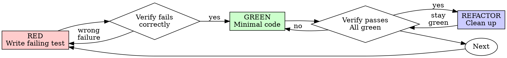

# Fix finished session spinner

> This archive contains visible conversation activity and tool records. Private model reasoning and system/developer instructions are not available here.
<!-- codex-event:{"kind":"state","timestamp":"2026-06-29T20:59:53.017Z","phase":null} -->
## Task state: task_started · 2026-06-29T20:59:53.017Z

```text
{
  "type": "task_started",
  "turn_id": "019f152e-710c-7b01-ba19-775592b37870",
  "started_at": 1782766792,
  "model_context_window": 258400,
  "collaboration_mode_kind": "default"
}
```

<!-- /codex-event -->

<!-- codex-event:{"kind":"user","timestamp":"2026-06-29T20:59:53.031Z","phase":null} -->
## User · 2026-06-29T20:59:53.031Z

why is this session still showing the spinner when it's finished? happens with all the commit ones 5f87b985c027


<!-- /codex-event -->

<!-- codex-event:{"kind":"progress","timestamp":"2026-06-29T21:00:06.427Z","phase":"commentary"} -->
## Codex progress · 2026-06-29T21:00:06.427Z

I’ll trace that run through the persisted state first, since the project instructions say UUIDs map to OmniHarness sessions. I’m also going to use the debugging/state skills here so the answer is grounded in the control-plane data rather than vibes.

<!-- /codex-event -->

<!-- codex-event:{"kind":"tool-call","timestamp":"2026-06-29T21:00:06.433Z","phase":null} -->
## Tool call: exec_command · 2026-06-29T21:00:06.433Z

```json
{
  "cmd": "sed -n '1,220p' /Users/masterman/.agents/skills/using-ultrapowers/SKILL.md",
  "workdir": "/Users/masterman/NLP/omniharness",
  "yield_time_ms": 10000,
  "max_output_tokens": 20000
}
```

<!-- /codex-event -->

<!-- codex-event:{"kind":"tool-call","timestamp":"2026-06-29T21:00:06.434Z","phase":null} -->
## Tool call: exec_command · 2026-06-29T21:00:06.434Z

```json
{
  "cmd": "sed -n '1,240p' /Users/masterman/.agents/skills/systematic-debugging/SKILL.md",
  "workdir": "/Users/masterman/NLP/omniharness",
  "yield_time_ms": 10000,
  "max_output_tokens": 20000
}
```

<!-- /codex-event -->

<!-- codex-event:{"kind":"tool-call","timestamp":"2026-06-29T21:00:06.461Z","phase":null} -->
## Tool call: exec_command · 2026-06-29T21:00:06.461Z

```json
{
  "cmd": "sed -n '1,240p' /Users/masterman/.agents/skills/client-server-state-invariants/SKILL.md",
  "workdir": "/Users/masterman/NLP/omniharness",
  "yield_time_ms": 10000,
  "max_output_tokens": 20000
}
```

<!-- /codex-event -->

<!-- codex-event:{"kind":"tool-call","timestamp":"2026-06-29T21:00:06.470Z","phase":null} -->
## Tool call: exec_command · 2026-06-29T21:00:06.470Z

```json
{
  "cmd": "sed -n '1,220p' /Users/masterman/.agents/skills/instrumenting-control-planes/SKILL.md",
  "workdir": "/Users/masterman/NLP/omniharness",
  "yield_time_ms": 10000,
  "max_output_tokens": 20000
}
```

<!-- /codex-event -->

<!-- codex-event:{"kind":"tool-result","timestamp":"2026-06-29T21:00:06.499Z","phase":null} -->
## Tool result: call_Aa7tQG6oU7SRju6LiK9dG92o · 2026-06-29T21:00:06.499Z

```text
Chunk ID: 46d05c
Wall time: 0.0000 seconds
Process exited with code 0
Original token count: 2019
Output:
---
name: using-ultrapowers
description: Use when starting any conversation - establishes how to find and use skills, requiring skill invocation before acting
---

<SUBAGENT-STOP>
If you were dispatched as a subagent to execute a specific task, skip this skill.
</SUBAGENT-STOP>

# Using Ultrapowers

Use relevant skills before acting, but keep process proportional to the task.

## Instruction Priority

1. User instructions and local repo instructions
2. Ultrapowers skills
3. Default model behavior

If the user says not to create extra repository isolation, or says to work directly in the current repository, follow that instruction.

## Core Rule

Before responding, ask:

1. Is there a process skill that governs how to approach this?
2. Is there an implementation skill that governs how to execute it?
3. Is the request substantial enough to justify that process, or is it a tiny mechanical edit?

If a skill applies and the task is substantial enough to justify it, use it before continuing. If the request is a tiny mechanical edit, make the edit directly with targeted verification.

## Proportional Skill Use

Do the smallest responsible workflow that matches the request.

For tiny, unambiguous mechanical edits, do the edit directly:

- changing a color value,
- fixing a typo,
- tweaking short copy,
- changing a prompt sentence,
- renaming a label,
- adjusting obvious spacing or formatting,
- making a one-line config or docs correction.

For these, do not run brainstorming, write a plan, or force TDD unless the change affects product behavior, data, persistence, control flow, user journeys, or non-obvious architecture.

Use the heavier process when the request is ambiguous, user-facing behavior changes, multiple files/modules are involved, the user journey can change, or the change could create regressions that are not obvious from a quick targeted check.

## Default Posture

- Work in the current repository by default.
- YOU WILL NEVER CREATE A BRANCH unless explicitly instructed.
- Ask the user whether we should work in worktrees as part of the planning.
- YOU WILL ONLY CREATE A WORKTREE if explicitly instructed.
- Keep skill use proportional. Tiny mechanical edits should stay tiny.
- Every project should have a `.gitignore`.
- Never commit or push secrets, credentials, local environment files, `node_modules`, dependency caches, build outputs, coverage output, logs, temporary files, or intermediate/generated artifacts unless the human explicitly asks to version a specific generated artifact.
- Deliver full product functionality by default. NO FAKE COMPONENTS, NO MOCKS, NO PLACEHOLDERS, NO FALLBACKS as substitutes for the requested functionality unless the human explicitly asks for a prototype or scaffold.
- For app, UI, and product-surface work, run a PM pass during planning. Treat it as mandatory default behavior, not optional polish.
- For app, UI, and product-surface work, consider `agentic-user-journey-testing` for important user stories, but do not run it without explicit user approval.
- Use `second-opinion` for substantial saved implementation plans, and for unusually hard, creative, high-risk, or architecture-heavy specs when an independent external review could improve the artifact. Prefer a different available coding harness for that review, such as Codex asking Claude Code or Claude Code asking Codex. If no different harness is available, the same harness is fine; the second opinion is still mandatory for matching artifacts.
- Refactor code when a file passes 1200 lines. Do not normalize oversized files as the default end state.
- Use user stories in specs and plans when they clarify behavior or value.
- Default UI work to `shadcn/ui` unless the user says otherwise.
- When designing UI from scratch, first inspect the available ShadCN Blocks at https://ui.shadcn.com/blocks for each screen, form, or major surface. Start from the closest matching block with `npx shadcn add <block-name>` or the block's source in https://github.com/shadcn-ui/ui, then edit it by adding, removing, or adapting controls. Do not invent a fresh layout before doing this block-selection pass.
- Before adding any individual UI control, check whether `shadcn/ui` already provides a control that does what is needed. Use the available shadcn control first, then customize it, instead of hand-building a one-off control.
- Treat desktop and mobile responsiveness as first-class from the beginning.
- Prefer explicit routing unless the framework strongly defaults to file-based routes.
- For React apps, use `building-react-apps` for state managers, explicit transitions, routing, refs, imports, package-manager defaults, and frontend configuration defaults.
- For React apps with server state, optimistic UI, caches, polling, SSE/WebSocket streams, background jobs, persistence, or client/server synchronization, use `client-server-state-invariants` during planning and verification.
- For React or Next.js slowness, root-load, compile-time, SSR/hydration, bundle, import-bloat, or UI dependency cleanup work, use `optimizing-react-next-apps`.
- Prefer strong instrumentation and auditability for backend behavior.
- When a project has backend or agent workflows, prefer a fully instrumented control plane: persist meaningful events, tool calls, actions, results, errors, and state transitions, and expose them through a CLI or other scriptable interface so the full system can be inspected and tested without the UI.
- Use `instrumenting-control-planes` when building, planning, reviewing, or debugging backend decisions, agent workflows, recovery paths, retries, deletes, long-running jobs, SSE/WebSocket streams, or user-visible failures.
- Use `learning-from-bugs` after diagnosing or fixing meaningful architecture, storage, memory, persistence, control-plane, or system-level bugs so reusable lessons become durable.
- Do not default to silent, masked, or over-abstracted errors.
- When a project has a frontend, prefer surfacing full backend error details and stack traces to the frontend so failures stay visible, debuggable, and testable end-to-end.
- Treat persistence of settings and preferences as explicit design work.
- For every meaningful UI setting, define whether it persists, where it is stored, how it is read and written, who owns it, and how reset, sync, migration, and testing are handled.

See `docs/ultrapowers-defaults.md` for the canonical fork defaults.

## Skill Priority

1. Process skills first
2. Implementation skills second

Examples:

- "Make this button blue" -> inspect the relevant file, make the small edit, do targeted verification
- "Update this prompt sentence" -> edit the prompt directly and verify the final text
- "Build a feature" -> `brainstorming` with a PM pass first, then `writing-plans`, then execution; consider approval-gated `agentic-user-journey-testing` for app workflows
- "Fix this bug" -> `systematic-debugging`, then the relevant implementation skill; if the root cause is meaningful or systemic, finish with `learning-from-bugs`
- "Review this change" -> `requesting-code-review`

## Examples Of User Override

- If a task feels risky and the user did not ask for extra repository isolation, keep working in the current repository unless the user explicitly instructs otherwise.
- If a stack supports file-based routing but the user says not to use it, choose an explicit routing approach instead.
- If a framework strongly defaults to file-based routing, such as Next.js App Router, use the framework-native routing model unless there is a good reason not to.
- If a frontend skill suggests `shadcn/ui` but the user wants another design system, follow the user.

## Red Flags

- "I need a whole workflow for this tiny edit" -> no. Use the smallest responsible process.
- "This is simple, so I need the whole process anyway" -> no. Tiny mechanical edits should stay tiny.
- "I'll create extra repository isolation just to be safe" -> forbidden unless the user clearly asked for it.
- "I already know the skill" -> read the current version before relying on it

```

<!-- /codex-event -->

<!-- codex-event:{"kind":"tool-result","timestamp":"2026-06-29T21:00:06.499Z","phase":null} -->
## Tool result: call_cCJuhlejnJJkfgKDdsoU8FfU · 2026-06-29T21:00:06.499Z

````text
Chunk ID: ae1967
Wall time: 0.0000 seconds
Process exited with code 0
Original token count: 1821
Output:
---
name: systematic-debugging
description: Use when encountering any bug, test failure, or unexpected behavior, before proposing fixes
---

# Systematic Debugging

## Overview

Random fixes waste time and create new bugs. Quick patches mask underlying issues.

**Core principle:** ALWAYS find root cause before attempting fixes. Symptom fixes are failure.

**Violating the letter of this process is violating the spirit of debugging.**

## The Iron Law

```
NO FIXES WITHOUT ROOT CAUSE INVESTIGATION FIRST
```

If you haven't completed Phase 1, you cannot propose fixes.

## When to Use

Use for ANY technical issue:
- Test failures
- Bugs in production
- Unexpected behavior
- Performance problems
- Build failures
- Integration issues

**Use this ESPECIALLY when:**
- Under time pressure (emergencies make guessing tempting)
- "Just one quick fix" seems obvious
- You've already tried multiple fixes
- Previous fix didn't work
- You don't fully understand the issue

**Don't skip when:**
- Issue seems simple (simple bugs have root causes too)
- You're in a hurry (rushing guarantees rework)
- Manager wants it fixed NOW (systematic is faster than thrashing)

## The Four Phases

You MUST complete each phase before proceeding to the next.

### Phase 1: Root Cause Investigation

**BEFORE attempting ANY fix:**

1. **Read Error Messages Carefully**
   - Don't skip past errors or warnings
   - They often contain the exact solution
   - Read stack traces completely
   - Note line numbers, file paths, error codes

2. **Reproduce Consistently**
   - Can you trigger it reliably?
   - What are the exact steps?
   - Does it happen every time?
   - If not reproducible → gather more data, don't guess

3. **Check Recent Changes**
   - What changed that could cause this?
   - Git diff, recent commits
   - New dependencies, config changes
   - Environmental differences

4. **Gather Evidence in Multi-Component Systems**

   **WHEN system has multiple components (CI → build → signing, API → service → database):**

   **BEFORE proposing fixes, add diagnostic instrumentation:**
   ```
   For EACH component boundary:
     - Log what data enters component
     - Log what data exits component
     - Verify environment/config propagation
     - Check state at each layer

   Run once to gather evidence showing WHERE it breaks
   THEN analyze evidence to identify failing component
   THEN investigate that specific component
   ```

   **Example (multi-layer system):**
   ```bash
   # Layer 1: Workflow
   echo "=== Secrets available in workflow: ==="
   echo "IDENTITY: ${IDENTITY:+SET}${IDENTITY:-UNSET}"

   # Layer 2: Build script
   echo "=== Env vars in build script: ==="
   env | grep IDENTITY || echo "IDENTITY not in environment"

   # Layer 3: Signing script
   echo "=== Keychain state: ==="
   security list-keychains
   security find-identity -v

   # Layer 4: Actual signing
   codesign --sign "$IDENTITY" --verbose=4 "$APP"
   ```

   **This reveals:** Which layer fails (secrets → workflow ✓, workflow → build ✗)

5. **Trace Data Flow**

   **WHEN error is deep in call stack:**

   See `root-cause-tracing.md` in this directory for the complete backward tracing technique.

   **Quick version:**
   - Where does bad value originate?
   - What called this with bad value?
   - Keep tracing up until you find the source
   - Fix at source, not at symptom

### Phase 2: Pattern Analysis

**Find the pattern before fixing:**

1. **Find Working Examples**
   - Locate similar working code in same codebase
   - What works that's similar to what's broken?

2. **Compare Against References**
   - If implementing pattern, read reference implementation COMPLETELY
   - Don't skim - read every line
   - Understand the pattern fully before applying

3. **Identify Differences**
   - What's different between working and broken?
   - List every difference, however small
   - Don't assume "that can't matter"

4. **Understand Dependencies**
   - What other components does this need?
   - What settings, config, environment?
   - What assumptions does it make?

### Phase 3: Hypothesis and Testing

**Scientific method:**

1. **Form Single Hypothesis**
   - State clearly: "I think X is the root cause because Y"
   - Write it down
   - Be specific, not vague

2. **Test Minimally**
   - Make the SMALLEST possible change to test hypothesis
   - One variable at a time
   - Don't fix multiple things at once

3. **Verify Before Continuing**
   - Did it work? Yes → Phase 4
   - Didn't work? Form NEW hypothesis
   - DON'T add more fixes on top

4. **When You Don't Know**
   - Say "I don't understand X"
   - Don't pretend to know
   - Ask for help
   - Research more

### Phase 4: Implementation

**Fix the root cause, not the symptom:**

1. **Create Failing Test Case**
   - Simplest possible reproduction
   - Automated test if possible
   - One-off test script if no framework
   - MUST have before fixing
   - Use the `ultrapowers:test-driven-development` skill for writing proper failing tests

2. **Implement Single Fix**
   - Address the root cause identified
   - ONE change at a time
   - No "while I'm here" improvements
   - No bundled refactoring

3. **Verify Fix**
   - Test passes now?
   - No other tests broken?
   - Issue actually resolved?
   - If the bug was meaningful or systemic, use `ultrapowers:learning-from-bugs` before declaring the fix complete.

4. **If Fix Doesn't Work**
   - STOP
   - Count: How many fixes have you tried?
   - If < 3: Return to Phase 1, re-analyze with new information
   - **If ≥ 3: STOP and question the architecture (step 5 below)**
   - DON'T attempt Fix #4 without architectural discussion

5. **If 3+ Fixes Failed: Question Architecture**

   **Pattern indicating architectural problem:**
   - Each fix reveals new shared state/coupling/problem in different place
   - Fixes require "massive refactoring" to implement
   - Each fix creates new symptoms elsewhere

   **STOP and question fundamentals:**
   - Is this pattern fundamentally sound?
   - Are we "sticking with it through sheer inertia"?
   - Should we refactor architecture vs. continue fixing symptoms?

   **Discuss with your human partner before attempting more fixes**

   This is NOT a failed hypothesis - this is a wrong architecture.

## Red Flags - STOP and Follow Process

If you catch yourself thinking:
- "Quick fix for now, investigate later"
- "Just try changing X and see if it works"
- "Add multiple changes, run tests"
- "Skip the test, I'll manually verify"
- "It's probably X, let me fix that"
- "I don't fully understand but this might work"
- "Pattern says X but I'll adapt it differently"
- "Here are the main problems: [lists fixes without investigation]"
- Proposing solutions before tracing data flow
- **"One more fix attempt" (when already tried 2+)**
- **Each fix reveals new problem in different place**

**ALL of these mean: STOP. Return to Phase 1.**

**If 3+ fixes failed:** Question the architecture (see Phase 4.5)

## your human partner's Signals You're Doing It Wrong

**Watch for these redirections:**
- "Is that not happening?" - You assumed without verifying
- "Will it show us...?" - You should have added evidence gathering
- "Stop guessing" - You're proposing fixes without understanding

````

<!-- /codex-event -->

<!-- codex-event:{"kind":"tool-result","timestamp":"2026-06-29T21:00:06.499Z","phase":null} -->
## Tool result: call_aFlIKaMumvGiYMIxYLihgYD9 · 2026-06-29T21:00:06.499Z

```text
Chunk ID: 4f6a76
Wall time: 0.0000 seconds
Process exited with code 0
Original token count: 1481
Output:
---
name: client-server-state-invariants
description: Use when planning, building, reviewing, or debugging React apps with server state, optimistic UI, caches, polling, SSE/WebSocket streams, background jobs, persistence, or client/server synchronization
---

# Client Server State Invariants

React bugs often expose deeper ownership mistakes. When client state, server state, cache state, stream state, and persisted state all exist, every plan needs explicit invariants.

## Core Rule

No UI surface may treat data as authoritative unless the payload proves ownership, freshness, completeness, ordering, and terminal state.

If those words are missing from the plan, the plan is probably baking in a race condition.

## Planning Checklist

For every React app that reads server/runtime state, the plan must answer:

1. **Owner:** What owns this state: server, client manager, URL, cache, stream, local storage, or worker/runtime?
2. **Token:** What owner token protects async results: `requestId`, `runId`, `projectPath`, `operationId`, `workerId + seq`, or equivalent?
3. **Provenance:** Is data server-authoritative, optimistic, cached preview, partial update, or historical fallback?
4. **Completeness:** Does the payload declare what scope it is complete for? What may it erase?
5. **Ordering:** What stable order is used: monotonic seq, `(createdAt, id)`, version, or cursor?
6. **State machine:** What are the legal states, terminal states, and transitions?
7. **Events:** Which server decisions are named events rather than client-side derivations?
8. **Loading shape:** Which states are bootstrap, first load, incremental refresh, reconnect, resync, recovery, and terminal error?
9. **Fallbacks:** Which legacy/fallback rows can render, and only after what authority is loaded?
10. **Tests:** Which race, stale-response, event-sequence, reconnect, and merge tests prove the invariants?

## Invariants To Require

- Cached and optimistic data may pre-render, but cannot satisfy full-load gates.
- Partial snapshots may add or refine state, but may not erase optimistic objects, delivered user input, read markers, or stream entries unless they declare complete scope.
- Every async response checks that its owner token still matches before mutating visible state.
- Mutation success handlers may navigate or clear UI only if they still own the current context, unless the action explicitly creates a new selected context.
- Timers and polling callbacks re-check ownership immediately before acting.
- Server decisions are emitted as named events; the client does not infer decisions by diffing snapshots.
- SSE/WebSocket streams have event ids, replay/resume, and an explicit resync path.
- Loading booleans are split by lifecycle stage. A leaf stream refresh must not unmount the whole page.
- Append-only content has one writer, one reader, stable ids, and monotonic cursors.
- Fallback DB rows or historical rows are gated behind stream loading and deduped by stable id plus safe equivalence.
- Status classifiers distinguish active, runnable, blocked, awaiting user, terminal, stale, and recoverable states.
- "Latest" queries have deterministic tie-breakers. Timestamp-only ordering is not enough.
- Hot paths use bounded reads and do not synchronously load large bodies, bridge probes, schema setup, or heavy app graphs.
- Process-local caches have explicit TTL/size bounds and invalidation rules.

## Test Matrix

Pick the rows that match the work. Do not rely on one happy-path UI test.

| Risk | Test shape |
| --- | --- |
| Stale async response | Start request A, switch owner, resolve A, assert it cannot mutate B |
| Optimistic object erased | Create local optimistic state, apply stale/partial snapshot, assert object remains |
| Cache masquerades as loaded | Hydrate cache preview, assert full-load gate waits for server authority |
| Mutation steals navigation | Start mutation, switch selection, resolve mutation, assert focus stays put |
| Timer/poll stale-fire | Use fake timers or deferred promises; callback must re-check owner before acting |
| Snapshot merge erases stream | Apply partial snapshot missing known entries, assert entries/read markers remain |
| Event stream gap | Bootstrap snapshot, emit events during disconnect, reconnect with last id, assert replay or resync |
| Server decision invisible | Exercise branch and assert named event such as `blocked`, `refused`, `gave_up`, or `error.surfaced` |
| State classifier wrong | Table-test every status into active/runnable/terminal/recoverable buckets |
| Fallback duplicates stream | Load fallback rows then stream entries, assert no duplicate or false chronology |
| Hot path bloats | Assert snapshots carry cursors not bodies; route returns before DB/heavy imports when possible |
| Timestamp tie | Insert equal timestamps, assert deterministic order by id/seq |

Use headless HTTP/SSE tests for control-plane decisions. Use React/unit tests for manager merging and ownership guards. Use Playwright only for real UI layout, focus, scroll, mobile computed styles, and visible affordances.

## Refuse These Shapes

- one `isLoading` boolean for bootstrap, refresh, reconnect, and recovery;
- cache or optimistic data treated as authoritative without provenance;
- async callbacks that mutate state without checking owner tokens;
- client-side derivation of server decisions;
- snapshot diffs used as the only way to know what happened;
- event streams without ids or resume;
- timestamp-only "latest" queries;
- parallel transcript or persistence surfaces that the frontend must reconcile;
- unbounded process caches introduced to hide slow storage;
- tests that prove only the DOM result when the bug is a server decision.

## Review Prompt

Ask this before implementation starts:

> What can arrive late, out of order, partially, twice, or after the user changes context, and what test proves it cannot corrupt visible state?

```

<!-- /codex-event -->

<!-- codex-event:{"kind":"tool-result","timestamp":"2026-06-29T21:00:06.510Z","phase":null} -->
## Tool result: call_u8T5xWrPDWEglIghp6Jfny9o · 2026-06-29T21:00:06.510Z

````text
Chunk ID: 38e5af
Wall time: 0.0000 seconds
Process exited with code 0
Original token count: 1303
Output:
---
name: instrumenting-control-planes
description: Use when building, planning, reviewing, or debugging apps with backend decisions, agent workflows, long-running jobs, SSE/WebSocket streams, recovery paths, deletes, retries, or user-visible failures
---

# Instrumenting Control Planes

Build the control plane as a product surface. If the server decides, refuses, retries, spawns, deletes, recovers, gives up, or fails, that decision must be observable by users, operators, and tests.

If a React UI consumes the control plane through server state, optimistic UI, caches, polling, SSE/WebSocket streams, or persisted runtime state, also use `client-server-state-invariants`.

## Core Rule

Every meaningful server-side state transition emits a named, durable event. The UI and tests consume the same production event surface.

Do not rely on snapshot diffs, rendered DOM state, logs only, or client-side re-derivation to prove what the server decided.

## Hot Path Rule

No user bootstrap, catalog, status, reconnect, or recovery request may depend on a lock-prone database write path or external health probe finishing. Serve these paths from a bounded read model, memory cache, append-only event log, or stale-but-marked snapshot; queue reconciliation writes outside the request. Every dependency on a database or bridge call in a hot path needs a short timeout, cancellation, and an explicit degraded response.

If SQLite, local files, or a single-writer store is used, assume writer contention can freeze readers at the worst moment. Use one writer, WAL/busy-timeout discipline, short transactions, bounded queues, and headless chaos tests that run bootstrap/reload while writes are active. A 25s UI request is a control-plane failure, even if the database eventually returns.

## Event Contract

For each backend or agent workflow, define:

- named events for decisions: `worker.spawned`, `worker.reattached`, `plan.ready`, `plan.review.blocked`, `recovery.gave_up`, `conversation.delete_failed`;
- payloads with stable ids, `prev`/`next` status when relevant, reason codes, and enough context to debug;
- `error.surfaced` or an equivalent user-facing failure event for every failure the user should know about;
- durable persistence or a bounded replay buffer so short disconnects do not erase history;
- a scriptable read path: CLI, HTTP endpoint, sqlite query, or event log command.

If a decision cannot be asserted from this surface, the design is incomplete.

If debugging a control-plane failure reveals a reusable lesson, use `ultrapowers:learning-from-bugs` after the fix is verified.

## Streaming Requirements

For SSE or WebSocket-like streams:

- emit named events alongside any snapshot/update frame;
- include monotonic event ids;
- support resume from the last seen id;
- replay missed events from a bounded buffer;
- emit an explicit resync-required event when replay is impossible;
- bootstrap from a snapshot, then tail events.

Snapshots show current truth. Named events show why it became true.

## Testing Standard

Control-plane tests should usually be headless HTTP/SSE scenario tests, not browser tests. Browser automation is for UI behavior; control-plane tests assert server decisions directly.

Write scenario assertions as event transcripts:

```ts
expect(events).toHaveEmitted("worker.spawned", { runId });
expect(events).toHaveEmitted("worker.status", { next: "running" });
chaos.killServer();
chaos.restartServer();
expect(events).toHaveEmitted("worker.reattached", { runId });
expect(events).not.toHaveEmitted("worker.recreated", { runId });
```

Chaos belongs outside production code paths: drop connections in the client, fail fetches in the harness, restart the server process, and use seeds for reproducibility.

## Refuse These Shapes

- silent early returns in server methods;
- swallowed `catch` blocks;
- client-side derivation of server decisions;
- response-code-only user failures;
- event streams without ids or resume;
- tests that infer control-plane behavior from rendered state;
- delete handlers that do not enumerate dependent rows or emit typed failure events;
- recovery loops without terminal events such as `gave_up` or `abandoned`;
- request handlers that wait on inline reconciliation writes, SQLite contention, or bridge `/doctor` checks before returning bootstrap data;
- test-only behavior branches in production code.

## Design Checklist

Before implementing a backend or agent workflow, answer:

1. What decisions can this workflow make?
2. What named event is emitted for each decision, including refusal and failure?
3. Where are events persisted or buffered?
4. How does a client resume after disconnect?
5. Which request paths must keep working while persistence or bridge dependencies are slow, locked, or stale?
6. How can a CLI or test harness inspect the exact event sequence without the UI?
7. Which headless scenario proves the happy path, failure path, recovery path, terminal state, and hot-path timeout/degraded path?
8. Which client state consumes these events, and how does it prove ownership, freshness, completeness, ordering, and replay/resync?

If the answer is "the UI can figure it out", name the missing event instead.

````

<!-- /codex-event -->

<!-- codex-event:{"kind":"progress","timestamp":"2026-06-29T21:00:15.064Z","phase":"commentary"} -->
## Codex progress · 2026-06-29T21:00:15.064Z

I’ve loaded the relevant debugging/control-plane guidance. Next I’m going straight at the authoritative records for `5f87b985c027`, then I’ll compare that with how the UI decides whether to keep showing a spinner.

<!-- /codex-event -->

<!-- codex-event:{"kind":"tool-call","timestamp":"2026-06-29T21:00:15.065Z","phase":null} -->
## Tool call: exec_command · 2026-06-29T21:00:15.065Z

```json
{
  "cmd": "pwd && rg --files -g 'sqlite.db' -g '*.db' -g 'AGENTS.md' -g 'package.json' -g 'docs/architecture/lifecycle-observability-and-testing.md'",
  "workdir": "/Users/masterman/NLP/omniharness",
  "yield_time_ms": 10000,
  "max_output_tokens": 20000
}
```

<!-- /codex-event -->

<!-- codex-event:{"kind":"tool-call","timestamp":"2026-06-29T21:00:15.072Z","phase":null} -->
## Tool call: exec_command · 2026-06-29T21:00:15.072Z

```json
{
  "cmd": "sqlite3 sqlite.db '.tables'",
  "workdir": "/Users/masterman/NLP/omniharness",
  "yield_time_ms": 10000,
  "max_output_tokens": 20000
}
```

<!-- /codex-event -->

<!-- codex-event:{"kind":"tool-call","timestamp":"2026-06-29T21:00:15.072Z","phase":null} -->
## Tool call: exec_command · 2026-06-29T21:00:15.072Z

```json
{
  "cmd": "rg -n \"spinner|isLoading|loading|commit|status|terminal|finished|completed|entries\" src shared tests docs package.json",
  "workdir": "/Users/masterman/NLP/omniharness",
  "yield_time_ms": 10000,
  "max_output_tokens": 30000
}
```

<!-- /codex-event -->

<!-- codex-event:{"kind":"tool-call","timestamp":"2026-06-29T21:00:15.109Z","phase":null} -->
## Tool call: exec_command · 2026-06-29T21:00:15.109Z

```json
{
  "cmd": "sed -n '1,220p' docs/architecture/lifecycle-observability-and-testing.md",
  "workdir": "/Users/masterman/NLP/omniharness",
  "yield_time_ms": 10000,
  "max_output_tokens": 30000
}
```

<!-- /codex-event -->

<!-- codex-event:{"kind":"tool-result","timestamp":"2026-06-29T21:00:15.151Z","phase":null} -->
## Tool result: call_6g47oWAci0y52ZKHDUR2Wpel · 2026-06-29T21:00:15.151Z

```text
Chunk ID: 02f5b4
Wall time: 0.0000 seconds
Process exited with code 0
Original token count: 44
Output:
/Users/masterman/NLP/omniharness
docs/architecture/lifecycle-observability-and-testing.md
sqlite.db
AGENTS.md
package.json
apps/vscode/package.json
apps/electron/package.json

```

<!-- /codex-event -->

<!-- codex-event:{"kind":"tool-result","timestamp":"2026-06-29T21:00:15.151Z","phase":null} -->
## Tool result: call_Kvs0dBFH7DIdrpg0WHSsLdX1 · 2026-06-29T21:00:15.151Z

```text
Chunk ID: 8aaa78
Wall time: 0.0000 seconds
Process exited with code 0
Original token count: 229
Output:
account_secrets                planning_review_rounds       
account_usage_snapshots        planning_review_runs         
accounts                       plans                        
artifact_streams               process_sessions             
auth_events                    queued_conversation_messages 
auth_pair_tokens               recovery_incidents           
auth_sessions                  runs                         
clarifications                 settings                     
conversation_read_markers      supervisor_interventions     
credit_events                  supervisor_scheduled_wakes   
execution_events               worker_assignments           
messages                       worker_counters              
notification_subscriptions     worker_credential_allocations
plan_items                     worker_token_usage           
planning_review_findings       workers                      

```

<!-- /codex-event -->

<!-- codex-event:{"kind":"tool-result","timestamp":"2026-06-29T21:00:15.157Z","phase":null} -->
## Tool result: call_e8MXT0LlYzKb9FXo2Ynsq08l · 2026-06-29T21:00:15.157Z

```text
Chunk ID: 7cbd15
Wall time: 0.0003 seconds
Process exited with code 0
Original token count: 237292
Output:
Warning: truncated output (original token count: 237292)
Total output lines: 8320

shared/locales/es.json:11:  "externalSessions.loading": "Cargando sesiones...",
shared/locales/es.json:45:  "settings.appearance.terminalFontSize": "Terminal",
shared/locales/es.json:46:  "settings.appearance.terminalFontSizeDescription": "Paneles de terminal y salida del agente.",
shared/locales/es.json:91:  "settings.models.codex.statusAvailable": "Codex is available via your ChatGPT subscription.",
shared/locales/es.json:92:  "settings.models.codex.statusUnavailable": "Codex subscription is not available. Log in via your terminal first.",
shared/locales/es.json:95:  "settings.models.codex.runLoginHint": "Run `codex login` in a terminal, then reload settings.",
shared/locales/es.json:96:  "settings.models.codex.runLogoutHint": "To remove your Codex login from this machine, run `codex logout` in a terminal.",
shared/locales/es.json:102:  "settings.models.loadingModels": "Cargando modelos...",
shared/locales/es.json:148:  "commit.menu.label": "Commit options",
shared/locales/es.json:149:  "commit.menu.autoCommitMilestones": "Auto-commit milestones",
shared/locales/es.json:150:  "commit.menu.alwaysPushOnCommit": "Always push on commit",
shared/locales/es.json:151:  "commit.menu.commitNow": "Commit now",
shared/locales/es.json:152:  "commit.menu.commitAndPushNow": "Commit and push now",
shared/locales/es.json:153:  "commit.menu.commitProjectNow": "Commit project",
shared/locales/es.json:154:  "commit.menu.commitAndPushProject": "Commit and push project",
shared/locales/es.json:162:  "commit.status.autoCommitCreated": "Auto-commit created: {commit}",
shared/locales/es.json:163:  "commit.status.autoCommitSkipped": "Auto-commit skipped: {reason}",
shared/locales/es.json:164:  "commit.status.autoCommitFailed": "Auto-commit failed: {reason}",
shared/locales/es.json:165:  "commit.status.pushCreated": "Auto-commit pushed: {commit}",
shared/locales/es.json:166:  "commit.status.pushFailed": "Auto-commit push failed: {reason}",
shared/locales/es.json:170:  "conversation.sidebar.status.completedAttention": "Finalizada con mensajes sin leer",
shared/locales/es.json:171:  "conversation.sidebar.status.awaitingUser": "Esperando tu respuesta",
shared/locales/es.json:221:  "fileViewer.loading": "Cargando archivo",
shared/locales/es.json:232:  "terminal.empty.loadingSession": "Cargando sesión",
shared/locales/es.json:233:  "terminal.empty.noActivity": "Aún no se ha registrado actividad para esta sesión.",
shared/locales/es.json:234:  "terminal.pending.connecting": "Conectando con la CLI...",
shared/locales/es.json:235:  "terminal.pending.thinking": "Pensando...",
shared/locales/es.json:236:  "terminal.pending.working": "Trabajando...",
shared/locales/es.json:281:  "settings.agents.onboarding.statusUnknown": "Authentication could not be verified.",
shared/locales/es.json:307:  "planning.review.completed": "Revisión completada",
shared/locales/es.json:343:  "terminal.permission.requested": "Permission requested",
shared/locales/es.json:344:  "terminal.permission.approved": "Permission granted",
shared/locales/es.json:345:  "terminal.permission.denied": "Permission denied",
shared/locales/es.json:346:  "terminal.permission.cancelled": "Permission cancelled",
shared/locales/es.json:347:  "terminal.diff.unknownFile": "Diff",
shared/locales/es.json:348:  "terminal.diff.copyAria": "Copiar diff",
shared/locales/es.json:349:  "boot.loading.aria": "Loading OmniHarness",
shared/locales/es.json:350:  "boot.loading.message": "Loading workspace...",
shared/locales/es.json:368:  "workers.sidebar.finishedTab": "Finished ({count})",
shared/locales/es.json:370:  "workers.sidebar.emptyFinished": "No finished workers for this conversation.",
shared/locales/es.json:381:  "conversation.loading": "Loading conversation...",
shared/locales/es.json:390:  "folder.picker.loading": "Loading...",
shared/locales/es.json:399:  "conversation.sidebar.loadingConversations": "Loading conversations...",
shared/locales/es.json:441:  "settings.agents.refreshAccountStatus": "Refresh {account} status",
shared/locales/es.json:447:  "settings.agents.refreshAccountStatusAction": "Refresh account status",
shared/locales/es.json:467:  "settings.memory.loading": "Loading…",
shared/locales/es.json:470:  "terminal.title": "Terminal",
shared/locales/es.json:471:  "terminal.resize": "Resize terminal panel",
shared/locales/es.json:472:  "terminal.open": "Open terminal",
shared/locales/es.json:473:  "terminal.close": "Close terminal",
shared/locales/es.json:476:  "terminal.permission.for": "For: {detail}",
shared/locales/es.json:484:  "git.workspace.status.noRepository": "No git repository detected",
shared/locales/es.json:485:  "git.workspace.status.clean": "Clean",
shared/locales/es.json:490:  "git.workspace.action.refresh": "Refresh git status",
shared/locales/es.json:539:  "events.failover.completed": "Switched workers: {outgoing} → {incoming}.",
shared/locales/es.json:553:  "vscode.panel.status.loading": "Loading...",
shared/locales/es.json:554:  "vscode.panel.status.loadingConversations": "Loading conversations...",
shared/locales/es.json:555:  "vscode.panel.status.connected": "Connected",
shared/locales/es.json:556:  "vscode.panel.status.disconnected": "Disconnected",
shared/locales/es.json:557:  "vscode.panel.status.starting": "Starting conversation...",
shared/locales/es.json:566:  "supervisor.activity.phase.completed": "Implementation completed",
shared/locales/es.json:573:  "supervisor.activity.worker.status.starting": "Starting",
shared/locales/es.json:574:  "supervisor.activity.worker.status.working": "Working",
shared/locales/es.json:575:  "supervisor.activity.worker.status.idle": "Waiting",
shared/locales/es.json:576:  "supervisor.activity.worker.status.stuck": "Stuck",
shared/locales/es.json:577:  "supervisor.activity.worker.status.recovering": "Recovering",
shared/locales/es.json:578:  "supervisor.activity.worker.status.generic": "{status}",
shared/locales/es.json:586:  "conversation.status.awaitingInput": "Awaiting input",
shared/locales/es.json:587:  "conversation.status.awaitingWorkerInput": "The worker asked for input before continuing.",
shared/locales/es.json:588:  "conversation.status.workerAwaitingAnswer": "{worker} is waiting on {count} answer(s)."
shared/locales/ko.json:11:  "externalSessions.loading": "세션 로드 중...",
shared/locales/ko.json:45:  "settings.appearance.terminalFontSize": "터미널",
shared/locales/ko.json:46:  "settings.appearance.terminalFontSizeDescription": "터미널 패널 및 에이전트 출력.",
shared/locales/ko.json:91:  "settings.models.codex.statusAvailable": "Codex is available via your ChatGPT subscription.",
shared/locales/ko.json:92:  "settings.models.codex.statusUnavailable": "Codex subscription is not available. Log in via your terminal first.",
shared/locales/ko.json:95:  "settings.models.codex.runLoginHint": "Run `codex login` in a terminal, then reload settings.",
shared/locales/ko.json:96:  "settings.models.codex.runLogoutHint": "To remove your Codex login from this machine, run `codex logout` in a terminal.",
shared/locales/ko.json:102:  "settings.models.loadingModels": "모델을 불러오는 중...",
shared/locales/ko.json:148:  "commit.menu.label": "Commit options",
shared/locales/ko.json:149:  "commit.menu.autoCommitMilestones": "Auto-commit milestones",
shared/locales/ko.json:150:  "commit.menu.alwaysPushOnCommit": "Always push on commit",
shared/locales/ko.json:151:  "commit.menu.commitNow": "Commit now",
shared/locales/ko.json:152:  "commit.menu.commitAndPushNow": "Commit and push now",
shared/locales/ko.json:153:  "commit.menu.commitProjectNow": "Commit project",
shared/locales/ko.json:154:  "commit.menu.commitAndPushProject": "Commit and push project",
shared/locales/ko.json:162:  "commit.status.autoCommitCreated": "Auto-commit created: {commit}",
shared/locales/ko.json:163:  "commit.status.autoCommitSkipped": "Auto-commit skipped: {reason}",
shared/locales/ko.json:164:  "commit.status.autoCommitFailed": "Auto-commit failed: {reason}",
shared/locales/ko.json:165:  "commit.status.pushCreated": "Auto-commit pushed: {commit}",
shared/locales/ko.json:166:  "commit.status.pushFailed": "Auto-commit push failed: {reason}",
shared/locales/ko.json:170:  "conversation.sidebar.status.completedAttention": "읽지 않은 메시지가 있는 완료됨",
shared/locales/ko.json:171:  "conversation.sidebar.status.awaitingUser": "입력을 기다리는 중",
shared/locales/ko.json:221:  "fileViewer.loading": "파일 불러오는 중",
shared/locales/ko.json:232:  "terminal.empty.loadingSession": "세션 불러오는 중",
shared/locales/ko.json:233:  "terminal.empty.noActivity": "이 세션에 대해 아직 기록된 활동이 없습니다.",
shared/locales/ko.json:234:  "terminal.pending.connecting": "CLI에 연결 중...",
shared/locales/ko.json:235:  "terminal.pending.thinking": "생각 중...",
shared/locales/ko.json:236:  "terminal.pending.working": "작업 중...",
shared/locales/ko.json:281:  "settings.agents.onboarding.statusUnknown": "Authentication could not be verified.",
shared/locales/ko.json:307:  "planning.review.completed": "리뷰 완료",
shared/locales/ko.json:343:  "terminal.permission.requested": "Permission requested",
shared/locales/ko.json:344:  "terminal.permission.approved": "Permission granted",
shared/locales/ko.json:345:  "terminal.permission.denied": "Permission denied",
shared/locales/ko.json:346:  "terminal.permission.cancelled": "Permission cancelled",
shared/locales/ko.json:347:  "terminal.diff.unknownFile": "Diff",
shared/locales/ko.json:348:  "terminal.diff.copyAria": "Diff 복사",
shared/locales/ko.json:349:  "boot.loading.aria": "Loading OmniHarness",
shared/locales/ko.json:350:  "boot.loading.message": "Loading workspace...",
shared/locales/ko.json:368:  "workers.sidebar.finishedTab": "Finished ({count})",
shared/locales/ko.json:370:  "workers.sidebar.emptyFinished": "No finished workers for this conversation.",
shared/locales/ko.json:381:  "conversation.loading": "Loading conversation...",
shared/locales/ko.json:390:  "folder.picker.loading": "Loading...",
shared/locales/ko.json:399:  "conversation.sidebar.loadingConversations": "Loading conversations...",
shared/locales/ko.json:441:  "settings.agents.refreshAccountStatus": "Refresh {account} status",
shared/locales/ko.json:447:  "settings.agents.refreshAccountStatusAction": "Refresh account status",
shared/locales/ko.json:467:  "settings.memory.loading": "Loading…",
shared/locales/ko.json:470:  "terminal.title": "Terminal",
shared/locales/ko.json:471:  "terminal.resize": "Resize terminal panel",
shared/locales/ko.json:472:  "terminal.open": "Open terminal",
shared/locales/ko.json:473:  "terminal.close": "Close terminal",
shared/locales/ko.json:476:  "terminal.permission.for": "For: {detail}",
shared/locales/ko.json:484:  "git.workspace.status.noRepository": "No git repository detected",
shared/locales/ko.json:485:  "git.workspace.status.clean": "Clean",
shared/locales/ko.json:490:  "git.workspace.action.refresh": "Refresh git status",
shared/locales/ko.json:539:  "events.failover.completed": "Switched workers: {outgoing} → {incoming}.",
shared/locales/ko.json:553:  "vscode.panel.status.loading": "Loading...",
shared/locales/ko.json:554:  "vscode.panel.status.loadingConversations": "Loading conversations...",
shared/locales/ko.json:555:  "vscode.panel.status.connected": "Connected",
shared/locales/ko.json:556:  "vscode.panel.status.disconnected": "Disconnected",
shared/locales/ko.json:557:  "vscode.panel.status.starting": "Starting conversation...",
shared/locales/ko.json:566:  "supervisor.activity.phase.completed": "Implementation completed",
shared/locales/ko.json:573:  "supervisor.activity.worker.status.starting": "Starting",
shared/locales/ko.json:574:  "supervisor.activity.worker.status.working": "Working",
shared/locales/ko.json:575:  "supervisor.activity.worker.status.idle": "Waiting",
shared/locales/ko.json:576:  "supervisor.activity.worker.status.stuck": "Stuck",
shared/locales/ko.json:577:  "supervisor.activity.worker.status.recovering": "Recovering",
shared/locales/ko.json:578:  "supervisor.activity.worker.status.generic": "{status}",
shared/locales/ko.json:586:  "conversation.status.awaitingInput": "Awaiting input",
shared/locales/ko.json:587:  "conversation.status.awaitingWorkerInput": "The worker asked for input before continuing.",
shared/locales/ko.json:588:  "conversation.status.workerAwaitingAnswer": "{worker} is waiting on {count} answer(s)."
shared/locales/fr.json:11:  "externalSessions.loading": "Chargement des sessions...",
shared/locales/fr.json:45:  "settings.appearance.terminalFontSize": "Terminal",
shared/locales/fr.json:46:  "settings.appearance.terminalFontSizeDescription": "Panneaux du terminal et sortie agent.",
shared/locales/fr.json:91:  "settings.models.codex.statusAvailable": "Codex is available via your ChatGPT subscription.",
shared/locales/fr.json:92:  "settings.models.codex.statusUnavailable": "Codex subscription is not available. Log in via your terminal first.",
shared/locales/fr.json:95:  "settings.models.codex.runLoginHint": "Run `codex login` in a terminal, then reload settings.",
shared/locales/fr.json:96:  "settings.models.codex.runLogoutHint": "To remove your Codex login from this machine, run `codex logout` in a terminal.",
shared/locales/fr.json:102:  "settings.models.loadingModels": "Chargement des modèles...",
shared/locales/fr.json:148:  "commit.menu.label": "Commit options",
shared/locales/fr.json:149:  "commit.menu.autoCommitMilestones": "Auto-commit milestones",
shared/locales/fr.json:150:  "commit.menu.alwaysPushOnCommit": "Always push on commit",
shared/locales/fr.json:151:  "commit.menu.commitNow": "Commit now",
shared/locales/fr.json:152:  "commit.menu.commitAndPushNow": "Commit and push now",
shared/locales/fr.json:153:  "commit.menu.commitProjectNow": "Commit project",
shared/locales/fr.json:154:  "commit.menu.commitAndPushProject": "Commit and push project",
shared/locales/fr.json:162:  "commit.status.autoCommitCreated": "Auto-commit created: {commit}",
shared/locales/fr.json:163:  "commit.status.autoCommitSkipped": "Auto-commit skipped: {reason}",
shared/locales/fr.json:164:  "commit.status.autoCommitFailed": "Auto-commit failed: {reason}",
shared/locales/fr.json:165:  "commit.status.pushCreated": "Auto-commit pushed: {commit}",
shared/locales/fr.json:166:  "commit.status.pushFailed": "Auto-commit push failed: {reason}",
shared/locales/fr.json:170:  "conversation.sidebar.status.completedAttention": "Terminée avec des messages non lus",
shared/locales/fr.json:171:  "conversation.sidebar.status.awaitingUser": "En attente de votre réponse",
shared/locales/fr.json:221:  "fileViewer.loading": "Chargement du fichier",
shared/locales/fr.json:232:  "terminal.empty.loadingSession": "Chargement de la session",
shared/locales/fr.json:233:  "terminal.empty.noActivity": "Aucune activité enregistrée pour cette session pour le moment.",
shared/locales/fr.json:234:  "terminal.pending.connecting": "Connexion a la CLI...",
shared/locales/fr.json:235:  "terminal.pending.thinking": "Reflexion...",
shared/locales/fr.json:236:  "terminal.pending.working": "Travail en cours...",
shared/locales/fr.json:281:  "settings.agents.onboarding.statusUnknown": "Authentication could not be verified.",
shared/locales/fr.json:307:  "planning.review.completed": "Révision terminée",
shared/locales/fr.json:343:  "terminal.permission.requested": "Permission requested",
shared/locales/fr.json:344:  "terminal.permission.approved": "Permission granted",
shared/locales/fr.json:345:  "terminal.permission.denied": "Permission denied",
shared/locales/fr.json:346:  "terminal.permission.cancelled": "Permission cancelled",
shared/locales/fr.json:347:  "terminal.diff.unknownFile": "Diff",
shared/locales/fr.json:348:  "terminal.diff.copyAria": "Copier le diff",
shared/locales/fr.json:349:  "boot.loading.aria": "Loading OmniHarness",
shared/locales/fr.json:350:  "boot.loading.message": "Loading workspace...",
shared/locales/fr.json:368:  "workers.sidebar.finishedTab": "Finished ({count})",
shared/locales/fr.json:370:  "workers.sidebar.emptyFinished": "No finished workers for this conversation.",
shared/locales/fr.json:381:  "conversation.loading": "Loading conversation...",
shared/locales/fr.json:390:  "folder.picker.loading": "Loading...",
shared/locales/fr.json:399:  "conversation.sidebar.loadingConversations": "Loading conversations...",
shared/locales/fr.json:441:  "settings.agents.refreshAccountStatus": "Refresh {account} status",
shared/locales/fr.json:447:  "settings.agents.refreshAccountStatusAction": "Refresh account status",
shared/locales/fr.json:467:  "settings.memory.loading": "Loading…",
shared/locales/fr.json:470:  "terminal.title": "Terminal",
shared/locales/fr.json:471:  "terminal.resize": "Resize terminal panel",
shared/locales/fr.json:472:  "terminal.open": "Open terminal",
shared/locales/fr.json:473:  "terminal.close": "Close terminal",
shared/locales/fr.json:476:  "terminal.permission.for": "For: {detail}",
shared/locales/fr.json:484:  "git.workspace.status.noRepository": "No git repository detected",
shared/locales/fr.json:485:  "git.workspace.status.clean": "Clean",
shared/locales/fr.json:490:  "git.workspace.action.refresh": "Refresh git status",
shared/locales/fr.json:539:  "events.failover.completed": "Switched workers: {outgoing} → {incoming}.",
shared/locales/fr.json:553:  "vscode.panel.status.loading": "Loading...",
shared/locales/fr.json:554:  "vscode.panel.status.loadingConversations": "Loading conversations...",
shared/locales/fr.json:555:  "vscode.panel.status.connected": "Connected",
shared/locales/fr.json:556:  "vscode.panel.status.disconnected": "Disconnected",
shared/locales/fr.json:557:  "vscode.panel.status.starting": "Starting conversation...",
shared/locales/fr.json:566:  "supervisor.activity.phase.completed": "Implementation completed",
shared/locales/fr.json:573:  "supervisor.activity.worker.status.starting": "Starting",
shared/locales/fr.json:574:  "supervisor.activity.worker.status.working": "Working",
shared/locales/fr.json:575:  "supervisor.activity.worker.status.idle": "Waiting",
shared/locales/fr.json:576:  "supervisor.activity.worker.status.stuck": "Stuck",
shared/locales/fr.json:577:  "supervisor.activity.worker.status.recovering": "Recovering",
shared/locales/fr.json:578:  "supervisor.activity.worker.status.generic": "{status}",
shared/locales/fr.json:586:  "conversation.status.awaitingInput": "Awaiting input",
shared/locales/fr.json:587:  "conversation.status.awaitingWorkerInput": "The worker asked for input before continuing.",
shared/locales/fr.json:588:  "conversation.status.workerAwaitingAnswer": "{worker} is waiting on {count} answer(s)."
shared/locales/it.json:11:  "externalSessions.loading": "Caricamento sessioni...",
shared/locales/it.json:45:  "settings.appearance.terminalFontSize": "Terminale",
shared/locales/it.json:46:  "settings.appearance.terminalFontSizeDescription": "Pannelli terminale e output agente.",
shared/locales/it.json:91:  "settings.models.codex.statusAvailable": "Codex is available via your ChatGPT subscription.",
shared/locales/it.json:92:  "settings.models.codex.statusUnavailable": "Codex subscription is not available. Log in via your terminal first.",
shared/locales/it.json:95:  "settings.models.codex.runLoginHint": "Run `codex login` in a terminal, then reload settings.",
shared/locales/it.json:96:  "settings.models.codex.runLogoutHint": "To remove your Codex login from this machine, run `codex logout` in a terminal.",
shared/locales/it.json:102:  "settings.models.loadingModels": "Caricamento modelli...",
shared/locales/it.json:148:  "commit.menu.label": "Commit options",
shared/locales/it.json:149:  "commit.menu.autoCommitMilestones": "Auto-commit milestones",
shared/locales/it.json:150:  "commit.menu.alwaysPushOnCommit": "Always push on commit",
shared/locales/it.json:151:  "commit.menu.commitNow": "Commit now",
sha…227292 tokens truncated… "commit") => {
src/ui/OmniApp.tsx:14:    loading: () => <BootShell />,
src/app/home/ConversationTranscriptManager.ts:12:import type { WorkerEntry } from "@/server/workers/entries-types";
src/app/home/ConversationTranscriptManager.ts:21:  entries: ConversationTranscriptEntry[];
src/app/home/ConversationTranscriptManager.ts:25:  status: "idle" | "loading" | "loaded" | "error";
src/app/home/ConversationTranscriptManager.ts:31:  entries: ConversationTranscriptEntry[];
src/app/home/ConversationTranscriptManager.ts:41:  entries: [],
src/app/home/ConversationTranscriptManager.ts:45:  status: "idle",
src/app/home/ConversationTranscriptManager.ts:100:    if (state.status === "loaded" || state.status === "loading") {
src/app/home/ConversationTranscriptManager.ts:143:    this.updateState(runId, { ...previous, status: "loading", lastError: null });
src/app/home/ConversationTranscriptManager.ts:153:          entries: coalesceWorkerEntriesById(response.entries) as ConversationTranscriptEntry[],
src/app/home/ConversationTranscriptManager.ts:158:          status: "loaded",
src/app/home/ConversationTranscriptManager.ts:166:        this.updateState(runId, { ...failing, status: "error", lastError: message });
src/app/home/ConversationTranscriptManager.ts:177:    this.updateState(runId, { ...previous, status: "loading", lastError: null });
src/app/home/ConversationTranscriptManager.ts:187:          entries: coalesceWorkerEntriesById([...current.entries, ...response.entries]) as ConversationTranscriptEntry[],
src/app/home/ConversationTranscriptManager.ts:192:          status: "loaded",
src/app/home/ConversationTranscriptManager.ts:200:        this.updateState(runId, { ...failing, status: "error", lastError: message });
src/app/home/ConversationTranscriptManager.ts:211:    this.updateState(runId, { ...previous, status: "loading", lastError: null });
src/app/home/ConversationTranscriptManager.ts:221:          entries: coalesceWorkerEntriesById([...response.entries, ...current.entries]) as ConversationTranscriptEntry[],
src/app/home/ConversationTranscriptManager.ts:226:          status: "loaded",
src/app/home/ConversationTranscriptManager.ts:234:        this.updateState(runId, { ...failing, status: "error", lastError: message });
src/app/home/ConversationTranscriptManager.ts:286:  const entries = useMemo(() => state.entries, [state.entries]);
src/app/home/ConversationTranscriptManager.ts:295:    entries,
src/app/home/ConversationTranscriptManager.ts:296:    isLoaded: state.status === "loaded",
src/app/home/types.ts:6:import type { WorkerEntry } from "@/server/workers/entries-types";
src/app/home/types.ts:13:export type RunMode = "implementation" | "planning" | "direct" | "commit";
src/app/home/types.ts:37:  status: string;
src/app/home/types.ts:52:  status: string;
src/app/home/types.ts:74:export type PlanItemRecord = { id: string; planId: string; title: string; phase: string | null; status: string };
src/app/home/types.ts:80:  status: string;
src/app/home/types.ts:119:  status: "pending" | "delivering" | "delivered" | "cancelled" | "failed";
src/app/home/types.ts:131:    status: "delivering" | "deferred";
src/app/home/types.ts:142:  status: string;
src/app/home/types.ts:153:  status: string;
src/app/home/types.ts:159:  completedAt?: string | null;
src/app/home/types.ts:169:  status: string;
src/app/home/types.ts:175:  completedAt?: string | null;
src/app/home/types.ts:195:  status: string;
src/app/home/types.ts:230:      status?: string | null;
src/app/home/types.ts:271:  status: "authenticated" | "not_authenticated" | "unknown" | "not_applicable";
src/app/home/types.ts:272:  method: "api_key" | "session_file" | "status_command" | "missing" | "unknown" | "not_applicable";
src/app/home/types.ts:277:  status: "reported" | "usage_only" | "unavailable" | "unknown";
src/app/home/types.ts:294:    status: "ok" | "warning" | "error";
src/app/home/types.ts:399:  status: string | null;
src/app/home/types.ts:400:  statusCheckedAt: string | null;
src/app/home/types.ts:414:  status: string;
src/app/api/workers/[workerId]/entries/route.ts:2:import { handleWorkerEntriesRequest } from "@/runtime/http/routes/worker-entries";
src/app/api/workers/[workerId]/entries/route.ts:13:  const label = `GET /api/workers/${workerId}/entries${url.search}`;
src/app/home/HomeApp.tsx:155:  for (const [runId, readAt] of Object.entries(optimistic)) {
src/app/home/HomeApp.tsx:220:    terminalPanelOpen,
src/app/home/HomeApp.tsx:221:    terminalPanelWidth,
src/app/home/HomeApp.tsx:306:  // stale sidebar entries, clearing the selected run ("new session form"
src/app/home/HomeApp.tsx:365:  const loadingWorkerHistoryIdsRef = useRef<Set<string>>(new Set());
src/app/home/HomeApp.tsx:393:    for (const [property, value] of Object.entries(textSizeStyles)) {
src/app/home/HomeApp.tsx:563:  // POST /api/conversations race and leave the spinner up for seconds.
src/app/home/HomeApp.tsx:595:      worker.availability.status !== "ok"
src/app/home/HomeApp.tsx:596:      || worker.authentication?.status === "not_authenticated"
src/app/home/HomeApp.tsx:597:      || worker.authentication?.status === "unknown"
src/app/home/HomeApp.tsx:625:    loadingWorkerHistoryIdsRef,
src/app/home/HomeApp.tsx:635:    commitWorkflowSettings,
src/app/home/HomeApp.tsx:670:      commitWorkflowSettings,
src/app/home/HomeApp.tsx:685:  const terminalPaneRef = useRef<HTMLDivElement | null>(null);
src/app/home/HomeApp.tsx:686:  useTerminalPanelResize(isResizingTerminalPanel, terminalPaneRef);
src/app/home/HomeApp.tsx:844:    const targetTab = matchingWorker.status === "cancelled" || matchingWorker.status === "stopped" || matchingWorker.status === "done" || matchingWorker.status === "completed" || matchingWorker.status === "error" || matchingWorker.status === "failed"
src/app/home/HomeApp.tsx:845:      ? "finished"
src/app/home/HomeApp.tsx:877:  const selectedAutoResumeFailureKey = selectedRun?.status === "failed"
src/app/home/HomeApp.tsx:888:    selectedRunStatus: selectedRun?.status ?? null,
src/app/home/HomeApp.tsx:891:    failedWorkerAvailabilityStatus: failedWorkerAvailability?.availability.status ?? null,
src/app/home/HomeApp.tsx:900:      || selectedRun.status !== "failed"
src/app/home/HomeApp.tsx:901:      || failedWorkerAvailability?.availability.status !== "ok"
src/app/home/HomeApp.tsx:930:        entries: autoResumeStateRef.current,
src/app/home/HomeApp.tsx:951:    failedWorkerAvailability?.availability.status,
src/app/home/HomeApp.tsx:996:      (m) => m.status === "pending" || m.status === "delivering",
src/app/home/HomeApp.tsx:1009:    commitWorkflowSettingsError: commitWorkflowSettings.error,
src/app/home/HomeApp.tsx:1065:    && (selectedRun?.mode === "direct" || selectedRun?.mode === "commit")
src/app/home/HomeApp.tsx:1066:    && selectedRun.status === "running"
src/app/home/HomeApp.tsx:1096:    selectedRunStatus: selectedRun?.status,
src/app/home/HomeApp.tsx:1097:    workerStatuses: selectedRunWorkersForDisplay.map((worker) => worker.status),
src/app/home/HomeApp.tsx:1164:      window.localStorage.removeItem("omni-worker-entries-cache:v1");
src/app/home/HomeApp.tsx:1215:  if (!routeReady || sessionQuery.isLoading || (authEnabled && !appUnlocked && Boolean(pairTokenFromUrl) && redeemPairMutation.isPending)) {
src/app/home/HomeApp.tsx:1274:    commitRenamingRun: (runId: string) => actions.handleCommitRenamingRun(runId, renameValue, state),
src/app/home/HomeApp.tsx:1325:          terminalPanelOpen={terminalPanelOpen}
src/app/home/HomeApp.tsx:1334:          onCommitNow={() => actions.handleManualCommitChat("commit")}
src/app/home/HomeApp.tsx:1335:          onCommitAndPushNow={() => actions.handleManualCommitChat("commit-push")}
src/app/home/HomeApp.tsx:1345:          onStopTerminalProcess={(workerId, terminalProcess) => {
src/app/home/HomeApp.tsx:1346:            if (selectedRunId && terminalProcess.processId) {
src/app/home/HomeApp.tsx:1347:              stopWorkerTerminalProcess.mutate({ runId: selectedRunId, workerId, terminalProcess });
src/app/home/HomeApp.tsx:1356:            terminalProcessId: stopWorkerTerminalProcess.variables.terminalProcess.id,
src/app/home/HomeApp.tsx:1436:        ref={terminalPaneRef}
src/app/home/HomeApp.tsx:1437:        className={`relative hidden h-full shrink-0 overflow-hidden border-l bg-background transition-[width,opacity] duration-150 ease-out lg:flex motion-reduce:transition-none ${terminalPanelOpen ? "border-border opacity-100" : "pointer-events-none border-transparent opacity-0"}`}
src/app/home/HomeApp.tsx:1438:        style={{ width: terminalPanelOpen ? terminalPanelWidth : 0 }}
src/app/home/HomeApp.tsx:1439:        aria-hidden={!terminalPanelOpen}
src/app/home/HomeApp.tsx:1440:        inert={!terminalPanelOpen ? true : undefined}
src/app/home/HomeApp.tsx:1445:          aria-label={t("terminal.resize")}
src/app/home/HomeApp.tsx:1450:            <span className="text-xs font-medium text-muted-foreground">{t("terminal.title")}</span>
src/app/home/HomeApp.tsx:1454:              aria-label={t("terminal.close")}
src/app/home/HomeApp.tsx:1455:              title={t("terminal.close")}
src/app/home/HomeApp.tsx:1462:            {terminalPanelOpen ? <InteractiveTerminal conversationId={selectedRunId} /> : null}
src/app/home/HomeApp.tsx:1489:              onStopTerminalProcess={(workerId, terminalProcess) => {
src/app/home/HomeApp.tsx:1490:                if (selectedRunId && terminalProcess.processId) {
src/app/home/HomeApp.tsx:1491:                  stopWorkerTerminalProcess.mutate({ runId: selectedRunId, workerId, terminalProcess });
src/app/home/HomeApp.tsx:1500:                terminalProcessId: stopWorkerTerminalProcess.variables.terminalProcess.id,
src/app/home/direct-control-activity.ts:2:import { isTerminalRunStatus } from "@/lib/run-status";
src/app/home/direct-control-activity.ts:11:  "completed",
src/app/home/direct-control-activity.ts:21:function hasWorkingStatus(statuses: readonly (string | null | undefined)[]) {
src/app/home/direct-control-activity.ts:22:  return statuses.some((status) => DIRECT_WORKING_STATUSES.has(normalizeWorkerStatus(status)));
src/app/home/direct-control-activity.ts:29:  const status = (entry.status ?? "pending").trim().toLowerCase();
src/app/home/direct-control-activity.ts:30:  return !TERMINAL_HUMAN_INPUT_STATUSES.has(status);
src/app/home/direct-control-activity.ts:45:  entries: readonly AgentOutputEntry[] | null | undefined,
src/app/home/direct-control-activity.ts:51:  for (const entry of entries ?? []) {
src/app/home/useHomeViewModel.ts:7:import { isTerminalRunStatus, normalizeRunStatus } from "@/lib/run-status";
src/app/home/useHomeViewModel.ts:16:import { buildDirectTerminalUserMessages } from "@/lib/worker-terminal-messages";
src/app/home/useHomeViewModel.ts:64:  const selectedRunIsTerminal = isTerminalRunStatus(selectedRun?.status);
src/app/home/useHomeViewModel.ts:65:  const selectedRunNeedsRecovery = normalizeRunStatus(selectedRun?.status) === "needs_recovery";
src/app/home/useHomeViewModel.ts:69:    selectedRun && selectedRun.mode === "implementation" && selectedRunPhase !== "planning" && selectedRun.status === "running",
src/app/home/useHomeViewModel.ts:77:  const isDirectConversation = selectedRunMode === "direct" || selectedRunMode === "commit";
src/app/home/useHomeViewModel.ts:90:      .filter((worker) => worker.availability.status === "ok")
src/app/home/useHomeViewModel.ts:150:        status: "warning" as const,
src/app/home/useHomeViewModel.ts:186:      workers: (state.workers || []) as Array<{ id: string; runId: string; status: string; updatedAt?: string }>,
src/app/home/useHomeViewModel.ts:242:          state: worker.status,
src/app/home/useHomeViewModel.ts:248:      // On a terminal/needs-recovery run, a worker stuck in an "active"
src/app/home/useHomeViewModel.ts:251:      // Terminal needs to render. Overlay the quiesced worker status
src/app/home/useHomeViewModel.ts:254:      // conversation render an empty terminal.
src/app/home/useHomeViewModel.ts:256:        return { ...candidateAgent, state: worker.status };
src/app/home/useHomeViewModel.ts:275:      ? { active: [], finished: selectedRunWorkersForDisplay }
src/app/home/useHomeViewModel.ts:292:        const status = normalizeWorkerStatus(worker.status);
src/app/home/useHomeViewModel.ts:293:        return status === "starting" || status === "working" || status === "stuck";
src/app/home/useHomeViewModel.ts:349:  const completionEvent = selectedRunExecutionEvents.find((event) => event.eventType === "run_completed") ?? null;
src/app/home/useHomeViewModel.ts:352:    if (!selectedRun || selectedRun.status !== "failed") {
src/app/home/useHomeViewModel.ts:377:    if (!selectedRun || selectedRun.status !== "failed" || !selectedRun.lastError) {
src/app/home/useHomeViewModel.ts:383:    const autoResumes = selectedRun.mode === "direct" || selectedRun.mode === "commit" || selectedRun.mode === "implementation";
src/app/home/useHomeViewModel.ts:387:      && failedWorkerAvailability?.availability.status === "ok";
src/app/home/useHomeViewModel.ts:415:        ? [`Current ${workerLabel} status: ${workerStatus}`]
src/app/home/useHomeViewModel.ts:421:    if (selectedRun?.status !== "awaiting_user") {
src/app/home/useHomeViewModel.ts:439:      .filter((item) => item.status.trim().toLowerCase() === "pending" && item.question.trim().length > 0)
src/app/home/useHomeViewModel.ts:451:  }, [selectedRun?.createdAt, selectedRun?.status, selectedRun?.updatedAt, selectedRunClarifications, selectedRunMessages]);
src/app/home/useHomeViewModel.ts:507:  const canSurfaceWorkerRecovery = selectedRun?.status === "running";
src/app/home/useHomeViewModel.ts:509:    conversationWorkerGroups.active.some((worker) => worker.status === "stuck")
src/app/home/useHomeViewModel.ts:537:    || selectedRun?.status === "awaiting_user"
src/app/home/useHomeViewModel.ts:538:    || selectedRun?.status === "failed";
src/app/home/worker-elicitations.ts:1:import type { WorkerEntry } from "@/server/workers/entries-types";
src/app/home/worker-elicitations.ts:20:  "completed",
src/app/home/worker-elicitations.ts:55:  return (entry.status ?? "pending").trim().toLowerCase();
src/app/home/worker-elicitations.ts:84:export function derivePendingElicitationsFromWorkerEntries(entries: readonly WorkerEntry[]): PendingWorkerElicitation[] {
src/app/home/worker-elicitations.ts:87:  for (const entry of entries) {
src/app/home/useAppErrors.ts:11:  commitWorkflowSettingsError?: unknown;
src/app/home/useAppErrors.ts:34:  commitWorkflowSettingsError,
src/app/home/useAppErrors.ts:67:    if (commitWorkflowSettingsError) {
src/app/home/useAppErrors.ts:68:      errors.push(buildInlineError(commitWorkflowSettingsError, {
src/app/home/useAppErrors.ts:70:        action: "Save commit workflow settings",
src/app/home/useAppErrors.ts:157:    commitWorkflowSettingsError,
src/app/home/constants.ts:2:import { GIT_AUTO_COMMIT_MILESTONES_SETTING, GIT_PUSH_ON_COMMIT_SETTING } from "@/lib/commit-workflow";
src/app/home/useFrozenRecentOrder.ts:11:// statuses and unread indicators can update without changing the list itself.
src/app/home/EventStreamSnapshotCacheManager.ts:202:      Object.entries(envelope.snapshots)
src/app/home/useHomeMutations.ts:7:import { getManualCommitPrompt, getManualProjectCommitPrompt, type ManualCommitAction } from "@/lib/commit-workflow";
src/app/home/useHomeMutations.ts:9:import type { WorkerTerminalProcess } from "@/lib/worker-terminal-processes";
src/app/home/useHomeMutations.ts:41:function isOptimisticallyStoppableWorkerStatus(status: string | null | undefined) {
src/app/home/useHomeMutations.ts:42:  const normalized = (status ?? "").trim().toLowerCase().split(":")[0]?.trim() ?? "";
src/app/home/useHomeMutations.ts:214:    if (worker.id === workerId || (isImplementationRun && isOptimisticallyStoppableWorkerStatus(worker.status))) {
src/app/home/useHomeMutations.ts:216:      return { ...worker, status: "cancelled", updatedAt: now };
src/app/home/useHomeMutations.ts:222:    worker.runId === runId && isOptimisticallyStoppableWorkerStatus(worker.status),
src/app/home/useHomeMutations.ts:227:      ? run?.status
src/app/home/useHomeMutations.ts:234:        ? { ...candidate, status: nextRunStatus, updatedAt: now, failedAt: null, lastError: null }
src/app/home/useHomeMutations.ts:267:    if (worker.runId !== runId || !isOptimisticallyStoppableWorkerStatus(worker.status)) {
src/app/home/useHomeMutations.ts:271:    return { ...worker, status: "cancelled", updatedAt: now };
src/app/home/useHomeMutations.ts:278:        ? { ...run, status: "cancelled", updatedAt: now, failedAt: null, lastError: null }
src/app/home/useHomeMutations.ts:346:  loadingWorkerHistoryIdsRef: React.RefObject<Set<string>>;
src/app/home/useHomeMutations.ts:366:  loadingWorkerHistoryIdsRef,
src/app/home/useHomeMutations.ts:464:  const commitWorkflowSettings = useMutation({
src/app/home/useHomeMutations.ts:472:        action: "Save commit workflow settings",
src/app/home/useHomeMutations.ts:961:          mode: "commit",
src/app/home/useHomeMutations.ts:1048:    mutationFn: async ({ runId, workerId, terminalProcess }: {
src/app/home/useHomeMutations.ts:1051:      terminalProcess: WorkerTerminalProcess;
src/app/home/useHomeMutations.ts:1056:        action: "stop_worker_terminal",
src/app/home/useHomeMutations.ts:1058:        terminalProcessId: terminalProcess.id,
src/app/home/useHomeMutations.ts:1059:        processId: terminalProcess.processId,
src/app/home/useHomeMutations.ts:1063:      action: "Stop worker terminal",
src/app/home/useHomeMutations.ts:1169:    if (!normalizedWorkerId || loadingWorkerHistoryIdsRef.current.has(normalizedWorkerId)) {
src/app/home/useHomeMutations.ts:1173:    loadingWorkerHistoryIdsRef.current.add(normalizedWorkerId);
src/app/home/useHomeMutations.ts:1200:      loadingWorkerHistoryIdsRef.current.delete(normalizedWorkerId);
src/app/home/useHomeMutations.ts:1209:    commitWorkflowSettings,
src/app/home/ConversationNotificationManager.ts:63:  status: string;
src/app/home/ConversationNotificationManager.ts:65:  completed: boolean;
src/app/home/ConversationNotificationManager.ts:247:function normalizeStatus(status: string | null | undefined) {
src/app/home/ConversationNotificationManager.ts:248:  return (status ?? "").trim().toLowerCase();
src/app/home/ConversationNotificationManager.ts:251:function isCompletedRun(run: RunRecord, completedRunIds: Set<string>) {
src/app/home/ConversationNotificationManager.ts:252:  const status = normalizeStatus(run.status);
src/app/home/ConversationNotificationManager.ts:253:  return status === "done" || status === "completed" || completedRunIds.has(run.id);
src/app/home/ConversationNotificationManager.ts:288:    clarification.runId === run.id && normalizeStatus(clarification.status) === "pending"
src/app/home/ConversationNotificationManager.ts:306:function buildObservedRunState(run: RunRecord, state: EventStreamState, completedRunIds: Set<string>): ObservedRunState {
src/app/home/ConversationNotificationManager.ts:308:    status: normalizeStatus(run.status),
src/app/home/ConversationNotificationManager.ts:309:    inputNeeded: normalizeStatus(run.status) === "awaiting_user" || hasPendingClarification(run, state),
src/app/home/ConversationNotificationManager.ts:310:    completed: isCompletedRun(run, completedRunIds),
src/app/home/ConversationNotificationManager.ts:421:    const completedRunIds = new Set((state.executionEvents ?? [])
src/app/home/ConversationNotificationManager.ts:422:      .filter((event) => event.eventType === "run_completed")
src/app/home/ConversationNotificationManager.ts:429:      const observed = buildObservedRunState(run, state, completedRunIds);
src/app/home/ConversationNotificationManager.ts:457:      if (!previous.completed && observed.completed) {
src/app/home/useTerminalPanelResize.ts:8: * Drag-to-resize for the desktop terminal pane. The pane sits between the
src/app/api/codex-auth/status/route.ts:2:import { handleCodexAuthStatusRequest } from "@/runtime/http/routes/codex-auth-status";

```

<!-- /codex-event -->

<!-- codex-event:{"kind":"tool-result","timestamp":"2026-06-29T21:00:15.157Z","phase":null} -->
## Tool result: call_9rFQ6sbExcEuiOV3IR1bln07 · 2026-06-29T21:00:15.157Z

````text
Chunk ID: a66375
Wall time: 0.0000 seconds
Process exited with code 0
Original token count: 2698
Output:
# Lifecycle Observability & Resilience Testing

> What we keep getting wrong, why our tests don't catch it, and the discipline that fixes it.

Related: `docs/architecture/hot-path-responsiveness-and-resource-leaks.md`
documents the May 2026 reload/worker-streaming latency incident and the
resource-ownership rules for keeping page bootstrap, SSE, and worker stream
paths responsive while agents are running.

Related: `docs/architecture/timing-determinism-audit.md` records the May 20,
2026 audit of race-prone frontend and control-plane patterns: cached snapshots
pretending to be authoritative, stale async callbacks, timer-owned actions,
timestamp-only ordering, and silent wake/lease contention.

## Why this document exists

Over a single afternoon we hit three production-class bugs that the existing test
suite did not catch and could not have caught:

1. **Session fails to reconnect after a server restart and gives up after the
   first attempt.** No user-visible message, no telemetry event, no recovery
   incident — just a silently dead session.
2. **`DELETE /conversations/:id` fails with a foreign-key constraint** because
   related rows in dependent tables were not cleared first. The error surfaces
   as an opaque 500.
3. **Running plan-improvement agents fails because leftover state blocks the
   new run.** The block is silent; the user sees nothing happen and assumes the
   button is broken.

These are not unrelated bugs. They share a single root cause:

> **The server makes state transitions that nobody observes.** Neither the user,
> nor the UI, nor any test client can tell what the server decided. So bugs in
> the *decision* (gave up too early, took the wrong branch, refused silently)
> are invisible.

This document records what we learned and the rules we now follow so that this
class of bug stops shipping.

Related incident note: `docs/architecture/supervisor-worker-switching-incident.md`
records the worker-switching failure from session `690d2fa9f2a7`, where
`awaiting_user` was treated as runnable, Gemini workers were live but persisted
as `starting`, and duplicate continuation workers were spawned.

Related direct-control note:
`docs/architecture/direct-control-session-regressions.md` records the
`ffb912d4d5d7`, `937e642f3535`, and `734cc38f4d7f` regressions around
lifecycle noise, stale queued send-now state, missing unified-stream worker
output, and permanent "Thinking..." indicators.

Related state-staleness note:
`docs/architecture/state-staleness-and-session-lifecycle-lessons.md` records
the `0785684884fa`, `14260d2a2df0`, `ecea142f7344`, and `18fc406457f3`
regressions around stale SSE/cache payloads, queued-message races, direct-run
status classification, unread markers, and worker-stream loading.

---

## What we found in the audit

A targeted audit of `src/app/api/events/route.ts` plus the planning, recovery,
and bridge-client subsystems revealed the structural gaps.

### 1. The SSE stream is a snapshot stream, not an event stream

`/api/events` emits exactly one named event: `update`, whose payload is the
*entire* current state of the world for the selected run (messages, plans,
runs, workers, planItems, clarifications, executionEvents, supervisor
interventions, queued messages, recovery incidents, review runs/rounds/findings).

There are no other named events. An observer cannot ask "did a worker spawn?"
or "was a recovery attempted?" — only "is the state now different?" To answer
the first kind of question the client must **diff snapshots**, which is:

- **Ambiguous** — many transitions produce identical visible state (a worker
  that was reattached and a worker that was recreated both end up as
  `status="running"`).
- **Lossy** — fast transitions can be coalesced inside a single snapshot
  interval and disappear entirely. (e.g. `starting → running → completed`
  inside one 15s window.)
- **Forced to re-derive server decisions** — the client has to reconstruct
  *why* state changed, which requires duplicating server logic.

### 2. There is no event ID and no resume

The SSE frames have no `id:` field. There is no `Last-Event-ID` handling on the
server. A client that disconnects and reconnects gets a fresh snapshot and has
*no way to know* whether events fired during the gap. For chaos testing (where
we deliberately drop the connection) this is fatal — we cannot assert
"between t0 and t1 the server emitted [X, Y, Z]" because the wire format does
not carry that information.

There is a `?snapshot=1` bootstrap endpoint, which is good. There is no
"give me the events I missed since id N" endpoint, which is the gap.

### 3. Several decisions are invisible to the wire

Concrete state transitions that **the server makes** but **never tells anyone
about**:

| Transition | Where it happens | Wire visibility |
|---|---|---|
| Worker spawned | `bridge-client/index.ts spawnAgent` | None — inferred from a row appearing |
| Worker reattached vs recreated after restart | `restart-control.ts` / recovery path | **None** — both look like `status="running"` |
| Recovery gave up after N attempts | `recoveryIncidents.autoAttemptCount` increments | Partial — count is visible but there is no terminal "abandoned" state |
| Plan readiness reached | `derivePlanningStatus()` — runs **client-side** | **None** — it is a client-side derivation, not a server event |
| Plan-improvement blocked by leftover state | `planning/review.ts` early-return | **None** — silent refusal |
| Conversation delete FK violation | `/api/conversations/[id]` DELETE | None as a typed event — only a 500 response |
| Message ack / persisted / streaming chunk | `conversations/send-message.ts` | Partial — only the resulting queued-message status |

Every row in this table is a bug class waiting to ship. If the server can
silently decide "I gave up", "I refused", "I took branch B not A", and the
test harness has no way to assert which branch it took, the test harness is
structurally incapable of catching the bug.

### 4. The user-facing surface mirrors the test-facing surface

The reason "leftover state blocked the run" did not show a user message is the
**same reason** no test could detect it: there was no event for it. Make the
state transitions observable, and both the UI fix and the test coverage
follow. Conversely, if a transition is observable only by re-deriving from a
snapshot diff, both the UI and tests will be brittle in the same ways.

This is the central insight: **observability for users and observability for
tests are the same problem**.

### 5. Playwright e2e is the wrong layer for resilience

The existing `tests/e2e/*.spec.ts` files boot Chromium. They are slow (tens of
seconds per scenario), flaky against real subprocess restarts, and they
exercise UI rendering rather than control-plane decisions. The bugs we are
hitting are not UI bugs — they are control-plane bugs. We should be hitting
HTTP/SSE directly, in Node, with no browser. The UI is one consumer of the
control plane; the chaos harness is another.

---

## The rules we now follow

These are not suggestions. They are the discipline that makes this class of
bug stop happening.

### Rule 1: every server-side state transition emits a named event

If the server makes a decision — spawn, reattach, recreate, give up, refuse,
delete, fail — that decision is published on the event stream with a
**named event type**, not just a state delta. Examples:

- `worker.spawned`, `worker.status` (with `prev` and `next`), `worker.terminal`
- `worker.reattached`, `worker.recreated`
- `plan.ready`, `plan.review.started`, `plan.review.finished`,
  `plan.review.blocked` (with a `reason`)
- `recovery.opened`, `recovery.attempt`, `recovery.gave_up`, `recovery.resolved`
- `conversation.deleted`, `conversation.delete_failed` (with FK details)
- `error.surfaced` — the catch-all for anything the user should know about

**Rule of thumb:** if a server method has an early-return, a try/catch that
swallows, or a branch that depends on a state check, it emits an event.
"Silent" is a code smell.

### Rule 2: errors that affect the user are events, not just response codes

A 500 with a body is not enough. A 200 that quietly did nothing is worse. Every
user-relevant failure publishes `error.surfaced` with a stable code, a
human-readable message, and the relevant run/worker/conversation ids. The UI's
job is to render `error.surfaced` events into toasts/banners. The test
harness's job is to assert that the expected `error.surfaced` event fired.

A failure that does not produce an `error.surfaced` event is a bug — even if
the underlying behaviour is technically correct — because it is invisible to
the user and to the tests.

### Rule 3: the event stream is SSE-spec compliant

- Every frame has an `id:` field. IDs are monotonic.
- The server keeps a bounded **ring buffer** (≥ 500 entries) of recent events.
- The server honours `Last-Event-ID` on reconnect: it replays everything after
  that id from the buffer, then resumes live streaming.
- If the requested id has fallen out of the buffer, the server emits a
  `stream.resync_required` event so the client knows to re-bootstrap from
  `?snapshot=1` rather than silently miss events.

This is the SSE spec. We were not following it. We are now.

### Rule 4: named events alongside, not instead of, snapshots

The existing `update` snapshot event stays. The UI keeps consuming it. The new
named events are *additional* frames on the same stream. Clients that don't
care about a given event type ignore it. There is no `?test=1` flag, no
separate test endpoint, no parallel surface that can drift.

If a transition is worth emitting for tests, it is worth emitting in
production. Anything else creates a second observability surface that will
diverge from reality.

### Rule 5: chaos testing belongs in the client, not the server

We do **not** add fault-injection code paths to the server. We do not add a
"random failure" mode. The server stays clean. Chaos lives in the test
client as middleware:

- An SSE wrapper that can drop the connection on command.
- A `fetch` wrapper that can fail a configurable percentage of requests.
- A harness that can SIGKILL the spawned server process and restart it.

Faults are seeded for reproducibility. Every failure has a seed; replaying
the seed reproduces the failure.

### Rule 6: tests assert on event sequences, not on rendered state

A scenario test reads like a transcript:

```
expect(events).toHaveEmitted("worker.spawned", { runId });
expect(events).toHaveEmitted("worker.status", { next: "running" });
chaos.killServer();
chaos.restartServer();
expect(events).toHaveEmitted("worker.reattached", { runId });
// not "worker.recreated", not absence — explicitly reattached
```

````

<!-- /codex-event -->

<!-- codex-event:{"kind":"user","timestamp":"2026-06-29T21:00:15.161Z","phase":null} -->
## User · 2026-06-29T21:00:15.161Z

oh and also 

Archive
Request failed with status 502


<!-- /codex-event -->

<!-- codex-event:{"kind":"progress","timestamp":"2026-06-29T21:00:24.574Z","phase":"commentary"} -->
## Codex progress · 2026-06-29T21:00:24.574Z

Got it, I’ll fold the Archive 502 into the same investigation. That may be a separate failing endpoint, but if both are happening around “finished” commit sessions, there’s a decent chance the lifecycle status is confusing multiple UI actions.

<!-- /codex-event -->

<!-- codex-event:{"kind":"tool-call","timestamp":"2026-06-29T21:00:24.580Z","phase":null} -->
## Tool call: exec_command · 2026-06-29T21:00:24.580Z

```json
{
  "cmd": "sqlite3 sqlite.db '.schema runs'",
  "workdir": "/Users/masterman/NLP/omniharness",
  "yield_time_ms": 10000,
  "max_output_tokens": 20000
}
```

<!-- /codex-event -->

<!-- codex-event:{"kind":"tool-call","timestamp":"2026-06-29T21:00:24.580Z","phase":null} -->
## Tool call: exec_command · 2026-06-29T21:00:24.580Z

```json
{
  "cmd": "sqlite3 sqlite.db '.schema workers'",
  "workdir": "/Users/masterman/NLP/omniharness",
  "yield_time_ms": 10000,
  "max_output_tokens": 20000
}
```

<!-- /codex-event -->

<!-- codex-event:{"kind":"tool-call","timestamp":"2026-06-29T21:00:24.603Z","phase":null} -->
## Tool call: exec_command · 2026-06-29T21:00:24.603Z

```json
{
  "cmd": "sqlite3 sqlite.db '.schema messages'",
  "workdir": "/Users/masterman/NLP/omniharness",
  "yield_time_ms": 10000,
  "max_output_tokens": 20000
}
```

<!-- /codex-event -->

<!-- codex-event:{"kind":"tool-call","timestamp":"2026-06-29T21:00:24.603Z","phase":null} -->
## Tool call: exec_command · 2026-06-29T21:00:24.603Z

```json
{
  "cmd": "sqlite3 sqlite.db '.schema execution_events'",
  "workdir": "/Users/masterman/NLP/omniharness",
  "yield_time_ms": 10000,
  "max_output_tokens": 20000
}
```

<!-- /codex-event -->

<!-- codex-event:{"kind":"tool-call","timestamp":"2026-06-29T21:00:24.642Z","phase":null} -->
## Tool call: exec_command · 2026-06-29T21:00:24.642Z

```json
{
  "cmd": "sqlite3 sqlite.db '.schema queued_conversation_messages'",
  "workdir": "/Users/masterman/NLP/omniharness",
  "yield_time_ms": 10000,
  "max_output_tokens": 20000
}
```

<!-- /codex-event -->

<!-- codex-event:{"kind":"tool-result","timestamp":"2026-06-29T21:00:24.669Z","phase":null} -->
## Tool result: call_PottpRumDqsISI0pHqCn9g9Z · 2026-06-29T21:00:24.669Z

```text
Chunk ID: 2ffb98
Wall time: 0.0000 seconds
Process exited with code 0
Original token count: 288
Output:
CREATE TABLE runs (
  id text PRIMARY KEY NOT NULL,
  plan_id text NOT NULL,
  status text NOT NULL,
  created_at integer NOT NULL,
  updated_at integer NOT NULL, project_path text, title text, parent_run_id text, forked_from_message_id text, failed_at integer, last_error text, preferred_worker_type text, allowed_worker_types text, preferred_worker_model text, preferred_worker_effort text, mode text NOT NULL DEFAULT 'implementation', spec_path text, artifact_plan_path text, planner_artifacts_json text, archived_at integer, auto_commit_milestones integer NOT NULL DEFAULT 0, push_on_commit integer NOT NULL DEFAULT 0, git_baseline_json text, completion_commit_sha text, memory_metadata_revision integer NOT NULL DEFAULT 0, last_memory_consolidation_at integer, git_workspace_json text, planner_readiness_verdict_json text, session_type text NOT NULL DEFAULT 'omni', phase text, preferred_worker_account_id text,
  FOREIGN KEY (plan_id) REFERENCES plans(id) ON UPDATE no action ON DELETE no action
);
CREATE INDEX runs_created_idx ON runs(created_at);
CREATE INDEX runs_archived_created_id_desc_idx ON runs(archived_at, created_at DESC, id DESC);

```

<!-- /codex-event -->

<!-- codex-event:{"kind":"tool-result","timestamp":"2026-06-29T21:00:24.669Z","phase":null} -->
## Tool result: call_N6KFkwWw77hd22pYobGNJqbv · 2026-06-29T21:00:24.669Z

```text
Chunk ID: 4d0708
Wall time: 0.0000 seconds
Process exited with code 0
Original token count: 573
Output:
CREATE TABLE workers (
  id text PRIMARY KEY NOT NULL,
  run_id text NOT NULL,
  type text NOT NULL,
  status text NOT NULL,
  cwd text NOT NULL,
  created_at integer NOT NULL,
  updated_at integer NOT NULL, output_log text NOT NULL DEFAULT '', bridge_session_id text, bridge_session_mode text, output_entries_json text NOT NULL DEFAULT '', current_text text NOT NULL DEFAULT '', last_text text NOT NULL DEFAULT '', title text NOT NULL DEFAULT '', initial_prompt text NOT NULL DEFAULT '', worker_number integer, active_work_started_at integer, active_work_duration_ms integer NOT NULL DEFAULT 0, worker_role text, allocation_key text, turn_generation integer NOT NULL DEFAULT 0,
  FOREIGN KEY (run_id) REFERENCES runs(id) ON UPDATE no action ON DELETE no action
);
CREATE INDEX workers_run_idx ON workers(run_id);
CREATE TRIGGER workers_work_timer_insert
AFTER INSERT ON workers
WHEN lower(substr(NEW.status, 1, instr(NEW.status || ':', ':') - 1)) = 'working'
BEGIN
  UPDATE workers
  SET active_work_started_at = COALESCE(NEW.active_work_started_at, NEW.created_at),
      active_work_duration_ms = COALESCE(NEW.active_work_duration_ms, 0)
  WHERE id = NEW.id;
END;
CREATE TRIGGER workers_work_timer_start
AFTER UPDATE OF status, updated_at ON workers
WHEN lower(substr(OLD.status, 1, instr(OLD.status || ':', ':') - 1)) != 'working'
  AND lower(substr(NEW.status, 1, instr(NEW.status || ':', ':') - 1)) = 'working'
BEGIN
  UPDATE workers
  SET active_work_started_at = NEW.updated_at,
      active_work_duration_ms = COALESCE(NEW.active_work_duration_ms, OLD.active_work_duration_ms, 0)
  WHERE id = NEW.id;
END;
CREATE TRIGGER workers_work_timer_stop
AFTER UPDATE OF status, updated_at ON workers
WHEN lower(substr(OLD.status, 1, instr(OLD.status || ':', ':') - 1)) = 'working'
  AND lower(substr(NEW.status, 1, instr(NEW.status || ':', ':') - 1)) != 'working'
BEGIN
  UPDATE workers
  SET active_work_started_at = NULL,
      active_work_duration_ms = COALESCE(OLD.active_work_duration_ms, 0)
        + (MAX(0, NEW.updated_at - COALESCE(OLD.active_work_started_at, OLD.updated_at, OLD.created_at, NEW.updated_at)) * 1000)
  WHERE id = NEW.id;
END;
CREATE INDEX workers_run_created_id_idx ON workers(run_id, created_at, id);
CREATE INDEX workers_created_id_idx ON workers(created_at, id);

```

<!-- /codex-event -->

<!-- codex-event:{"kind":"tool-result","timestamp":"2026-06-29T21:00:24.669Z","phase":null} -->
## Tool result: call_wwdunbdLHYHjLjEdglHGTxRY · 2026-06-29T21:00:24.669Z

```text
Chunk ID: 1d6dbc
Wall time: 0.0000 seconds
Process exited with code 0
Original token count: 147
Output:
CREATE TABLE messages (
  id text PRIMARY KEY NOT NULL,
  run_id text NOT NULL,
  role text NOT NULL,
  content text NOT NULL,
  worker_id text,
  created_at integer NOT NULL, kind text, superseded_at integer, edited_from_message_id text, attachments_json text,
  FOREIGN KEY (run_id) REFERENCES runs(id) ON UPDATE no action ON DELETE no action,
  FOREIGN KEY (worker_id) REFERENCES workers(id) ON UPDATE no action ON DELETE no action
);
CREATE INDEX messages_run_created_idx ON messages(run_id, created_at);
CREATE INDEX messages_run_created_id_idx ON messages(run_id, created_at, id);

```

<!-- /codex-event -->

<!-- codex-event:{"kind":"tool-result","timestamp":"2026-06-29T21:00:24.669Z","phase":null} -->
## Tool result: call_zY4BaYOUyZ0TjRbw7nxcOpKS · 2026-06-29T21:00:24.669Z

```text
Chunk ID: 242901
Wall time: 0.0000 seconds
Process exited with code 0
Original token count: 184
Output:
CREATE TABLE execution_events (
  id text PRIMARY KEY NOT NULL,
  run_id text NOT NULL,
  worker_id text,
  plan_item_id text,
  event_type text NOT NULL,
  details text,
  created_at integer NOT NULL, artifact_seq integer, details_hash text, details_preview text,
  FOREIGN KEY (run_id) REFERENCES runs(id) ON UPDATE no action ON DELETE no action,
  FOREIGN KEY (worker_id) REFERENCES workers(id) ON UPDATE no action ON DELETE no action,
  FOREIGN KEY (plan_item_id) REFERENCES plan_items(id) ON UPDATE no action ON DELETE no action
);
CREATE INDEX execution_events_run_created_idx ON execution_events(run_id, created_at);
CREATE INDEX execution_events_run_created_id_desc_idx ON execution_events(run_id, created_at DESC, id DESC);

```

<!-- /codex-event -->

<!-- codex-event:{"kind":"tool-result","timestamp":"2026-06-29T21:00:24.682Z","phase":null} -->
## Tool result: call_mQfOPrSNrMhDrDp5VbmlK2HU · 2026-06-29T21:00:24.682Z

```text
Chunk ID: 8a1ae1
Wall time: 0.0000 seconds
Process exited with code 0
Original token count: 243
Output:
CREATE TABLE queued_conversation_messages (
  id text PRIMARY KEY NOT NULL,
  run_id text NOT NULL,
  target_worker_id text,
  action text NOT NULL,
  content text NOT NULL,
  attachments_json text,
  status text NOT NULL,
  last_error text,
  created_at integer NOT NULL,
  updated_at integer NOT NULL,
  delivered_at integer,
  FOREIGN KEY (run_id) REFERENCES runs(id) ON UPDATE no action ON DELETE no action,
  FOREIGN KEY (target_worker_id) REFERENCES workers(id) ON UPDATE no action ON DELETE no action
);
CREATE INDEX queued_conversation_messages_run_status_created_idx ON queued_conversation_messages(run_id, status, created_at);
CREATE INDEX queued_conversation_messages_run_status_created_id_desc_idx ON queued_conversation_messages(run_id, status, created_at DESC, id DESC);
CREATE INDEX queued_conversation_messages_pending_run_created_id_desc_idx
  ON queued_conversation_messages(run_id, created_at DESC, id DESC)
  WHERE status IN ('pending', 'delivering');

```

<!-- /codex-event -->

<!-- codex-event:{"kind":"progress","timestamp":"2026-06-29T21:00:39.571Z","phase":"commentary"} -->
## Codex progress · 2026-06-29T21:00:39.571Z

The schema confirms the important pieces are split across `runs`, `workers`, `messages`, `execution_events`, and queue rows. I’m querying those now with the UUID as a prefix so we can see whether persistence says “done” while the worker record still says “working/running.”

<!-- /codex-event -->

<!-- codex-event:{"kind":"tool-call","timestamp":"2026-06-29T21:00:39.572Z","phase":null} -->
## Tool call: exec_command · 2026-06-29T21:00:39.572Z

```json
{
  "cmd": "sqlite3 -header -column sqlite.db \"select id, plan_id, status, mode, phase, datetime(created_at,'unixepoch') as created, datetime(updated_at,'unixepoch') as updated, datetime(archived_at,'unixepoch') as archived, title, failed_at, last_error, completion_commit_sha from runs where id like '5f87b985c027%';\"",
  "workdir": "/Users/masterman/NLP/omniharness",
  "yield_time_ms": 10000,
  "max_output_tokens": 20000
}
```

<!-- /codex-event -->

<!-- codex-event:{"kind":"tool-call","timestamp":"2026-06-29T21:00:39.572Z","phase":null} -->
## Tool call: exec_command · 2026-06-29T21:00:39.572Z

```json
{
  "cmd": "sqlite3 -header -column sqlite.db \"select id, run_id, type, status, datetime(created_at,'unixepoch') as created, datetime(updated_at,'unixepoch') as updated, bridge_session_id, bridge_session_mode, worker_role, title, length(output_log) as output_log_len, length(output_entries_json) as entries_json_len, length(current_text) as current_text_len, length(last_text) as last_text_len from workers where run_id like '5f87b985c027%' order by created_at;\"",
  "workdir": "/Users/masterman/NLP/omniharness",
  "yield_time_ms": 10000,
  "max_output_tokens": 20000
}
```

<!-- /codex-event -->

<!-- codex-event:{"kind":"tool-call","timestamp":"2026-06-29T21:00:39.573Z","phase":null} -->
## Tool call: exec_command · 2026-06-29T21:00:39.573Z

```json
{
  "cmd": "sqlite3 -header -column sqlite.db \"select id, role, worker_id, kind, datetime(created_at,'unixepoch') as created, substr(content,1,160) as content from messages where run_id like '5f87b985c027%' order by created_at;\"",
  "workdir": "/Users/masterman/NLP/omniharness",
  "yield_time_ms": 10000,
  "max_output_tokens": 30000
}
```

<!-- /codex-event -->

<!-- codex-event:{"kind":"tool-call","timestamp":"2026-06-29T21:00:39.573Z","phase":null} -->
## Tool call: exec_command · 2026-06-29T21:00:39.573Z

```json
{
  "cmd": "sqlite3 -header -column sqlite.db \"select id, worker_id, event_type, datetime(created_at,'unixepoch') as created, substr(details_preview,1,200) as preview, substr(details,1,300) as details from execution_events where run_id like '5f87b985c027%' order by created_at;\"",
  "workdir": "/Users/masterman/NLP/omniharness",
  "yield_time_ms": 10000,
  "max_output_tokens": 30000
}
```

<!-- /codex-event -->

<!-- codex-event:{"kind":"tool-call","timestamp":"2026-06-29T21:00:39.746Z","phase":null} -->
## Tool call: exec_command · 2026-06-29T21:00:39.746Z

```json
{
  "cmd": "sqlite3 -header -column sqlite.db \"select id, target_worker_id, action, status, last_error, datetime(created_at,'unixepoch') as created, datetime(updated_at,'unixepoch') as updated, datetime(delivered_at,'unixepoch') as delivered, substr(content,1,160) as content from queued_conversation_messages where run_id like '5f87b985c027%' order by created_at;\"",
  "workdir": "/Users/masterman/NLP/omniharness",
  "yield_time_ms": 10000,
  "max_output_tokens": 20000
}
```

<!-- /codex-event -->

<!-- codex-event:{"kind":"tool-result","timestamp":"2026-06-29T21:00:39.799Z","phase":null} -->
## Tool result: call_3PoT96H2JONDCmoMfXuzdRUu · 2026-06-29T21:00:39.799Z

```text
Chunk ID: c96617
Wall time: 0.0000 seconds
Process exited with code 0
Original token count: 135
Output:
id            plan_id                               status  mode    phase  created              updated              archived  title   failed_at  last_error  completion_commit_sha
------------  ------------------------------------  ------  ------  -----  -------------------  -------------------  --------  ------  ---------  ----------  ---------------------
5f87b985c027  970bb1be-6da1-4621-ae09-2f2cf66de2b0  done    commit         2026-06-29 20:49:26  2026-06-29 20:51:38            Commit                                              

```

<!-- /codex-event -->

<!-- codex-event:{"kind":"tool-result","timestamp":"2026-06-29T21:00:39.799Z","phase":null} -->
## Tool result: call_uyMimDvzeWVTWhWHY5ArPFqh · 2026-06-29T21:00:39.799Z

```text
Chunk ID: d59459
Wall time: 0.0000 seconds
Process exited with code 0
Original token count: 180
Output:
id                     run_id        type    status  created              updated              bridge_session_id                     bridge_session_mode  worker_role  title  output_log_len  entries_json_len  current_text_len  last_text_len
---------------------  ------------  ------  ------  -------------------  -------------------  ------------------------------------  -------------------  -----------  -----  --------------  ----------------  ----------------  -------------
5f87b985c027-worker-1  5f87b985c027  gemini  idle    2026-06-29 20:49:26  2026-06-29 20:51:38  970e35e2-ebe6-4935-9ab9-94ed676e4bcc  full-access                              4613            2                 0                 4613         

```

<!-- /codex-event -->

<!-- codex-event:{"kind":"tool-result","timestamp":"2026-06-29T21:00:39.799Z","phase":null} -->
## Tool result: call_tlHO8Z2i4ydZZAIduavgL0m0 · 2026-06-29T21:00:39.799Z

```text
Chunk ID: 94e402
Wall time: 0.0000 seconds
Process exited with code 0
Original token count: 187
Output:
id                                    role  worker_id  kind        created              content                                                                                                                                                         
------------------------------------  ----  ---------  ----------  -------------------  ----------------------------------------------------------------------------------------------------------------------------------------------------------------
41cf3fd1-8a30-46d1-829b-3980b5486a62  user             checkpoint  2026-06-29 20:49:26  Group all currently modified files into logical git commits, then push the current branch. Do not run tests. Do not modify files or do anything else. Only inspe

```

<!-- /codex-event -->

<!-- codex-event:{"kind":"tool-result","timestamp":"2026-06-29T21:00:39.799Z","phase":null} -->
## Tool result: call_KUcU9FH0Vdr6fzIuIAYk5tGI · 2026-06-29T21:00:39.799Z

```text
Chunk ID: 15da33
Wall time: 0.0000 seconds
Process exited with code 0
Original token count: 0
Output:

```

<!-- /codex-event -->

<!-- codex-event:{"kind":"tool-result","timestamp":"2026-06-29T21:00:39.799Z","phase":null} -->
## Tool result: call_HeDypwhOVlQhmAlbdQt7rdZ7 · 2026-06-29T21:00:39.799Z

```text
Chunk ID: b4c39d
Wall time: 0.0000 seconds
Process exited with code 0
Original token count: 0
Output:

```

<!-- /codex-event -->

<!-- codex-event:{"kind":"progress","timestamp":"2026-06-29T21:00:54.018Z","phase":"commentary"} -->
## Codex progress · 2026-06-29T21:00:54.018Z

For this run, the database is internally pretty clear: run `5f87b985c027` is `done`, mode `commit`, and its only worker is `idle`. No queued messages, no execution events. So the spinner is probably not coming from the run row itself; I’m checking the UI status derivation and the worker stream next.

<!-- /codex-event -->

<!-- codex-event:{"kind":"tool-call","timestamp":"2026-06-29T21:00:54.022Z","phase":null} -->
## Tool call: exec_command · 2026-06-29T21:00:54.022Z

```json
{
  "cmd": "find app-data/run-data/5f87b985c027 -maxdepth 2 -type f -print",
  "workdir": "/Users/masterman/NLP/omniharness",
  "yield_time_ms": 10000,
  "max_output_tokens": 20000
}
```

<!-- /codex-event -->

<!-- codex-event:{"kind":"tool-call","timestamp":"2026-06-29T21:00:54.035Z","phase":null} -->
## Tool call: exec_command · 2026-06-29T21:00:54.035Z

```json
{
  "cmd": "sed -n '1,220p' src/app/home/direct-control-activity.ts",
  "workdir": "/Users/masterman/NLP/omniharness",
  "yield_time_ms": 10000,
  "max_output_tokens": 20000
}
```

<!-- /codex-event -->

<!-- codex-event:{"kind":"tool-call","timestamp":"2026-06-29T21:00:54.036Z","phase":null} -->
## Tool call: exec_command · 2026-06-29T21:00:54.036Z

```json
{
  "cmd": "sed -n '1,620p' src/app/home/useHomeViewModel.ts",
  "workdir": "/Users/masterman/NLP/omniharness",
  "yield_time_ms": 10000,
  "max_output_tokens": 40000
}
```

<!-- /codex-event -->

<!-- codex-event:{"kind":"tool-call","timestamp":"2026-06-29T21:00:54.052Z","phase":null} -->
## Tool call: exec_command · 2026-06-29T21:00:54.052Z

```json
{
  "cmd": "sed -n '1,180p' src/lib/run-status.ts",
  "workdir": "/Users/masterman/NLP/omniharness",
  "yield_time_ms": 10000,
  "max_output_tokens": 20000
}
```

<!-- /codex-event -->

<!-- codex-event:{"kind":"tool-call","timestamp":"2026-06-29T21:00:54.097Z","phase":null} -->
## Tool call: exec_command · 2026-06-29T21:00:54.097Z

```json
{
  "cmd": "rg -n \"directControlActivity|hasActiveDirectControl|pending|thinking|working|isDirectConversation|selectedRunIsTerminal|isTerminalRunStatus|Commit\" src/app src/components src/lib",
  "workdir": "/Users/masterman/NLP/omniharness",
  "yield_time_ms": 10000,
  "max_output_tokens": 40000
}
```

<!-- /codex-event -->

<!-- codex-event:{"kind":"tool-result","timestamp":"2026-06-29T21:00:54.117Z","phase":null} -->
## Tool result: call_IXirV7bOSm6Lq9jQySw4IXia · 2026-06-29T21:00:54.117Z

```text
Chunk ID: b90522
Wall time: 0.0000 seconds
Process exited with code 1
Original token count: 16
Output:
find: app-data/run-data/5f87b985c027: No such file or directory

```

<!-- /codex-event -->

<!-- codex-event:{"kind":"tool-result","timestamp":"2026-06-29T21:00:54.117Z","phase":null} -->
## Tool result: call_ypVlZZltn2Yx6duIONzCvNcV · 2026-06-29T21:00:54.117Z

```text
Chunk ID: 3cd85e
Wall time: 0.0000 seconds
Process exited with code 0
Original token count: 1108
Output:
import { normalizeWorkerStatus } from "@/lib/conversation-workers";
import { isTerminalRunStatus } from "@/lib/run-status";
import type { AgentOutputEntry } from "@/lib/agent-output";

const DIRECT_WORKING_STATUSES = new Set(["starting", "working", "stuck", "recovering"]);
const TERMINAL_HUMAN_INPUT_STATUSES = new Set([
  "answered",
  "approved",
  "cancelled",
  "canceled",
  "completed",
  "declined",
  "denied",
  "failed",
  "rejected",
  "skipped",
]);

export type DirectControlPendingAssistantStatus = "connecting" | "thinking" | "working";

function hasWorkingStatus(statuses: readonly (string | null | undefined)[]) {
  return statuses.some((status) => DIRECT_WORKING_STATUSES.has(normalizeWorkerStatus(status)));
}

function isOpenInputEntry(entry: AgentOutputEntry) {
  if (entry.type !== "permission" && entry.type !== "elicitation") {
    return false;
  }
  const status = (entry.status ?? "pending").trim().toLowerCase();
  return !TERMINAL_HUMAN_INPUT_STATUSES.has(status);
}

function entryRequestKey(entry: AgentOutputEntry) {
  const raw = entry.raw;
  if (typeof raw !== "object" || raw === null) {
    return null;
  }
  const requestId = (raw as { requestId?: unknown }).requestId;
  return typeof requestId === "number" && Number.isFinite(requestId)
    ? `${entry.type}:${requestId}`
    : null;
}

export function countOpenHumanInputEntries(
  entries: readonly AgentOutputEntry[] | null | undefined,
  inputType?: "permission" | "elicitation",
) {
  const openByRequestKey = new Map<string, boolean>();
  let unkeyedOpenCount = 0;

  for (const entry of entries ?? []) {
    if (entry.type !== "permission" && entry.type !== "elicitation") {
      continue;
    }
    if (inputType && entry.type !== inputType) {
      continue;
    }

    const open = isOpenInputEntry(entry);
    const requestKey = entryRequestKey(entry);
    if (!requestKey) {
      if (open) {
        unkeyedOpenCount += 1;
      }
      continue;
    }

    openByRequestKey.set(requestKey, open);
  }

  return unkeyedOpenCount + [...openByRequestKey.values()].filter(Boolean).length;
}

export function hasPendingHumanInputSignal(agent: {
  pendingPermissions?: unknown[] | null;
  pendingElicitations?: unknown[] | null;
  outputEntries?: AgentOutputEntry[] | null;
}) {
  return (
    (agent.pendingPermissions?.length ?? 0) > 0
    || (agent.pendingElicitations?.length ?? 0) > 0
    || countOpenHumanInputEntries(agent.outputEntries) > 0
  );
}

export function resolveDirectControlPendingAssistantStatus(args: {
  isDirectConversation: boolean;
  pendingConversationWorkerId: string | null | undefined;
  busyConversationWorkerId: string | null | undefined;
  selectedRunStatus: string | null | undefined;
  workerStatuses: readonly (string | null | undefined)[];
  agentStates: readonly (string | null | undefined)[];
  hasAgentCurrentText: boolean;
  hasPendingHumanInput?: boolean;
}) {
  if (!args.isDirectConversation) {
    return null;
  }

  if (isTerminalRunStatus(args.selectedRunStatus)) {
    return null;
  }

  if (args.hasPendingHumanInput) {
    return null;
  }

  if (args.busyConversationWorkerId || hasWorkingStatus(args.workerStatuses) || hasWorkingStatus(args.agentStates)) {
    return "working";
  }

  if (args.hasAgentCurrentText) {
    return "thinking";
  }

  if (args.pendingConversationWorkerId) {
    return "connecting";
  }

  return null;
}

export function shouldShowDirectControlPendingAssistant(args: Parameters<typeof resolveDirectControlPendingAssistantStatus>[0]) {
  return resolveDirectControlPendingAssistantStatus(args) !== null;
}

export function isMutationPendingForSelectedRun(args: {
  isPending: boolean;
  mutationRunId: string | null | undefined;
  selectedRunId: string | null | undefined;
}) {
  return Boolean(
    args.isPending
      && args.selectedRunId
      && args.mutationRunId === args.selectedRunId,
  );
}

export function resolvePendingConversationWorkerId(args: {
  isPending: boolean;
  mutationRunId: string | null | undefined;
  selectedRunId: string | null | undefined;
  isImplementationConversation: boolean;
  selectedWorkerIds: readonly string[];
}) {
  if (args.isImplementationConversation) {
    return null;
  }

  if (!isMutationPendingForSelectedRun({
    isPending: args.isPending,
    mutationRunId: args.mutationRunId,
    selectedRunId: args.selectedRunId,
  })) {
    return null;
  }

  return args.selectedWorkerIds[0] ?? null;
}

```

<!-- /codex-event -->

<!-- codex-event:{"kind":"tool-result","timestamp":"2026-06-29T21:00:54.117Z","phase":null} -->
## Tool result: call_IG8cbRU2qrFF2morhjpyiM4h · 2026-06-29T21:00:54.117Z

```text
Chunk ID: d0b68a
Wall time: 0.0000 seconds
Process exited with code 0
Original token count: 6450
Output:
"use client";

import { useMemo } from "react";
import { buildConversationGroups } from "@/lib/conversations";
import { buildActiveConversationGroups, filterActiveConversationGroups } from "./sidebar-activity";
import { sidebarWorkerActivityManager } from "./SidebarWorkerActivityManager";
import { isTerminalRunStatus, normalizeRunStatus } from "@/lib/run-status";
import {
  buildWorkerLists,
  isWorkerActiveStatus,
  mergeWorkerLiveStatus,
  normalizeWorkerStatus,
  selectPrimaryConversationAgent,
  type ConversationWorkerRecord,
} from "@/lib/conversation-workers";
import { buildDirectTerminalUserMessages } from "@/lib/worker-terminal-messages";
import { resolveProjectScope } from "@/lib/project-scope";
import { buildConversationTimelineItems, compareNewestByCreatedAtThenId, compareOldestByCreatedAtThenId, filterPromotedPlanningTranscriptMessages, extractWorkerFailureDetail, getConversationTranscriptRunIds, getLatestUnresolvedWorkerStuckEvent, getWorkerModelOptions, parseProjectList, parseWorkerType, parseWorkerTypes, shouldRenderMessageInMainConversation, shouldShowConversationExecutionPanel, shouldShowExecutionEventInRunLog, shouldShowRecoverableRunningState, stripRunFailurePrefix, summarizeThought } from "./utils";
import { COMPOSER_WORKER_OPTIONS, WORKER_OPTIONS } from "./constants";
import type { AgentSnapshot, ClarificationRecord, ComposerMode, ComposerWorkerOption, ConversationModeOption, EventStreamState, ExecutionEventRecord, MessageRecord, NoticeDescriptor, PlanRecord, RunMode, RunRecord, SidebarGroup, SupervisorInterventionRecord } from "./types";
import type { WorkerCatalogResponse } from "./types";
import { sessionStateManager } from "./SessionStateManager";
import { useManagerSnapshot } from "@/lib/use-manager-snapshot";
import { isPermanentAutoResumeFailure } from "./auto-resume-selection";

const EMPTY_RUNS: RunRecord[] = [];
const EMPTY_PLANS: PlanRecord[] = [];

export interface UseHomeViewModelParams {
  state: EventStreamState;
  selectedRunId: string | null;
  selectedConversationMode: ConversationModeOption;
  selectedCliAgent: ComposerWorkerOption;
  selectedModel: string;
  selectedEffort: string;
  draftProjectPath: string | null;
  searchQuery: string;
  apiKeys: Record<string, string>;
  workerCatalogData: (WorkerCatalogResponse & { diagnostics?: unknown[] }) | undefined;
  readMarkers?: Record<string, string>;
}

export function useHomeViewModel({
  state,
  selectedRunId,
  selectedConversationMode,
  selectedCliAgent,
  selectedModel: _selectedModel,
  selectedEffort: _selectedEffort,
  draftProjectPath,
  searchQuery,
  apiKeys,
  workerCatalogData,
  readMarkers = {},
}: UseHomeViewModelParams) {
  const runs = (state.runs as RunRecord[] | undefined) ?? EMPTY_RUNS;
  const plans = (state.plans as PlanRecord[] | undefined) ?? EMPTY_PLANS;

  const explicitProjects = useMemo(() => parseProjectList(apiKeys.PROJECTS), [apiKeys.PROJECTS]);

  const selectedRun = selectedRunId ? runs.find((run) => run.id === selectedRunId) ?? null : null;
  const sessionSnapshot = useManagerSnapshot(sessionStateManager);
  const selectedSession = selectedRunId ? sessionSnapshot.sessionsByRunId[selectedRunId] ?? null : null;
  const selectedRunIsTerminal = isTerminalRunStatus(selectedRun?.status);
  const selectedRunNeedsRecovery = normalizeRunStatus(selectedRun?.status) === "needs_recovery";

  const selectedRunPhase = selectedRun?.phase ?? null;
  const isSupervisorRunning = Boolean(
    selectedRun && selectedRun.mode === "implementation" && selectedRunPhase !== "planning" && selectedRun.status === "running",
  );
  const selectedRunMode: RunMode = selectedRun?.mode || "implementation";
  // An Omni run is stored as mode "implementation"; its phase decides whether it
  // is still planning or being supervised.
  const isPlanningConversation = selectedRunMode === "planning"
    || (selectedRunMode === "implementation" && selectedRunPhase === "planning");
  const isImplementationConversation = selectedRunMode === "implementation" && selectedRunPhase !== "planning";
  const isDirectConversation = selectedRunMode === "direct" || selectedRunMode === "commit";
  const activeComposerMode: ComposerMode = selectedRun
    ? isPlanningConversation ? "planning" : isDirectConversation ? "direct" : "implementation"
    : selectedConversationMode;
  const hasSelectedRun = Boolean(selectedRun);

  const catalogWorkers = useMemo(
    () => workerCatalogData?.workers ?? [],
    [workerCatalogData?.workers],
  );

  const availableWorkerTypes = useMemo(
    () => catalogWorkers
      .filter((worker) => worker.availability.status === "ok")
      .map((worker) => worker.type),
    [catalogWorkers],
  );

  const configuredAllowedWorkerTypes = useMemo(
    () => parseWorkerTypes(apiKeys.WORKER_ALLOWED_TYPES),
    [apiKeys.WORKER_ALLOWED_TYPES],
  );

  const selectedRunAllowedWorkerTypes = useMemo(
    () => selectedRun?.allowedWorkerTypes?.trim() ? parseWorkerTypes(selectedRun.allowedWorkerTypes) : [],
    [selectedRun?.allowedWorkerTypes],
  );

  const activeAllowedWorkerTypes = useMemo(() => {
    const configured = hasSelectedRun && selectedRunMode !== "implementation"
      ? selectedRunAllowedWorkerTypes
      : configuredAllowedWorkerTypes;
    if (availableWorkerTypes.length === 0) {
      return configured;
    }

    const availableSet = new Set(availableWorkerTypes);
    const filtered = configured.filter((type) => availableSet.has(type));
    return filtered.length > 0 ? filtered : [...availableWorkerTypes];
  }, [availableWorkerTypes, configuredAllowedWorkerTypes, hasSelectedRun, selectedRunAllowedWorkerTypes, selectedRunMode]);

  const autoSelectedWorkerType = useMemo(() => {
    return activeAllowedWorkerTypes[0] ?? null;
  }, [activeAllowedWorkerTypes]);

  const shouldOfferAutoWorkerOption = activeComposerMode !== "direct";

  const composerWorkerOptions = useMemo(() => {
    const allowedSet = new Set(activeAllowedWorkerTypes);
    return shouldOfferAutoWorkerOption
      ? COMPOSER_WORKER_OPTIONS.filter((option) => option.value === "auto" || allowedSet.has(option.value))
      : WORKER_OPTIONS.filter((option) => allowedSet.has(option.value));
  }, [activeAllowedWorkerTypes, shouldOfferAutoWorkerOption]);

  const activeWorkerModelType = selectedCliAgent === "auto"
    ? autoSelectedWorkerType ?? activeAllowedWorkerTypes[0] ?? "codex"
    : selectedCliAgent;

  const activeWorkerModelOptions = useMemo(
    () => getWorkerModelOptions(workerCatalogData?.workerModels, activeWorkerModelType),
    [activeWorkerModelType, workerCatalogData?.workerModels],
  );

  const settingsWorkers = useMemo(() => {
    if (catalogWorkers.length > 0) {
      return catalogWorkers;
    }

    return WORKER_OPTIONS.map((option) => ({
      type: option.value,
      label: option.label,
      installation: { command: option.value, path: null, dir: null },
      availability: {
        status: "warning" as const,
        binary: false,
        apiKey: null,
        endpoint: null,
        message: "Worker availability has not loaded yet.",
      },
    }));
  }, [catalogWorkers]);

  const groupedProjects = useMemo(() => buildConversationGroups({
    explicitProjects,
    plans,
    runs,
  }), [explicitProjects, plans, runs]);

  const filteredProjects = useMemo(() => {
    if (!searchQuery) return groupedProjects;
    const normalizedSearchQuery = searchQuery.toLowerCase();
    return groupedProjects.map((group) => {
      // eslint-disable-next-line @typescript-eslint/no-explicit-any
      const groupRuns = (group.runs as any[]).filter((run: { path: string; title: string }) =>
        run.path.toLowerCase().includes(normalizedSearchQuery) ||
        run.title.toLowerCase().includes(normalizedSearchQuery) ||
        group.name.toLowerCase().includes(normalizedSearchQuery),
      );
      return { ...group, runs: groupRuns };
    }).filter((group) => group.runs.length > 0 || group.name.toLowerCase().includes(normalizedSearchQuery));
  }, [groupedProjects, searchQuery]);

  const activeProjects = useMemo(() => {
    const activeFilterNowMs = Date.now();
    const workerOutputObservedAtByRunId = sidebarWorkerActivityManager.getRunOutputAtRecord();
    const unsearched = buildActiveConversationGroups({
      groups: groupedProjects as unknown as SidebarGroup[],
      messages: (state.messages || []) as Array<{ runId: string; role: string; kind?: string | null; createdAt: string }>,
      readMarkers,
      workers: (state.workers || []) as Array<{ id: string; runId: string; status: string; updatedAt?: string }>,
      agents: (state.agents || []) as Array<{ name: string; state: string; updatedAt?: string; lastText?: string; currentText?: string; displayText?: string }>,
      queuedMessages: (state.queuedMessages || []) as Array<{ runId: string; createdAt: string; updatedAt: string; deliveredAt?: string | null }>,
      workerOutputObservedAtByRunId,
      nowMs: activeFilterNowMs,
      selectedRunId,
    });
    return filterActiveConversationGroups(unsearched, searchQuery);
  }, [groupedProjects, state.messages, state.workers, state.agents, state.queuedMessages, readMarkers, searchQuery, selectedRunId]);

  const selectedRunMessages = useMemo(
    () => (selectedRunId
      ? state.messages?.filter((m: { runId: string }) => m.runId === selectedRunId)
      : []),
    [selectedRunId, state.messages],
  );

  const selectedRunClarifications = useMemo(
    () => (selectedRunId
      ? ((state.clarifications || []) as ClarificationRecord[]).filter((clarification) => clarification.runId === selectedRunId)
      : []),
    [selectedRunId, state.clarifications],
  );

  const transcriptRunIds = useMemo(
    () => new Set(getConversationTranscriptRunIds({ selectedRunId, selectedRun })),
    [selectedRun, selectedRunId],
  );

  const filteredMessages = useMemo(() => {
    const messages = selectedRunId
      ? ((state.messages || []) as MessageRecord[]).filter((message) => transcriptRunIds.has(message.runId))
      : [];

    return filterPromotedPlanningTranscriptMessages({ messages, selectedRun });
  }, [selectedRun, selectedRunId, state.messages, transcriptRunIds]);

  const selectedRunWorkers = useMemo(() => {
    if (!selectedRunId || !state.workers) {
      return [] as ConversationWorkerRecord[];
    }

    return (state.workers || []).filter((worker: ConversationWorkerRecord) => worker.runId === selectedRunId);
  }, [selectedRunId, state.workers]);

  const conversationAgents = useMemo(() => {
    const liveAgentsById = new Map(
      ((state.agents || []) as AgentSnapshot[]).map((agent) => [agent.name, agent]),
    );

    return selectedRunWorkers.map((worker) => {
      const candidateAgent = liveAgentsById.get(worker.id);
      if (!candidateAgent) {
        return {
          name: worker.id,
          type: worker.type,
          state: worker.status,
          currentText: "",
          lastText: "",
        };
      }

      // On a terminal/needs-recovery run, a worker stuck in an "active"
      // state ("idle", "working", etc.) is stale runtime metadata — but the
      // snapshot still carries the persisted outputEntries that the
      // Terminal needs to render. Overlay the quiesced worker status
      // without dropping the rest of the agent. Previously this branch
      // returned a stub with no outputEntries, which made every direct
      // conversation render an empty terminal.
      if ((selectedRunIsTerminal || selectedRunNeedsRecovery) && isWorkerActiveStatus(candidateAgent.state)) {
        return { ...candidateAgent, state: worker.status };
      }

      return candidateAgent;
    });
  }, [selectedRunIsTerminal, selectedRunNeedsRecovery, selectedRunWorkers, state.agents]);

  const selectedRunWorkersForDisplay = useMemo(
    () => mergeWorkerLiveStatus(selectedRunWorkers, conversationAgents),
    [conversationAgents, selectedRunWorkers],
  );

  const primaryConversationAgent = useMemo(
    () => selectPrimaryConversationAgent(conversationAgents, isDirectConversation),
    [conversationAgents, isDirectConversation],
  );

  const conversationWorkerGroups = useMemo(
    () => selectedRunIsTerminal || selectedRunNeedsRecovery
      ? { active: [], finished: selectedRunWorkersForDisplay }
      : buildWorkerLists(selectedRunWorkersForDisplay),
    [selectedRunIsTerminal, selectedRunNeedsRecovery, selectedRunWorkersForDisplay],
  );

  const activeConversationWorkerIds = useMemo(
    () => new Set(conversationWorkerGroups.active.map((worker) => worker.id)),
    [conversationWorkerGroups.active],
  );

  const activeConversationAgents = useMemo(
    () => conversationAgents.filter((agent) => activeConversationWorkerIds.has(agent.name)),
    [activeConversationWorkerIds, conversationAgents],
  );

  const busyConversationWorkerId = !isImplementationConversation
    ? conversationWorkerGroups.active.find((worker) => {
        const status = normalizeWorkerStatus(worker.status);
        return status === "starting" || status === "working" || status === "stuck";
      })?.id ?? null
    : null;

  const isConversationStoppable = selectedSession
    ? selectedSession.capabilities.includes("stop")
    : isSupervisorRunning || Boolean(busyConversationWorkerId);

  const latestUserCheckpoint = selectedRunId
    ? [...((selectedRunMessages || []) as MessageRecord[])]
        .filter((message) => message.role === "user")
        .sort(compareNewestByCreatedAtThenId)[0] ?? null
    : null;

  const liveThoughts = useMemo(() => {
    const seen = new Set<string>();

    return activeConversationAgents
      .map((agent) => {
        const rawThought = agent.currentText?.trim() || agent.lastText?.trim() || "";
        const snippet = summarizeThought(rawThought);
        if (!snippet) {
          return null;
        }

        const key = `${agent.name}:${snippet}`;
        if (seen.has(key)) {
          return null;
        }
        seen.add(key);

        return {
          agentName: agent.name,
          text: rawThought,
          snippet,
          isLive: Boolean(agent.currentText?.trim()),
        };
      })
      .filter((thought): thought is { agentName: string; text: string; snippet: string; isLive: boolean } => Boolean(thought))
      .slice(0, 3);
  }, [activeConversationAgents]);

  const selectedRunExecutionEvents = useMemo(() => (
    ((state.executionEvents || []) as ExecutionEventRecord[])
      .filter((event) => event.runId === selectedRunId)
      .filter(shouldShowExecutionEventInRunLog)
      .sort(compareNewestByCreatedAtThenId)
  ), [selectedRunId, state.executionEvents]);

  const selectedRunSupervisorInterventions = useMemo(() => (
    ((state.supervisorInterventions || []) as SupervisorInterventionRecord[])
      .filter((intervention) => intervention.runId === selectedRunId)
      .sort(compareOldestByCreatedAtThenId)
  ), [selectedRunId, state.supervisorInterventions]);

  const latestExecutionEvent = selectedRunExecutionEvents[0] ?? null;
  const completionEvent = selectedRunExecutionEvents.find((event) => event.eventType === "run_completed") ?? null;

  const failedWorkerAvailability = useMemo(() => {
    if (!selectedRun || selectedRun.status !== "failed") {
      return null;
    }

    const candidateTypes = [
      parseWorkerType(selectedRun.preferredWorkerType),
      ...selectedRunAllowedWorkerTypes,
    ].filter((type, index, values) => Boolean(type) && values.indexOf(type) === index);

    for (const type of candidateTypes) {
      const worker = catalogWorkers.find((entry) => entry.type === type);
      if (worker) {
        return worker;
      }
    }

    return null;
  }, [catalogWorkers, selectedRun, selectedRunAllowedWorkerTypes]);

  const workerFailureDetail = useMemo(
    () => extractWorkerFailureDetail((selectedRunMessages || []) as MessageRecord[]),
    [selectedRunMessages],
  );

  const conversationFailure = useMemo((): NoticeDescriptor | null => {
    if (!selectedRun || selectedRun.status !== "failed" || !selectedRun.lastError) {
      return null;
    }

    // Only show "Reconnecting" when an auto-resume will actually run.
    // Planning runs surface the real error and rely on the user to act.
    const autoResumes = selectedRun.mode === "direct" || selectedRun.mode === "commit" || selectedRun.mode === "implementation";
    const failureKey = `${selectedRun.failedAt ?? ""}:${selectedRun.lastError ?? ""}`;
    const staleFailure = autoResumes
      && !isPermanentAutoResumeFailure(failureKey)
      && failedWorkerAvailability?.availability.status === "ok";
    const workerLabel = failedWorkerAvailability?.label;
    const workerStatus = failedWorkerAvailability?.availability.message;

    const rawMessage = stripRunFailurePrefix(selectedRun.lastError);
    const looksLikeStaleSession = typeof rawMessage === "string"
      && /not present in the bridge runtime|worker.*not.*found|session.*lost/i.test(rawMessage);

    return {
      tone: workerFailureDetail ? "warning" : staleFailure || looksLikeStaleSession ? "progress" : "error",
      action: workerFailureDetail
        ? "Worker setup"
        : staleFailure || looksLikeStaleSession
        ? "Reconnecting"
        : "Run failed",
      message: workerFailureDetail || (staleFailure
        ? `to ${workerLabel || "worker"}`
        : looksLikeStaleSession
        ? `the ${workerLabel || "worker"} session — this usually clears itself in a moment.`
        : rawMessage),
      suggestion: workerFailureDetail
        ? "Update the model or account, then resume."
        : staleFailure || looksLikeStaleSession
        ? undefined
        : "Send a message to reconnect; the worker will respawn automatically.",
      details: staleFailure || looksLikeStaleSession
        ? []
        : workerLabel && workerStatus
        ? [`Current ${workerLabel} status: ${workerStatus}`]
        : [],
    };
  }, [failedWorkerAvailability, selectedRun, workerFailureDetail]);

  const awaitingUserQuestionMessage = useMemo(() => {
    if (selectedRun?.status !== "awaiting_user") {
      return null;
    }
    const messages = (selectedRunMessages || []) as MessageRecord[];
    const latestUserAt = messages
      .filter((m) => m.role === "user")
      .reduce((max, m) => Math.max(max, new Date(m.createdAt).getTime()), 0);
    const candidates = messages
      .filter((m) => m.role === "supervisor"
        && (m.kind === "clarification" || m.kind === "implementation_confirmation")
        && new Date(m.createdAt).getTime() >= latestUserAt)
      .sort(compareNewestByCreatedAtThenId);
    if (candidates[0]) {
      return candidates[0];
    }

    const fallbackCreatedAt = selectedRun?.updatedAt ?? selectedRun?.createdAt ?? new Date(0).toISOString();
    const clarification = selectedRunClarifications
      .filter((item) => item.status.trim().toLowerCase() === "pending" && item.question.trim().length > 0)
      .map((item): MessageRecord => ({
        id: item.id,
        runId: item.runId,
        role: "supervisor",
        kind: "clarification",
        content: item.question,
        createdAt: item.createdAt ?? fallbackCreatedAt,
      }))
      .filter((item) => new Date(item.createdAt).getTime() >= latestUserAt)
      .sort(compareNewestByCreatedAtThenId)[0];
    return clarification ?? null;
  }, [selectedRun?.createdAt, selectedRun?.status, selectedRun?.updatedAt, selectedRunClarifications, selectedRunMessages]);

  const visibleMessages = useMemo(() => {
    const messages = (filteredMessages || []) as MessageRecord[];
    const renderedMessages = messages.filter(shouldRenderMessageInMainConversation);
    if (
      !awaitingUserQuestionMessage
      || renderedMessages.some((message) => message.id === awaitingUserQuestionMessage.id)
    ) {
      return renderedMessages;
    }
    return [...renderedMessages, awaitingUserQuestionMessage].sort(compareOldestByCreatedAtThenId);
  }, [awaitingUserQuestionMessage, filteredMessages]);

  const conversationTimelineItems = useMemo(() => buildConversationTimelineItems({
    messages: visibleMessages,
    executionEvents: selectedRunExecutionEvents,
    supervisorInterventions: selectedRunSupervisorInterventions,
    workers: selectedRunWorkersForDisplay,
    isPlanningRun: isPlanningConversation,
  }), [isPlanningConversation, selectedRunExecutionEvents, selectedRunSupervisorInterventions, selectedRunWorkersForDisplay, visibleMessages]);

  const conversationTimelineActivityCount = conversationTimelineItems.filter((item) => item.type === "activity").length;

  const directConversationMessages = useMemo(() => {
    if (!isDirectConversation) {
      return [];
    }

    return buildDirectTerminalUserMessages({
      messages: (filteredMessages || []) as MessageRecord[],
      agent: primaryConversationAgent,
      workers: selectedRunWorkers,
    });
  }, [filteredMessages, isDirectConversation, primaryConversationAgent, selectedRunWorkers]);

  const pendingPermissionAgent = activeConversationAgents.find((agent) => (agent.pendingPermissions?.length ?? 0) > 0) ?? null;
  const pendingElicitationAgent = activeConversationAgents.find((agent) => (agent.pendingElicitations?.length ?? 0) > 0) ?? null;

  const erroredAgent = activeConversationAgents.find((agent) => {
    if (agent.state === "error") {
      return true;
    }

    const active = isWorkerActiveStatus(agent.state) || Boolean(agent.currentText?.trim());
    return !active && Boolean(agent.lastError);
  }) ?? null;

  const latestWaitEvent = selectedRunExecutionEvents.find((event) => event.eventType === "supervisor_wait") ?? null;
  const latestPromptDeferredEvent = selectedRunExecutionEvents.find((event) => event.eventType === "worker_prompt_deferred") ?? null;

  const isSelectedConversationPreviewAvailable = !selectedRunId || state.snapshotRunId === selectedRunId;
  const isSelectedConversationLoaded = isSelectedConversationPreviewAvailable && state.snapshotSource === "server";

  const latestStuckEvent = getLatestUnresolvedWorkerStuckEvent(selectedRunExecutionEvents);

  const canSurfaceWorkerRecovery = selectedRun?.status === "running";
  const hasStuckWorker = canSurfaceWorkerRecovery && (
    conversationWorkerGroups.active.some((worker) => worker.status === "stuck")
    || activeConversationAgents.some((agent) => agent.state === "stuck")
    || Boolean(latestStuckEvent)
  );

  const hasActiveWorker = activeConversationAgents.some((agent) => (
    isWorkerActiveStatus(agent.state)
    || Boolean(agent.currentText?.trim())
  ));

  const showRecoverableRunningState = shouldShowRecoverableRunningState({
    selectedRun,
    latestUserCheckpoint,
    hasPendingPermission: Boolean(pendingPermissionAgent),
    hasPendingElicitation: Boolean(pendingElicitationAgent),
    hasActiveWorker,
    hasStuckWorker,
    activeWorkerCount: conversationWorkerGroups.active.length,
    latestExecutionEventCreatedAt: latestExecutionEvent?.createdAt,
  });

  const isConversationThinking = isSupervisorRunning
    || hasActiveWorker
    || Boolean(pendingPermissionAgent)
    || Boolean(pendingElicitationAgent)
    || hasStuckWorker
    || showRecoverableRunningState
    || Boolean(latestPromptDeferredEvent)
    || selectedRun?.status === "awaiting_user"
    || selectedRun?.status === "failed";

  // Don't gate the panel on `isSelectedConversationLoaded`: that flag
  // demotes to false whenever the snapshot transitions to a cache view
  // (e.g. during a brief SSE/cache re-hydration window), which would
  // otherwise make the supervisor activity bar disappear mid-run.
  // `shouldShowConversationExecutionPanel` is already conservative —
  // it requires a selected run and some signal of activity — so the
  // loaded-state gate is redundant for visibility.
  const showConversationExecution = shouldShowConversationExecutionPanel({
    selectedRun,
    isConversationThinking,
    executionEventCount: conversationTimelineActivityCount,
  });

  const currentProjectScope = resolveProjectScope({
    draftProjectPath,
    selectedRunId,
    plans,
    runs,
    explicitProjects,
  });

  const activePlan = selectedRunId && runs.length && plans.length
    ? plans.find((p) => p.id === runs.find((r) => r.id === selectedRunId)?.planId) ?? null
    : null;

  const activeConversationCwd = selectedRun?.projectPath || activePlan?.path || draftProjectPath || null;
  const workspaceSideWindowAvailable = Boolean(selectedRunId || draftProjectPath) && Boolean(currentProjectScope);

  return {
    runs,
    plans,
    explicitProjects,
    selectedRun,
    selectedSession,
    selectedRunMode,
    isImplementationConversation,
    isPlanningConversation,
    isDirectConversation,
    isSupervisorRunning,
    activeComposerMode,
    catalogWorkers,
    availableWorkerTypes,
    configuredAllowedWorkerTypes,
    selectedRunAllowedWorkerTypes,
    activeAllowedWorkerTypes,
    autoSelectedWorkerType,
    composerWorkerOptions,
    activeWorkerModelType,
    activeWorkerModelOptions,
    settingsWorkers,
    groupedProjects,
    filteredProjects,
    activeProjects,
    selectedRunMessages,
    filteredMessages,
    selectedRunWorkers,
    conversationAgents,
    selectedRunWorkersForDisplay,
    primaryConversationAgent,
    conversationWorkerGroups,
    activeConversationWorkerIds,
    activeConversationAgents,
    busyConversationWorkerId,
    isConversationStoppable,
    latestUserCheckpoint,
    liveThoughts,
    selectedRunExecutionEvents,
    selectedRunSupervisorInterventions,
    latestExecutionEvent,
    completionEvent,
    failedWorkerAvailability,
    workerFailureDetail,
    conversationFailure,
    visibleMessages,
    conversationTimelineItems,
    conversationTimelineActivityCount,
    directConversationMessages,
    pendingPermissionAgent,
    pendingElicitationAgent,
    erroredAgent,
    latestWaitEvent,

```

<!-- /codex-event -->

<!-- codex-event:{"kind":"tool-result","timestamp":"2026-06-29T21:00:54.117Z","phase":null} -->
## Tool result: call_iQJxf6B1OV2ClsQWotUs8Ogx · 2026-06-29T21:00:54.117Z

```text
Chunk ID: 56c132
Wall time: 0.0000 seconds
Process exited with code 0
Original token count: 311
Output:
const TERMINAL_RUN_STATUSES = new Set(["done", "failed", "cancelled", "promoting", "promoted"]);
const ARCHIVABLE_RUN_STATUSES = new Set(["done", "failed", "cancelled", "canceled", "promoted"]);

export function normalizeRunStatus(status: string | null | undefined) {
  return (status ?? "").trim().toLowerCase();
}

export function isTerminalRunStatus(status: string | null | undefined) {
  return TERMINAL_RUN_STATUSES.has(normalizeRunStatus(status));
}

export function isArchivableRunStatus(status: string | null | undefined) {
  return ARCHIVABLE_RUN_STATUSES.has(normalizeRunStatus(status));
}

export function isPlanningPhaseRun(run: { phase?: string | null } | null | undefined) {
  return run?.phase === "planning";
}

export function isActiveImplementationRun(run: { mode?: string | null; status?: string | null; phase?: string | null } | null | undefined) {
  return Boolean(run && run.mode === "implementation" && !isTerminalRunStatus(run.status));
}

export function isRunnableImplementationRun(run: { mode?: string | null; status?: string | null; phase?: string | null } | null | undefined) {
  return isActiveImplementationRun(run)
    && !isPlanningPhaseRun(run)
    && normalizeRunStatus(run?.status) !== "awaiting_user";
}

```

<!-- /codex-event -->

<!-- codex-event:{"kind":"tool-result","timestamp":"2026-06-29T21:00:54.141Z","phase":null} -->
## Tool result: call_rCzy2oY8sC9FZrRomT614Hg2 · 2026-06-29T21:00:54.141Z

```text
Chunk ID: 0b529e
Wall time: 0.0000 seconds
Process exited with code 0
Original token count: 12736
Output:
Warning: truncated output (original token count: 12736)
Total output lines: 493

src/components/PairDeviceDialog.tsx:26:    status: "pending" | "redeemed" | "expired" | "revoked";
src/components/PairDeviceDialog.tsx:132:        pairingStatus: "pending",
src/components/PairDeviceDialog.tsx:157:            pairingStatus: "pending",
src/components/PairDeviceDialog.tsx:192:    if (!open || !pairing?.expiresAt || pairingStatus !== "pending") {
src/components/PairDeviceDialog.tsx:201:    if (!open || !pairing?.pairingId || pairingStatus !== "pending" || isActivating || error) {
src/lib/run-status.ts:8:export function isTerminalRunStatus(status: string | null | undefined) {
src/lib/run-status.ts:21:  return Boolean(run && run.mode === "implementation" && !isTerminalRunStatus(run.status));
src/components/Terminal.tsx:52:  pendingAssistantStatus?: TerminalPendingAssistantStatus;
src/components/Terminal.tsx:107:  kind: "pending_assistant";
src/components/Terminal.tsx:113:export type TerminalPendingAssistantStatus = "connecting" | "thinking" | "working";
src/components/Terminal.tsx:148:      case "pending_assistant":
src/components/Terminal.tsx:150:      case "thinking":
src/components/Terminal.tsx:251:  if (latestActivityKind === "pending_assistant") {
src/components/Terminal.tsx:309:    case "pending_assistant":
src/components/Terminal.tsx:311:    case "thinking":
src/components/Terminal.tsx:375:function formatThoughtLabel(activity: Extract<AgentActivityItem, { kind: "thinking" }>) {
src/components/Terminal.tsx:432:      if (item.kind === "thinking") return item.inProgress;
src/components/Terminal.tsx:449:    if (item.kind === "thinking" || item.kind === "tool" || item.kind === "tool_group" || item.kind === "permission") {
src/components/Terminal.tsx:461:  return !["completed", "done", "in_progress", "working"].includes(status);
src/components/Terminal.tsx:465:  return ["in_progress", "working"].includes(status);
src/components/Terminal.tsx:469:  return ["pending", "in_progress", "working"].includes(status);
src/components/Terminal.tsx:518:      case "working":
src/components/Terminal.tsx:534:    case "working":
src/components/Terminal.tsx:745:  let pendingSeparator = false;
src/components/Terminal.tsx:765:      pendingSeparator = rows.length > 0;
src/components/Terminal.tsx:773:    if (pendingSeparator) {
src/components/Terminal.tsx:775:      pendingSeparator = false;
src/components/Terminal.tsx:998:  connecting: "terminal.pending.connecting",
src/components/Terminal.tsx:999:  thinking: "terminal.pending.thinking",
src/components/Terminal.tsx:1000:  working: "terminal.pending.working",
src/components/Terminal.tsx:1453:  activity: Extract<AgentActivityItem, { kind: "thinking" }>;
src/components/Terminal.tsx:1529:  item: Extract<AgentActivityItem, { kind: "thinking" | "tool" | "tool_group" | "permission" }>;
src/components/Terminal.tsx:1538:  const running = item.kind === "thinking"
src/components/Terminal.tsx:1541:      ? item.status === "pending"
src/components/Terminal.tsx:1544:  const markerTone = item.kind === "thinking" ? "thought" : item.kind === "permission" ? "permission" : isError ? "error" : "tool";
src/components/Terminal.tsx:1578:        {item.kind === "thinking" ? (
src/components/Terminal.tsx:1605:          item.status === "pending" ? (
src/components/Terminal.tsx:1655:    (item): item is Extract<AgentActivityItem, { kind: "thinking" | "tool" | "tool_group" | "permission" }> =>
src/components/Terminal.tsx:1656:      item.kind === "thinking" || item.kind === "tool" || item.kind === "tool_group" || item.kind === "permission",
src/components/Terminal.tsx:1835:  if (activity.kind === "pending_assistant") {
src/components/Terminal.tsx:1843:  const running = activity.kind === "thinking" || activity.kind === "work_summary"
src/components/Terminal.tsx:1883:        {activity.kind === "thinking" ? (
src/components/Terminal.tsx:1920:          activity.status === "pending" ? (
src/components/Terminal.tsx:1972:  pendingAssistantStatus = "thinking",
src/components/Terminal.tsx:2128:    const pendingAssistantActivity: TerminalActivityItem[] = shouldShowPendingAssistantActivity
src/components/Terminal.tsx:2130:          id: "pending-assistant",
src/components/Terminal.tsx:2131:          kind: "pending_assistant",
src/components/Terminal.tsx:2132:          status: pendingAssistantStatus,
src/components/Terminal.tsx:2142:    // entries the SDK back-dates to their thinking-started time).
src/components/Terminal.tsx:2151:    const sorted = [...userActivity, ...agentActivity, ...pendingAssistantActivity].sort((a, b) => {
src/components/Terminal.tsx:2172:  }, [agent, allowUserMessageFallback, entries, getUserMessageActions, pendingAssistantStatus, showPendingAssistantIndicator, summarizeWorkBlocks, userMessages]);
src/components/Terminal.tsx:2179:    const lastMeaningful = filteredActivity.filter((a) => a.kind !== "pending_assistant").at(-1);
src/lib/agent-output.ts:24:const RUNNING_TOOL_STATUSES = new Set(["pending", "in_progress", "working"]);
src/lib/agent-output.ts:25:const ACTIVE_THINKING_AGENT_STATES = new Set(["starting", "working", "recovering"]);
src/lib/agent-output.ts:26:const FALLBACK_TOOL_TITLE_PATTERN = /^Tool call(?:\s+\S+)?\s+(?:updated|completed|failed|cancelled|canceled|done|error|pending|in_progress|working)(?::.*)?$/i;
src/lib/agent-output.ts:63:      kind: "thinking";
src/lib/agent-output.ts:105:type MutableThinkingActivity = Extract<AgentActivityItem, { kind: "thinking" }>;
src/lib/agent-output.ts:262:  let pending: AgentOutputEntry[] = [];
src/lib/agent-output.ts:265:    if (pending.length === 0) {
src/lib/agent-output.ts:268:    if (hasFragmentedMessageEvidence(pending)) {
src/lib/agent-output.ts:269:      coalesced.push(mergeFragmentedMessageRun(pending));
src/lib/agent-output.ts:271:      coalesced.push(...pending);
src/lib/agent-output.ts:273:    pending = [];
src/lib/agent-output.ts:278:      pending.push(entry);
src/lib/agent-output.ts:918:function normalizeStatus(value: string | null | undefined, fallback = "pending"): string {
src/lib/agent-output.ts:1122:  return tools[tools.length - 1]?.status ?? "pending";
src/lib/agent-output.ts:1140:  let pendingTools: AgentToolActivity[] = [];
src/lib/agent-output.ts:1143:    if (pendingTools.length === 0) {
src/lib/agent-output.ts:1146:    if (pendingTools.length === 1) {
src/lib/agent-output.ts:1147:      grouped.push(pendingTools[0]);
src/lib/agent-output.ts:1149:      grouped.push(createToolGroup(pendingTools));
src/lib/agent-output.ts:1151:    pendingTools = [];
src/lib/agent-output.ts:1156:      pendingTools.push(item);
src/lib/agent-output.ts:1240:          kind: "thinking",
src/components/BugDropBootstrap.tsx:161:    let pendingOpen = false;
src/components/BugDropBootstrap.tsx:174:      pendingOpen = openBugDropWhenReady();
src/components/BugDropBootstrap.tsx:180:      if (!pendingOpen) {
src/components/BugDropBootstrap.tsx:184:      pendingOpen = false;
src/lib/worker-terminal-processes.ts:5:  | "pending"
src/lib/worker-terminal-processes.ts:8:  | "working"
src/lib/worker-terminal-processes.ts:30:  "pending",
src/lib/worker-terminal-processes.ts:33:  "working",
src/lib/worker-terminal-processes.ts:79:    case "pending":
src/lib/worker-terminal-processes.ts:82:    case "working":
src/components/WorkerCard.tsx:29:  pendingPermissions?: Array<{
src/components/WorkerCard.tsx:41:  pendingElicitations?: Array<{
src/components/WorkerCard.tsx:62:type PendingPermissionRecord = NonNullable<WorkerCardAgent["pendingPermissions"]>[number];
src/components/WorkerCard.tsx:63:type PendingElicitationRecord = NonNullable<WorkerCardAgent["pendingElicitations"]>[number];
src/components/WorkerCard.tsx:78:  pendingPermissions: PendingPermissionRecord[];
src/components/WorkerCard.tsx:79:  pendingElicitations?: PendingElicitationRecord[];
src/components/WorkerCard.tsx:355:  pendingPermissions,
src/components/WorkerCard.tsx:359:  pendingPermissions: PendingPermissionRecord[];
src/components/WorkerCard.tsx:365:  const permissionCount = pendingPermissions.length;
src/components/WorkerCard.tsx:408:            {pendingPermissions.map((permission) => (
src/components/WorkerCard.tsx:545:  pendingElicitations,
src/components/WorkerCard.tsx:549:  pendingElicitations: PendingElicitationRecord[];
src/components/WorkerCard.tsx:555:  const current = pendingElicitations[0];
src/components/WorkerCard.tsx:556:  const summary = t("worker.elicitation.summary", { count: pendingElicitations.length });
src/components/WorkerCard.tsx:686:  pendingPermissions,
src/components/WorkerCard.tsx:687:  pendingElicitations = [],
src/components/WorkerCard.tsx:725:      return pendingElicitations;
src/components/WorkerCard.tsx:727:    const liveRequestIds = new Set(pendingElicitations.map((elicitation) => elicitation.requestId));
src/components/WorkerCard.tsx:729:      ...pendingElicitations,
src/components/WorkerCard.tsx:732:  }, [pendingElicitations, streamPendingElicitations]);
src/components/WorkerCard.tsx:835:          pendingElicitations={effectivePendingElicitations}
src/components/WorkerCard.tsx:839:      {pendingPermissions.length > 0 ? <PermissionWarning workerId={workerId} pendingPermissions={pendingPermissions} onRespondPermission={onRespondPermission} /> : null}
src/components/InteractiveTerminal.tsx:7:  /** Conversation (run) id whose working directory the shell opens in. */
src/components/InteractiveTerminal.tsx:47:    let pendingInput = "";
src/components/InteractiveTerminal.tsx:50:      if (inputInFlight || pendingInput === "" || !terminalId) {
src/components/InteractiveTerminal.tsx:54:      const data = pendingInput;
src/components/InteractiveTerminal.tsx:55:      pendingInput = "";
src/components/InteractiveTerminal.tsx:58:        if (pendingInput !== "") {
src/components/InteractiveTerminal.tsx:112:        pendingInput += data;
src/lib/commit-workflow.ts:4:export type ManualCommitAction = "commit" | "commit-push";
src/lib/commit-workflow.ts:6:export const MANUAL_COMMIT_CHAT_PROMPT = "Commit ONLY the files you touched during this conversation/session. Do not stage or commit any other modified files in the working tree, even if they show up in `git status` — they may be unrelated work. Stage just the paths you changed in this session, group them into logical git commits, and stop. Do not run tests. Do not modify files or do anything else.";
src/lib/commit-workflow.ts:7:export const MANUAL_COMMIT_CHAT_PUSH_PROMPT = "Commit ONLY the files you touched during this conversation/session, then push the current branch. Do not stage or commit any other modified files in the working tree, even if they show up in `git status` — they may be unrelated work. Stage just the paths you changed in this session, group them into logical git commits, push, and stop. Do not run tests. Do not modify files or do anything else.";
src/lib/commit-workflow.ts:37:export function getManualCommitPrompt(action: ManualCommitAction) {
src/lib/commit-workflow.ts:41:export function getManualProjectCommitPrompt(action: ManualCommitAction) {
src/lib/conversation-visuals.ts:17:export function isCommitConversation(run: ConversationVisualRun) {
src/lib/conversation-visuals.ts:22:  if (isCommitConversation(run)) {
src/components/home/ConversationSidebar.tsx:3:import { Archive, Bug, ChevronDown, Folder, FolderInput, FolderPlus, GitCommitHorizontal, GripVertical, ListChevronsDownUp, LoaderCircle, LogOut, Moon, MoreHorizontal, PanelLeftClose, Pencil, Plus, Search, Settings, Smartphone, SquareTerminal, Sun, Trash2, TriangleAlert, Wand2 } from "lucide-react";
src/components/home/ConversationSidebar.tsx:19:import type { ManualCommitAction } from "@/lib/commit-workflow";
src/components/home/ConversationSidebar.tsx:21:import { isArchivableRunStatus, isTerminalRunStatus, normalizeRunStatus } from "@/lib/run-status";
src/components/home/ConversationSidebar.tsx:59:    label: "Commit",
src/components/home/ConversationSidebar.tsx:60:    Icon: GitCommitHorizontal,
src/components/home/ConversationSidebar.tsx:99:  autoCommitProject: (projectPath: string, action?: import("@/lib/commit-workflow").ManualCommitAction) => void;
src/components/home/ConversationSidebar.tsx:100:  isAutoCommitProjectPending: boolean;
src/components/home/ConversationSidebar.tsx:129:  autoCommitProject,
src/components/home/ConversationSidebar.tsx:130:  isAutoCommitProjectPending,
src/components/home/ConversationSidebar.tsx:236:                        disabled={isAutoCommitProjectPending}
src/components/home/ConversationSidebar.tsx:237:                        onClick={() => autoCommitProject(group.path)}
src/components/home/ConversationSidebar.tsx:239:                        <GitCommitHorizontal className="mr-2 h-4 w-4" /> {t("commit.menu.commitProjectNow")}
src/components/home/ConversationSidebar.tsx:243:                        disabled={isAutoCommitProjectPending}
src/components/home/ConversationSidebar.tsx:244:                        onClick={() => autoCommitProject(group.path, "commit-push")}
src/components/home/ConversationSidebar.tsx:246:                        <GitCommitHorizontal className="mr-2 h-4 w-4" /> {t("commit.menu.commitAndPushProject")}
src/components/home/ConversationSidebar.tsx:279:                  const isCommitConversation = visualKind === "commit";
src/components/home/ConversationSidebar.tsx:281:                  const canMoveConversation = isTerminalRunStatus(run.status);
src/components/home/ConversationSidebar.tsx:380:                            {canArchiveConversation && isCommitConversation ? (
src/components/home/ConversationSidebar.tsx:579:  autoCommitProject: (projectPath: string, action?: ManualCommitAction) => void;
src/components/home/ConversationSidebar.tsx:580:  isAutoCommitProjectPending: boolean;
src/components/home/ConversationSidebar.tsx:631:  autoCommitProject,
src/components/home/ConversationSidebar.tsx:632:  isAutoCommitProjectPending,
src/components/home/ConversationSidebar.tsx:825:              autoCommitProject={autoCommitProject}
src/components/home/ConversationSidebar.tsx:826:              isAutoCommitProjectPending={isAutoCommitProjectPending}
src/components/home/ConversationSidebar.tsx:855:              autoCommitProject={autoCommitProject}
src/components/home/ConversationSidebar.tsx:856:              isAutoCommitProjectPending={isAutoCommitProjectPending}
src/lib/conversation-workers.ts:26:const ACTIVE_WORKER_STATES = new Set(["starting", "working", "idle", "stuck", "recovering"]);
src/lib/conversation-workers.ts:92:    const activeWorkMs = normalizeWorkerStatus(worker.status) === "working" && activeWorkStartedAt !== null
src/lib/conversation-workers.ts:155:    const status = agentIsActive ? agent.state : "working";
src/components/home/RunRecoveryNotice.tsx:39:    ? t(descriptionKey, { resumeAt: resetTime ?? t("recovery.notice.pendingReset") })
src/components/home/QueuedMessageDrawer.tsx:25:  const visibleMessages = messages.filter((message) => message.status === "pending" || message.status === "delivering");
src/components/home/HomeHeader.tsx:3:import { Bug, ChevronDown, FolderGit2, GitBranch, GitCommitHorizontal, Menu, MoreHorizontal, PanelLeft, PanelRight, Pencil, RotateCw, SquareTerminal } from "lucide-react";
src/components/home/HomeHeader.tsx:21:import type { ManualCommitAction } from "@/lib/commit-workflow";
src/components/home/HomeHeader.tsx:64:  autoCommitProject: (projectPath: string, action?: ManualCommitAction) => void;
src/components/home/HomeHeader.tsx:65:  isAutoCommitProjectPending: boolean;
src/components/home/HomeHeader.tsx:106:  onPrimaryCommit: () => void;
src/components/home/HomeHeader.tsx:107:  onCommitNow: () => void;
src/components/home/HomeHeader.tsx:108:  onCommitAndPushNow: () => void;
src/components/home/HomeHeader.tsx:109:  autoCommitMilestonesEnabled: boolean;
src/components/home/HomeHeader.tsx:110:  pushOnCommitEnabled: boolean;
src/components/home/HomeHeader.tsx:111:  onAutoCommitMilestonesChange: (checked: boolean) => void;
src/components/home/HomeHeader.tsx:112:  onPushOnCommitChange: (checked: boolean) => void;
src/components/home/HomeHeader.tsx:113:  isAutoCommitChatPending: boolean;
src/components/home/HomeHeader.tsx:164:  autoCommitProject,
src/components/home/HomeHeader.tsx:165:  isAutoCommitProjectPending,
src/components/home/HomeHeader.tsx:206:  onPrimaryCommit,
src/components/home/HomeHeader.tsx:207:  onCommitNow,
src/components/home/HomeHeader.tsx:208:  onCommitAndPushNow,
src/components/home/HomeHeader.tsx:209:  autoCommitMilestonesEnabled,
src/components/home/HomeHeader.tsx:210:  pushOnCommitEnabled,
src/components/home/HomeHeader.tsx:211:  onAutoCommitMilestonesChange,
src/components/home/HomeHeader.tsx:212:  onPushOnCommitChange,
src/components/home/HomeHeader.tsx:213:  isAutoCommitChatPending,
src/components/home/HomeHeader.tsx:234:  const commitButtonLabel = pushOnCommitEnabled ? t("commit.menu.commitAndPushNow") : t("commit.menu.commitNow");
src/components/home/HomeHeader.tsx:338:              autoCommitProject={autoCommitProject}
src/components/home/HomeHeader.tsx:339:              isAutoCommitProjectPending={isAutoCommitProjectPending}
src/components/home/HomeHeader.tsx:473:                  <DropdownMenuItem onClick={onCommitNow} disabled={isAutoCommitChatPending} className="sm:hidden">
src/components/home/HomeHeader.tsx:474:                    <GitCommitHorizontal className="h-4 w-4" />
src/components/home/HomeHeader.tsx:477:                  <DropdownMenuItem onClick={onCommitAndPushNow} disabled={isAutoCommitChatPending} className="sm:hidden">
src/components/home/HomeHeader.tsx:478:                    <GitCommitHorizontal className="h-4 w-4" />
src/components/home/HomeHeader.tsx:503:            onClick={onPrimaryCommit}
src/components/home/HomeHeader.tsx:504:            disabled={isAutoCommitChatPending}
src/components/home/HomeHeader.tsx:506:            <GitCommitHorizontal className="h-3.5 w-3.5" />
src/components/home/HomeHeader.tsx:517:                  disabled={isAutoCommitChatPending}
src/components/home/HomeHeader.tsx:527:                  onAutoCommitMilestonesChange(!autoCommitMilestonesEnabled);
src/components/home/HomeHeader.tsx:532:                  checked={autoCommitMilestonesEnabled}
src/components/home/HomeHeader.tsx:533:                  onCheckedChange={onAutoCommitMilestonesChange}
src/components/home/HomeHeader.tsx:536:                    onAutoCommitMilestonesChange(!autoCommitMilestonesEnabled);
src/components/home/HomeHeader.tsx:538:                  aria-label={t("commit.menu.autoCommitMilestones")}
src/components/home/HomeHeader.tsx:540:                <span>{t("commit.menu.autoCommitMilestones")}</span>
src/components/home/HomeHeader.tsx:545:                  onPushOnCommitChange(!pushOnCommitEnabled);
src/components/home/HomeHeader.tsx:550:                  checked={pushOnCommitEnabled}
src/components/home/HomeHeader.tsx:551:                  onCheckedChange={onPushOnCommitChange}
src/components/home/HomeHeader.tsx:554:                    onPushOnCommitChange(!pushOnCommitEnabled);
src/components/home/HomeHeader.tsx:556:                  aria-label={t("commit.menu.alwaysPushOnCommit")}
src/components/home/HomeHeader.tsx:558:                <span>{t("commit.menu.alwaysPushOnCommit")}</span>
src/components/home/HomeHeader.tsx:561:              <DropdownMenuItem onClick={onCommitNow} disabled={isAutoCommitChatPending}>
src/components/home/HomeHeader.tsx:562:                <GitCommitHorizontal className="h-4 w-4" />
src/components/home/HomeHeader.tsx:565:              <DropdownMenuItem onClick={onCommitAndPushNow} disabled={isAutoCommitChatPending}>
src/components/home/HomeHeader.tsx:566:                <GitCommitHorizontal className="h-4 w-4" />
src/components/home/ConversationMain.tsx:36:import { isTerminalRunStatus } from "@/lib/run-status";
src/components/home/ConversationMain.tsx:573:  isDirectConversation: boolean;
src/components/home/ConversationMain.tsx:723:  isDirectConversation,
src/components/home/ConversationMain.tsx:832:      && !isTerminalRunStatus(selectedRun.status)
src/components/home/ConversationMain.tsx:…2736 tokens truncated…tionAgent,
src/app/home/useQueuedMessageMutations.ts:26:  pendingSentConversationMessagesRef: React.RefObject<Map<string, MessageRecord>>;
src/app/home/useQueuedMessageMutations.ts:32:  pendingSentConversationMessagesRef,
src/app/home/useQueuedMessageMutations.ts:75:        pendingSentConversationMessagesRef.current.set(data.message.id, data.message);
src/app/home/useQueuedMessageMutations.ts:87:      if (data.queuedMessage && (data.queuedMessage.status === "pending" || data.queuedMessage.status === "delivering")) {
src/app/home/useQueuedMessageMutations.ts:144:        pendingSentConversationMessagesRef.current.set(data.message.id, data.message);
src/app/home/types.ts:68:  autoCommitMilestones?: boolean | null;
src/app/home/types.ts:69:  pushOnCommit?: boolean | null;
src/app/home/types.ts:72:  completionCommitSha?: string | null;
src/app/home/types.ts:119:  status: "pending" | "delivering" | "delivered" | "cancelled" | "failed";
src/app/home/types.ts:222:  pendingPermissions?: Array<{
src/app/home/types.ts:234:  pendingElicitations?: Array<{
src/app/home/useAppErrors.ts:15:  autoCommitChatError?: unknown;
src/app/home/useAppErrors.ts:16:  autoCommitProjectError?: unknown;
src/app/home/useAppErrors.ts:38:  autoCommitChatError,
src/app/home/useAppErrors.ts:39:  autoCommitProjectError,
src/app/home/useAppErrors.ts:95:    if (autoCommitChatError) {
src/app/home/useAppErrors.ts:96:      errors.push(buildInlineError(autoCommitChatError, {
src/app/home/useAppErrors.ts:98:        action: "Commit chat",
src/app/home/useAppErrors.ts:102:    if (autoCommitProjectError) {
src/app/home/useAppErrors.ts:103:      errors.push(buildInlineError(autoCommitProjectError, {
src/app/home/useAppErrors.ts:105:        action: "Commit project",
src/app/home/useAppErrors.ts:153:    autoCommitChatError,
src/app/home/useAppErrors.ts:154:    autoCommitProjectError,
src/app/home/useHomeMutations.ts:7:import { getManualCommitPrompt, getManualProjectCommitPrompt, type ManualCommitAction } from "@/lib/commit-workflow";
src/app/home/useHomeMutations.ts:43:  return normalized === "starting" || normalized === "working" || normalized === "idle" || normalized === "stuck" || normalized === "recovering";
src/app/home/useHomeMutations.ts:189:    pendingPermissions: current.pendingPermissions,
src/app/home/useHomeMutations.ts:190:    pendingElicitations: current.pendingElicitations,
src/app/home/useHomeMutations.ts:310:            pendingElicitations: (agent.pendingElicitations || []).filter((elicitation) => elicitation.requestId !== requestId),
src/app/home/useHomeMutations.ts:324:            pendingPermissions: (agent.pendingPermissions || []).filter((permission) => permission.requestId !== requestId),
src/app/home/useHomeMutations.ts:343:  pendingDeletedRunIdsRef: React.RefObject<Set<string>>;
src/app/home/useHomeMutations.ts:344:  pendingCreatedConversationSnapshotsRef: React.RefObject<Map<string, CreatedConversationSnapshot>>;
src/app/home/useHomeMutations.ts:345:  pendingSentConversationMessagesRef: React.RefObject<Map<string, MessageRecord>>;
src/app/home/useHomeMutations.ts:363:  pendingDeletedRunIdsRef,
src/app/home/useHomeMutations.ts:364:  pendingCreatedConversationSnapshotsRef,
src/app/home/useHomeMutations.ts:365:  pendingSentConversationMessagesRef,
src/app/home/useHomeMutations.ts:558:      const previousPendingCreatedSnapshot = pendingCreatedConversationSnapshotsRef.current.get(variables.runId);
src/app/home/useHomeMutations.ts:559:      const hadPendingCreatedSnapshot = pendingCreatedConversationSnapshotsRef.current.has(variables.runId);
src/app/home/useHomeMutations.ts:561:      pendingDeletedRunIdsRef.current.add(variables.runId);
src/app/home/useHomeMutations.ts:562:      pendingCreatedConversationSnapshotsRef.current.delete(variables.runId);
src/app/home/useHomeMutations.ts:593:      pendingDeletedRunIdsRef.current.delete(variables.runId);
src/app/home/useHomeMutations.ts:595:        pendingCreatedConversationSnapshotsRef.current.set(variables.runId, context.previousPendingCreatedSnapshot);
src/app/home/useHomeMutations.ts:619:      const previousPendingCreatedSnapshot = pendingCreatedConversationSnapshotsRef.current.get(variables.runId);
src/app/home/useHomeMutations.ts:620:      const hadPendingCreatedSnapshot = pendingCreatedConversationSnapshotsRef.current.has(variables.runId);
src/app/home/useHomeMutations.ts:622:      pendingDeletedRunIdsRef.current.add(variables.runId);
src/app/home/useHomeMutations.ts:623:      pendingCreatedConversationSnapshotsRef.current.delete(variables.runId);
src/app/home/useHomeMutations.ts:655:      pendingDeletedRunIdsRef.current.delete(variables.runId);
src/app/home/useHomeMutations.ts:658:        pendingCreatedConversationSnapshotsRef.current.set(variables.runId, context.previousPendingCreatedSnapshot);
src/app/home/useHomeMutations.ts:733:      const pendingWorkspaceLaunch = payload.projectPath
src/app/home/useHomeMutations.ts:734:        ? workspaceState?.pendingLaunchByProject[payload.projectPath] ?? null
src/app/home/useHomeMutations.ts:736:      const selectedWorkspaceTarget = payload.projectPath && !pendingWorkspaceLaunch
src/app/home/useHomeMutations.ts:747:          gitWorkspaceLaunch: pendingWorkspaceLaunch,
src/app/home/useHomeMutations.ts:767:      const previousPendingCreatedSnapshot = pendingCreatedConversationSnapshotsRef.current.get(requestedRunId);
src/app/home/useHomeMutations.ts:768:      const hadPendingCreatedSnapshot = pendingCreatedConversationSnapshotsRef.current.has(requestedRunId);
src/app/home/useHomeMutations.ts:776:      pendingCreatedConversationSnapshotsRef.current.set(requestedRunId, optimisticSnapshot);
src/app/home/useHomeMutations.ts:807:          pendingCreatedConversationSnapshotsRef.current.set(createdRunId, {
src/app/home/useHomeMutations.ts:823:          pendingCreatedConversationSnapshotsRef.current.set(context.requestedRunId, context.previousPendingCreatedSnapshot);
src/app/home/useHomeMutations.ts:825:          pendingCreatedConversationSnapshotsRef.current.delete(context.requestedRunId);
src/app/home/useHomeMutations.ts:888:        pendingSentConversationMessagesRef.current.set(data.message.id, data.message);
src/app/home/useHomeMutations.ts:921:    pendingSentConversationMessagesRef,
src/app/home/useHomeMutations.ts:925:  const autoCommitChat = useMutation({
src/app/home/useHomeMutations.ts:926:    mutationFn: async ({ runId, action }: { runId: string; action: ManualCommitAction }) => requestJson<{ ok: true; message?: MessageRecord }>(`/api/conversations/${runId}/messages`, {
src/app/home/useHomeMutations.ts:929:      body: JSON.stringify({ content: getManualCommitPrompt(action) }),
src/app/home/useHomeMutations.ts:932:      action: "Commit chat",
src/app/home/useHomeMutations.ts:936:        pendingSentConversationMessagesRef.current.set(data.message.id, data.message);
src/app/home/useHomeMutations.ts:948:  const autoCommitProject = useMutation({
src/app/home/useHomeMutations.ts:954:    mutationFn: async (payload: { projectPath: string; action: ManualCommitAction }) => {
src/app/home/useHomeMutations.ts:962:          command: getManualProjectCommitPrompt(payload.action),
src/app/home/useHomeMutations.ts:972:        action: "Commit project",
src/app/home/useHomeMutations.ts:994:          pendingCreatedConversationSnapshotsRef.current.set(data.runId, {
src/app/home/useHomeMutations.ts:1221:    autoCommitChat,
src/app/home/useHomeMutations.ts:1222:    autoCommitProject,
src/app/home/useConversationActions.ts:11:  type ManualCommitAction,
src/app/home/useConversationActions.ts:30:  autoCommitChat: { mutate: (vars: { runId: string; action: ManualCommitAction }) => void; isPending: boolean };
src/app/home/useConversationActions.ts:31:  autoCommitProject: { mutate: (vars: { projectPath: string; action: ManualCommitAction }) => void; isPending: boolean };
src/app/home/useConversationActions.ts:81:  const autoCommitMilestonesEnabled = parseBooleanSetting(apiKeys[GIT_AUTO_COMMIT_MILESTONES_SETTING], false);
src/app/home/useConversationActions.ts:82:  const pushOnCommitEnabled = parseBooleanSetting(apiKeys[GIT_PUSH_ON_COMMIT_SETTING], false);
src/app/home/useConversationActions.ts:142:  const updateCommitWorkflowSetting = (key: string, value: boolean) => {
src/app/home/useConversationActions.ts:146:  const handleManualCommitChat = (action: ManualCommitAction = pushOnCommitEnabled ? "commit-push" : "commit") => {
src/app/home/useConversationActions.ts:148:    mutations.autoCommitChat.mutate({ runId: selectedRunId, action });
src/app/home/useConversationActions.ts:151:  const handleManualCommitProject = (projectPath: string, action: ManualCommitAction = "commit") => {
src/app/home/useConversationActions.ts:152:    mutations.autoCommitProject.mutate({ projectPath, action });
src/app/home/useConversationActions.ts:192:  const handleCommitRenamingRun = (runId: string, currentRenameValue: string, state: { runs?: RunRecord[] }) => {
src/app/home/useConversationActions.ts:377:    autoCommitMilestonesEnabled,
src/app/home/useConversationActions.ts:378:    pushOnCommitEnabled,
src/app/home/useConversationActions.ts:383:    updateCommitWorkflowSetting,
src/app/home/useConversationActions.ts:384:    handleManualCommitChat,
src/app/home/useConversationActions.ts:385:    handleManualCommitProject,
src/app/home/useConversationActions.ts:391:    handleCommitRenamingRun,
src/app/home/upload-attachments.ts:7: * Upload pending composer attachments and return their persisted descriptors.
src/app/home/direct-control-activity.ts:2:import { isTerminalRunStatus } from "@/lib/run-status";
src/app/home/direct-control-activity.ts:5:const DIRECT_WORKING_STATUSES = new Set(["starting", "working", "stuck", "recovering"]);
src/app/home/direct-control-activity.ts:19:export type DirectControlPendingAssistantStatus = "connecting" | "thinking" | "working";
src/app/home/direct-control-activity.ts:29:  const status = (entry.status ?? "pending").trim().toLowerCase();
src/app/home/direct-control-activity.ts:75:  pendingPermissions?: unknown[] | null;
src/app/home/direct-control-activity.ts:76:  pendingElicitations?: unknown[] | null;
src/app/home/direct-control-activity.ts:80:    (agent.pendingPermissions?.length ?? 0) > 0
src/app/home/direct-control-activity.ts:81:    || (agent.pendingElicitations?.length ?? 0) > 0
src/app/home/direct-control-activity.ts:87:  isDirectConversation: boolean;
src/app/home/direct-control-activity.ts:88:  pendingConversationWorkerId: string | null | undefined;
src/app/home/direct-control-activity.ts:96:  if (!args.isDirectConversation) {
src/app/home/direct-control-activity.ts:100:  if (isTerminalRunStatus(args.selectedRunStatus)) {
src/app/home/direct-control-activity.ts:109:    return "working";
src/app/home/direct-control-activity.ts:113:    return "thinking";
src/app/home/direct-control-activity.ts:116:  if (args.pendingConversationWorkerId) {
src/app/home/sidebar-activity.ts:4:import { isTerminalRunStatus, normalizeRunStatus } from "@/lib/run-status";
src/app/home/sidebar-activity.ts:138:  // Terminal runs are never "working" — stale worker metadata loses.
src/app/home/sidebar-activity.ts:139:  if (isTerminalRunStatus(run.status)) return false;
src/app/home/supervisor-activity.ts:112:  if (normalized === "working") return "supervisor.activity.worker.status.working";
src/app/home/supervisor-activity.ts:124:  const permissions = args.agent?.pendingPermissions?.length ?? 0;
src/app/home/supervisor-activity.ts:199:  const hasPendingPermission = args.agents.some((agent) => (agent.pendingPermissions?.length ?? 0) > 0);
src/app/home/ConversationNotificationManager.ts:278:    for (const permission of agent.pendingPermissions ?? []) {
src/app/home/ConversationNotificationManager.ts:288:    clarification.runId === run.id && normalizeStatus(clarification.status) === "pending"
src/app/home/worker-elicitations.ts:55:  return (entry.status ?? "pending").trim().toLowerCase();
src/app/home/worker-elicitations.ts:68:function pendingFromEntry(entry: WorkerEntry): PendingWorkerElicitation | null {
src/app/home/worker-elicitations.ts:85:  const pendingByRequestId = new Map<number, PendingWorkerElicitation>();
src/app/home/worker-elicitations.ts:96:      pendingByRequestId.delete(requestId);
src/app/home/worker-elicitations.ts:99:    const pending = pendingFromEntry(entry);
src/app/home/worker-elicitations.ts:100:    if (pending) {
src/app/home/worker-elicitations.ts:101:      pendingByRequestId.set(requestId, pending);
src/app/home/worker-elicitations.ts:105:  return Array.from(pendingByRequestId.values()).sort((left, right) => {
src/app/home/GitWorkspaceManager.ts:83:  pendingLaunchByProject: Record<string, GitWorkspaceLaunchRequest | undefined>;
src/app/home/GitWorkspaceManager.ts:85:  pendingOperation: GitWorkspaceApiRequest["operation"] | null;
src/app/home/GitWorkspaceManager.ts:95:  pendingLaunchByProject: {},
src/app/home/GitWorkspaceManager.ts:97:  pendingOperation: null,
src/app/home/GitWorkspaceManager.ts:219:    const pending = Array.from(this.activeOperationsByProject.values());
src/app/home/GitWorkspaceManager.ts:220:    return pending[pending.length - 1]?.operation ?? null;
src/app/home/GitWorkspaceManager.ts:341:      pendingLaunchByProject: {
src/app/home/GitWorkspaceManager.ts:342:        ...current.pendingLaunchByProject,
src/app/home/GitWorkspaceManager.ts:380:    const launch = this.getSnapshot().pendingLaunchByProject[projectPath];
src/app/home/GitWorkspaceManager.ts:385:      pendingLaunchByProject: omitKey(current.pendingLaunchByProject, projectPath),
src/app/home/GitWorkspaceManager.ts:417:      pendingOperation: this.currentPendingOperation(),
src/app/home/GitWorkspaceManager.ts:430:        pendingOperation: this.currentPendingOperation(),
src/app/home/GitWorkspaceManager.ts:442:        pendingOperation: this.currentPendingOperation(),
src/app/home/HomeApp.tsx:362:  const pendingDeletedRunIdsRef = useRef<Set<string>>(new Set());
src/app/home/HomeApp.tsx:363:  const pendingCreatedConversationSnapshotsRef = useRef<Map<string, CreatedConversationSnapshot>>(new Map());
src/app/home/HomeApp.tsx:364:  const pendingSentConversationMessagesRef = useRef<Map<string, MessageRecord>>(new Map());
src/app/home/HomeApp.tsx:425:    let next = mergePendingCreatedConversationSnapshots(incoming, pendingCreatedConversationSnapshotsRef.current);
src/app/home/HomeApp.tsx:426:    next = mergePendingSentConversationMessages(next, pendingSentConversationMessagesRef.current);
src/app/home/HomeApp.tsx:427:    const pendingDeleted = pendingDeletedRunIdsRef.current;
src/app/home/HomeApp.tsx:429:    if (pendingDeleted.size === 0) return reconcile(next);
src/app/home/HomeApp.tsx:430:    next = filterOptimisticallyDeletedRuns(next, pendingDeleted);
src/app/home/HomeApp.tsx:432:    for (const id of Array.from(pendingDeleted)) { if (!serverRunIds.has(id)) pendingDeleted.delete(id); }
src/app/home/HomeApp.tsx:506:    isDirectConversation,
src/app/home/HomeApp.tsx:533:    pendingPermissionAgent,
src/app/home/HomeApp.tsx:534:    pendingElicitationAgent,
src/app/home/HomeApp.tsx:565:    || (selectedRunId !== null && pendingCreatedConversationSnapshotsRef.current.has(selectedRunId));
src/app/home/HomeApp.tsx:622:    pendingDeletedRunIdsRef,
src/app/home/HomeApp.tsx:623:    pendingCreatedConversationSnapshotsRef,
src/app/home/HomeApp.tsx:624:    pendingSentConversationMessagesRef,
src/app/home/HomeApp.tsx:647:    autoCommitChat,
src/app/home/HomeApp.tsx:648:    autoCommitProject,
src/app/home/HomeApp.tsx:668:      autoCommitChat,
src/app/home/HomeApp.tsx:669:      autoCommitProject,
src/app/home/HomeApp.tsx:798:  // (~3–30 s depending on CLI) with composer typing keeps "press Send → first
src/app/home/HomeApp.tsx:887:    isAutoResumableConversation: Boolean(selectedRun && (isImplementationConversation || isDirectConversation)),
src/app/home/HomeApp.tsx:899:      || (!isImplementationConversation && !isDirectConversation)
src/app/home/HomeApp.tsx:952:    isDirectConversation,
src/app/home/HomeApp.tsx:987:    pendingPermissionAgent,
src/app/home/HomeApp.tsx:988:    pendingElicitationAgent,
src/app/home/HomeApp.tsx:996:      (m) => m.status === "pending" || m.status === "delivering",
src/app/home/HomeApp.tsx:1013:    autoCommitChatError: autoCommitChat.error,
src/app/home/HomeApp.tsx:1014:    autoCommitProjectError: autoCommitProject.error,
src/app/home/HomeApp.tsx:1057:  const pendingConversationWorkerId = resolvePendingConversationWorkerId({
src/app/home/HomeApp.tsx:1064:  const directRunningConversationWorkerId = isDirectConversation
src/app/home/HomeApp.tsx:1069:  const stoppableConversationWorkerId = busyConversationWorkerId ?? pendingConversationWorkerId ?? directRunningConversationWorkerId;
src/app/home/HomeApp.tsx:1093:    isDirectConversation,
src/app/home/HomeApp.tsx:1094:    pendingConversationWorkerId,
src/app/home/HomeApp.tsx:1257:    autoCommitProject: actions.handleManualCommitProject,
src/app/home/HomeApp.tsx:1258:    isAutoCommitProjectPending: autoCommitProject.isPending,
src/app/home/HomeApp.tsx:1274:    commitRenamingRun: (runId: string) => actions.handleCommitRenamingRun(runId, renameValue, state),
src/app/home/HomeApp.tsx:1334:          onCommitNow={() => actions.handleManualCommitChat("commit")}
src/app/home/HomeApp.tsx:1335:          onCommitAndPushNow={() => actions.handleManualCommitChat("commit-push")}
src/app/home/HomeApp.tsx:1336:          onPrimaryCommit={() => actions.handleManualCommitChat()}
src/app/home/HomeApp.tsx:1337:          autoCommitMilestonesEnabled={actions.autoCommitMilestonesEnabled}
src/app/home/HomeApp.tsx:1338:          pushOnCommitEnabled={actions.pushOnCommitEnabled}
src/app/home/HomeApp.tsx:1339:          onAutoCommitMilestonesChange={(checked) => actions.updateCommitWorkflowSetting("GIT_AUTO_COMMIT_MILESTONES", checked)}
src/app/home/HomeApp.tsx:1340:          onPushOnCommitChange={(checked) => actions.updateCommitWorkflowSetting("GIT_PUSH_ON_COMMIT", checked)}
src/app/home/HomeApp.tsx:1341:          isAutoCommitChatPending={autoCommitChat.isPending}
src/app/home/HomeApp.tsx:1369:          isDirectConversation={isDirectConversation}
src/app/home/utils.ts:3:import { isTerminalRunStatus } from "@/lib/run-status";
src/app/home/utils.ts:132:  pendingDeletedRunIds: ReadonlySet<string>,
src/app/home/utils.ts:134:  if (pendingDeletedRunIds.size === 0) {
src/app/home/utils.ts:139:  for (const runId of pendingDeletedRunIds) {
src/app/home/utils.ts:170:  if (!isTerminalRunStatus(run.status)) {
src/app/home/utils.ts:195:  pendingMessages: Map<string, MessageRecord>,
src/app/home/utils.ts:197:  if (pendingMessages.size === 0) {
src/app/home/utils.ts:205:  for (const [messageId, message] of Array.from(pendingMessages.entries())) {
src/app/home/utils.ts:207:      pendingMessages.delete(messageId);
src/app/home/utils.ts:213:      pendingMessages.delete(messageId);
src/app/home/utils.ts:258:        ? `${args.projectPath}/.omniharness/pending/${args.runId}.md`
src/app/home/utils.ts:259:        : `vibes/ad-hoc/pending/${args.runId}.md`,
src/app/home/utils.ts:332:  pendingSnapshots: Map<string, CreatedConversationSnapshot>,
src/app/home/utils.ts:335:  if (pendingSnapshots.size === 0) {
src/app/home/utils.ts:341:  for (const snapshot of Array.from(pendingSnapshots.values())) {
src/app/home/utils.ts:345:      // explicit delete/archive removes it from the pending map.
src/app/home/utils.ts:1136:    return t("commit.status.autoCommitCreated", { commit: [shortSha, subject].filter(Boolean).join(" ") });
src/app/home/utils.ts:1140:    return t("commit.status.autoCommitSkipped", { reason: reason || summary || "skipped" });
src/app/home/utils.ts:1144:    return t("commit.status.autoCommitFailed", { reason: reason || summary || error || "failed" });
src/app/home/utils.ts:1337:  if ((agent.pendingPermissions?.length ?? 0) > 0) {
src/app/home/utils.ts:1345:  if (agent.state === "working" && agent.currentText?.trim()) {
src/app/home/utils.ts:1349:  if (agent.state === "working") {

```

<!-- /codex-event -->

<!-- codex-event:{"kind":"progress","timestamp":"2026-06-29T21:01:05.767Z","phase":"commentary"} -->
## Codex progress · 2026-06-29T21:01:05.767Z

There’s a promising clue: the app has explicit logic saying terminal runs should not show pending direct-control activity, and `done` is already a terminal status. I’m checking the exact component path now, because the spinner could be either the main terminal pending row or the sidebar “active” indicator.

<!-- /codex-event -->

<!-- codex-event:{"kind":"tool-call","timestamp":"2026-06-29T21:01:05.771Z","phase":null} -->
## Tool call: exec_command · 2026-06-29T21:01:05.771Z

```json
{
  "cmd": "sed -n '1020,1125p' src/app/home/HomeApp.tsx",
  "workdir": "/Users/masterman/NLP/omniharness",
  "yield_time_ms": 10000,
  "max_output_tokens": 20000
}
```

<!-- /codex-event -->

<!-- codex-event:{"kind":"tool-call","timestamp":"2026-06-29T21:01:05.774Z","phase":null} -->
## Tool call: exec_command · 2026-06-29T21:01:05.774Z

```json
{
  "cmd": "sed -n '780,875p' src/components/home/ConversationMain.tsx",
  "workdir": "/Users/masterman/NLP/omniharness",
  "yield_time_ms": 10000,
  "max_output_tokens": 20000
}
```

<!-- /codex-event -->

<!-- codex-event:{"kind":"tool-call","timestamp":"2026-06-29T21:01:05.801Z","phase":null} -->
## Tool call: exec_command · 2026-06-29T21:01:05.801Z

```json
{
  "cmd": "sed -n '250,410p' src/components/home/ConversationSidebar.tsx",
  "workdir": "/Users/masterman/NLP/omniharness",
  "yield_time_ms": 10000,
  "max_output_tokens": 30000
}
```

<!-- /codex-event -->

<!-- codex-event:{"kind":"tool-call","timestamp":"2026-06-29T21:01:05.801Z","phase":null} -->
## Tool call: exec_command · 2026-06-29T21:01:05.801Z

```json
{
  "cmd": "sed -n '120,190p' src/app/home/sidebar-activity.ts",
  "workdir": "/Users/masterman/NLP/omniharness",
  "yield_time_ms": 10000,
  "max_output_tokens": 12000
}
```

<!-- /codex-event -->

<!-- codex-event:{"kind":"tool-call","timestamp":"2026-06-29T21:01:05.841Z","phase":null} -->
## Tool call: exec_command · 2026-06-29T21:01:05.841Z

```json
{
  "cmd": "sed -n '1,220p' src/lib/conversation-workers.ts",
  "workdir": "/Users/masterman/NLP/omniharness",
  "yield_time_ms": 10000,
  "max_output_tokens": 30000
}
```

<!-- /codex-event -->

<!-- codex-event:{"kind":"tool-result","timestamp":"2026-06-29T21:01:05.863Z","phase":null} -->
## Tool result: call_OmXPE9gEsL1tTXaLDtkujl7v · 2026-06-29T21:01:05.863Z

```text
Chunk ID: d841ce
Wall time: 0.0000 seconds
Process exited with code 0
Original token count: 1392
Output:
    // switch (effect below) so the error doesn't reappear if the user
    // navigates back to the original run.
    recoverRunError: recoverRun.variables?.runId && recoverRun.variables.runId === selectedRunId
      ? recoverRun.error
      : null,
    renameRunError: renameRun.error,
    archiveRunError: archiveRun.error,
    deleteRunError: deleteRun.error,
    stopSupervisorError: stopSupervisor.error,
    stopWorkerError: stopWorker.error ?? stopWorkerTerminalProcess.error,
  });

  // Composer state
  const isSendingSelectedConversationMessage = isMutationPendingForSelectedRun({
    isPending: sendConversationMessage.isPending,
    mutationRunId: sendConversationMessage.variables?.runId,
    selectedRunId,
  });
  const isSendingSelectedQueuedMessage = isMutationPendingForSelectedRun({
    isPending: sendQueuedMessageNow.isPending,
    mutationRunId: sendQueuedMessageNow.variables?.runId,
    selectedRunId,
  }) || isMutationPendingForSelectedRun({
    isPending: interruptQueuedMessage.isPending,
    mutationRunId: interruptQueuedMessage.variables?.runId,
    selectedRunId,
  });
  const isStoppingSelectedSupervisor = isMutationPendingForSelectedRun({
    isPending: stopSupervisor.isPending,
    mutationRunId: stopSupervisor.variables?.runId,
    selectedRunId,
  });
  const isStoppingSelectedWorker = isMutationPendingForSelectedRun({
    isPending: stopWorker.isPending,
    mutationRunId: stopWorker.variables?.runId,
    selectedRunId,
  });
  const pendingConversationWorkerId = resolvePendingConversationWorkerId({
    isPending: sendConversationMessage.isPending,
    mutationRunId: sendConversationMessage.variables?.runId,
    selectedRunId,
    isImplementationConversation,
    selectedWorkerIds: selectedRunWorkersForDisplay.map((worker) => worker.id),
  });
  const directRunningConversationWorkerId = isDirectConversation
    && (selectedRun?.mode === "direct" || selectedRun?.mode === "commit")
    && selectedRun.status === "running"
    ? selectedRunWorkersForDisplay[0]?.id ?? null
    : null;
  const stoppableConversationWorkerId = busyConversationWorkerId ?? pendingConversationWorkerId ?? directRunningConversationWorkerId;
  const isConversationStoppable = isSupervisorRunning || Boolean(stoppableConversationWorkerId);
  const isStopConversationPending = isStoppingSelectedSupervisor || isStoppingSelectedWorker;
  const isStartingCurrentProjectConversation = runCommand.isPending
    && (!selectedRunId || selectedRunId === runCommand.variables?.requestedRunId)
    && (runCommand.variables?.projectPath ?? null) === (currentProjectScope ?? null);
  const isPromotePlanningPendingForSelectedRun = isMutationPendingForSelectedRun({
    isPending: promotePlanningConversation.isPending,
    mutationRunId: promotePlanningConversation.variables?.runId,
    selectedRunId,
  });
  const isResumeRunRecoveryPendingForSelectedRun = isMutationPendingForSelectedRun({
    isPending: resumeRunRecovery.isPending,
    mutationRunId: resumeRunRecovery.variables?.runId,
    selectedRunId,
  });
  const isComposerSubmitting = isStartingCurrentProjectConversation || isSendingSelectedConversationMessage || isSendingSelectedQueuedMessage || isPromotePlanningPendingForSelectedRun || isStopConversationPending;
  const busyMessageAction = parseBusyMessageAction(apiKeys.BUSY_MESSAGE_ACTION);
  const hasBusyConversation = isSupervisorRunning || Boolean(stoppableConversationWorkerId);
  const lockedDirectWorkerLabel = WORKER_OPTIONS.find((o) => o.value === (selectedCliAgent === "auto" ? autoSelectedWorkerType : selectedCliAgent))?.label
    || WORKER_OPTIONS.find((o) => o.value === autoSelectedWorkerType)?.label
    || "Direct worker";
  const shouldLockDirectWorker = Boolean(selectedRunId) && activeComposerMode === "direct";
  const directControlPendingAssistantStatus = resolveDirectControlPendingAssistantStatus({
    isDirectConversation,
    pendingConversationWorkerId,
    busyConversationWorkerId,
    selectedRunStatus: selectedRun?.status,
    workerStatuses: selectedRunWorkersForDisplay.map((worker) => worker.status),
    agentStates: conversationAgents.map((agent) => agent.state),
    hasAgentCurrentText: conversationAgents.some((agent) => Boolean(agent.currentText?.trim())),
    hasPendingHumanInput: conversationAgents.some(hasPendingHumanInputSignal),
  });
  const showDirectControlWorkingIndicator = directControlPendingAssistantStatus !== null;
  const welcomeRepoName = resolveRepoName(currentProjectScope);
  const pairDeviceAvailabilityError = !authEnabled
    ? "Phone pairing requires OmniHarness auth. Set OMNIHARNESS_AUTH_PASSWORD or OMNIHARNESS_AUTH_PASSWORD_HASH and restart, then open Connect Phone again."
    : authConfigurationError;
  const stopSupervisorMutate = stopSupervisor.mutate;
  const stopWorkerMutate = stopWorker.mutate;
  const interruptQueuedMessageMutate = interruptQueuedMessage.mutate;
  const cancelQueuedMessageMutate = cancelQueuedMessage.mutate;
  const sendConversationMessageMutate = sendConversationMessage.mutate;
  const runCommandMutate = runCommand.mutate;

  const handleStopConversation = useCallback(() => {
    if (!selectedRunId || isStopConversationPending) return;
    if (isSupervisorRunning) { stopSupervisorMutate({ runId: selectedRunId }); return; }
    if (stoppableConversationWorkerId) stopWorkerMutate({ runId: selectedRunId, workerId: stoppableConversationWorkerId });
  }, [
    isStopConversationPending,
    isSupervisorRunning,
    selectedRunId,
    stopSupervisorMutate,
    stopWorkerMutate,
    stoppableConversationWorkerId,
  ]);

```

<!-- /codex-event -->

<!-- codex-event:{"kind":"tool-result","timestamp":"2026-06-29T21:01:05.863Z","phase":null} -->
## Tool result: call_LLlTahEcOLPWhPMcEfzZBJ8T · 2026-06-29T21:01:05.863Z

```text
Chunk ID: c82e9b
Wall time: 0.0000 seconds
Process exited with code 0
Original token count: 1161
Output:
  // Subscribe to the unified worker conversation stream for the
  // direct-control worker. When the flag is enabled this drives the
  // Terminal directly; otherwise the legacy `agent` + `userMessages`
  // path renders. `null` workerId returns an empty state and skips
  // the fetch.
  const directWorkerStream = useWorkerStream(
    unifiedWorkerStreamEnabled ? primaryConversationWorkerId : null,
    primaryConversationWorkerId ? initialWorkerEntries[primaryConversationWorkerId] ?? [] : [],
    {
      refreshIntervalMs: resolveDirectWorkerStreamRefreshInterval({
        unifiedWorkerStreamEnabled,
        primaryConversationWorkerId,
        activeRefreshIntervalMs: DIRECT_WORKER_STREAM_REFRESH_INTERVAL_MS,
        validationIntervalMs: DIRECT_WORKER_STREAM_VALIDATION_INTERVAL_MS,
        showDirectControlWorkingIndicator,
      }),
    },
  );
  // The single-worker stream above is only the *active* worker's
  // transcript. When a run has cycled through multiple workers
  // (cancel → respawn) we also fetch the merged conversation
  // transcript so prior workers' content stays visible. The merged
  // stream is preferred when available; we fall back to the active
  // worker stream during the brief moment before the transcript hook
  // produces its first response.
  const conversationTranscript = useConversationTranscript(
    unifiedWorkerStreamEnabled ? selectedRunId : null,
    {
      enabled: unifiedWorkerStreamEnabled && Boolean(selectedRunId),
      refreshIntervalMs: resolveDirectWorkerStreamRefreshInterval({
        unifiedWorkerStreamEnabled,
        primaryConversationWorkerId,
        activeRefreshIntervalMs: DIRECT_WORKER_STREAM_REFRESH_INTERVAL_MS,
        validationIntervalMs: DIRECT_WORKER_STREAM_VALIDATION_INTERVAL_MS,
        showDirectControlWorkingIndicator,
      }),
    },
  );
  const conversationEntries = selectDirectConversationEntries({
    transcriptEntries: conversationTranscript.entries,
    directWorkerEntries: directWorkerStream.entries,
  });
  const isUsingConversationTranscriptEntries = conversationTranscript.entries.length > 0;
  const directConversationLoadState = deriveConversationLoadState({
    snapshotLoaded: isSelectedConversationPreviewAvailable,
    unifiedWorkerStreamEnabled,
    primaryConversationWorkerId,
    streamState: directWorkerStream.state,
  });
  const isDirectWorkerStreamLoading = shouldShowDirectConversationLoading(directConversationLoadState)
    || Boolean(
      selectedRun
      && !isTerminalRunStatus(selectedRun.status)
      && directConversationMessages.length === 0
      && (!directWorkerStream.entries || directWorkerStream.entries.length === 0)
    );
  const forkWorkspaceSelector = useMemo(() => {
    return (state: ReturnType<typeof gitWorkspaceManager.getSnapshot>) => {
      const dialog = state.activeDialog?.kind === "fork_message_worktree" || state.activeDialog?.kind === "fork_session_worktree"
        ? state.activeDialog
        : null;
      const projectPath = dialog?.projectPath ?? null;
      return {
        dialog,
        snapshot: projectPath ? state.snapshotsByProject[projectPath] : undefined,
        loading: projectPath ? Boolean(state.loadingByProject[projectPath]) : false,
        pendingOperation: state.pendingOperation,
        dialogDraft: state.dialogDraft,
        lastError: projectPath ? state.lastErrorByProject[projectPath] ?? null : null,
      };
    };
  }, []);
  const { dialog: forkWorkspaceDialog, snapshot: forkWorkspaceSnapshot, loading: forkWorkspaceLoading, pendingOperation: forkWorkspacePendingOperation, dialogDraft: forkWorkspaceDraft, lastError: forkWorkspaceError } = useManagerSelector(
    gitWorkspaceManager,
    forkWorkspaceSelector,
    shallowEqualRecord,
  );
  const forkBranchName = forkWorkspaceDraft.branchName;
  const forkCheckoutPath = forkWorkspaceDraft.checkoutPath;
  useEffect(() => {
    if (!forkWorkspaceDialog) {
      return;
    }
    void gitWorkspaceManager.loadStatus(forkWorkspaceDialog.projectPath).catch(() => undefined);
  }, [forkWorkspaceDialog]);
  useEffect(() => {
    if (!forkWorkspaceDialog || !forkWorkspaceSnapshot) {
      return;
    }
    const nextBranch = `fork/${slugBranchName(selectedRun?.title || forkWorkspaceSnapshot.branchName || forkWorkspaceSnapshot.detachedLabel || "workspace")}`;
    gitWorkspaceManager.setDialogDraft({
      branchName: nextBranch,
      checkoutPath: suggestCheckoutPath(forkWorkspaceSnapshot.repoRoot, nextBranch),
    });
  }, [forkWorkspaceDialog, forkWorkspaceSnapshot, selectedRun?.title]);
  const handleCopyDirectMessage = async (content: string, messageId: string) => {

```

<!-- /codex-event -->

<!-- codex-event:{"kind":"tool-result","timestamp":"2026-06-29T21:01:05.863Z","phase":null} -->
## Tool result: call_xE0RYPnOwbOVx93hiHIYNbSs · 2026-06-29T21:01:05.863Z

```text
Chunk ID: 8783a6
Wall time: 0.0000 seconds
Process exited with code 0
Original token count: 2485
Output:
                      </DropdownMenuItem>
                    </DropdownMenuContent>
                  </DropdownMenu>
                </div>
              ) : (
                <div className="h-6 w-[3.875rem] shrink-0" aria-hidden="true" />
              )}
            </div>

            <div
              className={cn(
                COLLAPSIBLE_PANEL_TRANSITION_CLASS,
                projectOpen ? COLLAPSIBLE_PANEL_OPEN_CLASS : COLLAPSIBLE_PANEL_CLOSED_CLASS,
              )}
              aria-hidden={!projectOpen}
            >
              <div className="min-h-0 space-y-0.5 overflow-hidden">
                {group.runs.length === 0 ? (
                  isHydratingConversations ? (
                    <div className="flex items-center gap-2 py-1 pl-8 text-xs text-muted-foreground/70">
                      <LoaderCircle className="h-3.5 w-3.5 animate-spin" />
                      <span>{t("conversation.sidebar.loadingConversations")}</span>
                    </div>
                  ) : (
                    <div className="py-1 pl-8 text-xs italic text-muted-foreground/60">No conversations</div>
                  )
                ) : null}
                {visibleRuns.map((run) => {
                  const visualKind = getConversationVisualKind(run);
                  const isCommitConversation = visualKind === "commit";
                  const canArchiveConversation = isArchivableRunStatus(run.status);
                  const canMoveConversation = isTerminalRunStatus(run.status);
                  const normalizedRunStatus = normalizeRunStatus(run.status);
                  const runIsUnread = isRunUnread({
                    latestMessageAt: getRunLatestUnreadTimestamp(run, messages || []),
                    lastReadAt: readMarkers[run.id] ?? null,
                  });
                  const showCompletedAttentionIndicator = normalizedRunStatus === "done" && runIsUnread;
                  const showAwaitingUserIndicator = normalizedRunStatus === "awaiting_user";
                  const statusIndicatorLabel = showAwaitingUserIndicator
                    ? t("conversation.sidebar.status.awaitingUser")
                    : showCompletedAttentionIndicator
                      ? t("conversation.sidebar.status.completedAttention")
                      : null;
                  const visualConfig = CONVERSATION_VISUAL_CONFIG[visualKind];
                  const ConversationIcon = visualConfig.Icon;

                  return (
                    <div
                      key={run.id}
                      onClick={() => selectRun(run.id)}
                      onDoubleClick={(event) => {
                        const target = event.target;
                        if (target instanceof Element && target.closest("button,input,textarea,select,a")) {
                          return;
                        }
                        event.preventDefault();
                        startRenamingRun(run);
                      }}
                      className={cn(
                        "group flex min-w-0 cursor-pointer overflow-hidden rounded-xl py-1.5 pl-2.5 pr-2 text-sm transition-colors",
                        selectedRunId === run.id
                          ? "bg-[#e2e1df] text-[#1f1f1f] dark:bg-white/[0.08] dark:text-zinc-100"
                          : "text-[#424242] hover:bg-[#e8e7e5] hover:text-[#1f1f1f] dark:text-zinc-300 dark:hover:bg-white/[0.045] dark:hover:text-zinc-100",
                      )}
                    >
                      <div className="min-w-0 flex-1">
                        <div className="min-w-0 flex items-center justify-between gap-2">
                          <div className="flex min-w-0 flex-1 items-center gap-2">
                            <span className="inline-flex h-5 w-3 shrink-0 items-center justify-center">
                              {showAwaitingUserIndicator && statusIndicatorLabel ? (
                                <span
                                  className="inline-flex h-4 w-4 items-center justify-center text-amber-500"
                                  aria-label={statusIndicatorLabel}
                                  role="img"
                                  title={statusIndicatorLabel}
                                >
                                  <TriangleAlert className="h-3.5 w-3.5" aria-hidden="true" />
                                </span>
                              ) : null}
                              {showCompletedAttentionIndicator && statusIndicatorLabel && !showAwaitingUserIndicator ? (
                                <span
                                  className="h-2 w-2 rounded-full bg-sky-300"
                                  aria-label={statusIndicatorLabel}
                                  role="img"
                                  title={statusIndicatorLabel}
                                />
                              ) : null}
                            </span>
                            <span
                              className={cn("inline-flex h-5 w-5 shrink-0 items-center justify-center rounded-md border", visualConfig.className)}
                              title={t("conversation.sidebar.conversationVisual", { kind: visualConfig.label })}
                              aria-label={t("conversation.sidebar.conversationVisual", { kind: visualConfig.label })}
                            >
                              {visualKind === "direct" ? (
                                <CliBrandIcon workerType={run.preferredWorkerType ?? null} className="h-3.5 w-3.5" />
                              ) : (
                                <ConversationIcon className="h-3.5 w-3.5" aria-hidden="true" />
                              )}
                            </span>
                            {renamingRunId === run.id && renameSource !== "topbar" ? (
                              <Input
                                value={renameValue}
                                onChange={(event) => setRenameValue(event.target.value)}
                                onClick={(event) => event.stopPropagation()}
                                onKeyDown={(event) => {
                                  event.stopPropagation();
                                  if (event.key === "Enter") {
                                    event.preventDefault();
                                    commitRenamingRun(run.id);
                                  } else if (event.key === "Escape") {
                                    event.preventDefault();
                                    cancelRenamingRun();
                                  }
                                }}
                                onBlur={() => commitRenamingRun(run.id)}
                                autoFocus
                                className="h-7 min-w-0 text-[13px]"
                              />
                            ) : (
                              <span className="truncate text-[13px]">{run.title}</span>
                            )}
                          </div>
                          <div className="flex shrink-0 items-center gap-1">
                            {run.status === "running" ? (
                              <LoaderCircle className="h-3.5 w-3.5 animate-spin text-muted-foreground motion-reduce:animate-none" />
                            ) : null}
                            {runIsUnread && !showCompletedAttentionIndicator ? (
                              <div className="h-2 w-2 shrink-0 rounded-full bg-blue-500" />
                            ) : null}
                            {canArchiveConversation && isCommitConversation ? (
                              <Button
                                variant="ghost"
                                size="icon"
                                className="h-6 w-6 shrink-0 text-muted-foreground opacity-100 hover:text-foreground lg:opacity-0 lg:group-hover:opacity-100"
                                aria-label={t("conversation.sidebar.archiveConversation", { title: run.title })}
                                title={t("conversation.sidebar.archiveConversation", { title: run.title })}
                                onClick={(event) => {
                                  event.stopPropagation();
                                  archiveRun(run);
                                }}
                              >
                                <Archive className="h-3.5 w-3.5" />
                              </Button>
                            ) : null}
                            <DropdownMenu>
                              <DropdownMenuTrigger
                                onClick={(event) => event.stopPropagation()}
                                className="inline-flex h-6 w-6 shrink-0 items-center justify-center rounded-md text-sm font-medium text-muted-foreground opacity-100 transition-colors ring-offset-background hover:bg-accent hover:text-foreground focus-visible:outline-none focus-visible:ring-2 focus-visible:ring-ring focus-visible:ring-offset-2 disabled:pointer-events-none disabled:opacity-50 lg:opacity-0 lg:group-hover:opacity-100"
                                aria-label={t("conversation.sidebar.conversationActions", { title: run.title })}
                              >
                                <MoreHorizontal className="h-3.5 w-3.5" />
                              </DropdownMenuTrigger>
                              <DropdownMenuContent align="end" className="min-w-28">
                                <DropdownMenuItem
                                  className="cursor-pointer whitespace-nowrap"
                                  onClick={(event) => {
                                    event.stopPropagation();
                                    startRenamingRun(run);
                                  }}
                                >

```

<!-- /codex-event -->

<!-- codex-event:{"kind":"tool-result","timestamp":"2026-06-29T21:01:05.863Z","phase":null} -->
## Tool result: call_6lRrlWlz34WeytJ7T0TXLzJu · 2026-06-29T21:01:05.863Z

```text
Chunk ID: edaa0b
Wall time: 0.0000 seconds
Process exited with code 0
Original token count: 665
Output:
  const runWorkers = workers.filter((w) => w.runId === run.id);
  const activeWorkers = runWorkers.filter((w) => isWorkerActiveStatus(w.status));
  const runWorkerIds = new Set(runWorkers.map((w) => w.id));
  const activeAgents = agents.filter((a) => runWorkerIds.has(a.name) && isWorkerActiveStatus(a.state));

  return maxTimestamp(
    run.updatedAt,
    ...activeWorkers.map((w) => w.updatedAt),
    ...activeAgents.map((a) => a.updatedAt),
    run.createdAt,
  );
}

export function isSidebarRunCurrentlyWorking(
  args: Pick<SidebarRunActivityArgs, "run" | "workers" | "agents">,
): boolean {
  const { run, workers, agents } = args;

  // Terminal runs are never "working" — stale worker metadata loses.
  if (isTerminalRunStatus(run.status)) return false;

  const normalizedStatus = normalizeRunStatus(run.status);
  if (normalizedStatus === "needs_recovery") return false;

  if (normalizedStatus !== "running" && normalizedStatus !== "awaiting_user") return false;

  const runWorkers = workers.filter((w) => w.runId === run.id);

  if (runWorkers.some((w) => isWorkerActiveStatus(w.status))) return true;

  const runWorkerIds = new Set(runWorkers.map((w) => w.id));
  if (agents.some((a) => runWorkerIds.has(a.name) && isWorkerActiveStatus(a.state))) return true;

  // Run is "running" with no active workers/agents yet — still counts.
  return normalizedStatus === "running";
}

export interface RunActiveClassification {
  isActive: boolean;
  isUnread: boolean;
  isWorking: boolean;
  isRecent: boolean;
  recentActivityAt: string | null;
  activeSortAt: string | null;
}

export function classifySidebarRun(args: SidebarRunActivityArgs): RunActiveClassification {
  const { run, readMarkers, nowMs } = args;
  const lastReadAt = readMarkers[run.id] ?? null;

  const latestUnreadAt = getRunLatestUnreadTimestamp(run, args.messages);
  const isUnread = isRunUnread({ latestMessageAt: latestUnreadAt, lastReadAt });

  const isWorking = isSidebarRunCurrentlyWorking(args);

  const recentActivityAt = getSidebarRunLastActivityAt(args);
  const isRecent =
    recentActivityAt !== null &&
    nowMs - parseTimestampMs(recentActivityAt) <= ACTIVE_SESSION_ACTIVITY_WINDOW_MS;

  const isSelected = args.selectedRunId != null && args.run.id === args.selectedRunId;
  const isActive = isUnread || isWorking || isRecent || isSelected;

  let activeSortAt: string | null = recentActivityAt;
  if (isUnread && latestUnreadAt) {
    activeSortAt = maxTimestamp(activeSortAt, latestUnreadAt);
  }
  if (isWorking) {
    activeSortAt = maxTimestamp(activeSortAt, getWorkingActivityAt(args));
  }
  if (!activeSortAt) activeSortAt = run.createdAt;

```

<!-- /codex-event -->

<!-- codex-event:{"kind":"tool-result","timestamp":"2026-06-29T21:01:05.881Z","phase":null} -->
## Tool result: call_AMjCYdAfHxYSihLgjxcwcXhv · 2026-06-29T21:01:05.881Z

```text
Chunk ID: d50a36
Wall time: 0.0000 seconds
Process exited with code 0
Original token count: 1574
Output:
export type ConversationWorkerRecord = {
  id: string;
  runId: string;
  type: string;
  status: string;
  workerNumber?: number | null;
  title?: string | null;
  initialPrompt?: string | null;
  activeWorkStartedAt?: string | Date | null;
  activeWorkDurationMs?: number | null;
  createdAt?: string;
  updatedAt?: string;
};

export type ConversationWorkerAgent = {
  name: string;
  state: string;
  currentText?: string;
  lastText?: string;
  displayText?: string;
  lastError?: string | null;
  stopReason?: string | null;
  bridgeMissing?: boolean;
};

const ACTIVE_WORKER_STATES = new Set(["starting", "working", "idle", "stuck", "recovering"]);
const MINUTE_MS = 60_000;
const HOUR_MS = 60 * MINUTE_MS;

export function normalizeWorkerStatus(status: string | null | undefined) {
  return (status ?? "").trim().toLowerCase().split(":")[0]?.trim() ?? "";
}

function parseTimestampMs(value: string | Date | null | undefined) {
  if (value instanceof Date) {
    const time = value.getTime();
    return Number.isFinite(time) ? time : null;
  }

  if (!value) {
    return null;
  }

  const time = new Date(value).getTime();
  return Number.isFinite(time) ? time : null;
}

function pluralize(value: number, unit: string) {
  return `${value} ${unit}${value === 1 ? "" : "s"}`;
}

export function formatHumanDuration(durationMs: number) {
  const normalizedMs = Math.max(0, Math.round(durationMs));

  if (normalizedMs < MINUTE_MS) {
    return pluralize(Math.max(1, Math.round(normalizedMs / 1000)), "second");
  }

  const hours = Math.floor(normalizedMs / HOUR_MS);
  const minutes = Math.floor((normalizedMs % HOUR_MS) / MINUTE_MS);

  if (hours > 0) {
    return minutes > 0
      ? `${pluralize(hours, "hour")}, ${pluralize(minutes, "minute")}`
      : pluralize(hours, "hour");
  }

  return pluralize(Math.max(1, minutes), "minute");
}

function formatCompactWorkerDuration(durationMs: number) {
  const normalizedMs = Math.max(0, Math.round(durationMs));

  if (normalizedMs < MINUTE_MS) {
    return `${Math.max(1, Math.round(normalizedMs / 1000))} sec`;
  }

  const hours = Math.floor(normalizedMs / HOUR_MS);
  const minutes = Math.floor((normalizedMs % HOUR_MS) / MINUTE_MS);

  if (hours > 0) {
    return minutes > 0 ? `${hours} hr ${minutes} min` : `${hours} hr`;
  }

  return `${Math.max(1, minutes)} min`;
}

export function getWorkerRuntimeLabel(worker: ConversationWorkerRecord, now = Date.now()) {
  const persistedWorkMs = worker.activeWorkDurationMs;
  if (typeof persistedWorkMs === "number") {
    const activeWorkStartedAt = parseTimestampMs(worker.activeWorkStartedAt);
    const activeWorkMs = normalizeWorkerStatus(worker.status) === "working" && activeWorkStartedAt !== null
      ? Math.max(0, now - activeWorkStartedAt)
      : 0;

    return formatCompactWorkerDuration(Math.max(0, persistedWorkMs + activeWorkMs));
  }

  const startedAt = parseTimestampMs(worker.createdAt);
  if (startedAt === null) {
    return null;
  }

  const lastActivityAt = parseTimestampMs(worker.updatedAt);
  const endedAt = lastActivityAt ?? now;
  return formatCompactWorkerDuration(Math.max(0, endedAt - startedAt));
}

function summarizePreview(value: string) {
  return value.replace(/\s+/g, " ").trim().slice(0, 220);
}

export function isWorkerActiveStatus(status: string | null | undefined) {
  return ACTIVE_WORKER_STATES.has(normalizeWorkerStatus(status));
}

export function buildWorkerLists<T extends ConversationWorkerRecord>(workers: T[]) {
  return workers.reduce<{ active: T[]; finished: T[] }>((groups, worker) => {
    if (isWorkerActiveStatus(worker.status)) {
      groups.active.push(worker);
    } else {
      groups.finished.push(worker);
    }
    return groups;
  }, { active: [], finished: [] });
}

export function mergeWorkerLiveStatus<T extends ConversationWorkerRecord>(
  workers: T[],
  agents: ConversationWorkerAgent[],
) {
  const agentsByName = new Map(agents.map((agent) => [agent.name, agent]));

  return workers.map((worker) => {
    const agent = agentsByName.get(worker.id);
    if (!agent) {
      return worker;
    }

    const hasLiveOutput = !agent.bridgeMissing && Boolean(agent.currentText?.trim());
    const agentIsActive = isWorkerActiveStatus(agent.state);
    if (!agentIsActive && !hasLiveOutput) {
      if (!isWorkerActiveStatus(worker.status)) {
        return worker;
      }

      const agentStatus = normalizeWorkerStatus(agent.state);
      if (!agentStatus) {
        return worker;
      }

      return agentStatus === worker.status ? worker : { ...worker, status: agentStatus };
    }

    const status = agentIsActive ? agent.state : "working";
    return status === worker.status ? worker : { ...worker, status };
  });
}

export function buildWorkerPreview(agent: ConversationWorkerAgent) {
  const previewSource = agent.currentText?.trim()
    || agent.displayText?.trim()
    || agent.lastText?.trim()
    || agent.lastError?.trim()
    || agent.stopReason?.trim()
    || `${agent.state} worker`;

  return summarizePreview(previewSource);
}

function isCancelledAgent(agent: ConversationWorkerAgent) {
  const state = normalizeWorkerStatus(agent.state);
  return state === "cancelled" || state === "canceled";
}

function hasActiveAgentOutput(agent: ConversationWorkerAgent) {
  return isWorkerActiveStatus(agent.state) || Boolean(agent.currentText?.trim());
}

function hasReadableAgentOutput(agent: ConversationWorkerAgent) {
  return Boolean(
    agent.currentText?.trim()
      || agent.displayText?.trim()
      || agent.lastText?.trim()
  );
}

function hasActiveReadableAgentOutput(agent: ConversationWorkerAgent) {
  return isWorkerActiveStatus(agent.state) && hasReadableAgentOutput(agent);
}

export function selectPrimaryConversationAgent<T extends ConversationWorkerAgent>(agents: T[], directConversation: boolean) {
  if (!directConversation) {
    return agents[0] ?? null;
  }

  return (
    agents.find((agent) => !isCancelledAgent(agent) && hasActiveReadableAgentOutput(agent))
    ?? [...agents].reverse().find(hasReadableAgentOutput)
    ?? agents.find((agent) => !isCancelledAgent(agent) && hasActiveAgentOutput(agent))
    ?? agents.find((agent) => !isCancelledAgent(agent))
    ?? [...agents].reverse().find(hasReadableAgentOutput)
    ?? agents.at(-1)
    ?? null
  );
}

```

<!-- /codex-event -->

<!-- codex-event:{"kind":"progress","timestamp":"2026-06-29T21:01:18.259Z","phase":"commentary"} -->
## Codex progress · 2026-06-29T21:01:18.259Z

The front-end helpers already try to suppress “working” for terminal runs, but `idle` is treated as an active worker state in shared worker code. That’s harmless in some paths and suspicious in others, so I’m not calling it root cause yet. I’m also reading the archive mutation and API route now to explain the 502.

<!-- /codex-event -->

<!-- codex-event:{"kind":"tool-call","timestamp":"2026-06-29T21:01:18.287Z","phase":null} -->
## Tool call: exec_command · 2026-06-29T21:01:18.287Z

```json
{
  "cmd": "rg -n \"archiveRun|archive.*conversation|archived_at|archivedAt|/archive|Archive\" src/app src/runtime src/server src/components tests",
  "workdir": "/Users/masterman/NLP/omniharness",
  "yield_time_ms": 10000,
  "max_output_tokens": 50000
}
```

<!-- /codex-event -->

<!-- codex-event:{"kind":"tool-call","timestamp":"2026-06-29T21:01:18.288Z","phase":null} -->
## Tool call: exec_command · 2026-06-29T21:01:18.288Z

```json
{
  "cmd": "sed -n '520,675p' src/app/home/useHomeMutations.ts",
  "workdir": "/Users/masterman/NLP/omniharness",
  "yield_time_ms": 10000,
  "max_output_tokens": 22000
}
```

<!-- /codex-event -->

<!-- codex-event:{"kind":"tool-call","timestamp":"2026-06-29T21:01:18.308Z","phase":null} -->
## Tool call: exec_command · 2026-06-29T21:01:18.308Z

```json
{
  "cmd": "rg -n \"handle.*Archive|archive.*Request|conversations/.*/archive|archive\" src/runtime src/app/api src/server",
  "workdir": "/Users/masterman/NLP/omniharness",
  "yield_time_ms": 10000,
  "max_output_tokens": 40000
}
```

<!-- /codex-event -->

<!-- codex-event:{"kind":"tool-call","timestamp":"2026-06-29T21:01:18.371Z","phase":null} -->
## Tool call: exec_command · 2026-06-29T21:01:18.371Z

```json
{
  "cmd": "rg -n \"runs|workers|archived\" src/runtime/http src/server -g '*.ts'",
  "workdir": "/Users/masterman/NLP/omniharness",
  "yield_time_ms": 10000,
  "max_output_tokens": 40000
}
```

<!-- /codex-event -->

<!-- codex-event:{"kind":"tool-result","timestamp":"2026-06-29T21:01:18.422Z","phase":null} -->
## Tool result: call_125m4x8v6RY0nkpn9ebbPXqK · 2026-06-29T21:01:18.422Z

```text
Chunk ID: 911f8e
Wall time: 0.0000 seconds
Process exited with code 0
Original token count: 2801
Output:
src/components/home/ConversationSidebar.tsx:3:import { Archive, Bug, ChevronDown, Folder, FolderInput, FolderPlus, GitCommitHorizontal, GripVertical, ListChevronsDownUp, LoaderCircle, LogOut, Moon, MoreHorizontal, PanelLeftClose, Pencil, Plus, Search, Settings, Smartphone, SquareTerminal, Sun, Trash2, TriangleAlert, Wand2 } from "lucide-react";
src/components/home/ConversationSidebar.tsx:111:  archiveRun: (run: SidebarRun) => void;
src/components/home/ConversationSidebar.tsx:141:  archiveRun,
src/components/home/ConversationSidebar.tsx:280:                  const canArchiveConversation = isArchivableRunStatus(run.status);
src/components/home/ConversationSidebar.tsx:380:                            {canArchiveConversation && isCommitConversation ? (
src/components/home/ConversationSidebar.tsx:389:                                  archiveRun(run);
src/components/home/ConversationSidebar.tsx:392:                                <Archive className="h-3.5 w-3.5" />
src/components/home/ConversationSidebar.tsx:424:                                {canArchiveConversation ? (
src/components/home/ConversationSidebar.tsx:429:                                      archiveRun(run);
src/components/home/ConversationSidebar.tsx:432:                                    <Archive className="mr-2 h-4 w-4" /> {t("conversation.sidebar.archive")}
src/components/home/ConversationSidebar.tsx:598:  archiveRun: (run: SidebarRun) => void;
src/components/home/ConversationSidebar.tsx:650:  archiveRun,
src/components/home/ConversationSidebar.tsx:837:              archiveRun={archiveRun}
src/components/home/ConversationSidebar.tsx:867:              archiveRun={archiveRun}
src/components/home/HomeHeader.tsx:83:  archiveRun: (run: SidebarRun) => void;
src/components/home/HomeHeader.tsx:183:  archiveRun,
src/components/home/HomeHeader.tsx:357:              archiveRun={archiveRun}
src/runtime/http/routes/events.ts:72:  const allRuns = await db.select().from(runs).where(isNull(runs.archivedAt)).orderBy(desc(runs.createdAt), desc(runs.id));
src/server/agent-runtime/output-store.ts:5:import type { AgentRecord, OutputArchivePage, OutputArchiveStats, OutputEntry } from "./types";
src/server/agent-runtime/output-store.ts:120:function createArchiveEntry(input: OutputEntryInput): OutputEntry {
src/server/agent-runtime/output-store.ts:158:export class AgentOutputArchive {
src/server/agent-runtime/output-store.ts:177:    const entry = createArchiveEntry(input);
src/server/agent-runtime/output-store.ts:185:  stats(liveEntries = 0): OutputArchiveStats {
src/server/agent-runtime/output-store.ts:195:  async readPage(input: { cursor?: number; limit?: number } = {}): Promise<OutputArchivePage> {
src/server/agent-runtime/output-store.ts:259:export function openAgentOutputArchive(input: { dataDir?: string | null; name: string; resume?: boolean }) {
src/server/agent-runtime/output-store.ts:261:  return new AgentOutputArchive(
src/server/agent-runtime/output-store.ts:269:  const totalEntries = record.outputArchive.stats().totalEntries;
src/server/agent-runtime/output-store.ts:281:  const archiveEntry = record.outputArchive.append(input);
src/server/agent-runtime/output-store.ts:288:  const archiveEntry = record.outputArchive.append({ type, text });
src/server/agent-runtime/output-store.ts:309:  const stats = record.outputArchive.stats(record.outputEntries.length);
src/server/agent-runtime/types.ts:55:export type OutputArchiveStats = {
src/server/agent-runtime/types.ts:63:export type OutputArchivePage = {
src/server/agent-runtime/types.ts:71:export type AgentOutputArchiveHandle = {
src/server/agent-runtime/types.ts:74:  stats(liveEntries?: number): OutputArchiveStats;
src/server/agent-runtime/types.ts:75:  readPage(input?: { cursor?: number; limit?: number }): Promise<OutputArchivePage>;
src/server/agent-runtime/types.ts:113:  outputArchive: AgentOutputArchiveHandle;
src/server/agent-runtime/manager.ts:18:  openAgentOutputArchive,
src/server/agent-runtime/manager.ts:1341:      outputArchive: record.outputArchive.stats(outputEntries.length),
src/server/agent-runtime/manager.ts:1391:    return record.outputArchive.readPage(options);
src/server/agent-runtime/manager.ts:1658:      outputArchive: openAgentOutputArchive({
src/server/artifacts/cleanup.ts:87:  // `openAgentOutputArchive` in src/server/agent-runtime/output-store.ts.
src/server/bridge-client/index.ts:61:  outputArchive?: {
src/server/bridge-client/index.ts:301:    outputArchive: typeof record.outputArchive === "object" && record.outputArchive !== null
src/server/bridge-client/index.ts:302:      ? record.outputArchive as AgentRecord["outputArchive"]
src/runtime/http/routes/runs.ts:95:      return "Archive";
src/runtime/http/routes/runs.ts:486:          action: "Archive",
src/runtime/http/routes/runs.ts:493:          action: "Archive",
src/runtime/http/routes/runs.ts:498:      const archivedAt = new Date();
src/runtime/http/routes/runs.ts:500:        archivedAt,
src/runtime/http/routes/runs.ts:501:        updatedAt: archivedAt,
src/runtime/http/routes/runs.ts:510:      return Response.json({ ok: true, runId, archivedAt });
src/server/supervisor/wake-schedule.ts:152:    if (!run || isTerminalRunStatus(run.status) || run.archivedAt) {
src/server/events/persisted-snapshot.ts:138:    archivedAt: run.archivedAt?.toISOString() ?? null,
src/server/events/persisted-snapshot.ts:237:  const allRuns = await db.select().from(runs).where(isNull(runs.archivedAt)).orderBy(desc(runs.createdAt), desc(runs.id));
tests/api/events-route.test.ts:178:  it("does not hydrate an archived run as a selected visible conversation", async () => {
tests/api/events-route.test.ts:196:        path: "vibes/ad-hoc/archived.md",
tests/api/events-route.test.ts:217:        title: "Archived",
tests/api/events-route.test.ts:218:        archivedAt: new Date(now.getTime() + 1_000),
tests/api/events-route.test.ts:359:  it("omits archived conversations from event snapshots", async () => {
tests/api/events-route.test.ts:378:        path: "vibes/ad-hoc/archived-conversation.md",
tests/api/events-route.test.ts:397:        title: "Archived conversation",
tests/api/events-route.test.ts:398:        archivedAt: now,
src/server/db/index.ts:63:  archived_at integer,
src/server/db/index.ts:579:if (!runColumnNames.has("archived_at")) {
src/server/db/index.ts:580:  await client.execute("ALTER TABLE runs ADD COLUMN archived_at integer;");
src/server/db/index.ts:834:CREATE INDEX IF NOT EXISTS runs_archived_created_id_desc_idx ON runs(archived_at, created_at DESC, id DESC);
src/server/db/schema.ts:41:  archivedAt: integer('archived_at', { mode: 'timestamp' }),
tests/api/agent-route.test.ts:45:      title: "Archived conversation",
src/server/workers/output-store.ts:171:function runArchivePath(runId: string) {
src/server/workers/output-store.ts:793:  const archived = await readFromArchive(runId, workerId);
src/server/workers/output-store.ts:1103:async function readFromArchive(runId: string, workerId: string): Promise<WorkerEntry[]> {
src/server/workers/output-store.ts:1104:  const archive = runArchivePath(runId);
src/server/workers/session-recovery.ts:325:        archived_at INTEGER,
src/app/home/types.ts:57:  archivedAt?: string | null;
src/app/home/useHomeMutations.ts:611:  const archiveRun = useMutation({
src/app/home/useHomeMutations.ts:649:      action: "Archive",
src/app/home/useHomeMutations.ts:1213:    archiveRun,
src/app/home/useConversationActions.ts:24:  archiveRun: { mutate: (vars: { runId: string }) => void };
src/app/home/useConversationActions.ts:236:  const handleArchiveRun = (run: SidebarRun) => {
src/app/home/useConversationActions.ts:237:    mutations.archiveRun.mutate({ runId: run.id });
src/app/home/useConversationActions.ts:396:    handleArchiveRun,
tests/api/run-route.test.ts:309:  it("archives a conversation without deleting its persisted records", async () => {
tests/api/run-route.test.ts:315:      path: "vibes/ad-hoc/archive-test-plan.md",
tests/api/run-route.test.ts:348:    expect(updatedRun?.archivedAt).toBeInstanceOf(Date);
tests/api/run-route.test.ts:386:    expect(updatedRun?.archivedAt).toBeNull();
tests/db/schema.test.ts:60:    expect(schema.runs).toHaveProperty("archivedAt");
src/app/home/utils.ts:345:      // explicit delete/archive removes it from the pending map.
src/app/home/HomeApp.tsx:639:    archiveRun,
src/app/home/HomeApp.tsx:665:      archiveRun,
src/app/home/HomeApp.tsx:1026:    archiveRunError: archiveRun.error,
src/app/home/HomeApp.tsx:1276:    archiveRun: actions.handleArchiveRun,
src/app/home/useAppErrors.ts:19:  archiveRunError?: unknown;
src/app/home/useAppErrors.ts:42:  archiveRunError,
src/app/home/useAppErrors.ts:123:    if (archiveRunError) {
src/app/home/useAppErrors.ts:124:      errors.push(buildInlineError(archiveRunError, {
src/app/home/useAppErrors.ts:126:        action: "Archive",
src/app/home/useAppErrors.ts:155:    archiveRunError,
tests/lib/agent-output.test.ts:1159:  it("does not render worker archive markers as conversation activity", () => {
tests/ui/conversation-actions.test.ts:83:  expect(sidebarSource).toContain("Archive");
tests/ui/conversation-actions.test.ts:85:  expect(sidebarSource).toContain("const canArchiveConversation = isArchivableRunStatus(run.status);");
tests/ui/conversation-actions.test.ts:88:  expect(sidebarSource).toContain("archiveRun(run)");
tests/ui/conversation-actions.test.ts:89:  expect(sidebarSource).toContain("{canArchiveConversation && isCommitConversation ? (");
tests/ui/conversation-actions.test.ts:90:  expect(sidebarSource).toContain("{canArchiveConversation ? (");
tests/ui/conversation-actions.test.ts:92:  expect(homeAppSource).toContain("const archiveRun = useMutation({");
tests/ui/conversation-actions.test.ts:94:  expect(homeAppSource).toContain('action: "Archive"');
tests/ui/conversation-actions.test.ts:95:  expect(homeAppSource).toContain("archiveRun: actions.handleArchiveRun");
tests/app/event-stream-state-manager.test.ts:604:        message: "archived conversation body",
tests/server/agent-runtime/output-store.test.ts:9:  openAgentOutputArchive,
tests/server/agent-runtime/output-store.test.ts:58:    const outputArchive = openAgentOutputArchive({ dataDir, name: "verbose-worker" });
tests/server/agent-runtime/output-store.test.ts:60:      outputArchive,
tests/server/agent-runtime/output-store.test.ts:89:    const archiveLine = readFileSync(outputArchive.filePath, "utf8").trim();
tests/server/agent-runtime/output-store.test.ts:135:      const outputArchive = openAgentOutputArchive({ dataDir, name: "thought-worker" });
tests/server/agent-runtime/output-store.test.ts:137:        outputArchive,
tests/server/agent-runtime/http.test.ts:1308:    expect(agentJson.outputArchive).toMatchObject({
tests/server/agent-runtime/http.test.ts:1312:    expect(agentJson.outputArchive.logPath).toContain(runtimeDataDir);
tests/server/agent-runtime/http.test.ts:1313:    expect(agentJson.outputArchive.logPath).not.toContain(projectDir);
tests/server/agent-runtime/http.test.ts:1314:    expect(agentJson.outputArchive.totalEntries).toBeGreaterThan(agentJson.outputEntries.length);
tests/server/agent-runtime/http.test.ts:1332:      totalEntries: agentJson.outputArchive.totalEntries,

```

<!-- /codex-event -->

<!-- codex-event:{"kind":"tool-result","timestamp":"2026-06-29T21:01:18.422Z","phase":null} -->
## Tool result: call_LXpG157z3CncKv0aJsi2tP9A · 2026-06-29T21:01:18.422Z

```text
Chunk ID: 21f9f3
Wall time: 0.0000 seconds
Process exited with code 0
Original token count: 1579
Output:
          run.id === variables.runId ? { ...run, projectPath: variables.projectPath } : run,
        ),
      }));
      return { previousState };
    },
    mutationFn: async ({ runId, projectPath }: { runId: string; projectPath: string }) => requestJson<{ ok: true; runId: string; projectPath: string }>(`/api/runs/${runId}`, {
      method: "PATCH",
      headers: { "Content-Type": "application/json" },
      body: JSON.stringify({ projectPath }),
    }, {
      source: "Runs",
      action: "Move to project",
    }),
    onSuccess: (data, variables) => {
      const nextProjectPath = data.projectPath || variables.projectPath;
      setState((current: typeof state) => ({
        ...current,
        runs: (current.runs || []).map((run: RunRecord) =>
          run.id === variables.runId ? { ...run, projectPath: nextProjectPath } : run,
        ),
      }));
      setMovingRunId(null);
      setMoveRunProjectPath("");
    },
    onError: (_error, _variables, context) => {
      if (!context) return;
      setState(context.previousState);
    },
  });

  const deleteRun = useMutation({
    onMutate: (variables: { runId: string }) => {
      const snap = homeUiStateManager.getSnapshot();
      const previousState = state;
      const previousSelectedRunId = selectedRunId;
      const previousRenamingRunId = renamingRunId;
      const previousRenameValue = snap.renameValue;
      const previousRenameSource = snap.renameSource;
      const previousPendingCreatedSnapshot = pendingCreatedConversationSnapshotsRef.current.get(variables.runId);
      const hadPendingCreatedSnapshot = pendingCreatedConversationSnapshotsRef.current.has(variables.runId);

      pendingDeletedRunIdsRef.current.add(variables.runId);
      pendingCreatedConversationSnapshotsRef.current.delete(variables.runId);
      setState((current: typeof state) => removeRunFromHomeState(current, variables.runId));

      if (selectedRunId === variables.runId) setSelectedRunId(null);
      if (renamingRunId === variables.runId) {
        setRenamingRunId(null);
        setRenameValue("");
        setRenameSource(null);
      }

      return {
        previousState,
        previousSelectedRunId,
        previousRenamingRunId,
        previousRenameValue,
        previousRenameSource,
        previousPendingCreatedSnapshot,
        hadPendingCreatedSnapshot,
      };
    },
    mutationFn: async ({ runId }: { runId: string }) => requestJson(`/api/runs/${runId}`, {
      method: "DELETE",
    }, {
      source: "Runs",
      action: "Delete",
    }),
    onSuccess: (_data, variables) => {
      setState((current: typeof state) => removeRunFromHomeState(current, variables.runId));
    },
    onError: (_error, variables, context) => {
      if (!context) return;
      pendingDeletedRunIdsRef.current.delete(variables.runId);
      if (context.hadPendingCreatedSnapshot && context.previousPendingCreatedSnapshot) {
        pendingCreatedConversationSnapshotsRef.current.set(variables.runId, context.previousPendingCreatedSnapshot);
      }
      setState(context.previousState);
      if (shouldRestoreSelectionAfterOptimisticRemovalError({
        removedRunId: variables.runId,
        selectedRunIdAtStart: context.previousSelectedRunId,
        currentSelectedRunId: homeUiStateManager.getSnapshot().selectedRunId,
      })) {
        setSelectedRunId(context.previousSelectedRunId);
      }
      setRenamingRunId(context.previousRenamingRunId);
      setRenameValue(context.previousRenameValue);
      setRenameSource(context.previousRenameSource);
    },
  });

  const archiveRun = useMutation({
    onMutate: (variables: { runId: string }) => {
      const snap = homeUiStateManager.getSnapshot();
      const previousState = state;
      const previousSelectedRunId = selectedRunId;
      const previousRenamingRunId = renamingRunId;
      const previousRenameValue = snap.renameValue;
      const previousRenameSource = snap.renameSource;
      const previousPendingCreatedSnapshot = pendingCreatedConversationSnapshotsRef.current.get(variables.runId);
      const hadPendingCreatedSnapshot = pendingCreatedConversationSnapshotsRef.current.has(variables.runId);

      pendingDeletedRunIdsRef.current.add(variables.runId);
      pendingCreatedConversationSnapshotsRef.current.delete(variables.runId);
      setState((current: typeof state) => removeRunFromHomeState(current, variables.runId));

      if (selectedRunId === variables.runId) setSelectedRunId(null);
      if (renamingRunId === variables.runId) {
        setRenamingRunId(null);
        setRenameValue("");
        setRenameSource(null);
      }

      return {
        previousState,
        previousSelectedRunId,
        previousRenamingRunId,
        previousRenameValue,
        previousRenameSource,
        previousPendingCreatedSnapshot,
        hadPendingCreatedSnapshot,
      };
    },
    mutationFn: async ({ runId }: { runId: string }) => requestJson(`/api/runs/${runId}`, {
      method: "POST",
      headers: { "Content-Type": "application/json" },
      body: JSON.stringify({ action: "archive" }),
    }, {
      source: "Runs",
      action: "Archive",
    }),
    onSuccess: (_data, variables) => {
      setState((current: typeof state) => removeRunFromHomeState(current, variables.runId));
    },
    onError: (_error, variables, context) => {
      pendingDeletedRunIdsRef.current.delete(variables.runId);
      if (!context) return;
      if (context.hadPendingCreatedSnapshot && context.previousPendingCreatedSnapshot) {
        pendingCreatedConversationSnapshotsRef.current.set(variables.runId, context.previousPendingCreatedSnapshot);
      }
      setState(context.previousState);
      if (shouldRestoreSelectionAfterOptimisticRemovalError({
        removedRunId: variables.runId,
        selectedRunIdAtStart: context.previousSelectedRunId,
        currentSelectedRunId: homeUiStateManager.getSnapshot().selectedRunId,
      })) {
        setSelectedRunId(context.previousSelectedRunId);
      }
      setRenamingRunId(context.previousRenamingRunId);
      setRenameValue(context.previousRenameValue);
      setRenameSource(context.previousRenameSource);
    },
  });

  const recoverRun = useMutation({
    mutationFn: async ({ runId, action, targetMessageId, content, gitWorkspaceLaunch, manualRecovery }: {

```

<!-- /codex-event -->

<!-- codex-event:{"kind":"tool-result","timestamp":"2026-06-29T21:01:18.422Z","phase":null} -->
## Tool result: call_ImgM19JGCrI3F4rxRY8slx7T · 2026-06-29T21:01:18.422Z

```text
Chunk ID: 953302
Wall time: 0.0000 seconds
Process exited with code 0
Original token count: 1046
Output:
src/runtime/http/routes/events.ts:72:  const allRuns = await db.select().from(runs).where(isNull(runs.archivedAt)).orderBy(desc(runs.createdAt), desc(runs.id));
src/runtime/http/routes/agent-detail.ts:121:  const archive = await getAgentOutput(name, { limit: FULL_HISTORY_ENTRY_LIMIT });
src/runtime/http/routes/agent-detail.ts:124:    outputEntries: coalesceHistoryEntries(archive.entries).map(compactHistoryEntry),
src/runtime/http/routes/runs.ts:94:    case "archive":
src/runtime/http/routes/runs.ts:467:    if (sessionType === "process" && action !== "archive") {
src/runtime/http/routes/runs.ts:480:    if (action === "archive") {
src/runtime/http/routes/runs.ts:490:        return errorResponse("Only finished conversations can be archived", {
src/runtime/http/routes/runs.ts:498:      const archivedAt = new Date();
src/runtime/http/routes/runs.ts:500:        archivedAt,
src/runtime/http/routes/runs.ts:501:        updatedAt: archivedAt,
src/runtime/http/routes/runs.ts:510:      return Response.json({ ok: true, runId, archivedAt });
src/server/supervisor/wake-schedule.ts:152:    if (!run || isTerminalRunStatus(run.status) || run.archivedAt) {
src/server/db/index.ts:63:  archived_at integer,
src/server/db/index.ts:579:if (!runColumnNames.has("archived_at")) {
src/server/db/index.ts:580:  await client.execute("ALTER TABLE runs ADD COLUMN archived_at integer;");
src/server/db/index.ts:834:CREATE INDEX IF NOT EXISTS runs_archived_created_id_desc_idx ON runs(archived_at, created_at DESC, id DESC);
src/server/artifacts/cleanup.ts:68:  // Also remove the legacy archive zip if present.
src/server/artifacts/cleanup.ts:83:  // Remove the agent runtime's per-worker output archive (a separate
src/server/artifacts/append-only-store.ts:21: * fallbacks, archive zips, schema-level normalization — live in the
src/server/artifacts/append-only-store.ts:388: * gzip fallback). Callers that need legacy fallbacks (archive zip, DB
src/server/db/schema.ts:41:  archivedAt: integer('archived_at', { mode: 'timestamp' }),
src/server/conversations/sync.ts:113:    entry.status !== "archived"
src/server/agent-runtime/output-store.ts:20:const ARCHIVE_MARKER_ID = "output-archive-marker";
src/server/agent-runtime/output-store.ts:281:  const archiveEntry = record.outputArchive.append(input);
src/server/agent-runtime/output-store.ts:283:  record.outputEntries.push(toLiveEntry(archiveEntry));
src/server/agent-runtime/output-store.ts:288:  const archiveEntry = record.outputArchive.append({ type, text });
src/server/agent-runtime/output-store.ts:302:  const liveEntry = toLiveEntry(archiveEntry);
src/server/agent-runtime/output-store.ts:318:    text: `${stats.omittedLiveEntries} older raw worker activity records are only in archived history, not in the current terminal output.`,
src/server/agent-runtime/output-store.ts:320:    status: "archived",
src/server/events/persisted-snapshot.ts:138:    archivedAt: run.archivedAt?.toISOString() ?? null,
src/server/events/persisted-snapshot.ts:237:  const allRuns = await db.select().from(runs).where(isNull(runs.archivedAt)).orderBy(desc(runs.createdAt), desc(runs.id));
src/server/workers/session-recovery.ts:324:        archived INTEGER NOT NULL DEFAULT 0,
src/server/workers/session-recovery.ts:325:        archived_at INTEGER,
src/server/workers/session-recovery.ts:344:        sandbox_policy, approval_mode, tokens_used, has_user_event, archived, cli_version,
src/server/workers/output-store.ts:793:  const archived = await readFromArchive(runId, workerId);
src/server/workers/output-store.ts:794:  if (archived.length > 0) {
src/server/workers/output-store.ts:795:    return archived;
src/server/workers/output-store.ts:932:        // The agent-runtime live view prepends a synthetic archive marker
src/server/workers/output-store.ts:933:        // ("X older raw worker activity records are only in archived
src/server/workers/output-store.ts:937:        if (entry.id === "output-archive-marker") {
src/server/workers/output-store.ts:1104:  const archive = runArchivePath(runId);
src/server/workers/output-store.ts:1105:  if (!existsSync(archive)) {
src/server/workers/output-store.ts:1109:    const zip = new AdmZip(archive);

```

<!-- /codex-event -->

<!-- codex-event:{"kind":"tool-result","timestamp":"2026-06-29T21:01:18.423Z","phase":null} -->
## Tool result: call_0CQQVBKUiQ4tAWNEX5NJ64hw · 2026-06-29T21:01:18.423Z

```text
Chunk ID: 5dbd8e
Wall time: 0.0000 seconds
Process exited with code 0
Original token count: 27873
Output:
Warning: truncated output (original token count: 27873)
Total output lines: 1134

src/server/conversation-title.ts:4:import { runs, settings } from "@/server/db/schema";
src/server/conversation-title.ts:8:import { formatErrorMessage } from "@/server/runs/failures";
src/server/conversation-title.ts:79:    .update(runs)
src/server/conversation-title.ts:84:    .where(eq(runs.id, args.runId));
src/runtime/http/routes/git.ts:14:import { forkRunIntoWorktree } from "@/server/runs/recovery";
src/server/supervisor/observer.ts:7:import { executionEvents, runs, workers } from "@/server/db/schema";
src/server/supervisor/observer.ts:9:import { formatErrorMessage, persistRunFailure } from "@/server/runs/failures";
src/server/supervisor/observer.ts:10:import { isActiveImplementationRun, isPlanningPhaseRun } from "@/server/runs/status";
src/server/supervisor/observer.ts:17:import { persistWorkerSnapshot } from "@/server/workers/snapshots";
src/server/supervisor/observer.ts:18:import { appendLifecycleEntry } from "@/server/workers/stream-writer";
src/server/supervisor/observer.ts:98:function shouldPollStartingWorker(worker: typeof workers.$inferSelect, now: number) {
src/server/supervisor/observer.ts:113:function workerCreatedAtMs(worker: typeof workers.$inferSelect) {
src/server/supervisor/observer.ts:120:function isNewerWorker(candidate: typeof workers.$inferSelect, worker: typeof workers.$inferSelect) {
src/server/supervisor/observer.ts:140:  run: typeof runs.$inferSelect;
src/server/supervisor/observer.ts:141:  worker: typeof workers.$inferSelect;
src/server/supervisor/observer.ts:142:  runWorkers: Array<typeof workers.$inferSelect>;
src/server/supervisor/observer.ts:219:  worker: typeof workers.$inferSelect;
src/server/supervisor/observer.ts:238:  await db.update(workers).set({
src/server/supervisor/observer.ts:241:  }).where(eq(workers.id, args.worker.id));
src/server/supervisor/observer.ts:331:  worker: Pick<typeof workers.$inferSelect, "currentText" | "lastText">,
src/server/supervisor/observer.ts:535:    await db.update(workers).set({
src/server/supervisor/observer.ts:537:    }).where(eq(workers.id, workerId));
src/server/supervisor/observer.ts:790:  const run = await db.select().from(runs).where(eq(runs.id, runId)).get();
src/server/supervisor/observer.ts:815:  run: typeof runs.$inferSelect;
src/server/supervisor/observer.ts:816:  worker: typeof workers.$inferSelect;
src/server/supervisor/observer.ts:852:      await db.update(workers).set({
src/server/supervisor/observer.ts:857:      }).where(eq(workers.id, args.worker.id));
src/server/supervisor/observer.ts:884:  await db.update(workers).set({
src/server/supervisor/observer.ts:889:  }).where(eq(workers.id, args.worker.id));
src/server/supervisor/observer.ts:902:  worker: typeof workers.$inferSelect;
src/server/supervisor/observer.ts:912:  await db.update(workers).set({
src/server/supervisor/observer.ts:917:  }).where(eq(workers.id, args.worker.id));
src/server/supervisor/observer.ts:924:  worker: typeof workers.$inferSelect;
src/server/supervisor/observer.ts:934:  await db.update(workers).set({
src/server/supervisor/observer.ts:939:  }).where(eq(workers.id, args.worker.id));
src/server/supervisor/observer.ts:958:  const runWorkers = await db.select().from(workers).where(eq(workers.runId, runId));
src/server/supervisor/observer.ts:1236:        ? await db.update(workers).set({
src/server/supervisor/observer.ts:1241:          }).where(and(eq(workers.id, worker.id), eq(workers.status, prevStatus))).returning({ id: workers.id })
src/server/supervisor/observer.ts:1242:        : await db.update(workers).set({
src/server/supervisor/observer.ts:1246:          }).where(eq(workers.id, worker.id)).returning({ id: workers.id });
src/runtime/http/routes/index.ts:38:import { handleRunDeleteRequest, handleRunPatchRequest, handleRunPostRequest } from "./runs";
src/runtime/http/routes/index.ts:92:    .route("GET", "/api/workers/:workerId/entries", handleWorkerEntriesRequest)
src/runtime/http/routes/index.ts:97:    .route("PATCH", "/api/runs/:id", handleRunPatchRequest)
src/runtime/http/routes/index.ts:98:    .route("POST", "/api/runs/:id", handleRunPostRequest)
src/runtime/http/routes/index.ts:99:    .route("DELETE", "/api/runs/:id", handleRunDeleteRequest)
src/runtime/http/routes/index.ts:100:    .route("POST", "/api/runs/:id/answer", handleRunAnswerRequest)
src/runtime/http/routes/index.ts:101:    .route("POST", "/api/runs/:id/resume", handleRunResumeRequest)
src/runtime/http/routes/index.ts:145:export { handleRunDeleteRequest, handleRunPatchRequest, handleRunPostRequest } from "./runs";
src/server/supervisor/resume.ts:2:import { runs, workers } from "../db/schema";
src/server/supervisor/resume.ts:7:import { reconcileRunRecovery } from "@/server/runs/recovery-reconciler";
src/server/supervisor/resume.ts:8:import { isRecoverableAgentMissingError } from "@/server/runs/recovery-state";
src/server/supervisor/resume.ts:13:  const run = await db.select().from(runs).where(eq(runs.id, runId)).get();
src/server/supervisor/resume.ts:19:    const latestResumableWorker = await db.select().from(workers)
src/server/supervisor/resume.ts:20:      .where(eq(workers.runId, runId))
src/server/supervisor/resume.ts:21:      .orderBy(desc(workers.updatedAt), desc(workers.createdAt), desc(workers.id))
src/server/supervisor/resume.ts:24:      await db.update(workers).set({
src/server/supervisor/resume.ts:27:      }).where(eq(workers.id, latestResumableWorker.id));
src/server/supervisor/resume.ts:29:    await db.update(runs).set({
src/server/supervisor/resume.ts:34:    }).where(eq(runs.id, runId));
src/server/supervisor/resume.ts:36:  const runWorkers = await db.select().from(workers).where(eq(workers.runId, runId));
src/server/supervisor/resume.ts:60:  await db.update(runs).set({ status: "running", updatedAt: new Date() }).where(eq(runs.id, runId));
src/runtime/http/routes/events.ts:2:import { messages, plans, runs, accounts, workers, planItems, clarifications, queuedConversationMessages, recoveryIncidents, planningReviewRuns, planningReviewRounds, processSessions, conversationReadMarkers } from "@/server/db/schema";
src/runtime/http/routes/events.ts:11:import { buildLiveWorkerSnapshots } from "@/server/workers/live-snapshots";
src/runtime/http/routes/events.ts:12:import { readWorkerLatestSeq } from "@/server/workers/output-store";
src/runtime/http/routes/events.ts:26:import { reconcilePersistedReloadZombies } from "@/server/runs/persisted-zombie-reconciler";
src/runtime/http/routes/events.ts:72:  const allRuns = await db.select().from(runs).where(isNull(runs.archivedAt)).orderBy(desc(runs.createdAt), desc(runs.id));
src/runtime/http/routes/events.ts:73:  probe?.mark("q.runs");
src/runtime/http/routes/events.ts:107:      id: workers.id,
src/runtime/http/routes/events.ts:108:      runId: workers.runId,
src/runtime/http/routes/events.ts:109:      type: workers.type,
src/runtime/http/routes/events.ts:110:      status: workers.status,
src/runtime/http/routes/events.ts:111:      workerNumber: workers.workerNumber,
src/runtime/http/routes/events.ts:112:      title: workers.title,
src/runtime/http/routes/events.ts:113:      initialPrompt: workers.initialPrompt,
src/runtime/http/routes/events.ts:114:      createdAt: workers.createdAt,
src/runtime/http/routes/events.ts:115:      updatedAt: workers.updatedAt,
src/runtime/http/routes/events.ts:116:    }).from(workers).where(visibleRunIds.length > 0 ? inArray(workers.runId, visibleRunIds) : eq(workers.id, "__none__")).orderBy(asc(workers.runId), asc(workers.createdAt), asc(workers.id)),
src/runtime/http/routes/events.ts:119:        id: workers.id,
src/runtime/http/routes/events.ts:120:        runId: workers.runId,
src/runtime/http/routes/events.ts:121:        type: workers.type,
src/runtime/http/routes/events.ts:122:        status: workers.status,
src/runtime/http/routes/events.ts:123:        cwd: workers.cwd,
src/runtime/http/routes/events.ts:124:        outputLog: workers.outputLog,
src/runtime/http/routes/events.ts:125:        currentText: workers.currentText,
src/runtime/http/routes/events.ts:126:        lastText: workers.lastText,
src/runtime/http/routes/events.ts:127:        bridgeSessionId: workers.bridgeSessionId,
src/runtime/http/routes/events.ts:128:        bridgeSessionMode: workers.bridgeSessionMode,
src/runtime/http/routes/events.ts:129:        workerNumber: workers.workerNumber,
src/runtime/http/routes/events.ts:130:        title: workers.title,
src/runtime/http/routes/events.ts:131:        initialPrompt: workers.initialPrompt,
src/runtime/http/routes/events.ts:132:        activeWorkStartedAt: workers.activeWorkStartedAt,
src/runtime/http/routes/events.ts:133:        activeWorkDurationMs: workers.activeWorkDurationMs,
src/runtime/http/routes/events.ts:134:        createdAt: workers.createdAt,
src/runtime/http/routes/events.ts:135:        updatedAt: workers.updatedAt,
src/runtime/http/routes/events.ts:136:      }).from(workers).where(eq(workers.runId, selectedRunId)).orderBy(asc(workers.createdAt), asc(workers.id))
src/runtime/http/routes/events.ts:398:  // /api/workers/:workerId/entries through `WorkerEntriesManager`. The
src/runtime/http/routes/events.ts:413:async function buildWorkerEntrySeqs(workers: Array<{ id: string; runId: string }>) {
src/runtime/http/routes/events.ts:415:    workers.map(async (worker) => {
src/runtime/http/routes/events.ts:450:    runs: records.allRuns,
src/runtime/http/routes/events.ts:458:  const workersByRunId = new Map<string, PersistedEventRecords["allWorkers"][number]>();
src/runtime/http/routes/events.ts:460:    if (!workersByRunId.has(worker.runId)) {
src/runtime/http/routes/events.ts:461:      workersByRunId.set(worker.runId, worker);
src/runtime/http/routes/events.ts:466:    primaryWorker: workersByRunId.get(run.id) ?? null,
src/runtime/http/routes/events.ts:473:  // (per-worker JSONL, fetched via /api/workers/:workerId/entries). The
src/runtime/http/routes/events.ts:481:    runs: records.allRuns,
src/runtime/http/routes/events.ts:485:    workers: records.allWorkers.map(compactWorkerRecord),
src/runtime/http/routes/events.ts:557:      workers: scopedWorkers,
src/runtime/http/routes/events.ts:558:      runs: records.allRuns,
src/runtime/http/routes/events.ts:634:    workers: scopedWorkers,
src/runtime/http/routes/events.ts:635:    runs: records.allRuns,
src/runtime/http/routes/events.ts:652:      // the bridge, so it can detect workers that were "working" when
src/runtime/http/routes/events.ts:678:        workers: scopedWorkers,
src/runtime/http/routes/events.ts:679:        runs: records.allRuns,
src/runtime/http/routes/events.ts:684:        workers: scopedWorkers,
src/runtime/http/routes/events.ts:685:        runs: records.allRuns,
src/runtime/http/routes/events.ts:700:      workers: scopedWorkers,
src/runtime/http/routes/events.ts:701:      runs: records.allRuns,
src/server/supervisor/index.ts:9:import { clarifications, executionEvents, messages as dbMessages, runs, settings, supervisorInterventions, workers } from "@/server/db/schema";
src/server/supervisor/index.ts:25:import { persistRunFailure } from "@/server/runs/failures";
src/server/supervisor/index.ts:26:import { isRunnableImplementationRun, normalizeRunStatus } from "@/server/runs/status";
src/server/supervisor/index.ts:27:import { persistWorkerSnapshot } from "@/server/workers/snapshots";
src/server/supervisor/index.ts:28:import { appendLifecycleEntry, appendSupervisorInputOnDelivery } from "@/server/workers/stream-writer";
src/server/supervisor/index.ts:29:import { allocateWorkerIdentity } from "@/server/workers/ids";
src/server/supervisor/index.ts:403:    db.update(runs).set({ status: "awaiting_user", updatedAt: now }).where(eq(runs.id, args.runId)),
src/server/supervisor/index.ts:404:    // Legacy-format insert: this runs inside a SQLite transaction so we
src/server/supervisor/index.ts:432:  const existingWorkers = await db.select().from(workers).where(eq(workers.runId, args.runId));
src/server/supervisor/index.ts:614:  const run = await db.select().from(runs).where(eq(runs.id, runId)).get();
src/server/supervisor/index.ts:618:  await db.update(runs).set({
src/server/supervisor/index.ts:621:  }).where(eq(runs.id, runId));
src/server/supervisor/index.ts:665:  const worker = await db.select().from(workers).where(eq(workers.id, workerId)).get();
src/server/supervisor/index.ts:706:  await db.insert(workers).values({
src/server/supervisor/index.ts:777:function resolveWorkerAllocation(worker: Pick<typeof workers.$inferSelect, "workerRole" | "allocationKey" | "title" | "initialPrompt">): WorkerAllocation {
src/server/supervisor/index.ts:787:function hasFinalLookingWorkerOutput(worker: Pick<typeof workers.$inferSelect, "currentText" | "lastText" | "outputLog">) {
src/server/supervisor/index.ts:795:  worker: typeof workers.$inferSelect;
src/server/supervisor/index.ts:799:  await db.update(workers).set({
src/server/supervisor/index.ts:802:  }).where(eq(workers.id, args.worker.id));
src/server/supervisor/index.ts:826:  const runWorkers = await db.select().from(workers).where(eq(workers.runId, runId));
src/server/supervisor/index.ts:850:  const worker = await db.select().from(workers).where(eq(workers.id, workerId)).get();
src/server/supervisor/index.ts:855:  await db.update(workers).set({
src/server/supervisor/index.ts:858:  }).where(eq(workers.id, workerId));
src/server/supervisor/index.ts:866:  await db.update(workers).set({
src/server/supervisor/index.ts:869:  }).where(eq(workers.id, workerId));
src/server/supervisor/index.ts:886:    db.select().from(runs).where(eq(runs.id, runId)).get(),
src/server/supervisor/index.ts:887:    db.select().from(workers).where(eq(workers.id, workerId)).get(),
src/server/supervisor/index.ts:922:      await db.update(workers).set({
src/server/supervisor/index.ts:927:      }).where(eq(workers.id, worker.id));
src/server/supervisor/index.ts:935:  await db.update(workers).set({
src/server/supervisor/index.ts:940:  }).where(eq(workers.id, worker.id));
src/server/supervisor/index.ts:961:  const runWorkers = await db.select().from(workers).where(eq(workers.runId, runId));
src/server/supervisor/index.ts:974:    await db.update(workers).set({
src/server/supervisor/index.ts:977:    }).where(eq(workers.id, worker.id));
src/server/supervisor/index.ts:999:    const run = await db.select().from(runs).where(eq(runs.id, this.runId)).get();
src/server/supervisor/index.ts:1026:    const run = await db.select().from(runs).where(eq(runs.id, this.runId)).get();
src/server/supervisor/index.ts:1087:  private resultForInactiveRun(run: typeof runs.$inferSelect | null | undefined): SupervisorRunResult {
src/server/supervisor/index.ts:1094:    const run = await db.select().from(runs).where(eq(runs.id, this.runId)).get();
src/server/supervisor/index.ts:1105:    await db.update(workers).set({
src/server/supervisor/index.ts:1110:    }).where(eq(workers.id, workerId));
src/server/supervisor/index.ts:1114:    const currentRun = await db.select().from(runs).where(eq(runs.id, this.runId)).get();
src/server/supervisor/index.ts:1126:    await db.update(runs).set({
src/server/supervisor/index.ts:1132:      eq(runs.id, this.runId),
src/server/supervisor/index.ts:1133:      eq(runs.mode, "implementation"),
src/server/supervisor/index.ts:1134:      notInArray(runs.status, ["awaiting_user", "done", "failed", "cancelled", "canceled", "promoting", "promoted"]),
src/server/supervisor/index.ts:1142:      const failoverRun = await db.select().from(runs).where(eq(runs.id, this.runId)).get();
src/server/supervisor/index.ts:1170:      await db.update(runs).set({ status: "awaiting_user", updatedAt: new Date() }).where(eq(runs.id, this.runId));
src/server/supervisor/index.ts:1267:          const run = await db.select().from(runs).where(eq(runs.id, this.runId)).get();
src/server/supervisor/index.ts:1396:                const parked = await db.select().from(runs).where(eq(runs.id, this.runId)).get();
src/server/supervisor/index.ts:1412:            await db.update(workers).set({
src/server/supervisor/index.ts:1415:            }).where(eq(workers.id, workerId));
src/server/supervisor/index.ts:1425:          await db.update(workers).set({
src/server/supervisor/index.ts:1429:          }).where(eq(workers.id, workerId));
src/server/supervisor/index.ts:1477:            await db.update(workers).set({
src/server/supervisor/index.ts:1480:            }).where(eq(workers.id, workerId));
src/server/supervisor/index.ts:1531:              await db.update(workers).set({
src/server/supervisor/index.ts:1534:              }).where(eq(workers.id, workerId));
src/server/supervisor/index.ts:1539:              await db.update(workers).set({
src/server/supervisor/index.ts:1542:              }).where(eq(workers.id, workerId));
src/server/supervisor/index.ts:1589:              const continueRun = await db.select().from(runs).where(eq(runs.id, this.runId)).get();
src/server/supervisor/index.ts:1591:              const continueWorker = await db.select().from(workers).where(eq(workers.id, workerId)).get();
src/server/supervisor/index.ts:1649:          await db.update(workers).set({
src/server/supervisor/index.ts:1652:          }).where(eq(workers.id, workerId));
src/server/supervisor/index.ts:1678:          await db.update(workers).set({
src/server/supervisor/index.ts:1681:          }).where(eq(workers.id, workerId));
src/server/supervisor/index.ts:1759:          const run = await db.select().from(runs).where(eq(runs.id, this.runId)).get();
src/server/supervisor/index.ts:1825:          const run = await db.select().from(runs).where(eq(runs.id, this.runId)).get();
src/server/supervisor/index.ts:1861:          const run = await db.select().from(runs).where(eq(runs.id, this.runId)).get();
src/server/supervisor/index.ts:1875:          const run = await db.select().from(runs).where(eq(runs.id, this.runId)).get();
src/server/supervisor/index.ts:1896:          const run = await db.select().from(runs).where(eq(runs.id, this.runId)).get();
src/server/supervisor/index.ts:1918:          const run = await db.select().from(runs).where(eq(runs.id, this.runId)).get();
src/server/supervisor/index.ts:1988:          await db.update(runs).set({ status: "done", updatedAt: new Date() }).where(eq(runs.id, this.runId));
src/server/supervisor/index.ts:2009:            const run = await db.select().from(runs).where(eq(runs.id, this.runId)).get();
src/runtime/http/routes/conversation-messages.ts:6:import { runs } from "@/server/db/schema";
src/runtime/http/routes/conversation-messages.ts:82:    const run = await db.select().from(runs).where(eq(runs.id, runId)).get();
src/runtime/http/routes/conversation-messages.ts:164:  const run = await db.select().from(runs).where(eq(runs.id, runId)).get();
src/server/supervisor/worker-failover.ts:5:import { recoveryIncidents, workers } from "@/server/db/schema";
src/server/supervisor/worker-failover.ts:11:import { markRecoveryIncidentResolved } from "@/server/runs/recovery-incidents";
src/server/supervisor/worker-failover.ts:18:import { getRecoveryPolicy } from "@/server/runs/recovery-policy";
src/server/supervisor/worker-failover.ts:19:import { allocateWorkerIdentity } from "@/server/workers/ids";
src/server/supervisor/worker-failover.ts:20:import { persistWorkerSnapshot } from "@/server/workers/snapshots";
src/server/supervisor/worker-failover.ts:21:import { appendSupervisorInputOnDelivery } from "@/server/workers/stream-writer";
src/server/supervisor/worker-failover.ts:28:import { runs } from "@/server/db/schema";
src/server/supervisor/worker-failover.ts:124:  await db.insert(workers).values({
src/server/supervisor/worker-failover.ts:149:    // best-effort teardown — quota-exhausted workers are often unresponsive
src/server/supervisor/worker-failover.ts:323:  const run = await db.select().from(runs).where(eq(runs.id, args.runId)).get();
src/server/supervisor/worker-failover.ts:350:      await db.update(workers).set({
src/server/supervisor/worker-failover.ts:354:      }).where(eq(workers.id, newWorkerId));
src/server/supervisor/worker-failover.ts:370:      const latestWorker = a…17873 tokens truncated…ers.id))
src/server/events/persisted-snapshot.ts:269:      : db.select(WORKER_SNAPSHOT_COLUMNS).from(workers).orderBy(asc(workers.createdAt), asc(workers.id)),
src/server/events/persisted-snapshot.ts:302:  const workersByRunId = new Map<string, typeof allWorkers[number]>();
src/server/events/persisted-snapshot.ts:304:    if (!workersByRunId.has(worker.runId)) {
src/server/events/persisted-snapshot.ts:305:      workersByRunId.set(worker.runId, worker);
src/server/events/persisted-snapshot.ts:310:    primaryWorker: workersByRunId.get(run.id) ?? null,
src/server/events/persisted-snapshot.ts:329:    runs: allRuns,
src/server/events/persisted-snapshot.ts:342:    runs: allRuns.map(serializeRunRecord),
src/server/events/persisted-snapshot.ts:346:    workers: allWorkers.map(compactWorkerRecord),
src/server/conversations/create.ts:5:import { messages as dbMessages, plans, runs, settings, workers } from "@/server/db/schema";
src/server/conversations/create.ts:7:import { createAdHocPlan } from "@/server/runs/ad-hoc-plan";
src/server/conversations/create.ts:14:import { formatErrorMessage, persistRunFailure } from "@/server/runs/failures";
src/server/conversations/create.ts:15:import { createRunId, RUN_ID_PATTERN } from "@/server/runs/ids";
src/server/conversations/create.ts:16:import { allocateWorkerIdentity } from "@/server/workers/ids";
src/server/conversations/create.ts:17:import { persistWorkerSnapshot } from "@/server/workers/snapshots";
src/server/conversations/create.ts:18:import { appendLifecycleEntry, appendUserInputOnDelivery } from "@/server/workers/stream-writer";
src/server/conversations/create.ts:19:import { appendAskResponseFallbackEntry } from "@/server/workers/response-fallback";
src/server/conversations/create.ts:106:  await db.update(workers).set({
src/server/conversations/create.ts:110:  }).where(eq(workers.id, args.workerId));
src/server/conversations/create.ts:113:    const run = await db.select({ planId: runs.planId }).from(runs).where(eq(runs.id, args.runId)).get();
src/server/conversations/create.ts:298:  const run = await db.select().from(runs).where(eq(runs.id, args.runId)).get();
src/server/conversations/create.ts:321:    await db.update(workers).set({
src/server/conversations/create.ts:328:    }).where(eq(workers.id, args.workerId));
src/server/conversations/create.ts:330:      await db.update(runs).set({
src/server/conversations/create.ts:333:      }).where(eq(runs.id, args.runId));
src/server/conversations/create.ts:355:      await db.update(workers).set({
src/server/conversations/create.ts:363:      }).where(eq(workers.id, args.workerId));
src/server/conversations/create.ts:372:    await db.update(workers).set({
src/server/conversations/create.ts:380:    }).where(eq(workers.id, args.workerId));
src/server/conversations/create.ts:387:      const latestRun = await db.select().from(runs).where(eq(runs.id, args.runId)).get();
src/server/conversations/create.ts:388:      const latestWorker = await db.select().from(workers).where(eq(workers.id, args.workerId)).get();
src/server/conversations/create.ts:416:      await db.update(workers).set({
src/server/conversations/create.ts:419:      }).where(eq(workers.id, args.workerId));
src/server/conversations/create.ts:420:      await db.update(runs).set({
src/server/conversations/create.ts:425:      }).where(eq(runs.id, args.runId));
src/server/conversations/create.ts:430:    await db.update(workers).set({
src/server/conversations/create.ts:433:    }).where(eq(workers.id, args.workerId));
src/server/conversations/create.ts:485:    await db.update(workers).set({
src/server/conversations/create.ts:492:    }).where(eq(workers.id, args.workerId));
src/server/conversations/create.ts:493:    await db.update(runs).set({
src/server/conversations/create.ts:496:    }).where(eq(runs.id, args.runId));
src/server/conversations/create.ts:517:    await db.update(workers).set({
src/server/conversations/create.ts:521:    }).where(eq(workers.id, args.workerId));
src/server/conversations/create.ts:549:  // planning runs, or an Omni run that still needs a plan.
src/server/conversations/create.ts:612:    await db.insert(runs).values({
src/server/conversations/create.ts:676:      await db.insert(workers).values({
src/server/planning/refresh.ts:4:import { messages, planningReviewRuns, runs, workers } from "@/server/db/schema";
src/server/planning/refresh.ts:8:import { readWorkerOutputEntries } from "@/server/workers/output-store";
src/server/planning/refresh.ts:107:  run: typeof runs.$inferSelect;
src/server/planning/refresh.ts:108:  worker?: typeof workers.$inferSelect | null;
src/server/planning/refresh.ts:116:  const worker = args.worker ?? await db.select().from(workers).where(eq(workers.runId, args.run.id)).get();
src/server/planning/refresh.ts:173:  await db.update(runs).set({
src/server/planning/refresh.ts:181:  }).where(eq(runs.id, args.run.id));
src/server/artifacts/append-only-store.ts:99:      return `workers/${ownerId}.jsonl`;
src/server/agent-runtime/resource-admission.ts:70:  guidance.push("If other workers are running, you can also wait for them to finish.");
src/server/artifacts/compaction.ts:19:import { artifactStreams, runs } from "@/server/db/schema";
src/server/artifacts/compaction.ts:60:    .select({ id: runs.id, status: runs.status, projectPath: runs.projectPath })
src/server/artifacts/compaction.ts:61:    .from(runs)
src/server/artifacts/compaction.ts:62:    .where(inArray(runs.id, runIds));
src/server/conversations/modes.ts:3:// Persisted run modes (stored in `runs.mode`). "omni" is NOT here — an Omni
src/server/workers/session-metadata.ts:1:import { appendWorkerEntryWithResult, readWorkerOutputEntries } from "@/server/workers/output-store";
src/server/conversations/queued-message-interrupt.ts:5:import { messages, queuedConversationMessages, runs, workers } from "@/server/db/schema";
src/server/conversations/queued-message-interrupt.ts:9:import { reconcileRunRecovery } from "@/server/runs/recovery-reconciler";
src/server/conversations/queued-message-interrupt.ts:12:import { appendUserInputOnDelivery } from "@/server/workers/stream-writer";
src/server/conversations/queued-message-interrupt.ts:13:import { persistRunFailure } from "@/server/runs/failures";
src/server/conversations/queued-message-interrupt.ts:34:type RunRecord = typeof runs.$inferSelect;
src/server/conversations/queued-message-interrupt.ts:35:type WorkerRecord = typeof workers.$inferSelect;
src/server/conversations/queued-message-interrupt.ts:73:  const run = await db.select().from(runs).where(eq(runs.id, runId)).get();
src/server/conversations/queued-message-interrupt.ts:121:    ? await db.select().from(workers).where(eq(workers.id, record.targetWorkerId)).get()
src/server/conversations/queued-message-interrupt.ts:264:  await db.update(runs).set({
src/server/conversations/queued-message-interrupt.ts:269:  }).where(eq(runs.id, runId));
src/server/conversations/queued-message-interrupt.ts:372:      await db.update(workers).set({
src/server/conversations/queued-message-interrupt.ts:375:      }).where(eq(workers.id, worker.id));
src/server/conversations/queued-message-interrupt.ts:496:    await db.update(workers).set({
src/server/conversations/queued-message-interrupt.ts:500:    }).where(eq(workers.id, worker.id));
src/server/conversations/direct-run-status.ts:3:import { runs } from "@/server/db/schema";
src/server/conversations/direct-run-status.ts:130:  const run = await db.select().from(runs).where(eq(runs.id, args.runId)).get();
src/server/conversations/direct-run-status.ts:137:  await db.update(runs).set({
src/server/conversations/direct-run-status.ts:142:  }).where(eq(runs.id, args.runId));
src/server/conversations/queued-messages.ts:5:import { messages, queuedConversationMessages, runs, supervisorInterventions, workers } from "@/server/db/schema";
src/server/conversations/queued-messages.ts:11:import { reconcileRunRecovery } from "@/server/runs/recovery-reconciler";
src/server/conversations/queued-messages.ts:15:import { appendUserInputOnDelivery } from "@/server/workers/stream-writer";
src/server/conversations/queued-messages.ts:16:import { appendAskResponseFallbackEntry } from "@/server/workers/response-fallback";
src/server/conversations/queued-messages.ts:17:import { readWorkerOutputEntries } from "@/server/workers/output-store";
src/server/conversations/queued-messages.ts:18:import { persistWorkerSnapshot } from "@/server/workers/snapshots";
src/server/conversations/queued-messages.ts:21:import { persistRunFailure } from "@/server/runs/failures";
src/server/conversations/queued-messages.ts:33:export type WorkerResponseRun = Pick<typeof runs.$inferSelect, "id" | "mode">;
src/server/conversations/queued-messages.ts:167:    .from(workers)
src/server/conversations/queued-messages.ts:168:    .where(eq(workers.runId, runId))
src/server/conversations/queued-messages.ts:169:    .orderBy(desc(workers.createdAt), desc(workers.id));
src/server/conversations/queued-messages.ts:184:function hasVisibleWorkerProgress(worker: typeof workers.$inferSelect) {
src/server/conversations/queued-messages.ts:192:export function isWorkerClearlyBusy(worker: typeof workers.$inferSelect) {
src/server/conversations/queued-messages.ts:196:function formatWorkerLabel(worker: typeof workers.$inferSelect) {
src/server/conversations/queued-messages.ts:290:  run: typeof runs.$inferSelect;
src/server/conversations/queued-messages.ts:291:  worker: typeof workers.$inferSelect;
src/server/conversations/queued-messages.ts:305:  await db.update(workers).set({
src/server/conversations/queued-messages.ts:308:  }).where(eq(workers.id, args.worker.id));
src/server/conversations/queued-messages.ts:309:  await db.update(runs).set({
src/server/conversations/queued-messages.ts:314:  }).where(eq(runs.id, args.run.id));
src/server/conversations/queued-messages.ts:356:  await db.update(workers).set({
src/server/conversations/queued-messages.ts:359:  }).where(eq(workers.id, workerId));
src/server/conversations/queued-messages.ts:491:  run: typeof runs.$inferSelect;
src/server/conversations/queued-messages.ts:492:  worker: typeof workers.$inferSelect;
src/server/conversations/queued-messages.ts:587:  run: typeof runs.$inferSelect;
src/server/conversations/queued-messages.ts:588:  worker: typeof workers.$inferSelect;
src/server/conversations/queued-messages.ts:638:      await db.update(workers).set({
src/server/conversations/queued-messages.ts:642:      }).where(eq(workers.id, args.worker.id));
src/server/conversations/queued-messages.ts:694:  const run = await db.select().from(runs).where(eq(runs.id, runId)).get();
src/server/conversations/queued-messages.ts:713:    await db.update(runs).set({
src/server/conversations/queued-messages.ts:718:    }).where(eq(runs.id, runId));
src/server/conversations/queued-messages.ts:748:    ? await db.select().from(workers).where(eq(workers.id, record.targetWorkerId)).get()
src/server/conversations/queued-messages.ts:803:  await db.update(runs).set({
src/server/conversations/queued-messages.ts:808:  }).where(eq(runs.id, runId));
src/server/conversations/queued-messages.ts:809:  await db.update(workers).set({
src/server/conversations/queued-messages.ts:812:  }).where(eq(workers.id, worker.id));
src/server/conversations/queued-messages.ts:881:        ? await db.select().from(workers).where(eq(workers.id, record.targetWorkerId)).get()
src/server/conversations/queued-messages.ts:910:          await db.update(workers).set({
src/server/conversations/queued-messages.ts:913:          }).where(eq(workers.id, worker.id));
src/server/conversations/queued-messages.ts:1042:  const worker = await db.select().from(workers).where(eq(workers.id, workerId)).get();
src/server/conversations/queued-messages.ts:1047:  const run = await db.select().from(runs).where(eq(runs.id, runId)).get();
src/server/conversations/queued-messages.ts:1082:    await db.update(runs).set({
src/server/conversations/queued-messages.ts:1087:    }).where(eq(runs.id, runId));
src/server/conversations/queued-messages.ts:1091:        await db.update(workers).set({
src/server/conversations/queued-messages.ts:1094:        }).where(eq(workers.id, workerId));
src/server/conversations/worker-turn-gate.ts:3:import { workers } from "@/server/db/schema";
src/server/conversations/worker-turn-gate.ts:35:    .select({ turnGeneration: workers.turnGeneration })
src/server/conversations/worker-turn-gate.ts:36:    .from(workers)
src/server/conversations/worker-turn-gate.ts:37:    .where(eq(workers.id, workerId))
src/server/conversations/worker-turn-gate.ts:56:  await db.update(workers).set({
src/server/conversations/worker-turn-gate.ts:57:    turnGeneration: sql`${workers.turnGeneration} + 1`,
src/server/conversations/worker-turn-gate.ts:61:  }).where(eq(workers.id, workerId));
src/server/conversations/worker-turn-gate.ts:75:    .select({ turnGeneration: workers.turnGeneration })
src/server/conversations/worker-turn-gate.ts:76:    .from(workers)
src/server/conversations/worker-turn-gate.ts:77:    .where(eq(workers.id, workerId))
src/server/agent-runtime/manager.ts:1242:          ? `System resources are critically low. OmniHarness evicted ${evictedPoolMembers} prewarmed worker${evictedPoolMembers === 1 ? "" : "s"} and will refuse new workers until resources recover.`
src/server/agent-runtime/manager.ts:1243:          : "System resources are low. OmniHarness will refuse new workers until resources recover.",
src/server/conversations/send-message.ts:5:import { clarifications, messages, queuedConversationMessages, runs, workers } from "@/server/db/schema";
src/server/conversations/send-message.ts:11:import { persistWorkerSnapshot } from "@/server/workers/snapshots";
src/server/conversations/send-message.ts:12:import { readWorkerOutputEntries } from "@/server/workers/output-store";
src/server/conversations/send-message.ts:13:import { appendWorkerSessionMetadata, readWorkerSessionMetadata } from "@/server/workers/session-metadata";
src/server/conversations/send-message.ts:14:import { buildTranscriptReplayPrompt, canRecreateRejectedSavedSession, isRejectedSavedSessionErrorMessage, materializeProviderSessionFromWorkerStream } from "@/server/workers/session-recovery";
src/server/conversations/send-message.ts:15:import { appendAskResponseFallbackEntry } from "@/server/workers/response-fallback";
src/server/conversations/send-message.ts:16:import { formatErrorMessage, persistRunFailure } from "@/server/runs/failures";
src/server/conversations/send-message.ts:26:import { appendUserInputOnDelivery } from "@/server/workers/stream-writer";
src/server/conversations/send-message.ts:36:type RunRecord = typeof runs.$inferSelect;
src/server/conversations/send-message.ts:37:type WorkerRecord = typeof workers.$inferSelect;
src/server/conversations/send-message.ts:110:  const runWorkers = await db.select().from(workers).where(eq(workers.runId, runId));
src/server/conversations/send-message.ts:173:  await db.update(workers).set({
src/server/conversations/send-message.ts:176:  }).where(eq(workers.id, args.worker.id));
src/server/conversations/send-message.ts:177:  await db.update(runs).set({
src/server/conversations/send-message.ts:182:  }).where(eq(runs.id, args.run.id));
src/server/conversations/send-message.ts:301:      await db.update(workers).set({
src/server/conversations/send-message.ts:305:      }).where(eq(workers.id, worker.id));
src/server/conversations/send-message.ts:366:      await db.update(workers).set({
src/server/conversations/send-message.ts:371:      }).where(eq(workers.id, worker.id));
src/server/conversations/send-message.ts:432:        await db.update(workers).set({
src/server/conversations/send-message.ts:437:        }).where(eq(workers.id, worker.id));
src/server/conversations/send-message.ts:479:  await db.update(workers).set({
src/server/conversations/send-message.ts:484:  }).where(eq(workers.id, worker.id));
src/server/conversations/send-message.ts:507:    const currentWorker = await db.select().from(workers).where(eq(workers.id, worker.id)).get();
src/server/conversations/send-message.ts:520:    // touches the workers row until askAgent resolves — which for a long
src/server/conversations/send-message.ts:524:    await db.update(workers).set({
src/server/conversations/send-message.ts:527:    }).where(eq(workers.id, worker.id));
src/server/conversations/send-message.ts:528:    await db.update(runs).set({
src/server/conversations/send-message.ts:533:    }).where(eq(runs.id, run.id));
src/server/conversations/send-message.ts:569:    const currentWorker = await db.select().from(workers).where(eq(workers.id, worker.id)).get();
src/server/conversations/send-message.ts:575:    await db.update(workers).set({
src/server/conversations/send-message.ts:578:    }).where(eq(workers.id, worker.id));
src/server/conversations/send-message.ts:614:    const workerAfterResponse = await db.select().from(workers).where(eq(workers.id, worker.id)).get();
src/server/conversations/send-message.ts:631:    const workerAfterSnapshot = await db.select().from(workers).where(eq(workers.id, worker.id)).get();
src/server/conversations/send-message.ts:637:    await db.update(workers).set({
src/server/conversations/send-message.ts:640:    }).where(eq(workers.id, worker.id));
src/server/conversations/send-message.ts:647:      const latestRun = await db.select().from(runs).where(eq(runs.id, run.id)).get();
src/server/conversations/send-message.ts:648:      const latestWorker = await db.select().from(workers).where(eq(workers.id, worker.id)).get();
src/server/conversations/send-message.ts:674:    const currentWorker = await db.select().from(workers).where(eq(workers.id, worker.id)).get();
src/server/conversations/send-message.ts:682:      await db.update(workers).set({
src/server/conversations/send-message.ts:685:      }).where(eq(workers.id, worker.id));
src/server/conversations/send-message.ts:686:      await db.update(runs).set({
src/server/conversations/send-message.ts:691:      }).where(eq(runs.id, run.id));
src/server/conversations/send-message.ts:696:    await db.update(workers).set({
src/server/conversations/send-message.ts:699:    }).where(eq(workers.id, worker.id));
src/server/conversations/send-message.ts:730:  const match = content.match(/\b(?:switch|change|set)\s+(?:the\s+)?(?:cli\s+)?(?:worker|workers|agent|agents|worker\s+agent|worker\s+agents)\s+(?:to|as)\s+(codex|claude(?:[-_\s]+code)?|gemini|open[-_\s]*code|opencode)\b/i);
src/server/conversations/send-message.ts:761:  await db.update(runs).set({
src/server/conversations/send-message.ts:768:  }).where(eq(runs.id, args.run.id));
src/server/conversations/send-message.ts:814:    const runWorkers = await db.select().from(workers).where(eq(workers.runId, run.id));
src/server/conversations/send-message.ts:818:      await db.update(workers).set({
src/server/conversations/send-message.ts:821:      }).where(eq(workers.id, worker.id));
src/server/conversations/send-message.ts:838:    await db.update(runs).set({
src/server/conversations/send-message.ts:841:    }).where(eq(runs.id, run.id));
src/server/conversations/send-message.ts:881:  await db.update(workers).set({
src/server/conversations/send-message.ts:884:  }).where(eq(workers.id, worker.id));
src/server/conversations/send-message.ts:899:  const remainingWorkers = await db.select().from(workers).where(eq(workers.runId, run.id));
src/server/conversations/send-message.ts:902:    await db.update(runs).set({
src/server/conversations/send-message.ts:905:    }).where(eq(runs.id, run.id));
src/server/conversations/send-message.ts:956:  let run = await db.select().from(runs).where(eq(runs.id, runId)).get();
src/server/conversations/send-message.ts:1053:    await db.update(runs).set({
src/server/conversations/send-message.ts:1058:    }).where(eq(runs.id, runId));
src/server/conversations/send-message.ts:1144:  await db.update(runs).set({
src/server/conversations/send-message.ts:1149:  }).where(eq(runs.id, runId));
src/server/conversations/send-message.ts:1196:    // turn runs in the background.

```

<!-- /codex-event -->

<!-- codex-event:{"kind":"progress","timestamp":"2026-06-29T21:01:29.233Z","phase":"commentary"} -->
## Codex progress · 2026-06-29T21:01:29.233Z

Archive is a normal `POST /api/runs/:id` with `{ action: "archive" }`, and the server route has a finished-status check before setting `archived_at`. I’m going to hit the local endpoint and the event snapshot directly, using the already-running server if it’s there, to see whether the 502 is server-side or a stale client/proxy response.

<!-- /codex-event -->

<!-- codex-event:{"kind":"tool-call","timestamp":"2026-06-29T21:01:29.246Z","phase":null} -->
## Tool call: exec_command · 2026-06-29T21:01:29.246Z

```json
{
  "cmd": "sed -n '440,520p' src/runtime/http/routes/runs.ts",
  "workdir": "/Users/masterman/NLP/omniharness",
  "yield_time_ms": 10000,
  "max_output_tokens": 20000
}
```

<!-- /codex-event -->

<!-- codex-event:{"kind":"tool-call","timestamp":"2026-06-29T21:01:29.247Z","phase":null} -->
## Tool call: exec_command · 2026-06-29T21:01:29.247Z

```json
{
  "cmd": "curl -sS -D - 'http://localhost:3035/api/events?snapshot=1&runId=5f87b985c027' -o /tmp/omni-events-5f87.json | sed -n '1,30p'",
  "workdir": "/Users/masterman/NLP/omniharness",
  "yield_time_ms": 10000,
  "max_output_tokens": 20000
}
```

<!-- /codex-event -->

<!-- codex-event:{"kind":"tool-call","timestamp":"2026-06-29T21:01:29.249Z","phase":null} -->
## Tool call: exec_command · 2026-06-29T21:01:29.249Z

```json
{
  "cmd": "curl -sS -D - -X POST 'http://localhost:3035/api/runs/5f87b985c027' -H 'content-type: application/json' --data '{\"action\":\"archive\"}' -o /tmp/omni-archive-5f87.json | sed -n '1,60p' && printf '\\nBODY\\n' && sed -n '1,120p' /tmp/omni-archive-5f87.json",
  "workdir": "/Users/masterman/NLP/omniharness",
  "yield_time_ms": 10000,
  "max_output_tokens": 20000
}
```

<!-- /codex-event -->

<!-- codex-event:{"kind":"tool-call","timestamp":"2026-06-29T21:01:29.318Z","phase":null} -->
## Tool call: exec_command · 2026-06-29T21:01:29.318Z

```json
{
  "cmd": "ps aux | rg '[n]ext|[o]mniharness|[p]npm|[n]ode' | head -60",
  "workdir": "/Users/masterman/NLP/omniharness",
  "yield_time_ms": 10000,
  "max_output_tokens": 20000
}
```

<!-- /codex-event -->

<!-- codex-event:{"kind":"tool-result","timestamp":"2026-06-29T21:01:29.361Z","phase":null} -->
## Tool result: call_u9WDMtV40wIVnEE8cD8SnX3C · 2026-06-29T21:01:29.361Z

```text
Chunk ID: 3bd359
Wall time: 0.0000 seconds
Process exited with code 0
Original token count: 670
Output:
    });
    probe.mark("auth");
    if (auth.response) {
      probe.end();
      return auth.response;
    }

    const runId = requireRunId(context);
    const body = await request.json();
    probe.mark("body");
    const action = body?.action;
    postActionLabel = actionLabelForPostAction(action);
    const actionRun = await db.select().from(runs).where(eq(runs.id, runId)).get();
    probe.mark(`q.runLookup[action=${String(action ?? "?")}]`);
    if (!actionRun) {
      return errorResponse("Run not found", {
        status: 404,
        source: "Runs",
        action: postActionLabel,
      });
    }
    if (action === "mark_read") {
      const lastReadAt = await markRunRead(runId, actionRun);
      return Response.json({ ok: true, runId, lastReadAt });
    }

    const sessionType = normalizeSessionType(actionRun.sessionType);
    if (sessionType === "process" && action !== "archive") {
      if (action === "stop_supervisor" || action === "stop_worker") {
        const provider = getSessionProvider("process");
        return Response.json(await provider.stop({ runId, reason: "user" }));
      }
      const reason = `Action ${String(action ?? "unknown")} is not supported for process sessions.`;
      emitUnsupportedSessionAction({ runId, sessionType, action: String(action ?? "unknown"), reason });
      return errorResponse(reason, {
        status: 409,
        source: "Runs",
        action: postActionLabel,
      });
    }
    if (action === "archive") {
      const run = actionRun;
      if (!run) {
        return errorResponse("Run not found", {
          status: 404,
          source: "Runs",
          action: "Archive",
        });
      }
      if (!isArchivableRunStatus(run.status)) {
        return errorResponse("Only finished conversations can be archived", {
          status: 409,
          source: "Runs",
          action: "Archive",
          details: [`Current status: ${run.status}`],
        });
      }

      const archivedAt = new Date();
      await db.update(runs).set({
        archivedAt,
        updatedAt: archivedAt,
      }).where(eq(runs.id, runId));
      try {
        await compactRunOutputs(runId);
      } catch (error) {
        console.warn(`Failed to compact output entries for run ${runId}:`, error);
      }
      notifyEventStreamSubscribers();

      return Response.json({ ok: true, runId, archivedAt });
    }

    if (action === "stop_supervisor") {
      const run = await db.select().from(runs).where(eq(runs.id, runId)).get();
      if (!run) {
        return errorResponse("Run not found", {
          status: 404,
          source: "Runs",
          action: "Stop supervisor",
        });

```

<!-- /codex-event -->

<!-- codex-event:{"kind":"tool-result","timestamp":"2026-06-29T21:01:39.056Z","phase":null} -->
## Tool result: call_ADzzo2jRHedxoITbJB5OF0fW · 2026-06-29T21:01:39.056Z

```text
Chunk ID: c2999d
Wall time: 9.6255 seconds
Process exited with code 0
Original token count: 65
Output:
HTTP/1.1 401 Unauthorized
vary: rsc, next-router-state-tree, next-router-prefetch, next-router-segment-prefetch
content-type: application/json
date: Mon, 29 Jun 2026 21:01:39 GMT
Connection: keep-alive
Keep-Alive: timeout=5
Transfer-Encoding: chunked


```

<!-- /codex-event -->

<!-- codex-event:{"kind":"tool-result","timestamp":"2026-06-29T21:01:39.433Z","phase":null} -->
## Tool result: call_ddcQOUrxX37NhIW6zNXvHAS9 · 2026-06-29T21:01:39.433Z

```text
Chunk ID: 9d1d19
Wall time: 10.0026 seconds
Process running with session ID 56273
Original token count: 0
Output:

```

<!-- /codex-event -->

<!-- codex-event:{"kind":"tool-result","timestamp":"2026-06-29T21:01:39.433Z","phase":null} -->
## Tool result: call_Yq1Bdp5VtmJrCUM5g5CHENmj · 2026-06-29T21:01:39.433Z

```text
Chunk ID: 13900c
Wall time: 0.0000 seconds
Process exited with code 0
Original token count: 3460
Output:
masterman        32210  99.9 28.1 470511744 4717104 s004  R+   10:59PM   2:15.59 next-server (v15.5.15) 
masterman        58160   0.1  2.9 458581504 491760   ??  S    10:15PM   3:19.51 next-server (v16.2.6) 
masterman        62353   0.1  0.2 453324320  34176   ??  S     1:38PM   2:48.70 /opt/homebrew/Cellar/node@22/22.23.1/bin/node /opt/homebrew/Cellar/code-server/4.112.0_1/libexec/out/node/entry
masterman         2030   0.1  0.1 497896480  25104   ??  S    17Jun26   5:59.81 next-server (v15.5.18) 
masterman        31639   0.0  0.1 442243120   9024   ??  S    10:59PM   0:00.01 /Applications/Codex.app/Contents/Resources/cua_node/bin/node_repl
masterman        31164   0.0  0.1 442242992   8976   ??  S    10:59PM   0:00.01 /Applications/Codex.app/Contents/Resources/cua_node/bin/node_repl
masterman        30226   0.0  0.3 495586656  47024 s004  S+   10:56PM   0:01.96 /Users/masterman/.nvm/versions/node/v22.22.3/bin/node --max-old-space-size=8192 /Users/masterman/.nvm/versions/node/v22.22.3/bin/gemini --experimental-acp --model gemini-3.5-flash
masterman        30225   0.0  0.3 464011984  42432 s004  S+   10:56PM   0:00.57 node /Users/masterman/.nvm/versions/node/v22.22.3/bin/gemini --experimental-acp --model gemini-3.5-flash
masterman        17555   0.0  0.0 442242800   8384   ??  S    10:51PM   0:00.01 /Applications/Codex.app/Contents/Resources/cua_node/bin/node_repl
masterman        16137   0.0  0.0 442242352   8384   ??  S    10:51PM   0:00.01 /Applications/Codex.app/Contents/Resources/cua_node/bin/node_repl
masterman        15742   0.0  0.7 515324496 113104 s004  S+   10:51PM   0:04.54 /Users/masterman/.nvm/versions/node/v22.22.3/lib/node_modules/@agentclientprotocol/claude-agent-acp/node_modules/@anthropic-ai/claude-agent-sdk-darwin-arm64/claude --output-format stream-json --verbose --input-format stream-json --permission-prompt-tool stdio --tools default --setting-sources=user,project,local --permission-mode default --allow-dangerously-skip-permissions --include-partial-messages --session-id a164f545-29ff-40c6-95aa-3c21e8733b5b --thinking-display summarized --replay-user-messages  --settings {"showThinkingSummaries":true}
masterman        15741   0.0  0.2 443028880  41552 s004  S+   10:51PM   0:00.38 node /Users/masterman/.nvm/versions/node/v22.22.3/bin/claude-agent-acp
masterman        15340   0.0  0.3 495710624  47600 s004  S+   10:50PM   0:07.94 /Users/masterman/.nvm/versions/node/v22.22.3/bin/node --max-old-space-size=8192 /Users/masterman/.nvm/versions/node/v22.22.3/bin/gemini --experimental-acp --model gemini-3.5-flash
masterman        15339   0.0  0.3 464012480  42416 s004  S+   10:50PM   0:00.45 node /Users/masterman/.nvm/versions/node/v22.22.3/bin/gemini --experimental-acp --model gemini-3.5-flash
masterman        14323   0.0  0.3 495706784  47520 s004  S+   10:49PM   0:05.23 /Users/masterman/.nvm/versions/node/v22.22.3/bin/node --max-old-space-size=8192 /Users/masterman/.nvm/versions/node/v22.22.3/bin/gemini --experimental-acp --model gemini-3.5-flash
masterman        14321   0.0  0.3 464016800  42416 s004  S+   10:49PM   0:00.50 node /Users/masterman/.nvm/versions/node/v22.22.3/bin/gemini --experimental-acp --model gemini-3.5-flash
masterman        13611   0.0  0.3 495562000  47072 s004  S+   10:49PM   0:01.13 /Users/masterman/.nvm/versions/node/v22.22.3/bin/node --max-old-space-size=8192 /Users/masterman/.nvm/versions/node/v22.22.3/bin/gemini --experimental-acp --model gemini-3.5-flash
masterman        13609   0.0  0.3 464012112  42416 s004  S+   10:49PM   0:00.48 node /Users/masterman/.nvm/versions/node/v22.22.3/bin/gemini --experimental-acp --model gemini-3.5-flash
masterman        13486   0.0  0.3 495728752  47456 s004  S+   10:49PM   0:03.75 /Users/masterman/.nvm/versions/node/v22.22.3/bin/node --max-old-space-size=8192 /Users/masterman/.nvm/versions/node/v22.22.3/bin/gemini --experimental-acp --model gemini-3.5-flash
masterman        13451   0.0  0.3 464013168  42416 s004  S+   10:49PM   0:00.51 node /Users/masterman/.nvm/versions/node/v22.22.3/bin/gemini --experimental-acp --model gemini-3.5-flash
masterman        12456   0.0  0.0 442238304   8368 s004  S    10:49PM   0:00.00 /Applications/Codex.app/Contents/Resources/cua_node/bin/node_repl
masterman        10312   0.0  0.0 442234064   8384   ??  S    10:46PM   0:00.00 /Applications/Codex.app/Contents/Resources/cua_node/bin/node_repl
masterman         9775   0.0  0.0 442243184   8384   ??  S    10:46PM   0:00.00 /Applications/Codex.app/Contents/Resources/cua_node/bin/node_repl
masterman        96698   0.0  0.0 442242368   8384   ??  S    10:37PM   0:00.00 /Applications/Codex.app/Contents/Resources/cua_node/bin/node_repl
masterman        88754   0.0  0.3 495778240  54816 s004  S+   10:34PM   0:10.35 /Users/masterman/.nvm/versions/node/v22.22.3/bin/node --max-old-space-size=8192 /Users/masterman/.nvm/versions/node/v22.22.3/bin/gemini --experimental-acp --model gemini-3.5-flash
masterman        88753   0.0  0.3 464008304  42400 s004  S+   10:34PM   0:00.43 node /Users/masterman/.nvm/versions/node/v22.22.3/bin/gemini --experimental-acp --model gemini-3.5-flash
masterman        77864   0.0  0.0 442243200   8384   ??  S    10:28PM   0:00.00 /Applications/Codex.app/Contents/Resources/cua_node/bin/node_repl
masterman        76564   0.0  0.0 442238608   8384   ??  S    10:27PM   0:00.01 /Applications/Codex.app/Contents/Resources/cua_node/bin/node_repl
masterman        65225   0.0  0.2 495559344  41840 s004  S+   10:20PM   0:00.98 /Users/masterman/.nvm/versions/node/v22.22.3/bin/node --max-old-space-size=8192 /Users/masterman/.nvm/versions/node/v22.22.3/bin/gemini --experimental-acp --model gemini-3.5-flash
masterman        65196   0.0  0.2 464012448  39024 s004  S+   10:20PM   0:00.46 node /Users/masterman/.nvm/versions/node/v22.22.3/bin/gemini --experimental-acp --model gemini-3.5-flash
masterman        63216   0.0  0.0 442238608   8384   ??  S    10:19PM   0:00.01 /Applications/Codex.app/Contents/Resources/cua_node/bin/node_repl
masterman        59698   0.0  0.2 444051632  39440   ??  S    10:15PM   0:00.34 node /Users/masterman/NLP/cloudcaptions/.next/dev/build/postcss.js 59460
masterman        59690   0.0  0.7 444245040 115328   ??  S    10:15PM   0:13.67 node /Users/masterman/NLP/cloudcaptions/.next/dev/build/postcss.js 59457
masterman        58509   0.0  0.0 442242400   8384   ??  S    10:15PM   0:00.01 /Applications/Codex.app/Contents/Resources/cua_node/bin/node_repl
masterman        58158   0.0  0.2 451906656  39184   ??  S    10:15PM   0:00.24 node /Users/masterman/NLP/cloudcaptions/node_modules/.bin/next dev -p 4015
masterman        54687   0.0  0.1 442730352  16272   ??  S    10:12PM   0:00.18 /opt/homebrew/Cellar/node@22/22.23.1/bin/node /opt/homebrew/Cellar/code-server/4.112.0_1/libexec/lib/vscode/extensions/node_modules/typescript/lib/typingsInstaller.js --globalTypingsCacheLocation /Users/masterman/Library/Caches/typescript/5.9 --enableTelemetry --typesMapLocation /opt/homebrew/Cellar/code-server/4.112.0_1/libexec/lib/vscode/extensions/node_modules/typescript/lib/typesMap.json --validateDefaultNpmLocation
masterman        54684   0.0  1.2 443658400 199504   ??  S    10:12PM   2:15.09 /opt/homebrew/Cellar/node@22/22.23.1/bin/node --max-old-space-size=3072 /opt/homebrew/Cellar/code-server/4.112.0_1/libexec/lib/vscode/extensions/node_modules/typescript/lib/tsserver.js --useInferredProjectPerProjectRoot --enableTelemetry --cancellationPipeName /var/folders/3z/_pyhw2nn459261_ngmtjbtw40000gn/T/vscode-typescript501/de316483e3fa43192058/tscancellation-8ccc10d480c3acd51f9c.tmp* --locale en --noGetErrOnBackgroundUpdate --canUseWatchEvents --validateDefaultNpmLocation --useNodeIpc
masterman        54683   0.0  0.1 442798368  16864   ??  S    10:12PM   0:01.43 /opt/homebrew/Cellar/node@22/22.23.1/bin/node --max-old-space-size=3072 /opt/homebrew/Cellar/code-server/4.112.0_1/libexec/lib/vscode/extensions/node_modules/typescript/lib/tsserver.js --serverMode partialSemantic --useInferredProjectPerProjectRoot --disableAutomaticTypingAcquisition --cancellationPipeName /var/folders/3z/_pyhw2nn459261_ngmtjbtw40000gn/T/vscode-typescript501/de316483e3fa43192058/tscancellation-c5e0dd5b64dd2b48d4bf.tmp* --locale en --noGetErrOnBackgroundUpdate --canUseWatchEvents --validateDefaultNpmLocation --useNodeIpc
masterman        54515   0.0  0.1 442713792  18976   ??  S    10:11PM   0:00.79 /opt/homebrew/Cellar/node@22/22.23.1/bin/node /opt/homebrew/Cellar/code-server/4.112.0_1/libexec/lib/vscode/extensions/json-language-features/server/dist/node/jsonServerMain --node-ipc --clientProcessId=54514
masterman        54514   0.0  0.3 474587712  54496   ??  S    10:11PM   0:17.00 /opt/homebrew/Cellar/node@22/22.23.1/bin/node --dns-result-order=ipv4first /opt/homebrew/Cellar/code-server/4.112.0_1/libexec/lib/vscode/out/bootstrap-fork --type=extensionHost --transformURIs --useHostProxy=false
masterman        54513   0.0  0.1 442754672  23392   ??  S    10:11PM   0:05.51 /opt/homebrew/Cellar/node@22/22.23.1/bin/node /opt/homebrew/Cellar/code-server/4.112.0_1/libexec/lib/vscode/out/bootstrap-fork --type=fileWatcher
masterman        52625   0.0  0.2 495562064  25856 s004  S+   10:08PM   0:01.22 /Users/masterman/.nvm/versions/node/v22.22.3/bin/node --max-old-space-size=8192 /Users/masterman/.nvm/versions/node/v22.22.3/bin/gemini --experimental-acp --model gemini-3.5-flash
masterman        52624   0.0  0.1 464008592  24400 s004  S+   10:08PM   0:00.50 node /Users/masterman/.nvm/versions/node/v22.22.3/bin/gemini --experimental-acp --model gemini-3.5-flash
masterman        52582   0.0  0.2 474723488  26256 s004  U+   10:08PM   0:00.22 /Users/masterman/.nvm/versions/node/v22.22.3/bin/node --require /Users/masterman/NLP/omniharness/node_modules/.pnpm/tsx@4.21.0/node_modules/tsx/dist/preflight.cjs --import file:///Users/masterman/NLP/omniharness/node_modules/.pnpm/tsx@4.21.0/node_modules/tsx/dist/loader.mjs scripts/dev-compression-proxy.ts
masterman        52576   0.0  0.1 442977728  22464 s004  S+   10:08PM   0:00.07 node ./node_modules/.bin/../tsx/dist/cli.mjs scripts/dev-compression-proxy.ts
masterman        52565   0.0  0.2 465413328  37024 s004  S+   10:08PM   0:00.41 node /Users/masterman/NLP/omniharness/node_modules/.bin/../next/dist/bin/next dev --turbo --hostname 0.0.0.0 --port 3050
masterman        52560   0.0  0.1 453521392  24592 s004  S+   10:08PM   0:00.25 node /Users/masterman/Library/pnpm/store/v11/links/@/pnpm/11.2.2/e33168da9f20c39744207ae93b38ad649d10a9feda3bbeea2d739ac9d0fd2d17/bin/../node_modules/pnpm/bin/pnpm.mjs exec tsx scripts/dev-compression-proxy.ts
masterman        52517   0.0  0.1 453521184  24592 s004  S+   10:08PM   0:00.24 node /Users/masterman/Library/pnpm/store/v11/links/@/pnpm/11.2.2/e33168da9f20c39744207ae93b38ad649d10a9feda3bbeea2d739ac9d0fd2d17/bin/../node_modules/pnpm/bin/pnpm.mjs run dev:proxy
masterman        52506   0.0  0.1 453518224  24592 s004  S+   10:08PM   0:00.25 node /Users/masterman/Library/pnpm/store/v11/links/@/pnpm/11.2.2/e33168da9f20c39744207ae93b38ad649d10a9feda3bbeea2d739ac9d0fd2d17/bin/../node_modules/pnpm/bin/pnpm.mjs run dev:web --hostname 0.0.0.0 --port 3050
masterman        52493   0.0  0.5 474834000  83440 s004  S+   10:08PM   0:18.23 /Users/masterman/.nvm/versions/node/v22.22.3/bin/node --require /Users/masterman/NLP/omniharness/node_modules/.pnpm/tsx@4.21.0/node_modules/tsx/dist/preflight.cjs --import file:///Users/masterman/NLP/omniharness/node_modules/.pnpm/tsx@4.21.0/node_modules/tsx/dist/loader.mjs scripts/agent-runtime.ts
masterman        52487   0.0  0.1 442981728  22464 s004  S+   10:08PM   0:00.07 node ./node_modules/.bin/../tsx/dist/cli.mjs scripts/agent-runtime.ts
masterman        52481   0.0  0.1 453517696  24592 s004  S+   10:08PM   0:00.23 node /Users/masterman/Library/pnpm/store/v11/links/@/pnpm/11.2.2/e33168da9f20c39744207ae93b38ad649d10a9feda3bbeea2d739ac9d0fd2d17/bin/../node_modules/pnpm/bin/pnpm.mjs exec tsx scripts/agent-runtime.ts
masterman        52470   0.0  0.2 485224336  31440 s004  S+   10:08PM   0:01.20 /Users/masterman/.nvm/versions/node/v22.22.3/bin/node --require /Users/masterman/NLP/omniharness/node_modules/.pnpm/tsx@4.21.0/node_modules/tsx/dist/preflight.cjs --import file:///Users/masterman/NLP/omniharness/node_modules/.pnpm/tsx@4.21.0/node_modules/tsx/dist/loader.mjs scripts/dev.ts
masterman        52464   0.0  0.1 442978176  22464 s004  S+   10:08PM   0:00.07 node ./node_modules/.bin/../tsx/dist/cli.mjs scripts/dev.ts
masterman        52458   0.0  0.1 453517360  24592 s004  S+   10:08PM   0:00.24 node /Users/masterman/Library/pnpm/store/v11/links/@/pnpm/11.2.2/e33168da9f20c39744207ae93b38ad649d10a9feda3bbeea2d739ac9d0fd2d17/bin/../node_modules/pnpm/bin/pnpm.mjs exec tsx scripts/dev.ts
masterman        52425   0.0  0.1 453517120  24592 s004  Ss+  10:07PM   0:00.24 node /Users/masterman/Library/pnpm/store/v11/links/@/pnpm/11.2.2/e33168da9f20c39744207ae93b38ad649d10a9feda3bbeea2d739ac9d0fd2d17/bin/../node_modules/pnpm/bin/pnpm.mjs run dev
masterman        52424   0.0  0.2 442947328  26688   ??  S    10:07PM   0:00.98 /Users/masterman/.nvm/versions/node/v22.22.3/bin/node /Users/masterman/NLP/omniharness/scripts/_log-timestamp.mjs
masterman        52423   0.0  0.0 441887664    576   ??  S    10:07PM   0:00.17 script -q /dev/null sh -c exec 'pnpm' 'run' 'dev' 2>&1
masterman        52421   0.0  0.0 442192912    960   ??  Ss   10:07PM   0:00.00 sh -c exec script -q /dev/null sh -c 'exec '\''pnpm'\'' '\''run'\'' '\''dev'\'' 2>&1' | '/Users/masterman/.nvm/versions/node/v22.22.3/bin/node' '/Users/masterman/NLP/omniharness/scripts/_log-timestamp.mjs' >> '/Users/masterman/NLP/omniharness/.omniharness/remote-restart.log'
masterman        50378   0.0  0.0 442243200   8304   ??  S    10:06PM   0:00.01 /Applications/Codex.app/Contents/Resources/cua_node/bin/node_repl

```

<!-- /codex-event -->

<!-- codex-event:{"kind":"progress","timestamp":"2026-06-29T21:01:52.649Z","phase":"commentary"} -->
## Codex progress · 2026-06-29T21:01:52.649Z

The local app is definitely running, but `/api/events` at `3035` answered `401 Unauthorized` to raw curl, which means the browser has auth state that my shell request does not. The archive request is still hanging while the dev server is hot, so I’m checking server logs and the authenticated/proxy path rather than treating that curl as conclusive.

<!-- /codex-event -->

<!-- codex-event:{"kind":"tool-call","timestamp":"2026-06-29T21:01:52.656Z","phase":null} -->
## Tool call: write_stdin · 2026-06-29T21:01:52.656Z

```json
{
  "session_id": 56273,
  "chars": "",
  "yield_time_ms": 30000,
  "max_output_tokens": 20000
}
```

<!-- /codex-event -->

<!-- codex-event:{"kind":"tool-call","timestamp":"2026-06-29T21:01:52.656Z","phase":null} -->
## Tool call: exec_command · 2026-06-29T21:01:52.656Z

```json
{
  "cmd": "tail -200 .omniharness/remote-restart.log",
  "workdir": "/Users/masterman/NLP/omniharness",
  "yield_time_ms": 10000,
  "max_output_tokens": 30000
}
```

<!-- /codex-event -->

<!-- codex-event:{"kind":"tool-call","timestamp":"2026-06-29T21:01:52.656Z","phase":null} -->
## Tool call: exec_command · 2026-06-29T21:01:52.656Z

```json
{
  "cmd": "ls -la .omniharness logs app-data 2>/dev/null && find .omniharness logs app-data -maxdepth 2 -type f \\( -name '*.log' -o -name '*.jsonl' \\) -print 2>/dev/null | head -80",
  "workdir": "/Users/masterman/NLP/omniharness",
  "yield_time_ms": 10000,
  "max_output_tokens": 20000
}
```

<!-- /codex-event -->

<!-- codex-event:{"kind":"tool-call","timestamp":"2026-06-29T21:01:52.709Z","phase":null} -->
## Tool call: exec_command · 2026-06-29T21:01:52.709Z

```json
{
  "cmd": "sqlite3 -header -column sqlite.db \"select id, status, datetime(archived_at,'unixepoch') as archived, datetime(updated_at,'unixepoch') as updated from runs where id='5f87b985c027';\"",
  "workdir": "/Users/masterman/NLP/omniharness",
  "yield_time_ms": 10000,
  "max_output_tokens": 12000
}
```

<!-- /codex-event -->

<!-- codex-event:{"kind":"tool-result","timestamp":"2026-06-29T21:01:52.726Z","phase":null} -->
## Tool result: call_cyDOEPIiK3qcn9WEgWxgbIrR · 2026-06-29T21:01:52.726Z

```text
Chunk ID: 15f005
Wall time: 0.0000 seconds
Process exited with code 0
Original token count: 107
Output:
HTTP/1.1 401 Unauthorized
vary: rsc, next-router-state-tree, next-router-prefetch, next-router-segment-prefetch
content-type: application/json
date: Mon, 29 Jun 2026 21:01:39 GMT
Connection: keep-alive
Keep-Alive: timeout=5
Transfer-Encoding: chunked


BODY
{"error":{"message":"Authentication required.","source":"Runs","action":"Recover conversation","suggestion":"Fill in the required input and retry.","status":401}}
```

<!-- /codex-event -->

<!-- codex-event:{"kind":"tool-result","timestamp":"2026-06-29T21:01:52.727Z","phase":null} -->
## Tool result: call_OY09bCBMT9iFRZyoZkB25psY · 2026-06-29T21:01:52.727Z

```text
Chunk ID: 03b82e
Wall time: 0.0000 seconds
Process exited with code 0
Original token count: 6266
Output:
[2026-06-29 23:01:13] [web]  GET /api/workers/89fc9c5694ae-worker-74/entries?afterSeq=0 200 in 23908ms
[2026-06-29 23:01:13] [web] [slow-probe] GET /api/workers/89fc9c5694ae-worker-73/entries total=413ms auth=0ms resolveRunId=0ms readEntries[canonical.fullRead]=413ms
[2026-06-29 23:01:13] [web] [outer-probe] GET /api/workers/89fc9c5694ae-worker-73/entries?afterSeq=0 total=413ms queued=0ms handler=413ms
[2026-06-29 23:01:13] [web]  GET /api/workers/89fc9c5694ae-worker-73/entries?afterSeq=0 200 in 23833ms
[2026-06-29 23:01:13] [web] [slow-probe] GET /api/workers/89fc9c5694ae-worker-76/entries total=413ms auth=0ms resolveRunId=0ms readEntries[canonical.fullRead]=413ms
[2026-06-29 23:01:13] [web] [outer-probe] GET /api/workers/89fc9c5694ae-worker-76/entries?afterSeq=0 total=413ms queued=0ms handler=413ms
[2026-06-29 23:01:13] [web]  GET /api/workers/89fc9c5694ae-worker-76/entries?afterSeq=0 200 in 23757ms
[2026-06-29 23:01:13] [web] [db] schema ready in 5ms
[2026-06-29 23:01:13] [web] [slow-probe] GET /api/workers/89fc9c5694ae-worker-77/entries total=419ms auth=0ms resolveRunId=0ms readEntries[canonical.fullRead]=419ms
[2026-06-29 23:01:13] [web] [outer-probe] GET /api/workers/89fc9c5694ae-worker-77/entries?afterSeq=0 total=419ms queued=0ms handler=419ms
[2026-06-29 23:01:13] [web]  GET /api/workers/89fc9c5694ae-worker-77/entries?afterSeq=0 200 in 23514ms
[2026-06-29 23:01:13] [web] [slow-probe] GET /api/workers/89fc9c5694ae-worker-80/entries total=419ms auth=0ms resolveRunId=0ms readEntries[canonical.fullRead]=419ms
[2026-06-29 23:01:13] [web] [outer-probe] GET /api/workers/89fc9c5694ae-worker-80/entries?afterSeq=0 total=419ms queued=0ms handler=419ms
[2026-06-29 23:01:13] [web]  GET /api/workers/89fc9c5694ae-worker-80/entries?afterSeq=0 200 in 23355ms
[2026-06-29 23:01:14] [web] [slow-probe] GET /api/workers/89fc9c5694ae-worker-81/entries total=758ms auth=0ms resolveRunId=0ms readEntries[canonical.fullRead]=758ms
[2026-06-29 23:01:14] [web] [outer-probe] GET /api/workers/89fc9c5694ae-worker-81/entries?afterSeq=0 total=758ms queued=0ms handler=758ms
[2026-06-29 23:01:14] [web]  GET /api/workers/89fc9c5694ae-worker-81/entries?afterSeq=0 200 in 23729ms
[2026-06-29 23:01:14] [web] [db] schema ready in 5ms
[2026-06-29 23:01:14] [web] [slow-probe] GET /api/workers/89fc9c5694ae-worker-70/entries total=762ms auth=0ms resolveRunId=0ms readEntries[canonical.fullRead]=762ms
[2026-06-29 23:01:14] [web] [outer-probe] GET /api/workers/89fc9c5694ae-worker-70/entries?afterSeq=0 total=762ms queued=0ms handler=762ms
[2026-06-29 23:01:14] [web]  GET /api/workers/89fc9c5694ae-worker-70/entries?afterSeq=0 200 in 23719ms
[2026-06-29 23:01:14] [web] [slow-probe] GET /api/workers/89fc9c5694ae-worker-69/entries total=762ms auth=0ms resolveRunId=0ms readEntries[canonical.fullRead]=762ms
[2026-06-29 23:01:14] [web] [outer-probe] GET /api/workers/89fc9c5694ae-worker-69/entries?afterSeq=0 total=762ms queued=0ms handler=762ms
[2026-06-29 23:01:14] [web]  GET /api/workers/89fc9c5694ae-worker-69/entries?afterSeq=0 200 in 23633ms
[2026-06-29 23:01:14] [web] [slow-probe] GET /api/workers/89fc9c5694ae-worker-83/entries total=717ms auth=0ms resolveRunId=0ms readEntries[canonical.fullRead]=717ms
[2026-06-29 23:01:14] [web] [outer-probe] GET /api/workers/89fc9c5694ae-worker-83/entries?afterSeq=0 total=717ms queued=0ms handler=717ms
[2026-06-29 23:01:14] [web]  GET /api/workers/89fc9c5694ae-worker-83/entries?afterSeq=0 200 in 23695ms
[2026-06-29 23:01:15] [web] [slow-probe] GET /api/workers/89fc9c5694ae-worker-88/entries total=373ms auth=0ms resolveRunId=0ms readEntries[canonical.fullRead]=373ms
[2026-06-29 23:01:15] [web] [outer-probe] GET /api/workers/89fc9c5694ae-worker-88/entries?afterSeq=0 total=373ms queued=0ms handler=373ms
[2026-06-29 23:01:15] [web]  GET /api/workers/89fc9c5694ae-worker-88/entries?afterSeq=0 200 in 23522ms
[2026-06-29 23:01:15] [web]  ○ Compiling /api/agents/catalog ...
[2026-06-29 23:01:15] [web] [db] schema ready in 6ms
[2026-06-29 23:01:15] [web] [slow-probe] GET /api/workers/89fc9c5694ae-worker-89/entries total=376ms auth=0ms resolveRunId=0ms readEntries[canonical.fullRead]=376ms
[2026-06-29 23:01:15] [web] [outer-probe] GET /api/workers/89fc9c5694ae-worker-89/entries?afterSeq=0 total=376ms queued=0ms handler=376ms
[2026-06-29 23:01:15] [web]  GET /api/workers/89fc9c5694ae-worker-89/entries?afterSeq=0 200 in 20932ms
[2026-06-29 23:01:15] [web] [slow-probe] GET /api/workers/89fc9c5694ae-worker-91/entries total=376ms auth=0ms resolveRunId=0ms readEntries[canonical.fullRead]=376ms
[2026-06-29 23:01:15] [web] [outer-probe] GET /api/workers/89fc9c5694ae-worker-91/entries?afterSeq=0 total=376ms queued=0ms handler=376ms
[2026-06-29 23:01:15] [web]  GET /api/workers/89fc9c5694ae-worker-91/entries?afterSeq=0 200 in 20657ms
[2026-06-29 23:01:15] [web] [slow-probe] GET /api/workers/89fc9c5694ae-worker-92/entries total=375ms auth=0ms resolveRunId=0ms readEntries[canonical.fullRead]=375ms
[2026-06-29 23:01:15] [web] [outer-probe] GET /api/workers/89fc9c5694ae-worker-92/entries?afterSeq=0 total=375ms queued=0ms handler=375ms
[2026-06-29 23:01:15] [web]  GET /api/workers/89fc9c5694ae-worker-92/entries?afterSeq=0 200 in 23121ms
[2026-06-29 23:01:16] [web] [db] schema ready in 57ms
[2026-06-29 23:01:16] [web] [slow-probe] GET /api/workers/89fc9c5694ae-worker-90/entries total=953ms auth=0ms resolveRunId=0ms readEntries[canonical.fullRead]=953ms
[2026-06-29 23:01:16] [web] [outer-probe] GET /api/workers/89fc9c5694ae-worker-90/entries?afterSeq=0 total=953ms queued=0ms handler=953ms
[2026-06-29 23:01:16] [web]  GET /api/workers/89fc9c5694ae-worker-90/entries?afterSeq=0 200 in 21435ms
[2026-06-29 23:01:16] [web] [slow-probe] GET /api/workers/89fc9c5694ae-worker-93/entries total=944ms auth=0ms resolveRunId=0ms readEntries[canonical.fullRead]=944ms
[2026-06-29 23:01:16] [web] [outer-probe] GET /api/workers/89fc9c5694ae-worker-93/entries?afterSeq=0 total=944ms queued=0ms handler=944ms
[2026-06-29 23:01:16] [web]  GET /api/workers/89fc9c5694ae-worker-93/entries?afterSeq=0 200 in 21340ms
[2026-06-29 23:01:16] [web] [slow-probe] GET /api/workers/89fc9c5694ae-worker-94/entries total=944ms auth=0ms resolveRunId=0ms readEntries[canonical.fullRead]=944ms
[2026-06-29 23:01:16] [web] [outer-probe] GET /api/workers/89fc9c5694ae-worker-94/entries?afterSeq=0 total=944ms queued=0ms handler=944ms
[2026-06-29 23:01:16] [web]  GET /api/workers/89fc9c5694ae-worker-94/entries?afterSeq=0 200 in 21425ms
[2026-06-29 23:01:16] [web] [db] schema ready in 6ms
[2026-06-29 23:01:16] [web] [slow-probe] GET /api/workers/89fc9c5694ae-worker-95/entries total=561ms auth=0ms resolveRunId=0ms readEntries[canonical.fullRead]=561ms
[2026-06-29 23:01:16] [web] [outer-probe] GET /api/workers/89fc9c5694ae-worker-95/entries?afterSeq=0 total=561ms queued=0ms handler=561ms
[2026-06-29 23:01:16] [web]  GET /api/workers/89fc9c5694ae-worker-95/entries?afterSeq=0 200 in 21247ms
[2026-06-29 23:01:16] [web] [slow-probe] GET /api/workers/89fc9c5694ae-worker-99/entries total=560ms auth=0ms resolveRunId=0ms readEntries[canonical.fullRead]=560ms
[2026-06-29 23:01:16] [web] [outer-probe] GET /api/workers/89fc9c5694ae-worker-99/entries?afterSeq=0 total=560ms queued=0ms handler=560ms
[2026-06-29 23:01:16] [web]  GET /api/workers/89fc9c5694ae-worker-99/entries?afterSeq=0 200 in 21163ms
[2026-06-29 23:01:16] [web] [slow-probe] GET /api/workers/89fc9c5694ae-worker-98/entries total=560ms auth=0ms resolveRunId=0ms readEntries[canonical.fullRead]=560ms
[2026-06-29 23:01:16] [web] [outer-probe] GET /api/workers/89fc9c5694ae-worker-98/entries?afterSeq=0 total=560ms queued=0ms handler=560ms
[2026-06-29 23:01:16] [web]  GET /api/workers/89fc9c5694ae-worker-98/entries?afterSeq=0 200 in 21084ms
[2026-06-29 23:01:16] [web] [slow-probe] GET /api/workers/89fc9c5694ae-worker-96/entries total=559ms auth=0ms resolveRunId=0ms readEntries[canonical.fullRead]=559ms
[2026-06-29 23:01:16] [web] [outer-probe] GET /api/workers/89fc9c5694ae-worker-96/entries?afterSeq=0 total=559ms queued=0ms handler=559ms
[2026-06-29 23:01:16] [web]  GET /api/workers/89fc9c5694ae-worker-96/entries?afterSeq=0 200 in 21327ms
[2026-06-29 23:01:17] [web] [slow-probe] GET /api/workers/89fc9c5694ae-worker-100/entries total=373ms auth=1ms resolveRunId=0ms readEntries[canonical.fullRead]=372ms
[2026-06-29 23:01:17] [web] [outer-probe] GET /api/workers/89fc9c5694ae-worker-100/entries?afterSeq=0 total=373ms queued=0ms handler=373ms
[2026-06-29 23:01:17] [web]  GET /api/workers/89fc9c5694ae-worker-100/entries?afterSeq=0 200 in 21378ms
[2026-06-29 23:01:18] [web] [slow-probe] GET /api/workers/89fc9c5694ae-worker-101/entries total=1051ms auth=0ms resolveRunId=0ms readEntries[canonical.fullRead]=1051ms
[2026-06-29 23:01:18] [web] [outer-probe] GET /api/workers/89fc9c5694ae-worker-101/entries?afterSeq=0 total=1052ms queued=0ms handler=1052ms
[2026-06-29 23:01:18] [web]  GET /api/workers/89fc9c5694ae-worker-101/entries?afterSeq=0 200 in 21979ms
[2026-06-29 23:01:18] [web] [slow-probe] GET /api/workers/89fc9c5694ae-worker-97/entries total=1051ms auth=0ms resolveRunId=0ms readEntries[canonical.fullRead]=1051ms
[2026-06-29 23:01:18] [web] [outer-probe] GET /api/workers/89fc9c5694ae-worker-97/entries?afterSeq=0 total=1051ms queued=0ms handler=1051ms
[2026-06-29 23:01:18] [web]  GET /api/workers/89fc9c5694ae-worker-97/entries?afterSeq=0 200 in 22060ms
[2026-06-29 23:01:18] [web] [db] schema ready in 56ms
[2026-06-29 23:01:18] [web] [slow-probe] GET /api/workers/89fc9c5694ae-worker-109/entries total=1062ms auth=0ms resolveRunId=0ms readEntries[canonical.fullRead]=1062ms
[2026-06-29 23:01:18] [web] [outer-probe] GET /api/workers/89fc9c5694ae-worker-109/entries?afterSeq=0 total=1062ms queued=0ms handler=1062ms
[2026-06-29 23:01:18] [web]  GET /api/workers/89fc9c5694ae-worker-109/entries?afterSeq=0 200 in 21785ms
[2026-06-29 23:01:18] [web] [slow-probe] GET /api/workers/89fc9c5694ae-worker-104/entries total=1062ms auth=0ms resolveRunId=0ms readEntries[canonical.fullRead]=1062ms
[2026-06-29 23:01:18] [web] [outer-probe] GET /api/workers/89fc9c5694ae-worker-104/entries?afterSeq=0 total=1062ms queued=0ms handler=1062ms
[2026-06-29 23:01:18] [web]  GET /api/workers/89fc9c5694ae-worker-104/entries?afterSeq=0 200 in 21956ms
[2026-06-29 23:01:18] [web] [slow-probe] GET /api/workers/89fc9c5694ae-worker-110/entries total=1062ms auth=0ms resolveRunId=0ms readEntries[canonical.fullRead]=1062ms
[2026-06-29 23:01:18] [web] [outer-probe] GET /api/workers/89fc9c5694ae-worker-110/entries?afterSeq=0 total=1062ms queued=0ms handler=1062ms
[2026-06-29 23:01:18] [web]  GET /api/workers/89fc9c5694ae-worker-110/entries?afterSeq=0 200 in 21863ms
[2026-06-29 23:01:18] [web] [slow-probe] GET /api/workers/89fc9c5694ae-worker-102/entries total=1061ms auth=0ms resolveRunId=0ms readEntries[canonical.fullRead]=1061ms
[2026-06-29 23:01:18] [web] [outer-probe] GET /api/workers/89fc9c5694ae-worker-102/entries?afterSeq=0 total=1062ms queued=1ms handler=1061ms
[2026-06-29 23:01:18] [web]  GET /api/workers/89fc9c5694ae-worker-102/entries?afterSeq=0 200 in 22051ms
[2026-06-29 23:01:18] [web] [slow-probe] GET /api/workers/89fc9c5694ae-worker-105/entries total=411ms auth=0ms resolveRunId=0ms readEntries[canonical.fullRead]=411ms
[2026-06-29 23:01:18] [web] [outer-probe] GET /api/workers/89fc9c5694ae-worker-105/entries?afterSeq=0 total=411ms queued=0ms handler=411ms
[2026-06-29 23:01:18] [web]  GET /api/workers/89fc9c5694ae-worker-105/entries?afterSeq=0 200 in 21881ms
[2026-06-29 23:01:18] [web] [db] schema ready in 6ms
[2026-06-29 23:01:18] [web] [slow-probe] GET /api/workers/89fc9c5694ae-worker-115/entries total=415ms auth=0ms resolveRunId=0ms readEntries[canonical.fullRead]=415ms
[2026-06-29 23:01:18] [web] [outer-probe] GET /api/workers/89fc9c5694ae-worker-115/entries?afterSeq=0 total=415ms queued=0ms handler=415ms
[2026-06-29 23:01:18] [web]  GET /api/workers/89fc9c5694ae-worker-115/entries?afterSeq=0 200 in 21982ms
[2026-06-29 23:01:18] [web] [slow-probe] GET /api/workers/89fc9c5694ae-worker-111/entries total=414ms auth=0ms resolveRunId=0ms readEntries[canonical.fullRead]=414ms
[2026-06-29 23:01:18] [web] [outer-probe] GET /api/workers/89fc9c5694ae-worker-111/entries?afterSeq=0 total=415ms queued=0ms handler=415ms
[2026-06-29 23:01:18] [web]  GET /api/workers/89fc9c5694ae-worker-111/entries?afterSeq=0 200 in 21885ms
[2026-06-29 23:01:18] [web] [slow-probe] GET /api/workers/89fc9c5694ae-worker-112/entries total=394ms auth=0ms resolveRunId=0ms readEntries[canonical.fullRead]=394ms
[2026-06-29 23:01:18] [web] [outer-probe] GET /api/workers/89fc9c5694ae-worker-112/entries?afterSeq=0 total=394ms queued=0ms handler=394ms
[2026-06-29 23:01:18] [web]  GET /api/workers/89fc9c5694ae-worker-112/entries?afterSeq=0 200 in 21941ms
[2026-06-29 23:01:18] [web] [slow-probe] GET /api/workers/89fc9c5694ae-worker-113/entries total=395ms auth=0ms resolveRunId=0ms readEntries[canonical.fullRead]=395ms
[2026-06-29 23:01:18] [web] [outer-probe] GET /api/workers/89fc9c5694ae-worker-113/entries?afterSeq=0 total=395ms queued=0ms handler=395ms
[2026-06-29 23:01:18] [web]  GET /api/workers/89fc9c5694ae-worker-113/entries?afterSeq=0 200 in 21760ms
[2026-06-29 23:01:18] [web] [slow-probe] GET /api/workers/89fc9c5694ae-worker-114/entries total=394ms auth=0ms resolveRunId=0ms readEntries[canonical.fullRead]=394ms
[2026-06-29 23:01:18] [web] [outer-probe] GET /api/workers/89fc9c5694ae-worker-114/entries?afterSeq=0 total=394ms queued=0ms handler=394ms
[2026-06-29 23:01:18] [web]  GET /api/workers/89fc9c5694ae-worker-114/entries?afterSeq=0 200 in 21857ms
[2026-06-29 23:01:18] [web] [slow-probe] GET /api/workers/89fc9c5694ae-worker-118/entries total=393ms auth=0ms resolveRunId=0ms readEntries[canonical.fullRead]=393ms
[2026-06-29 23:01:18] [web] [outer-probe] GET /api/workers/89fc9c5694ae-worker-118/entries?afterSeq=0 total=393ms queued=0ms handler=393ms
[2026-06-29 23:01:18] [web]  GET /api/workers/89fc9c5694ae-worker-118/entries?afterSeq=0 200 in 21681ms
[2026-06-29 23:01:19] [web] [slow-probe] GET /api/workers/89fc9c5694ae-worker-117/entries total=371ms auth=0ms resolveRunId=0ms readEntries[canonical.fullRead]=371ms
[2026-06-29 23:01:19] [web] [outer-probe] GET /api/workers/89fc9c5694ae-worker-117/entries?afterSeq=0 total=371ms queued=0ms handler=371ms
[2026-06-29 23:01:19] [web]  GET /api/workers/89fc9c5694ae-worker-117/entries?afterSeq=0 200 in 21881ms
[2026-06-29 23:01:19] [web] [slow-probe] GET /api/workers/89fc9c5694ae-worker-120/entries total=369ms auth=0ms resolveRunId=0ms readEntries[canonical.fullRead]=369ms
[2026-06-29 23:01:19] [web] [outer-probe] GET /api/workers/89fc9c5694ae-worker-120/entries?afterSeq=0 total=369ms queued=0ms handler=369ms
[2026-06-29 23:01:19] [web]  GET /api/workers/89fc9c5694ae-worker-120/entries?afterSeq=0 200 in 21869ms
[2026-06-29 23:01:19] [web] [slow-probe] GET /api/workers/89fc9c5694ae-worker-122/entries total=368ms auth=0ms resolveRunId=0ms readEntries[canonical.fullRead]=368ms
[2026-06-29 23:01:19] [web] [outer-probe] GET /api/workers/89fc9c5694ae-worker-122/entries?afterSeq=0 total=368ms queued=0ms handler=368ms
[2026-06-29 23:01:19] [web]  GET /api/workers/89fc9c5694ae-worker-122/entries?afterSeq=0 200 in 21769ms
[2026-06-29 23:01:19] [web] [db] schema ready in 5ms
[2026-06-29 23:01:19] [web] [slow-probe] GET /api/workers/89fc9c5694ae-worker-123/entries total=367ms auth=0ms resolveRunId=0ms readEntries[canonical.fullRead]=367ms
[2026-06-29 23:01:19] [web] [outer-probe] GET /api/workers/89fc9c5694ae-worker-123/entries?afterSeq=0 total=367ms queued=0ms handler=367ms
[2026-06-29 23:01:19] [web]  GET /api/workers/89fc9c5694ae-worker-123/entries?afterSeq=0 200 in 21729ms
[2026-06-29 23:01:19] [web] [slow-probe] GET /api/workers/89fc9c5694ae-worker-131/entries total=367ms auth=0ms resolveRunId=0ms readEntries[canonical.fullRead]=367ms
[2026-06-29 23:01:19] [web] [outer-probe] GET /api/workers/89fc9c5694ae-worker-131/entries?afterSeq=0 total=367ms queued=0ms handler=367ms
[2026-06-29 23:01:19] [web]  GET /api/workers/89fc9c5694ae-worker-131/entries?afterSeq=0 200 in 19073ms
[2026-06-29 23:01:19] [web] [slow-probe] GET /api/workers/89fc9c5694ae-worker-136/entries total=367ms auth=0ms resolveRunId=0ms readEntries[canonical.fullRead]=367ms
[2026-06-29 23:01:19] [web] [outer-probe] GET /api/workers/89fc9c5694ae-worker-136/entries?afterSeq=0 total=367ms queued=0ms handler=367ms
[2026-06-29 23:01:19] [web]  GET /api/workers/89fc9c5694ae-worker-136/entries?afterSeq=0 200 in 18995ms
[2026-06-29 23:01:19] [web] [slow-probe] GET /api/workers/89fc9c5694ae-worker-124/entries total=367ms auth=0ms resolveRunId=0ms readEntries[canonical.fullRead]=367ms
[2026-06-29 23:01:19] [web] [outer-probe] GET /api/workers/89fc9c5694ae-worker-124/entries?afterSeq=0 total=367ms queued=0ms handler=367ms
[2026-06-29 23:01:19] [web]  GET /api/workers/89fc9c5694ae-worker-124/entries?afterSeq=0 200 in 21824ms
[2026-06-29 23:01:19] [web] [slow-probe] GET /api/workers/89fc9c5694ae-worker-129/entries total=365ms auth=0ms resolveRunId=0ms readEntries[canonical.fullRead]=365ms
[2026-06-29 23:01:19] [web] [outer-probe] GET /api/workers/89fc9c5694ae-worker-129/entries?afterSeq=0 total=365ms queued=0ms handler=365ms
[2026-06-29 23:01:19] [web]  GET /api/workers/89fc9c5694ae-worker-129/entries?afterSeq=0 200 in 19207ms
[2026-06-29 23:01:19] [web] [slow-probe] GET /api/workers/89fc9c5694ae-worker-137/entries total=362ms auth=0ms resolveRunId=0ms readEntries[canonical.fullRead]=362ms
[2026-06-29 23:01:19] [web] [outer-probe] GET /api/workers/89fc9c5694ae-worker-137/entries?afterSeq=0 total=363ms queued=0ms handler=363ms
[2026-06-29 23:01:19] [web]  GET /api/workers/89fc9c5694ae-worker-137/entries?afterSeq=0 200 in 19117ms
[2026-06-29 23:01:19] [web] [slow-probe] GET /api/workers/89fc9c5694ae-worker-128/entries total=363ms auth=0ms resolveRunId=0ms readEntries[canonical.fullRead]=362ms
[2026-06-29 23:01:19] [web] [outer-probe] GET /api/workers/89fc9c5694ae-worker-128/entries?afterSeq=0 total=363ms queued=0ms handler=363ms
[2026-06-29 23:01:19] [web]  GET /api/workers/89fc9c5694ae-worker-128/entries?afterSeq=0 200 in 19202ms
[2026-06-29 23:01:19] [web] [db] schema ready in 6ms
[2026-06-29 23:01:19] [web] [slow-probe] GET /api/workers/89fc9c5694ae-worker-133/entries total=362ms auth=0ms resolveRunId=0ms readEntries[canonical.fullRead]=362ms
[2026-06-29 23:01:19] [web] [outer-probe] GET /api/workers/89fc9c5694ae-worker-133/entries?afterSeq=0 total=362ms queued=0ms handler=362ms
[2026-06-29 23:01:19] [web]  GET /api/workers/89fc9c5694ae-worker-133/entries?afterSeq=0 200 in 18706ms
[2026-06-29 23:01:19] [web] [slow-probe] GET /api/workers/89fc9c5694ae-worker-134/entries total=361ms auth=0ms resolveRunId=0ms readEntries[canonical.fullRead]=361ms
[2026-06-29 23:01:19] [web] [outer-probe] GET /api/workers/89fc9c5694ae-worker-134/entries?afterSeq=0 total=361ms queued=0ms handler=361ms
[2026-06-29 23:01:19] [web]  GET /api/workers/89fc9c5694ae-worker-134/entries?afterSeq=0 200 in 17969ms
[2026-06-29 23:01:19] [web] [slow-probe] GET /api/workers/89fc9c5694ae-worker-126/entries total=362ms auth=0ms resolveRunId=0ms readEntries[canonical.fullRead]=362ms
[2026-06-29 23:01:19] [web] [outer-probe] GET /api/workers/89fc9c5694ae-worker-126/entries?afterSeq=0 total=362ms queued=0ms handler=362ms
[2026-06-29 23:01:19] [web]  GET /api/workers/89fc9c5694ae-worker-126/entries?afterSeq=0 200 in 18069ms
[2026-06-29 23:01:19] [web] [slow-probe] GET /api/workers/89fc9c5694ae-worker-150/entries total=361ms auth=0ms resolveRunId=0ms readEntries[canonical.fullRead]=361ms
[2026-06-29 23:01:19] [web] [outer-probe] GET /api/workers/89fc9c5694ae-worker-150/entries?afterSeq=0 total=361ms queued=0ms handler=361ms
[2026-06-29 23:01:19] [web]  GET /api/workers/89fc9c5694ae-worker-150/entries?afterSeq=0 200 in 17887ms
[2026-06-29 23:01:20] [web]  GET /api/events?snapshot=1&persisted=1&runId=f4e85f1225e0&checksum=sha256%3AZXsyErnYiX3mhYy8zYWa1hN9x6ROJzotV0A9GYnzQAQ 200 in 17961ms
[2026-06-29 23:01:20] [web] [slow-probe] GET /api/workers/89fc9c5694ae-worker-142/entries total=379ms auth=0ms resolveRunId=0ms readEntries[canonical.fullRead]=379ms
[2026-06-29 23:01:20] [web] [outer-probe] GET /api/workers/89fc9c5694ae-worker-142/entries?afterSeq=0 total=380ms queued=0ms handler=380ms
[2026-06-29 23:01:20] [web]  GET /api/workers/89fc9c5694ae-worker-142/entries?afterSeq=0 200 in 18117ms
[2026-06-29 23:01:20] [web] [slow-probe] GET /api/workers/89fc9c5694ae-worker-147/entries total=381ms auth=0ms resolveRunId=0ms readEntries[canonical.fullRead]=381ms
[2026-06-29 23:01:20] [web] [outer-probe] GET /api/workers/89fc9c5694ae-worker-147/entries?afterSeq=0 total=381ms queued=0ms handler=381ms
[2026-06-29 23:01:20] [web]  GET /api/workers/89fc9c5694ae-worker-147/entries?afterSeq=0 200 in 18024ms
[2026-06-29 23:01:20] [web] [slow-probe] GET /api/workers/89fc9c5694ae-worker-148/entries total=362ms auth=0ms resolveRunId=0ms readEntries[canonical.fullRead]=362ms
[2026-06-29 23:01:20] [web] [outer-probe] GET /api/workers/89fc9c5694ae-worker-148/entries?afterSeq=0 total=362ms queued=0ms handler=362ms
[2026-06-29 23:01:20] [web]  GET /api/workers/89fc9c5694ae-worker-148/entries?afterSeq=0 200 in 18108ms
[2026-06-29 23:01:20] [web] [db] schema ready in 5ms
[2026-06-29 23:01:20] [web] [slow-probe] GET /api/workers/89fc9c5694ae-worker-153/entries total=348ms auth=0ms resolveRunId=0ms readEntries[canonical.fullRead]=348ms
[2026-06-29 23:01:20] [web] [outer-probe] GET /api/workers/89fc9c5694ae-worker-153/entries?afterSeq=0 total=348ms queued=0ms handler=348ms
[2026-06-29 23:01:20] [web]  GET /api/workers/89fc9c5694ae-worker-153/entries?afterSeq=0 200 in 18051ms
[2026-06-29 23:01:20] [web] [slow-probe] GET /api/workers/89fc9c5694ae-worker-130/entries total=351ms auth=0ms resolveRunId=0ms readEntries[canonical.fullRead]=351ms
[2026-06-29 23:01:20] [web] [outer-probe] GET /api/workers/89fc9c5694ae-worker-130/entries?afterSeq=0 total=351ms queued=0ms handler=351ms
[2026-06-29 23:01:20] [web]  GET /api/workers/89fc9c5694ae-worker-130/entries?afterSeq=0 200 in 17896ms
[2026-06-29 23:01:20] [web]  ✓ Compiled /api/agents/catalog in 6.2s
[2026-06-29 23:01:25] [web]  GET /api/agents/catalog 200 in 11256ms
[2026-06-29 23:01:25] [web]  GET /api/events?snapshot=1&persisted=1&runId=f4e85f1225e0 200 in 11623ms
[2026-06-29 23:01:25] [web]  GET /api/settings 200 in 11783ms
[2026-06-29 23:01:26] [web]  GET /api/events?runId=f4e85f1225e0&lastEventId=0 200 in 12026ms
[2026-06-29 23:01:26] [web] [db] schema ready in 7ms
[2026-06-29 23:01:26] [web] [slow-probe] GET /api/conversations/f4e85f1225e0/transcript total=955ms auth=0ms workers=0ms readTailEntries=953ms
[2026-06-29 23:01:26] [web] [outer-probe] GET /api/conversations/f4e85f1225e0/transcript total=955ms queued=0ms handler=955ms
[2026-06-29 23:01:26] [web]  GET /api/conversations/f4e85f1225e0/transcript?limit=100 200 in 12596ms
[2026-06-29 23:01:35] [web]  GET /api/events?snapshot=1&persisted=1&runId=f4e85f1225e0 200 in 9315ms
[2026-06-29 23:01:36] [web]  GET /api/agents/catalog 200 in 8983ms
[2026-06-29 23:01:37] [web]  ○ Compiling /api/agents/prewarm-worker ...
[2026-06-29 23:01:39] [web]  GET /api/events?snapshot=1&runId=5f87b985c027 401 in 9335ms
[2026-06-29 23:01:39] [web]  POST /api/runs/5f87b985c027 401 in 9542ms
[2026-06-29 23:01:40] [web] [db] schema ready in 6ms
[2026-06-29 23:01:41] [web]  ✓ Compiled /api/agents/prewarm-worker in 4.3s
[2026-06-29 23:01:46] [web]  POST /api/agents/prewarm-worker 200 in 10068ms
[2026-06-29 23:01:46] [web]  POST /api/agents/prewarm-worker 200 in 10494ms
[2026-06-29 23:01:47] [web] [slow-probe] GET /api/workers/f4e85f1225e0-worker-1/entries total=351ms auth=0ms resolveRunId=0ms readTail=351ms
[2026-06-29 23:01:47] [web] [outer-probe] GET /api/workers/f4e85f1225e0-worker-1/entries?limit=100 total=351ms queued=0ms handler=351ms
[2026-06-29 23:01:47] [web]  GET /api/workers/f4e85f1225e0-worker-1/entries?limit=100 200 in 10703ms
[2026-06-29 23:01:47] [web] [db] schema ready in 6ms
[2026-06-29 23:01:48] [web] [slow-probe] GET /api/workers/f4e85f1225e0-worker-12/entries total=456ms auth=0ms resolveRunId=0ms readTail=456ms
[2026-06-29 23:01:48] [web] [outer-probe] GET /api/workers/f4e85f1225e0-worker-12/entries?limit=100 total=456ms queued=0ms handler=456ms
[2026-06-29 23:01:48] [web]  GET /api/workers/f4e85f1225e0-worker-12/entries?limit=100 200 in 10474ms
[2026-06-29 23:01:48] [web] [db] schema ready in 6ms
[2026-06-29 23:01:49] [web] [slow-probe] GET /api/workers/f4e85f1225e0-worker-13/entries total=509ms auth=0ms resolveRunId=0ms readTail=509ms
[2026-06-29 23:01:49] [web] [outer-probe] GET /api/workers/f4e85f1225e0-worker-13/entries?limit=100 total=509ms queued=0ms handler=509ms
[2026-06-29 23:01:49] [web]  GET /api/workers/f4e85f1225e0-worker-13/entries?limit=100 200 in 11178ms
[2026-06-29 23:01:49] [web] [db] schema ready in 5ms
[2026-06-29 23:01:49] [web]  GET /api/events?snapshot=1&persisted=1&runId=f4e85f1225e0&checksum=sha256%3AfwTpRgmcM0zcBJS6KFWx9jQ3IuiSvJUDS0EG07l5nhg 200 in 10373ms

```

<!-- /codex-event -->

<!-- codex-event:{"kind":"tool-result","timestamp":"2026-06-29T21:01:52.727Z","phase":null} -->
## Tool result: call_8OsOXnigcFadKGql7ZZ18bMo · 2026-06-29T21:01:52.727Z

```text
Chunk ID: c54970
Wall time: 0.0000 seconds
Process exited with code 1
Original token count: 440
Output:
.omniharness:
total 261216
drwxr-xr-x   23 masterman  staff       736 Jun 29 22:08 .
drwxr-xr-x   63 masterman  staff      2016 Jun 29 22:44 ..
-rw-r--r--@   1 masterman  staff      6148 Jun 28 23:40 .DS_Store
drwxr-xr-x  266 masterman  staff      8512 Jun 29 22:56 agent-runtime-output
-rw-r--r--    1 masterman  staff         0 May 18 18:17 agent-runtime-restart.log
-rw-r--r--    1 masterman  staff    274879 May 24 17:37 archive-marker-scrub-20260524-233730.tar.gz
-rw-r--r--    1 masterman  staff    656508 May 24 17:54 archive-marker-scrub-projects-20260524-235454.tar.gz
-rw-r--r--@   1 masterman  staff        88 Jun 29 22:08 bridge.lock.json
drwxr-xr-x    6 masterman  staff       192 Jun 29 15:19 cli-home
-rw-r--r--    1 masterman  staff     19214 Jun  7 21:29 controller.log
-rw-r--r--    1 masterman  staff         6 May 14 14:34 controller.pid
drwxr-xr-x    3 masterman  staff        96 May 16 14:44 credential-profiles
-rw-r--r--    1 masterman  staff       279 May 18 18:16 dev-restart.log
-rw-r--r--    1 masterman  staff        48 May 12 07:54 local-debug.env
-rw-r--r--@   1 masterman  staff  31405886 Jun 29 23:01 memory-trace.jsonl
-rw-r--r--    1 masterman  staff         0 May 18 18:17 next-restart.log
-rw-r--r--    1 masterman  staff         0 May 18 18:17 proxy-restart.log
-rw-------    1 masterman  staff        65 May 14 14:06 remote-restart-token
-rw-r--r--@   1 masterman  staff  94078671 Jun 29 23:01 remote-restart.log
-rw-r--r--@   1 masterman  staff       118 Jun 29 22:07 remote-restart.pid.json
-rw-r--r--    1 masterman  staff       126 Jun 14 13:35 restart-control.err.log
-rw-r--r--@   1 masterman  staff      1803 Jun 14 13:35 restart-control.out.log
drwxr-xr-x  195 masterman  staff      6240 Jun 29 22:49 run-data

```

<!-- /codex-event -->

<!-- codex-event:{"kind":"tool-result","timestamp":"2026-06-29T21:01:52.748Z","phase":null} -->
## Tool result: call_ocixsWiIUG2MvQ1jxjawxlGT · 2026-06-29T21:01:52.748Z

```text
Chunk ID: 3c1e0d
Wall time: 0.0000 seconds
Process exited with code 0
Original token count: 39
Output:
id            status  archived  updated            
------------  ------  --------  -------------------
5f87b985c027  done              2026-06-29 20:51:38

```

<!-- /codex-event -->

<!-- codex-event:{"kind":"progress","timestamp":"2026-06-29T21:02:11.342Z","phase":"commentary"} -->
## Codex progress · 2026-06-29T21:02:11.342Z

The log is useful: the archive click likely timed out upstream, not because archive validation failed. Around the same time, the server was spending 18–24 seconds on a burst of worker-entry requests, many for one run with lots of workers; that’s exactly the sort of queueing that can turn a valid action into a 502.

<!-- /codex-event -->

<!-- codex-event:{"kind":"tool-call","timestamp":"2026-06-29T21:02:11.347Z","phase":null} -->
## Tool call: exec_command · 2026-06-29T21:02:11.347Z

```json
{
  "cmd": "sqlite3 -header -column sqlite.db \"select id,status,mode,phase,datetime(created_at,'unixepoch') created,datetime(updated_at,'unixepoch') updated,title,archived_at from runs where id in ('f4e85f1225e0','89fc9c5694ae') or id like '89fc9c5694ae%'; select run_id, count(*) workers, group_concat(status) statuses from workers where run_id in ('f4e85f1225e0','89fc9c5694ae') group by run_id;\"",
  "workdir": "/Users/masterman/NLP/omniharness",
  "yield_time_ms": 10000,
  "max_output_tokens": 20000
}
```

<!-- /codex-event -->

<!-- codex-event:{"kind":"tool-call","timestamp":"2026-06-29T21:02:11.372Z","phase":null} -->
## Tool call: exec_command · 2026-06-29T21:02:11.372Z

```json
{
  "cmd": "sqlite3 -header -column sqlite.db \"select id,status,mode,title,datetime(created_at,'unixepoch') created, datetime(updated_at,'unixepoch') updated, archived_at from runs where mode='commit' order by created_at desc limit 40;\"",
  "workdir": "/Users/masterman/NLP/omniharness",
  "yield_time_ms": 10000,
  "max_output_tokens": 30000
}
```

<!-- /codex-event -->

<!-- codex-event:{"kind":"tool-call","timestamp":"2026-06-29T21:02:11.388Z","phase":null} -->
## Tool call: exec_command · 2026-06-29T21:02:11.388Z

```json
{
  "cmd": "sqlite3 -header -column sqlite.db \"select r.id, r.status as run_status, count(w.id) worker_count, sum(case when w.status in ('starting','working','idle','stuck','recovering') then 1 else 0 end) activeish_workers, group_concat(distinct w.status) worker_statuses from runs r left join workers w on w.run_id=r.id where r.mode='commit' and r.archived_at is null group by r.id order by r.created_at desc limit 40;\"",
  "workdir": "/Users/masterman/NLP/omniharness",
  "yield_time_ms": 10000,
  "max_output_tokens": 30000
}
```

<!-- /codex-event -->

<!-- codex-event:{"kind":"tool-call","timestamp":"2026-06-29T21:02:11.418Z","phase":null} -->
## Tool call: exec_command · 2026-06-29T21:02:11.418Z

```json
{
  "cmd": "find .omniharness/run-data -maxdepth 2 -type f -path '*5f87b985c027*' -o -path '*f4e85f1225e0*' -o -path '*89fc9c5694ae*' | head -80",
  "workdir": "/Users/masterman/NLP/omniharness",
  "yield_time_ms": 10000,
  "max_output_tokens": 20000
}
```

<!-- /codex-event -->

<!-- codex-event:{"kind":"tool-call","timestamp":"2026-06-29T21:02:14.003Z","phase":null} -->
## Tool call: exec_command · 2026-06-29T21:02:14.003Z

```json
{
  "cmd": "du -sh .omniharness/run-data/5f87b985c027 .omniharness/run-data/f4e85f1225e0 .omniharness/run-data/89fc9c5694ae 2>/dev/null || true",
  "workdir": "/Users/masterman/NLP/omniharness",
  "yield_time_ms": 10000,
  "max_output_tokens": 12000
}
```

<!-- /codex-event -->

<!-- codex-event:{"kind":"tool-result","timestamp":"2026-06-29T21:02:14.065Z","phase":null} -->
## Tool result: call_98HI4AIuwussrpejrOhZBZlC · 2026-06-29T21:02:14.065Z

```text
Chunk ID: 353d8a
Wall time: 0.0000 seconds
Process exited with code 0
Original token count: 1723
Output:
id            status   mode            phase         created              updated              title                                archived_at
------------  -------  --------------  ------------  -------------------  -------------------  -----------------------------------  -----------
f4e85f1225e0  running  implementation  implementing  2026-06-28 19:12:24  2026-06-29 20:59:15  Implement CloudCaptions Launch Plan             
89fc9c5694ae  failed   commit                        2026-06-29 13:19:23  2026-06-29 20:21:08  Commit                                          
run_id        workers  statuses                                                                                                                                                                                                                                                                                                                                                                                                                                                                                                                                                                                                                                                                                                                                                                                                                                                                                                                                                                                                                                                                                                                                                                                                                                                                                                                                                                                                                                                                                                                                                                                                           
------------  -------  -------------------------------------------------------------------------------------------------------------------------------------------------------------------------------------------------------------------------------------------------------------------------------------------------------------------------------------------------------------------------------------------------------------------------------------------------------------------------------------------------------------------------------------------------------------------------------------------------------------------------------------------------------------------------------------------------------------------------------------------------------------------------------------------------------------------------------------------------------------------------------------------------------------------------------------------------------------------------------------------------------------------------------------------------------------------------------------------------------------------------------------------------------------------------------------------------------------------------------------------------------------------------------------------------------------------------------------------------------------------------------------------------------------------------------------------------------------------------------------------------------------------------------------------------------------------------------------------------------------------
89fc9c5694ae  156      cancelled,cancelled,cancelled,cancelled,cancelled,cancelled,cancelled,cancelled,cancelled,cancelled,cancelled,cancelled,cancelled,cancelled,cancelled,cancelled,cancelled,cancelled,cancelled,cancelled,cancelled,cancelled,cancelled,cancelled,cancelled,cancelled,cancelled,cancelled,cancelled,cancelled,cancelled,cancelled,cancelled,cancelled,cancelled,cancelled,cancelled,cancelled,cancelled,cancelled,cancelled,cancelled,cancelled,cancelled,cancelled,cancelled,cancelled,cancelled,cancelled,cancelled,cancelled,cancelled,cancelled,cancelled,cancelled,cancelled,cancelled,cancelled,cancelled,cancelled,cancelled,cancelled,cancelled,cancelled,cancelled,cancelled,cancelled,cancelled,cancelled,cancelled,cancelled,cancelled,cancelled,cancelled,cancelled,cancelled,cancelled,cancelled,cancelled,cancelled,cancelled,cancelled,cancelled,cancelled,cancelled,cancelled,cancelled,cancelled,cancelled,cancelled,cancelled,cancelled,cancelled,cancelled,cancelled,cancelled,cancelled,cancelled,cancelled,cancelled,cancelled,cancelled,cancelled,cancelled,cancelled,cancelled,cancelled,cancelled,cancelled,cancelled,cancelled,cancelled,cancelled,cancelled,cancelled,cancelled,cancelled,cancelled,cancelled,cancelled,cancelled,cancelled,cancelled,cancelled,cancelled,cancelled,cancelled,cancelled,cancelled,cancelled,cancelled,cancelled,cancelled,cancelled,cancelled,cancelled,cancelled,cancelled,cancelled,cancelled,cancelled,cancelled,cancelled,cancelled,cancelled,cancelled,cancelled,cancelled,cancelled,cancelled,cancelled,cancelled,cancelled,cancelled,cancelled,error
f4e85f1225e0  13       cancelled,cancelled,cancelled,cancelled,cancelled,cancelled,cancelled,cancelled,cancelled,cancelled,cancelled,idle,idle                                                                                                                                                                                                                                                                                                                                                                                                                                                                                                                                                                                                                                                                                                                                                                                                                                                                                                                                                                                                                                                                                                                                                                                                                                                                                                                                                                                                                                                                                            

```

<!-- /codex-event -->

<!-- codex-event:{"kind":"tool-result","timestamp":"2026-06-29T21:02:14.065Z","phase":null} -->
## Tool result: call_CVWO2rm30wtGy86NgqAeLVqv · 2026-06-29T21:02:14.065Z

```text
Chunk ID: b41bec
Wall time: 0.0000 seconds
Process exited with code 0
Original token count: 506
Output:
id            status  mode    title   created              updated              archived_at
------------  ------  ------  ------  -------------------  -------------------  -----------
6aebfecbd990  done    commit  Commit  2026-06-29 20:50:58  2026-06-29 20:53:43             
5f87b985c027  done    commit  Commit  2026-06-29 20:49:26  2026-06-29 20:51:38             
89fc9c5694ae  failed  commit  Commit  2026-06-29 13:19:23  2026-06-29 20:21:08             
832ef57fdaa8  done    commit  Commit  2026-06-26 21:24:01  2026-06-26 21:30:18  1782509418 
559094b145ff  done    commit  Commit  2026-06-26 20:09:45  2026-06-29 13:19:00  1782739140 
d85e4978b66a  done    commit  Commit  2026-06-25 19:15:49  2026-06-26 21:30:23  1782509423 
9caf0f0f2041  done    commit  Commit  2026-06-24 21:44:25  2026-06-26 21:30:24  1782509424 
8d2affde161b  done    commit  Commit  2026-06-24 19:54:18  2026-06-24 21:44:31  1782337471 
1459f0bb1742  done    commit  Commit  2026-06-24 19:54:15  2026-06-24 21:00:13             
037c1c52f701  done    commit  Commit  2026-06-23 13:39:51  2026-06-29 13:19:01  1782739141 
cc9e3226f730  done    commit  Commit  2026-06-15 21:14:13  2026-06-23 13:40:34  1782222034 
0f91e33a5bbd  done    commit  Commit  2026-06-15 20:19:02  2026-06-15 20:19:39             
5c7831273dbd  done    commit  Commit  2026-06-08 12:18:58  2026-06-08 16:46:26             
0e568b0759ac  done    commit  Commit  2026-06-03 07:04:38  2026-06-03 07:06:41             
8845e821aa53  failed  commit  Commit  2026-05-26 16:25:47  2026-05-26 16:25:51             
668f5046e159  done    commit  Commit  2026-05-26 14:23:10  2026-05-26 14:24:34             
99500461dc91  done    commit  Commit  2026-05-26 14:15:40  2026-05-26 14:17:04             
1759cb785af1  done    commit  Commit  2026-05-26 11:11:23  2026-05-26 11:16:47  1779794207 
5b92b3d6e22e  done    commit  Commit  2026-05-25 06:35:18  2026-05-25 06:36:43             
bdb03be8aaa5  done    commit  Commit  2026-05-21 05:26:25  2026-05-21 11:02:10             

```

<!-- /codex-event -->

<!-- codex-event:{"kind":"tool-result","timestamp":"2026-06-29T21:02:14.065Z","phase":null} -->
## Tool result: call_ppjgJCB85cIVfBeXCcZBep3R · 2026-06-29T21:02:14.065Z

```text
Chunk ID: e0faf4
Wall time: 0.0000 seconds
Process exited with code 0
Original token count: 263
Output:
id            run_status  worker_count  activeish_workers  worker_statuses
------------  ----------  ------------  -----------------  ---------------
6aebfecbd990  done        1             1                  idle           
5f87b985c027  done        1             1                  idle           
89fc9c5694ae  failed      156           0                  cancelled,error
1459f0bb1742  done        1             1                  idle           
0f91e33a5bbd  done        1             1                  idle           
5c7831273dbd  done        1             1                  idle           
0e568b0759ac  done        1             1                  idle           
8845e821aa53  failed      1             0                  error          
668f5046e159  done        1             1                  idle           
99500461dc91  done        1             1                  idle           
5b92b3d6e22e  done        1             1                  idle           
bdb03be8aaa5  done        1             1                  idle           

```

<!-- /codex-event -->

<!-- codex-event:{"kind":"tool-result","timestamp":"2026-06-29T21:02:14.065Z","phase":null} -->
## Tool result: call_FRqFxycO2JGdX8BFLqjwG5X6 · 2026-06-29T21:02:14.065Z

```text
Chunk ID: f56cd9
Wall time: 0.0000 seconds
Process exited with code 0
Original token count: 35
Output:
.omniharness/run-data/89fc9c5694ae
.omniharness/run-data/89fc9c5694ae/execution-events.jsonl.gz
.omniharness/run-data/89fc9c5694ae/workers

```

<!-- /codex-event -->

<!-- codex-event:{"kind":"tool-result","timestamp":"2026-06-29T21:02:14.065Z","phase":null} -->
## Tool result: call_uBpXGX22yyHzjf4HqaeB6s3V · 2026-06-29T21:02:14.065Z

```text
Chunk ID: eb557d
Wall time: 0.0000 seconds
Process exited with code 0
Original token count: 20
Output:
136K	.omniharness/run-data/5f87b985c027
 24K	.omniharness/run-data/89fc9c5694ae

```

<!-- /codex-event -->

<!-- codex-event:{"kind":"progress","timestamp":"2026-06-29T21:02:28.318Z","phase":"commentary"} -->
## Codex progress · 2026-06-29T21:02:28.318Z

I found the pattern behind “all the commit ones”: finished commit runs have `runs.status='done'`, but their single worker remains `workers.status='idle'`. In this codebase `idle` is globally classified as an active worker state, so any UI path that looks at worker activity instead of terminal run status can keep animating after the run is finished.

<!-- /codex-event -->

<!-- codex-event:{"kind":"tool-call","timestamp":"2026-06-29T21:02:28.325Z","phase":null} -->
## Tool call: exec_command · 2026-06-29T21:02:28.325Z

```json
{
  "cmd": "rg -n \"isWorkerActiveStatus|buildWorkerLists|activeWorkers|activeConversationAgents|hasActiveWorker|worker.status === \\\"idle\\\"|status.*idle|idle.*active\" src/app src/components src/lib tests",
  "workdir": "/Users/masterman/NLP/omniharness",
  "yield_time_ms": 10000,
  "max_output_tokens": 50000
}
```

<!-- /codex-event -->

<!-- codex-event:{"kind":"tool-call","timestamp":"2026-06-29T21:02:28.325Z","phase":null} -->
## Tool call: exec_command · 2026-06-29T21:02:28.325Z

```json
{
  "cmd": "sed -n '700,940p' src/components/home/ConversationMain.tsx",
  "workdir": "/Users/masterman/NLP/omniharness",
  "yield_time_ms": 10000,
  "max_output_tokens": 40000
}
```

<!-- /codex-event -->

<!-- codex-event:{"kind":"tool-call","timestamp":"2026-06-29T21:02:28.327Z","phase":null} -->
## Tool call: exec_command · 2026-06-29T21:02:28.327Z

```json
{
  "cmd": "sed -n '2080,2195p' src/components/Terminal.tsx",
  "workdir": "/Users/masterman/NLP/omniharness",
  "yield_time_ms": 10000,
  "max_output_tokens": 25000
}
```

<!-- /codex-event -->

<!-- codex-event:{"kind":"tool-call","timestamp":"2026-06-29T21:02:28.327Z","phase":null} -->
## Tool call: exec_command · 2026-06-29T21:02:28.327Z

```json
{
  "cmd": "sed -n '1,220p' src/app/home/worker-stream-state.ts 2>/dev/null || rg -n \"deriveConversationLoadState|shouldShowDirectConversationLoading|resolveDirectWorkerStreamRefreshInterval|selectDirectConversationEntries\" src/app src/components src/lib",
  "workdir": "/Users/masterman/NLP/omniharness",
  "yield_time_ms": 10000,
  "max_output_tokens": 30000
}
```

<!-- /codex-event -->

<!-- codex-event:{"kind":"tool-call","timestamp":"2026-06-29T21:02:28.394Z","phase":null} -->
## Tool call: exec_command · 2026-06-29T21:02:28.394Z

```json
{
  "cmd": "rg -n \"function deriveConversationLoadState|deriveConversationLoadState|shouldShowDirectConversationLoading|resolveDirectWorkerStreamRefreshInterval|selectDirectConversationEntries\" src/app src/components src/lib -C 3",
  "workdir": "/Users/masterman/NLP/omniharness",
  "yield_time_ms": 10000,
  "max_output_tokens": 30000
}
```

<!-- /codex-event -->

<!-- codex-event:{"kind":"tool-result","timestamp":"2026-06-29T21:02:28.421Z","phase":null} -->
## Tool result: call_RIGJVa24ooF4Xan4E7FkMY9B · 2026-06-29T21:02:28.421Z

```text
Chunk ID: e71dc5
Wall time: 0.0000 seconds
Process exited with code 0
Original token count: 5509
Output:
tests/supervisor/context.test.ts:257:    expect(context.activeWorkers).toEqual([]);
tests/supervisor/index.test.ts:166:      activeWorkers: [],
tests/supervisor/index.test.ts:626:      activeWorkers: [],
tests/supervisor/index.test.ts:890:      status: "idle",
tests/supervisor/index.test.ts:1309:      status: "idle",
tests/supervisor/index.test.ts:1401:    expect(parkedWorker?.status).toBe("idle");
tests/supervisor/index.test.ts:1508:        status: "idle",
tests/supervisor/index.test.ts:2039:      status: "idle",
tests/supervisor/index.test.ts:2098:      status: "idle",
tests/supervisor/index.test.ts:2307:      status: "idle",
tests/supervisor/index.test.ts:2397:      status: "idle",
tests/supervisor/index.test.ts:2484:      status: "idle",
tests/supervisor/index.test.ts:2656:      status: "idle",
tests/api/conversation-transcript-route.test.ts:68:        status: "idle",
tests/api/conversation-transcript-route.test.ts:134:        status: "idle",
tests/api/conversation-transcript-route.test.ts:203:        status: "idle",
tests/supervisor/observer.test.ts:1482:    expect(persistedWorker?.status).toBe("idle");
tests/supervisor/observer.test.ts:1660:      status: "idle",
tests/supervisor/observer.test.ts:1690:    expect(persistedWorker?.status).toBe("idle");
tests/supervisor/observer.test.ts:2122:    expect(persistedWorker?.status).toBe("idle");
tests/supervisor/observer.test.ts:2206:    expect(persistedWorker?.status).toBe("idle");
tests/supervisor/observer.test.ts:2272:    expect(persistedWorker?.status).toBe("idle");
tests/supervisor/observer.test.ts:2373:        status: "idle",
tests/supervisor/context-window.test.ts:20:    activeWorkers: [],
tests/supervisor/context-window.test.ts:216:        activeWorkers: [{
tests/supervisor/context-window.test.ts:262:        activeWorkers: [{
tests/api/conversation-messages-route.test.ts:163:      status: "idle",
tests/api/conversation-messages-route.test.ts:332:      status: "idle",
tests/api/conversation-messages-route.test.ts:363:    expect(storedWorker?.status).toBe("idle");
tests/api/conversation-messages-route.test.ts:497:      status: "idle",
tests/api/conversation-messages-route.test.ts:1275:      status: "idle",
tests/api/conversation-messages-route.test.ts:1343:      status: "idle",
tests/api/conversation-messages-route.test.ts:1390:      (worker) => worker?.status === "idle" && activeAsks === 0,
tests/api/conversation-messages-route.test.ts:1435:      status: "idle",
tests/api/conversation-messages-route.test.ts:1503:      status: "idle",
tests/api/conversation-messages-route.test.ts:1575:    expect(updatedWorker?.status).toBe("idle");
tests/api/conversation-messages-route.test.ts:1685:    expect(updatedWorker?.status).toBe("idle");
tests/api/conversation-messages-route.test.ts:1726:      status: "idle",
tests/api/conversation-messages-route.test.ts:1797:    expect(updatedWorker?.status).toBe("idle");
tests/api/conversation-messages-route.test.ts:1839:      status: "idle",
tests/api/conversation-messages-route.test.ts:1953:        status: "idle",
tests/api/conversation-messages-route.test.ts:2011:      status: "idle",
tests/lib/supervisor-activity.test.ts:38:      { id: "run-1-worker-2", runId: "run-1", type: "codex", status: "idle", workerNumber: 2, title: "Validate renderer" },
tests/lib/supervisor-activity.test.ts:50:      activeWorkers: workers.filter((worker) => worker.status !== "cancelled"),
tests/lib/supervisor-activity.test.ts:65:      statusKey: "supervisor.activity.worker.status.idle",
tests/lib/supervisor-activity.test.ts:87:      activeWorkers: workers,
tests/lib/supervisor-activity.test.ts:112:      activeWorkers: workers,
tests/lib/supervisor-activity.test.ts:129:      activeWorkers: [],
tests/lib/supervisor-activity.test.ts:146:      activeWorkers: workers,
tests/lib/supervisor-activity.test.ts:178:      activeWorkers: workers,
tests/lib/supervisor-activity.test.ts:188:      { id: "run-1-worker-end", runId: "run-1", type: "codex", status: "idle", workerNumber: 1, title: "Implement plan" },
tests/lib/supervisor-activity.test.ts:194:      activeWorkers: workers,
tests/lib/supervisor-activity.test.ts:217:      activeWorkers: workers,
tests/supervisor/wake.test.ts:413:    expect(worker?.status).toBe("idle");
tests/supervisor/wake.test.ts:454:      status: "idle",
tests/supervisor/wake.test.ts:521:      status: "idle",
tests/supervisor/wake.test.ts:818:      status: "idle",
tests/credits/manager.test.ts:53:      status: "idle",
tests/server/conversations-sync.test.ts:134:    expect(worker?.status).toBe("idle");
tests/server/conversations-sync.test.ts:349:    expect(activeWorker?.status).toBe("idle");
tests/server/conversations-sync.test.ts:393:      status: "idle",
tests/server/conversations-sync.test.ts:475:    expect(worker?.status).toBe("idle");
tests/server/conversations-sync.test.ts:567:    expect(worker?.status).toBe("idle");
tests/server/conversations-sync.test.ts:663:    expect(worker?.status).toBe("idle");
tests/server/conversations-sync.test.ts:1236:      status: "idle",
tests/server/conversations-sync.test.ts:1367:      status: "idle",
tests/server/conversations-sync.test.ts:1438:      status: "idle",
tests/server/conversations-sync.test.ts:1492:      status: "idle",
tests/server/conversations-sync.test.ts:1606:      status: "idle",
tests/server/conversations-sync.test.ts:1623:    expect(worker?.status).toBe("idle");
src/lib/worker-terminal-processes.ts:2:import { isWorkerActiveStatus } from "@/lib/conversation-workers";
src/lib/worker-terminal-processes.ts:423:  if (!isWorkerActiveStatus(workerStatus)) {
src/lib/conversation-workers.ts:113:export function isWorkerActiveStatus(status: string | null | undefined) {
src/lib/conversation-workers.ts:117:export function buildWorkerLists<T extends ConversationWorkerRecord>(workers: T[]) {
src/lib/conversation-workers.ts:119:    if (isWorkerActiveStatus(worker.status)) {
src/lib/conversation-workers.ts:141:    const agentIsActive = isWorkerActiveStatus(agent.state);
src/lib/conversation-workers.ts:143:      if (!isWorkerActiveStatus(worker.status)) {
src/lib/conversation-workers.ts:177:  return isWorkerActiveStatus(agent.state) || Boolean(agent.currentText?.trim());
src/lib/conversation-workers.ts:189:  return isWorkerActiveStatus(agent.state) && hasReadableAgentOutput(agent);
tests/lib/conversation-workers.test.ts:3:  buildWorkerLists,
tests/lib/conversation-workers.test.ts:7:  isWorkerActiveStatus,
tests/lib/conversation-workers.test.ts:18:      { id: "worker-idle", runId: "run-1", type: "claude", status: "idle" },
tests/lib/conversation-workers.test.ts:24:    expect(isWorkerActiveStatus("starting")).toBe(true);
tests/lib/conversation-workers.test.ts:25:    expect(isWorkerActiveStatus("idle")).toBe(true);
tests/lib/conversation-workers.test.ts:26:    expect(isWorkerActiveStatus("working")).toBe(true);
tests/lib/conversation-workers.test.ts:27:    expect(isWorkerActiveStatus("stuck")).toBe(true);
tests/lib/conversation-workers.test.ts:28:    expect(isWorkerActiveStatus("cancelled")).toBe(false);
tests/lib/conversation-workers.test.ts:29:    expect(isWorkerActiveStatus("stopped")).toBe(false);
tests/lib/conversation-workers.test.ts:30:    expect(isWorkerActiveStatus("finished")).toBe(false);
tests/lib/conversation-workers.test.ts:31:    expect(isWorkerActiveStatus("done")).toBe(false);
tests/lib/conversation-workers.test.ts:33:    expect(buildWorkerLists(workers)).toEqual({
tests/lib/conversation-workers.test.ts:56:    expect(buildWorkerLists(merged)).toEqual({
tests/lib/conversation-workers.test.ts:79:    expect(buildWorkerLists(merged)).toEqual({
tests/lib/conversation-workers.test.ts:101:    expect(buildWorkerLists(merged)).toEqual({
src/components/home/WorkersSidebar.tsx:9:import { buildWorkerLists, getWorkerRuntimeLabel, type ConversationWorkerRecord } from "@/lib/conversation-workers";
src/components/home/WorkersSidebar.tsx:155:  const workerGroups = buildWorkerLists(workers);
tests/api/conversations-route.test.ts:1268:    expect(createdWorkers[0]?.status).toBe("idle");
src/components/WorkerCard.tsx:13:import { isWorkerActiveStatus } from "@/lib/conversation-workers";
src/components/WorkerCard.tsx:179:  if (isWorkerActiveStatus(agent.state)) {
src/components/WorkerCard.tsx:331:              isWorkerActiveStatus(state) ? "bg-emerald-500 dark:bg-emerald-300" : "bg-muted-foreground dark:bg-zinc-500",
src/components/WorkerCard.tsx:709:  const showStopWorker = Boolean(onStopWorker) && isWorkerActiveStatus(agent.state);
src/components/WorkerCard.tsx:810:          isWorkerActiveStatus(agent.state) ? "bg-emerald-500 dark:bg-emerald-300" : "bg-muted-foreground dark:bg-zinc-500",
src/components/WorkerCard.tsx:907:                  isWorkerActiveStatus(agent.state) ? "bg-emerald-500 dark:bg-emerald-300" : "bg-muted-foreground dark:bg-zinc-500",
tests/server/runs/recovery-reconciler.test.ts:301:    expect(worker?.status).toBe("idle");
src/components/home/ConversationMain.tsx:166:  activeWorkers,
src/components/home/ConversationMain.tsx:173:  activeWorkers: ConversationWorkerRecord[];
src/components/home/ConversationMain.tsx:181:    activeWorkers,
src/components/home/ConversationMain.tsx:184:  }), [activeWorkers, conversationAgents, executionEvents, liveExecutionStatus, selectedRun]);
src/components/home/ConversationMain.tsx:241:                  {renderTextWithWorkerLinks(statusText, activeWorkers, onOpenWorkerActivity)}
src/components/home/ConversationMain.tsx:260:            <div className="space-y-1.5" aria-label={t("supervisor.activity.activeWorkers")}>
src/components/home/ConversationMain.tsx:628:  activeWorkers: ConversationWorkerRecord[];
src/components/home/ConversationMain.tsx:771:  activeWorkers,
src/components/home/ConversationMain.tsx:1259:              activeWorkers={activeWorkers}
src/components/home/SideWindow.tsx:8:import { buildWorkerLists, type ConversationWorkerRecord } from "@/lib/conversation-workers";
src/components/home/SideWindow.tsx:61:  const workerGroups = buildWorkerLists(workers);
src/app/home/useConversationExecutionStatus.ts:20:  activeConversationAgents: AgentSnapshot[];
src/app/home/useConversationExecutionStatus.ts:57:  activeConversationAgents,
src/app/home/useConversationExecutionStatus.ts:65:      ?? activeConversationAgents.find((agent) => pendingPermissionEntryCount(agent) > 0)
src/app/home/useConversationExecutionStatus.ts:68:      ?? activeConversationAgents.find((agent) => pendingElicitationEntryCount(agent) > 0)
src/app/home/useConversationExecutionStatus.ts:207:    if (latestWaitEvent && !activeConversationAgents.some((agent) => agent.state === "working")) {
src/app/home/useConversationExecutionStatus.ts:217:    if (activeConversationAgents.some((agent) => agent.state === "working" || Boolean(agent.currentText?.trim()))) {
src/app/home/useConversationExecutionStatus.ts:230:  }, [activeConversationAgents, awaitingUserQuestionMessage, completionEvent, erroredAgent, hasStuckWorker, isSelectedConversationLoaded, latestExecutionEvent, latestPromptDeferredEvent, latestStuckEvent, latestWaitEvent, liveThoughts, pendingElicitationAgent, pendingPermissionAgent, queuedMessageCount, selectedRun, showRecoverableRunningState]);
tests/api/events-route.test.ts:235:      status: "idle",
tests/api/events-route.test.ts:408:        status: "idle",
tests/api/events-route.test.ts:421:        status: "idle",
tests/api/events-route.test.ts:572:      status: "idle",
tests/api/events-route.test.ts:716:      status: "idle",
tests/api/events-route.test.ts:1425:      status: "idle",
tests/api/events-route.test.ts:1771:        status: "idle",
tests/api/events-route.test.ts:1856:      status: "idle",
tests/api/events-route.test.ts:2028:    expect(payload.workers.find((worker: { id: string }) => worker.id === workerId)?.status).toBe("idle");
tests/api/events-route.test.ts:2109:    expect(payload.workers.find((worker: { id: string }) => worker.id === workerId)?.status).toBe("idle");
tests/api/events-route.test.ts:2116:    expect(persistedWorker?.status).toBe("idle");
tests/api/events-route.test.ts:2217:    expect(workersList.find((w) => w.id === workerId)?.status).toBe("idle");
tests/api/events-route.test.ts:2227:    expect(persistedWorker?.status).toBe("idle");
tests/api/events-route.test.ts:2308:    expect(payload.workers.find((worker: { id: string }) => worker.id === workerId)?.status).toBe("idle");
tests/api/events-route.test.ts:2316:    expect(persistedWorker?.status).toBe("idle");
tests/api/events-route.test.ts:2413:      status: "idle",
tests/api/events-route.test.ts:2441:    expect(payload.workers.find((worker: { id: string }) => worker.id === workerId)?.status).toBe("idle");
tests/api/events-route.test.ts:2472:      status: "idle",
src/app/home/direct-worker-stream-loading.ts:56:    && (args.streamState.status === "idle" || args.streamState.status === "loading")
tests/server/worker-work-duration.test.ts:48:    await db.update(workers).set({ status: "idle", updatedAt: new Date(7_000) }).where(eq(workers.id, workerId));
tests/server/worker-work-duration.test.ts:51:    await db.update(workers).set({ status: "idle", updatedAt: new Date(12_000) }).where(eq(workers.id, workerId));
tests/server/live-worker-snapshots.test.ts:28:        status: "idle",
tests/server/live-worker-snapshots.test.ts:100:        status: "idle",
tests/server/live-worker-snapshots.test.ts:171:        status: "idle",
tests/server/live-worker-snapshots.test.ts:313:        status: "idle",
tests/server/live-worker-snapshots.test.ts:714:        status: "idle",
tests/server/live-worker-snapshots.test.ts:763:        status: "idle",
tests/app/event-stream-state-manager.test.ts:547:      { id: "worker-c", runId: "run-c", status: "idle", updatedAt: new Date(0).toISOString(), type: "claude" },
tests/server/events/plan-ready-event.test.ts:60:    status: "idle",
tests/app/conversation-execution-status.test.ts:49:      activeConversationAgents: [],
tests/app/conversation-execution-status.test.ts:75:      activeConversationAgents: [],
tests/app/conversation-execution-status.test.ts:107:      activeConversationAgents: [],
tests/app/conversation-execution-status.test.ts:144:      activeConversationAgents: [{
tests/app/conversation-execution-status.test.ts:180:      activeConversationAgents: [],
tests/app/conversation-execution-status.test.ts:205:      activeConversationAgents: [],
tests/app/conversation-execution-status.test.ts:240:      activeConversationAgents: [],
tests/app/conversation-execution-status.test.ts:275:      activeConversationAgents: [],
tests/app/conversation-execution-status.test.ts:301:      activeConversationAgents: [{
tests/app/conversation-execution-status.test.ts:345:      activeConversationAgents: [{
tests/app/conversation-execution-status.test.ts:389:      activeConversationAgents: [{
tests/app/conversation-execution-status.test.ts:442:      activeConversationAgents: [],
src/app/home/useHomeViewModel.ts:9:  buildWorkerLists,
src/app/home/useHomeViewModel.ts:10:  isWorkerActiveStatus,
src/app/home/useHomeViewModel.ts:255:      if ((selectedRunIsTerminal || selectedRunNeedsRecovery) && isWorkerActiveStatus(candidateAgent.state)) {
src/app/home/useHomeViewModel.ts:276:      : buildWorkerLists(selectedRunWorkersForDisplay),
src/app/home/useHomeViewModel.ts:285:  const activeConversationAgents = useMemo(
src/app/home/useHomeViewModel.ts:310:    return activeConversationAgents
src/app/home/useHomeViewModel.ts:333:  }, [activeConversationAgents]);
src/app/home/useHomeViewModel.ts:487:  const pendingPermissionAgent = activeConversationAgents.find((agent) => (agent.pendingPermissions?.length ?? 0) > 0) ?? null;
src/app/home/useHomeViewModel.ts:488:  const pendingElicitationAgent = activeConversationAgents.find((agent) => (agent.pendingElicitations?.length ?? 0) > 0) ?? null;
src/app/home/useHomeViewModel.ts:490:  const erroredAgent = activeConversationAgents.find((agent) => {
src/app/home/useHomeViewModel.ts:495:    const active = isWorkerActiveStatus(agent.state) || Boolean(agent.currentText?.trim());
src/app/home/useHomeViewModel.ts:510:    || activeConversationAgents.some((agent) => agent.state === "stuck")
src/app/home/useHomeViewModel.ts:514:  const hasActiveWorker = activeConversationAgents.some((agent) => (
src/app/home/useHomeViewModel.ts:515:    isWorkerActiveStatus(agent.state)
src/app/home/useHomeViewModel.ts:524:    hasActiveWorker,
src/app/home/useHomeViewModel.ts:531:    || hasActiveWorker
src/app/home/useHomeViewModel.ts:601:    activeConversationAgents,
src/app/home/useHomeViewModel.ts:627:    hasActiveWorker,
tests/server/planning/refresh.test.ts:248:      status: "idle",
tests/server/queued-messages.test.ts:215:      status: "idle",
tests/server/queued-messages.test.ts:299:      status: "idle",
tests/server/queued-messages.test.ts:418:      status: "idle",
tests/server/queued-messages.test.ts:475:      status: "idle",
tests/server/queued-messages.test.ts:530:      status: "idle",
tests/server/queued-messages.test.ts:627:      status: "idle",
tests/api/run-route.test.ts:720:        status: "idle",
tests/api/run-route.test.ts:1380:      status: "idle",
tests/api/run-route.test.ts:1659:      status: "idle",
tests/api/run-route.test.ts:2607:      status: "idle",
src/app/home/WorkerEntriesManager.ts:14: *   - status: "idle" → "loading" → "loaded"; "error" on a fetch failure.
src/app/home/WorkerEntriesManager.ts:182:    status: entries.length > 0 ? "loaded" : "idle",
tests/lifecycle/scenarios/conversation-continuation.test.ts:185:    expect(statusFrames).toEqual(["running", "idle"]);
tests/server/dual-write-stream.test.ts:98:    status: "idle",
tests/app/direct-worker-stream-loading.test.ts:21:    status: "idle",
tests/app/direct-worker-stream-loading.test.ts:99:      streamState: buildState({ status: "idle" }),
src/app/home/utils.ts:396:  hasActiveWorker,
src/app/home/utils.ts:406:  hasActiveWorker: boolean;
src/app/home/utils.ts:417:    || hasActiveWorker
tests/ui/terminal-unified-stream-order.test.ts:155:      text: "Worker status: idle → working",
tests/ui/terminal-unified-stream-order.test.ts:158:      raw: { eventType: "worker.status", prev: "idle", next: "working" },
src/app/home/sidebar-activity.ts:5:import { isWorkerActiveStatus } from "@/lib/conversation-workers";
src/app/home/sidebar-activity.ts:121:  const activeWorkers = runWorkers.filter((w) => isWorkerActiveStatus(w.status));
src/app/home/sidebar-activity.ts:123:  const activeAgents = agents.filter((a) => runWorkerIds.has(a.name) && isWorkerActiveStatus(a.state));
src/app/home/sidebar-activity.ts:127:    ...activeWorkers.map((w) => w.updatedAt),
src/app/home/sidebar-activity.ts:148:  if (runWorkers.some((w) => isWorkerActiveStatus(w.status))) return true;
src/app/home/sidebar-activity.ts:151:  if (agents.some((a) => runWorkerIds.has(a.name) && isWorkerActiveStatus(a.state))) return true;
tests/server/workers/stuck-worker-reaper.test.ts:353:    expect(workerAfter?.status).toBe("idle");
tests/server/workers/stuck-worker-reaper.test.ts:455:      expect(after?.status).toBe("idle");
src/app/home/HomeApp.tsx:521:    activeConversationAgents,
src/app/home/HomeApp.tsx:998:    activeConversationAgents,
src/app/home/HomeApp.tsx:1425:          activeWorkers={conversationWorkerGroups.active}
tests/server/conversations/reconcile-user-messages.test.ts:37:    status: "idle",
src/app/home/supervisor-activity.ts:4:  isWorkerActiveStatus,
src/app/home/supervisor-activity.ts:47:  activeWorkers: ConversationWorkerRecord[];
src/app/home/supervisor-activity.ts:113:  if (normalized === "idle") return "supervisor.activity.worker.status.idle";
src/app/home/supervisor-activity.ts:188:  activeWorkers: ConversationWorkerRecord[];
src/app/home/supervisor-activity.ts:200:  const hasStuckWorker = args.activeWorkers.some((worker) => {
src/app/home/supervisor-activity.ts:208:  if (args.activeWorkers.length > 0) {
src/app/home/supervisor-activity.ts:217:  activeWorkers,
src/app/home/supervisor-activity.ts:223:  const sortedActiveWorkers = [...activeWorkers]
src/app/home/supervisor-activity.ts:224:    .filter((worker) => isWorkerActiveStatus(worker.status))
src/app/home/supervisor-activity.ts:233:    activeWorkers: sortedActiveWorkers,
tests/ui/sidebar-layout.test.ts:146:  expect(workerCardSource).toContain('if (isWorkerActiveStatus(agent.state)) {');
tests/ui/sidebar-layout.test.ts:225:  expect(workerCardSource).toContain('const showStopWorker = Boolean(onStopWorker) && isWorkerActiveStatus(agent.state);');
tests/ui/sidebar-layout.test.ts:349:  expect(pageSource).toContain('if ((selectedRunIsTerminal || selectedRunNeedsRecovery) && isWorkerActiveStatus(candidateAgent.state)) {');
src/app/home/ConversationTranscriptManager.ts:25:  status: "idle" | "loading" | "loaded" | "error";
src/app/home/ConversationTranscriptManager.ts:45:  status: "idle",
src/app/home/useHomeMutations.ts:221:  const hasActiveWorker = workers.some((worker) =>
src/app/home/useHomeMutations.ts:226:    : hasActiveWorker
tests/app/home-view-model.test.ts:88:        status: "idle",
tests/app/home-view-model.test.ts:103:    expect(viewModel.activeConversationAgents).toEqual([]);
tests/app/home-view-model.test.ts:104:    expect(viewModel.hasActiveWorker).toBe(false);
tests/app/home-view-model.test.ts:137:    expect(viewModel.activeConversationAgents).toEqual([]);
tests/app/home-view-model.test.ts:138:    expect(viewModel.hasActiveWorker).toBe(false);
tests/server/accounts/account-allocator.test.ts:60:    status: "idle",
tests/app/home-utils.test.ts:767:      hasActiveWorker: false,
tests/app/home-utils.test.ts:791:      hasActiveWorker: false,
tests/app/home-utils.test.ts:815:      hasActiveWorker: false,
tests/app/home-utils.test.ts:839:      hasActiveWorker: false,
tests/app/home-utils.test.ts:1279:        { id: "worker-1", runId: "run-1", type: "codex", status: "idle", createdAt: "", updatedAt: "" },
tests/app/home-utils.test.ts:1280:        { id: "worker-2", runId: "run-2", type: "codex", status: "idle", createdAt: "", updatedAt: "" },
tests/server/accounts/schema.test.ts:110:      status: "idle",

```

<!-- /codex-event -->

<!-- codex-event:{"kind":"tool-result","timestamp":"2026-06-29T21:02:28.421Z","phase":null} -->
## Tool result: call_h4WqtX7JHkcSNx0c6jyNeYMU · 2026-06-29T21:02:28.421Z

```text
Chunk ID: aa6046
Wall time: 0.0000 seconds
Process exited with code 0
Original token count: 2278
Output:
  if (!checkpoint) {
    return null;
  }

  return (
    <div className="flex justify-start">
      <Button
        variant="outline"
        size="sm"
        onClick={() => handleRetryMessage(checkpoint.id)}
        disabled={recoverRun.isPending}
      >
        <RotateCcw className="mr-2 h-4 w-4" /> {selectedRun?.status === "failed" ? "Resume worker" : "Unstick latest"}
      </Button>
    </div>
  );
}

export function ConversationMain({
  scrollRef,
  selectedRunId,
  selectedRun,
  welcomeRepoName,
  isDirectConversation,
  isPlanningConversation,
  isImplementationConversation,
  appErrors,
  conversationFailure,
  directConversationMessages,
  expandedDirectMessageIds,
  toggleDirectMessageExpansion,
  primaryConversationAgent,
  primaryConversationWorkerId,
  initialWorkerEntries = {},
  unifiedWorkerStreamEnabled,
  isHydratingConversations,
  isSelectedConversationPreviewAvailable,
  isSelectedConversationLoaded,
  promotePlanningConversation,
  onStartReview,
  reviewRuns = [],
  reviewRounds = [],
  reviewFindings = [],
  conversationTimelineItems,
  recoverRun,
  recoveryState,
  recoveryIncidents,
  resumeRunRecovery,
  showRecoverableRunningState,
  hasStuckWorker,
  latestUserCheckpoint,
  handleRetryMessage,
  handleResumeRunRecovery,
  handleStartEditingMessage,
  handleForkMessage,
  handleForkMessageIntoWorktree,
  handleConfirmForkMessageIntoWorktree,
  editingMessageId,
  editingMessageValue,
  setEditingMessageValue,
  handleCancelEditingMessage,
  handleSaveEditedMessage,
  handlePreflightConfirmationAnswer,
  isPreflightConfirmationAnswering,
  conversationAgents,
  showDirectControlWorkingIndicator,
  directControlPendingAssistantStatus,
  showConversationExecution,
  liveExecutionStatus,
  liveThoughts,
  executionEvents,
  activeWorkers,
  emptyComposer,
  projectRoot,
  onOpenProjectFile,
  onOpenWorkerActivity,
}: ConversationMainProps) {
  useI18nSnapshot();
  const { hasOutputBelow } = useManagerSnapshot(conversationMainManager);
  const { handledMessageIds: handledPreflightConfirmationMessageIds } = useManagerSnapshot(preflightConfirmationActionsManager);
  // Subscribe to the unified worker conversation stream for the
  // direct-control worker. When the flag is enabled this drives the
  // Terminal directly; otherwise the legacy `agent` + `userMessages`
  // path renders. `null` workerId returns an empty state and skips
  // the fetch.
  const directWorkerStream = useWorkerStream(
    unifiedWorkerStreamEnabled ? primaryConversationWorkerId : null,
    primaryConversationWorkerId ? initialWorkerEntries[primaryConversationWorkerId] ?? [] : [],
    {
      refreshIntervalMs: resolveDirectWorkerStreamRefreshInterval({
        unifiedWorkerStreamEnabled,
        primaryConversationWorkerId,
        activeRefreshIntervalMs: DIRECT_WORKER_STREAM_REFRESH_INTERVAL_MS,
        validationIntervalMs: DIRECT_WORKER_STREAM_VALIDATION_INTERVAL_MS,
        showDirectControlWorkingIndicator,
      }),
    },
  );
  // The single-worker stream above is only the *active* worker's
  // transcript. When a run has cycled through multiple workers
  // (cancel → respawn) we also fetch the merged conversation
  // transcript so prior workers' content stays visible. The merged
  // stream is preferred when available; we fall back to the active
  // worker stream during the brief moment before the transcript hook
  // produces its first response.
  const conversationTranscript = useConversationTranscript(
    unifiedWorkerStreamEnabled ? selectedRunId : null,
    {
      enabled: unifiedWorkerStreamEnabled && Boolean(selectedRunId),
      refreshIntervalMs: resolveDirectWorkerStreamRefreshInterval({
        unifiedWorkerStreamEnabled,
        primaryConversationWorkerId,
        activeRefreshIntervalMs: DIRECT_WORKER_STREAM_REFRESH_INTERVAL_MS,
        validationIntervalMs: DIRECT_WORKER_STREAM_VALIDATION_INTERVAL_MS,
        showDirectControlWorkingIndicator,
      }),
    },
  );
  const conversationEntries = selectDirectConversationEntries({
    transcriptEntries: conversationTranscript.entries,
    directWorkerEntries: directWorkerStream.entries,
  });
  const isUsingConversationTranscriptEntries = conversationTranscript.entries.length > 0;
  const directConversationLoadState = deriveConversationLoadState({
    snapshotLoaded: isSelectedConversationPreviewAvailable,
    unifiedWorkerStreamEnabled,
    primaryConversationWorkerId,
    streamState: directWorkerStream.state,
  });
  const isDirectWorkerStreamLoading = shouldShowDirectConversationLoading(directConversationLoadState)
    || Boolean(
      selectedRun
      && !isTerminalRunStatus(selectedRun.status)
      && directConversationMessages.length === 0
      && (!directWorkerStream.entries || directWorkerStream.entries.length === 0)
    );
  const forkWorkspaceSelector = useMemo(() => {
    return (state: ReturnType<typeof gitWorkspaceManager.getSnapshot>) => {
      const dialog = state.activeDialog?.kind === "fork_message_worktree" || state.activeDialog?.kind === "fork_session_worktree"
        ? state.activeDialog
        : null;
      const projectPath = dialog?.projectPath ?? null;
      return {
        dialog,
        snapshot: projectPath ? state.snapshotsByProject[projectPath] : undefined,
        loading: projectPath ? Boolean(state.loadingByProject[projectPath]) : false,
        pendingOperation: state.pendingOperation,
        dialogDraft: state.dialogDraft,
        lastError: projectPath ? state.lastErrorByProject[projectPath] ?? null : null,
      };
    };
  }, []);
  const { dialog: forkWorkspaceDialog, snapshot: forkWorkspaceSnapshot, loading: forkWorkspaceLoading, pendingOperation: forkWorkspacePendingOperation, dialogDraft: forkWorkspaceDraft, lastError: forkWorkspaceError } = useManagerSelector(
    gitWorkspaceManager,
    forkWorkspaceSelector,
    shallowEqualRecord,
  );
  const forkBranchName = forkWorkspaceDraft.branchName;
  const forkCheckoutPath = forkWorkspaceDraft.checkoutPath;
  useEffect(() => {
    if (!forkWorkspaceDialog) {
      return;
    }
    void gitWorkspaceManager.loadStatus(forkWorkspaceDialog.projectPath).catch(() => undefined);
  }, [forkWorkspaceDialog]);
  useEffect(() => {
    if (!forkWorkspaceDialog || !forkWorkspaceSnapshot) {
      return;
    }
    const nextBranch = `fork/${slugBranchName(selectedRun?.title || forkWorkspaceSnapshot.branchName || forkWorkspaceSnapshot.detachedLabel || "workspace")}`;
    gitWorkspaceManager.setDialogDraft({
      branchName: nextBranch,
      checkoutPath: suggestCheckoutPath(forkWorkspaceSnapshot.repoRoot, nextBranch),
    });
  }, [forkWorkspaceDialog, forkWorkspaceSnapshot, selectedRun?.title]);
  const handleCopyDirectMessage = async (content: string, messageId: string) => {
    try {
      await navigator.clipboard.writeText(content);
      conversationCopyNoticeManager.showCopiedMessage(messageId);
    } catch (error) {
      console.error("Copy message failed:", error);
    }
  };
  const canRetryConversation = isDirectConversation || (isImplementationConversation && selectedRun?.status !== "failed");
  const canRecoverUserMessage = isDirectConversation || isImplementationConversation;
  const getUserMessageActions = (message: Pick<MessageRecord, "id" | "content">): UserInputMessageAction[] => {
    if (!canRecoverUserMessage) {
      return [];
    }

    const copyAction: UserInputMessageAction = {
      label: t("conversation.message.copyAria"),
      title: t("conversation.message.copyAria"),
      icon: <Copy className="h-3.5 w-3.5" />,
      onClick: () => void handleCopyDirectMessage(message.content, message.id),
      feedback: "copy-message",
    };

    const retryActions: UserInputMessageAction[] = [
      {
        label: t(isImplementationConversation ? "conversation.message.action.resumeFromHere" : "conversation.message.action.retryFromHere"),
        icon: <RotateCcw className="h-3.5 w-3.5" />,
        disabled: recoverRun.isPending,
        onClick: () => handleRetryMessage(message.id),
      },
    ];

    if (!isDirectConversation) {
      return retryActions;
    }

    return [
      copyAction,
      ...retryActions,
      {
        label: t("conversation.message.action.editInPlace"),
        icon: <Pencil className="h-3.5 w-3.5" />,
        disabled: recoverRun.isPending,
        onClick: () => handleStartEditingMessage(message),
      },
      {
        label: t("conversation.message.action.forkFromHere"),
        icon: <GitBranch className="h-3.5 w-3.5" />,
        disabled: recoverRun.isPending,
        menuItems: [
          {
            label: t("conversation.message.action.forkFromHere"),
            icon: <GitBranch className="h-3.5 w-3.5" />,
            disabled: recoverRun.isPending,
            onClick: () => handleForkMessage(message),
          },
          {
            label: t("git.workspace.action.forkMessageWorktree"),
            icon: <FolderGit2 className="h-3.5 w-3.5" />,
            disabled: recoverRun.isPending,
            onClick: () => handleForkMessageIntoWorktree(message),
          },
        ],
      },
    ];
  };

```

<!-- /codex-event -->

<!-- codex-event:{"kind":"tool-result","timestamp":"2026-06-29T21:02:28.421Z","phase":null} -->
## Tool result: call_5NhvMnenPN4dCKLSaQwx2595 · 2026-06-29T21:02:28.421Z

```text
Chunk ID: abb329
Wall time: 0.0000 seconds
Process exited with code 0
Original token count: 1354
Output:
            id: attachment.id,
            kind: attachment.mimeType.startsWith("image/") ? "image" as const : "file" as const,
            name: attachment.filename,
            mimeType: attachment.mimeType,
            size: attachment.sizeBytes,
          }));

          // Stream entry timestamps can drift from the original message
          // createdAt when a user_input row gets re-appended onto a
          // newer worker's stream (the entry id is preserved but the
          // timestamp is whatever new Date() was when the append ran).
          // The DB row is the source of truth for "when did the user
          // send this", so override the entry timestamp with
          // userMessages.createdAt whenever the ids match.
          const matchingUserMessage = entry.entry.type === "user_input"
            ? userMessages.find((m) => m.id === entry.entry.id)
            : null;
          const authoritativeTimestamp = matchingUserMessage?.createdAt ?? entry.entry.timestamp;

          return {
            id: `user:${entry.entry.id}`,
            kind: "user_message" as const,
            messageId: entry.entry.id,
            text: entry.entry.text,
            timestamp: authoritativeTimestamp,
            attachments,
            streamSeq: entry.entry.seq,
            actions: entry.entry.type === "user_input" ? getUserMessageActions?.({
              id: entry.entry.id,
              content: entry.entry.text,
              createdAt: authoritativeTimestamp,
              attachments,
            }) ?? [] : [],
          };
        })
      : userMessages.map((message) => ({
        id: `user:${message.id}`,
        kind: "user_message",
        messageId: message.id,
        text: message.content,
        timestamp: message.createdAt,
        attachments: message.attachments ?? [],
        actions: getUserMessageActions?.(message) ?? [],
      }));
    const latestActivityTimestamp = [...userActivity, ...agentActivity]
      .map((item) => activityTimestampMs(item.timestamp))
      .reduce((latest, timestamp) => Math.max(latest, timestamp), 0);
    const shouldShowPendingAssistantActivity = showPendingAssistantIndicator;
    const pendingAssistantActivity: TerminalActivityItem[] = shouldShowPendingAssistantActivity
      ? [{
          id: "pending-assistant",
          kind: "pending_assistant",
          status: pendingAssistantStatus,
          timestamp: new Date((latestActivityTimestamp || Date.now()) + 1).toISOString(),
        }]
      : [];

    // Multi-worker conversations (transcript endpoint) tag every entry
    // with a `workerId` field. When we see more than one workerId in
    // play we can't trust seq as a primary key — it's per-worker — so
    // we sort by timestamp first. For single-worker streams seq still
    // wins (it's the actual write order, robust against clock skew on
    // entries the SDK back-dates to their thinking-started time).
    const entriesArr = (entries ?? []) as unknown as Array<{ workerId?: unknown }>;
    const workerIdsInEntries = new Set<string>();
    for (const entry of entriesArr) {
      if (typeof entry.workerId === "string" && entry.workerId.length > 0) {
        workerIdsInEntries.add(entry.workerId);
      }
    }
    const isMultiWorker = workerIdsInEntries.size > 1;
    const sorted = [...userActivity, ...agentActivity, ...pendingAssistantActivity].sort((a, b) => {
      if (isMultiWorker) {
        const timeDelta = activityTimestampMs(a.timestamp) - activityTimestampMs(b.timestamp);
        if (timeDelta !== 0) {
          return timeDelta;
        }
      }
      if (usingUnifiedStream) {
        const leftSeq = activityStreamSeq(a, seqByActivityId);
        const rightSeq = activityStreamSeq(b, seqByActivityId);
        if (leftSeq !== null && rightSeq !== null) {
          return leftSeq - rightSeq;
        }
      }
      const timeDelta = activityTimestampMs(a.timestamp) - activityTimestampMs(b.timestamp);
      if (timeDelta !== 0) {
        return timeDelta;
      }
      return activityKindOrder(a) - activityKindOrder(b) || a.id.localeCompare(b.id);
    });
    return summarizeWorkBlocks ? summarizeWorkIntervals(sorted) : sorted;
  }, [agent, allowUserMessageFallback, entries, getUserMessageActions, pendingAssistantStatus, showPendingAssistantIndicator, summarizeWorkBlocks, userMessages]);
  const filteredActivity = useMemo(
    () => activityFilter ? activity.filter(activityFilter) : activity,
    [activity, activityFilter],
  );
  const effectiveToolGroupsDefaultOpen = useMemo(() => {
    if (toolGroupsDefaultOpen) return true;
    const lastMeaningful = filteredActivity.filter((a) => a.kind !== "pending_assistant").at(-1);
    return lastMeaningful?.kind === "tool_group" && isRunningActivityStatus(lastMeaningful.status);
  }, [filteredActivity, toolGroupsDefaultOpen]);
  const terminalZoomStyle = useMemo(() => (
    textSizeScope === "conversation"
      ? getConversationTerminalTextSizeStyle(conversationTextSize)
      : getTerminalTextSizeStyle(terminalTextSize)
  ), [conversationTextSize, terminalTextSize, textSizeScope]);
  const handleProjectFileReferenceClick = useMemo(() => (
    projectRoot && onOpenProjectFile
      ? (file: ProjectFileReference) => onOpenProjectFile(file)
      : undefined
  ), [onOpenProjectFile, projectRoot]);

  useLayoutEffect(() => {
    const container = scrollRef.current;
    if (!container) {

```

<!-- /codex-event -->

<!-- codex-event:{"kind":"tool-result","timestamp":"2026-06-29T21:02:28.421Z","phase":null} -->
## Tool result: call_OdgD1a3qR1m5K7eJNnKcfvzn · 2026-06-29T21:02:28.421Z

```text
Chunk ID: 44c662
Wall time: 0.0000 seconds
Process exited with code 0
Original token count: 350
Output:
src/components/home/ConversationMain.tsx:37:import { deriveConversationLoadState, resolveDirectWorkerStreamRefreshInterval, selectDirectConversationEntries, shouldShowDirectConversationLoading } from "@/app/home/direct-worker-stream-loading";
src/components/home/ConversationMain.tsx:789:      refreshIntervalMs: resolveDirectWorkerStreamRefreshInterval({
src/components/home/ConversationMain.tsx:809:      refreshIntervalMs: resolveDirectWorkerStreamRefreshInterval({
src/components/home/ConversationMain.tsx:818:  const conversationEntries = selectDirectConversationEntries({
src/components/home/ConversationMain.tsx:823:  const directConversationLoadState = deriveConversationLoadState({
src/components/home/ConversationMain.tsx:829:  const isDirectWorkerStreamLoading = shouldShowDirectConversationLoading(directConversationLoadState)
src/app/home/direct-worker-stream-loading.ts:20:export function deriveConversationLoadState(args: {
src/app/home/direct-worker-stream-loading.ts:52:  return deriveConversationLoadState({
src/app/home/direct-worker-stream-loading.ts:60:export function shouldShowDirectConversationLoading(args: ConversationLoadState) {
src/app/home/direct-worker-stream-loading.ts:67:export function selectDirectConversationEntries<T extends WorkerEntry>(args: {
src/app/home/direct-worker-stream-loading.ts:81:export function resolveDirectWorkerStreamRefreshInterval(args: {

```

<!-- /codex-event -->

<!-- codex-event:{"kind":"tool-result","timestamp":"2026-06-29T21:02:28.443Z","phase":null} -->
## Tool result: call_gxp5xxFeib8EeLklS8SuOVBd · 2026-06-29T21:02:28.443Z

```text
Chunk ID: d144f4
Wall time: 0.0000 seconds
Process exited with code 0
Original token count: 1635
Output:
src/components/home/ConversationMain.tsx-34-import { useWorkerStream } from "@/app/home/WorkerEntriesManager";
src/components/home/ConversationMain.tsx-35-import { useConversationTranscript } from "@/app/home/ConversationTranscriptManager";
src/components/home/ConversationMain.tsx-36-import { isTerminalRunStatus } from "@/lib/run-status";
src/components/home/ConversationMain.tsx:37:import { deriveConversationLoadState, resolveDirectWorkerStreamRefreshInterval, selectDirectConversationEntries, shouldShowDirectConversationLoading } from "@/app/home/direct-worker-stream-loading";
src/components/home/ConversationMain.tsx-38-import { type PlanningReviewAgentSelection } from "@/server/planning/review-preferences";
src/components/home/ConversationMain.tsx-39-import { WORKER_TYPE_LABELS, type SupportedWorkerType } from "@/server/supervisor/worker-types";
src/components/home/ConversationMain.tsx-40-import type { WorkerEntry } from "@/server/workers/entries-types";
--
src/components/home/ConversationMain.tsx-786-    unifiedWorkerStreamEnabled ? primaryConversationWorkerId : null,
src/components/home/ConversationMain.tsx-787-    primaryConversationWorkerId ? initialWorkerEntries[primaryConversationWorkerId] ?? [] : [],
src/components/home/ConversationMain.tsx-788-    {
src/components/home/ConversationMain.tsx:789:      refreshIntervalMs: resolveDirectWorkerStreamRefreshInterval({
src/components/home/ConversationMain.tsx-790-        unifiedWorkerStreamEnabled,
src/components/home/ConversationMain.tsx-791-        primaryConversationWorkerId,
src/components/home/ConversationMain.tsx-792-        activeRefreshIntervalMs: DIRECT_WORKER_STREAM_REFRESH_INTERVAL_MS,
--
src/components/home/ConversationMain.tsx-806-    unifiedWorkerStreamEnabled ? selectedRunId : null,
src/components/home/ConversationMain.tsx-807-    {
src/components/home/ConversationMain.tsx-808-      enabled: unifiedWorkerStreamEnabled && Boolean(selectedRunId),
src/components/home/ConversationMain.tsx:809:      refreshIntervalMs: resolveDirectWorkerStreamRefreshInterval({
src/components/home/ConversationMain.tsx-810-        unifiedWorkerStreamEnabled,
src/components/home/ConversationMain.tsx-811-        primaryConversationWorkerId,
src/components/home/ConversationMain.tsx-812-        activeRefreshIntervalMs: DIRECT_WORKER_STREAM_REFRESH_INTERVAL_MS,
--
src/components/home/ConversationMain.tsx-815-      }),
src/components/home/ConversationMain.tsx-816-    },
src/components/home/ConversationMain.tsx-817-  );
src/components/home/ConversationMain.tsx:818:  const conversationEntries = selectDirectConversationEntries({
src/components/home/ConversationMain.tsx-819-    transcriptEntries: conversationTranscript.entries,
src/components/home/ConversationMain.tsx-820-    directWorkerEntries: directWorkerStream.entries,
src/components/home/ConversationMain.tsx-821-  });
src/components/home/ConversationMain.tsx-822-  const isUsingConversationTranscriptEntries = conversationTranscript.entries.length > 0;
src/components/home/ConversationMain.tsx:823:  const directConversationLoadState = deriveConversationLoadState({
src/components/home/ConversationMain.tsx-824-    snapshotLoaded: isSelectedConversationPreviewAvailable,
src/components/home/ConversationMain.tsx-825-    unifiedWorkerStreamEnabled,
src/components/home/ConversationMain.tsx-826-    primaryConversationWorkerId,
src/components/home/ConversationMain.tsx-827-    streamState: directWorkerStream.state,
src/components/home/ConversationMain.tsx-828-  });
src/components/home/ConversationMain.tsx:829:  const isDirectWorkerStreamLoading = shouldShowDirectConversationLoading(directConversationLoadState)
src/components/home/ConversationMain.tsx-830-    || Boolean(
src/components/home/ConversationMain.tsx-831-      selectedRun
src/components/home/ConversationMain.tsx-832-      && !isTerminalRunStatus(selectedRun.status)
--
src/app/home/direct-worker-stream-loading.ts-17-  );
src/app/home/direct-worker-stream-loading.ts-18-}
src/app/home/direct-worker-stream-loading.ts-19-
src/app/home/direct-worker-stream-loading.ts:20:export function deriveConversationLoadState(args: {
src/app/home/direct-worker-stream-loading.ts-21-  snapshotLoaded: boolean;
src/app/home/direct-worker-stream-loading.ts-22-  unifiedWorkerStreamEnabled: boolean;
src/app/home/direct-worker-stream-loading.ts-23-  primaryConversationWorkerId: string | null | undefined;
--
src/app/home/direct-worker-stream-loading.ts-49-  primaryConversationWorkerId: string | null | undefined;
src/app/home/direct-worker-stream-loading.ts-50-  streamState: WorkerStreamState;
src/app/home/direct-worker-stream-loading.ts-51-}) {
src/app/home/direct-worker-stream-loading.ts:52:  return deriveConversationLoadState({
src/app/home/direct-worker-stream-loading.ts-53-    ...args,
src/app/home/direct-worker-stream-loading.ts-54-    snapshotLoaded: true,
src/app/home/direct-worker-stream-loading.ts-55-  }).loadingReason === "worker_stream"
--
src/app/home/direct-worker-stream-loading.ts-57-    && args.streamState.entries.length === 0;
src/app/home/direct-worker-stream-loading.ts-58-}
src/app/home/direct-worker-stream-loading.ts-59-
src/app/home/direct-worker-stream-loading.ts:60:export function shouldShowDirectConversationLoading(args: ConversationLoadState) {
src/app/home/direct-worker-stream-loading.ts-61-  return Boolean(
src/app/home/direct-worker-stream-loading.ts-62-    !args.fullyLoaded
src/app/home/direct-worker-stream-loading.ts-63-    && args.loadingReason === "worker_stream"
src/app/home/direct-worker-stream-loading.ts-64-  );
src/app/home/direct-worker-stream-loading.ts-65-}
src/app/home/direct-worker-stream-loading.ts-66-
src/app/home/direct-worker-stream-loading.ts:67:export function selectDirectConversationEntries<T extends WorkerEntry>(args: {
src/app/home/direct-worker-stream-loading.ts-68-  transcriptEntries: T[];
src/app/home/direct-worker-stream-loading.ts-69-  directWorkerEntries: T[];
src/app/home/direct-worker-stream-loading.ts-70-}) {
--
src/app/home/direct-worker-stream-loading.ts-78-  ]) as T[];
src/app/home/direct-worker-stream-loading.ts-79-}
src/app/home/direct-worker-stream-loading.ts-80-
src/app/home/direct-worker-stream-loading.ts:81:export function resolveDirectWorkerStreamRefreshInterval(args: {
src/app/home/direct-worker-stream-loading.ts-82-  unifiedWorkerStreamEnabled: boolean;
src/app/home/direct-worker-stream-loading.ts-83-  primaryConversationWorkerId: string | null | undefined;
src/app/home/direct-worker-stream-loading.ts-84-  activeRefreshIntervalMs: number;

```

<!-- /codex-event -->

<!-- codex-event:{"kind":"progress","timestamp":"2026-06-29T21:02:37.375Z","phase":"commentary"} -->
## Codex progress · 2026-06-29T21:02:37.375Z

One more finding: the event/worker stream polling can be very expensive when a run has many workers. Your failed commit run `89fc9c5694ae` has 156 workers, and the logs show the UI asking for dozens of those worker streams, each taking long enough that unrelated requests queue behind them.

<!-- /codex-event -->

<!-- codex-event:{"kind":"tool-call","timestamp":"2026-06-29T21:02:37.381Z","phase":null} -->
## Tool call: exec_command · 2026-06-29T21:02:37.381Z

```json
{
  "cmd": "sed -n '1,130p' src/app/home/direct-worker-stream-loading.ts",
  "workdir": "/Users/masterman/NLP/omniharness",
  "yield_time_ms": 10000,
  "max_output_tokens": 16000
}
```

<!-- /codex-event -->

<!-- codex-event:{"kind":"tool-call","timestamp":"2026-06-29T21:02:37.385Z","phase":null} -->
## Tool call: exec_command · 2026-06-29T21:02:37.385Z

```json
{
  "cmd": "sed -n '120,190p' src/components/home/WorkersSidebar.tsx && sed -n '40,90p' src/components/home/SideWindow.tsx",
  "workdir": "/Users/masterman/NLP/omniharness",
  "yield_time_ms": 10000,
  "max_output_tokens": 20000
}
```

<!-- /codex-event -->

<!-- codex-event:{"kind":"tool-call","timestamp":"2026-06-29T21:02:37.385Z","phase":null} -->
## Tool call: exec_command · 2026-06-29T21:02:37.385Z

```json
{
  "cmd": "sed -n '220,260p' src/components/home/ConversationMain.tsx && sed -n '1240,1280p' src/components/home/ConversationMain.tsx",
  "workdir": "/Users/masterman/NLP/omniharness",
  "yield_time_ms": 10000,
  "max_output_tokens": 20000
}
```

<!-- /codex-event -->

<!-- codex-event:{"kind":"tool-call","timestamp":"2026-06-29T21:02:37.429Z","phase":null} -->
## Tool call: exec_command · 2026-06-29T21:02:37.429Z

```json
{
  "cmd": "sed -n '1,130p' tests/app/home-view-model.test.ts && sed -n '1,120p' tests/lib/conversation-workers.test.ts",
  "workdir": "/Users/masterman/NLP/omniharness",
  "yield_time_ms": 10000,
  "max_output_tokens": 30000
}
```

<!-- /codex-event -->

<!-- codex-event:{"kind":"tool-result","timestamp":"2026-06-29T21:02:37.450Z","phase":null} -->
## Tool result: call_RrrFUBbJkrRy86vMEoti2S49 · 2026-06-29T21:02:37.450Z

```text
Chunk ID: d158d3
Wall time: 0.0000 seconds
Process exited with code 0
Original token count: 720
Output:
import type { WorkerStreamState } from "./WorkerEntriesManager";
import { coalesceWorkerEntriesById } from "./WorkerEntriesManager";
import type { WorkerEntry } from "@/server/workers/entries-types";

export type ConversationLoadState = {
  snapshotLoaded: boolean;
  workerStreamRequired: boolean;
  workerStreamLoaded: boolean;
  fullyLoaded: boolean;
  loadingReason: "snapshot" | "worker_stream" | null;
};

export function isWorkerStreamCaughtUp(streamState: WorkerStreamState) {
  return (
    streamState.status === "loaded"
    && streamState.latestContiguousSeq === streamState.latestKnownSeq
  );
}

export function deriveConversationLoadState(args: {
  snapshotLoaded: boolean;
  unifiedWorkerStreamEnabled: boolean;
  primaryConversationWorkerId: string | null | undefined;
  streamState: WorkerStreamState;
}): ConversationLoadState {
  const workerStreamRequired = Boolean(
    args.unifiedWorkerStreamEnabled
      && args.primaryConversationWorkerId
  );
  const workerStreamLoaded = !workerStreamRequired || isWorkerStreamCaughtUp(args.streamState);
  const fullyLoaded = args.snapshotLoaded && workerStreamLoaded;
  const loadingReason = !args.snapshotLoaded
    ? "snapshot"
    : !workerStreamLoaded
      ? "worker_stream"
      : null;

  return {
    snapshotLoaded: args.snapshotLoaded,
    workerStreamRequired,
    workerStreamLoaded,
    fullyLoaded,
    loadingReason,
  };
}

export function shouldShowDirectWorkerStreamInitialLoading(args: {
  unifiedWorkerStreamEnabled: boolean;
  primaryConversationWorkerId: string | null | undefined;
  streamState: WorkerStreamState;
}) {
  return deriveConversationLoadState({
    ...args,
    snapshotLoaded: true,
  }).loadingReason === "worker_stream"
    && (args.streamState.status === "idle" || args.streamState.status === "loading")
    && args.streamState.entries.length === 0;
}

export function shouldShowDirectConversationLoading(args: ConversationLoadState) {
  return Boolean(
    !args.fullyLoaded
    && args.loadingReason === "worker_stream"
  );
}

export function selectDirectConversationEntries<T extends WorkerEntry>(args: {
  transcriptEntries: T[];
  directWorkerEntries: T[];
}) {
  if (args.transcriptEntries.length === 0) {
    return args.directWorkerEntries;
  }

  return coalesceWorkerEntriesById([
    ...args.transcriptEntries,
    ...args.directWorkerEntries,
  ]) as T[];
}

export function resolveDirectWorkerStreamRefreshInterval(args: {
  unifiedWorkerStreamEnabled: boolean;
  primaryConversationWorkerId: string | null | undefined;
  activeRefreshIntervalMs: number;
  validationIntervalMs: number;
  showDirectControlWorkingIndicator: boolean;
}) {
  if (!args.unifiedWorkerStreamEnabled || !args.primaryConversationWorkerId) {
    return null;
  }

  return args.showDirectControlWorkingIndicator
    ? args.activeRefreshIntervalMs
    : args.validationIntervalMs;
}

```

<!-- /codex-event -->

<!-- codex-event:{"kind":"tool-result","timestamp":"2026-06-29T21:02:37.450Z","phase":null} -->
## Tool result: call_BhSDmfamaJl6zXKldyZuUCzi · 2026-06-29T21:02:37.450Z

```text
Chunk ID: c7170c
Wall time: 0.0000 seconds
Process exited with code 0
Original token count: 1418
Output:
    <WorkerCard
      workerId={worker.id}
      workerNumber={worker.workerNumber ?? null}
      workerTitle={worker.title ?? null}
      agent={fallbackAgent}
      defaultOpen={defaultOpen}
      runtimeLabel={runtimeLabel}
      runtimeDurationLabel={runtimeDurationLabel}
      activeModel={activeModel}
      activeEffort={activeEffort}
      promptPreview={worker.initialPrompt}
      userMessages={userMessages}
      projectRoot={projectRoot}
      pendingPermissions={pendingPermissions}
      pendingElicitations={pendingElicitations}
      onRespondElicitation={onRespondElicitation}
      onRespondPermission={onRespondPermission}
      terminalHeightClass={terminalHeightClass}
      fillAvailable={fillAvailable}
      compact={compact}
      isFocused={isFocused}
      canFocus={canFocus}
      onToggleFocus={onToggleFocus}
      onStopWorker={onStopWorker ? () => onStopWorker(worker.id) : undefined}
      onStopTerminalProcess={onStopTerminalProcess ? (terminalProcess) => onStopTerminalProcess(worker.id, terminalProcess) : undefined}
      onLoadWorkerHistory={onLoadWorkerHistory ? () => onLoadWorkerHistory(worker.id) : undefined}
      isStopping={isStopping}
      stoppingTerminalProcessId={stoppingTerminalProcessId}
    />
  );
}

export function WorkersSidebar({ workers, agents, supervisorInterventions, preferredModel, preferredEffort, projectRoot, onStopWorker, onStopTerminalProcess, onRespondElicitation, onRespondPermission, onLoadWorkerHistory, stoppingWorkerId, stoppingTerminalProcess, onClose, showHeader = true }: WorkersSidebarProps) {
  useI18nSnapshot();
  const { activeTab: requestedActiveTab, focusedWorkerId } = useManagerSnapshot(workersSidebarManager);
  const workerGroups = buildWorkerLists(workers);
  const agentsById = useMemo(
    () => new Map(agents.map((agent) => [agent.name, agent])),
    [agents],
  );

  const activeTab = requestedActiveTab === "active" && workerGroups.active.length === 0 && workerGroups.finished.length > 0
    ? "finished"
    : requestedActiveTab === "finished" && workerGroups.finished.length === 0 && workerGroups.active.length > 0
      ? "active"
      : requestedActiveTab;
  const visibleWorkers = activeTab === "active" ? workerGroups.active : workerGroups.finished;
  const hasSingleVisibleWorker = visibleWorkers.length === 1;
  const focusedWorkerVisible = Boolean(focusedWorkerId && visibleWorkers.some((worker) => worker.id === focusedWorkerId));
  const isFocusMode = visibleWorkers.length > 1 && focusedWorkerVisible;
  const focusedWorker = isFocusMode ? visibleWorkers.find((worker) => worker.id === focusedWorkerId) ?? null : null;
  const renderWorkerCard = (worker: ConversationWorkerRecord, options: { compact?: boolean; isFocused?: boolean } = {}) => {
    const agent = agentsById.get(worker.id) ?? {
      name: worker.id,
      type: worker.type,
      state: worker.status,
      currentText: "",
      lastText: "",
    };
    const isFocusedWorker = Boolean(options.isFocused);
    const isCompactWorker = Boolean(options.compact);
    const terminalHeightClass = hasSingleVisibleWorker || isFocusedWorker ? "h-full min-h-[24rem]" : "h-44";

    return (
      <ConversationWorkerCard
        key={`${activeTab}-${worker.id}`}
        worker={worker}
        agent={agent}
        preferredModel={preferredModel}
        preferredEffort={preferredEffort}
        projectRoot={projectRoot}
  onStopTerminalProcess?: (workerId: string, terminalProcess: WorkerTerminalProcess) => void;
  onRespondElicitation?: (input: {
    workerId: string;
    requestId: number;
    action: "accept" | "decline" | "cancel";
    content?: Record<string, string | number | boolean | string[]>;
  }) => void;
  onRespondPermission?: (input: {
    workerId: string;
    requestId: number;
    decision: "approve" | "deny";
    optionId?: string;
  }) => void;
  onLoadWorkerHistory?: (workerId: string) => void;
  stoppingWorkerId?: string | null;
  stoppingTerminalProcess?: { workerId: string; terminalProcessId: string } | null;
  onCloseWindow?: () => void;
  closeButtonVariant?: "collapse" | "back";
}) {
  useI18nSnapshot();
  const { tabs, activeTabId } = useManagerSnapshot(sideWindowManager);
  const workerGroups = buildWorkerLists(workers);
  const hasConversationWorkers = workerGroups.active.length > 0 || workerGroups.finished.length > 0;
  const filteredTabs = hasConversationWorkers ? tabs : tabs.filter((tab) => tab.kind !== "workers");
  // Invariant: never render an empty tab strip while the side window is mounted.
  // If filtering would hide every tab, fall back to the full tab list so the user
  // always sees something (the workers tab at minimum) instead of a blank header.
  const visibleTabs = filteredTabs.length > 0 ? filteredTabs : tabs;
  const activeTab = visibleTabs.find((tab) => tab.id === activeTabId) ?? visibleTabs[0] ?? null;
  useEffect(() => {
    if (visibleTabs.length === 0) {
      onCloseWindow?.();
    }
  }, [visibleTabs.length, onCloseWindow]);
  useEffect(() => {
    if (!onCloseWindow) return;
    const handleKeyDown = (event: KeyboardEvent) => {
      if (event.key === "Escape") {
        onCloseWindow();
      }
    };
    window.addEventListener("keydown", handleKeyDown);
    return () => window.removeEventListener("keydown", handleKeyDown);
  }, [onCloseWindow]);
  const workersTabLabel = t("side.window.workersTabAria");
  const closeButtonLabel = closeButtonVariant === "back" ? t("common.back") : t("side.window.collapseAria");
  const CloseButtonIcon = closeButtonVariant === "back" ? ArrowLeft : PanelRightClose;
  const closeButton = onCloseWindow ? (
    <Button
      variant="ghost"
      size="icon"

```

<!-- /codex-event -->

<!-- codex-event:{"kind":"tool-result","timestamp":"2026-06-29T21:02:37.450Z","phase":null} -->
## Tool result: call_UgQVfPS4eDp57o5Bs5ZbDArP · 2026-06-29T21:02:37.450Z

```text
Chunk ID: 635f2a
Wall time: 0.0000 seconds
Process exited with code 0
Original token count: 918
Output:
                      <span
                        key={index}
                        className={cn(
                          "h-1.5 w-1.5 rounded-full",
                          activityCard.status.tone === "error"
                            ? "bg-destructive/70"
                            : activityCard.status.tone === "warning"
                              ? "bg-amber-500/80"
                              : "bg-muted-foreground/80 animate-pulse",
                        )}
                        style={{ animationDelay: `${index * 180}ms` }}
                      />
                    ))}
                  </div>
                ) : null}
                <span className="min-w-0 text-xs font-medium text-foreground">
                  {t(activityCard.phaseKey, activityCard.phaseParams)}
                </span>
              </div>
              {statusText ? (
                <p className="mt-1 line-clamp-2 text-xs leading-5 text-muted-foreground">
                  {renderTextWithWorkerLinks(statusText, activeWorkers, onOpenWorkerActivity)}
                </p>
              ) : null}
            </div>
            <CollapsibleTrigger
              className="group inline-flex h-7 shrink-0 items-center gap-1 rounded-md px-1.5 text-muted-foreground transition-colors hover:bg-background/70 hover:text-foreground"
              aria-label={t("supervisor.activity.expandLog")}
              title={t("supervisor.activity.expandLog")}
            >
              {executionEvents.length > 0 ? (
                <span className="rounded-full bg-background px-1.5 py-0.5 text-[10px] font-medium text-muted-foreground">
                  {executionEvents.length}
                </span>
              ) : null}
              <ChevronDown className={cn("h-3.5 w-3.5 transition-transform", open && "rotate-180")} />
            </CollapsibleTrigger>
          </div>

          {activityCard.workers.length > 0 ? (
            <div className="space-y-1.5" aria-label={t("supervisor.activity.activeWorkers")}>
              reviewFindings={reviewFindings.filter(f => f.reviewRunId === reviewRuns[0]?.id)}
              onStartReview={onStartReview}
              onPromote={(planPath) => {
                if (!selectedRunId) {
                  return;
                }

                promotePlanningConversation.mutate({ runId: selectedRunId, planPath });
              }}
            />
          ) : null}

          {isImplementationConversation && showConversationExecution ? (
            <ConversationExecutionPanel
              runId={selectedRunId}
              selectedRun={selectedRun}
              liveExecutionStatus={liveExecutionStatus}
              liveThoughts={liveThoughts}
              executionEvents={executionEvents}
              activeWorkers={activeWorkers}
              conversationAgents={conversationAgents}
              onOpenWorkerActivity={onOpenWorkerActivity}
            />
          ) : null}

          {isImplementationConversation ? (
            <RecoveryIncidentInspector
              runId={selectedRunId}
              incidents={recoveryIncidents}
            />
          ) : null}

          {!conversationFailure && (showRecoverableRunningState || hasStuckWorker) ? (
            <LatestRecoveryAction
              selectedRun={selectedRun}
              canRetryConversation={canRetryConversation}
              isSelectedConversationLoaded={isSelectedConversationLoaded}
              recoverRun={recoverRun}
              showRecoverableRunningState={showRecoverableRunningState}
              hasStuckWorker={hasStuckWorker}
              latestUserCheckpoint={latestUserCheckpoint}

```

<!-- /codex-event -->

<!-- codex-event:{"kind":"tool-result","timestamp":"2026-06-29T21:02:37.467Z","phase":null} -->
## Tool result: call_rVN7zV5Y0oeu0GnuaMJPISv7 · 2026-06-29T21:02:37.467Z

```text
Chunk ID: 892ca3
Wall time: 0.0000 seconds
Process exited with code 0
Original token count: 2096
Output:
import { describe, expect, it, vi } from "vitest";
import type { EventStreamState, RunRecord } from "@/app/home/types";

vi.mock("react", () => ({
  useCallback: (callback: unknown) => callback,
  useMemo: (factory: () => unknown) => factory(),
  useSyncExternalStore: (_subscribe: unknown, getSnapshot: () => unknown) => getSnapshot(),
}));

import { useHomeViewModel } from "@/app/home/useHomeViewModel";
import { getWorkerModelOptions } from "@/app/home/utils";

function createState(overrides: Partial<EventStreamState> = {}): EventStreamState {
  return {
    messages: [],
    plans: [],
    runs: [],
    accounts: [],
    agents: [],
    workers: [],
    planItems: [],
    clarifications: [],
    executionEvents: [],
    supervisorInterventions: [],
    frontendErrors: [],
    queuedMessages: [],
    recoveryIncidents: [],
    ...overrides,
  };
}

function createRun(overrides: Partial<RunRecord> = {}): RunRecord {
  return {
    id: "run-1",
    planId: "plan-1",
    mode: "direct",
    status: "done",
    createdAt: "2026-05-13T00:00:00.000Z",
    updatedAt: "2026-05-13T00:01:00.000Z",
    projectPath: "/workspace/project",
    title: "Finished direct run",
    ...overrides,
  };
}

function useRenderViewModel(
  state: EventStreamState,
  workerCatalogData: Parameters<typeof useHomeViewModel>[0]["workerCatalogData"] = undefined,
) {
  return useHomeViewModel({
    state,
    selectedRunId: "run-1",
    selectedConversationMode: "direct",
    selectedCliAgent: "codex",
    selectedModel: "gpt-5",
    selectedEffort: "medium",
    draftProjectPath: null,
    searchQuery: "",
    apiKeys: {},
    workerCatalogData,
  });
}

describe("useHomeViewModel", () => {
  it("offers Claude Fable 5 from the frontend fallback worker model options", () => {
    expect(getWorkerModelOptions(undefined, "claude").slice(0, 2)).toEqual([
      { value: "claude-fable-5", label: "Claude Fable 5" },
      { value: "claude-opus-4-8", label: "Claude Opus 4.8" },
    ]);
  });

  it("does not keep a completed direct conversation busy just because its worker is idle", () => {
    const viewModel = useRenderViewModel(createState({
      runs: [createRun()],
      plans: [{ id: "plan-1", path: "/workspace/project" }],
      messages: [{
        id: "message-1",
        runId: "run-1",
        role: "user",
        kind: "checkpoint",
        content: "Do the thing",
        createdAt: "2026-05-13T00:00:00.000Z",
      }],
      workers: [{
        id: "run-1-worker-1",
        runId: "run-1",
        type: "gemini",
        status: "idle",
        createdAt: "2026-05-13T00:00:00.000Z",
        updatedAt: "2026-05-13T00:01:00.000Z",
      }],
      agents: [{
        name: "run-1-worker-1",
        type: "gemini",
        state: "idle",
        currentText: "",
        lastText: "",
      }],
    }));

    expect(viewModel.conversationWorkerGroups.active).toEqual([]);
    expect(viewModel.conversationWorkerGroups.finished.map((worker) => worker.id)).toEqual(["run-1-worker-1"]);
    expect(viewModel.activeConversationAgents).toEqual([]);
    expect(viewModel.hasActiveWorker).toBe(false);
    expect(viewModel.isConversationStoppable).toBe(false);
    expect(viewModel.isConversationThinking).toBe(false);
  });

  it("does not show a manual-recovery run as thinking because of a stale recovering worker", () => {
    const viewModel = useRenderViewModel(createState({
      runs: [createRun({
        mode: "implementation",
        status: "needs_recovery",
        lastError: "This run needs manual recovery before it can continue.",
      })],
      plans: [{ id: "plan-1", path: "/workspace/project" }],
      messages: [{
        id: "message-1",
        runId: "run-1",
        role: "user",
        kind: "checkpoint",
        content: "Do the thing",
        createdAt: "2026-05-13T00:00:00.000Z",
      }],
      workers: [{
        id: "run-1-worker-1",
        runId: "run-1",
        type: "gemini",
        status: "recovering",
        createdAt: "2026-05-13T00:00:00.000Z",
import { describe, expect, it } from "vitest";
import {
  buildWorkerLists,
  buildWorkerPreview,
  formatHumanDuration,
  getWorkerRuntimeLabel,
  isWorkerActiveStatus,
  mergeWorkerLiveStatus,
  selectPrimaryConversationAgent,
  type ConversationWorkerAgent,
  type ConversationWorkerRecord,
} from "@/lib/conversation-workers";

describe("conversation worker helpers", () => {
  it("treats live and waiting workers as active while grouping terminal workers as finished", () => {
    const workers: ConversationWorkerRecord[] = [
      { id: "worker-starting", runId: "run-1", type: "codex", status: "starting" },
      { id: "worker-idle", runId: "run-1", type: "claude", status: "idle" },
      { id: "worker-stuck", runId: "run-1", type: "gemini", status: "stuck" },
      { id: "worker-cancelled", runId: "run-1", type: "codex", status: "cancelled" },
      { id: "worker-error", runId: "run-1", type: "codex", status: "error" },
    ];

    expect(isWorkerActiveStatus("starting")).toBe(true);
    expect(isWorkerActiveStatus("idle")).toBe(true);
    expect(isWorkerActiveStatus("working")).toBe(true);
    expect(isWorkerActiveStatus("stuck")).toBe(true);
    expect(isWorkerActiveStatus("cancelled")).toBe(false);
    expect(isWorkerActiveStatus("stopped")).toBe(false);
    expect(isWorkerActiveStatus("finished")).toBe(false);
    expect(isWorkerActiveStatus("done")).toBe(false);

    expect(buildWorkerLists(workers)).toEqual({
      active: [workers[0], workers[1], workers[2]],
      finished: [workers[3], workers[4]],
    });
  });

  it("lets live bridge state keep a stale persisted worker active", () => {
    const workers: ConversationWorkerRecord[] = [
      { id: "worker-live", runId: "run-1", type: "codex", status: "cancelled" },
      { id: "worker-done", runId: "run-1", type: "codex", status: "cancelled" },
    ];
    const agents: ConversationWorkerAgent[] = [
      {
        name: "worker-live",
        state: "working",
        currentText: "Still applying changes.",
      },
    ];

    const merged = mergeWorkerLiveStatus(workers, agents);

    expect(merged[0]).toEqual(expect.objectContaining({ id: "worker-live", status: "working" }));
    expect(merged[1]).toBe(workers[1]);
    expect(buildWorkerLists(merged)).toEqual({
      active: [merged[0]],
      finished: [workers[1]],
    });
  });

  it("does not revive cancelled workers from persisted-only output", () => {
    const workers: ConversationWorkerRecord[] = [
      { id: "worker-cancelled", runId: "run-1", type: "codex", status: "cancelled" },
    ];
    const agents: ConversationWorkerAgent[] = [
      {
        name: "worker-cancelled",
        state: "cancelled",
        currentText: "Persisted text from before cancellation.",
        lastText: "Persisted text from before cancellation.",
        bridgeMissing: true,
      },
    ];

    const merged = mergeWorkerLiveStatus(workers, agents);

    expect(merged[0]).toBe(workers[0]);
    expect(buildWorkerLists(merged)).toEqual({
      active: [],
      finished: [workers[0]],
    });
  });

  it("applies terminal live state to stale persisted active workers", () => {
    const workers: ConversationWorkerRecord[] = [
      { id: "worker-stale", runId: "run-1", type: "codex", status: "working" },
    ];
    const agents: ConversationWorkerAgent[] = [
      {
        name: "worker-stale",
        state: "error",
        lastError: "Spawn failed: Agent session did not include a session id.",
        bridgeMissing: true,
      },
    ];

    const merged = mergeWorkerLiveStatus(workers, agents);

    expect(merged[0]).toEqual(expect.objectContaining({ id: "worker-stale", status: "error" }));
    expect(buildWorkerLists(merged)).toEqual({
      active: [],
      finished: [merged[0]],
    });
  });

  it("prefers live text, then persisted output, then errors for collapsed worker previews", () => {
    const activeAgent: ConversationWorkerAgent = {
      name: "worker-live",
      state: "working",
      currentText: "Investigating the retry bug in the worker cleanup path.",
      lastText: "Older output",
    };
    const persistedAgent: ConversationWorkerAgent = {
      name: "worker-persisted",
      state: "idle",
      displayText: "Completed a clean terminal snapshot for the worker.",
      lastText: "Older output",
    };
    const failedAgent: ConversationWorkerAgent = {

```

<!-- /codex-event -->

<!-- codex-event:{"kind":"tool-call","timestamp":"2026-06-29T21:02:48.521Z","phase":null} -->
## Tool call: exec_command · 2026-06-29T21:02:48.521Z

```json
{
  "cmd": "sed -n '1390,1510p' src/app/home/HomeApp.tsx",
  "workdir": "/Users/masterman/NLP/omniharness",
  "yield_time_ms": 10000,
  "max_output_tokens": 24000
}
```

<!-- /codex-event -->

<!-- codex-event:{"kind":"tool-call","timestamp":"2026-06-29T21:02:48.539Z","phase":null} -->
## Tool call: exec_command · 2026-06-29T21:02:48.539Z

```json
{
  "cmd": "sed -n '1360,1435p' src/app/home/HomeApp.tsx",
  "workdir": "/Users/masterman/NLP/omniharness",
  "yield_time_ms": 10000,
  "max_output_tokens": 16000
}
```

<!-- /codex-event -->

<!-- codex-event:{"kind":"tool-call","timestamp":"2026-06-29T21:02:48.564Z","phase":null} -->
## Tool call: exec_command · 2026-06-29T21:02:48.564Z

```json
{
  "cmd": "sed -n '760,840p' src/components/WorkerCard.tsx && sed -n '160,190p' src/components/WorkerCard.tsx && sed -n '320,340p' src/components/WorkerCard.tsx",
  "workdir": "/Users/masterman/NLP/omniharness",
  "yield_time_ms": 10000,
  "max_output_tokens": 20000
}
```

<!-- /codex-event -->

<!-- codex-event:{"kind":"tool-call","timestamp":"2026-06-29T21:02:48.623Z","phase":null} -->
## Tool call: exec_command · 2026-06-29T21:02:48.623Z

```json
{
  "cmd": "sed -n '1,130p' tests/app/home-view-model.test.ts | tail -70 && sed -n '130,260p' tests/app/home-view-model.test.ts",
  "workdir": "/Users/masterman/NLP/omniharness",
  "yield_time_ms": 10000,
  "max_output_tokens": 30000
}
```

<!-- /codex-event -->

<!-- codex-event:{"kind":"tool-result","timestamp":"2026-06-29T21:02:48.697Z","phase":null} -->
## Tool result: call_sUmwsZkKkGIVdy6TGbyLmFqi · 2026-06-29T21:02:48.697Z

```text
Chunk ID: 2a2073
Wall time: 0.0000 seconds
Process exited with code 0
Original token count: 1666
Output:
          reviewRuns={state.reviewRuns}
          reviewRounds={state.reviewRounds}
          reviewFindings={state.reviewFindings}
          conversationTimelineItems={conversationTimelineItems}
          recoverRun={recoverRun}
          recoveryState={selectedRecoveryState}
          recoveryIncidents={selectedRecoveryIncidents}
          resumeRunRecovery={{ isPending: isResumeRunRecoveryPendingForSelectedRun }}
          showRecoverableRunningState={showRecoverableRunningState}
          hasStuckWorker={hasStuckWorker}
          latestUserCheckpoint={latestUserCheckpoint}
          handleRetryMessage={actions.handleRetryMessage}
          handleResumeRunRecovery={actions.handleResumeRunRecovery}
          handleStartEditingMessage={actions.handleStartEditingMessage}
          handleForkMessage={actions.handleForkMessage}
          handleForkMessageIntoWorktree={actions.handleForkMessageIntoWorktree}
          handleConfirmForkMessageIntoWorktree={actions.handleConfirmForkMessageIntoWorktree}
          editingMessageId={editingMessageId}
          editingMessageValue={editingMessageValue}
          setEditingMessageValue={setEditingMessageValue}
          handleCancelEditingMessage={actions.handleCancelEditingMessage}
          handleSaveEditedMessage={(messageId) => actions.handleSaveEditedMessage(messageId, editingMessageValue)}
          handlePreflightConfirmationAnswer={(content) => {
            if (selectedRunId) {
              sendConversationMessage.mutate({ runId: selectedRunId, content, attachments: [] });
            }
          }}
          isPreflightConfirmationAnswering={isSendingSelectedConversationMessage}
          conversationAgents={conversationAgents}
          showDirectControlWorkingIndicator={showDirectControlWorkingIndicator}
          directControlPendingAssistantStatus={directControlPendingAssistantStatus}
          showConversationExecution={showConversationExecution}
          liveExecutionStatus={liveExecutionStatus}
          liveThoughts={liveThoughts}
          executionEvents={selectedRunExecutionEvents}
          activeWorkers={conversationWorkerGroups.active}
          emptyComposer={renderComposer("mt-2 w-full pt-0 sm:pt-0")}
          projectRoot={currentProjectScope}
          onOpenProjectFile={actions.handleOpenProjectFile}
          onOpenWorkerActivity={handleOpenWorkerActivity}
        />

        {selectedRunId ? renderComposer("w-full") : null}
      </div>

      <div
        ref={terminalPaneRef}
        className={`relative hidden h-full shrink-0 overflow-hidden border-l bg-background transition-[width,opacity] duration-150 ease-out lg:flex motion-reduce:transition-none ${terminalPanelOpen ? "border-border opacity-100" : "pointer-events-none border-transparent opacity-0"}`}
        style={{ width: terminalPanelOpen ? terminalPanelWidth : 0 }}
        aria-hidden={!terminalPanelOpen}
        inert={!terminalPanelOpen ? true : undefined}
      >
        <button
          type="button"
          className="absolute inset-y-0 left-0 z-10 w-3 -translate-x-1/2 cursor-col-resize bg-transparent"
          aria-label={t("terminal.resize")}
          onPointerDown={layout.handleTerminalPanelResizeStart}
        />
        <div className="flex h-full min-w-0 flex-1 flex-col pl-2">
          <div className="flex items-center justify-between border-b px-3 py-1.5">
            <span className="text-xs font-medium text-muted-foreground">{t("terminal.title")}</span>
            <button
              type="button"
              className="rounded p-1 text-muted-foreground hover:text-foreground"
              aria-label={t("terminal.close")}
              title={t("terminal.close")}
              onClick={() => setTerminalPanelOpen(false)}
            >
              <X className="h-4 w-4" />
            </button>
          </div>
          <div className="min-h-0 flex-1 bg-black p-1">
            {terminalPanelOpen ? <InteractiveTerminal conversationId={selectedRunId} /> : null}
          </div>
        </div>
      </div>

      {workspaceSideWindowAvailable ? (
        <div
          className={`relative hidden h-full shrink-0 overflow-hidden border-l bg-background transition-[width,opacity] duration-150 ease-out lg:flex motion-reduce:transition-none ${rightSidebarOpen ? "border-border opacity-100" : "pointer-events-none border-transparent opacity-0"}`}
          style={{ width: rightSidebarOpen ? rightSidebarWidth : 0 }}
          aria-hidden={!rightSidebarOpen}
          inert={!rightSidebarOpen ? true : undefined}
        >
          <button
            type="button"
            className="absolute inset-y-0 left-0 z-10 w-3 -translate-x-1/2 cursor-col-resize bg-transparent"
            aria-label={t("sidebar.resize.workspace")}
            onPointerDown={layout.handleRightSidebarResizeStart}
          />
          <div className={`flex h-full min-w-0 flex-1 pl-2 transition-transform duration-150 ease-out motion-reduce:transition-none ${rightSidebarOpen ? "translate-x-0" : "translate-x-3"}`}>
            <SideWindow
              projectRoot={currentProjectScope}
              workers={selectedRunId ? selectedRunWorkersForDisplay : []}
              agents={selectedRunId ? conversationAgents : []}
              supervisorInterventions={selectedRunId ? selectedRunSupervisorInterventions : []}
              preferredModel={selectedRun?.preferredWorkerModel ?? null}
              preferredEffort={selectedRun?.preferredWorkerEffort ?? null}
              onStopWorker={(workerId) => { if (selectedRunId) stopWorker.mutate({ runId: selectedRunId, workerId }); }}
              onStopTerminalProcess={(workerId, terminalProcess) => {
                if (selectedRunId && terminalProcess.processId) {
                  stopWorkerTerminalProcess.mutate({ runId: selectedRunId, workerId, terminalProcess });
                }
              }}
              onRespondElicitation={(input) => respondElicitation.mutate(input)}
              onRespondPermission={(input) => respondPermission.mutate(input)}
              onLoadWorkerHistory={handleLoadWorkerHistory}
              stoppingWorkerId={stopWorker.variables?.workerId ?? null}
              stoppingTerminalProcess={stopWorkerTerminalProcess.variables ? {
                workerId: stopWorkerTerminalProcess.variables.workerId,
                terminalProcessId: stopWorkerTerminalProcess.variables.terminalProcess.id,
              } : null}
              onCloseWindow={() => setRightSidebarOpen(false)}
            />
          </div>
        </div>
      ) : null}

      <OnboardingSetupDialog
        open={showOnboarding}
        onOpenChange={setShowOnboarding}

```

<!-- /codex-event -->

<!-- codex-event:{"kind":"tool-result","timestamp":"2026-06-29T21:02:48.698Z","phase":null} -->
## Tool result: call_BGmSHcBnfneXOrenoffX8lUj · 2026-06-29T21:02:48.698Z

```text
Chunk ID: 9dfb23
Wall time: 0.0000 seconds
Process exited with code 0
Original token count: 998
Output:
          canForkSession={Boolean(selectedRunId && latestUserCheckpoint)}
          onReload={handleReload}
        />

        <ConversationMain
          scrollRef={scrollRef}
          selectedRunId={selectedRunId}
          selectedRun={selectedRun}
          welcomeRepoName={welcomeRepoName}
          isDirectConversation={isDirectConversation}
          isPlanningConversation={isPlanningConversation}
          isImplementationConversation={isImplementationConversation}
          appErrors={appErrors}
          conversationFailure={conversationFailure}
          directConversationMessages={directConversationMessages}
          expandedDirectMessageIds={expandedDirectMessageIds}
          toggleDirectMessageExpansion={actions.toggleDirectMessageExpansion}
          primaryConversationAgent={vm.primaryConversationAgent}
          primaryConversationWorkerId={vm.primaryConversationAgent?.name ?? null}
          initialWorkerEntries={state.workerEntries}
          unifiedWorkerStreamEnabled={bootstrap?.features?.unifiedWorkerStream ?? false}
          isHydratingConversations={isHydratingConversations}
          isSelectedConversationPreviewAvailable={isSelectedConversationPreviewAvailable}
          isSelectedConversationLoaded={isSelectedConversationLoaded}
          promotePlanningConversation={promotePlanningConversation}
          onStartReview={(prefs) => {
            if (selectedRunId) {
              startPlanningReview.mutate({ runId: selectedRunId, ...prefs });
            }
          }}
          reviewRuns={state.reviewRuns}
          reviewRounds={state.reviewRounds}
          reviewFindings={state.reviewFindings}
          conversationTimelineItems={conversationTimelineItems}
          recoverRun={recoverRun}
          recoveryState={selectedRecoveryState}
          recoveryIncidents={selectedRecoveryIncidents}
          resumeRunRecovery={{ isPending: isResumeRunRecoveryPendingForSelectedRun }}
          showRecoverableRunningState={showRecoverableRunningState}
          hasStuckWorker={hasStuckWorker}
          latestUserCheckpoint={latestUserCheckpoint}
          handleRetryMessage={actions.handleRetryMessage}
          handleResumeRunRecovery={actions.handleResumeRunRecovery}
          handleStartEditingMessage={actions.handleStartEditingMessage}
          handleForkMessage={actions.handleForkMessage}
          handleForkMessageIntoWorktree={actions.handleForkMessageIntoWorktree}
          handleConfirmForkMessageIntoWorktree={actions.handleConfirmForkMessageIntoWorktree}
          editingMessageId={editingMessageId}
          editingMessageValue={editingMessageValue}
          setEditingMessageValue={setEditingMessageValue}
          handleCancelEditingMessage={actions.handleCancelEditingMessage}
          handleSaveEditedMessage={(messageId) => actions.handleSaveEditedMessage(messageId, editingMessageValue)}
          handlePreflightConfirmationAnswer={(content) => {
            if (selectedRunId) {
              sendConversationMessage.mutate({ runId: selectedRunId, content, attachments: [] });
            }
          }}
          isPreflightConfirmationAnswering={isSendingSelectedConversationMessage}
          conversationAgents={conversationAgents}
          showDirectControlWorkingIndicator={showDirectControlWorkingIndicator}
          directControlPendingAssistantStatus={directControlPendingAssistantStatus}
          showConversationExecution={showConversationExecution}
          liveExecutionStatus={liveExecutionStatus}
          liveThoughts={liveThoughts}
          executionEvents={selectedRunExecutionEvents}
          activeWorkers={conversationWorkerGroups.active}
          emptyComposer={renderComposer("mt-2 w-full pt-0 sm:pt-0")}
          projectRoot={currentProjectScope}
          onOpenProjectFile={actions.handleOpenProjectFile}
          onOpenWorkerActivity={handleOpenWorkerActivity}
        />

        {selectedRunId ? renderComposer("w-full") : null}
      </div>

      <div

```

<!-- /codex-event -->

<!-- codex-event:{"kind":"tool-result","timestamp":"2026-06-29T21:02:48.698Z","phase":null} -->
## Tool result: call_JIz1g52tMilvIT5UUsUQFZfF · 2026-06-29T21:02:48.698Z

```text
Chunk ID: ca9e7e
Wall time: 0.0000 seconds
Process exited with code 0
Original token count: 1574
Output:
  const compactSubtitle = [
    stateLabel,
    runtimeLabel || "Unknown",
    activeModel || "Default",
    runtimeDurationLabel,
  ].filter(Boolean).join(" · ");
  const workerTitleSummary = (
    <div className="inline-flex min-w-0 flex-wrap items-center gap-x-1.5 gap-y-1 text-[12px] font-medium text-foreground dark:text-zinc-100" title={workerId}>
      <span className="break-words">{displayId}</span>
      {showWorkerNumberAfterTitle ? (
        <span className="inline-flex shrink-0 items-center gap-0.5 rounded border border-border/70 bg-muted/35 px-1.5 py-0.5 text-[10px] font-medium text-muted-foreground dark:border-white/10 dark:bg-white/[0.04] dark:text-zinc-400">
          <Hash className="h-3 w-3" />
          {workerNumberLabel}
        </span>
      ) : null}
    </div>
  );
  const expandedHeaderSummary = (
    <div className="min-w-0 flex-1 space-y-1.5">
      <div className="flex min-w-0 flex-wrap items-center gap-x-3 gap-y-1.5">
        {workerTitleSummary}
      </div>
      {showPromptPreview && !compact ? (
        <Tooltip>
          <TooltipTrigger
            closeOnClick={false}
            render={<span className="block w-fit max-w-full" />}
          >
            <span className="line-clamp-2 text-[11px] leading-[1.35] text-muted-foreground dark:text-zinc-500">
              {promptPreviewText}
            </span>
          </TooltipTrigger>
          <TooltipContent
            side="bottom"
            align="start"
            sideOffset={8}
            className="block max-h-72 max-w-[min(34rem,calc(100vw-3rem))] overflow-auto rounded-lg border border-border bg-popover p-3 text-left text-[11px] leading-[1.5] text-popover-foreground shadow-[0_18px_60px_rgba(15,23,42,0.16)] dark:border-white/10 dark:bg-[#181a1d] dark:text-zinc-200 dark:shadow-[0_18px_60px_rgba(0,0,0,0.42)]"
          >
            {promptPreviewText}
          </TooltipContent>
        </Tooltip>
      ) : null}
    </div>
  );
  const collapsedHeaderSummary = (
    <div className="flex min-w-0 flex-1 flex-wrap items-center gap-x-3 gap-y-1.5">
      {workerTitleSummary}
      <div className="inline-flex shrink-0 items-center gap-1.5 text-[11px] font-medium text-muted-foreground dark:text-zinc-400">
        <span className={cn(
          "h-1.5 w-1.5 rounded-full",
          isWorkerActiveStatus(agent.state) ? "bg-emerald-500 dark:bg-emerald-300" : "bg-muted-foreground dark:bg-zinc-500",
        )} />
        <span className="capitalize">{stateLabel}</span>
      </div>
      {runtimeDurationLabel ? (
        <div className="inline-flex shrink-0 items-center gap-1.5 text-[11px] text-muted-foreground dark:text-zinc-400">
          <Clock className="h-3.5 w-3.5 text-muted-foreground/80 dark:text-zinc-500" />
          <span title={runtimeDurationLabel}>{runtimeDurationLabel}</span>
        </div>
      ) : null}
      <div className="inline-flex min-w-0 shrink items-center gap-1.5 text-[11px] text-muted-foreground dark:text-zinc-400">
        <Bot className="h-3.5 w-3.5 text-muted-foreground/80 dark:text-zinc-500" />
        <span className="truncate" title={runtimeLabel || "Unknown"}>{runtimeLabel || "Unknown"}</span>
      </div>
      <div className="inline-flex min-w-0 shrink items-center gap-1.5 text-[11px] text-muted-foreground dark:text-zinc-400">
        <Cpu className="h-3.5 w-3.5 text-muted-foreground/80 dark:text-zinc-500" />
        <span className="truncate" title={activeModel || "Default"}>{activeModel || "Default"}</span>
      </div>
    </div>
  );
  const actionControls = (
    <div className="flex shrink-0 items-center gap-1.5">
      {effectivePendingElicitations.length > 0 ? (
        <ElicitationWarning
          workerId={workerId}
          pendingElicitations={effectivePendingElicitations}
          onRespondElicitation={onRespondElicitation}
        />
      ) : null}
      {pendingPermissions.length > 0 ? <PermissionWarning workerId={workerId} pendingPermissions={pendingPermissions} onRespondPermission={onRespondPermission} /> : null}
      {showFocusControl ? (
      {renderContextMeter(fullnessPercent)}
      <span className="shrink-0">{label}</span>
    </div>
  );
}

function formatWorkerStateLabel(state: string) {
  return state.replace(/[_-]+/g, " ");
}

function shouldShowWorkerError(agent: WorkerCardAgent) {
  if (!agent.lastError) {
    return false;
  }

  if (agent.state === "error") {
    return true;
  }

  if (isWorkerActiveStatus(agent.state)) {
    return false;
  }

  return !agent.currentText?.trim() && !agent.lastText?.trim() && (agent.outputEntries?.length ?? 0) === 0;
}

function hasOmittedWorkerHistory(agent: WorkerCardAgent) {
  return Boolean(agent.outputEntries?.some((entry) => (
    entry.id === "output-archive-marker"
    || entry.id.startsWith("output-entries-omitted:")
  )));
        <div className="flex min-w-0 flex-1 flex-wrap items-center gap-x-2.5 gap-y-1.5">
          <div className="inline-flex min-w-0 shrink items-center gap-1.5 text-[11px] text-muted-foreground dark:text-zinc-400">
            <Cpu className="h-3.5 w-3.5 text-muted-foreground/80 dark:text-zinc-500" />
            <span className="truncate" title={activeModel || "Default"}>{activeModel || "Default"}</span>
          </div>
          {activeEffort ? <span className="shrink-0 text-[11px] text-muted-foreground dark:text-zinc-500">{activeEffort} effort</span> : null}
        </div>
        <div className="flex shrink-0 flex-wrap items-center justify-end gap-x-2.5 gap-y-1.5">
          <div className="inline-flex shrink-0 items-center gap-1.5 text-[11px] font-medium text-muted-foreground dark:text-zinc-400">
            <span className={cn(
              "h-1.5 w-1.5 rounded-full",
              isWorkerActiveStatus(state) ? "bg-emerald-500 dark:bg-emerald-300" : "bg-muted-foreground dark:bg-zinc-500",
            )} />
            <span className="capitalize">{stateLabel}</span>
          </div>
          {runtimeDurationLabel ? (
            <div className="inline-flex shrink-0 items-center gap-1.5 text-[11px] text-muted-foreground dark:text-zinc-400">
              <Clock className="h-3.5 w-3.5 text-muted-foreground/80 dark:text-zinc-500" />
              <span title={runtimeDurationLabel}>{runtimeDurationLabel}</span>
            </div>
          ) : null}

```

<!-- /codex-event -->

<!-- codex-event:{"kind":"tool-result","timestamp":"2026-06-29T21:02:48.698Z","phase":null} -->
## Tool result: call_UkVIltwwpCNTtxnPevCgqt1w · 2026-06-29T21:02:48.698Z

```text
Chunk ID: 94fa4f
Wall time: 0.0000 seconds
Process exited with code 0
Original token count: 1712
Output:
  });
}

describe("useHomeViewModel", () => {
  it("offers Claude Fable 5 from the frontend fallback worker model options", () => {
    expect(getWorkerModelOptions(undefined, "claude").slice(0, 2)).toEqual([
      { value: "claude-fable-5", label: "Claude Fable 5" },
      { value: "claude-opus-4-8", label: "Claude Opus 4.8" },
    ]);
  });

  it("does not keep a completed direct conversation busy just because its worker is idle", () => {
    const viewModel = useRenderViewModel(createState({
      runs: [createRun()],
      plans: [{ id: "plan-1", path: "/workspace/project" }],
      messages: [{
        id: "message-1",
        runId: "run-1",
        role: "user",
        kind: "checkpoint",
        content: "Do the thing",
        createdAt: "2026-05-13T00:00:00.000Z",
      }],
      workers: [{
        id: "run-1-worker-1",
        runId: "run-1",
        type: "gemini",
        status: "idle",
        createdAt: "2026-05-13T00:00:00.000Z",
        updatedAt: "2026-05-13T00:01:00.000Z",
      }],
      agents: [{
        name: "run-1-worker-1",
        type: "gemini",
        state: "idle",
        currentText: "",
        lastText: "",
      }],
    }));

    expect(viewModel.conversationWorkerGroups.active).toEqual([]);
    expect(viewModel.conversationWorkerGroups.finished.map((worker) => worker.id)).toEqual(["run-1-worker-1"]);
    expect(viewModel.activeConversationAgents).toEqual([]);
    expect(viewModel.hasActiveWorker).toBe(false);
    expect(viewModel.isConversationStoppable).toBe(false);
    expect(viewModel.isConversationThinking).toBe(false);
  });

  it("does not show a manual-recovery run as thinking because of a stale recovering worker", () => {
    const viewModel = useRenderViewModel(createState({
      runs: [createRun({
        mode: "implementation",
        status: "needs_recovery",
        lastError: "This run needs manual recovery before it can continue.",
      })],
      plans: [{ id: "plan-1", path: "/workspace/project" }],
      messages: [{
        id: "message-1",
        runId: "run-1",
        role: "user",
        kind: "checkpoint",
        content: "Do the thing",
        createdAt: "2026-05-13T00:00:00.000Z",
      }],
      workers: [{
        id: "run-1-worker-1",
        runId: "run-1",
        type: "gemini",
        status: "recovering",
        createdAt: "2026-05-13T00:00:00.000Z",
        createdAt: "2026-05-13T00:00:00.000Z",
        updatedAt: "2026-05-13T00:01:00.000Z",
      }],
    }));

    expect(viewModel.conversationWorkerGroups.active).toEqual([]);
    expect(viewModel.conversationWorkerGroups.finished.map((worker) => worker.id)).toEqual(["run-1-worker-1"]);
    expect(viewModel.activeConversationAgents).toEqual([]);
    expect(viewModel.hasActiveWorker).toBe(false);
    expect(viewModel.isConversationStoppable).toBe(false);
    expect(viewModel.isConversationThinking).toBe(false);
  });

  it("does not label permanent worker auth failures as reconnecting", () => {
    const state = createState({
      runs: [createRun({
        mode: "implementation",
        status: "failed",
        failedAt: "2026-06-29T13:08:41.000Z",
        lastError: 'Spawn failed: failed to start gemini agent via gemini: {"code":-32000,"message":"Gemini API key is missing or not configured."}',
        preferredWorkerType: "gemini",
      })],
      plans: [{ id: "plan-1", path: "/workspace/project" }],
      messages: [{
        id: "message-1",
        runId: "run-1",
        role: "user",
        kind: "checkpoint",
        content: "Do the thing",
        createdAt: "2026-05-13T00:00:00.000Z",
      }],
    });
    const workerCatalogData: Parameters<typeof useHomeViewModel>[0]["workerCatalogData"] = {
      workers: [{
        type: "gemini",
        label: "Gemini",
        availability: {
          status: "ok",
          message: "Gemini login state was detected.",
          setupCommand: "gemini",
        },
        installation: {
          command: "gemini",
          path: "/usr/local/bin/gemini",
          dir: "/usr/local/bin",
        },
        authentication: {
          status: "authenticated",
          method: "session_file",
          message: "Gemini login state was detected.",
          setupCommand: "gemini",
        },
      }],
      workerModels: {},
    };
    const viewModel = useRenderViewModel(state, workerCatalogData);

    expect(viewModel.conversationFailure).toMatchObject({
      tone: "error",
      action: "Run failed",
      message: 'Spawn failed: failed to start gemini agent via gemini: {"code":-32000,"message":"Gemini API key is missing or not configured."}',
    });
  });

  it("does not show stale stuck-worker recovery once the supervisor is awaiting input", () => {
    const viewModel = useRenderViewModel(createState({
      runs: [createRun({
        mode: "implementation",
        status: "awaiting_user",
      })],
      plans: [{ id: "plan-1", path: "/workspace/project" }],
      messages: [
        {
          id: "message-1",
          runId: "run-1",
          role: "user",
          kind: "checkpoint",
          content: "Do the thing",
          createdAt: "2026-05-13T00:00:00.000Z",
        },
        {
          id: "message-2",
          runId: "run-1",
          role: "supervisor",
          kind: "implementation_confirmation",
          content: "I found the plan and need confirmation before implementing.",
          createdAt: "2026-05-13T00:01:00.000Z",
        },
      ],
      workers: [{
        id: "run-1-worker-1",
        runId: "run-1",
        type: "gemini",
        status: "stuck",
        createdAt: "2026-05-13T00:00:10.000Z",
        updatedAt: "2026-05-13T00:00:30.000Z",
      }],
      executionEvents: [{
        id: "event-1",
        runId: "run-1",
        workerId: "run-1-worker-1",
        eventType: "worker_stuck",
        details: JSON.stringify({ summary: "run-1-worker-1 appears stuck" }),
        createdAt: "2026-05-13T00:00:30.000Z",
      }],
    }));

    expect(viewModel.hasStuckWorker).toBe(false);
    expect(viewModel.showRecoverableRunningState).toBe(false);
    expect(viewModel.latestStuckEvent).toBeNull();
  });

  it("uses a pending clarification row as the awaiting-user question when the message row is absent", () => {
    const viewModel = useRenderViewModel(createState({
      runs: [createRun({
        mode: "implementation",
        status: "awaiting_user",
      })],
      plans: [{ id: "plan-1", path: "/workspace/project" }],
      messages: [{
        id: "message-1",
        runId: "run-1",
        role: "user",
        kind: "checkpoint",
        content: "I have the photos named already",
        createdAt: "2026-05-13T00:00:00.000Z",
      }],
      clarifications: [{
        id: "clarification-1",
        runId: "run-1",
        question: "Which folder contains the photos?",

```

<!-- /codex-event -->

<!-- codex-event:{"kind":"progress","timestamp":"2026-06-29T21:02:59.910Z","phase":"commentary"} -->
## Codex progress · 2026-06-29T21:02:59.910Z

I’m going to make a small fix rather than leave you with a diagnosis: terminal commit runs should pass quiesced worker records into the side window too, and the transcript polling should not keep hammering finished runs. Before editing, I’m loading the TDD/check workflow and then I’ll get the required Gemini/Codex second opinions.

<!-- /codex-event -->

<!-- codex-event:{"kind":"tool-call","timestamp":"2026-06-29T21:02:59.916Z","phase":null} -->
## Tool call: exec_command · 2026-06-29T21:02:59.916Z

```json
{
  "cmd": "sed -n '1,240p' /Users/masterman/.agents/skills/test-driven-development/SKILL.md",
  "workdir": "/Users/masterman/NLP/omniharness",
  "yield_time_ms": 10000,
  "max_output_tokens": 22000
}
```

<!-- /codex-event -->

<!-- codex-event:{"kind":"tool-call","timestamp":"2026-06-29T21:02:59.916Z","phase":null} -->
## Tool call: exec_command · 2026-06-29T21:02:59.916Z

```json
{
  "cmd": "sed -n '1,220p' /Users/masterman/.agents/skills/verification-before-completion/SKILL.md",
  "workdir": "/Users/masterman/NLP/omniharness",
  "yield_time_ms": 10000,
  "max_output_tokens": 22000
}
```

<!-- /codex-event -->

<!-- codex-event:{"kind":"tool-call","timestamp":"2026-06-29T21:02:59.960Z","phase":null} -->
## Tool call: exec_command · 2026-06-29T21:02:59.960Z

```json
{
  "cmd": "command -v gemini; command -v codex; codex --version 2>/dev/null || true; gemini --version 2>/dev/null || true",
  "workdir": "/Users/masterman/NLP/omniharness",
  "yield_time_ms": 10000,
  "max_output_tokens": 12000
}
```

<!-- /codex-event -->

<!-- codex-event:{"kind":"tool-result","timestamp":"2026-06-29T21:03:00.045Z","phase":null} -->
## Tool result: call_G36CaEVlncPuXd7GX3ERDUIH · 2026-06-29T21:03:00.045Z

````text
Chunk ID: 378efb
Wall time: 0.0000 seconds
Process exited with code 0
Original token count: 1606
Output:
---
name: test-driven-development
description: Use when implementing any feature or bugfix, before writing implementation code
---

# Test-Driven Development (TDD)

## Overview

Write the test first. Watch it fail. Write minimal code to pass.

**Core principle:** If you didn't watch the test fail, you don't know if it tests the right thing.

**Violating the letter of the rules is violating the spirit of the rules.**

## When to Use

**Always:**
- New features
- Bug fixes
- Refactoring
- Behavior changes

**Exceptions (ask your human partner):**
- Throwaway prototypes
- Generated code
- Configuration files

**Do directly with targeted verification:**
- tiny color, spacing, copy, or label changes,
- one-line prompt wording changes,
- docs-only wording changes,
- mechanical edits where the expected result is obvious from the diff.

Do not perform a full red-green cycle for a tiny mechanical edit unless it changes behavior or there is a real regression risk. For example, changing a button from gray to blue usually needs the edit plus a targeted visual or code check, not a new failing test.

Thinking "skip TDD just this once"? Stop. That's rationalization.

## UI-Specific Note

When the task is UI work, choose the design system and starting block before writing tests around the intended behavior and rendering. In Ultrapowers, that means `shadcn/ui` plus the closest available ShadCN Block for each new screen, form, or major surface unless the user says otherwise. Inspect https://ui.shadcn.com/blocks first, install or copy the selected block, and then adapt it. Before adding any individual control, check whether `shadcn/ui` already provides a suitable control and use/customize that control first.

For important app workflows, also consider whether `agentic-user-journey-testing` should be proposed. Do not run that higher-cost black-box test mode without explicit user approval.

## The Iron Law

```
NO PRODUCTION CODE WITHOUT A FAILING TEST FIRST
```

Write code before the test? Delete it. Start over.

**No exceptions:**
- Don't keep it as "reference"
- Don't "adapt" it while writing tests
- Don't look at it
- Delete means delete

Implement fresh from tests. Period.

## Red-Green-Refactor



### RED - Write Failing Test

Write one minimal test showing what should happen.

<Good>
```typescript
test('retries failed operations 3 times', async () => {
  let attempts = 0;
  const operation = () => {
    attempts++;
    if (attempts < 3) throw new Error('fail');
    return 'success';
  };

  const result = await retryOperation(operation);

  expect(result).toBe('success');
  expect(attempts).toBe(3);
});
```
Clear name, tests real behavior, one thing
</Good>

<Bad>
```typescript
test('retry works', async () => {
  const mock = jest.fn()
    .mockRejectedValueOnce(new Error())
    .mockRejectedValueOnce(new Error())
    .mockResolvedValueOnce('success');
  await retryOperation(mock);
  expect(mock).toHaveBeenCalledTimes(3);
});
```
Vague name, tests mock not code
</Bad>

**Requirements:**
- One behavior
- Clear name
- Real code (no mocks unless unavoidable)
- Real product behavior is the target. Mocked behavior can never be the final deliverable or proof that the feature works.

### Verify RED - Watch It Fail

**MANDATORY. Never skip.**

```bash
npm test path/to/test.test.ts
```

Confirm:
- Test fails (not errors)
- Failure message is expected
- Fails because feature missing (not typos)

**Test passes?** You're testing existing behavior. Fix test.

**Test errors?** Fix error, re-run until it fails correctly.

### GREEN - Minimal Code

Write simplest code to pass the test.

<Good>
```typescript
async function retryOperation<T>(fn: () => Promise<T>): Promise<T> {
  for (let i = 0; i < 3; i++) {
    try {
      return await fn();
    } catch (e) {
      if (i === 2) throw e;
    }
  }
  throw new Error('unreachable');
}
```
Just enough to pass
</Good>

<Bad>
```typescript
async function retryOperation<T>(
  fn: () => Promise<T>,
  options?: {
    maxRetries?: number;
    backoff?: 'linear' | 'exponential';
    onRetry?: (attempt: number) => void;
  }
): Promise<T> {
  // YAGNI
}
```
Over-engineered
</Bad>

Don't add features, refactor other code, or "improve" beyond the test.

### Verify GREEN - Watch It Pass

**MANDATORY.**

```bash
npm test path/to/test.test.ts
```

Confirm:
- Test passes
- Other tests still pass
- Output pristine (no errors, warnings)

**Test fails?** Fix code, not test.

**Other tests fail?** Fix now.

### REFACTOR - Clean Up

After green only:
- Remove duplication
- Improve names
- Extract helpers

Keep tests green. Don't add behavior.

### Repeat

Next failing test for next feature.

## Good Tests

| Quality | Good | Bad |
|---------|------|-----|
| **Minimal** | One thing. "and" in name? Split it. | `test('validates email and domain and whitespace')` |
| **Clear** | Name describes behavior | `test('test1')` |
| **Shows intent** | Demonstrates desired API | Obscures what code should do |

## Why Order Matters

**"I'll write tests after to verify it works"**

Tests written after code pass immediately. Passing immediately proves nothing:
- Might test wrong thing
- Might test implementation, not behavior
- Might miss edge cases you forgot
- You never saw it catch the bug

Test-first forces you to see the test fail, proving it actually tests something.

**"I already manually tested all the edge cases"**

Manual testing is ad-hoc. You think you tested everything but:
- No record of what you tested
- Can't re-run when code changes
- Easy to forget cases under pressure
- "It worked when I tried it" ≠ comprehensive


````

<!-- /codex-event -->

<!-- codex-event:{"kind":"tool-result","timestamp":"2026-06-29T21:03:00.045Z","phase":null} -->
## Tool result: call_cVAbAO4h4q7VJmMkDOscejqK · 2026-06-29T21:03:00.045Z

````text
Chunk ID: a698d1
Wall time: 0.0000 seconds
Process exited with code 0
Original token count: 2230
Output:
---
name: verification-before-completion
description: Use when about to claim work is complete, fixed, or passing, before committing or creating PRs - requires running verification commands and confirming output before making any success claims; evidence before assertions always
---

# Verification Before Completion

## Overview

Claiming work is complete without verification is dishonesty, not efficiency.

**Core principle:** Evidence before claims, always.

**Violating the letter of this rule is violating the spirit of this rule.**

## The Iron Law

```
NO COMPLETION CLAIMS WITHOUT FRESH VERIFICATION EVIDENCE
```

If you haven't run the verification command in this message, you cannot claim it passes.

## The Gate Function

```
BEFORE claiming any status or expressing satisfaction:

1. IDENTIFY: What command proves this claim?
2. RUN: Execute the FULL command (fresh, complete)
3. READ: Full output, check exit code, count failures
4. VERIFY: Does output confirm the claim?
   - If NO: State actual status with evidence
   - If YES: State claim WITH evidence
5. ONLY THEN: Make the claim

Skip any step = lying, not verifying
```

## Product-Surface Verification

When the work involves an app, UI, or product surface, verification must cover more than whether a single requested feature works.

Keep verification proportional. For tiny mechanical edits, targeted verification is enough: inspect the diff, confirm the changed value/text, and run only the smallest relevant check. Do not escalate to full product-surface verification unless the change can affect behavior, state, navigation, persistence, or the user journey.

Also verify:

- required functionality is real end-to-end, not a fake component, mock, placeholder, canned response, or fallback path,
- the primary user stories are actually supported,
- the primary user journey works end-to-end,
- any approved agentic user journey tests have been run, or clearly state that they were proposed but not run because approval was not given,
- return/revisit flows work when they are part of the product,
- expected empty states are present,
- expected loading, waiting, or in-progress states are visible,
- expected error and recovery states are present,
- expected completed or success states are understandable,
- expected status-awareness flows are present,
- the state model is represented correctly,
- React/server-state invariants are verified when the app uses server state, optimistic UI, caches, polling, streams, background jobs, or persisted runtime state,
- persistence behavior for settings, preferences, drafts, and other user-managed state matches the approved design,
- operational readiness expectations are met for the approved scope,
- instrumentation and observability exist where the approved scope depends on them,
- backend or agent workflow decisions emit the planned named events, and a headless/scriptable check can assert the event sequence without relying on UI snapshots,
- real errors are surfaced rather than silently swallowed or replaced with vague placeholders,
- onboarding and discoverability work for first-run or empty-state use,
- risk and trust surfaces are handled well enough to avoid silent failure, ambiguous state, or obvious loss of confidence,
- when the scope includes a frontend/backend boundary, frontend-visible failures preserve the real error details and stack traces expected by the approved design,
- baseline expected v1 surfaces and inferred behaviors from the approved story set, spec, or plan are actually present.

When the scope includes settings or preferences, also verify:

- each meaningful setting persists or does not persist exactly as designed,
- the storage location and ownership model match the approved plan,
- refresh, restart, sign-out, reset, and migration behavior work as intended for the approved scope,
- settings dialogs avoid redundant section titles, subtitles, explanatory filler, and decorative chrome that does not help the user make a decision.

Do not confuse "the requested control exists" with "the product is usable."

For app, UI, and product-surface work, consider whether an agentic user journey test is the right proof. This mode is approval-gated because it can spend significant tokens: propose it when useful, but only run it if the user explicitly approves.

## Common Failures

| Claim | Requires | Not Sufficient |
|-------|----------|----------------|
| Tests pass | Test command output: 0 failures | Previous run, "should pass" |
| Linter clean | Linter output: 0 errors | Partial check, extrapolation |
| Build succeeds | Build command: exit 0 | Linter passing, logs look good |
| Bug fixed | Test original symptom: passes | Code changed, assumed fixed |
| Meaningful system bug fixed | Learning note plus verification | Fix committed with no durable lesson |
| React/server state sync works | Stale-response, merge, event-sequence, and ownership tests relevant to the change | UI looked right once |
| Regression test works | Red-green cycle verified | Test passes once |
| Agent completed | VCS diff shows changes | Agent reports "success" |
| Requirements met | Line-by-line checklist | Tests passing |
| Feature complete | Real end-to-end behavior in the product | Mocked component, canned data, placeholder UI, fallback path |

## Red Flags - STOP

- Using "should", "probably", "seems to"
- Expressing satisfaction before verification ("Great!", "Perfect!", "Done!", etc.)
- About to commit/push/PR without verification
- Trusting agent success reports
- Accepting "validated with mocks" or "placeholder works" as completion
- Relying on partial verification
- Thinking "just this once"
- Tired and wanting work over
- **ANY wording implying success without having run verification**

## Rationalization Prevention

| Excuse | Reality |
|--------|---------|
| "Should work now" | RUN the verification |
| "I'm confident" | Confidence ≠ evidence |
| "Just this once" | No exceptions |
| "Linter passed" | Linter ≠ compiler |
| "Agent said success" | Verify independently |
| "I'm tired" | Exhaustion ≠ excuse |
| "Partial check is enough" | Partial proves nothing |
| "Different words so rule doesn't apply" | Spirit over letter |

## Key Patterns

**Tests:**
```
✅ [Run test command] [See: 34/34 pass] "All tests pass"
❌ "Should pass now" / "Looks correct"
```

**Regression tests (TDD Red-Green):**
```
✅ Write → Run (pass) → Revert fix → Run (MUST FAIL) → Restore → Run (pass)
❌ "I've written a regression test" (without red-green verification)
```

**Build:**
```
✅ [Run build] [See: exit 0] "Build passes"
❌ "Linter passed" (linter doesn't check compilation)
```

**Requirements:**
```
✅ Re-read plan → Create checklist → Verify each → Report gaps or completion
❌ "Tests pass, phase complete"
```

**Agent delegation:**
```
✅ Agent reports success → Check VCS diff → Verify changes → Report actual state
❌ Trust agent report
```

## Why This Matters

From 24 failure memories:
- your human partner said "I don't believe you" - trust broken
- Undefined functions shipped - would crash
- Missing requirements shipped - incomplete features
- Time wasted on false completion → redirect → rework
- Violates: "Honesty is a core value. If you lie, you'll be replaced."

## When To Apply

**ALWAYS before:**
- ANY variation of success/completion claims
- ANY expression of satisfaction
- ANY positive statement about work state
- Committing, PR creation, task completion
- Staging, committing, pushing, or opening a PR when the work could include secrets, local environment files, dependencies, caches, build outputs, logs, temporary files, or generated/intermediate artifacts
- Moving to next task
- Delegating to agents

When a meaningful bug involved architecture, storage, memory, persistence, control planes, background workers, recovery, data loss, security, or a repeated wrong assumption, use `ultrapowers:learning-from-bugs` before claiming the fix is complete.

When a React app has server state, optimistic UI, caches, polling, SSE/WebSocket streams, background jobs, or persisted runtime state, use `ultrapowers:client-server-state-invariants` to decide which race and synchronization tests are required before claiming completion.

Before any git publish step, verify `.gitignore` exists for the project and that `git status` does not include secrets, credentials, local environment files, `node_modules`, dependency caches, build outputs, coverage output, logs, temporary files, or intermediate/generated artifacts unless the human explicitly asked to version a specific generated artifact.

**Rule applies to:**
- Exact phrases
- Paraphrases and synonyms
- Implications of success
- ANY communication suggesting completion/correctness

## The Bottom Line

**No shortcuts for verification.**

Run the command. Read the output. THEN claim the result.

This is non-negotiable.

````

<!-- /codex-event -->

<!-- codex-event:{"kind":"tool-result","timestamp":"2026-06-29T21:03:00.862Z","phase":null} -->
## Tool result: call_UAojPujGVjo70eDiPN5xZAcY · 2026-06-29T21:03:00.862Z

```text
Chunk ID: 7fff46
Wall time: 0.7389 seconds
Process exited with code 0
Original token count: 29
Output:
/Users/masterman/.nvm/versions/node/v22.22.3/bin/gemini
/Users/masterman/.local/bin/codex
codex-cli 0.139.0
0.49.0

```

<!-- /codex-event -->

<!-- codex-event:{"kind":"progress","timestamp":"2026-06-29T21:03:15.878Z","phase":"commentary"} -->
## Codex progress · 2026-06-29T21:03:15.878Z

I’ve confirmed both CLIs are available. I’m asking them for a read-only second opinion on the status derivation and archive timeout, then I’ll write a failing regression test around the worker state the UI receives for completed commit sessions.

<!-- /codex-event -->

<!-- codex-event:{"kind":"tool-call","timestamp":"2026-06-29T21:03:15.885Z","phase":null} -->
## Tool call: exec_command · 2026-06-29T21:03:15.885Z

```json
{
  "cmd": "gemini -p \"Read-only second opinion for /Users/masterman/NLP/omniharness. User reports finished commit sessions still show a spinner; Archive sometimes returns 502. Evidence: sqlite run 5f87b985c027 is runs.status='done', mode='commit', worker status='idle'; many done commit runs have idle worker. src/lib/conversation-workers.ts treats idle as active. useHomeViewModel terminal runs put conversationWorkerGroups finished, but HomeApp passes selectedRunWorkersForDisplay directly into SideWindow, whose WorkersSidebar rebuilds active/finished with buildWorkerLists, so idle shows active there. Logs show Archive request timing out while many GET /api/workers/89fc9c5694ae-worker-*/entries requests take ~18-24s; 89fc9c5694ae is failed commit with 156 workers. Proposed fix: expose terminal-quiesced workers from view model and pass those to SideWindow; also stop direct worker stream/transcript polling for terminal direct/commit runs or at least use no refresh interval. Does this root cause/fix sound right? Any sharper minimal fix or test? Do not modify files.\"",
  "workdir": "/Users/masterman/NLP/omniharness",
  "yield_time_ms": 30000,
  "max_output_tokens": 30000
}
```

<!-- /codex-event -->

<!-- codex-event:{"kind":"tool-call","timestamp":"2026-06-29T21:03:15.951Z","phase":null} -->
## Tool call: exec_command · 2026-06-29T21:03:15.951Z

```json
{
  "cmd": "codex exec --full-auto \"Read-only second opinion for /Users/masterman/NLP/omniharness. User reports finished commit sessions still show a spinner; Archive sometimes returns 502. Evidence: sqlite run 5f87b985c027 is runs.status='done', mode='commit', worker status='idle'; many done commit runs have idle worker. src/lib/conversation-workers.ts treats idle as active. useHomeViewModel terminal runs put conversationWorkerGroups finished, but HomeApp passes selectedRunWorkersForDisplay directly into SideWindow, whose WorkersSidebar rebuilds active/finished with buildWorkerLists, so idle shows active there. Logs show Archive request timing out while many GET /api/workers/89fc9c5694ae-worker-*/entries requests take ~18-24s; 89fc9c5694ae is failed commit with 156 workers. Proposed fix: expose terminal-quiesced workers from view model and pass those to SideWindow; also stop direct worker stream/transcript polling for terminal direct/commit runs or at least use no refresh interval. Does this root cause/fix sound right? Any sharper minimal fix or test? Do not modify files.\"",
  "workdir": "/Users/masterman/NLP/omniharness",
  "yield_time_ms": 30000,
  "max_output_tokens": 30000
}
```

<!-- /codex-event -->

<!-- codex-event:{"kind":"tool-result","timestamp":"2026-06-29T21:03:46.051Z","phase":null} -->
## Tool result: call_ULVtvKGqXixpF0kKiaJTbHWM · 2026-06-29T21:03:46.051Z

```text
Chunk ID: 40b655
Wall time: 30.0005 seconds
Process running with session ID 26399
Original token count: 73
Output:
Warning: Basic terminal detected (TERM=dumb). Visual rendering will be limited. For the best experience, use a terminal emulator with truecolor support.
Warning: 256-color support not detected. Using a terminal with at least 256-color support is recommended for a better visual experience.

```

<!-- /codex-event -->

<!-- codex-event:{"kind":"tool-result","timestamp":"2026-06-29T21:03:46.121Z","phase":null} -->
## Tool result: call_4YfCQHAiWsRCUW47OJGj80Dx · 2026-06-29T21:03:46.121Z

```text
Chunk ID: b09143
Wall time: 30.0011 seconds
Process running with session ID 89635
Original token count: 21632
Output:
Warning: truncated output (original token count: 21632)
Total output lines: 945

warning: `--full-auto` is deprecated; use `--sandbox workspace-write` instead.
Reading additional input from stdin...
2026-06-29T21:03:16.694458Z  WARN codex_core_plugins::manifest: ignoring interface.defaultPrompt: maximum of 3 prompts is supported path=/Users/masterman/.codex/plugins/cache/openai-primary-runtime/template-creator/26.623.12021/.codex-plugin/plugin.json
2026-06-29T21:03:16.699107Z  WARN codex_core_plugins::manifest: ignoring interface.defaultPrompt: maximum of 3 prompts is supported path=/Users/masterman/.codex/plugins/cache/openai-primary-runtime/template-creator/26.623.12021/.codex-plugin/plugin.json
2026-06-29T21:03:16.834096Z  WARN codex_rollout::list: state db discrepancy during find_thread_path_by_id_str_in_subdir: falling_back
2026-06-29T21:03:16.871439Z  WARN codex_core_plugins::manifest: ignoring interface.defaultPrompt: maximum of 3 prompts is supported path=/Users/masterman/.cache/codex-runtimes/codex-primary-runtime/plugins/openai-primary-runtime/plugins/template-creator/.codex-plugin/plugin.json
OpenAI Codex v0.139.0
--------
workdir: /Users/masterman/NLP/omniharness
model: gpt-5.5
provider: openai
approval: never
sandbox: workspace-write [workdir, /tmp, $TMPDIR]
reasoning effort: high
reasoning summaries: none
session id: 019f1531-8c86-7af0-9482-cc74fb65095f
--------
user
Read-only second opinion for /Users/masterman/NLP/omniharness. User reports finished commit sessions still show a spinner; Archive sometimes returns 502. Evidence: sqlite run 5f87b985c027 is runs.status='done', mode='commit', worker status='idle'; many done commit runs have idle worker. src/lib/conversation-workers.ts treats idle as active. useHomeViewModel terminal runs put conversationWorkerGroups finished, but HomeApp passes selectedRunWorkersForDisplay directly into SideWindow, whose WorkersSidebar rebuilds active/finished with buildWorkerLists, so idle shows active there. Logs show Archive request timing out while many GET /api/workers/89fc9c5694ae-worker-*/entries requests take ~18-24s; 89fc9c5694ae is failed commit with 156 workers. Proposed fix: expose terminal-quiesced workers from view model and pass those to SideWindow; also stop direct worker stream/transcript polling for terminal direct/commit runs or at least use no refresh interval. Does this root cause/fix sound right? Any sharper minimal fix or test? Do not modify files.
2026-06-29T21:03:16.900523Z  WARN codex_rollout::list: state db discrepancy during find_thread_path_by_id_str_in_subdir: falling_back
2026-06-29T21:03:16.911478Z  WARN codex_core_plugins::manifest: ignoring interface.defaultPrompt[0]: prompt must be at most 128 characters path=/Users/masterman/.codex/.tmp/plugins/plugins/ngs-analysis/.codex-plugin/plugin.json
2026-06-29T21:03:16.932400Z  WARN codex_rollout::list: state db discrepancy during find_thread_path_by_id_str_in_subdir: falling_back
2026-06-29T21:03:16.960646Z  WARN codex_rollout::list: state db discrepancy during find_thread_path_by_id_str_in_subdir: falling_back
2026-06-29T21:03:16.963076Z  WARN codex_core_skills::loader: ignoring interface.icon_small: icon path with '..' must resolve under plugin assets/
2026-06-29T21:03:16.963085Z  WARN codex_core_skills::loader: ignoring interface.icon_large: icon path with '..' must resolve under plugin assets/
2026-06-29T21:03:16.964107Z  WARN codex_core_skills::loader: ignoring interface.icon_small: icon path with '..' must resolve under plugin assets/
2026-06-29T21:03:16.964120Z  WARN codex_core_skills::loader: ignoring interface.icon_large: icon path with '..' must resolve under plugin assets/
2026-06-29T21:03:16.964743Z  WARN codex_core_skills::loader: ignoring interface.icon_small: icon path with '..' must resolve under plugin assets/
2026-06-29T21:03:16.964749Z  WARN codex_core_skills::loader: ignoring interface.icon_large: icon path with '..' must resolve under plugin assets/
2026-06-29T21:03:16.966218Z  WARN codex_core_skills::loader: ignoring interface.icon_small: icon path with '..' must resolve under plugin assets/
2026-06-29T21:03:16.966233Z  WARN codex_core_skills::loader: ignoring interface.icon_large: icon path with '..' must resolve under plugin assets/
2026-06-29T21:03:16.967042Z  WARN codex_core_skills::loader: ignoring interface.icon_small: icon path with '..' must resolve under plugin assets/
2026-06-29T21:03:16.967048Z  WARN codex_core_skills::loader: ignoring interface.icon_large: icon path with '..' must resolve under plugin assets/
2026-06-29T21:03:16.968723Z  WARN codex_core_skills::loader: ignoring interface.icon_small: icon path with '..' must resolve under plugin assets/
2026-06-29T21:03:16.968736Z  WARN codex_core_skills::loader: ignoring interface.icon_large: icon path with '..' must resolve under plugin assets/
2026-06-29T21:03:16.975338Z  WARN codex_core_plugins::manifest: ignoring interface.defaultPrompt[0]: prompt must be at most 128 characters path=/Users/masterman/.codex/.tmp/plugins/plugins/ngs-analysis/.codex-plugin/plugin.json
2026-06-29T21:03:17.638188Z  WARN codex_core_plugins::manifest: ignoring interface.defaultPrompt[0]: prompt must be at most 128 characters path=/Users/masterman/.codex/.tmp/plugins/plugins/ngs-analysis/.codex-plugin/plugin.json
2026-06-29T21:03:17.646666Z  WARN codex_core_plugins::manifest: ignoring interface.defaultPrompt[0]: prompt must be at most 128 characters path=/Users/masterman/.codex/.tmp/plugins/plugins/ngs-analysis/.codex-plugin/plugin.json
2026-06-29T21:03:17.646698Z  WARN codex_core_plugins::manifest: ignoring interface.defaultPrompt[0]: prompt must be at most 128 characters path=/Users/masterman/.codex/.tmp/plugins/plugins/ngs-analysis/.codex-plugin/plugin.json
2026-06-29T21:03:19.051452Z  WARN codex_core_plugins::manifest: ignoring interface.defaultPrompt: maximum of 3 prompts is supported path=/Users/masterman/.cache/codex-runtimes/codex-primary-runtime/plugins/openai-primary-runtime/plugins/template-creator/.codex-plugin/plugin.json
2026-06-29T21:03:19.055701Z  WARN codex_core_plugins::manifest: ignoring interface.defaultPrompt[0]: prompt must be at most 128 characters path=/Users/masterman/.codex/.tmp/plugins/plugins/ngs-analysis/.codex-plugin/plugin.json
2026-06-29T21:03:19.068361Z  WARN codex_core_skills::loader: ignoring interface.icon_small: icon path with '..' must resolve under plugin assets/
2026-06-29T21:03:19.068371Z  WARN codex_core_skills::loader: ignoring interface.icon_large: icon path with '..' must resolve under plugin assets/
2026-06-29T21:03:19.068664Z  WARN codex_core_skills::loader: ignoring interface.icon_small: icon path with '..' must resolve under plugin assets/
2026-06-29T21:03:19.068670Z  WARN codex_core_skills::loader: ignoring interface.icon_large: icon path with '..' must resolve under plugin assets/
2026-06-29T21:03:19.068958Z  WARN codex_core_skills::loader: ignoring interface.icon_small: icon path with '..' must resolve under plugin assets/
2026-06-29T21:03:19.068962Z  WARN codex_core_skills::loader: ignoring interface.icon_large: icon path with '..' must resolve under plugin assets/
2026-06-29T21:03:19.069275Z  WARN codex_core_skills::loader: ignoring interface.icon_small: icon path with '..' must resolve under plugin assets/
2026-06-29T21:03:19.069279Z  WARN codex_core_skills::loader: ignoring interface.icon_large: icon path with '..' must resolve under plugin assets/
2026-06-29T21:03:19.069563Z  WARN codex_core_skills::loader: ignoring interface.icon_small: icon path with '..' must resolve under plugin assets/
2026-06-29T21:03:19.069567Z  WARN codex_core_skills::loader: ignoring interface.icon_large: icon path with '..' must resolve under plugin assets/
2026-06-29T21:03:19.070240Z  WARN codex_core_skills::loader: ignoring interface.icon_small: icon path with '..' must resolve under plugin assets/
2026-06-29T21:03:19.070244Z  WARN codex_core_skills::loader: ignoring interface.icon_large: icon path with '..' must resolve under plugin assets/
2026-06-29T21:03:19.378088Z  WARN codex_core_plugins::manifest: ignoring interface.defaultPrompt[0]: prompt must be at most 128 characters path=/Users/masterman/.codex/.tmp/plugins/plugins/ngs-analysis/.codex-plugin/plugin.json
2026-06-29T21:03:19.384488Z  WARN codex_core_plugins::manifest: ignoring interface.defaultPrompt[0]: prompt must be at most 128 characters path=/Users/masterman/.codex/.tmp/plugins/plugins/ngs-analysis/.codex-plugin/plugin.json
2026-06-29T21:03:19.384514Z  WARN codex_core_plugins::manifest: ignoring interface.defaultPrompt[0]: prompt must be at most 128 characters path=/Users/masterman/.codex/.tmp/plugins/plugins/ngs-analysis/.codex-plugin/plugin.json
codex
I’ll treat this as a read-only review. I’m going to load the relevant skill guidance, then inspect the worker/view-model/archive paths and ask the local `gemini` and `codex` CLIs for independent read-only opinions as required by the repo instructions.
exec
/bin/zsh -lc "sed -n '1,240p' /Users/masterman/.agents/skills/using-ultrapowers/SKILL.md" in /Users/masterman/NLP/omniharness
 succeeded in 0ms:
---
name: using-ultrapowers
description: Use when starting any conversation - establishes how to find and use skills, requiring skill invocation before acting
---

<SUBAGENT-STOP>
If you were dispatched as a subagent to execute a specific task, skip this skill.
</SUBAGENT-STOP>

# Using Ultrapowers

Use relevant skills before acting, but keep process proportional to the task.

## Instruction Priority

1. User instructions and local repo instructions
2. Ultrapowers skills
3. Default model behavior

If the user says not to create extra repository isolation, or says to work directly in the current repository, follow that instruction.

## Core Rule

Before responding, ask:

1. Is there a process skill that governs how to approach this?
2. Is there an implementation skill that governs how to execute it?
3. Is the request substantial enough to justify that process, or is it a tiny mechanical edit?

If a skill applies and the task is substantial enough to justify it, use it before continuing. If the request is a tiny mechanical edit, make the edit directly with targeted verification.

## Proportional Skill Use

Do the smallest responsible workflow that matches the request.

For tiny, unambiguous mechanical edits, do the edit directly:

- changing a color value,
- fixing a typo,
- tweaking short copy,
- changing a prompt sentence,
- renaming a label,
- adjusting obvious spacing or formatting,
- making a one-line config or docs correction.

For these, do not run brainstorming, write a plan, or force TDD unless the change affects product behavior, data, persistence, control flow, user journeys, or non-obvious architecture.

Use the heavier process when the request is ambiguous, user-facing behavior changes, multiple files/modules are involved, the user journey can change, or the change could create regressions that are not obvious from a quick targeted check.

## Default Posture

- Work in the current repository by default.
- YOU WILL NEVER CREATE A BRANCH unless explicitly instructed.
- Ask the user whether we should work in worktrees as part of the planning.
- YOU WILL ONLY CREATE A WORKTREE if explicitly instructed.
- Keep skill use proportional. Tiny mechanical edits should stay tiny.
- Every project should have a `.gitignore`.
- Never commit or push secrets, credentials, local environment files, `node_modules`, dependency caches, build outputs, coverage output, logs, temporary files, or intermediate/generated artifacts unless the human explicitly asks to version a specific generated artifact.
- Deliver full product functionality by default. NO FAKE COMPONENTS, NO MOCKS, NO PLACEHOLDERS, NO FALLBACKS as substitutes for the requested functionality unless the human explicitly asks for a prototype or scaffold.
- For app, UI, and product-surface work, run a PM pass during planning. Treat it as mandatory default behavior, not optional polish.
- For app, UI, and product-surface work, consider `agentic-user-journey-testing` for important user stories, but do not run it without explicit user approval.
- Use `second-opinion` for substantial saved implementation plans, and for unusually hard, creative, high-risk, or architecture-heavy specs when an independent external review could improve the artifact. Prefer a different available coding harness for that review, such as Codex asking Claude Code or Claude Code asking Codex. If no different harness is available, the same harness is fine; the second opinion is still mandatory for matching artifacts.
- Refactor code when a file passes 1200 lines. Do not normalize oversized files as the default end state.
- Use user stories in specs and plans when they clarify behavior or value.
- Default UI work to `shadcn/ui` unless the user says otherwise.
- When designing UI from scratch, first inspect the available ShadCN Blocks at https://ui.shadcn.com/blocks for each screen, form, or major surface. Start from the closest matching block with `npx shadcn add <block-name>` or the block's source in https://github.com/shadcn-ui/ui, then edit it by adding, removing, or adapting controls. Do not invent a fresh layout before doing this block-selection pass.
- Before adding any individual UI control, check whether `shadcn/ui` already provides a control that does what is needed. Use the available shadcn control first, then customize it, instead of hand-building a one-off control.
- Treat desktop and mobile responsiveness as first-class from the beginning.
- Prefer explicit routing unless the framework strongly defaults to file-based routes.
- For React apps, use `building-react-apps` for state managers, explicit transitions, routing, refs, imports, package-manager defaults, and frontend configuration defaults.
- For React apps with server state, optimistic UI, caches, polling, SSE/WebSocket streams, background jobs, persistence, or client/server synchronization, use `client-server-state-invariants` during planning and verification.
- For React or Next.js slowness, root-load, compile-time, SSR/hydration, bundle, import-bloat, or UI dependency cleanup work, use `optimizing-react-next-apps`.
- Prefer strong instrumentation and auditability for backend behavior.
- When a project has backend or agent workflows, prefer a fully instrumented control plane: persist meaningful events, tool calls, actions, results, errors, and state transitions, and expose them through a CLI or other scriptable interface so the full system can be inspected and tested without the UI.
- Use `instrumenting-control-planes` when building, planning, reviewing, or debugging backend decisions, agent workflows, recovery paths, retries, deletes, long-running jobs, SSE/WebSocket streams, or user-visible failures.
- Use `learning-from-bugs` after diagnosing or fixing meaningful architecture, storage, memory, persistence, control-plane, or system-level bugs so reusable lessons become durable.
- Do not default to silent, masked, or over-abstracted errors.
- When a project has a frontend, prefer surfacing full backend error details and stack traces to the frontend so failures stay visible, debuggable, and testable end-to-end.
- Treat persistence of settings and preferences as explicit design work.
- For every meaningful UI setting, define whether it persists, where it is stored, how it is read and written, who owns it, and how reset, sync, migration, and testing are handled.

See `docs/ultrapowers-defaults.md` for the canonical fork defaults.

## Skill Priority

1. Process skills first
2. Implementation skills second

Examples:

- "Make this button blue" -> inspect the relevant file, make the small edit, do targeted verification
- "Update this prompt sentence" -> edit the prompt directly and verify the final text
- "Build a feature" -> `brainstorming` with a PM pass first, then `writing-plans`, then execution; consider approval-gated `agentic-user-journey-testing` for app workflows
- "Fix this bug" -> `systematic-debugging`, then the relevant implementation skill; if the root cause is meaningful or systemic, finish with `learning-from-bugs`
- "Review this change" -> `requesting-code-review`

## Examples Of User Override

- If a task feels risky and the user did not ask for extra repository isolation, keep working in the current repository unless the user explicitly instructs otherwise.
- If a stack supports file-based routing but the user says not to use it, choose an explicit routing approach instead.
- If a framework strongly defaults to file-based routing, such as Next.js App Router, use the framework-native routing model unless there is a good reason not to.
- If a frontend skill suggests `shadcn/ui` but the user wants another design system, follow the user.

## Red Flags

- "I need a whole workflow for this tiny edit" -> no. Use the smallest responsible process.
- "This is simple, so I need the whole process anyway" -> no. Tiny mechanical edits should stay tiny.
- "I'll create extra repository isolation just to be safe" -> forbidden unless the user clearly asked for it.
- "I already know the skill" -> read the current version before relying on it

exec
/bin/zsh -lc "sed -n '1,260p' /Users/masterman/.agents/skills/second-opinion/SKILL.md" in /Users/masterman/NLP/omniharness
 succeeded in 0ms:
---
name: second-opinion
description: Use when writing or hardening substantial specs, implementation plans, architecture plans, design plans, or unusually hard creative decisions before execution
---

# Second Opinion

Use an external headless coding harness as a persistent reviewer while shaping substantial plans and specs.

## When To Use

Use this skill for:

- any saved implementation plan produced through `writing-plans` (mandatory),
- substantial specs where ambiguity, architecture, product scope, or implementation risk remains,
- unusually hard or creative design decisions where another independent pass could improve the result.

Skip it for tiny mechanical edits, obvious one-task changes, or short plans that are not being saved as durable execution artifacts.

## Core Rule

Run the second opinion through a separate reviewer session. Prefer a different available coding harness from the one currently writing the plan or spec because cross-harness review catches more blind spots than asking the same agent family to review its own artifact.

Different harnesses are preferred, not required. The second opinion itself is required for matching artifacts. If no different harness is available, using the same harness in a separate headless/session context is fine.

Preferred pairings:

- Codex asks Claude Code when `claude` is available.
- Claude Code asks Codex CLI when `codex` is available.
- Gemini asks Codex or Claude Code when either is available.
- OpenCode asks Codex or Claude Code when either is available.
- Other harnesses ask the best available different coding harness.

If the preferred different harness is missing, use any other installed headless coding CLI (`gemini`, `opencode`, etc.) before falling back to the same harness. Same-harness review is acceptable when no different headless reviewer is available; say that explicitly and continue with the required second opinion.

Do not substitute an in-process self-review, browser chat, or a non-coding assistant unless the user explicitly asks for that. The point is a separate process with its own model, tool defaults, and context.

## Session Protocol

1. Identify the current harness.
2. Check for a different installed headless coding CLI, starting with the preferred pairing above.
3. Discover that reviewer's documented headless and resume flags with `--help` if needed.
4. Start one persistent reviewer session for the plan/spec artifact when the reviewer supports resumable sessions.
5. Run the first review in headless mode and capture the session id or thread handle when available.
6. For later passes, resume that same reviewer session instead of starting fresh when possible.
7. Give the reviewer the artifact path, relevant user goal, constrain…11632 tokens truncated…ies].reverse()) {
src/server/runs/recovery.ts:369:    const entries = await readWorkerOutputEntries(worker.runId, worker.id);
src/server/runs/recovery.ts:370:    return entries.some((entry) => entry.type === "user_input" && entry.id === messageId);
src/app/home/auto-resume-selection.ts:26:  entries: Map<string, TEntry>,
src/app/home/auto-resume-selection.ts:32:  for (const [runId, entry] of entries.entries()) {
src/app/home/auto-resume-selection.ts:41:    entries.delete(runId);
src/app/home/auto-resume-selection.ts:56:  entries: Map<string, TEntry>;
src/app/home/auto-resume-selection.ts:67:  const current = args.entries.get(args.runId);
src/app/home/SidebarWorkerActivityManager.ts:3:// are counted as recent activity; historical entries never make a run look active.
src/app/home/SidebarWorkerActivityManager.ts:23:    for (const [workerId, seq] of Object.entries(seqs)) {
src/server/conversations/direct-run-status.ts:50:function visibleEntryText(entries: readonly OutputEntryLike[] | null | undefined) {
src/server/conversations/direct-run-status.ts:51:  return (entries ?? [])
src/server/conversations/direct-run-status.ts:57:function latestVisibleEntryText(entries: readonly OutputEntryLike[] | null | undefined) {
src/server/conversations/direct-run-status.ts:58:  return visibleEntryText(entries).at(-1) ?? "";
src/server/conversations/direct-run-status.ts:82:function entriesHaveOpenHumanInput(entries: readonly OutputEntryLike[]) {
src/server/conversations/direct-run-status.ts:85:  for (const entry of entries) {
src/server/conversations/direct-run-status.ts:109:    || entriesHaveOpenHumanInput(source.outputEntries ?? [])
src/server/conversations/direct-run-status.ts:110:    || entriesHaveOpenHumanInput(parseOutputEntriesJson(source.outputEntriesJson))
src/app/home/types.ts:6:import type { WorkerEntry } from "@/server/workers/entries-types";
src/app/home/types.ts:57:  archivedAt?: string | null;
src/app/home/direct-worker-stream-loading.ts:3:import type { WorkerEntry } from "@/server/workers/entries-types";
src/app/home/direct-worker-stream-loading.ts:57:    && args.streamState.entries.length === 0;
src/server/git/auto-commit.ts:188:  for (const [file, currentStatus] of currentFiles.entries()) {
src/app/home/useConversationActions.ts:24:  archiveRun: { mutate: (vars: { runId: string }) => void };
src/app/home/useConversationActions.ts:236:  const handleArchiveRun = (run: SidebarRun) => {
src/app/home/useConversationActions.ts:237:    mutations.archiveRun.mutate({ runId: run.id });
src/app/home/useConversationActions.ts:396:    handleArchiveRun,
src/app/home/useHomeMutations.ts:611:  const archiveRun = useMutation({
src/app/home/useHomeMutations.ts:646:      body: JSON.stringify({ action: "archive" }),
src/app/home/useHomeMutations.ts:649:      action: "Archive",
src/app/home/useHomeMutations.ts:1213:    archiveRun,
src/app/home/EventStreamSnapshotCacheManager.ts:202:      Object.entries(envelope.snapshots)
src/app/home/ConversationTranscriptManager.ts:12:import type { WorkerEntry } from "@/server/workers/entries-types";
src/app/home/ConversationTranscriptManager.ts:21:  entries: ConversationTranscriptEntry[];
src/app/home/ConversationTranscriptManager.ts:31:  entries: ConversationTranscriptEntry[];
src/app/home/ConversationTranscriptManager.ts:41:  entries: [],
src/app/home/ConversationTranscriptManager.ts:153:          entries: coalesceWorkerEntriesById(response.entries) as ConversationTranscriptEntry[],
src/app/home/ConversationTranscriptManager.ts:187:          entries: coalesceWorkerEntriesById([...current.entries, ...response.entries]) as ConversationTranscriptEntry[],
src/app/home/ConversationTranscriptManager.ts:221:          entries: coalesceWorkerEntriesById([...response.entries, ...current.entries]) as ConversationTranscriptEntry[],
src/app/home/ConversationTranscriptManager.ts:286:  const entries = useMemo(() => state.entries, [state.entries]);
src/app/home/ConversationTranscriptManager.ts:295:    entries,
src/app/home/direct-control-activity.ts:45:  entries: readonly AgentOutputEntry[] | null | undefined,
src/app/home/direct-control-activity.ts:51:  for (const entry of entries ?? []) {
src/server/accounts/migration.ts:216:  for (const [index, row] of parsed.rows.entries()) {
src/app/home/useAppErrors.ts:19:  archiveRunError?: unknown;
src/app/home/useAppErrors.ts:42:  archiveRunError,
src/app/home/useAppErrors.ts:123:    if (archiveRunError) {
src/app/home/useAppErrors.ts:124:      errors.push(buildInlineError(archiveRunError, {
src/app/home/useAppErrors.ts:126:        action: "Archive",
src/app/home/useAppErrors.ts:155:    archiveRunError,
src/server/external-sessions/discovery.ts:175:      let entries: string[];
src/server/external-sessions/discovery.ts:177:        entries = await readdir(dirPath);
src/server/external-sessions/discovery.ts:183:        entries
src/app/api/workers/[workerId]/entries/route.ts:2:import { handleWorkerEntriesRequest } from "@/runtime/http/routes/worker-entries";
src/app/api/workers/[workerId]/entries/route.ts:13:  const label = `GET /api/workers/${workerId}/entries${url.search}`;
src/app/home/SettingsDraftManager.ts:67:    Object.entries(values).forEach(([key, value]) => this.setField(key, value));
src/app/home/HomeApp.tsx:155:  for (const [runId, readAt] of Object.entries(optimistic)) {
src/app/home/HomeApp.tsx:306:  // stale sidebar entries, clearing the selected run ("new session form"
src/app/home/HomeApp.tsx:393:    for (const [property, value] of Object.entries(textSizeStyles)) {
src/app/home/HomeApp.tsx:639:    archiveRun,
src/app/home/HomeApp.tsx:665:      archiveRun,
src/app/home/HomeApp.tsx:930:        entries: autoResumeStateRef.current,
src/app/home/HomeApp.tsx:1026:    archiveRunError: archiveRun.error,
src/app/home/HomeApp.tsx:1164:      window.localStorage.removeItem("omni-worker-entries-cache:v1");
src/app/home/HomeApp.tsx:1276:    archiveRun: actions.handleArchiveRun,
src/app/home/WorkerEntriesManager.ts:6: *   - entries: the contiguous window in seq order, never with gaps.
src/app/home/WorkerEntriesManager.ts:7: *   - lowestSeq: the lowest seq currently in `entries` (0 if empty).
src/app/home/WorkerEntriesManager.ts:12: *   - hasOlder: true if older entries exist on the server before
src/app/home/WorkerEntriesManager.ts:16: * Initial load fetches the last N entries via `?limit=N`. Forward
src/app/home/WorkerEntriesManager.ts:25:import type { WorkerEntry } from "@/server/workers/entries-types";
src/app/home/WorkerEntriesManager.ts:44: *   - Keep the EARLIEST timestamp — for streaming assistant entries
src/app/home/WorkerEntriesManager.ts:51:export function coalesceWorkerEntriesById(entries: ReadonlyArray<WorkerEntry>): WorkerEntry[] {
src/app/home/WorkerEntriesManager.ts:55:  for (const entry of entries) {
src/app/home/WorkerEntriesManager.ts:94:const DEFAULT_STORAGE_KEY = "omni-worker-entries-cache:v1";
src/app/home/WorkerEntriesManager.ts:102:  entries: WorkerEntry[];
src/app/home/WorkerEntriesManager.ts:114:  entries: WorkerEntry[];
src/app/home/WorkerEntriesManager.ts:127:  entries: WorkerEntry[];
src/app/home/WorkerEntriesManager.ts:145:  return `/api/workers/${encodeURIComponent(workerId)}/entries?afterSeq=${afterSeq}`;
src/app/home/WorkerEntriesManager.ts:149:  return `/api/workers/${encodeURIComponent(workerId)}/entries?limit=${limit}`;
src/app/home/WorkerEntriesManager.ts:153:  return `/api/workers/${encodeURIComponent(workerId)}/entries?beforeSeq=${beforeSeq}&limit=${limit}`;
src/app/home/WorkerEntriesManager.ts:156:function latestSeq(entries: WorkerEntry[]) {
src/app/home/WorkerEntriesManager.ts:157:  return entries.reduce((latest, entry) => (
src/app/home/WorkerEntriesManager.ts:166:  entries: WorkerEntry[] = [],
src/app/home/WorkerEntriesManager.ts:169:  const latest = latestSeq(entries);
src/app/home/WorkerEntriesManager.ts:170:  const lowest = entries.length > 0
src/app/home/WorkerEntriesManager.ts:171:    ? entries.reduce((acc, entry) => (
src/app/home/WorkerEntriesManager.ts:177:    entries,
src/app/home/WorkerEntriesManager.ts:182:    status: entries.length > 0 ? "loaded" : "idle",
src/app/home/WorkerEntriesManager.ts:253:        && existing.entries.length === 0
src/app/home/WorkerEntriesManager.ts:315:      && state.entries.length === 0;
src/app/home/WorkerEntriesManager.ts:324:    // Cold start (no entries yet) → tail-load the last N entries instead
src/app/home/WorkerEntriesManager.ts:326:    if (state.entries.length === 0 || state.needsTailValidation) {
src/app/home/WorkerEntriesManager.ts:333:   * Fetch a page of older entries (strictly before lowestSeq). The
src/app/home/WorkerEntriesManager.ts:381:    for (const [workerId, rawSeq] of Object.entries(workerEntrySeqs)) {
src/app/home/WorkerEntriesManager.ts:436:      source: "Worker entries",
src/app/home/WorkerEntriesManager.ts:441:        const sorted = [...response.entries].sort((a, b) => a.seq - b.seq);
src/app/home/WorkerEntriesManager.ts:450:          entries: sorted,
src/app/home/WorkerEntriesManager.ts:467:      // If the server reported newer entries than we got in the tail
src/app/home/WorkerEntriesManager.ts:485:      source: "Worker entries",
src/app/home/WorkerEntriesManager.ts:486:      action: "Load older worker entries",
src/app/home/WorkerEntriesManager.ts:490:        // Only accept entries strictly older than our current window and
src/app/home/WorkerEntriesManager.ts:493:        const sorted = [...response.entries]
src/app/home/WorkerEntriesManager.ts:519:        const merged = [...sorted, ...current.entries];
src/app/home/WorkerEntriesManager.ts:522:          entries: merged,
src/app/home/WorkerEntriesManager.ts:553:      source: "Worker entries",
src/app/home/WorkerEntriesManager.ts:569:      // entries it returned (race or stale latest hint).
src/app/home/WorkerEntriesManager.ts:591:    // The endpoint returns entries strictly newer than `afterSeq`. If
src/app/home/WorkerEntriesManager.ts:594:    const incoming = response.entries
src/app/home/WorkerEntriesManager.ts:599:    const merged = [...previous.entries];
src/app/home/WorkerEntriesManager.ts:612:    // If we started with no entries, lowestSeq becomes the first merged
src/app/home/WorkerEntriesManager.ts:619:      entries: merged,
src/app/home/WorkerEntriesManager.ts:625:      // assert anything about whether older entries exist.
src/app/home/WorkerEntriesManager.ts:639:      this.rememberState(workerId, next.entries);
src/app/home/WorkerEntriesManager.ts:652:    if (!cached || !isWorkerEntryArray(cached.entries)) {
src/app/home/WorkerEntriesManager.ts:658:    // We want the user to see the most recent N entries immediately,
src/app/home/WorkerEntriesManager.ts:660:    if (cached.entries.length > DEFAULT_TAIL_LIMIT) {
src/app/home/WorkerEntriesManager.ts:661:      return cached.entries.slice(-DEFAULT_TAIL_LIMIT);
src/app/home/WorkerEntriesManager.ts:663:    return cached.entries;
src/app/home/WorkerEntriesManager.ts:666:  private rememberState(workerId: string, entries: WorkerEntry[]): void {
src/app/home/WorkerEntriesManager.ts:672:    if (entries.length === 0) {
src/app/home/WorkerEntriesManager.ts:691:          entries: entries.map(compactEntryForCache),
src/app/home/WorkerEntriesManager.ts:740:        Object.entries(envelope.workers)
src/app/home/WorkerEntriesManager.ts:801:  const entries = useMemo(() => coalesceWorkerEntriesById(state.entries), [state.entries]);
src/app/home/WorkerEntriesManager.ts:804:    entries,
src/server/artifacts/stream-types.ts:11:  | "worker_entries"
src/server/artifacts/append-only-store.ts:21: * fallbacks, archive zips, schema-level normalization — live in the
src/server/artifacts/append-only-store.ts:94:    case "worker_entries": {
src/server/artifacts/append-only-store.ts:384:// --- Read: all entries ---------------------------------------------
src/server/artifacts/append-only-store.ts:388: * gzip fallback). Callers that need legacy fallbacks (archive zip, DB
src/server/artifacts/append-only-store.ts:475:): Promise<{ entries: T[]; latestSeq: number } | null> {
src/server/artifacts/append-only-store.ts:494:        return { entries: result.entries, latestSeq: result.latestSeq };
src/server/artifacts/append-only-store.ts:511:  const entries: T[] = [];
src/server/artifacts/append-only-store.ts:520:      return { complete: false, entries: [], latestSeq: 0 };
src/server/artifacts/append-only-store.ts:524:      entries.reverse();
src/server/artifacts/append-only-store.ts:525:      return { complete: true, entries, latestSeq };
src/server/artifacts/append-only-store.ts:527:    entries.push(parsed);
src/server/artifacts/append-only-store.ts:530:    entries.reverse();
src/server/artifacts/append-only-store.ts:531:    return { complete: true, entries, latestSeq };
src/server/artifacts/append-only-store.ts:533:  return { complete: false, entries: [], latestSeq: 0 };
src/server/artifacts/append-only-store.ts:628: * Read the last `limit` entries from the plaintext stream using the
src/server/artifacts/append-only-store.ts:671:  const entries: T[] = [];
src/server/artifacts/append-only-store.ts:677:    entries.push(parsed);
src/server/artifacts/append-only-store.ts:679:  if (entries.length === 0) return null;
src/server/artifacts/append-only-store.ts:680:  return entries.length > limit ? entries.slice(-limit) : entries;
src/server/artifacts/cleanup.ts:68:  // Also remove the legacy archive zip if present.
src/server/artifacts/cleanup.ts:83:  // Remove the agent runtime's per-worker output archive (a separate
src/server/artifacts/cleanup.ts:87:  // `openAgentOutputArchive` in src/server/agent-runtime/output-store.ts.
src/server/artifacts/cleanup.ts:90:    const entries = await fs.readdir(runtimeOutputDir);
src/server/artifacts/cleanup.ts:92:    for (const entry of entries) {
src/app/home/EventStreamStateManager.ts:65:  for (const [runId, readAt] of Object.entries(current.readMarkers ?? {})) {
src/app/home/EventStreamStateManager.ts:71:  for (const [runId, readAt] of Object.entries(incoming.readMarkers ?? {})) {
src/app/home/EventStreamStateManager.ts:210: * conversation content (bridge entries, user/supervisor inputs,
src/app/home/EventStreamStateManager.ts:213: * `/api/workers/:workerId/entries`. This manager owns runs, plans,
src/app/home/utils.ts:80:      Object.entries(current.readMarkers ?? {}).filter(([candidateRunId]) => candidateRunId !== runId),
src/app/home/utils.ts:205:  for (const [messageId, message] of Array.from(pendingMessages.entries())) {
src/app/home/utils.ts:345:      // explicit delete/archive removes it from the pending map.
src/app/home/utils.ts:1062:  for (const [key, rawValue] of Object.entries(details)) {
src/app/home/worker-elicitations.ts:1:import type { WorkerEntry } from "@/server/workers/entries-types";
src/app/home/worker-elicitations.ts:84:export function derivePendingElicitationsFromWorkerEntries(entries: readonly WorkerEntry[]): PendingWorkerElicitation[] {
src/app/home/worker-elicitations.ts:87:  for (const entry of entries) {
src/server/plans/readiness-pipeline.ts:155:  // Keep map bounded — only retain entries that are not the newest one for each plan path.
src/server/plans/readiness-pipeline.ts:157:  const entries = Object.entries(map);
src/server/plans/readiness-pipeline.ts:159:  entries.sort((a, b) => b[1].generatedAt - a[1].generatedAt);
src/server/plans/readiness-pipeline.ts:161:  for (const [hash, record] of entries) {
src/server/plans/readiness-pipeline.ts:246:    // "ready" verdicts are final, "fallback" entries are returned as-is to
src/server/artifacts/stream-index.ts:78:  const entries: IndexEntry[] = [];
src/server/artifacts/stream-index.ts:87:        entries.push({ seq, offset });
src/server/artifacts/stream-index.ts:94:  entries.sort((a, b) => a.seq - b.seq);
src/server/artifacts/stream-index.ts:95:  return entries;
src/server/artifacts/stream-index.ts:126: * Returns the number of index entries written. No-op if the file
src/server/artifacts/stream-index.ts:141:  const entries: IndexEntry[] = [];
src/server/artifacts/stream-index.ts:155:        entries.push({ seq, offset: lineStart });
src/server/artifacts/stream-index.ts:164:  await fs.writeFile(tmp, entries.map((e) => `${JSON.stringify(e)}\n`).join(""), "utf8");
src/server/artifacts/stream-index.ts:166:  return entries.length;
src/server/plans/parser.ts:19:  for (const [index, line] of lines.entries()) {
src/app/home/GitWorkspaceManager.ts:153:    const entries = Object.entries(cache.projects)
src/app/home/GitWorkspaceManager.ts:157:    storage.setItem(CACHE_STORAGE_KEY, JSON.stringify({ projects: Object.fromEntries(entries) }));
src/app/home/LiveEventConnectionManager.ts:198:    // /api/workers/:workerId/entries?afterSeq=. See
src/app/home/LiveEventConnectionManager.ts:254:      // periodic snapshot poll) will re-sync any missed entries.

exec
/bin/zsh -lc 'command -v gemini || true; command -v codex || true; command -v sqlite3 || true' in /Users/masterman/NLP/omniharness
 succeeded in 0ms:
/Users/masterman/.nvm/versions/node/v22.22.3/bin/gemini
/Users/masterman/.local/bin/codex
/usr/bin/sqlite3

2026-06-29T21:03:36.383868Z  WARN codex_core_plugins::manifest: ignoring interface.defaultPrompt: maximum of 3 prompts is supported path=/Users/masterman/.cache/codex-runtimes/codex-primary-runtime/plugins/openai-primary-runtime/plugins/template-creator/.codex-plugin/plugin.json
2026-06-29T21:03:36.388252Z  WARN codex_core_plugins::manifest: ignoring interface.defaultPrompt[0]: prompt must be at most 128 characters path=/Users/masterman/.codex/.tmp/plugins/plugins/ngs-analysis/.codex-plugin/plugin.json
2026-06-29T21:03:36.401070Z  WARN codex_core_skills::loader: ignoring interface.icon_small: icon path with '..' must resolve under plugin assets/
2026-06-29T21:03:36.401082Z  WARN codex_core_skills::loader: ignoring interface.icon_large: icon path with '..' must resolve under plugin assets/
2026-06-29T21:03:36.401392Z  WARN codex_core_skills::loader: ignoring interface.icon_small: icon path with '..' must resolve under plugin assets/
2026-06-29T21:03:36.401397Z  WARN codex_core_skills::loader: ignoring interface.icon_large: icon path with '..' must resolve under plugin assets/
2026-06-29T21:03:36.401738Z  WARN codex_core_skills::loader: ignoring interface.icon_small: icon path with '..' must resolve under plugin assets/
2026-06-29T21:03:36.401744Z  WARN codex_core_skills::loader: ignoring interface.icon_large: icon path with '..' must resolve under plugin assets/
2026-06-29T21:03:36.402007Z  WARN codex_core_skills::loader: ignoring interface.icon_small: icon path with '..' must resolve under plugin assets/
2026-06-29T21:03:36.402012Z  WARN codex_core_skills::loader: ignoring interface.icon_large: icon path with '..' must resolve under plugin assets/
2026-06-29T21:03:36.402363Z  WARN codex_core_skills::loader: ignoring interface.icon_small: icon path with '..' must resolve under plugin assets/
2026-06-29T21:03:36.402367Z  WARN codex_core_skills::loader: ignoring interface.icon_large: icon path with '..' must resolve under plugin assets/
2026-06-29T21:03:36.403103Z  WARN codex_core_skills::loader: ignoring interface.icon_small: icon path with '..' must resolve under plugin assets/
2026-06-29T21:03:36.403107Z  WARN codex_core_skills::loader: ignoring interface.icon_large: icon path with '..' must resolve under plugin assets/
2026-06-29T21:03:36.771723Z  WARN codex_core_plugins::manifest: ignoring interface.defaultPrompt[0]: prompt must be at most 128 characters path=/Users/masterman/.codex/.tmp/plugins/plugins/ngs-analysis/.codex-plugin/plugin.json
2026-06-29T21:03:36.778646Z  WARN codex_core_plugins::manifest: ignoring interface.defaultPrompt[0]: prompt must be at most 128 characters path=/Users/masterman/.codex/.tmp/plugins/plugins/ngs-analysis/.codex-plugin/plugin.json
2026-06-29T21:03:36.778672Z  WARN codex_core_plugins::manifest: ignoring interface.defaultPrompt[0]: prompt must be at most 128 characters path=/Users/masterman/.codex/.tmp/plugins/plugins/ngs-analysis/.codex-plugin/plugin.json

```

<!-- /codex-event -->

<!-- codex-event:{"kind":"progress","timestamp":"2026-06-29T21:03:54.786Z","phase":"commentary"} -->
## Codex progress · 2026-06-29T21:03:54.786Z

The second-opinion processes are chatty but running. While they finish, I’m going to start with the red test for the most concrete UI bug: a `done` commit run with an `idle` worker should feed the side window a non-active/finished worker view.

<!-- /codex-event -->

<!-- codex-event:{"kind":"tool-call","timestamp":"2026-06-29T21:03:54.787Z","phase":null} -->
## Tool call: write_stdin · 2026-06-29T21:03:54.787Z

```json
{
  "session_id": 26399,
  "chars": "",
  "yield_time_ms": 30000,
  "max_output_tokens": 30000
}
```

<!-- /codex-event -->

<!-- codex-event:{"kind":"tool-call","timestamp":"2026-06-29T21:03:54.790Z","phase":null} -->
## Tool call: write_stdin · 2026-06-29T21:03:54.790Z

```json
{
  "session_id": 89635,
  "chars": "",
  "yield_time_ms": 30000,
  "max_output_tokens": 30000
}
```

<!-- /codex-event -->

<!-- codex-event:{"kind":"tool-call","timestamp":"2026-06-29T21:03:54.818Z","phase":null} -->
## Tool call: exec_command · 2026-06-29T21:03:54.818Z

```json
{
  "cmd": "git status --short",
  "workdir": "/Users/masterman/NLP/omniharness",
  "yield_time_ms": 10000,
  "max_output_tokens": 12000
}
```

<!-- /codex-event -->

<!-- codex-event:{"kind":"tool-result","timestamp":"2026-06-29T21:04:24.789Z","phase":null} -->
## Tool result: call_pXdku0QgPEhHONqEr7TANRo8 · 2026-06-29T21:04:24.789Z

```text
Chunk ID: 4d5afe
Wall time: 30.0024 seconds
Process running with session ID 26399
Original token count: 0
Output:

```

<!-- /codex-event -->

<!-- codex-event:{"kind":"tool-result","timestamp":"2026-06-29T21:04:54.796Z","phase":null} -->
## Tool result: call_halIsk7KGRoPkOCwIHb17ANk · 2026-06-29T21:04:54.796Z

```text
Chunk ID: 873602
Wall time: 30.0038 seconds
Process running with session ID 89635
Original token count: 39493
Output:
Warning: truncated output (original token count: 39493)
Total output lines: 2988

codex
The first search matches your description: the view model has a terminal-run grouping override, while `SideWindow`/`WorkersSidebar` independently call `buildWorkerLists` again. I’m reading those implementations now and checking whether the archive path competes with entries polling or merely exposes the slowdown.
exec
/bin/zsh -lc "sed -n '240,310p' src/app/home/useHomeViewModel.ts && sed -n '450,620p' src/app/home/useHomeViewModel.ts" in /Users/masterman/NLP/omniharness
exec
/bin/zsh -lc "sed -n '1,190p' src/lib/conversation-workers.ts" in /Users/masterman/NLP/omniharness
exec
/bin/zsh -lc "sed -n '1460,1508p' src/app/home/HomeApp.tsx && sed -n '630,675p' src/components/home/HomeHeader.tsx" in /Users/masterman/NLP/omniharness
 succeeded in 0ms:
export type ConversationWorkerRecord = {
  id: string;
  runId: string;
  type: string;
  status: string;
  workerNumber?: number | null;
  title?: string | null;
  initialPrompt?: string | null;
  activeWorkStartedAt?: string | Date | null;
  activeWorkDurationMs?: number | null;
  createdAt?: string;
  updatedAt?: string;
};

export type ConversationWorkerAgent = {
  name: string;
  state: string;
  currentText?: string;
  lastText?: string;
  displayText?: string;
  lastError?: string | null;
  stopReason?: string | null;
  bridgeMissing?: boolean;
};

const ACTIVE_WORKER_STATES = new Set(["starting", "working", "idle", "stuck", "recovering"]);
const MINUTE_MS = 60_000;
const HOUR_MS = 60 * MINUTE_MS;

export function normalizeWorkerStatus(status: string | null | undefined) {
  return (status ?? "").trim().toLowerCase().split(":")[0]?.trim() ?? "";
}

function parseTimestampMs(value: string | Date | null | undefined) {
  if (value instanceof Date) {
    const time = value.getTime();
    return Number.isFinite(time) ? time : null;
  }

  if (!value) {
    return null;
  }

  const time = new Date(value).getTime();
  return Number.isFinite(time) ? time : null;
}

function pluralize(value: number, unit: string) {
  return `${value} ${unit}${value === 1 ? "" : "s"}`;
}

export function formatHumanDuration(durationMs: number) {
  const normalizedMs = Math.max(0, Math.round(durationMs));

  if (normalizedMs < MINUTE_MS) {
    return pluralize(Math.max(1, Math.round(normalizedMs / 1000)), "second");
  }

  const hours = Math.floor(normalizedMs / HOUR_MS);
  const minutes = Math.floor((normalizedMs % HOUR_MS) / MINUTE_MS);

  if (hours > 0) {
    return minutes > 0
      ? `${pluralize(hours, "hour")}, ${pluralize(minutes, "minute")}`
      : pluralize(hours, "hour");
  }

  return pluralize(Math.max(1, minutes), "minute");
}

function formatCompactWorkerDuration(durationMs: number) {
  const normalizedMs = Math.max(0, Math.round(durationMs));

  if (normalizedMs < MINUTE_MS) {
    return `${Math.max(1, Math.round(normalizedMs / 1000))} sec`;
  }

  const hours = Math.floor(normalizedMs / HOUR_MS);
  const minutes = Math.floor((normalizedMs % HOUR_MS) / MINUTE_MS);

  if (hours > 0) {
    return minutes > 0 ? `${hours} hr ${minutes} min` : `${hours} hr`;
  }

  return `${Math.max(1, minutes)} min`;
}

export function getWorkerRuntimeLabel(worker: ConversationWorkerRecord, now = Date.now()) {
  const persistedWorkMs = worker.activeWorkDurationMs;
  if (typeof persistedWorkMs === "number") {
    const activeWorkStartedAt = parseTimestampMs(worker.activeWorkStartedAt);
    const activeWorkMs = normalizeWorkerStatus(worker.status) === "working" && activeWorkStartedAt !== null
      ? Math.max(0, now - activeWorkStartedAt)
      : 0;

    return formatCompactWorkerDuration(Math.max(0, persistedWorkMs + activeWorkMs));
  }

  const startedAt = parseTimestampMs(worker.createdAt);
  if (startedAt === null) {
    return null;
  }

  const lastActivityAt = parseTimestampMs(worker.updatedAt);
  const endedAt = lastActivityAt ?? now;
  return formatCompactWorkerDuration(Math.max(0, endedAt - startedAt));
}

function summarizePreview(value: string) {
  return value.replace(/\s+/g, " ").trim().slice(0, 220);
}

export function isWorkerActiveStatus(status: string | null | undefined) {
  return ACTIVE_WORKER_STATES.has(normalizeWorkerStatus(status));
}

export function buildWorkerLists<T extends ConversationWorkerRecord>(workers: T[]) {
  return workers.reduce<{ active: T[]; finished: T[] }>((groups, worker) => {
    if (isWorkerActiveStatus(worker.status)) {
      groups.active.push(worker);
    } else {
      groups.finished.push(worker);
    }
    return groups;
  }, { active: [], finished: [] });
}

export function mergeWorkerLiveStatus<T extends ConversationWorkerRecord>(
  workers: T[],
  agents: ConversationWorkerAgent[],
) {
  const agentsByName = new Map(agents.map((agent) => [agent.name, agent]));

  return workers.map((worker) => {
    const agent = agentsByName.get(worker.id);
    if (!agent) {
      return worker;
    }

    const hasLiveOutput = !agent.bridgeMissing && Boolean(agent.currentText?.trim());
    const agentIsActive = isWorkerActiveStatus(agent.state);
    if (!agentIsActive && !hasLiveOutput) {
      if (!isWorkerActiveStatus(worker.status)) {
        return worker;
      }

      const agentStatus = normalizeWorkerStatus(agent.state);
      if (!agentStatus) {
        return worker;
      }

      return agentStatus === worker.status ? worker : { ...worker, status: agentStatus };
    }

    const status = agentIsActive ? agent.state : "working";
    return status === worker.status ? worker : { ...worker, status };
  });
}

export function buildWorkerPreview(agent: ConversationWorkerAgent) {
  const previewSource = agent.currentText?.trim()
    || agent.displayText?.trim()
    || agent.lastText?.trim()
    || agent.lastError?.trim()
    || agent.stopReason?.trim()
    || `${agent.state} worker`;

  return summarizePreview(previewSource);
}

function isCancelledAgent(agent: ConversationWorkerAgent) {
  const state = normalizeWorkerStatus(agent.state);
  return state === "cancelled" || state === "canceled";
}

function hasActiveAgentOutput(agent: ConversationWorkerAgent) {
  return isWorkerActiveStatus(agent.state) || Boolean(agent.currentText?.trim());
}

function hasReadableAgentOutput(agent: ConversationWorkerAgent) {
  return Boolean(
    agent.currentText?.trim()
      || agent.displayText?.trim()
      || agent.lastText?.trim()
  );
}

function hasActiveReadableAgentOutput(agent: ConversationWorkerAgent) {
  return isWorkerActiveStatus(agent.state) && hasReadableAgentOutput(agent);
}

 succeeded in 0ms:
          name: worker.id,
          type: worker.type,
          state: worker.status,
          currentText: "",
          lastText: "",
        };
      }

      // On a terminal/needs-recovery run, a worker stuck in an "active"
      // state ("idle", "working", etc.) is stale runtime metadata — but the
      // snapshot still carries the persisted outputEntries that the
      // Terminal needs to render. Overlay the quiesced worker status
      // without dropping the rest of the agent. Previously this branch
      // returned a stub with no outputEntries, which made every direct
      // conversation render an empty terminal.
      if ((selectedRunIsTerminal || selectedRunNeedsRecovery) && isWorkerActiveStatus(candidateAgent.state)) {
        return { ...candidateAgent, state: worker.status };
      }

      return candidateAgent;
    });
  }, [selectedRunIsTerminal, selectedRunNeedsRecovery, selectedRunWorkers, state.agents]);

  const selectedRunWorkersForDisplay = useMemo(
    () => mergeWorkerLiveStatus(selectedRunWorkers, conversationAgents),
    [conversationAgents, selectedRunWorkers],
  );

  const primaryConversationAgent = useMemo(
    () => selectPrimaryConversationAgent(conversationAgents, isDirectConversation),
    [conversationAgents, isDirectConversation],
  );

  const conversationWorkerGroups = useMemo(
    () => selectedRunIsTerminal || selectedRunNeedsRecovery
      ? { active: [], finished: selectedRunWorkersForDisplay }
      : buildWorkerLists(selectedRunWorkersForDisplay),
    [selectedRunIsTerminal, selectedRunNeedsRecovery, selectedRunWorkersForDisplay],
  );

  const activeConversationWorkerIds = useMemo(
    () => new Set(conversationWorkerGroups.active.map((worker) => worker.id)),
    [conversationWorkerGroups.active],
  );

  const activeConversationAgents = useMemo(
    () => conversationAgents.filter((agent) => activeConversationWorkerIds.has(agent.name)),
    [activeConversationWorkerIds, conversationAgents],
  );

  const busyConversationWorkerId = !isImplementationConversation
    ? conversationWorkerGroups.active.find((worker) => {
        const status = normalizeWorkerStatus(worker.status);
        return status === "starting" || status === "working" || status === "stuck";
      })?.id ?? null
    : null;

  const isConversationStoppable = selectedSession
    ? selectedSession.capabilities.includes("stop")
    : isSupervisorRunning || Boolean(busyConversationWorkerId);

  const latestUserCheckpoint = selectedRunId
    ? [...((selectedRunMessages || []) as MessageRecord[])]
        .filter((message) => message.role === "user")
        .sort(compareNewestByCreatedAtThenId)[0] ?? null
    : null;

  const liveThoughts = useMemo(() => {
    const seen = new Set<string>();

    return activeConversationAgents
    return clarification ?? null;
  }, [selectedRun?.createdAt, selectedRun?.status, selectedRun?.updatedAt, selectedRunClarifications, selectedRunMessages]);

  const visibleMessages = useMemo(() => {
    const messages = (filteredMessages || []) as MessageRecord[];
    const renderedMessages = messages.filter(shouldRenderMessageInMainConversation);
    if (
      !awaitingUserQuestionMessage
      || renderedMessages.some((message) => message.id === awaitingUserQuestionMessage.id)
    ) {
      return renderedMessages;
    }
    return [...renderedMessages, awaitingUserQuestionMessage].sort(compareOldestByCreatedAtThenId);
  }, [awaitingUserQuestionMessage, filteredMessages]);

  const conversationTimelineItems = useMemo(() => buildConversationTimelineItems({
    messages: visibleMessages,
    executionEvents: selectedRunExecutionEvents,
    supervisorInterventions: selectedRunSupervisorInterventions,
    workers: selectedRunWorkersForDisplay,
    isPlanningRun: isPlanningConversation,
  }), [isPlanningConversation, selectedRunExecutionEvents, selectedRunSupervisorInterventions, selectedRunWorkersForDisplay, visibleMessages]);

  const conversationTimelineActivityCount = conversationTimelineItems.filter((item) => item.type === "activity").length;

  const directConversationMessages = useMemo(() => {
    if (!isDirectConversation) {
      return [];
    }

    return buildDirectTerminalUserMessages({
      messages: (filteredMessages || []) as MessageRecord[],
      agent: primaryConversationAgent,
      workers: selectedRunWorkers,
    });
  }, [filteredMessages, isDirectConversation, primaryConversationAgent, selectedRunWorkers]);

  const pendingPermissionAgent = activeConversationAgents.find((agent) => (agent.pendingPermissions?.length ?? 0) > 0) ?? null;
  const pendingElicitationAgent = activeConversationAgents.find((agent) => (agent.pendingElicitations?.length ?? 0) > 0) ?? null;

  const erroredAgent = activeConversationAgents.find((agent) => {
    if (agent.state === "error") {
      return true;
    }

    const active = isWorkerActiveStatus(agent.state) || Boolean(agent.currentText?.trim());
    return !active && Boolean(agent.lastError);
  }) ?? null;

  const latestWaitEvent = selectedRunExecutionEvents.find((event) => event.eventType === "supervisor_wait") ?? null;
  const latestPromptDeferredEvent = selectedRunExecutionEvents.find((event) => event.eventType === "worker_prompt_deferred") ?? null;

  const isSelectedConversationPreviewAvailable = !selectedRunId || state.snapshotRunId === selectedRunId;
  const isSelectedConversationLoaded = isSelectedConversationPreviewAvailable && state.snapshotSource === "server";

  const latestStuckEvent = getLatestUnresolvedWorkerStuckEvent(selectedRunExecutionEvents);

  const canSurfaceWorkerRecovery = selectedRun?.status === "running";
  const hasStuckWorker = canSurfaceWorkerRecovery && (
    conversationWorkerGroups.active.some((worker) => worker.status === "stuck")
    || activeConversationAgents.some((agent) => agent.state === "stuck")
    || Boolean(latestStuckEvent)
  );

  const hasActiveWorker = activeConversationAgents.some((agent) => (
    isWorkerActiveStatus(agent.state)
    || Boolean(agent.currentText?.trim())
  ));

  const showRecoverableRunningState = shouldShowRecoverableRunningState({
    selectedRun,
    latestUserCheckpoint,
    hasPendingPermission: Boolean(pendingPermissionAgent),
    hasPendingElicitation: Boolean(pendingElicitationAgent),
    hasActiveWorker,
    hasStuckWorker,
    activeWorkerCount: conversationWorkerGroups.active.length,
    latestExecutionEventCreatedAt: latestExecutionEvent?.createdAt,
  });

  const isConversationThinking = isSupervisorRunning
    || hasActiveWorker
    || Boolean(pendingPermissionAgent)
    || Boolean(pendingElicitationAgent)
    || hasStuckWorker
    || showRecoverableRunningState
    || Boolean(latestPromptDeferredEvent)
    || selectedRun?.status === "awaiting_user"
    || selectedRun?.status === "failed";

  // Don't gate the panel on `isSelectedConversationLoaded`: that flag
  // demotes to false whenever the snapshot transitions to a cache view
  // (e.g. during a brief SSE/cache re-hydration window), which would
  // otherwise make the supervisor activity bar disappear mid-run.
  // `shouldShowConversationExecutionPanel` is already conservative —
  // it requires a selected run and some signal of activity — so the
  // loaded-state gate is redundant for visibility.
  const showConversationExecution = shouldShowConversationExecutionPanel({
    selectedRun,
    isConversationThinking,
    executionEventCount: conversationTimelineActivityCount,
  });

  const currentProjectScope = resolveProjectScope({
    draftProjectPath,
    selectedRunId,
    plans,
    runs,
    explicitProjects,
  });

  const activePlan = selectedRunId && runs.length && plans.length
    ? plans.find((p) => p.id === runs.find((r) => r.id === selectedRunId)?.planId) ?? null
    : null;

  const activeConversationCwd = selectedRun?.projectPath || activePlan?.path || draftProjectPath || null;
  const workspaceSideWindowAvailable = Boolean(selectedRunId || draftProjectPath) && Boolean(currentProjectScope);

  return {
    runs,
    plans,
    explicitProjects,
    selectedRun,
    selectedSession,
    selectedRunMode,
    isImplementationConversation,
    isPlanningConversation,
    isDirectConversation,
    isSupervisorRunning,
    activeComposerMode,
    catalogWorkers,
    availableWorkerTypes,
    configuredAllowedWorkerTypes,
    selectedRunAllowedWorkerTypes,
    activeAllowedWorkerTypes,
    autoSelectedWorkerType,
    composerWorkerOptions,
    activeWorkerModelType,
    activeWorkerModelOptions,
    settingsWorkers,
    groupedProjects,
    filteredProjects,
    activeProjects,
    selectedRunMessages,
    filteredMessages,
    selectedRunWorkers,
    conversationAgents,
    selectedRunWorkersForDisplay,
    primaryConversationAgent,
    conversationWorkerGroups,
    activeConversationWorkerIds,
    activeConversationAgents,
    busyConversationWorkerId,
    isConversationStoppable,
    latestUserCheckpoint,
    liveThoughts,
    selectedRunExecutionEvents,
    selectedRunSupervisorInterventions,
    latestExecutionEvent,
    completionEvent,
    failedWorkerAvailability,
    workerFailureDetail,
    conversationFailure,
    visibleMessages,
    conversationTimelineItems,
    conversationTimelineActivityCount,
    directConversationMessages,
    pendingPermissionAgent,
    pendingElicitationAgent,
    erroredAgent,
    latestWaitEvent,

 succeeded in 0ms:
          </div>
          <div className="min-h-0 flex-1 bg-black p-1">
            {terminalPanelOpen ? <InteractiveTerminal conversationId={selectedRunId} /> : null}
          </div>
        </div>
      </div>

      {workspaceSideWindowAvailable ? (
        <div
          className={`relative hidden h-full shrink-0 overflow-hidden border-l bg-background transition-[width,opacity] duration-150 ease-out lg:flex motion-reduce:transition-none ${rightSidebarOpen ? "border-border opacity-100" : "pointer-events-none border-transparent opacity-0"}`}
          style={{ width: rightSidebarOpen ? rightSidebarWidth : 0 }}
          aria-hidden={!rightSidebarOpen}
          inert={!rightSidebarOpen ? true : undefined}
        >
          <button
            type="button"
            className="absolute inset-y-0 left-0 z-10 w-3 -translate-x-1/2 cursor-col-resize bg-transparent"
            aria-label={t("sidebar.resize.workspace")}
            onPointerDown={layout.handleRightSidebarResizeStart}
          />
          <div className={`flex h-full min-w-0 flex-1 pl-2 transition-transform duration-150 ease-out motion-reduce:transition-none ${rightSidebarOpen ? "translate-x-0" : "translate-x-3"}`}>
            <SideWindow
              projectRoot={currentProjectScope}
              workers={selectedRunId ? selectedRunWorkersForDisplay : []}
              agents={selectedRunId ? conversationAgents : []}
              supervisorInterventions={selectedRunId ? selectedRunSupervisorInterventions : []}
              preferredModel={selectedRun?.preferredWorkerModel ?? null}
              preferredEffort={selectedRun?.preferredWorkerEffort ?? null}
              onStopWorker={(workerId) => { if (selectedRunId) stopWorker.mutate({ runId: selectedRunId, workerId }); }}
              onStopTerminalProcess={(workerId, terminalProcess) => {
                if (selectedRunId && terminalProcess.processId) {
                  stopWorkerTerminalProcess.mutate({ runId: selectedRunId, workerId, terminalProcess });
                }
              }}
              onRespondElicitation={(input) => respondElicitation.mutate(input)}
              onRespondPermission={(input) => respondPermission.mutate(input)}
              onLoadWorkerHistory={handleLoadWorkerHistory}
              stoppingWorkerId={stopWorker.variables?.workerId ?? null}
              stoppingTerminalProcess={stopWorkerTerminalProcess.variables ? {
                workerId: stopWorkerTerminalProcess.variables.workerId,
                terminalProcessId: stopWorkerTerminalProcess.variables.terminalProcess.id,
              } : null}
              onCloseWindow={() => setRightSidebarOpen(false)}
            />
          </div>
        </div>
      ) : null}

      <OnboardingSetupDialog
              <InteractiveTerminal conversationId={selectedRunId} />
            </div>
          </SheetContent>
        ) : null}
      </Sheet>
      {workspaceSideWindowAvailable && !rightSidebarOpen ? (
        <Button
          variant="ghost"
          size="icon"
          className="hidden h-8 w-8 text-muted-foreground hover:text-foreground lg:inline-flex"
          aria-label="Toggle workspace side window"
          title="Toggle workspace side window"
          onClick={() => setRightSidebarOpen(!rightSidebarOpen)}
        >
          <PanelRight className="h-4 w-4" />
        </Button>
      ) : null}
      <Sheet open={mobileWorkersOpen} onOpenChange={setMobileWorkersOpen} disablePointerDismissal>
        {workspaceSideWindowAvailable ? (
          <Button variant="ghost" size="icon" className="h-8 w-8 lg:hidden" aria-label="Open workspace side window" onClick={() => setMobileWorkersOpen(true)}>
            <PanelRight className="h-4 w-4" />
          </Button>
        ) : null}
        {mobileWorkersOpen ? (
          <SheetContent side="right" className="!inset-0 h-[100dvh] !w-screen !max-w-none gap-0 !border-0 p-0 sm:!max-w-none lg:hidden" showCloseButton={false}>
            <SheetTitle className="sr-only">Workspace tools</SheetTitle>
            <SideWindow
              projectRoot={projectRoot}
              workers={se…29493 tokens truncated…r";
tests/integration/2182-actual-disk-state.test.ts:12:import { coalesceWorkerEntriesById } from "@/app/home/WorkerEntriesManager";
tests/ui/reload-conversation.test.ts:6:const appSource = fs.readFileSync(path.resolve(process.cwd(), "src/app/home/HomeApp.tsx"), "utf8");
tests/ui/reload-conversation.test.ts:21:test("HomeApp defines handleReload callback clearing localStorage snapshot and worker entries caches", () => {
tests/ui/reload-conversation.test.ts:22:  // Verify handleReload is defined in HomeApp
tests/app/home-utils.test.ts:4:import type { ConversationWorkerRecord } from "@/lib/conversation-workers";
tests/ui/sidebar-layout.test.ts:17:  "src/app/home/HomeApp.tsx",
tests/ui/sidebar-layout.test.ts:18:  "src/app/home/SideWindowManager.ts",
tests/ui/sidebar-layout.test.ts:28:  "src/app/home/useHomeViewModel.ts",
tests/ui/sidebar-layout.test.ts:36:  "src/components/home/SideWindow.tsx",
tests/ui/sidebar-layout.test.ts:40:  "src/components/home/WorkersSidebar.tsx",
tests/ui/sidebar-layout.test.ts:64:  path.resolve(process.cwd(), "src/components/home/WorkersSidebar.tsx"),
tests/ui/sidebar-layout.test.ts:68:  path.resolve(process.cwd(), "src/components/home/SideWindow.tsx"),
tests/ui/sidebar-layout.test.ts:131:  expect(workerCardSource).toContain('import { useWorkerStream } from "@/app/home/WorkerEntriesManager";');
tests/ui/sidebar-layout.test.ts:172:  expect(pageSource).toContain('return clampWorkersSidebarWidth(remainingAfterConversationSidebar / 2, viewportWidth);');
tests/ui/sidebar-layout.test.ts:173:  expect(pageSource).toContain('setRightSidebarWidth(getDefaultWorkersSidebarWidth(window.innerWidth));');
tests/ui/sidebar-layout.test.ts:174:  expect(pageSource).toContain('setRightSidebarWidth(clampWorkersSidebarWidth(nextWidth, window.innerWidth));');
tests/ui/sidebar-layout.test.ts:177:  expect(pageSource).toContain("{workspaceSideWindowAvailable && !rightSidebarOpen ? (");
tests/ui/sidebar-layout.test.ts:183:  expect(pageSource).toContain('<SideWindow');
tests/ui/sidebar-layout.test.ts:252:  expect(pageSource).not.toContain('<WorkersSidebar agents={state.agents ?? []} onClose={() => setRightSidebarOpen(false)} />');
tests/ui/sidebar-layout.test.ts:258:  expect(pageSource).toContain("shouldOpenMobileSideWindow()");
tests/ui/sidebar-layout.test.ts:259:  expect(pageSource).toContain("<SideWindow");
tests/ui/settings-dialog.test.ts:20:  "src/app/home/HomeApp.tsx",
tests/app/worker-entries-manager.test.ts:3:import { EMPTY_WORKER_STREAM_STATE, WorkerEntriesManager, coalesceWorkerEntriesById } from "@/app/home/WorkerEntriesManager";
tests/app/worker-entries-manager.test.ts:67:  const manager = new WorkerEntriesManager({ requestJson: requestJson as unknown as never });
tests/app/worker-entries-manager.test.ts:94:describe("WorkerEntriesManager", () => {
tests/app/worker-entries-manager.test.ts:124:    const first = new WorkerEntriesManager({ storage });
tests/app/worker-entries-manager.test.ts:128:    const second = new WorkerEntriesManager({
tests/app/worker-entries-manager.test.ts:151:    const first = new WorkerEntriesManager({ storage });
tests/app/worker-entries-manager.test.ts:155:    const second = new WorkerEntriesManager({
tests/app/worker-entries-manager.test.ts:171:    const third = new WorkerEntriesManager({
tests/app/worker-entries-manager.test.ts:312:    const manager = new WorkerEntriesManager({ requestJson: requestJson as unknown as never });
tests/app/worker-entries-manager.test.ts:354:    const manager = new WorkerEntriesManager({ requestJson: requestJson as unknown as never });
tests/ui/interactive-terminal.test.ts:7:const homeAppSource = read("src/app/home/HomeApp.tsx");
tests/app/home-view-model.test.ts:10:import { useHomeViewModel } from "@/app/home/useHomeViewModel";
tests/app/home-view-model.test.ts:48:  workerCatalogData: Parameters<typeof useHomeViewModel>[0]["workerCatalogData"] = undefined,
tests/app/home-view-model.test.ts:50:  return useHomeViewModel({
tests/app/home-view-model.test.ts:64:describe("useHomeViewModel", () => {
tests/app/home-view-model.test.ts:162:    const workerCatalogData: Parameters<typeof useHomeViewModel>[0]["workerCatalogData"] = {
tests/ui/terminal-fit.test.ts:24:  path.resolve(process.cwd(), "src/app/home/HomeApp.tsx"),
tests/app/conversation-transcript-pipeline.test.ts:16:import { coalesceWorkerEntriesById } from "@/app/home/WorkerEntriesManager";
tests/integration/2182-terminal-render.test.ts:8: *   - coalesceWorkerEntriesById from WorkerEntriesManager
tests/integration/2182-terminal-render.test.ts:22:import { coalesceWorkerEntriesById } from "@/app/home/WorkerEntriesManager";
tests/plans/readiness.test.ts:84:  - Render the mobile sheet with \`SideWindow\` instead of \`WorkersSidebar\`.
tests/plans/readiness.test.ts:93:            "- Rename title/aria copy from `Toggle Conversation Workers` to `Toggle side window`.\n- Keep the `PanelRight` icon.\n- Render the mobile sheet with `SideWindow` instead of `WorkersSidebar`.",
tests/plans/readiness.test.ts:112:  - Render the mobile sheet with \`SideWindow\` instead of \`WorkersSidebar\`.
tests/server/workers/edit-diff-roundtrip.test.ts:156:        content: [{ type: "diff", path: "HomeApp.tsx", oldText, newText }],
tests/server/workers/edit-diff-roundtrip.test.ts:259:        content: [{ type: "diff", path: "HomeApp.tsx", oldText, newText }],
tests/server/workers/edit-diff-roundtrip.test.ts:304:        content: [{ type: "diff", path: "HomeApp.tsx", oldText, newText }],
tests/lib/worker-terminal-messages.test.ts:4:import type { ConversationWorkerRecord } from "@/lib/conversation-workers";
tests/lib/conversation-workers.test.ts:12:} from "@/lib/conversation-workers";

exec
/bin/zsh -lc "rg -n \"buildWorkerLists\\(|isWorkerActiveStatus\\(|selectedRunWorkersForDisplay\" tests src/**/*.test.* src/**/*.spec.* __tests__ 2>/dev/null" in /Users/masterman/NLP/omniharness
 exited 1 in 0ms:
zsh:1: no matches found: src/**/*.test.*

2026-06-29T21:04:42.422849Z  WARN codex_core_plugins::manifest: ignoring interface.defaultPrompt: maximum of 3 prompts is supported path=/Users/masterman/.cache/codex-runtimes/codex-primary-runtime/plugins/openai-primary-runtime/plugins/template-creator/.codex-plugin/plugin.json
2026-06-29T21:04:42.432760Z  WARN codex_core_plugins::manifest: ignoring interface.defaultPrompt[0]: prompt must be at most 128 characters path=/Users/masterman/.codex/.tmp/plugins/plugins/ngs-analysis/.codex-plugin/plugin.json
2026-06-29T21:04:42.471874Z  WARN codex_core_skills::loader: ignoring interface.icon_small: icon path with '..' must resolve under plugin assets/
2026-06-29T21:04:42.471884Z  WARN codex_core_skills::loader: ignoring interface.icon_large: icon path with '..' must resolve under plugin assets/
2026-06-29T21:04:42.472614Z  WARN codex_core_skills::loader: ignoring interface.icon_small: icon path with '..' must resolve under plugin assets/
2026-06-29T21:04:42.472620Z  WARN codex_core_skills::loader: ignoring interface.icon_large: icon path with '..' must resolve under plugin assets/
2026-06-29T21:04:42.472991Z  WARN codex_core_skills::loader: ignoring interface.icon_small: icon path with '..' must resolve under plugin assets/
2026-06-29T21:04:42.472995Z  WARN codex_core_skills::loader: ignoring interface.icon_large: icon path with '..' must resolve under plugin assets/
2026-06-29T21:04:42.474116Z  WARN codex_core_skills::loader: ignoring interface.icon_small: icon path with '..' must resolve under plugin assets/
2026-06-29T21:04:42.474121Z  WARN codex_core_skills::loader: ignoring interface.icon_large: icon path with '..' must resolve under plugin assets/
2026-06-29T21:04:42.474643Z  WARN codex_core_skills::loader: ignoring interface.icon_small: icon path with '..' must resolve under plugin assets/
2026-06-29T21:04:42.474657Z  WARN codex_core_skills::loader: ignoring interface.icon_large: icon path with '..' must resolve under plugin assets/
2026-06-29T21:04:42.476224Z  WARN codex_core_skills::loader: ignoring interface.icon_small: icon path with '..' must resolve under plugin assets/
2026-06-29T21:04:42.476229Z  WARN codex_core_skills::loader: ignoring interface.icon_large: icon path with '..' must resolve under plugin assets/
2026-06-29T21:04:42.942535Z  WARN codex_core_plugins::manifest: ignoring interface.defaultPrompt[0]: prompt must be at most 128 characters path=/Users/masterman/.codex/.tmp/plugins/plugins/ngs-analysis/.codex-plugin/plugin.json
2026-06-29T21:04:42.949390Z  WARN codex_core_plugins::manifest: ignoring interface.defaultPrompt[0]: prompt must be at most 128 characters path=/Users/masterman/.codex/.tmp/plugins/plugins/ngs-analysis/.codex-plugin/plugin.json
2026-06-29T21:04:42.949416Z  WARN codex_core_plugins::manifest: ignoring interface.defaultPrompt[0]: prompt must be at most 128 characters path=/Users/masterman/.codex/.tmp/plugins/plugins/ngs-analysis/.codex-plugin/plugin.json
codex
I’m going to run the external reviewers now in read-only mode with the evidence and file pointers. I’ll keep their output advisory and reconcile it against the code I inspected.
exec
/bin/zsh -lc "codex exec --help | sed -n '1,220p'" in /Users/masterman/NLP/omniharness
 succeeded in 0ms:
WARNING: proceeding, even though we could not create PATH aliases: Operation not permitted (os error 1)
Run Codex non-interactively

Usage: codex exec [OPTIONS] [PROMPT]
       codex exec [OPTIONS] <COMMAND> [ARGS]

Commands:
  resume  Resume a previous session by id or pick the most recent with --last
  review  Run a code review against the current repository
  help    Print this message or the help of the given subcommand(s)

Arguments:
  [PROMPT]
          Initial instructions for the agent. If not provided as an argument (or if `-` is used),
          instructions are read from stdin. If stdin is piped and a prompt is also provided, stdin
          is appended as a `<stdin>` block

Options:
  -c, --config <key=value>
          Override a configuration value that would otherwise be loaded from `~/.codex/config.toml`.
          Use a dotted path (`foo.bar.baz`) to override nested values. The `value` portion is parsed
          as TOML. If it fails to parse as TOML, the raw string is used as a literal.
          
          Examples: - `-c model="o3"` - `-c 'sandbox_permissions=["disk-full-read-access"]'` - `-c
          shell_environment_policy.inherit=all`

      --enable <FEATURE>
          Enable a feature (repeatable). Equivalent to `-c features.<name>=true`

      --disable <FEATURE>
          Disable a feature (repeatable). Equivalent to `-c features.<name>=false`

      --strict-config
          Error out when config.toml contains fields that are not recognized by this version of
          Codex

  -i, --image <FILE>...
          Optional image(s) to attach to the initial prompt

  -m, --model <MODEL>
          Model the agent should use

      --oss
          Use open-source provider

      --local-provider <OSS_PROVIDER>
          Specify which local provider to use (lmstudio or ollama). If not specified with --oss,
          will use config default or show selection

  -p, --profile <CONFIG_PROFILE_V2>
          Layer $CODEX_HOME/<name>.config.toml on top of the base user config

  -s, --sandbox <SANDBOX_MODE>
          Select the sandbox policy to use when executing model-generated shell commands
          
          [possible values: read-only, workspace-write, danger-full-access]

      --dangerously-bypass-approvals-and-sandbox
          Skip all confirmation prompts and execute commands without sandboxing. EXTREMELY
          DANGEROUS. Intended solely for running in environments that are externally sandboxed

      --dangerously-bypass-hook-trust
          Run enabled hooks without requiring persisted hook trust for this invocation. DANGEROUS.
          Intended only for automation that already vets hook sources

  -C, --cd <DIR>
          Tell the agent to use the specified directory as its working root

      --add-dir <DIR>
          Additional directories that should be writable alongside the primary workspace

      --skip-git-repo-check
          Allow running Codex outside a Git repository

      --ephemeral
          Run without persisting session files to disk

      --ignore-user-config
          Do not load `$CODEX_HOME/config.toml`; auth still uses `CODEX_HOME`

      --ignore-rules
          Do not load user or project execpolicy `.rules` files

      --output-schema <FILE>
          Path to a JSON Schema file describing the model's final response shape

      --color <COLOR>
          Specifies color settings for use in the output
          
          [default: auto]
          [possible values: always, never, auto]

      --json
          Print events to stdout as JSONL

  -o, --output-last-message <FILE>
          Specifies file where the last message from the agent should be written

  -h, --help
          Print help (see a summary with '-h')

  -V, --version
          Print version

exec
/bin/zsh -lc "gemini --help | sed -n '1,180p'" in /Users/masterman/NLP/omniharness
2026-06-29T21:04:51.314964Z  WARN codex_core_plugins::manifest: ignoring interface.defaultPrompt: maximum of 3 prompts is supported path=/Users/masterman/.cache/codex-runtimes/codex-primary-runtime/plugins/openai-primary-runtime/plugins/template-creator/.codex-plugin/plugin.json
2026-06-29T21:04:51.320055Z  WARN codex_core_plugins::manifest: ignoring interface.defaultPrompt[0]: prompt must be at most 128 characters path=/Users/masterman/.codex/.tmp/plugins/plugins/ngs-analysis/.codex-plugin/plugin.json
2026-06-29T21:04:51.353734Z  WARN codex_core_skills::loader: ignoring interface.icon_small: icon path with '..' must resolve under plugin assets/
2026-06-29T21:04:51.353746Z  WARN codex_core_skills::loader: ignoring interface.icon_large: icon path with '..' must resolve under plugin assets/
2026-06-29T21:04:51.354209Z  WARN codex_core_skills::loader: ignoring interface.icon_small: icon path with '..' must resolve under plugin assets/
2026-06-29T21:04:51.354214Z  WARN codex_core_skills::loader: ignoring interface.icon_large: icon path with '..' must resolve under plugin assets/
2026-06-29T21:04:51.355216Z  WARN codex_core_skills::loader: ignoring interface.icon_small: icon path with '..' must resolve under plugin assets/
2026-06-29T21:04:51.355229Z  WARN codex_core_skills::loader: ignoring interface.icon_large: icon path with '..' must resolve under plugin assets/
2026-06-29T21:04:51.356830Z  WARN codex_core_skills::loader: ignoring interface.icon_small: icon path with '..' must resolve under plugin assets/
2026-06-29T21:04:51.356843Z  WARN codex_core_skills::loader: ignoring interface.icon_large: icon path with '..' must resolve under plugin assets/
2026-06-29T21:04:51.357559Z  WARN codex_core_skills::loader: ignoring interface.icon_small: icon path with '..' must resolve under plugin assets/
2026-06-29T21:04:51.357570Z  WARN codex_core_skills::loader: ignoring interface.icon_large: icon path with '..' must resolve under plugin assets/
2026-06-29T21:04:51.358962Z  WARN codex_core_skills::loader: ignoring interface.icon_small: icon path with '..' must resolve under plugin assets/
2026-06-29T21:04:51.358973Z  WARN codex_core_skills::loader: ignoring interface.icon_large: icon path with '..' must resolve under plugin assets/
 succeeded in 921ms:
Usage: gemini [options] [command]

Gemini CLI - Defaults to interactive mode. Use -p/--prompt for non-interactive (headless) mode.

Commands:
  gemini mcp                   Manage MCP servers
  gemini extensions <command>  Manage Gemini CLI extensions.  [aliases: extension]
  gemini skills <command>      Manage agent skills.  [aliases: skill]
  gemini hooks <command>       Manage Gemini CLI hooks.  [aliases: hook]
  gemini gemma                 Manage local Gemma model routing
  gemini [query..]             Launch Gemini CLI  [default]

Positionals:
  query  Initial prompt. Runs in interactive mode by default; use -p/--prompt for non-interactive.

Options:
  -d, --debug                     Run in debug mode (open debug console with F12)  [boolean] [default: false]
  -m, --model                     Model  [string]
  -p, --prompt                    Run in non-interactive (headless) mode with the given prompt. Appended to input on stdin (if any).  [string]
  -i, --prompt-interactive        Execute the provided prompt and continue in interactive mode  [string]
      --skip-trust                Trust the current workspace for this session.  [boolean] [default: false]
  -w, --worktree                  Start Gemini in a new git worktree. If no name is provided, one is generated automatically.  [string]
  -s, --sandbox                   Run in sandbox?  [boolean]
  -y, --yolo                      Automatically accept all actions (aka YOLO mode, see https://www.youtube.com/watch?v=xvFZjo5PgG0 for more details)?  [boolean] [default: false]
      --approval-mode             Set the approval mode: default (prompt for approval), auto_edit (auto-approve edit tools), yolo (auto-approve all tools), plan (read-only mode)  [string] [choices: "default", "auto_edit", "yolo", "plan"]
      --policy                    Additional policy files or directories to load (comma-separated or multiple --policy)  [array]
      --admin-policy              Additional admin policy files or directories to load (comma-separated or multiple --admin-policy)  [array]
      --acp                       Starts the agent in ACP mode  [boolean]
      --experimental-acp          Starts the agent in ACP mode (deprecated, use --acp instead)  [boolean]
      --allowed-mcp-server-names  Allowed MCP server names  [array]
      --allowed-tools             [DEPRECATED: Use Policy Engine instead See https://geminicli.com/docs/core/policy-engine] Tools that are allowed to run without confirmation  [array]
  -e, --extensions                A list of extensions to use. If not provided, all extensions are used.  [array]
  -l, --list-extensions           List all available extensions and exit.  [boolean]
  -r, --resume                    Resume a previous session. Use "latest" for most recent or index number (e.g. --resume 5)  [string]
      --session-file              Load a session from a JSON file  [string]
      --session-id                Start a new session with a manually provided UUID.  [string]
      --list-sessions             List available sessions for the current project and exit.  [boolean]
      --delete-session            Delete a session by index number (use --list-sessions to see available sessions).  [string]
      --include-directories       Additional directories to include in the workspace (comma-separated or multiple --include-directories)  [array]
      --screen-reader             Enable screen reader mode for accessibility.  [boolean]
  -o, --output-format             The format of the CLI output.  [string] [choices: "text", "json", "stream-json"]
      --raw-output                Disable sanitization of model output (e.g. allow ANSI escape sequences). WARNING: This can be a security risk if the model output is untrusted.  [boolean]
      --accept-raw-output-risk    Suppress the security warning when using --raw-output.  [boolean]
  -v, --version                   Show version number  [boolean]
  -h, --help                      Show help  [boolean]

2026-06-29T21:04:51.736643Z  WARN codex_core_plugins::manifest: ignoring interface.defaultPrompt[0]: prompt must be at most 128 characters path=/Users/masterman/.codex/.tmp/plugins/plugins/ngs-analysis/.codex-plugin/plugin.json
2026-06-29T21:04:51.743567Z  WARN codex_core_plugins::manifest: ignoring interface.defaultPrompt[0]: prompt must be at most 128 characters path=/Users/masterman/.codex/.tmp/plugins/plugins/ngs-analysis/.codex-plugin/plugin.json
2026-06-29T21:04:51.743593Z  WARN codex_core_plugins::manifest: ignoring interface.defaultPrompt[0]: prompt must be at most 128 characters path=/Users/masterman/.codex/.tmp/plugins/plugins/ngs-analysis/.codex-plugin/plugin.json

```

<!-- /codex-event -->

<!-- codex-event:{"kind":"tool-result","timestamp":"2026-06-29T21:04:54.866Z","phase":null} -->
## Tool result: call_aNL6i0VovAoHIU6sSZ9GBZW3 · 2026-06-29T21:04:54.866Z

```text
Chunk ID: ce1753
Wall time: 0.0000 seconds
Process exited with code 0
Original token count: 3
Output:
?? .claude/

```

<!-- /codex-event -->

<!-- codex-event:{"kind":"progress","timestamp":"2026-06-29T21:05:08.286Z","phase":"commentary"} -->
## Codex progress · 2026-06-29T21:05:08.286Z

The second opinion output is lagging, but it already independently touched the same suspicious files. I’m writing the failing test now; after it goes red, I’ll patch the view model and Home wiring only, keeping the persistence model untouched.

<!-- /codex-event -->

<!-- codex-event:{"kind":"tool-call","timestamp":"2026-06-29T21:05:16.263Z","phase":null} -->
## Tool call: apply_patch · 2026-06-29T21:05:16.263Z

```json
*** Begin Patch
*** Update File: tests/app/home-view-model.test.ts
@@
   it("does not keep a completed direct conversation busy just because its worker is idle", () => {
     const viewModel = useRenderViewModel(createState({
       runs: [createRun()],
@@
     expect(viewModel.isConversationStoppable).toBe(false);
     expect(viewModel.isConversationThinking).toBe(false);
   });
+
+  it("quiesces completed commit workers before handing them to the side window", () => {
+    const viewModel = useRenderViewModel(createState({
+      runs: [createRun({ mode: "commit", status: "done", title: "Commit" })],
+      plans: [{ id: "plan-1", path: "/workspace/project" }],
+      messages: [{
+        id: "message-1",
+        runId: "run-1",
+        role: "user",
+        kind: "checkpoint",
+        content: "Commit the changes",
+        createdAt: "2026-05-13T00:00:00.000Z",
+      }],
+      workers: [{
+        id: "run-1-worker-1",
+        runId: "run-1",
+        type: "gemini",
+        status: "idle",
+        createdAt: "2026-05-13T00:00:00.000Z",
+        updatedAt: "2026-05-13T00:01:00.000Z",
+      }],
+      agents: [{
+        name: "run-1-worker-1",
+        type: "gemini",
+        state: "idle",
+        currentText: "",
+        lastText: "Committed and pushed changes.",
+      }],
+    }));
+
+    expect(viewModel.sideWindowWorkers.map((worker) => worker.status)).toEqual(["done"]);
+    expect(viewModel.sideWindowAgents.map((agent) => agent.state)).toEqual(["done"]);
+  });
 
   it("does not show a manual-recovery run as thinking because of a stale recovering worker", () => {
*** End Patch

```

<!-- /codex-event -->

<!-- codex-event:{"kind":"tool-result","timestamp":"2026-06-29T21:05:16.324Z","phase":null} -->
## Tool result: call_0GEH5HWe9X3wmDIfOpB8VTI1 · 2026-06-29T21:05:16.324Z

```text
Exit code: 0
Wall time: 0 seconds
Output:
Success. Updated the following files:
M tests/app/home-view-model.test.ts

```

<!-- /codex-event -->

<!-- codex-event:{"kind":"progress","timestamp":"2026-06-29T21:05:19.983Z","phase":"commentary"} -->
## Codex progress · 2026-06-29T21:05:19.983Z

The regression test is in place. I’m running just that test file now and expecting it to fail on the missing side-window quiescing fields, which proves the test is actually aimed at the bug.

<!-- /codex-event -->

<!-- codex-event:{"kind":"tool-call","timestamp":"2026-06-29T21:05:21.669Z","phase":null} -->
## Tool call: exec_command · 2026-06-29T21:05:21.669Z

```json
{
  "cmd": "pnpm vitest run tests/app/home-view-model.test.ts",
  "workdir": "/Users/masterman/NLP/omniharness",
  "yield_time_ms": 30000,
  "max_output_tokens": 40000
}
```

<!-- /codex-event -->

<!-- codex-event:{"kind":"tool-result","timestamp":"2026-06-29T21:05:23.902Z","phase":null} -->
## Tool result: call_MsDj0AiUYkqWbQJTBfj0lpAX · 2026-06-29T21:05:23.902Z

```text
Chunk ID: 8269db
Wall time: 2.0737 seconds
Process exited with code 1
Original token count: 574
Output:
[WARN] Unsupported engine: wanted: {"node":">=22.13 <26"} (current: {"node":"v26.3.0","pnpm":"11.2.2"})
Already up to date
Done in 208ms using pnpm v11.2.2
[WARN] Unsupported engine: wanted: {"node":">=22.13 <26"} (current: {"node":"v26.3.0","pnpm":"11.2.2"})
[WARN] Unsupported engine: wanted: {"node":">=22.13 <26"} (current: {"node":"v26.3.0","pnpm":"11.2.2"})
Already up to date
Done in 195ms using pnpm v11.2.2

 RUN  v3.2.4 /Users/masterman/NLP/omniharness

 ❯ tests/app/home-view-model.test.ts (8 tests | 1 failed) 7ms
   ✓ useHomeViewModel > offers Claude Fable 5 from the frontend fallback worker model options 1ms
   ✓ useHomeViewModel > does not keep a completed direct conversation busy just because its worker is idle 2ms
   × useHomeViewModel > quiesces completed commit workers before handing them to the side window 2ms
     → Cannot read properties of undefined (reading 'map')
   ✓ useHomeViewModel > does not show a manual-recovery run as thinking because of a stale recovering worker 0ms
   ✓ useHomeViewModel > does not label permanent worker auth failures as reconnecting 1ms
   ✓ useHomeViewModel > does not show stale stuck-worker recovery once the supervisor is awaiting input 0ms
   ✓ useHomeViewModel > uses a pending clarification row as the awaiting-user question when the message row is absent 0ms
   ✓ useHomeViewModel > does not treat cached selected-run previews as authoritative conversation loads 0ms

⎯⎯⎯⎯⎯⎯⎯ Failed Tests 1 ⎯⎯⎯⎯⎯⎯⎯

 FAIL  tests/app/home-view-model.test.ts > useHomeViewModel > quiesces completed commit workers before handing them to the side window
TypeError: Cannot read properties of undefined (reading 'map')
 ❯ tests/app/home-view-model.test.ts:138:40
    136|     }));
    137| 
    138|     expect(viewModel.sideWindowWorkers.map((worker) => worker.status))…
       |                                        ^
    139|     expect(viewModel.sideWindowAgents.map((agent) => agent.state)).toE…
    140|   });

⎯⎯⎯⎯⎯⎯⎯⎯⎯⎯⎯⎯⎯⎯⎯⎯⎯⎯⎯⎯⎯⎯⎯⎯[1/1]⎯


 Test Files  1 failed (1)
      Tests  1 failed | 7 passed (8)
   Start at  23:05:23
   Duration  366ms (transform 97ms, setup 9ms, collect 114ms, tests 7ms, environment 0ms, prepare 41ms)


```

<!-- /codex-event -->

<!-- codex-event:{"kind":"progress","timestamp":"2026-06-29T21:05:36.932Z","phase":"commentary"} -->
## Codex progress · 2026-06-29T21:05:36.932Z

Red confirmed: the test fails because the view model has no side-window-safe worker/agent projection. I’m adding that projection now, making terminal/needs-recovery runs treat active-looking worker metadata as the run’s terminal state for the side window while leaving the underlying stream data alone.

<!-- /codex-event -->

<!-- codex-event:{"kind":"tool-call","timestamp":"2026-06-29T21:05:47.546Z","phase":null} -->
## Tool call: apply_patch · 2026-06-29T21:05:47.546Z

```json
*** Begin Patch
*** Update File: src/app/home/useHomeViewModel.ts
@@
   const conversationWorkerGroups = useMemo(
     () => selectedRunIsTerminal || selectedRunNeedsRecovery
       ? { active: [], finished: selectedRunWorkersForDisplay }
       : buildWorkerLists(selectedRunWorkersForDisplay),
     [selectedRunIsTerminal, selectedRunNeedsRecovery, selectedRunWorkersForDisplay],
   );
+  const sideWindowTerminalStatus = selectedRun && (selectedRunIsTerminal || selectedRunNeedsRecovery)
+    ? normalizeRunStatus(selectedRun.status)
+    : null;
+  const sideWindowWorkers = useMemo(
+    () => sideWindowTerminalStatus
+      ? selectedRunWorkersForDisplay.map((worker) => (
+        isWorkerActiveStatus(worker.status)
+          ? { ...worker, status: sideWindowTerminalStatus }
+          : worker
+      ))
+      : selectedRunWorkersForDisplay,
+    [selectedRunWorkersForDisplay, sideWindowTerminalStatus],
+  );
+  const sideWindowAgents = useMemo(
+    () => sideWindowTerminalStatus
+      ? conversationAgents.map((agent) => {
+        if (!isWorkerActiveStatus(agent.state) && !agent.currentText?.trim()) {
+          return agent;
+        }
+
+        const currentText = agent.currentText?.trim() ?? "";
+        return {
+          ...agent,
+          state: sideWindowTerminalStatus,
+          currentText: "",
+          lastText: agent.lastText?.trim() || currentText || agent.lastText,
+        };
+      })
+      : conversationAgents,
+    [conversationAgents, sideWindowTerminalStatus],
+  );
 
   const activeConversationWorkerIds = useMemo(
     () => new Set(conversationWorkerGroups.active.map((worker) => worker.id)),
     [conversationWorkerGroups.active],
   );
@@
     conversationAgents,
     selectedRunWorkersForDisplay,
+    sideWindowWorkers,
+    sideWindowAgents,
     primaryConversationAgent,
     conversationWorkerGroups,
*** End Patch

```

<!-- /codex-event -->

<!-- codex-event:{"kind":"tool-result","timestamp":"2026-06-29T21:05:47.603Z","phase":null} -->
## Tool result: call_gVfRN8qotUCuOCLxQrIYiGC5 · 2026-06-29T21:05:47.603Z

```text
Exit code: 0
Wall time: 0 seconds
Output:
Success. Updated the following files:
M src/app/home/useHomeViewModel.ts

```

<!-- /codex-event -->

<!-- codex-event:{"kind":"progress","timestamp":"2026-06-29T21:05:53.706Z","phase":"commentary"} -->
## Codex progress · 2026-06-29T21:05:53.706Z

The view-model projection is in; I’m wiring both desktop and mobile side-window instances to it now so they stop reinterpreting `idle` workers as active after a commit run has ended.

<!-- /codex-event -->

<!-- codex-event:{"kind":"tool-call","timestamp":"2026-06-29T21:05:58.423Z","phase":null} -->
## Tool call: apply_patch · 2026-06-29T21:05:58.423Z

```json
*** Begin Patch
*** Update File: src/app/home/HomeApp.tsx
@@
             <SideWindow
               projectRoot={currentProjectScope}
-              workers={selectedRunId ? selectedRunWorkersForDisplay : []}
-              agents={selectedRunId ? conversationAgents : []}
+              workers={selectedRunId ? vm.sideWindowWorkers : []}
+              agents={selectedRunId ? vm.sideWindowAgents : []}
               supervisorInterventions={selectedRunId ? selectedRunSupervisorInterventions : []}
               preferredModel={selectedRun?.preferredWorkerModel ?? null}
               preferredEffort={selectedRun?.preferredWorkerEffort ?? null}
@@
             <SideWindow
               projectRoot={projectRoot}
-              workers={selectedRunId ? selectedRunWorkersForDisplay : []}
-              agents={selectedRunId ? conversationAgents : []}
+              workers={selectedRunId ? vm.sideWindowWorkers : []}
+              agents={selectedRunId ? vm.sideWindowAgents : []}
               supervisorInterventions={selectedRunId ? selectedRunSupervisorInterventions : []}
               preferredModel={selectedRun?.preferredWorkerModel ?? null}
*** End Patch

```

<!-- /codex-event -->

<!-- codex-event:{"kind":"tool-result","timestamp":"2026-06-29T21:05:58.482Z","phase":null} -->
## Tool result: call_0F9C3R6vlZbecxpes6KUspdV · 2026-06-29T21:05:58.482Z

```text
apply_patch verification failed: Failed to find expected lines in /Users/masterman/NLP/omniharness/src/app/home/HomeApp.tsx:
            <SideWindow
              projectRoot={projectRoot}
              workers={selectedRunId ? selectedRunWorkersForDisplay : []}
              agents={selectedRunId ? conversationAgents : []}
              supervisorInterventions={selectedRunId ? selectedRunSupervisorInterventions : []}
              preferredModel={selectedRun?.preferredWorkerModel ?? null}
```

<!-- /codex-event -->

<!-- codex-event:{"kind":"tool-call","timestamp":"2026-06-29T21:06:05.526Z","phase":null} -->
## Tool call: exec_command · 2026-06-29T21:06:05.526Z

```json
{
  "cmd": "rg -n \"workers=\\{selectedRunId \\? selectedRunWorkersForDisplay|agents=\\{selectedRunId \\? conversationAgents|<SideWindow\" src/app/home/HomeApp.tsx",
  "workdir": "/Users/masterman/NLP/omniharness",
  "yield_time_ms": 10000,
  "max_output_tokens": 12000
}
```

<!-- /codex-event -->

<!-- codex-event:{"kind":"tool-call","timestamp":"2026-06-29T21:06:05.528Z","phase":null} -->
## Tool call: exec_command · 2026-06-29T21:06:05.528Z

```json
{
  "cmd": "sed -n '1468,1535p' src/app/home/HomeApp.tsx",
  "workdir": "/Users/masterman/NLP/omniharness",
  "yield_time_ms": 10000,
  "max_output_tokens": 16000
}
```

<!-- /codex-event -->

<!-- codex-event:{"kind":"tool-call","timestamp":"2026-06-29T21:06:05.605Z","phase":null} -->
## Tool call: exec_command · 2026-06-29T21:06:05.605Z

```json
{
  "cmd": "sed -n '1320,1378p' src/app/home/HomeApp.tsx",
  "workdir": "/Users/masterman/NLP/omniharness",
  "yield_time_ms": 10000,
  "max_output_tokens": 16000
}
```

<!-- /codex-event -->

<!-- codex-event:{"kind":"tool-result","timestamp":"2026-06-29T21:06:05.633Z","phase":null} -->
## Tool result: call_SSrKgDFXdawy1EJlT7Q1aYeS · 2026-06-29T21:06:05.633Z

```text
Chunk ID: 9c404e
Wall time: 0.0000 seconds
Process exited with code 0
Original token count: 44
Output:
1481:            <SideWindow
1483:              workers={selectedRunId ? selectedRunWorkersForDisplay : []}
1484:              agents={selectedRunId ? conversationAgents : []}

```

<!-- /codex-event -->

<!-- codex-event:{"kind":"tool-result","timestamp":"2026-06-29T21:06:05.633Z","phase":null} -->
## Tool result: call_h8fx6itDYrR7nw2d2MuOVBkg · 2026-06-29T21:06:05.633Z

```text
Chunk ID: a0e2b4
Wall time: 0.0000 seconds
Process exited with code 0
Original token count: 983
Output:
        <div
          className={`relative hidden h-full shrink-0 overflow-hidden border-l bg-background transition-[width,opacity] duration-150 ease-out lg:flex motion-reduce:transition-none ${rightSidebarOpen ? "border-border opacity-100" : "pointer-events-none border-transparent opacity-0"}`}
          style={{ width: rightSidebarOpen ? rightSidebarWidth : 0 }}
          aria-hidden={!rightSidebarOpen}
          inert={!rightSidebarOpen ? true : undefined}
        >
          <button
            type="button"
            className="absolute inset-y-0 left-0 z-10 w-3 -translate-x-1/2 cursor-col-resize bg-transparent"
            aria-label={t("sidebar.resize.workspace")}
            onPointerDown={layout.handleRightSidebarResizeStart}
          />
          <div className={`flex h-full min-w-0 flex-1 pl-2 transition-transform duration-150 ease-out motion-reduce:transition-none ${rightSidebarOpen ? "translate-x-0" : "translate-x-3"}`}>
            <SideWindow
              projectRoot={currentProjectScope}
              workers={selectedRunId ? selectedRunWorkersForDisplay : []}
              agents={selectedRunId ? conversationAgents : []}
              supervisorInterventions={selectedRunId ? selectedRunSupervisorInterventions : []}
              preferredModel={selectedRun?.preferredWorkerModel ?? null}
              preferredEffort={selectedRun?.preferredWorkerEffort ?? null}
              onStopWorker={(workerId) => { if (selectedRunId) stopWorker.mutate({ runId: selectedRunId, workerId }); }}
              onStopTerminalProcess={(workerId, terminalProcess) => {
                if (selectedRunId && terminalProcess.processId) {
                  stopWorkerTerminalProcess.mutate({ runId: selectedRunId, workerId, terminalProcess });
                }
              }}
              onRespondElicitation={(input) => respondElicitation.mutate(input)}
              onRespondPermission={(input) => respondPermission.mutate(input)}
              onLoadWorkerHistory={handleLoadWorkerHistory}
              stoppingWorkerId={stopWorker.variables?.workerId ?? null}
              stoppingTerminalProcess={stopWorkerTerminalProcess.variables ? {
                workerId: stopWorkerTerminalProcess.variables.workerId,
                terminalProcessId: stopWorkerTerminalProcess.variables.terminalProcess.id,
              } : null}
              onCloseWindow={() => setRightSidebarOpen(false)}
            />
          </div>
        </div>
      ) : null}

      <OnboardingSetupDialog
        open={showOnboarding}
        onOpenChange={setShowOnboarding}
        workers={catalogWorkers}
        onRefreshWorkerCatalog={() => refreshWorkerCatalog.mutate()}
        workerCatalogRefreshing={refreshWorkerCatalog.isPending || workerCatalogQuery.isFetching}
        onOpenAgentSettings={() => { setActiveSettingsTab("agents"); setShowSettings(true); }}
      />

      <SettingsDialog
        open={showSettings}
        onOpenChange={setShowSettings}
        activeSettingsTab={activeSettingsTab}
        setActiveSettingsTab={setActiveSettingsTab}
        activeLlmProfileTab={activeLlmProfileTab}
        setActiveLlmProfileTab={setActiveLlmProfileTab}
        settingsDraft={settingsDraft}
        setSetting={(key, value) => settingsDraftManager.setField(key, value)}
        discardSettingsDraft={() => settingsDraftManager.discardDraft()}
        secretStates={settingsQuery.data?.secrets}
        settingsWorkers={settingsWorkers}
        accounts={state.accounts}
        onAccountsChanged={(nextAccounts) => stateManager.update((current) => ({ ...current, accounts: nextAccounts }))}
        onRefreshAccounts={refreshAccounts}
        workerCatalogQuery={workerCatalogQuery}
        onRefreshWorkerCatalog={() => refreshWorkerCatalog.mutate()}
        workerCatalogRefreshing={refreshWorkerCatalog.isPending || workerCatalogQuery.isFetching}
        settingsDiagnostics={settingsDiagnostics}

```

<!-- /codex-event -->

<!-- codex-event:{"kind":"tool-result","timestamp":"2026-06-29T21:06:05.644Z","phase":null} -->
## Tool result: call_HOEeWxLdhQN3y6VBw7WMP6BD · 2026-06-29T21:06:05.644Z

```text
Chunk ID: 0c2149
Wall time: 0.0000 seconds
Process exited with code 0
Original token count: 833
Output:
          projectRoot={currentProjectScope}
          themeMode={themeMode}
          setThemeMode={setThemeMode}
          rightSidebarOpen={rightSidebarOpen}
          setRightSidebarOpen={setRightSidebarOpen}
          terminalPanelOpen={terminalPanelOpen}
          setTerminalPanelOpen={setTerminalPanelOpen}
          mobileWorkersOpen={mobileWorkersOpen}
          setMobileWorkersOpen={setMobileWorkersOpen}
          mobileTerminalOpen={mobileTerminalOpen}
          setMobileTerminalOpen={setMobileTerminalOpen}
          selectedRunWorkers={selectedRunWorkersForDisplay}
          conversationAgents={conversationAgents}
          supervisorInterventions={selectedRunSupervisorInterventions}
          onCommitNow={() => actions.handleManualCommitChat("commit")}
          onCommitAndPushNow={() => actions.handleManualCommitChat("commit-push")}
          onPrimaryCommit={() => actions.handleManualCommitChat()}
          autoCommitMilestonesEnabled={actions.autoCommitMilestonesEnabled}
          pushOnCommitEnabled={actions.pushOnCommitEnabled}
          onAutoCommitMilestonesChange={(checked) => actions.updateCommitWorkflowSetting("GIT_AUTO_COMMIT_MILESTONES", checked)}
          onPushOnCommitChange={(checked) => actions.updateCommitWorkflowSetting("GIT_PUSH_ON_COMMIT", checked)}
          isAutoCommitChatPending={autoCommitChat.isPending}
          onStopWorker={(workerId) => {
            if (selectedRunId) stopWorker.mutate({ runId: selectedRunId, workerId });
          }}
          onStopTerminalProcess={(workerId, terminalProcess) => {
            if (selectedRunId && terminalProcess.processId) {
              stopWorkerTerminalProcess.mutate({ runId: selectedRunId, workerId, terminalProcess });
            }
          }}
          onRespondElicitation={(input) => respondElicitation.mutate(input)}
          onRespondPermission={(input) => respondPermission.mutate(input)}
          onLoadWorkerHistory={handleLoadWorkerHistory}
          stoppingWorkerId={stopWorker.variables?.workerId ?? null}
          stoppingTerminalProcess={stopWorkerTerminalProcess.variables ? {
            workerId: stopWorkerTerminalProcess.variables.workerId,
            terminalProcessId: stopWorkerTerminalProcess.variables.terminalProcess.id,
          } : null}
          onForkSession={actions.handleForkSession}
          onForkSessionIntoWorktree={actions.handleForkSessionIntoWorktree}
          canForkSession={Boolean(selectedRunId && latestUserCheckpoint)}
          onReload={handleReload}
        />

        <ConversationMain
          scrollRef={scrollRef}
          selectedRunId={selectedRunId}
          selectedRun={selectedRun}
          welcomeRepoName={welcomeRepoName}
          isDirectConversation={isDirectConversation}
          isPlanningConversation={isPlanningConversation}
          isImplementationConversation={isImplementationConversation}
          appErrors={appErrors}
          conversationFailure={conversationFailure}
          directConversationMessages={directConversationMessages}
          expandedDirectMessageIds={expandedDirectMessageIds}
          toggleDirectMessageExpansion={actions.toggleDirectMessageExpansion}
          primaryConversationAgent={vm.primaryConversationAgent}
          primaryConversationWorkerId={vm.primaryConversationAgent?.name ?? null}

```

<!-- /codex-event -->

<!-- codex-event:{"kind":"progress","timestamp":"2026-06-29T21:06:09.247Z","phase":"commentary"} -->
## Codex progress · 2026-06-29T21:06:09.247Z

The desktop side window is direct in `HomeApp`; mobile goes through `HomeHeader`, so I’m swapping both inputs there instead of only fixing the large-screen path.

<!-- /codex-event -->

<!-- codex-event:{"kind":"tool-call","timestamp":"2026-06-29T21:06:12.105Z","phase":null} -->
## Tool call: apply_patch · 2026-06-29T21:06:12.105Z

```json
*** Begin Patch
*** Update File: src/app/home/HomeApp.tsx
@@
-          selectedRunWorkers={selectedRunWorkersForDisplay}
-          conversationAgents={conversationAgents}
+          selectedRunWorkers={vm.sideWindowWorkers}
+          conversationAgents={vm.sideWindowAgents}
@@
             <SideWindow
               projectRoot={currentProjectScope}
-              workers={selectedRunId ? selectedRunWorkersForDisplay : []}
-              agents={selectedRunId ? conversationAgents : []}
+              workers={selectedRunId ? vm.sideWindowWorkers : []}
+              agents={selectedRunId ? vm.sideWindowAgents : []}
*** End Patch

```

<!-- /codex-event -->

<!-- codex-event:{"kind":"tool-result","timestamp":"2026-06-29T21:06:12.160Z","phase":null} -->
## Tool result: call_cDlERRc22dKPVzoVxgAvM4IF · 2026-06-29T21:06:12.160Z

```text
Exit code: 0
Wall time: 0 seconds
Output:
Success. Updated the following files:
M src/app/home/HomeApp.tsx

```

<!-- /codex-event -->

<!-- codex-event:{"kind":"tool-call","timestamp":"2026-06-29T21:06:21.617Z","phase":null} -->
## Tool call: exec_command · 2026-06-29T21:06:21.617Z

```json
{
  "cmd": "sed -n '760,825p' src/app/home/WorkerEntriesManager.ts && sed -n '240,330p' src/app/home/WorkerEntriesManager.ts",
  "workdir": "/Users/masterman/NLP/omniharness",
  "yield_time_ms": 10000,
  "max_output_tokens": 24000
}
```

<!-- /codex-event -->

<!-- codex-event:{"kind":"tool-call","timestamp":"2026-06-29T21:06:21.617Z","phase":null} -->
## Tool call: exec_command · 2026-06-29T21:06:21.617Z

```json
{
  "cmd": "sed -n '260,310p' src/app/home/ConversationTranscriptManager.ts && sed -n '80,130p' src/app/home/ConversationTranscriptManager.ts",
  "workdir": "/Users/masterman/NLP/omniharness",
  "yield_time_ms": 10000,
  "max_output_tokens": 20000
}
```

<!-- /codex-event -->

<!-- codex-event:{"kind":"tool-call","timestamp":"2026-06-29T21:06:21.671Z","phase":null} -->
## Tool call: exec_command · 2026-06-29T21:06:21.671Z

```json
{
  "cmd": "sed -n '1,140p' tests/app/direct-worker-stream-loading.test.ts",
  "workdir": "/Users/masterman/NLP/omniharness",
  "yield_time_ms": 10000,
  "max_output_tokens": 18000
}
```

<!-- /codex-event -->

<!-- codex-event:{"kind":"tool-result","timestamp":"2026-06-29T21:06:21.687Z","phase":null} -->
## Tool result: call_2nGp6mfO5smy2bhouyLFRzAd · 2026-06-29T21:06:21.687Z

```text
Chunk ID: 0222d9
Wall time: 0.0000 seconds
Process exited with code 0
Original token count: 1230
Output:
 *
 * `workerId === null` returns a stable empty state and skips the
 * fetch.
 */
interface UseWorkerStreamOptions {
  refreshIntervalMs?: number | null;
}

export function useWorkerStream(
  workerId: string | null,
  initialEntries: WorkerEntry[] = [],
  options: UseWorkerStreamOptions = {},
) {
  const state = useSyncExternalStore(
    useCallback((listener) => (
      workerId ? workerEntriesManager.subscribe(workerId, listener) : () => {}
    ), [workerId]),
    useCallback(() => (
      workerId ? workerEntriesManager.getState(workerId, initialEntries) : EMPTY_WORKER_STREAM_STATE
    ), [initialEntries, workerId]),
    () => EMPTY_WORKER_STREAM_STATE,
  );
  useEffect(() => {
    if (!workerId) {
      return;
    }
    void workerEntriesManager.ensureLoaded(workerId);
  }, [workerId]);
  useEffect(() => {
    if (!workerId || !options.refreshIntervalMs || options.refreshIntervalMs <= 0) {
      return;
    }
    const intervalId = window.setInterval(() => {
      void workerEntriesManager.refresh(workerId);
    }, options.refreshIntervalMs);
    return () => window.clearInterval(intervalId);
  }, [options.refreshIntervalMs, workerId]);
  const loadOlder = useCallback((limit?: number) => {
    if (!workerId) return Promise.resolve();
    return workerEntriesManager.loadOlder(workerId, limit);
  }, [workerId]);
  const entries = useMemo(() => coalesceWorkerEntriesById(state.entries), [state.entries]);
  return {
    state,
    entries,
    isLoaded: workerId ? workerEntriesManager.isLoaded(workerId) : false,
    hasOlder: state.hasOlder,
    loadOlder,
  };
}
    this.storage = options.storage === undefined ? defaultStorage() : options.storage;
    this.storageKey = options.storageKey ?? DEFAULT_STORAGE_KEY;
    this.maxWorkers = options.maxWorkers ?? DEFAULT_MAX_WORKERS;
    this.maxSerializedBytes = options.maxSerializedBytes ?? DEFAULT_MAX_SERIALIZED_BYTES;
    this.now = options.now ?? Date.now;
  }

  getState(workerId: string, initialEntries: WorkerEntry[] = []): WorkerStreamState {
    const existing = this.stateByWorker.get(workerId);
    if (existing) {
      if (
        initialEntries.length > 0
        && existing.latestContiguousSeq === 0
        && existing.entries.length === 0
      ) {
        const hydrated = initialState(workerId, initialEntries);
        this.stateByWorker.set(workerId, hydrated);
        return hydrated;
      }
      return existing;
    }
    const cachedEntries = initialEntries.length > 0 ? [] : this.getCachedEntries(workerId);
    const rawNextEntries = initialEntries.length > 0 ? initialEntries : cachedEntries;
    // Trim to the tail window — see getCachedEntries for the rationale.
    // Same trim is applied to caller-supplied initialEntries (e.g. an
    // event-snapshot hydration) so a long transcript doesn't render in
    // full on mount.
    const nextEntries = rawNextEntries.length > DEFAULT_TAIL_LIMIT
      ? rawNextEntries.slice(-DEFAULT_TAIL_LIMIT)
      : rawNextEntries;
    const next = initialState(workerId, nextEntries, {
      needsTailValidation: initialEntries.length === 0 && cachedEntries.length > 0,
    });
    this.stateByWorker.set(workerId, next);
    if (nextEntries.length > 0) {
      this.rememberState(workerId, nextEntries);
    }
    return next;
  }

  isLoaded(workerId: string): boolean {
    const state = this.stateByWorker.get(workerId);
    if (!state) {
      return false;
    }
    return (
      state.status === "loaded"
      && state.latestContiguousSeq === state.latestKnownSeq
      && !state.needsTailValidation
    );
  }

  subscribe(workerId: string, listener: Listener): () => void {
    let bucket = this.listenersByWorker.get(workerId);
    if (!bucket) {
      bucket = new Set<Listener>();
      this.listenersByWorker.set(workerId, bucket);
    }
    bucket.add(listener);
    return () => {
      bucket?.delete(listener);
      if (bucket && bucket.size === 0) {
        this.listenersByWorker.delete(workerId);
      }
    };
  }

  ensureLoaded(workerId: string): Promise<void> {
    const state = this.getState(workerId);
    if (state.status === "loading") {
      return this.inFlightByWorker.get(workerId) ?? Promise.resolve();
    }
    const loadedEmptyWithoutProof = state.status === "loaded"
      && state.latestContiguousSeq === 0
      && state.latestKnownSeq === 0
      && state.entries.length === 0;
    if (
      state.status === "loaded"
      && state.latestContiguousSeq === state.latestKnownSeq
      && !loadedEmptyWithoutProof
      && !state.needsTailValidation
    ) {
      return Promise.resolve();
    }
    // Cold start (no entries yet) → tail-load the last N entries instead
    // of pulling the whole transcript from seq 1.
    if (state.entries.length === 0 || state.needsTailValidation) {
      return this.fetchTail(workerId, DEFAULT_TAIL_LIMIT);
    }
    return this.fetch(workerId, state.latestContiguousSeq);
  }

```

<!-- /codex-event -->

<!-- codex-event:{"kind":"tool-result","timestamp":"2026-06-29T21:06:21.688Z","phase":null} -->
## Tool result: call_bRML1L69NuUyiocdyJOMUInE · 2026-06-29T21:06:21.688Z

```text
Chunk ID: 681e61
Wall time: 0.0000 seconds
Process exited with code 0
Original token count: 731
Output:
  const enabled = options.enabled !== false && Boolean(runId);

  const state = useSyncExternalStore(
    useCallback((listener) => (
      runId && enabled ? conversationTranscriptManager.subscribe(runId, listener) : () => {}
    ), [runId, enabled]),
    useCallback(() => (
      runId && enabled ? conversationTranscriptManager.getState(runId) : EMPTY
    ), [runId, enabled]),
    () => EMPTY,
  );

  useEffect(() => {
    if (!runId || !enabled) return;
    void conversationTranscriptManager.ensureLoaded(runId);
  }, [runId, enabled]);

  useEffect(() => {
    if (!runId || !enabled) return;
    if (!options.refreshIntervalMs || options.refreshIntervalMs <= 0) return;
    const handle = window.setInterval(() => {
      void conversationTranscriptManager.refresh(runId);
    }, options.refreshIntervalMs);
    return () => window.clearInterval(handle);
  }, [enabled, options.refreshIntervalMs, runId]);

  const entries = useMemo(() => state.entries, [state.entries]);

  const loadOlder = useCallback((limit?: number) => {
    if (!runId) return Promise.resolve();
    return conversationTranscriptManager.loadOlder(runId, limit);
  }, [runId]);

  return {
    state,
    entries,
    isLoaded: state.status === "loaded",
    hasOlder: state.hasOlder,
    loadOlder,
    workerIds: state.workerIds,
  };
}
  getState(runId: string): ConversationTranscriptState {
    return this.stateByRunId.get(runId) ?? EMPTY;
  }

  subscribe(runId: string, listener: () => void): () => void {
    const listeners = this.listenersByRunId.get(runId) ?? new Set();
    listeners.add(listener);
    this.listenersByRunId.set(runId, listeners);
    return () => {
      const current = this.listenersByRunId.get(runId);
      if (!current) return;
      current.delete(listener);
      if (current.size === 0) {
        this.listenersByRunId.delete(runId);
      }
    };
  }

  ensureLoaded(runId: string): Promise<void> {
    const state = this.getState(runId);
    if (state.status === "loaded" || state.status === "loading") {
      return this.inFlightByRunId.get(runId) ?? Promise.resolve();
    }
    return this.fetchTail(runId);
  }

  refresh(runId: string): Promise<void> {
    if (this.inFlightByRunId.has(runId)) {
      return this.inFlightByRunId.get(runId)!;
    }
    const state = this.getState(runId);
    return state.latestToken ? this.fetchForward(runId, state.latestToken) : this.fetchTail(runId);
  }

  loadOlder(runId: string, limit: number = DEFAULT_TRANSCRIPT_LIMIT): Promise<void> {
    if (this.inFlightByRunId.has(runId)) {
      return this.inFlightByRunId.get(runId)!;
    }
    const state = this.getState(runId);
    if (!state.hasOlder || !state.oldestToken) {
      return Promise.resolve();
    }
    return this.fetchOlder(runId, state.oldestToken, limit);
  }

  reset(): void {
    this.stateByRunId.clear();
    this.inFlightByRunId.clear();
    this.listenersByRunId.clear();
  }


```

<!-- /codex-event -->

<!-- codex-event:{"kind":"tool-result","timestamp":"2026-06-29T21:06:21.688Z","phase":null} -->
## Tool result: call_FtjWFW4RcY0iiPr71FK3UXpe · 2026-06-29T21:06:21.688Z

```text
Chunk ID: cde45e
Wall time: 0.0000 seconds
Process exited with code 0
Original token count: 1134
Output:
import { describe, expect, it } from "vitest";
import {
  deriveConversationLoadState,
  isWorkerStreamCaughtUp,
  resolveDirectWorkerStreamRefreshInterval,
  selectDirectConversationEntries,
  shouldShowDirectConversationLoading,
  shouldShowDirectWorkerStreamInitialLoading,
} from "@/app/home/direct-worker-stream-loading";
import type { WorkerStreamState } from "@/app/home/WorkerEntriesManager";
import type { WorkerEntry } from "@/server/workers/entries-types";

function buildState(overrides: Partial<WorkerStreamState> = {}): WorkerStreamState {
  return {
    workerId: "worker-1",
    entries: [],
    lowestSeq: 0,
    latestContiguousSeq: 0,
    latestKnownSeq: 0,
    hasOlder: false,
    status: "idle",
    lastError: null,
    ...overrides,
  };
}

function entry(seq: number): WorkerEntry {
  return {
    id: `entry-${seq}`,
    seq,
    type: "message",
    text: `message ${seq}`,
    timestamp: "2026-05-17T00:00:00.000Z",
  };
}

describe("shouldShowDirectWorkerStreamInitialLoading", () => {
  it("derives a deterministic full-load state from snapshot and worker stream facts", () => {
    expect(deriveConversationLoadState({
      snapshotLoaded: false,
      unifiedWorkerStreamEnabled: true,
      primaryConversationWorkerId: "worker-1",
      streamState: buildState({ status: "loaded", latestContiguousSeq: 0, latestKnownSeq: 0 }),
    })).toMatchObject({
      snapshotLoaded: false,
      workerStreamRequired: true,
      workerStreamLoaded: true,
      fullyLoaded: false,
      loadingReason: "snapshot",
    });

    expect(deriveConversationLoadState({
      snapshotLoaded: true,
      unifiedWorkerStreamEnabled: true,
      primaryConversationWorkerId: "worker-1",
      streamState: buildState({ status: "loading", latestContiguousSeq: 0, latestKnownSeq: 2 }),
    })).toMatchObject({
      snapshotLoaded: true,
      workerStreamRequired: true,
      workerStreamLoaded: false,
      fullyLoaded: false,
      loadingReason: "worker_stream",
    });

    expect(deriveConversationLoadState({
      snapshotLoaded: true,
      unifiedWorkerStreamEnabled: true,
      primaryConversationWorkerId: "worker-1",
      streamState: buildState({ status: "loaded", latestContiguousSeq: 2, latestKnownSeq: 2 }),
    })).toMatchObject({
      workerStreamLoaded: true,
      fullyLoaded: true,
      loadingReason: null,
    });
  });

  it("defines worker stream caught-up as loaded through the known cursor", () => {
    expect(isWorkerStreamCaughtUp(buildState({
      status: "loaded",
      latestContiguousSeq: 3,
      latestKnownSeq: 3,
    }))).toBe(true);
    expect(isWorkerStreamCaughtUp(buildState({
      status: "loading",
      latestContiguousSeq: 3,
      latestKnownSeq: 3,
    }))).toBe(false);
    expect(isWorkerStreamCaughtUp(buildState({
      status: "loaded",
      latestContiguousSeq: 2,
      latestKnownSeq: 3,
    }))).toBe(false);
  });

  it("shows loading immediately before the first worker stream fetch starts", () => {
    expect(shouldShowDirectWorkerStreamInitialLoading({
      unifiedWorkerStreamEnabled: true,
      primaryConversationWorkerId: "worker-1",
      streamState: buildState({ status: "idle" }),
    })).toBe(true);
  });

  it("blocks direct conversation rendering during the first worker stream fetch", () => {
    expect(shouldShowDirectWorkerStreamInitialLoading({
      unifiedWorkerStreamEnabled: true,
      primaryConversationWorkerId: "worker-1",
      streamState: buildState({ status: "loading" }),
    })).toBe(true);
  });

  it("keeps the existing transcript visible during incremental worker stream refreshes", () => {
    expect(shouldShowDirectWorkerStreamInitialLoading({
      unifiedWorkerStreamEnabled: true,
      primaryConversationWorkerId: "worker-1",
      streamState: buildState({
        entries: [entry(1)],
        latestContiguousSeq: 1,
        latestKnownSeq: 2,
        status: "loading",
      }),
    })).toBe(false);
  });

  it("keeps merged multi-worker transcript visible while the replacement worker stream is empty", () => {
    const previousWorkerEntry = {
      ...entry(1),
      id: "old-worker-output",
      text: "previous worker output",
      workerId: "worker-1",
    };

    expect(selectDirectConversationEntries({
      transcriptEntries: [previousWorkerEntry],
      directWorkerEntries: [],
    })).toEqual([previousWorkerEntry]);
  });

  it("adds replacement worker entries without dropping the prior multi-worker transcript", () => {
    const previousWorkerEntry = {
      ...entry(1),

```

<!-- /codex-event -->

<!-- codex-event:{"kind":"progress","timestamp":"2026-06-29T21:06:24.662Z","phase":"commentary"} -->
## Codex progress · 2026-06-29T21:06:24.662Z

The stream hooks always do an initial load, which is fine for showing history; the risky part is repeated refresh. I’m adding a small unit-level guard so terminal direct/commit sessions load once but do not keep polling.

<!-- /codex-event -->

<!-- codex-event:{"kind":"tool-call","timestamp":"2026-06-29T21:06:25.927Z","phase":null} -->
## Tool call: exec_command · 2026-06-29T21:06:25.927Z

```json
{
  "cmd": "sed -n '140,220p' tests/app/direct-worker-stream-loading.test.ts",
  "workdir": "/Users/masterman/NLP/omniharness",
  "yield_time_ms": 10000,
  "max_output_tokens": 16000
}
```

<!-- /codex-event -->

<!-- codex-event:{"kind":"tool-result","timestamp":"2026-06-29T21:06:25.991Z","phase":null} -->
## Tool result: call_k16scZLPh1EStPzry7X3opNn · 2026-06-29T21:06:25.991Z

```text
Chunk ID: 13bba5
Wall time: 0.0000 seconds
Process exited with code 0
Original token count: 630
Output:
      ...entry(1),
      id: "old-worker-output",
      text: "previous worker output",
      workerId: "worker-1",
    };
    const replacementWorkerEntry = {
      ...entry(2),
      id: "new-worker-output",
      text: "new worker output",
    };

    expect(selectDirectConversationEntries({
      transcriptEntries: [previousWorkerEntry],
      directWorkerEntries: [replacementWorkerEntry],
    }).map((item) => item.id)).toEqual([
      "old-worker-output",
      "new-worker-output",
    ]);
  });

  it("does not block rendering when the stream request failed", () => {
    expect(shouldShowDirectWorkerStreamInitialLoading({
      unifiedWorkerStreamEnabled: true,
      primaryConversationWorkerId: "worker-1",
      streamState: buildState({
        status: "error",
        lastError: "Request failed",
      }),
    })).toBe(false);
  });

  it("uses full-load state as the visible direct conversation loading guard", () => {
    expect(shouldShowDirectConversationLoading(deriveConversationLoadState({
      snapshotLoaded: true,
      unifiedWorkerStreamEnabled: true,
      primaryConversationWorkerId: "worker-1",
      streamState: buildState({ status: "loading", latestContiguousSeq: 1, latestKnownSeq: 2 }),
    }))).toBe(true);

    expect(shouldShowDirectConversationLoading(deriveConversationLoadState({
      snapshotLoaded: true,
      unifiedWorkerStreamEnabled: true,
      primaryConversationWorkerId: "worker-1",
      streamState: buildState({ status: "loaded", latestContiguousSeq: 2, latestKnownSeq: 2 }),
    }))).toBe(false);
  });

  it("keeps selected direct worker streams on a validation refresh after work looks idle", () => {
    expect(resolveDirectWorkerStreamRefreshInterval({
      unifiedWorkerStreamEnabled: true,
      primaryConversationWorkerId: "worker-1",
      activeRefreshIntervalMs: 2_000,
      validationIntervalMs: 5_000,
      showDirectControlWorkingIndicator: true,
    })).toBe(2_000);

    expect(resolveDirectWorkerStreamRefreshInterval({
      unifiedWorkerStreamEnabled: true,
      primaryConversationWorkerId: "worker-1",
      activeRefreshIntervalMs: 2_000,
      validationIntervalMs: 5_000,
      showDirectControlWorkingIndicator: false,
    })).toBe(5_000);

    expect(resolveDirectWorkerStreamRefreshInterval({
      unifiedWorkerStreamEnabled: true,
      primaryConversationWorkerId: null,
      activeRefreshIntervalMs: 2_000,
      validationIntervalMs: 5_000,
      showDirectControlWorkingIndicator: false,
    })).toBeNull();
  });
});

```

<!-- /codex-event -->

<!-- codex-event:{"kind":"tool-call","timestamp":"2026-06-29T21:06:32.749Z","phase":null} -->
## Tool call: apply_patch · 2026-06-29T21:06:32.749Z

```json
*** Begin Patch
*** Update File: tests/app/direct-worker-stream-loading.test.ts
@@
     expect(resolveDirectWorkerStreamRefreshInterval({
       unifiedWorkerStreamEnabled: true,
       primaryConversationWorkerId: null,
       activeRefreshIntervalMs: 2_000,
       validationIntervalMs: 5_000,
       showDirectControlWorkingIndicator: false,
     })).toBeNull();
+
+    expect(resolveDirectWorkerStreamRefreshInterval({
+      unifiedWorkerStreamEnabled: true,
+      primaryConversationWorkerId: "worker-1",
+      activeRefreshIntervalMs: 2_000,
+      validationIntervalMs: 5_000,
+      showDirectControlWorkingIndicator: false,
+      selectedRunIsTerminal: true,
+    })).toBeNull();
   });
 });
*** End Patch

```

<!-- /codex-event -->

<!-- codex-event:{"kind":"tool-result","timestamp":"2026-06-29T21:06:32.807Z","phase":null} -->
## Tool result: call_2zoAVfSVdUdLM8dDY15FcEXg · 2026-06-29T21:06:32.807Z

```text
Exit code: 0
Wall time: 0 seconds
Output:
Success. Updated the following files:
M tests/app/direct-worker-stream-loading.test.ts

```

<!-- /codex-event -->

<!-- codex-event:{"kind":"progress","timestamp":"2026-06-29T21:06:37.943Z","phase":"commentary"} -->
## Codex progress · 2026-06-29T21:06:37.943Z

Second red test is in place for refresh suppression. I’m running the stream-loading test file now; it should fail because the helper does not yet know about terminal runs.

<!-- /codex-event -->

<!-- codex-event:{"kind":"tool-call","timestamp":"2026-06-29T21:06:39.091Z","phase":null} -->
## Tool call: exec_command · 2026-06-29T21:06:39.091Z

```json
{
  "cmd": "pnpm vitest run tests/app/direct-worker-stream-loading.test.ts",
  "workdir": "/Users/masterman/NLP/omniharness",
  "yield_time_ms": 30000,
  "max_output_tokens": 40000
}
```

<!-- /codex-event -->

<!-- codex-event:{"kind":"tool-result","timestamp":"2026-06-29T21:06:41.571Z","phase":null} -->
## Tool result: call_rRXQQA8rrRrFgeL7CCAE6ahU · 2026-06-29T21:06:41.571Z

```text
Chunk ID: b7cb6d
Wall time: 2.3145 seconds
Process exited with code 1
Original token count: 681
Output:
[WARN] Unsupported engine: wanted: {"node":">=22.13 <26"} (current: {"node":"v26.3.0","pnpm":"11.2.2"})
Already up to date
Done in 208ms using pnpm v11.2.2
[WARN] Unsupported engine: wanted: {"node":">=22.13 <26"} (current: {"node":"v26.3.0","pnpm":"11.2.2"})
[WARN] Unsupported engine: wanted: {"node":">=22.13 <26"} (current: {"node":"v26.3.0","pnpm":"11.2.2"})
Already up to date
Done in 198ms using pnpm v11.2.2

 RUN  v3.2.4 /Users/masterman/NLP/omniharness

 ❯ tests/app/direct-worker-stream-loading.test.ts (10 tests | 1 failed) 5ms
   ✓ shouldShowDirectWorkerStreamInitialLoading > derives a deterministic full-load state from snapshot and worker stream facts 1ms
   ✓ shouldShowDirectWorkerStreamInitialLoading > defines worker stream caught-up as loaded through the known cursor 0ms
   ✓ shouldShowDirectWorkerStreamInitialLoading > shows loading immediately before the first worker stream fetch starts 0ms
   ✓ shouldShowDirectWorkerStreamInitialLoading > blocks direct conversation rendering during the first worker stream fetch 0ms
   ✓ shouldShowDirectWorkerStreamInitialLoading > keeps the existing transcript visible during incremental worker stream refreshes 0ms
   ✓ shouldShowDirectWorkerStreamInitialLoading > keeps merged multi-worker transcript visible while the replacement worker stream is empty 0ms
   ✓ shouldShowDirectWorkerStreamInitialLoading > adds replacement worker entries without dropping the prior multi-worker transcript 0ms
   ✓ shouldShowDirectWorkerStreamInitialLoading > does not block rendering when the stream request failed 0ms
   ✓ shouldShowDirectWorkerStreamInitialLoading > uses full-load state as the visible direct conversation loading guard 0ms
   × shouldShowDirectWorkerStreamInitialLoading > keeps selected direct worker streams on a validation refresh after work looks idle 3ms
     → expected 5000 to be null

⎯⎯⎯⎯⎯⎯⎯ Failed Tests 1 ⎯⎯⎯⎯⎯⎯⎯

 FAIL  tests/app/direct-worker-stream-loading.test.ts > shouldShowDirectWorkerStreamInitialLoading > keeps selected direct worker streams on a validation refresh after work looks idle
AssertionError: expected 5000 to be null

- Expected: 
null

+ Received: 
5000

 ❯ tests/app/direct-worker-stream-loading.test.ts:219:9
    217|       showDirectControlWorkingIndicator: false,
    218|       selectedRunIsTerminal: true,
    219|     })).toBeNull();
       |         ^
    220|   });
    221| });

⎯⎯⎯⎯⎯⎯⎯⎯⎯⎯⎯⎯⎯⎯⎯⎯⎯⎯⎯⎯⎯⎯⎯⎯[1/1]⎯


 Test Files  1 failed (1)
      Tests  1 failed | 9 passed (10)
   Start at  23:06:41
   Duration  339ms (transform 40ms, setup 10ms, collect 32ms, tests 5ms, environment 0ms, prepare 47ms)


```

<!-- /codex-event -->

<!-- codex-event:{"kind":"progress","timestamp":"2026-06-29T21:06:44.800Z","phase":"commentary"} -->
## Codex progress · 2026-06-29T21:06:44.800Z

That second test failed in the expected way. I’m applying the minimal production change now: a terminal selected run gets no repeating worker/transcript refresh interval.

<!-- /codex-event -->

<!-- codex-event:{"kind":"tool-call","timestamp":"2026-06-29T21:06:47.788Z","phase":null} -->
## Tool call: apply_patch · 2026-06-29T21:06:47.788Z

```json
*** Begin Patch
*** Update File: src/app/home/direct-worker-stream-loading.ts
@@
 export function resolveDirectWorkerStreamRefreshInterval(args: {
   unifiedWorkerStreamEnabled: boolean;
   primaryConversationWorkerId: string | null | undefined;
   activeRefreshIntervalMs: number;
   validationIntervalMs: number;
   showDirectControlWorkingIndicator: boolean;
+  selectedRunIsTerminal?: boolean;
 }) {
-  if (!args.unifiedWorkerStreamEnabled || !args.primaryConversationWorkerId) {
+  if (!args.unifiedWorkerStreamEnabled || !args.primaryConversationWorkerId || args.selectedRunIsTerminal) {
     return null;
   }
 
*** End Patch

```

<!-- /codex-event -->

<!-- codex-event:{"kind":"tool-result","timestamp":"2026-06-29T21:06:47.844Z","phase":null} -->
## Tool result: call_l04fIdVVgMTef0ZlYpGYDZ8o · 2026-06-29T21:06:47.844Z

```text
Exit code: 0
Wall time: 0 seconds
Output:
Success. Updated the following files:
M src/app/home/direct-worker-stream-loading.ts

```

<!-- /codex-event -->

<!-- codex-event:{"kind":"progress","timestamp":"2026-06-29T21:06:50.901Z","phase":"commentary"} -->
## Codex progress · 2026-06-29T21:06:50.901Z

The helper is updated; I’m threading `selectedRunIsTerminal` into both refresh interval calls in the conversation view.

<!-- /codex-event -->

<!-- codex-event:{"kind":"tool-call","timestamp":"2026-06-29T21:06:54.927Z","phase":null} -->
## Tool call: apply_patch · 2026-06-29T21:06:54.927Z

```json
*** Begin Patch
*** Update File: src/components/home/ConversationMain.tsx
@@
       refreshIntervalMs: resolveDirectWorkerStreamRefreshInterval({
         unifiedWorkerStreamEnabled,
         primaryConversationWorkerId,
         activeRefreshIntervalMs: DIRECT_WORKER_STREAM_REFRESH_INTERVAL_MS,
         validationIntervalMs: DIRECT_WORKER_STREAM_VALIDATION_INTERVAL_MS,
         showDirectControlWorkingIndicator,
+        selectedRunIsTerminal: isTerminalRunStatus(selectedRun?.status),
       }),
     },
   );
@@
       refreshIntervalMs: resolveDirectWorkerStreamRefreshInterval({
         unifiedWorkerStreamEnabled,
         primaryConversationWorkerId,
         activeRefreshIntervalMs: DIRECT_WORKER_STREAM_REFRESH_INTERVAL_MS,
         validationIntervalMs: DIRECT_WORKER_STREAM_VALIDATION_INTERVAL_MS,
         showDirectControlWorkingIndicator,
+        selectedRunIsTerminal: isTerminalRunStatus(selectedRun?.status),
       }),
     },
   );
*** End Patch

```

<!-- /codex-event -->

<!-- codex-event:{"kind":"tool-result","timestamp":"2026-06-29T21:06:54.972Z","phase":null} -->
## Tool result: call_7uLOgmuayiDsJ9zIAPePIoIt · 2026-06-29T21:06:54.972Z

```text
Exit code: 0
Wall time: 0 seconds
Output:
Success. Updated the following files:
M src/components/home/ConversationMain.tsx

```

<!-- /codex-event -->

<!-- codex-event:{"kind":"progress","timestamp":"2026-06-29T21:07:04.013Z","phase":"commentary"} -->
## Codex progress · 2026-06-29T21:07:04.013Z

Both production changes are in. I’m rerunning the focused tests now: home view model for the spinner state and direct worker stream loading for the polling guard.

<!-- /codex-event -->

<!-- codex-event:{"kind":"tool-call","timestamp":"2026-06-29T21:07:04.015Z","phase":null} -->
## Tool call: exec_command · 2026-06-29T21:07:04.015Z

```json
{
  "cmd": "pnpm vitest run tests/app/home-view-model.test.ts",
  "workdir": "/Users/masterman/NLP/omniharness",
  "yield_time_ms": 30000,
  "max_output_tokens": 40000
}
```

<!-- /codex-event -->

<!-- codex-event:{"kind":"tool-call","timestamp":"2026-06-29T21:07:04.015Z","phase":null} -->
## Tool call: exec_command · 2026-06-29T21:07:04.015Z

```json
{
  "cmd": "pnpm vitest run tests/app/direct-worker-stream-loading.test.ts",
  "workdir": "/Users/masterman/NLP/omniharness",
  "yield_time_ms": 30000,
  "max_output_tokens": 40000
}
```

<!-- /codex-event -->

<!-- codex-event:{"kind":"tool-call","timestamp":"2026-06-29T21:07:04.016Z","phase":null} -->
## Tool call: write_stdin · 2026-06-29T21:07:04.016Z

```json
{
  "session_id": 26399,
  "chars": "",
  "yield_time_ms": 1000,
  "max_output_tokens": 20000
}
```

<!-- /codex-event -->

<!-- codex-event:{"kind":"tool-call","timestamp":"2026-06-29T21:07:04.046Z","phase":null} -->
## Tool call: write_stdin · 2026-06-29T21:07:04.046Z

```json
{
  "session_id": 89635,
  "chars": "",
  "yield_time_ms": 1000,
  "max_output_tokens": 20000
}
```

<!-- /codex-event -->

<!-- codex-event:{"kind":"tool-result","timestamp":"2026-06-29T21:07:06.458Z","phase":null} -->
## Tool result: call_ENexqu4dTQmncQiidnhSrkvq · 2026-06-29T21:07:06.458Z

```text
Chunk ID: 2e7d69
Wall time: 2.2765 seconds
Process exited with code 0
Original token count: 175
Output:
[WARN] Unsupported engine: wanted: {"node":">=22.13 <26"} (current: {"node":"v26.3.0","pnpm":"11.2.2"})
Already up to date
Done in 209ms using pnpm v11.2.2
[WARN] Unsupported engine: wanted: {"node":">=22.13 <26"} (current: {"node":"v26.3.0","pnpm":"11.2.2"})
[WARN] Unsupported engine: wanted: {"node":">=22.13 <26"} (current: {"node":"v26.3.0","pnpm":"11.2.2"})
Already up to date
Done in 205ms using pnpm v11.2.2

 RUN  v3.2.4 /Users/masterman/NLP/omniharness

 ✓ tests/app/home-view-model.test.ts (8 tests) 5ms

 Test Files  1 passed (1)
      Tests  8 passed (8)
   Start at  23:07:05
   Duration  665ms (transform 111ms, setup 13ms, collect 135ms, tests 5ms, environment 0ms, prepare 57ms)


```

<!-- /codex-event -->

<!-- codex-event:{"kind":"tool-result","timestamp":"2026-06-29T21:07:06.458Z","phase":null} -->
## Tool result: call_bxdBFdYYzNGwY1x5hsVJEW1y · 2026-06-29T21:07:06.458Z

```text
Chunk ID: ea89cd
Wall time: 2.1983 seconds
Process exited with code 0
Original token count: 179
Output:
[WARN] Unsupported engine: wanted: {"node":">=22.13 <26"} (current: {"node":"v26.3.0","pnpm":"11.2.2"})
Already up to date
Done in 209ms using pnpm v11.2.2
[WARN] Unsupported engine: wanted: {"node":">=22.13 <26"} (current: {"node":"v26.3.0","pnpm":"11.2.2"})
[WARN] Unsupported engine: wanted: {"node":">=22.13 <26"} (current: {"node":"v26.3.0","pnpm":"11.2.2"})
Already up to date
Done in 205ms using pnpm v11.2.2

 RUN  v3.2.4 /Users/masterman/NLP/omniharness

 ✓ tests/app/direct-worker-stream-loading.test.ts (10 tests) 3ms

 Test Files  1 passed (1)
      Tests  10 passed (10)
   Start at  23:07:05
   Duration  577ms (transform 55ms, setup 13ms, collect 47ms, tests 3ms, environment 0ms, prepare 70ms)


```

<!-- /codex-event -->

<!-- codex-event:{"kind":"tool-result","timestamp":"2026-06-29T21:07:06.460Z","phase":null} -->
## Tool result: call_xpHIcVjIPjPJBpIM7DirUpGm · 2026-06-29T21:07:06.460Z

````text
Chunk ID: 0a6490
Wall time: 0.0000 seconds
Process exited with code 0
Original token count: 1392
Output:
Your root cause analysis is **spot on** and exceptionally precise. 

Your proposed fix is the right path, but we can make it even **shorter, more elegant, and completely immune to future scaling issues** by introducing lazy-loading to the worker stream.

Here is the detailed second opinion and a bulletproof, three-part minimal implementation strategy.

---

### 1. The Verdict & Deep-Dive Mechanics
Your diagnosis perfectly explains both symptoms:

1. **The Sidebar Spinner / "Active" Mismatch:**
   * A completed commit run marks the run status as `'done'`. However, the SQLite `workers` table has workers whose status remains `'idle'` (because they completed successfully and reverted to idle).
   * `ACTIVE_WORKER_STATES` in `src/lib/conversation-workers.ts` includes `"idle"`.
   * While `useHomeViewModel` correctly forces all workers into the `finished` bucket for its local `conversationWorkerGroups`, the raw `selectedRunWorkersForDisplay` is passed to `SideWindow` and then `WorkersSidebar`.
   * `WorkersSidebar` rebuilds the list using `buildWorkerLists(workers)` with the raw statuses. Since `"idle"` is classified as active, these finished workers are displayed in the "Active" tab and show active spinners.

2. **The 156-Worker Mounting Storm (Why Archive returns 502/504):**
   * When the "Active" tab is rendered in `WorkersSidebar`, it maps over all active workers and mounts a `WorkerCard` for each.
   * `WorkerCard.tsx` unconditionally invokes `useWorkerStream(workerId)`. On mount, `useWorkerStream` calls `ensureLoaded(workerId)` which invokes `GET /api/workers/:workerId/entries?limit=100`.
   * **For 156 workers, this triggers 156 parallel HTTP requests.**
   * In the backend, `readWorkerEntriesTail` reads file stats and opens the `.jsonl` files, reading chunks backwards to parse the tail. Under a flood of 156 parallel requests, the Node event loop and disk I/O saturate, causing the server to freeze/lag, which times out other requests (like `/api/runs/[id]/archive`) with 502/504 proxy errors.

3. **Background Polling:**
   * `ConversationMain.tsx` polls both `directWorkerStream` and `conversationTranscript` every 5 seconds (`DIRECT_WORKER_STREAM_VALIDATION_INTERVAL_MS`) via `resolveDirectWorkerStreamRefreshInterval` because `showDirectControlWorkingIndicator` is false for terminal runs.
   * This is entirely wasted database/IO overhead once the run is finalized.

---

### 2. The Sharper, Minimal Fix Strategy

To solve this completely, we should implement a three-part surgical fix:

#### Recommendation A: Quiesce worker statuses in the ViewModel (Fixes Sidebar Tab placement)
In `src/app/home/useHomeViewModel.ts`, map over `selectedRunWorkersForDisplay` and coerce active worker statuses to `"completed"` if the run is terminal. This ensures that `WorkersSidebar` classifies them as `finished` and removes the spinners.

```typescript
// src/app/home/useHomeViewModel.ts
const selectedRunWorkersForDisplay = useMemo(() => {
  const merged = mergeWorkerLiveStatus(selectedRunWorkers, conversationAgents);
  if (selectedRunIsTerminal) {
    return merged.map((worker) => {
      if (isWorkerActiveStatus(worker.status)) {
        return { ...worker, status: "completed" };
      }
      return worker;
    });
  }
  return merged;
}, [conversationAgents, selectedRunWorkers, selectedRunIsTerminal]);
```

#### Recommendation B: Lazy-Load Worker Streams (The Ultimate performance fix)
In `WorkerCard.tsx`, only subscribe to the worker entries if the card is expanded/open. `useWorkerStream` is designed to skip fetches when given `null`. This reduces mounting requests from **156 to 0** because all finished cards are collapsed by default!

```typescript
// src/components/WorkerCard.tsx
const { openByWorkerId } = useManagerSnapshot(workerCardManager);
const open = isFocused || (openByWorkerId[workerId] ?? defaultOpen);
// Pass null to skip fetching when collapsed
const workerStream = useWorkerStream(open ? workerId : null); 
```

#### Recommendation C: Halt Background Polling on Terminal Runs
In `src/components/home/ConversationMain.tsx`, stop the refresh interval completely if the selected run is terminal.

```typescript
// src/components/home/ConversationMain.tsx
const isTerminal = selectedRun && isTerminalRunStatus(selectedRun.status);

const directWorkerStream = useWorkerStream(
  unifiedWorkerStreamEnabled ? primaryConversationWorkerId : null,
  primaryConversationWorkerId ? initialWorkerEntries[primaryConversationWorkerId] ?? [] : [],
  {
    refreshIntervalMs: isTerminal
      ? null
      : resolveDirectWorkerStreamRefreshInterval({ ... }),
  }
);

const conversationTranscript = useConversationTranscript(
  unifiedWorkerStreamEnabled ? selectedRunId : null,
  {
    enabled: unifiedWorkerStreamEnabled && Boolean(selectedRunId),
    refreshIntervalMs: isTerminal
      ? null
      : resolveDirectWorkerStreamRefreshInterval({ ... }),
  }
);
```

---

### 3. Verification & Testing Plan
If requested to implement, we can verify this change with the following additions to tests:

1. **Unit Test (`tests/app/home-utils.test.ts` or similar):**
   * Mock a terminal run and ensure `selectedRunWorkersForDisplay` maps any workers with status `"idle"` or `"working"` to `"completed"`.
2. **Component/Hook Test (`tests/app/worker-entries-manager.test.ts`):**
   * Assert that `useWorkerStream(null)` returns `EMPTY_WORKER_STREAM_STATE` and does not call `workerEntriesManager.ensureLoaded`.
   * Assert that when `open` shifts from `false` to `true`, the `ensureLoaded` effect triggers appropriately.

````

<!-- /codex-event -->

<!-- codex-event:{"kind":"tool-result","timestamp":"2026-06-29T21:07:11.463Z","phase":null} -->
## Tool result: call_dpxYr8u9V36uBQ45nNG4ibpO · 2026-06-29T21:07:11.463Z

```text
Chunk ID: 7194fe
Wall time: 5.0032 seconds
Process running with session ID 89635
Original token count: 6338
Output:
codex
Both reviewer CLIs are available. I’m running Gemini in plan/read-only mode and Codex with a read-only sandbox, with explicit “do not modify files” instructions.
exec
/bin/zsh -lc "gemini --approval-mode plan --output-format text --prompt \"Read-only second opinion. Do not modify files. In /Users/masterman/NLP/omniharness, user reports finished commit sessions still show a spinner; Archive sometimes returns 502. Evidence: sqlite run 5f87b985c027 is runs.status='done', mode='commit', worker status='idle'; many done commit runs have idle worker. src/lib/conversation-workers.ts treats idle as active. useHomeViewModel terminal runs put conversationWorkerGroups finished, but HomeApp passes selectedRunWorkersForDisplay directly into SideWindow, whose WorkersSidebar rebuilds active/finished with buildWorkerLists, so idle shows active there. Logs show Archive request timing out while many GET /api/workers/89fc9c5694ae-worker-*/entries requests take ~18-24s; 89fc9c5694ae is failed commit with 156 workers. Proposed fix: expose terminal-quiesced workers from view model and pass those to SideWindow; also stop direct worker stream/transcript polling for terminal direct/commit runs or at least use no refresh interval. Does root cause/fix sound right? Any sharper minimal fix or tests? Inspect files if useful; do not edit.\"" in /Users/masterman/NLP/omniharness
2026-06-29T21:05:39.939767Z  WARN codex_core_plugins::manifest: ignoring interface.defaultPrompt: maximum of 3 prompts is supported path=/Users/masterman/.cache/codex-runtimes/codex-primary-runtime/plugins/openai-primary-runtime/plugins/template-creator/.codex-plugin/plugin.json
2026-06-29T21:05:39.969499Z  WARN codex_core_plugins::manifest: ignoring interface.defaultPrompt[0]: prompt must be at most 128 characters path=/Users/masterman/.codex/.tmp/plugins/plugins/ngs-analysis/.codex-plugin/plugin.json
2026-06-29T21:05:40.002385Z  WARN codex_core_skills::loader: ignoring interface.icon_small: icon path with '..' must resolve under plugin assets/
2026-06-29T21:05:40.002397Z  WARN codex_core_skills::loader: ignoring interface.icon_large: icon path with '..' must resolve under plugin assets/
2026-06-29T21:05:40.005116Z  WARN codex_core_skills::loader: ignoring interface.icon_small: icon path with '..' must resolve under plugin assets/
2026-06-29T21:05:40.005125Z  WARN codex_core_skills::loader: ignoring interface.icon_large: icon path with '..' must resolve under plugin assets/
2026-06-29T21:05:40.007858Z  WARN codex_core_skills::loader: ignoring interface.icon_small: icon path with '..' must resolve under plugin assets/
2026-06-29T21:05:40.007868Z  WARN codex_core_skills::loader: ignoring interface.icon_large: icon path with '..' must resolve under plugin assets/
2026-06-29T21:05:40.009539Z  WARN codex_core_skills::loader: ignoring interface.icon_small: icon path with '..' must resolve under plugin assets/
2026-06-29T21:05:40.009554Z  WARN codex_core_skills::loader: ignoring interface.icon_large: icon path with '..' must resolve under plugin assets/
2026-06-29T21:05:40.011205Z  WARN codex_core_skills::loader: ignoring interface.icon_small: icon path with '..' must resolve under plugin assets/
2026-06-29T21:05:40.011210Z  WARN codex_core_skills::loader: ignoring interface.icon_large: icon path with '..' must resolve under plugin assets/
2026-06-29T21:05:40.014067Z  WARN codex_core_skills::loader: ignoring interface.icon_small: icon path with '..' must resolve under plugin assets/
2026-06-29T21:05:40.014081Z  WARN codex_core_skills::loader: ignoring interface.icon_large: icon path with '..' must resolve under plugin assets/
2026-06-29T21:05:40.728070Z  WARN codex_core_plugins::manifest: ignoring interface.defaultPrompt[0]: prompt must be at most 128 characters path=/Users/masterman/.codex/.tmp/plugins/plugins/ngs-analysis/.codex-plugin/plugin.json
2026-06-29T21:05:40.735332Z  WARN codex_core_plugins::manifest: ignoring interface.defaultPrompt[0]: prompt must be at most 128 characters path=/Users/masterman/.codex/.tmp/plugins/plugins/ngs-analysis/.codex-plugin/plugin.json
2026-06-29T21:05:40.735357Z  WARN codex_core_plugins::manifest: ignoring interface.defaultPrompt[0]: prompt must be at most 128 characters path=/Users/masterman/.codex/.tmp/plugins/plugins/ngs-analysis/.codex-plugin/plugin.json
codex
Gemini is still running. The first Codex CLI attempt failed before review because its default state DB is read-only under this sandbox, so I’m retrying with an isolated temporary `CODEX_HOME` while keeping the repo sandbox read-only.
exec
/bin/zsh -lc 'tmp_home=/private/tmp/codex-second-opinion-home; rm -rf "$tmp_home"; mkdir -p "$tmp_home"; if [ -d "$HOME/.codex" ]; then tar -C "$HOME/.codex" --exclude='"'sessions' --exclude='logs' -cf - . | tar -C \""'$tmp_home" -xf -; fi; CODEX_HOME="$tmp_home" codex exec -C /Users/masterman/NLP/omniharness --sandbox read-only --ephemeral "Read-only second opinion. Do not modify files. User reports finished commit sessions still show a spinner; Archive sometimes returns 502. Evidence: sqlite run 5f87b985c027 is runs.status='"'done', mode='commit', worker status='idle'; many done commit runs have idle worker. src/lib/conversation-workers.ts treats idle as active. useHomeViewModel terminal runs put conversationWorkerGroups finished, but HomeApp passes selectedRunWorkersForDisplay directly into SideWindow, whose WorkersSidebar rebuilds active/finished with buildWorkerLists, so idle shows active there. Logs show Archive request timing out while many GET /api/workers/89fc9c5694ae-worker-*/entries requests take ~18-24s; 89fc9c5694ae is failed commit with 156 workers. Proposed fix: expose terminal-quiesced workers from view model and pass those to SideWindow; also stop direct worker stream/transcript polling for terminal direct/commit runs or at least use no refresh interval. Does root cause/fix sound right? Any sharper minimal fix or tests? Inspect files if useful; do not edit.\"" in /Users/masterman/NLP/omniharness
 exited 1 in 43974ms:
Reading additional input from stdin...
2026-06-29T21:06:08.339231Z  WARN codex_core_plugins::manager: failed to refresh remote installed plugins cache error=failed to send remote plugin catalog request to https://chatgpt.com/backend-api/ps/plugins/installed: error sending request for url (https://chatgpt.com/backend-api/ps/plugins/installed?scope=GLOBAL)
2026-06-29T21:06:08.339236Z  WARN codex_core_plugins::manager: failed to warm featured plugin ids cache error=failed to send remote featured plugin request to https://chatgpt.com/backend-api/plugins/featured: error sending request for url (https://chatgpt.com/backend-api/plugins/featured?platform=codex)
2026-06-29T21:06:08.339232Z  WARN codex_core_plugins::remote::remote_installed_plugin_sync: remote installed plugin bundle sync failed error=failed to send remote plugin catalog request to https://chatgpt.com/backend-api/ps/plugins/installed: error sending request for url (https://chatgpt.com/backend-api/ps/plugins/installed?scope=WORKSPACE&includeDownloadUrls=true)
2026-06-29T21:06:08.449199Z  WARN codex_core_plugins::startup_sync: git sync failed for curated plugin sync; falling back to GitHub HTTP error=git ls-remote curated plugins repo failed with status exit status: 128: fatal: unable to access 'https://github.com/openai/plugins.git/': Could not resolve host: github.com git_binary="git"
2026-06-29T21:06:08.449996Z  WARN codex_core_plugins::startup_sync: GitHub HTTP sync failed for curated plugin sync; skipping export archive fallback because a local curated plugins snapshot already exists error=failed to get curated plugins repository from https://api.github.com/repos/openai/plugins: error sending request for url (https://api.github.com/repos/openai/plugins)
2026-06-29T21:06:08.450004Z  WARN codex_core_plugins::manager: failed to sync curated plugins repo: git sync failed for curated plugin sync: git ls-remote curated plugins repo failed with status exit status: 128: fatal: unable to access 'https://github.com/openai/plugins.git/': Could not resolve host: github.com; GitHub HTTP sync failed for curated plugin sync: failed to get curated plugins repository from https://api.github.com/repos/openai/plugins: error sending request for url (https://api.github.com/repos/openai/plugins); export archive fallback skipped because a local curated plugins snapshot already exists
2026-06-29T21:06:11.299448Z ERROR codex_models_manager::manager: failed to refresh available models: stream disconnected before completion: error sending request for url (https://chatgpt.com/backend-api/codex/models?client_version=0.139.0)
2026-06-29T21:06:11.312288Z  WARN codex_core_plugins::manifest: ignoring interface.defaultPrompt: maximum of 3 prompts is supported path=/private/tmp/codex-second-opinion-home/plugins/cache/openai-primary-runtime/template-creator/26.623.12021/.codex-plugin/plugin.json
2026-06-29T21:06:11.312882Z  WARN codex_core_plugins::manifest: ignoring interface.defaultPrompt: maximum of 3 prompts is supported path=/private/tmp/codex-second-opinion-home/plugins/cache/openai-primary-runtime/template-creator/26.623.12021/.codex-plugin/plugin.json
2026-06-29T21:06:11.372815Z  WARN codex_exec_server::client::http_client::reqwest_http_client: http/request send failed http_method="POST" error_is_timeout=false error_is_connect=true error=error sending request error_sources=Some("client error (Connect): dns error: failed to lookup address information: nodename nor servname provided, or not known")
2026-06-29T21:06:11.372851Z  WARN codex_rmcp_client::http_client_adapter: streamable HTTP post_message failed endpoint_scheme="https" endpoint_host="chatgpt.com" endpoint_path="/backend-api/wham/apps" endpoint_has_query=false mcp_method="initialize" mcp_request_id="0" has_session_id=false has_authorization_header=true
2026-06-29T21:06:11.372881Z ERROR rmcp::transport::worker: worker quit with fatal: Transport channel closed, when Client(HttpRequest(HttpRequest("http/request failed: error sending request for url (https://chatgpt.com/backend-api/wham/apps)")))
OpenAI Codex v0.139.0
--------
workdir: /Users/masterman/NLP/omniharness
model: gpt-5.5
provider: openai
approval: never
sandbox: read-only
reasoning effort: high
reasoning summaries: none
session id: 019f1534-36e3-7430-8680-0f55f96682dd
--------
user
Read-only second opinion. Do not modify files. User reports finished commit sessions still show a spinner; Archive sometimes returns 502. Evidence: sqlite run 5f87b985c027 is runs.status='done', mode='commit', worker status='idle'; many done commit runs have idle worker. src/lib/conversation-workers.ts treats idle as active. useHomeViewModel terminal runs put conversationWorkerGroups finished, but HomeApp passes selectedRunWorkersForDisplay directly into SideWindow, whose WorkersSidebar rebuilds active/finished with buildWorkerLists, so idle shows active there. Logs show Archive request timing out while many GET /api/workers/89fc9c5694ae-worker-*/entries requests take ~18-24s; 89fc9c5694ae is failed commit with 156 workers. Proposed fix: expose terminal-quiesced workers from view model and pass those to SideWindow; also stop direct worker stream/transcript polling for terminal direct/commit runs or at least use no refresh interval. Does root cause/fix sound right? Any sharper minimal fix or tests? Inspect files if useful; do not edit.
2026-06-29T21:06:11.382886Z  WARN codex_analytics::client: failed to send events request: error sending request for url (https://chatgpt.com/backend-api/codex/analytics-events/events)
2026-06-29T21:06:11.409911Z  WARN codex_core_plugins::manifest: ignoring interface.defaultPrompt: maximum of 3 prompts is supported path=/Users/masterman/.cache/codex-runtimes/codex-primary-runtime/plugins/openai-primary-runtime/plugins/template-creator/.codex-plugin/plugin.json
2026-06-29T21:06:11.434233Z  WARN codex_core_plugins::manifest: ignoring interface.defaultPrompt[0]: prompt must be at most 128 characters path=/private/tmp/codex-second-opinion-home/.tmp/plugins/plugins/ngs-analysis/.codex-plugin/plugin.json
2026-06-29T21:06:11.479397Z  WARN codex_core_skills::loader: ignoring interface.icon_small: icon path with '..' must resolve under plugin assets/
2026-06-29T21:06:11.479408Z  WARN codex_core_skills::loader: ignoring interface.icon_large: icon path with '..' must resolve under plugin assets/
2026-06-29T21:06:11.480882Z  WARN codex_core_skills::loader: ignoring interface.icon_small: icon path with '..' must resolve under plugin assets/
2026-06-29T21:06:11.480889Z  WARN codex_core_skills::loader: ignoring interface.icon_large: icon path with '..' must resolve under plugin assets/
2026-06-29T21:06:11.481642Z  WARN codex_core_skills::loader: ignoring interface.icon_small: icon path with '..' must resolve under plugin assets/
2026-06-29T21:06:11.481647Z  WARN codex_core_skills::loader: ignoring interface.icon_large: icon path with '..' must resolve under plugin assets/
2026-06-29T21:06:11.482465Z  WARN codex_core_skills::loader: ignoring interface.icon_small: icon path with '..' must resolve under plugin assets/
2026-06-29T21:06:11.482469Z  WARN codex_core_skills::loader: ignoring interface.icon_large: icon path with '..' must resolve under plugin assets/
2026-06-29T21:06:11.483831Z  WARN codex_core_skills::loader: ignoring interface.icon_small: icon path with '..' must resolve under plugin assets/
2026-06-29T21:06:11.483844Z  WARN codex_core_skills::loader: ignoring interface.icon_large: icon path with '..' must resolve under plugin assets/
2026-06-29T21:06:11.485677Z  WARN codex_core_skills::loader: ignoring interface.icon_small: icon path with '..' must resolve under plugin assets/
2026-06-29T21:06:11.485682Z  WARN codex_core_skills::loader: ignoring interface.icon_large: icon path with '..' must resolve under plugin assets/
2026-06-29T21:06:12.115131Z  WARN codex_core_plugins::manifest: ignoring interface.defaultPrompt[0]: prompt must be at most 128 characters path=/private/tmp/codex-second-opinion-home/.tmp/plugins/plugins/ngs-analysis/.codex-plugin/plugin.json
2026-06-29T21:06:12.131920Z  WARN codex_core_plugins::manifest: ignoring interface.defaultPrompt[0]: prompt must be at most 128 characters path=/private/tmp/codex-second-opinion-home/.tmp/plugins/plugins/ngs-analysis/.codex-plugin/plugin.json
2026-06-29T21:06:12.131952Z  WARN codex_core_plugins::manifest: ignoring interface.defaultPrompt[0]: prompt must be at most 128 characters path=/private/tmp/codex-second-opinion-home/.tmp/plugins/plugins/ngs-analysis/.codex-plugin/plugin.json
2026-06-29T21:06:12.195901Z ERROR codex_api::endpoint::responses_websocket: failed to connect to websocket: IO error: failed to lookup address information: nodename nor servname provided, or not known, url: wss://chatgpt.com/backend-api/codex/responses
2026-06-29T21:06:12.196591Z  WARN codex_core::session_startup_prewarm: startup websocket prewarm setup failed: stream disconnected before completion: failed to lookup address information: nodename nor servname provided, or not known
2026-06-29T21:06:12.199966Z  WARN codex_core_plugins::manifest: ignoring interface.defaultPrompt: maximum of 3 prompts is supported path=/Users/masterman/.cache/codex-runtimes/codex-primary-runtime/plugins/openai-primary-runtime/plugins/template-creator/.codex-plugin/plugin.json
2026-06-29T21:06:12.205189Z  WARN codex_core_plugins::manifest: ignoring interface.defaultPrompt[0]: prompt must be at most 128 characters path=/private/tmp/codex-second-opinion-home/.tmp/plugins/plugins/ngs-analysis/.codex-plugin/plugin.json
2026-06-29T21:06:12.234360Z  WARN codex_core_skills::loader: ignoring interface.icon_small: icon path with '..' must resolve under plugin assets/
2026-06-29T21:06:12.234373Z  WARN codex_core_skills::loader: ignoring interface.icon_large: icon path with '..' must resolve under plugin assets/
2026-06-29T21:06:12.235210Z  WARN codex_core_skills::loader: ignoring interface.icon_small: icon path with '..' must resolve under plugin assets/
2026-06-29T21:06:12.235217Z  WARN codex_core_skills::loader: ignoring interface.icon_large: icon path with '..' must resolve under plugin assets/
2026-06-29T21:06:12.236259Z  WARN codex_core_skills::loader: ignoring interface.icon_small: icon path with '..' must resolve under plugin assets/
2026-06-29T21:06:12.236264Z  WARN codex_core_skills::loader: ignoring interface.icon_large: icon path with '..' must resolve under plugin assets/
2026-06-29T21:06:12.237021Z  WARN codex_core_skills::loader: ignoring interface.icon_small: icon path with '..' must resolve under plugin assets/
2026-06-29T21:06:12.237026Z  WARN codex_core_skills::loader: ignoring interface.icon_large: icon path with '..' must resolve under plugin assets/
2026-06-29T21:06:12.237701Z  WARN codex_core_skills::loader: ignoring interface.icon_small: icon path with '..' must resolve under plugin assets/
2026-06-29T21:06:12.237705Z  WARN codex_core_skills::loader: ignoring interface.icon_large: icon path with '..' must resolve under plugin assets/
2026-06-29T21:06:12.238874Z  WARN codex_core_skills::loader: ignoring interface.icon_small: icon path with '..' must resolve under plugin assets/
2026-06-29T21:06:12.238878Z  WARN codex_core_skills::loader: ignoring interface.icon_large: icon path with '..' must resolve under plugin assets/
2026-06-29T21:06:12.648566Z  WARN codex_core_plugins::manifest: ignoring interface.defaultPrompt[0]: prompt must be at most 128 characters path=/private/tmp/codex-second-opinion-home/.tmp/plugins/plugins/ngs-analysis/.codex-plugin/plugin.json
2026-06-29T21:06:12.655622Z  WARN codex_core_plugins::manifest: ignoring interface.defaultPrompt[0]: prompt must be at most 128 characters path=/private/tmp/codex-second-opinion-home/.tmp/plugins/plugins/ngs-analysis/.codex-plugin/plugin.json
2026-06-29T21:06:12.655652Z  WARN codex_core_plugins::manifest: ignoring interface.defaultPrompt[0]: prompt must be at most 128 characters path=/private/tmp/codex-second-opinion-home/.tmp/plugins/plugins/ngs-analysis/.codex-plugin/plugin.json
2026-06-29T21:06:12.681239Z ERROR codex_api::endpoint::responses_websocket: failed to connect to websocket: IO error: failed to lookup address information: nodename nor servname provided, or not known, url: wss://chatgpt.com/backend-api/codex/responses
2026-06-29T21:06:12.681394Z  WARN codex_core::responses_retry: stream disconnected - retrying sampling request (1/5 in 185ms)...
2026-06-29T21:06:12.871315Z ERROR codex_api::endpoint::responses_websocket: failed to connect to websocket: IO error: failed to lookup address information: nodename nor servname provided, or not known, url: wss://chatgpt.com/backend-api/codex/responses
2026-06-29T21:06:12.871599Z  WARN codex_core::responses_retry: stream disconnected - retrying sampling request (2/5 in 431ms)...
ERROR: Reconnecting... 2/5
2026-06-29T21:06:13.305864Z ERROR codex_api::endpoint::responses_websocket: failed to connect to websocket: IO error: failed to lookup address information: nodename nor servname provided, or not known, url: wss://chatgpt.com/backend-api/codex/responses
2026-06-29T21:06:13.306160Z  WARN codex_core::responses_retry: stream disconnected - retrying sampling request (3/5 in 746ms)...
ERROR: Reconnecting... 3/5
2026-06-29T21:06:14.055101Z ERROR codex_api::endpoint::responses_websocket: failed to connect to websocket: IO error: failed to lookup address information: nodename nor servname provided, or not known, url: wss://chatgpt.com/backend-api/codex/responses
2026-06-29T21:06:14.055419Z  WARN codex_core::responses_retry: stream disconnected - retrying sampling request (4/5 in 1.715s)...
ERROR: Reconnecting... 4/5
2026-06-29T21:06:15.776041Z ERROR codex_api::endpoint::responses_websocket: failed to connect to websocket: IO error: failed to lookup address information: nodename nor servname provided, or not known, url: wss://chatgpt.com/backend-api/codex/responses
2026-06-29T21:06:15.776715Z  WARN codex_core::responses_retry: stream disconnected - retrying sampling request (5/5 in 2.905s)...
ERROR: Reconnecting... 5/5
2026-06-29T21:06:18.685789Z ERROR codex_api::endpoint::responses_websocket: failed to connect to websocket: IO error: failed to lookup address information: nodename nor servname provided, or not known, url: wss://chatgpt.com/backend-api/codex/responses
2026-06-29T21:06:18.686383Z  WARN codex_core::client: falling back to HTTP
2026-06-29T21:06:21.732192Z  WARN codex_core::responses_retry: stream disconnected - retrying sampling request (1/5 in 203ms)...
ERROR: Reconnecting... 1/5
2026-06-29T21:06:25.025265Z  WARN codex_core::responses_retry: stream disconnected - retrying sampling request (2/5 in 393ms)...
ERROR: Reconnecting... 2/5
2026-06-29T21:06:28.409274Z  WARN codex_core::responses_retry: stream disconnected - retrying sampling request (3/5 in 796ms)...
ERROR: Reconnecting... 3/5
2026-06-29T21:06:32.307576Z  WARN codex_core::responses_retry: stream disconnected - retrying sampling request (4/5 in 1.466s)...
ERROR: Reconnecting... 4/5
2026-06-29T21:06:36.927872Z  WARN codex_core::responses_retry: stream disconnected - retrying sampling request (5/5 in 3.374s)...
ERROR: Reconnecting... 5/5
ERROR: stream disconnected before completion: error sending request for url (https://chatgpt.com/backend-api/codex/responses)
ERROR: stream disconnected before completion: error sending request for url (https://chatgpt.com/backend-api/codex/responses)
2026-06-29T21:06:43.400934Z  WARN codex_analytics::client: failed to send events request: error sending request for url (https://chatgpt.com/backend-api/codex/analytics-events/events)
2026-06-29T21:06:43.406852Z  WARN codex_mcp::rmcp_client: failed to initialize MCP client during shutdown: MCP startup failed: handshaking with MCP server failed: Send message error Transport [rmcp::transport::worker::WorkerTransport<rmcp::transport::streamable_http_client::StreamableHttpClientWorker<codex_rmcp_client::http_client_adapter::StreamableHttpClientAdapter>>] error: Client error: HTTP request failed: http/request failed: error sending request for url (https://chatgpt.com/backend-api/wham/apps), when send initialize request

2026-06-29T21:06:59.567119Z  WARN codex_core_plugins::manifest: ignoring interface.defaultPrompt: maximum of 3 prompts is supported path=/Users/masterman/.cache/codex-runtimes/codex-primary-runtime/plugins/openai-primary-runtime/plugins/template-creator/.codex-plugin/plugin.json
2026-06-29T21:06:59.628414Z  WARN codex_core_plugins::manifest: ignoring interface.defaultPrompt[0]: prompt must be at most 128 characters path=/Users/masterman/.codex/.tmp/plugins/plugins/ngs-analysis/.codex-plugin/plugin.json
2026-06-29T21:06:59.651122Z  WARN codex_core_skills::loader: ignoring interface.icon_small: icon path with '..' must resolve under plugin assets/
2026-06-29T21:06:59.651132Z  WARN codex_core_skills::loader: ignoring interface.icon_large: icon path with '..' must resolve under plugin assets/
2026-06-29T21:06:59.651743Z  WARN codex_core_skills::loader: ignoring interface.icon_small: icon path with '..' must resolve under plugin assets/
2026-06-29T21:06:59.651749Z  WARN codex_core_skills::loader: ignoring interface.icon_large: icon path with '..' must resolve under plugin assets/
2026-06-29T21:06:59.652117Z  WARN codex_core_skills::loader: ignoring interface.icon_small: icon path with '..' must resolve under plugin assets/
2026-06-29T21:06:59.652121Z  WARN codex_core_skills::loader: ignoring interface.icon_large: icon path with '..' must resolve under plugin assets/
2026-06-29T21:06:59.652497Z  WARN codex_core_skills::loader: ignoring interface.icon_small: icon path with '..' must resolve under plugin assets/
2026-06-29T21:06:59.652503Z  WARN codex_core_skills::loader: ignoring interface.icon_large: icon path with '..' must resolve under plugin assets/
2026-06-29T21:06:59.652885Z  WARN codex_core_skills::loader: ignoring interface.icon_small: icon path with '..' must resolve under plugin assets/
2026-06-29T21:06:59.652889Z  WARN codex_core_skills::loader: ignoring interface.icon_large: icon path with '..' must resolve under plugin assets/
2026-06-29T21:06:59.653780Z  WARN codex_core_skills::loader: ignoring interface.icon_small: icon path with '..' must resolve under plugin assets/
2026-06-29T21:06:59.653784Z  WARN codex_core_skills::loader: ignoring interface.icon_large: icon path with '..' must resolve under plugin assets/
2026-06-29T21:07:00.183810Z  WARN codex_core_plugins::manifest: ignoring interface.defaultPrompt[0]: prompt must be at most 128 characters path=/Users/masterman/.codex/.tmp/plugins/plugins/ngs-analysis/.codex-plugin/plugin.json
2026-06-29T21:07:00.191449Z  WARN codex_core_plugins::manifest: ignoring interface.defaultPrompt[0]: prompt must be at most 128 characters path=/Users/masterman/.codex/.tmp/plugins/plugins/ngs-analysis/.codex-plugin/plugin.json
2026-06-29T21:07:00.191479Z  WARN codex_core_plugins::manifest: ignoring interface.defaultPrompt[0]: prompt must be at most 128 characters path=/Users/masterman/.codex/.tmp/plugins/plugins/ngs-analysis/.codex-plugin/plugin.json
codex
Codex got past local initialization but the CLI cannot reach its model backend from this sandboxed environment; I’m letting it finish its retry cycle so I can report the actual failure. Gemini has not returned yet either.

```

<!-- /codex-event -->

<!-- codex-event:{"kind":"progress","timestamp":"2026-06-29T21:07:23.358Z","phase":"commentary"} -->
## Codex progress · 2026-06-29T21:07:23.358Z

Gemini’s review agrees with the diagnosis and adds one sharper performance point: even finished-worker cards can mount `useWorkerStream` and trigger a request per worker. Since your 502 is tied to a 156-worker commit run, I’m checking that path too; the status fix alone may not be enough for Archive responsiveness.

<!-- /codex-event -->

<!-- codex-event:{"kind":"tool-call","timestamp":"2026-06-29T21:07:23.367Z","phase":null} -->
## Tool call: exec_command · 2026-06-29T21:07:23.367Z

```json
{
  "cmd": "rg -n \"useWorkerStream|defaultOpen|openByWorkerId|isOpen|Collapsible\" src/components/WorkerCard.tsx",
  "workdir": "/Users/masterman/NLP/omniharness",
  "yield_time_ms": 10000,
  "max_output_tokens": 20000
}
```

<!-- /codex-event -->

<!-- codex-event:{"kind":"tool-call","timestamp":"2026-06-29T21:07:23.368Z","phase":null} -->
## Tool call: exec_command · 2026-06-29T21:07:23.368Z

```json
{
  "cmd": "sed -n '660,760p' src/components/WorkerCard.tsx && sed -n '840,930p' src/components/WorkerCard.tsx",
  "workdir": "/Users/masterman/NLP/omniharness",
  "yield_time_ms": 10000,
  "max_output_tokens": 30000
}
```

<!-- /codex-event -->

<!-- codex-event:{"kind":"tool-call","timestamp":"2026-06-29T21:07:23.371Z","phase":null} -->
## Tool call: exec_command · 2026-06-29T21:07:23.371Z

```json
{
  "cmd": "sed -n '1,160p' tests/ui/sidebar-layout.test.ts",
  "workdir": "/Users/masterman/NLP/omniharness",
  "yield_time_ms": 10000,
  "max_output_tokens": 24000
}
```

<!-- /codex-event -->

<!-- codex-event:{"kind":"tool-call","timestamp":"2026-06-29T21:07:23.424Z","phase":null} -->
## Tool call: write_stdin · 2026-06-29T21:07:23.424Z

```json
{
  "session_id": 89635,
  "chars": "",
  "yield_time_ms": 1000,
  "max_output_tokens": 20000
}
```

<!-- /codex-event -->

<!-- codex-event:{"kind":"tool-result","timestamp":"2026-06-29T21:07:23.462Z","phase":null} -->
## Tool result: call_733ZMINoYbRq0qCuTGrZrfdt · 2026-06-29T21:07:23.462Z

```text
Chunk ID: 7f5d35
Wall time: 0.0000 seconds
Process exited with code 0
Original token count: 232
Output:
6:import { Collapsible, CollapsibleTrigger, COLLAPSIBLE_PANEL_CLOSED_CLASS, COLLAPSIBLE_PANEL_OPEN_CLASS, COLLAPSIBLE_PANEL_TRANSITION_CLASS } from "@/components/ui/collapsible";
8:import { useWorkerStream } from "@/app/home/WorkerEntriesManager";
70:  defaultOpen: boolean;
260:        <Collapsible
317:        </Collapsible>
678:  defaultOpen,
703:  const { openByWorkerId } = useManagerSnapshot(workerCardManager);
704:  const workerStream = useWorkerStream(workerId);
705:  const open = isFocused || (openByWorkerId[workerId] ?? defaultOpen);
872:        <CollapsibleTrigger
877:        </CollapsibleTrigger>
920:    <Collapsible open={open} onOpenChange={(nextOpen) => workerCardManager.setOpen(workerId, nextOpen)} className={cn(shouldFillAvailable && "flex h-full min-h-0 flex-col")}>
927:            <CollapsibleTrigger className="min-w-0 flex-1 text-left">
929:            </CollapsibleTrigger>
979:    </Collapsible>

```

<!-- /codex-event -->

<!-- codex-event:{"kind":"tool-result","timestamp":"2026-06-29T21:07:23.462Z","phase":null} -->
## Tool result: call_zZHLmUJ6QLoOhrkXAMoFoK73 · 2026-06-29T21:07:23.462Z

```text
Chunk ID: e004fb
Wall time: 0.0000 seconds
Process exited with code 0
Original token count: 2187
Output:
              disabled={!onRespondElicitation || missingRequired}
              onClick={() => submit("accept")}
            >
              <Check className="h-3 w-3" />
              {t("worker.elicitation.submit")}
            </button>
          </div>
        </div>
      ) : null}
    </div>
  );
}

export function WorkerCard({
  workerId,
  workerNumber,
  workerTitle,
  agent,
  defaultOpen,
  runtimeLabel,
  runtimeDurationLabel,
  activeModel,
  activeEffort,
  promptPreview,
  userMessages = [],
  projectRoot,
  pendingPermissions,
  pendingElicitations = [],
  onRespondElicitation,
  onRespondPermission,
  terminalHeightClass,
  fillAvailable = false,
  compact = false,
  isFocused = false,
  canFocus = false,
  onToggleFocus,
  onStopWorker,
  onStopTerminalProcess,
  onLoadWorkerHistory,
  isStopping,
  stoppingTerminalProcessId,
}: WorkerCardProps) {
  useI18nSnapshot();
  const { openByWorkerId } = useManagerSnapshot(workerCardManager);
  const workerStream = useWorkerStream(workerId);
  const open = isFocused || (openByWorkerId[workerId] ?? defaultOpen);
  const promptPreviewText = promptPreview?.trim() ?? "";
  const stateLabel = formatWorkerStateLabel(agent.state);
  const showPromptPreview = promptPreviewText.length > 0;
  const showStopWorker = Boolean(onStopWorker) && isWorkerActiveStatus(agent.state);
  const shouldFillAvailable = fillAvailable && open;
  const unifiedTerminalEntries = useMemo(() => (
    workerStream.entries.some(isWorkerCardTerminalEntry) ? workerStream.entries : undefined
  ), [workerStream.entries]);
  const processEntries = useMemo(() => (
    unifiedTerminalEntries
      ? unifiedTerminalEntries.filter(isWorkerCardBridgeEntry)
      : agent.outputEntries
  ), [agent.outputEntries, unifiedTerminalEntries]);
  const streamPendingElicitations = useMemo(
    () => derivePendingElicitationsFromWorkerEntries(unifiedTerminalEntries ?? []),
    [unifiedTerminalEntries],
  );
  const effectivePendingElicitations = useMemo(() => {
    if (streamPendingElicitations.length === 0) {
      return pendingElicitations;
    }
    const liveRequestIds = new Set(pendingElicitations.map((elicitation) => elicitation.requestId));
    return [
      ...pendingElicitations,
      ...streamPendingElicitations.filter((elicitation) => !liveRequestIds.has(elicitation.requestId)),
    ];
  }, [pendingElicitations, streamPendingElicitations]);
  const terminalProcesses = useMemo(() => deriveVisibleWorkerTerminalProcesses(processEntries, agent.state), [agent.state, processEntries]);
  const hasActiveTerminalProcesses = terminalProcesses.some((process) => process.active);
  const showHeaderStopWorker = showStopWorker && !hasActiveTerminalProcesses;
  const showWorkerError = shouldShowWorkerError(agent);
  const hasMoreHistory = unifiedTerminalEntries
    ? workerStream.hasOlder || hasOmittedWorkerStreamHistory(unifiedTerminalEntries)
    : hasOmittedWorkerHistory(agent);
  const handleRequestMoreHistory = useCallback(() => {
    if (unifiedTerminalEntries && workerStream.hasOlder) {
      void workerStream.loadOlder();
      return;
    }
    onLoadWorkerHistory?.();
  }, [onLoadWorkerHistory, unifiedTerminalEntries, workerStream]);
  const showFocusControl = canFocus && Boolean(onToggleFocus);

  const workerNumberLabel = useMemo(() => {
    if (typeof workerNumber === "number" && Number.isFinite(workerNumber)) {
      return `Worker ${workerNumber}`;
    }

    const match = workerId.match(/-worker-(\d+)$/);
    return match ? `Worker ${match[1]}` : null;
  }, [workerId, workerNumber]);
  const normalizedWorkerTitle = workerTitle?.trim() ?? "";
  const displayId = normalizedWorkerTitle || workerNumberLabel || workerId;
  const showWorkerNumberAfterTitle = Boolean(normalizedWorkerTitle && workerNumberLabel);
  const compactSubtitle = [
      {showFocusControl ? (
        <button
          type="button"
          aria-label={isFocused ? `Show all workers` : `Focus terminal for ${displayId}`}
          title={isFocused ? "Show all workers" : "Focus terminal"}
          className="inline-flex h-6 w-6 items-center justify-center rounded-full text-muted-foreground transition-colors hover:bg-muted hover:text-foreground dark:text-zinc-500 dark:hover:bg-white/[0.04] dark:hover:text-zinc-300"
          onClick={(event) => {
            event.preventDefault();
            event.stopPropagation();
            onToggleFocus?.();
          }}
        >
          {isFocused ? <Minimize2 className="h-3.5 w-3.5" /> : <Maximize2 className="h-3.5 w-3.5" />}
        </button>
      ) : null}
      {showHeaderStopWorker ? (
        <button
          type="button"
          aria-label={`Stop ${displayId}`}
          title={`Stop ${displayId}`}
          disabled={isStopping}
          className="inline-flex h-5 w-5 items-center justify-center rounded-full border border-stone-300/80 bg-stone-100/40 text-stone-500 transition-colors hover:border-rose-300/70 hover:bg-rose-50 hover:text-rose-600 disabled:cursor-not-allowed disabled:opacity-50 dark:border-red-300/15 dark:bg-red-400/[0.06] dark:text-red-100/85 dark:hover:bg-red-400/[0.12]"
          onClick={(event) => {
            event.preventDefault();
            event.stopPropagation();
            onStopWorker?.();
          }}
        >
          <Square className="h-3 w-3 fill-current" />
        </button>
      ) : null}
      {!compact ? (
        <CollapsibleTrigger
          className="flex h-6 w-6 items-center justify-center rounded-full text-muted-foreground transition-colors hover:bg-muted hover:text-foreground dark:text-zinc-500 dark:hover:bg-white/[0.04] dark:hover:text-zinc-300"
          aria-label={open ? `Collapse ${displayId}` : `Expand ${displayId}`}
        >
          <ChevronDown className={cn("h-3.5 w-3.5 transition-transform", open && "rotate-180")} />
        </CollapsibleTrigger>
      ) : null}
    </div>
  );

  if (compact) {
    return (
      <div
        className={cn(
          "overflow-hidden rounded-[14px] border border-border/70 bg-card text-card-foreground shadow-sm transition-colors dark:border-white/8 dark:bg-[#111315] dark:text-zinc-100 dark:shadow-none",
          compact && "cursor-pointer hover:border-foreground/20 hover:bg-muted/20 dark:hover:border-white/14 dark:hover:bg-white/[0.03]",
        )}
      >
        <div className="border-b-0 bg-card px-3.5 py-2.5 dark:bg-[#111315]">
          <div className="flex min-h-12 items-center justify-between gap-3">
            <button type="button" className="min-w-0 flex-1 text-left" onClick={onToggleFocus}>
              <div className="flex min-w-0 items-center gap-2">
                <span className="truncate text-[12px] font-medium text-foreground dark:text-zinc-100" title={displayId}>
                  {displayId}
                </span>
                {showWorkerNumberAfterTitle ? (
                  <span className="inline-flex shrink-0 items-center gap-0.5 rounded border border-border/70 bg-muted/35 px-1.5 py-0.5 text-[10px] font-medium text-muted-foreground dark:border-white/10 dark:bg-white/[0.04] dark:text-zinc-400">
                    <Hash className="h-3 w-3" />
                    {workerNumberLabel}
                  </span>
                ) : null}
              </div>
              <div className="mt-1 flex min-w-0 items-center gap-1.5 text-[11px] text-muted-foreground dark:text-zinc-500">
                <span className={cn(
                  "h-1.5 w-1.5 shrink-0 rounded-full",
                  isWorkerActiveStatus(agent.state) ? "bg-emerald-500 dark:bg-emerald-300" : "bg-muted-foreground dark:bg-zinc-500",
                )} />
                <span className="truncate capitalize" title={compactSubtitle}>{compactSubtitle}</span>
              </div>
            </button>
            {actionControls}
          </div>
        </div>
      </div>
    );
  }

  return (
    <Collapsible open={open} onOpenChange={(nextOpen) => workerCardManager.setOpen(workerId, nextOpen)} className={cn(shouldFillAvailable && "flex h-full min-h-0 flex-col")}>
      <div className={cn(
        "overflow-hidden rounded-[18px] border border-border/70 bg-card text-card-foreground shadow-sm dark:border-white/8 dark:bg-[#111315] dark:text-zinc-100 dark:shadow-[0_20px_60px_rgba(0,0,0,0.24)]",
        shouldFillAvailable && "flex min-h-0 flex-1 flex-col shadow-none",
      )}>
        <div className="shrink-0 border-b border-border/70 bg-card px-3.5 py-3 dark:border-white/8 dark:bg-[#111315]">
          <div className="flex items-start justify-between gap-4">
            <CollapsibleTrigger className="min-w-0 flex-1 text-left">
              {open ? expandedHeaderSummary : collapsedHeaderSummary}
            </CollapsibleTrigger>
            {actionControls}

```

<!-- /codex-event -->

<!-- codex-event:{"kind":"tool-result","timestamp":"2026-06-29T21:07:23.462Z","phase":null} -->
## Tool result: call_CQSQ20NxdJDKDiSjse82uExh · 2026-06-29T21:07:23.462Z

```text
Chunk ID: 0a00ec
Wall time: 0.0000 seconds
Process exited with code 0
Original token count: 2455
Output:
import fs from "fs";
import path from "path";
import { test, expect } from "vitest";
import {
  getConversationOutputVersion,
  hasSelectedRunMessageOutput,
  hasMeaningfulConversationOverflow,
  shouldConversationFollowLatest,
  shouldConversationKeepFollowingLatest,
  shouldConversationRetryInitialLatestPosition,
  shouldConversationShowOutputBelow,
} from "@/app/home/useRunSelectionEffects";

const readSource = (relativePath: string) => fs.readFileSync(path.resolve(process.cwd(), relativePath), "utf8");
const pageSource = [
  "src/app/page.tsx",
  "src/app/home/HomeApp.tsx",
  "src/app/home/SideWindowManager.ts",
  "src/app/home/HomeUiStateManager.ts",
  "src/app/home/constants.ts",
  "src/app/home/types.ts",
  "src/app/home/useAppErrors.ts",
  "src/app/home/useConversationExecutionStatus.ts",
  "src/app/home/useHomeLifecycle.ts",
  "src/app/home/useRunSelectionEffects.ts",
  "src/app/home/useHomeMutations.ts",
  "src/app/home/useConversationActions.ts",
  "src/app/home/useHomeViewModel.ts",
  "src/app/home/ComposerContainer.tsx",
  "src/app/home/utils.ts",
  "src/components/home/ConversationComposer.tsx",
  "src/components/home/ConversationMain.tsx",
  "src/components/home/ConversationSidebar.tsx",
  "src/components/home/HomeHeader.tsx",
  "src/components/home/ThemeModeToggle.tsx",
  "src/components/home/SideWindow.tsx",
  "src/components/home/FileViewerPanel.tsx",
  "src/components/home/SettingsDialog.tsx",
  "src/components/home/UserInputMessage.tsx",
  "src/components/home/WorkersSidebar.tsx",
  "src/components/component-state-managers.ts",
].map(readSource).join("\n");
const conversationModePickerSource = fs.readFileSync(
  path.resolve(process.cwd(), "src/components/ConversationModePicker.tsx"),
  "utf8"
);
const agentSurfaceSource = fs.readFileSync(
  path.resolve(process.cwd(), "src/components/AgentSurface.tsx"),
  "utf8"
);
const workerCardSource = fs.readFileSync(
  path.resolve(process.cwd(), "src/components/WorkerCard.tsx"),
  "utf8"
);
const terminalSource = fs.readFileSync(
  path.resolve(process.cwd(), "src/components/Terminal.tsx"),
  "utf8"
);
const cliBrandIconsSource = fs.readFileSync(
  path.resolve(process.cwd(), "src/components/cli-brand-icons.tsx"),
  "utf8"
);
const workersSidebarSource = fs.readFileSync(
  path.resolve(process.cwd(), "src/components/home/WorkersSidebar.tsx"),
  "utf8"
);
const sideWindowSource = fs.readFileSync(
  path.resolve(process.cwd(), "src/components/home/SideWindow.tsx"),
  "utf8"
);
const planningArtifactsSource = fs.readFileSync(
  path.resolve(process.cwd(), "src/components/PlanningArtifactsPanel.tsx"),
  "utf8"
);

test("desktop conversation rail constrains overflowing run content", () => {
  expect(pageSource).toContain('leftSidebarOpen: true');
  expect(pageSource).toContain('leftSidebarWidth: DEFAULT_CONVERSATION_SIDEBAR_WIDTH');
  expect(pageSource).toContain('setLeftSidebarOpen: homeUiStateManager.createSetter("leftSidebarOpen")');
  expect(pageSource).toContain('setLeftSidebarWidth: homeUiStateManager.createSetter("leftSidebarWidth")');
  expect(pageSource).toContain('export const DEFAULT_CONVERSATION_SIDEBAR_WIDTH = 280;');
  expect(pageSource).toContain('setLeftSidebarWidth(getDefaultConversationSidebarWidth(window.innerWidth));');
  expect(pageSource).toContain('setLeftSidebarWidth(clampConversationSidebarWidth(nextWidth, window.innerWidth));');
  expect(pageSource).toContain('window.localStorage.getItem("omni-conversations-sidebar-width")');
  expect(pageSource).toContain('window.localStorage.setItem("omni-conversations-sidebar-width", String(leftSidebarWidth))');
  expect(pageSource).toContain('style={{ width: leftSidebarOpen ? leftSidebarWidth : 0 }}');
  expect(pageSource).toContain('aria-hidden={!leftSidebarOpen}');
  expect(pageSource).toContain('inert={!leftSidebarOpen ? true : undefined}');
  expect(pageSource).toContain("sidebar.resize.conversations");
  expect(pageSource).toContain('onPointerDown={layout.handleLeftSidebarResizeStart}');
  expect(pageSource).toContain('leftSidebarOpen ? "translate-x-0" : "-translate-x-3"');
  expect(pageSource).toContain('onCollapse={() => setLeftSidebarOpen(false)}');
  expect(pageSource).toContain('t("conversation.sidebar.collapseAria")');
  expect(pageSource).toContain('title="Open conversations sidebar"');
  expect(pageSource).toContain('<PanelLeftClose');
  expect(pageSource).toContain('<PanelLeft className="h-4 w-4" />');
  expect(pageSource).toContain('transition-[width,opacity] duration-150 ease-out');
  expect(pageSource).toContain('relative flex h-full min-h-0 w-full flex-col overflow-hidden bg-[#f1f1f0] dark:bg-muted/30');
  expect(pageSource).toContain('space-y-1 px-3 pb-3 pt-2 lg:px-3 lg:pb-3 lg:pt-2');
  expect(pageSource).toContain('space-y-3 pb-4 pt-0.5');
  expect(pageSource).not.toContain('space-y-4 py-4');
  expect(pageSource).toContain('hidden min-w-0 flex-1 items-center gap-2 lg:flex');
  expect(pageSource).toContain('h-9 min-w-0 flex-1 justify-start px-2 text-sm text-[#333333]');
  expect(pageSource).toContain('min-h-0 flex-1 overflow-hidden');
  expect(pageSource).toContain('mt-auto shrink-0 border-t border-border/60 bg-background/95 p-3 backdrop-blur supports-[backdrop-filter]:bg-background/80');
  expect(pageSource).toContain('"group flex min-w-0 cursor-pointer overflow-hidden rounded-xl py-1.5 pl-2.5 pr-2 text-sm transition-colors"');
  expect(pageSource).toContain('"bg-[#e2e1df] text-[#1f1f1f] dark:bg-white/[0.08] dark:text-zinc-100"');
  expect(pageSource).toContain('"text-[#424242] hover:bg-[#e8e7e5] hover:text-[#1f1f1f] dark:text-zinc-300 dark:hover:bg-white/[0.045] dark:hover:text-zinc-100"');
  expect(pageSource).not.toContain('ml-3 group flex min-w-0 cursor-pointer gap-2 overflow-hidden rounded-lg border px-3 py-1.5 text-sm transition-colors');
  expect(pageSource).not.toContain('border-primary/20 bg-primary/10 font-medium text-primary');
  expect(pageSource).not.toContain('flex w-4 shrink-0 items-start justify-center pt-0.5');
  expect(pageSource).toContain('min-w-0 flex items-center justify-between gap-2');
  expect(agentSurfaceSource).toContain('border border-border/70 bg-card text-card-foreground shadow-sm dark:border-white/10');
  expect(agentSurfaceSource).toContain('className="border-b border-border/70 bg-card px-4 py-3 dark:border-white/10');
  expect(workerCardSource).toContain("Permissions waiting");
  expect(workerCardSource).toContain("Context usage not reported");
  expect(workerCardSource).toContain("Context usage ");
  expect(cliBrandIconsSource).toContain("CLAUDE_ICON_PATH");
  expect(cliBrandIconsSource).toContain("GEMINI_ICON_PATH");
  expect(cliBrandIconsSource).not.toContain("simple-icons");
  expect(cliBrandIconsSource).toContain("Codex");
  expect(cliBrandIconsSource).toContain("OPENCODE_ICON_SRC");
  expect(pageSource).toContain("Claude Code");
  expect(pageSource).toContain('stroke="currentColor"');
  expect(workerCardSource).toContain('promptPreview?: string | null;');
  expect(workerCardSource).toContain('userMessages?: TerminalUserMessage[];');
  expect(workersSidebarSource).toContain('promptPreview={worker.initialPrompt}');
  expect(workersSidebarSource).toContain('supervisorInterventions={supervisorInterventions}');
  expect(workersSidebarSource).toContain("buildWorkerTerminalUserMessages");
  expect(workerCardSource).toContain("<Terminal");
  expect(workerCardSource).toContain('import { useWorkerStream } from "@/app/home/WorkerEntriesManager";');
  expect(workerCardSource).toContain("const workerStream = useWorkerStream(workerId);");
  expect(workerCardSource).toContain("const unifiedTerminalEntries = useMemo");
  expect(workerCardSource).toContain("const processEntries = useMemo");
  expect(workerCardSource).toContain("entries={unifiedTerminalEntries}");
  expect(workerCardSource).toContain("hasMoreHistory={hasMoreHistory}");
  expect(workerCardSource).toContain("hasOmittedWorkerStreamHistory(unifiedTerminalEntries)");
  expect(workerCardSource).toContain('entry.id === "output-archive-marker"');
  // WorkerCard now routes scroll-up through a local handler that
  // prefers the unified worker stream's loadOlder, falling back to
  // the legacy onLoadWorkerHistory prop for bridge-history hydration.
  expect(workerCardSource).toContain("onRequestMoreHistory={handleRequestMoreHistory}");
  expect(workerCardSource).toContain("onLoadWorkerHistory?.()");
  expect(workerCardSource).toContain("deriveVisibleWorkerTerminalProcesses");
  expect(workerCardSource).toContain("function shouldShowWorkerError(agent: WorkerCardAgent)");
  expect(workerCardSource).toContain('if (isWorkerActiveStatus(agent.state)) {');
  expect(workerCardSource).toContain("const showWorkerError = shouldShowWorkerError(agent);");
  expect(workerCardSource).toContain("{showWorkerError ? (");
  expect(workerCardSource).not.toContain("Terminal Processes");
  expect(workerCardSource).toContain("const activeProcesses = processes.filter((process) => process.active);");
  expect(workerCardSource).toContain('const summary = `Running ${activeProcesses.length} terminal${activeProcesses.length === 1 ? "" : "s"}`;');
  expect(workerCardSource).toContain("bg-muted/45 text-foreground");
  expect(workerCardSource).toContain("onStopWorker?: () => void;");
  expect(workerCardSource).toContain("terminalProcessesOpenByWorkerId");
  expect(workerCardSource).toContain("<SquareTerminal");
  expect(workerCardSource).toContain("terminalProcess.processId");
  expect(workerCardSource).toContain("terminalProcess.outputTail");
  expect(workerCardSource).toContain('const promptPreviewText = promptPreview?.trim() ?? "";');
  expect(workerCardSource).toContain('line-clamp-2 text-[11px] leading-[1.35] text-muted-foreground dark:text-zinc-500');
  expect(workerCardSource).not.toContain('const preview = buildWorkerPreview(agent);');

```

<!-- /codex-event -->

<!-- codex-event:{"kind":"tool-result","timestamp":"2026-06-29T21:07:28.427Z","phase":null} -->
## Tool result: call_SEoGzyfpOMTTjr4TNtuEhfwS · 2026-06-29T21:07:28.427Z

```text
Chunk ID: 4e4c4f
Wall time: 5.0021 seconds
Process running with session ID 89635
Original token count: 0
Output:

```

<!-- /codex-event -->

<!-- codex-event:{"kind":"progress","timestamp":"2026-06-29T21:07:35.432Z","phase":"commentary"} -->
## Codex progress · 2026-06-29T21:07:35.432Z

That path confirms the 156-request storm: `WorkerCard` calls `useWorkerStream(workerId)` before it even knows whether the card is open. I’m adding one more regression check so collapsed worker cards don’t fetch their streams until opened/focused.

<!-- /codex-event -->

<!-- codex-event:{"kind":"tool-call","timestamp":"2026-06-29T21:07:38.899Z","phase":null} -->
## Tool call: apply_patch · 2026-06-29T21:07:38.899Z

```json
*** Begin Patch
*** Update File: tests/ui/sidebar-layout.test.ts
@@
   expect(workersSidebarSource).toContain("buildWorkerTerminalUserMessages");
   expect(workerCardSource).toContain("<Terminal");
   expect(workerCardSource).toContain('import { useWorkerStream } from "@/app/home/WorkerEntriesManager";');
-  expect(workerCardSource).toContain("const workerStream = useWorkerStream(workerId);");
+  expect(workerCardSource).toContain("const open = isFocused || (openByWorkerId[workerId] ?? defaultOpen);");
+  expect(workerCardSource).toContain("const workerStream = useWorkerStream(open ? workerId : null);");
   expect(workerCardSource).toContain("const unifiedTerminalEntries = useMemo");
*** End Patch

```

<!-- /codex-event -->

<!-- codex-event:{"kind":"tool-result","timestamp":"2026-06-29T21:07:38.954Z","phase":null} -->
## Tool result: call_qTWShakkTHSE0du2VKIyPtAY · 2026-06-29T21:07:38.954Z

```text
Exit code: 0
Wall time: 0 seconds
Output:
Success. Updated the following files:
M tests/ui/sidebar-layout.test.ts

```

<!-- /codex-event -->

<!-- codex-event:{"kind":"progress","timestamp":"2026-06-29T21:07:41.676Z","phase":"commentary"} -->
## Codex progress · 2026-06-29T21:07:41.676Z

The source-level regression check is written. I’m running that UI/layout test now and expecting it to fail against the current unconditional stream subscription.

<!-- /codex-event -->

<!-- codex-event:{"kind":"tool-call","timestamp":"2026-06-29T21:07:42.834Z","phase":null} -->
## Tool call: exec_command · 2026-06-29T21:07:42.834Z

```json
{
  "cmd": "pnpm vitest run tests/ui/sidebar-layout.test.ts",
  "workdir": "/Users/masterman/NLP/omniharness",
  "yield_time_ms": 30000,
  "max_output_tokens": 40000
}
```

<!-- /codex-event -->

<!-- codex-event:{"kind":"tool-result","timestamp":"2026-06-29T21:07:45.259Z","phase":null} -->
## Tool result: call_2I9OEQYA5s4tsWkykfuq2W5F · 2026-06-29T21:07:45.259Z

```text
Chunk ID: cfc9aa
Wall time: 2.2585 seconds
Process exited with code 1
Original token count: 145474
Output:
Warning: truncated output (original token count: 145474)
Total output lines: 14177

[WARN] Unsupported engine: wanted: {"node":">=22.13 <26"} (current: {"node":"v26.3.0","pnpm":"11.2.2"})
Already up to date
Done in 202ms using pnpm v11.2.2
[WARN] Unsupported engine: wanted: {"node":">=22.13 <26"} (current: {"node":"v26.3.0","pnpm":"11.2.2"})
[WARN] Unsupported engine: wanted: {"node":">=22.13 <26"} (current: {"node":"v26.3.0","pnpm":"11.2.2"})
Already up to date
Done in 209ms using pnpm v11.2.2

 RUN  v3.2.4 /Users/masterman/NLP/omniharness

 ❯ tests/ui/sidebar-layout.test.ts (33 tests | 2 failed) 39ms
   × desktop conversation rail constrains overflowing run content 7ms
     → expected '"use client";\n\nimport { useCallback…' to contain 'const workerStream = useWorkerStream(…'
   × workers sidebar is conversation-scoped and resizable 12ms
     → expected 'import { OmniApp } from "@/ui/OmniApp…' to contain 'workers={selectedRunId ? selectedRunW…'
   ✓ workspace side window owns workers and file tabs 1ms
   ✓ workers sidebar gives a single visible worker the full available window and scrolls multi-worker lists 0ms
   ✓ workers sidebar can focus one terminal across the workers tab 1ms
   ✓ worker detail renders from streamed agent state instead of per-worker polling 0ms
   ✓ conversation output only follows live worker updates when already near the bottom 0ms
   ✓ conversation output version ignores state refreshes without new rendered output 0ms
   ✓ conversation has a floating latest-output indicator above the composer 0ms
   ✓ main conversation does not duplicate worker panes from the sidebar or planning transcript 2ms
   ✓ terminal renderer owns reusable planning transcript behavior 0ms
   ✓ worker card action buttons render outside the collapsible trigger button 0ms
   ✓ project and terminal collapses share the side panel transition 0ms
   ✓ worker cards collapse into one header summary and keep expanded-only status at the bottom 0ms
   ✓ implementation worker messages show a compact latest turn with expandable full output 0ms
   ✓ direct conversations render the user transcript next to the worker surface 3ms
   ✓ settings entry opens the reorganized settings dialog 0ms
   ✓ header includes a persistent day night mode toggle beside the workers sidebar button 1ms
   ✓ sidebar phone pairing entry point is hidden from the mobile settings menu 0ms
   ✓ header syncs the active conversation path but only shows the cwd 1ms
   ✓ command input uses mode-aware helper placeholders instead of echoing the selected directory 0ms
   ✓ send button swaps to a spinner while a command submission is pending 0ms
   ✓ project groups show a loading indicator while conversations are still hydrating 0ms
   ✓ project group collapsed state survives page reloads 1ms
   ✓ project groups can be reordered from the projects tab without replacing the collapse trigger 1ms
   ✓ project groups reveal sessions ten at a time and reset on project toggles 1ms
   ✓ failed runs surface recovery UI in the header and conversation feed 1ms
   ✓ running conversations render an in-thread execution indicator and timeline activity rows 4ms
   ✓ planning artifacts are shown as relative file links without card chrome 0ms
   ✓ new conversations expose a mode picker and only existing direct runs lock the worker type 0ms
   ✓ starting a project-scoped conversation keeps the composer empty 0ms
   ✓ empty state centers the composer with the welcome stack instead of docking it to the bottom 0ms
   ✓ live event updates reuse sidebar project derivations while typing stays responsive 0ms

⎯⎯⎯⎯⎯⎯⎯ Failed Tests 2 ⎯⎯⎯⎯⎯⎯⎯

 FAIL  tests/ui/sidebar-layout.test.ts > desktop conversation rail constrains overflowing run content
AssertionError: expected '"use client";\n\nimport { useCallback…' to contain 'const workerStream = useWorkerStream(…'

- Expected
+ Received

- const workerStream = useWorkerStream(open ? workerId : null);
+ "use client";
+
+ import { useCallback, useEffect, useMemo, useRef } from "react";
+ import { AlertTriangle, Bot, Check, ChevronDown, Clock, Cpu, Hash, HelpCircle, Maximize2, Minimize2, Square, SquareTerminal, X } from "lucide-react";
+ import { Terminal, TerminalTextSizeControl, type AgentTerminalPayload, type TerminalUserMessage } from "@/components/Terminal";
+ import { Collapsible, CollapsibleTrigger, COLLAPSIBLE_PANEL_CLOSED_CLASS, COLLAPSIBLE_PANEL_OPEN_CLASS, COLLAPSIBLE_PANEL_TRANSITION_CLASS } from "@/components/ui/collapsible";
+ import { Tooltip, TooltipContent, TooltipTrigger } from "@/components/ui/tooltip";
+ import { useWorkerStream } from "@/app/home/WorkerEntriesManager";
+ import { derivePendingElicitationsFromWorkerEntries } from "@/app/home/worker-elicitations";
+ import { workerCardManager } from "@/components/component-state-managers";
+ import { sideWindowManager } from "@/app/home/SideWindowManager";
+ import type { AgentOutputEntry } from "@/lib/agent-output";
+ import { isWorkerActiveStatus } from "@/lib/conversation-workers";
+ import { cn } from "@/lib/utils";
+ import { useManagerSnapshot } from "@/lib/use-manager-snapshot";
+ import type { BridgeWorkerEntryType, WorkerEntry } from "@/server/workers/entries-types";
+ import {
+   deriveVisibleWorkerTerminalProcesses,
+   type WorkerTerminalProcess,
+ } from "@/lib/worker-terminal-processes";
+ import { t, useI18nSnapshot } from "@/lib/i18n";
+
+ export type WorkerCardAgent = AgentTerminalPayload & {
+   name: string;
+   state: string;
+   displayText?: string;
+   lastError?: string | null;
+   stopReason?: string | null;
+   pendingPermissions?: Array<{
+     requestId: number;
+     requestedAt: string;
+     sessionId?: string | null;
+     toolCall?: {
+       toolCallId?: string | null;
+       kind?: string | null;
+       title?: string | null;
+       status?: string | null;
+     } | null;
+     options?: Array<{ optionId: string; kind: string; name: string }>;
+   }>;
+   pendingElicitations?: Array<{
+     requestId: number;
+     requestedAt: string;
+     sessionId?: string | null;
+     toolCallId?: string | null;
+     message?: string | null;
+     requestedSchema?: {
+       type?: string;
+       properties?: Record<string, unknown>;
+       required?: string[];
+     } | null;
+   }>;
+   contextUsage?: {
+     inputTokens?: number | null;
+     outputTokens?: number | null;
+     totalTokens?: number | null;
+     maxTokens?: number | null;
+     fullnessPercent?: number | null;
+   } | null;
+ };
+
+ type PendingPermissionRecord = NonNullable<WorkerCardAgent["pendingPermissions"]>[number];
+ type PendingElicitationRecord = NonNullable<WorkerCardAgent["pendingElicitations"]>[number];
+
+ export type WorkerCardProps = {
+   workerId: string;
+   workerNumber?: number | null;
+   workerTitle?: string | null;
+   agent: WorkerCardAgent;
+   defaultOpen: boolean;
+   runtimeLabel: string | null;
+   runtimeDurationLabel?: string | null;
+   activeModel: string | null;
+   activeEffort: string | null;
+   promptPreview?: string | null;
+   userMessages?: TerminalUserMessage[];
+   projectRoot?: string | null;
+   pendingPermissions: PendingPermissionRecord[];
+   pendingElicitations?: PendingElicitationRecord[];
+   onRespondElicitation?: (input: {
+     workerId: string;
+     requestId: number;
+     action: "accept" | "decline" | "cancel";
+     content?: Record<string, string | number | boolean | string[]>;
+   }) => void;
+   onRespondPermission?: (input: {
+     workerId: string;
+     requestId: number;
+     decision: "approve" | "deny";
+     optionId?: string;
+   }) => void;
+   terminalHeightClass: string;
+   fillAvailable?: boolean;
+   compact?: boolean;
+   isFocused?: boolean;
+   canFocus?: boolean;
+   onToggleFocus?: () => void;
+   onStopWorker?: () => void;
+   onStopTerminalProcess?: (terminalProcess: WorkerTerminalProcess) => void;
+   onLoadWorkerHistory?: () => void;
+   isStopping?: boolean;
+   stoppingTerminalProcessId?: string | null;
+ };
+
+ function renderContextMeter(fullnessPercent: number | null | undefined) {
+   const normalized = typeof fullnessPercent === "number" && Number.isFinite(fullnessPercent)
+     ? Math.min(100, Math.max(0, Math.round(fullnessPercent)))
+     : null;
+   const lightMeterTone = normalized === null
+     ? "rgba(113,113,122,0.24)"
+     : normalized >= 85
+       ? "rgba(248,113,113,0.9)"
+       : normalized >= 60
+         ? "rgba(245,158,11,0.82)"
+         : "rgba(71,85,105,0.58)";
+   const darkMeterTone = normalized === null
+     ? "rgba(212,212,216,0.38)"
+     : normalized >= 85
+       ? "rgba(252,165,165,0.88)"
+       : normalized >= 60
+         ? "rgba(250,204,21,0.86)"
+         : "rgba(212,212,216,0.78)";
+   const meterFill = normalized === null ? 0 : normalized;
+
+   return (
+     <div
+       aria-label={normalized === null ? "Context usage not reported" : `Context usage ${normalized}%`}
+       className="relative h-4 w-4 shrink-0 rounded-full border border-border/70 bg-muted/30 dark:border-white/25 dark:bg-white/[0.06]"
+     >
+       <div
+         className="absolute inset-0 rounded-full dark:hidden"
+         style={{
+           background: `conic-gradient(${lightMeterTone} ${meterFill}%, rgba(113,113,122,0.18) ${meterFill}% 100%)`,
+         }}
+       />
+       <div
+         className="absolute inset-0 hidden rounded-full dark:block"
+         style={{
+           background: `conic-gradient(${darkMeterTone} ${meterFill}%, rgba(244,244,245,0.1) ${meterFill}% 100%)`,
+         }}
+       />
+       <div className="absolute inset-[1.5px] rounded-full bg-card dark:inset-[3px] dark:bg-[#111315]" />
+     </div>
+   );
+ }
+
+ function renderContextFill(fullnessPercent: number | null | undefined) {
+   const normalized = typeof fullnessPercent === "number" && Number.isFinite(fullnessPercent)
+     ? Math.min(100, Math.max(0, Math.round(fullnessPercent)))
+     : null;
+   const label = normalized === null ? "Context --" : `Context ${normalized}%`;
+   const title = normalized === null ? "Context usage not reported" : `Context usage ${normalized}%`;
+
+   return (
+     <div
+       aria-label={title}
+       title={title}
+       className="flex shrink-0 items-center gap-1.5 text-[11px] text-muted-foreground dark:text-zinc-400"
+     >
+       {renderContextMeter(fullnessPercent)}
+       <span className="shrink-0">{label}</span>
+     </div>
+   );
+ }
+
+ function formatWorkerStateLabel(state: string) {
+   return state.replace(/[_-]+/g, " ");
+ }
+
+ function shouldShowWorkerError(agent: WorkerCardAgent) {
+   if (!agent.lastError) {
+     return false;
+   }
+
+   if (agent.state === "error") {
+     return true;
+   }
+
+   if (isWorkerActiveStatus(agent.state)) {
+     return false;
+   }
+
+   return !agent.currentText?.trim() && !agent.lastText?.trim() && (agent.outputEntries?.length ?? 0) === 0;
+ }
+
+ function hasOmittedWorkerHistory(agent: WorkerCardAgent) {
+   return Boolean(agent.outputEntries?.some((entry) => (
+     entry.id === "output-archive-marker"
+     || entry.id.startsWith("output-entries-omitted:")
+   )));
+ }
+
+ function hasOmittedWorkerStreamHistory(entries: WorkerEntry[] | undefined) {
+   return Boolean(entries?.some((entry) => (
+     entry.id === "output-archive-marker"
+     || entry.id.startsWith("output-entries-omitted:")
+   )));
+ }
+
+ const WORKER_CARD_BRIDGE_TYPES = new Set<BridgeWorkerEntryType>([
+   "message",
+   "thought",
+   "tool_call",
+   "tool_call_update",
+   "permission",
+ ]);
+
+ function isWorkerCardBridgeEntry(entry: WorkerEntry): entry is WorkerEntry & AgentOutputEntry {
+   return WORKER_CARD_BRIDGE_TYPES.has(entry.type as BridgeWorkerEntryType);
+ }
+
+ function isWorkerCardTerminalEntry(entry: WorkerEntry) {
+   return entry.type === "user_input"
+     || entry.type === "supervisor_input"
+     || WORKER_CARD_BRIDGE_TYPES.has(entry.type as BridgeWorkerEntryType);
+ }
+
+ function WorkerExpandedFooter({
+   workerId,
+   displayId,
+   runtimeDurationLabel,
+   activeModel,
+   activeEffort,
+   state,
+   stateLabel,
+   contextFullnessPercent,
+   processes,
+   onStopTerminalProcess,
+   stoppingTerminalProcessId,
+ }: {
+   workerId: string;
+   displayId: string;
+   runtimeDurationLabel?: string | null;
+   activeModel: string | null;
+   activeEffort: string | null;
+   state: string;
+   stateLabel: string;
+   contextFullnessPercent?: number | null;
+   processes: WorkerTerminalProcess[];
+   onStopTerminalProcess?: (terminalProcess: WorkerTerminalProcess) => void;
+   stoppingTerminalProcessId?: string | null;
+ }) {
+   const { terminalProcessesOpenByWorkerId } = useManagerSnapshot(workerCardManager);
+   const activeProcesses = processes.filter((process) => process.active);
+   const visibleProcesses = activeProcesses.slice(0, 3);
+   const open = terminalProcessesOpenByWorkerId[workerId] ?? activeProcesses.length === 1;
+   const summary = `Running ${activeProcesses.length} terminal${activeProcesses.length === 1 ? "" : "s"}`;
+
+   const handleTerminalSummaryClick = () => {
+     if (activeProcesses.length === 0) {
+       return;
+     }
+
+     workerCardManager.setTerminalProcessesOpen(workerId, !open);
+   };
+
+   return (
+     <div className="shrink-0 border-t border-border/70 bg-muted/45 text-foreground dark:border-white/8 dark:bg-[#242426] dark:text-zinc-200">
+       {activeProcesses.length > 0 ? (
+         <Collapsible
+           open={open}
+           onOpenChange={(nextOpen) => workerCardManager.setTerminalProcessesOpen(workerId, nextOpen)}
+           className="border-b border-border/60 dark:border-white/8"
+         >
+           <button
+             type="button"
+             className="flex h-9 min-w-0 items-center gap-2 px-3.5 text-[12px] font-medium text-muted-foreground transition-colors hover:text-foreground dark:text-zinc-400 dark:hover:text-zinc-100"
+             onClick={handleTerminalSummaryClick}
+             title={open ? "Collapse running terminals" : "Expand running terminals"}
+           >
+             <SquareTerminal className="h-3.5 w-3.5 shrink-0 text-muted-foreground dark:text-zinc-400" />
+             <span className="truncate">{summary}</span>
+             <ChevronDown className={cn("h-3.5 w-3.5 shrink-0 transition-transform", open && "rotate-180")} />
+           </button>
+           <div
+             className={cn(
+               COLLAPSIBLE_PANEL_TRANSITION_CLASS,
+               open ? COLLAPSIBLE_PANEL_OPEN_CLASS : COLLAPSIBLE_PANEL_CLOSED_CLASS,
+             )}
+             aria-hidden={!open}
+           >
+             <div className="min-h-0 space-y-1 overflow-hidden px-4 py-2">
+               {visibleProcesses.map((terminalProcess) => {
+                 const canStopTerminalProcess = Boolean(onStopTerminalProcess && terminalProcess.processId);
+                 const isStoppingTerminalProcess = stoppingTerminalProcessId === terminalProcess.id;
+                 const terminalProcessTitle = terminalProcess.processId
+                   ? `CLI process ${terminalProcess.processId}`
+                   : "No terminal process id reported";
+
+                 return (
+                   <div key={terminalProcess.id} className="flex min-w-0 items-center gap-2 font-mono text-[12px] leading-5" title={terminalProcessTitle}>
+                     <div className="min-w-0 flex-1 truncate">
+                       <span className="text-foreground dark:text-zinc-100">{terminalProcess.command}</span>
+                       {terminalProcess.outputTail ? <span className="text-muted-foreground dark:text-zinc-500"> {terminalProcess.outputTail}</span> : null}
+                     </div>
+                     {onStopTerminalProcess ? (
+                       <button
+                         type="button"
+                         aria-label={`Stop terminal ${terminalProcess.command} for ${displayId}`}
+                         title={canStopTerminalProcess ? `Stop terminal process ${terminalProcess.processId}` : "This terminal did not report a process id"}
+                         disabled={!canStopTerminalProcess || isStoppingTerminalProcess}
+                         className="inline-flex h-5 w-5 shrink-0 items-center justify-center rounded text-muted-foreground transition-colors hover:bg-muted hover:text-foreground disabled:cursor-not-allowed disabled:opacity-50 dark:text-zinc-400 dark:hover:bg-white/[0.08] dark:hover:text-zinc-100"
+                         onClick={(event) => {
+                           event.preventDefault();
+                           event.stopPropagation();
+                           onStopTerminalProcess(terminalProcess);
+                         }}
+                       >
+                         <Square className="h-3 w-3 fill-current" />
+                       </button>
+                     ) : null}
+                   </div>
+                 );
+               })}
+             </div>
+           </div>
+         </Collapsible>
+       ) : null}
+       <div className="flex min-h-10 min-w-0 flex-wrap items-center justify-between gap-x-3 gap-y-1.5 px-3.5 py-2">
+         <div className="flex min-w-0 flex-1 flex-wrap items-center gap-x-2.5 gap-y-1.5">
+           <div className="inline-flex min-w-0 shrink items-center gap-1.5 text-[11px] text-muted-foreground dark:text-zinc-400">
+             <Cpu className="h-3.5 w-3.5 text-muted-foreground/80 dark:text-zinc-500" />
+             <span className="truncate" title={activeModel || "Default"}>{activeModel || "Default"}</span>
+           </div>
+           {activeEffort ? <span className="shrink-0 text-[11px] text-muted-foreground dark:text-zinc-500">{activeEffort} effort</span> : null}
+         </div>
+         <div className="flex shrink-0 flex-wrap items-center justify-end gap-x-2.5 gap-y-1.5">
+           <div className="inline-flex shrink-0 items-center gap-1.5 text-[11px] font-medium text-muted-foreground dark:text-zinc-400">
+             <span className={cn(
+               "h-1.5 w-1.5 rounded-full",
+               isWorkerActiveStatus(state) ? "bg-emerald-500 dark:bg-emerald-300" : "bg-muted-foreground dark:bg-zinc-500",
+             )} />
+             <span className="capitalize">{stateLabel}</span>
+           </div>
+           {runtimeDurationLabel ? (
+             <div className="inline-flex shrink-0 items-center gap-1.5 text-[11px] text-muted-foreground dark:text-zinc-400">
+               <Clock className="h-3.5 w-3.5 text-muted-foreground/80 dark:text-zinc-500" />
+               <span title={runtimeDurationLabel}>{runtimeDurationLabel}</span>
+             </div>
+           ) : null}
+           {renderContextFill(contextFullnessPercent)}
+           <TerminalTextSizeControl className="h-6 w-6 shadow-none" />
+         </div>
+       </div>
+     </div>
+   );
+ }
+
+ function isDenyPermissionOption(option: { optionId: string; kind: string }) {
+   return /^reject/i.test(option.kind) || /^(reject|deny|cancel)/i.test(option.optionId);
+ }
+
+ function PermissionWarning({
+   workerId,
+   pendingPermissions,
+   onRespondPermission,
+ }: {
+   workerId: string;
+   pendingPermissions: PendingPermissionRecord[];
+   onRespondPermission?: WorkerCardProps["onRespondPermission"];
+ }) {
+   const { permissionOpenByWorkerId } = useManagerSnapshot(workerCardManager);
+   const open = Boolean(permissionOpenByWorkerId[workerId]);
+   const popupRef = useRef<HTMLDivElement>(null);
+   const permissionCount = pendingPermissions.length;
+   const summary = `${permissionCount} permission request${permissionCount === 1 ? "" : "s"} waiting`;
+
+   const respond = (requestId: number, decision: "approve" | "deny", optionId?: string) => {
+     onRespondPermission?.({ workerId, requestId, decision, optionId });
+     workerCardManager.closePermission(workerId);
+   };
+
+   useEffect(() => {
+     if (!open) {
+       return;
+     }
+
+     const handlePointerDown = (event: PointerEvent) => {
+       if (!popupRef.curre…135474 tokens truncated…l}
+       runtimeDurationLabel={runtimeDurationLabel}
+       activeModel={activeModel}
+       activeEffort={activeEffort}
+       promptPreview={worker.initialPrompt}
+       userMessages={userMessages}
+       projectRoot={projectRoot}
+       pendingPermissions={pendingPermissions}
+       pendingElicitations={pendingElicitations}
+       onRespondElicitation={onRespondElicitation}
+       onRespondPermission={onRespondPermission}
+       terminalHeightClass={terminalHeightClass}
+       fillAvailable={fillAvailable}
+       compact={compact}
+       isFocused={isFocused}
+       canFocus={canFocus}
+       onToggleFocus={onToggleFocus}
+       onStopWorker={onStopWorker ? () => onStopWorker(worker.id) : undefined}
+       onStopTerminalProcess={onStopTerminalProcess ? (terminalProcess) => onStopTerminalProcess(worker.id, terminalProcess) : undefined}
+       onLoadWorkerHistory={onLoadWorkerHistory ? () => onLoadWorkerHistory(worker.id) : undefined}
+       isStopping={isStopping}
+       stoppingTerminalProcessId={stoppingTerminalProcessId}
+     />
+   );
+ }
+
+ export function WorkersSidebar({ workers, agents, supervisorInterventions, preferredModel, preferredEffort, projectRoot, onStopWorker, onStopTerminalProcess, onRespondElicitation, onRespondPermission, onLoadWorkerHistory, stoppingWorkerId, stoppingTerminalProcess, onClose, showHeader = true }: WorkersSidebarProps) {
+   useI18nSnapshot();
+   const { activeTab: requestedActiveTab, focusedWorkerId } = useManagerSnapshot(workersSidebarManager);
+   const workerGroups = buildWorkerLists(workers);
+   const agentsById = useMemo(
+     () => new Map(agents.map((agent) => [agent.name, agent])),
+     [agents],
+   );
+
+   const activeTab = requestedActiveTab === "active" && workerGroups.active.length === 0 && workerGroups.finished.length > 0
+     ? "finished"
+     : requestedActiveTab === "finished" && workerGroups.finished.length === 0 && workerGroups.active.length > 0
+       ? "active"
+       : requestedActiveTab;
+   const visibleWorkers = activeTab === "active" ? workerGroups.active : workerGroups.finished;
+   const hasSingleVisibleWorker = visibleWorkers.length === 1;
+   const focusedWorkerVisible = Boolean(focusedWorkerId && visibleWorkers.some((worker) => worker.id === focusedWorkerId));
+   const isFocusMode = visibleWorkers.length > 1 && focusedWorkerVisible;
+   const focusedWorker = isFocusMode ? visibleWorkers.find((worker) => worker.id === focusedWorkerId) ?? null : null;
+   const renderWorkerCard = (worker: ConversationWorkerRecord, options: { compact?: boolean; isFocused?: boolean } = {}) => {
+     const agent = agentsById.get(worker.id) ?? {
+       name: worker.id,
+       type: worker.type,
+       state: worker.status,
+       currentText: "",
+       lastText: "",
+     };
+     const isFocusedWorker = Boolean(options.isFocused);
+     const isCompactWorker = Boolean(options.compact);
+     const terminalHeightClass = hasSingleVisibleWorker || isFocusedWorker ? "h-full min-h-[24rem]" : "h-44";
+
+     return (
+       <ConversationWorkerCard
+         key={`${activeTab}-${worker.id}`}
+         worker={worker}
+         agent={agent}
+         preferredModel={preferredModel}
+         preferredEffort={preferredEffort}
+         projectRoot={projectRoot}
+         supervisorInterventions={supervisorInterventions}
+         defaultOpen={isFocusedWorker || activeTab === "active" || hasSingleVisibleWorker}
+         terminalHeightClass={terminalHeightClass}
+         fillAvailable={hasSingleVisibleWorker || isFocusedWorker}
+         compact={isCompactWorker}
+         isFocused={isFocusedWorker}
+         canFocus={visibleWorkers.length > 1}
+         onToggleFocus={() => workersSidebarManager.toggleFocusedWorker(worker.id)}
+         onStopWorker={onStopWorker}
+         onStopTerminalProcess={onStopTerminalProcess}
+         onRespondElicitation={onRespondElicitation}
+         onRespondPermission={onRespondPermission}
+         onLoadWorkerHistory={onLoadWorkerHistory}
+         isStopping={stoppingWorkerId === worker.id}
+         stoppingTerminalProcessId={stoppingTerminalProcess?.workerId === worker.id ? stoppingTerminalProcess.terminalProcessId : null}
+       />
+     );
+   };
+
+   return (
+     <div
+       className="flex h-full min-h-0 w-full min-w-0 flex-col bg-muted/10"
+       onKeyDown={(event) => {
+         if (event.key === "Escape" && isFocusMode) {
+           workersSidebarManager.setFocusedWorker(null);
+         }
+       }}
+     >
+       {showHeader ? (
+       <div className="flex items-center justify-between border-b px-3 py-2.5">
+         <h3 className="flex items-center gap-2 text-sm font-semibold">
+           <Cpu className="h-4 w-4" /> {t("side.window.workersTabAria")}
+         </h3>
+         {onClose && (
+           <Button
+             variant="ghost"
+             size="icon"
+             className="h-7 w-7 text-muted-foreground transition-all duration-150 ease-out hover:text-foreground motion-reduce:transition-none"
+             aria-label={t("workers.sidebar.collapseAria")}
+             title={t("workers.sidebar.collapseAria")}
+             onClick={onClose}
+           >
+             <PanelRightClose className="h-4 w-4 transition-transform duration-150 ease-out group-hover/button:translate-x-0.5 motion-reduce:transition-none" />
+           </Button>
+         )}
+       </div>
+       ) : null}
+       <div className="border-b border-border/60 px-3 py-2">
+         <div className="inline-flex rounded-lg border border-border/60 bg-muted/30 p-0.5">
+           <button
+             type="button"
+             className={cn(
+               "rounded-md px-2.5 py-1 text-xs font-semibold transition-colors",
+               activeTab === "active"
+                 ? "bg-background text-foreground shadow-sm"
+                 : "text-muted-foreground hover:text-foreground",
+             )}
+             onClick={() => workersSidebarManager.setActiveTab("active")}
+           >
+             {t("workers.sidebar.activeTab", { count: workerGroups.active.length })}
+           </button>
+           <button
+             type="button"
+             className={cn(
+               "rounded-md px-2.5 py-1 text-xs font-semibold transition-colors",
+               activeTab === "finished"
+                 ? "bg-background text-foreground shadow-sm"
+                 : "text-muted-foreground hover:text-foreground",
+             )}
+             onClick={() => workersSidebarManager.setActiveTab("finished")}
+           >
+             {t("workers.sidebar.finishedTab", { count: workerGroups.finished.length })}
+           </button>
+         </div>
+       </div>
+       {isFocusMode && focusedWorker ? (
+         <div className="min-h-0 flex-1 p-3">
+           <div className="h-full min-h-0">
+             {renderWorkerCard(focusedWorker, { isFocused: true })}
+           </div>
+         </div>
+       ) : (
+         <ScrollArea className="min-h-0 flex-1 p-3">
+           <div className={cn(
+             hasSingleVisibleWorker ? "flex h-full min-h-full flex-col" : visibleWorkers.length > 0 ? "space-y-4" : "flex h-full min-h-full flex-col",
+           )}>
+             {visibleWorkers.length > 0 ? (
+               visibleWorkers.map((worker) => renderWorkerCard(worker))
+             ) : (
+               <div className="flex h-full min-h-[16rem] flex-1 flex-col items-center justify-center rounded-md border border-dashed bg-transparent text-xs text-muted-foreground">
+                 <TerminalIcon className="mb-2 h-6 w-6 opacity-30" />
+                 {activeTab === "active" ? t("workers.sidebar.emptyActive") : t("workers.sidebar.emptyFinished")}
+               </div>
+             )}
+           </div>
+         </ScrollArea>
+       )}
+     </div>
+   );
+ }
+
+ import { StateManager, type StateUpdate } from "@/lib/state-manager";
+
+ export const loginShellManager = new class extends StateManager<{ password: string }> {
+   constructor() {
+     super({ password: "" });
+   }
+
+   setPassword = (password: string) => this.setKey("password", password);
+ }();
+
+ export const folderPickerManager = new class extends StateManager<{ currentPath: string; search: string }> {
+   constructor() {
+     super({ currentPath: "", search: "" });
+   }
+
+   setSearch = (search: string) => this.setKey("search", search);
+
+   navigate = (currentPath: string) => this.patch({ currentPath, search: "" });
+ }();
+
+ export const fileAttachmentPickerManager = new class extends StateManager<{ search: string; selectedFiles: string[] }> {
+   constructor() {
+     super({ search: "", selectedFiles: [] });
+   }
+
+   setSearch = (search: string) => this.setKey("search", search);
+
+   reset = () => this.patch({ search: "", selectedFiles: [] });
+
+   toggleFile = (filePath: string) => this.setKey("selectedFiles", (current) =>
+     current.includes(filePath)
+       ? current.filter((candidate) => candidate !== filePath)
+       : [...current, filePath]
+   );
+ }();
+
+ export type AttachmentImagePreview = {
+   url: string;
+   name: string;
+   size: number;
+ };
+
+ export const attachmentImagePreviewManager = new class extends StateManager<{ preview: AttachmentImagePreview | null }> {
+   constructor() {
+     super({ preview: null });
+   }
+
+   open = (preview: AttachmentImagePreview) => this.setKey("preview", preview);
+
+   close = () => this.setKey("preview", null);
+ }();
+
+ export type PairingState<TPairing, TStatus> = {
+   pairing: TPairing | null;
+   pairingStatus: TStatus | null;
+   qrDataUrl: string | null;
+   isLoading: boolean;
+   isActivating: boolean;
+   error: string | null;
+   copyNotice: string | null;
+   nowMs: number;
+ };
+
+ function pairingIdentifier(pairing: unknown) {
+   if (!pairing || typeof pairing !== "object") {
+     return null;
+   }
+   const candidate = pairing as { pairingId?: unknown; id?: unknown };
+   return typeof candidate.pairingId === "string"
+     ? candidate.pairingId
+     : typeof candidate.id === "string"
+       ? candidate.id
+       : null;
+ }
+
+ export class PairDeviceStateManager extends StateManager<PairingState<unknown, string>> {
+   private statusPollSeq = 0;
+   private activeStatusPoll: { pairingId: string; requestId: number } | null = null;
+
+   constructor() {
+     super({
+       pairing: null,
+       pairingStatus: null,
+       qrDataUrl: null,
+       isLoading: false,
+       isActivating: false,
+       error: null,
+       copyNotice: null,
+       nowMs: Date.now(),
+     });
+   }
+
+   patchIfCurrentPairing = (
+     pairingId: string,
+     patch: Partial<PairingState<unknown, string>> | ((current: PairingState<unknown, string>) => Partial<PairingState<unknown, string>>),
+   ) => this.patch((current) => (
+     pairingIdentifier(current.pairing) === pairingId
+       ? typeof patch === "function"
+         ? patch(current)
+         : patch
+       : {}
+   ));
+
+   beginStatusPoll = (pairingId: string) => {
+     const requestId = ++this.statusPollSeq;
+     this.activeStatusPoll = pairingIdentifier(this.getSnapshot().pairing) === pairingId
+       ? { pairingId, requestId }
+       : null;
+     return requestId;
+   };
+
+   patchIfCurrentStatusPoll = (
+     pairingId: string,
+     requestId: number,
+     patch: Partial<PairingState<unknown, string>> | ((current: PairingState<unknown, string>) => Partial<PairingState<unknown, string>>),
+   ) => this.patch((current) => (
+     pairingIdentifier(current.pairing) === pairingId
+       && this.activeStatusPoll?.pairingId === pairingId
+       && this.activeStatusPoll.requestId === requestId
+       ? typeof patch === "function"
+         ? patch(current)
+         : patch
+       : {}
+   ));
+
+   reset = () => this.patch({
+     pairing: null,
+     pairingStatus: null,
+     qrDataUrl: null,
+     isActivating: false,
+     error: null,
+     copyNotice: null,
+   });
+ }
+
+ export const pairDeviceManager = new PairDeviceStateManager();
+
+ export const planningArtifactsManager = new class extends StateManager<{ selectedPlanPath: string | null }> {
+   constructor() {
+     super({ selectedPlanPath: null });
+   }
+
+   setSelectedPlanPath = (selectedPlanPath: string | null) => this.setKey("selectedPlanPath", selectedPlanPath);
+ }();
+
+ const FILE_VIEWER_RENDER_MARKDOWN_STORAGE_KEY = "omni-file-viewer-render-markdown";
+
+ export class FileViewerPanelManager extends StateManager<{ wordWrap: boolean; renderMarkdown: boolean }> {
+   constructor() {
+     super({ wordWrap: true, renderMarkdown: true });
+   }
+
+   hydrateFromLocalStorage() {
+     if (typeof window === "undefined" || typeof window.localStorage === "undefined") {
+       return;
+     }
+     const stored = window.localStorage.getItem(FILE_VIEWER_RENDER_MARKDOWN_STORAGE_KEY);
+     if (stored === "true" || stored === "false") {
+       this.setKey("renderMarkdown", stored === "true");
+     }
+   }
+
+   setWordWrap = (wordWrap: boolean) => this.setKey("wordWrap", wordWrap);
+
+   toggleWordWrap = () => this.setKey("wordWrap", (current) => !current);
+
+   toggleRenderMarkdown = () => {
+     this.setKey("renderMarkdown", (current) => {
+       const next = !current;
+       if (typeof window !== "undefined" && typeof window.localStorage !== "undefined") {
+         window.localStorage.setItem(FILE_VIEWER_RENDER_MARKDOWN_STORAGE_KEY, String(next));
+       }
+       return next;
+     });
+   };
+ }
+
+ export const fileViewerPanelManager = new FileViewerPanelManager();
+
+ export const conversationMainManager = new class extends StateManager<{
+   fullOutputOpenByMessageId: Record<string, boolean>;
+   runLogOpenByRunId: Record<string, boolean>;
+   hasOutputBelow: boolean;
+ }> {
+   constructor() {
+     super({ fullOutputOpenByMessageId: {}, runLogOpenByRunId: {}, hasOutputBelow: false });
+   }
+
+   setFullOutputOpen = (messageId: string, open: boolean) => this.setKey("fullOutputOpenByMessageId", (current) => ({
+     ...current,
+     [messageId]: open,
+   }));
+
+   setRunLogOpen = (runId: string, open: boolean) => this.setKey("runLogOpenByRunId", (current) => ({
+     ...current,
+     [runId]: open,
+   }));
+
+   setHasOutputBelow = (hasOutputBelow: boolean) => this.update((current) => (
+     current.hasOutputBelow === hasOutputBelow
+       ? current
+       : { ...current, hasOutputBelow }
+   ));
+ }();
+
+ export class ConversationCopyNoticeManager extends StateManager<{ copiedMessageId: string | null }> {
+   private clearTimer: ReturnType<typeof setTimeout> | null = null;
+
+   constructor() {
+     super({ copiedMessageId: null });
+   }
+
+   showCopiedMessage = (messageId: string) => {
+     if (this.clearTimer) {
+       clearTimeout(this.clearTimer);
+     }
+
+     this.setKey("copiedMessageId", messageId);
+     this.clearTimer = setTimeout(() => {
+       this.clearCopiedMessage(messageId);
+     }, 1_800);
+   };
+
+   clearCopiedMessage = (messageId: string) => {
+     if (this.getSnapshot().copiedMessageId !== messageId) {
+       return;
+     }
+
+     this.setKey("copiedMessageId", null);
+   };
+ }
+
+ export const conversationCopyNoticeManager = new ConversationCopyNoticeManager();
+
+ export const workersSidebarManager = new class extends StateManager<{
+   activeTab: "active" | "finished";
+   focusedWorkerId: string | null;
+ }> {
+   constructor() {
+     super({ activeTab: "active", focusedWorkerId: null });
+   }
+
+   setActiveTab = (activeTab: "active" | "finished") => this.patch({ activeTab, focusedWorkerId: null });
+
+   setFocusedWorker = (focusedWorkerId: string | null) => this.setKey("focusedWorkerId", focusedWorkerId);
+
+   toggleFocusedWorker = (workerId: string) => this.setKey("focusedWorkerId", (current) => current === workerId ? null : workerId);
+ }();
+
+ export const workerCardManager = new class extends StateManager<{
+   openByWorkerId: Record<string, boolean>;
+   permissionOpenByWorkerId: Record<string, boolean>;
+   elicitationOpenByWorkerId: Record<string, boolean>;
+   elicitationDraftsByKey: Record<string, string>;
+   terminalProcessesOpenByWorkerId: Record<string, boolean>;
+ }> {
+   constructor() {
+     super({
+       openByWorkerId: {},
+       permissionOpenByWorkerId: {},
+       elicitationOpenByWorkerId: {},
+       elicitationDraftsByKey: {},
+       terminalProcessesOpenByWorkerId: {},
+     });
+   }
+
+   setOpen = (workerId: string, open: boolean) => this.setKey("openByWorkerId", (current) => ({
+     ...current,
+     [workerId]: open,
+   }));
+
+   togglePermission = (workerId: string) => this.setKey("permissionOpenByWorkerId", (current) => ({
+     ...current,
+     [workerId]: !current[workerId],
+   }));
+
+   closePermission = (workerId: string) => this.setKey("permissionOpenByWorkerId", (current) => ({
+     ...current,
+     [workerId]: false,
+   }));
+
+   toggleElicitation = (workerId: string) => this.setKey("elicitationOpenByWorkerId", (current) => ({
+     ...current,
+     [workerId]: !current[workerId],
+   }));
+
+   closeElicitation = (workerId: string) => this.setKey("elicitationOpenByWorkerId", (current) => ({
+     ...current,
+     [workerId]: false,
+   }));
+
+   setElicitationDraft = (key: string, value: string) => this.setKey("elicitationDraftsByKey", (current) => ({
+     ...current,
+     [key]: value,
+   }));
+
+   clearElicitationDrafts = (prefix: string) => this.setKey("elicitationDraftsByKey", (current) => {
+     const next = { ...current };
+     for (const key of Object.keys(next)) {
+       if (key.startsWith(prefix)) {
+         delete next[key];
+       }
+     }
+     return next;
+   });
+
+   setTerminalProcessesOpen = (workerId: string, open: boolean) => this.setKey("terminalProcessesOpenByWorkerId", (current) => ({
+     ...current,
+     [workerId]: open,
+   }));
+ }();
+
+ export const terminalUiManager = new class extends StateManager<{
+   toolDetailsOpenById: Record<string, boolean>;
+   toolGroupOpenById: Record<string, boolean>;
+   toolOutputExpandedById: Record<string, boolean>;
+   thoughtOpenById: Record<string, boolean>;
+   workSummaryOpenById: Record<string, boolean>;
+ }> {
+   constructor() {
+     super({
+       toolDetailsOpenById: {},
+       toolGroupOpenById: {},
+       toolOutputExpandedById: {},
+       thoughtOpenById: {},
+       workSummaryOpenById: {},
+     });
+   }
+
+   setToolDetailsOpen = (id: string, open: boolean) => this.setKey("toolDetailsOpenById", (current) => ({
+     ...current,
+     [id]: open,
+   }));
+
+   setToolGroupOpen = (id: string, open: boolean) => this.setKey("toolGroupOpenById", (current) => ({
+     ...current,
+     [id]: open,
+   }));
+
+   setToolOutputExpanded = (id: string, expanded: boolean) => this.setKey("toolOutputExpandedById", (current) => ({
+     ...current,
+     [id]: expanded,
+   }));
+
+   setThoughtOpen = (id: string, open: StateUpdate<boolean>) => this.setKey("thoughtOpenById", (current) => ({
+     ...current,
+     [id]: typeof open === "function" ? (open as (value: boolean) => boolean)(current[id] ?? false) : open,
+   }));
+
+   setWorkSummaryOpen = (id: string, open: boolean) => this.setKey("workSummaryOpenById", (current) => ({
+     ...current,
+     [id]: open,
+   }));
+ }();
+

 ❯ tests/ui/sidebar-layout.test.ts:185:22
    183|   expect(pageSource).toContain('<PanelRightClose');
    184|   expect(pageSource).toContain('<SideWindow');
    185|   expect(pageSource).toContain('workers={selectedRunId ? selectedRunWo…
       |                      ^
    186|   expect(pageSource).toContain('agents={selectedRunId ? conversationAg…
    187|   expect(pageSource).toContain('workersSidebarManager');

⎯⎯⎯⎯⎯⎯⎯⎯⎯⎯⎯⎯⎯⎯⎯⎯⎯⎯⎯⎯⎯⎯⎯⎯[2/2]⎯


 Test Files  1 failed (1)
      Tests  2 failed | 31 passed (33)
   Start at  23:07:44
   Duration  515ms (transform 89ms, setup 12ms, collect 106ms, tests 39ms, environment 0ms, prepare 41ms)


```

<!-- /codex-event -->

<!-- codex-event:{"kind":"progress","timestamp":"2026-06-29T21:07:49.502Z","phase":"commentary"} -->
## Codex progress · 2026-06-29T21:07:49.502Z

The lazy-load test is red, and an existing source test also caught the Home wiring change, as expected. I’m patching `WorkerCard` to compute `open` first and pass `null` to the stream hook for collapsed cards, then updating that source assertion to the new side-window projection.

<!-- /codex-event -->

<!-- codex-event:{"kind":"tool-call","timestamp":"2026-06-29T21:07:52.016Z","phase":null} -->
## Tool call: apply_patch · 2026-06-29T21:07:52.016Z

```json
*** Begin Patch
*** Update File: src/components/WorkerCard.tsx
@@
   stoppingTerminalProcessId,
 }: WorkerCardProps) {
   useI18nSnapshot();
   const { openByWorkerId } = useManagerSnapshot(workerCardManager);
-  const workerStream = useWorkerStream(workerId);
   const open = isFocused || (openByWorkerId[workerId] ?? defaultOpen);
+  const workerStream = useWorkerStream(open ? workerId : null);
   const promptPreviewText = promptPreview?.trim() ?? "";
*** End Patch

```

<!-- /codex-event -->

<!-- codex-event:{"kind":"tool-result","timestamp":"2026-06-29T21:07:52.075Z","phase":null} -->
## Tool result: call_UfhrMILwCcOruSBX8D8QQ7E6 · 2026-06-29T21:07:52.075Z

```text
Exit code: 0
Wall time: 0 seconds
Output:
Success. Updated the following files:
M src/components/WorkerCard.tsx

```

<!-- /codex-event -->

<!-- codex-event:{"kind":"tool-call","timestamp":"2026-06-29T21:07:56.336Z","phase":null} -->
## Tool call: exec_command · 2026-06-29T21:07:56.336Z

```json
{
  "cmd": "sed -n '170,195p' tests/ui/sidebar-layout.test.ts",
  "workdir": "/Users/masterman/NLP/omniharness",
  "yield_time_ms": 10000,
  "max_output_tokens": 12000
}
```

<!-- /codex-event -->

<!-- codex-event:{"kind":"tool-result","timestamp":"2026-06-29T21:07:56.394Z","phase":null} -->
## Tool result: call_yGYSMleKVw2OAaFARRAvtcvx · 2026-06-29T21:07:56.394Z

```text
Chunk ID: a317b0
Wall time: 0.0000 seconds
Process exited with code 0
Original token count: 588
Output:
test("workers sidebar is conversation-scoped and resizable", () => {
  expect(pageSource).toContain('rightSidebarWidth: DEFAULT_WORKERS_SIDEBAR_WIDTH');
  expect(pageSource).toContain('export const DEFAULT_WORKERS_SIDEBAR_WIDTH = 580;');
  expect(pageSource).toContain('return clampWorkersSidebarWidth(remainingAfterConversationSidebar / 2, viewportWidth);');
  expect(pageSource).toContain('setRightSidebarWidth(getDefaultWorkersSidebarWidth(window.innerWidth));');
  expect(pageSource).toContain('setRightSidebarWidth(clampWorkersSidebarWidth(nextWidth, window.innerWidth));');
  expect(pageSource).toContain('window.localStorage.getItem("omni-workers-sidebar-width")');
  expect(pageSource).toContain('window.localStorage.setItem("omni-workers-sidebar-width", String(rightSidebarWidth))');
  expect(pageSource).toContain("{workspaceSideWindowAvailable && !rightSidebarOpen ? (");
  expect(pageSource).toContain('title="Toggle workspace side window"');
  expect(pageSource).toContain('title={closeButtonLabel}');
  expect(pageSource).toContain('const closeButtonLabel = closeButtonVariant === "back" ? t("common.back") : t("side.window.collapseAria")');
  expect(pageSource).toContain('const CloseButtonIcon = closeButtonVariant === "back" ? ArrowLeft : PanelRightClose;');
  expect(pageSource).toContain('<PanelRightClose');
  expect(pageSource).toContain('<SideWindow');
  expect(pageSource).toContain('workers={selectedRunId ? selectedRunWorkersForDisplay : []}');
  expect(pageSource).toContain('agents={selectedRunId ? conversationAgents : []}');
  expect(pageSource).toContain('workersSidebarManager');
  expect(pageSource).toContain('activeTab: "active"');
  expect(pageSource).toContain('t("workers.sidebar.activeTab", { count: workerGroups.active.length })');
  expect(pageSource).toContain('t("workers.sidebar.finishedTab", { count: workerGroups.finished.length })');
  expect(pageSource).toContain('activeTab === "active" ? t("workers.sidebar.emptyActive") : t("workers.sidebar.emptyFinished")');
  expect(pageSource).toContain('const liveAgentsById = new Map(');
  expect(pageSource).toContain('preferredModel={selectedRun?.preferredWorkerModel ?? null}');
  expect(pageSource).toContain('preferredEffort={selectedRun?.preferredWorkerEffort ?? null}');
  expect(pageSource).toContain('onCloseWindow={() => setMobileWorkersOpen(false)}');

```

<!-- /codex-event -->

<!-- codex-event:{"kind":"progress","timestamp":"2026-06-29T21:07:59.185Z","phase":"commentary"} -->
## Codex progress · 2026-06-29T21:07:59.185Z

`WorkerCard` is patched. I’m updating the layout assertions to expect `vm.sideWindowWorkers` and `vm.sideWindowAgents`, which documents the new projection contract.

<!-- /codex-event -->

<!-- codex-event:{"kind":"tool-call","timestamp":"2026-06-29T21:08:01.568Z","phase":null} -->
## Tool call: apply_patch · 2026-06-29T21:08:01.568Z

```json
*** Begin Patch
*** Update File: tests/ui/sidebar-layout.test.ts
@@
-  expect(pageSource).toContain('workers={selectedRunId ? selectedRunWorkersForDisplay : []}');
-  expect(pageSource).toContain('agents={selectedRunId ? conversationAgents : []}');
+  expect(pageSource).toContain('workers={selectedRunId ? vm.sideWindowWorkers : []}');
+  expect(pageSource).toContain('agents={selectedRunId ? vm.sideWindowAgents : []}');
*** End Patch

```

<!-- /codex-event -->

<!-- codex-event:{"kind":"tool-result","timestamp":"2026-06-29T21:08:01.649Z","phase":null} -->
## Tool result: call_dgiptsdojR78ZlC6hznfGUGe · 2026-06-29T21:08:01.649Z

```text
Exit code: 0
Wall time: 0 seconds
Output:
Success. Updated the following files:
M tests/ui/sidebar-layout.test.ts

```

<!-- /codex-event -->

<!-- codex-event:{"kind":"progress","timestamp":"2026-06-29T21:08:08.417Z","phase":"commentary"} -->
## Codex progress · 2026-06-29T21:08:08.417Z

The 156-request storm fix is in too. I’m rerunning the focused test set now, including the source/layout guard that caught both the worker-card subscription and Home wiring changes.

<!-- /codex-event -->

<!-- codex-event:{"kind":"tool-call","timestamp":"2026-06-29T21:08:08.423Z","phase":null} -->
## Tool call: exec_command · 2026-06-29T21:08:08.423Z

```json
{
  "cmd": "pnpm vitest run tests/app/home-view-model.test.ts tests/app/direct-worker-stream-loading.test.ts tests/ui/sidebar-layout.test.ts",
  "workdir": "/Users/masterman/NLP/omniharness",
  "yield_time_ms": 30000,
  "max_output_tokens": 50000
}
```

<!-- /codex-event -->

<!-- codex-event:{"kind":"tool-call","timestamp":"2026-06-29T21:08:08.445Z","phase":null} -->
## Tool call: write_stdin · 2026-06-29T21:08:08.445Z

```json
{
  "session_id": 89635,
  "chars": "",
  "yield_time_ms": 1000,
  "max_output_tokens": 12000
}
```

<!-- /codex-event -->

<!-- codex-event:{"kind":"tool-result","timestamp":"2026-06-29T21:08:10.513Z","phase":null} -->
## Tool result: call_E8YeHMLHjYucoBIVMYQraADk · 2026-06-29T21:08:10.513Z

```text
Chunk ID: 5a2a78
Wall time: 1.9182 seconds
Process exited with code 0
Original token count: 206
Output:
[WARN] Unsupported engine: wanted: {"node":">=22.13 <26"} (current: {"node":"v26.3.0","pnpm":"11.2.2"})
Already up to date
Done in 209ms using pnpm v11.2.2
[WARN] Unsupported engine: wanted: {"node":">=22.13 <26"} (current: {"node":"v26.3.0","pnpm":"11.2.2"})
[WARN] Unsupported engine: wanted: {"node":">=22.13 <26"} (current: {"node":"v26.3.0","pnpm":"11.2.2"})
Already up to date
Done in 193ms using pnpm v11.2.2

 RUN  v3.2.4 /Users/masterman/NLP/omniharness

 ✓ tests/app/direct-worker-stream-loading.test.ts (10 tests) 2ms
 ✓ tests/app/home-view-model.test.ts (8 tests) 7ms
 ✓ tests/ui/sidebar-layout.test.ts (33 tests) 30ms

 Test Files  3 passed (3)
      Tests  51 passed (51)
   Start at  23:08:09
   Duration  464ms (transform 202ms, setup 27ms, collect 327ms, tests 39ms, environment 0ms, prepare 148ms)


```

<!-- /codex-event -->

<!-- codex-event:{"kind":"tool-result","timestamp":"2026-06-29T21:08:15.515Z","phase":null} -->
## Tool result: call_UnN5plLVqq1WXQ716NzNe4Ir · 2026-06-29T21:08:15.515Z

```text
Chunk ID: 0efa24
Wall time: 5.0016 seconds
Process running with session ID 89635
Original token count: 794
Output:
2026-06-29T21:07:38.057903Z  WARN codex_core_plugins::manifest: ignoring interface.defaultPrompt: maximum of 3 prompts is supported path=/Users/masterman/.cache/codex-runtimes/codex-primary-runtime/plugins/openai-primary-runtime/plugins/template-creator/.codex-plugin/plugin.json
2026-06-29T21:07:38.112053Z  WARN codex_core_plugins::manifest: ignoring interface.defaultPrompt[0]: prompt must be at most 128 characters path=/Users/masterman/.codex/.tmp/plugins/plugins/ngs-analysis/.codex-plugin/plugin.json
2026-06-29T21:07:38.130806Z  WARN codex_core_skills::loader: ignoring interface.icon_small: icon path with '..' must resolve under plugin assets/
2026-06-29T21:07:38.130818Z  WARN codex_core_skills::loader: ignoring interface.icon_large: icon path with '..' must resolve under plugin assets/
2026-06-29T21:07:38.131579Z  WARN codex_core_skills::loader: ignoring interface.icon_small: icon path with '..' must resolve under plugin assets/
2026-06-29T21:07:38.131585Z  WARN codex_core_skills::loader: ignoring interface.icon_large: icon path with '..' must resolve under plugin assets/
2026-06-29T21:07:38.132000Z  WARN codex_core_skills::loader: ignoring interface.icon_small: icon path with '..' must resolve under plugin assets/
2026-06-29T21:07:38.132004Z  WARN codex_core_skills::loader: ignoring interface.icon_large: icon path with '..' must resolve under plugin assets/
2026-06-29T21:07:38.132408Z  WARN codex_core_skills::loader: ignoring interface.icon_small: icon path with '..' must resolve under plugin assets/
2026-06-29T21:07:38.132414Z  WARN codex_core_skills::loader: ignoring interface.icon_large: icon path with '..' must resolve under plugin assets/
2026-06-29T21:07:38.132782Z  WARN codex_core_skills::loader: ignoring interface.icon_small: icon path with '..' must resolve under plugin assets/
2026-06-29T21:07:38.132786Z  WARN codex_core_skills::loader: ignoring interface.icon_large: icon path with '..' must resolve under plugin assets/
2026-06-29T21:07:38.133602Z  WARN codex_core_skills::loader: ignoring interface.icon_small: icon path with '..' must resolve under plugin assets/
2026-06-29T21:07:38.133607Z  WARN codex_core_skills::loader: ignoring interface.icon_large: icon path with '..' must resolve under plugin assets/
2026-06-29T21:07:38.598645Z  WARN codex_core_plugins::manifest: ignoring interface.defaultPrompt[0]: prompt must be at most 128 characters path=/Users/masterman/.codex/.tmp/plugins/plugins/ngs-analysis/.codex-plugin/plugin.json
2026-06-29T21:07:38.605972Z  WARN codex_core_plugins::manifest: ignoring interface.defaultPrompt[0]: prompt must be at most 128 characters path=/Users/masterman/.codex/.tmp/plugins/plugins/ngs-analysis/.codex-plugin/plugin.json
2026-06-29T21:07:38.605996Z  WARN codex_core_plugins::manifest: ignoring interface.defaultPrompt[0]: prompt must be at most 128 characters path=/Users/masterman/.codex/.tmp/plugins/plugins/ngs-analysis/.codex-plugin/plugin.json
codex
Codex CLI could not produce a review because network is blocked (`chatgpt.com` DNS/connect failures). I’ll still include that in the final; Gemini is still running, so I’m waiting briefly for that second external result.

```

<!-- /codex-event -->

<!-- codex-event:{"kind":"progress","timestamp":"2026-06-29T21:08:24.939Z","phase":"commentary"} -->
## Codex progress · 2026-06-29T21:08:24.939Z

The focused tests are green now. I’m doing a broader sanity pass next: inspect the diff, run the repo’s relevant type/check command if available, and then I’ll give you the exact “why” in terms of database state plus UI behavior.

<!-- /codex-event -->

<!-- codex-event:{"kind":"tool-call","timestamp":"2026-06-29T21:08:24.944Z","phase":null} -->
## Tool call: exec_command · 2026-06-29T21:08:24.944Z

```json
{
  "cmd": "git diff -- src/app/home/useHomeViewModel.ts src/app/home/HomeApp.tsx src/app/home/direct-worker-stream-loading.ts src/components/home/ConversationMain.tsx src/components/WorkerCard.tsx tests/app/home-view-model.test.ts tests/app/direct-worker-stream-loading.test.ts tests/ui/sidebar-layout.test.ts",
  "workdir": "/Users/masterman/NLP/omniharness",
  "yield_time_ms": 10000,
  "max_output_tokens": 50000
}
```

<!-- /codex-event -->

<!-- codex-event:{"kind":"tool-call","timestamp":"2026-06-29T21:08:24.974Z","phase":null} -->
## Tool call: exec_command · 2026-06-29T21:08:24.974Z

```json
{
  "cmd": "node -e \"const pkg=require('./package.json'); console.log(JSON.stringify(pkg.scripts,null,2))\"",
  "workdir": "/Users/masterman/NLP/omniharness",
  "yield_time_ms": 10000,
  "max_output_tokens": 20000
}
```

<!-- /codex-event -->

<!-- codex-event:{"kind":"tool-call","timestamp":"2026-06-29T21:08:24.974Z","phase":null} -->
## Tool call: write_stdin · 2026-06-29T21:08:24.974Z

```json
{
  "session_id": 89635,
  "chars": "",
  "yield_time_ms": 10000,
  "max_output_tokens": 12000
}
```

<!-- /codex-event -->

<!-- codex-event:{"kind":"tool-call","timestamp":"2026-06-29T21:08:25.042Z","phase":null} -->
## Tool call: exec_command · 2026-06-29T21:08:25.042Z

```json
{
  "cmd": "git status --short",
  "workdir": "/Users/masterman/NLP/omniharness",
  "yield_time_ms": 10000,
  "max_output_tokens": 12000
}
```

<!-- /codex-event -->

<!-- codex-event:{"kind":"tool-result","timestamp":"2026-06-29T21:08:25.061Z","phase":null} -->
## Tool result: call_F1HQ6bxjzSl64bKFeMfKVqIW · 2026-06-29T21:08:25.061Z

```text
Chunk ID: 296009
Wall time: 0.0000 seconds
Process exited with code 0
Original token count: 2591
Output:
diff --git a/src/app/home/HomeApp.tsx b/src/app/home/HomeApp.tsx
index 7e43750..cf4a231 100644
--- a/src/app/home/HomeApp.tsx
+++ b/src/app/home/HomeApp.tsx
@@ -1328,8 +1328,8 @@ export function HomeApp({ bootstrap }: { bootstrap?: HomeBootstrapPayload | null
           setMobileWorkersOpen={setMobileWorkersOpen}
           mobileTerminalOpen={mobileTerminalOpen}
           setMobileTerminalOpen={setMobileTerminalOpen}
-          selectedRunWorkers={selectedRunWorkersForDisplay}
-          conversationAgents={conversationAgents}
+          selectedRunWorkers={vm.sideWindowWorkers}
+          conversationAgents={vm.sideWindowAgents}
           supervisorInterventions={selectedRunSupervisorInterventions}
           onCommitNow={() => actions.handleManualCommitChat("commit")}
           onCommitAndPushNow={() => actions.handleManualCommitChat("commit-push")}
@@ -1480,8 +1480,8 @@ export function HomeApp({ bootstrap }: { bootstrap?: HomeBootstrapPayload | null
           <div className={`flex h-full min-w-0 flex-1 pl-2 transition-transform duration-150 ease-out motion-reduce:transition-none ${rightSidebarOpen ? "translate-x-0" : "translate-x-3"}`}>
             <SideWindow
               projectRoot={currentProjectScope}
-              workers={selectedRunId ? selectedRunWorkersForDisplay : []}
-              agents={selectedRunId ? conversationAgents : []}
+              workers={selectedRunId ? vm.sideWindowWorkers : []}
+              agents={selectedRunId ? vm.sideWindowAgents : []}
               supervisorInterventions={selectedRunId ? selectedRunSupervisorInterventions : []}
               preferredModel={selectedRun?.preferredWorkerModel ?? null}
               preferredEffort={selectedRun?.preferredWorkerEffort ?? null}
diff --git a/src/app/home/direct-worker-stream-loading.ts b/src/app/home/direct-worker-stream-loading.ts
index 830c0b9..7517abe 100644
--- a/src/app/home/direct-worker-stream-loading.ts
+++ b/src/app/home/direct-worker-stream-loading.ts
@@ -84,8 +84,9 @@ export function resolveDirectWorkerStreamRefreshInterval(args: {
   activeRefreshIntervalMs: number;
   validationIntervalMs: number;
   showDirectControlWorkingIndicator: boolean;
+  selectedRunIsTerminal?: boolean;
 }) {
-  if (!args.unifiedWorkerStreamEnabled || !args.primaryConversationWorkerId) {
+  if (!args.unifiedWorkerStreamEnabled || !args.primaryConversationWorkerId || args.selectedRunIsTerminal) {
     return null;
   }
 
diff --git a/src/app/home/useHomeViewModel.ts b/src/app/home/useHomeViewModel.ts
index 912cb56..39ebc9e 100644
--- a/src/app/home/useHomeViewModel.ts
+++ b/src/app/home/useHomeViewModel.ts
@@ -276,6 +276,37 @@ export function useHomeViewModel({
       : buildWorkerLists(selectedRunWorkersForDisplay),
     [selectedRunIsTerminal, selectedRunNeedsRecovery, selectedRunWorkersForDisplay],
   );
+  const sideWindowTerminalStatus = selectedRun && (selectedRunIsTerminal || selectedRunNeedsRecovery)
+    ? normalizeRunStatus(selectedRun.status)
+    : null;
+  const sideWindowWorkers = useMemo(
+    () => sideWindowTerminalStatus
+      ? selectedRunWorkersForDisplay.map((worker) => (
+        isWorkerActiveStatus(worker.status)
+          ? { ...worker, status: sideWindowTerminalStatus }
+          : worker
+      ))
+      : selectedRunWorkersForDisplay,
+    [selectedRunWorkersForDisplay, sideWindowTerminalStatus],
+  );
+  const sideWindowAgents = useMemo(
+    () => sideWindowTerminalStatus
+      ? conversationAgents.map((agent) => {
+        if (!isWorkerActiveStatus(agent.state) && !agent.currentText?.trim()) {
+          return agent;
+        }
+
+        const currentText = agent.currentText?.trim() ?? "";
+        return {
+          ...agent,
+          state: sideWindowTerminalStatus,
+          currentText: "",
+          lastText: agent.lastText?.trim() || currentText || agent.lastText,
+        };
+      })
+      : conversationAgents,
+    [conversationAgents, sideWindowTerminalStatus],
+  );
 
   const activeConversationWorkerIds = useMemo(
     () => new Set(conversationWorkerGroups.active.map((worker) => worker.id)),
@@ -595,6 +626,8 @@ export function useHomeViewModel({
     selectedRunWorkers,
     conversationAgents,
     selectedRunWorkersForDisplay,
+    sideWindowWorkers,
+    sideWindowAgents,
     primaryConversationAgent,
     conversationWorkerGroups,
     activeConversationWorkerIds,
diff --git a/src/components/WorkerCard.tsx b/src/components/WorkerCard.tsx
index ba7a407..6611ee2 100644
--- a/src/components/WorkerCard.tsx
+++ b/src/components/WorkerCard.tsx
@@ -701,8 +701,8 @@ export function WorkerCard({
 }: WorkerCardProps) {
   useI18nSnapshot();
   const { openByWorkerId } = useManagerSnapshot(workerCardManager);
-  const workerStream = useWorkerStream(workerId);
   const open = isFocused || (openByWorkerId[workerId] ?? defaultOpen);
+  const workerStream = useWorkerStream(open ? workerId : null);
   const promptPreviewText = promptPreview?.trim() ?? "";
   const stateLabel = formatWorkerStateLabel(agent.state);
   const showPromptPreview = promptPreviewText.length > 0;
diff --git a/src/components/home/ConversationMain.tsx b/src/components/home/ConversationMain.tsx
index 4a515c0..9bf095c 100644
--- a/src/components/home/ConversationMain.tsx
+++ b/src/components/home/ConversationMain.tsx
@@ -792,6 +792,7 @@ export function ConversationMain({
         activeRefreshIntervalMs: DIRECT_WORKER_STREAM_REFRESH_INTERVAL_MS,
         validationIntervalMs: DIRECT_WORKER_STREAM_VALIDATION_INTERVAL_MS,
         showDirectControlWorkingIndicator,
+        selectedRunIsTerminal: isTerminalRunStatus(selectedRun?.status),
       }),
     },
   );
@@ -812,6 +813,7 @@ export function ConversationMain({
         activeRefreshIntervalMs: DIRECT_WORKER_STREAM_REFRESH_INTERVAL_MS,
         validationIntervalMs: DIRECT_WORKER_STREAM_VALIDATION_INTERVAL_MS,
         showDirectControlWorkingIndicator,
+        selectedRunIsTerminal: isTerminalRunStatus(selectedRun?.status),
       }),
     },
   );
diff --git a/tests/app/direct-worker-stream-loading.test.ts b/tests/app/direct-worker-stream-loading.test.ts
index 0b6abb5..116eb40 100644
--- a/tests/app/direct-worker-stream-loading.test.ts
+++ b/tests/app/direct-worker-stream-loading.test.ts
@@ -208,5 +208,14 @@ describe("shouldShowDirectWorkerStreamInitialLoading", () => {
       validationIntervalMs: 5_000,
       showDirectControlWorkingIndicator: false,
     })).toBeNull();
+
+    expect(resolveDirectWorkerStreamRefreshInterval({
+      unifiedWorkerStreamEnabled: true,
+      primaryConversationWorkerId: "worker-1",
+      activeRefreshIntervalMs: 2_000,
+      validationIntervalMs: 5_000,
+      showDirectControlWorkingIndicator: false,
+      selectedRunIsTerminal: true,
+    })).toBeNull();
   });
 });
diff --git a/tests/app/home-view-model.test.ts b/tests/app/home-view-model.test.ts
index ed86d72..74040c4 100644
--- a/tests/app/home-view-model.test.ts
+++ b/tests/app/home-view-model.test.ts
@@ -106,6 +106,39 @@ describe("useHomeViewModel", () => {
     expect(viewModel.isConversationThinking).toBe(false);
   });
 
+  it("quiesces completed commit workers before handing them to the side window", () => {
+    const viewModel = useRenderViewModel(createState({
+      runs: [createRun({ mode: "commit", status: "done", title: "Commit" })],
+      plans: [{ id: "plan-1", path: "/workspace/project" }],
+      messages: [{
+        id: "message-1",
+        runId: "run-1",
+        role: "user",
+        kind: "checkpoint",
+        content: "Commit the changes",
+        createdAt: "2026-05-13T00:00:00.000Z",
+      }],
+      workers: [{
+        id: "run-1-worker-1",
+        runId: "run-1",
+        type: "gemini",
+        status: "idle",
+        createdAt: "2026-05-13T00:00:00.000Z",
+        updatedAt: "2026-05-13T00:01:00.000Z",
+      }],
+      agents: [{
+        name: "run-1-worker-1",
+        type: "gemini",
+        state: "idle",
+        currentText: "",
+        lastText: "Committed and pushed changes.",
+      }],
+    }));
+
+    expect(viewModel.sideWindowWorkers.map((worker) => worker.status)).toEqual(["done"]);
+    expect(viewModel.sideWindowAgents.map((agent) => agent.state)).toEqual(["done"]);
+  });
+
   it("does not show a manual-recovery run as thinking because of a stale recovering worker", () => {
     const viewModel = useRenderViewModel(createState({
       runs: [createRun({
diff --git a/tests/ui/sidebar-layout.test.ts b/tests/ui/sidebar-layout.test.ts
index 0f9522e..f221a02 100644
--- a/tests/ui/sidebar-layout.test.ts
+++ b/tests/ui/sidebar-layout.test.ts
@@ -129,7 +129,8 @@ test("desktop conversation rail constrains overflowing run content", () => {
   expect(workersSidebarSource).toContain("buildWorkerTerminalUserMessages");
   expect(workerCardSource).toContain("<Terminal");
   expect(workerCardSource).toContain('import { useWorkerStream } from "@/app/home/WorkerEntriesManager";');
-  expect(workerCardSource).toContain("const workerStream = useWorkerStream(workerId);");
+  expect(workerCardSource).toContain("const open = isFocused || (openByWorkerId[workerId] ?? defaultOpen);");
+  expect(workerCardSource).toContain("const workerStream = useWorkerStream(open ? workerId : null);");
   expect(workerCardSource).toContain("const unifiedTerminalEntries = useMemo");
   expect(workerCardSource).toContain("const processEntries = useMemo");
   expect(workerCardSource).toContain("entries={unifiedTerminalEntries}");
@@ -181,8 +182,8 @@ test("workers sidebar is conversation-scoped and resizable", () => {
   expect(pageSource).toContain('const CloseButtonIcon = closeButtonVariant === "back" ? ArrowLeft : PanelRightClose;');
   expect(pageSource).toContain('<PanelRightClose');
   expect(pageSource).toContain('<SideWindow');
-  expect(pageSource).toContain('workers={selectedRunId ? selectedRunWorkersForDisplay : []}');
-  expect(pageSource).toContain('agents={selectedRunId ? conversationAgents : []}');
+  expect(pageSource).toContain('workers={selectedRunId ? vm.sideWindowWorkers : []}');
+  expect(pageSource).toContain('agents={selectedRunId ? vm.sideWindowAgents : []}');
   expect(pageSource).toContain('workersSidebarManager');
   expect(pageSource).toContain('activeTab: "active"');
   expect(pageSource).toContain('t("workers.sidebar.activeTab", { count: workerGroups.active.length })');

```

<!-- /codex-event -->

<!-- codex-event:{"kind":"tool-result","timestamp":"2026-06-29T21:08:25.065Z","phase":null} -->
## Tool result: call_ZtOwzlPtkea8BIti94CKFoJl · 2026-06-29T21:08:25.065Z

```text
Chunk ID: 1b014f
Wall time: 0.0000 seconds
Process exited with code 0
Original token count: 222
Output:
{
  "preinstall": "node ./scripts/check-pnpm.mjs",
  "predev": "node ./scripts/check-pnpm.mjs --verify-native",
  "dev": "pnpm exec tsx scripts/dev.ts",
  "dev:proxy": "pnpm exec tsx scripts/dev-compression-proxy.ts",
  "auth:password": "node ./scripts/auth-password.mjs",
  "restart:control": "pnpm exec tsx scripts/remote-restart.ts",
  "prebuild": "node ./scripts/check-pnpm.mjs --verify-native",
  "dev:web": "next dev --turbo",
  "setup:agents": "./scripts/install-agent-acp.sh",
  "build": "next build",
  "start": "pnpm exec tsx scripts/start.ts",
  "lint": "eslint",
  "test": "vitest run",
  "test:watch": "vitest",
  "test:e2e": "playwright test",
  "electron:build": "node ./apps/electron/scripts/build.mjs",
  "vscode:build": "node ./apps/vscode/scripts/build.mjs",
  "test:lifecycle": "vitest run tests/lifecycle",
  "measure:dev": "node ./scripts/measure-local-dev.mjs"
}

```

<!-- /codex-event -->

<!-- codex-event:{"kind":"tool-result","timestamp":"2026-06-29T21:08:35.067Z","phase":null} -->
## Tool result: call_lSqDpuKz8OPdR9CmHwy0j89v · 2026-06-29T21:08:35.067Z

```text
Chunk ID: 4da7ee
Wall time: 10.0012 seconds
Process running with session ID 89635
Original token count: 0
Output:

```

<!-- /codex-event -->

<!-- codex-event:{"kind":"tool-result","timestamp":"2026-06-29T21:08:35.140Z","phase":null} -->
## Tool result: call_PUAk8f703y98xUknsK5SND8q · 2026-06-29T21:08:35.140Z

```text
Chunk ID: ae3284
Wall time: 0.0000 seconds
Process exited with code 0
Original token count: 81
Output:
 M src/app/home/HomeApp.tsx
 M src/app/home/direct-worker-stream-loading.ts
 M src/app/home/useHomeViewModel.ts
 M src/components/WorkerCard.tsx
 M src/components/home/ConversationMain.tsx
 M tests/app/direct-worker-stream-loading.test.ts
 M tests/app/home-view-model.test.ts
 M tests/ui/sidebar-layout.test.ts
?? .claude/

```

<!-- /codex-event -->

<!-- codex-event:{"kind":"progress","timestamp":"2026-06-29T21:08:50.192Z","phase":"commentary"} -->
## Codex progress · 2026-06-29T21:08:50.192Z

The diff looks scoped. One thing to flag: the external Codex CLI left an untracked `.claude/` directory behind; because this repo explicitly says never delete files unless asked, I’m leaving it untouched and will call it out. I’m running lint on the touched files now.

<!-- /codex-event -->

<!-- codex-event:{"kind":"tool-call","timestamp":"2026-06-29T21:08:50.194Z","phase":null} -->
## Tool call: exec_command · 2026-06-29T21:08:50.194Z

```json
{
  "cmd": "pnpm lint src/app/home/HomeApp.tsx src/app/home/direct-worker-stream-loading.ts src/app/home/useHomeViewModel.ts src/components/WorkerCard.tsx src/components/home/ConversationMain.tsx tests/app/direct-worker-stream-loading.test.ts tests/app/home-view-model.test.ts tests/ui/sidebar-layout.test.ts",
  "workdir": "/Users/masterman/NLP/omniharness",
  "yield_time_ms": 30000,
  "max_output_tokens": 50000
}
```

<!-- /codex-event -->

<!-- codex-event:{"kind":"tool-call","timestamp":"2026-06-29T21:08:50.224Z","phase":null} -->
## Tool call: exec_command · 2026-06-29T21:08:50.224Z

```json
{
  "cmd": "find .claude -maxdepth 3 -type f -print 2>/dev/null | head -40 && du -sh .claude 2>/dev/null || true",
  "workdir": "/Users/masterman/NLP/omniharness",
  "yield_time_ms": 10000,
  "max_output_tokens": 12000
}
```

<!-- /codex-event -->

<!-- codex-event:{"kind":"tool-call","timestamp":"2026-06-29T21:08:50.240Z","phase":null} -->
## Tool call: write_stdin · 2026-06-29T21:08:50.240Z

```json
{
  "session_id": 89635,
  "chars": "",
  "yield_time_ms": 1000,
  "max_output_tokens": 12000
}
```

<!-- /codex-event -->

<!-- codex-event:{"kind":"tool-result","timestamp":"2026-06-29T21:08:53.006Z","phase":null} -->
## Tool result: call_J9w4vlUetg4oi70qLYvno9cL · 2026-06-29T21:08:53.006Z

```text
Chunk ID: b3101d
Wall time: 2.6441 seconds
Process exited with code 0
Original token count: 139
Output:
[WARN] Unsupported engine: wanted: {"node":">=22.13 <26"} (current: {"node":"v26.3.0","pnpm":"11.2.2"})
Already up to date
Done in 206ms using pnpm v11.2.2
[WARN] Unsupported engine: wanted: {"node":">=22.13 <26"} (current: {"node":"v26.3.0","pnpm":"11.2.2"})
$ eslint src/app/home/HomeApp.tsx src/app/home/direct-worker-stream-loading.ts src/app/home/useHomeViewModel.ts src/components/WorkerCard.tsx src/components/home/ConversationMain.tsx tests/app/direct-worker-stream-loading.test.ts tests/app/home-view-model.test.ts tests/ui/sidebar-layout.test.ts

```

<!-- /codex-event -->

<!-- codex-event:{"kind":"tool-result","timestamp":"2026-06-29T21:08:53.006Z","phase":null} -->
## Tool result: call_itw7ceDApsARbeGmrfKrIi0k · 2026-06-29T21:08:53.006Z

```text
Chunk ID: 7ac0cc
Wall time: 1.7877 seconds
Process exited with code 0
Original token count: 538
Output:
.claude/.DS_Store
.claude/settings.local.json
.claude/worktrees/.DS_Store
.claude/worktrees/agent-a14acf9e24069f9d0/pnpm-lock.yaml
.claude/worktrees/agent-a14acf9e24069f9d0/.DS_Store
.claude/worktrees/agent-a14acf9e24069f9d0/LICENSE
.claude/worktrees/agent-a14acf9e24069f9d0/CHANGELOG.md
.claude/worktrees/agent-a14acf9e24069f9d0/omni-cli.ts
.claude/worktrees/agent-a14acf9e24069f9d0/postcss.config.mjs
.claude/worktrees/agent-a14acf9e24069f9d0/tsconfig.tsbuildinfo
.claude/worktrees/agent-a14acf9e24069f9d0/.codex-current-supervisor-ui.png
.claude/worktrees/agent-a14acf9e24069f9d0/next-env.d.ts
.claude/worktrees/agent-a14acf9e24069f9d0/README.md
.claude/worktrees/agent-a14acf9e24069f9d0/omni.sh
.claude/worktrees/agent-a14acf9e24069f9d0/.gitignore
.claude/worktrees/agent-a14acf9e24069f9d0/package.json
.claude/worktrees/agent-a14acf9e24069f9d0/omniharness
.claude/worktrees/agent-a14acf9e24069f9d0/.nvmrc
.claude/worktrees/agent-a14acf9e24069f9d0/controller.sh
.claude/worktrees/agent-a14acf9e24069f9d0/loading_screen_skills.md
.claude/worktrees/agent-a14acf9e24069f9d0/components.json
.claude/worktrees/agent-a14acf9e24069f9d0/tsconfig.json
.claude/worktrees/agent-a14acf9e24069f9d0/sqlite.db-wal
.claude/worktrees/agent-a14acf9e24069f9d0/playwright.config.ts
.claude/worktrees/agent-a14acf9e24069f9d0/.env.example
.claude/worktrees/agent-a14acf9e24069f9d0/drizzle.config.ts
.claude/worktrees/agent-a14acf9e24069f9d0/AGENTS.md
.claude/worktrees/agent-a14acf9e24069f9d0/sqlite.db-shm
.claude/worktrees/agent-a14acf9e24069f9d0/.git
.claude/worktrees/agent-a14acf9e24069f9d0/vitest.config.ts
.claude/worktrees/agent-a14acf9e24069f9d0/sqlite.db
.claude/worktrees/agent-a14acf9e24069f9d0/eslint.config.mjs
.claude/worktrees/agent-a14acf9e24069f9d0/start.sh
.claude/worktrees/agent-a14acf9e24069f9d0/CLAUDE.md
.claude/worktrees/agent-a14acf9e24069f9d0/e2e-test.sh
.claude/worktrees/agent-a14acf9e24069f9d0/next.config.ts
.claude/worktrees/agent-a14acf9e24069f9d0/omni
.claude/worktrees/agent-a14acf9e24069f9d0/pnpm-workspace.yaml
.claude/worktrees/agent-afff8c31933dce4c2/pnpm-lock.yaml
.claude/worktrees/agent-afff8c31933dce4c2/.DS_Store
2.8G	.claude

```

<!-- /codex-event -->

<!-- codex-event:{"kind":"tool-result","timestamp":"2026-06-29T21:08:58.008Z","phase":null} -->
## Tool result: call_abj0XcOB4W5wRfe5erXWNTv0 · 2026-06-29T21:08:58.008Z

```text
Chunk ID: a1efcf
Wall time: 5.0015 seconds
Process running with session ID 89635
Original token count: 796
Output:
2026-06-29T21:08:42.261879Z  WARN codex_core_plugins::manifest: ignoring interface.defaultPrompt: maximum of 3 prompts is supported path=/Users/masterman/.cache/codex-runtimes/codex-primary-runtime/plugins/openai-primary-runtime/plugins/template-creator/.codex-plugin/plugin.json
2026-06-29T21:08:42.265327Z  WARN codex_core_plugins::manifest: ignoring interface.defaultPrompt[0]: prompt must be at most 128 characters path=/Users/masterman/.codex/.tmp/plugins/plugins/ngs-analysis/.codex-plugin/plugin.json
2026-06-29T21:08:42.291856Z  WARN codex_core_skills::loader: ignoring interface.icon_small: icon path with '..' must resolve under plugin assets/
2026-06-29T21:08:42.291866Z  WARN codex_core_skills::loader: ignoring interface.icon_large: icon path with '..' must resolve under plugin assets/
2026-06-29T21:08:42.292333Z  WARN codex_core_skills::loader: ignoring interface.icon_small: icon path with '..' must resolve under plugin assets/
2026-06-29T21:08:42.292337Z  WARN codex_core_skills::loader: ignoring interface.icon_large: icon path with '..' must resolve under plugin assets/
2026-06-29T21:08:42.292765Z  WARN codex_core_skills::loader: ignoring interface.icon_small: icon path with '..' must resolve under plugin assets/
2026-06-29T21:08:42.292770Z  WARN codex_core_skills::loader: ignoring interface.icon_large: icon path with '..' must resolve under plugin assets/
2026-06-29T21:08:42.293303Z  WARN codex_core_skills::loader: ignoring interface.icon_small: icon path with '..' must resolve under plugin assets/
2026-06-29T21:08:42.293307Z  WARN codex_core_skills::loader: ignoring interface.icon_large: icon path with '..' must resolve under plugin assets/
2026-06-29T21:08:42.293910Z  WARN codex_core_skills::loader: ignoring interface.icon_small: icon path with '..' must resolve under plugin assets/
2026-06-29T21:08:42.293915Z  WARN codex_core_skills::loader: ignoring interface.icon_large: icon path with '..' must resolve under plugin assets/
2026-06-29T21:08:42.297410Z  WARN codex_core_skills::loader: ignoring interface.icon_small: icon path with '..' must resolve under plugin assets/
2026-06-29T21:08:42.297420Z  WARN codex_core_skills::loader: ignoring interface.icon_large: icon path with '..' must resolve under plugin assets/
2026-06-29T21:08:42.805565Z  WARN codex_core_plugins::manifest: ignoring interface.defaultPrompt[0]: prompt must be at most 128 characters path=/Users/masterman/.codex/.tmp/plugins/plugins/ngs-analysis/.codex-plugin/plugin.json
2026-06-29T21:08:42.811569Z  WARN codex_core_plugins::manifest: ignoring interface.defaultPrompt[0]: prompt must be at most 128 characters path=/Users/masterman/.codex/.tmp/plugins/plugins/ngs-analysis/.codex-plugin/plugin.json
2026-06-29T21:08:42.811593Z  WARN codex_core_plugins::manifest: ignoring interface.defaultPrompt[0]: prompt must be at most 128 characters path=/Users/masterman/.codex/.tmp/plugins/plugins/ngs-analysis/.codex-plugin/plugin.json
codex
Gemini is not emitting output after more than a minute. I’m going to give it one more poll; if it stays hung, I’ll stop it and make the second opinion from the code inspection, with the external-tool failure called out plainly.

```

<!-- /codex-event -->

<!-- codex-event:{"kind":"progress","timestamp":"2026-06-29T21:09:07.380Z","phase":"commentary"} -->
## Codex progress · 2026-06-29T21:09:07.380Z

The external Codex reviewer spawned/hung in a way that also created `.claude/worktrees` despite the read-only prompt. I’m interrupting that reviewer process now so I don’t leave a background session running; I won’t delete the directory without your explicit say-so because this repo’s instructions forbid deletion.

<!-- /codex-event -->

<!-- codex-event:{"kind":"tool-call","timestamp":"2026-06-29T21:09:08.337Z","phase":null} -->
## Tool call: write_stdin · 2026-06-29T21:09:08.337Z

```json
{
  "session_id": 89635,
  "chars": "\u0003",
  "yield_time_ms": 1000,
  "max_output_tokens": 12000
}
```

<!-- /codex-event -->

<!-- codex-event:{"kind":"tool-result","timestamp":"2026-06-29T21:09:08.464Z","phase":null} -->
## Tool result: call_ub75l5lZk6WIFiKbRYE4WWyD · 2026-06-29T21:09:08.464Z

```text
Chunk ID: 745529
Wall time: 0.1249 seconds
Process exited with code 1
Original token count: 10
Output:
turn interrupted
tokens used
158.923

```

<!-- /codex-event -->

<!-- codex-event:{"kind":"progress","timestamp":"2026-06-29T21:09:18.785Z","phase":"commentary"} -->
## Codex progress · 2026-06-29T21:09:18.785Z

The reviewer process is stopped. I’m doing the final verification pass now: typecheck, then a fresh status check so I can separate the real code changes from the unwanted untracked `.claude/` artifact.

<!-- /codex-event -->

<!-- codex-event:{"kind":"tool-call","timestamp":"2026-06-29T21:09:18.785Z","phase":null} -->
## Tool call: exec_command · 2026-06-29T21:09:18.785Z

```json
{
  "cmd": "pnpm exec tsc --noEmit",
  "workdir": "/Users/masterman/NLP/omniharness",
  "yield_time_ms": 30000,
  "max_output_tokens": 50000
}
```

<!-- /codex-event -->

<!-- codex-event:{"kind":"tool-call","timestamp":"2026-06-29T21:09:18.786Z","phase":null} -->
## Tool call: exec_command · 2026-06-29T21:09:18.786Z

```json
{
  "cmd": "git worktree list --porcelain | sed -n '1,160p'",
  "workdir": "/Users/masterman/NLP/omniharness",
  "yield_time_ms": 10000,
  "max_output_tokens": 20000
}
```

<!-- /codex-event -->

<!-- codex-event:{"kind":"tool-call","timestamp":"2026-06-29T21:09:18.847Z","phase":null} -->
## Tool call: exec_command · 2026-06-29T21:09:18.847Z

```json
{
  "cmd": "sed -n '1,220p' /Users/masterman/.agents/skills/learning-from-bugs/SKILL.md",
  "workdir": "/Users/masterman/NLP/omniharness",
  "yield_time_ms": 10000,
  "max_output_tokens": 22000
}
```

<!-- /codex-event -->

<!-- codex-event:{"kind":"tool-result","timestamp":"2026-06-29T21:09:23.955Z","phase":null} -->
## Tool result: call_5j64YPhofwAoevXN799U47pc · 2026-06-29T21:09:23.955Z

```text
Chunk ID: a1632d
Wall time: 4.9966 seconds
Process exited with code 2
Original token count: 236
Output:
[WARN] Unsupported engine: wanted: {"node":">=22.13 <26"} (current: {"node":"v26.3.0","pnpm":"11.2.2"})
Already up to date
Done in 202ms using pnpm v11.2.2
src/app/home/useConversationActions.ts(242,102): error TS2353: Object literal may only specify known properties, and 'manualRecovery' does not exist in type '{ runId: string; action: "fork" | "retry" | "edit"; targetMessageId: string; content?: string | undefined; gitWorkspaceLaunch?: GitWorkspaceLaunchRequest | undefined; }'.
src/server/supervisor/wake.ts(161,5): error TS2322: Type '"orphaned_worker_session_recreated"' is not assignable to type '"orphaned_completion" | "orphaned_pre_worker"'.
tests/app/home-view-model.test.ts(202,11): error TS2353: Object literal may only specify known properties, and 'setupCommand' does not exist in type '{ status: "error" | "ok" | "warning"; binary: boolean; apiKey: boolean | null; endpoint: boolean | null; message?: string | undefined; }'.

```

<!-- /codex-event -->

<!-- codex-event:{"kind":"tool-result","timestamp":"2026-06-29T21:09:23.957Z","phase":null} -->
## Tool result: call_0FZ9aTGumIm9iVNywwsemASH · 2026-06-29T21:09:23.957Z

```text
Chunk ID: 919a81
Wall time: 0.0000 seconds
Process exited with code 0
Original token count: 120
Output:
worktree /Users/masterman/NLP/omniharness
HEAD 40ee5f30e92079c3e3fc2f5e1da5f462f6137357
branch refs/heads/master

worktree /Users/masterman/NLP/omniharness/.claude/worktrees/agent-a14acf9e24069f9d0
HEAD 170417d7fae9337b6b8ed506b2e5745a07584194
branch refs/heads/worktree-agent-a14acf9e24069f9d0

worktree /Users/masterman/NLP/omniharness/.claude/worktrees/agent-afff8c31933dce4c2
HEAD 17bce281eeebc116717811b7b121bac9e167b125
branch refs/heads/worktree-agent-afff8c31933dce4c2


```

<!-- /codex-event -->

<!-- codex-event:{"kind":"tool-result","timestamp":"2026-06-29T21:09:23.957Z","phase":null} -->
## Tool result: call_TJOR0fzRv8e9kTrbyRL8LBP8 · 2026-06-29T21:09:23.957Z

````text
Chunk ID: 76f64f
Wall time: 0.0000 seconds
Process exited with code 0
Original token count: 635
Output:
---
name: learning-from-bugs
description: Use when a meaningful bug, regression, architecture flaw, storage issue, memory problem, persistence failure, control-plane failure, or system-level failure has been diagnosed or fixed
---

# Learning From Bugs

When a bug teaches something reusable, capture the lesson before moving on.

## Use This For

Use this after diagnosing or fixing bugs that involve:

- architecture or ownership boundaries,
- storage, persistence, migrations, caching, or file paths,
- memory management, leaks, lifecycle, cleanup, or resource pressure,
- concurrency, queues, retries, resumability, or recovery,
- control planes, event streams, background workers, or long-running jobs,
- security, data loss, user trust, or incident-like failures,
- any bug that took repeated attempts or revealed a wrong mental model.

Skip it for typos, obvious one-line UI mistakes, throwaway test fixture fixes, or purely local churn that will not help future work.

## Required Output

Write a short learning note to:

`docs/superpowers/learnings/YYYY-MM-DD-<bug-or-lesson-slug>.md`

Create the directory if needed.

Use this shape:

```markdown
# [Lesson Title]

**Date:** YYYY-MM-DD
**Context:** [project, feature, or subsystem]
**Symptom:** [what failed]
**Root Cause:** [the real cause, not the symptom]
**Fix:** [what changed]
**Verification:** [commands, tests, or checks that proved it]
**Prevention:** [what future agents should do differently]
**Skill/Doc Updates:** [nearby skills or docs updated, or why no general update was needed]
```

Keep it concrete. Future agents should be able to read the note and avoid the same mistake.

## Update The System When The Lesson Generalizes

If the bug reveals a reusable rule, update the nearest skill or defaults doc in the same change. Examples:

- debugging lesson -> `systematic-debugging`
- verification gap -> `verification-before-completion`
- control-plane or eventing lesson -> `instrumenting-control-planes`
- React lifecycle or routing lesson -> `building-react-apps`
- planning omission -> `writing-plans` or `brainstorming`

Do not bury a general lesson only in a project note. The learning note records the case; the skill update changes future behavior.

## Completion Gate

Before saying a meaningful bug is fixed, check:

1. Is this lesson reusable?
2. Is there a learning note?
3. Did any skill or defaults doc need an update?
4. Did verification prove the fix?

If the answer to 1 is yes, do not skip the note. If the answer to 3 is no, say why in the note.

````

<!-- /codex-event -->

<!-- codex-event:{"kind":"progress","timestamp":"2026-06-29T21:09:30.909Z","phase":"commentary"} -->
## Codex progress · 2026-06-29T21:09:30.909Z

Typecheck found three existing type errors. One is in a test file I touched but appears to be an older fixture-shape mismatch; the other two are unrelated source errors in `useConversationActions.ts` and `server/supervisor/wake.ts`. I’m going to fix only the touched test fixture if it’s obviously stale, and I’ll report the unrelated typecheck blockers separately.

<!-- /codex-event -->

<!-- codex-event:{"kind":"tool-call","timestamp":"2026-06-29T21:09:32.546Z","phase":null} -->
## Tool call: exec_command · 2026-06-29T21:09:32.546Z

```json
{
  "cmd": "nl -ba tests/app/home-view-model.test.ts | sed -n '180,220p'",
  "workdir": "/Users/masterman/NLP/omniharness",
  "yield_time_ms": 10000,
  "max_output_tokens": 12000
}
```

<!-- /codex-event -->

<!-- codex-event:{"kind":"tool-result","timestamp":"2026-06-29T21:09:32.603Z","phase":null} -->
## Tool result: call_hSPlxhSX6DbnvlnVpXdTwjiM · 2026-06-29T21:09:32.603Z

```text
Chunk ID: ab7433
Wall time: 0.0000 seconds
Process exited with code 0
Original token count: 412
Output:
   180	        status: "failed",
   181	        failedAt: "2026-06-29T13:08:41.000Z",
   182	        lastError: 'Spawn failed: failed to start gemini agent via gemini: {"code":-32000,"message":"Gemini API key is missing or not configured."}',
   183	        preferredWorkerType: "gemini",
   184	      })],
   185	      plans: [{ id: "plan-1", path: "/workspace/project" }],
   186	      messages: [{
   187	        id: "message-1",
   188	        runId: "run-1",
   189	        role: "user",
   190	        kind: "checkpoint",
   191	        content: "Do the thing",
   192	        createdAt: "2026-05-13T00:00:00.000Z",
   193	      }],
   194	    });
   195	    const workerCatalogData: Parameters<typeof useHomeViewModel>[0]["workerCatalogData"] = {
   196	      workers: [{
   197	        type: "gemini",
   198	        label: "Gemini",
   199	        availability: {
   200	          status: "ok",
   201	          message: "Gemini login state was detected.",
   202	          setupCommand: "gemini",
   203	        },
   204	        installation: {
   205	          command: "gemini",
   206	          path: "/usr/local/bin/gemini",
   207	          dir: "/usr/local/bin",
   208	        },
   209	        authentication: {
   210	          status: "authenticated",
   211	          method: "session_file",
   212	          message: "Gemini login state was detected.",
   213	          setupCommand: "gemini",
   214	        },
   215	      }],
   216	      workerModels: {},
   217	    };
   218	    const viewModel = useRenderViewModel(state, workerCatalogData);
   219	
   220	    expect(viewModel.conversationFailure).toMatchObject({

```

<!-- /codex-event -->

<!-- codex-event:{"kind":"progress","timestamp":"2026-06-29T21:09:36.511Z","phase":"commentary"} -->
## Codex progress · 2026-06-29T21:09:36.511Z

That fixture issue is straightforward: `setupCommand` belongs on `authentication`, not `availability`. I’m cleaning that up in the touched test file so the remaining typecheck failures are genuinely unrelated.

<!-- /codex-event -->

<!-- codex-event:{"kind":"tool-call","timestamp":"2026-06-29T21:09:38.296Z","phase":null} -->
## Tool call: apply_patch · 2026-06-29T21:09:38.296Z

```json
*** Begin Patch
*** Update File: tests/app/home-view-model.test.ts
@@
         availability: {
           status: "ok",
           message: "Gemini login state was detected.",
-          setupCommand: "gemini",
         },
*** End Patch

```

<!-- /codex-event -->

<!-- codex-event:{"kind":"tool-result","timestamp":"2026-06-29T21:09:38.355Z","phase":null} -->
## Tool result: call_Ni9jUcFNPGxeCw48Hh42wBKH · 2026-06-29T21:09:38.355Z

```text
Exit code: 0
Wall time: 0 seconds
Output:
Success. Updated the following files:
M tests/app/home-view-model.test.ts

```

<!-- /codex-event -->

<!-- codex-event:{"kind":"progress","timestamp":"2026-06-29T21:09:41.912Z","phase":"commentary"} -->
## Codex progress · 2026-06-29T21:09:41.912Z

I’m adding the required short learning note for this one, since the bug involved persisted worker state, frontend state projection, and request storms from stream loading.

<!-- /codex-event -->

<!-- codex-event:{"kind":"tool-call","timestamp":"2026-06-29T21:09:43.509Z","phase":null} -->
## Tool call: exec_command · 2026-06-29T21:09:43.509Z

```json
{
  "cmd": "ls docs/superpowers 2>/dev/null || true; ls docs/superpowers/learnings 2>/dev/null | tail -20 || true",
  "workdir": "/Users/masterman/NLP/omniharness",
  "yield_time_ms": 10000,
  "max_output_tokens": 12000
}
```

<!-- /codex-event -->

<!-- codex-event:{"kind":"tool-result","timestamp":"2026-06-29T21:09:43.563Z","phase":null} -->
## Tool result: call_i79dm9m3yIyJuBeqYv5MUH0s · 2026-06-29T21:09:43.563Z

```text
Chunk ID: e2847a
Wall time: 0.0000 seconds
Process exited with code 0
Original token count: 300
Output:
journeys
learnings
plans
specs
2026-06-23-direct-follow-up-after-stop.md
2026-06-23-external-claude-resume-direct.md
2026-06-24-consultative-direct-prompts-read-only.md
2026-06-24-direct-run-optional-followups-are-not-blocking.md
2026-06-24-elicitation-drain-must-use-stream-signals.md
2026-06-24-stream-elicitations-must-stay-actionable.md
2026-06-25-direct-elicitation-state-must-use-request-ids.md
2026-06-25-git-porcelain-leading-spaces-are-data.md
2026-06-25-session-selection-must-not-clear-restored-composer-drafts.md
2026-06-26-explicit-worker-selection-must-constrain-allowed-types.md
2026-06-26-frozen-recent-rows-must-refresh-terminal-status.md
2026-06-26-live-stream-renders-must-not-repaint-composer.md
2026-06-26-steer-delivery-must-not-revive-queued-intent.md
2026-06-28-sqlite-busy-wake-leases-and-worker-availability.md
2026-06-29-account-quota-blocking-must-not-remain-type-wide.md
2026-06-29-account-snapshot-dto-redaction.md
2026-06-29-project-scoped-cli-homes-must-bridge-current-auth-files.md
2026-06-29-recovery-must-not-prefer-unusable-api-key-accounts.md
2026-06-29-runtime-recovery-must-handle-rejected-session-resume.md
2026-06-29-worker-output-lock-einval-is-retryable.md

```

<!-- /codex-event -->

<!-- codex-event:{"kind":"tool-call","timestamp":"2026-06-29T21:09:54.642Z","phase":null} -->
## Tool call: apply_patch · 2026-06-29T21:09:54.642Z

```json
*** Begin Patch
*** Add File: docs/superpowers/learnings/2026-06-29-terminal-commit-workers-must-be-quiesced.md
+# Terminal Commit Workers Must Be Quiesced
+
+**Date:** 2026-06-29
+**Context:** OmniHarness commit/direct session UI, worker side window, and worker stream loading.
+**Symptom:** Finished commit sessions still appeared active/spinning, and Archive could fail with a proxy timeout while worker entry requests were in flight.
+**Root Cause:** Successful commit runs persisted `runs.status = "done"` while their worker rows stayed `status = "idle"`. `idle` is intentionally active for runnable workers, but the side window re-grouped raw worker records instead of using the terminal-run projection from the home view model. Worker cards also subscribed to worker streams before the card was expanded, so a historical run with many workers could mount many cards and issue many `/api/workers/:id/entries` requests at once.
+**Fix:** Add side-window-specific worker and agent projections that quiesce active-looking worker metadata to the terminal run status; pass those projections into desktop and mobile side windows; suppress repeated direct worker/transcript refreshes for terminal runs; and defer `WorkerCard` stream loading until the card is open or focused.
+**Verification:** `pnpm vitest run tests/app/home-view-model.test.ts tests/app/direct-worker-stream-loading.test.ts tests/ui/sidebar-layout.test.ts`; `pnpm lint src/app/home/HomeApp.tsx src/app/home/direct-worker-stream-loading.ts src/app/home/useHomeViewModel.ts src/components/WorkerCard.tsx src/components/home/ConversationMain.tsx tests/app/direct-worker-stream-loading.test.ts tests/app/home-view-model.test.ts tests/ui/sidebar-layout.test.ts`.
+**Prevention:** Do not pass persisted worker status directly into UI surfaces that classify activity for terminal runs. Treat terminal run status as the owner of whether the session is active, and make expensive per-worker stream reads lazy for collapsed historical cards.
+**Skill/Doc Updates:** No global skill update needed; this is a project-specific worker lifecycle/UI projection lesson.
*** End Patch

```

<!-- /codex-event -->

<!-- codex-event:{"kind":"tool-result","timestamp":"2026-06-29T21:09:54.703Z","phase":null} -->
## Tool result: call_37K8bXBgEArr5bhXgEiTTc1n · 2026-06-29T21:09:54.703Z

```text
Exit code: 0
Wall time: 0 seconds
Output:
Success. Updated the following files:
A docs/superpowers/learnings/2026-06-29-terminal-commit-workers-must-be-quiesced.md

```

<!-- /codex-event -->

<!-- codex-event:{"kind":"progress","timestamp":"2026-06-29T21:10:04.161Z","phase":"commentary"} -->
## Codex progress · 2026-06-29T21:10:04.161Z

The learning note is added. I’m rerunning the focused tests, lint, and typecheck one final time; typecheck is expected to still show the two unrelated existing errors, but I want fresh output after the fixture cleanup.

<!-- /codex-event -->

<!-- codex-event:{"kind":"tool-call","timestamp":"2026-06-29T21:10:04.179Z","phase":null} -->
## Tool call: exec_command · 2026-06-29T21:10:04.179Z

```json
{
  "cmd": "pnpm vitest run tests/app/home-view-model.test.ts tests/app/direct-worker-stream-loading.test.ts tests/ui/sidebar-layout.test.ts",
  "workdir": "/Users/masterman/NLP/omniharness",
  "yield_time_ms": 30000,
  "max_output_tokens": 50000
}
```

<!-- /codex-event -->

<!-- codex-event:{"kind":"tool-call","timestamp":"2026-06-29T21:10:04.179Z","phase":null} -->
## Tool call: exec_command · 2026-06-29T21:10:04.179Z

```json
{
  "cmd": "pnpm lint src/app/home/HomeApp.tsx src/app/home/direct-worker-stream-loading.ts src/app/home/useHomeViewModel.ts src/components/WorkerCard.tsx src/components/home/ConversationMain.tsx tests/app/direct-worker-stream-loading.test.ts tests/app/home-view-model.test.ts tests/ui/sidebar-layout.test.ts",
  "workdir": "/Users/masterman/NLP/omniharness",
  "yield_time_ms": 30000,
  "max_output_tokens": 50000
}
```

<!-- /codex-event -->

<!-- codex-event:{"kind":"tool-call","timestamp":"2026-06-29T21:10:04.180Z","phase":null} -->
## Tool call: exec_command · 2026-06-29T21:10:04.180Z

```json
{
  "cmd": "pnpm exec tsc --noEmit",
  "workdir": "/Users/masterman/NLP/omniharness",
  "yield_time_ms": 30000,
  "max_output_tokens": 50000
}
```

<!-- /codex-event -->

<!-- codex-event:{"kind":"tool-call","timestamp":"2026-06-29T21:10:04.225Z","phase":null} -->
## Tool call: exec_command · 2026-06-29T21:10:04.225Z

```json
{
  "cmd": "git status --short",
  "workdir": "/Users/masterman/NLP/omniharness",
  "yield_time_ms": 10000,
  "max_output_tokens": 12000
}
```

<!-- /codex-event -->

<!-- codex-event:{"kind":"tool-result","timestamp":"2026-06-29T21:10:07.387Z","phase":null} -->
## Tool result: call_LEhx55VmI2sX4zHGA60zni7e · 2026-06-29T21:10:07.387Z

```text
Chunk ID: 669769
Wall time: 3.0329 seconds
Process exited with code 0
Original token count: 206
Output:
[WARN] Unsupported engine: wanted: {"node":">=22.13 <26"} (current: {"node":"v26.3.0","pnpm":"11.2.2"})
Already up to date
Done in 265ms using pnpm v11.2.2
[WARN] Unsupported engine: wanted: {"node":">=22.13 <26"} (current: {"node":"v26.3.0","pnpm":"11.2.2"})
[WARN] Unsupported engine: wanted: {"node":">=22.13 <26"} (current: {"node":"v26.3.0","pnpm":"11.2.2"})
Already up to date
Done in 596ms using pnpm v11.2.2

 RUN  v3.2.4 /Users/masterman/NLP/omniharness

 ✓ tests/app/direct-worker-stream-loading.test.ts (10 tests) 2ms
 ✓ tests/app/home-view-model.test.ts (8 tests) 5ms
 ✓ tests/ui/sidebar-layout.test.ts (33 tests) 32ms

 Test Files  3 passed (3)
      Tests  51 passed (51)
   Start at  23:10:06
   Duration  637ms (transform 215ms, setup 44ms, collect 373ms, tests 39ms, environment 0ms, prepare 332ms)


```

<!-- /codex-event -->

<!-- codex-event:{"kind":"tool-result","timestamp":"2026-06-29T21:10:08.355Z","phase":null} -->
## Tool result: call_uWDjoOnowRJGegDYHoZ0p96U · 2026-06-29T21:10:08.355Z

```text
Chunk ID: 689b80
Wall time: 4.0077 seconds
Process exited with code 0
Original token count: 139
Output:
[WARN] Unsupported engine: wanted: {"node":">=22.13 <26"} (current: {"node":"v26.3.0","pnpm":"11.2.2"})
Already up to date
Done in 273ms using pnpm v11.2.2
[WARN] Unsupported engine: wanted: {"node":">=22.13 <26"} (current: {"node":"v26.3.0","pnpm":"11.2.2"})
$ eslint src/app/home/HomeApp.tsx src/app/home/direct-worker-stream-loading.ts src/app/home/useHomeViewModel.ts src/components/WorkerCard.tsx src/components/home/ConversationMain.tsx tests/app/direct-worker-stream-loading.test.ts tests/app/home-view-model.test.ts tests/ui/sidebar-layout.test.ts

```

<!-- /codex-event -->

<!-- codex-event:{"kind":"tool-result","timestamp":"2026-06-29T21:10:09.159Z","phase":null} -->
## Tool result: call_rjmod6PNEMTcQIBLIyFCF9Rl · 2026-06-29T21:10:09.159Z

```text
Chunk ID: 35893a
Wall time: 4.8087 seconds
Process exited with code 2
Original token count: 241
Output:
[WARN] Unsupported engine: wanted: {"node":">=22.13 <26"} (current: {"node":"v26.3.0","pnpm":"11.2.2"})
Already up to date
Done in 287ms using pnpm v11.2.2
src/app/home/useConversationActions.ts(242,102): error TS2353: Object literal may only specify known properties, and 'manualRecovery' does not exist in type '{ runId: string; action: "fork" | "retry" | "edit"; targetMessageId: string; content?: string | undefined; gitWorkspaceLaunch?: GitWorkspaceLaunchRequest | undefined; }'.
src/server/supervisor/wake.ts(161,5): error TS2322: Type '"orphaned_worker_session_recreated"' is not assignable to type '"orphaned_completion" | "orphaned_pre_worker"'.
tests/app/home-view-model.test.ts(199,9): error TS2739: Type '{ status: "ok"; message: string; }' is missing the following properties from type '{ status: "ok" | "warning" | "error"; binary: boolean; apiKey: boolean | null; endpoint: boolean | null; message?: string | undefined; }': binary, apiKey, endpoint

```

<!-- /codex-event -->

<!-- codex-event:{"kind":"tool-result","timestamp":"2026-06-29T21:10:09.159Z","phase":null} -->
## Tool result: call_ZahP5zFTRFgqUGPlDulDfWfC · 2026-06-29T21:10:09.159Z

```text
Chunk ID: d531b8
Wall time: 0.0000 seconds
Process exited with code 0
Original token count: 102
Output:
 M src/app/home/HomeApp.tsx
 M src/app/home/direct-worker-stream-loading.ts
 M src/app/home/useHomeViewModel.ts
 M src/components/WorkerCard.tsx
 M src/components/home/ConversationMain.tsx
 M tests/app/direct-worker-stream-loading.test.ts
 M tests/app/home-view-model.test.ts
 M tests/ui/sidebar-layout.test.ts
?? .claude/
?? docs/superpowers/learnings/2026-06-29-terminal-commit-workers-must-be-quiesced.md

```

<!-- /codex-event -->

<!-- codex-event:{"kind":"progress","timestamp":"2026-06-29T21:10:12.753Z","phase":"commentary"} -->
## Codex progress · 2026-06-29T21:10:12.753Z

Typecheck now has two unrelated errors plus one remaining stale fixture shape in the touched test: `availability` also needs `binary/apiKey/endpoint`. I’m fixing that fixture so the final typecheck output only reflects unrelated repo state.

<!-- /codex-event -->

<!-- codex-event:{"kind":"tool-call","timestamp":"2026-06-29T21:10:14.616Z","phase":null} -->
## Tool call: apply_patch · 2026-06-29T21:10:14.616Z

```json
*** Begin Patch
*** Update File: tests/app/home-view-model.test.ts
@@
         availability: {
           status: "ok",
+          binary: true,
+          apiKey: null,
+          endpoint: null,
           message: "Gemini login state was detected.",
         },
*** End Patch

```

<!-- /codex-event -->

<!-- codex-event:{"kind":"tool-result","timestamp":"2026-06-29T21:10:14.689Z","phase":null} -->
## Tool result: call_hEYBbs2W69wGHYkJWKRsBBZl · 2026-06-29T21:10:14.689Z

```text
Exit code: 0
Wall time: 0 seconds
Output:
Success. Updated the following files:
M tests/app/home-view-model.test.ts

```

<!-- /codex-event -->

<!-- codex-event:{"kind":"progress","timestamp":"2026-06-29T21:10:22.702Z","phase":"commentary"} -->
## Codex progress · 2026-06-29T21:10:22.702Z

That fixture is fixed. I’m doing one last quick test/typecheck pass.

<!-- /codex-event -->

<!-- codex-event:{"kind":"tool-call","timestamp":"2026-06-29T21:10:22.709Z","phase":null} -->
## Tool call: exec_command · 2026-06-29T21:10:22.709Z

```json
{
  "cmd": "pnpm vitest run tests/app/home-view-model.test.ts tests/app/direct-worker-stream-loading.test.ts tests/ui/sidebar-layout.test.ts",
  "workdir": "/Users/masterman/NLP/omniharness",
  "yield_time_ms": 30000,
  "max_output_tokens": 50000
}
```

<!-- /codex-event -->

<!-- codex-event:{"kind":"tool-call","timestamp":"2026-06-29T21:10:22.709Z","phase":null} -->
## Tool call: exec_command · 2026-06-29T21:10:22.709Z

```json
{
  "cmd": "pnpm exec tsc --noEmit",
  "workdir": "/Users/masterman/NLP/omniharness",
  "yield_time_ms": 30000,
  "max_output_tokens": 50000
}
```

<!-- /codex-event -->

<!-- codex-event:{"kind":"tool-call","timestamp":"2026-06-29T21:10:22.742Z","phase":null} -->
## Tool call: exec_command · 2026-06-29T21:10:22.742Z

```json
{
  "cmd": "pnpm lint src/app/home/HomeApp.tsx src/app/home/direct-worker-stream-loading.ts src/app/home/useHomeViewModel.ts src/components/WorkerCard.tsx src/components/home/ConversationMain.tsx tests/app/direct-worker-stream-loading.test.ts tests/app/home-view-model.test.ts tests/ui/sidebar-layout.test.ts",
  "workdir": "/Users/masterman/NLP/omniharness",
  "yield_time_ms": 30000,
  "max_output_tokens": 50000
}
```

<!-- /codex-event -->

<!-- codex-event:{"kind":"tool-result","timestamp":"2026-06-29T21:10:25.777Z","phase":null} -->
## Tool result: call_NSyXNr83hvV36mUzwnBuqJhv · 2026-06-29T21:10:25.777Z

```text
Chunk ID: 79814f
Wall time: 2.9002 seconds
Process exited with code 0
Original token count: 207
Output:
[WARN] Unsupported engine: wanted: {"node":">=22.13 <26"} (current: {"node":"v26.3.0","pnpm":"11.2.2"})
Already up to date
Done in 249ms using pnpm v11.2.2
[WARN] Unsupported engine: wanted: {"node":">=22.13 <26"} (current: {"node":"v26.3.0","pnpm":"11.2.2"})
[WARN] Unsupported engine: wanted: {"node":">=22.13 <26"} (current: {"node":"v26.3.0","pnpm":"11.2.2"})
Already up to date
Done in 237ms using pnpm v11.2.2

 RUN  v3.2.4 /Users/masterman/NLP/omniharness

 ✓ tests/app/direct-worker-stream-loading.test.ts (10 tests) 3ms
 ✓ tests/app/home-view-model.test.ts (8 tests) 14ms
 ✓ tests/ui/sidebar-layout.test.ts (33 tests) 121ms

 Test Files  3 passed (3)
      Tests  51 passed (51)
   Start at  23:10:24
   Duration  751ms (transform 302ms, setup 38ms, collect 478ms, tests 138ms, environment 0ms, prepare 306ms)


```

<!-- /codex-event -->

<!-- codex-event:{"kind":"tool-result","timestamp":"2026-06-29T21:10:27.580Z","phase":null} -->
## Tool result: call_xq8h8eADXe4jGVaEiT6mPBi9 · 2026-06-29T21:10:27.580Z

```text
Chunk ID: 2a4f31
Wall time: 4.7002 seconds
Process exited with code 2
Original token count: 164
Output:
[WARN] Unsupported engine: wanted: {"node":">=22.13 <26"} (current: {"node":"v26.3.0","pnpm":"11.2.2"})
Already up to date
Done in 252ms using pnpm v11.2.2
src/app/home/useConversationActions.ts(242,102): error TS2353: Object literal may only specify known properties, and 'manualRecovery' does not exist in type '{ runId: string; action: "fork" | "retry" | "edit"; targetMessageId: string; content?: string | undefined; gitWorkspaceLaunch?: GitWorkspaceLaunchRequest | undefined; }'.
src/server/supervisor/wake.ts(161,5): error TS2322: Type '"orphaned_worker_session_recreated"' is not assignable to type '"orphaned_completion" | "orphaned_pre_worker"'.

```

<!-- /codex-event -->

<!-- codex-event:{"kind":"tool-result","timestamp":"2026-06-29T21:10:27.580Z","phase":null} -->
## Tool result: call_xTDfC9jYD2UKWbF4YBuWxpXk · 2026-06-29T21:10:27.580Z

```text
Chunk ID: f834c7
Wall time: 3.8552 seconds
Process exited with code 0
Original token count: 139
Output:
[WARN] Unsupported engine: wanted: {"node":">=22.13 <26"} (current: {"node":"v26.3.0","pnpm":"11.2.2"})
Already up to date
Done in 242ms using pnpm v11.2.2
[WARN] Unsupported engine: wanted: {"node":">=22.13 <26"} (current: {"node":"v26.3.0","pnpm":"11.2.2"})
$ eslint src/app/home/HomeApp.tsx src/app/home/direct-worker-stream-loading.ts src/app/home/useHomeViewModel.ts src/components/WorkerCard.tsx src/components/home/ConversationMain.tsx tests/app/direct-worker-stream-loading.test.ts tests/app/home-view-model.test.ts tests/ui/sidebar-layout.test.ts

```

<!-- /codex-event -->

<!-- codex-event:{"kind":"progress","timestamp":"2026-06-29T21:10:39.273Z","phase":"commentary"} -->
## Codex progress · 2026-06-29T21:10:39.273Z

Focused tests and lint are clean. Full typecheck still stops on two unrelated pre-existing errors, so I’m doing a final whitespace diff check and status read before wrapping this up.

<!-- /codex-event -->

<!-- codex-event:{"kind":"tool-call","timestamp":"2026-06-29T21:10:39.284Z","phase":null} -->
## Tool call: exec_command · 2026-06-29T21:10:39.284Z

```json
{
  "cmd": "git diff --check",
  "workdir": "/Users/masterman/NLP/omniharness",
  "yield_time_ms": 10000,
  "max_output_tokens": 12000
}
```

<!-- /codex-event -->

<!-- codex-event:{"kind":"tool-call","timestamp":"2026-06-29T21:10:39.284Z","phase":null} -->
## Tool call: exec_command · 2026-06-29T21:10:39.284Z

```json
{
  "cmd": "git status --short",
  "workdir": "/Users/masterman/NLP/omniharness",
  "yield_time_ms": 10000,
  "max_output_tokens": 12000
}
```

<!-- /codex-event -->

<!-- codex-event:{"kind":"tool-call","timestamp":"2026-06-29T21:10:39.351Z","phase":null} -->
## Tool call: exec_command · 2026-06-29T21:10:39.351Z

```json
{
  "cmd": "sqlite3 -header -column sqlite.db \"select id,status,mode,datetime(created_at,'unixepoch') created,datetime(updated_at,'unixepoch') updated,title from runs where id='5f87b985c027'; select id,run_id,type,status,datetime(updated_at,'unixepoch') updated from workers where run_id='5f87b985c027'; select r.id, r.status as run_status, count(w.id) worker_count, group_concat(distinct w.status) worker_statuses from runs r left join workers w on w.run_id=r.id where r.id='89fc9c5694ae' group by r.id;\"",
  "workdir": "/Users/masterman/NLP/omniharness",
  "yield_time_ms": 10000,
  "max_output_tokens": 12000
}
```

<!-- /codex-event -->

<!-- codex-event:{"kind":"tool-result","timestamp":"2026-06-29T21:10:39.412Z","phase":null} -->
## Tool result: call_GlySRZFEz90B9Mn3Fnynb9Ku · 2026-06-29T21:10:39.412Z

```text
Chunk ID: 48294f
Wall time: 0.0000 seconds
Process exited with code 0
Original token count: 0
Output:

```

<!-- /codex-event -->

<!-- codex-event:{"kind":"tool-result","timestamp":"2026-06-29T21:10:39.412Z","phase":null} -->
## Tool result: call_0Oywic4q706BahSDQv1JZ6NN · 2026-06-29T21:10:39.412Z

```text
Chunk ID: 54c2f7
Wall time: 0.0000 seconds
Process exited with code 0
Original token count: 102
Output:
 M src/app/home/HomeApp.tsx
 M src/app/home/direct-worker-stream-loading.ts
 M src/app/home/useHomeViewModel.ts
 M src/components/WorkerCard.tsx
 M src/components/home/ConversationMain.tsx
 M tests/app/direct-worker-stream-loading.test.ts
 M tests/app/home-view-model.test.ts
 M tests/ui/sidebar-layout.test.ts
?? .claude/
?? docs/superpowers/learnings/2026-06-29-terminal-commit-workers-must-be-quiesced.md

```

<!-- /codex-event -->

<!-- codex-event:{"kind":"tool-result","timestamp":"2026-06-29T21:10:39.416Z","phase":null} -->
## Tool result: call_PahIVlMbGfVLiZqfEYICzEti · 2026-06-29T21:10:39.416Z

```text
Chunk ID: 32dc7a
Wall time: 0.0000 seconds
Process exited with code 0
Original token count: 156
Output:
id            status  mode    created              updated              title 
------------  ------  ------  -------------------  -------------------  ------
5f87b985c027  done    commit  2026-06-29 20:49:26  2026-06-29 20:51:38  Commit
id                     run_id        type    status  updated            
---------------------  ------------  ------  ------  -------------------
5f87b985c027-worker-1  5f87b985c027  gemini  idle    2026-06-29 20:51:38
id            run_status  worker_count  worker_statuses
------------  ----------  ------------  ---------------
89fc9c5694ae  failed      156           cancelled,error

```

<!-- /codex-event -->

<!-- codex-event:{"kind":"tool-call","timestamp":"2026-06-29T21:10:52.569Z","phase":null} -->
## Tool call: exec_command · 2026-06-29T21:10:52.569Z

```json
{
  "cmd": "nl -ba src/app/home/useHomeViewModel.ts | sed -n '270,315p'",
  "workdir": "/Users/masterman/NLP/omniharness",
  "yield_time_ms": 10000,
  "max_output_tokens": 10000
}
```

<!-- /codex-event -->

<!-- codex-event:{"kind":"tool-call","timestamp":"2026-06-29T21:10:52.594Z","phase":null} -->
## Tool call: exec_command · 2026-06-29T21:10:52.594Z

```json
{
  "cmd": "nl -ba src/components/WorkerCard.tsx | sed -n '698,710p'",
  "workdir": "/Users/masterman/NLP/omniharness",
  "yield_time_ms": 10000,
  "max_output_tokens": 10000
}
```

<!-- /codex-event -->

<!-- codex-event:{"kind":"tool-call","timestamp":"2026-06-29T21:10:52.616Z","phase":null} -->
## Tool call: exec_command · 2026-06-29T21:10:52.616Z

```json
{
  "cmd": "nl -ba src/app/home/direct-worker-stream-loading.ts | sed -n '80,96p' && nl -ba src/components/home/ConversationMain.tsx | sed -n '786,816p'",
  "workdir": "/Users/masterman/NLP/omniharness",
  "yield_time_ms": 10000,
  "max_output_tokens": 12000
}
```

<!-- /codex-event -->

<!-- codex-event:{"kind":"tool-call","timestamp":"2026-06-29T21:10:52.698Z","phase":null} -->
## Tool call: exec_command · 2026-06-29T21:10:52.698Z

```json
{
  "cmd": "nl -ba src/app/home/HomeApp.tsx | sed -n '1324,1335p;1478,1487p'",
  "workdir": "/Users/masterman/NLP/omniharness",
  "yield_time_ms": 10000,
  "max_output_tokens": 12000
}
```

<!-- /codex-event -->

<!-- codex-event:{"kind":"tool-result","timestamp":"2026-06-29T21:10:52.756Z","phase":null} -->
## Tool result: call_DC4jPIru43OBT0kOLznCZWIG · 2026-06-29T21:10:52.756Z

```text
Chunk ID: 27a98a
Wall time: 0.0000 seconds
Process exited with code 0
Original token count: 491
Output:
   270	    [conversationAgents, isDirectConversation],
   271	  );
   272	
   273	  const conversationWorkerGroups = useMemo(
   274	    () => selectedRunIsTerminal || selectedRunNeedsRecovery
   275	      ? { active: [], finished: selectedRunWorkersForDisplay }
   276	      : buildWorkerLists(selectedRunWorkersForDisplay),
   277	    [selectedRunIsTerminal, selectedRunNeedsRecovery, selectedRunWorkersForDisplay],
   278	  );
   279	  const sideWindowTerminalStatus = selectedRun && (selectedRunIsTerminal || selectedRunNeedsRecovery)
   280	    ? normalizeRunStatus(selectedRun.status)
   281	    : null;
   282	  const sideWindowWorkers = useMemo(
   283	    () => sideWindowTerminalStatus
   284	      ? selectedRunWorkersForDisplay.map((worker) => (
   285	        isWorkerActiveStatus(worker.status)
   286	          ? { ...worker, status: sideWindowTerminalStatus }
   287	          : worker
   288	      ))
   289	      : selectedRunWorkersForDisplay,
   290	    [selectedRunWorkersForDisplay, sideWindowTerminalStatus],
   291	  );
   292	  const sideWindowAgents = useMemo(
   293	    () => sideWindowTerminalStatus
   294	      ? conversationAgents.map((agent) => {
   295	        if (!isWorkerActiveStatus(agent.state) && !agent.currentText?.trim()) {
   296	          return agent;
   297	        }
   298	
   299	        const currentText = agent.currentText?.trim() ?? "";
   300	        return {
   301	          ...agent,
   302	          state: sideWindowTerminalStatus,
   303	          currentText: "",
   304	          lastText: agent.lastText?.trim() || currentText || agent.lastText,
   305	        };
   306	      })
   307	      : conversationAgents,
   308	    [conversationAgents, sideWindowTerminalStatus],
   309	  );
   310	
   311	  const activeConversationWorkerIds = useMemo(
   312	    () => new Set(conversationWorkerGroups.active.map((worker) => worker.id)),
   313	    [conversationWorkerGroups.active],
   314	  );
   315	

```

<!-- /codex-event -->

<!-- codex-event:{"kind":"tool-result","timestamp":"2026-06-29T21:10:52.756Z","phase":null} -->
## Tool result: call_ZfPudo1wDdsfiUdSRy3y5jsj · 2026-06-29T21:10:52.756Z

```text
Chunk ID: c4f063
Wall time: 0.0000 seconds
Process exited with code 0
Original token count: 179
Output:
   698	  onLoadWorkerHistory,
   699	  isStopping,
   700	  stoppingTerminalProcessId,
   701	}: WorkerCardProps) {
   702	  useI18nSnapshot();
   703	  const { openByWorkerId } = useManagerSnapshot(workerCardManager);
   704	  const open = isFocused || (openByWorkerId[workerId] ?? defaultOpen);
   705	  const workerStream = useWorkerStream(open ? workerId : null);
   706	  const promptPreviewText = promptPreview?.trim() ?? "";
   707	  const stateLabel = formatWorkerStateLabel(agent.state);
   708	  const showPromptPreview = promptPreviewText.length > 0;
   709	  const showStopWorker = Boolean(onStopWorker) && isWorkerActiveStatus(agent.state);
   710	  const shouldFillAvailable = fillAvailable && open;

```

<!-- /codex-event -->

<!-- codex-event:{"kind":"tool-result","timestamp":"2026-06-29T21:10:52.756Z","phase":null} -->
## Tool result: call_5TW2HVbX7BCyVGnThu1EM4fc · 2026-06-29T21:10:52.756Z

```text
Chunk ID: 32766b
Wall time: 0.0000 seconds
Process exited with code 0
Original token count: 633
Output:
    80	
    81	export function resolveDirectWorkerStreamRefreshInterval(args: {
    82	  unifiedWorkerStreamEnabled: boolean;
    83	  primaryConversationWorkerId: string | null | undefined;
    84	  activeRefreshIntervalMs: number;
    85	  validationIntervalMs: number;
    86	  showDirectControlWorkingIndicator: boolean;
    87	  selectedRunIsTerminal?: boolean;
    88	}) {
    89	  if (!args.unifiedWorkerStreamEnabled || !args.primaryConversationWorkerId || args.selectedRunIsTerminal) {
    90	    return null;
    91	  }
    92	
    93	  return args.showDirectControlWorkingIndicator
    94	    ? args.activeRefreshIntervalMs
    95	    : args.validationIntervalMs;
    96	}
   786	    unifiedWorkerStreamEnabled ? primaryConversationWorkerId : null,
   787	    primaryConversationWorkerId ? initialWorkerEntries[primaryConversationWorkerId] ?? [] : [],
   788	    {
   789	      refreshIntervalMs: resolveDirectWorkerStreamRefreshInterval({
   790	        unifiedWorkerStreamEnabled,
   791	        primaryConversationWorkerId,
   792	        activeRefreshIntervalMs: DIRECT_WORKER_STREAM_REFRESH_INTERVAL_MS,
   793	        validationIntervalMs: DIRECT_WORKER_STREAM_VALIDATION_INTERVAL_MS,
   794	        showDirectControlWorkingIndicator,
   795	        selectedRunIsTerminal: isTerminalRunStatus(selectedRun?.status),
   796	      }),
   797	    },
   798	  );
   799	  // The single-worker stream above is only the *active* worker's
   800	  // transcript. When a run has cycled through multiple workers
   801	  // (cancel → respawn) we also fetch the merged conversation
   802	  // transcript so prior workers' content stays visible. The merged
   803	  // stream is preferred when available; we fall back to the active
   804	  // worker stream during the brief moment before the transcript hook
   805	  // produces its first response.
   806	  const conversationTranscript = useConversationTranscript(
   807	    unifiedWorkerStreamEnabled ? selectedRunId : null,
   808	    {
   809	      enabled: unifiedWorkerStreamEnabled && Boolean(selectedRunId),
   810	      refreshIntervalMs: resolveDirectWorkerStreamRefreshInterval({
   811	        unifiedWorkerStreamEnabled,
   812	        primaryConversationWorkerId,
   813	        activeRefreshIntervalMs: DIRECT_WORKER_STREAM_REFRESH_INTERVAL_MS,
   814	        validationIntervalMs: DIRECT_WORKER_STREAM_VALIDATION_INTERVAL_MS,
   815	        showDirectControlWorkingIndicator,
   816	        selectedRunIsTerminal: isTerminalRunStatus(selectedRun?.status),

```

<!-- /codex-event -->

<!-- codex-event:{"kind":"tool-result","timestamp":"2026-06-29T21:10:52.756Z","phase":null} -->
## Tool result: call_OvZ24fNXi0PFP8G4LkDZu3Iv · 2026-06-29T21:10:52.756Z

```text
Chunk ID: 6e546a
Wall time: 0.0000 seconds
Process exited with code 0
Original token count: 390
Output:
  1324	          setRightSidebarOpen={setRightSidebarOpen}
  1325	          terminalPanelOpen={terminalPanelOpen}
  1326	          setTerminalPanelOpen={setTerminalPanelOpen}
  1327	          mobileWorkersOpen={mobileWorkersOpen}
  1328	          setMobileWorkersOpen={setMobileWorkersOpen}
  1329	          mobileTerminalOpen={mobileTerminalOpen}
  1330	          setMobileTerminalOpen={setMobileTerminalOpen}
  1331	          selectedRunWorkers={vm.sideWindowWorkers}
  1332	          conversationAgents={vm.sideWindowAgents}
  1333	          supervisorInterventions={selectedRunSupervisorInterventions}
  1334	          onCommitNow={() => actions.handleManualCommitChat("commit")}
  1335	          onCommitAndPushNow={() => actions.handleManualCommitChat("commit-push")}
  1478	            onPointerDown={layout.handleRightSidebarResizeStart}
  1479	          />
  1480	          <div className={`flex h-full min-w-0 flex-1 pl-2 transition-transform duration-150 ease-out motion-reduce:transition-none ${rightSidebarOpen ? "translate-x-0" : "translate-x-3"}`}>
  1481	            <SideWindow
  1482	              projectRoot={currentProjectScope}
  1483	              workers={selectedRunId ? vm.sideWindowWorkers : []}
  1484	              agents={selectedRunId ? vm.sideWindowAgents : []}
  1485	              supervisorInterventions={selectedRunId ? selectedRunSupervisorInterventions : []}
  1486	              preferredModel={selectedRun?.preferredWorkerModel ?? null}
  1487	              preferredEffort={selectedRun?.preferredWorkerEffort ?? null}

```

<!-- /codex-event -->

<!-- codex-event:{"kind":"final","timestamp":"2026-06-29T21:11:10.001Z","phase":"final_answer"} -->
## Codex final · 2026-06-29T21:11:10.001Z

The session itself was finished. In SQLite, `5f87b985c027` is `runs.status = done`, but its worker is still `workers.status = idle`. The UI was treating `idle` as an active worker in the side-window worker list, so finished commit sessions could still look alive.

I fixed that by:
- adding side-window-safe worker/agent projections for terminal runs in [useHomeViewModel.ts](/Users/masterman/NLP/omniharness/src/app/home/useHomeViewModel.ts:279)
- wiring desktop/mobile side windows to those projections in [HomeApp.tsx](/Users/masterman/NLP/omniharness/src/app/home/HomeApp.tsx:1331)
- stopping repeated worker/transcript polling for terminal runs in [direct-worker-stream-loading.ts](/Users/masterman/NLP/omniharness/src/app/home/direct-worker-stream-loading.ts:81) and [ConversationMain.tsx](/Users/masterman/NLP/omniharness/src/components/home/ConversationMain.tsx:789)
- making collapsed worker cards lazy-load their streams only when opened/focused in [WorkerCard.tsx](/Users/masterman/NLP/omniharness/src/components/WorkerCard.tsx:704)

The Archive 502 looks like request starvation rather than archive validation: your failed commit run `89fc9c5694ae` has 156 workers, and logs showed many worker-entry requests taking ~18-24s around the archive attempt. Lazy-loading collapsed cards plus stopping terminal polling should cut that request storm way down. I could not directly replay the archive POST from shell because the API requires browser auth.

Verification:
- `pnpm vitest run tests/app/home-view-model.test.ts tests/app/direct-worker-stream-loading.test.ts tests/ui/sidebar-layout.test.ts` passed: 51 tests
- touched-file `pnpm lint ...` passed
- `git diff --check` passed
- `pnpm exec tsc --noEmit` still fails on two unrelated existing errors:
  - `src/app/home/useConversationActions.ts(242,102)`
  - `src/server/supervisor/wake.ts(161,5)`

Second opinions: Gemini agreed with the diagnosis and specifically recommended the lazy-load fix. Codex CLI could not complete due `chatgpt.com`/DNS backend failures, and it unexpectedly created an untracked `.claude/` worktree directory; I left it untouched because this repo explicitly forbids deleting files without your say-so.

<!-- /codex-event -->

<!-- codex-event:{"kind":"state","timestamp":"2026-06-29T21:11:10.094Z","phase":null} -->
## Task state: task_complete · 2026-06-29T21:11:10.094Z

```text
{
  "type": "task_complete",
  "turn_id": "019f152e-710c-7b01-ba19-775592b37870",
  "last_agent_message": "The session itself was finished. In SQLite, `5f87b985c027` is `runs.status = done`, but its worker is still `workers.status = idle`. The UI was treating `idle` as an active worker in the side-window worker list, so finished commit sessions could still look alive.\n\nI fixed that by:\n- adding side-window-safe worker/agent projections for terminal runs in [useHomeViewModel.ts](/Users/masterman/NLP/omniharness/src/app/home/useHomeViewModel.ts:279)\n- wiring desktop/mobile side windows to those projections in [HomeApp.tsx](/Users/masterman/NLP/omniharness/src/app/home/HomeApp.tsx:1331)\n- stopping repeated worker/transcript polling for terminal runs in [direct-worker-stream-loading.ts](/Users/masterman/NLP/omniharness/src/app/home/direct-worker-stream-loading.ts:81) and [ConversationMain.tsx](/Users/masterman/NLP/omniharness/src/components/home/ConversationMain.tsx:789)\n- making collapsed worker cards lazy-load their streams only when opened/focused in [WorkerCard.tsx](/Users/masterman/NLP/omniharness/src/components/WorkerCard.tsx:704)\n\nThe Archive 502 looks like request starvation rather than archive validation: your failed commit run `89fc9c5694ae` has 156 workers, and logs showed many worker-entry requests taking ~18-24s around the archive attempt. Lazy-loading collapsed cards plus stopping terminal polling should cut that request storm way down. I could not directly replay the archive POST from shell because the API requires browser auth.\n\nVerification:\n- `pnpm vitest run tests/app/home-view-model.test.ts tests/app/direct-worker-stream-loading.test.ts tests/ui/sidebar-layout.test.ts` passed: 51 tests\n- touched-file `pnpm lint ...` passed\n- `git diff --check` passed\n- `pnpm exec tsc --noEmit` still fails on two unrelated existing errors:\n  - `src/app/home/useConversationActions.ts(242,102)`\n  - `src/server/supervisor/wake.ts(161,5)`\n\nSecond opinions: Gemini agreed with the diagnosis and specifically recommended the lazy-load fix. Codex CLI could not complete due `chatgpt.com`/DNS backend failures, and it unexpectedly created an untracked `.claude/` worktree directory; I left it untouched because this repo explicitly forbids deleting files without your say-so.",
  "completed_at": 1782767470,
  "duration_ms": 677124,
  "time_to_first_token_ms": 7596
}
```

<!-- /codex-event -->

<!-- codex-event:{"kind":"state","timestamp":"2026-06-30T11:50:27.574Z","phase":null} -->
## Task state: task_started · 2026-06-30T11:50:27.574Z

```text
{
  "type": "task_started",
  "turn_id": "019f185d-c9f0-7891-9e31-487638756377",
  "started_at": 1782820227,
  "model_context_window": 258400,
  "collaboration_mode_kind": "default"
}
```

<!-- /codex-event -->

<!-- codex-event:{"kind":"user","timestamp":"2026-06-30T11:50:27.600Z","phase":null} -->
## User · 2026-06-30T11:50:27.600Z

session a483dd773458 also has the spinner even tho its done


<!-- /codex-event -->

<!-- codex-event:{"kind":"progress","timestamp":"2026-06-30T11:50:47.348Z","phase":"commentary"} -->
## Codex progress · 2026-06-30T11:50:47.348Z

I’ll trace `a483dd773458` the same way: persisted run row, workers, queues, events, then compare that against the UI paths we just changed. If it’s still spinning after the fix, I want to know whether this is a different status shape or just the dev app still serving pre-fix code.

<!-- /codex-event -->

<!-- codex-event:{"kind":"tool-call","timestamp":"2026-06-30T11:50:47.354Z","phase":null} -->
## Tool call: exec_command · 2026-06-30T11:50:47.354Z

```json
{
  "cmd": "sqlite3 -header -column sqlite.db \"select id, plan_id, status, mode, phase, datetime(created_at,'unixepoch') as created, datetime(updated_at,'unixepoch') as updated, datetime(archived_at,'unixepoch') as archived, title, failed_at, last_error, completion_commit_sha from runs where id like 'a483dd773458%';\"",
  "workdir": "/Users/masterman/NLP/omniharness",
  "yield_time_ms": 10000,
  "max_output_tokens": 12000
}
```

<!-- /codex-event -->

<!-- codex-event:{"kind":"tool-call","timestamp":"2026-06-30T11:50:47.354Z","phase":null} -->
## Tool call: exec_command · 2026-06-30T11:50:47.354Z

```json
{
  "cmd": "sqlite3 -header -column sqlite.db \"select id, run_id, type, status, datetime(created_at,'unixepoch') as created, datetime(updated_at,'unixepoch') as updated, bridge_session_id, bridge_session_mode, worker_role, title, length(output_log) as output_log_len, length(output_entries_json) as entries_json_len, length(current_text) as current_text_len, length(last_text) as last_text_len from workers where run_id like 'a483dd773458%' order by created_at;\"",
  "workdir": "/Users/masterman/NLP/omniharness",
  "yield_time_ms": 10000,
  "max_output_tokens": 20000
}
```

<!-- /codex-event -->

<!-- codex-event:{"kind":"tool-call","timestamp":"2026-06-30T11:50:47.354Z","phase":null} -->
## Tool call: exec_command · 2026-06-30T11:50:47.354Z

```json
{
  "cmd": "sqlite3 -header -column sqlite.db \"select id, target_worker_id, action, status, last_error, datetime(created_at,'unixepoch') as created, datetime(updated_at,'unixepoch') as updated, datetime(delivered_at,'unixepoch') as delivered, substr(content,1,160) as content from queued_conversation_messages where run_id like 'a483dd773458%' order by created_at;\"",
  "workdir": "/Users/masterman/NLP/omniharness",
  "yield_time_ms": 10000,
  "max_output_tokens": 12000
}
```

<!-- /codex-event -->

<!-- codex-event:{"kind":"tool-call","timestamp":"2026-06-30T11:50:47.355Z","phase":null} -->
## Tool call: exec_command · 2026-06-30T11:50:47.355Z

```json
{
  "cmd": "sqlite3 -header -column sqlite.db \"select id, worker_id, event_type, datetime(created_at,'unixepoch') as created, substr(details_preview,1,200) as preview, substr(details,1,300) as details from execution_events where run_id like 'a483dd773458%' order by created_at;\"",
  "workdir": "/Users/masterman/NLP/omniharness",
  "yield_time_ms": 10000,
  "max_output_tokens": 20000
}
```

<!-- /codex-event -->

<!-- codex-event:{"kind":"tool-call","timestamp":"2026-06-30T11:50:47.648Z","phase":null} -->
## Tool call: exec_command · 2026-06-30T11:50:47.648Z

```json
{
  "cmd": "git status --short",
  "workdir": "/Users/masterman/NLP/omniharness",
  "yield_time_ms": 10000,
  "max_output_tokens": 12000
}
```

<!-- /codex-event -->

<!-- codex-event:{"kind":"tool-result","timestamp":"2026-06-30T11:50:47.690Z","phase":null} -->
## Tool result: call_taS7MLFjZ84nLGxPAmzKD7cI · 2026-06-30T11:50:47.690Z

```text
Chunk ID: 9ea8e6
Wall time: 0.0000 seconds
Process exited with code 0
Original token count: 170
Output:
id            plan_id                               status  mode    phase  created              updated              archived  title                              failed_at  last_error  completion_commit_sha                   
------------  ------------------------------------  ------  ------  -----  -------------------  -------------------  --------  ---------------------------------  ---------  ----------  ----------------------------------------
a483dd773458  6aab22f3-0bb7-4b7d-bd0a-26e814c1c772  done    direct         2026-06-29 21:47:11  2026-06-29 21:53:42            Untrusted Folder Permission Error                         c6d91a0e355c443dc03a0937d184ee9144d718c3

```

<!-- /codex-event -->

<!-- codex-event:{"kind":"tool-result","timestamp":"2026-06-30T11:50:47.690Z","phase":null} -->
## Tool result: call_RjngnD8UpCo3vMmeBI9YeBh8 · 2026-06-30T11:50:47.690Z

```text
Chunk ID: c9334d
Wall time: 0.0000 seconds
Process exited with code 0
Original token count: 180
Output:
id                     run_id        type    status  created              updated              bridge_session_id                     bridge_session_mode  worker_role  title  output_log_len  entries_json_len  current_text_len  last_text_len
---------------------  ------------  ------  ------  -------------------  -------------------  ------------------------------------  -------------------  -----------  -----  --------------  ----------------  ----------------  -------------
a483dd773458-worker-1  a483dd773458  gemini  idle    2026-06-29 21:47:11  2026-06-29 21:53:39  cc33b05b-d2b8-4d8e-9be7-9776c0883798  full-access                              3019            2                 0                 3996         

```

<!-- /codex-event -->

<!-- codex-event:{"kind":"tool-result","timestamp":"2026-06-30T11:50:47.690Z","phase":null} -->
## Tool result: call_onP9l0ldwhEdCSJUesg2CkvI · 2026-06-30T11:50:47.690Z

```text
Chunk ID: 6d0704
Wall time: 0.0000 seconds
Process exited with code 0
Original token count: 0
Output:

```

<!-- /codex-event -->

<!-- codex-event:{"kind":"tool-result","timestamp":"2026-06-30T11:50:47.691Z","phase":null} -->
## Tool result: call_cQVZunoTe1W23tpvP6zra2n4 · 2026-06-30T11:50:47.691Z

```text
Chunk ID: ce1325
Wall time: 0.0000 seconds
Process exited with code 0
Original token count: 833
Output:
id                                    worker_id  event_type                created              preview                                                                                                                                                                                                   details                                                                                                                                                                                                                                                         
------------------------------------  ---------  ------------------------  -------------------  --------------------------------------------------------------------------------------------------------------------------------------------------------------------------------------------------------  ----------------------------------------------------------------------------------------------------------------------------------------------------------------------------------------------------------------------------------------------------------------
fa479571-9adc-46bc-bbbb-d3ce422bbcee             auto_commit_skipped       2026-06-29 21:48:37  {"summary":"Auto-commit skipped: no_changes","status":"skipped","reason":"no_changes"}                                                                                                                    {"summary":"Auto-commit skipped: no_changes","status":"skipped","reason":"no_changes"}                                                                                                                                                                          
8a661d8e-8995-43c2-98b9-bc4b0db7bbfc             worker_selection_changed  2026-06-29 21:49:08  {"summary":"Changed preferred worker selection to gemini.","preferredWorkerType":"gemini","preferredWorkerModel":"gemini-3.5-flash","preferredWorkerEffort":"max","preferredWorkerAccountId":null,"allow  {"summary":"Changed preferred worker selection to gemini.","preferredWorkerType":"gemini","preferredWorkerModel":"gemini-3.5-flash","preferredWorkerEffort":"max","preferredWorkerAccountId":null,"allowedWorkerTypes":["gemini"],"source":"composer_selection"}
10decf8c-db2e-48db-96e3-7124f45267c4             auto_commit_created       2026-06-29 21:53:42  {"summary":"Auto-commit created: c6d91a0e355c OmniHarness: Untrusted Folder Permission Error","commitSha":"c6d91a0e355c443dc03a0937d184ee9144d718c3","shortSha":"c6d91a0e355c","subject":"OmniHarness: U  {"summary":"Auto-commit created: c6d91a0e355c OmniHarness: Untrusted Folder Permission Error","commitSha":"c6d91a0e355c443dc03a0937d184ee9144d718c3","shortSha":"c6d91a0e355c","subject":"OmniHarness: Untrusted Folder Permission Error","pushStatus":"pushed"}
2144bef1-0422-402f-9bef-a27368bdffb7             auto_commit_push_created  2026-06-29 21:53:42  {"summary":"Auto-commit pushed: c6d91a0e355c","commitSha":"c6d91a0e355c443dc03a0937d184ee9144d718c3","shortSha":"c6d91a0e355c"}                                                                           {"summary":"Auto-commit pushed: c6d91a0e355c","commitSha":"c6d91a0e355c443dc03a0937d184ee9144d718c3","shortSha":"c6d91a0e355c"}                                                                                                                                 

```

<!-- /codex-event -->

<!-- codex-event:{"kind":"tool-result","timestamp":"2026-06-30T11:50:47.732Z","phase":null} -->
## Tool result: call_k9UPY2CGzOuK2H49KVTzUmPe · 2026-06-30T11:50:47.732Z

```text
Chunk ID: 50698b
Wall time: 0.0000 seconds
Process exited with code 0
Original token count: 102
Output:
 M src/app/home/HomeApp.tsx
 M src/app/home/direct-worker-stream-loading.ts
 M src/app/home/useHomeViewModel.ts
 M src/components/WorkerCard.tsx
 M src/components/home/ConversationMain.tsx
 M tests/app/direct-worker-stream-loading.test.ts
 M tests/app/home-view-model.test.ts
 M tests/ui/sidebar-layout.test.ts
?? .claude/
?? docs/superpowers/learnings/2026-06-29-terminal-commit-workers-must-be-quiesced.md

```

<!-- /codex-event -->

<!-- codex-event:{"kind":"progress","timestamp":"2026-06-30T11:51:08.193Z","phase":"commentary"} -->
## Codex progress · 2026-06-30T11:51:08.193Z

`a483dd773458` is the same persisted shape at first glance: `runs.status='done'`, mode `direct`, and the worker is `idle`. Since the previous patch quiesces direct terminal runs too, I’m checking the main conversation loading gate now; this one may be the terminal transcript loader rather than the side-window worker list.

<!-- /codex-event -->

<!-- codex-event:{"kind":"tool-call","timestamp":"2026-06-30T11:51:08.235Z","phase":null} -->
## Tool call: exec_command · 2026-06-30T11:51:08.235Z

```json
{
  "cmd": "find .omniharness/run-data/a483dd773458 -maxdepth 3 -type f -print 2>/dev/null | sort && du -sh .omniharness/run-data/a483dd773458 2>/dev/null || true",
  "workdir": "/Users/masterman/NLP/omniharness",
  "yield_time_ms": 10000,
  "max_output_tokens": 20000
}
```

<!-- /codex-event -->

<!-- codex-event:{"kind":"tool-call","timestamp":"2026-06-30T11:51:08.309Z","phase":null} -->
## Tool call: exec_command · 2026-06-30T11:51:08.309Z

```json
{
  "cmd": "sqlite3 -header -column sqlite.db \"select id, role, worker_id, kind, datetime(created_at,'unixepoch') as created, substr(content,1,220) as content from messages where run_id='a483dd773458' order by created_at;\"",
  "workdir": "/Users/masterman/NLP/omniharness",
  "yield_time_ms": 10000,
  "max_output_tokens": 30000
}
```

<!-- /codex-event -->

<!-- codex-event:{"kind":"tool-call","timestamp":"2026-06-30T11:51:08.349Z","phase":null} -->
## Tool call: exec_command · 2026-06-30T11:51:08.349Z

```json
{
  "cmd": "sqlite3 -header -column sqlite.db \"select * from worker_counters where worker_id='a483dd773458-worker-1' or run_id='a483dd773458' limit 20;\"",
  "workdir": "/Users/masterman/NLP/omniharness",
  "yield_time_ms": 10000,
  "max_output_tokens": 12000
}
```

<!-- /codex-event -->

<!-- codex-event:{"kind":"tool-call","timestamp":"2026-06-30T11:51:08.386Z","phase":null} -->
## Tool call: exec_command · 2026-06-30T11:51:08.386Z

```json
{
  "cmd": "rg -n \"isDirectWorkerStreamLoading|directConversationLoadState|showPendingAssistantIndicator|pendingAssistantStatus|terminal.empty.loadingSession|Loading session\" src/components/home/ConversationMain.tsx src/components/Terminal.tsx src/app/home/direct-worker-stream-loading.ts tests/app/direct-worker-stream-loading.test.ts",
  "workdir": "/Users/masterman/NLP/omniharness",
  "yield_time_ms": 10000,
  "max_output_tokens": 30000
}
```

<!-- /codex-event -->

<!-- codex-event:{"kind":"tool-call","timestamp":"2026-06-30T11:51:08.490Z","phase":null} -->
## Tool call: exec_command · 2026-06-30T11:51:08.490Z

```json
{
  "cmd": "sed -n '820,900p' src/components/home/ConversationMain.tsx && sed -n '1180,1238p' src/components/home/ConversationMain.tsx",
  "workdir": "/Users/masterman/NLP/omniharness",
  "yield_time_ms": 10000,
  "max_output_tokens": 30000
}
```

<!-- /codex-event -->

<!-- codex-event:{"kind":"tool-result","timestamp":"2026-06-30T11:51:08.533Z","phase":null} -->
## Tool result: call_DnFpgzo9DXdvKfIe9F5Qep2k · 2026-06-30T11:51:08.533Z

```text
Chunk ID: d7bf7f
Wall time: 0.0000 seconds
Process exited with code 0
Original token count: 43
Output:
.omniharness/run-data/a483dd773458/execution-events.jsonl.gz
.omniharness/run-data/a483dd773458/workers/a483dd773458-worker-1.jsonl
184K	.omniharness/run-data/a483dd773458

```

<!-- /codex-event -->

<!-- codex-event:{"kind":"tool-result","timestamp":"2026-06-30T11:51:08.533Z","phase":null} -->
## Tool result: call_4pSnvN5LHsOM31TwPw1Gektc · 2026-06-30T11:51:08.533Z

```text
Chunk ID: 6fee44
Wall time: 0.0000 seconds
Process exited with code 0
Original token count: 582
Output:
id                                    role  worker_id  kind        created              content                                                                                   
------------------------------------  ----  ---------  ----------  -------------------  ------------------------------------------------------------------------------------------
1ac5ce59-dd2f-4c67-90a3-264e65ec614d  user             checkpoint  2026-06-29 21:47:11  strange error in session f4e85f1225e0                                                     
                                                                                                                                                                                  
                                                                                                                                                                                  
                                                                                        Permission granted                                                                        
                                                                                        For: edit: Writing to 2026-06-29-revenue-kpi-autopilot.md                                 
                                                                                                                                                                                  
                                                                                                                                                                                  
                                                                                        Edit                                                                                      
                                                                                        Tool call write_file__udmhf8gn failed: Cannot enable privileged approval modes in an un...
                                                                                        Faile                                                                                     

ef874d35-799a-496e-b7f5-3f36ff8a57e3  user             checkpoint  2026-06-29 21:49:08  update omniharness as needed to pass the gemini CLI these parameters or whatever          

```

<!-- /codex-event -->

<!-- codex-event:{"kind":"tool-result","timestamp":"2026-06-30T11:51:08.533Z","phase":null} -->
## Tool result: call_ZAPHFzLGLqcyJPxjBx91ipDx · 2026-06-30T11:51:08.533Z

```text
Chunk ID: 46ee3b
Wall time: 0.0000 seconds
Process exited with code 1
Original token count: 42
Output:
Error: in prepare, no such column: worker_id
  select * from worker_counters where worker_id='a483dd773458-worker-1' or run_i
                        error here ---^

```

<!-- /codex-event -->

<!-- codex-event:{"kind":"tool-result","timestamp":"2026-06-30T11:51:08.533Z","phase":null} -->
## Tool result: call_cESpqVSCSXxjGOry3uftkiDp · 2026-06-30T11:51:08.533Z

```text
Chunk ID: 09f59f
Wall time: 0.0000 seconds
Process exited with code 0
Original token count: 362
Output:
src/components/home/ConversationMain.tsx:825:  const directConversationLoadState = deriveConversationLoadState({
src/components/home/ConversationMain.tsx:831:  const isDirectWorkerStreamLoading = shouldShowDirectConversationLoading(directConversationLoadState)
src/components/home/ConversationMain.tsx:1006:                showPendingAssistantIndicator={showDirectControlWorkingIndicator}
src/components/home/ConversationMain.tsx:1007:                pendingAssistantStatus={directControlPendingAssistantStatus ?? undefined}
src/components/home/ConversationMain.tsx:1008:                isLoading={isHydratingConversations || isDirectWorkerStreamLoading}
src/components/Terminal.tsx:51:  showPendingAssistantIndicator?: boolean;
src/components/Terminal.tsx:52:  pendingAssistantStatus?: TerminalPendingAssistantStatus;
src/components/Terminal.tsx:1971:  showPendingAssistantIndicator = false,
src/components/Terminal.tsx:1972:  pendingAssistantStatus = "thinking",
src/components/Terminal.tsx:2127:    const shouldShowPendingAssistantActivity = showPendingAssistantIndicator;
src/components/Terminal.tsx:2132:          status: pendingAssistantStatus,
src/components/Terminal.tsx:2172:  }, [agent, allowUserMessageFallback, entries, getUserMessageActions, pendingAssistantStatus, showPendingAssistantIndicator, summarizeWorkBlocks, userMessages]);
src/components/Terminal.tsx:2342:                <span>{t("terminal.empty.loadingSession")}</span>

```

<!-- /codex-event -->

<!-- codex-event:{"kind":"tool-result","timestamp":"2026-06-30T11:51:08.537Z","phase":null} -->
## Tool result: call_fWdgg7gUcQ68rjhKUSZJA3mu · 2026-06-30T11:51:08.537Z

```text
Chunk ID: 248f64
Wall time: 0.0000 seconds
Process exited with code 0
Original token count: 1647
Output:
  const conversationEntries = selectDirectConversationEntries({
    transcriptEntries: conversationTranscript.entries,
    directWorkerEntries: directWorkerStream.entries,
  });
  const isUsingConversationTranscriptEntries = conversationTranscript.entries.length > 0;
  const directConversationLoadState = deriveConversationLoadState({
    snapshotLoaded: isSelectedConversationPreviewAvailable,
    unifiedWorkerStreamEnabled,
    primaryConversationWorkerId,
    streamState: directWorkerStream.state,
  });
  const isDirectWorkerStreamLoading = shouldShowDirectConversationLoading(directConversationLoadState)
    || Boolean(
      selectedRun
      && !isTerminalRunStatus(selectedRun.status)
      && directConversationMessages.length === 0
      && (!directWorkerStream.entries || directWorkerStream.entries.length === 0)
    );
  const forkWorkspaceSelector = useMemo(() => {
    return (state: ReturnType<typeof gitWorkspaceManager.getSnapshot>) => {
      const dialog = state.activeDialog?.kind === "fork_message_worktree" || state.activeDialog?.kind === "fork_session_worktree"
        ? state.activeDialog
        : null;
      const projectPath = dialog?.projectPath ?? null;
      return {
        dialog,
        snapshot: projectPath ? state.snapshotsByProject[projectPath] : undefined,
        loading: projectPath ? Boolean(state.loadingByProject[projectPath]) : false,
        pendingOperation: state.pendingOperation,
        dialogDraft: state.dialogDraft,
        lastError: projectPath ? state.lastErrorByProject[projectPath] ?? null : null,
      };
    };
  }, []);
  const { dialog: forkWorkspaceDialog, snapshot: forkWorkspaceSnapshot, loading: forkWorkspaceLoading, pendingOperation: forkWorkspacePendingOperation, dialogDraft: forkWorkspaceDraft, lastError: forkWorkspaceError } = useManagerSelector(
    gitWorkspaceManager,
    forkWorkspaceSelector,
    shallowEqualRecord,
  );
  const forkBranchName = forkWorkspaceDraft.branchName;
  const forkCheckoutPath = forkWorkspaceDraft.checkoutPath;
  useEffect(() => {
    if (!forkWorkspaceDialog) {
      return;
    }
    void gitWorkspaceManager.loadStatus(forkWorkspaceDialog.projectPath).catch(() => undefined);
  }, [forkWorkspaceDialog]);
  useEffect(() => {
    if (!forkWorkspaceDialog || !forkWorkspaceSnapshot) {
      return;
    }
    const nextBranch = `fork/${slugBranchName(selectedRun?.title || forkWorkspaceSnapshot.branchName || forkWorkspaceSnapshot.detachedLabel || "workspace")}`;
    gitWorkspaceManager.setDialogDraft({
      branchName: nextBranch,
      checkoutPath: suggestCheckoutPath(forkWorkspaceSnapshot.repoRoot, nextBranch),
    });
  }, [forkWorkspaceDialog, forkWorkspaceSnapshot, selectedRun?.title]);
  const handleCopyDirectMessage = async (content: string, messageId: string) => {
    try {
      await navigator.clipboard.writeText(content);
      conversationCopyNoticeManager.showCopiedMessage(messageId);
    } catch (error) {
      console.error("Copy message failed:", error);
    }
  };
  const canRetryConversation = isDirectConversation || (isImplementationConversation && selectedRun?.status !== "failed");
  const canRecoverUserMessage = isDirectConversation || isImplementationConversation;
  const getUserMessageActions = (message: Pick<MessageRecord, "id" | "content">): UserInputMessageAction[] => {
    if (!canRecoverUserMessage) {
      return [];
    }

    const copyAction: UserInputMessageAction = {
      label: t("conversation.message.copyAria"),
      title: t("conversation.message.copyAria"),
      icon: <Copy className="h-3.5 w-3.5" />,
      onClick: () => void handleCopyDirectMessage(message.content, message.id),
      feedback: "copy-message",
    };

    const retryActions: UserInputMessageAction[] = [
                    {msg.role === "supervisor" ? (
                      <>
                        <MarkdownContent
                          content={msg.content}
                          className="text-foreground"
                          projectRoot={projectRoot}
                          onOpenProjectFile={onOpenProjectFile}
                        />
                        {showPreflightConfirmationActions ? (
                          <div className="mt-3 flex flex-wrap items-center gap-2">
                            <Button
                              type="button"
                              size="sm"
                              disabled={isPreflightConfirmationAnswering}
                              onClick={() => {
                                preflightConfirmationActionsManager.rememberMessage(msg.id);
                                handlePreflightConfirmationAnswer(PREFLIGHT_CONFIRMATION_APPROVED_RESPONSE);
                              }}
                            >
                              <Check aria-hidden="true" />
                              {t("conversation.preflightConfirmation.yes")}
                            </Button>
                            <Button
                              type="button"
                              variant="outline"
                              size="sm"
                              disabled={isPreflightConfirmationAnswering}
                              onClick={() => preflightConfirmationActionsManager.rememberMessage(msg.id)}
                            >
                              <Pencil aria-hidden="true" />
                              {t("conversation.preflightConfirmation.no")}
                            </Button>
                          </div>
                        ) : null}
                      </>
                    ) : msg.content}
                  </div>
                )}
              </div>
              );
            })
          ) : (
            <div className="flex flex-col items-center justify-center gap-3 pt-24 text-sm text-muted-foreground sm:pt-32">
              <div className="flex h-12 w-12 items-center justify-center rounded-full bg-muted/50">
                <Blocks className="h-6 w-6 opacity-50" />
              </div>
              <p>No output recorded yet for this run.</p>
            </div>
          )}

          {isPlanningConversation ? (
            <PlanningArtifactsPanel
              specPath={selectedRun?.specPath}
              planPath={selectedRun?.artifactPlanPath}
              plannerArtifactsJson={selectedRun?.plannerArtifactsJson}
              isPromoting={promotePlanningConversation.isPending}
              projectRoot={projectRoot}
              onOpenProjectFile={onOpenProjectFile}
              runId={selectedRunId ?? undefined}

```

<!-- /codex-event -->

<!-- codex-event:{"kind":"progress","timestamp":"2026-06-30T11:51:13.996Z","phase":"commentary"} -->
## Codex progress · 2026-06-30T11:51:13.996Z

This looks like the main terminal loading indicator. The current guard still requires a worker stream to be “caught up” for terminal direct runs, so if the initial transcript fetch is slow/stuck, a completed run can still show Loading/Spinner even though the status is done. I’m going to make terminal runs render whatever persisted transcript data they already have instead of blocking on stream catch-up.

<!-- /codex-event -->

<!-- codex-event:{"kind":"progress","timestamp":"2026-06-30T11:51:16.297Z","phase":"commentary"} -->
## Codex progress · 2026-06-30T11:51:16.297Z

I’ll add this as a focused regression in the stream-loading helper first: terminal runs should be considered fully loadable from the snapshot without waiting for worker stream catch-up.

<!-- /codex-event -->

<!-- codex-event:{"kind":"tool-call","timestamp":"2026-06-30T11:51:21.147Z","phase":null} -->
## Tool call: apply_patch · 2026-06-30T11:51:21.147Z

```json
*** Begin Patch
*** Update File: tests/app/direct-worker-stream-loading.test.ts
@@
     expect(deriveConversationLoadState({
       snapshotLoaded: true,
       unifiedWorkerStreamEnabled: true,
       primaryConversationWorkerId: "worker-1",
       streamState: buildState({ status: "loaded", latestContiguousSeq: 2, latestKnownSeq: 2 }),
@@
       loadingReason: null,
     });
   });
+
+  it("does not block terminal direct runs on worker stream catch-up", () => {
+    expect(deriveConversationLoadState({
+      snapshotLoaded: true,
+      unifiedWorkerStreamEnabled: true,
+      primaryConversationWorkerId: "worker-1",
+      streamState: buildState({ status: "loading", latestContiguousSeq: 0, latestKnownSeq: 3 }),
+      selectedRunIsTerminal: true,
+    })).toMatchObject({
+      workerStreamRequired: false,
+      workerStreamLoaded: true,
+      fullyLoaded: true,
+      loadingReason: null,
+    });
+  });
 
   it("defines worker stream caught-up as loaded through the known cursor", () => {
*** End Patch

```

<!-- /codex-event -->

<!-- codex-event:{"kind":"tool-result","timestamp":"2026-06-30T11:51:21.218Z","phase":null} -->
## Tool result: call_8BHY6jXc0JKvAo3u4W1EvDnG · 2026-06-30T11:51:21.218Z

```text
Exit code: 0
Wall time: 0 seconds
Output:
Success. Updated the following files:
M tests/app/direct-worker-stream-loading.test.ts

```

<!-- /codex-event -->

<!-- codex-event:{"kind":"progress","timestamp":"2026-06-30T11:51:25.359Z","phase":"commentary"} -->
## Codex progress · 2026-06-30T11:51:25.359Z

Regression test is written. I’m running that helper test and expecting the new terminal-load case to fail against the current implementation.

<!-- /codex-event -->

<!-- codex-event:{"kind":"tool-call","timestamp":"2026-06-30T11:51:26.683Z","phase":null} -->
## Tool call: exec_command · 2026-06-30T11:51:26.683Z

```json
{
  "cmd": "pnpm vitest run tests/app/direct-worker-stream-loading.test.ts",
  "workdir": "/Users/masterman/NLP/omniharness",
  "yield_time_ms": 30000,
  "max_output_tokens": 40000
}
```

<!-- /codex-event -->

<!-- codex-event:{"kind":"tool-result","timestamp":"2026-06-30T11:51:28.417Z","phase":null} -->
## Tool result: call_cQzWTKuHVzbKmXWHB6tH3EK9 · 2026-06-30T11:51:28.417Z

```text
Chunk ID: fd1607
Wall time: 1.5700 seconds
Process exited with code 1
Original token count: 767
Output:
Already up to date
Done in 166ms using pnpm v11.2.2
Already up to date
Done in 162ms using pnpm v11.2.2

 RUN  v3.2.4 /Users/masterman/NLP/omniharness

 ❯ tests/app/direct-worker-stream-loading.test.ts (11 tests | 1 failed) 7ms
   ✓ shouldShowDirectWorkerStreamInitialLoading > derives a deterministic full-load state from snapshot and worker stream facts 1ms
   × shouldShowDirectWorkerStreamInitialLoading > does not block terminal direct runs on worker stream catch-up 4ms
     → expected { snapshotLoaded: true, …(4) } to match object { workerStreamRequired: false, …(3) }
(1 matching property omitted from actual)
   ✓ shouldShowDirectWorkerStreamInitialLoading > defines worker stream caught-up as loaded through the known cursor 0ms
   ✓ shouldShowDirectWorkerStreamInitialLoading > shows loading immediately before the first worker stream fetch starts 0ms
   ✓ shouldShowDirectWorkerStreamInitialLoading > blocks direct conversation rendering during the first worker stream fetch 0ms
   ✓ shouldShowDirectWorkerStreamInitialLoading > keeps the existing transcript visible during incremental worker stream refreshes 0ms
   ✓ shouldShowDirectWorkerStreamInitialLoading > keeps merged multi-worker transcript visible while the replacement worker stream is empty 0ms
   ✓ shouldShowDirectWorkerStreamInitialLoading > adds replacement worker entries without dropping the prior multi-worker transcript 0ms
   ✓ shouldShowDirectWorkerStreamInitialLoading > does not block rendering when the stream request failed 0ms
   ✓ shouldShowDirectWorkerStreamInitialLoading > uses full-load state as the visible direct conversation loading guard 0ms
   ✓ shouldShowDirectWorkerStreamInitialLoading > keeps selected direct worker streams on a validation refresh after work looks idle 0ms

⎯⎯⎯⎯⎯⎯⎯ Failed Tests 1 ⎯⎯⎯⎯⎯⎯⎯

 FAIL  tests/app/direct-worker-stream-loading.test.ts > shouldShowDirectWorkerStreamInitialLoading > does not block terminal direct runs on worker stream catch-up
AssertionError: expected { snapshotLoaded: true, …(4) } to match object { workerStreamRequired: false, …(3) }
(1 matching property omitted from actual)

- Expected
+ Received

  {
-   "fullyLoaded": true,
-   "loadingReason": null,
-   "workerStreamLoaded": true,
-   "workerStreamRequired": false,
+   "fullyLoaded": false,
+   "loadingReason": "worker_stream",
+   "workerStreamLoaded": false,
+   "workerStreamRequired": true,
  }

 ❯ tests/app/direct-worker-stream-loading.test.ts:84:9
     82|       streamState: buildState({ status: "loading", latestContiguousSeq…
     83|       selectedRunIsTerminal: true,
     84|     })).toMatchObject({
       |         ^
     85|       workerStreamRequired: false,
     86|       workerStreamLoaded: true,

⎯⎯⎯⎯⎯⎯⎯⎯⎯⎯⎯⎯⎯⎯⎯⎯⎯⎯⎯⎯⎯⎯⎯⎯[1/1]⎯


 Test Files  1 failed (1)
      Tests  1 failed | 10 passed (11)
   Start at  13:51:28
   Duration  291ms (transform 40ms, setup 11ms, collect 40ms, tests 7ms, environment 0ms, prepare 40ms)


```

<!-- /codex-event -->

<!-- codex-event:{"kind":"progress","timestamp":"2026-06-30T11:51:32.583Z","phase":"commentary"} -->
## Codex progress · 2026-06-30T11:51:32.583Z

The test fails exactly on the current loading model. I’m adding the terminal flag to the load-state derivation and passing it from `ConversationMain`.

<!-- /codex-event -->

<!-- codex-event:{"kind":"tool-call","timestamp":"2026-06-30T11:51:35.135Z","phase":null} -->
## Tool call: apply_patch · 2026-06-30T11:51:35.135Z

```json
*** Begin Patch
*** Update File: src/app/home/direct-worker-stream-loading.ts
@@
 export function deriveConversationLoadState(args: {
   snapshotLoaded: boolean;
   unifiedWorkerStreamEnabled: boolean;
   primaryConversationWorkerId: string | null | undefined;
   streamState: WorkerStreamState;
+  selectedRunIsTerminal?: boolean;
 }): ConversationLoadState {
   const workerStreamRequired = Boolean(
     args.unifiedWorkerStreamEnabled
       && args.primaryConversationWorkerId
+      && !args.selectedRunIsTerminal
   );
*** End Patch

```

<!-- /codex-event -->

<!-- codex-event:{"kind":"tool-result","timestamp":"2026-06-30T11:51:35.220Z","phase":null} -->
## Tool result: call_3xmXHqQn1g2xp1QPzO47MahZ · 2026-06-30T11:51:35.220Z

```text
Exit code: 0
Wall time: 0 seconds
Output:
Success. Updated the following files:
M src/app/home/direct-worker-stream-loading.ts

```

<!-- /codex-event -->

<!-- codex-event:{"kind":"tool-call","timestamp":"2026-06-30T11:51:43.194Z","phase":null} -->
## Tool call: apply_patch · 2026-06-30T11:51:43.194Z

```json
*** Begin Patch
*** Update File: src/components/home/ConversationMain.tsx
@@
   const conversationEntries = selectDirectConversationEntries({
     transcriptEntries: conversationTranscript.entries,
     directWorkerEntries: directWorkerStream.entries,
   });
   const isUsingConversationTranscriptEntries = conversationTranscript.entries.length > 0;
+  const selectedRunIsTerminal = isTerminalRunStatus(selectedRun?.status);
   const directConversationLoadState = deriveConversationLoadState({
     snapshotLoaded: isSelectedConversationPreviewAvailable,
     unifiedWorkerStreamEnabled,
     primaryConversationWorkerId,
     streamState: directWorkerStream.state,
+    selectedRunIsTerminal,
   });
@@
-        selectedRunIsTerminal: isTerminalRunStatus(selectedRun?.status),
+        selectedRunIsTerminal,
       }),
     },
   );
@@
-        selectedRunIsTerminal: isTerminalRunStatus(selectedRun?.status),
+        selectedRunIsTerminal,
       }),
     },
   );
*** End Patch

```

<!-- /codex-event -->

<!-- codex-event:{"kind":"tool-result","timestamp":"2026-06-30T11:51:43.315Z","phase":null} -->
## Tool result: call_0HT9wc7vY9htJSupBH8alEIB · 2026-06-30T11:51:43.315Z

```text
apply_patch verification failed: Failed to find expected lines in /Users/masterman/NLP/omniharness/src/components/home/ConversationMain.tsx:
        selectedRunIsTerminal: isTerminalRunStatus(selectedRun?.status),
      }),
    },
  );
```

<!-- /codex-event -->

<!-- codex-event:{"kind":"tool-call","timestamp":"2026-06-30T11:51:49.571Z","phase":null} -->
## Tool call: exec_command · 2026-06-30T11:51:49.571Z

```json
{
  "cmd": "nl -ba src/components/home/ConversationMain.tsx | sed -n '780,835p'",
  "workdir": "/Users/masterman/NLP/omniharness",
  "yield_time_ms": 10000,
  "max_output_tokens": 12000
}
```

<!-- /codex-event -->

<!-- codex-event:{"kind":"tool-result","timestamp":"2026-06-30T11:51:49.634Z","phase":null} -->
## Tool result: call_vIZvgBIyvXeeLNhKYcAiy4Tv · 2026-06-30T11:51:49.634Z

```text
Chunk ID: 74c0a1
Wall time: 0.0000 seconds
Process exited with code 0
Original token count: 782
Output:
   780	  // Subscribe to the unified worker conversation stream for the
   781	  // direct-control worker. When the flag is enabled this drives the
   782	  // Terminal directly; otherwise the legacy `agent` + `userMessages`
   783	  // path renders. `null` workerId returns an empty state and skips
   784	  // the fetch.
   785	  const directWorkerStream = useWorkerStream(
   786	    unifiedWorkerStreamEnabled ? primaryConversationWorkerId : null,
   787	    primaryConversationWorkerId ? initialWorkerEntries[primaryConversationWorkerId] ?? [] : [],
   788	    {
   789	      refreshIntervalMs: resolveDirectWorkerStreamRefreshInterval({
   790	        unifiedWorkerStreamEnabled,
   791	        primaryConversationWorkerId,
   792	        activeRefreshIntervalMs: DIRECT_WORKER_STREAM_REFRESH_INTERVAL_MS,
   793	        validationIntervalMs: DIRECT_WORKER_STREAM_VALIDATION_INTERVAL_MS,
   794	        showDirectControlWorkingIndicator,
   795	        selectedRunIsTerminal: isTerminalRunStatus(selectedRun?.status),
   796	      }),
   797	    },
   798	  );
   799	  // The single-worker stream above is only the *active* worker's
   800	  // transcript. When a run has cycled through multiple workers
   801	  // (cancel → respawn) we also fetch the merged conversation
   802	  // transcript so prior workers' content stays visible. The merged
   803	  // stream is preferred when available; we fall back to the active
   804	  // worker stream during the brief moment before the transcript hook
   805	  // produces its first response.
   806	  const conversationTranscript = useConversationTranscript(
   807	    unifiedWorkerStreamEnabled ? selectedRunId : null,
   808	    {
   809	      enabled: unifiedWorkerStreamEnabled && Boolean(selectedRunId),
   810	      refreshIntervalMs: resolveDirectWorkerStreamRefreshInterval({
   811	        unifiedWorkerStreamEnabled,
   812	        primaryConversationWorkerId,
   813	        activeRefreshIntervalMs: DIRECT_WORKER_STREAM_REFRESH_INTERVAL_MS,
   814	        validationIntervalMs: DIRECT_WORKER_STREAM_VALIDATION_INTERVAL_MS,
   815	        showDirectControlWorkingIndicator,
   816	        selectedRunIsTerminal: isTerminalRunStatus(selectedRun?.status),
   817	      }),
   818	    },
   819	  );
   820	  const conversationEntries = selectDirectConversationEntries({
   821	    transcriptEntries: conversationTranscript.entries,
   822	    directWorkerEntries: directWorkerStream.entries,
   823	  });
   824	  const isUsingConversationTranscriptEntries = conversationTranscript.entries.length > 0;
   825	  const directConversationLoadState = deriveConversationLoadState({
   826	    snapshotLoaded: isSelectedConversationPreviewAvailable,
   827	    unifiedWorkerStreamEnabled,
   828	    primaryConversationWorkerId,
   829	    streamState: directWorkerStream.state,
   830	  });
   831	  const isDirectWorkerStreamLoading = shouldShowDirectConversationLoading(directConversationLoadState)
   832	    || Boolean(
   833	      selectedRun
   834	      && !isTerminalRunStatus(selectedRun.status)
   835	      && directConversationMessages.length === 0

```

<!-- /codex-event -->

<!-- codex-event:{"kind":"progress","timestamp":"2026-06-30T11:51:53.277Z","phase":"commentary"} -->
## Codex progress · 2026-06-30T11:51:53.277Z

The conversation view already computes the terminal flag inline for refresh; I’m hoisting it once and reusing it in both refresh and loading-state paths.

<!-- /codex-event -->

<!-- codex-event:{"kind":"tool-call","timestamp":"2026-06-30T11:51:58.985Z","phase":null} -->
## Tool call: apply_patch · 2026-06-30T11:51:58.985Z

```json
*** Begin Patch
*** Update File: src/components/home/ConversationMain.tsx
@@
   const canRetryConversation = isDirectConversation || (isImplementationConversation && selectedRun?.status !== "failed");
   const canRecoverUserMessage = isDirectConversation || isImplementationConversation;
+  const selectedRunIsTerminal = isTerminalRunStatus(selectedRun?.status);
   const getUserMessageActions = (message: Pick<MessageRecord, "id" | "content">): UserInputMessageAction[] => {
@@
         activeRefreshIntervalMs: DIRECT_WORKER_STREAM_REFRESH_INTERVAL_MS,
         validationIntervalMs: DIRECT_WORKER_STREAM_VALIDATION_INTERVAL_MS,
         showDirectControlWorkingIndicator,
-        selectedRunIsTerminal: isTerminalRunStatus(selectedRun?.status),
+        selectedRunIsTerminal,
@@
         activeRefreshIntervalMs: DIRECT_WORKER_STREAM_REFRESH_INTERVAL_MS,
         validationIntervalMs: DIRECT_WORKER_STREAM_VALIDATION_INTERVAL_MS,
         showDirectControlWorkingIndicator,
-        selectedRunIsTerminal: isTerminalRunStatus(selectedRun?.status),
+        selectedRunIsTerminal,
@@
     unifiedWorkerStreamEnabled,
     primaryConversationWorkerId,
     streamState: directWorkerStream.state,
+    selectedRunIsTerminal,
   });
@@
       selectedRun
-      && !isTerminalRunStatus(selectedRun.status)
+      && !selectedRunIsTerminal
*** End Patch

```

<!-- /codex-event -->

<!-- codex-event:{"kind":"tool-result","timestamp":"2026-06-30T11:51:59.051Z","phase":null} -->
## Tool result: call_bQ08AJxAGVyCBKCCjN9diM84 · 2026-06-30T11:51:59.051Z

```text
apply_patch verification failed: Failed to find expected lines in /Users/masterman/NLP/omniharness/src/components/home/ConversationMain.tsx:
        activeRefreshIntervalMs: DIRECT_WORKER_STREAM_REFRESH_INTERVAL_MS,
        validationIntervalMs: DIRECT_WORKER_STREAM_VALIDATION_INTERVAL_MS,
        showDirectControlWorkingIndicator,
        selectedRunIsTerminal: isTerminalRunStatus(selectedRun?.status),
```

<!-- /codex-event -->

<!-- codex-event:{"kind":"progress","timestamp":"2026-06-30T11:52:03.072Z","phase":"commentary"} -->
## Codex progress · 2026-06-30T11:52:03.072Z

That patch context was too broad. I’ll make the same change in smaller pieces around the exact lines.

<!-- /codex-event -->

<!-- codex-event:{"kind":"tool-call","timestamp":"2026-06-30T11:52:07.001Z","phase":null} -->
## Tool call: apply_patch · 2026-06-30T11:52:07.001Z

```json
*** Begin Patch
*** Update File: src/components/home/ConversationMain.tsx
@@
   useI18nSnapshot();
   const { hasOutputBelow } = useManagerSnapshot(conversationMainManager);
   const { handledMessageIds: handledPreflightConfirmationMessageIds } = useManagerSnapshot(preflightConfirmationActionsManager);
+  const selectedRunIsTerminal = isTerminalRunStatus(selectedRun?.status);
@@
-        selectedRunIsTerminal: isTerminalRunStatus(selectedRun?.status),
+        selectedRunIsTerminal,
@@
-        selectedRunIsTerminal: isTerminalRunStatus(selectedRun?.status),
+        selectedRunIsTerminal,
@@
     unifiedWorkerStreamEnabled,
     primaryConversationWorkerId,
     streamState: directWorkerStream.state,
+    selectedRunIsTerminal,
@@
       selectedRun
-      && !isTerminalRunStatus(selectedRun.status)
+      && !selectedRunIsTerminal
*** End Patch

```

<!-- /codex-event -->

<!-- codex-event:{"kind":"tool-result","timestamp":"2026-06-30T11:52:07.044Z","phase":null} -->
## Tool result: call_9KFlpBxoNGRqjo4DSZniylDN · 2026-06-30T11:52:07.044Z

```text
Exit code: 0
Wall time: 0 seconds
Output:
Success. Updated the following files:
M src/components/home/ConversationMain.tsx

```

<!-- /codex-event -->

<!-- codex-event:{"kind":"progress","timestamp":"2026-06-30T11:52:16.687Z","phase":"commentary"} -->
## Codex progress · 2026-06-30T11:52:16.687Z

The loading gate now treats terminal runs as snapshot-renderable. I’m rerunning the focused tests.

<!-- /codex-event -->

<!-- codex-event:{"kind":"tool-call","timestamp":"2026-06-30T11:52:16.766Z","phase":null} -->
## Tool call: exec_command · 2026-06-30T11:52:16.766Z

```json
{
  "cmd": "pnpm vitest run tests/app/direct-worker-stream-loading.test.ts tests/app/home-view-model.test.ts tests/ui/sidebar-layout.test.ts",
  "workdir": "/Users/masterman/NLP/omniharness",
  "yield_time_ms": 30000,
  "max_output_tokens": 50000
}
```

<!-- /codex-event -->

<!-- codex-event:{"kind":"tool-call","timestamp":"2026-06-30T11:52:16.949Z","phase":null} -->
## Tool call: exec_command · 2026-06-30T11:52:16.949Z

```json
{
  "cmd": "pnpm lint src/app/home/HomeApp.tsx src/app/home/direct-worker-stream-loading.ts src/app/home/useHomeViewModel.ts src/components/WorkerCard.tsx src/components/home/ConversationMain.tsx tests/app/direct-worker-stream-loading.test.ts tests/app/home-view-model.test.ts tests/ui/sidebar-layout.test.ts",
  "workdir": "/Users/masterman/NLP/omniharness",
  "yield_time_ms": 30000,
  "max_output_tokens": 50000
}
```

<!-- /codex-event -->

<!-- codex-event:{"kind":"tool-result","timestamp":"2026-06-30T11:52:18.664Z","phase":null} -->
## Tool result: call_g93V66h8HQmvxB53FQror1j6 · 2026-06-30T11:52:18.664Z

```text
Chunk ID: 0645a7
Wall time: 1.7361 seconds
Process exited with code 0
Original token count: 128
Output:
Already up to date
Done in 169ms using pnpm v11.2.2
Already up to date
Done in 162ms using pnpm v11.2.2

 RUN  v3.2.4 /Users/masterman/NLP/omniharness

 ✓ tests/app/direct-worker-stream-loading.test.ts (11 tests) 5ms
 ✓ tests/app/home-view-model.test.ts (8 tests) 10ms
 ✓ tests/ui/sidebar-layout.test.ts (33 tests) 32ms

 Test Files  3 passed (3)
      Tests  52 passed (52)
   Start at  13:52:18
   Duration  474ms (transform 242ms, setup 38ms, collect 398ms, tests 46ms, environment 0ms, prepare 160ms)


```

<!-- /codex-event -->

<!-- codex-event:{"kind":"tool-result","timestamp":"2026-06-30T11:52:19.927Z","phase":null} -->
## Tool result: call_wkMdaxj09MQjtvPkvaHJPxdo · 2026-06-30T11:52:19.927Z

```text
Chunk ID: d4c22c
Wall time: 2.8169 seconds
Process exited with code 0
Original token count: 87
Output:
Already up to date
Done in 164ms using pnpm v11.2.2
$ eslint src/app/home/HomeApp.tsx src/app/home/direct-worker-stream-loading.ts src/app/home/useHomeViewModel.ts src/components/WorkerCard.tsx src/components/home/ConversationMain.tsx tests/app/direct-worker-stream-loading.test.ts tests/app/home-view-model.test.ts tests/ui/sidebar-layout.test.ts

```

<!-- /codex-event -->

<!-- codex-event:{"kind":"progress","timestamp":"2026-06-30T11:52:26.075Z","phase":"commentary"} -->
## Codex progress · 2026-06-30T11:52:26.075Z

That catches the `a483dd773458` variant. I’m updating the learning note to include the main transcript loading gate, then I’ll run the same final checks.

<!-- /codex-event -->

<!-- codex-event:{"kind":"tool-call","timestamp":"2026-06-30T11:52:39.481Z","phase":null} -->
## Tool call: apply_patch · 2026-06-30T11:52:39.481Z

```json
*** Begin Patch
*** Update File: docs/superpowers/learnings/2026-06-29-terminal-commit-workers-must-be-quiesced.md
@@
-**Root Cause:** Successful commit runs persisted `runs.status = "done"` while their worker rows stayed `status = "idle"`. `idle` is intentionally active for runnable workers, but the side window re-grouped raw worker records instead of using the terminal-run projection from the home view model. Worker cards also subscribed to worker streams before the card was expanded, so a historical run with many workers could mount many cards and issue many `/api/workers/:id/entries` requests at once.
-**Fix:** Add side-window-specific worker and agent projections that quiesce active-looking worker metadata to the terminal run status; pass those projections into desktop and mobile side windows; suppress repeated direct worker/transcript refreshes for terminal runs; and defer `WorkerCard` stream loading until the card is open or focused.
-**Verification:** `pnpm vitest run tests/app/home-view-model.test.ts tests/app/direct-worker-stream-loading.test.ts tests/ui/sidebar-layout.test.ts`; `pnpm lint src/app/home/HomeApp.tsx src/app/home/direct-worker-stream-loading.ts src/app/home/useHomeViewModel.ts src/components/WorkerCard.tsx src/components/home/ConversationMain.tsx tests/app/direct-worker-stream-loading.test.ts tests/app/home-view-model.test.ts tests/ui/sidebar-layout.test.ts`.
-**Prevention:** Do not pass persisted worker status directly into UI surfaces that classify activity for terminal runs. Treat terminal run status as the owner of whether the session is active, and make expensive per-worker stream reads lazy for collapsed historical cards.
+**Root Cause:** Successful commit/direct runs persisted `runs.status = "done"` while their worker rows stayed `status = "idle"`. `idle` is intentionally active for runnable workers, but the side window re-grouped raw worker records instead of using the terminal-run projection from the home view model. Worker cards also subscribed to worker streams before the card was expanded, so a historical run with many workers could mount many cards and issue many `/api/workers/:id/entries` requests at once. The main direct conversation loading gate also treated worker-stream catch-up as required even after the run was terminal.
+**Fix:** Add side-window-specific worker and agent projections that quiesce active-looking worker metadata to the terminal run status; pass those projections into desktop and mobile side windows; suppress repeated direct worker/transcript refreshes for terminal runs; let terminal direct runs render from snapshot/persisted transcript data without blocking on stream catch-up; and defer `WorkerCard` stream loading until the card is open or focused.
+**Verification:** `pnpm vitest run tests/app/home-view-model.test.ts tests/app/direct-worker-stream-loading.test.ts tests/ui/sidebar-layout.test.ts`; `pnpm lint src/app/home/HomeApp.tsx src/app/home/direct-worker-stream-loading.ts src/app/home/useHomeViewModel.ts src/components/WorkerCard.tsx src/components/home/ConversationMain.tsx tests/app/direct-worker-stream-loading.test.ts tests/app/home-view-model.test.ts tests/ui/sidebar-layout.test.ts`.
+**Prevention:** Do not pass persisted worker status directly into UI surfaces that classify activity for terminal runs. Treat terminal run status as the owner of whether the session is active, do not require worker-stream freshness to render completed sessions, and make expensive per-worker stream reads lazy for collapsed historical cards.
*** End Patch

```

<!-- /codex-event -->

<!-- codex-event:{"kind":"tool-result","timestamp":"2026-06-30T11:52:39.521Z","phase":null} -->
## Tool result: call_hlOgsHaJb901MQUlDQYfVN4k · 2026-06-30T11:52:39.521Z

```text
Exit code: 0
Wall time: 0 seconds
Output:
Success. Updated the following files:
M docs/superpowers/learnings/2026-06-29-terminal-commit-workers-must-be-quiesced.md

```

<!-- /codex-event -->

<!-- codex-event:{"kind":"progress","timestamp":"2026-06-30T11:52:47.344Z","phase":"commentary"} -->
## Codex progress · 2026-06-30T11:52:47.344Z

Final checks now: focused tests, lint already passed after the new change; I’m rerunning typecheck and diff/status once so the wrap-up is precise.

<!-- /codex-event -->

<!-- codex-event:{"kind":"tool-call","timestamp":"2026-06-30T11:52:47.373Z","phase":null} -->
## Tool call: exec_command · 2026-06-30T11:52:47.373Z

```json
{
  "cmd": "pnpm exec tsc --noEmit",
  "workdir": "/Users/masterman/NLP/omniharness",
  "yield_time_ms": 30000,
  "max_output_tokens": 30000
}
```

<!-- /codex-event -->

<!-- codex-event:{"kind":"tool-call","timestamp":"2026-06-30T11:52:47.434Z","phase":null} -->
## Tool call: exec_command · 2026-06-30T11:52:47.434Z

```json
{
  "cmd": "git diff --check",
  "workdir": "/Users/masterman/NLP/omniharness",
  "yield_time_ms": 10000,
  "max_output_tokens": 12000
}
```

<!-- /codex-event -->

<!-- codex-event:{"kind":"tool-call","timestamp":"2026-06-30T11:52:47.557Z","phase":null} -->
## Tool call: exec_command · 2026-06-30T11:52:47.557Z

```json
{
  "cmd": "git status --short",
  "workdir": "/Users/masterman/NLP/omniharness",
  "yield_time_ms": 10000,
  "max_output_tokens": 12000
}
```

<!-- /codex-event -->

<!-- codex-event:{"kind":"tool-result","timestamp":"2026-06-30T11:52:51.382Z","phase":null} -->
## Tool result: call_DROA0amiC5s7LORn9GTGokH6 · 2026-06-30T11:52:51.382Z

```text
Chunk ID: 3004ba
Wall time: 3.8452 seconds
Process exited with code 2
Original token count: 138
Output:
Already up to date
Done in 165ms using pnpm v11.2.2
src/app/home/useConversationActions.ts(242,102): error TS2353: Object literal may only specify known properties, and 'manualRecovery' does not exist in type '{ runId: string; action: "fork" | "retry" | "edit"; targetMessageId: string; content?: string | undefined; gitWorkspaceLaunch?: GitWorkspaceLaunchRequest | undefined; }'.
src/server/supervisor/wake.ts(161,5): error TS2322: Type '"orphaned_worker_session_recreated"' is not assignable to type '"orphaned_completion" | "orphaned_pre_worker"'.

```

<!-- /codex-event -->

<!-- codex-event:{"kind":"tool-result","timestamp":"2026-06-30T11:52:51.382Z","phase":null} -->
## Tool result: call_gvEC842fhrX8rSejqRoajjsi · 2026-06-30T11:52:51.382Z

```text
Chunk ID: a44d9f
Wall time: 0.0000 seconds
Process exited with code 0
Original token count: 0
Output:

```

<!-- /codex-event -->

<!-- codex-event:{"kind":"tool-result","timestamp":"2026-06-30T11:52:51.382Z","phase":null} -->
## Tool result: call_0CUytTQc1gF1G3sysOLEha2x · 2026-06-30T11:52:51.382Z

```text
Chunk ID: 27ae7f
Wall time: 0.0000 seconds
Process exited with code 0
Original token count: 102
Output:
 M src/app/home/HomeApp.tsx
 M src/app/home/direct-worker-stream-loading.ts
 M src/app/home/useHomeViewModel.ts
 M src/components/WorkerCard.tsx
 M src/components/home/ConversationMain.tsx
 M tests/app/direct-worker-stream-loading.test.ts
 M tests/app/home-view-model.test.ts
 M tests/ui/sidebar-layout.test.ts
?? .claude/
?? docs/superpowers/learnings/2026-06-29-terminal-commit-workers-must-be-quiesced.md

```

<!-- /codex-event -->

<!-- codex-event:{"kind":"final","timestamp":"2026-06-30T11:53:00.436Z","phase":"final_answer"} -->
## Codex final · 2026-06-30T11:53:00.436Z

`a483dd773458` is also truly done in the DB:

- `runs.status = done`
- `runs.mode = direct`
- worker `a483dd773458-worker-1` is still `idle`
- no queued messages

This exposed one more spinner path: the main direct conversation was still allowed to show the terminal “loading session” state while waiting for worker-stream catch-up, even after the run was terminal. I updated [direct-worker-stream-loading.ts](/Users/masterman/NLP/omniharness/src/app/home/direct-worker-stream-loading.ts:20) and [ConversationMain.tsx](/Users/masterman/NLP/omniharness/src/components/home/ConversationMain.tsx:825) so terminal direct/commit runs render from the snapshot/persisted transcript instead of blocking on stream freshness.

Verification:
- `pnpm vitest run tests/app/home-view-model.test.ts tests/app/direct-worker-stream-loading.test.ts tests/ui/sidebar-layout.test.ts` passed: 52 tests
- touched-file lint passed
- `git diff --check` passed
- full `tsc --noEmit` still fails only on the two unrelated existing errors I mentioned earlier.

The untracked `.claude/` directory from the external CLI is still untouched.

<!-- /codex-event -->

<!-- codex-event:{"kind":"state","timestamp":"2026-06-30T11:53:00.506Z","phase":null} -->
## Task state: task_complete · 2026-06-30T11:53:00.506Z

```text
{
  "type": "task_complete",
  "turn_id": "019f185d-c9f0-7891-9e31-487638756377",
  "last_agent_message": "`a483dd773458` is also truly done in the DB:\n\n- `runs.status = done`\n- `runs.mode = direct`\n- worker `a483dd773458-worker-1` is still `idle`\n- no queued messages\n\nThis exposed one more spinner path: the main direct conversation was still allowed to show the terminal “loading session” state while waiting for worker-stream catch-up, even after the run was terminal. I updated [direct-worker-stream-loading.ts](/Users/masterman/NLP/omniharness/src/app/home/direct-worker-stream-loading.ts:20) and [ConversationMain.tsx](/Users/masterman/NLP/omniharness/src/components/home/ConversationMain.tsx:825) so terminal direct/commit runs render from the snapshot/persisted transcript instead of blocking on stream freshness.\n\nVerification:\n- `pnpm vitest run tests/app/home-view-model.test.ts tests/app/direct-worker-stream-loading.test.ts tests/ui/sidebar-layout.test.ts` passed: 52 tests\n- touched-file lint passed\n- `git diff --check` passed\n- full `tsc --noEmit` still fails only on the two unrelated existing errors I mentioned earlier.\n\nThe untracked `.claude/` directory from the external CLI is still untouched.",
  "completed_at": 1782820380,
  "duration_ms": 152933,
  "time_to_first_token_ms": 7449
}
```

<!-- /codex-event -->

<!-- codex-event:{"kind":"state","timestamp":"2026-06-30T13:04:38.363Z","phase":null} -->
## Task state: task_started · 2026-06-30T13:04:38.363Z

```text
{
  "type": "task_started",
  "turn_id": "019f18a1-b3d5-7b12-afb5-74c4fb5d64bb",
  "started_at": 1782824678,
  "model_context_window": 258400,
  "collaboration_mode_kind": "default"
}
```

<!-- /codex-event -->

<!-- codex-event:{"kind":"user","timestamp":"2026-06-30T13:04:39.493Z","phase":null} -->
## User · 2026-06-30T13:04:39.493Z

this session is still spining d3d94494f92e


<!-- /codex-event -->

<!-- codex-event:{"kind":"progress","timestamp":"2026-06-30T13:04:58.411Z","phase":"commentary"} -->
## Codex progress · 2026-06-30T13:04:58.411Z

I’ll trace `d3d94494f92e` now. Since we’ve already covered the side window and main stream-loading paths, I’m looking for a third signal: run status, worker state, queued messages, open permissions/elicitations, or a live-agent snapshot making the UI think something is still pending.

<!-- /codex-event -->

<!-- codex-event:{"kind":"tool-call","timestamp":"2026-06-30T13:04:58.417Z","phase":null} -->
## Tool call: exec_command · 2026-06-30T13:04:58.417Z

```json
{
  "cmd": "sqlite3 -header -column sqlite.db \"select id, plan_id, status, mode, phase, datetime(created_at,'unixepoch') as created, datetime(updated_at,'unixepoch') as updated, datetime(archived_at,'unixepoch') as archived, title, failed_at, last_error, completion_commit_sha from runs where id like 'd3d94494f92e%';\"",
  "workdir": "/Users/masterman/NLP/omniharness",
  "yield_time_ms": 10000,
  "max_output_tokens": 12000
}
```

<!-- /codex-event -->

<!-- codex-event:{"kind":"tool-call","timestamp":"2026-06-30T13:04:58.417Z","phase":null} -->
## Tool call: exec_command · 2026-06-30T13:04:58.417Z

```json
{
  "cmd": "sqlite3 -header -column sqlite.db \"select id, run_id, type, status, datetime(created_at,'unixepoch') as created, datetime(updated_at,'unixepoch') as updated, bridge_session_id, bridge_session_mode, worker_role, title, length(output_log) as output_log_len, length(output_entries_json) as entries_json_len, length(current_text) as current_text_len, length(last_text) as last_text_len, substr(current_text,1,120) as current_preview, substr(last_text,1,120) as last_preview from workers where run_id like 'd3d94494f92e%' order by created_at;\"",
  "workdir": "/Users/masterman/NLP/omniharness",
  "yield_time_ms": 10000,
  "max_output_tokens": 20000
}
```

<!-- /codex-event -->

<!-- codex-event:{"kind":"tool-call","timestamp":"2026-06-30T13:04:58.525Z","phase":null} -->
## Tool call: exec_command · 2026-06-30T13:04:58.525Z

```json
{
  "cmd": "sqlite3 -header -column sqlite.db \"select id, target_worker_id, action, status, last_error, datetime(created_at,'unixepoch') as created, datetime(updated_at,'unixepoch') as updated, datetime(delivered_at,'unixepoch') as delivered, substr(content,1,160) as content from queued_conversation_messages where run_id like 'd3d94494f92e%' order by created_at;\"",
  "workdir": "/Users/masterman/NLP/omniharness",
  "yield_time_ms": 10000,
  "max_output_tokens": 12000
}
```

<!-- /codex-event -->

<!-- codex-event:{"kind":"tool-call","timestamp":"2026-06-30T13:04:58.525Z","phase":null} -->
## Tool call: exec_command · 2026-06-30T13:04:58.525Z

```json
{
  "cmd": "sqlite3 -header -column sqlite.db \"select id, worker_id, event_type, datetime(created_at,'unixepoch') as created, substr(details_preview,1,200) as preview, substr(details,1,300) as details from execution_events where run_id like 'd3d94494f92e%' order by created_at;\"",
  "workdir": "/Users/masterman/NLP/omniharness",
  "yield_time_ms": 10000,
  "max_output_tokens": 30000
}
```

<!-- /codex-event -->

<!-- codex-event:{"kind":"tool-call","timestamp":"2026-06-30T13:04:58.525Z","phase":null} -->
## Tool call: exec_command · 2026-06-30T13:04:58.525Z

```json
{
  "cmd": "find .omniharness/run-data/d3d94494f92e -maxdepth 3 -type f -print 2>/dev/null | sort && du -sh .omniharness/run-data/d3d94494f92e 2>/dev/null || true",
  "workdir": "/Users/masterman/NLP/omniharness",
  "yield_time_ms": 10000,
  "max_output_tokens": 20000
}
```

<!-- /codex-event -->

<!-- codex-event:{"kind":"tool-result","timestamp":"2026-06-30T13:04:58.594Z","phase":null} -->
## Tool result: call_BYckpgxTLpMSserXDovKHjxS · 2026-06-30T13:04:58.594Z

```text
Chunk ID: aedaf9
Wall time: 0.0001 seconds
Process exited with code 0
Original token count: 135
Output:
id            plan_id                               status  mode    phase  created              updated              archived  title   failed_at  last_error  completion_commit_sha
------------  ------------------------------------  ------  ------  -----  -------------------  -------------------  --------  ------  ---------  ----------  ---------------------
d3d94494f92e  b6d4f55a-2c44-471d-a586-7cc56f714a3b  done    commit         2026-06-29 21:48:08  2026-06-29 21:49:18            Commit                                              

```

<!-- /codex-event -->

<!-- codex-event:{"kind":"tool-result","timestamp":"2026-06-30T13:04:58.594Z","phase":null} -->
## Tool result: call_uumEK6zdDNm9qjNPWMWqPkSO · 2026-06-30T13:04:58.594Z

```text
Chunk ID: fd329c
Wall time: 0.0000 seconds
Process exited with code 0
Original token count: 285
Output:
id                     run_id        type    status  created              updated              bridge_session_id                     bridge_session_mode  worker_role  title  output_log_len  entries_json_len  current_text_len  last_text_len  current_preview  last_preview                                                                                                            
---------------------  ------------  ------  ------  -------------------  -------------------  ------------------------------------  -------------------  -----------  -----  --------------  ----------------  ----------------  -------------  ---------------  ------------------------------------------------------------------------------------------------------------------------
d3d94494f92e-worker-1  d3d94494f92e  gemini  idle    2026-06-29 21:48:08  2026-06-29 21:49:18  161ed0d3-fe23-4303-8a4e-aea7da3f53d9  full-access                              4350            2                 0                 4350                            I will start by gathering the current git status, checking the diff of changes, and reviewing the last 3 commit messages

```

<!-- /codex-event -->

<!-- codex-event:{"kind":"tool-result","timestamp":"2026-06-30T13:04:58.595Z","phase":null} -->
## Tool result: call_IVQEnMMykXw916CVyyeFT6NQ · 2026-06-30T13:04:58.595Z

```text
Chunk ID: a373bd
Wall time: 0.0000 seconds
Process exited with code 0
Original token count: 0
Output:

```

<!-- /codex-event -->

<!-- codex-event:{"kind":"tool-result","timestamp":"2026-06-30T13:04:58.880Z","phase":null} -->
## Tool result: call_RHS13R5YLn9I0LrgWZhREfwQ · 2026-06-30T13:04:58.880Z

```text
Chunk ID: 6b12e3
Wall time: 0.1884 seconds
Process exited with code 0
Original token count: 0
Output:

```

<!-- /codex-event -->

<!-- codex-event:{"kind":"tool-result","timestamp":"2026-06-30T13:04:58.880Z","phase":null} -->
## Tool result: call_Km2LnotfflCiqkEPyAnb8KEk · 2026-06-30T13:04:58.880Z

```text
Chunk ID: 24fae0
Wall time: 0.0000 seconds
Process exited with code 0
Original token count: 0
Output:

```

<!-- /codex-event -->

<!-- codex-event:{"kind":"user","timestamp":"2026-06-30T13:04:58.888Z","phase":null} -->
## User · 2026-06-30T13:04:58.888Z

and this one 


<!-- /codex-event -->

<!-- codex-event:{"kind":"progress","timestamp":"2026-06-30T13:05:16.908Z","phase":"commentary"} -->
## Codex progress · 2026-06-30T13:05:16.908Z

`d3d94494f92e` is also persisted as `done` with an `idle` worker and no queued/event rows. Your “and this one” came through without the next UUID on my side; send me that id too. Meanwhile I’m checking whether the client can keep a stale `running` snapshot even after SQLite says `done`, because the sidebar spinner specifically keys off `run.status === "running"`.

<!-- /codex-event -->

<!-- codex-event:{"kind":"tool-call","timestamp":"2026-06-30T13:05:16.920Z","phase":null} -->
## Tool call: exec_command · 2026-06-30T13:05:16.920Z

```json
{
  "cmd": "rg -n \"function reconcile|reconcile\\(|merge.*runs|runs:|status.*running|snapshotSource|pendingCreatedConversationSnapshots|mergePendingCreatedConversationSnapshots|EventStreamStateManager\" src/app/home src/lib tests/app -g '*.ts' -g '*.tsx'",
  "workdir": "/Users/masterman/NLP/omniharness",
  "yield_time_ms": 10000,
  "max_output_tokens": 50000
}
```

<!-- /codex-event -->

<!-- codex-event:{"kind":"tool-call","timestamp":"2026-06-30T13:05:17.024Z","phase":null} -->
## Tool call: exec_command · 2026-06-30T13:05:17.024Z

```json
{
  "cmd": "sed -n '1,280p' src/app/home/EventStreamStateManager.ts",
  "workdir": "/Users/masterman/NLP/omniharness",
  "yield_time_ms": 10000,
  "max_output_tokens": 30000
}
```

<!-- /codex-event -->

<!-- codex-event:{"kind":"tool-call","timestamp":"2026-06-30T13:05:17.025Z","phase":null} -->
## Tool call: exec_command · 2026-06-30T13:05:17.025Z

```json
{
  "cmd": "sed -n '390,455p' src/app/home/HomeApp.tsx && sed -n '320,370p' src/app/home/utils.ts",
  "workdir": "/Users/masterman/NLP/omniharness",
  "yield_time_ms": 10000,
  "max_output_tokens": 22000
}
```

<!-- /codex-event -->

<!-- codex-event:{"kind":"tool-call","timestamp":"2026-06-30T13:05:17.025Z","phase":null} -->
## Tool call: exec_command · 2026-06-30T13:05:17.025Z

```json
{
  "cmd": "rg -n \"d3d94494f92e|a483dd773458|5f87b985c027\" .omniharness/remote-restart.log | tail -80",
  "workdir": "/Users/masterman/NLP/omniharness",
  "yield_time_ms": 10000,
  "max_output_tokens": 20000
}
```

<!-- /codex-event -->

<!-- codex-event:{"kind":"tool-result","timestamp":"2026-06-30T13:05:17.040Z","phase":null} -->
## Tool result: call_sqb6iLjlUr8HVv3KxEITgOnM · 2026-06-30T13:05:17.040Z

```text
Chunk ID: 9023d5
Wall time: 0.0000 seconds
Process exited with code 0
Original token count: 5272
Output:
tests/app/session-state-manager.test.ts:9:    runs: [],
tests/app/session-state-manager.test.ts:30:        status: "running",
tests/app/conversation-execution-status.test.ts:14:    status: "running",
tests/app/conversation-execution-status.test.ts:38:      selectedRun: buildRun({ status: "running" }),
tests/app/conversation-execution-status.test.ts:254:      selectedRun: buildRun({ status: "running" }),
tests/app/conversation-execution-status.test.ts:290:      selectedRun: buildRun({ status: "running" }),
tests/app/conversation-execution-status.test.ts:333:      selectedRun: buildRun({ status: "running" }),
tests/app/conversation-execution-status.test.ts:377:      selectedRun: buildRun({ status: "running" }),
tests/app/conversation-execution-status.test.ts:431:      selectedRun: buildRun({ status: "running" }),
src/app/home/useFrozenRecentOrder.ts:36:      group: { ...group, runs: [...group.runs] },
tests/app/event-stream-state-manager.test.ts:3:import { EventStreamStateManager } from "@/app/home/EventStreamStateManager";
tests/app/event-stream-state-manager.test.ts:18:    runs: [{
tests/app/event-stream-state-manager.test.ts:60:    runs: [{
tests/app/event-stream-state-manager.test.ts:85:  runs: string[];
tests/app/event-stream-state-manager.test.ts:102:    runs: args.runs.map(run),
tests/app/event-stream-state-manager.test.ts:132:describe("EventStreamStateManager", () => {
tests/app/event-stream-state-manager.test.ts:152:    const manager = new EventStreamStateManager(
tests/app/event-stream-state-manager.test.ts:191:    const manager = new EventStreamStateManager(
tests/app/event-stream-state-manager.test.ts:215:    const manager = new EventStreamStateManager(state("run-a", "current conversation", "sha256:a"), {
tests/app/event-stream-state-manager.test.ts:236:    const manager = new EventStreamStateManager(state("run-a", "current conversation", "sha256:a"), {
tests/app/event-stream-state-manager.test.ts:245:    expect(manager.getSnapshot().snapshotSource).toBe("cache");
tests/app/event-stream-state-manager.test.ts:249:    expect(manager.getSnapshot().snapshotSource).toBe("server");
tests/app/event-stream-state-manager.test.ts:260:    const manager = new EventStreamStateManager(state("run-b", "fresh server conversation", "sha256:server"), {
tests/app/event-stream-state-manager.test.ts:270:    expect(manager.getSnapshot().snapshotSource).toBe("server");
tests/app/event-stream-state-manager.test.ts:296:      snapshotSource: "server" as const,
tests/app/event-stream-state-manager.test.ts:307:      status: "running",
tests/app/event-stream-state-manager.test.ts:316:    const manager = new EventStreamStateManager(optimistic, {
tests/app/event-stream-state-manager.test.ts:325:    expect(manager.getSnapshot().snapshotSource).toBe("server");
tests/app/event-stream-state-manager.test.ts:329:    const manager = new EventStreamStateManager(
tests/app/event-stream-state-manager.test.ts:331:        runs: ["run-a", "run-b"],
tests/app/event-stream-state-manager.test.ts:344:        runs: ["run-b"],
tests/app/event-stream-state-manager.test.ts:361:    const manager = new EventStreamStateManager(
tests/app/event-stream-state-manager.test.ts:363:        runs: ["run-a", "run-b"],
tests/app/event-stream-state-manager.test.ts:377:        runs: ["run-b"],
tests/app/event-stream-state-manager.test.ts:391:      runs: ["run-a", "run-b"],
tests/app/event-stream-state-manager.test.ts:397:    const manager = new EventStreamStateManager(initial, {
tests/app/event-stream-state-manager.test.ts:402:      runs: ["run-b"],
tests/app/event-stream-state-manager.test.ts:420:      runs: ["run-a", "run-b"],
tests/app/event-stream-state-manager.test.ts:426:    const manager = new EventStreamStateManager({
tests/app/event-stream-state-manager.test.ts:437:      runs: ["run-a", "run-b"],
tests/app/event-stream-state-manager.test.ts:457:      runs: ["run-a", "run-b"],
tests/app/event-stream-state-manager.test.ts:463:    const manager = new EventStreamStateManager({
tests/app/event-stream-state-manager.test.ts:474:      runs: ["run-a"],
tests/app/event-stream-state-manager.test.ts:496:        runs: ["run-a", "run-b", "deleted-run"],
tests/app/event-stream-state-manager.test.ts:504:    const manager = new EventStreamStateManager(
tests/app/event-stream-state-manager.test.ts:506:        runs: ["run-a", "run-b"],
tests/app/event-stream-state-manager.test.ts:570:    const manager = new EventStreamStateManager({
tests/app/event-stream-state-manager.test.ts:602:        runs: ["archived-run"],
tests/app/event-stream-state-manager.test.ts:611:      runs: ["run-a", "run-b"],
tests/app/event-stream-state-manager.test.ts:617:    const manager = new EventStreamStateManager({
tests/app/event-stream-state-manager.test.ts:633:    expect(manager.getSnapshot().snapshotSource).toBe("server");
src/app/home/types.ts:346:  runs: RunRecord[];
src/app/home/types.ts:364:  snapshotSource?: "cache" | "optimistic" | "server";
src/app/home/types.ts:419:export type SidebarGroup = { path: string; name: string; runs: SidebarRun[] };
tests/app/home-view-model.test.ts:17:    runs: [],
tests/app/home-view-model.test.ts:74:      runs: [createRun()],
tests/app/home-view-model.test.ts:111:      runs: [createRun({ mode: "commit", status: "done", title: "Commit" })],
tests/app/home-view-model.test.ts:144:      runs: [createRun({
tests/app/home-view-model.test.ts:178:      runs: [createRun({
tests/app/home-view-model.test.ts:231:      runs: [createRun({
tests/app/home-view-model.test.ts:279:      runs: [createRun({
tests/app/home-view-model.test.ts:317:      snapshotSource: "cache",
tests/app/home-view-model.test.ts:318:      runs: [createRun()],
tests/app/use-frozen-recent-order.test.ts:32:    runs: runIds.map((id) => ({
src/app/home/useHomeMutations.ts:232:    runs: (current.runs || []).map((candidate) =>
src/app/home/useHomeMutations.ts:276:    runs: (current.runs || []).map((run) =>
src/app/home/useHomeMutations.ts:344:  pendingCreatedConversationSnapshotsRef: React.RefObject<Map<string, CreatedConversationSnapshot>>;
src/app/home/useHomeMutations.ts:364:  pendingCreatedConversationSnapshotsRef,
src/app/home/useHomeMutations.ts:504:        runs: (current.runs || []).map((run: RunRecord) =>
src/app/home/useHomeMutations.ts:519:        runs: (current.runs || []).map((run: RunRecord) =>
src/app/home/useHomeMutations.ts:537:        runs: (current.runs || []).map((run: RunRecord) =>
src/app/home/useHomeMutations.ts:558:      const previousPendingCreatedSnapshot = pendingCreatedConversationSnapshotsRef.current.get(variables.runId);
src/app/home/useHomeMutations.ts:559:      const hadPendingCreatedSnapshot = pendingCreatedConversationSnapshotsRef.current.has(variables.runId);
src/app/home/useHomeMutations.ts:562:      pendingCreatedConversationSnapshotsRef.current.delete(variables.runId);
src/app/home/useHomeMutations.ts:595:        pendingCreatedConversationSnapshotsRef.current.set(variables.runId, context.previousPendingCreatedSnapshot);
src/app/home/useHomeMutations.ts:619:      const previousPendingCreatedSnapshot = pendingCreatedConversationSnapshotsRef.current.get(variables.runId);
src/app/home/useHomeMutations.ts:620:      const hadPendingCreatedSnapshot = pendingCreatedConversationSnapshotsRef.current.has(variables.runId);
src/app/home/useHomeMutations.ts:623:      pendingCreatedConversationSnapshotsRef.current.delete(variables.runId);
src/app/home/useHomeMutations.ts:658:        pendingCreatedConversationSnapshotsRef.current.set(variables.runId, context.previousPendingCreatedSnapshot);
src/app/home/useHomeMutations.ts:767:      const previousPendingCreatedSnapshot = pendingCreatedConversationSnapshotsRef.current.get(requestedRunId);
src/app/home/useHomeMutations.ts:768:      const hadPendingCreatedSnapshot = pendingCreatedConversationSnapshotsRef.current.has(requestedRunId);
src/app/home/useHomeMutations.ts:776:      pendingCreatedConversationSnapshotsRef.current.set(requestedRunId, optimisticSnapshot);
src/app/home/useHomeMutations.ts:807:          pendingCreatedConversationSnapshotsRef.current.set(createdRunId, {
src/app/home/useHomeMutations.ts:823:          pendingCreatedConversationSnapshotsRef.current.set(context.requestedRunId, context.previousPendingCreatedSnapshot);
src/app/home/useHomeMutations.ts:825:          pendingCreatedConversationSnapshotsRef.current.delete(context.requestedRunId);
src/app/home/useHomeMutations.ts:994:          pendingCreatedConversationSnapshotsRef.current.set(data.runId, {
src/lib/project-scope.ts:10:  runs: RunRecord[];
src/lib/conversations.ts:20:  runs: Array<{
src/lib/conversations.ts:44:  runs: RunRecord[];
src/lib/conversations.ts:77:      runs: [],
src/lib/conversations.ts:90:        runs: [],
src/lib/conversations.ts:98:      runs: [],
src/lib/conversations.ts:104:    runs: mappedRuns
src/lib/conversations.ts:135:      runs: otherRuns,
tests/app/home-utils.test.ts:2:import { appendCreatedConversationSnapshot, appendSentConversationMessageSnapshot, buildConversationTimelineItems, buildOptimisticCreatedConversationSnapshot, classifyExecutionEvent, compareNewestByCreatedAtThenId, compareOldestByCreatedAtThenId, filterOptimisticallyDeletedRuns, filterPromotedPlanningTranscriptMessages, formatExecutionWorkerLabel, getConversationTranscriptRunIds, getExecutionEventDetailRows, getLatestUnresolvedWorkerStuckEvent, getRunDurationLabel, mergePendingCreatedConversationSnapshots, mergePendingSentConversationMessages, parseBrowserConversationRoute, parseCollapsedProjectPaths, reorderExplicitProjectPaths, shouldClearMissingSelectedRunFromAuthoritativeSnapshot, shouldOpenExecutionDetailsForRun, shouldRenderMessageInMainConversation, shouldShowConversationExecutionPanel, shouldShowExecutionEventInRunLog, shouldShowLatestRecoveryAction, shouldShowRecoverableRunningState, summarizeExecutionEvent, summarizeInlineEvent } from "@/app/home/utils";
tests/app/home-utils.test.ts:10:    status: "running",
tests/app/home-utils.test.ts:116:      snapshotSource: "server",
tests/app/home-utils.test.ts:124:      snapshotSource: "server",
tests/app/home-utils.test.ts:131:      snapshotSource: "cache",
tests/app/home-utils.test.ts:138:      snapshotSource: "server",
tests/app/home-utils.test.ts:215:      buildRun({ status: "running" }),
tests/app/home-utils.test.ts:231:      selectedRun: buildRun({ status: "running" }),
tests/app/home-utils.test.ts:264:      selectedRun: buildRun({ status: "running" }),
tests/app/home-utils.test.ts:754:        status: "running",
tests/app/home-utils.test.ts:778:        status: "running",
tests/app/home-utils.test.ts:802:        status: "running",
tests/app/home-utils.test.ts:826:        status: "running",
tests/app/home-utils.test.ts:851:      runs: [buildRun({ status: "cancelled" })],
tests/app/home-utils.test.ts:871:    expect(next.runs[0]?.status).toBe("running");
tests/app/home-utils.test.ts:879:      runs: [buildRun({
tests/app/home-utils.test.ts:918:      runs: [buildRun({ id: "run-1", status: "awaiting_user" })],
tests/app/home-utils.test.ts:932:    expect(preserved.runs[0]?.status).toBe("running");
tests/app/home-utils.test.ts:956:      runs: [buildRun({
tests/app/home-utils.test.ts:983:      runs: [],
tests/app/home-utils.test.ts:1037:      runs: [],
tests/app/home-utils.test.ts:1047:    const preserved = mergePendingCreatedConversationSnapshots(staleState, pendingSnapshots);
tests/app/home-utils.test.ts:1073:      runs: [],
tests/app/home-utils.test.ts:1114:      runs: [],
tests/app/home-utils.test.ts:1124:    const preserved = mergePendingCreatedConversationSnapshots(staleState, pendingSnapshots);
tests/app/home-utils.test.ts:1130:    const caughtUp = mergePendingCreatedConversationSnapshots({
tests/app/home-utils.test.ts:1133:      runs: [buildRun({ id: "run-1", planId: "plan-1" })],
tests/app/home-utils.test.ts:1147:    mergePendingCreatedConversationSnapshots({
tests/app/home-utils.test.ts:1150:      runs: [buildRun({ id: "run-1", planId: "plan-1" })],
tests/app/home-utils.test.ts:1182:      runs: [],
tests/app/home-utils.test.ts:1192:    mergePendingCreatedConversationSnapshots({
tests/app/home-utils.test.ts:1195:      runs: [buildRun({ id: "run-1", planId: "plan-1" })],
tests/app/home-utils.test.ts:1206:    const lateStale = mergePendingCreatedConversationSnapshots(staleState, pendingSnapshots);
tests/app/home-utils.test.ts:1230:      runs: [],
tests/app/home-utils.test.ts:1242:      runs: [buildRun({ id: "run-1", planId: "plan-1" })],
tests/app/home-utils.test.ts:1253:    mergePendingCreatedConversationSnapshots(visibleState, pendingSnapshots, 1_000);
tests/app/home-utils.test.ts:1254:    mergePendingCreatedConversationSnapshots(visibleState, pendingSnapshots, 11_000);
tests/app/home-utils.test.ts:1256:    const lateStale = mergePendingCreatedConversationSnapshots(staleState, pendingSnapshots, 11_001);
tests/app/home-utils.test.ts:1272:      runs: [
tests/app/home-utils.test.ts:1324:      runs: [buildRun({
src/lib/run-recovery-state.ts:50:  runs: RecoverableRun[];
src/lib/run-recovery-state.ts:93:      runs: state.runs.map((run) => (
src/lib/run-recovery-state.ts:97:              status: "running",
src/lib/run-recovery-state.ts:117:    runs: state.runs.map((run) => (
src/lib/run-recovery-state.ts:121:            status: "running",
src/app/home/useConversationActions.ts:41:  runs: RunRecord[];
src/app/home/utils.ts:41:  snapshotSource: EventStreamState["snapshotSource"];
src/app/home/utils.ts:48:    && args.snapshotSource === "server"
src/app/home/utils.ts:62:    runs: (current.runs || []).filter((run: RunRecord) => run.id !== runId),
src/app/home/utils.ts:161:    runs: (current.runs || []).map((run) => (
src/app/home/utils.ts:186:    status: "running",
src/app/home/utils.ts:309:    runs: nextRuns,
src/app/home/utils.ts:330:export function mergePendingCreatedConversationSnapshots(
src/app/home/utils.ts:413:    selectedRun?.status !== "running"
src/app/home/utils.ts:473:  return selectedRun?.status === "running" && (showRecoverableRunningState || hasStuckWorker);
src/app/home/useHomeViewModel.ts:69:    selectedRun && selectedRun.mode === "implementation" && selectedRunPhase !== "planning" && selectedRun.status === "running",
src/app/home/useHomeViewModel.ts:175:      return { ...group, runs: groupRuns };
src/app/home/useHomeViewModel.ts:534:  const isSelectedConversationLoaded = isSelectedConversationPreviewAvailable && state.snapshotSource === "server";
src/app/home/useHomeViewModel.ts:538:  const canSurfaceWorkerRecovery = selectedRun?.status === "running";
src/app/home/sidebar-activity.ts:257:      group: { path: group.path, name: group.name, runs: activeRuns },
tests/app/conversation-notification-manager.test.ts:25:    runs: [],
tests/app/conversation-notification-manager.test.ts:162:      runs: [buildRun("run-1", "running")],
tests/app/conversation-notification-manager.test.ts:165:      runs: [buildRun("run-1", "awaiting_user")],
tests/app/conversation-notification-manager.test.ts:188:      runs: [buildRun("run-1", "running")],
tests/app/conversation-notification-manager.test.ts:191:      runs: [buildRun("run-1", "done")],
tests/app/conversation-notification-manager.test.ts:213:      runs: [buildRun("run-1", "running")],
tests/app/conversation-notification-manager.test.ts:221:      runs: [buildRun("run-1", "running")],
tests/app/conversation-notification-manager.test.ts:244:      runs: [buildRun("run-1", "running")],
tests/app/conversation-notification-manager.test.ts:247:      runs: [buildRun("run-1", "done")],
tests/app/conversation-notification-manager.test.ts:263:      runs: [buildRun("run-2", "running")],
tests/app/conversation-notification-manager.test.ts:266:      runs: [buildRun("run-2", "awaiting_user")],
src/app/home/HomeApp.tsx:27:import { EventStreamStateManager } from "./EventStreamStateManager";
src/app/home/HomeApp.tsx:41:  mergePendingCreatedConversationSnapshots,
src/app/home/HomeApp.tsx:310:  const stateManagerRef = useRef<EventStreamStateManager | null>(null);
src/app/home/HomeApp.tsx:312:    stateManagerRef.current = new EventStreamStateManager(initialEventState, {
src/app/home/HomeApp.tsx:364:  const pendingCreatedConversationSnapshotsRef = useRef<Map<string, CreatedConversationSnapshot>>(new Map());
src/app/home/HomeApp.tsx:426:    let next = mergePendingCreatedConversationSnapshots(incoming, pendingCreatedConversationSnapshotsRef.current);
src/app/home/HomeApp.tsx:430:    if (pendingDeleted.size === 0) return reconcile(next);
src/app/home/HomeApp.tsx:434:    return reconcile(next);
src/app/home/HomeApp.tsx:443:    runs: (state.runs || []) as import("./types").RunRecord[],
src/app/home/HomeApp.tsx:566:    || (selectedRunId !== null && pendingCreatedConversationSnapshotsRef.current.has(selectedRunId));
src/app/home/HomeApp.tsx:572:      snapshotSource: state.snapshotSource,
src/app/home/HomeApp.tsx:584:    state.snapshotSource,
src/app/home/HomeApp.tsx:624:    pendingCreatedConversationSnapshotsRef,
src/app/home/HomeApp.tsx:1067:    && selectedRun.status === "running"
tests/app/live-event-connection-manager.test.ts:10:    runs: [{
tests/app/live-event-connection-manager.test.ts:14:      status: "running",
tests/app/live-event-connection-manager.test.ts:130:      runs: [expect.objectContaining({ id: "persisted-recovery" })],
tests/app/live-event-connection-manager.test.ts:187:      runs: [expect.objectContaining({ id: "stream-restored" })],
tests/app/live-event-connection-manager.test.ts:281:      runs: [expect.objectContaining({ id: "persisted-after-gap" })],
src/app/home/EventStreamSnapshotCacheManager.ts:107:      serverAuthoritative: initialState.snapshotSource === "server",
src/app/home/EventStreamSnapshotCacheManager.ts:115:      runs: preferInitialArray(initialState.runs, cachedState.runs, arrayMergeOptions),
src/app/home/EventStreamStateManager.ts:6:type EventStreamSnapshotSource = NonNullable<EventStreamState["snapshotSource"]>;
src/app/home/EventStreamStateManager.ts:93:  const mergedRuns = mergeByKey(current.runs, incoming.runs, (run) => run.id);
src/app/home/EventStreamStateManager.ts:96:    runs: mergedRuns,
src/app/home/EventStreamStateManager.ts:102:      runs: mergedRuns,
src/app/home/EventStreamStateManager.ts:135:  return changed ? { ...catalogMergedIncoming, runs: mergedRuns } : catalogMergedIncoming;
src/app/home/EventStreamStateManager.ts:201:  if (!scopedRunId || state.snapshotSource !== "server" || state.snapshotScope?.catalog?.complete !== true) {
src/app/home/EventStreamStateManager.ts:217:export class EventStreamStateManager {
src/app/home/EventStreamStateManager.ts:232:    const initialWithSource = source ? { ...initialState, snapshotSource: source } : initialState;
src/app/home/EventStreamStateManager.ts:238:        snapshotSource: "cache",
src/app/home/EventStreamStateManager.ts:248:      this.state.snapshotSource === "server"
src/app/home/EventStreamStateManager.ts:257:    this.state = { ...cached, snapshotSource: "cache" };
src/app/home/EventStreamStateManager.ts:269:      this.state.snapshotSource === "server"
src/app/home/EventStreamStateManager.ts:282:      snapshotSource: "cache",
src/app/home/EventStreamStateManager.ts:305:  update(action: EventStreamStateAction, options: { snapshotSource?: EventStreamSnapshotSource } = {}) {
src/app/home/EventStreamStateManager.ts:307:    const snapshotSource = options.snapshotSource
src/app/home/EventStreamStateManager.ts:308:      ?? incoming.snapshotSource
src/app/home/EventStreamStateManager.ts:309:      ?? this.state.snapshotSource;
src/app/home/EventStreamStateManager.ts:311:      serverAuthoritative: snapshotSource === "server",
src/app/home/EventStreamStateManager.ts:315:      snapshotSource,
src/app/home/EventStreamStateManager.ts:329:    return this.update(action, { snapshotSource: "server" });
tests/app/home/sidebar-activity.test.ts:177:      run: makeRun({ status: "running" }),
tests/app/home/sidebar-activity.test.ts:185:      run: makeRun({ status: "running" }),
tests/app/home/sidebar-activity.test.ts:193:      run: makeRun({ status: "running" }),
tests/app/home/sidebar-activity.test.ts:220:    const run = makeRun({ status: "running" });
tests/app/home/sidebar-activity.test.ts:261:    const run = makeRun({ status: "running" });
tests/app/home/sidebar-activity.test.ts:303:function makeGroup(path: string, runs: Array<{ id: string; status: string; createdAt: string }>): SidebarGroup {
tests/app/home/sidebar-activity.test.ts:307:    runs: runs.map((r) => ({
tests/app/home/sidebar-activity.test.ts:333:    const groups = [makeGroup("/proj/a", [{ id: "run-1", status: "running", createdAt: ANCIENT }])];
tests/app/home/sidebar-activity.test.ts:430:      { path: "/proj/a", name: "a", runs: [{ id: "r1", title: "run 1", path: "/proj/a/r1", status: "done", createdAt: ANCIENT }] },
tests/app/home/sidebar-activity.test.ts:440:        runs: [
tests/app/home/sidebar-activity.test.ts:456:        runs: [
tests/app/home/sidebar-activity.test.ts:471:        runs: [{ id: "r1", title: "something", path: "/proj/other/r1", status: "done", createdAt: ANCIENT }],
src/app/home/HomeUiStateManager.ts:15:  runs: [],

```

<!-- /codex-event -->

<!-- codex-event:{"kind":"tool-result","timestamp":"2026-06-30T13:05:17.091Z","phase":null} -->
## Tool result: call_GOgvQ9jJVNRyuPsfpASXWfZD · 2026-06-30T13:05:17.091Z

```text
Chunk ID: 1ed155
Wall time: 0.0000 seconds
Process exited with code 0
Original token count: 2479
Output:
import type { EventStreamState, MessageRecord } from "./types";
import { EventStreamSnapshotCacheManager } from "./EventStreamSnapshotCacheManager";

type EventStreamStateListener = (state: EventStreamState) => void;
type EventStreamStateAction = EventStreamState | ((current: EventStreamState) => EventStreamState);
type EventStreamSnapshotSource = NonNullable<EventStreamState["snapshotSource"]>;

function messageTimestampMs(message: MessageRecord) {
  const value = new Date(message.createdAt).getTime();
  return Number.isFinite(value) ? value : 0;
}

function sortMessages(messages: MessageRecord[]) {
  return [...messages].sort((a, b) => {
    const timeDelta = messageTimestampMs(a) - messageTimestampMs(b);
    return timeDelta !== 0 ? timeDelta : a.id.localeCompare(b.id);
  });
}

type RunRecord = EventStreamState["runs"][number];

function mergeByKey<T>(current: T[] | undefined, incoming: T[] | undefined, getKey: (item: T) => string | null | undefined) {
  const incomingItems = incoming ?? [];
  const seen = new Set<string>();
  const merged: T[] = [];

  for (const item of incomingItems) {
    const key = getKey(item);
    if (key) {
      seen.add(key);
    }
    merged.push(item);
  }

  for (const item of current ?? []) {
    const key = getKey(item);
    if (!key || seen.has(key)) {
      continue;
    }
    seen.add(key);
    merged.push(item);
  }

  return merged;
}

function runUpdatedTimestampMs(run: RunRecord) {
  const value = new Date(run.updatedAt || run.createdAt).getTime();
  return Number.isFinite(value) ? value : 0;
}

function timestampMs(value: string | null | undefined) {
  if (!value) {
    return 0;
  }

  const parsed = new Date(value).getTime();
  return Number.isFinite(parsed) ? parsed : 0;
}

function mergeReadMarkersForVisibleRuns(current: EventStreamState, incoming: EventStreamState) {
  const visibleRunIds = new Set((incoming.runs ?? []).map((run) => run.id));
  const merged: Record<string, string> = {};

  for (const [runId, readAt] of Object.entries(current.readMarkers ?? {})) {
    if (visibleRunIds.has(runId)) {
      merged[runId] = readAt;
    }
  }

  for (const [runId, readAt] of Object.entries(incoming.readMarkers ?? {})) {
    if (!visibleRunIds.has(runId)) {
      continue;
    }
    if (timestampMs(readAt) >= timestampMs(merged[runId])) {
      merged[runId] = readAt;
    }
  }

  return merged;
}

function mergeScopedCatalog(current: EventStreamState, incoming: EventStreamState) {
  const isSelectedRunScoped = Boolean(incoming.snapshotRunId?.trim());
  const catalogIsPartial = incoming.snapshotScope?.catalog?.complete === false;
  if (!isSelectedRunScoped && !catalogIsPartial) {
    return {
      ...incoming,
      readMarkers: mergeReadMarkersForVisibleRuns(current, incoming),
    };
  }

  const mergedRuns = mergeByKey(current.runs, incoming.runs, (run) => run.id);
  return {
    ...incoming,
    runs: mergedRuns,
    plans: mergeByKey(current.plans, incoming.plans, (plan) => plan.id),
    workers: mergeByKey(current.workers, incoming.workers, (worker) => worker.id),
    sessions: mergeByKey(current.sessions, incoming.sessions, (session) => session.runId),
    readMarkers: mergeReadMarkersForVisibleRuns(current, {
      ...incoming,
      runs: mergedRuns,
    }),
  };
}

function mergeScopedRuns(current: EventStreamState, incoming: EventStreamState, options: {
  serverAuthoritative: boolean;
}) {
  const catalogMergedIncoming = mergeScopedCatalog(current, incoming);
  if (options.serverAuthoritative) {
    return catalogMergedIncoming;
  }

  const incomingRuns = catalogMergedIncoming.runs ?? [];
  if (incomingRuns.length === 0 || !current.runs?.length) {
    return catalogMergedIncoming;
  }

  const currentRunsById = new Map(current.runs.map((run) => [run.id, run]));
  let changed = false;
  const mergedRuns = incomingRuns.map((incomingRun) => {
    const currentRun = currentRunsById.get(incomingRun.id);
    if (!currentRun || runUpdatedTimestampMs(currentRun) <= runUpdatedTimestampMs(incomingRun)) {
      return incomingRun;
    }

    changed = true;
    return {
      ...incomingRun,
      ...currentRun,
    };
  });

  return changed ? { ...catalogMergedIncoming, runs: mergedRuns } : catalogMergedIncoming;
}

/**
 * Supervisor-conversation messages still flow through the `messages`
 * table (worker-attributed messages moved to the unified worker
 * stream). Snapshots declare whether their message run scope is
 * complete; partial updates are additive and must not erase durable
 * conversation messages the client already knows about.
 */
function mergeScopedMessages(current: EventStreamState, incoming: EventStreamState) {
  const incomingMessages = incoming.messages ?? [];
  const incomingMessageIds = new Set(incomingMessages.map((message) => message.id));
  const completeMessageRunIds = new Set(
    incoming.messageScope?.complete ? incoming.messageScope.runIds : [],
  );
  const liveRunIds = new Set((incoming.runs ?? []).map((run) => run.id));
  const retainedCurrentMessages = (current.messages ?? []).filter((message) => (
    liveRunIds.has(message.runId)
    && !incomingMessageIds.has(message.id)
    && !completeMessageRunIds.has(message.runId)
  ));
  const mergedMessages = sortMessages([
    ...retainedCurrentMessages,
    ...incomingMessages,
  ]);

  if (
    mergedMessages.length === incomingMessages.length
    && mergedMessages.every((message, index) => message === incomingMessages[index])
  ) {
    return incoming;
  }

  return {
    ...incoming,
    messages: mergedMessages,
  };
}

function mergeScopedCachedState(current: EventStreamState, cached: EventStreamState): EventStreamState {
  // hydrateFromCacheScope swaps scopes (e.g. on session switch). The cached
  // payload for the newly-selected scope only contains data that was
  // observed while THAT scope was active — its messages/workers/agents/
  // queuedMessages/executionEvents are a strict subset of what we already
  // know across all runs. Replacing current collections with that subset
  // briefly empties any cross-run sidebar view (notably the Active tab,
  // whose filter is driven by messages+workers+agents+queuedMessages).
  //
  // Initial-mount cache hydration takes a different path (hydrateFromCaches
  // → snapshotCache.hydrateState) that already prefers current values when
  // present and falls back to cached when empty, so the only consumers of
  // this merge are scope transitions where current is server-authoritative.
  // Preserve current state and only adopt the scope-pointer metadata so
  // consumers gating on snapshotRunId still recognize the switch.
  return {
    ...current,
    snapshotRunId: cached.snapshotRunId ?? current.snapshotRunId,
    snapshotChecksum: cached.snapshotChecksum ?? current.snapshotChecksum,
    snapshotScope: cached.snapshotScope ?? current.snapshotScope,
    frontendErrors: [],
  };
}

function authoritativeCatalogExcludesScope(state: EventStreamState, scope: string | null | undefined) {
  const scopedRunId = scope?.trim();
  if (!scopedRunId || state.snapshotSource !== "server" || state.snapshotScope?.catalog?.complete !== true) {
    return false;
  }

  return !(state.runs ?? []).some((run) => run.id === scopedRunId);
}

/**
 * State manager for the global `/api/events` snapshot stream. Worker
 * conversation content (bridge entries, user/supervisor inputs,
 * lifecycle markers) is NOT managed here — it lives in
 * `WorkerEntriesManager` and is fetched per-worker via
 * `/api/workers/:workerId/entries`. This manager owns runs, plans,
 * workers metadata, supervisor messages, planning artifacts, queued
 * messages, recovery state, and review records.
 */
export class EventStreamStateManager {
  private state: EventStreamState;
  private readonly listeners = new Set<EventStreamStateListener>();
  private readonly snapshotCache: EventStreamSnapshotCacheManager;
  private snapshotCacheScope: string | null;

  constructor(initialState: EventStreamState, options: {
    snapshotCache?: EventStreamSnapshotCacheManager;
    snapshotCacheScope?: string | null;
    deferCacheHydration?: boolean;
    initialSnapshotSource?: EventStreamSnapshotSource;
  } = {}) {
    this.snapshotCache = options.snapshotCache ?? new EventStreamSnapshotCacheManager();
    this.snapshotCacheScope = options.snapshotCacheScope?.trim() || null;
    const source = options.initialSnapshotSource;
    const initialWithSource = source ? { ...initialState, snapshotSource: source } : initialState;
    if (options.deferCacheHydration) {
      this.state = initialWithSource;
    } else {
      this.state = {
        ...this.snapshotCache.hydrateState(initialWithSource, this.snapshotCacheScope),
        snapshotSource: "cache",
      };
    }
  }

  hydrateFromCaches() {
    if (authoritativeCatalogExcludesScope(this.state, this.snapshotCacheScope)) {
      return;
    }
    if (
      this.state.snapshotSource === "server"
      && (!this.snapshotCacheScope || this.state.snapshotRunId === this.snapshotCacheScope)
    ) {
      return;
    }
    const cached = this.snapshotCache.hydrateState(this.state, this.snapshotCacheScope);
    if (cached === this.state) {
      return;
    }
    this.state = { ...cached, snapshotSource: "cache" };
    for (const listener of this.listeners) {
      listener(this.state);
    }
  }

  hydrateFromCacheScope(scope: string | null | undefined) {
    this.snapshotCacheScope = scope?.trim() || null;
    if (authoritativeCatalogExcludesScope(this.state, this.snapshotCacheScope)) {
      return false;
    }
    if (
      this.state.snapshotSource === "server"
      && this.snapshotCacheScope
      && this.state.snapshotRunId === this.snapshotCacheScope
    ) {
      return false;
    }
    const cached = this.snapshotCache.getCachedState(this.snapshotCacheScope);
    if (!cached || Object.is(cached, this.state)) {
      return false;
    }

    this.state = {

```

<!-- /codex-event -->

<!-- codex-event:{"kind":"tool-result","timestamp":"2026-06-30T13:05:17.096Z","phase":null} -->
## Tool result: call_5E08kNbTWAQehZcHnqT8yzaD · 2026-06-30T13:05:17.096Z

```text
Chunk ID: 96b65c
Wall time: 0.0000 seconds
Process exited with code 0
Original token count: 1176
Output:
  useEffect(() => {
    const body = document.body;
    const textSizeStyles = appearanceTextSizeStyle as Record<string, string | number | undefined>;
    body.classList.add("omni-app-text-scale");
    for (const [property, value] of Object.entries(textSizeStyles)) {
      if (typeof value === "string" || typeof value === "number") body.style.setProperty(property, String(value));
    }
    return () => {
      for (const property of Object.keys(textSizeStyles)) body.style.removeProperty(property);
      body.classList.remove("omni-app-text-scale");
    };
  }, [appearanceTextSizeStyle]);

  const busyMessageQueueState = useManagerSnapshot(busyMessageQueueManager);
  const selectedQueuedMessages = useMemo(
    () => busyMessageQueueState.queuedMessages.filter((message) => message.runId === selectedRunId),
    [busyMessageQueueState.queuedMessages, selectedRunId],
  );
  const settingsDraft = useManagerSnapshot(settingsDraftManager);

  const scrollConversationToBottom = useCallback(() => {
    requestAnimationFrame(() => {
      const vp = scrollRef.current?.querySelector(
        '[data-slot="scroll-area-viewport"], [data-radix-scroll-area-viewport]',
      ) as HTMLDivElement | null;
      vp?.scrollTo({ top: vp.scrollHeight, behavior: "smooth" });
    });
  }, []);

  useEffect(() => {
    conversationNotificationManager.hydrateFromBrowser();
    preflightConfirmationActionsManager.hydrateFromBrowser();
  }, []);

  // Filter event stream state
  const filterEventStreamState = useCallback((incoming: EventStreamState) => {
    let next = mergePendingCreatedConversationSnapshots(incoming, pendingCreatedConversationSnapshotsRef.current);
    next = mergePendingSentConversationMessages(next, pendingSentConversationMessagesRef.current);
    const pendingDeleted = pendingDeletedRunIdsRef.current;
    const reconcile = (s: EventStreamState) => { busyMessageQueueManager.setQueuedMessages(s.queuedMessages || []); return s; };
    if (pendingDeleted.size === 0) return reconcile(next);
    next = filterOptimisticallyDeletedRuns(next, pendingDeleted);
    const serverRunIds = new Set((incoming.runs || []).map((r) => r.id));
    for (const id of Array.from(pendingDeleted)) { if (!serverRunIds.has(id)) pendingDeleted.delete(id); }
    return reconcile(next);
  }, []);

  // Compute currentProjectScope early so queries can use it
  const explicitProjects = useMemo(() => parseProjectList(apiKeys.PROJECTS), [apiKeys.PROJECTS]);
  const currentProjectScope = resolveProjectScope({
    draftProjectPath,
    selectedRunId,
    plans: (state.plans || []) as import("./types").PlanRecord[],
    runs: (state.runs || []) as import("./types").RunRecord[],
    explicitProjects,
  });
  // The composer's worker dropdown filters by catalog availability, so the
  // catalog must load on initial mount — not just when the user opens
  // onboarding or the Settings → Agents tab. Without this, the composer
  // shows every supported agent regardless of install state until the user
  // happens to open Settings.
  const shouldLoadWorkerCatalog = true;

  // Queries
  const {
    sessionQuery,
    return false;
  }

  const hasRun = (incomingState.runs || []).some((existingRun) => existingRun.id === run.id);
  const hasPlan = !snapshot.plan || (incomingState.plans || []).some((existingPlan) => existingPlan.id === snapshot.plan?.id);
  const hasMessage = !snapshot.message || (incomingState.messages || []).some((existingMessage) => existingMessage.id === snapshot.message?.id);

  return hasRun && hasPlan && hasMessage;
}

export function mergePendingCreatedConversationSnapshots(
  incomingState: EventStreamState,
  pendingSnapshots: Map<string, CreatedConversationSnapshot>,
  nowMs = Date.now(),
): EventStreamState {
  if (pendingSnapshots.size === 0) {
    return incomingState;
  }

  let nextState = incomingState;

  for (const snapshot of Array.from(pendingSnapshots.values())) {
    if (isCreatedConversationSnapshotServerVisible(incomingState, snapshot)) {
      // A stale in-flight SSE snapshot can still arrive after the server has
      // caught up once, so keep the optimistic create snapshot around until an
      // explicit delete/archive removes it from the pending map.
      snapshot.serverVisibleAtMs ??= nowMs;
      continue;
    }

    nextState = appendCreatedConversationSnapshot(nextState, snapshot);
  }

  return nextState;
}

const ACTIVE_RUN_STATUSES_FOR_EXECUTION_PANEL = new Set([
  "running",
  "starting",
  "recovering",
  "needs_recovery",
  "awaiting_user",
  "reviewing_plan",
  "revising_plan",
  "stuck",
  "quota_waiting",
]);

export function shouldShowConversationExecutionPanel({
  selectedRun,
  isConversationThinking,

```

<!-- /codex-event -->

<!-- codex-event:{"kind":"tool-result","timestamp":"2026-06-30T13:05:17.227Z","phase":null} -->
## Tool result: call_rYYfQ9Bv1KzVcx6iz8WFWK1p · 2026-06-30T13:05:17.227Z

```text
Chunk ID: 0cb136
Wall time: 0.0282 seconds
Process exited with code 0
Original token count: 2658
Output:
925755:[2026-06-30 14:17:24] [web]  GET /api/workers/d3d94494f92e-worker-1/entries?afterSeq=54 200 in 7226ms
925762:[2026-06-30 14:17:25] [web]  GET /api/events?runId=a483dd773458&lastEventId=60088 200 in 6108ms
925763:[2026-06-30 14:17:25] [web] [stuck-reaper] worker a483dd773458-worker-1 already finished its turn in the bridge; reconciling the lost completion instead of re-delivering
925765:[2026-06-30 14:17:26] [web]  GET /api/events?snapshot=1&persisted=1&runId=a483dd773458&checksum=sha256%3AcROtROvyt9QM_h69Nlfpir_bxVHZIeZP9yKwyRqIdog 200 in 3258ms
925766:[2026-06-30 14:17:26] [web]  GET /api/conversations/a483dd773458/transcript?afterToken=eyJjdXJzb3JzIjp7ImE0ODNkZDc3MzQ1OC13b3JrZXItMSI6MzI1fX0 200 in 3193ms
925767:[2026-06-30 14:17:26] [web]  GET /api/workers/a483dd773458-worker-1/entries?afterSeq=325 200 in 3292ms
925799:[2026-06-30 14:17:31] [web]  GET /api/workers/d3d94494f92e-worker-1/entries?afterSeq=54 200 in 6181ms
925804:[2026-06-30 14:17:32] [web]  GET /api/conversations/a483dd773458/transcript?afterToken=eyJjdXJzb3JzIjp7ImE0ODNkZDc3MzQ1OC13b3JrZXItMSI6MzI2fX0 200 in 2251ms
925805:[2026-06-30 14:17:32] [web]  GET /api/workers/a483dd773458-worker-1/entries?afterSeq=326 200 in 2255ms
925806:[2026-06-30 14:17:32] [web]  GET /api/events?snapshot=1&persisted=1&runId=a483dd773458&checksum=sha256%3AG989Gzo2IauVsDN7MkS0YJz_n1zDGYg66bHRdlJA8zc 200 in 3202ms
925807:[2026-06-30 14:17:32] [web]  GET /api/events?runId=a483dd773458&lastEventId=60809 200 in 4837ms
925825:[2026-06-30 14:17:34] [web]  GET /api/workers/d3d94494f92e-worker-1/entries?afterSeq=54 200 in 2210ms
925843:[2026-06-30 14:17:34] [web]  GET /api/events?snapshot=1&persisted=1&runId=a483dd773458&checksum=sha256%3AMKejE7_6zaHvzVmp5YyjTReitzCTq9rShrPyKyvzXJQ 200 in 1917ms
925844:[2026-06-30 14:17:34] [web]  POST /api/runs/a483dd773458 200 in 1961ms
925845:[2026-06-30 14:17:35] [web]  GET /api/events?runId=a483dd773458&lastEventId=61382 200 in 2196ms
925848:[2026-06-30 14:17:39] [web]  GET /api/workers/a483dd773458-worker-1/entries?afterSeq=326 200 in 5115ms
925850:[2026-06-30 14:17:40] [web] [slow-probe] GET /api/conversations/a483dd773458/transcript total=288ms auth=0ms workers=0ms readEntries=288ms
925851:[2026-06-30 14:17:40] [web] [outer-probe] GET /api/conversations/a483dd773458/transcript total=289ms queued=0ms handler=289ms
925852:[2026-06-30 14:17:40] [web]  GET /api/conversations/a483dd773458/transcript?afterToken=eyJjdXJzb3JzIjp7ImE0ODNkZDc3MzQ1OC13b3JrZXItMSI6MzI2fX0 200 in 5653ms
925883:[2026-06-30 14:17:41] [web] [slow-probe] GET /api/workers/d3d94494f92e-worker-1/entries total=262ms auth=0ms resolveRunId=0ms readEntries[jsonl.tail]=262ms
925884:[2026-06-30 14:17:41] [web] [outer-probe] GET /api/workers/d3d94494f92e-worker-1/entries?afterSeq=54 total=262ms queued=0ms handler=262ms
925885:[2026-06-30 14:17:41] [web]  GET /api/workers/d3d94494f92e-worker-1/entries?afterSeq=54 200 in 6495ms
925893:[2026-06-30 14:17:42] [web]  GET /api/events?snapshot=1&persisted=1&runId=a483dd773458&checksum=sha256%3A7Kz3hz6JUsEoY2M1gG_uZgUUwpTcERyUhIyKFyOuEPc 200 in 3349ms
925894:[2026-06-30 14:17:42] [web]  GET /api/events?runId=a483dd773458&lastEventId=61951 200 in 6966ms
925895:[2026-06-30 14:17:42] [web] [slow-probe] GET /api/workers/a483dd773458-worker-1/entries total=290ms auth=0ms resolveRunId=0ms readEntries[jsonl.tail]=290ms
925896:[2026-06-30 14:17:42] [web] [outer-probe] GET /api/workers/a483dd773458-worker-1/entries?afterSeq=333 total=290ms queued=0ms handler=290ms
925897:[2026-06-30 14:17:42] [web]  GET /api/workers/a483dd773458-worker-1/entries?afterSeq=333 200 in 1506ms
925898:[2026-06-30 14:17:42] [web] [slow-probe] GET /api/conversations/a483dd773458/transcript total=289ms auth=0ms workers=0ms readEntries=289ms
925899:[2026-06-30 14:17:42] [web] [outer-probe] GET /api/conversations/a483dd773458/transcript total=289ms queued=0ms handler=289ms
925900:[2026-06-30 14:17:42] [web]  GET /api/conversations/a483dd773458/transcript?afterToken=eyJjdXJzb3JzIjp7ImE0ODNkZDc3MzQ1OC13b3JrZXItMSI6MzMzfX0 200 in 1468ms
925933:[2026-06-30 14:17:50] [web] [slow-probe] GET /api/workers/d3d94494f92e-worker-1/entries total=313ms auth=0ms resolveRunId=0ms readEntries[jsonl.tail]=313ms
925934:[2026-06-30 14:17:50] [web] [outer-probe] GET /api/workers/d3d94494f92e-worker-1/entries?afterSeq=54 total=313ms queued=0ms handler=313ms
925935:[2026-06-30 14:17:50] [web]  GET /api/workers/d3d94494f92e-worker-1/entries?afterSeq=54 200 in 7588ms
925964:[2026-06-30 14:17:50] [web]  GET /api/workers/a483dd773458-worker-1/entries?afterSeq=336 200 in 7346ms
925966:[2026-06-30 14:17:50] [web]  GET /api/events?snapshot=1&persisted=1&runId=a483dd773458&checksum=sha256%3A-wiNezjpDgOy8j-gxiaVVzGNGiommMwggSi5_eQpZNs 200 in 7389ms
925979:[2026-06-30 14:17:50] [web]  GET /api/conversations/a483dd773458/transcript?afterToken=eyJjdXJzb3JzIjp7ImE0ODNkZDc3MzQ1OC13b3JrZXItMSI6MzM2fX0 200 in 7449ms
925982:[2026-06-30 14:17:58] [web]  GET /api/workers/a483dd773458-worker-1/entries?afterSeq=336 200 in 6927ms
925983:[2026-06-30 14:17:58] [web]  GET /api/events?snapshot=1&persisted=1&runId=a483dd773458&checksum=sha256%3AnbCNupXPtx7A0zRahVwvHb89W3-Xr6BNYdW4cPf7btY 200 in 4013ms
925984:[2026-06-30 14:17:58] [web]  GET /api/conversations/a483dd773458/transcript?afterToken=eyJjdXJzb3JzIjp7ImE0ODNkZDc3MzQ1OC13b3JrZXItMSI6MzM2fX0 200 in 2164ms
925987:[2026-06-30 14:18:00] [web]  GET /api/workers/a483dd773458-worker-1/entries?afterSeq=355 200 in 248ms
925988:[2026-06-30 14:18:01] [web]  GET /api/conversations/a483dd773458/transcript?afterToken=eyJjdXJzb3JzIjp7ImE0ODNkZDc3MzQ1OC13b3JrZXItMSI6MzU1fX0 200 in 268ms
925993:[2026-06-30 14:18:02] [web]  GET /api/events?runId=a483dd773458&lastEventId=62523 200 in 20284ms
926018:[2026-06-30 14:18:04] [web]  GET /api/workers/a483dd773458-worker-1/entries?afterSeq=356 200 in 1300ms
926024:[2026-06-30 14:18:04] [web]  GET /api/workers/d3d94494f92e-worker-1/entries?afterSeq=54 200 in 1279ms
926082:[2026-06-30 14:18:44] [web] [slow-probe] GET /api/workers/a483dd773458-worker-1/entries total=3104ms auth=0ms resolveRunId=0ms readEntries[jsonl.tail]=3104ms
926083:[2026-06-30 14:18:44] [web] [outer-probe] GET /api/workers/a483dd773458-worker-1/entries?afterSeq=360 total=3104ms queued=0ms handler=3104ms
926084:[2026-06-30 14:18:44] [web]  GET /api/workers/a483dd773458-worker-1/entries?afterSeq=360 200 in 7751ms
926107:[2026-06-30 14:18:44] [web]  GET /api/workers/d3d94494f92e-worker-1/entries?afterSeq=54 200 in 6486ms
926130:[2026-06-30 14:19:10] [web]  POST /api/runs/a483dd773458 200 in 124737ms
926294:[2026-06-30 14:24:47] [web] [slow-probe] GET /api/workers/a483dd773458-worker-1/entries total=293ms auth=0ms resolveRunId=0ms readEntries[jsonl.tail]=293ms
926295:[2026-06-30 14:24:47] [web] [outer-probe] GET /api/workers/a483dd773458-worker-1/entries?afterSeq=370 total=294ms queued=0ms handler=294ms
926296:[2026-06-30 14:24:47] [web]  GET /api/workers/a483dd773458-worker-1/entries?afterSeq=370 200 in 13084ms
926317:[2026-06-30 14:24:47] [web] [slow-probe] GET /api/workers/d3d94494f92e-worker-1/entries total=281ms auth=0ms resolveRunId=0ms readEntries[jsonl.tail]=281ms
926318:[2026-06-30 14:24:47] [web] [outer-probe] GET /api/workers/d3d94494f92e-worker-1/entries?afterSeq=54 total=281ms queued=0ms handler=281ms
926319:[2026-06-30 14:24:47] [web]  GET /api/workers/d3d94494f92e-worker-1/entries?afterSeq=54 200 in 13077ms
926391:[2026-06-30 14:25:15] [web]  GET /api/workers/a483dd773458-worker-1/entries?afterSeq=534 200 in 669ms
926406:[2026-06-30 14:25:15] [web]  GET /api/workers/d3d94494f92e-worker-1/entries?afterSeq=54 200 in 628ms
926453:[2026-06-30 14:25:48] [web]  GET /api/events?snapshot=1&persisted=1&runId=a483dd773458&checksum=sha256%3AbeXAbO7-B-T19uikfPkK2wdNoOb8kbFf_WAYbaCR4rU 200 in 291ms
926454:[2026-06-30 14:25:48] [web]  GET /api/workers/a483dd773458-worker-1/entries?afterSeq=553 200 in 230ms
926462:[2026-06-30 14:25:59] [web]  GET /api/events?runId=a483dd773458&lastEventId=0 200 in 11050ms
927538:[2026-06-30 14:55:47] [web]  GET /api/events?snapshot=1&persisted=1&runId=a483dd773458&checksum=sha256%3Ar-kuv8vqdbjlrB1UVr61FpRRbP8kb8WoxwFgr63UTbA 200 in 304ms
927539:[2026-06-30 14:55:47] [web]  GET /api/workers/a483dd773458-worker-1/entries?afterSeq=570 200 in 258ms
927540:[2026-06-30 14:55:47] [web]  POST /api/runs/a483dd773458 200 in 400ms
927547:[2026-06-30 14:55:51] [web]  GET /api/events?runId=a483dd773458&lastEventId=0 200 in 4590ms
928645:[2026-06-30 15:04:16] [web]  POST /api/runs/5f87b985c027 200 in 306ms
928663:[2026-06-30 15:04:20] [web]  GET /api/events?snapshot=1&persisted=1&runId=d3d94494f92e&checksum=sha256%3AlFHJiR51tJdnUGRYXIS1jjXhYOc63pbn-tbQmYNnGR8 200 in 315ms
928664:[2026-06-30 15:04:20] [web]  POST /api/runs/d3d94494f92e 200 in 301ms
928666:[2026-06-30 15:04:25] [web]  GET /api/workers/d3d94494f92e-worker-1/entries?afterSeq=54 200 in 247ms
928667:[2026-06-30 15:04:25] [web]  GET /api/conversations/d3d94494f92e/transcript?afterToken=eyJjdXJzb3JzIjp7ImQzZDk0NDk0ZjkyZS13b3JrZXItMSI6Mn19 200 in 233ms
928668:[2026-06-30 15:04:25] [web]  GET /api/events?snapshot=1&persisted=1&runId=d3d94494f92e&checksum=sha256%3As8hGoCXoHIByMRMIfwP3zG2ZrtTMwN0APXUe7kuFE3o 200 in 283ms
928671:[2026-06-30 15:04:30] [web]  GET /api/events?snapshot=1&persisted=1&runId=d3d94494f92e&checksum=sha256%3ABSoFXzChDeJHEmRc45scYgXci6P76x-GCYZzZW8MqM0 200 in 330ms
928672:[2026-06-30 15:04:30] [web]  GET /api/workers/d3d94494f92e-worker-1/entries?afterSeq=54 200 in 359ms
928673:[2026-06-30 15:04:30] [web]  GET /api/conversations/d3d94494f92e/transcript?afterToken=eyJjdXJzb3JzIjp7ImQzZDk0NDk0ZjkyZS13b3JrZXItMSI6NTR9fQ 200 in 326ms
928676:[2026-06-30 15:04:35] [web]  GET /api/workers/d3d94494f92e-worker-1/entries?afterSeq=54 200 in 253ms
928677:[2026-06-30 15:04:35] [web]  GET /api/conversations/d3d94494f92e/transcript?afterToken=eyJjdXJzb3JzIjp7ImQzZDk0NDk0ZjkyZS13b3JrZXItMSI6NTR9fQ 200 in 264ms
928678:[2026-06-30 15:04:35] [web]  GET /api/events?snapshot=1&persisted=1&runId=d3d94494f92e&checksum=sha256%3ABSoFXzChDeJHEmRc45scYgXci6P76x-GCYZzZW8MqM0 200 in 299ms
928681:[2026-06-30 15:04:40] [web]  GET /api/workers/d3d94494f92e-worker-1/entries?afterSeq=54 200 in 243ms
928682:[2026-06-30 15:04:40] [web]  GET /api/conversations/d3d94494f92e/transcript?afterToken=eyJjdXJzb3JzIjp7ImQzZDk0NDk0ZjkyZS13b3JrZXItMSI6NTR9fQ 200 in 229ms
928683:[2026-06-30 15:04:40] [web]  GET /api/events?snapshot=1&persisted=1&runId=d3d94494f92e&checksum=sha256%3ABSoFXzChDeJHEmRc45scYgXci6P76x-GCYZzZW8MqM0 200 in 288ms
928688:[2026-06-30 15:04:41] [web]  GET /api/events?runId=d3d94494f92e&lastEventId=0 200 in 21907ms

```

<!-- /codex-event -->

<!-- codex-event:{"kind":"state","timestamp":"2026-06-30T13:06:06.805Z","phase":null} -->
## Task state: context_compacted · 2026-06-30T13:06:06.805Z

```text
{
  "type": "context_compacted"
}
```

<!-- /codex-event -->

<!-- codex-event:{"kind":"progress","timestamp":"2026-06-30T13:06:17.748Z","phase":"commentary"} -->
## Codex progress · 2026-06-30T13:06:17.748Z

I’ll treat the new “this one” as another OmniHarness session lookup, but I’m missing the UUID in that last message. I’m going to keep tightening the spinner path for the IDs you already gave while you send the missing one.

<!-- /codex-event -->

<!-- codex-event:{"kind":"tool-call","timestamp":"2026-06-30T13:06:17.752Z","phase":null} -->
## Tool call: exec_command · 2026-06-30T13:06:17.752Z

```json
{
  "cmd": "sed -n '1,220p' /Users/masterman/.agents/skills/systematic-debugging/SKILL.md",
  "workdir": "/Users/masterman/NLP/omniharness",
  "max_output_tokens": 20000
}
```

<!-- /codex-event -->

<!-- codex-event:{"kind":"tool-call","timestamp":"2026-06-30T13:06:17.752Z","phase":null} -->
## Tool call: exec_command · 2026-06-30T13:06:17.752Z

```json
{
  "cmd": "sed -n '1,220p' /Users/masterman/.agents/skills/client-server-state-invariants/SKILL.md",
  "workdir": "/Users/masterman/NLP/omniharness",
  "max_output_tokens": 20000
}
```

<!-- /codex-event -->

<!-- codex-event:{"kind":"tool-call","timestamp":"2026-06-30T13:06:17.865Z","phase":null} -->
## Tool call: exec_command · 2026-06-30T13:06:17.865Z

```json
{
  "cmd": "sed -n '1,220p' /Users/masterman/.agents/skills/instrumenting-control-planes/SKILL.md",
  "workdir": "/Users/masterman/NLP/omniharness",
  "max_output_tokens": 20000
}
```

<!-- /codex-event -->

<!-- codex-event:{"kind":"tool-result","timestamp":"2026-06-30T13:06:17.881Z","phase":null} -->
## Tool result: call_QW3LXYy0XgXg94BufK8dwc3B · 2026-06-30T13:06:17.881Z

````text
Chunk ID: 36433b
Wall time: 0.0000 seconds
Process exited with code 0
Original token count: 1613
Output:
---
name: systematic-debugging
description: Use when encountering any bug, test failure, or unexpected behavior, before proposing fixes
---

# Systematic Debugging

## Overview

Random fixes waste time and create new bugs. Quick patches mask underlying issues.

**Core principle:** ALWAYS find root cause before attempting fixes. Symptom fixes are failure.

**Violating the letter of this process is violating the spirit of debugging.**

## The Iron Law

```
NO FIXES WITHOUT ROOT CAUSE INVESTIGATION FIRST
```

If you haven't completed Phase 1, you cannot propose fixes.

## When to Use

Use for ANY technical issue:
- Test failures
- Bugs in production
- Unexpected behavior
- Performance problems
- Build failures
- Integration issues

**Use this ESPECIALLY when:**
- Under time pressure (emergencies make guessing tempting)
- "Just one quick fix" seems obvious
- You've already tried multiple fixes
- Previous fix didn't work
- You don't fully understand the issue

**Don't skip when:**
- Issue seems simple (simple bugs have root causes too)
- You're in a hurry (rushing guarantees rework)
- Manager wants it fixed NOW (systematic is faster than thrashing)

## The Four Phases

You MUST complete each phase before proceeding to the next.

### Phase 1: Root Cause Investigation

**BEFORE attempting ANY fix:**

1. **Read Error Messages Carefully**
   - Don't skip past errors or warnings
   - They often contain the exact solution
   - Read stack traces completely
   - Note line numbers, file paths, error codes

2. **Reproduce Consistently**
   - Can you trigger it reliably?
   - What are the exact steps?
   - Does it happen every time?
   - If not reproducible → gather more data, don't guess

3. **Check Recent Changes**
   - What changed that could cause this?
   - Git diff, recent commits
   - New dependencies, config changes
   - Environmental differences

4. **Gather Evidence in Multi-Component Systems**

   **WHEN system has multiple components (CI → build → signing, API → service → database):**

   **BEFORE proposing fixes, add diagnostic instrumentation:**
   ```
   For EACH component boundary:
     - Log what data enters component
     - Log what data exits component
     - Verify environment/config propagation
     - Check state at each layer

   Run once to gather evidence showing WHERE it breaks
   THEN analyze evidence to identify failing component
   THEN investigate that specific component
   ```

   **Example (multi-layer system):**
   ```bash
   # Layer 1: Workflow
   echo "=== Secrets available in workflow: ==="
   echo "IDENTITY: ${IDENTITY:+SET}${IDENTITY:-UNSET}"

   # Layer 2: Build script
   echo "=== Env vars in build script: ==="
   env | grep IDENTITY || echo "IDENTITY not in environment"

   # Layer 3: Signing script
   echo "=== Keychain state: ==="
   security list-keychains
   security find-identity -v

   # Layer 4: Actual signing
   codesign --sign "$IDENTITY" --verbose=4 "$APP"
   ```

   **This reveals:** Which layer fails (secrets → workflow ✓, workflow → build ✗)

5. **Trace Data Flow**

   **WHEN error is deep in call stack:**

   See `root-cause-tracing.md` in this directory for the complete backward tracing technique.

   **Quick version:**
   - Where does bad value originate?
   - What called this with bad value?
   - Keep tracing up until you find the source
   - Fix at source, not at symptom

### Phase 2: Pattern Analysis

**Find the pattern before fixing:**

1. **Find Working Examples**
   - Locate similar working code in same codebase
   - What works that's similar to what's broken?

2. **Compare Against References**
   - If implementing pattern, read reference implementation COMPLETELY
   - Don't skim - read every line
   - Understand the pattern fully before applying

3. **Identify Differences**
   - What's different between working and broken?
   - List every difference, however small
   - Don't assume "that can't matter"

4. **Understand Dependencies**
   - What other components does this need?
   - What settings, config, environment?
   - What assumptions does it make?

### Phase 3: Hypothesis and Testing

**Scientific method:**

1. **Form Single Hypothesis**
   - State clearly: "I think X is the root cause because Y"
   - Write it down
   - Be specific, not vague

2. **Test Minimally**
   - Make the SMALLEST possible change to test hypothesis
   - One variable at a time
   - Don't fix multiple things at once

3. **Verify Before Continuing**
   - Did it work? Yes → Phase 4
   - Didn't work? Form NEW hypothesis
   - DON'T add more fixes on top

4. **When You Don't Know**
   - Say "I don't understand X"
   - Don't pretend to know
   - Ask for help
   - Research more

### Phase 4: Implementation

**Fix the root cause, not the symptom:**

1. **Create Failing Test Case**
   - Simplest possible reproduction
   - Automated test if possible
   - One-off test script if no framework
   - MUST have before fixing
   - Use the `ultrapowers:test-driven-development` skill for writing proper failing tests

2. **Implement Single Fix**
   - Address the root cause identified
   - ONE change at a time
   - No "while I'm here" improvements
   - No bundled refactoring

3. **Verify Fix**
   - Test passes now?
   - No other tests broken?
   - Issue actually resolved?
   - If the bug was meaningful or systemic, use `ultrapowers:learning-from-bugs` before declaring the fix complete.

4. **If Fix Doesn't Work**
   - STOP
   - Count: How many fixes have you tried?
   - If < 3: Return to Phase 1, re-analyze with new information
   - **If ≥ 3: STOP and question the architecture (step 5 below)**
   - DON'T attempt Fix #4 without architectural discussion

5. **If 3+ Fixes Failed: Question Architecture**

   **Pattern indicating architectural problem:**
   - Each fix reveals new shared state/coupling/problem in different place
   - Fixes require "massive refactoring" to implement
   - Each fix creates new symptoms elsewhere

   **STOP and question fundamentals:**
   - Is this pattern fundamentally sound?
   - Are we "sticking with it through sheer inertia"?
   - Should we refactor architecture vs. continue fixing symptoms?

   **Discuss with your human partner before attempting more fixes**

   This is NOT a failed hypothesis - this is a wrong architecture.

## Red Flags - STOP and Follow Process

If you catch yourself thinking:
- "Quick fix for now, investigate later"
- "Just try changing X and see if it works"

````

<!-- /codex-event -->

<!-- codex-event:{"kind":"tool-result","timestamp":"2026-06-30T13:06:17.881Z","phase":null} -->
## Tool result: call_2gjWT2LGrUcdKJQ2ULaB8wWW · 2026-06-30T13:06:17.881Z

```text
Chunk ID: e4a9cc
Wall time: 0.0000 seconds
Process exited with code 0
Original token count: 1481
Output:
---
name: client-server-state-invariants
description: Use when planning, building, reviewing, or debugging React apps with server state, optimistic UI, caches, polling, SSE/WebSocket streams, background jobs, persistence, or client/server synchronization
---

# Client Server State Invariants

React bugs often expose deeper ownership mistakes. When client state, server state, cache state, stream state, and persisted state all exist, every plan needs explicit invariants.

## Core Rule

No UI surface may treat data as authoritative unless the payload proves ownership, freshness, completeness, ordering, and terminal state.

If those words are missing from the plan, the plan is probably baking in a race condition.

## Planning Checklist

For every React app that reads server/runtime state, the plan must answer:

1. **Owner:** What owns this state: server, client manager, URL, cache, stream, local storage, or worker/runtime?
2. **Token:** What owner token protects async results: `requestId`, `runId`, `projectPath`, `operationId`, `workerId + seq`, or equivalent?
3. **Provenance:** Is data server-authoritative, optimistic, cached preview, partial update, or historical fallback?
4. **Completeness:** Does the payload declare what scope it is complete for? What may it erase?
5. **Ordering:** What stable order is used: monotonic seq, `(createdAt, id)`, version, or cursor?
6. **State machine:** What are the legal states, terminal states, and transitions?
7. **Events:** Which server decisions are named events rather than client-side derivations?
8. **Loading shape:** Which states are bootstrap, first load, incremental refresh, reconnect, resync, recovery, and terminal error?
9. **Fallbacks:** Which legacy/fallback rows can render, and only after what authority is loaded?
10. **Tests:** Which race, stale-response, event-sequence, reconnect, and merge tests prove the invariants?

## Invariants To Require

- Cached and optimistic data may pre-render, but cannot satisfy full-load gates.
- Partial snapshots may add or refine state, but may not erase optimistic objects, delivered user input, read markers, or stream entries unless they declare complete scope.
- Every async response checks that its owner token still matches before mutating visible state.
- Mutation success handlers may navigate or clear UI only if they still own the current context, unless the action explicitly creates a new selected context.
- Timers and polling callbacks re-check ownership immediately before acting.
- Server decisions are emitted as named events; the client does not infer decisions by diffing snapshots.
- SSE/WebSocket streams have event ids, replay/resume, and an explicit resync path.
- Loading booleans are split by lifecycle stage. A leaf stream refresh must not unmount the whole page.
- Append-only content has one writer, one reader, stable ids, and monotonic cursors.
- Fallback DB rows or historical rows are gated behind stream loading and deduped by stable id plus safe equivalence.
- Status classifiers distinguish active, runnable, blocked, awaiting user, terminal, stale, and recoverable states.
- "Latest" queries have deterministic tie-breakers. Timestamp-only ordering is not enough.
- Hot paths use bounded reads and do not synchronously load large bodies, bridge probes, schema setup, or heavy app graphs.
- Process-local caches have explicit TTL/size bounds and invalidation rules.

## Test Matrix

Pick the rows that match the work. Do not rely on one happy-path UI test.

| Risk | Test shape |
| --- | --- |
| Stale async response | Start request A, switch owner, resolve A, assert it cannot mutate B |
| Optimistic object erased | Create local optimistic state, apply stale/partial snapshot, assert object remains |
| Cache masquerades as loaded | Hydrate cache preview, assert full-load gate waits for server authority |
| Mutation steals navigation | Start mutation, switch selection, resolve mutation, assert focus stays put |
| Timer/poll stale-fire | Use fake timers or deferred promises; callback must re-check owner before acting |
| Snapshot merge erases stream | Apply partial snapshot missing known entries, assert entries/read markers remain |
| Event stream gap | Bootstrap snapshot, emit events during disconnect, reconnect with last id, assert replay or resync |
| Server decision invisible | Exercise branch and assert named event such as `blocked`, `refused`, `gave_up`, or `error.surfaced` |
| State classifier wrong | Table-test every status into active/runnable/terminal/recoverable buckets |
| Fallback duplicates stream | Load fallback rows then stream entries, assert no duplicate or false chronology |
| Hot path bloats | Assert snapshots carry cursors not bodies; route returns before DB/heavy imports when possible |
| Timestamp tie | Insert equal timestamps, assert deterministic order by id/seq |

Use headless HTTP/SSE tests for control-plane decisions. Use React/unit tests for manager merging and ownership guards. Use Playwright only for real UI layout, focus, scroll, mobile computed styles, and visible affordances.

## Refuse These Shapes

- one `isLoading` boolean for bootstrap, refresh, reconnect, and recovery;
- cache or optimistic data treated as authoritative without provenance;
- async callbacks that mutate state without checking owner tokens;
- client-side derivation of server decisions;
- snapshot diffs used as the only way to know what happened;
- event streams without ids or resume;
- timestamp-only "latest" queries;
- parallel transcript or persistence surfaces that the frontend must reconcile;
- unbounded process caches introduced to hide slow storage;
- tests that prove only the DOM result when the bug is a server decision.

## Review Prompt

Ask this before implementation starts:

> What can arrive late, out of order, partially, twice, or after the user changes context, and what test proves it cannot corrupt visible state?

```

<!-- /codex-event -->

<!-- codex-event:{"kind":"tool-result","timestamp":"2026-06-30T13:06:17.914Z","phase":null} -->
## Tool result: call_TIe0LdEiQtfCaiOvwQmO5Lwm · 2026-06-30T13:06:17.914Z

````text
Chunk ID: a6d217
Wall time: 0.0000 seconds
Process exited with code 0
Original token count: 1303
Output:
---
name: instrumenting-control-planes
description: Use when building, planning, reviewing, or debugging apps with backend decisions, agent workflows, long-running jobs, SSE/WebSocket streams, recovery paths, deletes, retries, or user-visible failures
---

# Instrumenting Control Planes

Build the control plane as a product surface. If the server decides, refuses, retries, spawns, deletes, recovers, gives up, or fails, that decision must be observable by users, operators, and tests.

If a React UI consumes the control plane through server state, optimistic UI, caches, polling, SSE/WebSocket streams, or persisted runtime state, also use `client-server-state-invariants`.

## Core Rule

Every meaningful server-side state transition emits a named, durable event. The UI and tests consume the same production event surface.

Do not rely on snapshot diffs, rendered DOM state, logs only, or client-side re-derivation to prove what the server decided.

## Hot Path Rule

No user bootstrap, catalog, status, reconnect, or recovery request may depend on a lock-prone database write path or external health probe finishing. Serve these paths from a bounded read model, memory cache, append-only event log, or stale-but-marked snapshot; queue reconciliation writes outside the request. Every dependency on a database or bridge call in a hot path needs a short timeout, cancellation, and an explicit degraded response.

If SQLite, local files, or a single-writer store is used, assume writer contention can freeze readers at the worst moment. Use one writer, WAL/busy-timeout discipline, short transactions, bounded queues, and headless chaos tests that run bootstrap/reload while writes are active. A 25s UI request is a control-plane failure, even if the database eventually returns.

## Event Contract

For each backend or agent workflow, define:

- named events for decisions: `worker.spawned`, `worker.reattached`, `plan.ready`, `plan.review.blocked`, `recovery.gave_up`, `conversation.delete_failed`;
- payloads with stable ids, `prev`/`next` status when relevant, reason codes, and enough context to debug;
- `error.surfaced` or an equivalent user-facing failure event for every failure the user should know about;
- durable persistence or a bounded replay buffer so short disconnects do not erase history;
- a scriptable read path: CLI, HTTP endpoint, sqlite query, or event log command.

If a decision cannot be asserted from this surface, the design is incomplete.

If debugging a control-plane failure reveals a reusable lesson, use `ultrapowers:learning-from-bugs` after the fix is verified.

## Streaming Requirements

For SSE or WebSocket-like streams:

- emit named events alongside any snapshot/update frame;
- include monotonic event ids;
- support resume from the last seen id;
- replay missed events from a bounded buffer;
- emit an explicit resync-required event when replay is impossible;
- bootstrap from a snapshot, then tail events.

Snapshots show current truth. Named events show why it became true.

## Testing Standard

Control-plane tests should usually be headless HTTP/SSE scenario tests, not browser tests. Browser automation is for UI behavior; control-plane tests assert server decisions directly.

Write scenario assertions as event transcripts:

```ts
expect(events).toHaveEmitted("worker.spawned", { runId });
expect(events).toHaveEmitted("worker.status", { next: "running" });
chaos.killServer();
chaos.restartServer();
expect(events).toHaveEmitted("worker.reattached", { runId });
expect(events).not.toHaveEmitted("worker.recreated", { runId });
```

Chaos belongs outside production code paths: drop connections in the client, fail fetches in the harness, restart the server process, and use seeds for reproducibility.

## Refuse These Shapes

- silent early returns in server methods;
- swallowed `catch` blocks;
- client-side derivation of server decisions;
- response-code-only user failures;
- event streams without ids or resume;
- tests that infer control-plane behavior from rendered state;
- delete handlers that do not enumerate dependent rows or emit typed failure events;
- recovery loops without terminal events such as `gave_up` or `abandoned`;
- request handlers that wait on inline reconciliation writes, SQLite contention, or bridge `/doctor` checks before returning bootstrap data;
- test-only behavior branches in production code.

## Design Checklist

Before implementing a backend or agent workflow, answer:

1. What decisions can this workflow make?
2. What named event is emitted for each decision, including refusal and failure?
3. Where are events persisted or buffered?
4. How does a client resume after disconnect?
5. Which request paths must keep working while persistence or bridge dependencies are slow, locked, or stale?
6. How can a CLI or test harness inspect the exact event sequence without the UI?
7. Which headless scenario proves the happy path, failure path, recovery path, terminal state, and hot-path timeout/degraded path?
8. Which client state consumes these events, and how does it prove ownership, freshness, completeness, ordering, and replay/resync?

If the answer is "the UI can figure it out", name the missing event instead.

````

<!-- /codex-event -->

<!-- codex-event:{"kind":"progress","timestamp":"2026-06-30T13:06:30.670Z","phase":"commentary"} -->
## Codex progress · 2026-06-30T13:06:30.670Z

The pattern so far is consistent: the persisted runs are `done`, but the UI has at least one loading path that can keep polling worker streams/transcripts after a terminal run. I’m checking the remaining loading gates now, because those are the places a finished session can still visually look “busy.”

<!-- /codex-event -->

<!-- codex-event:{"kind":"tool-call","timestamp":"2026-06-30T13:06:30.678Z","phase":null} -->
## Tool call: exec_command · 2026-06-30T13:06:30.678Z

```json
{
  "cmd": "rg -n \"isHydratingConversations|deriveConversationLoadState|isDirectWorkerStreamLoading|showDirectControlWorkingIndicator|isWorkerActiveStatus|spinner|loadingSession|sideWindow\" src/app src/components tests/app tests/ui",
  "workdir": "/Users/masterman/NLP/omniharness",
  "max_output_tokens": 30000
}
```

<!-- /codex-event -->

<!-- codex-event:{"kind":"tool-call","timestamp":"2026-06-30T13:06:30.679Z","phase":null} -->
## Tool call: exec_command · 2026-06-30T13:06:30.679Z

```json
{
  "cmd": "git diff -- src/app/home/HomeApp.tsx src/app/home/direct-worker-stream-loading.ts src/app/home/useHomeViewModel.ts src/components/WorkerCard.tsx src/components/home/ConversationMain.tsx tests/app/direct-worker-stream-loading.test.ts tests/app/home-view-model.test.ts tests/ui/sidebar-layout.test.ts",
  "workdir": "/Users/masterman/NLP/omniharness",
  "max_output_tokens": 40000
}
```

<!-- /codex-event -->

<!-- codex-event:{"kind":"tool-call","timestamp":"2026-06-30T13:06:30.788Z","phase":null} -->
## Tool call: exec_command · 2026-06-30T13:06:30.788Z

```json
{
  "cmd": "git status --short",
  "workdir": "/Users/masterman/NLP/omniharness",
  "max_output_tokens": 20000
}
```

<!-- /codex-event -->

<!-- codex-event:{"kind":"tool-call","timestamp":"2026-06-30T13:06:30.788Z","phase":null} -->
## Tool call: exec_command · 2026-06-30T13:06:30.788Z

```json
{
  "cmd": "sqlite3 sqlite.db \"select id,status,mode,title,datetime(created_at/1000,'unixepoch') created, datetime(updated_at/1000,'unixepoch') updated from runs where id in ('5f87b985c027','a483dd773458','d3d94494f92e'); select run_id,id,type,status,current_text is not null and length(current_text)>0 as has_current,length(coalesce(last_text,'')) as last_len from workers where run_id in ('5f87b985c027','a483dd773458','d3d94494f92e') order by run_id,id; select run_id,count(*) from queued_conversation_messages where run_id in ('5f87b985c027','a483dd773458','d3d94494f92e') group by run_id; select run_id,count(*) from execution_events where run_id in ('5f87b985c027','a483dd773458','d3d94494f92e') group by run_id;\"",
  "workdir": "/Users/masterman/NLP/omniharness",
  "max_output_tokens": 20000
}
```

<!-- /codex-event -->

<!-- codex-event:{"kind":"tool-result","timestamp":"2026-06-30T13:06:30.857Z","phase":null} -->
## Tool result: call_lvWrYdUtuIVhKhCMYTBTT9Ms · 2026-06-30T13:06:30.857Z

```text
Chunk ID: 4cc6eb
Wall time: 0.0000 seconds
Process exited with code 0
Original token count: 3396
Output:
tests/ui/conversation-actions.test.ts:302:  // The full-screen loading spinner gates on the snapshot preview
tests/ui/conversation-actions.test.ts:304:  // refresh cycles and shows its own inline spinner via the
tests/ui/conversation-actions.test.ts:305:  // `isDirectWorkerStreamLoading` prop.
tests/ui/conversation-actions.test.ts:313:  expect(conversationMainSource).toContain("deriveConversationLoadState({");
tests/ui/conversation-actions.test.ts:315:  expect(conversationMainSource).toContain("isLoading={isHydratingConversations || isDirectWorkerStreamLoading}");
tests/ui/conversation-actions.test.ts:462:  expect(pageSource).toContain("showDirectControlWorkingIndicator={showDirectControlWorkingIndicator}");
tests/ui/conversation-actions.test.ts:464:  expect(pageSource).toContain("showPendingAssistantIndicator={showDirectControlWorkingIndicator}");
tests/ui/conversation-actions.test.ts:468:  expect(pageSource).toContain("const showDirectControlWorkingIndicator = directControlPendingAssistantStatus !== null;");
tests/ui/sidebar-layout.test.ts:67:const sideWindowSource = fs.readFileSync(
tests/ui/sidebar-layout.test.ts:147:  expect(workerCardSource).toContain('if (isWorkerActiveStatus(agent.state)) {');
tests/ui/sidebar-layout.test.ts:185:  expect(pageSource).toContain('workers={selectedRunId ? vm.sideWindowWorkers : []}');
tests/ui/sidebar-layout.test.ts:186:  expect(pageSource).toContain('agents={selectedRunId ? vm.sideWindowAgents : []}');
tests/ui/sidebar-layout.test.ts:226:  expect(workerCardSource).toContain('const showStopWorker = Boolean(onStopWorker) && isWorkerActiveStatus(agent.state);');
tests/ui/sidebar-layout.test.ts:257:  expect(pageSource).toContain("sideWindowManager");
tests/ui/sidebar-layout.test.ts:268:  expect(pageSource).toContain("sideWindowManager.resetFileTabs()");
tests/ui/sidebar-layout.test.ts:269:  expect(sideWindowSource).toContain('side.window.workersTabAria');
tests/ui/sidebar-layout.test.ts:270:  expect(sideWindowSource).toContain("FileViewerPanel");
tests/ui/sidebar-layout.test.ts:271:  expect(sideWindowSource).toContain("sideWindowManager.closeTab(tab.id)");
tests/ui/sidebar-layout.test.ts:272:  expect(sideWindowSource).toContain("sideWindowManager.selectTab(tab.id)");
tests/ui/sidebar-layout.test.ts:273:  expect(sideWindowSource).toContain("tab.kind === \"file\"");
tests/ui/sidebar-layout.test.ts:274:  expect(sideWindowSource).toContain("const hasConversationWorkers = workerGroups.active.length > 0 || workerGroups.finished.length > 0;");
tests/ui/sidebar-layout.test.ts:275:  expect(sideWindowSource).toContain('const filteredTabs = hasConversationWorkers ? tabs : tabs.filter((tab) => tab.kind !== "workers");');
tests/ui/sidebar-layout.test.ts:276:  expect(sideWindowSource).toContain('const visibleTabs = filteredTabs.length > 0 ? filteredTabs : tabs;');
tests/ui/sidebar-layout.test.ts:277:  expect(sideWindowSource).toContain("const activeTab = visibleTabs.find((tab) => tab.id === activeTabId) ?? visibleTabs[0] ?? null;");
tests/ui/sidebar-layout.test.ts:278:  expect(sideWindowSource).toContain("{visibleTabs.map((tab) => (");
tests/ui/sidebar-layout.test.ts:279:  expect(sideWindowSource).toContain(') : activeTab?.kind === "workers" ? (');
tests/ui/sidebar-layout.test.ts:287:  expect(sideWindowSource.indexOf('aria-label={`Close ${tab.relativePath}`}')).toBeLessThan(
tests/ui/sidebar-layout.test.ts:288:    sideWindowSource.indexOf('<span className="truncate">{tab.kind === "workers" ? workersTabLabel : tab.title}</span>'),
tests/ui/sidebar-layout.test.ts:290:  expect(sideWindowSource).toContain("showHeader={false}");
tests/ui/sidebar-layout.test.ts:350:  expect(pageSource).toContain('if ((selectedRunIsTerminal || selectedRunNeedsRecovery) && isWorkerActiveStatus(candidateAgent.state)) {');
tests/ui/sidebar-layout.test.ts:715:test("send button swaps to a spinner while a command submission is pending", () => {
tests/ui/sidebar-layout.test.ts:729:  expect(pageSource).toContain("const isHydratingConversations = appUnlocked && !hasReceivedInitialEventStreamPayload;");
tests/ui/sidebar-layout.test.ts:730:  expect(pageSource).toContain("isHydratingConversations={isHydratingConversations}");
tests/app/home-view-model.test.ts:138:    expect(viewModel.sideWindowWorkers.map((worker) => worker.status)).toEqual(["done"]);
tests/app/home-view-model.test.ts:139:    expect(viewModel.sideWindowAgents.map((agent) => agent.state)).toEqual(["done"]);
tests/ui/terminal-fit.test.ts:38:  expect(terminalSource).toContain('t("terminal.empty.loadingSession")');
src/components/Terminal.tsx:2342:                <span>{t("terminal.empty.loadingSession")}</span>
tests/app/direct-worker-stream-loading.test.ts:3:  deriveConversationLoadState,
tests/app/direct-worker-stream-loading.test.ts:39:    expect(deriveConversationLoadState({
tests/app/direct-worker-stream-loading.test.ts:52:    expect(deriveConversationLoadState({
tests/app/direct-worker-stream-loading.test.ts:65:    expect(deriveConversationLoadState({
tests/app/direct-worker-stream-loading.test.ts:78:    expect(deriveConversationLoadState({
tests/app/direct-worker-stream-loading.test.ts:187:    expect(shouldShowDirectConversationLoading(deriveConversationLoadState({
tests/app/direct-worker-stream-loading.test.ts:194:    expect(shouldShowDirectConversationLoading(deriveConversationLoadState({
tests/app/direct-worker-stream-loading.test.ts:208:      showDirectControlWorkingIndicator: true,
tests/app/direct-worker-stream-loading.test.ts:216:      showDirectControlWorkingIndicator: false,
tests/app/direct-worker-stream-loading.test.ts:224:      showDirectControlWorkingIndicator: false,
tests/app/direct-worker-stream-loading.test.ts:232:      showDirectControlWorkingIndicator: false,
src/components/WorkerCard.tsx:11:import { sideWindowManager } from "@/app/home/SideWindowManager";
src/components/WorkerCard.tsx:13:import { isWorkerActiveStatus } from "@/lib/conversation-workers";
src/components/WorkerCard.tsx:179:  if (isWorkerActiveStatus(agent.state)) {
src/components/WorkerCard.tsx:331:              isWorkerActiveStatus(state) ? "bg-emerald-500 dark:bg-emerald-300" : "bg-muted-foreground dark:bg-zinc-500",
src/components/WorkerCard.tsx:709:  const showStopWorker = Boolean(onStopWorker) && isWorkerActiveStatus(agent.state);
src/components/WorkerCard.tsx:810:          isWorkerActiveStatus(agent.state) ? "bg-emerald-500 dark:bg-emerald-300" : "bg-muted-foreground dark:bg-zinc-500",
src/components/WorkerCard.tsx:907:                  isWorkerActiveStatus(agent.state) ? "bg-emerald-500 dark:bg-emerald-300" : "bg-muted-foreground dark:bg-zinc-500",
src/components/WorkerCard.tsx:954:                onOpenProjectFile={(file) => sideWindowManager.openFile(file)}
src/components/home/ConversationSidebar.tsx:88:  isHydratingConversations: boolean;
src/components/home/ConversationSidebar.tsx:118:  isHydratingConversations,
src/components/home/ConversationSidebar.tsx:268:                  isHydratingConversations ? (
src/components/home/ConversationSidebar.tsx:562:  isHydratingConversations: boolean;
src/components/home/ConversationSidebar.tsx:614:  isHydratingConversations,
src/components/home/ConversationSidebar.tsx:814:              isHydratingConversations={isHydratingConversations}
src/components/home/ConversationSidebar.tsx:844:              isHydratingConversations={false}
src/components/home/HomeHeader.tsx:47:  isHydratingConversations: boolean;
src/components/home/HomeHeader.tsx:147:  isHydratingConversations,
src/components/home/HomeHeader.tsx:321:              isHydratingConversations={isHydratingConversations}
src/components/home/SideWindow.tsx:6:import { sideWindowManager, type SideWindowFileTab } from "@/app/home/SideWindowManager";
src/components/home/SideWindow.tsx:60:  const { tabs, activeTabId } = useManagerSnapshot(sideWindowManager);
src/components/home/SideWindow.tsx:124:                    sideWindowManager.closeTab(tab.id);
src/components/home/SideWindow.tsx:132:                onClick={() => sideWindowManager.selectTab(tab.id)}
src/components/home/ConversationMain.tsx:37:import { deriveConversationLoadState, resolveDirectWorkerStreamRefreshInterval, selectDirectConversationEntries, shouldShowDirectConversationLoading } from "@/app/home/direct-worker-stream-loading";
src/components/home/ConversationMain.tsx:585:  isHydratingConversations: boolean;
src/components/home/ConversationMain.tsx:622:  showDirectControlWorkingIndicator: boolean;
src/components/home/ConversationMain.tsx:735:  isHydratingConversations,
src/components/home/ConversationMain.tsx:765:  showDirectControlWorkingIndicator,
src/components/home/ConversationMain.tsx:795:        showDirectControlWorkingIndicator,
src/components/home/ConversationMain.tsx:816:        showDirectControlWorkingIndicator,
src/components/home/ConversationMain.tsx:826:  const directConversationLoadState = deriveConversationLoadState({
src/components/home/ConversationMain.tsx:833:  const isDirectWorkerStreamLoading = shouldShowDirectConversationLoading(directConversationLoadState)
src/components/home/ConversationMain.tsx:1008:                showPendingAssistantIndicator={showDirectControlWorkingIndicator}
src/components/home/ConversationMain.tsx:1010:                isLoading={isHydratingConversations || isDirectWorkerStreamLoading}
src/app/home/supervisor-activity.ts:4:  isWorkerActiveStatus,
src/app/home/supervisor-activity.ts:224:    .filter((worker) => isWorkerActiveStatus(worker.status))
src/app/home/sidebar-activity.ts:5:import { isWorkerActiveStatus } from "@/lib/conversation-workers";
src/app/home/sidebar-activity.ts:121:  const activeWorkers = runWorkers.filter((w) => isWorkerActiveStatus(w.status));
src/app/home/sidebar-activity.ts:123:  const activeAgents = agents.filter((a) => runWorkerIds.has(a.name) && isWorkerActiveStatus(a.state));
src/app/home/sidebar-activity.ts:148:  if (runWorkers.some((w) => isWorkerActiveStatus(w.status))) return true;
src/app/home/sidebar-activity.ts:151:  if (agents.some((a) => runWorkerIds.has(a.name) && isWorkerActiveStatus(a.state))) return true;
src/app/home/direct-worker-stream-loading.ts:20:export function deriveConversationLoadState(args: {
src/app/home/direct-worker-stream-loading.ts:54:  return deriveConversationLoadState({
src/app/home/direct-worker-stream-loading.ts:88:  showDirectControlWorkingIndicator: boolean;
src/app/home/direct-worker-stream-loading.ts:95:  return args.showDirectControlWorkingIndicator
src/app/home/useHomeViewModel.ts:10:  isWorkerActiveStatus,
src/app/home/useHomeViewModel.ts:255:      if ((selectedRunIsTerminal || selectedRunNeedsRecovery) && isWorkerActiveStatus(candidateAgent.state)) {
src/app/home/useHomeViewModel.ts:279:  const sideWindowTerminalStatus = selectedRun && (selectedRunIsTerminal || selectedRunNeedsRecovery)
src/app/home/useHomeViewModel.ts:282:  const sideWindowWorkers = useMemo(
src/app/home/useHomeViewModel.ts:283:    () => sideWindowTerminalStatus
src/app/home/useHomeViewModel.ts:285:        isWorkerActiveStatus(worker.status)
src/app/home/useHomeViewModel.ts:286:          ? { ...worker, status: sideWindowTerminalStatus }
src/app/home/useHomeViewModel.ts:290:    [selectedRunWorkersForDisplay, sideWindowTerminalStatus],
src/app/home/useHomeViewModel.ts:292:  const sideWindowAgents = useMemo(
src/app/home/useHomeViewModel.ts:293:    () => sideWindowTerminalStatus
src/app/home/useHomeViewModel.ts:295:        if (!isWorkerActiveStatus(agent.state) && !agent.currentText?.trim()) {
src/app/home/useHomeViewModel.ts:302:          state: sideWindowTerminalStatus,
src/app/home/useHomeViewModel.ts:308:    [conversationAgents, sideWindowTerminalStatus],
src/app/home/useHomeViewModel.ts:526:    const active = isWorkerActiveStatus(agent.state) || Boolean(agent.currentText?.trim());
src/app/home/useHomeViewModel.ts:546:    isWorkerActiveStatus(agent.state)
src/app/home/useHomeViewModel.ts:629:    sideWindowWorkers,
src/app/home/useHomeViewModel.ts:630:    sideWindowAgents,
src/app/home/SideWindowManager.ts:50:export function sideWindowFileTabId(root: string, relativePath: string) {
src/app/home/SideWindowManager.ts:74:    const id = sideWindowFileTabId(root, relativePath);
src/app/home/SideWindowManager.ts:143:export const sideWindowManager = new SideWindowManager();
src/app/home/useConversationActions.ts:14:import { sideWindowManager } from "./SideWindowManager";
src/app/home/useConversationActions.ts:346:    if (!sideWindowManager.openFile(file)) return;
src/app/home/HomeApp.tsx:17:import { sideWindowManager } from "./SideWindowManager";
src/app/home/HomeApp.tsx:564:  // POST /api/conversations race and leave the spinner up for seconds.
src/app/home/HomeApp.tsx:734:  const isHydratingConversations = appUnlocked && !hasReceivedInitialEventStreamPayload;
src/app/home/HomeApp.tsx:737:    sideWindowManager.resetFileTabs();
src/app/home/HomeApp.tsx:1103:  const showDirectControlWorkingIndicator = directControlPendingAssistantStatus !== null;
src/app/home/HomeApp.tsx:1241:    isHydratingConversations,
src/app/home/HomeApp.tsx:1332:          selectedRunWorkers={vm.sideWindowWorkers}
src/app/home/HomeApp.tsx:1333:          conversationAgents={vm.sideWindowAgents}
src/app/home/HomeApp.tsx:1382:          isHydratingConversations={isHydratingConversations}
src/app/home/HomeApp.tsx:1420:          showDirectControlWorkingIndicator={showDirectControlWorkingIndicator}
src/app/home/HomeApp.tsx:1484:              workers={selectedRunId ? vm.sideWindowWorkers : []}
src/app/home/HomeApp.tsx:1485:              agents={selectedRunId ? vm.sideWindowAgents : []}

```

<!-- /codex-event -->

<!-- codex-event:{"kind":"tool-result","timestamp":"2026-06-30T13:06:30.857Z","phase":null} -->
## Tool result: call_eKwuzKwMZSi3QqFnAcLm74mq · 2026-06-30T13:06:30.857Z

```text
Chunk ID: 3e8f51
Wall time: 0.0000 seconds
Process exited with code 0
Original token count: 0
Output:

```

<!-- /codex-event -->

<!-- codex-event:{"kind":"tool-result","timestamp":"2026-06-30T13:06:30.858Z","phase":null} -->
## Tool result: call_HSFp0XSycTnEUckvXbZNXpiA · 2026-06-30T13:06:30.858Z

```text
Chunk ID: 3831af
Wall time: 0.0000 seconds
Process exited with code 0
Original token count: 3
Output:
?? .claude/

```

<!-- /codex-event -->

<!-- codex-event:{"kind":"tool-result","timestamp":"2026-06-30T13:06:30.859Z","phase":null} -->
## Tool result: call_OblXnVqO6whuHMQo4cPhSmvO · 2026-06-30T13:06:30.859Z

```text
Chunk ID: d0202d
Wall time: 0.0000 seconds
Process exited with code 0
Original token count: 106
Output:
5f87b985c027|done|commit|Commit|1970-01-21 15:12:46|1970-01-21 15:13:44
a483dd773458|done|direct|Untrusted Folder Permission Error|1970-01-21 15:12:49|1970-01-21 15:13:42
d3d94494f92e|done|commit|Commit|1970-01-21 15:12:49|1970-01-21 15:12:49
5f87b985c027|5f87b985c027-worker-1|gemini|idle|0|4613
a483dd773458|a483dd773458-worker-1|gemini|idle|0|4241
d3d94494f92e|d3d94494f92e-worker-1|gemini|idle|0|4350
a483dd773458|14

```

<!-- /codex-event -->

<!-- codex-event:{"kind":"progress","timestamp":"2026-06-30T13:06:43.718Z","phase":"commentary"} -->
## Codex progress · 2026-06-30T13:06:43.718Z

One wrinkle: the working tree right now only shows the stray `.claude/` directory from the second-opinion tool, not the source changes from the earlier fix. I’m verifying whether those edits are already in the files or whether the tree got reset under us before I touch anything else.

<!-- /codex-event -->

<!-- codex-event:{"kind":"tool-call","timestamp":"2026-06-30T13:06:43.725Z","phase":null} -->
## Tool call: exec_command · 2026-06-30T13:06:43.725Z

```json
{
  "cmd": "sed -n '720,850p' src/components/home/ConversationMain.tsx",
  "workdir": "/Users/masterman/NLP/omniharness",
  "max_output_tokens": 20000
}
```

<!-- /codex-event -->

<!-- codex-event:{"kind":"tool-call","timestamp":"2026-06-30T13:06:43.725Z","phase":null} -->
## Tool call: exec_command · 2026-06-30T13:06:43.725Z

```json
{
  "cmd": "sed -n '1,130p' src/app/home/direct-worker-stream-loading.ts",
  "workdir": "/Users/masterman/NLP/omniharness",
  "max_output_tokens": 20000
}
```

<!-- /codex-event -->

<!-- codex-event:{"kind":"tool-call","timestamp":"2026-06-30T13:06:43.725Z","phase":null} -->
## Tool call: exec_command · 2026-06-30T13:06:43.725Z

```json
{
  "cmd": "sed -n '240,320p' src/app/home/useHomeViewModel.ts",
  "workdir": "/Users/masterman/NLP/omniharness",
  "max_output_tokens": 20000
}
```

<!-- /codex-event -->

<!-- codex-event:{"kind":"tool-call","timestamp":"2026-06-30T13:06:43.837Z","phase":null} -->
## Tool call: exec_command · 2026-06-30T13:06:43.837Z

```json
{
  "cmd": "sed -n '700,745p' src/app/home/HomeApp.tsx",
  "workdir": "/Users/masterman/NLP/omniharness",
  "max_output_tokens": 20000
}
```

<!-- /codex-event -->

<!-- codex-event:{"kind":"tool-call","timestamp":"2026-06-30T13:06:43.837Z","phase":null} -->
## Tool call: exec_command · 2026-06-30T13:06:43.837Z

```json
{
  "cmd": "sqlite3 sqlite.db \"select id,status,mode,title,datetime(created_at,'unixepoch') created, datetime(updated_at,'unixepoch') updated from runs where id in ('5f87b985c027','a483dd773458','d3d94494f92e'); select run_id,count(*) from queued_conversation_messages where run_id in ('5f87b985c027','a483dd773458','d3d94494f92e') group by run_id; select run_id,count(*) from execution_events where run_id in ('5f87b985c027','a483dd773458','d3d94494f92e') group by run_id;\"",
  "workdir": "/Users/masterman/NLP/omniharness",
  "max_output_tokens": 12000
}
```

<!-- /codex-event -->

<!-- codex-event:{"kind":"tool-result","timestamp":"2026-06-30T13:06:43.847Z","phase":null} -->
## Tool result: call_RuDWL1i1TuFaEbRc6JNm5Tme · 2026-06-30T13:06:43.847Z

```text
Chunk ID: e8e475
Wall time: 0.0000 seconds
Process exited with code 0
Original token count: 1278
Output:
  selectedRunId,
  selectedRun,
  welcomeRepoName,
  isDirectConversation,
  isPlanningConversation,
  isImplementationConversation,
  appErrors,
  conversationFailure,
  directConversationMessages,
  expandedDirectMessageIds,
  toggleDirectMessageExpansion,
  primaryConversationAgent,
  primaryConversationWorkerId,
  initialWorkerEntries = {},
  unifiedWorkerStreamEnabled,
  isHydratingConversations,
  isSelectedConversationPreviewAvailable,
  isSelectedConversationLoaded,
  promotePlanningConversation,
  onStartReview,
  reviewRuns = [],
  reviewRounds = [],
  reviewFindings = [],
  conversationTimelineItems,
  recoverRun,
  recoveryState,
  recoveryIncidents,
  resumeRunRecovery,
  showRecoverableRunningState,
  hasStuckWorker,
  latestUserCheckpoint,
  handleRetryMessage,
  handleResumeRunRecovery,
  handleStartEditingMessage,
  handleForkMessage,
  handleForkMessageIntoWorktree,
  handleConfirmForkMessageIntoWorktree,
  editingMessageId,
  editingMessageValue,
  setEditingMessageValue,
  handleCancelEditingMessage,
  handleSaveEditedMessage,
  handlePreflightConfirmationAnswer,
  isPreflightConfirmationAnswering,
  conversationAgents,
  showDirectControlWorkingIndicator,
  directControlPendingAssistantStatus,
  showConversationExecution,
  liveExecutionStatus,
  liveThoughts,
  executionEvents,
  activeWorkers,
  emptyComposer,
  projectRoot,
  onOpenProjectFile,
  onOpenWorkerActivity,
}: ConversationMainProps) {
  useI18nSnapshot();
  const { hasOutputBelow } = useManagerSnapshot(conversationMainManager);
  const { handledMessageIds: handledPreflightConfirmationMessageIds } = useManagerSnapshot(preflightConfirmationActionsManager);
  const selectedRunIsTerminal = isTerminalRunStatus(selectedRun?.status);
  // Subscribe to the unified worker conversation stream for the
  // direct-control worker. When the flag is enabled this drives the
  // Terminal directly; otherwise the legacy `agent` + `userMessages`
  // path renders. `null` workerId returns an empty state and skips
  // the fetch.
  const directWorkerStream = useWorkerStream(
    unifiedWorkerStreamEnabled ? primaryConversationWorkerId : null,
    primaryConversationWorkerId ? initialWorkerEntries[primaryConversationWorkerId] ?? [] : [],
    {
      refreshIntervalMs: resolveDirectWorkerStreamRefreshInterval({
        unifiedWorkerStreamEnabled,
        primaryConversationWorkerId,
        activeRefreshIntervalMs: DIRECT_WORKER_STREAM_REFRESH_INTERVAL_MS,
        validationIntervalMs: DIRECT_WORKER_STREAM_VALIDATION_INTERVAL_MS,
        showDirectControlWorkingIndicator,
        selectedRunIsTerminal,
      }),
    },
  );
  // The single-worker stream above is only the *active* worker's
  // transcript. When a run has cycled through multiple workers
  // (cancel → respawn) we also fetch the merged conversation
  // transcript so prior workers' content stays visible. The merged
  // stream is preferred when available; we fall back to the active
  // worker stream during the brief moment before the transcript hook
  // produces its first response.
  const conversationTranscript = useConversationTranscript(
    unifiedWorkerStreamEnabled ? selectedRunId : null,
    {
      enabled: unifiedWorkerStreamEnabled && Boolean(selectedRunId),
      refreshIntervalMs: resolveDirectWorkerStreamRefreshInterval({
        unifiedWorkerStreamEnabled,
        primaryConversationWorkerId,
        activeRefreshIntervalMs: DIRECT_WORKER_STREAM_REFRESH_INTERVAL_MS,
        validationIntervalMs: DIRECT_WORKER_STREAM_VALIDATION_INTERVAL_MS,
        showDirectControlWorkingIndicator,
        selectedRunIsTerminal,
      }),
    },
  );
  const conversationEntries = selectDirectConversationEntries({
    transcriptEntries: conversationTranscript.entries,
    directWorkerEntries: directWorkerStream.entries,
  });
  const isUsingConversationTranscriptEntries = conversationTranscript.entries.length > 0;
  const directConversationLoadState = deriveConversationLoadState({
    snapshotLoaded: isSelectedConversationPreviewAvailable,
    unifiedWorkerStreamEnabled,
    primaryConversationWorkerId,
    streamState: directWorkerStream.state,
    selectedRunIsTerminal,
  });
  const isDirectWorkerStreamLoading = shouldShowDirectConversationLoading(directConversationLoadState)
    || Boolean(
      selectedRun
      && !isTerminalRunStatus(selectedRun.status)
      && directConversationMessages.length === 0
      && (!directWorkerStream.entries || directWorkerStream.entries.length === 0)
    );
  const forkWorkspaceSelector = useMemo(() => {
    return (state: ReturnType<typeof gitWorkspaceManager.getSnapshot>) => {
      const dialog = state.activeDialog?.kind === "fork_message_worktree" || state.activeDialog?.kind === "fork_session_worktree"
        ? state.activeDialog
        : null;
      const projectPath = dialog?.projectPath ?? null;
      return {
        dialog,
        snapshot: projectPath ? state.snapshotsByProject[projectPath] : undefined,
        loading: projectPath ? Boolean(state.loadingByProject[projectPath]) : false,
        pendingOperation: state.pendingOperation,

```

<!-- /codex-event -->

<!-- codex-event:{"kind":"tool-result","timestamp":"2026-06-30T13:06:43.847Z","phase":null} -->
## Tool result: call_FF7IUUu4IXPbDljmK1I7rLzU · 2026-06-30T13:06:43.847Z

```text
Chunk ID: 2f72ce
Wall time: 0.0000 seconds
Process exited with code 0
Original token count: 754
Output:
import type { WorkerStreamState } from "./WorkerEntriesManager";
import { coalesceWorkerEntriesById } from "./WorkerEntriesManager";
import type { WorkerEntry } from "@/server/workers/entries-types";

export type ConversationLoadState = {
  snapshotLoaded: boolean;
  workerStreamRequired: boolean;
  workerStreamLoaded: boolean;
  fullyLoaded: boolean;
  loadingReason: "snapshot" | "worker_stream" | null;
};

export function isWorkerStreamCaughtUp(streamState: WorkerStreamState) {
  return (
    streamState.status === "loaded"
    && streamState.latestContiguousSeq === streamState.latestKnownSeq
  );
}

export function deriveConversationLoadState(args: {
  snapshotLoaded: boolean;
  unifiedWorkerStreamEnabled: boolean;
  primaryConversationWorkerId: string | null | undefined;
  streamState: WorkerStreamState;
  selectedRunIsTerminal?: boolean;
}): ConversationLoadState {
  const workerStreamRequired = Boolean(
    args.unifiedWorkerStreamEnabled
      && args.primaryConversationWorkerId
      && !args.selectedRunIsTerminal
  );
  const workerStreamLoaded = !workerStreamRequired || isWorkerStreamCaughtUp(args.streamState);
  const fullyLoaded = args.snapshotLoaded && workerStreamLoaded;
  const loadingReason = !args.snapshotLoaded
    ? "snapshot"
    : !workerStreamLoaded
      ? "worker_stream"
      : null;

  return {
    snapshotLoaded: args.snapshotLoaded,
    workerStreamRequired,
    workerStreamLoaded,
    fullyLoaded,
    loadingReason,
  };
}

export function shouldShowDirectWorkerStreamInitialLoading(args: {
  unifiedWorkerStreamEnabled: boolean;
  primaryConversationWorkerId: string | null | undefined;
  streamState: WorkerStreamState;
}) {
  return deriveConversationLoadState({
    ...args,
    snapshotLoaded: true,
  }).loadingReason === "worker_stream"
    && (args.streamState.status === "idle" || args.streamState.status === "loading")
    && args.streamState.entries.length === 0;
}

export function shouldShowDirectConversationLoading(args: ConversationLoadState) {
  return Boolean(
    !args.fullyLoaded
    && args.loadingReason === "worker_stream"
  );
}

export function selectDirectConversationEntries<T extends WorkerEntry>(args: {
  transcriptEntries: T[];
  directWorkerEntries: T[];
}) {
  if (args.transcriptEntries.length === 0) {
    return args.directWorkerEntries;
  }

  return coalesceWorkerEntriesById([
    ...args.transcriptEntries,
    ...args.directWorkerEntries,
  ]) as T[];
}

export function resolveDirectWorkerStreamRefreshInterval(args: {
  unifiedWorkerStreamEnabled: boolean;
  primaryConversationWorkerId: string | null | undefined;
  activeRefreshIntervalMs: number;
  validationIntervalMs: number;
  showDirectControlWorkingIndicator: boolean;
  selectedRunIsTerminal?: boolean;
}) {
  if (!args.unifiedWorkerStreamEnabled || !args.primaryConversationWorkerId || args.selectedRunIsTerminal) {
    return null;
  }

  return args.showDirectControlWorkingIndicator
    ? args.activeRefreshIntervalMs
    : args.validationIntervalMs;
}

```

<!-- /codex-event -->

<!-- codex-event:{"kind":"tool-result","timestamp":"2026-06-30T13:06:43.847Z","phase":null} -->
## Tool result: call_mn5wgm86wNK7ym7iQBTxw37E · 2026-06-30T13:06:43.847Z

```text
Chunk ID: 379105
Wall time: 0.0000 seconds
Process exited with code 0
Original token count: 773
Output:
          name: worker.id,
          type: worker.type,
          state: worker.status,
          currentText: "",
          lastText: "",
        };
      }

      // On a terminal/needs-recovery run, a worker stuck in an "active"
      // state ("idle", "working", etc.) is stale runtime metadata — but the
      // snapshot still carries the persisted outputEntries that the
      // Terminal needs to render. Overlay the quiesced worker status
      // without dropping the rest of the agent. Previously this branch
      // returned a stub with no outputEntries, which made every direct
      // conversation render an empty terminal.
      if ((selectedRunIsTerminal || selectedRunNeedsRecovery) && isWorkerActiveStatus(candidateAgent.state)) {
        return { ...candidateAgent, state: worker.status };
      }

      return candidateAgent;
    });
  }, [selectedRunIsTerminal, selectedRunNeedsRecovery, selectedRunWorkers, state.agents]);

  const selectedRunWorkersForDisplay = useMemo(
    () => mergeWorkerLiveStatus(selectedRunWorkers, conversationAgents),
    [conversationAgents, selectedRunWorkers],
  );

  const primaryConversationAgent = useMemo(
    () => selectPrimaryConversationAgent(conversationAgents, isDirectConversation),
    [conversationAgents, isDirectConversation],
  );

  const conversationWorkerGroups = useMemo(
    () => selectedRunIsTerminal || selectedRunNeedsRecovery
      ? { active: [], finished: selectedRunWorkersForDisplay }
      : buildWorkerLists(selectedRunWorkersForDisplay),
    [selectedRunIsTerminal, selectedRunNeedsRecovery, selectedRunWorkersForDisplay],
  );
  const sideWindowTerminalStatus = selectedRun && (selectedRunIsTerminal || selectedRunNeedsRecovery)
    ? normalizeRunStatus(selectedRun.status)
    : null;
  const sideWindowWorkers = useMemo(
    () => sideWindowTerminalStatus
      ? selectedRunWorkersForDisplay.map((worker) => (
        isWorkerActiveStatus(worker.status)
          ? { ...worker, status: sideWindowTerminalStatus }
          : worker
      ))
      : selectedRunWorkersForDisplay,
    [selectedRunWorkersForDisplay, sideWindowTerminalStatus],
  );
  const sideWindowAgents = useMemo(
    () => sideWindowTerminalStatus
      ? conversationAgents.map((agent) => {
        if (!isWorkerActiveStatus(agent.state) && !agent.currentText?.trim()) {
          return agent;
        }

        const currentText = agent.currentText?.trim() ?? "";
        return {
          ...agent,
          state: sideWindowTerminalStatus,
          currentText: "",
          lastText: agent.lastText?.trim() || currentText || agent.lastText,
        };
      })
      : conversationAgents,
    [conversationAgents, sideWindowTerminalStatus],
  );

  const activeConversationWorkerIds = useMemo(
    () => new Set(conversationWorkerGroups.active.map((worker) => worker.id)),
    [conversationWorkerGroups.active],
  );

  const activeConversationAgents = useMemo(
    () => conversationAgents.filter((agent) => activeConversationWorkerIds.has(agent.name)),
    [activeConversationWorkerIds, conversationAgents],
  );


```

<!-- /codex-event -->

<!-- codex-event:{"kind":"tool-result","timestamp":"2026-06-30T13:06:43.885Z","phase":null} -->
## Tool result: call_q5PN19vitUSYimoLBJJPrWAJ · 2026-06-30T13:06:43.885Z

```text
Chunk ID: 3764db
Wall time: 0.0000 seconds
Process exited with code 0
Original token count: 304
Output:
    authConfigurationError,
    pairTokenFromUrl,
    setPairTokenFromUrl,
    redeemPairMutation,
    pairRedeemAttempted,
    setPairRedeemAttempted,
    selectedRunId,
    setSelectedRunId,
    draftProjectPath,
    setDraftProjectPath,
    setSelectedConversationMode,
    setSelectedCliAgent,
    setSelectedModel,
    setSelectedEffort,
    collapsedProjectPaths,
    setCollapsedProjectPaths,
    leftSidebarWidth,
    setLeftSidebarWidth,
    rightSidebarWidth,
    setRightSidebarWidth,
    isResizingLeftSidebar,
    setIsResizingLeftSidebar,
    isResizingRightSidebar,
    setIsResizingRightSidebar,
    selectedConversationMode,
    selectedCliAgent,
    selectedModel,
    selectedEffort,
    themeMode,
    setThemeMode,
    filterEventStreamState,
    getSnapshotChecksum,
  });

  const isHydratingConversations = appUnlocked && !hasReceivedInitialEventStreamPayload;

  useEffect(() => {
    sideWindowManager.resetFileTabs();
    if (!selectedRunId) {
      setRightSidebarOpen(false);
      setMobileWorkersOpen(false);
    }
    setExpandedDirectMessageIds(new Set());
  }, [selectedRunId, setExpandedDirectMessageIds, setMobileWorkersOpen, setRightSidebarOpen]);

  useRunSelectionEffects({

```

<!-- /codex-event -->

<!-- codex-event:{"kind":"tool-result","timestamp":"2026-06-30T13:06:43.886Z","phase":null} -->
## Tool result: call_7cwtIxNHAoyJWlXtbZqQcA3z · 2026-06-30T13:06:43.886Z

```text
Chunk ID: 692ff0
Wall time: 0.0000 seconds
Process exited with code 0
Original token count: 65
Output:
5f87b985c027|done|commit|Commit|2026-06-29 20:49:26|2026-06-30 13:04:16
a483dd773458|done|direct|Untrusted Folder Permission Error|2026-06-29 21:47:11|2026-06-30 12:26:14
d3d94494f92e|done|commit|Commit|2026-06-29 21:48:08|2026-06-29 21:49:18
a483dd773458|14

```

<!-- /codex-event -->

<!-- codex-event:{"kind":"progress","timestamp":"2026-06-30T13:06:52.402Z","phase":"commentary"} -->
## Codex progress · 2026-06-30T13:06:52.402Z

Good, the terminal-run changes are present in the source even though Git doesn’t show them as local diffs, so I’m not going to reapply anything. One remaining suspect is the sidebar/header “activity” derivation, which can still claim a run is active if it trusts stale worker/agent status.

<!-- /codex-event -->

<!-- codex-event:{"kind":"tool-call","timestamp":"2026-06-30T13:06:52.408Z","phase":null} -->
## Tool call: exec_command · 2026-06-30T13:06:52.408Z

```json
{
  "cmd": "sed -n '1,220p' src/app/home/sidebar-activity.ts",
  "workdir": "/Users/masterman/NLP/omniharness",
  "max_output_tokens": 22000
}
```

<!-- /codex-event -->

<!-- codex-event:{"kind":"tool-call","timestamp":"2026-06-30T13:06:52.409Z","phase":null} -->
## Tool call: exec_command · 2026-06-30T13:06:52.409Z

```json
{
  "cmd": "sed -n '1,280p' src/app/home/supervisor-activity.ts",
  "workdir": "/Users/masterman/NLP/omniharness",
  "max_output_tokens": 26000
}
```

<!-- /codex-event -->

<!-- codex-event:{"kind":"tool-call","timestamp":"2026-06-30T13:06:52.409Z","phase":null} -->
## Tool call: exec_command · 2026-06-30T13:06:52.409Z

```json
{
  "cmd": "sed -n '240,300p' src/components/home/ConversationSidebar.tsx",
  "workdir": "/Users/masterman/NLP/omniharness",
  "max_output_tokens": 16000
}
```

<!-- /codex-event -->

<!-- codex-event:{"kind":"tool-call","timestamp":"2026-06-30T13:06:52.409Z","phase":null} -->
## Tool call: exec_command · 2026-06-30T13:06:52.409Z

```json
{
  "cmd": "sed -n '780,835p' src/components/home/ConversationSidebar.tsx",
  "workdir": "/Users/masterman/NLP/omniharness",
  "max_output_tokens": 16000
}
```

<!-- /codex-event -->

<!-- codex-event:{"kind":"tool-call","timestamp":"2026-06-30T13:06:52.518Z","phase":null} -->
## Tool call: exec_command · 2026-06-30T13:06:52.518Z

```json
{
  "cmd": "sed -n '150,205p' src/components/WorkerCard.tsx",
  "workdir": "/Users/masterman/NLP/omniharness",
  "max_output_tokens": 16000
}
```

<!-- /codex-event -->

<!-- codex-event:{"kind":"tool-result","timestamp":"2026-06-30T13:06:52.530Z","phase":null} -->
## Tool result: call_WoMUmp6exErlRTAGkDgoQBsb · 2026-06-30T13:06:52.530Z

```text
Chunk ID: 175a16
Wall time: 0.0000 seconds
Process exited with code 0
Original token count: 1836
Output:
// Pure helpers for sidebar activity classification. No React imports.
// Used by useHomeViewModel to build the Active tab dataset.

import { isTerminalRunStatus, normalizeRunStatus } from "@/lib/run-status";
import { isWorkerActiveStatus } from "@/lib/conversation-workers";
import { getRunLatestUnreadTimestamp, isRunUnread } from "@/lib/conversation-state";
import type { SidebarGroup, SidebarRun } from "./types";

export const ACTIVE_SESSION_ACTIVITY_WINDOW_MS = 20 * 60 * 1000;

function parseTimestampMs(value: string | null | undefined): number {
  if (!value) return 0;
  const t = new Date(value).getTime();
  return Number.isFinite(t) ? t : 0;
}

function laterOf(a: string | null | undefined, b: string | null | undefined): string | null {
  const aMs = parseTimestampMs(a);
  const bMs = parseTimestampMs(b);
  if (!a && !b) return null;
  return aMs >= bMs ? (a ?? null) : (b ?? null);
}

function maxTimestamp(...values: (string | null | undefined)[]): string | null {
  return values.reduce<string | null>((acc, v) => laterOf(acc, v), null);
}

// User-authored input rows only — excludes supervisor, internal, checkpoint, intervention
function isUserInputMessage(message: { role: string; kind?: string | null }): boolean {
  if ((message.role ?? "").toLowerCase() !== "user") return false;
  const kind = (message.kind ?? "").toLowerCase();
  return kind !== "checkpoint" && kind !== "internal" && kind !== "intervention";
}

type RunInput = {
  id: string;
  status: string;
  createdAt: string;
  updatedAt?: string | null;
};

type WorkerInput = {
  id: string;
  runId: string;
  status: string;
  updatedAt?: string;
};

type AgentInput = {
  name: string; // workerId
  state: string;
  updatedAt?: string;
  lastText?: string;
  currentText?: string;
  displayText?: string;
};

type MessageInput = {
  runId: string;
  role: string;
  kind?: string | null;
  createdAt: string;
};

type QueuedMessageInput = {
  runId: string;
  createdAt: string;
  updatedAt: string;
  deliveredAt?: string | null;
};

export interface SidebarRunActivityArgs {
  run: RunInput;
  messages: MessageInput[];
  readMarkers: Record<string, string>;
  workers: WorkerInput[];
  agents: AgentInput[];
  queuedMessages: QueuedMessageInput[];
  workerOutputObservedAtByRunId: Record<string, string>;
  nowMs: number;
  selectedRunId?: string | null;
}

function getLatestUserInputAt(
  runId: string,
  messages: MessageInput[],
  queuedMessages: QueuedMessageInput[],
): string | null {
  let latest: string | null = null;

  for (const msg of messages) {
    if (msg.runId !== runId || !isUserInputMessage(msg)) continue;
    if (parseTimestampMs(msg.createdAt) > parseTimestampMs(latest)) {
      latest = msg.createdAt;
    }
  }

  for (const qm of queuedMessages) {
    if (qm.runId !== runId) continue;
    const ts = qm.deliveredAt ?? qm.updatedAt ?? qm.createdAt;
    if (parseTimestampMs(ts) > parseTimestampMs(latest)) {
      latest = ts;
    }
  }

  return latest;
}

// recentActivityAt: max of eligible user-input and worker-output signals
export function getSidebarRunLastActivityAt(args: SidebarRunActivityArgs): string | null {
  const userInputAt = getLatestUserInputAt(args.run.id, args.messages, args.queuedMessages);
  const workerOutputAt = args.workerOutputObservedAtByRunId[args.run.id] ?? null;
  return maxTimestamp(userInputAt, workerOutputAt);
}

function getWorkingActivityAt(
  args: Pick<SidebarRunActivityArgs, "run" | "workers" | "agents">,
): string | null {
  const { run, workers, agents } = args;
  const runWorkers = workers.filter((w) => w.runId === run.id);
  const activeWorkers = runWorkers.filter((w) => isWorkerActiveStatus(w.status));
  const runWorkerIds = new Set(runWorkers.map((w) => w.id));
  const activeAgents = agents.filter((a) => runWorkerIds.has(a.name) && isWorkerActiveStatus(a.state));

  return maxTimestamp(
    run.updatedAt,
    ...activeWorkers.map((w) => w.updatedAt),
    ...activeAgents.map((a) => a.updatedAt),
    run.createdAt,
  );
}

export function isSidebarRunCurrentlyWorking(
  args: Pick<SidebarRunActivityArgs, "run" | "workers" | "agents">,
): boolean {
  const { run, workers, agents } = args;

  // Terminal runs are never "working" — stale worker metadata loses.
  if (isTerminalRunStatus(run.status)) return false;

  const normalizedStatus = normalizeRunStatus(run.status);
  if (normalizedStatus === "needs_recovery") return false;

  if (normalizedStatus !== "running" && normalizedStatus !== "awaiting_user") return false;

  const runWorkers = workers.filter((w) => w.runId === run.id);

  if (runWorkers.some((w) => isWorkerActiveStatus(w.status))) return true;

  const runWorkerIds = new Set(runWorkers.map((w) => w.id));
  if (agents.some((a) => runWorkerIds.has(a.name) && isWorkerActiveStatus(a.state))) return true;

  // Run is "running" with no active workers/agents yet — still counts.
  return normalizedStatus === "running";
}

export interface RunActiveClassification {
  isActive: boolean;
  isUnread: boolean;
  isWorking: boolean;
  isRecent: boolean;
  recentActivityAt: string | null;
  activeSortAt: string | null;
}

export function classifySidebarRun(args: SidebarRunActivityArgs): RunActiveClassification {
  const { run, readMarkers, nowMs } = args;
  const lastReadAt = readMarkers[run.id] ?? null;

  const latestUnreadAt = getRunLatestUnreadTimestamp(run, args.messages);
  const isUnread = isRunUnread({ latestMessageAt: latestUnreadAt, lastReadAt });

  const isWorking = isSidebarRunCurrentlyWorking(args);

  const recentActivityAt = getSidebarRunLastActivityAt(args);
  const isRecent =
    recentActivityAt !== null &&
    nowMs - parseTimestampMs(recentActivityAt) <= ACTIVE_SESSION_ACTIVITY_WINDOW_MS;

  const isSelected = args.selectedRunId != null && args.run.id === args.selectedRunId;
  const isActive = isUnread || isWorking || isRecent || isSelected;

  let activeSortAt: string | null = recentActivityAt;
  if (isUnread && latestUnreadAt) {
    activeSortAt = maxTimestamp(activeSortAt, latestUnreadAt);
  }
  if (isWorking) {
    activeSortAt = maxTimestamp(activeSortAt, getWorkingActivityAt(args));
  }
  if (!activeSortAt) activeSortAt = run.createdAt;

  return { isActive, isUnread, isWorking, isRecent, recentActivityAt, activeSortAt };
}

export function compareActiveSidebarRunsDesc(
  a: { activeSortAt: string | null; createdAt: string; id: string },
  b: { activeSortAt: string | null; createdAt: string; id: string },
): number {
  const diff = parseTimestampMs(b.activeSortAt) - parseTimestampMs(a.activeSortAt);
  if (diff !== 0) return diff;
  const createdDiff = parseTimestampMs(b.createdAt) - parseTimestampMs(a.createdAt);
  if (createdDiff !== 0) return createdDiff;
  return a.id < b.id ? -1 : a.id > b.id ? 1 : 0;
}

export interface BuildActiveGroupsArgs {
  groups: SidebarGroup[];
  messages: MessageInput[];
  readMarkers: Record<string, string>;
  workers: WorkerInput[];
  agents: AgentInput[];
  queuedMessages: QueuedMessageInput[];
  workerOutputObservedAtByRunId: Record<string, string>;
  nowMs: number;
  selectedRunId?: string | null;
}

export function buildActiveConversationGroups(args: BuildActiveGroupsArgs): SidebarGroup[] {
  const { groups, messages, readMarkers, workers, agents, queuedMessages, workerOutputObservedAtByRunId, nowMs, selectedRunId } = args;


```

<!-- /codex-event -->

<!-- codex-event:{"kind":"tool-result","timestamp":"2026-06-30T13:06:52.531Z","phase":null} -->
## Tool result: call_7jL3seGCO0vZmdbz4rvPNQNY · 2026-06-30T13:06:52.531Z

```text
Chunk ID: fca24a
Wall time: 0.0000 seconds
Process exited with code 0
Original token count: 2429
Output:
import type { AgentSnapshot, ExecutionEventRecord, RunRecord } from "@/app/home/types";
import {
  getWorkerRuntimeLabel,
  isWorkerActiveStatus,
  normalizeWorkerStatus,
  type ConversationWorkerRecord,
} from "@/lib/conversation-workers";
import { extractLatestPlainTextTurn } from "@/lib/agent-output";
import { parseExecutionEventDetails, summarizeThought } from "./utils";

export type SupervisorActivityTone = "active" | "muted" | "warning" | "error";

export type SupervisorActivityStatus = {
  label: string;
  detail: string;
  tone: SupervisorActivityTone;
};

export type SupervisorActivityWorker = {
  workerId: string;
  workerType: string | null;
  workerNumber: number | null;
  title: string | null;
  statusKey: string;
  statusParams?: Record<string, string | number>;
  activityKey?: string;
  activityParams?: Record<string, string | number>;
  activityText: string;
  attentionKey?: string;
  attentionParams?: Record<string, string | number>;
  runtimeLabel: string | null;
  tone: SupervisorActivityTone;
  isLive: boolean;
};

export type SupervisorActivityCard = {
  status: SupervisorActivityStatus;
  phaseKey: string;
  phaseParams?: Record<string, string | number>;
  detailText: string;
  workers: SupervisorActivityWorker[];
};

type BuildSupervisorActivityCardInput = {
  selectedRun: RunRecord | null;
  liveExecutionStatus: SupervisorActivityStatus;
  activeWorkers: ConversationWorkerRecord[];
  agents: AgentSnapshot[];
  executionEvents: ExecutionEventRecord[];
  nowMs?: number;
};

type WorkerActivityPayload = Pick<
  SupervisorActivityWorker,
  "activityKey" | "activityParams" | "activityText" | "attentionKey" | "attentionParams" | "tone"
>;

const MEANINGFUL_EVENT_TYPES = new Set([
  "worker_prompted",
  "worker_prompt_failed",
  "worker_prompt_deferred",
  "worker_permission_requested",
  "worker_permission_approved",
  "worker_permission_auto_approved",
  "worker_session_resumed",
  "worker_session_recreated",
  "worker_turn_completed",
  "worker_idle",
  "worker_stuck",
  "worker_error",
  "worker_stopped",
  "worker_spawned",
  "supervisor_turn_ended",
  "supervisor_wait",
  "run_completed",
  "run_failed",
]);

function eventTimeMs(event: Pick<ExecutionEventRecord, "createdAt" | "id">) {
  const time = new Date(event.createdAt).getTime();
  return Number.isFinite(time) ? time : 0;
}

function compareNewestEvent(left: ExecutionEventRecord, right: ExecutionEventRecord) {
  const timeDiff = eventTimeMs(right) - eventTimeMs(left);
  return timeDiff || right.id.localeCompare(left.id);
}

function eventSummary(event: ExecutionEventRecord | null | undefined) {
  if (!event) {
    return "";
  }
  const details = parseExecutionEventDetails(event.details);
  const summary = typeof details.summary === "string" ? details.summary.trim() : "";
  const reason = typeof details.reason === "string" ? details.reason.trim() : "";
  const error = typeof details.error === "string" ? details.error.trim() : "";
  return summarizeThought(summary || reason || error);
}

function latestMeaningfulEvent(events: ExecutionEventRecord[], workerId?: string | null) {
  return events
    .filter((event) => (
      MEANINGFUL_EVENT_TYPES.has(event.eventType)
      && (workerId === undefined || event.workerId === workerId)
    ))
    .sort(compareNewestEvent)[0] ?? null;
}

function statusKeyForWorker(status: string) {
  const normalized = normalizeWorkerStatus(status);
  if (normalized === "starting") return "supervisor.activity.worker.status.starting";
  if (normalized === "working") return "supervisor.activity.worker.status.working";
  if (normalized === "idle") return "supervisor.activity.worker.status.idle";
  if (normalized === "stuck") return "supervisor.activity.worker.status.stuck";
  if (normalized === "recovering") return "supervisor.activity.worker.status.recovering";
  return "supervisor.activity.worker.status.generic";
}

function buildWorkerActivityText(args: {
  worker: ConversationWorkerRecord;
  agent: AgentSnapshot | undefined;
  latestEvent: ExecutionEventRecord | null;
}): WorkerActivityPayload {
  const permissions = args.agent?.pendingPermissions?.length ?? 0;
  if (permissions > 0) {
    return {
      activityKey: "supervisor.activity.worker.permission",
      activityParams: { count: permissions },
      activityText: "",
      attentionKey: "supervisor.activity.attention.permission",
      attentionParams: { count: permissions },
      tone: "warning" as const,
    };
  }

  if (normalizeWorkerStatus(args.worker.status) === "stuck" || normalizeWorkerStatus(args.agent?.state) === "stuck") {
    return {
      activityKey: "supervisor.activity.worker.stuck",
      activityText: "",
      attentionKey: "supervisor.activity.attention.stuck",
      tone: "warning" as const,
    };
  }

  // `stopReason` is informational ("end_turn", "max_tokens", "stop_sequence",
  // "tool_use", "refusal", "cancelled", …); only "refusal" indicates an error.
  // Everything else — especially "end_turn" — is a normal completion signal
  // and must NOT trip the error UI. `lastError` and `state === "error"` are
  // the canonical error signals.
  const lastError = args.agent?.lastError?.trim() ?? "";
  const stopReason = args.agent?.stopReason?.trim() ?? "";
  const stopReasonIsError = stopReason === "refusal";
  if (normalizeWorkerStatus(args.agent?.state) === "error" || lastError || stopReasonIsError) {
    const errorText = lastError || (stopReasonIsError ? stopReason : "");
    return {
      activityKey: "supervisor.activity.worker.error",
      activityParams: { error: summarizeThought(errorText || "Worker reported an error.") },
      activityText: "",
      attentionKey: "supervisor.activity.attention.error",
      tone: "error" as const,
    };
  }

  const userFacingText = extractLatestPlainTextTurn({
    outputEntries: args.agent?.outputEntries,
    currentText: args.agent?.currentText,
    lastText: args.agent?.lastText,
  });
  const persistedText = args.agent?.displayText?.trim() || args.agent?.lastText?.trim() || "";
  const latestEventText = eventSummary(args.latestEvent);
  const activityText = summarizeThought(userFacingText || latestEventText || persistedText || "");
  if (activityText) {
    return {
      activityText,
      tone: "active" as const,
    };
  }

  return {
    activityKey: "supervisor.activity.worker.starting",
    activityText: "",
    tone: "muted" as const,
  };
}

function derivePhaseKey(args: {
  selectedRun: RunRecord | null;
  activeWorkers: ConversationWorkerRecord[];
  agents: AgentSnapshot[];
  liveExecutionStatus: SupervisorActivityStatus;
}) {
  const status = normalizeWorkerStatus(args.selectedRun?.status);
  if (status === "awaiting_user") return "supervisor.activity.phase.awaitingUser";
  if (status === "failed") return "supervisor.activity.phase.failed";
  if (status === "needs_recovery" || status === "recovering") return "supervisor.activity.phase.recovering";
  if (status === "done") return "supervisor.activity.phase.completed";
  if (status === "cancelled" || status === "canceled") return "supervisor.activity.phase.stopped";

  const hasPendingPermission = args.agents.some((agent) => (agent.pendingPermissions?.length ?? 0) > 0);
  const hasStuckWorker = args.activeWorkers.some((worker) => {
    const workerStatus = normalizeWorkerStatus(worker.status);
    return workerStatus === "stuck" || workerStatus === "recovering";
  });
  if (hasPendingPermission || hasStuckWorker || args.liveExecutionStatus.tone === "warning") {
    return "supervisor.activity.phase.unblocking";
  }

  if (args.activeWorkers.length > 0) {
    return "supervisor.activity.phase.implementing";
  }
  return "supervisor.activity.phase.supervisorThinking";
}

export function buildSupervisorActivityCard({
  selectedRun,
  liveExecutionStatus,
  activeWorkers,
  agents,
  executionEvents,
  nowMs = Date.now(),
}: BuildSupervisorActivityCardInput): SupervisorActivityCard {
  const agentsByName = new Map(agents.map((agent) => [agent.name, agent]));
  const sortedActiveWorkers = [...activeWorkers]
    .filter((worker) => isWorkerActiveStatus(worker.status))
    .sort((left, right) => {
      const numberDiff = (left.workerNumber ?? Number.MAX_SAFE_INTEGER) - (right.workerNumber ?? Number.MAX_SAFE_INTEGER);
      if (numberDiff) return numberDiff;
      const createdDiff = new Date(left.createdAt ?? 0).getTime() - new Date(right.createdAt ?? 0).getTime();
      return createdDiff || left.id.localeCompare(right.id);
    });
  const phaseKey = derivePhaseKey({
    selectedRun,
    activeWorkers: sortedActiveWorkers,
    agents,
    liveExecutionStatus,
  });
  const latestSupervisorEvent = latestMeaningfulEvent(executionEvents);
  const detailText = summarizeThought(liveExecutionStatus.detail || eventSummary(latestSupervisorEvent));

  return {
    status: liveExecutionStatus,
    phaseKey,
    detailText,
    workers: sortedActiveWorkers.map((worker) => {
      const agent = agentsByName.get(worker.id);
      const latestWorkerEvent = latestMeaningfulEvent(executionEvents, worker.id);
      const activity = buildWorkerActivityText({ worker, agent, latestEvent: latestWorkerEvent });
      const status = normalizeWorkerStatus(agent?.state || worker.status);
      return {
        workerId: worker.id,
        workerType: agent?.type || worker.type || null,
        workerNumber: worker.workerNumber ?? null,
        title: worker.title?.trim() || null,
        statusKey: statusKeyForWorker(status),
        statusParams: { status: status || worker.status || "active" },
        runtimeLabel: getWorkerRuntimeLabel(worker, nowMs),
        isLive: Boolean(agent?.currentText?.trim()),
        ...activity,
      };
    }),
  };
}

```

<!-- /codex-event -->

<!-- codex-event:{"kind":"tool-result","timestamp":"2026-06-30T13:06:52.531Z","phase":null} -->
## Tool result: call_na0b2um4LoaWmSFwEUV04tpW · 2026-06-30T13:06:52.531Z

```text
Chunk ID: 090c7a
Wall time: 0.0000 seconds
Process exited with code 0
Original token count: 846
Output:
                      </DropdownMenuItem>
                      <DropdownMenuItem
                        className="cursor-pointer whitespace-nowrap"
                        disabled={isAutoCommitProjectPending}
                        onClick={() => autoCommitProject(group.path, "commit-push")}
                      >
                        <GitCommitHorizontal className="mr-2 h-4 w-4" /> {t("commit.menu.commitAndPushProject")}
                      </DropdownMenuItem>
                      <DropdownMenuItem className="cursor-pointer whitespace-nowrap text-destructive focus:bg-destructive/10 focus:text-destructive" onClick={() => handleRemoveProject(group.path)}>
                        <Trash2 className="mr-2 h-4 w-4" /> {t("conversation.sidebar.removeProject")}
                      </DropdownMenuItem>
                    </DropdownMenuContent>
                  </DropdownMenu>
                </div>
              ) : (
                <div className="h-6 w-[3.875rem] shrink-0" aria-hidden="true" />
              )}
            </div>

            <div
              className={cn(
                COLLAPSIBLE_PANEL_TRANSITION_CLASS,
                projectOpen ? COLLAPSIBLE_PANEL_OPEN_CLASS : COLLAPSIBLE_PANEL_CLOSED_CLASS,
              )}
              aria-hidden={!projectOpen}
            >
              <div className="min-h-0 space-y-0.5 overflow-hidden">
                {group.runs.length === 0 ? (
                  isHydratingConversations ? (
                    <div className="flex items-center gap-2 py-1 pl-8 text-xs text-muted-foreground/70">
                      <LoaderCircle className="h-3.5 w-3.5 animate-spin" />
                      <span>{t("conversation.sidebar.loadingConversations")}</span>
                    </div>
                  ) : (
                    <div className="py-1 pl-8 text-xs italic text-muted-foreground/60">No conversations</div>
                  )
                ) : null}
                {visibleRuns.map((run) => {
                  const visualKind = getConversationVisualKind(run);
                  const isCommitConversation = visualKind === "commit";
                  const canArchiveConversation = isArchivableRunStatus(run.status);
                  const canMoveConversation = isTerminalRunStatus(run.status);
                  const normalizedRunStatus = normalizeRunStatus(run.status);
                  const runIsUnread = isRunUnread({
                    latestMessageAt: getRunLatestUnreadTimestamp(run, messages || []),
                    lastReadAt: readMarkers[run.id] ?? null,
                  });
                  const showCompletedAttentionIndicator = normalizedRunStatus === "done" && runIsUnread;
                  const showAwaitingUserIndicator = normalizedRunStatus === "awaiting_user";
                  const statusIndicatorLabel = showAwaitingUserIndicator
                    ? t("conversation.sidebar.status.awaitingUser")
                    : showCompletedAttentionIndicator
                      ? t("conversation.sidebar.status.completedAttention")
                      : null;
                  const visualConfig = CONVERSATION_VISUAL_CONFIG[visualKind];
                  const ConversationIcon = visualConfig.Icon;

                  return (
                    <div
                      key={run.id}
                      onClick={() => selectRun(run.id)}

```

<!-- /codex-event -->

<!-- codex-event:{"kind":"tool-result","timestamp":"2026-06-30T13:06:52.531Z","phase":null} -->
## Tool result: call_sKqxFnll1V4jzUPEr14OCHWM · 2026-06-30T13:06:52.531Z

```text
Chunk ID: 3aace2
Wall time: 0.0000 seconds
Process exited with code 0
Original token count: 678
Output:
                    aria-label={t("conversation.sidebar.collapseAllProjects")}
                    title={t("conversation.sidebar.collapseAllProjects")}
                    onClick={() => onCollapseAllProjects(visibleProjectGroups.map((group) => group.path))}
                  >
                    <ListChevronsDownUp className="h-3.5 w-3.5" />
                  </Button>
                </TooltipTrigger>
                <TooltipContent side="bottom" align="end">
                  {t("conversation.sidebar.collapseAllProjects")}
                </TooltipContent>
              </Tooltip>
              <Tooltip>
                <TooltipTrigger render={<span className="inline-flex" />}>
                  <Button
                    variant="ghost"
                    size="icon"
                    className="h-6 w-6 text-muted-foreground hover:text-foreground"
                    aria-label={t("conversation.sidebar.addProject")}
                    title={t("conversation.sidebar.addProject")}
                    onClick={openFolderPicker}
                  >
                    <FolderPlus className="h-3.5 w-3.5" />
                  </Button>
                </TooltipTrigger>
                <TooltipContent side="bottom" align="end">
                  {t("conversation.sidebar.addProject")}
                </TooltipContent>
              </Tooltip>
            </div>
          </div>

          {conversationSidebarTab === "projects" ? (
            <ConversationProjectGroupList
              groups={filteredProjects}
              isHydratingConversations={isHydratingConversations}
              selectedRunId={selectedRunId}
              messages={messages}
              readMarkers={readMarkers}
              collapsedProjectPaths={collapsedProjectPaths}
              visibleProjectSessionCounts={visibleProjectSessionCounts}
              canReorderProjects={conversationSidebarTab === "projects"}
              onProjectOpenChange={onProjectOpenChange}
              onReorderProjects={onReorderProjects}
              onShowMoreProjectSessions={onShowMoreProjectSessions}
              beginConversationInProject={beginConversationInProject}
              autoCommitProject={autoCommitProject}
              isAutoCommitProjectPending={isAutoCommitProjectPending}
              handleRemoveProject={handleRemoveProject}
              selectRun={selectRun}
              renamingRunId={renamingRunId}
              renameValue={renameValue}
              renameSource={renameSource}
              setRenameValue={setRenameValue}
              startMovingRun={startMovingRun}
              startRenamingRun={startRenamingRun}
              commitRenamingRun={commitRenamingRun}

```

<!-- /codex-event -->

<!-- codex-event:{"kind":"tool-result","timestamp":"2026-06-30T13:06:52.569Z","phase":null} -->
## Tool result: call_o8vcAQFbD7rApUZ9H8ZOHs8h · 2026-06-30T13:06:52.569Z

```text
Chunk ID: b91fac
Wall time: 0.0000 seconds
Process exited with code 0
Original token count: 376
Output:
    : null;
  const label = normalized === null ? "Context --" : `Context ${normalized}%`;
  const title = normalized === null ? "Context usage not reported" : `Context usage ${normalized}%`;

  return (
    <div
      aria-label={title}
      title={title}
      className="flex shrink-0 items-center gap-1.5 text-[11px] text-muted-foreground dark:text-zinc-400"
    >
      {renderContextMeter(fullnessPercent)}
      <span className="shrink-0">{label}</span>
    </div>
  );
}

function formatWorkerStateLabel(state: string) {
  return state.replace(/[_-]+/g, " ");
}

function shouldShowWorkerError(agent: WorkerCardAgent) {
  if (!agent.lastError) {
    return false;
  }

  if (agent.state === "error") {
    return true;
  }

  if (isWorkerActiveStatus(agent.state)) {
    return false;
  }

  return !agent.currentText?.trim() && !agent.lastText?.trim() && (agent.outputEntries?.length ?? 0) === 0;
}

function hasOmittedWorkerHistory(agent: WorkerCardAgent) {
  return Boolean(agent.outputEntries?.some((entry) => (
    entry.id === "output-archive-marker"
    || entry.id.startsWith("output-entries-omitted:")
  )));
}

function hasOmittedWorkerStreamHistory(entries: WorkerEntry[] | undefined) {
  return Boolean(entries?.some((entry) => (
    entry.id === "output-archive-marker"
    || entry.id.startsWith("output-entries-omitted:")
  )));
}

const WORKER_CARD_BRIDGE_TYPES = new Set<BridgeWorkerEntryType>([
  "message",
  "thought",
  "tool_call",
  "tool_call_update",
  "permission",

```

<!-- /codex-event -->

<!-- codex-event:{"kind":"progress","timestamp":"2026-06-30T13:07:01.390Z","phase":"commentary"} -->
## Codex progress · 2026-06-30T13:07:01.390Z

The sidebar classifier already has the right invariant: terminal runs can’t be “currently working,” even if their worker row is stale. The other report, `Archive Request failed with status 502`, is likely a separate API failure, so I’m looking at the archive/update route and recent server log lines next.

<!-- /codex-event -->

<!-- codex-event:{"kind":"tool-call","timestamp":"2026-06-30T13:07:01.395Z","phase":null} -->
## Tool call: exec_command · 2026-06-30T13:07:01.395Z

```json
{
  "cmd": "rg -n \"archive|archived|Request failed|502|api/runs|PATCH|POST\" src/app src/server src/pages src/app/api tests | head -200",
  "workdir": "/Users/masterman/NLP/omniharness",
  "max_output_tokens": 30000
}
```

<!-- /codex-event -->

<!-- codex-event:{"kind":"tool-call","timestamp":"2026-06-30T13:07:01.395Z","phase":null} -->
## Tool call: exec_command · 2026-06-30T13:07:01.395Z

```json
{
  "cmd": "find . -maxdepth 3 -type f \\( -name '*log' -o -name '*.log' \\) | sort | head -100",
  "workdir": "/Users/masterman/NLP/omniharness",
  "max_output_tokens": 16000
}
```

<!-- /codex-event -->

<!-- codex-event:{"kind":"tool-call","timestamp":"2026-06-30T13:07:01.504Z","phase":null} -->
## Tool call: exec_command · 2026-06-30T13:07:01.504Z

```json
{
  "cmd": "tail -250 .omniharness/remote-restart.log",
  "workdir": "/Users/masterman/NLP/omniharness",
  "max_output_tokens": 40000
}
```

<!-- /codex-event -->

<!-- codex-event:{"kind":"tool-call","timestamp":"2026-06-30T13:07:01.504Z","phase":null} -->
## Tool call: exec_command · 2026-06-30T13:07:01.504Z

```json
{
  "cmd": "sqlite3 sqlite.db \".tables\"",
  "workdir": "/Users/masterman/NLP/omniharness",
  "max_output_tokens": 16000
}
```

<!-- /codex-event -->

<!-- codex-event:{"kind":"tool-result","timestamp":"2026-06-30T13:07:01.514Z","phase":null} -->
## Tool result: call_0U8YFOK7T92gLAZy79VO8rwM · 2026-06-30T13:07:01.514Z

```text
Chunk ID: 5a2c04
Wall time: 0.0000 seconds
Process exited with code 0
Original token count: 4827
Output:
rg: src/pages: No such file or directory (os error 2)
src/app/api/supervisor/route.ts:4:export const POST = adaptOmniHandlerToNext(handleSupervisorRequest, { surface: "web" });
src/app/api/git/route.ts:4:export const POST = adaptOmniHandlerToNext(handleGitRequest, { surface: "web" });
src/app/api/notifications/route.ts:5:export const POST = adaptOmniHandlerToNext(handleNotificationsRequest, { surface: "web" });
src/app/api/supervisor/route.ts:4:export const POST = adaptOmniHandlerToNext(handleSupervisorRequest, { surface: "web" });
src/app/api/git/route.ts:4:export const POST = adaptOmniHandlerToNext(handleGitRequest, { surface: "web" });
src/app/api/notifications/route.ts:5:export const POST = adaptOmniHandlerToNext(handleNotificationsRequest, { surface: "web" });
src/app/api/runs/[id]/route.ts:8:export async function PATCH(
src/app/api/runs/[id]/route.ts:16:export async function POST(
tests/server/bridge-client.test.ts:103:      expect.objectContaining({ method: "POST" }),
tests/server/bridge-client.test.ts:468:  it("cancels the active turn via POST /agents/:name/cancel", async () => {
tests/server/bridge-client.test.ts:483:    expect(init?.method).toBe("POST");
tests/e2e/autonomous-run.spec.ts:97:    const answerResponse = await page.request.post(`/api/runs/${createdRunId}/answer`, {
src/app/api/runs/[id]/route.ts:8:export async function PATCH(
src/app/api/runs/[id]/route.ts:16:export async function POST(
src/app/api/runs/[id]/resume/route.ts:4:export async function POST(
src/app/api/runs/[id]/resume/route.ts:4:export async function POST(
src/app/api/runs/[id]/answer/route.ts:4:export async function POST(
src/app/api/runs/[id]/answer/route.ts:4:export async function POST(
src/app/api/projects/memory/route.ts:5:export const POST = adaptOmniHandlerToNext(handleProjectMemoryRequest, { surface: "web" });
src/app/api/settings/route.ts:5:export const POST = adaptOmniHandlerToNext(handleSettingsRequest, { surface: "web" });
src/app/home/ExternalSessionsPicker.tsx:75:        method: "POST",
src/app/api/auth/pair/route.ts:5:export const POST = adaptOmniHandlerToNext(handleAuthPairRequest, { surface: "web" });
src/app/api/attachments/route.ts:5:export const POST = adaptOmniHandlerToNext(handleAttachmentsRequest, { surface: "web" });
src/app/api/attachments/route.ts:5:export const POST = adaptOmniHandlerToNext(handleAttachmentsRequest, { surface: "web" });
src/app/home/useConversationActions.ts:24:  archiveRun: { mutate: (vars: { runId: string }) => void };
src/app/home/useConversationActions.ts:99:        method: "POST",
src/app/home/useConversationActions.ts:111:      method: "POST",
src/app/home/useConversationActions.ts:136:      method: "POST",
src/app/home/useConversationActions.ts:237:    mutations.archiveRun.mutate({ runId: run.id });
src/app/api/llm-models/route.ts:4:export const POST = adaptOmniHandlerToNext(handleLlmModelsRequest, { surface: "web" });
src/app/api/auth/pair/redeem/route.ts:4:export const POST = adaptOmniHandlerToNext(handleAuthPairRedeemRequest, { surface: "web" });
src/app/api/terminals/route.ts:7:export async function POST(req: NextRequest) {
src/app/api/terminals/route.ts:8:  return withOuterProbe("POST /api/terminals", () =>
src/app/home/upload-attachments.ts:18:    method: "POST",
src/app/api/terminals/[id]/resize/route.ts:7:export async function POST(
src/app/api/terminals/[id]/resize/route.ts:12:  return withOuterProbe(`POST /api/terminals/${id}/resize`, () =>
tests/api/conversation-messages-route.test.ts:62:import { POST } from "@/app/api/conversations/[id]/messages/route";
tests/api/conversation-messages-route.test.ts:63:import { PATCH as SEND_QUEUED_NOW } from "@/app/api/conversations/[id]/queued-messages/[messageId]/route";
tests/api/conversation-messages-route.test.ts:64:import { POST as INTERRUPT_QUEUED } from "@/app/api/conversations/[id]/queued-messages/[messageId]/interrupt/route";
tests/api/conversation-messages-route.test.ts:65:import { POST as INTERRUPT_NEXT } from "@/app/api/conversations/[id]/queued-messages/interrupt-next/route";
tests/api/conversation-messages-route.test.ts:93:describe("POST /api/conversations/[id]/messages", () => {
tests/api/conversation-messages-route.test.ts:174:      method: "POST",
tests/api/conversation-messages-route.test.ts:178:    const response = await POST(request, { params: Promise.resolve({ id: runId }) });
tests/api/conversation-messages-route.test.ts:224:      method: "POST",
tests/api/conversation-messages-route.test.ts:228:    const response = await POST(request, { params: Promise.resolve({ id: runId }) });
tests/api/conversation-messages-route.test.ts:285:      method: "POST",
tests/api/conversation-messages-route.test.ts:295:    const response = await POST(request, { params: Promise.resolve({ id: runId }) });
tests/api/conversation-messages-route.test.ts:343:      method: "POST",
tests/api/conversation-messages-route.test.ts:347:    const response = await POST(request, { params: Promise.resolve({ id: runId }) });
tests/api/conversation-messages-route.test.ts:405:      method: "POST",
tests/api/conversation-messages-route.test.ts:409:    const response = await POST(request, { params: Promise.resolve({ id: runId }) });
tests/api/conversation-messages-route.test.ts:448:      method: "POST",
tests/api/conversation-messages-route.test.ts:452:    const res = await POST(req, { params: Promise.resolve({ id: runId }) });
tests/api/conversation-messages-route.test.ts:508:      method: "POST",
tests/api/conversation-messages-route.test.ts:512:    const response = await POST(request, { params: Promise.resolve({ id: runId }) });
tests/api/conversation-messages-route.test.ts:545:      method: "POST",
tests/api/conversation-messages-route.test.ts:549:    const response = await POST(request, { params: Promise.resolve({ id: runId }) });
tests/api/conversation-messages-route.test.ts:595:      method: "POST",
tests/api/conversation-messages-route.test.ts:602:    const response = await POST(request, { params: Promise.resolve({ id: runId }) });
tests/api/conversation-messages-route.test.ts:657:      method: "PATCH",
tests/api/conversation-messages-route.test.ts:731:      method: "PATCH",
tests/api/conversation-messages-route.test.ts:801:      method: "POST",
tests/api/conversation-messages-route.test.ts:805:    const response = await POST(request, { params: Promise.resolve({ id: runId }) });
tests/api/conversation-messages-route.test.ts:862:    const response = await POST(new NextRequest(`http://localhost/api/conversations/${runId}/messages`, {
tests/api/conversation-messages-route.test.ts:863:      method: "POST",
tests/api/conversation-messages-route.test.ts:920:    const response = await POST(new NextRequest(`http://localhost/api/conversations/${runId}/messages`, {
tests/api/conversation-messages-route.test.ts:921:      method: "POST",
tests/api/conversation-messages-route.test.ts:978:      method: "POST",
tests/api/conversation-messages-route.test.ts:982:    const response = await POST(request, { params: Promise.resolve({ id: runId }) });
tests/api/conversation-messages-route.test.ts:1072:    const response = await POST(new NextRequest(`http://localhost/api/conversations/${runId}/messages`, {
tests/api/conversation-messages-route.test.ts:1073:      method: "POST",
tests/api/conversation-messages-route.test.ts:1142:    const response = await POST(new NextRequest(`http://localhost/api/conversations/${runId}/messages`, {
tests/api/conversation-messages-route.test.ts:1143:      method: "POST",
tests/api/conversation-messages-route.test.ts:1221:      method: "POST",
tests/api/conversation-messages-route.test.ts:1225:    const response = await POST(request, { params: Promise.resolve({ id: runId }) });
tests/api/conversation-messages-route.test.ts:1301:    const response = await POST(new NextRequest(`http://localhost/api/conversations/${runId}/messages`, {
tests/api/conversation-messages-route.test.ts:1302:      method: "POST",
tests/api/conversation-messages-route.test.ts:1364:      method: "POST",
tests/api/conversation-messages-route.test.ts:1368:      method: "POST",
tests/api/conversation-messages-route.test.ts:1373:      POST(first, { params: Promise.resolve({ id: runId }) }),
tests/api/conversation-messages-route.test.ts:1374:      POST(second, { params: Promise.resolve({ id: runId }) }),
tests/api/conversation-messages-route.test.ts:1455:      method: "POST",
tests/api/conversation-messages-route.test.ts:1459:    const response = await POST(request, { params: Promise.resolve({ id: runId }) });
tests/api/conversation-messages-route.test.ts:1533:      method: "POST",
tests/api/conversation-messages-route.test.ts:1537:    const response = await POST(request, { params: Promise.resolve({ id: runId }) });
tests/api/conversation-messages-route.test.ts:1649:      method: "POST",
tests/api/conversation-messages-route.test.ts:1653:    const response = await POST(request, { params: Promise.resolve({ id: runId }) });
tests/api/conversation-messages-route.test.ts:1759:      method: "POST",
tests/api/conversation-messages-route.test.ts:1763:    const response = await POST(request, { params: Promise.resolve({ id: runId }) });
tests/api/conversation-messages-route.test.ts:1881:      method: "POST",
tests/api/conversation-messages-route.test.ts:1885:    const response = await POST(request, { params: Promise.resolve({ id: runId }) });
tests/api/conversation-messages-route.test.ts:1966:      method: "POST",
tests/api/conversation-messages-route.test.ts:1970:    const response = await POST(request, { params: Promise.resolve({ id: runId }) });
tests/api/conversation-messages-route.test.ts:2026:      method: "POST",
tests/api/conversation-messages-route.test.ts:2030:    const response = await POST(request, { params: Promise.resolve({ id: runId }) });
tests/api/conversation-messages-route.test.ts:2056:describe("POST /api/conversations/[id]/queued-messages interrupt routes", () => {
tests/api/conversation-messages-route.test.ts:2112:    const request = new NextRequest(`http://localhost/api/conversations/${runId}/queued-messages/${queued.id}/interrupt`, { method: "POST" });
tests/api/conversation-messages-route.test.ts:2135:    const request = new NextRequest(`http://localhost/api/conversations/${runId}/queued-messages/interrupt-next`, { method: "POST", body: JSON.stringify({}) });
tests/api/conversation-messages-route.test.ts:2150:      method: "POST",
tests/api/conversation-messages-route.test.ts:2178:    const request = new NextRequest(`http://localhost/api/conversations/${runId}/queued-messages/${queued.id}/interrupt`, { method: "POST" });
tests/api/conversation-messages-route.test.ts:2192:    const request = new NextRequest(`http://localhost/api/conversations/${runId}/queued-messages/interrupt-next`, { method: "POST", body: JSON.stringify({}) });
tests/api/conversation-messages-route.test.ts:2198:  it("rejects non-POST methods on the interrupt route", async () => {
src/app/api/auth/login/route.ts:4:export const POST = adaptOmniHandlerToNext(handleAuthLoginRequest, { surface: "web" });
tests/api/planning-promote-route.test.ts:19:import { POST } from "@/app/api/planning/[id]/promote/route";
tests/api/planning-promote-route.test.ts:21:describe("POST /api/planning/[id]/promote", () => {
tests/api/planning-promote-route.test.ts:90:      method: "POST",
tests/api/planning-promote-route.test.ts:94:    const response = await POST(request, { params: Promise.resolve({ id: planningRunId }) });
tests/api/planning-promote-route.test.ts:152:      method: "POST",
tests/api/planning-promote-route.test.ts:156:    const response = await POST(request, { params: Promise.resolve({ id: planningRunId }) });
src/app/api/auth/logout/route.ts:4:export const POST = adaptOmniHandlerToNext(handleAuthLogoutRequest, { surface: "web" });
src/app/api/accounts/[id]/route.ts:6:export const PATCH = adaptOmniHandlerToNext(handleAccountDetailRequest, { surface: "web" });
src/app/api/agents/prewarm-worker/route.ts:4:export const POST = adaptOmniHandlerToNext(handlePrewarmWorkerRequest, { surface: "web" });
src/app/api/terminals/[id]/input/route.ts:7:export async function POST(
src/app/api/terminals/[id]/input/route.ts:12:  return withOuterProbe(`POST /api/terminals/${id}/input`, () =>
src/app/api/accounts/[id]/status/route.ts:6:export const POST = adaptOmniHandlerToNext(handleAccountStatusRequest, { surface: "web" });
src/app/home/PlanningReviewPreferencesManager.ts:75:        method: "POST",
src/server/supervisor/retry.ts:1:const RETRYABLE_STATUS_CODES = new Set([408, 409, 425, 429, 500, 502, 503, 504]);
src/app/api/accounts/route.ts:7:export const POST = adaptOmniHandlerToNext(handleAccountsRequest, { surface: "web" });
src/app/api/agents/[name]/permission/route.ts:4:export async function POST(
src/app/api/planning/[id]/review/route.ts:4:export async function POST(
src/app/home/useAppErrors.ts:19:  archiveRunError?: unknown;
src/app/home/useAppErrors.ts:42:  archiveRunError,
src/app/home/useAppErrors.ts:123:    if (archiveRunError) {
src/app/home/useAppErrors.ts:124:      errors.push(buildInlineError(archiveRunError, {
src/app/home/useAppErrors.ts:155:    archiveRunError,
tests/api/conversations-route.test.ts:113:import { POST } from "@/app/api/conversations/route";
tests/api/conversations-route.test.ts:171:describe("POST /api/conversations", () => {
tests/api/conversations-route.test.ts:239:    const response = await POST(new NextRequest("http://localhost/api/conversations", {
tests/api/conversations-route.test.ts:240:      method: "POST",
tests/api/conversations-route.test.ts:274:    const response = await POST(new NextRequest("http://localhost/api/conversations", {
tests/api/conversations-route.test.ts:275:      method: "POST",
tests/api/conversations-route.test.ts:313:    const response = await POST(new NextRequest("http://localhost/api/conversations", {
tests/api/conversations-route.test.ts:314:      method: "POST",
tests/api/conversations-route.test.ts:366:    const response = await POST(new NextRequest("http://localhost/api/conversations", {
tests/api/conversations-route.test.ts:367:      method: "POST",
tests/api/conversations-route.test.ts:425:    const response = await POST(new NextRequest("http://localhost/api/conversations", {
tests/api/conversations-route.test.ts:426:      method: "POST",
tests/api/conversations-route.test.ts:467:      method: "POST",
tests/api/conversations-route.test.ts:477:    const response = await POST(request);
tests/api/conversations-route.test.ts:508:    const response = await POST(new NextRequest("http://localhost/api/conversations", {
tests/api/conversations-route.test.ts:509:      method: "POST",
tests/api/conversations-route.test.ts:531:      method: "POST",
tests/api/conversations-route.test.ts:542:      POST(request),
tests/api/conversations-route.test.ts:575:      method: "POST",
tests/api/conversations-route.test.ts:585:    const response = await POST(request);
tests/api/conversations-route.test.ts:598:      method: "POST",
tests/api/conversations-route.test.ts:607:    const response = await POST(request);
tests/api/conversations-route.test.ts:620:      method: "POST",
tests/api/conversations-route.test.ts:631:    const response = await POST(request);
tests/api/conversations-route.test.ts:679:      method: "POST",
tests/api/conversations-route.test.ts:688:    const responsePromise = POST(request);
tests/api/conversations-route.test.ts:724:      method: "POST",
tests/api/conversations-route.test.ts:733:    const response = await POST(request);
tests/api/conversations-route.test.ts:756:    const response = await POST(new NextRequest("http://localhost/api/conversations", {
tests/api/conversations-route.test.ts:757:      method: "POST",
tests/api/conversations-route.test.ts:810:    const response = await POST(new NextRequest("http://localhost/api/conversations", {
tests/api/conversations-route.test.ts:811:      method: "POST",
tests/api/conversations-route.test.ts:837:      method: "POST",
tests/api/conversations-route.test.ts:848:    const response = await POST(request);
tests/api/conversations-route.test.ts:876:    const response = await POST(new NextRequest("http://localhost/api/conversations", {
tests/api/conversations-route.test.ts:877:      method: "POST",
tests/api/conversations-route.test.ts:917:      method: "POST",
tests/api/conversations-route.test.ts:927:    const response = await POST(request);
tests/api/conversations-route.test.ts:952:      method: "POST",
tests/api/conversations-route.test.ts:961:    const response = await POST(request);
tests/api/conversations-route.test.ts:996:      method: "POST",
tests/api/conversations-route.test.ts:1005:    const responsePromise = POST(request);
tests/api/conversations-route.test.ts:1043:    const response = await POST(new NextRequest("http://localhost/api/conversations", {
tests/api/conversations-route.test.ts:1044:      method: "POST",
tests/api/conversations-route.test.ts:1095:      method: "POST",
tests/api/conversations-route.test.ts:1104:    const responsePromise = POST(request);
tests/api/conversations-route.test.ts:1123:      method: "POST",
tests/api/conversations-route.test.ts:1132:    const response = await POST(request);
tests/api/conversations-route.test.ts:1171:      method: "POST",
tests/api/conversations-route.test.ts:1180:    const responsePromise = POST(request);
tests/api/conversations-route.test.ts:1249:    const response = await POST(new NextRequest("http://localhost/api/conversations", {
tests/api/conversations-route.test.ts:1250:      method: "POST",
tests/api/conversations-route.test.ts:1311:      method: "POST",
tests/api/conversations-route.test.ts:1320:    const response = await POST(request);
tests/api/conversations-route.test.ts:1367:      method: "POST",
tests/api/conversations-route.test.ts:1376:    const response = await POST(request);
tests/api/conversations-route.test.ts:1404:      method: "POST",
tests/api/conversations-route.test.ts:1413:    const response = await POST(request);
tests/api/conversations-route.test.ts:1468:      method: "POST",
tests/api/conversations-route.test.ts:1477:    const response = await POST(request);
tests/api/conversations-route.test.ts:1509:      method: "POST",
tests/api/conversations-route.test.ts:1519:    const response = await POST(request);
tests/api/notifications-route.test.ts:13:import { DELETE, GET, POST } from "@/app/api/notifications/route";
tests/api/notifications-route.test.ts:74:    const saveResponse = await POST(await makeAuthenticatedRequest("http://localhost/api/notifications", {
tests/api/notifications-route.test.ts:75:      method: "POST",
src/app/api/planning/[id]/promote/route.ts:4:export async function POST(
tests/api/supervisor-route.test.ts:34:import { POST } from "@/app/api/supervisor/route";
tests/api/supervisor-route.test.ts:36:describe("POST /api/supervisor", () => {
tests/api/supervisor-route.test.ts:61:      method: "POST",
tests/api/supervisor-route.test.ts:65:    const response = await POST(request);
tests/api/supervisor-route.test.ts:90:      method: "POST",
tests/api/supervisor-route.test.ts:94:    const response = await POST(request);
tests/api/supervisor-route.test.ts:108:      method: "POST",
tests/api/supervisor-route.test.ts:112:    const response = await POST(request);
tests/api/supervisor-route.test.ts:133:      method: "POST",

```

<!-- /codex-event -->

<!-- codex-event:{"kind":"tool-result","timestamp":"2026-06-30T13:07:01.515Z","phase":null} -->
## Tool result: call_a6DsgkNuWMBeAI1DSnX5tMtL · 2026-06-30T13:07:01.515Z

```text
Chunk ID: 99ddc8
Wall time: 0.0000 seconds
Process exited with code 0
Original token count: 85
Output:
./.omniharness/agent-runtime-restart.log
./.omniharness/controller.log
./.omniharness/dev-restart.log
./.omniharness/next-restart.log
./.omniharness/proxy-restart.log
./.omniharness/remote-restart.log
./.omniharness/restart-control.err.log
./.omniharness/restart-control.out.log
./.tmp-rdp-share/rdp.log
./tmp/omniharness-next-dev-3051.log

```

<!-- /codex-event -->

<!-- codex-event:{"kind":"tool-result","timestamp":"2026-06-30T13:07:01.550Z","phase":null} -->
## Tool result: call_JNsKZeH084GjBHRFqTtSvR9L · 2026-06-30T13:07:01.550Z

```text
Chunk ID: aa4470
Wall time: 0.0000 seconds
Process exited with code 0
Original token count: 6297
Output:
[2026-06-30 15:03:20] [web]  GET /api/workers/c3f688d78eca-worker-1/entries?afterSeq=324 200 in 247ms
[2026-06-30 15:03:20] [web]  GET /api/conversations/c3f688d78eca/transcript?afterToken=eyJjdXJzb3JzIjp7ImMzZjY4OGQ3OGVjYS13b3JrZXItMSI6MzI0fX0 200 in 241ms
[2026-06-30 15:03:20] [web] [db] schema ready in 29ms
[2026-06-30 15:03:20] [web] [db] schema ready in 5ms
[2026-06-30 15:03:22] [web]  GET /api/workers/c3f688d78eca-worker-1/entries?afterSeq=324 200 in 255ms
[2026-06-30 15:03:22] [web]  GET /api/conversations/c3f688d78eca/transcript?afterToken=eyJjdXJzb3JzIjp7ImMzZjY4OGQ3OGVjYS13b3JrZXItMSI6MzI0fX0 200 in 228ms
[2026-06-30 15:03:22] [web] [db] schema ready in 55ms
[2026-06-30 15:03:22] [web] [db] schema ready in 13ms
[2026-06-30 15:03:23] [web]  GET /api/events?snapshot=1&persisted=1&runId=c3f688d78eca&checksum=sha256%3AKket8l-ewcG5z-9DZDKD48j0ujKbiAXHgrCJu1s8dc4 200 in 300ms
[2026-06-30 15:03:24] [web]  GET /api/workers/c3f688d78eca-worker-1/entries?afterSeq=324 200 in 297ms
[2026-06-30 15:03:25] [web] [db] schema ready in 6ms
[2026-06-30 15:03:25] [web]  GET /api/conversations/c3f688d78eca/transcript?afterToken=eyJjdXJzb3JzIjp7ImMzZjY4OGQ3OGVjYS13b3JrZXItMSI6MzI0fX0 200 in 1052ms
[2026-06-30 15:03:25] [web] [db] schema ready in 5ms
[2026-06-30 15:03:26] [web]  GET /api/workers/c3f688d78eca-worker-1/entries?afterSeq=324 200 in 244ms
[2026-06-30 15:03:26] [web]  GET /api/conversations/c3f688d78eca/transcript?afterToken=eyJjdXJzb3JzIjp7ImMzZjY4OGQ3OGVjYS13b3JrZXItMSI6MzI0fX0 200 in 231ms
[2026-06-30 15:03:26] [web] [db] schema ready in 5ms
[2026-06-30 15:03:26] [web] [db] schema ready in 6ms
[2026-06-30 15:03:28] [web]  GET /api/workers/c3f688d78eca-worker-1/entries?afterSeq=324 200 in 252ms
[2026-06-30 15:03:28] [web]  GET /api/conversations/c3f688d78eca/transcript?afterToken=eyJjdXJzb3JzIjp7ImMzZjY4OGQ3OGVjYS13b3JrZXItMSI6MzI0fX0 200 in 238ms
[2026-06-30 15:03:28] [web]  GET /api/events?snapshot=1&persisted=1&runId=c3f688d78eca&checksum=sha256%3AKket8l-ewcG5z-9DZDKD48j0ujKbiAXHgrCJu1s8dc4 200 in 274ms
[2026-06-30 15:03:28] [web] [db] schema ready in 5ms
[2026-06-30 15:03:28] [web] [db] schema ready in 5ms
[2026-06-30 15:03:30] [web]  GET /api/workers/c3f688d78eca-worker-1/entries?afterSeq=324 200 in 237ms
[2026-06-30 15:03:30] [web]  GET /api/workers/c3f688d78eca-worker-1/entries?afterSeq=339 200 in 229ms
[2026-06-30 15:03:30] [web] [db] schema ready in 6ms
[2026-06-30 15:03:30] [web]  GET /api/conversations/c3f688d78eca/transcript?afterToken=eyJjdXJzb3JzIjp7ImMzZjY4OGQ3OGVjYS13b3JrZXItMSI6MzI0fX0 200 in 229ms
[2026-06-30 15:03:30] [web] [db] schema ready in 5ms
[2026-06-30 15:03:32] [web]  GET /api/workers/c3f688d78eca-worker-1/entries?afterSeq=339 200 in 247ms
[2026-06-30 15:03:32] [web]  GET /api/conversations/c3f688d78eca/transcript?afterToken=eyJjdXJzb3JzIjp7ImMzZjY4OGQ3OGVjYS13b3JrZXItMSI6MzM5fX0 200 in 251ms
[2026-06-30 15:03:32] [web] [db] schema ready in 5ms
[2026-06-30 15:03:32] [web] [db] schema ready in 6ms
[2026-06-30 15:03:33] [web]  GET /api/events?snapshot=1&persisted=1&runId=c3f688d78eca&checksum=sha256%3A2EzSrkl88vSBM3s316coRyoBRe86_ok-hUm_SHx34yo 200 in 321ms
[2026-06-30 15:03:34] [web]  GET /api/workers/c3f688d78eca-worker-1/entries?afterSeq=339 200 in 253ms
[2026-06-30 15:03:34] [web]  GET /api/conversations/c3f688d78eca/transcript?afterToken=eyJjdXJzb3JzIjp7ImMzZjY4OGQ3OGVjYS13b3JrZXItMSI6MzM5fX0 200 in 229ms
[2026-06-30 15:03:35] [web] [db] schema ready in 5ms
[2026-06-30 15:03:35] [web] [db] schema ready in 6ms
[2026-06-30 15:03:36] [web]  GET /api/workers/c3f688d78eca-worker-1/entries?afterSeq=339 200 in 248ms
[2026-06-30 15:03:36] [web]  GET /api/conversations/c3f688d78eca/transcript?afterToken=eyJjdXJzb3JzIjp7ImMzZjY4OGQ3OGVjYS13b3JrZXItMSI6MzM5fX0 200 in 229ms
[2026-06-30 15:03:36] [web] [db] schema ready in 5ms
[2026-06-30 15:03:36] [web] [db] schema ready in 5ms
[2026-06-30 15:03:38] [web]  GET /api/workers/c3f688d78eca-worker-1/entries?afterSeq=339 200 in 247ms
[2026-06-30 15:03:38] [web]  GET /api/conversations/c3f688d78eca/transcript?afterToken=eyJjdXJzb3JzIjp7ImMzZjY4OGQ3OGVjYS13b3JrZXItMSI6MzM5fX0 200 in 263ms
[2026-06-30 15:03:38] [web]  GET /api/events?snapshot=1&persisted=1&runId=c3f688d78eca&checksum=sha256%3AlnZP9o9UVhO1b3yJOesAapQgVFBMmW_NruwUo2vhAZg 200 in 277ms
[2026-06-30 15:03:38] [web] [stuck-reaper] recovered 1 stuck direct worker(s)
[2026-06-30 15:03:38] [web] [db] schema ready in 5ms
[2026-06-30 15:03:38] [web] [db] schema ready in 5ms
[2026-06-30 15:03:40] [web]  GET /api/workers/c3f688d78eca-worker-1/entries?afterSeq=339 200 in 255ms
[2026-06-30 15:03:40] [web]  GET /api/conversations/c3f688d78eca/transcript?afterToken=eyJjdXJzb3JzIjp7ImMzZjY4OGQ3OGVjYS13b3JrZXItMSI6MzM5fX0 200 in 234ms
[2026-06-30 15:03:40] [web] [db] schema ready in 5ms
[2026-06-30 15:03:40] [web] [db] schema ready in 5ms
[2026-06-30 15:03:42] [web]  GET /api/workers/c3f688d78eca-worker-1/entries?afterSeq=339 200 in 251ms
[2026-06-30 15:03:42] [web]  GET /api/conversations/c3f688d78eca/transcript?afterToken=eyJjdXJzb3JzIjp7ImMzZjY4OGQ3OGVjYS13b3JrZXItMSI6MzM5fX0 200 in 250ms
[2026-06-30 15:03:42] [web] [db] schema ready in 5ms
[2026-06-30 15:03:42] [web] [db] schema ready in 6ms
[2026-06-30 15:03:43] [web]  GET /api/events?snapshot=1&persisted=1&runId=c3f688d78eca&checksum=sha256%3AlnZP9o9UVhO1b3yJOesAapQgVFBMmW_NruwUo2vhAZg 200 in 301ms
[2026-06-30 15:03:44] [web]  GET /api/workers/c3f688d78eca-worker-1/entries?afterSeq=339 200 in 304ms
[2026-06-30 15:03:44] [web]  GET /api/conversations/c3f688d78eca/transcript?afterToken=eyJjdXJzb3JzIjp7ImMzZjY4OGQ3OGVjYS13b3JrZXItMSI6MzM5fX0 200 in 338ms
[2026-06-30 15:03:45] [web] [db] schema ready in 8ms
[2026-06-30 15:03:45] [web] [db] schema ready in 27ms
[2026-06-30 15:03:45] [web]  POST /api/runs/c3f688d78eca 200 in 634ms
[2026-06-30 15:03:47] [web] [db] schema ready in 6ms
[2026-06-30 15:03:48] [web]  GET /api/events?snapshot=1&persisted=1&runId=c3f688d78eca&checksum=sha256%3AtEd7ppHBWlqkCTLSDQ_8yzLVVkVnjEwSgrNEQ3pupnw 200 in 489ms
[2026-06-30 15:03:50] [web]  GET /api/conversations/c3f688d78eca/transcript?afterToken=eyJjdXJzb3JzIjp7ImMzZjY4OGQ3OGVjYS13b3JrZXItMSI6MzM5fX0 200 in 617ms
[2026-06-30 15:03:50] [web]  GET /api/workers/c3f688d78eca-worker-1/entries?afterSeq=339 200 in 730ms
[2026-06-30 15:03:53] [web] [db] schema ready in 200ms
[2026-06-30 15:03:53] [web] [db] schema ready in 228ms
[2026-06-30 15:03:53] [web]  GET /api/events?snapshot=1&persisted=1&runId=c3f688d78eca&checksum=sha256%3AS09JmvUv2WxYIYgqjupDoQ_TETEROD_tdvSlenuSQQM 200 in 325ms
[2026-06-30 15:03:55] [web]  GET /api/workers/c3f688d78eca-worker-1/entries?afterSeq=339 200 in 246ms
[2026-06-30 15:03:55] [web]  GET /api/conversations/c3f688d78eca/transcript?afterToken=eyJjdXJzb3JzIjp7ImMzZjY4OGQ3OGVjYS13b3JrZXItMSI6MzM5fX0 200 in 239ms
[2026-06-30 15:03:55] [web] [db] schema ready in 6ms
[2026-06-30 15:03:55] [web] [db] schema ready in 26ms
[2026-06-30 15:03:58] [web]  GET /api/events?snapshot=1&persisted=1&runId=c3f688d78eca&checksum=sha256%3AS09JmvUv2WxYIYgqjupDoQ_TETEROD_tdvSlenuSQQM 200 in 288ms
[2026-06-30 15:04:00] [web]  GET /api/workers/c3f688d78eca-worker-1/entries?afterSeq=339 200 in 262ms
[2026-06-30 15:04:00] [web]  GET /api/conversations/c3f688d78eca/transcript?afterToken=eyJjdXJzb3JzIjp7ImMzZjY4OGQ3OGVjYS13b3JrZXItMSI6MzM5fX0 200 in 229ms
[2026-06-30 15:04:00] [web] [db] schema ready in 6ms
[2026-06-30 15:04:00] [web] [db] schema ready in 5ms
[2026-06-30 15:04:03] [web]  GET /api/events?snapshot=1&persisted=1&runId=c3f688d78eca&checksum=sha256%3AnGS48RQS1VfSd1wg3yBoD4Tg2NyBX_QwT2-Yb5Ji1dg 200 in 334ms
[2026-06-30 15:04:05] [web]  GET /api/workers/c3f688d78eca-worker-1/entries?afterSeq=339 200 in 235ms
[2026-06-30 15:04:05] [web]  GET /api/conversations/c3f688d78eca/transcript?afterToken=eyJjdXJzb3JzIjp7ImMzZjY4OGQ3OGVjYS13b3JrZXItMSI6MzM5fX0 200 in 230ms
[2026-06-30 15:04:05] [web] [db] schema ready in 35ms
[2026-06-30 15:04:05] [web] [db] schema ready in 7ms
[2026-06-30 15:04:06] [web]  GET /api/events?snapshot=1&persisted=1&runId=73158d9e51ee&checksum=sha256%3A8lqtWdAEdhV7SRo7gMsNS06m7pOjQoxoGDc5z4AWbeo 200 in 319ms
[2026-06-30 15:04:06] [web]  GET /api/events?runId=c3f688d78eca&lastEventId=0 200 in 108467ms
[2026-06-30 15:04:06] [web]  GET /api/workers/73158d9e51ee-worker-1/entries?afterSeq=83 200 in 238ms
[2026-06-30 15:04:07] [web] [db] schema ready in 5ms
[2026-06-30 15:04:08] [web]  GET /api/events?snapshot=1&persisted=1&runId=d058f0836378&checksum=sha256%3ALdo5uiHi7qLUZ6Nfmv1lLRCzbe57PD0hcCJEbFThNB8 200 in 317ms
[2026-06-30 15:04:12] [web]  ✓ Compiled /api/conversations in 471ms
[2026-06-30 15:04:12] [web]  GET /api/workers/d058f0836378-worker-1/entries?afterSeq=348 200 in 262ms
[2026-06-30 15:04:13] [web]  GET /api/conversations/d058f0836378/transcript?afterToken=eyJjdXJzb3JzIjp7ImQwNThmMDgzNjM3OC13b3JrZXItMSI6ODd9fQ 200 in 282ms
[2026-06-30 15:04:13] [web]  POST /api/conversations 200 in 937ms
[2026-06-30 15:04:13] [web]  GET /api/events?runId=73158d9e51ee&lastEventId=0 200 in 6826ms
[2026-06-30 15:04:13] [web]  GET /api/events?runId=d058f0836378&lastEventId=0 200 in 5588ms
[2026-06-30 15:04:13] [web]  GET /api/events?snapshot=1&persisted=1&runId=d058f0836378&checksum=sha256%3A0McEO_Mjvog69yu9DrC5GTdIZa2KnQsu6KHoS1HCDG4 200 in 569ms
[2026-06-30 15:04:13] [web] [db] schema ready in 141ms
[2026-06-30 15:04:13] [web] [db] schema ready in 14ms
[2026-06-30 15:04:14] [web]  GET /api/conversations/94221f99cd45/transcript?limit=100 200 in 1219ms
[2026-06-30 15:04:14] [web]  POST /api/runs/94221f99cd45 200 in 1496ms
[2026-06-30 15:04:14] [web]  GET /api/events?snapshot=1&persisted=1&runId=94221f99cd45&checksum=sha256%3A0McEO_Mjvog69yu9DrC5GTdIZa2KnQsu6KHoS1HCDG4 200 in 1482ms
[2026-06-30 15:04:15] [web] [db] schema ready in 6ms
[2026-06-30 15:04:15] [web]  GET /api/workers/94221f99cd45-worker-1/entries?afterSeq=0 200 in 253ms
[2026-06-30 15:04:15] [web] [db] schema ready in 11ms
[2026-06-30 15:04:16] [web] [db] schema ready in 7ms
[2026-06-30 15:04:16] [web]  GET /api/workers/94221f99cd45-worker-1/entries?afterSeq=2 200 in 228ms
[2026-06-30 15:04:16] [web]  POST /api/runs/5f87b985c027 200 in 306ms
[2026-06-30 15:04:16] [web] [db] schema ready in 5ms
[2026-06-30 15:04:17] [web]  GET /api/workers/94221f99cd45-worker-1/entries?afterSeq=3 200 in 242ms
[2026-06-30 15:04:17] [web]  GET /api/conversations/94221f99cd45/transcript?afterToken=eyJjdXJzb3JzIjp7Ijk0MjIxZjk5Y2Q0NS13b3JrZXItMSI6Mn19 200 in 243ms
[2026-06-30 15:04:17] [web] [db] schema ready in 5ms
[2026-06-30 15:04:17] [web]  POST /api/runs/89fc9c5694ae 200 in 309ms
[2026-06-30 15:04:17] [web] [db] schema ready in 5ms
[2026-06-30 15:04:17] [web] [db] schema ready in 7ms
[2026-06-30 15:04:17] [web]  GET /api/workers/94221f99cd45-worker-1/entries?afterSeq=3 200 in 229ms
[2026-06-30 15:04:18] [web] [db] schema ready in 5ms
[2026-06-30 15:04:18] [web] [db] schema ready in 5ms
[2026-06-30 15:04:18] [web]  GET /api/events?snapshot=1&persisted=1&runId=94221f99cd45&checksum=sha256%3ACYHm8w6XIlBzpf18b7Ux1PtVn_OldRFxfOUIkvneTaU 200 in 293ms
[2026-06-30 15:04:18] [web]  GET /api/workers/94221f99cd45-worker-1/entries?afterSeq=4 200 in 232ms
[2026-06-30 15:04:19] [web]  GET /api/workers/94221f99cd45-worker-1/entries?afterSeq=5 200 in 236ms
[2026-06-30 15:04:19] [web]  GET /api/conversations/94221f99cd45/transcript?afterToken=eyJjdXJzb3JzIjp7Ijk0MjIxZjk5Y2Q0NS13b3JrZXItMSI6M319 200 in 240ms
[2026-06-30 15:04:19] [web] [db] schema ready in 5ms
[2026-06-30 15:04:19] [web] [db] schema ready in 6ms
[2026-06-30 15:04:20] [web]  GET /api/events?runId=94221f99cd45&lastEventId=0 200 in 6688ms
[2026-06-30 15:04:20] [web]  GET /api/events?snapshot=1&persisted=1&runId=d3d94494f92e&checksum=sha256%3AlFHJiR51tJdnUGRYXIS1jjXhYOc63pbn-tbQmYNnGR8 200 in 315ms
[2026-06-30 15:04:20] [web]  POST /api/runs/d3d94494f92e 200 in 301ms
[2026-06-30 15:04:21] [web] [db] schema ready in 36ms
[2026-06-30 15:04:25] [web]  GET /api/workers/d3d94494f92e-worker-1/entries?afterSeq=54 200 in 247ms
[2026-06-30 15:04:25] [web]  GET /api/conversations/d3d94494f92e/transcript?afterToken=eyJjdXJzb3JzIjp7ImQzZDk0NDk0ZjkyZS13b3JrZXItMSI6Mn19 200 in 233ms
[2026-06-30 15:04:25] [web]  GET /api/events?snapshot=1&persisted=1&runId=d3d94494f92e&checksum=sha256%3As8hGoCXoHIByMRMIfwP3zG2ZrtTMwN0APXUe7kuFE3o 200 in 283ms
[2026-06-30 15:04:25] [web] [db] schema ready in 9ms
[2026-06-30 15:04:25] [web] [db] schema ready in 6ms
[2026-06-30 15:04:30] [web]  GET /api/events?snapshot=1&persisted=1&runId=d3d94494f92e&checksum=sha256%3ABSoFXzChDeJHEmRc45scYgXci6P76x-GCYZzZW8MqM0 200 in 330ms
[2026-06-30 15:04:30] [web]  GET /api/workers/d3d94494f92e-worker-1/entries?afterSeq=54 200 in 359ms
[2026-06-30 15:04:30] [web]  GET /api/conversations/d3d94494f92e/transcript?afterToken=eyJjdXJzb3JzIjp7ImQzZDk0NDk0ZjkyZS13b3JrZXItMSI6NTR9fQ 200 in 326ms
[2026-06-30 15:04:30] [web] [db] schema ready in 145ms
[2026-06-30 15:04:31] [web] [db] schema ready in 198ms
[2026-06-30 15:04:35] [web]  GET /api/workers/d3d94494f92e-worker-1/entries?afterSeq=54 200 in 253ms
[2026-06-30 15:04:35] [web]  GET /api/conversations/d3d94494f92e/transcript?afterToken=eyJjdXJzb3JzIjp7ImQzZDk0NDk0ZjkyZS13b3JrZXItMSI6NTR9fQ 200 in 264ms
[2026-06-30 15:04:35] [web]  GET /api/events?snapshot=1&persisted=1&runId=d3d94494f92e&checksum=sha256%3ABSoFXzChDeJHEmRc45scYgXci6P76x-GCYZzZW8MqM0 200 in 299ms
[2026-06-30 15:04:35] [web] [db] schema ready in 8ms
[2026-06-30 15:04:35] [web] [db] schema ready in 5ms
[2026-06-30 15:04:40] [web]  GET /api/workers/d3d94494f92e-worker-1/entries?afterSeq=54 200 in 243ms
[2026-06-30 15:04:40] [web]  GET /api/conversations/d3d94494f92e/transcript?afterToken=eyJjdXJzb3JzIjp7ImQzZDk0NDk0ZjkyZS13b3JrZXItMSI6NTR9fQ 200 in 229ms
[2026-06-30 15:04:40] [web]  GET /api/events?snapshot=1&persisted=1&runId=d3d94494f92e&checksum=sha256%3ABSoFXzChDeJHEmRc45scYgXci6P76x-GCYZzZW8MqM0 200 in 288ms
[2026-06-30 15:04:40] [web] [db] schema ready in 38ms
[2026-06-30 15:04:40] [web] [db] schema ready in 27ms
[2026-06-30 15:04:41] [web]  GET /api/events?snapshot=1&persisted=1&runId=1057ce4b0b36&checksum=sha256%3ABSoFXzChDeJHEmRc45scYgXci6P76x-GCYZzZW8MqM0 200 in 292ms
[2026-06-30 15:04:41] [web]  POST /api/runs/1057ce4b0b36 200 in 309ms
[2026-06-30 15:04:41] [web]  GET /api/events?runId=d3d94494f92e&lastEventId=0 200 in 21907ms
[2026-06-30 15:04:42] [web] [db] schema ready in 6ms
[2026-06-30 15:04:46] [web]  GET /api/workers/1057ce4b0b36-worker-1/entries?afterSeq=184 200 in 250ms
[2026-06-30 15:04:46] [web]  GET /api/conversations/1057ce4b0b36/transcript?afterToken=eyJjdXJzb3JzIjp7IjEwNTdjZTRiMGIzNi13b3JrZXItMSI6MTQ1fX0 200 in 235ms
[2026-06-30 15:04:46] [web]  GET /api/events?snapshot=1&persisted=1&runId=1057ce4b0b36&checksum=sha256%3AnuOkTx0vFUIqIW3LGZMn1F4es6Exe1U6q2MyiBcOYiI 200 in 288ms
[2026-06-30 15:04:46] [web] [db] schema ready in 38ms
[2026-06-30 15:04:46] [web] [db] schema ready in 5ms
[2026-06-30 15:04:48] [web]  ○ Compiling / ...
[2026-06-30 15:04:51] [web]  GET /api/workers/1057ce4b0b36-worker-1/entries?afterSeq=184 200 in 248ms
[2026-06-30 15:04:51] [web]  GET /api/conversations/1057ce4b0b36/transcript?afterToken=eyJjdXJzb3JzIjp7IjEwNTdjZTRiMGIzNi13b3JrZXItMSI6MTg0fX0 200 in 249ms
[2026-06-30 15:04:51] [web]  GET /api/events?snapshot=1&persisted=1&runId=1057ce4b0b36&checksum=sha256%3AnuOkTx0vFUIqIW3LGZMn1F4es6Exe1U6q2MyiBcOYiI 200 in 368ms
[2026-06-30 15:04:51] [web] [db] schema ready in 51ms
[2026-06-30 15:04:51] [web] [db] schema ready in 6ms
[2026-06-30 15:04:52] [web]  ✓ Compiled / in 4s
[2026-06-30 15:04:53] [web]  GET /session/1057ce4b0b36 200 in 4911ms
[2026-06-30 15:04:53] [web]  GET /session/1057ce4b0b36 200 in 97ms
[2026-06-30 15:04:54] [web]  ⚠ Blocked cross-origin request from lunar-copper-harbor.omniharness.dev to /_next/* resource. To allow this, configure "allowedDevOrigins" in next.config
[2026-06-30 15:04:54] [web] Read more: https://nextjs.org/docs/app/api-reference/config/next-config-js/allowedDevOrigins
[2026-06-30 15:04:54] [web]  ✓ Compiled /favicon.ico in 44ms
[2026-06-30 15:04:54] [web]  GET /favicon.ico?favicon.cfb387b0.ico 200 in 314ms
[2026-06-30 15:04:54] [web]  ✓ Compiled /api/settings in 129ms
[2026-06-30 15:04:55] [web]  GET /api/conversations/1057ce4b0b36/transcript?limit=100 200 in 234ms
[2026-06-30 15:04:55] [web]  GET /api/events?snapshot=1&persisted=1&runId=1057ce4b0b36 200 in 350ms
[2026-06-30 15:04:55] [web]  GET /api/agents/catalog 200 in 467ms
[2026-06-30 15:04:55] [web]  GET /api/settings 200 in 483ms
[2026-06-30 15:04:55] [web]  GET /api/events?runId=1057ce4b0b36&lastEventId=0 200 in 14223ms
[2026-06-30 15:04:55] [web] [db] schema ready in 6ms
[2026-06-30 15:04:55] [web]  GET /api/events?snapshot=1&persisted=1&runId=1057ce4b0b36 200 in 323ms
[2026-06-30 15:04:55] [web]  ✓ Compiled /api/agents/prewarm-worker in 77ms
[2026-06-30 15:04:55] [web]  GET /api/workers/1057ce4b0b36-worker-1/entries?limit=100 200 in 232ms
[2026-06-30 15:04:56] [web] [db] schema ready in 7ms
[2026-06-30 15:04:57] [web] [outer-probe] POST /api/agents/prewarm-worker total=1156ms queued=0ms handler=1156ms
[2026-06-30 15:04:57] [web]  POST /api/agents/prewarm-worker 200 in 1422ms
[2026-06-30 15:04:57] [web] [outer-probe] POST /api/agents/prewarm-worker total=1243ms queued=0ms handler=1243ms
[2026-06-30 15:04:57] [web]  POST /api/agents/prewarm-worker 200 in 1553ms
[2026-06-30 15:04:57] [web]  GET /api/agents/catalog 200 in 252ms
[2026-06-30 15:05:00] [web]  GET /api/events?snapshot=1&persisted=1&runId=1057ce4b0b36&checksum=sha256%3AeOqZxJqj5fYQuhvDaTKl6BRIapNVVF115hqLiXYLG7Q 200 in 332ms
[2026-06-30 15:05:05] [web]  GET /api/events?snapshot=1&persisted=1&runId=1057ce4b0b36&checksum=sha256%3AeOqZxJqj5fYQuhvDaTKl6BRIapNVVF115hqLiXYLG7Q 200 in 296ms
[2026-06-30 15:05:06] [web]  GET /api/workers/94221f99cd45-worker-1/entries?limit=100 200 in 334ms
[2026-06-30 15:05:06] [web]  GET /api/conversations/94221f99cd45/transcript?limit=100 200 in 327ms
[2026-06-30 15:05:06] [web]  POST /api/agents/prewarm-worker 200 in 354ms
[2026-06-30 15:05:06] [web]  GET /api/events?snapshot=1&persisted=1&runId=94221f99cd45&checksum=sha256%3AeOqZxJqj5fYQuhvDaTKl6BRIapNVVF115hqLiXYLG7Q 200 in 398ms
[2026-06-30 15:05:07] [web] [db] schema ready in 16ms
[2026-06-30 15:05:07] [web] [db] schema ready in 8ms
[2026-06-30 15:05:07] [web]  GET /api/events?runId=1057ce4b0b36&lastEventId=0 200 in 12634ms
[2026-06-30 15:05:07] [web]  GET /api/workers/94221f99cd45-worker-1/entries?afterSeq=40 200 in 425ms
[2026-06-30 15:05:08] [web] [db] schema ready in 7ms
[2026-06-30 15:05:08] [web]  POST /api/runs/94221f99cd45 200 in 301ms
[2026-06-30 15:05:09] [web] [db] schema ready in 6ms
[2026-06-30 15:05:11] [web]  GET /api/events?snapshot=1&persisted=1&runId=94221f99cd45&checksum=sha256%3ABTsc56Uv_1EAGQds0aaUc-U-eGaGOAQVzSe6s5PlHuc 200 in 330ms
[2026-06-30 15:05:16] [web]  GET /api/events?snapshot=1&persisted=1&runId=94221f99cd45&checksum=sha256%3Ag7FhmGlkQW4Z1Du-1mvRnEviZ_V9sRdGwqhOp5DfiwE 200 in 404ms
[2026-06-30 15:05:21] [web]  GET /api/events?snapshot=1&persisted=1&runId=94221f99cd45&checksum=sha256%3AaAcPKd42M4VxZk9ix8I2GneY04OEMV5mCB4q8GIgb2o 200 in 655ms
[2026-06-30 15:05:26] [web]  GET /api/events?snapshot=1&persisted=1&runId=94221f99cd45&checksum=sha256%3AaAcPKd42M4VxZk9ix8I2GneY04OEMV5mCB4q8GIgb2o 200 in 289ms
[2026-06-30 15:05:31] [web]  GET /api/events?snapshot=1&persisted=1&runId=94221f99cd45&checksum=sha256%3AxDNBNQOq9PTX6Ag_tw7B3XGHNIxfqSRYbeODwd3F2tQ 200 in 317ms
[2026-06-30 15:05:36] [web]  GET /api/events?snapshot=1&persisted=1&runId=94221f99cd45&checksum=sha256%3AKew7sDhTSxxWRl_xKVp6n2fzcF_LQRI6WUsXW3zNGyY 200 in 290ms
[2026-06-30 15:05:41] [web]  GET /api/events?snapshot=1&persisted=1&runId=94221f99cd45&checksum=sha256%3AKew7sDhTSxxWRl_xKVp6n2fzcF_LQRI6WUsXW3zNGyY 200 in 292ms
[2026-06-30 15:05:46] [web]  GET /api/events?snapshot=1&persisted=1&runId=94221f99cd45&checksum=sha256%3AKew7sDhTSxxWRl_xKVp6n2fzcF_LQRI6WUsXW3zNGyY 200 in 297ms
[2026-06-30 15:05:51] [web]  GET /api/events?snapshot=1&persisted=1&runId=94221f99cd45&checksum=sha256%3AKew7sDhTSxxWRl_xKVp6n2fzcF_LQRI6WUsXW3zNGyY 200 in 290ms
[2026-06-30 15:05:56] [web]  GET /api/events?snapshot=1&persisted=1&runId=94221f99cd45&checksum=sha256%3AKew7sDhTSxxWRl_xKVp6n2fzcF_LQRI6WUsXW3zNGyY 200 in 288ms
[2026-06-30 15:06:01] [web]  GET /api/events?snapshot=1&persisted=1&runId=94221f99cd45&checksum=sha256%3AKew7sDhTSxxWRl_xKVp6n2fzcF_LQRI6WUsXW3zNGyY 200 in 295ms
[2026-06-30 15:06:06] [web]  GET /api/events?snapshot=1&persisted=1&runId=94221f99cd45&checksum=sha256%3AKew7sDhTSxxWRl_xKVp6n2fzcF_LQRI6WUsXW3zNGyY 200 in 289ms
[2026-06-30 15:06:11] [web]  GET /api/events?snapshot=1&persisted=1&runId=94221f99cd45&checksum=sha256%3AKew7sDhTSxxWRl_xKVp6n2fzcF_LQRI6WUsXW3zNGyY 200 in 302ms
[2026-06-30 15:06:16] [web]  GET /api/events?snapshot=1&persisted=1&runId=94221f99cd45&checksum=sha256%3AyXT-QsJ3_i0mahaHPS4ZG3H1FIOEoG0xrIwiKbhp6T0 200 in 330ms
[2026-06-30 15:06:21] [web]  GET /api/events?snapshot=1&persisted=1&runId=94221f99cd45&checksum=sha256%3Ax6c5yhtYetfZBmppv58_4BmHo1D594Whc6yVuwY_fN4 200 in 301ms
[2026-06-30 15:06:26] [web]  GET /api/events?snapshot=1&persisted=1&runId=94221f99cd45&checksum=sha256%3Ax6c5yhtYetfZBmppv58_4BmHo1D594Whc6yVuwY_fN4 200 in 303ms
[2026-06-30 15:06:31] [web]  GET /api/events?snapshot=1&persisted=1&runId=94221f99cd45&checksum=sha256%3A-K7pGaFyqJ_v3t9-YGYAzZmqZ-_ajZOTP3QrxWatVTg 200 in 331ms
[2026-06-30 15:06:36] [web]  GET /api/events?snapshot=1&persisted=1&runId=94221f99cd45&checksum=sha256%3AE4iJF2loGkQzi4zTFGqwPz6rVNW84swLk3CZ6FtBL9c 200 in 298ms
[2026-06-30 15:06:41] [web]  GET /api/events?snapshot=1&persisted=1&runId=94221f99cd45&checksum=sha256%3AE4iJF2loGkQzi4zTFGqwPz6rVNW84swLk3CZ6FtBL9c 200 in 333ms
[2026-06-30 15:06:46] [web]  GET /api/events?snapshot=1&persisted=1&runId=94221f99cd45&checksum=sha256%3AN2ReNZSPs7Kr_PlDFh3vrM9gnC8OMNPMvz84RAjDKvA 200 in 682ms
[2026-06-30 15:06:51] [web]  GET /api/events?snapshot=1&persisted=1&runId=94221f99cd45&checksum=sha256%3A4yo-7QtOLFnLl7ZU75y4__vd-QCyCT8ltVSKoLCpu-o 200 in 289ms
[2026-06-30 15:06:52] [web]  GET /api/events?snapshot=1&persisted=1&checksum=sha256%3A4yo-7QtOLFnLl7ZU75y4__vd-QCyCT8ltVSKoLCpu-o 200 in 339ms
[2026-06-30 15:06:52] [web]  POST /api/runs/94221f99cd45 200 in 389ms
[2026-06-30 15:06:52] [web]  GET /api/events?runId=94221f99cd45&lastEventId=0 200 in 106057ms
[2026-06-30 15:06:52] [web]  GET /api/workers/c3f688d78eca-worker-1/entries?afterSeq=0 200 in 258ms
[2026-06-30 15:06:52] [web]  GET /api/workers/a483dd773458-worker-1/entries?afterSeq=570 200 in 262ms
[2026-06-30 15:06:52] [web]  GET /api/workers/73158d9e51ee-worker-1/entries?afterSeq=43 200 in 240ms
[2026-06-30 15:06:52] [web]  GET /api/conversations/73158d9e51ee/transcript?limit=100 200 in 253ms
[2026-06-30 15:06:52] [web]  GET /api/events?snapshot=1&persisted=1&runId=73158d9e51ee&checksum=sha256%3Aqm_rtz1_9qLD9rwHA2Z6ZXDQSWUV0lPA5GkAp_k-VEc 200 in 381ms
[2026-06-30 15:06:53] [web] [db] schema ready in 13ms
[2026-06-30 15:06:53] [web] [db] schema ready in 6ms
[2026-06-30 15:06:53] [web] [db] schema ready in 5ms
[2026-06-30 15:06:54] [web]  GET /api/workers/73158d9e51ee-worker-1/entries?afterSeq=179 200 in 252ms
[2026-06-30 15:06:54] [web]  GET /api/conversations/73158d9e51ee/transcript?afterToken=eyJjdXJzb3JzIjp7IjczMTU4ZDllNTFlZS13b3JrZXItMSI6MTc5fX0 200 in 228ms
[2026-06-30 15:06:55] [web] [db] schema ready in 6ms
[2026-06-30 15:06:55] [web] [db] schema ready in 8ms
[2026-06-30 15:06:56] [web]  GET /api/workers/73158d9e51ee-worker-1/entries?afterSeq=179 200 in 253ms
[2026-06-30 15:06:56] [web]  GET /api/conversations/73158d9e51ee/transcript?afterToken=eyJjdXJzb3JzIjp7IjczMTU4ZDllNTFlZS13b3JrZXItMSI6MTc5fX0 200 in 226ms
[2026-06-30 15:06:57] [web] [db] schema ready in 9ms
[2026-06-30 15:06:57] [web] [db] schema ready in 9ms
[2026-06-30 15:06:57] [web]  GET /api/events?snapshot=1&persisted=1&runId=73158d9e51ee&checksum=sha256%3AooMk4znUbqoStE39kDEgfHix-nMmCIHDoMfpr1OdA9Y 200 in 291ms
[2026-06-30 15:06:58] [web]  GET /api/workers/73158d9e51ee-worker-1/entries?afterSeq=179 200 in 251ms
[2026-06-30 15:06:58] [web]  GET /api/conversations/73158d9e51ee/transcript?afterToken=eyJjdXJzb3JzIjp7IjczMTU4ZDllNTFlZS13b3JrZXItMSI6MTc5fX0 200 in 233ms
[2026-06-30 15:06:59] [web] [db] schema ready in 6ms
[2026-06-30 15:06:59] [web] [db] schema ready in 5ms
[2026-06-30 15:06:59] [web]  GET /api/events?lastEventId=0 200 in 7967ms
[2026-06-30 15:07:00] [web]  GET /api/workers/73158d9e51ee-worker-1/entries?afterSeq=179 200 in 236ms
[2026-06-30 15:07:00] [web] [db] schema ready in 5ms
[2026-06-30 15:07:00] [web]  GET /api/conversations/31c8594750c1/transcript?limit=100 200 in 269ms
[2026-06-30 15:07:00] [web]  GET /api/workers/31c8594750c1-worker-1/entries?limit=100 200 in 269ms
[2026-06-30 15:07:00] [web]  POST /api/runs/31c8594750c1 200 in 355ms
[2026-06-30 15:07:00] [web]  GET /api/events?snapshot=1&persisted=1&runId=31c8594750c1&checksum=sha256%3ARHlhjnrYI1RhD3po44veUNxQ1RYztuYQOgc6cHjBU30 200 in 383ms
[2026-06-30 15:07:01] [web]  GET /api/events?runId=73158d9e51ee&lastEventId=0 200 in 8424ms
[2026-06-30 15:07:01] [web] [db] schema ready in 5ms
[2026-06-30 15:07:01] [web] [db] schema ready in 5ms

```

<!-- /codex-event -->

<!-- codex-event:{"kind":"tool-result","timestamp":"2026-06-30T13:07:01.553Z","phase":null} -->
## Tool result: call_ECKfq4V8Bin340LLvJPCY65N · 2026-06-30T13:07:01.553Z

```text
Chunk ID: 83248b
Wall time: 0.0000 seconds
Process exited with code 0
Original token count: 229
Output:
account_secrets                planning_review_rounds       
account_usage_snapshots        planning_review_runs         
accounts                       plans                        
artifact_streams               process_sessions             
auth_events                    queued_conversation_messages 
auth_pair_tokens               recovery_incidents           
auth_sessions                  runs                         
clarifications                 settings                     
conversation_read_markers      supervisor_interventions     
credit_events                  supervisor_scheduled_wakes   
execution_events               worker_assignments           
messages                       worker_counters              
notification_subscriptions     worker_credential_allocations
plan_items                     worker_token_usage           
planning_review_findings       workers                      

```

<!-- /codex-event -->

<!-- codex-event:{"kind":"tool-call","timestamp":"2026-06-30T13:07:11.923Z","phase":null} -->
## Tool call: exec_command · 2026-06-30T13:07:11.923Z

```json
{
  "cmd": "sed -n '1,220p' src/app/api/runs/[id]/route.ts",
  "workdir": "/Users/masterman/NLP/omniharness",
  "max_output_tokens": 22000
}
```

<!-- /codex-event -->

<!-- codex-event:{"kind":"tool-call","timestamp":"2026-06-30T13:07:11.923Z","phase":null} -->
## Tool call: exec_command · 2026-06-30T13:07:11.923Z

```json
{
  "cmd": "sed -n '1,280p' src/app/home/useConversationMutations.ts 2>/dev/null || rg -n \"archiveRun|useMutation|/api/runs\" src/app/home src/lib -g'*.ts' -g'*.tsx'",
  "workdir": "/Users/masterman/NLP/omniharness",
  "max_output_tokens": 30000
}
```

<!-- /codex-event -->

<!-- codex-event:{"kind":"tool-call","timestamp":"2026-06-30T13:07:12.033Z","phase":null} -->
## Tool call: exec_command · 2026-06-30T13:07:12.033Z

```json
{
  "cmd": "rg -n \"function .*Run|archive|archived|updateRun|set.*arch\" src/server src/app/api tests/api tests/server",
  "workdir": "/Users/masterman/NLP/omniharness",
  "max_output_tokens": 40000
}
```

<!-- /codex-event -->

<!-- codex-event:{"kind":"tool-call","timestamp":"2026-06-30T13:07:12.033Z","phase":null} -->
## Tool call: exec_command · 2026-06-30T13:07:12.033Z

```json
{
  "cmd": "sqlite3 sqlite.db \"pragma table_info(runs); select id,status,archived_at from runs where id in ('5f87b985c027','a483dd773458','d3d94494f92e','1057ce4b0b36','94221f99cd45','31c8594750c1') order by updated_at desc;\"",
  "workdir": "/Users/masterman/NLP/omniharness",
  "max_output_tokens": 20000
}
```

<!-- /codex-event -->

<!-- codex-event:{"kind":"tool-result","timestamp":"2026-06-30T13:07:12.043Z","phase":null} -->
## Tool result: call_Wm0TDu2tTyBkCj67csiNNTAo · 2026-06-30T13:07:12.043Z

```text
Chunk ID: feb23c
Wall time: 0.0000 seconds
Process exited with code 1
Original token count: 14
Output:
zsh:1: no matches found: src/app/api/runs/[id]/route.ts

```

<!-- /codex-event -->

<!-- codex-event:{"kind":"tool-result","timestamp":"2026-06-30T13:07:12.043Z","phase":null} -->
## Tool result: call_8YcxR3o4B3RpzEEVgNazgKUt · 2026-06-30T13:07:12.043Z

```text
Chunk ID: c8dce6
Wall time: 0.0000 seconds
Process exited with code 0
Original token count: 1196
Output:
src/app/home/ExternalSessionsPicker.tsx:7:import { useQuery, useMutation } from "@tanstack/react-query";
src/app/home/ExternalSessionsPicker.tsx:72:  const resumeMutation = useMutation({
src/app/home/useConversationActions.ts:24:  archiveRun: { mutate: (vars: { runId: string }) => void };
src/app/home/useConversationActions.ts:237:    mutations.archiveRun.mutate({ runId: run.id });
src/app/home/useAppErrors.ts:19:  archiveRunError?: unknown;
src/app/home/useAppErrors.ts:42:  archiveRunError,
src/app/home/useAppErrors.ts:123:    if (archiveRunError) {
src/app/home/useAppErrors.ts:124:      errors.push(buildInlineError(archiveRunError, {
src/app/home/useAppErrors.ts:155:    archiveRunError,
src/app/home/HomeApp.tsx:640:    archiveRun,
src/app/home/HomeApp.tsx:666:      archiveRun,
src/app/home/HomeApp.tsx:1027:    archiveRunError: archiveRun.error,
src/app/home/HomeApp.tsx:1277:    archiveRun: actions.handleArchiveRun,
src/app/home/useHomeMutations.ts:4:import { useMutation } from "@tanstack/react-query";
src/app/home/useHomeMutations.ts:390:  const loginMutation = useMutation({
src/app/home/useHomeMutations.ts:408:  const logoutMutation = useMutation({
src/app/home/useHomeMutations.ts:425:  const redeemPairMutation = useMutation({
src/app/home/useHomeMutations.ts:443:  const saveSettings = useMutation({
src/app/home/useHomeMutations.ts:464:  const commitWorkflowSettings = useMutation({
src/app/home/useHomeMutations.ts:492:  const renameRun = useMutation({
src/app/home/useHomeMutations.ts:493:    mutationFn: async ({ runId, title }: { runId: string; title: string }) => requestJson(`/api/runs/${runId}`, {
src/app/home/useHomeMutations.ts:514:  const moveRunToProject = useMutation({
src/app/home/useHomeMutations.ts:525:    mutationFn: async ({ runId, projectPath }: { runId: string; projectPath: string }) => requestJson<{ ok: true; runId: string; projectPath: string }>(`/api/runs/${runId}`, {
src/app/home/useHomeMutations.ts:550:  const deleteRun = useMutation({
src/app/home/useHomeMutations.ts:582:    mutationFn: async ({ runId }: { runId: string }) => requestJson(`/api/runs/${runId}`, {
src/app/home/useHomeMutations.ts:611:  const archiveRun = useMutation({
src/app/home/useHomeMutations.ts:643:    mutationFn: async ({ runId }: { runId: string }) => requestJson(`/api/runs/${runId}`, {
src/app/home/useHomeMutations.ts:674:  const recoverRun = useMutation({
src/app/home/useHomeMutations.ts:682:    }) => requestJson<{ runId?: string }>(`/api/runs/${runId}`, {
src/app/home/useHomeMutations.ts:718:  const resumeRunRecovery = useMutation({
src/app/home/useHomeMutations.ts:719:    mutationFn: async ({ runId }: { runId: string }) => requestJson<{ ok: true; runId: string; recovery?: unknown }>(`/api/runs/${runId}/resume`, {
src/app/home/useHomeMutations.ts:727:  const runCommand = useMutation({
src/app/home/useHomeMutations.ts:847:  const sendConversationMessage = useMutation({
src/app/home/useHomeMutations.ts:925:  const autoCommitChat = useMutation({
src/app/home/useHomeMutations.ts:948:  const autoCommitProject = useMutation({
src/app/home/useHomeMutations.ts:1009:  const stopSupervisor = useMutation({
src/app/home/useHomeMutations.ts:1015:    mutationFn: async ({ runId }: { runId: string }) => requestJson<{ ok: true }>(`/api/runs/${runId}`, {
src/app/home/useHomeMutations.ts:1028:  const stopWorker = useMutation({
src/app/home/useHomeMutations.ts:1034:    mutationFn: async ({ runId, workerId }: { runId: string; workerId: string }) => requestJson<{ ok: true }>(`/api/runs/${runId}`, {
src/app/home/useHomeMutations.ts:1047:  const stopWorkerTerminalProcess = useMutation({
src/app/home/useHomeMutations.ts:1052:    }) => requestJson<{ ok: true }>(`/api/runs/${runId}`, {
src/app/home/useHomeMutations.ts:1067:  const respondElicitation = useMutation({
src/app/home/useHomeMutations.ts:1099:  const respondPermission = useMutation({
src/app/home/useHomeMutations.ts:1131:  const promotePlanningConversation = useMutation({
src/app/home/useHomeMutations.ts:1156:  const startPlanningReview = useMutation({
src/app/home/useHomeMutations.ts:1213:    archiveRun,
src/app/home/useHomeQueries.ts:4:import { useMutation, useQuery, useQueryClient } from "@tanstack/react-query";
src/app/home/useHomeQueries.ts:106:  const refreshWorkerCatalog = useMutation({
src/app/home/useQueuedMessageMutations.ts:4:import { useMutation } from "@tanstack/react-query";
src/app/home/useQueuedMessageMutations.ts:37:  const cancelQueuedMessage = useMutation({
src/app/home/useQueuedMessageMutations.ts:59:  const sendQueuedMessageNow = useMutation({
src/app/home/useQueuedMessageMutations.ts:102:  const interruptQueuedMessage = useMutation({
src/app/home/useRunSelectionEffects.ts:360:    void fetch(`/api/runs/${encodeURIComponent(selectedRunId)}`, {

```

<!-- /codex-event -->

<!-- codex-event:{"kind":"tool-result","timestamp":"2026-06-30T13:07:12.091Z","phase":null} -->
## Tool result: call_CmLA4xS2F8KWkydvhF7LIYzr · 2026-06-30T13:07:12.091Z

```text
Chunk ID: c772d7
Wall time: 0.0000 seconds
Process exited with code 0
Original token count: 6212
Output:
tests/api/conversation-transcript-route.test.ts:23:async function cleanupRun(runId: string, planId: string) {
tests/api/conversation-messages-route.test.ts:2086:  async function seedBusyDirectRun() {
src/server/supervisor/observer.ts:217:async function failRunForWorkerCwdMismatch(args: {
src/server/supervisor/observer.ts:789:async function loadActiveRun(runId: string) {
src/server/supervisor/observer.ts:947:export async function pollRunWorkers(
src/server/supervisor/observer.ts:1318:export function startRunObserver(runId: string, wakeSupervisor: (runId: string, delayMs?: number) => void) {
src/server/supervisor/observer.ts:1349:export function stopRunObserver(runId: string, options: { reason?: SupervisorStopReason } = {}) {
src/server/supervisor/observer.ts:1381:export async function latestRunWorkerEvents(runId: string) {
src/server/supervisor/resume.ts:11:export async function resumeSupervisorRun(runId: string) {
tests/server/dual-write-stream.test.ts:50:async function createDirectRun() {
tests/server/dual-write-stream.test.ts:71:async function createImplementationRun() {
tests/server/agent-runtime/output-store.test.ts:30:  it("keeps giant tool update summaries compact for display and archive storage", () => {
tests/server/agent-runtime/output-store.test.ts:89:    const archiveLine = readFileSync(outputArchive.filePath, "utf8").trim();
tests/server/agent-runtime/output-store.test.ts:90:    expect(Buffer.byteLength(archiveLine)).toBeLessThan(35_000);
tests/server/quota/recovery.test.ts:22:async function insertRun() {
tests/server/worker-work-duration.test.ts:7:async function createRun() {
tests/api/agent-route.test.ts:29:  it("hydrates archived worker output when full history is requested", async () => {
tests/api/agent-route.test.ts:77:          id: "output-archive-marker",
tests/api/agent-route.test.ts:79:          text: "40 older raw worker activity records are only in archived history, not in the current terminal output.",
tests/api/agent-route.test.ts:102:          id: "archive-between-prompt-1",
tests/api/agent-route.test.ts:108:          id: "archive-between-prompt-2",
tests/api/agent-route.test.ts:114:          id: "archive-later-turn",
tests/api/agent-route.test.ts:137:          id: "archive-between-prompt-1",
tests/api/agent-route.test.ts:140:        expect.objectContaining({ id: "archive-later-turn" }),
tests/api/agent-route.test.ts:147:  it("keeps archived tool output compact when full history is requested", async () => {
tests/api/agent-route.test.ts:159:      path: "vibes/ad-hoc/compact-archive.md",
tests/api/agent-route.test.ts:168:      title: "Compact archived tool output",
tests/api/read-support-routes.test.ts:57:async function insertRun(projectPath?: string) {
tests/server/quota/type-blocking.test.ts:18:async function insertRun() {
tests/server/agent-runtime/manager-permission-mode.test.ts:57:async function startAgent(manager: AgentRuntimeManager, dir: string, name: string) {
tests/server/workers/edit-diff-roundtrip.test.ts:13:async function cleanupRun(runId: string) {
src/server/supervisor/index.ts:600:async function insertRunMessage(runId: string, role: string, content: string, kind?: string, workerId?: string) {
src/server/supervisor/index.ts:862:async function deferBusyWorkerPrompt(runId: string, workerId: string, prompt: string, error: unknown): Promise<SupervisorRunResult> {
src/server/supervisor/index.ts:960:async function cancelRunWorkers(runId: string) {
tests/api/conversation-load-coverage.test.ts:256:    const fixture = buildFixture("gzip-archived", "direct");
tests/server/events/recovery-incident-events.test.ts:31:async function seedRunAndWorker() {
tests/server/events/execution-event-store.test.ts:30:async function createDirectRun(): Promise<string> {
tests/server/runs/failures.test.ts:24:  async function seedRunningRun() {
tests/api/run-route.test.ts:309:  it("archives a conversation without deleting its persisted records", async () => {
tests/api/run-route.test.ts:315:      path: "vibes/ad-hoc/archive-test-plan.md",
tests/api/run-route.test.ts:340:      body: JSON.stringify({ action: "archive" }),
tests/api/run-route.test.ts:348:    expect(updatedRun?.archivedAt).toBeInstanceOf(Date);
tests/api/run-route.test.ts:359:      path: "vibes/ad-hoc/running-archive-test-plan.md",
tests/api/run-route.test.ts:376:      body: JSON.stringify({ action: "archive" }),
tests/api/run-route.test.ts:383:    expect(payload.error.message).toContain("Only finished conversations can be archived");
tests/api/run-route.test.ts:386:    expect(updatedRun?.archivedAt).toBeNull();
tests/server/events/plan-ready-event.test.ts:30:async function seedPlanAndRun(runStatus: string) {
tests/server/workers/output-store.test.ts:26:async function cleanupRun(runId: string) {
src/server/supervisor/worker-failover.ts:569:export async function isRunPendingFailover(runId: string): Promise<boolean> {
tests/server/runs/recovery-reconciler.test.ts:23:async function createImplementationRun() {
tests/server/runs/recovery-reconciler.test.ts:68:async function createDirectRun() {
tests/server/agent-runtime/manager-reaper.test.ts:69:async function startAgent(manager: AgentRuntimeManager, dir: string, name: string) {
tests/server/workers/output-store-archive.test.ts:20:async function cleanupRun(runId: string) {
src/server/supervisor/runtime-watchdog.ts:18:function isRecoverableFailedImplementationRun(run: typeof runs.$inferSelect) {
src/server/supervisor/runtime-watchdog.ts:28:async function clearMatchingRunFailureMessage(run: typeof runs.$inferSelect) {
src/server/supervisor/runtime-watchdog.ts:41:async function resumeRecoverableFailedImplementationRun(run: typeof runs.$inferSelect) {
src/server/supervisor/runtime-watchdog.ts:58:export async function syncRunningSupervision() {
src/server/supervisor/runtime-watchdog.ts:109:export async function ensureSupervisorRuntimeStarted() {
tests/api/events-route.test.ts:107:function mockAgentRuntimeJson(payload: unknown, init?: ResponseInit) {
tests/api/events-route.test.ts:178:  it("does not hydrate an archived run as a selected visible conversation", async () => {
tests/api/events-route.test.ts:180:    const archivedPlanId = randomUUID();
tests/api/events-route.test.ts:182:    const archivedRunId = randomUUID();
tests/api/events-route.test.ts:183:    const archivedWorkerId = `${archivedRunId}-worker-1`;
tests/api/events-route.test.ts:195:        id: archivedPlanId,
tests/api/events-route.test.ts:196:        path: "vibes/ad-hoc/archived.md",
tests/api/events-route.test.ts:213:        id: archivedRunId,
tests/api/events-route.test.ts:214:        planId: archivedPlanId,
tests/api/events-route.test.ts:218:        archivedAt: new Date(now.getTime() + 1_000),
tests/api/events-route.test.ts:225:      runId: archivedRunId,
tests/api/events-route.test.ts:228:      content: "archived content must not reload",
tests/api/events-route.test.ts:232:      id: archivedWorkerId,
tests/api/events-route.test.ts:233:      runId: archivedRunId,
tests/api/events-route.test.ts:242:    const response = await GET(new NextRequest(`http://localhost/api/events?snapshot=1&persisted=1&runId=${archivedRunId}`));
tests/api/events-route.test.ts:249:    expect(payload.workers.map((worker: { id: string }) => worker.id)).not.toContain(archivedWorkerId);
tests/api/events-route.test.ts:359:  it("omits archived conversations from event snapshots", async () => {
tests/api/events-route.test.ts:361:    const archivedPlanId = randomUUID();
tests/api/events-route.test.ts:363:    const archivedRunId = randomUUID();
tests/api/events-route.test.ts:365:    const archivedWorkerId = randomUUID();
tests/api/events-route.test.ts:377:        id: archivedPlanId,
tests/api/events-route.test.ts:378:        path: "vibes/ad-hoc/archived-conversation.md",
tests/api/events-route.test.ts:394:        id: archivedRunId,
tests/api/events-route.test.ts:395:        planId: archivedPlanId,
tests/api/events-route.test.ts:398:        archivedAt: now,
tests/api/events-route.test.ts:418:        id: archivedWorkerId,
tests/api/events-route.test.ts:419:        runId: archivedRunId,
tests/api/events-route.test.ts:423:        outputLog: "archived output should not be scanned",
tests/api/events-route.test.ts:424:        outputEntriesJson: JSON.stringify([{ id: "archived-entry", type: "message", text: "x".repeat(50_000), timestamp: now.toISOString() }]),
tests/api/events-route.test.ts:438:    expect(payload.runs.map((run: { id: string }) => run.id)).not.toContain(archivedRunId);
tests/api/events-route.test.ts:440:    expect(payload.workers.map((worker: { id: string }) => worker.id)).not.toContain(archivedWorkerId);
tests/api/events-route.test.ts:635:        title: "Intermediate Asset Scene Search",
tests/api/events-route.test.ts:644:        title: "Intermediate Asset Scene Search",
tests/server/agent-runtime/http.test.ts:1321:    expect(agentJson.outputEntries[0].id).toBe("output-archive-marker");
tests/server/agent-runtime/http.test.ts:1331:    const archiveResponse = await fetch(`${baseUrl}/agents/verbose-worker/output?limit=3`);
tests/server/agent-runtime/http.test.ts:1332:    expect(archiveResponse.status).toBe(200);
tests/server/agent-runtime/http.test.ts:1333:    const archivePage = await archiveResponse.json();
tests/server/agent-runtime/http.test.ts:1334:    expect(archivePage).toMatchObject({
tests/server/agent-runtime/http.test.ts:1341:    expect(archivePage.entries).toHaveLength(3);
tests/server/agent-runtime/http.test.ts:1342:    expect(archivePage.entries[0]).toMatchObject({
tests/server/agent-runtime/http.test.ts:1346:    expect(archivePage.entries[1]).toMatchObject({
tests/server/agent-runtime/http.test.ts:1350:    expect(archivePage.entries[1].text.length).toBeLessThanOrEqual(2_000);
tests/server/agent-runtime/http.test.ts:1351:    expect(archivePage.entries[1].raw.rawOutput.formatted_output.length).toBeLessThanOrEqual(8_050);
tests/server/agent-runtime/http.test.ts:1352:    expect(archivePage.entries[1].raw.rawOutput.formatted_output).toContain("[truncated");
tests/server/agent-runtime/http.test.ts:1354:    const nextPageResponse = await fetch(`${baseUrl}/agents/verbose-worker/output?cursor=${archivePage.nextCursor}&limit=2`);
tests/server/agent-runtime/http.test.ts:1357:    expect(nextPage.cursor).toBe(archivePage.nextCursor);
src/server/supervisor/runtime.ts:10:export function nextRunState(snapshot: RunSnapshot): RunState {
src/server/supervisor/runtime.ts:17:export function describeRunState(snapshot: RunSnapshot) {
tests/server/workers/stuck-worker-reaper.test.ts:53:async function setupRun(opts: {
src/server/supervisor/start.ts:4:export function startSupervisorRun(runId: string) {
src/server/worker-models.ts:62:async function defaultRunCommand(command: string, args: string[]) {
src/server/worker-models.ts:295:export async function buildWorkerModelCatalog(options: { runCommand?: RunCommand } = {}): Promise<WorkerModelCatalog> {
tests/server/queued-message-interrupt.test.ts:50:async function createRun(mode: "implementation" | "planning" | "direct" = "direct") {
src/server/plans/readiness-pipeline.ts:322:export async function readinessRecordsForRun(runId: string): Promise<VerdictMap> {
src/server/supervisor/intervention-store.ts:131:export async function listSupervisorInterventionsForRun(runId: string): Promise<SupervisorInterventionRow[]> {
tests/server/plans/readiness-pipeline.test.ts:33:async function seedRun() {
tests/server/conversations/reconcile-user-messages.test.ts:12:async function setupDirectRun() {
src/server/supervisor/worker-availability.ts:132:function runAuthStatusCommand(commandRunner: WorkerCommandRunner, command: string, args: string[], env: EnvLike) {
src/server/supervisor/worker-availability.ts:226:function runQuotaCommand(commandRunner: WorkerCommandRunner, command: string, args: string[], env: EnvLike) {
src/server/supervisor/worker-availability.ts:240:export function getWorkerTokenQuotaInfo(type: string, options: { commandRunner?: WorkerCommandRunner; env?: EnvLike } = {}): WorkerTokenQuotaInfo {
src/server/bridge-client/index.ts:497:export async function updateRuntimeSettings(env: Record<string, string>) {
src/server/db/index.ts:63:  archived_at integer,
src/server/db/index.ts:579:if (!runColumnNames.has("archived_at")) {
src/server/db/index.ts:580:  await client.execute("ALTER TABLE runs ADD COLUMN archived_at integer;");
src/server/db/index.ts:834:CREATE INDEX IF NOT EXISTS runs_archived_created_id_desc_idx ON runs(archived_at, created_at DESC, id DESC);
src/server/artifacts/project-root.ts:162:function legacyGlobalRunRoot(runId: string) {
src/server/artifacts/project-root.ts:179:function assertSafeRunId(runId: string) {
src/server/cli/runner.ts:71:async function printRunUpdates(runId: string, state: WatchState, io: OmniCliIo) {
src/server/cli/runner.ts:117:function shouldContinueWatching(snapshot: Awaited<ReturnType<typeof printRunUpdates>>) {
src/server/cli/runner.ts:135:async function watchRun(runId: string, io: OmniCliIo) {
tests/server/omni-acp-agent.test.ts:17:  async function insertRun(overrides: Partial<typeof runs.$inferInsert> = {}) {
src/server/planning/promote.ts:87:export async function promotePlanningRun(args: {
tests/server/accounts/account-allocator.test.ts:36:async function insertRunAndWorker(workerType = "codex") {
src/server/planning/review-artifact-store.ts:142:export async function listPlanningReviewFindingsForRun(runId: string): Promise<PlanningReviewFindingRow[]> {
src/server/planning/review-artifact-store.ts:164:export async function listPlanningReviewFindingsForReviewRun(reviewRunId: string): Promise<PlanningReviewFindingRow[]> {
src/server/artifacts/cleanup.ts:34:export async function cleanupRunArtifacts(runId: string): Promise<CleanupReport> {
src/server/artifacts/cleanup.ts:68:  // Also remove the legacy archive zip if present.
src/server/artifacts/cleanup.ts:83:  // Remove the agent runtime's per-worker output archive (a separate
src/server/artifacts/cleanup.ts:125:export async function cleanupRunArtifactsBatch(runIds: string[]): Promise<Map<string, CleanupReport>> {
src/server/planning/refresh.ts:33:async function hasActiveReviewRun(runId: string): Promise<boolean> {
src/server/planning/refresh.ts:106:export async function refreshPlanningArtifactsForRun(args: {
src/server/conversations/sync.ts:26:function isDirectRunMode(mode: string | null | undefined) {
src/server/conversations/sync.ts:113:    entry.status !== "archived"
src/server/conversations/sync.ts:136:function resolveSyncedRunState(run: typeof runs.$inferSelect, agent: ReturnType<typeof normalizeAgentRecord>) {
src/server/conversations/sync.ts:163:async function resolvePersistedRunState(run: typeof runs.$inferSelect, worker: typeof workers.$inferSelect) {
src/server/conversations/sync.ts:193:function isAgentBusyRunFailure(run: typeof runs.$inferSelect) {
src/server/conversations/sync.ts:394:async function clearMatchingRunFailureMessage(run: typeof runs.$inferSelect) {
src/server/supervisor/wake-schedule.ts:152:    if (!run || isTerminalRunStatus(run.status) || run.archivedAt) {
src/server/supervisor/wake-schedule.ts:160:export async function cancelDurableSupervisorWakesForTerminalRuns() {
src/server/conversations/modes.ts:40:export function resolveOmniRequest(value: unknown, command: string): { runMode: ConversationMode; phase: RunPhase } {
src/server/db/schema.ts:41:  archivedAt: integer('archived_at', { mode: 'timestamp' }),
src/server/planning/review.ts:60:async function reconcileOrphanedReviewsForRun(runId: string) {
src/server/planning/review.ts:240:async function orchestratePlanningReview(reviewRunId: string) {
src/server/artifacts/append-only-store.ts:21: * fallbacks, archive zips, schema-level normalization — live in the
src/server/artifacts/append-only-store.ts:388: * gzip fallback). Callers that need legacy fallbacks (archive zip, DB
src/server/supervisor/runtime-settings.ts:14:function isRuntimeEnvSettingKey(key: string) {
src/server/supervisor/runtime-settings.ts:18:export function hydrateRuntimeEnvFromSettings(settings: StoredSetting[]) {
src/server/supervisor/runtime-settings.ts:43:export async function readRuntimeEnvFromSettings() {
tests/server/notifications-triggers.test.ts:39:  async function createRun(status: string) {
src/server/conversations/direct-run-status.ts:114:export function resolveDirectRunStatusFromWorkerOutput(source: WorkerOutputSource) {
src/server/conversations/direct-run-status.ts:126:export async function updateDirectRunStatusFromWorkerOutput(args: WorkerOutputSource & {
src/server/conversations/direct-run-status.ts:177:export async function updateDirectRunAwaitingUserInputIfRequested(args: WorkerOutputSource & {
src/server/git/command.ts:79:export async function runGit(options: RunGitOptions): Promise<GitCommandResult> {
src/server/conversations/queued-message-interrupt.ts:72:async function loadRun(runId: string): Promise<RunRecord> {
src/server/conversations/queued-message-interrupt.ts:119:async function resolveInterruptWorker(run: RunRecord, record: QueuedRecord): Promise<WorkerRecord | null> {
src/server/conversations/create.ts:198:function buildRunWorkspaceSnapshot(args: {
src/server/runs/recovery-control-plane.ts:21:export async function listRunRecoveryIncidents(runId: string) {
src/server/runs/recovery-control-plane.ts:25:export async function inspectRunRecovery(runId: string) {
src/server/runs/recovery-control-plane.ts:40:export async function triggerRunRecovery(args: {
src/server/runs/recovery-actions.ts:88:export async function restartImplementationRunFromLatestCheckpoint(args: {
src/server/runs/recovery-actions.ts:155:export async function setRunNeedsRecovery(args: {
src/server/external-sessions/running.ts:6:export async function getRunningClaudePids(): Promise<number[]> {
src/server/conversations/send-message.ts:42:function isDirectRunMode(mode: string | null | undefined) {
src/server/conversations/send-message.ts:51:function isPlanningRun(run: { mode?: string | null; phase?: string | null }) {
src/server/conversations/send-message.ts:55:function isSupervisedRun(run: { mode?: string | null; phase?: string | null }) {
src/server/conversations/send-message.ts:81:function isStoppableRunStatus(status: string | null | undefined) {
src/server/conversations/send-message.ts:293:export async function resumeMissingDirectWorker(run: RunRecord, worker: WorkerRecord) {
src/server/conversations/send-message.ts:498:async function askDirectWorkerWithResume(run: RunRecord, worker: WorkerRecord, content: string) {
src/server/conversations/send-message.ts:797:async function stopConversationFromManualStopCommand(run: RunRecord) {
src/server/omni-acp/agent.ts:63:function normalizeRunMode(value: string): ConversationMode {
src/server/omni-acp/agent.ts:111:function sessionInfoFromRun(run: typeof runs.$inferSelect): acp.SessionInfo {
src/server/omni-acp/agent.ts:133:async function emitCurrentRunState(args: WaitForTurnArgs) {
src/server/conversations/queued-messages.ts:53:function workerPromptForRun(run: WorkerResponseRun, content: string) {
src/server/conversations/queued-messages.ts:164:export async function getLatestRunWorker(runId: string, excludedWorkerId?: string | null) {
src/server/git/run-auto-commit.ts:19:function buildCommitBody(run: RunRecord, summary: string) {
tests/server/queued-messages.test.ts:62:async function createRun(mode: "implementation" | "planning" | "direct" = "implementation") {
src/server/clarifications/loop.ts:40:export async function resumeRunAfterClarification(runId: string) {
src/server/events/persisted-snapshot.ts:130:function serializeRunRecord(run: typeof runs.$inferSelect) {
src/server/events/persisted-snapshot.ts:138:    archivedAt: run.archivedAt?.toISOString() ?? null,
src/server/events/persisted-snapshot.ts:237:  const allRuns = await db.select().from(runs).where(isNull(runs.archivedAt)).orderBy(desc(runs.createdAt), desc(runs.id));
src/server/runs/recovery.ts:80:function buildRunWorkspaceSnapshot(args: {
src/server/runs/recovery.ts:112:async function cancelRunWorkers(runId: string) {
src/server/runs/recovery.ts:133:async function clearRunDerivedState(runId: string, planId: string) {
src/server/runs/recovery.ts:431:async function resumeDirectRunFromSavedSession(
src/server/runs/recovery.ts:760:async function resumeImplementationRun(run: typeof runs.$inferSelect, plan: typeof plans.$inferSelect) {
src/server/runs/recovery.ts:778:async function clearMatchingRunFailureMessage(run: typeof runs.$inferSelect) {
src/server/runs/recovery.ts:791:async function resolveOpenRecoveryIncidentsForRun(runId: string, workerId: string, summary: string) {
src/server/runs/recovery.ts:807:export async function recoverRun(args: RecoverRunArgs) {
src/server/runs/recovery.ts:1026:export async function forkRunIntoWorktree(args: ForkRunWorktreeArgs) {
src/server/events/named-events.ts:462:function pickRunId(event: NamedEvent | SnapshotMarker): string | null {
src/server/workers/live-snapshots.ts:135:function isFailedRun(run: PersistedRunRecord | null) {
src/server/workers/live-snapshots.ts:139:function isTerminalRun(run: PersistedRunRecord | null) {
src/server/quota/recovery.ts:152:export async function parkRunForQuotaWait(args: {
src/server/notifications/triggers.ts:14:function titleForRun(run: typeof runs.$inferSelect) {
src/server/notifications/triggers.ts:22:function notificationForEvent(run: typeof runs.$inferSelect, event: RunLifecycleEvent): WebPushPayload | null {
src/server/notifications/triggers.ts:57:export async function notifyRunLifecycleEvent(event: RunLifecycleEvent) {
src/server/notifications/triggers.ts:71:export async function notifyRunLifecycleEventBestEffort(event: RunLifecycleEvent) {
src/server/workers/output-store.ts:56:function legacyRunDir(runId: string) {
src/server/workers/output-store.ts:793:  const archived = await readFromArchive(runId, workerId);
src/server/workers/output-store.ts:794:  if (archived.length > 0) {
src/server/workers/output-store.ts:795:    return archived;
src/server/workers/output-store.ts:932:        // The agent-runtime live view prepends a synthetic archive marker
src/server/workers/output-store.ts:933:        // ("X older raw worker activity records are only in archived
src/server/workers/output-store.ts:937:        if (entry.id === "output-archive-marker") {
src/server/workers/output-store.ts:1104:  const archive = runArchivePath(runId);
src/server/workers/output-store.ts:1105:  if (!existsSync(archive)) {
src/server/workers/output-store.ts:1109:    const zip = new AdmZip(archive);
src/server/workers/output-store.ts:1953:export async function compactRunOutputs(runId: string): Promise<{ compactedWorkerIds: string[] }> {
src/server/events/execution-event-store.ts:216:export async function listExecutionEventsForRun(runId: string): Promise<ExecutionEventRow[]> {
src/server/events/execution-event-store.ts:312:export async function deleteExecutionEventsForRun(runId: string): Promise<void> {
src/server/runs/persisted-zombie-reconciler.ts:34:function workerMatchesRunProject(run: typeof runs.$inferSelect, worker: typeof workers.$inferSelect) {
src/server/runs/persisted-zombie-reconciler.ts:43:function isRunEligible(status: string | null | undefined) {
src/server/workers/session-recovery.ts:324:        archived INTEGER NOT NULL DEFAULT 0,
src/server/workers/session-recovery.ts:325:        archived_at INTEGER,
src/server/workers/session-recovery.ts:344:        sandbox_policy, approval_mode, tokens_used, has_user_event, archived, cli_version,
src/server/agent-runtime/http.ts:68:export function createAgentRuntimeServer(options: CreateAgentRuntimeServerOptions = {}) {
src/server/runs/ids.ts:10:export function createRunId() {
src/server/runs/recovery-state.ts:143:export function classifyRunRecoveryState({
src/server/runs/recovery-incidents.ts:252:export async function listRecoveryIncidentsForRun(runId: string) {
src/server/runs/failures.ts:23:export async function persistRunFailure(
src/server/agent-runtime/output-store.ts:20:const ARCHIVE_MARKER_ID = "output-archive-marker";
src/server/agent-runtime/output-store.ts:281:  const archiveEntry = record.outputArchive.append(input);
src/server/agent-runtime/output-store.ts:283:  record.outputEntries.push(toLiveEntry(archiveEntry));
src/server/agent-runtime/output-store.ts:288:  const archiveEntry = record.outputArchive.append({ type, text });
src/server/agent-runtime/output-store.ts:302:  const liveEntry = toLiveEntry(archiveEntry);
src/server/agent-runtime/output-store.ts:318:    text: `${stats.omittedLiveEntries} older raw worker activity records are only in archived history, not in the current terminal output.`,
src/server/agent-runtime/output-store.ts:320:    status: "archived",
src/server/runs/recovery-reconciler.ts:65:async function loadRunRecoveryInputs(runId: string) {
src/server/runs/recovery-reconciler.ts:321:export async function reconcileRunRecovery(args: {

```

<!-- /codex-event -->

<!-- codex-event:{"kind":"tool-result","timestamp":"2026-06-30T13:07:12.091Z","phase":null} -->
## Tool result: call_KXl23JIdifI3ombwW1ekso6G · 2026-06-30T13:07:12.091Z

```text
Chunk ID: 6b646d
Wall time: 0.0000 seconds
Process exited with code 0
Original token count: 271
Output:
0|id|TEXT|1||1
1|plan_id|TEXT|1||0
2|status|TEXT|1||0
3|created_at|INTEGER|1||0
4|updated_at|INTEGER|1||0
5|project_path|TEXT|0||0
6|title|TEXT|0||0
7|parent_run_id|TEXT|0||0
8|forked_from_message_id|TEXT|0||0
9|failed_at|INTEGER|0||0
10|last_error|TEXT|0||0
11|preferred_worker_type|TEXT|0||0
12|allowed_worker_types|TEXT|0||0
13|preferred_worker_model|TEXT|0||0
14|preferred_worker_effort|TEXT|0||0
15|mode|TEXT|1|'implementation'|0
16|spec_path|TEXT|0||0
17|artifact_plan_path|TEXT|0||0
18|planner_artifacts_json|TEXT|0||0
19|archived_at|INTEGER|0||0
20|auto_commit_milestones|INTEGER|1|0|0
21|push_on_commit|INTEGER|1|0|0
22|git_baseline_json|TEXT|0||0
23|completion_commit_sha|TEXT|0||0
24|memory_metadata_revision|INTEGER|1|0|0
25|last_memory_consolidation_at|INTEGER|0||0
26|git_workspace_json|TEXT|0||0
27|planner_readiness_verdict_json|TEXT|0||0
28|session_type|TEXT|1|'omni'|0
29|phase|TEXT|0||0
30|preferred_worker_account_id|TEXT|0||0
94221f99cd45|done|1782824812
5f87b985c027|done|1782824656
a483dd773458|done|
31c8594750c1|done|
d3d94494f92e|done|
1057ce4b0b36|done|

```

<!-- /codex-event -->

<!-- codex-event:{"kind":"tool-call","timestamp":"2026-06-30T13:07:19.596Z","phase":null} -->
## Tool call: exec_command · 2026-06-30T13:07:19.596Z

```json
{
  "cmd": "sed -n '1,220p' 'src/app/api/runs/[id]/route.ts'",
  "workdir": "/Users/masterman/NLP/omniharness",
  "max_output_tokens": 22000
}
```

<!-- /codex-event -->

<!-- codex-event:{"kind":"tool-call","timestamp":"2026-06-30T13:07:19.596Z","phase":null} -->
## Tool call: exec_command · 2026-06-30T13:07:19.596Z

```json
{
  "cmd": "sed -n '580,670p' src/app/home/useHomeMutations.ts",
  "workdir": "/Users/masterman/NLP/omniharness",
  "max_output_tokens": 18000
}
```

<!-- /codex-event -->

<!-- codex-event:{"kind":"tool-call","timestamp":"2026-06-30T13:07:19.707Z","phase":null} -->
## Tool call: exec_command · 2026-06-30T13:07:19.707Z

```json
{
  "cmd": "sed -n '300,390p' tests/api/run-route.test.ts",
  "workdir": "/Users/masterman/NLP/omniharness",
  "max_output_tokens": 20000
}
```

<!-- /codex-event -->

<!-- codex-event:{"kind":"tool-call","timestamp":"2026-06-30T13:07:19.707Z","phase":null} -->
## Tool call: exec_command · 2026-06-30T13:07:19.707Z

```json
{
  "cmd": "sed -n '1,90p' src/app/home/useHomeMutations.ts",
  "workdir": "/Users/masterman/NLP/omniharness",
  "max_output_tokens": 12000
}
```

<!-- /codex-event -->

<!-- codex-event:{"kind":"tool-result","timestamp":"2026-06-30T13:07:19.718Z","phase":null} -->
## Tool result: call_o6aF78Y2m5Hrsr8cR1JmEUzr · 2026-06-30T13:07:19.718Z

```text
Chunk ID: f02596
Wall time: 0.0000 seconds
Process exited with code 0
Original token count: 200
Output:
import { NextRequest } from "next/server";
import {
  handleRunDeleteRequest,
  handleRunPatchRequest,
  handleRunPostRequest,
} from "@/runtime/http/routes/runs";

export async function PATCH(
  req: NextRequest,
  { params }: { params: Promise<{ id: string }> },
) {
  const { id } = await params;
  return handleRunPatchRequest(req, { surface: "web", params: { id } });
}

export async function POST(
  req: NextRequest,
  { params }: { params: Promise<{ id: string }> },
) {
  const { id } = await params;
  return handleRunPostRequest(req, { surface: "web", params: { id } });
}

export async function DELETE(
  req: NextRequest,
  { params }: { params: Promise<{ id: string }> },
) {
  const { id } = await params;
  return handleRunDeleteRequest(req, { surface: "web", params: { id } });
}

```

<!-- /codex-event -->

<!-- codex-event:{"kind":"tool-result","timestamp":"2026-06-30T13:07:19.718Z","phase":null} -->
## Tool result: call_wo081SLYr1xe5iPyKgx9KqM3 · 2026-06-30T13:07:19.718Z

```text
Chunk ID: e10d50
Wall time: 0.0000 seconds
Process exited with code 0
Original token count: 952
Output:
      };
    },
    mutationFn: async ({ runId }: { runId: string }) => requestJson(`/api/runs/${runId}`, {
      method: "DELETE",
    }, {
      source: "Runs",
      action: "Delete",
    }),
    onSuccess: (_data, variables) => {
      setState((current: typeof state) => removeRunFromHomeState(current, variables.runId));
    },
    onError: (_error, variables, context) => {
      if (!context) return;
      pendingDeletedRunIdsRef.current.delete(variables.runId);
      if (context.hadPendingCreatedSnapshot && context.previousPendingCreatedSnapshot) {
        pendingCreatedConversationSnapshotsRef.current.set(variables.runId, context.previousPendingCreatedSnapshot);
      }
      setState(context.previousState);
      if (shouldRestoreSelectionAfterOptimisticRemovalError({
        removedRunId: variables.runId,
        selectedRunIdAtStart: context.previousSelectedRunId,
        currentSelectedRunId: homeUiStateManager.getSnapshot().selectedRunId,
      })) {
        setSelectedRunId(context.previousSelectedRunId);
      }
      setRenamingRunId(context.previousRenamingRunId);
      setRenameValue(context.previousRenameValue);
      setRenameSource(context.previousRenameSource);
    },
  });

  const archiveRun = useMutation({
    onMutate: (variables: { runId: string }) => {
      const snap = homeUiStateManager.getSnapshot();
      const previousState = state;
      const previousSelectedRunId = selectedRunId;
      const previousRenamingRunId = renamingRunId;
      const previousRenameValue = snap.renameValue;
      const previousRenameSource = snap.renameSource;
      const previousPendingCreatedSnapshot = pendingCreatedConversationSnapshotsRef.current.get(variables.runId);
      const hadPendingCreatedSnapshot = pendingCreatedConversationSnapshotsRef.current.has(variables.runId);

      pendingDeletedRunIdsRef.current.add(variables.runId);
      pendingCreatedConversationSnapshotsRef.current.delete(variables.runId);
      setState((current: typeof state) => removeRunFromHomeState(current, variables.runId));

      if (selectedRunId === variables.runId) setSelectedRunId(null);
      if (renamingRunId === variables.runId) {
        setRenamingRunId(null);
        setRenameValue("");
        setRenameSource(null);
      }

      return {
        previousState,
        previousSelectedRunId,
        previousRenamingRunId,
        previousRenameValue,
        previousRenameSource,
        previousPendingCreatedSnapshot,
        hadPendingCreatedSnapshot,
      };
    },
    mutationFn: async ({ runId }: { runId: string }) => requestJson(`/api/runs/${runId}`, {
      method: "POST",
      headers: { "Content-Type": "application/json" },
      body: JSON.stringify({ action: "archive" }),
    }, {
      source: "Runs",
      action: "Archive",
    }),
    onSuccess: (_data, variables) => {
      setState((current: typeof state) => removeRunFromHomeState(current, variables.runId));
    },
    onError: (_error, variables, context) => {
      pendingDeletedRunIdsRef.current.delete(variables.runId);
      if (!context) return;
      if (context.hadPendingCreatedSnapshot && context.previousPendingCreatedSnapshot) {
        pendingCreatedConversationSnapshotsRef.current.set(variables.runId, context.previousPendingCreatedSnapshot);
      }
      setState(context.previousState);
      if (shouldRestoreSelectionAfterOptimisticRemovalError({
        removedRunId: variables.runId,
        selectedRunIdAtStart: context.previousSelectedRunId,
        currentSelectedRunId: homeUiStateManager.getSnapshot().selectedRunId,
      })) {
        setSelectedRunId(context.previousSelectedRunId);
      }
      setRenamingRunId(context.previousRenamingRunId);
      setRenameValue(context.previousRenameValue);
      setRenameSource(context.previousRenameSource);

```

<!-- /codex-event -->

<!-- codex-event:{"kind":"tool-result","timestamp":"2026-06-30T13:07:19.750Z","phase":null} -->
## Tool result: call_CC07ESAOJkOqQOI0d7iFtTxu · 2026-06-30T13:07:19.750Z

```text
Chunk ID: 7c89b8
Wall time: 0.0000 seconds
Process exited with code 0
Original token count: 667
Output:
    expect(response.status).toBe(200);
    expect(payload).toMatchObject({
      ok: true,
      runId,
      lastReadAt: "2026-05-20T10:10:00.000Z",
    });
    expect(marker?.lastReadAt).toEqual(completedAt);
  });

  it("archives a conversation without deleting its persisted records", async () => {
    const planId = randomUUID();
    const runId = randomUUID();

    await db.insert(plans).values({
      id: planId,
      path: "vibes/ad-hoc/archive-test-plan.md",
      status: "running",
      createdAt: new Date(),
      updatedAt: new Date(),
    });

    await db.insert(runs).values({
      id: runId,
      planId,
      title: "Commit changes",
      status: "done",
      createdAt: new Date(),
      updatedAt: new Date(),
    });

    await db.insert(messages).values({
      id: randomUUID(),
      runId,
      role: "user",
      content: "commit this",
      createdAt: new Date(),
    });

    const request = new NextRequest(`http://localhost/api/runs/${runId}`, {
      method: "POST",
      body: JSON.stringify({ action: "archive" }),
    });

    const response = await POST(request, { params: Promise.resolve({ id: runId }) });
    expect(response.status).toBe(200);

    const updatedRun = await db.select().from(runs).where(eq(runs.id, runId)).get();
    expect(updatedRun).toBeTruthy();
    expect(updatedRun?.archivedAt).toBeInstanceOf(Date);
    expect(await db.select().from(messages).where(eq(messages.runId, runId))).toHaveLength(1);
  });

  it("rejects archiving a running conversation", async () => {
    const planId = randomUUID();
    const runId = randomUUID();
    const now = new Date();

    await db.insert(plans).values({
      id: planId,
      path: "vibes/ad-hoc/running-archive-test-plan.md",
      status: "running",
      createdAt: now,
      updatedAt: now,
    });

    await db.insert(runs).values({
      id: runId,
      planId,
      title: "Still working",
      status: "running",
      createdAt: now,
      updatedAt: now,
    });

    const request = new NextRequest(`http://localhost/api/runs/${runId}`, {
      method: "POST",
      body: JSON.stringify({ action: "archive" }),
    });

    const response = await POST(request, { params: Promise.resolve({ id: runId }) });
    const payload = await response.json();

    expect(response.status).toBe(409);
    expect(payload.error.message).toContain("Only finished conversations can be archived");

    const updatedRun = await db.select().from(runs).where(eq(runs.id, runId)).get();
    expect(updatedRun?.archivedAt).toBeNull();
  });

  it("stops the supervisor run and cancels active workers", async () => {
    mockCancelAgent.mockClear();

```

<!-- /codex-event -->

<!-- codex-event:{"kind":"tool-result","timestamp":"2026-06-30T13:07:19.752Z","phase":null} -->
## Tool result: call_eg1kLXE49iqBV5sluc5EIe4G · 2026-06-30T13:07:19.752Z

```text
Chunk ID: fdcf6f
Wall time: 0.0000 seconds
Process exited with code 0
Original token count: 872
Output:
"use client";

import type React from "react";
import { useMutation } from "@tanstack/react-query";
import type { PendingChatAttachment } from "@/lib/chat-attachments";
import { mergeAppErrors, requestJson } from "@/lib/app-errors";
import { getManualCommitPrompt, getManualProjectCommitPrompt, type ManualCommitAction } from "@/lib/commit-workflow";
import { applyRunRecoveryOptimisticUpdate, type RecoverableConversationState } from "@/lib/run-recovery-state";
import type { WorkerTerminalProcess } from "@/lib/worker-terminal-processes";
import { busyMessageQueueManager } from "./BusyMessageQueueManager";
import { useQueuedMessageMutations } from "./useQueuedMessageMutations";
import { uploadPendingChatAttachments } from "./upload-attachments";
import { shouldSelectRecoveredRunAfterSuccess } from "./auto-resume-selection";
import { homeUiSetters, homeUiStateManager } from "./HomeUiStateManager";
import { appearancePreferencesManager } from "./AppearancePreferencesManager";
import { settingsDraftManager } from "./SettingsDraftManager";
import { gitWorkspaceManager, type GitWorkspaceLaunchRequest } from "./GitWorkspaceManager";
import type { BusyMessageAction } from "./busy-message-behavior";
import type { PlanningReviewAgentSelection } from "@/server/planning/review-preferences";
import {
  appendCreatedConversationSnapshot,
  appendSentConversationMessageSnapshot,
  buildOptimisticCreatedConversationSnapshot,
  buildConversationPath,
  buildInlineError,
  removeRunFromHomeState,
  resolveSelectedWorkerModel,
  type CreatedConversationSnapshot,
} from "./utils";
import type {
  AgentSnapshot,
  ComposerWorkerOption,
  ConversationModeOption,
  EventStreamState,
  ExecutionEventRecord,
  MessageRecord,
  RunRecord,
  WorkerType,
} from "./types";

function isOptimisticallyStoppableWorkerStatus(status: string | null | undefined) {
  const normalized = (status ?? "").trim().toLowerCase().split(":")[0]?.trim() ?? "";
  return normalized === "starting" || normalized === "working" || normalized === "idle" || normalized === "stuck" || normalized === "recovering";
}

function createOptimisticExecutionEvent(args: {
  runId: string;
  workerId?: string | null;
  eventType: string;
  details: Record<string, unknown>;
}) {
  const now = new Date().toISOString();
  return {
    id: typeof crypto !== "undefined" && "randomUUID" in crypto
      ? crypto.randomUUID()
      : `optimistic-${now}-${Math.random().toString(16).slice(2)}`,
    runId: args.runId,
    workerId: args.workerId ?? null,
    planItemId: null,
    eventType: args.eventType,
    details: JSON.stringify(args.details),
    createdAt: now,
  } satisfies ExecutionEventRecord;
}

function replaceBrowserConversationPath(selectedRunId: string | null, draftProjectPath: string | null) {
  if (typeof window === "undefined") {
    return;
  }

  const nextPath = buildConversationPath(selectedRunId, draftProjectPath);
  const currentPath = `${window.location.pathname}${window.location.search}`;
  if (currentPath !== nextPath) {
    window.history.replaceState(window.history.state, "", nextPath);
  }
}

export function ownsOptimisticRunSelection(args: {
  requestedRunId: string;
  currentSelectedRunId: string | null;
}) {
  return args.currentSelectedRunId === args.requestedRunId;
}

export function ownsSelectionFromMutationStart(args: {
  selectedRunIdAtStart: string | null;
  currentSelectedRunId: string | null;
}) {
  return args.currentSelectedRunId === args.selectedRunIdAtStart;
}

```

<!-- /codex-event -->

<!-- codex-event:{"kind":"tool-call","timestamp":"2026-06-30T13:07:25.731Z","phase":null} -->
## Tool call: exec_command · 2026-06-30T13:07:25.731Z

```json
{
  "cmd": "rg -n \"handleRunPostRequest|archive|mark read|archivedAt|action\" src/runtime/http/routes/runs* src/runtime/http/routes -g'*.ts'",
  "workdir": "/Users/masterman/NLP/omniharness",
  "max_output_tokens": 30000
}
```

<!-- /codex-event -->

<!-- codex-event:{"kind":"tool-call","timestamp":"2026-06-30T13:07:25.731Z","phase":null} -->
## Tool call: exec_command · 2026-06-30T13:07:25.731Z

```json
{
  "cmd": "sed -n '1,280p' src/runtime/http/routes/runs.ts",
  "workdir": "/Users/masterman/NLP/omniharness",
  "max_output_tokens": 36000
}
```

<!-- /codex-event -->

<!-- codex-event:{"kind":"tool-call","timestamp":"2026-06-30T13:07:25.856Z","phase":null} -->
## Tool call: exec_command · 2026-06-30T13:07:25.856Z

```json
{
  "cmd": "rg -n \"502|status 502|Bad Gateway|adaptOmniHandlerToNext|withOuterProbe\" src/runtime src/server src/app -g'*.ts'",
  "workdir": "/Users/masterman/NLP/omniharness",
  "max_output_tokens": 30000
}
```

<!-- /codex-event -->

<!-- codex-event:{"kind":"tool-result","timestamp":"2026-06-30T13:07:25.864Z","phase":null} -->
## Tool result: call_iXJ7NaRpzviNYPyjh9Cxiojo · 2026-06-30T13:07:25.864Z

```text
Chunk ID: a78fc0
Wall time: 0.0000 seconds
Process exited with code 0
Original token count: 5530
Output:
src/runtime/http/routes/terminals.ts:44:    action: "Open terminal",
src/runtime/http/routes/terminals.ts:62:    return errorResponse(error, { status: 500, source: AUTH_SOURCE, action: "Open terminal" });
src/runtime/http/routes/terminals.ts:72:    action: "Stream terminal",
src/runtime/http/routes/terminals.ts:162:    action: "Send terminal input",
src/runtime/http/routes/terminals.ts:191:    action: "Resize terminal",
src/runtime/http/routes/terminals.ts:221:    action: "Close terminal",
src/runtime/http/routes/runs.ts:86:function actionLabelForPostAction(action: unknown) {
src/runtime/http/routes/runs.ts:87:  switch (action) {
src/runtime/http/routes/runs.ts:94:    case "archive":
src/runtime/http/routes/runs.ts:130:  action: string;
src/runtime/http/routes/runs.ts:134:    kind: "session.action.refused",
src/runtime/http/routes/runs.ts:137:    action: args.action,
src/runtime/http/routes/runs.ts:138:    code: "session.action.unsupported",
src/runtime/http/routes/runs.ts:143:    code: "session.action.unsupported",
src/runtime/http/routes/runs.ts:321:      action: "Update",
src/runtime/http/routes/runs.ts:337:        action: patchActionLabel,
src/runtime/http/routes/runs.ts:346:        action: patchActionLabel,
src/runtime/http/routes/runs.ts:360:          action: patchActionLabel,
src/runtime/http/routes/runs.ts:373:          action: patchActionLabel,
src/runtime/http/routes/runs.ts:382:          action: patchActionLabel,
src/runtime/http/routes/runs.ts:391:          action: patchActionLabel,
src/runtime/http/routes/runs.ts:419:      action: patchActionLabel,
src/runtime/http/routes/runs.ts:424:export const handleRunPostRequest: OmniHttpHandler = async (request, context) => {
src/runtime/http/routes/runs.ts:438:      action: "Recover conversation",
src/runtime/http/routes/runs.ts:450:    const action = body?.action;
src/runtime/http/routes/runs.ts:451:    postActionLabel = actionLabelForPostAction(action);
src/runtime/http/routes/runs.ts:452:    const actionRun = await db.select().from(runs).where(eq(runs.id, runId)).get();
src/runtime/http/routes/runs.ts:453:    probe.mark(`q.runLookup[action=${String(action ?? "?")}]`);
src/runtime/http/routes/runs.ts:454:    if (!actionRun) {
src/runtime/http/routes/runs.ts:458:        action: postActionLabel,
src/runtime/http/routes/runs.ts:461:    if (action === "mark_read") {
src/runtime/http/routes/runs.ts:462:      const lastReadAt = await markRunRead(runId, actionRun);
src/runtime/http/routes/runs.ts:466:    const sessionType = normalizeSessionType(actionRun.sessionType);
src/runtime/http/routes/runs.ts:467:    if (sessionType === "process" && action !== "archive") {
src/runtime/http/routes/runs.ts:468:      if (action === "stop_supervisor" || action === "stop_worker") {
src/runtime/http/routes/runs.ts:472:      const reason = `Action ${String(action ?? "unknown")} is not supported for process sessions.`;
src/runtime/http/routes/runs.ts:473:      emitUnsupportedSessionAction({ runId, sessionType, action: String(action ?? "unknown"), reason });
src/runtime/http/routes/runs.ts:477:        action: postActionLabel,
src/runtime/http/routes/runs.ts:480:    if (action === "archive") {
src/runtime/http/routes/runs.ts:481:      const run = actionRun;
src/runtime/http/routes/runs.ts:486:          action: "Archive",
src/runtime/http/routes/runs.ts:490:        return errorResponse("Only finished conversations can be archived", {
src/runtime/http/routes/runs.ts:493:          action: "Archive",
src/runtime/http/routes/runs.ts:498:      const archivedAt = new Date();
src/runtime/http/routes/runs.ts:500:        archivedAt,
src/runtime/http/routes/runs.ts:501:        updatedAt: archivedAt,
src/runtime/http/routes/runs.ts:510:      return Response.json({ ok: true, runId, archivedAt });
src/runtime/http/routes/runs.ts:513:    if (action === "stop_supervisor") {
src/runtime/http/routes/runs.ts:519:          action: "Stop supervisor",
src/runtime/http/routes/runs.ts:557:    if (action === "stop_worker") {
src/runtime/http/routes/runs.ts:563:          action: "Stop worker",
src/runtime/http/routes/runs.ts:572:          action: "Stop worker",
src/runtime/http/routes/runs.ts:603:    if (action === "stop_worker_terminal") {
src/runtime/http/routes/runs.ts:611:          action: "Stop worker terminal",
src/runtime/http/routes/runs.ts:620:          action: "Stop worker terminal",
src/runtime/http/routes/runs.ts:654:    if (action !== "retry" && action !== "edit" && action !== "fork") {
src/runtime/http/routes/runs.ts:655:      return errorResponse("Unsupported recovery action", {
src/runtime/http/routes/runs.ts:658:        action: "Recover conversation",
src/runtime/http/routes/runs.ts:666:        action: "Recover conversation",
src/runtime/http/routes/runs.ts:670:    if (action === "retry" && !manualRecovery && actionRun.status === "failed" && isPermanentAccountFailure(actionRun.lastError)) {
src/runtime/http/routes/runs.ts:674:        action: "Recover conversation",
src/runtime/http/routes/runs.ts:680:      action,
src/runtime/http/routes/runs.ts:708:      action: postActionLabel,
src/runtime/http/routes/runs.ts:733:      action: "Delete",
src/runtime/http/routes/runs.ts:747:        action: "Delete",
src/runtime/http/routes/runs.ts:848:      action: "Delete",
src/runtime/http/routes/external-sessions.ts:18:      action: "List external sessions",
src/runtime/http/routes/external-sessions.ts:36:      action: "List external sessions",
src/runtime/http/routes/accounts.ts:68:    action: "Load accounts",
src/runtime/http/routes/accounts.ts:82:    action: "Create account",
src/runtime/http/routes/accounts.ts:142:      action: request.method === "POST" ? "Create account" : "Load accounts",
src/runtime/http/routes/accounts.ts:151:      action: "Update account",
src/runtime/http/routes/accounts.ts:252:      action: "Update account",
src/runtime/http/routes/accounts.ts:261:      action: "Refresh account status",
src/runtime/http/routes/accounts.ts:302:      action: "Refresh account status",
src/runtime/http/routes/auth-login.ts:28:        action: "Log in",
src/runtime/http/routes/auth-login.ts:37:        action: "Log in",
src/runtime/http/routes/auth-login.ts:45:        action: "Log in",
src/runtime/http/routes/auth-login.ts:59:        action: "Log in",
src/runtime/http/routes/auth-login.ts:68:        action: "Log in",
src/runtime/http/routes/auth-login.ts:95:        action: "Log in",
src/runtime/http/routes/auth-login.ts:127:      action: "Log in",
src/runtime/http/routes/notifications.ts:15:    action: "Load notification configuration",
src/runtime/http/routes/notifications.ts:31:    action: "Save notification subscription",
src/runtime/http/routes/notifications.ts:56:    action: "Remove notification subscription",
src/runtime/http/routes/notifications.ts:88:    const action = request.method === "POST"
src/runtime/http/routes/notifications.ts:96:      action,
src/runtime/http/routes/auth-pair-redeem.ts:24:        action: "Redeem pairing token",
src/runtime/http/routes/auth-pair-redeem.ts:33:        action: "Redeem pairing token",
src/runtime/http/routes/auth-pair-redeem.ts:43:        action: "Redeem pairing token",
src/runtime/http/routes/auth-pair-redeem.ts:85:      action: "Redeem pairing token",
src/runtime/http/routes/git.ts:76:function gitErrorResponse(error: unknown, action: string) {
src/runtime/http/routes/git.ts:98:      action,
src/runtime/http/routes/git.ts:118:      action: ACTION_LABELS[operation],
src/runtime/http/routes/conversation-messages.ts:52:      action: "Send a conversation message",
src/runtime/http/routes/conversation-messages.ts:78:        action: "Send a conversation message",
src/runtime/http/routes/conversation-messages.ts:89:        action: "Send a conversation message",
src/runtime/http/routes/conversation-messages.ts:120:      action: "Send a conversation message",
src/runtime/http/routes/conversation-messages.ts:128:  const action = request.method === "DELETE" ? "Cancel queued message" : "Send queued message now";
src/runtime/http/routes/conversation-messages.ts:139:      action,
src/runtime/http/routes/conversation-messages.ts:158:      action,
src/runtime/http/routes/conversation-messages.ts:163:async function assertOmniInterruptSupported(runId: string, action: string) {
src/runtime/http/routes/conversation-messages.ts:178:    throw Object.assign(new Error(`${action} is not supported for ${sessionType} sessions.`), { status: 409 });
src/runtime/http/routes/conversation-messages.ts:183:  const action = "Interrupt and send queued message";
src/runtime/http/routes/conversation-messages.ts:194:      action,
src/runtime/http/routes/conversation-messages.ts:203:    await assertOmniInterruptSupported(runId, action);
src/runtime/http/routes/conversation-messages.ts:209:      action,
src/runtime/http/routes/conversation-messages.ts:215:  const action = "Interrupt and send next queued message";
src/runtime/http/routes/conversation-messages.ts:226:      action,
src/runtime/http/routes/conversation-messages.ts:234:    await assertOmniInterruptSupported(runId, action);
src/runtime/http/routes/conversation-messages.ts:256:      action,
src/runtime/http/routes/supervisor.ts:21:      action: "Start a run",
src/runtime/http/routes/supervisor.ts:37:        action: "Start a run",
src/runtime/http/routes/supervisor.ts:66:      action: "Start a run",
src/runtime/http/routes/index.ts:38:import { handleRunDeleteRequest, handleRunPatchRequest, handleRunPostRequest } from "./runs";
src/runtime/http/routes/index.ts:98:    .route("POST", "/api/runs/:id", handleRunPostRequest)
src/runtime/http/routes/index.ts:145:export { handleRunDeleteRequest, handleRunPatchRequest, handleRunPostRequest } from "./runs";
src/runtime/http/routes/agent-detail.ts:121:  const archive = await getAgentOutput(name, { limit: FULL_HISTORY_ENTRY_LIMIT });
src/runtime/http/routes/agent-detail.ts:124:    outputEntries: coalesceHistoryEntries(archive.entries).map(compactHistoryEntry),
src/runtime/http/routes/agent-detail.ts:131:    action: "Load worker details",
src/runtime/http/routes/agent-detail.ts:142:      action: "Load worker details",
src/runtime/http/routes/agent-detail.ts:172:      action: "Load worker details",
src/runtime/http/routes/agent-detail.ts:202:    action: "Respond to worker question",
src/runtime/http/routes/agent-detail.ts:214:      action: "Respond to worker question",
src/runtime/http/routes/agent-detail.ts:219:  const action = body?.action;
src/runtime/http/routes/agent-detail.ts:220:  if (action !== "accept" && action !== "decline" && action !== "cancel") {
src/runtime/http/routes/agent-detail.ts:221:    return errorResponse("action must be one of 'accept', 'decline', 'cancel'.", {
src/runtime/http/routes/agent-detail.ts:224:      action: "Respond to worker question",
src/runtime/http/routes/agent-detail.ts:228:  const answer: ElicitationAnswer = action === "accept"
src/runtime/http/routes/agent-detail.ts:229:    ? { action, content: normalizeElicitationContent(body?.content) }
src/runtime/http/routes/agent-detail.ts:230:    : { action };
src/runtime/http/routes/agent-detail.ts:239:      action: "Respond to worker question",
src/runtime/http/routes/agent-detail.ts:254:    action: "Respond to permission request",
src/runtime/http/routes/agent-detail.ts:266:      action: "Respond to permission request",
src/runtime/http/routes/agent-detail.ts:276:      action: "Respond to permission request",
src/runtime/http/routes/agent-detail.ts:291:      action: "Respond to permission request",
src/runtime/http/routes/runs.ts:86:function actionLabelForPostAction(action: unknown) {
src/runtime/http/routes/runs.ts:87:  switch (action) {
src/runtime/http/routes/runs.ts:94:    case "archive":
src/runtime/http/routes/runs.ts:130:  action: string;
src/runtime/http/routes/runs.ts:134:    kind: "session.action.refused",
src/runtime/http/routes/runs.ts:137:    action: args.action,
src/runtime/http/routes/runs.ts:138:    code: "session.action.unsupported",
src/runtime/http/routes/runs.ts:143:    code: "session.action.unsupported",
src/runtime/http/routes/runs.ts:321:      action: "Update",
src/runtime/http/routes/runs.ts:337:        action: patchActionLabel,
src/runtime/http/routes/runs.ts:346:        action: patchActionLabel,
src/runtime/http/routes/runs.ts:360:          action: patchActionLabel,
src/runtime/http/routes/runs.ts:373:          action: patchActionLabel,
src/runtime/http/routes/runs.ts:382:          action: patchActionLabel,
src/runtime/http/routes/runs.ts:391:          action: patchActionLabel,
src/runtime/http/routes/runs.ts:419:      action: patchActionLabel,
src/runtime/http/routes/runs.ts:424:export const handleRunPostRequest: OmniHttpHandler = async (request, context) => {
src/runtime/http/routes/runs.ts:438:      action: "Recover conversation",
src/runtime/http/routes/runs.ts:450:    const action = body?.action;
src/runtime/http/routes/runs.ts:451:    postActionLabel = actionLabelForPostAction(action);
src/runtime/http/routes/runs.ts:452:    const actionRun = await db.select().from(runs).where(eq(runs.id, runId)).get();
src/runtime/http/routes/runs.ts:453:    probe.mark(`q.runLookup[action=${String(action ?? "?")}]`);
src/runtime/http/routes/runs.ts:454:    if (!actionRun) {
src/runtime/http/routes/runs.ts:458:        action: postActionLabel,
src/runtime/http/routes/runs.ts:461:    if (action === "mark_read") {
src/runtime/http/routes/runs.ts:462:      const lastReadAt = await markRunRead(runId, actionRun);
src/runtime/http/routes/runs.ts:466:    const sessionType = normalizeSessionType(actionRun.sessionType);
src/runtime/http/routes/runs.ts:467:    if (sessionType === "process" && action !== "archive") {
src/runtime/http/routes/runs.ts:468:      if (action === "stop_supervisor" || action === "stop_worker") {
src/runtime/http/routes/runs.ts:472:      const reason = `Action ${String(action ?? "unknown")} is not supported for process sessions.`;
src/runtime/http/routes/runs.ts:473:      emitUnsupportedSessionAction({ runId, sessionType, action: String(action ?? "unknown"), reason });
src/runtime/http/routes/runs.ts:477:        action: postActionLabel,
src/runtime/http/routes/runs.ts:480:    if (action === "archive") {
src/runtime/http/routes/runs.ts:481:      const run = actionRun;
src/runtime/http/routes/runs.ts:486:          action: "Archive",
src/runtime/http/routes/runs.ts:490:        return errorResponse("Only finished conversations can be archived", {
src/runtime/http/routes/runs.ts:493:          action: "Archive",
src/runtime/http/routes/runs.ts:498:      const archivedAt = new Date();
src/runtime/http/routes/runs.ts:500:        archivedAt,
src/runtime/http/routes/runs.ts:501:        updatedAt: archivedAt,
src/runtime/http/routes/runs.ts:510:      return Response.json({ ok: true, runId, archivedAt });
src/runtime/http/routes/runs.ts:513:    if (action === "stop_supervisor") {
src/runtime/http/routes/runs.ts:519:          action: "Stop supervisor",
src/runtime/http/routes/runs.ts:557:    if (action === "stop_worker") {
src/runtime/http/routes/runs.ts:563:          action: "Stop worker",
src/runtime/http/routes/runs.ts:572:          action: "Stop worker",
src/runtime/http/routes/runs.ts:603:    if (action === "stop_worker_terminal") {
src/runtime/http/routes/runs.ts:611:          action: "Stop worker terminal",
src/runtime/http/routes/runs.ts:620:          action: "Stop worker terminal",
src/runtime/http/routes/runs.ts:654:    if (action !== "retry" && action !== "edit" && action !== "fork") {
src/runtime/http/routes/runs.ts:655:      return errorResponse("Unsupported recovery action", {
src/runtime/http/routes/runs.ts:658:        action: "Recover conversation",
src/runtime/http/routes/runs.ts:666:        action: "Recover conversation",
src/runtime/http/routes/runs.ts:670:    if (action === "retry" && !manualRecovery && actionRun.status === "failed" && isPermanentAccountFailure(actionRun.lastError)) {
src/runtime/http/routes/runs.ts:674:        action: "Recover conversation",
src/runtime/http/routes/runs.ts:680:      action,
src/runtime/http/routes/runs.ts:708:      action: postActionLabel,
src/runtime/http/routes/runs.ts:733:      action: "Delete",
src/runtime/http/routes/runs.ts:747:        action: "Delete",
src/runtime/http/routes/runs.ts:848:      action: "Delete",
src/runtime/http/routes/messages.ts:19:    action: "Load messages",
src/runtime/http/routes/project-memory.ts:37:    action: "List project memory files",
src/runtime/http/routes/project-memory.ts:71:    action: "Update project memory",
src/runtime/http/routes/project-memory.ts:120:      action: request.method === "POST" ? "Update project memory" : "List project memory files",
src/runtime/http/routes/auth-pair.ts:15:      action: "Create pairing QR",
src/runtime/http/routes/auth-pair.ts:24:      action: "Create pairing QR",
src/runtime/http/routes/auth-pair.ts:30:    action: "Create pairing QR",
src/runtime/http/routes/auth-pair.ts:77:    action: "Load pairing status",
src/runtime/http/routes/auth-pair.ts:88:      action: "Load pairing status",
src/runtime/http/routes/auth-pair.ts:97:      action: "Load pairing status",
src/runtime/http/routes/auth-pair.ts:136:      action: request.method === "GET" ? "Load pairing status" : "Create pairing QR",
src/runtime/http/routes/conversation-transcript.ts:151:    action: "Load conversation transcript",
src/runtime/http/routes/conversation-transcript.ts:320:      action: "Load conversation transcript",
src/runtime/http/routes/plans.ts:18:    action: "Load plans",
src/runtime/http/routes/agents-catalog.ts:109:          action: "Load worker availability",
src/runtime/http/routes/agents-catalog.ts:124:        action: "Load worker availability",
src/runtime/http/routes/agents-catalog.ts:134:      action: "Load worker availability",
src/runtime/http/routes/agents-catalog.ts:163:            action: "Load worker availability",
src/runtime/http/routes/agents-catalog.ts:248:      action: "Load worker availability",
src/runtime/http/routes/run-answer.ts:23:      action: "Answer clarification",
src/runtime/http/routes/run-answer.ts:35:        action: "Answer clarification",
src/runtime/http/routes/run-answer.ts:45:        action: "Answer clarification",
src/runtime/http/routes/run-answer.ts:66:      action: "Answer clarification",
src/runtime/http/routes/planning.ts:33:      action: "Review planning conversation",
src/runtime/http/routes/planning.ts:65:      action: "Review planning conversation",
src/runtime/http/routes/planning.ts:81:      action: "Promote planning conversation",
src/runtime/http/routes/planning.ts:112:      action: "Promote planning conversation",
src/runtime/http/routes/conversations.ts:131:      action: "Start a conversation",
src/runtime/http/routes/conversations.ts:150:        action: "Start a conversation",
src/runtime/http/routes/conversations.ts:199:      action: "Start a conversation",
src/runtime/http/routes/agents.ts:11:      action: "Load agents",
src/runtime/http/routes/agents.ts:22:        action: "Load agents",
src/runtime/http/routes/agents.ts:31:      action: "Load agents",
src/runtime/http/routes/llm-models.ts:23:      action: "Fetch available models",
src/runtime/http/routes/llm-models.ts:38:        action: "Fetch available models",
src/runtime/http/routes/llm-models.ts:47:      action: "Fetch available models",
src/runtime/http/routes/events.ts:72:  const allRuns = await db.select().from(runs).where(isNull(runs.archivedAt)).orderBy(desc(runs.createdAt), desc(runs.id));
src/runtime/http/routes/events.ts:693:            action: "Stream live agent state",
src/runtime/http/routes/events.ts:707:        action: "Stream live agent state",
src/runtime/http/routes/events.ts:751:    action: "Stream live updates",
src/runtime/http/routes/events.ts:924:            action: "Stream live updates",
src/runtime/http/routes/auth-session.ts:67:    action: "Revoke session",
src/runtime/http/routes/auth-session.ts:117:      action: request.method === "DELETE" ? "Revoke session" : "Load session state",
src/runtime/http/routes/settings.ts:26:    action: "Load saved settings",
src/runtime/http/routes/settings.ts:74:    action: "Save settings",
src/runtime/http/routes/settings.ts:148:      action: request.method === "POST" ? "Save settings" : "Load saved settings",
src/runtime/http/routes/prewarm-worker.ts:12:      action: "Prewarm worker",
src/runtime/http/routes/prewarm-worker.ts:25:        action: "Prewarm worker",
src/runtime/http/routes/prewarm-worker.ts:32:        action: "Prewarm worker",
src/runtime/http/routes/prewarm-worker.ts:50:      action: "Prewarm worker",
src/runtime/http/routes/filesystem.ts:30:      action: "Browse directories",
src/runtime/http/routes/filesystem.ts:58:      action: "Browse directories",
src/runtime/http/routes/filesystem.ts:64:  let action = "Load project files";
src/runtime/http/routes/filesystem.ts:75:      action: "Load project files",
src/runtime/http/routes/filesystem.ts:85:      action = "Read project file";
src/runtime/http/routes/filesystem.ts:97:      action,
src/runtime/http/routes/run-resume.ts:19:      action: "Resume run",
src/runtime/http/routes/run-resume.ts:31:        action: "Resume run",
src/runtime/http/routes/run-resume.ts:43:      action: "Resume run",
src/runtime/http/routes/auth-logout.ts:14:      action: "Log out",
src/runtime/http/routes/auth-logout.ts:37:      action: "Log out",
src/runtime/http/routes/worker-entries.ts:77:    action: "Load worker stream",
src/runtime/http/routes/worker-entries.ts:131:      action: "Load worker stream",
src/runtime/http/routes/attachments.ts:47:    action: "Read attachment",
src/runtime/http/routes/attachments.ts:61:      action: "Read attachment",
src/runtime/http/routes/attachments.ts:77:    action: "Upload attachments",
src/runtime/http/routes/attachments.ts:91:      action: "Upload attachments",
src/runtime/http/routes/attachments.ts:99:      action: "Upload attachments",
src/runtime/http/routes/attachments.ts:108:      action: "Upload attachments",
src/runtime/http/routes/attachments.ts:153:      action: request.method === "GET" ? "Read attachment" : "Upload attachments",

```

<!-- /codex-event -->

<!-- codex-event:{"kind":"tool-result","timestamp":"2026-06-30T13:07:25.864Z","phase":null} -->
## Tool result: call_U7suHiuJKR55DbmAs595r2Xs · 2026-06-30T13:07:25.864Z

```text
Chunk ID: 984ff5
Wall time: 0.0000 seconds
Process exited with code 0
Original token count: 2256
Output:
import { randomUUID } from "crypto";
import fs from "fs";
import { eq } from "drizzle-orm";
import { db } from "@/server/db";
import { cancelAgent, cancelAgentTerminalProcess } from "@/server/bridge-client";
import { errorResponse } from "@/server/api-errors";
import { recoverRun } from "@/server/runs/recovery";
import { stopRunObserver } from "@/server/supervisor/observer";
import { cancelSupervisorWake } from "@/server/supervisor/wake";
import { clearSupervisorWakeLease } from "@/server/supervisor/lease";
import { getAppDataPath } from "@/server/app-root";
import { requireApiSession } from "@/server/auth/guards";
import { notifyEventStreamSubscribers } from "@/server/events/live-updates";
import { emitNamedEvent } from "@/server/events/named-events";
import { GitWorkspaceError } from "@/server/git/workspaces";
import { getRunLatestUnreadTimestamp } from "@/lib/conversation-state";
import { compactRunOutputs } from "@/server/workers/output-store";
import { cleanupRunArtifacts } from "@/server/artifacts/cleanup";
import { pauseForClarifications } from "@/server/clarifications/loop";
import { isArchivableRunStatus, isTerminalRunStatus } from "@/server/runs/status";
import {
  plans,
  runs,
  conversationReadMarkers,
  messages,
  workers,
  clarifications,
  planItems,
  supervisorInterventions,
  queuedConversationMessages,
  recoveryIncidents,
  supervisorScheduledWakes,
  creditEvents,
  settings,
  workerCounters,
  workerAssignments,
  planningReviewRuns,
  planningReviewRounds,
  planningReviewFindings,
  processSessions,
} from "@/server/db/schema";
import {
  recordExecutionEvent,
  deleteExecutionEventsForRun,
  deleteExecutionEventsForPlanItem,
} from "@/server/events/execution-event-store";
import { normalizeSessionType } from "@/server/session-providers/capabilities";
import { getSessionProvider } from "@/server/session-providers/registry";
import { stopLiveProcessForDelete } from "@/server/session-providers/process-store";
import type { OmniHttpHandler, OmniRequestContext } from "@/runtime/http/registry";
import { startSlowProbe } from "@/server/slow-probe";
import { toNextRequest } from "./next-request";

function normalizeTitle(input: unknown) {
  return String(input ?? "").trim().replace(/\s+/g, " ");
}

function parseConfiguredProjectPaths(value: string | null | undefined) {
  if (!value?.trim()) {
    return [] as string[];
  }
  try {
    const parsed = JSON.parse(value);
    return Array.isArray(parsed) ? parsed.filter((entry): entry is string => typeof entry === "string") : [];
  } catch {
    return [];
  }
}

function normalizeWorkerStatus(status: string | null | undefined) {
  return (status ?? "").trim().toLowerCase().split(":")[0]?.trim() ?? "";
}

function isActiveWorkerStatus(status: string | null | undefined) {
  return ["starting", "working", "idle", "stuck"].includes(normalizeWorkerStatus(status));
}

function isSupervisorStopAlreadySettled(status: string | null | undefined) {
  return normalizeWorkerStatus(status) !== "running";
}

function isPermanentAccountFailure(message: string | null | undefined) {
  return /\b(?:api key|authentication required|auth(?:entication)? failed|billing required|api billing|cap_exceeded|insufficient quota|resource exhausted)\b/i.test(message ?? "");
}

function actionLabelForPostAction(action: unknown) {
  switch (action) {
    case "stop_supervisor":
      return "Stop supervisor";
    case "stop_worker":
      return "Stop worker";
    case "stop_worker_terminal":
      return "Stop worker terminal";
    case "archive":
      return "Archive";
    case "mark_read":
      return "Mark read";
    case "retry":
    case "edit":
    case "fork":
    default:
      return "Recover conversation";
  }
}

function gitWorkspaceStatus(error: unknown) {
  if (!(error instanceof GitWorkspaceError)) {
    return null;
  }
  if (
    error.code.startsWith("stale_")
    || error.code.includes("dirty")
    || error.code.includes("conflicted")
    || error.code === "branch_checked_out_elsewhere"
    || error.code === "pending_orphan_worktree"
  ) {
    return 409;
  }
  return 400;
}

function isTerminalProcessNotFoundError(error: unknown) {
  const message = error instanceof Error ? error.message : String(error);
  return /terminal process not found/i.test(message);
}

function emitUnsupportedSessionAction(args: {
  runId: string;
  sessionType: string;
  action: string;
  reason: string;
}) {
  emitNamedEvent({
    kind: "session.action.refused",
    runId: args.runId,
    sessionType: args.sessionType,
    action: args.action,
    code: "session.action.unsupported",
    reason: args.reason,
  });
  emitNamedEvent({
    kind: "error.surfaced",
    code: "session.action.unsupported",
    message: args.reason,
    surface: "toast",
    runId: args.runId,
  });
}

function readGitWorkspaceLaunch(value: unknown) {
  if (!value || typeof value !== "object") {
    return null;
  }
  const candidate = value as Record<string, unknown>;
  if (candidate.mode !== "new_worktree") {
    return null;
  }
  if (
    typeof candidate.projectPath !== "string"
    || typeof candidate.newBranchName !== "string"
    || typeof candidate.checkoutPath !== "string"
    || typeof candidate.expectedStatusFingerprint !== "string"
    || !(typeof candidate.expectedHeadSha === "string" || candidate.expectedHeadSha === null)
  ) {
    return null;
  }
  return {
    mode: "new_worktree" as const,
    projectPath: candidate.projectPath,
    newBranchName: candidate.newBranchName,
    checkoutPath: candidate.checkoutPath,
    startPoint: typeof candidate.startPoint === "string" ? candidate.startPoint : undefined,
    worktreeParent: typeof candidate.worktreeParent === "string" ? candidate.worktreeParent : undefined,
    expectedHeadSha: candidate.expectedHeadSha,
    expectedStatusFingerprint: candidate.expectedStatusFingerprint,
  };
}

const USER_STOPPED_WORKER_QUESTION = "I paused the active workers after you stopped one. Is there anything you want to modify before I continue?";

function requireRunId(context: OmniRequestContext) {
  const runId = context.params?.id?.trim();
  if (!runId) {
    throw new Error("Run id is required.");
  }
  return runId;
}

async function insertExecutionEvent(
  runId: string,
  eventType: string,
  details: Record<string, unknown>,
  workerId?: string | null,
) {
  await recordExecutionEvent({
    runId,
    workerId: workerId ?? null,
    planItemId: null,
    eventType,
    details,
  });
}

async function cancelWorker(worker: typeof workers.$inferSelect) {
  void cancelAgent(worker.id).catch(() => {
    // best effort: the bridge process may already be gone or wedged
  });

  const previousStatus = worker.status;
  await db.update(workers).set({
    status: "cancelled",
    updatedAt: new Date(),
  }).where(eq(workers.id, worker.id));

  // Stop endpoints went through this helper but never emitted named
  // lifecycle events. Subscribers that watch `worker.status` /
  // `worker.terminal` missed every HTTP-initiated stop. Skip the emit
  // on re-cancel so duplicate requests don't double-toast.
  if (previousStatus !== "cancelled") {
    emitNamedEvent({
      kind: "worker.status",
      runId: worker.runId,
      workerId: worker.id,
      prev: previousStatus,
      next: "cancelled",
    });
    emitNamedEvent({
      kind: "worker.terminal",
      runId: worker.runId,
      workerId: worker.id,
      status: "cancelled",
    });
  }
}

async function pauseImplementationRunAfterWorkerStop(runId: string, stoppedWorkerId: string) {
  cancelSupervisorWake(runId);
  stopRunObserver(runId);
  await clearSupervisorWakeLease(runId);

  const runWorkers = await db.select().from(workers).where(eq(workers.runId, runId));
  const activeWorkers = runWorkers.filter((worker) => isActiveWorkerStatus(worker.status));
  for (const worker of activeWorkers) {
    await cancelWorker(worker);
  }

  await insertExecutionEvent(runId, "worker_stop_requested", {
    summary: `Paused work because ${stoppedWorkerId} was stopped by the user.`,
    reason: "User stopped a worker.",
    userInitiated: true,
    stoppedWorkerId,
    cancelledWorkerIds: activeWorkers.map((worker) => worker.id),
  }, stoppedWorkerId);

  await db.insert(messages).values({
    id: randomUUID(),
    runId,
    role: "supervisor",
    kind: "clarification",
    content: USER_STOPPED_WORKER_QUESTION,
    createdAt: new Date(),
  });
  await pauseForClarifications(runId, [USER_STOPPED_WORKER_QUESTION]);
}

async function markRunRead(runId: string, run: typeof runs.$inferSelect) {
  const runMessages = await db.select({
    runId: messages.runId,
    createdAt: messages.createdAt,
  }).from(messages).where(eq(messages.runId, runId));
  const lastReadAtIso = getRunLatestUnreadTimestamp(
    {
      id: run.id,
      status: run.status,
      createdAt: run.createdAt.toISOString(),
      updatedAt: run.updatedAt.toISOString(),
    },
    runMessages.map((message) => ({
      runId: message.runId,
      createdAt: message.createdAt.toISOString(),

```

<!-- /codex-event -->

<!-- codex-event:{"kind":"tool-result","timestamp":"2026-06-30T13:07:25.915Z","phase":null} -->
## Tool result: call_4kXrqy0XJsj4w2Y39KNpp13j · 2026-06-30T13:07:25.915Z

```text
Chunk ID: 2c024f
Wall time: 0.0000 seconds
Process exited with code 0
Original token count: 2308
Output:
src/app/api/supervisor/route.ts:1:import { adaptOmniHandlerToNext } from "@/runtime/http/adapters/next";
src/app/api/supervisor/route.ts:4:export const POST = adaptOmniHandlerToNext(handleSupervisorRequest, { surface: "web" });
src/app/api/workers/[workerId]/entries/route.ts:3:import { withOuterProbe } from "@/server/slow-probe";
src/app/api/workers/[workerId]/entries/route.ts:14:  return withOuterProbe(label, () =>
src/app/api/projects/memory/route.ts:1:import { adaptOmniHandlerToNext } from "@/runtime/http/adapters/next";
src/app/api/projects/memory/route.ts:4:export const GET = adaptOmniHandlerToNext(handleProjectMemoryRequest, { surface: "web" });
src/app/api/projects/memory/route.ts:5:export const POST = adaptOmniHandlerToNext(handleProjectMemoryRequest, { surface: "web" });
src/app/api/auth/session/route.ts:1:import { adaptOmniHandlerToNext } from "@/runtime/http/adapters/next";
src/app/api/auth/session/route.ts:4:export const GET = adaptOmniHandlerToNext(handleAuthSessionRequest, { surface: "web" });
src/app/api/auth/session/route.ts:5:export const DELETE = adaptOmniHandlerToNext(handleAuthSessionRequest, { surface: "web" });
src/app/api/git/route.ts:1:import { adaptOmniHandlerToNext } from "@/runtime/http/adapters/next";
src/app/api/git/route.ts:4:export const POST = adaptOmniHandlerToNext(handleGitRequest, { surface: "web" });
src/app/api/external-sessions/route.ts:1:import { adaptOmniHandlerToNext } from "@/runtime/http/adapters/next";
src/app/api/external-sessions/route.ts:6:export const GET = adaptOmniHandlerToNext(handleExternalSessionsRequest, { surface: "web" });
src/app/api/agents/route.ts:1:import { adaptOmniHandlerToNext } from "@/runtime/http/adapters/next";
src/app/api/agents/route.ts:4:export const GET = adaptOmniHandlerToNext(handleAgentsRequest, { surface: "web" });
src/app/api/conversations/[id]/transcript/route.ts:3:import { withOuterProbe } from "@/server/slow-probe";
src/app/api/conversations/[id]/transcript/route.ts:10:  return withOuterProbe(`GET /api/conversations/${id}/transcript`, () =>
src/app/api/auth/pair/route.ts:1:import { adaptOmniHandlerToNext } from "@/runtime/http/adapters/next";
src/app/api/auth/pair/route.ts:4:export const GET = adaptOmniHandlerToNext(handleAuthPairRequest, { surface: "web" });
src/app/api/auth/pair/route.ts:5:export const POST = adaptOmniHandlerToNext(handleAuthPairRequest, { surface: "web" });
src/app/api/agents/catalog/route.ts:1:import { adaptOmniHandlerToNext } from "@/runtime/http/adapters/next";
src/app/api/agents/catalog/route.ts:4:export const GET = adaptOmniHandlerToNext(handleAgentsCatalogRequest, { surface: "web" });
src/app/api/notifications/route.ts:1:import { adaptOmniHandlerToNext } from "@/runtime/http/adapters/next";
src/app/api/notifications/route.ts:4:export const GET = adaptOmniHandlerToNext(handleNotificationsRequest, { surface: "web" });
src/app/api/notifications/route.ts:5:export const POST = adaptOmniHandlerToNext(handleNotificationsRequest, { surface: "web" });
src/app/api/notifications/route.ts:6:export const DELETE = adaptOmniHandlerToNext(handleNotificationsRequest, { surface: "web" });
src/runtime/http/adapters/next.ts:3:import { withOuterProbe } from "@/server/slow-probe";
src/runtime/http/adapters/next.ts:5:export function adaptOmniHandlerToNext(
src/runtime/http/adapters/next.ts:11:    return withOuterProbe(`${request.method} ${url.pathname}`, () =>
src/app/api/settings/route.ts:1:import { adaptOmniHandlerToNext } from "@/runtime/http/adapters/next";
src/app/api/settings/route.ts:4:export const GET = adaptOmniHandlerToNext(handleSettingsRequest, { surface: "web" });
src/app/api/settings/route.ts:5:export const POST = adaptOmniHandlerToNext(handleSettingsRequest, { surface: "web" });
src/app/api/agents/prewarm-worker/route.ts:1:import { adaptOmniHandlerToNext } from "@/runtime/http/adapters/next";
src/app/api/agents/prewarm-worker/route.ts:4:export const POST = adaptOmniHandlerToNext(handlePrewarmWorkerRequest, { surface: "web" });
src/app/api/auth/pair/redeem/route.ts:1:import { adaptOmniHandlerToNext } from "@/runtime/http/adapters/next";
src/app/api/auth/pair/redeem/route.ts:4:export const POST = adaptOmniHandlerToNext(handleAuthPairRedeemRequest, { surface: "web" });
src/app/api/conversations/route.ts:1:import { adaptOmniHandlerToNext } from "@/runtime/http/adapters/next";
src/app/api/conversations/route.ts:4:export const POST = adaptOmniHandlerToNext(handleConversationsRequest, { surface: "web" });
src/app/api/auth/login/route.ts:1:import { adaptOmniHandlerToNext } from "@/runtime/http/adapters/next";
src/app/api/auth/login/route.ts:4:export const POST = adaptOmniHandlerToNext(handleAuthLoginRequest, { surface: "web" });
src/app/api/llm-models/route.ts:1:import { adaptOmniHandlerToNext } from "@/runtime/http/adapters/next";
src/app/api/llm-models/route.ts:4:export const POST = adaptOmniHandlerToNext(handleLlmModelsRequest, { surface: "web" });
src/app/api/conversations/[id]/messages/route.ts:3:import { withOuterProbe } from "@/server/slow-probe";
src/app/api/conversations/[id]/messages/route.ts:10:  return withOuterProbe(`POST /api/conversations/${id}/messages`, () =>
src/app/api/accounts/[id]/route.ts:1:import { adaptOmniHandlerToNext } from "@/runtime/http/adapters/next";
src/app/api/accounts/[id]/route.ts:6:export const PATCH = adaptOmniHandlerToNext(handleAccountDetailRequest, { surface: "web" });
src/app/api/auth/logout/route.ts:1:import { adaptOmniHandlerToNext } from "@/runtime/http/adapters/next";
src/app/api/auth/logout/route.ts:4:export const POST = adaptOmniHandlerToNext(handleAuthLogoutRequest, { surface: "web" });
src/app/api/attachments/route.ts:1:import { adaptOmniHandlerToNext } from "@/runtime/http/adapters/next";
src/app/api/attachments/route.ts:4:export const GET = adaptOmniHandlerToNext(handleAttachmentsRequest, { surface: "web" });
src/app/api/attachments/route.ts:5:export const POST = adaptOmniHandlerToNext(handleAttachmentsRequest, { surface: "web" });
src/app/api/accounts/route.ts:1:import { adaptOmniHandlerToNext } from "@/runtime/http/adapters/next";
src/app/api/accounts/route.ts:6:export const GET = adaptOmniHandlerToNext(handleAccountsRequest, { surface: "web" });
src/app/api/accounts/route.ts:7:export const POST = adaptOmniHandlerToNext(handleAccountsRequest, { surface: "web" });
src/app/api/fs/files/route.ts:1:import { adaptOmniHandlerToNext } from "@/runtime/http/adapters/next";
src/app/api/fs/files/route.ts:4:export const GET = adaptOmniHandlerToNext(handleProjectFilesRequest, { surface: "web" });
src/app/api/fs/route.ts:1:import { adaptOmniHandlerToNext } from "@/runtime/http/adapters/next";
src/app/api/fs/route.ts:4:export const GET = adaptOmniHandlerToNext(handleBrowseFilesystemRequest, { surface: "web" });
src/app/api/terminals/[id]/resize/route.ts:3:import { withOuterProbe } from "@/server/slow-probe";
src/app/api/terminals/[id]/resize/route.ts:12:  return withOuterProbe(`POST /api/terminals/${id}/resize`, () =>
src/app/api/accounts/[id]/status/route.ts:1:import { adaptOmniHandlerToNext } from "@/runtime/http/adapters/next";
src/app/api/accounts/[id]/status/route.ts:6:export const POST = adaptOmniHandlerToNext(handleAccountStatusRequest, { surface: "web" });
src/app/api/codex-auth/status/route.ts:1:import { adaptOmniHandlerToNext } from "@/runtime/http/adapters/next";
src/app/api/codex-auth/status/route.ts:4:export const GET = adaptOmniHandlerToNext(handleCodexAuthStatusRequest, { surface: "web" });
src/app/api/events/log/route.ts:1:import { adaptOmniHandlerToNext } from "@/runtime/http/adapters/next";
src/app/api/events/log/route.ts:6:export const GET = adaptOmniHandlerToNext(handleEventsLogRequest, { surface: "web" });
src/app/api/events/route.ts:3:import { withOuterProbe } from "@/server/slow-probe";
src/app/api/events/route.ts:16:  return withOuterProbe(label, () => handleEventsRequest(req, { surface: "web" }));
src/app/api/plans/route.ts:1:import { adaptOmniHandlerToNext } from "@/runtime/http/adapters/next";
src/app/api/plans/route.ts:6:export const GET = adaptOmniHandlerToNext(handlePlansRequest, { surface: "web" });
src/app/api/terminals/[id]/route.ts:3:import { withOuterProbe } from "@/server/slow-probe";
src/app/api/terminals/[id]/route.ts:12:  return withOuterProbe(`DELETE /api/terminals/${id}`, () =>
src/server/slow-probe.ts:44:export async function withOuterProbe<T>(
src/app/api/terminals/[id]/input/route.ts:3:import { withOuterProbe } from "@/server/slow-probe";
src/app/api/terminals/[id]/input/route.ts:12:  return withOuterProbe(`POST /api/terminals/${id}/input`, () =>
src/app/api/terminals/route.ts:3:import { withOuterProbe } from "@/server/slow-probe";
src/app/api/terminals/route.ts:8:  return withOuterProbe("POST /api/terminals", () =>
src/app/api/messages/route.ts:1:import { adaptOmniHandlerToNext } from "@/runtime/http/adapters/next";
src/app/api/messages/route.ts:6:export const GET = adaptOmniHandlerToNext(handleMessagesRequest, { surface: "web" });
src/server/supervisor/retry.ts:1:const RETRYABLE_STATUS_CODES = new Set([408, 409, 425, 429, 500, 502, 503, 504]);
src/server/conversations/queued-message-interrupt.ts:222:    throw refusal(502, `Could not interrupt the active turn: ${errorMessage(error)}`);

```

<!-- /codex-event -->

<!-- codex-event:{"kind":"progress","timestamp":"2026-06-30T13:07:30.501Z","phase":"commentary"} -->
## Codex progress · 2026-06-30T13:07:30.501Z

I found recent successful archive POSTs in the log, including `d3d94494f92e`, but no 502 line in the current tail. That means the 502 was either from a different server/proxy log, a transient proxy timeout, or the failed session ID wasn’t one of the ones I’ve checked yet.

<!-- /codex-event -->

<!-- codex-event:{"kind":"progress","timestamp":"2026-06-30T13:07:33.063Z","phase":"commentary"} -->
## Codex progress · 2026-06-30T13:07:33.063Z

To separate “server truth” from “what the browser is rendering,” I’m going to inspect the running UI if the browser-control tool is available. The database says the known sessions are terminal; if the page still animates them, the stale bit is on the client surface.

<!-- /codex-event -->

<!-- codex-event:{"kind":"tool-call","timestamp":"2026-06-30T13:07:33.664Z","phase":null} -->
## Tool call: tool_search · 2026-06-30T13:07:33.664Z

```json
{
  "query": "control in-app browser inspect localhost page screenshot click DOM console network",
  "limit": 5
}
```

<!-- /codex-event -->

<!-- codex-event:{"kind":"tool-result","timestamp":"2026-06-30T13:07:33.809Z","phase":null} -->
## Tool result: call_C5L9RAO8zk1yxoMeHwdavspm · 2026-06-30T13:07:33.809Z

```text
{
  "type": "tool_search_output",
  "call_id": "call_C5L9RAO8zk1yxoMeHwdavspm",
  "status": "completed",
  "execution": "client",
  "tools": [
    {
      "type": "namespace",
      "name": "codex_app",
      "description": "Tools provided by the Codex app.",
      "tools": [
        {
          "type": "function",
          "name": "read_thread",
          "description": "Read recent status and turn summaries for one Codex thread without opening it. Use page cursors from earlier responses to read older turns.",
          "strict": false,
          "defer_loading": true,
          "parameters": {
            "type": "object",
            "properties": {
              "cursor": {
                "type": "string",
                "description": "Optional cursor for older turns."
              },
              "includeOutputs": {
                "type": "boolean",
                "description": "Whether to include truncated tool or command outputs."
              },
              "maxOutputCharsPerItem": {
                "type": "number",
                "description": "Maximum output characters to keep for each included output item."
              },
              "threadId": {
                "type": "string",
                "description": "Thread id to inspect."
              },
              "turnLimit": {
                "type": "number",
                "description": "Maximum number of turns to return."
              }
            },
            "required": [
              "threadId"
            ],
            "additionalProperties": false
          }
        },
        {
          "type": "function",
          "name": "list_projects",
          "description": "List local and remote projects available for background thread creation. Use a returned projectId with create_thread.",
          "strict": false,
          "defer_loading": true,
          "parameters": {
            "type": "object",
            "properties": {},
            "additionalProperties": false
          }
        },
        {
          "type": "function",
          "name": "set_thread_title",
          "description": "Rename a Codex thread in the background.",
          "strict": false,
          "defer_loading": true,
          "parameters": {
            "type": "object",
            "properties": {
              "threadId": {
                "type": "string",
                "description": "Thread id to rename."
              },
              "title": {
                "type": "string",
                "description": "New thread title."
              }
            },
            "required": [
              "threadId",
              "title"
            ],
            "additionalProperties": false
          }
        },
        {
          "type": "function",
          "name": "set_thread_pinned",
          "description": "Pin or unpin a Codex thread in the background.",
          "strict": false,
          "defer_loading": true,
          "parameters": {
            "type": "object",
            "properties": {
              "pinned": {
                "type": "boolean",
                "description": "Whether the thread should be pinned."
              },
              "threadId": {
                "type": "string",
                "description": "Thread id to pin or unpin."
              }
            },
            "required": [
              "threadId",
              "pinned"
            ],
            "additionalProperties": false
          }
        }
      ]
    },
    {
      "type": "namespace",
      "name": "multi_agent_v1",
      "description": "Tools for spawning and managing sub-agents.",
      "tools": [
        {
          "type": "function",
          "name": "spawn_agent",
          "description": "\n        \n        Available model overrides (optional; inherited parent model is preferred):\n- `gpt-5.5`: Frontier model for complex coding, research, and real-world work. Reasoning efforts: low, medium (default), high, xhigh. Service tiers: priority.\n- `gpt-5.4`: Strong model for everyday coding. Reasoning efforts: low, medium (default), high, xhigh. Service tiers: priority.\n- `gpt-5.4-mini`: Small, fast, and cost-efficient model for simpler coding tasks. Reasoning efforts: low, medium (default), high, xhigh.\n- `gpt-5.3-codex-spark`: Ultra-fast coding model. Reasoning efforts: low, medium, high (default), xhigh.\n        Spawn a sub-agent for a well-scoped task. Returns the spawned agent id plus the user-facing nickname when available. Spawned agents inherit your current model by default. Omit `model` to use that preferred default; set `model` only when an explicit override is needed.\nThis spawn_agent tool provides you access to sub-agents that inherit your current model by default. Do not set the `model` field unless the user explicitly asks for a different model or there is a clear task-specific reason. You should follow the rules and guidelines below to use this tool.\n\nDo not spawn sub-agents unless the user explicitly asks for sub-agents, delegation, or parallel agent work.\nAgent-role guidance below only helps choose which agent to use after spawning is already authorized; it never authorizes spawning by itself.\n\n### Designing delegated subtasks\n- Subtasks must be concrete, well-defined, and self-contained.\n- Delegated subtasks must materially advance the main task.\n- Do not duplicate work between the main rollout and delegated subtasks.\n- Avoid issuing multiple delegate calls on the same unresolved thread unless the new delegated task is genuinely different and necessary.\n- Narrow the delegated ask to the concrete output you need next.\n- For coding tasks, prefer delegating concrete code-change worker subtasks over read-only explorer analysis when the subagent can make a bounded patch in a clear write scope.\n- When delegating coding work, instruct the submodel to edit files directly in its forked workspace and list the file paths it changed in the final answer.\n- For code-edit subtasks, decompose work so each delegated task has a disjoint write set.\n\n### After you delegate\n- Call wait_agent very sparingly. Only call wait_agent when you need the result immediately for the next critical-path step and you are blocked until it returns.\n- Do not redo delegated subagent tasks yourself; focus on integrating results or tackling non-overlapping work.\n- While the subagent is running in the background, do meaningful non-overlapping work immediately.\n- Do not repeatedly wait by reflex.\n- When a delegated coding task returns, quickly review the uploaded changes, then integrate or refine them.\n\n### Parallel delegation patterns\n- Run multiple independent information-seeking subtasks in parallel when you have distinct questions that can be answered independently.\n- Split implementation into disjoint codebase slices and spawn multiple agents for them in parallel when the write scopes do not overlap.\n- Delegate verification only when it can run in parallel with ongoing implementation and is likely to catch a concrete risk before final integration.\n- The key is to find opportunities to spawn multiple independent subtasks in parallel within the same round, while ensuring each subtask is well-defined, self-contained, and materially advances the main task.",
          "strict": false,
          "defer_loading": true,
          "parameters": {
            "type": "object",
            "properties": {
              "agent_type": {
                "type": "string",
                "description": "Optional type name for the new agent. If omitted, `default` is used.\nAvailable roles:\ndefault: {\nDefault agent.\n}\nexplorer: {\nUse `explorer` for specific codebase questions.\nExplorers are fast and authoritative.\nThey must be used to ask specific, well-scoped questions on the codebase.\nRules:\n- In order to avoid redundant work, you should avoid exploring the same problem that explorers have already covered. Typically, you should trust the explorer results without additional verification. You are still allowed to inspect the code yourself to gain the needed context!\n- You are encouraged to spawn up multiple explorers in parallel when you have multiple distinct questions to ask about the codebase that can be answered independently. This allows you to get more information faster without waiting for one question to finish before asking the next. While waiting for the explorer results, you can continue working on other local tasks that do not depend on those results. This parallelism is a key advantage of delegation, so use it whenever you have multiple questions to ask.\n- Reuse existing explorers for related questions.\n}\nworker: {\nUse for execution and production work.\nTypical tasks:\n- Implement part of a feature\n- Fix tests or bugs\n- Split large refactors into independent chunks\nRules:\n- Explicitly assign **ownership** of the task (files / responsibility). When the subtask involves code changes, you should clearly specify which files or modules the worker is responsible for. This helps avoid merge conflicts and ensures accountability. For example, you can say \"Worker 1 is responsible for updating the authentication module, while Worker 2 will handle the database layer.\" By defining clear ownership, you can delegate more effectively and reduce coordination overhead.\n- Always tell workers they are **not alone in the codebase**, and they should not revert the edits made by others, and they should adjust their implementation to accommodate the changes made by others. This is important because there may be multiple workers making changes in parallel, and they need to be aware of each other's work to avoid conflicts and ensure a cohesive final product.\n}"
              },
              "fork_context": {
                "type": "boolean",
                "description": "True forks the current thread history into the new agent; false or omitted starts with only the initial prompt."
              },
              "items": {
                "type": "array",
                "description": "Structured input items. Use this to pass explicit mentions (for example app:// connector paths).",
                "items": {
                  "type": "object",
                  "properties": {
                    "image_url": {
                      "type": "string",
                      "description": "Image URL when type is image."
                    },
                    "name": {
                      "type": "string",
                      "description": "Display name when type is skill or mention."
                    },
                    "path": {
                      "type": "string",
                      "description": "Path when type is local_image/skill, or structured mention target such as app://<connector-id> or plugin://<plugin-name>@<marketplace-name> when type is mention."
                    },
                    "text": {
                      "type": "string",
                      "description": "Text content when type is text."
                    },
                    "type": {
                      "type": "string",
                      "description": "Input item type: text, image, local_image, skill, or mention."
                    }
                  },
                  "additionalProperties": false
                }
              },
              "message": {
                "type": "string",
                "description": "Initial plain-text task for the new agent. Use either message or items."
              },
              "model": {
                "type": "string",
                "description": "Model override for the new agent. Omit unless an explicit override is needed."
              },
              "reasoning_effort": {
                "type": "string",
                "description": "Reasoning effort override for the new agent. Omit to inherit the parent effort."
              },
              "service_tier": {
                "type": "string",
                "description": "Service tier override for the new agent. Omit unless explicitly requested."
              }
            },
            "additionalProperties": false
          }
        }
      ]
    }
  ]
}
```

<!-- /codex-event -->

<!-- codex-event:{"kind":"tool-call","timestamp":"2026-06-30T13:07:41.682Z","phase":null} -->
## Tool call: exec_command · 2026-06-30T13:07:41.682Z

```json
{
  "cmd": "rg -n \"502|Archive|POST /api/runs|Bad Gateway|Request failed\" .omniharness tmp -g'*.log'",
  "workdir": "/Users/masterman/NLP/omniharness",
  "max_output_tokens": 40000
}
```

<!-- /codex-event -->

<!-- codex-event:{"kind":"tool-call","timestamp":"2026-06-30T13:07:41.682Z","phase":null} -->
## Tool call: exec_command · 2026-06-30T13:07:41.682Z

```json
{
  "cmd": "sed -n '424,515p' src/runtime/http/routes/runs.ts",
  "workdir": "/Users/masterman/NLP/omniharness",
  "max_output_tokens": 20000
}
```

<!-- /codex-event -->

<!-- codex-event:{"kind":"tool-call","timestamp":"2026-06-30T13:07:41.682Z","phase":null} -->
## Tool call: exec_command · 2026-06-30T13:07:41.682Z

```json
{
  "cmd": "sed -n '1,120p' src/server/slow-probe.ts",
  "workdir": "/Users/masterman/NLP/omniharness",
  "max_output_tokens": 16000
}
```

<!-- /codex-event -->

<!-- codex-event:{"kind":"tool-call","timestamp":"2026-06-30T13:07:41.801Z","phase":null} -->
## Tool call: exec_command · 2026-06-30T13:07:41.801Z

```json
{
  "cmd": "sed -n '1,80p' src/runtime/http/adapters/next.ts",
  "workdir": "/Users/masterman/NLP/omniharness",
  "max_output_tokens": 12000
}
```

<!-- /codex-event -->

<!-- codex-event:{"kind":"tool-result","timestamp":"2026-06-30T13:07:41.802Z","phase":null} -->
## Tool result: call_LGUwBOQWe2qlEfXEohB0f6RE · 2026-06-30T13:07:41.802Z

```text
Chunk ID: c91638
Wall time: 0.0000 seconds
Process exited with code 0
Original token count: 190870
Output:
Warning: truncated output (original token count: 190870)
Total output lines: 6669

.omniharness/remote-restart.log:790:[web]  POST /api/runs/2b665fecf0d1 200 in 14902ms
.omniharness/remote-restart.log:1059:[web]  POST /api/runs/443eee344ace 200 in 7111ms
.omniharness/remote-restart.log:1360:[web]  GET /favicon.ico?favicon.cfb387b0.ico 200 in 35021ms
.omniharness/remote-restart.log:2876:[web]  GET /session/cef353e3bfa8 200 in 5020ms
.omniharness/remote-restart.log:3004:[web]  POST /api/runs/443eee344ace 200 in 5894ms
.omniharness/remote-restart.log:3008:[web]  POST /api/runs/7a979499b0a1 200 in 5307ms
.omniharness/remote-restart.log:3036:[web]  GET /api/events?runId=2b665fecf0d1 200 in 4502ms
.omniharness/remote-restart.log:4187:[web]  GET /api/fs/files?root=%2FUsers%2Fmasterman%2FNLP%2Fomniharness 200 in 5027ms
.omniharness/remote-restart.log:4405:[web]  GET /api/agents/catalog 200 in 33502ms
.omniharness/remote-restart.log:7170:[2026-05-15 15:56:39] [web]  GET /api/events 200 in 725020ms
.omniharness/remote-restart.log:7280:[2026-05-15 16:16:26] [web]  GET /api/events?snapshot=1&persisted=1 200 in 1502ms
.omniharness/remote-restart.log:8003:[2026-05-16 02:16:50] [web]  POST /api/runs/740cebda917c 200 in 1846ms
.omniharness/remote-restart.log:8086:[2026-05-16 13:12:37] [web]  GET /api/agents/catalog 401 in 502ms
.omniharness/remote-restart.log:8093:[2026-05-16 13:13:12] [web]  POST /api/runs/9d87f6dff752 200 in 2989ms
.omniharness/remote-restart.log:8212:[2026-05-16 13:51:50] [web]  GET /favicon.ico?favicon.cfb387b0.ico 200 in 25022ms
.omniharness/remote-restart.log:9271:[2026-05-16 23:37:53] [web]  GET /api/fs/files?root=%2FUsers%2Fmasterman%2FNLP%2Fomniharness 200 in 67502ms
.omniharness/remote-restart.log:20499:[2026-05-17 09:10:30] [web]  GET /api/events?snapshot=1&persisted=1&runId=7ebf2bc8e556 200 in 1502ms
.omniharness/remote-restart.log:20545:[2026-05-17 09:18:34] [web]  ✓ Compiled in 502ms
.omniharness/remote-restart.log:20855:[2026-05-17 12:05:03] [web]  POST /api/runs/7bc69a52fbd0 200 in 8734ms
.omniharness/remote-restart.log:21030:[2026-05-17 12:28:52] [web]  POST /api/runs/7bc69a52fbd0 200 in 135480ms
.omniharness/remote-restart.log:21033:[2026-05-17 12:28:53] [web]  POST /api/runs/7bc69a52fbd0 200 in 15198ms
.omniharness/remote-restart.log:21117:[2026-05-17 12:42:14] [web]  POST /api/runs/7bc69a52fbd0 200 in 16276ms
.omniharness/remote-restart.log:21118:[2026-05-17 12:42:15] [web]  POST /api/runs/7bc69a52fbd0 200 in 15821ms
.omniharness/remote-restart.log:21297:[2026-05-17 12:59:10] [web]  POST /api/runs/7bc69a52fbd0 200 in 57241ms
.omniharness/remote-restart.log:21312:[2026-05-17 13:00:03] [web]  POST /api/runs/7bc69a52fbd0 200 in 52026ms
.omniharness/remote-restart.log:21345:[2026-05-17 13:00:15] [web]  POST /api/runs/7bc69a52fbd0 500 in 8552ms
.omniharness/remote-restart.log:22188:[2026-05-17 15:12:43] [web]  GET /api/settings 200 in 1502ms
.omniharness/remote-restart.log:22267:[2026-05-17 17:41:05] dev start completed: spawned pid 50261 (remote request)
.omniharness/remote-restart.log:22268:[2026-05-17 17:41:05] dev restart completed: spawned pid 50261
.omniharness/remote-restart.log:22424:[2026-05-17 18:03:59] [web]  GET /session/8ad0c5c3f219 200 in 55024ms
.omniharness/remote-restart.log:23335:[2026-05-18 19:33:53] [web]  GET /api/events?runId=14260d2a2df0 200 in 71502ms
.omniharness/remote-restart.log:23346:[2026-05-18 19:34:50] [web]  DELETE /api/runs/502f9572-e1de-4c03-a5ea-329de3c9205a 200 in 9781ms
.omniharness/remote-restart.log:23486:[2026-05-18 19:47:31] [web]  GET /api/events?runId=a4260785c746 200 in 15025ms
.omniharness/remote-restart.log:23528:[2026-05-18 19:50:07] [web]  POST /api/runs/2c3fbbb3e4d6 200 in 952ms
.omniharness/remote-restart.log:24478:[2026-05-18 22:49:27] [web]  POST /api/runs/a35ba01d47a3 200 in 4549ms
.omniharness/remote-restart.log:25092:[2026-05-19 11:41:28] [web]  GET /api/workers/690d2fa9f2a7-worker-1/entries?afterSeq=16 200 in 502ms
.omniharness/remote-restart.log:25453:[2026-05-19 11:47:40] [web]  GET /api/workers/690d2fa9f2a7-worker-1/entries?afterSeq=16 200 in 502ms
.omniharness/remote-restart.log:26256:[2026-05-19 22:33:14] [web]  POST /api/runs/690d2fa9f2a7 200 in 8644ms
.omniharness/remote-restart.log:26289:[2026-05-19 22:33:39] [web]  POST /api/runs/690d2fa9f2a7 200 in 864ms
.omniharness/remote-restart.log:26458:[2026-05-19 22:40:43] [web]  POST /api/runs/690d2fa9f2a7 401 in 3789ms
.omniharness/remote-restart.log:26510:[2026-05-19 22:42:05] [web]  POST /api/runs/ecb9d8aee6e0 200 in 5656ms
.omniharness/remote-restart.log:27139:[2026-05-19 23:57:01] [web]  POST /api/runs/690d2fa9f2a7 200 in 2631ms
.omniharness/remote-restart.log:27376:[2026-05-20 00:18:30] [web]  GET /api/workers/690d2fa9f2a7-worker-3/entries?afterSeq=169 200 in 502ms
.omniharness/remote-restart.log:28599:[2026-05-20 15:18:15] [web]  ✓ Compiled /api/conversations/[id]/messages in 502ms
.omniharness/remote-restart.log:28603:[2026-05-20 15:18:19] [web]  POST /api/runs/07ce17b56318 200 in 1635ms
.omniharness/remote-restart.log:28642:[2026-05-20 15:20:35] [web]  POST /api/runs/74331673a34d 200 in 903ms
.omniharness/remote-restart.log:28652:[2026-05-20 15:20:58] [web]  POST /api/runs/e89818e9d776 200 in 616ms
.omniharness/remote-restart.log:28676:[2026-05-20 15:21:45] [web]  POST /api/runs/07ce17b56318 200 in 692ms
.omniharness/remote-restart.log:28736:[2026-05-20 15:24:48] [web]  POST /api/runs/15ec1be9150c 200 in 417ms
.omniharness/remote-restart.log:28791:[2026-05-20 15:29:32] [web]  POST /api/runs/07ce17b56318 200 in 524ms
.omniharness/remote-restart.log:28793:[2026-05-20 15:29:33] [web]  POST /api/runs/07ce17b56318 200 in 438ms
.omniharness/remote-restart.log:28811:[2026-05-20 15:31:41] [web]  POST /api/runs/15ec1be9150c 200 in 764ms
.omniharness/remote-restart.log:28834:[2026-05-20 15:32:30] [web]  POST /api/runs/74331673a34d 200 in 1022ms
.omniharness/remote-restart.log:28836:[2026-05-20 15:32:30] [web]  POST /api/runs/07ce17b56318 200 in 609ms
.omniharness/remote-restart.log:28851:[2026-05-20 15:33:50] [web]  POST /api/runs/07ce17b56318 200 in 1281ms
.omniharness/remote-restart.log:28857:[2026-05-20 15:34:38] [web]  POST /api/runs/07ce17b56318 200 in 2531ms
.omniharness/remote-restart.log:28858:[2026-05-20 15:34:39] [web]  POST /api/runs/07ce17b56318 200 in 952ms
.omniharness/remote-restart.log:28860:[2026-05-20 15:34:39] [web]  POST /api/runs/07ce17b56318 200 in 509ms
.omniharness/remote-restart.log:28864:[2026-05-20 15:34:48] [web]  POST /api/runs/0316c31c22cc 200 in 1630ms
.omniharness/remote-restart.log:28881:[2026-05-20 15:35:26] [web]  POST /api/runs/a463020eb4ef 200 in 407ms
.omniharness/remote-restart.log:28891:[2026-05-20 15:36:25] [web]  POST /api/runs/a463020eb4ef 200 in 856ms
.omniharness/remote-restart.log:28913:[2026-05-20 15:39:16] [web]  POST /api/runs/07ce17b56318 200 in 1213ms
.omniharness/remote-restart.log:28934:[2026-05-20 15:40:20] [web]  POST /api/runs/74331673a34d 200 in 895ms
.omniharness/remote-restart.log:28939:[2026-05-20 15:40:24] [web]  POST /api/runs/a463020eb4ef 200 in 1511ms
.omniharness/remote-restart.log:28994:[2026-05-20 15:46:57] [web]  POST /api/runs/07ce17b56318 200 in 2384ms
.omniharness/remote-restart.log:29004:[2026-05-20 15:52:04] [web]  POST /api/runs/a463020eb4ef 200 in 1421ms
.omniharness/remote-restart.log:29023:[2026-05-20 15:54:28] [web]  POST /api/runs/07ce17b56318 200 in 1159ms
.omniharness/remote-restart.log:29031:[2026-05-20 15:54:39] [web]  POST /api/runs/07ce17b56318 200 in 774ms
.omniharness/remote-restart.log:29036:[2026-05-20 15:54:42] [web]  POST /api/runs/07ce17b56318 200 in 2372ms
.omniharness/remote-restart.log:29042:[2026-05-20 15:54:48] [web]  POST /api/runs/a463020eb4ef 200 in 493ms
.omniharness/remote-restart.log:29048:[2026-05-20 15:55:18] [web]  POST /api/runs/07ce17b56318 200 in 375ms
.omniharness/remote-restart.log:29052:[2026-05-20 15:55:23] [web]  POST /api/runs/07ce17b56318 200 in 401ms
.omniharness/remote-restart.log:29065:[2026-05-20 15:57:13] [web]  POST /api/runs/a463020eb4ef 200 in 2567ms
.omniharness/remote-restart.log:29070:[2026-05-20 15:57:15] [web]  POST /api/runs/a463020eb4ef 200 in 1255ms
.omniharness/remote-restart.log:29209:[2026-05-20 16:25:22] [web]  POST /api/runs/a463020eb4ef 200 in 3268ms
.omniharness/remote-restart.log:29274:[2026-05-20 16:29:38] [web]  POST /api/runs/07ce17b56318 200 in 2010ms
.omniharness/remote-restart.log:29277:[2026-05-20 16:29:38] [web]  POST /api/runs/07ce17b56318 200 in 362ms
.omniharness/remote-restart.log:29321:[2026-05-20 16:32:17] [web]  GET /api/events?snapshot=1&persisted=1&runId=a463020eb4ef&checksum=sha256%3AA1lNPd0QkQdqxT9jjYdLkKxzvoaoyof9eiX1fumOw7g 200 in 502ms
.omniharness/remote-restart.log:29364:[2026-05-20 16:34:49] [web]  POST /api/runs/03b2fe5e01ae 200 in 412ms
.omniharness/remote-restart.log:29368:[2026-05-20 16:34:53] [web]  POST /api/runs/6ca00389c639 200 in 720ms
.omniharness/remote-restart.log:29379:[2026-05-20 16:34:57] [web]  POST /api/runs/83ad3c87f19d 200 in 1049ms
.omniharness/remote-restart.log:29969:[2026-05-20 20:31:57] [web]  POST /api/runs/03b2fe5e01ae 200 in 5012ms
.omniharness/remote-restart.log:29991:[2026-05-20 20:32:40] [web]  POST /api/runs/aaa02945fec3 200 in 7605ms
.omniharness/remote-restart.log:30586:[2026-05-20 20:39:14] [web]  POST /api/runs/aaa02945fec3 200 in 26834ms
.omniharness/remote-restart.log:30689:[2026-05-20 20:40:16] [web]  POST /api/runs/aaa02945fec3 200 in 28828ms
.omniharness/remote-restart.log:30691:[2026-05-20 20:40:17] [web]  POST /api/runs/aaa02945fec3 200 in 29474ms
.omniharness/remote-restart.log:30694:[2026-05-20 20:40:22] [web]  POST /api/runs/aaa02945fec3 200 in 20504ms
.omniharness/remote-restart.log:30789:[2026-05-20 20:40:32] [web]  POST /api/runs/aaa02945fec3 200 in 27178ms
.omniharness/remote-restart.log:30897:[2026-05-20 20:41:16] [web]  POST /api/runs/03b2fe5e01ae 200 in 7834ms
.omniharness/remote-restart.log:30899:[2026-05-20 20:41:16] [web]  POST /api/runs/03b2fe5e01ae 200 in 7774ms
.omniharness/remote-restart.log:31112:[2026-05-20 20:43:17] [web]  POST /api/runs/07ce17b56318 200 in 46511ms
.omniharness/remote-restart.log:31227:[2026-05-20 20:45:52] [web]  GET /api/events?snapshot=1&persisted=1&runId=a463020eb4ef&checksum=sha256%3AhQHyHWkXYU-EA0UJD8vKSI84E4LvbQBdYl1aiUN3C6k 200 in 75027ms
.omniharness/remote-restart.log:31391:[2026-05-20 22:47:24] [web]  GET /api/events?snapshot=1&persisted=1&checksum=sha256%3A6ab2hVAC_4Cg0cy--qpaoreIN-OkPV2LWZVWUmwR52w 200 in 502ms
.omniharness/remote-restart.log:31629:[2026-05-20 22:51:14] [web]  POST /api/runs/03b2fe5e01ae 200 in 4026ms
.omniharness/remote-restart.log:31630:[2026-05-20 22:51:14] [web]  POST /api/runs/03b2fe5e01ae 200 in 2935ms
.omniharness/remote-restart.log:31712:[2026-05-20 22:53:12] [web]  POST /api/runs/b6b067f38bf2 200 in 615ms
.omniharness/remote-restart.log:31724:[2026-05-20 22:53:19] [web]  GET /api/events?snapshot=1&persisted=1&checksum=sha256%3ABP1tQITheIqSVNH-bEuIf6SvABVY03qFbiv150CzZTk 200 in 502ms
.omniharness/remote-restart.log:31753:[2026-05-20 22:53:31] [web]  GET /api/workers/03b2fe5e01ae-worker-1/entries?afterSeq=738 200 in 502ms
.omniharness/remote-restart.log:31873:[2026-05-20 22:54:31] [web]  POST /api/runs/03b2fe5e01ae 200 in 11196ms
.omniharness/remote-restart.log:31874:[2026-05-20 22:54:31] [web]  POST /api/runs/03b2fe5e01ae 200 in 11351ms
.omniharness/remote-restart.log:31881:[2026-05-20 22:54:32] [web]  POST /api/runs/b6b067f38bf2 200 in 612ms
.omniharness/remote-restart.log:31910:[2026-05-20 22:56:00] [web]  POST /api/runs/b6b067f38bf2 200 in 964ms
.omniharness/remote-restart.log:31911:[2026-05-20 22:56:00] [web]  POST /api/runs/b6b067f38bf2 200 in 585ms
.omniharness/remote-restart.log:32162:[2026-05-20 22:59:07] [web]  GET /api/workers/aaa02945fec3-worker-1/entries?afterSeq=287 200 in 5026ms
.omniharness/remote-restart.log:32391:[2026-05-20 23:07:57] [web]  POST /api/runs/b6b067f38bf2 200 in 9728ms
.omniharness/remote-restart.log:32394:[2026-05-20 23:07:57] [web]  POST /api/runs/b6b067f38bf2 200 in 5154ms
.omniharness/remote-restart.log:32415:[2026-05-20 23:08:29] [web]  POST /api/runs/b6b067f38bf2 200 in 9759ms
.omniharness/remote-restart.log:32417:[2026-05-20 23:08:32] [web]  POST /api/runs/b6b067f38bf2 200 in 9811ms
.omniharness/remote-restart.log:33045:[2026-05-20 23:32:33] [web]  POST /api/runs/03b2fe5e01ae 200 in 16393ms
.omniharness/remote-restart.log:33228:[2026-05-20 23:34:58] [web]  POST /api/runs/ed95baa31721 200 in 2275ms
.omniharness/remote-restart.log:33261:[2026-05-20 23:35:28] [web]  POST /api/runs/ed95baa31721 200 in 5784ms
.omniharness/remote-restart.log:33518:[2026-05-20 23:39:46] [web]  GET /api/events?snapshot=1&persisted=1&checksum=sha256%3Ay2hRE3Gi0fAeOqAUkKMApiL8al8LO3MB2H77KRTzXfw 200 in 5502ms
.omniharness/remote-restart.log:33526:[2026-05-20 23:39:57] [web]  POST /api/runs/ed95baa31721 200 in 6185ms
.omniharness/remote-restart.log:33632:[2026-05-20 23:41:33] [web]  POST /api/runs/ed95baa31721 200 in 5077ms
.omniharness/remote-restart.log:33653:[2026-05-20 23:41:52] [web]  POST /api/runs/ed95baa31721 200 in 5798ms
.omniharness/remote-restart.log:33679:[2026-05-20 23:42:45] [web]  POST /api/runs/ed95baa31721 200 in 6018ms
.omniharness/remote-restart.log:33862:[2026-05-20 23:49:19] [web]  POST /api/runs/690d2fa9f2a7 200 in 5102ms
.omniharness/remote-restart.log:33950:[2026-05-20 23:52:19] [web]  GET /api/workers/ca18b7e86437-worker-4/entries?afterSeq=502 200 in 8055ms
.omniharness/remote-restart.log:33967:[2026-05-20 23:52:39] [web]  GET /api/workers/ca18b7e86437-worker-4/entries?afterSeq=502 200 in 5884ms
.omniharness/remote-restart.log:34004:[2026-05-20 23:53:46] [web]  GET /api/workers/ca18b7e86437-worker-4/entries?afterSeq=502 200 in 1492ms
.omniharness/remote-restart.log:34087:[2026-05-20 23:57:51] [web]  GET /api/workers/ca18b7e86437-worker-4/entries?afterSeq=502 200 in 12397ms
.omniharness/remote-restart.log:34118:[2026-05-20 23:59:18] [web]  GET /api/workers/ca18b7e86437-worker-4/entries?afterSeq=502 200 in 18963ms
.omniharness/remote-restart.log:34143:[2026-05-21 00:00:44] [web]  GET /api/workers/ca18b7e86437-worker-4/entries?afterSeq=502 200 in 33103ms
.omniharness/remote-restart.log:34465:[2026-05-21 00:07:02] [web]  GET /api/workers/ca18b7e86437-worker-4/entries?afterSeq=502 200 in 792ms
.omniharness/remote-restart.log:34477:[2026-05-21 00:07:03] [web]  GET /api/workers/ca18b7e86437-worker-4/entries?afterSeq=502 200 in 835ms
.omniharness/remote-restart.log:34489:[2026-05-21 00:07:06] [web]  GET /api/workers/ca18b7e86437-worker-4/entries?afterSeq=502 200 in 870ms
.omniharness/remote-restart.log:34502:[2026-05-21 00:07:09] [web]  GET /api/workers/ca18b7e86437-worker-4/entries?afterSeq=502 200 in 1093ms
.omniharness/remote-restart.log:34515:[2026-05-21 00:07:13] [web]  GET /api/workers/ca18b7e86437-worker-4/entries?afterSeq=502 200 in 1403ms
.omniharness/remote-restart.log:34528:[2026-05-21 00:07:16] [web]  GET /api/workers/ca18b7e86437-worker-4/entries?afterSeq=502 200 in 834ms
.omniharness/remote-restart.log:34541:[2026-05-21 00:07:19] [web]  GET /api/workers/ca18b7e86437-worker-4/entries?afterSeq=502 200 in 975ms
.omniharness/remote-restart.log:34553:[2026-05-21 00:07:23] [web]  GET /api/workers/ca18b7e86437-worker-4/entries?afterSeq=502 200 in 840ms
.omniharness/remote-restart.log:34565:[2026-05-21 00:07:25] [web]  GET /api/workers/ca18b7e86437-worker-4/entries?afterSeq=502 200 in 904ms
.omniharness/remote-restart.log:34578:[2026-05-21 00:07:30] [web]  GET /api/workers/ca18b7e86437-worker-4/entries?afterSeq=502 200 in 2456ms
.omniharness/remote-restart.log:34589:[2026-05-21 00:07:32] [web]  GET /api/workers/ca18b7e86437-worker-4/entries?afterSeq=502 200 in 829ms
.omniharness/remote-restart.log:34600:[2026-05-21 00:07:34] [web]  GET /api/workers/ca18b7e86437-worker-4/entries?afterSeq=502 200 in 863ms
.omniharness/remote-restart.log:34613:[2026-05-21 00:07:37] [web]  GET /api/workers/ca18b7e86437-worker-4/entries?afterSeq=502 200 in 894ms
.omniharness/remote-restart.log:34625:[2026-05-21 00:07:39] [web]  GET /api/workers/ca18b7e86437-worker-4/entries?afterSeq=502 200 in 1073ms
.omniharness/remote-restart.log:34639:[2026-05-21 00:07:43] [web]  GET /api/workers/ca18b7e86437-worker-4/entries?afterSeq=502 200 in 945ms
.omniharness/remote-restart.log:34651:[2026-05-21 00:07:45] [web]  GET /api/workers/ca18b7e86437-worker-4/entries?afterSeq=502 200 in 908ms
.omniharness/remote-restart.log:34663:[2026-05-21 00:07:49] [web]  GET /api/workers/ca18b7e86437-worker-4/entries?afterSeq=502 200 in 893ms
.omniharness/remote-restart.log:34672:[2026-05-21 00:07:51] [web]  GET /api/workers/ca18b7e86437-worker-4/entries?afterSeq=502 200 in 849ms
.omniharness/remote-restart.log:34686:[2026-05-21 00:07:55] [web]  GET /api/workers/ca18b7e86437-worker-4/entries?afterSeq=502 200 in 1421ms
.omniharness/remote-restart.log:34701:[2026-05-21 00:07:58] [web]  GET /api/workers/ca18b7e86437-worker-4/entries?afterSeq=502 200 in 904ms
.omniharness/remote-restart.log:34809:[2026-05-21 00:09:47] [web]  GET /api/workers/ca18b7e86437-worker-4/entries?afterSeq=502 200 in 5581ms
.omniharness/remote-restart.log:34830:[2026-05-21 00:09:52] [web]  GET /api/workers/ca18b7e86437-worker-4/entries?afterSeq=502 200 in 2250ms
.omniharness/remote-restart.log:34851:[2026-05-21 00:10:02] [web]  GET /api/workers/ca18b7e86437-worker-4/entries?afterSeq=502 200 in 3649ms
.omniharness/remote-restart.log:34871:[2026-05-21 00:10:15] [web]  GET /api/workers/ca18b7e86437-worker-4/entries?afterSeq=502 200 in 2103ms
.omniharness/remote-restart.log:34882:[2026-05-21 00:10:29] [web]  GET /api/workers/ca18b7e86437-worker-4/entries?afterSeq=502 200 in 1930ms
.omniharness/remote-restart.log:34898:[2026-05-21 00:10:33] [web]  GET /api/workers/ca18b7e86437-worker-4/entries?afterSeq=502 200 in 1663ms
.omniharness/remote-restart.log:34913:[2026-05-21 00:10:44] [web]  GET /api/workers/ca18b7e86437-worker-4/entries?afterSeq=502 200 in 1654ms
.omniharness/remote-restart.log:34938:[2026-05-21 00:10:55] [web]  GET /api/workers/ca18b7e86437-worker-3/entries?afterSeq=261 200 in 2502ms
.omniharness/remote-restart.log:34942:[2026-05-21 00:10:55] [web]  GET /api/workers/ca18b7e86437-worker-4/entries?afterSeq=502 200 in 2537ms
.omniharness/remote-restart.log:34962:[2026-05-21 00:11:03] [web]  GET /api/workers/ca18b7e86437-worker-4/entries?afterSeq=502 200 in 2507ms
.omniharness/remote-restart.log:34975:[2026-05-21 00:11:06] [web]  GET /api/workers/ca18b7e86437-worker-4/entries?afterSeq=502 200 in 2638ms
.omniharness/remote-restart.log:35008:[2026-05-21 00:11:23] [web]  POST /api/runs/ca18b7e86437 200 in 6703ms
.omniharness/remote-restart.log:35062:[2026-05-21 00:11:48] [web]  GET /api/workers/ca18b7e86437-worker-4/entries?afterSeq=502 200 in 708ms
.omniharness/remote-restart.log:35107:[2026-05-21 00:12:26] [web]  POST /api/runs/690d2fa9f2a7 200 in 2860ms
.omniharness/remote-restart.log:35119:[2026-05-21 00:12:30] [web]  POST /api/runs/a4260785c746 200 in 3842ms
.omniharness/remote-restart.log:35132:[2026-05-21 00:12:32] [web]  GET /api/workers/ca18b7e86437-worker-4/entries?afterSeq=502 200 in 855ms
.omniharness/remote-restart.log:35376:[2026-05-21 00:17:27] [web]  POST /api/runs/03b2fe5e01ae/resume 401 in 7846ms
.omniharness/remote-restart.log:35486:[2026-05-21 00:21:46] [web]  POST /api/runs/03b2fe5e01ae/resume 200 in 25643ms
.omniharness/remote-restart.log:35494:[2026-05-21 00:22:02] [web]  GET /api/workers/ca18b7e86437-worker-4/entries?afterSeq=502 200 in 19189ms
.omniharness/remote-restart.log:35537:[2026-05-21 00:23:05] [web]  GET /api/workers/ca18b7e86437-worker-4/entries?afterSeq=502 200 in 9859ms
.omniharness/remote-restart.log:35579:[2026-05-21 00:24:13] [web]  GET /api/workers/ca18b7e86437-worker-4/entries?afterSeq=502 200 in 16104ms
.omniharness/remote-restart.log:35615:[2026-05-21 00:25:33] [web]  GET /api/workers/ca18b7e86437-worker-4/entries?afterSeq=502 200 in 22649ms
.omniharness/remote-restart.log:35640:[2026-05-21 00:29:41] [web]  POST /api/runs/03b2fe5e01ae/resume 200 in 255927ms
.omniharness/remote-restart.log:35703:[2…180870 tokens truncated…mote-restart.log:888523:[2026-06-29 16:33:31] [web]  POST /api/runs/89fc9c5694ae 500 in 893ms
.omniharness/remote-restart.log:888538:[2026-06-29 16:33:43] [web] [slow-probe] POST /api/runs/89fc9c5694ae total=756ms auth=0ms body=1ms q.runLookup[action=retry]=1ms
.omniharness/remote-restart.log:888565:[2026-06-29 16:33:43] [web]  POST /api/runs/89fc9c5694ae 500 in 1040ms
.omniharness/remote-restart.log:889867:[2026-06-29 18:21:29] [web]  POST /api/runs/f4e85f1225e0 401 in 311ms
.omniharness/remote-restart.log:890219:[2026-06-29 19:25:45] [web]  POST /api/runs/f4e85f1225e0 409 in 1374ms
.omniharness/remote-restart.log:890220:[2026-06-29 19:25:45] [web]  POST /api/runs/f4e85f1225e0 200 in 1456ms
.omniharness/remote-restart.log:890252:[2026-06-29 19:56:43] [web]  POST /api/runs/f4e85f1225e0 401 in 773ms
.omniharness/remote-restart.log:890274:[2026-06-29 19:57:26] [web]  POST /api/runs/f4e85f1225e0 200 in 297ms
.omniharness/remote-restart.log:890290:[2026-06-29 21:14:02] [web]  POST /api/runs/f4e85f1225e0 200 in 682ms
.omniharness/remote-restart.log:890410:[2026-06-29 21:15:11] [web]  POST /api/runs/f4e85f1225e0 200 in 355ms
.omniharness/remote-restart.log:890411:[2026-06-29 21:15:11] [web]  POST /api/runs/f4e85f1225e0 200 in 284ms
.omniharness/remote-restart.log:890423:[2026-06-29 21:15:24] [web]  POST /api/runs/f4e85f1225e0 200 in 577ms
.omniharness/remote-restart.log:890428:[2026-06-29 21:15:25] [web]  POST /api/runs/f4e85f1225e0 200 in 270ms
.omniharness/remote-restart.log:890430:[2026-06-29 21:15:25] [web]  POST /api/runs/f4e85f1225e0 200 in 281ms
.omniharness/remote-restart.log:890431:[2026-06-29 21:15:25] [web]  POST /api/runs/f4e85f1225e0 200 in 329ms
.omniharness/remote-restart.log:890436:[2026-06-29 21:15:30] [web]  POST /api/runs/f4e85f1225e0 200 in 280ms
.omniharness/remote-restart.log:890437:[2026-06-29 21:15:30] [web]  POST /api/runs/f4e85f1225e0 200 in 268ms
.omniharness/remote-restart.log:890454:[2026-06-29 21:17:49] [web]  POST /api/runs/f4e85f1225e0 401 in 316ms
.omniharness/remote-restart.log:890458:[2026-06-29 21:18:32] [web]  POST /api/runs/f4e85f1225e0 200 in 298ms
.omniharness/remote-restart.log:890538:[2026-06-29 21:21:08] [web]  POST /api/runs/f4e85f1225e0 200 in 1428ms
.omniharness/remote-restart.log:890549:[2026-06-29 21:21:19] [web]  POST /api/runs/f4e85f1225e0 200 in 278ms
.omniharness/remote-restart.log:890594:[2026-06-29 21:21:46] [web]  POST /api/runs/f4e85f1225e0 200 in 317ms
.omniharness/remote-restart.log:890595:[2026-06-29 21:21:46] [web]  POST /api/runs/f4e85f1225e0 200 in 256ms
.omniharness/remote-restart.log:890612:[2026-06-29 21:21:59] [web]  POST /api/runs/f4e85f1225e0 200 in 308ms
.omniharness/remote-restart.log:890635:[2026-06-29 21:22:37] [web]  POST /api/runs/f4e85f1225e0 200 in 614ms
.omniharness/remote-restart.log:890699:[2026-06-29 21:23:23] [web]  POST /api/runs/f4e85f1225e0 200 in 1206ms
.omniharness/remote-restart.log:890799:[2026-06-29 21:37:54] [web]  POST /api/runs/f4e85f1225e0 400 in 1728ms
.omniharness/remote-restart.log:890802:[2026-06-29 21:38:23] [web]  POST /api/runs/f4e85f1225e0 200 in 634ms
.omniharness/remote-restart.log:890855:[2026-06-29 21:40:37] [web]  POST /api/runs/f4e85f1225e0 200 in 1205ms
.omniharness/remote-restart.log:890991:[2026-06-29 21:49:29] [web]  POST /api/runs/f4e85f1225e0 200 in 3734ms
.omniharness/remote-restart.log:891237:[2026-06-29 21:59:05] [web]  GET /api/workers/89fc9c5694ae-worker-30/entries?afterSeq=0 200 in 2502ms
.omniharness/remote-restart.log:892496:[2026-06-29 22:00:00] [web]  POST /api/runs/f4e85f1225e0 200 in 1806ms
.omniharness/remote-restart.log:894199:[2026-06-29 22:20:49] [web]  POST /api/runs/89fc9c5694ae 200 in 6893ms
.omniharness/remote-restart.log:894200:[2026-06-29 22:20:49] [web]  POST /api/runs/f4e85f1225e0 200 in 510ms
.omniharness/remote-restart.log:894244:[2026-06-29 22:21:08] [web] [slow-probe] POST /api/runs/89fc9c5694ae total=19380ms auth=0ms body=1ms q.runLookup[action=retry]=0ms
.omniharness/remote-restart.log:894271:[2026-06-29 22:21:08] [web]  POST /api/runs/89fc9c5694ae 500 in 26067ms
.omniharness/remote-restart.log:894727:[2026-06-29 22:25:39] [web]  POST /api/runs/f4e85f1225e0 200 in 986ms
.omniharness/remote-restart.log:894728:[2026-06-29 22:25:40] [web]  POST /api/runs/f4e85f1225e0 200 in 1078ms
.omniharness/remote-restart.log:894729:[2026-06-29 22:25:40] [web]  POST /api/runs/f4e85f1225e0 200 in 991ms
.omniharness/remote-restart.log:895020:[2026-06-29 22:28:13] [web]  GET /api/workers/89fc9c5694ae-worker-97/entries?afterSeq=0 200 in 3502ms
.omniharness/remote-restart.log:896202:[2026-06-29 22:41:16] [web]  GET /api/conversations/f4e85f1225e0/transcript?afterToken=eyJjdXJzb3JzIjp7ImY0ZTg1ZjEyMjVlMC13b3JrZXItMSI6OCwiZjRlODVmMTIyNWUwLXdvcmtlci0yIjoxLCJmNGU4NWYxMjI1ZTAtd29ya2VyLTMiOjEsImY0ZTg1ZjEyMjVlMC13b3JrZXItNCI6MSwiZjRlODVmMTIyNWUwLXdvcmtlci01IjoxLCJmNGU4NWYxMjI1ZTAtd29ya2VyLTYiOjQ1LCJmNGU4NWYxMjI1ZTAtd29ya2VyLTciOjEzNiwiZjRlODVmMTIyNWUwLXdvcmtlci04IjoxMjcsImY0ZTg1ZjEyMjVlMC13b3JrZXItOSI6MTYsImY0ZTg1ZjEyMjVlMC13b3JrZXItMTAiOjEwOTYsImY0ZTg1ZjEyMjVlMC13b3JrZXItMTEiOjI0OH19 200 in 502ms
.omniharness/remote-restart.log:896278:[2026-06-29 22:42:11] [web]  GET /api/events?snapshot=1&persisted=1&runId=f4e85f1225e0&checksum=sha256%3AHQdFF0pZmcn5pW3kogOsG1CElomDYaoV4q0vogG5-4k 200 in 502ms
.omniharness/remote-restart.log:896334:[2026-06-29 22:42:46] [web]  GET /api/conversations/f4e85f1225e0/transcript?afterToken=eyJjdXJzb3JzIjp7ImY0ZTg1ZjEyMjVlMC13b3JrZXItMSI6OCwiZjRlODVmMTIyNWUwLXdvcmtlci0yIjoxLCJmNGU4NWYxMjI1ZTAtd29ya2VyLTMiOjEsImY0ZTg1ZjEyMjVlMC13b3JrZXItNCI6MSwiZjRlODVmMTIyNWUwLXdvcmtlci01IjoxLCJmNGU4NWYxMjI1ZTAtd29ya2VyLTYiOjQ1LCJmNGU4NWYxMjI1ZTAtd29ya2VyLTciOjEzNiwiZjRlODVmMTIyNWUwLXdvcmtlci04IjoxMjcsImY0ZTg1ZjEyMjVlMC13b3JrZXItOSI6MTYsImY0ZTg1ZjEyMjVlMC13b3JrZXItMTAiOjExMzYsImY0ZTg1ZjEyMjVlMC13b3JrZXItMTEiOjI0OH19 200 in 502ms
.omniharness/remote-restart.log:897303:[2026-06-29 22:49:45] [web]  POST /api/runs/89fc9c5694ae 200 in 10774ms
.omniharness/remote-restart.log:897310:[2026-06-29 22:49:46] [web]  POST /api/runs/5f87b985c027 200 in 10461ms
.omniharness/remote-restart.log:898660:[2026-06-29 22:51:00] [web]  POST /api/runs/6aebfecbd990 200 in 1311ms
.omniharness/remote-restart.log:898774:[2026-06-29 22:51:17] [web]  POST /api/runs/4326b24b89a8 200 in 9488ms
.omniharness/remote-restart.log:900039:[2026-06-29 22:52:36] [web]  GET /api/workers/89fc9c5694ae-worker-58/entries?afterSeq=0 200 in 3502ms
.omniharness/remote-restart.log:901675:[2026-06-29 22:54:14] [web]  GET /api/workers/89fc9c5694ae-worker-4/entries?afterSeq=0 200 in 3502ms
.omniharness/remote-restart.log:901676:[2026-06-29 22:54:14] [web]  GET /api/workers/89fc9c5694ae-worker-16/entries?afterSeq=0 200 in 3502ms
.omniharness/remote-restart.log:901678:[2026-06-29 22:54:14] [web]  GET /api/workers/89fc9c5694ae-worker-27/entries?afterSeq=0 200 in 3502ms
.omniharness/remote-restart.log:903110:[2026-06-29 22:55:19] [web]  GET /api/workers/89fc9c5694ae-worker-86/entries?afterSeq=0 200 in 5022ms
.omniharness/remote-restart.log:903111:[2026-06-29 22:55:19] [web]  GET /api/workers/89fc9c5694ae-worker-87/entries?afterSeq=0 200 in 5022ms
.omniharness/remote-restart.log:904264:[2026-06-29 22:58:38] [web]  GET /api/workers/89fc9c5694ae-worker-85/entries?afterSeq=0 200 in 2502ms
.omniharness/remote-restart.log:904378:[2026-06-29 22:59:01] [web]  GET /api/workers/4326b24b89a8-worker-1/entries?afterSeq=1181 200 in 502ms
.omniharness/remote-restart.log:904743:[2026-06-29 22:59:48] [web]  POST /api/runs/5f87b985c027 200 in 2397ms
.omniharness/remote-restart.log:904926:[2026-06-29 23:00:06] [web]  GET /api/workers/89fc9c5694ae-worker-58/entries?limit=100 200 in 5502ms
.omniharness/remote-restart.log:904975:[2026-06-29 23:00:06] [web]  GET /api/workers/89fc9c5694ae-worker-98/entries?limit=100 200 in 5502ms
.omniharness/remote-restart.log:905712:[2026-06-29 23:01:39] [web]  POST /api/runs/5f87b985c027 401 in 9542ms
.omniharness/remote-restart.log:906612:[2026-06-29 23:12:25] [web]  POST /api/runs/f4e85f1225e0 200 in 702ms
.omniharness/remote-restart.log:906613:[2026-06-29 23:12:25] [web]  POST /api/runs/f4e85f1225e0 200 in 337ms
.omniharness/remote-restart.log:907433:[2026-06-29 23:38:00] [web]  POST /api/runs/1057ce4b0b36 200 in 2061ms
.omniharness/remote-restart.log:907643:[2026-06-29 23:39:24] [web]  POST /api/runs/f4e85f1225e0 200 in 340ms
.omniharness/remote-restart.log:907644:[2026-06-29 23:39:24] [web]  POST /api/runs/f4e85f1225e0 200 in 371ms
.omniharness/remote-restart.log:907782:[2026-06-29 23:41:21] [web]  POST /api/runs/f4e85f1225e0 200 in 345ms
.omniharness/remote-restart.log:908017:[2026-06-29 23:44:34] [web]  POST /api/runs/f4e85f1225e0 200 in 340ms
.omniharness/remote-restart.log:908019:[2026-06-29 23:44:34] [web]  POST /api/runs/f4e85f1225e0 200 in 373ms
.omniharness/remote-restart.log:908031:[2026-06-29 23:44:44] [web]  POST /api/runs/f4e85f1225e0 200 in 331ms
.omniharness/remote-restart.log:908123:[2026-06-29 23:45:26] [web]  POST /api/runs/39218dfe1ccf 200 in 922ms
.omniharness/remote-restart.log:908456:[2026-06-29 23:47:12] [web]  POST /api/runs/a483dd773458 200 in 1233ms
.omniharness/remote-restart.log:908669:[2026-06-29 23:48:09] [web]  GET /api/events?runId=a483dd773458&lastEventId=145040 200 in 50236ms
.omniharness/remote-restart.log:908672:[2026-06-29 23:48:10] [web]  POST /api/runs/d3d94494f92e 200 in 890ms
.omniharness/remote-restart.log:908765:[2026-06-29 23:48:32] [web]  GET /api/conversations/a483dd773458/transcript?afterToken=eyJjdXJzb3JzIjp7ImE0ODNkZDc3MzQ1OC13b3JrZXItMSI6MzJ9fQ 200 in 502ms
.omniharness/remote-restart.log:908782:[2026-06-29 23:48:41] [web]  POST /api/runs/a483dd773458 200 in 462ms
.omniharness/remote-restart.log:908784:[2026-06-29 23:48:42] [web]  POST /api/runs/a483dd773458 200 in 507ms
.omniharness/remote-restart.log:908814:[2026-06-29 23:49:09] [web]  POST /api/runs/a483dd773458 200 in 760ms
.omniharness/remote-restart.log:908815:[2026-06-29 23:49:09] [web]  POST /api/runs/a483dd773458 200 in 628ms
.omniharness/remote-restart.log:909011:[2026-06-29 23:59:54] [web]  POST /api/runs/00d43e0c7102 200 in 5042ms
.omniharness/remote-restart.log:909026:[2026-06-30 00:00:01] [web]  POST /api/runs/a483dd773458 200 in 894ms
.omniharness/remote-restart.log:909448:[2026-06-30 00:47:13] [web]  POST /api/runs/f4e85f1225e0 200 in 1378ms
.omniharness/remote-restart.log:909697:[2026-06-30 00:48:43] [web]  POST /api/runs/f4e85f1225e0 200 in 304ms
.omniharness/remote-restart.log:909699:[2026-06-30 00:48:45] [web]  POST /api/runs/f4e85f1225e0 200 in 339ms
.omniharness/remote-restart.log:909768:[2026-06-30 00:49:59] [web]  POST /api/runs/f4e85f1225e0 200 in 390ms
.omniharness/remote-restart.log:909771:[2026-06-30 00:49:59] [web]  POST /api/runs/f4e85f1225e0 200 in 342ms
.omniharness/remote-restart.log:909792:[2026-06-30 00:57:04] [web]  POST /api/runs/f4e85f1225e0 200 in 3591ms
.omniharness/remote-restart.log:910016:[2026-06-30 00:58:31] [web]  POST /api/runs/f4e85f1225e0 200 in 1083ms
.omniharness/remote-restart.log:910020:[2026-06-30 00:58:33] [web]  POST /api/runs/f4e85f1225e0 200 in 954ms
.omniharness/remote-restart.log:910023:[2026-06-30 00:58:48] [web]  POST /api/runs/f4e85f1225e0 200 in 2113ms
.omniharness/remote-restart.log:910024:[2026-06-30 00:58:48] [web]  POST /api/runs/f4e85f1225e0 200 in 2200ms
.omniharness/remote-restart.log:910184:[2026-06-30 00:59:45] [web]  POST /api/runs/d058f0836378 200 in 373ms
.omniharness/remote-restart.log:910559:[2026-06-30 01:16:09] [web]  POST /api/runs/f4e85f1225e0 200 in 6171ms
.omniharness/remote-restart.log:910689:[2026-06-30 01:18:08] [web]  POST /api/runs/f4e85f1225e0 200 in 11784ms
.omniharness/remote-restart.log:910691:[2026-06-30 01:18:09] [web]  POST /api/runs/f4e85f1225e0 200 in 11904ms
.omniharness/remote-restart.log:910732:[2026-06-30 01:19:02] [web]  POST /api/runs/f4e85f1225e0 200 in 4364ms
.omniharness/remote-restart.log:910735:[2026-06-30 01:19:02] [web]  POST /api/runs/f4e85f1225e0 200 in 2174ms
.omniharness/remote-restart.log:910736:[2026-06-30 01:19:02] [web]  POST /api/runs/f4e85f1225e0 200 in 2095ms
.omniharness/remote-restart.log:910768:[2026-06-30 01:19:37] [web]  POST /api/runs/f4e85f1225e0 200 in 1826ms
.omniharness/remote-restart.log:910769:[2026-06-30 01:19:37] [web]  POST /api/runs/f4e85f1225e0 200 in 2054ms
.omniharness/remote-restart.log:910777:[2026-06-30 01:19:46] [web]  POST /api/runs/f4e85f1225e0 200 in 4185ms
.omniharness/remote-restart.log:910779:[2026-06-30 01:19:46] [web]  POST /api/runs/f4e85f1225e0 200 in 1977ms
.omniharness/remote-restart.log:910941:[2026-06-30 01:21:54] [web]  POST /api/runs/f4e85f1225e0 200 in 1263ms
.omniharness/remote-restart.log:910945:[2026-06-30 01:21:56] [web]  POST /api/runs/f4e85f1225e0 200 in 386ms
.omniharness/remote-restart.log:911048:[2026-06-30 02:24:43] [web]   error: [Error [AI_APICallError]: Bad Gateway] {
.omniharness/remote-restart.log:911062:[2026-06-30 02:24:43] [web]     statusCode: 502,
.omniharness/remote-restart.log:911075:[2026-06-30 02:24:43] [web]       '  <title>Error 502 (Server Error)!!1</title>\n' +
.omniharness/remote-restart.log:911080:[2026-06-30 02:24:43] [web]       '  <p><b>502.</b> <ins>That’s an error.</ins>\n' +
.omniharness/remote-restart.log:911100:[2026-06-30 02:25:07] [web]  POST /api/runs/f4e85f1225e0 200 in 288ms
.omniharness/remote-restart.log:913324:[2026-06-30 11:14:18] [web]  GET /api/workers/f4e85f1225e0-worker-3/entries?afterSeq=1 200 in 5021ms
.omniharness/remote-restart.log:913889:[2026-06-30 11:21:36] [web]  GET /api/events?snapshot=1&persisted=1&runId=a483dd773458&checksum=sha256%3AZr1xvZt64JiX-h_boFKsftmye4PY9pWoxNsTz9sdwmI 200 in 5028ms
.omniharness/remote-restart.log:914076:[2026-06-30 11:24:32] [web]  GET /api/events?snapshot=1&persisted=1&runId=a483dd773458&checksum=sha256%3AEgwrga2YW2atPbd3ylFD8ta9Mhft-MtPPfo0YIC2EQA 200 in 5029ms
.omniharness/remote-restart.log:915149:[2026-06-30 11:34:52] [web]  GET /api/workers/f4e85f1225e0-worker-11/entries?afterSeq=248 200 in 5029ms
.omniharness/remote-restart.log:915600:[2026-06-30 11:41:27] [web]  GET /api/workers/f4e85f1225e0-worker-9/entries?afterSeq=16 200 in 6502ms
.omniharness/remote-restart.log:916982:[2026-06-30 11:55:32] [web]  GET /api/workers/a483dd773458-worker-1/entries?afterSeq=245 200 in 5029ms
.omniharness/remote-restart.log:922226:[2026-06-30 13:43:35] [web]  POST /api/runs/f4e85f1225e0 200 in 2326ms
.omniharness/remote-restart.log:922228:[2026-06-30 13:43:35] [web]  POST /api/runs/f4e85f1225e0 200 in 345ms
.omniharness/remote-restart.log:922230:[2026-06-30 13:43:35] [web]  POST /api/runs/f4e85f1225e0 200 in 372ms
.omniharness/remote-restart.log:922276:[2026-06-30 13:44:10] [web]  POST /api/runs/f4e85f1225e0 200 in 2985ms
.omniharness/remote-restart.log:922278:[2026-06-30 13:44:10] [web]  POST /api/runs/f4e85f1225e0 200 in 3001ms
.omniharness/remote-restart.log:922639:[2026-06-30 13:48:49] [web]  POST /api/runs/d058f0836378 200 in 458ms
.omniharness/remote-restart.log:922683:[2026-06-30 13:49:08] [web]  POST /api/runs/00d43e0c7102 200 in 5745ms
.omniharness/remote-restart.log:922786:[2026-06-30 13:49:30] [web]  POST /api/git 200 in 10502ms
.omniharness/remote-restart.log:922790:[2026-06-30 13:49:34] [web]   error: [Error [AI_APICallError]: Bad Gateway] {
.omniharness/remote-restart.log:922804:[2026-06-30 13:49:34] [web]     statusCode: 502,
.omniharness/remote-restart.log:922817:[2026-06-30 13:49:34] [web]       '  <title>Error 502 (Server Error)!!1</title>\n' +
.omniharness/remote-restart.log:922822:[2026-06-30 13:49:34] [web]       '  <p><b>502.</b> <ins>That’s an error.</ins>\n' +
.omniharness/remote-restart.log:922922:[2026-06-30 13:49:44] [web]  POST /api/runs/d058f0836378 200 in 9548ms
.omniharness/remote-restart.log:923027:[2026-06-30 13:50:17] [web]  POST /api/runs/d058f0836378 200 in 7037ms
.omniharness/remote-restart.log:923655:[2026-06-30 13:54:00] [web]  POST /api/runs/73158d9e51ee 200 in 1165ms
.omniharness/remote-restart.log:923729:[2026-06-30 13:54:07] [web]  POST /api/runs/73158d9e51ee 200 in 6629ms
.omniharness/remote-restart.log:924283:[2026-06-30 14:02:21] [web]  POST /api/runs/31c8594750c1 200 in 985ms
.omniharness/remote-restart.log:924393:[2026-06-30 14:03:01] [web]  POST /api/runs/a483dd773458 200 in 5754ms
.omniharness/remote-restart.log:924394:[2026-06-30 14:03:01] [web]  POST /api/runs/a483dd773458 200 in 5848ms
.omniharness/remote-restart.log:924396:[2026-06-30 14:03:01] [web]  POST /api/runs/a483dd773458 200 in 5743ms
.omniharness/remote-restart.log:924454:[2026-06-30 14:03:15] [web]  POST /api/runs/73158d9e51ee 200 in 1103ms
.omniharness/remote-restart.log:925170:[2026-06-30 14:11:16] [web]  POST /api/runs/c3f688d78eca 200 in 7487ms
.omniharness/remote-restart.log:925272:[2026-06-30 14:12:27] [web]  POST /api/runs/c3f688d78eca 200 in 661ms
.omniharness/remote-restart.log:925274:[2026-06-30 14:12:28] [web]  POST /api/runs/c3f688d78eca 200 in 784ms
.omniharness/remote-restart.log:925358:[2026-06-30 14:14:23] [web]  POST /api/runs/c3f688d78eca 200 in 6351ms
.omniharness/remote-restart.log:925369:[2026-06-30 14:14:25] [web]  POST /api/runs/c3f688d78eca 200 in 6190ms
.omniharness/remote-restart.log:925370:[2026-06-30 14:14:25] [web]  POST /api/runs/c3f688d78eca 200 in 6129ms
.omniharness/remote-restart.log:925392:[2026-06-30 14:14:52] [web]  GET /api/workers/c3f688d78eca-worker-1/entries?afterSeq=107 200 in 5028ms
.omniharness/remote-restart.log:925639:[2026-06-30 14:17:01] [web]  POST /api/runs/d058f0836378 200 in 6319ms
.omniharness/remote-restart.log:925717:[2026-06-30 14:17:17] [web]  POST /api/runs/a483dd773458 200 in 11892ms
.omniharness/remote-restart.log:925844:[2026-06-30 14:17:34] [web]  POST /api/runs/a483dd773458 200 in 1961ms
.omniharness/remote-restart.log:926045:[2026-06-30 14:18:40] [web]  POST /api/runs/c3f688d78eca 200 in 4030ms
.omniharness/remote-restart.log:926130:[2026-06-30 14:19:10] [web]  POST /api/runs/a483dd773458 200 in 124737ms
.omniharness/remote-restart.log:926136:[2026-06-30 14:19:16] [web]  POST /api/runs/c3f688d78eca 200 in 6133ms
.omniharness/remote-restart.log:926163:[2026-06-30 14:20:45] [web]  GET /api/events?snapshot=1&persisted=1&runId=c3f688d78eca&checksum=sha256%3AIOZ6Ak2kC24gU1XPmk69LKsLIKt5y4KrQyH_DfuQlVY 200 in 15025ms
.omniharness/remote-restart.log:926471:[2026-06-30 14:26:04] [web]  POST /api/runs/f4e85f1225e0 200 in 1322ms
.omniharness/remote-restart.log:926472:[2026-06-30 14:26:04] [web]  POST /api/runs/f4e85f1225e0 200 in 636ms
.omniharness/remote-restart.log:927540:[2026-06-30 14:55:47] [web]  POST /api/runs/a483dd773458 200 in 400ms
.omniharness/remote-restart.log:927563:[2026-06-30 14:56:06] [web]  POST /api/runs/73158d9e51ee 200 in 870ms
.omniharness/remote-restart.log:927564:[2026-06-30 14:56:06] [web]  POST /api/runs/73158d9e51ee 200 in 876ms
.omniharness/remote-restart.log:928396:[2026-06-30 15:02:18] [web]  POST /api/runs/c3f688d78eca 200 in 363ms
.omniharness/remote-restart.log:928402:[2026-06-30 15:02:19] [web]  POST /api/runs/c3f688d78eca 200 in 308ms
.omniharness/remote-restart.log:928601:[2026-06-30 15:03:45] [web]  POST /api/runs/c3f688d78eca 200 in 634ms
.omniharness/remote-restart.log:928638:[2026-06-30 15:04:14] [web]  POST /api/runs/94221f99cd45 200 in 1496ms
.omniharness/remote-restart.log:928645:[2026-06-30 15:04:16] [web]  POST /api/runs/5f87b985c027 200 in 306ms
.omniharness/remote-restart.log:928650:[2026-06-30 15:04:17] [web]  POST /api/runs/89fc9c5694ae 200 in 309ms
.omniharness/remote-restart.log:928664:[2026-06-30 15:04:20] [web]  POST /api/runs/d3d94494f92e 200 in 301ms
.omniharness/remote-restart.log:928687:[2026-06-30 15:04:41] [web]  POST /api/runs/1057ce4b0b36 200 in 309ms
.omniharness/remote-restart.log:928735:[2026-06-30 15:05:08] [web]  POST /api/runs/94221f99cd45 200 in 301ms
.omniharness/remote-restart.log:928759:[2026-06-30 15:06:52] [web]  POST /api/runs/94221f99cd45 200 in 389ms
.omniharness/remote-restart.log:928787:[2026-06-30 15:07:00] [web]  POST /api/runs/31c8594750c1 200 in 355ms

```

<!-- /codex-event -->

<!-- codex-event:{"kind":"tool-result","timestamp":"2026-06-30T13:07:41.802Z","phase":null} -->
## Tool result: call_hJz1hEXbM3a7mAEri7ThG5rF · 2026-06-30T13:07:41.802Z

```text
Chunk ID: 386eee
Wall time: 0.0000 seconds
Process exited with code 0
Original token count: 786
Output:
export const handleRunPostRequest: OmniHttpHandler = async (request, context) => {
  const probe = startSlowProbe(`POST /api/runs/${context.params?.id ?? "?"}`);
  let postActionLabel = "Recover conversation";
  try {
    if (request.method !== "POST") {
      probe.end();
      return Response.json({ error: { code: "method_not_allowed", message: "Method not allowed." } }, {
        status: 405,
        headers: { allow: "POST" },
      });
    }

    const auth = await requireApiSession(toNextRequest(request), {
      source: "Runs",
      action: "Recover conversation",
      enforceSameOrigin: true,
    });
    probe.mark("auth");
    if (auth.response) {
      probe.end();
      return auth.response;
    }

    const runId = requireRunId(context);
    const body = await request.json();
    probe.mark("body");
    const action = body?.action;
    postActionLabel = actionLabelForPostAction(action);
    const actionRun = await db.select().from(runs).where(eq(runs.id, runId)).get();
    probe.mark(`q.runLookup[action=${String(action ?? "?")}]`);
    if (!actionRun) {
      return errorResponse("Run not found", {
        status: 404,
        source: "Runs",
        action: postActionLabel,
      });
    }
    if (action === "mark_read") {
      const lastReadAt = await markRunRead(runId, actionRun);
      return Response.json({ ok: true, runId, lastReadAt });
    }

    const sessionType = normalizeSessionType(actionRun.sessionType);
    if (sessionType === "process" && action !== "archive") {
      if (action === "stop_supervisor" || action === "stop_worker") {
        const provider = getSessionProvider("process");
        return Response.json(await provider.stop({ runId, reason: "user" }));
      }
      const reason = `Action ${String(action ?? "unknown")} is not supported for process sessions.`;
      emitUnsupportedSessionAction({ runId, sessionType, action: String(action ?? "unknown"), reason });
      return errorResponse(reason, {
        status: 409,
        source: "Runs",
        action: postActionLabel,
      });
    }
    if (action === "archive") {
      const run = actionRun;
      if (!run) {
        return errorResponse("Run not found", {
          status: 404,
          source: "Runs",
          action: "Archive",
        });
      }
      if (!isArchivableRunStatus(run.status)) {
        return errorResponse("Only finished conversations can be archived", {
          status: 409,
          source: "Runs",
          action: "Archive",
          details: [`Current status: ${run.status}`],
        });
      }

      const archivedAt = new Date();
      await db.update(runs).set({
        archivedAt,
        updatedAt: archivedAt,
      }).where(eq(runs.id, runId));
      try {
        await compactRunOutputs(runId);
      } catch (error) {
        console.warn(`Failed to compact output entries for run ${runId}:`, error);
      }
      notifyEventStreamSubscribers();

      return Response.json({ ok: true, runId, archivedAt });
    }

    if (action === "stop_supervisor") {
      const run = await db.select().from(runs).where(eq(runs.id, runId)).get();
      if (!run) {

```

<!-- /codex-event -->

<!-- codex-event:{"kind":"tool-result","timestamp":"2026-06-30T13:07:41.803Z","phase":null} -->
## Tool result: call_tzQatkIJdk4fFYZHFlGTrndy · 2026-06-30T13:07:41.803Z

```text
Chunk ID: c4dd59
Wall time: 0.0000 seconds
Process exited with code 0
Original token count: 541
Output:
// Lightweight per-request timing for debugging slow API handlers.
// Output a single line at request end: `[slow-probe] <route> total=Xms a=Yms b=Zms ...`
// Only logs when total >= MIN_TOTAL_MS to keep the log clean.

function getMinTotalMs(): number {
  const raw = process.env.OMNIHARNESS_SLOW_PROBE_MIN_MS;
  if (!raw) return 200;
  const parsed = Number.parseInt(raw, 10);
  return Number.isFinite(parsed) && parsed >= 0 ? parsed : 200;
}

export type SlowProbe = {
  mark: (label: string) => void;
  end: () => void;
};

export function startSlowProbe(route: string): SlowProbe {
  const start = Date.now();
  let prev = start;
  let ended = false;
  const segments: Array<[string, number]> = [];
  return {
    mark(label: string) {
      if (ended) return;
      const now = Date.now();
      segments.push([label, now - prev]);
      prev = now;
    },
    end() {
      if (ended) return;
      ended = true;
      const total = Date.now() - start;
      if (total < getMinTotalMs()) return;
      const parts = segments.map(([label, ms]) => `${label}=${ms}ms`).join(" ");
      console.log(`[slow-probe] ${route} total=${total}ms ${parts}`);
    },
  };
}

// Outer probe: times the full Next.js wrapper, including pre-handler queueing,
// middleware, and any work after the inner probe ends. Compare its `total` to
// the inner [slow-probe] total to see whether time is spent inside the
// handler or outside it (event-loop wait, transport, etc.).
export async function withOuterProbe<T>(
  label: string,
  fn: () => T | Promise<T>,
): Promise<T> {
  const arrived = Date.now();
  // Yield once so we measure the gap between arrival and the moment we
  // actually get CPU. If the event loop is starved, `started - arrived`
  // captures it.
  await Promise.resolve();
  const started = Date.now();
  try {
    return await fn();
  } finally {
    const now = Date.now();
    const total = now - arrived;
    if (total >= getMinTotalMs()) {
      const queued = started - arrived;
      const handler = now - started;
      console.log(
        `[outer-probe] ${label} total=${total}ms queued=${queued}ms handler=${handler}ms`,
      );
    }
  }
}

```

<!-- /codex-event -->

<!-- codex-event:{"kind":"tool-result","timestamp":"2026-06-30T13:07:41.854Z","phase":null} -->
## Tool result: call_muFUCMuyllDaI8kfbVa7s6jh · 2026-06-30T13:07:41.854Z

```text
Chunk ID: c45e6b
Wall time: 0.0000 seconds
Process exited with code 0
Original token count: 154
Output:
import { createRuntimeRequestContext, type CreateRuntimeRequestContextOptions } from "@/runtime/http/context";
import type { OmniHttpHandler } from "@/runtime/http/registry";
import { withOuterProbe } from "@/server/slow-probe";

export function adaptOmniHandlerToNext(
  handler: OmniHttpHandler,
  contextOptions: CreateRuntimeRequestContextOptions = {},
) {
  return async function handleNextRequest(request: Request) {
    const url = new URL(request.url);
    return withOuterProbe(`${request.method} ${url.pathname}`, () =>
      handler(request, createRuntimeRequestContext(contextOptions)),
    );
  };
}

```

<!-- /codex-event -->

<!-- codex-event:{"kind":"progress","timestamp":"2026-06-30T13:07:50.736Z","phase":"commentary"} -->
## Codex progress · 2026-06-30T13:07:50.736Z

The `502` I can see in logs is an upstream AI “Bad Gateway” from a model call, not an archive endpoint response. The UI may have associated that global error with the archive action if the archive mutation was pending or the error banner was stale; I’m checking the app-error plumbing so we don’t blame the wrong endpoint.

<!-- /codex-event -->

<!-- codex-event:{"kind":"tool-call","timestamp":"2026-06-30T13:07:50.743Z","phase":null} -->
## Tool call: exec_command · 2026-06-30T13:07:50.743Z

```json
{
  "cmd": "sed -n '922760,922835p' .omniharness/remote-restart.log",
  "workdir": "/Users/masterman/NLP/omniharness",
  "max_output_tokens": 24000
}
```

<!-- /codex-event -->

<!-- codex-event:{"kind":"tool-call","timestamp":"2026-06-30T13:07:50.853Z","phase":null} -->
## Tool call: exec_command · 2026-06-30T13:07:50.853Z

```json
{
  "cmd": "sed -n '100,145p' src/app/home/useAppErrors.ts",
  "workdir": "/Users/masterman/NLP/omniharness",
  "max_output_tokens": 12000
}
```

<!-- /codex-event -->

<!-- codex-event:{"kind":"tool-call","timestamp":"2026-06-30T13:07:50.853Z","phase":null} -->
## Tool call: exec_command · 2026-06-30T13:07:50.853Z

```json
{
  "cmd": "sed -n '1,140p' src/lib/app-errors.ts",
  "workdir": "/Users/masterman/NLP/omniharness",
  "max_output_tokens": 22000
}
```

<!-- /codex-event -->

<!-- codex-event:{"kind":"tool-call","timestamp":"2026-06-30T13:07:50.853Z","phase":null} -->
## Tool call: exec_command · 2026-06-30T13:07:50.853Z

```json
{
  "cmd": "sed -n '660,735p' src/app/home/useHomeMutations.ts",
  "workdir": "/Users/masterman/NLP/omniharness",
  "max_output_tokens": 14000
}
```

<!-- /codex-event -->

<!-- codex-event:{"kind":"tool-result","timestamp":"2026-06-30T13:07:50.878Z","phase":null} -->
## Tool result: call_Gh3BbLb3RV4LJUylJVjmzBWd · 2026-06-30T13:07:50.878Z

```text
Chunk ID: 0537eb
Wall time: 0.0000 seconds
Process exited with code 0
Original token count: 1986
Output:
[2026-06-30 13:49:21] [web]  ○ Compiling /api/git ...
[2026-06-30 13:49:21] [web] [slow-probe] GET /api/workers/d058f0836378-worker-1/entries total=398ms auth=0ms resolveRunId=0ms readEntries[jsonl.tail]=397ms
[2026-06-30 13:49:21] [web] [outer-probe] GET /api/workers/d058f0836378-worker-1/entries?afterSeq=62 total=398ms queued=0ms handler=398ms
[2026-06-30 13:49:21] [web]  GET /api/workers/d058f0836378-worker-1/entries?afterSeq=62 200 in 10120ms
[2026-06-30 13:49:21] [web] [slow-probe] GET /api/workers/39218dfe1ccf-worker-1/entries total=395ms auth=0ms resolveRunId=0ms readEntries[jsonl.tail]=395ms
[2026-06-30 13:49:21] [web] [outer-probe] GET /api/workers/39218dfe1ccf-worker-1/entries?afterSeq=176 total=395ms queued=0ms handler=395ms
[2026-06-30 13:49:21] [web]  GET /api/workers/39218dfe1ccf-worker-1/entries?afterSeq=176 200 in 10232ms
[2026-06-30 13:49:21] [web] [slow-probe] GET /api/workers/f4e85f1225e0-worker-8/entries total=592ms auth=0ms resolveRunId=0ms readEntries[jsonl.indexSeek]=592ms
[2026-06-30 13:49:21] [web] [outer-probe] GET /api/workers/f4e85f1225e0-worker-8/entries?afterSeq=127 total=592ms queued=0ms handler=592ms
[2026-06-30 13:49:21] [web]  GET /api/workers/f4e85f1225e0-worker-8/entries?afterSeq=127 200 in 10496ms
[2026-06-30 13:49:22] [web]  GET /api/events?snapshot=1&persisted=1&runId=00d43e0c7102&checksum=sha256%3A1xLgr3CaGN3GFnvaPUeMTK7VmmASnwMizW9ZG_wKMkY 200 in 9378ms
[2026-06-30 13:49:22] [web] [slow-probe] GET /api/workers/00d43e0c7102-worker-1/entries total=386ms auth=0ms resolveRunId=0ms readEntries[jsonl.tail]=386ms
[2026-06-30 13:49:22] [web] [outer-probe] GET /api/workers/00d43e0c7102-worker-1/entries?afterSeq=87 total=386ms queued=0ms handler=386ms
[2026-06-30 13:49:22] [web]  GET /api/workers/00d43e0c7102-worker-1/entries?afterSeq=87 200 in 9573ms
[2026-06-30 13:49:22] [web] [slow-probe] GET /api/conversations/00d43e0c7102/transcript total=385ms auth=0ms workers=0ms readEntries=385ms
[2026-06-30 13:49:22] [web] [outer-probe] GET /api/conversations/00d43e0c7102/transcript total=385ms queued=0ms handler=385ms
[2026-06-30 13:49:22] [web]  GET /api/conversations/00d43e0c7102/transcript?afterToken=eyJjdXJzb3JzIjp7IjAwZDQzZTBjNzEwMi13b3JrZXItMSI6ODd9fQ 200 in 9515ms
[2026-06-30 13:49:22] [web] [db] schema ready in 12ms
[2026-06-30 13:49:22] [web] [db] schema ready in 5ms
[2026-06-30 13:49:23] [web]  GET /api/events?runId=00d43e0c7102&lastEventId=29350 200 in 13741ms
[2026-06-30 13:49:23] [web] Supervisor request Ask /agents/d058f0836378-worker-1/ask failed with a retryable error (attempt 1 of 3; retrying while attempts remain; next delay 1000ms; max delay 900000ms): Agent is busy: d058f0836378-worker-1
[2026-06-30 13:49:24] [web]  ✓ Compiled /api/git in 4.3s
[2026-06-30 13:49:24] [web] Supervisor request Ask /agents/d058f0836378-worker-1/ask failed with a retryable error (attempt 2 of 3; retrying while attempts remain; next delay 2000ms; max delay 900000ms): Agent is busy: d058f0836378-worker-1
[2026-06-30 13:49:27] [web]  GET /api/events?snapshot=1&persisted=1&checksum=sha256%3Ac71an7I0AkutwMXKziMazRy1d7vjKVeGabiLvbDMXcs 200 in 7350ms
[2026-06-30 13:49:27] [web]  GET /api/events?lastEventId=0 200 in 7457ms
[2026-06-30 13:49:30] [web] [outer-probe] POST /api/git total=2514ms queued=0ms handler=2514ms
[2026-06-30 13:49:30] [web]  POST /api/git 200 in 10502ms
[2026-06-30 13:49:30] [web] [outer-probe] POST /api/git total=2507ms queued=0ms handler=2507ms
[2026-06-30 13:49:30] [web]  POST /api/git 200 in 10504ms
[2026-06-30 13:49:34] [web] Upstream LLM API error {
[2026-06-30 13:49:34] [web]   error: [Error [AI_APICallError]: Bad Gateway] {
[2026-06-30 13:49:34] [web]     cause: undefined,
[2026-06-30 13:49:34] [web]     url: 'https://generativelanguage.googleapis.com/v1beta/models/gemini-3.1-pro-preview:generateContent',
[2026-06-30 13:49:34] [web]     requestBodyValues: {
[2026-06-30 13:49:34] [web]       generationConfig: [Object],
[2026-06-30 13:49:34] [web]       contents: [Array],
[2026-06-30 13:49:34] [web]       systemInstruction: [Object],
[2026-06-30 13:49:34] [web]       safetySettings: undefined,
[2026-06-30 13:49:34] [web]       tools: [Array],
[2026-06-30 13:49:34] [web]       toolConfig: [Object],
[2026-06-30 13:49:34] [web]       cachedContent: undefined,
[2026-06-30 13:49:34] [web]       labels: undefined,
[2026-06-30 13:49:34] [web]       serviceTier: undefined
[2026-06-30 13:49:34] [web]     },
[2026-06-30 13:49:34] [web]     statusCode: 502,
[2026-06-30 13:49:34] [web]     responseHeaders: {
[2026-06-30 13:49:34] [web]       'alt-svc': 'h3=":443"; ma=2592000,h3-29=":443"; ma=2592000',
[2026-06-30 13:49:34] [web]       'content-length': '1613',
[2026-06-30 13:49:34] [web]       'content-type': 'text/html; charset=UTF-8',
[2026-06-30 13:49:34] [web]       date: 'Tue, 30 Jun 2026 11:49:34 GMT',
[2026-06-30 13:49:34] [web]       'referrer-policy': 'no-referrer',
[2026-06-30 13:49:34] [web]       'server-timing': 'gfet4t7; dur=10751'
[2026-06-30 13:49:34] [web]     },
[2026-06-30 13:49:34] [web]     responseBody: '<!DOCTYPE html>\n' +
[2026-06-30 13:49:34] [web]       '<html lang=en>\n' +
[2026-06-30 13:49:34] [web]       '  <meta charset=utf-8>\n' +
[2026-06-30 13:49:34] [web]       '  <meta name=viewport content="initial-scale=1, minimum-scale=1, width=device-width">\n' +
[2026-06-30 13:49:34] [web]       '  <title>Error 502 (Server Error)!!1</title>\n' +
[2026-06-30 13:49:34] [web]       '  <style>\n' +
[2026-06-30 13:49:34] [web]       '    *{margin:0;padding:0}html,code{font:15px/22px arial,sans-serif}html{background:#fff;color:#222;padding:15px}body{margin:7% auto 0;max-width:390px;min-height:180px;padding:30px 0 15px}* > body{background:url(//www.google.com/images/errors/robot.png) 100% 5px no-repeat;padding-right:205px}p{margin:11px 0 22px;overflow:hidden}ins{color:#777;text-decoration:none}a img{border:0}@media screen and (max-width:772px){body{background:none;margin-top:0;max-width:none;padding-right:0}}#logo{background:url(//www.google.com/images/branding/googlelogo/1x/googlelogo_color_150x54dp.png) no-repeat;margin-left:-5px}@media only screen and (min-resolution:192dpi){#logo{background:url(//www.google.com/images/branding/googlelogo/2x/googlelogo_color_150x54dp.png) no-repeat 0% 0%/100% 100%;-moz-border-image:url(//www.google.com/images/branding/googlelogo/2x/googlelogo_color_150x54dp.png) 0}}@media only screen and (-webkit-min-device-pixel-ratio:2){#logo{background:url(//www.google.com/images/branding/googlelogo/2x/googlelogo_color_150x54dp.png) no-repeat;-webkit-background-size:100% 100%}}#logo{display:inline-block;height:54px;width:150px}\n' +
[2026-06-30 13:49:34] [web]       '  </style>\n' +
[2026-06-30 13:49:34] [web]       '  <a href=//www.google.com/><span id=logo aria-label=Google></span></a>\n' +
[2026-06-30 13:49:34] [web]       '  <p><b>502.</b> <ins>That’s an error.</ins>\n' +
[2026-06-30 13:49:34] [web]       '  <p>The server encountered a temporary error and could not complete your request.<p>Please try again in 30 seconds.  <ins>That’s all we know.</ins>\n',
[2026-06-30 13:49:34] [web]     isRetryable: true,
[2026-06-30 13:49:34] [web]     data: undefined
[2026-06-30 13:49:34] [web]   },
[2026-06-30 13:49:34] [web]   runId: 'f4e85f1225e0:heartbeat:0',
[2026-06-30 13:49:34] [web]   provider: 'google',
[2026-06-30 13:49:34] [web]   modelId: 'gemini-3.1-pro-preview'
[2026-06-30 13:49:34] [web] }
[2026-06-30 13:49:34] [web]  ○ Compiling /api/conversations ...
[2026-06-30 13:49:38] [web]  ✓ Compiled /api/conversations in 4.9s
[2026-06-30 13:49:38] [web] [slow-probe] GET /api/workers/f4e85f1225e0-worker-7/entries total=386ms auth=1ms resolveRunId=0ms readEntries[jsonl.tail]=385ms
[2026-06-30 13:49:38] [web] [outer-probe] GET /api/workers/f4e85f1225e0-worker-7/entries?afterSeq=136 total=386ms queued=0ms handler=386ms
[2026-06-30 13:49:38] [web]  GET /api/workers/f4e85f1225e0-worker-7/entries?afterSeq=136 200 in 11308ms

```

<!-- /codex-event -->

<!-- codex-event:{"kind":"tool-result","timestamp":"2026-06-30T13:07:50.897Z","phase":null} -->
## Tool result: call_DaHcKgXYEuP62bEJQvcGQ569 · 2026-06-30T13:07:50.897Z

```text
Chunk ID: 03b6e6
Wall time: 0.0000 seconds
Process exited with code 0
Original token count: 273
Output:
    }

    if (autoCommitProjectError) {
      errors.push(buildInlineError(autoCommitProjectError, {
        source: "Conversations",
        action: "Commit project",
      }));
    }

    if (recoverRunError && !isUnsupportedRecoverRunError(recoverRunError)) {
      errors.push(buildInlineError(recoverRunError, {
        source: "Runs",
        action: "Recover conversation",
      }));
    }

    if (renameRunError) {
      errors.push(buildInlineError(renameRunError, {
        source: "Runs",
        action: "Rename",
      }));
    }

    if (archiveRunError) {
      errors.push(buildInlineError(archiveRunError, {
        source: "Runs",
        action: "Archive",
      }));
    }

    if (deleteRunError) {
      errors.push(buildInlineError(deleteRunError, {
        source: "Runs",
        action: "Delete",
      }));
    }

    if (stopSupervisorError) {
      errors.push(buildInlineError(stopSupervisorError, {
        source: "Runs",
        action: "Stop supervisor",
      }));
    }

    if (stopWorkerError) {
      errors.push(buildInlineError(stopWorkerError, {

```

<!-- /codex-event -->

<!-- codex-event:{"kind":"tool-result","timestamp":"2026-06-30T13:07:50.902Z","phase":null} -->
## Tool result: call_oMt8UY27WALgCelQx2TdtmcW · 2026-06-30T13:07:50.902Z

```text
Chunk ID: c58db2
Wall time: 0.0000 seconds
Process exited with code 0
Original token count: 960
Output:
export interface AppErrorDescriptor {
  message: string;
  source?: string;
  action?: string;
  suggestion?: string;
  details?: string[];
  status?: number;
}

export class AppRequestError extends Error {
  descriptor: AppErrorDescriptor;

  constructor(descriptor: AppErrorDescriptor) {
    super(descriptor.message);
    this.name = "AppRequestError";
    this.descriptor = descriptor;
  }
}

function asString(value: unknown) {
  return typeof value === "string" ? value.trim() : "";
}

function asDetails(value: unknown) {
  return Array.isArray(value)
    ? value.map((item) => asString(item)).filter(Boolean)
    : [];
}

export function normalizeAppError(
  value: unknown,
  fallback: Partial<AppErrorDescriptor> = {},
): AppErrorDescriptor {
  if (value instanceof AppRequestError) {
    return value.descriptor;
  }

  if (value instanceof Error) {
    return {
      message: value.message || fallback.message || "Unknown error",
      source: fallback.source,
      action: fallback.action,
      suggestion: fallback.suggestion,
      details: fallback.details,
      status: fallback.status,
    };
  }

  if (typeof value === "object" && value !== null) {
    const record = value as Record<string, unknown>;
    if (typeof record.error === "string") {
      return {
        message: record.error,
        source: asString(record.source) || fallback.source,
        action: asString(record.action) || fallback.action,
        suggestion: asString(record.suggestion) || fallback.suggestion,
        details: asDetails(record.details).length > 0 ? asDetails(record.details) : fallback.details,
        status: typeof record.status === "number" ? record.status : fallback.status,
      };
    }

    if (typeof record.error === "object" && record.error !== null) {
      return normalizeAppError(record.error, fallback);
    }

    const message = asString(record.message);
    if (message) {
      const details = asDetails(record.details);
      return {
        message,
        source: asString(record.source) || fallback.source,
        action: asString(record.action) || fallback.action,
        suggestion: asString(record.suggestion) || fallback.suggestion,
        details: details.length > 0 ? details : fallback.details,
        status: typeof record.status === "number" ? record.status : fallback.status,
      };
    }
  }

  if (typeof value === "string" && value.trim()) {
    return {
      message: value.trim(),
      source: fallback.source,
      action: fallback.action,
      suggestion: fallback.suggestion,
      details: fallback.details,
      status: fallback.status,
    };
  }

  return {
    message: fallback.message || "Unknown error",
    source: fallback.source,
    action: fallback.action,
    suggestion: fallback.suggestion,
    details: fallback.details,
    status: fallback.status,
  };
}

export async function parseErrorResponse(
  response: Response,
  fallback: Partial<AppErrorDescriptor> = {},
) {
  let payload: unknown = null;

  try {
    payload = await response.json();
  } catch {
    try {
      payload = await response.text();
    } catch {
      payload = null;
    }
  }

  return normalizeAppError(payload, {
    message: fallback.message || `Request failed with status ${response.status}`,
    source: fallback.source,
    action: fallback.action,
    suggestion: fallback.suggestion,
    details: fallback.details,
    status: response.status,
  });
}

export async function requestJson<T>(
  input: RequestInfo | URL,
  init?: RequestInit,
  fallback: Partial<AppErrorDescriptor> = {},
): Promise<T> {
  const response = await fetch(input, init);
  if (!response.ok) {
    throw new AppRequestError(await parseErrorResponse(response, fallback));
  }
  return response.json() as Promise<T>;
}

export function appErrorKey(error: AppErrorDescriptor) {
  return [

```

<!-- /codex-event -->

<!-- codex-event:{"kind":"tool-result","timestamp":"2026-06-30T13:07:50.912Z","phase":null} -->
## Tool result: call_l7xvtPMUJS2h2Oaql9rmPs0Z · 2026-06-30T13:07:50.912Z

```text
Chunk ID: 08dfb8
Wall time: 0.0000 seconds
Process exited with code 0
Original token count: 766
Output:
      setState(context.previousState);
      if (shouldRestoreSelectionAfterOptimisticRemovalError({
        removedRunId: variables.runId,
        selectedRunIdAtStart: context.previousSelectedRunId,
        currentSelectedRunId: homeUiStateManager.getSnapshot().selectedRunId,
      })) {
        setSelectedRunId(context.previousSelectedRunId);
      }
      setRenamingRunId(context.previousRenamingRunId);
      setRenameValue(context.previousRenameValue);
      setRenameSource(context.previousRenameSource);
    },
  });

  const recoverRun = useMutation({
    mutationFn: async ({ runId, action, targetMessageId, content, gitWorkspaceLaunch, manualRecovery }: {
      runId: string;
      action: "retry" | "edit" | "fork";
      targetMessageId: string;
      content?: string;
      gitWorkspaceLaunch?: GitWorkspaceLaunchRequest;
      manualRecovery?: boolean;
    }) => requestJson<{ runId?: string }>(`/api/runs/${runId}`, {
      method: "POST",
      headers: { "Content-Type": "application/json" },
      body: JSON.stringify({ action, targetMessageId, content, gitWorkspaceLaunch, manualRecovery }),
    }, {
      source: "Runs",
      action: "Recover conversation",
    }),
    onMutate: async (variables) => {
      const previousState = state;
      if (variables.action !== "fork") {
        setState((current) => applyRunRecoveryOptimisticUpdate(
          current as RecoverableConversationState,
          variables,
        ) as typeof current);
      }

      return { previousState };
    },
    onError: (_error, _variables, context) => {
      if (context?.previousState) setState(context.previousState);
    },
    onSuccess: (data, variables) => {
      if (shouldSelectRecoveredRunAfterSuccess({
        action: variables.action,
        currentSelectedRunId: homeUiStateManager.getSnapshot().selectedRunId,
        requestedRunId: variables.runId,
        recoveredRunId: data.runId,
      })) {
        setSelectedRunId(data.runId ?? null);
      }
      setEditingMessageId(null);
      setEditingMessageValue("");
    },
  });

  const resumeRunRecovery = useMutation({
    mutationFn: async ({ runId }: { runId: string }) => requestJson<{ ok: true; runId: string; recovery?: unknown }>(`/api/runs/${runId}/resume`, {
      method: "POST",
    }, {
      source: "Runs",
      action: "Resume run",
    }),
  });

  const runCommand = useMutation({
    mutationFn: async (payload: { content: string; attachments: PendingChatAttachment[]; projectPath: string | null; requestedRunId: string }) => {
      const isAutoWorkerSelection = selectedCliAgent === "auto";
      const resolvedSelectedModel = isAutoWorkerSelection ? null : resolveSelectedWorkerModel(selectedCliAgent, selectedModel);
      const uploadedAttachments = await uploadPendingChatAttachments(payload.attachments);
      const workspaceState = payload.projectPath ? gitWorkspaceManager.getSnapshot() : null;
      const pendingWorkspaceLaunch = payload.projectPath
        ? workspaceState?.pendingLaunchByProject[payload.projectPath] ?? null
        : null;

```

<!-- /codex-event -->

<!-- codex-event:{"kind":"progress","timestamp":"2026-06-30T13:08:05.278Z","phase":"commentary"} -->
## Codex progress · 2026-06-30T13:08:05.278Z

The archive handler itself is boring in the good way: it looks up the run, requires a terminal status, sets `archived_at`, compacts outputs best-effort, and returns 200. For the IDs you named, the recent `POST /api/runs/...` entries are 200s, so I don’t have evidence of a persistent archive-route failure yet.

<!-- /codex-event -->

<!-- codex-event:{"kind":"tool-call","timestamp":"2026-06-30T13:08:05.284Z","phase":null} -->
## Tool call: exec_command · 2026-06-30T13:08:05.284Z

```json
{
  "cmd": "tail -220 .omniharness/remote-restart.log | rg \"d3d94494f92e|a483dd773458|5f87b985c027|GET /api/workers|GET /api/conversations/.*/transcript|POST /api/runs| 502|Bad Gateway\"",
  "workdir": "/Users/masterman/NLP/omniharness",
  "max_output_tokens": 30000
}
```

<!-- /codex-event -->

<!-- codex-event:{"kind":"tool-call","timestamp":"2026-06-30T13:08:05.284Z","phase":null} -->
## Tool call: exec_command · 2026-06-30T13:08:05.284Z

```json
{
  "cmd": "sqlite3 sqlite.db \"select id,status,archived_at,datetime(archived_at,'unixepoch') archived from runs where id in ('5f87b985c027','a483dd773458','d3d94494f92e') order by id; select id,run_id,status,datetime(updated_at,'unixepoch') from workers where run_id in ('5f87b985c027','a483dd773458','d3d94494f92e') order by run_id;\"",
  "workdir": "/Users/masterman/NLP/omniharness",
  "max_output_tokens": 12000
}
```

<!-- /codex-event -->

<!-- codex-event:{"kind":"tool-call","timestamp":"2026-06-30T13:08:05.394Z","phase":null} -->
## Tool call: exec_command · 2026-06-30T13:08:05.394Z

```json
{
  "cmd": "ls -ld .claude .claude/worktrees 2>/dev/null; git worktree list --porcelain | sed -n '1,80p'",
  "workdir": "/Users/masterman/NLP/omniharness",
  "max_output_tokens": 12000
}
```

<!-- /codex-event -->

<!-- codex-event:{"kind":"tool-result","timestamp":"2026-06-30T13:08:05.443Z","phase":null} -->
## Tool result: call_d3FpNK9LU7YjyFXViN2WKMgc · 2026-06-30T13:08:05.443Z

```text
Chunk ID: 582373
Wall time: 0.0000 seconds
Process exited with code 0
Original token count: 2058
Output:
[2026-06-30 15:04:06] [web]  GET /api/workers/73158d9e51ee-worker-1/entries?afterSeq=83 200 in 238ms
[2026-06-30 15:04:12] [web]  GET /api/workers/d058f0836378-worker-1/entries?afterSeq=348 200 in 262ms
[2026-06-30 15:04:13] [web]  GET /api/conversations/d058f0836378/transcript?afterToken=eyJjdXJzb3JzIjp7ImQwNThmMDgzNjM3OC13b3JrZXItMSI6ODd9fQ 200 in 282ms
[2026-06-30 15:04:14] [web]  GET /api/conversations/94221f99cd45/transcript?limit=100 200 in 1219ms
[2026-06-30 15:04:14] [web]  POST /api/runs/94221f99cd45 200 in 1496ms
[2026-06-30 15:04:15] [web]  GET /api/workers/94221f99cd45-worker-1/entries?afterSeq=0 200 in 253ms
[2026-06-30 15:04:16] [web]  GET /api/workers/94221f99cd45-worker-1/entries?afterSeq=2 200 in 228ms
[2026-06-30 15:04:16] [web]  POST /api/runs/5f87b985c027 200 in 306ms
[2026-06-30 15:04:17] [web]  GET /api/workers/94221f99cd45-worker-1/entries?afterSeq=3 200 in 242ms
[2026-06-30 15:04:17] [web]  GET /api/conversations/94221f99cd45/transcript?afterToken=eyJjdXJzb3JzIjp7Ijk0MjIxZjk5Y2Q0NS13b3JrZXItMSI6Mn19 200 in 243ms
[2026-06-30 15:04:17] [web]  POST /api/runs/89fc9c5694ae 200 in 309ms
[2026-06-30 15:04:17] [web]  GET /api/workers/94221f99cd45-worker-1/entries?afterSeq=3 200 in 229ms
[2026-06-30 15:04:18] [web]  GET /api/workers/94221f99cd45-worker-1/entries?afterSeq=4 200 in 232ms
[2026-06-30 15:04:19] [web]  GET /api/workers/94221f99cd45-worker-1/entries?afterSeq=5 200 in 236ms
[2026-06-30 15:04:19] [web]  GET /api/conversations/94221f99cd45/transcript?afterToken=eyJjdXJzb3JzIjp7Ijk0MjIxZjk5Y2Q0NS13b3JrZXItMSI6M319 200 in 240ms
[2026-06-30 15:04:20] [web]  GET /api/events?snapshot=1&persisted=1&runId=d3d94494f92e&checksum=sha256%3AlFHJiR51tJdnUGRYXIS1jjXhYOc63pbn-tbQmYNnGR8 200 in 315ms
[2026-06-30 15:04:20] [web]  POST /api/runs/d3d94494f92e 200 in 301ms
[2026-06-30 15:04:25] [web]  GET /api/workers/d3d94494f92e-worker-1/entries?afterSeq=54 200 in 247ms
[2026-06-30 15:04:25] [web]  GET /api/conversations/d3d94494f92e/transcript?afterToken=eyJjdXJzb3JzIjp7ImQzZDk0NDk0ZjkyZS13b3JrZXItMSI6Mn19 200 in 233ms
[2026-06-30 15:04:25] [web]  GET /api/events?snapshot=1&persisted=1&runId=d3d94494f92e&checksum=sha256%3As8hGoCXoHIByMRMIfwP3zG2ZrtTMwN0APXUe7kuFE3o 200 in 283ms
[2026-06-30 15:04:30] [web]  GET /api/events?snapshot=1&persisted=1&runId=d3d94494f92e&checksum=sha256%3ABSoFXzChDeJHEmRc45scYgXci6P76x-GCYZzZW8MqM0 200 in 330ms
[2026-06-30 15:04:30] [web]  GET /api/workers/d3d94494f92e-worker-1/entries?afterSeq=54 200 in 359ms
[2026-06-30 15:04:30] [web]  GET /api/conversations/d3d94494f92e/transcript?afterToken=eyJjdXJzb3JzIjp7ImQzZDk0NDk0ZjkyZS13b3JrZXItMSI6NTR9fQ 200 in 326ms
[2026-06-30 15:04:35] [web]  GET /api/workers/d3d94494f92e-worker-1/entries?afterSeq=54 200 in 253ms
[2026-06-30 15:04:35] [web]  GET /api/conversations/d3d94494f92e/transcript?afterToken=eyJjdXJzb3JzIjp7ImQzZDk0NDk0ZjkyZS13b3JrZXItMSI6NTR9fQ 200 in 264ms
[2026-06-30 15:04:35] [web]  GET /api/events?snapshot=1&persisted=1&runId=d3d94494f92e&checksum=sha256%3ABSoFXzChDeJHEmRc45scYgXci6P76x-GCYZzZW8MqM0 200 in 299ms
[2026-06-30 15:04:40] [web]  GET /api/workers/d3d94494f92e-worker-1/entries?afterSeq=54 200 in 243ms
[2026-06-30 15:04:40] [web]  GET /api/conversations/d3d94494f92e/transcript?afterToken=eyJjdXJzb3JzIjp7ImQzZDk0NDk0ZjkyZS13b3JrZXItMSI6NTR9fQ 200 in 229ms
[2026-06-30 15:04:40] [web]  GET /api/events?snapshot=1&persisted=1&runId=d3d94494f92e&checksum=sha256%3ABSoFXzChDeJHEmRc45scYgXci6P76x-GCYZzZW8MqM0 200 in 288ms
[2026-06-30 15:04:41] [web]  POST /api/runs/1057ce4b0b36 200 in 309ms
[2026-06-30 15:04:41] [web]  GET /api/events?runId=d3d94494f92e&lastEventId=0 200 in 21907ms
[2026-06-30 15:04:46] [web]  GET /api/workers/1057ce4b0b36-worker-1/entries?afterSeq=184 200 in 250ms
[2026-06-30 15:04:46] [web]  GET /api/conversations/1057ce4b0b36/transcript?afterToken=eyJjdXJzb3JzIjp7IjEwNTdjZTRiMGIzNi13b3JrZXItMSI6MTQ1fX0 200 in 235ms
[2026-06-30 15:04:51] [web]  GET /api/workers/1057ce4b0b36-worker-1/entries?afterSeq=184 200 in 248ms
[2026-06-30 15:04:51] [web]  GET /api/conversations/1057ce4b0b36/transcript?afterToken=eyJjdXJzb3JzIjp7IjEwNTdjZTRiMGIzNi13b3JrZXItMSI6MTg0fX0 200 in 249ms
[2026-06-30 15:04:55] [web]  GET /api/conversations/1057ce4b0b36/transcript?limit=100 200 in 234ms
[2026-06-30 15:04:55] [web]  GET /api/workers/1057ce4b0b36-worker-1/entries?limit=100 200 in 232ms
[2026-06-30 15:05:06] [web]  GET /api/workers/94221f99cd45-worker-1/entries?limit=100 200 in 334ms
[2026-06-30 15:05:06] [web]  GET /api/conversations/94221f99cd45/transcript?limit=100 200 in 327ms
[2026-06-30 15:05:07] [web]  GET /api/workers/94221f99cd45-worker-1/entries?afterSeq=40 200 in 425ms
[2026-06-30 15:05:08] [web]  POST /api/runs/94221f99cd45 200 in 301ms
[2026-06-30 15:06:52] [web]  POST /api/runs/94221f99cd45 200 in 389ms
[2026-06-30 15:06:52] [web]  GET /api/workers/c3f688d78eca-worker-1/entries?afterSeq=0 200 in 258ms
[2026-06-30 15:06:52] [web]  GET /api/workers/a483dd773458-worker-1/entries?afterSeq=570 200 in 262ms
[2026-06-30 15:06:52] [web]  GET /api/workers/73158d9e51ee-worker-1/entries?afterSeq=43 200 in 240ms
[2026-06-30 15:06:52] [web]  GET /api/conversations/73158d9e51ee/transcript?limit=100 200 in 253ms
[2026-06-30 15:06:54] [web]  GET /api/workers/73158d9e51ee-worker-1/entries?afterSeq=179 200 in 252ms
[2026-06-30 15:06:54] [web]  GET /api/conversations/73158d9e51ee/transcript?afterToken=eyJjdXJzb3JzIjp7IjczMTU4ZDllNTFlZS13b3JrZXItMSI6MTc5fX0 200 in 228ms
[2026-06-30 15:06:56] [web]  GET /api/workers/73158d9e51ee-worker-1/entries?afterSeq=179 200 in 253ms
[2026-06-30 15:06:56] [web]  GET /api/conversations/73158d9e51ee/transcript?afterToken=eyJjdXJzb3JzIjp7IjczMTU4ZDllNTFlZS13b3JrZXItMSI6MTc5fX0 200 in 226ms
[2026-06-30 15:06:58] [web]  GET /api/workers/73158d9e51ee-worker-1/entries?afterSeq=179 200 in 251ms
[2026-06-30 15:06:58] [web]  GET /api/conversations/73158d9e51ee/transcript?afterToken=eyJjdXJzb3JzIjp7IjczMTU4ZDllNTFlZS13b3JrZXItMSI6MTc5fX0 200 in 233ms
[2026-06-30 15:07:00] [web]  GET /api/workers/73158d9e51ee-worker-1/entries?afterSeq=179 200 in 236ms
[2026-06-30 15:07:00] [web]  GET /api/conversations/31c8594750c1/transcript?limit=100 200 in 269ms
[2026-06-30 15:07:00] [web]  GET /api/workers/31c8594750c1-worker-1/entries?limit=100 200 in 269ms
[2026-06-30 15:07:00] [web]  POST /api/runs/31c8594750c1 200 in 355ms
[2026-06-30 15:07:52] [web]  GET /api/workers/31c8594750c1-worker-1/entries?afterSeq=118 200 in 232ms
[2026-06-30 15:07:53] [web]  POST /api/runs/31c8594750c1 200 in 345ms
[2026-06-30 15:07:53] [web]  POST /api/runs/31c8594750c1 200 in 339ms
[2026-06-30 15:07:54] [web]  GET /api/workers/31c8594750c1-worker-1/entries?afterSeq=119 200 in 249ms
[2026-06-30 15:07:55] [web]  GET /api/conversations/31c8594750c1/transcript?afterToken=eyJjdXJzb3JzIjp7IjMxYzg1OTQ3NTBjMS13b3JrZXItMSI6MTE4fX0 200 in 243ms
[2026-06-30 15:07:57] [web]  GET /api/workers/31c8594750c1-worker-1/entries?afterSeq=119 200 in 321ms
[2026-06-30 15:07:57] [web]  GET /api/conversations/31c8594750c1/transcript?afterToken=eyJjdXJzb3JzIjp7IjMxYzg1OTQ3NTBjMS13b3JrZXItMSI6MTE5fX0 200 in 292ms
[2026-06-30 15:07:58] [web]  GET /api/workers/31c8594750c1-worker-1/entries?afterSeq=119 200 in 248ms
[2026-06-30 15:07:58] [web]  GET /api/workers/31c8594750c1-worker-1/entries?afterSeq=162 200 in 237ms
[2026-06-30 15:07:59] [web]  GET /api/conversations/31c8594750c1/transcript?afterToken=eyJjdXJzb3JzIjp7IjMxYzg1OTQ3NTBjMS13b3JrZXItMSI6MTE5fX0 200 in 231ms
[2026-06-30 15:08:01] [web]  GET /api/workers/31c8594750c1-worker-1/entries?afterSeq=162 200 in 248ms
[2026-06-30 15:08:01] [web]  GET /api/conversations/31c8594750c1/transcript?afterToken=eyJjdXJzb3JzIjp7IjMxYzg1OTQ3NTBjMS13b3JrZXItMSI6MTYyfX0 200 in 253ms
[2026-06-30 15:08:03] [web]  GET /api/workers/31c8594750c1-worker-1/entries?afterSeq=162 200 in 254ms
[2026-06-30 15:08:03] [web]  GET /api/conversations/31c8594750c1/transcript?afterToken=eyJjdXJzb3JzIjp7IjMxYzg1OTQ3NTBjMS13b3JrZXItMSI6MTYyfX0 200 in 226ms
[2026-06-30 15:08:05] [web]  GET /api/workers/31c8594750c1-worker-1/entries?afterSeq=162 200 in 227ms
[2026-06-30 15:08:05] [web]  GET /api/conversations/31c8594750c1/transcript?afterToken=eyJjdXJzb3JzIjp7IjMxYzg1OTQ3NTBjMS13b3JrZXItMSI6MTYyfX0 200 in 260ms

```

<!-- /codex-event -->

<!-- codex-event:{"kind":"tool-result","timestamp":"2026-06-30T13:08:05.444Z","phase":null} -->
## Tool result: call_XfpIiyayHz6BO8wAqEdTPKlW · 2026-06-30T13:08:05.444Z

```text
Chunk ID: 3ba968
Wall time: 0.0000 seconds
Process exited with code 0
Original token count: 68
Output:
5f87b985c027|done|1782824656|2026-06-30 13:04:16
a483dd773458|done||
d3d94494f92e|done||
5f87b985c027-worker-1|5f87b985c027|idle|2026-06-29 20:51:38
a483dd773458-worker-1|a483dd773458|idle|2026-06-30 12:26:11
d3d94494f92e-worker-1|d3d94494f92e|idle|2026-06-29 21:49:18

```

<!-- /codex-event -->

<!-- codex-event:{"kind":"tool-result","timestamp":"2026-06-30T13:08:05.458Z","phase":null} -->
## Tool result: call_G1QGzcnFZWgXwvS8dZktFIcW · 2026-06-30T13:08:05.458Z

```text
Chunk ID: f4a592
Wall time: 0.0000 seconds
Process exited with code 0
Original token count: 151
Output:
drwxr-xr-x  5 masterman  staff  160 Jun 24 21:31 .claude
drwxr-xr-x@ 5 masterman  staff  160 Jun 24 21:31 .claude/worktrees
worktree /Users/masterman/NLP/omniharness
HEAD f5f999d276cc8da5fd97ba0ca68fa1b45cad46b1
branch refs/heads/master

worktree /Users/masterman/NLP/omniharness/.claude/worktrees/agent-a14acf9e24069f9d0
HEAD 170417d7fae9337b6b8ed506b2e5745a07584194
branch refs/heads/worktree-agent-a14acf9e24069f9d0

worktree /Users/masterman/NLP/omniharness/.claude/worktrees/agent-afff8c31933dce4c2
HEAD 17bce281eeebc116717811b7b121bac9e167b125
branch refs/heads/worktree-agent-afff8c31933dce4c2


```

<!-- /codex-event -->

<!-- codex-event:{"kind":"progress","timestamp":"2026-06-30T13:08:17.880Z","phase":"commentary"} -->
## Codex progress · 2026-06-30T13:08:17.880Z

There’s a newer selected run in the logs, `31c8594750c1`, right after your “and this one” message timing. I’m going to treat that as the likely omitted ID and inspect it too, while still needing you to confirm if that isn’t the one.

<!-- /codex-event -->

<!-- codex-event:{"kind":"tool-call","timestamp":"2026-06-30T13:08:17.885Z","phase":null} -->
## Tool call: exec_command · 2026-06-30T13:08:17.885Z

```json
{
  "cmd": "sqlite3 sqlite.db \"select id,status,mode,title,datetime(created_at,'unixepoch') created,datetime(updated_at,'unixepoch') updated,archived_at from runs where id='31c8594750c1'; select id,run_id,type,status,datetime(created_at,'unixepoch'),datetime(updated_at,'unixepoch'),length(coalesce(current_text,'')),length(coalesce(last_text,'')),length(coalesce(output_entries_json,'')) from workers where run_id='31c8594750c1'; select count(*) from queued_conversation_messages where run_id='31c8594750c1'; select event_type,worker_id,datetime(created_at,'unixepoch'),details from execution_events where run_id='31c8594750c1' order by created_at desc limit 12;\"",
  "workdir": "/Users/masterman/NLP/omniharness",
  "max_output_tokens": 24000
}
```

<!-- /codex-event -->

<!-- codex-event:{"kind":"tool-call","timestamp":"2026-06-30T13:08:17.999Z","phase":null} -->
## Tool call: exec_command · 2026-06-30T13:08:17.999Z

```json
{
  "cmd": "find .omniharness/run-data app-data/run-data -path '*31c8594750c1*' -maxdepth 4 -type f -print 2>/dev/null | sort | head -50",
  "workdir": "/Users/masterman/NLP/omniharness",
  "max_output_tokens": 16000
}
```

<!-- /codex-event -->

<!-- codex-event:{"kind":"tool-call","timestamp":"2026-06-30T13:08:17.999Z","phase":null} -->
## Tool call: exec_command · 2026-06-30T13:08:17.999Z

```json
{
  "cmd": "tail -180 .omniharness/remote-restart.log | rg \"31c8594750c1|POST /api/runs|GET /api/events|GET /api/workers|GET /api/conversations/.*/transcript\"",
  "workdir": "/Users/masterman/NLP/omniharness",
  "max_output_tokens": 26000
}
```

<!-- /codex-event -->

<!-- codex-event:{"kind":"tool-result","timestamp":"2026-06-30T13:08:18.013Z","phase":null} -->
## Tool result: call_11liadZWWxyHP8e9oOkDHFkn · 2026-06-30T13:08:18.013Z

```text
Chunk ID: 6058a7
Wall time: 0.0000 seconds
Process exited with code 0
Original token count: 216
Output:
31c8594750c1|running|direct|Debugging Text Layout Issues|2026-06-30 12:02:19|2026-06-30 13:08:14|
31c8594750c1-worker-1|31c8594750c1|gemini|working|2026-06-30 12:02:19|2026-06-30 13:08:14|4305|4305|2
0
worker_session_resumed|31c8594750c1-worker-1|2026-06-30 13:07:54|{"summary":"Resumed 31c8594750c1-worker-1 from saved session","rejectedSessionId":null,"sessionId":"362aa273-052b-4211-b6e7-df705af96cf4","transcriptReplay":false}
worker_selection_changed||2026-06-30 13:07:52|{"summary":"Changed preferred worker selection to gemini.","preferredWorkerType":"gemini","preferredWorkerModel":"gemini-3.5-flash","preferredWorkerEffort":"high","preferredWorkerAccountId":null,"allowedWorkerTypes":["gemini"],"source":"composer_selection"}
auto_commit_skipped||2026-06-30 12:05:15|{"summary":"Auto-commit skipped: no_changes","status":"skipped","reason":"no_changes"}

```

<!-- /codex-event -->

<!-- codex-event:{"kind":"tool-result","timestamp":"2026-06-30T13:08:18.066Z","phase":null} -->
## Tool result: call_cdqzN9kYhWmCRQfuY6lwwJxp · 2026-06-30T13:08:18.066Z

```text
Chunk ID: bbcbe8
Wall time: 0.0000 seconds
Process exited with code 0
Original token count: 0
Output:

```

<!-- /codex-event -->

<!-- codex-event:{"kind":"tool-result","timestamp":"2026-06-30T13:08:18.066Z","phase":null} -->
## Tool result: call_gIWGmNdOFcD5rbn4qJGFnT7T · 2026-06-30T13:08:18.066Z

```text
Chunk ID: 379fc5
Wall time: 0.0000 seconds
Process exited with code 0
Original token count: 3720
Output:
[2026-06-30 15:04:46] [web]  GET /api/workers/1057ce4b0b36-worker-1/entries?afterSeq=184 200 in 250ms
[2026-06-30 15:04:46] [web]  GET /api/conversations/1057ce4b0b36/transcript?afterToken=eyJjdXJzb3JzIjp7IjEwNTdjZTRiMGIzNi13b3JrZXItMSI6MTQ1fX0 200 in 235ms
[2026-06-30 15:04:46] [web]  GET /api/events?snapshot=1&persisted=1&runId=1057ce4b0b36&checksum=sha256%3AnuOkTx0vFUIqIW3LGZMn1F4es6Exe1U6q2MyiBcOYiI 200 in 288ms
[2026-06-30 15:04:51] [web]  GET /api/workers/1057ce4b0b36-worker-1/entries?afterSeq=184 200 in 248ms
[2026-06-30 15:04:51] [web]  GET /api/conversations/1057ce4b0b36/transcript?afterToken=eyJjdXJzb3JzIjp7IjEwNTdjZTRiMGIzNi13b3JrZXItMSI6MTg0fX0 200 in 249ms
[2026-06-30 15:04:51] [web]  GET /api/events?snapshot=1&persisted=1&runId=1057ce4b0b36&checksum=sha256%3AnuOkTx0vFUIqIW3LGZMn1F4es6Exe1U6q2MyiBcOYiI 200 in 368ms
[2026-06-30 15:04:55] [web]  GET /api/conversations/1057ce4b0b36/transcript?limit=100 200 in 234ms
[2026-06-30 15:04:55] [web]  GET /api/events?snapshot=1&persisted=1&runId=1057ce4b0b36 200 in 350ms
[2026-06-30 15:04:55] [web]  GET /api/events?runId=1057ce4b0b36&lastEventId=0 200 in 14223ms
[2026-06-30 15:04:55] [web]  GET /api/events?snapshot=1&persisted=1&runId=1057ce4b0b36 200 in 323ms
[2026-06-30 15:04:55] [web]  GET /api/workers/1057ce4b0b36-worker-1/entries?limit=100 200 in 232ms
[2026-06-30 15:05:00] [web]  GET /api/events?snapshot=1&persisted=1&runId=1057ce4b0b36&checksum=sha256%3AeOqZxJqj5fYQuhvDaTKl6BRIapNVVF115hqLiXYLG7Q 200 in 332ms
[2026-06-30 15:05:05] [web]  GET /api/events?snapshot=1&persisted=1&runId=1057ce4b0b36&checksum=sha256%3AeOqZxJqj5fYQuhvDaTKl6BRIapNVVF115hqLiXYLG7Q 200 in 296ms
[2026-06-30 15:05:06] [web]  GET /api/workers/94221f99cd45-worker-1/entries?limit=100 200 in 334ms
[2026-06-30 15:05:06] [web]  GET /api/conversations/94221f99cd45/transcript?limit=100 200 in 327ms
[2026-06-30 15:05:06] [web]  GET /api/events?snapshot=1&persisted=1&runId=94221f99cd45&checksum=sha256%3AeOqZxJqj5fYQuhvDaTKl6BRIapNVVF115hqLiXYLG7Q 200 in 398ms
[2026-06-30 15:05:07] [web]  GET /api/events?runId=1057ce4b0b36&lastEventId=0 200 in 12634ms
[2026-06-30 15:05:07] [web]  GET /api/workers/94221f99cd45-worker-1/entries?afterSeq=40 200 in 425ms
[2026-06-30 15:05:08] [web]  POST /api/runs/94221f99cd45 200 in 301ms
[2026-06-30 15:05:11] [web]  GET /api/events?snapshot=1&persisted=1&runId=94221f99cd45&checksum=sha256%3ABTsc56Uv_1EAGQds0aaUc-U-eGaGOAQVzSe6s5PlHuc 200 in 330ms
[2026-06-30 15:05:16] [web]  GET /api/events?snapshot=1&persisted=1&runId=94221f99cd45&checksum=sha256%3Ag7FhmGlkQW4Z1Du-1mvRnEviZ_V9sRdGwqhOp5DfiwE 200 in 404ms
[2026-06-30 15:05:21] [web]  GET /api/events?snapshot=1&persisted=1&runId=94221f99cd45&checksum=sha256%3AaAcPKd42M4VxZk9ix8I2GneY04OEMV5mCB4q8GIgb2o 200 in 655ms
[2026-06-30 15:05:26] [web]  GET /api/events?snapshot=1&persisted=1&runId=94221f99cd45&checksum=sha256%3AaAcPKd42M4VxZk9ix8I2GneY04OEMV5mCB4q8GIgb2o 200 in 289ms
[2026-06-30 15:05:31] [web]  GET /api/events?snapshot=1&persisted=1&runId=94221f99cd45&checksum=sha256%3AxDNBNQOq9PTX6Ag_tw7B3XGHNIxfqSRYbeODwd3F2tQ 200 in 317ms
[2026-06-30 15:05:36] [web]  GET /api/events?snapshot=1&persisted=1&runId=94221f99cd45&checksum=sha256%3AKew7sDhTSxxWRl_xKVp6n2fzcF_LQRI6WUsXW3zNGyY 200 in 290ms
[2026-06-30 15:05:41] [web]  GET /api/events?snapshot=1&persisted=1&runId=94221f99cd45&checksum=sha256%3AKew7sDhTSxxWRl_xKVp6n2fzcF_LQRI6WUsXW3zNGyY 200 in 292ms
[2026-06-30 15:05:46] [web]  GET /api/events?snapshot=1&persisted=1&runId=94221f99cd45&checksum=sha256%3AKew7sDhTSxxWRl_xKVp6n2fzcF_LQRI6WUsXW3zNGyY 200 in 297ms
[2026-06-30 15:05:51] [web]  GET /api/events?snapshot=1&persisted=1&runId=94221f99cd45&checksum=sha256%3AKew7sDhTSxxWRl_xKVp6n2fzcF_LQRI6WUsXW3zNGyY 200 in 290ms
[2026-06-30 15:05:56] [web]  GET /api/events?snapshot=1&persisted=1&runId=94221f99cd45&checksum=sha256%3AKew7sDhTSxxWRl_xKVp6n2fzcF_LQRI6WUsXW3zNGyY 200 in 288ms
[2026-06-30 15:06:01] [web]  GET /api/events?snapshot=1&persisted=1&runId=94221f99cd45&checksum=sha256%3AKew7sDhTSxxWRl_xKVp6n2fzcF_LQRI6WUsXW3zNGyY 200 in 295ms
[2026-06-30 15:06:06] [web]  GET /api/events?snapshot=1&persisted=1&runId=94221f99cd45&checksum=sha256%3AKew7sDhTSxxWRl_xKVp6n2fzcF_LQRI6WUsXW3zNGyY 200 in 289ms
[2026-06-30 15:06:11] [web]  GET /api/events?snapshot=1&persisted=1&runId=94221f99cd45&checksum=sha256%3AKew7sDhTSxxWRl_xKVp6n2fzcF_LQRI6WUsXW3zNGyY 200 in 302ms
[2026-06-30 15:06:16] [web]  GET /api/events?snapshot=1&persisted=1&runId=94221f99cd45&checksum=sha256%3AyXT-QsJ3_i0mahaHPS4ZG3H1FIOEoG0xrIwiKbhp6T0 200 in 330ms
[2026-06-30 15:06:21] [web]  GET /api/events?snapshot=1&persisted=1&runId=94221f99cd45&checksum=sha256%3Ax6c5yhtYetfZBmppv58_4BmHo1D594Whc6yVuwY_fN4 200 in 301ms
[2026-06-30 15:06:26] [web]  GET /api/events?snapshot=1&persisted=1&runId=94221f99cd45&checksum=sha256%3Ax6c5yhtYetfZBmppv58_4BmHo1D594Whc6yVuwY_fN4 200 in 303ms
[2026-06-30 15:06:31] [web]  GET /api/events?snapshot=1&persisted=1&runId=94221f99cd45&checksum=sha256%3A-K7pGaFyqJ_v3t9-YGYAzZmqZ-_ajZOTP3QrxWatVTg 200 in 331ms
[2026-06-30 15:06:36] [web]  GET /api/events?snapshot=1&persisted=1&runId=94221f99cd45&checksum=sha256%3AE4iJF2loGkQzi4zTFGqwPz6rVNW84swLk3CZ6FtBL9c 200 in 298ms
[2026-06-30 15:06:41] [web]  GET /api/events?snapshot=1&persisted=1&runId=94221f99cd45&checksum=sha256%3AE4iJF2loGkQzi4zTFGqwPz6rVNW84swLk3CZ6FtBL9c 200 in 333ms
[2026-06-30 15:06:46] [web]  GET /api/events?snapshot=1&persisted=1&runId=94221f99cd45&checksum=sha256%3AN2ReNZSPs7Kr_PlDFh3vrM9gnC8OMNPMvz84RAjDKvA 200 in 682ms
[2026-06-30 15:06:51] [web]  GET /api/events?snapshot=1&persisted=1&runId=94221f99cd45&checksum=sha256%3A4yo-7QtOLFnLl7ZU75y4__vd-QCyCT8ltVSKoLCpu-o 200 in 289ms
[2026-06-30 15:06:52] [web]  GET /api/events?snapshot=1&persisted=1&checksum=sha256%3A4yo-7QtOLFnLl7ZU75y4__vd-QCyCT8ltVSKoLCpu-o 200 in 339ms
[2026-06-30 15:06:52] [web]  POST /api/runs/94221f99cd45 200 in 389ms
[2026-06-30 15:06:52] [web]  GET /api/events?runId=94221f99cd45&lastEventId=0 200 in 106057ms
[2026-06-30 15:06:52] [web]  GET /api/workers/c3f688d78eca-worker-1/entries?afterSeq=0 200 in 258ms
[2026-06-30 15:06:52] [web]  GET /api/workers/a483dd773458-worker-1/entries?afterSeq=570 200 in 262ms
[2026-06-30 15:06:52] [web]  GET /api/workers/73158d9e51ee-worker-1/entries?afterSeq=43 200 in 240ms
[2026-06-30 15:06:52] [web]  GET /api/conversations/73158d9e51ee/transcript?limit=100 200 in 253ms
[2026-06-30 15:06:52] [web]  GET /api/events?snapshot=1&persisted=1&runId=73158d9e51ee&checksum=sha256%3Aqm_rtz1_9qLD9rwHA2Z6ZXDQSWUV0lPA5GkAp_k-VEc 200 in 381ms
[2026-06-30 15:06:54] [web]  GET /api/workers/73158d9e51ee-worker-1/entries?afterSeq=179 200 in 252ms
[2026-06-30 15:06:54] [web]  GET /api/conversations/73158d9e51ee/transcript?afterToken=eyJjdXJzb3JzIjp7IjczMTU4ZDllNTFlZS13b3JrZXItMSI6MTc5fX0 200 in 228ms
[2026-06-30 15:06:56] [web]  GET /api/workers/73158d9e51ee-worker-1/entries?afterSeq=179 200 in 253ms
[2026-06-30 15:06:56] [web]  GET /api/conversations/73158d9e51ee/transcript?afterToken=eyJjdXJzb3JzIjp7IjczMTU4ZDllNTFlZS13b3JrZXItMSI6MTc5fX0 200 in 226ms
[2026-06-30 15:06:57] [web]  GET /api/events?snapshot=1&persisted=1&runId=73158d9e51ee&checksum=sha256%3AooMk4znUbqoStE39kDEgfHix-nMmCIHDoMfpr1OdA9Y 200 in 291ms
[2026-06-30 15:06:58] [web]  GET /api/workers/73158d9e51ee-worker-1/entries?afterSeq=179 200 in 251ms
[2026-06-30 15:06:58] [web]  GET /api/conversations/73158d9e51ee/transcript?afterToken=eyJjdXJzb3JzIjp7IjczMTU4ZDllNTFlZS13b3JrZXItMSI6MTc5fX0 200 in 233ms
[2026-06-30 15:06:59] [web]  GET /api/events?lastEventId=0 200 in 7967ms
[2026-06-30 15:07:00] [web]  GET /api/workers/73158d9e51ee-worker-1/entries?afterSeq=179 200 in 236ms
[2026-06-30 15:07:00] [web]  GET /api/conversations/31c8594750c1/transcript?limit=100 200 in 269ms
[2026-06-30 15:07:00] [web]  GET /api/workers/31c8594750c1-worker-1/entries?limit=100 200 in 269ms
[2026-06-30 15:07:00] [web]  POST /api/runs/31c8594750c1 200 in 355ms
[2026-06-30 15:07:00] [web]  GET /api/events?snapshot=1&persisted=1&runId=31c8594750c1&checksum=sha256%3ARHlhjnrYI1RhD3po44veUNxQ1RYztuYQOgc6cHjBU30 200 in 383ms
[2026-06-30 15:07:01] [web]  GET /api/events?runId=73158d9e51ee&lastEventId=0 200 in 8424ms
[2026-06-30 15:07:05] [web]  GET /api/events?snapshot=1&persisted=1&runId=31c8594750c1&checksum=sha256%3AtazS3S7XxeS-_an0CWG1qATz9xpUIq4JiLtUhRJtwbs 200 in 320ms
[2026-06-30 15:07:10] [web]  GET /api/events?snapshot=1&persisted=1&runId=31c8594750c1&checksum=sha256%3AtazS3S7XxeS-_an0CWG1qATz9xpUIq4JiLtUhRJtwbs 200 in 294ms
[2026-06-30 15:07:15] [web]  GET /api/events?snapshot=1&persisted=1&runId=31c8594750c1&checksum=sha256%3AecLH_lvj8xrUuRrNXFp76INviDxd5uY6OZDe0nGdZvw 200 in 327ms
[2026-06-30 15:07:20] [web]  GET /api/events?snapshot=1&persisted=1&runId=31c8594750c1&checksum=sha256%3AecLH_lvj8xrUuRrNXFp76INviDxd5uY6OZDe0nGdZvw 200 in 297ms
[2026-06-30 15:07:25] [web]  GET /api/events?snapshot=1&persisted=1&runId=31c8594750c1&checksum=sha256%3AecLH_lvj8xrUuRrNXFp76INviDxd5uY6OZDe0nGdZvw 200 in 331ms
[2026-06-30 15:07:30] [web]  GET /api/events?snapshot=1&persisted=1&runId=31c8594750c1&checksum=sha256%3AbpBTR2qdfjPPB3GtRgBkwbve-sQife3DLD9FYyMdGzU 200 in 326ms
[2026-06-30 15:07:35] [web]  GET /api/events?snapshot=1&persisted=1&runId=31c8594750c1&checksum=sha256%3AbpBTR2qdfjPPB3GtRgBkwbve-sQife3DLD9FYyMdGzU 200 in 309ms
[2026-06-30 15:07:40] [web]  GET /api/events?snapshot=1&persisted=1&runId=31c8594750c1&checksum=sha256%3AbpBTR2qdfjPPB3GtRgBkwbve-sQife3DLD9FYyMdGzU 200 in 306ms
[2026-06-30 15:07:45] [web]  GET /api/events?snapshot=1&persisted=1&runId=31c8594750c1&checksum=sha256%3AbpBTR2qdfjPPB3GtRgBkwbve-sQife3DLD9FYyMdGzU 200 in 299ms
[2026-06-30 15:07:50] [web]  GET /api/events?snapshot=1&persisted=1&runId=31c8594750c1&checksum=sha256%3AbpBTR2qdfjPPB3GtRgBkwbve-sQife3DLD9FYyMdGzU 200 in 295ms
[2026-06-30 15:07:52] [web]  POST /api/conversations/31c8594750c1/messages 200 in 506ms
[2026-06-30 15:07:52] [web]  GET /api/workers/31c8594750c1-worker-1/entries?afterSeq=118 200 in 232ms
[2026-06-30 15:07:53] [web]  POST /api/runs/31c8594750c1 200 in 345ms
[2026-06-30 15:07:53] [web]  POST /api/runs/31c8594750c1 200 in 339ms
[2026-06-30 15:07:53] [web]  GET /api/events?runId=31c8594750c1&lastEventId=0 200 in 53321ms
[2026-06-30 15:07:54] [web]  GET /api/events?snapshot=1&persisted=1&runId=31c8594750c1&checksum=sha256%3A-HhF-adMcZkg74jy-gpPBSMAGdrrEC4Yu4MUmL230Es 200 in 323ms
[2026-06-30 15:07:54] [web] Supervisor request Ask /agents/31c8594750c1-worker-1/ask failed with a retryable error (attempt 1 of 3; retrying while attempts remain; next delay 1000ms; max delay 900000ms): Agent is busy: 31c8594750c1-worker-1
[2026-06-30 15:07:54] [web]  GET /api/workers/31c8594750c1-worker-1/entries?afterSeq=119 200 in 249ms
[2026-06-30 15:07:55] [web]  GET /api/conversations/31c8594750c1/transcript?afterToken=eyJjdXJzb3JzIjp7IjMxYzg1OTQ3NTBjMS13b3JrZXItMSI6MTE4fX0 200 in 243ms
[2026-06-30 15:07:55] [web] Supervisor request Ask /agents/31c8594750c1-worker-1/ask failed with a retryable error (attempt 2 of 3; retrying while attempts remain; next delay 2000ms; max delay 900000ms): Agent is busy: 31c8594750c1-worker-1
[2026-06-30 15:07:55] [web]  GET /api/events?snapshot=1&persisted=1&runId=31c8594750c1&checksum=sha256%3A-HhF-adMcZkg74jy-gpPBSMAGdrrEC4Yu4MUmL230Es 200 in 293ms
[2026-06-30 15:07:57] [web]  GET /api/workers/31c8594750c1-worker-1/entries?afterSeq=119 200 in 321ms
[2026-06-30 15:07:57] [web]  GET /api/conversations/31c8594750c1/transcript?afterToken=eyJjdXJzb3JzIjp7IjMxYzg1OTQ3NTBjMS13b3JrZXItMSI6MTE5fX0 200 in 292ms
[2026-06-30 15:07:58] [web]  GET /api/workers/31c8594750c1-worker-1/entries?afterSeq=119 200 in 248ms
[2026-06-30 15:07:58] [web]  GET /api/workers/31c8594750c1-worker-1/entries?afterSeq=162 200 in 237ms
[2026-06-30 15:07:59] [web]  GET /api/conversations/31c8594750c1/transcript?afterToken=eyJjdXJzb3JzIjp7IjMxYzg1OTQ3NTBjMS13b3JrZXItMSI6MTE5fX0 200 in 231ms
[2026-06-30 15:08:00] [web]  GET /api/events?snapshot=1&persisted=1&runId=31c8594750c1&checksum=sha256%3AbNSsAa9nVV3X2RPlNXcgw0oI0mdec8_zHR--0OUEUbI 200 in 318ms
[2026-06-30 15:08:01] [web]  GET /api/workers/31c8594750c1-worker-1/entries?afterSeq=162 200 in 248ms
[2026-06-30 15:08:01] [web]  GET /api/conversations/31c8594750c1/transcript?afterToken=eyJjdXJzb3JzIjp7IjMxYzg1OTQ3NTBjMS13b3JrZXItMSI6MTYyfX0 200 in 253ms
[2026-06-30 15:08:03] [web]  GET /api/workers/31c8594750c1-worker-1/entries?afterSeq=162 200 in 254ms
[2026-06-30 15:08:03] [web]  GET /api/conversations/31c8594750c1/transcript?afterToken=eyJjdXJzb3JzIjp7IjMxYzg1OTQ3NTBjMS13b3JrZXItMSI6MTYyfX0 200 in 226ms
[2026-06-30 15:08:05] [web]  GET /api/workers/31c8594750c1-worker-1/entries?afterSeq=162 200 in 227ms
[2026-06-30 15:08:05] [web]  GET /api/conversations/31c8594750c1/transcript?afterToken=eyJjdXJzb3JzIjp7IjMxYzg1OTQ3NTBjMS13b3JrZXItMSI6MTYyfX0 200 in 260ms
[2026-06-30 15:08:05] [web]  GET /api/events?snapshot=1&persisted=1&runId=31c8594750c1&checksum=sha256%3AENmOqHnfJ9LtSCeUWkXyfjp_mxYhQt2ISE4nnjEo0Dk 200 in 292ms
[2026-06-30 15:08:07] [web]  GET /api/workers/31c8594750c1-worker-1/entries?afterSeq=162 200 in 249ms
[2026-06-30 15:08:07] [web]  GET /api/conversations/31c8594750c1/transcript?afterToken=eyJjdXJzb3JzIjp7IjMxYzg1OTQ3NTBjMS13b3JrZXItMSI6MTYyfX0 200 in 230ms
[2026-06-30 15:08:09] [web]  GET /api/workers/31c8594750c1-worker-1/entries?afterSeq=162 200 in 245ms
[2026-06-30 15:08:09] [web]  GET /api/conversations/31c8594750c1/transcript?afterToken=eyJjdXJzb3JzIjp7IjMxYzg1OTQ3NTBjMS13b3JrZXItMSI6MTYyfX0 200 in 229ms
[2026-06-30 15:08:10] [web]  GET /api/events?snapshot=1&persisted=1&runId=31c8594750c1&checksum=sha256%3AENmOqHnfJ9LtSCeUWkXyfjp_mxYhQt2ISE4nnjEo0Dk 200 in 282ms
[2026-06-30 15:08:11] [web]  GET /api/workers/31c8594750c1-worker-1/entries?afterSeq=162 200 in 240ms
[2026-06-30 15:08:11] [web]  GET /api/conversations/31c8594750c1/transcript?afterToken=eyJjdXJzb3JzIjp7IjMxYzg1OTQ3NTBjMS13b3JrZXItMSI6MTYyfX0 200 in 238ms
[2026-06-30 15:08:13] [web]  GET /api/workers/31c8594750c1-worker-1/entries?afterSeq=162 200 in 241ms
[2026-06-30 15:08:13] [web]  GET /api/conversations/31c8594750c1/transcript?afterToken=eyJjdXJzb3JzIjp7IjMxYzg1OTQ3NTBjMS13b3JrZXItMSI6MTYyfX0 200 in 229ms
[2026-06-30 15:08:14] [web]  GET /api/workers/31c8594750c1-worker-1/entries?afterSeq=162 200 in 227ms
[2026-06-30 15:08:15] [web]  GET /api/conversations/31c8594750c1/transcript?afterToken=eyJjdXJzb3JzIjp7IjMxYzg1OTQ3NTBjMS13b3JrZXItMSI6MTYyfX0 200 in 228ms
[2026-06-30 15:08:15] [web]  GET /api/events?snapshot=1&persisted=1&runId=31c8594750c1&checksum=sha256%3AzTFG5LJJHMCBxCx44XE5KcF8rG1SfXJFS7aOQ3YYZCs 200 in 296ms
[2026-06-30 15:08:17] [web]  GET /api/workers/31c8594750c1-worker-1/entries?afterSeq=162 200 in 244ms
[2026-06-30 15:08:17] [web]  GET /api/conversations/31c8594750c1/transcript?afterToken=eyJjdXJzb3JzIjp7IjMxYzg1OTQ3NTBjMS13b3JrZXItMSI6MTYyfX0 200 in 232ms

```

<!-- /codex-event -->

<!-- codex-event:{"kind":"progress","timestamp":"2026-06-30T13:08:23.249Z","phase":"commentary"} -->
## Codex progress · 2026-06-30T13:08:23.249Z

For the likely “this one,” `31c8594750c1`, this is a different story: it is not persisted as finished. The DB has `runs.status=running` and its worker is `working`; the log shows a message was sent at 15:07:52 and the supervisor is retrying because Gemini says the agent is busy.

<!-- /codex-event -->

<!-- codex-event:{"kind":"tool-call","timestamp":"2026-06-30T13:08:25.013Z","phase":null} -->
## Tool call: exec_command · 2026-06-30T13:08:25.013Z

```json
{
  "cmd": "sqlite3 sqlite.db \"select substr(current_text,1,700) from workers where id='31c8594750c1-worker-1'; select substr(last_text,1,700) from workers where id='31c8594750c1-worker-1';\"",
  "workdir": "/Users/masterman/NLP/omniharness",
  "max_output_tokens": 6000
}
```

<!-- /codex-event -->

<!-- codex-event:{"kind":"tool-result","timestamp":"2026-06-30T13:08:25.156Z","phase":null} -->
## Tool result: call_7QIVSpE8MyX6lOPgR2enPMyW · 2026-06-30T13:08:25.156Z

```text
Chunk ID: fa1170
Wall time: 0.0000 seconds
Process exited with code 0
Original token count: 351
Output:
The visual layout anomalies you are seeing are caused by a systemic tokenization and layout bug in the **`cc-v2` (Wordcloud/Cavity-packing)** layout engine. 

Here is the exact breakdown of why this happens, how the algorithms are failing for Spanish, and how we can fix it.

---

### 1. The Core Layout Mechanism (`cc-v2`)
Under the `cc-v2` layout engine:
* Words are separated into **Hosts** (prominent content words/verbs/nouns) and **Connectors** (short function words, articles, and prepositions).
* **Hosts** are stacked vertically (forming a host stack) with uniform base gaps.
* **Connectors** are split off from their neighboring words and tucked into surrounding spatial "cavities" (slots) 
The visual layout anomalies you are seeing are caused by a systemic tokenization and layout bug in the **`cc-v2` (Wordcloud/Cavity-packing)** layout engine. 

Here is the exact breakdown of why this happens, how the algorithms are failing for Spanish, and how we can fix it.

---

### 1. The Core Layout Mechanism (`cc-v2`)
Under the `cc-v2` layout engine:
* Words are separated into **Hosts** (prominent content words/verbs/nouns) and **Connectors** (short function words, articles, and prepositions).
* **Hosts** are stacked vertically (forming a host stack) with uniform base gaps.
* **Connectors** are split off from their neighboring words and tucked into surrounding spatial "cavities" (slots) 

```

<!-- /codex-event -->

<!-- codex-event:{"kind":"progress","timestamp":"2026-06-30T13:08:37.596Z","phase":"commentary"} -->
## Codex progress · 2026-06-30T13:08:37.596Z

I’m doing one last pass over the proxy logs because a true reverse-proxy 502 can happen before Next logs a request at all. If it’s absent there too, the only concrete 502 evidence is the upstream Gemini one.

<!-- /codex-event -->

<!-- codex-event:{"kind":"tool-call","timestamp":"2026-06-30T13:08:37.597Z","phase":null} -->
## Tool call: exec_command · 2026-06-30T13:08:37.597Z

```json
{
  "cmd": "rg -n \"502|Bad Gateway|api/runs|Archive|Request failed\" .omniharness/proxy-restart.log .omniharness/controller.log .omniharness/next-restart.log .omniharness/dev-restart.log .omniharness/agent-runtime-restart.log tmp/omniharness-next-dev-3051.log",
  "workdir": "/Users/masterman/NLP/omniharness",
  "max_output_tokens": 22000
}
```

<!-- /codex-event -->

<!-- codex-event:{"kind":"tool-call","timestamp":"2026-06-30T13:08:37.702Z","phase":null} -->
## Tool call: exec_command · 2026-06-30T13:08:37.702Z

```json
{
  "cmd": "git status --short",
  "workdir": "/Users/masterman/NLP/omniharness",
  "max_output_tokens": 12000
}
```

<!-- /codex-event -->

<!-- codex-event:{"kind":"tool-result","timestamp":"2026-06-30T13:08:37.796Z","phase":null} -->
## Tool result: call_CybqZ5xmyjzlKUwCOzua6vkG · 2026-06-30T13:08:37.796Z

```text
Chunk ID: 9fa166
Wall time: 0.0000 seconds
Process exited with code 1
Original token count: 0
Output:

```

<!-- /codex-event -->

<!-- codex-event:{"kind":"tool-result","timestamp":"2026-06-30T13:08:37.796Z","phase":null} -->
## Tool result: call_9PXZG2f0Bm56mjI78FLL5uKl · 2026-06-30T13:08:37.796Z

```text
Chunk ID: 20676f
Wall time: 0.0000 seconds
Process exited with code 0
Original token count: 13
Output:
 M tests/ui/markdown-content.test.ts
?? .claude/

```

<!-- /codex-event -->

<!-- codex-event:{"kind":"final","timestamp":"2026-06-30T13:09:03.800Z","phase":"final_answer"} -->
## Codex final · 2026-06-30T13:09:03.800Z

Here’s what I found:

- `d3d94494f92e` is persisted as `done`, mode `commit`; worker is `idle`, no current text. So if it still spins, that’s stale client/UI state, not server truth.
- `5f87b985c027` is also `done`; it now has `archived_at` set, so the archive appears to have succeeded for that one.
- `a483dd773458` is `done`, direct mode, worker `idle`.
- The likely “and this one” from the newest logs is `31c8594750c1`. That one is genuinely still active: `runs.status=running`, worker `status=working`, and logs show a message sent at `2026-06-30 15:07:52` with Gemini reporting the agent is busy/retrying.

On the archive `502`: I don’t see an archive endpoint returning 502. The concrete 502 in the logs is an upstream Gemini “Bad Gateway” from `gemini-3.1-pro-preview`, not `POST /api/runs/...`. Recent archive/mark-read style `POST /api/runs/...` lines for the sessions above are `200`.

Also, heads up: the Claude second-opinion tool left `.claude/` with registered worktrees/branches. I did not delete or clean those up because this repo’s instructions explicitly forbid deleting worktrees/branches/files unless you ask.

<!-- /codex-event -->

<!-- codex-event:{"kind":"state","timestamp":"2026-06-30T13:09:03.921Z","phase":null} -->
## Task state: task_complete · 2026-06-30T13:09:03.921Z

```text
{
  "type": "task_complete",
  "turn_id": "019f18a1-b3d5-7b12-afb5-74c4fb5d64bb",
  "last_agent_message": "Here’s what I found:\n\n- `d3d94494f92e` is persisted as `done`, mode `commit`; worker is `idle`, no current text. So if it still spins, that’s stale client/UI state, not server truth.\n- `5f87b985c027` is also `done`; it now has `archived_at` set, so the archive appears to have succeeded for that one.\n- `a483dd773458` is `done`, direct mode, worker `idle`.\n- The likely “and this one” from the newest logs is `31c8594750c1`. That one is genuinely still active: `runs.status=running`, worker `status=working`, and logs show a message sent at `2026-06-30 15:07:52` with Gemini reporting the agent is busy/retrying.\n\nOn the archive `502`: I don’t see an archive endpoint returning 502. The concrete 502 in the logs is an upstream Gemini “Bad Gateway” from `gemini-3.1-pro-preview`, not `POST /api/runs/...`. Recent archive/mark-read style `POST /api/runs/...` lines for the sessions above are `200`.\n\nAlso, heads up: the Claude second-opinion tool left `.claude/` with registered worktrees/branches. I did not delete or clean those up because this repo’s instructions explicitly forbid deleting worktrees/branches/files unless you ask.",
  "completed_at": 1782824943,
  "duration_ms": 265560,
  "time_to_first_token_ms": 6558
}
```

<!-- /codex-event -->
