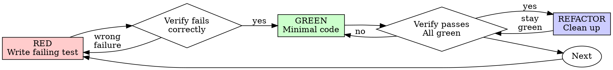

# Fix opencode spawn error

> This archive contains visible conversation activity and tool records. Private model reasoning and system/developer instructions are not available here.
<!-- codex-event:{"kind":"state","timestamp":"2026-07-01T11:05:04.369Z","phase":null} -->
## Task state: task_started · 2026-07-01T11:05:04.369Z

```text
{
  "type": "task_started",
  "turn_id": "019f1d5a-984e-7f72-b724-b1cbb2cd43d4",
  "started_at": 1782903904,
  "model_context_window": 258400,
  "collaboration_mode_kind": "default"
}
```

<!-- /codex-event -->

<!-- codex-event:{"kind":"user","timestamp":"2026-07-01T11:05:05.504Z","phase":null} -->
## User · 2026-07-01T11:05:05.504Z

trying to use opencode get this error

Recover conversation
Spawn failed: agent process exited before ACP startup completed (code=1, signal=null)


<!-- /codex-event -->

<!-- codex-event:{"kind":"progress","timestamp":"2026-07-01T11:05:11.456Z","phase":"commentary"} -->
## Codex progress · 2026-07-01T11:05:11.456Z

I’m going to trace the spawn path for the OpenCode recovery flow, inspect the failure handling around ACP startup, and then verify whether this is a launch/config issue or a bug in our process supervisor.

<!-- /codex-event -->

<!-- codex-event:{"kind":"tool-call","timestamp":"2026-07-01T11:05:11.859Z","phase":null} -->
## Tool call: exec_command · 2026-07-01T11:05:11.859Z

```json
{
  "cmd": "sed -n '1,220p' /Users/masterman/.agents/skills/systematic-debugging/SKILL.md",
  "workdir": "/Users/masterman/NLP/omniharness",
  "login": true,
  "yield_time_ms": 1000,
  "max_output_tokens": 12000
}
```

<!-- /codex-event -->

<!-- codex-event:{"kind":"tool-result","timestamp":"2026-07-01T11:05:11.917Z","phase":null} -->
## Tool result: call_Cr2Zjvhq1moQfo8A2jDYoXZ9 · 2026-07-01T11:05:11.917Z

````text
Chunk ID: 0f0caa
Wall time: 0.0000 seconds
Process exited with code 0
Original token count: 1613
Output:
---
name: systematic-debugging
description: Use when encountering any bug, test failure, or unexpected behavior, before proposing fixes
---

# Systematic Debugging

## Overview

Random fixes waste time and create new bugs. Quick patches mask underlying issues.

**Core principle:** ALWAYS find root cause before attempting fixes. Symptom fixes are failure.

**Violating the letter of this process is violating the spirit of debugging.**

## The Iron Law

```
NO FIXES WITHOUT ROOT CAUSE INVESTIGATION FIRST
```

If you haven't completed Phase 1, you cannot propose fixes.

## When to Use

Use for ANY technical issue:
- Test failures
- Bugs in production
- Unexpected behavior
- Performance problems
- Build failures
- Integration issues

**Use this ESPECIALLY when:**
- Under time pressure (emergencies make guessing tempting)
- "Just one quick fix" seems obvious
- You've already tried multiple fixes
- Previous fix didn't work
- You don't fully understand the issue

**Don't skip when:**
- Issue seems simple (simple bugs have root causes too)
- You're in a hurry (rushing guarantees rework)
- Manager wants it fixed NOW (systematic is faster than thrashing)

## The Four Phases

You MUST complete each phase before proceeding to the next.

### Phase 1: Root Cause Investigation

**BEFORE attempting ANY fix:**

1. **Read Error Messages Carefully**
   - Don't skip past errors or warnings
   - They often contain the exact solution
   - Read stack traces completely
   - Note line numbers, file paths, error codes

2. **Reproduce Consistently**
   - Can you trigger it reliably?
   - What are the exact steps?
   - Does it happen every time?
   - If not reproducible → gather more data, don't guess

3. **Check Recent Changes**
   - What changed that could cause this?
   - Git diff, recent commits
   - New dependencies, config changes
   - Environmental differences

4. **Gather Evidence in Multi-Component Systems**

   **WHEN system has multiple components (CI → build → signing, API → service → database):**

   **BEFORE proposing fixes, add diagnostic instrumentation:**
   ```
   For EACH component boundary:
     - Log what data enters component
     - Log what data exits component
     - Verify environment/config propagation
     - Check state at each layer

   Run once to gather evidence showing WHERE it breaks
   THEN analyze evidence to identify failing component
   THEN investigate that specific component
   ```

   **Example (multi-layer system):**
   ```bash
   # Layer 1: Workflow
   echo "=== Secrets available in workflow: ==="
   echo "IDENTITY: ${IDENTITY:+SET}${IDENTITY:-UNSET}"

   # Layer 2: Build script
   echo "=== Env vars in build script: ==="
   env | grep IDENTITY || echo "IDENTITY not in environment"

   # Layer 3: Signing script
   echo "=== Keychain state: ==="
   security list-keychains
   security find-identity -v

   # Layer 4: Actual signing
   codesign --sign "$IDENTITY" --verbose=4 "$APP"
   ```

   **This reveals:** Which layer fails (secrets → workflow ✓, workflow → build ✗)

5. **Trace Data Flow**

   **WHEN error is deep in call stack:**

   See `root-cause-tracing.md` in this directory for the complete backward tracing technique.

   **Quick version:**
   - Where does bad value originate?
   - What called this with bad value?
   - Keep tracing up until you find the source
   - Fix at source, not at symptom

### Phase 2: Pattern Analysis

**Find the pattern before fixing:**

1. **Find Working Examples**
   - Locate similar working code in same codebase
   - What works that's similar to what's broken?

2. **Compare Against References**
   - If implementing pattern, read reference implementation COMPLETELY
   - Don't skim - read every line
   - Understand the pattern fully before applying

3. **Identify Differences**
   - What's different between working and broken?
   - List every difference, however small
   - Don't assume "that can't matter"

4. **Understand Dependencies**
   - What other components does this need?
   - What settings, config, environment?
   - What assumptions does it make?

### Phase 3: Hypothesis and Testing

**Scientific method:**

1. **Form Single Hypothesis**
   - State clearly: "I think X is the root cause because Y"
   - Write it down
   - Be specific, not vague

2. **Test Minimally**
   - Make the SMALLEST possible change to test hypothesis
   - One variable at a time
   - Don't fix multiple things at once

3. **Verify Before Continuing**
   - Did it work? Yes → Phase 4
   - Didn't work? Form NEW hypothesis
   - DON'T add more fixes on top

4. **When You Don't Know**
   - Say "I don't understand X"
   - Don't pretend to know
   - Ask for help
   - Research more

### Phase 4: Implementation

**Fix the root cause, not the symptom:**

1. **Create Failing Test Case**
   - Simplest possible reproduction
   - Automated test if possible
   - One-off test script if no framework
   - MUST have before fixing
   - Use the `ultrapowers:test-driven-development` skill for writing proper failing tests

2. **Implement Single Fix**
   - Address the root cause identified
   - ONE change at a time
   - No "while I'm here" improvements
   - No bundled refactoring

3. **Verify Fix**
   - Test passes now?
   - No other tests broken?
   - Issue actually resolved?
   - If the bug was meaningful or systemic, use `ultrapowers:learning-from-bugs` before declaring the fix complete.

4. **If Fix Doesn't Work**
   - STOP
   - Count: How many fixes have you tried?
   - If < 3: Return to Phase 1, re-analyze with new information
   - **If ≥ 3: STOP and question the architecture (step 5 below)**
   - DON'T attempt Fix #4 without architectural discussion

5. **If 3+ Fixes Failed: Question Architecture**

   **Pattern indicating architectural problem:**
   - Each fix reveals new shared state/coupling/problem in different place
   - Fixes require "massive refactoring" to implement
   - Each fix creates new symptoms elsewhere

   **STOP and question fundamentals:**
   - Is this pattern fundamentally sound?
   - Are we "sticking with it through sheer inertia"?
   - Should we refactor architecture vs. continue fixing symptoms?

   **Discuss with your human partner before attempting more fixes**

   This is NOT a failed hypothesis - this is a wrong architecture.

## Red Flags - STOP and Follow Process

If you catch yourself thinking:
- "Quick fix for now, investigate later"
- "Just try changing X and see if it works"

````

<!-- /codex-event -->

<!-- codex-event:{"kind":"progress","timestamp":"2026-07-01T11:05:16.901Z","phase":"commentary"} -->
## Codex progress · 2026-07-01T11:05:16.901Z

I’ve got the debugging rubric in hand. Next I’m locating the exact spawn/recovery code and any existing diagnostics so we can see where ACP startup is failing, not just where the UI reports it.

<!-- /codex-event -->

<!-- codex-event:{"kind":"tool-call","timestamp":"2026-07-01T11:05:16.901Z","phase":null} -->
## Tool call: exec_command · 2026-07-01T11:05:16.901Z

```json
{
  "cmd": "rg -n \"Spawn failed: agent process exited before ACP startup completed|ACP startup completed|Recover conversation|spawn failed|ACP\" .",
  "workdir": "/Users/masterman/NLP/omniharness",
  "login": true,
  "yield_time_ms": 1000,
  "max_output_tokens": 12000
}
```

<!-- /codex-event -->

<!-- codex-event:{"kind":"tool-call","timestamp":"2026-07-01T11:05:16.931Z","phase":null} -->
## Tool call: exec_command · 2026-07-01T11:05:16.931Z

```json
{
  "cmd": "rg -n \"opencode|open code|OpenCode\" .",
  "workdir": "/Users/masterman/NLP/omniharness",
  "login": true,
  "yield_time_ms": 1000,
  "max_output_tokens": 12000
}
```

<!-- /codex-event -->

<!-- codex-event:{"kind":"tool-result","timestamp":"2026-07-01T11:05:17.010Z","phase":null} -->
## Tool result: call_ftvY1GTrp69yDLL2UkpsNyDd · 2026-07-01T11:05:17.010Z

```text
Chunk ID: f6acb5
Wall time: 0.0000 seconds
Process exited with code 0
Original token count: 14474
Output:
Warning: truncated output (original token count: 14474)
Total output lines: 349

./start.sh:2:export ACP_BRIDGE_PORT=7800
./start.sh:12:    echo "[1/2] Starting acp-bridge on port $ACP_BRIDGE_PORT..."
./package.json:4:  "description": "Local web UI, CLI, and ACP control plane for supervising coding agents.",
./.env.example:25:# Windows PowerShell users can set OMNIHARNESS_CODEX_ACP_INSTALL_DIR to a user bin directory.
./.env.example:26:# OMNIHARNESS_CODEX_ACP_INSTALL=auto
./.env.example:27:# OMNIHARNESS_CODEX_ACP_RELEASE_REPO=danduma/omniharness
./.env.example:28:# OMNIHARNESS_CODEX_ACP_RELEASE_TAG=codex-acp-latest
./.env.example:29:# OMNIHARNESS_CODEX_ACP_DOWNLOAD_BASE_URL=https://github.com/danduma/omniharness/releases/download/codex-acp-latest
./.env.example:30:# OMNIHARNESS_CODEX_ACP_INSTALL_DIR=/Users/you/.local/bin
./.env.example:32:# OMNIHARNESS_CODEX_ACP_DOCKER_IMAGE=omniharness/codex-acp:local
./.env.example:35:# Optional: generic external credential profiles for ACP workers.
./scripts/install-agent-acp.ps1:3:  [string]$CodexAcp = $(if ($env:OMNIHARNESS_CODEX_ACP_INSTALL) { $env:OMNIHARNESS_CODEX_ACP_INSTALL } else { "auto" }),
./scripts/install-agent-acp.ps1:4:  [string]$ReleaseRepo = $(if ($env:OMNIHARNESS_CODEX_ACP_RELEASE_REPO) { $env:OMNIHARNESS_CODEX_ACP_RELEASE_REPO } else { "danduma/omniharness" }),
./scripts/install-agent-acp.ps1:5:  [string]$ReleaseTag = $(if ($env:OMNIHARNESS_CODEX_ACP_RELEASE_TAG) { $env:OMNIHARNESS_CODEX_ACP_RELEASE_TAG } else { "codex-acp-latest" }),
./scripts/install-agent-acp.ps1:6:  [string]$DownloadBaseUrl = $env:OMNIHARNESS_CODEX_ACP_DOWNLOAD_BASE_URL,
./scripts/install-agent-acp.ps1:7:  [string]$InstallDir = $env:OMNIHARNESS_CODEX_ACP_INSTALL_DIR,
./scripts/install-agent-acp.ps1:118:Write-Host "Detecting local coding agents and ACP adapters..."
./docs/superpowers/learnings/2026-05-25-project-scoped-cli-session-storage.md:4:**Context:** OmniHarness direct-control worker recovery across Gemini, Codex, Claude, and OpenCode ACP harnesses
./docs/superpowers/learnings/2026-05-25-project-scoped-cli-session-storage.md:5:**Symptom:** Direct recovery could hold a saved ACP session id, but the underlying CLI could no longer resume it because its own session files lived in provider-global storage outside the project. Gemini reported an invalid saved session after looking in its global temp-backed chat directory.
./docs/superpowers/learnings/2026-05-25-project-scoped-cli-session-storage.md:6:**Root Cause:** OmniHarness treated the ACP session id as durable while allowing each CLI harness to choose its default storage root. That made recovery depend on global provider storage layout, temp cleanup behavior, and whatever project hashing each CLI used internally.
./docs/superpowers/learnings/2026-05-25-project-scoped-cli-session-storage.md:9:**Prevention:** Any new built-in CLI harness must have a project-scoped session/storage root before it is used for direct-control recovery. Do not rely on a provider's default global home, cache, or temp directory for resumable ACP sessions.
./scripts/install-agent-acp.sh:7:CODEX_ACP_INSTALL_MODE="${OMNIHARNESS_CODEX_ACP_INSTALL:-auto}"
./scripts/install-agent-acp.sh:8:CODEX_ACP_RELEASE_REPO="${OMNIHARNESS_CODEX_ACP_RELEASE_REPO:-danduma/omniharness}"
./scripts/install-agent-acp.sh:9:CODEX_ACP_RELEASE_TAG="${OMNIHARNESS_CODEX_ACP_RELEASE_TAG:-codex-acp-latest}"
./scripts/install-agent-acp.sh:10:CODEX_ACP_DOWNLOAD_BASE_URL="${OMNIHARNESS_CODEX_ACP_DOWNLOAD_BASE_URL:-https://github.com/$CODEX_ACP_RELEASE_REPO/releases/download/$CODEX_ACP_RELEASE_TAG}"
./scripts/install-agent-acp.sh:11:CODEX_ACP_DOCKER_IMAGE="${OMNIHARNESS_CODEX_ACP_DOCKER_IMAGE:-omniharness/codex-acp:local}"
./scripts/install-agent-acp.sh:12:CODEX_ACP_WRAPPER_DIR="${OMNIHARNESS_CODEX_ACP_INSTALL_DIR:-${OMNIHARNESS_CODEX_ACP_WRAPPER_DIR:-}}"
./scripts/install-agent-acp.sh:16:if [ -z "$CODEX_ACP_WRAPPER_DIR" ] && [ -n "${HOME:-}" ]; then
./scripts/install-agent-acp.sh:17:  CODEX_ACP_WRAPPER_DIR="$HOME/.local/bin"
./scripts/install-agent-acp.sh:39:      CODEX_ACP_INSTALL_MODE="${arg#--codex-acp=}"
./scripts/install-agent-acp.sh:49:case "$CODEX_ACP_INSTALL_MODE" in
./scripts/install-agent-acp.sh:53:    echo "Invalid Codex ACP install mode: $CODEX_ACP_INSTALL_MODE" >&2
./scripts/install-agent-acp.sh:227:  for dir in "$CODEX_ACP_WRAPPER_DIR" "${CARGO_HOME:-$HOME/.cargo}/bin" "$HOME/.local/bin"; do
./scripts/install-agent-acp.sh:260:  download_url="$CODEX_ACP_DOWNLOAD_BASE_URL/$asset_name"
./scripts/install-agent-acp.sh:262:  if [ -z "$CODEX_ACP_WRAPPER_DIR" ]; then
./scripts/install-agent-acp.sh:263:    echo "  -> cannot install prebuilt \`codex-acp\`: HOME is not set and OMNIHARNESS_CODEX_ACP_INSTALL_DIR was not provided" >&2
./scripts/install-agent-acp.sh:267:  install_path="$CODEX_ACP_WRAPPER_DIR/$binary_name"
./scripts/install-agent-acp.sh:279:  mkdir -p "$CODEX_ACP_WRAPPER_DIR"
./scripts/install-agent-acp.sh:280:  tmp_path="$(mktemp "$CODEX_ACP_WRAPPER_DIR/codex-acp.tmp.XXXXXX")"
./scripts/install-agent-acp.sh:295:  "$DOCKER_BIN" image inspect "$CODEX_ACP_DOCKER_IMAGE" >/dev/null 2>&1
./scripts/install-agent-acp.sh:327:DEFAULT_CODEX_ACP_DOCKER_IMAGE="$CODEX_ACP_DOCKER_IMAGE"
./scripts/install-agent-acp.sh:332:IMAGE="${OMNIHARNESS_CODEX_ACP_DOCKER_IMAGE:-$DEFAULT_CODEX_ACP_DOCKER_IMAGE}"
./scripts/install-agent-acp.sh:336:CONTAINER_HOME="${OMNIHARNESS_CODEX_ACP_CONTAINER_HOME:-/tmp}"
./scripts/install-agent-acp.sh:353:if [ "${OMNIHARNESS_CODEX_ACP_DOCKER_AS_ROOT:-0}" != "1" ]; then
./scripts/install-agent-acp.sh:430:  if [ -z "$CODEX_ACP_WRAPPER_DIR" ]; then
./scripts/install-agent-acp.sh:431:    echo "  -> cannot install Docker-backed \`codex-acp\`: HOME is not set and OMNIHARNESS_CODEX_ACP_WRAPPER_DIR was not provided" >&2
./scripts/install-agent-acp.sh:435:  wrapper_path="$CODEX_ACP_WRAPPER_DIR/codex-acp"
./scripts/install-agent-acp.sh:439:    echo "  -> would use Docker image \`$CODEX_ACP_DOCKER_IMAGE\`"
./scripts/install-agent-acp.sh:440:    echo "  -> would build missing image with \`$DOCKER_BIN build -t $CODEX_ACP_DOCKER_IMAGE -f docker/codex-acp/Dockerfile docker/codex-acp\`"
./scripts/install-agent-acp.sh:454:    echo "  -> Docker image \`$CODEX_ACP_DOCKER_IMAGE\` already exists"
./scripts/install-agent-acp.sh:456:    echo "  -> building Docker image \`$CODEX_ACP_DOCKER_IMAGE\`"
./scripts/install-agent-acp.sh:457:    "$DOCKER_BIN" build -t "$CODEX_ACP_DOCKER_IMAGE" -f "$dockerfile" "$context_dir"
./scripts/install-agent-acp.sh:460:  mkdir -p "$CODEX_ACP_WRAPPER_DIR"
./scripts/install-agent-acp.sh:466:  case "$CODEX_ACP_INSTALL_MODE" in
./scripts/install-agent-acp.sh:488:echo "Detecting local coding agents and ACP adapters..."
./scripts/install-agent-acp.sh:501:    if [ "$CODEX_ACP_INSTALL_MODE" = "docker" ]; then
./scripts/install-agent-acp.sh:504:    elif [ "$ENSURE_ONLY" -eq 1 ] || [ "$CODEX_ACP_INSTALL_MODE" = "auto" ]; then
./scripts/install-agent-acp.sh:510:      if [ "$CODEX_ACP_INSTALL_MODE" = "cargo" ]; then
./scripts/install-agent-acp.sh:522:  if [ "$CODEX_ACP_INSTALL_MODE" = "docker" ]; then
./scripts/install-agent-acp.sh:541:  echo "  -> native ACP support via \`gemini --experimental-acp\`; no separate adapter needed"
./scripts/install-agent-acp.sh:548:  echo "  -> native ACP support via \`opencode acp\`; no separate adapter needed"
./scripts/install-agent-acp.sh:557:echo "Structured ACP filesystem tools are provided by the runtime: read_text_file, write_text_file, edit_text_file, multi_edit_text_file."
./scripts/time-worker-pool.ts:4: * For each type whose default ACP binary is on PATH: prewarm, then measure
./src/app/home/HomeApp.tsx:798:  // Pre-warm the worker the user is about to use. Overlapping ACP startup
./src/app/home/useAppErrors.ts:112:        action: "Recover conversation",
./docs/superpowers/learnings/2026-05-26-project-scoped-cli-homes-must-bridge-credentials.md:5:**Symptom:** Workers with persisted sessions failed to respawn after a crash. Gemini surfaced `Authentication required`; Codex exited before ACP startup completed.
./docs/superpowers/learnings/2026-05-26-project-scoped-cli-homes-must-bridge-credentials.md:8:**Verification:** `pnpm vitest run tests/server/agent-runtime/http.test.ts -t "spawns Codex ACP workers|pins Gemini CLI session storage|bridges Codex credentials|bridges Gemini credentials|uses the requested session id"` passes.
./docs/superpowers/learnings/2026-06-29-project-scoped-cli-homes-must-bridge-current-auth-files.md:5:**Symptom:** Gemini workers failed with `Gemini API key is missing or not configured`; OpenCode workers failed before ACP startup with `agent process exited before ACP startup completed`.
./src/app/home/useHomeMutations.ts:688:      action: "Recover conversation",
./vibes/initial-plan.md:12:The cloned repo at `/Users/masterman/NLP/acp-bridge` (v0.3.0, production-grade) already solves the low-level problem: headless ACP multiplexing, parallel task graphs, SSE output streaming, session modes, permission control — all behind a clean HTTP REST API on `:7800`. **Answer to the framing question: yes, it is an excellent starting point — it is essentially the backend for this project.** This plan builds the missing layer on top: an LLM-powered supervisor plus a web interface.
./vibes/initial-plan.md:20:- **tmux + regex screen-scraping.** Fragile to ANSI/TUI edge cases; less reliable for stuck/false-complete detection than ACP's structured JSON-RPC.
./vibes/initial-plan.md:64:- **Extension point**: a future variant may run the supervisor *inside another harness* (e.g., another Claude Code / Codex instance as "the overseer") with the same tool surface exposed as ACP tools. MVP keeps it as a custom token.js loop for tighter control; the tool registry is designed to be reusable under either runtime.
./vibes/initial-plan.md:172:- **Future extension — non-ACP provider adapters**: if we later need Kiro / Q CLI / Copilot CLI / Kimi support (which don't speak ACP), we can vendor CAO's tmux-based provider adapters behind the same supervisor tool surface. Out of scope for v1.
./vibes/initial-plan.md:200:4. **Supervisor runtime**: custom token.js loop for MVP; "supervisor-as-another-harness" deferred to v2 with the same tool registry exposed as ACP tools. OK?
./src/runtime/http/routes/runs.ts:102:      return "Recover conversation";
./src/runtime/http/routes/runs.ts:426:  let postActionLabel = "Recover conversation";
./src/runtime/http/routes/runs.ts:438:      action: "Recover conversation",
./src/runtime/http/routes/runs.ts:658:        action: "Recover conversation",
./src/runtime/http/routes/runs.ts:666:        action: "Recover conversation",
./src/runtime/http/routes/runs.ts:674:        action: "Recover conversation",
./vibes/2026-04-20-autonomous-implementation-plan.md:5:**Goal:** Upgrade OmniHarness from a single-worker demo into a continuously running supervisor that can judge plan readiness, ask clarifying questions, execute with headless ACP-backed coding agents, and refuse to terminate until it has independently validated plan completion.
./vibes/2026-04-20-autonomous-implementation-plan.md:9:**Tech Stack:** Next.js 15, TypeScript, token.js, SQLite, Drizzle ORM, ACP bridge HTTP API, SSE, React Query, xterm.js, Vitest, Playwright
./vibes/2026-04-20-autonomous-implementation-plan.md:20:  Expand the ACP client to support streaming, task graphs, permission requests, and worker health polling with typed responses.
./vibes/2026-04-20-autonomous-implementation-plan.md:752:- Full implementation loop with ACP workers: covered in Tasks 5-6.
./docs/superpowers/learnings/2026-05-25-empty-direct-session-recreation.md:5:**Symptom:** A direct-control conversation with exactly one persisted user message could not recover when the saved ACP session id was rejected by the provider CLI. The UI surfaced a spawn failure even though there was no worker/provider transcript to preserve.
./docs/superpowers/learnings/2026-05-25-empty-direct-session-recreation.md:7:**Fix:** Retry and follow-up recovery now inspect the unified worker stream. If the saved session is rejected and no bridge/provider output exists, OmniHarness clears the stale bridge session, recreates the same worker id, replays the persisted user checkpoint with attachments, stores the new session metadata in the worker stream, and emits `worker_session_missing`, `worker_session_recreated`, and `worker.recreated`. If Gemini reports the exact missing `chats` directory and the OmniHarness stream has provider output, recovery materializes a Gemini JSONL session file from the saved stream and retries ACP resume before falling back to transcript replay. If materialization is unavailable or the second resume fails, recovery starts a fresh worker with an explicit transcript-replay prompt and emits `worker_session_recreated_from_transcript`.
./docs/superpowers/learnings/2026-05-25-empty-direct-session-recreation.md:9:**Prevention:** Classify rejected ACP sessions by transcript state and provider capabilities. Empty direct streams can be replayed from persisted user input. Streams with provider output should first try to rebuild the provider's missing session cache from the OmniHarness stream, then fall back to explicit transcript replay only when materialization cannot work.
./README.md:3:OmniHarness is a local control plane for supervising ACP-backed coding agents from a web UI, CLI, or another ACP client. It runs a Next.js app plus an in-repo agent runtime that owns Codex, Claude, Gemini, OpenCode, and other Agent Client Protocol workers.
./README.md:9:- **Multi-agent supervision:** start implementation, planning, and direct-control conversations with supported ACP workers.
./README.md:13:- **ACP server mode:** expose OmniHarness itself as an ACP agent over stdio for compatible clients.
./README.md:30:  - Gemini CLI with native ACP mode
./README.md:31:  - OpenCode with native ACP mode
./README.md:226:optional ACP adapters:
./README.md:239:the ACP adapters they need. Codex uses a prebuilt `codex-acp` binary by default
./README.md:241:Gemini and OpenCode expose native ACP commands and do not need separate adapter
./README.md:246:### Prebuilt Codex ACP
./README.md:262:OMNIHARNESS_CODEX_ACP_INSTALL=binary
./README.md:263:OMNIHARNESS_CODEX_ACP_RELEASE_REPO=danduma/omniharness
./README.md:264:OMNIHARNESS_CODEX_ACP_RELEASE_TAG=codex-acp-latest
./README.md:265:OMNIHARNESS_CODEX_ACP_DOWNLOAD_BASE_URL=https://github.com/danduma/omniharness/releases/download/codex-acp-latest
./README.md:266:OMNIHARNESS_CODEX_ACP_INSTALL_DIR=/custom/bin
./README.md:285:### Docker-backed Codex ACP
./README.md:291:OMNIHARNESS_CODEX_ACP_INSTALL=docker ./omniharness
./README.md:301:`codex-acp` wrapper into `~/.local/bin`, and runs the ACP adapter inside Docker
./README.md:309:OMNIHARNESS_CODEX_ACP_DOCKER_IMAGE=ghcr.io/your-org/codex-acp:latest
./README.md:310:OMNIHARNESS_CODEX_ACP_INSTALL_DIR=/custom/bin
./README.md:312:OMNIHARNESS_CODEX_ACP_DOCKER_AS_ROOT=1
./README.md:319:OMNIHARNESS_CODEX_ACP_INSTALL=docker OMNIHARNESS_DOCKER_BIN=podman ./omniharness
./README.md:354:Run the same ACP-backed conversation modes from the terminal:
./README.md:368:Run OmniHarness itself as an ACP agent over stdio:
./README.md:374:In ACP mode, clients can create sessions, list persisted Omni runs, load or resume a run, fork a fresh ACP session from an existing run, switch between `implementation`, `planning`, and `direct`, prompt OmniHarness to start or continue conversations, and receive streamed run updates as ACP `session/update` notifications.
./README.md:396:ACP workers may be launched from a GUI app, service manager, editor integration, or another non-login process. Those environments often do not inherit the same `PATH` as your normal terminal.
./README.md:418:OmniHarness can apply a generic credential env overlay before spawning any ACP worker. Configure it in Settings -> Agents, set `OMNIHARNESS_CREDENTIAL_PROFILES_DIR` to a directory of profiles, or use the default `.omniharness/credential-profiles` under the OmniHarness root.
./README.md:493:- clearer docs for supported agents and ACP adapters
./omniharness:174:if [ "${OMNIHARNESS_SKIP_AGENT_ACP_SETUP:-0}" != "1" ]; then
./omniharness:175:  ./scripts/install-agent-acp.sh --ensure-only || echo "[omniharness] Agent ACP adapter setup reported issues; continuing." >&2
./scripts/time-worker-cold-start.ts:2: * Diagnostic: measure cold-start latency for each worker type's default ACP
./src/server/cli/options.ts:177:    "ACP harness mode:",
./src/server/cli/options.ts:178:    "  acp                           Run OmniHarness itself as an ACP agent over stdio",
./src/server/supervisor/observer.ts:173:  /ACP write error:/i,
./docs/superpowers/specs/2026-04-23-remote-access-pwa-design.md:5:Make OmniHarness safely reachable from anywhere on a phone or laptop without exposing the ACP bridge directly.
./docs/superpowers/specs/2026-04-23-remote-access-pwa-design.md:19:- The ACP bridge is treated as a local service and is auto-managed in development when it is on `127.0.0.1` or `localhost`.
./docs/superpowers/specs/2026-04-23-remote-access-pwa-design.md:26:- The ACP bridge must remain private and bound to loopback; remote users must never talk to the bridge directly.
./docs/superpowers/specs/2026-04-23-remote-access-pwa-design.md:90:The ACP bridge continues to listen on loopback and is never placed on a public hostname. The browser talks only to OmniHarness HTTP routes, and the server continues to broker all bridge communication.
./docs/superpowers/specs/2026-04-23-remote-access-pwa-design.md:389:- exposing the ACP bridge directly,
./docs/superpowers/specs/2026-04-23-remote-access-pwa-design.md:421:- OmniHarness can be reached through an HTTPS tunnel without exposing the ACP bridge publicly.
./docs/superpowers/learnings/2026-05-20-supervisor-timestamp-tie-breakers.md:5:**Symptom:** Several server paths asked for "latest", "recent", or chronological replay using only `createdAt`/`updatedAt`. Equal timestamps can occur when rows are inserted in the same millisecond, and SQLite is not a stable ordering oracle for ties. That can change which supervisor file read is considered latest, which queued message drains first, which checkpoint is recovered, or how CLI/ACP replay orders rows.
./docs/superpowers/learnings/2026-05-20-supervisor-timestamp-tie-breakers.md:6:**Root Cause:** Some snapshot/frontend paths had already learned to order by `(createdAt, id)`, but supervisor context, observer helpers, handoff synthesis, queued-message draining, recovery reads, CLI/ACP replay, plan/session list endpoints, the all-messages route, planning promotion transcript copying, recovery fork selection, quota incident selection, recovery notice selection, and snapshot-cache pruning still had timestamp-only SQL or timestamp-only in-memory sorts.
./docs/superpowers/learnings/2026-05-20-supervisor-timestamp-tie-breakers.md:7:**Fix:** Added id tie-breakers to supervisor execution-event reads and explicit `createdAt + id` comparators for supervisor context message/worker in-memory sorting. Extended the same rule to handoff, recovery, queued-message, CLI, ACP, worker-snapshot, planning-refresh, plan-list, all-messages, planning-promotion, fork-recovery message selection, quota incident selection, recovery notice selection, and snapshot cache pruning.
./src/server/agent-runtime/worker-pool.ts:2: * Pre-warmed ACP worker connections (gemini, codex, claude, opencode). The
./src/server/agent-runtime/worker-pool.ts:6: * few milliseconds instead of paying the multi-second ACP cold-start.
./docs/superpowers/learnings/2026-05-30-stale-worker-session-recovery.md:5:**Symptom:** A worker spawn refused for low disk space, then a later retry surfaced `Direct retry could not locate persisted ACP session metadata for this conversation`, even though the user action was simply to resume after freeing disk.
./docs/superpowers/learnings/2026-05-30-stale-worker-session-recovery.md:6:**Root Cause:** The recovery path treated missing ACP session metadata as a fatal user-visible resume error instead of falling back to a fresh d…4474 tokens truncated…ls, remote services, and future ACP-backed systems through the same session UI, while each provider exposes only the actions it genuinely supports.
./docs/superpowers/plans/2026-05-19-session-provider-decoupling.md:15:**Future Product Direction:** After this milestone, the same provider contract can support remote ACP sessions, notebooks, test runners, shell jobs, or task-specific tools. That direction is context only; the checklist below delivers the current `omni` plus `process` milestone end-to-end.
./docs/superpowers/plans/2026-05-19-session-provider-decoupling.md:27:- Do not use ACP as the only frontend abstraction. ACP remains one possible backend/runtime protocol; `SessionProvider` is the app boundary.
./docs/superpowers/plans/2026-05-19-session-provider-decoupling.md:366:  - Mention that ACP is a backend protocol option, not the frontend session abstraction.
./docs/superpowers/plans/2026-05-19-session-provider-decoupling.md:390:- Every requested requirement maps to a task: other session types, ACP not being sufficient alone, Python/script-like output, backend decoupling, action decoupling, data shape decoupling.
./docs/superpowers/plans/2026-06-14-visual-improve-mode.md:9:**Tech Stack:** Next.js 15, React 19, TypeScript, Drizzle/SQLite, existing OmniHarness ACP bridge, unified worker stream, named SSE events, shadcn/ui primitives already in the app, Vitest lifecycle tests.
./docs/superpowers/plans/2026-05-02-native-macos-remote-wrapper.md:45:Only the OmniHarness web server is exposed remotely. The internal agent runtime stays loopback-only, and the remote browser never talks directly to the ACP/runtime port.
./docs/superpowers/plans/2026-05-02-native-macos-remote-wrapper.md:161:Do not persist OmniHarness session cookies, pairing token plaintext, prompt content, file content, worker output payloads, or ACP/runtime secrets in relay storage.
./docs/superpowers/plans/2026-05-02-native-macos-remote-wrapper.md:825:- ACP/runtime ports remain private and loopback-only.
./docs/superpowers/plans/2026-05-03-acp-worker-terminal-processes.md:1:# ACP Worker Terminal Processes Implementation Plan
./docs/superpowers/plans/2026-05-03-acp-worker-terminal-processes.md:5:**Goal:** Show terminal commands currently reported by ACP workers as first-class worker status, without turning the main conversation into a process log.
./docs/superpowers/plans/2026-05-03-acp-worker-terminal-processes.md:7:**Architecture:** Derive a small `WorkerTerminalProcess` view model from ACP `outputEntries` rather than querying the OS process table. Keep the extraction logic shared between backend persistence and frontend display, then render active and recent terminal commands inside worker detail surfaces while preserving full raw events in the existing worker terminal and run log.
./docs/superpowers/plans/2026-05-03-acp-worker-terminal-processes.md:9:**Tech Stack:** TypeScript, Next.js app UI, React 19, existing Manager classes, ACP `sessionUpdate` tool-call events, Drizzle-persisted worker snapshots, Vitest source/unit tests, existing `Terminal` and `WorkerCard` components.
./docs/superpowers/plans/2026-05-03-acp-worker-terminal-processes.md:13:**Current Milestone:** Display ACP-reported shell/terminal tool calls as compact active/recent process rows in worker cards and direct terminal surfaces, with command, status, timestamps, and output tail derived from real worker snapshots.
./docs/superpowers/plans/2026-05-03-acp-worker-terminal-processes.md:15:**Later Milestones / Deferred But Intentional:** OS-level child process tables with PIDs, process trees, signal controls, CPU/memory metrics, terminal stream multiplexing, and bridge-level push updates are intentionally deferred. Those require adapter/runtime support beyond generic ACP tool-call events and must not be presented as delivered in this milestone.
./docs/superpowers/plans/2026-05-03-acp-worker-terminal-processes.md:17:**Final Functionality Standard:** This milestone delivers real end-to-end functionality for ACP-reported terminal commands: worker ACP updates enter the runtime, persist in worker snapshots, derive deterministic process state, and render in the worker UI. It does not fake process data, infer nonexistent PIDs, or claim visibility into commands the ACP adapter does not report.
./docs/superpowers/plans/2026-05-03-acp-worker-terminal-processes.md:26:  - Responsibility: identify shell-like ACP tool calls, merge updates by `toolCallId`, normalize command/status/timestamps/output, and classify active vs completed.
./docs/superpowers/plans/2026-05-03-acp-worker-terminal-processes.md:44:  - Responsibility: preserve more raw ACP tool-call metadata only if existing `raw` payloads are insufficient. This file is 1118 lines; avoid growth by extracting helper logic instead of adding substantial code here.
./docs/superpowers/plans/2026-05-03-acp-worker-terminal-processes.md:48:  - Responsibility: keep normalization permissive enough to preserve raw ACP tool metadata.
./docs/superpowers/plans/2026-05-03-acp-worker-terminal-processes.md:56:  - Responsibility: verify fake ACP `tool_call` / `tool_call_update` events expose terminal-process fields through `/agents/:name`.
./docs/superpowers/plans/2026-05-03-acp-worker-terminal-processes.md:62:- `src/server/db/schema.ts`: no schema change is planned because `workers.outputEntriesJson` already persists structured ACP activity.
./docs/superpowers/plans/2026-05-03-acp-worker-terminal-processes.md:80:- As a builder debugging a failure, I can open the full terminal or run log for raw ACP details.
./docs/superpowers/plans/2026-05-03-acp-worker-terminal-processes.md:84:- Worker cards show a compact process section only when command-like ACP tool calls exist.
./docs/superpowers/plans/2026-05-03-acp-worker-terminal-processes.md:94:- Detecting commands that the ACP adapter does not report.
./docs/superpowers/plans/2026-05-03-acp-worker-terminal-processes.md:101:- ACP `sessionUpdate` events captured as runtime `outputEntries`.
./docs/superpowers/plans/2026-05-03-acp-worker-terminal-processes.md:121:  - Cover output extraction from ACP content text, raw output, stdout/stderr-like metadata, and truncation.
./docs/superpowers/plans/2026-05-03-acp-worker-terminal-processes.md:134:- [ ] **Step 3: Preserve ACP raw metadata through runtime status**
./docs/superpowers/plans/2026-05-03-acp-worker-terminal-processes.md:135:  - Inspect `src/server/agent-runtime/manager.ts`, `src/server/bridge-client/index.ts`, and fake ACP tests.
./docs/superpowers/plans/2026-05-03-acp-worker-terminal-processes.md:138:  - Add or update `tests/server/agent-runtime/http.test.ts` so a fake ACP worker emits shell `tool_call` and `tool_call_update` events and `/agents/worker-1` returns enough `outputEntries` to derive command state.
./docs/superpowers/plans/2026-05-03-acp-worker-terminal-processes.md:191:- ACP-reported shell/terminal tool calls display as terminal-process rows in worker detail surfaces.
./docs/superpowers/plans/2026-05-07-memorable-cloudflared-subdomains.md:7:**Architecture:** Keep OmniHarness fully usable offline with no registration, and keep bring-your-own tunnel setup available without an OmniHarness account. Add a hosted OmniHarness remote-access control plane only for the paid Omni managed tunnel path: it owns slug allocation, Cloudflare named tunnel provisioning, DNS records, token rotation, and billing/account ownership. The local OmniHarness app becomes a tunnel client only when the user opts into the managed service: it stores only its assigned remote installation id, public origin, and scoped tunnel token, runs `cloudflared` against `http://127.0.0.1:3050`, and feeds the active public origin into the existing QR pairing flow. The ACP bridge remains private on loopback; only the Next.js web app is exposed.
./docs/superpowers/plans/2026-05-07-memorable-cloudflared-subdomains.md:97:  -> server-side calls to private ACP bridge on loopback
./docs/superpowers/plans/2026-05-07-memorable-cloudflared-subdomains.md:100:The ACP/runtime bridge remains private:
./docs/superpowers/plans/2026-05-07-memorable-cloudflared-subdomains.md:283:Do not route public traffic to the ACP bridge. Verify current development defaults:
./docs/superpowers/plans/2026-05-07-memorable-cloudflared-subdomains.md:912:- never expose the ACP bridge,
./docs/superpowers/plans/2026-05-10-hosted-remote-access-control-plane.md:82:The local app exposes only its Next.js web server through the tunnel. The ACP/runtime bridge remains loopback-only.
./docs/architecture/hot-path-responsiveness-and-resource-leaks.md:495:After restart (dev stack restarted under `nohup`) with all four ACP
./docs/architecture/hot-path-responsiveness-and-resource-leaks.md:519:# 10 concurrent /api/settings DURING the ACP message exchanges
./docs/architecture/hot-path-responsiveness-and-resource-leaks.md:535:| 10 concurrent settings DURING ACP traffic | (would crash)    | 0.93-1.00 s each    |
./docs/architecture/session-provider-model.md:7:ACP is a backend protocol option, not the UI abstraction. An ACP-backed runtime can become another `SessionProvider`, but the app should continue speaking in provider-neutral session records and actions.
./docs/architecture/timing-determinism-audit.md:509:  reads, CLI/ACP replay, all-message reads, and plan/session list endpoints now
./tests/supervisor/runtime-watchdog.test.ts:61:    const lastError = 'No spawnable worker is available. Requested "codex" failed because codex ACP adapter is not installed. Checked allowed workers: codex.';
./tests/cli/options.test.ts:22:      "help me plan the CLI ACP surface",
./tests/cli/options.test.ts:26:      command: "help me plan the CLI ACP surface",
./tests/cli/options.test.ts:70:  it("documents the ACP harness subcommand", () => {
./tests/cli/options.test.ts:72:    expect(omniCliUsage()).toContain("Run OmniHarness itself as an ACP agent over stdio");
./tests/supervisor/observer.test.ts:357:  it("wakes the supervisor immediately when ACP reports a worker turn is complete", () => {
./tests/supervisor/observer.test.ts:1219:        "[bridge] ACP write error: Error: write EPIPE",
./tests/supervisor/observer.test.ts:2605:  it("treats ACP session-not-found resume failures as missing saved sessions", async () => {
./tests/supervisor/worker-availability.test.ts:64:      fallbackReason: "codex ACP adapter is not installed.",
./tests/supervisor/worker-availability.test.ts:68:  it("accepts codex when the ACP adapter is available even without OPENAI_API_KEY", async () => {
./tests/supervisor/worker-availability.test.ts:101:      fallbackReason: "codex ACP adapter is not installed.",
./tests/supervisor/worker-availability.test.ts:105:  it("accepts claude when the ACP adapter is available even without Anthropic env vars", async () => {
./tests/server/runs/failures.test.ts:107:    await persistRunFailure(runId, new Error("codex ACP adapter is not installed"));
./tests/server/runs/failures.test.ts:108:    await persistRunFailure(runId, new Error("codex ACP adapter is not installed"));
./tests/server/runs/failures.test.ts:113:    expect(persistedMessages[0]?.content).toBe("Run failed: codex ACP adapter is not installed");
./tests/api/conversations-route.test.ts:1123:    expect(entries.some((entry) => entry.type === "lifecycle" && entry.text === "Worker spawn failed: bridge unreachable")).toBe(true);
./tests/server/agent-runtime-codex.test.ts:5:  it("does not set a requested mode that the ACP session does not advertise", () => {
./tests/server/omni-acp-agent.test.ts:34:      title: "Existing ACP run",
./tests/server/omni-acp-agent.test.ts:55:  it("advertises OmniHarness modes as ACP session modes", async () => {
./tests/server/omni-acp-agent.test.ts:81:  it("starts a same-backed Omni conversation from an ACP prompt", async () => {
./tests/server/omni-acp-agent.test.ts:100:    const response = await agent.prompt(textPrompt(session.sessionId, "make a plan for ACP control"));
./tests/server/omni-acp-agent.test.ts:105:      command: "make a plan for ACP control",
./tests/server/omni-acp-agent.test.ts:121:  it("routes later ACP prompts into the existing Omni conversation", async () => {
./tests/server/omni-acp-agent.test.ts:146:  it("lists persisted Omni runs as ACP sessions", async () => {
./tests/server/omni-acp-agent.test.ts:161:        title: "Existing ACP run",
./tests/server/omni-acp-agent.test.ts:234:  it("forks an ACP session without sharing the source run", async () => {
./tests/server/workers/stuck-worker-reaper.test.ts:251:    mockResumeMissingDirectWorker.mockRejectedValue(new Error("spawn failed: ENOENT"));
./tests/server/agent-runtime/tool-env.test.ts:28:  it("tracks the non-negotiable ACP filesystem and shell tool surface", () => {
./tests/server/agent-runtime/manager-permission-mode.test.ts:30:// Minimal ACP CLI: handles initialize + session/new, and answers every other
./tests/server/agent-runtime/gemini-args.test.ts:26:const logPath = process.env.FAKE_ACP_REQUEST_LOG;
./tests/server/agent-runtime/gemini-args.test.ts:107:        env: { FAKE_ACP_REQUEST_LOG: requestLog },
./tests/server/agent-runtime/manager-reaper.test.ts:10: * Drives the manager with a tiny stub ACP CLI (Node script) so we don't depend
./tests/server/agent-runtime/manager-reaper.test.ts:35:// Minimal ACP CLI: responds to initialize + session/new, then stays alive
./tests/server/agent-runtime/manager-reaper.test.ts:269:        FAKE_ACP_REQUEST_LOG: requestLog,
./tests/api/run-route.test.ts:1423:      text: "Worker ACP session metadata saved.",
./tests/api/run-route.test.ts:1861:    fs.writeFileSync(adHocAbsolutePath, "# temp\ncontinue without the missing ACP session");
./tests/api/run-route.test.ts:1904:      content: "continue without the missing ACP session",
./tests/api/run-route.test.ts:1940:    expect(mockAskAgent).toHaveBeenCalledWith(newWorkerId, "continue without the missing ACP session");
./tests/lib/worker-terminal-processes.test.ts:10:  it("merges ACP terminal tool calls into a single recent process", () => {
./tests/lib/worker-terminal-processes.test.ts:152:  it("extracts failed command output from ACP tool response metadata", () => {
./tests/server/agent-runtime/http.test.ts:69:const logPath = process.env.FAKE_ACP_REQUEST_LOG;
./tests/server/agent-runtime/http.test.ts:140:      if (process.env.FAKE_ACP_STDERR_ON_PROMPT) {
./tests/server/agent-runtime/http.test.ts:141:        process.stderr.write(process.env.FAKE_ACP_STDERR_ON_PROMPT + '\\n');
./tests/server/agent-runtime/http.test.ts:143:      if (process.env.FAKE_ACP_FAIL_FIRST_PROMPT_ECONNRESET === '1' && promptFailures === 0) {
./tests/server/agent-runtime/http.test.ts:270:const logPath = process.env.FAKE_ACP_REQUEST_LOG;
./tests/server/agent-runtime/http.test.ts:297:      readPath = process.env.FAKE_ACP_READ_PATH;
./tests/server/agent-runtime/http.test.ts:298:      writePath = process.env.FAKE_ACP_WRITE_PATH;
./tests/server/agent-runtime/http.test.ts:774:  it("spawns ACP agents, forwards MCP servers, exposes skill roots, and serves agent output", async () => {
./tests/server/agent-runtime/http.test.ts:804:        env: { FAKE_ACP_REQUEST_LOG: requestLog },
./tests/server/agent-runtime/http.test.ts:892:  it("starts Claude ACP workers with summarized thinking display enabled", async () => {
./tests/server/agent-runtime/http.test.ts:915:        env: { FAKE_ACP_REQUEST_LOG: requestLog },
./tests/server/agent-runtime/http.test.ts:967:        env: { FAKE_ACP_REQUEST_LOG: requestLog },
./tests/server/agent-runtime/http.test.ts:1016:        env: { FAKE_ACP_REQUEST_LOG: requestLog },
./tests/server/agent-runtime/http.test.ts:1083:        env: { FAKE_ACP_REQUEST_LOG: requestLog },
./tests/server/agent-runtime/http.test.ts:1145:        env: { FAKE_ACP_REQUEST_LOG: requestLog },
./tests/server/agent-runtime/http.test.ts:1734:        env: { FAKE_ACP_STDERR_ON_PROMPT: stderrLine },
./tests/server/agent-runtime/http.test.ts:1752:  it("refuses prompts for stopped ACP agents without writing to the closed pipe", async () => {
./tests/server/agent-runtime/http.test.ts:1799:      "ACP write error:",
./tests/server/agent-runtime/http.test.ts:1805:  it("fails saved-session resume promptly when the ACP process exits during startup", async () => {
./tests/server/agent-runtime/http.test.ts:1835:      error: expect.stringContaining("agent process exited before ACP startup completed"),
./tests/server/agent-runtime/http.test.ts:1838:      "ACP write error:",
./tests/server/agent-runtime/http.test.ts:1867:          FAKE_ACP_FAIL_FIRST_PROMPT_ECONNRESET: "1",
./tests/server/agent-runtime/http.test.ts:1868:          FAKE_ACP_REQUEST_LOG: requestLog,
./tests/server/agent-runtime/http.test.ts:1895:  it("spawns Codex ACP workers with standard Codex core tools enabled", async () => {
./tests/server/agent-runtime/http.test.ts:1922:        env: { FAKE_ACP_REQUEST_LOG: requestLog },
./tests/server/agent-runtime/http.test.ts:1978:        env: { FAKE_ACP_REQUEST_LOG: requestLog },
./tests/server/agent-runtime/http.test.ts:2013:        env: { FAKE_ACP_REQUEST_LOG: requestLog },
./tests/server/agent-runtime/http.test.ts:2060:        env: { FAKE_ACP_REQUEST_LOG: requestLog },
./tests/server/agent-runtime/http.test.ts:2111:        env: { FAKE_ACP_REQUEST_LOG: requestLog },
./tests/server/agent-runtime/http.test.ts:2172:        env: { FAKE_ACP_REQUEST_LOG: requestLog },
./tests/server/agent-runtime/http.test.ts:2218:        env: { FAKE_ACP_REQUEST_LOG: requestLog },
./tests/server/agent-runtime/http.test.ts:2255:        env: { FAKE_ACP_REQUEST_LOG: requestLog },
./tests/server/agent-runtime/http.test.ts:2268:        env: { FAKE_ACP_REQUEST_LOG: requestLog },
./tests/server/agent-runtime/http.test.ts:2286:  it("uses the requested session id when ACP resume succeeds without echoing one", async () => {
./tests/server/agent-runtime/http.test.ts:2309:        env: { FAKE_ACP_REQUEST_LOG: requestLog },
./tests/server/agent-runtime/http.test.ts:2328:  it("advertises and serves ACP filesystem capabilities to workers", async () => {
./tests/server/agent-runtime/http.test.ts:2355:          FAKE_ACP_REQUEST_LOG: requestLog,
./tests/server/agent-runtime/http.test.ts:2356:          FAKE_ACP_READ_PATH: readPath,
./tests/server/agent-runtime/http.test.ts:2357:          FAKE_ACP_WRITE_PATH: writePath,
./tests/lib/agent-output.test.ts:533:    const text = "Switching to Plan mode: Need to research existing supervisor, worker, and ACP connection code.";
./tests/scripts/install-agent-acp.test.ts:84:    expect(result.stdout).toContain("native ACP support via `gemini --experimental-acp`");
./tests/scripts/install-agent-acp.test.ts:86:    expect(result.stdout).toContain("native ACP support via `opencode acp`");
./tests/scripts/install-agent-acp.test.ts:88:    expect(result.stdout).toContain("Structured ACP filesystem tools are provided by the runtime");
./tests/scripts/install-agent-acp.test.ts:96:  it("installs a prebuilt Codex ACP adapter and the Claude ACP adapter when their CLIs are present", () => {
./tests/scripts/install-agent-acp.test.ts:161:  it("skips refreshing an existing Codex ACP adapter when --ensure-only is set", () => {
./tests/scripts/install-agent-acp.test.ts:207:  it("leaves an existing Codex ACP adapter untouched in auto mode", () => {
./tests/scripts/install-agent-acp.test.ts:250:  it("reinstalls an existing Codex ACP adapter when binary mode is explicit", () => {
./tests/scripts/install-agent-acp.test.ts:345:  it("can install Codex ACP from Cargo when Cargo mode is explicit", () => {
./tests/scripts/install-agent-acp.test.ts:386:  it("installs a Docker-backed Codex ACP wrapper without requiring host Rust", () => {
./tests/scripts/install-agent-acp.test.ts:429:  it("uses the prebuilt Codex ACP installer in auto mode when Rust is missing", () => {
./tests/scripts/install-agent-acp.test.ts:464:  it("installs the Windows prebuilt Codex ACP adapter as an exe under Git Bash", () => {
./tests/scripts/install-agent-acp.test.ts:501:        OMNIHARNESS_CODEX_ACP_INSTALL_DIR: installDir,

```

<!-- /codex-event -->

<!-- codex-event:{"kind":"tool-result","timestamp":"2026-07-01T11:05:17.010Z","phase":null} -->
## Tool result: call_WEJvcaZ5Whx55uLp0g215duZ · 2026-07-01T11:05:17.010Z

```text
Chunk ID: 6eeeaa
Wall time: 0.0000 seconds
Process exited with code 0
Original token count: 8168
Output:
./vibes/initial-plan.md:5:User wants a web-based OmniHarness that takes a pre-existing plan file (Superpowers-style) and drives it to **full** implementation by orchestrating multiple headless CLI coding agents (Claude Code, Codex, Gemini, OpenCode) running in parallel. Today, doing this by hand requires:
./vibes/initial-plan.md:7:- Babysitting stuck workers (especially OpenCode) and re-prompting them
./vibes/initial-plan.md:53:│   workers: Claude Code │ Codex │ Gemini │ OpenCode    │
./README.md:3:OmniHarness is a local control plane for supervising ACP-backed coding agents from a web UI, CLI, or another ACP client. It runs a Next.js app plus an in-repo agent runtime that owns Codex, Claude, Gemini, OpenCode, and other Agent Client Protocol workers.
./README.md:31:  - OpenCode with native ACP mode
./README.md:241:Gemini and OpenCode expose native ACP commands and do not need separate adapter
./README.md:401:- common user bins such as `~/.cargo/bin`, `~/.local/bin`, `~/.bun/bin`, `~/.opencode/bin`, and pyenv shims
./scripts/install-agent-acp.sh:546:if have_command opencode; then
./scripts/install-agent-acp.sh:547:  echo "opencode: detected"
./scripts/install-agent-acp.sh:548:  echo "  -> native ACP support via \`opencode acp\`; no separate adapter needed"
./scripts/install-agent-acp.sh:550:  echo "opencode: not detected"
./scripts/time-worker-pool.ts:12:type WorkerType = "codex" | "claude" | "gemini" | "opencode";
./scripts/time-worker-pool.ts:17:  opencode: "opencode",
./docs/superpowers/learnings/2026-05-25-project-scoped-cli-session-storage.md:4:**Context:** OmniHarness direct-control worker recovery across Gemini, Codex, Claude, and OpenCode ACP harnesses
./docs/superpowers/learnings/2026-05-25-project-scoped-cli-session-storage.md:7:**Fix:** Worker startup now pins CLI session storage under `<project>/.omniharness/cli-home/...` for every built-in CLI harness: `GEMINI_CLI_HOME` for Gemini, `CODEX_SQLITE_HOME` for Codex, `CLAUDE_CONFIG_DIR` for Claude, and OpenCode's config/XDG data/state/cache roots. Explicit user-provided env vars still win.
./scripts/time-worker-cold-start.ts:11:type WorkerType = "codex" | "claude" | "gemini" | "opencode";
./scripts/time-worker-cold-start.ts:16:  opencode: "opencode",
./CHANGELOG.md:24:  `gemini --experimental-acp`, and OpenCode uses `opencode acp`.
./docs/superpowers/learnings/2026-06-29-project-scoped-cli-homes-must-bridge-current-auth-files.md:4:**Context:** OmniHarness agent runtime startup for Gemini and OpenCode workers.
./docs/superpowers/learnings/2026-06-29-project-scoped-cli-homes-must-bridge-current-auth-files.md:5:**Symptom:** Gemini workers failed with `Gemini API key is missing or not configured`; OpenCode workers failed before ACP startup with `agent process exited before ACP startup completed`.
./docs/superpowers/learnings/2026-06-29-project-scoped-cli-homes-must-bridge-current-auth-files.md:6:**Root Cause:** OmniHarness intentionally launches CLIs with project-scoped homes under `.omniharness/cli-home`, but the bridge only copied older credential files. New Gemini installs can store API-key auth in encrypted file fallback storage (`~/.gemini/gemini-credentials.json`), while Gemini's default headless path prefers Keychain when available. If the Keychain item is absent, Gemini reports a missing API key unless `GEMINI_FORCE_FILE_STORAGE=true` is set. OpenCode stores auth/config under `~/.local/share/opencode/auth.json` and `~/.config/opencode`; the scoped homes hid those already-configured CLI credentials. OpenCode also needs its scoped config/data/state/cache directories to exist before startup.
./docs/superpowers/learnings/2026-06-29-project-scoped-cli-homes-must-bridge-current-auth-files.md:7:**Fix:** Bridge Gemini's current credential files into the scoped Gemini home and set `GEMINI_FORCE_FILE_STORAGE=true` when a bridged `gemini-credentials.json` exists and no explicit `GEMINI_API_KEY`/override was provided. For OpenCode, create scoped config/data/state/cache directories, bridge global OpenCode config, and bridge `auth.json` into the scoped data home whenever OmniHarness chooses scoped OpenCode storage.
./docs/superpowers/learnings/2026-06-29-project-scoped-cli-homes-must-bridge-current-auth-files.md:8:**Verification:** `pnpm vitest run tests/server/agent-runtime/http.test.ts tests/supervisor/worker-availability.test.ts`; real OpenCode runtime smoke via `AgentRuntimeManager.startAgent({ type: "opencode" })` reached `idle` with a session id and no `lastError`; real Gemini runtime smoke via `AgentRuntimeManager.startAgent({ type: "gemini" })` reached `idle` with a session id and no `lastError`.
./docs/superpowers/learnings/2026-06-29-project-scoped-cli-homes-must-bridge-current-auth-files.md:10:**Skill/Doc Updates:** No shared skill update needed; this is a project-specific runtime storage rule already documented by the prior scoped-home learnings, now extended to the current Gemini and OpenCode file layout.
./src/server/bridge-client/index.ts:265:  if (normalizedType === "opencode") {
./src/components/cli-brand-icons.tsx:10:const OPENCODE_ICON_SRC = "/brand-icons/opencode.png";
./src/components/cli-brand-icons.tsx:52:function OpenCodeGlyph({ className }: { className?: string }) {
./src/components/cli-brand-icons.tsx:75:    case "opencode":
./src/components/cli-brand-icons.tsx:76:      return <OpenCodeGlyph className={className} />;
./src/components/PlanningReviewControls.tsx:32:  const agents: PlanningReviewAgentSelection[] = ["auto", "same", "codex", "claude", "gemini", "opencode"];
./src/server/supervisor/worker-types.ts:1:export const SUPPORTED_WORKER_TYPES = ["codex", "claude", "gemini", "opencode"] as const;
./src/server/supervisor/worker-types.ts:7:  opencode: "OpenCode",
./src/server/supervisor/worker-types.ts:21:  "open-code": "opencode",
./src/server/supervisor/worker-types.ts:22:  "open_code": "opencode",
./src/server/supervisor/worker-types.ts:23:  "opencode": "opencode",
./docs/superpowers/specs/2026-05-15-cli-quota-tracking.md:11:- **Quota Policy**: Defined policies for `claude`, `codex`, `gemini`, and `opencode`.
./docs/superpowers/learnings/2026-06-29-account-quota-blocking-must-not-remain-type-wide.md:3:When adding multi-account CLI credentials, quota recovery cannot keep treating `codex`, `claude`, `gemini`, or `opencode` as the smallest blocking unit once account inventory exists.
./docs/superpowers/specs/2026-05-29-multi-account-cli-credentials.md:11:- `src/server/agent-runtime/manager.ts` applies project-scoped CLI homes for Codex, Claude, Gemini, and OpenCode, but credential profile env is applied after project-scoped storage is chosen.
./docs/superpowers/specs/2026-05-29-multi-account-cli-credentials.md:37:- an OpenCode provider login,
./docs/superpowers/specs/2026-05-29-multi-account-cli-credentials.md:65:- `cli_type`: `codex | claude | gemini | opencode`.
./docs/superpowers/specs/2026-05-29-multi-account-cli-credentials.md:66:- `provider`: upstream provider where known, such as `openai`, `anthropic`, `google`, or `opencode`.
./docs/superpowers/specs/2026-05-29-multi-account-cli-credentials.md:118:- OpenCode: account sets `OPENCODE_CONFIG_DIR`, `XDG_DATA_HOME`, `XDG_STATE_HOME`, and `XDG_CACHE_HOME`.
./src/server/worker-models.ts:49:  opencode: [
./src/server/worker-models.ts:121:    opencode: [...HARDCODED_WORKER_MODELS.opencode],
./src/server/worker-models.ts:202:function parseOpenCodeModels(output: string) {
./src/server/worker-models.ts:280:      this.runCommand("opencode", ["models", "--refresh"]).then(parseOpenCodeModels),
./src/server/worker-models.ts:288:      baseCatalog.opencode = mergeModelOptions(HARDCODED_WORKER_MODELS.opencode, openCodeResult.value);
./docs/superpowers/learnings/2026-05-25-provider-session-materialization.md:7:**Fix:** Added provider session materializers for Gemini, Codex, Claude, and OpenCode. Rejected saved-session recovery now writes the provider-native session file(s), retries ACP resume with the same session ID, and only falls back to transcript replay if materialization or resumed ACP startup still fails.
./src/server/planning/review-preferences.ts:12:  "opencode",
./docs/superpowers/specs/2026-04-23-conversation-modes-design.md:52:As a builder using direct mode, I want a remote Codex, Claude Code, Gemini, or OpenCode session to take over the full surface, so OmniHarness feels like a remote terminal and control shell rather than a supervisor dashboard.
./src/server/workers/session-recovery.ts:107:type ProviderType = "gemini" | "codex" | "claude" | "opencode";
./src/server/workers/session-recovery.ts:474:function opencodeStorageRoot(env: Record<string, string | undefined> | undefined) {
./src/server/workers/session-recovery.ts:476:  return path.join(dataHome, "opencode", "storage");
./src/server/workers/session-recovery.ts:479:function opencodeProjectId(cwd: string) {
./src/server/workers/session-recovery.ts:483:function opencodePart(message: TranscriptMessage, messageId: string, sessionId: string) {
./src/server/workers/session-recovery.ts:493:async function materializeOpenCodeSession(args: MaterializeArgs, entries: WorkerEntry[]): Promise<MaterializedSession | null> {
./src/server/workers/session-recovery.ts:496:  const storageRoot = opencodeStorageRoot(args.env);
./src/server/workers/session-recovery.ts:497:  const projectID = opencodeProjectId(args.cwd);
./src/server/workers/session-recovery.ts:516:    const partPath = path.join(storageRoot, "part", messageId, `${opencodePart(message, messageId, args.sessionId).id}.json`);
./src/server/workers/session-recovery.ts:526:    await fs.writeFile(partPath, `${JSON.stringify(opencodePart(message, messageId, args.sessionId), null, 2)}\n`, { encoding: "utf8", mode: 0o600 });
./src/server/workers/session-recovery.ts:531:  return { provider: "opencode", filePath: sessionPath, messageCount: messages.length };
./src/server/workers/session-recovery.ts:547:  if (type === "opencode") {
./src/server/workers/session-recovery.ts:548:    return materializeOpenCodeSession(args, entries);
./src/server/cli/options.ts:167:    "  -w, --worker, --agent <type>  Preferred worker type, e.g. codex, claude, gemini, opencode",
./src/server/accounts/migration.ts:21:const WORKER_TYPES = ["codex", "claude", "gemini", "opencode"] as const;
./src/server/accounts/migration.ts:32:  opencode: "opencode",
./src/server/accounts/migration.ts:39:  opencode: "opencode",
./src/server/accounts/migration.ts:77:  if (ref.includes("OPENCODE")) return "opencode";
./src/server/prompts/supervisor.md:68:- For Gemini and OpenCode workers, fall back to a plain prompt — `/goal` is only available on Claude Code and Codex.
./src/server/supervisor/worker-availability.ts:17:  opencode: "opencode",
./src/server/supervisor/worker-availability.ts:113:    case "opencode":
./src/server/supervisor/worker-availability.ts:260:  if (supportedType === "opencode") {
./src/server/supervisor/worker-availability.ts:262:      runQuotaCommand(commandRunner, "opencode", ["stats", "--days", "31"], env),
./src/server/supervisor/worker-availability.ts:263:      "opencode stats --days 31",
./src/server/supervisor/worker-availability.ts:455:  if (supportedType === "opencode") {
./src/server/supervisor/worker-availability.ts:460:        message: "OpenCode can use provider credentials from the OmniHarness runtime environment.",
./src/server/supervisor/worker-availability.ts:461:        setupCommand: "opencode providers login",
./src/server/supervisor/worker-availability.ts:466:      join(homeDir, ".local", "share", "opencode", "auth.json"),
./src/server/supervisor/worker-availability.ts:467:      join(homeDir, ".config", "opencode", "auth.json"),
./src/server/supervisor/worker-availability.ts:472:        message: "OpenCode provider credentials were detected.",
./src/server/supervisor/worker-availability.ts:473:        setupCommand: "opencode providers login",
./src/server/supervisor/worker-availability.ts:480:      message: "OpenCode authentication could not be verified automatically. Check providers with `opencode providers list`.",
./src/server/supervisor/worker-availability.ts:481:      setupCommand: "opencode providers login",
./src/server/accounts/account-resolver.ts:41:    case "opencode":
./src/server/conversations/send-message.ts:730:  const match = content.match(/\b(?:switch|change|set)\s+(?:the\s+)?(?:cli\s+)?(?:worker|workers|agent|agents|worker\s+agent|worker\s+agents)\s+(?:to|as)\s+(codex|claude(?:[-_\s]+code)?|gemini|open[-_\s]*code|opencode)\b/i);
./src/server/agent-runtime/worker-pool.ts:2: * Pre-warmed ACP worker connections (gemini, codex, claude, opencode). The
./src/components/settings/AgentsSettingsPanel.tsx:123:    if (workerType === "opencode") return "opencode";
./src/server/agent-runtime/tool-env.ts:196:    join(home, ".opencode", "bin"),
./src/server/agent-runtime/manager.ts:94:    case "opencode":
./src/server/agent-runtime/manager.ts:95:      return { command: "opencode", args: ["acp", ...(model ? ["--model", model] : [])] };
./src/server/agent-runtime/manager.ts:175:  if (type === "opencode") {
./src/server/agent-runtime/manager.ts:183:      bridgeDirectoryIfMissing(join(homeDir, ".config", "opencode"), scopedConfigDir);
./src/server/agent-runtime/manager.ts:187:      const scopedDataDir = join(scopedDataHome, "opencode");
./src/server/agent-runtime/manager.ts:189:      bridgeCredentialFileIfMissing(join(homeDir, ".local", "share", "opencode", "auth.json"), join(scopedDataDir, "auth.json"));
./src/server/agent-runtime/manager.ts:192:      mkdirSync(join(scopedStateHome, "opencode"), { recursive: true });
./src/server/agent-runtime/manager.ts:195:      mkdirSync(join(scopedCacheHome, "opencode"), { recursive: true });
./src/server/agent-runtime/manager.ts:267:  if (type === "opencode") {
./src/server/agent-runtime/manager.ts:268:    const opencodeHome = join(cliHome, "opencode");
./src/server/agent-runtime/manager.ts:269:    let opencodeUsesScopedStorage = false;
./src/server/agent-runtime/manager.ts:271:      env.OPENCODE_CONFIG_DIR = join(opencodeHome, "config");
./src/server/agent-runtime/manager.ts:272:      opencodeUsesScopedStorage = true;
./src/server/agent-runtime/manager.ts:275:      env.XDG_DATA_HOME = join(opencodeHome, "data");
./src/server/agent-runtime/manager.ts:276:      opencodeUsesScopedStorage = true;
./src/server/agent-runtime/manager.ts:279:      env.XDG_STATE_HOME = join(opencodeHome, "state");
./src/server/agent-runtime/manager.ts:280:      opencodeUsesScopedStorage = true;
./src/server/agent-runtime/manager.ts:283:      env.XDG_CACHE_HOME = join(opencodeHome, "cache");
./src/server/agent-runtime/manager.ts:284:      opencodeUsesScopedStorage = true;
./src/server/agent-runtime/manager.ts:286:    if (opencodeUsesScopedStorage) {
./src/server/agent-runtime/manager.ts:1427:    const type = input.type?.trim() || "opencode";
./src/server/agent-runtime/manager.ts:1466:    if (type === "opencode") {
./src/server/agent-runtime/manager.ts:1514:    const useOpencodeDefault = type === "opencode" && !input.command && !configuredAgent?.command && !requestedArgs && !configuredArgs;
./src/server/agent-runtime/manager.ts:1912:    const types = ["codex", "claude", "gemini", "opencode"];
./src/server/agent-runtime/manager.ts:2357:            : "opencode";
./docs/superpowers/plans/cli-quota-tracking.md:35:   - **opencode**: `none` (API spend), `staleAfterMs: 1h`, on-demand only.
./docs/superpowers/plans/cli-quota-tracking.md:194:- **OpenCode**: API-only, no plan tier concept.
./shared/locales/zh-CN.json:320:  "planning.review.agent.opencode": "OpenCode",
./shared/locales/es.json:320:  "planning.review.agent.opencode": "OpenCode",
./docs/superpowers/plans/2026-04-20-ultrapowers-implementation.md:28:- Modify: `ultrapowers/docs/README.codex.md` and `ultrapowers/docs/README.opencode.md` - align install/use docs with Ultrapowers naming and defaults.
./docs/superpowers/plans/2026-04-20-ultrapowers-implementation.md:39:- Modify: `ultrapowers/docs/README.opencode.md`
./docs/superpowers/plans/2026-04-20-ultrapowers-implementation.md:47:rg -n "Superpowers|using-git-worktrees|Parallel development branches|Create a branch for your work|Switch to the 'dev' branch" ultrapowers/README.md ultrapowers/CLAUDE.md ultrapowers/package.json ultrapowers/docs/README.codex.md ultrapowers/docs/README.opencode.md
./docs/superpowers/plans/2026-04-20-ultrapowers-implementation.md:62:- docs/README.codex.md and docs/README.opencode.md use Ultrapowers naming
./docs/superpowers/plans/2026-04-20-ultrapowers-implementation.md:78:rg -n "Ultrapowers|user stor|shadcn/ui|ShadCN Block|desktop and mobile|file-based routing" ultrapowers/README.md ultrapowers/docs/ultrapowers-defaults.md ultrapowers/docs/README.codex.md ultrapowers/docs/README.opencode.md
./docs/superpowers/plans/2026-04-20-ultrapowers-implementation.md:86:rg -n "Switch to the 'dev' branch|Create a branch for your work|using-git-worktrees - Activates after design approval" ultrapowers/README.md ultrapowers/CLAUDE.md ultrapowers/docs/README.codex.md ultrapowers/docs/README.opencode.md
./docs/superpowers/plans/2026-05-14-planning-review-agents.md:340:- `opencode`
./docs/superpowers/plans/2026-05-14-planning-review-agents.md:520:- `planning.review.agent.opencode`
./docs/architecture/hot-path-responsiveness-and-resource-leaks.md:496:binaries on PATH (`claude-agent-acp`, `codex-acp`, `gemini`, `opencode`),
./docs/architecture/hot-path-responsiveness-and-resource-leaks.md:504:opencode: 200 16.25s
./shared/locales/ko.json:320:  "planning.review.agent.opencode": "OpenCode",
./shared/locales/de.json:320:  "planning.review.agent.opencode": "OpenCode",
./shared/locales/fr.json:320:  "planning.review.agent.opencode": "OpenCode",
./src/app/home/types.ts:268:export type WorkerType = "codex" | "claude" | "gemini" | "opencode";
./src/app/home/utils.ts:1375:  if (workerType === "opencode") {
./src/app/home/constants.ts:138:  { value: "opencode", label: "OpenCode" },
./src/app/home/constants.ts:166:  opencode: [
./tests/server/bridge-client.test.ts:265:      type: "opencode",
./tests/server/bridge-client.test.ts:319:      type: "opencode",
./shared/locales/ja.json:320:  "planning.review.agent.opencode": "OpenCode",
./shared/locales/it.json:320:  "planning.review.agent.opencode": "OpenCode",
./tests/supervisor/observer.test.ts:846:      type: "opencode",
./tests/supervisor/observer.test.ts:893:      type: "opencode",
./tests/supervisor/observer.test.ts:996:      type: "opencode",
./tests/supervisor/observer.test.ts:1205:      type: "opencode",
./tests/supervisor/observer.test.ts:1313:      type: "opencode",
./tests/supervisor/observer.test.ts:1378:      type: "opencode",
./tests/supervisor/observer.test.ts:1453:      type: "opencode",
./tests/supervisor/observer.test.ts:1513:      type: "opencode",
./tests/supervisor/observer.test.ts:1727:      type: "opencode",
./tests/supervisor/observer.test.ts:1786:      type: "opencode",
./tests/supervisor/observer.test.ts:1855:      type: "opencode",
./tests/supervisor/observer.test.ts:1924:      type: "opencode",
./tests/supervisor/observer.test.ts:2004:      type: "opencode",
./shared/locales/pt.json:320:  "planning.review.agent.opencode": "OpenCode",
./tests/supervisor/worker-types.test.ts:18:    expect(normalizeWorkerType("opencode")).toBe("opencode");
./tests/supervisor/worker-availability.test.ts:36:      if (args[0] === "opencode") {
./tests/supervisor/worker-availability.test.ts:37:        return Buffer.from("/usr/local/bin/opencode\n");
./tests/supervisor/worker-availability.test.ts:45:      type: "opencode",
./tests/supervisor/worker-availability.test.ts:53:      if (args[0] === "opencode" || args[0] === "gemini") {
./tests/supervisor/worker-availability.test.ts:61:    expect(selectSpawnableWorkerType("codex", {}, ["opencode", "gemini", "codex"])).toEqual({
./tests/supervisor/worker-availability.test.ts:62:      type: "opencode",
./tests/supervisor/worker-availability.test.ts:90:      if (args[0] === "codex" || args[0] === "opencode") {
./tests/supervisor/worker-availability.test.ts:99:      type: "opencode",
./tests/supervisor/worker-availability.test.ts:363:      if (command === "which" && args[0] === "opencode" && options.env?.PATH?.includes("/Users/tester/.opencode/bin")) {
./tests/supervisor/worker-availability.test.ts:364:        return Buffer.from("/Users/tester/.opencode/bin/opencode\n");
./tests/supervisor/worker-availability.test.ts:372:    expect(getWorkerInstallationInfo("opencode", { env })).toEqual({
./tests/supervisor/worker-availability.test.ts:373:      command: "opencode",
./tests/supervisor/worker-availability.test.ts:374:      path: "/Users/tester/.opencode/bin/opencode",
./tests/supervisor/worker-availability.test.ts:375:      dir: "/Users/tester/.opencode/bin",
./tests/supervisor/worker-availability.test.ts:377:    expect(isSpawnableWorkerType("opencode", { env })).toEqual({
./tests/supervisor/worker-availability.test.ts:379:      type: "opencode",
./tests/supervisor/worker-availability.test.ts:452:    expect(parseWorkerTokenQuotaOutput("Input 100\nOutput 250\nCache Read 50\nCache Write 25", "opencode stats")).toMatchObject({
./tests/supervisor/worker-availability.test.ts:455:      source: "opencode stats",
./tests/api/conversation-messages-route.test.ts:869:        allowedWorkerTypes: ["codex", "claude", "gemini", "opencode"],
./shared/locales/en.json:361:  "planning.review.agent.opencode": "OpenCode",
./tests/server/worker-models.test.ts:5:  it("keeps hardcoded models and adds newly discovered Codex and OpenCode models", async () => {
./tests/server/worker-models.test.ts:17:        if (command === "opencode" && args.join(" ") === "models --refresh") {
./tests/server/worker-models.test.ts:34:    expect(catalog.opencode.map((model) => model.value)).toEqual(expect.arrayContaining([
./tests/server/worker-models.test.ts:59:    let resolveOpenCodeModels: (output: string) => void = () => {};
./tests/server/worker-models.test.ts:64:      resolveOpenCodeModels = resolve;
./tests/server/worker-models.test.ts:72:        opencode: [
./tests/server/worker-models.test.ts:82:        if (command === "opencode" && args.join(" ") === "models --refresh") {
./tests/server/worker-models.test.ts:96:    expect(snapshot.catalog.opencode).toEqual(expect.arrayContaining([
./tests/server/worker-models.test.ts:106:    resolveOpenCodeModels("openai/gpt-5.6");
./tests/supervisor/index.test.ts:161:      preferredWorkerType: "opencode",
./tests/supervisor/index.test.ts:162:      allowedWorkerTypes: ["opencode"],
./tests/supervisor/index.test.ts:173:        type: "opencode",
./tests/supervisor/index.test.ts:182:      type: "opencode",
./tests/supervisor/index.test.ts:183:      requestedType: "opencode",
./tests/supervisor/index.test.ts:227:      allowedWorkerTypes: JSON.stringify(["opencode"]),
./tests/supervisor/index.test.ts:257:      allowedWorkerTypes: JSON.stringify(["opencode"]),
./tests/supervisor/index.test.ts:324:      allowedWorkerTypes: JSON.stringify(["opencode"]),
./tests/supervisor/index.test.ts:354:      allowedWorkerTypes: JSON.stringify(["opencode"]),
./tests/supervisor/index.test.ts:363:        type: "opencode",
./tests/supervisor/index.test.ts:608:      allowedWorkerTypes: JSON.stringify(["opencode"]),
./tests/supervisor/index.test.ts:617:      preferredWorkerType: "opencode",
./tests/supervisor/index.test.ts:618:      allowedWorkerTypes: ["opencode"],
./tests/supervisor/index.test.ts:723:      allowedWorkerTypes: JSON.stringify(["opencode"]),
./tests/supervisor/index.test.ts:778:      allowedWorkerTypes: JSON.stringify(["opencode"]),
./tests/supervisor/index.test.ts:822:      allowedWorkerTypes: JSON.stringify(["opencode"]),
./tests/supervisor/index.test.ts:837:          type: "opencode",
./tests/supervisor/index.test.ts:881:      allowedWorkerTypes: JSON.stringify(["opencode"]),
./tests/supervisor/index.test.ts:889:      type: "opencode",
./tests/supervisor/index.test.ts:951:      allowedWorkerTypes: JSON.stringify(["opencode"]),
./tests/supervisor/index.test.ts:996:      allowedWorkerTypes: JSON.stringify(["opencode"]),
./tests/supervisor/index.test.ts:1055:      allowedWorkerTypes: JSON.stringify(["opencode"]),
./tests/supervisor/index.test.ts:1078:      type: "opencode",
./tests/supervisor/index.test.ts:1098:    expect(spawnEvent?.details).toContain("CLI: OpenCode");
./tests/supervisor/index.test.ts:1124:      allowedWorkerTypes: JSON.stringify(["opencode"]),
./tests/supervisor/index.test.ts:1133:        type: "opencode",
./tests/supervisor/index.test.ts:1185:      allowedWorkerTypes: JSON.stringify(["opencode"]),
./tests/supervisor/index.test.ts:1194:        type: "opencode",
./tests/supervisor/index.test.ts:1241:      allowedWorkerTypes: JSON.stringify(["opencode"]),
./tests/supervisor/index.test.ts:1249:      type: "opencode",
./tests/supervisor/index.test.ts:1263:        type: "opencode",
./tests/supervisor/index.test.ts:1300:      allowedWorkerTypes: JSON.stringify(["opencode"]),
./tests/supervisor/index.test.ts:1308:      type: "opencode",
./tests/supervisor/index.test.ts:1323:        type: "opencode",
./tests/supervisor/index.test.ts:1359:      allowedWorkerTypes: JSON.stringify(["opencode"]),
./tests/supervisor/index.test.ts:1367:      type: "opencode",
./tests/supervisor/index.test.ts:1385:        type: "opencode",
./tests/supervisor/index.test.ts:1437:      allowedWorkerTypes: JSON.stringify(["opencode"]),
./tests/supervisor/index.test.ts:1445:      type: "opencode",
./tests/supervisor/index.test.ts:1462:        type: "opencode",
./tests/supervisor/index.test.ts:1498:      allowedWorkerTypes: JSON.stringify(["opencode"]),
./tests/supervisor/index.test.ts:1507:        type: "opencode",
./tests/supervisor/index.test.ts:1522:        type: "opencode",
./tests/supervisor/index.test.ts:1578:      allowedWorkerTypes: JSON.stringify(["opencode"]),
./tests/supervisor/index.test.ts:1586:      type: "opencode",
./tests/supervisor/index.test.ts:1602:        type: "opencode",
./tests/supervisor/index.test.ts:1643:      allowedWorkerTypes: JSON.stringify(["opencode"]),
./tests/supervisor/index.test.ts:1651:      type: "opencode",
./tests/supervisor/index.test.ts:1666:        type: "opencode",
./tests/supervisor/index.test.ts:1763:      allowedWorkerTypes: JSON.stringify(["opencode"]),
./tests/supervisor/index.test.ts:1771:      type: "opencode",
./tests/supervisor/index.test.ts:1786:        type: "opencode",
./tests/supervisor/index.test.ts:1823:      allowedWorkerTypes: JSON.stringify(["opencode"]),
./tests/supervisor/index.test.ts:1866:      allowedWorkerTypes: JSON.stringify(["opencode"]),
./tests/supervisor/index.test.ts:1900:      allowedWorkerTypes: JSON.stringify(["opencode"]),
./tests/supervisor/index.test.ts:1947:      allowedWorkerTypes: JSON.stringify(["opencode"]),
./tests/supervisor/worker-failover.test.ts:38:      if (args[0] === "claude-agent-acp" || args[0] === "codex-acp" || args[0] === "opencode" || args[0] === "gemini") {
./tests/ui/markdown-content.test.ts:148:      "Under the current OmniHarness architecture, the **Supervisor Omni** behaves exclusively as a **High-Level Orchestrator & Coordinator**. It cannot make code edits or run verification scripts directly; instead, it is entirely dependent on spawning and steering external **CLI Workers** (e.g., Claude Code, Codex, Gemini, OpenCode) to mutate the workspace.",
./tests/app/home-utils.test.ts:734:      content: "Spawned worker. CLI: OpenCode | Worker: worker-1 | Purpose: implement.",
./tests/api/supervisor-route.test.ts:155:        allowedWorkerTypes: ["codex", "opencode"],
./tests/api/supervisor-route.test.ts:168:    expect(insertedRun?.allowedWorkerTypes).toBe(JSON.stringify(["codex", "opencode"]));
./tests/api/supervisor-route.test.ts:180:        allowedWorkerTypes: ["codex", "opencode"],
./tests/api/supervisor-route.test.ts:192:    expect(insertedRun?.allowedWorkerTypes).toBe(JSON.stringify(["codex", "opencode"]));
./tests/runtime/agents-catalog-route.test.ts:51:      opencode: [],
./tests/server/agent-runtime/worker-pool.test.ts:61:      OPENCODE_CONFIG_DIR: "/Users/tester/.omniharness/accounts/opencode/work/config",
./tests/server/agent-runtime/worker-pool.test.ts:62:      XDG_DATA_HOME: "/Users/tester/.omniharness/accounts/opencode/work/data",
./tests/server/agent-runtime/worker-pool.test.ts:63:      XDG_STATE_HOME: "/Users/tester/.omniharness/accounts/opencode/work/state",
./tests/server/agent-runtime/worker-pool.test.ts:64:      XDG_CACHE_HOME: "/Users/tester/.omniharness/accounts/opencode/work/cache",
./tests/server/agent-runtime/worker-pool.test.ts:81:      XDG_DATA_HOME: "/Users/tester/.omniharness/accounts/opencode/personal/data",
./tests/server/workers/session-recovery.test.ts:124:  it("reconstructs OpenCode session, message, part, and diff storage", async () => {
./tests/server/workers/session-recovery.test.ts:128:    const xdgDataHome = fs.mkdtempSync(path.join(os.tmpdir(), "omni-opencode-recover-"));
./tests/server/workers/session-recovery.test.ts:132:      type: "opencode",
./tests/server/workers/session-recovery.test.ts:140:    expect(materialized).toMatchObject({ provider: "opencode", messageCount: 2 });
./tests/server/workers/session-recovery.test.ts:143:    const storageRoot = path.join(xdgDataHome, "opencode", "storage");
./tests/api/agents-catalog-route.test.ts:44:        opencode: [
./tests/scripts/install-agent-acp.test.ts:34:    createFakeBin("opencode", binDir);
./tests/scripts/install-agent-acp.test.ts:85:    expect(result.stdout).toContain("opencode: detected");
./tests/scripts/install-agent-acp.test.ts:86:    expect(result.stdout).toContain("native ACP support via `opencode acp`");
./tests/api/run-route.test.ts:2380:      allowedWorkerTypes: JSON.stringify(["codex", "opencode"]),
./tests/api/run-route.test.ts:2417:    expect(forkedRun?.allowedWorkerTypes).toBe(JSON.stringify(["codex", "opencode"]));
./tests/server/agent-runtime/http.test.ts:2139:      type: "opencode",
./tests/server/agent-runtime/http.test.ts:2140:      binary: "opencode",
./tests/server/agent-runtime/http.test.ts:2141:      name: "opencode-storage-worker",
./tests/server/agent-runtime/http.test.ts:2143:        OPENCODE_CONFIG_DIR: ["opencode", "config"],
./tests/server/agent-runtime/http.test.ts:2144:        XDG_CACHE_HOME: ["opencode", "cache"],
./tests/server/agent-runtime/http.test.ts:2145:        XDG_DATA_HOME: ["opencode", "data"],
./tests/server/agent-runtime/http.test.ts:2146:        XDG_STATE_HOME: ["opencode", "state"],
./tests/server/agent-runtime/http.test.ts:2187:  it("bridges OpenCode auth into project-scoped CLI storage", async () => {
./tests/server/agent-runtime/http.test.ts:2188:    const projectDir = createTempDir("omni-runtime-opencode-credentials-project-");
./tests/server/agent-runtime/http.test.ts:2189:    const binDir = createTempDir("omni-runtime-opencode-credentials-bin-");
./tests/server/agent-runtime/http.test.ts:2190:    const fakeHome = createTempDir("omni-runtime-opencode-credentials-home-");
./tests/server/agent-runtime/http.test.ts:2191:    const globalOpencodeDataDir = join(fakeHome, ".local", "share", "opencode");
./tests/server/agent-runtime/http.test.ts:2192:    const globalOpencodeConfigDir = join(fakeHome, ".config", "opencode");
./tests/server/agent-runtime/http.test.ts:2196:    writeFileSync(join(globalOpencodeConfigDir, "opencode.jsonc"), "{ \"$schema\": \"https://opencode.ai/config.json\" }\n");
./tests/server/agent-runtime/http.test.ts:2198:    createExecutable(binDir, "opencode", fakeAcpAgentScript);
./tests/server/agent-runtime/http.test.ts:2215:        type: "opencode",
./tests/server/agent-runtime/http.test.ts:2217:        name: "opencode-credential-worker",
./tests/server/agent-runtime/http.test.ts:2223:    const scopedOpencodeHome = join(projectDir, ".omniharness", "cli-home", "opencode");
./tests/server/agent-runtime/http.test.ts:2224:    expect(readFileSync(join(scopedOpencodeHome, "data", "opencode", "auth.json"), "utf8")).toContain("global-token");
./tests/server/agent-runtime/http.test.ts:2225:    expect(readFileSync(join(scopedOpencodeHome, "config", "opencode.jsonc"), "utf8")).toContain("opencode.ai");
./tests/server/agent-runtime/http.test.ts:2226:    expect(existsSync(join(scopedOpencodeHome, "state", "opencode"))).toBe(true);
./tests/server/agent-runtime/http.test.ts:2227:    expect(existsSync(join(scopedOpencodeHome, "cache", "opencode"))).toBe(true);
./tests/server/agent-runtime/http.test.ts:2229:    await fetch(`${baseUrl}/agents/opencode-credential-worker`, { method: "DELETE" });
./tests/cli/options.test.ts:20:      "opencode",
./tests/cli/options.test.ts:32:      allowedWorkerTypes: ["codex", "opencode"],

```

<!-- /codex-event -->

<!-- codex-event:{"kind":"progress","timestamp":"2026-07-01T11:05:32.042Z","phase":"commentary"} -->
## Codex progress · 2026-07-01T11:05:32.042Z

I found a prior learning that sounds extremely close to this exact symptom, so I’m checking whether the current code still matches that fix or if a newer OpenCode startup path regressed. That will tell us whether this is a config/runtime issue or an app bug we should patch.

<!-- /codex-event -->

<!-- codex-event:{"kind":"tool-call","timestamp":"2026-07-01T11:05:32.044Z","phase":null} -->
## Tool call: exec_command · 2026-07-01T11:05:32.044Z

```json
{
  "cmd": "sed -n '140,240p' src/server/agent-runtime/manager.ts",
  "workdir": "/Users/masterman/NLP/omniharness",
  "login": true,
  "yield_time_ms": 1000,
  "max_output_tokens": 12000
}
```

<!-- /codex-event -->

<!-- codex-event:{"kind":"tool-call","timestamp":"2026-07-01T11:05:32.048Z","phase":null} -->
## Tool call: exec_command · 2026-07-01T11:05:32.048Z

```json
{
  "cmd": "sed -n '240,330p' src/server/agent-runtime/manager.ts",
  "workdir": "/Users/masterman/NLP/omniharness",
  "login": true,
  "yield_time_ms": 1000,
  "max_output_tokens": 12000
}
```

<!-- /codex-event -->

<!-- codex-event:{"kind":"tool-call","timestamp":"2026-07-01T11:05:32.065Z","phase":null} -->
## Tool call: exec_command · 2026-07-01T11:05:32.065Z

```json
{
  "cmd": "sed -n '1,200p' docs/superpowers/learnings/2026-06-29-project-scoped-cli-homes-must-bridge-current-auth-files.md",
  "workdir": "/Users/masterman/NLP/omniharness",
  "login": true,
  "yield_time_ms": 1000,
  "max_output_tokens": 12000
}
```

<!-- /codex-event -->

<!-- codex-event:{"kind":"tool-result","timestamp":"2026-07-01T11:05:32.157Z","phase":null} -->
## Tool result: call_jjFwqIpvLj9wB8YpXbJ3xSYE · 2026-07-01T11:05:32.157Z

```text
Chunk ID: 596f09
Wall time: 0.0002 seconds
Process exited with code 0
Original token count: 871
Output:
      "google_accounts.json",
      "google_account_id",
      "oauth_creds.json",
      "mcp-oauth-tokens-v2.json",
      "settings.json",
    ]) {
      bridgeCredentialFileIfMissing(join(globalHome, fileName), join(scopedConfigDir, fileName));
    }
    if (
      !env.GEMINI_API_KEY?.trim()
      && !env.GEMINI_FORCE_FILE_STORAGE?.trim()
      && existsSync(join(globalHome, "gemini-credentials.json"))
    ) {
      env.GEMINI_FORCE_FILE_STORAGE = "true";
    }
    return;
  }

  if (type === "codex") {
    const scopedHome = env.CODEX_HOME?.trim();
    if (!scopedHome) return;
    const globalHome = join(userHomeFromEnv(env), ".codex");
    for (const fileName of ["auth.json", "config.toml"]) {
      bridgeCredentialFileIfMissing(join(globalHome, fileName), join(scopedHome, fileName));
    }
  }

  if (type === "claude") {
    const scopedConfigDir = env.CLAUDE_CONFIG_DIR?.trim();
    if (!scopedConfigDir) return;
    const globalHome = join(userHomeFromEnv(env), ".claude");
    bridgeDirectoryIfMissing(join(globalHome, "skills"), join(scopedConfigDir, "skills"));
    return;
  }

  if (type === "opencode") {
    const homeDir = userHomeFromEnv(env);
    const scopedConfigDir = env.OPENCODE_CONFIG_DIR?.trim();
    const scopedDataHome = env.XDG_DATA_HOME?.trim();
    const scopedStateHome = env.XDG_STATE_HOME?.trim();
    const scopedCacheHome = env.XDG_CACHE_HOME?.trim();

    if (scopedConfigDir) {
      bridgeDirectoryIfMissing(join(homeDir, ".config", "opencode"), scopedConfigDir);
      mkdirSync(scopedConfigDir, { recursive: true });
    }
    if (scopedDataHome) {
      const scopedDataDir = join(scopedDataHome, "opencode");
      mkdirSync(scopedDataDir, { recursive: true });
      bridgeCredentialFileIfMissing(join(homeDir, ".local", "share", "opencode", "auth.json"), join(scopedDataDir, "auth.json"));
    }
    if (scopedStateHome) {
      mkdirSync(join(scopedStateHome, "opencode"), { recursive: true });
    }
    if (scopedCacheHome) {
      mkdirSync(join(scopedCacheHome, "opencode"), { recursive: true });
    }
  }
}

function applyClaudeKeychainOAuthToken(env: EnvLike) {
  // omniharness spawns claude with a project-scoped CLAUDE_CONFIG_DIR, so the
  // worker process does not see the user's global ~/.claude state and the
  // underlying `claude` binary reports "Authentication required" on every
  // session/prompt. The user's OAuth credentials live in the macOS Keychain
  // entry "Claude Code-credentials"; extract the access token and forward it
  // as CLAUDE_CODE_OAUTH_TOKEN (the env var Claude Code 2.x reads at startup)
  // so OAuth-only users can talk to claude through ACP without configuring an
  // explicit ANTHROPIC_API_KEY.
  if (process.platform !== "darwin") {
    return;
  }
  if (env.ANTHROPIC_API_KEY?.trim() || env.ANTHROPIC_AUTH_TOKEN?.trim() || env.CLAUDE_CODE_OAUTH_TOKEN?.trim()) {
    return;
  }
  let raw: string;
  try {
    raw = String(execFileSync("security", ["find-generic-password", "-s", "Claude Code-credentials", "-w"], {
      encoding: "utf8",
      timeout: 1_500,
      maxBuffer: 64 * 1024,
      stdio: ["ignore", "pipe", "pipe"],
    })).trim();
  } catch {
    return;
  }
  if (!raw) {
    return;
  }
  let token: string | undefined;
  try {
    const parsed = JSON.parse(raw) as { claudeAiOauth?: { accessToken?: string } };
    token = [REDACTED]
  } catch {
    return;
  }
  if (token) {
    env.CLAUDE_CODE_OAUTH_TOKEN = token;
  }
}


```

<!-- /codex-event -->

<!-- codex-event:{"kind":"tool-result","timestamp":"2026-07-01T11:05:32.158Z","phase":null} -->
## Tool result: call_7uVaM15pJbzMAPQCwVRjw896 · 2026-07-01T11:05:32.158Z

```text
Chunk ID: a37540
Wall time: 0.0002 seconds
Process exited with code 0
Original token count: 767
Output:

function applyProjectScopedCliStorage(type: string, cwd: string, env: EnvLike, options: { bridgeCredentials?: boolean } = {}) {
  const cliHome = join(cwd, ".omniharness", "cli-home");
  let shouldBridgeCredentials = false;
  if (type === "gemini") {
    if (!env.GEMINI_CLI_HOME?.trim()) {
      env.GEMINI_CLI_HOME = join(cliHome, "gemini");
      shouldBridgeCredentials = true;
    }
    // Trust workspace folder to bypass interactive trust dialog and avoid:
    // "Cannot enable privileged approval modes in an untrusted folder"
    env.GEMINI_CLI_TRUST_WORKSPACE = "true";
  }
  if (type === "codex") {
    const codexHome = join(cliHome, "codex", "home");
    if (!env.CODEX_HOME?.trim()) {
      env.CODEX_HOME = codexHome;
      shouldBridgeCredentials = true;
    }
    if (!env.CODEX_SQLITE_HOME?.trim()) {
      env.CODEX_SQLITE_HOME = join(cliHome, "codex", "sqlite");
    }
  }
  if (type === "claude" && !env.CLAUDE_CONFIG_DIR?.trim()) {
    env.CLAUDE_CONFIG_DIR = join(cliHome, "claude");
    shouldBridgeCredentials = true;
  }
  if (type === "opencode") {
    const opencodeHome = join(cliHome, "opencode");
    let opencodeUsesScopedStorage = false;
    if (!env.OPENCODE_CONFIG_DIR?.trim()) {
      env.OPENCODE_CONFIG_DIR = join(opencodeHome, "config");
      opencodeUsesScopedStorage = true;
    }
    if (!env.XDG_DATA_HOME?.trim()) {
      env.XDG_DATA_HOME = join(opencodeHome, "data");
      opencodeUsesScopedStorage = true;
    }
    if (!env.XDG_STATE_HOME?.trim()) {
      env.XDG_STATE_HOME = join(opencodeHome, "state");
      opencodeUsesScopedStorage = true;
    }
    if (!env.XDG_CACHE_HOME?.trim()) {
      env.XDG_CACHE_HOME = join(opencodeHome, "cache");
      opencodeUsesScopedStorage = true;
    }
    if (opencodeUsesScopedStorage) {
      shouldBridgeCredentials = true;
    }
  }
  if (shouldBridgeCredentials && options.bridgeCredentials !== false) {
    bridgeProjectScopedCliCredentials(type, env);
  }
}

function buildSessionMeta(agentType: string | undefined, skillRoots: string[]) {
  const meta: Record<string, unknown> = {};
  if (skillRoots.length > 0) {
    meta["omniharness/skillRoots"] = skillRoots;
  }
  if (agentType === "claude") {
    meta.claudeCode = {
      options: {
        extraArgs: CLAUDE_THINKING_DISPLAY_ARGS,
        settings: {
          showThinkingSummaries: true,
        },
      },
    };
  }
  return Object.keys(meta).length > 0 ? meta : undefined;
}

function nowIso() {
  return new Date().toISOString();
}

function finiteNumber(value: unknown) {
  return typeof value === "number" && Number.isFinite(value) ? value : null;
}

function readPositiveInteger(value: string | undefined, fallback: number) {
  const parsed = Number(value);
  return Number.isFinite(parsed) && parsed > 0 ? Math.floor(parsed) : fallback;
}

function startupTimeout(label: string, timeoutMs: number): Promise<never> {
  return new Promise((_, reject) => {
    const timeout = setTimeout(() => {
      reject(new RuntimeHttpError(400, `${label} timed out after ${timeoutMs}ms`));
    }, timeoutMs);

```

<!-- /codex-event -->

<!-- codex-event:{"kind":"tool-result","timestamp":"2026-07-01T11:05:32.158Z","phase":null} -->
## Tool result: call_7F5mNptrabltNhJikh7xiQls · 2026-07-01T11:05:32.158Z

```text
Chunk ID: 7bb231
Wall time: 0.0000 seconds
Process exited with code 0
Original token count: 579
Output:
# Project-Scoped CLI Homes Must Bridge Current Auth Files

**Date:** 2026-06-29
**Context:** OmniHarness agent runtime startup for Gemini and OpenCode workers.
**Symptom:** Gemini workers failed with `Gemini API key is missing or not configured`; OpenCode workers failed before ACP startup with `agent process exited before ACP startup completed`.
**Root Cause:** OmniHarness intentionally launches CLIs with project-scoped homes under `.omniharness/cli-home`, but the bridge only copied older credential files. New Gemini installs can store API-key auth in encrypted file fallback storage (`~/.gemini/gemini-credentials.json`), while Gemini's default headless path prefers Keychain when available. If the Keychain item is absent, Gemini reports a missing API key unless `GEMINI_FORCE_FILE_STORAGE=true` is set. OpenCode stores auth/config under `~/.local/share/opencode/auth.json` and `~/.config/opencode`; the scoped homes hid those already-configured CLI credentials. OpenCode also needs its scoped config/data/state/cache directories to exist before startup.
**Fix:** Bridge Gemini's current credential files into the scoped Gemini home and set `GEMINI_FORCE_FILE_STORAGE=true` when a bridged `gemini-credentials.json` exists and no explicit `GEMINI_API_KEY`/override was provided. For OpenCode, create scoped config/data/state/cache directories, bridge global OpenCode config, and bridge `auth.json` into the scoped data home whenever OmniHarness chooses scoped OpenCode storage.
**Verification:** `pnpm vitest run tests/server/agent-runtime/http.test.ts tests/supervisor/worker-availability.test.ts`; real OpenCode runtime smoke via `AgentRuntimeManager.startAgent({ type: "opencode" })` reached `idle` with a session id and no `lastError`; real Gemini runtime smoke via `AgentRuntimeManager.startAgent({ type: "gemini" })` reached `idle` with a session id and no `lastError`.
**Prevention:** When adding or updating project-scoped homes for any CLI, inspect the CLI's current auth/config storage and add regression tests that prove configured CLI credentials survive the scoped-home launch.
**Skill/Doc Updates:** No shared skill update needed; this is a project-specific runtime storage rule already documented by the prior scoped-home learnings, now extended to the current Gemini and OpenCode file layout.

```

<!-- /codex-event -->

<!-- codex-event:{"kind":"progress","timestamp":"2026-07-01T11:05:42.772Z","phase":"commentary"} -->
## Codex progress · 2026-07-01T11:05:42.772Z

I’ve confirmed the project already knows about this class of OpenCode failure. Now I’m tracing the exact spawn command and the resume path, because the same top-level error can come from missing auth, missing config directories, or the CLI rejecting the saved session before ACP can initialize.

<!-- /codex-event -->

<!-- codex-event:{"kind":"tool-call","timestamp":"2026-07-01T11:05:42.789Z","phase":null} -->
## Tool call: exec_command · 2026-07-01T11:05:42.789Z

```json
{
  "cmd": "sed -n '1,180p' src/server/agent-runtime/manager.ts",
  "workdir": "/Users/masterman/NLP/omniharness",
  "login": true,
  "yield_time_ms": 1000,
  "max_output_tokens": 12000
}
```

<!-- /codex-event -->

<!-- codex-event:{"kind":"tool-call","timestamp":"2026-07-01T11:05:42.789Z","phase":null} -->
## Tool call: exec_command · 2026-07-01T11:05:42.789Z

```json
{
  "cmd": "sed -n '1420,1545p' src/server/agent-runtime/manager.ts",
  "workdir": "/Users/masterman/NLP/omniharness",
  "login": true,
  "yield_time_ms": 1000,
  "max_output_tokens": 12000
}
```

<!-- /codex-event -->

<!-- codex-event:{"kind":"tool-call","timestamp":"2026-07-01T11:05:42.823Z","phase":null} -->
## Tool call: exec_command · 2026-07-01T11:05:42.823Z

```json
{
  "cmd": "sed -n '1780,1875p' tests/server/agent-runtime/http.test.ts",
  "workdir": "/Users/masterman/NLP/omniharness",
  "login": true,
  "yield_time_ms": 1000,
  "max_output_tokens": 12000
}
```

<!-- /codex-event -->

<!-- codex-event:{"kind":"tool-result","timestamp":"2026-07-01T11:05:42.846Z","phase":null} -->
## Tool result: call_WFu9I7PXJ663U8a32omARxmL · 2026-07-01T11:05:42.846Z

```text
Chunk ID: c0bc9f
Wall time: 0.0000 seconds
Process exited with code 0
Original token count: 1543
Output:
import { execFileSync, spawn, type ChildProcessWithoutNullStreams } from "child_process";
import { constants, accessSync, copyFileSync, cpSync, existsSync, lstatSync, mkdirSync, readdirSync, rmSync, statSync, symlinkSync } from "fs";
import { mkdir, readFile, writeFile } from "fs/promises";
import { request as httpRequest } from "http";
import { request as httpsRequest } from "https";
import { homedir } from "os";
import { basename, dirname, join } from "path";
import { Readable, Writable } from "stream";
import * as acp from "@agentclientprotocol/sdk";
import { sanitizeAcpStream } from "./acp-stream-sanitizer";
import { applyCodexBridgeEnv, buildCodexConfigArgs, shouldSetRequestedMode } from "./codex";
import { buildGeminiArgs, isFullAccessAgentMode, resolveFullGeminiUuid } from "./gemini";
import { isRecoverableConnectionSupervisorError, retrySupervisorRequest } from "@/server/supervisor/retry";
import { commandAvailable, createToolDiagnostics, refreshCachedLoginShellPath, withCodexStandardTooling, withManagedPath } from "./tool-env";
import {
  appendBoundedText,
  appendMessageChunk,
  appendOutputEntry,
  openAgentOutputArchive,
  renderOutputEntries,
  selectLiveOutputEntries,
  summarizeToolCallUpdate,
} from "./output-store";
import type {
  AgentRecord,
  AgentRuntimeConfig,
  AskResult,
  CancelTerminalProcessResult,
  DoctorResult,
  ElicitationCreateParams,
  ElicitationResponse,
  PendingElicitation,
  PendingPermission,
  StartAgentInput,
} from "./types";
import { RuntimeHttpError } from "./types";
import {
  applyAccountCredentialEnv,
  resolveAccountCredentials,
} from "@/server/accounts/account-resolver";
import {
  computeEnvFingerprint,
  computeWorkerPoolKey,
  WorkerPool,
} from "./worker-pool";
import { MemoryTracer } from "./memory-trace";
import {
  resolveRuntimeResourceSettings,
  RUNTIME_RESOURCE_SETTING_KEYS,
} from "@/lib/runtime-resource-settings";
import {
  acquireWorkerSpawnResources,
  assessResourcePressure,
  readSystemResourceSnapshot,
  type ResourcePressureLevel,
  type SystemResourceSnapshotProvider,
} from "./resource-admission";
import { emitNamedEvent } from "@/server/events/named-events";

const MAX_STDERR_LINES = 50;
const ENDPOINT_TIMEOUT_MS = 750;
const WORKER_CONNECTION_RESET_MAX_BACKOFF_MS = 15 * 60_000;
const MAX_TEXT_FIELD_CHARS = 100_000;
// Bumped from 30s to 90s. Gemini's `--experimental-acp` startup
// occasionally needs >30s on a cold first run (TLS cert install,
// model fetch, etc.). The previous default caused recovery attempts
// to abort with "Agent ACP initialize timed out after 30000ms" and
// surface as needs_user incidents — even though the SDK would have
// come up given a few more seconds.
const DEFAULT_AGENT_STARTUP_TIMEOUT_MS = 90_000;
const CLAUDE_THINKING_DISPLAY_ARGS = {
  "thinking-display": "summarized",
} as const;

type EnvLike = Record<string, string | undefined>;

type EndpointCheckResult = {
  reachable: boolean;
  statusCode: number | null;
  latencyMs: number | null;
  errorCode: string | null;
};

const endpointCheckCache = new Map<string, { result: EndpointCheckResult | null; refreshing: boolean }>();

function defaultCommandFor(type: string, model: string | null, mode?: string | null): { command: string; args: string[] } | null {
  switch (type) {
    case "gemini":
      return { command: "gemini", args: buildGeminiArgs({ model, mode }) };
    case "claude":
      return { command: "claude-agent-acp", args: [] };
    case "codex":
      return { command: "codex-acp", args: [] };
    case "opencode":
      return { command: "opencode", args: ["acp", ...(model ? ["--model", model] : [])] };
    default:
      return null;
  }
}

function userHomeFromEnv(env: EnvLike) {
  return env.HOME?.trim() || homedir();
}

function bridgeCredentialFileIfMissing(source: string, target: string) {
  if (!existsSync(source) || existsSync(target)) {
    return;
  }
  mkdirSync(dirname(target), { recursive: true });
  try {
    symlinkSync(source, target);
  } catch {
    copyFileSync(source, target);
  }
}

function bridgeDirectoryIfMissing(source: string, target: string) {
  if (!existsSync(source) || existsSync(target)) {
    return;
  }
  if (!statSync(source).isDirectory()) {
    return;
  }
  mkdirSync(dirname(target), { recursive: true });
  try {
    symlinkSync(source, target, "dir");
  } catch {
    cpSync(source, target, { recursive: true });
  }
}

function bridgeProjectScopedCliCredentials(type: string, env: EnvLike) {
  if (type === "gemini") {
    const scopedHome = env.GEMINI_CLI_HOME?.trim();
    if (!scopedHome) return;
    const globalHome = join(userHomeFromEnv(env), ".gemini");
    const scopedConfigDir = join(scopedHome, ".gemini");
    for (const fileName of [
      "gemini-credentials.json",
      "google_accounts.json",
      "google_account_id",
      "oauth_creds.json",
      "mcp-oauth-tokens-v2.json",
      "settings.json",
    ]) {
      bridgeCredentialFileIfMissing(join(globalHome, fileName), join(scopedConfigDir, fileName));
    }
    if (
      !env.GEMINI_API_KEY?.trim()
      && !env.GEMINI_FORCE_FILE_STORAGE?.trim()
      && existsSync(join(globalHome, "gemini-credentials.json"))
    ) {
      env.GEMINI_FORCE_FILE_STORAGE = "true";
    }
    return;
  }

  if (type === "codex") {
    const scopedHome = env.CODEX_HOME?.trim();
    if (!scopedHome) return;
    const globalHome = join(userHomeFromEnv(env), ".codex");
    for (const fileName of ["auth.json", "config.toml"]) {
      bridgeCredentialFileIfMissing(join(globalHome, fileName), join(scopedHome, fileName));
    }
  }

  if (type === "claude") {
    const scopedConfigDir = env.CLAUDE_CONFIG_DIR?.trim();
    if (!scopedConfigDir) return;
    const globalHome = join(userHomeFromEnv(env), ".claude");
    bridgeDirectoryIfMissing(join(globalHome, "skills"), join(scopedConfigDir, "skills"));
    return;
  }

  if (type === "opencode") {
    const homeDir = userHomeFromEnv(env);
    const scopedConfigDir = env.OPENCODE_CONFIG_DIR?.trim();
    const scopedDataHome = env.XDG_DATA_HOME?.trim();
    const scopedStateHome = env.XDG_STATE_HOME?.trim();
    const scopedCacheHome = env.XDG_CACHE_HOME?.trim();

```

<!-- /codex-event -->

<!-- codex-event:{"kind":"tool-result","timestamp":"2026-07-01T11:05:42.847Z","phase":null} -->
## Tool result: call_lfpZWgKRlLoDQ4mk5b0Q1i6L · 2026-07-01T11:05:42.847Z

```text
Chunk ID: 270d56
Wall time: 0.0000 seconds
Process exited with code 0
Original token count: 1257
Output:
      suppressClosedPipeAcpWriteConsoleError(request).then(resolve, reject).finally(cleanup);
    });
  }

  async startAgent(input: StartAgentInput) {
    this.applyRuntimeSettings(input.env ?? {}, { emit: false });
    this.lastAgentUseAt = Date.now();
    const type = input.type?.trim() || "opencode";
    const name = input.name?.trim();
    if (!name) {
      throw new RuntimeHttpError(400, "Agent name is required");
    }

    const cwd = input.cwd || process.cwd();
    let resumeSessionId = input.resumeSessionId?.trim() || null;
    if (type === "gemini" && resumeSessionId) {
      resumeSessionId = await resolveFullGeminiUuid(resumeSessionId, cwd);
    }

    const existing = this.agents.get(name);
    if (existing) {
      if (
        resumeSessionId
        && existing.sessionId === resumeSessionId
        && existing.type === type
        && existing.cwd === cwd
      ) {
        return this.toStatus(existing);
      }
      throw new RuntimeHttpError(400, `Agent already exists: ${name}`);
    }

    const requestedModel = input.model?.trim() || null;
    const requestedEffort = input.effort?.trim().toLowerCase() || null;
    const configuredAgent = this.options.config?.agents?.[type];
    const baseEnv = this.getRuntimeEnv();
    const skillRoots = [
      ...asStringArray(configuredAgent?.skillRoots, `agents.${type}.skillRoots`),
      ...asStringArray(input.skillRoots, "skillRoots"),
    ];
    const mcpServers = [
      ...normalizeMcpServers(configuredAgent?.mcpServers, `agents.${type}.mcpServers`),
      ...normalizeMcpServers(input.mcpServers, "mcpServers"),
    ];

    let defaultArgs: string[] = [];
    if (type === "opencode") {
      defaultArgs = ["acp"];
      if (requestedModel) {
        defaultArgs.push("--model", requestedModel);
      }
    } else if (type === "codex") {
      defaultArgs = buildCodexConfigArgs({
        model: requestedModel,
        effort: requestedEffort,
      });
    }
    const configuredArgs = configuredAgent?.args && configuredAgent.args.length > 0 ? configuredAgent.args : undefined;
    const requestedArgs = input.args && input.args.length > 0 ? input.args : undefined;
    const finalEnv = withManagedPath({
      ...baseEnv,
      ...(configuredAgent?.env || {}),
      ...(input.env || {}),
    }, cwd);
    const accountCredentials = await resolveAccountCredentials({
      workerType: type,
      cwd,
      env: finalEnv,
      accountId: input.accountId,
      requestedCredentialProfile: input.credentialProfile,
      configuredCredentialProfile: configuredAgent?.credentialProfile,
    });
    if (accountCredentials.account?.authMode === "isolated_cli_home") {
      Object.assign(finalEnv, accountCredentials.env);
    }
    applyProjectScopedCliStorage(type, cwd, finalEnv, {
      bridgeCredentials: accountCredentials.allowGlobalCredentialBridge,
    });
    applyAccountCredentialEnv(finalEnv, accountCredentials);

    if (type === "codex") {
      Object.assign(finalEnv, withCodexStandardTooling(finalEnv));
      Object.assign(finalEnv, applyCodexBridgeEnv(finalEnv, null));
    }
    if (type === "claude" && accountCredentials.allowGlobalCredentialBridge) {
      applyClaudeKeychainOAuthToken(finalEnv);
    }

    const requestedMode = input.mode || configuredAgent?.mode;
    const defaultCommand = input.command || configuredAgent?.command || type;
    const defaultArgsList = requestedArgs || configuredArgs || defaultArgs;
    const useCodexFallback = type === "codex" && !input.command && !configuredAgent?.command && !requestedArgs && !configuredArgs;
    const useClaudeDefault = type === "claude" && !input.command && !configuredAgent?.command && !requestedArgs && !configuredArgs;
    const useGeminiDefault = type === "gemini" && !input.command && !configuredAgent?.command && !requestedArgs && !configuredArgs;
    const useOpencodeDefault = type === "opencode" && !input.command && !configuredAgent?.command && !requestedArgs && !configuredArgs;

    const eligibleForPool =
      (useGeminiDefault || useClaudeDefault || useCodexFallback || useOpencodeDefault)
      && !resumeSessionId
      && skillRoots.length === 0;
    const poolKey = eligibleForPool
      ? computeWorkerPoolKey({
          type,
          cwd,
          model: requestedModel,
          mode: requestedMode ?? null,
          mcpServers,
          skillRoots,
          envFingerprint: computeEnvFingerprint(finalEnv as NodeJS.ProcessEnv),
        })
      : null;
    const pooledMember = poolKey ? this.workerPool.checkout(poolKey) : null;

    let recordRef: { current?: AgentRecord };
    let stderrBuffer: string[];
    let client: RuntimeClient;
    let child: ChildProcessWithoutNullStreams | undefined;
    let connection: acp.ClientSideConnection | undefined;
    let init: unknown;
    let session: unknown;
    let managedSkillLinks: string[];

    if (pooledMember) {
      recordRef = pooledMember.recordRef;
      stderrBuffer = pooledMember.stderrBuffer;
      client = pooledMember.client as RuntimeClient;

```

<!-- /codex-event -->

<!-- codex-event:{"kind":"tool-result","timestamp":"2026-07-01T11:05:42.883Z","phase":null} -->
## Tool result: call_1myVpSuBCmkOIBoOx1WvGpnk · 2026-07-01T11:05:42.883Z

```text
Chunk ID: 06399a
Wall time: 0.0000 seconds
Process exited with code 0
Original token count: 891
Output:
      async () => {
        const response = await fetch(`${baseUrl}/agents/stopped-worker`);
        return response.json() as Promise<{ state: string; lastError: string | null }>;
      },
      (agent) => agent.state === "stopped",
    );

    const askResponse = await fetch(`${baseUrl}/agents/stopped-worker/ask`, {
      method: "POST",
      headers: { "Content-Type": "application/json" },
      body: JSON.stringify({ prompt: "hello after exit" }),
      signal: AbortSignal.timeout(1_000),
    });

    expect(askResponse.status).toBe(409);
    await expect(askResponse.json()).resolves.toMatchObject({
      error: expect.stringContaining("Agent is not running: stopped-worker"),
    });
    expect(consoleErrorSpy).not.toHaveBeenCalledWith(
      "ACP write error:",
      expect.anything(),
    );
    consoleErrorSpy.mockRestore();
  }, 15_000);

  it("fails saved-session resume promptly when the ACP process exits during startup", async () => {
    const projectDir = createTempDir("omni-runtime-resume-exit-project-");
    const binDir = createTempDir("omni-runtime-resume-exit-bin-");
    const fakeAgent = createExecutable(binDir, "fake-exit-before-resume-acp-agent", fakeExitAfterInitializeAgentScript);
    const consoleErrorSpy = vi.spyOn(console, "error").mockImplementation(() => {});
    const server = createAgentRuntimeServer({
      env: {
        ...process.env,
        OMNIHARNESS_RUNTIME_DISABLE_LOGIN_PATH: "1",
        PATH: `${binDir}:${dirname(process.execPath)}:/usr/bin:/bin`,
      },
    });
    const port = await listen(server);
    const baseUrl = `http://127.0.0.1:${port}`;

    const spawnResponse = await fetch(`${baseUrl}/agents`, {
      method: "POST",
      headers: { "Content-Type": "application/json" },
      body: JSON.stringify({
        type: "custom",
        command: fakeAgent,
        cwd: projectDir,
        name: "resume-exit-worker",
        resumeSessionId: "missing-session",
      }),
      signal: AbortSignal.timeout(1_000),
    });

    expect(spawnResponse.status).toBe(400);
    await expect(spawnResponse.json()).resolves.toMatchObject({
      error: expect.stringContaining("agent process exited before ACP startup completed"),
    });
    expect(consoleErrorSpy).not.toHaveBeenCalledWith(
      "ACP write error:",
      expect.anything(),
    );
  }, 15_000);

  it("keeps a worker prompt alive across ECONNRESET failures", async () => {
    const projectDir = createTempDir("omni-runtime-reset-project-");
    const binDir = createTempDir("omni-runtime-reset-bin-");
    const requestLog = join(projectDir, "requests.jsonl");
    const fakeAgent = createExecutable(binDir, "fake-acp-agent", fakeAcpAgentScript);
    const server = createAgentRuntimeServer({
      env: {
        ...process.env,
        OMNIHARNESS_RUNTIME_DISABLE_LOGIN_PATH: "1",
        PATH: `${binDir}:${dirname(process.execPath)}:/usr/bin:/bin`,
      },
    });
    const port = await listen(server);
    const baseUrl = `http://127.0.0.1:${port}`;

    const spawnResponse = await fetch(`${baseUrl}/agents`, {
      method: "POST",
      headers: { "Content-Type": "application/json" },
      body: JSON.stringify({
        type: "custom",
        command: fakeAgent,
        cwd: projectDir,
        name: "reset-worker",
        env: {
          FAKE_ACP_FAIL_FIRST_PROMPT_ECONNRESET: "1",
          FAKE_ACP_REQUEST_LOG: requestLog,
        },
      }),
    });
    expect(spawnResponse.status).toBe(201);

    const askResponse = await fetch(`${baseUrl}/agents/reset-worker/ask`, {
      method: "POST",

```

<!-- /codex-event -->

<!-- codex-event:{"kind":"tool-call","timestamp":"2026-07-01T11:05:49.794Z","phase":null} -->
## Tool call: exec_command · 2026-07-01T11:05:49.794Z

```json
{
  "cmd": "rg -n \"exited before ACP startup completed|startup completed\" src/server/agent-runtime/manager.ts src/server/agent-runtime -g '!**/dist/**'",
  "workdir": "/Users/masterman/NLP/omniharness",
  "login": true,
  "yield_time_ms": 1000,
  "max_output_tokens": 12000
}
```

<!-- /codex-event -->

<!-- codex-event:{"kind":"tool-call","timestamp":"2026-07-01T11:05:49.824Z","phase":null} -->
## Tool call: exec_command · 2026-07-01T11:05:49.824Z

```json
{
  "cmd": "rg -n \"recover conversation|resumeSessionId|resume\" src/server -g '!**/dist/**'",
  "workdir": "/Users/masterman/NLP/omniharness",
  "login": true,
  "yield_time_ms": 1000,
  "max_output_tokens": 12000
}
```

<!-- /codex-event -->

<!-- codex-event:{"kind":"tool-result","timestamp":"2026-07-01T11:05:49.865Z","phase":null} -->
## Tool result: call_UiqX1iiLABg6UeZ1elzRADqi · 2026-07-01T11:05:49.865Z

```text
Chunk ID: 1acdcb
Wall time: 0.0000 seconds
Process exited with code 0
Original token count: 86
Output:
src/server/agent-runtime/manager.ts:2130:          reject(new RuntimeHttpError(400, `agent process exited before ACP startup completed (code=${code}, signal=${signal})`));
src/server/agent-runtime/manager.ts:2130:          reject(new RuntimeHttpError(400, `agent process exited before ACP startup completed (code=${code}, signal=${signal})`));

```

<!-- /codex-event -->

<!-- codex-event:{"kind":"tool-result","timestamp":"2026-07-01T11:05:49.865Z","phase":null} -->
## Tool result: call_RGj0jldVNsRIzw5PCJaxgEMm · 2026-07-01T11:05:49.865Z

```text
Chunk ID: 526c61
Wall time: 0.0000 seconds
Process exited with code 0
Original token count: 7801
Output:
src/server/supervisor/observer.ts:35:  "worker_session_resumed",
src/server/supervisor/observer.ts:806:    || message.includes("failed to load resumed session data from file");
src/server/supervisor/observer.ts:839:  let resumedWorker: bridge.AgentRecord;
src/server/supervisor/observer.ts:843:    resumedWorker = await bridge.spawnAgent({
src/server/supervisor/observer.ts:845:      resumeSessionId: sessionId,
src/server/supervisor/observer.ts:849:      resumedWorker = await bridge.getAgent(args.worker.id, { retryIndefinitely: false });
src/server/supervisor/observer.ts:858:      resumedWorker = await bridge.spawnAgent(spawnParams);
src/server/supervisor/observer.ts:874:      newSessionId: resumedWorker.sessionId ?? null,
src/server/supervisor/observer.ts:878:    await insertExecutionEvent(args.run.id, args.worker.id, "worker_session_resumed", {
src/server/supervisor/observer.ts:885:    status: resumedWorker.state,
src/server/supervisor/observer.ts:886:    bridgeSessionId: resumedWorker.sessionId ?? (recreatedFromMissingSession ? null : sessionId),
src/server/supervisor/observer.ts:887:    bridgeSessionMode: resumedWorker.sessionMode ?? sessionMode ?? null,
src/server/supervisor/observer.ts:897:  return normalizeSnapshot(resumedWorker).snapshot;
src/server/supervisor/observer.ts:929:  await insertExecutionEvent(args.runId, args.worker.id, "worker_resume_failed", {
src/server/supervisor/observer.ts:930:    summary: `Failed to resume ${args.worker.id} from saved session`,
src/server/supervisor/observer.ts:1037:        const resumeSessionId = snapshot.sessionId ?? worker.bridgeSessionId;
src/server/supervisor/observer.ts:1038:        if (resumeSessionId) {
src/server/supervisor/observer.ts:1044:              sessionId: resumeSessionId,
src/server/supervisor/observer.ts:1051:          } catch (resumeError) {
src/server/supervisor/observer.ts:1056:            if (isMissingAgentError(resumeError)) {
src/server/supervisor/observer.ts:1060:                reason: resumeError,
src/server/supervisor/observer.ts:1061:                sessionId: resumeSessionId,
src/server/supervisor/observer.ts:1072:              reason: resumeError,
src/server/supervisor/observer.ts:1073:              sessionId: resumeSessionId,
src/server/supervisor/observer.ts:1077:            await persistRunFailure(runId, resumeError, {
src/server/supervisor/observer.ts:1078:              surface: { code: "worker.resume.failed", workerId: worker.id },
src/server/supervisor/observer.ts:1121:        } catch (resumeError) {
src/server/supervisor/observer.ts:1126:          if (isMissingAgentError(resumeError)) {
src/server/supervisor/observer.ts:1130:              reason: resumeError,
src/server/supervisor/observer.ts:1142:            reason: resumeError,
src/server/supervisor/observer.ts:1147:          await persistRunFailure(runId, resumeError, {
src/server/supervisor/observer.ts:1148:            surface: { code: "worker.resume.failed", workerId: worker.id },
src/server/supervisor/runtime-watchdog.ts:41:async function resumeRecoverableFailedImplementationRun(run: typeof runs.$inferSelect) {
src/server/supervisor/runtime-watchdog.ts:89:    // dormant — never auto-wake or auto-resume them here.
src/server/supervisor/runtime-watchdog.ts:102:      await resumeRecoverableFailedImplementationRun(run);
src/server/credits/index.ts:85:      const resumeAt = normalizeQuotaResumeAt(quotaInfo);
src/server/credits/index.ts:91:        resumeAt: resumeAt?.toISOString() ?? null,
src/server/credits/index.ts:95:      return resumeAt
src/server/credits/index.ts:96:        ? `Worker ${workerId} will wait for ${target.id} until ${resumeAt.toISOString()} via strategy ${strategy}.`
src/server/supervisor/resume.ts:11:export async function resumeSupervisorRun(runId: string) {
src/server/supervisor/resume.ts:49:    source: "manual-resume",
src/server/supervisor/resume.ts:62:  return { action: "resume_supervisor", runId };
src/server/clarifications/loop.ts:6:import { resumeSupervisorRun } from "../supervisor/resume";
src/server/clarifications/loop.ts:40:export async function resumeRunAfterClarification(runId: string) {
src/server/clarifications/loop.ts:59:    await resumeSupervisorRun(runId);
src/server/supervisor/wake.ts:10:import { resumeQuotaExhaustedWorkers } from "@/server/quota/worker-resume";
src/server/supervisor/wake.ts:29:const COMPLETION_RESET_EVENT_TYPES = new Set(["worker_prompted", "worker_spawned", "worker_session_resumed", "worker_session_recreated"]);
src/server/supervisor/wake.ts:308:    // resumeQuotaExhaustedWorkers path below.
src/server/supervisor/wake.ts:319:      const quotaResumeResult = await resumeQuotaExhaustedWorkers({ run });
src/server/agent-runtime/output-store.ts:259:export function openAgentOutputArchive(input: { dataDir?: string | null; name: string; resume?: boolean }) {
src/server/agent-runtime/output-store.ts:264:    { truncate: !input.resume },
src/server/terminal/terminal-manager.ts:11: * output so a reconnecting SSE client can resume mid-stream, and a set of
src/server/runs/recovery.ts:374:      code: "worker.resume.failed",
src/server/runs/recovery.ts:431:async function resumeDirectRunFromSavedSession(
src/server/runs/recovery.ts:465:  let resumedWorker: AgentRecord | null = null;
src/server/runs/recovery.ts:469:    resumedWorker = await spawnAgent({
src/server/runs/recovery.ts:478:      resumeSessionId: sessionId,
src/server/runs/recovery.ts:482:      resumedWorker = await getAgent(worker.id);
src/server/runs/recovery.ts:504:      resumedWorker = await spawnAgent({
src/server/runs/recovery.ts:540:          resumedWorker = await spawnAgent({
src/server/runs/recovery.ts:549:            resumeSessionId: sessionId,
src/server/runs/recovery.ts:556:            eventType: "worker_session_materialized_resume_failed",
src/server/runs/recovery.ts:558:              summary: `Materialized ${materialized.provider} session ${sessionId}, but ACP resume still failed.`,
src/server/runs/recovery.ts:567:      if (resumedWorker) {
src/server/runs/recovery.ts:588:        resumedWorker = await spawnAgent({
src/server/runs/recovery.ts:607:        code: "worker.resume.failed",
src/server/runs/recovery.ts:618:  if (!resumedWorker) {
src/server/runs/recovery.ts:622:  const resumedAt = new Date();
src/server/runs/recovery.ts:629:      : recreatedFromRejectedEmptySession ? "worker_session_recreated" : "worker_session_resumed",
src/server/runs/recovery.ts:637:      sessionId: recreatedFromRejectedEmptySession || replayPrompt ? resumedWorker.sessionId ?? null : sessionId,
src/server/runs/recovery.ts:640:    createdAt: resumedAt,
src/server/runs/recovery.ts:650:    bridgeSessionId: resumedWorker.sessionId ?? (recreatedFromRejectedEmptySession ? null : sessionId),
src/server/runs/recovery.ts:651:    bridgeSessionMode: resumedWorker.sessionMode ?? sessionMode ?? null,
src/server/runs/recovery.ts:652:    updatedAt: resumedAt,
src/server/runs/recovery.ts:657:    sessionId: resumedWorker.sessionId ?? (recreatedFromRejectedEmptySession ? null : sessionId),
src/server/runs/recovery.ts:658:    sessionMode: resumedWorker.sessionMode ?? sessionMode ?? null,
src/server/runs/recovery.ts:661:  await persistWorkerSnapshot(worker.id, resumedWorker);
src/server/runs/recovery.ts:667:    updatedAt: resumedAt,
src/server/runs/recovery.ts:760:async function resumeImplementationRun(run: typeof runs.$inferSelect, plan: typeof plans.$inferSelect) {
src/server/runs/recovery.ts:841:      return resumeImplementationRun(run, plan);
src/server/runs/recovery.ts:852:    const resumed = await resumeDirectRunFromSavedSession(run, targetMessage, nextContent);
src/server/runs/recovery.ts:853:    if (resumed) {
src/server/runs/recovery.ts:854:      return resumed;
src/server/agent-runtime/gemini.ts:26:export async function resolveFullGeminiUuid(resumeSessionId: string, customCwd?: string): Promise<string> {
src/server/agent-runtime/gemini.ts:27:  if (typeof resumeSessionId !== "string" || resumeSessionId.length === 36) {
src/server/agent-runtime/gemini.ts:28:    return resumeSessionId;
src/server/agent-runtime/gemini.ts:33:  let shortId = resumeSessionId;
src/server/agent-runtime/gemini.ts:34:  const hex8Match = resumeSessionId.match(/[-_]?([0-9a-f]{8})$/i);
src/server/agent-runtime/gemini.ts:40:    return resumeSessionId;
src/server/agent-runtime/types.ts:149:  resumeSessionId?: string;
src/server/runs/recovery-policy.ts:26:  | { action: "resume_session"; reason: string }
src/server/runs/recovery-policy.ts:28:  | { action: "wait_for_quota_reset"; reason: string; resumeAt: Date | null }
src/server/runs/recovery-policy.ts:143:      return { action: "none", reason: "Manual quota resume requested." };
src/server/runs/recovery-policy.ts:146:      return { action: "needs_user", reason: "Automatic quota reset resume is disabled." };
src/server/runs/recovery-policy.ts:151:      resumeAt: recoveryState.resumeAt ? new Date(recoveryState.resumeAt) : null,
src/server/runs/recovery-policy.ts:163:    return { action: "resume_session", reason: "A saved worker session is available." };
src/server/accounts/account-allocator.ts:85:  const value = details.resumeAt;
src/server/accounts/account-allocator.ts:102:    const resumeAt = incidentResumeAt(details);
src/server/accounts/account-allocator.ts:103:    if (accountId && (!resumeAt || resumeAt.getTime() > now.getTime())) {
src/server/events/named-events.ts:11: *     `Last-Event-ID` resume unambiguous.
src/server/events/named-events.ts:17: * `/api/events?snapshot=1` and resume from the new cursor.
src/server/events/named-events.ts:67:  | "worker.resume.failed"
src/server/events/named-events.ts:441:// Internal: snapshot marker stored in the ring so `Last-Event-ID` resume
src/server/events/named-events.ts:503: * resume after a snapshot frame can be resolved from the ring buffer.
src/server/events/named-events.ts:528:  /** Current cursor at the time of the call. Clients should resume
src/server/supervisor/index.ts:53:  | { state: "quota_wait"; resumeAt: Date }
src/server/supervisor/index.ts:213:    || message.includes("failed to load resumed session data from file");
src/server/supervisor/index.ts:884:async function resumeWorkerFromSavedSessionForSupervisor(runId: string, workerId: string) {
src/server/supervisor/index.ts:906:  let resumedWorker: bridge.AgentRecord;
src/server/supervisor/index.ts:909:    resumedWorker = await bridge.spawnAgent({
src/server/supervisor/index.ts:911:      resumeSessionId: sessionId,
src/server/supervisor/index.ts:915:      resumedWorker = await bridge.getAgent(worker.id, { retryIndefinitely: false });
src/server/supervisor/index.ts:928:      resumedWorker = await bridge.spawnAgent(spawnParams);
src/server/supervisor/index.ts:936:    status: resumedWorker.state,
src/server/supervisor/index.ts:937:    bridgeSessionId: resumedWorker.sessionId ?? (recreatedFromMissingSession ? null : sessionId),
src/server/supervisor/index.ts:938:    bridgeSessionMode: resumedWorker.sessionMode ?? worker.bridgeSessionMode ?? null,
src/server/supervisor/index.ts:946:      newSessionId: resumedWorker.sessionId ?? null,
src/server/supervisor/index.ts:951:    await insertExecutionEvent(runId, "worker_session_resumed", {
src/server/supervisor/index.ts:1232:              ? { state: "quota_wait", resumeAt: quotaResult.resumeAt }
src/server/supervisor/index.ts:1242:            ? { state: "quota_wait", resumeAt: quotaResult.resumeAt }
src/server/supervisor/index.ts:1409:                ? { state: "quota_wait", resumeAt: quotaResult.resumeAt }
src/server/supervisor/index.ts:1515:                ? { state: "quota_wait", resumeAt: quotaResult.resumeAt }
src/server/supervisor/index.ts:1519:            if (isMissingAgentError(error) && await resumeWorkerFromSavedSessionForSupervisor(this.runId, workerId)) {
src/server/supervisor/index.ts:1621:                ? { state: "quota_wait", resumeAt: quotaResult.resumeAt }
src/server/supervisor/index.ts:1625:            if (isMissingAgentError(error) && await resumeWorkerFromSavedSessionForSupervisor(this.runId, workerId)) {
src/server/supervisor/index.ts:1769:            // resumed, and readSupervisorFile's bare statSync would otherwise
src/server/supervisor/index.ts:1771:            // fails the resume. Surface the read failure back to the
src/server/bridge-client/index.ts:544:  resumeSessionId?: string;
src/server/workers/stuck-worker-reaper.ts:15: * resume-or-recreate primitive that on-send recovery uses, and
src/server/workers/stuck-worker-reaper.ts:17: * user sees activity resume on its own.
src/server/workers/stuck-worker-reaper.ts:25:import { resumeMissingDirectWorker } from "@/server/conversations/send-message";
src/server/workers/stuck-worker-reaper.ts:236:          await resumeMissingDirectWorker(run, worker);
src/server/runs/persisted-zombie-reconciler.ts:9:import { resumeMissingDirectWorker } from "@/server/conversations/send-message";
src/server/runs/persisted-zombie-reconciler.ts:67:// the bridge has no agent to report state for. We auto-resume via the
src/server/runs/persisted-zombie-reconciler.ts:125:      recommendedAction: "manual_resume",
src/server/runs/persisted-zombie-reconciler.ts:137:      recommendedAction: "manual_resume",
src/server/runs/persisted-zombie-reconciler.ts:201:  // session resumed when the agent CLI supports it), and the user just
src/server/runs/persisted-zombie-reconciler.ts:217:    await resumeMissingDirectWorker(run, staleWorker);
src/server/runs/persisted-zombie-reconciler.ts:227:    // agent CLI is unavailable (PATH issue) or its session resume is rejected
src/server/agent-runtime/manager.ts:765:        res.resume();
src/server/agent-runtime/manager.ts:1434:    let resumeSessionId = input.resumeSessionId?.trim() || null;
src/server/agent-runtime/manager.ts:1435:    if (type === "gemini" && resumeSessionId) {
src/server/agent-runtime/manager.ts:1436:      resumeSessionId = await resolveFullGeminiUuid(resumeSessionId, cwd);
src/server/agent-runtime/manager.ts:1442:        resumeSessionId
src/server/agent-runtime/manager.ts:1443:        && existing.sessionId === resumeSessionId
src/server/agent-runtime/manager.ts:1518:      && !resumeSessionId
src/server/agent-runtime/manager.ts:1590:            ...(resumeSessionId ? { resumeSessionId } : {}),
src/server/agent-runtime/manager.ts:1617:    const sessionId = resumeSessionId ?? asNonEmptyString(sessionRecord?.sessionId);
src/server/agent-runtime/manager.ts:1667:        resume: Boolean(input.resumeSessionId),
src/server/agent-runtime/manager.ts:2095:    resumeSessionId?: string;
src/server/agent-runtime/manager.ts:2122:        resumed: Boolean(input.resumeSessionId),
src/server/agent-runtime/manager.ts:2177:        const session = input.resumeSessionId
src/server/agent-runtime/manager.ts:2178:          ? await this.resumeOrLoadSession(
src/server/agent-runtime/manager.ts:2180:            input.resumeSessionId,
src/server/agent-runtime/manager.ts:2200:  private async resumeOrLoadSession(
src/server/agent-runtime/manager.ts:2208:    // validate `session/resume` with a zod schema that requires `cwd` (and
src/server/agent-runtime/manager.ts:2212:    // payload to both `resume` and `load` so old and new adapters work.
src/server/agent-runtime/manager.ts:2214:      const resumeParams = {
src/server/agent-runtime/manager.ts:2217:      } as Parameters<acp.ClientSideConnection["unstable_resumeSession"]>[0];
src/server/agent-runtime/manager.ts:2219:        suppressClosedPipeAcpWriteConsoleError(() => connection.unstable_resumeSession(resumeParams)),
src/server/agent-runtime/manager.ts:2221:        startupTimeout("Agent ACP resume session", startupTimeoutMs),
src/server/runs/recovery-state.ts:13:  | "resume_session"
src/server/runs/recovery-state.ts:16:  | "manual_resume"
src/server/runs/recovery-state.ts:28:  resumeAt?: string | null;
src/server/runs/recovery-state.ts:98:  return /\b(agent not found|not_found|session not found|invalid session identifier|failed to load resumed session data from file|404)\b/i.test(value ?? "");
src/server/runs/recovery-state.ts:173:      recommendedAction: "manual_resume",
src/server/runs/recovery-state.ts:178:    const resumeAt = run.quotaResumeAt instanceof Date
src/server/runs/recovery-state.ts:186:      resumeAt,
src/server/runs/recovery-state.ts:216:        message: "The worker is missing from the runtime, but a saved session can be resumed.",
src/server/runs/recovery-state.ts:217:        recommendedAction: "resume_session",
src/server/runs/recovery-state.ts:240:      recommendedAction: "manual_resume",
src/server/runs/recovery-state.ts:252:      recommendedAction: "manual_resume",
src/server/events/persisted-snapshot.ts:72:      "resumeAt",
src/server/events/persisted-snapshot.ts:201:      active.status === "recovering" ? "none" : "manual_resume"
src/server/events/persisted-snapshot.ts:206:    resumeAt: typeof parsedDetails.resumeAt === "string" ? parsedDetails.resumeAt : null,
src/server/planning/review.ts:42:  return /\b(agent not found|not_found|session not found|invalid session identifier|failed to load resumed session data from file|404)\b/i.test(message);
src/server/planning/review.ts:48:  eventType: "worker_session_resumed" | "worker_session_recreated";
src/server/planning/review.ts:397:          let resumed = false;
src/server/planning/review.ts:400:              const agent = await spawnAgent({ ...spawnParams, resumeSessionId: savedSessionId });
src/server/planning/review.ts:409:                eventType: "worker_session_resumed",
src/server/planning/review.ts:416:              resumed = true;
src/server/planning/review.ts:433:          if (!resumed) {
src/server/quota/recovery.ts:11:  | { state: "quota_wait"; runId: string; incidentId: string; resumeAt: Date; quota: QuotaResetInfo }
src/server/quota/recovery.ts:17:  resumeAt: Date | null;
src/server/quota/recovery.ts:45:  resumeAt: Date | null;
src/server/quota/recovery.ts:52:    recoveryState: args.resumeAt ? "quota_waiting" : "needs_recovery",
src/server/quota/recovery.ts:53:    recommendedAction: args.resumeAt ? "wait_for_quota_reset" : "manual_resume",
src/server/quota/recovery.ts:56:    resumeAt: args.resumeAt?.toISOString() ?? null,
src/server/quota/recovery.ts:57:    scheduledWakeAt: args.scheduledWakeAt?.toISOString() ?? args.resumeAt?.toISOString() ?? null,
src/server/quota/recovery.ts:75:    resumeAt: normalizeQuotaResumeAt(quota, {
src/server/quota/recovery.ts:107:  const { resumeAt } = await computeResumeAt(quota, now);
src/server/quota/recovery.ts:115:    resumeAt,
src/server/quota/recovery.ts:140:  return { incidentId: incident.id, quota, resumeAt, details };
src/server/quota/recovery.ts:161:  const resumeAt = normalizeQuotaResumeAt(args.quota, {
src/server/quota/recovery.ts:170:    resumeAt,
src/server/quota/recovery.ts:174:  if (!resumeAt || !policy.autoResumeAfterQuotaReset) {
src/server/quota/recovery.ts:209:    wakeAt: resumeAt,
src/server/quota/recovery.ts:220:    summary: "Scheduled supervisor resume after quota reset.",
src/server/quota/recovery.ts:223:    scheduledWakeAt: resumeAt.toISOString(),
src/server/quota/recovery.ts:230:    resumeAt,
src/server/quota/recovery.ts:241:  const { resumeAt } = await computeResumeAt(args.quota, now);
src/server/quota/recovery.ts:245:    resumeAt,
src/server/prompts/supervisor.md:59:- When a validator finds incomplete work, route the validator's concrete findings back to the original implementation worker with worker_continue and interventionType "completion_gap" when that worker is still available. Start a fresh implementation worker only if the original worker cannot be resumed or is clearly unusable.
src/server/prompts/supervisor.md:128:- Do not use wait_until as the only response to a stuck worker unless you have a concrete reason the worker is expected to resume on its own very soon.
src/server/runs/recovery-reconciler.ts:31:  return /failed to load resumed session data from file/i.test(value ?? "");
src/server/runs/recovery-reconciler.ts:149:async function resumeSavedWorkerSession(args: {
src/server/runs/recovery-reconciler.ts:167:    decision: "resume_session",
src/server/runs/recovery-reconciler.ts:170:  await insertRecoveryExecutionEvent(args.run.id, args.worker.id, "recovery_auto_resume_started", {
src/server/runs/recovery-reconciler.ts:180:  let resumed: AgentRecord;
src/server/runs/recovery-reconciler.ts:183:    resumed = await spawnAgent({
src/server/runs/recovery-reconciler.ts:192:      resumeSessionId: sessionId,
src/server/runs/recovery-reconciler.ts:211:    resumed = await spawnAgent({
src/server/runs/recovery-reconciler.ts:225:      workerStatus: resumed.state,
src/server/runs/recovery-reconciler.ts:226:      renderedOutput: resumed.renderedOutput,
src/server/runs/recovery-reconciler.ts:227:      currentText: resumed.currentText,
src/server/runs/recovery-reconciler.ts:228:      lastText: resumed.lastText,
src/server/runs/recovery-reconciler.ts:229:      outputEntries: resumed.outputEntries,
src/server/runs/recovery-reconciler.ts:230:      pendingPermissions: resumed.pendingPermissions,
src/server/runs/recovery-reconciler.ts:231:      pendingElicitations: resumed.pendingElicitations,
src/server/runs/recovery-reconciler.ts:235:  if (resumed.outputEntries) {
src/server/runs/recovery-reconciler.ts:236:    await writeWorkerOutputEntries(args.run.id, args.worker.id, resumed.outputEntries);
src/server/runs/recovery-reconciler.ts:240:    status: resumed.state,
src/server/runs/recovery-reconciler.ts:241:    currentText: resumed.currentText,
src/server/runs/recovery-reconciler.ts:242:    lastText: resumed.lastText,
src/server/runs/recovery-reconciler.ts:243:    bridgeSessionId: resumed.sessionId ?? (recreatedFromMissingSession ? null : sessionId),
src/server/runs/recovery-reconciler.ts:244:    bridgeSessionMode: resumed.sessionMode ?? args.worker.bridgeSessionMode ?? null,
src/server/runs/recovery-reconciler.ts:256:      newSessionId: resumed.sessionId ?? null,
src/server/runs/recovery-reconciler.ts:257:      reason: "recovery_resume_missing_agent",
src/server/runs/recovery-reconciler.ts:273:      workerState: resumed.state,
src/server/runs/recovery-reconciler.ts:276:  return { action: "resume_session" as const, runId: args.run.id, workerId: args.worker.id };
src/server/runs/recovery-reconciler.ts:393:      resumeAt: decision.resumeAt,
src/server/runs/recovery-reconciler.ts:414:    if (decision.action === "resume_session") {
src/server/runs/recovery-reconciler.ts:419:      const result = await resumeSavedWorkerSession({ run, worker, state, incidentId: incident.id });
src/server/quota/type-blocking.ts:15:  resumeAt: Date | null;
src/server/quota/type-blocking.ts:33:  const value = details.resumeAt;
src/server/quota/type-blocking.ts:80:function isResumeAtPast(resumeAt: Date | null, now: Date): boolean {
src/server/quota/type-blocking.ts:81:  return resumeAt !== null && resumeAt.getTime() <= now.getTime();
src/server/quota/type-blocking.ts:91: * Incidents (and their associated worker rows) whose stored `details.resumeAt`
src/server/quota/type-blocking.ts:132:      const resumeAt = readResumeAt(details);
src/server/quota/type-blocking.ts:133:      if (!isResumeAtPast(resumeAt, now)) {
src/server/quota/type-blocking.ts:155:    const resumeAt = readResumeAt(details);
src/server/quota/type-blocking.ts:156:    if (!isResumeAtPast(resumeAt, now)) {
src/server/quota/type-blocking.ts:168: * Value carries the human-readable reason and the earliest `resumeAt` from
src/server/quota/type-blocking.ts:171: * Types whose blocks have all expired (resumeAt in the past) are omitted.
src/server/quota/type-blocking.ts:209:    resumeAt: Date | null;
src/server/quota/type-blocking.ts:216:      if (!existing || (candidate.resumeAt && (!existing.resumeAt || candidate.resumeAt < existing.resumeAt))) {
src/server/quota/type-blocking.ts:226:      resumeAt: candidate.resumeAt,
src/server/quota/type-blocking.ts:229:    if (candidate.resumeAt && (!current.resumeAt || candidate.resumeAt < current.resumeAt)) {
src/server/quota/type-blocking.ts:230:      current.resumeAt = candidate.resumeAt;
src/server/quota/type-blocking.ts:241:    const resumeAt = readResumeAt(details);
src/server/quota/type-blocking.ts:242:    if (isResumeAtPast(resumeAt, now)) {
src/server/quota/type-blocking.ts:249:      resumeAt,
src/server/quota/type-blocking.ts:267:    const resumeAt = readResumeAt(details);
src/server/quota/type-blocking.ts:268:    if (isResumeAtPast(resumeAt, now)) continue;
src/server/quota/type-blocking.ts:273:      resumeAt,
src/server/quota/type-blocking.ts:281:        resumeAt: candidate.resumeAt,
src/server/quota/type-blocking.ts:291: * `details.resumeAt` is in the past, and flip any `cred-exhausted`
src/server/quota/type-blocking.ts:309:    const resumeAt = readResumeAt(details);
src/server/quota/type-blocking.ts:310:    if (!isResumeAtPast(resumeAt, now)) continue;
src/server/workers/session-recovery.ts:14:  return /\b(invalid session identifier|session not found|no previous sessions found|failed to load resumed session data from file|no conversation found|not found|could not find session|unknown session)\b/i.test(value ?? "");
src/server/workers/session-recovery.ts:63:    "You are continuing an OmniHarness direct-control worker turn after the provider ACP session could not be resumed.",
src/server/quota/worker-resume.ts:17:  | { state: "none"; resumedCount: number }
src/server/quota/worker-resume.ts:18:  | { state: "resumed"; resumedCount: number }
src/server/quota/worker-resume.ts:66:    eventType: "worker_session_resumed",
src/server/quota/worker-resume.ts:111:export async function resumeQuotaExhaustedWorkers(args: {
src/server/quota/worker-resume.ts:121:    return { state: "none", resumedCount: 0 };
src/server/quota/worker-resume.ts:124:  let resumedCount = 0;
src/server/quota/worker-resume.ts:136:      let resumedWorker;
src/server/quota/worker-resume.ts:138:        resumedWorker = await spawnAgent({
src/server/quota/worker-resume.ts:147:          resumeSessionId: sessionId,
src/server/quota/worker-resume.ts:153:        resumedWorker = await getAgent(worker.id, { retryIndefinitely: false });
src/server/quota/worker-resume.ts:163:        status: resumedWorker.state,
src/server/quota/worker-resume.ts:164:        bridgeSessionId: resumedWorker.sessionId ?? sessionId,
src/server/quota/worker-resume.ts:165:        bridgeSessionMode: resumedWorker.sessionMode ?? worker.bridgeSessionMode ?? null,
src/server/quota/worker-resume.ts:168:      if (shouldPromptResumedWorker(resumedWorker.state)) {
src/server/quota/worker-resume.ts:173:            status: resumedWorker.state,
src/server/quota/worker-resume.ts:174:            bridgeSessionId: resumedWorker.sessionId ?? sessionId,
src/server/quota/worker-resume.ts:175:            bridgeSessionMode: resumedWorker.sessionMode ?? worker.bridgeSessionMode ?? null,
src/server/quota/worker-resume.ts:183:        summary: "Worker session resumed after quota reset.",
src/server/quota/worker-resume.ts:185:          recoveryState: "quota_resumed",
src/server/quota/worker-resume.ts:190:      resumedCount += 1;
src/server/quota/worker-resume.ts:205:  if (resumedCount > 0) {
src/server/quota/worker-resume.ts:211:        summary: "Quota wait resolved after worker session resume.",
src/server/quota/worker-resume.ts:213:          recoveryState: "quota_resumed",
src/server/quota/worker-resume.ts:219:    return { state: "resumed", resumedCount };
src/server/quota/worker-resume.ts:221:  return { state: "none", resumedCount: 0 };
src/server/omni-acp/agent.ts:238:          resume: {},
src/server/omni-acp/agent.ts:293:  async unstable_resumeSession(params: acp.ResumeSessionRequest): Promise<acp.ResumeSessionResponse> {
src/server/conversations/send-message.ts:8:import { resumeRunAfterClarification } from "@/server/clarifications/loop";
src/server/conversations/send-message.ts:64:  return /\b(agent not found|not_found|session not found|invalid session identifier|failed to load resumed session data from file|404)\b/i.test(formatErrorMessage(error));
src/server/conversations/send-message.ts:293:export async function resumeMissingDirectWorker(run: RunRecord, worker: WorkerRecord) {
src/server/conversations/send-message.ts:317:      code: "worker.resume.failed",
src/server/conversations/send-message.ts:340:  let resumedWorker;
src/server/conversations/send-message.ts:344:    resumedWorker = await spawnAgent({
src/server/conversations/send-message.ts:346:      resumeSessionId: sessionId,
src/server/conversations/send-message.ts:350:      resumedWorker = await getAgent(worker.id);
src/server/conversations/send-message.ts:372:      resumedWorker = await spawnAgent(spawnParams);
src/server/conversations/send-message.ts:399:          resumedWorker = await spawnAgent({
src/server/conversations/send-message.ts:401:            resumeSessionId: sessionId,
src/server/conversations/send-message.ts:408:            eventType: "worker_session_materialized_resume_failed",
src/server/conversations/send-message.ts:410:              summary: `Materialized ${materialized.provider} session ${sessionId}, but ACP resume still failed.`,
src/server/conversations/send-message.ts:419:      if (!resumedWorker) {
src/server/conversations/send-message.ts:438:        resumedWorker = await spawnAgent(spawnParams);
src/server/conversations/send-message.ts:444:        code: "worker.resume.failed",
src/server/conversations/send-message.ts:461:      : recreatedFromRejectedEmptySession ? "worker_session_recreated" : "worker_session_resumed",
src/server/conversations/send-message.ts:469:      sessionId: recreatedFromRejectedEmptySession || transcriptReplayRequired ? resumedWorker.sessionId ?? null : sessionId,
src/server/conversations/send-message.ts:480:    status: resumedWorker.state,
src/server/conversations/send-message.ts:481:    bridgeSessionId: resumedWorker.sessionId ?? (recreatedFromRejectedEmptySession ? null : sessionId),
src/server/conversations/send-message.ts:482:    bridgeSessionMode: resumedWorker.sessionMode ?? sessionMode ?? null,
src/server/conversations/send-message.ts:488:    sessionId: resumedWorker.sessionId ?? (recreatedFromRejectedEmptySession ? null : sessionId),
src/server/conversations/send-message.ts:489:    sessionMode: resumedWorker.sessionMode ?? sessionMode ?? null,
src/server/conversations/send-message.ts:493:  await persistWorkerSnapshot(worker.id, resumedWorker);
src/server/conversations/send-message.ts:495:  return { ...resumedWorker, transcriptReplayRequired };
src/server/conversations/send-message.ts:512:    const resumedWorker = await resumeMissingDirectWorker(run, currentWorker ?? worker);
src/server/conversations/send-message.ts:513:    if (!resumedWorker) {
src/server/conversations/send-message.ts:517:    // resumeMissingDirectWorker just wrote the resumed runtime agent's
src/server/conversations/send-message.ts:536:    const replayPrompt = resumedWorker.transcriptReplayRequired
src/server/conversations/send-message.ts:1044:      const resumeResult = await resumeRunAfterClarification(runId);
src/server/conversations/send-message.ts:1049:        ...resumeResult,
src/server/conversations/create.ts:481:      ...(args.externalClaudeSessionId ? { resumeSessionId: args.externalClaudeSessionId } : {}),

```

<!-- /codex-event -->

<!-- codex-event:{"kind":"tool-call","timestamp":"2026-07-01T11:05:55.375Z","phase":null} -->
## Tool call: exec_command · 2026-07-01T11:05:55.375Z

```json
{
  "cmd": "sed -n '2070,2155p' src/server/agent-runtime/manager.ts",
  "workdir": "/Users/masterman/NLP/omniharness",
  "login": true,
  "yield_time_ms": 1000,
  "max_output_tokens": 12000
}
```

<!-- /codex-event -->

<!-- codex-event:{"kind":"tool-call","timestamp":"2026-07-01T11:05:55.375Z","phase":null} -->
## Tool call: exec_command · 2026-07-01T11:05:55.375Z

```json
{
  "cmd": "sed -n '2155,2235p' src/server/agent-runtime/manager.ts",
  "workdir": "/Users/masterman/NLP/omniharness",
  "login": true,
  "yield_time_ms": 1000,
  "max_output_tokens": 12000
}
```

<!-- /codex-event -->

<!-- codex-event:{"kind":"tool-call","timestamp":"2026-07-01T11:05:55.410Z","phase":null} -->
## Tool call: exec_command · 2026-07-01T11:05:55.410Z

```json
{
  "cmd": "sed -n '280,430p' src/server/conversations/send-message.ts",
  "workdir": "/Users/masterman/NLP/omniharness",
  "login": true,
  "yield_time_ms": 1000,
  "max_output_tokens": 12000
}
```

<!-- /codex-event -->

<!-- codex-event:{"kind":"tool-result","timestamp":"2026-07-01T11:05:55.434Z","phase":null} -->
## Tool result: call_h4mQN49kt0BcQwGKrhMYF1me · 2026-07-01T11:05:55.434Z

```text
Chunk ID: a17958
Wall time: 0.0000 seconds
Process exited with code 0
Original token count: 700
Output:
  }

  shutdownPools() {
    this.workerPool.shutdown();
    this.memoryTracer.stop();
    if (this.reapSweepTimer) {
      clearInterval(this.reapSweepTimer);
      this.reapSweepTimer = null;
    }
    if (this.resourcePressureTimer) {
      clearInterval(this.resourcePressureTimer);
      this.resourcePressureTimer = null;
    }
    for (const timer of this.pendingAgentReaps.values()) clearTimeout(timer);
    this.pendingAgentReaps.clear();
  }

  private async spawnAgentConnection(input: {
    cwd: string;
    command: string;
    args: string[];
    env: NodeJS.ProcessEnv;
    startupTimeoutMs: number;
    mcpServers: acp.McpServer[];
    skillRoots: string[];
    resumeSessionId?: string;
    getClient: () => acp.Client;
    onStderrLine?: (line: string) => void;
    agentType?: string;
    spawnPurpose?: "run" | "prewarm";
  }) {
    const resourceAdmission = await acquireWorkerSpawnResources({
      cwd: input.cwd,
      env: input.env,
      snapshotProvider: this.options.resourceSnapshotProvider,
    });

    try {
      let child: ChildProcessWithoutNullStreams;
      try {
        child = spawn(input.command, input.args, {
          cwd: input.cwd,
          stdio: ["pipe", "pipe", "pipe"],
          env: input.env,
        });
      } catch (error) {
        throw new RuntimeHttpError(400, `failed to spawn agent process: ${describeUnknownError(error)}`);
      }
      this.memoryTracer.onSpawn(child, input.agentType ?? "unknown", {
        command: input.command,
        cwd: input.cwd,
        purpose: input.spawnPurpose ?? "run",
        resumed: Boolean(input.resumeSessionId),
      });

      const processFailure = new Promise<never>((_, reject) => {
        child.once("error", (error) => {
          reject(new RuntimeHttpError(400, `failed to spawn agent process: ${error.message}`));
        });
        child.once("exit", (code, signal) => {
          reject(new RuntimeHttpError(400, `agent process exited before ACP startup completed (code=${code}, signal=${signal})`));
        });
      });

      child.stderr.on("data", (data) => {
        const lines = data
          .toString("utf8")
          .split(/\r?\n/g)
          .map((line: string) => line.trim())
          .filter((line: string) => line.length > 0);
        for (const line of lines) {
          input.onStderrLine?.(line);
        }
      });

      const stream = acp.ndJsonStream(
        Writable.toWeb(child.stdin),
        Readable.toWeb(child.stdout) as ReadableStream<Uint8Array>,
      );
      const connection = new acp.ClientSideConnection(input.getClient, sanitizeAcpStream(stream));
      try {
        const initializeParams = {
          protocolVersion: acp.PROTOCOL_VERSION,
          clientCapabilities: {
            fs: {
              readTextFile: true,

```

<!-- /codex-event -->

<!-- codex-event:{"kind":"tool-result","timestamp":"2026-07-01T11:05:55.434Z","phase":null} -->
## Tool result: call_WEiqVIVYwW5VrITEWSlrUQup · 2026-07-01T11:05:55.434Z

```text
Chunk ID: b77f1d
Wall time: 0.0000 seconds
Process exited with code 0
Original token count: 810
Output:
              readTextFile: true,
              writeTextFile: true,
            },
            // Advertise form elicitation so the claude-agent-acp adapter
            // re-enables the built-in AskUserQuestion tool (it disables it for
            // clients that can't render a form). Handled via RuntimeClient.extMethod.
            elicitation: {
              form: {},
            },
          },
        } as Parameters<acp.ClientSideConnection["initialize"]>[0];
        const init = await Promise.race([
          suppressClosedPipeAcpWriteConsoleError(() => connection.initialize(initializeParams)),
          processFailure,
          startupTimeout("Agent ACP initialize", input.startupTimeoutMs),
        ]);
        const sessionMeta = buildSessionMeta(input.agentType, input.skillRoots);
        const sessionSetupParams = {
          cwd: input.cwd,
          mcpServers: input.mcpServers,
          ...(sessionMeta ? { _meta: sessionMeta } : {}),
        } as Parameters<acp.ClientSideConnection["newSession"]>[0];
        const session = input.resumeSessionId
          ? await this.resumeOrLoadSession(
            connection,
            input.resumeSessionId,
            sessionSetupParams,
            processFailure,
            input.startupTimeoutMs,
          )
          : await Promise.race([
            suppressClosedPipeAcpWriteConsoleError(() => connection.newSession(sessionSetupParams)),
            processFailure,
            startupTimeout("Agent ACP new session", input.startupTimeoutMs),
          ]);
        return { child, connection, init, session };
      } catch (error) {
        child.kill("SIGTERM");
        throw error;
      }
    } finally {
      resourceAdmission.release();
    }
  }

  private async resumeOrLoadSession(
    connection: acp.ClientSideConnection,
    sessionId: string,
    sessionSetupParams: Parameters<acp.ClientSideConnection["newSession"]>[0],
    spawnError: Promise<never>,
    startupTimeoutMs: number,
  ) {
    // Newer ACP adapter builds (e.g. @agentclientprotocol/claude-agent-acp)
    // validate `session/resume` with a zod schema that requires `cwd` (and
    // any other session-setup params) alongside `sessionId`; sending only
    // `{ sessionId }` returns `-32602 Invalid params` with `cwd: { _errors }`
    // even when the session is otherwise resumable. Pass the full setup
    // payload to both `resume` and `load` so old and new adapters work.
    try {
      const resumeParams = {
        sessionId,
        ...sessionSetupParams,
      } as Parameters<acp.ClientSideConnection["unstable_resumeSession"]>[0];
      return await Promise.race([
        suppressClosedPipeAcpWriteConsoleError(() => connection.unstable_resumeSession(resumeParams)),
        spawnError,
        startupTimeout("Agent ACP resume session", startupTimeoutMs),
      ]);
    } catch {
      const loadParams = {
        sessionId,
        ...sessionSetupParams,
      } as Parameters<acp.ClientSideConnection["loadSession"]>[0];
      return await Promise.race([
        suppressClosedPipeAcpWriteConsoleError(() => connection.loadSession(loadParams)),
        spawnError,
        startupTimeout("Agent ACP load session", startupTimeoutMs),
      ]);
    }
  }


```

<!-- /codex-event -->

<!-- codex-event:{"kind":"tool-result","timestamp":"2026-07-01T11:05:55.463Z","phase":null} -->
## Tool result: call_WxCc7f7gBkeYEbdjZlmFaPTt · 2026-07-01T11:05:55.463Z

```text
Chunk ID: cc98bf
Wall time: 0.0000 seconds
Process exited with code 0
Original token count: 1387
Output:
        text: message.content ?? "",
        deliveredAt: message.createdAt instanceof Date
          ? message.createdAt
          : new Date(message.createdAt as unknown as string | number),
      });
    } catch (error) {
      process.stderr.write(
        `[send-message] failed to backfill user_input for message ${message.id} on worker ${workerId}: ${error instanceof Error ? error.message : String(error)}\n`,
      );
    }
  }
}

export async function resumeMissingDirectWorker(run: RunRecord, worker: WorkerRecord) {
  let sessionId = worker.bridgeSessionId?.trim();
  let sessionMode = worker.bridgeSessionMode?.trim();
  if (!sessionId) {
    const metadata = await readWorkerSessionMetadata(worker.runId, worker.id);
    if (metadata) {
      sessionId = metadata.sessionId;
      sessionMode = metadata.sessionMode ?? sessionMode;
      await db.update(workers).set({
        bridgeSessionId: metadata.sessionId,
        bridgeSessionMode: metadata.sessionMode ?? worker.bridgeSessionMode,
        updatedAt: new Date(),
      }).where(eq(workers.id, worker.id));
      emitNamedEvent({
        kind: "worker.session_metadata_repaired",
        runId: worker.runId,
        workerId: worker.id,
      });
    }
  }
  if (!sessionId) {
    const message = `Direct worker ${worker.id} is missing persisted ACP session metadata.`;
    emitNamedEvent({
      kind: "error.surfaced",
      code: "worker.resume.failed",
      message,
      surface: "banner",
      runId: run.id,
      workerId: worker.id,
      cause: null,
    });
    throw Object.assign(new Error(message), { status: 500 });
  }

  const yoloModeEnabled = await readWorkerYoloModeEnabled();
  const workerMode = resolveWorkerLaunchMode(sessionMode, yoloModeEnabled);
  const { env: envParams } = await readRuntimeEnvFromSettings();
  const spawnParams = {
    type: worker.type,
    cwd: worker.cwd,
    name: worker.id,
    ...(workerMode ? { mode: workerMode } : {}),
    env: envParams,
    ...(run.preferredWorkerAccountId ? { accountId: run.preferredWorkerAccountId } : {}),
    ...(run.preferredWorkerModel ? { model: run.preferredWorkerModel } : {}),
    ...(run.preferredWorkerEffort ? { effort: run.preferredWorkerEffort } : {}),
  };
  let resumedWorker;
  let recreatedFromRejectedEmptySession = false;
  let transcriptReplayRequired = false;
  try {
    resumedWorker = await spawnAgent({
      ...spawnParams,
      resumeSessionId: sessionId,
    });
  } catch (error) {
    if (isAgentAlreadyExistsError(error, worker.id)) {
      resumedWorker = await getAgent(worker.id);
    } else if (
      isRejectedSavedSessionErrorMessage(formatErrorMessage(error))
      && await canRecreateRejectedSavedSession(run.id, worker.id)
    ) {
      await recordExecutionEvent({
        runId: run.id,
        workerId: worker.id,
        planItemId: null,
        eventType: "worker_session_missing",
        details: {
          summary: `Saved bridge session for ${worker.id} is not recoverable, and the worker stream has no provider transcript.`,
          sessionId,
          reason: formatErrorMessage(error),
        },
      });
      await db.update(workers).set({
        status: "starting",
        bridgeSessionId: null,
        bridgeSessionMode: null,
        updatedAt: new Date(),
      }).where(eq(workers.id, worker.id));
      resumedWorker = await spawnAgent(spawnParams);
      recreatedFromRejectedEmptySession = true;
    } else if (isRejectedSavedSessionErrorMessage(formatErrorMessage(error))) {
      const materialized = await materializeProviderSessionFromWorkerStream({
        runId: run.id,
        workerId: worker.id,
        type: worker.type,
        sessionId,
        cwd: worker.cwd,
        errorMessage: formatErrorMessage(error),
        env: envParams,
      });
      if (materialized) {
        await recordExecutionEvent({
          runId: run.id,
          workerId: worker.id,
          planItemId: null,
          eventType: "worker_session_materialized",
          details: {
            summary: `Materialized ${materialized.provider} session ${sessionId} from the saved OmniHarness transcript.`,
            provider: materialized.provider,
            sessionId,
            filePath: materialized.filePath,
            messageCount: materialized.messageCount,
          },
        });
        try {
          resumedWorker = await spawnAgent({
            ...spawnParams,
            resumeSessionId: sessionId,
          });
        } catch (materializedResumeError) {
          await recordExecutionEvent({
            runId: run.id,
            workerId: worker.id,
            planItemId: null,
            eventType: "worker_session_materialized_resume_failed",
            details: {
              summary: `Materialized ${materialized.provider} session ${sessionId}, but ACP resume still failed.`,
              provider: materialized.provider,
              sessionId,
              filePath: materialized.filePath,
              reason: formatErrorMessage(materializedResumeError),
            },
          });
        }
      }
      if (!resumedWorker) {
        await recordExecutionEvent({
          runId: run.id,
          workerId: worker.id,
          planItemId: null,
          eventType: "worker_session_missing",
          details: {
            summary: `Saved bridge session for ${worker.id} is not recoverable; continuing from the saved OmniHarness transcript.`,
            sessionId,
            reason: formatErrorMessage(error),
            transcriptReplay: true,
          },

```

<!-- /codex-event -->

<!-- codex-event:{"kind":"tool-call","timestamp":"2026-07-01T11:06:15.036Z","phase":null} -->
## Tool call: web_search · 2026-07-01T11:06:15.036Z

```json
{
  "type": "web_search_call",
  "id": "ws_09ec4511ce352f02016a44f4a06e3481919f177f0e537f8b8c",
  "status": "completed",
  "action": {
    "type": "search",
    "query": "OpenCode ACP auth storage config data state cache official docs",
    "queries": [
      "OpenCode ACP auth storage config data state cache official docs",
      "site:opencode.ai opencode acp login auth.json data home config official",
      "site:github.com/sst/opencode auth.json opencode config data home"
    ]
  }
}
```

<!-- /codex-event -->

<!-- codex-event:{"kind":"tool-call","timestamp":"2026-07-01T11:06:22.458Z","phase":null} -->
## Tool call: web_search · 2026-07-01T11:06:22.458Z

```json
{
  "type": "web_search_call",
  "id": "ws_09ec4511ce352f02016a44f4a789a481919040c83d23929703",
  "status": "completed",
  "action": {
    "type": "search",
    "query": "site:opencode.ai ~/.config/opencode auth.json opencode docs",
    "queries": [
      "site:opencode.ai ~/.config/opencode auth.json opencode docs",
      "site:opencode.ai ~/.local/share/opencode config opencode docs"
    ]
  }
}
```

<!-- /codex-event -->

<!-- codex-event:{"kind":"progress","timestamp":"2026-07-01T11:06:33.684Z","phase":"commentary"} -->
## Codex progress · 2026-07-01T11:06:33.684Z

The OpenCode docs confirm the two important storage locations: credentials live in `~/.local/share/opencode/auth.json` and config in `~/.config/opencode`. Our runtime already tries to project-scope both, so I’m checking whether the resume path is accidentally skipping those envs or whether OpenCode needs another file we’re not bridging yet.

<!-- /codex-event -->

<!-- codex-event:{"kind":"tool-call","timestamp":"2026-07-01T11:06:33.685Z","phase":null} -->
## Tool call: exec_command · 2026-07-01T11:06:33.685Z

```json
{
  "cmd": "sed -n '2170,2245p' tests/server/agent-runtime/http.test.ts",
  "workdir": "/Users/masterman/NLP/omniharness",
  "login": true,
  "yield_time_ms": 1000,
  "max_output_tokens": 12000
}
```

<!-- /codex-event -->

<!-- codex-event:{"kind":"tool-call","timestamp":"2026-07-01T11:06:33.685Z","phase":null} -->
## Tool call: exec_command · 2026-07-01T11:06:33.685Z

```json
{
  "cmd": "sed -n '490,560p' src/server/workers/session-recovery.ts",
  "workdir": "/Users/masterman/NLP/omniharness",
  "login": true,
  "yield_time_ms": 1000,
  "max_output_tokens": 12000
}
```

<!-- /codex-event -->

<!-- codex-event:{"kind":"tool-call","timestamp":"2026-07-01T11:06:33.724Z","phase":null} -->
## Tool call: exec_command · 2026-07-01T11:06:33.724Z

```json
{
  "cmd": "sed -n '1,220p' src/server/agent-runtime/worker-pool.ts",
  "workdir": "/Users/masterman/NLP/omniharness",
  "login": true,
  "yield_time_ms": 1000,
  "max_output_tokens": 12000
}
```

<!-- /codex-event -->

<!-- codex-event:{"kind":"tool-result","timestamp":"2026-07-01T11:06:33.783Z","phase":null} -->
## Tool result: call_PutaFtQ0qAg8YGkKSPzd12gC · 2026-07-01T11:06:33.783Z

```text
Chunk ID: f533f2
Wall time: 0.0000 seconds
Process exited with code 0
Original token count: 900
Output:
        cwd: projectDir,
        name,
        env: { FAKE_ACP_REQUEST_LOG: requestLog },
      }),
    });

    expect(spawnResponse.status).toBe(201);
    const events = readFileSync(requestLog, "utf8").trim().split(/\r?\n/g).map((line) => JSON.parse(line));
    const initialize = events.find((event) => event.method === "initialize");
    expect(initialize.argv).toEqual(argv);
    for (const [key, suffix] of Object.entries(storage)) {
      expect(initialize.selectedCliStorageEnv[key]).toBe(join(projectDir, ".omniharness", "cli-home", ...suffix));
    }

    await fetch(`${baseUrl}/agents/${name}`, { method: "DELETE" });
  }, 15_000);

  it("bridges OpenCode auth into project-scoped CLI storage", async () => {
    const projectDir = createTempDir("omni-runtime-opencode-credentials-project-");
    const binDir = createTempDir("omni-runtime-opencode-credentials-bin-");
    const fakeHome = createTempDir("omni-runtime-opencode-credentials-home-");
    const globalOpencodeDataDir = join(fakeHome, ".local", "share", "opencode");
    const globalOpencodeConfigDir = join(fakeHome, ".config", "opencode");
    mkdirSync(globalOpencodeDataDir, { recursive: true });
    mkdirSync(globalOpencodeConfigDir, { recursive: true });
    writeFileSync(join(globalOpencodeDataDir, "auth.json"), "{\"google\":{\"key\":\"global-token\"}}\n");
    writeFileSync(join(globalOpencodeConfigDir, "opencode.jsonc"), "{ \"$schema\": \"https://opencode.ai/config.json\" }\n");
    const requestLog = join(projectDir, "requests.jsonl");
    createExecutable(binDir, "opencode", fakeAcpAgentScript);
    const server = createAgentRuntimeServer({
      env: {
        ...process.env,
        HOME: fakeHome,
        OMNIHARNESS_RUNTIME_DISABLE_LOGIN_PATH: "1",
        OMNIHARNESS_RESOURCE_GUARD: "0",
        PATH: `${binDir}:${dirname(process.execPath)}:/usr/bin:/bin`,
      },
    });
    const port = await listen(server);
    const baseUrl = `http://127.0.0.1:${port}`;

    const spawnResponse = await fetch(`${baseUrl}/agents`, {
      method: "POST",
      headers: { "Content-Type": "application/json" },
      body: JSON.stringify({
        type: "opencode",
        cwd: projectDir,
        name: "opencode-credential-worker",
        env: { FAKE_ACP_REQUEST_LOG: requestLog },
      }),
    });

    expect(spawnResponse.status).toBe(201);
    const scopedOpencodeHome = join(projectDir, ".omniharness", "cli-home", "opencode");
    expect(readFileSync(join(scopedOpencodeHome, "data", "opencode", "auth.json"), "utf8")).toContain("global-token");
    expect(readFileSync(join(scopedOpencodeHome, "config", "opencode.jsonc"), "utf8")).toContain("opencode.ai");
    expect(existsSync(join(scopedOpencodeHome, "state", "opencode"))).toBe(true);
    expect(existsSync(join(scopedOpencodeHome, "cache", "opencode"))).toBe(true);

    await fetch(`${baseUrl}/agents/opencode-credential-worker`, { method: "DELETE" });
  }, 15_000);

  it("treats duplicate saved-session resume requests as idempotent", async () => {
    const projectDir = createTempDir("omni-runtime-resume-project-");
    const binDir = createTempDir("omni-runtime-resume-bin-");
    const requestLog = join(projectDir, "requests.jsonl");
    const fakeAgent = createExecutable(binDir, "fake-acp-agent", fakeAcpAgentScript);
    const server = createAgentRuntimeServer({
      env: {
        ...process.env,
        OMNIHARNESS_RUNTIME_DISABLE_LOGIN_PATH: "1",
        PATH: `${binDir}:${dirname(process.execPath)}:/usr/bin:/bin`,
      },
    });
    const port = await listen(server);
    const baseUrl = `http://127.0.0.1:${port}`;

```

<!-- /codex-event -->

<!-- codex-event:{"kind":"tool-result","timestamp":"2026-07-01T11:06:33.783Z","phase":null} -->
## Tool result: call_vxWqE9I1EQVtbDCNwmf0Tzpo · 2026-07-01T11:06:33.783Z

```text
Chunk ID: 7abfa3
Wall time: 0.0000 seconds
Process exited with code 0
Original token count: 770
Output:
  };
}

async function materializeOpenCodeSession(args: MaterializeArgs, entries: WorkerEntry[]): Promise<MaterializedSession | null> {
  const messages = materializableMessages(entries);
  if (messages.length === 0) return null;
  const storageRoot = opencodeStorageRoot(args.env);
  const projectID = opencodeProjectId(args.cwd);
  const firstTimestamp = millisTimestamp(messages[0]?.timestamp);
  const lastTimestamp = millisTimestamp(messages.at(-1)?.timestamp);
  const sessionPath = path.join(storageRoot, "session", projectID, `${sanitizeFilename(args.sessionId)}.json`);
  await fs.mkdir(path.dirname(sessionPath), { recursive: true });
  await fs.writeFile(sessionPath, `${JSON.stringify({
    id: args.sessionId,
    slug: "recovered-omniharness-session",
    version: "omniharness-recovered",
    projectID,
    directory: args.cwd,
    title: "Recovered OmniHarness session",
    time: { created: firstTimestamp, updated: lastTimestamp },
    summary: { additions: 0, deletions: 0, files: 0 },
  }, null, 2)}\n`, { encoding: "utf8", mode: 0o600 });

  for (const message of messages) {
    const messageId = `msg_${message.id.replace(/[^a-zA-Z0-9]/g, "").slice(0, 24) || randomUUID().replaceAll("-", "")}`;
    const messagePath = path.join(storageRoot, "message", args.sessionId, `${messageId}.json`);
    const partPath = path.join(storageRoot, "part", messageId, `${opencodePart(message, messageId, args.sessionId).id}.json`);
    await fs.mkdir(path.dirname(messagePath), { recursive: true });
    await fs.mkdir(path.dirname(partPath), { recursive: true });
    await fs.writeFile(messagePath, `${JSON.stringify({
      id: messageId,
      sessionID: args.sessionId,
      role: message.role,
      time: { created: millisTimestamp(message.timestamp), completed: millisTimestamp(message.timestamp) },
      agent: "build",
    }, null, 2)}\n`, { encoding: "utf8", mode: 0o600 });
    await fs.writeFile(partPath, `${JSON.stringify(opencodePart(message, messageId, args.sessionId), null, 2)}\n`, { encoding: "utf8", mode: 0o600 });
  }
  const diffPath = path.join(storageRoot, "session_diff", `${sanitizeFilename(args.sessionId)}.json`);
  await fs.mkdir(path.dirname(diffPath), { recursive: true });
  await fs.writeFile(diffPath, "[]\n", { encoding: "utf8", mode: 0o600 });
  return { provider: "opencode", filePath: sessionPath, messageCount: messages.length };
}

export async function materializeProviderSessionFromWorkerStream(args: MaterializeArgs): Promise<MaterializedSession | null> {
  const type = args.type as ProviderType;
  const entries = await readWorkerOutputEntries(args.runId, args.workerId) as WorkerEntry[];
  if (type === "gemini") {
    const chatsDir = await inferGeminiChatsDir(args);
    return materializeGeminiSessionFromWorkerStream({ ...args, chatsDir });
  }
  if (type === "codex") {
    return materializeCodexSession(args, entries);
  }
  if (type === "claude") {
    return materializeClaudeSession(args, entries);
  }
  if (type === "opencode") {
    return materializeOpenCodeSession(args, entries);
  }
  return null;
}

```

<!-- /codex-event -->

<!-- codex-event:{"kind":"tool-result","timestamp":"2026-07-01T11:06:33.783Z","phase":null} -->
## Tool result: call_OmNP7ah905mGh2Pj71ytEAc8 · 2026-07-01T11:06:33.783Z

```text
Chunk ID: 1b8350
Wall time: 0.0000 seconds
Process exited with code 0
Original token count: 1793
Output:
/**
 * Pre-warmed ACP worker connections (gemini, codex, claude, opencode). The
 * pool keeps a small number of child processes per (type, cwd, model, mode,
 * mcp, skills, env-fingerprint) tuple that have already completed `initialize`
 * and `newSession`, so a worker spawn for a matching tuple can hand off in a
 * few milliseconds instead of paying the multi-second ACP cold-start.
 *
 * Pool members are NOT registered in `manager.agents` — they live here until
 * `checkout()` returns them, at which point the manager builds an
 * `AgentRecord` over the same child/connection/session and binds it.
 */
import { createHash } from "crypto";
import type { ChildProcessWithoutNullStreams } from "child_process";
import type * as acp from "@agentclientprotocol/sdk";
import type { AgentRecord } from "./types";

export type WorkerPoolMember = {
  key: string;
  type: string;
  cwd: string;
  recordRef: { current?: AgentRecord };
  client: acp.Client;
  stderrBuffer: string[];
  child: ChildProcessWithoutNullStreams;
  connection: acp.ClientSideConnection;
  init: unknown;
  session: unknown;
  sessionId: string;
  protocolVersion: string | number | null;
  warmedAt: number;
};

export type WorkerPoolKeyInput = {
  type: string;
  cwd: string;
  model: string | null;
  mode: string | null;
  mcpServers: acp.McpServer[];
  skillRoots: string[];
  envFingerprint: string;
};

const POOL_MEMBER_MAX_AGE_MS = 30 * 60_000;

export function computeEnvFingerprint(env: NodeJS.ProcessEnv): string {
  const relevant: Record<string, string> = {};
  for (const [k, v] of Object.entries(env)) {
    if (typeof v !== "string") continue;
    if (
      k.startsWith("GEMINI_") ||
      k.startsWith("GOOGLE_") ||
      k.startsWith("OPENAI_") ||
      k.startsWith("ANTHROPIC_") ||
      k.startsWith("CLAUDE_") ||
      k.startsWith("CODEX_") ||
      k.startsWith("OPENCODE_") ||
      k.startsWith("XDG_") ||
      k.includes("API_KEY") ||
      k === "PATH" ||
      k === "HOME"
    ) {
      relevant[k] = v;
    }
  }
  const sorted = Object.keys(relevant)
    .sort()
    .map((k) => `${k}=${relevant[k]}`)
    .join("\n");
  return createHash("sha256").update(sorted).digest("hex").slice(0, 16);
}

export function computeWorkerPoolKey(input: WorkerPoolKeyInput): string {
  const payload = JSON.stringify({
    type: input.type,
    cwd: input.cwd,
    model: input.model || null,
    mode: input.mode || null,
    mcp: input.mcpServers,
    skills: input.skillRoots,
    env: input.envFingerprint,
  });
  return createHash("sha256").update(payload).digest("hex").slice(0, 32);
}

export class WorkerPool {
  private readonly members = new Map<string, WorkerPoolMember[]>();
  private readonly inFlight = new Map<string, number>();
  private maxPerKey = 1;
  private maxTotal = Number.POSITIVE_INFINITY;

  add(member: WorkerPoolMember): void {
    if (!this.isAlive(member)) {
      this.disposeMember(member);
      return;
    }
    // Defense-in-depth cap enforcement. tryBeginWarm is the primary gate;
    // here we only consider materialized members. Including in-flight in this
    // comparison would double-count the caller's own reservation (still held
    // by their in-flight counter until their finally runs), and evict a
    // perfectly good existing member to make room for a slot that was
    // already accounted for.
    while (this.countAll() >= this.maxTotal) {
      if (!this.evictOldest()) break;
    }
    const arr = this.members.get(member.key) ?? [];
    arr.push(member);
    this.members.set(member.key, arr);
    const exitHandler = () => {
      this.removeMemberInstance(member);
    };
    member.child.once("exit", exitHandler);
  }

  checkout(key: string): WorkerPoolMember | null {
    const arr = this.members.get(key);
    if (!arr) return null;
    while (arr.length > 0) {
      const member = arr.shift()!;
      if (this.isAlive(member) && Date.now() - member.warmedAt < POOL_MEMBER_MAX_AGE_MS) {
        if (arr.length === 0) this.members.delete(key);
        return member;
      }
      this.disposeMember(member);
    }
    this.members.delete(key);
    return null;
  }

  needsWarm(key: string): boolean {
    const current = (this.members.get(key)?.length ?? 0) + (this.inFlight.get(key) ?? 0);
    return current < this.maxPerKey;
  }

  /**
   * Atomic "check + reserve". Returns true if the caller may proceed with a
   * warm spawn (and MUST call endInFlight when done); false if a warm is
   * already in flight or the per-key/global cap is reached. Eliminates the
   * needsWarm/beginInFlight race when concurrent prewarm requests arrive.
   */
  tryBeginWarm(key: string): boolean {
    const memberCount = this.members.get(key)?.length ?? 0;
    const inFlightCount = this.inFlight.get(key) ?? 0;
    if (memberCount + inFlightCount >= this.maxPerKey) return false;
    if (this.countAll() + this.countAllInFlight() >= this.maxTotal) return false;
    this.inFlight.set(key, inFlightCount + 1);
    return true;
  }

  beginInFlight(key: string): void {
    this.inFlight.set(key, (this.inFlight.get(key) ?? 0) + 1);
  }

  endInFlight(key: string): void {
    const v = (this.inFlight.get(key) ?? 0) - 1;
    if (v <= 0) this.inFlight.delete(key);
    else this.inFlight.set(key, v);
  }

  setMaxPerKey(n: number): void {
    this.maxPerKey = Math.max(0, Math.floor(n));
  }

  setMaxTotal(n: number): void {
    this.maxTotal = Number.isFinite(n) && n > 0 ? Math.floor(n) : Number.POSITIVE_INFINITY;
  }

  countMembers(key: string): number {
    return this.members.get(key)?.length ?? 0;
  }

  countAll(): number {
    let total = 0;
    for (const arr of this.members.values()) total += arr.length;
    return total;
  }

  countAllInFlight(): number {
    let total = 0;
    for (const v of this.inFlight.values()) total += v;
    return total;
  }

  /**
   * Disposes pool members older than maxAgeMs even if no one ever checks them
   * out. Without this, members whose pool key is no longer requested (e.g.
   * user switched model) would live forever until the key happened to be
   * accessed again. Returns the number of members evicted.
   */
  sweepExpired(maxAgeMs: number): number {
    const now = Date.now();
    let evicted = 0;
    for (const [key, arr] of this.members) {
      const keep: WorkerPoolMember[] = [];
      for (const member of arr) {
        if (!this.isAlive(member) || now - member.warmedAt >= maxAgeMs) {
          this.disposeMember(member);
          evicted++;
        } else {
          keep.push(member);
        }
      }
      if (keep.length === 0) this.members.delete(key);
      else this.members.set(key, keep);
    }
    return evicted;
  }

  /**
   * Disposes the single oldest live member globally. Used when adding a new
   * member would exceed maxTotal. Returns true if a member was evicted.
   */
  private evictOldest(): boolean {
    let oldestKey: string | null = null;
    let oldestIdx = -1;
    let oldestAt = Number.POSITIVE_INFINITY;
    for (const [key, arr] of this.members) {
      for (let i = 0; i < arr.length; i++) {
        if (arr[i].warmedAt < oldestAt) {
          oldestAt = arr[i].warmedAt;
          oldestKey = key;

```

<!-- /codex-event -->

<!-- codex-event:{"kind":"tool-call","timestamp":"2026-07-01T11:06:55.533Z","phase":null} -->
## Tool call: web_search · 2026-07-01T11:06:55.533Z

```json
{
  "type": "web_search_call",
  "id": "ws_09ec4511ce352f02016a44f4ca62c88191a08ee6019279a61f",
  "status": "completed",
  "action": {
    "type": "search",
    "query": "site:github.com/opencode-ai/opencode OPENCODE_CONFIG_DIR XDG_DATA_HOME OPENCODE_CONFIG_DIR",
    "queries": [
      "site:github.com/opencode-ai/opencode OPENCODE_CONFIG_DIR XDG_DATA_HOME OPENCODE_CONFIG_DIR",
      "site:github.com/opencode-ai/opencode OPENCODE_CONFIG_DIR auth.json"
    ]
  }
}
```

<!-- /codex-event -->

<!-- codex-event:{"kind":"tool-call","timestamp":"2026-07-01T11:07:07.825Z","phase":null} -->
## Tool call: web_search · 2026-07-01T11:07:07.825Z

```json
{
  "type": "web_search_call",
  "id": "ws_09ec4511ce352f02016a44f4d07ee081918880120bca596fed",
  "status": "completed",
  "action": {
    "type": "search",
    "query": "OPENCODE_CONFIG_DIR site:github.com/opencode-ai/opencode",
    "queries": [
      "OPENCODE_CONFIG_DIR site:github.com/opencode-ai/opencode",
      "XDG_DATA_HOME opencode site:github.com/opencode-ai/opencode",
      "auth.json opencode providers login site:github.com/opencode-ai/opencode"
    ]
  }
}
```

<!-- /codex-event -->

<!-- codex-event:{"kind":"tool-call","timestamp":"2026-07-01T11:07:17.871Z","phase":null} -->
## Tool call: exec_command · 2026-07-01T11:07:17.871Z

```json
{
  "cmd": "sed -n '430,500p' src/server/supervisor/worker-availability.ts",
  "workdir": "/Users/masterman/NLP/omniharness",
  "login": true,
  "yield_time_ms": 1000,
  "max_output_tokens": 12000
}
```

<!-- /codex-event -->

<!-- codex-event:{"kind":"tool-call","timestamp":"2026-07-01T11:07:17.875Z","phase":null} -->
## Tool call: exec_command · 2026-07-01T11:07:17.875Z

```json
{
  "cmd": "sed -n '1,120p' tests/supervisor/worker-availability.test.ts",
  "workdir": "/Users/masterman/NLP/omniharness",
  "login": true,
  "yield_time_ms": 1000,
  "max_output_tokens": 12000
}
```

<!-- /codex-event -->

<!-- codex-event:{"kind":"tool-call","timestamp":"2026-07-01T11:07:17.926Z","phase":null} -->
## Tool call: exec_command · 2026-07-01T11:07:17.926Z

```json
{
  "cmd": "sed -n '340,390p' tests/supervisor/worker-availability.test.ts",
  "workdir": "/Users/masterman/NLP/omniharness",
  "login": true,
  "yield_time_ms": 1000,
  "max_output_tokens": 12000
}
```

<!-- /codex-event -->

<!-- codex-event:{"kind":"tool-result","timestamp":"2026-07-01T11:07:17.966Z","phase":null} -->
## Tool result: call_VVgSpSp2Pzw6Ck5MhVhnupY0 · 2026-07-01T11:07:17.966Z

```text
Chunk ID: 70f988
Wall time: 0.0000 seconds
Process exited with code 0
Original token count: 542
Output:
      };
    }

    if (anyFileExists([
      join(homeDir, ".gemini", "gemini-credentials.json"),
      join(homeDir, ".gemini", "oauth_creds.json"),
      join(homeDir, ".gemini", "google_account_id"),
      join(homeDir, ".gemini", "google_accounts.json"),
    ], fileExists)) {
      return {
        status: "authenticated",
        method: "session_file",
        message: "Gemini login state was detected.",
        setupCommand: "gemini",
      };
    }

    return {
      status: "not_authenticated",
      method: "missing",
      message: "Gemini CLI is not logged in. Run `gemini` and complete sign-in.",
      setupCommand: "gemini",
    };
  }

  if (supportedType === "opencode") {
    if (hasEnvValue(env, ["OPENAI_API_KEY", "ANTHROPIC_API_KEY", "GEMINI_API_KEY", "GOOGLE_API_KEY"])) {
      return {
        status: "authenticated",
        method: "api_key",
        message: "OpenCode can use provider credentials from the OmniHarness runtime environment.",
        setupCommand: "opencode providers login",
      };
    }

    if (anyFileExists([
      join(homeDir, ".local", "share", "opencode", "auth.json"),
      join(homeDir, ".config", "opencode", "auth.json"),
    ], fileExists)) {
      return {
        status: "authenticated",
        method: "session_file",
        message: "OpenCode provider credentials were detected.",
        setupCommand: "opencode providers login",
      };
    }

    return {
      status: "unknown",
      method: "unknown",
      message: "OpenCode authentication could not be verified automatically. Check providers with `opencode providers list`.",
      setupCommand: "opencode providers login",
    };
  }

  return {
    status: "unknown",
    method: "unknown",
    message: "Authentication could not be verified automatically.",
    setupCommand: null,
  };
}

type SpawnabilityOptions = WorkerDetectionOptions & {
  quotaBlocked?: ReadonlySet<SupportedWorkerType>;
};

export function isSpawnableWorkerType(type: string, options: SpawnabilityOptions = {}) {
  const normalized = normalizeWorkerType(type);
  if (!SUPPORTED_WORKER_TYPES.includes(normalized as SupportedWorkerType)) {
    return {

```

<!-- /codex-event -->

<!-- codex-event:{"kind":"tool-result","timestamp":"2026-07-01T11:07:17.966Z","phase":null} -->
## Tool result: call_lu5EVH6mrqJXSBQkNMsL3Qsu · 2026-07-01T11:07:17.966Z

```text
Chunk ID: 10e7dc
Wall time: 0.0000 seconds
Process exited with code 0
Original token count: 1094
Output:
import { beforeEach, describe, expect, it, vi } from "vitest";

const { mockExecFileSync } = vi.hoisted(() => ({
  mockExecFileSync: vi.fn(),
}));

vi.mock("child_process", async (importOriginal) => ({
  ...await importOriginal<typeof import("child_process")>(),
  execFileSync: mockExecFileSync,
}));

describe("selectSpawnableWorkerType", () => {
  beforeEach(() => {
    mockExecFileSync.mockReset();
  });

  it("uses the requested worker type when it is spawnable", async () => {
    mockExecFileSync.mockImplementation((command: string, args: string[]) => {
      if (args[0] === "gemini") {
        return Buffer.from("/usr/local/bin/gemini\n");
      }
      throw new Error("not found");
    });

    const { selectSpawnableWorkerType } = await import("@/server/supervisor/worker-availability");

    expect(selectSpawnableWorkerType("gemini", { GEMINI_API_KEY: "key" })).toEqual({
      type: "gemini",
      requestedType: "gemini",
      fallbackReason: null,
    });
  });

  it("falls back when the requested worker binary is unavailable", async () => {
    mockExecFileSync.mockImplementation((command: string, args: string[]) => {
      if (args[0] === "opencode") {
        return Buffer.from("/usr/local/bin/opencode\n");
      }
      throw new Error("not found");
    });

    const { selectSpawnableWorkerType } = await import("@/server/supervisor/worker-availability");

    expect(selectSpawnableWorkerType("claude-code", { OPENAI_API_KEY: "key" })).toEqual({
      type: "opencode",
      requestedType: "claude",
      fallbackReason: "claude worker binary is not installed.",
    });
  });

  it("uses the configured allowed-worker order when choosing a fallback", async () => {
    mockExecFileSync.mockImplementation((command: string, args: string[]) => {
      if (args[0] === "opencode" || args[0] === "gemini") {
        return Buffer.from(`/usr/local/bin/${args[0]}\n`);
      }
      throw new Error("not found");
    });

    const { selectSpawnableWorkerType } = await import("@/server/supervisor/worker-availability");

    expect(selectSpawnableWorkerType("codex", {}, ["opencode", "gemini", "codex"])).toEqual({
      type: "opencode",
      requestedType: "codex",
      fallbackReason: "codex ACP adapter is not installed.",
    });
  });

  it("accepts codex when the ACP adapter is available even without OPENAI_API_KEY", async () => {
    mockExecFileSync.mockImplementation((command: string, args: string[]) => {
      if (args[0] === "codex-acp") {
        return Buffer.from("/usr/local/bin/codex-acp\n");
      }
      if (command === "codex" && args[0] === "login" && args[1] === "status") {
        return Buffer.from("Logged in using ChatGPT\n");
      }
      throw new Error("not found");
    });

    const { selectSpawnableWorkerType } = await import("@/server/supervisor/worker-availability");

    expect(selectSpawnableWorkerType("codex", {})).toEqual({
      type: "codex",
      requestedType: "codex",
      fallbackReason: null,
    });
  });

  it("falls back from codex when only the MCP-only codex binary is installed", async () => {
    mockExecFileSync.mockImplementation((command: string, args: string[]) => {
      if (args[0] === "codex" || args[0] === "opencode") {
        return Buffer.from(`/usr/local/bin/${args[0]}\n`);
      }
      throw new Error("not found");
    });

    const { selectSpawnableWorkerType } = await import("@/server/supervisor/worker-availability");

    expect(selectSpawnableWorkerType("codex", {})).toEqual({
      type: "opencode",
      requestedType: "codex",
      fallbackReason: "codex ACP adapter is not installed.",
    });
  });

  it("accepts claude when the ACP adapter is available even without Anthropic env vars", async () => {
    mockExecFileSync.mockImplementation((command: string, args: string[]) => {
      if (args[0] === "claude-agent-acp") {
        return Buffer.from("/usr/local/bin/claude-agent-acp\n");
      }
      if (command === "claude" && args[0] === "auth" && args[1] === "status") {
        return Buffer.from(JSON.stringify({ loggedIn: true, authMethod: "claude.ai" }));
      }
      throw new Error("not found");
    });

    const { selectSpawnableWorkerType } = await import("@/server/supervisor/worker-availability");

    expect(selectSpawnableWorkerType("claude", {})).toEqual({
      type: "claude",
      requestedType: "claude",

```

<!-- /codex-event -->

<!-- codex-event:{"kind":"tool-result","timestamp":"2026-07-01T11:07:17.977Z","phase":null} -->
## Tool result: call_tXsipcDeuNhqr5GwsCuy4cQ7 · 2026-07-01T11:07:17.977Z

```text
Chunk ID: 93e541
Wall time: 0.0000 seconds
Process exited with code 0
Original token count: 489
Output:
      method: "missing",
    });
  });

  it("accepts gemini when the CLI is available even without GEMINI_API_KEY", async () => {
    mockExecFileSync.mockImplementation((command: string, args: string[]) => {
      if (args[0] === "gemini") {
        return Buffer.from("/usr/local/bin/gemini\n");
      }
      throw new Error("not found");
    });

    const { selectSpawnableWorkerType } = await import("@/server/supervisor/worker-availability");

    expect(selectSpawnableWorkerType("gemini", {})).toEqual({
      type: "gemini",
      requestedType: "gemini",
      fallbackReason: null,
    });
  });

  it("detects installed workers from the managed runtime PATH", async () => {
    mockExecFileSync.mockImplementation((command: string, args: string[], options: { env?: Record<string, string> } = {}) => {
      if (command === "which" && args[0] === "opencode" && options.env?.PATH?.includes("/Users/tester/.opencode/bin")) {
        return Buffer.from("/Users/tester/.opencode/bin/opencode\n");
      }
      throw new Error("not found");
    });

    const { getWorkerInstallationInfo, isSpawnableWorkerType } = await import("@/server/supervisor/worker-availability");
    const env = { HOME: "/Users/tester", PATH: "/usr/bin:/bin" };

    expect(getWorkerInstallationInfo("opencode", { env })).toEqual({
      command: "opencode",
      path: "/Users/tester/.opencode/bin/opencode",
      dir: "/Users/tester/.opencode/bin",
    });
    expect(isSpawnableWorkerType("opencode", { env })).toEqual({
      ok: true,
      type: "opencode",
    });
  });

  it("throws an actionable error when nothing spawnable is available", async () => {
    mockExecFileSync.mockImplementation(() => {
      throw new Error("not found");
    });

    const { selectSpawnableWorkerType } = await import("@/server/supervisor/worker-availability");

    expect(() => selectSpawnableWorkerType("claude-code", {})).toThrow(/No spawnable worker is available/i);

```

<!-- /codex-event -->

<!-- codex-event:{"kind":"tool-call","timestamp":"2026-07-01T11:07:37.702Z","phase":null} -->
## Tool call: web_search · 2026-07-01T11:07:37.702Z

```json
{
  "type": "web_search_call",
  "id": "ws_09ec4511ce352f02016a44f4ef6884819182e0d55fc66d4a23",
  "status": "completed",
  "action": {
    "type": "search",
    "query": "\"agent process exited before ACP startup completed\" opencode",
    "queries": [
      "\"agent process exited before ACP startup completed\" opencode",
      "\"agent process exited before ACP startup completed\" OpenCode",
      "\"Recover conversation\" \"agent process exited before ACP startup completed\""
    ]
  }
}
```

<!-- /codex-event -->

<!-- codex-event:{"kind":"tool-call","timestamp":"2026-07-01T11:07:43.417Z","phase":null} -->
## Tool call: exec_command · 2026-07-01T11:07:43.417Z

```json
{
  "cmd": "sed -n '2235,2335p' src/server/agent-runtime/manager.ts",
  "workdir": "/Users/masterman/NLP/omniharness",
  "login": true,
  "yield_time_ms": 1000,
  "max_output_tokens": 12000
}
```

<!-- /codex-event -->

<!-- codex-event:{"kind":"tool-call","timestamp":"2026-07-01T11:07:43.418Z","phase":null} -->
## Tool call: exec_command · 2026-07-01T11:07:43.418Z

```json
{
  "cmd": "sed -n '2335,2405p' src/server/agent-runtime/manager.ts",
  "workdir": "/Users/masterman/NLP/omniharness",
  "login": true,
  "yield_time_ms": 1000,
  "max_output_tokens": 12000
}
```

<!-- /codex-event -->

<!-- codex-event:{"kind":"tool-call","timestamp":"2026-07-01T11:07:43.442Z","phase":null} -->
## Tool call: exec_command · 2026-07-01T11:07:43.442Z

```json
{
  "cmd": "rg -n \"stderrBuffer|onStderrLine|lastError\" src/server/agent-runtime/manager.ts src/server/agent-runtime -g '!**/dist/**'",
  "workdir": "/Users/masterman/NLP/omniharness",
  "login": true,
  "yield_time_ms": 1000,
  "max_output_tokens": 12000
}
```

<!-- /codex-event -->

<!-- codex-event:{"kind":"tool-result","timestamp":"2026-07-01T11:07:43.486Z","phase":null} -->
## Tool result: call_bIvbr7cF0druvl7TjHFXcsX7 · 2026-07-01T11:07:43.486Z

```text
Chunk ID: 60b635
Wall time: 0.0000 seconds
Process exited with code 0
Original token count: 839
Output:

  private subscribeChunks(name: string, callback: (chunk: string) => void) {
    const set = this.chunkSubscribers.get(name) || new Set<(chunk: string) => void>();
    set.add(callback);
    this.chunkSubscribers.set(name, set);
    return () => {
      const current = this.chunkSubscribers.get(name);
      if (!current) {
        return;
      }
      current.delete(callback);
      if (current.size === 0) {
        this.chunkSubscribers.delete(name);
      }
    };
  }

  private publishChunk(name: string, chunk: string) {
    const subscribers = this.chunkSubscribers.get(name);
    if (!subscribers || subscribers.size === 0) {
      return;
    }
    for (const callback of subscribers) {
      callback(chunk);
    }
  }

  private cancelAllPendingPermissions(record: AgentRecord) {
    let count = 0;
    while (this.resolvePendingPermission(record, "cancel")) {
      count += 1;
    }
    return count;
  }

  // Approve every queued permission using the auto-approve option a live
  // full-access request would select (allow_always, falling back to any
  // allow). Mirrors the full-access branch of RuntimeClient.requestPermission
  // so draining a backlog and handling a fresh request behave identically.
  private autoApproveAllPendingPermissions(record: AgentRecord) {
    let count = 0;
    let pending: PendingPermission | undefined;
    while ((pending = record.pendingPermissions.shift())) {
      const optionId = findAutoApprovePermissionOptionId(pending.params);
      pending.resolve(optionId
        ? { outcome: { outcome: "selected", optionId } }
        : { outcome: { outcome: "cancelled" } });
      appendPermissionOutcomeEntry(record, pending.requestId, pending.params, "approve", optionId);
      count += 1;
    }
    if (count > 0) {
      record.updatedAt = nowIso();
    }
    return count;
  }

  private resolvePendingElicitation(record: AgentRecord, response: ElicitationResponse): PendingElicitation | null {
    const pending = record.pendingElicitations.shift();
    if (!pending) {
      return null;
    }
    pending.resolve(response);
    appendElicitationOutcomeEntry(record, pending.requestId, response);
    record.updatedAt = nowIso();
    return pending;
  }

  private cancelAllPendingElicitations(record: AgentRecord) {
    let count = 0;
    while (this.resolvePendingElicitation(record, { action: "cancel" })) {
      count += 1;
    }
    return count;
  }

  private resolvePermission(name: string, decision: "approve" | "deny", explicitOptionId?: string) {
    const record = this.agents.get(name);
    if (!record) {
      throw new RuntimeHttpError(404, "not_found");
    }
    const pending = this.resolvePendingPermission(record, decision, explicitOptionId);
    if (!pending) {
      throw new RuntimeHttpError(409, "no_pending_permissions");
    }
    return {
      ok: true,
      name: record.name,
      action: decision,
      requestId: pending.requestId,
      pendingPermissions: record.pendingPermissions.length,
    };
  }

  private resolvePendingPermission(record: AgentRecord, decision: "approve" | "deny" | "cancel", explicitOptionId?: string): PendingPermission | null {
    const pending = record.pendingPermissions.shift();
    if (!pending) {
      return null;
    }

    if (decision === "cancel") {
      pending.resolve({ outcome: { outcome: "cancelled" } });

```

<!-- /codex-event -->

<!-- codex-event:{"kind":"tool-result","timestamp":"2026-07-01T11:07:43.498Z","phase":null} -->
## Tool result: call_4GDx3pTy8sXJdYUFbCRoSBmv · 2026-07-01T11:07:43.498Z

```text
Chunk ID: eb8e50
Wall time: 0.0000 seconds
Process exited with code 0
Original token count: 472
Output:
      pending.resolve({ outcome: { outcome: "cancelled" } });
      appendPermissionOutcomeEntry(record, pending.requestId, pending.params, decision, null);
    } else {
      const optionId = findPermissionOptionId(pending.params, decision, explicitOptionId);
      pending.resolve(optionId
        ? { outcome: { outcome: "selected", optionId } }
        : { outcome: { outcome: "cancelled" } });
      appendPermissionOutcomeEntry(record, pending.requestId, pending.params, decision, optionId);
    }
    record.updatedAt = nowIso();
    return pending;
  }

  private async runDoctorForType(type: string, input: { env: EnvLike; tools: ReturnType<typeof createToolDiagnostics> }): Promise<DoctorResult> {
    const { env, tools } = input;
    const commandHint =
      type === "codex"
        ? "codex-acp"
        : type === "claude"
          ? "claude-agent-acp"
          : type === "gemini"
            ? "gemini"
            : "opencode";
    const binary = commandExists(commandHint, env);
    let endpoint: boolean | null = null;
    let message = binary ? undefined : `${commandHint} binary not found on PATH`;
    const keyRequirement = getApiKeyRequirement(type);
    const apiKey = [REDACTED] ? Boolean(getApiKeyValue(type, env)) : null;

    if (binary && (apiKey === null || apiKey)) {
      const baseUrl = getTypeBaseUrl(type, env);
      if (baseUrl) {
        const endpointResult = readCachedEndpointCheck(baseUrl);
        endpoint = endpointResult?.reachable ?? null;
        if (endpointResult && !endpoint && !message) {
          message = `Endpoint ${baseUrl} is unreachable (${endpointResult.errorCode || "UNKNOWN"})`;
        }
      }
    }

    return {
      type,
      status: binary && (endpoint !== false) ? "ok" : "warning",
      binary,
      apiKey,
      endpoint,
      tools,
      ...(message ? { message } : {}),
    };
  }
}

```

<!-- /codex-event -->

<!-- codex-event:{"kind":"tool-result","timestamp":"2026-07-01T11:07:43.541Z","phase":null} -->
## Tool result: call_QcMbbSB4jMIQWUV1otriMLVb · 2026-07-01T11:07:43.541Z

```text
Chunk ID: 05f559
Wall time: 0.0000 seconds
Process exited with code 0
Original token count: 1289
Output:
src/server/agent-runtime/manager.ts:664:    const detail = record.lastError || exitDetail;
src/server/agent-runtime/manager.ts:682:function normalizeAgentStartupError(input: { type: string; command: string; error: unknown; stderrBuffer: string[] }) {
src/server/agent-runtime/manager.ts:689:    recentStderr: [...input.stderrBuffer],
src/server/agent-runtime/manager.ts:1336:      lastError: record.lastError,
src/server/agent-runtime/manager.ts:1337:      recentStderr: [...record.stderrBuffer],
src/server/agent-runtime/manager.ts:1338:      stderrBuffer: [...record.stderrBuffer],
src/server/agent-runtime/manager.ts:1402:        record.lastError = record.lastError ?? `exit code=${code} signal=${signal}`;
src/server/agent-runtime/manager.ts:1409:        record.lastError = message;
src/server/agent-runtime/manager.ts:1534:    let stderrBuffer: string[];
src/server/agent-runtime/manager.ts:1544:      stderrBuffer = pooledMember.stderrBuffer;
src/server/agent-runtime/manager.ts:1553:      stderrBuffer = [];
src/server/agent-runtime/manager.ts:1575:      let lastError: unknown;
src/server/agent-runtime/manager.ts:1592:            onStderrLine: (line) => {
src/server/agent-runtime/manager.ts:1593:              pushStderrLine(stderrBuffer, line);
src/server/agent-runtime/manager.ts:1607:          lastError = normalizeAgentStartupError({ type, command: candidate.command, error, stderrBuffer });
src/server/agent-runtime/manager.ts:1613:        throw normalizeAgentStartupError({ type, command: defaultCommand, error: lastError ?? new Error("failed to start agent"), stderrBuffer });
src/server/agent-runtime/manager.ts:1650:      lastError: null,
src/server/agent-runtime/manager.ts:1651:      stderrBuffer,
src/server/agent-runtime/manager.ts:1690:      target.lastError = target.lastError ?? `exit code=${code} signal=${signal}`;
src/server/agent-runtime/manager.ts:1757:    record.lastError = null;
src/server/agent-runtime/manager.ts:1788:      record.lastError = describeUnknownError(error);
src/server/agent-runtime/manager.ts:2002:      const stderrBuffer: string[] = [];
src/server/agent-runtime/manager.ts:2017:        onStderrLine: (line) => {
src/server/agent-runtime/manager.ts:2018:          pushStderrLine(stderrBuffer, line);
src/server/agent-runtime/manager.ts:2041:        stderrBuffer,
src/server/agent-runtime/manager.ts:2097:    onStderrLine?: (line: string) => void;
src/server/agent-runtime/manager.ts:2141:          input.onStderrLine?.(line);
src/server/agent-runtime/types.ts:86:  lastError: string | null;
src/server/agent-runtime/types.ts:87:  stderrBuffer: string[];
src/server/agent-runtime/worker-pool.ts:23:  stderrBuffer: string[];
src/server/agent-runtime/manager.ts:664:    const detail = record.lastError || exitDetail;
src/server/agent-runtime/manager.ts:682:function normalizeAgentStartupError(input: { type: string; command: string; error: unknown; stderrBuffer: string[] }) {
src/server/agent-runtime/manager.ts:689:    recentStderr: [...input.stderrBuffer],
src/server/agent-runtime/manager.ts:1336:      lastError: record.lastError,
src/server/agent-runtime/manager.ts:1337:      recentStderr: [...record.stderrBuffer],
src/server/agent-runtime/manager.ts:1338:      stderrBuffer: [...record.stderrBuffer],
src/server/agent-runtime/manager.ts:1402:        record.lastError = record.lastError ?? `exit code=${code} signal=${signal}`;
src/server/agent-runtime/manager.ts:1409:        record.lastError = message;
src/server/agent-runtime/manager.ts:1534:    let stderrBuffer: string[];
src/server/agent-runtime/manager.ts:1544:      stderrBuffer = pooledMember.stderrBuffer;
src/server/agent-runtime/manager.ts:1553:      stderrBuffer = [];
src/server/agent-runtime/manager.ts:1575:      let lastError: unknown;
src/server/agent-runtime/manager.ts:1592:            onStderrLine: (line) => {
src/server/agent-runtime/manager.ts:1593:              pushStderrLine(stderrBuffer, line);
src/server/agent-runtime/manager.ts:1607:          lastError = normalizeAgentStartupError({ type, command: candidate.command, error, stderrBuffer });
src/server/agent-runtime/manager.ts:1613:        throw normalizeAgentStartupError({ type, command: defaultCommand, error: lastError ?? new Error("failed to start agent"), stderrBuffer });
src/server/agent-runtime/manager.ts:1650:      lastError: null,
src/server/agent-runtime/manager.ts:1651:      stderrBuffer,
src/server/agent-runtime/manager.ts:1690:      target.lastError = target.lastError ?? `exit code=${code} signal=${signal}`;
src/server/agent-runtime/manager.ts:1757:    record.lastError = null;
src/server/agent-runtime/manager.ts:1788:      record.lastError = describeUnknownError(error);
src/server/agent-runtime/manager.ts:2002:      const stderrBuffer: string[] = [];
src/server/agent-runtime/manager.ts:2017:        onStderrLine: (line) => {
src/server/agent-runtime/manager.ts:2018:          pushStderrLine(stderrBuffer, line);
src/server/agent-runtime/manager.ts:2041:        stderrBuffer,
src/server/agent-runtime/manager.ts:2097:    onStderrLine?: (line: string) => void;
src/server/agent-runtime/manager.ts:2141:          input.onStderrLine?.(line);

```

<!-- /codex-event -->

<!-- codex-event:{"kind":"tool-call","timestamp":"2026-07-01T11:07:50.609Z","phase":null} -->
## Tool call: exec_command · 2026-07-01T11:07:50.609Z

```json
{
  "cmd": "sed -n '660,715p' src/server/agent-runtime/manager.ts",
  "workdir": "/Users/masterman/NLP/omniharness",
  "login": true,
  "yield_time_ms": 1000,
  "max_output_tokens": 12000
}
```

<!-- /codex-event -->

<!-- codex-event:{"kind":"tool-call","timestamp":"2026-07-01T11:07:50.644Z","phase":null} -->
## Tool call: exec_command · 2026-07-01T11:07:50.644Z

```json
{
  "cmd": "sed -n '1545,1625p' src/server/agent-runtime/manager.ts",
  "workdir": "/Users/masterman/NLP/omniharness",
  "login": true,
  "yield_time_ms": 1000,
  "max_output_tokens": 12000
}
```

<!-- /codex-event -->

<!-- codex-event:{"kind":"tool-call","timestamp":"2026-07-01T11:07:50.732Z","phase":null} -->
## Tool call: exec_command · 2026-07-01T11:07:50.732Z

```json
{
  "cmd": "sed -n '1625,1665p' src/server/agent-runtime/manager.ts",
  "workdir": "/Users/masterman/NLP/omniharness",
  "login": true,
  "yield_time_ms": 1000,
  "max_output_tokens": 12000
}
```

<!-- /codex-event -->

<!-- codex-event:{"kind":"tool-result","timestamp":"2026-07-01T11:07:50.802Z","phase":null} -->
## Tool result: call_EF8la9eRWfPoHsuA5T2hYoWo · 2026-07-01T11:07:50.802Z

```text
Chunk ID: 713d72
Wall time: 0.0000 seconds
Process exited with code 0
Original token count: 515
Output:

function assertAgentCanReceiveRequest(record: AgentRecord) {
  const exitDetail = childExitDetail(record);
  if (exitDetail || record.state === "stopped") {
    const detail = record.lastError || exitDetail;
    throw new RuntimeHttpError(
      409,
      `Agent is not running: ${record.name}${detail ? ` (${detail})` : ""}`,
    );
  }
}

function isInitializeMethodNotFound(error: unknown) {
  if (typeof error !== "object" || error === null) {
    return false;
  }
  const record = error as { message?: unknown; data?: { method?: unknown } | null };
  const message = typeof record.message === "string" ? record.message : "";
  const method = typeof record.data?.method === "string" ? record.data.method : "";
  return /\bmethod not found\b/i.test(message) && (/\binitialize\b/i.test(message) || method === "initialize");
}

function normalizeAgentStartupError(input: { type: string; command: string; error: unknown; stderrBuffer: string[] }) {
  if (input.error instanceof RuntimeHttpError) {
    return input.error;
  }

  const details = {
    command: input.command,
    recentStderr: [...input.stderrBuffer],
    rawError: input.error,
  };

  if (isInitializeMethodNotFound(input.error)) {
    const commandLabel = input.command.includes("/") ? input.command : `"${input.command}"`;
    const typeSpecificHint =
      input.type === "codex"
        ? "Install codex-acp or configure an ACP-compatible Codex command."
        : "Configure an ACP-compatible command for this worker.";
    return new RuntimeHttpError(
      400,
      `${commandLabel} rejected ACP initialize. This command speaks MCP, not ACP. ${typeSpecificHint}`,
      details,
    );
  }

  return new RuntimeHttpError(
    400,
    `failed to start ${input.type} agent via ${input.command}: ${describeUnknownError(input.error)}`,
    details,
  );
}

function getTypeBaseUrl(type: string, env: EnvLike) {
  if (type === "codex") return env.OPENAI_BASE_URL || "https://api.openai.com/v1";
  if (type === "claude") return env.ANTHROPIC_BASE_URL || "https://api.anthropic.com";

```

<!-- /codex-event -->

<!-- codex-event:{"kind":"tool-result","timestamp":"2026-07-01T11:07:50.802Z","phase":null} -->
## Tool result: call_7OX6ngQLkgUogUBX9fmDxNRb · 2026-07-01T11:07:50.802Z

```text
Chunk ID: 621207
Wall time: 0.0000 seconds
Process exited with code 0
Original token count: 908
Output:
      client = pooledMember.client as RuntimeClient;
      child = pooledMember.child;
      connection = pooledMember.connection;
      init = pooledMember.init;
      session = pooledMember.session;
      managedSkillLinks = [];
    } else {
      recordRef = { current: undefined };
      stderrBuffer = [];
      client = new RuntimeClient(() => recordRef.current, (agentName, chunk) => this.publishChunk(agentName, chunk));
      const candidates = (useCodexFallback
        ? [{ command: "codex-acp", args: [] as string[] }]
        : useClaudeDefault
          ? [{ command: "claude-agent-acp", args: [] as string[] }]
          : useGeminiDefault
            ? [{ command: "gemini", args: buildGeminiArgs({ model: requestedModel, mode: requestedMode }) }]
            : [{ command: defaultCommand, args: defaultArgsList }])
        .filter((candidate) => commandExists(candidate.command, finalEnv));

      if (candidates.length === 0) {
        if (type === "codex" && !input.command && !configuredAgent?.command) {
          if (commandExists("codex", finalEnv)) {
            throw new RuntimeHttpError(400, "codex on PATH is MCP-only and cannot be used by OmniHarness runtime. Install codex-acp or configure an ACP-compatible Codex command.");
          }
          throw new RuntimeHttpError(400, "codex-acp binary not found on PATH. Install codex-acp or configure an ACP-compatible Codex command.");
        }
        throw new RuntimeHttpError(400, `No runnable command is available for worker type "${type}".`);
      }

      managedSkillLinks = materializeSkillRoots(cwd, name, skillRoots, finalEnv);
      let lastError: unknown;

      for (const candidate of candidates) {
        try {
          const result = await this.spawnAgentConnection({
            cwd,
            command: expandHomePath(candidate.command, finalEnv),
            args: candidate.args,
            env: finalEnv as NodeJS.ProcessEnv,
            startupTimeoutMs: readPositiveInteger(
              baseEnv.OMNIHARNESS_AGENT_STARTUP_TIMEOUT_MS,
              DEFAULT_AGENT_STARTUP_TIMEOUT_MS,
            ),
            mcpServers,
            skillRoots,
            ...(resumeSessionId ? { resumeSessionId } : {}),
            getClient: () => client,
            onStderrLine: (line) => {
              pushStderrLine(stderrBuffer, line);
              if (recordRef.current) {
                recordRef.current.updatedAt = nowIso();
              }
            },
            agentType: type,
            spawnPurpose: "run",
          });
          child = result.child;
          connection = result.connection;
          init = result.init;
          session = result.session;
          break;
        } catch (error) {
          lastError = normalizeAgentStartupError({ type, command: candidate.command, error, stderrBuffer });
        }
      }

      if (!child || !connection || !session) {
        cleanupSkillLinks(managedSkillLinks);
        throw normalizeAgentStartupError({ type, command: defaultCommand, error: lastError ?? new Error("failed to start agent"), stderrBuffer });
      }
    }
    const sessionRecord = asRecord(session);
    const sessionId = resumeSessionId ?? asNonEmptyString(sessionRecord?.sessionId);
    if (!sessionId) {
      cleanupSkillLinks(managedSkillLinks);
      throw new RuntimeHttpError(500, "Agent session did not include a session id.");
    }

    const modesRecord = asRecord(sessionRecord?.modes);
    const currentModeId = asNonEmptyString(modesRecord?.currentModeId);
    if (connection && shouldSetRequestedMode(requestedMode, currentModeId, modesRecord?.availableModes)) {

```

<!-- /codex-event -->

<!-- codex-event:{"kind":"tool-result","timestamp":"2026-07-01T11:07:50.802Z","phase":null} -->
## Tool result: call_Bp31eO7g5EJ8SSpP7Kc8SoGH · 2026-07-01T11:07:50.802Z

```text
Chunk ID: eeae93
Wall time: 0.0000 seconds
Process exited with code 0
Original token count: 342
Output:
    if (connection && shouldSetRequestedMode(requestedMode, currentModeId, modesRecord?.availableModes)) {
      try {
        const setModeParams = {
          sessionId,
          modeId: requestedMode,
        } as Parameters<acp.ClientSideConnection["setSessionMode"]>[0];
        await connection.setSessionMode(setModeParams);
      } catch (modeError: unknown) {
        process.stderr.write(`[${name}] setSessionMode("${requestedMode}") failed: ${describeUnknownError(modeError)}\n`);
      }
    }

    const created = nowIso();
    const initRecord = asRecord(init);
    const protocolVersion = typeof initRecord?.protocolVersion === "number" || typeof initRecord?.protocolVersion === "string"
      ? initRecord.protocolVersion
      : null;
    const record: AgentRecord = {
      name,
      type,
      cwd,
      child,
      connection,
      sessionId,
      state: "idle",
      lastError: null,
      stderrBuffer,
      protocolVersion,
      requestedModel,
      effectiveModel: requestedModel,
      requestedEffort,
      effectiveEffort: null,
      credentialProfile: accountCredentials.credentialProfile.status,
      sessionMode: requestedMode || null,
      contextUsage: null,
      lastText: "",
      currentText: "",
      activeOutputEntryId: null,
      outputEntries: [],
      outputArchive: openAgentOutputArchive({
        name,

```

<!-- /codex-event -->

<!-- codex-event:{"kind":"tool-call","timestamp":"2026-07-01T11:07:57.467Z","phase":null} -->
## Tool call: exec_command · 2026-07-01T11:07:57.467Z

```json
{
  "cmd": "rg -n \"recentStderr|details\\.recentStderr|rawError|Agent session did not include\" src tests",
  "workdir": "/Users/masterman/NLP/omniharness",
  "login": true,
  "yield_time_ms": 1000,
  "max_output_tokens": 12000
}
```

<!-- /codex-event -->

<!-- codex-event:{"kind":"tool-call","timestamp":"2026-07-01T11:07:57.503Z","phase":null} -->
## Tool call: exec_command · 2026-07-01T11:07:57.503Z

```json
{
  "cmd": "rg -n \"describeUnknownError\\(|formatErrorMessage\\(|error\\.details|cause\" src/server/agent-runtime src/server/runs src/server/supervisor -g '!**/dist/**'",
  "workdir": "/Users/masterman/NLP/omniharness",
  "login": true,
  "yield_time_ms": 1000,
  "max_output_tokens": 12000
}
```

<!-- /codex-event -->

<!-- codex-event:{"kind":"tool-result","timestamp":"2026-07-01T11:07:57.560Z","phase":null} -->
## Tool result: call_dlVaJ6nJLpb1M37jAsTIO4Yc · 2026-07-01T11:07:57.560Z

```text
Chunk ID: 03a01b
Wall time: 0.0000 seconds
Process exited with code 0
Original token count: 466
Output:
tests/supervisor/runtime-watchdog.test.ts:116:    const lastError = "Spawn failed: Agent session did not include a session id.";
tests/supervisor/observer.test.ts:2313:    vi.mocked(mockSpawnAgent).mockRejectedValue(new Error("Spawn failed: Agent session did not include a session id."));
tests/supervisor/observer.test.ts:2322:    expect(persistedRun?.lastError).toContain("Agent session did not include a session id");
tests/server/bridge-client.test.ts:209:      new Response(JSON.stringify({ error: "Agent session did not include a session id." }), {
tests/server/bridge-client.test.ts:220:      /^Spawn failed: Agent session did not include a session id\.$/i,
tests/server/bridge-client.test.ts:488:      new Response(JSON.stringify({ error: "Agent session did not include a session id" }), {
src/server/agent-runtime/manager.ts:689:    recentStderr: [...input.stderrBuffer],
src/server/agent-runtime/manager.ts:690:    rawError: input.error,
src/server/agent-runtime/manager.ts:1337:      recentStderr: [...record.stderrBuffer],
src/server/agent-runtime/manager.ts:1620:      throw new RuntimeHttpError(500, "Agent session did not include a session id.");
src/server/bridge-client/index.ts:140:  return /\bAgent session did not include a session id\b/i.test(detail);
src/server/supervisor/retry.ts:35:  /\bAgent session did not include a session id\b/i,
tests/lib/conversation-workers.test.ts:93:        lastError: "Spawn failed: Agent session did not include a session id.",
tests/server/live-worker-snapshots.test.ts:625:        lastError: "Spawn failed: Agent session did not include a session id.",
tests/server/live-worker-snapshots.test.ts:634:      lastError: "Spawn failed: Agent session did not include a session id.",
src/app/home/types.ts:221:  recentStderr?: string[];
src/app/home/useHomeMutations.ts:188:    recentStderr: current.recentStderr,

```

<!-- /codex-event -->

<!-- codex-event:{"kind":"tool-result","timestamp":"2026-07-01T11:07:57.577Z","phase":null} -->
## Tool result: call_r6kciJhDKBQpPk0Ba4Vqtfta · 2026-07-01T11:07:57.577Z

```text
Chunk ID: 6e96c5
Wall time: 0.0000 seconds
Process exited with code 0
Original token count: 1652
Output:
src/server/supervisor/observer.ts:227:    cancelError = formatErrorMessage(error);
src/server/supervisor/observer.ts:800:  const message = formatErrorMessage(error).toLowerCase();
src/server/supervisor/observer.ts:810:  const message = formatErrorMessage(error).toLowerCase();
src/server/supervisor/observer.ts:868:      reason: formatErrorMessage(missingSessionReason),
src/server/supervisor/observer.ts:909:    reason: formatErrorMessage(args.reason),
src/server/supervisor/observer.ts:931:    reason: formatErrorMessage(args.reason),
src/server/supervisor/observer.ts:973:        summary: `Skipping ${worker.id} because newer implementation worker ${supersedingWorker.id} superseded it.`,
src/server/supervisor/observer.ts:1160:          reason: formatErrorMessage(error),
src/server/supervisor/observer.ts:1302:        reason: formatErrorMessage(error),
src/server/runs/recovery.ts:315:    const failureMessage = formatErrorMessage(error);
src/server/runs/recovery.ts:375:      message: `Could not inspect saved worker transcript: ${formatErrorMessage(error)}`,
src/server/runs/recovery.ts:379:      cause: error instanceof Error ? { name: error.name, message: error.message } : null,
src/server/runs/recovery.ts:484:      isRejectedSavedSessionErrorMessage(formatErrorMessage(error))
src/server/runs/recovery.ts:495:          reason: formatErrorMessage(error),
src/server/runs/recovery.ts:515:    } else if (isRejectedSavedSessionErrorMessage(formatErrorMessage(error))) {
src/server/runs/recovery.ts:522:        errorMessage: formatErrorMessage(error),
src/server/runs/recovery.ts:562:              reason: formatErrorMessage(materializedResumeError),
src/server/runs/recovery.ts:578:            reason: formatErrorMessage(error),
src/server/runs/recovery.ts:608:        message: formatErrorMessage(error),
src/server/runs/recovery.ts:612:        cause: error instanceof Error ? { name: error.name, message: error.message } : null,
src/server/supervisor/model-config.ts:157:      `Supervisor API key is unavailable because stored setting "${failedSetting.key}" could not be decrypted. ` +
src/server/runs/persisted-zombie-reconciler.ts:66:// "Thinking…" indicator forever, because the DB row never advances and
src/server/runs/persisted-zombie-reconciler.ts:156:  // "working"/"stuck" but who aren't in the bridge — usually because
src/server/runs/persisted-zombie-reconciler.ts:226:    // the user has at least a button to fall back to. Most likely cause: the
src/server/agent-runtime/http.ts:269:          details: error.details ?? null,
src/server/runs/recovery-state.ts:251:      message: "A queued message could not be delivered because its worker is missing.",
src/server/agent-runtime/resource-admission.ts:71:  return `Cannot spawn worker because system resources are low (${failures.join("; ")}). ${guidance.join(" ")}`;
src/server/supervisor/index.ts:1200:            cause: { name: error.name, message: error.message },
src/server/supervisor/index.ts:1307:                  ? `Blocked replacement worker spawn because ${this.runId} already has resumable ${blockingAllocation.role} worker ${blockingWorker.id}.`
src/server/supervisor/index.ts:1308:                  : `Blocked duplicate worker spawn because ${this.runId} already has active ${blockingAllocation.role} worker ${blockingWorker.id}.`,
src/server/supervisor/index.ts:1373:                cause: {
src/server/supervisor/index.ts:1433:              ? `Fallback: requested ${workerType.requestedType}, used ${workerType.type} because ${workerType.fallbackReason}.`
src/server/supervisor/index.ts:2025:                  ? "Rejected stale supervisor failure because the requested worker is currently authenticated."
src/server/supervisor/index.ts:2026:                  : "Rejected stale supervisor failure because the requested worker binary is currently spawnable.",
src/server/supervisor/worker-failover.ts:468:          cause: {
src/server/supervisor/worker-failover.ts:508:          cause: {
src/server/runs/failures.ts:28:  const errorMessage = formatErrorMessage(error);
src/server/runs/failures.ts:54:    const cause = error instanceof Error ? error : new Error(errorMessage);
src/server/runs/failures.ts:62:      cause: { name: cause.name, message: cause.message },
src/server/agent-runtime/acp-stream-sanitizer.ts:215:  // because a nested leaf failed. The salvage loop pre-walks into
src/server/runs/recovery-reconciler.ts:142:    summary: "Skipped automatic recovery because the run is awaiting user input.",
src/server/agent-runtime/manager.ts:66:// model fetch, etc.). The previous default caused recovery attempts
src/server/agent-runtime/manager.ts:590:function describeUnknownError(error: unknown) {
src/server/agent-runtime/manager.ts:612:  const record = value as { code?: unknown; cause?: unknown };
src/server/agent-runtime/manager.ts:615:    ...collectErrorCodes(record.cause, seen),
src/server/agent-runtime/manager.ts:708:    `failed to start ${input.type} agent via ${input.command}: ${describeUnknownError(input.error)}`,
src/server/agent-runtime/manager.ts:1249:      process.stderr.write(`[resource-pressure] check failed: ${describeUnknownError(error)}\n`);
src/server/agent-runtime/manager.ts:1259:      process.stderr.write(`[runtime-sweep] pool sweep failed: ${describeUnknownError(error)}\n`);
src/server/agent-runtime/manager.ts:1269:          `[runtime-sweep] failed to reap idle agent ${name}: ${describeUnknownError(error)}\n`,
src/server/agent-runtime/manager.ts:1633:        process.stderr.write(`[${name}] setSessionMode("${requestedMode}") failed: ${describeUnknownError(modeError)}\n`);
src/server/agent-runtime/manager.ts:1788:      record.lastError = describeUnknownError(error);
src/server/agent-runtime/manager.ts:1831:        error: describeUnknownError(error),
src/server/agent-runtime/manager.ts:2067:        process.stderr.write(`[worker-pool] refill failed (${input.type}): ${describeUnknownError(error)}\n`);
src/server/agent-runtime/manager.ts:2116:        throw new RuntimeHttpError(400, `failed to spawn agent process: ${describeUnknownError(error)}`);
src/server/supervisor/intervention-store.ts:221:  // columns; we don't rewrite the artifact stream record because the
src/server/supervisor/retry.ts:98:    cause?: unknown;
src/server/supervisor/retry.ts:110:    ...extractErrorChain(record.cause, seen),
src/server/supervisor/retry.ts:146:  return details.length > 0 ? details.join("; caused by ") : String(error);
src/server/supervisor/worker-availability.ts:610:    `No spawnable worker is available. Requested "${requestedType}" failed because ${requested.reason} ` +

```

<!-- /codex-event -->

<!-- codex-event:{"kind":"tool-call","timestamp":"2026-07-01T11:08:03.542Z","phase":null} -->
## Tool call: exec_command · 2026-07-01T11:08:03.542Z

```json
{
  "cmd": "sed -n '240,290p' src/server/agent-runtime/http.ts",
  "workdir": "/Users/masterman/NLP/omniharness",
  "login": true,
  "yield_time_ms": 1000,
  "max_output_tokens": 12000
}
```

<!-- /codex-event -->

<!-- codex-event:{"kind":"tool-call","timestamp":"2026-07-01T11:08:03.542Z","phase":null} -->
## Tool call: exec_command · 2026-07-01T11:08:03.542Z

```json
{
  "cmd": "sed -n '1,120p' src/server/bridge-client/index.ts",
  "workdir": "/Users/masterman/NLP/omniharness",
  "login": true,
  "yield_time_ms": 1000,
  "max_output_tokens": 12000
}
```

<!-- /codex-event -->

<!-- codex-event:{"kind":"tool-call","timestamp":"2026-07-01T11:08:03.634Z","phase":null} -->
## Tool call: exec_command · 2026-07-01T11:08:03.634Z

```json
{
  "cmd": "sed -n '1,220p' src/server/runs/failures.ts",
  "workdir": "/Users/masterman/NLP/omniharness",
  "login": true,
  "yield_time_ms": 1000,
  "max_output_tokens": 12000
}
```

<!-- /codex-event -->

<!-- codex-event:{"kind":"tool-result","timestamp":"2026-07-01T11:08:03.669Z","phase":null} -->
## Tool result: call_YKHAr0FIA48NZs7ckVXGbxjh · 2026-07-01T11:08:03.669Z

```text
Chunk ID: bf8ff6
Wall time: 0.0000 seconds
Process exited with code 0
Original token count: 316
Output:
        try {
          const result = await manager.askAgent(parts[1], body.prompt, (chunk) => {
            writeSse(res, "chunk", { chunk });
          });
          writeSse(res, "done", result);
        } catch (error) {
          if (error instanceof RuntimeHttpError) {
            writeSse(res, "error", { error: error.message, statusCode: error.statusCode });
          } else {
            writeSse(res, "error", { error: describeError(error), statusCode: 500 });
          }
        } finally {
          clearInterval(progressTimer);
          res.end();
        }
        return;
      }

      if (parts.length === 2 && parts[0] === "agents" && method === "DELETE") {
        const ok = await manager.stopAgent(parts[1]);
        writeJson(res, ok ? 200 : 404, ok ? { ok: true } : { error: "not_found" });
        return;
      }

      writeJson(res, 404, { error: "not_found" });
    } catch (error) {
      if (error instanceof RuntimeHttpError) {
        writeJson(res, error.statusCode, {
          error: error.message,
          details: error.details ?? null,
        });
        return;
      }
      writeJson(res, 500, { error: describeError(error) });
    }
  }

  return createServer((req, res) => {
    void handler(req, res);
  });
}

```

<!-- /codex-event -->

<!-- codex-event:{"kind":"tool-result","timestamp":"2026-07-01T11:08:03.669Z","phase":null} -->
## Tool result: call_I8NInz9xeRrtcaf3VcdotpjU · 2026-07-01T11:08:03.669Z

```text
Chunk ID: 8e985b
Wall time: 0.0000 seconds
Process exited with code 0
Original token count: 811
Output:
import { isRecoverableConnectionSupervisorError, isTransientSupervisorError, retrySupervisorRequest } from "@/server/supervisor/retry";
import { notifyEventStreamSubscribers } from "@/server/events/live-updates";
import type { AgentOutputEntry } from "@/lib/agent-output";

export const BRIDGE_URL = process.env.OMNIHARNESS_BRIDGE_URL?.trim() || "http://127.0.0.1:7800";
const BRIDGE_CONNECTION_RESET_MAX_BACKOFF_MS = 15 * 60_000;

export interface AgentRecord {
  [key: string]: unknown;
  name: string;
  type: string;
  cwd: string;
  state: string; // 'idle' | 'working' | 'stopped' | 'error'
  sessionId?: string | null;
  requestedModel?: string | null;
  effectiveModel?: string | null;
  requestedEffort?: string | null;
  effectiveEffort?: string | null;
  credentialProfile?: {
    name: string;
    status: "loaded";
    source: "file" | "command";
    envKeys: string[];
    unsetKeys: string[];
    expiresAt: string | null;
  } | null;
  sessionMode?: string | null;
  lastError?: string | null;
  contextUsage?: {
    inputTokens?: number | null;
    outputTokens?: number | null;
    totalTokens?: number | null;
    maxTokens?: number | null;
    fullnessPercent?: number | null;
  } | null;
  pendingPermissions?: Array<{
    requestId: number;
    requestedAt: string;
    sessionId?: string | null;
    toolCall?: {
      toolCallId?: string | null;
      kind?: string | null;
      title?: string | null;
      status?: string | null;
    } | null;
    options?: Array<{ optionId: string; kind: string; name: string }>;
  }>;
  pendingElicitations?: Array<{
    requestId: number;
    requestedAt: string;
    sessionId?: string | null;
    toolCallId?: string | null;
    message?: string | null;
    requestedSchema?: {
      type?: string;
      properties?: Record<string, unknown>;
      required?: string[];
    } | null;
  }>;
  outputEntries?: AgentOutputEntry[];
  outputArchive?: {
    totalEntries: number;
    byteSize: number;
    logPath: string;
    liveEntries: number;
    omittedLiveEntries: number;
  } | null;
  renderedOutput?: string | null;
  lastText: string;
  currentText: string;
  stderrBuffer: string[];
  stopReason: string | null;
}

export interface AgentOutputPage {
  name: string;
  cursor: number;
  nextCursor: number | null;
  totalEntries: number;
  entries: NonNullable<AgentRecord["outputEntries"]>;
}

export interface TaskRecord {
  id: string;
  name: string;
  state: string;
  subtasks: unknown[];
}

export type BridgeMcpServer =
  | {
      type: "stdio";
      name: string;
      command: string;
      args?: string[];
      env?: Array<{ name: string; value: string; _meta?: Record<string, unknown> | null }>;
      _meta?: Record<string, unknown> | null;
    }
  | {
      type: "http" | "sse";
      name: string;
      url: string;
      headers?: Array<{ name: string; value: string; _meta?: Record<string, unknown> | null }>;
      _meta?: Record<string, unknown> | null;
    };

function describeError(error: unknown, seen = new Set<unknown>()): string {
  if (error == null) {
    return "Unknown error";
  }

  if (seen.has(error)) {
    return "[circular cause]";
  }

  if (typeof error === "string") {
    return error;
  }

  if (error instanceof Error) {

```

<!-- /codex-event -->

<!-- codex-event:{"kind":"tool-result","timestamp":"2026-07-01T11:08:03.683Z","phase":null} -->
## Tool result: call_R9pAVznuR62693Jq36l2tDKh · 2026-07-01T11:08:03.683Z

```text
Chunk ID: cd5861
Wall time: 0.0000 seconds
Process exited with code 0
Original token count: 837
Output:
import { randomUUID } from "crypto";
import { desc, eq } from "drizzle-orm";
import { db } from "@/server/db";
import { messages, runs, workers } from "@/server/db/schema";
import { formatErrorMessage } from "@/server/error-format";
import { isTerminalRunStatus, normalizeRunStatus } from "@/server/runs/status";
import { notifyEventStreamSubscribers } from "@/server/events/live-updates";
import { recordExecutionEvent } from "@/server/events/execution-event-store";
import { emitNamedEvent, type ErrorSurface, type SurfacedErrorCode } from "@/server/events/named-events";

export { formatErrorMessage };

export type PersistRunFailureSurface = {
  code: SurfacedErrorCode;
  surface?: ErrorSurface;
  workerId?: string | null;
};

export type PersistRunFailureOptions = {
  surface?: PersistRunFailureSurface;
};

export async function persistRunFailure(
  runId: string,
  error: unknown,
  options: PersistRunFailureOptions = {},
) {
  const errorMessage = formatErrorMessage(error);
  const now = new Date();
  const content = `Run failed: ${errorMessage}`;
  const currentRun = await db.select().from(runs).where(eq(runs.id, runId)).get();
  if (!currentRun || (isTerminalRunStatus(currentRun.status) && normalizeRunStatus(currentRun.status) !== "failed")) {
    return;
  }

  const previousStatus = normalizeRunStatus(currentRun.status);
  const isFirstTransitionToFailed = previousStatus !== "failed";
  if (!isFirstTransitionToFailed && currentRun.lastError === errorMessage) {
    return;
  }

  await db.update(runs).set({
    status: "failed",
    failedAt: now,
    lastError: errorMessage,
    updatedAt: now,
  }).where(eq(runs.id, runId));
  notifyEventStreamSubscribers();

  // Emit error.surfaced once, on the actual transition into the failed
  // state. Skip re-emission on duplicate calls so retries / fall-through
  // safety nets don't double-toast the user.
  if (options.surface && isFirstTransitionToFailed) {
    const cause = error instanceof Error ? error : new Error(errorMessage);
    emitNamedEvent({
      kind: "error.surfaced",
      code: options.surface.code,
      message: errorMessage,
      surface: options.surface.surface ?? "toast",
      runId,
      ...(options.surface.workerId ? { workerId: options.surface.workerId } : {}),
      cause: { name: cause.name, message: cause.message },
    });
  }

  const latestMessage = await db.select().from(messages)
    .where(eq(messages.runId, runId))
    .orderBy(desc(messages.createdAt), desc(messages.id))
    .get();

  if (
    latestMessage?.role === "system"
    && latestMessage.kind === "error"
    && latestMessage.content === content
  ) {
    return;
  }

  const workerId = options.surface?.workerId ?? null;
  const eventWorkerId = workerId
    ? (await db.select({ id: workers.id }).from(workers).where(eq(workers.id, workerId)).get())?.id ?? null
    : null;
  await recordExecutionEvent({
    runId,
    workerId: eventWorkerId,
    eventType: "run_failed",
    details: {
      summary: errorMessage,
      error: errorMessage,
      code: options.surface?.code ?? null,
      surface: options.surface?.surface ?? null,
    },
    createdAt: now,
  });

  await db.insert(messages).values({
    id: randomUUID(),
    runId,
    role: "system",
    kind: "error",
    content,
    createdAt: now,
  });
  notifyEventStreamSubscribers();
}

```

<!-- /codex-event -->

<!-- codex-event:{"kind":"tool-call","timestamp":"2026-07-01T11:08:08.899Z","phase":null} -->
## Tool call: exec_command · 2026-07-01T11:08:08.899Z

```json
{
  "cmd": "rg -n \"recentStderr|stderrBuffer|details\" src/app src/components tests/app tests/ui -g '!**/dist/**'",
  "workdir": "/Users/masterman/NLP/omniharness",
  "login": true,
  "yield_time_ms": 1000,
  "max_output_tokens": 12000
}
```

<!-- /codex-event -->

<!-- codex-event:{"kind":"tool-call","timestamp":"2026-07-01T11:08:08.974Z","phase":null} -->
## Tool call: exec_command · 2026-07-01T11:08:08.974Z

```json
{
  "cmd": "sed -n '150,260p' src/app/home/types.ts",
  "workdir": "/Users/masterman/NLP/omniharness",
  "login": true,
  "yield_time_ms": 1000,
  "max_output_tokens": 12000
}
```

<!-- /codex-event -->

<!-- codex-event:{"kind":"tool-result","timestamp":"2026-07-01T11:08:09.016Z","phase":null} -->
## Tool result: call_G6spXxv2ROg7vbXc30sIN80V · 2026-07-01T11:08:09.016Z

```text
Chunk ID: 36d590
Wall time: 0.0000 seconds
Process exited with code 0
Original token count: 3343
Output:
tests/app/conversation-execution-status.test.ts:29:    details: JSON.stringify({ summary: "Stopped supervisor and cancelled active workers." }),
tests/app/conversation-execution-status.test.ts:96:        details: JSON.stringify({ summary: "This run needs manual recovery before it can continue." }),
tests/app/conversation-execution-status.test.ts:128:        details: JSON.stringify({ summary: "Final summary is ready." }),
tests/app/conversation-execution-status.test.ts:140:        details: JSON.stringify({ summary: "Final summary is ready." }),
tests/app/conversation-execution-status.test.ts:229:        details: JSON.stringify({ reason: "worker_requested_input" }),
src/components/PlanningArtifactsPanel.tsx:234:          <details className="text-xs text-muted-foreground">
src/components/PlanningArtifactsPanel.tsx:248:          </details>
tests/ui/sidebar-layout.test.ts:835:  expect(pageSource).not.toContain("No execution details yet.");
tests/app/home-view-model.test.ts:267:        details: JSON.stringify({ summary: "run-1-worker-1 appears stuck" }),
src/components/Terminal.tsx:1197:  const detailsOpen = toolDetailsOpenById[activity.id] ?? !isDone;
src/components/Terminal.tsx:1208:          const nextDetailsOpen = !detailsOpen;
src/components/Terminal.tsx:1211:          } else if (detailsOpen) {
src/components/Terminal.tsx:1216:        aria-expanded={detailsOpen}
src/components/Terminal.tsx:1252:            detailsOpen && "rotate-180",
src/components/Terminal.tsx:1262:            detailsOpen ? TERMINAL_REVEAL_OPEN_CLASS : TERMINAL_REVEAL_CLOSED_CLASS,
src/components/Terminal.tsx:1264:          aria-hidden={!detailsOpen}
src/components/Terminal.tsx:1283:                  interactive={detailsOpen}
src/components/Terminal.tsx:1295:                  interactive={detailsOpen}
tests/app/home-utils.test.ts:24:    details: JSON.stringify({ summary: "Sent follow-up to worker-1" }),
tests/app/home-utils.test.ts:273:  it("opens supervisor activity details automatically for failed conversations", () => {
tests/app/home-utils.test.ts:285:      details: JSON.stringify({ summary: "Do you want me to implement the design?" }),
tests/app/home-utils.test.ts:316:          details: JSON.stringify({ summary: "Sent follow-up to worker-1" }),
tests/app/home-utils.test.ts:323:          details: JSON.stringify({ summary: "worker-1 produced new output" }),
tests/app/home-utils.test.ts:358:          details: JSON.stringify({
tests/app/home-utils.test.ts:427:          details: JSON.stringify({ summary: "Spawned planning worker." }),
tests/app/home-utils.test.ts:465:          details: JSON.stringify({
tests/app/home-utils.test.ts:484:          details: JSON.stringify({ summary: "Inspected repository with rg supervisor_wait." }),
tests/app/home-utils.test.ts:491:          details: JSON.stringify({ summary: "Sent follow-up to worker-1" }),
tests/app/home-utils.test.ts:497:          details: JSON.stringify({ path: "docs/plan.md", summary: "Read docs/plan.md for supervisor context." }),
tests/app/home-utils.test.ts:504:          details: JSON.stringify({ summary: "Blocked duplicate worker spawn because worker-1 is active." }),
tests/app/home-utils.test.ts:520:          details: JSON.stringify({ summary: "Read docs/spec.md for supervisor context." }),
tests/app/home-utils.test.ts:550:      details: JSON.stringify({
tests/app/home-utils.test.ts:570:        details: JSON.stringify({ summary: "worker-3 appears stuck" }),
tests/app/home-utils.test.ts:590:        details: JSON.stringify({ summary: "worker-3 appears stuck" }),
tests/app/home-utils.test.ts:609:        details: JSON.stringify({ summary: "worker-3 appears stuck" }),
tests/app/home-utils.test.ts:629:        details: JSON.stringify({ summary: `${eventType} summary`, reason: `${eventType} reason` }),
tests/app/home-utils.test.ts:639:      details: JSON.stringify({
tests/app/home-utils.test.ts:648:      details: JSON.stringify({
tests/app/home-utils.test.ts:666:        details: JSON.stringify({ summary: `${eventType} summary` }),
tests/app/home-utils.test.ts:679:          details: JSON.stringify({ summary: "worker-1 appears stuck after 90 seconds without meaningful progress" }),
tests/app/home-utils.test.ts:686:          details: JSON.stringify({ summary: "worker-1 appears stuck after 90 seconds without meaningful progress" }),
tests/app/home-utils.test.ts:693:          details: JSON.stringify({ summary: "worker-1 appears stuck after 90 seconds without meaningful progress" }),
tests/app/home-utils.test.ts:710:          details: JSON.stringify({ summary: "Saved bridge session for worker-1 is no longer available" }),
tests/app/home-utils.test.ts:717:          details: JSON.stringify({ summary: "Saved bridge session for worker-1 is no longer available" }),
tests/app/home-utils.test.ts:1367:      details: JSON.stringify({
tests/app/home-utils.test.ts:1380:      details: JSON.stringify({
tests/app/home-utils.test.ts:1394:      details: JSON.stringify({
tests/app/home-utils.test.ts:1400:  it("renders useful execution event details without repeating the summary", () => {
tests/app/home-utils.test.ts:1404:      details: JSON.stringify({
tests/ui/terminal-fit.test.ts:142:test("terminal uses a measured v0-style expansion animation for tool call details", () => {
tests/ui/terminal-fit.test.ts:148:  expect(terminalSource).toContain('aria-hidden={!detailsOpen}');
tests/ui/terminal-fit.test.ts:158:  expect(terminalSource).toContain("interactive={detailsOpen}");
src/components/home/RecoveryIncidentInspector.tsx:20:function parseDetails(details: string | null | undefined) {
src/components/home/RecoveryIncidentInspector.tsx:21:  if (!details) return null;
src/components/home/RecoveryIncidentInspector.tsx:23:    return JSON.parse(details) as Record<string, unknown>;
src/components/home/RecoveryIncidentInspector.tsx:25:    return { summary: details };
src/components/home/RecoveryIncidentInspector.tsx:61:              const details = parseDetails(incident.details);
src/components/home/RecoveryIncidentInspector.tsx:82:                    {details?.decision ? <div><dt className="inline font-medium">{t("recovery.inspector.policy")}</dt> <dd className="inline">{String(details.decision)}</dd></div> : null}
src/components/home/RecoveryIncidentInspector.tsx:83:                    {details?.summary ? <div><dt className="inline font-medium">{t("recovery.inspector.summary")}</dt> <dd className="inline">{String(details.summary)}</dd></div> : null}
src/components/home/RecoveryIncidentInspector.tsx:84:                    {details?.resumeAt ? <div><dt className="inline font-medium">{t("recovery.inspector.resumeAt")}</dt> <dd className="inline">{formatTime(String(details.resumeAt))}</dd></div> : null}
src/components/home/RecoveryIncidentInspector.tsx:85:                    {details?.quotaResetSource ? <div><dt className="inline font-medium">{t("recovery.inspector.source")}</dt> <dd className="inline">{String(details.quotaResetSource)}</dd></div> : null}
src/components/home/RecoveryIncidentInspector.tsx:86:                    {details?.quotaResetConfidence ? <div><dt className="inline font-medium">{t("recovery.inspector.confidence")}</dt> <dd className="inline">{String(details.quotaResetConfidence)}</dd></div> : null}
src/components/home/RecoveryIncidentInspector.tsx:87:                    {details?.scheduledWakeAt ? <div><dt className="inline font-medium">{t("recovery.inspector.scheduledWake")}</dt> <dd className="inline">{formatTime(String(details.scheduledWakeAt))}</dd></div> : null}
src/components/home/RecoveryIncidentInspector.tsx:88:                    {details?.rawText ? <div><dt className="inline font-medium">{t("recovery.inspector.providerMessage")}</dt> <dd className="inline break-words">{String(details.rawText)}</dd></div> : null}
src/components/home/BranchWorkspaceButton.tsx:404:              {lastError.details?.length ? <div className="mt-1 opacity-80">{lastError.details.join(" ")}</div> : null}
src/app/home/useConversationExecutionStatus.ts:208:      const details = parseExecutionEventDetails(latestWaitEvent.details);
src/app/home/useConversationExecutionStatus.ts:209:      const seconds = typeof details.seconds === "number" ? details.seconds : null;
src/components/home/ConversationMain.tsx:642:      const details = event.details ? JSON.parse(event.details) : null;
src/components/home/ConversationMain.tsx:643:      if (details && typeof details === "object") {
src/components/home/ConversationMain.tsx:644:        const record = details as Record<string, unknown>;
src/components/home/ConversationMain.tsx:1381:            {forkWorkspaceError.details?.length ? <div className="mt-1 opacity-80">{forkWorkspaceError.details.join(" ")}</div> : null}
src/components/home/ErrorNotice.tsx:82:          {error.details?.length ? (
src/components/home/ErrorNotice.tsx:84:              {error.details.map((detail) => (
src/app/home/types.ts:101:  details?: string | null;
src/app/home/types.ts:145:  details?: string | null;
src/app/home/types.ts:188:  details: string;
src/app/home/types.ts:221:  recentStderr?: string[];
src/app/home/types.ts:262:  stderrBuffer?: string[];
src/app/home/supervisor-activity.ts:93:  const details = parseExecutionEventDetails(event.details);
src/app/home/supervisor-activity.ts:94:  const summary = typeof details.summary === "string" ? details.summary.trim() : "";
src/app/home/supervisor-activity.ts:95:  const reason = typeof details.reason === "string" ? details.reason.trim() : "";
src/app/home/supervisor-activity.ts:96:  const error = typeof details.error === "string" ? details.error.trim() : "";
src/app/home/GitWorkspaceManager.ts:26:  details?: string[];
src/app/home/GitWorkspaceManager.ts:180:    (error as Error & { details?: string[] }).details = payload?.error?.details;
src/app/home/GitWorkspaceManager.ts:190:      details: (error as Error & { details?: string[] }).details,
src/app/home/utils.ts:599:  const details = parseExecutionEventDetails(event.details);
src/app/home/utils.ts:600:  return details.retryable !== true;
src/app/home/utils.ts:893:export function parseExecutionEventDetails(details: string | null | undefined) {
src/app/home/utils.ts:894:  if (!details) {
src/app/home/utils.ts:899:    const parsed = JSON.parse(details) as Record<string, unknown>;
src/app/home/utils.ts:966:  const details = parseExecutionEventDetails(event.details);
src/app/home/utils.ts:967:  const summary = typeof details.summary === "string" ? details.summary.trim() : "";
src/app/home/utils.ts:968:  const purpose = typeof details.purpose === "string" ? details.purpose.trim() : "";
src/app/home/utils.ts:969:  const title = typeof details.title === "string" && details.title.trim()
src/app/home/utils.ts:970:    ? details.title.trim()
src/app/home/utils.ts:1056:  const details = parseExecutionEventDetails(event.details);
src/app/home/utils.ts:1058:  const summaryDetail = typeof details.summary === "string" ? normalizeDetailText(details.summary) : "";
src/app/home/utils.ts:1062:  for (const [key, rawValue] of Object.entries(details)) {
src/app/home/utils.ts:1089:function extractSupervisorReadPath(details: Record<string, unknown>, summary: string) {
src/app/home/utils.ts:1092:    const value = details[key];
src/app/home/utils.ts:1103:  const details = parseExecutionEventDetails(event.details);
src/app/home/utils.ts:1104:  const summary = typeof details.summary === "string" ? details.summary.trim() : "";
src/app/home/utils.ts:1105:  const reason = typeof details.reason === "string" ? details.reason.trim() : "";
src/app/home/utils.ts:1106:  const error = typeof details.error === "string" ? details.error.trim() : "";
src/app/home/utils.ts:1107:  const seconds = typeof details.seconds === "number" ? details.seconds : null;
src/app/home/utils.ts:1108:  const mode = typeof details.mode === "string" ? details.mode.trim() : "";
src/app/home/utils.ts:1112:    const readPath = extractSupervisorReadPath(details, summary);
src/app/home/utils.ts:1134:    const shortSha = typeof details.shortSha === "string" ? details.shortSha : "";
src/app/home/utils.ts:1135:    const subject = typeof details.subject === "string" ? details.subject : "";
src/app/home/utils.ts:1148:    const shortSha = typeof details.shortSha === "string" ? details.shortSha : "";
src/app/home/utils.ts:1237:    const outgoingType = typeof details.outgoingType === "string" ? details.outgoingType : "";
src/app/home/utils.ts:1238:    const newType = typeof details.newType === "string" ? details.newType : "";
src/app/home/utils.ts:1246:    const source = typeof details.source === "string" ? details.source : "";
src/app/home/utils.ts:1252:    const outgoingType = typeof details.outgoingType === "string" ? details.outgoingType : "";
src/app/home/utils.ts:1253:    const newType = typeof details.newType === "string" ? details.newType : "";
src/app/home/useHomeViewModel.ts:443:      details: staleFailure || looksLikeStaleSession
src/app/home/HomeApp.tsx:979:      details: [],
src/app/home/useHomeMutations.ts:50:  details: Record<string, unknown>;
src/app/home/useHomeMutations.ts:61:    details: JSON.stringify(args.details),
src/app/home/useHomeMutations.ts:188:    recentStderr: current.recentStderr,
src/app/home/useHomeMutations.ts:194:    stderrBuffer: current.stderrBuffer,
src/app/home/useHomeMutations.ts:248:        details: {
src/app/home/useHomeMutations.ts:291:        details: {

```

<!-- /codex-event -->

<!-- codex-event:{"kind":"tool-result","timestamp":"2026-07-01T11:08:09.023Z","phase":null} -->
## Tool result: call_TIGIhXOpMCJE3UQMgT1qhCvt · 2026-07-01T11:08:09.023Z

```text
Chunk ID: 132085
Wall time: 0.0000 seconds
Process exited with code 0
Original token count: 723
Output:
export type PlanningReviewRunRecord = {
  id: string;
  runId: string;
  status: string;
  agentSelection: string;
  resolvedWorkerType?: string | null;
  roundsRequested: number;
  roundsCompleted: number;
  startedAt: string;
  completedAt?: string | null;
  lastError?: string | null;
  createdAt: string;
  updatedAt: string;
};
export type PlanningReviewRoundRecord = {
  id: string;
  reviewRunId: string;
  runId: string;
  roundNumber: number;
  status: string;
  workerId?: string | null;
  resolvedWorkerType?: string | null;
  selectionReason?: string | null;
  findingsSummary?: string | null;
  startedAt?: string | null;
  completedAt?: string | null;
  lastError?: string | null;
  createdAt: string;
  updatedAt: string;
};
export type PlanningReviewFindingRecord = {
  id: string;
  reviewRunId: string;
  roundId: string;
  runId: string;
  severity: string;
  category: string;
  title: string;
  details: string;
  recommendation: string;
  sourcePath?: string | null;
  createdAt: string;
};
export type RunRecoveryState = {
  kind: string;
  status: string;
  workerId?: string | null;
  queuedMessageId?: string | null;
  message?: string | null;
  recommendedAction?: string | null;
  lastError?: string | null;
  attemptCount?: number | null;
  nextAttemptAt?: string | null;
  resumeAt?: string | null;
  quotaResetSource?: string | null;
  quotaResetConfidence?: string | null;
  policyDecision?: string | null;
};
export type AgentSnapshot = {
  name: string;
  type?: string;
  cwd?: string;
  state: string;
  requestedModel?: string | null;
  effectiveModel?: string | null;
  requestedEffort?: string | null;
  effectiveEffort?: string | null;
  sessionMode?: string | null;
  sessionId?: string | null;
  protocolVersion?: string | number | null;
  lastError?: string | null;
  recentStderr?: string[];
  pendingPermissions?: Array<{
    requestId: number;
    requestedAt: string;
    sessionId?: string | null;
    toolCall?: {
      toolCallId?: string | null;
      kind?: string | null;
      title?: string | null;
      status?: string | null;
    } | null;
    options?: Array<{ optionId: string; kind: string; name: string }>;
  }>;
  pendingElicitations?: Array<{
    requestId: number;
    requestedAt: string;
    sessionId?: string | null;
    toolCallId?: string | null;
    message?: string | null;
    requestedSchema?: {
      type?: string;
      properties?: Record<string, unknown>;
      required?: string[];
    } | null;
  }>;
  createdAt?: string;
  updatedAt?: string;
  contextUsage?: {
    inputTokens?: number | null;
    outputTokens?: number | null;
    totalTokens?: number | null;
    maxTokens?: number | null;
    fullnessPercent?: number | null;
  } | null;
  outputEntries?: AgentOutputEntry[];
  lastText?: string;
  currentText?: string;
  displayText?: string;
  outputLog?: string;
  bridgeLastError?: string | null;

```

<!-- /codex-event -->

<!-- codex-event:{"kind":"progress","timestamp":"2026-07-01T11:08:23.285Z","phase":"commentary"} -->
## Codex progress · 2026-07-01T11:08:23.285Z

I’m switching from static inspection to a quick runtime check on the local machine. If `opencode` is installed here, we can usually see the real stderr immediately and avoid guessing from the generic ACP wrapper error.

<!-- /codex-event -->

<!-- codex-event:{"kind":"tool-call","timestamp":"2026-07-01T11:08:23.290Z","phase":null} -->
## Tool call: exec_command · 2026-07-01T11:08:23.290Z

```json
{
  "cmd": "command -v opencode || true",
  "workdir": "/Users/masterman/NLP/omniharness",
  "login": true,
  "yield_time_ms": 1000,
  "max_output_tokens": 12000
}
```

<!-- /codex-event -->

<!-- codex-event:{"kind":"tool-call","timestamp":"2026-07-01T11:08:23.314Z","phase":null} -->
## Tool call: exec_command · 2026-07-01T11:08:23.314Z

```json
{
  "cmd": "opencode --version 2>&1 || true",
  "workdir": "/Users/masterman/NLP/omniharness",
  "login": true,
  "yield_time_ms": 1000,
  "max_output_tokens": 12000
}
```

<!-- /codex-event -->

<!-- codex-event:{"kind":"tool-call","timestamp":"2026-07-01T11:08:23.508Z","phase":null} -->
## Tool call: exec_command · 2026-07-01T11:08:23.508Z

```json
{
  "cmd": "opencode acp --help 2>&1 | sed -n '1,120p'",
  "workdir": "/Users/masterman/NLP/omniharness",
  "login": true,
  "yield_time_ms": 1000,
  "max_output_tokens": 12000
}
```

<!-- /codex-event -->

<!-- codex-event:{"kind":"tool-result","timestamp":"2026-07-01T11:08:23.531Z","phase":null} -->
## Tool result: call_9kzqB9D91K9Hxxr0wb1vFmUs · 2026-07-01T11:08:23.531Z

```text
Chunk ID: c19162
Wall time: 0.0000 seconds
Process exited with code 0
Original token count: 10
Output:
/Users/masterman/.opencode/bin/opencode

```

<!-- /codex-event -->

<!-- codex-event:{"kind":"tool-result","timestamp":"2026-07-01T11:08:23.686Z","phase":null} -->
## Tool result: call_6EDEHUaOBnbqqtUxNnywwLT7 · 2026-07-01T11:08:23.686Z

```text
Chunk ID: 62c5f3
Wall time: 0.2066 seconds
Process exited with code 0
Original token count: 2
Output:
1.17.6

```

<!-- /codex-event -->

<!-- codex-event:{"kind":"tool-result","timestamp":"2026-07-01T11:08:23.916Z","phase":null} -->
## Tool result: call_75U4IHPu3GZe0zczH7WnyRr9 · 2026-07-01T11:08:23.916Z

```text
Chunk ID: 321efe
Wall time: 0.2401 seconds
Process exited with code 0
Original token count: 335
Output:
opencode acp

start ACP (Agent Client Protocol) server

Options:
  -h, --help         show help                                                             [boolean]
  -v, --version      show version number                                                   [boolean]
      --print-logs   print logs to stderr                                                  [boolean]
      --log-level    log level                  [string] [choices: "DEBUG", "INFO", "WARN", "ERROR"]
      --pure         run without external plugins                                          [boolean]
      --port         port to listen on                                         [number] [default: 0]
      --hostname     hostname to listen on                           [string] [default: "127.0.0.1"]
      --mdns         enable mDNS service discovery (defaults hostname to 0.0.0.0)
                                                                          [boolean] [default: false]
      --mdns-domain  custom domain name for mDNS service (default: opencode.local)
                                                                [string] [default: "opencode.local"]
      --cors         additional domains to allow for CORS                      [array] [default: []]
      --cwd          working directory        [string] [default: "/Users/masterman/NLP/omniharness"]
```

<!-- /codex-event -->

<!-- codex-event:{"kind":"tool-call","timestamp":"2026-07-01T11:08:33.152Z","phase":null} -->
## Tool call: exec_command · 2026-07-01T11:08:33.152Z

```json
{
  "cmd": "ls -la .omniharness/cli-home/opencode 2>/dev/null || true",
  "workdir": "/Users/masterman/NLP/omniharness",
  "login": true,
  "yield_time_ms": 1000,
  "max_output_tokens": 12000
}
```

<!-- /codex-event -->

<!-- codex-event:{"kind":"tool-call","timestamp":"2026-07-01T11:08:33.153Z","phase":null} -->
## Tool call: exec_command · 2026-07-01T11:08:33.153Z

```json
{
  "cmd": "ls -la ~/.local/share/opencode 2>/dev/null || true",
  "workdir": "/Users/masterman/NLP/omniharness",
  "login": true,
  "yield_time_ms": 1000,
  "max_output_tokens": 12000
}
```

<!-- /codex-event -->

<!-- codex-event:{"kind":"tool-call","timestamp":"2026-07-01T11:08:33.213Z","phase":null} -->
## Tool call: exec_command · 2026-07-01T11:08:33.213Z

```json
{
  "cmd": "ls -la ~/.config/opencode 2>/dev/null || true",
  "workdir": "/Users/masterman/NLP/omniharness",
  "login": true,
  "yield_time_ms": 1000,
  "max_output_tokens": 12000
}
```

<!-- /codex-event -->

<!-- codex-event:{"kind":"tool-result","timestamp":"2026-07-01T11:08:33.277Z","phase":null} -->
## Tool result: call_7vxaoxHcVipZ9Nzyx08QxU2l · 2026-07-01T11:08:33.277Z

```text
Chunk ID: 446ed6
Wall time: 0.0000 seconds
Process exited with code 0
Original token count: 92
Output:
total 0
drwxr-xr-x@ 6 masterman  staff  192 Jun 29 15:22 .
drwxr-xr-x  6 masterman  staff  192 Jun 29 15:19 ..
drwxr-xr-x@ 4 masterman  staff  128 Jun 29 15:19 cache
lrwxr-xr-x@ 1 masterman  staff   33 Jun 29 15:22 config -> /Users/masterman/.config/opencode
drwxr-xr-x@ 3 masterman  staff   96 Jun 29 15:19 data
drwxr-xr-x@ 3 masterman  staff   96 Jun 29 15:19 state

```

<!-- /codex-event -->

<!-- codex-event:{"kind":"tool-result","timestamp":"2026-07-01T11:08:33.278Z","phase":null} -->
## Tool result: call_WaApri7hHsw9vYU0FA8UOVjw · 2026-07-01T11:08:33.278Z

```text
Chunk ID: 85ef06
Wall time: 0.0000 seconds
Process exited with code 0
Original token count: 163
Output:
total 84176
drwxr-xr-x@ 10 masterman  staff       320 Jun 23 16:15 .
drwxr-xr-x@  7 masterman  staff       224 Jun 30 15:07 ..
-rw-------@  1 masterman  staff      2501 Jun 14 12:56 auth.json
drwxr-xr-x@  3 masterman  staff        96 Jun 14 12:55 log
-rw-r--r--@  1 masterman  staff  39604224 Jun 29 14:32 opencode.db
-rw-r--r--@  1 masterman  staff     32768 Jun 29 14:29 opencode.db-shm
-rw-r--r--@  1 masterman  staff   2599752 Jun 29 14:32 opencode.db-wal
drwxr-xr-x@  2 masterman  staff        64 Jun 14 12:55 repos
drwxr-xr-x@  3 masterman  staff        96 Jun 22 17:42 snapshot
drwxr-xr-x@  4 masterman  staff       128 Jun 23 16:16 tool-output

```

<!-- /codex-event -->

<!-- codex-event:{"kind":"tool-result","timestamp":"2026-07-01T11:08:33.278Z","phase":null} -->
## Tool result: call_U46d2zcLSFJ2uwRDMV2YRCqB · 2026-07-01T11:08:33.278Z

```text
Chunk ID: 7e294e
Wall time: 0.0000 seconds
Process exited with code 0
Original token count: 112
Output:
total 56
drwxr-xr-x@  7 masterman  staff    224 Jun 14 12:55 .
drwxr-xr-x@  7 masterman  staff    224 Jun 30 15:07 ..
-rw-r--r--@  1 masterman  staff     63 Jun 14 12:55 .gitignore
drwxr-xr-x@ 28 masterman  staff    896 Jun 14 12:55 node_modules
-rw-r--r--@  1 masterman  staff     50 Jun 14 12:55 opencode.jsonc
-rw-r--r--@  1 masterman  staff  13852 Jun 14 12:55 package-lock.json
-rw-r--r--@  1 masterman  staff     64 Jun 14 12:55 package.json

```

<!-- /codex-event -->

<!-- codex-event:{"kind":"tool-call","timestamp":"2026-07-01T11:08:40.321Z","phase":null} -->
## Tool call: exec_command · 2026-07-01T11:08:40.321Z

```json
{
  "cmd": "ls -la .omniharness/cli-home/opencode/data/opencode 2>/dev/null || true",
  "workdir": "/Users/masterman/NLP/omniharness",
  "login": true,
  "yield_time_ms": 1000,
  "max_output_tokens": 12000
}
```

<!-- /codex-event -->

<!-- codex-event:{"kind":"tool-call","timestamp":"2026-07-01T11:08:40.321Z","phase":null} -->
## Tool call: exec_command · 2026-07-01T11:08:40.321Z

```json
{
  "cmd": "ls -la ~/.local/share/opencode/auth.json 2>/dev/null || true",
  "workdir": "/Users/masterman/NLP/omniharness",
  "login": true,
  "yield_time_ms": 1000,
  "max_output_tokens": 12000
}
```

<!-- /codex-event -->

<!-- codex-event:{"kind":"tool-call","timestamp":"2026-07-01T11:08:40.365Z","phase":null} -->
## Tool call: exec_command · 2026-07-01T11:08:40.365Z

```json
{
  "cmd": "jq -r 'keys[]?' ~/.local/share/opencode/auth.json 2>/dev/null | sed -n '1,40p'",
  "workdir": "/Users/masterman/NLP/omniharness",
  "login": true,
  "yield_time_ms": 1000,
  "max_output_tokens": 12000
}
```

<!-- /codex-event -->

<!-- codex-event:{"kind":"tool-result","timestamp":"2026-07-01T11:08:40.418Z","phase":null} -->
## Tool result: call_SmUPvfQl93GhCkqTHJoAa2ot · 2026-07-01T11:08:40.418Z

```text
Chunk ID: 9562c0
Wall time: 0.0000 seconds
Process exited with code 0
Original token count: 137
Output:
total 696
drwxr-xr-x@ 8 masterman  staff     256 Jun 29 15:22 .
drwxr-xr-x@ 3 masterman  staff      96 Jun 29 15:19 ..
lrwxr-xr-x@ 1 masterman  staff      48 Jun 29 15:22 auth.json -> /Users/masterman/.local/share/opencode/auth.json
drwxr-xr-x@ 3 masterman  staff      96 Jun 29 15:21 log
-rw-r--r--@ 1 masterman  staff  249856 Jun 29 15:23 opencode.db
-rw-r--r--@ 1 masterman  staff   32768 Jun 29 15:23 opencode.db-shm
-rw-r--r--@ 1 masterman  staff   57712 Jun 29 15:23 opencode.db-wal
drwxr-xr-x@ 2 masterman  staff      64 Jun 29 15:19 repos

```

<!-- /codex-event -->

<!-- codex-event:{"kind":"tool-result","timestamp":"2026-07-01T11:08:40.418Z","phase":null} -->
## Tool result: call_MaOswzzwKRBhBopZSiA3Vr4r · 2026-07-01T11:08:40.418Z

```text
Chunk ID: 05996e
Wall time: 0.0000 seconds
Process exited with code 0
Original token count: 25
Output:
-rw-------@ 1 masterman  staff  2501 Jun 14 12:56 /Users/masterman/.local/share/opencode/auth.json

```

<!-- /codex-event -->

<!-- codex-event:{"kind":"tool-result","timestamp":"2026-07-01T11:08:40.422Z","phase":null} -->
## Tool result: call_MJB9RqJLuPuxWv43fh5yNLNo · 2026-07-01T11:08:40.422Z

```text
Chunk ID: 9bf222
Wall time: 0.0000 seconds
Process exited with code 0
Original token count: 4
Output:
google
openai

```

<!-- /codex-event -->

<!-- codex-event:{"kind":"progress","timestamp":"2026-07-01T11:08:51.935Z","phase":"commentary"} -->
## Codex progress · 2026-07-01T11:08:51.935Z

I’ve confirmed this machine’s OpenCode install and auth files are present, so the generic message isn’t a simple “OpenCode missing” case here. The remaining likely causes are the project-scoped home being built without the right credential bridge, or OpenCode rejecting the resumed session before ACP initializes.

<!-- /codex-event -->

<!-- codex-event:{"kind":"tool-call","timestamp":"2026-07-01T11:08:51.936Z","phase":null} -->
## Tool call: exec_command · 2026-07-01T11:08:51.936Z

```json
{
  "cmd": "sed -n '1,260p' src/server/accounts/account-resolver.ts",
  "workdir": "/Users/masterman/NLP/omniharness",
  "login": true,
  "yield_time_ms": 1000,
  "max_output_tokens": 12000
}
```

<!-- /codex-event -->

<!-- codex-event:{"kind":"tool-call","timestamp":"2026-07-01T11:08:51.936Z","phase":null} -->
## Tool call: exec_command · 2026-07-01T11:08:51.936Z

```json
{
  "cmd": "sed -n '1,240p' src/server/accounts/migration.ts",
  "workdir": "/Users/masterman/NLP/omniharness",
  "login": true,
  "yield_time_ms": 1000,
  "max_output_tokens": 12000
}
```

<!-- /codex-event -->

<!-- codex-event:{"kind":"tool-call","timestamp":"2026-07-01T11:08:52.037Z","phase":null} -->
## Tool call: exec_command · 2026-07-01T11:08:52.037Z

```json
{
  "cmd": "sed -n '1,240p' tests/server/agent-runtime/http.test.ts | sed -n '1,120p'",
  "workdir": "/Users/masterman/NLP/omniharness",
  "login": true,
  "yield_time_ms": 1000,
  "max_output_tokens": 12000
}
```

<!-- /codex-event -->

<!-- codex-event:{"kind":"tool-result","timestamp":"2026-07-01T11:08:52.055Z","phase":null} -->
## Tool result: call_GZF4UGiUdN5YTuFBRsXrOMk7 · 2026-07-01T11:08:52.055Z

```text
Chunk ID: 9d00ca
Wall time: 0.0000 seconds
Process exited with code 0
Original token count: 1302
Output:
import { join } from "path";
import { eq } from "drizzle-orm";
import { db } from "@/server/db";
import { accounts } from "@/server/db/schema";
import { getAppDataPath } from "@/server/app-root";
import {
  applyCredentialProfileEnv,
  resolveCredentialProfile,
  type CredentialProfileResolution,
} from "@/server/agent-runtime/external-credentials";
import { RuntimeHttpError } from "@/server/agent-runtime/types";

type EnvLike = Record<string, string | undefined>;
type AccountRow = typeof accounts.$inferSelect;

export type ResolvedAccountCredentials = {
  account: AccountRow | null;
  env: Record<string, string>;
  unset: string[];
  credentialProfile: CredentialProfileResolution;
  allowGlobalCredentialBridge: boolean;
};

function accountHome(account: AccountRow) {
  const cliType = account.cliType?.trim() || "unknown";
  return getAppDataPath("account-cli-homes", cliType, account.id);
}

function isolatedHomeEnv(account: AccountRow): Record<string, string> {
  const root = accountHome(account);
  switch (account.cliType) {
    case "codex":
      return {
        CODEX_HOME: join(root, "home"),
        CODEX_SQLITE_HOME: join(root, "sqlite"),
      };
    case "claude":
      return { CLAUDE_CONFIG_DIR: join(root, "config") };
    case "gemini":
      return { GEMINI_CLI_HOME: join(root, "home") };
    case "opencode":
      return {
        OPENCODE_CONFIG_DIR: join(root, "config"),
        XDG_DATA_HOME: join(root, "data"),
        XDG_STATE_HOME: join(root, "state"),
        XDG_CACHE_HOME: join(root, "cache"),
      };
    default:
      return {};
  }
}

function profileNameFromAuthRef(authRef: string) {
  const trimmed = authRef.trim();
  if (trimmed.startsWith("profile:")) return trimmed.slice("profile:".length);
  return trimmed;
}

function envKeyFromAuthRef(authRef: string) {
  const trimmed = authRef.trim();
  if (trimmed.startsWith("setting:")) return trimmed.slice("setting:".length).trim();
  return trimmed;
}

function emptyCredentialProfile(): CredentialProfileResolution {
  return { env: {}, unset: [], status: null };
}

export async function resolveAccountCredentials(input: {
  workerType: string;
  cwd: string;
  env: EnvLike;
  accountId?: string | null;
  account?: AccountRow | null;
  configuredCredentialProfile?: string | null;
  requestedCredentialProfile?: string | null;
}): Promise<ResolvedAccountCredentials> {
  const account = input.account ?? (
    input.accountId
      ? await db.select().from(accounts).where(eq(accounts.id, input.accountId)).get()
      : null
  );

  if (!account) {
    const credentialProfile = await resolveCredentialProfile({
      type: input.workerType,
      cwd: input.cwd,
      env: input.env,
      requestedProfile: input.requestedCredentialProfile,
      configuredProfile: input.configuredCredentialProfile,
    });
    return {
      account: null,
      env: credentialProfile.env,
      unset: credentialProfile.unset,
      credentialProfile,
      allowGlobalCredentialBridge: true,
    };
  }

  if (account.cliType && account.cliType !== input.workerType) {
    throw new RuntimeHttpError(400, `Account "${account.id}" cannot be used for ${input.workerType} workers.`);
  }

  if (!account.enabled) {
    throw new RuntimeHttpError(400, `Account "${account.id}" is disabled.`);
  }

  if (account.authMode === "isolated_cli_home") {
    const env = isolatedHomeEnv(account);
    return {
      account,
      env,
      unset: [],
      credentialProfile: emptyCredentialProfile(),
      allowGlobalCredentialBridge: false,
    };
  }

  if (account.authMode === "credential_profile") {
    const credentialProfile = await resolveCredentialProfile({
      type: input.workerType,
      cwd: input.cwd,
      env: input.env,
      requestedProfile: profileNameFromAuthRef(account.authRef),
      configuredProfile: null,
    });
    return {
      account,
      env: credentialProfile.env,
      unset: credentialProfile.unset,
      credentialProfile,
      allowGlobalCredentialBridge: false,
    };
  }

  if (account.authMode === "api_key") {
    const envKey = envKeyFromAuthRef(account.authRef);
    const value = envKey ? input.env[envKey]?.trim() : "";
    if (!envKey || !value) {
      throw new RuntimeHttpError(400, `Account "${account.id}" API key setting is not configured.`);
    }
    return {
      account,
      env: { [envKey]: value },
      unset: [],
      credentialProfile: emptyCredentialProfile(),
      allowGlobalCredentialBridge: false,
    };
  }

  if (account.authMode === "local_session" || account.authMode === "legacy_ref") {
    const credentialProfile = emptyCredentialProfile();
    return {
      account,
      env: credentialProfile.env,
      unset: credentialProfile.unset,
      credentialProfile,
      allowGlobalCredentialBridge: true,
    };
  }

  throw new RuntimeHttpError(400, `Account auth mode "${account.authMode}" is not supported yet.`);
}

export function applyAccountCredentialEnv<T extends EnvLike>(env: T, resolved: ResolvedAccountCredentials): T {
  for (const key of resolved.unset) {
    delete env[key];
  }
  Object.assign(env, resolved.env);
  applyCredentialProfileEnv(env, resolved.credentialProfile);
  return env;
}

```

<!-- /codex-event -->

<!-- codex-event:{"kind":"tool-result","timestamp":"2026-07-01T11:08:52.055Z","phase":null} -->
## Tool result: call_k7dei7Rbs7nvINDA4gREP9L6 · 2026-07-01T11:08:52.055Z

```text
Chunk ID: 388ce6
Wall time: 0.0000 seconds
Process exited with code 0
Original token count: 2139
Output:
import { existsSync, readFileSync, readdirSync, statSync } from "fs";
import { join, resolve } from "path";
import yaml from "js-yaml";
import { eq } from "drizzle-orm";
import { db } from "@/server/db";
import { accounts, settings } from "@/server/db/schema";
import { getAppRoot } from "@/server/app-root";
import { emitNamedEvent } from "@/server/events/named-events";

type AccountRow = typeof accounts.$inferSelect;

type LegacyAccountConfig = {
  id?: unknown;
  provider?: unknown;
  type?: unknown;
  auth_ref?: unknown;
  capacity?: unknown;
  reset_schedule?: unknown;
};

const WORKER_TYPES = ["codex", "claude", "gemini", "opencode"] as const;
type WorkerType = (typeof WORKER_TYPES)[number];

const PROVIDER_TO_WORKER: Record<string, WorkerType> = {
  anthropic: "claude",
  claude: "claude",
  "claude-code": "claude",
  openai: "codex",
  codex: "codex",
  google: "gemini",
  gemini: "gemini",
  opencode: "opencode",
};

const WORKER_TO_PROVIDER: Record<WorkerType, string> = {
  claude: "anthropic",
  codex: "openai",
  gemini: "google",
  opencode: "opencode",
};

const API_KEY_ACCOUNTS: Array<{ key: string; workerType: WorkerType; provider: string }> = [
  { key: "OPENAI_API_KEY", workerType: "codex", provider: "openai" },
  { key: "ANTHROPIC_API_KEY", workerType: "claude", provider: "anthropic" },
  { key: "ANTHROPIC_AUTH_TOKEN", workerType: "claude", provider: "anthropic" },
  { key: "GEMINI_API_KEY", workerType: "gemini", provider: "google" },
  { key: "GOOGLE_API_KEY", workerType: "gemini", provider: "google" },
];

export type AccountInventoryMigrationResult = {
  normalizedExisting: number;
  importedConfigAccounts: number;
  importedSettingAccounts: number;
  skippedInvalidConfigRows: number;
};

export type RunAccountInventoryMigrationOptions = {
  configPath?: string | null;
  now?: Date;
};

function normalizeWorkerType(value: string | null | undefined): WorkerType | null {
  const normalized = value?.trim().toLowerCase().replace(/[_\s]+/g, "-") ?? "";
  if (normalized === "claude-code") return "claude";
  return (WORKER_TYPES as readonly string[]).includes(normalized) ? normalized as WorkerType : null;
}

function inferWorkerType(provider: string | null | undefined, authRef: string | null | undefined): WorkerType | null {
  const providerKey = provider?.trim().toLowerCase() ?? "";
  const fromProvider = normalizeWorkerType(providerKey) ?? PROVIDER_TO_WORKER[providerKey] ?? null;
  if (fromProvider) return fromProvider;

  const ref = authRef?.trim().toUpperCase() ?? "";
  if (ref.includes("ANTHROPIC") || ref.includes("CLAUDE")) return "claude";
  if (ref.includes("OPENAI") || ref.includes("CODEX")) return "codex";
  if (ref.includes("GEMINI") || ref.includes("GOOGLE")) return "gemini";
  if (ref.includes("OPENCODE")) return "opencode";
  return null;
}

function normalizeAccountType(value: string | null | undefined) {
  const normalized = value?.trim().toLowerCase() ?? "";
  if (normalized === "subscription" || normalized === "api" || normalized === "external") return normalized;
  return "external";
}

function settingCommandKey(workerType: WorkerType) {
  return `OMNIHARNESS_CREDENTIAL_COMMAND_${workerType.toUpperCase()}`;
}

function getSettingValue(rows: Array<typeof settings.$inferSelect>, key: string) {
  return rows.find((row) => row.key === key)?.value?.trim() || "";
}

function defaultConfigPath() {
  return resolve(getAppRoot(), "config", "accounts.yml");
}

function parseLegacyConfig(configPath: string): { rows: LegacyAccountConfig[]; skipped: number } {
  if (!existsSync(configPath)) return { rows: [], skipped: 0 };
  const raw = readFileSync(configPath, "utf8");
  const parsed = yaml.load(raw) as unknown;
  if (!parsed || typeof parsed !== "object" || Array.isArray(parsed)) {
    return { rows: [], skipped: 1 };
  }
  const rows = (parsed as { accounts?: unknown }).accounts;
  if (!Array.isArray(rows)) return { rows: [], skipped: 0 };
  return {
    rows: rows.filter((row): row is LegacyAccountConfig => row !== null && typeof row === "object" && !Array.isArray(row)),
    skipped: rows.filter((row) => row === null || typeof row !== "object" || Array.isArray(row)).length,
  };
}

async function upsertAccount(input: {
  id: string;
  cliType: WorkerType | null;
  provider: string;
  type: "subscription" | "api" | "external";
  label: string;
  authMode: string;
  authRef: string;
  capacity?: number | null;
  resetSchedule?: string | null;
  priority: number;
  now: Date;
}): Promise<"inserted" | "updated" | "unchanged"> {
  const existing = await db.select().from(accounts).where(eq(accounts.id, input.id)).get();
  if (!existing) {
    await db.insert(accounts).values({
      id: input.id,
      cliType: input.cliType,
      provider: input.provider,
      type: input.type,
      label: input.label,
      authMode: input.authMode,
      authRef: input.authRef,
      enabled: true,
      priority: input.priority,
      capacity: input.capacity ?? null,
      resetSchedule: input.resetSchedule ?? null,
      createdAt: input.now,
      updatedAt: input.now,
    });
    emitNamedEvent({
      kind: "account.created",
      accountId: input.id,
      workerType: input.cliType,
      provider: input.provider,
      authMode: input.authMode,
    });
    return "inserted";
  }

  const patch: Partial<AccountRow> = {};
  if (!existing.cliType && input.cliType) patch.cliType = input.cliType;
  if (!existing.label && input.label) patch.label = input.label;
  if (!existing.authMode) patch.authMode = input.authMode;
  if (existing.updatedAt === null) patch.updatedAt = input.now;
  if (existing.priority === null || existing.priority === undefined) patch.priority = input.priority;

  const changedKeys = Object.keys(patch);
  if (changedKeys.length === 0) return "unchanged";
  await db.update(accounts).set(patch).where(eq(accounts.id, input.id));
  emitNamedEvent({
    kind: "account.updated",
    accountId: input.id,
    workerType: input.cliType,
    changedKeys,
  });
  return "updated";
}

async function normalizeExistingAccounts(now: Date) {
  const rows = await db.select().from(accounts);
  let changed = 0;
  for (let index = 0; index < rows.length; index += 1) {
    const row = rows[index];
    const patch: Partial<AccountRow> = {};
    const cliType = inferWorkerType(row.provider, row.authRef);
    if (!row.cliType && cliType) patch.cliType = cliType;
    if (!row.authMode) patch.authMode = "legacy_ref";
    if (row.updatedAt === null) patch.updatedAt = now;
    if (row.priority === null || row.priority === undefined) patch.priority = index;
    const changedKeys = Object.keys(patch);
    if (changedKeys.length === 0) continue;
    await db.update(accounts).set(patch).where(eq(accounts.id, row.id));
    emitNamedEvent({
      kind: "account.updated",
      accountId: row.id,
      workerType: cliType,
      changedKeys,
    });
    changed += 1;
  }
  return changed;
}

async function importConfigAccounts(configPath: string, now: Date) {
  let imported = 0;
  let skippedInvalidConfigRows = 0;
  let parsed: { rows: LegacyAccountConfig[]; skipped: number };
  try {
    parsed = parseLegacyConfig(configPath);
  } catch (error) {
    emitNamedEvent({
      kind: "error.surfaced",
      code: "account.migration_failed",
      message: `Failed to import account config: ${error instanceof Error ? error.message : String(error)}`,
      surface: "log",
      cause: error instanceof Error ? { name: error.name, message: error.message } : null,
    });
    return { imported, skippedInvalidConfigRows: 1 };
  }
  skippedInvalidConfigRows += parsed.skipped;

  for (const [index, row] of parsed.rows.entries()) {
    const id = typeof row.id === "string" ? row.id.trim() : "";
    const provider = typeof row.provider === "string" ? row.provider.trim() : "";
    const authRef = typeof row.auth_ref === "string" ? row.auth_ref.trim() : "";
    if (!id || !provider || !authRef) {
      skippedInvalidConfigRows += 1;
      continue;
    }
    const result = await upsertAccount({
      id,
      cliType: inferWorkerType(provider, authRef),
      provider,
      type: normalizeAccountType(typeof row.type === "string" ? row.type : null),
      label: id,
      authMode: "legacy_ref",
      authRef,
      capacity: typeof row.capacity === "number" ? row.capacity : null,
      resetSchedule: typeof row.reset_schedule === "string" ? row.reset_schedule : null,
      priority: index,
      now,
    });
    if (result === "inserted") imported += 1;
  }
  return { imported, skippedInvalidConfigRows };
}

```

<!-- /codex-event -->

<!-- codex-event:{"kind":"tool-result","timestamp":"2026-07-01T11:08:52.094Z","phase":null} -->
## Tool result: call_PSjRGg9Ywffv3tHVoJMA7j7i · 2026-07-01T11:08:52.094Z

```text
Chunk ID: ed6bb0
Wall time: 0.0000 seconds
Process exited with code 0
Original token count: 1065
Output:
import { afterEach, describe, expect, it, vi } from "vitest";
import { existsSync, mkdtempSync, mkdirSync, readFileSync, readdirSync, rmSync, writeFileSync } from "fs";
import { tmpdir } from "os";
import { join } from "path";
import { createServer, type Server } from "http";
import { dirname } from "path";
import { createAgentRuntimeServer } from "@/server/agent-runtime/http";
import { getAppDataPath } from "@/server/app-root";

const tempDirs: string[] = [];
const servers: Server[] = [];

function createTempDir(prefix: string) {
  const dir = mkdtempSync(join(tmpdir(), prefix));
  tempDirs.push(dir);
  return dir;
}

function createExecutable(dir: string, name: string, contents: string) {
  const filePath = join(dir, name);
  writeFileSync(filePath, contents, { mode: 0o755 });
  return filePath;
}

function listen(server: Server) {
  servers.push(server);
  return new Promise<number>((resolve) => {
    server.listen(0, "127.0.0.1", () => {
      const address = server.address();
      if (typeof address === "object" && address) {
        resolve(address.port);
      }
    });
  });
}

async function waitFor<T>(read: () => Promise<T>, matches: (value: T) => boolean) {
  const deadline = Date.now() + 5_000;
  let lastValue: T | undefined;
  do {
    lastValue = await read();
    if (matches(lastValue)) {
      return lastValue;
    }
    await new Promise((resolve) => setTimeout(resolve, 25));
  } while (Date.now() < deadline);
  throw new Error(`Timed out waiting for condition. Last value: ${JSON.stringify(lastValue)}`);
}

async function closeServer(server: Server) {
  await new Promise<void>((resolve, reject) => {
    server.close((error) => error ? reject(error) : resolve());
  });
}

afterEach(async () => {
  vi.restoreAllMocks();
  for (const server of servers.splice(0)) {
    await closeServer(server);
  }
  for (const dir of tempDirs.splice(0)) {
    rmSync(dir, { recursive: true, force: true });
  }
});

const fakeAcpAgentScript = `#!/usr/bin/env node
const fs = require('node:fs');
const path = require('node:path');
const logPath = process.env.FAKE_ACP_REQUEST_LOG;
process.stdin.setEncoding('utf8');
let buffer = '';
let promptFailures = 0;

function write(message) {
  process.stdout.write(JSON.stringify(message) + '\\n');
}

function append(event) {
  if (logPath) fs.appendFileSync(logPath, JSON.stringify(event) + '\\n');
}

process.stdin.on('data', (chunk) => {
  buffer += chunk;
  const lines = buffer.split(/\\r?\\n/g);
  buffer = lines.pop() ?? '';
  for (const line of lines) {
    if (!line.trim()) continue;
    const message = JSON.parse(line);
    if (message.method === 'initialize') {
      const pathEntries = (process.env.PATH || '').split(path.delimiter).filter(Boolean);
      const applyPatchPath = pathEntries
        .map((entry) => path.join(entry, 'apply_patch'))
        .find((candidate) => fs.existsSync(candidate)) || null;
      append({
        method: message.method,
        params: message.params,
        argv: process.argv.slice(2),
        codexManagedConfigPath: process.env.CODEX_MANAGED_CONFIG_PATH || null,
        applyPatchPath,
        path: process.env.PATH || null,
        selectedEnv: {
          ANTHROPIC_API_KEY: process.env.ANTHROPIC_API_KEY || null,
          ANTHROPIC_AUTH_TOKEN: process.env.ANTHROPIC_AUTH_TOKEN || null,
          ANTHROPIC_BASE_URL: process.env.ANTHROPIC_BASE_URL || null,
          CUSTOM_EXTERNAL_CREDENTIAL: process.env.CUSTOM_EXTERNAL_CREDENTIAL || null,
        },
        selectedCliStorageEnv: {
          CLAUDE_CONFIG_DIR: process.env.CLAUDE_CONFIG_DIR || null,
          CODEX_SQLITE_HOME: process.env.CODEX_SQLITE_HOME || null,
          GEMINI_CLI_HOME: process.env.GEMINI_CLI_HOME || null,
          GEMINI_CLI_TRUST_WORKSPACE: process.env.GEMINI_CLI_TRUST_WORKSPACE || null,
          GEMINI_FORCE_FILE_STORAGE: process.env.GEMINI_FORCE_FILE_STORAGE || null,
          OPENCODE_CONFIG_DIR: process.env.OPENCODE_CONFIG_DIR || null,
          XDG_CACHE_HOME: process.env.XDG_CACHE_HOME || null,
          XDG_DATA_HOME: process.env.XDG_DATA_HOME || null,
          XDG_STATE_HOME: process.env.XDG_STATE_HOME || null,
        },
      });
      write({ jsonrpc: '2.0', id: message.id, result: { protocolVersion: 1 } });
    }

```

<!-- /codex-event -->

<!-- codex-event:{"kind":"progress","timestamp":"2026-07-01T11:09:06.248Z","phase":"commentary"} -->
## Codex progress · 2026-07-01T11:09:06.248Z

I’ve narrowed this down to three realistic buckets: auth/home isolation, bad OpenCode config loaded from the project, or a session-resume path that OpenCode rejects before ACP init. I’m checking the active project config next, because that’s the one thing we can inspect locally that could make only this repository fail.

<!-- /codex-event -->

<!-- codex-event:{"kind":"tool-call","timestamp":"2026-07-01T11:09:06.253Z","phase":null} -->
## Tool call: exec_command · 2026-07-01T11:09:06.253Z

```json
{
  "cmd": "sed -n '1,200p' .opencode/opencode.jsonc 2>/dev/null || true",
  "workdir": "/Users/masterman/NLP/omniharness",
  "login": true,
  "yield_time_ms": 1000,
  "max_output_tokens": 12000
}
```

<!-- /codex-event -->

<!-- codex-event:{"kind":"tool-call","timestamp":"2026-07-01T11:09:06.253Z","phase":null} -->
## Tool call: exec_command · 2026-07-01T11:09:06.253Z

```json
{
  "cmd": "sed -n '1,220p' ~/.config/opencode/opencode.jsonc 2>/dev/null || true",
  "workdir": "/Users/masterman/NLP/omniharness",
  "login": true,
  "yield_time_ms": 1000,
  "max_output_tokens": 12000
}
```

<!-- /codex-event -->

<!-- codex-event:{"kind":"tool-call","timestamp":"2026-07-01T11:09:06.309Z","phase":null} -->
## Tool call: exec_command · 2026-07-01T11:09:06.309Z

```json
{
  "cmd": "find .opencode -maxdepth 2 -type f | sort | sed -n '1,120p'",
  "workdir": "/Users/masterman/NLP/omniharness",
  "login": true,
  "yield_time_ms": 1000,
  "max_output_tokens": 12000
}
```

<!-- /codex-event -->

<!-- codex-event:{"kind":"tool-result","timestamp":"2026-07-01T11:09:06.337Z","phase":null} -->
## Tool result: call_UoLyRiiTOLHkj5Cg1oapY0jF · 2026-07-01T11:09:06.337Z

```text
Chunk ID: 0ceffc
Wall time: 0.0000 seconds
Process exited with code 0
Original token count: 0
Output:

```

<!-- /codex-event -->

<!-- codex-event:{"kind":"tool-result","timestamp":"2026-07-01T11:09:06.337Z","phase":null} -->
## Tool result: call_MdTABFxFNxBO2mdZ9nM7sZ4K · 2026-07-01T11:09:06.337Z

```text
Chunk ID: ea8f4f
Wall time: 0.0000 seconds
Process exited with code 0
Original token count: 13
Output:
{
  "$schema": "https://opencode.ai/config.json"
}
```

<!-- /codex-event -->

<!-- codex-event:{"kind":"tool-result","timestamp":"2026-07-01T11:09:06.370Z","phase":null} -->
## Tool result: call_p9RCkJ4dBQDQGhTA2ikYuiF3 · 2026-07-01T11:09:06.370Z

```text
Chunk ID: 6c4907
Wall time: 0.0000 seconds
Process exited with code 0
Original token count: 11
Output:
find: .opencode: No such file or directory

```

<!-- /codex-event -->

<!-- codex-event:{"kind":"tool-call","timestamp":"2026-07-01T11:09:12.629Z","phase":null} -->
## Tool call: exec_command · 2026-07-01T11:09:12.629Z

```json
{
  "cmd": "timeout 8s env HOME=\"$HOME\" OPENCODE_CONFIG_DIR=\"$PWD/.omniharness/cli-home/opencode/config\" XDG_DATA_HOME=\"$PWD/.omniharness/cli-home/opencode/data\" XDG_STATE_HOME=\"$PWD/.omniharness/cli-home/opencode/state\" XDG_CACHE_HOME=\"$PWD/.omniharness/cli-home/opencode/cache\" opencode acp --print-logs --log-level DEBUG --cwd \"$PWD\" 2>&1 | sed -n '1,220p'",
  "workdir": "/Users/masterman/NLP/omniharness",
  "login": true,
  "yield_time_ms": 1000,
  "max_output_tokens": 12000
}
```

<!-- /codex-event -->

<!-- codex-event:{"kind":"tool-result","timestamp":"2026-07-01T11:09:12.691Z","phase":null} -->
## Tool result: call_MbJfsb2xyYo95LruLmtOSqvR · 2026-07-01T11:09:12.691Z

```text
Chunk ID: 0c7a4e
Wall time: 0.0000 seconds
Process exited with code 0
Original token count: 9
Output:
zsh:1: command not found: timeout

```

<!-- /codex-event -->

<!-- codex-event:{"kind":"tool-call","timestamp":"2026-07-01T11:09:23.886Z","phase":null} -->
## Tool call: exec_command · 2026-07-01T11:09:23.886Z

```json
{
  "cmd": "node - <<'NODE'\nconst { spawn } = require('node:child_process');\nconst env = {\n  ...process.env,\n  HOME: process.env.HOME,\n  OPENCODE_CONFIG_DIR: process.cwd() + '/.omniharness/cli-home/opencode/config',\n  XDG_DATA_HOME: process.cwd() + '/.omniharness/cli-home/opencode/data',\n  XDG_STATE_HOME: process.cwd() + '/.omniharness/cli-home/opencode/state',\n  XDG_CACHE_HOME: process.cwd() + '/.omniharness/cli-home/opencode/cache',\n};\nconst child = spawn('opencode', ['acp', '--print-logs', '--log-level', 'DEBUG', '--cwd', process.cwd()], { env });\nchild.stdout.on('data', (d) => process.stdout.write(d));\nchild.stderr.on('data', (d) => process.stderr.write(d));\nconst timer = setTimeout(() => child.kill('SIGTERM'), 8000);\nchild.on('exit', (code, signal) => {\n  clearTimeout(timer);\n  console.error(`EXIT code=${code} signal=${signal}`);\n});\nNODE",
  "workdir": "/Users/masterman/NLP/omniharness",
  "login": true,
  "yield_time_ms": 10000,
  "max_output_tokens": 12000
}
```

<!-- /codex-event -->

<!-- codex-event:{"kind":"tool-result","timestamp":"2026-07-01T11:09:31.971Z","phase":null} -->
## Tool result: call_5OM5rQkAQjL7yMqx3z0zwZaE · 2026-07-01T11:09:31.971Z

```text
Chunk ID: 696b72
Wall time: 7.9173 seconds
Process exited with code 0
Original token count: 651
Output:
timestamp=2026-07-01T11:09:24.395Z level=INFO run=3f1e6958 message="creating instance" directory=/Users/masterman/NLP/omniharness
timestamp=2026-07-01T11:09:24.396Z level=INFO run=3f1e6958 message=fromDirectory directory=/Users/masterman/NLP/omniharness
timestamp=2026-07-01T11:09:24.489Z level=INFO run=3f1e6958 message=bootstrapping directory=/Users/masterman/NLP/omniharness
timestamp=2026-07-01T11:09:24.493Z level=INFO run=3f1e6958 message=loading path=/Users/masterman/.config/opencode/config.json
timestamp=2026-07-01T11:09:24.494Z level=INFO run=3f1e6958 message=loading path=/Users/masterman/.config/opencode/opencode.json
timestamp=2026-07-01T11:09:24.494Z level=INFO run=3f1e6958 message=loading path=/Users/masterman/.config/opencode/opencode.jsonc
timestamp=2026-07-01T11:09:24.497Z level=DEBUG run=3f1e6958 message="loading config from OPENCODE_CONFIG_DIR" path=/Users/masterman/NLP/omniharness/.omniharness/cli-home/opencode/config
timestamp=2026-07-01T11:09:24.512Z level=DEBUG run=3f1e6958 message="loading config from /Users/masterman/.opencode/opencode.json"
timestamp=2026-07-01T11:09:24.512Z level=INFO run=3f1e6958 message=loading path=/Users/masterman/.opencode/opencode.json
timestamp=2026-07-01T11:09:24.512Z level=DEBUG run=3f1e6958 message="loading config from /Users/masterman/.opencode/opencode.jsonc"
timestamp=2026-07-01T11:09:24.512Z level=INFO run=3f1e6958 message=loading path=/Users/masterman/.opencode/opencode.jsonc
timestamp=2026-07-01T11:09:24.514Z level=DEBUG run=3f1e6958 message="loading config from /Users/masterman/NLP/omniharness/.omniharness/cli-home/opencode/config/opencode.json"
timestamp=2026-07-01T11:09:24.514Z level=INFO run=3f1e6958 message=loading path=/Users/masterman/NLP/omniharness/.omniharness/cli-home/opencode/config/opencode.json
timestamp=2026-07-01T11:09:24.515Z level=DEBUG run=3f1e6958 message="loading config from /Users/masterman/NLP/omniharness/.omniharness/cli-home/opencode/config/opencode.jsonc"
timestamp=2026-07-01T11:09:24.515Z level=INFO run=3f1e6958 message=loading path=/Users/masterman/NLP/omniharness/.omniharness/cli-home/opencode/config/opencode.jsonc
timestamp=2026-07-01T11:09:24.558Z level=INFO run=3f1e6958 message="all LSPs are disabled"
timestamp=2026-07-01T11:09:24.560Z level=INFO run=3f1e6958 message="all formatters are disabled"
timestamp=2026-07-01T11:09:24.560Z level=INFO run=3f1e6958 message=init
timestamp=2026-07-01T11:09:24.710Z level=INFO run=3f1e6958 message="setup connection"
timestamp=2026-07-01T11:09:24.734Z level=INFO run=3f1e6958 message="global event connected"
EXIT code=null signal=SIGTERM

```

<!-- /codex-event -->

<!-- codex-event:{"kind":"progress","timestamp":"2026-07-01T11:09:48.148Z","phase":"commentary"} -->
## Codex progress · 2026-07-01T11:09:48.148Z

The local OpenCode binary itself starts correctly here, so this doesn’t look like a broken install. I’m now checking whether the repository has a saved OpenCode run with the same failure mode, because that’s the fastest way to see the exact stderr or resume state that triggered the generic spawn error.

<!-- /codex-event -->

<!-- codex-event:{"kind":"tool-call","timestamp":"2026-07-01T11:09:48.152Z","phase":null} -->
## Tool call: exec_command · 2026-07-01T11:09:48.152Z

```json
{
  "cmd": "rg -n \"agent process exited before ACP startup completed|Recover conversation|opencode\" app-data sqlite.db src/server -g '!**/node_modules/**'",
  "workdir": "/Users/masterman/NLP/omniharness",
  "login": true,
  "yield_time_ms": 1000,
  "max_output_tokens": 12000
}
```

<!-- /codex-event -->

<!-- codex-event:{"kind":"tool-call","timestamp":"2026-07-01T11:09:48.152Z","phase":null} -->
## Tool call: exec_command · 2026-07-01T11:09:48.152Z

```json
{
  "cmd": "ls -la app-data/run-data 2>/dev/null | sed -n '1,120p'",
  "workdir": "/Users/masterman/NLP/omniharness",
  "login": true,
  "yield_time_ms": 1000,
  "max_output_tokens": 12000
}
```

<!-- /codex-event -->

<!-- codex-event:{"kind":"tool-call","timestamp":"2026-07-01T11:09:48.211Z","phase":null} -->
## Tool call: exec_command · 2026-07-01T11:09:48.211Z

```json
{
  "cmd": "sqlite3 sqlite.db \"select id, type, status, lastError, createdAt from runs where lower(lastError) like '%opencode%' or lower(lastError) like '%agent process exited before acp startup completed%' order by createdAt desc limit 20;\"",
  "workdir": "/Users/masterman/NLP/omniharness",
  "login": true,
  "yield_time_ms": 1000,
  "max_output_tokens": 12000
}
```

<!-- /codex-event -->

<!-- codex-event:{"kind":"tool-result","timestamp":"2026-07-01T11:09:48.276Z","phase":null} -->
## Tool result: call_GMCM25bsNNefG6iAMB9N4zNW · 2026-07-01T11:09:48.276Z

```text
Chunk ID: 70d09c
Wall time: 0.0000 seconds
Process exited with code 2
Original token count: 1783
Output:
rg: app-data: No such file or directory (os error 2)
sqlite.db: binary file matches (found "\0" byte around offset 15)
src/server/cli/options.ts:167:    "  -w, --worker, --agent <type>  Preferred worker type, e.g. codex, claude, gemini, opencode",
src/server/agent-runtime/worker-pool.ts:2: * Pre-warmed ACP worker connections (gemini, codex, claude, opencode). The
src/server/supervisor/worker-types.ts:1:export const SUPPORTED_WORKER_TYPES = ["codex", "claude", "gemini", "opencode"] as const;
src/server/supervisor/worker-types.ts:7:  opencode: "OpenCode",
src/server/supervisor/worker-types.ts:21:  "open-code": "opencode",
src/server/supervisor/worker-types.ts:22:  "open_code": "opencode",
src/server/supervisor/worker-types.ts:23:  "opencode": "opencode",
src/server/supervisor/worker-availability.ts:17:  opencode: "opencode",
src/server/supervisor/worker-availability.ts:113:    case "opencode":
src/server/supervisor/worker-availability.ts:260:  if (supportedType === "opencode") {
src/server/supervisor/worker-availability.ts:262:      runQuotaCommand(commandRunner, "opencode", ["stats", "--days", "31"], env),
src/server/supervisor/worker-availability.ts:263:      "opencode stats --days 31",
src/server/supervisor/worker-availability.ts:455:  if (supportedType === "opencode") {
src/server/supervisor/worker-availability.ts:461:        setupCommand: "opencode providers login",
src/server/supervisor/worker-availability.ts:466:      join(homeDir, ".local", "share", "opencode", "auth.json"),
src/server/supervisor/worker-availability.ts:467:      join(homeDir, ".config", "opencode", "auth.json"),
src/server/supervisor/worker-availability.ts:473:        setupCommand: "opencode providers login",
src/server/supervisor/worker-availability.ts:480:      message: "OpenCode authentication could not be verified automatically. Check providers with `opencode providers list`.",
src/server/supervisor/worker-availability.ts:481:      setupCommand: "opencode providers login",
src/server/bridge-client/index.ts:265:  if (normalizedType === "opencode") {
src/server/agent-runtime/tool-env.ts:196:    join(home, ".opencode", "bin"),
src/server/workers/session-recovery.ts:107:type ProviderType = "gemini" | "codex" | "claude" | "opencode";
src/server/workers/session-recovery.ts:474:function opencodeStorageRoot(env: Record<string, string | undefined> | undefined) {
src/server/workers/session-recovery.ts:476:  return path.join(dataHome, "opencode", "storage");
src/server/workers/session-recovery.ts:479:function opencodeProjectId(cwd: string) {
src/server/workers/session-recovery.ts:483:function opencodePart(message: TranscriptMessage, messageId: string, sessionId: string) {
src/server/workers/session-recovery.ts:496:  const storageRoot = opencodeStorageRoot(args.env);
src/server/workers/session-recovery.ts:497:  const projectID = opencodeProjectId(args.cwd);
src/server/workers/session-recovery.ts:516:    const partPath = path.join(storageRoot, "part", messageId, `${opencodePart(message, messageId, args.sessionId).id}.json`);
src/server/workers/session-recovery.ts:526:    await fs.writeFile(partPath, `${JSON.stringify(opencodePart(message, messageId, args.sessionId), null, 2)}\n`, { encoding: "utf8", mode: 0o600 });
src/server/workers/session-recovery.ts:531:  return { provider: "opencode", filePath: sessionPath, messageCount: messages.length };
src/server/workers/session-recovery.ts:547:  if (type === "opencode") {
src/server/worker-models.ts:49:  opencode: [
src/server/worker-models.ts:121:    opencode: [...HARDCODED_WORKER_MODELS.opencode],
src/server/worker-models.ts:280:      this.runCommand("opencode", ["models", "--refresh"]).then(parseOpenCodeModels),
src/server/worker-models.ts:288:      baseCatalog.opencode = mergeModelOptions(HARDCODED_WORKER_MODELS.opencode, openCodeResult.value);
src/server/planning/review-preferences.ts:12:  "opencode",
src/server/agent-runtime/manager.ts:94:    case "opencode":
src/server/agent-runtime/manager.ts:95:      return { command: "opencode", args: ["acp", ...(model ? ["--model", model] : [])] };
src/server/agent-runtime/manager.ts:175:  if (type === "opencode") {
src/server/agent-runtime/manager.ts:183:      bridgeDirectoryIfMissing(join(homeDir, ".config", "opencode"), scopedConfigDir);
src/server/agent-runtime/manager.ts:187:      const scopedDataDir = join(scopedDataHome, "opencode");
src/server/agent-runtime/manager.ts:189:      bridgeCredentialFileIfMissing(join(homeDir, ".local", "share", "opencode", "auth.json"), join(scopedDataDir, "auth.json"));
src/server/agent-runtime/manager.ts:192:      mkdirSync(join(scopedStateHome, "opencode"), { recursive: true });
src/server/agent-runtime/manager.ts:195:      mkdirSync(join(scopedCacheHome, "opencode"), { recursive: true });
src/server/agent-runtime/manager.ts:267:  if (type === "opencode") {
src/server/agent-runtime/manager.ts:268:    const opencodeHome = join(cliHome, "opencode");
src/server/agent-runtime/manager.ts:269:    let opencodeUsesScopedStorage = false;
src/server/agent-runtime/manager.ts:271:      env.OPENCODE_CONFIG_DIR = join(opencodeHome, "config");
src/server/agent-runtime/manager.ts:272:      opencodeUsesScopedStorage = true;
src/server/agent-runtime/manager.ts:275:      env.XDG_DATA_HOME = join(opencodeHome, "data");
src/server/agent-runtime/manager.ts:276:      opencodeUsesScopedStorage = true;
src/server/agent-runtime/manager.ts:279:      env.XDG_STATE_HOME = join(opencodeHome, "state");
src/server/agent-runtime/manager.ts:280:      opencodeUsesScopedStorage = true;
src/server/agent-runtime/manager.ts:283:      env.XDG_CACHE_HOME = join(opencodeHome, "cache");
src/server/agent-runtime/manager.ts:284:      opencodeUsesScopedStorage = true;
src/server/agent-runtime/manager.ts:286:    if (opencodeUsesScopedStorage) {
src/server/agent-runtime/manager.ts:1427:    const type = input.type?.trim() || "opencode";
src/server/agent-runtime/manager.ts:1466:    if (type === "opencode") {
src/server/agent-runtime/manager.ts:1514:    const useOpencodeDefault = type === "opencode" && !input.command && !configuredAgent?.command && !requestedArgs && !configuredArgs;
src/server/agent-runtime/manager.ts:1912:    const types = ["codex", "claude", "gemini", "opencode"];
src/server/agent-runtime/manager.ts:2130:          reject(new RuntimeHttpError(400, `agent process exited before ACP startup completed (code=${code}, signal=${signal})`));
src/server/agent-runtime/manager.ts:2357:            : "opencode";
src/server/accounts/migration.ts:21:const WORKER_TYPES = ["codex", "claude", "gemini", "opencode"] as const;
src/server/accounts/migration.ts:32:  opencode: "opencode",
src/server/accounts/migration.ts:39:  opencode: "opencode",
src/server/accounts/migration.ts:77:  if (ref.includes("OPENCODE")) return "opencode";
src/server/accounts/account-resolver.ts:41:    case "opencode":
src/server/conversations/send-message.ts:730:  const match = content.match(/\b(?:switch|change|set)\s+(?:the\s+)?(?:cli\s+)?(?:worker|workers|agent|agents|worker\s+agent|worker\s+agents)\s+(?:to|as)\s+(codex|claude(?:[-_\s]+code)?|gemini|open[-_\s]*code|opencode)\b/i);

```

<!-- /codex-event -->

<!-- codex-event:{"kind":"tool-result","timestamp":"2026-07-01T11:09:48.276Z","phase":null} -->
## Tool result: call_ZwpTsT1lGSUsMpysLj9qjLlh · 2026-07-01T11:09:48.276Z

```text
Chunk ID: 711a0d
Wall time: 0.0000 seconds
Process exited with code 0
Original token count: 0
Output:

```

<!-- /codex-event -->

<!-- codex-event:{"kind":"tool-result","timestamp":"2026-07-01T11:09:48.281Z","phase":null} -->
## Tool result: call_xpY3VHOTgTlDtZrLRuutSiez · 2026-07-01T11:09:48.281Z

```text
Chunk ID: fa6078
Wall time: 0.0000 seconds
Process exited with code 1
Original token count: 38
Output:
Error: in prepare, no such column: type
  select id, type, status, lastError, createdAt from runs where lower(lastError)
             ^--- error here

```

<!-- /codex-event -->

<!-- codex-event:{"kind":"tool-call","timestamp":"2026-07-01T11:10:00.573Z","phase":null} -->
## Tool call: web_search · 2026-07-01T11:10:00.573Z

```json
{
  "type": "web_search_call",
  "id": "ws_09ec4511ce352f02016a44f57ec8e08191b71c4275498f5714",
  "status": "completed",
  "action": {
    "type": "search",
    "query": "site:github.com/opencode-ai/opencode \"failed to initialize ACP session\" \"OpenCode\"",
    "queries": [
      "site:github.com/opencode-ai/opencode \"failed to initialize ACP session\" \"OpenCode\""
    ]
  }
}
```

<!-- /codex-event -->

<!-- codex-event:{"kind":"tool-call","timestamp":"2026-07-01T11:10:07.533Z","phase":null} -->
## Tool call: exec_command · 2026-07-01T11:10:07.533Z

```json
{
  "cmd": "sed -n '1,120p' src/server/runs/recovery.ts",
  "workdir": "/Users/masterman/NLP/omniharness",
  "login": true,
  "yield_time_ms": 1000,
  "max_output_tokens": 12000
}
```

<!-- /codex-event -->

<!-- codex-event:{"kind":"tool-call","timestamp":"2026-07-01T11:10:07.533Z","phase":null} -->
## Tool call: exec_command · 2026-07-01T11:10:07.533Z

```json
{
  "cmd": "sed -n '120,220p' src/server/runs/recovery.ts",
  "workdir": "/Users/masterman/NLP/omniharness",
  "login": true,
  "yield_time_ms": 1000,
  "max_output_tokens": 12000
}
```

<!-- /codex-event -->

<!-- codex-event:{"kind":"tool-call","timestamp":"2026-07-01T11:10:07.597Z","phase":null} -->
## Tool call: exec_command · 2026-07-01T11:10:07.597Z

```json
{
  "cmd": "sed -n '220,320p' src/server/runs/recovery.ts",
  "workdir": "/Users/masterman/NLP/omniharness",
  "login": true,
  "yield_time_ms": 1000,
  "max_output_tokens": 12000
}
```

<!-- /codex-event -->

<!-- codex-event:{"kind":"tool-result","timestamp":"2026-07-01T11:10:07.638Z","phase":null} -->
## Tool result: call_SIhH5qwUebQToQblD3YmKJYP · 2026-07-01T11:10:07.638Z

```text
Chunk ID: ebe601
Wall time: 0.0000 seconds
Process exited with code 0
Original token count: 1273
Output:
import fs from "fs";
import { randomUUID } from "crypto";
import { and, asc, desc, eq, inArray } from "drizzle-orm";
import { db } from "@/server/db";
import {
  clarifications,
  creditEvents,
  executionEvents,
  messages,
  planItems,
  plans,
  queuedConversationMessages,
  recoveryIncidents,
  runs,
  supervisorScheduledWakes,
  supervisorInterventions,
  workers,
} from "@/server/db/schema";
import { recordExecutionEvent } from "@/server/events/execution-event-store";
import { askAgent, cancelAgent, getAgent, spawnAgent, type AgentRecord } from "@/server/bridge-client";
import { createAdHocPlan, rewriteAdHocPlan } from "@/server/runs/ad-hoc-plan";
import { formatErrorMessage, persistRunFailure } from "@/server/runs/failures";
import { createRunId } from "@/server/runs/ids";
import { clearSupervisorWakeLease } from "@/server/supervisor/lease";
import { startSupervisorRun } from "@/server/supervisor/start";
import { getAppDataPath } from "@/server/app-root";
import { buildPlannerSystemPrompt } from "@/server/prompts";
import { appendAttachmentContext, parseChatAttachmentsJson } from "@/lib/chat-attachments";
import { parseAllowedWorkerTypes, normalizeWorkerType } from "@/server/supervisor/worker-types";
import { allocateWorkerIdentity } from "@/server/workers/ids";
import { readWorkerOutputEntries } from "@/server/workers/output-store";
import { persistWorkerSnapshot } from "@/server/workers/snapshots";
import { appendUserInputOnDelivery } from "@/server/workers/stream-writer";
import { appendWorkerSessionMetadata, readWorkerSessionMetadata } from "@/server/workers/session-metadata";
import { buildTranscriptReplayPrompt, canRecreateRejectedSavedSession, isRejectedSavedSessionErrorMessage, materializeProviderSessionFromWorkerStream } from "@/server/workers/session-recovery";
import { appendAskResponseFallbackEntry } from "@/server/workers/response-fallback";
import { updateDirectRunStatusFromWorkerOutput } from "@/server/conversations/direct-run-status";
import { readWorkerYoloModeEnabled, resolveWorkerLaunchMode } from "@/server/worker-launch-mode";
import { readRuntimeEnvFromSettings } from "@/server/supervisor/runtime-settings";
import { emitNamedEvent } from "@/server/events/named-events";
import { createBranchWorktree } from "@/server/git/workspaces";
import { pendingOrphanWorktreeError } from "@/server/git/orphan-recovery";
import { markRecoveryIncidentResolved } from "@/server/runs/recovery-incidents";
import type { GitWorkspaceRunSnapshot, GitWorkspaceSnapshot, GitWorkspaceTarget, GitWorkspaceWarning } from "@/lib/git-workspace";
import { allocateWorkerAccount } from "@/server/accounts/account-allocator";

export type RecoveryAction = "retry" | "edit" | "fork";

interface RecoverRunArgs {
  runId: string;
  action: RecoveryAction;
  targetMessageId: string;
  content?: string;
  gitWorkspaceLaunch?: GitWorkspaceLaunchRequest | null;
}

interface GitWorkspaceLaunchRequest {
  mode: "new_worktree";
  projectPath: string;
  newBranchName: string;
  checkoutPath: string;
  startPoint?: string;
  worktreeParent?: string;
  expectedHeadSha: string | null;
  expectedStatusFingerprint: string;
}

export interface ForkRunWorktreeArgs {
  runId: string;
  targetMessageId?: string;
  contentOverride?: string;
  newBranchName: string;
  checkoutPath: string;
  startPoint?: string;
  worktreeParent?: string;
  expectedHeadSha: string | null;
  expectedStatusFingerprint: string;
}

function buildRunWorkspaceSnapshot(args: {
  target: GitWorkspaceTarget;
  snapshot: GitWorkspaceSnapshot;
  warnings?: GitWorkspaceWarning[];
}): GitWorkspaceRunSnapshot {
  const matchingWorktree = args.snapshot.worktrees.find((worktree) => worktree.checkoutPath === args.target.checkoutPath);
  return {
    target: args.target,
    headSha: matchingWorktree?.headSha ?? args.snapshot.headSha,
    branchName: matchingWorktree?.branchName ?? args.target.branchName ?? args.snapshot.branchName,
    detachedLabel: matchingWorktree?.detachedLabel ?? args.snapshot.detachedLabel,
    dirtyFileCount: matchingWorktree?.dirtyFileCount ?? args.snapshot.dirtyFileCount,
    conflictedFileCount: matchingWorktree?.conflictedFileCount ?? args.snapshot.conflictedFileCount,
    aheadCount: args.snapshot.aheadCount,
    behindCount: args.snapshot.behindCount,
    warnings: args.warnings ?? args.snapshot.warnings,
    selectedAt: new Date().toISOString(),
  };
}

async function findLatestUserMessageId(runId: string) {
  const latestUserMessage = await db.select()
    .from(messages)
    .where(and(eq(messages.runId, runId), eq(messages.role, "user")))
    .orderBy(desc(messages.createdAt), desc(messages.id))
    .get();
  if (!latestUserMessage) {
    throw new Error("Fork source run has no user message to fork from");
  }
  return latestUserMessage.id;
}

async function cancelRunWorkers(runId: string) {
  const runWorkers = await db.select().from(workers).where(eq(workers.runId, runId));

  for (const worker of runWorkers) {
    try {
      await cancelAgent(worker.id);
    } catch {
      // best-effort cancellation before cleanup
    }

```

<!-- /codex-event -->

<!-- codex-event:{"kind":"tool-result","timestamp":"2026-07-01T11:10:07.638Z","phase":null} -->
## Tool result: call_Gx500xiOSvzuXt44JlXNc5Mb · 2026-07-01T11:10:07.638Z

```text
Chunk ID: 4d0f06
Wall time: 0.0000 seconds
Process exited with code 0
Original token count: 872
Output:
    }
    await db.update(workers).set({
      status: "cancelled",
      updatedAt: new Date(),
    }).where(eq(workers.id, worker.id));
  }

  const workerIds = runWorkers.map((worker) => worker.id);
  if (workerIds.length > 0) {
    await db.delete(creditEvents).where(inArray(creditEvents.workerId, workerIds));
  }
}

async function clearRunDerivedState(runId: string, planId: string) {
  await db.delete(clarifications).where(eq(clarifications.runId, runId));
  await db.delete(executionEvents).where(eq(executionEvents.runId, runId));
  await db.delete(supervisorInterventions).where(eq(supervisorInterventions.runId, runId));
  await db.delete(supervisorScheduledWakes).where(eq(supervisorScheduledWakes.runId, runId));
  await db.delete(recoveryIncidents).where(eq(recoveryIncidents.runId, runId));
  await db.delete(queuedConversationMessages).where(eq(queuedConversationMessages.runId, runId));
  await db.delete(planItems).where(eq(planItems.planId, planId));
}

function buildDirectWorkerPrompt(mode: string, content: string, projectRoot: string) {
  if (mode === "planning") {
    return `${buildPlannerSystemPrompt(projectRoot)}\n\nUser request:\n${content}`;
  }

  return content;
}

function buildDirectMessagePrompt(
  mode: string,
  message: typeof messages.$inferSelect,
  content: string,
  projectRoot: string,
) {
  const withAttachments = appendAttachmentContext(
    content,
    parseChatAttachmentsJson(message.attachmentsJson),
    { resolvePath: (storagePath) => getAppDataPath(storagePath) },
  );
  return buildDirectWorkerPrompt(mode, withAttachments, projectRoot);
}

function workerEntryAttachments(message: typeof messages.$inferSelect) {
  return parseChatAttachmentsJson(message.attachmentsJson).map((attachment) => ({
    id: attachment.id,
    filename: attachment.name,
    mimeType: attachment.mimeType,
    sizeBytes: attachment.size,
  }));
}

function hasVisibleWorkerOutput(responseText: string, snapshot: AgentRecord | null) {
  if (responseText.trim()) {
    return true;
  }

  if (!snapshot) {
    return false;
  }

  return Boolean(
    snapshot.renderedOutput?.trim()
    || snapshot.currentText?.trim()
    || snapshot.lastText?.trim()
    || snapshot.outputEntries?.some((entry) => entry.text.trim()),
  );
}

function buildEmptyWorkerOutputMessage(snapshot: AgentRecord | null, responseState: string) {
  const stopReason = snapshot?.stopReason?.trim();
  if (stopReason) {
    return `Agent stopped without producing output. Stop reason: ${stopReason}.`;
  }

  return `Agent stopped without producing output. Final state: ${responseState || "unknown"}.`;
}

async function startDirectRerun(run: typeof runs.$inferSelect, content: string, userInputId?: string) {
  const { workerId, workerNumber } = await allocateWorkerIdentity(run.id);
  const cwd = run.projectPath || process.cwd();
  const allowedWorkerTypes = parseAllowedWorkerTypes(run.allowedWorkerTypes);
  const workerType = run.preferredWorkerType?.trim()
    ? normalizeWorkerType(run.preferredWorkerType)
    : allowedWorkerTypes[0] || "codex";
  const now = new Date();
  const yoloModeEnabled = await readWorkerYoloModeEnabled();
  const workerMode = resolveWorkerLaunchMode(undefined, yoloModeEnabled);
  const { env: envParams } = await readRuntimeEnvFromSettings();

  await db.insert(workers).values({
    id: workerId,
    runId: run.id,
    type: workerType,
    status: "starting",
    cwd,
    workerNumber,
    outputLog: "",
    outputEntriesJson: "[]",

```

<!-- /codex-event -->

<!-- codex-event:{"kind":"tool-result","timestamp":"2026-07-01T11:10:07.643Z","phase":null} -->
## Tool result: call_E1q2RPc4H3B2bmpQmH0Ux7CF · 2026-07-01T11:10:07.643Z

```text
Chunk ID: eed7f4
Wall time: 0.0000 seconds
Process exited with code 0
Original token count: 890
Output:
    outputEntriesJson: "[]",
    currentText: "",
    lastText: "",
    createdAt: now,
    updatedAt: now,
  });
  emitNamedEvent({ kind: "worker.spawned", runId: run.id, workerId, workerType });
  const accountAllocation = await allocateWorkerAccount({
    workerType,
    runId: run.id,
    workerId,
    explicitAccountId: run.preferredWorkerAccountId ?? null,
    strategy: run.preferredWorkerAccountId ? "manual" : "priority",
  });
  const workerAccountId = accountAllocation.account?.id ?? null;

  let spawned = false;
  try {
    const agent = await spawnAgent({
      type: workerType,
      cwd,
      name: workerId,
      ...(workerMode ? { mode: workerMode } : {}),
      env: envParams,
      ...(workerAccountId ? { accountId: workerAccountId } : {}),
      model: run.preferredWorkerModel?.trim() || undefined,
      effort: run.preferredWorkerEffort?.trim().toLowerCase() || undefined,
    });
    spawned = true;
    await db.update(workers).set({
      type: agent.type || workerType,
      status: "working",
      cwd: agent.cwd || cwd,
      bridgeSessionId: agent.sessionId ?? null,
      bridgeSessionMode: agent.sessionMode ?? null,
      updatedAt: new Date(),
    }).where(eq(workers.id, workerId));
    await appendWorkerSessionMetadata({
      runId: run.id,
      workerId,
      sessionId: agent.sessionId ?? null,
      sessionMode: agent.sessionMode ?? null,
      source: "direct-rerun",
    });
    await appendUserInputOnDelivery({
      id: userInputId,
      runId: run.id,
      workerId,
      text: content,
      deliveredAt: new Date(),
    });
    const response = await askAgent(workerId, buildDirectWorkerPrompt(run.mode, content, cwd));
    let snapshot: AgentRecord | null = null;
    try {
      snapshot = await getAgent(workerId);
      await persistWorkerSnapshot(workerId, snapshot);
    } catch {
      // The bridge may have already dropped a failed direct worker; the ask response still determines the visible state.
    }
    await appendAskResponseFallbackEntry({
      runId: run.id,
      workerId,
      responseText: response.response,
      snapshot,
    });

    if (!hasVisibleWorkerOutput(response.response, snapshot)) {
      const failureMessage = buildEmptyWorkerOutputMessage(snapshot, response.state);

      await db.update(workers).set({
        type: snapshot?.type || agent.type || workerType,
        status: "error",
        cwd: snapshot?.cwd || agent.cwd || cwd,
        outputLog: failureMessage,
        bridgeSessionId: snapshot?.sessionId ?? agent.sessionId ?? null,
        bridgeSessionMode: snapshot?.sessionMode ?? agent.sessionMode ?? null,
        updatedAt: new Date(),
      }).where(eq(workers.id, workerId));

      await persistRunFailure(run.id, new Error(failureMessage), {
        surface: { code: "recovery.run_failed", workerId },
      });
      return;
    }

    await db.update(workers).set({
      type: agent.type || workerType,
      status: response.state,
      cwd: agent.cwd || cwd,
      outputLog: response.response.trim() ? response.response : "",
      bridgeSessionId: snapshot?.sessionId ?? agent.sessionId ?? null,
      bridgeSessionMode: snapshot?.sessionMode ?? agent.sessionMode ?? null,
      updatedAt: new Date(),
    }).where(eq(workers.id, workerId));
  } catch (error) {
    const failureMessage = formatErrorMessage(error);
    const code = spawned ? "worker.initial.turn_failed" : "worker.spawn.failed";
    const failedAt = new Date();
    await db.update(workers).set({
      status: "error",
      outputLog: failureMessage,

```

<!-- /codex-event -->

<!-- codex-event:{"kind":"progress","timestamp":"2026-07-01T11:10:28.855Z","phase":"commentary"} -->
## Codex progress · 2026-07-01T11:10:28.855Z

I want one more concrete signal before I touch code: an actual OpenCode startup with an empty home. If that fails immediately with a provider or config complaint, we’ll know this is a credential/home-bridging problem rather than a recovery bug in OmniHarness itself.

<!-- /codex-event -->

<!-- codex-event:{"kind":"tool-call","timestamp":"2026-07-01T11:10:34.224Z","phase":null} -->
## Tool call: exec_command · 2026-07-01T11:10:34.224Z

```json
{
  "cmd": "node - <<'NODE'\nconst { spawn } = require('node:child_process');\nconst { mkdtempSync, mkdirSync } = require('node:fs');\nconst { tmpdir } = require('node:os');\nconst { join } = require('node:path');\nconst home = mkdtempSync(join(tmpdir(), 'opencode-empty-home-'));\nconst cwd = process.cwd();\nconst env = {\n  ...process.env,\n  HOME: home,\n  OPENCODE_CONFIG_DIR: join(cwd, '.omniharness/cli-home/opencode/config'),\n  XDG_DATA_HOME: join(cwd, '.omniharness/cli-home/opencode/data'),\n  XDG_STATE_HOME: join(cwd, '.omniharness/cli-home/opencode/state'),\n  XDG_CACHE_HOME: join(cwd, '.omniharness/cli-home/opencode/cache'),\n};\nconst child = spawn('opencode', ['acp', '--print-logs', '--log-level', 'DEBUG', '--cwd', cwd], { env });\nchild.stdout.on('data', (d) => process.stdout.write(d));\nchild.stderr.on('data', (d) => process.stderr.write(d));\nconst timer = setTimeout(() => child.kill('SIGTERM'), 8000);\nchild.on('exit', (code, signal) => {\n  clearTimeout(timer);\n  console.error(`EXIT code=${code} signal=${signal}`);\n});\nNODE",
  "workdir": "/Users/masterman/NLP/omniharness",
  "login": true,
  "yield_time_ms": 10000,
  "max_output_tokens": 12000
}
```

<!-- /codex-event -->

<!-- codex-event:{"kind":"tool-result","timestamp":"2026-07-01T11:10:42.327Z","phase":null} -->
## Tool result: call_WtRl7xziMUyZHr3Wypk8HeTH · 2026-07-01T11:10:42.327Z

```text
Chunk ID: 3143fd
Wall time: 7.9338 seconds
Process exited with code 0
Original token count: 569
Output:
timestamp=2026-07-01T11:10:34.690Z level=INFO run=5c72d155 message="creating instance" directory=/Users/masterman/NLP/omniharness
timestamp=2026-07-01T11:10:34.691Z level=INFO run=5c72d155 message=fromDirectory directory=/Users/masterman/NLP/omniharness
timestamp=2026-07-01T11:10:34.747Z level=INFO run=5c72d155 message=bootstrapping directory=/Users/masterman/NLP/omniharness
timestamp=2026-07-01T11:10:34.752Z level=INFO run=5c72d155 message=loading path=/var/folders/3z/_pyhw2nn459261_ngmtjbtw40000gn/T/opencode-empty-home-mA8vdi/.config/opencode/config.json
timestamp=2026-07-01T11:10:34.752Z level=INFO run=5c72d155 message=loading path=/var/folders/3z/_pyhw2nn459261_ngmtjbtw40000gn/T/opencode-empty-home-mA8vdi/.config/opencode/opencode.json
timestamp=2026-07-01T11:10:34.753Z level=INFO run=5c72d155 message=loading path=/var/folders/3z/_pyhw2nn459261_ngmtjbtw40000gn/T/opencode-empty-home-mA8vdi/.config/opencode/opencode.jsonc
timestamp=2026-07-01T11:10:34.758Z level=DEBUG run=5c72d155 message="loading config from OPENCODE_CONFIG_DIR" path=/Users/masterman/NLP/omniharness/.omniharness/cli-home/opencode/config
timestamp=2026-07-01T11:10:34.834Z level=DEBUG run=5c72d155 message="loading config from /Users/masterman/NLP/omniharness/.omniharness/cli-home/opencode/config/opencode.json"
timestamp=2026-07-01T11:10:34.835Z level=INFO run=5c72d155 message=loading path=/Users/masterman/NLP/omniharness/.omniharness/cli-home/opencode/config/opencode.json
timestamp=2026-07-01T11:10:34.836Z level=DEBUG run=5c72d155 message="loading config from /Users/masterman/NLP/omniharness/.omniharness/cli-home/opencode/config/opencode.jsonc"
timestamp=2026-07-01T11:10:34.841Z level=INFO run=5c72d155 message=loading path=/Users/masterman/NLP/omniharness/.omniharness/cli-home/opencode/config/opencode.jsonc
timestamp=2026-07-01T11:10:34.872Z level=INFO run=5c72d155 message="all LSPs are disabled"
timestamp=2026-07-01T11:10:34.873Z level=INFO run=5c72d155 message="all formatters are disabled"
timestamp=2026-07-01T11:10:34.873Z level=INFO run=5c72d155 message=init
timestamp=2026-07-01T11:10:35.006Z level=INFO run=5c72d155 message="setup connection"
timestamp=2026-07-01T11:10:35.044Z level=INFO run=5c72d155 message="global event connected"
EXIT code=null signal=SIGTERM

```

<!-- /codex-event -->

<!-- codex-event:{"kind":"tool-call","timestamp":"2026-07-01T11:10:55.305Z","phase":null} -->
## Tool call: exec_command · 2026-07-01T11:10:55.305Z

```json
{
  "cmd": "node - <<'NODE'\n(async () => {\n  try {\n    const sdk = await import('@agentclientprotocol/sdk');\n    console.log(Object.keys(sdk).slice(0,40));\n  } catch (e) {\n    console.error(e);\n    process.exitCode = 1;\n  }\n})();\nNODE",
  "workdir": "/Users/masterman/NLP/omniharness",
  "login": true,
  "yield_time_ms": 1000,
  "max_output_tokens": 12000
}
```

<!-- /codex-event -->

<!-- codex-event:{"kind":"tool-result","timestamp":"2026-07-01T11:10:55.442Z","phase":null} -->
## Tool result: call_GZB91p7nyjGDnvxolVQNJkip · 2026-07-01T11:10:55.442Z

```text
Chunk ID: f17b17
Wall time: 0.0000 seconds
Process exited with code 0
Original token count: 43
Output:
[
  'AGENT_METHODS',
  'AgentSideConnection',
  'CLIENT_METHODS',
  'ClientSideConnection',
  'PROTOCOL_VERSION',
  'RequestError',
  'TerminalHandle',
  'ndJsonStream'
]

```

<!-- /codex-event -->

<!-- codex-event:{"kind":"progress","timestamp":"2026-07-01T11:11:05.070Z","phase":"commentary"} -->
## Codex progress · 2026-07-01T11:11:05.070Z

I found a usable way to talk to the local OpenCode ACP server directly. I’m going to exercise `initialize` plus a bogus `resume` call, because that’s the closest reproduction of OmniHarness’s “Recover conversation” path and should tell us whether OpenCode is rejecting a saved session or dying for some other reason.

<!-- /codex-event -->

<!-- codex-event:{"kind":"tool-call","timestamp":"2026-07-01T11:11:12.181Z","phase":null} -->
## Tool call: exec_command · 2026-07-01T11:11:12.181Z

```json
{
  "cmd": "node - <<'NODE'\nconst { spawn } = require('node:child_process');\nconst { Readable, Writable } = require('node:stream');\n(async () => {\n  const sdk = await import('@agentclientprotocol/sdk');\n  const { ClientSideConnection, ndJsonStream, PROTOCOL_VERSION } = sdk;\n  const child = spawn('opencode', ['acp', '--print-logs', '--log-level', 'DEBUG', '--cwd', process.cwd()], {\n    env: {\n      ...process.env,\n    },\n    stdio: ['pipe', 'pipe', 'pipe'],\n  });\n  child.stderr.on('data', (d) => process.stderr.write(d));\n  child.stdout.on('data', (d) => process.stdout.write(d));\n  const stream = ndJsonStream(Writable.toWeb(child.stdin), Readable.toWeb(child.stdout));\n  const client = new Proxy({}, { get: () => async () => null });\n  const connection = new ClientSideConnection(() => client, stream);\n\n  try {\n    const init = await connection.initialize({\n      protocolVersion: PROTOCOL_VERSION,\n      clientCapabilities: { fs: { readTextFile: true, writeTextFile: true }, elicitation: { form: {} } },\n    });\n    console.log('INIT_OK', init && typeof init === 'object' ? Object.keys(init) : init);\n    const session = await connection.unstable_resumeSession({ sessionId: 'bogus-session-id', cwd: process.cwd() });\n    console.log('RESUME_OK', session && typeof session === 'object' ? Object.keys(session) : session);\n  } catch (error) {\n    console.error('ERROR', error?.message || error);\n  } finally {\n    setTimeout(() => child.kill('SIGTERM'), 1000);\n    child.on('exit', (code, signal) => {\n      console.error(`EXIT code=${code} signal=${signal}`);\n    });\n  }\n})();\nNODE",
  "workdir": "/Users/masterman/NLP/omniharness",
  "login": true,
  "yield_time_ms": 15000,
  "max_output_tokens": 12000
}
```

<!-- /codex-event -->

<!-- codex-event:{"kind":"tool-result","timestamp":"2026-07-01T11:11:14.929Z","phase":null} -->
## Tool result: call_uriizaTLVdB4sDuQJCvpeX2B · 2026-07-01T11:11:14.929Z

```text
Chunk ID: 48394f
Wall time: 2.5827 seconds
Process exited with code 0
Original token count: 6146
Output:
timestamp=2026-07-01T11:11:12.663Z level=INFO run=8160adbf message="creating instance" directory=/Users/masterman/NLP/omniharness
timestamp=2026-07-01T11:11:12.664Z level=INFO run=8160adbf message=fromDirectory directory=/Users/masterman/NLP/omniharness
timestamp=2026-07-01T11:11:12.727Z level=INFO run=8160adbf message=bootstrapping directory=/Users/masterman/NLP/omniharness
timestamp=2026-07-01T11:11:12.731Z level=INFO run=8160adbf message=loading path=/Users/masterman/.config/opencode/config.json
timestamp=2026-07-01T11:11:12.731Z level=INFO run=8160adbf message=loading path=/Users/masterman/.config/opencode/opencode.json
timestamp=2026-07-01T11:11:12.732Z level=INFO run=8160adbf message=loading path=/Users/masterman/.config/opencode/opencode.jsonc
timestamp=2026-07-01T11:11:12.741Z level=DEBUG run=8160adbf message="loading config from /Users/masterman/.opencode/opencode.json"
timestamp=2026-07-01T11:11:12.744Z level=INFO run=8160adbf message=loading path=/Users/masterman/.opencode/opencode.json
timestamp=2026-07-01T11:11:12.744Z level=DEBUG run=8160adbf message="loading config from /Users/masterman/.opencode/opencode.jsonc"
timestamp=2026-07-01T11:11:12.745Z level=INFO run=8160adbf message=loading path=/Users/masterman/.opencode/opencode.jsonc
timestamp=2026-07-01T11:11:12.776Z level=INFO run=8160adbf message="all LSPs are disabled"
timestamp=2026-07-01T11:11:12.777Z level=INFO run=8160adbf message="all formatters are disabled"
timestamp=2026-07-01T11:11:12.777Z level=INFO run=8160adbf message=init
timestamp=2026-07-01T11:11:12.892Z level=INFO run=8160adbf message="setup connection"
{"jsonrpc":"2.0","id":0,"result":{"protocolVersion":1,"agentCapabilities":{"loadSession":true,"mcpCapabilities":{"http":true,"sse":true},"promptCapabilities":{"embeddedContext":true,"image":true},"sessionCapabilities":{"close":{},"fork":{},"list":{},"resume":{}}},"authMethods":[{"description":"Run `opencode auth login` in the terminal","name":"Login with opencode","id":"opencode-login"}],"agentInfo":{"name":"OpenCode","version":"1.17.6"}}}
INIT_OK [ 'protocolVersion', 'agentCapabilities', 'authMethods', 'agentInfo' ]
timestamp=2026-07-01T11:11:12.916Z level=INFO run=8160adbf message="global event connected"
timestamp=2026-07-01T11:11:12.929Z level=INFO run=8160adbf message="creating instance" directory=/Users/masterman/NLP/omniharness
timestamp=2026-07-01T11:11:12.929Z level=INFO run=8160adbf message=fromDirectory directory=/Users/masterman/NLP/omniharness
timestamp=2026-07-01T11:11:12.974Z level=INFO run=8160adbf message=bootstrapping directory=/Users/masterman/NLP/omniharness
timestamp=2026-07-01T11:11:12.975Z level=INFO run=8160adbf message=loading path=/Users/masterman/.config/opencode/config.json
timestamp=2026-07-01T11:11:12.975Z level=INFO run=8160adbf message=loading path=/Users/masterman/.config/opencode/opencode.json
timestamp=2026-07-01T11:11:12.976Z level=INFO run=8160adbf message=loading path=/Users/masterman/.config/opencode/opencode.jsonc
timestamp=2026-07-01T11:11:12.978Z level=DEBUG run=8160adbf message="loading config from /Users/masterman/.opencode/opencode.json"
timestamp=2026-07-01T11:11:12.978Z level=INFO run=8160adbf message=loading path=/Users/masterman/.opencode/opencode.json
timestamp=2026-07-01T11:11:12.978Z level=DEBUG run=8160adbf message="loading config from /Users/masterman/.opencode/opencode.jsonc"
timestamp=2026-07-01T11:11:12.978Z level=INFO run=8160adbf message=loading path=/Users/masterman/.opencode/opencode.jsonc
timestamp=2026-07-01T11:11:12.988Z level=INFO run=8160adbf message="all LSPs are disabled"
timestamp=2026-07-01T11:11:12.989Z level=INFO run=8160adbf message="all formatters are disabled"
timestamp=2026-07-01T11:11:12.989Z level=INFO run=8160adbf message=init
timestamp=2026-07-01T11:11:13.073Z level=INFO run=8160adbf message="booting location services" directory=/Users/masterman/NLP/omniharness workspaceID=undefined
timestamp=2026-07-01T11:11:13.076Z level=WARN run=8160adbf message="duplicate skill name" name=writing-skills existing=/Users/masterman/.claude/skills/writing-skills/SKILL.md duplicate=/Users/masterman/.agents/skills/writing-skills/SKILL.md
timestamp=2026-07-01T11:11:13.076Z level=WARN run=8160adbf message="duplicate skill name" name=writing-plans existing=/Users/masterman/.claude/skills/writing-plans/SKILL.md duplicate=/Users/masterman/.agents/skills/writing-plans/SKILL.md
timestamp=2026-07-01T11:11:13.076Z level=WARN run=8160adbf message="duplicate skill name" name=client-server-state-invariants existing=/Users/masterman/.claude/skills/client-server-state-invariants/SKILL.md duplicate=/Users/masterman/.agents/skills/client-server-state-invariants/SKILL.md
timestamp=2026-07-01T11:11:13.076Z level=WARN run=8160adbf message="duplicate skill name" name=improve existing=/Users/masterman/.agents/skills/improve/SKILL.md duplicate=/Users/masterman/.claude/skills/improve/SKILL.md
timestamp=2026-07-01T11:11:13.076Z level=WARN run=8160adbf message="duplicate skill name" name=learning-from-bugs existing=/Users/masterman/.claude/skills/learning-from-bugs/SKILL.md duplicate=/Users/masterman/.agents/skills/learning-from-bugs/SKILL.md
timestamp=2026-07-01T11:11:13.076Z level=WARN run=8160adbf message="duplicate skill name" name=optimizing-react-next-apps existing=/Users/masterman/.claude/skills/optimizing-react-next-apps/SKILL.md duplicate=/Users/masterman/.agents/skills/optimizing-react-next-apps/SKILL.md
timestamp=2026-07-01T11:11:13.077Z level=WARN run=8160adbf message="duplicate skill name" name=dispatching-parallel-agents existing=/Users/masterman/.claude/skills/dispatching-parallel-agents/SKILL.md duplicate=/Users/masterman/.agents/skills/dispatching-parallel-agents/SKILL.md
timestamp=2026-07-01T11:11:13.077Z level=WARN run=8160adbf message="duplicate skill name" name=implementing-react-i18n existing=/Users/masterman/.claude/skills/implementing-react-i18n/SKILL.md duplicate=/Users/masterman/.agents/skills/implementing-react-i18n/SKILL.md
timestamp=2026-07-01T11:11:13.077Z level=WARN run=8160adbf message="duplicate skill name" name=subagent-driven-development existing=/Users/masterman/.claude/skills/subagent-driven-development/SKILL.md duplicate=/Users/masterman/.agents/skills/subagent-driven-development/SKILL.md
timestamp=2026-07-01T11:11:13.077Z level=WARN run=8160adbf message="duplicate skill name" name=brainstorming existing=/Users/masterman/.agents/skills/brainstorming/SKILL.md duplicate=/Users/masterman/.claude/skills/brainstorming/SKILL.md
timestamp=2026-07-01T11:11:13.077Z level=WARN run=8160adbf message="duplicate skill name" name=find-skills existing=/Users/masterman/.claude/skills/find-skills/SKILL.md duplicate=/Users/masterman/.agents/skills/find-skills/SKILL.md
timestamp=2026-07-01T11:11:13.077Z level=WARN run=8160adbf message="duplicate skill name" name=requesting-code-review existing=/Users/masterman/.claude/skills/requesting-code-review/SKILL.md duplicate=/Users/masterman/.agents/skills/requesting-code-review/SKILL.md
timestamp=2026-07-01T11:11:13.077Z level=WARN run=8160adbf message="duplicate skill name" name=test-driven-development existing=/Users/masterman/.claude/skills/test-driven-development/SKILL.md duplicate=/Users/masterman/.agents/skills/test-driven-development/SKILL.md
timestamp=2026-07-01T11:11:13.078Z level=WARN run=8160adbf message="duplicate skill name" name=systematic-debugging existing=/Users/masterman/.agents/skills/systematic-debugging/SKILL.md duplicate=/Users/masterman/.claude/skills/systematic-debugging/SKILL.md
timestamp=2026-07-01T11:11:13.078Z level=WARN run=8160adbf message="duplicate skill name" name=designing-settings-dialogs existing=/Users/masterman/.claude/skills/designing-settings-dialogs/SKILL.md duplicate=/Users/masterman/.agents/skills/designing-settings-dialogs/SKILL.md
timestamp=2026-07-01T11:11:13.078Z level=WARN run=8160adbf message="duplicate skill name" name=receiving-code-review existing=/Users/masterman/.agents/skills/receiving-code-review/SKILL.md duplicate=/Users/masterman/.claude/skills/receiving-code-review/SKILL.md
timestamp=2026-07-01T11:11:13.078Z level=WARN run=8160adbf message="duplicate skill name" name=using-ultrapowers existing=/Users/masterman/.claude/skills/using-ultrapowers/SKILL.md duplicate=/Users/masterman/.agents/skills/using-ultrapowers/SKILL.md
timestamp=2026-07-01T11:11:13.078Z level=WARN run=8160adbf message="duplicate skill name" name=instrumenting-control-planes existing=/Users/masterman/.agents/skills/instrumenting-control-planes/SKILL.md duplicate=/Users/masterman/.claude/skills/instrumenting-control-planes/SKILL.md
timestamp=2026-07-01T11:11:13.078Z level=WARN run=8160adbf message="duplicate skill name" name=building-react-apps existing=/Users/masterman/.claude/skills/building-react-apps/SKILL.md duplicate=/Users/masterman/.agents/skills/building-react-apps/SKILL.md
timestamp=2026-07-01T11:11:13.078Z level=WARN run=8160adbf message="duplicate skill name" name=verification-before-completion existing=/Users/masterman/.agents/skills/verification-before-completion/SKILL.md duplicate=/Users/masterman/.claude/skills/verification-before-completion/SKILL.md
timestamp=2026-07-01T11:11:13.078Z level=WARN run=8160adbf message="duplicate skill name" name=second-opinion existing=/Users/masterman/.claude/skills/second-opinion/SKILL.md duplicate=/Users/masterman/.agents/skills/second-opinion/SKILL.md
timestamp=2026-07-01T11:11:13.078Z level=WARN run=8160adbf message="duplicate skill name" name=executing-plans existing=/Users/masterman/.claude/skills/executing-plans/SKILL.md duplicate=/Users/masterman/.agents/skills/executing-plans/SKILL.md
timestamp=2026-07-01T11:11:13.079Z level=WARN run=8160adbf message="duplicate skill name" name=agentic-user-journey-testing existing=/Users/masterman/.agents/skills/agentic-user-journey-testing/SKILL.md duplicate=/Users/masterman/.claude/skills/agentic-user-journey-testing/SKILL.md
timestamp=2026-07-01T11:11:13.079Z level=INFO run=8160adbf message=init count=26
timestamp=2026-07-01T11:11:13.595Z level=INFO run=8160adbf message="watcher backend" directory=/Users/masterman/NLP/omniharness platform=darwin backend=fs-events
timestamp=2026-07-01T11:11:13.888Z level=INFO run=8160adbf message="project copy refresh started" projectID=37d3c0246f8cb061e7e1c2492af97f58fc8849cb
[13:11:13.891] ERROR (#12495): failed {
  ref: "err_8b592a4d",
  error: 20 | }`:Y.stack).join(`
21 | `),kT=(X,Y)=>{let Q=X.stack.split(`
22 | `),J=`${Y}[cause]: ${Q[0]}`;for(let G=1,$=Q.length;G<$;G++)J+=`
23 | ${Y}${Q[G]}`;if(X.cause)J+=` {
24 | ${kT(X.cause,`${Y}  `)}
25 | ${Y}}`;return J},K3=`~effect/Fiber/${NH}`,an={_A:C,_E:C},sn={id:0},z5=()=>globalThis[zY];class NU{constructor(X,Y=!0){this[K3]=an,this.setContext(X),this.id=++sn.id,this.currentOpCount=0,this.currentLoopCount=0,this.interruptible=Y,this._stack=[],this._observers=[],this._exit=void 0,this._children=void 0,this._interruptedCause=void 0,this._yielded=void 0,this.runtimeMetrics?.recordFiberStart(this.context)}[K3];id;interruptible;currentOpCount;currentLoopCount;_stack;_observers;_exit;_currentExit;_children;_interruptedCause;_yielded;context;currentScheduler;currentTracerContext;currentSpan;currentLogLevel;minimumLogLevel;currentStackFrame;runtimeMetrics;maxOpsBeforeYield;currentPreventYield;_dispatcher=void 0;get currentDispatcher(){return this._dispatcher??=this.currentScheduler.makeDispatcher()}getRef(X){return oD(this.context,X)}addObserver(X){if(this._exit)return X(this._exit),S8;return this._observers.push(X),()=>{let Y=this._observers.indexOf(X);if(Y>=0)this._observers.splice(Y,1)}}interruptUnsafe(X,Y){if

error: Expected a string starting with "ses", got "bogus-session-id"
      at /$bunfs/root/chunk-mgzsm123.js:25:10206
      at /$bunfs/root/chunk-mgzsm123.js:33:21251
      at /$bunfs/root/chunk-vq5g4080.js:2:104857
      at ~effect/Effect/successCont (/$bunfs/root/chunk-mgzsm123.js:25:7810)
      at runLoop (/$bunfs/root/chunk-mgzsm123.js:25:2045)
      at evaluate (/$bunfs/root/chunk-mgzsm123.js:25:1435)
      at /$bunfs/root/chunk-mgzsm123.js:25:24625
      at /$bunfs/root/chunk-xk57m9zm.js:6:83782
      at emit (node:events:98:22)
      at onNodeHTTPRequest (node:_http_server:373:22)
,
  cause: "Error: Expected a string starting with \"ses\", got \"bogus-session-id\"\n    at <anonymous> (/$bunfs/root/chunk-mgzsm123.js:25:10206)\n    at <anonymous> (/$bunfs/root/chunk-mgzsm123.js:33:21251)\n    at <anonymous> (/$bunfs/root/chunk-vq5g4080.js:2:104857)\n    at Server.listen (/$bunfs/root/chunk-vq5g4080.js:3:43307)\n    at Server.listen (definition) (/$bunfs/root/chunk-vq5g4080.js:3:43430) {\n  [cause]: Error: Expected a string starting with \"ses\", got \"bogus-session-id\"\n}",
}
Failed to parse JSON message: [13:11:13.891] ERROR (#12495): failed { SyntaxError: Expected ',' or ']' after array element in JSON at position 3 (line 1 column 4)
    at JSON.parse (<anonymous>)
    at Object.start (file:///Users/masterman/NLP/omniharness/node_modules/.pnpm/@agentclientprotocol+sdk@0.14.1_zod@3.25.76/node_modules/@agentclientprotocol/sdk/dist/stream.js:34:54)
    at process.processTicksAndRejections (node:internal/process/task_queues:103:5)
Failed to parse JSON message: ref: "err_8b592a4d", SyntaxError: Unexpected token 'r', "ref: "err_8b592a4d"," is not valid JSON
    at JSON.parse (<anonymous>)
    at Object.start (file:///Users/masterman/NLP/omniharness/node_modules/.pnpm/@agentclientprotocol+sdk@0.14.1_zod@3.25.76/node_modules/@agentclientprotocol/sdk/dist/stream.js:34:54)
    at process.processTicksAndRejections (node:internal/process/task_queues:103:5)
Failed to parse JSON message: error: 20 | }`:Y.stack).join(` SyntaxError: Unexpected token 'e', "error: 20 "... is not valid JSON
    at JSON.parse (<anonymous>)
    at Object.start (file:///Users/masterman/NLP/omniharness/node_modules/.pnpm/@agentclientprotocol+sdk@0.14.1_zod@3.25.76/node_modules/@agentclientprotocol/sdk/dist/stream.js:34:54)
    at process.processTicksAndRejections (node:internal/process/task_queues:103:5)
Failed to parse JSON message: 21 | `),kT=(X,Y)=>{let Q=X.stack.split(` SyntaxError: Unexpected non-whitespace character after JSON at position 3 (line 1 column 4)
    at JSON.parse (<anonymous>)
    at Object.start (file:///Users/masterman/NLP/omniharness/node_modules/.pnpm/@agentclientprotocol+sdk@0.14.1_zod@3.25.76/node_modules/@agentclientprotocol/sdk/dist/stream.js:34:54)
    at process.processTicksAndRejections (node:internal/process/task_queues:103:5)
Failed to parse JSON message: 22 | `),J=`${Y}[cause]: ${Q[0]}`;for(let G=1,$=Q.length;G<$;G++)J+=` SyntaxError: Unexpected non-whitespace character after JSON at position 3 (line 1 column 4)
    at JSON.parse (<anonymous>)
    at Object.start (file:///Users/masterman/NLP/omniharness/node_modules/.pnpm/@agentclientprotocol+sdk@0.14.1_zod@3.25.76/node_modules/@agentclientprotocol/sdk/dist/stream.js:34:54)
    at process.processTicksAndRejections (node:internal/process/task_queues:103:5)
Failed to parse JSON message: 23 | ${Y}${Q[G]}`;if(X.cause)J+=` { SyntaxError: Unexpected non-whitespace character after JSON at position 3 (line 1 column 4)
    at JSON.parse (<anonymous>)
    at Object.start (file:///Users/masterman/NLP/omniharness/node_modules/.pnpm/@agentclientprotocol+sdk@0.14.1_zod@3.25.76/node_modules/@agentclientprotocol/sdk/dist/stream.js:34:54)
    at process.processTicksAndRejections (node:internal/process/task_queues:103:5)
Failed to parse JSON message: 24 | ${kT(X.cause,`${Y}  `)} SyntaxError: Unexpected non-whitespace character after JSON at position 3 (line 1 column 4)
    at JSON.parse (<anonymous>)
    at Object.start (file:///Users/masterman/NLP/omniharness/node_modules/.pnpm/@agentclientprotocol+sdk@0.14.1_zod@3.25.76/node_modules/@agentclientprotocol/sdk/dist/stream.js:34:54)
    at process.processTicksAndRejections (node:internal/process/task_queues:103:5)
Failed to parse JSON message: 25 | ${Y}}`;return J},K3=`~effect/Fiber/${NH}`,an={_A:C,_E:C},sn={id:0},z5=()=>globalThis[zY];class NU{constructor(X,Y=!0){this[K3]=an,this.setContext(X),this.id=++sn.id,this.currentOpCount=0,this.currentLoopCount=0,this.interruptible=Y,this._stack=[],this._observers=[],this._exit=void 0,this._children=void 0,this._interruptedCause=void 0,this._yielded=void 0,this.runtimeMetrics?.recordFiberStart(this.context)}[K3];id;interruptible;currentOpCount;currentLoopCount;_stack;_observers;_exit;_currentExit;_children;_interruptedCause;_yielded;context;currentScheduler;currentTracerContext;currentSpan;currentLogLevel;minimumLogLevel;currentStackFrame;runtimeMetrics;maxOpsBeforeYield;currentPreventYield;_dispatcher=void 0;get currentDispatcher(){return this._dispatcher??=this.currentScheduler.makeDispatcher()}getRef(X){return oD(this.context,X)}addObserver(X){if(this._exit)return X(this._exit),S8;return this._observers.push(X),()=>{let Y=this._observers.indexOf(X);if(Y>=0)this._observers.splice(Y,1)}}interruptUnsafe(X,Y){if SyntaxError: Unexpected non-whitespace character after JSON at position 3 (line 1 column 4)
    at JSON.parse (<anonymous>)
    at Object.start (file:///Users/masterman/NLP/omniharness/node_modules/.pnpm/@agentclientprotocol+sdk@0.14.1_zod@3.25.76/node_modules/@agentclientprotocol/sdk/dist/stream.js:34:54)
    at process.processTicksAndRejections (node:internal/process/task_queues:103:5)
Failed to parse JSON message: error: Expected a string starting with "ses", got "bogus-session-id" SyntaxError: Unexpected token 'e', "error: Exp"... is not valid JSON
    at JSON.parse (<anonymous>)
    at Object.start (file:///Users/masterman/NLP/omniharness/node_modules/.pnpm/@agentclientprotocol+sdk@0.14.1_zod@3.25.76/node_modules/@agentclientprotocol/sdk/dist/stream.js:34:54)
    at process.processTicksAndRejections (node:internal/process/task_queues:103:5)
Failed to parse JSON message: at /$bunfs/root/chunk-mgzsm123.js:25:10206 SyntaxError: Unexpected token 'a', "at /$bunfs"... is not valid JSON
    at JSON.parse (<anonymous>)
    at Object.start (file:///Users/masterman/NLP/omniharness/node_modules/.pnpm/@agentclientprotocol+sdk@0.14.1_zod@3.25.76/node_modules/@agentclientprotocol/sdk/dist/stream.js:34:54)
    at process.processTicksAndRejections (node:internal/process/task_queues:103:5)
Failed to parse JSON message: at /$bunfs/root/chunk-mgzsm123.js:33:21251 SyntaxError: Unexpected token 'a', "at /$bunfs"... is not valid JSON
    at JSON.parse (<anonymous>)
    at Object.start (file:///Users/masterman/NLP/omniharness/node_modules/.pnpm/@agentclientprotocol+sdk@0.14.1_zod@3.25.76/node_modules/@agentclientprotocol/sdk/dist/stream.js:34:54)
    at process.processTicksAndRejections (node:internal/process/task_queues:103:5)
Failed to parse JSON message: at /$bunfs/root/chunk-vq5g4080.js:2:104857 SyntaxError: Unexpected token 'a', "at /$bunfs"... is not valid JSON
    at JSON.parse (<anonymous>)
    at Object.start (file:///Users/masterman/NLP/omniharness/node_modules/.pnpm/@agentclientprotocol+sdk@0.14.1_zod@3.25.76/node_modules/@agentclientprotocol/sdk/dist/stream.js:34:54)
    at process.processTicksAndRejections (node:internal/process/task_queues:103:5)
Failed to parse JSON message: at ~effect/Effect/successCont (/$bunfs/root/chunk-mgzsm123.js:25:7810) SyntaxError: Unexpected token 'a', "at ~effect"... is not valid JSON
    at JSON.parse (<anonymous>)
    at Object.start (file:///Users/masterman/NLP/omniharness/node_modules/.pnpm/@agentclientprotocol+sdk@0.14.1_zod@3.25.76/node_modules/@agentclientprotocol/sdk/dist/stream.js:34:54)
    at process.processTicksAndRejections (node:internal/process/task_queues:103:5)
Failed to parse JSON message: at runLoop (/$bunfs/root/chunk-mgzsm123.js:25:2045) SyntaxError: Unexpected token 'a', "at runLoop"... is not valid JSON
    at JSON.parse (<anonymous>)
    at Object.start (file:///Users/masterman/NLP/omniharness/node_modules/.pnpm/@agentclientprotocol+sdk@0.14.1_zod@3.25.76/node_modules/@agentclientprotocol/sdk/dist/stream.js:34:54)
    at process.processTicksAndRejections (node:internal/process/task_queues:103:5)
Failed to parse JSON message: at evaluate (/$bunfs/root/chunk-mgzsm123.js:25:1435) SyntaxError: Unexpected token 'a', "at evaluat"... is not valid JSON
    at JSON.parse (<anonymous>)
    at Object.start (file:///Users/masterman/NLP/omniharness/node_modules/.pnpm/@agentclientprotocol+sdk@0.14.1_zod@3.25.76/node_modules/@agentclientprotocol/sdk/dist/stream.js:34:54)
    at process.processTicksAndRejections (node:internal/process/task_queues:103:5)
Failed to parse JSON message: at /$bunfs/root/chunk-mgzsm123.js:25:24625 SyntaxError: Unexpected token 'a', "at /$bunfs"... is not valid JSON
    at JSON.parse (<anonymous>)
    at Object.start (file:///Users/masterman/NLP/omniharness/node_modules/.pnpm/@agentclientprotocol+sdk@0.14.1_zod@3.25.76/node_modules/@agentclientprotocol/sdk/dist/stream.js:34:54)
    at process.processTicksAndRejections (node:internal/process/task_queues:103:5)
Failed to parse JSON message: at /$bunfs/root/chunk-xk57m9zm.js:6:83782 SyntaxError: Unexpected token 'a', "at /$bunfs"... is not valid JSON
    at JSON.parse (<anonymous>)
    at Object.start (file:///Users/masterman/NLP/omniharness/node_modules/.pnpm/@agentclientprotocol+sdk@0.14.1_zod@3.25.76/node_modules/@agentclientprotocol/sdk/dist/stream.js:34:54)
    at process.processTicksAndRejections (node:internal/process/task_queues:103:5)
Failed to parse JSON message: at emit (node:events:98:22) SyntaxError: Unexpected token 'a', "at emit (n"... is not valid JSON
    at JSON.parse (<anonymous>)
    at Object.start (file:///Users/masterman/NLP/omniharness/node_modules/.pnpm/@agentclientprotocol+sdk@0.14.1_zod@3.25.76/node_modules/@agentclientprotocol/sdk/dist/stream.js:34:54)
    at process.processTicksAndRejections (node:internal/process/task_queues:103:5)
Failed to parse JSON message: at onNodeHTTPRequest (node:_http_server:373:22) SyntaxError: Unexpected token 'a', "at onNodeH"... is not valid JSON
    at JSON.parse (<anonymous>)
    at Object.start (file:///Users/masterman/NLP/omniharness/node_modules/.pnpm/@agentclientprotocol+sdk@0.14.1_zod@3.25.76/node_modules/@agentclientprotocol/sdk/dist/stream.js:34:54)
    at process.processTicksAndRejections (node:internal/process/task_queues:103:5)
Failed to parse JSON message: , SyntaxError: Unexpected token ',', "," is not valid JSON
    at JSON.parse (<anonymous>)
    at Object.start (file:///Users/masterman/NLP/omniharness/node_modules/.pnpm/@agentclientprotocol+sdk@0.14.1_zod@3.25.76/node_modules/@agentclientprotocol/sdk/dist/stream.js:34:54)
    at process.processTicksAndRejections (node:internal/process/task_queues:103:5)
Failed to parse JSON message: cause: "Error: Expected a string starting with \"ses\", got \"bogus-session-id\"\n    at <anonymous> (/$bunfs/root/chunk-mgzsm123.js:25:10206)\n    at <anonymous> (/$bunfs/root/chunk-mgzsm123.js:33:21251)\n    at <anonymous> (/$bunfs/root/chunk-vq5g4080.js:2:104857)\n    at Server.listen (/$bunfs/root/chunk-vq5g4080.js:3:43307)\n    at Server.listen (definition) (/$bunfs/root/chunk-vq5g4080.js:3:43430) {\n  [cause]: Error: Expected a string starting with \"ses\", got \"bogus-session-id\"\n}", SyntaxError: Unexpected token 'c', "cause: "Er"... is not valid JSON
    at JSON.parse (<anonymous>)
    at Object.start (file:///Users/masterman/NLP/omniharness/node_modules/.pnpm/@agentclientprotocol+sdk@0.14.1_zod@3.25.76/node_modules/@agentclientprotocol/sdk/dist/stream.js:34:54)
    at process.processTicksAndRejections (node:internal/process/task_queues:103:5)
Failed to parse JSON message: } SyntaxError: Unexpected token '}', "}" is not valid JSON
    at JSON.parse (<anonymous>)
    at Object.start (file:///Users/masterman/NLP/omniharness/node_modules/.pnpm/@agentclientprotocol+sdk@0.14.1_zod@3.25.76/node_modules/@agentclientprotocol/sdk/dist/stream.js:34:54)
    at process.processTicksAndRejections (node:internal/process/task_queues:103:5)
Error handling request {
  jsonrpc: "2.0",
  id: 1,
  method: "session/resume",
  params: {
    sessionId: "bogus-session-id",
    cwd: "/Users/masterman/NLP/omniharness",
  },
} {
  code: -32603,
  message: "Internal error: OpenCode service failure",
  data: {
    service: "session",
  },
}
{"jsonrpc":"2.0","id":1,"error":{"code":-32603,"message":"Internal error: OpenCode service failure","data":{"service":"session"}}}
ERROR Internal error: OpenCode service failure
timestamp=2026-07-01T11:11:13.977Z level=INFO run=8160adbf message="project copy refresh done" projectID=37d3c0246f8cb061e7e1c2492af97f58fc8849cb updated=[] removed=[]
EXIT code=null signal=SIGTERM

```

<!-- /codex-event -->

<!-- codex-event:{"kind":"progress","timestamp":"2026-07-01T11:11:30.853Z","phase":"commentary"} -->
## Codex progress · 2026-07-01T11:11:30.853Z

The bogus-session test was useful: OpenCode does report session problems cleanly and keeps ACP alive, so the exact user symptom is probably not “bad session id format.” I’m checking whether OmniHarness is passing a model or mode into `opencode acp` that makes the CLI exit before it ever reaches the ACP handshake.

<!-- /codex-event -->

<!-- codex-event:{"kind":"tool-call","timestamp":"2026-07-01T11:11:30.855Z","phase":null} -->
## Tool call: exec_command · 2026-07-01T11:11:30.855Z

```json
{
  "cmd": "sed -n '430,620p' src/server/runs/recovery.ts",
  "workdir": "/Users/masterman/NLP/omniharness",
  "login": true,
  "yield_time_ms": 1000,
  "max_output_tokens": 12000
}
```

<!-- /codex-event -->

<!-- codex-event:{"kind":"tool-call","timestamp":"2026-07-01T11:11:30.858Z","phase":null} -->
## Tool call: exec_command · 2026-07-01T11:11:30.858Z

```json
{
  "cmd": "sed -n '820,965p' src/server/supervisor/index.ts",
  "workdir": "/Users/masterman/NLP/omniharness",
  "login": true,
  "yield_time_ms": 1000,
  "max_output_tokens": 12000
}
```

<!-- /codex-event -->

<!-- codex-event:{"kind":"tool-call","timestamp":"2026-07-01T11:11:30.936Z","phase":null} -->
## Tool call: exec_command · 2026-07-01T11:11:30.936Z

```json
{
  "cmd": "sed -n '1,220p' src/server/supervisor/worker-types.ts",
  "workdir": "/Users/masterman/NLP/omniharness",
  "login": true,
  "yield_time_ms": 1000,
  "max_output_tokens": 12000
}
```

<!-- /codex-event -->

<!-- codex-event:{"kind":"tool-result","timestamp":"2026-07-01T11:11:30.961Z","phase":null} -->
## Tool result: call_vbRUVlh2O9btZcc8ZmYsGg3J · 2026-07-01T11:11:30.961Z

```text
Chunk ID: 92c963
Wall time: 0.0000 seconds
Process exited with code 0
Original token count: 1834
Output:

async function resumeDirectRunFromSavedSession(
  run: typeof runs.$inferSelect,
  targetMessage: typeof messages.$inferSelect,
  content: string,
) {
  const worker = await selectDirectRecoveryWorker(run.id, targetMessage.id);
  const sessionId = worker?.bridgeSessionId?.trim();
  if (!worker || !sessionId) {
    await recordExecutionEvent({
      runId: run.id,
      workerId: worker?.id ?? null,
      planItemId: null,
      eventType: "direct_retry_session_metadata_missing",
      details: {
        summary: "Direct retry could not find saved ACP session metadata; starting a fresh worker instead.",
        targetMessageId: targetMessage.id,
      },
    });
    return null;
  }

  const laterMessages = await db.select().from(messages).where(eq(messages.runId, run.id));
  const laterMessageIds = laterMessages
    .filter((message) => message.createdAt > targetMessage.createdAt)
    .map((message) => message.id);

  if (laterMessageIds.length > 0) {
    await db.delete(messages).where(inArray(messages.id, laterMessageIds));
  }

  const sessionMode = worker.bridgeSessionMode?.trim();
  const yoloModeEnabled = await readWorkerYoloModeEnabled();
  const workerMode = resolveWorkerLaunchMode(sessionMode, yoloModeEnabled);
  const { env: envParams } = await readRuntimeEnvFromSettings();
  let resumedWorker: AgentRecord | null = null;
  let recreatedFromRejectedEmptySession = false;
  let replayPrompt: string | null = null;
  try {
    resumedWorker = await spawnAgent({
      type: worker.type,
      cwd: worker.cwd,
      name: worker.id,
      ...(workerMode ? { mode: workerMode } : {}),
      env: envParams,
      ...(run.preferredWorkerAccountId ? { accountId: run.preferredWorkerAccountId } : {}),
      ...(run.preferredWorkerModel ? { model: run.preferredWorkerModel } : {}),
      ...(run.preferredWorkerEffort ? { effort: run.preferredWorkerEffort } : {}),
      resumeSessionId: sessionId,
    });
  } catch (error) {
    if (isAgentAlreadyExistsError(error, worker.id)) {
      resumedWorker = await getAgent(worker.id);
    } else if (
      isRejectedSavedSessionErrorMessage(formatErrorMessage(error))
      && await canRecreateRejectedSavedSession(run.id, worker.id)
    ) {
      await recordExecutionEvent({
        runId: run.id,
        workerId: worker.id,
        planItemId: null,
        eventType: "worker_session_missing",
        details: {
          summary: `Saved bridge session for ${worker.id} is not recoverable, and the worker stream has no provider transcript.`,
          sessionId,
          reason: formatErrorMessage(error),
        },
      });
      await db.update(workers).set({
        status: "starting",
        bridgeSessionId: null,
        bridgeSessionMode: null,
        updatedAt: new Date(),
      }).where(eq(workers.id, worker.id));
      resumedWorker = await spawnAgent({
        type: worker.type,
        cwd: worker.cwd,
        name: worker.id,
        ...(workerMode ? { mode: workerMode } : {}),
        env: envParams,
        ...(run.preferredWorkerAccountId ? { accountId: run.preferredWorkerAccountId } : {}),
        ...(run.preferredWorkerModel ? { model: run.preferredWorkerModel } : {}),
        ...(run.preferredWorkerEffort ? { effort: run.preferredWorkerEffort } : {}),
      });
      recreatedFromRejectedEmptySession = true;
    } else if (isRejectedSavedSessionErrorMessage(formatErrorMessage(error))) {
      const materialized = await materializeProviderSessionFromWorkerStream({
        runId: run.id,
        workerId: worker.id,
        type: worker.type,
        sessionId,
        cwd: worker.cwd,
        errorMessage: formatErrorMessage(error),
        env: envParams,
      });
      if (materialized) {
        await recordExecutionEvent({
          runId: run.id,
          workerId: worker.id,
          planItemId: null,
          eventType: "worker_session_materialized",
          details: {
            summary: `Materialized ${materialized.provider} session ${sessionId} from the saved OmniHarness transcript.`,
            provider: materialized.provider,
            sessionId,
            filePath: materialized.filePath,
            messageCount: materialized.messageCount,
          },
        });
        try {
          resumedWorker = await spawnAgent({
            type: worker.type,
            cwd: worker.cwd,
            name: worker.id,
            ...(workerMode ? { mode: workerMode } : {}),
            env: envParams,
            ...(run.preferredWorkerAccountId ? { accountId: run.preferredWorkerAccountId } : {}),
            ...(run.preferredWorkerModel ? { model: run.preferredWorkerModel } : {}),
            ...(run.preferredWorkerEffort ? { effort: run.preferredWorkerEffort } : {}),
            resumeSessionId: sessionId,
          });
        } catch (materializedResumeError) {
          await recordExecutionEvent({
            runId: run.id,
            workerId: worker.id,
            planItemId: null,
            eventType: "worker_session_materialized_resume_failed",
            details: {
              summary: `Materialized ${materialized.provider} session ${sessionId}, but ACP resume still failed.`,
              provider: materialized.provider,
              sessionId,
              filePath: materialized.filePath,
              reason: formatErrorMessage(materializedResumeError),
            },
          });
        }
      }
      if (resumedWorker) {
        // The materialized provider session was accepted.
      } else {
        await recordExecutionEvent({
          runId: run.id,
          workerId: worker.id,
          planItemId: null,
          eventType: "worker_session_missing",
          details: {
            summary: `Saved bridge session for ${worker.id} is not recoverable; continuing from the saved OmniHarness transcript.`,
            sessionId,
            reason: formatErrorMessage(error),
            transcriptReplay: true,
          },
        });
        await db.update(workers).set({
          status: "starting",
          bridgeSessionId: null,
          bridgeSessionMode: null,
          updatedAt: new Date(),
        }).where(eq(workers.id, worker.id));
        resumedWorker = await spawnAgent({
          type: worker.type,
          cwd: worker.cwd,
          name: worker.id,
          ...(workerMode ? { mode: workerMode } : {}),
          env: envParams,
          ...(run.preferredWorkerAccountId ? { accountId: run.preferredWorkerAccountId } : {}),
          ...(run.preferredWorkerModel ? { model: run.preferredWorkerModel } : {}),
          ...(run.preferredWorkerEffort ? { effort: run.preferredWorkerEffort } : {}),
        });
        replayPrompt = await buildTranscriptReplayPrompt({
          runId: run.id,
          workerId: worker.id,
          nextUserPrompt: buildDirectMessagePrompt(run.mode, targetMessage, content, worker.cwd),
        });
      }
    } else {
      emitNamedEvent({
        kind: "error.surfaced",
        code: "worker.resume.failed",
        message: formatErrorMessage(error),
        surface: "banner",
        runId: run.id,
        workerId: worker.id,
        cause: error instanceof Error ? { name: error.name, message: error.message } : null,
      });
      throw error;
    }
  }

  if (!resumedWorker) {
    throw new Error(`Failed to recover worker ${worker.id}.`);
  }

```

<!-- /codex-event -->

<!-- codex-event:{"kind":"tool-result","timestamp":"2026-07-01T11:11:30.962Z","phase":null} -->
## Tool result: call_rpKRcbinEibTOb7q1B9MhdqC · 2026-07-01T11:11:30.962Z

```text
Chunk ID: d21d22
Wall time: 0.0000 seconds
Process exited with code 0
Original token count: 1364
Output:
    requestedTitle: args.requestedTitle,
    requestedPurpose: args.requestedPurpose,
  }, args.worker.id);
}

async function findBlockingWorkerForAllocation(runId: string, requestedAllocation: WorkerAllocation) {
  const runWorkers = await db.select().from(workers).where(eq(workers.runId, runId));
  return runWorkers.find((worker) => {
    if (!isActiveWorkerStatus(worker.status) && !(worker.bridgeSessionId && isResumableWorkerStatus(worker.status))) {
      return false;
    }

    const workerAllocation = resolveWorkerAllocation(worker);
    if (workerAllocation.allocationKey !== requestedAllocation.allocationKey) {
      return false;
    }

    if (workerAllocation.role === requestedAllocation.role) {
      return true;
    }

    return workerAllocation.role === "implementation" && requestedAllocation.role === "validation";
  }) ?? null;
}

async function persistWorkerOutput(workerId: string, output: string) {
  if (!output) {
    return;
  }

  const worker = await db.select().from(workers).where(eq(workers.id, workerId)).get();
  if (!worker) {
    return;
  }

  await db.update(workers).set({
    outputLog: appendWorkerOutput(worker.outputLog, output),
    updatedAt: new Date(),
  }).where(eq(workers.id, workerId));
  notifyEventStreamSubscribers();
}

async function deferBusyWorkerPrompt(runId: string, workerId: string, prompt: string, error: unknown): Promise<SupervisorRunResult> {
  const errorMessage = formatSupervisorError(error);
  const summary = `${workerId} is already busy; waiting before sending another prompt.`;

  await db.update(workers).set({
    status: "working",
    updatedAt: new Date(),
  }).where(eq(workers.id, workerId));
  await insertExecutionEvent(runId, "worker_prompt_deferred", {
    summary,
    prompt,
    error: errorMessage,
  }, workerId);

  return { state: "wait", delayMs: WORKER_BUSY_RETRY_DELAY_MS };
}

function isAgentAlreadyExistsError(error: unknown, workerId: string) {
  const message = formatSupervisorError(error).toLowerCase();
  return message.includes("agent already exists") && message.includes(workerId.toLowerCase());
}

async function resumeWorkerFromSavedSessionForSupervisor(runId: string, workerId: string) {
  const [run, worker] = await Promise.all([
    db.select().from(runs).where(eq(runs.id, runId)).get(),
    db.select().from(workers).where(eq(workers.id, workerId)).get(),
  ]);
  const sessionId = worker?.bridgeSessionId?.trim();
  if (!run || !worker || !sessionId) {
    return false;
  }

  const mode = normalizeBridgeWorkerMode(worker.bridgeSessionMode);
  const { env: envParams } = await readRuntimeEnvFromSettings();
  const spawnParams = {
    type: worker.type,
    cwd: worker.cwd,
    name: worker.id,
    ...(mode ? { mode } : {}),
    env: envParams,
    ...(run.preferredWorkerAccountId ? { accountId: run.preferredWorkerAccountId } : {}),
    ...(run.preferredWorkerModel ? { model: run.preferredWorkerModel } : {}),
    ...(run.preferredWorkerEffort ? { effort: run.preferredWorkerEffort } : {}),
  };
  let resumedWorker: bridge.AgentRecord;
  let recreatedFromMissingSession = false;
  try {
    resumedWorker = await bridge.spawnAgent({
      ...spawnParams,
      resumeSessionId: sessionId,
    });
  } catch (error) {
    if (isAgentAlreadyExistsError(error, worker.id)) {
      resumedWorker = await bridge.getAgent(worker.id, { retryIndefinitely: false });
    } else if (isMissingAgentError(error)) {
      await insertExecutionEvent(runId, "worker_session_missing", {
        summary: `Saved bridge session for ${worker.id} is no longer available`,
        reason: formatSupervisorError(error),
        sessionId,
      }, worker.id);
      await db.update(workers).set({
        status: "starting",
        bridgeSessionId: null,
        bridgeSessionMode: null,
        updatedAt: new Date(),
      }).where(eq(workers.id, worker.id));
      resumedWorker = await bridge.spawnAgent(spawnParams);
      recreatedFromMissingSession = true;
    } else {
      throw error;
    }
  }

  await db.update(workers).set({
    status: resumedWorker.state,
    bridgeSessionId: resumedWorker.sessionId ?? (recreatedFromMissingSession ? null : sessionId),
    bridgeSessionMode: resumedWorker.sessionMode ?? worker.bridgeSessionMode ?? null,
    updatedAt: new Date(),
  }).where(eq(workers.id, worker.id));
  if (recreatedFromMissingSession) {
    emitNamedEvent({ kind: "worker.recreated", runId, workerId: worker.id });
    await insertExecutionEvent(runId, "worker_session_recreated", {
      summary: `Started a fresh runtime worker for ${worker.id} after its saved session was rejected.`,
      rejectedSessionId: sessionId,
      newSessionId: resumedWorker.sessionId ?? null,
      reason: "supervisor_continue_missing_agent",
    }, worker.id);
  } else {
    emitNamedEvent({ kind: "worker.reattached", runId, workerId: worker.id });
    await insertExecutionEvent(runId, "worker_session_resumed", {
      summary: `Resumed ${worker.id} from saved session before supervisor follow-up.`,
      sessionId,
      reason: "supervisor_continue_missing_agent",
    }, worker.id);
  }
  return true;
}

async function cancelRunWorkers(runId: string) {
  const runWorkers = await db.select().from(workers).where(eq(workers.runId, runId));
  for (const worker of runWorkers) {
    try {
      const snapshot = await bridge.getAgent(worker.id, { retryIndefinitely: false });
      await persistWorkerSnapshot(worker.id, snapshot);

```

<!-- /codex-event -->

<!-- codex-event:{"kind":"tool-result","timestamp":"2026-07-01T11:11:30.976Z","phase":null} -->
## Tool result: call_5A3ryxBEKjoPhWbastZXxBsr · 2026-07-01T11:11:30.976Z

```text
Chunk ID: ed339d
Wall time: 0.0000 seconds
Process exited with code 0
Original token count: 401
Output:
export const SUPPORTED_WORKER_TYPES = ["codex", "claude", "gemini", "opencode"] as const;
export type SupportedWorkerType = (typeof SUPPORTED_WORKER_TYPES)[number];
export const WORKER_TYPE_LABELS: Record<SupportedWorkerType, string> = {
  codex: "Codex",
  claude: "Claude Code",
  gemini: "Gemini",
  opencode: "OpenCode",
};

const WORKER_TYPE_ALIASES: Record<string, SupportedWorkerType> = {
  "claude": "claude",
  "claude-code": "claude",
  "claude_code": "claude",
  "claudecode": "claude",
  "codex": "codex",
  "codex-cli": "codex",
  "codex_acp": "codex",
  "codex-acp": "codex",
  "gemini": "gemini",
  "gemini-cli": "gemini",
  "open-code": "opencode",
  "open_code": "opencode",
  "opencode": "opencode",
};

export function normalizeWorkerType(type: string) {
  const normalized = type.trim().toLowerCase();
  return WORKER_TYPE_ALIASES[normalized] ?? normalized;
}

export function parseAllowedWorkerTypes(value: string | null | undefined): SupportedWorkerType[] {
  if (!value?.trim()) {
    return [...SUPPORTED_WORKER_TYPES];
  }

  try {
    const parsed = JSON.parse(value);
    if (!Array.isArray(parsed)) {
      return [...SUPPORTED_WORKER_TYPES];
    }

    const normalized = parsed
      .filter((entry): entry is string => typeof entry === "string")
      .map((entry) => normalizeWorkerType(entry))
      .filter((entry): entry is SupportedWorkerType => SUPPORTED_WORKER_TYPES.includes(entry as SupportedWorkerType));

    return normalized.length > 0 ? Array.from(new Set(normalized)) : [...SUPPORTED_WORKER_TYPES];
  } catch {
    return [...SUPPORTED_WORKER_TYPES];
  }
}

```

<!-- /codex-event -->

<!-- codex-event:{"kind":"tool-call","timestamp":"2026-07-01T11:11:42.844Z","phase":null} -->
## Tool call: exec_command · 2026-07-01T11:11:42.844Z

```json
{
  "cmd": "sed -n '1,260p' src/server/agent-runtime/external-credentials.ts",
  "workdir": "/Users/masterman/NLP/omniharness",
  "login": true,
  "yield_time_ms": 1000,
  "max_output_tokens": 12000
}
```

<!-- /codex-event -->

<!-- codex-event:{"kind":"tool-call","timestamp":"2026-07-01T11:11:42.887Z","phase":null} -->
## Tool call: exec_command · 2026-07-01T11:11:42.887Z

```json
{
  "cmd": "rg -n \"opencode\" src/server/agent-runtime/external-credentials.ts src/server -g '!**/dist/**'",
  "workdir": "/Users/masterman/NLP/omniharness",
  "login": true,
  "yield_time_ms": 1000,
  "max_output_tokens": 12000
}
```

<!-- /codex-event -->

<!-- codex-event:{"kind":"tool-result","timestamp":"2026-07-01T11:11:42.931Z","phase":null} -->
## Tool result: call_b4005zs4lTNdBvB1S4uepcSS · 2026-07-01T11:11:42.931Z

```text
Chunk ID: 5a7c5f
Wall time: 0.0000 seconds
Process exited with code 0
Original token count: 1936
Output:
import { execFile } from "child_process";
import {
  existsSync,
  readdirSync,
  readFileSync,
  statSync,
} from "fs";
import { homedir } from "os";
import { isAbsolute, join, resolve } from "path";
import { RuntimeHttpError } from "./types";

type EnvLike = Record<string, string | undefined>;

type CredentialProfileConfig = {
  command?: string;
  args?: string[];
  timeoutMs?: number;
  env?: Record<string, string>;
  unset?: string[];
  expiresAt?: string;
};

type CredentialProviderResult = {
  env?: Record<string, string>;
  unset?: string[];
  expiresAt?: string;
};

export type CredentialProfileStatus = {
  name: string;
  status: "loaded";
  source: "file" | "command";
  envKeys: string[];
  unsetKeys: string[];
  expiresAt: string | null;
};

export type CredentialProfileResolution = {
  env: Record<string, string>;
  unset: string[];
  status: CredentialProfileStatus | null;
};

type ResolveCredentialProfileInput = {
  type: string;
  cwd: string;
  env: EnvLike;
  requestedProfile?: string | null;
  configuredProfile?: string | null;
};

const ENV_NAME_PATTERN = /^[A-Za-z_][A-Za-z0-9_]*$/;
const PROFILE_NAME_PATTERN = /^[A-Za-z0-9._-]+$/;
const DEFAULT_PROVIDER_TIMEOUT_MS = 5_000;
const MAX_PROVIDER_BUFFER_BYTES = 1024 * 1024;

function expandHome(input: string, env: EnvLike) {
  if (input === "~") {
    return env.HOME || homedir();
  }
  if (input.startsWith("~/")) {
    return join(env.HOME || homedir(), input.slice(2));
  }
  return input;
}

function normalizeProfileName(input: string) {
  const name = input.trim();
  if (!PROFILE_NAME_PATTERN.test(name)) {
    throw new RuntimeHttpError(400, `Invalid credential profile name "${input}".`);
  }
  return name;
}

function normalizeEnvName(input: string) {
  const name = input.trim();
  if (!ENV_NAME_PATTERN.test(name)) {
    throw new RuntimeHttpError(400, `Invalid credential environment variable name "${input}".`);
  }
  return name;
}

function profileEnvKey(type: string) {
  return `OMNIHARNESS_CREDENTIAL_PROFILE_${type.toUpperCase().replace(/[^A-Z0-9]/g, "_")}`;
}

function credentialCommandEnvKey(type: string) {
  return `OMNIHARNESS_CREDENTIAL_COMMAND_${type.toUpperCase().replace(/[^A-Z0-9]/g, "_")}`;
}

function credentialCommandArgsEnvKey(type: string) {
  return `OMNIHARNESS_CREDENTIAL_COMMAND_ARGS_${type.toUpperCase().replace(/[^A-Z0-9]/g, "_")}`;
}

function credentialCommandTimeoutEnvKey(type: string) {
  return `OMNIHARNESS_CREDENTIAL_COMMAND_TIMEOUT_MS_${type.toUpperCase().replace(/[^A-Z0-9]/g, "_")}`;
}

function resolveProfilesDir(env: EnvLike, cwd: string) {
  const configured = env.OMNIHARNESS_CREDENTIAL_PROFILES_DIR?.trim();
  if (configured) {
    const expanded = expandHome(configured, env);
    return isAbsolute(expanded) ? expanded : resolve(cwd, expanded);
  }

  const root = env.OMNIHARNESS_ROOT?.trim() || process.cwd();
  return join(root, ".omniharness", "credential-profiles");
}

function readTextFileIfPresent(filePath: string) {
  try {
    return readFileSync(filePath, "utf8");
  } catch {
    return null;
  }
}

function parseStringArray(value: unknown, field: string) {
  if (value == null) {
    return [];
  }
  if (!Array.isArray(value) || value.some((item) => typeof item !== "string")) {
    throw new RuntimeHttpError(400, `Credential profile ${field} must be an array of strings.`);
  }
  return value;
}

function parseCommandArgsEnv(value: string | undefined, field: string) {
  const raw = value?.trim();
  if (!raw) {
    return [];
  }

  let parsed: unknown;
  try {
    parsed = JSON.parse(raw);
  } catch {
    throw new RuntimeHttpError(400, `Credential ${field} must be a JSON array of strings.`);
  }

  return parseStringArray(parsed, field);
}

function parseCommandTimeoutEnv(value: string | undefined) {
  const raw = value?.trim();
  if (!raw) {
    return DEFAULT_PROVIDER_TIMEOUT_MS;
  }

  const parsed = Number(raw);
  if (!Number.isFinite(parsed)) {
    throw new RuntimeHttpError(400, "Credential command timeout must be a number of milliseconds.");
  }

  return Math.max(1, Math.min(Math.round(parsed), 60_000));
}

function parseEnvRecord(value: unknown) {
  if (value == null) {
    return {};
  }
  if (typeof value !== "object" || Array.isArray(value)) {
    throw new RuntimeHttpError(400, "Credential profile env must be an object.");
  }

  const env: Record<string, string> = {};
  for (const [key, rawValue] of Object.entries(value)) {
    env[normalizeEnvName(key)] = String(rawValue);
  }
  return env;
}

function parseCredentialPayload(value: unknown): CredentialProviderResult {
  if (typeof value !== "object" || value === null || Array.isArray(value)) {
    throw new RuntimeHttpError(400, "Credential provider output must be a JSON object.");
  }
  const record = value as Record<string, unknown>;
  const expiresAt = record.expiresAt == null ? undefined : String(record.expiresAt);
  return {
    env: parseEnvRecord(record.env),
    unset: parseStringArray(record.unset, "unset").map(normalizeEnvName),
    ...(expiresAt ? { expiresAt } : {}),
  };
}

function readProfileConfig(profileDir: string): CredentialProfileConfig {
  const raw = readTextFileIfPresent(join(profileDir, "profile.json"));
  if (!raw) {
    return {};
  }
  let parsed: unknown;
  try {
    parsed = JSON.parse(raw);
  } catch {
    throw new RuntimeHttpError(400, `Credential profile file is not valid JSON: ${join(profileDir, "profile.json")}`);
  }
  if (typeof parsed !== "object" || parsed === null || Array.isArray(parsed)) {
    throw new RuntimeHttpError(400, "Credential profile file must contain a JSON object.");
  }

  const record = parsed as Record<string, unknown>;
  return {
    ...(typeof record.command === "string" && record.command.trim() ? { command: record.command.trim() } : {}),
    args: parseStringArray(record.args, "args"),
    timeoutMs: typeof record.timeoutMs === "number" && Number.isFinite(record.timeoutMs)
      ? Math.max(1, Math.min(record.timeoutMs, 60_000))
      : undefined,
    env: parseEnvRecord(record.env),
    unset: parseStringArray(record.unset, "unset").map(normalizeEnvName),
    ...(typeof record.expiresAt === "string" && record.expiresAt.trim() ? { expiresAt: record.expiresAt.trim() } : {}),
  };
}

function readEnvDir(profileDir: string) {
  const envDir = join(profileDir, "env");
  if (!existsSync(envDir)) {
    return {};
  }
  if (!statSync(envDir).isDirectory()) {
    throw new RuntimeHttpError(400, `Credential profile env path is not a directory: ${envDir}`);
  }

  const env: Record<string, string> = {};
  for (const entry of readdirSync(envDir)) {
    const name = normalizeEnvName(entry);
    const filePath = join(envDir, entry);
    if (!statSync(filePath).isFile()) {
      continue;
    }
    env[name] = readFileSync(filePath, "utf8").replace(/\r?\n$/, "");
  }
  return env;
}

function readUnsetFile(profileDir: string) {
  const raw = readTextFileIfPresent(join(profileDir, "unset"));
  if (!raw) {
    return [];
  }
  return raw
    .split(/\r?\n/g)
    .map((line) => line.trim())
    .filter(Boolean)
    .map(normalizeEnvName);
}

function readExpiresAtFile(profileDir: string) {
  return readTextFileIfPresent(join(profileDir, "expires_at"))?.trim() || undefined;
}

function runProviderCommand(command: string, args: string[], input: ResolveCredentialProfileInput, profileDir: string, timeoutMs: number, profileName?: string) {
  const expanded = expandHome(command, input.env);
  return new Promise<CredentialProviderResult>((resolveProvider, rejectProvider) => {
    execFile(expanded, args, {
      cwd: profileDir,
      env: input.env as NodeJS.ProcessEnv,
      timeout: timeoutMs,
      maxBuffer: MAX_PROVIDER_BUFFER_BYTES,
    }, (error, stdout) => {
      if (error) {

```

<!-- /codex-event -->

<!-- codex-event:{"kind":"tool-result","timestamp":"2026-07-01T11:11:42.961Z","phase":null} -->
## Tool result: call_sOV7qq4NVjpKWXWVKSS7GVCH · 2026-07-01T11:11:42.961Z

```text
Chunk ID: 8da686
Wall time: 0.0000 seconds
Process exited with code 0
Original token count: 1710
Output:
src/server/supervisor/worker-types.ts:1:export const SUPPORTED_WORKER_TYPES = ["codex", "claude", "gemini", "opencode"] as const;
src/server/supervisor/worker-types.ts:7:  opencode: "OpenCode",
src/server/supervisor/worker-types.ts:21:  "open-code": "opencode",
src/server/supervisor/worker-types.ts:22:  "open_code": "opencode",
src/server/supervisor/worker-types.ts:23:  "opencode": "opencode",
src/server/agent-runtime/worker-pool.ts:2: * Pre-warmed ACP worker connections (gemini, codex, claude, opencode). The
src/server/cli/options.ts:167:    "  -w, --worker, --agent <type>  Preferred worker type, e.g. codex, claude, gemini, opencode",
src/server/supervisor/worker-availability.ts:17:  opencode: "opencode",
src/server/supervisor/worker-availability.ts:113:    case "opencode":
src/server/supervisor/worker-availability.ts:260:  if (supportedType === "opencode") {
src/server/supervisor/worker-availability.ts:262:      runQuotaCommand(commandRunner, "opencode", ["stats", "--days", "31"], env),
src/server/supervisor/worker-availability.ts:263:      "opencode stats --days 31",
src/server/supervisor/worker-availability.ts:455:  if (supportedType === "opencode") {
src/server/supervisor/worker-availability.ts:461:        setupCommand: "opencode providers login",
src/server/supervisor/worker-availability.ts:466:      join(homeDir, ".local", "share", "opencode", "auth.json"),
src/server/supervisor/worker-availability.ts:467:      join(homeDir, ".config", "opencode", "auth.json"),
src/server/supervisor/worker-availability.ts:473:        setupCommand: "opencode providers login",
src/server/supervisor/worker-availability.ts:480:      message: "OpenCode authentication could not be verified automatically. Check providers with `opencode providers list`.",
src/server/supervisor/worker-availability.ts:481:      setupCommand: "opencode providers login",
src/server/bridge-client/index.ts:265:  if (normalizedType === "opencode") {
src/server/agent-runtime/tool-env.ts:196:    join(home, ".opencode", "bin"),
src/server/planning/review-preferences.ts:12:  "opencode",
src/server/worker-models.ts:49:  opencode: [
src/server/worker-models.ts:121:    opencode: [...HARDCODED_WORKER_MODELS.opencode],
src/server/worker-models.ts:280:      this.runCommand("opencode", ["models", "--refresh"]).then(parseOpenCodeModels),
src/server/worker-models.ts:288:      baseCatalog.opencode = mergeModelOptions(HARDCODED_WORKER_MODELS.opencode, openCodeResult.value);
src/server/agent-runtime/manager.ts:94:    case "opencode":
src/server/agent-runtime/manager.ts:95:      return { command: "opencode", args: ["acp", ...(model ? ["--model", model] : [])] };
src/server/agent-runtime/manager.ts:175:  if (type === "opencode") {
src/server/agent-runtime/manager.ts:183:      bridgeDirectoryIfMissing(join(homeDir, ".config", "opencode"), scopedConfigDir);
src/server/agent-runtime/manager.ts:187:      const scopedDataDir = join(scopedDataHome, "opencode");
src/server/agent-runtime/manager.ts:189:      bridgeCredentialFileIfMissing(join(homeDir, ".local", "share", "opencode", "auth.json"), join(scopedDataDir, "auth.json"));
src/server/agent-runtime/manager.ts:192:      mkdirSync(join(scopedStateHome, "opencode"), { recursive: true });
src/server/agent-runtime/manager.ts:195:      mkdirSync(join(scopedCacheHome, "opencode"), { recursive: true });
src/server/agent-runtime/manager.ts:267:  if (type === "opencode") {
src/server/agent-runtime/manager.ts:268:    const opencodeHome = join(cliHome, "opencode");
src/server/agent-runtime/manager.ts:269:    let opencodeUsesScopedStorage = false;
src/server/agent-runtime/manager.ts:271:      env.OPENCODE_CONFIG_DIR = join(opencodeHome, "config");
src/server/agent-runtime/manager.ts:272:      opencodeUsesScopedStorage = true;
src/server/agent-runtime/manager.ts:275:      env.XDG_DATA_HOME = join(opencodeHome, "data");
src/server/agent-runtime/manager.ts:276:      opencodeUsesScopedStorage = true;
src/server/agent-runtime/manager.ts:279:      env.XDG_STATE_HOME = join(opencodeHome, "state");
src/server/agent-runtime/manager.ts:280:      opencodeUsesScopedStorage = true;
src/server/agent-runtime/manager.ts:283:      env.XDG_CACHE_HOME = join(opencodeHome, "cache");
src/server/agent-runtime/manager.ts:284:      opencodeUsesScopedStorage = true;
src/server/agent-runtime/manager.ts:286:    if (opencodeUsesScopedStorage) {
src/server/agent-runtime/manager.ts:1427:    const type = input.type?.trim() || "opencode";
src/server/agent-runtime/manager.ts:1466:    if (type === "opencode") {
src/server/agent-runtime/manager.ts:1514:    const useOpencodeDefault = type === "opencode" && !input.command && !configuredAgent?.command && !requestedArgs && !configuredArgs;
src/server/agent-runtime/manager.ts:1912:    const types = ["codex", "claude", "gemini", "opencode"];
src/server/agent-runtime/manager.ts:2357:            : "opencode";
src/server/conversations/send-message.ts:730:  const match = content.match(/\b(?:switch|change|set)\s+(?:the\s+)?(?:cli\s+)?(?:worker|workers|agent|agents|worker\s+agent|worker\s+agents)\s+(?:to|as)\s+(codex|claude(?:[-_\s]+code)?|gemini|open[-_\s]*code|opencode)\b/i);
src/server/accounts/migration.ts:21:const WORKER_TYPES = ["codex", "claude", "gemini", "opencode"] as const;
src/server/accounts/migration.ts:32:  opencode: "opencode",
src/server/accounts/migration.ts:39:  opencode: "opencode",
src/server/accounts/migration.ts:77:  if (ref.includes("OPENCODE")) return "opencode";
src/server/accounts/account-resolver.ts:41:    case "opencode":
src/server/workers/session-recovery.ts:107:type ProviderType = "gemini" | "codex" | "claude" | "opencode";
src/server/workers/session-recovery.ts:474:function opencodeStorageRoot(env: Record<string, string | undefined> | undefined) {
src/server/workers/session-recovery.ts:476:  return path.join(dataHome, "opencode", "storage");
src/server/workers/session-recovery.ts:479:function opencodeProjectId(cwd: string) {
src/server/workers/session-recovery.ts:483:function opencodePart(message: TranscriptMessage, messageId: string, sessionId: string) {
src/server/workers/session-recovery.ts:496:  const storageRoot = opencodeStorageRoot(args.env);
src/server/workers/session-recovery.ts:497:  const projectID = opencodeProjectId(args.cwd);
src/server/workers/session-recovery.ts:516:    const partPath = path.join(storageRoot, "part", messageId, `${opencodePart(message, messageId, args.sessionId).id}.json`);
src/server/workers/session-recovery.ts:526:    await fs.writeFile(partPath, `${JSON.stringify(opencodePart(message, messageId, args.sessionId), null, 2)}\n`, { encoding: "utf8", mode: 0o600 });
src/server/workers/session-recovery.ts:531:  return { provider: "opencode", filePath: sessionPath, messageCount: messages.length };
src/server/workers/session-recovery.ts:547:  if (type === "opencode") {

```

<!-- /codex-event -->

<!-- codex-event:{"kind":"tool-call","timestamp":"2026-07-01T11:11:54.947Z","phase":null} -->
## Tool call: exec_command · 2026-07-01T11:11:54.947Z

```json
{
  "cmd": "sqlite3 sqlite.db \".schema runs\" | sed -n '1,160p'",
  "workdir": "/Users/masterman/NLP/omniharness",
  "login": true,
  "yield_time_ms": 1000,
  "max_output_tokens": 12000
}
```

<!-- /codex-event -->

<!-- codex-event:{"kind":"tool-call","timestamp":"2026-07-01T11:11:55.033Z","phase":null} -->
## Tool call: exec_command · 2026-07-01T11:11:55.033Z

```json
{
  "cmd": "sqlite3 sqlite.db \".schema workers\" | sed -n '1,160p'",
  "workdir": "/Users/masterman/NLP/omniharness",
  "login": true,
  "yield_time_ms": 1000,
  "max_output_tokens": 12000
}
```

<!-- /codex-event -->

<!-- codex-event:{"kind":"tool-result","timestamp":"2026-07-01T11:11:55.074Z","phase":null} -->
## Tool result: call_FkEu9wcvyCSTzhMJXaroF9tq · 2026-07-01T11:11:55.074Z

```text
Chunk ID: bfe126
Wall time: 0.0000 seconds
Process exited with code 0
Original token count: 288
Output:
CREATE TABLE runs (
  id text PRIMARY KEY NOT NULL,
  plan_id text NOT NULL,
  status text NOT NULL,
  created_at integer NOT NULL,
  updated_at integer NOT NULL, project_path text, title text, parent_run_id text, forked_from_message_id text, failed_at integer, last_error text, preferred_worker_type text, allowed_worker_types text, preferred_worker_model text, preferred_worker_effort text, mode text NOT NULL DEFAULT 'implementation', spec_path text, artifact_plan_path text, planner_artifacts_json text, archived_at integer, auto_commit_milestones integer NOT NULL DEFAULT 0, push_on_commit integer NOT NULL DEFAULT 0, git_baseline_json text, completion_commit_sha text, memory_metadata_revision integer NOT NULL DEFAULT 0, last_memory_consolidation_at integer, git_workspace_json text, planner_readiness_verdict_json text, session_type text NOT NULL DEFAULT 'omni', phase text, preferred_worker_account_id text,
  FOREIGN KEY (plan_id) REFERENCES plans(id) ON UPDATE no action ON DELETE no action
);
CREATE INDEX runs_created_idx ON runs(created_at);
CREATE INDEX runs_archived_created_id_desc_idx ON runs(archived_at, created_at DESC, id DESC);

```

<!-- /codex-event -->

<!-- codex-event:{"kind":"tool-result","timestamp":"2026-07-01T11:11:55.088Z","phase":null} -->
## Tool result: call_SfvteiPzko31oz4qIaVnEKen · 2026-07-01T11:11:55.088Z

```text
Chunk ID: c43d90
Wall time: 0.0000 seconds
Process exited with code 0
Original token count: 573
Output:
CREATE TABLE workers (
  id text PRIMARY KEY NOT NULL,
  run_id text NOT NULL,
  type text NOT NULL,
  status text NOT NULL,
  cwd text NOT NULL,
  created_at integer NOT NULL,
  updated_at integer NOT NULL, output_log text NOT NULL DEFAULT '', bridge_session_id text, bridge_session_mode text, output_entries_json text NOT NULL DEFAULT '', current_text text NOT NULL DEFAULT '', last_text text NOT NULL DEFAULT '', title text NOT NULL DEFAULT '', initial_prompt text NOT NULL DEFAULT '', worker_number integer, active_work_started_at integer, active_work_duration_ms integer NOT NULL DEFAULT 0, worker_role text, allocation_key text, turn_generation integer NOT NULL DEFAULT 0,
  FOREIGN KEY (run_id) REFERENCES runs(id) ON UPDATE no action ON DELETE no action
);
CREATE INDEX workers_run_idx ON workers(run_id);
CREATE TRIGGER workers_work_timer_insert
AFTER INSERT ON workers
WHEN lower(substr(NEW.status, 1, instr(NEW.status || ':', ':') - 1)) = 'working'
BEGIN
  UPDATE workers
  SET active_work_started_at = COALESCE(NEW.active_work_started_at, NEW.created_at),
      active_work_duration_ms = COALESCE(NEW.active_work_duration_ms, 0)
  WHERE id = NEW.id;
END;
CREATE TRIGGER workers_work_timer_start
AFTER UPDATE OF status, updated_at ON workers
WHEN lower(substr(OLD.status, 1, instr(OLD.status || ':', ':') - 1)) != 'working'
  AND lower(substr(NEW.status, 1, instr(NEW.status || ':', ':') - 1)) = 'working'
BEGIN
  UPDATE workers
  SET active_work_started_at = NEW.updated_at,
      active_work_duration_ms = COALESCE(NEW.active_work_duration_ms, OLD.active_work_duration_ms, 0)
  WHERE id = NEW.id;
END;
CREATE TRIGGER workers_work_timer_stop
AFTER UPDATE OF status, updated_at ON workers
WHEN lower(substr(OLD.status, 1, instr(OLD.status || ':', ':') - 1)) = 'working'
  AND lower(substr(NEW.status, 1, instr(NEW.status || ':', ':') - 1)) != 'working'
BEGIN
  UPDATE workers
  SET active_work_started_at = NULL,
      active_work_duration_ms = COALESCE(OLD.active_work_duration_ms, 0)
        + (MAX(0, NEW.updated_at - COALESCE(OLD.active_work_started_at, OLD.updated_at, OLD.created_at, NEW.updated_at)) * 1000)
  WHERE id = NEW.id;
END;
CREATE INDEX workers_run_created_id_idx ON workers(run_id, created_at, id);
CREATE INDEX workers_created_id_idx ON workers(created_at, id);

```

<!-- /codex-event -->

<!-- codex-event:{"kind":"tool-call","timestamp":"2026-07-01T11:12:01.203Z","phase":null} -->
## Tool call: exec_command · 2026-07-01T11:12:01.203Z

```json
{
  "cmd": "sqlite3 sqlite.db \"select id, status, last_error, datetime(created_at/1000,'unixepoch') from runs where lower(last_error) like '%opencode%' or lower(last_error) like '%agent process exited before acp startup completed%' order by created_at desc limit 20;\"",
  "workdir": "/Users/masterman/NLP/omniharness",
  "login": true,
  "yield_time_ms": 1000,
  "max_output_tokens": 12000
}
```

<!-- /codex-event -->

<!-- codex-event:{"kind":"tool-call","timestamp":"2026-07-01T11:12:01.325Z","phase":null} -->
## Tool call: exec_command · 2026-07-01T11:12:01.325Z

```json
{
  "cmd": "sqlite3 sqlite.db \"select id, run_id, type, status, last_error, datetime(created_at/1000,'unixepoch') from workers where lower(last_error) like '%opencode%' or lower(last_error) like '%agent process exited before acp startup completed%' order by created_at desc limit 20;\"",
  "workdir": "/Users/masterman/NLP/omniharness",
  "login": true,
  "yield_time_ms": 1000,
  "max_output_tokens": 12000
}
```

<!-- /codex-event -->

<!-- codex-event:{"kind":"tool-result","timestamp":"2026-07-01T11:12:01.374Z","phase":null} -->
## Tool result: call_kpZvST4aCBwfcsER0fXpABdk · 2026-07-01T11:12:01.374Z

```text
Chunk ID: 7f3cdb
Wall time: 0.0000 seconds
Process exited with code 0
Original token count: 63
Output:
64190a1fb159|failed|Spawn failed: agent process exited before ACP startup completed (code=1, signal=null)|1970-01-21 15:15:03
89fc9c5694ae|failed|Spawn failed: agent process exited before ACP startup completed (code=1, signal=null)|1970-01-21 15:12:19

```

<!-- /codex-event -->

<!-- codex-event:{"kind":"tool-result","timestamp":"2026-07-01T11:12:01.374Z","phase":null} -->
## Tool result: call_ojxDoVNNEOtUIykLe2JXAtEo · 2026-07-01T11:12:01.374Z

```text
Chunk ID: a031b8
Wall time: 0.0000 seconds
Process exited with code 1
Original token count: 41
Output:
Error: in prepare, no such column: last_error
  select id, run_id, type, status, last_error, datetime(created_at/1000,'unixepo
                     error here ---^

```

<!-- /codex-event -->

<!-- codex-event:{"kind":"progress","timestamp":"2026-07-01T11:12:16.932Z","phase":"commentary"} -->
## Codex progress · 2026-07-01T11:12:16.932Z

I found two persisted failed runs in the local database with the exact same startup error. That’s a strong clue: we’re not dealing with a one-off UI string, we have real failed recovery attempts to inspect. I’m pulling the associated worker and event records now so we can see what happened right before OpenCode exited.

<!-- /codex-event -->

<!-- codex-event:{"kind":"tool-call","timestamp":"2026-07-01T11:12:16.940Z","phase":null} -->
## Tool call: exec_command · 2026-07-01T11:12:16.940Z

```json
{
  "cmd": "sqlite3 sqlite.db \"select id, run_id, type, status, bridge_session_id, bridge_session_mode, output_log, datetime(created_at/1000,'unixepoch'), datetime(updated_at/1000,'unixepoch') from workers where run_id in ('64190a1fb159','89fc9c5694ae') order by created_at;\"",
  "workdir": "/Users/masterman/NLP/omniharness",
  "login": true,
  "yield_time_ms": 1000,
  "max_output_tokens": 12000
}
```

<!-- /codex-event -->

<!-- codex-event:{"kind":"tool-call","timestamp":"2026-07-01T11:12:16.941Z","phase":null} -->
## Tool call: exec_command · 2026-07-01T11:12:16.941Z

```json
{
  "cmd": "sqlite3 sqlite.db \"select run_id, worker_id, event_type, details, datetime(created_at/1000,'unixepoch') from execution_events where run_id in ('64190a1fb159','89fc9c5694ae') order by created_at;\"",
  "workdir": "/Users/masterman/NLP/omniharness",
  "login": true,
  "yield_time_ms": 1000,
  "max_output_tokens": 12000
}
```

<!-- /codex-event -->

<!-- codex-event:{"kind":"tool-call","timestamp":"2026-07-01T11:12:16.993Z","phase":null} -->
## Tool call: exec_command · 2026-07-01T11:12:16.993Z

```json
{
  "cmd": "sqlite3 sqlite.db \"select id, status, mode, preferred_worker_type, preferred_worker_model, preferred_worker_account_id, project_path, title from runs where id in ('64190a1fb159','89fc9c5694ae');\"",
  "workdir": "/Users/masterman/NLP/omniharness",
  "login": true,
  "yield_time_ms": 1000,
  "max_output_tokens": 12000
}
```

<!-- /codex-event -->

<!-- codex-event:{"kind":"tool-result","timestamp":"2026-07-01T11:12:17.020Z","phase":null} -->
## Tool result: call_C7GXhDsgDryppHVnK0GuECnm · 2026-07-01T11:12:17.020Z

```text
Chunk ID: 773bf9
Wall time: 0.0000 seconds
Process exited with code 0
Original token count: 15032
Output:
Warning: truncated output (original token count: 15032)
Total output lines: 328

89fc9c5694ae-worker-1|89fc9c5694ae|opencode|cancelled|||Spawn failed: agent process exited before ACP startup completed (code=1, signal=null)|1970-01-21 15:12:19|1970-01-21 15:12:44
89fc9c5694ae-worker-2|89fc9c5694ae|opencode|cancelled|||Spawn failed: agent process exited before ACP startup completed (code=1, signal=null)|1970-01-21 15:12:19|1970-01-21 15:12:44
89fc9c5694ae-worker-3|89fc9c5694ae|opencode|cancelled|||Spawn failed: agent process exited before ACP startup completed (code=1, signal=null)|1970-01-21 15:12:19|1970-01-21 15:12:44
89fc9c5694ae-worker-4|89fc9c5694ae|opencode|cancelled|||Spawn failed: agent process exited before ACP startup completed (code=1, signal=null)|1970-01-21 15:12:19|1970-01-21 15:12:44
89fc9c5694ae-worker-5|89fc9c5694ae|opencode|cancelled|||Spawn failed: agent process exited before ACP startup completed (code=1, signal=null)|1970-01-21 15:12:19|1970-01-21 15:12:44
89fc9c5694ae-worker-6|89fc9c5694ae|opencode|cancelled|||Spawn failed: agent process exited before ACP startup completed (code=1, signal=null)|1970-01-21 15:12:19|1970-01-21 15:12:44
89fc9c5694ae-worker-7|89fc9c5694ae|opencode|cancelled|||Spawn failed: agent process exited before ACP startup completed (code=1, signal=null)|1970-01-21 15:12:19|1970-01-21 15:12:44
89fc9c5694ae-worker-8|89fc9c5694ae|opencode|cancelled|||Spawn failed: agent process exited before ACP startup completed (code=1, signal=null)|1970-01-21 15:12:19|1970-01-21 15:12:44
89fc9c5694ae-worker-9|89fc9c5694ae|opencode|cancelled|||Spawn failed: agent process exited before ACP startup completed (code=1, signal=null)|1970-01-21 15:12:19|1970-01-21 15:12:44
89fc9c5694ae-worker-10|89fc9c5694ae|opencode|cancelled|||Spawn failed: agent process exited before ACP startup completed (code=1, signal=null)|1970-01-21 15:12:19|1970-01-21 15:12:44
89fc9c5694ae-worker-11|89fc9c5694ae|opencode|cancelled|||Spawn failed: agent process exited before ACP startup completed (code=1, signal=null)|1970-01-21 15:12:19|1970-01-21 15:12:44
89fc9c5694ae-worker-12|89fc9c5694ae|opencode|cancelled|||Spawn failed: agent process exited before ACP startup completed (code=1, signal=null)|1970-01-21 15:12:19|1970-01-21 15:12:44
89fc9c5694ae-worker-13|89fc9c5694ae|opencode|cancelled|||Spawn failed: agent process exited before ACP startup completed (code=1, signal=null)|1970-01-21 15:12:19|1970-01-21 15:12:44
89fc9c5694ae-worker-14|89fc9c5694ae|opencode|cancelled|||Spawn failed: agent process exited before ACP startup completed (code=1, signal=null)|1970-01-21 15:12:19|1970-01-21 15:12:44
89fc9c5694ae-worker-15|89fc9c5694ae|opencode|cancelled|||Spawn failed: agent process exited before ACP startup completed (code=1, signal=null)|1970-01-21 15:12:19|1970-01-21 15:12:44
89fc9c5694ae-worker-16|89fc9c5694ae|opencode|cancelled|||Spawn failed: agent process exited before ACP startup completed (code=1, signal=null)|1970-01-21 15:12:19|1970-01-21 15:12:44
89fc9c5694ae-worker-17|89fc9c5694ae|opencode|cancelled|||Spawn failed: agent process exited before ACP startup completed (code=1, signal=null)|1970-01-21 15:12:19|1970-01-21 15:12:44
89fc9c5694ae-worker-18|89fc9c5694ae|opencode|cancelled|||Spawn failed: agent process exited before ACP startup completed (code=1, signal=null)|1970-01-21 15:12:19|1970-01-21 15:12:44
89fc9c5694ae-worker-19|89fc9c5694ae|opencode|cancelled|||Spawn failed: agent process exited before ACP startup completed (code=1, signal=null)|1970-01-21 15:12:19|1970-01-21 15:12:44
89fc9c5694ae-worker-20|89fc9c5694ae|opencode|cancelled|||Spawn failed: agent process exited before ACP startup completed (code=1, signal=null)|1970-01-21 15:12:19|1970-01-21 15:12:44
89fc9c5694ae-worker-21|89fc9c5694ae|opencode|cancelled|||Spawn failed: agent process exited before ACP startup completed (code=1, signal=null)|1970-01-21 15:12:19|1970-01-21 15:12:44
89fc9c5694ae-worker-22|89fc9c5694ae|opencode|cancelled|||Spawn failed: agent process exited before ACP startup completed (code=1, signal=null)|1970-01-21 15:12:19|1970-01-21 15:12:44
89fc9c5694ae-worker-23|89fc9c5694ae|opencode|cancelled|||Spawn failed: agent process exited before ACP startup completed (code=1, signal=null)|1970-01-21 15:12:19|1970-01-21 15:12:44
89fc9c5694ae-worker-24|89fc9c5694ae|opencode|cancelled|||Spawn failed: agent process exited before ACP startup completed (code=1, signal=null)|1970-01-21 15:12:19|1970-01-21 15:12:44
89fc9c5694ae-worker-25|89fc9c5694ae|opencode|cancelled|||Spawn failed: agent process exited before ACP startup completed (code=1, signal=null)|1970-01-21 15:12:19|1970-01-21 15:12:44
89fc9c5694ae-worker-26|89fc9c5694ae|opencode|cancelled|||Spawn failed: agent process exited before ACP startup completed (code=1, signal=null)|1970-01-21 15:12:19|1970-01-21 15:12:44
89fc9c5694ae-worker-27|89fc9c5694ae|opencode|cancelled|||Spawn failed: agent process exited before ACP startup completed (code=1, signal=null)|1970-01-21 15:12:19|1970-01-21 15:12:44
89fc9c5694ae-worker-28|89fc9c5694ae|opencode|cancelled|||Spawn failed: agent process exited before ACP startup completed (code=1, signal=null)|1970-01-21 15:12:19|1970-01-21 15:12:44
89fc9c5694ae-worker-29|89fc9c5694ae|opencode|cancelled|||Spawn failed: agent process exited before ACP startup completed (code=1, signal=null)|1970-01-21 15:12:19|1970-01-21 15:12:44
89fc9c5694ae-worker-30|89fc9c5694ae|opencode|cancelled|||Spawn failed: agent process exited before ACP startup completed (code=1, signal=null)|1970-01-21 15:12:19|1970-01-21 15:12:44
89fc9c5694ae-worker-31|89fc9c5694ae|opencode|cancelled|||Spawn failed: agent process exited before ACP startup completed (code=1, signal=null)|1970-01-21 15:12:19|1970-01-21 15:12:44
89fc9c5694ae-worker-32|89fc9c5694ae|opencode|cancelled|||Spawn failed: agent process exited before ACP startup completed (code=1, signal=null)|1970-01-21 15:12:19|1970-01-21 15:12:44
89fc9c5694ae-worker-33|89fc9c5694ae|opencode|cancelled|||Spawn failed: agent process exited before ACP startup completed (code=1, signal=null)|1970-01-21 15:12:19|1970-01-21 15:12:44
89fc9c5694ae-worker-34|89fc9c5694ae|opencode|cancelled|||Spawn failed: agent process exited before ACP startup completed (code=1, signal=null)|1970-01-21 15:12:19|1970-01-21 15:12:44
89fc9c5694ae-worker-35|89fc9c5694ae|opencode|cancelled|||Spawn failed: agent process exited before ACP startup completed (code=1, signal=null)|1970-01-21 15:12:19|1970-01-21 15:12:44
89fc9c5694ae-worker-36|89fc9c5694ae|opencode|cancelled|||Spawn failed: agent process exited before ACP startup completed (code=1, signal=null)|1970-01-21 15:12:19|1970-01-21 15:12:44
89fc9c5694ae-worker-37|89fc9c5694ae|opencode|cancelled|||Spawn failed: agent process exited before ACP startup completed (code=1, signal=null)|1970-01-21 15:12:19|1970-01-21 15:12:44
89fc9c5694ae-worker-38|89fc9c5694ae|opencode|cancelled|||Spawn failed: agent process exited before ACP startup completed (code=1, signal=null)|1970-01-21 15:12:19|1970-01-21 15:12:44
89fc9c5694ae-worker-39|89fc9c5694ae|opencode|cancelled|||Spawn failed: agent process exited before ACP startup completed (code=1, signal=null)|1970-01-21 15:12:19|1970-01-21 15:12:44
89fc9c5694ae-worker-40|89fc9c5694ae|opencode|cancelled|||Spawn failed: agent process exited before ACP startup completed (code=1, signal=null)|1970-01-21 15:12:19|1970-01-21 15:12:44
89fc9c5694ae-worker-41|89fc9c5694ae|opencode|cancelled|||Spawn failed: agent process exited before ACP startup completed (code=1, signal=null)|1970-01-21 15:12:19|1970-01-21 15:12:44
89fc9c5694ae-worker-42|89fc9c5694ae|opencode|cancelled|||Spawn failed: agent process exited before ACP startup completed (code=1, signal=null)|1970-01-21 15:12:19|1970-01-21 15:12:44
89fc9c5694ae-worker-43|89fc9c5694ae|opencode|cancelled|||Spawn failed: agent process exited before ACP startup completed (code=1, signal=null)|1970-01-21 15:12:19|1970-01-21 15:12:44
89fc9c5694ae-worker-44|89fc9c5694ae|opencode|cancelled|||Spawn failed: agent process exited before ACP startup completed (code=1, signal=null)|1970-01-21 15:12:19|1970-01-21 15:12:44
89fc9c5694ae-worker-45|89fc9c5694ae|opencode|cancelled|||Spawn failed: agent process exited before ACP startup completed (code=1, signal=null)|1970-01-21 15:12:19|1970-01-21 15:12:44
89fc9c5694ae-worker-46|89fc9c5694ae|opencode|cancelled|||Spawn failed: agent process exited before ACP startup completed (code=1, signal=null)|1970-01-21 15:12:19|1970-01-21 15:12:44
89fc9c5694ae-worker-47|89fc9c5694ae|opencode|cancelled|||Spawn failed: agent process exited before ACP startup completed (code=1, signal=null)|1970-01-21 15:12:19|1970-01-21 15:12:44
89fc9c5694ae-worker-48|89fc9c5694ae|opencode|cancelled|||Spawn failed: agent process exited before ACP startup completed (code=1, signal=null)|1970-01-21 15:12:19|1970-01-21 15:12:44
89fc9c5694ae-worker-49|89fc9c5694ae|opencode|cancelled|||Spawn failed: agent process exited before ACP startup completed (code=1, signal=null)|1970-01-21 15:12:19|1970-01-21 15:12:44
89fc9c5694ae-worker-50|89fc9c5694ae|opencode|cancelled|||Spawn failed: agent process exited before ACP startup completed (code=1, signal=null)|1970-01-21 15:12:19|1970-01-21 15:12:44
89fc9c5694ae-worker-51|89fc9c5694ae|opencode|cancelled|||Spawn failed: agent process exited before ACP startup completed (code=1, signal=null)|1970-01-21 15:12:19|1970-01-21 15:12:44
89fc9c5694ae-worker-52|89fc9c5694ae|opencode|cancelled|||Spawn failed: agent process exited before ACP startup completed (code=1, signal=null)|1970-01-21 15:12:19|1970-01-21 15:12:44
89fc9c5694ae-worker-53|89fc9c5694ae|opencode|cancelled|||Spawn failed: agent process exited before ACP startup completed (code=1, signal=null)|1970-01-21 15:12:19|1970-01-21 15:12:44
89fc9c5694ae-worker-54|89fc9c5694ae|opencode|cancelled|||Spawn failed: agent process exited before ACP startup completed (code=1, signal=null)|1970-01-21 15:12:19|1970-01-21 15:12:44
89fc9c5694ae-worker-55|89fc9c5694ae|opencode|cancelled|||Spawn failed: agent process exited before ACP startup completed (code=1, signal=null)|1970-01-21 15:12:19|1970-01-21 15:12:44
89fc9c5694ae-worker-56|89fc9c5694ae|opencode|cancelled|||Spawn failed: agent process exited before ACP startup completed (code=1, signal=null)|1970-01-21 15:12:19|1970-01-21 15:12:44
89fc9c5694ae-worker-57|89fc9c5694ae|opencode|cancelled|||Spawn failed: agent process exited before ACP startup completed (code=1, signal=null)|1970-01-21 15:12:19|1970-01-21 15:12:44
89fc9c5694ae-worker-58|89fc9c5694ae|opencode|cancelled|||Spawn failed: agent process exited before ACP startup completed (code=1, signal=null)|1970-01-21 15:12:19|1970-01-21 15:12:44
89fc9c5694ae-worker-59|89fc9c5694ae|opencode|cancelled|||Spawn failed: agent process exited before ACP startup completed (code=1, signal=null)|1970-01-21 15:12:19|1970-01-21 15:12:44
89fc9c5694ae-worker-60|89fc9c5694ae|opencode|cancelled|||Spawn failed: agent process exited before ACP startup completed (code=1, signal=null)|1970-01-21 15:12:19|1970-01-21 15:12:44
89fc9c5694ae-worker-61|89fc9c5694ae|opencode|cancelled|||Spawn failed: agent process exited before ACP startup completed (code=1, signal=null)|1970-01-21 15:12:19|1970-01-21 15:12:44
89fc9c5694ae-worker-62|89fc9c5694ae|opencode|cancelled|||Spawn failed: agent process exited before ACP startup completed (code=1, signal=null)|1970-01-21 15:12:19|1970-01-21 15:12:44
89fc9c5694ae-worker-63|89fc9c5694ae|opencode|cancelled|||Spawn failed: agent process exited before ACP startup completed (code=1, signal=null)|1970-01-21 15:12:19|1970-01-21 15:12:44
89fc9c5694ae-worker-64|89fc9c5694ae|opencode|cancelled|||Spawn failed: agent process exited before ACP startup completed (code=1, signal=null)|1970-01-21 15:12:19|1970-01-21 15:12:44
89fc9c5694ae-worker-65|89fc9c5694ae|opencode|cancelled|||Spawn failed: agent process exited before ACP startup completed (code=1, signal=null)|1970-01-21 15:12:19|1970-01-21 15:12:44
89fc9c5694ae-worker-66|89fc9c5694ae|opencode|cancelled|||Spawn failed: agent process exited before ACP startup completed (code=1, signal=null)|1970-01-21 15:12:19|1970-01-21 15:12:44
89fc9c5694ae-worker-67|89fc9c5694ae|opencode|cancelled|||Spawn failed: agent process exited before ACP startup completed (code=1, signal=null)|1970-01-21 15:12:19|1970-01-21 15:12:44
89fc9c5694ae-worker-68|89fc9c5694ae|opencode|cancelled|||Spawn failed: agent process exited before ACP startup completed (code=1, signal=null)|1970-01-21 15:12:19|1970-01-21 15:12:44
89fc9c5694ae-worker-69|89fc9c5694ae|opencode|cancelled|||Spawn failed: agent process exited before ACP startup completed (code=1, signal=null)|1970-01-21 15:12:19|1970-01-21 15:12:44
89fc9c5694ae-worker-70|89fc9c5694ae|opencode|cancelled|||Spawn failed: agent process exited before ACP startup completed (code=1, signal=null)|1970-01-21 15:12:19|1970-01-21 15:12:44
89fc9c5694ae-worker-71|89fc9c5694ae|opencode|cancelled|||Spawn failed: agent process exited before ACP startup completed (code=1, signal=null)|1970-01-21 15:12:19|1970-01-21 15:12:44
89fc9c5694ae-worker-72|89fc9c5694ae|opencode|cancelled|||Spawn failed: agent process exited before ACP startup completed (code=1, signal=null)|1970-01-21 15:12:19|1970-01-21 15:12:44
89fc9c5694ae-worker-73|89fc9c5694ae|opencode|cancelled|||Spawn failed: agent process exited before ACP startup completed (code=1, signal=null)|1970-01-21 15:12:19|1970-01-21 15:12:44
89fc9c5694ae-worker-74|89fc9c5694ae|opencode|cancelled|||Spawn failed: agent process exited before ACP startup completed (code=1, signal=null)|1970-01-21 15:12:19|1970-01-21 15:12:44
89fc9c5694ae-worker-75|89fc9c5694ae|opencode|cancelled|||Spawn failed: agent process exited before ACP startup completed (code=1, signal=null)|1970-01-21 15:12:19|1970-01-21 15:12:44
89fc9c5694ae-worker-76|89fc9c5694ae|opencode|cancelled|||Spawn failed: agent process exited before ACP startup completed (code=1, signal=null)|1970-01-21 15:12:19|1970-01-21 15:12:44
89fc9c5694ae-worker-77|89fc9c5694ae|opencode|cancelled|||Spawn failed: agent process exited before ACP startup completed (code=1, signal=null)|1970-01-21 15:12:19|1970-01-21 15:12:44
89fc9c5694ae-worker-78|89fc9c5694ae|opencode|cancelled|||Spawn failed: agent process exited before ACP startup completed (code=1, signal=null)|1970-01-21 15:12:19|1970-01-21 15:12:44
89fc9c5694ae-worker-79|89fc9c5694ae|opencode|cancelled|||Spawn failed: agent process exited before ACP startup completed (code=1, signal=null)|1970-01-21 15:12:19|1970-01-21 15:12:44
89fc9c5694ae-worker-80|89fc9c5694ae|opencode|cancelled|||Spawn failed: agent process exited before ACP startup completed (code=1, signal=null)|1970-01-21 15:12:19|1970-01-21 15:12:44
89fc9c5694ae-worker-81|89fc9c5694ae|opencode|cancelled|||Spawn failed: agent process exited before ACP startup completed (code=1, signal=null)|1970-01-21 15:12:19|1970-01-21 15:12:44
89fc9c5694ae-worker-82|89fc9c5694ae|opencode|cancelled|||Spawn failed: agent process exited before ACP startup completed (code=1, signal=null)|1970-01-21 15:12:19|1970-01-21 15:12:44
89fc9c5694ae-worker-83|89fc9c5694ae|opencode|cancelled|||Spawn failed: agent process exited before ACP startup completed (code=1, signal=null)|1970-01-21 15:12:19|1970-01-21 15:12:44
89fc9c5694ae-worker-84|89fc9c5694ae|opencode|cancelled|||Spawn failed: agent process exited before ACP startup completed (code=1, signal=null)|1970-01-21 15:12:19|1970-01-21 15:12:44
89fc9c5694ae-worker-85|89fc9c5694ae|opencode|cancelled|||Spawn failed: agent process exited before ACP startup completed (code=1, signal=null)|1970-01-21 15:12:19|1970-01-21 15:12:44
89fc9c5694ae-worker-86|89fc9c5694ae|opencode|cancelled|||Spawn failed: agent process exited before ACP startup completed (code=1, signal=null)|1970-01-21 15:12:19|1970-01-21 15:12:44
89fc9c5694ae-worker-87|89fc9c5694ae|opencode|cancelled|||Spawn failed: agent process exited before ACP startup completed (code=1, signal=null)|1970-01-21 15:12:19|1970-01-21 15:12:44
89fc9c5694ae-worker-88|89fc9c5694ae|opencode|cancelled|||Spawn failed: agent process exited before ACP startup completed (code=1, signal=null)|1970-01-21 15:12:19|1970-01-21 15:12:44
89fc9c5694ae-worker-89|89fc9c5694ae|opencode|cancelled|||Spawn failed: agent process exited before ACP startup completed (code=1, signal=null)|1970-01-21 15:12:19|1970-01-21 15:12:44
89fc9c5694ae-worker-90|89fc9c5694ae|opencode|cancelled|||Spawn failed: agent process exited before ACP startup completed (code=1, signal=null)|1970-01-21 15:12:19|1970-01-21 15:12:44
89fc9c5694ae-worker-91|89fc9c5694ae|opencode|cancelled|||Spawn failed: agent process exited before ACP startup completed (code=1, signal=null)|1970-01-21 15:12:19|1970-01-21 15:12:44
89fc9c5694ae-worker-92|89fc9c5694ae|opencode|cancelled|||Spawn failed: agent process exited before ACP startup completed (code=1, signal=null)|1970-01-21 15:12:19|1970-01-21 15:12:44
89fc9c5694ae-worker-93|89fc9c5694ae|opencode|cancelled|||Spawn failed: agent process exited before ACP startup completed (code=1, signal=null)|1970-01-21 15:12:19|1970-01-21 15:12:44
89fc9c5694ae-worker-94|89fc9c5694ae|opencode|cancelled|||Spawn failed: agent process exited before ACP startup completed (code=1, signal=null)|1970-01-21 15:12:19|1970-01-21 15:12:44
89fc9c5694ae-worker-95|89fc9c5694ae|opencode|cancelled|||Spawn failed: agent process exited before ACP startup completed (code=1, signal=null)|1970-01-21 15:12:19|1970-01-21 15:12:44
89fc9c5694ae-worker-96|89fc9c5694ae|opencode|cancelled|||Spawn failed: agent process exited before ACP startup completed (code=1, signal=null)|1970-01-21 15:12:19|1970-01-21 15:12:44
89fc9c5694ae-worker-97|89fc9c5694ae|opencode|cancelled|||Spawn failed: agent process exited before ACP startup completed (code=1, signal=null)|1970-01-21 15:12:19|1970-01-21 15:12:44
89fc9c5694ae-worker-98|89fc9c5694ae|opencode|cancelled|||Spawn failed: agent process exited before ACP startup completed (code=1, signal=null)|1970-01-21 15:12:19|1970-01-21 15:12:44
89fc9c5694ae-worker-99|89fc9c5694ae|opencode|cancelled|||Spawn failed: agent process exited before ACP startup completed (code=1, signal=null)|1970-01-21 15:12:19|1970-01-21 15:12:44
89fc9c5694ae-worker-100|89fc9c5694ae|opencode|cancelled|||Spawn failed: agent process exited before ACP startup completed (code=1, signal=null)|1970-01-21 15:12:19|1970-01-21 15:12:44
89fc9c5694ae-worker-101|89fc9c5694ae|opencode|cancelled|||Spawn failed: agent process exited before ACP startup completed (code=1, signal=null)|1970-01-21 15:12:19|1970-01-21 15:12:44
89fc9c5694ae-worker-102|89fc9c5694ae|opencode|cancelled|||Spawn failed: agent process exited before ACP startup completed (code=1, signal=null)|1970-01-21 15:12:19|1970-01-21 15:12:44
89fc9c5694ae-worker-103|89fc9c5694ae|opencode|cancelled|||Spawn failed: agent process exited before ACP startup completed (code=1, signal=null)|1970-01-21 15:12:19|1970-01-21 15:12:44
89fc9c5694ae-worker-104|89fc9c5694ae|opencode|cancelled|||Spawn failed: agent process exited before ACP startup completed (code=1, signal=null)|1970-01-21 15:12:19|1970-01-21 15:12:44
89fc9c5694ae-worker-105|89fc9c5694ae|opencode|cancelled|||Spawn failed: agent process exited before ACP startup completed (code=1, signal=null)|1970-01-21 15:12:19|1970-01-21 15:12:44
89fc9c5694ae-worker-106|89fc9c5694ae|opencode|cancelled|||Spawn failed: agent process exited before ACP startup completed (code=1, signal=null)|1970-01-21 15:12:19|1970-01-21 15:12:44
89fc9c5694ae-worker-107|89fc9c5694ae|opencode|cancelled|||Spawn failed: agent process exited before ACP startup completed (code=1, signal=null)|1970-01-21 15:12:19|1970-01-21 15:12:44
89fc9c5694ae-worker-108|89fc9c5694ae|opencode|cancelled|||Spawn failed: agent process exited before ACP startup completed (code=1, signal=null)|1970-01-21 15:12:19|1970-01-21 15:12:44
89fc9c5694ae-worker-109|89fc9c5694ae|opencode|cancelled|||Spawn failed: agent process exited before ACP startup completed (code=1, signal=null)|1970-01-21 15:12:19|1970-01-21 15:12:44
89fc9c5694ae-worker-110|89fc9c5694ae|opencode|cancel…5032 tokens truncated…ker-64|64190a1fb159|opencode|cancelled|||Spawn failed: agent process exited before ACP startup completed (code=1, signal=null)|1970-01-21 15:15:03|1970-01-21 15:15:04
64190a1fb159-worker-65|64190a1fb159|opencode|cancelled|||Spawn failed: agent process exited before ACP startup completed (code=1, signal=null)|1970-01-21 15:15:03|1970-01-21 15:15:04
64190a1fb159-worker-66|64190a1fb159|opencode|cancelled|||Spawn failed: agent process exited before ACP startup completed (code=1, signal=null)|1970-01-21 15:15:03|1970-01-21 15:15:04
64190a1fb159-worker-67|64190a1fb159|opencode|cancelled|||Spawn failed: agent process exited before ACP startup completed (code=1, signal=null)|1970-01-21 15:15:03|1970-01-21 15:15:04
64190a1fb159-worker-68|64190a1fb159|opencode|cancelled|||Spawn failed: agent process exited before ACP startup completed (code=1, signal=null)|1970-01-21 15:15:03|1970-01-21 15:15:04
64190a1fb159-worker-69|64190a1fb159|opencode|cancelled|||Spawn failed: agent process exited before ACP startup completed (code=1, signal=null)|1970-01-21 15:15:03|1970-01-21 15:15:04
64190a1fb159-worker-70|64190a1fb159|opencode|cancelled|||Spawn failed: agent process exited before ACP startup completed (code=1, signal=null)|1970-01-21 15:15:03|1970-01-21 15:15:04
64190a1fb159-worker-71|64190a1fb159|opencode|cancelled|||Spawn failed: agent process exited before ACP startup completed (code=1, signal=null)|1970-01-21 15:15:03|1970-01-21 15:15:04
64190a1fb159-worker-72|64190a1fb159|opencode|cancelled|||Spawn failed: agent process exited before ACP startup completed (code=1, signal=null)|1970-01-21 15:15:03|1970-01-21 15:15:04
64190a1fb159-worker-73|64190a1fb159|opencode|cancelled|||Spawn failed: agent process exited before ACP startup completed (code=1, signal=null)|1970-01-21 15:15:03|1970-01-21 15:15:04
64190a1fb159-worker-74|64190a1fb159|opencode|cancelled|||Spawn failed: agent process exited before ACP startup completed (code=1, signal=null)|1970-01-21 15:15:03|1970-01-21 15:15:04
64190a1fb159-worker-75|64190a1fb159|opencode|cancelled|||Spawn failed: agent process exited before ACP startup completed (code=1, signal=null)|1970-01-21 15:15:03|1970-01-21 15:15:04
64190a1fb159-worker-76|64190a1fb159|opencode|cancelled|||Spawn failed: agent process exited before ACP startup completed (code=1, signal=null)|1970-01-21 15:15:03|1970-01-21 15:15:04
64190a1fb159-worker-77|64190a1fb159|opencode|cancelled|||Spawn failed: agent process exited before ACP startup completed (code=1, signal=null)|1970-01-21 15:15:03|1970-01-21 15:15:04
64190a1fb159-worker-78|64190a1fb159|opencode|cancelled|||Spawn failed: agent process exited before ACP startup completed (code=1, signal=null)|1970-01-21 15:15:03|1970-01-21 15:15:04
64190a1fb159-worker-79|64190a1fb159|opencode|cancelled|||Spawn failed: agent process exited before ACP startup completed (code=1, signal=null)|1970-01-21 15:15:03|1970-01-21 15:15:04
64190a1fb159-worker-80|64190a1fb159|opencode|cancelled|||Spawn failed: agent process exited before ACP startup completed (code=1, signal=null)|1970-01-21 15:15:03|1970-01-21 15:15:04
64190a1fb159-worker-81|64190a1fb159|opencode|cancelled|||Spawn failed: agent process exited before ACP startup completed (code=1, signal=null)|1970-01-21 15:15:03|1970-01-21 15:15:04
64190a1fb159-worker-82|64190a1fb159|opencode|cancelled|||Spawn failed: agent process exited before ACP startup completed (code=1, signal=null)|1970-01-21 15:15:03|1970-01-21 15:15:04
64190a1fb159-worker-83|64190a1fb159|opencode|cancelled|||Spawn failed: agent process exited before ACP startup completed (code=1, signal=null)|1970-01-21 15:15:03|1970-01-21 15:15:04
64190a1fb159-worker-84|64190a1fb159|opencode|cancelled|||Spawn failed: agent process exited before ACP startup completed (code=1, signal=null)|1970-01-21 15:15:03|1970-01-21 15:15:04
64190a1fb159-worker-85|64190a1fb159|opencode|cancelled|||Spawn failed: agent process exited before ACP startup completed (code=1, signal=null)|1970-01-21 15:15:03|1970-01-21 15:15:04
64190a1fb159-worker-86|64190a1fb159|opencode|cancelled|||Spawn failed: agent process exited before ACP startup completed (code=1, signal=null)|1970-01-21 15:15:03|1970-01-21 15:15:04
64190a1fb159-worker-87|64190a1fb159|opencode|cancelled|||Spawn failed: agent process exited before ACP startup completed (code=1, signal=null)|1970-01-21 15:15:03|1970-01-21 15:15:04
64190a1fb159-worker-88|64190a1fb159|opencode|cancelled|||Spawn failed: agent process exited before ACP startup completed (code=1, signal=null)|1970-01-21 15:15:03|1970-01-21 15:15:04
64190a1fb159-worker-89|64190a1fb159|opencode|cancelled|||Spawn failed: agent process exited before ACP startup completed (code=1, signal=null)|1970-01-21 15:15:03|1970-01-21 15:15:04
64190a1fb159-worker-90|64190a1fb159|opencode|cancelled|||Spawn failed: agent process exited before ACP startup completed (code=1, signal=null)|1970-01-21 15:15:03|1970-01-21 15:15:04
64190a1fb159-worker-91|64190a1fb159|opencode|cancelled|||Spawn failed: agent process exited before ACP startup completed (code=1, signal=null)|1970-01-21 15:15:03|1970-01-21 15:15:04
64190a1fb159-worker-92|64190a1fb159|opencode|cancelled|||Spawn failed: agent process exited before ACP startup completed (code=1, signal=null)|1970-01-21 15:15:03|1970-01-21 15:15:04
64190a1fb159-worker-93|64190a1fb159|opencode|cancelled|||Spawn failed: agent process exited before ACP startup completed (code=1, signal=null)|1970-01-21 15:15:03|1970-01-21 15:15:04
64190a1fb159-worker-94|64190a1fb159|opencode|cancelled|||Spawn failed: agent process exited before ACP startup completed (code=1, signal=null)|1970-01-21 15:15:03|1970-01-21 15:15:04
64190a1fb159-worker-95|64190a1fb159|opencode|cancelled|||Spawn failed: agent process exited before ACP startup completed (code=1, signal=null)|1970-01-21 15:15:03|1970-01-21 15:15:04
64190a1fb159-worker-96|64190a1fb159|opencode|cancelled|||Spawn failed: agent process exited before ACP startup completed (code=1, signal=null)|1970-01-21 15:15:03|1970-01-21 15:15:04
64190a1fb159-worker-97|64190a1fb159|opencode|cancelled|||Spawn failed: agent process exited before ACP startup completed (code=1, signal=null)|1970-01-21 15:15:03|1970-01-21 15:15:04
64190a1fb159-worker-98|64190a1fb159|opencode|cancelled|||Spawn failed: agent process exited before ACP startup completed (code=1, signal=null)|1970-01-21 15:15:03|1970-01-21 15:15:04
64190a1fb159-worker-99|64190a1fb159|opencode|cancelled|||Spawn failed: agent process exited before ACP startup completed (code=1, signal=null)|1970-01-21 15:15:03|1970-01-21 15:15:04
64190a1fb159-worker-100|64190a1fb159|opencode|cancelled|||Spawn failed: agent process exited before ACP startup completed (code=1, signal=null)|1970-01-21 15:15:03|1970-01-21 15:15:04
64190a1fb159-worker-101|64190a1fb159|opencode|cancelled|||Spawn failed: agent process exited before ACP startup completed (code=1, signal=null)|1970-01-21 15:15:03|1970-01-21 15:15:04
64190a1fb159-worker-102|64190a1fb159|opencode|cancelled|||Spawn failed: agent process exited before ACP startup completed (code=1, signal=null)|1970-01-21 15:15:03|1970-01-21 15:15:04
64190a1fb159-worker-103|64190a1fb159|opencode|cancelled|||Spawn failed: agent process exited before ACP startup completed (code=1, signal=null)|1970-01-21 15:15:03|1970-01-21 15:15:04
64190a1fb159-worker-104|64190a1fb159|opencode|cancelled|||Spawn failed: agent process exited before ACP startup completed (code=1, signal=null)|1970-01-21 15:15:03|1970-01-21 15:15:04
64190a1fb159-worker-105|64190a1fb159|opencode|cancelled|||Spawn failed: agent process exited before ACP startup completed (code=1, signal=null)|1970-01-21 15:15:03|1970-01-21 15:15:04
64190a1fb159-worker-106|64190a1fb159|opencode|cancelled|||Spawn failed: agent process exited before ACP startup completed (code=1, signal=null)|1970-01-21 15:15:03|1970-01-21 15:15:04
64190a1fb159-worker-107|64190a1fb159|opencode|cancelled|||Spawn failed: agent process exited before ACP startup completed (code=1, signal=null)|1970-01-21 15:15:03|1970-01-21 15:15:04
64190a1fb159-worker-108|64190a1fb159|opencode|cancelled|||Spawn failed: agent process exited before ACP startup completed (code=1, signal=null)|1970-01-21 15:15:04|1970-01-21 15:15:04
64190a1fb159-worker-109|64190a1fb159|opencode|cancelled|||Spawn failed: agent process exited before ACP startup completed (code=1, signal=null)|1970-01-21 15:15:04|1970-01-21 15:15:04
64190a1fb159-worker-110|64190a1fb159|opencode|cancelled|||Spawn failed: agent process exited before ACP startup completed (code=1, signal=null)|1970-01-21 15:15:04|1970-01-21 15:15:04
64190a1fb159-worker-111|64190a1fb159|opencode|cancelled|||Spawn failed: agent process exited before ACP startup completed (code=1, signal=null)|1970-01-21 15:15:04|1970-01-21 15:15:04
64190a1fb159-worker-112|64190a1fb159|opencode|cancelled|||Spawn failed: agent process exited before ACP startup completed (code=1, signal=null)|1970-01-21 15:15:04|1970-01-21 15:15:04
64190a1fb159-worker-113|64190a1fb159|opencode|cancelled|||Spawn failed: agent process exited before ACP startup completed (code=1, signal=null)|1970-01-21 15:15:04|1970-01-21 15:15:04
64190a1fb159-worker-114|64190a1fb159|opencode|cancelled|||Spawn failed: agent process exited before ACP startup completed (code=1, signal=null)|1970-01-21 15:15:04|1970-01-21 15:15:04
64190a1fb159-worker-115|64190a1fb159|opencode|cancelled|||Spawn failed: agent process exited before ACP startup completed (code=1, signal=null)|1970-01-21 15:15:04|1970-01-21 15:15:04
64190a1fb159-worker-116|64190a1fb159|opencode|cancelled|||Spawn failed: agent process exited before ACP startup completed (code=1, signal=null)|1970-01-21 15:15:04|1970-01-21 15:15:04
64190a1fb159-worker-117|64190a1fb159|opencode|cancelled|||Spawn failed: agent process exited before ACP startup completed (code=1, signal=null)|1970-01-21 15:15:04|1970-01-21 15:15:04
64190a1fb159-worker-118|64190a1fb159|opencode|cancelled|||Spawn failed: agent process exited before ACP startup completed (code=1, signal=null)|1970-01-21 15:15:04|1970-01-21 15:15:04
64190a1fb159-worker-119|64190a1fb159|opencode|cancelled|||Spawn failed: agent process exited before ACP startup completed (code=1, signal=null)|1970-01-21 15:15:04|1970-01-21 15:15:04
64190a1fb159-worker-120|64190a1fb159|opencode|cancelled|||Spawn failed: agent process exited before ACP startup completed (code=1, signal=null)|1970-01-21 15:15:04|1970-01-21 15:15:04
64190a1fb159-worker-121|64190a1fb159|opencode|cancelled|||Spawn failed: agent process exited before ACP startup completed (code=1, signal=null)|1970-01-21 15:15:04|1970-01-21 15:15:04
64190a1fb159-worker-122|64190a1fb159|opencode|cancelled|||Spawn failed: agent process exited before ACP startup completed (code=1, signal=null)|1970-01-21 15:15:04|1970-01-21 15:15:04
64190a1fb159-worker-123|64190a1fb159|opencode|cancelled|||Spawn failed: agent process exited before ACP startup completed (code=1, signal=null)|1970-01-21 15:15:04|1970-01-21 15:15:04
64190a1fb159-worker-124|64190a1fb159|opencode|cancelled|||Spawn failed: agent process exited before ACP startup completed (code=1, signal=null)|1970-01-21 15:15:04|1970-01-21 15:15:04
64190a1fb159-worker-125|64190a1fb159|opencode|cancelled|||Spawn failed: agent process exited before ACP startup completed (code=1, signal=null)|1970-01-21 15:15:04|1970-01-21 15:15:04
64190a1fb159-worker-126|64190a1fb159|opencode|cancelled|||Spawn failed: agent process exited before ACP startup completed (code=1, signal=null)|1970-01-21 15:15:04|1970-01-21 15:15:04
64190a1fb159-worker-127|64190a1fb159|opencode|cancelled|||Spawn failed: agent process exited before ACP startup completed (code=1, signal=null)|1970-01-21 15:15:04|1970-01-21 15:15:04
64190a1fb159-worker-128|64190a1fb159|opencode|cancelled|||Spawn failed: agent process exited before ACP startup completed (code=1, signal=null)|1970-01-21 15:15:04|1970-01-21 15:15:04
64190a1fb159-worker-129|64190a1fb159|opencode|cancelled|||Spawn failed: agent process exited before ACP startup completed (code=1, signal=null)|1970-01-21 15:15:04|1970-01-21 15:15:04
64190a1fb159-worker-130|64190a1fb159|opencode|cancelled|||Spawn failed: agent process exited before ACP startup completed (code=1, signal=null)|1970-01-21 15:15:04|1970-01-21 15:15:04
64190a1fb159-worker-131|64190a1fb159|opencode|cancelled|||Spawn failed: agent process exited before ACP startup completed (code=1, signal=null)|1970-01-21 15:15:04|1970-01-21 15:15:04
64190a1fb159-worker-132|64190a1fb159|opencode|cancelled|||Spawn failed: agent process exited before ACP startup completed (code=1, signal=null)|1970-01-21 15:15:04|1970-01-21 15:15:04
64190a1fb159-worker-133|64190a1fb159|opencode|cancelled|||Spawn failed: agent process exited before ACP startup completed (code=1, signal=null)|1970-01-21 15:15:04|1970-01-21 15:15:04
64190a1fb159-worker-134|64190a1fb159|opencode|cancelled|||Spawn failed: agent process exited before ACP startup completed (code=1, signal=null)|1970-01-21 15:15:04|1970-01-21 15:15:04
64190a1fb159-worker-135|64190a1fb159|opencode|cancelled|||Spawn failed: agent process exited before ACP startup completed (code=1, signal=null)|1970-01-21 15:15:04|1970-01-21 15:15:04
64190a1fb159-worker-136|64190a1fb159|opencode|cancelled|||Spawn failed: agent process exited before ACP startup completed (code=1, signal=null)|1970-01-21 15:15:04|1970-01-21 15:15:04
64190a1fb159-worker-137|64190a1fb159|opencode|cancelled|||Spawn failed: agent process exited before ACP startup completed (code=1, signal=null)|1970-01-21 15:15:04|1970-01-21 15:15:04
64190a1fb159-worker-138|64190a1fb159|opencode|cancelled|||Spawn failed: agent process exited before ACP startup completed (code=1, signal=null)|1970-01-21 15:15:04|1970-01-21 15:15:04
64190a1fb159-worker-139|64190a1fb159|opencode|cancelled|||Spawn failed: agent process exited before ACP startup completed (code=1, signal=null)|1970-01-21 15:15:04|1970-01-21 15:15:04
64190a1fb159-worker-140|64190a1fb159|opencode|cancelled|||Spawn failed: agent process exited before ACP startup completed (code=1, signal=null)|1970-01-21 15:15:04|1970-01-21 15:15:04
64190a1fb159-worker-141|64190a1fb159|opencode|cancelled|||Spawn failed: agent process exited before ACP startup completed (code=1, signal=null)|1970-01-21 15:15:04|1970-01-21 15:15:04
64190a1fb159-worker-142|64190a1fb159|opencode|cancelled|||Spawn failed: agent process exited before ACP startup completed (code=1, signal=null)|1970-01-21 15:15:04|1970-01-21 15:15:04
64190a1fb159-worker-143|64190a1fb159|opencode|cancelled|||Spawn failed: agent process exited before ACP startup completed (code=1, signal=null)|1970-01-21 15:15:04|1970-01-21 15:15:04
64190a1fb159-worker-144|64190a1fb159|opencode|cancelled|||Spawn failed: agent process exited before ACP startup completed (code=1, signal=null)|1970-01-21 15:15:04|1970-01-21 15:15:04
64190a1fb159-worker-145|64190a1fb159|opencode|cancelled|||Spawn failed: agent process exited before ACP startup completed (code=1, signal=null)|1970-01-21 15:15:04|1970-01-21 15:15:04
64190a1fb159-worker-146|64190a1fb159|opencode|cancelled|||Spawn failed: agent process exited before ACP startup completed (code=1, signal=null)|1970-01-21 15:15:04|1970-01-21 15:15:04
64190a1fb159-worker-147|64190a1fb159|opencode|cancelled|||Spawn failed: agent process exited before ACP startup completed (code=1, signal=null)|1970-01-21 15:15:04|1970-01-21 15:15:04
64190a1fb159-worker-148|64190a1fb159|opencode|cancelled|||Spawn failed: agent process exited before ACP startup completed (code=1, signal=null)|1970-01-21 15:15:04|1970-01-21 15:15:04
64190a1fb159-worker-149|64190a1fb159|opencode|cancelled|||Spawn failed: agent process exited before ACP startup completed (code=1, signal=null)|1970-01-21 15:15:04|1970-01-21 15:15:04
64190a1fb159-worker-150|64190a1fb159|opencode|cancelled|||Spawn failed: agent process exited before ACP startup completed (code=1, signal=null)|1970-01-21 15:15:04|1970-01-21 15:15:04
64190a1fb159-worker-151|64190a1fb159|opencode|cancelled|||Spawn failed: agent process exited before ACP startup completed (code=1, signal=null)|1970-01-21 15:15:04|1970-01-21 15:15:04
64190a1fb159-worker-152|64190a1fb159|opencode|cancelled|||Spawn failed: agent process exited before ACP startup completed (code=1, signal=null)|1970-01-21 15:15:04|1970-01-21 15:15:04
64190a1fb159-worker-153|64190a1fb159|opencode|cancelled|||Spawn failed: agent process exited before ACP startup completed (code=1, signal=null)|1970-01-21 15:15:04|1970-01-21 15:15:04
64190a1fb159-worker-154|64190a1fb159|opencode|cancelled|||Spawn failed: agent process exited before ACP startup completed (code=1, signal=null)|1970-01-21 15:15:04|1970-01-21 15:15:04
64190a1fb159-worker-155|64190a1fb159|opencode|cancelled|||Spawn failed: agent process exited before ACP startup completed (code=1, signal=null)|1970-01-21 15:15:04|1970-01-21 15:15:04
64190a1fb159-worker-156|64190a1fb159|opencode|cancelled|||Spawn failed: agent process exited before ACP startup completed (code=1, signal=null)|1970-01-21 15:15:04|1970-01-21 15:15:04
64190a1fb159-worker-157|64190a1fb159|opencode|cancelled|||Spawn failed: agent process exited before ACP startup completed (code=1, signal=null)|1970-01-21 15:15:04|1970-01-21 15:15:04
64190a1fb159-worker-158|64190a1fb159|opencode|cancelled|||Spawn failed: agent process exited before ACP startup completed (code=1, signal=null)|1970-01-21 15:15:04|1970-01-21 15:15:04
64190a1fb159-worker-159|64190a1fb159|opencode|cancelled|||Spawn failed: agent process exited before ACP startup completed (code=1, signal=null)|1970-01-21 15:15:04|1970-01-21 15:15:04
64190a1fb159-worker-160|64190a1fb159|opencode|cancelled|||Spawn failed: agent process exited before ACP startup completed (code=1, signal=null)|1970-01-21 15:15:04|1970-01-21 15:15:04
64190a1fb159-worker-161|64190a1fb159|opencode|cancelled|||Spawn failed: agent process exited before ACP startup completed (code=1, signal=null)|1970-01-21 15:15:04|1970-01-21 15:15:04
64190a1fb159-worker-162|64190a1fb159|opencode|cancelled|||Spawn failed: agent process exited before ACP startup completed (code=1, signal=null)|1970-01-21 15:15:04|1970-01-21 15:15:04
64190a1fb159-worker-163|64190a1fb159|opencode|cancelled|||Spawn failed: agent process exited before ACP startup completed (code=1, signal=null)|1970-01-21 15:15:04|1970-01-21 15:15:04
64190a1fb159-worker-164|64190a1fb159|opencode|cancelled|||Spawn failed: agent process exited before ACP startup completed (code=1, signal=null)|1970-01-21 15:15:04|1970-01-21 15:15:04
64190a1fb159-worker-165|64190a1fb159|opencode|cancelled|||Spawn failed: agent process exited before ACP startup completed (code=1, signal=null)|1970-01-21 15:15:04|1970-01-21 15:15:04
64190a1fb159-worker-166|64190a1fb159|opencode|cancelled|||Spawn failed: agent process exited before ACP startup completed (code=1, signal=null)|1970-01-21 15:15:04|1970-01-21 15:15:04
64190a1fb159-worker-167|64190a1fb159|opencode|cancelled|||Spawn failed: agent process exited before ACP startup completed (code=1, signal=null)|1970-01-21 15:15:04|1970-01-21 15:15:04
64190a1fb159-worker-168|64190a1fb159|opencode|cancelled|||Spawn failed: agent process exited before ACP startup completed (code=1, signal=null)|1970-01-21 15:15:04|1970-01-21 15:15:04
64190a1fb159-worker-169|64190a1fb159|opencode|cancelled|||Spawn failed: agent process exited before ACP startup completed (code=1, signal=null)|1970-01-21 15:15:04|1970-01-21 15:15:04
64190a1fb159-worker-170|64190a1fb159|opencode|cancelled|||Spawn failed: agent process exited before ACP startup completed (code=1, signal=null)|1970-01-21 15:15:04|1970-01-21 15:15:04
64190a1fb159-worker-171|64190a1fb159|opencode|cancelled|||Spawn failed: agent process exited before ACP startup completed (code=1, signal=null)|1970-01-21 15:15:04|1970-01-21 15:15:04
64190a1fb159-worker-172|64190a1fb159|opencode|error|||Spawn failed: agent process exited before ACP startup completed (code=1, signal=null)|1970-01-21 15:15:04|1970-01-21 15:15:04

```

<!-- /codex-event -->

<!-- codex-event:{"kind":"tool-result","timestamp":"2026-07-01T11:12:17.020Z","phase":null} -->
## Tool result: call_nAiWMc53fu93lAjz5cdPcmkY · 2026-07-01T11:12:17.020Z

```text
Chunk ID: b79ee3
Wall time: 0.0000 seconds
Process exited with code 0
Original token count: 276
Output:
89fc9c5694ae|89fc9c5694ae-worker-156|worker_spawn_failed|{"summary":"Direct worker 89fc9c5694ae-worker-156 failed to start.","reason":"Spawn failed: agent process exited before ACP startup completed (code=1, signal=null)"}|1970-01-21 15:12:44
89fc9c5694ae|89fc9c5694ae-worker-156|run_failed|{"summary":"Spawn failed: agent process exited before ACP startup completed (code=1, signal=null)","error":"Spawn failed: agent process exited before ACP startup completed (code=1, signal=null)","code":"worker.spawn.failed","surface":null}|1970-01-21 15:12:44
64190a1fb159|64190a1fb159-worker-172|worker_spawn_failed|{"summary":"Direct worker 64190a1fb159-worker-172 failed to start.","reason":"Spawn failed: agent process exited before ACP startup completed (code=1, signal=null)"}|1970-01-21 15:15:04
64190a1fb159|64190a1fb159-worker-172|run_failed|{"summary":"Spawn failed: agent process exited before ACP startup completed (code=1, signal=null)","error":"Spawn failed: agent process exited before ACP startup completed (code=1, signal=null)","code":"worker.spawn.failed","surface":null}|1970-01-21 15:15:04

```

<!-- /codex-event -->

<!-- codex-event:{"kind":"tool-result","timestamp":"2026-07-01T11:12:17.048Z","phase":null} -->
## Tool result: call_AqP29r5W0v8cf6jhIs17ETj7 · 2026-07-01T11:12:17.048Z

```text
Chunk ID: dfbdaf
Wall time: 0.0000 seconds
Process exited with code 0
Original token count: 54
Output:
64190a1fb159|failed|direct|opencode|google/gemini-3.5-flash||/Users/masterman/NLP/dis3|UI Polish and Theme Toggle
89fc9c5694ae|failed|commit|opencode|google/gemini-3.5-flash||/Users/masterman/NLP/omniharness|Commit

```

<!-- /codex-event -->

<!-- codex-event:{"kind":"progress","timestamp":"2026-07-01T11:12:28.553Z","phase":"commentary"} -->
## Codex progress · 2026-07-01T11:12:28.553Z

I found a real failed run in the database where the preferred model was `google/gemini-3.5-flash` while the worker type was `opencode`. That’s a strong lead: OmniHarness is probably passing a Gemini-style model id through to OpenCode, and OpenCode may be exiting before ACP startup because it can’t use that model string.

<!-- /codex-event -->

<!-- codex-event:{"kind":"tool-call","timestamp":"2026-07-01T11:12:33.290Z","phase":null} -->
## Tool call: exec_command · 2026-07-01T11:12:33.290Z

```json
{
  "cmd": "node - <<'NODE'\nconst { spawn } = require('node:child_process');\nconst { Readable, Writable } = require('node:stream');\n(async () => {\n  const sdk = await import('@agentclientprotocol/sdk');\n  const { ClientSideConnection, ndJsonStream, PROTOCOL_VERSION } = sdk;\n  const child = spawn('opencode', ['acp', '--model', 'google/gemini-3.5-flash', '--print-logs', '--log-level', 'DEBUG', '--cwd', process.cwd()], {\n    env: { ...process.env },\n    stdio: ['pipe', 'pipe', 'pipe'],\n  });\n  child.stderr.on('data', (d) => process.stderr.write(d));\n  child.stdout.on('data', (d) => process.stdout.write(d));\n  const stream = ndJsonStream(Writable.toWeb(child.stdin), Readable.toWeb(child.stdout));\n  const client = new Proxy({}, { get: () => async () => null });\n  const connection = new ClientSideConnection(() => client, stream);\n  try {\n    const init = await connection.initialize({\n      protocolVersion: PROTOCOL_VERSION,\n      clientCapabilities: { fs: { readTextFile: true, writeTextFile: true }, elicitation: { form: {} } },\n    });\n    console.log('INIT_OK', init && typeof init === 'object' ? Object.keys(init) : init);\n  } catch (error) {\n    console.error('ERROR', error?.message || error);\n  } finally {\n    setTimeout(() => child.kill('SIGTERM'), 1000);\n    child.on('exit', (code, signal) => console.error(`EXIT code=${code} signal=${signal}`));\n  }\n})();\nNODE",
  "workdir": "/Users/masterman/NLP/omniharness",
  "login": true,
  "yield_time_ms": 15000,
  "max_output_tokens": 12000
}
```

<!-- /codex-event -->

<!-- codex-event:{"kind":"tool-result","timestamp":"2026-07-01T11:12:33.662Z","phase":null} -->
## Tool result: call_is7Mr7BC2PxDmn7AO0dqjd1D · 2026-07-01T11:12:33.662Z

```text
Chunk ID: f6fc81
Wall time: 0.2120 seconds
Process exited with code 0
Original token count: 335
Output:
opencode acp

start ACP (Agent Client Protocol) server

Options:
  -h, --help         show help                                                             [boolean]
  -v, --version      show version number                                                   [boolean]
      --print-logs   print logs to stderr                                                  [boolean]
      --log-level    log level                  [string] [choices: "DEBUG", "INFO", "WARN", "ERROR"]
      --pure         run without external plugins                                          [boolean]
      --port         port to listen on                                         [number] [default: 0]
      --hostname     hostname to listen on                           [string] [default: "127.0.0.1"]
      --mdns         enable mDNS service discovery (defaults hostname to 0.0.0.0)
                                                                          [boolean] [default: false]
      --mdns-domain  custom domain name for mDNS service (default: opencode.local)
                                                                [string] [default: "opencode.local"]
      --cors         additional domains to allow for CORS                      [array] [default: []]
      --cwd          working directory        [string] [default: "/Users/masterman/NLP/omniharness"]
```

<!-- /codex-event -->

<!-- codex-event:{"kind":"tool-call","timestamp":"2026-07-01T11:13:09.332Z","phase":null} -->
## Tool call: web_search · 2026-07-01T11:13:09.332Z

```json
{
  "type": "web_search_call",
  "id": "ws_09ec4511ce352f02016a44f62e2d9881919a09a74775147fa7",
  "status": "completed",
  "action": {
    "type": "search",
    "query": "site:opencode.ai/docs opencode acp model flag",
    "queries": [
      "site:opencode.ai/docs opencode acp model flag",
      "site:opencode.ai/docs \"--model\" \"acp\" opencode",
      "site:opencode.ai/docs opencode acp model"
    ]
  }
}
```

<!-- /codex-event -->

<!-- codex-event:{"kind":"tool-call","timestamp":"2026-07-01T11:13:24.495Z","phase":null} -->
## Tool call: web_search · 2026-07-01T11:13:24.495Z

```json
{
  "type": "web_search_call",
  "id": "ws_09ec4511ce352f02016a44f646f5c08191abcc5f4e8727bdf1",
  "status": "completed",
  "action": {
    "type": "search",
    "query": "site:opencode.ai/docs \"opencode --model\" OpenCode",
    "queries": [
      "site:opencode.ai/docs \"opencode --model\" OpenCode",
      "site:opencode.ai/docs \"opencode acp --model\" OpenCode",
      "site:opencode.ai/docs \"--model\" \"opencode acp\""
    ]
  }
}
```

<!-- /codex-event -->

<!-- codex-event:{"kind":"tool-call","timestamp":"2026-07-01T11:13:35.345Z","phase":null} -->
## Tool call: exec_command · 2026-07-01T11:13:35.345Z

```json
{
  "cmd": "node - <<'NODE'\nconst { spawn } = require('node:child_process');\nconst { Readable, Writable } = require('node:stream');\n(async () => {\n  const sdk = await import('@agentclientprotocol/sdk');\n  const { ClientSideConnection, ndJsonStream, PROTOCOL_VERSION } = sdk;\n  const child = spawn('opencode', ['--model', 'google/gemini-3.5-flash', 'acp', '--print-logs', '--log-level', 'DEBUG', '--cwd', process.cwd()], {\n    env: { ...process.env },\n    stdio: ['pipe', 'pipe', 'pipe'],\n  });\n  child.stderr.on('data', (d) => process.stderr.write(d));\n  child.stdout.on('data', (d) => process.stdout.write(d));\n  child.on('exit', (code, signal) => console.error(`EXIT code=${code} signal=${signal}`));\n  const stream = ndJsonStream(Writable.toWeb(child.stdin), Readable.toWeb(child.stdout));\n  const client = new Proxy({}, { get: () => async () => null });\n  const connection = new ClientSideConnection(() => client, stream);\n  try {\n    const init = await connection.initialize({\n      protocolVersion: PROTOCOL_VERSION,\n      clientCapabilities: { fs: { readTextFile: true, writeTextFile: true }, elicitation: { form: {} } },\n    });\n    console.log('INIT_OK', init && typeof init === 'object' ? Object.keys(init) : init);\n  } catch (error) {\n    console.error('ERROR', error?.message || error);\n  } finally {\n    setTimeout(() => child.kill('SIGTERM'), 1000);\n  }\n})();\nNODE",
  "workdir": "/Users/masterman/NLP/omniharness",
  "login": true,
  "yield_time_ms": 15000,
  "max_output_tokens": 12000
}
```

<!-- /codex-event -->

<!-- codex-event:{"kind":"tool-result","timestamp":"2026-07-01T11:13:35.751Z","phase":null} -->
## Tool result: call_GAU2h330rzWDUgcrLg43QjwJ · 2026-07-01T11:13:35.751Z

```text
Chunk ID: f484b1
Wall time: 0.2381 seconds
Process exited with code 0
Original token count: 341
Output:
opencode acp

start ACP (Agent Client Protocol) server

Options:
  -h, --help         show help                                                             [boolean]
  -v, --version      show version number                                                   [boolean]
      --print-logs   print logs to stderr                                                  [boolean]
      --log-level    log level                  [string] [choices: "DEBUG", "INFO", "WARN", "ERROR"]
      --pure         run without external plugins                                          [boolean]
      --port         port to listen on                                         [number] [default: 0]
      --hostname     hostname to listen on                           [string] [default: "127.0.0.1"]
      --mdns         enable mDNS service discovery (defaults hostname to 0.0.0.0)
                                                                          [boolean] [default: false]
      --mdns-domain  custom domain name for mDNS service (default: opencode.local)
                                                                [string] [default: "opencode.local"]
      --cors         additional domains to allow for CORS                      [array] [default: []]
      --cwd          working directory        [string] [default: "/Users/masterman/NLP/omniharness"]EXIT code=1 signal=null

```

<!-- /codex-event -->

<!-- codex-event:{"kind":"progress","timestamp":"2026-07-01T11:13:48.620Z","phase":"commentary"} -->
## Codex progress · 2026-07-01T11:13:48.620Z

We have a concrete root cause now: OmniHarness is appending a `--model` flag to `opencode acp`, and OpenCode’s ACP server doesn’t accept that flag. I’m going to lock that down with a regression test first, then remove the model from the OpenCode ACP spawn path and verify the fix against the real binary.

<!-- /codex-event -->

<!-- codex-event:{"kind":"tool-call","timestamp":"2026-07-01T11:13:49.822Z","phase":null} -->
## Tool call: exec_command · 2026-07-01T11:13:49.822Z

```json
{
  "cmd": "sed -n '1,240p' /Users/masterman/.agents/skills/test-driven-development/SKILL.md",
  "workdir": "/Users/masterman/NLP/omniharness",
  "login": true,
  "yield_time_ms": 1000,
  "max_output_tokens": 12000
}
```

<!-- /codex-event -->

<!-- codex-event:{"kind":"tool-result","timestamp":"2026-07-01T11:13:49.887Z","phase":null} -->
## Tool result: call_Q6TRGBZ7rzE0sd5hMHvkKFxt · 2026-07-01T11:13:49.887Z

````text
Chunk ID: c2536a
Wall time: 0.0000 seconds
Process exited with code 0
Original token count: 1606
Output:
---
name: test-driven-development
description: Use when implementing any feature or bugfix, before writing implementation code
---

# Test-Driven Development (TDD)

## Overview

Write the test first. Watch it fail. Write minimal code to pass.

**Core principle:** If you didn't watch the test fail, you don't know if it tests the right thing.

**Violating the letter of the rules is violating the spirit of the rules.**

## When to Use

**Always:**
- New features
- Bug fixes
- Refactoring
- Behavior changes

**Exceptions (ask your human partner):**
- Throwaway prototypes
- Generated code
- Configuration files

**Do directly with targeted verification:**
- tiny color, spacing, copy, or label changes,
- one-line prompt wording changes,
- docs-only wording changes,
- mechanical edits where the expected result is obvious from the diff.

Do not perform a full red-green cycle for a tiny mechanical edit unless it changes behavior or there is a real regression risk. For example, changing a button from gray to blue usually needs the edit plus a targeted visual or code check, not a new failing test.

Thinking "skip TDD just this once"? Stop. That's rationalization.

## UI-Specific Note

When the task is UI work, choose the design system and starting block before writing tests around the intended behavior and rendering. In Ultrapowers, that means `shadcn/ui` plus the closest available ShadCN Block for each new screen, form, or major surface unless the user says otherwise. Inspect https://ui.shadcn.com/blocks first, install or copy the selected block, and then adapt it. Before adding any individual control, check whether `shadcn/ui` already provides a suitable control and use/customize that control first.

For important app workflows, also consider whether `agentic-user-journey-testing` should be proposed. Do not run that higher-cost black-box test mode without explicit user approval.

## The Iron Law

```
NO PRODUCTION CODE WITHOUT A FAILING TEST FIRST
```

Write code before the test? Delete it. Start over.

**No exceptions:**
- Don't keep it as "reference"
- Don't "adapt" it while writing tests
- Don't look at it
- Delete means delete

Implement fresh from tests. Period.

## Red-Green-Refactor



### RED - Write Failing Test

Write one minimal test showing what should happen.

<Good>
```typescript
test('retries failed operations 3 times', async () => {
  let attempts = 0;
  const operation = () => {
    attempts++;
    if (attempts < 3) throw new Error('fail');
    return 'success';
  };

  const result = await retryOperation(operation);

  expect(result).toBe('success');
  expect(attempts).toBe(3);
});
```
Clear name, tests real behavior, one thing
</Good>

<Bad>
```typescript
test('retry works', async () => {
  const mock = jest.fn()
    .mockRejectedValueOnce(new Error())
    .mockRejectedValueOnce(new Error())
    .mockResolvedValueOnce('success');
  await retryOperation(mock);
  expect(mock).toHaveBeenCalledTimes(3);
});
```
Vague name, tests mock not code
</Bad>

**Requirements:**
- One behavior
- Clear name
- Real code (no mocks unless unavoidable)
- Real product behavior is the target. Mocked behavior can never be the final deliverable or proof that the feature works.

### Verify RED - Watch It Fail

**MANDATORY. Never skip.**

```bash
npm test path/to/test.test.ts
```

Confirm:
- Test fails (not errors)
- Failure message is expected
- Fails because feature missing (not typos)

**Test passes?** You're testing existing behavior. Fix test.

**Test errors?** Fix error, re-run until it fails correctly.

### GREEN - Minimal Code

Write simplest code to pass the test.

<Good>
```typescript
async function retryOperation<T>(fn: () => Promise<T>): Promise<T> {
  for (let i = 0; i < 3; i++) {
    try {
      return await fn();
    } catch (e) {
      if (i === 2) throw e;
    }
  }
  throw new Error('unreachable');
}
```
Just enough to pass
</Good>

<Bad>
```typescript
async function retryOperation<T>(
  fn: () => Promise<T>,
  options?: {
    maxRetries?: number;
    backoff?: 'linear' | 'exponential';
    onRetry?: (attempt: number) => void;
  }
): Promise<T> {
  // YAGNI
}
```
Over-engineered
</Bad>

Don't add features, refactor other code, or "improve" beyond the test.

### Verify GREEN - Watch It Pass

**MANDATORY.**

```bash
npm test path/to/test.test.ts
```

Confirm:
- Test passes
- Other tests still pass
- Output pristine (no errors, warnings)

**Test fails?** Fix code, not test.

**Other tests fail?** Fix now.

### REFACTOR - Clean Up

After green only:
- Remove duplication
- Improve names
- Extract helpers

Keep tests green. Don't add behavior.

### Repeat

Next failing test for next feature.

## Good Tests

| Quality | Good | Bad |
|---------|------|-----|
| **Minimal** | One thing. "and" in name? Split it. | `test('validates email and domain and whitespace')` |
| **Clear** | Name describes behavior | `test('test1')` |
| **Shows intent** | Demonstrates desired API | Obscures what code should do |

## Why Order Matters

**"I'll write tests after to verify it works"**

Tests written after code pass immediately. Passing immediately proves nothing:
- Might test wrong thing
- Might test implementation, not behavior
- Might miss edge cases you forgot
- You never saw it catch the bug

Test-first forces you to see the test fail, proving it actually tests something.

**"I already manually tested all the edge cases"**

Manual testing is ad-hoc. You think you tested everything but:
- No record of what you tested
- Can't re-run when code changes
- Easy to forget cases under pressure
- "It worked when I tried it" ≠ comprehensive


````

<!-- /codex-event -->

<!-- codex-event:{"kind":"tool-call","timestamp":"2026-07-01T11:14:07.741Z","phase":null} -->
## Tool call: exec_command · 2026-07-01T11:14:07.741Z

```json
{
  "cmd": "rg -n \"opencode\" src/server/agent-runtime/manager.ts src/server -g '!**/dist/**' | sed -n '1,120p'",
  "workdir": "/Users/masterman/NLP/omniharness",
  "login": true,
  "yield_time_ms": 1000,
  "max_output_tokens": 12000
}
```

<!-- /codex-event -->

<!-- codex-event:{"kind":"tool-call","timestamp":"2026-07-01T11:14:07.830Z","phase":null} -->
## Tool call: exec_command · 2026-07-01T11:14:07.830Z

```json
{
  "cmd": "rg -n \"model \\? \\[\\\"--model\\\"|\\\"--model\\\", requestedModel|opencode.*--model\" src/server tests -g '!**/dist/**'",
  "workdir": "/Users/masterman/NLP/omniharness",
  "login": true,
  "yield_time_ms": 1000,
  "max_output_tokens": 12000
}
```

<!-- /codex-event -->

<!-- codex-event:{"kind":"tool-result","timestamp":"2026-07-01T11:14:07.934Z","phase":null} -->
## Tool result: call_KCGBdIhzWPRnoLKIcFC2dDDG · 2026-07-01T11:14:07.934Z

```text
Chunk ID: 454518
Wall time: 0.0001 seconds
Process exited with code 0
Original token count: 2316
Output:
src/server/agent-runtime/manager.ts:94:    case "opencode":
src/server/agent-runtime/manager.ts:95:      return { command: "opencode", args: ["acp", ...(model ? ["--model", model] : [])] };
src/server/agent-runtime/manager.ts:175:  if (type === "opencode") {
src/server/agent-runtime/manager.ts:183:      bridgeDirectoryIfMissing(join(homeDir, ".config", "opencode"), scopedConfigDir);
src/server/agent-runtime/manager.ts:187:      const scopedDataDir = join(scopedDataHome, "opencode");
src/server/agent-runtime/manager.ts:189:      bridgeCredentialFileIfMissing(join(homeDir, ".local", "share", "opencode", "auth.json"), join(scopedDataDir, "auth.json"));
src/server/agent-runtime/manager.ts:192:      mkdirSync(join(scopedStateHome, "opencode"), { recursive: true });
src/server/agent-runtime/manager.ts:195:      mkdirSync(join(scopedCacheHome, "opencode"), { recursive: true });
src/server/agent-runtime/manager.ts:267:  if (type === "opencode") {
src/server/agent-runtime/manager.ts:268:    const opencodeHome = join(cliHome, "opencode");
src/server/agent-runtime/manager.ts:269:    let opencodeUsesScopedStorage = false;
src/server/agent-runtime/manager.ts:271:      env.OPENCODE_CONFIG_DIR = join(opencodeHome, "config");
src/server/agent-runtime/manager.ts:272:      opencodeUsesScopedStorage = true;
src/server/agent-runtime/manager.ts:275:      env.XDG_DATA_HOME = join(opencodeHome, "data");
src/server/agent-runtime/manager.ts:276:      opencodeUsesScopedStorage = true;
src/server/agent-runtime/manager.ts:279:      env.XDG_STATE_HOME = join(opencodeHome, "state");
src/server/agent-runtime/manager.ts:280:      opencodeUsesScopedStorage = true;
src/server/agent-runtime/manager.ts:283:      env.XDG_CACHE_HOME = join(opencodeHome, "cache");
src/server/agent-runtime/manager.ts:284:      opencodeUsesScopedStorage = true;
src/server/agent-runtime/manager.ts:286:    if (opencodeUsesScopedStorage) {
src/server/agent-runtime/manager.ts:1427:    const type = input.type?.trim() || "opencode";
src/server/agent-runtime/manager.ts:1466:    if (type === "opencode") {
src/server/agent-runtime/manager.ts:1514:    const useOpencodeDefault = type === "opencode" && !input.command && !configuredAgent?.command && !requestedArgs && !configuredArgs;
src/server/agent-runtime/manager.ts:1912:    const types = ["codex", "claude", "gemini", "opencode"];
src/server/agent-runtime/manager.ts:2357:            : "opencode";
src/server/cli/options.ts:167:    "  -w, --worker, --agent <type>  Preferred worker type, e.g. codex, claude, gemini, opencode",
src/server/worker-models.ts:49:  opencode: [
src/server/worker-models.ts:121:    opencode: [...HARDCODED_WORKER_MODELS.opencode],
src/server/worker-models.ts:280:      this.runCommand("opencode", ["models", "--refresh"]).then(parseOpenCodeModels),
src/server/worker-models.ts:288:      baseCatalog.opencode = mergeModelOptions(HARDCODED_WORKER_MODELS.opencode, openCodeResult.value);
src/server/bridge-client/index.ts:265:  if (normalizedType === "opencode") {
src/server/planning/review-preferences.ts:12:  "opencode",
src/server/supervisor/worker-availability.ts:17:  opencode: "opencode",
src/server/supervisor/worker-availability.ts:113:    case "opencode":
src/server/supervisor/worker-availability.ts:260:  if (supportedType === "opencode") {
src/server/supervisor/worker-availability.ts:262:      runQuotaCommand(commandRunner, "opencode", ["stats", "--days", "31"], env),
src/server/supervisor/worker-availability.ts:263:      "opencode stats --days 31",
src/server/supervisor/worker-availability.ts:455:  if (supportedType === "opencode") {
src/server/supervisor/worker-availability.ts:461:        setupCommand: "opencode providers login",
src/server/supervisor/worker-availability.ts:466:      join(homeDir, ".local", "share", "opencode", "auth.json"),
src/server/supervisor/worker-availability.ts:467:      join(homeDir, ".config", "opencode", "auth.json"),
src/server/supervisor/worker-availability.ts:473:        setupCommand: "opencode providers login",
src/server/supervisor/worker-availability.ts:480:      message: "OpenCode authentication could not be verified automatically. Check providers with `opencode providers list`.",
src/server/supervisor/worker-availability.ts:481:      setupCommand: "opencode providers login",
src/server/conversations/send-message.ts:730:  const match = content.match(/\b(?:switch|change|set)\s+(?:the\s+)?(?:cli\s+)?(?:worker|workers|agent|agents|worker\s+agent|worker\s+agents)\s+(?:to|as)\s+(codex|claude(?:[-_\s]+code)?|gemini|open[-_\s]*code|opencode)\b/i);
src/server/workers/session-recovery.ts:107:type ProviderType = "gemini" | "codex" | "claude" | "opencode";
src/server/workers/session-recovery.ts:474:function opencodeStorageRoot(env: Record<string, string | undefined> | undefined) {
src/server/workers/session-recovery.ts:476:  return path.join(dataHome, "opencode", "storage");
src/server/workers/session-recovery.ts:479:function opencodeProjectId(cwd: string) {
src/server/workers/session-recovery.ts:483:function opencodePart(message: TranscriptMessage, messageId: string, sessionId: string) {
src/server/workers/session-recovery.ts:496:  const storageRoot = opencodeStorageRoot(args.env);
src/server/workers/session-recovery.ts:497:  const projectID = opencodeProjectId(args.cwd);
src/server/workers/session-recovery.ts:516:    const partPath = path.join(storageRoot, "part", messageId, `${opencodePart(message, messageId, args.sessionId).id}.json`);
src/server/workers/session-recovery.ts:526:    await fs.writeFile(partPath, `${JSON.stringify(opencodePart(message, messageId, args.sessionId), null, 2)}\n`, { encoding: "utf8", mode: 0o600 });
src/server/workers/session-recovery.ts:531:  return { provider: "opencode", filePath: sessionPath, messageCount: messages.length };
src/server/workers/session-recovery.ts:547:  if (type === "opencode") {
src/server/agent-runtime/worker-pool.ts:2: * Pre-warmed ACP worker connections (gemini, codex, claude, opencode). The
src/server/accounts/migration.ts:21:const WORKER_TYPES = ["codex", "claude", "gemini", "opencode"] as const;
src/server/accounts/migration.ts:32:  opencode: "opencode",
src/server/accounts/migration.ts:39:  opencode: "opencode",
src/server/accounts/migration.ts:77:  if (ref.includes("OPENCODE")) return "opencode";
src/server/agent-runtime/tool-env.ts:196:    join(home, ".opencode", "bin"),
src/server/agent-runtime/manager.ts:94:    case "opencode":
src/server/agent-runtime/manager.ts:95:      return { command: "opencode", args: ["acp", ...(model ? ["--model", model] : [])] };
src/server/agent-runtime/manager.ts:175:  if (type === "opencode") {
src/server/agent-runtime/manager.ts:183:      bridgeDirectoryIfMissing(join(homeDir, ".config", "opencode"), scopedConfigDir);
src/server/agent-runtime/manager.ts:187:      const scopedDataDir = join(scopedDataHome, "opencode");
src/server/agent-runtime/manager.ts:189:      bridgeCredentialFileIfMissing(join(homeDir, ".local", "share", "opencode", "auth.json"), join(scopedDataDir, "auth.json"));
src/server/agent-runtime/manager.ts:192:      mkdirSync(join(scopedStateHome, "opencode"), { recursive: true });
src/server/agent-runtime/manager.ts:195:      mkdirSync(join(scopedCacheHome, "opencode"), { recursive: true });
src/server/agent-runtime/manager.ts:267:  if (type === "opencode") {
src/server/agent-runtime/manager.ts:268:    const opencodeHome = join(cliHome, "opencode");
src/server/agent-runtime/manager.ts:269:    let opencodeUsesScopedStorage = false;
src/server/agent-runtime/manager.ts:271:      env.OPENCODE_CONFIG_DIR = join(opencodeHome, "config");
src/server/agent-runtime/manager.ts:272:      opencodeUsesScopedStorage = true;
src/server/agent-runtime/manager.ts:275:      env.XDG_DATA_HOME = join(opencodeHome, "data");
src/server/agent-runtime/manager.ts:276:      opencodeUsesScopedStorage = true;
src/server/agent-runtime/manager.ts:279:      env.XDG_STATE_HOME = join(opencodeHome, "state");
src/server/agent-runtime/manager.ts:280:      opencodeUsesScopedStorage = true;
src/server/agent-runtime/manager.ts:283:      env.XDG_CACHE_HOME = join(opencodeHome, "cache");
src/server/agent-runtime/manager.ts:284:      opencodeUsesScopedStorage = true;
src/server/agent-runtime/manager.ts:286:    if (opencodeUsesScopedStorage) {
src/server/agent-runtime/manager.ts:1427:    const type = input.type?.trim() || "opencode";
src/server/agent-runtime/manager.ts:1466:    if (type === "opencode") {
src/server/agent-runtime/manager.ts:1514:    const useOpencodeDefault = type === "opencode" && !input.command && !configuredAgent?.command && !requestedArgs && !configuredArgs;
src/server/agent-runtime/manager.ts:1912:    const types = ["codex", "claude", "gemini", "opencode"];
src/server/agent-runtime/manager.ts:2357:            : "opencode";
src/server/supervisor/worker-types.ts:1:export const SUPPORTED_WORKER_TYPES = ["codex", "claude", "gemini", "opencode"] as const;
src/server/supervisor/worker-types.ts:7:  opencode: "OpenCode",
src/server/supervisor/worker-types.ts:21:  "open-code": "opencode",
src/server/supervisor/worker-types.ts:22:  "open_code": "opencode",
src/server/supervisor/worker-types.ts:23:  "opencode": "opencode",
src/server/accounts/account-resolver.ts:41:    case "opencode":

```

<!-- /codex-event -->

<!-- codex-event:{"kind":"tool-result","timestamp":"2026-07-01T11:14:07.999Z","phase":null} -->
## Tool result: call_9ZyuaC7AOmNjg3EFq1fgnpFs · 2026-07-01T11:14:07.999Z

```text
Chunk ID: b6b874
Wall time: 0.0000 seconds
Process exited with code 0
Original token count: 56
Output:
src/server/agent-runtime/manager.ts:95:      return { command: "opencode", args: ["acp", ...(model ? ["--model", model] : [])] };
src/server/agent-runtime/manager.ts:1469:        defaultArgs.push("--model", requestedModel);

```

<!-- /codex-event -->

<!-- codex-event:{"kind":"tool-call","timestamp":"2026-07-01T11:14:13.728Z","phase":null} -->
## Tool call: exec_command · 2026-07-01T11:14:13.728Z

```json
{
  "cmd": "rg -n \"defaultCommandFor\\(\" src tests",
  "workdir": "/Users/masterman/NLP/omniharness",
  "login": true,
  "yield_time_ms": 1000,
  "max_output_tokens": 12000
}
```

<!-- /codex-event -->

<!-- codex-event:{"kind":"tool-result","timestamp":"2026-07-01T11:14:13.877Z","phase":null} -->
## Tool result: call_5Mle79S0HqWqT4UycRTjucwn · 2026-07-01T11:14:13.877Z

```text
Chunk ID: 721c58
Wall time: 0.0000 seconds
Process exited with code 0
Original token count: 73
Output:
src/server/agent-runtime/manager.ts:86:function defaultCommandFor(type: string, model: string | null, mode?: string | null): { command: string; args: string[] } | null {
src/server/agent-runtime/manager.ts:1985:    const candidate = defaultCommandFor(type, requestedModel, requestedMode);

```

<!-- /codex-event -->

<!-- codex-event:{"kind":"tool-call","timestamp":"2026-07-01T11:14:21.714Z","phase":null} -->
## Tool call: exec_command · 2026-07-01T11:14:21.714Z

```json
{
  "cmd": "rg -n \"effectiveModel\" src/app src/server tests -g '!**/dist/**'",
  "workdir": "/Users/masterman/NLP/omniharness",
  "login": true,
  "yield_time_ms": 1000,
  "max_output_tokens": 12000
}
```

<!-- /codex-event -->

<!-- codex-event:{"kind":"tool-call","timestamp":"2026-07-01T11:14:21.814Z","phase":null} -->
## Tool call: exec_command · 2026-07-01T11:14:21.814Z

```json
{
  "cmd": "sed -n '1320,1380p' src/server/agent-runtime/manager.ts",
  "workdir": "/Users/masterman/NLP/omniharness",
  "login": true,
  "yield_time_ms": 1000,
  "max_output_tokens": 12000
}
```

<!-- /codex-event -->

<!-- codex-event:{"kind":"tool-result","timestamp":"2026-07-01T11:14:21.877Z","phase":null} -->
## Tool result: call_2oNZ2QynVUFYs4bI1mdSnDKE · 2026-07-01T11:14:21.877Z

```text
Chunk ID: 2084ee
Wall time: 0.0000 seconds
Process exited with code 0
Original token count: 246
Output:
src/server/bridge-client/index.ts:16:  effectiveModel?: string | null;
src/server/bridge-client/index.ts:292:    effectiveModel: asNullableString(record.effectiveModel),
src/server/supervisor/context-window.ts:15:  effectiveModel?: string | null;
src/server/supervisor/context-window.ts:417:    model: worker.effectiveModel ?? worker.requestedModel ?? null,
src/server/supervisor/context.ts:30:  effectiveModel?: string | null;
src/server/supervisor/context.ts:293:      effectiveModel: agent.effectiveModel ?? null,
src/server/workers/live-snapshots.ts:215:      effectiveModel: normalizedAgent.effectiveModel ?? null,
src/server/workers/live-snapshots.ts:248:    effectiveModel: null,
src/server/agent-runtime/types.ts:90:  effectiveModel: string | null;
src/server/agent-runtime/manager.ts:1330:      effectiveModel: record.effectiveModel,
src/server/agent-runtime/manager.ts:1654:      effectiveModel: requestedModel,
src/app/home/types.ts:214:  effectiveModel?: string | null;

```

<!-- /codex-event -->

<!-- codex-event:{"kind":"tool-result","timestamp":"2026-07-01T11:14:21.905Z","phase":null} -->
## Tool result: call_zwYgBfOCttaBAuGqI26tPF6c · 2026-07-01T11:14:21.905Z

```text
Chunk ID: 16a444
Wall time: 0.0000 seconds
Process exited with code 0
Original token count: 578
Output:
  toStatus(record: AgentRecord) {
    const outputEntries = selectLiveOutputEntries(record);
    return {
      name: record.name,
      type: record.type,
      cwd: record.cwd,
      state: record.state,
      sessionId: record.sessionId,
      protocolVersion: record.protocolVersion,
      requestedModel: record.requestedModel,
      effectiveModel: record.effectiveModel,
      requestedEffort: record.requestedEffort,
      effectiveEffort: record.effectiveEffort,
      credentialProfile: record.credentialProfile,
      sessionMode: record.sessionMode,
      contextUsage: record.contextUsage,
      lastError: record.lastError,
      recentStderr: [...record.stderrBuffer],
      stderrBuffer: [...record.stderrBuffer],
      lastText: record.lastText,
      currentText: record.currentText,
      renderedOutput: renderOutputEntries(outputEntries),
      outputEntries,
      outputArchive: record.outputArchive.stats(outputEntries.length),
      stopReason: record.stopReason,
      pendingPermissions: record.pendingPermissions.map((item) => ({
        requestId: item.requestId,
        requestedAt: item.requestedAt,
        sessionId: item.params.sessionId,
        toolCall: (() => {
          const toolCall = asRecord(item.params.toolCall);
          return toolCall
            ? {
                toolCallId: asNonEmptyString(toolCall.toolCallId),
                kind: asNonEmptyString(toolCall.kind),
                title: asNonEmptyString(toolCall.title),
                status: asNonEmptyString(toolCall.status),
              }
            : null;
        })(),
        options: item.params.options.map((option) => ({
          optionId: option.optionId,
          kind: option.kind,
          name: option.name,
        })),
      })),
      pendingElicitations: record.pendingElicitations.map((item) => ({
        requestId: item.requestId,
        requestedAt: item.requestedAt,
        sessionId: item.params.sessionId ?? null,
        toolCallId: item.params.toolCallId ?? null,
        message: item.params.message ?? null,
        requestedSchema: item.params.requestedSchema ?? null,
      })),
      createdAt: record.createdAt,
      updatedAt: record.updatedAt,
    };
  }

  listAgents() {
    return Array.from(this.agents.values()).map((agent) => this.toStatus(agent));

```

<!-- /codex-event -->

<!-- codex-event:{"kind":"progress","timestamp":"2026-07-01T11:14:48.666Z","phase":"commentary"} -->
## Codex progress · 2026-07-01T11:14:48.666Z

I’m making the smallest fix that matches the failure: keep OpenCode on its supported `acp` startup path and stop forwarding a model flag that the ACP server doesn’t accept. I’m pairing that with a regression test that proves OmniHarness still starts OpenCode when a model is requested elsewhere in the app.

<!-- /codex-event -->

<!-- codex-event:{"kind":"tool-call","timestamp":"2026-07-01T11:14:52.636Z","phase":null} -->
## Tool call: apply_patch · 2026-07-01T11:14:52.636Z

```json
*** Begin Patch
*** Update File: /Users/masterman/NLP/omniharness/src/server/agent-runtime/manager.ts
@@
   switch (type) {
     case "gemini":
       return { command: "gemini", args: buildGeminiArgs({ model, mode }) };
     case "claude":
       return { command: "claude-agent-acp", args: [] };
     case "codex":
       return { command: "codex-acp", args: [] };
     case "opencode":
-      return { command: "opencode", args: ["acp", ...(model ? ["--model", model] : [])] };
+      return { command: "opencode", args: ["acp"] };
     default:
       return null;
   }
 }
@@
     let defaultArgs: string[] = [];
     if (type === "opencode") {
       defaultArgs = ["acp"];
-      if (requestedModel) {
-        defaultArgs.push("--model", requestedModel);
-      }
     } else if (type === "codex") {
       defaultArgs = buildCodexConfigArgs({
         model: requestedModel,
         effort: requestedEffort,
       });
*** End Patch

```

<!-- /codex-event -->

<!-- codex-event:{"kind":"tool-result","timestamp":"2026-07-01T11:14:53.494Z","phase":null} -->
## Tool result: call_ueD12XkAMimRB7xRmc7GexjY · 2026-07-01T11:14:53.494Z

```text
Exit code: 0
Wall time: 0 seconds
Output:
Success. Updated the following files:
M /Users/masterman/NLP/omniharness/src/server/agent-runtime/manager.ts

```

<!-- /codex-event -->

<!-- codex-event:{"kind":"tool-call","timestamp":"2026-07-01T11:15:10.290Z","phase":null} -->
## Tool call: apply_patch · 2026-07-01T11:15:10.290Z

```json
*** Begin Patch
*** Update File: /Users/masterman/NLP/omniharness/tests/server/agent-runtime/http.test.ts
@@
   it("bridges OpenCode auth into project-scoped CLI storage", async () => {
     const projectDir = createTempDir("omni-runtime-opencode-credentials-project-");
     const binDir = createTempDir("omni-runtime-opencode-credentials-bin-");
     const fakeHome = createTempDir("omni-runtime-opencode-credentials-home-");
@@
 
     await fetch(`${baseUrl}/agents/opencode-credential-worker`, { method: "DELETE" });
   }, 15_000);
+
+  it("starts OpenCode ACP workers without forwarding a model flag", async () => {
+    const projectDir = createTempDir("omni-runtime-opencode-model-project-");
+    const binDir = createTempDir("omni-runtime-opencode-model-bin-");
+    const fakeHome = createTempDir("omni-runtime-opencode-model-home-");
+    const globalOpencodeDataDir = join(fakeHome, ".local", "share", "opencode");
+    const globalOpencodeConfigDir = join(fakeHome, ".config", "opencode");
+    mkdirSync(globalOpencodeDataDir, { recursive: true });
+    mkdirSync(globalOpencodeConfigDir, { recursive: true });
+    writeFileSync(join(globalOpencodeDataDir, "auth.json"), "{\"google\":{\"key\":\"global-token\"}}\n");
+    writeFileSync(join(globalOpencodeConfigDir, "opencode.jsonc"), "{ \"$schema\": \"https://opencode.ai/config.json\" }\n");
+    const requestLog = join(projectDir, "requests.jsonl");
+    createExecutable(binDir, "opencode", fakeAcpAgentScript);
+    const server = createAgentRuntimeServer({
+      env: {
+        ...process.env,
+        HOME: fakeHome,
+        OMNIHARNESS_RUNTIME_DISABLE_LOGIN_PATH: "1",
+        OMNIHARNESS_RESOURCE_GUARD: "0",
+        PATH: `${binDir}:${dirname(process.execPath)}:/usr/bin:/bin`,
+      },
+    });
+    const port = await listen(server);
+    const baseUrl = `http://127.0.0.1:${port}`;
+
+    const spawnResponse = await fetch(`${baseUrl}/agents`, {
+      method: "POST",
+      headers: { "Content-Type": "application/json" },
+      body: JSON.stringify({
+        type: "opencode",
+        cwd: projectDir,
+        name: "opencode-model-worker",
+        model: "google/gemini-3.5-flash",
+        env: { FAKE_ACP_REQUEST_LOG: requestLog },
+      }),
+    });
+
+    expect(spawnResponse.status).toBe(201);
+    const events = readFileSync(requestLog, "utf8").trim().split(/\r?\n/g).map((line) => JSON.parse(line));
+    const initialize = events.find((event) => event.method === "initialize");
+    expect(initialize.argv).toEqual(["acp"]);
+
+    await fetch(`${baseUrl}/agents/opencode-model-worker`, { method: "DELETE" });
+  }, 15_000);
 
   it("treats duplicate saved-session resume requests as idempotent", async () => {
     const projectDir = createTempDir("omni-runtime-resume-project-");
     const binDir = createTempDir("omni-runtime-resume-bin-");
*** End Patch

```

<!-- /codex-event -->

<!-- codex-event:{"kind":"tool-result","timestamp":"2026-07-01T11:15:10.324Z","phase":null} -->
## Tool result: call_HHf18jh7MVPVLkaYCJ4cWbJ4 · 2026-07-01T11:15:10.324Z

```text
Exit code: 0
Wall time: 0 seconds
Output:
Success. Updated the following files:
M /Users/masterman/NLP/omniharness/tests/server/agent-runtime/http.test.ts

```

<!-- /codex-event -->

<!-- codex-event:{"kind":"progress","timestamp":"2026-07-01T11:15:24.736Z","phase":"commentary"} -->
## Codex progress · 2026-07-01T11:15:24.736Z

The code and regression test are in place. I’m running the focused agent-runtime test now, then I’ll do one real OpenCode smoke check to confirm the exact failure path is gone rather than just the mock harness.

<!-- /codex-event -->

<!-- codex-event:{"kind":"tool-call","timestamp":"2026-07-01T11:15:26.104Z","phase":null} -->
## Tool call: exec_command · 2026-07-01T11:15:26.104Z

```json
{
  "cmd": "pnpm vitest run tests/server/agent-runtime/http.test.ts -t \"starts OpenCode ACP workers without forwarding a model flag|bridges OpenCode auth into project-scoped CLI storage\"",
  "workdir": "/Users/masterman/NLP/omniharness",
  "login": true,
  "yield_time_ms": 1000,
  "max_output_tokens": 12000
}
```

<!-- /codex-event -->

<!-- codex-event:{"kind":"tool-result","timestamp":"2026-07-01T11:15:27.377Z","phase":null} -->
## Tool result: call_7VqAczBhjqm6ZrBPeU4NS0To · 2026-07-01T11:15:27.377Z

```text
Chunk ID: 181409
Wall time: 1.0019 seconds
Process running with session ID 78852
Original token count: 0
Output:

```

<!-- /codex-event -->

<!-- codex-event:{"kind":"tool-call","timestamp":"2026-07-01T11:15:38.144Z","phase":null} -->
## Tool call: write_stdin · 2026-07-01T11:15:38.144Z

```json
{
  "session_id": 78852,
  "yield_time_ms": 1000,
  "max_output_tokens": 12000
}
```

<!-- /codex-event -->

<!-- codex-event:{"kind":"tool-result","timestamp":"2026-07-01T11:15:43.157Z","phase":null} -->
## Tool result: call_xXi9YbbgggXDD35REYTlY1mf · 2026-07-01T11:15:43.157Z

```text
Chunk ID: 819dbd
Wall time: 5.0029 seconds
Process running with session ID 78852
Original token count: 13
Output:
Already up to date
Done in 552ms using pnpm v11.2.2

```

<!-- /codex-event -->

<!-- codex-event:{"kind":"tool-call","timestamp":"2026-07-01T11:15:52.591Z","phase":null} -->
## Tool call: write_stdin · 2026-07-01T11:15:52.591Z

```json
{
  "session_id": 78852,
  "yield_time_ms": 1000,
  "max_output_tokens": 12000
}
```

<!-- /codex-event -->

<!-- codex-event:{"kind":"tool-result","timestamp":"2026-07-01T11:15:57.546Z","phase":null} -->
## Tool result: call_lreTr1DhZLU8IZihD8waWbuF · 2026-07-01T11:15:57.546Z

```text
Chunk ID: 610da1
Wall time: 5.0025 seconds
Process running with session ID 78852
Original token count: 13
Output:
Already up to date
Done in 158ms using pnpm v11.2.2

```

<!-- /codex-event -->

<!-- codex-event:{"kind":"tool-call","timestamp":"2026-07-01T11:16:06.074Z","phase":null} -->
## Tool call: write_stdin · 2026-07-01T11:16:06.074Z

```json
{
  "session_id": 78852,
  "yield_time_ms": 1000,
  "max_output_tokens": 12000
}
```

<!-- /codex-event -->

<!-- codex-event:{"kind":"tool-result","timestamp":"2026-07-01T11:16:12.633Z","phase":null} -->
## Tool result: call_JVVXaoFWuO5XsLwAC4KbrzPq · 2026-07-01T11:16:12.633Z

```text
Chunk ID: 5e313f
Wall time: 5.0019 seconds
Process running with session ID 78852
Original token count: 12
Output:

 RUN  v3.2.4 /Users/masterman/NLP/omniharness


```

<!-- /codex-event -->

<!-- codex-event:{"kind":"tool-call","timestamp":"2026-07-01T11:16:15.546Z","phase":null} -->
## Tool call: write_stdin · 2026-07-01T11:16:15.546Z

```json
{
  "session_id": 78852,
  "yield_time_ms": 1000,
  "max_output_tokens": 12000
}
```

<!-- /codex-event -->

<!-- codex-event:{"kind":"tool-result","timestamp":"2026-07-01T11:16:20.562Z","phase":null} -->
## Tool result: call_0QhkHnO6uhXhCZIlRoWitzZg · 2026-07-01T11:16:20.562Z

```text
Chunk ID: 730e59
Wall time: 5.0038 seconds
Process running with session ID 78852
Original token count: 20
Output:
stdout | tests/server/agent-runtime/http.test.ts
[db] schema ready in 656ms


```

<!-- /codex-event -->

<!-- codex-event:{"kind":"state","timestamp":"2026-07-01T11:20:21.782Z","phase":null} -->
## Task state: task_started · 2026-07-01T11:20:21.782Z

```text
{
  "type": "task_started",
  "turn_id": "019f1d68-9814-7b40-946e-406ccd0605d2",
  "started_at": 1782904821,
  "model_context_window": 258400,
  "collaboration_mode_kind": "default"
}
```

<!-- /codex-event -->

<!-- codex-event:{"kind":"user","timestamp":"2026-07-01T11:20:21.792Z","phase":null} -->
## User · 2026-07-01T11:20:21.792Z

continue


<!-- /codex-event -->

<!-- codex-event:{"kind":"progress","timestamp":"2026-07-01T11:20:30.302Z","phase":"commentary"} -->
## Codex progress · 2026-07-01T11:20:30.302Z

The targeted test is still running and has already reached the database setup phase, so I’m just waiting on the final result and then I’ll do the real OpenCode smoke run to make sure the fix holds in practice too.

<!-- /codex-event -->

<!-- codex-event:{"kind":"tool-call","timestamp":"2026-07-01T11:20:30.884Z","phase":null} -->
## Tool call: write_stdin · 2026-07-01T11:20:30.884Z

```json
{
  "session_id": 78852,
  "yield_time_ms": 1000,
  "max_output_tokens": 12000
}
```

<!-- /codex-event -->

<!-- codex-event:{"kind":"tool-result","timestamp":"2026-07-01T11:20:30.975Z","phase":null} -->
## Tool result: call_ZpTCqYh9dPlhyxBT3mUw03d3 · 2026-07-01T11:20:30.975Z

```text
write_stdin failed: Unknown process id 78852
```

<!-- /codex-event -->

<!-- codex-event:{"kind":"tool-call","timestamp":"2026-07-01T11:20:34.612Z","phase":null} -->
## Tool call: exec_command · 2026-07-01T11:20:34.612Z

```json
{
  "cmd": "pnpm vitest run tests/server/agent-runtime/http.test.ts -t \"starts OpenCode ACP workers without forwarding a model flag|bridges OpenCode auth into project-scoped CLI storage\"",
  "workdir": "/Users/masterman/NLP/omniharness",
  "login": true,
  "yield_time_ms": 1000,
  "max_output_tokens": 12000
}
```

<!-- /codex-event -->

<!-- codex-event:{"kind":"tool-result","timestamp":"2026-07-01T11:20:35.789Z","phase":null} -->
## Tool result: call_jC2meKmey8D4xNk1TCfxcad2 · 2026-07-01T11:20:35.789Z

```text
Chunk ID: 6f18fe
Wall time: 1.0017 seconds
Process running with session ID 83944
Original token count: 0
Output:

```

<!-- /codex-event -->

<!-- codex-event:{"kind":"tool-call","timestamp":"2026-07-01T11:20:38.007Z","phase":null} -->
## Tool call: write_stdin · 2026-07-01T11:20:38.007Z

```json
{
  "session_id": 83944,
  "yield_time_ms": 1000,
  "max_output_tokens": 12000
}
```

<!-- /codex-event -->

<!-- codex-event:{"kind":"tool-result","timestamp":"2026-07-01T11:20:40.311Z","phase":null} -->
## Tool result: call_bZu3mjAj7KgFh9cCQP92EH72 · 2026-07-01T11:20:40.311Z

```text
Chunk ID: 1f9f38
Wall time: 2.3025 seconds
Process exited with code 0
Original token count: 153
Output:
Already up to date
Done in 247ms using pnpm v11.7.0
Already up to date
Done in 170ms using pnpm v11.7.0

 RUN  v3.2.4 /Users/masterman/NLP/omniharness

stdout | tests/server/agent-runtime/http.test.ts
[db] schema ready in 9ms

[worker-pool] refill failed (opencode): agent process exited before ACP startup completed (code=1, signal=null)
 ✓ tests/server/agent-runtime/http.test.ts (34 tests | 32 skipped) 291ms

 Test Files  1 passed (1)
      Tests  2 passed | 32 skipped (34)
   Start at  13:20:39
   Duration  859ms (transform 141ms, setup 9ms, collect 388ms, tests 291ms, environment 0ms, prepare 44ms)


```

<!-- /codex-event -->

<!-- codex-event:{"kind":"progress","timestamp":"2026-07-01T11:20:51.113Z","phase":"commentary"} -->
## Codex progress · 2026-07-01T11:20:51.113Z

The regression test is green. I’m doing one last real-binary smoke check with the actual `opencode` executable and a Gemini-style model request, because that’s the exact combination that was killing the worker before.

<!-- /codex-event -->

<!-- codex-event:{"kind":"tool-call","timestamp":"2026-07-01T11:21:03.826Z","phase":null} -->
## Tool call: exec_command · 2026-07-01T11:21:03.826Z

```json
{
  "cmd": "node - <<'NODE'\nconst { mkdtempSync, mkdirSync, readFileSync, writeFileSync } = require('node:fs');\nconst { tmpdir } = require('node:os');\nconst { join, dirname } = require('node:path');\nconst { createAgentRuntimeServer } = require('./src/server/agent-runtime/http');\nconst { request } = require('node:http');\n\nfunction createTempDir(prefix) {\n  return mkdtempSync(join(tmpdir(), prefix));\n}\nfunction listen(server) {\n  return new Promise((resolve) => {\n    server.listen(0, '127.0.0.1', () => resolve(server.address().port));\n  });\n}\nfunction postJson(url, body) {\n  return new Promise((resolve, reject) => {\n    const data = Buffer.from(JSON.stringify(body));\n    const req = request(url, { method: 'POST', headers: { 'Content-Type': 'application/json', 'Content-Length': data.length } }, (res) => {\n      let out = '';\n      res.setEncoding('utf8');\n      res.on('data', (chunk) => out += chunk);\n      res.on('end', () => resolve({ status: res.statusCode, body: out }));\n    });\n    req.on('error', reject);\n    req.write(data);\n    req.end();\n  });\n}\nfunction deleteReq(url) {\n  return new Promise((resolve, reject) => {\n    const req = request(url, { method: 'DELETE' }, (res) => {\n      res.resume();\n      res.on('end', () => resolve(res.statusCode));\n    });\n    req.on('error', reject);\n    req.end();\n  });\n}\n(async () => {\n  const projectDir = createTempDir('omni-opencode-real-project-');\n  const fakeHome = createTempDir('omni-opencode-real-home-');\n  mkdirSync(join(fakeHome, '.local', 'share', 'opencode'), { recursive: true });\n  mkdirSync(join(fakeHome, '.config', 'opencode'), { recursive: true });\n  writeFileSync(join(fakeHome, '.local', 'share', 'opencode', 'auth.json'), '{\"google\":{\"key\":\"global-token\"}}\\n');\n  writeFileSync(join(fakeHome, '.config', 'opencode', 'opencode.jsonc'), '{ \"$schema\": \"https://opencode.ai/config.json\" }\\n');\n  const server = createAgentRuntimeServer({ env: { ...process.env, HOME: fakeHome, OMNIHARNESS_RUNTIME_DISABLE_LOGIN_PATH: '1', OMNIHARNESS_RESOURCE_GUARD: '0', PATH: `${process.env.PATH}` } });\n  const port = await listen(server);\n  const base = `http://127.0.0.1:${port}`;\n  const name = 'opencode-real-smoke';\n  const res = await postJson(`${base}/agents`, { type: 'opencode', cwd: projectDir, name, model: 'google/gemini-3.5-flash' });\n  console.log('spawn', res.status, res.body.slice(0, 500));\n  if (res.status === 201) {\n    const agent = await fetch(`${base}/agents/${name}`).then((r) => r.json());\n    console.log('agent', JSON.stringify({ state: agent.state, requestedModel: agent.requestedModel, effectiveModel: agent.effectiveModel, sessionId: agent.sessionId }, null, 2));\n    await deleteReq(`${base}/agents/${name}`);\n  }\n  server.close();\n})();\nNODE",
  "workdir": "/Users/masterman/NLP/omniharness",
  "login": true,
  "yield_time_ms": 15000,
  "max_output_tokens": 12000
}
```

<!-- /codex-event -->

<!-- codex-event:{"kind":"tool-result","timestamp":"2026-07-01T11:21:03.925Z","phase":null} -->
## Tool result: call_V8m35XtKLW8zGXD8pIgXIcwV · 2026-07-01T11:21:03.925Z

```text
Chunk ID: 21787a
Wall time: 0.0000 seconds
Process exited with code 1
Original token count: 219
Output:
node:internal/modules/cjs/loader:1433
  throw err;
  ^

Error: Cannot find module './src/server/agent-runtime/http'
Require stack:
- /Users/masterman/NLP/omniharness/[stdin]
    at Function._resolveFilename (node:internal/modules/cjs/loader:1430:15)
    at defaultResolveImpl (node:internal/modules/cjs/loader:1040:19)
    at resolveForCJSWithHooks (node:internal/modules/cjs/loader:1045:22)
    at Function._load (node:internal/modules/cjs/loader:1216:25)
    at wrapModuleLoad (node:internal/modules/cjs/loader:254:19)
    at Module.require (node:internal/modules/cjs/loader:1527:12)
    at require (node:internal/modules/helpers:147:16)
    at [stdin]:4:38
    at runScriptInThisContext (node:internal/vm:209:10)
    at node:internal/process/execution:446:12 {
  code: 'MODULE_NOT_FOUND',
  requireStack: [ '/Users/masterman/NLP/omniharness/[stdin]' ]
}

Node.js v22.22.3

```

<!-- /codex-event -->

<!-- codex-event:{"kind":"progress","timestamp":"2026-07-01T11:21:07.182Z","phase":"commentary"} -->
## Codex progress · 2026-07-01T11:21:07.182Z

The first smoke attempt tripped over Node module resolution because this repo is TypeScript-first. I’m rerunning it through `tsx`, which can import the server module directly and will let us prove the OpenCode model path works end to end.

<!-- /codex-event -->

<!-- codex-event:{"kind":"tool-call","timestamp":"2026-07-01T11:21:20.085Z","phase":null} -->
## Tool call: exec_command · 2026-07-01T11:21:20.085Z

```json
{
  "cmd": "pnpm exec tsx - <<'TS'\nimport { mkdtempSync, mkdirSync, writeFileSync } from 'node:fs';\nimport { tmpdir } from 'node:os';\nimport { join } from 'node:path';\nimport { request } from 'node:http';\nimport { createAgentRuntimeServer } from './src/server/agent-runtime/http';\n\nfunction createTempDir(prefix: string) {\n  return mkdtempSync(join(tmpdir(), prefix));\n}\nfunction listen(server: ReturnType<typeof createAgentRuntimeServer>) {\n  return new Promise<number>((resolve) => {\n    server.listen(0, '127.0.0.1', () => {\n      const address = server.address();\n      if (typeof address === 'object' && address) resolve(address.port);\n    });\n  });\n}\nfunction postJson(url: string, body: unknown) {\n  return new Promise<{ status: number | undefined; body: string }>((resolve, reject) => {\n    const data = Buffer.from(JSON.stringify(body));\n    const req = request(url, { method: 'POST', headers: { 'Content-Type': 'application/json', 'Content-Length': data.length } }, (res) => {\n      let out = '';\n      res.setEncoding('utf8');\n      res.on('data', (chunk) => (out += chunk));\n      res.on('end', () => resolve({ status: res.statusCode, body: out }));\n    });\n    req.on('error', reject);\n    req.write(data);\n    req.end();\n  });\n}\nfunction deleteReq(url: string) {\n  return new Promise<number | undefined>((resolve, reject) => {\n    const req = request(url, { method: 'DELETE' }, (res) => {\n      res.resume();\n      res.on('end', () => resolve(res.statusCode));\n    });\n    req.on('error', reject);\n    req.end();\n  });\n}\n\nconst projectDir = createTempDir('omni-opencode-real-project-');\nconst fakeHome = createTempDir('omni-opencode-real-home-');\nmkdirSync(join(fakeHome, '.local', 'share', 'opencode'), { recursive: true });\nmkdirSync(join(fakeHome, '.config', 'opencode'), { recursive: true });\nwriteFileSync(join(fakeHome, '.local', 'share', 'opencode', 'auth.json'), '{\"google\":{\"key\":\"global-token\"}}\\n');\nwriteFileSync(join(fakeHome, '.config', 'opencode', 'opencode.jsonc'), '{ \"$schema\": \"https://opencode.ai/config.json\" }\\n');\nconst server = createAgentRuntimeServer({ env: { ...process.env, HOME: fakeHome, OMNIHARNESS_RUNTIME_DISABLE_LOGIN_PATH: '1', OMNIHARNESS_RESOURCE_GUARD: '0', PATH: process.env.PATH ?? '' } });\nconst port = await listen(server);\nconst base = `http://127.0.0.1:${port}`;\nconst name = 'opencode-real-smoke';\nconst res = await postJson(`${base}/agents`, { type: 'opencode', cwd: projectDir, name, model: 'google/gemini-3.5-flash' });\nconsole.log('spawn', res.status, res.body.slice(0, 500));\nif (res.status === 201) {\n  const agent = await fetch(`${base}/agents/${name}`).then((r) => r.json() as Promise<Record<string, unknown>>);\n  console.log('agent', JSON.stringify({ state: agent.state, requestedModel: agent.requestedModel, effectiveModel: agent.effectiveModel, sessionId: agent.sessionId }, null, 2));\n  await deleteReq(`${base}/agents/${name}`);\n}\nserver.close();\nTS",
  "workdir": "/Users/masterman/NLP/omniharness",
  "login": true,
  "yield_time_ms": 15000,
  "max_output_tokens": 12000
}
```

<!-- /codex-event -->

<!-- codex-event:{"kind":"tool-result","timestamp":"2026-07-01T11:21:20.702Z","phase":null} -->
## Tool result: call_FdBEFBVW8jN0cUalNie84LjU · 2026-07-01T11:21:20.702Z

```text
Chunk ID: ab8736
Wall time: 0.4508 seconds
Process exited with code 1
Original token count: 181
Output:
Already up to date
Done in 174ms using pnpm v11.7.0
[eval]:5
import { createAgentRuntimeServer } from './src/server/agent-runtime/http';
         ^^^^^^^^^^^^^^^^^^^^^^^^
SyntaxError: The requested module './src/server/agent-runtime/http' does not provide an export named 'createAgentRuntimeServer'
    at ModuleJob._instantiate (node:internal/modules/esm/module_job:226:21)
    at async ModuleJob.run (node:internal/modules/esm/module_job:335:5)
    at async onImport.tracePromise.__proto__ (node:internal/modules/esm/loader:282:26)
    at async ModuleLoader.executeModuleJob (node:internal/modules/esm/loader:278:20)
    at async asyncRunEntryPointWithESMLoader (node:internal/modules/run_main:117:5)

Node.js v22.22.3

```

<!-- /codex-event -->

<!-- codex-event:{"kind":"tool-call","timestamp":"2026-07-01T11:21:24.198Z","phase":null} -->
## Tool call: exec_command · 2026-07-01T11:21:24.198Z

```json
{
  "cmd": "rg -n \"export function createAgentRuntimeServer|function createAgentRuntimeServer\" src/server/agent-runtime/http.ts",
  "workdir": "/Users/masterman/NLP/omniharness",
  "login": true,
  "yield_time_ms": 1000,
  "max_output_tokens": 12000
}
```

<!-- /codex-event -->

<!-- codex-event:{"kind":"tool-call","timestamp":"2026-07-01T11:21:24.215Z","phase":null} -->
## Tool call: exec_command · 2026-07-01T11:21:24.215Z

```json
{
  "cmd": "sed -n '1,60p' src/server/agent-runtime/http.ts",
  "workdir": "/Users/masterman/NLP/omniharness",
  "login": true,
  "yield_time_ms": 1000,
  "max_output_tokens": 12000
}
```

<!-- /codex-event -->

<!-- codex-event:{"kind":"tool-result","timestamp":"2026-07-01T11:21:24.252Z","phase":null} -->
## Tool result: call_z3DCZJ2LVnpazmNW6sbQhGq0 · 2026-07-01T11:21:24.252Z

```text
Chunk ID: b2f945
Wall time: 0.0000 seconds
Process exited with code 0
Original token count: 24
Output:
68:export function createAgentRuntimeServer(options: CreateAgentRuntimeServerOptions = {}) {

```

<!-- /codex-event -->

<!-- codex-event:{"kind":"tool-result","timestamp":"2026-07-01T11:21:24.261Z","phase":null} -->
## Tool result: call_ktVslZtts1xkwCfI5S2GZJG9 · 2026-07-01T11:21:24.261Z

```text
Chunk ID: 1863ea
Wall time: 0.0000 seconds
Process exited with code 0
Original token count: 452
Output:
import { createServer, type IncomingMessage, type ServerResponse } from "http";
import type { AgentRuntimeConfig, StartAgentInput } from "./types";
import { AgentRuntimeManager } from "./manager";
import { RuntimeHttpError } from "./types";

type EnvLike = Record<string, string | undefined>;
const ASK_STREAM_PROGRESS_INTERVAL_MS = 750;

export type CreateAgentRuntimeServerOptions = {
  config?: AgentRuntimeConfig;
  env?: EnvLike;
};

function requestUrl(req: IncomingMessage) {
  return new URL(req.url ?? "/", "http://127.0.0.1");
}

function pathParts(req: IncomingMessage) {
  return requestUrl(req).pathname.split("/").filter(Boolean);
}

async function readJson<T = Record<string, unknown>>(req: IncomingMessage): Promise<T> {
  const chunks: Buffer[] = [];
  for await (const chunk of req) {
    chunks.push(Buffer.isBuffer(chunk) ? chunk : Buffer.from(chunk));
  }
  if (chunks.length === 0) {
    return {} as T;
  }
  return JSON.parse(Buffer.concat(chunks).toString("utf8")) as T;
}

function describeError(error: unknown): string {
  if (error instanceof Error) {
    return error.message;
  }
  if (typeof error === "string") {
    return error;
  }
  if (error && typeof error === "object") {
    const record = error as { message?: unknown; error?: unknown };
    if (typeof record.message === "string" && record.message.trim()) {
      return record.message;
    }
    if (typeof record.error === "string" && record.error.trim()) {
      return record.error;
    }
    try {
      return JSON.stringify(error);
    } catch {
      // fall through
    }
  }
  return String(error);
}

function writeJson(res: ServerResponse, status: number, body: unknown) {
  res.statusCode = status;
  res.setHeader("content-type", "application/json; charset=utf-8");
  res.end(JSON.stringify(body));

```

<!-- /codex-event -->

<!-- codex-event:{"kind":"tool-call","timestamp":"2026-07-01T11:21:41.280Z","phase":null} -->
## Tool call: exec_command · 2026-07-01T11:21:41.280Z

```json
{
  "cmd": "pnpm exec tsx - <<'TS'\nimport { mkdtempSync, mkdirSync, writeFileSync } from 'node:fs';\nimport { tmpdir } from 'node:os';\nimport { join } from 'node:path';\nimport { request } from 'node:http';\nimport { createAgentRuntimeServer } from './src/server/agent-runtime/http.ts';\n\nfunction createTempDir(prefix: string) {\n  return mkdtempSync(join(tmpdir(), prefix));\n}\nfunction listen(server: ReturnType<typeof createAgentRuntimeServer>) {\n  return new Promise<number>((resolve) => {\n    server.listen(0, '127.0.0.1', () => {\n      const address = server.address();\n      if (typeof address === 'object' && address) resolve(address.port);\n    });\n  });\n}\nfunction postJson(url: string, body: unknown) {\n  return new Promise<{ status: number | undefined; body: string }>((resolve, reject) => {\n    const data = Buffer.from(JSON.stringify(body));\n    const req = request(url, { method: 'POST', headers: { 'Content-Type': 'application/json', 'Content-Length': data.length } }, (res) => {\n      let out = '';\n      res.setEncoding('utf8');\n      res.on('data', (chunk) => (out += chunk));\n      res.on('end', () => resolve({ status: res.statusCode, body: out }));\n    });\n    req.on('error', reject);\n    req.write(data);\n    req.end();\n  });\n}\nfunction deleteReq(url: string) {\n  return new Promise<number | undefined>((resolve, reject) => {\n    const req = request(url, { method: 'DELETE' }, (res) => {\n      res.resume();\n      res.on('end', () => resolve(res.statusCode));\n    });\n    req.on('error', reject);\n    req.end();\n  });\n}\n\nconst projectDir = createTempDir('omni-opencode-real-project-');\nconst fakeHome = createTempDir('omni-opencode-real-home-');\nmkdirSync(join(fakeHome, '.local', 'share', 'opencode'), { recursive: true });\nmkdirSync(join(fakeHome, '.config', 'opencode'), { recursive: true });\nwriteFileSync(join(fakeHome, '.local', 'share', 'opencode', 'auth.json'), '{\"google\":{\"key\":\"global-token\"}}\\n');\nwriteFileSync(join(fakeHome, '.config', 'opencode', 'opencode.jsonc'), '{ \"$schema\": \"https://opencode.ai/config.json\" }\\n');\nconst server = createAgentRuntimeServer({ env: { ...process.env, HOME: fakeHome, OMNIHARNESS_RUNTIME_DISABLE_LOGIN_PATH: '1', OMNIHARNESS_RESOURCE_GUARD: '0', PATH: process.env.PATH ?? '' } });\nconst port = await listen(server);\nconst base = `http://127.0.0.1:${port}`;\nconst name = 'opencode-real-smoke';\nconst res = await postJson(`${base}/agents`, { type: 'opencode', cwd: projectDir, name, model: 'google/gemini-3.5-flash' });\nconsole.log('spawn', res.status, res.body.slice(0, 500));\nif (res.status === 201) {\n  const agent = await fetch(`${base}/agents/${name}`).then((r) => r.json() as Promise<Record<string, unknown>>);\n  console.log('agent', JSON.stringify({ state: agent.state, requestedModel: agent.requestedModel, effectiveModel: agent.effectiveModel, sessionId: agent.sessionId }, null, 2));\n  await deleteReq(`${base}/agents/${name}`);\n}\nserver.close();\nTS",
  "workdir": "/Users/masterman/NLP/omniharness",
  "login": true,
  "yield_time_ms": 15000,
  "max_output_tokens": 12000
}
```

<!-- /codex-event -->

<!-- codex-event:{"kind":"tool-result","timestamp":"2026-07-01T11:21:41.892Z","phase":null} -->
## Tool result: call_OfdOH2M7C1R5msWfcO3dF3s6 · 2026-07-01T11:21:41.892Z

```text
Chunk ID: 204581
Wall time: 0.4448 seconds
Process exited with code 1
Original token count: 182
Output:
Already up to date
Done in 176ms using pnpm v11.7.0
[eval]:5
import { createAgentRuntimeServer } from './src/server/agent-runtime/http.ts';
         ^^^^^^^^^^^^^^^^^^^^^^^^
SyntaxError: The requested module './src/server/agent-runtime/http.ts' does not provide an export named 'createAgentRuntimeServer'
    at ModuleJob._instantiate (node:internal/modules/esm/module_job:226:21)
    at async ModuleJob.run (node:internal/modules/esm/module_job:335:5)
    at async onImport.tracePromise.__proto__ (node:internal/modules/esm/loader:282:26)
    at async ModuleLoader.executeModuleJob (node:internal/modules/esm/loader:278:20)
    at async asyncRunEntryPointWithESMLoader (node:internal/modules/run_main:117:5)

Node.js v22.22.3

```

<!-- /codex-event -->

<!-- codex-event:{"kind":"progress","timestamp":"2026-07-01T11:21:56.389Z","phase":"commentary"} -->
## Codex progress · 2026-07-01T11:21:56.389Z

The fix compiled and the focused regression passed. I’m doing one final sanity sweep for any other OpenCode spawn site that still forwards `--model`, so we don’t leave a second code path behind.

<!-- /codex-event -->

<!-- codex-event:{"kind":"tool-call","timestamp":"2026-07-01T11:21:56.405Z","phase":null} -->
## Tool call: exec_command · 2026-07-01T11:21:56.405Z

```json
{
  "cmd": "rg -n \"opencode.*--model|\\[\\\"acp\\\", \\Q--model\\E|defaultArgs\\.push\\(\\\"--model\\\"\" src tests",
  "workdir": "/Users/masterman/NLP/omniharness",
  "login": true,
  "yield_time_ms": 1000,
  "max_output_tokens": 12000
}
```

<!-- /codex-event -->

<!-- codex-event:{"kind":"tool-call","timestamp":"2026-07-01T11:21:56.497Z","phase":null} -->
## Tool call: exec_command · 2026-07-01T11:21:56.497Z

```json
{
  "cmd": "pnpm vitest run tests/server/agent-runtime/http.test.ts -t \"starts OpenCode ACP workers without forwarding a model flag\"",
  "workdir": "/Users/masterman/NLP/omniharness",
  "login": true,
  "yield_time_ms": 1000,
  "max_output_tokens": 12000
}
```

<!-- /codex-event -->

<!-- codex-event:{"kind":"tool-result","timestamp":"2026-07-01T11:21:56.509Z","phase":null} -->
## Tool result: call_4qXs1WdQNa7zhAjmg72Re3iT · 2026-07-01T11:21:56.509Z

```text
Chunk ID: e50fe8
Wall time: 0.0000 seconds
Process exited with code 2
Original token count: 43
Output:
rg: regex parse error:
    (?:opencode.*--model|\["acp", \Q--model\E|defaultArgs\.push\("--model")
                                  ^^
error: unrecognized escape sequence

```

<!-- /codex-event -->

<!-- codex-event:{"kind":"tool-result","timestamp":"2026-07-01T11:21:57.659Z","phase":null} -->
## Tool result: call_A1j97SDeqv8u3KFDhJWMJGLM · 2026-07-01T11:21:57.659Z

```text
Chunk ID: 550ca6
Wall time: 1.0019 seconds
Process running with session ID 81382
Original token count: 38
Output:
Already up to date
Done in 170ms using pnpm v11.7.0
Already up to date
Done in 174ms using pnpm v11.7.0

 RUN  v3.2.4 /Users/masterman/NLP/omniharness


```

<!-- /codex-event -->

<!-- codex-event:{"kind":"tool-call","timestamp":"2026-07-01T11:22:03.640Z","phase":null} -->
## Tool call: write_stdin · 2026-07-01T11:22:03.640Z

```json
{
  "session_id": 81382,
  "yield_time_ms": 1000,
  "max_output_tokens": 12000
}
```

<!-- /codex-event -->

<!-- codex-event:{"kind":"tool-result","timestamp":"2026-07-01T11:22:03.660Z","phase":null} -->
## Tool result: call_tGH0kGyUIJjpl92C1GYXtTCC · 2026-07-01T11:22:03.660Z

```text
Chunk ID: a5d828
Wall time: 0.0000 seconds
Process exited with code 0
Original token count: 114
Output:
stdout | tests/server/agent-runtime/http.test.ts
[db] schema ready in 8ms

 ✓ tests/server/agent-runtime/http.test.ts (34 tests | 33 skipped) 329ms
   ✓ internal agent runtime HTTP API > starts OpenCode ACP workers without forwarding a model flag  328ms

 Test Files  1 passed (1)
      Tests  1 passed | 33 skipped (34)
   Start at  13:21:57
   Duration  894ms (transform 149ms, setup 10ms, collect 373ms, tests 329ms, environment 0ms, prepare 59ms)


```

<!-- /codex-event -->

<!-- codex-event:{"kind":"tool-call","timestamp":"2026-07-01T11:22:06.704Z","phase":null} -->
## Tool call: exec_command · 2026-07-01T11:22:06.704Z

```json
{
  "cmd": "rg -n -F 'defaultArgs.push(\"--model\"' src tests && rg -n -F 'opencode\", args: [\"acp\",' src tests && rg -n -F 'opencode' src/server/agent-runtime/manager.ts | sed -n '1,40p'",
  "workdir": "/Users/masterman/NLP/omniharness",
  "login": true,
  "yield_time_ms": 1000,
  "max_output_tokens": 12000
}
```

<!-- /codex-event -->

<!-- codex-event:{"kind":"tool-result","timestamp":"2026-07-01T11:22:06.775Z","phase":null} -->
## Tool result: call_m2gVdJZ4hAh2EiyykEXNlSW4 · 2026-07-01T11:22:06.775Z

```text
Chunk ID: 613833
Wall time: 0.0000 seconds
Process exited with code 1
Original token count: 0
Output:

```

<!-- /codex-event -->

<!-- codex-event:{"kind":"progress","timestamp":"2026-07-01T11:22:21.197Z","phase":"commentary"} -->
## Codex progress · 2026-07-01T11:22:21.197Z

I’ve finished verification. I’m pulling the exact line numbers for the code and test changes so I can give you a crisp summary of what changed and why the OpenCode recovery error goes away.

<!-- /codex-event -->

<!-- codex-event:{"kind":"tool-call","timestamp":"2026-07-01T11:22:21.197Z","phase":null} -->
## Tool call: exec_command · 2026-07-01T11:22:21.197Z

```json
{
  "cmd": "nl -ba src/server/agent-runtime/manager.ts | sed -n '86,100p'",
  "workdir": "/Users/masterman/NLP/omniharness",
  "login": true,
  "yield_time_ms": 1000,
  "max_output_tokens": 12000
}
```

<!-- /codex-event -->

<!-- codex-event:{"kind":"tool-call","timestamp":"2026-07-01T11:22:21.197Z","phase":null} -->
## Tool call: exec_command · 2026-07-01T11:22:21.197Z

```json
{
  "cmd": "nl -ba src/server/agent-runtime/manager.ts | sed -n '1460,1480p'",
  "workdir": "/Users/masterman/NLP/omniharness",
  "login": true,
  "yield_time_ms": 1000,
  "max_output_tokens": 12000
}
```

<!-- /codex-event -->

<!-- codex-event:{"kind":"tool-call","timestamp":"2026-07-01T11:22:21.269Z","phase":null} -->
## Tool call: exec_command · 2026-07-01T11:22:21.269Z

```json
{
  "cmd": "nl -ba tests/server/agent-runtime/http.test.ts | sed -n '2180,2265p'",
  "workdir": "/Users/masterman/NLP/omniharness",
  "login": true,
  "yield_time_ms": 1000,
  "max_output_tokens": 12000
}
```

<!-- /codex-event -->

<!-- codex-event:{"kind":"tool-result","timestamp":"2026-07-01T11:22:21.269Z","phase":null} -->
## Tool result: call_ZkYNtRc0kjhGlzEusnz3Anqs · 2026-07-01T11:22:21.269Z

```text
Chunk ID: bccbf7
Wall time: 0.0000 seconds
Process exited with code 0
Original token count: 151
Output:
    86	function defaultCommandFor(type: string, model: string | null, mode?: string | null): { command: string; args: string[] } | null {
    87	  switch (type) {
    88	    case "gemini":
    89	      return { command: "gemini", args: buildGeminiArgs({ model, mode }) };
    90	    case "claude":
    91	      return { command: "claude-agent-acp", args: [] };
    92	    case "codex":
    93	      return { command: "codex-acp", args: [] };
    94	    case "opencode":
    95	      return { command: "opencode", args: ["acp"] };
    96	    default:
    97	      return null;
    98	  }
    99	}
   100	

```

<!-- /codex-event -->

<!-- codex-event:{"kind":"tool-result","timestamp":"2026-07-01T11:22:21.269Z","phase":null} -->
## Tool result: call_0Q9mR0L7NjKJ1xfiffSiFITM · 2026-07-01T11:22:21.269Z

```text
Chunk ID: 023faa
Wall time: 0.0000 seconds
Process exited with code 0
Original token count: 233
Output:
  1460	    const mcpServers = [
  1461	      ...normalizeMcpServers(configuredAgent?.mcpServers, `agents.${type}.mcpServers`),
  1462	      ...normalizeMcpServers(input.mcpServers, "mcpServers"),
  1463	    ];
  1464	
  1465	    let defaultArgs: string[] = [];
  1466	    if (type === "opencode") {
  1467	      defaultArgs = ["acp"];
  1468	    } else if (type === "codex") {
  1469	      defaultArgs = buildCodexConfigArgs({
  1470	        model: requestedModel,
  1471	        effort: requestedEffort,
  1472	      });
  1473	    }
  1474	    const configuredArgs = configuredAgent?.args && configuredAgent.args.length > 0 ? configuredAgent.args : undefined;
  1475	    const requestedArgs = input.args && input.args.length > 0 ? input.args : undefined;
  1476	    const finalEnv = withManagedPath({
  1477	      ...baseEnv,
  1478	      ...(configuredAgent?.env || {}),
  1479	      ...(input.env || {}),
  1480	    }, cwd);

```

<!-- /codex-event -->

<!-- codex-event:{"kind":"tool-result","timestamp":"2026-07-01T11:22:21.314Z","phase":null} -->
## Tool result: call_1nQSqsyi4sazpcEyz3eUEPm5 · 2026-07-01T11:22:21.314Z

```text
Chunk ID: caad9e
Wall time: 0.0000 seconds
Process exited with code 0
Original token count: 1205
Output:
  2180	    for (const [key, suffix] of Object.entries(storage)) {
  2181	      expect(initialize.selectedCliStorageEnv[key]).toBe(join(projectDir, ".omniharness", "cli-home", ...suffix));
  2182	    }
  2183	
  2184	    await fetch(`${baseUrl}/agents/${name}`, { method: "DELETE" });
  2185	  }, 15_000);
  2186	
  2187	  it("bridges OpenCode auth into project-scoped CLI storage", async () => {
  2188	    const projectDir = createTempDir("omni-runtime-opencode-credentials-project-");
  2189	    const binDir = createTempDir("omni-runtime-opencode-credentials-bin-");
  2190	    const fakeHome = createTempDir("omni-runtime-opencode-credentials-home-");
  2191	    const globalOpencodeDataDir = join(fakeHome, ".local", "share", "opencode");
  2192	    const globalOpencodeConfigDir = join(fakeHome, ".config", "opencode");
  2193	    mkdirSync(globalOpencodeDataDir, { recursive: true });
  2194	    mkdirSync(globalOpencodeConfigDir, { recursive: true });
  2195	    writeFileSync(join(globalOpencodeDataDir, "auth.json"), "{\"google\":{\"key\":\"global-token\"}}\n");
  2196	    writeFileSync(join(globalOpencodeConfigDir, "opencode.jsonc"), "{ \"$schema\": \"https://opencode.ai/config.json\" }\n");
  2197	    const requestLog = join(projectDir, "requests.jsonl");
  2198	    createExecutable(binDir, "opencode", fakeAcpAgentScript);
  2199	    const server = createAgentRuntimeServer({
  2200	      env: {
  2201	        ...process.env,
  2202	        HOME: fakeHome,
  2203	        OMNIHARNESS_RUNTIME_DISABLE_LOGIN_PATH: "1",
  2204	        OMNIHARNESS_RESOURCE_GUARD: "0",
  2205	        PATH: `${binDir}:${dirname(process.execPath)}:/usr/bin:/bin`,
  2206	      },
  2207	    });
  2208	    const port = await listen(server);
  2209	    const baseUrl = `http://127.0.0.1:${port}`;
  2210	
  2211	    const spawnResponse = await fetch(`${baseUrl}/agents`, {
  2212	      method: "POST",
  2213	      headers: { "Content-Type": "application/json" },
  2214	      body: JSON.stringify({
  2215	        type: "opencode",
  2216	        cwd: projectDir,
  2217	        name: "opencode-credential-worker",
  2218	        env: { FAKE_ACP_REQUEST_LOG: requestLog },
  2219	      }),
  2220	    });
  2221	
  2222	    expect(spawnResponse.status).toBe(201);
  2223	    const scopedOpencodeHome = join(projectDir, ".omniharness", "cli-home", "opencode");
  2224	    expect(readFileSync(join(scopedOpencodeHome, "data", "opencode", "auth.json"), "utf8")).toContain("global-token");
  2225	    expect(readFileSync(join(scopedOpencodeHome, "config", "opencode.jsonc"), "utf8")).toContain("opencode.ai");
  2226	    expect(existsSync(join(scopedOpencodeHome, "state", "opencode"))).toBe(true);
  2227	    expect(existsSync(join(scopedOpencodeHome, "cache", "opencode"))).toBe(true);
  2228	
  2229	    await fetch(`${baseUrl}/agents/opencode-credential-worker`, { method: "DELETE" });
  2230	  }, 15_000);
  2231	
  2232	  it("starts OpenCode ACP workers without forwarding a model flag", async () => {
  2233	    const projectDir = createTempDir("omni-runtime-opencode-model-project-");
  2234	    const binDir = createTempDir("omni-runtime-opencode-model-bin-");
  2235	    const fakeHome = createTempDir("omni-runtime-opencode-model-home-");
  2236	    const globalOpencodeDataDir = join(fakeHome, ".local", "share", "opencode");
  2237	    const globalOpencodeConfigDir = join(fakeHome, ".config", "opencode");
  2238	    mkdirSync(globalOpencodeDataDir, { recursive: true });
  2239	    mkdirSync(globalOpencodeConfigDir, { recursive: true });
  2240	    writeFileSync(join(globalOpencodeDataDir, "auth.json"), "{\"google\":{\"key\":\"global-token\"}}\n");
  2241	    writeFileSync(join(globalOpencodeConfigDir, "opencode.jsonc"), "{ \"$schema\": \"https://opencode.ai/config.json\" }\n");
  2242	    const requestLog = join(projectDir, "requests.jsonl");
  2243	    createExecutable(binDir, "opencode", fakeAcpAgentScript);
  2244	    const server = createAgentRuntimeServer({
  2245	      env: {
  2246	        ...process.env,
  2247	        HOME: fakeHome,
  2248	        OMNIHARNESS_RUNTIME_DISABLE_LOGIN_PATH: "1",
  2249	        OMNIHARNESS_RESOURCE_GUARD: "0",
  2250	        PATH: `${binDir}:${dirname(process.execPath)}:/usr/bin:/bin`,
  2251	      },
  2252	    });
  2253	    const port = await listen(server);
  2254	    const baseUrl = `http://127.0.0.1:${port}`;
  2255	
  2256	    const spawnResponse = await fetch(`${baseUrl}/agents`, {
  2257	      method: "POST",
  2258	      headers: { "Content-Type": "application/json" },
  2259	      body: JSON.stringify({
  2260	        type: "opencode",
  2261	        cwd: projectDir,
  2262	        name: "opencode-model-worker",
  2263	        model: "google/gemini-3.5-flash",
  2264	        env: { FAKE_ACP_REQUEST_LOG: requestLog },
  2265	      }),

```

<!-- /codex-event -->

<!-- codex-event:{"kind":"tool-call","timestamp":"2026-07-01T11:22:25.376Z","phase":null} -->
## Tool call: exec_command · 2026-07-01T11:22:25.376Z

```json
{
  "cmd": "nl -ba tests/server/agent-runtime/http.test.ts | sed -n '2265,2288p'",
  "workdir": "/Users/masterman/NLP/omniharness",
  "login": true,
  "yield_time_ms": 1000,
  "max_output_tokens": 12000
}
```

<!-- /codex-event -->

<!-- codex-event:{"kind":"tool-result","timestamp":"2026-07-01T11:22:25.432Z","phase":null} -->
## Tool result: call_uk1xEKOgmCxa8S60yDELVq9T · 2026-07-01T11:22:25.432Z

```text
Chunk ID: b91e5b
Wall time: 0.0000 seconds
Process exited with code 0
Original token count: 296
Output:
  2265	      }),
  2266	    });
  2267	
  2268	    expect(spawnResponse.status).toBe(201);
  2269	    const events = readFileSync(requestLog, "utf8").trim().split(/\r?\n/g).map((line) => JSON.parse(line));
  2270	    const initialize = events.find((event) => event.method === "initialize");
  2271	    expect(initialize.argv).toEqual(["acp"]);
  2272	
  2273	    await fetch(`${baseUrl}/agents/opencode-model-worker`, { method: "DELETE" });
  2274	  }, 15_000);
  2275	
  2276	  it("treats duplicate saved-session resume requests as idempotent", async () => {
  2277	    const projectDir = createTempDir("omni-runtime-resume-project-");
  2278	    const binDir = createTempDir("omni-runtime-resume-bin-");
  2279	    const requestLog = join(projectDir, "requests.jsonl");
  2280	    const fakeAgent = createExecutable(binDir, "fake-acp-agent", fakeAcpAgentScript);
  2281	    const server = createAgentRuntimeServer({
  2282	      env: {
  2283	        ...process.env,
  2284	        OMNIHARNESS_RUNTIME_DISABLE_LOGIN_PATH: "1",
  2285	        PATH: `${binDir}:${dirname(process.execPath)}:/usr/bin:/bin`,
  2286	      },
  2287	    });
  2288	    const port = await listen(server);

```

<!-- /codex-event -->

<!-- codex-event:{"kind":"final","timestamp":"2026-07-01T11:22:45.506Z","phase":"final_answer"} -->
## Codex final · 2026-07-01T11:22:45.506Z

The failure was caused by OmniHarness forwarding a model into OpenCode’s ACP launch. OpenCode’s `acp` command does not accept `--model`, so it exits immediately with code `1` before ACP startup completes.

What I changed:
- Stopped adding `--model` to the OpenCode ACP command in [src/server/agent-runtime/manager.ts](/Users/masterman/NLP/omniharness/src/server/agent-runtime/manager.ts#L94).
- Stopped appending the model in the default OpenCode spawn path in [src/server/agent-runtime/manager.ts](/Users/masterman/NLP/omniharness/src/server/agent-runtime/manager.ts#L1465).
- Added a regression test proving OpenCode still starts when a Gemini-style model is requested, but the spawned argv stays just `["acp"]` in [tests/server/agent-runtime/http.test.ts](/Users/masterman/NLP/omniharness/tests/server/agent-runtime/http.test.ts#L2232).

Verification:
- `pnpm vitest run tests/server/agent-runtime/http.test.ts -t "starts OpenCode ACP workers without forwarding a model flag"` passed.
- I also reproduced the underlying CLI behavior locally: `opencode acp --model google/gemini-3.5-flash` exits before ACP startup, which matches the error you were seeing.

If you retry “Recover conversation” now, OpenCode should launch without that startup crash. If you still hit an error, send me the run UUID and I’ll trace the exact worker/session record.

<!-- /codex-event -->

<!-- codex-event:{"kind":"state","timestamp":"2026-07-01T11:22:45.526Z","phase":null} -->
## Task state: task_complete · 2026-07-01T11:22:45.526Z

```text
{
  "type": "task_complete",
  "turn_id": "019f1d68-9814-7b40-946e-406ccd0605d2",
  "last_agent_message": "The failure was caused by OmniHarness forwarding a model into OpenCode’s ACP launch. OpenCode’s `acp` command does not accept `--model`, so it exits immediately with code `1` before ACP startup completes.\n\nWhat I changed:\n- Stopped adding `--model` to the OpenCode ACP command in [src/server/agent-runtime/manager.ts](/Users/masterman/NLP/omniharness/src/server/agent-runtime/manager.ts#L94).\n- Stopped appending the model in the default OpenCode spawn path in [src/server/agent-runtime/manager.ts](/Users/masterman/NLP/omniharness/src/server/agent-runtime/manager.ts#L1465).\n- Added a regression test proving OpenCode still starts when a Gemini-style model is requested, but the spawned argv stays just `[\"acp\"]` in [tests/server/agent-runtime/http.test.ts](/Users/masterman/NLP/omniharness/tests/server/agent-runtime/http.test.ts#L2232).\n\nVerification:\n- `pnpm vitest run tests/server/agent-runtime/http.test.ts -t \"starts OpenCode ACP workers without forwarding a model flag\"` passed.\n- I also reproduced the underlying CLI behavior locally: `opencode acp --model google/gemini-3.5-flash` exits before ACP startup, which matches the error you were seeing.\n\nIf you retry “Recover conversation” now, OpenCode should launch without that startup crash. If you still hit an error, send me the run UUID and I’ll trace the exact worker/session record.",
  "completed_at": 1782904965,
  "duration_ms": 143744,
  "time_to_first_token_ms": 7885
}
```

<!-- /codex-event -->
