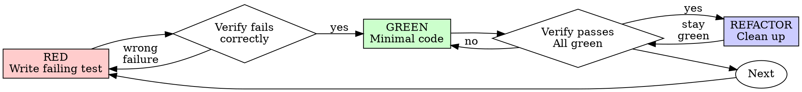

# Remove OmniHarness from commits

> This archive contains visible conversation activity and tool records. Private model reasoning and system/developer instructions are not available here.
<!-- codex-event:{"kind":"state","timestamp":"2026-07-02T05:18:57.842Z","phase":null} -->
## Task state: task_started · 2026-07-02T05:18:57.842Z

```text
{
  "type": "task_started",
  "turn_id": "019f2144-151b-7b91-a82a-937db0a66378",
  "started_at": 1782969537,
  "model_context_window": 258400,
  "collaboration_mode_kind": "default"
}
```

<!-- /codex-event -->

<!-- codex-event:{"kind":"user","timestamp":"2026-07-02T05:18:58.019Z","phase":null} -->
## User · 2026-07-02T05:18:58.019Z

We've been getting comments that have OmniHarness in the name For projects that are not OmniHarness that we are editing with OmniHarness. This should never happen. We should not insert the name OmniHarness in the commit for another project.


<!-- /codex-event -->

<!-- codex-event:{"kind":"progress","timestamp":"2026-07-02T05:19:03.188Z","phase":"commentary"} -->
## Codex progress · 2026-07-02T05:19:03.188Z

I’ll trace where commit text/comments are generated and look for hardcoded product branding leaking into cross-project edits. I’ll keep this scoped and won’t create branches or delete anything.

<!-- /codex-event -->

<!-- codex-event:{"kind":"tool-call","timestamp":"2026-07-02T05:19:03.189Z","phase":null} -->
## Tool call: exec_command · 2026-07-02T05:19:03.189Z

```json
{
  "cmd": "sed -n '1,220p' /Users/masterman/.agents/skills/systematic-debugging/SKILL.md",
  "workdir": "/Users/masterman/NLP/omniharness",
  "yield_time_ms": 1000,
  "max_output_tokens": 12000
}
```

<!-- /codex-event -->

<!-- codex-event:{"kind":"tool-call","timestamp":"2026-07-02T05:19:03.209Z","phase":null} -->
## Tool call: exec_command · 2026-07-02T05:19:03.209Z

```json
{
  "cmd": "sed -n '1,220p' /Users/masterman/.agents/skills/test-driven-development/SKILL.md",
  "workdir": "/Users/masterman/NLP/omniharness",
  "yield_time_ms": 1000,
  "max_output_tokens": 12000
}
```

<!-- /codex-event -->

<!-- codex-event:{"kind":"tool-result","timestamp":"2026-07-02T05:19:03.242Z","phase":null} -->
## Tool result: call_RerWjfE3fNeYReqTYUMKKJeP · 2026-07-02T05:19:03.242Z

````text
Chunk ID: f49eb5
Wall time: 0.0000 seconds
Process exited with code 0
Original token count: 1613
Output:
---
name: systematic-debugging
description: Use when encountering any bug, test failure, or unexpected behavior, before proposing fixes
---

# Systematic Debugging

## Overview

Random fixes waste time and create new bugs. Quick patches mask underlying issues.

**Core principle:** ALWAYS find root cause before attempting fixes. Symptom fixes are failure.

**Violating the letter of this process is violating the spirit of debugging.**

## The Iron Law

```
NO FIXES WITHOUT ROOT CAUSE INVESTIGATION FIRST
```

If you haven't completed Phase 1, you cannot propose fixes.

## When to Use

Use for ANY technical issue:
- Test failures
- Bugs in production
- Unexpected behavior
- Performance problems
- Build failures
- Integration issues

**Use this ESPECIALLY when:**
- Under time pressure (emergencies make guessing tempting)
- "Just one quick fix" seems obvious
- You've already tried multiple fixes
- Previous fix didn't work
- You don't fully understand the issue

**Don't skip when:**
- Issue seems simple (simple bugs have root causes too)
- You're in a hurry (rushing guarantees rework)
- Manager wants it fixed NOW (systematic is faster than thrashing)

## The Four Phases

You MUST complete each phase before proceeding to the next.

### Phase 1: Root Cause Investigation

**BEFORE attempting ANY fix:**

1. **Read Error Messages Carefully**
   - Don't skip past errors or warnings
   - They often contain the exact solution
   - Read stack traces completely
   - Note line numbers, file paths, error codes

2. **Reproduce Consistently**
   - Can you trigger it reliably?
   - What are the exact steps?
   - Does it happen every time?
   - If not reproducible → gather more data, don't guess

3. **Check Recent Changes**
   - What changed that could cause this?
   - Git diff, recent commits
   - New dependencies, config changes
   - Environmental differences

4. **Gather Evidence in Multi-Component Systems**

   **WHEN system has multiple components (CI → build → signing, API → service → database):**

   **BEFORE proposing fixes, add diagnostic instrumentation:**
   ```
   For EACH component boundary:
     - Log what data enters component
     - Log what data exits component
     - Verify environment/config propagation
     - Check state at each layer

   Run once to gather evidence showing WHERE it breaks
   THEN analyze evidence to identify failing component
   THEN investigate that specific component
   ```

   **Example (multi-layer system):**
   ```bash
   # Layer 1: Workflow
   echo "=== Secrets available in workflow: ==="
   echo "IDENTITY: ${IDENTITY:+SET}${IDENTITY:-UNSET}"

   # Layer 2: Build script
   echo "=== Env vars in build script: ==="
   env | grep IDENTITY || echo "IDENTITY not in environment"

   # Layer 3: Signing script
   echo "=== Keychain state: ==="
   security list-keychains
   security find-identity -v

   # Layer 4: Actual signing
   codesign --sign "$IDENTITY" --verbose=4 "$APP"
   ```

   **This reveals:** Which layer fails (secrets → workflow ✓, workflow → build ✗)

5. **Trace Data Flow**

   **WHEN error is deep in call stack:**

   See `root-cause-tracing.md` in this directory for the complete backward tracing technique.

   **Quick version:**
   - Where does bad value originate?
   - What called this with bad value?
   - Keep tracing up until you find the source
   - Fix at source, not at symptom

### Phase 2: Pattern Analysis

**Find the pattern before fixing:**

1. **Find Working Examples**
   - Locate similar working code in same codebase
   - What works that's similar to what's broken?

2. **Compare Against References**
   - If implementing pattern, read reference implementation COMPLETELY
   - Don't skim - read every line
   - Understand the pattern fully before applying

3. **Identify Differences**
   - What's different between working and broken?
   - List every difference, however small
   - Don't assume "that can't matter"

4. **Understand Dependencies**
   - What other components does this need?
   - What settings, config, environment?
   - What assumptions does it make?

### Phase 3: Hypothesis and Testing

**Scientific method:**

1. **Form Single Hypothesis**
   - State clearly: "I think X is the root cause because Y"
   - Write it down
   - Be specific, not vague

2. **Test Minimally**
   - Make the SMALLEST possible change to test hypothesis
   - One variable at a time
   - Don't fix multiple things at once

3. **Verify Before Continuing**
   - Did it work? Yes → Phase 4
   - Didn't work? Form NEW hypothesis
   - DON'T add more fixes on top

4. **When You Don't Know**
   - Say "I don't understand X"
   - Don't pretend to know
   - Ask for help
   - Research more

### Phase 4: Implementation

**Fix the root cause, not the symptom:**

1. **Create Failing Test Case**
   - Simplest possible reproduction
   - Automated test if possible
   - One-off test script if no framework
   - MUST have before fixing
   - Use the `ultrapowers:test-driven-development` skill for writing proper failing tests

2. **Implement Single Fix**
   - Address the root cause identified
   - ONE change at a time
   - No "while I'm here" improvements
   - No bundled refactoring

3. **Verify Fix**
   - Test passes now?
   - No other tests broken?
   - Issue actually resolved?
   - If the bug was meaningful or systemic, use `ultrapowers:learning-from-bugs` before declaring the fix complete.

4. **If Fix Doesn't Work**
   - STOP
   - Count: How many fixes have you tried?
   - If < 3: Return to Phase 1, re-analyze with new information
   - **If ≥ 3: STOP and question the architecture (step 5 below)**
   - DON'T attempt Fix #4 without architectural discussion

5. **If 3+ Fixes Failed: Question Architecture**

   **Pattern indicating architectural problem:**
   - Each fix reveals new shared state/coupling/problem in different place
   - Fixes require "massive refactoring" to implement
   - Each fix creates new symptoms elsewhere

   **STOP and question fundamentals:**
   - Is this pattern fundamentally sound?
   - Are we "sticking with it through sheer inertia"?
   - Should we refactor architecture vs. continue fixing symptoms?

   **Discuss with your human partner before attempting more fixes**

   This is NOT a failed hypothesis - this is a wrong architecture.

## Red Flags - STOP and Follow Process

If you catch yourself thinking:
- "Quick fix for now, investigate later"
- "Just try changing X and see if it works"

````

<!-- /codex-event -->

<!-- codex-event:{"kind":"tool-result","timestamp":"2026-07-02T05:19:03.253Z","phase":null} -->
## Tool result: call_oRytewWLEHP4Lou6cP1lTdCB · 2026-07-02T05:19:03.253Z

````text
Chunk ID: e3303f
Wall time: 0.0000 seconds
Process exited with code 0
Original token count: 1448
Output:
---
name: test-driven-development
description: Use when implementing any feature or bugfix, before writing implementation code
---

# Test-Driven Development (TDD)

## Overview

Write the test first. Watch it fail. Write minimal code to pass.

**Core principle:** If you didn't watch the test fail, you don't know if it tests the right thing.

**Violating the letter of the rules is violating the spirit of the rules.**

## When to Use

**Always:**
- New features
- Bug fixes
- Refactoring
- Behavior changes

**Exceptions (ask your human partner):**
- Throwaway prototypes
- Generated code
- Configuration files

**Do directly with targeted verification:**
- tiny color, spacing, copy, or label changes,
- one-line prompt wording changes,
- docs-only wording changes,
- mechanical edits where the expected result is obvious from the diff.

Do not perform a full red-green cycle for a tiny mechanical edit unless it changes behavior or there is a real regression risk. For example, changing a button from gray to blue usually needs the edit plus a targeted visual or code check, not a new failing test.

Thinking "skip TDD just this once"? Stop. That's rationalization.

## UI-Specific Note

When the task is UI work, choose the design system and starting block before writing tests around the intended behavior and rendering. In Ultrapowers, that means `shadcn/ui` plus the closest available ShadCN Block for each new screen, form, or major surface unless the user says otherwise. Inspect https://ui.shadcn.com/blocks first, install or copy the selected block, and then adapt it. Before adding any individual control, check whether `shadcn/ui` already provides a suitable control and use/customize that control first.

For important app workflows, also consider whether `agentic-user-journey-testing` should be proposed. Do not run that higher-cost black-box test mode without explicit user approval.

## The Iron Law

```
NO PRODUCTION CODE WITHOUT A FAILING TEST FIRST
```

Write code before the test? Delete it. Start over.

**No exceptions:**
- Don't keep it as "reference"
- Don't "adapt" it while writing tests
- Don't look at it
- Delete means delete

Implement fresh from tests. Period.

## Red-Green-Refactor



### RED - Write Failing Test

Write one minimal test showing what should happen.

<Good>
```typescript
test('retries failed operations 3 times', async () => {
  let attempts = 0;
  const operation = () => {
    attempts++;
    if (attempts < 3) throw new Error('fail');
    return 'success';
  };

  const result = await retryOperation(operation);

  expect(result).toBe('success');
  expect(attempts).toBe(3);
});
```
Clear name, tests real behavior, one thing
</Good>

<Bad>
```typescript
test('retry works', async () => {
  const mock = jest.fn()
    .mockRejectedValueOnce(new Error())
    .mockRejectedValueOnce(new Error())
    .mockResolvedValueOnce('success');
  await retryOperation(mock);
  expect(mock).toHaveBeenCalledTimes(3);
});
```
Vague name, tests mock not code
</Bad>

**Requirements:**
- One behavior
- Clear name
- Real code (no mocks unless unavoidable)
- Real product behavior is the target. Mocked behavior can never be the final deliverable or proof that the feature works.

### Verify RED - Watch It Fail

**MANDATORY. Never skip.**

```bash
npm test path/to/test.test.ts
```

Confirm:
- Test fails (not errors)
- Failure message is expected
- Fails because feature missing (not typos)

**Test passes?** You're testing existing behavior. Fix test.

**Test errors?** Fix error, re-run until it fails correctly.

### GREEN - Minimal Code

Write simplest code to pass the test.

<Good>
```typescript
async function retryOperation<T>(fn: () => Promise<T>): Promise<T> {
  for (let i = 0; i < 3; i++) {
    try {
      return await fn();
    } catch (e) {
      if (i === 2) throw e;
    }
  }
  throw new Error('unreachable');
}
```
Just enough to pass
</Good>

<Bad>
```typescript
async function retryOperation<T>(
  fn: () => Promise<T>,
  options?: {
    maxRetries?: number;
    backoff?: 'linear' | 'exponential';
    onRetry?: (attempt: number) => void;
  }
): Promise<T> {
  // YAGNI
}
```
Over-engineered
</Bad>

Don't add features, refactor other code, or "improve" beyond the test.

### Verify GREEN - Watch It Pass

**MANDATORY.**

```bash
npm test path/to/test.test.ts
```

Confirm:
- Test passes
- Other tests still pass
- Output pristine (no errors, warnings)

**Test fails?** Fix code, not test.

**Other tests fail?** Fix now.

### REFACTOR - Clean Up

After green only:
- Remove duplication
- Improve names
- Extract helpers

Keep tests green. Don't add behavior.

### Repeat

Next failing test for next feature.

## Good Tests

| Quality | Good | Bad |
|---------|------|-----|
| **Minimal** | One thing. "and" in name? Split it. | `test('validates email and domain and whitespace')` |
| **Clear** | Name describes behavior | `test('test1')` |
| **Shows intent** | Demonstrates desired API | Obscures what code should do |


````

<!-- /codex-event -->

<!-- codex-event:{"kind":"progress","timestamp":"2026-07-02T05:19:08.478Z","phase":"commentary"} -->
## Codex progress · 2026-07-02T05:19:08.478Z

I’m using the debugging and TDD guidance here: first find the source of the leaked name, then pin it with a regression test before changing behavior.

<!-- /codex-event -->

<!-- codex-event:{"kind":"tool-call","timestamp":"2026-07-02T05:19:08.484Z","phase":null} -->
## Tool call: exec_command · 2026-07-02T05:19:08.484Z

```json
{
  "cmd": "rg -n \"OmniHarness|omniharness|commit|commit message|comment\" src tests shared scripts docs -g '!node_modules'",
  "workdir": "/Users/masterman/NLP/omniharness",
  "yield_time_ms": 1000,
  "max_output_tokens": 30000
}
```

<!-- /codex-event -->

<!-- codex-event:{"kind":"tool-call","timestamp":"2026-07-02T05:19:08.503Z","phase":null} -->
## Tool call: exec_command · 2026-07-02T05:19:08.503Z

```json
{
  "cmd": "git status --short",
  "workdir": "/Users/masterman/NLP/omniharness",
  "yield_time_ms": 1000,
  "max_output_tokens": 12000
}
```

<!-- /codex-event -->

<!-- codex-event:{"kind":"tool-call","timestamp":"2026-07-02T05:19:08.514Z","phase":null} -->
## Tool call: exec_command · 2026-07-02T05:19:08.514Z

```json
{
  "cmd": "rg --files tests src | rg \"(commit|git|message|comment|review|worker|prompt)\"",
  "workdir": "/Users/masterman/NLP/omniharness",
  "yield_time_ms": 1000,
  "max_output_tokens": 12000
}
```

<!-- /codex-event -->

<!-- codex-event:{"kind":"tool-result","timestamp":"2026-07-02T05:19:08.576Z","phase":null} -->
## Tool result: call_Sr1Wj2Y6Q4vYSAi3IjgTRPPO · 2026-07-02T05:19:08.576Z

````text
Chunk ID: 961961
Wall time: 0.0000 seconds
Process exited with code 0
Original token count: 65706
Output:
Warning: truncated output (original token count: 65706)
Total output lines: 1687

shared/locales/es.json:2:  "product.name": "OmniHarness",
shared/locales/es.json:32:  "settings.dialog.title": "Configuración de OmniHarness",
shared/locales/es.json:149:  "commit.menu.label": "Commit options",
shared/locales/es.json:150:  "commit.menu.autoCommitMilestones": "Auto-commit milestones",
shared/locales/es.json:151:  "commit.menu.alwaysPushOnCommit": "Always push on commit",
shared/locales/es.json:152:  "commit.menu.commitNow": "Commit now",
shared/locales/es.json:153:  "commit.menu.commitAndPushNow": "Commit and push now",
shared/locales/es.json:154:  "commit.menu.commitProjectNow": "Commit project",
shared/locales/es.json:155:  "commit.menu.commitAndPushProject": "Commit and push project",
shared/locales/es.json:163:  "commit.status.autoCommitCreated": "Auto-commit created: {commit}",
shared/locales/es.json:164:  "commit.status.autoCommitSkipped": "Auto-commit skipped: {reason}",
shared/locales/es.json:165:  "commit.status.autoCommitFailed": "Auto-commit failed: {reason}",
shared/locales/es.json:166:  "commit.status.pushCreated": "Auto-commit pushed: {commit}",
shared/locales/es.json:167:  "commit.status.pushFailed": "Auto-commit push failed: {reason}",
shared/locales/es.json:247:  "recovery.notice.description.quotaWaiting": "Quota is exhausted. OmniHarness will resume automatically at {resumeAt}.",
shared/locales/es.json:248:  "recovery.notice.description.recovering": "OmniHarness is restoring the worker session or restarting from the latest checkpoint.",
shared/locales/es.json:275:  "settings.agents.onboarding.description": "OmniHarness can see installed CLIs, but workers need a logged-in provider before the first run.",
shared/locales/es.json:337:  "notifications.error.serviceWorkerUnavailable": "OmniHarness could not start the notification service worker.",
shared/locales/es.json:341:  "notifications.push.needsInput": "OmniHarness needs input",
shared/locales/es.json:350:  "boot.loading.aria": "Loading OmniHarness",
shared/locales/es.json:352:  "login.pair.description": "Connecting this phone to your running OmniHarness session.",
shared/locales/es.json:353:  "login.password.description": "Enter the password for this OmniHarness instance to continue.",
shared/locales/es.json:358:  "login.submit": "Unlock OmniHarness",
shared/locales/es.json:521:  "git.workspace.dialog.remove.warning": "Los worktrees con cambios o conflictos no se pueden eliminar. OmniHarness vuelve a comprobar el worktree antes de ejecutar git.",
shared/locales/es.json:552:  "vscode.panel.promptPlaceholder": "Ask OmniHarness to work on this workspace",
shared/locales/ko.json:2:  "product.name": "OmniHarness",
shared/locales/ko.json:32:  "settings.dialog.title": "OmniHarness 설정",
shared/locales/ko.json:149:  "commit.menu.label": "Commit options",
shared/locales/ko.json:150:  "commit.menu.autoCommitMilestones": "Auto-commit milestones",
shared/locales/ko.json:151:  "commit.menu.alwaysPushOnCommit": "Always push on commit",
shared/locales/ko.json:152:  "commit.menu.commitNow": "Commit now",
shared/locales/ko.json:153:  "commit.menu.commitAndPushNow": "Commit and push now",
shared/locales/ko.json:154:  "commit.menu.commitProjectNow": "Commit project",
shared/locales/ko.json:155:  "commit.menu.commitAndPushProject": "Commit and push project",
shared/locales/ko.json:163:  "commit.status.autoCommitCreated": "Auto-commit created: {commit}",
shared/locales/ko.json:164:  "commit.status.autoCommitSkipped": "Auto-commit skipped: {reason}",
shared/locales/ko.json:165:  "commit.status.autoCommitFailed": "Auto-commit failed: {reason}",
shared/locales/ko.json:166:  "commit.status.pushCreated": "Auto-commit pushed: {commit}",
shared/locales/ko.json:167:  "commit.status.pushFailed": "Auto-commit push failed: {reason}",
shared/locales/ko.json:247:  "recovery.notice.description.quotaWaiting": "Quota is exhausted. OmniHarness will resume automatically at {resumeAt}.",
shared/locales/ko.json:248:  "recovery.notice.description.recovering": "OmniHarness is restoring the worker session or restarting from the latest checkpoint.",
shared/locales/ko.json:275:  "settings.agents.onboarding.description": "OmniHarness can see installed CLIs, but workers need a logged-in provider before the first run.",
shared/locales/ko.json:337:  "notifications.error.serviceWorkerUnavailable": "OmniHarness could not start the notification service worker.",
shared/locales/ko.json:341:  "notifications.push.needsInput": "OmniHarness needs input",
shared/locales/ko.json:350:  "boot.loading.aria": "Loading OmniHarness",
shared/locales/ko.json:352:  "login.pair.description": "Connecting this phone to your running OmniHarness session.",
shared/locales/ko.json:353:  "login.password.description": "Enter the password for this OmniHarness instance to continue.",
shared/locales/ko.json:358:  "login.submit": "Unlock OmniHarness",
shared/locales/ko.json:521:  "git.workspace.dialog.remove.warning": "변경 사항이나 충돌이 있는 워크트리는 제거할 수 없습니다. OmniHarness는 git 실행 전에 워크트리를 다시 확인합니다.",
shared/locales/ko.json:552:  "vscode.panel.promptPlaceholder": "Ask OmniHarness to work on this workspace",
shared/locales/fr.json:2:  "product.name": "OmniHarness",
shared/locales/fr.json:32:  "settings.dialog.title": "Paramètres OmniHarness",
shared/locales/fr.json:149:  "commit.menu.label": "Commit options",
shared/locales/fr.json:150:  "commit.menu.autoCommitMilestones": "Auto-commit milestones",
shared/locales/fr.json:151:  "commit.menu.alwaysPushOnCommit": "Always push on commit",
shared/locales/fr.json:152:  "commit.menu.commitNow": "Commit now",
shared/locales/fr.json:153:  "commit.menu.commitAndPushNow": "Commit and push now",
shared/locales/fr.json:154:  "commit.menu.commitProjectNow": "Commit project",
shared/locales/fr.json:155:  "commit.menu.commitAndPushProject": "Commit and push project",
shared/locales/fr.json:163:  "commit.status.autoCommitCreated": "Auto-commit created: {commit}",
shared/locales/fr.json:164:  "commit.status.autoCommitSkipped": "Auto-commit skipped: {reason}",
shared/locales/fr.json:165:  "commit.status.autoCommitFailed": "Auto-commit failed: {reason}",
shared/locales/fr.json:166:  "commit.status.pushCreated": "Auto-commit pushed: {commit}",
shared/locales/fr.json:167:  "commit.status.pushFailed": "Auto-commit push failed: {reason}",
shared/locales/fr.json:247:  "recovery.notice.description.quotaWaiting": "Quota is exhausted. OmniHarness will resume automatically at {resumeAt}.",
shared/locales/fr.json:248:  "recovery.notice.description.recovering": "OmniHarness is restoring the worker session or restarting from the latest checkpoint.",
shared/locales/fr.json:275:  "settings.agents.onboarding.description": "OmniHarness can see installed CLIs, but workers need a logged-in provider before the first run.",
shared/locales/fr.json:337:  "notifications.error.serviceWorkerUnavailable": "OmniHarness could not start the notification service worker.",
shared/locales/fr.json:341:  "notifications.push.needsInput": "OmniHarness needs input",
shared/locales/fr.json:350:  "boot.loading.aria": "Loading OmniHarness",
shared/locales/fr.json:352:  "login.pair.description": "Connecting this phone to your running OmniHarness session.",
shared/locales/fr.json:353:  "login.password.description": "Enter the password for this OmniHarness instance to continue.",
shared/locales/fr.json:358:  "login.submit": "Unlock OmniHarness",
shared/locales/fr.json:521:  "git.workspace.dialog.remove.warning": "Les worktrees modifiés ou en conflit ne peuvent pas être supprimés. OmniHarness revérifie le worktree avant d’exécuter git.",
shared/locales/fr.json:552:  "vscode.panel.promptPlaceholder": "Ask OmniHarness to work on this workspace",
docs/superpowers/journeys/2026-05-13-branch-workspace-management.md:8:- User role: builder starting a new OmniHarness session.
docs/superpowers/journeys/2026-05-13-branch-workspace-management.md:32:- Expected completion proof: `git worktree list` includes the path, the worktree branch matches the confirmed branch, and OmniHarness shows the run pinned to that checkout.
docs/superpowers/journeys/2026-05-13-branch-workspace-management.md:38:- User role: cautious builder with uncommitted work.
docs/superpowers/journeys/2026-05-13-branch-workspace-management.md:48:- User role: builder whose selected checkout disappeared outside OmniHarness.
shared/locales/it.json:2:  "product.name": "OmniHarness",
shared/locales/it.json:32:  "settings.dialog.title": "Impostazioni OmniHarness",
shared/locales/it.json:149:  "commit.menu.label": "Commit options",
shared/locales/it.json:150:  "commit.menu.autoCommitMilestones": "Auto-commit milestones",
shared/locales/it.json:151:  "commit.menu.alwaysPushOnCommit": "Always push on commit",
shared/locales/it.json:152:  "commit.menu.commitNow": "Commit now",
shared/locales/it.json:153:  "commit.menu.commitAndPushNow": "Commit and push now",
shared/locales/it.json:154:  "commit.menu.commitProjectNow": "Commit project",
shared/locales/it.json:155:  "commit.menu.commitAndPushProject": "Commit and push project",
shared/locales/it.json:163:  "commit.status.autoCommitCreated": "Auto-commit created: {commit}",
shared/locales/it.json:164:  "commit.status.autoCommitSkipped": "Auto-commit skipped: {reason}",
shared/locales/it.json:165:  "commit.status.autoCommitFailed": "Auto-commit failed: {reason}",
shared/locales/it.json:166:  "commit.status.pushCreated": "Auto-commit pushed: {commit}",
shared/locales/it.json:167:  "commit.status.pushFailed": "Auto-commit push failed: {reason}",
shared/locales/it.json:247:  "recovery.notice.description.quotaWaiting": "Quota is exhausted. OmniHarness will resume automatically at {resumeAt}.",
shared/locales/it.json:248:  "recovery.notice.description.recovering": "OmniHarness is restoring the worker session or restarting from the latest checkpoint.",
shared/locales/it.json:275:  "settings.agents.onboarding.description": "OmniHarness can see installed CLIs, but workers need a logged-in provider before the first run.",
shared/locales/it.json:337:  "notifications.error.serviceWorkerUnavailable": "OmniHarness could not start the notification service worker.",
shared/locales/it.json:341:  "notifications.push.needsInput": "OmniHarness needs input",
shared/locales/it.json:350:  "boot.loading.aria": "Loading OmniHarness",
shared/locales/it.json:352:  "login.pair.description": "Connecting this phone to your running OmniHarness session.",
shared/locales/it.json:353:  "login.password.description": "Enter the password for this OmniHarness instance to continue.",
shared/locales/it.json:358:  "login.submit": "Unlock OmniHarness",
shared/locales/it.json:521:  "git.workspace.dialog.remove.warning": "I worktree sporchi o in conflitto non possono essere rimossi. OmniHarness ricontrolla il worktree prima di eseguire git.",
shared/locales/it.json:552:  "vscode.panel.promptPlaceholder": "Ask OmniHarness to work on this workspace",
shared/locales/en.json:2:  "product.name": "OmniHarness",
shared/locales/en.json:32:  "settings.dialog.title": "OmniHarness Settings",
shared/locales/en.json:190:  "commit.menu.label": "Commit options",
shared/locales/en.json:191:  "commit.menu.autoCommitMilestones": "Auto-commit milestones",
shared/locales/en.json:192:  "commit.menu.alwaysPushOnCommit": "Always push on commit",
shared/locales/en.json:193:  "commit.menu.commitNow": "Commit now",
shared/locales/en.json:194:  "commit.menu.commitAndPushNow": "Commit and push now",
shared/locales/en.json:195:  "commit.menu.commitProjectNow": "Commit project",
shared/locales/en.json:196:  "commit.menu.commitAndPushProject": "Commit and push project",
shared/locales/en.json:204:  "commit.status.autoCommitCreated": "Auto-commit created: {commit}",
shared/locales/en.json:205:  "commit.status.autoCommitSkipped": "Auto-commit skipped: {reason}",
shared/locales/en.json:206:  "commit.status.autoCommitFailed": "Auto-commit failed: {reason}",
shared/locales/en.json:207:  "commit.status.pushCreated": "Auto-commit pushed: {commit}",
shared/locales/en.json:208:  "commit.status.pushFailed": "Auto-commit push failed: {reason}",
shared/locales/en.json:288:  "recovery.notice.description.quotaWaiting": "Quota is exhausted. OmniHarness will resume automatically at {resumeAt}.",
shared/locales/en.json:289:  "recovery.notice.description.recovering": "OmniHarness is restoring the worker session or restarting from the latest checkpoint.",
shared/locales/en.json:316:  "settings.agents.onboarding.description": "OmniHarness can see installed CLIs, but workers need a logged-in provider before the first run.",
shared/locales/en.json:378:  "notifications.error.serviceWorkerUnavailable": "OmniHarness could not start the notification service worker.",
shared/locales/en.json:382:  "notifications.push.needsInput": "OmniHarness needs input",
shared/locales/en.json:391:  "boot.loading.aria": "Loading OmniHarness",
shared/locales/en.json:393:  "login.pair.description": "Connecting this phone to your running OmniHarness session.",
shared/locales/en.json:394:  "login.password.description": "Enter the password for this OmniHarness instance to continue.",
shared/locales/en.json:399:  "login.submit": "Unlock OmniHarness",
shared/locales/en.json:521:  "git.workspace.dialog.remove.warning": "Dirty or conflicted worktrees cannot be removed. OmniHarness rechecks the worktree before running git.",
shared/locales/en.json:552:  "vscode.panel.promptPlaceholder": "Ask OmniHarness to work on this workspace",
shared/locales/pt.json:2:  "product.name": "OmniHarness",
shared/locales/pt.json:32:  "settings.dialog.title": "Configurações do OmniHarness",
shared/locales/pt.json:149:  "commit.menu.label": "Commit options",
shared/locales/pt.json:150:  "commit.menu.autoCommitMilestones": "Auto-commit milestones",
shared/locales/pt.json:151:  "commit.menu.alwaysPushOnCommit": "Always push on commit",
shared/locales/pt.json:152:  "commit.menu.commitNow": "Commit now",
shared/locales/pt.json:153:  "commit.menu.commitAndPushNow": "Commit and push now",
shared/locales/pt.json:154:  "commit.menu.commitProjectNow": "Commit project",
shared/locales/pt.json:155:  "commit.menu.commitAndPushProject": "Commit and push project",
shared/locales/pt.json:163:  "commit.status.autoCommitCreated": "Auto-commit created: {commit}",
shared/locales/pt.json:164:  "commit.status.autoCommitSkipped": "Auto-commit skipped: {reason}",
shared/locales/pt.json:165:  "commit.status.autoCommitFailed": "Auto-commit failed: {reason}",
shared/locales/pt.json:166:  "commit.status.pushCreated": "Auto-commit pushed: {commit}",
shared/locales/pt.json:167:  "commit.status.pushFailed": "Auto-commit push failed: {reason}",
shared/locales/pt.json:247:  "recovery.notice.description.quotaWaiting": "Quota is exhausted. OmniHarness will resume automatically at {resumeAt}.",
shared/locales/pt.json:248:  "recovery.notice.description.recovering": "OmniHarness is restoring the worker session or restarting from the latest checkpoint.",
shared/locales/pt.json:275:  "settings.agents.onboarding.description": "OmniHarness can see installed CLIs, but workers need a logged-in provider before the first run.",
shared/locales/pt.json:337:  "notifications.error.serviceWorkerUnavailable": "OmniHarness could not start the notification service worker.",
shared/locales/pt.json:341:  "notifications.push.needsInput": "OmniHarness needs input",
shared/locales/pt.json:350:  "boot.loading.aria": "Loading OmniHarness",
shared/locales/pt.json:352:  "login.pair.description": "Connecting this phone to your running OmniHarness session.",
shared/locales/pt.json:353:  "login.password.description": "Enter the password for this OmniHarness instance to continue.",
shared/locales/pt.json:358:  "login.submit": "Unlock OmniHarness",
shared/locales/pt.json:521:  "git.workspace.dialog.remove.warning": "Worktrees sujos ou em conflito não podem ser removidos. O OmniHarness verifica novamente o worktree antes de executar git.",
shared/locales/pt.json:552:  "vscode.panel.promptPlaceholder": "Ask OmniHarness to work on this workspace",
src/vscode-extension/bridge.ts:60:    throw new Error("OmniHarness server URL is required.");
src/vscode-extension/bridge.ts:74:    throw new Error("API proxy path must target an OmniHarness /api route.");
scripts/ensure-recommended-tools.sh:5:  echo "[omniharness] Skipping recommended tool setup."
scripts/ensure-recommended-tools.sh:10:  echo "[omniharness] ripgrep detected."
scripts/ensure-recommended-tools.sh:68:echo "[omniharness] ripgrep (rg) is recommended for agent repository search."
scripts/ensure-recommended-tools.sh:69:echo "[omniharness] Attempting to install ripgrep with the system package manager..."
scripts/ensure-recommended-tools.sh:72:  echo "[omniharness] ripgrep installed."
scripts/ensure-recommended-tools.sh:76:echo "[omniharness] Could not install ripgrep automatically. Continuing without it."
scripts/ensure-recommended-tools.sh:77:echo "[omniharness] Recommended manual install:"
shared/locales/zh-CN.json:2:  "product.name": "OmniHarness",
shared/locales/zh-CN.json:32:  "settings.dialog.title": "OmniHarness 设置",
shared/locales/zh-CN.json:149:  "commit.menu.label": "Commit options",
shared/locales/zh-CN.json:150:  "commit.menu.autoCommitMilestones": "Auto-commit milestones",
shared/locales/zh-CN.json:151:  "commit.menu.alwaysPushOnCommit": "Always push on commit",
shared/locales/zh-CN.json:152:  "commit.menu.commitNow": "Commit now",
shared/locales/zh-CN.json:153:  "commit.menu.commitAndPushNow": "Commit and push now",
shared/locales/zh-CN.json:154:  "commit.menu.commitProjectNow": "Commit project",
shared/locales/zh-CN.json:155:  "commit.menu.commitAndPushProject": "Commit and push project",
shared/locales/zh-CN.json:163:  "commit.status.autoCommitCreated": "Auto-commit created: {commit}",
shared/locales/zh-CN.json:164:  "commit.status.autoCommitSkipped": "Auto-commit skipped: {reason}",
shared/locales/zh-CN.json:165:  "commit.status.autoCommitFailed": "Auto-commit failed: {reason}",
shared/locales/zh-CN.json:166:  "commit.status.pushCreated": "Auto-commit pushed: {commit}",
shared/locales/zh-CN.json:167:  "commit.status.pushFailed": "Auto-commit push failed: {reason}",
shared/locales/zh-CN.json:247:  "recovery.notice.description.quotaWaiting": "Quota is exhausted. OmniHarness will resume automatically at {resumeAt}.",
shared/locales/zh-CN.json:248:  "recovery.notice.description.recovering": "OmniHarness is restoring the worker session or restarting from the latest checkpoint.",
shared/locales/zh-CN.json:275:  "settings.agents.onboarding.description": "OmniHarness can see installed CLIs, but workers need a logged-in provider before the first run.",
shared/locales/zh-CN.json:337:  "notifications.error.serviceWorkerUnavailable": "OmniHarness could not start the notification service worker.",
shared/locales/zh-CN.json:341:  "notifications.push.needsInput": "OmniHarness needs input",
shared/locales/zh-CN.json:350:  "boot.loading.aria": "Loading OmniHarness",
shared/locales/zh-CN.json:352:  "login.pair.description": "Connecting this phone to your running OmniHarness session.",
shared/locales/zh-CN.json:353:  "login.password.description": "Enter the password for this OmniHarness instance to continue.",
shared/locales/zh-CN.json:358:  "login.submit": "Unlock OmniHarness",
shared/locales/zh-CN.json:521:  "git.workspace.dialog.remove.warning": "有未提交更改或冲突的工作树不能移除。OmniHarness 会在运行 git 前重新检查工作树。",
shared/locales/zh-CN.json:552:  "vscode.panel.promptPlaceholder": "Ask OmniHarness to work on this workspace",
shared/locales/de.json:2:  "product.name": "OmniHarness",
shared/locales/de.json:32:  "settings.dialog.title": "OmniHarness-Einstellungen",
shared/locales/de.json:149:  "commit.menu.label": "Commit options",
shared/locales/de.json:150:  "commit.menu.autoCommitMilestones": "Auto-commit milestones",
shared/locales/de.json:151:  "commit.menu.al…55706 tokens truncated…bar-commit-workflow.md:118:    - `commit.menu.autoCommitMilestones`
docs/superpowers/plans/2026-05-11-top-bar-commit-workflow.md:119:    - `commit.menu.alwaysPushOnCommit`
docs/superpowers/plans/2026-05-11-top-bar-commit-workflow.md:120:    - `commit.menu.commitNow`
docs/superpowers/plans/2026-05-11-top-bar-commit-workflow.md:121:    - `commit.menu.commitAndPushNow`
docs/superpowers/plans/2026-05-11-top-bar-commit-workflow.md:122:    - `commit.menu.commitProjectNow`
docs/superpowers/plans/2026-05-11-top-bar-commit-workflow.md:123:    - `commit.status.autoCommitCreated`
docs/superpowers/plans/2026-05-11-top-bar-commit-workflow.md:124:    - `commit.status.autoCommitSkipped`
docs/superpowers/plans/2026-05-11-top-bar-commit-workflow.md:125:    - `commit.status.autoCommitFailed`
docs/superpowers/plans/2026-05-11-top-bar-commit-workflow.md:126:    - `commit.status.pushCreated`
docs/superpowers/plans/2026-05-11-top-bar-commit-workflow.md:127:    - `commit.status.pushFailed`
docs/superpowers/plans/2026-05-11-top-bar-commit-workflow.md:128:  - Convert touched existing hardcoded commit labels in the changed components.
docs/superpowers/plans/2026-05-11-top-bar-commit-workflow.md:132:- `src/server/git/auto-commit.test.ts`
docs/superpowers/plans/2026-05-11-top-bar-commit-workflow.md:133:  - Unit tests for auto-commit and push behavior in temporary git repos.
docs/superpowers/plans/2026-05-11-top-bar-commit-workflow.md:140:- `tests` or `src/server/git/auto-commit.test.ts`
docs/superpowers/plans/2026-05-11-top-bar-commit-workflow.md:141:  - Clean baseline with changes creates a commit.
docs/superpowers/plans/2026-05-11-top-bar-commit-workflow.md:142:  - Push-on-commit calls push after a commit.
docs/superpowers/plans/2026-05-11-top-bar-commit-workflow.md:143:  - Explicit commit-and-push action pushes regardless of persisted switch.
docs/superpowers/plans/2026-05-11-top-bar-commit-workflow.md:144:  - Dirty baseline skips auto-commit.
docs/superpowers/plans/2026-05-11-top-bar-commit-workflow.md:145:  - No changes skips auto-commit.
docs/superpowers/plans/2026-05-11-top-bar-commit-workflow.md:150:  - Verify changed top-bar commit strings are rendered through `t()`.
docs/superpowers/plans/2026-05-11-top-bar-commit-workflow.md:154:  - Open the top-bar commit menu.
docs/superpowers/plans/2026-05-11-top-bar-commit-workflow.md:160:- Start a clean temporary git project, enable `Auto-commit milestones`, complete a small implementation run, and verify a real commit appears in the timeline.
docs/superpowers/plans/2026-05-11-top-bar-commit-workflow.md:161:- Enable `Always push on commit` against a temporary local bare remote, complete a milestone, and verify the commit is pushed.
docs/superpowers/plans/2026-05-11-top-bar-commit-workflow.md:166:- Existing `.gitignore` already excludes local DBs, journals, env files, logs, build outputs, Playwright reports, `.next`, coverage, temporary folders, and OmniHarness runtime artifacts.
docs/superpowers/plans/2026-05-11-top-bar-commit-workflow.md:171:- [ ] **Step 1: Lock down current commit flow behavior with tests or source assertions**
docs/superpowers/plans/2026-05-11-top-bar-commit-workflow.md:176:- [ ] **Step 2: Introduce explicit commit workflow settings**
docs/superpowers/plans/2026-05-11-top-bar-commit-workflow.md:191:  - Keep menu actions disabled while a commit prompt is pending.
docs/superpowers/plans/2026-05-11-top-bar-commit-workflow.md:195:- [ ] **Step 4: Rewire manual commit actions**
docs/superpowers/plans/2026-05-11-top-bar-commit-workflow.md:196:  - Rename existing `AutoCommitChatAction` concepts to manual commit action concepts, for example `"commit"` and `"commit-push"` under `ManualCommitAction`.
docs/superpowers/plans/2026-05-11-top-bar-commit-workflow.md:197:  - Keep the existing commit-only and commit-and-push prompts.
docs/superpowers/plans/2026-05-11-top-bar-commit-workflow.md:198:  - Make the primary top-bar button invoke commit-and-push when `GIT_PUSH_ON_COMMIT` is enabled, otherwise commit-only.
docs/superpowers/plans/2026-05-11-top-bar-commit-workflow.md:199:  - Make `Commit now` always commit-only.
docs/superpowers/plans/2026-05-11-top-bar-commit-workflow.md:200:  - Make `Commit and push now` always commit-and-push.
docs/superpowers/plans/2026-05-11-top-bar-commit-workflow.md:209:- [ ] **Step 6: Integrate milestone auto-commit with run lifecycle**
docs/superpowers/plans/2026-05-11-top-bar-commit-workflow.md:211:  - Capture baseline for implementation runs where auto-commit milestones are enabled.
docs/superpowers/plans/2026-05-11-top-bar-commit-workflow.md:212:  - On successful completion milestone, create a commit only if the baseline was clean and current git status has changes.
docs/superpowers/plans/2026-05-11-top-bar-commit-workflow.md:213:  - If `GIT_PUSH_ON_COMMIT` was enabled for that run, push after a successful commit.
docs/superpowers/plans/2026-05-11-top-bar-commit-workflow.md:217:- [ ] **Step 7: Align project-level commit entry points**
docs/superpowers/plans/2026-05-11-top-bar-commit-workflow.md:220:  - Ensure project-level manual commit prompts remain direct conversations and do not create branches or worktrees.
docs/superpowers/plans/2026-05-11-top-bar-commit-workflow.md:225:  - Convert touched hardcoded commit labels in changed components.
docs/superpowers/plans/2026-05-11-top-bar-commit-workflow.md:229:  - Update `src/app/home/utils.ts` to render auto-commit and push outcome events.
docs/superpowers/plans/2026-05-11-top-bar-commit-workflow.md:237:  - Run `rg -n "Auto commit|Auto Commit|Auto commit &|Auto Commit Project" src shared/locales` and confirm old visible copy is either removed or intentionally preserved in non-visible compatibility identifiers.
docs/superpowers/plans/2026-05-11-top-bar-commit-workflow.md:242:- The active-session top-bar commit menu matches the requested structure and order.
docs/superpowers/plans/2026-05-11-top-bar-commit-workflow.md:243:- `Auto-commit milestones` persists and controls lifecycle-owned milestone commits.
docs/superpowers/plans/2026-05-11-top-bar-commit-workflow.md:244:- `Always push on commit` persists and applies to automatic commits and the primary manual commit button.
docs/superpowers/plans/2026-05-11-top-bar-commit-workflow.md:246:- Existing prompt-driven commit behavior is reused where appropriate instead of duplicating a second manual commit system.
docs/superpowers/plans/2026-05-11-top-bar-commit-workflow.md:255:- The auto-commit behavior stays OmniHarness-owned at lifecycle boundaries rather than agent-hook-owned.
docs/superpowers/plans/2026-05-11-top-bar-commit-workflow.md:256:- The push setting has explicit behavior for automatic commits, primary manual commits, and explicit manual push actions.
tests/server/app-root.test.ts:15:    process.env.OMNIHARNESS_ROOT = "/tmp/omniharness-test-root";
tests/server/app-root.test.ts:18:    expect(mod.getAppRoot()).toBe("/tmp/omniharness-test-root");
tests/server/app-root.test.ts:19:    expect(mod.getAppDataPath("sqlite.db")).toBe("/tmp/omniharness-test-root/sqlite.db");
tests/server/app-root.test.ts:21:      "/tmp/omniharness-test-root/vibes/ad-hoc/plan.md",
tests/server/planning/refresh.test.ts:171:    const handoff = `<omniharness-plan-handoff>
tests/server/planning/refresh.test.ts:176:</omniharness-plan-handoff>`;
tests/server/planning/refresh.test.ts:258:    const handoff = `<omniharness-plan-handoff>
tests/server/planning/refresh.test.ts:263:</omniharness-plan-handoff>`;
tests/server/workers/edit-diff-roundtrip.test.ts:137:    // the user's omniharness DB: 4kB+ on each side, head and tail
docs/architecture/timing-determinism-audit.md:307:- Project commit and planning promotion success handlers use project/source
docs/architecture/timing-determinism-audit.md:1083:- `persistInitialWorkerSpawnFailure()` handles direct, commit, and planning
tests/server/artifacts/gitignore-behavior.test.ts:4: * pattern, this test fails loudly so we don't accidentally commit
tests/server/artifacts/gitignore-behavior.test.ts:30:  it("ignores nested .omniharness local state directories", () => {
tests/server/artifacts/gitignore-behavior.test.ts:32:      path.join(REPO_ROOT, "tmp-gitignore-probe", "project", ".omniharness", "config.json"),
tests/server/artifacts/gitignore-behavior.test.ts:33:      path.join(REPO_ROOT, "tmp-gitignore-probe", "project", ".omniharness", "cli-home", "codex", "home", "config.toml"),
tests/server/artifacts/gitignore-behavior.test.ts:34:      path.join(REPO_ROOT, "tmp-gitignore-probe", "project", ".omniharness", "credential-profiles", "claude", "env"),
tests/server/artifacts/gitignore-behavior.test.ts:35:      path.join(REPO_ROOT, "tmp-gitignore-probe", "project", ".omniharness", "memory", "decisions.md"),
tests/server/artifacts/gitignore-behavior.test.ts:36:      path.join(REPO_ROOT, "tmp-gitignore-probe", "project", ".omniharness", "agent-runtime-output", "worker.jsonl"),
tests/server/artifacts/gitignore-behavior.test.ts:50:  it("ignores **/.omniharness/run-data/<runId>/* (nested case)", () => {
tests/server/artifacts/gitignore-behavior.test.ts:57:      const target = path.join(sandbox, "project", ".omniharness", "run-data", "fake-run", "execution-events.jsonl");
tests/server/artifacts/gitignore-behavior.test.ts:62:      const repoLocal = path.join(REPO_ROOT, "tmp-gitignore-probe", "project", ".omniharness", "run-data", "fake-run", "execution-events.jsonl");
tests/server/handoff/parser.test.ts:6:    const text = "Some preamble\n```omniharness-handoff\nTASK: foo\nPROGRESS: bar\n```\nTrailing.";
tests/server/handoff/parser.test.ts:18:      "```omniharness-handoff",
tests/server/handoff/parser.test.ts:52:      "```omniharness-handoff",
tests/server/handoff/parser.test.ts:73:      "```omniharness-handoff",
tests/server/handoff/parser.test.ts:106:      "```omniharness-handoff",
tests/server/prompts.test.ts:11:    expect(SUPERVISOR_SYSTEM_PROMPT).toContain("You are the OmniHarness Supervisor.");
tests/server/prompts.test.ts:21:    expect(PLANNER_SYSTEM_PROMPT).toContain("<omniharness-plan-handoff>");
tests/server/workers/stuck-worker-reaper.test.ts:335:      lastText: "All done. The change is committed.",
tests/server/artifacts/project-root.test.ts:10:  projectPath = fs.mkdtempSync(path.join(os.tmpdir(), "omniharness-artifact-root-"));
tests/server/artifacts/project-root.test.ts:18:  it("gitignores .omniharness/ when artifact writes first create it", async () => {
tests/server/artifacts/project-root.test.ts:21:    expect(fs.readFileSync(path.join(projectPath, ".gitignore"), "utf8")).toBe(".omniharness/\n");
docs/architecture/frontend-state-and-rendering.md:3:This document is the source of truth for state ownership, subscription boundaries, high-churn state policy, and render-performance budgets in the OmniHarness Next.js app shell.
docs/architecture/frontend-state-and-rendering.md:106:- `useConversationActions` — rename / delete / archive / recover / fork / retry / commit / promote actions.
tests/server/planning/artifacts.test.ts:16:<omniharness-plan-handoff>
tests/server/planning/artifacts.test.ts:21:</omniharness-plan-handoff>
tests/server/planning/artifacts.test.ts:45:<omniharness-plan-handoff>
tests/server/planning/artifacts.test.ts:49:</omniharness-plan-handoff>
tests/server/planning/artifacts.test.ts:75:<omniharness-plan-handoff>
tests/server/planning/artifacts.test.ts:79:</omniharness-plan-handoff>
tests/server/planning/artifacts.test.ts:170:    const scratchPlansDir = path.join(scratchRoot, "omniharness", "abc-123", "plans");
tests/server/planning/artifacts.test.ts:183:<omniharness-plan-handoff>
tests/server/planning/artifacts.test.ts:186:</omniharness-plan-handoff>
docs/architecture/routing-decision.md:9:The repository contains a local instruction (in older AGENTS notes and in the implementation plan's scope notes) stating "do not use file-based routing." However, the current OmniHarness backend is implemented entirely as Next.js route handlers under `src/app/api/**/route.ts`. Examples:
docs/architecture/state-staleness-and-session-lifecycle-lessons.md:375:When a user gives a UUID and asks what is going on, treat it as an OmniHarness
src/app/layout.tsx:46:  applicationName: "OmniHarness",
src/app/layout.tsx:47:  title: "OmniHarness",
src/app/layout.tsx:52:    title: "OmniHarness",
tests/server/worker-snapshot-initial-prompt.test.ts:63:    const initialPrompt = "Group all currently modified files into logical git commits.";
docs/architecture/plan-readiness.md:3:How OmniHarness decides whether a freshly produced plan is concrete enough to start implementation from, what signal that decision surfaces in the UI, and the hybrid regex + LLM pipeline that produces it.
src/app/home/useConversationExecutionStatus.ts:117:        (selectedRun.mode === "direct" || selectedRun.mode === "commit")
docs/architecture/worker-conversation-stream.md:45:<projectPath>/.omniharness/run-data/<runId>/workers/<workerId>.jsonl   (preferred)
tests/server/restart-control.test.ts:24:    expect(config.pidFile).toBe("/repo/.omniharness/remote-restart.pid.json");
tests/server/restart-control.test.ts:25:    expect(config.logFile).toBe("/repo/.omniharness/remote-restart.log");
tests/server/restart-control.test.ts:34:    expect(authorizeRestartRequest({ "x-omniharness-restart-token": "secret" }, "secret")).toBe(true);
tests/server/restart-control.test.ts:44:  it("reuses the OmniHarness plaintext password before restart-specific fallback passwords", async () => {
tests/server/restart-control.test.ts:55:  it("reuses the OmniHarness hashed password when configured", async () => {
tests/server/restart-control.test.ts:71:    expect(authorizeSessionCookie(`omniharness_restart=${cookie}`, "session-secret", 1000)).toBe(true);
tests/server/restart-control.test.ts:72:    expect(authorizeSessionCookie(`omniharness_restart=${cookie}`, "wrong-secret", 1000)).toBe(false);
tests/server/restart-control.test.ts:73:    expect(authorizeSessionCookie(`omniharness_restart=${cookie}`, "session-secret", 1000 + 24 * 60 * 60 * 1000 + 1)).toBe(false);
tests/server/restart-control.test.ts:78:  it("terminates managed pids before spawning a fresh OmniHarness dev process", async () => {
tests/server/restart-control.test.ts:130:      "mkdir:/repo/.omniharness",
tests/server/restart-control.test.ts:138:  it("can start OmniHarness in production mode", async () => {
tests/server/restart-control.test.ts:175:  it("can stop the current OmniHarness server without spawning a replacement", async () => {
tests/server/restart-control.test.ts:188:        readPidFile: async () => ({ pid: 777, startedAt: 1, command: ["./omniharness"], mode: "prod" }),
tests/server/restart-control.test.ts:233:        readPidFile: async () => ({ pid: 777, startedAt: 1, command: ["./omniharness"], mode: "prod" }),
tests/server/restart-control.test.ts:269:        readPidFile: async () => ({ pid: 888, startedAt: 123, command: ["./omniharness"], mode: "prod" }),
src/app/home/types.ts:13:export type RunMode = "implementation" | "planning" | "direct" | "commit";
src/app/home/useHomeMutations.ts:7:import { getManualCommitPrompt, getManualProjectCommitPrompt, type ManualCommitAction } from "@/lib/commit-workflow";
src/app/home/useHomeMutations.ts:464:  const commitWorkflowSettings = useMutation({
src/app/home/useHomeMutations.ts:472:        action: "Save commit workflow settings",
src/app/home/useHomeMutations.ts:961:          mode: "commit",
src/app/home/useHomeMutations.ts:1209:    commitWorkflowSettings,
src/app/home/ExternalSessionsPicker.tsx:186:                {activeTab === "gemini" ? "~/.gemini/tmp/ or .omniharness/" : "~/.claude/projects/"}
src/app/home/useConversationActions.ts:12:} from "@/lib/commit-workflow";
src/app/home/useConversationActions.ts:32:  commitWorkflowSettings: { mutate: (vars: { key: string; value: string }) => void; error: Error | null };
src/app/home/useConversationActions.ts:144:    mutations.commitWorkflowSettings.mutate({ key, value: serializeBooleanSetting(value) });
src/app/home/useConversationActions.ts:147:  const handleManualCommitChat = (action: ManualCommitAction = pushOnCommitEnabled ? "commit-push" : "commit") => {
src/app/home/useConversationActions.ts:152:  const handleManualCommitProject = (projectPath: string, action: ManualCommitAction = "commit") => {
src/app/home/useAppErrors.ts:11:  commitWorkflowSettingsError?: unknown;
src/app/home/useAppErrors.ts:34:  commitWorkflowSettingsError,
src/app/home/useAppErrors.ts:67:    if (commitWorkflowSettingsError) {
src/app/home/useAppErrors.ts:68:      errors.push(buildInlineError(commitWorkflowSettingsError, {
src/app/home/useAppErrors.ts:70:        action: "Save commit workflow settings",
src/app/home/useAppErrors.ts:157:    commitWorkflowSettingsError,
src/app/home/HomeApp.tsx:646:    commitWorkflowSettings,
src/app/home/HomeApp.tsx:681:      commitWorkflowSettings,
src/app/home/HomeApp.tsx:1020:    commitWorkflowSettingsError: commitWorkflowSettings.error,
src/app/home/HomeApp.tsx:1076:    && (selectedRun?.mode === "direct" || selectedRun?.mode === "commit")
src/app/home/HomeApp.tsx:1116:    ? "Phone pairing requires OmniHarness auth. Set OMNIHARNESS_AUTH_PASSWORD or OMNIHARNESS_AUTH_PASSWORD_HASH and restart, then open Connect Phone again."
src/app/home/HomeApp.tsx:1285:    commitRenamingRun: (runId: string) => actions.handleCommitRenamingRun(runId, renameValue, state),
src/app/home/HomeApp.tsx:1345:          onCommitNow={() => actions.handleManualCommitChat("commit")}
src/app/home/HomeApp.tsx:1346:          onCommitAndPushNow={() => actions.handleManualCommitChat("commit-push")}
src/app/home/constants.ts:2:import { GIT_AUTO_COMMIT_MILESTONES_SETTING, GIT_PUSH_ON_COMMIT_SETTING } from "@/lib/commit-workflow";
src/app/home/constants.ts:5:export const PRODUCT_NAME = "OmniHarness";
src/app/home/useHomeViewModel.ts:77:  const isDirectConversation = selectedRunMode === "direct" || selectedRunMode === "commit";
src/app/home/useHomeViewModel.ts:414:    const autoResumes = selectedRun.mode === "direct" || selectedRun.mode === "commit" || selectedRun.mode === "implementation";
src/app/home/utils.ts:258:        ? `${args.projectPath}/.omniharness/pending/${args.runId}.md`
src/app/home/utils.ts:540:  "auto_commit_created",
src/app/home/utils.ts:541:  "auto_commit_failed",
src/app/home/utils.ts:542:  "auto_commit_push_created",
src/app/home/utils.ts:543:  "auto_commit_push_failed",
src/app/home/utils.ts:544:  "auto_commit_skipped",
src/app/home/utils.ts:1133:  if (event.eventType === "auto_commit_created") {
src/app/home/utils.ts:1136:    return t("commit.status.autoCommitCreated", { commit: [shortSha, subject].filter(Boolean).join(" ") });
src/app/home/utils.ts:1139:  if (event.eventType === "auto_commit_skipped") {
src/app/home/utils.ts:1140:    return t("commit.status.autoCommitSkipped", { reason: reason || summary || "skipped" });
src/app/home/utils.ts:1143:  if (event.eventType === "auto_commit_failed") {
src/app/home/utils.ts:1144:    return t("commit.status.autoCommitFailed", { reason: reason || summary || error || "failed" });
src/app/home/utils.ts:1147:  if (event.eventType === "auto_commit_push_created") {
src/app/home/utils.ts:1149:    return t("commit.status.pushCreated", { commit: shortSha });
src/app/home/utils.ts:1152:  if (event.eventType === "auto_commit_push_failed") {
src/app/home/utils.ts:1153:    return t("commit.status.pushFailed", { reason: error || summary || "failed" });
src/app/home/utils.ts:1460:  if (!normalized) return "omniharness";
src/app/home/utils.ts:1461:  return normalized.split(/[/\\]/).filter(Boolean).pop() || "omniharness";
src/app/home/ConversationNotificationManager.ts:439:          title: "OmniHarness needs input",
src/app/home/ConversationNotificationManager.ts:441:          tag: `omniharness-${run.id}-permission-${newPermissionKey}`,
src/app/home/ConversationNotificationManager.ts:451:          tag: `omniharness-${run.id}-input`,
src/app/home/ConversationNotificationManager.ts:461:          tag: `omniharness-${run.id}-complete`,

````

<!-- /codex-event -->

<!-- codex-event:{"kind":"tool-result","timestamp":"2026-07-02T05:19:08.576Z","phase":null} -->
## Tool result: call_opHW2LcX61kRUWyQjrr7IdTa · 2026-07-02T05:19:08.576Z

```text
Chunk ID: bd1a5a
Wall time: 0.0000 seconds
Process exited with code 0
Original token count: 87
Output:
 M shared/locales/de.json
 M shared/locales/en.json
 M shared/locales/es.json
 M shared/locales/fr.json
 M shared/locales/it.json
 M shared/locales/ja.json
 M shared/locales/ko.json
 M shared/locales/pt.json
 M shared/locales/zh-CN.json
 M src/app/home/HomeApp.tsx
 M src/app/home/HomeUiStateManager.ts
 M src/app/home/useConversationActions.ts

```

<!-- /codex-event -->

<!-- codex-event:{"kind":"tool-result","timestamp":"2026-07-02T05:19:08.576Z","phase":null} -->
## Tool result: call_rtCpraq39rR21YirMvGLoYwK · 2026-07-02T05:19:08.576Z

```text
Chunk ID: 0eefac
Wall time: 0.0000 seconds
Process exited with code 0
Original token count: 1291
Output:
tests/supervisor/worker-types.test.ts
tests/supervisor/worker-failover-handoff-fails.test.ts
tests/supervisor/worker-failover-spawn-retry.test.ts
tests/supervisor/worker-failover.test.ts
tests/supervisor/worker-failover-no-replacement.test.ts
tests/supervisor/prompt.test.ts
tests/supervisor/worker-availability.test.ts
tests/supervisor/worker-completion.test.ts
src/lib/worker-stuck-events.ts
src/lib/git-workspace.ts
src/lib/worker-terminal-messages.ts
src/lib/worker-terminal-processes.ts
src/lib/commit-workflow.ts
src/lib/conversation-workers.ts
src/components/AttachmentImagePreviewDialog.tsx
tests/workers/monitor.test.ts
src/components/settings/worker-availability-copy.ts
tests/api/conversation-messages-route.test.ts
tests/api/worker-entries-hot-path.test.ts
tests/api/planning-review-route.test.ts
tests/api/git-route.test.ts
tests/lib/conversation-workers.test.ts
tests/lib/worker-terminal-messages.test.ts
tests/lib/worker-terminal-processes.test.ts
src/server/supervisor/worker-failover.ts
src/server/supervisor/worker-types.ts
src/server/supervisor/worker-completion.ts
src/server/supervisor/worker-availability.ts
src/server/supervisor/prompt.ts
src/server/git/command.ts
src/server/git/auto-commit.ts
src/server/git/orphan-recovery.ts
src/server/git/run-auto-commit.ts
src/server/git/status.ts
src/server/git/workspaces.ts
tests/server/worker-models.test.ts
tests/server/git/run-auto-commit.test.ts
tests/server/git/workspaces.test.ts
tests/server/git/auto-commit.test.ts
src/server/agent-runtime/worker-pool.ts
tests/server/agent-runtime/worker-pool.test.ts
tests/server/worker-launch-mode.test.ts
tests/server/worker-ids.test.ts
tests/server/worker-work-duration.test.ts
src/server/quota/worker-resume.ts
tests/server/events/plan-review-blocked-event.test.ts
src/server/workers/stream-writer.ts
src/server/workers/snapshots.ts
src/server/workers/monitor.ts
src/server/workers/output-store.ts
src/server/workers/response-fallback.ts
src/server/workers/entries-types.ts
src/server/workers/session-recovery.ts
src/server/workers/session-metadata.ts
src/server/workers/stuck-worker-reaper.ts
src/server/workers/live-snapshots.ts
src/server/workers/ids.ts
tests/server/workers/edit-diff-roundtrip.test.ts
tests/server/workers/output-store.test.ts
tests/server/workers/session-recovery.test.ts
tests/server/workers/output-store-archive.test.ts
tests/server/workers/stuck-worker-reaper.test.ts
src/server/prompts/supervisor.md
src/server/prompts/index.ts
src/server/prompts/planner.md
src/server/prompts/conversation-title.md
tests/server/worker-snapshot-initial-prompt.test.ts
src/server/conversations/direct-worker-prompt.ts
src/server/conversations/send-message.ts
src/server/conversations/worker-turn-gate.ts
src/server/conversations/message-records.ts
src/server/conversations/queued-messages.ts
src/server/conversations/queued-message-interrupt.ts
src/server/conversations/queued-message-records.ts
tests/server/live-worker-snapshots.test.ts
src/server/worker-launch-mode.ts
tests/server/artifacts/gitignore-behavior.test.ts
tests/server/worker-snapshots.test.ts
tests/server/queued-messages.test.ts
src/server/planning/review-prompts.ts
src/server/planning/review.ts
src/server/planning/review-agent-selection.ts
src/server/planning/review-artifact-store.ts
src/server/planning/review-preferences.ts
src/server/worker-models.ts
tests/server/conversations/reconcile-user-messages.test.ts
tests/server/conversations/worker-turn-gate.test.ts
tests/server/prompts.test.ts
tests/server/planning/review.test.ts
tests/server/planning/review-preferences.test.ts
tests/server/planning/review-prompts.test.ts
tests/server/planning/review-agent-selection.test.ts
tests/server/planning/review-resume-source.test.ts
tests/server/queued-message-interrupt.test.ts
tests/lifecycle/scenarios/worker-failover/failover-transcript.test.ts
tests/lifecycle/scenarios/plan-review-blocked.test.ts
tests/lifecycle/scenarios/worker-spawn-failure.test.ts
tests/lifecycle/scenarios/worker-reattach.test.ts
src/app/home/busy-message-behavior.ts
src/app/home/worker-elicitations.ts
src/app/api/git/route.ts
tests/ui/planning-review-controls.test.ts
src/app/home/direct-worker-stream-loading.ts
tests/app/git-workspace-manager.test.ts
tests/app/direct-worker-stream-loading.test.ts
tests/app/busy-message-behavior.test.ts
tests/app/worker-elicitations.test.ts
tests/app/worker-entries-manager.test.ts
tests/app/busy-message-queue-manager.test.ts
src/runtime/http/routes/git.ts
src/runtime/http/routes/conversation-messages.ts
src/runtime/http/routes/prewarm-worker.ts
src/runtime/http/routes/worker-entries.ts
src/runtime/http/routes/messages.ts
tests/app/home/sidebar-worker-activity-manager.test.ts
tests/app/planning-review-controls.test.tsx
src/app/api/messages/route.ts
src/app/api/agents/prewarm-worker/route.ts
src/app/api/workers/[workerId]/entries/route.ts
src/app/api/planning/[id]/review/route.ts
src/app/api/conversations/[id]/messages/route.ts
src/app/api/conversations/[id]/queued-messages/[messageId]/route.ts
src/app/api/conversations/[id]/queued-messages/[messageId]/interrupt/route.ts
src/app/api/conversations/[id]/queued-messages/interrupt-next/route.ts

```

<!-- /codex-event -->

<!-- codex-event:{"kind":"progress","timestamp":"2026-07-02T05:19:16.752Z","phase":"commentary"} -->
## Codex progress · 2026-07-02T05:19:16.752Z

There are existing uncommitted changes in UI/locales, so I’ll avoid touching those unless the root cause forces it. The likely path is the commit workflow/prompt layer rather than visible app branding.

<!-- /codex-event -->

<!-- codex-event:{"kind":"tool-call","timestamp":"2026-07-02T05:19:16.758Z","phase":null} -->
## Tool call: exec_command · 2026-07-02T05:19:16.758Z

```json
{
  "cmd": "sed -n '1,260p' src/lib/commit-workflow.ts",
  "workdir": "/Users/masterman/NLP/omniharness",
  "yield_time_ms": 1000,
  "max_output_tokens": 20000
}
```

<!-- /codex-event -->

<!-- codex-event:{"kind":"tool-call","timestamp":"2026-07-02T05:19:16.777Z","phase":null} -->
## Tool call: exec_command · 2026-07-02T05:19:16.777Z

```json
{
  "cmd": "sed -n '1,260p' src/server/git/auto-commit.ts",
  "workdir": "/Users/masterman/NLP/omniharness",
  "yield_time_ms": 1000,
  "max_output_tokens": 20000
}
```

<!-- /codex-event -->

<!-- codex-event:{"kind":"tool-call","timestamp":"2026-07-02T05:19:16.777Z","phase":null} -->
## Tool call: exec_command · 2026-07-02T05:19:16.777Z

```json
{
  "cmd": "sed -n '1,220p' tests/server/git/auto-commit.test.ts",
  "workdir": "/Users/masterman/NLP/omniharness",
  "yield_time_ms": 1000,
  "max_output_tokens": 20000
}
```

<!-- /codex-event -->

<!-- codex-event:{"kind":"tool-call","timestamp":"2026-07-02T05:19:16.793Z","phase":null} -->
## Tool call: exec_command · 2026-07-02T05:19:16.793Z

```json
{
  "cmd": "rg -n \"OmniHarness|omniharness\" src/lib src/server src/app/api tests/server/git tests/lib -g '!*.json'",
  "workdir": "/Users/masterman/NLP/omniharness",
  "yield_time_ms": 1000,
  "max_output_tokens": 30000
}
```

<!-- /codex-event -->

<!-- codex-event:{"kind":"tool-result","timestamp":"2026-07-02T05:19:16.810Z","phase":null} -->
## Tool result: call_mE64cGgDbkADW34L8GoK3gNG · 2026-07-02T05:19:16.810Z

```text
Chunk ID: 43de3f
Wall time: 0.0000 seconds
Process exited with code 0
Original token count: 615
Output:
export const GIT_AUTO_COMMIT_MILESTONES_SETTING = "GIT_AUTO_COMMIT_MILESTONES";
export const GIT_PUSH_ON_COMMIT_SETTING = "GIT_PUSH_ON_COMMIT";

export type ManualCommitAction = "commit" | "commit-push";

export const MANUAL_COMMIT_CHAT_PROMPT = "Commit ONLY the files you touched during this conversation/session. Do not stage or commit any other modified files in the working tree, even if they show up in `git status` — they may be unrelated work. Stage just the paths you changed in this session, group them into logical git commits, and stop. Do not run tests. Do not modify files or do anything else.";
export const MANUAL_COMMIT_CHAT_PUSH_PROMPT = "Commit ONLY the files you touched during this conversation/session, then push the current branch. Do not stage or commit any other modified files in the working tree, even if they show up in `git status` — they may be unrelated work. Stage just the paths you changed in this session, group them into logical git commits, push, and stop. Do not run tests. Do not modify files or do anything else.";

export const MANUAL_COMMIT_PROJECT_PROMPT = "Group all currently modified files into logical git commits. Do not run tests. Do not modify files or do anything else. Only inspect the modified files as needed, create commits, and stop.";
export const MANUAL_COMMIT_PROJECT_PUSH_PROMPT = "Group all currently modified files into logical git commits, then push the current branch. Do not run tests. Do not modify files or do anything else. Only inspect the modified files as needed, create commits, push, and stop.";

export function parseBooleanSetting(value: string | null | undefined, defaultValue = false) {
  if (typeof value !== "string") {
    return defaultValue;
  }

  const normalized = value.trim().toLowerCase();
  if (!normalized) {
    return defaultValue;
  }

  if (["1", "true", "yes", "on"].includes(normalized)) {
    return true;
  }

  if (["0", "false", "no", "off"].includes(normalized)) {
    return false;
  }

  return defaultValue;
}

export function serializeBooleanSetting(value: boolean) {
  return value ? "true" : "false";
}

export function getManualCommitPrompt(action: ManualCommitAction) {
  return action === "commit-push" ? MANUAL_COMMIT_CHAT_PUSH_PROMPT : MANUAL_COMMIT_CHAT_PROMPT;
}

export function getManualProjectCommitPrompt(action: ManualCommitAction) {
  return action === "commit-push" ? MANUAL_COMMIT_PROJECT_PUSH_PROMPT : MANUAL_COMMIT_PROJECT_PROMPT;
}

```

<!-- /codex-event -->

<!-- codex-event:{"kind":"tool-result","timestamp":"2026-07-02T05:19:16.819Z","phase":null} -->
## Tool result: call_CGD1GiZksY8SLPAMd6AM3Hlb · 2026-07-02T05:19:16.819Z

```text
Chunk ID: 3627c4
Wall time: 0.0000 seconds
Process exited with code 0
Original token count: 1774
Output:
import { spawnSync } from "child_process";
import { existsSync, statSync } from "fs";
import * as path from "path";

export type GitBaseline =
  | {
      status: "ok";
      repoRoot: string;
      headSha: string | null;
      clean: boolean;
      porcelain: string;
      capturedAt?: number;
    }
  | {
      status: "not_git";
      reason: string;
    };

export type AutoCommitResult =
  | {
      status: "created";
      commitSha: string;
      subject: string;
      pushStatus: "not_requested" | "pushed" | "failed";
      pushError?: string;
    }
  | {
      status: "skipped";
      reason: "disabled" | "not_git" | "no_changes";
      details?: string;
    }
  | {
      status: "failed";
      reason: string;
      stderr?: string;
    };

type GitCommandResult = {
  ok: boolean;
  stdout: string;
  stderr: string;
  status: number | null;
};

function runGit(cwd: string, args: string[], options: { trimStdout?: boolean } = {}): GitCommandResult {
  const result = spawnSync("git", args, {
    cwd,
    encoding: "utf8",
    shell: false,
    maxBuffer: 1024 * 1024,
  });

  const stdout = typeof result.stdout === "string"
    ? options.trimStdout === false
      ? result.stdout.replace(/\r?\n$/, "")
      : result.stdout.trim()
    : "";
  const stderr = typeof result.stderr === "string" ? result.stderr.trim() : "";

  return {
    ok: !result.error && result.status === 0,
    stdout,
    stderr: result.error instanceof Error ? [stderr, result.error.message].filter(Boolean).join("\n") : stderr,
    status: result.status,
  };
}

function formatGitFailure(command: string, result: GitCommandResult) {
  return [
    `git ${command} failed`,
    result.stderr,
    result.stdout,
  ].filter(Boolean).join(": ");
}

export function captureGitBaseline(cwd: string): GitBaseline {
  const repoRoot = runGit(cwd, ["rev-parse", "--show-toplevel"]);
  if (!repoRoot.ok || !repoRoot.stdout) {
    return {
      status: "not_git",
      reason: repoRoot.stderr || "Not inside a git repository.",
    };
  }

  const head = runGit(repoRoot.stdout, ["rev-parse", "HEAD"]);
  const status = runGit(repoRoot.stdout, ["status", "--porcelain"], { trimStdout: false });

  return {
    status: "ok",
    repoRoot: repoRoot.stdout,
    headSha: head.ok ? head.stdout : null,
    clean: status.ok && status.stdout.length === 0,
    porcelain: status.stdout,
    capturedAt: Date.now(),
  };
}

export function parseGitBaselineJson(value: string | null | undefined): GitBaseline | null {
  if (!value?.trim()) {
    return null;
  }

  try {
    const parsed = JSON.parse(value) as GitBaseline;
    if (parsed.status === "ok" || parsed.status === "not_git") {
      return parsed;
    }
  } catch {
    return null;
  }

  return null;
}

function parsePorcelain(stdout: string): Map<string, string> {
  const fileMap = new Map<string, string>();
  if (!stdout) return fileMap;

  const lines = stdout.split("\n");
  for (const line of lines) {
    if (line.length < 4) continue;
    const status = line.slice(0, 2);
    let pathPart = line.slice(3).trim();

    // Remove quotes if git quoted the path
    if (pathPart.startsWith('"') && pathPart.endsWith('"')) {
      pathPart = pathPart.slice(1, -1);
    }

    if (status.includes("R")) {
      const parts = pathPart.split(" -> ");
      if (parts.length === 2) {
        const oldPath = parts[0].trim();
        const newPath = parts[1].trim();
        fileMap.set(oldPath, status);
        fileMap.set(newPath, status);
        continue;
      }
    }

    fileMap.set(pathPart, status);
  }
  return fileMap;
}

export function autoCommitMilestone({
  cwd,
  baseline,
  autoCommitMilestones,
  pushOnCommit,
  subject,
  body,
}: {
  cwd: string;
  baseline: GitBaseline | null;
  autoCommitMilestones: boolean;
  pushOnCommit: boolean;
  subject: string;
  body: string;
}): AutoCommitResult {
  if (!autoCommitMilestones) {
    return { status: "skipped", reason: "disabled" };
  }

  if (!baseline || baseline.status === "not_git") {
    return { status: "skipped", reason: "not_git", details: baseline?.reason };
  }

  const current = captureGitBaseline(cwd);
  if (current.status === "not_git") {
    return { status: "skipped", reason: "not_git", details: current.reason };
  }

  const status = runGit(current.repoRoot, ["status", "--porcelain"], { trimStdout: false });
  if (!status.ok) {
    return { status: "failed", reason: "status_failed", stderr: formatGitFailure("status --porcelain", status) };
  }

  if (!status.stdout) {
    return { status: "skipped", reason: "no_changes" };
  }

  const baselineFiles = parsePorcelain(baseline.status === "ok" ? baseline.porcelain : "");
  const currentFiles = parsePorcelain(status.stdout);

  const touchedFiles: string[] = [];

  for (const [file, currentStatus] of currentFiles.entries()) {
    const baselineStatus = baselineFiles.get(file);

    if (baselineStatus === undefined) {
      // File was clean at baseline and is now dirty -> touched
      touchedFiles.push(file);
    } else if (baselineStatus !== currentStatus) {
      // Status changed (e.g. staged vs unstaged, or untracked to modified, etc.) -> touched
      touchedFiles.push(file);
    } else {
      // Status is exactly the same. Check mtime if we have capturedAt.
      if (baseline.status === "ok" && typeof baseline.capturedAt === "number") {
        const absPath = path.resolve(current.repoRoot, file);
        if (existsSync(absPath)) {
          try {
            const stat = statSync(absPath);
            if (stat.mtimeMs >= baseline.capturedAt) {
              touchedFiles.push(file);
            }
          } catch {
            // Be conservative, don't assume touched if stat fails
          }
        }
      }
    }
  }

  if (touchedFiles.length === 0) {
    return { status: "skipped", reason: "no_changes" };
  }

  if (baseline.status === "ok" && baseline.headSha) {
    const reset = runGit(current.repoRoot, ["reset"]);
    if (!reset.ok) {
      return { status: "failed", reason: "reset_failed", stderr: formatGitFailure("reset", reset) };
    }
  }

  const add = runGit(current.repoRoot, ["add", "--", ...touchedFiles]);
  if (!add.ok) {
    return { status: "failed", reason: "add_failed", stderr: formatGitFailure("add", add) };
  }

  const commit = runGit(current.repoRoot, ["commit", "-m", subject, "-m", body]);
  if (!commit.ok) {
    return { status: "failed", reason: "commit_failed", stderr: formatGitFailure("commit", commit) };
  }

  const sha = runGit(current.repoRoot, ["rev-parse", "HEAD"]);
  if (!sha.ok || !sha.stdout) {
    return { status: "failed", reason: "rev_parse_failed", stderr: formatGitFailure("rev-parse HEAD", sha) };
  }

  if (!pushOnCommit) {
    return {
      status: "created",
      commitSha: sha.stdout,
      subject,
      pushStatus: "not_requested",
    };
  }

  const push = runGit(current.repoRoot, ["push"]);
  return {
    status: "created",
    commitSha: sha.stdout,
    subject,
    pushStatus: push.ok ? "pushed" : "failed",
    ...(push.ok ? {} : { pushError: formatGitFailure("push", push) }),
  };
}

```

<!-- /codex-event -->

<!-- codex-event:{"kind":"tool-result","timestamp":"2026-07-02T05:19:16.819Z","phase":null} -->
## Tool result: call_Ibprp8kCm66NOcv1PA1l9G9U · 2026-07-02T05:19:16.819Z

```text
Chunk ID: 1564eb
Wall time: 0.0000 seconds
Process exited with code 0
Original token count: 1726
Output:
import { execFileSync } from "child_process";
import { mkdirSync, mkdtempSync, writeFileSync } from "fs";
import { tmpdir } from "os";
import path from "path";
import { describe, expect, it } from "vitest";
import { autoCommitMilestone, captureGitBaseline } from "@/server/git/auto-commit";

const GIT_AUTO_COMMIT_TEST_TIMEOUT_MS = 30_000;

function git(cwd: string, args: string[]) {
  return execFileSync("git", args, {
    cwd,
    encoding: "utf8",
    stdio: ["ignore", "pipe", "pipe"],
  }).trim();
}

function createTempDir(name: string) {
  return mkdtempSync(path.join(tmpdir(), `omni-${name}-`));
}

function createRepo(name: string) {
  const repo = createTempDir(name);
  git(repo, ["init"]);
  git(repo, ["config", "user.name", "OmniHarness Test"]);
  git(repo, ["config", "user.email", "omni@example.test"]);
  writeFileSync(path.join(repo, "README.md"), "# Test\n");
  git(repo, ["add", "README.md"]);
  git(repo, ["commit", "-m", "initial"]);
  return repo;
}

describe("autoCommitMilestone", () => {
  it("creates a commit when a clean baseline has changes", () => {
    const repo = createRepo("auto-commit");
    const baseline = captureGitBaseline(repo);
    writeFileSync(path.join(repo, "feature.txt"), "implemented\n");

    const result = autoCommitMilestone({
      cwd: repo,
      baseline,
      autoCommitMilestones: true,
      pushOnCommit: false,
      subject: "OmniHarness: test milestone",
      body: "run id: test-run",
    });

    expect(result.status).toBe("created");
    if (result.status !== "created") {
      throw new Error(`Expected created result, got ${result.status}`);
    }
    expect(result.commitSha).toMatch(/^[0-9a-f]{7,40}$/);
    expect(result.pushStatus).toBe("not_requested");
    expect(git(repo, ["log", "-1", "--pretty=%s"])).toBe("OmniHarness: test milestone");
    expect(git(repo, ["status", "--porcelain"])).toBe("");
  }, GIT_AUTO_COMMIT_TEST_TIMEOUT_MS);

  it("stages modified tracked files without dropping the first path character", () => {
    const repo = createRepo("modified-tracked-path");
    const trackedPath = path.join(repo, "src", "app", "(public)", "(marketing)", "page.tsx");
    mkdirSync(path.dirname(trackedPath), { recursive: true });
    writeFileSync(trackedPath, "export default function Page() { return null; }\n");
    git(repo, ["add", "src/app/(public)/(marketing)/page.tsx"]);
    git(repo, ["commit", "-m", "add marketing page"]);
    const baseline = captureGitBaseline(repo);
    writeFileSync(trackedPath, "export default function Page() { return 'done'; }\n");

    const result = autoCommitMilestone({
      cwd: repo,
      baseline,
      autoCommitMilestones: true,
      pushOnCommit: false,
      subject: "OmniHarness: test milestone",
      body: "run id: test-run",
    });

    expect(result.status).toBe("created");
    if (result.status !== "created") {
      throw new Error(`Expected created result, got ${result.status}: ${JSON.stringify(result)}`);
    }
    expect(git(repo, ["show", "--name-only", "--pretty=format:", "HEAD"]).split("\n").filter(Boolean)).toEqual([
      "src/app/(public)/(marketing)/page.tsx",
    ]);
    expect(git(repo, ["status", "--porcelain"])).toBe("");
  }, GIT_AUTO_COMMIT_TEST_TIMEOUT_MS);

  it("commits only touched files when the baseline was dirty", () => {
    const repo = createRepo("dirty-baseline");
    writeFileSync(path.join(repo, "dirty.txt"), "already dirty\n");
    const baseline = captureGitBaseline(repo);
    // Write feature.txt after baseline capture. This is the touched file.
    writeFileSync(path.join(repo, "feature.txt"), "implemented\n");

    const result = autoCommitMilestone({
      cwd: repo,
      baseline,
      autoCommitMilestones: true,
      pushOnCommit: false,
      subject: "OmniHarness: test milestone",
      body: "run id: test-run",
    });

    expect(result.status).toBe("created");
    if (result.status !== "created") {
      throw new Error(`Expected created result, got ${result.status}`);
    }
    expect(result.commitSha).toMatch(/^[0-9a-f]{7,40}$/);
    expect(git(repo, ["log", "-1", "--pretty=%s"])).toBe("OmniHarness: test milestone");

    // Check that dirty.txt remains unstaged/dirty, but feature.txt is now clean (since it was committed)
    const statusOutput = git(repo, ["status", "--porcelain"]);
    expect(statusOutput).toBe("?? dirty.txt");
  }, GIT_AUTO_COMMIT_TEST_TIMEOUT_MS);

  it("skips when there are no changes", () => {
    const repo = createRepo("no-changes");
    const baseline = captureGitBaseline(repo);

    const result = autoCommitMilestone({
      cwd: repo,
      baseline,
      autoCommitMilestones: true,
      pushOnCommit: false,
      subject: "OmniHarness: test milestone",
      body: "run id: test-run",
    });

    expect(result.status).toBe("skipped");
    if (result.status !== "skipped") {
      throw new Error(`Expected skipped result, got ${result.status}`);
    }
    expect(result.reason).toBe("no_changes");
    expect(git(repo, ["log", "-1", "--pretty=%s"])).toBe("initial");
  }, GIT_AUTO_COMMIT_TEST_TIMEOUT_MS);

  it("pushes after creating a commit when push on commit is enabled", () => {
    const remote = createTempDir("remote");
    git(remote, ["init", "--bare"]);
    const repo = createRepo("push-on-commit");
    git(repo, ["remote", "add", "origin", remote]);
    git(repo, ["push", "-u", "origin", "HEAD"]);
    const baseline = captureGitBaseline(repo);
    writeFileSync(path.join(repo, "feature.txt"), "implemented\n");

    const result = autoCommitMilestone({
      cwd: repo,
      baseline,
      autoCommitMilestones: true,
      pushOnCommit: true,
      subject: "OmniHarness: pushed milestone",
      body: "run id: test-run",
    });

    expect(result.status).toBe("created");
    if (result.status !== "created") {
      throw new Error(`Expected created result, got ${result.status}`);
    }
    expect(result.pushStatus).toBe("pushed");
    expect(git(remote, ["log", "-1", "--pretty=%s"])).toBe("OmniHarness: pushed milestone");
  }, GIT_AUTO_COMMIT_TEST_TIMEOUT_MS);

  it("reports push failure without hiding the commit", () => {
    const repo = createRepo("push-failure");
    const baseline = captureGitBaseline(repo);
    writeFileSync(path.join(repo, "feature.txt"), "implemented\n");

    const result = autoCommitMilestone({
      cwd: repo,
      baseline,
      autoCommitMilestones: true,
      pushOnCommit: true,
      subject: "OmniHarness: unpushed milestone",
      body: "run id: test-run",
    });

    expect(result.status).toBe("created");
    if (result.status !== "created") {
      throw new Error(`Expected created result, got ${result.status}`);
    }
    expect(result.pushStatus).toBe("failed");
    expect(result.pushError).toContain("fatal");
    expect(git(repo, ["log", "-1", "--pretty=%s"])).toBe("OmniHarness: unpushed milestone");
  }, GIT_AUTO_COMMIT_TEST_TIMEOUT_MS);
});

```

<!-- /codex-event -->

<!-- codex-event:{"kind":"tool-result","timestamp":"2026-07-02T05:19:16.841Z","phase":null} -->
## Tool result: call_8HLNkkJOkkHd6u3V2pxLd8mY · 2026-07-02T05:19:16.841Z

````text
Chunk ID: cdbbf9
Wall time: 0.0000 seconds
Process exited with code 0
Original token count: 4866
Output:
tests/server/git/run-auto-commit.test.ts:22:  git(repo, ["config", "user.name", "OmniHarness Test"]);
tests/server/git/run-auto-commit.test.ts:66:    expect(git(repo, ["log", "-1", "--pretty=%s"])).toBe("OmniHarness: Direct implementation");
tests/server/git/workspaces.test.ts:29:  git(realRepo, ["config", "user.name", "OmniHarness Test"]);
src/server/conversation-title.ts:49:      id: "omniharness-title-generator",
src/server/conversation-title.ts:50:      name: "OmniHarness Title Generator",
tests/server/git/auto-commit.test.ts:25:  git(repo, ["config", "user.name", "OmniHarness Test"]);
tests/server/git/auto-commit.test.ts:44:      subject: "OmniHarness: test milestone",
tests/server/git/auto-commit.test.ts:54:    expect(git(repo, ["log", "-1", "--pretty=%s"])).toBe("OmniHarness: test milestone");
tests/server/git/auto-commit.test.ts:73:      subject: "OmniHarness: test milestone",
tests/server/git/auto-commit.test.ts:99:      subject: "OmniHarness: test milestone",
tests/server/git/auto-commit.test.ts:108:    expect(git(repo, ["log", "-1", "--pretty=%s"])).toBe("OmniHarness: test milestone");
tests/server/git/auto-commit.test.ts:124:      subject: "OmniHarness: test milestone",
tests/server/git/auto-commit.test.ts:150:      subject: "OmniHarness: pushed milestone",
tests/server/git/auto-commit.test.ts:159:    expect(git(remote, ["log", "-1", "--pretty=%s"])).toBe("OmniHarness: pushed milestone");
tests/server/git/auto-commit.test.ts:172:      subject: "OmniHarness: unpushed milestone",
tests/server/git/auto-commit.test.ts:182:    expect(git(repo, ["log", "-1", "--pretty=%s"])).toBe("OmniHarness: unpushed milestone");
src/lib/chat-attachments.ts:124:  // OmniHarness data root, but the worker's cwd is the user's project,
tests/lib/i18n.test.ts:19:describe("OmniHarness i18n adapter", () => {
tests/lib/i18n.test.ts:21:    expect(t("product.name")).toBe("OmniHarness");
tests/lib/i18n.test.ts:25:  it("exposes the OmniHarness locale persistence key and supported locale options", () => {
src/server/supervisor/observer.ts:247:    new Error(`${args.mismatch.summary} Worker: ${args.worker.id}. This is an OmniHarness runtime bug; stopping the run instead of retrying the worker.`),
tests/lib/conversations.test.ts:165:        "/Users/masterman/NLP/omniharness",
tests/lib/conversations.test.ts:195:          projectPath: "/Users/masterman/NLP/omniharness",
src/server/supervisor/index.ts:1064:      id: "omniharness-supervisor",
src/server/supervisor/index.ts:1065:      name: "OmniHarness Supervisor",
tests/lib/run-recovery-state.test.ts:122:          lastError: "Gemini project session store was empty; retry will reconstruct the saved session from the OmniHarness worker stream.",
tests/lib/run-recovery-state.test.ts:160:      lastError: "Gemini project session store was empty; retry will reconstruct the saved session from the OmniHarness worker stream.",
tests/lib/agent-output.test.ts:333:            locations: [{ path: "/Users/masterman/NLP/omniharness/vibes/nuxt-full-rewrite-plan-NEW3.md" }],
tests/lib/agent-output.test.ts:334:            rawInput: { path: "/Users/masterman/NLP/omniharness/vibes/nuxt-full-rewrite-plan-NEW3.md" },
src/server/supervisor/tools.ts:47:            "List durable project memory files under .omniharness/memory/. Use this to discover what project-level memory exists before reading or updating it. Memory holds project conventions, decisions, gotchas, verification commands, and reusable lessons across conversations.",
src/server/supervisor/tools.ts:54:            "Read a project memory file under .omniharness/memory/. Use before steering or completing if the task touches project conventions, prior decisions, known gotchas, or verification.",
src/server/supervisor/tools.ts:56:            path: z.string().describe("Path relative to .omniharness/memory/, such as gotchas.md or decisions.md."),
src/server/supervisor/tools.ts:63:            "Replace a project memory file under .omniharness/memory/. Use for intentional cleanup or replacing a clearly stale section. Prefer memory_append for ordinary updates.",
src/server/supervisor/tools.ts:74:            "Append content to a project memory file under .omniharness/memory/. Prefer dated bullets for new durable lessons. Use this for normal memory updates.",
src/lib/pwa.ts:2:const DEV_CACHE_PREFIX = "omniharness-";
src/lib/pwa.ts:38:    console.error("Failed to register OmniHarness service worker", error);
src/lib/pwa.ts:59:    console.error("Failed to clear OmniHarness development service worker state", error);
tests/lib/project-file-links.test.ts:5:  const root = "/Users/masterman/NLP/omniharness";
tests/lib/project-file-links.test.ts:9:      "http://localhost:3050/Users/masterman/NLP/omniharness/src/lib/worker-terminal-messages.ts:101",
tests/lib/project-file-links.test.ts:20:      "/Users/masterman/NLP/omniharness/src/lib/worker-terminal-messages.ts:101:7",
tests/lib/project-file-links.test.ts:39:      "https://example.com/Users/masterman/NLP/omniharness/src/index.ts:1",
tests/lib/app-errors.test.ts:8:        message: "OmniHarness agent runtime is not running",
tests/lib/app-errors.test.ts:19:      message: "OmniHarness agent runtime is not running",
tests/lib/project-scope.test.ts:82:        { id: "plan-1", path: "/Users/masterman/NLP/omniharness/vibes/ad-hoc/2026-04-20.md" },
tests/lib/project-scope.test.ts:83:        { id: "plan-2", path: "/Users/masterman/NLP/omniharness/vibes/ad-hoc/2026-04-21.md" },
tests/lib/project-scope.test.ts:84:        { id: "plan-3", path: "/Users/masterman/NLP/omniharness/vibes/ad-hoc/2026-04-22.md" },
tests/lib/project-scope.test.ts:89:        { id: "run-omni-1", planId: "plan-3", projectPath: "/Users/masterman/NLP/omniharness" },
tests/lib/project-scope.test.ts:93:        "/Users/masterman/NLP/omniharness",
src/server/supervisor/memory-consolidation.ts:66:  for (const prefix of [".omniharness/memory/", "omniharness/memory/"]) {
src/server/supervisor/memory-consolidation.ts:153:const CONSOLIDATION_SYSTEM_PROMPT = `You extract durable project-level lessons from a supervisor run and emit memory file operations under .omniharness/memory/.
src/server/supervisor/memory-consolidation.ts:362:    id: "omniharness-memory-consolidator",
src/server/supervisor/memory-consolidation.ts:363:    name: "OmniHarness Memory Consolidator",
src/lib/planning-output.ts:7:  return /<omniharness-plan-handoff\b[\s\S]*?<\/omniharness-plan-handoff>/i.test(text.trim());
tests/lib/planning-output.test.ts:6:    expect(isPlannerHandoffText("<omniharness-plan-handoff>ready</omniharness-plan-handoff>")).toBe(true);
tests/lib/planning-output.test.ts:13:      text: "<omniharness-plan-handoff>ready</omniharness-plan-handoff>",
src/server/supervisor/memory-tools.ts:60:  return path.join(root, ".omniharness", "memory", relativePath);
src/server/supervisor/worker-availability.ts:103:      // OmniHarness should not require a duplicate OPENAI_API_KEY.
src/server/supervisor/worker-availability.ts:342:        message: "Codex can use OPENAI_API_KEY from the OmniHarness runtime environment.",
src/server/supervisor/worker-availability.ts:379:        message: "Claude can use Anthropic credentials from the OmniHarness runtime environment.",
src/server/supervisor/worker-availability.ts:428:        message: "Gemini can use API credentials from the OmniHarness runtime environment.",
src/server/supervisor/worker-availability.ts:460:        message: "OpenCode can use provider credentials from the OmniHarness runtime environment.",
src/server/supervisor/memory-paths.ts:31:    if (parts[0] !== ".omniharness" || parts[1] !== MEMORY_DIRNAME) {
src/server/git/run-auto-commit.ts:16:  return `OmniHarness: ${title.length > 64 ? `${title.slice(0, 61).trimEnd()}...` : title}`;
src/server/git/run-auto-commit.ts:25:    "Created by OmniHarness milestone auto-commit.",
src/server/restart-control.ts:18:export const restartSessionCookieName = "omniharness_restart";
src/server/restart-control.ts:84:    // (build-if-needed + bridge + `next start`) rather than ./omniharness, which
src/server/restart-control.ts:96:    pidFile: path.join(repoRoot, ".omniharness", "remote-restart.pid.json"),
src/server/restart-control.ts:97:    logFile: path.join(repoRoot, ".omniharness", "remote-restart.log"),
src/server/restart-control.ts:140:  const explicitToken = headers["x-omniharness-restart-token"];
src/server/projects/config.ts:27:const PROJECT_CONFIG_DIRNAME = ".omniharness";
src/server/projects/config.ts:30:const PROJECT_OMNIHARNESS_GITIGNORE_ENTRY = ".omniharness/";
src/server/projects/config.ts:43:    return trimmed === ".omniharness" || trimmed === ".omniharness/" || trimmed === ".omniharness/**";
src/server/agent-runtime/manager.ts:247:  // omniharness spawns claude with a project-scoped CLAUDE_CONFIG_DIR, so the
src/server/agent-runtime/manager.ts:288:  const cliHome = join(cwd, ".omniharness", "cli-home");
src/server/agent-runtime/manager.ts:344:    meta["omniharness/skillRoots"] = skillRoots;
src/server/agent-runtime/manager.ts:606:        const linkBase = `omniharness-${sanitizePathPart(workerName)}-${sanitizePathPart(basename(skillDir))}`;
src/server/agent-runtime/manager.ts:1290:          ? `System resources are critically low. OmniHarness evicted ${evictedPoolMembers} prewarmed worker${evictedPoolMembers === 1 ? "" : "s"} and will refuse new workers until resources recover.`
src/server/agent-runtime/manager.ts:1291:          : "System resources are low. OmniHarness will refuse new workers until resources recover.",
src/server/agent-runtime/manager.ts:1613:            throw new RuntimeHttpError(400, "codex on PATH is MCP-only and cannot be used by OmniHarness runtime. Install codex-acp or configure an ACP-compatible Codex command.");
src/server/api-errors.ts:19:    return "Start the OmniHarness agent runtime and retry. If it is already running, verify OMNIHARNESS_BRIDGE_URL points to the active runtime.";
src/server/notifications/triggers.ts:27:      tag: `omniharness-${run.id}-complete`,
src/server/notifications/triggers.ts:40:      tag: `omniharness-${run.id}-input`,
src/server/notifications/triggers.ts:49:      tag: `omniharness-${run.id}-permission`,
src/server/notifications/web-push.ts:8:const VAPID_SUBJECT = "mailto:notifications@omniharness.local";
src/server/cli/options.ts:178:    "  acp                           Run OmniHarness itself as an ACP agent over stdio",
src/server/omni-acp/agent.ts:16:    description: "Start a supervisor-managed OmniHarness implementation run.",
src/server/omni-acp/agent.ts:53:export type OmniHarnessAcpAgentDeps = {
src/server/omni-acp/agent.ts:210:export class OmniHarnessAcpAgent implements acp.Agent {
src/server/omni-acp/agent.ts:212:  private readonly deps: OmniHarnessAcpAgentDeps;
src/server/omni-acp/agent.ts:216:    deps: Partial<OmniHarnessAcpAgentDeps> = {},
src/server/omni-acp/agent.ts:230:        name: "OmniHarness",
src/server/omni-acp/agent.ts:326:      throw new Error(`Unsupported OmniHarness mode "${params.modeId}".`);
src/server/omni-acp/agent.ts:343:      throw new Error("OmniHarness ACP prompts must include text content.");
src/server/omni-acp/agent.ts:360:        await emit(`Started ${created.mode} OmniHarness conversation ${created.runId}.`);
src/server/omni-acp/agent.ts:394:      throw new Error(`OmniHarness ACP session not found: ${sessionId}`);
src/server/omni-acp/agent.ts:402:      throw new Error(`OmniHarness run not found: ${runId}`);
src/server/bridge-client/index.ts:355:        `OmniHarness agent runtime is not running at ${BRIDGE_URL}. Start it with pnpm dev or ` +
src/server/bridge-client/index.ts:602:        `OmniHarness agent runtime is not running at ${BRIDGE_URL}. Start it with pnpm dev or ` +
src/server/agent-runtime/external-credentials.ts:107:  return join(root, ".omniharness", "credential-profiles");
src/server/omni-acp/stdio.ts:3:import { OmniHarnessAcpAgent } from "./agent";
src/server/omni-acp/stdio.ts:5:export function startOmniHarnessAcpStdio() {
src/server/omni-acp/stdio.ts:10:  return new acp.AgentSideConnection((connection) => new OmniHarnessAcpAgent(connection), stream);
src/server/agent-runtime/output-store.ts:260:  const dataDir = input.dataDir?.trim() || join(process.cwd(), ".omniharness");
src/server/runs/recovery.ts:532:            summary: `Materialized ${materialized.provider} session ${sessionId} from the saved OmniHarness transcript.`,
src/server/runs/recovery.ts:576:            summary: `Saved bridge session for ${worker.id} is not recoverable; continuing from the saved OmniHarness transcript.`,
src/server/runs/recovery.ts:632:        ? `Started a fresh runtime worker for ${worker.id} and continued from the saved OmniHarness transcript.`
src/server/agent-runtime/gemini.ts:32:  // (handles "1aba5d6a", "omniharness-1aba5d6a", etc.)
src/server/agent-runtime/gemini.ts:45:    join(customCwd || process.cwd(), ".omniharness/cli-home/gemini/.gemini"),
src/server/dev/bridge-lock.ts:17:  return path.resolve(repoRoot, ".omniharness", "bridge.lock.json");
src/server/artifacts/project-root.ts:4: * Canonical location: `<run.projectPath>/.omniharness/run-data/<runId>/`
src/server/artifacts/project-root.ts:12: * Stored SQLite metadata records the relative path under `.omniharness/run-data`
src/server/artifacts/project-root.ts:23:const OMNIHARNESS_DIR = ".omniharness";
src/server/artifacts/project-root.ts:48:   * `<project>/.omniharness/run-data/` or `<appData>/run-data/`. Stored
src/server/prompts/supervisor.md:1:You are the OmniHarness Supervisor.
src/server/prompts/supervisor.md:86:- Treat "worker_environment_mismatch" as a fatal OmniHarness runtime bug. Report the cwd/project mismatch and stop; do not retry the same worker or reinterpret missing files as a task failure.
src/server/prompts/supervisor.md:105:- Project memory lives in `.omniharness/memory/` under the run project path. It carries durable project context across conversations: conventions, decisions, gotchas, verification commands, unresolved questions, and reusable lessons.
src/server/artifacts/cleanup.ts:5: * `<project>/.omniharness/run-data/<runId>/` tree and the legacy
src/server/artifacts/cleanup.ts:85:  // `<runId>-worker-*.jsonl` under `.omniharness/agent-runtime-output/`.
src/server/artifacts/cleanup.ts:88:  const runtimeOutputDir = path.join(process.cwd(), ".omniharness", "agent-runtime-output");
src/server/plans/readiness-llm.ts:138:      id: "omniharness-plan-readiness-judge",
src/server/plans/readiness-llm.ts:139:      name: "OmniHarness Plan Readiness Judge",
src/server/workers/session-recovery.ts:63:    "You are continuing an OmniHarness direct-control worker turn after the provider ACP session could not be resumed.",
src/server/workers/session-recovery.ts:64:    "The authoritative conversation transcript captured by OmniHarness is below. Treat it as prior context, do not repeat completed work, and continue from the latest useful point.",
src/server/workers/session-recovery.ts:242:  const fileName = `session-${geminiSessionFileTimestamp(firstTimestamp)}-omniharness-${shortId}.jsonl`;
src/server/workers/session-recovery.ts:348:        'cli', 'openai', ${sqlString(args.cwd)}, 'Recovered OmniHarness session',
src/server/workers/session-recovery.ts:349:        'danger-full-access', 'never', 0, ${firstUserMessage ? 1 : 0}, 0, 'omniharness-recovered',
src/server/workers/session-recovery.ts:351:        'omniharness', ${sqlString(firstUserMessage)}
src/server/workers/session-recovery.ts:381:      originator: "omniharness",
src/server/workers/session-recovery.ts:382:      cli_version: "omniharness-recovered",
src/server/workers/session-recovery.ts:384:      thread_source: "omniharness",
src/server/workers/session-recovery.ts:406:  const indexLine = JSON.stringify({ id: args.sessionId, thread_name: "Recovered OmniHarness session", updated_at: lastTimestamp });
src/server/workers/session-recovery.ts:430:      entrypoint: "omniharness",
src/server/workers/session-recovery.ts:433:      version: "omniharness-recovered",
src/server/workers/session-recovery.ts:447:    entrypoint: "omniharness",
src/server/workers/session-recovery.ts:450:    version: "omniharness-recovered",
src/server/workers/session-recovery.ts:504:    slug: "recovered-omniharness-session",
src/server/workers/session-recovery.ts:505:    version: "omniharness-recovered",
src/server/workers/session-recovery.ts:508:    title: "Recovered OmniHarness session",
src/server/agent-runtime/tool-env.ts:307:    const dir = mkdtempSync(join(tmpdir(), "omniharness-codex-tools-"));
src/server/agent-runtime/tool-env.ts:323:  const cacheKey = env.CODEX_MANAGED_CONFIG_PATH || "omniharness-default";
src/server/agent-runtime/tool-env.ts:330:    const dir = mkdtempSync(join(tmpdir(), "omniharness-codex-config-"));
src/server/handoff/render.ts:59:  "```omniharness-handoff\n" +
src/server/agent-runtime/memory-trace.ts:5: * `.omniharness/memory-trace.jsonl` under the server working directory, so it
src/server/agent-runtime/memory-trace.ts:49:    this.logPath = env.OMNIHARNESS_MEMORY_TRACE_PATH || join(process.cwd(), ".omniharness", "memory-trace.jsonl");
src/server/agent-runtime/acp-stream-sanitizer.ts:23: * logged to `.omniharness/bridge-validation-failures.log` so we can
src/server/agent-runtime/acp-stream-sanitizer.ts:45:const FAILURE_LOG_PATH = getAppDataPath(".omniharness/bridge-validation-failures.log");
src/server/planning/artifacts.ts:198:  const matches = Array.from(outputText.matchAll(/<omniharness-plan-handoff>([\s\S]*?)<\/omniharness-plan-handoff>/gi));
src/server/prompts/planner.md:1:You are the OmniHarness planning agent.
src/server/prompts/planner.md:22:<omniharness-plan-handoff>
src/server/prompts/planner.md:27:</omniharness-plan-handoff>
src/server/handoff/parser.ts:18:const HANDOFF_BLOCK_PATTERN = /```omniharness-handoff\n([\s\S]*?)```/i;
src/server/handoff/parser.ts:44: * Extract the omniharness-handoff fenced block from a worker reply.
src/server/settings/crypto.ts:21:  return path.join(os.homedir(), ".omniharness", "settings.key");
src/server/auth/rate-limit.ts:38:    "account:omniharness",
src/server/external-sessions/discovery.ts:20:// Noise patterns in user messages that come from automation/omniharness wrappers
src/server/external-sessions/discovery.ts:21:const NOISE_RE = /<local-command|<command-name|<system-reminder|<function_calls>|<session_context|OmniHarness direct-control|^\s*$/;
src/server/external-sessions/discovery.ts:318:    join(process.cwd(), ".omniharness/cli-home/gemini/.gemini"),
src/server/auth/config.ts:15:  return getAppDataPath(".omniharness-auth.key");
src/server/auth/config.ts:101:    return "Authentication is required. Set OMNIHARNESS_AUTH_PASSWORD or OMNIHARNESS_AUTH_PASSWORD_HASH before starting OmniHarness.";
src/server/conversations/create.ts:468:          externalEnv = { ...envParams, GEMINI_CLI_HOME: join(args.cwd, ".omniharness", "cli-home", "gemini") };
src/server/conversations/direct-worker-prompt.ts:2:  "OmniHarness direct-control instruction:",
src/server/conversations/send-message.ts:391:            summary: `Materialized ${materialized.provider} session ${sessionId} from the saved OmniHarness transcript.`,
src/server/conversations/send-message.ts:426:            summary: `Saved bridge session for ${worker.id} is not recoverable; continuing from the saved OmniHarness transcript.`,
src/server/conversations/send-message.ts:464:        ? `Started a fresh runtime worker for ${worker.id} and continued from the saved OmniHarness transcript.`

````

<!-- /codex-event -->

<!-- codex-event:{"kind":"tool-call","timestamp":"2026-07-02T05:19:21.861Z","phase":null} -->
## Tool call: exec_command · 2026-07-02T05:19:21.861Z

```json
{
  "cmd": "sed -n '1,220p' src/server/git/run-auto-commit.ts",
  "workdir": "/Users/masterman/NLP/omniharness",
  "yield_time_ms": 1000,
  "max_output_tokens": 16000
}
```

<!-- /codex-event -->

<!-- codex-event:{"kind":"tool-call","timestamp":"2026-07-02T05:19:21.861Z","phase":null} -->
## Tool call: exec_command · 2026-07-02T05:19:21.861Z

```json
{
  "cmd": "sed -n '1,180p' tests/server/git/run-auto-commit.test.ts",
  "workdir": "/Users/masterman/NLP/omniharness",
  "yield_time_ms": 1000,
  "max_output_tokens": 16000
}
```

<!-- /codex-event -->

<!-- codex-event:{"kind":"tool-call","timestamp":"2026-07-02T05:19:21.890Z","phase":null} -->
## Tool call: exec_command · 2026-07-02T05:19:21.890Z

```json
{
  "cmd": "rg -n \"buildAutoCommit|formatAuto|autoCommitMilestone|runAutoCommit|auto_commit\" src tests/server/git tests/api",
  "workdir": "/Users/masterman/NLP/omniharness",
  "yield_time_ms": 1000,
  "max_output_tokens": 24000
}
```

<!-- /codex-event -->

<!-- codex-event:{"kind":"tool-result","timestamp":"2026-07-02T05:19:21.912Z","phase":null} -->
## Tool result: call_IvYLZeEKoEhh0yLh1lvHM6Uz · 2026-07-02T05:19:21.912Z

```text
Chunk ID: 995499
Wall time: 0.0000 seconds
Process exited with code 0
Original token count: 865
Output:
import { recordExecutionEvent } from "@/server/events/execution-event-store";
import { eq } from "drizzle-orm";
import { db } from "@/server/db";
import { runs } from "@/server/db/schema";
import { notifyEventStreamSubscribers } from "@/server/events/live-updates";
import { autoCommitMilestone, parseGitBaselineJson, type AutoCommitResult } from "./auto-commit";

type RunRecord = typeof runs.$inferSelect;

function sanitizeCommitSubject(value: string | null | undefined) {
  const normalized = (value ?? "")
    .replace(/\s+/g, " ")
    .replace(/[\r\n]/g, " ")
    .trim();
  const title = normalized || "completed implementation run";
  return `OmniHarness: ${title.length > 64 ? `${title.slice(0, 61).trimEnd()}...` : title}`;
}

function buildCommitBody(run: RunRecord, summary: string) {
  return [
    summary.trim() ? summary.trim() : "Implementation run completed.",
    "",
    `Run: ${run.id}`,
    `Plan: ${run.planId}`,
    "Created by OmniHarness milestone auto-commit.",
    "No branch or worktree was created by this workflow.",
  ].join("\n");
}

async function insertCommitEvent(runId: string, eventType: string, details: Record<string, unknown>) {
  await recordExecutionEvent({
    runId,
    workerId: null,
    planItemId: null,
    eventType,
    details,
  });
  notifyEventStreamSubscribers();
}

function resultSummary(result: AutoCommitResult) {
  if (result.status === "created") {
    return `Auto-commit created: ${result.commitSha.slice(0, 12)} ${result.subject}`;
  }

  if (result.status === "skipped") {
    return `Auto-commit skipped: ${result.reason}`;
  }

  return `Auto-commit failed: ${result.reason}`;
}

export async function runMilestoneAutoCommit(runId: string, summary: string) {
  const run = await db.select().from(runs).where(eq(runs.id, runId)).get();
  if (!run || (run.mode !== "implementation" && run.mode !== "direct") || !run.projectPath) {
    return null;
  }

  const result = autoCommitMilestone({
    cwd: run.projectPath,
    baseline: parseGitBaselineJson(run.gitBaselineJson),
    autoCommitMilestones: Boolean(run.autoCommitMilestones),
    pushOnCommit: Boolean(run.pushOnCommit),
    subject: sanitizeCommitSubject(run.title),
    body: buildCommitBody(run, summary),
  });

  if (result.status === "created") {
    await db.update(runs)
      .set({ completionCommitSha: result.commitSha, updatedAt: new Date() })
      .where(eq(runs.id, runId));
    await insertCommitEvent(runId, "auto_commit_created", {
      summary: resultSummary(result),
      commitSha: result.commitSha,
      shortSha: result.commitSha.slice(0, 12),
      subject: result.subject,
      pushStatus: result.pushStatus,
    });

    if (result.pushStatus === "pushed") {
      await insertCommitEvent(runId, "auto_commit_push_created", {
        summary: `Auto-commit pushed: ${result.commitSha.slice(0, 12)}`,
        commitSha: result.commitSha,
        shortSha: result.commitSha.slice(0, 12),
      });
    } else if (result.pushStatus === "failed") {
      await insertCommitEvent(runId, "auto_commit_push_failed", {
        summary: "Auto-commit push failed.",
        commitSha: result.commitSha,
        shortSha: result.commitSha.slice(0, 12),
        error: result.pushError,
      });
    }
    return result;
  }

  await insertCommitEvent(runId, result.status === "skipped" ? "auto_commit_skipped" : "auto_commit_failed", {
    summary: resultSummary(result),
    ...result,
  });
  return result;
}

```

<!-- /codex-event -->

<!-- codex-event:{"kind":"tool-result","timestamp":"2026-07-02T05:19:21.913Z","phase":null} -->
## Tool result: call_XAt7JDrXr4A1Z4MGQQDOrqTk · 2026-07-02T05:19:21.913Z

```text
Chunk ID: b0601c
Wall time: 0.0000 seconds
Process exited with code 0
Original token count: 1028
Output:
import { execFileSync } from "child_process";
import { mkdirSync, mkdtempSync, writeFileSync } from "fs";
import { tmpdir } from "os";
import path from "path";
import { beforeEach, describe, expect, it } from "vitest";
import { db } from "@/server/db";
import { executionEvents, plans, runs } from "@/server/db/schema";
import { captureGitBaseline } from "@/server/git/auto-commit";
import { runMilestoneAutoCommit } from "@/server/git/run-auto-commit";

function git(cwd: string, args: string[]) {
  return execFileSync("git", args, {
    cwd,
    encoding: "utf8",
    stdio: ["ignore", "pipe", "pipe"],
  }).trim();
}

function createRepo(name: string) {
  const repo = mkdtempSync(path.join(tmpdir(), `omni-${name}-`));
  git(repo, ["init"]);
  git(repo, ["config", "user.name", "OmniHarness Test"]);
  git(repo, ["config", "user.email", "omni@example.test"]);
  writeFileSync(path.join(repo, "README.md"), "# Test\n");
  git(repo, ["add", "README.md"]);
  git(repo, ["commit", "-m", "initial"]);
  return repo;
}

describe("runMilestoneAutoCommit", () => {
  beforeEach(async () => {
    await db.delete(executionEvents);
    await db.delete(runs);
    await db.delete(plans);
  });

  it("creates a milestone commit for completed direct runs", async () => {
    const repo = createRepo("direct-run-auto-commit");
    const baseline = captureGitBaseline(repo);
    writeFileSync(path.join(repo, "feature.txt"), "implemented\n");
    const now = new Date();
    await db.insert(plans).values({
      id: "plan-direct-commit",
      path: "vibes/ad-hoc/direct-commit.md",
      status: "running",
      createdAt: now,
      updatedAt: now,
    });
    await db.insert(runs).values({
      id: "run-direct-commit",
      planId: "plan-direct-commit",
      mode: "direct",
      projectPath: repo,
      title: "Direct implementation",
      status: "done",
      autoCommitMilestones: true,
      pushOnCommit: false,
      gitBaselineJson: JSON.stringify(baseline),
      createdAt: now,
      updatedAt: now,
    });

    const result = await runMilestoneAutoCommit("run-direct-commit", "Direct run completed.");

    expect(result?.status).toBe("created");
    expect(git(repo, ["log", "-1", "--pretty=%s"])).toBe("OmniHarness: Direct implementation");
    const event = await db.select().from(executionEvents).get();
    expect(event?.eventType).toBe("auto_commit_created");
  });

  it("emits created instead of failed for unstaged tracked src path modifications", async () => {
    const repo = createRepo("direct-run-auto-commit-src-path");
    const trackedPath = path.join(repo, "src", "app", "(public)", "(marketing)", "page.tsx");
    mkdirSync(path.dirname(trackedPath), { recursive: true });
    writeFileSync(trackedPath, "export default function Page() { return null; }\n");
    git(repo, ["add", "src/app/(public)/(marketing)/page.tsx"]);
    git(repo, ["commit", "-m", "add marketing page"]);
    const baseline = captureGitBaseline(repo);
    writeFileSync(trackedPath, "export default function Page() { return 'done'; }\n");
    const now = new Date();
    await db.insert(plans).values({
      id: "plan-direct-src-path",
      path: "vibes/ad-hoc/direct-src-path.md",
      status: "running",
      createdAt: now,
      updatedAt: now,
    });
    await db.insert(runs).values({
      id: "run-direct-src-path",
      planId: "plan-direct-src-path",
      mode: "direct",
      projectPath: repo,
      title: "Direct implementation",
      status: "done",
      autoCommitMilestones: true,
      pushOnCommit: false,
      gitBaselineJson: JSON.stringify(baseline),
      createdAt: now,
      updatedAt: now,
    });

    const result = await runMilestoneAutoCommit("run-direct-src-path", "Direct run completed.");

    expect(result?.status).toBe("created");
    expect(git(repo, ["show", "--name-only", "--pretty=format:", "HEAD"]).split("\n").filter(Boolean)).toEqual([
      "src/app/(public)/(marketing)/page.tsx",
    ]);
    const events = await db.select().from(executionEvents);
    expect(events.map((event) => event.eventType)).toEqual(["auto_commit_created"]);
  });
});

```

<!-- /codex-event -->

<!-- codex-event:{"kind":"tool-result","timestamp":"2026-07-02T05:19:21.939Z","phase":null} -->
## Tool result: call_t3LGtbyy8HM6Rh1MnHOStM33 · 2026-07-02T05:19:21.939Z

```text
Chunk ID: 59daa5
Wall time: 0.0000 seconds
Process exited with code 0
Original token count: 1331
Output:
tests/server/git/run-auto-commit.test.ts:56:      autoCommitMilestones: true,
tests/server/git/run-auto-commit.test.ts:68:    expect(event?.eventType).toBe("auto_commit_created");
tests/server/git/run-auto-commit.test.ts:95:      autoCommitMilestones: true,
tests/server/git/run-auto-commit.test.ts:109:    expect(events.map((event) => event.eventType)).toEqual(["auto_commit_created"]);
tests/server/git/auto-commit.test.ts:6:import { autoCommitMilestone, captureGitBaseline } from "@/server/git/auto-commit";
tests/server/git/auto-commit.test.ts:33:describe("autoCommitMilestone", () => {
tests/server/git/auto-commit.test.ts:39:    const result = autoCommitMilestone({
tests/server/git/auto-commit.test.ts:42:      autoCommitMilestones: true,
tests/server/git/auto-commit.test.ts:68:    const result = autoCommitMilestone({
tests/server/git/auto-commit.test.ts:71:      autoCommitMilestones: true,
tests/server/git/auto-commit.test.ts:94:    const result = autoCommitMilestone({
tests/server/git/auto-commit.test.ts:97:      autoCommitMilestones: true,
tests/server/git/auto-commit.test.ts:119:    const result = autoCommitMilestone({
tests/server/git/auto-commit.test.ts:122:      autoCommitMilestones: true,
tests/server/git/auto-commit.test.ts:145:    const result = autoCommitMilestone({
tests/server/git/auto-commit.test.ts:148:      autoCommitMilestones: true,
tests/server/git/auto-commit.test.ts:167:    const result = autoCommitMilestone({
tests/server/git/auto-commit.test.ts:170:      autoCommitMilestones: true,
tests/api/conversations-route.test.ts:289:    expect(createdRun?.autoCommitMilestones).toBe(true);
src/components/home/HomeHeader.tsx:109:  autoCommitMilestonesEnabled: boolean;
src/components/home/HomeHeader.tsx:209:  autoCommitMilestonesEnabled,
src/components/home/HomeHeader.tsx:527:                  onAutoCommitMilestonesChange(!autoCommitMilestonesEnabled);
src/components/home/HomeHeader.tsx:532:                  checked={autoCommitMilestonesEnabled}
src/components/home/HomeHeader.tsx:536:                    onAutoCommitMilestonesChange(!autoCommitMilestonesEnabled);
src/components/home/HomeHeader.tsx:538:                  aria-label={t("commit.menu.autoCommitMilestones")}
src/components/home/HomeHeader.tsx:540:                <span>{t("commit.menu.autoCommitMilestones")}</span>
src/app/home/useConversationActions.ts:82:  const autoCommitMilestonesEnabled = parseBooleanSetting(apiKeys[GIT_AUTO_COMMIT_MILESTONES_SETTING], false);
src/app/home/useConversationActions.ts:387:    autoCommitMilestonesEnabled,
src/server/db/index.ts:55:  auto_commit_milestones integer NOT NULL DEFAULT 0,
src/server/db/index.ts:551:if (!runColumnNames.has("auto_commit_milestones")) {
src/server/db/index.ts:552:  await client.execute("ALTER TABLE runs ADD COLUMN auto_commit_milestones integer NOT NULL DEFAULT 0;");
src/server/db/schema.ts:33:  autoCommitMilestones: integer('auto_commit_milestones', { mode: 'boolean' }).notNull().default(false),
src/server/conversations/create.ts:178:    autoCommitMilestones: parseBooleanSetting(values[GIT_AUTO_COMMIT_MILESTONES_SETTING], false),
src/server/conversations/create.ts:606:      : { autoCommitMilestones: false, pushOnCommit: false };
src/server/conversations/create.ts:607:    const gitBaseline = capturesImplementationWorkflow && commitWorkflowSettings.autoCommitMilestones
src/server/conversations/create.ts:636:      autoCommitMilestones: commitWorkflowSettings.autoCommitMilestones,
src/app/home/HomeApp.tsx:1348:          autoCommitMilestonesEnabled={actions.autoCommitMilestonesEnabled}
src/app/home/types.ts:68:  autoCommitMilestones?: boolean | null;
src/server/git/auto-commit.ts:146:export function autoCommitMilestone({
src/server/git/auto-commit.ts:149:  autoCommitMilestones,
src/server/git/auto-commit.ts:156:  autoCommitMilestones: boolean;
src/server/git/auto-commit.ts:161:  if (!autoCommitMilestones) {
src/server/git/run-auto-commit.ts:6:import { autoCommitMilestone, parseGitBaselineJson, type AutoCommitResult } from "./auto-commit";
src/server/git/run-auto-commit.ts:59:  const result = autoCommitMilestone({
src/server/git/run-auto-commit.ts:62:    autoCommitMilestones: Boolean(run.autoCommitMilestones),
src/server/git/run-auto-commit.ts:72:    await insertCommitEvent(runId, "auto_commit_created", {
src/server/git/run-auto-commit.ts:81:      await insertCommitEvent(runId, "auto_commit_push_created", {
src/server/git/run-auto-commit.ts:87:      await insertCommitEvent(runId, "auto_commit_push_failed", {
src/server/git/run-auto-commit.ts:97:  await insertCommitEvent(runId, result.status === "skipped" ? "auto_commit_skipped" : "auto_commit_failed", {
src/app/home/utils.ts:540:  "auto_commit_created",
src/app/home/utils.ts:541:  "auto_commit_failed",
src/app/home/utils.ts:542:  "auto_commit_push_created",
src/app/home/utils.ts:543:  "auto_commit_push_failed",
src/app/home/utils.ts:544:  "auto_commit_skipped",
src/app/home/utils.ts:1133:  if (event.eventType === "auto_commit_created") {
src/app/home/utils.ts:1139:  if (event.eventType === "auto_commit_skipped") {
src/app/home/utils.ts:1143:  if (event.eventType === "auto_commit_failed") {
src/app/home/utils.ts:1147:  if (event.eventType === "auto_commit_push_created") {
src/app/home/utils.ts:1152:  if (event.eventType === "auto_commit_push_failed") {

```

<!-- /codex-event -->

<!-- codex-event:{"kind":"progress","timestamp":"2026-07-02T05:19:27.243Z","phase":"commentary"} -->
## Codex progress · 2026-07-02T05:19:27.243Z

The root cause is in milestone auto-commit generation: `src/server/git/run-auto-commit.ts` prefixes subjects with `OmniHarness:` and adds “Created by OmniHarness…” to the commit body. I’m going to lock down the desired behavior in the existing auto-commit tests, then remove that brand from generated commits.

<!-- /codex-event -->

<!-- codex-event:{"kind":"tool-call","timestamp":"2026-07-02T05:19:28.146Z","phase":null} -->
## Tool call: exec_command · 2026-07-02T05:19:28.146Z

```json
{
  "cmd": "sed -n '1,220p' package.json",
  "workdir": "/Users/masterman/NLP/omniharness",
  "yield_time_ms": 1000,
  "max_output_tokens": 12000
}
```

<!-- /codex-event -->

<!-- codex-event:{"kind":"tool-result","timestamp":"2026-07-02T05:19:28.191Z","phase":null} -->
## Tool result: call_kdXLR2TiIFNNixiv4TeJPRoP · 2026-07-02T05:19:28.191Z

```text
Chunk ID: 72d1ff
Wall time: 0.0000 seconds
Process exited with code 0
Original token count: 786
Output:
{
  "name": "omniharness",
  "version": "0.1.0",
  "description": "Local web UI, CLI, and ACP control plane for supervising coding agents.",
  "license": "AGPL-3.0-only",
  "private": true,
  "bin": {
    "omni": "./omni",
    "omniharness": "./omniharness"
  },
  "packageManager": "pnpm@11.2.2",
  "engines": {
    "node": ">=22.13 <26"
  },
  "scripts": {
    "preinstall": "node ./scripts/check-pnpm.mjs",
    "predev": "node ./scripts/check-pnpm.mjs --verify-native",
    "dev": "pnpm exec tsx scripts/dev.ts",
    "dev:proxy": "pnpm exec tsx scripts/dev-compression-proxy.ts",
    "auth:password": "node ./scripts/auth-password.mjs",
    "restart:control": "pnpm exec tsx scripts/remote-restart.ts",
    "prebuild": "node ./scripts/check-pnpm.mjs --verify-native",
    "dev:web": "next dev --turbo",
    "setup:agents": "./scripts/install-agent-acp.sh",
    "build": "next build",
    "start": "pnpm exec tsx scripts/start.ts",
    "lint": "eslint",
    "typecheck": "tsc --noEmit",
    "test": "vitest run",
    "test:watch": "vitest",
    "test:e2e": "playwright test",
    "electron:build": "node ./apps/electron/scripts/build.mjs",
    "vscode:build": "node ./apps/vscode/scripts/build.mjs",
    "test:lifecycle": "vitest run tests/lifecycle",
    "measure:dev": "node ./scripts/measure-local-dev.mjs"
  },
  "dependencies": {
    "@agentclientprotocol/sdk": "^0.14.1",
    "@ai-sdk/openai": "^3.0.64",
    "@base-ui/react": "^1.4.1",
    "@danduma/i18n": "github:danduma/i18n#ab2a85dddd2e176b61bec18d55736dbdd151fe41",
    "@libsql/client": "^0.17.3",
    "@mastra/core": "^1.28.0",
    "@node-rs/argon2": "^2.0.2",
    "@tanstack/react-query": "^5.99.1",
    "@xterm/addon-fit": "^0.11.0",
    "@xterm/xterm": "^6.0.0",
    "adm-zip": "^0.5.17",
    "better-sqlite3": "^12.9.0",
    "class-variance-authority": "^0.7.1",
    "clsx": "^2.1.1",
    "drizzle-orm": "^0.45.2",
    "highlight.js": "^11.11.1",
    "js-yaml": "^4.1.1",
    "lucide-react": "^1.8.0",
    "next": "15.5.15",
    "node-pty": "^1.1.0",
    "proper-lockfile": "^4.1.2",
    "qrcode": "^1.5.4",
    "react": "19.1.0",
    "react-dom": "19.1.0",
    "shadcn": "^4.3.0",
    "tailwind-merge": "^3.5.0",
    "tw-animate-css": "^1.4.0",
    "web-push": "^3.6.7",
    "xterm": "^5.3.0",
    "xterm-addon-fit": "^0.8.0",
    "zod": "^3.25.76",
    "zustand": "^5.0.12"
  },
  "devDependencies": {
    "@eslint/eslintrc": "^3",
    "@playwright/test": "^1.53.0",
    "@tailwindcss/postcss": "^4",
    "@types/adm-zip": "^0.5.8",
    "@types/better-sqlite3": "^7.6.13",
    "@types/blessed": "^0.1.27",
    "@types/js-yaml": "^4.0.9",
    "@types/node": "^20",
    "@types/proper-lockfile": "^4.1.4",
    "@types/qrcode": "^1.5.6",
    "@types/react": "^19",
    "@types/react-dom": "^19",
    "@types/vscode": "^1.120.0",
    "@types/web-push": "^3.6.4",
    "blessed": "^0.1.81",
    "blessed-contrib": "^4.11.0",
    "drizzle-kit": "^0.31.10",
    "electron": "^42.2.0",
    "eslint": "^9",
    "eslint-config-next": "15.5.15",
    "tailwindcss": "^4",
    "tsx": "^4.21.0",
    "typescript": "^5",
    "vite-tsconfig-paths": "^5.1.4",
    "vitest": "^3.1.0"
  }
}

```

<!-- /codex-event -->

<!-- codex-event:{"kind":"progress","timestamp":"2026-07-02T05:19:30.856Z","phase":"commentary"} -->
## Codex progress · 2026-07-02T05:19:30.856Z

I’m editing the targeted server-side git test now. The regression will check both commit subject and body, since the leak exists in both places.

<!-- /codex-event -->

<!-- codex-event:{"kind":"tool-call","timestamp":"2026-07-02T05:19:32.887Z","phase":null} -->
## Tool call: apply_patch · 2026-07-02T05:19:32.887Z

```json
*** Begin Patch
*** Update File: tests/server/git/run-auto-commit.test.ts
@@
-    expect(git(repo, ["log", "-1", "--pretty=%s"])).toBe("OmniHarness: Direct implementation");
+    expect(git(repo, ["log", "-1", "--pretty=%s"])).toBe("Direct implementation");
+    expect(git(repo, ["log", "-1", "--pretty=%B"])).not.toContain("OmniHarness");
*** End Patch

```

<!-- /codex-event -->

<!-- codex-event:{"kind":"tool-result","timestamp":"2026-07-02T05:19:32.895Z","phase":null} -->
## Tool result: call_zVxXAObtPHJ1WezQTZDmarV9 · 2026-07-02T05:19:32.895Z

```text
Exit code: 0
Wall time: 0 seconds
Output:
Success. Updated the following files:
M tests/server/git/run-auto-commit.test.ts

```

<!-- /codex-event -->

<!-- codex-event:{"kind":"progress","timestamp":"2026-07-02T05:19:34.867Z","phase":"commentary"} -->
## Codex progress · 2026-07-02T05:19:34.867Z

The test now describes the desired contract: a milestone commit for a user project should use the run title directly and keep the product name out of the commit body. I’ll run that single test to confirm it fails for the right reason.

<!-- /codex-event -->

<!-- codex-event:{"kind":"tool-call","timestamp":"2026-07-02T05:19:35.973Z","phase":null} -->
## Tool call: exec_command · 2026-07-02T05:19:35.973Z

```json
{
  "cmd": "pnpm test tests/server/git/run-auto-commit.test.ts",
  "workdir": "/Users/masterman/NLP/omniharness",
  "yield_time_ms": 30000,
  "max_output_tokens": 24000
}
```

<!-- /codex-event -->

<!-- codex-event:{"kind":"tool-result","timestamp":"2026-07-02T05:19:38.703Z","phase":null} -->
## Tool result: call_FQSJB7HhX93OSseVpRc3cfMU · 2026-07-02T05:19:38.703Z

```text
Chunk ID: 6aa54d
Wall time: 2.5542 seconds
Process exited with code 1
Original token count: 489
Output:
[WARN] Unsupported engine: wanted: {"node":">=22.13 <26"} (current: {"node":"v26.3.0","pnpm":"11.2.2"})
Already up to date
Done in 248ms using pnpm v11.2.2
[WARN] Unsupported engine: wanted: {"node":">=22.13 <26"} (current: {"node":"v26.3.0","pnpm":"11.2.2"})
$ vitest run tests/server/git/run-auto-commit.test.ts

 RUN  v3.2.4 /Users/masterman/NLP/omniharness

stdout | tests/server/git/run-auto-commit.test.ts
[db] schema ready in 8ms

 ❯ tests/server/git/run-auto-commit.test.ts (2 tests | 1 failed) 496ms
   × runMilestoneAutoCommit > creates a milestone commit for completed direct runs 249ms
     → expected 'OmniHarness: Direct implementation' to be 'Direct implementation' // Object.is equality
   ✓ runMilestoneAutoCommit > emits created instead of failed for unstaged tracked src path modifications 246ms

⎯⎯⎯⎯⎯⎯⎯ Failed Tests 1 ⎯⎯⎯⎯⎯⎯⎯

 FAIL  tests/server/git/run-auto-commit.test.ts > runMilestoneAutoCommit > creates a milestone commit for completed direct runs
AssertionError: expected 'OmniHarness: Direct implementation' to be 'Direct implementation' // Object.is equality

Expected: "Direct implementation"
Received: "OmniHarness: Direct implementation"

 ❯ tests/server/git/run-auto-commit.test.ts:66:53
     64| 
     65|     expect(result?.status).toBe("created");
     66|     expect(git(repo, ["log", "-1", "--pretty=%s"])).toBe("Direct imple…
       |                                                     ^
     67|     expect(git(repo, ["log", "-1", "--pretty=%B"])).not.toContain("Omn…
     68|     const event = await db.select().from(executionEvents).get();

⎯⎯⎯⎯⎯⎯⎯⎯⎯⎯⎯⎯⎯⎯⎯⎯⎯⎯⎯⎯⎯⎯⎯⎯[1/1]⎯


 Test Files  1 failed (1)
      Tests  1 failed | 1 passed (2)
   Start at  07:19:37
   Duration  1.10s (transform 70ms, setup 9ms, collect 334ms, tests 496ms, environment 0ms, prepare 39ms)

[ELIFECYCLE] Test failed. See above for more details.

```

<!-- /codex-event -->

<!-- codex-event:{"kind":"progress","timestamp":"2026-07-02T05:19:42.689Z","phase":"commentary"} -->
## Codex progress · 2026-07-02T05:19:42.689Z

The failure is exactly the leak we expected. I’m applying the minimal fix in the auto-commit formatter: no product prefix in the subject, and neutral wording in the generated body.

<!-- /codex-event -->

<!-- codex-event:{"kind":"tool-call","timestamp":"2026-07-02T05:19:46.473Z","phase":null} -->
## Tool call: apply_patch · 2026-07-02T05:19:46.473Z

```json
*** Begin Patch
*** Update File: src/server/git/run-auto-commit.ts
@@
 function sanitizeCommitSubject(value: string | null | undefined) {
   const normalized = (value ?? "")
     .replace(/\s+/g, " ")
     .replace(/[\r\n]/g, " ")
     .trim();
   const title = normalized || "completed implementation run";
-  return `OmniHarness: ${title.length > 64 ? `${title.slice(0, 61).trimEnd()}...` : title}`;
+  return title.length > 72 ? `${title.slice(0, 69).trimEnd()}...` : title;
 }
@@
     "",
     `Run: ${run.id}`,
     `Plan: ${run.planId}`,
-    "Created by OmniHarness milestone auto-commit.",
+    "Created by milestone auto-commit.",
     "No branch or worktree was created by this workflow.",
   ].join("\n");
 }
*** End Patch

```

<!-- /codex-event -->

<!-- codex-event:{"kind":"tool-result","timestamp":"2026-07-02T05:19:46.498Z","phase":null} -->
## Tool result: call_2u3Q20HQkMHOf3yq2b1WAnRx · 2026-07-02T05:19:46.498Z

```text
Exit code: 0
Wall time: 0 seconds
Output:
Success. Updated the following files:
M src/server/git/run-auto-commit.ts

```

<!-- /codex-event -->

<!-- codex-event:{"kind":"progress","timestamp":"2026-07-02T05:19:51.154Z","phase":"commentary"} -->
## Codex progress · 2026-07-02T05:19:51.154Z

The generator is now brand-neutral. I’ll rerun the focused test, then scan for other server-side commit generation paths that could still put the product name into commit text.

<!-- /codex-event -->

<!-- codex-event:{"kind":"tool-call","timestamp":"2026-07-02T05:19:51.155Z","phase":null} -->
## Tool call: exec_command · 2026-07-02T05:19:51.155Z

```json
{
  "cmd": "pnpm test tests/server/git/run-auto-commit.test.ts",
  "workdir": "/Users/masterman/NLP/omniharness",
  "yield_time_ms": 30000,
  "max_output_tokens": 24000
}
```

<!-- /codex-event -->

<!-- codex-event:{"kind":"tool-call","timestamp":"2026-07-02T05:19:51.184Z","phase":null} -->
## Tool call: exec_command · 2026-07-02T05:19:51.184Z

```json
{
  "cmd": "rg -n \"OmniHarness:|Created by OmniHarness|commit.*OmniHarness|OmniHarness.*commit\" src tests/server tests/lib tests/api -g '!*.json'",
  "workdir": "/Users/masterman/NLP/omniharness",
  "yield_time_ms": 1000,
  "max_output_tokens": 24000
}
```

<!-- /codex-event -->

<!-- codex-event:{"kind":"tool-result","timestamp":"2026-07-02T05:19:53.872Z","phase":null} -->
## Tool result: call_FZzhmsrUNVRaIxtjN1BX8qj6 · 2026-07-02T05:19:53.872Z

```text
Chunk ID: be237a
Wall time: 2.5556 seconds
Process exited with code 0
Original token count: 223
Output:
[WARN] Unsupported engine: wanted: {"node":">=22.13 <26"} (current: {"node":"v26.3.0","pnpm":"11.2.2"})
Already up to date
Done in 201ms using pnpm v11.2.2
[WARN] Unsupported engine: wanted: {"node":">=22.13 <26"} (current: {"node":"v26.3.0","pnpm":"11.2.2"})
$ vitest run tests/server/git/run-auto-commit.test.ts

 RUN  v3.2.4 /Users/masterman/NLP/omniharness

stdout | tests/server/git/run-auto-commit.test.ts
[db] schema ready in 10ms

 ✓ tests/server/git/run-auto-commit.test.ts (2 tests) 681ms
   ✓ runMilestoneAutoCommit > creates a milestone commit for completed direct runs  363ms
   ✓ runMilestoneAutoCommit > emits created instead of failed for unstaged tracked src path modifications  317ms

 Test Files  1 passed (1)
      Tests  2 passed (2)
   Start at  07:19:52
   Duration  1.36s (transform 87ms, setup 10ms, collect 362ms, tests 681ms, environment 0ms, prepare 47ms)


```

<!-- /codex-event -->

<!-- codex-event:{"kind":"tool-result","timestamp":"2026-07-02T05:19:53.872Z","phase":null} -->
## Tool result: call_P35j5LG2BCeFsDwBDM1oqE1d · 2026-07-02T05:19:53.872Z

```text
Chunk ID: 2adedf
Wall time: 0.0000 seconds
Process exited with code 0
Original token count: 263
Output:
tests/server/git/auto-commit.test.ts:44:      subject: "OmniHarness: test milestone",
tests/server/git/auto-commit.test.ts:54:    expect(git(repo, ["log", "-1", "--pretty=%s"])).toBe("OmniHarness: test milestone");
tests/server/git/auto-commit.test.ts:73:      subject: "OmniHarness: test milestone",
tests/server/git/auto-commit.test.ts:99:      subject: "OmniHarness: test milestone",
tests/server/git/auto-commit.test.ts:108:    expect(git(repo, ["log", "-1", "--pretty=%s"])).toBe("OmniHarness: test milestone");
tests/server/git/auto-commit.test.ts:124:      subject: "OmniHarness: test milestone",
tests/server/git/auto-commit.test.ts:150:      subject: "OmniHarness: pushed milestone",
tests/server/git/auto-commit.test.ts:159:    expect(git(remote, ["log", "-1", "--pretty=%s"])).toBe("OmniHarness: pushed milestone");
tests/server/git/auto-commit.test.ts:172:      subject: "OmniHarness: unpushed milestone",
tests/server/git/auto-commit.test.ts:182:    expect(git(repo, ["log", "-1", "--pretty=%s"])).toBe("OmniHarness: unpushed milestone");

```

<!-- /codex-event -->

<!-- codex-event:{"kind":"progress","timestamp":"2026-07-02T05:20:02.041Z","phase":"commentary"} -->
## Codex progress · 2026-07-02T05:20:02.041Z

The focused regression is green. The remaining `OmniHarness:` hits are only low-level test fixtures that deliberately pass a subject into the generic commit helper; the production auto-commit caller no longer generates that brand text.

<!-- /codex-event -->

<!-- codex-event:{"kind":"tool-call","timestamp":"2026-07-02T05:20:02.043Z","phase":null} -->
## Tool call: exec_command · 2026-07-02T05:20:02.043Z

```json
{
  "cmd": "rg -n \"OmniHarness:|Created by OmniHarness|commit.*OmniHarness|OmniHarness.*commit\" src -g '!*.json'",
  "workdir": "/Users/masterman/NLP/omniharness",
  "yield_time_ms": 1000,
  "max_output_tokens": 12000
}
```

<!-- /codex-event -->

<!-- codex-event:{"kind":"tool-call","timestamp":"2026-07-02T05:20:02.044Z","phase":null} -->
## Tool call: exec_command · 2026-07-02T05:20:02.044Z

```json
{
  "cmd": "git diff -- src/server/git/run-auto-commit.ts tests/server/git/run-auto-commit.test.ts",
  "workdir": "/Users/masterman/NLP/omniharness",
  "yield_time_ms": 1000,
  "max_output_tokens": 24000
}
```

<!-- /codex-event -->

<!-- codex-event:{"kind":"tool-call","timestamp":"2026-07-02T05:20:02.071Z","phase":null} -->
## Tool call: exec_command · 2026-07-02T05:20:02.071Z

```json
{
  "cmd": "git status --short src/server/git/run-auto-commit.ts tests/server/git/run-auto-commit.test.ts",
  "workdir": "/Users/masterman/NLP/omniharness",
  "yield_time_ms": 1000,
  "max_output_tokens": 12000
}
```

<!-- /codex-event -->

<!-- codex-event:{"kind":"tool-result","timestamp":"2026-07-02T05:20:02.095Z","phase":null} -->
## Tool result: call_W6CkgWULu7PV9uUlSTVW9Xj9 · 2026-07-02T05:20:02.095Z

```text
Chunk ID: 8d67a3
Wall time: 0.0000 seconds
Process exited with code 1
Original token count: 0
Output:

```

<!-- /codex-event -->

<!-- codex-event:{"kind":"tool-result","timestamp":"2026-07-02T05:20:02.110Z","phase":null} -->
## Tool result: call_hGlrQn0vrnwFcCqI9JIh6Cod · 2026-07-02T05:20:02.110Z

```text
Chunk ID: 6078f4
Wall time: 0.0000 seconds
Process exited with code 0
Original token count: 439
Output:
diff --git a/src/server/git/run-auto-commit.ts b/src/server/git/run-auto-commit.ts
index 5bcd28d..2c5714a 100644
--- a/src/server/git/run-auto-commit.ts
+++ b/src/server/git/run-auto-commit.ts
@@ -13,7 +13,7 @@ function sanitizeCommitSubject(value: string | null | undefined) {
     .replace(/[\r\n]/g, " ")
     .trim();
   const title = normalized || "completed implementation run";
-  return `OmniHarness: ${title.length > 64 ? `${title.slice(0, 61).trimEnd()}...` : title}`;
+  return title.length > 72 ? `${title.slice(0, 69).trimEnd()}...` : title;
 }
 
 function buildCommitBody(run: RunRecord, summary: string) {
@@ -22,7 +22,7 @@ function buildCommitBody(run: RunRecord, summary: string) {
     "",
     `Run: ${run.id}`,
     `Plan: ${run.planId}`,
-    "Created by OmniHarness milestone auto-commit.",
+    "Created by milestone auto-commit.",
     "No branch or worktree was created by this workflow.",
   ].join("\n");
 }
diff --git a/tests/server/git/run-auto-commit.test.ts b/tests/server/git/run-auto-commit.test.ts
index a4047f6..52ef86b 100644
--- a/tests/server/git/run-auto-commit.test.ts
+++ b/tests/server/git/run-auto-commit.test.ts
@@ -63,7 +63,8 @@ describe("runMilestoneAutoCommit", () => {
     const result = await runMilestoneAutoCommit("run-direct-commit", "Direct run completed.");
 
     expect(result?.status).toBe("created");
-    expect(git(repo, ["log", "-1", "--pretty=%s"])).toBe("OmniHarness: Direct implementation");
+    expect(git(repo, ["log", "-1", "--pretty=%s"])).toBe("Direct implementation");
+    expect(git(repo, ["log", "-1", "--pretty=%B"])).not.toContain("OmniHarness");
     const event = await db.select().from(executionEvents).get();
     expect(event?.eventType).toBe("auto_commit_created");
   });

```

<!-- /codex-event -->

<!-- codex-event:{"kind":"tool-result","timestamp":"2026-07-02T05:20:02.118Z","phase":null} -->
## Tool result: call_mpQUeXjNA0pbwhjCnHljQyOI · 2026-07-02T05:20:02.118Z

```text
Chunk ID: 9cdde2
Wall time: 0.0000 seconds
Process exited with code 0
Original token count: 21
Output:
 M src/server/git/run-auto-commit.ts
 M tests/server/git/run-auto-commit.test.ts

```

<!-- /codex-event -->

<!-- codex-event:{"kind":"progress","timestamp":"2026-07-02T05:20:04.353Z","phase":"commentary"} -->
## Codex progress · 2026-07-02T05:20:04.353Z

I also scanned production `src` for commit-related `OmniHarness` branding and found no remaining matches. I’m doing the completion check now so I can give you the exact files and verification result.

<!-- /codex-event -->

<!-- codex-event:{"kind":"tool-call","timestamp":"2026-07-02T05:20:05.540Z","phase":null} -->
## Tool call: exec_command · 2026-07-02T05:20:05.540Z

```json
{
  "cmd": "sed -n '1,220p' /Users/masterman/.agents/skills/verification-before-completion/SKILL.md",
  "workdir": "/Users/masterman/NLP/omniharness",
  "yield_time_ms": 1000,
  "max_output_tokens": 12000
}
```

<!-- /codex-event -->

<!-- codex-event:{"kind":"tool-result","timestamp":"2026-07-02T05:20:05.576Z","phase":null} -->
## Tool result: call_WsULyWaqSCwJ5l7IBZTXvRmK · 2026-07-02T05:20:05.576Z

````text
Chunk ID: f03117
Wall time: 0.0000 seconds
Process exited with code 0
Original token count: 2230
Output:
---
name: verification-before-completion
description: Use when about to claim work is complete, fixed, or passing, before committing or creating PRs - requires running verification commands and confirming output before making any success claims; evidence before assertions always
---

# Verification Before Completion

## Overview

Claiming work is complete without verification is dishonesty, not efficiency.

**Core principle:** Evidence before claims, always.

**Violating the letter of this rule is violating the spirit of this rule.**

## The Iron Law

```
NO COMPLETION CLAIMS WITHOUT FRESH VERIFICATION EVIDENCE
```

If you haven't run the verification command in this message, you cannot claim it passes.

## The Gate Function

```
BEFORE claiming any status or expressing satisfaction:

1. IDENTIFY: What command proves this claim?
2. RUN: Execute the FULL command (fresh, complete)
3. READ: Full output, check exit code, count failures
4. VERIFY: Does output confirm the claim?
   - If NO: State actual status with evidence
   - If YES: State claim WITH evidence
5. ONLY THEN: Make the claim

Skip any step = lying, not verifying
```

## Product-Surface Verification

When the work involves an app, UI, or product surface, verification must cover more than whether a single requested feature works.

Keep verification proportional. For tiny mechanical edits, targeted verification is enough: inspect the diff, confirm the changed value/text, and run only the smallest relevant check. Do not escalate to full product-surface verification unless the change can affect behavior, state, navigation, persistence, or the user journey.

Also verify:

- required functionality is real end-to-end, not a fake component, mock, placeholder, canned response, or fallback path,
- the primary user stories are actually supported,
- the primary user journey works end-to-end,
- any approved agentic user journey tests have been run, or clearly state that they were proposed but not run because approval was not given,
- return/revisit flows work when they are part of the product,
- expected empty states are present,
- expected loading, waiting, or in-progress states are visible,
- expected error and recovery states are present,
- expected completed or success states are understandable,
- expected status-awareness flows are present,
- the state model is represented correctly,
- React/server-state invariants are verified when the app uses server state, optimistic UI, caches, polling, streams, background jobs, or persisted runtime state,
- persistence behavior for settings, preferences, drafts, and other user-managed state matches the approved design,
- operational readiness expectations are met for the approved scope,
- instrumentation and observability exist where the approved scope depends on them,
- backend or agent workflow decisions emit the planned named events, and a headless/scriptable check can assert the event sequence without relying on UI snapshots,
- real errors are surfaced rather than silently swallowed or replaced with vague placeholders,
- onboarding and discoverability work for first-run or empty-state use,
- risk and trust surfaces are handled well enough to avoid silent failure, ambiguous state, or obvious loss of confidence,
- when the scope includes a frontend/backend boundary, frontend-visible failures preserve the real error details and stack traces expected by the approved design,
- baseline expected v1 surfaces and inferred behaviors from the approved story set, spec, or plan are actually present.

When the scope includes settings or preferences, also verify:

- each meaningful setting persists or does not persist exactly as designed,
- the storage location and ownership model match the approved plan,
- refresh, restart, sign-out, reset, and migration behavior work as intended for the approved scope,
- settings dialogs avoid redundant section titles, subtitles, explanatory filler, and decorative chrome that does not help the user make a decision.

Do not confuse "the requested control exists" with "the product is usable."

For app, UI, and product-surface work, consider whether an agentic user journey test is the right proof. This mode is approval-gated because it can spend significant tokens: propose it when useful, but only run it if the user explicitly approves.

## Common Failures

| Claim | Requires | Not Sufficient |
|-------|----------|----------------|
| Tests pass | Test command output: 0 failures | Previous run, "should pass" |
| Linter clean | Linter output: 0 errors | Partial check, extrapolation |
| Build succeeds | Build command: exit 0 | Linter passing, logs look good |
| Bug fixed | Test original symptom: passes | Code changed, assumed fixed |
| Meaningful system bug fixed | Learning note plus verification | Fix committed with no durable lesson |
| React/server state sync works | Stale-response, merge, event-sequence, and ownership tests relevant to the change | UI looked right once |
| Regression test works | Red-green cycle verified | Test passes once |
| Agent completed | VCS diff shows changes | Agent reports "success" |
| Requirements met | Line-by-line checklist | Tests passing |
| Feature complete | Real end-to-end behavior in the product | Mocked component, canned data, placeholder UI, fallback path |

## Red Flags - STOP

- Using "should", "probably", "seems to"
- Expressing satisfaction before verification ("Great!", "Perfect!", "Done!", etc.)
- About to commit/push/PR without verification
- Trusting agent success reports
- Accepting "validated with mocks" or "placeholder works" as completion
- Relying on partial verification
- Thinking "just this once"
- Tired and wanting work over
- **ANY wording implying success without having run verification**

## Rationalization Prevention

| Excuse | Reality |
|--------|---------|
| "Should work now" | RUN the verification |
| "I'm confident" | Confidence ≠ evidence |
| "Just this once" | No exceptions |
| "Linter passed" | Linter ≠ compiler |
| "Agent said success" | Verify independently |
| "I'm tired" | Exhaustion ≠ excuse |
| "Partial check is enough" | Partial proves nothing |
| "Different words so rule doesn't apply" | Spirit over letter |

## Key Patterns

**Tests:**
```
✅ [Run test command] [See: 34/34 pass] "All tests pass"
❌ "Should pass now" / "Looks correct"
```

**Regression tests (TDD Red-Green):**
```
✅ Write → Run (pass) → Revert fix → Run (MUST FAIL) → Restore → Run (pass)
❌ "I've written a regression test" (without red-green verification)
```

**Build:**
```
✅ [Run build] [See: exit 0] "Build passes"
❌ "Linter passed" (linter doesn't check compilation)
```

**Requirements:**
```
✅ Re-read plan → Create checklist → Verify each → Report gaps or completion
❌ "Tests pass, phase complete"
```

**Agent delegation:**
```
✅ Agent reports success → Check VCS diff → Verify changes → Report actual state
❌ Trust agent report
```

## Why This Matters

From 24 failure memories:
- your human partner said "I don't believe you" - trust broken
- Undefined functions shipped - would crash
- Missing requirements shipped - incomplete features
- Time wasted on false completion → redirect → rework
- Violates: "Honesty is a core value. If you lie, you'll be replaced."

## When To Apply

**ALWAYS before:**
- ANY variation of success/completion claims
- ANY expression of satisfaction
- ANY positive statement about work state
- Committing, PR creation, task completion
- Staging, committing, pushing, or opening a PR when the work could include secrets, local environment files, dependencies, caches, build outputs, logs, temporary files, or generated/intermediate artifacts
- Moving to next task
- Delegating to agents

When a meaningful bug involved architecture, storage, memory, persistence, control planes, background workers, recovery, data loss, security, or a repeated wrong assumption, use `ultrapowers:learning-from-bugs` before claiming the fix is complete.

When a React app has server state, optimistic UI, caches, polling, SSE/WebSocket streams, background jobs, or persisted runtime state, use `ultrapowers:client-server-state-invariants` to decide which race and synchronization tests are required before claiming completion.

Before any git publish step, verify `.gitignore` exists for the project and that `git status` does not include secrets, credentials, local environment files, `node_modules`, dependency caches, build outputs, coverage output, logs, temporary files, or intermediate/generated artifacts unless the human explicitly asked to version a specific generated artifact.

**Rule applies to:**
- Exact phrases
- Paraphrases and synonyms
- Implications of success
- ANY communication suggesting completion/correctness

## The Bottom Line

**No shortcuts for verification.**

Run the command. Read the output. THEN claim the result.

This is non-negotiable.

````

<!-- /codex-event -->

<!-- codex-event:{"kind":"progress","timestamp":"2026-07-02T05:20:07.814Z","phase":"commentary"} -->
## Codex progress · 2026-07-02T05:20:07.814Z

Since this was a real workflow leak into user repositories, I’m also checking the project’s bug-learning guidance before I wrap up. That keeps the fix anchored without broadening it into unrelated cleanup.

<!-- /codex-event -->

<!-- codex-event:{"kind":"tool-call","timestamp":"2026-07-02T05:20:08.997Z","phase":null} -->
## Tool call: exec_command · 2026-07-02T05:20:08.997Z

```json
{
  "cmd": "sed -n '1,180p' /Users/masterman/.agents/skills/learning-from-bugs/SKILL.md",
  "workdir": "/Users/masterman/NLP/omniharness",
  "yield_time_ms": 1000,
  "max_output_tokens": 12000
}
```

<!-- /codex-event -->

<!-- codex-event:{"kind":"tool-result","timestamp":"2026-07-02T05:20:09.033Z","phase":null} -->
## Tool result: call_FFwWJNk0VUTwZ849hHOH93F2 · 2026-07-02T05:20:09.033Z

````text
Chunk ID: 315614
Wall time: 0.0000 seconds
Process exited with code 0
Original token count: 635
Output:
---
name: learning-from-bugs
description: Use when a meaningful bug, regression, architecture flaw, storage issue, memory problem, persistence failure, control-plane failure, or system-level failure has been diagnosed or fixed
---

# Learning From Bugs

When a bug teaches something reusable, capture the lesson before moving on.

## Use This For

Use this after diagnosing or fixing bugs that involve:

- architecture or ownership boundaries,
- storage, persistence, migrations, caching, or file paths,
- memory management, leaks, lifecycle, cleanup, or resource pressure,
- concurrency, queues, retries, resumability, or recovery,
- control planes, event streams, background workers, or long-running jobs,
- security, data loss, user trust, or incident-like failures,
- any bug that took repeated attempts or revealed a wrong mental model.

Skip it for typos, obvious one-line UI mistakes, throwaway test fixture fixes, or purely local churn that will not help future work.

## Required Output

Write a short learning note to:

`docs/superpowers/learnings/YYYY-MM-DD-<bug-or-lesson-slug>.md`

Create the directory if needed.

Use this shape:

```markdown
# [Lesson Title]

**Date:** YYYY-MM-DD
**Context:** [project, feature, or subsystem]
**Symptom:** [what failed]
**Root Cause:** [the real cause, not the symptom]
**Fix:** [what changed]
**Verification:** [commands, tests, or checks that proved it]
**Prevention:** [what future agents should do differently]
**Skill/Doc Updates:** [nearby skills or docs updated, or why no general update was needed]
```

Keep it concrete. Future agents should be able to read the note and avoid the same mistake.

## Update The System When The Lesson Generalizes

If the bug reveals a reusable rule, update the nearest skill or defaults doc in the same change. Examples:

- debugging lesson -> `systematic-debugging`
- verification gap -> `verification-before-completion`
- control-plane or eventing lesson -> `instrumenting-control-planes`
- React lifecycle or routing lesson -> `building-react-apps`
- planning omission -> `writing-plans` or `brainstorming`

Do not bury a general lesson only in a project note. The learning note records the case; the skill update changes future behavior.

## Completion Gate

Before saying a meaningful bug is fixed, check:

1. Is this lesson reusable?
2. Is there a learning note?
3. Did any skill or defaults doc need an update?
4. Did verification prove the fix?

If the answer to 1 is yes, do not skip the note. If the answer to 3 is no, say why in the note.

````

<!-- /codex-event -->

<!-- codex-event:{"kind":"progress","timestamp":"2026-07-02T05:20:11.938Z","phase":"commentary"} -->
## Codex progress · 2026-07-02T05:20:11.938Z

This qualifies as a user-trust workflow bug, so I’m adding a short learning note under `docs/superpowers/learnings/` with the root cause and prevention rule.

<!-- /codex-event -->

<!-- codex-event:{"kind":"tool-call","timestamp":"2026-07-02T05:20:12.757Z","phase":null} -->
## Tool call: exec_command · 2026-07-02T05:20:12.757Z

```json
{
  "cmd": "ls docs/superpowers/learnings | tail",
  "workdir": "/Users/masterman/NLP/omniharness",
  "yield_time_ms": 1000,
  "max_output_tokens": 12000
}
```

<!-- /codex-event -->

<!-- codex-event:{"kind":"tool-result","timestamp":"2026-07-02T05:20:12.794Z","phase":null} -->
## Tool result: call_HnoTzWv4lK0FdI4dySQZsohT · 2026-07-02T05:20:12.794Z

```text
Chunk ID: 30dc96
Wall time: 0.0000 seconds
Process exited with code 0
Original token count: 146
Output:
2026-06-26-steer-delivery-must-not-revive-queued-intent.md
2026-06-28-sqlite-busy-wake-leases-and-worker-availability.md
2026-06-29-account-quota-blocking-must-not-remain-type-wide.md
2026-06-29-account-snapshot-dto-redaction.md
2026-06-29-project-scoped-cli-homes-must-bridge-current-auth-files.md
2026-06-29-recovery-must-not-prefer-unusable-api-key-accounts.md
2026-06-29-runtime-recovery-must-handle-rejected-session-resume.md
2026-06-29-terminal-commit-workers-must-be-quiesced.md
2026-06-29-worker-output-lock-einval-is-retryable.md
2026-06-30-gemini-yolo-cli-approval-mode.md

```

<!-- /codex-event -->

<!-- codex-event:{"kind":"tool-call","timestamp":"2026-07-02T05:20:19.431Z","phase":null} -->
## Tool call: apply_patch · 2026-07-02T05:20:19.431Z

```json
*** Begin Patch
*** Add File: docs/superpowers/learnings/2026-07-02-auto-commit-messages-must-be-project-neutral.md
+# Auto-Commit Messages Must Be Project-Neutral
+
+**Date:** 2026-07-02
+**Context:** Milestone auto-commit workflow for user projects edited through OmniHarness.
+**Symptom:** Commits created in non-OmniHarness projects included "OmniHarness" in the commit subject/body.
+**Root Cause:** `runMilestoneAutoCommit` generated commit metadata with a product-branded subject prefix and body footer, even though the commit belongs to the target project.
+**Fix:** Use the run title directly as the commit subject and replace the branded body footer with neutral workflow wording.
+**Verification:** `pnpm test tests/server/git/run-auto-commit.test.ts`; production scan: `rg -n "OmniHarness:|Created by OmniHarness|commit.*OmniHarness|OmniHarness.*commit" src -g '!*.json'`.
+**Prevention:** Treat commit messages, PR text, and project-local artifacts as belonging to the target project. Do not insert OmniHarness branding unless the target project is OmniHarness itself or the user asks for it.
+**Skill/Doc Updates:** No global skill update needed; the project rule is captured here and by the regression test.
*** End Patch

```

<!-- /codex-event -->

<!-- codex-event:{"kind":"tool-result","timestamp":"2026-07-02T05:20:19.456Z","phase":null} -->
## Tool result: call_U5TbaM5fCvagQFNLiGm0Heep · 2026-07-02T05:20:19.456Z

```text
Exit code: 0
Wall time: 0 seconds
Output:
Success. Updated the following files:
A docs/superpowers/learnings/2026-07-02-auto-commit-messages-must-be-project-neutral.md

```

<!-- /codex-event -->

<!-- codex-event:{"kind":"progress","timestamp":"2026-07-02T05:20:25.048Z","phase":"commentary"} -->
## Codex progress · 2026-07-02T05:20:25.048Z

The learning note is in place. I’m running the focused test and production scan one more time after that final edit.

<!-- /codex-event -->

<!-- codex-event:{"kind":"tool-call","timestamp":"2026-07-02T05:20:25.055Z","phase":null} -->
## Tool call: exec_command · 2026-07-02T05:20:25.055Z

```json
{
  "cmd": "pnpm test tests/server/git/run-auto-commit.test.ts",
  "workdir": "/Users/masterman/NLP/omniharness",
  "yield_time_ms": 30000,
  "max_output_tokens": 24000
}
```

<!-- /codex-event -->

<!-- codex-event:{"kind":"tool-call","timestamp":"2026-07-02T05:20:25.074Z","phase":null} -->
## Tool call: exec_command · 2026-07-02T05:20:25.074Z

```json
{
  "cmd": "rg -n \"OmniHarness:|Created by OmniHarness|commit.*OmniHarness|OmniHarness.*commit\" src -g '!*.json'",
  "workdir": "/Users/masterman/NLP/omniharness",
  "yield_time_ms": 1000,
  "max_output_tokens": 12000
}
```

<!-- /codex-event -->

<!-- codex-event:{"kind":"tool-call","timestamp":"2026-07-02T05:20:25.085Z","phase":null} -->
## Tool call: exec_command · 2026-07-02T05:20:25.085Z

```json
{
  "cmd": "git status --short",
  "workdir": "/Users/masterman/NLP/omniharness",
  "yield_time_ms": 1000,
  "max_output_tokens": 12000
}
```

<!-- /codex-event -->

<!-- codex-event:{"kind":"tool-result","timestamp":"2026-07-02T05:20:27.119Z","phase":null} -->
## Tool result: call_JvYsMsfc6qKw10Gu6HbneXAM · 2026-07-02T05:20:27.119Z

```text
Chunk ID: 5b58db
Wall time: 1.8921 seconds
Process exited with code 0
Original token count: 171
Output:
[WARN] Unsupported engine: wanted: {"node":">=22.13 <26"} (current: {"node":"v26.3.0","pnpm":"11.2.2"})
Already up to date
Done in 173ms using pnpm v11.2.2
[WARN] Unsupported engine: wanted: {"node":">=22.13 <26"} (current: {"node":"v26.3.0","pnpm":"11.2.2"})
$ vitest run tests/server/git/run-auto-commit.test.ts

 RUN  v3.2.4 /Users/masterman/NLP/omniharness

stdout | tests/server/git/run-auto-commit.test.ts
[db] schema ready in 8ms

 ✓ tests/server/git/run-auto-commit.test.ts (2 tests) 410ms

 Test Files  1 passed (1)
      Tests  2 passed (2)
   Start at  07:20:26
   Duration  898ms (transform 60ms, setup 8ms, collect 265ms, tests 410ms, environment 0ms, prepare 31ms)


```

<!-- /codex-event -->

<!-- codex-event:{"kind":"tool-result","timestamp":"2026-07-02T05:20:27.119Z","phase":null} -->
## Tool result: call_dIHJXHjL3blM45Rh5lHIgRqj · 2026-07-02T05:20:27.119Z

```text
Chunk ID: 6b172e
Wall time: 0.0000 seconds
Process exited with code 1
Original token count: 0
Output:

```

<!-- /codex-event -->

<!-- codex-event:{"kind":"tool-result","timestamp":"2026-07-02T05:20:27.119Z","phase":null} -->
## Tool result: call_zbBU75M59to5h3FyY7fTZ5za · 2026-07-02T05:20:27.119Z

```text
Chunk ID: 8ee000
Wall time: 0.0000 seconds
Process exited with code 0
Original token count: 129
Output:
 M shared/locales/de.json
 M shared/locales/en.json
 M shared/locales/es.json
 M shared/locales/fr.json
 M shared/locales/it.json
 M shared/locales/ja.json
 M shared/locales/ko.json
 M shared/locales/pt.json
 M shared/locales/zh-CN.json
 M src/app/home/HomeApp.tsx
 M src/app/home/HomeUiStateManager.ts
 M src/app/home/useConversationActions.ts
 M src/server/git/run-auto-commit.ts
 M tests/server/git/run-auto-commit.test.ts
?? docs/superpowers/learnings/2026-07-02-auto-commit-messages-must-be-project-neutral.md

```

<!-- /codex-event -->

<!-- codex-event:{"kind":"progress","timestamp":"2026-07-02T05:20:29.796Z","phase":"commentary"} -->
## Codex progress · 2026-07-02T05:20:29.796Z

Verification is clean: the focused test passes, and the production scan returns no commit-related product-brand matches. I’m checking the final diff for just my files so I can separate it from the pre-existing UI/locales changes in the summary.

<!-- /codex-event -->

<!-- codex-event:{"kind":"tool-call","timestamp":"2026-07-02T05:20:31.332Z","phase":null} -->
## Tool call: exec_command · 2026-07-02T05:20:31.332Z

```json
{
  "cmd": "git diff -- src/server/git/run-auto-commit.ts tests/server/git/run-auto-commit.test.ts docs/superpowers/learnings/2026-07-02-auto-commit-messages-must-be-project-neutral.md",
  "workdir": "/Users/masterman/NLP/omniharness",
  "yield_time_ms": 1000,
  "max_output_tokens": 24000
}
```

<!-- /codex-event -->

<!-- codex-event:{"kind":"tool-result","timestamp":"2026-07-02T05:20:31.404Z","phase":null} -->
## Tool result: call_B2GFGVfD3BjUptkrF9srRTup · 2026-07-02T05:20:31.404Z

```text
Chunk ID: cd3d16
Wall time: 0.0000 seconds
Process exited with code 0
Original token count: 439
Output:
diff --git a/src/server/git/run-auto-commit.ts b/src/server/git/run-auto-commit.ts
index 5bcd28d..2c5714a 100644
--- a/src/server/git/run-auto-commit.ts
+++ b/src/server/git/run-auto-commit.ts
@@ -13,7 +13,7 @@ function sanitizeCommitSubject(value: string | null | undefined) {
     .replace(/[\r\n]/g, " ")
     .trim();
   const title = normalized || "completed implementation run";
-  return `OmniHarness: ${title.length > 64 ? `${title.slice(0, 61).trimEnd()}...` : title}`;
+  return title.length > 72 ? `${title.slice(0, 69).trimEnd()}...` : title;
 }
 
 function buildCommitBody(run: RunRecord, summary: string) {
@@ -22,7 +22,7 @@ function buildCommitBody(run: RunRecord, summary: string) {
     "",
     `Run: ${run.id}`,
     `Plan: ${run.planId}`,
-    "Created by OmniHarness milestone auto-commit.",
+    "Created by milestone auto-commit.",
     "No branch or worktree was created by this workflow.",
   ].join("\n");
 }
diff --git a/tests/server/git/run-auto-commit.test.ts b/tests/server/git/run-auto-commit.test.ts
index a4047f6..52ef86b 100644
--- a/tests/server/git/run-auto-commit.test.ts
+++ b/tests/server/git/run-auto-commit.test.ts
@@ -63,7 +63,8 @@ describe("runMilestoneAutoCommit", () => {
     const result = await runMilestoneAutoCommit("run-direct-commit", "Direct run completed.");
 
     expect(result?.status).toBe("created");
-    expect(git(repo, ["log", "-1", "--pretty=%s"])).toBe("OmniHarness: Direct implementation");
+    expect(git(repo, ["log", "-1", "--pretty=%s"])).toBe("Direct implementation");
+    expect(git(repo, ["log", "-1", "--pretty=%B"])).not.toContain("OmniHarness");
     const event = await db.select().from(executionEvents).get();
     expect(event?.eventType).toBe("auto_commit_created");
   });

```

<!-- /codex-event -->

<!-- codex-event:{"kind":"tool-call","timestamp":"2026-07-02T05:20:34.232Z","phase":null} -->
## Tool call: exec_command · 2026-07-02T05:20:34.232Z

```json
{
  "cmd": "sed -n '1,120p' docs/superpowers/learnings/2026-07-02-auto-commit-messages-must-be-project-neutral.md",
  "workdir": "/Users/masterman/NLP/omniharness",
  "yield_time_ms": 1000,
  "max_output_tokens": 12000
}
```

<!-- /codex-event -->

<!-- codex-event:{"kind":"tool-result","timestamp":"2026-07-02T05:20:34.252Z","phase":null} -->
## Tool result: call_PppKi9iM3Xc8bV1WccmufoMx · 2026-07-02T05:20:34.252Z

```text
Chunk ID: 1deabe
Wall time: 0.0000 seconds
Process exited with code 0
Original token count: 275
Output:
# Auto-Commit Messages Must Be Project-Neutral

**Date:** 2026-07-02
**Context:** Milestone auto-commit workflow for user projects edited through OmniHarness.
**Symptom:** Commits created in non-OmniHarness projects included "OmniHarness" in the commit subject/body.
**Root Cause:** `runMilestoneAutoCommit` generated commit metadata with a product-branded subject prefix and body footer, even though the commit belongs to the target project.
**Fix:** Use the run title directly as the commit subject and replace the branded body footer with neutral workflow wording.
**Verification:** `pnpm test tests/server/git/run-auto-commit.test.ts`; production scan: `rg -n "OmniHarness:|Created by OmniHarness|commit.*OmniHarness|OmniHarness.*commit" src -g '!*.json'`.
**Prevention:** Treat commit messages, PR text, and project-local artifacts as belonging to the target project. Do not insert OmniHarness branding unless the target project is OmniHarness itself or the user asks for it.
**Skill/Doc Updates:** No global skill update needed; the project rule is captured here and by the regression test.

```

<!-- /codex-event -->

<!-- codex-event:{"kind":"final","timestamp":"2026-07-02T05:20:40.238Z","phase":"final_answer"} -->
## Codex final · 2026-07-02T05:20:40.238Z

Fixed the auto-commit branding leak.

Changed [run-auto-commit.ts](/Users/masterman/NLP/omniharness/src/server/git/run-auto-commit.ts) so milestone commits now use the run title directly instead of `OmniHarness: ...`, and the commit body says `Created by milestone auto-commit.` without product branding.

Added regression coverage in [run-auto-commit.test.ts](/Users/masterman/NLP/omniharness/tests/server/git/run-auto-commit.test.ts) to assert the subject/body do not contain `OmniHarness`, plus a learning note at [2026-07-02-auto-commit-messages-must-be-project-neutral.md](/Users/masterman/NLP/omniharness/docs/superpowers/learnings/2026-07-02-auto-commit-messages-must-be-project-neutral.md).

Verification:
`pnpm test tests/server/git/run-auto-commit.test.ts` passes.
Production scan found no remaining commit-related `OmniHarness` branding in `src`.

Note: there were pre-existing uncommitted UI/locale changes; I left them alone.

<!-- /codex-event -->

<!-- codex-event:{"kind":"state","timestamp":"2026-07-02T05:20:40.262Z","phase":null} -->
## Task state: task_complete · 2026-07-02T05:20:40.262Z

```text
{
  "type": "task_complete",
  "turn_id": "019f2144-151b-7b91-a82a-937db0a66378",
  "last_agent_message": "Fixed the auto-commit branding leak.\n\nChanged [run-auto-commit.ts](/Users/masterman/NLP/omniharness/src/server/git/run-auto-commit.ts) so milestone commits now use the run title directly instead of `OmniHarness: ...`, and the commit body says `Created by milestone auto-commit.` without product branding.\n\nAdded regression coverage in [run-auto-commit.test.ts](/Users/masterman/NLP/omniharness/tests/server/git/run-auto-commit.test.ts) to assert the subject/body do not contain `OmniHarness`, plus a learning note at [2026-07-02-auto-commit-messages-must-be-project-neutral.md](/Users/masterman/NLP/omniharness/docs/superpowers/learnings/2026-07-02-auto-commit-messages-must-be-project-neutral.md).\n\nVerification:\n`pnpm test tests/server/git/run-auto-commit.test.ts` passes.\nProduction scan found no remaining commit-related `OmniHarness` branding in `src`.\n\nNote: there were pre-existing uncommitted UI/locale changes; I left them alone.",
  "completed_at": 1782969640,
  "duration_ms": 102441,
  "time_to_first_token_ms": 1886
}
```

<!-- /codex-event -->
