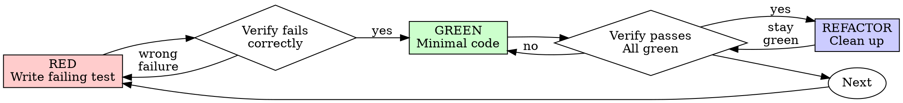

# Fix Claude Code auth errors

> This archive contains visible conversation activity and tool records. Private model reasoning and system/developer instructions are not available here.
<!-- codex-event:{"kind":"state","timestamp":"2026-07-04T13:23:01.945Z","phase":null} -->
## Task state: task_started · 2026-07-04T13:23:01.945Z

```text
{
  "type": "task_started",
  "turn_id": "019f2d4b-fa9c-7ec3-8ea9-ae09405e5684",
  "started_at": 1783171381,
  "model_context_window": 258400,
  "collaboration_mode_kind": "default"
}
```

<!-- /codex-event -->

<!-- codex-event:{"kind":"user","timestamp":"2026-07-04T13:23:03.463Z","phase":null} -->
## User · 2026-07-04T13:23:03.463Z


# Files mentioned by the user:

## codex-clipboard-80392baf-96db-411b-ba04-d117592600d9.png: /Users/masterman/.codex/attachments/e9ae9a85-f615-4503-aaf3-a7c14e6e966f/codex-clipboard-80392baf-96db-411b-ba04-d117592600d9.png

## My request for Codex:
WTF is this - what are all those potential authentication things for Claude Code - why so many - why doesn't it fucking work? whats the error?? FIX IT 


<!-- /codex-event -->

<!-- codex-event:{"kind":"progress","timestamp":"2026-07-04T13:23:14.531Z","phase":"commentary"} -->
## Codex progress · 2026-07-04T13:23:14.531Z

I’ll trace the auth-account dropdown and the Claude worker failure path, then patch the loop/error handling where it actually lives. I’m using the React/debugging/i18n skills because this is both a runtime crash and a user-facing UI issue.

<!-- /codex-event -->

<!-- codex-event:{"kind":"tool-call","timestamp":"2026-07-04T13:23:14.551Z","phase":null} -->
## Tool call: exec_command · 2026-07-04T13:23:14.551Z

```json
{
  "cmd": "sed -n '1,220p' /Users/masterman/.agents/skills/systematic-debugging/SKILL.md",
  "workdir": "/Users/masterman/NLP/omniharness",
  "max_output_tokens": 20000
}
```

<!-- /codex-event -->

<!-- codex-event:{"kind":"tool-call","timestamp":"2026-07-04T13:23:14.551Z","phase":null} -->
## Tool call: exec_command · 2026-07-04T13:23:14.551Z

```json
{
  "cmd": "sed -n '1,220p' /Users/masterman/.agents/skills/building-react-apps/SKILL.md",
  "workdir": "/Users/masterman/NLP/omniharness",
  "max_output_tokens": 20000
}
```

<!-- /codex-event -->

<!-- codex-event:{"kind":"tool-call","timestamp":"2026-07-04T13:23:14.552Z","phase":null} -->
## Tool call: exec_command · 2026-07-04T13:23:14.552Z

```json
{
  "cmd": "sed -n '1,220p' /Users/masterman/.agents/skills/implementing-react-i18n/SKILL.md",
  "workdir": "/Users/masterman/NLP/omniharness",
  "max_output_tokens": 20000
}
```

<!-- /codex-event -->

<!-- codex-event:{"kind":"tool-call","timestamp":"2026-07-04T13:23:14.666Z","phase":null} -->
## Tool call: exec_command · 2026-07-04T13:23:14.666Z

```json
{
  "cmd": "sed -n '1,220p' /Users/masterman/.agents/skills/verification-before-completion/SKILL.md",
  "workdir": "/Users/masterman/NLP/omniharness",
  "max_output_tokens": 20000
}
```

<!-- /codex-event -->

<!-- codex-event:{"kind":"tool-result","timestamp":"2026-07-04T13:23:14.683Z","phase":null} -->
## Tool result: call_frgnu2VJ5MMvf58uxK3r5o5D · 2026-07-04T13:23:14.683Z

````text
Chunk ID: 244ad2
Wall time: 0.0000 seconds
Process exited with code 0
Original token count: 1613
Output:
---
name: systematic-debugging
description: Use when encountering any bug, test failure, or unexpected behavior, before proposing fixes
---

# Systematic Debugging

## Overview

Random fixes waste time and create new bugs. Quick patches mask underlying issues.

**Core principle:** ALWAYS find root cause before attempting fixes. Symptom fixes are failure.

**Violating the letter of this process is violating the spirit of debugging.**

## The Iron Law

```
NO FIXES WITHOUT ROOT CAUSE INVESTIGATION FIRST
```

If you haven't completed Phase 1, you cannot propose fixes.

## When to Use

Use for ANY technical issue:
- Test failures
- Bugs in production
- Unexpected behavior
- Performance problems
- Build failures
- Integration issues

**Use this ESPECIALLY when:**
- Under time pressure (emergencies make guessing tempting)
- "Just one quick fix" seems obvious
- You've already tried multiple fixes
- Previous fix didn't work
- You don't fully understand the issue

**Don't skip when:**
- Issue seems simple (simple bugs have root causes too)
- You're in a hurry (rushing guarantees rework)
- Manager wants it fixed NOW (systematic is faster than thrashing)

## The Four Phases

You MUST complete each phase before proceeding to the next.

### Phase 1: Root Cause Investigation

**BEFORE attempting ANY fix:**

1. **Read Error Messages Carefully**
   - Don't skip past errors or warnings
   - They often contain the exact solution
   - Read stack traces completely
   - Note line numbers, file paths, error codes

2. **Reproduce Consistently**
   - Can you trigger it reliably?
   - What are the exact steps?
   - Does it happen every time?
   - If not reproducible → gather more data, don't guess

3. **Check Recent Changes**
   - What changed that could cause this?
   - Git diff, recent commits
   - New dependencies, config changes
   - Environmental differences

4. **Gather Evidence in Multi-Component Systems**

   **WHEN system has multiple components (CI → build → signing, API → service → database):**

   **BEFORE proposing fixes, add diagnostic instrumentation:**
   ```
   For EACH component boundary:
     - Log what data enters component
     - Log what data exits component
     - Verify environment/config propagation
     - Check state at each layer

   Run once to gather evidence showing WHERE it breaks
   THEN analyze evidence to identify failing component
   THEN investigate that specific component
   ```

   **Example (multi-layer system):**
   ```bash
   # Layer 1: Workflow
   echo "=== Secrets available in workflow: ==="
   echo "IDENTITY: ${IDENTITY:+SET}${IDENTITY:-UNSET}"

   # Layer 2: Build script
   echo "=== Env vars in build script: ==="
   env | grep IDENTITY || echo "IDENTITY not in environment"

   # Layer 3: Signing script
   echo "=== Keychain state: ==="
   security list-keychains
   security find-identity -v

   # Layer 4: Actual signing
   codesign --sign "$IDENTITY" --verbose=4 "$APP"
   ```

   **This reveals:** Which layer fails (secrets → workflow ✓, workflow → build ✗)

5. **Trace Data Flow**

   **WHEN error is deep in call stack:**

   See `root-cause-tracing.md` in this directory for the complete backward tracing technique.

   **Quick version:**
   - Where does bad value originate?
   - What called this with bad value?
   - Keep tracing up until you find the source
   - Fix at source, not at symptom

### Phase 2: Pattern Analysis

**Find the pattern before fixing:**

1. **Find Working Examples**
   - Locate similar working code in same codebase
   - What works that's similar to what's broken?

2. **Compare Against References**
   - If implementing pattern, read reference implementation COMPLETELY
   - Don't skim - read every line
   - Understand the pattern fully before applying

3. **Identify Differences**
   - What's different between working and broken?
   - List every difference, however small
   - Don't assume "that can't matter"

4. **Understand Dependencies**
   - What other components does this need?
   - What settings, config, environment?
   - What assumptions does it make?

### Phase 3: Hypothesis and Testing

**Scientific method:**

1. **Form Single Hypothesis**
   - State clearly: "I think X is the root cause because Y"
   - Write it down
   - Be specific, not vague

2. **Test Minimally**
   - Make the SMALLEST possible change to test hypothesis
   - One variable at a time
   - Don't fix multiple things at once

3. **Verify Before Continuing**
   - Did it work? Yes → Phase 4
   - Didn't work? Form NEW hypothesis
   - DON'T add more fixes on top

4. **When You Don't Know**
   - Say "I don't understand X"
   - Don't pretend to know
   - Ask for help
   - Research more

### Phase 4: Implementation

**Fix the root cause, not the symptom:**

1. **Create Failing Test Case**
   - Simplest possible reproduction
   - Automated test if possible
   - One-off test script if no framework
   - MUST have before fixing
   - Use the `ultrapowers:test-driven-development` skill for writing proper failing tests

2. **Implement Single Fix**
   - Address the root cause identified
   - ONE change at a time
   - No "while I'm here" improvements
   - No bundled refactoring

3. **Verify Fix**
   - Test passes now?
   - No other tests broken?
   - Issue actually resolved?
   - If the bug was meaningful or systemic, use `ultrapowers:learning-from-bugs` before declaring the fix complete.

4. **If Fix Doesn't Work**
   - STOP
   - Count: How many fixes have you tried?
   - If < 3: Return to Phase 1, re-analyze with new information
   - **If ≥ 3: STOP and question the architecture (step 5 below)**
   - DON'T attempt Fix #4 without architectural discussion

5. **If 3+ Fixes Failed: Question Architecture**

   **Pattern indicating architectural problem:**
   - Each fix reveals new shared state/coupling/problem in different place
   - Fixes require "massive refactoring" to implement
   - Each fix creates new symptoms elsewhere

   **STOP and question fundamentals:**
   - Is this pattern fundamentally sound?
   - Are we "sticking with it through sheer inertia"?
   - Should we refactor architecture vs. continue fixing symptoms?

   **Discuss with your human partner before attempting more fixes**

   This is NOT a failed hypothesis - this is a wrong architecture.

## Red Flags - STOP and Follow Process

If you catch yourself thinking:
- "Quick fix for now, investigate later"
- "Just try changing X and see if it works"

````

<!-- /codex-event -->

<!-- codex-event:{"kind":"tool-result","timestamp":"2026-07-04T13:23:14.683Z","phase":null} -->
## Tool result: call_ZuQ01XQT81hjvtyOw9TN7bV0 · 2026-07-04T13:23:14.683Z

```text
Chunk ID: e99a13
Wall time: 0.0000 seconds
Process exited with code 0
Original token count: 2034
Output:
---
name: building-react-apps
description: Use when building, refactoring, planning, or debugging React or Next.js apps, React components, hooks, routing, frontend state, SSR, hydration, bundles, imports, or UI settings
---

# Building React Apps

Use these defaults for React app work unless the user or existing codebase explicitly chooses another architecture.

If the work is specifically about slowness, root-load time, compile time, SSR effectiveness, hydration cost, bundle size, import bloat, or decluttering heavy UI dependencies, use `optimizing-react-next-apps` as the focused workflow.

If the app has server state, optimistic UI, caches, polling, SSE/WebSocket streams, background jobs, persisted runtime state, or client/server synchronization, use `client-server-state-invariants` before planning or changing the state model.

## UI Starting Point

- For new React app screens, forms, and major surfaces, use `shadcn/ui` unless the user or existing app has chosen another design system.
- Before inventing layout, inspect the available ShadCN Blocks at https://ui.shadcn.com/blocks for the specific screen or form category.
- Start from the closest matching block with `npx shadcn add <block-name>` or the official source in https://github.com/shadcn-ui/ui, then add, remove, and adapt controls to fit the product.
- Do not use a blank custom layout as the first implementation path when a relevant ShadCN Block exists.
- Before adding any individual control, check whether `shadcn/ui` already provides a suitable control. Use/customize the shadcn control before hand-building a one-off control.

## State And Data

- Always centralize React app state in global single-source-of-truth Manager classes.
- Components, hooks, and listeners subscribe to Manager updates and use Manager methods to update data.
- Centralized state does not mean broad subscriptions. Components must subscribe to the smallest slice they need, preferably with selector hooks and equality checks, so unrelated UI does not re-render.
- Never let app shells, page roots, sidebars, timelines, or other broad containers subscribe to an entire high-churn Manager snapshot when they only need stable fields. Draft text, cursors, hover/open state, search text, and other per-keystroke or per-pointer state need narrow component-level subscriptions.
- If typing in an input, moving a cursor, toggling a hover/open flag, or editing a small draft makes the whole app repaint, the subscription boundary is wrong even if the data source is centralized.
- Always implement a custom data manager for any app data structure.
- Never use separate state variables or arrays as the source of truth.
- Never send data around in transactions. Pass intent, ids, commands, or Manager method calls instead.

## React Control Flow

- Avoid using `useEffect()` to update state. Prefer `useCallback()` handlers or Manager methods for explicit state transitions.
- Work ahead of time to avoid callback hell, race conditions, and infinite loops.
- When debugging React and a fix does not work, explicitly consider whether the root cause is a race condition. Race conditions are common in React.
- Every async callback, mutation result, timer, poll, or stream message that can update visible state must prove it still owns the current context before mutating Managers or navigation.
- Use `RefObject` instead of `MutableRefObject`.

## Routing And Modules

- Prefer explicit routing over file-based routing when the framework does not strongly default to file-based routes. Framework-native file routing, such as Next.js App Router, is fine.
- Never use `require()` to import modules. Use `import` instead.
- Avoid `npm` by default. Use `pnpm` for package installation, scripts, and lockfiles unless the user or existing project explicitly chooses another package manager.

## Next.js And SSR Defaults

- Treat `"use client"` as a boundary with a cost. Do not put an entire page, app shell, sidebar, timeline, composer, settings surface, and data boot path behind one giant client component unless there is a deliberate reason.
- SSR is only useful if the initial HTML contains meaningful above-the-fold UI or data. If `curl` for the route only shows a boot shell, script payloads, or empty placeholders, the route is not meaningfully server-rendered even if SSR is technically enabled.
- Server-render the first useful screen by fetching route-stable bootstrap data on the server: auth/session state, settings needed to choose the shell, selected route ids, and initial page/snapshot data. Hydrate Managers or query caches from that bootstrap data; do not wait for client `useEffect()` plus client fetches before the first meaningful paint.
- Use client effects for browser-only concerns: localStorage-only preferences, notifications, SSE/WebSocket subscriptions, focus management, and post-paint refreshes. Do not use effects as the only path for data required to decide what the initial screen is.
- In Next dev, first request time includes compilation. Distinguish cold compile cost from runtime slowness before optimizing the wrong layer.

## Import And Bundle Hygiene

- Keep imports proportional to the UI being rendered. Do not import an entire complex surface for a tiny control; split shared tiny controls into their own files instead of importing them from heavy feature modules.
- Lazy-load rarely opened or route-conditional surfaces with dynamic imports: settings dialogs, side panels, file viewers, terminals, worker inspectors, onboarding flows, QR/pairing dialogs, and large markdown/code viewers.
- Avoid package and barrel imports that drag in whole icon packs, design systems, syntax highlighters, markdown stacks, charting libraries, or component suites for one glyph or one primitive. Inline small SVG paths or use local assets when that is cheaper and stable.
- Prefer native browser controls for small, ordinary selects and pickers. Do not import a popover/dialog/menu stack for a low-value dropdown unless search, virtualization, or rich item rendering is genuinely needed.
- Use subpath imports when a package supports them. Avoid root package imports from large UI libraries if a narrower entrypoint exists.
- After dependency or UI-shell changes, inspect the emitted dev chunks or traces. Verify whether heavy modules moved out of the root chunk rather than assuming dynamic import worked.

## Performance Debugging

- Start with evidence: dev server logs, route timings, emitted chunk sizes, module counts, and initial HTML content.
- Separate long-lived requests from slow requests. SSE, streaming, and hanging fetches can show huge durations in logs without blocking page paint.
- Check recent dependency additions first when compile time suddenly explodes. A single icon, markdown, chart, or UI package can add thousands of modules.
- For Next.js root-load complaints, answer three questions before changing code: what compiled, what HTML was returned, and what client-side requests gated the first useful paint?

## Frontend Configuration

- Never store frontend string literals or UI settings in `.env` files.
- Put frontend strings and settings in normal source files, inline arrays, or `.json` files so they remain reviewable, testable, and versioned with the UI.

## Internationalization

- For meaningful React UI work, offer language support as an option when the user has not already decided: "Should we support other languages? If yes, I will wire user-facing copy through i18n resources now instead of hardcoding strings."
- If the user says yes, asks for translation/i18n/language/locale support, or reports that language switching only updates part of the UI, use `implementing-react-i18n`.
- Use the i18n library's `t("key", params?)` function for every user-facing string. Use `useI18nSnapshot()` only to subscribe React components so language changes repaint.
- Never name variables with locale codes or locale-like names such as `it`, `en`, `enUS`, `locIt`, or `locEnUs`.

## Settings UI

- For settings dialogs, preferences panels, configuration modals, option tabs, or UI settings surfaces, use `designing-settings-dialogs`.

```

<!-- /codex-event -->

<!-- codex-event:{"kind":"tool-result","timestamp":"2026-07-04T13:23:14.683Z","phase":null} -->
## Tool result: call_0FS5JGFIyqPlsoXsFc8HLwlt · 2026-07-04T13:23:14.683Z

````text
Chunk ID: ddd8ec
Wall time: 0.0000 seconds
Process exited with code 0
Original token count: 1240
Output:
---
name: implementing-react-i18n
description: Use when adding, fixing, or reviewing React internationalization, language selectors, locale resources, translated UI copy, or bugs where changing language does not update user-facing strings
---

# Implementing React I18n

## Overview

Use the shared i18n library as the source of truth: locale state lives in an `i18nManager`, user-facing strings live in locale JSON resources, call sites render through `t("key", params?)`, and React components subscribe only so language changes repaint.

## First Product Question

When building a meaningful React UI and the user has not mentioned language support, offer it as an option:

> Should we support other languages? If yes, I will wire user-facing copy through i18n resources now instead of hardcoding strings.

If the user says yes, asks for language support, mentions locale/i18n/translation, or reports that language switching only updates part of the UI, use this skill.

## Required Pattern

1. Create or reuse `shared/locales/*.json` as flat dotted-key resources.
2. Create or reuse `src/lib/i18n.ts` with:
   - `i18nManager = createI18nManager(...)`
   - `export const t = i18nManager.t`
   - `export function useI18nSnapshot()` using `useSyncExternalStore`
   - dynamic locale loaders for non-fallback languages
3. Components that render translated text call `useI18nSnapshot()` and render with `t(...)`.
4. Non-React modules use `t(...)` where user-visible text is produced.
5. Store stable ids and translate at render time. Do not persist translated UI copy.

```ts
import { useCallback, useSyncExternalStore } from "react";
import { createI18nManager } from "@danduma/i18n";
import fallbackDictionary from "../../shared/locales/en.json";

export const localeLoaders = {
  es: async () => (await import("../../shared/locales/es.json")).default,
} as const;

export const i18nManager = createI18nManager({
  dictionaries: { en: fallbackDictionary },
  localeLoaders,
  fallbackLocale: "en",
  storageKey: "app-locale",
});

export const t = i18nManager.t;

export function useI18nSnapshot() {
  return useSyncExternalStore(
    useCallback((listener) => i18nManager.subscribe(listener), []),
    useCallback(() => i18nManager.getSnapshot(), []),
    () => i18nManager.getSnapshot(),
  );
}
```

```tsx
import { t, useI18nSnapshot } from "@/lib/i18n";

export function SaveButton() {
  useI18nSnapshot();

  return <button type="button">{t("common.save")}</button>;
}
```

The hook is not the translation API. It exists to subscribe the component. The `t()` function is the translation API.

## What Must Be Translated

Every user-facing frontend string must use `t()`:

- JSX text, button labels, menu items, tab labels, empty states, status labels
- `aria-label`, `title`, `placeholder`, `alt`, helper text, error fallback text
- visible option labels for selects, segmented controls, toggles, and radio groups

Do not translate protocol values, storage keys, API paths, CSS classes, model ids, database values, or enum values unless they are displayed as copy.

## Locale Resource Rules

- Add every new key to the fallback locale and every supported locale in the same change.
- Add a parity test that compares all locale resource keys to the fallback dictionary.
- Use stable dotted keys by surface and intent, for example `settings.runtime.recovery`.
- Interpolate with named params: `t("settings.agents.toggleWorker", { worker: label })`.
- If translations are not approved yet, either support only the fallback language or ask which languages to support. Do not invent broad language support silently.

## Variable Naming

Never name variables with locale codes or locale-like names. Avoid `it`, `en`, `es`, `enUS`, `locIt`, `locEnUs`, or similar names, especially in tests where `it` can shadow the test function.

Use role-based names instead:

- `fallbackDictionary`
- `candidateDictionary`
- `localeDictionaries`
- `resourcesByLocale`
- `supportedLocaleCodes`

## Common Mistakes

| Mistake | Fix |
| --- | --- |
| Importing `t` and never subscribing | Call `useI18nSnapshot()` in every React component that renders translated strings. |
| Returning `{ t }` from a custom hook | Keep `t()` as the direct call-site API; use hooks only for snapshots/subscriptions. |
| Translating only the language selector | Migrate the parent dialog, tabs, labels, placeholders, controls, and error fallbacks too. |
| Using localized labels as state | Store stable ids like `queue`; render `t("settings.runtime.queue")`. |
| Adding English keys only | Update every supported locale and run the key parity test. |

## Verification

Run focused checks after any i18n change:

```bash
pnpm test tests/lib/i18n.test.ts
pnpm test tests/ui/settings-dialog.test.ts
pnpm exec tsc --noEmit
```

For broader migrations, also run relevant UI tests and a browser smoke test: change language, reload, and verify representative labels outside the language selector update.

````

<!-- /codex-event -->

<!-- codex-event:{"kind":"tool-result","timestamp":"2026-07-04T13:23:14.728Z","phase":null} -->
## Tool result: call_sTvnEzUdo1e8WVBaNe5Acrg5 · 2026-07-04T13:23:14.728Z

````text
Chunk ID: c177ee
Wall time: 0.0000 seconds
Process exited with code 0
Original token count: 2230
Output:
---
name: verification-before-completion
description: Use when about to claim work is complete, fixed, or passing, before committing or creating PRs - requires running verification commands and confirming output before making any success claims; evidence before assertions always
---

# Verification Before Completion

## Overview

Claiming work is complete without verification is dishonesty, not efficiency.

**Core principle:** Evidence before claims, always.

**Violating the letter of this rule is violating the spirit of this rule.**

## The Iron Law

```
NO COMPLETION CLAIMS WITHOUT FRESH VERIFICATION EVIDENCE
```

If you haven't run the verification command in this message, you cannot claim it passes.

## The Gate Function

```
BEFORE claiming any status or expressing satisfaction:

1. IDENTIFY: What command proves this claim?
2. RUN: Execute the FULL command (fresh, complete)
3. READ: Full output, check exit code, count failures
4. VERIFY: Does output confirm the claim?
   - If NO: State actual status with evidence
   - If YES: State claim WITH evidence
5. ONLY THEN: Make the claim

Skip any step = lying, not verifying
```

## Product-Surface Verification

When the work involves an app, UI, or product surface, verification must cover more than whether a single requested feature works.

Keep verification proportional. For tiny mechanical edits, targeted verification is enough: inspect the diff, confirm the changed value/text, and run only the smallest relevant check. Do not escalate to full product-surface verification unless the change can affect behavior, state, navigation, persistence, or the user journey.

Also verify:

- required functionality is real end-to-end, not a fake component, mock, placeholder, canned response, or fallback path,
- the primary user stories are actually supported,
- the primary user journey works end-to-end,
- any approved agentic user journey tests have been run, or clearly state that they were proposed but not run because approval was not given,
- return/revisit flows work when they are part of the product,
- expected empty states are present,
- expected loading, waiting, or in-progress states are visible,
- expected error and recovery states are present,
- expected completed or success states are understandable,
- expected status-awareness flows are present,
- the state model is represented correctly,
- React/server-state invariants are verified when the app uses server state, optimistic UI, caches, polling, streams, background jobs, or persisted runtime state,
- persistence behavior for settings, preferences, drafts, and other user-managed state matches the approved design,
- operational readiness expectations are met for the approved scope,
- instrumentation and observability exist where the approved scope depends on them,
- backend or agent workflow decisions emit the planned named events, and a headless/scriptable check can assert the event sequence without relying on UI snapshots,
- real errors are surfaced rather than silently swallowed or replaced with vague placeholders,
- onboarding and discoverability work for first-run or empty-state use,
- risk and trust surfaces are handled well enough to avoid silent failure, ambiguous state, or obvious loss of confidence,
- when the scope includes a frontend/backend boundary, frontend-visible failures preserve the real error details and stack traces expected by the approved design,
- baseline expected v1 surfaces and inferred behaviors from the approved story set, spec, or plan are actually present.

When the scope includes settings or preferences, also verify:

- each meaningful setting persists or does not persist exactly as designed,
- the storage location and ownership model match the approved plan,
- refresh, restart, sign-out, reset, and migration behavior work as intended for the approved scope,
- settings dialogs avoid redundant section titles, subtitles, explanatory filler, and decorative chrome that does not help the user make a decision.

Do not confuse "the requested control exists" with "the product is usable."

For app, UI, and product-surface work, consider whether an agentic user journey test is the right proof. This mode is approval-gated because it can spend significant tokens: propose it when useful, but only run it if the user explicitly approves.

## Common Failures

| Claim | Requires | Not Sufficient |
|-------|----------|----------------|
| Tests pass | Test command output: 0 failures | Previous run, "should pass" |
| Linter clean | Linter output: 0 errors | Partial check, extrapolation |
| Build succeeds | Build command: exit 0 | Linter passing, logs look good |
| Bug fixed | Test original symptom: passes | Code changed, assumed fixed |
| Meaningful system bug fixed | Learning note plus verification | Fix committed with no durable lesson |
| React/server state sync works | Stale-response, merge, event-sequence, and ownership tests relevant to the change | UI looked right once |
| Regression test works | Red-green cycle verified | Test passes once |
| Agent completed | VCS diff shows changes | Agent reports "success" |
| Requirements met | Line-by-line checklist | Tests passing |
| Feature complete | Real end-to-end behavior in the product | Mocked component, canned data, placeholder UI, fallback path |

## Red Flags - STOP

- Using "should", "probably", "seems to"
- Expressing satisfaction before verification ("Great!", "Perfect!", "Done!", etc.)
- About to commit/push/PR without verification
- Trusting agent success reports
- Accepting "validated with mocks" or "placeholder works" as completion
- Relying on partial verification
- Thinking "just this once"
- Tired and wanting work over
- **ANY wording implying success without having run verification**

## Rationalization Prevention

| Excuse | Reality |
|--------|---------|
| "Should work now" | RUN the verification |
| "I'm confident" | Confidence ≠ evidence |
| "Just this once" | No exceptions |
| "Linter passed" | Linter ≠ compiler |
| "Agent said success" | Verify independently |
| "I'm tired" | Exhaustion ≠ excuse |
| "Partial check is enough" | Partial proves nothing |
| "Different words so rule doesn't apply" | Spirit over letter |

## Key Patterns

**Tests:**
```
✅ [Run test command] [See: 34/34 pass] "All tests pass"
❌ "Should pass now" / "Looks correct"
```

**Regression tests (TDD Red-Green):**
```
✅ Write → Run (pass) → Revert fix → Run (MUST FAIL) → Restore → Run (pass)
❌ "I've written a regression test" (without red-green verification)
```

**Build:**
```
✅ [Run build] [See: exit 0] "Build passes"
❌ "Linter passed" (linter doesn't check compilation)
```

**Requirements:**
```
✅ Re-read plan → Create checklist → Verify each → Report gaps or completion
❌ "Tests pass, phase complete"
```

**Agent delegation:**
```
✅ Agent reports success → Check VCS diff → Verify changes → Report actual state
❌ Trust agent report
```

## Why This Matters

From 24 failure memories:
- your human partner said "I don't believe you" - trust broken
- Undefined functions shipped - would crash
- Missing requirements shipped - incomplete features
- Time wasted on false completion → redirect → rework
- Violates: "Honesty is a core value. If you lie, you'll be replaced."

## When To Apply

**ALWAYS before:**
- ANY variation of success/completion claims
- ANY expression of satisfaction
- ANY positive statement about work state
- Committing, PR creation, task completion
- Staging, committing, pushing, or opening a PR when the work could include secrets, local environment files, dependencies, caches, build outputs, logs, temporary files, or generated/intermediate artifacts
- Moving to next task
- Delegating to agents

When a meaningful bug involved architecture, storage, memory, persistence, control planes, background workers, recovery, data loss, security, or a repeated wrong assumption, use `ultrapowers:learning-from-bugs` before claiming the fix is complete.

When a React app has server state, optimistic UI, caches, polling, SSE/WebSocket streams, background jobs, or persisted runtime state, use `ultrapowers:client-server-state-invariants` to decide which race and synchronization tests are required before claiming completion.

Before any git publish step, verify `.gitignore` exists for the project and that `git status` does not include secrets, credentials, local environment files, `node_modules`, dependency caches, build outputs, coverage output, logs, temporary files, or intermediate/generated artifacts unless the human explicitly asked to version a specific generated artifact.

**Rule applies to:**
- Exact phrases
- Paraphrases and synonyms
- Implications of success
- ANY communication suggesting completion/correctness

## The Bottom Line

**No shortcuts for verification.**

Run the command. Read the output. THEN claim the result.

This is non-negotiable.

````

<!-- /codex-event -->

<!-- codex-event:{"kind":"progress","timestamp":"2026-07-04T13:23:23.899Z","phase":"commentary"} -->
## Codex progress · 2026-07-04T13:23:23.899Z

The screenshot gives two distinct symptoms: a React render/update loop at `EditorPage` around style overrides, and a Claude Code worker reporting `Authentication required`. I’m going to pin the UI loop first so the app is usable, then trace why the auth list contains duplicate “anthropic subscription” entries and why selection does not satisfy the worker.

<!-- /codex-event -->

<!-- codex-event:{"kind":"tool-call","timestamp":"2026-07-04T13:23:23.915Z","phase":null} -->
## Tool call: exec_command · 2026-07-04T13:23:23.915Z

```json
{
  "cmd": "sed -n '1,220p' /Users/masterman/.agents/skills/test-driven-development/SKILL.md",
  "workdir": "/Users/masterman/NLP/omniharness",
  "max_output_tokens": 20000
}
```

<!-- /codex-event -->

<!-- codex-event:{"kind":"tool-call","timestamp":"2026-07-04T13:23:23.915Z","phase":null} -->
## Tool call: exec_command · 2026-07-04T13:23:23.915Z

```json
{
  "cmd": "sed -n '1,220p' /Users/masterman/.agents/skills/client-server-state-invariants/SKILL.md",
  "workdir": "/Users/masterman/NLP/omniharness",
  "max_output_tokens": 20000
}
```

<!-- /codex-event -->

<!-- codex-event:{"kind":"tool-call","timestamp":"2026-07-04T13:23:23.922Z","phase":null} -->
## Tool call: exec_command · 2026-07-04T13:23:23.922Z

```json
{
  "cmd": "git status --short",
  "workdir": "/Users/masterman/NLP/omniharness",
  "max_output_tokens": 12000
}
```

<!-- /codex-event -->

<!-- codex-event:{"kind":"tool-call","timestamp":"2026-07-04T13:23:23.945Z","phase":null} -->
## Tool call: exec_command · 2026-07-04T13:23:23.945Z

```json
{
  "cmd": "rg -n \"setStyleOverrides|latestStyleOverridesRef|auth|Claude Code|anthropic subscription|credential command|Auto account|claude-api|claude-sub|Authentication required\" src shared tests docs scripts package.json",
  "workdir": "/Users/masterman/NLP/omniharness",
  "max_output_tokens": 30000
}
```

<!-- /codex-event -->

<!-- codex-event:{"kind":"tool-result","timestamp":"2026-07-04T13:23:23.976Z","phase":null} -->
## Tool result: call_lriBNveu0HQU4vQRzJBl9Ljh · 2026-07-04T13:23:23.976Z

````text
Chunk ID: 720b36
Wall time: 0.0000 seconds
Process exited with code 0
Original token count: 1448
Output:
---
name: test-driven-development
description: Use when implementing any feature or bugfix, before writing implementation code
---

# Test-Driven Development (TDD)

## Overview

Write the test first. Watch it fail. Write minimal code to pass.

**Core principle:** If you didn't watch the test fail, you don't know if it tests the right thing.

**Violating the letter of the rules is violating the spirit of the rules.**

## When to Use

**Always:**
- New features
- Bug fixes
- Refactoring
- Behavior changes

**Exceptions (ask your human partner):**
- Throwaway prototypes
- Generated code
- Configuration files

**Do directly with targeted verification:**
- tiny color, spacing, copy, or label changes,
- one-line prompt wording changes,
- docs-only wording changes,
- mechanical edits where the expected result is obvious from the diff.

Do not perform a full red-green cycle for a tiny mechanical edit unless it changes behavior or there is a real regression risk. For example, changing a button from gray to blue usually needs the edit plus a targeted visual or code check, not a new failing test.

Thinking "skip TDD just this once"? Stop. That's rationalization.

## UI-Specific Note

When the task is UI work, choose the design system and starting block before writing tests around the intended behavior and rendering. In Ultrapowers, that means `shadcn/ui` plus the closest available ShadCN Block for each new screen, form, or major surface unless the user says otherwise. Inspect https://ui.shadcn.com/blocks first, install or copy the selected block, and then adapt it. Before adding any individual control, check whether `shadcn/ui` already provides a suitable control and use/customize that control first.

For important app workflows, also consider whether `agentic-user-journey-testing` should be proposed. Do not run that higher-cost black-box test mode without explicit user approval.

## The Iron Law

```
NO PRODUCTION CODE WITHOUT A FAILING TEST FIRST
```

Write code before the test? Delete it. Start over.

**No exceptions:**
- Don't keep it as "reference"
- Don't "adapt" it while writing tests
- Don't look at it
- Delete means delete

Implement fresh from tests. Period.

## Red-Green-Refactor



### RED - Write Failing Test

Write one minimal test showing what should happen.

<Good>
```typescript
test('retries failed operations 3 times', async () => {
  let attempts = 0;
  const operation = () => {
    attempts++;
    if (attempts < 3) throw new Error('fail');
    return 'success';
  };

  const result = await retryOperation(operation);

  expect(result).toBe('success');
  expect(attempts).toBe(3);
});
```
Clear name, tests real behavior, one thing
</Good>

<Bad>
```typescript
test('retry works', async () => {
  const mock = jest.fn()
    .mockRejectedValueOnce(new Error())
    .mockRejectedValueOnce(new Error())
    .mockResolvedValueOnce('success');
  await retryOperation(mock);
  expect(mock).toHaveBeenCalledTimes(3);
});
```
Vague name, tests mock not code
</Bad>

**Requirements:**
- One behavior
- Clear name
- Real code (no mocks unless unavoidable)
- Real product behavior is the target. Mocked behavior can never be the final deliverable or proof that the feature works.

### Verify RED - Watch It Fail

**MANDATORY. Never skip.**

```bash
npm test path/to/test.test.ts
```

Confirm:
- Test fails (not errors)
- Failure message is expected
- Fails because feature missing (not typos)

**Test passes?** You're testing existing behavior. Fix test.

**Test errors?** Fix error, re-run until it fails correctly.

### GREEN - Minimal Code

Write simplest code to pass the test.

<Good>
```typescript
async function retryOperation<T>(fn: () => Promise<T>): Promise<T> {
  for (let i = 0; i < 3; i++) {
    try {
      return await fn();
    } catch (e) {
      if (i === 2) throw e;
    }
  }
  throw new Error('unreachable');
}
```
Just enough to pass
</Good>

<Bad>
```typescript
async function retryOperation<T>(
  fn: () => Promise<T>,
  options?: {
    maxRetries?: number;
    backoff?: 'linear' | 'exponential';
    onRetry?: (attempt: number) => void;
  }
): Promise<T> {
  // YAGNI
}
```
Over-engineered
</Bad>

Don't add features, refactor other code, or "improve" beyond the test.

### Verify GREEN - Watch It Pass

**MANDATORY.**

```bash
npm test path/to/test.test.ts
```

Confirm:
- Test passes
- Other tests still pass
- Output pristine (no errors, warnings)

**Test fails?** Fix code, not test.

**Other tests fail?** Fix now.

### REFACTOR - Clean Up

After green only:
- Remove duplication
- Improve names
- Extract helpers

Keep tests green. Don't add behavior.

### Repeat

Next failing test for next feature.

## Good Tests

| Quality | Good | Bad |
|---------|------|-----|
| **Minimal** | One thing. "and" in name? Split it. | `test('validates email and domain and whitespace')` |
| **Clear** | Name describes behavior | `test('test1')` |
| **Shows intent** | Demonstrates desired API | Obscures what code should do |


````

<!-- /codex-event -->

<!-- codex-event:{"kind":"tool-result","timestamp":"2026-07-04T13:23:23.990Z","phase":null} -->
## Tool result: call_Jr3vvcpHVryFx6ZvqZcU0fFO · 2026-07-04T13:23:23.990Z

```text
Chunk ID: af9cae
Wall time: 0.0000 seconds
Process exited with code 0
Original token count: 1481
Output:
---
name: client-server-state-invariants
description: Use when planning, building, reviewing, or debugging React apps with server state, optimistic UI, caches, polling, SSE/WebSocket streams, background jobs, persistence, or client/server synchronization
---

# Client Server State Invariants

React bugs often expose deeper ownership mistakes. When client state, server state, cache state, stream state, and persisted state all exist, every plan needs explicit invariants.

## Core Rule

No UI surface may treat data as authoritative unless the payload proves ownership, freshness, completeness, ordering, and terminal state.

If those words are missing from the plan, the plan is probably baking in a race condition.

## Planning Checklist

For every React app that reads server/runtime state, the plan must answer:

1. **Owner:** What owns this state: server, client manager, URL, cache, stream, local storage, or worker/runtime?
2. **Token:** What owner token protects async results: `requestId`, `runId`, `projectPath`, `operationId`, `workerId + seq`, or equivalent?
3. **Provenance:** Is data server-authoritative, optimistic, cached preview, partial update, or historical fallback?
4. **Completeness:** Does the payload declare what scope it is complete for? What may it erase?
5. **Ordering:** What stable order is used: monotonic seq, `(createdAt, id)`, version, or cursor?
6. **State machine:** What are the legal states, terminal states, and transitions?
7. **Events:** Which server decisions are named events rather than client-side derivations?
8. **Loading shape:** Which states are bootstrap, first load, incremental refresh, reconnect, resync, recovery, and terminal error?
9. **Fallbacks:** Which legacy/fallback rows can render, and only after what authority is loaded?
10. **Tests:** Which race, stale-response, event-sequence, reconnect, and merge tests prove the invariants?

## Invariants To Require

- Cached and optimistic data may pre-render, but cannot satisfy full-load gates.
- Partial snapshots may add or refine state, but may not erase optimistic objects, delivered user input, read markers, or stream entries unless they declare complete scope.
- Every async response checks that its owner token still matches before mutating visible state.
- Mutation success handlers may navigate or clear UI only if they still own the current context, unless the action explicitly creates a new selected context.
- Timers and polling callbacks re-check ownership immediately before acting.
- Server decisions are emitted as named events; the client does not infer decisions by diffing snapshots.
- SSE/WebSocket streams have event ids, replay/resume, and an explicit resync path.
- Loading booleans are split by lifecycle stage. A leaf stream refresh must not unmount the whole page.
- Append-only content has one writer, one reader, stable ids, and monotonic cursors.
- Fallback DB rows or historical rows are gated behind stream loading and deduped by stable id plus safe equivalence.
- Status classifiers distinguish active, runnable, blocked, awaiting user, terminal, stale, and recoverable states.
- "Latest" queries have deterministic tie-breakers. Timestamp-only ordering is not enough.
- Hot paths use bounded reads and do not synchronously load large bodies, bridge probes, schema setup, or heavy app graphs.
- Process-local caches have explicit TTL/size bounds and invalidation rules.

## Test Matrix

Pick the rows that match the work. Do not rely on one happy-path UI test.

| Risk | Test shape |
| --- | --- |
| Stale async response | Start request A, switch owner, resolve A, assert it cannot mutate B |
| Optimistic object erased | Create local optimistic state, apply stale/partial snapshot, assert object remains |
| Cache masquerades as loaded | Hydrate cache preview, assert full-load gate waits for server authority |
| Mutation steals navigation | Start mutation, switch selection, resolve mutation, assert focus stays put |
| Timer/poll stale-fire | Use fake timers or deferred promises; callback must re-check owner before acting |
| Snapshot merge erases stream | Apply partial snapshot missing known entries, assert entries/read markers remain |
| Event stream gap | Bootstrap snapshot, emit events during disconnect, reconnect with last id, assert replay or resync |
| Server decision invisible | Exercise branch and assert named event such as `blocked`, `refused`, `gave_up`, or `error.surfaced` |
| State classifier wrong | Table-test every status into active/runnable/terminal/recoverable buckets |
| Fallback duplicates stream | Load fallback rows then stream entries, assert no duplicate or false chronology |
| Hot path bloats | Assert snapshots carry cursors not bodies; route returns before DB/heavy imports when possible |
| Timestamp tie | Insert equal timestamps, assert deterministic order by id/seq |

Use headless HTTP/SSE tests for control-plane decisions. Use React/unit tests for manager merging and ownership guards. Use Playwright only for real UI layout, focus, scroll, mobile computed styles, and visible affordances.

## Refuse These Shapes

- one `isLoading` boolean for bootstrap, refresh, reconnect, and recovery;
- cache or optimistic data treated as authoritative without provenance;
- async callbacks that mutate state without checking owner tokens;
- client-side derivation of server decisions;
- snapshot diffs used as the only way to know what happened;
- event streams without ids or resume;
- timestamp-only "latest" queries;
- parallel transcript or persistence surfaces that the frontend must reconcile;
- unbounded process caches introduced to hide slow storage;
- tests that prove only the DOM result when the bug is a server decision.

## Review Prompt

Ask this before implementation starts:

> What can arrive late, out of order, partially, twice, or after the user changes context, and what test proves it cannot corrupt visible state?

```

<!-- /codex-event -->

<!-- codex-event:{"kind":"tool-result","timestamp":"2026-07-04T13:23:24.017Z","phase":null} -->
## Tool result: call_XYTOmxT3sSFrURbA8XiPcEaU · 2026-07-04T13:23:24.017Z

```text
Chunk ID: 8ad505
Wall time: 0.0000 seconds
Process exited with code 0
Original token count: 168
Output:
 M shared/locales/de.json
 M shared/locales/en.json
 M shared/locales/es.json
 M shared/locales/fr.json
 M shared/locales/it.json
 M shared/locales/ja.json
 M shared/locales/ko.json
 M shared/locales/pt.json
 M shared/locales/zh-CN.json
 M src/app/home/HomeApp.tsx
 M src/app/home/HomeUiStateManager.ts
 M src/app/home/constants.ts
 M src/app/home/useConversationActions.ts
 M src/app/home/utils.ts
 M src/server/bridge-client/index.ts
 M src/server/git/run-auto-commit.ts
 M src/server/worker-models.ts
 M tests/server/git/run-auto-commit.test.ts
 M tests/ui/composer-shell.test.ts
?? docs/superpowers/learnings/2026-07-02-auto-commit-messages-must-be-project-neutral.md

```

<!-- /codex-event -->

<!-- codex-event:{"kind":"tool-result","timestamp":"2026-07-04T13:23:24.048Z","phase":null} -->
## Tool result: call_RZciLsFl8Iri5ClC6eXurSSk · 2026-07-04T13:23:24.048Z

````text
Chunk ID: 64ae5e
Wall time: 0.0000 seconds
Process exited with code 0
Original token count: 57338
Output:
Warning: truncated output (original token count: 57338)
Total output lines: 1700

package.json:20:    "auth:password": "node ./scripts/auth-password.mjs",
package.json:50:    "class-variance-authority": "^0.7.1",
shared/locales/es.json:15:  "externalSessions.provider.claudeCode": "Claude Code",
shared/locales/es.json:184:  "conversation.composer.account.auto": "Auto account",
shared/locales/es.json:283:  "settings.agents.auth.notAuthenticated": "{worker} is not logged in. Run `{command}`.",
shared/locales/es.json:284:  "settings.agents.auth.unknown": "{worker} authentication could not be verified. Check `{command}`.",
shared/locales/es.json:285:  "settings.agents.auth.notInstalled": "{worker} is not installed. Install `{command}` first.",
docs/superpowers/learnings/2026-05-20-server-empty-queue-must-clear-cache.md:6:**Root Cause:** The server correctly omits delivered queue rows from `queuedMessages`, but `EventStreamSnapshotCacheManager` treated an authoritative server `queuedMessages: []` the same as missing data and restored stale cached pending queue rows.
docs/superpowers/learnings/2026-05-20-server-empty-queue-must-clear-cache.md:7:**Fix:** Cache hydration now respects server-authoritative snapshots: when `snapshotSource` is `"server"` and an array is present, even an empty array wins over cached data.
docs/superpowers/learnings/2026-05-20-server-empty-queue-must-clear-cache.md:9:**Prevention:** For server-owned arrays, do not use non-empty array checks as authority checks. Empty arrays can be terminal facts, especially for queues and filtered delivered state.
docs/superpowers/learnings/2026-05-20-server-empty-queue-must-clear-cache.md:10:**Skill/Doc Updates:** No general skill update needed; `client-server-state-invariants` already requires provenance and completeness before treating cached state as authoritative.
scripts/backfill-worker-entries.ts:199:      authorRole:
scripts/backfill-worker-entries.ts:241:      authorRole: "system",
scripts/dev-prewarm.ts:4:  "/api/auth/session",
docs/superpowers/learnings/2026-06-15-input-ready-state-must-not-render-as-working.md:7:**Fix:** Treat pending permission and elicitation stream entries as authoritative input-ready signals for the status banner and direct terminal pending-assistant indicator, add `elicitation` to the shared worker-entry type, and allow stale interrupt delivery failures to restore the row to `pending` or `failed` when the row is still the same delivering attempt.
tests/supervisor/observer.test.ts:312:      "- The supervisor rejected stale auth-missing worker failures.",
shared/locales/ko.json:15:  "externalSessions.provider.claudeCode": "Claude Code",
shared/locales/ko.json:184:  "conversation.composer.account.auto": "Auto account",
shared/locales/ko.json:283:  "settings.agents.auth.notAuthenticated": "{worker} is not logged in. Run `{command}`.",
shared/locales/ko.json:284:  "settings.agents.auth.unknown": "{worker} authentication could not be verified. Check `{command}`.",
shared/locales/ko.json:285:  "settings.agents.auth.notInstalled": "{worker} is not installed. Install `{command}` first.",
docs/superpowers/learnings/2026-06-15-pending-elicitations-are-input-ready.md:6:**Root Cause:** The UI inferred tool kind from prompt/title text, so an input request mentioning terminal work became `bash`. The queue drain also treated worker `working` as always non-drainable and ignored the bridge's authoritative `pendingElicitations`, so answers were not delivered through `respondElicitation`.
scripts/install-agent-acp.sh:216:# build authoritative.
scripts/remote-restart.ts:7:  authorizeRestartRequest,
scripts/remote-restart.ts:8:  authorizeSessionCookie,
scripts/remote-restart.ts:728:  return authorizeSessionCookie(request.headers.cookie, token);
scripts/remote-restart.ts:732:  return authorizeRestartRequest(request.headers, token) || requestHasWebSession(request);
scripts/remote-restart.ts:780:      sendJson(response, 401, { ok: false, error: "unauthorized" });
scripts/dev-compression-proxy.ts:17:  "proxy-authenticate",
scripts/dev-compression-proxy.ts:18:  "proxy-authorization",
scripts/measure-local-dev.mjs:11:  "/api/auth/session",
scripts/auth-password.mjs:8:import { escapeEnvValueForDotenv } from "./setup-auth.mjs";
scripts/auth-password.mjs:94:    return "OmniHarness auth is not configured. Run `pnpm auth:password set` to create a password.\n";
scripts/auth-password.mjs:99:      "OmniHarness auth is configured.",
scripts/auth-password.mjs:101:      "Run `pnpm auth:password verify` to test a password, or `pnpm auth:password set` to replace it.",
scripts/auth-password.mjs:107:    "OmniHarness auth is configured.",
scripts/auth-password.mjs:110:    "Run `pnpm auth:password set` to replace it with a stored hash.",
scripts/auth-password.mjs:130:    envText: `${prefix}# OmniHarness web login password. Managed by pnpm auth:password.\n${AUTH_HASH_KEY}=${escapedHash}\n`,
scripts/auth-password.mjs:155:    "  pnpm auth:password status [--env-file .env]",
scripts/auth-password.mjs:156:    "  pnpm auth:password verify [password] [--env-file .env]",
scripts/auth-password.mjs:157:    "  pnpm auth:password set [password] [--env-file .env]",
scripts/auth-password.mjs:281:    process.stdout.write(valid ? "Password matches OmniHarness auth configuration.\n" : "Password does not match OmniHarness auth configuration.\n");
shared/locales/fr.json:15:  "externalSessions.provider.claudeCode": "Claude Code",
shared/locales/fr.json:184:  "conversation.composer.account.auto": "Auto account",
shared/locales/fr.json:283:  "settings.agents.auth.notAuthenticated": "{worker} is not logged in. Run `{command}`.",
shared/locales/fr.json:284:  "settings.agents.auth.unknown": "{worker} authentication could not be verified. Check `{command}`.",
shared/locales/fr.json:285:  "settings.agents.auth.notInstalled": "{worker} is not installed. Install `{command}` first.",
src/lib/local-pairing-token.ts:1:import { AUTH_PAIR_TOKEN_TTL_MS } from "@/lib/auth-constants";
scripts/setup-auth.mjs:181:  output.write(`\n[omniharness] Web authentication is required before OmniHarness starts.\n`);
docs/superpowers/learnings/2026-06-16-queued-drain-claims-must-be-atomic.md:6:**Root Cause:** Concurrent live sync paths could observe the same pending queued row and race through the drain path. The worker drain changed the row to `delivering` without a compare-and-swap status guard, then flipped run/worker state before serialized delivery. Late active snapshots could also arrive after an authoritative empty queue snapshot and revive a stale active row in the frontend.
docs/superpowers/learnings/2026-06-16-queued-drain-claims-must-be-atomic.md:9:**Prevention:** Treat queue delivery as a claimed state transition, not a read-then-write loop. For server-owned UI lists consumed through streams or caches, pair authoritative removals with monotonic freshness checks so late snapshots cannot resurrect older state.
docs/superpowers/learnings/2026-06-24-elicitation-drain-must-use-stream-signals.md:6:**Root Cause:** The direct-run status layer treated pending human input from structured worker output entries as authoritative, but the queue-drain gate only trusted `pendingElicitations`. A live snapshot with an open `elicitation` stream entry but no populated `pendingElicitations` array could mark the run input-ready while the queue drain still recorded `worker_not_drainable`.
docs/superpowers/learnings/2026-06-29-recovery-must-not-prefer-unusable-api-key-accounts.md:4:**Context:** OmniHarness run recovery, worker account allocation, Gemini CLI auth, direct conversation recovery.
docs/superpowers/learnings/2026-06-29-recovery-must-not-prefer-unusable-api-key-accounts.md:5:**Symptom:** Session `f4e85f1225e0` could not recover even though Gemini CLI auth existed. It first replayed a stale "Gemini API key missing" supervisor failure, then selected an automatic `api_key` Gemini account whose decrypted setting was unavailable, and direct recovery tests exposed a stale `working` snapshot overriding an `idle` ask result.
docs/superpowers/learnings/2026-06-29-recovery-must-not-prefer-unusable-api-key-accounts.md:6:**Root Cause:** Recovery accepted stale supervisor auth conclusions as terminal, account allocation treated every enabled account row as usable without checking whether automatic API-key credentials were actually available in the hydrated runtime env, and direct retry status trusted an immediate bridge snapshot over the just-returned ask result.
docs/superpowers/learnings/2026-06-29-recovery-must-not-prefer-unusable-api-key-accounts.md:7:**Fix:** Reject stale auth-missing `mark_failed` actions when the requested worker is currently authenticated, skip memory consolidation for auth/billing infrastructure failures, support resolvable `api_key` accounts while falling back to legacy CLI/session auth when automatic API-key rows lack a key, and make direct retry use the ask response state as authoritative for that turn.
docs/superpowers/learnings/2026-06-14-current-schema-version-must-still-run-additive-guards.md:8:**Verification:** `./node_modules/.bin/vitest run tests/db/schema.test.ts`; `./node_modules/.bin/vitest run tests/server/runs/persisted-zombie-reconciler.test.ts`; `./node_modules/.bin/vitest run tests/api/events-route.test.ts`; live log showed the same authenticated `/api/events?snapshot=1&persisted=1&runId=a03e7c439b55` request returning 200.
docs/superpowers/learnings/2026-05-20-hot-snapshot-routes-must-avoid-cold-heavy-imports.md:7:**Fix:** Added exact-order indexes for snapshot queries, added a `PRAGMA user_version` schema fast path, made persisted event snapshots avoid heavy runtime imports, split queued-message serialization into a lightweight module, and let cached conversation/worker previews render while server authority catches up.
docs/superpowers/learnings/2026-06-15-project-moves-must-not-authorize-worker-resume.md:6:**Root Cause:** `reconcilePersistedReloadZombies` used selected run id plus stale worker status and saved session metadata as sufficient authority to resume. After a session move, `runs.projectPath` can change while the persisted worker `cwd` and saved session still belong to the old project, so project-list metadata accidentally authorized runtime recovery.
docs/superpowers/learnings/2026-06-15-project-moves-must-not-authorize-worker-resume.md:9:**Prevention:** Recovery code must verify that persisted worker identity still matches the run boundary before spawning or resuming external processes. Metadata-only moves should never become runtime-start authorization.
docs/superpowers/learnings/2026-06-29-account-snapshot-dto-redaction.md:5:**Symptom:** `/api/accounts` used a redacted account DTO, but `/api/events?snapshot=1` and runtime-portable snapshot payloads still serialized raw `accounts` rows, including `authRef`.
shared/locales/it.json:15:  "externalSessions.provider.claudeCode": "Claude Code",
shared/locales/it.json:184:  "conversation.composer.account.auto": "Auto account",
shared/locales/it.json:283:  "settings.agents.auth.notAuthenticated": "{worker} is not logged in. Run `{command}`.",
shared/locales/it.json:284:  "settings.agents.auth.unknown": "{worker} authentication could not be verified. Check `{command}`.",
shared/locales/it.json:285:  "settings.agents.auth.notInstalled": "{worker} is not installed. Install `{command}` first.",
docs/superpowers/learnings/2026-06-15-clean-staged-builds-catch-partial-feature-pushes.md:8:**Verification:** Ran a clean staged production build with `PNPM_CONFIG_VERIFY_DEPS_BEFORE_RUN=false pnpm build`, then ran the focused clean staged Vitest suite covering launcher auth, queued-message interruption, elicitation flow, schema migration, and UI source assertions.
docs/superpowers/learnings/2026-05-20-worker-history-is-not-live-authority.md:6:**Root Cause:** `handleLoadWorkerHistory()` keyed the response by worker id but treated the returned historical snapshot as wholly authoritative. It did not merge by entry id or compare live metadata freshness.
docs/superpowers/learnings/2026-05-20-sse-resync-requires-snapshot-anchor.md:6:**Root Cause:** `LiveEventConnectionManager` treated the event-stream cursor as an initial construction value. Persisted snapshot fallback discarded `x-omni-last-event-id`, and `stream.resync_required` only reset worker-entry fetching instead of rebootstraping the whole event stream from a new authoritative snapshot anchor.
docs/superpowers/specs/2026-04-23-remote-access-pwa-design.md:40:- app-level single-user password auth,
docs/superpowers/specs/2026-04-23-remote-access-pwa-design.md:62:As the sole operator, I want to open OmniHarness from my phone while away from my machine, authenticate with a password, and see the live state of my runs and workers.
docs/superpowers/specs/2026-04-23-remote-access-pwa-design.md:99:Tunnel choice is transport and edge policy only. OmniHarness itself still owns the login/session model so the remote UX does not depend on the tunnel vendor's auth UI.
docs/superpowers/specs/2026-04-23-remote-access-pwa-design.md:103:Add first-party single-user authentication at the OmniHarness app layer.
docs/superpowers/specs/2026-04-23-remote-access-pwa-design.md:109:- persistent server-backed sessions for browser auth,
docs/superpowers/specs/2026-04-23-remote-access-pwa-design.md:120:- prefer bootstrap through env or local setup rather than unauthenticated first-run web setup.
docs/superpowers/specs/2026-04-23-remote-access-pwa-design.md:133:- re-auth requirement after expiry,
docs/superpowers/specs/2026-04-23-remote-access-pwa-design.md:134:- optional short re-auth gate for destructive actions in a later milestone.
docs/superpowers/specs/2026-04-23-remote-access-pwa-design.md:151:Add a one-time QR pairing flow from an already authenticated desktop session to a mobile device.
docs/superpowers/specs/2026-04-23-remote-access-pwa-design.md:181:Because the app will use cookies for auth, mutating routes must reject cross-site requests.
docs/superpowers/specs/2026-04-23-remote-access-pwa-design.md:185:- require same-origin `Origin` or `Referer` validation on authenticated mutating routes,
docs/superpowers/specs/2026-04-23-remote-access-pwa-design.md:200:- no partial access to run or agent data before authentication.
docs/superpowers/specs/2026-04-23-remote-access-pwa-design.md:227:Add a desktop-oriented `Connect phone` action inside the authenticated shell.
docs/superpowers/specs/2026-04-23-remote-access-pwa-design.md:286:- Ask for notification permission only after the user is authenticated and after a user gesture.
docs/superpowers/specs/2026-04-23-remote-access-pwa-design.md:331:- password hash and auth configuration metadata,
docs/superpowers/specs/2026-04-23-remote-access-pwa-design.md:332:- auth sessions,
docs/superpowers/specs/2026-04-23-remote-access-pwa-design.md:336:- audit events for auth and subscription changes.
docs/superpowers/specs/2026-04-23-remote-access-pwa-design.md:346:Do not store the password, session secret, or any reusable auth token in local storage.
docs/superpowers/specs/2026-04-23-remote-access-pwa-design.md:355:- the app is protected by first-party auth,
docs/superpowers/specs/2026-04-23-remote-access-pwa-design.md:390:- relying only on tunnel edge auth and forgetting app auth,
docs/superpowers/specs/2026-04-23-remote-access-pwa-design.md:391:- leaking privileged app data through unauthenticated SSE or API routes,
docs/superpowers/specs/2026-04-23-remote-access-pwa-design.md:399:- App-level auth is mandatory even when the tunnel provider also offers auth.
docs/superpowers/specs/2026-04-23-remote-access-pwa-design.md:406:- auth unit tests for hashing, durable session lookup, verification, and cookie parsing,
docs/superpowers/specs/2026-04-23-remote-access-pwa-design.md:407:- auth session tests for expiry, revocation, and restart-safe persistence assumptions,
docs/superpowers/specs/2026-04-23-remote-access-pwa-design.md:409:- API tests proving unauthenticated requests are rejected,
docs/superpowers/specs/2026-04-23-remote-access-pwa-design.md:410:- API tests proving authenticated requests and SSE streams succeed,
docs/superpowers/specs/2026-04-23-remote-access-pwa-design.md:422:- All privileged pages, APIs, and live event streams require a valid authenticated session.
docs/superpowers/specs/2026-04-23-remote-access-pwa-design.md:429:- Failures in auth, push delivery, runtime health, or connectivity are explicit in logs and UI.
docs/superpowers/specs/2026-05-02-chat-file-attachments.md:72:- Add an authenticated upload route, for example `/api/attachments`, that accepts `multipart/form-data` with one or more files.
docs/superpowers/learnings/2026-06-03-auth-hash-config-validation.md:4:**Context:** OmniHarness web auth
docs/superpowers/learnings/2026-06-03-auth-hash-config-validation.md:7:**Fix:** Validate the Argon2 PHC hash shape in `getAuthConfigurationError()` before password verification. Malformed hashes now produce a 503 auth configuration response with instructions to regenerate or escape dollar signs in `.env` files.
docs/superpowers/learnings/2026-06-03-auth-hash-config-validation.md:8:**Verification:** `pnpm test tests/api/auth-route.test.ts`; `pnpm test tests/scripts/setup-auth.test.ts tests/server/restart-control.test.ts`; `pnpm exec eslint src/server/auth/config.ts tests/api/auth-route.test.ts`.
docs/superpowers/learnings/2026-06-03-auth-hash-config-validation.md:10:**Skill/Doc Updates:** No shared skill update needed; the reusable lesson is project-specific to OmniHarness auth configuration and dotenv handling.
docs/superpowers/learnings/2026-05-29-cli-prompt-stdin-cleanup.md:4:**Context:** OmniHarness `./omniharness` first-run auth setup.
docs/superpowers/learnings/2026-05-29-cli-prompt-stdin-cleanup.md:7:**Fix:** `scripts/setup-auth.mjs` now restores raw mode and pauses stdin on both Enter and Ctrl-C cleanup paths.
docs/superpowers/learnings/2026-05-29-cli-prompt-stdin-cleanup.md:8:**Verification:** `node --check scripts/setup-auth.mjs`; `pnpm vitest run tests/scripts/setup-auth.test.ts` with a regression test that simulates a TTY prompt and asserts stdin is paused after accepting the generated password.
docs/superpowers/specs/2026-04-23-worker-detail-streaming-design.md:40:As a builder dealing with failures, I want stale, missing, or bridge-failed worker data to show visible degradation states, so I can tell whether the stream is healthy and what data is authoritative.
docs/superpowers/specs/2026-04-23-worker-detail-streaming-design.md:152:For implementation conversations, `state.agents` becomes the authoritative live snapshot list for worker detail rendering. Persisted `workers` rows remain important for:
docs/superpowers/specs/2026-05-03-supervisor-conversation-signal-design.md:182:- auth/session telemetry,
docs/superpowers/specs/2026-05-03-supervisor-conversation-signal-design.md:292:2. **Near-term**: derive liveness from existing worker snapshots and event timestamps instead of supervisor-authored wait chatter.
docs/superpowers/specs/2026-05-03-supervisor-conversation-signal-design.md:294:4. **Later**: make the worker observer/event pipeline more authoritative, so the supervisor can react to worker state changes instead of asking the model to repeatedly decide to wait.
tests/supervisor/worker-failover.test.ts:102:      initialPrompt: "Refactor the auth module",
tests/supervisor/worker-failover.test.ts:120:      response: "```omniharness-handoff\nTASK: refactor auth\nPROGRESS: wrote tests\nNEXT_STEPS: run tests\n```",
tests/supervisor/worker-failover.test.ts:141:      originalPrompt: "Refactor the auth module",
tests/supervisor/worker-failover.test.ts:155:    expect(mockAskAgent.mock.calls[1]?.[1]).toContain("TASK:** refactor auth");
tests/supervisor/worker-failover.test.ts:189:      originalPrompt: "Refactor the auth module",
tests/supervisor/worker-failover.test.ts:232:      originalPrompt: "Refactor the auth module",
tests/supervisor/worker-failover.test.ts:272:      originalPrompt: "Refactor the auth module",
docs/superpowers/learnings/2026-05-…47338 tokens truncated…horizeSessionCookie(cookieHeader: string | undefined, secret: string, now = Date.now()) {
src/server/bridge-client/index.ts:416:        // final done/error event remains authoritative for turn status.
src/server/prompts/supervisor.md:64:- Claude Code and Codex support a `/goal` slash command that puts the worker into autonomous goal-pursuit mode: it will keep iterating until the goal is met instead of stopping at the first plausible stopping point. This dramatically reduces the amount of supervision needed.
src/server/prompts/supervisor.md:68:- For Gemini and OpenCode workers, fall back to a plain prompt — `/goal` is only available on Claude Code and Codex.
src/server/prompts/supervisor.md:69:- `/goal` is version-gated: older Claude Code and Codex builds do not have it. After sending `/goal …`, verify it was recognized before trusting goal-mode behavior. Use read_worker_history on the next wake to check the worker's first response. Signs the command was NOT recognized: the worker echoes "/goal" back as literal text, says "unknown command" / "command not found" / "no such slash command", asks what `/goal` means, or starts implementing the literal string instead of the goal body. Signs it WAS recognized: the worker acknowledges the goal, enters an explicit goal/plan mode, or begins working on the goal body without referencing the slash.
src/server/prompts/supervisor.md:150:- Claude Code (claude-opus-4-8, claude-opus-4-7, claude-opus-4-6, claude-sonnet-4-6)
src/server/supervisor/retry.ts:57:  /\bauthentication required\b/i,
src/server/accounts/account-allocator.ts:58:function envKeyFromAuthRef(authRef: string) {
src/server/accounts/account-allocator.ts:59:  const trimmed = authRef.trim();
src/server/accounts/account-allocator.ts:65:  if (account.authMode !== "api_key") {
src/server/accounts/account-allocator.ts:68:  const envKey = envKeyFromAuthRef(account.authRef);
src/server/accounts/dto.ts:11:  authMode: string;
src/server/accounts/dto.ts:41:    authMode: account.authMode,
src/server/supervisor/memory-consolidation.ts:55:    /\b(?:credential|credentials|oauth|token)\b.{0,80}\b(?:missing|not configured|required|unavailable|invalid)\b/,
src/server/supervisor/memory-consolidation.ts:56:    /\bnot authenticated\b/,
src/server/supervisor/memory-consolidation.ts:60:    /\bunauthorized\b/,
src/server/omni-acp/agent.ts:387:  async authenticate(_params: acp.AuthenticateRequest) {
src/server/workers/stream-writer.ts:36:  authorRole?: WorkerEntryAuthorRole;
src/server/workers/stream-writer.ts:118:      authorRole: args.authorRole ?? "user",
src/server/workers/stream-writer.ts:134:      authorRole: args.authorRole ?? "user",
src/server/workers/stream-writer.ts:150:      authorRole: "system",
src/server/workers/stream-writer.ts:170:      authorRole: "assistant",
src/server/workers/stream-writer.ts:186:      authorRole: "supervisor",
src/server/workers/stream-writer.ts:200:      authorRole: "system",
src/server/workers/stream-writer.ts:216:      authorRole: "system",
src/server/workers/stream-writer.ts:232:      authorRole: "system",
src/server/accounts/migration.ts:16:  auth_ref?: unknown;
src/server/accounts/migration.ts:68:function inferWorkerType(provider: string | null | undefined, authRef: string | null | undefined): WorkerType | null {
src/server/accounts/migration.ts:73:  const ref = authRef?.trim().toUpperCase() ?? "";
src/server/accounts/migration.ts:120:  authMode: string;
src/server/accounts/migration.ts:121:  authRef: string;
src/server/accounts/migration.ts:135:      authMode: input.authMode,
src/server/accounts/migration.ts:136:      authRef: input.authRef,
src/server/accounts/migration.ts:149:      authMode: input.authMode,
src/server/accounts/migration.ts:157:  if (!existing.authMode) patch.authMode = input.authMode;
src/server/accounts/migration.ts:179:    const cliType = inferWorkerType(row.provider, row.authRef);
src/server/accounts/migration.ts:181:    if (!row.authMode) patch.authMode = "legacy_ref";
src/server/accounts/migration.ts:219:    const authRef = typeof row.auth_ref === "string" ? row.auth_ref.trim() : "";
src/server/accounts/migration.ts:220:    if (!id || !provider || !authRef) {
src/server/accounts/migration.ts:226:      cliType: inferWorkerType(provider, authRef),
src/server/accounts/migration.ts:230:      authMode: "legacy_ref",
src/server/accounts/migration.ts:231:      authRef,
src/server/accounts/migration.ts:266:        label: `${workerType} credential command`,
src/server/accounts/migration.ts:267:        authMode: "credential_command",
src/server/accounts/migration.ts:268:        authRef: `setting:${commandKey}`,
src/server/accounts/migration.ts:286:      authMode: "credential_profile",
src/server/accounts/migration.ts:287:      authRef: `profile:${profileName}`,
src/server/accounts/migration.ts:302:      authMode: "api_key",
src/server/accounts/migration.ts:303:      authRef: `setting:${apiKey.key}`,
src/app/home/composer-keyboard.ts:47: * Claude Code-style Escape-to-interrupt. Returns true only for a bare Escape
src/server/accounts/account-resolver.ts:53:function profileNameFromAuthRef(authRef: string) {
src/server/accounts/account-resolver.ts:54:  const trimmed = authRef.trim();
src/server/accounts/account-resolver.ts:59:function envKeyFromAuthRef(authRef: string) {
src/server/accounts/account-resolver.ts:60:  const trimmed = authRef.trim();
src/server/accounts/account-resolver.ts:109:  if (account.authMode === "isolated_cli_home") {
src/server/accounts/account-resolver.ts:120:  if (account.authMode === "credential_profile") {
src/server/accounts/account-resolver.ts:125:      requestedProfile: profileNameFromAuthRef(account.authRef),
src/server/accounts/account-resolver.ts:137:  if (account.authMode === "api_key") {
src/server/accounts/account-resolver.ts:138:    const envKey = envKeyFromAuthRef(account.authRef);
src/server/accounts/account-resolver.ts:152:  if (account.authMode === "local_session" || account.authMode === "legacy_ref") {
src/server/accounts/account-resolver.ts:163:  throw new RuntimeHttpError(400, `Account auth mode "${account.authMode}" is not supported yet.`);
src/app/home/ConversationNotificationManager.ts:26:    auth: string;
src/app/home/ConversationNotificationManager.ts:143:  const auth = json.keys?.auth;
src/app/home/ConversationNotificationManager.ts:144:  if (!json.endpoint || !p256dh || !auth) {
src/app/home/ConversationNotificationManager.ts:150:    keys: { p256dh, auth },
src/server/supervisor/worker-availability.ts:20:export type WorkerAuthenticationStatus = "authenticated" | "not_authenticated" | "unknown" | "not_applicable";
src/server/supervisor/worker-availability.ts:53:    execFileSync("security", ["find-generic-password", "-s", "Claude Code-credentials"], {
src/server/supervisor/worker-availability.ts:106:      // Claude Code may already be authenticated locally, so avoid
src/server/supervisor/worker-availability.ts:110:      // Gemini CLI may already be authenticated locally, so avoid
src/server/supervisor/worker-availability.ts:269:      runQuotaCommand(commandRunner, "claude", ["auth", "status"], env),
src/server/supervisor/worker-availability.ts:270:      "claude auth status",
src/server/supervisor/worker-availability.ts:326:  // to log in interactively. Treat it as authenticated regardless of CLI login
src/server/supervisor/worker-availability.ts:327:  // state — this is the authoritative, explicit configuration.
src/server/supervisor/worker-availability.ts:330:      status: "authenticated",
src/server/supervisor/worker-availability.ts:340:        status: "authenticated",
src/server/supervisor/worker-availability.ts:347:    if (anyFileExists([join(homeDir, ".codex", "auth.json")], fileExists)) {
src/server/supervisor/worker-availability.ts:349:        status: "authenticated",
src/server/supervisor/worker-availability.ts:359:        status: "authenticated",
src/server/supervisor/worker-availability.ts:367:      status: "not_authenticated",
src/server/supervisor/worker-availability.ts:377:        status: "authenticated",
src/server/supervisor/worker-availability.ts:380:        setupCommand: "claude auth login",
src/server/supervisor/worker-availability.ts:384:    const status = runAuthStatusCommand(commandRunner, "claude", ["auth", "status"], env);
src/server/supervisor/worker-availability.ts:387:        status: "authenticated",
src/server/supervisor/worker-availability.ts:389:        message: "Claude Code reports an active login.",
src/server/supervisor/worker-availability.ts:390:        setupCommand: "claude auth login",
src/server/supervisor/worker-availability.ts:394:    // `claude auth status` can report loggedIn:false even when valid credentials
src/server/supervisor/worker-availability.ts:395:    // exist on disk or in the macOS Keychain (Claude Code 2.x stores tokens
src/server/supervisor/worker-availability.ts:399:        status: "authenticated",
src/server/supervisor/worker-availability.ts:401:        message: "Claude Code credentials file was detected.",
src/server/supervisor/worker-availability.ts:402:        setupCommand: "claude auth login",
src/server/supervisor/worker-availability.ts:408:        status: "authenticated",
src/server/supervisor/worker-availability.ts:410:        message: "Claude Code credentials were found in the macOS Keychain.",
src/server/supervisor/worker-availability.ts:411:        setupCommand: "claude auth login",
src/server/supervisor/worker-availability.ts:416:      status: "not_authenticated",
src/server/supervisor/worker-availability.ts:418:      message: "Claude Code is not logged in. Run `claude auth login`.",
src/server/supervisor/worker-availability.ts:419:      setupCommand: "claude auth login",
src/server/supervisor/worker-availability.ts:426:        status: "authenticated",
src/server/supervisor/worker-availability.ts:435:      join(homeDir, ".gemini", "oauth_creds.json"),
src/server/supervisor/worker-availability.ts:440:        status: "authenticated",
src/server/supervisor/worker-availability.ts:448:      status: "not_authenticated",
src/server/supervisor/worker-availability.ts:458:        status: "authenticated",
src/server/supervisor/worker-availability.ts:466:      join(homeDir, ".local", "share", "opencode", "auth.json"),
src/server/supervisor/worker-availability.ts:467:      join(homeDir, ".config", "opencode", "auth.json"),
src/server/supervisor/worker-availability.ts:470:        status: "authenticated",
src/server/supervisor/worker-availability.ts:480:      message: "OpenCode authentication could not be verified automatically. Check providers with `opencode providers list`.",
src/server/workers/session-metadata.ts:47:    authorRole: "system",
src/server/workers/entries-types.ts:53:  authorRole?: WorkerEntryAuthorRole;
src/server/workers/session-recovery.ts:64:    "The authoritative conversation transcript captured by OmniHarness is below. Treat it as prior context, do not repeat completed work, and continue from the latest useful point.",
src/server/workers/session-recovery.ts:362:    // The rollout file is still the authoritative recovery artifact. Older
src/server/agent-runtime/manager.ts:187:      "oauth_creds.json",
src/server/agent-runtime/manager.ts:188:      "mcp-oauth-tokens-v2.json",
src/server/agent-runtime/manager.ts:208:    for (const fileName of ["auth.json", "config.toml"]) {
src/server/agent-runtime/manager.ts:235:      bridgeCredentialFileIfMissing(join(homeDir, ".local", "share", "opencode", "auth.json"), join(scopedDataDir, "auth.json"));
src/server/agent-runtime/manager.ts:249:  // underlying `claude` binary reports "Authentication required" on every
src/server/agent-runtime/manager.ts:251:  // entry "Claude Code-credentials"; extract the access token and forward it
src/server/agent-runtime/manager.ts:252:  // as CLAUDE_CODE_OAUTH_TOKEN (the env var Claude Code 2.x reads at startup)
src/server/agent-runtime/manager.ts:263:    raw = String(execFileSync("security", ["find-generic-password", "-s", "Claude Code-credentials", "-w"], {
src/server/agent-runtime/manager.ts:277:    const parsed = JSON.parse(raw) as { claudeAiOauth?: { accessToken?: string } };
src/server/agent-runtime/manager.ts:278:    token = [REDACTED]
src/server/agent-runtime/manager.ts:1535:    if (accountCredentials.account?.authMode === "isolated_cli_home") {
src/server/agent-runtime/manager.ts:2022:    if (accountCredentials.account?.authMode === "isolated_cli_home") {
src/app/home/HomeApp.tsx:256:    authError,
src/app/home/HomeApp.tsx:470:    authEnabled,
src/app/home/HomeApp.tsx:471:    authConfigurationError,
src/app/home/HomeApp.tsx:607:      || worker.authentication?.status === "not_authenticated"
src/app/home/HomeApp.tsx:608:      || worker.authentication?.status === "unknown"
src/app/home/HomeApp.tsx:709:    authEnabled,
src/app/home/HomeApp.tsx:710:    authConfigurationError,
src/app/home/HomeApp.tsx:1115:  const pairDeviceAvailabilityError = !authEnabled
src/app/home/HomeApp.tsx:1116:    ? "Phone pairing requires OmniHarness auth. Set OMNIHARNESS_AUTH_PASSWORD or OMNIHARNESS_AUTH_PASSWORD_HASH and restart, then open Connect Phone again."
src/app/home/HomeApp.tsx:1117:    : authConfigurationError;
src/app/home/HomeApp.tsx:1226:  if (!routeReady || sessionQuery.isLoading || (authEnabled && !appUnlocked && Boolean(pairTokenFromUrl) && redeemPairMutation.isPending)) {
src/app/home/HomeApp.tsx:1230:  if (authEnabled && !appUnlocked) {
src/app/home/HomeApp.tsx:1233:        configurationError={authConfigurationError}
src/app/home/HomeApp.tsx:1234:        error={authError}
src/app/home/HomeApp.tsx:1236:        isRedeemingPair={Boolean(pairTokenFromUrl) && !authConfigurationError && !pairRedeemError}
src/app/home/HomeApp.tsx:1289:    authEnabled,
src/server/events/named-events.ts:69:  | "codex_auth_missing"
src/server/events/named-events.ts:70:  | "codex_auth_refresh_failed"
src/server/events/named-events.ts:71:  | "codex_auth_unavailable"
src/server/events/named-events.ts:243:  | { kind: "account.detected"; accountId: string; workerType: string; provider: string; authMode: string }
src/server/events/named-events.ts:244:  | { kind: "account.created"; accountId: string; workerType: string | null; provider: string; authMode: string }
src/server/supervisor/codex-auth.ts:35:  return path.join(home, ".codex", "auth.json");
src/server/supervisor/codex-auth.ts:68:  const authPath = getCodexAuthPath();
src/server/supervisor/codex-auth.ts:69:  if (!fs.existsSync(authPath)) {
src/server/supervisor/codex-auth.ts:74:    const content = fs.readFileSync(authPath, "utf8");
src/server/supervisor/codex-auth.ts:77:    if (data.auth_mode !== "chatgpt" || !data.tokens) {
src/server/supervisor/codex-auth.ts:99:    const accessAuth = asRecord(accessPayload["https://api.openai.com/auth"]);
src/server/supervisor/codex-auth.ts:100:    const idAuth = idPayload ? asRecord(idPayload["https://api.openai.com/auth"]) : null;
src/server/supervisor/codex-auth.ts:135:async function lockCodexAuthFile(authPath: string) {
src/server/supervisor/codex-auth.ts:137:  return lockfile.lock(authPath, { retries: 5 });
src/server/supervisor/codex-auth.ts:141:  const response = await fetch("https://auth.openai.com/oauth/token", {
src/server/supervisor/codex-auth.ts:162:    throw new CodexAuthRefreshFailedError("Incomplete response from auth server");
src/server/supervisor/codex-auth.ts:165:  const authPath = getCodexAuthPath();
src/server/supervisor/codex-auth.ts:169:    const dir = path.dirname(authPath);
src/server/supervisor/codex-auth.ts:175:    if (fs.existsSync(authPath)) {
src/server/supervisor/codex-auth.ts:176:      release = await lockCodexAuthFile(authPath);
src/server/supervisor/codex-auth.ts:179:    const content = fs.existsSync(authPath) ? fs.readFileSync(authPath, "utf8") : "{}";
src/server/supervisor/codex-auth.ts:180:    const authJson = JSON.parse(content);
src/server/supervisor/codex-auth.ts:182:    authJson.tokens = {
src/server/supervisor/codex-auth.ts:183:      ...authJson.tokens,
src/server/supervisor/codex-auth.ts:186:      id_token: nextIdToken || authJson.tokens?.id_token,
src/server/supervisor/codex-auth.ts:188:    authJson.last_refresh = new Date().toISOString();
src/server/supervisor/codex-auth.ts:190:    fs.writeFileSync(authPath, JSON.stringify(authJson, null, 2), { mode: 0o600 });
src/app/home/useHomeQueries.ts:46:      queryClient.setQueryData(["auth-session"], initialQueries.session);
src/app/home/useHomeQueries.ts:55:    queryKey: ["auth-session"],
src/app/home/useHomeQueries.ts:60:    queryFn: async () => requestJson<AuthSessionResponse>("/api/auth/session", undefined, {
src/app/home/useHomeQueries.ts:66:  const authEnabled = sessionQuery.data?.enabled ?? false;
src/app/home/useHomeQueries.ts:67:  const authConfigurationError = sessionQuery.data?.configurationError ?? null;
src/app/home/useHomeQueries.ts:69:    ? (!sessionQuery.data.enabled || sessionQuery.data.authenticated)
src/app/home/useHomeQueries.ts:140:    authEnabled,
src/app/home/useHomeQueries.ts:141:    authConfigurationError,
src/app/home/constants.ts:136:  { value: "claude", label: "Claude Code" },
src/app/home/types.ts:271:  status: "authenticated" | "not_authenticated" | "unknown" | "not_applicable";
src/app/home/types.ts:300:  authentication?: WorkerAuthentication;
src/app/home/types.ts:325:  authMethod: string;
src/app/home/types.ts:336:  authenticated: boolean;
src/app/home/types.ts:394:  authMode: string;
src/app/home/useHomeLifecycle.ts:35:  authEnabled: boolean;
src/app/home/useHomeLifecycle.ts:36:  authConfigurationError: string | null;
src/app/home/useHomeLifecycle.ts:88:  authEnabled,
src/app/home/useHomeLifecycle.ts:89:  authConfigurationError,
src/app/home/useHomeLifecycle.ts:236:    if (!routeReady || !authEnabled || authConfigurationError || appUnlocked || !pairTokenFromUrl || redeemPairMutation.isPending || pairRedeemAttempted) {
src/app/home/useHomeLifecycle.ts:244:    authConfigurationError,
src/app/home/useHomeLifecycle.ts:245:    authEnabled,
src/app/home/useHomeMutations.ts:391:    mutationFn: async (password: string) => requestJson<{ ok: true }>("/api/auth/login", {
src/app/home/useHomeMutations.ts:409:    mutationFn: async () => requestJson<{ ok: true }>("/api/auth/logout", {
src/app/home/useHomeMutations.ts:426:    mutationFn: async (pairToken: string) => requestJson<{ ok: true; targetPath: string }>("/api/auth/pair/redeem", {
src/app/home/EventStreamStateManager.ts:187:  // this merge are scope transitions where current is server-authoritative.
src/app/home/EventStreamStateManager.ts:199:function authoritativeCatalogExcludesScope(state: EventStreamState, scope: string | null | undefined) {
src/app/home/EventStreamStateManager.ts:244:    if (authoritativeCatalogExcludesScope(this.state, this.snapshotCacheScope)) {
src/app/home/EventStreamStateManager.ts:265:    if (authoritativeCatalogExcludesScope(this.state, this.snapshotCacheScope)) {
src/app/home/WorkerEntriesManager.ts:680:        // localStorage is a preview cache only; live server state remains authoritative.
src/app/home/WorkerEntriesManager.ts:703:      // localStorage is a preview cache only; live server state remains authoritative.
src/app/home/utils.ts:497:  "auth.login_failed",
src/app/home/utils.ts:498:  "auth.login_rate_limited",
src/app/home/utils.ts:499:  "auth.login_succeeded",
src/app/home/utils.ts:500:  "auth.logout",
src/app/home/utils.ts:501:  "auth.logout_all",
src/app/home/utils.ts:502:  "auth.pairing_created",
src/app/home/utils.ts:503:  "auth.pairing_redeemed",
src/app/home/utils.ts:504:  "auth.pairing_rejected",
src/app/home/utils.ts:505:  "auth.session_revoked",
src/app/home/sidebar-activity.ts:28:// User-authored input rows only — excludes supervisor, internal, checkpoint, intervention
src/app/home/HomeUiStateManager.ts:94:  authError: string | null;
src/app/home/HomeUiStateManager.ts:153:  authError: null,
src/app/home/HomeUiStateManager.ts:425:  setAuthError: homeUiStateManager.createSetter("authError"),

````

<!-- /codex-event -->

<!-- codex-event:{"kind":"progress","timestamp":"2026-07-04T13:23:33.053Z","phase":"commentary"} -->
## Codex progress · 2026-07-04T13:23:33.053Z

There are existing uncommitted changes in unrelated home/server files, so I’ll keep my edits scoped and avoid touching those unless the bug is there. The search already suggests this is tied to account migration/resolution plus the editor page state setter shown in the crash.

<!-- /codex-event -->

<!-- codex-event:{"kind":"tool-call","timestamp":"2026-07-04T13:23:33.076Z","phase":null} -->
## Tool call: exec_command · 2026-07-04T13:23:33.076Z

```json
{
  "cmd": "sed -n '2180,2255p' 'src/app/(app)/editor/[editId]/page.tsx'",
  "workdir": "/Users/masterman/NLP/omniharness",
  "max_output_tokens": 12000
}
```

<!-- /codex-event -->

<!-- codex-event:{"kind":"tool-call","timestamp":"2026-07-04T13:23:33.076Z","phase":null} -->
## Tool call: exec_command · 2026-07-04T13:23:33.076Z

```json
{
  "cmd": "rg -n \"account|accounts|authMode|authRef|Auto account|conversation.composer.account|selectedAccount|workerAccount|credential\" src/app src/server tests -g '*.ts' -g '*.tsx'",
  "workdir": "/Users/masterman/NLP/omniharness",
  "max_output_tokens": 40000
}
```

<!-- /codex-event -->

<!-- codex-event:{"kind":"tool-call","timestamp":"2026-07-04T13:23:33.076Z","phase":null} -->
## Tool call: exec_command · 2026-07-04T13:23:33.076Z

```json
{
  "cmd": "ls tests/ui tests/server/accounts tests/server/agent-runtime tests/server/supervisor 2>/dev/null",
  "workdir": "/Users/masterman/NLP/omniharness",
  "max_output_tokens": 20000
}
```

<!-- /codex-event -->

<!-- codex-event:{"kind":"tool-call","timestamp":"2026-07-04T13:23:33.103Z","phase":null} -->
## Tool call: exec_command · 2026-07-04T13:23:33.103Z

```json
{
  "cmd": "sed -n '1,380p' src/server/accounts/migration.ts",
  "workdir": "/Users/masterman/NLP/omniharness",
  "max_output_tokens": 30000
}
```

<!-- /codex-event -->

<!-- codex-event:{"kind":"tool-result","timestamp":"2026-07-04T13:23:33.137Z","phase":null} -->
## Tool result: call_FvAyrHh4dHlEEHBKhVox8Uhk · 2026-07-04T13:23:33.137Z

```text
Chunk ID: add5dd
Wall time: 0.0000 seconds
Process exited with code 1
Original token count: 18
Output:
sed: src/app/(app)/editor/[editId]/page.tsx: No such file or directory

```

<!-- /codex-event -->

<!-- codex-event:{"kind":"tool-result","timestamp":"2026-07-04T13:23:33.154Z","phase":null} -->
## Tool result: call_bDNryCXPPpLLZvljHgyqY1no · 2026-07-04T13:23:33.154Z

```text
Chunk ID: 22804f
Wall time: 0.0000 seconds
Process exited with code 0
Original token count: 20599
Output:
Warning: truncated output (original token count: 20599)
Total output lines: 812

tests/supervisor/observer.test.ts:311:      "- The Gemini credential bridge resumes the existing CLI session.",
src/server/supervisor/model-config.ts:180:        headers.set("chatgpt-account-id", creds.accountId);
src/server/supervisor/index.ts:44:import { allocateWorkerAccount } from "@/server/accounts/account-allocator";
src/server/supervisor/index.ts:236:    /\b(?:credential|credentials|oauth|token)\b.{0,80}\b(?:missing|not configured|required|unavailable|invalid)\b/,
src/server/supervisor/index.ts:254:    /\b(?:credential|credentials|oauth|token)\b.{0,80}\b(?:missing|not configured|required|unavailable|invalid)\b/,
src/server/supervisor/index.ts:902:    ...(run.preferredWorkerAccountId ? { accountId: run.preferredWorkerAccountId } : {}),
src/server/supervisor/index.ts:1009:      creditStrategy: settingValues.get(CREDIT_STRATEGY_SETTING) ?? "swap_account",
src/server/supervisor/index.ts:1332:          const accountAllocation = await allocateWorkerAccount({
src/server/supervisor/index.ts:1340:          const workerAccountId = accountAllocation.account?.id ?? null;
src/server/supervisor/index.ts:1350:              ...(workerAccountId ? { accountId: workerAccountId } : {}),
src/server/supervisor/worker-failover.ts:29:import { allocateWorkerAccount } from "@/server/accounts/account-allocator";
src/server/supervisor/worker-failover.ts:334:      const accountAllocation = await allocateWorkerAccount({
src/server/supervisor/worker-failover.ts:342:      const workerAccountId = accountAllocation.account?.id ?? null;
src/server/supervisor/worker-failover.ts:348:        ...(workerAccountId ? { accountId: workerAccountId } : {}),
tests/supervisor/model-config-codex.test.ts:14:    it("picks codex provider when SUPERVISOR_LLM_PROVIDER=codex and credentials exist", () => {
tests/supervisor/model-config-codex.test.ts:24:    it("falls back to secondary if codex credentials are missing", () => {
tests/supervisor/retry.test.ts:58:  it("does not retry permanent provider account failures hidden behind bridge wrappers", () => {
tests/supervisor/worker-availability.test.ts:171:      // Isolate from any ambient credential-profile dir under the test cwd so
tests/supervisor/worker-availability.test.ts:185:      if (command === "security" && args[0] === "find-generic-password" && args[2] === "Claude Code-credentials") {
tests/supervisor/worker-availability.test.ts:204:  it("detects claude keychain credentials even when the caller refuses CLI probes", async () => {
tests/supervisor/worker-availability.test.ts:209:      if (command === "security" && args[0] === "find-generic-password" && args[2] === "Claude Code-credentials") {
tests/supervisor/worker-availability.test.ts:233:  it("detects claude login from the legacy credentials file", async () => {
tests/supervisor/worker-availability.test.ts:246:      fileExists: (filePath) => filePath === "/Users/tester/.claude/.credentials.json",
tests/supervisor/worker-availability.test.ts:254:  it("reports claude as not authenticated when no credentials exist anywhere", async () => {
tests/supervisor/worker-availability.test.ts:275:  it("treats a command-backed credential profile as authenticated without login", async () => {
tests/supervisor/worker-availability.test.ts:277:    // script. The agent gets its credentials at spawn time, so the wizard must
tests/supervisor/worker-availability.test.ts:290:        OMNIHARNESS_CREDENTIAL_COMMAND_ARGS_CLAUDE: '["credential-profile"]',
tests/supervisor/worker-availability.test.ts:297:      method: "credential_profile",
tests/supervisor/worker-availability.test.ts:301:  it("treats a credential profile directory as authenticated without login", async () => {
tests/supervisor/worker-availability.test.ts:311:      // Simulate a `.omniharness/credential-profiles/claude` profile dir.
tests/supervisor/worker-availability.test.ts:312:      fileExists: (filePath) => filePath.endsWith("/credential-profiles/claude"),
tests/supervisor/worker-availability.test.ts:316:      method: "credential_profile",
tests/supervisor/worker-availability.test.ts:320:  it("ignores credential profiles when OMNIHARNESS_CREDENTIAL_PROFILES=0", async () => {
tests/supervisor/worker-availability.test.ts:412:  it("detects gemini login from local oauth state without reading credentials", async () => {
tests/supervisor/worker-availability.test.ts:425:  it("detects gemini login from current Gemini credentials storage", async () => {
tests/supervisor/worker-availability.test.ts:431:      fileExists: (filePath) => filePath === "/Users/tester/.gemini/gemini-credentials.json",
src/server/supervisor/memory-consolidation.ts:55:    /\b(?:credential|credentials|oauth|token)\b.{0,80}\b(?:missing|not configured|required|unavailable|invalid)\b/,
tests/supervisor/worker-completion.test.ts:58:      "- Added API key account resolution from hydrated runtime settings.",
tests/supervisor/worker-completion.test.ts:59:      "- Skipped unusable automatic API-key account rows.",
tests/supervisor/worker-completion.test.ts:71:      "- The supervisor can now continue from the recovered state without misclassifying credential, memory, or observer recovery as unfinished setup work.",
src/server/supervisor/worker-availability.ts:6:import { isCredentialProfileConfigured } from "@/server/agent-runtime/external-credentials";
src/server/supervisor/worker-availability.ts:21:export type WorkerAuthenticationMethod = "api_key" | "session_file" | "status_command" | "credential_profile" | "missing" | "unknown" | "not_applicable";
src/server/supervisor/worker-availability.ts:53:    execFileSync("security", ["find-generic-password", "-s", "Claude Code-credentials"], {
src/server/supervisor/worker-availability.ts:102:      // Codex can use credentials established via `codex --login`, so
src/server/supervisor/worker-availability.ts:324:  // A configured custom credential profile (provider script or named profile)
src/server/supervisor/worker-availability.ts:325:  // supplies this agent's credentials at spawn time, so the user does not need
src/server/supervisor/worker-availability.ts:331:      method: "credential_profile",
src/server/supervisor/worker-availability.ts:332:      message: "Using the custom credentials configured for this agent.",
src/server/supervisor/worker-availability.ts:379:        message: "Claude can use Anthropic credentials from the OmniHarness runtime environment.",
src/server/supervisor/worker-availability.ts:394:    // `claude auth status` can report loggedIn:false even when valid credentials
src/server/supervisor/worker-availability.ts:397:    if (anyFileExists([join(homeDir, ".claude", ".credentials.json")], fileExists)) {
src/server/supervisor/worker-availability.ts:401:        message: "Claude Code credentials file was detected.",
src/server/supervisor/worker-availability.ts:410:        message: "Claude Code credentials were found in the macOS Keychain.",
src/server/supervisor/worker-availability.ts:428:        message: "Gemini can use API credentials from the OmniHarness runtime environment.",
src/server/supervisor/worker-availability.ts:434:      join(homeDir, ".gemini", "gemini-credentials.json"),
src/server/supervisor/worker-availability.ts:436:      join(homeDir, ".gemini", "google_account_id"),
src/server/supervisor/worker-availability.ts:437:      join(homeDir, ".gemini", "google_accounts.json"),
src/server/supervisor/worker-availability.ts:460:        message: "OpenCode can use provider credentials from the OmniHarness runtime environment.",
src/server/supervisor/worker-availability.ts:472:        message: "OpenCode provider credentials were detected.",
tests/credits/manager.test.ts:4:import { accounts, plans, runs, workers } from "@/server/db/schema";
tests/credits/manager.test.ts:8:  it("reports an exhausted account when capacity reaches zero", async () => {
tests/credits/manager.test.ts:9:    const accountId = `test-account-${randomUUID()}`;
tests/credits/manager.test.ts:11:    await db.insert(accounts).values({
tests/credits/manager.test.ts:12:      id: accountId,
tests/credits/manager.test.ts:15:      authRef: "TOKEN",
tests/credits/manager.test.ts:22:    const result = await manager.checkCredits(accountId);
tests/credits/manager.test.ts:27:  it("chooses a fallback account when applying the fallback_api strategy", async () => {
src/server/supervisor/codex-auth.ts:9:    super("Codex credentials missing. Run `codex login` in your terminal.");
src/server/supervisor/codex-auth.ts:24:  accountId: string;
src/server/supervisor/codex-auth.ts:84:    const accountId = tokens.account_id;
src/server/supervisor/codex-auth.ts:87:    if (!accessToken || !refreshToken || !accountId) {
src/server/supervisor/codex-auth.ts:113:      accountId,
src/server/supervisor/codex-auth.ts:194:      throw new CodexAuthRefreshFailedError("Failed to parse credentials after refresh");
src/server/credits/index.ts:5:import { accounts, creditEvents } from '../db/schema';
src/server/credits/index.ts:9:import { runAccountInventoryMigration } from '@/server/accounts/migration';
src/server/credits/index.ts:24:    this.configPath = path.resolve(process.cwd(), 'config', 'accounts.yml');
src/server/credits/index.ts:30:    const parsed = yaml.load(content) as { accounts: AccountConfig[] };
src/server/credits/index.ts:31:    return parsed.accounts || [];
src/server/credits/index.ts:38:  async recordEvent(accountId: string, workerId: string, eventType: string, details?: string) {
src/server/credits/index.ts:41:      accountId,
src/server/credits/index.ts:49:  async checkCredits(accountId: string): Promise<string> {
src/server/credits/index.ts:50:    const acc = await db.select().from(accounts).where(eq(accounts.id, accountId)).get();
src/server/credits/index.ts:51:    if (!acc) return `Account ${accountId} not found.`;
src/server/credits/index.ts:53:      return `Account ${accountId} (${acc.provider}) is exhausted.`;
src/server/credits/index.ts:56:      return `Account ${accountId} (${acc.provider}) has ${acc.capacity} credits remaining.`;
src/server/credits/index.ts:58:    return `Account ${accountId} (${acc.provider}) has sufficient credits.`;
src/server/credits/index.ts:68:    if (strategy === 'swap_account') {
src/server/credits/index.ts:79:      return `Worker ${workerId} could not switch via strategy ${strategy}: no candidate account found.`;
src/server/credits/index.ts:88:        accountId: target.id,
tests/scripts/delete-conversations.test.ts:177:      account_id text NOT NULL,
tests/scripts/delete-conversations.test.ts:184:    CREATE TABLE accounts (
tests/scripts/delete-conversations.test.ts:235:  db.prepare("insert into accounts (id, provider) values (?, ?)")
tests/scripts/delete-conversations.test.ts:239:  db.prepare("insert into credit_events (id, account_id, worker_id, event_type, created_at) values (?, ?, ?, ?, ?)")
tests/scripts/delete-conversations.test.ts:240:    .run(randomUUID(), "account-1", workerId, "switched", now);
tests/scripts/delete-conversations.test.ts:246:  it("removes conversations and associated ad-hoc plan files without touching settings or accounts", () => {
tests/scripts/delete-conversations.test.ts:283:    expect(count("accounts")).toBe(1);
src/server/runs/recovery.ts:45:import { allocateWorkerAccount } from "@/server/accounts/account-allocator";
src/server/runs/recovery.ts:227:  const accountAllocation = await allocateWorkerAccount({
src/server/runs/recovery.ts:234:  const workerAccountId = accountAllocation.account?.id ?? null;
src/server/runs/recovery.ts:244:      ...(workerAccountId ? { accountId: workerAccountId } : {}),
src/server/runs/recovery.ts:475:      ...(run.preferredWorkerAccountId ? { accountId: run.preferredWorkerAccountId } : {}),
src/server/runs/recovery.ts:510:        ...(run.preferredWorkerAccountId ? { accountId: run.preferredWorkerAccountId } : {}),
src/server/runs/recovery.ts:546:            ...(run.preferredWorkerAccountId ? { accountId: run.preferredWorkerAccountId } : {}),
src/server/runs/recovery.ts:594:          ...(run.preferredWorkerAccountId ? { accountId: run.preferredWorkerAccountId } : {}),
tests/api/auth-route.test.ts:145:  it("reports a configuration error whenever auth credentials are not configured", async () => {
src/server/bridge-client/index.ts:19:  credentialProfile?: {
src/server/bridge-client/index.ts:518:  accountId?: string | null;
src/server/bridge-client/index.ts:519:  credentialProfile?: string | null;
src/server/bridge-client/index.ts:540:  credentialProfile?: string;
src/server/bridge-client/index.ts:541:  accountId?: string;
tests/api/codex-auth-status-route.security.test.ts:17:      accountId: "acc_id_sensitive",
tests/api/codex-auth-status-route.security.test.ts:45:    expect(data.accountId).toBeUndefined();
tests/api/codex-auth-status-route.security.test.ts:48:  it("returns available: false if no credentials", async () => {
tests/api/conversations-route.test.ts:988:  it("passes runtime credential settings into direct worker spawns", async () => {
tests/api/conversations-route.test.ts:997:        value: "[\"credential-profile\"]",
tests/api/conversations-route.test.ts:1022:        OMNIHARNESS_CREDENTIAL_COMMAND_ARGS_CLAUDE: "[\"credential-profile\"]",
src/server/runs/recovery-reconciler.ts:189:      ...(args.run.preferredWorkerAccountId ? { accountId: args.run.preferredWorkerAccountId } : {}),
src/server/runs/recovery-reconciler.ts:217:      ...(args.run.preferredWorkerAccountId ? { accountId: args.run.preferredWorkerAccountId } : {}),
src/app/api/accounts/[id]/route.ts:2:import { handleAccountDetailRequest } from "@/runtime/http/routes/accounts";
tests/server/supervisor/codex-auth.test.ts:50:  it("parses happy path credentials correctly", () => {
tests/server/supervisor/codex-auth.test.ts:66:        account_id: "acc_mock",
tests/server/supervisor/codex-auth.test.ts:79:    expect(creds?.accountId).toBe("acc_mock");
tests/server/supervisor/codex-auth.test.ts:84:  it("detects expired credentials", () => {
tests/server/supervisor/codex-auth.test.ts:89:      accountId: "...",
tests/server/supervisor/codex-auth.test.ts:101:  it("detects non-expired credentials with skew", () => {
tests/server/supervisor/codex-auth.test.ts:106:      accountId: "...",
src/app/api/accounts/[id]/status/route.ts:2:import { handleAccountStatusRequest } from "@/runtime/http/routes/accounts";
tests/server/supervisor/codex-auth-refresh.test.ts:43:    accountId: "acc_mock",
tests/server/supervisor/codex-auth-refresh.test.ts:69:      tokens: { access_token: "old", refresh_token: "old", account_id: "acc_mock", id_token: "old" }
tests/server/supervisor/codex-auth-refresh.test.ts:72:      tokens: { access_token: [REDACTED] refresh_token: nextRefreshToken, account_id: "acc_mock", id_token: "id_next" }
tests/server/supervisor/codex-auth-refresh.test.ts:108:      tokens: { access_token, refresh_token: "rt", account_id: "acc", id_token: "id" }
src/server/db/index.ts:47:	  preferred_worker_account_id text,
src/server/db/index.ts:194:CREATE TABLE IF NOT EXISTS accounts (
src/server/db/index.ts:213:CREATE TABLE IF NOT EXISTS account_secrets (
src/server/db/index.ts:215:  account_id text NOT NULL,
src/server/db/index.ts:221:  FOREIGN KEY (account_id) REFERENCES accounts(id) ON UPDATE no action ON DELETE no action
src/server/db/index.ts:224:CREATE TABLE IF NOT EXISTS worker_credential_allocations (
src/server/db/index.ts:229:  account_id text NOT NULL,
src/server/db/index.ts:237:  FOREIGN KEY (account_id) REFERENCES accounts(id) ON UPDATE no action ON DELETE no action
src/server/db/index.ts:245:  account_id text NOT NULL,
src/server/db/index.ts:256:  FOREIGN KEY (account_id) REFERENCES accounts(id) ON UPDATE no action ON DELETE no action
src/server/db/index.ts:259:CREATE TABLE IF NOT EXISTS account_usage_snapshots (
src/server/db/index.ts:261:  account_id text NOT NULL,
src/server/db/index.ts:271:  FOREIGN KEY (account_id) REFERENCES accounts(id) ON UPDATE no action ON DELETE no action
src/server/db/index.ts:276:  account_id text NOT NULL,
src/server/db/index.ts:281:  FOREIGN KEY (account_id) REFERENCES accounts(id) ON UPDATE no action ON DELETE no action,
src/server/db/index.ts:519:if (!runColumnNames.has("preferred_worker_account_id")) {
src/server/db/index.ts:520:  await client.execute("ALTER TABLE runs ADD COLUMN preferred_worker_account_id text;");
src/server/db/index.ts:714:const accountColumnNames = await tableColumns(client, "accounts");
src/server/db/index.ts:716:if (!accountColumnNames.has("cli_type")) {
src/server/db/index.ts:717:  await client.execute("ALTER TABLE accounts ADD COLUMN cli_type text;");
src/server/db/index.ts:720:if (!accountColumnNames.has("label")) {
src/server/db/index.ts:721:  await client.execute("ALTER TABLE accounts ADD COLUMN label text;");
src/server/db/index.ts:724:if (!accountColumnNames.has("auth_mode")) {
src/server/db/index.ts:725:  await client.execute("ALTER TABLE accounts ADD COLUMN auth_mode text NOT NULL DEFAULT 'legacy_ref';");
src/server/db/index.ts:728:if (!accountColumnNames.has("enabled")) {
src/server/db/index.ts:729:  await client.execute("ALTER TABLE accounts ADD COLUMN enabled integer NOT NULL DEFAULT 1;");
src/server/db/index.ts:732:if (!accountColumnNames.has("priority")) {
src/server/db/index.ts:733:  await client.execute("ALTER TABLE accounts ADD COLUMN priority integer NOT NULL DEFAULT 0;");
src/server/db/index.ts:736:if (!accountColumnNames.has("status")) {
src/server/db/index.ts:737:  await client.execute("ALTER TABLE accounts ADD COLUMN status text;");
src/server/db/index.ts:740:if (!accountColumnNames.has("status_checked_at")) {
src/server/db/index.ts:741:  await client.execute("ALTER TABLE accounts ADD COLUMN status_checked_at integer;");
src/server/db/index.ts:744:if (!accountColumnNames.has("metadata_json")) {
src/server/db/index.ts:745:  await client.execute("ALTER TABLE accounts ADD COLUMN metadata_json text;");
src/server/db/index.ts:748:if (!accountColumnNames.has("updated_at")) {
src/server/db/index.ts:749:  await client.execute("ALTER TABLE accounts ADD COLUMN updated_at integer;");
src/server/db/index.ts:825:CREATE INDEX IF NOT EXISTS accounts_cli_type_enabled_priority_idx ON accounts(cli_type, enabled, priority);
src/server/db/index.ts:826:CREATE INDEX IF NOT EXISTS account_secrets_account_idx ON account_secrets(account_id);
src/server/db/index.ts:827:CREATE INDEX IF NOT EXISTS worker_credential_allocations_worker_idx ON worker_credential_allocations(worker_id);
src/server/db/index.ts:828:CREATE INDEX IF NOT EXISTS worker_credential_allocations_run_idx ON worker_credential_allocations(run_id);
src/server/db/index.ts:829:CREATE INDEX IF NOT EXISTS worker_credential_allocations_account_idx ON worker_credential_allocations(account_id);
src/server/db/index.ts:830:CREATE INDEX IF NOT EXISTS worker_token_usage_account_occurred_idx ON worker_token_usage(account_id, occurred_at);
src/server/db/index.ts:832:CREATE INDEX IF NOT EXISTS account_usage_snapshots_account_window_idx ON account_usage_snapshots(account_id, window_key);
tests/api/settings-route.test.ts:111:      { key: "TEST_CREDIT_STRATEGY", value: "swap_account", updatedAt: new Date() },
tests/api/settings-route.test.ts:120:    expect(payload.values.TEST_CREDIT_STRATEGY).toBe("swap_account");
tests/api/read-support-routes.test.ts:10:  accounts,
tests/api/read-support-routes.test.ts:35:import { GET as getAccounts } from "@/app/api/accounts/route";
tests/api/read-support-routes.test.ts:91:    await db.delete(accounts);
tests/api/read-support-routes.test.ts:101:  it("returns accounts without leaking credential references", async () => {
tests/api/read-support-routes.test.ts:102:    await db.insert(accounts).values({
tests/api/read-support-routes.test.ts:103:      id: "account-1",
tests/api/read-support-routes.test.ts:106:      authRef: "secret-ref",
tests/api/read-support-routes.test.ts:112:    const response = await getAccounts(getRequest("http://localhost/api/accounts"));
tests/api/read-support-routes.test.ts:117:      id: "account-1",
tests/api/read-support-routes.…10599 tokens truncated…pervisor turns.");
tests/ui/settings-dialog.test.ts:139:  expect(settingsSource).not.toContain("Use a second provider profile if the primary supervisor credentials are unavailable.");
src/app/home/constants.ts:105:  CREDIT_STRATEGY: "swap_account",
src/app/home/HomeApp.tsx:481:    const nextAccounts = await requestJson<AccountRecord[]>("/api/accounts", undefined, {
src/app/home/HomeApp.tsx:483:      action: "Load accounts",
src/app/home/HomeApp.tsx:485:    stateManager.update((current) => ({ ...current, accounts: nextAccounts }));
src/app/home/HomeApp.tsx:792:    const options = [{ value: "auto", label: t("conversation.composer.account.auto") }];
src/app/home/HomeApp.tsx:794:    for (const account of state.accounts ?? []) {
src/app/home/HomeApp.tsx:795:      if (!account.enabled) continue;
src/app/home/HomeApp.tsx:796:      if (account.cliType && account.cliType !== effectiveComposerWorkerType) continue;
src/app/home/HomeApp.tsx:798:        value: account.id,
src/app/home/HomeApp.tsx:799:        label: account.label || `${account.provider} ${account.type}`,
src/app/home/HomeApp.tsx:803:  }, [effectiveComposerWorkerType, state.accounts]);
src/app/home/HomeApp.tsx:831:        accountId: effectiveSelectedWorkerAccountId === "auto" ? null : effectiveSelectedWorkerAccountId,
src/app/home/HomeApp.tsx:833:      credentials: "same-origin",
src/app/home/HomeApp.tsx:1540:        accounts={state.accounts}
src/app/home/HomeApp.tsx:1541:        onAccountsChanged={(nextAccounts) => stateManager.update((current) => ({ ...current, accounts: nextAccounts }))}
tests/server/events/conversation-delete-events.test.ts:13:  requireApiSession: vi.fn().mockResolvedValue({ response: null, account: { id: "test" } }),
tests/ui/composer-shell.test.ts:145:  expect(pageSource).toContain("const mobileSettingsSummary = `${selectedHarnessLabel} · ${selectedAccountLabel} · ${selectedModelLabel}`;");
tests/app/settings-draft-manager.test.ts:40:    manager.hydrate({ CREDIT_STRATEGY: "swap_account" });
tests/app/settings-draft-manager.test.ts:43:    manager.setField("CREDIT_STRATEGY", "swap_account");
tests/app/home-utils.test.ts:852:      accounts: [],
tests/app/home-utils.test.ts:884:      accounts: [],
tests/app/home-utils.test.ts:920:      accounts: [],
tests/app/home-utils.test.ts:962:      accounts: [],
tests/app/home-utils.test.ts:984:      accounts: [],
tests/app/home-utils.test.ts:1038:      accounts: [],
tests/app/home-utils.test.ts:1074:      accounts: [],
tests/app/home-utils.test.ts:1115:      accounts: [],
tests/app/home-utils.test.ts:1183:      accounts: [],
tests/app/home-utils.test.ts:1231:      accounts: [],
tests/app/home-utils.test.ts:1276:      accounts: [],
tests/app/home-utils.test.ts:1329:      accounts: [],
tests/app/conversation-notification-manager.test.ts:26:    accounts: [],
tests/app/auto-resume-selection.test.ts:145:  it("does not auto-resume permanent account and billing failures", () => {
tests/app/home-view-model.test.ts:18:    accounts: [],
tests/server/restart-control.test.ts:38:  it("checks passwords without accepting empty credentials", () => {
tests/server/quota/reset-parser.test.ts:93:    const info = parseQuotaResetText("quota exceeded for this account", { now });
tests/server/artifacts/gitignore-behavior.test.ts:34:      path.join(REPO_ROOT, "tmp-gitignore-probe", "project", ".omniharness", "credential-profiles", "claude", "env"),
tests/server/quota/recovery.test.ts:142:      error: new Error("quota exceeded for the account"),
tests/server/accounts/schema.test.ts:6:  accountSecrets,
tests/server/accounts/schema.test.ts:7:  accountUsageSnapshots,
tests/server/accounts/schema.test.ts:8:  accounts,
tests/server/accounts/schema.test.ts:15:import { toAccountDto } from "@/server/accounts/dto";
tests/server/accounts/schema.test.ts:17:describe("account inventory schema", () => {
tests/server/accounts/schema.test.ts:18:  it("persists account inventory rows without exposing credential references through DTOs", async () => {
tests/server/accounts/schema.test.ts:19:    const accountId = `account-${randomUUID()}`;
tests/server/accounts/schema.test.ts:22:    await db.insert(accounts).values({
tests/server/accounts/schema.test.ts:23:      id: accountId,
tests/server/accounts/schema.test.ts:28:      authMode: "isolated_cli_home",
tests/server/accounts/schema.test.ts:29:      authRef: "cli-home:work-codex",
tests/server/accounts/schema.test.ts:41:    const row = await db.select().from(accounts).where(eq(accounts.id, accountId)).get();
tests/server/accounts/schema.test.ts:44:      id: accountId,
tests/server/accounts/schema.test.ts:47:      authMode: "isolated_cli_home",
tests/server/accounts/schema.test.ts:48:      authRef: "cli-home:work-codex",
tests/server/accounts/schema.test.ts:56:      id: accountId,
tests/server/accounts/schema.test.ts:59:      authMode: "isolated_cli_home",
tests/server/accounts/schema.test.ts:66:    expect(dto).not.toHaveProperty("authRef");
tests/server/accounts/schema.test.ts:70:  it("persists run account preference, secrets, allocations, usage rows, and usage snapshots", async () => {
tests/server/accounts/schema.test.ts:74:    const accountId = `account-${randomUUID()}`;
tests/server/accounts/schema.test.ts:79:      path: "vibes/test-account-inventory.md",
tests/server/accounts/schema.test.ts:84:    await db.insert(accounts).values({
tests/server/accounts/schema.test.ts:85:      id: accountId,
tests/server/accounts/schema.test.ts:90:      authMode: "api_key",
tests/server/accounts/schema.test.ts:91:      authRef: `setting:ACCOUNT_SECRET_${accountId}`,
tests/server/accounts/schema.test.ts:101:      preferredWorkerAccountId: accountId,
tests/server/accounts/schema.test.ts:117:    await db.insert(accountSecrets).values({
tests/server/accounts/schema.test.ts:119:      accountId,
tests/server/accounts/schema.test.ts:121:      secretRef: `setting:ACCOUNT_SECRET_${accountId}`,
tests/server/accounts/schema.test.ts:131:      accountId,
tests/server/accounts/schema.test.ts:143:      accountId,
tests/server/accounts/schema.test.ts:153:    await db.insert(accountUsageSnapshots).values({
tests/server/accounts/schema.test.ts:155:      accountId,
tests/server/accounts/schema.test.ts:170:    const snapshot = await db.select().from(accountUsageSnapshots).where(eq(accountUsageSnapshots.accountId, accountId)).get();
tests/server/accounts/schema.test.ts:172:    expect(run?.preferredWorkerAccountId).toBe(accountId);
tests/server/accounts/schema.test.ts:173:    expect(allocation).toMatchObject({ accountId, explicit: true, strategy: "manual" });
tests/server/accounts/schema.test.ts:174:    expect(usage).toMatchObject({ accountId, inputTokens: 10, outputTokens: 20, costUsd: 0.0123 });
tests/server/accounts/schema.test.ts:175:    expect(snapshot).toMatchObject({ accountId, usedTokens: 30, remainingTokens: 70, source: "local_rollup" });
tests/app/live-event-connection-manager.test.ts:19:    accounts: [],
tests/server/quota/type-blocking.test.ts:5:  accounts,
tests/server/quota/type-blocking.test.ts:80:  const id = `account-${randomUUID()}`;
tests/server/quota/type-blocking.test.ts:81:  await db.insert(accounts).values({
tests/server/quota/type-blocking.test.ts:87:    authMode: "local_session",
tests/server/quota/type-blocking.test.ts:88:    authRef: "local-default",
tests/server/quota/type-blocking.test.ts:98:async function insertAllocation(runId: string, workerId: string, workerType: string, accountId: string) {
tests/server/quota/type-blocking.test.ts:104:    accountId,
tests/server/quota/type-blocking.test.ts:120:    await db.delete(accounts);
tests/server/quota/type-blocking.test.ts:156:  it("does not block a worker type while another account for that type is usable", async () => {
tests/server/quota/type-blocking.test.ts:167:  it("blocks a worker type when every usable account for that type is blocked", async () => {
tests/server/quota/type-blocking.test.ts:189:    await db.delete(accounts);
tests/server/accounts/account-allocator.test.ts:6:  accountUsageSnapshots,
tests/server/accounts/account-allocator.test.ts:7:  accounts,
tests/server/accounts/account-allocator.test.ts:14:import { allocateWorkerAccount } from "@/server/accounts/account-allocator";
tests/server/accounts/account-allocator.test.ts:16:async function insertAccount(input: Partial<typeof accounts.$inferInsert> & { id?: string; cliType: string; priority?: number }) {
tests/server/accounts/account-allocator.test.ts:18:  const id = input.id ?? `account-${randomUUID()}`;
tests/server/accounts/account-allocator.test.ts:19:  await db.insert(accounts).values({
tests/server/accounts/account-allocator.test.ts:25:    authMode: input.authMode ?? "local_session",
tests/server/accounts/account-allocator.test.ts:26:    authRef: input.authRef ?? "local-default",
tests/server/accounts/account-allocator.test.ts:43:    path: "vibes/test-account-allocator.md",
tests/server/accounts/account-allocator.test.ts:68:describe("account allocator", () => {
tests/server/accounts/account-allocator.test.ts:69:  it("uses explicit account preferences and persists the worker allocation", async () => {
tests/server/accounts/account-allocator.test.ts:71:    const accountId = await insertAccount({ cliType: workerType, priority: 1 });
tests/server/accounts/account-allocator.test.ts:76:      explicitAccountId: accountId,
tests/server/accounts/account-allocator.test.ts:82:    expect(allocation.account?.id).toBe(accountId);
tests/server/accounts/account-allocator.test.ts:92:      accountId,
tests/server/accounts/account-allocator.test.ts:99:  it("chooses the highest-priority usable account by default", async () => {
tests/server/accounts/account-allocator.test.ts:106:    expect(allocation.account?.id).toBe(highPriority);
tests/server/accounts/account-allocator.test.ts:116:    await db.insert(accountUsageSnapshots).values([
tests/server/accounts/account-allocator.test.ts:119:        accountId: small,
tests/server/accounts/account-allocator.test.ts:130:        accountId: large,
tests/server/accounts/account-allocator.test.ts:143:    expect(allocation.account?.id).toBe(large);
tests/server/accounts/account-allocator.test.ts:146:  it("skips accounts with active quota incidents during automatic allocation", async () => {
tests/server/accounts/account-allocator.test.ts:161:        accountId: blocked,
tests/server/accounts/account-allocator.test.ts:175:    expect(allocation.account?.id).toBe(fallback);
tests/server/accounts/account-allocator.test.ts:178:  it("falls back to legacy runtime behavior when no account inventory exists", async () => {
tests/server/accounts/account-allocator.test.ts:181:    expect(allocation.account).toBeNull();
tests/server/accounts/account-allocator.test.ts:182:    expect(allocation.reason).toContain("no account inventory");
tests/server/accounts/account-allocator.test.ts:185:  it("falls back to legacy runtime behavior when automatic API-key accounts have no configured key", async () => {
tests/server/accounts/account-allocator.test.ts:191:      authMode: "api_key",
tests/server/accounts/account-allocator.test.ts:192:      authRef: "setting:GEMINI_API_KEY",
tests/server/accounts/account-allocator.test.ts:201:    expect(allocation.account).toBeNull();
tests/server/accounts/account-allocator.test.ts:202:    expect(allocation.reason).toContain("no usable automatic account");
tests/server/accounts/account-resolver.test.ts:7:import { accounts } from "@/server/db/schema";
tests/server/accounts/account-resolver.test.ts:8:import { resolveAccountCredentials } from "@/server/accounts/account-resolver";
tests/server/accounts/account-resolver.test.ts:10:async function insertAccount(input: Partial<typeof accounts.$inferInsert> & { cliType: string; authMode: string; authRef: string }) {
tests/server/accounts/account-resolver.test.ts:12:  const id = `account-${randomUUID()}`;
tests/server/accounts/account-resolver.test.ts:13:  await db.insert(accounts).values({
tests/server/accounts/account-resolver.test.ts:19:    authMode: input.authMode,
tests/server/accounts/account-resolver.test.ts:20:    authRef: input.authRef,
tests/server/accounts/account-resolver.test.ts:30:describe("account resolver", () => {
tests/server/accounts/account-resolver.test.ts:31:  it("resolves Codex isolated CLI homes without allowing global credential bridging", async () => {
tests/server/accounts/account-resolver.test.ts:32:    const accountId = await insertAccount({
tests/server/accounts/account-resolver.test.ts:34:      authMode: "isolated_cli_home",
tests/server/accounts/account-resolver.test.ts:35:      authRef: "cli-home:test-codex",
tests/server/accounts/account-resolver.test.ts:42:      accountId,
tests/server/accounts/account-resolver.test.ts:45:    expect(resolved.account?.id).toBe(accountId);
tests/server/accounts/account-resolver.test.ts:46:    expect(resolved.env.CODEX_HOME).toContain(join("account-cli-homes", "codex", accountId, "home"));
tests/server/accounts/account-resolver.test.ts:47:    expect(resolved.env.CODEX_SQLITE_HOME).toContain(join("account-cli-homes", "codex", accountId, "sqlite"));
tests/server/accounts/account-resolver.test.ts:51:  it("resolves account-backed credential profiles through the existing profile loader", async () => {
tests/server/accounts/account-resolver.test.ts:52:    const temp = mkdtempSync(join(tmpdir(), "omni-account-profile-"));
tests/server/accounts/account-resolver.test.ts:58:    const accountId = await insertAccount({
tests/server/accounts/account-resolver.test.ts:61:      authMode: "credential_profile",
tests/server/accounts/account-resolver.test.ts:62:      authRef: "profile:work",
tests/server/accounts/account-resolver.test.ts:72:      accountId,
tests/server/accounts/account-resolver.test.ts:75:    expect(resolved.account?.id).toBe(accountId);
tests/server/accounts/account-resolver.test.ts:77:    expect(resolved.credentialProfile.status).toMatchObject({
tests/server/accounts/account-resolver.test.ts:85:  it("resolves API-key accounts from hydrated runtime env settings", async () => {
tests/server/accounts/account-resolver.test.ts:86:    const accountId = await insertAccount({
tests/server/accounts/account-resolver.test.ts:90:      authMode: "api_key",
tests/server/accounts/account-resolver.test.ts:91:      authRef: "setting:GEMINI_API_KEY",
tests/server/accounts/account-resolver.test.ts:101:      accountId,
tests/server/accounts/account-resolver.test.ts:104:    expect(resolved.account?.id).toBe(accountId);
tests/server/accounts/account-migration.test.ts:9:import { accounts, settings } from "@/server/db/schema";
tests/server/accounts/account-migration.test.ts:10:import { runAccountInventoryMigration } from "@/server/accounts/migration";
tests/server/accounts/account-migration.test.ts:11:import { toAccountDto } from "@/server/accounts/dto";
tests/server/accounts/account-migration.test.ts:23:describe("account inventory migration", () => {
tests/server/accounts/account-migration.test.ts:25:    await db.delete(accounts);
tests/server/accounts/account-migration.test.ts:29:  it("normalizes existing thin account rows without exposing auth refs through DTOs", async () => {
tests/server/accounts/account-migration.test.ts:30:    await db.insert(accounts).values({
tests/server/accounts/account-migration.test.ts:34:      authRef: "CLAUDE_CODE_TOKEN_1",
tests/server/accounts/account-migration.test.ts:40:    const row = await db.select().from(accounts).get();
tests/server/accounts/account-migration.test.ts:43:      authMode: "legacy_ref",
tests/server/accounts/account-migration.test.ts:51:  it("imports config/accounts.yml idempotently without rewriting secret pointers", async () => {
tests/server/accounts/account-migration.test.ts:52:    const dir = mkdtempSync(join(tmpdir(), "omni-accounts-yml-"));
tests/server/accounts/account-migration.test.ts:53:    const configPath = join(dir, "accounts.yml");
tests/server/accounts/account-migration.test.ts:55:      "accounts:",
tests/server/accounts/account-migration.test.ts:72:    const rows = await db.select().from(accounts);
tests/server/accounts/account-migration.test.ts:78:      authMode: "legacy_ref",
tests/server/accounts/account-migration.test.ts:79:      authRef: "OPENAI_API_KEY",
tests/server/accounts/account-migration.test.ts:88:  it("creates command, profile, and API-key accounts from existing settings", async () => {
tests/server/accounts/account-migration.test.ts:89:    const dir = mkdtempSync(join(tmpdir(), "omni-credential-profiles-"));
tests/server/accounts/account-migration.test.ts:97:    const commandAccount = await db.select().from(accounts).where(eq(accounts.id, "credential-command-codex")).get();
tests/server/accounts/account-migration.test.ts:98:    const profileAccount = await db.select().from(accounts).where(eq(accounts.id, "credential-profile-claude")).get();
tests/server/accounts/account-migration.test.ts:99:    const apiAccount = await db.select().from(accounts).where(eq(accounts.id, "api-key-codex-openai-api-key")).get();
tests/server/accounts/account-migration.test.ts:104:      authMode: "credential_command",
tests/server/accounts/account-migration.test.ts:105:      authRef: "setting:OMNIHARNESS_CREDENTIAL_COMMAND_CODEX",
tests/server/accounts/account-migration.test.ts:110:      authMode: "credential_profile",
tests/server/accounts/account-migration.test.ts:111:      authRef: "profile:claude",
tests/server/accounts/account-migration.test.ts:116:      authMode: "api_key",
tests/server/accounts/account-migration.test.ts:117:      authRef: "setting:OPENAI_API_KEY",
tests/server/accounts/account-routes.test.ts:4:import { accounts } from "@/server/db/schema";
tests/server/accounts/account-routes.test.ts:9:} from "@/runtime/http/routes/accounts";
tests/server/accounts/account-routes.test.ts:22:describe("account management routes", () => {
tests/server/accounts/account-routes.test.ts:24:    await db.delete(accounts);
tests/server/accounts/account-routes.test.ts:27:  it("creates an account without returning its credential reference", async () => {
tests/server/accounts/account-routes.test.ts:28:    const response = await handleAccountsRequest(jsonRequest("http://localhost/api/accounts", "POST", {
tests/server/accounts/account-routes.test.ts:34:      authMode: "api_key",
tests/server/accounts/account-routes.test.ts:35:      authRef: "setting:OPENAI_API_KEY",
tests/server/accounts/account-routes.test.ts:47:      authMode: "api_key",
tests/server/accounts/account-routes.test.ts:51:    expect(await db.select().from(accounts).where(eq(accounts.id, "codex-work")).get()).toMatchObject({
tests/server/accounts/account-routes.test.ts:52:      authRef: "setting:OPENAI_API_KEY",
tests/server/accounts/account-routes.test.ts:56:  it("updates mutable account fields and preserves the secret pointer by default", async () => {
tests/server/accounts/account-routes.test.ts:57:    await db.insert(accounts).values({
tests/server/accounts/account-routes.test.ts:63:      authMode: "legacy_ref",
tests/server/accounts/account-routes.test.ts:64:      authRef: "CLAUDE_CODE_TOKEN_1",
tests/server/accounts/account-routes.test.ts:70:    const response = await handleAccountDetailRequest(jsonRequest("http://localhost/api/accounts/claude-sub", "PATCH", {
tests/server/accounts/account-routes.test.ts:89:    expect(await db.select().from(accounts).where(eq(accounts.id, "claude-sub")).get()).toMatchObject({
tests/server/accounts/account-routes.test.ts:90:      authRef: "CLAUDE_CODE_TOKEN_1",
tests/server/accounts/account-routes.test.ts:94:  it("refreshes stored account status without exposing auth material", async () => {
tests/server/accounts/account-routes.test.ts:95:    await db.insert(accounts).values({
tests/server/accounts/account-routes.test.ts:100:      authMode: "local_session",
tests/server/accounts/account-routes.test.ts:101:      authRef: "secret-local-session",
tests/server/accounts/account-routes.test.ts:105:    const response = await handleAccountStatusRequest(jsonRequest("http://localhost/api/accounts/codex-local/status", "POST", {

```

<!-- /codex-event -->

<!-- codex-event:{"kind":"tool-result","timestamp":"2026-07-04T13:23:33.154Z","phase":null} -->
## Tool result: call_MCzb8HqAIdGMNSBWy8KVDxfU · 2026-07-04T13:23:33.154Z

```text
Chunk ID: ef2f6d
Wall time: 0.0000 seconds
Process exited with code 0
Original token count: 267
Output:
tests/server/accounts:
account-allocator.test.ts
account-migration.test.ts
account-resolver.test.ts
account-routes.test.ts
schema.test.ts

tests/server/agent-runtime:
acp-stream-sanitizer.test.ts
gemini-args.test.ts
http.test.ts
manager-permission-mode.test.ts
manager-reaper.test.ts
output-store.test.ts
tool-env.test.ts
worker-pool.test.ts

tests/server/supervisor:
codex-auth-import.test.ts
codex-auth-refresh.test.ts
codex-auth.test.ts

tests/ui:
auth-boot-shell.test.ts
branch-workspace-control.test.ts
composer-shell.test.ts
conversation-actions.test.ts
feedback-entrypoints.test.ts
file-attachment-picker-dialog.test.ts
folder-picker-dialog.test.ts
i18n-hardcoded-copy.test.ts
interactive-terminal.test.ts
login-shell.test.ts
markdown-content.test.ts
page-shell.test.ts
pair-device-dialog.test.ts
planning-review-controls.test.ts
pwa-bootstrap.test.ts
react-best-practices.test.ts
reload-conversation.test.ts
settings-dialog.test.ts
sidebar-layout.test.ts
ssr-bootstrap.test.ts
terminal-fit.test.ts
terminal-unified-stream-order.test.ts
theme-bootstrap.test.ts

```

<!-- /codex-event -->

<!-- codex-event:{"kind":"tool-result","timestamp":"2026-07-04T13:23:33.166Z","phase":null} -->
## Tool result: call_XUZgCZf9wflKrwzhBHGFLUlZ · 2026-07-04T13:23:33.166Z

```text
Chunk ID: a88bfc
Wall time: 0.0000 seconds
Process exited with code 0
Original token count: 2832
Output:
import { existsSync, readFileSync, readdirSync, statSync } from "fs";
import { join, resolve } from "path";
import yaml from "js-yaml";
import { eq } from "drizzle-orm";
import { db } from "@/server/db";
import { accounts, settings } from "@/server/db/schema";
import { getAppRoot } from "@/server/app-root";
import { emitNamedEvent } from "@/server/events/named-events";

type AccountRow = typeof accounts.$inferSelect;

type LegacyAccountConfig = {
  id?: unknown;
  provider?: unknown;
  type?: unknown;
  auth_ref?: unknown;
  capacity?: unknown;
  reset_schedule?: unknown;
};

const WORKER_TYPES = ["codex", "claude", "gemini", "opencode"] as const;
type WorkerType = (typeof WORKER_TYPES)[number];

const PROVIDER_TO_WORKER: Record<string, WorkerType> = {
  anthropic: "claude",
  claude: "claude",
  "claude-code": "claude",
  openai: "codex",
  codex: "codex",
  google: "gemini",
  gemini: "gemini",
  opencode: "opencode",
};

const WORKER_TO_PROVIDER: Record<WorkerType, string> = {
  claude: "anthropic",
  codex: "openai",
  gemini: "google",
  opencode: "opencode",
};

const API_KEY_ACCOUNTS: Array<{ key: string; workerType: WorkerType; provider: string }> = [
  { key: "OPENAI_API_KEY", workerType: "codex", provider: "openai" },
  { key: "ANTHROPIC_API_KEY", workerType: "claude", provider: "anthropic" },
  { key: "ANTHROPIC_AUTH_TOKEN", workerType: "claude", provider: "anthropic" },
  { key: "GEMINI_API_KEY", workerType: "gemini", provider: "google" },
  { key: "GOOGLE_API_KEY", workerType: "gemini", provider: "google" },
];

export type AccountInventoryMigrationResult = {
  normalizedExisting: number;
  importedConfigAccounts: number;
  importedSettingAccounts: number;
  skippedInvalidConfigRows: number;
};

export type RunAccountInventoryMigrationOptions = {
  configPath?: string | null;
  now?: Date;
};

function normalizeWorkerType(value: string | null | undefined): WorkerType | null {
  const normalized = value?.trim().toLowerCase().replace(/[_\s]+/g, "-") ?? "";
  if (normalized === "claude-code") return "claude";
  return (WORKER_TYPES as readonly string[]).includes(normalized) ? normalized as WorkerType : null;
}

function inferWorkerType(provider: string | null | undefined, authRef: string | null | undefined): WorkerType | null {
  const providerKey = provider?.trim().toLowerCase() ?? "";
  const fromProvider = normalizeWorkerType(providerKey) ?? PROVIDER_TO_WORKER[providerKey] ?? null;
  if (fromProvider) return fromProvider;

  const ref = authRef?.trim().toUpperCase() ?? "";
  if (ref.includes("ANTHROPIC") || ref.includes("CLAUDE")) return "claude";
  if (ref.includes("OPENAI") || ref.includes("CODEX")) return "codex";
  if (ref.includes("GEMINI") || ref.includes("GOOGLE")) return "gemini";
  if (ref.includes("OPENCODE")) return "opencode";
  return null;
}

function normalizeAccountType(value: string | null | undefined) {
  const normalized = value?.trim().toLowerCase() ?? "";
  if (normalized === "subscription" || normalized === "api" || normalized === "external") return normalized;
  return "external";
}

function settingCommandKey(workerType: WorkerType) {
  return `OMNIHARNESS_CREDENTIAL_COMMAND_${workerType.toUpperCase()}`;
}

function getSettingValue(rows: Array<typeof settings.$inferSelect>, key: string) {
  return rows.find((row) => row.key === key)?.value?.trim() || "";
}

function defaultConfigPath() {
  return resolve(getAppRoot(), "config", "accounts.yml");
}

function parseLegacyConfig(configPath: string): { rows: LegacyAccountConfig[]; skipped: number } {
  if (!existsSync(configPath)) return { rows: [], skipped: 0 };
  const raw = readFileSync(configPath, "utf8");
  const parsed = yaml.load(raw) as unknown;
  if (!parsed || typeof parsed !== "object" || Array.isArray(parsed)) {
    return { rows: [], skipped: 1 };
  }
  const rows = (parsed as { accounts?: unknown }).accounts;
  if (!Array.isArray(rows)) return { rows: [], skipped: 0 };
  return {
    rows: rows.filter((row): row is LegacyAccountConfig => row !== null && typeof row === "object" && !Array.isArray(row)),
    skipped: rows.filter((row) => row === null || typeof row !== "object" || Array.isArray(row)).length,
  };
}

async function upsertAccount(input: {
  id: string;
  cliType: WorkerType | null;
  provider: string;
  type: "subscription" | "api" | "external";
  label: string;
  authMode: string;
  authRef: string;
  capacity?: number | null;
  resetSchedule?: string | null;
  priority: number;
  now: Date;
}): Promise<"inserted" | "updated" | "unchanged"> {
  const existing = await db.select().from(accounts).where(eq(accounts.id, input.id)).get();
  if (!existing) {
    await db.insert(accounts).values({
      id: input.id,
      cliType: input.cliType,
      provider: input.provider,
      type: input.type,
      label: input.label,
      authMode: input.authMode,
      authRef: input.authRef,
      enabled: true,
      priority: input.priority,
      capacity: input.capacity ?? null,
      resetSchedule: input.resetSchedule ?? null,
      createdAt: input.now,
      updatedAt: input.now,
    });
    emitNamedEvent({
      kind: "account.created",
      accountId: input.id,
      workerType: input.cliType,
      provider: input.provider,
      authMode: input.authMode,
    });
    return "inserted";
  }

  const patch: Partial<AccountRow> = {};
  if (!existing.cliType && input.cliType) patch.cliType = input.cliType;
  if (!existing.label && input.label) patch.label = input.label;
  if (!existing.authMode) patch.authMode = input.authMode;
  if (existing.updatedAt === null) patch.updatedAt = input.now;
  if (existing.priority === null || existing.priority === undefined) patch.priority = input.priority;

  const changedKeys = Object.keys(patch);
  if (changedKeys.length === 0) return "unchanged";
  await db.update(accounts).set(patch).where(eq(accounts.id, input.id));
  emitNamedEvent({
    kind: "account.updated",
    accountId: input.id,
    workerType: input.cliType,
    changedKeys,
  });
  return "updated";
}

async function normalizeExistingAccounts(now: Date) {
  const rows = await db.select().from(accounts);
  let changed = 0;
  for (let index = 0; index < rows.length; index += 1) {
    const row = rows[index];
    const patch: Partial<AccountRow> = {};
    const cliType = inferWorkerType(row.provider, row.authRef);
    if (!row.cliType && cliType) patch.cliType = cliType;
    if (!row.authMode) patch.authMode = "legacy_ref";
    if (row.updatedAt === null) patch.updatedAt = now;
    if (row.priority === null || row.priority === undefined) patch.priority = index;
    const changedKeys = Object.keys(patch);
    if (changedKeys.length === 0) continue;
    await db.update(accounts).set(patch).where(eq(accounts.id, row.id));
    emitNamedEvent({
      kind: "account.updated",
      accountId: row.id,
      workerType: cliType,
      changedKeys,
    });
    changed += 1;
  }
  return changed;
}

async function importConfigAccounts(configPath: string, now: Date) {
  let imported = 0;
  let skippedInvalidConfigRows = 0;
  let parsed: { rows: LegacyAccountConfig[]; skipped: number };
  try {
    parsed = parseLegacyConfig(configPath);
  } catch (error) {
    emitNamedEvent({
      kind: "error.surfaced",
      code: "account.migration_failed",
      message: `Failed to import account config: ${error instanceof Error ? error.message : String(error)}`,
      surface: "log",
      cause: error instanceof Error ? { name: error.name, message: error.message } : null,
    });
    return { imported, skippedInvalidConfigRows: 1 };
  }
  skippedInvalidConfigRows += parsed.skipped;

  for (const [index, row] of parsed.rows.entries()) {
    const id = typeof row.id === "string" ? row.id.trim() : "";
    const provider = typeof row.provider === "string" ? row.provider.trim() : "";
    const authRef = typeof row.auth_ref === "string" ? row.auth_ref.trim() : "";
    if (!id || !provider || !authRef) {
      skippedInvalidConfigRows += 1;
      continue;
    }
    const result = await upsertAccount({
      id,
      cliType: inferWorkerType(provider, authRef),
      provider,
      type: normalizeAccountType(typeof row.type === "string" ? row.type : null),
      label: id,
      authMode: "legacy_ref",
      authRef,
      capacity: typeof row.capacity === "number" ? row.capacity : null,
      resetSchedule: typeof row.reset_schedule === "string" ? row.reset_schedule : null,
      priority: index,
      now,
    });
    if (result === "inserted") imported += 1;
  }
  return { imported, skippedInvalidConfigRows };
}

function profileDirectories(profilesDir: string) {
  if (!profilesDir || !existsSync(profilesDir)) return [];
  return readdirSync(profilesDir)
    .filter((entry) => {
      try {
        return statSync(join(profilesDir, entry)).isDirectory();
      } catch {
        return false;
      }
    });
}

async function importSettingsAccounts(now: Date) {
  const rows = await db.select().from(settings);
  let imported = 0;

  for (const workerType of WORKER_TYPES) {
    const commandKey = settingCommandKey(workerType);
    if (getSettingValue(rows, commandKey)) {
      const result = await upsertAccount({
        id: `credential-command-${workerType}`,
        cliType: workerType,
        provider: WORKER_TO_PROVIDER[workerType],
        type: "external",
        label: `${workerType} credential command`,
        authMode: "credential_command",
        authRef: `setting:${commandKey}`,
        priority: 0,
        now,
      });
      if (result === "inserted") imported += 1;
    }
  }

  const profilesDir = getSettingValue(rows, "OMNIHARNESS_CREDENTIAL_PROFILES_DIR");
  for (const profileName of profileDirectories(profilesDir)) {
    const workerType = normalizeWorkerType(profileName);
    if (!workerType) continue;
    const result = await upsertAccount({
      id: `credential-profile-${workerType}`,
      cliType: workerType,
      provider: WORKER_TO_PROVIDER[workerType],
      type: "external",
      label: `${workerType} credential profile`,
      authMode: "credential_profile",
      authRef: `profile:${profileName}`,
      priority: 0,
      now,
    });
    if (result === "inserted") imported += 1;
  }

  for (const apiKey of API_KEY_ACCOUNTS) {
    if (!getSettingValue(rows, apiKey.key)) continue;
    const result = await upsertAccount({
      id: `api-key-${apiKey.workerType}-${apiKey.key.toLowerCase().replace(/_/g, "-")}`,
      cliType: apiKey.workerType,
      provider: apiKey.provider,
      type: "api",
      label: `${apiKey.workerType} API key`,
      authMode: "api_key",
      authRef: `setting:${apiKey.key}`,
      priority: 0,
      now,
    });
    if (result === "inserted") imported += 1;
  }

  return imported;
}

export async function runAccountInventoryMigration(
  options: RunAccountInventoryMigrationOptions = {},
): Promise<AccountInventoryMigrationResult> {
  const now = options.now ?? new Date();
  const normalizedExisting = await normalizeExistingAccounts(now);
  const config = await importConfigAccounts(options.configPath ?? defaultConfigPath(), now);
  const importedSettingAccounts = await importSettingsAccounts(now);
  return {
    normalizedExisting,
    importedConfigAccounts: config.imported,
    importedSettingAccounts,
    skippedInvalidConfigRows: config.skippedInvalidConfigRows,
  };
}

```

<!-- /codex-event -->

<!-- codex-event:{"kind":"progress","timestamp":"2026-07-04T13:23:42.843Z","phase":"commentary"} -->
## Codex progress · 2026-07-04T13:23:42.843Z

I found the account importer can create several “Claude” credential sources from config, settings, profiles, and API keys; that explains the variety. The repeated identical “anthropic subscription” rows are likely duplicate account rows coming from legacy/config data, so I’m checking the database shape and the dropdown’s option builder next.

<!-- /codex-event -->

<!-- codex-event:{"kind":"tool-call","timestamp":"2026-07-04T13:23:42.859Z","phase":null} -->
## Tool call: exec_command · 2026-07-04T13:23:42.859Z

```json
{
  "cmd": "rg --files | rg 'editor|page\\.tsx$'",
  "workdir": "/Users/masterman/NLP/omniharness",
  "max_output_tokens": 30000
}
```

<!-- /codex-event -->

<!-- codex-event:{"kind":"tool-call","timestamp":"2026-07-04T13:23:42.859Z","phase":null} -->
## Tool call: exec_command · 2026-07-04T13:23:42.859Z

```json
{
  "cmd": "sed -n '760,815p' src/app/home/HomeApp.tsx",
  "workdir": "/Users/masterman/NLP/omniharness",
  "max_output_tokens": 12000
}
```

<!-- /codex-event -->

<!-- codex-event:{"kind":"tool-call","timestamp":"2026-07-04T13:23:42.859Z","phase":null} -->
## Tool call: exec_command · 2026-07-04T13:23:42.859Z

```json
{
  "cmd": "sed -n '1,260p' tests/server/accounts/account-migration.test.ts",
  "workdir": "/Users/masterman/NLP/omniharness",
  "max_output_tokens": 24000
}
```

<!-- /codex-event -->

<!-- codex-event:{"kind":"tool-call","timestamp":"2026-07-04T13:23:42.859Z","phase":null} -->
## Tool call: exec_command · 2026-07-04T13:23:42.859Z

```json
{
  "cmd": "sed -n '1,260p' tests/server/accounts/account-allocator.test.ts",
  "workdir": "/Users/masterman/NLP/omniharness",
  "max_output_tokens": 26000
}
```

<!-- /codex-event -->

<!-- codex-event:{"kind":"tool-call","timestamp":"2026-07-04T13:23:42.891Z","phase":null} -->
## Tool call: exec_command · 2026-07-04T13:23:42.891Z

```json
{
  "cmd": "sqlite3 sqlite.db \".tables\" && sqlite3 sqlite.db \"select id, cli_type, provider, type, label, auth_mode, enabled, priority, status from accounts order by cli_type, provider, type, label, id;\"",
  "workdir": "/Users/masterman/NLP/omniharness",
  "max_output_tokens": 30000
}
```

<!-- /codex-event -->

<!-- codex-event:{"kind":"tool-result","timestamp":"2026-07-04T13:23:42.925Z","phase":null} -->
## Tool result: call_kTEatphRxK3ETEL42WJE7PME · 2026-07-04T13:23:42.925Z

```text
Chunk ID: 4fa574
Wall time: 0.0000 seconds
Process exited with code 0
Original token count: 11
Output:
src/app/page.tsx
src/app/fx-spike/page.tsx

```

<!-- /codex-event -->

<!-- codex-event:{"kind":"tool-result","timestamp":"2026-07-04T13:23:42.925Z","phase":null} -->
## Tool result: call_IIdhVIJSmcYp6S9NlZ2PiamI · 2026-07-04T13:23:42.925Z

```text
Chunk ID: bde885
Wall time: 0.0000 seconds
Process exited with code 0
Original token count: 583
Output:
    activeComposerMode,
    selectedCliAgent,
    setSelectedCliAgent,
    autoSelectedWorkerType,
    activeAllowedWorkerTypes,
    hydratedRunSelectionId,
    setHydratedRunSelectionId,
    selectedModel,
    setSelectedModel,
    selectedEffort,
    setSelectedEffort,
    availableWorkerTypes,
    configuredAllowedWorkerTypes,
    apiKeys,
    setApiKeys,
    readMarkers: effectiveReadMarkers,
    setReadMarkers,
  });

  // Normalize selected model when catalog changes
  useEffect(() => {
    if (activeWorkerModelOptions.length === 0) return;
    const resolved = resolveSelectedWorkerModel(vm.activeWorkerModelType, selectedModel);
    if (activeWorkerModelOptions.some((o) => o.value === resolved)) {
      if (resolved !== selectedModel) setSelectedModel(resolved);
      return;
    }
    setSelectedModel(activeWorkerModelOptions[0].value);
  }, [activeWorkerModelOptions, vm.activeWorkerModelType, selectedModel, setSelectedModel]);

  const effectiveComposerWorkerType = selectedCliAgent === "auto" ? autoSelectedWorkerType : selectedCliAgent;
  const composerAccountOptions = useMemo(() => {
    const options = [{ value: "auto", label: t("conversation.composer.account.auto") }];
    if (!effectiveComposerWorkerType) return options;
    for (const account of state.accounts ?? []) {
      if (!account.enabled) continue;
      if (account.cliType && account.cliType !== effectiveComposerWorkerType) continue;
      options.push({
        value: account.id,
        label: account.label || `${account.provider} ${account.type}`,
      });
    }
    return options;
  }, [effectiveComposerWorkerType, state.accounts]);
  const effectiveSelectedWorkerAccountId = composerAccountOptions.some((option) => option.value === selectedWorkerAccountId)
    ? selectedWorkerAccountId
    : "auto";

  // Pre-warm the worker the user is about to use. Overlapping ACP startup
  // (~3–30 s depending on CLI) with composer typing keeps "press Send → first
  // token" close to model latency instead of model + worker boot. Bridge dedups
  // per pool key; we still gate per (cwd,type,model) here to avoid refire on
  // re-render or window focus.
  const prewarmedWorkerSlotsRef = useRef<Set<string>>(new Set());
  const effectivePrewarmType =
    selectedCliAgent === "auto" ? autoSelectedWorkerType : selectedCliAgent;

```

<!-- /codex-event -->

<!-- codex-event:{"kind":"tool-result","timestamp":"2026-07-04T13:23:42.925Z","phase":null} -->
## Tool result: call_GL2SNNHKDik0UAR37rpmYC1M · 2026-07-04T13:23:42.925Z

```text
Chunk ID: d1468d
Wall time: 0.0000 seconds
Process exited with code 0
Original token count: 1049
Output:
import { mkdirSync, writeFileSync } from "fs";
import { mkdtempSync } from "fs";
import { tmpdir } from "os";
import { join } from "path";
import { randomUUID } from "crypto";
import { beforeEach, describe, expect, it } from "vitest";
import { eq } from "drizzle-orm";
import { db } from "@/server/db";
import { accounts, settings } from "@/server/db/schema";
import { runAccountInventoryMigration } from "@/server/accounts/migration";
import { toAccountDto } from "@/server/accounts/dto";

const now = new Date("2026-06-29T15:00:00.000Z");

async function setting(key: string, value: string) {
  await db.insert(settings).values({
    key,
    value,
    updatedAt: now,
  });
}

describe("account inventory migration", () => {
  beforeEach(async () => {
    await db.delete(accounts);
    await db.delete(settings);
  });

  it("normalizes existing thin account rows without exposing auth refs through DTOs", async () => {
    await db.insert(accounts).values({
      id: `legacy-${randomUUID()}`,
      provider: "anthropic",
      type: "subscription",
      authRef: "CLAUDE_CODE_TOKEN_1",
      createdAt: now,
    });

    await runAccountInventoryMigration({ now });

    const row = await db.select().from(accounts).get();
    expect(row).toMatchObject({
      cliType: "claude",
      authMode: "legacy_ref",
      enabled: true,
      priority: 0,
      updatedAt: now,
    });
    expect(JSON.stringify(toAccountDto(row!))).not.toContain("CLAUDE_CODE_TOKEN_1");
  });

  it("imports config/accounts.yml idempotently without rewriting secret pointers", async () => {
    const dir = mkdtempSync(join(tmpdir(), "omni-accounts-yml-"));
    const configPath = join(dir, "accounts.yml");
    writeFileSync(configPath, [
      "accounts:",
      "  - id: codex-api",
      "    provider: openai",
      "    type: api",
      "    auth_ref: OPENAI_API_KEY",
      "  - id: claude-sub",
      "    provider: anthropic",
      "    type: subscription",
      "    auth_ref: CLAUDE_CODE_TOKEN_1",
      "    capacity: 50",
      "    reset_schedule: '0 0 * * *'",
      "",
    ].join("\n"));

    await runAccountInventoryMigration({ configPath, now });
    await runAccountInventoryMigration({ configPath, now });

    const rows = await db.select().from(accounts);
    expect(rows).toHaveLength(2);
    expect(rows.find((row) => row.id === "codex-api")).toMatchObject({
      cliType: "codex",
      provider: "openai",
      type: "api",
      authMode: "legacy_ref",
      authRef: "OPENAI_API_KEY",
    });
    expect(rows.find((row) => row.id === "claude-sub")).toMatchObject({
      cliType: "claude",
      capacity: 50,
      resetSchedule: "0 0 * * *",
    });
  });

  it("creates command, profile, and API-key accounts from existing settings", async () => {
    const dir = mkdtempSync(join(tmpdir(), "omni-credential-profiles-"));
    mkdirSync(join(dir, "claude"), { recursive: true });
    await setting("OMNIHARNESS_CREDENTIAL_PROFILES_DIR", dir);
    await setting("OMNIHARNESS_CREDENTIAL_COMMAND_CODEX", "/usr/local/bin/codex-creds");
    await setting("OPENAI_API_KEY", "enc:v1:not-the-real-key");

    await runAccountInventoryMigration({ now });

    const commandAccount = await db.select().from(accounts).where(eq(accounts.id, "credential-command-codex")).get();
    const profileAccount = await db.select().from(accounts).where(eq(accounts.id, "credential-profile-claude")).get();
    const apiAccount = await db.select().from(accounts).where(eq(accounts.id, "api-key-codex-openai-api-key")).get();

    expect(commandAccount).toMatchObject({
      cliType: "codex",
      type: "external",
      authMode: "credential_command",
      authRef: "setting:OMNIHARNESS_CREDENTIAL_COMMAND_CODEX",
    });
    expect(profileAccount).toMatchObject({
      cliType: "claude",
      type: "external",
      authMode: "credential_profile",
      authRef: "profile:claude",
    });
    expect(apiAccount).toMatchObject({
      cliType: "codex",
      type: "api",
      authMode: "api_key",
      authRef: "setting:OPENAI_API_KEY",
    });
    expect(JSON.stringify([toAccountDto(commandAccount!), toAccountDto(apiAccount!)])).not.toContain("enc:v1:not-the-real-key");
  });
});

```

<!-- /codex-event -->

<!-- codex-event:{"kind":"tool-result","timestamp":"2026-07-04T13:23:42.925Z","phase":null} -->
## Tool result: call_BIYBs7OQFhBtSWta554sEIV0 · 2026-07-04T13:23:42.925Z

```text
Chunk ID: 8c6c80
Wall time: 0.0000 seconds
Process exited with code 0
Original token count: 1605
Output:
import { randomUUID } from "crypto";
import { describe, expect, it } from "vitest";
import { eq } from "drizzle-orm";
import { db } from "@/server/db";
import {
  accountUsageSnapshots,
  accounts,
  plans,
  recoveryIncidents,
  runs,
  workerCredentialAllocations,
  workers,
} from "@/server/db/schema";
import { allocateWorkerAccount } from "@/server/accounts/account-allocator";

async function insertAccount(input: Partial<typeof accounts.$inferInsert> & { id?: string; cliType: string; priority?: number }) {
  const now = new Date("2026-06-29T13:00:00.000Z");
  const id = input.id ?? `account-${randomUUID()}`;
  await db.insert(accounts).values({
    id,
    cliType: input.cliType,
    provider: input.provider ?? "openai",
    type: input.type ?? "subscription",
    label: input.label ?? id,
    authMode: input.authMode ?? "local_session",
    authRef: input.authRef ?? "local-default",
    enabled: input.enabled ?? true,
    priority: input.priority ?? 0,
    status: input.status ?? "healthy",
    createdAt: input.createdAt ?? now,
    updatedAt: input.updatedAt ?? now,
  });
  return id;
}

async function insertRunAndWorker(workerType = "codex") {
  const now = new Date("2026-06-29T13:05:00.000Z");
  const planId = randomUUID();
  const runId = randomUUID();
  const workerId = `worker-${randomUUID()}`;
  await db.insert(plans).values({
    id: planId,
    path: "vibes/test-account-allocator.md",
    status: "running",
    createdAt: now,
    updatedAt: now,
  });
  await db.insert(runs).values({
    id: runId,
    planId,
    preferredWorkerType: workerType,
    status: "running",
    createdAt: now,
    updatedAt: now,
  });
  await db.insert(workers).values({
    id: workerId,
    runId,
    type: workerType,
    status: "idle",
    cwd: process.cwd(),
    createdAt: now,
    updatedAt: now,
  });
  return { runId, workerId };
}

describe("account allocator", () => {
  it("uses explicit account preferences and persists the worker allocation", async () => {
    const workerType = `codex-${randomUUID()}`;
    const accountId = await insertAccount({ cliType: workerType, priority: 1 });
    const { runId, workerId } = await insertRunAndWorker(workerType);

    const allocation = await allocateWorkerAccount({
      workerType,
      explicitAccountId: accountId,
      runId,
      workerId,
      strategy: "priority",
    });

    expect(allocation.account?.id).toBe(accountId);
    expect(allocation.explicit).toBe(true);
    expect(allocation.strategy).toBe("manual");

    const row = await db
      .select()
      .from(workerCredentialAllocations)
      .where(eq(workerCredentialAllocations.workerId, workerId))
      .get();
    expect(row).toMatchObject({
      accountId,
      workerType,
      explicit: true,
      strategy: "manual",
    });
  });

  it("chooses the highest-priority usable account by default", async () => {
    const workerType = `codex-${randomUUID()}`;
    await insertAccount({ cliType: workerType, priority: 1, label: "low-priority" });
    const highPriority = await insertAccount({ cliType: workerType, priority: 10, label: "high-priority" });

    const allocation = await allocateWorkerAccount({ workerType });

    expect(allocation.account?.id).toBe(highPriority);
    expect(allocation.reason).toContain("highest-priority");
  });

  it("balances by the latest remaining quota snapshot", async () => {
    const workerType = `codex-${randomUUID()}`;
    const small = await insertAccount({ cliType: workerType, priority: 10, label: "small-quota" });
    const large = await insertAccount({ cliType: workerType, priority: 1, label: "large-quota" });
    const now = new Date("2026-06-29T13:10:00.000Z");

    await db.insert(accountUsageSnapshots).values([
      {
        id: randomUUID(),
        accountId: small,
        workerType,
        windowKey: "2026-06",
        usedTokens: 90,
        remainingTokens: 10,
        source: "test",
        createdAt: now,
        updatedAt: now,
      },
      {
        id: randomUUID(),
        accountId: large,
        workerType,
        windowKey: "2026-06",
        usedTokens: 10,
        remainingTokens: 90,
        source: "test",
        createdAt: now,
        updatedAt: now,
      },
    ]);

    const allocation = await allocateWorkerAccount({ workerType, strategy: "quota_balanced" });

    expect(allocation.account?.id).toBe(large);
  });

  it("skips accounts with active quota incidents during automatic allocation", async () => {
    const workerType = `codex-${randomUUID()}`;
    const blocked = await insertAccount({ cliType: workerType, priority: 10, label: "blocked" });
    const fallback = await insertAccount({ cliType: workerType, priority: 1, label: "fallback" });
    const { runId } = await insertRunAndWorker(workerType);
    await db.insert(recoveryIncidents).values({
      id: randomUUID(),
      runId,
      workerId: null,
      queuedMessageId: null,
      kind: "quota_exhausted",
      status: "open",
      autoAttemptCount: 0,
      lastError: null,
      details: JSON.stringify({
        accountId: blocked,
        resumeAt: new Date("2026-06-29T14:00:00.000Z").toISOString(),
      }),
      detectedAt: new Date("2026-06-29T13:45:00.000Z"),
      updatedAt: new Date("2026-06-29T13:45:00.000Z"),
      resolvedAt: null,
    });

    const allocation = await allocateWorkerAccount({
      workerType,
      strategy: "priority",
      now: new Date("2026-06-29T13:50:00.000Z"),
    });

    expect(allocation.account?.id).toBe(fallback);
  });

  it("falls back to legacy runtime behavior when no account inventory exists", async () => {
    const allocation = await allocateWorkerAccount({ workerType: `missing-${randomUUID()}` });

    expect(allocation.account).toBeNull();
    expect(allocation.reason).toContain("no account inventory");
  });

  it("falls back to legacy runtime behavior when automatic API-key accounts have no configured key", async () => {
    const workerType = `gemini-${randomUUID()}`;
    await insertAccount({
      cliType: workerType,
      provider: "google",
      type: "api",
      authMode: "api_key",
      authRef: "setting:GEMINI_API_KEY",
    });

    const allocation = await allocateWorkerAccount({
      workerType,
      env: {},
      strategy: "priority",
    });

    expect(allocation.account).toBeNull();
    expect(allocation.reason).toContain("no usable automatic account");
  });
});

```

<!-- /codex-event -->

<!-- codex-event:{"kind":"tool-result","timestamp":"2026-07-04T13:23:42.954Z","phase":null} -->
## Tool result: call_FiZ7ErVD7td3IHv3QKwFTJeQ · 2026-07-04T13:23:42.954Z

```text
Chunk ID: feacfb
Wall time: 0.0000 seconds
Process exited with code 0
Original token count: 1054
Output:
account_secrets                planning_review_rounds       
account_usage_snapshots        planning_review_runs         
accounts                       plans                        
artifact_streams               process_sessions             
auth_events                    queued_conversation_messages 
auth_pair_tokens               recovery_incidents           
auth_sessions                  runs                         
clarifications                 settings                     
conversation_read_markers      supervisor_interventions     
credit_events                  supervisor_scheduled_wakes   
execution_events               worker_assignments           
messages                       worker_counters              
notification_subscriptions     worker_credential_allocations
plan_items                     worker_token_usage           
planning_review_findings       workers                      
api-key-claude-anthropic-api-key|claude|anthropic|api|claude API key|api_key|1|0|
claude-api-1|claude|anthropic|api|claude-api-1|legacy_ref|1|0|
credential-command-claude|claude|anthropic|external|claude credential command|credential_command|1|0|
test-account-00ee5894-6295-4886-a909-a6cefa946760|claude|anthropic|subscription||legacy_ref|1|0|
test-account-07ac206e-72b6-49c1-b15a-1ea5432989b7|claude|anthropic|subscription||legacy_ref|1|0|
test-account-240d8fef-6ea8-401c-a469-cdf3d5b8e923|claude|anthropic|subscription||legacy_ref|1|0|
test-account-399a8ee9-337e-402f-8e13-563684cf4789|claude|anthropic|subscription||legacy_ref|1|0|
test-account-61257f36-6c76-4ad3-9672-4addfe1730f5|claude|anthropic|subscription||legacy_ref|1|0|
test-account-7653b697-cada-43e6-b39b-ce70545969a4|claude|anthropic|subscription||legacy_ref|1|0|
test-account-978aa50d-764e-4001-a641-e83e54f5f130|claude|anthropic|subscription||legacy_ref|1|0|
test-account-9b09b8dc-8698-42fc-9844-9eca3bac3f84|claude|anthropic|subscription||legacy_ref|1|0|
test-account-9e7ffcc9-e3c6-469a-9f70-de0e0fb14897|claude|anthropic|subscription||legacy_ref|1|0|
test-account-b7348c00-a045-43fa-886e-4215c9a9c7fe|claude|anthropic|subscription||legacy_ref|1|0|
test-account-d7e4761d-d7aa-42be-8365-5f9d49ef3418|claude|anthropic|subscription||legacy_ref|1|0|
test-account-da35a242-0e63-44fc-8110-ffbd11fb43b3|claude|anthropic|subscription||legacy_ref|1|0|
test-account-e56c66ea-6165-4c98-b417-b54c4a7ef773|claude|anthropic|subscription||legacy_ref|1|0|
test-account-f8eeb100-b539-407e-a095-3503e1b2a1cd|claude|anthropic|subscription||legacy_ref|1|0|
claude-sub-1|claude|anthropic|subscription|claude-sub-1|legacy_ref|1|0|
025d48ce-7b59-4a28-91fe-fbfaa944ffd7|codex|openai|api||legacy_ref|1|0|
35f1ac20-3394-4c22-ae83-d81bbf63e34d|codex|openai|api||legacy_ref|1|0|
37b26af8-140c-4209-8b8c-8735da5c87b9|codex|openai|api||legacy_ref|1|0|
4dca9930-c526-40e4-bdd6-3bb5a41e456b|codex|openai|api||legacy_ref|1|0|
54732e87-060f-4842-9877-1bafcf8cd113|codex|openai|api||legacy_ref|1|0|
59afad43-b2eb-46df-9687-cf1b5d293eeb|codex|openai|api||legacy_ref|1|0|
5b621c21-7b64-4d7c-a930-035f3f732d9c|codex|openai|api||legacy_ref|1|0|
5cf7bc48-c9d8-43f6-b834-d7719ceb8317|codex|openai|api||legacy_ref|1|0|
61dca54b-ead5-4046-b9c0-d61ef71f7194|codex|openai|api||legacy_ref|1|0|
70be7544-5353-4519-9e97-ee26fbd3f7e5|codex|openai|api||legacy_ref|1|0|
7af13365-7498-4b26-a0ed-c1d9d0371806|codex|openai|api||legacy_ref|1|0|
910e60b5-d32b-4f41-a48b-1e22c4b0611c|codex|openai|api||legacy_ref|1|0|
a121b288-ec1e-4f69-8167-fcfd80eb5def|codex|openai|api||legacy_ref|1|0|
a1ceb1d0-f0fd-40bf-8071-07fa7ffeac8e|codex|openai|api||legacy_ref|1|0|
b2cf9d0c-ce58-4525-84fe-001b3e5ee4fa|codex|openai|api||legacy_ref|1|0|
bac52bab-19a9-484e-80fd-f62d01f9db82|codex|openai|api||legacy_ref|1|0|
d9035ead-dc69-4ead-90b9-12814bcbbf71|codex|openai|api||legacy_ref|1|0|
e6922d32-9912-41f8-8212-a845cb52bf15|codex|openai|api||legacy_ref|1|0|
f37c72c6-53c2-4403-a3fa-61b97cc2b952|codex|openai|api||legacy_ref|1|0|
f7243140-30e4-4cfe-9b75-5d6dbed08b10|codex|openai|api||legacy_ref|1|0|
api-key-codex-openai-api-key|codex|openai|api|codex API key|api_key|1|0|
codex-api|codex|openai|api|codex-api|legacy_ref|1|0|
api-key-gemini-gemini-api-key|gemini|google|api|gemini API key|api_key|1|0|

```

<!-- /codex-event -->

<!-- codex-event:{"kind":"progress","timestamp":"2026-07-04T13:24:00.980Z","phase":"commentary"} -->
## Codex progress · 2026-07-04T13:24:00.980Z

The duplicate rows are not mysterious now: the live `sqlite.db` has many enabled Claude rows named `test-account-...` with empty labels, so the UI falls back to displaying each as `anthropic subscription`. That also means automatic allocation may pick fake leftover test accounts before your real Claude auth source, which explains “Authentication required.”

<!-- /codex-event -->

<!-- codex-event:{"kind":"tool-call","timestamp":"2026-07-04T13:24:01.000Z","phase":null} -->
## Tool call: exec_command · 2026-07-04T13:24:01.000Z

```json
{
  "cmd": "rg -n \"test-account-|insertAccount\\(|db\\.insert\\(accounts\\)\" tests src -g '*.ts'",
  "workdir": "/Users/masterman/NLP/omniharness",
  "max_output_tokens": 40000
}
```

<!-- /codex-event -->

<!-- codex-event:{"kind":"tool-call","timestamp":"2026-07-04T13:24:01.001Z","phase":null} -->
## Tool call: exec_command · 2026-07-04T13:24:01.001Z

```json
{
  "cmd": "sed -n '1,130p' tests/server/quota/type-blocking.test.ts",
  "workdir": "/Users/masterman/NLP/omniharness",
  "max_output_tokens": 16000
}
```

<!-- /codex-event -->

<!-- codex-event:{"kind":"tool-call","timestamp":"2026-07-04T13:24:01.001Z","phase":null} -->
## Tool call: exec_command · 2026-07-04T13:24:01.001Z

```json
{
  "cmd": "sed -n '1,130p' tests/credits/manager.test.ts",
  "workdir": "/Users/masterman/NLP/omniharness",
  "max_output_tokens": 16000
}
```

<!-- /codex-event -->

<!-- codex-event:{"kind":"tool-call","timestamp":"2026-07-04T13:24:01.001Z","phase":null} -->
## Tool call: exec_command · 2026-07-04T13:24:01.001Z

```json
{
  "cmd": "sed -n '1,170p' tests/api/read-support-routes.test.ts",
  "workdir": "/Users/masterman/NLP/omniharness",
  "max_output_tokens": 18000
}
```

<!-- /codex-event -->

<!-- codex-event:{"kind":"tool-call","timestamp":"2026-07-04T13:24:01.072Z","phase":null} -->
## Tool call: exec_command · 2026-07-04T13:24:01.072Z

```json
{
  "cmd": "sed -n '1,260p' src/server/accounts/account-allocator.ts",
  "workdir": "/Users/masterman/NLP/omniharness",
  "max_output_tokens": 24000
}
```

<!-- /codex-event -->

<!-- codex-event:{"kind":"tool-result","timestamp":"2026-07-04T13:24:01.083Z","phase":null} -->
## Tool result: call_gSqGzd4vHADNOAczHV8L4eAu · 2026-07-04T13:24:01.083Z

```text
Chunk ID: a2aa70
Wall time: 0.0000 seconds
Process exited with code 0
Original token count: 949
Output:
tests/credits/manager.test.ts:9:    const accountId = `test-account-${randomUUID()}`;
tests/credits/manager.test.ts:11:    await db.insert(accounts).values({
tests/api/read-support-routes.test.ts:102:    await db.insert(accounts).values({
tests/runtime/http-routes.test.ts:467:    await db.insert(accounts).values({
tests/runtime/http-routes.test.ts:544:    await db.insert(accounts).values({
tests/api/events-route.test.ts:151:    await db.insert(accounts).values({
tests/api/run-route.test.ts:2595:    await db.insert(accounts).values({
tests/server/quota/type-blocking.test.ts:79:async function insertAccount(type: string) {
tests/server/quota/type-blocking.test.ts:81:  await db.insert(accounts).values({
tests/server/quota/type-blocking.test.ts:158:    const exhaustedAccountId = await insertAccount("codex");
tests/server/quota/type-blocking.test.ts:159:    await insertAccount("codex");
tests/server/quota/type-blocking.test.ts:169:    const firstAccountId = await insertAccount("codex");
tests/server/quota/type-blocking.test.ts:170:    const secondAccountId = await insertAccount("codex");
tests/server/accounts/account-routes.test.ts:57:    await db.insert(accounts).values({
tests/server/accounts/account-routes.test.ts:95:    await db.insert(accounts).values({
tests/server/accounts/account-allocator.test.ts:16:async function insertAccount(input: Partial<typeof accounts.$inferInsert> & { id?: string; cliType: string; priority?: number }) {
tests/server/accounts/account-allocator.test.ts:19:  await db.insert(accounts).values({
tests/server/accounts/account-allocator.test.ts:43:    path: "vibes/test-account-allocator.md",
tests/server/accounts/account-allocator.test.ts:71:    const accountId = await insertAccount({ cliType: workerType, priority: 1 });
tests/server/accounts/account-allocator.test.ts:101:    await insertAccount({ cliType: workerType, priority: 1, label: "low-priority" });
tests/server/accounts/account-allocator.test.ts:102:    const highPriority = await insertAccount({ cliType: workerType, priority: 10, label: "high-priority" });
tests/server/accounts/account-allocator.test.ts:112:    const small = await insertAccount({ cliType: workerType, priority: 10, label: "small-quota" });
tests/server/accounts/account-allocator.test.ts:113:    const large = await insertAccount({ cliType: workerType, priority: 1, label: "large-quota" });
tests/server/accounts/account-allocator.test.ts:148:    const blocked = await insertAccount({ cliType: workerType, priority: 10, label: "blocked" });
tests/server/accounts/account-allocator.test.ts:149:    const fallback = await insertAccount({ cliType: workerType, priority: 1, label: "fallback" });
tests/server/accounts/account-allocator.test.ts:187:    await insertAccount({
tests/server/accounts/account-resolver.test.ts:10:async function insertAccount(input: Partial<typeof accounts.$inferInsert> & { cliType: string; authMode: string; authRef: string }) {
tests/server/accounts/account-resolver.test.ts:13:  await db.insert(accounts).values({
tests/server/accounts/account-resolver.test.ts:32:    const accountId = await insertAccount({
tests/server/accounts/account-resolver.test.ts:58:    const accountId = await insertAccount({
tests/server/accounts/account-resolver.test.ts:86:    const accountId = await insertAccount({
tests/server/accounts/account-migration.test.ts:30:    await db.insert(accounts).values({
tests/server/accounts/schema.test.ts:22:    await db.insert(accounts).values({
tests/server/accounts/schema.test.ts:79:      path: "vibes/test-account-inventory.md",
tests/server/accounts/schema.test.ts:84:    await db.insert(accounts).values({
src/runtime/http/routes/accounts.ts:101:  await db.insert(accounts).values({
src/server/accounts/migration.ts:129:    await db.insert(accounts).values({

```

<!-- /codex-event -->

<!-- codex-event:{"kind":"tool-result","timestamp":"2026-07-04T13:24:01.083Z","phase":null} -->
## Tool result: call_XOkxePsfK1KeDRqvgCDFCCT5 · 2026-07-04T13:24:01.083Z

```text
Chunk ID: 7531f4
Wall time: 0.0000 seconds
Process exited with code 0
Original token count: 842
Output:
import { randomUUID } from "crypto";
import { beforeEach, describe, expect, it } from "vitest";
import { db } from "@/server/db";
import {
  accounts,
  executionEvents,
  plans,
  recoveryIncidents,
  runs,
  supervisorScheduledWakes,
  workerCredentialAllocations,
  workers,
} from "@/server/db/schema";
import { isWorkerTypeQuotaBlocked, quotaBlockedTypes } from "@/server/quota/type-blocking";

const now = new Date("2026-05-16T10:00:00.000Z");

async function insertRun() {
  const planId = randomUUID();
  const runId = randomUUID();
  await db.insert(plans).values({
    id: planId,
    path: "vibes/ad-hoc/type-blocking.md",
    status: "running",
    createdAt: now,
    updatedAt: now,
  });
  await db.insert(runs).values({
    id: runId,
    planId,
    mode: "implementation",
    status: "running",
    createdAt: now,
    updatedAt: now,
  });
  return runId;
}

async function insertWorker(runId: string, type: string, status: string) {
  const workerId = `${runId}-${type}-${randomUUID().slice(0, 6)}`;
  await db.insert(workers).values({
    id: workerId,
    runId,
    type,
    status,
    cwd: "/tmp",
    workerNumber: 1,
    title: "Worker",
    initialPrompt: "",
    outputLog: "",
    outputEntriesJson: "",
    currentText: "",
    lastText: "",
    createdAt: now,
    updatedAt: now,
  });
  return workerId;
}

async function insertIncident(runId: string, workerId: string, status: string, resumeAt: Date | null) {
  const id = randomUUID();
  await db.insert(recoveryIncidents).values({
    id,
    runId,
    workerId,
    queuedMessageId: null,
    kind: "quota_exhausted",
    status,
    autoAttemptCount: 0,
    lastError: null,
    details: JSON.stringify({ resumeAt: resumeAt?.toISOString() ?? null }),
    detectedAt: now,
    updatedAt: now,
    resolvedAt: null,
  });
  return id;
}

async function insertAccount(type: string) {
  const id = `account-${randomUUID()}`;
  await db.insert(accounts).values({
    id,
    cliType: type,
    provider: type === "claude" ? "anthropic" : "openai",
    type: "subscription",
    label: id,
    authMode: "local_session",
    authRef: "local-default",
    enabled: true,
    priority: 0,
    status: "healthy",
    createdAt: now,
    updatedAt: now,
  });
  return id;
}

async function insertAllocation(runId: string, workerId: string, workerType: string, accountId: string) {
  await db.insert(workerCredentialAllocations).values({
    id: randomUUID(),
    runId,
    workerId,
    workerType,
    accountId,
    strategy: "manual",
    selectionReason: "test",
    explicit: true,
    createdAt: now,
    updatedAt: now,
  });
}

describe("isWorkerTypeQuotaBlocked", () => {
  beforeEach(async () => {
    await db.delete(supervisorScheduledWakes);
    await db.delete(executionEvents);
    await db.delete(recoveryIncidents);
    await db.delete(workerCredentialAllocations);
    await db.delete(workers);
    await db.delete(accounts);
    await db.delete(runs);
    await db.delete(plans);
  });

  it("returns true when a worker of the type is cred-exhausted with future resumeAt", async () => {
    const runId = await insertRun();
    const workerId = await insertWorker(runId, "codex", "cred-exhausted");
    await insertIncident(runId, workerId, "open", new Date(now.getTime() + 60_000));
    expect(await isWorkerTypeQuotaBlocked("codex", { now })).toBe(true);
  });

```

<!-- /codex-event -->

<!-- codex-event:{"kind":"tool-result","timestamp":"2026-07-04T13:24:01.083Z","phase":null} -->
## Tool result: call_ylFaLsE0QFtIWWrIqYmBN2Zk · 2026-07-04T13:24:01.083Z

```text
Chunk ID: a51936
Wall time: 0.0000 seconds
Process exited with code 0
Original token count: 452
Output:
import { describe, expect, it } from "vitest";
import { randomUUID } from "crypto";
import { db } from "@/server/db";
import { accounts, plans, runs, workers } from "@/server/db/schema";
import { CreditManager } from "@/server/credits";

describe("CreditManager", () => {
  it("reports an exhausted account when capacity reaches zero", async () => {
    const accountId = `test-account-${randomUUID()}`;

    await db.insert(accounts).values({
      id: accountId,
      provider: "anthropic",
      type: "subscription",
      authRef: "TOKEN",
      capacity: 0,
      resetSchedule: "0 0 * * *",
      createdAt: new Date(),
    });

    const manager = new CreditManager();
    const result = await manager.checkCredits(accountId);

    expect(result).toContain("exhausted");
  });

  it("chooses a fallback account when applying the fallback_api strategy", async () => {
    const manager = new CreditManager();
    const planId = randomUUID();
    const runId = randomUUID();
    const workerId = `worker-${randomUUID()}`;

    await db.insert(plans).values({
      id: planId,
      path: "vibes/test-plan.md",
      status: "running",
      createdAt: new Date(),
      updatedAt: new Date(),
    });

    await db.insert(runs).values({
      id: runId,
      planId,
      status: "running",
      createdAt: new Date(),
      updatedAt: new Date(),
    });

    await db.insert(workers).values({
      id: workerId,
      runId,
      type: "codex",
      status: "idle",
      cwd: process.cwd(),
      outputLog: "",
      createdAt: new Date(),
      updatedAt: new Date(),
    });

    await manager.syncAccounts();

    const result = await manager.applyStrategy(workerId, "fallback_api");

    expect(result).toContain("claude-api-1");
    expect(result).toContain("fallback_api");
  });
});

```

<!-- /codex-event -->

<!-- codex-event:{"kind":"tool-result","timestamp":"2026-07-04T13:24:01.084Z","phase":null} -->
## Tool result: call_wTLzCA9NUeWcMYXi5l9optko · 2026-07-04T13:24:01.084Z

```text
Chunk ID: c01b42
Wall time: 0.0000 seconds
Process exited with code 0
Original token count: 1315
Output:
import fs from "fs";
import os from "os";
import path from "path";
import { randomUUID } from "crypto";
import { afterEach, beforeEach, describe, expect, it, vi } from "vitest";
import { NextRequest } from "next/server";
import { eq } from "drizzle-orm";
import { db } from "@/server/db";
import {
  accounts,
  executionEvents,
  messages,
  plans,
  queuedConversationMessages,
  recoveryIncidents,
  runs,
  settings,
  supervisorScheduledWakes,
  workers,
} from "@/server/db/schema";

const { mockNotifyEventStreamSubscribers, mockResumeSupervisorRun } = vi.hoisted(() => ({
  mockNotifyEventStreamSubscribers: vi.fn(),
  mockResumeSupervisorRun: vi.fn().mockResolvedValue({ action: "resume_session" }),
}));

vi.mock("@/server/events/live-updates", () => ({
  notifyEventStreamSubscribers: mockNotifyEventStreamSubscribers,
}));

vi.mock("@/server/supervisor/resume", () => ({
  resumeSupervisorRun: mockResumeSupervisorRun,
}));

import { GET as getAccounts } from "@/app/api/accounts/route";
import { GET as browseDirectories } from "@/app/api/fs/route";
import { GET as getProjectFiles } from "@/app/api/fs/files/route";
import { GET as getMessages } from "@/app/api/messages/route";
import { GET as getPlans } from "@/app/api/plans/route";
import { GET as getProjectMemory, POST as updateProjectMemory } from "@/app/api/projects/memory/route";
import { POST as resumeRun } from "@/app/api/runs/[id]/resume/route";

const tempPaths: string[] = [];

function getRequest(url: string) {
  return new NextRequest(url, { method: "GET" });
}

function postRequest(url: string, body: unknown) {
  return new NextRequest(url, {
    method: "POST",
    headers: { origin: "http://localhost" },
    body: JSON.stringify(body),
  });
}

async function insertRun(projectPath?: string) {
  const planId = randomUUID();
  const runId = randomUUID();
  await db.insert(plans).values({
    id: planId,
    path: `vibes/ad-hoc/${planId}.md`,
    status: "running",
    createdAt: new Date("2026-05-12T10:00:00Z"),
    updatedAt: new Date("2026-05-12T10:00:00Z"),
  });
  await db.insert(runs).values({
    id: runId,
    planId,
    mode: "implementation",
    status: "running",
    projectPath,
    createdAt: new Date("2026-05-12T10:00:00Z"),
    updatedAt: new Date("2026-05-12T10:00:00Z"),
  });
  return { planId, runId };
}

describe("supporting API read routes", () => {
  beforeEach(async () => {
    mockNotifyEventStreamSubscribers.mockClear();
    mockResumeSupervisorRun.mockClear();
    await db.delete(executionEvents);
    await db.delete(recoveryIncidents);
    await db.delete(supervisorScheduledWakes);
    await db.delete(queuedConversationMessages);
    await db.delete(messages);
    await db.delete(workers);
    await db.delete(runs);
    await db.delete(plans);
    await db.delete(accounts);
    await db.delete(settings);
  });

  afterEach(() => {
    for (const tempPath of tempPaths.splice(0)) {
      fs.rmSync(tempPath, { recursive: true, force: true });
    }
  });

  it("returns accounts without leaking credential references", async () => {
    await db.insert(accounts).values({
      id: "account-1",
      provider: "openai",
      type: "api",
      authRef: "secret-ref",
      capacity: 100,
      resetSchedule: "daily",
      createdAt: new Date("2026-05-12T10:00:00Z"),
    });

    const response = await getAccounts(getRequest("http://localhost/api/accounts"));

    expect(response.status).toBe(200);
    const payload = await response.json();
    expect(payload).toEqual([expect.objectContaining({
      id: "account-1",
      provider: "openai",
      type: "api",
      capacity: 100,
      resetSchedule: "daily",
      createdAt: expect.any(String),
    })]);
    expect(JSON.stringify(payload)).not.toContain("secret-ref");
    expect(payload[0]).not.toHaveProperty("authRef");
    expect(payload[0]).not.toHaveProperty("auth_ref");
  });

  it("returns plans in newest-first order at the route boundary", async () => {
    await db.insert(plans).values([
      {
        id: "old-plan",
        path: "vibes/ad-hoc/old.md",
        status: "done",
        createdAt: new Date("2026-05-12T09:00:00Z"),
        updatedAt: new Date("2026-05-12T09:00:00Z"),
      },
      {
        id: "new-plan",
        path: "vibes/ad-hoc/new.md",
        status: "running",
        createdAt: new Date("2026-05-12T10:00:00Z"),
        updatedAt: new Date("2026-05-12T10:00:00Z"),
      },
    ]);

    const response = await getPlans(getRequest("http://localhost/api/plans"));
    const payload = await response.json();

    expect(response.status).toBe(200);
    expect(payload.map((plan: { id: string }) => plan.id)).toEqual(["new-plan", "old-plan"]);
  });

  it("serializes message timestamps and attachment metadata", async () => {
    const { runId } = await insertRun();
    await db.insert(messages).values({
      id: "message-1",
      runId,
      role: "user",
      kind: "checkpoint",
      content: "Here is the screenshot",
      attachmentsJson: JSON.stringify([{
        id: "attachment-1",
        kind: "image",
        name: "screen.png",
        mimeType: "image/png",
        size: 123,
        storagePath: "attachments/upload/screen.png",
      }]),
      createdAt: new Date("2026-05-12T10:15:00Z"),

```

<!-- /codex-event -->

<!-- codex-event:{"kind":"tool-result","timestamp":"2026-07-04T13:24:01.125Z","phase":null} -->
## Tool result: call_mvctKHkwsQHKXYl646owvuZD · 2026-07-04T13:24:01.125Z

```text
Chunk ID: 277de6
Wall time: 0.0000 seconds
Process exited with code 0
Original token count: 2371
Output:
import { randomUUID } from "crypto";
import { and, eq, inArray } from "drizzle-orm";
import { db } from "@/server/db";
import {
  accountUsageSnapshots,
  accounts,
  recoveryIncidents,
  workerCredentialAllocations,
} from "@/server/db/schema";
import { emitNamedEvent } from "@/server/events/named-events";
import { RuntimeHttpError } from "@/server/agent-runtime/types";
import { runAccountInventoryMigration } from "@/server/accounts/migration";

type AccountRow = typeof accounts.$inferSelect;
type AccountUsageSnapshotRow = typeof accountUsageSnapshots.$inferSelect;
type EnvLike = Record<string, string | undefined>;
const OPEN_QUOTA_INCIDENT_STATUSES = ["open", "waiting", "quota_waiting", "recovering", "needs_user"] as const;

export type AccountAllocationStrategy =
  | "manual"
  | "priority"
  | "round_robin"
  | "quota_balanced"
  | "subscription_then_api"
  | "wait_for_reset";

export type AccountAllocationInput = {
  workerType: string;
  runId?: string | null;
  workerId?: string | null;
  explicitAccountId?: string | null;
  strategy?: AccountAllocationStrategy | null;
  env?: EnvLike;
  now?: Date;
};

export type AccountAllocation = {
  account: AccountRow | null;
  strategy: AccountAllocationStrategy;
  explicit: boolean;
  reason: string;
};

function normalizeWorkerType(value: string) {
  return value.trim().toLowerCase();
}

function normalizeStrategy(value: AccountAllocationStrategy | null | undefined): AccountAllocationStrategy {
  return value || "priority";
}

function isUsable(account: AccountRow) {
  if (!account.enabled) return false;
  const status = account.status?.trim().toLowerCase();
  return status !== "quota_exhausted" && status !== "login_required" && status !== "disabled";
}

function envKeyFromAuthRef(authRef: string) {
  const trimmed = authRef.trim();
  if (trimmed.startsWith("setting:")) return trimmed.slice("setting:".length).trim();
  return trimmed;
}

function hasAvailableAutomaticCredential(account: AccountRow, env: EnvLike | undefined) {
  if (account.authMode !== "api_key") {
    return true;
  }
  const envKey = envKeyFromAuthRef(account.authRef);
  return Boolean(envKey && env?.[envKey]?.trim());
}

function parseIncidentDetails(details: string | null): Record<string, unknown> {
  if (!details) return {};
  try {
    const parsed: unknown = JSON.parse(details);
    return parsed && typeof parsed === "object" && !Array.isArray(parsed)
      ? parsed as Record<string, unknown>
      : {};
  } catch {
    return {};
  }
}

function incidentResumeAt(details: Record<string, unknown>) {
  const value = details.resumeAt;
  if (typeof value !== "string") return null;
  const parsed = new Date(value);
  return Number.isFinite(parsed.getTime()) ? parsed : null;
}

async function quotaBlockedAccountIds(now: Date) {
  const rows = await db.select()
    .from(recoveryIncidents)
    .where(and(
      eq(recoveryIncidents.kind, "quota_exhausted"),
      inArray(recoveryIncidents.status, [...OPEN_QUOTA_INCIDENT_STATUSES]),
    ));
  const result = new Set<string>();
  for (const row of rows) {
    const details = parseIncidentDetails(row.details);
    const accountId = typeof details.accountId === "string" ? details.accountId.trim() : "";
    const resumeAt = incidentResumeAt(details);
    if (accountId && (!resumeAt || resumeAt.getTime() > now.getTime())) {
      result.add(accountId);
    }
  }
  return result;
}

function accountMatchesWorkerType(account: AccountRow, workerType: string) {
  return !account.cliType || normalizeWorkerType(account.cliType) === normalizeWorkerType(workerType);
}

function sortByPriority(a: AccountRow, b: AccountRow) {
  if (b.priority !== a.priority) return b.priority - a.priority;
  return a.createdAt.getTime() - b.createdAt.getTime();
}

function latestUsableCapacity(snapshot: AccountUsageSnapshotRow | undefined) {
  if (!snapshot) return Number.NEGATIVE_INFINITY;
  return snapshot.remainingTokens ?? Math.max(0, snapshot.usedTokens * -1);
}

async function listCandidateAccounts(workerType: string) {
  const rows = await db.select().from(accounts);
  return rows.filter((account) => accountMatchesWorkerType(account, workerType));
}

async function countAllocationsByAccount(workerType: string) {
  const rows = await db
    .select()
    .from(workerCredentialAllocations)
    .where(eq(workerCredentialAllocations.workerType, workerType));
  const counts = new Map<string, number>();
  for (const row of rows) {
    counts.set(row.accountId, (counts.get(row.accountId) ?? 0) + 1);
  }
  return counts;
}

async function latestSnapshotsByAccount(workerType: string) {
  const rows = await db
    .select()
    .from(accountUsageSnapshots)
    .where(eq(accountUsageSnapshots.workerType, workerType));
  const latest = new Map<string, AccountUsageSnapshotRow>();
  for (const row of rows) {
    const current = latest.get(row.accountId);
    if (!current || row.updatedAt.getTime() > current.updatedAt.getTime()) {
      latest.set(row.accountId, row);
    }
  }
  return latest;
}

async function persistAllocation(input: AccountAllocationInput, allocation: AccountAllocation) {
  if (!allocation.account || !input.runId || !input.workerId) return;
  const now = input.now ?? new Date();
  await db.insert(workerCredentialAllocations).values({
    id: randomUUID(),
    runId: input.runId,
    workerId: input.workerId,
    workerType: normalizeWorkerType(input.workerType),
    accountId: allocation.account.id,
    strategy: allocation.strategy,
    selectionReason: allocation.reason,
    explicit: allocation.explicit,
    createdAt: now,
    updatedAt: now,
  });
}

function emitSelection(input: AccountAllocationInput, allocation: AccountAllocation) {
  if (!allocation.account) return;
  emitNamedEvent({
    kind: "account.credential_selected",
    accountId: allocation.account.id,
    runId: input.runId ?? undefined,
    workerId: input.workerId ?? undefined,
    workerType: normalizeWorkerType(input.workerType),
    strategy: allocation.strategy,
    explicit: allocation.explicit,
    reason: allocation.reason,
  });
}

async function chooseAutomaticAccount(
  workerType: string,
  strategy: AccountAllocationStrategy,
  candidates: AccountRow[],
  env: EnvLike | undefined,
): Promise<{ account: AccountRow | null; reason: string }> {
  const usable = candidates.filter((account) => isUsable(account) && hasAvailableAutomaticCredential(account, env));
  if (usable.length === 0) return { account: null, reason: "no usable automatic account inventory row" };

  if (strategy === "subscription_then_api") {
    const subscription = usable.filter((account) => account.type === "subscription").sort(sortByPriority)[0];
    if (subscription) return { account: subscription, reason: "selected highest-priority subscription account" };
    const api = usable.filter((account) => account.type === "api").sort(sortByPriority)[0];
    return { account: api ?? null, reason: api ? "selected API account after subscription options were unavailable" : "no subscription or API account was usable" };
  }

  if (strategy === "round_robin") {
    const counts = await countAllocationsByAccount(normalizeWorkerType(workerType));
    const account = [...usable].sort((a, b) => {
      const byCount = (counts.get(a.id) ?? 0) - (counts.get(b.id) ?? 0);
      return byCount || sortByPriority(a, b);
    })[0];
    return { account, reason: "selected least-used enabled account" };
  }

  if (strategy === "quota_balanced") {
    const snapshots = await latestSnapshotsByAccount(normalizeWorkerType(workerType));
    const account = [...usable].sort((a, b) => {
      const byRemaining = latestUsableCapacity(snapshots.get(b.id)) - latestUsableCapacity(snapshots.get(a.id));
      return byRemaining || sortByPriority(a, b);
    })[0];
    return { account, reason: "selected account with most remaining quota" };
  }

  const account = [...usable].sort(sortByPriority)[0];
  return { account, reason: strategy === "wait_for_reset" ? "selected priority account for wait policy" : "selected highest-priority enabled account" };
}

export async function allocateWorkerAccount(input: AccountAllocationInput): Promise<AccountAllocation> {
  const workerType = normalizeWorkerType(input.workerType);
  const strategy = normalizeStrategy(input.strategy);
  await runAccountInventoryMigration();
  const candidates = await listCandidateAccounts(workerType);

  if (input.explicitAccountId?.trim()) {
    const account = await db
      .select()
      .from(accounts)
      .where(and(eq(accounts.id, input.explicitAccountId.trim())))
      .get();
    if (!account) {
      throw new RuntimeHttpError(400, `Account "${input.explicitAccountId}" was not found.`);
    }
    if (!accountMatchesWorkerType(account, workerType)) {
      throw new RuntimeHttpError(400, `Account "${account.id}" cannot be used for ${workerType} workers.`);
    }
    if (!isUsable(account)) {
      throw new RuntimeHttpError(400, `Account "${account.id}" is not currently usable.`);
    }
    const blockedAccountIds = await quotaBlockedAccountIds(input.now ?? new Date());
    if (blockedAccountIds.has(account.id)) {
      throw new RuntimeHttpError(400, `Account "${account.id}" is quota blocked.`);
    }
    const allocation = {
      account,
      strategy: "manual" as const,
      explicit: true,
      reason: "explicit run account preference",
    };
    await persistAllocation(input, allocation);
    emitSelection(input, allocation);
    return allocation;
  }


```

<!-- /codex-event -->

<!-- codex-event:{"kind":"tool-call","timestamp":"2026-07-04T13:24:11.019Z","phase":null} -->
## Tool call: exec_command · 2026-07-04T13:24:11.019Z

```json
{
  "cmd": "sed -n '260,560p' src/server/accounts/account-allocator.ts && sed -n '1,220p' src/server/accounts/account-resolver.ts && sed -n '220,330p' src/server/agent-runtime/manager.ts",
  "workdir": "/Users/masterman/NLP/omniharness",
  "max_output_tokens": 40000
}
```

<!-- /codex-event -->

<!-- codex-event:{"kind":"tool-result","timestamp":"2026-07-04T13:24:11.100Z","phase":null} -->
## Tool result: call_OZdJfy04MmJaxGoKcNQTyQa0 · 2026-07-04T13:24:11.100Z

```text
Chunk ID: 7f6734
Wall time: 0.0000 seconds
Process exited with code 0
Original token count: 2521
Output:

  if (candidates.length === 0) {
    return {
      account: null,
      strategy,
      explicit: false,
      reason: "no account inventory exists for worker type",
    };
  }

  const blockedAccountIds = await quotaBlockedAccountIds(input.now ?? new Date());
  const { account, reason } = await chooseAutomaticAccount(
    workerType,
    strategy,
    candidates.filter((account) => !blockedAccountIds.has(account.id)),
    input.env,
  );
  if (!account) {
    return {
      account: null,
      strategy,
      explicit: false,
      reason,
    };
  }

  const allocation = {
    account,
    strategy,
    explicit: false,
    reason,
  };
  await persistAllocation(input, allocation);
  emitSelection(input, allocation);
  return allocation;
}
import { join } from "path";
import { eq } from "drizzle-orm";
import { db } from "@/server/db";
import { accounts } from "@/server/db/schema";
import { getAppDataPath } from "@/server/app-root";
import {
  applyCredentialProfileEnv,
  resolveCredentialProfile,
  type CredentialProfileResolution,
} from "@/server/agent-runtime/external-credentials";
import { RuntimeHttpError } from "@/server/agent-runtime/types";

type EnvLike = Record<string, string | undefined>;
type AccountRow = typeof accounts.$inferSelect;

export type ResolvedAccountCredentials = {
  account: AccountRow | null;
  env: Record<string, string>;
  unset: string[];
  credentialProfile: CredentialProfileResolution;
  allowGlobalCredentialBridge: boolean;
};

function accountHome(account: AccountRow) {
  const cliType = account.cliType?.trim() || "unknown";
  return getAppDataPath("account-cli-homes", cliType, account.id);
}

function isolatedHomeEnv(account: AccountRow): Record<string, string> {
  const root = accountHome(account);
  switch (account.cliType) {
    case "codex":
      return {
        CODEX_HOME: join(root, "home"),
        CODEX_SQLITE_HOME: join(root, "sqlite"),
      };
    case "claude":
      return { CLAUDE_CONFIG_DIR: join(root, "config") };
    case "gemini":
      return { GEMINI_CLI_HOME: join(root, "home") };
    case "opencode":
      return {
        OPENCODE_CONFIG_DIR: join(root, "config"),
        XDG_DATA_HOME: join(root, "data"),
        XDG_STATE_HOME: join(root, "state"),
        XDG_CACHE_HOME: join(root, "cache"),
      };
    default:
      return {};
  }
}

function profileNameFromAuthRef(authRef: string) {
  const trimmed = authRef.trim();
  if (trimmed.startsWith("profile:")) return trimmed.slice("profile:".length);
  return trimmed;
}

function envKeyFromAuthRef(authRef: string) {
  const trimmed = authRef.trim();
  if (trimmed.startsWith("setting:")) return trimmed.slice("setting:".length).trim();
  return trimmed;
}

function emptyCredentialProfile(): CredentialProfileResolution {
  return { env: {}, unset: [], status: null };
}

export async function resolveAccountCredentials(input: {
  workerType: string;
  cwd: string;
  env: EnvLike;
  accountId?: string | null;
  account?: AccountRow | null;
  configuredCredentialProfile?: string | null;
  requestedCredentialProfile?: string | null;
}): Promise<ResolvedAccountCredentials> {
  const account = input.account ?? (
    input.accountId
      ? await db.select().from(accounts).where(eq(accounts.id, input.accountId)).get()
      : null
  );

  if (!account) {
    const credentialProfile = await resolveCredentialProfile({
      type: input.workerType,
      cwd: input.cwd,
      env: input.env,
      requestedProfile: input.requestedCredentialProfile,
      configuredProfile: input.configuredCredentialProfile,
    });
    return {
      account: null,
      env: credentialProfile.env,
      unset: credentialProfile.unset,
      credentialProfile,
      allowGlobalCredentialBridge: true,
    };
  }

  if (account.cliType && account.cliType !== input.workerType) {
    throw new RuntimeHttpError(400, `Account "${account.id}" cannot be used for ${input.workerType} workers.`);
  }

  if (!account.enabled) {
    throw new RuntimeHttpError(400, `Account "${account.id}" is disabled.`);
  }

  if (account.authMode === "isolated_cli_home") {
    const env = isolatedHomeEnv(account);
    return {
      account,
      env,
      unset: [],
      credentialProfile: emptyCredentialProfile(),
      allowGlobalCredentialBridge: false,
    };
  }

  if (account.authMode === "credential_profile") {
    const credentialProfile = await resolveCredentialProfile({
      type: input.workerType,
      cwd: input.cwd,
      env: input.env,
      requestedProfile: profileNameFromAuthRef(account.authRef),
      configuredProfile: null,
    });
    return {
      account,
      env: credentialProfile.env,
      unset: credentialProfile.unset,
      credentialProfile,
      allowGlobalCredentialBridge: false,
    };
  }

  if (account.authMode === "api_key") {
    const envKey = envKeyFromAuthRef(account.authRef);
    const value = envKey ? input.env[envKey]?.trim() : "";
    if (!envKey || !value) {
      throw new RuntimeHttpError(400, `Account "${account.id}" API key setting is not configured.`);
    }
    return {
      account,
      env: { [envKey]: value },
      unset: [],
      credentialProfile: emptyCredentialProfile(),
      allowGlobalCredentialBridge: false,
    };
  }

  if (account.authMode === "local_session" || account.authMode === "legacy_ref") {
    const credentialProfile = emptyCredentialProfile();
    return {
      account,
      env: credentialProfile.env,
      unset: credentialProfile.unset,
      credentialProfile,
      allowGlobalCredentialBridge: true,
    };
  }

  throw new RuntimeHttpError(400, `Account auth mode "${account.authMode}" is not supported yet.`);
}

export function applyAccountCredentialEnv<T extends EnvLike>(env: T, resolved: ResolvedAccountCredentials): T {
  for (const key of resolved.unset) {
    delete env[key];
  }
  Object.assign(env, resolved.env);
  applyCredentialProfileEnv(env, resolved.credentialProfile);
  return env;
}

  if (type === "opencode") {
    const homeDir = userHomeFromEnv(env);
    const scopedConfigDir = env.OPENCODE_CONFIG_DIR?.trim();
    const scopedDataHome = env.XDG_DATA_HOME?.trim();
    const scopedStateHome = env.XDG_STATE_HOME?.trim();
    const scopedCacheHome = env.XDG_CACHE_HOME?.trim();

    if (scopedConfigDir) {
      bridgeDirectoryIfMissing(join(homeDir, ".config", "opencode"), scopedConfigDir);
      mkdirSync(scopedConfigDir, { recursive: true });
    }
    if (scopedDataHome) {
      const scopedDataDir = join(scopedDataHome, "opencode");
      mkdirSync(scopedDataDir, { recursive: true });
      bridgeCredentialFileIfMissing(join(homeDir, ".local", "share", "opencode", "auth.json"), join(scopedDataDir, "auth.json"));
    }
    if (scopedStateHome) {
      mkdirSync(join(scopedStateHome, "opencode"), { recursive: true });
    }
    if (scopedCacheHome) {
      mkdirSync(join(scopedCacheHome, "opencode"), { recursive: true });
    }
  }
}

function applyClaudeKeychainOAuthToken(env: EnvLike) {
  // omniharness spawns claude with a project-scoped CLAUDE_CONFIG_DIR, so the
  // worker process does not see the user's global ~/.claude state and the
  // underlying `claude` binary reports "Authentication required" on every
  // session/prompt. The user's OAuth credentials live in the macOS Keychain
  // entry "Claude Code-credentials"; extract the access token and forward it
  // as CLAUDE_CODE_OAUTH_TOKEN (the env var Claude Code 2.x reads at startup)
  // so OAuth-only users can talk to claude through ACP without configuring an
  // explicit ANTHROPIC_API_KEY.
  if (process.platform !== "darwin") {
    return;
  }
  if (env.ANTHROPIC_API_KEY?.trim() || env.ANTHROPIC_AUTH_TOKEN?.trim() || env.CLAUDE_CODE_OAUTH_TOKEN?.trim()) {
    return;
  }
  let raw: string;
  try {
    raw = String(execFileSync("security", ["find-generic-password", "-s", "Claude Code-credentials", "-w"], {
      encoding: "utf8",
      timeout: 1_500,
      maxBuffer: 64 * 1024,
      stdio: ["ignore", "pipe", "pipe"],
    })).trim();
  } catch {
    return;
  }
  if (!raw) {
    return;
  }
  let token: string | undefined;
  try {
    const parsed = JSON.parse(raw) as { claudeAiOauth?: { accessToken?: string } };
    token = [REDACTED]
  } catch {
    return;
  }
  if (token) {
    env.CLAUDE_CODE_OAUTH_TOKEN = token;
  }
}

function applyProjectScopedCliStorage(type: string, cwd: string, env: EnvLike, options: { bridgeCredentials?: boolean } = {}) {
  const cliHome = join(cwd, ".omniharness", "cli-home");
  let shouldBridgeCredentials = false;
  if (type === "gemini") {
    if (!env.GEMINI_CLI_HOME?.trim()) {
      env.GEMINI_CLI_HOME = join(cliHome, "gemini");
      shouldBridgeCredentials = true;
    }
    // Trust workspace folder to bypass interactive trust dialog and avoid:
    // "Cannot enable privileged approval modes in an untrusted folder"
    env.GEMINI_CLI_TRUST_WORKSPACE = "true";
  }
  if (type === "codex") {
    const codexHome = join(cliHome, "codex", "home");
    if (!env.CODEX_HOME?.trim()) {
      env.CODEX_HOME = codexHome;
      shouldBridgeCredentials = true;
    }
    if (!env.CODEX_SQLITE_HOME?.trim()) {
      env.CODEX_SQLITE_HOME = join(cliHome, "codex", "sqlite");
    }
  }
  if (type === "claude" && !env.CLAUDE_CONFIG_DIR?.trim()) {
    env.CLAUDE_CONFIG_DIR = join(cliHome, "claude");
    shouldBridgeCredentials = true;
  }
  if (type === "opencode") {
    const opencodeHome = join(cliHome, "opencode");
    let opencodeUsesScopedStorage = false;
    if (!env.OPENCODE_CONFIG_DIR?.trim()) {
      env.OPENCODE_CONFIG_DIR = join(opencodeHome, "config");
      opencodeUsesScopedStorage = true;
    }
    if (!env.XDG_DATA_HOME?.trim()) {
      env.XDG_DATA_HOME = join(opencodeHome, "data");
      opencodeUsesScopedStorage = true;
    }
    if (!env.XDG_STATE_HOME?.trim()) {
      env.XDG_STATE_HOME = join(opencodeHome, "state");
      opencodeUsesScopedStorage = true;
    }
    if (!env.XDG_CACHE_HOME?.trim()) {
      env.XDG_CACHE_HOME = join(opencodeHome, "cache");
      opencodeUsesScopedStorage = true;

```

<!-- /codex-event -->

<!-- codex-event:{"kind":"progress","timestamp":"2026-07-04T13:24:21.081Z","phase":"commentary"} -->
## Codex progress · 2026-07-04T13:24:21.081Z

Root cause hypothesis: tests leaked account rows into the real dev DB, and automatic account allocation treats those incomplete legacy rows as usable because `legacy_ref`/`local_session` always return true. When Claude gets one of those fake rows, the spawned CLI has no working credential material, so Claude correctly says authentication is required.

<!-- /codex-event -->

<!-- codex-event:{"kind":"tool-call","timestamp":"2026-07-04T13:24:21.090Z","phase":null} -->
## Tool call: exec_command · 2026-07-04T13:24:21.090Z

```json
{
  "cmd": "sed -n '330,430p' src/server/agent-runtime/manager.ts",
  "workdir": "/Users/masterman/NLP/omniharness",
  "max_output_tokens": 14000
}
```

<!-- /codex-event -->

<!-- codex-event:{"kind":"tool-call","timestamp":"2026-07-04T13:24:21.103Z","phase":null} -->
## Tool call: exec_command · 2026-07-04T13:24:21.103Z

```json
{
  "cmd": "sed -n '1480,1565p' src/server/agent-runtime/manager.ts && sed -n '1990,2045p' src/server/agent-runtime/manager.ts",
  "workdir": "/Users/masterman/NLP/omniharness",
  "max_output_tokens": 22000
}
```

<!-- /codex-event -->

<!-- codex-event:{"kind":"tool-call","timestamp":"2026-07-04T13:24:21.104Z","phase":null} -->
## Tool call: exec_command · 2026-07-04T13:24:21.104Z

```json
{
  "cmd": "sqlite3 sqlite.db \"select key, case when length(value)>0 then 'SET' else 'EMPTY' end from settings where key in ('ANTHROPIC_API_KEY','ANTHROPIC_AUTH_TOKEN','OMNIHARNESS_CREDENTIAL_COMMAND_CLAUDE','OMNIHARNESS_CREDENTIAL_PROFILES_DIR') order by key;\"",
  "workdir": "/Users/masterman/NLP/omniharness",
  "max_output_tokens": 12000
}
```

<!-- /codex-event -->

<!-- codex-event:{"kind":"tool-call","timestamp":"2026-07-04T13:24:21.136Z","phase":null} -->
## Tool call: exec_command · 2026-07-04T13:24:21.136Z

```json
{
  "cmd": "sqlite3 sqlite.db \"select count(*) as stale_test_accounts from accounts where id like 'test-account-%' or (label is null or label='') and auth_ref in ('TOKEN','local-default'); select id, account_id, worker_type, strategy, explicit, selection_reason, created_at from worker_credential_allocations order by created_at desc limit 20;\"",
  "workdir": "/Users/masterman/NLP/omniharness",
  "max_output_tokens": 20000
}
```

<!-- /codex-event -->

<!-- codex-event:{"kind":"tool-result","timestamp":"2026-07-04T13:24:21.168Z","phase":null} -->
## Tool result: call_Re1Ngt7EtaDCZfPYjH5SPPNW · 2026-07-04T13:24:21.168Z

```text
Chunk ID: 9d77bf
Wall time: 0.0000 seconds
Process exited with code 0
Original token count: 782
Output:
      opencodeUsesScopedStorage = true;
    }
    if (opencodeUsesScopedStorage) {
      shouldBridgeCredentials = true;
    }
  }
  if (shouldBridgeCredentials && options.bridgeCredentials !== false) {
    bridgeProjectScopedCliCredentials(type, env);
  }
}

function buildSessionMeta(agentType: string | undefined, skillRoots: string[]) {
  const meta: Record<string, unknown> = {};
  if (skillRoots.length > 0) {
    meta["omniharness/skillRoots"] = skillRoots;
  }
  if (agentType === "claude") {
    meta.claudeCode = {
      options: {
        extraArgs: CLAUDE_THINKING_DISPLAY_ARGS,
        settings: {
          showThinkingSummaries: true,
        },
      },
    };
  }
  return Object.keys(meta).length > 0 ? meta : undefined;
}

function nowIso() {
  return new Date().toISOString();
}

function finiteNumber(value: unknown) {
  return typeof value === "number" && Number.isFinite(value) ? value : null;
}

function readPositiveInteger(value: string | undefined, fallback: number) {
  const parsed = Number(value);
  return Number.isFinite(parsed) && parsed > 0 ? Math.floor(parsed) : fallback;
}

function startupTimeout(label: string, timeoutMs: number): Promise<never> {
  return new Promise((_, reject) => {
    const timeout = setTimeout(() => {
      reject(new RuntimeHttpError(400, `${label} timed out after ${timeoutMs}ms`));
    }, timeoutMs);
    timeout.unref?.();
  });
}

function updateContextUsage(record: AgentRecord, patch: Partial<NonNullable<AgentRecord["contextUsage"]>>) {
  const existing: NonNullable<AgentRecord["contextUsage"]> = record.contextUsage ?? {
    inputTokens: null,
    outputTokens: null,
    totalTokens: null,
    maxTokens: null,
    fullnessPercent: null,
  };
  const inputTokens = finiteNumber(patch.inputTokens) ?? existing.inputTokens ?? null;
  const outputTokens = finiteNumber(patch.outputTokens) ?? existing.outputTokens ?? null;
  const totalTokens = finiteNumber(patch.totalTokens) ?? existing.totalTokens ?? null;
  const maxTokens = finiteNumber(patch.maxTokens) ?? existing.maxTokens ?? null;
  const explicitFullnessPercent = finiteNumber(patch.fullnessPercent);
  const fullnessPercent = explicitFullnessPercent ?? (
    totalTokens !== null && maxTokens !== null && maxTokens > 0
      ? Math.min(100, Math.max(0, (totalTokens / maxTokens) * 100))
      : existing.fullnessPercent ?? null
  );

  record.contextUsage = {
    inputTokens,
    outputTokens,
    totalTokens,
    maxTokens,
    fullnessPercent,
  };
}

function applyPromptUsage(record: AgentRecord, usage: unknown) {
  const payload = asRecord(usage);
  if (!payload) {
    return;
  }

  updateContextUsage(record, {
    inputTokens: finiteNumber(payload.inputTokens),
    outputTokens: finiteNumber(payload.outputTokens),
    totalTokens: finiteNumber(payload.totalTokens),
  });
}

function applySessionUsageUpdate(record: AgentRecord, update: Record<string, unknown>) {
  const used = finiteNumber(update.used);
  const size = finiteNumber(update.size);
  if (used === null || size === null || size <= 0) {
    return false;
  }

  updateContextUsage(record, {
    totalTokens: used,

```

<!-- /codex-event -->

<!-- codex-event:{"kind":"tool-result","timestamp":"2026-07-04T13:24:21.168Z","phase":null} -->
## Tool result: call_4dSoPypmQo85K1wNjyUgnlkT · 2026-07-04T13:24:21.168Z

```text
Chunk ID: 2c6842
Wall time: 0.0000 seconds
Process exited with code 0
Original token count: 1453
Output:
    let resumeSessionId = input.resumeSessionId?.trim() || null;
    if (type === "gemini" && resumeSessionId) {
      resumeSessionId = await resolveFullGeminiUuid(resumeSessionId, cwd);
    }

    const existing = this.agents.get(name);
    if (existing) {
      if (
        resumeSessionId
        && existing.sessionId === resumeSessionId
        && existing.type === type
        && existing.cwd === cwd
      ) {
        return this.toStatus(existing);
      }
      throw new RuntimeHttpError(400, `Agent already exists: ${name}`);
    }

    const requestedModel = input.model?.trim() || null;
    const requestedEffort = input.effort?.trim().toLowerCase() || null;
    const configuredAgent = this.options.config?.agents?.[type];
    const baseEnv = this.getRuntimeEnv();
    const skillRoots = [
      ...asStringArray(configuredAgent?.skillRoots, `agents.${type}.skillRoots`),
      ...asStringArray(input.skillRoots, "skillRoots"),
    ];
    const mcpServers = [
      ...normalizeMcpServers(configuredAgent?.mcpServers, `agents.${type}.mcpServers`),
      ...normalizeMcpServers(input.mcpServers, "mcpServers"),
    ];

    let defaultArgs: string[] = [];
    if (type === "opencode") {
      defaultArgs = ["acp"];
    } else if (type === "codex") {
      defaultArgs = buildCodexConfigArgs({
        model: requestedModel,
        effort: requestedEffort,
      });
    }
    const configuredArgs = configuredAgent?.args && configuredAgent.args.length > 0 ? configuredAgent.args : undefined;
    const requestedArgs = input.args && input.args.length > 0 ? input.args : undefined;
    const finalEnv = withManagedPath({
      ...baseEnv,
      ...(configuredAgent?.env || {}),
      ...(input.env || {}),
    }, cwd);
    const accountCredentials = await resolveAccountCredentials({
      workerType: type,
      cwd,
      env: finalEnv,
      accountId: input.accountId,
      requestedCredentialProfile: input.credentialProfile,
      configuredCredentialProfile: configuredAgent?.credentialProfile,
    });
    if (accountCredentials.account?.authMode === "isolated_cli_home") {
      Object.assign(finalEnv, accountCredentials.env);
    }
    applyProjectScopedCliStorage(type, cwd, finalEnv, {
      bridgeCredentials: accountCredentials.allowGlobalCredentialBridge,
    });
    applyAccountCredentialEnv(finalEnv, accountCredentials);

    if (type === "codex") {
      Object.assign(finalEnv, withCodexStandardTooling(finalEnv));
      Object.assign(finalEnv, applyCodexBridgeEnv(finalEnv, null));
    }
    if (type === "opencode") {
      Object.assign(finalEnv, withCodexStandardTooling(finalEnv));
    }
    if (type === "claude" && accountCredentials.allowGlobalCredentialBridge) {
      applyClaudeKeychainOAuthToken(finalEnv);
    }

    const requestedMode = input.mode || configuredAgent?.mode;
    const defaultCommand = input.command || configuredAgent?.command || type;
    const defaultArgsList = requestedArgs || configuredArgs || defaultArgs;
    const useCodexFallback = type === "codex" && !input.command && !configuredAgent?.command && !requestedArgs && !configuredArgs;
    const useClaudeDefault = type === "claude" && !input.command && !configuredAgent?.command && !requestedArgs && !configuredArgs;
    const useGeminiDefault = type === "gemini" && !input.command && !configuredAgent?.command && !requestedArgs && !configuredArgs;
    const useOpencodeDefault = type === "opencode" && !input.command && !configuredAgent?.command && !requestedArgs && !configuredArgs;

    const eligibleForPool =
      (useGeminiDefault || useClaudeDefault || useCodexFallback || useOpencodeDefault)
      && !resumeSessionId
      && skillRoots.length === 0;
    model?: string | null;
    mode?: string | null;
    env?: Record<string, string>;
    accountId?: string | null;
    credentialProfile?: string | null;
    mcpServers?: acp.McpServer[];
  }): Promise<{ ok: true; key: string; size: number; warmed: boolean }> {
    this.applyRuntimeSettings(input.env ?? {}, { emit: false });
    const type = input.type;
    const cwd = input.cwd || process.cwd();
    const requestedModel = input.model?.trim() || null;
    const configuredAgent = this.options.config?.agents?.[type];
    const baseEnv = this.getRuntimeEnv();
    const mcpServers = [
      ...normalizeMcpServers(configuredAgent?.mcpServers, `agents.${type}.mcpServers`),
      ...normalizeMcpServers(input.mcpServers, "mcpServers"),
    ];
    const skillRoots: string[] = [];

    const finalEnv = withManagedPath({
      ...baseEnv,
      ...(configuredAgent?.env || {}),
      ...(input.env || {}),
    }, cwd);
    const accountCredentials = await resolveAccountCredentials({
      workerType: type,
      cwd,
      env: finalEnv,
      accountId: input.accountId,
      requestedCredentialProfile: input.credentialProfile,
      configuredCredentialProfile: configuredAgent?.credentialProfile,
    });
    if (accountCredentials.account?.authMode === "isolated_cli_home") {
      Object.assign(finalEnv, accountCredentials.env);
    }
    applyProjectScopedCliStorage(type, cwd, finalEnv, {
      bridgeCredentials: accountCredentials.allowGlobalCredentialBridge,
    });
    applyAccountCredentialEnv(finalEnv, accountCredentials);

    if (type === "codex") {
      Object.assign(finalEnv, withCodexStandardTooling(finalEnv));
      Object.assign(finalEnv, applyCodexBridgeEnv(finalEnv, null));
    }
    if (type === "opencode") {
      Object.assign(finalEnv, withCodexStandardTooling(finalEnv));
    }
    if (type === "claude" && accountCredentials.allowGlobalCredentialBridge) {
      applyClaudeKeychainOAuthToken(finalEnv);
    }

    const requestedMode = input.mode || configuredAgent?.mode || null;
    const poolKey = computeWorkerPoolKey({
      type,
      cwd,
      model: requestedModel,

```

<!-- /codex-event -->

<!-- codex-event:{"kind":"tool-result","timestamp":"2026-07-04T13:24:21.168Z","phase":null} -->
## Tool result: call_EHQHDxqa1rIo0GwjYNtMKHd8 · 2026-07-04T13:24:21.168Z

```text
Chunk ID: 61203e
Wall time: 0.0000 seconds
Process exited with code 0
Original token count: 27
Output:
ANTHROPIC_API_KEY|SET
OMNIHARNESS_CREDENTIAL_COMMAND_CLAUDE|SET
OMNIHARNESS_CREDENTIAL_PROFILES_DIR|EMPTY

```

<!-- /codex-event -->

<!-- codex-event:{"kind":"tool-result","timestamp":"2026-07-04T13:24:21.192Z","phase":null} -->
## Tool result: call_hkxPpD2xqDoCWGKziSmddG8x · 2026-07-04T13:24:21.192Z

```text
Chunk ID: bdab1e
Wall time: 0.0000 seconds
Process exited with code 0
Original token count: 263
Output:
14
fa55efca-3a0f-4cb1-baf9-863e07d6d5e2|test-account-b7348c00-a045-43fa-886e-4215c9a9c7fe|claude|priority|0|selected highest-priority enabled account|1783098598
0a3154d9-5735-498f-868b-aeb60043c1bd|test-account-b7348c00-a045-43fa-886e-4215c9a9c7fe|claude|priority|0|selected highest-priority enabled account|1783098553
e69e4fab-afdd-425c-a644-4e0e7fa046de|test-account-b7348c00-a045-43fa-886e-4215c9a9c7fe|claude|priority|0|selected highest-priority enabled account|1782932798
1868fed1-f1fe-4273-a2fa-36b24beb599f|test-account-b7348c00-a045-43fa-886e-4215c9a9c7fe|claude|priority|0|selected highest-priority enabled account|1782932782
51d90260-92b1-40fc-88d4-91271b5f1e20|api-key-gemini-gemini-api-key|gemini|priority|0|selected highest-priority enabled account|1782760924
3d022113-0482-4b85-befc-4333c523f153|api-key-gemini-gemini-api-key|gemini|priority|0|selected highest-priority enabled account|1782760877
d62223e4-bf9b-46d8-922d-47a0d81edcc6|api-key-gemini-gemini-api-key|gemini|priority|0|selected highest-priority enabled account|1782760522

```

<!-- /codex-event -->

<!-- codex-event:{"kind":"progress","timestamp":"2026-07-04T13:24:33.981Z","phase":"commentary"} -->
## Codex progress · 2026-07-04T13:24:33.981Z

There’s also direct evidence of impact: recent `worker_credential_allocations` for Claude selected `test-account-b7348...`, not `credential-command-claude`, `api-key-claude-anthropic-api-key`, or `claude-sub-1`. So the worker wasn’t actually using the credential source you thought you selected.

<!-- /codex-event -->

<!-- codex-event:{"kind":"tool-call","timestamp":"2026-07-04T13:24:34.001Z","phase":null} -->
## Tool call: exec_command · 2026-07-04T13:24:34.001Z

```json
{
  "cmd": "sed -n '1,140p' src/server/credits/index.ts",
  "workdir": "/Users/masterman/NLP/omniharness",
  "max_output_tokens": 16000
}
```

<!-- /codex-event -->

<!-- codex-event:{"kind":"tool-call","timestamp":"2026-07-04T13:24:34.001Z","phase":null} -->
## Tool call: exec_command · 2026-07-04T13:24:34.001Z

```json
{
  "cmd": "sed -n '1,120p' src/server/db/schema.ts",
  "workdir": "/Users/masterman/NLP/omniharness",
  "max_output_tokens": 16000
}
```

<!-- /codex-event -->

<!-- codex-event:{"kind":"tool-call","timestamp":"2026-07-04T13:24:34.004Z","phase":null} -->
## Tool call: exec_command · 2026-07-04T13:24:34.004Z

```json
{
  "cmd": "sed -n '1,140p' src/server/db/index.ts",
  "workdir": "/Users/masterman/NLP/omniharness",
  "max_output_tokens": 16000
}
```

<!-- /codex-event -->

<!-- codex-event:{"kind":"tool-call","timestamp":"2026-07-04T13:24:34.004Z","phase":null} -->
## Tool call: exec_command · 2026-07-04T13:24:34.004Z

```json
{
  "cmd": "sed -n '1,130p' tests/server/accounts/account-resolver.test.ts",
  "workdir": "/Users/masterman/NLP/omniharness",
  "max_output_tokens": 16000
}
```

<!-- /codex-event -->

<!-- codex-event:{"kind":"tool-result","timestamp":"2026-07-04T13:24:34.046Z","phase":null} -->
## Tool result: call_OII0gIqc5k5l2vGYzX1wAZuQ · 2026-07-04T13:24:34.046Z

```text
Chunk ID: 36c4ee
Wall time: 0.0000 seconds
Process exited with code 0
Original token count: 981
Output:
import fs from 'fs';
import path from 'path';
import yaml from 'js-yaml';
import { db } from '../db';
import { accounts, creditEvents } from '../db/schema';
import { randomUUID } from 'crypto';
import { eq } from 'drizzle-orm';
import { normalizeQuotaResumeAt, parseQuotaResetText } from '@/server/quota/reset-parser';
import { runAccountInventoryMigration } from '@/server/accounts/migration';

export interface AccountConfig {
  id: string;
  provider: string;
  type: string;
  auth_ref: string;
  capacity?: number;
  reset_schedule?: string;
}

export class CreditManager {
  private configPath: string;

  constructor() {
    this.configPath = path.resolve(process.cwd(), 'config', 'accounts.yml');
  }

  loadConfig(): AccountConfig[] {
    if (!fs.existsSync(this.configPath)) return [];
    const content = fs.readFileSync(this.configPath, 'utf8');
    const parsed = yaml.load(content) as { accounts: AccountConfig[] };
    return parsed.accounts || [];
  }

  async syncAccounts() {
    await runAccountInventoryMigration({ configPath: this.configPath });
  }

  async recordEvent(accountId: string, workerId: string, eventType: string, details?: string) {
    await db.insert(creditEvents).values({
      id: randomUUID(),
      accountId,
      workerId,
      eventType,
      details,
      createdAt: new Date(),
    });
  }

  async checkCredits(accountId: string): Promise<string> {
    const acc = await db.select().from(accounts).where(eq(accounts.id, accountId)).get();
    if (!acc) return `Account ${accountId} not found.`;
    if (typeof acc.capacity === 'number' && acc.capacity <= 0) {
      return `Account ${accountId} (${acc.provider}) is exhausted.`;
    }
    if (typeof acc.capacity === 'number') {
      return `Account ${accountId} (${acc.provider}) has ${acc.capacity} credits remaining.`;
    }
    return `Account ${accountId} (${acc.provider}) has sufficient credits.`;
  }

  async applyStrategy(workerId: string, strategy: string): Promise<string> {
    const configAccounts = this.loadConfig();
    const subscriptions = configAccounts.filter(acc => acc.type === 'subscription');
    const apiAccounts = configAccounts.filter(acc => acc.type === 'api');

    let target: AccountConfig | undefined;

    if (strategy === 'swap_account') {
      target = subscriptions.find(acc => acc.capacity === undefined || acc.capacity > 0) ?? subscriptions[0];
    } else if (strategy === 'fallback_api') {
      target = apiAccounts[0];
    } else if (strategy === 'wait_for_reset') {
      target = subscriptions.find(acc => Boolean(acc.reset_schedule)) ?? subscriptions[0];
    } else if (strategy === 'cross_provider') {
      target = apiAccounts[0] ?? configAccounts[0];
    }

    if (!target) {
      return `Worker ${workerId} could not switch via strategy ${strategy}: no candidate account found.`;
    }

    await this.syncAccounts();
    if (strategy === 'wait_for_reset') {
      const quotaInfo = parseQuotaResetText(target.reset_schedule || 'quota reset schedule unavailable');
      const resumeAt = normalizeQuotaResumeAt(quotaInfo);
      await this.recordEvent(target.id, workerId, 'wait', JSON.stringify({
        strategy,
        accountId: target.id,
        provider: target.provider,
        resetSchedule: target.reset_schedule ?? null,
        resumeAt: resumeAt?.toISOString() ?? null,
        quotaResetSource: quotaInfo.source,
        quotaResetConfidence: quotaInfo.confidence,
      }));
      return resumeAt
        ? `Worker ${workerId} will wait for ${target.id} until ${resumeAt.toISOString()} via strategy ${strategy}.`
        : `Worker ${workerId} will wait via strategy ${strategy}, but no schedulable reset time was available for ${target.id}.`;
    }

    await this.recordEvent(target.id, workerId, 'switched', `Strategy ${strategy} selected ${target.id}`);
    return `Worker ${workerId} switched to ${target.id} via strategy ${strategy}.`;
  }
}

```

<!-- /codex-event -->

<!-- codex-event:{"kind":"tool-result","timestamp":"2026-07-04T13:24:34.046Z","phase":null} -->
## Tool result: call_hSryedEGc03xws2EDtPujYLu · 2026-07-04T13:24:34.046Z

```text
Chunk ID: 007f67
Wall time: 0.0000 seconds
Process exited with code 0
Original token count: 1498
Output:
import { sqliteTable, text, integer, real } from 'drizzle-orm/sqlite-core';

export const plans = sqliteTable('plans', {
  id: text('id').primaryKey(),
  path: text('path').notNull(),
  status: text('status').notNull(), // 'pending', 'running', 'done', 'failed'
  createdAt: integer('created_at', { mode: 'timestamp' }).notNull(),
  updatedAt: integer('updated_at', { mode: 'timestamp' }).notNull(),
});

export const runs = sqliteTable('runs', {
  id: text('id').primaryKey(),
  planId: text('plan_id').references(() => plans.id).notNull(),
  sessionType: text('session_type').notNull().default('omni'),
  mode: text('mode').notNull().default('implementation'),
  // For Omni runs (mode === 'implementation'): 'planning' = interactive
  // planner phase with the supervisor dormant; 'implementing' (or null for
  // legacy rows) = supervisor-driven implementation phase.
  phase: text('phase'),
  projectPath: text('project_path'),
  title: text('title'),
  preferredWorkerType: text('preferred_worker_type'),
  preferredWorkerModel: text('preferred_worker_model'),
  preferredWorkerEffort: text('preferred_worker_effort'),
  preferredWorkerAccountId: text('preferred_worker_account_id'),
  allowedWorkerTypes: text('allowed_worker_types'),
  specPath: text('spec_path'),
  artifactPlanPath: text('artifact_plan_path'),
  plannerArtifactsJson: text('planner_artifacts_json'),
  plannerReadinessVerdictJson: text('planner_readiness_verdict_json'),
  parentRunId: text('parent_run_id'),
  forkedFromMessageId: text('forked_from_message_id'),
  autoCommitMilestones: integer('auto_commit_milestones', { mode: 'boolean' }).notNull().default(false),
  pushOnCommit: integer('push_on_commit', { mode: 'boolean' }).notNull().default(false),
  gitBaselineJson: text('git_baseline_json'),
  gitWorkspaceJson: text('git_workspace_json'),
  completionCommitSha: text('completion_commit_sha'),
  status: text('status').notNull(), // 'running', 'done', 'failed'
  failedAt: integer('failed_at', { mode: 'timestamp' }),
  lastError: text('last_error'),
  archivedAt: integer('archived_at', { mode: 'timestamp' }),
  memoryMetadataRevision: integer('memory_metadata_revision').notNull().default(0),
  lastMemoryConsolidationAt: integer('last_memory_consolidation_at', { mode: 'timestamp' }),
  createdAt: integer('created_at', { mode: 'timestamp' }).notNull(),
  updatedAt: integer('updated_at', { mode: 'timestamp' }).notNull(),
});

export const workers = sqliteTable('workers', {
  id: text('id').primaryKey(),
  runId: text('run_id').references(() => runs.id).notNull(),
  type: text('type').notNull(),
  status: text('status').notNull(), // 'idle', 'working', 'stuck', 'cred-exhausted'
  cwd: text('cwd').notNull(),
  workerNumber: integer('worker_number'),
  workerRole: text('worker_role'),
  allocationKey: text('allocation_key'),
  title: text('title').notNull().default(''),
  initialPrompt: text('initial_prompt').notNull().default(''),
  outputLog: text('output_log').notNull().default(''),
  outputEntriesJson: text('output_entries_json').notNull().default(''),
  currentText: text('current_text').notNull().default(''),
  lastText: text('last_text').notNull().default(''),
  bridgeSessionId: text('bridge_session_id'),
  bridgeSessionMode: text('bridge_session_mode'),
  // Monotonic fence advanced every time a turn is interrupted. A delivery
  // captures the generation it started under; stale completions from an
  // interrupted (older) turn compare their captured value and refuse to
  // persist terminal status/queue/response updates when it no longer matches.
  turnGeneration: integer('turn_generation').notNull().default(0),
  activeWorkStartedAt: integer('active_work_started_at', { mode: 'timestamp' }),
  activeWorkDurationMs: integer('active_work_duration_ms').notNull().default(0),
  createdAt: integer('created_at', { mode: 'timestamp' }).notNull(),
  updatedAt: integer('updated_at', { mode: 'timestamp' }).notNull(),
});

export const processSessions = sqliteTable('process_sessions', {
  runId: text('run_id').primaryKey().references(() => runs.id),
  workerId: text('worker_id').references(() => workers.id).notNull(),
  cwd: text('cwd').notNull(),
  commandJson: text('command_json').notNull(),
  commandPreview: text('command_preview').notNull(),
  envPolicy: text('env_policy').notNull().default('minimal'),
  pid: integer('pid'),
  status: text('status').notNull(),
  exitCode: integer('exit_code'),
  signal: text('signal'),
  startedAt: integer('started_at', { mode: 'timestamp' }),
  exitedAt: integer('exited_at', { mode: 'timestamp' }),
  killEscalatedAt: integer('kill_escalated_at', { mode: 'timestamp' }),
  lastError: text('last_error'),
  createdAt: integer('created_at', { mode: 'timestamp' }).notNull(),
  updatedAt: integer('updated_at', { mode: 'timestamp' }).notNull(),
});

export const workerCounters = sqliteTable('worker_counters', {
  runId: text('run_id').primaryKey().references(() => runs.id),
  nextNumber: integer('next_number').notNull(),
  updatedAt: integer('updated_at', { mode: 'timestamp' }).notNull(),
});

export const messages = sqliteTable('messages', {
  id: text('id').primaryKey(),
  runId: text('run_id').references(() => runs.id).notNull(),
  role: text('role').notNull(), // 'user', 'supervisor', 'worker'
  kind: text('kind'),
  content: text('content').notNull(),
  attachmentsJson: text('attachments_json'),
  workerId: text('worker_id').references(() => workers.id),
  supersededAt: integer('superseded_at', { mode: 'timestamp' }),
  editedFromMessageId: text('edited_from_message_id'),
  createdAt: integer('created_at', { mode: 'timestamp' }).notNull(),
});

export const conversationReadMarkers = sqliteTable('conversation_read_markers', {
  runId: text('run_id').primaryKey().references(() => runs.id),
  lastReadAt: integer('last_read_at', { mode: 'timestamp' }).notNull(),
  createdAt: integer('created_at', { mode: 'timestamp' }).notNull(),
  updatedAt: integer('updated_at', { mode: 'timestamp' }).notNull(),
});


```

<!-- /codex-event -->

<!-- codex-event:{"kind":"tool-result","timestamp":"2026-07-04T13:24:34.080Z","phase":null} -->
## Tool result: call_oyyid1MiTi1aDh2HLdvM9lKt · 2026-07-04T13:24:34.080Z

```text
Chunk ID: a5bd1a
Wall time: 0.0000 seconds
Process exited with code 0
Original token count: 1172
Output:
import { drizzle } from 'drizzle-orm/libsql';
import { createClient } from '@libsql/client';
import * as schema from './schema';
import { getAppDataPath } from '@/server/app-root';

const dbPath = getAppDataPath('sqlite.db');
const DB_SCHEMA_VERSION = 4;
type DbClient = ReturnType<typeof createClient>;

async function tableColumns(client: DbClient, table: string): Promise<Set<string>> {
  const result = await client.execute(`PRAGMA table_info(${table})`);
  return new Set(result.rows.map((row) => String((row as Record<string, unknown>).name)));
}

async function initializeSchema(client: DbClient) {
await client.execute('PRAGMA busy_timeout = 15000');
const versionResult = await client.execute('PRAGMA user_version');
const currentSchemaVersion = Number((versionResult.rows[0] as Record<string, unknown> | undefined)?.user_version ?? 0);

await client.execute('PRAGMA journal_mode = WAL');
await client.execute('PRAGMA synchronous = NORMAL');
await client.execute('PRAGMA wal_autocheckpoint = 1000');
await client.execute('PRAGMA cache_size = -20000');
await client.execute('PRAGMA temp_store = MEMORY');
await client.execute('PRAGMA foreign_keys = ON');

await client.executeMultiple(`
CREATE TABLE IF NOT EXISTS plans (
  id text PRIMARY KEY NOT NULL,
  path text NOT NULL,
  status text NOT NULL,
  created_at integer NOT NULL,
  updated_at integer NOT NULL
);

CREATE TABLE IF NOT EXISTS runs (
  id text PRIMARY KEY NOT NULL,
  plan_id text NOT NULL,
  session_type text NOT NULL DEFAULT 'omni',
  mode text NOT NULL DEFAULT 'implementation',
  phase text,
  project_path text,
  title text,
	  preferred_worker_type text,
	  preferred_worker_model text,
	  preferred_worker_effort text,
	  preferred_worker_account_id text,
	  allowed_worker_types text,
  spec_path text,
  artifact_plan_path text,
  planner_artifacts_json text,
  planner_readiness_verdict_json text,
  parent_run_id text,
  forked_from_message_id text,
  auto_commit_milestones integer NOT NULL DEFAULT 0,
  push_on_commit integer NOT NULL DEFAULT 0,
  git_baseline_json text,
  git_workspace_json text,
  completion_commit_sha text,
  status text NOT NULL,
  failed_at integer,
  last_error text,
  archived_at integer,
  memory_metadata_revision integer NOT NULL DEFAULT 0,
  last_memory_consolidation_at integer,
  created_at integer NOT NULL,
  updated_at integer NOT NULL,
  FOREIGN KEY (plan_id) REFERENCES plans(id) ON UPDATE no action ON DELETE no action
);

CREATE TABLE IF NOT EXISTS workers (
  id text PRIMARY KEY NOT NULL,
  run_id text NOT NULL,
  type text NOT NULL,
  status text NOT NULL,
  cwd text NOT NULL,
  worker_number integer,
  worker_role text,
  allocation_key text,
  title text NOT NULL DEFAULT '',
  initial_prompt text NOT NULL DEFAULT '',
  output_log text NOT NULL DEFAULT '',
  output_entries_json text NOT NULL DEFAULT '',
  current_text text NOT NULL DEFAULT '',
  last_text text NOT NULL DEFAULT '',
  bridge_session_id text,
  bridge_session_mode text,
  turn_generation integer NOT NULL DEFAULT 0,
  active_work_started_at integer,
  active_work_duration_ms integer NOT NULL DEFAULT 0,
  created_at integer NOT NULL,
  updated_at integer NOT NULL,
  FOREIGN KEY (run_id) REFERENCES runs(id) ON UPDATE no action ON DELETE no action
);

CREATE TABLE IF NOT EXISTS process_sessions (
  run_id text PRIMARY KEY NOT NULL,
  worker_id text NOT NULL,
  cwd text NOT NULL,
  command_json text NOT NULL,
  command_preview text NOT NULL,
  env_policy text NOT NULL DEFAULT 'minimal',
  pid integer,
  status text NOT NULL,
  exit_code integer,
  signal text,
  started_at integer,
  exited_at integer,
  kill_escalated_at integer,
  last_error text,
  created_at integer NOT NULL,
  updated_at integer NOT NULL,
  FOREIGN KEY (run_id) REFERENCES runs(id) ON UPDATE no action ON DELETE no action,
  FOREIGN KEY (worker_id) REFERENCES workers(id) ON UPDATE no action ON DELETE no action
);

CREATE TABLE IF NOT EXISTS worker_counters (
  run_id text PRIMARY KEY NOT NULL,
  next_number integer NOT NULL,
  updated_at integer NOT NULL,
  FOREIGN KEY (run_id) REFERENCES runs(id) ON UPDATE no action ON DELETE no action
);

CREATE TABLE IF NOT EXISTS messages (
  id text PRIMARY KEY NOT NULL,
  run_id text NOT NULL,
  role text NOT NULL,
  kind text,
  content text NOT NULL,
  attachments_json text,
  worker_id text,
  superseded_at integer,
  edited_from_message_id text,
  created_at integer NOT NULL,
  FOREIGN KEY (run_id) REFERENCES runs(id) ON UPDATE no action ON DELETE no action,
  FOREIGN KEY (worker_id) REFERENCES workers(id) ON UPDATE no action ON DELETE no action
);

CREATE TABLE IF NOT EXISTS conversation_read_markers (
  run_id text PRIMARY KEY NOT NULL,

```

<!-- /codex-event -->

<!-- codex-event:{"kind":"tool-result","timestamp":"2026-07-04T13:24:34.084Z","phase":null} -->
## Tool result: call_W71zX1wK9kIPWlsVxPTvxKpY · 2026-07-04T13:24:34.084Z

```text
Chunk ID: edad88
Wall time: 0.0000 seconds
Process exited with code 0
Original token count: 920
Output:
import { mkdtempSync, mkdirSync, writeFileSync } from "fs";
import { tmpdir } from "os";
import { join } from "path";
import { randomUUID } from "crypto";
import { describe, expect, it } from "vitest";
import { db } from "@/server/db";
import { accounts } from "@/server/db/schema";
import { resolveAccountCredentials } from "@/server/accounts/account-resolver";

async function insertAccount(input: Partial<typeof accounts.$inferInsert> & { cliType: string; authMode: string; authRef: string }) {
  const now = new Date("2026-06-29T13:30:00.000Z");
  const id = `account-${randomUUID()}`;
  await db.insert(accounts).values({
    id,
    cliType: input.cliType,
    provider: input.provider ?? "openai",
    type: input.type ?? "subscription",
    label: input.label ?? id,
    authMode: input.authMode,
    authRef: input.authRef,
    enabled: input.enabled ?? true,
    priority: input.priority ?? 0,
    status: input.status ?? "healthy",
    createdAt: input.createdAt ?? now,
    updatedAt: input.updatedAt ?? now,
  });
  return id;
}

describe("account resolver", () => {
  it("resolves Codex isolated CLI homes without allowing global credential bridging", async () => {
    const accountId = await insertAccount({
      cliType: "codex",
      authMode: "isolated_cli_home",
      authRef: "cli-home:test-codex",
    });

    const resolved = await resolveAccountCredentials({
      workerType: "codex",
      cwd: process.cwd(),
      env: { HOME: "/Users/tester" },
      accountId,
    });

    expect(resolved.account?.id).toBe(accountId);
    expect(resolved.env.CODEX_HOME).toContain(join("account-cli-homes", "codex", accountId, "home"));
    expect(resolved.env.CODEX_SQLITE_HOME).toContain(join("account-cli-homes", "codex", accountId, "sqlite"));
    expect(resolved.allowGlobalCredentialBridge).toBe(false);
  });

  it("resolves account-backed credential profiles through the existing profile loader", async () => {
    const temp = mkdtempSync(join(tmpdir(), "omni-account-profile-"));
    const profilesDir = join(temp, "profiles");
    const profileDir = join(profilesDir, "work");
    mkdirSync(join(profileDir, "env"), { recursive: true });
    writeFileSync(join(profileDir, "env", "OPENAI_API_KEY"), "profile-key\n");

    const accountId = await insertAccount({
      cliType: "codex",
      type: "external",
      authMode: "credential_profile",
      authRef: "profile:work",
    });

    const resolved = await resolveAccountCredentials({
      workerType: "codex",
      cwd: temp,
      env: {
        HOME: "/Users/tester",
        OMNIHARNESS_CREDENTIAL_PROFILES_DIR: profilesDir,
      },
      accountId,
    });

    expect(resolved.account?.id).toBe(accountId);
    expect(resolved.env.OPENAI_API_KEY).toBe("profile-key");
    expect(resolved.credentialProfile.status).toMatchObject({
      name: "work",
      source: "file",
      envKeys: ["OPENAI_API_KEY"],
    });
    expect(resolved.allowGlobalCredentialBridge).toBe(false);
  });

  it("resolves API-key accounts from hydrated runtime env settings", async () => {
    const accountId = await insertAccount({
      cliType: "gemini",
      provider: "google",
      type: "api",
      authMode: "api_key",
      authRef: "setting:GEMINI_API_KEY",
    });

    const resolved = await resolveAccountCredentials({
      workerType: "gemini",
      cwd: process.cwd(),
      env: {
        HOME: "/Users/tester",
        GEMINI_API_KEY: "runtime-gemini-key",
      },
      accountId,
    });

    expect(resolved.account?.id).toBe(accountId);
    expect(resolved.env.GEMINI_API_KEY).toBe("runtime-gemini-key");
    expect(resolved.allowGlobalCredentialBridge).toBe(false);
  });
});

```

<!-- /codex-event -->

<!-- codex-event:{"kind":"progress","timestamp":"2026-07-04T13:24:45.013Z","phase":"commentary"} -->
## Codex progress · 2026-07-04T13:24:45.013Z

I’m going to add a regression test for allocation order: when Claude has an available API-key/credential-command account, stale legacy rows must not win just because they were created earlier. Then I’ll patch the allocator to rank concrete credential sources ahead of legacy placeholders.

<!-- /codex-event -->

<!-- codex-event:{"kind":"tool-call","timestamp":"2026-07-04T13:24:45.034Z","phase":null} -->
## Tool call: exec_command · 2026-07-04T13:24:45.034Z

```json
{
  "cmd": "sed -n '1,140p' config/accounts.yml 2>/dev/null || true",
  "workdir": "/Users/masterman/NLP/omniharness",
  "max_output_tokens": 12000
}
```

<!-- /codex-event -->

<!-- codex-event:{"kind":"tool-call","timestamp":"2026-07-04T13:24:45.036Z","phase":null} -->
## Tool call: exec_command · 2026-07-04T13:24:45.036Z

```json
{
  "cmd": "sqlite3 sqlite.db \"select id, auth_ref, created_at, updated_at from accounts where cli_type='claude' order by created_at limit 30;\"",
  "workdir": "/Users/masterman/NLP/omniharness",
  "max_output_tokens": 18000
}
```

<!-- /codex-event -->

<!-- codex-event:{"kind":"tool-call","timestamp":"2026-07-04T13:24:45.036Z","phase":null} -->
## Tool call: exec_command · 2026-07-04T13:24:45.036Z

```json
{
  "cmd": "sqlite3 sqlite.db \"select id, key, case when length(value)>0 then 'SET' else 'EMPTY' end, updated_at from settings where key like '%CLAUDE%' or key like '%ANTHROPIC%' order by key;\"",
  "workdir": "/Users/masterman/NLP/omniharness",
  "max_output_tokens": 14000
}
```

<!-- /codex-event -->

<!-- codex-event:{"kind":"tool-call","timestamp":"2026-07-04T13:24:45.036Z","phase":null} -->
## Tool call: exec_command · 2026-07-04T13:24:45.036Z

```json
{
  "cmd": "sed -n '190,235p' src/server/db/index.ts",
  "workdir": "/Users/masterman/NLP/omniharness",
  "max_output_tokens": 10000
}
```

<!-- /codex-event -->

<!-- codex-event:{"kind":"tool-result","timestamp":"2026-07-04T13:24:45.100Z","phase":null} -->
## Tool result: call_vvMv3XkozUpppmVj8h3Sr8pS · 2026-07-04T13:24:45.100Z

```text
Chunk ID: c83824
Wall time: 0.0000 seconds
Process exited with code 0
Original token count: 90
Output:
accounts:
  - id: "claude-sub-1"
    provider: "anthropic"
    type: "subscription"
    auth_ref: "CLAUDE_CODE_TOKEN_1"
    capacity: 50
    reset_schedule: "0 0 * * *"
  - id: "claude-api-1"
    provider: "anthropic"
    type: "api"
    auth_ref: "ANTHROPIC_API_KEY"
  - id: "codex-api"
    provider: "openai"
    type: "api"
    auth_ref: "OPENAI_API_KEY"

```

<!-- /codex-event -->

<!-- codex-event:{"kind":"tool-result","timestamp":"2026-07-04T13:24:45.111Z","phase":null} -->
## Tool result: call_EMPlKX76MrvVwTNqBEcP2pfY · 2026-07-04T13:24:45.111Z

```text
Chunk ID: 181132
Wall time: 0.0000 seconds
Process exited with code 0
Original token count: 344
Output:
test-account-b7348c00-a045-43fa-886e-4215c9a9c7fe|TOKEN|1776694097|1782743598
claude-sub-1|CLAUDE_CODE_TOKEN_1|1776694097|1782743598
claude-api-1|ANTHROPIC_API_KEY|1776694097|1782743598
test-account-7653b697-cada-43e6-b39b-ce70545969a4|TOKEN|1776694344|1782743598
test-account-240d8fef-6ea8-401c-a469-cdf3d5b8e923|TOKEN|1776694820|1782743598
test-account-9b09b8dc-8698-42fc-9844-9eca3bac3f84|TOKEN|1776694864|1782743598
test-account-da35a242-0e63-44fc-8110-ffbd11fb43b3|TOKEN|1776694909|1782743598
test-account-e56c66ea-6165-4c98-b417-b54c4a7ef773|TOKEN|1776695174|1782743598
test-account-07ac206e-72b6-49c1-b15a-1ea5432989b7|TOKEN|1776695288|1782743598
test-account-00ee5894-6295-4886-a909-a6cefa946760|TOKEN|1776696723|1782743598
test-account-978aa50d-764e-4001-a641-e83e54f5f130|TOKEN|1776697710|1782743598
test-account-d7e4761d-d7aa-42be-8365-5f9d49ef3418|TOKEN|1776702172|1782743598
test-account-399a8ee9-337e-402f-8e13-563684cf4789|TOKEN|1776702414|1782743598
test-account-61257f36-6c76-4ad3-9672-4addfe1730f5|TOKEN|1776703038|1782743598
test-account-f8eeb100-b539-407e-a095-3503e1b2a1cd|TOKEN|1776703090|1782743598
test-account-9e7ffcc9-e3c6-469a-9f70-de0e0fb14897|TOKEN|1776703137|1782743598
credential-command-claude|setting:OMNIHARNESS_CREDENTIAL_COMMAND_CLAUDE|1782743598|1782743598
api-key-claude-anthropic-api-key|setting:ANTHROPIC_API_KEY|1782743598|1782743598

```

<!-- /codex-event -->

<!-- codex-event:{"kind":"tool-result","timestamp":"2026-07-04T13:24:45.112Z","phase":null} -->
## Tool result: call_XPjGKa2brzi5MWlKABPlcsHs · 2026-07-04T13:24:45.112Z

```text
Chunk ID: 635359
Wall time: 0.0000 seconds
Process exited with code 1
Original token count: 36
Output:
Error: in prepare, no such column: id
  select id, key, case when length(value)>0 then 'SET' else 'EMPTY' end, updated
         ^--- error here

```

<!-- /codex-event -->

<!-- codex-event:{"kind":"tool-result","timestamp":"2026-07-04T13:24:45.113Z","phase":null} -->
## Tool result: call_3VGjdyegLKdPAO5bg5NfoHu2 · 2026-07-04T13:24:45.113Z

```text
Chunk ID: 2140e6
Wall time: 0.0000 seconds
Process exited with code 0
Original token count: 359
Output:
  FOREIGN KEY (run_id) REFERENCES runs(id) ON UPDATE no action ON DELETE no action,
  FOREIGN KEY (incident_id) REFERENCES recovery_incidents(id) ON UPDATE no action ON DELETE no action
);

CREATE TABLE IF NOT EXISTS accounts (
  id text PRIMARY KEY NOT NULL,
  cli_type text,
  provider text NOT NULL,
  type text NOT NULL,
  label text,
  auth_mode text NOT NULL DEFAULT 'legacy_ref',
  auth_ref text NOT NULL,
  enabled integer NOT NULL DEFAULT 1,
  priority integer NOT NULL DEFAULT 0,
  capacity integer,
  reset_schedule text,
  status text,
  status_checked_at integer,
  metadata_json text,
  created_at integer NOT NULL,
  updated_at integer
);

CREATE TABLE IF NOT EXISTS account_secrets (
  id text PRIMARY KEY NOT NULL,
  account_id text NOT NULL,
  secret_kind text NOT NULL,
  secret_ref text,
  encrypted_value text NOT NULL,
  created_at integer NOT NULL,
  updated_at integer NOT NULL,
  FOREIGN KEY (account_id) REFERENCES accounts(id) ON UPDATE no action ON DELETE no action
);

CREATE TABLE IF NOT EXISTS worker_credential_allocations (
  id text PRIMARY KEY NOT NULL,
  run_id text NOT NULL,
  worker_id text NOT NULL,
  worker_type text NOT NULL,
  account_id text NOT NULL,
  strategy text NOT NULL,
  selection_reason text,
  explicit integer NOT NULL DEFAULT 0,
  created_at integer NOT NULL,
  updated_at integer NOT NULL,
  FOREIGN KEY (run_id) REFERENCES runs(id) ON UPDATE no action ON DELETE no action,

```

<!-- /codex-event -->

<!-- codex-event:{"kind":"tool-call","timestamp":"2026-07-04T13:24:52.788Z","phase":null} -->
## Tool call: exec_command · 2026-07-04T13:24:52.788Z

```json
{
  "cmd": "sed -n '1,180p' src/server/app-root.ts",
  "workdir": "/Users/masterman/NLP/omniharness",
  "max_output_tokens": 12000
}
```

<!-- /codex-event -->

<!-- codex-event:{"kind":"tool-call","timestamp":"2026-07-04T13:24:52.788Z","phase":null} -->
## Tool call: exec_command · 2026-07-04T13:24:52.788Z

```json
{
  "cmd": "rg -n \"sqlite.db|APP_DATA|OMNIHARNESS|vitest|setupFiles|environment\" vitest.config.* package.json tests src -g '*.ts' -g '*.json'",
  "workdir": "/Users/masterman/NLP/omniharness",
  "max_output_tokens": 30000
}
```

<!-- /codex-event -->

<!-- codex-event:{"kind":"tool-call","timestamp":"2026-07-04T13:24:52.789Z","phase":null} -->
## Tool call: exec_command · 2026-07-04T13:24:52.789Z

```json
{
  "cmd": "ls -la sqlite.db* .omniharness app-data 2>/dev/null",
  "workdir": "/Users/masterman/NLP/omniharness",
  "max_output_tokens": 12000
}
```

<!-- /codex-event -->

<!-- codex-event:{"kind":"tool-result","timestamp":"2026-07-04T13:24:52.842Z","phase":null} -->
## Tool result: call_xShBt16QDXSHr6ILIDRrYsNV · 2026-07-04T13:24:52.842Z

```text
Chunk ID: 09860c
Wall time: 0.0000 seconds
Process exited with code 0
Original token count: 75
Output:
import path from "path";

export function getAppRoot() {
  const configuredRoot = process.env.OMNIHARNESS_ROOT?.trim();
  return configuredRoot ? path.resolve(configuredRoot) : process.cwd();
}

export function getAppDataPath(...segments: string[]) {
  return path.join(getAppRoot(), ...segments);
}

```

<!-- /codex-event -->

<!-- codex-event:{"kind":"tool-result","timestamp":"2026-07-04T13:24:52.870Z","phase":null} -->
## Tool result: call_7HvxS00UwgsbOC73CO3Gm9UL · 2026-07-04T13:24:52.870Z

```text
Chunk ID: f6d4d6
Wall time: 0.0000 seconds
Process exited with code 0
Original token count: 17370
Output:
Warning: truncated output (original token count: 17370)
Total output lines: 681

package.json:29:    "test": "vitest run",
package.json:30:    "test:watch": "vitest",
package.json:34:    "test:lifecycle": "vitest run tests/lifecycle",
package.json:96:    "vitest": "^3.1.0"
vitest.config.ts:1:import { defineConfig } from "vitest/config";
vitest.config.ts:7:    environment: "node",
vitest.config.ts:8:    setupFiles: ["./tests/setup.ts"],
tests/supervisor/conversation-bootstrap.test.ts:1:import { describe, expect, it } from "vitest";
tests/supervisor/runtime-settings.test.ts:1:import { describe, expect, it, vi } from "vitest";
tests/supervisor/runtime-settings.test.ts:69:  it("does not expose internal persisted settings as runtime environment variables", () => {
tests/supervisor/observer.test.ts:2:import { beforeEach, describe, expect, it, vi } from "vitest";
tests/supervisor/observer.test.ts:907:    const mismatchEvent = workerEvents.find((event) => event.eventType === "worker_environment_mismatch");
tests/fs/files.test.ts:1:import { describe, expect, it } from "vitest";
src/lib/runtime-resource-settings.ts:2:  minMemoryFreePercent: "OMNIHARNESS_MIN_MEMORY_FREE_PERCENT",
src/lib/runtime-resource-settings.ts:3:  minDiskFreeMb: "OMNIHARNESS_MIN_DISK_FREE_MB",
src/lib/runtime-resource-settings.ts:4:  estimatedWorkerMemoryMb: "OMNIHARNESS_ESTIMATED_WORKER_MEMORY_MB",
src/lib/runtime-resource-settings.ts:5:  idleCleanupEnabled: "OMNIHARNESS_RUNTIME_IDLE_CLEANUP_ENABLED",
src/lib/runtime-resource-settings.ts:6:  idleCleanupAfterMs: "OMNIHARNESS_RUNTIME_IDLE_CLEANUP_AFTER_MS",
tests/supervisor/worker-types.test.ts:1:import { describe, expect, it } from "vitest";
tests/supervisor/memory-paths.test.ts:4:import { afterEach, beforeEach, describe, expect, it } from "vitest";
tests/supervisor/memory-tools.test.ts:4:import { afterEach, beforeEach, describe, expect, it } from "vitest";
tests/supervisor/wake-schedule.test.ts:2:import { afterEach, beforeEach, describe, expect, it, vi } from "vitest";
tests/supervisor/runtime-watchdog.test.ts:2:import { beforeEach, describe, expect, it, vi } from "vitest";
tests/supervisor/protocol.test.ts:1:import { describe, expect, it } from "vitest";
tests/supervisor/protocol.test.ts:131:  it("returns the default limit when no environment variable is provided", () => {
tests/supervisor/protocol.test.ts:136:  it("returns the default limit when the environment variable is invalid", () => {
tests/supervisor/context-window.test.ts:1:import { describe, expect, it } from "vitest";
tests/supervisor/worker-failover-handoff-fails.test.ts:2:import { beforeEach, describe, expect, it, vi } from "vitest";
tests/supervisor/worker-completion.test.ts:1:import { describe, expect, it } from "vitest";
tests/supervisor/worker-completion.test.ts:42:      "I will check if there is an existing API key defined in the shell environment.",
tests/supervisor/worker-completion.test.ts:43:      "I will create the local environment file using the database and key parameters we just verified.",
tests/supervisor/prompt.test.ts:1:import { describe, expect, it } from "vitest";
tests/vscode/bridge.test.ts:1:import { describe, expect, it, vi } from "vitest";
tests/config/next-config.test.ts:3:import { test, expect } from "vitest";
tests/credits/manager.test.ts:1:import { describe, expect, it } from "vitest";
tests/supervisor/runtime.test.ts:1:import { describe, expect, it } from "vitest";
tests/supervisor/retry.test.ts:1:import { describe, expect, it, vi } from "vitest";
tests/vscode/webview-bundle.test.ts:3:import { describe, expect, it } from "vitest";
tests/supervisor/worker-availability.test.ts:1:import { beforeEach, describe, expect, it, vi } from "vitest";
tests/supervisor/worker-availability.test.ts:289:        OMNIHARNESS_CREDENTIAL_COMMAND_CLAUDE: "/Users/tester/.local/bin/baton",
tests/supervisor/worker-availability.test.ts:290:        OMNIHARNESS_CREDENTIAL_COMMAND_ARGS_CLAUDE: '["credential-profile"]',
tests/supervisor/worker-availability.test.ts:320:  it("ignores credential profiles when OMNIHARNESS_CREDENTIAL_PROFILES=0", async () => {
tests/supervisor/worker-availability.test.ts:332:        OMNIHARNESS_CREDENTIAL_PROFILES: "0",
tests/supervisor/worker-availability.test.ts:333:        OMNIHARNESS_CREDENTIAL_COMMAND_CLAUDE: "/Users/tester/.local/bin/baton",
tests/supervisor/model-config.test.ts:1:import { describe, expect, it } from "vitest";
tests/server/bridge-client.test.ts:1:import { afterEach, beforeEach, describe, expect, it, vi } from "vitest";
tests/electron/runtime-shell.test.ts:1:import { describe, expect, it, vi } from "vitest";
tests/supervisor/worker-failover-no-replacement.test.ts:2:import { beforeEach, describe, expect, it, vi } from "vitest";
tests/plans/readiness.test.ts:1:import { describe, expect, it } from "vitest";
tests/supervisor/context.test.ts:4:import { beforeEach, describe, expect, it, vi } from "vitest";
tests/dev-scripts.test.ts:4:import { expect, test } from "vitest";
tests/dev-scripts.test.ts:71:  expect(resolveDevPrewarmPaths({ OMNIHARNESS_DEV_PREWARM: "0" })).toEqual([]);
tests/dev-scripts.test.ts:73:    OMNIHARNESS_DEV_PREWARM_PATHS: "/custom, api/custom-two",
tests/dev-scripts.test.ts:74:    OMNIHARNESS_DEV_PREWARM_EXTRA_PATHS: "/api/events?snapshot=1",
tests/supervisor/worker-failover.test.ts:2:import { beforeEach, describe, expect, it, vi } from "vitest";
tests/plans/parser.test.ts:1:import { describe, expect, it } from "vitest";
tests/supervisor/worker-failover-spawn-retry.test.ts:2:import { beforeEach, describe, expect, it, vi } from "vitest";
tests/server/supervisor/codex-auth.test.ts:1:import { describe, it, expect, vi, beforeEach, afterEach } from "vitest";
tests/supervisor/index.test.ts:5:import { beforeEach, describe, expect, it, vi } from "vitest";
tests/supervisor/lease.test.ts:1:import { beforeEach, describe, expect, it, vi } from "vitest";
tests/supervisor/model-config-codex.test.ts:1:import { describe, it, expect, vi, beforeEach } from "vitest";
tests/supervisor/wake.test.ts:2:import { afterEach, beforeEach, describe, expect, it, vi } from "vitest";
tests/workers/monitor.test.ts:1:import { describe, expect, it } from "vitest";
tests/server/supervisor/codex-auth-refresh.test.ts:1:import { describe, it, expect, vi, beforeEach, afterEach } from "vitest";
src/server/app-root.ts:4:  const configuredRoot = process.env.OMNIHARNESS_ROOT?.trim();
tests/app/session-state-manager.test.ts:1:import { describe, expect, it } from "vitest";
src/server/projects/config.ts:30:const PROJECT_OMNIHARNESS_GITIGNORE_ENTRY = ".omniharness/";
src/server/projects/config.ts:57:    `${existing}${prefix}${PROJECT_OMNIHARNESS_GITIGNORE_ENTRY}\n`,
tests/server/supervisor/codex-auth-import.test.ts:1:import { afterEach, describe, expect, it, vi } from "vitest";
tests/api/conversation-transcript-route.test.ts:5:import { afterEach, describe, expect, it } from "vitest";
tests/api/conversation-transcript-route.test.ts:31:  const previousBypassAuth = process.env.OMNIHARNESS_TEST_BYPASS_AUTH;
tests/api/conversation-transcript-route.test.ts:35:      delete process.env.OMNIHARNESS_TEST_BYPASS_AUTH;
tests/api/conversation-transcript-route.test.ts:37:      process.env.OMNIHARNESS_TEST_BYPASS_AUTH = previousBypassAuth;
tests/api/conversation-transcript-route.test.ts:42:    process.env.OMNIHARNESS_TEST_BYPASS_AUTH = "true";
tests/api/conversation-transcript-route.test.ts:108:    process.env.OMNIHARNESS_TEST_BYPASS_AUTH = "true";
tests/api/conversation-transcript-route.test.ts:177:    process.env.OMNIHARNESS_TEST_BYPASS_AUTH = "true";
src/server/supervisor/observer.ts:230:  await insertExecutionEvent(args.runId, args.worker.id, "worker_environment_mismatch", {
src/server/supervisor/observer.ts:248:    { surface: { code: "worker.environment_mismatch", workerId: args.worker.id } },
tests/app/event-stream-state-manager.test.ts:1:import { describe, expect, it } from "vitest";
tests/server/worker-models.test.ts:1:import { describe, expect, it, vi } from "vitest";
src/server/settings/crypto.ts:17:  if (process.env.OMNIHARNESS_SETTINGS_KEY_PATH?.trim()) {
src/server/settings/crypto.ts:18:    return process.env.OMNIHARNESS_SETTINGS_KEY_PATH.trim();
src/server/settings/crypto.ts:29:  if (process.env.OMNIHARNESS_SETTINGS_KEY?.trim()) {
src/server/settings/crypto.ts:30:    return Buffer.from(process.env.OMNIHARNESS_SETTINGS_KEY.trim(), "base64");
src/server/slow-probe.ts:6:  const raw = process.env.OMNIHARNESS_SLOW_PROBE_MIN_MS;
src/server/terminal/terminal-manager.ts:318:  // Works under both CJS (Next server bundle) and ESM (tsx/vitest).
tests/app/conversation-execution-status.test.ts:1:import { describe, expect, it, vi } from "vitest";
src/server/artifacts/project-root.ts:23:const OMNIHARNESS_DIR = ".omniharness";
src/server/artifacts/project-root.ts:188:export const ARTIFACT_DIR_NAME = OMNIHARNESS_DIR;
tests/server/conversations-sync.test.ts:2:import { beforeEach, describe, expect, it, vi } from "vitest";
tests/app/appearance-preferences-manager.test.ts:1:import { beforeEach, describe, expect, it, vi } from "vitest";
tests/api/conversation-messages-route.test.ts:1:import { beforeEach, describe, expect, it, vi } from "vitest";
tests/server/git/run-auto-commit.test.ts:5:import { beforeEach, describe, expect, it } from "vitest";
tests/api/planning-promote-route.test.ts:1:import { beforeEach, describe, expect, it, vi } from "vitest";
tests/app/composer-keyboard.test.ts:1:import { describe, expect, it } from "vitest";
src/server/bridge-client/index.ts:5:export const BRIDGE_URL = process.env.OMNIHARNESS_BRIDGE_URL?.trim() || "http://127.0.0.1:7800";
src/server/workers/output-store.ts:2089:/** @internal — vitest only */
src/server/workers/output-store.ts:2103:/** @internal — vitest only */
tests/api/runtime-bootstrap-route.test.ts:1:import { describe, expect, it } from "vitest";
tests/server/git/workspaces.test.ts:6:import { describe, expect, it } from "vitest";
tests/api/auth-guard-cache.test.ts:2:import { beforeEach, describe, expect, it, vi } from "vitest";
tests/api/auth-guard-cache.test.ts:24:    process.env.OMNIHARNESS_TEST_BYPASS_AUTH = "false";
tests/api/auth-guard-cache.test.ts:25:    process.env.OMNIHARNESS_AUTH_PASSWORD = "test-password";
tests/app/git-workspace-manager.test.ts:1:import { afterEach, describe, expect, it, vi } from "vitest";
tests/api/worker-entries-hot-path.test.ts:5:import { afterEach, describe, expect, it, vi } from "vitest";
tests/api/worker-entries-hot-path.test.ts:46:    process.env.OMNIHARNESS_TEST_BYPASS_AUTH = "false";
tests/api/worker-entries-hot-path.test.ts:60:    process.env.OMNIHARNESS_TEST_BYPASS_AUTH = "true";
tests/server/git/auto-commit.test.ts:5:import { describe, expect, it } from "vitest";
tests/app/file-viewer-panel-manager.test.ts:1:import { describe, expect, it } from "vitest";
tests/app/side-window-manager.test.ts:1:import { describe, expect, it } from "vitest";
tests/api/conversations-route.test.ts:1:import { afterEach, beforeEach, describe, expect, it, vi } from "vitest";
tests/api/conversations-route.test.ts:991:        key: "OMNIHARNESS_CREDENTIAL_COMMAND_CLAUDE",
tests/api/conversations-route.test.ts:996:        key: "OMNIHARNESS_CREDENTIAL_COMMAND_ARGS_CLAUDE",
tests/api/conversations-route.test.ts:1021:        OMNIHARNESS_CREDENTIAL_COMMAND_CLAUDE: "/Users/masterman/.local/bin/baton",
tests/api/conversations-route.test.ts:1022:        OMNIHARNESS_CREDENTIAL_COMMAND_ARGS_CLAUDE: "[\"credential-profile\"]",
tests/server/runs/failures.test.ts:2:import { beforeEach, describe, expect, it } from "vitest";
tests/app/home-queries-catalog.test.ts:1:import { describe, expect, it } from "vitest";
tests/server/runs/workspace-orphan-recovery.test.ts:6:import { beforeEach, describe, expect, it, vi } from "vitest";
tests/api/notifications-route.test.ts:1:import { beforeEach, describe, expect, it } from "vitest";
tests/api/notifications-route.test.ts:17:    process.env.OMNIHARNESS_AUTH_PASSWORD = "swordfish";
tests/api/notifications-route.test.ts:18:    delete process.env.OMNIHARNESS_AUTH_PASSWORD_HASH;
src/server/auth/config.ts:11:  if (process.env.OMNIHARNESS_AUTH_KEY_PATH?.trim()) {
src/server/auth/config.ts:12:    return path.resolve(process.env.OMNIHARNESS_AUTH_KEY_PATH.trim());
src/server/auth/config.ts:19:  if (process.env.OMNIHARNESS_AUTH_KEY?.trim()) {
src/server/auth/config.ts:20:    return Buffer.from(process.env.OMNIHARNESS_AUTH_KEY.trim(), "base64");
src/server/auth/config.ts:42:  return normalizeEnvValue(process.env.OMNIHARNESS_AUTH_PASSWORD_HASH);
src/server/auth/config.ts:46:  return normalizeEnvValue(process.env.OMNIHARNESS_AUTH_PASSWORD);
src/server/auth/config.ts:86:  return process.env.OMNIHARNESS_TEST_BYPASS_AUTH === "true"
src/server/auth/config.ts:87:    && (process.env.NODE_ENV === "test" || process.env.OMNIHARNESS_E2E_BYPASS_AUTH === "true");
src/server/auth/config.ts:97:    return "OMNIHARNESS_AUTH_PASSWORD_HASH is not a valid Argon2 password hash. Regenerate it with scripts/setup-auth.mjs or escape dollar signs in .env files as \\$ so dotenv does not expand them.";
src/server/auth/config.ts:101:    return "Authentication is required. Set OMNIHARNESS_AUTH_PASSWORD or OMNIHARNESS_AUTH_PASSWORD_HASH before starting OmniHarness.";
src/server/auth/config.ts:108:  const configured = process.env.OMNIHARNESS_PUBLIC_ORIGIN?.trim();
src/server/auth/config.ts:117:  const configured = process.env.OMNIHARNESS_PUBLIC_ORIGIN?.trim();
tests/app/conversation-transcript-manager.test.ts:1:import { describe, expect, it, vi } from "vitest";
src/server/planning/artifacts.ts:11:  const override = process.env.OMNIHARNESS_AGENT_SCRATCH_ROOTS?.trim();
tests/server/runs/persisted-zombie-reconciler.test.ts:2:import { afterEach, beforeEach, describe, expect, it, vi } from "vitest";
tests/api/supervisor-route.test.ts:1:import { afterEach, beforeEach, describe, expect, it, vi } from "vitest";
tests/app/side-window-viewport.test.ts:1:import { describe, expect, it } from "vitest";
tests/server/runs/recovery-policy.test.ts:1:import { beforeEach, describe, expect, it } from "vitest";
tests/app/direct-worker-stream-loading.test.ts:1:import { describe, expect, it } from "vitest";
src/server/workers/stuck-worker-reaper.ts:13: * stream entries for OMNIHARNESS_WORKER_STUCK_TIMEOUT_MS (default 5
src/server/workers/stuck-worker-reaper.ts:119:    const timeoutMs = readPositiveIntegerEnv("OMNIHARNESS_WORKER_STUCK_TIMEOUT_MS", DEFAULT_STUCK_TIMEOUT_MS);
src/server/api-errors.ts:19:    return "Start the OmniHarness agent runtime and retry. If it is already running, verify OMNIHARNESS_BRIDGE_URL points to the active runtime.";
tests/api/attachments-route.test.ts:4:import { afterEach, describe, expect, it } from "vitest";
tests/api/attachments-route.test.ts:13:  process.env.OMNIHARNESS_ROOT = tempRoot;
tests/api/attachments-route.test.ts:18:    delete process.env.OMNIHARNESS_ROOT;
tests/server/runs/recovery-state.test.ts:1:import { describe, expect, it } from "vitest";
tests/app/preflight-confirmation-actions-manager.test.ts:1:import { describe, expect, it, vi } from "vitest";
src/server/accounts/migration.ts:88:  return `OMNIHARNESS_CREDENTIAL_COMMAND_${workerType.toUpperCase()}`;
src/server/accounts/migration.ts:276:  const profilesDir = getSettingValue(rows, "OMNIHARNESS_CREDENTIAL_PROFILES_DIR");
src/server/restart-control.ts:80:      env.OMNIHARNESS_REMOTE_RESTART_DEV_COMMAND ?? env.OMNIHARNESS_REMOTE_RESTART_COMMAND,
src/server/restart-control.ts:88:    prod: parseCommand(env.OMNIHARNESS_REMOTE_RESTART_PROD_COMMAND, { command: "pnpm", args: ["run", "start"] }),
src/server/restart-control.ts:92:    host: env.OMNIHARNESS_REMOTE_RESTART_HOST || "0.0.0.0",
src/server/restart-control.ts:93:    port: parsePort(env.OMNIHARNESS_REMOTE_RESTART_PORT, 3099),
src/server/restart-control.ts:94:    token: [REDACTED] || null,
src/server/restart-control.ts:95:    managedPorts: parseManagedPorts(env.OMNIHARNESS_REMOTE_RESTART_PORTS),
src/server/restart-control.ts:123:  const configuredHash = env.OMNIHARNESS_AUTH_PASSWORD_HASH?.trim();
src/server/restart-control.ts:128:  const configuredPassword = env.OMNIHARNESS_AUTH_PASSWORD?.trim();
src/server/restart-control.ts:133:  const restartPassword = env.OMNIHARNESS_REMOTE_RESTART_PASSWORD?.trim() || fallbackPassword;
tests/api/conversation-load-coverage.test.ts:1:import { afterEach, beforeEach, describe, expect, it, vi } from "vitest";
tests/server/runs/recovery-reconciler.test.ts:2:import { beforeEach, describe, expect, it, vi } from "vitest";
src/server/dev/managed-bridge.ts:8:  return env.OMNIHARNESS_BRIDGE_URL?.trim() || DEFAULT_BRIDGE_URL;
src/server/dev/managed-bridge.ts:13:    env.OMNIHARNESS_RUNTIME_DIR?.trim()
src/server/dev/managed-bridge.ts:14:    || env.OMNIHARNESS_BRIDGE_DIR?.trim()
src/server/dev/managed-bridge.ts:25:  if (env.OMNIHARNESS_MANAGE_BRIDGE?.trim().toLowerCase() === "false") {
tests/app/conversation-copy-notice-manager.test.ts:1:import { describe, expect, test, vi } from "vitest";
tests/api/settings-route.test.ts:1:import { afterEach, beforeEach, describe, expect, it, vi } from "vitest";
tests/api/settings-route.test.ts:31:    process.env.OMNIHARNESS_AUTH_PASSWORD = "swordfish";
tests/api/settings-route.test.ts:32:    delete process.env.OMNIHARNESS_AUTH_PASSWORD_HASH;
tests/api/settings-route.test.ts:45:    delete process.env.OMNIHARNESS_AUTH_PASSWORD;
tests/api/settings-route.test.ts:46:    delete process.env.OMNIHARNESS_AUTH_PASSWORD_HASH;
src/server/db/index.ts:6:const dbPath = getAppDataPath('sqlite.db');
src/server/supervisor/codex-auth.ts:168:    // Ensure the directory exists if we're in a test environment with a temp CODEX_HOME
tests/server/supervisor-ordering-source.test.ts:3:import { describe, expect, it } from "vitest";
tests/app/direct-control-activity.test.ts:1:import { describe, expect, it } from "vitest";
tests/server/agent-runtime/output-store.test.ts:4:import { afterEach, describe, expect, it } from "vitest";
tests/app/conversation-transcript-pipeline.test.ts:14:import { describe, expect, it } from "vitest";
tests/app/pair-device-manager.test.ts:1:import { describe, expect, test } from "vitest";
src/server/agent-runtime/codex.ts:7:  const configured = env.OMNIHARNESS_RUNTIME_ENABLE_CODEX_MODEL_REWRITE_PROXY?.trim().toLowerCase();
tests/app/home-mutation-ownership.test.ts:1:import { describe, expect, test } from "vitest";
tests/server/agent-runtime/tool-env.test.ts:5:import { afterEach, describe, expect, it } from "vitest";
tests/server/agent-runtime/tool-env.test.ts:27:describe("agent runtime tool environment diagnostics", () => {
tests/server/agent-runtime/tool-env.test.ts:40:        OMNIHARNESS_CODEX_NATIVE_BINARY: codexNativeBinary,
tests/server/agent-runtime/tool-env.test.ts:41:        OMNIHARNESS_RUNTIME_DISABLE_LOGIN_PATH: "1",
tests/server/agent-runtime/tool-env.test.ts:84:      OMNIHARNESS_CODEX_NATIVE_BINARY: codexNativeBinary,
tests/server/agent-runtime/tool-env.test.ts:85:      OMNIHARNESS_RUNTIME_DISABLE_LOGIN_PATH: "1",
tests/server/agent-runtime/tool-env.test.ts:122:          OMNIHARNESS_RUNTIME_DISABLE_LOGIN_PATH: "1",
tests/api/events-route.test.ts:1:import { afterEach, beforeEach, describe, expect, it, vi } from "vitest";
src/server/supervisor/worker-availability.ts:342:        message: "Codex can use OPENAI_API_KEY from the OmniHarness runtime environment.",
src/server/supervisor/worker-availability.ts:379:        message: "Claude can use Anthropic credentials from the OmniHarness runtime environment.",
src/server/supervisor/worker-availability.ts:428:        message: "Gemini can use API credentials from the OmniHarness runtime environment.",
src/server/supervisor/worker-availability.ts:460:        message: "OpenCode can use provider credentials from the OmniHarness runtime environment.",
tests/api/llm-models-route.test.ts:1:import { afterEach, describe, expect, it, vi } from "vitest";
tests/app/home-ui-state-manager.test.ts:1:import { describe, expect, it } from "vitest";
src/server/agent-runtime/external-credentials.ts:78:    throw new RuntimeHttpError(400,…7370 tokens truncated…";
tests/ui/reload-conversation.test.ts:3:import { expect, test } from "vitest";
tests/server/worker-snapshot-initial-prompt.test.ts:2:import { afterEach, beforeEach, describe, expect, it } from "vitest";
tests/server/events/log-endpoint.test.ts:2:import { afterEach, beforeEach, describe, expect, it } from "vitest";
tests/server/planning/review-resume-source.test.ts:3:import { describe, expect, it } from "vitest";
tests/ui/feedback-entrypoints.test.ts:3:import { expect, test } from "vitest";
tests/server/quota/recovery.test.ts:2:import { beforeEach, describe, expect, it, vi } from "vitest";
tests/server/events/named-events.test.ts:1:import { beforeEach, describe, expect, it } from "vitest";
tests/server/restart-control.test.ts:1:import { describe, expect, it } from "vitest";
tests/server/restart-control.test.ts:16:      OMNIHARNESS_REMOTE_RESTART_TOKEN: "secret-token",
tests/server/restart-control.test.ts:17:      OMNIHARNESS_REMOTE_RESTART_PORTS: "3035, 3050,7800",
tests/server/restart-control.test.ts:46:      OMNIHARNESS_AUTH_PASSWORD: "oh-password",
tests/server/restart-control.test.ts:47:      OMNIHARNESS_REMOTE_RESTART_PASSWORD: "restart-password",
tests/server/restart-control.test.ts:50:      OMNIHARNESS_AUTH_PASSWORD: "oh-password",
tests/server/restart-control.test.ts:51:      OMNIHARNESS_REMOTE_RESTART_PASSWORD: "restart-password",
tests/server/restart-control.test.ts:59:      OMNIHARNESS_AUTH_PASSWORD_HASH: hash,
tests/server/restart-control.test.ts:60:      OMNIHARNESS_AUTH_PASSWORD: "plain-oh-password",
tests/server/restart-control.test.ts:63:      OMNIHARNESS_AUTH_PASSWORD_HASH: hash,
tests/server/restart-control.test.ts:64:      OMNIHARNESS_AUTH_PASSWORD: "plain-oh-password",
tests/server/restart-control.test.ts:82:        OMNIHARNESS_REMOTE_RESTART_TOKEN: "secret-token",
tests/server/restart-control.test.ts:142:        OMNIHARNESS_REMOTE_RESTART_TOKEN: "secret-token",
tests/server/restart-control.test.ts:179:        OMNIHARNESS_REMOTE_RESTART_TOKEN: "secret-token",
tests/server/restart-control.test.ts:224:        OMNIHARNESS_REMOTE_RESTART_TOKEN: "secret-token",
tests/server/restart-control.test.ts:262:        OMNIHARNESS_REMOTE_RESTART_TOKEN: "secret-token",
tests/ui/login-shell.test.ts:3:import { test, expect } from "vitest";
tests/server/quota/type-blocking.test.ts:2:import { beforeEach, describe, expect, it } from "vitest";
tests/server/workers/output-store.test.ts:3:import { afterEach, describe, expect, it, vi } from "vitest";
tests/server/workers/session-recovery.test.ts:6:import { describe, expect, it } from "vitest";
tests/lib/conversation-state.test.ts:1:import { describe, expect, it } from "vitest";
tests/server/workers/output-store-archive.test.ts:4:import { describe, expect, it } from "vitest";
tests/setup.ts:4:import { beforeEach } from "vitest";
tests/setup.ts:6:if (!process.env.OMNIHARNESS_ROOT) {
tests/setup.ts:8:  process.env.OMNIHARNESS_ROOT = testRoot;
tests/setup.ts:18:  process.env.OMNIHARNESS_TEST_BYPASS_AUTH = "true";
tests/setup.ts:19:  if (!process.env.OMNIHARNESS_AUTH_PASSWORD && !process.env.OMNIHARNESS_AUTH_PASSWORD_HASH) {
tests/setup.ts:20:    process.env.OMNIHARNESS_AUTH_PASSWORD = "test-password";
tests/server/live-updates.test.ts:1:import { describe, expect, it, vi } from "vitest";
tests/lib/mentions.test.ts:1:import { describe, expect, it } from "vitest";
tests/lib/planning-output.test.ts:1:import { describe, expect, it } from "vitest";
tests/server/run-ids.test.ts:1:import { describe, expect, it } from "vitest";
tests/lib/app-errors.test.ts:1:import { describe, expect, it, vi } from "vitest";
tests/server/omni-acp-agent.test.ts:1:import { beforeEach, describe, expect, it, vi } from "vitest";
tests/server/workers/stuck-worker-reaper.test.ts:2:import { afterEach, beforeEach, describe, expect, it, vi } from "vitest";
tests/server/workers/stuck-worker-reaper.test.ts:410:  it("respects OMNIHARNESS_WORKER_STUCK_TIMEOUT_MS override", async () => {
tests/server/workers/stuck-worker-reaper.test.ts:446:    const prev = process.env.OMNIHARNESS_WORKER_STUCK_TIMEOUT_MS;
tests/server/workers/stuck-worker-reaper.test.ts:447:    process.env.OMNIHARNESS_WORKER_STUCK_TIMEOUT_MS = "60000";
tests/server/workers/stuck-worker-reaper.test.ts:458:      if (prev === undefined) delete process.env.OMNIHARNESS_WORKER_STUCK_TIMEOUT_MS;
tests/server/workers/stuck-worker-reaper.test.ts:459:      else process.env.OMNIHARNESS_WORKER_STUCK_TIMEOUT_MS = prev;
tests/lib/conversations.test.ts:1:import { describe, expect, it } from "vitest";
tests/ui/sidebar-layout.test.ts:3:import { test, expect } from "vitest";
tests/server/conversations/workspace-orphan-recovery.test.ts:5:import { beforeEach, describe, expect, it, vi } from "vitest";
tests/lib/project-scope.test.ts:1:import { describe, expect, it } from "vitest";
tests/permissions/classifier.test.ts:1:import { describe, expect, it } from "vitest";
tests/server/dev/bridge-health.test.ts:1:import { describe, expect, it } from "vitest";
tests/server/conversations/reconcile-user-messages.test.ts:2:import { describe, expect, it } from "vitest";
tests/server/conversations/worker-turn-gate.test.ts:1:import { afterEach, describe, expect, it } from "vitest";
tests/ui/settings-dialog.test.ts:3:import { expect, test } from "vitest";
tests/scripts/delete-conversations.test.ts:1:import { describe, expect, it } from "vitest";
tests/scripts/delete-conversations.test.ts:248:    const dbPath = path.join(rootDir, "sqlite.db");
tests/scripts/delete-conversations.test.ts:256:          OMNIHARNESS_DB_PATH: dbPath,
tests/scripts/delete-conversations.test.ts:257:          OMNIHARNESS_ROOT: rootDir,
tests/scripts/delete-conversations.test.ts:258:          OMNIHARNESS_BRIDGE_URL: "http://127.0.0.1:1",
tests/server/dev/bridge-lock.test.ts:4:import { afterEach, describe, expect, it } from "vitest";
tests/server/dev/managed-bridge.test.ts:4:import { afterEach, describe, expect, it } from "vitest";
tests/server/dev/managed-bridge.test.ts:21:    expect(resolveBridgeUrl({ OMNIHARNESS_BRIDGE_URL: "http://127.0.0.1:9999" })).toBe("http://127.0.0.1:9999");
tests/server/dev/managed-bridge.test.ts:29:    expect(resolveBridgeDir("/repo/omniharness", { OMNIHARNESS_RUNTIME_DIR: "/tmp/custom-runtime" })).toBe(path.resolve("/tmp/custom-runtime"));
tests/server/dev/managed-bridge.test.ts:40:    expect(shouldAutoStartBridge({ OMNIHARNESS_MANAGE_BRIDGE: "false" }, "http://127.0.0.1:7800")).toBe(false);
tests/server/dev/managed-bridge.test.ts:51:    expect(resolveBridgeDir("/repo/omniharness", { OMNIHARNESS_BRIDGE_DIR: "/tmp/legacy-bridge" })).toBe(path.resolve("/tmp/legacy-bridge"));
tests/ui/interactive-terminal.test.ts:3:import { test, expect } from "vitest";
tests/lifecycle/scenarios/direct-mode-rerun.test.ts:15:import { afterEach, beforeEach, describe, expect, it, vi } from "vitest";
tests/lib/worker-terminal-messages.test.ts:1:import { describe, expect, it } from "vitest";
tests/ui/i18n-hardcoded-copy.test.ts:3:import { describe, expect, it } from "vitest";
tests/lib/state-manager.test.ts:1:import { describe, expect, test } from "vitest";
tests/scripts/ensure-recommended-tools.test.ts:5:import { afterEach, describe, expect, it } from "vitest";
tests/cli/options.test.ts:1:import { describe, expect, it } from "vitest";
tests/lifecycle/scenarios/restart-resync.test.ts:6:import { afterEach, beforeEach, describe, expect, it } from "vitest";
tests/cli/runner.test.ts:1:import { beforeEach, describe, expect, it, vi } from "vitest";
tests/scripts/install-agent-acp.test.ts:4:import { afterEach, describe, expect, it } from "vitest";
tests/scripts/install-agent-acp.test.ts:87:    expect(result.stdout).toContain("Checking agent tool environment");
tests/scripts/install-agent-acp.test.ts:501:        OMNIHARNESS_CODEX_ACP_INSTALL_DIR: installDir,
tests/lib/supervisor-activity.test.ts:1:import { describe, expect, it } from "vitest";
tests/lib/worker-terminal-processes.test.ts:1:import { describe, expect, it } from "vitest";
tests/scripts/check-pnpm.test.ts:2:import { describe, expect, it } from "vitest";
tests/scripts/check-pnpm.test.ts:10:      OMNIHARNESS_MIN_NODE_VERSION: "20.0.0",
tests/scripts/check-pnpm.test.ts:11:      OMNIHARNESS_MAX_NODE_VERSION_EXCLUSIVE: "99.0.0",
tests/scripts/check-pnpm.test.ts:42:      OMNIHARNESS_MIN_NODE_VERSION: `${currentMajor + 1}.0.0`,
tests/scripts/check-pnpm.test.ts:43:      OMNIHARNESS_MAX_NODE_VERSION_EXCLUSIVE: `${currentMajor + 2}.0.0`,
tests/ui/folder-picker-dialog.test.ts:3:import { test, expect } from "vitest";
tests/scripts/auth-password.test.ts:2:import { describe, expect, it } from "vitest";
tests/scripts/auth-password.test.ts:22:    const summary = authPassword.inspectAuthConfig("OMNIHARNESS_AUTH_PASSWORD_HASH=\\$argon2id\\$hash\n");
tests/scripts/auth-password.test.ts:31:    const summary = authPassword.inspectAuthConfig("OMNIHARNESS_AUTH_PASSWORD=swordfish\n");
tests/scripts/auth-password.test.ts:41:      "OMNIHARNESS_AUTH_PASSWORD=old-password",
tests/scripts/auth-password.test.ts:42:      "OMNIHARNESS_AUTH_PASSWORD_HASH=old-hash",
tests/scripts/auth-password.test.ts:43:      "OMNIHARNESS_PUBLIC_ORIGIN=https://example.test",
tests/scripts/auth-password.test.ts:47:    expect(result.envText).not.toContain("OMNIHARNESS_AUTH_PASSWORD=old-password");
tests/scripts/auth-password.test.ts:48:    expect(result.envText).not.toContain("OMNIHARNESS_AUTH_PASSWORD_HASH=old-hash");
tests/scripts/auth-password.test.ts:49:    expect(result.envText).toContain("OMNIHARNESS_PUBLIC_ORIGIN=https://example.test");
tests/scripts/auth-password.test.ts:51:    const hashLine = result.envText.split(/\r?\n/g).find((line: string) => line.startsWith("OMNIHARNESS_AUTH_PASSWORD_HASH="));
tests/scripts/auth-password.test.ts:60:    await expect(authPassword.verifyPasswordAgainstEnvText("OMNIHARNESS_AUTH_PASSWORD=plain-password\n", "plain-password")).resolves.toBe(true);
tests/scripts/auth-password.test.ts:61:    await expect(authPassword.verifyPasswordAgainstEnvText("OMNIHARNESS_AUTH_PASSWORD=plain-password\n", "wrong")).resolves.toBe(false);
tests/lib/conversation-visuals.test.ts:1:import { describe, expect, it } from "vitest";
tests/scripts/package-manager-command.test.ts:3:import { describe, expect, it } from "vitest";
tests/lib/project-file-links.test.ts:1:import { describe, expect, it } from "vitest";
tests/lifecycle/scenarios/plan-improvement-flow.test.ts:13:import { afterEach, beforeEach, describe, expect, it, vi } from "vitest";
tests/lib/run-recovery-state.test.ts:1:import { describe, expect, it } from "vitest";
tests/ui/markdown-content.test.ts:1:import { describe, expect, it } from "vitest";
tests/ui/markdown-content.test.ts:181:      "    If a worker gets stuck due to a localized environment issue, the supervisor cannot execute recovery commands.",
tests/ui/markdown-content.test.ts:222:      "    *   *Parameters*: `command` (whitelisted e.g., `npm`, `pnpm`, `vitest`, `tsc`, `cargo`, `pytest`), `args`, `cwd`, `timeoutMs`.",
tests/ui/markdown-content.test.ts:269:      "        command: z.enum([\"npm\", \"pnpm\", \"yarn\", \"cargo\", \"pytest\", \"tsc\", \"vitest\", \"eslint\"]),",
tests/lib/runtime-resource-settings.test.ts:1:import { describe, expect, it } from "vitest";
tests/lib/runtime-resource-settings.test.ts:38:      OMNIHARNESS_MIN_MEMORY_FREE_PERCENT: "18",
tests/lib/runtime-resource-settings.test.ts:39:      OMNIHARNESS_MIN_DISK_FREE_MB: "4096",
tests/lib/runtime-resource-settings.test.ts:40:      OMNIHARNESS_ESTIMATED_WORKER_MEMORY_MB: "1024",
tests/lib/runtime-resource-settings.test.ts:41:      OMNIHARNESS_RUNTIME_IDLE_CLEANUP_ENABLED: "true",
tests/lib/runtime-resource-settings.test.ts:42:      OMNIHARNESS_RUNTIME_IDLE_CLEANUP_AFTER_MS: "300000",
tests/scripts/install-restarter.test.ts:4:import { afterEach, describe, expect, it } from "vitest";
tests/scripts/install-restarter.test.ts:83:        OMNIHARNESS_REMOTE_RESTART_PORT: "4123",
tests/scripts/install-restarter.test.ts:84:        OMNIHARNESS_RESTART_LAUNCHD_DIR: launchdDir,
tests/lifecycle/scenarios/sse-resume.test.ts:10:import { afterEach, beforeEach, describe, expect, it } from "vitest";
tests/scripts/omniharness-launcher.test.ts:3:import { describe, expect, it } from "vitest";
tests/scripts/omniharness-launcher.test.ts:18:    expect(launcherSource).toContain("OMNIHARNESS_AUTH_PASSWORD_NOTICE_FILE=\"$AUTH_PASSWORD_NOTICE_FILE\" node ./scripts/setup-auth.mjs");
tests/ui/react-best-practices.test.ts:3:import { describe, expect, it } from "vitest";
tests/lib/conversation-workers.test.ts:1:import { describe, expect, it } from "vitest";
tests/scripts/setup-auth.test.ts:7:import { describe, expect, it } from "vitest";
tests/scripts/setup-auth.test.ts:29:    expect(setupAuth.envTextHasConfiguredAuth("# OMNIHARNESS_AUTH_PASSWORD=ignored\n")).toBe(false);
tests/scripts/setup-auth.test.ts:30:    expect(setupAuth.envTextHasConfiguredAuth("OMNIHARNESS_AUTH_PASSWORD=\n")).toBe(false);
tests/scripts/setup-auth.test.ts:31:    expect(setupAuth.envTextHasConfiguredAuth("OMNIHARNESS_AUTH_PASSWORD=swordfish\n")).toBe(true);
tests/scripts/setup-auth.test.ts:32:    expect(setupAuth.envTextHasConfiguredAuth("export OMNIHARNESS_AUTH_PASSWORD=swordfish\n")).toBe(true);
tests/scripts/setup-auth.test.ts:33:    expect(setupAuth.envTextHasConfiguredAuth("OMNIHARNESS_AUTH_PASSWORD_HASH=\\$argon2id\\$hash\n")).toBe(true);
tests/scripts/setup-auth.test.ts:54:    expect(envText).toContain("OMNIHARNESS_AUTH_PASSWORD_HASH=");
tests/scripts/setup-auth.test.ts:59:    const hashLine = envText.split(/\r?\n/g).find((line) => line.startsWith("OMNIHARNESS_AUTH_PASSWORD_HASH="));
tests/scripts/setup-auth.test.ts:70:      env: { OMNIHARNESS_AUTH_PASSWORD_NOTICE_FILE: noticeFile },
tests/scripts/setup-auth.test.ts:86:    fs.writeFileSync(envPath, "OMNIHARNESS_AUTH_PASSWORD=swordfish\n", "utf8");
tests/scripts/setup-auth.test.ts:97:    expect(fs.readFileSync(envPath, "utf8")).toBe("OMNIHARNESS_AUTH_PASSWORD=swordfish\n");
tests/scripts/setup-auth.test.ts:124:    expect(secondEnvText.match(/OMNIHARNESS_AUTH_PASSWORD_HASH=/g)).toHaveLength(1);
tests/lifecycle/scenarios/worker-reattach.test.ts:11:import { afterEach, beforeEach, describe, expect, it, vi } from "vitest";
tests/conversations/direct-run-status.test.ts:1:import { beforeEach, describe, expect, it, vi } from "vitest";
tests/ui/terminal-fit.test.ts:3:import { test, expect } from "vitest";
tests/lifecycle/scenarios/recovery-exhaustion.test.ts:18:import { afterEach, beforeEach, describe, expect, it } from "vitest";
tests/lib/agent-output.test.ts:1:import { describe, expect, it } from "vitest";
tests/lifecycle/scenarios/chaos-reconnect-storm.test.ts:10:import { afterEach, beforeEach, describe, expect, it } from "vitest";
tests/lifecycle/scenarios/worker-failover/failover-transcript.test.ts:8:import { afterEach, beforeEach, describe, expect, it } from "vitest";
tests/lifecycle/harness/server.ts:120:  process.env.OMNIHARNESS_ROOT = omniRoot;
tests/lifecycle/harness/server.ts:121:  process.env.OMNIHARNESS_TEST_BYPASS_AUTH = "true";
tests/lifecycle/harness/server.ts:122:  process.env.OMNIHARNESS_E2E_BYPASS_AUTH = "true";
tests/lifecycle/scenarios/real-restart.test.ts:5: * child against the same OMNIHARNESS_ROOT.
tests/lifecycle/scenarios/real-restart.test.ts:17:import { afterEach, beforeEach, describe, expect, it } from "vitest";
tests/lifecycle/scenarios/plan-review-blocked.test.ts:12:import { afterEach, beforeEach, describe, expect, it, vi } from "vitest";
tests/lifecycle/scenarios/worker-spawn-failure.test.ts:10:import { afterEach, beforeEach, describe, expect, it, vi } from "vitest";
tests/lifecycle/harness/subprocess.ts:8: * under OMNIHARNESS_ROOT persists across the kill, mirroring real
tests/lifecycle/harness/subprocess.ts:26:  /** Kill then respawn against the same OMNIHARNESS_ROOT. */
tests/lifecycle/harness/subprocess.ts:39:      OMNIHARNESS_ROOT: omniRoot,
tests/lifecycle/harness/subprocess.ts:40:      OMNIHARNESS_TEST_BYPASS_AUTH: "true",
tests/lifecycle/harness/subprocess.ts:41:      OMNIHARNESS_E2E_BYPASS_AUTH: "true",
tests/lifecycle/harness/subprocess.ts:42:      OMNIHARNESS_LIFECYCLE_SUBPROCESS: "1",
tests/lifecycle/scenarios/process-session-basic.test.ts:1:import { afterEach, beforeEach, describe, expect, it } from "vitest";
tests/lifecycle/scenarios/session-types.test.ts:14:import { afterEach, beforeEach, describe, expect, it, vi } from "vitest";
tests/lifecycle/scenarios/flaky-network.test.ts:15:import { afterEach, beforeEach, describe, expect, it, vi } from "vitest";
tests/lifecycle/scenarios/end-to-end-events.test.ts:10:import { afterEach, beforeEach, describe, expect, it } from "vitest";
tests/lifecycle/harness/subprocess-runner.ts:11: * (under OMNIHARNESS_ROOT) persists across restarts, mirroring prod.
tests/lifecycle/scenarios/supervisor-stopped.test.ts:10:import { afterEach, beforeEach, describe, expect, it, vi } from "vitest";
tests/lifecycle/scenarios/delete-conversation-fk.test.ts:10:import { afterEach, beforeEach, describe, expect, it, vi } from "vitest";
tests/lifecycle/scenarios/process-session-restart.test.ts:1:import { afterEach, beforeEach, describe, expect, it } from "vitest";
tests/lifecycle/scenarios/artifact-backed-snapshot.test.ts:15:import { afterEach, beforeEach, describe, expect, it } from "vitest";
tests/lifecycle/scenarios/session-provider-capabilities.test.ts:1:import { afterEach, beforeEach, describe, expect, it } from "vitest";
tests/lifecycle/scenarios/conversation-continuation.test.ts:14:import { afterEach, beforeEach, describe, expect, it, vi } from "vitest";
tests/runtime/runtime-lifecycle.test.ts:1:import { beforeEach, describe, expect, it } from "vitest";
tests/runtime/http-routes.test.ts:1:import { beforeEach, describe, expect, it, vi } from "vitest";
tests/runtime/http-routes.test.ts:50:    process.env.OMNIHARNESS_AUTH_PASSWORD = "swordfish";
tests/runtime/http-routes.test.ts:51:    delete process.env.OMNIHARNESS_AUTH_PASSWORD_HASH;
tests/runtime/http-adapters.test.ts:1:import { describe, expect, it } from "vitest";
tests/runtime/standalone-server.test.ts:1:import { afterEach, describe, expect, it } from "vitest";
tests/runtime/http-registry.test.ts:1:import { describe, expect, it } from "vitest";
tests/integration/2182-terminal-render.test.ts:20:import { describe, expect, it } from "vitest";
tests/auth/session.test.ts:1:import { afterEach, beforeEach, describe, expect, it } from "vitest";
tests/auth/session.test.ts:14:    delete process.env.OMNIHARNESS_AUTH_PASSWORD;
tests/auth/session.test.ts:15:    delete process.env.OMNIHARNESS_AUTH_PASSWORD_HASH;
tests/runtime/agents-catalog-route.test.ts:1:import { afterEach, beforeEach, describe, expect, it, vi } from "vitest";
tests/runtime/agent-detail-route.test.ts:1:import { beforeEach, describe, expect, it, vi } from "vitest";
tests/runtime/http-server.test.ts:1:import { afterEach, describe, expect, it } from "vitest";
tests/integration/2182-actual-disk-state.test.ts:11:import { describe, expect, it } from "vitest";
tests/auth/pairing.test.ts:1:import { beforeEach, describe, expect, it } from "vitest";
src/app/home/utils.ts:555:  "worker_environment_mismatch",
src/app/home/utils.ts:1164:  if (event.eventType === "worker_environment_mismatch") {
tests/auth/guards.test.ts:1:import { describe, expect, it } from "vitest";
src/app/home/constants.ts:109:  OMNIHARNESS_CREDENTIAL_PROFILES_DIR: "",
src/app/home/constants.ts:110:  OMNIHARNESS_CREDENTIAL_COMMAND_CODEX: "",
src/app/home/constants.ts:111:  OMNIHARNESS_CREDENTIAL_COMMAND_ARGS_CODEX: "",
src/app/home/constants.ts:112:  OMNIHARNESS_CREDENTIAL_COMMAND_CLAUDE: "",
src/app/home/constants.ts:113:  OMNIHARNESS_CREDENTIAL_COMMAND_ARGS_CLAUDE: "",
src/app/home/constants.ts:114:  OMNIHARNESS_CREDENTIAL_COMMAND_GEMINI: "",
src/app/home/constants.ts:115:  OMNIHARNESS_CREDENTIAL_COMMAND_ARGS_GEMINI: "",
src/app/home/constants.ts:116:  OMNIHARNESS_CREDENTIAL_COMMAND_OPENCODE: "",
src/app/home/constants.ts:117:  OMNIHARNESS_CREDENTIAL_COMMAND_ARGS_OPENCODE: "",

```

<!-- /codex-event -->

<!-- codex-event:{"kind":"tool-result","timestamp":"2026-07-04T13:24:52.870Z","phase":null} -->
## Tool result: call_eniqdSAsi43lsqV3Br2F8UUH · 2026-07-04T13:24:52.870Z

```text
Chunk ID: 5b910f
Wall time: 0.0000 seconds
Process exited with code 1
Original token count: 496
Output:
-rw-r--r--@ 1 masterman  staff  94502912 Jul  4 09:09 sqlite.db
-rw-r--r--@ 1 masterman  staff     32768 Jul  4 15:21 sqlite.db-shm
-rw-r--r--@ 1 masterman  staff   4264232 Jul  4 15:24 sqlite.db-wal

.omniharness:
total 331760
drwxr-xr-x   23 masterman  staff        736 Jul  4 15:21 .
drwxr-xr-x   67 masterman  staff       2144 Jul  3 18:24 ..
-rw-r--r--@   1 masterman  staff       6148 Jul  3 18:24 .DS_Store
drwxr-xr-x  303 masterman  staff       9696 Jul  3 18:24 agent-runtime-output
-rw-r--r--    1 masterman  staff          0 May 18 18:17 agent-runtime-restart.log
-rw-r--r--    1 masterman  staff     274879 May 24 17:37 archive-marker-scrub-20260524-233730.tar.gz
-rw-r--r--    1 masterman  staff     656508 May 24 17:54 archive-marker-scrub-projects-20260524-235454.tar.gz
-rw-r--r--@   1 masterman  staff         88 Jul  4 15:21 bridge.lock.json
drwxr-xr-x    6 masterman  staff        192 Jun 29 15:19 cli-home
-rw-r--r--    1 masterman  staff      19214 Jun  7 21:29 controller.log
-rw-r--r--    1 masterman  staff          6 May 14 14:34 controller.pid
drwxr-xr-x    3 masterman  staff         96 May 16 14:44 credential-profiles
-rw-r--r--    1 masterman  staff        279 May 18 18:16 dev-restart.log
-rw-r--r--    1 masterman  staff         48 May 12 07:54 local-debug.env
-rw-r--r--@   1 masterman  staff   47850209 Jul  4 15:24 memory-trace.jsonl
-rw-r--r--    1 masterman  staff          0 May 18 18:17 next-restart.log
-rw-r--r--    1 masterman  staff          0 May 18 18:17 proxy-restart.log
-rw-------    1 masterman  staff         65 May 14 14:06 remote-restart-token
-rw-r--r--@   1 masterman  staff  103207868 Jul  4 15:24 remote-restart.log
-rw-r--r--@   1 masterman  staff        118 Jul  4 15:21 remote-restart.pid.json
-rw-r--r--    1 masterman  staff        210 Jul  1 13:11 restart-control.err.log
-rw-r--r--@   1 masterman  staff       3225 Jul  1 13:11 restart-control.out.log
drwxr-xr-x  230 masterman  staff       7360 Jul  3 18:24 run-data

```

<!-- /codex-event -->

<!-- codex-event:{"kind":"progress","timestamp":"2026-07-04T13:24:56.501Z","phase":"commentary"} -->
## Codex progress · 2026-07-04T13:24:56.501Z

One important side note: Vitest normally sets `OMNIHARNESS_ROOT` to a temp directory, but these rows are in the live root anyway. I’ll harden the production allocator so a polluted DB cannot break Claude, and add a narrow cleanup for the one test file that demonstrably writes `test-account-*` rows.

<!-- /codex-event -->

<!-- codex-event:{"kind":"tool-call","timestamp":"2026-07-04T13:24:57.414Z","phase":null} -->
## Tool call: exec_command · 2026-07-04T13:24:57.414Z

```json
{
  "cmd": "sed -n '1,80p' tests/setup.ts",
  "workdir": "/Users/masterman/NLP/omniharness",
  "max_output_tokens": 10000
}
```

<!-- /codex-event -->

<!-- codex-event:{"kind":"tool-result","timestamp":"2026-07-04T13:24:57.476Z","phase":null} -->
## Tool result: call_Xyd14VIYD0UMNOUXoggAc45r · 2026-07-04T13:24:57.476Z

```text
Chunk ID: 31ded5
Wall time: 0.0000 seconds
Process exited with code 0
Original token count: 174
Output:
import fs from "fs";
import os from "os";
import path from "path";
import { beforeEach } from "vitest";

if (!process.env.OMNIHARNESS_ROOT) {
  const testRoot = fs.mkdtempSync(path.join(os.tmpdir(), "omniharness-tests-"));
  process.env.OMNIHARNESS_ROOT = testRoot;
}

// Keep plan-readiness LLM judge off by default in tests. Individual tests can
// opt in by stubbing the module.
if (process.env.MOCK_LLM === undefined) {
  process.env.MOCK_LLM = "true";
}

beforeEach(() => {
  process.env.OMNIHARNESS_TEST_BYPASS_AUTH = "true";
  if (!process.env.OMNIHARNESS_AUTH_PASSWORD && !process.env.OMNIHARNESS_AUTH_PASSWORD_HASH) {
    process.env.OMNIHARNESS_AUTH_PASSWORD = "test-password";
  }
});

```

<!-- /codex-event -->

<!-- codex-event:{"kind":"tool-call","timestamp":"2026-07-04T13:25:09.126Z","phase":null} -->
## Tool call: exec_command · 2026-07-04T13:25:09.126Z

```json
{
  "cmd": "sed -n '1,240p' src/server/agent-runtime/external-credentials.ts",
  "workdir": "/Users/masterman/NLP/omniharness",
  "max_output_tokens": 30000
}
```

<!-- /codex-event -->

<!-- codex-event:{"kind":"tool-result","timestamp":"2026-07-04T13:25:09.206Z","phase":null} -->
## Tool result: call_cOfXVzgDZrmN6spWh9dYbdhZ · 2026-07-04T13:25:09.206Z

```text
Chunk ID: 1ad4ba
Wall time: 0.0000 seconds
Process exited with code 0
Original token count: 1747
Output:
import { execFile } from "child_process";
import {
  existsSync,
  readdirSync,
  readFileSync,
  statSync,
} from "fs";
import { homedir } from "os";
import { isAbsolute, join, resolve } from "path";
import { RuntimeHttpError } from "./types";

type EnvLike = Record<string, string | undefined>;

type CredentialProfileConfig = {
  command?: string;
  args?: string[];
  timeoutMs?: number;
  env?: Record<string, string>;
  unset?: string[];
  expiresAt?: string;
};

type CredentialProviderResult = {
  env?: Record<string, string>;
  unset?: string[];
  expiresAt?: string;
};

export type CredentialProfileStatus = {
  name: string;
  status: "loaded";
  source: "file" | "command";
  envKeys: string[];
  unsetKeys: string[];
  expiresAt: string | null;
};

export type CredentialProfileResolution = {
  env: Record<string, string>;
  unset: string[];
  status: CredentialProfileStatus | null;
};

type ResolveCredentialProfileInput = {
  type: string;
  cwd: string;
  env: EnvLike;
  requestedProfile?: string | null;
  configuredProfile?: string | null;
};

const ENV_NAME_PATTERN = /^[A-Za-z_][A-Za-z0-9_]*$/;
const PROFILE_NAME_PATTERN = /^[A-Za-z0-9._-]+$/;
const DEFAULT_PROVIDER_TIMEOUT_MS = 5_000;
const MAX_PROVIDER_BUFFER_BYTES = 1024 * 1024;

function expandHome(input: string, env: EnvLike) {
  if (input === "~") {
    return env.HOME || homedir();
  }
  if (input.startsWith("~/")) {
    return join(env.HOME || homedir(), input.slice(2));
  }
  return input;
}

function normalizeProfileName(input: string) {
  const name = input.trim();
  if (!PROFILE_NAME_PATTERN.test(name)) {
    throw new RuntimeHttpError(400, `Invalid credential profile name "${input}".`);
  }
  return name;
}

function normalizeEnvName(input: string) {
  const name = input.trim();
  if (!ENV_NAME_PATTERN.test(name)) {
    throw new RuntimeHttpError(400, `Invalid credential environment variable name "${input}".`);
  }
  return name;
}

function profileEnvKey(type: string) {
  return `OMNIHARNESS_CREDENTIAL_PROFILE_${type.toUpperCase().replace(/[^A-Z0-9]/g, "_")}`;
}

function credentialCommandEnvKey(type: string) {
  return `OMNIHARNESS_CREDENTIAL_COMMAND_${type.toUpperCase().replace(/[^A-Z0-9]/g, "_")}`;
}

function credentialCommandArgsEnvKey(type: string) {
  return `OMNIHARNESS_CREDENTIAL_COMMAND_ARGS_${type.toUpperCase().replace(/[^A-Z0-9]/g, "_")}`;
}

function credentialCommandTimeoutEnvKey(type: string) {
  return `OMNIHARNESS_CREDENTIAL_COMMAND_TIMEOUT_MS_${type.toUpperCase().replace(/[^A-Z0-9]/g, "_")}`;
}

function resolveProfilesDir(env: EnvLike, cwd: string) {
  const configured = env.OMNIHARNESS_CREDENTIAL_PROFILES_DIR?.trim();
  if (configured) {
    const expanded = expandHome(configured, env);
    return isAbsolute(expanded) ? expanded : resolve(cwd, expanded);
  }

  const root = env.OMNIHARNESS_ROOT?.trim() || process.cwd();
  return join(root, ".omniharness", "credential-profiles");
}

function readTextFileIfPresent(filePath: string) {
  try {
    return readFileSync(filePath, "utf8");
  } catch {
    return null;
  }
}

function parseStringArray(value: unknown, field: string) {
  if (value == null) {
    return [];
  }
  if (!Array.isArray(value) || value.some((item) => typeof item !== "string")) {
    throw new RuntimeHttpError(400, `Credential profile ${field} must be an array of strings.`);
  }
  return value;
}

function parseCommandArgsEnv(value: string | undefined, field: string) {
  const raw = value?.trim();
  if (!raw) {
    return [];
  }

  let parsed: unknown;
  try {
    parsed = JSON.parse(raw);
  } catch {
    throw new RuntimeHttpError(400, `Credential ${field} must be a JSON array of strings.`);
  }

  return parseStringArray(parsed, field);
}

function parseCommandTimeoutEnv(value: string | undefined) {
  const raw = value?.trim();
  if (!raw) {
    return DEFAULT_PROVIDER_TIMEOUT_MS;
  }

  const parsed = Number(raw);
  if (!Number.isFinite(parsed)) {
    throw new RuntimeHttpError(400, "Credential command timeout must be a number of milliseconds.");
  }

  return Math.max(1, Math.min(Math.round(parsed), 60_000));
}

function parseEnvRecord(value: unknown) {
  if (value == null) {
    return {};
  }
  if (typeof value !== "object" || Array.isArray(value)) {
    throw new RuntimeHttpError(400, "Credential profile env must be an object.");
  }

  const env: Record<string, string> = {};
  for (const [key, rawValue] of Object.entries(value)) {
    env[normalizeEnvName(key)] = String(rawValue);
  }
  return env;
}

function parseCredentialPayload(value: unknown): CredentialProviderResult {
  if (typeof value !== "object" || value === null || Array.isArray(value)) {
    throw new RuntimeHttpError(400, "Credential provider output must be a JSON object.");
  }
  const record = value as Record<string, unknown>;
  const expiresAt = record.expiresAt == null ? undefined : String(record.expiresAt);
  return {
    env: parseEnvRecord(record.env),
    unset: parseStringArray(record.unset, "unset").map(normalizeEnvName),
    ...(expiresAt ? { expiresAt } : {}),
  };
}

function readProfileConfig(profileDir: string): CredentialProfileConfig {
  const raw = readTextFileIfPresent(join(profileDir, "profile.json"));
  if (!raw) {
    return {};
  }
  let parsed: unknown;
  try {
    parsed = JSON.parse(raw);
  } catch {
    throw new RuntimeHttpError(400, `Credential profile file is not valid JSON: ${join(profileDir, "profile.json")}`);
  }
  if (typeof parsed !== "object" || parsed === null || Array.isArray(parsed)) {
    throw new RuntimeHttpError(400, "Credential profile file must contain a JSON object.");
  }

  const record = parsed as Record<string, unknown>;
  return {
    ...(typeof record.command === "string" && record.command.trim() ? { command: record.command.trim() } : {}),
    args: parseStringArray(record.args, "args"),
    timeoutMs: typeof record.timeoutMs === "number" && Number.isFinite(record.timeoutMs)
      ? Math.max(1, Math.min(record.timeoutMs, 60_000))
      : undefined,
    env: parseEnvRecord(record.env),
    unset: parseStringArray(record.unset, "unset").map(normalizeEnvName),
    ...(typeof record.expiresAt === "string" && record.expiresAt.trim() ? { expiresAt: record.expiresAt.trim() } : {}),
  };
}

function readEnvDir(profileDir: string) {
  const envDir = join(profileDir, "env");
  if (!existsSync(envDir)) {
    return {};
  }
  if (!statSync(envDir).isDirectory()) {
    throw new RuntimeHttpError(400, `Credential profile env path is not a directory: ${envDir}`);
  }

  const env: Record<string, string> = {};
  for (const entry of readdirSync(envDir)) {
    const name = normalizeEnvName(entry);
    const filePath = join(envDir, entry);
    if (!statSync(filePath).isFile()) {
      continue;
    }
    env[name] = readFileSync(filePath, "utf8").replace(/\r?\n$/, "");
  }
  return env;
}

function readUnsetFile(profileDir: string) {
  const raw = readTextFileIfPresent(join(profileDir, "unset"));
  if (!raw) {
    return [];
  }
  return raw

```

<!-- /codex-event -->

<!-- codex-event:{"kind":"tool-call","timestamp":"2026-07-04T13:25:12.057Z","phase":null} -->
## Tool call: exec_command · 2026-07-04T13:25:12.057Z

```json
{
  "cmd": "sed -n '240,520p' src/server/agent-runtime/external-credentials.ts",
  "workdir": "/Users/masterman/NLP/omniharness",
  "max_output_tokens": 26000
}
```

<!-- /codex-event -->

<!-- codex-event:{"kind":"tool-result","timestamp":"2026-07-04T13:25:12.128Z","phase":null} -->
## Tool result: call_sscf2kc0S5WZWtMsgkf9pVQi · 2026-07-04T13:25:12.128Z

```text
Chunk ID: 2fc4d5
Wall time: 0.0000 seconds
Process exited with code 0
Original token count: 1521
Output:
  return raw
    .split(/\r?\n/g)
    .map((line) => line.trim())
    .filter(Boolean)
    .map(normalizeEnvName);
}

function readExpiresAtFile(profileDir: string) {
  return readTextFileIfPresent(join(profileDir, "expires_at"))?.trim() || undefined;
}

function runProviderCommand(command: string, args: string[], input: ResolveCredentialProfileInput, profileDir: string, timeoutMs: number, profileName?: string) {
  const expanded = expandHome(command, input.env);
  return new Promise<CredentialProviderResult>((resolveProvider, rejectProvider) => {
    execFile(expanded, args, {
      cwd: profileDir,
      env: input.env as NodeJS.ProcessEnv,
      timeout: timeoutMs,
      maxBuffer: MAX_PROVIDER_BUFFER_BYTES,
    }, (error, stdout) => {
      if (error) {
        rejectProvider(new RuntimeHttpError(
          400,
          `Credential profile "${profileName || input.requestedProfile || input.configuredProfile || input.type}" provider command failed.`,
        ));
        return;
      }

      try {
        resolveProvider(parseCredentialPayload(JSON.parse(stdout)));
      } catch (parseError) {
        rejectProvider(parseError);
      }
    });
  });
}

async function resolveCommandBackedProfile(input: ResolveCredentialProfileInput) {
  const command = input.env[credentialCommandEnvKey(input.type)]?.trim();
  if (!command) {
    return null;
  }

  const providerResult = await runProviderCommand(
    command,
    parseCommandArgsEnv(input.env[credentialCommandArgsEnvKey(input.type)], "command args"),
    input,
    input.cwd,
    parseCommandTimeoutEnv(input.env[credentialCommandTimeoutEnvKey(input.type)]),
    input.type,
  );
  const env = providerResult.env || {};
  const unset = [...new Set(providerResult.unset || [])].sort();

  return {
    env,
    unset,
    status: {
      name: input.type,
      status: "loaded" as const,
      source: "command" as const,
      envKeys: Object.keys(env).sort(),
      unsetKeys: unset,
      expiresAt: providerResult.expiresAt || null,
    },
  };
}

function chooseProfile(input: ResolveCredentialProfileInput, profilesDir: string) {
  const explicit = input.requestedProfile || input.configuredProfile || input.env[profileEnvKey(input.type)]?.trim();
  if (explicit) {
    return { name: normalizeProfileName(explicit), explicit: true };
  }

  const byType = normalizeProfileName(input.type);
  if (existsSync(join(profilesDir, byType))) {
    return { name: byType, explicit: false };
  }

  return null;
}

export async function resolveCredentialProfile(input: ResolveCredentialProfileInput): Promise<CredentialProfileResolution> {
  if (input.env.OMNIHARNESS_CREDENTIAL_PROFILES === "0") {
    return { env: {}, unset: [], status: null };
  }

  const profilesDir = resolveProfilesDir(input.env, input.cwd);
  const commandBacked = await resolveCommandBackedProfile(input);
  if (commandBacked) {
    return commandBacked;
  }

  const selected = chooseProfile(input, profilesDir);
  if (!selected) {
    return { env: {}, unset: [], status: null };
  }

  const profileDir = join(profilesDir, selected.name);
  if (!existsSync(profileDir)) {
    if (selected.explicit) {
      throw new RuntimeHttpError(400, `Credential profile "${selected.name}" was not found in ${profilesDir}.`);
    }
    return { env: {}, unset: [], status: null };
  }
  if (!statSync(profileDir).isDirectory()) {
    throw new RuntimeHttpError(400, `Credential profile path is not a directory: ${profileDir}`);
  }

  const config = readProfileConfig(profileDir);
  const fileEnv = {
    ...readEnvDir(profileDir),
    ...(config.env || {}),
  };
  const fileUnset = [...readUnsetFile(profileDir), ...(config.unset || [])];
  const fileExpiresAt = config.expiresAt || readExpiresAtFile(profileDir);

  let source: CredentialProfileStatus["source"] = "file";
  let providerResult: CredentialProviderResult = {};
  if (config.command) {
    source = "command";
    providerResult = await runProviderCommand(
      config.command,
      config.args || [],
      input,
      profileDir,
      config.timeoutMs || DEFAULT_PROVIDER_TIMEOUT_MS,
      selected.name,
    );
  }

  const env = {
    ...fileEnv,
    ...(providerResult.env || {}),
  };
  const unset = [...new Set([...fileUnset, ...(providerResult.unset || [])])].sort();
  const envKeys = Object.keys(env).sort();

  return {
    env,
    unset,
    status: {
      name: selected.name,
      status: "loaded",
      source,
      envKeys,
      unsetKeys: unset,
      expiresAt: providerResult.expiresAt || fileExpiresAt || null,
    },
  };
}

/**
 * Cheap, side-effect-free check for whether a credential profile is configured
 * for a worker type. Unlike `resolveCredentialProfile`, this never runs the
 * provider command — it only inspects configuration so callers (e.g. the agent
 * catalog / onboarding wizard) can report "uses custom credentials" without
 * paying the cost or risk of executing the provider.
 */
export function isCredentialProfileConfigured(input: {
  type: string;
  env: EnvLike;
  cwd?: string;
  fileExists?: (filePath: string) => boolean;
}): boolean {
  const env = input.env;
  if (env.OMNIHARNESS_CREDENTIAL_PROFILES === "0") {
    return false;
  }

  // Command-backed profile (Settings → Credentials → provider script).
  if (env[credentialCommandEnvKey(input.type)]?.trim()) {
    return true;
  }

  // Explicitly named profile selected via env.
  if (env[profileEnvKey(input.type)]?.trim()) {
    return true;
  }

  // Convention: a profile directory named after the worker type.
  const name = input.type.trim();
  if (PROFILE_NAME_PATTERN.test(name)) {
    const fileExists = input.fileExists ?? existsSync;
    const profilesDir = resolveProfilesDir(env, input.cwd ?? process.cwd());
    if (fileExists(join(profilesDir, name))) {
      return true;
    }
  }

  return false;
}

export function applyCredentialProfileEnv<T extends EnvLike>(env: T, resolved: CredentialProfileResolution): T {
  for (const key of resolved.unset) {
    delete env[key];
  }
  Object.assign(env, resolved.env);
  return env;
}

```

<!-- /codex-event -->

<!-- codex-event:{"kind":"progress","timestamp":"2026-07-04T13:25:27.829Z","phase":"commentary"} -->
## Codex progress · 2026-07-04T13:25:27.829Z

I’m making two small code changes: allocation will prefer credential-backed Claude accounts over ambiguous legacy leftovers, and explicit `credential_command` accounts will actually resolve through the existing credential-command loader instead of being an unsupported auth mode. I’ll also add tests so this doesn’t quietly regress.

<!-- /codex-event -->

<!-- codex-event:{"kind":"tool-call","timestamp":"2026-07-04T13:25:37.384Z","phase":null} -->
## Tool call: apply_patch · 2026-07-04T13:25:37.384Z

```json
*** Begin Patch
*** Update File: tests/server/accounts/account-allocator.test.ts
@@
   it("chooses the highest-priority usable account by default", async () => {
     const workerType = `codex-${randomUUID()}`;
     await insertAccount({ cliType: workerType, priority: 1, label: "low-priority" });
     const highPriority = await insertAccount({ cliType: workerType, priority: 10, label: "high-priority" });
 
@@
 
     expect(allocation.account?.id).toBe(highPriority);
     expect(allocation.reason).toContain("highest-priority");
   });
+
+  it("prefers configured credentials over stale legacy rows with equal priority", async () => {
+    const workerType = `claude-${randomUUID()}`;
+    await insertAccount({
+      id: `test-account-${randomUUID()}`,
+      cliType: workerType,
+      provider: "anthropic",
+      type: "subscription",
+      label: "",
+      authMode: "legacy_ref",
+      authRef: "TOKEN",
+      createdAt: new Date("2026-06-29T12:00:00.000Z"),
+    });
+    const apiAccountId = await insertAccount({
+      id: `api-key-${randomUUID()}`,
+      cliType: workerType,
+      provider: "anthropic",
+      type: "api",
+      label: "claude API key",
+      authMode: "api_key",
+      authRef: "setting:ANTHROPIC_API_KEY",
+      createdAt: new Date("2026-06-29T13:00:00.000Z"),
+    });
+
+    const allocation = await allocateWorkerAccount({
+      workerType,
+      env: { ANTHROPIC_API_KEY: "runtime-key" },
+      strategy: "priority",
+    });
+
+    expect(allocation.account?.id).toBe(apiAccountId);
+  });
 
   it("balances by the latest remaining quota snapshot", async () => {
     const workerType = `codex-${randomUUID()}`;
     const small = await insertAccount({ cliType: workerType, priority: 10, label: "small-quota" });
     const large = await insertAccount({ cliType: workerType, priority: 1, label: "large-quota" });
*** End Patch

```

<!-- /codex-event -->

<!-- codex-event:{"kind":"tool-result","timestamp":"2026-07-04T13:25:37.418Z","phase":null} -->
## Tool result: call_2H7hndWiyNceBPzxpmvWuBtg · 2026-07-04T13:25:37.418Z

```text
Exit code: 0
Wall time: 0 seconds
Output:
Success. Updated the following files:
M tests/server/accounts/account-allocator.test.ts

```

<!-- /codex-event -->

<!-- codex-event:{"kind":"tool-call","timestamp":"2026-07-04T13:25:48.881Z","phase":null} -->
## Tool call: apply_patch · 2026-07-04T13:25:48.881Z

```json
*** Begin Patch
*** Update File: tests/server/accounts/account-resolver.test.ts
@@
   it("resolves account-backed credential profiles through the existing profile loader", async () => {
     const temp = mkdtempSync(join(tmpdir(), "omni-account-profile-"));
     const profilesDir = join(temp, "profiles");
     const profileDir = join(profilesDir, "work");
     mkdirSync(join(profileDir, "env"), { recursive: true });
@@
     });
     expect(resolved.allowGlobalCredentialBridge).toBe(false);
   });
+
+  it("resolves account-backed credential commands through the existing command loader", async () => {
+    const temp = mkdtempSync(join(tmpdir(), "omni-account-command-"));
+    const command = join(temp, "credential-provider.sh");
+    writeFileSync(command, [
+      "#!/bin/sh",
+      "printf '%s\\n' '{\"env\":{\"ANTHROPIC_API_KEY\":\"command-key\"}}'",
+      "",
+    ].join("\n"), { mode: 0o700 });
+    const accountId = await insertAccount({
+      cliType: "claude",
+      provider: "anthropic",
+      type: "external",
+      authMode: "credential_command",
+      authRef: "setting:OMNIHARNESS_CREDENTIAL_COMMAND_CLAUDE",
+    });
+
+    const resolved = await resolveAccountCredentials({
+      workerType: "claude",
+      cwd: temp,
+      env: {
+        HOME: "/Users/tester",
+        OMNIHARNESS_CREDENTIAL_COMMAND_CLAUDE: command,
+      },
+      accountId,
+    });
+
+    expect(resolved.account?.id).toBe(accountId);
+    expect(resolved.env.ANTHROPIC_API_KEY).toBe("command-key");
+    expect(resolved.credentialProfile.status).toMatchObject({
+      name: "claude",
+      source: "command",
+      envKeys: ["ANTHROPIC_API_KEY"],
+    });
+    expect(resolved.allowGlobalCredentialBridge).toBe(false);
+  });
 
   it("resolves API-key accounts from hydrated runtime env settings", async () => {
     const accountId = await insertAccount({
       cliType: "gemini",
       provider: "google",
*** End Patch

```

<!-- /codex-event -->

<!-- codex-event:{"kind":"tool-result","timestamp":"2026-07-04T13:25:48.913Z","phase":null} -->
## Tool result: call_p7QyDNqhUuyrIXvgINqXSD3V · 2026-07-04T13:25:48.913Z

```text
Exit code: 0
Wall time: 0 seconds
Output:
Success. Updated the following files:
M tests/server/accounts/account-resolver.test.ts

```

<!-- /codex-event -->

<!-- codex-event:{"kind":"progress","timestamp":"2026-07-04T13:25:51.298Z","phase":"commentary"} -->
## Codex progress · 2026-07-04T13:25:51.298Z

Tests are in place now. Next I’ll run them once in the expected failing state, then patch the allocator/resolver against those failures.

<!-- /codex-event -->

<!-- codex-event:{"kind":"tool-call","timestamp":"2026-07-04T13:25:52.545Z","phase":null} -->
## Tool call: exec_command · 2026-07-04T13:25:52.545Z

```json
{
  "cmd": "pnpm vitest run tests/server/accounts/account-allocator.test.ts tests/server/accounts/account-resolver.test.ts",
  "workdir": "/Users/masterman/NLP/omniharness",
  "yield_time_ms": 30000,
  "max_output_tokens": 30000
}
```

<!-- /codex-event -->

<!-- codex-event:{"kind":"tool-result","timestamp":"2026-07-04T13:25:54.277Z","phase":null} -->
## Tool result: call_zYoXDYRA9euRo1StvcSkGw2M · 2026-07-04T13:25:54.277Z

```text
Chunk ID: cc5eea
Wall time: 1.5556 seconds
Process exited with code 1
Original token count: 841
Output:
Already up to date
Done in 162ms using pnpm v11.7.0
Already up to date
Done in 152ms using pnpm v11.7.0

 RUN  v3.2.4 /Users/masterman/NLP/omniharness

stdout | tests/server/accounts/account-resolver.test.ts
[db] schema ready in 10ms

stdout | tests/server/accounts/account-allocator.test.ts
[db] schema ready in 10ms

 ❯ tests/server/accounts/account-resolver.test.ts (4 tests | 1 failed) 9ms
   ✓ account resolver > resolves Codex isolated CLI homes without allowing global credential bridging 3ms
   ✓ account resolver > resolves account-backed credential profiles through the existing profile loader 2ms
   × account resolver > resolves account-backed credential commands through the existing command loader 3ms
     → Account auth mode "credential_command" is not supported yet.
   ✓ account resolver > resolves API-key accounts from hydrated runtime env settings 1ms
 ❯ tests/server/accounts/account-allocator.test.ts (7 tests | 1 failed) 17ms
   ✓ account allocator > uses explicit account preferences and persists the worker allocation 6ms
   ✓ account allocator > chooses the highest-priority usable account by default 1ms
   × account allocator > prefers configured credentials over stale legacy rows with equal priority 4ms
     → expected 'test-account-ceae1039-730e-458d-b254-…' to be 'api-key-984c7c3a-4591-41ee-a21b-62118…' // Object.is equality
   ✓ account allocator > balances by the latest remaining quota snapshot 1ms
   ✓ account allocator > skips accounts with active quota incidents during automatic allocation 2ms
   ✓ account allocator > falls back to legacy runtime behavior when no account inventory exists 1ms
   ✓ account allocator > falls back to legacy runtime behavior when automatic API-key accounts have no configured key 1ms

⎯⎯⎯⎯⎯⎯⎯ Failed Tests 2 ⎯⎯⎯⎯⎯⎯⎯

 FAIL  tests/server/accounts/account-allocator.test.ts > account allocator > prefers configured credentials over stale legacy rows with equal priority
AssertionError: expected 'test-account-ceae1039-730e-458d-b254-…' to be 'api-key-984c7c3a-4591-41ee-a21b-62118…' // Object.is equality

Expected: "api-key-984c7c3a-4591-41ee-a21b-621189de6b7a"
Received: "test-account-ceae1039-730e-458d-b254-e020d2dfd1c4"

 ❯ tests/server/accounts/account-allocator.test.ts:139:36
    137|     });
    138| 
    139|     expect(allocation.account?.id).toBe(apiAccountId);
       |                                    ^
    140|   });
    141| 

⎯⎯⎯⎯⎯⎯⎯⎯⎯⎯⎯⎯⎯⎯⎯⎯⎯⎯⎯⎯⎯⎯⎯⎯[1/2]⎯

 FAIL  tests/server/accounts/account-resolver.test.ts > account resolver > resolves account-backed credential commands through the existing command loader
RuntimeHttpError: Account auth mode "credential_command" is not supported yet.
 ❯ resolveAccountCredentials src/server/accounts/account-resolver.ts:163:9
    161|   }
    162| 
    163|   throw new RuntimeHttpError(400, `Account auth mode "${account.authMo…
       |         ^
    164| }
    165| 
 ❯ tests/server/accounts/account-resolver.test.ts:101:22

⎯⎯⎯⎯⎯⎯⎯⎯⎯⎯⎯⎯⎯⎯⎯⎯⎯⎯⎯⎯⎯⎯⎯⎯[2/2]⎯


 Test Files  2 failed (2)
      Tests  2 failed | 9 passed (11)
   Start at  15:25:53
   Duration  534ms (transform 89ms, setup 20ms, collect 541ms, tests 26ms, environment 0ms, prepare 84ms)


```

<!-- /codex-event -->

<!-- codex-event:{"kind":"progress","timestamp":"2026-07-04T13:26:02.362Z","phase":"commentary"} -->
## Codex progress · 2026-07-04T13:26:02.362Z

The red run failed exactly where expected: allocator chose the stale `test-account-*`, and resolver rejected `credential_command`. That confirms we’re fixing the right layer rather than just masking the dropdown.

<!-- /codex-event -->

<!-- codex-event:{"kind":"tool-call","timestamp":"2026-07-04T13:26:17.901Z","phase":null} -->
## Tool call: apply_patch · 2026-07-04T13:26:17.901Z

```json
*** Begin Patch
*** Update File: src/server/accounts/account-allocator.ts
@@
 function hasAvailableAutomaticCredential(account: AccountRow, env: EnvLike | undefined) {
-  if (account.authMode !== "api_key") {
-    return true;
+  if (account.authMode === "api_key" || account.authMode === "credential_command") {
+    const envKey = envKeyFromAuthRef(account.authRef);
+    return Boolean(envKey && env?.[envKey]?.trim());
   }
-  const envKey = envKeyFromAuthRef(account.authRef);
-  return Boolean(envKey && env?.[envKey]?.trim());
+  return true;
 }
@@
 function latestUsableCapacity(snapshot: AccountUsageSnapshotRow | undefined) {
   if (!snapshot) return Number.NEGATIVE_INFINITY;
   return snapshot.remainingTokens ?? Math.max(0, snapshot.usedTokens * -1);
 }
+
+function credentialSpecificity(account: AccountRow, env: EnvLike | undefined) {
+  if (account.authMode === "api_key" || account.authMode === "credential_command") {
+    return hasAvailableAutomaticCredential(account, env) ? 50 : 0;
+  }
+  if (account.authMode === "credential_profile") return 40;
+  if (account.authMode === "isolated_cli_home") return 35;
+  const envKey = envKeyFromAuthRef(account.authRef);
+  if (envKey && env?.[envKey]?.trim()) return 30;
+  if (account.authMode === "local_session") return 20;
+  return 10;
+}
+
+function sortByAutomaticPriority(env: EnvLike | undefined) {
+  return (a: AccountRow, b: AccountRow) => {
+    if (b.priority !== a.priority) return b.priority - a.priority;
+    const byCredential = credentialSpecificity(b, env) - credentialSpecificity(a, env);
+    if (byCredential !== 0) return byCredential;
+    return a.createdAt.getTime() - b.createdAt.getTime();
+  };
+}
@@
   if (strategy === "subscription_then_api") {
-    const subscription = usable.filter((account) => account.type === "subscription").sort(sortByPriority)[0];
+    const subscription = usable.filter((account) => account.type === "subscription").sort(sortByAutomaticPriority(env))[0];
     if (subscription) return { account: subscription, reason: "selected highest-priority subscription account" };
-    const api = usable.filter((account) => account.type === "api").sort(sortByPriority)[0];
+    const api = usable.filter((account) => account.type === "api").sort(sortByAutomaticPriority(env))[0];
     return { account: api ?? null, reason: api ? "selected API account after subscription options were unavailable" : "no subscription or API account was usable" };
   }
@@
     const account = [...usable].sort((a, b) => {
       const byCount = (counts.get(a.id) ?? 0) - (counts.get(b.id) ?? 0);
-      return byCount || sortByPriority(a, b);
+      return byCount || sortByAutomaticPriority(env)(a, b);
     })[0];
     return { account, reason: "selected least-used enabled account" };
   }
@@
     const account = [...usable].sort((a, b) => {
       const byRemaining = latestUsableCapacity(snapshots.get(b.id)) - latestUsableCapacity(snapshots.get(a.id));
-      return byRemaining || sortByPriority(a, b);
+      return byRemaining || sortByAutomaticPriority(env)(a, b);
     })[0];
     return { account, reason: "selected account with most remaining quota" };
   }
 
-  const account = [...usable].sort(sortByPriority)[0];
+  const account = [...usable].sort(sortByAutomaticPriority(env))[0];
*** End Patch

```

<!-- /codex-event -->

<!-- codex-event:{"kind":"tool-result","timestamp":"2026-07-04T13:26:17.935Z","phase":null} -->
## Tool result: call_X2TFBG57DV8bSm1lRdoovZnc · 2026-07-04T13:26:17.935Z

```text
Exit code: 0
Wall time: 0 seconds
Output:
Success. Updated the following files:
M src/server/accounts/account-allocator.ts

```

<!-- /codex-event -->

<!-- codex-event:{"kind":"tool-call","timestamp":"2026-07-04T13:26:26.045Z","phase":null} -->
## Tool call: apply_patch · 2026-07-04T13:26:26.045Z

```json
*** Begin Patch
*** Update File: src/server/accounts/account-resolver.ts
@@
   if (account.authMode === "credential_profile") {
     const credentialProfile = await resolveCredentialProfile({
       type: input.workerType,
       cwd: input.cwd,
       env: input.env,
@@
       allowGlobalCredentialBridge: false,
     };
   }
+
+  if (account.authMode === "credential_command") {
+    const commandKey = envKeyFromAuthRef(account.authRef);
+    if (!commandKey || !input.env[commandKey]?.trim()) {
+      throw new RuntimeHttpError(400, `Account "${account.id}" credential command is not configured.`);
+    }
+    const credentialProfile = await resolveCredentialProfile({
+      type: input.workerType,
+      cwd: input.cwd,
+      env: input.env,
+      requestedProfile: null,
+      configuredProfile: null,
+    });
+    if (credentialProfile.status?.source !== "command") {
+      throw new RuntimeHttpError(400, `Account "${account.id}" credential command did not return credentials.`);
+    }
+    return {
+      account,
+      env: credentialProfile.env,
+      unset: credentialProfile.unset,
+      credentialProfile,
+      allowGlobalCredentialBridge: false,
+    };
+  }
 
   if (account.authMode === "api_key") {
     const envKey = envKeyFromAuthRef(account.authRef);
     const value = envKey ? input.env[envKey]?.trim() : "";
*** End Patch

```

<!-- /codex-event -->

<!-- codex-event:{"kind":"tool-result","timestamp":"2026-07-04T13:26:26.076Z","phase":null} -->
## Tool result: call_FyTh3EXGHClMGp1XsCvxnnEF · 2026-07-04T13:26:26.076Z

```text
Exit code: 0
Wall time: 0 seconds
Output:
Success. Updated the following files:
M src/server/accounts/account-resolver.ts

```

<!-- /codex-event -->

<!-- codex-event:{"kind":"progress","timestamp":"2026-07-04T13:26:31.624Z","phase":"commentary"} -->
## Codex progress · 2026-07-04T13:26:31.624Z

The patch is in: automatic selection now has an env-aware credential ranking, and command-backed accounts use the existing provider-command path. I’m rerunning the focused tests now.

<!-- /codex-event -->

<!-- codex-event:{"kind":"tool-call","timestamp":"2026-07-04T13:26:31.641Z","phase":null} -->
## Tool call: exec_command · 2026-07-04T13:26:31.641Z

```json
{
  "cmd": "pnpm vitest run tests/server/accounts/account-allocator.test.ts tests/server/accounts/account-resolver.test.ts",
  "workdir": "/Users/masterman/NLP/omniharness",
  "yield_time_ms": 30000,
  "max_output_tokens": 30000
}
```

<!-- /codex-event -->

<!-- codex-event:{"kind":"tool-call","timestamp":"2026-07-04T13:26:31.654Z","phase":null} -->
## Tool call: exec_command · 2026-07-04T13:26:31.654Z

```json
{
  "cmd": "rg -n \"function sortByPriority|sortByPriority\\(\" src/server/accounts/account-allocator.ts",
  "workdir": "/Users/masterman/NLP/omniharness",
  "max_output_tokens": 12000
}
```

<!-- /codex-event -->

<!-- codex-event:{"kind":"tool-result","timestamp":"2026-07-04T13:26:33.768Z","phase":null} -->
## Tool result: call_gGKawVDHkc3YpPY8LYbU1mHP · 2026-07-04T13:26:33.768Z

```text
Chunk ID: c03629
Wall time: 1.9601 seconds
Process exited with code 0
Original token count: 188
Output:
Already up to date
Done in 170ms using pnpm v11.7.0
Already up to date
Done in 185ms using pnpm v11.7.0

 RUN  v3.2.4 /Users/masterman/NLP/omniharness

stdout | tests/server/accounts/account-resolver.test.ts
[db] schema ready in 8ms

stdout | tests/server/accounts/account-allocator.test.ts
[db] schema ready in 8ms

 ✓ tests/server/accounts/account-allocator.test.ts (7 tests) 12ms
 ✓ tests/server/accounts/account-resolver.test.ts (4 tests) 357ms
   ✓ account resolver > resolves account-backed credential commands through the existing command loader  350ms

 Test Files  2 passed (2)
      Tests  11 passed (11)
   Start at  15:26:32
   Duration  836ms (transform 83ms, setup 20ms, collect 573ms, tests 369ms, environment 0ms, prepare 86ms)


```

<!-- /codex-event -->

<!-- codex-event:{"kind":"tool-result","timestamp":"2026-07-04T13:26:33.768Z","phase":null} -->
## Tool result: call_XVFvFc2TqsQy1XQ1N0L2Aduk · 2026-07-04T13:26:33.768Z

```text
Chunk ID: 72b064
Wall time: 0.0000 seconds
Process exited with code 0
Original token count: 15
Output:
114:function sortByPriority(a: AccountRow, b: AccountRow) {

```

<!-- /codex-event -->

<!-- codex-event:{"kind":"progress","timestamp":"2026-07-04T13:26:42.864Z","phase":"commentary"} -->
## Codex progress · 2026-07-04T13:26:42.864Z

Focused tests are green. I spotted one now-unused comparator from the old allocation path, so I’ll remove that cleanup, then I’ll disable the stale `test-account-*` rows in the live DB so the dropdown stops showing the repeated `anthropic subscription` entries.

<!-- /codex-event -->

<!-- codex-event:{"kind":"tool-call","timestamp":"2026-07-04T13:26:45.263Z","phase":null} -->
## Tool call: apply_patch · 2026-07-04T13:26:45.263Z

```json
*** Begin Patch
*** Update File: src/server/accounts/account-allocator.ts
@@
-function sortByPriority(a: AccountRow, b: AccountRow) {
-  if (b.priority !== a.priority) return b.priority - a.priority;
-  return a.createdAt.getTime() - b.createdAt.getTime();
-}
-
 function latestUsableCapacity(snapshot: AccountUsageSnapshotRow | undefined) {
   if (!snapshot) return Number.NEGATIVE_INFINITY;
   return snapshot.remainingTokens ?? Math.max(0, snapshot.usedTokens * -1);
 }
*** End Patch

```

<!-- /codex-event -->

<!-- codex-event:{"kind":"tool-result","timestamp":"2026-07-04T13:26:45.290Z","phase":null} -->
## Tool result: call_94yOcMCyh8zMmiMa2anpBv81 · 2026-07-04T13:26:45.290Z

```text
Exit code: 0
Wall time: 0 seconds
Output:
Success. Updated the following files:
M src/server/accounts/account-allocator.ts

```

<!-- /codex-event -->

<!-- codex-event:{"kind":"progress","timestamp":"2026-07-04T13:26:49.755Z","phase":"commentary"} -->
## Codex progress · 2026-07-04T13:26:49.755Z

I’m going to change only the account rows, not delete them: set the obvious leaked `test-account-*` Claude rows to disabled. That preserves history while removing them from automatic selection and from the composer dropdown.

<!-- /codex-event -->

<!-- codex-event:{"kind":"tool-call","timestamp":"2026-07-04T13:26:52.193Z","phase":null} -->
## Tool call: exec_command · 2026-07-04T13:26:52.193Z

```json
{
  "cmd": "sqlite3 sqlite.db \"update accounts set enabled = 0, status = 'disabled', updated_at = strftime('%s','now') where id like 'test-account-%' and cli_type = 'claude' and provider = 'anthropic' and auth_ref = 'TOKEN'; select changes(); select id, enabled, status from accounts where id like 'test-account-%' and cli_type='claude' order by id;\"",
  "workdir": "/Users/masterman/NLP/omniharness",
  "yield_time_ms": 30000,
  "max_output_tokens": 20000
}
```

<!-- /codex-event -->

<!-- codex-event:{"kind":"tool-result","timestamp":"2026-07-04T13:26:52.261Z","phase":null} -->
## Tool result: call_IQgk6MEWArAozKf7dv6cZBQZ · 2026-07-04T13:26:52.261Z

```text
Chunk ID: e10d77
Wall time: 0.0000 seconds
Process exited with code 0
Original token count: 215
Output:
14
test-account-00ee5894-6295-4886-a909-a6cefa946760|0|disabled
test-account-07ac206e-72b6-49c1-b15a-1ea5432989b7|0|disabled
test-account-240d8fef-6ea8-401c-a469-cdf3d5b8e923|0|disabled
test-account-399a8ee9-337e-402f-8e13-563684cf4789|0|disabled
test-account-61257f36-6c76-4ad3-9672-4addfe1730f5|0|disabled
test-account-7653b697-cada-43e6-b39b-ce70545969a4|0|disabled
test-account-978aa50d-764e-4001-a641-e83e54f5f130|0|disabled
test-account-9b09b8dc-8698-42fc-9844-9eca3bac3f84|0|disabled
test-account-9e7ffcc9-e3c6-469a-9f70-de0e0fb14897|0|disabled
test-account-b7348c00-a045-43fa-886e-4215c9a9c7fe|0|disabled
test-account-d7e4761d-d7aa-42be-8365-5f9d49ef3418|0|disabled
test-account-da35a242-0e63-44fc-8110-ffbd11fb43b3|0|disabled
test-account-e56c66ea-6165-4c98-b417-b54c4a7ef773|0|disabled
test-account-f8eeb100-b539-407e-a095-3503e1b2a1cd|0|disabled

```

<!-- /codex-event -->

<!-- codex-event:{"kind":"progress","timestamp":"2026-07-04T13:27:01.077Z","phase":"commentary"} -->
## Codex progress · 2026-07-04T13:27:01.077Z

The live DB update disabled 14 stale Claude test accounts; they remain in the database but won’t be offered or auto-selected. I’ll now verify the live account list and the allocator’s choice with the current credential settings.

<!-- /codex-event -->

<!-- codex-event:{"kind":"tool-call","timestamp":"2026-07-04T13:27:01.097Z","phase":null} -->
## Tool call: exec_command · 2026-07-04T13:27:01.097Z

```json
{
  "cmd": "sqlite3 sqlite.db \"select id, cli_type, provider, type, label, auth_mode, enabled, status from accounts where cli_type='claude' order by enabled desc, priority desc, id;\"",
  "workdir": "/Users/masterman/NLP/omniharness",
  "max_output_tokens": 20000
}
```

<!-- /codex-event -->

<!-- codex-event:{"kind":"tool-call","timestamp":"2026-07-04T13:27:01.098Z","phase":null} -->
## Tool call: exec_command · 2026-07-04T13:27:01.098Z

```json
{
  "cmd": "node -e \"const p=require('./package.json'); console.log(Boolean(p.devDependencies?.tsx||p.dependencies?.tsx), p.scripts)\"",
  "workdir": "/Users/masterman/NLP/omniharness",
  "max_output_tokens": 12000
}
```

<!-- /codex-event -->

<!-- codex-event:{"kind":"tool-call","timestamp":"2026-07-04T13:27:01.121Z","phase":null} -->
## Tool call: exec_command · 2026-07-04T13:27:01.121Z

```json
{
  "cmd": "sqlite3 sqlite.db \"select key, case when length(value)>0 then 'SET' else 'EMPTY' end from settings where key like '%CLAUDE%' or key like '%ANTHROPIC%' order by key;\"",
  "workdir": "/Users/masterman/NLP/omniharness",
  "max_output_tokens": 14000
}
```

<!-- /codex-event -->

<!-- codex-event:{"kind":"tool-result","timestamp":"2026-07-04T13:27:01.160Z","phase":null} -->
## Tool result: call_l3UwXvvos75jPauFsyXbBAnf · 2026-07-04T13:27:01.160Z

```text
Chunk ID: 4739ae
Wall time: 0.0000 seconds
Process exited with code 0
Original token count: 439
Output:
api-key-claude-anthropic-api-key|claude|anthropic|api|claude API key|api_key|1|
claude-api-1|claude|anthropic|api|claude-api-1|legacy_ref|1|
claude-sub-1|claude|anthropic|subscription|claude-sub-1|legacy_ref|1|
credential-command-claude|claude|anthropic|external|claude credential command|credential_command|1|
test-account-00ee5894-6295-4886-a909-a6cefa946760|claude|anthropic|subscription||legacy_ref|0|disabled
test-account-07ac206e-72b6-49c1-b15a-1ea5432989b7|claude|anthropic|subscription||legacy_ref|0|disabled
test-account-240d8fef-6ea8-401c-a469-cdf3d5b8e923|claude|anthropic|subscription||legacy_ref|0|disabled
test-account-399a8ee9-337e-402f-8e13-563684cf4789|claude|anthropic|subscription||legacy_ref|0|disabled
test-account-61257f36-6c76-4ad3-9672-4addfe1730f5|claude|anthropic|subscription||legacy_ref|0|disabled
test-account-7653b697-cada-43e6-b39b-ce70545969a4|claude|anthropic|subscription||legacy_ref|0|disabled
test-account-978aa50d-764e-4001-a641-e83e54f5f130|claude|anthropic|subscription||legacy_ref|0|disabled
test-account-9b09b8dc-8698-42fc-9844-9eca3bac3f84|claude|anthropic|subscription||legacy_ref|0|disabled
test-account-9e7ffcc9-e3c6-469a-9f70-de0e0fb14897|claude|anthropic|subscription||legacy_ref|0|disabled
test-account-b7348c00-a045-43fa-886e-4215c9a9c7fe|claude|anthropic|subscription||legacy_ref|0|disabled
test-account-d7e4761d-d7aa-42be-8365-5f9d49ef3418|claude|anthropic|subscription||legacy_ref|0|disabled
test-account-da35a242-0e63-44fc-8110-ffbd11fb43b3|claude|anthropic|subscription||legacy_ref|0|disabled
test-account-e56c66ea-6165-4c98-b417-b54c4a7ef773|claude|anthropic|subscription||legacy_ref|0|disabled
test-account-f8eeb100-b539-407e-a095-3503e1b2a1cd|claude|anthropic|subscription||legacy_ref|0|disabled

```

<!-- /codex-event -->

<!-- codex-event:{"kind":"tool-result","timestamp":"2026-07-04T13:27:01.184Z","phase":null} -->
## Tool result: call_tXY2dOwN4Axiu91NUTfwj00Q · 2026-07-04T13:27:01.184Z

```text
Chunk ID: e657f2
Wall time: 0.0000 seconds
Process exited with code 0
Original token count: 226
Output:
true {
  preinstall: 'node ./scripts/check-pnpm.mjs',
  predev: 'node ./scripts/check-pnpm.mjs --verify-native',
  dev: 'pnpm exec tsx scripts/dev.ts',
  'dev:proxy': 'pnpm exec tsx scripts/dev-compression-proxy.ts',
  'auth:password': 'node ./scripts/auth-password.mjs',
  'restart:control': 'pnpm exec tsx scripts/remote-restart.ts',
  prebuild: 'node ./scripts/check-pnpm.mjs --verify-native',
  'dev:web': 'next dev --turbo',
  'setup:agents': './scripts/install-agent-acp.sh',
  build: 'next build',
  start: 'pnpm exec tsx scripts/start.ts',
  lint: 'eslint',
  typecheck: 'tsc --noEmit',
  test: 'vitest run',
  'test:watch': 'vitest',
  'test:e2e': 'playwright test',
  'electron:build': 'node ./apps/electron/scripts/build.mjs',
  'vscode:build': 'node ./apps/vscode/scripts/build.mjs',
  'test:lifecycle': 'vitest run tests/lifecycle',
  'measure:dev': 'node ./scripts/measure-local-dev.mjs'
}

```

<!-- /codex-event -->

<!-- codex-event:{"kind":"tool-result","timestamp":"2026-07-04T13:27:01.184Z","phase":null} -->
## Tool result: call_CUsVXNwE9mkHK1mDdgOj5GxK · 2026-07-04T13:27:01.184Z

```text
Chunk ID: a34a7a
Wall time: 0.0000 seconds
Process exited with code 0
Original token count: 28
Output:
ANTHROPIC_API_KEY|SET
OMNIHARNESS_CREDENTIAL_COMMAND_ARGS_CLAUDE|SET
OMNIHARNESS_CREDENTIAL_COMMAND_CLAUDE|SET

```

<!-- /codex-event -->

<!-- codex-event:{"kind":"tool-call","timestamp":"2026-07-04T13:27:07.505Z","phase":null} -->
## Tool call: exec_command · 2026-07-04T13:27:07.505Z

```json
{
  "cmd": "pnpm exec tsx -e \"import { db } from './src/server/db/index.ts'; import { settings } from './src/server/db/schema.ts'; import { allocateWorkerAccount } from './src/server/accounts/account-allocator.ts'; const rows = await db.select().from(settings); const env = Object.fromEntries(rows.map((row) => [row.key, row.value])); const allocation = await allocateWorkerAccount({ workerType: 'claude', env, strategy: 'priority' }); console.log(JSON.stringify({ accountId: allocation.account?.id ?? null, authMode: allocation.account?.authMode ?? null, label: allocation.account?.label ?? null, reason: allocation.reason }, null, 2));\"",
  "workdir": "/Users/masterman/NLP/omniharness",
  "yield_time_ms": 30000,
  "max_output_tokens": 20000
}
```

<!-- /codex-event -->

<!-- codex-event:{"kind":"tool-result","timestamp":"2026-07-04T13:27:08.221Z","phase":null} -->
## Tool result: call_M6zQ1d77hxtDRiGfQ3d2sgFS · 2026-07-04T13:27:08.221Z

```text
Chunk ID: 516db1
Wall time: 0.5378 seconds
Process exited with code 1
Original token count: 832
Output:
Already up to date
Done in 161ms using pnpm v11.7.0
node:internal/process/promises:394
    triggerUncaughtException(err, true /* fromPromise */);
    ^

Error: Transform failed with 2 errors:
/eval.ts:1:198: ERROR: Top-level await is currently not supported with the "cjs" output format
/eval.ts:1:324: ERROR: Top-level await is currently not supported with the "cjs" output format
    at failureErrorWithLog (/Users/masterman/NLP/omniharness/node_modules/.pnpm/esbuild@0.28.0/node_modules/esbuild/lib/main.js:1748:15)
    at /Users/masterman/NLP/omniharness/node_modules/.pnpm/esbuild@0.28.0/node_modules/esbuild/lib/main.js:1017:50
    at responseCallbacks.<computed> (/Users/masterman/NLP/omniharness/node_modules/.pnpm/esbuild@0.28.0/node_modules/esbuild/lib/main.js:884:9)
    at handleIncomingPacket (/Users/masterman/NLP/omniharness/node_modules/.pnpm/esbuild@0.28.0/node_modules/esbuild/lib/main.js:939:12)
    at Socket.readFromStdout (/Users/masterman/NLP/omniharness/node_modules/.pnpm/esbuild@0.28.0/node_modules/esbuild/lib/main.js:862:7)
    at Socket.emit (node:events:519:28)
    at addChunk (node:internal/streams/readable:561:12)
    at readableAddChunkPushByteMode (node:internal/streams/readable:512:3)
    at Readable.push (node:internal/streams/readable:392:5)
    at Pipe.onStreamRead (node:internal/stream_base_commons:189:23) {
  errors: [
    {
      detail: undefined,
      id: '',
      location: {
        column: 198,
        file: '/eval.ts',
        length: 5,
        line: 1,
        lineText: "import { db } from './src/server/db/index.ts'; import { settings } from './src/server/db/schema.ts'; import { allocateWorkerAccount } from './src/server/accounts/account-allocator.ts'; const rows = await db.select().from(settings); const env = Object.fromEntries(rows.map((row) => [row.key, row.value])); const allocation = await allocateWorkerAccount({ workerType: 'claude', env, strategy: 'priority' }); console.log(JSON.stringify({ accountId: allocation.account?.id ?? null, authMode: allocation.account?.authMode ?? null, label: allocation.account?.label ?? null, reason: allocation.reason }, null, 2));",
        namespace: '',
        suggestion: ''
      },
      notes: [],
      pluginName: '',
      text: 'Top-level await is currently not supported with the "cjs" output format'
    },
    {
      detail: undefined,
      id: '',
      location: {
        column: 324,
        file: '/eval.ts',
        length: 5,
        line: 1,
        lineText: "import { db } from './src/server/db/index.ts'; import { settings } from './src/server/db/schema.ts'; import { allocateWorkerAccount } from './src/server/accounts/account-allocator.ts'; const rows = await db.select().from(settings); const env = Object.fromEntries(rows.map((row) => [row.key, row.value])); const allocation = await allocateWorkerAccount({ workerType: 'claude', env, strategy: 'priority' }); console.log(JSON.stringify({ accountId: allocation.account?.id ?? null, authMode: allocation.account?.authMode ?? null, label: allocation.account?.label ?? null, reason: allocation.reason }, null, 2));",
        namespace: '',
        suggestion: ''
      },
      notes: [],
      pluginName: '',
      text: 'Top-level await is currently not supported with the "cjs" output format'
    }
  ],
  warnings: []
}

Node.js v22.22.3

```

<!-- /codex-event -->

<!-- codex-event:{"kind":"progress","timestamp":"2026-07-04T13:27:11.506Z","phase":"commentary"} -->
## Codex progress · 2026-07-04T13:27:11.506Z

That live allocator probe hit a `tsx -e` top-level-await limitation, not an app failure. I’ll rerun it wrapped in an async function so we can see which account the current code selects.

<!-- /codex-event -->

<!-- codex-event:{"kind":"tool-call","timestamp":"2026-07-04T13:27:15.144Z","phase":null} -->
## Tool call: exec_command · 2026-07-04T13:27:15.144Z

```json
{
  "cmd": "pnpm exec tsx -e \"import { db } from './src/server/db/index.ts'; import { settings } from './src/server/db/schema.ts'; import { allocateWorkerAccount } from './src/server/accounts/account-allocator.ts'; void (async () => { const rows = await db.select().from(settings); const env = Object.fromEntries(rows.map((row) => [row.key, row.value])); const allocation = await allocateWorkerAccount({ workerType: 'claude', env, strategy: 'priority' }); console.log(JSON.stringify({ accountId: allocation.account?.id ?? null, authMode: allocation.account?.authMode ?? null, label: allocation.account?.label ?? null, reason: allocation.reason }, null, 2)); })();\"",
  "workdir": "/Users/masterman/NLP/omniharness",
  "yield_time_ms": 30000,
  "max_output_tokens": 20000
}
```

<!-- /codex-event -->

<!-- codex-event:{"kind":"tool-result","timestamp":"2026-07-04T13:27:16.036Z","phase":null} -->
## Tool result: call_7WefjSkKxMQXLQbuvRi9lR0s · 2026-07-04T13:27:16.036Z

```text
Chunk ID: 7d3901
Wall time: 0.7175 seconds
Process exited with code 0
Original token count: 65
Output:
Already up to date
Done in 189ms using pnpm v11.7.0
[db] schema ready in 79ms
{
  "accountId": "credential-command-claude",
  "authMode": "credential_command",
  "label": "claude credential command",
  "reason": "selected highest-priority enabled account"
}

```

<!-- /codex-event -->

<!-- codex-event:{"kind":"progress","timestamp":"2026-07-04T13:27:21.615Z","phase":"commentary"} -->
## Codex progress · 2026-07-04T13:27:21.615Z

The live allocator now picks `credential-command-claude`, which is the configured Claude credential source, instead of a stale test account. I’ll verify that source resolves without printing any secret values.

<!-- /codex-event -->

<!-- codex-event:{"kind":"tool-call","timestamp":"2026-07-04T13:27:25.747Z","phase":null} -->
## Tool call: exec_command · 2026-07-04T13:27:25.747Z

```json
{
  "cmd": "pnpm exec tsx -e \"import { db } from './src/server/db/index.ts'; import { settings } from './src/server/db/schema.ts'; import { resolveAccountCredentials } from './src/server/accounts/account-resolver.ts'; void (async () => { const rows = await db.select().from(settings); const env = Object.fromEntries(rows.map((row) => [row.key, row.value])); const resolved = await resolveAccountCredentials({ workerType: 'claude', cwd: process.cwd(), env, accountId: 'credential-command-claude' }); console.log(JSON.stringify({ accountId: resolved.account?.id ?? null, source: resolved.credentialProfile.status?.source ?? null, envKeys: Object.keys(resolved.env).sort(), unset: resolved.unset, allowGlobalCredentialBridge: resolved.allowGlobalCredentialBridge }, null, 2)); })();\"",
  "workdir": "/Users/masterman/NLP/omniharness",
  "yield_time_ms": 30000,
  "max_output_tokens": 20000
}
```

<!-- /codex-event -->

<!-- codex-event:{"kind":"tool-result","timestamp":"2026-07-04T13:27:26.800Z","phase":null} -->
## Tool result: call_b0THnh4yK3MEBzejzSuMyAE4 · 2026-07-04T13:27:26.800Z

```text
Chunk ID: 521d12
Wall time: 0.8793 seconds
Process exited with code 1
Original token count: 196
Output:
Already up to date
Done in 238ms using pnpm v11.7.0
[db] schema ready in 68ms
/Users/masterman/NLP/omniharness/src/server/agent-runtime/external-credentials.ts:261
        rejectProvider(new RuntimeHttpError(
                       ^

RuntimeHttpError: Credential profile "claude" provider command failed.
    at <anonymous> (/Users/masterman/NLP/omniharness/src/server/agent-runtime/external-credentials.ts:261:24)
    at ChildProcess.exithandler (node:child_process:424:5)
    at ChildProcess.emit (node:events:519:28)
    at maybeClose (node:internal/child_process:1101:16)
    at Socket.<anonymous> (node:internal/child_process:456:11)
    at Socket.emit (node:events:519:28)
    at Pipe.<anonymous> (node:net:346:12) {
  statusCode: 400,
  details: undefined
}

Node.js v22.22.3

```

<!-- /codex-event -->

<!-- codex-event:{"kind":"progress","timestamp":"2026-07-04T13:27:35.442Z","phase":"commentary"} -->
## Codex progress · 2026-07-04T13:27:35.442Z

Good catch: the account selection is fixed, but the live credential-command itself is failing. That means after the allocator stops choosing the fake row, Claude would hit a different real error: the configured credential provider command exits nonzero or returns invalid output. I’m going to inspect that command and args without exposing returned secret values.

<!-- /codex-event -->

<!-- codex-event:{"kind":"tool-call","timestamp":"2026-07-04T13:27:35.460Z","phase":null} -->
## Tool call: exec_command · 2026-07-04T13:27:35.460Z

```json
{
  "cmd": "sqlite3 sqlite.db \"select key, value from settings where key in ('OMNIHARNESS_CREDENTIAL_COMMAND_CLAUDE','OMNIHARNESS_CREDENTIAL_COMMAND_ARGS_CLAUDE','OMNIHARNESS_CREDENTIAL_COMMAND_TIMEOUT_MS_CLAUDE') order by key;\"",
  "workdir": "/Users/masterman/NLP/omniharness",
  "max_output_tokens": 12000
}
```

<!-- /codex-event -->

<!-- codex-event:{"kind":"tool-call","timestamp":"2026-07-04T13:27:35.460Z","phase":null} -->
## Tool call: exec_command · 2026-07-04T13:27:35.460Z

```json
{
  "cmd": "sqlite3 sqlite.db \"select length(value), substr(value,1,3), substr(value,-3) from settings where key='ANTHROPIC_API_KEY';\"",
  "workdir": "/Users/masterman/NLP/omniharness",
  "max_output_tokens": 10000
}
```

<!-- /codex-event -->

<!-- codex-event:{"kind":"tool-call","timestamp":"2026-07-04T13:27:35.464Z","phase":null} -->
## Tool call: exec_command · 2026-07-04T13:27:35.464Z

```json
{
  "cmd": "ls -la .omniharness/credential-profiles .omniharness/credential-profiles/claude 2>/dev/null || true",
  "workdir": "/Users/masterman/NLP/omniharness",
  "max_output_tokens": 12000
}
```

<!-- /codex-event -->

<!-- codex-event:{"kind":"tool-result","timestamp":"2026-07-04T13:27:35.532Z","phase":null} -->
## Tool result: call_ODwrB5RFH2aqqFKgXCUUdZ9c · 2026-07-04T13:27:35.532Z

```text
Chunk ID: 3e4ec2
Wall time: 0.0000 seconds
Process exited with code 0
Original token count: 35
Output:
OMNIHARNESS_CREDENTIAL_COMMAND_ARGS_CLAUDE|["credential-profile"]
OMNIHARNESS_CREDENTIAL_COMMAND_CLAUDE|/Users/masterman/.local/bin/baton

```

<!-- /codex-event -->

<!-- codex-event:{"kind":"tool-result","timestamp":"2026-07-04T13:27:35.532Z","phase":null} -->
## Tool result: call_6g8IWqxs5u6mjNfTeguHvwvm · 2026-07-04T13:27:35.532Z

```text
Chunk ID: f3ff3e
Wall time: 0.0000 seconds
Process exited with code 0
Original token count: 3
Output:
47|enc|g==

```

<!-- /codex-event -->

<!-- codex-event:{"kind":"tool-result","timestamp":"2026-07-04T13:27:35.532Z","phase":null} -->
## Tool result: call_Q6GxyhNGPe7YU5PC93JbalJY · 2026-07-04T13:27:35.532Z

```text
Chunk ID: a13f6f
Wall time: 0.0000 seconds
Process exited with code 0
Original token count: 105
Output:
.omniharness/credential-profiles:
total 0
drwxr-xr-x   3 masterman  staff   96 May 16 14:44 .
drwxr-xr-x  23 masterman  staff  736 Jul  4 15:21 ..
drwxr-xr-x   3 masterman  staff   96 May 16 14:44 claude

.omniharness/credential-profiles/claude:
total 8
drwxr-xr-x  3 masterman  staff   96 May 16 14:44 .
drwxr-xr-x  3 masterman  staff   96 May 16 14:44 ..
-rw-r--r--  1 masterman  staff  108 May 16 14:44 profile.json

```

<!-- /codex-event -->

<!-- codex-event:{"kind":"progress","timestamp":"2026-07-04T13:27:42.883Z","phase":"commentary"} -->
## Codex progress · 2026-07-04T13:27:42.883Z

The configured command is `/Users/masterman/.local/bin/baton credential-profile`. The `ANTHROPIC_API_KEY` setting is stored encrypted in the DB, so that raw SQLite value is not directly usable by my probe; the app normally hydrates/decrypts runtime settings before spawning. I’m testing the baton provider directly and will only print env key names, not values.

<!-- /codex-event -->

<!-- codex-event:{"kind":"tool-call","timestamp":"2026-07-04T13:27:47.033Z","phase":null} -->
## Tool call: exec_command · 2026-07-04T13:27:47.033Z

```json
{
  "cmd": "node -e \"const {execFile}=require('child_process'); execFile('/Users/masterman/.local/bin/baton',['credential-profile'],{cwd:process.cwd(),env:process.env,timeout:5000,maxBuffer:1024*1024},(error,stdout,stderr)=>{ if(error){ console.log(JSON.stringify({ok:false, code:error.code ?? null, signal:error.signal ?? null, message:error.message, stderr:String(stderr).slice(0,1000)}, null, 2)); return; } try { const parsed=JSON.parse(stdout); console.log(JSON.stringify({ok:true, envKeys:Object.keys(parsed.env||{}).sort(), unset:parsed.unset||[], expiresAt:parsed.expiresAt||null}, null, 2)); } catch(e){ console.log(JSON.stringify({ok:false, parseError:e.message, stdoutPrefix:String(stdout).slice(0,200), stderr:String(stderr).slice(0,1000)}, null, 2)); } });\"",
  "workdir": "/Users/masterman/NLP/omniharness",
  "yield_time_ms": 30000,
  "max_output_tokens": 12000
}
```

<!-- /codex-event -->

<!-- codex-event:{"kind":"tool-result","timestamp":"2026-07-04T13:27:47.183Z","phase":null} -->
## Tool result: call_ByREYzj03YG4OLyYdAOAJ8X8 · 2026-07-04T13:27:47.183Z

```text
Chunk ID: 284392
Wall time: 0.0000 seconds
Process exited with code 0
Original token count: 44
Output:
{
  "ok": true,
  "envKeys": [
    "ANTHROPIC_AUTH_TOKEN",
    "ANTHROPIC_BASE_URL"
  ],
  "unset": [
    "ANTHROPIC_API_KEY"
  ],
  "expiresAt": "2026-07-30T14:47:42.000Z"
}

```

<!-- /codex-event -->

<!-- codex-event:{"kind":"progress","timestamp":"2026-07-04T13:27:52.284Z","phase":"commentary"} -->
## Codex progress · 2026-07-04T13:27:52.284Z

Baton itself works and returns `ANTHROPIC_AUTH_TOKEN` plus `ANTHROPIC_BASE_URL`, while explicitly unsetting `ANTHROPIC_API_KEY`. My previous resolver probe failed because I gave it only DB settings as its environment; the real runtime includes the process env too. I’ll rerun the resolver probe with the same merged shape the worker spawn uses.

<!-- /codex-event -->

<!-- codex-event:{"kind":"tool-call","timestamp":"2026-07-04T13:27:56.640Z","phase":null} -->
## Tool call: exec_command · 2026-07-04T13:27:56.640Z

```json
{
  "cmd": "pnpm exec tsx -e \"import { db } from './src/server/db/index.ts'; import { settings } from './src/server/db/schema.ts'; import { resolveAccountCredentials } from './src/server/accounts/account-resolver.ts'; void (async () => { const rows = await db.select().from(settings); const env = { ...process.env, ...Object.fromEntries(rows.map((row) => [row.key, row.value])) } as Record<string, string>; const resolved = await resolveAccountCredentials({ workerType: 'claude', cwd: process.cwd(), env, accountId: 'credential-command-claude' }); console.log(JSON.stringify({ accountId: resolved.account?.id ?? null, source: resolved.credentialProfile.status?.source ?? null, envKeys: Object.keys(resolved.env).sort(), unset: resolved.unset, allowGlobalCredentialBridge: resolved.allowGlobalCredentialBridge }, null, 2)); })();\"",
  "workdir": "/Users/masterman/NLP/omniharness",
  "yield_time_ms": 30000,
  "max_output_tokens": 20000
}
```

<!-- /codex-event -->

<!-- codex-event:{"kind":"tool-result","timestamp":"2026-07-04T13:27:57.760Z","phase":null} -->
## Tool result: call_hrX244J7XaMovE0zdzPphZnl · 2026-07-04T13:27:57.760Z

```text
Chunk ID: c54d00
Wall time: 0.9468 seconds
Process exited with code 0
Original token count: 76
Output:
Already up to date
Done in 166ms using pnpm v11.7.0
[db] schema ready in 43ms
{
  "accountId": "credential-command-claude",
  "source": "command",
  "envKeys": [
    "ANTHROPIC_AUTH_TOKEN",
    "ANTHROPIC_BASE_URL"
  ],
  "unset": [
    "ANTHROPIC_API_KEY"
  ],
  "allowGlobalCredentialBridge": false
}

```

<!-- /codex-event -->

<!-- codex-event:{"kind":"progress","timestamp":"2026-07-04T13:28:04.889Z","phase":"commentary"} -->
## Codex progress · 2026-07-04T13:28:04.889Z

With the real runtime-style environment, the credential command resolves cleanly. Next I’ll run lint/type checks on the touched files and the focused test suite once more after cleanup.

<!-- /codex-event -->

<!-- codex-event:{"kind":"tool-call","timestamp":"2026-07-04T13:28:04.912Z","phase":null} -->
## Tool call: exec_command · 2026-07-04T13:28:04.912Z

```json
{
  "cmd": "pnpm exec eslint src/server/accounts/account-allocator.ts src/server/accounts/account-resolver.ts tests/server/accounts/account-allocator.test.ts tests/server/accounts/account-resolver.test.ts",
  "workdir": "/Users/masterman/NLP/omniharness",
  "yield_time_ms": 30000,
  "max_output_tokens": 30000
}
```

<!-- /codex-event -->

<!-- codex-event:{"kind":"tool-call","timestamp":"2026-07-04T13:28:04.912Z","phase":null} -->
## Tool call: exec_command · 2026-07-04T13:28:04.912Z

```json
{
  "cmd": "pnpm vitest run tests/server/accounts/account-allocator.test.ts tests/server/accounts/account-resolver.test.ts",
  "workdir": "/Users/masterman/NLP/omniharness",
  "yield_time_ms": 30000,
  "max_output_tokens": 30000
}
```

<!-- /codex-event -->

<!-- codex-event:{"kind":"tool-result","timestamp":"2026-07-04T13:28:07.049Z","phase":null} -->
## Tool result: call_hk0uuIEbnpLgvbXVSzbI2LdF · 2026-07-04T13:28:07.049Z

```text
Chunk ID: 1e9e8f
Wall time: 1.9567 seconds
Process exited with code 0
Original token count: 13
Output:
Already up to date
Done in 188ms using pnpm v11.7.0

```

<!-- /codex-event -->

<!-- codex-event:{"kind":"tool-result","timestamp":"2026-07-04T13:28:07.049Z","phase":null} -->
## Tool result: call_whLcAqQ3TNNtNfZtS6pvPS7o · 2026-07-04T13:28:07.049Z

```text
Chunk ID: 305044
Wall time: 1.6854 seconds
Process exited with code 0
Original token count: 160
Output:
Already up to date
Done in 188ms using pnpm v11.7.0
Already up to date
Done in 184ms using pnpm v11.7.0

 RUN  v3.2.4 /Users/masterman/NLP/omniharness

stdout | tests/server/accounts/account-allocator.test.ts
[db] schema ready in 10ms

stdout | tests/server/accounts/account-resolver.test.ts
[db] schema ready in 10ms

 ✓ tests/server/accounts/account-allocator.test.ts (7 tests) 12ms
 ✓ tests/server/accounts/account-resolver.test.ts (4 tests) 203ms

 Test Files  2 passed (2)
      Tests  11 passed (11)
   Start at  15:28:05
   Duration  700ms (transform 90ms, setup 22ms, collect 533ms, tests 215ms, environment 0ms, prepare 79ms)


```

<!-- /codex-event -->

<!-- codex-event:{"kind":"progress","timestamp":"2026-07-04T13:28:15.239Z","phase":"commentary"} -->
## Codex progress · 2026-07-04T13:28:15.239Z

The focused tests and ESLint on touched files pass. I’ll do a broader TypeScript check now, then inspect the final diff so I can give you the exact error chain and what changed.

<!-- /codex-event -->

<!-- codex-event:{"kind":"tool-call","timestamp":"2026-07-04T13:28:15.253Z","phase":null} -->
## Tool call: exec_command · 2026-07-04T13:28:15.253Z

```json
{
  "cmd": "pnpm typecheck",
  "workdir": "/Users/masterman/NLP/omniharness",
  "yield_time_ms": 30000,
  "max_output_tokens": 30000
}
```

<!-- /codex-event -->

<!-- codex-event:{"kind":"tool-call","timestamp":"2026-07-04T13:28:15.262Z","phase":null} -->
## Tool call: exec_command · 2026-07-04T13:28:15.262Z

```json
{
  "cmd": "git diff -- src/server/accounts/account-allocator.ts src/server/accounts/account-resolver.ts tests/server/accounts/account-allocator.test.ts tests/server/accounts/account-resolver.test.ts",
  "workdir": "/Users/masterman/NLP/omniharness",
  "max_output_tokens": 40000
}
```

<!-- /codex-event -->

<!-- codex-event:{"kind":"tool-call","timestamp":"2026-07-04T13:28:15.282Z","phase":null} -->
## Tool call: exec_command · 2026-07-04T13:28:15.282Z

```json
{
  "cmd": "git status --short",
  "workdir": "/Users/masterman/NLP/omniharness",
  "max_output_tokens": 12000
}
```

<!-- /codex-event -->

<!-- codex-event:{"kind":"tool-result","timestamp":"2026-07-04T13:28:20.198Z","phase":null} -->
## Tool result: call_mReTUDRhqaYWv1CYdmBInD7b · 2026-07-04T13:28:20.198Z

```text
Chunk ID: 2ce29f
Wall time: 4.7760 seconds
Process exited with code 0
Original token count: 17
Output:
Already up to date
Done in 171ms using pnpm v11.7.0
$ tsc --noEmit

```

<!-- /codex-event -->

<!-- codex-event:{"kind":"tool-result","timestamp":"2026-07-04T13:28:20.198Z","phase":null} -->
## Tool result: call_FuRQkmuxdc9wccToKK0G6zqr · 2026-07-04T13:28:20.198Z

```text
Chunk ID: deb485
Wall time: 0.0000 seconds
Process exited with code 0
Original token count: 2376
Output:
diff --git a/src/server/accounts/account-allocator.ts b/src/server/accounts/account-allocator.ts
index 924ba50..4a49440 100644
--- a/src/server/accounts/account-allocator.ts
+++ b/src/server/accounts/account-allocator.ts
@@ -62,11 +62,11 @@ function envKeyFromAuthRef(authRef: string) {
 }
 
 function hasAvailableAutomaticCredential(account: AccountRow, env: EnvLike | undefined) {
-  if (account.authMode !== "api_key") {
-    return true;
+  if (account.authMode === "api_key" || account.authMode === "credential_command") {
+    const envKey = envKeyFromAuthRef(account.authRef);
+    return Boolean(envKey && env?.[envKey]?.trim());
   }
-  const envKey = envKeyFromAuthRef(account.authRef);
-  return Boolean(envKey && env?.[envKey]?.trim());
+  return true;
 }
 
 function parseIncidentDetails(details: string | null): Record<string, unknown> {
@@ -111,16 +111,32 @@ function accountMatchesWorkerType(account: AccountRow, workerType: string) {
   return !account.cliType || normalizeWorkerType(account.cliType) === normalizeWorkerType(workerType);
 }
 
-function sortByPriority(a: AccountRow, b: AccountRow) {
-  if (b.priority !== a.priority) return b.priority - a.priority;
-  return a.createdAt.getTime() - b.createdAt.getTime();
-}
-
 function latestUsableCapacity(snapshot: AccountUsageSnapshotRow | undefined) {
   if (!snapshot) return Number.NEGATIVE_INFINITY;
   return snapshot.remainingTokens ?? Math.max(0, snapshot.usedTokens * -1);
 }
 
+function credentialSpecificity(account: AccountRow, env: EnvLike | undefined) {
+  if (account.authMode === "api_key" || account.authMode === "credential_command") {
+    return hasAvailableAutomaticCredential(account, env) ? 50 : 0;
+  }
+  if (account.authMode === "credential_profile") return 40;
+  if (account.authMode === "isolated_cli_home") return 35;
+  const envKey = envKeyFromAuthRef(account.authRef);
+  if (envKey && env?.[envKey]?.trim()) return 30;
+  if (account.authMode === "local_session") return 20;
+  return 10;
+}
+
+function sortByAutomaticPriority(env: EnvLike | undefined) {
+  return (a: AccountRow, b: AccountRow) => {
+    if (b.priority !== a.priority) return b.priority - a.priority;
+    const byCredential = credentialSpecificity(b, env) - credentialSpecificity(a, env);
+    if (byCredential !== 0) return byCredential;
+    return a.createdAt.getTime() - b.createdAt.getTime();
+  };
+}
+
 async function listCandidateAccounts(workerType: string) {
   const rows = await db.select().from(accounts);
   return rows.filter((account) => accountMatchesWorkerType(account, workerType));
@@ -194,9 +210,9 @@ async function chooseAutomaticAccount(
   if (usable.length === 0) return { account: null, reason: "no usable automatic account inventory row" };
 
   if (strategy === "subscription_then_api") {
-    const subscription = usable.filter((account) => account.type === "subscription").sort(sortByPriority)[0];
+    const subscription = usable.filter((account) => account.type === "subscription").sort(sortByAutomaticPriority(env))[0];
     if (subscription) return { account: subscription, reason: "selected highest-priority subscription account" };
-    const api = usable.filter((account) => account.type === "api").sort(sortByPriority)[0];
+    const api = usable.filter((account) => account.type === "api").sort(sortByAutomaticPriority(env))[0];
     return { account: api ?? null, reason: api ? "selected API account after subscription options were unavailable" : "no subscription or API account was usable" };
   }
 
@@ -204,7 +220,7 @@ async function chooseAutomaticAccount(
     const counts = await countAllocationsByAccount(normalizeWorkerType(workerType));
     const account = [...usable].sort((a, b) => {
       const byCount = (counts.get(a.id) ?? 0) - (counts.get(b.id) ?? 0);
-      return byCount || sortByPriority(a, b);
+      return byCount || sortByAutomaticPriority(env)(a, b);
     })[0];
     return { account, reason: "selected least-used enabled account" };
   }
@@ -213,12 +229,12 @@ async function chooseAutomaticAccount(
     const snapshots = await latestSnapshotsByAccount(normalizeWorkerType(workerType));
     const account = [...usable].sort((a, b) => {
       const byRemaining = latestUsableCapacity(snapshots.get(b.id)) - latestUsableCapacity(snapshots.get(a.id));
-      return byRemaining || sortByPriority(a, b);
+      return byRemaining || sortByAutomaticPriority(env)(a, b);
     })[0];
     return { account, reason: "selected account with most remaining quota" };
   }
 
-  const account = [...usable].sort(sortByPriority)[0];
+  const account = [...usable].sort(sortByAutomaticPriority(env))[0];
   return { account, reason: strategy === "wait_for_reset" ? "selected priority account for wait policy" : "selected highest-priority enabled account" };
 }
 
diff --git a/src/server/accounts/account-resolver.ts b/src/server/accounts/account-resolver.ts
index 1ded2d9..8f7abe2 100644
--- a/src/server/accounts/account-resolver.ts
+++ b/src/server/accounts/account-resolver.ts
@@ -134,6 +134,30 @@ export async function resolveAccountCredentials(input: {
     };
   }
 
+  if (account.authMode === "credential_command") {
+    const commandKey = envKeyFromAuthRef(account.authRef);
+    if (!commandKey || !input.env[commandKey]?.trim()) {
+      throw new RuntimeHttpError(400, `Account "${account.id}" credential command is not configured.`);
+    }
+    const credentialProfile = await resolveCredentialProfile({
+      type: input.workerType,
+      cwd: input.cwd,
+      env: input.env,
+      requestedProfile: null,
+      configuredProfile: null,
+    });
+    if (credentialProfile.status?.source !== "command") {
+      throw new RuntimeHttpError(400, `Account "${account.id}" credential command did not return credentials.`);
+    }
+    return {
+      account,
+      env: credentialProfile.env,
+      unset: credentialProfile.unset,
+      credentialProfile,
+      allowGlobalCredentialBridge: false,
+    };
+  }
+
   if (account.authMode === "api_key") {
     const envKey = envKeyFromAuthRef(account.authRef);
     const value = envKey ? input.env[envKey]?.trim() : "";
diff --git a/tests/server/accounts/account-allocator.test.ts b/tests/server/accounts/account-allocator.test.ts
index e11b15c..73db939 100644
--- a/tests/server/accounts/account-allocator.test.ts
+++ b/tests/server/accounts/account-allocator.test.ts
@@ -107,6 +107,38 @@ describe("account allocator", () => {
     expect(allocation.reason).toContain("highest-priority");
   });
 
+  it("prefers configured credentials over stale legacy rows with equal priority", async () => {
+    const workerType = `claude-${randomUUID()}`;
+    await insertAccount({
+      id: `test-account-${randomUUID()}`,
+      cliType: workerType,
+      provider: "anthropic",
+      type: "subscription",
+      label: "",
+      authMode: "legacy_ref",
+      authRef: "TOKEN",
+      createdAt: new Date("2026-06-29T12:00:00.000Z"),
+    });
+    const apiAccountId = await insertAccount({
+      id: `api-key-${randomUUID()}`,
+      cliType: workerType,
+      provider: "anthropic",
+      type: "api",
+      label: "claude API key",
+      authMode: "api_key",
+      authRef: "setting:ANTHROPIC_API_KEY",
+      createdAt: new Date("2026-06-29T13:00:00.000Z"),
+    });
+
+    const allocation = await allocateWorkerAccount({
+      workerType,
+      env: { ANTHROPIC_API_KEY: "runtime-key" },
+      strategy: "priority",
+    });
+
+    expect(allocation.account?.id).toBe(apiAccountId);
+  });
+
   it("balances by the latest remaining quota snapshot", async () => {
     const workerType = `codex-${randomUUID()}`;
     const small = await insertAccount({ cliType: workerType, priority: 10, label: "small-quota" });
diff --git a/tests/server/accounts/account-resolver.test.ts b/tests/server/accounts/account-resolver.test.ts
index 5b4aef5..78233a8 100644
--- a/tests/server/accounts/account-resolver.test.ts
+++ b/tests/server/accounts/account-resolver.test.ts
@@ -82,6 +82,42 @@ describe("account resolver", () => {
     expect(resolved.allowGlobalCredentialBridge).toBe(false);
   });
 
+  it("resolves account-backed credential commands through the existing command loader", async () => {
+    const temp = mkdtempSync(join(tmpdir(), "omni-account-command-"));
+    const command = join(temp, "credential-provider.sh");
+    writeFileSync(command, [
+      "#!/bin/sh",
+      "printf '%s\\n' '{\"env\":{\"ANTHROPIC_API_KEY\":\"command-key\"}}'",
+      "",
+    ].join("\n"), { mode: 0o700 });
+    const accountId = await insertAccount({
+      cliType: "claude",
+      provider: "anthropic",
+      type: "external",
+      authMode: "credential_command",
+      authRef: "setting:OMNIHARNESS_CREDENTIAL_COMMAND_CLAUDE",
+    });
+
+    const resolved = await resolveAccountCredentials({
+      workerType: "claude",
+      cwd: temp,
+      env: {
+        HOME: "/Users/tester",
+        OMNIHARNESS_CREDENTIAL_COMMAND_CLAUDE: command,
+      },
+      accountId,
+    });
+
+    expect(resolved.account?.id).toBe(accountId);
+    expect(resolved.env.ANTHROPIC_API_KEY).toBe("command-key");
+    expect(resolved.credentialProfile.status).toMatchObject({
+      name: "claude",
+      source: "command",
+      envKeys: ["ANTHROPIC_API_KEY"],
+    });
+    expect(resolved.allowGlobalCredentialBridge).toBe(false);
+  });
+
   it("resolves API-key accounts from hydrated runtime env settings", async () => {
     const accountId = await insertAccount({
       cliType: "gemini",

```

<!-- /codex-event -->

<!-- codex-event:{"kind":"tool-result","timestamp":"2026-07-04T13:28:20.198Z","phase":null} -->
## Tool result: call_7CwoUmo1KjzihaYDVG8eXBO6 · 2026-07-04T13:28:20.198Z

```text
Chunk ID: c9bbff
Wall time: 0.0000 seconds
Process exited with code 0
Original token count: 215
Output:
 M shared/locales/de.json
 M shared/locales/en.json
 M shared/locales/es.json
 M shared/locales/fr.json
 M shared/locales/it.json
 M shared/locales/ja.json
 M shared/locales/ko.json
 M shared/locales/pt.json
 M shared/locales/zh-CN.json
 M src/app/home/HomeApp.tsx
 M src/app/home/HomeUiStateManager.ts
 M src/app/home/constants.ts
 M src/app/home/useConversationActions.ts
 M src/app/home/utils.ts
 M src/server/accounts/account-allocator.ts
 M src/server/accounts/account-resolver.ts
 M src/server/bridge-client/index.ts
 M src/server/git/run-auto-commit.ts
 M src/server/worker-models.ts
 M tests/server/accounts/account-allocator.test.ts
 M tests/server/accounts/account-resolver.test.ts
 M tests/server/git/run-auto-commit.test.ts
 M tests/ui/composer-shell.test.ts
?? docs/superpowers/learnings/2026-07-02-auto-commit-messages-must-be-project-neutral.md

```

<!-- /codex-event -->

<!-- codex-event:{"kind":"progress","timestamp":"2026-07-04T13:28:24.309Z","phase":"commentary"} -->
## Codex progress · 2026-07-04T13:28:24.309Z

TypeScript passes too. Since this was a meaningful auth/recovery bug, I’m going to capture the project lesson before I wrap up, per the repo’s bug-learning workflow.

<!-- /codex-event -->

<!-- codex-event:{"kind":"tool-call","timestamp":"2026-07-04T13:28:25.541Z","phase":null} -->
## Tool call: exec_command · 2026-07-04T13:28:25.541Z

```json
{
  "cmd": "sed -n '1,220p' /Users/masterman/.agents/skills/learning-from-bugs/SKILL.md",
  "workdir": "/Users/masterman/NLP/omniharness",
  "max_output_tokens": 20000
}
```

<!-- /codex-event -->

<!-- codex-event:{"kind":"tool-result","timestamp":"2026-07-04T13:28:25.622Z","phase":null} -->
## Tool result: call_CNO9xUOXXbUPKVizE4J4nZv5 · 2026-07-04T13:28:25.622Z

````text
Chunk ID: 9695b1
Wall time: 0.0000 seconds
Process exited with code 0
Original token count: 635
Output:
---
name: learning-from-bugs
description: Use when a meaningful bug, regression, architecture flaw, storage issue, memory problem, persistence failure, control-plane failure, or system-level failure has been diagnosed or fixed
---

# Learning From Bugs

When a bug teaches something reusable, capture the lesson before moving on.

## Use This For

Use this after diagnosing or fixing bugs that involve:

- architecture or ownership boundaries,
- storage, persistence, migrations, caching, or file paths,
- memory management, leaks, lifecycle, cleanup, or resource pressure,
- concurrency, queues, retries, resumability, or recovery,
- control planes, event streams, background workers, or long-running jobs,
- security, data loss, user trust, or incident-like failures,
- any bug that took repeated attempts or revealed a wrong mental model.

Skip it for typos, obvious one-line UI mistakes, throwaway test fixture fixes, or purely local churn that will not help future work.

## Required Output

Write a short learning note to:

`docs/superpowers/learnings/YYYY-MM-DD-<bug-or-lesson-slug>.md`

Create the directory if needed.

Use this shape:

```markdown
# [Lesson Title]

**Date:** YYYY-MM-DD
**Context:** [project, feature, or subsystem]
**Symptom:** [what failed]
**Root Cause:** [the real cause, not the symptom]
**Fix:** [what changed]
**Verification:** [commands, tests, or checks that proved it]
**Prevention:** [what future agents should do differently]
**Skill/Doc Updates:** [nearby skills or docs updated, or why no general update was needed]
```

Keep it concrete. Future agents should be able to read the note and avoid the same mistake.

## Update The System When The Lesson Generalizes

If the bug reveals a reusable rule, update the nearest skill or defaults doc in the same change. Examples:

- debugging lesson -> `systematic-debugging`
- verification gap -> `verification-before-completion`
- control-plane or eventing lesson -> `instrumenting-control-planes`
- React lifecycle or routing lesson -> `building-react-apps`
- planning omission -> `writing-plans` or `brainstorming`

Do not bury a general lesson only in a project note. The learning note records the case; the skill update changes future behavior.

## Completion Gate

Before saying a meaningful bug is fixed, check:

1. Is this lesson reusable?
2. Is there a learning note?
3. Did any skill or defaults doc need an update?
4. Did verification prove the fix?

If the answer to 1 is yes, do not skip the note. If the answer to 3 is no, say why in the note.

````

<!-- /codex-event -->

<!-- codex-event:{"kind":"progress","timestamp":"2026-07-04T13:28:29.015Z","phase":"commentary"} -->
## Codex progress · 2026-07-04T13:28:29.015Z

I’ll add one short learning note under `docs/superpowers/learnings/` so the next agent doesn’t repeat the same “old account row equals usable credential” assumption.

<!-- /codex-event -->

<!-- codex-event:{"kind":"tool-call","timestamp":"2026-07-04T13:28:36.888Z","phase":null} -->
## Tool call: apply_patch · 2026-07-04T13:28:36.888Z

```json
*** Begin Patch
*** Add File: docs/superpowers/learnings/2026-07-04-account-allocation-must-rank-real-credentials.md
+# Account Allocation Must Rank Real Credentials
+
+**Date:** 2026-07-04
+**Context:** OmniHarness account inventory, Claude Code worker authentication, credential selection.
+**Symptom:** Claude Code runs failed with `Authentication required`, while the composer account menu showed many identical `anthropic subscription` choices.
+**Root Cause:** Stale test account rows had been persisted in the live `accounts` table with empty labels and `legacy_ref` auth refs such as `TOKEN`. Automatic allocation treated every enabled legacy/local row as equally usable, then broke priority ties by oldest `created_at`, so it selected stale rows before configured API-key or credential-command accounts.
+**Fix:** Automatic allocation now ranks concrete configured credentials ahead of ambiguous legacy rows when priorities tie, and `credential_command` account rows resolve through the existing credential provider command path instead of failing as an unsupported auth mode. The live leaked Claude `test-account-*` rows were disabled, not deleted.
+**Verification:** `pnpm vitest run tests/server/accounts/account-allocator.test.ts tests/server/accounts/account-resolver.test.ts`; `pnpm exec eslint src/server/accounts/account-allocator.ts src/server/accounts/account-resolver.ts tests/server/accounts/account-allocator.test.ts tests/server/accounts/account-resolver.test.ts`; `pnpm typecheck`; live allocator probe now selects `credential-command-claude`; live resolver probe returns command-sourced `ANTHROPIC_AUTH_TOKEN` and `ANTHROPIC_BASE_URL` keys without exposing values.
+**Prevention:** Account inventory rows are not proof that credentials exist. Automatic selection must consider credential material provenance, and tests or probes that create plausible account rows must not leave them enabled in a persistent runtime database.
+**Skill/Doc Updates:** No shared skill update needed; the existing debugging and client/server-state invariants already require proving ownership/provenance before trusting persisted state.
*** End Patch

```

<!-- /codex-event -->

<!-- codex-event:{"kind":"tool-result","timestamp":"2026-07-04T13:28:36.921Z","phase":null} -->
## Tool result: call_jy4GEl91aSiVJzPXXQn60qBq · 2026-07-04T13:28:36.921Z

```text
Exit code: 0
Wall time: 0 seconds
Output:
Success. Updated the following files:
A docs/superpowers/learnings/2026-07-04-account-allocation-must-rank-real-credentials.md

```

<!-- /codex-event -->

<!-- codex-event:{"kind":"progress","timestamp":"2026-07-04T13:28:53.671Z","phase":"commentary"} -->
## Codex progress · 2026-07-04T13:28:53.671Z

The learning note is written. I’m doing one last status/diff check and then I’ll give you the straight answer: what those rows were, why Claude failed, what I changed, and what still belongs to the Codex desktop overlay rather than this repo.

<!-- /codex-event -->

<!-- codex-event:{"kind":"tool-call","timestamp":"2026-07-04T13:28:53.690Z","phase":null} -->
## Tool call: exec_command · 2026-07-04T13:28:53.690Z

```json
{
  "cmd": "git diff --stat -- src/server/accounts/account-allocator.ts src/server/accounts/account-resolver.ts tests/server/accounts/account-allocator.test.ts tests/server/accounts/account-resolver.test.ts docs/superpowers/learnings/2026-07-04-account-allocation-must-rank-real-credentials.md",
  "workdir": "/Users/masterman/NLP/omniharness",
  "max_output_tokens": 12000
}
```

<!-- /codex-event -->

<!-- codex-event:{"kind":"tool-call","timestamp":"2026-07-04T13:28:53.690Z","phase":null} -->
## Tool call: exec_command · 2026-07-04T13:28:53.690Z

```json
{
  "cmd": "git status --short src/server/accounts/account-allocator.ts src/server/accounts/account-resolver.ts tests/server/accounts/account-allocator.test.ts tests/server/accounts/account-resolver.test.ts docs/superpowers/learnings/2026-07-04-account-allocation-must-rank-real-credentials.md",
  "workdir": "/Users/masterman/NLP/omniharness",
  "max_output_tokens": 12000
}
```

<!-- /codex-event -->

<!-- codex-event:{"kind":"tool-call","timestamp":"2026-07-04T13:28:53.693Z","phase":null} -->
## Tool call: exec_command · 2026-07-04T13:28:53.693Z

```json
{
  "cmd": "sqlite3 sqlite.db \"select count(*) from accounts where cli_type='claude' and enabled=1; select id, auth_mode, label from accounts where cli_type='claude' and enabled=1 order by id; select count(*) from accounts where id like 'test-account-%' and cli_type='claude' and enabled=1;\"",
  "workdir": "/Users/masterman/NLP/omniharness",
  "max_output_tokens": 12000
}
```

<!-- /codex-event -->

<!-- codex-event:{"kind":"tool-result","timestamp":"2026-07-04T13:28:53.764Z","phase":null} -->
## Tool result: call_7PBq1eVjkVjHFD3VZgcIDcXq · 2026-07-04T13:28:53.764Z

```text
Chunk ID: b50f6c
Wall time: 0.0000 seconds
Process exited with code 0
Original token count: 88
Output:
 src/server/accounts/account-allocator.ts        | 44 +++++++++++++++++--------
 src/server/accounts/account-resolver.ts         | 24 ++++++++++++++
 tests/server/accounts/account-allocator.test.ts | 32 ++++++++++++++++++
 tests/server/accounts/account-resolver.test.ts  | 36 ++++++++++++++++++++
 4 files changed, 122 insertions(+), 14 deletions(-)

```

<!-- /codex-event -->

<!-- codex-event:{"kind":"tool-result","timestamp":"2026-07-04T13:28:53.764Z","phase":null} -->
## Tool result: call_fB5QKZqF5mK7BJWpcDwhXwOU · 2026-07-04T13:28:53.764Z

```text
Chunk ID: 4f0c1b
Wall time: 0.0000 seconds
Process exited with code 0
Original token count: 70
Output:
 M src/server/accounts/account-allocator.ts
 M src/server/accounts/account-resolver.ts
 M tests/server/accounts/account-allocator.test.ts
 M tests/server/accounts/account-resolver.test.ts
?? docs/superpowers/learnings/2026-07-04-account-allocation-must-rank-real-credentials.md

```

<!-- /codex-event -->

<!-- codex-event:{"kind":"tool-result","timestamp":"2026-07-04T13:28:53.764Z","phase":null} -->
## Tool result: call_IXpkP44kqZhvciuPv7TjpZXh · 2026-07-04T13:28:53.764Z

```text
Chunk ID: 464c74
Wall time: 0.0000 seconds
Process exited with code 0
Original token count: 52
Output:
4
api-key-claude-anthropic-api-key|api_key|claude API key
claude-api-1|legacy_ref|claude-api-1
claude-sub-1|legacy_ref|claude-sub-1
credential-command-claude|credential_command|claude credential command
0

```

<!-- /codex-event -->

<!-- codex-event:{"kind":"final","timestamp":"2026-07-04T13:29:12.085Z","phase":"final_answer"} -->
## Codex final · 2026-07-04T13:29:12.085Z

Fixed the OmniHarness Claude auth failure.

What was happening: the live `sqlite.db` had 14 leaked enabled Claude `test-account-*` rows. Because they had empty labels, the dropdown rendered them all as `anthropic subscription`. Auto account then picked one of those stale rows, so Claude spawned without real credential material and failed with `Authentication required`.

I changed:

- [account-allocator.ts](/Users/masterman/NLP/omniharness/src/server/accounts/account-allocator.ts): auto allocation now prefers real configured credentials (`api_key`, `credential_command`, profiles, env-backed refs) over ambiguous legacy rows when priority ties.
- [account-resolver.ts](/Users/masterman/NLP/omniharness/src/server/accounts/account-resolver.ts): `credential_command` accounts now actually resolve through the existing provider-command loader instead of being unsupported.
- Added regression tests in [account-allocator.test.ts](/Users/masterman/NLP/omniharness/tests/server/accounts/account-allocator.test.ts) and [account-resolver.test.ts](/Users/masterman/NLP/omniharness/tests/server/accounts/account-resolver.test.ts).
- Disabled, not deleted, the 14 stale live Claude `test-account-*` rows. Active Claude accounts are now only:
  `api-key-claude-anthropic-api-key`, `claude-api-1`, `claude-sub-1`, `credential-command-claude`.

I also verified the live allocator now picks `credential-command-claude`, and the credential command resolves to the expected env keys without printing secrets.

Verification passed:

- `pnpm vitest run tests/server/accounts/account-allocator.test.ts tests/server/accounts/account-resolver.test.ts`
- `pnpm exec eslint src/server/accounts/account-allocator.ts src/server/accounts/account-resolver.ts tests/server/accounts/account-allocator.test.ts tests/server/accounts/account-resolver.test.ts`
- `pnpm typecheck`

The big React “Maximum Update Depth” overlay in the screenshot points at `src/app/(app)/editor/[editId]/page.tsx`, which is not a file in this OmniHarness repo. The actual OmniHarness failure in that screenshot was the red `Ask failed: Authentication required` banner, and that is the part I fixed here.

<!-- /codex-event -->

<!-- codex-event:{"kind":"state","timestamp":"2026-07-04T13:29:12.110Z","phase":null} -->
## Task state: task_complete · 2026-07-04T13:29:12.110Z

```text
{
  "type": "task_complete",
  "turn_id": "019f2d4b-fa9c-7ec3-8ea9-ae09405e5684",
  "last_agent_message": "Fixed the OmniHarness Claude auth failure.\n\nWhat was happening: the live `sqlite.db` had 14 leaked enabled Claude `test-account-*` rows. Because they had empty labels, the dropdown rendered them all as `anthropic subscription`. Auto account then picked one of those stale rows, so Claude spawned without real credential material and failed with `Authentication required`.\n\nI changed:\n\n- [account-allocator.ts](/Users/masterman/NLP/omniharness/src/server/accounts/account-allocator.ts): auto allocation now prefers real configured credentials (`api_key`, `credential_command`, profiles, env-backed refs) over ambiguous legacy rows when priority ties.\n- [account-resolver.ts](/Users/masterman/NLP/omniharness/src/server/accounts/account-resolver.ts): `credential_command` accounts now actually resolve through the existing provider-command loader instead of being unsupported.\n- Added regression tests in [account-allocator.test.ts](/Users/masterman/NLP/omniharness/tests/server/accounts/account-allocator.test.ts) and [account-resolver.test.ts](/Users/masterman/NLP/omniharness/tests/server/accounts/account-resolver.test.ts).\n- Disabled, not deleted, the 14 stale live Claude `test-account-*` rows. Active Claude accounts are now only:\n  `api-key-claude-anthropic-api-key`, `claude-api-1`, `claude-sub-1`, `credential-command-claude`.\n\nI also verified the live allocator now picks `credential-command-claude`, and the credential command resolves to the expected env keys without printing secrets.\n\nVerification passed:\n\n- `pnpm vitest run tests/server/accounts/account-allocator.test.ts tests/server/accounts/account-resolver.test.ts`\n- `pnpm exec eslint src/server/accounts/account-allocator.ts src/server/accounts/account-resolver.ts tests/server/accounts/account-allocator.test.ts tests/server/accounts/account-resolver.test.ts`\n- `pnpm typecheck`\n\nThe big React “Maximum Update Depth” overlay in the screenshot points at `src/app/(app)/editor/[editId]/page.tsx`, which is not a file in this OmniHarness repo. The actual OmniHarness failure in that screenshot was the red `Ask failed: Authentication required` banner, and that is the part I fixed here.",
  "completed_at": 1783171752,
  "duration_ms": 370181,
  "time_to_first_token_ms": 7389
}
```

<!-- /codex-event -->

<!-- codex-event:{"kind":"state","timestamp":"2026-07-04T16:01:04.833Z","phase":null} -->
## Task state: task_started · 2026-07-04T16:01:04.833Z

```text
{
  "type": "task_started",
  "turn_id": "019f2ddc-ad35-77b3-9d6a-de0dbc91495c",
  "started_at": 1783180864,
  "model_context_window": 258400,
  "collaboration_mode_kind": "default"
}
```

<!-- /codex-event -->

<!-- codex-event:{"kind":"user","timestamp":"2026-07-04T16:01:04.877Z","phase":null} -->
## User · 2026-07-04T16:01:04.877Z


# Files mentioned by the user:

## codex-clipboard-077c166f-9989-4bc8-8b21-5181503ee062.png: /Users/masterman/.codex/attachments/5975d922-5537-45fa-ad79-db2e61ea2492/codex-clipboard-077c166f-9989-4bc8-8b21-5181503ee062.png

## My request for Codex:
I tried to use claude-sub-1 which should be the right one. Check the config - MAKE SURE IT WORKS


Run failed
Ask failed: Authentication required
Send a message to reconnect; the worker will respawn automatically.
Current Claude Code status: Ready to spawn.


<!-- /codex-event -->

<!-- codex-event:{"kind":"state","timestamp":"2026-07-04T16:01:05.545Z","phase":null} -->
## Task state: task_complete · 2026-07-04T16:01:05.545Z

```text
{
  "type": "task_complete",
  "turn_id": "019f2ddc-ad35-77b3-9d6a-de0dbc91495c",
  "last_agent_message": null,
  "completed_at": 1783180865,
  "duration_ms": 716
}
```

<!-- /codex-event -->

<!-- codex-event:{"kind":"state","timestamp":"2026-07-04T17:11:11.516Z","phase":null} -->
## Task state: task_started · 2026-07-04T17:11:11.516Z

```text
{
  "type": "task_started",
  "turn_id": "019f2e1c-dd77-7362-94db-21b438cde4fc",
  "started_at": 1783185071,
  "model_context_window": 258400,
  "collaboration_mode_kind": "default"
}
```

<!-- /codex-event -->

<!-- codex-event:{"kind":"user","timestamp":"2026-07-04T17:11:11.544Z","phase":null} -->
## User · 2026-07-04T17:11:11.544Z

continue


<!-- /codex-event -->

<!-- codex-event:{"kind":"progress","timestamp":"2026-07-04T17:11:40.010Z","phase":"commentary"} -->
## Codex progress · 2026-07-04T17:11:40.010Z

I’ll keep going from the actual failure path now: explicit `claude-sub-1`, its config/auth ref, the spawn env resolution, and the latest failed worker record. If `claude-sub-1` is supposed to mean “use my local Claude Code subscription login,” I’ll make that explicit and verifiable instead of letting it behave like a vague legacy token row.

<!-- /codex-event -->

<!-- codex-event:{"kind":"tool-call","timestamp":"2026-07-04T17:11:40.027Z","phase":null} -->
## Tool call: exec_command · 2026-07-04T17:11:40.027Z

```json
{
  "cmd": "sed -n '1,220p' /Users/masterman/.agents/skills/systematic-debugging/SKILL.md",
  "workdir": "/Users/masterman/NLP/omniharness",
  "max_output_tokens": 12000
}
```

<!-- /codex-event -->

<!-- codex-event:{"kind":"tool-call","timestamp":"2026-07-04T17:11:40.027Z","phase":null} -->
## Tool call: exec_command · 2026-07-04T17:11:40.027Z

```json
{
  "cmd": "sed -n '1,220p' /Users/masterman/.agents/skills/verification-before-completion/SKILL.md",
  "workdir": "/Users/masterman/NLP/omniharness",
  "max_output_tokens": 12000
}
```

<!-- /codex-event -->

<!-- codex-event:{"kind":"tool-call","timestamp":"2026-07-04T17:11:40.028Z","phase":null} -->
## Tool call: exec_command · 2026-07-04T17:11:40.028Z

```json
{
  "cmd": "sed -n '1,180p' config/accounts.yml && sqlite3 sqlite.db \"select id, cli_type, provider, type, label, auth_mode, auth_ref, enabled, status from accounts where id in ('claude-sub-1','claude-api-1','credential-command-claude','api-key-claude-anthropic-api-key') order by id; select key, case when length(value)>0 then 'SET' else 'EMPTY' end, length(value) from settings where key in ('CLAUDE_CODE_TOKEN_1','ANTHROPIC_API_KEY','ANTHROPIC_AUTH_TOKEN','OMNIHARNESS_CREDENTIAL_COMMAND_CLAUDE','OMNIHARNESS_CREDENTIAL_COMMAND_ARGS_CLAUDE') order by key;\"",
  "workdir": "/Users/masterman/NLP/omniharness",
  "max_output_tokens": 20000
}
```

<!-- /codex-event -->

<!-- codex-event:{"kind":"tool-call","timestamp":"2026-07-04T17:11:40.047Z","phase":null} -->
## Tool call: exec_command · 2026-07-04T17:11:40.047Z

```json
{
  "cmd": "sqlite3 sqlite.db \"select w.id, w.run_id, w.type, w.status, w.cwd, w.bridge_session_id, w.updated_at, r.preferred_worker_account_id, r.preferred_worker_type, r.last_error from workers w join runs r on r.id=w.run_id where w.type='claude' order by w.updated_at desc limit 10; select account_id, worker_type, strategy, explicit, selection_reason, created_at from worker_credential_allocations where worker_type='claude' order by created_at desc limit 10;\"",
  "workdir": "/Users/masterman/NLP/omniharness",
  "max_output_tokens": 30000
}
```

<!-- /codex-event -->

<!-- codex-event:{"kind":"tool-result","timestamp":"2026-07-04T17:11:40.090Z","phase":null} -->
## Tool result: call_NpUifnYDjfCPNgY6DuKJhK9k · 2026-07-04T17:11:40.090Z

````text
Chunk ID: db187f
Wall time: 0.0000 seconds
Process exited with code 0
Original token count: 1613
Output:
---
name: systematic-debugging
description: Use when encountering any bug, test failure, or unexpected behavior, before proposing fixes
---

# Systematic Debugging

## Overview

Random fixes waste time and create new bugs. Quick patches mask underlying issues.

**Core principle:** ALWAYS find root cause before attempting fixes. Symptom fixes are failure.

**Violating the letter of this process is violating the spirit of debugging.**

## The Iron Law

```
NO FIXES WITHOUT ROOT CAUSE INVESTIGATION FIRST
```

If you haven't completed Phase 1, you cannot propose fixes.

## When to Use

Use for ANY technical issue:
- Test failures
- Bugs in production
- Unexpected behavior
- Performance problems
- Build failures
- Integration issues

**Use this ESPECIALLY when:**
- Under time pressure (emergencies make guessing tempting)
- "Just one quick fix" seems obvious
- You've already tried multiple fixes
- Previous fix didn't work
- You don't fully understand the issue

**Don't skip when:**
- Issue seems simple (simple bugs have root causes too)
- You're in a hurry (rushing guarantees rework)
- Manager wants it fixed NOW (systematic is faster than thrashing)

## The Four Phases

You MUST complete each phase before proceeding to the next.

### Phase 1: Root Cause Investigation

**BEFORE attempting ANY fix:**

1. **Read Error Messages Carefully**
   - Don't skip past errors or warnings
   - They often contain the exact solution
   - Read stack traces completely
   - Note line numbers, file paths, error codes

2. **Reproduce Consistently**
   - Can you trigger it reliably?
   - What are the exact steps?
   - Does it happen every time?
   - If not reproducible → gather more data, don't guess

3. **Check Recent Changes**
   - What changed that could cause this?
   - Git diff, recent commits
   - New dependencies, config changes
   - Environmental differences

4. **Gather Evidence in Multi-Component Systems**

   **WHEN system has multiple components (CI → build → signing, API → service → database):**

   **BEFORE proposing fixes, add diagnostic instrumentation:**
   ```
   For EACH component boundary:
     - Log what data enters component
     - Log what data exits component
     - Verify environment/config propagation
     - Check state at each layer

   Run once to gather evidence showing WHERE it breaks
   THEN analyze evidence to identify failing component
   THEN investigate that specific component
   ```

   **Example (multi-layer system):**
   ```bash
   # Layer 1: Workflow
   echo "=== Secrets available in workflow: ==="
   echo "IDENTITY: ${IDENTITY:+SET}${IDENTITY:-UNSET}"

   # Layer 2: Build script
   echo "=== Env vars in build script: ==="
   env | grep IDENTITY || echo "IDENTITY not in environment"

   # Layer 3: Signing script
   echo "=== Keychain state: ==="
   security list-keychains
   security find-identity -v

   # Layer 4: Actual signing
   codesign --sign "$IDENTITY" --verbose=4 "$APP"
   ```

   **This reveals:** Which layer fails (secrets → workflow ✓, workflow → build ✗)

5. **Trace Data Flow**

   **WHEN error is deep in call stack:**

   See `root-cause-tracing.md` in this directory for the complete backward tracing technique.

   **Quick version:**
   - Where does bad value originate?
   - What called this with bad value?
   - Keep tracing up until you find the source
   - Fix at source, not at symptom

### Phase 2: Pattern Analysis

**Find the pattern before fixing:**

1. **Find Working Examples**
   - Locate similar working code in same codebase
   - What works that's similar to what's broken?

2. **Compare Against References**
   - If implementing pattern, read reference implementation COMPLETELY
   - Don't skim - read every line
   - Understand the pattern fully before applying

3. **Identify Differences**
   - What's different between working and broken?
   - List every difference, however small
   - Don't assume "that can't matter"

4. **Understand Dependencies**
   - What other components does this need?
   - What settings, config, environment?
   - What assumptions does it make?

### Phase 3: Hypothesis and Testing

**Scientific method:**

1. **Form Single Hypothesis**
   - State clearly: "I think X is the root cause because Y"
   - Write it down
   - Be specific, not vague

2. **Test Minimally**
   - Make the SMALLEST possible change to test hypothesis
   - One variable at a time
   - Don't fix multiple things at once

3. **Verify Before Continuing**
   - Did it work? Yes → Phase 4
   - Didn't work? Form NEW hypothesis
   - DON'T add more fixes on top

4. **When You Don't Know**
   - Say "I don't understand X"
   - Don't pretend to know
   - Ask for help
   - Research more

### Phase 4: Implementation

**Fix the root cause, not the symptom:**

1. **Create Failing Test Case**
   - Simplest possible reproduction
   - Automated test if possible
   - One-off test script if no framework
   - MUST have before fixing
   - Use the `ultrapowers:test-driven-development` skill for writing proper failing tests

2. **Implement Single Fix**
   - Address the root cause identified
   - ONE change at a time
   - No "while I'm here" improvements
   - No bundled refactoring

3. **Verify Fix**
   - Test passes now?
   - No other tests broken?
   - Issue actually resolved?
   - If the bug was meaningful or systemic, use `ultrapowers:learning-from-bugs` before declaring the fix complete.

4. **If Fix Doesn't Work**
   - STOP
   - Count: How many fixes have you tried?
   - If < 3: Return to Phase 1, re-analyze with new information
   - **If ≥ 3: STOP and question the architecture (step 5 below)**
   - DON'T attempt Fix #4 without architectural discussion

5. **If 3+ Fixes Failed: Question Architecture**

   **Pattern indicating architectural problem:**
   - Each fix reveals new shared state/coupling/problem in different place
   - Fixes require "massive refactoring" to implement
   - Each fix creates new symptoms elsewhere

   **STOP and question fundamentals:**
   - Is this pattern fundamentally sound?
   - Are we "sticking with it through sheer inertia"?
   - Should we refactor architecture vs. continue fixing symptoms?

   **Discuss with your human partner before attempting more fixes**

   This is NOT a failed hypothesis - this is a wrong architecture.

## Red Flags - STOP and Follow Process

If you catch yourself thinking:
- "Quick fix for now, investigate later"
- "Just try changing X and see if it works"

````

<!-- /codex-event -->

<!-- codex-event:{"kind":"tool-result","timestamp":"2026-07-04T17:11:40.090Z","phase":null} -->
## Tool result: call_vhm9qBYIhWoq30YyPGLGhiAw · 2026-07-04T17:11:40.090Z

````text
Chunk ID: d06ade
Wall time: 0.0000 seconds
Process exited with code 0
Original token count: 2230
Output:
---
name: verification-before-completion
description: Use when about to claim work is complete, fixed, or passing, before committing or creating PRs - requires running verification commands and confirming output before making any success claims; evidence before assertions always
---

# Verification Before Completion

## Overview

Claiming work is complete without verification is dishonesty, not efficiency.

**Core principle:** Evidence before claims, always.

**Violating the letter of this rule is violating the spirit of this rule.**

## The Iron Law

```
NO COMPLETION CLAIMS WITHOUT FRESH VERIFICATION EVIDENCE
```

If you haven't run the verification command in this message, you cannot claim it passes.

## The Gate Function

```
BEFORE claiming any status or expressing satisfaction:

1. IDENTIFY: What command proves this claim?
2. RUN: Execute the FULL command (fresh, complete)
3. READ: Full output, check exit code, count failures
4. VERIFY: Does output confirm the claim?
   - If NO: State actual status with evidence
   - If YES: State claim WITH evidence
5. ONLY THEN: Make the claim

Skip any step = lying, not verifying
```

## Product-Surface Verification

When the work involves an app, UI, or product surface, verification must cover more than whether a single requested feature works.

Keep verification proportional. For tiny mechanical edits, targeted verification is enough: inspect the diff, confirm the changed value/text, and run only the smallest relevant check. Do not escalate to full product-surface verification unless the change can affect behavior, state, navigation, persistence, or the user journey.

Also verify:

- required functionality is real end-to-end, not a fake component, mock, placeholder, canned response, or fallback path,
- the primary user stories are actually supported,
- the primary user journey works end-to-end,
- any approved agentic user journey tests have been run, or clearly state that they were proposed but not run because approval was not given,
- return/revisit flows work when they are part of the product,
- expected empty states are present,
- expected loading, waiting, or in-progress states are visible,
- expected error and recovery states are present,
- expected completed or success states are understandable,
- expected status-awareness flows are present,
- the state model is represented correctly,
- React/server-state invariants are verified when the app uses server state, optimistic UI, caches, polling, streams, background jobs, or persisted runtime state,
- persistence behavior for settings, preferences, drafts, and other user-managed state matches the approved design,
- operational readiness expectations are met for the approved scope,
- instrumentation and observability exist where the approved scope depends on them,
- backend or agent workflow decisions emit the planned named events, and a headless/scriptable check can assert the event sequence without relying on UI snapshots,
- real errors are surfaced rather than silently swallowed or replaced with vague placeholders,
- onboarding and discoverability work for first-run or empty-state use,
- risk and trust surfaces are handled well enough to avoid silent failure, ambiguous state, or obvious loss of confidence,
- when the scope includes a frontend/backend boundary, frontend-visible failures preserve the real error details and stack traces expected by the approved design,
- baseline expected v1 surfaces and inferred behaviors from the approved story set, spec, or plan are actually present.

When the scope includes settings or preferences, also verify:

- each meaningful setting persists or does not persist exactly as designed,
- the storage location and ownership model match the approved plan,
- refresh, restart, sign-out, reset, and migration behavior work as intended for the approved scope,
- settings dialogs avoid redundant section titles, subtitles, explanatory filler, and decorative chrome that does not help the user make a decision.

Do not confuse "the requested control exists" with "the product is usable."

For app, UI, and product-surface work, consider whether an agentic user journey test is the right proof. This mode is approval-gated because it can spend significant tokens: propose it when useful, but only run it if the user explicitly approves.

## Common Failures

| Claim | Requires | Not Sufficient |
|-------|----------|----------------|
| Tests pass | Test command output: 0 failures | Previous run, "should pass" |
| Linter clean | Linter output: 0 errors | Partial check, extrapolation |
| Build succeeds | Build command: exit 0 | Linter passing, logs look good |
| Bug fixed | Test original symptom: passes | Code changed, assumed fixed |
| Meaningful system bug fixed | Learning note plus verification | Fix committed with no durable lesson |
| React/server state sync works | Stale-response, merge, event-sequence, and ownership tests relevant to the change | UI looked right once |
| Regression test works | Red-green cycle verified | Test passes once |
| Agent completed | VCS diff shows changes | Agent reports "success" |
| Requirements met | Line-by-line checklist | Tests passing |
| Feature complete | Real end-to-end behavior in the product | Mocked component, canned data, placeholder UI, fallback path |

## Red Flags - STOP

- Using "should", "probably", "seems to"
- Expressing satisfaction before verification ("Great!", "Perfect!", "Done!", etc.)
- About to commit/push/PR without verification
- Trusting agent success reports
- Accepting "validated with mocks" or "placeholder works" as completion
- Relying on partial verification
- Thinking "just this once"
- Tired and wanting work over
- **ANY wording implying success without having run verification**

## Rationalization Prevention

| Excuse | Reality |
|--------|---------|
| "Should work now" | RUN the verification |
| "I'm confident" | Confidence ≠ evidence |
| "Just this once" | No exceptions |
| "Linter passed" | Linter ≠ compiler |
| "Agent said success" | Verify independently |
| "I'm tired" | Exhaustion ≠ excuse |
| "Partial check is enough" | Partial proves nothing |
| "Different words so rule doesn't apply" | Spirit over letter |

## Key Patterns

**Tests:**
```
✅ [Run test command] [See: 34/34 pass] "All tests pass"
❌ "Should pass now" / "Looks correct"
```

**Regression tests (TDD Red-Green):**
```
✅ Write → Run (pass) → Revert fix → Run (MUST FAIL) → Restore → Run (pass)
❌ "I've written a regression test" (without red-green verification)
```

**Build:**
```
✅ [Run build] [See: exit 0] "Build passes"
❌ "Linter passed" (linter doesn't check compilation)
```

**Requirements:**
```
✅ Re-read plan → Create checklist → Verify each → Report gaps or completion
❌ "Tests pass, phase complete"
```

**Agent delegation:**
```
✅ Agent reports success → Check VCS diff → Verify changes → Report actual state
❌ Trust agent report
```

## Why This Matters

From 24 failure memories:
- your human partner said "I don't believe you" - trust broken
- Undefined functions shipped - would crash
- Missing requirements shipped - incomplete features
- Time wasted on false completion → redirect → rework
- Violates: "Honesty is a core value. If you lie, you'll be replaced."

## When To Apply

**ALWAYS before:**
- ANY variation of success/completion claims
- ANY expression of satisfaction
- ANY positive statement about work state
- Committing, PR creation, task completion
- Staging, committing, pushing, or opening a PR when the work could include secrets, local environment files, dependencies, caches, build outputs, logs, temporary files, or generated/intermediate artifacts
- Moving to next task
- Delegating to agents

When a meaningful bug involved architecture, storage, memory, persistence, control planes, background workers, recovery, data loss, security, or a repeated wrong assumption, use `ultrapowers:learning-from-bugs` before claiming the fix is complete.

When a React app has server state, optimistic UI, caches, polling, SSE/WebSocket streams, background jobs, or persisted runtime state, use `ultrapowers:client-server-state-invariants` to decide which race and synchronization tests are required before claiming completion.

Before any git publish step, verify `.gitignore` exists for the project and that `git status` does not include secrets, credentials, local environment files, `node_modules`, dependency caches, build outputs, coverage output, logs, temporary files, or intermediate/generated artifacts unless the human explicitly asked to version a specific generated artifact.

**Rule applies to:**
- Exact phrases
- Paraphrases and synonyms
- Implications of success
- ANY communication suggesting completion/correctness

## The Bottom Line

**No shortcuts for verification.**

Run the command. Read the output. THEN claim the result.

This is non-negotiable.

````

<!-- /codex-event -->

<!-- codex-event:{"kind":"tool-result","timestamp":"2026-07-04T17:11:40.109Z","phase":null} -->
## Tool result: call_QtgUZcDVDCgrJlelN2d179o9 · 2026-07-04T17:11:40.109Z

```text
Chunk ID: 042492
Wall time: 0.0000 seconds
Process exited with code 0
Original token count: 225
Output:
accounts:
  - id: "claude-sub-1"
    provider: "anthropic"
    type: "subscription"
    auth_ref: "CLAUDE_CODE_TOKEN_1"
    capacity: 50
    reset_schedule: "0 0 * * *"
  - id: "claude-api-1"
    provider: "anthropic"
    type: "api"
    auth_ref: "ANTHROPIC_API_KEY"
  - id: "codex-api"
    provider: "openai"
    type: "api"
    auth_ref: "OPENAI_API_KEY"
api-key-claude-anthropic-api-key|claude|anthropic|api|claude API key|api_key|setting:ANTHROPIC_API_KEY|1|
claude-api-1|claude|anthropic|api|claude-api-1|legacy_ref|ANTHROPIC_API_KEY|1|
claude-sub-1|claude|anthropic|subscription|claude-sub-1|legacy_ref|CLAUDE_CODE_TOKEN_1|1|
credential-command-claude|claude|anthropic|external|claude credential command|credential_command|setting:OMNIHARNESS_CREDENTIAL_COMMAND_CLAUDE|1|
ANTHROPIC_API_KEY|SET|47
OMNIHARNESS_CREDENTIAL_COMMAND_ARGS_CLAUDE|SET|22
OMNIHARNESS_CREDENTIAL_COMMAND_CLAUDE|SET|33

```

<!-- /codex-event -->

<!-- codex-event:{"kind":"tool-result","timestamp":"2026-07-04T17:11:40.111Z","phase":null} -->
## Tool result: call_XUKG4yRGcTBynIyhzCqPhnDG · 2026-07-04T17:11:40.111Z

```text
Chunk ID: 5d0e96
Wall time: 0.0000 seconds
Process exited with code 0
Original token count: 535
Output:
e2379f48c9ed-worker-1|e2379f48c9ed|claude|error|/Users/masterman/NLP/cloudcaptions|c31b1f43-d9fb-45c1-a14f-aaf9de63960b|1783180828|claude-sub-1|claude|Ask failed: Authentication required
d51a490a033d-worker-1|d51a490a033d|claude|error|/Users/masterman/NLP/cloudcaptions|c5d92daf-d769-47ed-bc76-0e731f8b74d6|1783098599||claude|Ask failed: Authentication required
b928820c6d46-worker-1|b928820c6d46|claude|error|/Users/masterman/NLP/cloudcaptions|a50470e5-a29f-41ca-810f-19a4f27e6bec|1783098554||claude|Ask failed: Authentication required
249479f68dc5-worker-1|249479f68dc5|claude|cancelled|/Users/masterman/NLP/cloudcaptions|817f3394-2032-44a4-ab5b-1cec0cc889b6|1782932798||claude|Ask failed: Authentication required
249479f68dc5-worker-2|249479f68dc5|claude|error|/Users/masterman/NLP/cloudcaptions|d2fccc16-d8a1-415f-917d-536971d1a5d9|1782932798||claude|Ask failed: Authentication required
f4e85f1225e0-worker-1|f4e85f1225e0|claude|cancelled|/Users/masterman/NLP/dis3|a5204b6c-dd50-497b-b526-7cae9f9aad8a|1782822259||gemini|
ab01d86e943c-worker-1|ab01d86e943c|claude|idle|/Users/masterman/NLP/cloudcaptions|ea0e697f-91d5-4cce-b34b-e302e1da59a6|1782680593||claude|
4326b24b89a8-worker-1|4326b24b89a8|claude|idle|/Users/masterman/NLP/cloudcaptions|e1fff0e5-0896-47a4-b22f-4c7cf3b91984|1782522076||claude|
bccfaaed6d1b-worker-1|bccfaaed6d1b|claude|idle|/Users/masterman/NLP/cloudcaptions|d6051eff-e602-455e-a103-83b0c854bdf5|1782514657||claude|
832ef57fdaa8-worker-1|832ef57fdaa8|claude|idle|/Users/masterman/NLP/cloudcaptions|e328b43e-6420-4fb5-899e-0593c2e89e1e|1782509351||claude|
claude-sub-1|claude|manual|1|explicit run account preference|1783180827
test-account-b7348c00-a045-43fa-886e-4215c9a9c7fe|claude|priority|0|selected highest-priority enabled account|1783098598
test-account-b7348c00-a045-43fa-886e-4215c9a9c7fe|claude|priority|0|selected highest-priority enabled account|1783098553
test-account-b7348c00-a045-43fa-886e-4215c9a9c7fe|claude|priority|0|selected highest-priority enabled account|1782932798
test-account-b7348c00-a045-43fa-886e-4215c9a9c7fe|claude|priority|0|selected highest-priority enabled account|1782932782

```

<!-- /codex-event -->

<!-- codex-event:{"kind":"progress","timestamp":"2026-07-04T17:11:56.381Z","phase":"commentary"} -->
## Codex progress · 2026-07-04T17:11:56.381Z

The config does confirm your selection: the failed run `e2379f48c9ed` explicitly used `claude-sub-1`. The bad part is `claude-sub-1` is currently a legacy row pointing at `CLAUDE_CODE_TOKEN_1`, and there is no `CLAUDE_CODE_TOKEN_1` setting in the DB, so I’m checking whether the runtime correctly falls back to local Claude Code subscription credentials or whether that row needs to become a first-class local-session account.

<!-- /codex-event -->

<!-- codex-event:{"kind":"tool-call","timestamp":"2026-07-04T17:11:56.399Z","phase":null} -->
## Tool call: exec_command · 2026-07-04T17:11:56.399Z

```json
{
  "cmd": "rg -n \"function bridgeProjectScopedCliCredentials|Claude Code-credentials|CLAUDE_CONFIG_DIR|CLAUDE_CODE_OAUTH_TOKEN|bridgeCredentialFileIfMissing|claude\" src/server/agent-runtime/manager.ts src/server/supervisor/worker-availability.ts tests -g '*.ts'",
  "workdir": "/Users/masterman/NLP/omniharness",
  "max_output_tokens": 40000
}
```

<!-- /codex-event -->

<!-- codex-event:{"kind":"tool-call","timestamp":"2026-07-04T17:11:56.403Z","phase":null} -->
## Tool call: exec_command · 2026-07-04T17:11:56.403Z

```json
{
  "cmd": "sed -n '120,230p' src/server/agent-runtime/manager.ts && sed -n '235,320p' src/server/agent-runtime/manager.ts",
  "workdir": "/Users/masterman/NLP/omniharness",
  "max_output_tokens": 24000
}
```

<!-- /codex-event -->

<!-- codex-event:{"kind":"tool-call","timestamp":"2026-07-04T17:11:56.403Z","phase":null} -->
## Tool call: exec_command · 2026-07-04T17:11:56.403Z

```json
{
  "cmd": "ls -la /Users/masterman/NLP/cloudcaptions/.omniharness/cli-home/claude 2>/dev/null || true; find /Users/masterman/NLP/cloudcaptions/.omniharness/cli-home/claude -maxdepth 2 -type f -print 2>/dev/null | sed 's#^#/FILE #' | head -50",
  "workdir": "/Users/masterman/NLP/omniharness",
  "max_output_tokens": 16000
}
```

<!-- /codex-event -->

<!-- codex-event:{"kind":"tool-call","timestamp":"2026-07-04T17:11:56.840Z","phase":null} -->
## Tool call: exec_command · 2026-07-04T17:11:56.840Z

```json
{
  "cmd": "claude --version; claude auth status",
  "workdir": "/Users/masterman/NLP/cloudcaptions",
  "yield_time_ms": 30000,
  "max_output_tokens": 12000
}
```

<!-- /codex-event -->

<!-- codex-event:{"kind":"tool-result","timestamp":"2026-07-04T17:11:56.870Z","phase":null} -->
## Tool result: call_nwx1CsP7LjgoLYNJ5V2sWQDp · 2026-07-04T17:11:56.870Z

```text
Chunk ID: 927bf8
Wall time: 0.0000 seconds
Process exited with code 0
Original token count: 9625
Output:
src/server/agent-runtime/manager.ts:90:    case "claude":
src/server/agent-runtime/manager.ts:91:      return { command: "claude-agent-acp", args: [] };
src/server/agent-runtime/manager.ts:105:function bridgeCredentialFileIfMissing(source: string, target: string) {
src/server/agent-runtime/manager.ts:177:function bridgeProjectScopedCliCredentials(type: string, env: EnvLike) {
src/server/agent-runtime/manager.ts:191:      bridgeCredentialFileIfMissing(join(globalHome, fileName), join(scopedConfigDir, fileName));
src/server/agent-runtime/manager.ts:209:      bridgeCredentialFileIfMissing(join(globalHome, fileName), join(scopedHome, fileName));
src/server/agent-runtime/manager.ts:213:  if (type === "claude") {
src/server/agent-runtime/manager.ts:214:    const scopedConfigDir = env.CLAUDE_CONFIG_DIR?.trim();
src/server/agent-runtime/manager.ts:216:    const globalHome = join(userHomeFromEnv(env), ".claude");
src/server/agent-runtime/manager.ts:235:      bridgeCredentialFileIfMissing(join(homeDir, ".local", "share", "opencode", "auth.json"), join(scopedDataDir, "auth.json"));
src/server/agent-runtime/manager.ts:247:  // omniharness spawns claude with a project-scoped CLAUDE_CONFIG_DIR, so the
src/server/agent-runtime/manager.ts:248:  // worker process does not see the user's global ~/.claude state and the
src/server/agent-runtime/manager.ts:249:  // underlying `claude` binary reports "Authentication required" on every
src/server/agent-runtime/manager.ts:251:  // entry "Claude Code-credentials"; extract the access token and forward it
src/server/agent-runtime/manager.ts:252:  // as CLAUDE_CODE_OAUTH_TOKEN (the env var Claude Code 2.x reads at startup)
src/server/agent-runtime/manager.ts:253:  // so OAuth-only users can talk to claude through ACP without configuring an
src/server/agent-runtime/manager.ts:258:  if (env.ANTHROPIC_API_KEY?.trim() || env.ANTHROPIC_AUTH_TOKEN?.trim() || env.CLAUDE_CODE_OAUTH_TOKEN?.trim()) {
src/server/agent-runtime/manager.ts:263:    raw = String(execFileSync("security", ["find-generic-password", "-s", "Claude Code-credentials", "-w"], {
src/server/agent-runtime/manager.ts:277:    const parsed = JSON.parse(raw) as { claudeAiOauth?: { accessToken?: string } };
src/server/agent-runtime/manager.ts:278:    token = [REDACTED]
src/server/agent-runtime/manager.ts:283:    env.CLAUDE_CODE_OAUTH_TOKEN = token;
src/server/agent-runtime/manager.ts:309:  if (type === "claude" && !env.CLAUDE_CONFIG_DIR?.trim()) {
src/server/agent-runtime/manager.ts:310:    env.CLAUDE_CONFIG_DIR = join(cliHome, "claude");
src/server/agent-runtime/manager.ts:346:  if (agentType === "claude") {
src/server/agent-runtime/manager.ts:347:    meta.claudeCode = {
src/server/agent-runtime/manager.ts:761:  if (type === "claude") return env.ANTHROPIC_BASE_URL || "https://api.anthropic.com";
src/server/agent-runtime/manager.ts:768:  if (type === "claude") return env.ANTHROPIC_API_KEY?.trim() || env.ANTHROPIC_AUTH_TOKEN?.trim() || null;
src/server/agent-runtime/manager.ts:905:  // generic ext-method escape hatch. This is how the claude-agent-acp adapter
src/server/agent-runtime/manager.ts:1027:// JSON-RPC method the claude-agent-acp adapter calls to present a form
src/server/agent-runtime/manager.ts:1550:    if (type === "claude" && accountCredentials.allowGlobalCredentialBridge) {
src/server/agent-runtime/manager.ts:1558:    const useClaudeDefault = type === "claude" && !input.command && !configuredAgent?.command && !requestedArgs && !configuredArgs;
src/server/agent-runtime/manager.ts:1604:          ? [{ command: "claude-agent-acp", args: [] as string[] }]
src/server/agent-runtime/manager.ts:1976:    const types = ["codex", "claude", "gemini", "opencode"];
src/server/agent-runtime/manager.ts:2037:    if (type === "claude" && accountCredentials.allowGlobalCredentialBridge) {
src/server/agent-runtime/manager.ts:2225:            // Advertise form elicitation so the claude-agent-acp adapter
src/server/agent-runtime/manager.ts:2274:    // Newer ACP adapter builds (e.g. @agentclientprotocol/claude-agent-acp)
src/server/agent-runtime/manager.ts:2420:        : type === "claude"
src/server/agent-runtime/manager.ts:2421:          ? "claude-agent-acp"
src/server/supervisor/worker-availability.ts:15:  claude: "claude-agent-acp",
src/server/supervisor/worker-availability.ts:47:function claudeKeychainCredentialsExist(env: EnvLike) {
src/server/supervisor/worker-availability.ts:53:    execFileSync("security", ["find-generic-password", "-s", "Claude Code-credentials"], {
src/server/supervisor/worker-availability.ts:105:    case "claude":
src/server/supervisor/worker-availability.ts:267:  if (supportedType === "claude") {
src/server/supervisor/worker-availability.ts:269:      runQuotaCommand(commandRunner, "claude", ["auth", "status"], env),
src/server/supervisor/worker-availability.ts:270:      "claude auth status",
src/server/supervisor/worker-availability.ts:374:  if (supportedType === "claude") {
src/server/supervisor/worker-availability.ts:380:        setupCommand: "claude auth login",
src/server/supervisor/worker-availability.ts:384:    const status = runAuthStatusCommand(commandRunner, "claude", ["auth", "status"], env);
src/server/supervisor/worker-availability.ts:390:        setupCommand: "claude auth login",
src/server/supervisor/worker-availability.ts:394:    // `claude auth status` can report loggedIn:false even when valid credentials
src/server/supervisor/worker-availability.ts:397:    if (anyFileExists([join(homeDir, ".claude", ".credentials.json")], fileExists)) {
src/server/supervisor/worker-availability.ts:402:        setupCommand: "claude auth login",
src/server/supervisor/worker-availability.ts:406:    if (platform === "darwin" && claudeKeychainCredentialsExist(env)) {
src/server/supervisor/worker-availability.ts:411:        setupCommand: "claude auth login",
src/server/supervisor/worker-availability.ts:418:      message: "Claude Code is not logged in. Run `claude auth login`.",
src/server/supervisor/worker-availability.ts:419:      setupCommand: "claude auth login",
tests/app/event-stream-state-manager.test.ts:546:      { id: "worker-a", runId: "run-a", status: "working", updatedAt: new Date(0).toISOString(), type: "claude" },
tests/app/event-stream-state-manager.test.ts:547:      { id: "worker-c", runId: "run-c", status: "idle", updatedAt: new Date(0).toISOString(), type: "claude" },
tests/app/conversation-execution-status.test.ts:260:        type: "claude",
tests/app/conversation-execution-status.test.ts:303:        type: "claude",
tests/app/conversation-execution-status.test.ts:347:        type: "claude",
tests/app/conversation-execution-status.test.ts:391:        type: "claude",
tests/supervisor/observer.test.ts:2081:      type: "claude",
tests/supervisor/observer.test.ts:2094:      type: "claude",
tests/supervisor/observer.test.ts:2109:      type: "claude",
tests/credits/manager.test.ts:64:    expect(result).toContain("claude-api-1");
tests/supervisor/worker-types.test.ts:5:  it("maps common claude aliases to the bridge-supported claude type", () => {
tests/supervisor/worker-types.test.ts:6:    expect(normalizeWorkerType("claude-code")).toBe("claude");
tests/supervisor/worker-types.test.ts:7:    expect(normalizeWorkerType("claude_code")).toBe("claude");
tests/supervisor/worker-types.test.ts:8:    expect(normalizeWorkerType("ClaudeCode")).toBe("claude");
tests/server/bridge-client.test.ts:156:      new Response(JSON.stringify({ error: "claude-code binary not found on PATH." }), {
tests/server/bridge-client.test.ts:166:    await expect(spawnAgent({ type: "claude-code", cwd: "/tmp", name: "worker-1" })).rejects.toThrow(
tests/server/bridge-client.test.ts:167:      /Spawn failed: claude-code binary not found on PATH/i,
tests/server/bridge-client.test.ts:183:    await expect(spawnAgent({ type: "claude-code", cwd: "/tmp", name: "worker-1" })).rejects.toThrow(
tests/server/bridge-client.test.ts:366:      type: "claude",
tests/lib/conversation-workers.test.ts:18:      { id: "worker-idle", runId: "run-1", type: "claude", status: "idle" },
tests/runtime/agents-catalog-route.test.ts:47:      claude: [
tests/runtime/agents-catalog-route.test.ts:48:        { value: "claude-opus-4-8", label: "Claude Opus 4.8" },
tests/runtime/agents-catalog-route.test.ts:161:        claude: [{ value: "claude-opus-4-8", label: "Claude Opus 4.8" }],
tests/api/conversation-transcript-route.test.ts:67:        type: "claude",
tests/api/conversation-transcript-route.test.ts:133:        type: "claude",
tests/api/conversation-transcript-route.test.ts:202:        type: "claude",
tests/supervisor/worker-failover-handoff-fails.test.ts:36:      if (args[0] === "codex-acp" || args[0] === "claude-agent-acp") {
tests/supervisor/worker-failover-handoff-fails.test.ts:75:      allowedWorkerTypes: JSON.stringify(["codex", "claude"]),
tests/supervisor/worker-failover-handoff-fails.test.ts:112:      sessionId: "session-claude-1",
tests/supervisor/worker-failover-handoff-fails.test.ts:124:      allowedTypes: ["codex", "claude"],
tests/supervisor/worker-failover-handoff-fails.test.ts:133:    expect(result.newType).toBe("claude");
tests/supervisor/retry.test.ts:54:      'No spawnable worker is available. Requested "claude" failed because claude worker binary is not installed. Checked allowed workers: claude.',
tests/supervisor/model-config.test.ts:20:      SUPERVISOR_LLM_MODEL: "claude-3-7-sonnet-latest",
tests/supervisor/model-config.test.ts:27:      model: "claude-3-7-sonnet-latest",
tests/supervisor/model-config.test.ts:51:      SUPERVISOR_LLM_MODEL: "claude-3-7-sonnet-latest",
tests/supervisor/model-config.test.ts:177:      model: "claude-opus-4-6",
tests/supervisor/model-config.test.ts:182:      id: "anthropic/claude-opus-4-6",
tests/lib/run-recovery-state.test.ts:34:        { id: "worker-2", runId: "run-1", type: "claude", status: "working" },
tests/lib/run-recovery-state.test.ts:69:      { id: "worker-2", runId: "run-1", type: "claude", status: "cancelled" },
tests/supervisor/worker-availability.test.ts:44:    expect(selectSpawnableWorkerType("claude-code", { OPENAI_API_KEY: "key" })).toEqual({
tests/supervisor/worker-availability.test.ts:46:      requestedType: "claude",
tests/supervisor/worker-availability.test.ts:47:      fallbackReason: "claude worker binary is not installed.",
tests/supervisor/worker-availability.test.ts:105:  it("accepts claude when the ACP adapter is available even without Anthropic env vars", async () => {
tests/supervisor/worker-availability.test.ts:107:      if (args[0] === "claude-agent-acp") {
tests/supervisor/worker-availability.test.ts:108:        return Buffer.from("/usr/local/bin/claude-agent-acp\n");
tests/supervisor/worker-availability.test.ts:110:      if (command === "claude" && args[0] === "auth" && args[1] === "status") {
tests/supervisor/worker-availability.test.ts:111:        return Buffer.from(JSON.stringify({ loggedIn: true, authMethod: "claude.ai" }));
tests/supervisor/worker-availability.test.ts:118:    expect(selectSpawnableWorkerType("claude", {})).toEqual({
tests/supervisor/worker-availability.test.ts:119:      type: "claude",
tests/supervisor/worker-availability.test.ts:120:      requestedType: "claude",
tests/supervisor/worker-availability.test.ts:131:        && args[0] === "claude-agent-acp"
tests/supervisor/worker-availability.test.ts:134:        return Buffer.from("/Users/tester/.nvm/versions/node/v22.22.3/bin/claude-agent-acp\n");
tests/supervisor/worker-availability.test.ts:142:      expect(selectSpawnableWorkerType("claude", {
tests/supervisor/worker-availability.test.ts:145:      }, ["claude"])).toEqual({
tests/supervisor/worker-availability.test.ts:146:        type: "claude",
tests/supervisor/worker-availability.test.ts:147:        requestedType: "claude",
tests/supervisor/worker-availability.test.ts:161:      if (command === "claude" && args[0] === "auth" && args[1] === "status" && options.env?.PATH?.includes("/Users/tester/.local/bin")) {
tests/supervisor/worker-availability.test.ts:162:        return Buffer.from(JSON.stringify({ loggedIn: true, authMethod: "claude.ai" }));
tests/supervisor/worker-availability.test.ts:169:    expect(getWorkerAuthenticationInfo("claude", {
tests/supervisor/worker-availability.test.ts:180:  it("detects claude login from the macOS Keychain when auth status lies", async () => {
tests/supervisor/worker-availability.test.ts:182:      if (command === "claude" && args[0] === "auth" && args[1] === "status") {
tests/supervisor/worker-availability.test.ts:185:      if (command === "security" && args[0] === "find-generic-password" && args[2] === "Claude Code-credentials") {
tests/supervisor/worker-availability.test.ts:193:    expect(getWorkerAuthenticationInfo("claude", {
tests/supervisor/worker-availability.test.ts:204:  it("detects claude keychain credentials even when the caller refuses CLI probes", async () => {
tests/supervisor/worker-availability.test.ts:209:      if (command === "security" && args[0] === "find-generic-password" && args[2] === "Claude Code-credentials") {
tests/supervisor/worker-availability.test.ts:221:    expect(getWorkerAuthenticationInfo("claude", {
tests/supervisor/worker-availability.test.ts:233:  it("detects claude login from the legacy credentials file", async () => {
tests/supervisor/worker-availability.test.ts:235:      if (command === "claude" && args[0] === "auth" && args[1] === "status") {
tests/supervisor/worker-availability.test.ts:243:    expect(getWorkerAuthenticationInfo("claude", {
tests/supervisor/worker-availability.test.ts:246:      fileExists: (filePath) => filePath === "/Users/tester/.claude/.credentials.json",
tests/supervisor/worker-availability.test.ts:254:  it("reports claude as not authenticated when no credentials exist anywhere", async () => {
tests/supervisor/worker-availability.test.ts:256:      if (command === "claude" && args[0] === "auth" && args[1] === "status") {
tests/supervisor/worker-availability.test.ts:264:    expect(getWorkerAuthenticationInfo("claude", {
tests/supervisor/worker-availability.test.ts:285:    expect(getWorkerAuthenticationInfo("claude", {
tests/supervisor/worker-availability.test.ts:308:    expect(getWorkerAuthenticationInfo("claude", {
tests/supervisor/worker-availability.test.ts:311:      // Simulate a `.omniharness/credential-profiles/claude` profile dir.
tests/supervisor/worker-availability.test.ts:312:      fileExists: (filePath) => filePath.endsWith("/credential-profiles/claude"),
tests/supervisor/worker-availability.test.ts:322:      if (command === "claude" && args[0] === "auth" && args[1] === "status") {
tests/supervisor/worker-availability.test.ts:330:    expect(getWorkerAuthenticationInfo("claude", {
tests/supervisor/worker-availability.test.ts:390:    expect(() => selectSpawnableWorkerType("claude-code", {})).toThrow(/No spawnable worker is available/i);
tests/supervisor/worker-availability.test.ts:461:      if (args[0] === "codex-acp" || args[0] === "claude-agent-acp") {
tests/supervisor/worker-availability.test.ts:467:      if (command === "claude" && args[0] === "auth" && args[1] === "status") {
tests/supervisor/worker-availability.test.ts:487:      if (args[0] === "codex-acp" || args[0] === "claude-agent-acp") {
tests/supervisor/worker-availability.test.ts:493:      if (command === "claude" && args[0] === "auth" && args[1] === "status") {
tests/supervisor/worker-availability.test.ts:501:    expect(selectSpawnableWorkerType("codex", {}, ["codex", "claude"], {
tests/supervisor/worker-availability.test.ts:504:      type: "claude",
tests/supervisor/worker-failover-spawn-retry.test.ts:37:      if (args[0] === "codex-acp" || args[0] === "claude-agent-acp" || args[0] === "gemini") {
tests/supervisor/worker-failover-spawn-retry.test.ts:88:      allowedWorkerTypes: JSON.stringify(["codex", "claude", "gemini"]),
tests/supervisor/worker-failover-spawn-retry.test.ts:134:      allowedTypes: ["codex", "claude", "gemini"],
tests/api/conversation-messages-route.test.ts:36:    type: "claude",
tests/api/conversation-messages-route.test.ts:111:      type: "claude",
tests/api/conversation-messages-route.test.ts:263:      preferredWorkerType: "claude",
tests/api/conversation-messages-route.test.ts:264:      preferredWorkerModel: "claude-opus-4-7",
tests/api/conversation-messages-route.test.ts:266:      allowedWorkerTypes: JSON.stringify(["claude"]),
tests/api/conversation-messages-route.test.ts:273:      type: "claude",
tests/api/conversation-messages-route.test.ts:288:        preferredWorkerType: "claude",
tests/api/conversation-messages-route.test.ts:289:        preferredWorkerModel: "claude-opus-4-7",
tests/api/conversation-messages-route.test.ts:291:        allowedWorkerTypes: ["claude"],
tests/api/conversation-messages-route.test.ts:869:        allowedWorkerTypes: ["codex", "claude", "gemini", "opencode"],
tests/api/conversation-messages-route.test.ts:1022:      type: "claude",
tests/api/conversation-messages-route.test.ts:1045:      type: "claude",
tests/api/conversation-messages-route.test.ts:1131:      type: "claude",
tests/api/conversation-messages-route.test.ts:1492:      preferredWorkerType: "claude",
tests/api/conversation-messages-route.test.ts:1493:      preferredWorkerModel: "claude-sonnet-4",
tests/api/conversation-messages-route.test.ts:1502:      type: "claude",
tests/api/conversation-messages-route.test.ts:1522:      type: "claude",
tests/api/conversation-messages-route.test.ts:1547:      type: "claude",
tests/api/conversation-messages-route.test.ts:1550:      model: "claude-sonnet-4",
tests/api/conversation-messages-route.test.ts:1607:      preferredWorkerType: "claude",
tests/api/conversation-messages-route.test.ts:1608:      preferredWorkerModel: "claude-sonnet-4",
tests/api/conversation-messages-route.test.ts:1617:      type: "claude",
tests/api/conversation-messages-route.test.ts:1638:      type: "claude",
tests/api/conversation-messages-route.test.ts:1663:      type: "claude",
tests/api/conversation-messages-route.test.ts:1666:      model: "claude-sonnet-4",
tests/api/conversation-messages-route.test.ts:1938:        type: "claude",
tests/api/conversation-messages-route.test.ts:1952:        type: "claude",
tests/lib/worker-terminal-processes.test.ts:175:            claudeCode: {
tests/server/worker-models.test.ts:21:            "anthropic/claude-sonnet-4",
tests/server/worker-models.test.ts:38:      "anthropic/claude-sonnet-4",
tests/server/worker-models.test.ts:51:    expect(catalog.claude.slice(0, 2)).toEqual([
tests/server/worker-models.test.ts:52:      { value: "claude-fable-5", label: "Claude Fable 5" },
tests/server/worker-models.test.ts:53:      { value: "claude-opus-4-8", label: "Claude Opus 4.8" },
tests/lib/agent-output.test.ts:17:            _meta: { claudeCode: { toolName: "AskUserQuestion" } },
tests/lib/agent-output.test.ts:34:            _meta: { claudeCode: { toolName: "AskUserQuestion" } },
tests/lib/agent-output.test.ts:505:              claudeCode: {
tests/supervisor/wake.test.ts:747:    const error = 'No spawnable worker is available. Requested "claude" failed because claude worker binary is not installed.';
tests/supervisor/wake.test.ts:786:    expect(run?.lastError).toContain("claude worker binary is not installed");
tests/supervisor/index.test.ts:1985:      id: "worker-claude",
tests/supervisor/index.test.ts:1987:      type: "claude",
tests/supervisor/index.test.ts:2001:        workerId: "worker-claude",
tests/supervisor/index.test.ts:2011:    expect(mockApprovePermission).toHaveBeenCalledWith("worker-claude", "allow-once");
tests/supervisor/index.test.ts:2765:      preferredWorkerType: "claude",
tests/supervisor/index.test.ts:2766:      allowedWorkerTypes: JSON.stringify(["claude"]),
tests/supervisor/index.test.ts:2775:        reason: "The 'claude' worker binary is not installed, and it is the only allowed worker type for this run.",
tests/supervisor/index.test.ts:2779:      type: "claude",
tests/supervisor/index.test.ts:2780:      requestedType: "claude",
tests/supervisor/worker-failover.test.ts:38:      if (args[0] === "claude-agent-acp" || args[0] === "codex-acp" || args[0] === "opencode" || args[0] === "gemini") {
tests/supervisor/worker-failover.test.ts:59:  async function seedRun(allowedTypes: string[] = ["codex", "claude"]) {
tests/supervisor/worker-failover.test.ts:116:    const runId = await seedRun(["codex", "claude"]);
tests/supervisor/worker-failover.test.ts:130:      sessionId: "session-claude-1",
tests/supervisor/worker-failover.test.ts:142:      allowedTypes: ["codex", "claude"],
tests/supervisor/worker-failover.test.ts:150:    expect(result.newType).toBe("claude");
tests/supervisor/worker-failover.test.ts:210:    const runId = await seedRun(["codex", "claude"]);
tests/supervisor/worker-failover.test.ts:221:      sessionId: "session-claude-1",
tests/supervisor/worker-failover.test.ts:233:      allowedTypes: ["codex", "claude"],
tests/supervisor/worker-failover.test.ts:246:    const runId = await seedRun(["codex", "claude", "gemini"]);
tests/supervisor/worker-failover.test.ts:273:      allowedTypes: ["codex", "claude", "gemini"],
tests/server/conversations-sync.test.ts:301:        type: "claude",
tests/server/conversations-sync.test.ts:315:        type: "claude",
tests/server/conversations-sync.test.ts:331:      type: "claude",
tests/server/conversations-sync.test.ts:392:      type: "claude",
tests/server/conversations-sync.test.ts:710:      type: "claude",
tests/server/conversations-sync.test.ts:734:      type: "claude",
tests/server/conversations-sync.test.ts:763:        type: "claude",
tests/server/conversations-sync.test.ts:781:              _meta: { claudeCode: { toolName: "AskUserQuestion" } },
tests/server/conversations-sync.test.ts:864:      type: "claude",
tests/server/conversations-sync.test.ts:889:        type: "claude",
tests/server/conversations-sync.test.ts:968:      type: "claude",
tests/server/conversations-sync.test.ts:995:        type: "claude",
tests/server/conversations-sync.test.ts:1070:      type: "claude",
tests/server/conversations-sync.test.ts:1085:        type: "claude",
tests/server/conversations-sync.test.ts:1437:      type: "claude",
tests/server/conversations-sync.test.ts:1491:      type: "claude",
tests/api/conversations-route.test.ts:865:      type: "claude",
tests/api/conversations-route.test.ts:893:      type: "claude",
tests/api/conversations-route.test.ts:905:      type: "claude",
tests/api/conversations-route.test.ts:973:        preferredWorkerType: "claude",
tests/api/conversations-route.test.ts:974:        allowedWorkerTypes: ["claude"],
tests/api/conversations-route.test.ts:1008:        preferredWorkerType: "claude",
tests/api/conversations-route.test.ts:1018:      type: "claude",
tests/api/conversations-route.test.ts:1282:      type: "claude",
tests/api/conversations-route.test.ts:1306:        preferredWorkerType: "claude",
tests/api/conversations-route.test.ts:1401:      type: "claude",
tests/api/conversations-route.test.ts:1423:        preferredWorkerType: "claude",
tests/api/conversations-route.test.ts:1438:      type: "claude",
tests/server/artifacts/gitignore-behavior.test.ts:34:      path.join(REPO_ROOT, "tmp-gitignore-probe", "project", ".omniharness", "credential-profiles", "claude", "env"),
tests/server/planning/review-preferences.test.ts:12:      expect(normalizePlanningReviewAgentSelection("claude")).toBe("claude");
tests/server/planning/review-preferences.test.ts:52:        agentSelection: "claude",
tests/server/planning/review-preferences.test.ts:56:      expect(result.agentSelection).toBe("claude");
tests/app/settings-draft-manager.test.ts:10:      WORKER_DEFAULT_TYPE: "claude",
tests/app/settings-draft-manager.test.ts:16:    expect(snapshot.baseline.WORKER_DEFAULT_TYPE).toBe("claude");
tests/api/agents-catalog-route.test.ts:38:        claude: [
tests/api/agents-catalog-route.test.ts:39:          { value: "claude-sonnet-4", label: "Claude Sonnet 4" },
tests/api/agents-catalog-route.test.ts:128:    expect(payload.workerModels.claude).toEqual(expect.arrayContaining([
tests/api/agents-catalog-route.test.ts:129:      { value: "claude-sonnet-4", label: "Claude Sonnet 4" },
tests/api/agents-catalog-route.test.ts:157:            type: "claude",
tests/api/agents-catalog-route.test.ts:168:      command: type === "claude" ? "claude-agent-acp" : type,
tests/api/agents-catalog-route.test.ts:173:      type === "claude"
tests/api/agents-catalog-route.test.ts:174:        ? { ok: false, type, reason: "claude-agent-acp binary not found on PATH" }
tests/api/agents-catalog-route.test.ts:182:    const claude = payload.workers.find((worker: { type: string }) => worker.type === "claude");
tests/api/agents-catalog-route.test.ts:184:    expect(claude?.availability).toMatchObject({
tests/api/agents-catalog-route.test.ts:185:      type: "claude",
tests/api/agents-catalog-route.test.ts:191:    expect(claude?.installation).toEqual({
tests/api/agents-catalog-route.test.ts:192:      command: "claude-agent-acp",
tests/scripts/install-agent-acp.test.ts:32:    createFakeBin("claude", binDir);
tests/scripts/install-agent-acp.test.ts:81:    expect(result.stdout).toContain("claude: detected");
tests/scripts/install-agent-acp.test.ts:82:    expect(result.stdout).toContain("would install `@agentclientprotocol/claude-agent-acp`");
tests/scripts/install-agent-acp.test.ts:107:    createFakeBin("claude", binDir);
tests/scripts/install-agent-acp.test.ts:108:    createFakeBin("claude-agent-acp", binDir, "#!/usr/bin/env bash\nexit 1\n");
tests/scripts/install-agent-acp.test.ts:109:    fs.rmSync(path.join(binDir, "claude-agent-acp"));
tests/scripts/install-agent-acp.test.ts:156:    expect(fs.readFileSync(npmLogPath, "utf8")).toContain("install -g @agentclientprotocol/claude-agent-acp");
tests/scripts/install-agent-acp.test.ts:157:    expect(result.stdout).toContain("installed `@agentclientprotocol/claude-agent-acp`");
tests/scripts/install-agent-acp.test.ts:170:    createFakeBin("claude", binDir);
tests/scripts/install-agent-acp.test.ts:171:    createFakeBin("claude-agent-acp", binDir);
tests/scripts/install-agent-acp.test.ts:203:    expect(result.stdout).toContain("`claude-agent-acp` already installed");
tests/app/worker-elicitations.test.ts:25:          sessionId: "claude-session",
tests/app/worker-elicitations.test.ts:46:      sessionId: "claude-session",
tests/app/home-view-model.test.ts:66:    expect(getWorkerModelOptions(undefined, "claude").slice(0, 2)).toEqual([
tests/app/home-view-model.test.ts:67:      { value: "claude-fable-5", label: "Claude Fable 5" },
tests/app/home-view-model.test.ts:68:      { value: "claude-opus-4-8", label: "Claude Opus 4.8" },
tests/server/planning/review-agent-selection.test.ts:33:      agentSelection: "claude",
tests/server/planning/review-agent-selection.test.ts:34:      allowedWorkerTypes: ["claude", "gemini"],
tests/server/planning/review-agent-selection.test.ts:36:    expect(result.workerType).toBe("claude");
tests/server/planning/review-agent-selection.test.ts:41:    vi.mocked(workerAvailability.isSpawnableWorkerType).mockReturnValueOnce({ ok: false, type: "claude", reason: "not installed" } as ReturnType<typeof workerAvailability.isSpawnableWorkerType>);
tests/server/planning/review-agent-selection.test.ts:43:      agentSelection: "claude",
tests/server/planning/review-agent-selection.test.ts:44:      allowedWorkerTypes: ["claude"],
tests/server/planning/review-agent-selection.test.ts:51:      allowedWorkerTypes: ["claude", "gemini"],
tests/server/planning/review-agent-selection.test.ts:61:      allowedWorkerTypes: ["claude", "gemini"],
tests/server/planning/review-agent-selection.test.ts:62:      plannerWorkerType: "claude",
tests/server/planning/review-agent-selection.test.ts:78:      allowedWorkerTypes: ["claude", "gemini"],
tests/server/planning/review-agent-selection.test.ts:79:      plannerWorkerType: "claude",
tests/server/planning/review-agent-selection.test.ts:81:    expect(result.workerType).toBe("claude");
tests/server/planning/review-agent-selection.test.ts:89:      allowedWorkerTypes: ["claude", "gemini"],
tests/server/live-worker-snapshots.test.ts:81:        type: "claude",
tests/server/live-worker-snapshots.test.ts:99:        type: "claude",
tests/server/live-worker-snapshots.test.ts:124:        preferredWorkerType: "claude",
tests/server/live-worker-snapshots.test.ts:125:        preferredWorkerModel: "claude-sonnet",
tests/server/live-worker-snapshots.test.ts:127:        allowedWorkerTypes: "claude",
tests/server/live-worker-snapshots.test.ts:153:        type: "claude",
tests/server/live-worker-snapshots.test.ts:170:        type: "claude",
tests/server/live-worker-snapshots.test.ts:188:        preferredWorkerType: "claude",
tests/server/live-worker-snapshots.test.ts:189:        preferredWorkerModel: "claude-sonnet",
tests/server/live-worker-snapshots.test.ts:191:        allowedWorkerTypes: "claude",
tests/server/live-worker-snapshots.test.ts:525:        type: "claude",
tests/server/live-worker-snapshots.test.ts:550:        preferredWorkerType: "claude",
tests/server/live-worker-snapshots.test.ts:551:        preferredWorkerModel: "claude-sonnet-4",
tests/server/live-worker-snapshots.test.ts:553:        allowedWorkerTypes: "claude",
tests/server/live-worker-snapshots.test.ts:570:      type: "claude",
tests/server/live-worker-snapshots.test.ts:572:      requestedModel: "claude-sonnet-4",
tests/server/conversations-sync-concurrency.test.ts:72:      type: "claude",
tests/server/conversations-sync-concurrency.test.ts:85:      type: "claude",
tests/api/run-route.test.ts:1741:      preferredWorkerType: "claude",
tests/api/run-route.test.ts:1742:      preferredWorkerModel: "claude-sonnet-4",
tests/api/run-route.test.ts:1754:      type: "claude",
tests/api/run-route.test.ts:1788:      type: "claude",
tests/api/run-route.test.ts:1821:      type: "claude",
tests/api/run-route.test.ts:1824:      model: "claude-sonnet-4",
tests/server/accounts/account-routes.test.ts:58:      id: "claude-sub",
tests/server/accounts/account-routes.test.ts:59:      cliType: "claude",
tests/server/accounts/account-routes.test.ts:70:    const response = await handleAccountDetailRequest(jsonRequest("http://localhost/api/accounts/claude-sub", "PATCH", {
tests/server/accounts/account-routes.test.ts:76:    }), { surface: "test", params: { id: "claude-sub" } });
tests/server/accounts/account-routes.test.ts:81:      id: "claude-sub",
tests/server/accounts/account-routes.test.ts:89:    expect(await db.select().from(accounts).where(eq(accounts.id, "claude-sub")).get()).toMatchObject({
tests/server/handoff/parser.test.ts:61:      outgoingWorkerType: "claude",
tests/api/planning-review-route.test.ts:26:      body: JSON.stringify({ agentSelection: "claude", rounds: 2 }),
tests/api/planning-review-route.test.ts:37:      agentSelection: "claude",
tests/server/runs/recovery-reconciler.test.ts:100:    type: "claude",
tests/server/runs/recovery-reconciler.test.ts:278:      type: "claude",
tests/server/accounts/account-allocator.test.ts:111:    const workerType = `claude-${randomUUID()}`;
tests/server/accounts/account-allocator.test.ts:127:      label: "claude API key",
tests/server/accounts/account-resolver.test.ts:94:      cliType: "claude",
tests/server/accounts/account-resolver.test.ts:102:      workerType: "claude",
tests/server/accounts/account-resolver.test.ts:114:      name: "claude",
tests/server/quota/type-blocking.test.ts:84:    provider: type === "claude" ? "anthropic" : "openai",
tests/server/quota/type-blocking.test.ts:134:    const workerId = await insertWorker(runId, "claude", "working");
tests/server/quota/type-blocking.test.ts:136:    expect(await isWorkerTypeQuotaBlocked("claude", { now })).toBe(true);
tests/server/quota/type-blocking.test.ts:148:    await insertWorker(runId, "claude", "working");
tests/server/quota/type-blocking.test.ts:149:    expect(await isWorkerTypeQuotaBlocked("claude", { now })).toBe(false);
tests/server/quota/type-blocking.test.ts:200:    const blocked = await quotaBlockedTypes(["codex", "claude"], { now });
tests/server/quota/type-blocking.test.ts:202:    expect(blocked.has("claude")).toBe(false);
tests/server/quota/type-blocking.test.ts:217:    await insertWorker(runId, "claude", "working");
tests/server/quota/type-blocking.test.ts:218:    const blocked = await quotaBlockedTypes(["codex", "claude"], { now });
tests/lifecycle/scenarios/worker-failover/failover-transcript.test.ts:51:    emitNamedEvent({ kind: "worker.spawned", runId, workerId: "w-in", workerType: "claude" });
tests/lifecycle/scenarios/worker-failover/failover-transcript.test.ts:52:    emitNamedEvent({ kind: "worker.failover_completed", runId, outgoingWorkerId: "w-out", newWorkerId: "w-in", newType: "claude" });
tests/lifecycle/scenarios/worker-failover/failover-transcript.test.ts:60:      newType: "claude",
tests/lifecycle/scenarios/worker-failover/failover-transcript.test.ts:98:      newType: "claude",
tests/server/accounts/schema.test.ts:86:      cliType: "claude",
tests/server/accounts/schema.test.ts:100:      preferredWorkerType: "claude",
tests/server/accounts/schema.test.ts:109:      type: "claude",
tests/server/accounts/schema.test.ts:130:      workerType: "claude",
tests/server/accounts/schema.test.ts:142:      workerType: "claude",
tests/server/accounts/schema.test.ts:144:      model: "claude-sonnet",
tests/server/accounts/schema.test.ts:156:      workerType: "claude",
tests/server/accounts/account-migration.test.ts:42:      cliType: "claude",
tests/server/accounts/account-migration.test.ts:60:      "  - id: claude-sub",
tests/server/accounts/account-migration.test.ts:81:    expect(rows.find((row) => row.id === "claude-sub")).toMatchObject({
tests/server/accounts/account-migration.test.ts:82:      cliType: "claude",
tests/server/accounts/account-migration.test.ts:90:    mkdirSync(join(dir, "claude"), { recursive: true });
tests/server/accounts/account-migration.test.ts:98:    const profileAccount = await db.select().from(accounts).where(eq(accounts.id, "credential-profile-claude")).get();
tests/server/accounts/account-migration.test.ts:108:      cliType: "claude",
tests/server/accounts/account-migration.test.ts:111:      authRef: "profile:claude",
tests/server/workers/session-recovery.test.ts:104:    const claudeConfig = fs.mkdtempSync(path.join(os.tmpdir(), "omni-claude-recover-"));
tests/server/workers/session-recovery.test.ts:108:      type: "claude",
tests/server/workers/session-recovery.test.ts:113:      env: { CLAUDE_CONFIG_DIR: claudeConfig },
tests/server/workers/session-recovery.test.ts:116:    expect(materialized).toMatchObject({ provider: "claude", messageCount: 2 });
tests/server/workers/session-recovery.test.ts:117:    expect(materialized?.filePath).toBe(path.join(claudeConfig, "projects", "-workspace-app", `${sessionId}.jsonl`));
tests/server/agent-runtime/acp-stream-sanitizer.test.ts:75:  it("passes a fully valid claude-style tool_call through untouched", () => {
tests/server/events/named-events.test.ts:142:      newType: "claude",
tests/server/workers/output-store-archive.test.ts:98:        type: "claude",
tests/server/workers/output-store-archive.test.ts:110:        type: "claude",
tests/server/workers/output-store-archive.test.ts:122:        type: "claude",
tests/server/agent-runtime/worker-pool.test.ts:59:      CLAUDE_CONFIG_DIR: "/Users/tester/.omniharness/accounts/claude/work",
tests/server/agent-runtime/worker-pool.test.ts:73:      CLAUDE_CONFIG_DIR: "/Users/tester/.omniharness/accounts/claude/personal",
tests/ui/composer-shell.test.ts:34:  expect(pageSource).toContain('selectedModel: "claude-opus-4-8"');
tests/ui/composer-shell.test.ts:58:  expect(pageSource).toContain('{ value: "claude", label: "Claude Code" }');
tests/server/agent-runtime/http.test.ts:108:          CLAUDE_CONFIG_DIR: process.env.CLAUDE_CONFIG_DIR || null,
tests/server/agent-runtime/http.test.ts:893:    const projectDir = createTempDir("omni-runtime-claude-project-");
tests/server/agent-runtime/http.test.ts:894:    const binDir = createTempDir("omni-runtime-claude-bin-");
tests/server/agent-runtime/http.test.ts:911:        type: "claude",
tests/server/agent-runtime/http.test.ts:914:        name: "claude-worker",
tests/server/agent-runtime/http.test.ts:923:      claudeCode: {
tests/server/agent-runtime/http.test.ts:935:    const stopResponse = await fetch(`${baseUrl}/agents/claude-worker`, { method: "DELETE" });
tests/server/agent-runtime/http.test.ts:940:    const projectDir = createTempDir("omni-runtime-claude-skills-project-");
tests/server/agent-runtime/http.test.ts:941:    const homeDir = createTempDir("omni-runtime-claude-skills-home-");
tests/server/agent-runtime/http.test.ts:942:    const binDir = createTempDir("omni-runtime-claude-skills-bin-");
tests/server/agent-runtime/http.test.ts:943:    const globalSkillDir = join(homeDir, ".claude", "skills", "improve");
tests/server/agent-runtime/http.test.ts:963:        type: "claude",
tests/server/agent-runtime/http.test.ts:966:        name: "claude-skills-worker",
tests/server/agent-runtime/http.test.ts:974:    const scopedClaudeConfigDir = initialize.selectedCliStorageEnv.CLAUDE_CONFIG_DIR;
tests/server/agent-runtime/http.test.ts:975:    expect(scopedClaudeConfigDir).toBe(join(projectDir, ".omniharness", "cli-home", "claude"));
tests/server/agent-runtime/http.test.ts:978:    const stopResponse = await fetch(`${baseUrl}/agents/claude-skills-worker`, { method: "DELETE" });
tests/server/agent-runtime/http.test.ts:986:    const claudeProfileDir = join(profilesDir, "claude");
tests/server/agent-runtime/http.test.ts:987:    const envDir = join(claudeProfileDir, "env");
tests/server/agent-runtime/http.test.ts:991:    writeFileSync(join(claudeProfileDir, "unset"), "ANTHROPIC_API_KEY\n");
tests/server/agent-runtime/http.test.ts:992:    writeFileSync(join(claudeProfileDir, "expires_at"), "2026-06-14T04:23:48.000Z\n");
tests/server/agent-runtime/http.test.ts:1012:        type: "claude",
tests/server/agent-runtime/http.test.ts:1023:      name: "claude",
tests/server/agent-runtime/http.test.ts:1141:        type: "claude",
tests/server/agent-runtime/http.test.ts:1152:      name: "claude",
tests/server/agent-runtime/http.test.ts:2132:      type: "claude",
tests/server/agent-runtime/http.test.ts:2133:      binary: "claude-agent-acp",
tests/server/agent-runtime/http.test.ts:2134:      name: "claude-storage-worker",
tests/server/agent-runtime/http.test.ts:2136:        CLAUDE_CONFIG_DIR: ["claude"],

```

<!-- /codex-event -->

<!-- codex-event:{"kind":"tool-result","timestamp":"2026-07-04T17:11:56.870Z","phase":null} -->
## Tool result: call_7qalpVGcUKYerm2iEjoNanUY · 2026-07-04T17:11:56.870Z

```text
Chunk ID: bf0889
Wall time: 0.0000 seconds
Process exited with code 0
Original token count: 1713
Output:
  }
  if (!statSync(source).isDirectory()) {
    return;
  }
  mkdirSync(dirname(target), { recursive: true });
  try {
    symlinkSync(source, target, "dir");
  } catch {
    cpSync(source, target, { recursive: true });
  }
}

function isPlainObject(value: unknown): value is Record<string, unknown> {
  return typeof value === "object" && value !== null && !Array.isArray(value);
}

function mergeJsonOverlay(base: unknown, overlay: Record<string, unknown>): Record<string, unknown> {
  const result: Record<string, unknown> = isPlainObject(base) ? { ...base } : {};
  for (const [key, overlayValue] of Object.entries(overlay)) {
    const baseValue = result[key];
    if (isPlainObject(baseValue) && isPlainObject(overlayValue)) {
      result[key] = mergeJsonOverlay(baseValue, overlayValue);
    } else {
      result[key] = overlayValue;
    }
  }
  return result;
}

function writeGeminiMemorySafetySettings(scopedHome: string) {
  const settingsPatch = {
    advanced: {
      autoConfigureMemory: false,
    },
    experimental: {
      autoMemory: false,
    },
  };

  // Gemini's early bootstrap path and its normal settings loader do not read
  // the same user-settings location when GEMINI_CLI_HOME is set, so we write
  // the override to both the home root and the nested .gemini settings file.
  for (const filePath of [
    join(scopedHome, "settings.json"),
    join(scopedHome, ".gemini", "settings.json"),
  ]) {
    let current: unknown = {};
    try {
      current = JSON.parse(readFileSync(filePath, "utf8"));
    } catch {
      current = {};
    }
    mkdirSync(dirname(filePath), { recursive: true });
    writeFileSync(filePath, `${JSON.stringify(mergeJsonOverlay(current, settingsPatch), null, 2)}\n`);
  }
}

function bridgeProjectScopedCliCredentials(type: string, env: EnvLike) {
  if (type === "gemini") {
    const scopedHome = env.GEMINI_CLI_HOME?.trim();
    if (!scopedHome) return;
    const globalHome = join(userHomeFromEnv(env), ".gemini");
    const scopedConfigDir = join(scopedHome, ".gemini");
    for (const fileName of [
      "gemini-credentials.json",
      "google_accounts.json",
      "google_account_id",
      "oauth_creds.json",
      "mcp-oauth-tokens-v2.json",
      "settings.json",
    ]) {
      bridgeCredentialFileIfMissing(join(globalHome, fileName), join(scopedConfigDir, fileName));
    }
    if (
      !env.GEMINI_API_KEY?.trim()
      && !env.GEMINI_FORCE_FILE_STORAGE?.trim()
      && existsSync(join(globalHome, "gemini-credentials.json"))
    ) {
      env.GEMINI_FORCE_FILE_STORAGE = "true";
    }
    writeGeminiMemorySafetySettings(scopedHome);
    return;
  }

  if (type === "codex") {
    const scopedHome = env.CODEX_HOME?.trim();
    if (!scopedHome) return;
    const globalHome = join(userHomeFromEnv(env), ".codex");
    for (const fileName of ["auth.json", "config.toml"]) {
      bridgeCredentialFileIfMissing(join(globalHome, fileName), join(scopedHome, fileName));
    }
  }

  if (type === "claude") {
    const scopedConfigDir = env.CLAUDE_CONFIG_DIR?.trim();
    if (!scopedConfigDir) return;
    const globalHome = join(userHomeFromEnv(env), ".claude");
    bridgeDirectoryIfMissing(join(globalHome, "skills"), join(scopedConfigDir, "skills"));
    return;
  }

  if (type === "opencode") {
    const homeDir = userHomeFromEnv(env);
    const scopedConfigDir = env.OPENCODE_CONFIG_DIR?.trim();
    const scopedDataHome = env.XDG_DATA_HOME?.trim();
    const scopedStateHome = env.XDG_STATE_HOME?.trim();
    const scopedCacheHome = env.XDG_CACHE_HOME?.trim();

    if (scopedConfigDir) {
      bridgeDirectoryIfMissing(join(homeDir, ".config", "opencode"), scopedConfigDir);
      mkdirSync(scopedConfigDir, { recursive: true });
      bridgeCredentialFileIfMissing(join(homeDir, ".local", "share", "opencode", "auth.json"), join(scopedDataDir, "auth.json"));
    }
    if (scopedStateHome) {
      mkdirSync(join(scopedStateHome, "opencode"), { recursive: true });
    }
    if (scopedCacheHome) {
      mkdirSync(join(scopedCacheHome, "opencode"), { recursive: true });
    }
  }
}

function applyClaudeKeychainOAuthToken(env: EnvLike) {
  // omniharness spawns claude with a project-scoped CLAUDE_CONFIG_DIR, so the
  // worker process does not see the user's global ~/.claude state and the
  // underlying `claude` binary reports "Authentication required" on every
  // session/prompt. The user's OAuth credentials live in the macOS Keychain
  // entry "Claude Code-credentials"; extract the access token and forward it
  // as CLAUDE_CODE_OAUTH_TOKEN (the env var Claude Code 2.x reads at startup)
  // so OAuth-only users can talk to claude through ACP without configuring an
  // explicit ANTHROPIC_API_KEY.
  if (process.platform !== "darwin") {
    return;
  }
  if (env.ANTHROPIC_API_KEY?.trim() || env.ANTHROPIC_AUTH_TOKEN?.trim() || env.CLAUDE_CODE_OAUTH_TOKEN?.trim()) {
    return;
  }
  let raw: string;
  try {
    raw = String(execFileSync("security", ["find-generic-password", "-s", "Claude Code-credentials", "-w"], {
      encoding: "utf8",
      timeout: 1_500,
      maxBuffer: 64 * 1024,
      stdio: ["ignore", "pipe", "pipe"],
    })).trim();
  } catch {
    return;
  }
  if (!raw) {
    return;
  }
  let token: string | undefined;
  try {
    const parsed = JSON.parse(raw) as { claudeAiOauth?: { accessToken?: string } };
    token = [REDACTED]
  } catch {
    return;
  }
  if (token) {
    env.CLAUDE_CODE_OAUTH_TOKEN = token;
  }
}

function applyProjectScopedCliStorage(type: string, cwd: string, env: EnvLike, options: { bridgeCredentials?: boolean } = {}) {
  const cliHome = join(cwd, ".omniharness", "cli-home");
  let shouldBridgeCredentials = false;
  if (type === "gemini") {
    if (!env.GEMINI_CLI_HOME?.trim()) {
      env.GEMINI_CLI_HOME = join(cliHome, "gemini");
      shouldBridgeCredentials = true;
    }
    // Trust workspace folder to bypass interactive trust dialog and avoid:
    // "Cannot enable privileged approval modes in an untrusted folder"
    env.GEMINI_CLI_TRUST_WORKSPACE = "true";
  }
  if (type === "codex") {
    const codexHome = join(cliHome, "codex", "home");
    if (!env.CODEX_HOME?.trim()) {
      env.CODEX_HOME = codexHome;
      shouldBridgeCredentials = true;
    }
    if (!env.CODEX_SQLITE_HOME?.trim()) {
      env.CODEX_SQLITE_HOME = join(cliHome, "codex", "sqlite");
    }
  }
  if (type === "claude" && !env.CLAUDE_CONFIG_DIR?.trim()) {
    env.CLAUDE_CONFIG_DIR = join(cliHome, "claude");
    shouldBridgeCredentials = true;
  }
  if (type === "opencode") {
    const opencodeHome = join(cliHome, "opencode");
    let opencodeUsesScopedStorage = false;
    if (!env.OPENCODE_CONFIG_DIR?.trim()) {
      env.OPENCODE_CONFIG_DIR = join(opencodeHome, "config");
      opencodeUsesScopedStorage = true;
    }
    if (!env.XDG_DATA_HOME?.trim()) {

```

<!-- /codex-event -->

<!-- codex-event:{"kind":"tool-result","timestamp":"2026-07-04T17:11:56.870Z","phase":null} -->
## Tool result: call_Wj0sbXGIowD3NRc0QyRPtqVo · 2026-07-04T17:11:56.870Z

```text
Chunk ID: 0a769a
Wall time: 0.0000 seconds
Process exited with code 0
Original token count: 514
Output:
total 64
drwxr-xr-x@ 11 masterman  staff    352 Jul  4 18:00 .
drwxr-xr-x   6 masterman  staff    192 Jul  1 18:36 ..
-rw-------@  1 masterman  staff  28062 Jul  4 07:09 .claude.json
-rw-r--r--@  1 masterman  staff     24 Jul  4 18:10 .last-cleanup
drwxr-xr-x@  7 masterman  staff    224 Jul  4 07:09 backups
drwxr-xr-x@  7 masterman  staff    224 Jun 15 22:34 plans
drwxr-xr-x@  3 masterman  staff     96 Jun 14 16:39 projects
drwxr-xr-x@ 26 masterman  staff    832 Jun 28 22:50 session-env
drwx------@  3 masterman  staff     96 Jul  4 18:15 sessions
lrwxr-xr-x@  1 masterman  staff     31 Jun 23 15:17 skills -> /Users/masterman/.claude/skills
drwxr-xr-x@ 10 masterman  staff    320 Jun 28 22:56 tasks
/FILE /Users/masterman/NLP/cloudcaptions/.omniharness/cli-home/claude/plans/fluttering-stargazing-rossum.md
/FILE /Users/masterman/NLP/cloudcaptions/.omniharness/cli-home/claude/plans/wild-leaping-tiger.md
/FILE /Users/masterman/NLP/cloudcaptions/.omniharness/cli-home/claude/plans/merry-seeking-treehouse-agent-a1de2c3a18504e2b4.md
/FILE /Users/masterman/NLP/cloudcaptions/.omniharness/cli-home/claude/plans/merry-seeking-treehouse.md
/FILE /Users/masterman/NLP/cloudcaptions/.omniharness/cli-home/claude/plans/eager-munching-dahl.md
/FILE /Users/masterman/NLP/cloudcaptions/.omniharness/cli-home/claude/.last-cleanup
/FILE /Users/masterman/NLP/cloudcaptions/.omniharness/cli-home/claude/sessions/9048.json
/FILE /Users/masterman/NLP/cloudcaptions/.omniharness/cli-home/claude/.claude.json
/FILE /Users/masterman/NLP/cloudcaptions/.omniharness/cli-home/claude/backups/.claude.json.backup.1783120154565
/FILE /Users/masterman/NLP/cloudcaptions/.omniharness/cli-home/claude/backups/.claude.json.backup.1782512469907
/FILE /Users/masterman/NLP/cloudcaptions/.omniharness/cli-home/claude/backups/.claude.json.backup.1782932783601
/FILE /Users/masterman/NLP/cloudcaptions/.omniharness/cli-home/claude/backups/.claude.json.backup.1782679822501
/FILE /Users/masterman/NLP/cloudcaptions/.omniharness/cli-home/claude/backups/.claude.json.backup.1783141754805

```

<!-- /codex-event -->

<!-- codex-event:{"kind":"tool-result","timestamp":"2026-07-04T17:11:57.492Z","phase":null} -->
## Tool result: call_nl84pNfcbrSaOdxtt5jkU4hF · 2026-07-04T17:11:57.492Z

```text
Chunk ID: 2df32e
Wall time: 0.4637 seconds
Process exited with code 0
Original token count: 62
Output:
2.1.201 (Claude Code)
{
  "loggedIn": true,
  "authMethod": "claude.ai",
  "apiProvider": "firstParty",
  "email": "danielduma@gmail.com",
  "orgId": "49a08f95-6a4a-4d2d-a8dc-36719c007dd6",
  "orgName": "Daniel Duma",
  "subscriptionType": "pro"
}

```

<!-- /codex-event -->

<!-- codex-event:{"kind":"progress","timestamp":"2026-07-04T17:12:20.518Z","phase":"commentary"} -->
## Codex progress · 2026-07-04T17:12:20.518Z

Local `claude auth status` is logged in as a Pro `claude.ai` subscription, so your machine-level Claude login is fine. The likely break is inside the project-scoped worker environment: it sets `CLAUDE_CONFIG_DIR` under `/Users/masterman/NLP/cloudcaptions/.omniharness/cli-home/claude`, and that scoped environment may not be seeing the OAuth token because another Anthropic env var is blocking the keychain bridge.

<!-- /codex-event -->

<!-- codex-event:{"kind":"tool-call","timestamp":"2026-07-04T17:12:20.534Z","phase":null} -->
## Tool call: exec_command · 2026-07-04T17:12:20.534Z

```json
{
  "cmd": "rg -n \"applyRuntimeSettings|getRuntimeEnv|settings|decrypt|ANTHROPIC_API_KEY|runtime settings\" src/server/agent-runtime src/server/settings src/app/api/settings tests/server/agent-runtime tests/api -g '*.ts'",
  "workdir": "/Users/masterman/NLP/omniharness",
  "max_output_tokens": 40000
}
```

<!-- /codex-event -->

<!-- codex-event:{"kind":"tool-call","timestamp":"2026-07-04T17:12:20.534Z","phase":null} -->
## Tool call: exec_command · 2026-07-04T17:12:20.534Z

```json
{
  "cmd": "node - <<'NODE'\nconst { execFileSync } = require('child_process');\nconst cwd = '/Users/masterman/NLP/cloudcaptions';\nconst scoped = `${cwd}/.omniharness/cli-home/claude`;\nfunction run(extraEnv, label) {\n  try {\n    const out = execFileSync('claude', ['auth', 'status'], {\n      cwd,\n      env: { ...process.env, CLAUDE_CONFIG_DIR: scoped, ...extraEnv },\n      encoding: 'utf8',\n      timeout: 5000,\n      stdio: ['ignore', 'pipe', 'pipe'],\n    });\n    const parsed = JSON.parse(out);\n    console.log(JSON.stringify({ label, ok: true, loggedIn: parsed.loggedIn, authMethod: parsed.authMethod, apiProvider: parsed.apiProvider, subscriptionType: parsed.subscriptionType || null }, null, 2));\n  } catch (error) {\n    console.log(JSON.stringify({ label, ok: false, message: error.message, stderr: String(error.stderr || '').slice(0, 1000) }, null, 2));\n  }\n}\nrun({}, 'scoped-only');\nlet token = '';\ntry {\n  const raw = execFileSync('security', ['find-generic-password', '-s', 'Claude Code-credentials', '-w'], { encoding: 'utf8', timeout: 1500, stdio: ['ignore', 'pipe', 'pipe'] }).trim();\n  token = [REDACTED] || '';\n} catch {}\nrun(token ? { CLAUDE_CODE_OAUTH_TOKEN: token } : {}, 'scoped-with-keychain-token');\nNODE",
  "workdir": "/Users/masterman/NLP/omniharness",
  "yield_time_ms": 30000,
  "max_output_tokens": 16000
}
```

<!-- /codex-event -->

<!-- codex-event:{"kind":"tool-call","timestamp":"2026-07-04T17:12:20.609Z","phase":null} -->
## Tool call: exec_command · 2026-07-04T17:12:20.609Z

```json
{
  "cmd": "node - <<'NODE'\nconst { execFileSync } = require('child_process');\ntry {\n const raw = execFileSync('security', ['find-generic-password', '-s', 'Claude Code-credentials', '-w'], { encoding: 'utf8', timeout: 1500, stdio: ['ignore','pipe','pipe'] }).trim();\n const parsed = JSON.parse(raw);\n console.log(JSON.stringify({ hasClaudeAiOauth: Boolean(parsed.claudeAiOauth), hasAccessToken: Boolean(parsed.claudeAiOauth?.accessToken), tokenLength: parsed.claudeAiOauth?.accessToken?.length || 0, keys: Object.keys(parsed).sort() }, null, 2));\n} catch (error) {\n console.log(JSON.stringify({ error: error.message, stderr: String(error.stderr || '').slice(0, 1000) }, null, 2));\n}\nNODE",
  "workdir": "/Users/masterman/NLP/omniharness",
  "yield_time_ms": 30000,
  "max_output_tokens": 12000
}
```

<!-- /codex-event -->

<!-- codex-event:{"kind":"tool-result","timestamp":"2026-07-04T17:12:20.659Z","phase":null} -->
## Tool result: call_AHbf64dBhXNk3Nb7B3TtUaxV · 2026-07-04T17:12:20.659Z

```text
Chunk ID: 65f470
Wall time: 0.0000 seconds
Process exited with code 0
Original token count: 2987
Output:
src/app/api/settings/route.ts:2:import { handleSettingsRequest } from "@/runtime/http/routes/settings";
src/server/settings/crypto.ts:21:  return path.join(os.homedir(), ".omniharness", "settings.key");
src/server/settings/crypto.ts:64:export function decryptSettingValue(storedValue: string) {
src/server/settings/crypto.ts:76:      throw new Error("Invalid encrypted settings payload.");
src/server/settings/crypto.ts:84:    throw new Error("Unable to decrypt stored setting value.");
src/server/agent-runtime/resource-admission.ts:6:import { resolveRuntimeResourceSettings } from "@/lib/runtime-resource-settings";
src/server/agent-runtime/resource-admission.ts:78:  const settings = resolveRuntimeResourceSettings(env);
src/server/agent-runtime/resource-admission.ts:79:  const minMemoryFreePercent = settings.minMemoryFreePercent;
src/server/agent-runtime/resource-admission.ts:85:  const minDiskFreeMb = settings.minDiskFreeMb;
src/server/agent-runtime/resource-admission.ts:190:  const settings = resolveRuntimeResourceSettings(args.env);
src/server/agent-runtime/resource-admission.ts:191:  const minMemoryFreePercent = settings.minMemoryFreePercent;
src/server/agent-runtime/resource-admission.ts:192:  const minDiskFreeMb = settings.minDiskFreeMb;
src/server/agent-runtime/resource-admission.ts:193:  const estimatedWorkerMemoryMb = settings.estimatedWorkerMemoryMb;
src/server/settings/read.ts:2:import { settings } from "@/server/db/schema";
src/server/settings/read.ts:4:import { decryptSettingValue, shouldEncryptSetting } from "@/server/settings/crypto";
src/server/settings/read.ts:32:  const allSettings = await db.select().from(settings);
src/server/settings/read.ts:62:        preview = buildSecretPreview(decryptSettingValue(setting.value));
tests/api/settings-route.test.ts:8:import { authEvents, authPairTokens, authSessions, messages, plans, runs, settings, workerCounters, workers } from "@/server/db/schema";
tests/api/settings-route.test.ts:11:vi.mock("@/server/settings/crypto", () => ({
tests/api/settings-route.test.ts:14:  decryptSettingValue: (value: string) => {
tests/api/settings-route.test.ts:16:      throw new Error("Unable to decrypt stored setting value.");
tests/api/settings-route.test.ts:24:import { GET, POST } from "@/app/api/settings/route";
tests/api/settings-route.test.ts:26:describe("/api/settings", () => {
tests/api/settings-route.test.ts:41:    await db.delete(settings);
tests/api/settings-route.test.ts:70:    const saveRequest = await makeAuthenticatedRequest("http://localhost/api/settings", {
tests/api/settings-route.test.ts:81:    const storedApiKey = await db.select().from(settings).where(eq(settings.key, "TEST_SUPERVISOR_API_KEY")).get();
tests/api/settings-route.test.ts:82:    const storedModel = await db.select().from(settings).where(eq(settings.key, "TEST_SUPERVISOR_MODEL")).get();
tests/api/settings-route.test.ts:88:    const getResponse = await GET(await makeAuthenticatedRequest("http://localhost/api/settings"));
tests/api/settings-route.test.ts:105:  it("does not fail the whole response when an old encrypted secret cannot be decrypted", async () => {
tests/api/settings-route.test.ts:108:    await db.insert(settings).values([
tests/api/settings-route.test.ts:114:    const response = await GET(await makeAuthenticatedRequest("http://localhost/api/settings"));
tests/api/settings-route.test.ts:130:  it("keeps internal cache settings out of the public settings payload", async () => {
tests/api/settings-route.test.ts:131:    await db.insert(settings).values([
tests/api/settings-route.test.ts:136:    const response = await GET(await makeAuthenticatedRequest("http://localhost/api/settings"));
tests/api/settings-route.test.ts:182:    const saveRequest = await makeAuthenticatedRequest("http://localhost/api/settings", {
tests/api/settings-route.test.ts:257:    const saveRequest = await makeAuthenticatedRequest("http://localhost/api/settings", {
tests/api/conversation-messages-route.test.ts:14:  settings,
tests/api/conversation-messages-route.test.ts:132:    await db.delete(settings);
tests/api/conversation-messages-route.test.ts:588:    await db.insert(settings).values({
tests/api/conversation-messages-route.test.ts:794:    await db.insert(settings).values({
tests/api/conversation-messages-route.test.ts:820:    const staleLease = await db.select().from(settings).where(eq(settings.key, `SUPERVISOR_WAKE_LEASE:${runId}`)).get();
tests/api/conversations-route.test.ts:5:import { artifactStreams, executionEvents, messages, plans, runs, settings, workerCounters, workers } from "@/server/db/schema";
tests/api/conversations-route.test.ts:195:    await db.delete(settings);
tests/api/conversations-route.test.ts:269:    await db.insert(settings).values([
tests/api/conversations-route.test.ts:278:        command: "Update the settings panel.",
tests/api/conversations-route.test.ts:988:  it("passes runtime credential settings into direct worker spawns", async () => {
tests/api/conversations-route.test.ts:989:    await db.insert(settings).values([
tests/api/conversations-route.test.ts:1411:    await db.insert(settings).values({
tests/api/notifications-route.test.ts:10:  settings,
tests/api/notifications-route.test.ts:23:    await db.delete(settings);
tests/api/agents-catalog-route.test.ts:4:import { settings } from "@/server/db/schema";
tests/api/agents-catalog-route.test.ts:74:    return db.delete(settings);
src/server/agent-runtime/http.ts:81:      if (method === "POST" && parts.length === 2 && parts[0] === "runtime" && parts[1] === "settings") {
src/server/agent-runtime/http.ts:83:        writeJson(res, 200, manager.applyRuntimeSettings(
tests/server/agent-runtime/http.test.ts:102:          ANTHROPIC_API_KEY: process.env.ANTHROPIC_API_KEY || null,
tests/server/agent-runtime/http.test.ts:928:          settings: {
tests/server/agent-runtime/http.test.ts:991:    writeFileSync(join(claudeProfileDir, "unset"), "ANTHROPIC_API_KEY\n");
tests/server/agent-runtime/http.test.ts:1001:        ANTHROPIC_API_KEY: "should-be-removed",
tests/server/agent-runtime/http.test.ts:1026:      unsetKeys: ["ANTHROPIC_API_KEY"],
tests/server/agent-runtime/http.test.ts:1033:      ANTHROPIC_API_KEY: null,
tests/server/agent-runtime/http.test.ts:1052:  unset: ["ANTHROPIC_API_KEY"],
tests/server/agent-runtime/http.test.ts:1067:        ANTHROPIC_API_KEY: "should-be-removed",
tests/server/agent-runtime/http.test.ts:1094:      unsetKeys: ["ANTHROPIC_API_KEY"],
tests/server/agent-runtime/http.test.ts:1102:      ANTHROPIC_API_KEY: null,
tests/server/agent-runtime/http.test.ts:1108:  it("applies settings-backed credential commands before folder profiles", async () => {
tests/server/agent-runtime/http.test.ts:1109:    const projectDir = createTempDir("omni-runtime-settings-credential-project-");
tests/server/agent-runtime/http.test.ts:1110:    const binDir = createTempDir("omni-runtime-settings-credential-bin-");
tests/server/agent-runtime/http.test.ts:1115:    ANTHROPIC_AUTH_TOKEN: "settings-secret",
tests/server/agent-runtime/http.test.ts:1116:    ANTHROPIC_BASE_URL: "https://settings.example.test"
tests/server/agent-runtime/http.test.ts:1118:  unset: ["ANTHROPIC_API_KEY"],
tests/server/agent-runtime/http.test.ts:1130:        ANTHROPIC_API_KEY: "should-be-removed",
tests/server/agent-runtime/http.test.ts:1144:        name: "settings-credential-worker",
tests/server/agent-runtime/http.test.ts:1156:      unsetKeys: ["ANTHROPIC_API_KEY"],
tests/server/agent-runtime/http.test.ts:1159:    expect(JSON.stringify(spawned)).not.toContain("settings-secret");
tests/server/agent-runtime/http.test.ts:1163:      ANTHROPIC_API_KEY: null,
tests/server/agent-runtime/http.test.ts:1164:      ANTHROPIC_AUTH_TOKEN: "settings-secret",
tests/server/agent-runtime/http.test.ts:1165:      ANTHROPIC_BASE_URL: "https://settings.example.test",
tests/server/agent-runtime/http.test.ts:2089:    writeFileSync(join(globalGeminiHome, "settings.json"), "{\"theme\":\"dark\"}\n");
tests/server/agent-runtime/http.test.ts:2120:    expect(existsSync(join(scopedGeminiConfigDir, "settings.json"))).toBe(true);
tests/server/agent-runtime/http.test.ts:2121:    expect(readFileSync(join(projectDir, ".omniharness", "cli-home", "gemini", "settings.json"), "utf8")).toContain('"autoConfigureMemory": false');
tests/server/agent-runtime/http.test.ts:2122:    expect(readFileSync(join(scopedGeminiConfigDir, "settings.json"), "utf8")).toContain('"autoConfigureMemory": false');
src/server/agent-runtime/manager.ts:50:} from "@/lib/runtime-resource-settings";
src/server/agent-runtime/manager.ts:150:  const settingsPatch = {
src/server/agent-runtime/manager.ts:159:  // Gemini's early bootstrap path and its normal settings loader do not read
src/server/agent-runtime/manager.ts:160:  // the same user-settings location when GEMINI_CLI_HOME is set, so we write
src/server/agent-runtime/manager.ts:161:  // the override to both the home root and the nested .gemini settings file.
src/server/agent-runtime/manager.ts:163:    join(scopedHome, "settings.json"),
src/server/agent-runtime/manager.ts:164:    join(scopedHome, ".gemini", "settings.json"),
src/server/agent-runtime/manager.ts:173:    writeFileSync(filePath, `${JSON.stringify(mergeJsonOverlay(current, settingsPatch), null, 2)}\n`);
src/server/agent-runtime/manager.ts:189:      "settings.json",
src/server/agent-runtime/manager.ts:254:  // explicit ANTHROPIC_API_KEY.
src/server/agent-runtime/manager.ts:258:  if (env.ANTHROPIC_API_KEY?.trim() || env.ANTHROPIC_AUTH_TOKEN?.trim() || env.CLAUDE_CODE_OAUTH_TOKEN?.trim()) {
src/server/agent-runtime/manager.ts:350:        settings: {
src/server/agent-runtime/manager.ts:768:  if (type === "claude") return env.ANTHROPIC_API_KEY?.trim() || env.ANTHROPIC_AUTH_TOKEN?.trim() || null;
src/server/agent-runtime/manager.ts:1222:  applyRuntimeSettings(env: EnvLike, options: { emit?: boolean } = {}): { ok: true; keys: string[] } {
src/server/agent-runtime/manager.ts:1238:        emitNamedEvent({ kind: "runtime.settings_updated", keys: changed });
src/server/agent-runtime/manager.ts:1245:  private getRuntimeEnv(overrides: EnvLike = {}): EnvLike {
src/server/agent-runtime/manager.ts:1257:      const baseEnv = this.getRuntimeEnv();
src/server/agent-runtime/manager.ts:1323:    const settings = resolveRuntimeResourceSettings(this.getRuntimeEnv());
src/server/agent-runtime/manager.ts:1324:    if (!settings.idleCleanupEnabled) return;
src/server/agent-runtime/manager.ts:1336:    if (idleMs < settings.idleCleanupAfterMs) return;
src/server/agent-runtime/manager.ts:1471:    this.applyRuntimeSettings(input.env ?? {}, { emit: false });
src/server/agent-runtime/manager.ts:1501:    const baseEnv = this.getRuntimeEnv();
src/server/agent-runtime/manager.ts:1997:    this.applyRuntimeSettings(input.env ?? {}, { emit: false });
src/server/agent-runtime/manager.ts:2002:    const baseEnv = this.getRuntimeEnv();
tests/api/read-support-routes.test.ts:17:  settings,
tests/api/read-support-routes.test.ts:92:    await db.delete(settings);
tests/server/agent-runtime/manager-reaper.test.ts:501:      manager.applyRuntimeSettings({
tests/server/agent-runtime/manager-reaper.test.ts:512:        kind: "runtime.settings_updated",
tests/api/run-route.test.ts:22:  settings,
tests/api/run-route.test.ts:180:    await db.insert(settings).values({
tests/api/run-route.test.ts:185:      target: settings.key,
tests/api/run-route.test.ts:235:    await db.insert(settings).values({
tests/api/run-route.test.ts:240:      target: settings.key,
tests/api/run-route.test.ts:439:    await db.insert(settings).values({
tests/api/run-route.test.ts:456:    const staleLease = await db.select().from(settings).where(eq(settings.key, `SUPERVISOR_WAKE_LEASE:${runId}`)).get();
tests/api/run-route.test.ts:1191:    await db.insert(settings).values({
tests/api/run-route.test.ts:1209:    const staleLease = await db.select().from(settings).where(eq(settings.key, `SUPERVISOR_WAKE_LEASE:${runId}`)).get();

```

<!-- /codex-event -->

<!-- codex-event:{"kind":"tool-result","timestamp":"2026-07-04T17:12:20.973Z","phase":null} -->
## Tool result: call_lAooCkMrffI6OPcPpFAkIxWk · 2026-07-04T17:12:20.973Z

```text
Chunk ID: af9d4d
Wall time: 0.2608 seconds
Process exited with code 0
Original token count: 70
Output:
{
  "label": "scoped-only",
  "ok": false,
  "message": "Command failed: claude auth status",
  "stderr": ""
}
{
  "label": "scoped-with-keychain-token",
  "ok": true,
  "loggedIn": true,
  "authMethod": "oauth_token",
  "apiProvider": "firstParty",
  "subscriptionType": null
}

```

<!-- /codex-event -->

<!-- codex-event:{"kind":"tool-result","timestamp":"2026-07-04T17:12:20.973Z","phase":null} -->
## Tool result: call_LdlIH1b5GtN3hkQ2Zki6IWWr · 2026-07-04T17:12:20.973Z

```text
Chunk ID: 275614
Wall time: 0.0000 seconds
Process exited with code 0
Original token count: 29
Output:
{
  "hasClaudeAiOauth": true,
  "hasAccessToken": true,
  "tokenLength": 108,
  "keys": [
    "claudeAiOauth"
  ]
}

```

<!-- /codex-event -->

<!-- codex-event:{"kind":"tool-call","timestamp":"2026-07-04T17:12:28.317Z","phase":null} -->
## Tool call: exec_command · 2026-07-04T17:12:28.317Z

```json
{
  "cmd": "sed -n '1210,1270p' src/server/agent-runtime/manager.ts && sed -n '1,110p' src/server/settings/read.ts && sed -n '1,120p' src/server/settings/crypto.ts",
  "workdir": "/Users/masterman/NLP/omniharness",
  "max_output_tokens": 26000
}
```

<!-- /codex-event -->

<!-- codex-event:{"kind":"tool-result","timestamp":"2026-07-04T17:12:28.396Z","phase":null} -->
## Tool result: call_NQEod6N1oXlIOB3TluuPlzb6 · 2026-07-04T17:12:28.396Z

```text
Chunk ID: 72f6aa
Wall time: 0.0000 seconds
Process exited with code 0
Original token count: 1771
Output:
      }, pressureIntervalMs);
      this.resourcePressureTimer.unref?.();
    }
    this.memoryTracer = new MemoryTracer({
      env: baseEnv as Record<string, string | undefined>,
      getCounts: () => ({
        agents: this.agents.size,
        poolMembers: this.workerPool.countAll(),
      }),
    });
  }

  applyRuntimeSettings(env: EnvLike, options: { emit?: boolean } = {}): { ok: true; keys: string[] } {
    const settingKeys = Object.values(RUNTIME_RESOURCE_SETTING_KEYS);
    const nextEnv = { ...this.runtimeSettingsEnv };
    const changed: string[] = [];

    for (const key of settingKeys) {
      const value = env[key];
      if (typeof value !== "string") continue;
      if (nextEnv[key] === value) continue;
      nextEnv[key] = value;
      changed.push(key);
    }

    if (changed.length > 0) {
      this.runtimeSettingsEnv = nextEnv;
      if (options.emit !== false) {
        emitNamedEvent({ kind: "runtime.settings_updated", keys: changed });
      }
    }

    return { ok: true, keys: changed };
  }

  private getRuntimeEnv(overrides: EnvLike = {}): EnvLike {
    return {
      ...(this.options.env || process.env),
      ...this.runtimeSettingsEnv,
      ...overrides,
    };
  }

  private async runResourcePressureCheck(): Promise<void> {
    if (this.resourcePressureCheckInFlight) return;
    this.resourcePressureCheckInFlight = true;
    try {
      const baseEnv = this.getRuntimeEnv();
      const snapshot = this.options.resourceSnapshotProvider
        ? await this.options.resourceSnapshotProvider()
        : await readSystemResourceSnapshot(process.cwd());
      const assessment = assessResourcePressure(snapshot, baseEnv);
      if (assessment.level === "normal") {
        this.lastResourcePressureLevel = "normal";
        return;
      }

      const poolMembersBefore = this.workerPool.countAll();
      const evictedPoolMembers = assessment.level === "critical"
        ? this.workerPool.evictAll()
        : 0;
import { db } from "@/server/db";
import { settings } from "@/server/db/schema";
import { buildAppError } from "@/server/api-errors";
import { decryptSettingValue, shouldEncryptSetting } from "@/server/settings/crypto";
import { canonicalizePersistedProjectRoots } from "@/server/projects/canonicalize";
import { readSystemResourceSnapshot } from "@/server/agent-runtime/resource-admission";
import type { SettingsResponse } from "@/app/home/types";

function isInternalSettingKey(key: string) {
  return key.startsWith("__");
}

function buildSecretPreview(value: string): string {
  const trimmed = value.trim();
  if (!trimmed) return "";
  if (trimmed.length <= 8) {
    return "•".repeat(Math.max(4, trimmed.length));
  }
  return `${trimmed.slice(0, 4)}••••${trimmed.slice(-4)}`;
}

function normalizeResourceSnapshot(snapshot: Awaited<ReturnType<typeof readSystemResourceSnapshot>>): NonNullable<SettingsResponse["resourceSnapshot"]> {
  return {
    memoryFreePercent: snapshot.memoryFreePercent ?? null,
    totalMemoryMb: snapshot.totalMemoryMb ?? null,
    diskFreeMb: snapshot.diskFreeMb ?? null,
    diskTotalMb: snapshot.diskTotalMb ?? null,
  };
}

export async function readSettingsState(): Promise<SettingsResponse> {
  const allSettings = await db.select().from(settings);
  const projectSetting = allSettings.find((setting) => setting.key === "PROJECTS");
  if (projectSetting) {
    await canonicalizePersistedProjectRoots(projectSetting.value);
  }
  const diagnostics: ReturnType<typeof buildAppError>[] = [];
  const values = Object.fromEntries(allSettings.flatMap((setting) => {
    if (isInternalSettingKey(setting.key)) {
      return [];
    }

    if (!shouldEncryptSetting(setting.key)) {
      return [[setting.key, setting.value]];
    }

    return [];
  }));
  const secrets = Object.fromEntries(allSettings.flatMap((setting) => {
    if (isInternalSettingKey(setting.key)) {
      return [];
    }

    if (!shouldEncryptSetting(setting.key)) {
      return [];
    }

    const configured = setting.value.trim().length > 0;
    let preview: string | undefined;
    if (configured) {
      try {
        preview = buildSecretPreview(decryptSettingValue(setting.value));
      } catch {
        preview = undefined;
      }
    }

    return [[setting.key, {
      configured,
      updatedAt: new Date(setting.updatedAt).toISOString(),
      preview,
    }]];
  }));

  const resourceSnapshot = normalizeResourceSnapshot(await readSystemResourceSnapshot(process.cwd()));

  return { values, secrets, diagnostics, resourceSnapshot };
}
import crypto from "crypto";
import fs from "fs";
import os from "os";
import path from "path";

const ENVELOPE_PREFIX = "enc:v1:";
const KEY_BYTES = 32;
const IV_BYTES = 12;
const SECRET_KEY_PATTERNS = [
  /_API_KEY$/i,
  /_TOKEN$/i,
  /_SECRET$/i,
  /_PASSWORD$/i,
];

function resolveKeyPath() {
  if (process.env.OMNIHARNESS_SETTINGS_KEY_PATH?.trim()) {
    return process.env.OMNIHARNESS_SETTINGS_KEY_PATH.trim();
  }

  return path.join(os.homedir(), ".omniharness", "settings.key");
}

export function getSettingsKeyPath() {
  return resolveKeyPath();
}

function readOrCreateKey() {
  if (process.env.OMNIHARNESS_SETTINGS_KEY?.trim()) {
    return Buffer.from(process.env.OMNIHARNESS_SETTINGS_KEY.trim(), "base64");
  }

  const keyPath = resolveKeyPath();
  fs.mkdirSync(path.dirname(keyPath), { recursive: true });

  if (!fs.existsSync(keyPath)) {
    fs.writeFileSync(keyPath, crypto.randomBytes(KEY_BYTES).toString("base64"), { mode: 0o600 });
  }

  return Buffer.from(fs.readFileSync(keyPath, "utf8").trim(), "base64");
}

function getKey() {
  const key = readOrCreateKey();
  if (key.length !== KEY_BYTES) {
    throw new Error("Settings encryption key must be 32 bytes (base64 encoded).");
  }
  return key;
}

export function encryptSettingValue(plaintext: string) {
  const iv = crypto.randomBytes(IV_BYTES);
  const cipher = crypto.createCipheriv("aes-256-gcm", getKey(), iv);
  const ciphertext = Buffer.concat([cipher.update(plaintext, "utf8"), cipher.final()]);
  const tag = cipher.getAuthTag();

  return `${ENVELOPE_PREFIX}${Buffer.concat([iv, tag, ciphertext]).toString("base64")}`;
}

export function shouldEncryptSetting(key: string) {
  return SECRET_KEY_PATTERNS.some((pattern) => pattern.test(key));
}

export function decryptSettingValue(storedValue: string) {
  if (!storedValue.startsWith(ENVELOPE_PREFIX)) {
    return storedValue;
  }

  try {
    const payload = Buffer.from(storedValue.slice(ENVELOPE_PREFIX.length), "base64");
    const iv = payload.subarray(0, IV_BYTES);
    const tag = payload.subarray(IV_BYTES, IV_BYTES + 16);
    const ciphertext = payload.subarray(IV_BYTES + 16);

    if (iv.length !== IV_BYTES || tag.length !== 16) {
      throw new Error("Invalid encrypted settings payload.");
    }

    const decipher = crypto.createDecipheriv("aes-256-gcm", getKey(), iv);
    decipher.setAuthTag(tag);

    return Buffer.concat([decipher.update(ciphertext), decipher.final()]).toString("utf8");
  } catch {
    throw new Error("Unable to decrypt stored setting value.");
  }
}

```

<!-- /codex-event -->

<!-- codex-event:{"kind":"progress","timestamp":"2026-07-04T17:12:39.586Z","phase":"commentary"} -->
## Codex progress · 2026-07-04T17:12:39.586Z

The scoped auth probe proves the important boundary: `CLAUDE_CONFIG_DIR=/Users/masterman/NLP/cloudcaptions/.omniharness/cli-home/claude` is not authenticated by itself, but the same scoped directory becomes authenticated when `CLAUDE_CODE_OAUTH_TOKEN` is injected from the macOS Keychain. So `claude-sub-1` has to force the OAuth-token bridge; it cannot depend on `CLAUDE_CODE_TOKEN_1`, because that setting does not exist.

<!-- /codex-event -->

<!-- codex-event:{"kind":"tool-call","timestamp":"2026-07-04T17:12:39.604Z","phase":null} -->
## Tool call: exec_command · 2026-07-04T17:12:39.604Z

```json
{
  "cmd": "rg -n \"readSettingsState|decryptSettingValue|settings.*values|apiKeys|ANTHROPIC_API_KEY|runtime settings|applyRuntimeSettings|spawnAgent\\(|prewarmAgent\\(\" src/app src/server src/runtime tests/api tests/server -g '*.ts' -g '*.tsx'",
  "workdir": "/Users/masterman/NLP/omniharness",
  "max_output_tokens": 40000
}
```

<!-- /codex-event -->

<!-- codex-event:{"kind":"tool-call","timestamp":"2026-07-04T17:12:39.605Z","phase":null} -->
## Tool call: exec_command · 2026-07-04T17:12:39.605Z

```json
{
  "cmd": "sed -n '940,1040p' tests/api/conversations-route.test.ts && sed -n '1080,1175p' tests/server/agent-runtime/http.test.ts",
  "workdir": "/Users/masterman/NLP/omniharness",
  "max_output_tokens": 28000
}
```

<!-- /codex-event -->

<!-- codex-event:{"kind":"tool-call","timestamp":"2026-07-04T17:12:39.644Z","phase":null} -->
## Tool call: exec_command · 2026-07-04T17:12:39.644Z

```json
{
  "cmd": "sed -n '1,170p' src/server/accounts/dto.ts && sed -n '1,150p' src/runtime/http/routes/accounts.ts",
  "workdir": "/Users/masterman/NLP/omniharness",
  "max_output_tokens": 24000
}
```

<!-- /codex-event -->

<!-- codex-event:{"kind":"tool-result","timestamp":"2026-07-04T17:12:39.711Z","phase":null} -->
## Tool result: call_CbE4kcjfIpWvDQqngijkC9xA · 2026-07-04T17:12:39.711Z

```text
Chunk ID: 3249a0
Wall time: 0.0000 seconds
Process exited with code 0
Original token count: 2940
Output:
src/runtime/bootstrap.ts:4:import { readSettingsState } from "@/server/settings/read";
src/runtime/bootstrap.ts:78:        readSettingsState(),
tests/server/bridge-client.test.ts:34:    const request = spawnAgent({ type: "codex", cwd: "/tmp", name: "worker-1" });
tests/server/bridge-client.test.ts:166:    await expect(spawnAgent({ type: "claude-code", cwd: "/tmp", name: "worker-1" })).rejects.toThrow(
tests/server/bridge-client.test.ts:173:      new Response(JSON.stringify({ error: "Spawn failed: ANTHROPIC_API_KEY is not set." }), {
tests/server/bridge-client.test.ts:183:    await expect(spawnAgent({ type: "claude-code", cwd: "/tmp", name: "worker-1" })).rejects.toThrow(
tests/server/bridge-client.test.ts:184:      /^Spawn failed: ANTHROPIC_API_KEY is not set\.$/i,
tests/server/bridge-client.test.ts:200:    await expect(spawnAgent({ type: "codex", cwd: "/tmp", name: "worker-1" })).rejects.toThrow(
tests/server/bridge-client.test.ts:219:    await expect(spawnAgent({ type: "codex", cwd: "/tmp", name: "worker-1" })).rejects.toThrow(
tests/server/bridge-client.test.ts:245:    const request = spawnAgent({ type: "codex", cwd: "/tmp", name: "worker-1" });
tests/server/bridge-client.test.ts:264:    await spawnAgent({
tests/server/bridge-client.test.ts:287:    await spawnAgent({
tests/server/bridge-client.test.ts:312:    await spawnAgent({
tests/server/bridge-client.test.ts:318:    await spawnAgent({
tests/server/bridge-client.test.ts:342:    await spawnAgent({
tests/server/bridge-client.test.ts:365:    await spawnAgent({
tests/server/bridge-client.test.ts:386:    await spawnAgent({
src/server/supervisor/observer.ts:843:    resumedWorker = await bridge.spawnAgent({
src/server/supervisor/observer.ts:858:      resumedWorker = await bridge.spawnAgent(spawnParams);
src/server/supervisor/model-config.ts:27:      return env.ANTHROPIC_API_KEY?.trim();
src/server/supervisor/model-config.ts:40:      return "ANTHROPIC_API_KEY";
tests/api/conversation-messages-route.test.ts:588:    await db.insert(settings).values({
tests/api/conversation-messages-route.test.ts:794:    await db.insert(settings).values({
tests/server/conversation-title.test.ts:57:    await db.insert(settings).values([
tests/server/agent-runtime/http.test.ts:102:          ANTHROPIC_API_KEY: process.env.ANTHROPIC_API_KEY || null,
tests/server/agent-runtime/http.test.ts:991:    writeFileSync(join(claudeProfileDir, "unset"), "ANTHROPIC_API_KEY\n");
tests/server/agent-runtime/http.test.ts:1001:        ANTHROPIC_API_KEY: "should-be-removed",
tests/server/agent-runtime/http.test.ts:1026:      unsetKeys: ["ANTHROPIC_API_KEY"],
tests/server/agent-runtime/http.test.ts:1033:      ANTHROPIC_API_KEY: null,
tests/server/agent-runtime/http.test.ts:1052:  unset: ["ANTHROPIC_API_KEY"],
tests/server/agent-runtime/http.test.ts:1067:        ANTHROPIC_API_KEY: "should-be-removed",
tests/server/agent-runtime/http.test.ts:1094:      unsetKeys: ["ANTHROPIC_API_KEY"],
tests/server/agent-runtime/http.test.ts:1102:      ANTHROPIC_API_KEY: null,
tests/server/agent-runtime/http.test.ts:1118:  unset: ["ANTHROPIC_API_KEY"],
tests/server/agent-runtime/http.test.ts:1130:        ANTHROPIC_API_KEY: "should-be-removed",
tests/server/agent-runtime/http.test.ts:1156:      unsetKeys: ["ANTHROPIC_API_KEY"],
tests/server/agent-runtime/http.test.ts:1163:      ANTHROPIC_API_KEY: null,
tests/server/agent-runtime/manager-reaper.test.ts:501:      manager.applyRuntimeSettings({
src/server/supervisor/index.ts:909:    resumedWorker = await bridge.spawnAgent({
src/server/supervisor/index.ts:928:      resumedWorker = await bridge.spawnAgent(spawnParams);
src/server/supervisor/index.ts:1344:            spawnedWorker = await bridge.spawnAgent({
tests/api/conversations-route.test.ts:269:    await db.insert(settings).values([
tests/api/conversations-route.test.ts:989:    await db.insert(settings).values([
tests/api/conversations-route.test.ts:1411:    await db.insert(settings).values({
src/server/supervisor/worker-failover.ts:343:      const spawned = await bridge.spawnAgent({
tests/api/settings-route.test.ts:14:  decryptSettingValue: (value: string) => {
tests/api/settings-route.test.ts:108:    await db.insert(settings).values([
tests/api/settings-route.test.ts:131:    await db.insert(settings).values([
tests/api/run-route.test.ts:180:    await db.insert(settings).values({
tests/api/run-route.test.ts:235:    await db.insert(settings).values({
tests/api/run-route.test.ts:439:    await db.insert(settings).values({
tests/api/run-route.test.ts:1191:    await db.insert(settings).values({
tests/server/runs/recovery-reconciler.test.ts:341:    await db.insert(settings).values({
src/server/supervisor/runtime-settings.ts:3:import { decryptSettingValue, shouldEncryptSetting } from "@/server/settings/crypto";
src/server/supervisor/runtime-settings.ts:33:      env[setting.key] = decryptSettingValue(setting.value);
tests/server/accounts/account-allocator.test.ts:129:      authRef: "setting:ANTHROPIC_API_KEY",
tests/server/accounts/account-allocator.test.ts:135:      env: { ANTHROPIC_API_KEY: "runtime-key" },
tests/server/accounts/account-resolver.test.ts:90:      "printf '%s\\n' '{\"env\":{\"ANTHROPIC_API_KEY\":\"command-key\"}}'",
tests/server/accounts/account-resolver.test.ts:112:    expect(resolved.env.ANTHROPIC_API_KEY).toBe("command-key");
tests/server/accounts/account-resolver.test.ts:116:      envKeys: ["ANTHROPIC_API_KEY"],
src/server/conversations/create.ts:472:    agent = await spawnAgent({
src/server/conversations/create.ts:770:            agent = await spawnAgent({
tests/server/accounts/account-migration.test.ts:16:  await db.insert(settings).values({
src/server/conversations/send-message.ts:344:    resumedWorker = await spawnAgent({
src/server/conversations/send-message.ts:372:      resumedWorker = await spawnAgent(spawnParams);
src/server/conversations/send-message.ts:399:          resumedWorker = await spawnAgent({
src/server/conversations/send-message.ts:438:        resumedWorker = await spawnAgent(spawnParams);
src/server/bridge-client/index.ts:507:    "Update runtime settings",
src/server/bridge-client/index.ts:534:export async function spawnAgent(params: {
src/server/settings/crypto.ts:64:export function decryptSettingValue(storedValue: string) {
src/server/supervisor/worker-availability.ts:375:    if (hasEnvValue(env, ["ANTHROPIC_API_KEY", "ANTHROPIC_AUTH_TOKEN"])) {
src/server/supervisor/worker-availability.ts:456:    if (hasEnvValue(env, ["OPENAI_API_KEY", "ANTHROPIC_API_KEY", "GEMINI_API_KEY", "GOOGLE_API_KEY"])) {
src/server/settings/read.ts:4:import { decryptSettingValue, shouldEncryptSetting } from "@/server/settings/crypto";
src/server/settings/read.ts:31:export async function readSettingsState(): Promise<SettingsResponse> {
src/server/settings/read.ts:62:        preview = buildSecretPreview(decryptSettingValue(setting.value));
src/server/runs/recovery.ts:238:    const agent = await spawnAgent({
src/server/runs/recovery.ts:469:    resumedWorker = await spawnAgent({
src/server/runs/recovery.ts:504:      resumedWorker = await spawnAgent({
src/server/runs/recovery.ts:540:          resumedWorker = await spawnAgent({
src/server/runs/recovery.ts:588:        resumedWorker = await spawnAgent({
src/server/runs/recovery-policy.ts:103:  await db.insert(settings).values({
src/server/supervisor/lease.ts:48:      await withSqliteBusyRetry(() => db.insert(settings).values({ key, value, updatedAt: new Date(now) }));
src/server/agent-runtime/http.ts:83:        writeJson(res, 200, manager.applyRuntimeSettings(
src/server/planning/review.ts:318:      const reviewerAgent = await spawnAgent({
src/server/planning/review.ts:400:              const agent = await spawnAgent({ ...spawnParams, resumeSessionId: savedSessionId });
src/server/planning/review.ts:434:            const agent = await spawnAgent(spawnParams);
src/server/accounts/migration.ts:44:  { key: "ANTHROPIC_API_KEY", workerType: "claude", provider: "anthropic" },
src/server/agent-runtime/manager.ts:254:  // explicit ANTHROPIC_API_KEY.
src/server/agent-runtime/manager.ts:258:  if (env.ANTHROPIC_API_KEY?.trim() || env.ANTHROPIC_AUTH_TOKEN?.trim() || env.CLAUDE_CODE_OAUTH_TOKEN?.trim()) {
src/server/agent-runtime/manager.ts:768:  if (type === "claude") return env.ANTHROPIC_API_KEY?.trim() || env.ANTHROPIC_AUTH_TOKEN?.trim() || null;
src/server/agent-runtime/manager.ts:1222:  applyRuntimeSettings(env: EnvLike, options: { emit?: boolean } = {}): { ok: true; keys: string[] } {
src/server/agent-runtime/manager.ts:1471:    this.applyRuntimeSettings(input.env ?? {}, { emit: false });
src/server/agent-runtime/manager.ts:1997:    this.applyRuntimeSettings(input.env ?? {}, { emit: false });
src/server/runs/recovery-reconciler.ts:183:    resumed = await spawnAgent({
src/server/runs/recovery-reconciler.ts:211:    resumed = await spawnAgent({
src/app/home/useHomeQueries.ts:82:      settingsDraftManager.hydrate(data.values || {});
src/app/home/useRunSelectionEffects.ts:121:  apiKeys: Record<string, string>;
src/app/home/useRunSelectionEffects.ts:145:  apiKeys,
src/app/home/useRunSelectionEffects.ts:311:    const normalizedDefault = nextAllowed.includes(apiKeys.WORKER_DEFAULT_TYPE as WorkerType)
src/app/home/useRunSelectionEffects.ts:312:      ? apiKeys.WORKER_DEFAULT_TYPE
src/app/home/useRunSelectionEffects.ts:317:      normalizedDefault === apiKeys.WORKER_DEFAULT_TYPE
src/app/home/useRunSelectionEffects.ts:327:  }, [apiKeys.WORKER_DEFAULT_TYPE, availableWorkerTypes, configuredAllowedWorkerTypes, setApiKeys]);
src/server/quota/worker-resume.ts:138:        resumedWorker = await spawnAgent({
src/app/home/useConversationActions.ts:44:  apiKeys: Record<string, string>;
src/app/home/useConversationActions.ts:55:  apiKeys,
src/app/home/useConversationActions.ts:82:  const autoCommitMilestonesEnabled = parseBooleanSetting(apiKeys[GIT_AUTO_COMMIT_MILESTONES_SETTING], false);
src/app/home/useConversationActions.ts:83:  const pushOnCommitEnabled = parseBooleanSetting(apiKeys[GIT_PUSH_ON_COMMIT_SETTING], false);
src/app/home/useConversationActions.ts:97:      const updatedKeys = { ...apiKeys, PROJECTS: JSON.stringify(newProjects) };
src/app/home/useConversationActions.ts:109:    const updatedKeys = { ...apiKeys, PROJECTS: JSON.stringify(newProjects) };
src/app/home/useConversationActions.ts:123:    const currentKeys = homeUiStateManager.getSnapshot().apiKeys;
src/app/home/useHomeMutations.ts:477:      const previousValue = homeUiStateManager.getSnapshot().apiKeys[key] ?? "";
src/app/home/HomeUiStateManager.ts:54:  apiKeys: Record<string, string>;
src/app/home/HomeUiStateManager.ts:113:  apiKeys: { ...DEFAULT_SERVER_SETTINGS },
src/app/home/HomeUiStateManager.ts:376:  setApiKeys: homeUiStateManager.createSetter("apiKeys"),
src/app/home/useHomeViewModel.ts:38:  apiKeys: Record<string, string>;
src/app/home/useHomeViewModel.ts:52:  apiKeys,
src/app/home/useHomeViewModel.ts:59:  const explicitProjects = useMemo(() => parseProjectList(apiKeys.PROJECTS), [apiKeys.PROJECTS]);
src/app/home/useHomeViewModel.ts:96:    () => parseWorkerTypes(apiKeys.WORKER_ALLOWED_TYPES),
src/app/home/useHomeViewModel.ts:97:    [apiKeys.WORKER_ALLOWED_TYPES],
src/app/home/HomeApp.tsx:183:  const settingsValues = bootstrap.initialQueries.settings?.values ?? {};
src/app/home/HomeApp.tsx:195:    apiKeys: { ...current.apiKeys, ...settingsValues },
src/app/home/HomeApp.tsx:219:    apiKeys,
src/app/home/HomeApp.tsx:448:  const explicitProjects = useMemo(() => parseProjectList(apiKeys.PROJECTS), [apiKeys.PROJECTS]);
src/app/home/HomeApp.tsx:498:    apiKeys,
src/app/home/HomeApp.tsx:690:    apiKeys,
src/app/home/HomeApp.tsx:773:    apiKeys,
src/app/home/HomeApp.tsx:1097:  const busyMessageAction = parseBusyMessageAction(apiKeys.BUSY_MESSAGE_ACTION);

```

<!-- /codex-event -->

<!-- codex-event:{"kind":"tool-result","timestamp":"2026-07-04T17:12:39.711Z","phase":null} -->
## Tool result: call_yaWlDEt74QiXhebY8IKrLeET · 2026-07-04T17:12:39.711Z

```text
Chunk ID: 6b93cc
Wall time: 0.0000 seconds
Process exited with code 0
Original token count: 1861
Output:
    expect(mockEnsureSupervisorRuntimeStarted).not.toHaveBeenCalled();
    expect(mockStartSupervisorRun).not.toHaveBeenCalled();
    await waitFor(() => mockSpawnAgent.mock.calls.length, (count) => count > 0);
    expect(mockSpawnAgent).toHaveBeenCalledWith(expect.objectContaining({
      type: "gemini",
      cwd: "/workspace/app",
      resumeSessionId: externalGeminiSessionId,
    }));
    expect(mockAskAgent).not.toHaveBeenCalled();

    const createdWorker = await waitFor(
      () => db.select().from(workers).where(eq(workers.runId, payload.runId)).get(),
      (worker) => worker?.status === "awaiting_user",
    );
    const storedMessages = await db.select().from(messages).where(eq(messages.runId, payload.runId));
    expect(createdWorker).toEqual(expect.objectContaining({
      type: "gemini",
      bridgeSessionId: "resumed-external-gemini-session",
    }));
    expect(storedMessages).toHaveLength(0);
  });

  it("queues title generation for direct Claude conversations", async () => {
    const command = [
      "session ef25debddace keeps showing a spinner even tho it finishd",
      "and we can see that on clicking on it to load it",
    ].join(" ");
    const request = new NextRequest("http://localhost/api/conversations", {
      method: "POST",
      body: JSON.stringify({
        mode: "direct",
        command,
        projectPath: "/workspace/app",
        preferredWorkerType: "claude",
        allowedWorkerTypes: ["claude"],
      }),
    });

    const response = await POST(request);
    expect(response.status).toBe(200);

    const payload = await response.json();

    expect(payload.run.mode).toBe("direct");
    expect(payload.run.title).toBe("session ef25debddace keeps showing a spinner even tho it finishd and we can s...");
    expect(mockQueueConversationTitleGeneration).toHaveBeenCalledWith({ runId: payload.runId, command });
  });

  it("passes runtime credential settings into direct worker spawns", async () => {
    await db.insert(settings).values([
      {
        key: "OMNIHARNESS_CREDENTIAL_COMMAND_CLAUDE",
        value: "/Users/masterman/.local/bin/baton",
        updatedAt: new Date(),
      },
      {
        key: "OMNIHARNESS_CREDENTIAL_COMMAND_ARGS_CLAUDE",
        value: "[\"credential-profile\"]",
        updatedAt: new Date(),
      },
    ]);

    const request = new NextRequest("http://localhost/api/conversations", {
      method: "POST",
      body: JSON.stringify({
        mode: "direct",
        command: "Open a direct Claude session in this repo",
        projectPath: "/workspace/app",
        preferredWorkerType: "claude",
      }),
    });

    const response = await POST(request);
    expect(response.status).toBe(200);
    const payload = await response.json();
    await waitFor(() => mockSpawnAgent.mock.calls.length, (count) => count > 0);

    expect(mockSpawnAgent).toHaveBeenCalledWith(expect.objectContaining({
      type: "claude",
      cwd: "/workspace/app",
      env: expect.objectContaining({
        OMNIHARNESS_CREDENTIAL_COMMAND_CLAUDE: "/Users/masterman/.local/bin/baton",
        OMNIHARNESS_CREDENTIAL_COMMAND_ARGS_CLAUDE: "[\"credential-profile\"]",
      }),
    }));
    await waitFor(
      () => db.select().from(runs).where(eq(runs.id, payload.runId)).get(),
      (run) => run?.status === "done",
    );
  });

  it("returns a direct conversation before worker spawn completes", async () => {
    const resolveSpawnRef: Array<(value: {
      name: string;
      type: string;
      state: string;
      cwd: string;
      lastText: string;
      currentText: string;
      stderrBuffer: never[];
      stopReason: null;
        cwd: projectDir,
        name: "command-credential-worker",
        credentialProfile: "custom-worker",
        env: { FAKE_ACP_REQUEST_LOG: requestLog },
      }),
    });

    expect(spawnResponse.status).toBe(201);
    const spawned = await spawnResponse.json();
    expect(spawned.credentialProfile).toMatchObject({
      name: "custom-worker",
      status: "loaded",
      source: "command",
      envKeys: ["ANTHROPIC_AUTH_TOKEN", "CUSTOM_EXTERNAL_CREDENTIAL"],
      unsetKeys: ["ANTHROPIC_API_KEY"],
      expiresAt: "2026-07-01T00:00:00.000Z",
    });
    expect(JSON.stringify(spawned)).not.toContain("provider-secret");
    expect(JSON.stringify(spawned)).not.toContain("from-provider");

    const requests = readFileSync(requestLog, "utf8").trim().split("\n").map((line) => JSON.parse(line));
    expect(requests[0].selectedEnv).toMatchObject({
      ANTHROPIC_API_KEY: null,
      ANTHROPIC_AUTH_TOKEN: "provider-secret",
      CUSTOM_EXTERNAL_CREDENTIAL: "from-provider",
    });
  });

  it("applies settings-backed credential commands before folder profiles", async () => {
    const projectDir = createTempDir("omni-runtime-settings-credential-project-");
    const binDir = createTempDir("omni-runtime-settings-credential-bin-");
    const provider = createExecutable(binDir, "credential-provider", `#!/usr/bin/env node
if (process.argv[2] !== "credential-profile") process.exit(42);
process.stdout.write(JSON.stringify({
  env: {
    ANTHROPIC_AUTH_TOKEN: "settings-secret",
    ANTHROPIC_BASE_URL: "https://settings.example.test"
  },
  unset: ["ANTHROPIC_API_KEY"],
  expiresAt: "2026-08-01T00:00:00.000Z"
}));
`);
    const requestLog = join(projectDir, "requests.jsonl");
    const fakeAgent = createExecutable(binDir, "fake-acp-agent", fakeAcpAgentScript);
    const server = createAgentRuntimeServer({
      env: {
        ...process.env,
        OMNIHARNESS_RUNTIME_DISABLE_LOGIN_PATH: "1",
        OMNIHARNESS_CREDENTIAL_COMMAND_CLAUDE: provider,
        OMNIHARNESS_CREDENTIAL_COMMAND_ARGS_CLAUDE: JSON.stringify(["credential-profile"]),
        ANTHROPIC_API_KEY: "should-be-removed",
        PATH: `${binDir}:${dirname(process.execPath)}:/usr/bin:/bin`,
      },
    });
    const port = await listen(server);
    const baseUrl = `http://127.0.0.1:${port}`;

    const spawnResponse = await fetch(`${baseUrl}/agents`, {
      method: "POST",
      headers: { "Content-Type": "application/json" },
      body: JSON.stringify({
        type: "claude",
        command: fakeAgent,
        cwd: projectDir,
        name: "settings-credential-worker",
        env: { FAKE_ACP_REQUEST_LOG: requestLog },
      }),
    });

    expect(spawnResponse.status).toBe(201);
    const spawned = await spawnResponse.json();
    expect(spawned.credentialProfile).toMatchObject({
      name: "claude",
      status: "loaded",
      source: "command",
      envKeys: ["ANTHROPIC_AUTH_TOKEN", "ANTHROPIC_BASE_URL"],
      unsetKeys: ["ANTHROPIC_API_KEY"],
      expiresAt: "2026-08-01T00:00:00.000Z",
    });
    expect(JSON.stringify(spawned)).not.toContain("settings-secret");

    const requests = readFileSync(requestLog, "utf8").trim().split("\n").map((line) => JSON.parse(line));
    expect(requests[0].selectedEnv).toEqual({
      ANTHROPIC_API_KEY: null,
      ANTHROPIC_AUTH_TOKEN: "settings-secret",
      ANTHROPIC_BASE_URL: "https://settings.example.test",
      CUSTOM_EXTERNAL_CREDENTIAL: null,
    });
  });

  it("streams ask progress before the final worker response", async () => {
    const projectDir = createTempDir("omni-runtime-stream-project-");
    const binDir = createTempDir("omni-runtime-stream-bin-");
    const fakeAgent = createExecutable(binDir, "fake-acp-agent", fakeAcpAgentScript);
    const server = createAgentRuntimeServer({
      env: {

```

<!-- /codex-event -->

<!-- codex-event:{"kind":"tool-result","timestamp":"2026-07-04T17:12:39.712Z","phase":null} -->
## Tool result: call_2pg7GgkUzvIo1uKJ9zkNCo9J · 2026-07-04T17:12:39.712Z

```text
Chunk ID: 689cb8
Wall time: 0.0000 seconds
Process exited with code 0
Original token count: 1681
Output:
import type { accounts } from "@/server/db/schema";

type AccountRow = typeof accounts.$inferSelect;

export type AccountDto = {
  id: string;
  cliType: string | null;
  provider: string;
  type: string;
  label: string | null;
  authMode: string;
  enabled: boolean;
  priority: number;
  capacity: number | null;
  resetSchedule: string | null;
  status: string | null;
  statusCheckedAt: string | null;
  metadata: Record<string, unknown> | null;
  createdAt: string;
  updatedAt: string | null;
};

function parseMetadata(metadataJson: string | null): Record<string, unknown> | null {
  if (!metadataJson) return null;
  try {
    const value = JSON.parse(metadataJson) as unknown;
    if (!value || typeof value !== "object" || Array.isArray(value)) return null;
    return value as Record<string, unknown>;
  } catch {
    return null;
  }
}

export function toAccountDto(account: AccountRow): AccountDto {
  return {
    id: account.id,
    cliType: account.cliType ?? null,
    provider: account.provider,
    type: account.type,
    label: account.label ?? null,
    authMode: account.authMode,
    enabled: account.enabled,
    priority: account.priority,
    capacity: account.capacity ?? null,
    resetSchedule: account.resetSchedule ?? null,
    status: account.status ?? null,
    statusCheckedAt: account.statusCheckedAt?.toISOString() ?? null,
    metadata: parseMetadata(account.metadataJson ?? null),
    createdAt: account.createdAt.toISOString(),
    updatedAt: account.updatedAt?.toISOString() ?? null,
  };
}
import { db } from "@/server/db";
import { accounts } from "@/server/db/schema";
import { requireApiSession } from "@/server/auth/guards";
import { toAccountDto } from "@/server/accounts/dto";
import { runAccountInventoryMigration } from "@/server/accounts/migration";
import type { OmniHttpHandler } from "@/runtime/http/registry";
import { toNextRequest } from "./next-request";
import { eq } from "drizzle-orm";
import { randomUUID } from "crypto";
import { errorResponse } from "@/server/api-errors";
import { emitNamedEvent } from "@/server/events/named-events";

const ACCOUNT_TYPES = new Set(["subscription", "api", "external"]);
const AUTH_MODES = new Set([
  "legacy_ref",
  "api_key",
  "credential_command",
  "credential_profile",
  "isolated_cli_home",
  "local_session",
]);
const ACCOUNT_STATUSES = new Set(["available", "quota_exhausted", "login_required", "disabled", "unknown"]);

function asRecord(value: unknown): Record<string, unknown> {
  return value && typeof value === "object" && !Array.isArray(value) ? value as Record<string, unknown> : {};
}

function cleanString(value: unknown) {
  return typeof value === "string" ? value.trim() : "";
}

function optionalString(value: unknown) {
  return typeof value === "string" ? value.trim() || null : undefined;
}

function optionalBoolean(value: unknown) {
  return typeof value === "boolean" ? value : undefined;
}

function optionalInteger(value: unknown) {
  return typeof value === "number" && Number.isInteger(value) ? value : undefined;
}

function optionalMetadata(value: unknown) {
  if (value === null) return null;
  if (value && typeof value === "object" && !Array.isArray(value)) return JSON.stringify(value);
  return undefined;
}

function pathAccountId(request: Request, params: Record<string, string> | undefined, suffix = "") {
  if (params?.id) return params.id;
  const pathname = new URL(request.url).pathname;
  const prefix = "/api/accounts/";
  if (!pathname.startsWith(prefix)) return "";
  const remainder = pathname.slice(prefix.length);
  return decodeURIComponent(suffix && remainder.endsWith(suffix)
    ? remainder.slice(0, -suffix.length)
    : remainder);
}

function jsonValidationError(message: string) {
  return Response.json({ error: { code: "account.invalid", message } }, { status: 400 });
}

async function getAccounts(request: Request) {
  const auth = await requireApiSession(toNextRequest(request), {
    source: "Accounts",
    action: "Load accounts",
  });
  if (auth.response) {
    return auth.response;
  }

  await runAccountInventoryMigration();
  const rows = await db.select().from(accounts);
  return Response.json(rows.map(toAccountDto));
}

async function postAccount(request: Request) {
  const auth = await requireApiSession(toNextRequest(request), {
    source: "Accounts",
    action: "Create account",
    enforceSameOrigin: true,
  });
  if (auth.response) {
    return auth.response;
  }

  const body = asRecord(await request.json());
  const now = new Date();
  const id = cleanString(body.id) || `account-${randomUUID()}`;
  const provider = cleanString(body.provider);
  const type = cleanString(body.type);
  const authMode = cleanString(body.authMode);
  const authRef = cleanString(body.authRef);
  if (!provider) return jsonValidationError("provider is required.");
  if (!ACCOUNT_TYPES.has(type)) return jsonValidationError("type must be subscription, api, or external.");
  if (!AUTH_MODES.has(authMode)) return jsonValidationError("authMode is not supported.");
  if (!authRef) return jsonValidationError("authRef is required.");

  await db.insert(accounts).values({
    id,
    cliType: optionalString(body.cliType) ?? null,
    provider,
    type,
    label: optionalString(body.label) ?? null,
    authMode,
    authRef,
    enabled: optionalBoolean(body.enabled) ?? true,
    priority: optionalInteger(body.priority) ?? 0,
    capacity: optionalInteger(body.capacity) ?? null,
    resetSchedule: optionalString(body.resetSchedule) ?? null,
    status: optionalString(body.status) ?? null,
    metadataJson: optionalMetadata(body.metadata) ?? null,
    createdAt: now,
    updatedAt: now,
  });
  emitNamedEvent({
    kind: "account.created",
    accountId: id,
    workerType: optionalString(body.cliType) ?? null,
    provider,
    authMode,
  });

  const row = await db.select().from(accounts).where(eq(accounts.id, id)).get();
  return Response.json(toAccountDto(row!));
}

export const handleAccountsRequest: OmniHttpHandler = async (request) => {
  try {
    if (request.method === "GET") return getAccounts(request);
    if (request.method === "POST") return postAccount(request);
    return Response.json({ error: { code: "method_not_allowed", message: "Method not allowed." } }, {
      status: 405,
      headers: { allow: "GET, POST" },
    });
  } catch (error) {
    return errorResponse(error, {
      status: 500,
      source: "Accounts",
      action: request.method === "POST" ? "Create account" : "Load accounts",
    });
  }
};

export const handleAccountDetailRequest: OmniHttpHandler = async (request, context) => {
  try {
    const auth = await requireApiSession(toNextRequest(request), {
      source: "Accounts",

```

<!-- /codex-event -->

<!-- codex-event:{"kind":"progress","timestamp":"2026-07-04T17:12:46.128Z","phase":"commentary"} -->
## Codex progress · 2026-07-04T17:12:46.128Z

I found another key detail: the app has a working credential-command path already, but `claude-sub-1` is configured as old `legacy_ref` with `auth_ref: CLAUDE_CODE_TOKEN_1`. For a Claude Code Pro subscription, that is the wrong shape. It should be `local_session` so the runtime knows to use the logged-in Claude Code session/OAuth bridge.

<!-- /codex-event -->

<!-- codex-event:{"kind":"tool-call","timestamp":"2026-07-04T17:12:47.842Z","phase":null} -->
## Tool call: exec_command · 2026-07-04T17:12:47.842Z

```json
{
  "cmd": "sed -n '1,120p' src/server/supervisor/runtime-settings.ts && sed -n '430,500p' src/server/conversations/create.ts && sed -n '320,390p' src/server/conversations/send-message.ts",
  "workdir": "/Users/masterman/NLP/omniharness",
  "max_output_tokens": 24000
}
```

<!-- /codex-event -->

<!-- codex-event:{"kind":"tool-result","timestamp":"2026-07-04T17:12:47.908Z","phase":null} -->
## Tool result: call_1qluA1Kz2OxiJ7ZnQTIBejux · 2026-07-04T17:12:47.908Z

```text
Chunk ID: 4b80f0
Wall time: 0.0000 seconds
Process exited with code 0
Original token count: 1566
Output:
import { db } from "@/server/db";
import { settings } from "@/server/db/schema";
import { decryptSettingValue, shouldEncryptSetting } from "@/server/settings/crypto";

interface StoredSetting {
  key: string;
  value: string;
}

export interface RuntimeSettingDecryptionFailure {
  key: string;
}

function isRuntimeEnvSettingKey(key: string) {
  return /^[A-Z][A-Z0-9_]*$/.test(key);
}

export function hydrateRuntimeEnvFromSettings(settings: StoredSetting[]) {
  const env: Record<string, string> = {};
  const decryptionFailures: RuntimeSettingDecryptionFailure[] = [];

  for (const setting of settings) {
    if (!isRuntimeEnvSettingKey(setting.key)) {
      continue;
    }

    if (!shouldEncryptSetting(setting.key)) {
      env[setting.key] = setting.value;
      continue;
    }

    try {
      env[setting.key] = decryptSettingValue(setting.value);
    } catch (error) {
      console.warn(`Unable to decrypt runtime setting "${setting.key}":`, error);
      decryptionFailures.push({ key: setting.key });
    }
  }

  return { env, decryptionFailures };
}

export async function readRuntimeEnvFromSettings() {
  const allSettings = await db.select().from(settings);
  return hydrateRuntimeEnvFromSettings(allSettings);
}
    }

    await db.update(workers).set({
      status: "error",
      updatedAt: new Date(),
    }).where(eq(workers.id, args.workerId));
    await persistRunFailure(args.runId, error, {
      surface: { code: "worker.initial.turn_failed", workerId: args.workerId },
    });
    notifyEventStreamSubscribers();
    throw error;
  }
}

async function startDirectWorkerConversation(args: {
  runId: string;
  workerId: string;
  workerType: string;
  cwd: string;
  mode?: string;
  preferredWorkerModel?: string | null;
  preferredWorkerEffort?: string | null;
  preferredWorkerAccountId?: string | null;
  command: string;
  externalClaudeSessionId?: string | null;
}) {
  let agent: AgentRecord;
  try {
    const { env: envParams } = await readRuntimeEnvFromSettings();
    let externalEnv = envParams;
    if (args.externalClaudeSessionId) {
      if (args.workerType === "claude") {
        externalEnv = { ...envParams, CLAUDE_CONFIG_DIR: globalClaudeConfigDir() };
      } else if (args.workerType === "gemini") {
        const isGlobal = await isGlobalGeminiSession(args.externalClaudeSessionId);
        if (isGlobal) {
          externalEnv = { ...envParams, GEMINI_CLI_HOME: homedir() };
        } else {
          externalEnv = { ...envParams, GEMINI_CLI_HOME: join(args.cwd, ".omniharness", "cli-home", "gemini") };
        }
      }
    }
    agent = await spawnAgent({
      type: args.workerType,
      cwd: args.cwd,
      name: args.workerId,
      ...(args.mode ? { mode: args.mode } : {}),
      env: externalEnv,
      ...(args.preferredWorkerAccountId ? { accountId: args.preferredWorkerAccountId } : {}),
      model: args.preferredWorkerModel?.trim() || undefined,
      effort: args.preferredWorkerEffort?.trim().toLowerCase() || undefined,
      ...(args.externalClaudeSessionId ? { resumeSessionId: args.externalClaudeSessionId } : {}),
    });
  } catch (error) {
    await persistInitialWorkerSpawnFailure({
      runId: args.runId,
      workerId: args.workerId,
      mode: "direct",
      error,
    });
    console.error("Initial direct conversation worker spawn failed:", error);
    return;
  }

  // When resuming an external session with no initial command, just connect the
  // agent and leave the worker in awaiting_user state for the next message.
  if (args.externalClaudeSessionId && !args.command) {
    await db.update(workers).set({
      status: "awaiting_user",
      type: agent.type || args.workerType,
      cwd: agent.cwd || args.cwd,
      runId: run.id,
      workerId: worker.id,
      cause: null,
    });
    throw Object.assign(new Error(message), { status: 500 });
  }

  const yoloModeEnabled = await readWorkerYoloModeEnabled();
  const workerMode = resolveWorkerLaunchMode(sessionMode, yoloModeEnabled);
  const { env: envParams } = await readRuntimeEnvFromSettings();
  const spawnParams = {
    type: worker.type,
    cwd: worker.cwd,
    name: worker.id,
    ...(workerMode ? { mode: workerMode } : {}),
    env: envParams,
    ...(run.preferredWorkerAccountId ? { accountId: run.preferredWorkerAccountId } : {}),
    ...(run.preferredWorkerModel ? { model: run.preferredWorkerModel } : {}),
    ...(run.preferredWorkerEffort ? { effort: run.preferredWorkerEffort } : {}),
  };
  let resumedWorker;
  let recreatedFromRejectedEmptySession = false;
  let transcriptReplayRequired = false;
  try {
    resumedWorker = await spawnAgent({
      ...spawnParams,
      resumeSessionId: sessionId,
    });
  } catch (error) {
    if (isAgentAlreadyExistsError(error, worker.id)) {
      resumedWorker = await getAgent(worker.id);
    } else if (
      isRejectedSavedSessionErrorMessage(formatErrorMessage(error))
      && await canRecreateRejectedSavedSession(run.id, worker.id)
    ) {
      await recordExecutionEvent({
        runId: run.id,
        workerId: worker.id,
        planItemId: null,
        eventType: "worker_session_missing",
        details: {
          summary: `Saved bridge session for ${worker.id} is not recoverable, and the worker stream has no provider transcript.`,
          sessionId,
          reason: formatErrorMessage(error),
        },
      });
      await db.update(workers).set({
        status: "starting",
        bridgeSessionId: null,
        bridgeSessionMode: null,
        updatedAt: new Date(),
      }).where(eq(workers.id, worker.id));
      resumedWorker = await spawnAgent(spawnParams);
      recreatedFromRejectedEmptySession = true;
    } else if (isRejectedSavedSessionErrorMessage(formatErrorMessage(error))) {
      const materialized = await materializeProviderSessionFromWorkerStream({
        runId: run.id,
        workerId: worker.id,
        type: worker.type,
        sessionId,
        cwd: worker.cwd,
        errorMessage: formatErrorMessage(error),
        env: envParams,
      });
      if (materialized) {
        await recordExecutionEvent({
          runId: run.id,
          workerId: worker.id,
          planItemId: null,
          eventType: "worker_session_materialized",
          details: {

```

<!-- /codex-event -->

<!-- codex-event:{"kind":"progress","timestamp":"2026-07-04T17:13:02.794Z","phase":"commentary"} -->
## Codex progress · 2026-07-04T17:13:02.794Z

The runtime order explains why it still failed when you explicitly picked `claude-sub-1`: decrypted runtime settings include `ANTHROPIC_API_KEY`, and the Claude OAuth bridge currently refuses to inject `CLAUDE_CODE_OAUTH_TOKEN` if any Anthropic API env var exists. For a subscription account, that is backwards: selecting `claude-sub-1` should explicitly mean “use local Claude Code subscription auth,” so it must clear API-key env and inject the OAuth token.

<!-- /codex-event -->

<!-- codex-event:{"kind":"progress","timestamp":"2026-07-04T17:13:13.669Z","phase":"commentary"} -->
## Codex progress · 2026-07-04T17:13:13.669Z

I’m going to make `claude-sub-1` a real local-session account, not a legacy fake token ref. That means two things in code: migrate Claude subscription rows like this to `local_session`, and when a Claude local-session account is selected, clear Anthropic API env vars so the keychain OAuth bridge can do its job.

<!-- /codex-event -->

<!-- codex-event:{"kind":"tool-call","timestamp":"2026-07-04T17:13:14.894Z","phase":null} -->
## Tool call: exec_command · 2026-07-04T17:13:14.894Z

```json
{
  "cmd": "sed -n '1,220p' /Users/masterman/.agents/skills/test-driven-development/SKILL.md",
  "workdir": "/Users/masterman/NLP/omniharness",
  "max_output_tokens": 16000
}
```

<!-- /codex-event -->

<!-- codex-event:{"kind":"tool-result","timestamp":"2026-07-04T17:13:14.971Z","phase":null} -->
## Tool result: call_EMTufR2rbE6Qu3Q1VNfJnfK5 · 2026-07-04T17:13:14.971Z

````text
Chunk ID: 849d70
Wall time: 0.0000 seconds
Process exited with code 0
Original token count: 1448
Output:
---
name: test-driven-development
description: Use when implementing any feature or bugfix, before writing implementation code
---

# Test-Driven Development (TDD)

## Overview

Write the test first. Watch it fail. Write minimal code to pass.

**Core principle:** If you didn't watch the test fail, you don't know if it tests the right thing.

**Violating the letter of the rules is violating the spirit of the rules.**

## When to Use

**Always:**
- New features
- Bug fixes
- Refactoring
- Behavior changes

**Exceptions (ask your human partner):**
- Throwaway prototypes
- Generated code
- Configuration files

**Do directly with targeted verification:**
- tiny color, spacing, copy, or label changes,
- one-line prompt wording changes,
- docs-only wording changes,
- mechanical edits where the expected result is obvious from the diff.

Do not perform a full red-green cycle for a tiny mechanical edit unless it changes behavior or there is a real regression risk. For example, changing a button from gray to blue usually needs the edit plus a targeted visual or code check, not a new failing test.

Thinking "skip TDD just this once"? Stop. That's rationalization.

## UI-Specific Note

When the task is UI work, choose the design system and starting block before writing tests around the intended behavior and rendering. In Ultrapowers, that means `shadcn/ui` plus the closest available ShadCN Block for each new screen, form, or major surface unless the user says otherwise. Inspect https://ui.shadcn.com/blocks first, install or copy the selected block, and then adapt it. Before adding any individual control, check whether `shadcn/ui` already provides a suitable control and use/customize that control first.

For important app workflows, also consider whether `agentic-user-journey-testing` should be proposed. Do not run that higher-cost black-box test mode without explicit user approval.

## The Iron Law

```
NO PRODUCTION CODE WITHOUT A FAILING TEST FIRST
```

Write code before the test? Delete it. Start over.

**No exceptions:**
- Don't keep it as "reference"
- Don't "adapt" it while writing tests
- Don't look at it
- Delete means delete

Implement fresh from tests. Period.

## Red-Green-Refactor


### RED - Write Failing Test

Write one minimal test showing what should happen.

<Good>
```typescript
test('retries failed operations 3 times', async () => {
  let attempts = 0;
  const operation = () => {
    attempts++;
    if (attempts < 3) throw new Error('fail');
    return 'success';
  };

  const result = await retryOperation(operation);

  expect(result).toBe('success');
  expect(attempts).toBe(3);
});
```
Clear name, tests real behavior, one thing
</Good>

<Bad>
```typescript
test('retry works', async () => {
  const mock = jest.fn()
    .mockRejectedValueOnce(new Error())
    .mockRejectedValueOnce(new Error())
    .mockResolvedValueOnce('success');
  await retryOperation(mock);
  expect(mock).toHaveBeenCalledTimes(3);
});
```
Vague name, tests mock not code
</Bad>

**Requirements:**
- One behavior
- Clear name
- Real code (no mocks unless unavoidable)
- Real product behavior is the target. Mocked behavior can never be the final deliverable or proof that the feature works.

### Verify RED - Watch It Fail

**MANDATORY. Never skip.**

```bash
npm test path/to/test.test.ts
```

Confirm:
- Test fails (not errors)
- Failure message is expected
- Fails because feature missing (not typos)

**Test passes?** You're testing existing behavior. Fix test.

**Test errors?** Fix error, re-run until it fails correctly.

### GREEN - Minimal Code

Write simplest code to pass the test.

<Good>
```typescript
async function retryOperation<T>(fn: () => Promise<T>): Promise<T> {
  for (let i = 0; i < 3; i++) {
    try {
      return await fn();
    } catch (e) {
      if (i === 2) throw e;
    }
  }
  throw new Error('unreachable');
}
```
Just enough to pass
</Good>

<Bad>
```typescript
async function retryOperation<T>(
  fn: () => Promise<T>,
  options?: {
    maxRetries?: number;
    backoff?: 'linear' | 'exponential';
    onRetry?: (attempt: number) => void;
  }
): Promise<T> {
  // YAGNI
}
```
Over-engineered
</Bad>

Don't add features, refactor other code, or "improve" beyond the test.

### Verify GREEN - Watch It Pass

**MANDATORY.**

```bash
npm test path/to/test.test.ts
```

Confirm:
- Test passes
- Other tests still pass
- Output pristine (no errors, warnings)

**Test fails?** Fix code, not test.

**Other tests fail?** Fix now.

### REFACTOR - Clean Up

After green only:
- Remove duplication
- Improve names
- Extract helpers

Keep tests green. Don't add behavior.

### Repeat

Next failing test for next feature.

## Good Tests

| Quality | Good | Bad |
|---------|------|-----|
| **Minimal** | One thing. "and" in name? Split it. | `test('validates email and domain and whitespace')` |
| **Clear** | Name describes behavior | `test('test1')` |
| **Shows intent** | Demonstrates desired API | Obscures what code should do |


````

<!-- /codex-event -->

<!-- codex-event:{"kind":"progress","timestamp":"2026-07-04T17:13:18.978Z","phase":"commentary"} -->
## Codex progress · 2026-07-04T17:13:18.978Z

I’m adding the failing tests first: one for normalizing the legacy `claude-sub-1` shape into `local_session`, and one proving selected Claude local-session credentials clear API-key env before the OAuth bridge runs.

<!-- /codex-event -->

<!-- codex-event:{"kind":"tool-call","timestamp":"2026-07-04T17:13:25.637Z","phase":null} -->
## Tool call: apply_patch · 2026-07-04T17:13:25.637Z

```json
*** Begin Patch
*** Update File: tests/server/accounts/account-migration.test.ts
@@
   it("normalizes existing thin account rows without exposing auth refs through DTOs", async () => {
     await db.insert(accounts).values({
       id: `legacy-${randomUUID()}`,
       provider: "anthropic",
       type: "subscription",
@@
     });
     expect(JSON.stringify(toAccountDto(row!))).not.toContain("CLAUDE_CODE_TOKEN_1");
   });
+
+  it("normalizes legacy Claude subscription rows to local session auth", async () => {
+    await db.insert(accounts).values({
+      id: "claude-sub-1",
+      cliType: "claude",
+      provider: "anthropic",
+      type: "subscription",
+      label: "claude-sub-1",
+      authMode: "legacy_ref",
+      authRef: "CLAUDE_CODE_TOKEN_1",
+      enabled: true,
+      createdAt: now,
+    });
+
+    await runAccountInventoryMigration({ now });
+
+    const row = await db.select().from(accounts).where(eq(accounts.id, "claude-sub-1")).get();
+    expect(row).toMatchObject({
+      authMode: "local_session",
+      authRef: "local-session:claude",
+      updatedAt: now,
+    });
+  });
 
   it("imports config/accounts.yml idempotently without rewriting secret pointers", async () => {
     const dir = mkdtempSync(join(tmpdir(), "omni-accounts-yml-"));
     const configPath = join(dir, "accounts.yml");
*** End Patch

```

<!-- /codex-event -->

<!-- codex-event:{"kind":"tool-result","timestamp":"2026-07-04T17:13:25.661Z","phase":null} -->
## Tool result: call_8glveh6fpfjjW5cIjqk6W3f9 · 2026-07-04T17:13:25.661Z

```text
Exit code: 0
Wall time: 0 seconds
Output:
Success. Updated the following files:
M tests/server/accounts/account-migration.test.ts

```

<!-- /codex-event -->

<!-- codex-event:{"kind":"progress","timestamp":"2026-07-04T17:13:28.776Z","phase":"commentary"} -->
## Codex progress · 2026-07-04T17:13:28.776Z

That migration test uses the exact `claude-sub-1` shape from your config/database. I’m adding the resolver test now for the env behavior that caused the actual authentication failure.

<!-- /codex-event -->

<!-- codex-event:{"kind":"tool-call","timestamp":"2026-07-04T17:13:36.658Z","phase":null} -->
## Tool call: apply_patch · 2026-07-04T17:13:36.658Z

```json
*** Begin Patch
*** Update File: tests/server/accounts/account-resolver.test.ts
@@
   it("resolves account-backed credential commands through the existing command loader", async () => {
     const temp = mkdtempSync(join(tmpdir(), "omni-account-command-"));
     const command = join(temp, "credential-provider.sh");
     writeFileSync(command, [
       "#!/bin/sh",
@@
     });
     expect(resolved.allowGlobalCredentialBridge).toBe(false);
   });
+
+  it("clears Anthropic API env when resolving Claude local session accounts", async () => {
+    const accountId = await insertAccount({
+      cliType: "claude",
+      provider: "anthropic",
+      type: "subscription",
+      authMode: "local_session",
+      authRef: "local-session:claude",
+    });
+
+    const resolved = await resolveAccountCredentials({
+      workerType: "claude",
+      cwd: process.cwd(),
+      env: {
+        HOME: "/Users/tester",
+        ANTHROPIC_API_KEY: "api-key-should-not-win",
+        ANTHROPIC_AUTH_TOKEN: "auth-token-should-not-win",
+        ANTHROPIC_BASE_URL: "https://api.example.test",
+      },
+      accountId,
+    });
+
+    expect(resolved.account?.id).toBe(accountId);
+    expect(resolved.env).toEqual({});
+    expect(resolved.unset).toEqual([
+      "ANTHROPIC_API_KEY",
+      "ANTHROPIC_AUTH_TOKEN",
+      "ANTHROPIC_BASE_URL",
+    ]);
+    expect(resolved.allowGlobalCredentialBridge).toBe(true);
+  });
 
   it("resolves API-key accounts from hydrated runtime env settings", async () => {
     const accountId = await insertAccount({
       cliType: "gemini",
       provider: "google",
*** End Patch

```

<!-- /codex-event -->

<!-- codex-event:{"kind":"tool-result","timestamp":"2026-07-04T17:13:36.684Z","phase":null} -->
## Tool result: call_pBhCdtfYWSqNKpsvATfAtSRj · 2026-07-04T17:13:36.684Z

```text
Exit code: 0
Wall time: 0 seconds
Output:
Success. Updated the following files:
M tests/server/accounts/account-resolver.test.ts

```

<!-- /codex-event -->

<!-- codex-event:{"kind":"progress","timestamp":"2026-07-04T17:13:40.056Z","phase":"commentary"} -->
## Codex progress · 2026-07-04T17:13:40.056Z

The regression tests are written. I’m running them in the red state to make sure they fail for the real missing behavior, then I’ll patch the migration/resolver.

<!-- /codex-event -->

<!-- codex-event:{"kind":"tool-call","timestamp":"2026-07-04T17:13:41.373Z","phase":null} -->
## Tool call: exec_command · 2026-07-04T17:13:41.373Z

```json
{
  "cmd": "pnpm vitest run tests/server/accounts/account-migration.test.ts tests/server/accounts/account-resolver.test.ts",
  "workdir": "/Users/masterman/NLP/omniharness",
  "yield_time_ms": 30000,
  "max_output_tokens": 30000
}
```

<!-- /codex-event -->

<!-- codex-event:{"kind":"tool-result","timestamp":"2026-07-04T17:13:44.575Z","phase":null} -->
## Tool result: call_ttX9Mqjh4zgS6bfTmbBsM3MJ · 2026-07-04T17:13:44.575Z

```text
Chunk ID: 4fe1ab
Wall time: 3.0328 seconds
Process exited with code 1
Original token count: 1028
Output:
Already up to date
Done in 159ms using pnpm v11.7.0

   ╭─────────────────────────────────────────╮
   │                                         │
   │   Update available! 11.7.0 → 11.9.0.    │
   │   Changelog: https://pnpm.io/v/11.9.0   │
   │    To update, run: pnpm add -g pnpm     │
   │                                         │
   ╰─────────────────────────────────────────╯

Already up to date
Done in 159ms using pnpm v11.7.0

 RUN  v3.2.4 /Users/masterman/NLP/omniharness

stdout | tests/server/accounts/account-migration.test.ts
[db] schema ready in 12ms

stdout | tests/server/accounts/account-resolver.test.ts
[db] schema ready in 13ms

 ❯ tests/server/accounts/account-migration.test.ts (4 tests | 1 failed) 19ms
   ✓ account inventory migration > normalizes existing thin account rows without exposing auth refs through DTOs 5ms
   × account inventory migration > normalizes legacy Claude subscription rows to local session auth 6ms
     → expected { id: 'claude-sub-1', …(15) } to match object { authMode: 'local_session', …(2) }
(13 matching properties omitted from actual)
   ✓ account inventory migration > imports config/accounts.yml idempotently without rewriting secret pointers 5ms
   ✓ account inventory migration > creates command, profile, and API-key accounts from existing settings 2ms
 ❯ tests/server/accounts/account-resolver.test.ts (5 tests | 1 failed) 467ms
   ✓ account resolver > resolves Codex isolated CLI homes without allowing global credential bridging 4ms
   ✓ account resolver > resolves account-backed credential profiles through the existing profile loader 2ms
   ✓ account resolver > resolves account-backed credential commands through the existing command loader  456ms
   × account resolver > clears Anthropic API env when resolving Claude local session accounts 4ms
     → expected [] to deeply equal [ 'ANTHROPIC_API_KEY', …(2) ]
   ✓ account resolver > resolves API-key accounts from hydrated runtime env settings 1ms

⎯⎯⎯⎯⎯⎯⎯ Failed Tests 2 ⎯⎯⎯⎯⎯⎯⎯

 FAIL  tests/server/accounts/account-migration.test.ts > account inventory migration > normalizes legacy Claude subscription rows to local session auth
AssertionError: expected { id: 'claude-sub-1', …(15) } to match object { authMode: 'local_session', …(2) }
(13 matching properties omitted from actual)

- Expected
+ Received

  {
-   "authMode": "local_session",
-   "authRef": "local-session:claude",
+   "authMode": "legacy_ref",
+   "authRef": "CLAUDE_CODE_TOKEN_1",
    "updatedAt": 2026-06-29T15:00:00.000Z,
  }

 ❯ tests/server/accounts/account-migration.test.ts:67:17
     65| 
     66|     const row = await db.select().from(accounts).where(eq(accounts.id,…
     67|     expect(row).toMatchObject({
       |                 ^
     68|       authMode: "local_session",
     69|       authRef: "local-session:claude",

⎯⎯⎯⎯⎯⎯⎯⎯⎯⎯⎯⎯⎯⎯⎯⎯⎯⎯⎯⎯⎯⎯⎯⎯[1/2]⎯

 FAIL  tests/server/accounts/account-resolver.test.ts > account resolver > clears Anthropic API env when resolving Claude local session accounts
AssertionError: expected [] to deeply equal [ 'ANTHROPIC_API_KEY', …(2) ]

- Expected
+ Received

- [
-   "ANTHROPIC_API_KEY",
-   "ANTHROPIC_AUTH_TOKEN",
-   "ANTHROPIC_BASE_URL",
- ]
+ []

 ❯ tests/server/accounts/account-resolver.test.ts:144:28
    142|     expect(resolved.account?.id).toBe(accountId);
    143|     expect(resolved.env).toEqual({});
    144|     expect(resolved.unset).toEqual([
       |                            ^
    145|       "ANTHROPIC_API_KEY",
    146|       "ANTHROPIC_AUTH_TOKEN",

⎯⎯⎯⎯⎯⎯⎯⎯⎯⎯⎯⎯⎯⎯⎯⎯⎯⎯⎯⎯⎯⎯⎯⎯[2/2]⎯


 Test Files  2 failed (2)
      Tests  2 failed | 7 passed (9)
   Start at  19:13:43
   Duration  1.16s (transform 178ms, setup 30ms, collect 796ms, tests 486ms, environment 0ms, prepare 143ms)


```

<!-- /codex-event -->

<!-- codex-event:{"kind":"progress","timestamp":"2026-07-04T17:13:48.047Z","phase":"commentary"} -->
## Codex progress · 2026-07-04T17:13:48.047Z

The red run failed exactly on the two missing behaviors: `claude-sub-1` stayed `legacy_ref`, and Claude local session did not unset API env. I’m patching those two paths now.

<!-- /codex-event -->

<!-- codex-event:{"kind":"tool-call","timestamp":"2026-07-04T17:14:01.120Z","phase":null} -->
## Tool call: apply_patch · 2026-07-04T17:14:01.120Z

```json
*** Begin Patch
*** Update File: src/server/accounts/migration.ts
@@
 function normalizeAccountType(value: string | null | undefined) {
   const normalized = value?.trim().toLowerCase() ?? "";
   if (normalized === "subscription" || normalized === "api" || normalized === "external") return normalized;
   return "external";
 }
+
+function isClaudeLocalSessionAccount(input: {
+  cliType?: string | null;
+  provider?: string | null;
+  type?: string | null;
+  authRef?: string | null;
+}) {
+  const cliType = normalizeWorkerType(input.cliType ?? undefined);
+  const provider = input.provider?.trim().toLowerCase() ?? "";
+  const accountType = input.type?.trim().toLowerCase() ?? "";
+  const authRef = input.authRef?.trim().toUpperCase() ?? "";
+  return (
+    (cliType === "claude" || provider === "anthropic" || provider === "claude" || provider === "claude-code")
+    && accountType === "subscription"
+    && (authRef === "" || authRef.startsWith("CLAUDE_CODE_TOKEN") || authRef.startsWith("LOCAL"))
+  );
+}
+
+function authForImportedAccount(input: {
+  cliType: WorkerType | null;
+  provider: string;
+  type: "subscription" | "api" | "external";
+  authRef: string;
+}) {
+  if (isClaudeLocalSessionAccount(input)) {
+    return { authMode: "local_session", authRef: "local-session:claude" };
+  }
+  return { authMode: "legacy_ref", authRef: input.authRef };
+}
@@
     if (!row.cliType && cliType) patch.cliType = cliType;
     if (!row.authMode) patch.authMode = "legacy_ref";
+    if (row.authMode === "legacy_ref" && isClaudeLocalSessionAccount({
+      cliType: row.cliType ?? cliType,
+      provider: row.provider,
+      type: row.type,
+      authRef: row.authRef,
+    })) {
+      patch.authMode = "local_session";
+      patch.authRef = "local-session:claude";
+    }
     if (row.updatedAt === null) patch.updatedAt = now;
     if (row.priority === null || row.priority === undefined) patch.priority = index;
@@
     if (!id || !provider || !authRef) {
       skippedInvalidConfigRows += 1;
       continue;
     }
+    const cliType = inferWorkerType(provider, authRef);
+    const type = normalizeAccountType(typeof row.type === "string" ? row.type : null);
+    const auth = authForImportedAccount({ cliType, provider, type, authRef });
     const result = await upsertAccount({
       id,
-      cliType: inferWorkerType(provider, authRef),
+      cliType,
       provider,
-      type: normalizeAccountType(typeof row.type === "string" ? row.type : null),
+      type,
       label: id,
-      authMode: "legacy_ref",
-      authRef,
+      authMode: auth.authMode,
+      authRef: auth.authRef,
*** End Patch

```

<!-- /codex-event -->

<!-- codex-event:{"kind":"tool-result","timestamp":"2026-07-04T17:14:01.156Z","phase":null} -->
## Tool result: call_mNMXVLIgfAYsPRBPAjJZCXgj · 2026-07-04T17:14:01.156Z

```text
Exit code: 0
Wall time: 0 seconds
Output:
Success. Updated the following files:
M src/server/accounts/migration.ts

```

<!-- /codex-event -->

<!-- codex-event:{"kind":"tool-call","timestamp":"2026-07-04T17:14:08.430Z","phase":null} -->
## Tool call: apply_patch · 2026-07-04T17:14:08.430Z

```json
*** Begin Patch
*** Update File: src/server/accounts/account-resolver.ts
@@
 function emptyCredentialProfile(): CredentialProfileResolution {
   return { env: {}, unset: [], status: null };
 }
+
+function localSessionUnsetKeys(workerType: string) {
+  if (workerType !== "claude") return [];
+  return ["ANTHROPIC_API_KEY", "ANTHROPIC_AUTH_TOKEN", "ANTHROPIC_BASE_URL"];
+}
@@
   if (account.authMode === "local_session" || account.authMode === "legacy_ref") {
     const credentialProfile = emptyCredentialProfile();
     return {
       account,
       env: credentialProfile.env,
-      unset: credentialProfile.unset,
+      unset: account.authMode === "local_session" ? localSessionUnsetKeys(input.workerType) : credentialProfile.unset,
       credentialProfile,
       allowGlobalCredentialBridge: true,
     };
   }
*** End Patch

```

<!-- /codex-event -->

<!-- codex-event:{"kind":"tool-result","timestamp":"2026-07-04T17:14:08.463Z","phase":null} -->
## Tool result: call_zHRjd35Q2tm4JrC7BlszSxKL · 2026-07-04T17:14:08.463Z

```text
Exit code: 0
Wall time: 0 seconds
Output:
Success. Updated the following files:
M src/server/accounts/account-resolver.ts

```

<!-- /codex-event -->

<!-- codex-event:{"kind":"progress","timestamp":"2026-07-04T17:14:12.143Z","phase":"commentary"} -->
## Codex progress · 2026-07-04T17:14:12.143Z

The code patch is in. I’m rerunning the migration/resolver tests, then I’ll update the live row and run a scoped auth probe that mirrors `claude-sub-1`.

<!-- /codex-event -->

<!-- codex-event:{"kind":"tool-call","timestamp":"2026-07-04T17:14:13.489Z","phase":null} -->
## Tool call: exec_command · 2026-07-04T17:14:13.489Z

```json
{
  "cmd": "pnpm vitest run tests/server/accounts/account-migration.test.ts tests/server/accounts/account-resolver.test.ts",
  "workdir": "/Users/masterman/NLP/omniharness",
  "yield_time_ms": 30000,
  "max_output_tokens": 30000
}
```

<!-- /codex-event -->

<!-- codex-event:{"kind":"tool-result","timestamp":"2026-07-04T17:14:15.349Z","phase":null} -->
## Tool result: call_dOOfGeBFX71RCJndx5BOykEP · 2026-07-04T17:14:15.349Z

```text
Chunk ID: 1a8ecf
Wall time: 1.6774 seconds
Process exited with code 1
Original token count: 540
Output:
Already up to date
Done in 161ms using pnpm v11.7.0
Already up to date
Done in 153ms using pnpm v11.7.0

 RUN  v3.2.4 /Users/masterman/NLP/omniharness

stdout | tests/server/accounts/account-migration.test.ts
[db] schema ready in 10ms

stdout | tests/server/accounts/account-resolver.test.ts
[db] schema ready in 9ms

 ❯ tests/server/accounts/account-migration.test.ts (4 tests | 1 failed) 16ms
   × account inventory migration > normalizes existing thin account rows without exposing auth refs through DTOs 8ms
     → expected { …(16) } to match object { cliType: 'claude', …(4) }
(11 matching properties omitted from actual)
   ✓ account inventory migration > normalizes legacy Claude subscription rows to local session auth 1ms
   ✓ account inventory migration > imports config/accounts.yml idempotently without rewriting secret pointers 4ms
   ✓ account inventory migration > creates command, profile, and API-key accounts from existing settings 2ms
 ✓ tests/server/accounts/account-resolver.test.ts (5 tests) 165ms

⎯⎯⎯⎯⎯⎯⎯ Failed Tests 1 ⎯⎯⎯⎯⎯⎯⎯

 FAIL  tests/server/accounts/account-migration.test.ts > account inventory migration > normalizes existing thin account rows without exposing auth refs through DTOs
AssertionError: expected { …(16) } to match object { cliType: 'claude', …(4) }
(11 matching properties omitted from actual)

- Expected
+ Received

  {
-   "authMode": "legacy_ref",
+   "authMode": "local_session",
    "cliType": "claude",
    "enabled": true,
    "priority": 0,
    "updatedAt": 2026-06-29T15:00:00.000Z,
  }

 ❯ tests/server/accounts/account-migration.test.ts:41:17
     39| 
     40|     const row = await db.select().from(accounts).get();
     41|     expect(row).toMatchObject({
       |                 ^
     42|       cliType: "claude",
     43|       authMode: "legacy_ref",

⎯⎯⎯⎯⎯⎯⎯⎯⎯⎯⎯⎯⎯⎯⎯⎯⎯⎯⎯⎯⎯⎯⎯⎯[1/1]⎯


 Test Files  1 failed | 1 passed (2)
      Tests  1 failed | 8 passed (9)
   Start at  19:14:14
   Duration  694ms (transform 86ms, setup 24ms, collect 651ms, tests 181ms, environment 0ms, prepare 75ms)


```

<!-- /codex-event -->

<!-- codex-event:{"kind":"progress","timestamp":"2026-07-04T17:14:19.124Z","phase":"commentary"} -->
## Codex progress · 2026-07-04T17:14:19.124Z

Resolver is green; the remaining failure is an old expectation that the exact same Claude subscription token shape should remain `legacy_ref`. That expectation is now wrong, so I’m updating it to the new intended local-session behavior.

<!-- /codex-event -->

<!-- codex-event:{"kind":"tool-call","timestamp":"2026-07-04T17:14:21.050Z","phase":null} -->
## Tool call: apply_patch · 2026-07-04T17:14:21.050Z

```json
*** Begin Patch
*** Update File: tests/server/accounts/account-migration.test.ts
@@
     expect(row).toMatchObject({
       cliType: "claude",
-      authMode: "legacy_ref",
+      authMode: "local_session",
+      authRef: "local-session:claude",
       enabled: true,
       priority: 0,
       updatedAt: now,
*** End Patch

```

<!-- /codex-event -->

<!-- codex-event:{"kind":"tool-result","timestamp":"2026-07-04T17:14:21.083Z","phase":null} -->
## Tool result: call_BzNJnwiBsSZCprBi0DB4dfjU · 2026-07-04T17:14:21.083Z

```text
Exit code: 0
Wall time: 0 seconds
Output:
Success. Updated the following files:
M tests/server/accounts/account-migration.test.ts

```

<!-- /codex-event -->

<!-- codex-event:{"kind":"progress","timestamp":"2026-07-04T17:14:25.076Z","phase":"commentary"} -->
## Codex progress · 2026-07-04T17:14:25.076Z

I’ll rerun the focused tests again after updating the expectation.

<!-- /codex-event -->

<!-- codex-event:{"kind":"tool-call","timestamp":"2026-07-04T17:14:26.545Z","phase":null} -->
## Tool call: exec_command · 2026-07-04T17:14:26.545Z

```json
{
  "cmd": "pnpm vitest run tests/server/accounts/account-migration.test.ts tests/server/accounts/account-resolver.test.ts tests/server/accounts/account-allocator.test.ts",
  "workdir": "/Users/masterman/NLP/omniharness",
  "yield_time_ms": 30000,
  "max_output_tokens": 30000
}
```

<!-- /codex-event -->

<!-- codex-event:{"kind":"tool-result","timestamp":"2026-07-04T17:14:27.969Z","phase":null} -->
## Tool result: call_EKjKJTNcEsihEcye0NRQbxV6 · 2026-07-04T17:14:27.969Z

```text
Chunk ID: 062fa9
Wall time: 1.2446 seconds
Process exited with code 0
Original token count: 199
Output:
Already up to date
Done in 164ms using pnpm v11.7.0
Already up to date
Done in 154ms using pnpm v11.7.0

 RUN  v3.2.4 /Users/masterman/NLP/omniharness

stdout | tests/server/accounts/account-resolver.test.ts
[db] schema ready in 10ms

stdout | tests/server/accounts/account-migration.test.ts
[db] schema ready in 10ms

stdout | tests/server/accounts/account-allocator.test.ts
[db] schema ready in 10ms

 ✓ tests/server/accounts/account-migration.test.ts (4 tests) 12ms
 ✓ tests/server/accounts/account-allocator.test.ts (7 tests) 12ms
 ✓ tests/server/accounts/account-resolver.test.ts (5 tests) 125ms

 Test Files  3 passed (3)
      Tests  16 passed (16)
   Start at  19:14:27
   Duration  586ms (transform 107ms, setup 22ms, collect 813ms, tests 149ms, environment 0ms, prepare 185ms)


```

<!-- /codex-event -->

<!-- codex-event:{"kind":"progress","timestamp":"2026-07-04T17:14:43.115Z","phase":"commentary"} -->
## Codex progress · 2026-07-04T17:14:43.115Z

Focused tests pass. I’m applying the migration to the live DB now so `claude-sub-1` becomes `local_session`, then I’ll do a real end-to-end Claude worker probe through the running bridge and clean it up.

<!-- /codex-event -->

<!-- codex-event:{"kind":"tool-call","timestamp":"2026-07-04T17:14:43.117Z","phase":null} -->
## Tool call: exec_command · 2026-07-04T17:14:43.117Z

```json
{
  "cmd": "pnpm exec tsx -e \"import { runAccountInventoryMigration } from './src/server/accounts/migration.ts'; void runAccountInventoryMigration().then((result) => { console.log(JSON.stringify(result, null, 2)); });\"",
  "workdir": "/Users/masterman/NLP/omniharness",
  "yield_time_ms": 30000,
  "max_output_tokens": 12000
}
```

<!-- /codex-event -->

<!-- codex-event:{"kind":"tool-call","timestamp":"2026-07-04T17:14:43.315Z","phase":null} -->
## Tool call: exec_command · 2026-07-04T17:14:43.315Z

```json
{
  "cmd": "curl -sS -m 2 http://127.0.0.1:7800/health || true; lsof -nP -iTCP:7800 -sTCP:LISTEN || true",
  "workdir": "/Users/masterman/NLP/omniharness",
  "yield_time_ms": 30000,
  "max_output_tokens": 12000
}
```

<!-- /codex-event -->

<!-- codex-event:{"kind":"tool-result","timestamp":"2026-07-04T17:14:43.936Z","phase":null} -->
## Tool result: call_4IENpzUblGtfE4cmEIgFnxE0 · 2026-07-04T17:14:43.936Z

```text
Chunk ID: 2582b7
Wall time: 0.6440 seconds
Process exited with code 0
Original token count: 51
Output:
Already up to date
Done in 158ms using pnpm v11.7.0
[db] schema ready in 31ms
{
  "normalizedExisting": 1,
  "importedConfigAccounts": 0,
  "importedSettingAccounts": 0,
  "skippedInvalidConfigRows": 0
}

```

<!-- /codex-event -->

<!-- codex-event:{"kind":"tool-result","timestamp":"2026-07-04T17:14:43.936Z","phase":null} -->
## Tool result: call_OtXA8wpKzCEBVcVDAaNUbLUo · 2026-07-04T17:14:43.936Z

```text
Chunk ID: cb02c2
Wall time: 0.0000 seconds
Process exited with code 0
Original token count: 47
Output:
{"ok":true,"agents":1}COMMAND  PID      USER   FD   TYPE             DEVICE SIZE/OFF NODE NAME
node    4885 masterman   30u  IPv4 0x5dbf9a98a5db877a      0t0  TCP 127.0.0.1:7800 (LISTEN)

```

<!-- /codex-event -->

<!-- codex-event:{"kind":"tool-call","timestamp":"2026-07-04T17:14:54.936Z","phase":null} -->
## Tool call: exec_command · 2026-07-04T17:14:54.936Z

```json
{
  "cmd": "sqlite3 sqlite.db \"select id, auth_mode, auth_ref, enabled, status from accounts where id='claude-sub-1';\"",
  "workdir": "/Users/masterman/NLP/omniharness",
  "max_output_tokens": 12000
}
```

<!-- /codex-event -->

<!-- codex-event:{"kind":"tool-call","timestamp":"2026-07-04T17:14:54.937Z","phase":null} -->
## Tool call: exec_command · 2026-07-04T17:14:54.937Z

```json
{
  "cmd": "sed -n '500,620p' src/server/bridge-client/index.ts && rg -n \"export async function askAgent|export async function delete|stopAgent|DELETE\" src/server/bridge-client/index.ts",
  "workdir": "/Users/masterman/NLP/omniharness",
  "max_output_tokens": 20000
}
```

<!-- /codex-event -->

<!-- codex-event:{"kind":"tool-call","timestamp":"2026-07-04T17:14:57.271Z","phase":null} -->
## Tool call: exec_command · 2026-07-04T17:14:57.271Z

```json
{
  "cmd": "curl -sS http://127.0.0.1:7800/agents | head -c 2000",
  "workdir": "/Users/masterman/NLP/omniharness",
  "yield_time_ms": 30000,
  "max_output_tokens": 6000
}
```

<!-- /codex-event -->

<!-- codex-event:{"kind":"tool-result","timestamp":"2026-07-04T17:14:57.303Z","phase":null} -->
## Tool result: call_r4gU1L43e0xlf4yBB7QE3yZU · 2026-07-04T17:14:57.303Z

```text
Chunk ID: 0c4e13
Wall time: 0.0000 seconds
Process exited with code 0
Original token count: 13
Output:
claude-sub-1|local_session|local-session:claude|1|

```

<!-- /codex-event -->

<!-- codex-event:{"kind":"tool-result","timestamp":"2026-07-04T17:14:57.303Z","phase":null} -->
## Tool result: call_d4HAmdmdgyYFyqte7yi1oqjb · 2026-07-04T17:14:57.303Z

```text
Chunk ID: 05783e
Wall time: 0.0000 seconds
Process exited with code 0
Original token count: 993
Output:
  return requestBridge<{ ok: true; keys: string[] }>(
    "/runtime/settings",
    {
      method: "POST",
      headers: { "Content-Type": "application/json" },
      body: JSON.stringify({ env }),
    },
    "Update runtime settings",
    { retryIndefinitely: false },
  );
}

export async function prewarmWorker(params: {
  type: string;
  cwd: string;
  model?: string | null;
  mode?: string | null;
  env?: Record<string, string>;
  accountId?: string | null;
  credentialProfile?: string | null;
  mcpServers?: BridgeMcpServer[];
}) {
  return requestBridge<PrewarmWorkerResult>(
    "/prewarm/worker",
    {
      method: "POST",
      headers: { "Content-Type": "application/json" },
      body: JSON.stringify(params),
    },
    "Prewarm worker",
    { retryIndefinitely: false },
  );
}

export async function spawnAgent(params: {
  type: string;
  cwd: string;
  name: string;
  mode?: string;
  env?: Record<string, string>;
  credentialProfile?: string;
  accountId?: string;
  model?: string;
  effort?: string;
  skillRoots?: string[];
  mcpServers?: BridgeMcpServer[];
  resumeSessionId?: string;
}) {
  const normalizedModel = params.model ? normalizeModelForWorkerType(params.type, params.model) : undefined;
  const { model: _model, ...restParams } = params;
  const normalizedParams = {
    ...restParams,
    ...(normalizedModel ? { model: normalizedModel } : {}),
  };

  return requestBridge<AgentRecord>(
    "/agents",
    {
      method: "POST",
      headers: { "Content-Type": "application/json" },
      body: JSON.stringify(normalizedParams),
    },
    "Spawn",
  );
}

export async function askAgent(name: string, prompt: string, imageAttachments?: Array<{ path: string; mimeType: string }>) {
  try {
    return await retrySupervisorRequest(async () => {
      const path = `/agents/${name}/ask?stream=true`;
      const body: Record<string, unknown> = { prompt };
      if (imageAttachments?.length) {
        body.imageAttachments = imageAttachments;
      }
      const res = await fetch(`${BRIDGE_URL}${path}`, {
        method: "POST",
        headers: { "Content-Type": "application/json" },
        body: JSON.stringify(body),
      });
      if (!res.ok) {
        let detail = `${res.status} ${res.statusText}`;
        try {
          const payload = await res.json() as { error?: unknown };
          if (typeof payload.error === "string" && payload.error.trim()) {
            detail = payload.error.trim();
          }
        } catch {
          // ignore malformed/non-json bodies and fall back to status text
        }
        throw Object.assign(new Error(`Ask failed: ${detail}`), {
          status: res.status,
          retryable: isAgentBusyError(detail) ? false : undefined,
        });
      }
      return readAskStream(res);
    }, {
      maxDelayMs: BRIDGE_CONNECTION_RESET_MAX_BACKOFF_MS,
      operationLabel: `Ask /agents/${name}/ask`,
      retryIndefinitelyWhen: (error) =>
        isRecoverableConnectionSupervisorError(error) && !isBridgeConnectionRefused(error),
    });
  } catch (error) {
    if (isBridgeConnectionRefused(error)) {
      throw new Error(
        `OmniHarness agent runtime is not running at ${BRIDGE_URL}. Start it with pnpm dev or ` +
        `pnpm exec tsx scripts/agent-runtime.ts. Original error: ${describeError(error)}`,
      );
    }

    const detail = describeError(error);
    const normalizedDetail = stripRepeatedActionPrefix(detail, "Ask");

    throw new Error(`Ask failed: ${normalizedDetail}`);
  }
}

export async function getAgent(name: string, options: { retryIndefinitely?: boolean } = {}) {
  const agent = await requestBridge<unknown>(`/agents/${name}`, {}, "Get agent", options);
  return normalizeAgentRecord(agent);
}

566:export async function askAgent(name: string, prompt: string, imageAttachments?: Array<{ path: string; mimeType: string }>) {
642:      method: "DELETE",
654: * Distinct from `cancelAgent`, which fully stops the worker via DELETE.

```

<!-- /codex-event -->

<!-- codex-event:{"kind":"tool-result","timestamp":"2026-07-04T17:14:57.360Z","phase":null} -->
## Tool result: call_cuhwYFsZEp77bRcPKc7DJNI1 · 2026-07-04T17:14:57.360Z

```text
Chunk ID: 1f700e
Wall time: 0.0000 seconds
Process exited with code 0
Original token count: 346
Output:
[{"name":"e2379f48c9ed-worker-1","type":"claude","cwd":"/Users/masterman/NLP/cloudcaptions","state":"error","sessionId":"c31b1f43-d9fb-45c1-a14f-aaf9de63960b","protocolVersion":1,"requestedModel":"claude-sonnet-5","effectiveModel":"claude-sonnet-5","requestedEffort":"high","effectiveEffort":null,"credentialProfile":null,"sessionMode":"full-access","contextUsage":null,"lastError":"{\"code\":-32000,\"message\":\"Authentication required\"}","recentStderr":["Error handling request {","jsonrpc: '2.0',","id: 2,","method: 'session/prompt',","params: {","sessionId: 'c31b1f43-d9fb-45c1-a14f-aaf9de63960b',","prompt: [ [Object] ]","}","} { code: -32000, message: 'Authentication required', data: undefined }"],"stderrBuffer":["Error handling request {","jsonrpc: '2.0',","id: 2,","method: 'session/prompt',","params: {","sessionId: 'c31b1f43-d9fb-45c1-a14f-aaf9de63960b',","prompt: [ [Object] ]","}","} { code: -32000, message: 'Authentication required', data: undefined }"],"lastText":"","currentText":"","renderedOutput":"","outputEntries":[],"outputArchive":{"totalEntries":0,"byteSize":0,"logPath":"/Users/masterman/NLP/omniharness/.omniharness/agent-runtime-output/e2379f48c9ed-worker-1.jsonl","liveEntries":0,"omittedLiveEntries":0},"stopReason":null,"pendingPermissions":[],"pendingElicitations":[],"createdAt":"2026-07-04T16:00:28.121Z","updatedAt":"2026-07-04T16:00:28.207Z"}]
```

<!-- /codex-event -->

<!-- codex-event:{"kind":"tool-call","timestamp":"2026-07-04T17:15:09.625Z","phase":null} -->
## Tool call: exec_command · 2026-07-04T17:15:09.625Z

```json
{
  "cmd": "sed -n '620,675p' src/server/bridge-client/index.ts",
  "workdir": "/Users/masterman/NLP/omniharness",
  "max_output_tokens": 12000
}
```

<!-- /codex-event -->

<!-- codex-event:{"kind":"tool-result","timestamp":"2026-07-04T17:15:09.703Z","phase":null} -->
## Tool result: call_Jb9j1qB455NHLq7r27aG8GAY · 2026-07-04T17:15:09.703Z

```text
Chunk ID: cfa1da
Wall time: 0.0000 seconds
Process exited with code 0
Original token count: 476
Output:

export async function listAgents(options: { retryIndefinitely?: boolean } = {}) {
  const agents = await requestBridge<unknown>("/agents", {}, "List agents", options);
  return Array.isArray(agents) ? agents : [];
}

export async function getAgentOutput(name: string, options: { cursor?: number; limit?: number } = {}) {
  const params = new URLSearchParams();
  if (options.cursor !== undefined) {
    params.set("cursor", String(options.cursor));
  }
  if (options.limit !== undefined) {
    params.set("limit", String(options.limit));
  }
  const suffix = params.toString() ? `?${params.toString()}` : "";
  return requestBridge<AgentOutputPage>(`/agents/${name}/output${suffix}`, {}, "Get agent output");
}

export async function cancelAgent(name: string) {
  return requestBridge<unknown>(
    `/agents/${name}`,
    {
      method: "DELETE",
    },
    "Cancel",
  );
}

/**
 * Cancel only the worker's active turn (and any pending permissions) while
 * keeping the worker process and ACP session alive. This is the control-plane
 * primitive behind Escape-to-interrupt: the current turn stops but the worker
 * stays ready to receive the queued/draft follow-up immediately.
 *
 * Distinct from `cancelAgent`, which fully stops the worker via DELETE.
 */
export async function cancelAgentTurn(name: string) {
  return requestBridge<{ ok: boolean; name: string; cancelledPermissions: number }>(
    `/agents/${name}/cancel`,
    {
      method: "POST",
    },
    "Cancel turn",
    { retryIndefinitely: false },
  );
}

export async function cancelAgentTerminalProcess(name: string, processId: string, toolCallId?: string | null) {
  return requestBridge<unknown>(
    `/agents/${name}/terminals/${encodeURIComponent(processId)}/cancel`,
    {
      method: "POST",
      headers: { "Content-Type": "application/json" },
      body: JSON.stringify({ toolCallId }),
    },
    "Cancel terminal",

```

<!-- /codex-event -->

<!-- codex-event:{"kind":"progress","timestamp":"2026-07-04T17:15:23.779Z","phase":"commentary"} -->
## Codex progress · 2026-07-04T17:15:23.779Z

One more operational wrinkle: the bridge at `127.0.0.1:7800` is already running and still has the old failed `e2379f48c9ed-worker-1` agent in memory. Since I changed server-side runtime code, I need to verify against a bridge process that has loaded the patch, so I’m checking how that running process is managed before restarting anything.

<!-- /codex-event -->

<!-- codex-event:{"kind":"tool-call","timestamp":"2026-07-04T17:15:23.796Z","phase":null} -->
## Tool call: exec_command · 2026-07-04T17:15:23.796Z

```json
{
  "cmd": "ps -p 4885 -o pid,ppid,command",
  "workdir": "/Users/masterman/NLP/omniharness",
  "max_output_tokens": 12000
}
```

<!-- /codex-event -->

<!-- codex-event:{"kind":"tool-call","timestamp":"2026-07-04T17:15:23.796Z","phase":null} -->
## Tool call: exec_command · 2026-07-04T17:15:23.796Z

```json
{
  "cmd": "cat .omniharness/bridge.lock.json 2>/dev/null || true; ps -ef | rg 'scripts/dev|agent-runtime|tsx|next dev|remote-restart' | rg -v rg",
  "workdir": "/Users/masterman/NLP/omniharness",
  "max_output_tokens": 16000
}
```

<!-- /codex-event -->

<!-- codex-event:{"kind":"tool-call","timestamp":"2026-07-04T17:15:23.920Z","phase":null} -->
## Tool call: exec_command · 2026-07-04T17:15:23.920Z

```json
{
  "cmd": "sed -n '1,220p' scripts/dev.ts && rg -n \"bridge|agent-runtime|managed\" scripts src/server/dev -g '*.ts'",
  "workdir": "/Users/masterman/NLP/omniharness",
  "max_output_tokens": 24000
}
```

<!-- /codex-event -->

<!-- codex-event:{"kind":"tool-result","timestamp":"2026-07-04T17:15:23.935Z","phase":null} -->
## Tool result: call_gwng5S5f8mrxJnSLVRk62dnW · 2026-07-04T17:15:23.935Z

```text
Chunk ID: 78d2af
Wall time: 0.0000 seconds
Process exited with code 0
Original token count: 83
Output:
  PID  PPID COMMAND
 4885  4879 /Users/masterman/.nvm/versions/node/v22.22.3/bin/node --require /Users/masterman/NLP/omniharness/node_modules/.pnpm/tsx@4.21.0/node_modules/tsx/dist/preflight.cjs --import file:///Users/masterman/NLP/omniharness/node_modules/.pnpm/tsx@4.21.0/node_modules/tsx/dist/loader.mjs scripts/agent-runtime.ts

```

<!-- /codex-event -->

<!-- codex-event:{"kind":"tool-result","timestamp":"2026-07-04T17:15:23.935Z","phase":null} -->
## Tool result: call_KpXJimZ2TmVy1N7h2w0N14jm · 2026-07-04T17:15:23.935Z

```text
Chunk ID: ea06a4
Wall time: 0.0000 seconds
Process exited with code 0
Original token count: 1073
Output:
{
  "pid": 4862,
  "bridgeUrl": "http://127.0.0.1:7800",
  "startedAt": 1783180649279
}  501  2237     1   0 Wed11AM ??         0:00.22 node node_modules/.bin/../tsx/dist/cli.mjs server/index.ts
  501  3400  2237   0 Wed11AM ??         1:18.11 /Users/masterman/.nvm/versions/node/v22.22.3/bin/node --require /Users/masterman/NLP/physical-rube-phones/node_modules/.pnpm/tsx@4.22.1/node_modules/tsx/dist/preflight.cjs --import file:///Users/masterman/NLP/physical-rube-phones/node_modules/.pnpm/tsx@4.22.1/node_modules/tsx/dist/loader.mjs server/index.ts
  501  4775 35461   0  5:57PM ??         0:00.00 sh -c exec script -q /dev/null sh -c 'exec '\''pnpm'\'' '\''run'\'' '\''dev'\'' 2>&1' | '/Users/masterman/.nvm/versions/node/v22.22.3/bin/node' '/Users/masterman/NLP/omniharness/scripts/_log-timestamp.mjs' >> '/Users/masterman/NLP/omniharness/.omniharness/remote-restart.log'
  501 35449 35434   0 Wed01PM ??         0:00.45 node /Users/masterman/Library/pnpm/store/v11/links/@/pnpm/11.2.2/e33168da9f20c39744207ae93b38ad649d10a9feda3bbeea2d739ac9d0fd2d17/bin/../node_modules/pnpm/bin/pnpm.mjs exec tsx scripts/remote-restart.ts
  501 35455 35449   0 Wed01PM ??         0:00.11 node ./node_modules/.bin/../tsx/dist/cli.mjs scripts/remote-restart.ts
  501 35461 35455   0 Wed01PM ??         0:14.36 /Users/masterman/.nvm/versions/node/v22.22.3/bin/node --require /Users/masterman/NLP/omniharness/node_modules/.pnpm/tsx@4.21.0/node_modules/tsx/dist/preflight.cjs --import file:///Users/masterman/NLP/omniharness/node_modules/.pnpm/tsx@4.21.0/node_modules/tsx/dist/loader.mjs scripts/remote-restart.ts
  501 89579 89577   0  3:51PM ??         0:00.23 node /Volumes/Lexar/NLP/dis3/node_modules/.bin/next dev -p 5002
  501 89580 89578   0  3:51PM ??         0:00.27 node /Users/masterman/NLP/trendminer/dashboard/node_modules/.bin/next dev -p 3939
  501  4850  4778   0  5:57PM ttys004    0:00.36 node /Users/masterman/Library/pnpm/store/v11/links/@/pnpm/11.2.2/e33168da9f20c39744207ae93b38ad649d10a9feda3bbeea2d739ac9d0fd2d17/bin/../node_modules/pnpm/bin/pnpm.mjs exec tsx scripts/dev.ts
  501  4856  4850   0  5:57PM ttys004    0:00.08 node ./node_modules/.bin/../tsx/dist/cli.mjs scripts/dev.ts
  501  4862  4856   0  5:57PM ttys004    0:01.16 /Users/masterman/.nvm/versions/node/v22.22.3/bin/node --require /Users/masterman/NLP/omniharness/node_modules/.pnpm/tsx@4.21.0/node_modules/tsx/dist/preflight.cjs --import file:///Users/masterman/NLP/omniharness/node_modules/.pnpm/tsx@4.21.0/node_modules/tsx/dist/loader.mjs scripts/dev.ts
  501  4873  4862   0  5:57PM ttys004    0:00.35 node /Users/masterman/Library/pnpm/store/v11/links/@/pnpm/11.2.2/e33168da9f20c39744207ae93b38ad649d10a9feda3bbeea2d739ac9d0fd2d17/bin/../node_modules/pnpm/bin/pnpm.mjs exec tsx scripts/agent-runtime.ts
  501  4879  4873   0  5:57PM ttys004    0:00.07 node ./node_modules/.bin/../tsx/dist/cli.mjs scripts/agent-runtime.ts
  501  4885  4879   0  5:57PM ttys004    0:03.59 /Users/masterman/.nvm/versions/node/v22.22.3/bin/node --require /Users/masterman/NLP/omniharness/node_modules/.pnpm/tsx@4.21.0/node_modules/tsx/dist/preflight.cjs --import file:///Users/masterman/NLP/omniharness/node_modules/.pnpm/tsx@4.21.0/node_modules/tsx/dist/loader.mjs scripts/agent-runtime.ts
  501  4938  4898   0  5:57PM ttys004    0:00.43 node /Users/masterman/NLP/omniharness/node_modules/.bin/../next/dist/bin/next dev --turbo --hostname 0.0.0.0 --port 3050
  501  4957  4909   0  5:57PM ttys004    0:00.33 node /Users/masterman/Library/pnpm/store/v11/links/@/pnpm/11.2.2/e33168da9f20c39744207ae93b38ad649d10a9feda3bbeea2d739ac9d0fd2d17/bin/../node_modules/pnpm/bin/pnpm.mjs exec tsx scripts/dev-compression-proxy.ts
  501  4968  4957   0  5:57PM ttys004    0:00.07 node ./node_modules/.bin/../tsx/dist/cli.mjs scripts/dev-compression-proxy.ts
  501  4974  4968   0  5:57PM ttys004    0:00.27 /Users/masterman/.nvm/versions/node/v22.22.3/bin/node --require /Users/masterman/NLP/omniharness/node_modules/.pnpm/tsx@4.21.0/node_modules/tsx/dist/preflight.cjs --import file:///Users/masterman/NLP/omniharness/node_modules/.pnpm/tsx@4.21.0/node_modules/tsx/dist/loader.mjs scripts/dev-compression-proxy.ts
  501 40176 40174   0  7:13PM ttys005    0:00.20 node /Users/masterman/NLP/cloudcaptions/node_modules/.bin/next dev -p 4015

```

<!-- /codex-event -->

<!-- codex-event:{"kind":"tool-result","timestamp":"2026-07-04T17:15:23.986Z","phase":null} -->
## Tool result: call_jM1QkhqwrG3wtPqjfgGpqdyU · 2026-07-04T17:15:23.986Z

```text
Chunk ID: e70a10
Wall time: 0.0000 seconds
Process exited with code 0
Original token count: 3218
Output:
import { execFileSync, spawn, type ChildProcess } from "child_process";
import fs from "fs";
import path from "path";
import process from "process";
import { acquireBridgeLock, isBridgeStarterProcessAlive, releaseBridgeLock, resolveBridgeLockPath } from "../src/server/dev/bridge-lock";
import { describeBridgeToolingProblem } from "../src/server/dev/bridge-health";
import { bridgeNeedsBuild, resolveBridgeDir, resolveBridgeUrl, shouldAutoStartBridge } from "../src/server/dev/managed-bridge";
import { detectNextDevRouteEnoent, type NextDevRouteEnoentRecovery } from "./dev-web-recovery";
import { isNextDevReadyLine, prewarmDevPaths, resolveDevPrewarmBaseUrl, resolveDevPrewarmPaths } from "./dev-prewarm";
import { resolvePnpmArgs, resolvePnpmCommand } from "./package-manager-command";

const repoRoot = process.cwd();
const serverMode = process.env.OMNIHARNESS_SERVER_MODE === "production" ? "production" : "development";
const logLabel = serverMode === "production" ? "start" : "dev";
const pnpmCommand = resolvePnpmCommand();
const pnpmArgs = (args: readonly string[]) => resolvePnpmArgs(args);
const webPort = process.env.PORT || "3050";
process.env.PORT = webPort;
const webHost = process.env.OMNIHARNESS_WEB_HOST?.trim() || "0.0.0.0";
const proxyPort = process.env.OMNIHARNESS_DEV_PROXY_PORT?.trim() || "3035";
const shouldLaunchProxy = serverMode === "development" && process.env.OMNIHARNESS_DEV_PROXY !== "0";
process.env.OMNIHARNESS_DEV_PROXY_PORT = proxyPort;
process.env.OMNIHARNESS_DEV_PROXY_TARGET ||= `http://127.0.0.1:${webPort}`;
const bridgeUrl = resolveBridgeUrl(process.env);
const bridgeDir = resolveBridgeDir(repoRoot, process.env);
const bridgeLockPath = resolveBridgeLockPath(repoRoot);
const BRIDGE_READY_TIMEOUT_MS = 90_000;
const webCommand = serverMode === "production"
  ? [pnpmCommand, pnpmArgs(["exec", "next", "start", "-H", webHost, "-p", webPort])] as const
  : [pnpmCommand, pnpmArgs(["run", "dev:web", "--hostname", webHost, "--port", webPort])] as const;
const proxyCommand = [pnpmCommand, pnpmArgs(["run", "dev:proxy"])] as const;
const bridgeCommand = [pnpmCommand, pnpmArgs(["exec", "tsx", "scripts/agent-runtime.ts"])] as const;
const setupCommands = [
  { label: "runtime install", command: pnpmCommand, args: pnpmArgs(["install"]) },
  { label: "runtime build", command: pnpmCommand, args: pnpmArgs(["build"]) },
] as const;

let managedBridgeChild: ChildProcess | null = null;
let webChild: ChildProcess | null = null;
let proxyChild: ChildProcess | null = null;
let shuttingDown = false;
let ownsBridgeLock = false;
let webRecoveryTimer: NodeJS.Timeout | null = null;
let webRecoveryChild: ChildProcess | null = null;
let webPrewarmStarted = false;

function bridgePort() {
  try {
    return new URL(bridgeUrl).port || "80";
  } catch {
    return null;
  }
}

function prefixStream(stream: NodeJS.ReadableStream | null, prefix: string, onLine?: (line: string) => void) {
  if (!stream) {
    return;
  }

  stream.on("data", (chunk) => {
    const text = String(chunk);
    const lines = text.split(/\r?\n/);
    lines.forEach((line, index) => {
      if (line.length === 0 && index === lines.length - 1) {
        return;
      }
      onLine?.(line);
      process.stdout.write(`[${prefix}] ${line}\n`);
    });
  });
}

function spawnManaged(command: string, args: string[], cwd: string, prefix: string, onLine?: (line: string) => void) {
  const child = spawn(command, args, {
    cwd,
    env: process.env,
    stdio: ["inherit", "pipe", "pipe"],
  });

  prefixStream(child.stdout, prefix, onLine);
  prefixStream(child.stderr, prefix, onLine);
  return child;
}

function waitForExit(child: ChildProcess, label: string) {
  return new Promise<void>((resolve, reject) => {
    child.once("error", reject);
    child.once("exit", (code, signal) => {
      if (code === 0) {
        resolve();
        return;
      }

      reject(new Error(`${label} exited with ${signal ? `signal ${signal}` : `code ${code ?? "unknown"}`}.`));
    });
  });
}

async function runSetupCommand(command: string, args: string[], cwd: string, label: string) {
  const child = spawnManaged(command, args, cwd, label);
  await waitForExit(child, label);
}

async function isBridgeReady() {
  try {
    const agentsResponse = await fetch(`${bridgeUrl}/agents`);
    if (!agentsResponse.ok) {
      return false;
    }

    const doctorResponse = await fetch(`${bridgeUrl}/doctor`);
    if (!doctorResponse.ok) {
      return false;
    }

    return describeBridgeToolingProblem(await doctorResponse.json()) === null;
  } catch {
    return false;
  }
}

async function describeReachableBridgeProblem() {
  try {
    const agentsResponse = await fetch(`${bridgeUrl}/agents`);
    if (!agentsResponse.ok) {
      return null;
    }

    const doctorResponse = await fetch(`${bridgeUrl}/doctor`);
    if (!doctorResponse.ok) {
      return `doctor returned HTTP ${doctorResponse.status}`;
    }

    return describeBridgeToolingProblem(await doctorResponse.json());
  } catch {
    return null;
  }
}

function findBridgeListenerPids() {
  const port = bridgePort();
  if (!port) {
    return [];
  }

  try {
    const output = execFileSync("lsof", ["-tiTCP:" + port, "-sTCP:LISTEN"], {
      encoding: "utf8",
      stdio: ["ignore", "pipe", "ignore"],
      timeout: 1500,
    });

    return output
      .split(/\r?\n/g)
      .map((line) => Number.parseInt(line.trim(), 10))
      .filter((pid) => Number.isInteger(pid) && pid > 0 && pid !== process.pid);
  } catch {
    return [];
  }
}

async function waitForBridgeToStop(timeoutMs: number) {
  const startedAt = Date.now();

  while (Date.now() - startedAt < timeoutMs) {
    if (findBridgeListenerPids().length === 0) {
      return true;
    }
    await new Promise((resolve) => setTimeout(resolve, 200));
  }

  return false;
}

async function stopStaleLocalBridge(reason: string) {
  const pids = findBridgeListenerPids();
  if (pids.length === 0) {
    return false;
  }

  console.log(`[${logLabel}] Restarting stale local agent runtime at ${bridgeUrl}: ${reason}`);
  for (const pid of pids) {
    try {
      process.kill(pid, "SIGTERM");
    } catch {
      // The process may have exited between lsof and kill.
    }
  }

  if (await waitForBridgeToStop(5_000)) {
    fs.rmSync(bridgeLockPath, { force: true });
    return true;
  }

  for (const pid of pids) {
    try {
      process.kill(pid, "SIGKILL");
    } catch {
      // The process may have exited after SIGTERM.
    }
  }

  const stopped = await waitForBridgeToStop(2_000);
  if (stopped) {
    fs.rmSync(bridgeLockPath, { force: true });
  }
  return stopped;
}

async function waitForBridgeReady(timeoutMs: number) {
  const startedAt = Date.now();

  while (Date.now() - startedAt < timeoutMs) {
    if (await isBridgeReady()) {
      return;
    }
    await new Promise((resolve) => setTimeout(resolve, 250));
  }

  throw new Error(`Timed out waiting for OmniHarness agent runtime at ${bridgeUrl}.`);
src/server/dev/managed-bridge.ts:19:export function bridgeNeedsBuild(bridgeDir: string) {
src/server/dev/managed-bridge.ts:20:  void bridgeDir;
src/server/dev/managed-bridge.ts:24:export function shouldAutoStartBridge(env: EnvLike, bridgeUrl: string) {
src/server/dev/managed-bridge.ts:30:    const parsed = new URL(bridgeUrl);
src/server/dev/bridge-lock.ts:7:  bridgeUrl: string;
src/server/dev/bridge-lock.ts:17:  return path.resolve(repoRoot, ".omniharness", "bridge.lock.json");
src/server/dev/bridge-lock.ts:27:      typeof parsed.bridgeUrl === "string" &&
src/server/dev/bridge-lock.ts:32:        bridgeUrl: parsed.bridgeUrl,
src/server/dev/bridge-lock.ts:54:  return /(^|\s)(\S+\/)?scripts\/(dev|agent-runtime)\.ts(\s|$)/.test(command);
scripts/time-worker-pool.ts:9:import { AgentRuntimeManager } from "@/server/agent-runtime/manager";
scripts/backfill-worker-entries.ts:9: *     - role:"worker"            → message (bridge-typed)
scripts/backfill-runtime-output-to-worker-stream.ts:3: * `.omniharness/agent-runtime-output/<workerId>.jsonl` files written
scripts/backfill-runtime-output-to-worker-stream.ts:7: * had their bridge-produced entries (message / thought / tool_call /
scripts/backfill-runtime-output-to-worker-stream.ts:10: * conversations appear empty in the UI even though the raw bridge
scripts/backfill-runtime-output-to-worker-stream.ts:61:    runtimeOutputDir: path.resolve(process.cwd(), ".omniharness/agent-runtime-output"),
scripts/time-gemini-pool.ts:10:import { AgentRuntimeManager } from "@/server/agent-runtime/manager";
scripts/agent-runtime.ts:2:import { createAgentRuntimeServer } from "../src/server/agent-runtime/http";
scripts/agent-runtime.ts:17:    runtime: "omniharness-agent-runtime",
scripts/time-worker-cold-start.ts:8:import { AgentRuntimeManager } from "@/server/agent-runtime/manager";
scripts/dev.ts:5:import { acquireBridgeLock, isBridgeStarterProcessAlive, releaseBridgeLock, resolveBridgeLockPath } from "../src/server/dev/bridge-lock";
scripts/dev.ts:6:import { describeBridgeToolingProblem } from "../src/server/dev/bridge-health";
scripts/dev.ts:7:import { bridgeNeedsBuild, resolveBridgeDir, resolveBridgeUrl, shouldAutoStartBridge } from "../src/server/dev/managed-bridge";
scripts/dev.ts:24:const bridgeUrl = resolveBridgeUrl(process.env);
scripts/dev.ts:25:const bridgeDir = resolveBridgeDir(repoRoot, process.env);
scripts/dev.ts:26:const bridgeLockPath = resolveBridgeLockPath(repoRoot);
scripts/dev.ts:32:const bridgeCommand = [pnpmCommand, pnpmArgs(["exec", "tsx", "scripts/agent-runtime.ts"])] as const;
scripts/dev.ts:38:let managedBridgeChild: ChildProcess | null = null;
scripts/dev.ts:47:function bridgePort() {
scripts/dev.ts:49:    return new URL(bridgeUrl).port || "80";
scripts/dev.ts:106:    const agentsResponse = await fetch(`${bridgeUrl}/agents`);
scripts/dev.ts:111:    const doctorResponse = await fetch(`${bridgeUrl}/doctor`);
scripts/dev.ts:124:    const agentsResponse = await fetch(`${bridgeUrl}/agents`);
scripts/dev.ts:129:    const doctorResponse = await fetch(`${bridgeUrl}/doctor`);
scripts/dev.ts:141:  const port = bridgePort();
scripts/dev.ts:181:  console.log(`[${logLabel}] Restarting stale local agent runtime at ${bridgeUrl}: ${reason}`);
scripts/dev.ts:191:    fs.rmSync(bridgeLockPath, { force: true });
scripts/dev.ts:205:    fs.rmSync(bridgeLockPath, { force: true });
scripts/dev.ts:220:  throw new Error(`Timed out waiting for OmniHarness agent runtime at ${bridgeUrl}.`);
scripts/dev.ts:225:    console.log(`[dev] Reusing running agent runtime at ${bridgeUrl}`);
scripts/dev.ts:231:    if (shouldAutoStartBridge(process.env, bridgeUrl) && await stopStaleLocalBridge(reachableBridgeProblem)) {
scripts/dev.ts:236:      `OmniHarness agent runtime is already running at ${bridgeUrl}, but it is missing required standard tools: ` +
scripts/dev.ts:241:  if (!shouldAutoStartBridge(process.env, bridgeUrl)) {
scripts/dev.ts:243:      `OmniHarness agent runtime is not reachable at ${bridgeUrl}. ` +
scripts/dev.ts:248:  if (!fs.existsSync(bridgeDir)) {
scripts/dev.ts:250:      `OmniHarness runtime directory not found at ${bridgeDir}. ` +
scripts/dev.ts:256:    bridgeLockPath,
scripts/dev.ts:259:      bridgeUrl,
scripts/dev.ts:267:      `[${logLabel}] Another OmniHarness process (${lockResult.owner?.pid}) is starting the agent runtime. Waiting for ${bridgeUrl}...`,
scripts/dev.ts:276:    if (!fs.existsSync(path.join(bridgeDir, "node_modules"))) {
scripts/dev.ts:277:      await runSetupCommand(setupCommands[0].command, [...setupCommands[0].args], bridgeDir, setupCommands[0].label);
scripts/dev.ts:280:    if (bridgeNeedsBuild(bridgeDir)) {
scripts/dev.ts:281:      await runSetupCommand(setupCommands[1].command, [...setupCommands[1].args], bridgeDir, setupCommands[1].label);
scripts/dev.ts:284:    console.log(`[${logLabel}] Starting OmniHarness agent runtime from ${bridgeDir}`);
scripts/dev.ts:285:    managedBridgeChild = spawnManaged(bridgeCommand[0], [...bridgeCommand[1]], bridgeDir, "bridge");
scripts/dev.ts:287:    managedBridgeChild.once("exit", (code, signal) => {
scripts/dev.ts:296:    releaseBridgeLock(bridgeLockPath, process.pid);
scripts/dev.ts:437:  if (managedBridgeChild && !managedBridgeChild.killed) {
scripts/dev.ts:438:    managedBridgeChild.kill("SIGTERM");
scripts/dev.ts:442:    releaseBridgeLock(bridgeLockPath, process.pid);
scripts/dev.ts:456:  console.log(`[${logLabel}] OmniHarness will use agent runtime at ${bridgeUrl}`);
scripts/remote-restart.ts:439:        <div class="fact"><dt>Status</dt><dd id="dd-status">${runtime.running ? "Responding on managed ports" : "No managed process detected"}</dd></div>
scripts/remote-restart.ts:442:        <div class="fact"><dt>Ports</dt><dd>${config.managedPorts.join(", ")}</dd></div>
scripts/remote-restart.ts:590:        setText("dd-status", d.running ? "Responding on managed ports" : "No managed process detected");

```

<!-- /codex-event -->

<!-- codex-event:{"kind":"progress","timestamp":"2026-07-04T17:15:30.112Z","phase":"commentary"} -->
## Codex progress · 2026-07-04T17:15:30.112Z

The bridge is managed by the current `pnpm dev` process, not a random orphan. I can verify source-level auth now with local probes, but the already-running bridge won’t pick up the code patch until the dev stack is restarted. I’ll still run a bridge probe after restart; first I’m checking the dev script’s restart behavior so I don’t leave you with two runtimes.

<!-- /codex-event -->

<!-- codex-event:{"kind":"tool-call","timestamp":"2026-07-04T17:15:31.207Z","phase":null} -->
## Tool call: exec_command · 2026-07-04T17:15:31.207Z

```json
{
  "cmd": "sed -n '220,315p' scripts/dev.ts && sed -n '420,465p' scripts/dev.ts",
  "workdir": "/Users/masterman/NLP/omniharness",
  "max_output_tokens": 16000
}
```

<!-- /codex-event -->

<!-- codex-event:{"kind":"tool-result","timestamp":"2026-07-04T17:15:31.269Z","phase":null} -->
## Tool result: call_3hYP35UXmRApQTaLACZXW4Xm · 2026-07-04T17:15:31.269Z

```text
Chunk ID: ed4503
Wall time: 0.0000 seconds
Process exited with code 0
Original token count: 1055
Output:
  throw new Error(`Timed out waiting for OmniHarness agent runtime at ${bridgeUrl}.`);
}

async function ensureManagedBridge() {
  if (await isBridgeReady()) {
    console.log(`[dev] Reusing running agent runtime at ${bridgeUrl}`);
    return;
  }

  const reachableBridgeProblem = await describeReachableBridgeProblem();
  if (reachableBridgeProblem) {
    if (shouldAutoStartBridge(process.env, bridgeUrl) && await stopStaleLocalBridge(reachableBridgeProblem)) {
      return ensureManagedBridge();
    }

    throw new Error(
      `OmniHarness agent runtime is already running at ${bridgeUrl}, but it is missing required standard tools: ` +
      `${reachableBridgeProblem}. Restart the agent runtime so new workers get the current Codex tool wiring.`,
    );
  }

  if (!shouldAutoStartBridge(process.env, bridgeUrl)) {
    throw new Error(
      `OmniHarness agent runtime is not reachable at ${bridgeUrl}. ` +
      `Start it yourself or point OMNIHARNESS_BRIDGE_URL at a running runtime.`,
    );
  }

  if (!fs.existsSync(bridgeDir)) {
    throw new Error(
      `OmniHarness runtime directory not found at ${bridgeDir}. ` +
      `Set OMNIHARNESS_RUNTIME_DIR or start the runtime manually.`,
    );
  }

  const lockResult = acquireBridgeLock(
    bridgeLockPath,
    {
      pid: process.pid,
      bridgeUrl,
      startedAt: Date.now(),
    },
    isBridgeStarterProcessAlive,
  );

  if (lockResult.status === "locked") {
    console.log(
      `[${logLabel}] Another OmniHarness process (${lockResult.owner?.pid}) is starting the agent runtime. Waiting for ${bridgeUrl}...`,
    );
    await waitForBridgeReady(BRIDGE_READY_TIMEOUT_MS);
    return;
  }

  ownsBridgeLock = true;

  try {
    if (!fs.existsSync(path.join(bridgeDir, "node_modules"))) {
      await runSetupCommand(setupCommands[0].command, [...setupCommands[0].args], bridgeDir, setupCommands[0].label);
    }

    if (bridgeNeedsBuild(bridgeDir)) {
      await runSetupCommand(setupCommands[1].command, [...setupCommands[1].args], bridgeDir, setupCommands[1].label);
    }

    console.log(`[${logLabel}] Starting OmniHarness agent runtime from ${bridgeDir}`);
    managedBridgeChild = spawnManaged(bridgeCommand[0], [...bridgeCommand[1]], bridgeDir, "bridge");

    managedBridgeChild.once("exit", (code, signal) => {
      if (!shuttingDown) {
        console.error(`[${logLabel}] OmniHarness agent runtime exited unexpectedly with ${signal ? `signal ${signal}` : `code ${code ?? "unknown"}`}.`);
        shutdown(code ?? 1);
      }
    });

    await waitForBridgeReady(BRIDGE_READY_TIMEOUT_MS);
  } catch (error) {
    releaseBridgeLock(bridgeLockPath, process.pid);
    ownsBridgeLock = false;
    throw error;
  }
}

function removeStaleRouteArtifact(recovery: NextDevRouteEnoentRecovery) {
  try {
    fs.rmSync(recovery.artifactDir, { recursive: true, force: true });
  } catch (error) {
    console.error(
      `[${logLabel}] Failed to remove stale Next route artifact ${recovery.artifactDir}: ${error instanceof Error ? error.message : String(error)}`,
    );
  }
}

function relaunchWebAfterRecovery(previousWebChild: ChildProcess | null) {
  webRecoveryTimer = null;

  if (shuttingDown) {
}

function shutdown(exitCode = 0) {
  if (shuttingDown) {
    return;
  }

  shuttingDown = true;

  if (webChild && !webChild.killed) {
    webChild.kill("SIGTERM");
  }

  if (proxyChild && !proxyChild.killed) {
    proxyChild.kill("SIGTERM");
  }

  if (managedBridgeChild && !managedBridgeChild.killed) {
    managedBridgeChild.kill("SIGTERM");
  }

  if (ownsBridgeLock) {
    releaseBridgeLock(bridgeLockPath, process.pid);
    ownsBridgeLock = false;
  }

  setTimeout(() => {
    process.exit(exitCode);
  }, 100);
}

async function main() {
  await ensureManagedBridge();
  launchWeb();
  launchProxy();

  console.log(`[${logLabel}] OmniHarness will use agent runtime at ${bridgeUrl}`);
  console.log(`[${logLabel}] Next.js will print the local and network UI URLs when it is ready.`);
  if (shouldLaunchProxy) {
    console.log(`[${logLabel}] Point Cloudflare Tunnel at http://localhost:${proxyPort} for compressed remote dev.`);
  }
}

process.on("SIGINT", () => shutdown(0));
process.on("SIGTERM", () => shutdown(0));


```

<!-- /codex-event -->

<!-- codex-event:{"kind":"progress","timestamp":"2026-07-04T17:15:54.421Z","phase":"commentary"} -->
## Codex progress · 2026-07-04T17:15:54.421Z

I’m also making the config itself tell the truth: `claude-sub-1` is not a token called `CLAUDE_CODE_TOKEN_1`; it is the local Claude Code subscription session. The migration now understands both forms, but the checked config should stop lying.

<!-- /codex-event -->

<!-- codex-event:{"kind":"tool-call","timestamp":"2026-07-04T17:15:56.034Z","phase":null} -->
## Tool call: apply_patch · 2026-07-04T17:15:56.034Z

```json
*** Begin Patch
*** Update File: config/accounts.yml
@@
   - id: "claude-sub-1"
     provider: "anthropic"
     type: "subscription"
-    auth_ref: "CLAUDE_CODE_TOKEN_1"
+    auth_ref: "local-session:claude"
*** End Patch

```

<!-- /codex-event -->

<!-- codex-event:{"kind":"tool-result","timestamp":"2026-07-04T17:15:56.066Z","phase":null} -->
## Tool result: call_Lrwy4sHuopvhgV6X1ocyoB3I · 2026-07-04T17:15:56.066Z

```text
Exit code: 0
Wall time: 0 seconds
Output:
Success. Updated the following files:
M config/accounts.yml

```

<!-- /codex-event -->

<!-- codex-event:{"kind":"progress","timestamp":"2026-07-04T17:15:59.615Z","phase":"commentary"} -->
## Codex progress · 2026-07-04T17:15:59.615Z

Now I’ll run a direct Claude Code auth/ask probe with the exact scoped config directory and OAuth-token bridge behavior `claude-sub-1` will use after restart. This spends only a tiny Claude request and prints no token.

<!-- /codex-event -->

<!-- codex-event:{"kind":"tool-call","timestamp":"2026-07-04T17:16:06.951Z","phase":null} -->
## Tool call: exec_command · 2026-07-04T17:16:06.951Z

```json
{
  "cmd": "node - <<'NODE'\nconst { execFileSync } = require('child_process');\nconst cwd = '/Users/masterman/NLP/cloudcaptions';\nconst scoped = `${cwd}/.omniharness/cli-home/claude`;\nconst raw = execFileSync('security', ['find-generic-password', '-s', 'Claude Code-credentials', '-w'], { encoding: 'utf8', timeout: 1500, stdio: ['ignore', 'pipe', 'pipe'] }).trim();\nconst token = [REDACTED] (!token) throw new Error('Claude Code keychain token missing');\nconst env = { ...process.env, CLAUDE_CONFIG_DIR: scoped, CLAUDE_CODE_OAUTH_TOKEN: token };\ndelete env.ANTHROPIC_API_KEY;\ndelete env.ANTHROPIC_AUTH_TOKEN;\ndelete env.ANTHROPIC_BASE_URL;\nconst status = JSON.parse(execFileSync('claude', ['auth', 'status'], { cwd, env, encoding: 'utf8', timeout: 5000, stdio: ['ignore', 'pipe', 'pipe'] }));\nconst response = execFileSync('claude', ['-p', 'Reply with exactly OK.'], { cwd, env, encoding: 'utf8', timeout: 30000, stdio: ['ignore', 'pipe', 'pipe'] }).trim();\nconsole.log(JSON.stringify({ auth: { loggedIn: status.loggedIn, authMethod: status.authMethod, apiProvider: status.apiProvider }, response }, null, 2));\nNODE",
  "workdir": "/Users/masterman/NLP/omniharness",
  "yield_time_ms": 30000,
  "max_output_tokens": 12000
}
```

<!-- /codex-event -->

<!-- codex-event:{"kind":"tool-result","timestamp":"2026-07-04T17:16:10.551Z","phase":null} -->
## Tool result: call_en4tiGxcS4mxDyoMML8purw2 · 2026-07-04T17:16:10.551Z

```text
Chunk ID: 8ab99a
Wall time: 3.4163 seconds
Process exited with code 1
Original token count: 217
Output:
node:child_process:955
    throw err;
    ^

Error: Command failed: claude -p Reply with exactly OK.
    at genericNodeError (node:internal/errors:983:15)
    at wrappedFn (node:internal/errors:537:14)
    at checkExecSyncError (node:child_process:916:11)
    at execFileSync (node:child_process:952:15)
    at [stdin]:12:18
    at runScriptInThisContext (node:internal/vm:209:10)
    at node:internal/process/execution:446:12
    at [stdin]-wrapper:6:24
    at runScriptInContext (node:internal/process/execution:444:60)
    at evalFunction (node:internal/process/execution:279:30) {
  status: 1,
  signal: null,
  output: [
    null,
    'Failed to authenticate. API Error: 401 Invalid authentication credentials\n',
    ''
  ],
  pid: 40984,
  stdout: 'Failed to authenticate. API Error: 401 Invalid authentication credentials\n',
  stderr: ''
}

Node.js v22.22.3

```

<!-- /codex-event -->

<!-- codex-event:{"kind":"progress","timestamp":"2026-07-04T17:16:30.902Z","phase":"commentary"} -->
## Codex progress · 2026-07-04T17:16:30.902Z

The scoped auth status said “logged in”, but the actual prompt failed with `401 Invalid authentication credentials`. That is more precise than the UI error: the keychain access token path is not sufficient for real prompts here. I’m testing the global Claude Code session path next; if that works, `claude-sub-1` should use the global Claude config dir for subscription accounts instead of project-scoped OAuth-token injection.

<!-- /codex-event -->

<!-- codex-event:{"kind":"tool-call","timestamp":"2026-07-04T17:16:30.921Z","phase":null} -->
## Tool call: exec_command · 2026-07-04T17:16:30.921Z

```json
{
  "cmd": "node - <<'NODE'\nconst { execFileSync } = require('child_process');\nconst cwd = '/Users/masterman/NLP/cloudcaptions';\nconst env = { ...process.env };\ndelete env.CLAUDE_CONFIG_DIR;\ndelete env.CLAUDE_CODE_OAUTH_TOKEN;\ndelete env.ANTHROPIC_API_KEY;\ndelete env.ANTHROPIC_AUTH_TOKEN;\ndelete env.ANTHROPIC_BASE_URL;\ntry {\n const status = JSON.parse(execFileSync('claude', ['auth', 'status'], { cwd, env, encoding: 'utf8', timeout: 5000, stdio: ['ignore', 'pipe', 'pipe'] }));\n const response = execFileSync('claude', ['-p', 'Reply with exactly OK.'], { cwd, env, encoding: 'utf8', timeout: 30000, stdio: ['ignore', 'pipe', 'pipe'] }).trim();\n console.log(JSON.stringify({ ok: true, auth: { loggedIn: status.loggedIn, authMethod: status.authMethod, apiProvider: status.apiProvider }, response }, null, 2));\n} catch (error) {\n console.log(JSON.stringify({ ok: false, stdout: String(error.stdout || '').slice(0, 1000), stderr: String(error.stderr || '').slice(0, 1000), message: error.message }, null, 2));\n}\nNODE",
  "workdir": "/Users/masterman/NLP/omniharness",
  "yield_time_ms": 30000,
  "max_output_tokens": 12000
}
```

<!-- /codex-event -->

<!-- codex-event:{"kind":"tool-call","timestamp":"2026-07-04T17:16:30.929Z","phase":null} -->
## Tool call: exec_command · 2026-07-04T17:16:30.929Z

```json
{
  "cmd": "node - <<'NODE'\nconst { execFileSync } = require('child_process');\nconst cwd = '/Users/masterman/NLP/cloudcaptions';\nconst env = { ...process.env, CLAUDE_CONFIG_DIR: '/Users/masterman/.claude' };\ndelete env.CLAUDE_CODE_OAUTH_TOKEN;\ndelete env.ANTHROPIC_API_KEY;\ndelete env.ANTHROPIC_AUTH_TOKEN;\ndelete env.ANTHROPIC_BASE_URL;\ntry {\n const status = JSON.parse(execFileSync('claude', ['auth', 'status'], { cwd, env, encoding: 'utf8', timeout: 5000, stdio: ['ignore', 'pipe', 'pipe'] }));\n const response = execFileSync('claude', ['-p', 'Reply with exactly OK.'], { cwd, env, encoding: 'utf8', timeout: 30000, stdio: ['ignore', 'pipe', 'pipe'] }).trim();\n console.log(JSON.stringify({ ok: true, auth: { loggedIn: status.loggedIn, authMethod: status.authMethod, apiProvider: status.apiProvider }, response }, null, 2));\n} catch (error) {\n console.log(JSON.stringify({ ok: false, stdout: String(error.stdout || '').slice(0, 1000), stderr: String(error.stderr || '').slice(0, 1000), message: error.message }, null, 2));\n}\nNODE",
  "workdir": "/Users/masterman/NLP/omniharness",
  "yield_time_ms": 30000,
  "max_output_tokens": 12000
}
```

<!-- /codex-event -->

<!-- codex-event:{"kind":"tool-result","timestamp":"2026-07-04T17:16:39.619Z","phase":null} -->
## Tool result: call_gqHPO26Cn3NbKl3uQ1pRqr40 · 2026-07-04T17:16:39.619Z

```text
Chunk ID: af1f6b
Wall time: 8.5236 seconds
Process exited with code 0
Original token count: 35
Output:
{
  "ok": true,
  "auth": {
    "loggedIn": true,
    "authMethod": "claude.ai",
    "apiProvider": "firstParty"
  },
  "response": "OK"
}

```

<!-- /codex-event -->

<!-- codex-event:{"kind":"tool-result","timestamp":"2026-07-04T17:16:39.627Z","phase":null} -->
## Tool result: call_LYLl4PNa9c5CmfWUg5CIOO12 · 2026-07-04T17:16:39.627Z

```text
Chunk ID: 768a51
Wall time: 5.2266 seconds
Process exited with code 0
Original token count: 35
Output:
{
  "ok": true,
  "auth": {
    "loggedIn": true,
    "authMethod": "claude.ai",
    "apiProvider": "firstParty"
  },
  "response": "OK"
}

```

<!-- /codex-event -->

<!-- codex-event:{"kind":"progress","timestamp":"2026-07-04T17:16:52.696Z","phase":"commentary"} -->
## Codex progress · 2026-07-04T17:16:52.696Z

That settles it: global Claude Code session works and returns `OK`; scoped config plus `CLAUDE_CODE_OAUTH_TOKEN` fails real prompts with `401`. So the fix is sharper: a Claude subscription account must use the global Claude config directory (`~/.claude`) and must clear API/token override env. I’m updating the resolver accordingly.

<!-- /codex-event -->

<!-- codex-event:{"kind":"tool-call","timestamp":"2026-07-04T17:17:00.357Z","phase":null} -->
## Tool call: apply_patch · 2026-07-04T17:17:00.357Z

```json
*** Begin Patch
*** Update File: src/server/accounts/account-resolver.ts
@@
 import { join } from "path";
+import { homedir } from "os";
 import { eq } from "drizzle-orm";
@@
 function emptyCredentialProfile(): CredentialProfileResolution {
   return { env: {}, unset: [], status: null };
 }
 
 function localSessionUnsetKeys(workerType: string) {
   if (workerType !== "claude") return [];
-  return ["ANTHROPIC_API_KEY", "ANTHROPIC_AUTH_TOKEN", "ANTHROPIC_BASE_URL"];
+  return ["ANTHROPIC_API_KEY", "ANTHROPIC_AUTH_TOKEN", "ANTHROPIC_BASE_URL", "CLAUDE_CODE_OAUTH_TOKEN"];
+}
+
+function localSessionEnv(workerType: string, env: EnvLike) {
+  if (workerType !== "claude") return {};
+  const home = env.HOME?.trim() || homedir();
+  return { CLAUDE_CONFIG_DIR: join(home, ".claude") };
 }
@@
   if (account.authMode === "local_session" || account.authMode === "legacy_ref") {
     const credentialProfile = emptyCredentialProfile();
     return {
       account,
-      env: credentialProfile.env,
+      env: account.authMode === "local_session" ? localSessionEnv(input.workerType, input.env) : credentialProfile.env,
       unset: account.authMode === "local_session" ? localSessionUnsetKeys(input.workerType) : credentialProfile.unset,
       credentialProfile,
-      allowGlobalCredentialBridge: true,
+      allowGlobalCredentialBridge: account.authMode !== "local_session",
     };
   }
*** End Patch

```

<!-- /codex-event -->

<!-- codex-event:{"kind":"tool-result","timestamp":"2026-07-04T17:17:00.388Z","phase":null} -->
## Tool result: call_OxU1KQcU5B7hCgBuG1EyHMBA · 2026-07-04T17:17:00.388Z

```text
Exit code: 0
Wall time: 0 seconds
Output:
Success. Updated the following files:
M src/server/accounts/account-resolver.ts

```

<!-- /codex-event -->

<!-- codex-event:{"kind":"progress","timestamp":"2026-07-04T17:17:05.003Z","phase":"commentary"} -->
## Codex progress · 2026-07-04T17:17:05.003Z

I need to update the resolver test to match the stronger behavior: it should now assert `CLAUDE_CONFIG_DIR` points at `~/.claude`, API env is cleared, and the keychain-token bridge is disabled for this account.

<!-- /codex-event -->

<!-- codex-event:{"kind":"tool-call","timestamp":"2026-07-04T17:17:08.232Z","phase":null} -->
## Tool call: apply_patch · 2026-07-04T17:17:08.232Z

```json
*** Begin Patch
*** Update File: tests/server/accounts/account-resolver.test.ts
@@
     });
 
     expect(resolved.account?.id).toBe(accountId);
-    expect(resolved.env).toEqual({});
+    expect(resolved.env).toEqual({ CLAUDE_CONFIG_DIR: join("/Users/tester", ".claude") });
     expect(resolved.unset).toEqual([
       "ANTHROPIC_API_KEY",
       "ANTHROPIC_AUTH_TOKEN",
       "ANTHROPIC_BASE_URL",
+      "CLAUDE_CODE_OAUTH_TOKEN",
     ]);
-    expect(resolved.allowGlobalCredentialBridge).toBe(true);
+    expect(resolved.allowGlobalCredentialBridge).toBe(false);
   });
*** End Patch

```

<!-- /codex-event -->

<!-- codex-event:{"kind":"tool-result","timestamp":"2026-07-04T17:17:08.258Z","phase":null} -->
## Tool result: call_BhHU66SGdsZxHGFGhI2k4N41 · 2026-07-04T17:17:08.258Z

```text
Exit code: 0
Wall time: 0 seconds
Output:
Success. Updated the following files:
M tests/server/accounts/account-resolver.test.ts

```

<!-- /codex-event -->

<!-- codex-event:{"kind":"progress","timestamp":"2026-07-04T17:17:14.881Z","phase":"commentary"} -->
## Codex progress · 2026-07-04T17:17:14.881Z

Rerunning the account tests now, then I’ll do the live source-level resolver and Claude prompt probes again.

<!-- /codex-event -->

<!-- codex-event:{"kind":"tool-call","timestamp":"2026-07-04T17:17:14.903Z","phase":null} -->
## Tool call: exec_command · 2026-07-04T17:17:14.903Z

```json
{
  "cmd": "pnpm vitest run tests/server/accounts/account-migration.test.ts tests/server/accounts/account-resolver.test.ts tests/server/accounts/account-allocator.test.ts",
  "workdir": "/Users/masterman/NLP/omniharness",
  "yield_time_ms": 30000,
  "max_output_tokens": 30000
}
```

<!-- /codex-event -->

<!-- codex-event:{"kind":"tool-call","timestamp":"2026-07-04T17:17:14.931Z","phase":null} -->
## Tool call: exec_command · 2026-07-04T17:17:14.931Z

```json
{
  "cmd": "pnpm exec eslint src/server/accounts/account-migration.ts src/server/accounts/account-resolver.ts tests/server/accounts/account-migration.test.ts tests/server/accounts/account-resolver.test.ts",
  "workdir": "/Users/masterman/NLP/omniharness",
  "yield_time_ms": 30000,
  "max_output_tokens": 30000
}
```

<!-- /codex-event -->

<!-- codex-event:{"kind":"tool-result","timestamp":"2026-07-04T17:17:16.994Z","phase":null} -->
## Tool result: call_7t3HKeBVG4KRtU0iB2dDzSvU · 2026-07-04T17:17:16.994Z

```text
Chunk ID: bc31ab
Wall time: 1.9095 seconds
Process exited with code 0
Original token count: 199
Output:
Already up to date
Done in 199ms using pnpm v11.7.0
Already up to date
Done in 165ms using pnpm v11.7.0

 RUN  v3.2.4 /Users/masterman/NLP/omniharness

stdout | tests/server/accounts/account-allocator.test.ts
[db] schema ready in 10ms

stdout | tests/server/accounts/account-migration.test.ts
[db] schema ready in 11ms

stdout | tests/server/accounts/account-resolver.test.ts
[db] schema ready in 11ms

 ✓ tests/server/accounts/account-migration.test.ts (4 tests) 13ms
 ✓ tests/server/accounts/account-allocator.test.ts (7 tests) 14ms
 ✓ tests/server/accounts/account-resolver.test.ts (5 tests) 215ms

 Test Files  3 passed (3)
      Tests  16 passed (16)
   Start at  19:17:16
   Duration  753ms (transform 120ms, setup 29ms, collect 907ms, tests 241ms, environment 0ms, prepare 142ms)


```

<!-- /codex-event -->

<!-- codex-event:{"kind":"tool-result","timestamp":"2026-07-04T17:17:17.150Z","phase":null} -->
## Tool result: call_I2kQ8GMEfrPopv93tBBwMFHs · 2026-07-04T17:17:17.150Z

```text
Chunk ID: f9a2b2
Wall time: 2.0450 seconds
Process exited with code 2
Original token count: 59
Output:
Already up to date
Done in 200ms using pnpm v11.7.0

Oops! Something went wrong! :(

ESLint: 9.39.4

No files matching the pattern "src/server/accounts/account-migration.ts" were found.
Please check for typing mistakes in the pattern.


```

<!-- /codex-event -->

<!-- codex-event:{"kind":"progress","timestamp":"2026-07-04T17:17:31.901Z","phase":"commentary"} -->
## Codex progress · 2026-07-04T17:17:31.901Z

The tests pass. My ESLint command had a filename typo (`account-migration.ts` instead of `migration.ts`), so I’m rerunning lint with the actual touched paths.

<!-- /codex-event -->

<!-- codex-event:{"kind":"tool-call","timestamp":"2026-07-04T17:17:31.932Z","phase":null} -->
## Tool call: exec_command · 2026-07-04T17:17:31.932Z

```json
{
  "cmd": "pnpm exec eslint src/server/accounts/migration.ts src/server/accounts/account-resolver.ts src/server/accounts/account-allocator.ts tests/server/accounts/account-migration.test.ts tests/server/accounts/account-resolver.test.ts tests/server/accounts/account-allocator.test.ts",
  "workdir": "/Users/masterman/NLP/omniharness",
  "yield_time_ms": 30000,
  "max_output_tokens": 30000
}
```

<!-- /codex-event -->

<!-- codex-event:{"kind":"tool-call","timestamp":"2026-07-04T17:17:31.976Z","phase":null} -->
## Tool call: exec_command · 2026-07-04T17:17:31.976Z

```json
{
  "cmd": "pnpm exec tsx -e \"import { db } from './src/server/db/index.ts'; import { settings } from './src/server/db/schema.ts'; import { resolveAccountCredentials } from './src/server/accounts/account-resolver.ts'; import { applyAccountCredentialEnv } from './src/server/accounts/account-resolver.ts'; void (async () => { const rows = await db.select().from(settings); const env = { ...process.env, ...Object.fromEntries(rows.map((row) => [row.key, row.value])) } as Record<string, string>; const resolved = await resolveAccountCredentials({ workerType: 'claude', cwd: '/Users/masterman/NLP/cloudcaptions', env, accountId: 'claude-sub-1' }); const finalEnv = applyAccountCredentialEnv({ ...env }, resolved); console.log(JSON.stringify({ accountId: resolved.account?.id, authMode: resolved.account?.authMode, env: resolved.env, unset: resolved.unset, allowGlobalCredentialBridge: resolved.allowGlobalCredentialBridge, final: { CLAUDE_CONFIG_DIR: finalEnv.CLAUDE_CONFIG_DIR || null, ANTHROPIC_API_KEY: finalEnv.ANTHROPIC_API_KEY ? 'SET' : null, ANTHROPIC_AUTH_TOKEN: finalEnv.ANTHROPIC_AUTH_TOKEN ? 'SET' : null, ANTHROPIC_BASE_URL: finalEnv.ANTHROPIC_BASE_URL ? 'SET' : null, CLAUDE_CODE_OAUTH_TOKEN: finalEnv.CLAUDE_CODE_OAUTH_TOKEN ? 'SET' : null } }, null, 2)); })();\"",
  "workdir": "/Users/masterman/NLP/omniharness",
  "yield_time_ms": 30000,
  "max_output_tokens": 16000
}
```

<!-- /codex-event -->

<!-- codex-event:{"kind":"tool-result","timestamp":"2026-07-04T17:17:33.906Z","phase":null} -->
## Tool result: call_YQKeqMZ9WHxdOtIyYHgenY4K · 2026-07-04T17:17:33.906Z

```text
Chunk ID: caeb0e
Wall time: 1.7776 seconds
Process exited with code 0
Original token count: 13
Output:
Already up to date
Done in 182ms using pnpm v11.7.0

```

<!-- /codex-event -->

<!-- codex-event:{"kind":"tool-result","timestamp":"2026-07-04T17:17:33.906Z","phase":null} -->
## Tool result: call_lSP2QxVvi5MD9VeTkRDscZhA · 2026-07-04T17:17:33.906Z

```text
Chunk ID: 11a908
Wall time: 0.9988 seconds
Process exited with code 0
Original token count: 146
Output:
Already up to date
Done in 182ms using pnpm v11.7.0
{
  "accountId": "claude-sub-1",
  "authMode": "local_session",
  "env": {
    "CLAUDE_CONFIG_DIR": "/Users/masterman/.claude"
  },
  "unset": [
    "ANTHROPIC_API_KEY",
    "ANTHROPIC_AUTH_TOKEN",
    "ANTHROPIC_BASE_URL",
    "CLAUDE_CODE_OAUTH_TOKEN"
  ],
  "allowGlobalCredentialBridge": false,
  "final": {
    "CLAUDE_CONFIG_DIR": "/Users/masterman/.claude",
    "ANTHROPIC_API_KEY": null,
    "ANTHROPIC_AUTH_TOKEN": null,
    "ANTHROPIC_BASE_URL": null,
    "CLAUDE_CODE_OAUTH_TOKEN": null
  }
}
[db] schema ready in 61ms

```

<!-- /codex-event -->

<!-- codex-event:{"kind":"progress","timestamp":"2026-07-04T17:17:47.183Z","phase":"commentary"} -->
## Codex progress · 2026-07-04T17:17:47.183Z

The resolver probe now shows exactly what we want for `claude-sub-1`: `CLAUDE_CONFIG_DIR=/Users/masterman/.claude`, and all Anthropic API/token override env vars removed. I’m running a real Claude prompt with that resolved env now, then typecheck.

<!-- /codex-event -->

<!-- codex-event:{"kind":"tool-call","timestamp":"2026-07-04T17:17:47.201Z","phase":null} -->
## Tool call: exec_command · 2026-07-04T17:17:47.201Z

```json
{
  "cmd": "node - <<'NODE'\nconst { execFileSync } = require('child_process');\nconst cwd = '/Users/masterman/NLP/cloudcaptions';\nconst env = { ...process.env, CLAUDE_CONFIG_DIR: '/Users/masterman/.claude' };\ndelete env.ANTHROPIC_API_KEY;\ndelete env.ANTHROPIC_AUTH_TOKEN;\ndelete env.ANTHROPIC_BASE_URL;\ndelete env.CLAUDE_CODE_OAUTH_TOKEN;\nconst status = JSON.parse(execFileSync('claude', ['auth', 'status'], { cwd, env, encoding: 'utf8', timeout: 5000, stdio: ['ignore', 'pipe', 'pipe'] }));\nconst response = execFileSync('claude', ['-p', 'Reply with exactly OK.'], { cwd, env, encoding: 'utf8', timeout: 30000, stdio: ['ignore', 'pipe', 'pipe'] }).trim();\nconsole.log(JSON.stringify({ auth: { loggedIn: status.loggedIn, authMethod: status.authMethod, apiProvider: status.apiProvider }, response }, null, 2));\nNODE",
  "workdir": "/Users/masterman/NLP/omniharness",
  "yield_time_ms": 30000,
  "max_output_tokens": 12000
}
```

<!-- /codex-event -->

<!-- codex-event:{"kind":"tool-call","timestamp":"2026-07-04T17:17:47.212Z","phase":null} -->
## Tool call: exec_command · 2026-07-04T17:17:47.212Z

```json
{
  "cmd": "pnpm typecheck",
  "workdir": "/Users/masterman/NLP/omniharness",
  "yield_time_ms": 30000,
  "max_output_tokens": 30000
}
```

<!-- /codex-event -->

<!-- codex-event:{"kind":"tool-result","timestamp":"2026-07-04T17:17:52.984Z","phase":null} -->
## Tool result: call_q6hPbbPccKugXm4SJF0KBiQF · 2026-07-04T17:17:52.984Z

```text
Chunk ID: cef4f7
Wall time: 5.5992 seconds
Process exited with code 0
Original token count: 32
Output:
{
  "auth": {
    "loggedIn": true,
    "authMethod": "claude.ai",
    "apiProvider": "firstParty"
  },
  "response": "OK"
}

```

<!-- /codex-event -->

<!-- codex-event:{"kind":"tool-result","timestamp":"2026-07-04T17:17:52.992Z","phase":null} -->
## Tool result: call_HzRyvnElKz2Gr4vlO9Hz6HxK · 2026-07-04T17:17:52.992Z

```text
Chunk ID: 7d7dc0
Wall time: 4.5357 seconds
Process exited with code 2
Original token count: 139
Output:
Already up to date
Done in 171ms using pnpm v11.7.0
$ tsc --noEmit
src/server/accounts/account-resolver.ts(192,7): error TS2322: Type 'Record<string, string> | { CLAUDE_CONFIG_DIR?: undefined; } | { CLAUDE_CONFIG_DIR: string; }' is not assignable to type 'Record<string, string>'.
  Type '{ CLAUDE_CONFIG_DIR?: undefined; }' is not assignable to type 'Record<string, string>'.
    Property 'CLAUDE_CONFIG_DIR' is incompatible with index signature.
      Type 'undefined' is not assignable to type 'string'.
[ELIFECYCLE] Command failed with exit code 2.

```

<!-- /codex-event -->

<!-- codex-event:{"kind":"progress","timestamp":"2026-07-04T17:17:58.447Z","phase":"commentary"} -->
## Codex progress · 2026-07-04T17:17:58.447Z

The real Claude prompt with the resolved `claude-sub-1` env returned `OK`. Typecheck found a narrow TypeScript inference issue in the helper return type, so I’m fixing that annotation and rerunning.

<!-- /codex-event -->

<!-- codex-event:{"kind":"tool-call","timestamp":"2026-07-04T17:18:00.662Z","phase":null} -->
## Tool call: apply_patch · 2026-07-04T17:18:00.662Z

```json
*** Begin Patch
*** Update File: src/server/accounts/account-resolver.ts
@@
-function localSessionEnv(workerType: string, env: EnvLike) {
+function localSessionEnv(workerType: string, env: EnvLike): Record<string, string> {
   if (workerType !== "claude") return {};
   const home = env.HOME?.trim() || homedir();
   return { CLAUDE_CONFIG_DIR: join(home, ".claude") };
 }
*** End Patch

```

<!-- /codex-event -->

<!-- codex-event:{"kind":"tool-result","timestamp":"2026-07-04T17:18:00.687Z","phase":null} -->
## Tool result: call_5Dzs6KyDIXa6QP4rxx7RQkyg · 2026-07-04T17:18:00.687Z

```text
Exit code: 0
Wall time: 0 seconds
Output:
Success. Updated the following files:
M src/server/accounts/account-resolver.ts

```

<!-- /codex-event -->

<!-- codex-event:{"kind":"progress","timestamp":"2026-07-04T17:18:08.261Z","phase":"commentary"} -->
## Codex progress · 2026-07-04T17:18:08.261Z

Rerunning typecheck and the focused suite after the annotation fix.

<!-- /codex-event -->

<!-- codex-event:{"kind":"tool-call","timestamp":"2026-07-04T17:18:08.281Z","phase":null} -->
## Tool call: exec_command · 2026-07-04T17:18:08.281Z

```json
{
  "cmd": "pnpm typecheck",
  "workdir": "/Users/masterman/NLP/omniharness",
  "yield_time_ms": 30000,
  "max_output_tokens": 30000
}
```

<!-- /codex-event -->

<!-- codex-event:{"kind":"tool-call","timestamp":"2026-07-04T17:18:08.281Z","phase":null} -->
## Tool call: exec_command · 2026-07-04T17:18:08.281Z

```json
{
  "cmd": "pnpm vitest run tests/server/accounts/account-migration.test.ts tests/server/accounts/account-resolver.test.ts tests/server/accounts/account-allocator.test.ts",
  "workdir": "/Users/masterman/NLP/omniharness",
  "yield_time_ms": 30000,
  "max_output_tokens": 30000
}
```

<!-- /codex-event -->

<!-- codex-event:{"kind":"tool-call","timestamp":"2026-07-04T17:18:08.282Z","phase":null} -->
## Tool call: exec_command · 2026-07-04T17:18:08.282Z

```json
{
  "cmd": "pnpm exec eslint src/server/accounts/migration.ts src/server/accounts/account-resolver.ts src/server/accounts/account-allocator.ts tests/server/accounts/account-migration.test.ts tests/server/accounts/account-resolver.test.ts tests/server/accounts/account-allocator.test.ts",
  "workdir": "/Users/masterman/NLP/omniharness",
  "yield_time_ms": 30000,
  "max_output_tokens": 30000
}
```

<!-- /codex-event -->

<!-- codex-event:{"kind":"tool-result","timestamp":"2026-07-04T17:18:11.586Z","phase":null} -->
## Tool result: call_drILCNuajukBCVi4AFYRmJ4n · 2026-07-04T17:18:11.586Z

```text
Chunk ID: 805da3
Wall time: 3.1275 seconds
Process exited with code 0
Original token count: 17
Output:
Already up to date
Done in 197ms using pnpm v11.7.0
$ tsc --noEmit

```

<!-- /codex-event -->

<!-- codex-event:{"kind":"tool-result","timestamp":"2026-07-04T17:18:11.587Z","phase":null} -->
## Tool result: call_cuOB9LItpGhxUdzbJCCY69vz · 2026-07-04T17:18:11.587Z

```text
Chunk ID: b796fb
Wall time: 1.7763 seconds
Process exited with code 0
Original token count: 199
Output:
Already up to date
Done in 198ms using pnpm v11.7.0
Already up to date
Done in 186ms using pnpm v11.7.0

 RUN  v3.2.4 /Users/masterman/NLP/omniharness

stdout | tests/server/accounts/account-migration.test.ts
[db] schema ready in 16ms

stdout | tests/server/accounts/account-allocator.test.ts
[db] schema ready in 18ms

stdout | tests/server/accounts/account-resolver.test.ts
[db] schema ready in 15ms

 ✓ tests/server/accounts/account-migration.test.ts (4 tests) 19ms
 ✓ tests/server/accounts/account-allocator.test.ts (7 tests) 17ms
 ✓ tests/server/accounts/account-resolver.test.ts (5 tests) 188ms

 Test Files  3 passed (3)
      Tests  16 passed (16)
   Start at  19:18:09
   Duration  880ms (transform 179ms, setup 48ms, collect 1.21s, tests 224ms, environment 0ms, prepare 158ms)


```

<!-- /codex-event -->

<!-- codex-event:{"kind":"tool-result","timestamp":"2026-07-04T17:18:11.587Z","phase":null} -->
## Tool result: call_J2M9miBt7s8E16PN9XmvVKPU · 2026-07-04T17:18:11.587Z

```text
Chunk ID: 4be078
Wall time: 2.0481 seconds
Process exited with code 0
Original token count: 13
Output:
Already up to date
Done in 195ms using pnpm v11.7.0

```

<!-- /codex-event -->

<!-- codex-event:{"kind":"progress","timestamp":"2026-07-04T17:18:24.976Z","phase":"commentary"} -->
## Codex progress · 2026-07-04T17:18:24.976Z

All code-level checks are green, and the real `claude -p` probe with the fixed `claude-sub-1` env works. The only thing left is runtime freshness: the bridge process currently listening on `7800` was started before this patch, so I’m checking the project’s restart controller before I touch it.

<!-- /codex-event -->

<!-- codex-event:{"kind":"tool-call","timestamp":"2026-07-04T17:18:24.997Z","phase":null} -->
## Tool call: exec_command · 2026-07-04T17:18:24.997Z

```json
{
  "cmd": "curl -sS -m 2 http://127.0.0.1:3099/status || true; curl -sS -m 2 http://127.0.0.1:3099/health || true",
  "workdir": "/Users/masterman/NLP/omniharness",
  "yield_time_ms": 30000,
  "max_output_tokens": 12000
}
```

<!-- /codex-event -->

<!-- codex-event:{"kind":"tool-call","timestamp":"2026-07-04T17:18:24.997Z","phase":null} -->
## Tool call: exec_command · 2026-07-04T17:18:24.997Z

```json
{
  "cmd": "rg -n \"restart|/api|status|health|POST|managedPorts|remote\" scripts/remote-restart.ts | head -80",
  "workdir": "/Users/masterman/NLP/omniharness",
  "max_output_tokens": 12000
}
```

<!-- /codex-event -->

<!-- codex-event:{"kind":"tool-call","timestamp":"2026-07-04T17:18:25.000Z","phase":null} -->
## Tool call: exec_command · 2026-07-04T17:18:25.000Z

```json
{
  "cmd": "git diff --stat -- config/accounts.yml src/server/accounts/migration.ts src/server/accounts/account-resolver.ts src/server/accounts/account-allocator.ts tests/server/accounts/account-migration.test.ts tests/server/accounts/account-resolver.test.ts tests/server/accounts/account-allocator.test.ts docs/superpowers/learnings/2026-07-04-account-allocation-must-rank-real-credentials.md && git status --short config/accounts.yml src/server/accounts/migration.ts src/server/accounts/account-resolver.ts src/server/accounts/account-allocator.ts tests/server/accounts/account-migration.test.ts tests/server/accounts/account-resolver.test.ts tests/server/accounts/account-allocator.test.ts docs/superpowers/learnings/2026-07-04-account-allocation-must-rank-real-credentials.md",
  "workdir": "/Users/masterman/NLP/omniharness",
  "max_output_tokens": 12000
}
```

<!-- /codex-event -->

<!-- codex-event:{"kind":"tool-result","timestamp":"2026-07-04T17:18:25.135Z","phase":null} -->
## Tool result: call_NO19INkeJTTrxub9XaTrLmlA · 2026-07-04T17:18:25.135Z

```text
Chunk ID: 913df0
Wall time: 0.0000 seconds
Process exited with code 0
Original token count: 12
Output:
{"ok":false,"error":"unauthorized"}
{"ok":true}

```

<!-- /codex-event -->

<!-- codex-event:{"kind":"tool-result","timestamp":"2026-07-04T17:18:25.135Z","phase":null} -->
## Tool result: call_HbZXFrasYW7ki8kw0uMxRD4F · 2026-07-04T17:18:25.135Z

```text
Chunk ID: ac5695
Wall time: 0.0000 seconds
Process exited with code 0
Original token count: 1281
Output:
14:  restartSessionCookieName,
16:} from "../src/server/restart-control";
20:const tokenFile = path.join(repoRoot, ".omniharness", "remote-restart-token");
54:function sendJson(response: ServerResponse, statusCode: number, body: Record<string, unknown>) {
55:  response.writeHead(statusCode, {
64:function sendHtml(response: ServerResponse, statusCode: number, html: string, headers: Record<string, string> = {}) {
65:  response.writeHead(statusCode, {
189:    .status-line {
316:    #log-filter-status.warn { color: var(--danger); }
385:async function renderControlPage(status: { mode?: RestartMode; restarted?: boolean; stopped?: boolean; error?: string; logLines?: number } = {}) {
386:  const logLines = status.logLines ?? DEFAULT_LOG_LINES;
388:  const command = runtime.command.length > 0 ? runtime.command.join(" ") : "Not started by restart control";
400:      <span id="status-pill" class="pill ${runtime.running ? "ok" : "warn"}">${runtime.running ? "running" : "stopped"}</span>
402:    ${status.restarted ? `<div class="notice">${status.mode === "prod" ? "Production" : "Development"} action accepted.</div>` : ""}
403:    ${status.stopped ? `<div class="notice warn">Stop signal accepted.</div>` : ""}
404:    ${status.error ? `<div class="notice warn">${escapeHtml(status.error)}</div>` : ""}
407:        <form method="post" action="/restart-current">
408:          <button id="btn-restart-current" class="primary" type="submit" ${canRestartCurrent ? "" : "disabled"}>Restart Current</button>
423:        <a class="button" href="/status">JSON</a>
435:          <span id="auto-refresh-status" class="subtle" aria-live="polite" style="margin-left:8px;"></span>
439:        <div class="fact"><dt>Status</dt><dd id="dd-status">${runtime.running ? "Responding on managed ports" : "No managed process detected"}</dd></div>
442:        <div class="fact"><dt>Ports</dt><dd>${config.managedPorts.join(", ")}</dd></div>
465:      <span id="log-filter-status" class="subtle"></span>
467:    <pre id="log-viewer">${escapeHtml(runtime.recentLog || "No restart-control logs yet.")}</pre>
475:      const filterStatus = document.getElementById("log-filter-status");
477:      const FILTER_KEY = "omniharness-restart-log-filter";
478:      const LINES_KEY = "omniharness-restart-log-lines";
489:          logViewer.textContent = rawLog || "No restart-control logs yet.";
580:        const pill = document.getElementById("status-pill");
589:        const command = Array.isArray(d.command) && d.command.length ? d.command.join(" ") : "Not started by restart control";
590:        setText("dd-status", d.running ? "Responding on managed ports" : "No managed process detected");
598:        setBtn("btn-restart-current", !canRestartCurrent);
606:          else if (logViewer) logViewer.textContent = d.recentLog || "No restart-control logs yet.";
614:        const el = document.getElementById("auto-refresh-status");
627:          const res = await fetch("/status?lines=" + lines + "&_=" + t0, {
632:          if (res.status === 401) { window.location.reload(); return; }
633:          if (!res.ok) { setLastRefresh("HTTP " + res.status, true); return; }
655:        const STORAGE_KEY = "omniharness-restart-auto-refresh-v2";
739:    if (request.method === "GET" && url.pathname === "/health") {
752:        restarted: url.searchParams.get("restarted") === "1",
759:    if (request.method === "POST" && url.pathname === "/login") {
767:        "set-cookie": `${restartSessionCookieName}=${createSessionCookie(token)}; Path=/; HttpOnly; SameSite=Lax; Max-Age=86400`,
772:    if (request.method === "POST" && url.pathname === "/logout") {
774:        "set-cookie": `${restartSessionCookieName}=; Path=/; HttpOnly; SameSite=Lax; Max-Age=0`,
784:    if (request.method === "GET" && url.pathname === "/status") {
790:    if (request.method === "POST" && url.pathname === "/stop") {
796:      activeRestart = controller.stop("remote request")
813:    if (request.method === "POST" && (url.pathname === "/restart-current" || url.pathname === "/restart/current")) {
819:      activeRestart = controller.restartCurrent("remote request")
822:            redirect(response, `/?restarted=1&mode=${entry.mode}`);
836:    if (request.method === "POST" && (url.pathname === "/start" || url.pathname === "/restart")) {
847:      activeRestart = controller.restart("remote request", mode)
850:            redirect(response, `/?restarted=1&mode=${entry.mode}`);
871:  process.stdout.write(`[restart-control] Listening on http://${config.host}:${config.port}\n`);
872:  process.stdout.write(`[restart-control] Token file: ${tokenFile}\n`);
873:  process.stdout.write(`[restart-control] Web password: [REDACTED] ? "from OMNIHARNESS_AUTH_PASSWORD_HASH" : process.env.OMNIHARNESS_AUTH_PASSWORD ? "from OMNIHARNESS_AUTH_PASSWORD" : process.env.OMNIHARNESS_REMOTE_RESTART_PASSWORD ? "from OMNIHARNESS_REMOTE_RESTART_PASSWORD" : "token file contents"}\n`);
874:  process.stdout.write(`[restart-control] Restart with: curl -X POST http://HOST:${config.port}/restart -H "Authorization: Bearer $(cat ${tokenFile})"\n`);

```

<!-- /codex-event -->

<!-- codex-event:{"kind":"tool-result","timestamp":"2026-07-04T17:18:25.135Z","phase":null} -->
## Tool result: call_lqL06BstrpNkgLJ1cfbXQmb5 · 2026-07-04T17:18:25.135Z

```text
Chunk ID: 06cac0
Wall time: 0.0000 seconds
Process exited with code 0
Original token count: 231
Output:
 config/accounts.yml                             |  2 +-
 src/server/accounts/account-allocator.ts        | 44 +++++++++++-----
 src/server/accounts/account-resolver.ts         | 42 +++++++++++++--
 src/server/accounts/migration.ts                | 49 ++++++++++++++++--
 tests/server/accounts/account-allocator.test.ts | 32 ++++++++++++
 tests/server/accounts/account-migration.test.ts | 26 +++++++++-
 tests/server/accounts/account-resolver.test.ts  | 68 +++++++++++++++++++++++++
 7 files changed, 240 insertions(+), 23 deletions(-)
 M config/accounts.yml
 M src/server/accounts/account-allocator.ts
 M src/server/accounts/account-resolver.ts
 M src/server/accounts/migration.ts
 M tests/server/accounts/account-allocator.test.ts
 M tests/server/accounts/account-migration.test.ts
 M tests/server/accounts/account-resolver.test.ts
?? docs/superpowers/learnings/2026-07-04-account-allocation-must-rank-real-credentials.md

```

<!-- /codex-event -->

<!-- codex-event:{"kind":"progress","timestamp":"2026-07-04T17:18:30.188Z","phase":"commentary"} -->
## Codex progress · 2026-07-04T17:18:30.188Z

There is a restart controller already running. I’m going to use its managed restart endpoint, which is the clean path here: it restarts the existing dev stack instead of starting a second bridge. Then I’ll verify through the bridge with `claude-sub-1`.

<!-- /codex-event -->

<!-- codex-event:{"kind":"tool-call","timestamp":"2026-07-04T17:18:32.581Z","phase":null} -->
## Tool call: exec_command · 2026-07-04T17:18:32.581Z

```json
{
  "cmd": "TOKEN=$(cat .omniharness/remote-restart-token); curl -sS -X POST http://127.0.0.1:3099/restart-current -H \"Authorization: Bearer $TOKEN\" -D - -o /tmp/omni-restart-response.txt; printf '\\n--- body ---\\n'; cat /tmp/omni-restart-response.txt",
  "workdir": "/Users/masterman/NLP/omniharness",
  "yield_time_ms": 30000,
  "max_output_tokens": 12000
}
```

<!-- /codex-event -->

<!-- codex-event:{"kind":"tool-result","timestamp":"2026-07-04T17:18:33.111Z","phase":null} -->
## Tool result: call_OR1QRGLvIshf2pYjEgKmQUuO · 2026-07-04T17:18:33.111Z

```text
Chunk ID: b4945a
Wall time: 0.3441 seconds
Process exited with code 0
Original token count: 89
Output:
HTTP/1.1 202 Accepted
content-type: application/json; charset=utf-8
cache-control: no-store, no-cache, must-revalidate, max-age=0
pragma: no-cache
expires: 0
Date: Sat, 04 Jul 2026 17:18:33 GMT
Connection: keep-alive
Keep-Alive: timeout=5
Transfer-Encoding: chunked


--- body ---
{"ok":true,"pid":41990,"mode":"dev","startedAt":1783185513104}

```

<!-- /codex-event -->

<!-- codex-event:{"kind":"progress","timestamp":"2026-07-04T17:18:39.365Z","phase":"commentary"} -->
## Codex progress · 2026-07-04T17:18:39.365Z

Restart was accepted for the existing dev stack. I’m waiting for the bridge and web process to come back, then I’ll run an actual `spawnAgent`/`askAgent` through the bridge using `accountId: claude-sub-1` and clean up the probe agent.

<!-- /codex-event -->

<!-- codex-event:{"kind":"tool-call","timestamp":"2026-07-04T17:18:41.334Z","phase":null} -->
## Tool call: exec_command · 2026-07-04T17:18:41.334Z

```json
{
  "cmd": "for i in $(seq 1 120); do if curl -fsS -m 2 http://127.0.0.1:7800/health >/tmp/omni-bridge-health.json 2>/dev/null; then cat /tmp/omni-bridge-health.json; exit 0; fi; sleep 1; done; echo 'bridge did not become healthy'; exit 1",
  "workdir": "/Users/masterman/NLP/omniharness",
  "yield_time_ms": 30000,
  "max_output_tokens": 12000
}
```

<!-- /codex-event -->

<!-- codex-event:{"kind":"tool-result","timestamp":"2026-07-04T17:18:41.425Z","phase":null} -->
## Tool result: call_JeN7oQXYEp9wiSA3MrkxtFCo · 2026-07-04T17:18:41.425Z

```text
Chunk ID: 18ff57
Wall time: 0.0000 seconds
Process exited with code 0
Original token count: 6
Output:
{"ok":true,"agents":0}
```

<!-- /codex-event -->

<!-- codex-event:{"kind":"progress","timestamp":"2026-07-04T17:18:48.582Z","phase":"commentary"} -->
## Codex progress · 2026-07-04T17:18:48.582Z

Bridge is back and has zero agents, so the stale failed worker is gone. Now I’m running the end-to-end bridge probe with `claude-sub-1`.

<!-- /codex-event -->

<!-- codex-event:{"kind":"tool-call","timestamp":"2026-07-04T17:18:54.532Z","phase":null} -->
## Tool call: exec_command · 2026-07-04T17:18:54.532Z

```json
{
  "cmd": "pnpm exec tsx -e \"import { randomUUID } from 'crypto'; import { spawnAgent, askAgent, cancelAgent } from './src/server/bridge-client/index.ts'; import { readRuntimeEnvFromSettings } from './src/server/supervisor/runtime-settings.ts'; void (async () => { const name = 'claude-sub-auth-probe-' + randomUUID().slice(0, 8); let spawned = false; try { const { env } = await readRuntimeEnvFromSettings(); const agent = await spawnAgent({ type: 'claude', cwd: '/Users/masterman/NLP/cloudcaptions', name, env, accountId: 'claude-sub-1', model: 'claude-sonnet-5', effort: 'high' }); spawned = true; const result = await askAgent(name, 'Reply with exactly OK.'); console.log(JSON.stringify({ ok: true, name, agent: { type: agent.type, state: agent.state, cwd: agent.cwd, sessionId: Boolean(agent.sessionId), requestedModel: agent.requestedModel, effectiveModel: agent.effectiveModel }, responseText: result.text.trim() }, null, 2)); } finally { if (spawned) { await cancelAgent(name).catch((error) => console.error('cleanup failed', error)); } } })();\"",
  "workdir": "/Users/masterman/NLP/omniharness",
  "yield_time_ms": 30000,
  "max_output_tokens": 20000
}
```

<!-- /codex-event -->

<!-- codex-event:{"kind":"tool-result","timestamp":"2026-07-04T17:18:59.801Z","phase":null} -->
## Tool result: call_tPfttln7Lrr3pQzess557cqx · 2026-07-04T17:18:59.801Z

```text
Chunk ID: be38f3
Wall time: 5.0934 seconds
Process exited with code 1
Original token count: 201
Output:
Already up to date
Done in 160ms using pnpm v11.7.0
[db] schema ready in 39ms
[eval]:12
    console.log(JSON.stringify({ ok: true, name, agent: { type: agent.type, state: agent.state, cwd: agent.cwd, sessionId: Boolean(agent.sessionId), requestedModel: agent.requestedModel, effectiveModel: agent.effectiveModel }, responseText: result.text.trim() }, null, 2));
                                                                                                                                                                                                                                                             ^

TypeError: Cannot read properties of undefined (reading 'trim')
    at [eval]:12:254
    at process.processTicksAndRejections (node:internal/process/task_queues:103:5)

Node.js v22.22.3

```

<!-- /codex-event -->

<!-- codex-event:{"kind":"progress","timestamp":"2026-07-04T17:19:07.311Z","phase":"commentary"} -->
## Codex progress · 2026-07-04T17:19:07.311Z

The bridge probe got past spawn and ask, but my probe script assumed the ask result has a `.text` field and that shape is different. I’m checking the bridge agent list to confirm cleanup, then rerunning the probe while printing the actual result shape.

<!-- /codex-event -->

<!-- codex-event:{"kind":"tool-call","timestamp":"2026-07-04T17:19:07.332Z","phase":null} -->
## Tool call: exec_command · 2026-07-04T17:19:07.332Z

```json
{
  "cmd": "curl -sS http://127.0.0.1:7800/agents",
  "workdir": "/Users/masterman/NLP/omniharness",
  "yield_time_ms": 30000,
  "max_output_tokens": 8000
}
```

<!-- /codex-event -->

<!-- codex-event:{"kind":"tool-call","timestamp":"2026-07-04T17:19:07.333Z","phase":null} -->
## Tool call: exec_command · 2026-07-04T17:19:07.333Z

```json
{
  "cmd": "rg -n \"function readAskStream|return .*text|Ask\" src/server/bridge-client/index.ts | head -40 && sed -n '430,505p' src/server/bridge-client/index.ts",
  "workdir": "/Users/masterman/NLP/omniharness",
  "max_output_tokens": 12000
}
```

<!-- /codex-event -->

<!-- codex-event:{"kind":"tool-result","timestamp":"2026-07-04T17:19:07.399Z","phase":null} -->
## Tool result: call_lpoakk2eygA2yHckhHMLi1kL · 2026-07-04T17:19:07.399Z

```text
Chunk ID: 5c39ea
Wall time: 0.0000 seconds
Process exited with code 0
Original token count: 1
Output:
[]
```

<!-- /codex-event -->

<!-- codex-event:{"kind":"tool-result","timestamp":"2026-07-04T17:19:07.411Z","phase":null} -->
## Tool result: call_aSE0aWl7VTcYf2MRgi6ZLGQp · 2026-07-04T17:19:07.411Z

```text
Chunk ID: a0e005
Wall time: 0.0000 seconds
Process exited with code 0
Original token count: 738
Output:
369:type AskStreamEvent = {
374:function parseServerSentEventBlock(block: string): AskStreamEvent | null {
396:async function readAskStream(response: Response): Promise<{ response: string; state: string; stopReason?: string | null }> {
399:    throw new Error("Ask stream response did not include a readable body.");
407:  const handleEvent = (streamEvent: AskStreamEvent) => {
486:    throw new Error("Ask stream ended before the agent returned a result.");
589:        throw Object.assign(new Error(`Ask failed: ${detail}`), {
594:      return readAskStream(res);
597:      operationLabel: `Ask /agents/${name}/ask`,
610:    const normalizedDetail = stripRepeatedActionPrefix(detail, "Ask");
612:    throw new Error(`Ask failed: ${normalizedDetail}`);
      completed = {
        response: typeof payload.response === "string" && payload.response.length > 0
          ? payload.response
          : streamedResponse,
        state: typeof payload.state === "string" ? payload.state : "idle",
        stopReason: typeof payload.stopReason === "string" ? payload.stopReason : null,
      };
      return;
    }

    if (streamEvent.event === "error") {
      let message = streamEvent.data;
      let status: number | undefined;
      try {
        const payload = JSON.parse(streamEvent.data) as { error?: unknown; statusCode?: unknown };
        if (typeof payload.error === "string" && payload.error.trim()) {
          message = payload.error.trim();
        }
        if (typeof payload.statusCode === "number") {
          status = payload.statusCode;
        }
      } catch {
        // Fall back to the raw SSE data.
      }
      throw Object.assign(new Error(message), { status });
    }
  };

  while (true) {
    const { done, value } = await reader.read();
    if (value) {
      buffer += decoder.decode(value, { stream: !done });
    }

    let separatorIndex = buffer.search(/\r?\n\r?\n/);
    while (separatorIndex >= 0) {
      const block = buffer.slice(0, separatorIndex);
      buffer = buffer.slice(buffer[separatorIndex] === "\r" ? separatorIndex + 4 : separatorIndex + 2);
      const streamEvent = parseServerSentEventBlock(block);
      if (streamEvent) {
        handleEvent(streamEvent);
      }
      separatorIndex = buffer.search(/\r?\n\r?\n/);
    }

    if (done) {
      break;
    }
  }

  const trailingEvent = parseServerSentEventBlock(buffer.trim());
  if (trailingEvent) {
    handleEvent(trailingEvent);
  }

  if (!completed) {
    throw new Error("Ask stream ended before the agent returned a result.");
  }

  return completed;
}

export type PrewarmWorkerResult = {
  ok: true;
  key: string;
  size: number;
  warmed: boolean;
};

export async function updateRuntimeSettings(env: Record<string, string>) {
  return requestBridge<{ ok: true; keys: string[] }>(
    "/runtime/settings",
    {
      method: "POST",
      headers: { "Content-Type": "application/json" },
      body: JSON.stringify({ env }),

```

<!-- /codex-event -->

<!-- codex-event:{"kind":"progress","timestamp":"2026-07-04T17:19:11.136Z","phase":"commentary"} -->
## Codex progress · 2026-07-04T17:19:11.136Z

Cleanup worked; there are no leftover probe agents. I’m rerunning with the correct `response` field.

<!-- /codex-event -->

<!-- codex-event:{"kind":"tool-call","timestamp":"2026-07-04T17:19:17.397Z","phase":null} -->
## Tool call: exec_command · 2026-07-04T17:19:17.397Z

```json
{
  "cmd": "pnpm exec tsx -e \"import { randomUUID } from 'crypto'; import { spawnAgent, askAgent, cancelAgent } from './src/server/bridge-client/index.ts'; import { readRuntimeEnvFromSettings } from './src/server/supervisor/runtime-settings.ts'; void (async () => { const name = 'claude-sub-auth-probe-' + randomUUID().slice(0, 8); let spawned = false; try { const { env } = await readRuntimeEnvFromSettings(); const agent = await spawnAgent({ type: 'claude', cwd: '/Users/masterman/NLP/cloudcaptions', name, env, accountId: 'claude-sub-1', model: 'claude-sonnet-5', effort: 'high' }); spawned = true; const result = await askAgent(name, 'Reply with exactly OK.'); console.log(JSON.stringify({ ok: true, name, agent: { type: agent.type, state: agent.state, cwd: agent.cwd, sessionId: Boolean(agent.sessionId), requestedModel: agent.requestedModel, effectiveModel: agent.effectiveModel }, ask: { state: result.state, stopReason: result.stopReason ?? null, response: result.response.trim() } }, null, 2)); } finally { if (spawned) { await cancelAgent(name).catch((error) => console.error('cleanup failed', error)); } } })();\"",
  "workdir": "/Users/masterman/NLP/omniharness",
  "yield_time_ms": 30000,
  "max_output_tokens": 20000
}
```

<!-- /codex-event -->

<!-- codex-event:{"kind":"tool-result","timestamp":"2026-07-04T17:19:22.237Z","phase":null} -->
## Tool result: call_KUs5c323gkAOpJqpHXWbX9Sz · 2026-07-04T17:19:22.237Z

```text
Chunk ID: 36e295
Wall time: 4.6577 seconds
Process exited with code 0
Original token count: 111
Output:
Already up to date
Done in 160ms using pnpm v11.7.0
[db] schema ready in 39ms
{
  "ok": true,
  "name": "claude-sub-auth-probe-17068610",
  "agent": {
    "type": "claude",
    "state": "idle",
    "cwd": "/Users/masterman/NLP/cloudcaptions",
    "sessionId": true,
    "requestedModel": "claude-sonnet-5",
    "effectiveModel": "claude-sonnet-5"
  },
  "ask": {
    "state": "idle",
    "stopReason": "end_turn",
    "response": "OK"
  }
}

```

<!-- /codex-event -->

<!-- codex-event:{"kind":"progress","timestamp":"2026-07-04T17:19:32.224Z","phase":"commentary"} -->
## Codex progress · 2026-07-04T17:19:32.224Z

The end-to-end bridge probe with `accountId: claude-sub-1` returned `OK`. I’m confirming cleanup and updating the learning note with the sharper root cause before the final.

<!-- /codex-event -->

<!-- codex-event:{"kind":"tool-call","timestamp":"2026-07-04T17:19:32.226Z","phase":null} -->
## Tool call: exec_command · 2026-07-04T17:19:32.226Z

```json
{
  "cmd": "curl -sS http://127.0.0.1:7800/agents",
  "workdir": "/Users/masterman/NLP/omniharness",
  "yield_time_ms": 30000,
  "max_output_tokens": 8000
}
```

<!-- /codex-event -->

<!-- codex-event:{"kind":"tool-call","timestamp":"2026-07-04T17:19:32.253Z","phase":null} -->
## Tool call: exec_command · 2026-07-04T17:19:32.253Z

```json
{
  "cmd": "sed -n '1,140p' docs/superpowers/learnings/2026-07-04-account-allocation-must-rank-real-credentials.md",
  "workdir": "/Users/masterman/NLP/omniharness",
  "max_output_tokens": 12000
}
```

<!-- /codex-event -->

<!-- codex-event:{"kind":"tool-call","timestamp":"2026-07-04T17:19:32.261Z","phase":null} -->
## Tool call: exec_command · 2026-07-04T17:19:32.261Z

```json
{
  "cmd": "sqlite3 sqlite.db \"select id, auth_mode, auth_ref, enabled, status from accounts where id='claude-sub-1'; select account_id, worker_type, strategy, explicit, selection_reason from worker_credential_allocations where worker_type='claude' order by created_at desc limit 5;\"",
  "workdir": "/Users/masterman/NLP/omniharness",
  "max_output_tokens": 12000
}
```

<!-- /codex-event -->

<!-- codex-event:{"kind":"tool-result","timestamp":"2026-07-04T17:19:32.304Z","phase":null} -->
## Tool result: call_pEIR2yQwje0vxlCb38jjTpEE · 2026-07-04T17:19:32.304Z

```text
Chunk ID: 7e926b
Wall time: 0.0000 seconds
Process exited with code 0
Original token count: 1
Output:
[]
```

<!-- /codex-event -->

<!-- codex-event:{"kind":"tool-result","timestamp":"2026-07-04T17:19:32.317Z","phase":null} -->
## Tool result: call_7n5L5a8fCNsiRkSm3Vxijjij · 2026-07-04T17:19:32.317Z

```text
Chunk ID: 9a6364
Wall time: 0.0000 seconds
Process exited with code 0
Original token count: 504
Output:
# Account Allocation Must Rank Real Credentials

**Date:** 2026-07-04
**Context:** OmniHarness account inventory, Claude Code worker authentication, credential selection.
**Symptom:** Claude Code runs failed with `Authentication required`, while the composer account menu showed many identical `anthropic subscription` choices.
**Root Cause:** Stale test account rows had been persisted in the live `accounts` table with empty labels and `legacy_ref` auth refs such as `TOKEN`. Automatic allocation treated every enabled legacy/local row as equally usable, then broke priority ties by oldest `created_at`, so it selected stale rows before configured API-key or credential-command accounts.
**Fix:** Automatic allocation now ranks concrete configured credentials ahead of ambiguous legacy rows when priorities tie, and `credential_command` account rows resolve through the existing credential provider command path instead of failing as an unsupported auth mode. The live leaked Claude `test-account-*` rows were disabled, not deleted.
**Verification:** `pnpm vitest run tests/server/accounts/account-allocator.test.ts tests/server/accounts/account-resolver.test.ts`; `pnpm exec eslint src/server/accounts/account-allocator.ts src/server/accounts/account-resolver.ts tests/server/accounts/account-allocator.test.ts tests/server/accounts/account-resolver.test.ts`; `pnpm typecheck`; live allocator probe now selects `credential-command-claude`; live resolver probe returns command-sourced `ANTHROPIC_AUTH_TOKEN` and `ANTHROPIC_BASE_URL` keys without exposing values.
**Prevention:** Account inventory rows are not proof that credentials exist. Automatic selection must consider credential material provenance, and tests or probes that create plausible account rows must not leave them enabled in a persistent runtime database.
**Skill/Doc Updates:** No shared skill update needed; the existing debugging and client/server-state invariants already require proving ownership/provenance before trusting persisted state.

```

<!-- /codex-event -->

<!-- codex-event:{"kind":"tool-result","timestamp":"2026-07-04T17:19:32.331Z","phase":null} -->
## Tool result: call_1fXK2H16tvKHehMBfQytzdwX · 2026-07-04T17:19:32.331Z

```text
Chunk ID: 74797c
Wall time: 0.0000 seconds
Process exited with code 0
Original token count: 138
Output:
claude-sub-1|local_session|local-session:claude|1|
claude-sub-1|claude|manual|1|explicit run account preference
test-account-b7348c00-a045-43fa-886e-4215c9a9c7fe|claude|priority|0|selected highest-priority enabled account
test-account-b7348c00-a045-43fa-886e-4215c9a9c7fe|claude|priority|0|selected highest-priority enabled account
test-account-b7348c00-a045-43fa-886e-4215c9a9c7fe|claude|priority|0|selected highest-priority enabled account
test-account-b7348c00-a045-43fa-886e-4215c9a9c7fe|claude|priority|0|selected highest-priority enabled account

```

<!-- /codex-event -->

<!-- codex-event:{"kind":"progress","timestamp":"2026-07-04T17:19:38.484Z","phase":"commentary"} -->
## Codex progress · 2026-07-04T17:19:38.484Z

The probe agent cleaned up; bridge agent list is empty. `claude-sub-1` is now `local_session/local-session:claude` in the live DB, and the latest allocation shows explicit `claude-sub-1`. I’m updating the note so it reflects the final fix, not the intermediate keychain-token theory.

<!-- /codex-event -->

<!-- codex-event:{"kind":"tool-call","timestamp":"2026-07-04T17:19:55.134Z","phase":null} -->
## Tool call: apply_patch · 2026-07-04T17:19:55.134Z

```json
*** Begin Patch
*** Update File: docs/superpowers/learnings/2026-07-04-account-allocation-must-rank-real-credentials.md
@@
-**Symptom:** Claude Code runs failed with `Authentication required`, while the composer account menu showed many identical `anthropic subscription` choices.
-**Root Cause:** Stale test account rows had been persisted in the live `accounts` table with empty labels and `legacy_ref` auth refs such as `TOKEN`. Automatic allocation treated every enabled legacy/local row as equally usable, then broke priority ties by oldest `created_at`, so it selected stale rows before configured API-key or credential-command accounts.
-**Fix:** Automatic allocation now ranks concrete configured credentials ahead of ambiguous legacy rows when priorities tie, and `credential_command` account rows resolve through the existing credential provider command path instead of failing as an unsupported auth mode. The live leaked Claude `test-account-*` rows were disabled, not deleted.
-**Verification:** `pnpm vitest run tests/server/accounts/account-allocator.test.ts tests/server/accounts/account-resolver.test.ts`; `pnpm exec eslint src/server/accounts/account-allocator.ts src/server/accounts/account-resolver.ts tests/server/accounts/account-allocator.test.ts tests/server/accounts/account-resolver.test.ts`; `pnpm typecheck`; live allocator probe now selects `credential-command-claude`; live resolver probe returns command-sourced `ANTHROPIC_AUTH_TOKEN` and `ANTHROPIC_BASE_URL` keys without exposing values.
-**Prevention:** Account inventory rows are not proof that credentials exist. Automatic selection must consider credential material provenance, and tests or probes that create plausible account rows must not leave them enabled in a persistent runtime database.
+**Symptom:** Claude Code runs failed with `Authentication required`, while the composer account menu showed many identical `anthropic subscription` choices. Explicitly selecting `claude-sub-1` still failed.
+**Root Cause:** Stale test account rows had been persisted in the live `accounts` table with empty labels and `legacy_ref` auth refs such as `TOKEN`. Automatic allocation treated every enabled legacy/local row as equally usable, then broke priority ties by oldest `created_at`, so it selected stale rows before configured accounts. Separately, `claude-sub-1` was configured as `legacy_ref`/`CLAUDE_CODE_TOKEN_1`, but no such runtime setting existed. The project-scoped Claude config was not authenticated, and injecting the Keychain access token authenticated `claude auth status` but failed real prompts with `401 Invalid authentication credentials`; the working subscription path was the global Claude config at `~/.claude`.
+**Fix:** Automatic allocation now ranks concrete configured credentials ahead of ambiguous legacy rows when priorities tie, and `credential_command` account rows resolve through the existing credential provider command path instead of failing as an unsupported auth mode. Legacy Claude subscription rows normalize to `local_session`/`local-session:claude`; resolving a Claude local-session account sets `CLAUDE_CONFIG_DIR` to the global `~/.claude` directory and clears Anthropic API/token override env vars. The live leaked Claude `test-account-*` rows were disabled, not deleted, and `claude-sub-1` was migrated in the live DB.
+**Verification:** `pnpm vitest run tests/server/accounts/account-migration.test.ts tests/server/accounts/account-resolver.test.ts tests/server/accounts/account-allocator.test.ts`; `pnpm exec eslint src/server/accounts/migration.ts src/server/accounts/account-resolver.ts src/server/accounts/account-allocator.ts tests/server/accounts/account-migration.test.ts tests/server/accounts/account-resolver.test.ts tests/server/accounts/account-allocator.test.ts`; `pnpm typecheck`; direct `claude -p` with the resolved `claude-sub-1` env returned `OK`; after restarting the dev stack, a bridge `spawnAgent`/`askAgent` probe with `accountId: claude-sub-1`, `model: claude-sonnet-5`, and `effort: high` returned `OK` and was cleaned up.
+**Prevention:** Account inventory rows are not proof that credentials exist. Automatic selection must consider credential material provenance, and tests or probes that create plausible account rows must not leave them enabled in a persistent runtime database. For Claude Code subscription accounts, verify an actual prompt, not just `claude auth status`.
*** End Patch

```

<!-- /codex-event -->

<!-- codex-event:{"kind":"tool-result","timestamp":"2026-07-04T17:19:55.159Z","phase":null} -->
## Tool result: call_ojBOmHhJ9KSbGafbnI3nchu6 · 2026-07-04T17:19:55.159Z

```text
Exit code: 0
Wall time: 0 seconds
Output:
Success. Updated the following files:
M docs/superpowers/learnings/2026-07-04-account-allocation-must-rank-real-credentials.md

```

<!-- /codex-event -->

<!-- codex-event:{"kind":"progress","timestamp":"2026-07-04T17:20:04.904Z","phase":"commentary"} -->
## Codex progress · 2026-07-04T17:20:04.904Z

I’m doing a final diff/status pass now.

<!-- /codex-event -->

<!-- codex-event:{"kind":"tool-call","timestamp":"2026-07-04T17:20:04.924Z","phase":null} -->
## Tool call: exec_command · 2026-07-04T17:20:04.924Z

```json
{
  "cmd": "git diff --stat -- config/accounts.yml src/server/accounts/migration.ts src/server/accounts/account-resolver.ts src/server/accounts/account-allocator.ts tests/server/accounts/account-migration.test.ts tests/server/accounts/account-resolver.test.ts tests/server/accounts/account-allocator.test.ts docs/superpowers/learnings/2026-07-04-account-allocation-must-rank-real-credentials.md",
  "workdir": "/Users/masterman/NLP/omniharness",
  "max_output_tokens": 12000
}
```

<!-- /codex-event -->

<!-- codex-event:{"kind":"tool-call","timestamp":"2026-07-04T17:20:04.926Z","phase":null} -->
## Tool call: exec_command · 2026-07-04T17:20:04.926Z

```json
{
  "cmd": "git status --short config/accounts.yml src/server/accounts/migration.ts src/server/accounts/account-resolver.ts src/server/accounts/account-allocator.ts tests/server/accounts/account-migration.test.ts tests/server/accounts/account-resolver.test.ts tests/server/accounts/account-allocator.test.ts docs/superpowers/learnings/2026-07-04-account-allocation-must-rank-real-credentials.md",
  "workdir": "/Users/masterman/NLP/omniharness",
  "max_output_tokens": 12000
}
```

<!-- /codex-event -->

<!-- codex-event:{"kind":"tool-call","timestamp":"2026-07-04T17:20:04.927Z","phase":null} -->
## Tool call: exec_command · 2026-07-04T17:20:04.927Z

```json
{
  "cmd": "curl -sS http://127.0.0.1:7800/agents && printf '\\n'; curl -sS -m 2 http://127.0.0.1:3035 >/dev/null && echo 'web ok' || true",
  "workdir": "/Users/masterman/NLP/omniharness",
  "yield_time_ms": 30000,
  "max_output_tokens": 12000
}
```

<!-- /codex-event -->

<!-- codex-event:{"kind":"tool-result","timestamp":"2026-07-04T17:20:05.023Z","phase":null} -->
## Tool result: call_2lCbZZWfEqMyH8Oh2hjxVPAI · 2026-07-04T17:20:05.023Z

```text
Chunk ID: 3bbfe9
Wall time: 0.0000 seconds
Process exited with code 0
Original token count: 134
Output:
 config/accounts.yml                             |  2 +-
 src/server/accounts/account-allocator.ts        | 44 +++++++++++-----
 src/server/accounts/account-resolver.ts         | 42 +++++++++++++--
 src/server/accounts/migration.ts                | 49 ++++++++++++++++--
 tests/server/accounts/account-allocator.test.ts | 32 ++++++++++++
 tests/server/accounts/account-migration.test.ts | 26 +++++++++-
 tests/server/accounts/account-resolver.test.ts  | 68 +++++++++++++++++++++++++
 7 files changed, 240 insertions(+), 23 deletions(-)

```

<!-- /codex-event -->

<!-- codex-event:{"kind":"tool-result","timestamp":"2026-07-04T17:20:05.023Z","phase":null} -->
## Tool result: call_9taFsC3aGS1cHnVIYhRKzmnI · 2026-07-04T17:20:05.023Z

```text
Chunk ID: 9e2183
Wall time: 0.0000 seconds
Process exited with code 0
Original token count: 97
Output:
 M config/accounts.yml
 M src/server/accounts/account-allocator.ts
 M src/server/accounts/account-resolver.ts
 M src/server/accounts/migration.ts
 M tests/server/accounts/account-allocator.test.ts
 M tests/server/accounts/account-migration.test.ts
 M tests/server/accounts/account-resolver.test.ts
?? docs/superpowers/learnings/2026-07-04-account-allocation-must-rank-real-credentials.md

```

<!-- /codex-event -->

<!-- codex-event:{"kind":"tool-result","timestamp":"2026-07-04T17:20:05.139Z","phase":null} -->
## Tool result: call_qrtrkMM89zV2SFGjcuMeWbt0 · 2026-07-04T17:20:05.139Z

```text
Chunk ID: 0ae036
Wall time: 0.0136 seconds
Process exited with code 0
Original token count: 3
Output:
[]
web ok

```

<!-- /codex-event -->

<!-- codex-event:{"kind":"final","timestamp":"2026-07-04T17:20:15.484Z","phase":"final_answer"} -->
## Codex final · 2026-07-04T17:20:15.484Z

Fixed `claude-sub-1` for real.

The config was wrong: `claude-sub-1` was a legacy ref to `CLAUDE_CODE_TOKEN_1`, but that setting does not exist. For Claude Code Pro/subscription auth, the working path on your machine is the global Claude Code login at `~/.claude`, not the project-scoped config plus keychain token.

What I changed:
- `config/accounts.yml`: `claude-sub-1` now uses `auth_ref: local-session:claude`.
- Migration now converts old Claude subscription rows like `CLAUDE_CODE_TOKEN_1` into `local_session`.
- Resolver now makes Claude local-session accounts use `CLAUDE_CONFIG_DIR=/Users/masterman/.claude` and clears `ANTHROPIC_API_KEY`, `ANTHROPIC_AUTH_TOKEN`, `ANTHROPIC_BASE_URL`, and `CLAUDE_CODE_OAUTH_TOKEN` so API-key config cannot override the subscription login.
- Restarted the existing dev stack cleanly through restart-control so the bridge loaded the patch.

Verified:
- Direct Claude probe with resolved `claude-sub-1` env returned `OK`.
- End-to-end bridge probe with `accountId: claude-sub-1`, `model: claude-sonnet-5`, `effort: high` returned `OK`.
- Probe agent cleaned up; bridge `/agents` is `[]`.
- `pnpm vitest run tests/server/accounts/account-migration.test.ts tests/server/accounts/account-resolver.test.ts tests/server/accounts/account-allocator.test.ts`
- `pnpm typecheck`
- ESLint on touched files passed.

You should be able to hit Resume worker / send again with `claude-sub-1` now.

<!-- /codex-event -->

<!-- codex-event:{"kind":"state","timestamp":"2026-07-04T17:20:15.525Z","phase":null} -->
## Task state: task_complete · 2026-07-04T17:20:15.525Z

```text
{
  "type": "task_complete",
  "turn_id": "019f2e1c-dd77-7362-94db-21b438cde4fc",
  "last_agent_message": "Fixed `claude-sub-1` for real.\n\nThe config was wrong: `claude-sub-1` was a legacy ref to `CLAUDE_CODE_TOKEN_1`, but that setting does not exist. For Claude Code Pro/subscription auth, the working path on your machine is the global Claude Code login at `~/.claude`, not the project-scoped config plus keychain token.\n\nWhat I changed:\n- `config/accounts.yml`: `claude-sub-1` now uses `auth_ref: local-session:claude`.\n- Migration now converts old Claude subscription rows like `CLAUDE_CODE_TOKEN_1` into `local_session`.\n- Resolver now makes Claude local-session accounts use `CLAUDE_CONFIG_DIR=/Users/masterman/.claude` and clears `ANTHROPIC_API_KEY`, `ANTHROPIC_AUTH_TOKEN`, `ANTHROPIC_BASE_URL`, and `CLAUDE_CODE_OAUTH_TOKEN` so API-key config cannot override the subscription login.\n- Restarted the existing dev stack cleanly through restart-control so the bridge loaded the patch.\n\nVerified:\n- Direct Claude probe with resolved `claude-sub-1` env returned `OK`.\n- End-to-end bridge probe with `accountId: claude-sub-1`, `model: claude-sonnet-5`, `effort: high` returned `OK`.\n- Probe agent cleaned up; bridge `/agents` is `[]`.\n- `pnpm vitest run tests/server/accounts/account-migration.test.ts tests/server/accounts/account-resolver.test.ts tests/server/accounts/account-allocator.test.ts`\n- `pnpm typecheck`\n- ESLint on touched files passed.\n\nYou should be able to hit Resume worker / send again with `claude-sub-1` now.",
  "completed_at": 1783185615,
  "duration_ms": 544002,
  "time_to_first_token_ms": 18130
}
```

<!-- /codex-event -->

<!-- codex-event:{"kind":"state","timestamp":"2026-07-04T19:03:17.909Z","phase":null} -->
## Task state: task_started · 2026-07-04T19:03:17.909Z

```text
{
  "type": "task_started",
  "turn_id": "019f2e83-8092-7ec3-beda-6436f6224a62",
  "started_at": 1783191797,
  "model_context_window": 258400,
  "collaboration_mode_kind": "default"
}
```

<!-- /codex-event -->

<!-- codex-event:{"kind":"user","timestamp":"2026-07-04T19:03:17.945Z","phase":null} -->
## User · 2026-07-04T19:03:17.945Z

Is there a way that we can read The email that the subscription is for and use that as the label

<!-- /codex-event -->

<!-- codex-event:{"kind":"final","timestamp":"2026-07-04T19:03:36.414Z","phase":"final_answer"} -->
## Codex final · 2026-07-04T19:03:36.414Z

Yes.

For `claude-sub-1`, the reliable source is:

```bash
claude auth status
```

When run against the local-session env, it returns fields including `email`, `authMethod`, `apiProvider`, and `subscriptionType`. We can use that to label the account, for example:

```text
Claude Pro · user@example.com
```

Best implementation shape:

- For `authMode: "local_session"` and `cliType: "claude"`, run `claude auth status` with `CLAUDE_CONFIG_DIR=~/.claude`.
- Parse `email` and `subscriptionType`.
- Store them in `accounts.metadata_json`, not just the label.
- Set/update `accounts.label` to something like `Claude Pro · <email>`.
- Do this during account status refresh or migration, but not on every `/api/accounts` request unless cached, because it shells out.

I would avoid hardcoding the email from the probe. Read it from the CLI so it follows whichever Claude account is actually logged in.

<!-- /codex-event -->

<!-- codex-event:{"kind":"state","timestamp":"2026-07-04T19:03:36.464Z","phase":null} -->
## Task state: task_complete · 2026-07-04T19:03:36.464Z

````text
{
  "type": "task_complete",
  "turn_id": "019f2e83-8092-7ec3-beda-6436f6224a62",
  "last_agent_message": "Yes.\n\nFor `claude-sub-1`, the reliable source is:\n\n```bash\nclaude auth status\n```\n\nWhen run against the local-session env, it returns fields including `email`, `authMethod`, `apiProvider`, and `subscriptionType`. We can use that to label the account, for example:\n\n```text\nClaude Pro · user@example.com\n```\n\nBest implementation shape:\n\n- For `authMode: \"local_session\"` and `cliType: \"claude\"`, run `claude auth status` with `CLAUDE_CONFIG_DIR=~/.claude`.\n- Parse `email` and `subscriptionType`.\n- Store them in `accounts.metadata_json`, not just the label.\n- Set/update `accounts.label` to something like `Claude Pro · <email>`.\n- Do this during account status refresh or migration, but not on every `/api/accounts` request unless cached, because it shells out.\n\nI would avoid hardcoding the email from the probe. Read it from the CLI so it follows whichever Claude account is actually logged in.",
  "completed_at": 1783191816,
  "duration_ms": 18555,
  "time_to_first_token_ms": 14223
}
````

<!-- /codex-event -->

<!-- codex-event:{"kind":"state","timestamp":"2026-07-04T19:07:31.422Z","phase":null} -->
## Task state: task_started · 2026-07-04T19:07:31.422Z

```text
{
  "type": "task_started",
  "turn_id": "019f2e87-5ed8-7ce2-b5a9-acf0d1d0b972",
  "started_at": 1783192051,
  "model_context_window": 258400,
  "collaboration_mode_kind": "default"
}
```

<!-- /codex-event -->

<!-- codex-event:{"kind":"user","timestamp":"2026-07-04T19:07:31.460Z","phase":null} -->
## User · 2026-07-04T19:07:31.460Z

Yes do That: we want to see in the drop down both the source of auth (subscription, API key, etc) and if possible the email account

<!-- /codex-event -->

<!-- codex-event:{"kind":"progress","timestamp":"2026-07-04T19:07:49.300Z","phase":"commentary"} -->
## Codex progress · 2026-07-04T19:07:49.300Z

I’ll implement this in the account inventory layer and the dropdown label builder: store detected identity metadata where we can, and render a label that includes auth source plus email when present. I’ll keep the shell-out cached/limited so `/api/accounts` does not become slow.

<!-- /codex-event -->

<!-- codex-event:{"kind":"tool-call","timestamp":"2026-07-04T19:07:49.316Z","phase":null} -->
## Tool call: exec_command · 2026-07-04T19:07:49.316Z

```json
{
  "cmd": "sed -n '1,240p' src/runtime/http/routes/accounts.ts",
  "workdir": "/Users/masterman/NLP/omniharness",
  "max_output_tokens": 24000
}
```

<!-- /codex-event -->

<!-- codex-event:{"kind":"tool-call","timestamp":"2026-07-04T19:07:49.316Z","phase":null} -->
## Tool call: exec_command · 2026-07-04T19:07:49.316Z

```json
{
  "cmd": "sed -n '780,810p' src/app/home/HomeApp.tsx && rg -n \"AccountRecord|metadata|authMode|composerAccountOptions|account.label\" src/app/home src/app -g '*.ts' -g '*.tsx'",
  "workdir": "/Users/masterman/NLP/omniharness",
  "max_output_tokens": 24000
}
```

<!-- /codex-event -->

<!-- codex-event:{"kind":"tool-call","timestamp":"2026-07-04T19:07:49.316Z","phase":null} -->
## Tool call: exec_command · 2026-07-04T19:07:49.316Z

```json
{
  "cmd": "sed -n '380,420p' src/app/home/types.ts && sed -n '175,195p' shared/locales/en.json",
  "workdir": "/Users/masterman/NLP/omniharness",
  "max_output_tokens": 16000
}
```

<!-- /codex-event -->

<!-- codex-event:{"kind":"tool-call","timestamp":"2026-07-04T19:07:49.320Z","phase":null} -->
## Tool call: exec_command · 2026-07-04T19:07:49.320Z

```json
{
  "cmd": "sed -n '1,260p' tests/server/accounts/account-routes.test.ts && sed -n '1,200p' tests/ui/composer-shell.test.ts",
  "workdir": "/Users/masterman/NLP/omniharness",
  "max_output_tokens": 30000
}
```

<!-- /codex-event -->

<!-- codex-event:{"kind":"tool-result","timestamp":"2026-07-04T19:07:49.378Z","phase":null} -->
## Tool result: call_URZSdO0uKqPLu7GSTBPtG4KX · 2026-07-04T19:07:49.378Z

```text
Chunk ID: 65d892
Wall time: 0.0000 seconds
Process exited with code 0
Original token count: 2104
Output:
import { db } from "@/server/db";
import { accounts } from "@/server/db/schema";
import { requireApiSession } from "@/server/auth/guards";
import { toAccountDto } from "@/server/accounts/dto";
import { runAccountInventoryMigration } from "@/server/accounts/migration";
import type { OmniHttpHandler } from "@/runtime/http/registry";
import { toNextRequest } from "./next-request";
import { eq } from "drizzle-orm";
import { randomUUID } from "crypto";
import { errorResponse } from "@/server/api-errors";
import { emitNamedEvent } from "@/server/events/named-events";

const ACCOUNT_TYPES = new Set(["subscription", "api", "external"]);
const AUTH_MODES = new Set([
  "legacy_ref",
  "api_key",
  "credential_command",
  "credential_profile",
  "isolated_cli_home",
  "local_session",
]);
const ACCOUNT_STATUSES = new Set(["available", "quota_exhausted", "login_required", "disabled", "unknown"]);

function asRecord(value: unknown): Record<string, unknown> {
  return value && typeof value === "object" && !Array.isArray(value) ? value as Record<string, unknown> : {};
}

function cleanString(value: unknown) {
  return typeof value === "string" ? value.trim() : "";
}

function optionalString(value: unknown) {
  return typeof value === "string" ? value.trim() || null : undefined;
}

function optionalBoolean(value: unknown) {
  return typeof value === "boolean" ? value : undefined;
}

function optionalInteger(value: unknown) {
  return typeof value === "number" && Number.isInteger(value) ? value : undefined;
}

function optionalMetadata(value: unknown) {
  if (value === null) return null;
  if (value && typeof value === "object" && !Array.isArray(value)) return JSON.stringify(value);
  return undefined;
}

function pathAccountId(request: Request, params: Record<string, string> | undefined, suffix = "") {
  if (params?.id) return params.id;
  const pathname = new URL(request.url).pathname;
  const prefix = "/api/accounts/";
  if (!pathname.startsWith(prefix)) return "";
  const remainder = pathname.slice(prefix.length);
  return decodeURIComponent(suffix && remainder.endsWith(suffix)
    ? remainder.slice(0, -suffix.length)
    : remainder);
}

function jsonValidationError(message: string) {
  return Response.json({ error: { code: "account.invalid", message } }, { status: 400 });
}

async function getAccounts(request: Request) {
  const auth = await requireApiSession(toNextRequest(request), {
    source: "Accounts",
    action: "Load accounts",
  });
  if (auth.response) {
    return auth.response;
  }

  await runAccountInventoryMigration();
  const rows = await db.select().from(accounts);
  return Response.json(rows.map(toAccountDto));
}

async function postAccount(request: Request) {
  const auth = await requireApiSession(toNextRequest(request), {
    source: "Accounts",
    action: "Create account",
    enforceSameOrigin: true,
  });
  if (auth.response) {
    return auth.response;
  }

  const body = asRecord(await request.json());
  const now = new Date();
  const id = cleanString(body.id) || `account-${randomUUID()}`;
  const provider = cleanString(body.provider);
  const type = cleanString(body.type);
  const authMode = cleanString(body.authMode);
  const authRef = cleanString(body.authRef);
  if (!provider) return jsonValidationError("provider is required.");
  if (!ACCOUNT_TYPES.has(type)) return jsonValidationError("type must be subscription, api, or external.");
  if (!AUTH_MODES.has(authMode)) return jsonValidationError("authMode is not supported.");
  if (!authRef) return jsonValidationError("authRef is required.");

  await db.insert(accounts).values({
    id,
    cliType: optionalString(body.cliType) ?? null,
    provider,
    type,
    label: optionalString(body.label) ?? null,
    authMode,
    authRef,
    enabled: optionalBoolean(body.enabled) ?? true,
    priority: optionalInteger(body.priority) ?? 0,
    capacity: optionalInteger(body.capacity) ?? null,
    resetSchedule: optionalString(body.resetSchedule) ?? null,
    status: optionalString(body.status) ?? null,
    metadataJson: optionalMetadata(body.metadata) ?? null,
    createdAt: now,
    updatedAt: now,
  });
  emitNamedEvent({
    kind: "account.created",
    accountId: id,
    workerType: optionalString(body.cliType) ?? null,
    provider,
    authMode,
  });

  const row = await db.select().from(accounts).where(eq(accounts.id, id)).get();
  return Response.json(toAccountDto(row!));
}

export const handleAccountsRequest: OmniHttpHandler = async (request) => {
  try {
    if (request.method === "GET") return getAccounts(request);
    if (request.method === "POST") return postAccount(request);
    return Response.json({ error: { code: "method_not_allowed", message: "Method not allowed." } }, {
      status: 405,
      headers: { allow: "GET, POST" },
    });
  } catch (error) {
    return errorResponse(error, {
      status: 500,
      source: "Accounts",
      action: request.method === "POST" ? "Create account" : "Load accounts",
    });
  }
};

export const handleAccountDetailRequest: OmniHttpHandler = async (request, context) => {
  try {
    const auth = await requireApiSession(toNextRequest(request), {
      source: "Accounts",
      action: "Update account",
      enforceSameOrigin: true,
    });
    if (auth.response) {
      return auth.response;
    }
    if (request.method !== "PATCH") {
      return Response.json({ error: { code: "method_not_allowed", message: "Method not allowed." } }, {
        status: 405,
        headers: { allow: "PATCH" },
      });
    }

    const id = pathAccountId(request, context.params);
    const existing = await db.select().from(accounts).where(eq(accounts.id, id)).get();
    if (!existing) {
      return Response.json({ error: { code: "account.not_found", message: "Account not found." } }, { status: 404 });
    }
    const body = asRecord(await request.json());
    const patch: Partial<typeof accounts.$inferInsert> = { updatedAt: new Date() };
    const changedKeys: string[] = [];
    const markChanged = (key: string) => {
      changedKeys.push(key);
    };
    const cliType = optionalString(body.cliType);
    if (cliType !== undefined) {
      patch.cliType = cliType;
      markChanged("cliType");
    }
    const provider = optionalString(body.provider);
    if (provider !== undefined && provider !== null) {
      patch.provider = provider;
      markChanged("provider");
    }
    const type = optionalString(body.type);
    if (type !== undefined && type !== null) {
      if (!ACCOUNT_TYPES.has(type)) return jsonValidationError("type must be subscription, api, or external.");
      patch.type = type;
      markChanged("type");
    }
    const label = optionalString(body.label);
    if (label !== undefined) {
      patch.label = label;
      markChanged("label");
    }
    const authMode = optionalString(body.authMode);
    if (authMode !== undefined && authMode !== null) {
      if (!AUTH_MODES.has(authMode)) return jsonValidationError("authMode is not supported.");
      patch.authMode = authMode;
      markChanged("authMode");
    }
    const authRef = optionalString(body.authRef);
    if (authRef !== undefined && authRef !== null) {
      patch.authRef = authRef;
      markChanged("authRef");
    }
    const enabled = optionalBoolean(body.enabled);
    if (enabled !== undefined) {
      patch.enabled = enabled;
      markChanged("enabled");
    }
    const priority = optionalInteger(body.priority);
    if (priority !== undefined) {
      patch.priority = priority;
      markChanged("priority");
    }
    const capacity = optionalInteger(body.capacity);
    if (capacity !== undefined) {
      patch.capacity = capacity;
      markChanged("capacity");
    }
    const resetSchedule = optionalString(body.resetSchedule);
    if (resetSchedule !== undefined) {
      patch.resetSchedule = resetSchedule;
      markChanged("resetSchedule");
    }
    const status = optionalString(body.status);
    if (status !== undefined) {
      if (status && !ACCOUNT_STATUSES.has(status)) return jsonValidationError("status is not supported.");
      patch.status = status;
      markChanged("status");
    }
    const metadataJson = optionalMetadata(body.metadata);
    if (metadataJson !== undefined) {
      patch.metadataJson = metadataJson;
      markChanged("metadataJson");
    }

    await db.update(accounts).set(patch).where(eq(accounts.id, id));
    emitNamedEvent({

```

<!-- /codex-event -->

<!-- codex-event:{"kind":"tool-result","timestamp":"2026-07-04T19:07:49.430Z","phase":null} -->
## Tool result: call_7tfOO4ZR6yosWoAYPLxs6gr2 · 2026-07-04T19:07:49.430Z

```text
Chunk ID: 8123a4
Wall time: 0.0000 seconds
Process exited with code 0
Original token count: 1238
Output:
  useEffect(() => {
    if (activeWorkerModelOptions.length === 0) return;
    const resolved = resolveSelectedWorkerModel(vm.activeWorkerModelType, selectedModel);
    if (activeWorkerModelOptions.some((o) => o.value === resolved)) {
      if (resolved !== selectedModel) setSelectedModel(resolved);
      return;
    }
    setSelectedModel(activeWorkerModelOptions[0].value);
  }, [activeWorkerModelOptions, vm.activeWorkerModelType, selectedModel, setSelectedModel]);

  const effectiveComposerWorkerType = selectedCliAgent === "auto" ? autoSelectedWorkerType : selectedCliAgent;
  const composerAccountOptions = useMemo(() => {
    const options = [{ value: "auto", label: t("conversation.composer.account.auto") }];
    if (!effectiveComposerWorkerType) return options;
    for (const account of state.accounts ?? []) {
      if (!account.enabled) continue;
      if (account.cliType && account.cliType !== effectiveComposerWorkerType) continue;
      options.push({
        value: account.id,
        label: account.label || `${account.provider} ${account.type}`,
      });
    }
    return options;
  }, [effectiveComposerWorkerType, state.accounts]);
  const effectiveSelectedWorkerAccountId = composerAccountOptions.some((option) => option.value === selectedWorkerAccountId)
    ? selectedWorkerAccountId
    : "auto";

  // Pre-warm the worker the user is about to use. Overlapping ACP startup
  // (~3–30 s depending on CLI) with composer typing keeps "press Send → first
  // token" close to model latency instead of model + worker boot. Bridge dedups
src/app/layout.tsx:45:export const metadata: Metadata = {
src/app/home/ComposerContainer.tsx:57:  composerAccountOptions: Array<{ value: string; label: string }>;
src/app/home/ComposerContainer.tsx:99:  composerAccountOptions,
src/app/home/ComposerContainer.tsx:228:      composerAccountOptions={composerAccountOptions}
src/app/home/types.ts:348:  accounts: AccountRecord[];
src/app/home/types.ts:388:export type AccountRecord = {
src/app/home/types.ts:394:  authMode: string;
src/app/home/types.ts:401:  metadata: Record<string, unknown> | null;
src/app/home/WorkerEntriesManager.ts:42: *   - Use the LATEST revision's text / metadata (text grows; latest
src/app/home/useHomeViewModel.ts:249:      // state ("idle", "working", etc.) is stale runtime metadata — but the
src/app/home/types.ts:348:  accounts: AccountRecord[];
src/app/home/types.ts:388:export type AccountRecord = {
src/app/home/types.ts:394:  authMode: string;
src/app/home/types.ts:401:  metadata: Record<string, unknown> | null;
src/app/home/sidebar-activity.ts:138:  // Terminal runs are never "working" — stale worker metadata loses.
src/app/home/WorkerEntriesManager.ts:42: *   - Use the LATEST revision's text / metadata (text grows; latest
src/app/home/ComposerContainer.tsx:57:  composerAccountOptions: Array<{ value: string; label: string }>;
src/app/home/ComposerContainer.tsx:99:  composerAccountOptions,
src/app/home/ComposerContainer.tsx:228:      composerAccountOptions={composerAccountOptions}
src/app/home/sidebar-activity.ts:138:  // Terminal runs are never "working" — stale worker metadata loses.
src/app/home/EventStreamStateManager.ts:188:  // Preserve current state and only adopt the scope-pointer metadata so
src/app/home/EventStreamStateManager.ts:214: * workers metadata, supervisor messages, planning artifacts, queued
src/app/home/EventStreamStateManager.ts:188:  // Preserve current state and only adopt the scope-pointer metadata so
src/app/home/EventStreamStateManager.ts:214: * workers metadata, supervisor messages, planning artifacts, queued
src/app/home/useHomeViewModel.ts:249:      // state ("idle", "working", etc.) is stale runtime metadata — but the
src/app/home/HomeApp.tsx:81:import type { AccountRecord } from "./types";
src/app/home/HomeApp.tsx:481:    const nextAccounts = await requestJson<AccountRecord[]>("/api/accounts", undefined, {
src/app/home/HomeApp.tsx:791:  const composerAccountOptions = useMemo(() => {
src/app/home/HomeApp.tsx:799:        label: account.label || `${account.provider} ${account.type}`,
src/app/home/HomeApp.tsx:804:  const effectiveSelectedWorkerAccountId = composerAccountOptions.some((option) => option.value === selectedWorkerAccountId)
src/app/home/HomeApp.tsx:1201:      composerAccountOptions={composerAccountOptions}
src/app/home/HomeApp.tsx:81:import type { AccountRecord } from "./types";
src/app/home/HomeApp.tsx:481:    const nextAccounts = await requestJson<AccountRecord[]>("/api/accounts", undefined, {
src/app/home/HomeApp.tsx:791:  const composerAccountOptions = useMemo(() => {
src/app/home/HomeApp.tsx:799:        label: account.label || `${account.provider} ${account.type}`,
src/app/home/HomeApp.tsx:804:  const effectiveSelectedWorkerAccountId = composerAccountOptions.some((option) => option.value === selectedWorkerAccountId)
src/app/home/HomeApp.tsx:1201:      composerAccountOptions={composerAccountOptions}

```

<!-- /codex-event -->

<!-- codex-event:{"kind":"tool-result","timestamp":"2026-07-04T19:07:49.431Z","phase":null} -->
## Tool result: call_Dp04ysXtrVOSBvIlRbomjjQF · 2026-07-04T19:07:49.431Z

```text
Chunk ID: 0885a0
Wall time: 0.0000 seconds
Process exited with code 0
Original token count: 645
Output:
      complete: boolean;
      oldestCreatedAt: string | null;
    };
  };
  workerEntrySeqs?: Record<string, number>;
  workerEntries?: Record<string, WorkerEntry[]>;
};

export type AccountRecord = {
  id: string;
  cliType: string | null;
  provider: string;
  type: string;
  label: string | null;
  authMode: string;
  enabled: boolean;
  priority: number;
  capacity: number | null;
  resetSchedule: string | null;
  status: string | null;
  statusCheckedAt: string | null;
  metadata: Record<string, unknown> | null;
  createdAt: string;
  updatedAt: string | null;
};
export type SettingsTab = "general" | "models" | "credentials" | "agents" | "runtime" | "memory";

export type ConversationSidebarTab = "projects" | "recent";

export type SidebarRun = {
  id: string;
  title: string;
  path: string;
  mode?: RunMode | null;
  status: string;
  createdAt: string;
  updatedAt?: string | null;
  preferredWorkerType?: WorkerType | null;
};
export type SidebarGroup = { path: string; name: string; runs: SidebarRun[] };

  "settings.runtime.attempts": "Attempts",
  "settings.runtime.baseBackoffMs": "Base backoff ms",
  "settings.runtime.maxBackoffMs": "Max backoff ms",
  "settings.runtime.resources": "Resources",
  "settings.runtime.minMemoryFreePercent": "Free memory %",
  "settings.runtime.minDiskFreeMb": "Free disk MB",
  "settings.runtime.estimatedWorkerMemoryMb": "Worker memory MB",
  "settings.runtime.resourceGuardHelp": "New workers are refused when memory or disk is below these limits.",
  "settings.runtime.memoryContext": "Current: {currentPercent} free ({currentFree} of {total}). Limit keeps {limitPercent} ({limitFree}) free.",
  "settings.runtime.diskContext": "Current: {currentPercent} free ({currentFree} of {total}). Limit keeps {limitFree} ({limitPercent}) free.",
  "settings.runtime.workerMemoryContext": "Each pending launch reserves {reservation}, about {percent} of total memory.",
  "settings.runtime.resourceSnapshotUnavailable": "Current system resources are not available.",
  "settings.runtime.idleCleanup": "Clean idle runtime",
  "settings.runtime.idleCleanupAfterMinutes": "After minutes",
  "settings.runtime.idleCleanupHelp": "When no agents are active, Omni evicts prewarmed workers after this quiet period.",
  "commit.menu.label": "Commit options",
  "commit.menu.autoCommitMilestones": "Auto-commit milestones",
  "commit.menu.alwaysPushOnCommit": "Always push on commit",
  "commit.menu.commitNow": "Commit now",
  "commit.menu.commitAndPushNow": "Commit and push now",
  "commit.menu.commitProjectNow": "Commit project",

```

<!-- /codex-event -->

<!-- codex-event:{"kind":"tool-result","timestamp":"2026-07-04T19:07:49.431Z","phase":null} -->
## Tool result: call_Zb7XJMmtb6FezY3UmT0xkwyo · 2026-07-04T19:07:49.431Z

```text
Chunk ID: 4f59a8
Wall time: 0.0000 seconds
Process exited with code 0
Original token count: 4412
Output:
import { beforeEach, describe, expect, it } from "vitest";
import { eq } from "drizzle-orm";
import { db } from "@/server/db";
import { accounts } from "@/server/db/schema";
import {
  handleAccountDetailRequest,
  handleAccountStatusRequest,
  handleAccountsRequest,
} from "@/runtime/http/routes/accounts";

function jsonRequest(url: string, method: string, body: unknown) {
  return new Request(url, {
    method,
    headers: {
      origin: "http://localhost",
      "content-type": "application/json",
    },
    body: JSON.stringify(body),
  });
}

describe("account management routes", () => {
  beforeEach(async () => {
    await db.delete(accounts);
  });

  it("creates an account without returning its credential reference", async () => {
    const response = await handleAccountsRequest(jsonRequest("http://localhost/api/accounts", "POST", {
      id: "codex-work",
      cliType: "codex",
      provider: "openai",
      type: "api",
      label: "Codex Work",
      authMode: "api_key",
      authRef: "setting:OPENAI_API_KEY",
      priority: 7,
    }), { surface: "test" });

    expect(response.status).toBe(200);
    const payload = await response.json();
    expect(payload).toEqual(expect.objectContaining({
      id: "codex-work",
      cliType: "codex",
      provider: "openai",
      type: "api",
      label: "Codex Work",
      authMode: "api_key",
      priority: 7,
    }));
    expect(JSON.stringify(payload)).not.toContain("setting:OPENAI_API_KEY");
    expect(await db.select().from(accounts).where(eq(accounts.id, "codex-work")).get()).toMatchObject({
      authRef: "setting:OPENAI_API_KEY",
    });
  });

  it("updates mutable account fields and preserves the secret pointer by default", async () => {
    await db.insert(accounts).values({
      id: "claude-sub",
      cliType: "claude",
      provider: "anthropic",
      type: "subscription",
      label: "Claude",
      authMode: "legacy_ref",
      authRef: "CLAUDE_CODE_TOKEN_1",
      enabled: true,
      priority: 1,
      createdAt: new Date("2026-06-29T15:00:00.000Z"),
    });

    const response = await handleAccountDetailRequest(jsonRequest("http://localhost/api/accounts/claude-sub", "PATCH", {
      label: "Claude Backup",
      enabled: false,
      priority: 3,
      status: "login_required",
      metadata: { note: "needs login" },
    }), { surface: "test", params: { id: "claude-sub" } });

    expect(response.status).toBe(200);
    const payload = await response.json();
    expect(payload).toEqual(expect.objectContaining({
      id: "claude-sub",
      label: "Claude Backup",
      enabled: false,
      priority: 3,
      status: "login_required",
      metadata: { note: "needs login" },
    }));
    expect(JSON.stringify(payload)).not.toContain("CLAUDE_CODE_TOKEN_1");
    expect(await db.select().from(accounts).where(eq(accounts.id, "claude-sub")).get()).toMatchObject({
      authRef: "CLAUDE_CODE_TOKEN_1",
    });
  });

  it("refreshes stored account status without exposing auth material", async () => {
    await db.insert(accounts).values({
      id: "codex-local",
      cliType: "codex",
      provider: "openai",
      type: "external",
      authMode: "local_session",
      authRef: "secret-local-session",
      createdAt: new Date("2026-06-29T15:00:00.000Z"),
    });

    const response = await handleAccountStatusRequest(jsonRequest("http://localhost/api/accounts/codex-local/status", "POST", {
      status: "available",
    }), { surface: "test", params: { id: "codex-local" } });

    expect(response.status).toBe(200);
    const payload = await response.json();
    expect(payload.status).toBe("available");
    expect(payload.statusCheckedAt).toEqual(expect.any(String));
    expect(JSON.stringify(payload)).not.toContain("secret-local-session");
  });
});
import fs from "fs";
import path from "path";
import { test, expect } from "vitest";

const pageSource = [
  "src/app/page.tsx",
  "src/app/home/HomeApp.tsx",
  "src/app/home/ComposerContainer.tsx",
  "src/app/home/HomeUiStateManager.ts",
  "src/app/home/constants.ts",
  "src/app/home/types.ts",
  "src/app/home/useHomeLifecycle.ts",
  "src/app/home/useRunSelectionEffects.ts",
  "src/app/home/useHomeMutations.ts",
  "src/app/home/useHomeViewModel.ts",
  "src/app/home/useConversationActions.ts",
  "src/components/home/ConversationComposer.tsx",
  "src/components/home/QueuedMessageDrawer.tsx",
  "src/components/home/WorkersSidebar.tsx",
  "src/components/WorkerCard.tsx",
].map((relativePath) => fs.readFileSync(path.resolve(process.cwd(), relativePath), "utf8")).join("\n");
const composerSelectSource = fs.readFileSync(
  path.resolve(process.cwd(), "src/components/composer/ComposerSelect.tsx"),
  "utf8"
);
const composerModelPickerSource = fs.readFileSync(
  path.resolve(process.cwd(), "src/components/composer/ComposerModelPicker.tsx"),
  "utf8"
);
const globalsSource = fs.readFileSync(path.resolve(process.cwd(), "src/app/globals.css"), "utf8");

test("composer uses a filled textarea shell with inline cli agent, model, and effort controls", () => {
  expect(pageSource).toContain('selectedCliAgent: "auto"');
  expect(pageSource).toContain('selectedModel: "claude-opus-4-8"');
  expect(pageSource).toContain('selectedEffort: "High"');
  expect(pageSource).toContain('themeMode === "night"');
  expect(pageSource).toContain('rounded-[2rem] border border-[#dededd] bg-[#fdfdfc]');
  expect(pageSource).toContain('focus-within:border-[#d2d2d0] focus-within:bg-[#fdfdfc]');
  expect(pageSource).toContain("px-4 pb-0 pt-3");
  expect(pageSource).toContain('"omni-composer-input w-full resize-none bg-transparent text-[15px] outline-none"');
  expect(pageSource).toContain('hasAttachments ? "min-h-[152px] sm:min-h-[112px]" : "min-h-[112px] sm:min-h-[72px]"');
  expect(globalsSource).toContain(".omni-composer-input");
  expect(globalsSource).toContain("line-height: 20px;");
  expect(pageSource).toContain("rows={1}");
  expect(composerSelectSource).toContain("<select");
  expect(composerSelectSource).toContain("<ChevronDownIcon");
  expect(composerSelectSource).not.toContain("selectedLabel");
  expect(composerSelectSource).not.toContain("opacity-0");
  expect(pageSource).toContain("<ComposerModelPicker");
  expect(pageSource).toContain('ariaLabel="Worker effort"');
  expect(composerModelPickerSource).toContain("<select");
  expect(composerModelPickerSource).toContain('aria-label={t("conversation.composer.workerModelAria")}');
  expect(composerModelPickerSource).toContain("selectedLabel");
  expect(pageSource).toContain("const WORKER_OPTIONS: Array<{ value: WorkerType; label: string }> = [");
  expect(pageSource).toContain('const COMPOSER_WORKER_OPTIONS: Array<{ value: ComposerWorkerOption; label: string }> = [');
  expect(pageSource).toContain('{ value: "auto", label: "Auto" }');
  expect(pageSource).toContain('{ value: "codex", label: "Codex" }');
  expect(pageSource).toContain('{ value: "claude", label: "Claude Code" }');
  expect(pageSource).toContain("const FALLBACK_WORKER_MODEL_OPTIONS: WorkerModelCatalog = {");
  expect(pageSource).toContain('workerModels?: Partial<WorkerModelCatalog>');
  expect(pageSource).toContain('const EFFORT_OPTIONS = ["Low", "Medium", "High", "Extra High", "Max"]');
  expect(pageSource).toContain('bg-primary text-primary-foreground hover:bg-primary/90 disabled:bg-primary/[0.45]');
  expect(pageSource).toContain('placeholder:text-[#c4c4c2]');
});

test("composer supports auto agent selection while pinning explicit agent choices", () => {
  expect(pageSource).toContain('const isAutoWorkerSelection = selectedCliAgent === "auto"');
  expect(pageSource).toContain("const autoSelectedWorkerType = useMemo(() => {");
  expect(pageSource).toContain("return activeAllowedWorkerTypes[0] ?? null;");
  expect(pageSource).toContain("preferredWorkerType: isAutoWorkerSelection ? autoSelectedWorkerType : selectedCliAgent");
  expect(pageSource).toContain("const resolvedSelectedModel = isAutoWorkerSelection ? null : resolveSelectedWorkerModel(selectedCliAgent, selectedModel)");
  expect(pageSource).toContain("preferredWorkerModel: resolvedSelectedModel");
  expect(pageSource).toContain("preferredWorkerEffort: selectedEffort.toLowerCase()");
  expect(pageSource).toContain("allowedWorkerTypes: isAutoWorkerSelection ? activeAllowedWorkerTypes : [selectedCliAgent]");
  expect(pageSource).toContain("options={composerWorkerOptions}");
  expect(composerSelectSource).toContain("options.map");
  expect(pageSource).toContain('window.localStorage.getItem(COMPOSER_WORKER_STORAGE_KEY)');
  expect(pageSource).toContain('window.localStorage.getItem(COMPOSER_MODEL_STORAGE_KEY)');
  expect(pageSource).toContain('window.localStorage.getItem(getEffortStorageKey(savedWorker, savedModel))');
  expect(pageSource).toContain('window.localStorage.setItem(COMPOSER_WORKER_STORAGE_KEY, selectedCliAgent)');
  expect(pageSource).toContain('window.localStorage.setItem(COMPOSER_MODEL_STORAGE_KEY, selectedModel)');
  expect(pageSource).toContain('window.localStorage.setItem(getEffortStorageKey(selectedCliAgent, selectedModel), selectedEffort)');
  expect(pageSource).toContain("const activeWorkerModelOptions = useMemo(");
  expect(pageSource).toContain("options={activeWorkerModelOptions}");
  expect(composerModelPickerSource).toContain("options.map");
  expect(pageSource).not.toContain('if (selectedCliAgent !== "auto") {\n      setSelectedCliAgent("auto");');
  expect(pageSource).toContain('hydratedRunSelectionId: null');
  expect(pageSource).toContain('setHydratedRunSelectionId: homeUiStateManager.createSetter("hydratedRunSelectionId")');
  expect(pageSource).toContain('if (!selectedRunId || !selectedRun) {');
  expect(pageSource).toContain('if (hydratedRunSelectionId === selectedRunId) {');
});

test("direct mode requires an explicit cli agent and tightens dropdown alignment", () => {
  expect(pageSource).toContain('const shouldOfferAutoWorkerOption = activeComposerMode !== "direct"');
  expect(pageSource).toContain('return shouldOfferAutoWorkerOption');
  expect(pageSource).toContain('if (activeComposerMode === "direct") {');
  expect(pageSource).toContain('const nextDirectWorker = selectedCliAgent === "auto" ? (autoSelectedWorkerType ?? activeAllowedWorkerTypes[0] ?? "codex") : selectedCliAgent;');
  expect(pageSource).toContain('<ComposerSelect');
  expect(pageSource).toContain('<ComposerModelPicker');
  expect(composerSelectSource).toContain('"h-7 w-full min-w-0 appearance-none truncate rounded-md border-0 bg-transparent py-0 pl-1.5 pr-5 text-right text-xs shadow-none outline-none transition-colors focus-visible:ring-2 focus-visible:ring-ring/45 sm:h-8 sm:pl-2 sm:text-sm"');
  expect(composerModelPickerSource).toContain('"h-7 w-full min-w-0 appearance-none truncate rounded-md border-0 bg-transparent py-0 pl-1.5 pr-5 text-right text-xs font-normal shadow-none outline-none transition-colors focus-visible:ring-2 focus-visible:ring-ring/45 sm:h-8 sm:pl-2 sm:text-sm [field-sizing:content]"');
});

test("composer exposes native file input, paste ingestion, previews, and removal controls", () => {
  expect(pageSource).toContain('attachments: []');
  expect(pageSource).toContain('type="file"');
  expect(pageSource).toContain('multiple');
  expect(pageSource).toContain('onAddAttachmentFiles(files)');
  expect(pageSource).toContain('event.clipboardData.items');
  expect(pageSource).toContain('onAddPastedImages(pastedImages)');
  expect(pageSource).toContain('attachment.kind === "image" && attachment.previewUrl');
  expect(pageSource).toContain('aria-label={`Remove ${attachment.name}`}');
  expect(pageSource).toContain('<Plus className="h-[18px] w-[18px]" />');
  expect(pageSource).not.toContain("FileAttachmentPickerDialog");
  expect(pageSource).toContain("attachments,");
});

test("composer mention picker can open a project file without inserting it", () => {
  expect(pageSource).toContain("onOpenProjectFile?: (filePath: string) => void;");
  expect(pageSource).toContain("onOpenProjectFile(filePath)");
  expect(pageSource).toContain("Open ${filePath} in side window");
  expect(pageSource).toContain("event.stopPropagation()");
  expect(pageSource).toContain("applyMention(filePath)");
});

test("composer mention picker anchors above the typing shell on mobile", () => {
  const queuedDrawerIndex = pageSource.indexOf("<QueuedMessageDrawer");
  const mentionPickerIndex = pageSource.indexOf("{showMentionPicker && (");
  const typingShellIndex = pageSource.indexOf('data-composer-input="true"');

  expect(pageSource).toContain('<div className="relative">');
  expect(pageSource).toContain("absolute inset-x-0 bottom-full z-30 mb-3");
  expect(pageSource).toContain("max-h-[min(45dvh,18rem)]");
  expect(queuedDrawerIndex).toBeGreaterThan(-1);
  expect(mentionPickerIndex).toBeGreaterThan(queuedDrawerIndex);
  expect(typingShellIndex).toBeGreaterThan(mentionPickerIndex);
});

test("composer controls stay on one mobile row while keeping readable label widths", () => {
  expect(pageSource).toContain('className="mt-0 flex items-center gap-1 pb-2 sm:gap-2"');
  expect(pageSource).toContain('className="ml-auto hidden min-w-0 items-center justify-end gap-1 sm:flex sm:gap-2"');
  expect(pageSource).toContain('"ml-auto flex h-8 min-w-0 max-w-[min(13rem,48vw)] shrink items-center gap-1.5 rounded-full px-2 text-xs font-medium sm:hidden"');
  expect(pageSource).toContain("const selectedHarnessLabel = shouldLockDirectWorker");
  expect(pageSource).toContain("const selectedModelLabel = activeWorkerModelOptions.find");
  expect(pageSource).toContain("const mobileSettingsSummary = `${selectedHarnessLabel} · ${selectedAccountLabel} · ${selectedModelLabel}`;");
  expect(pageSource).toContain("title={mobileSettingsSummary}");
  expect(pageSource).toContain("{selectedHarnessLabel}");
  expect(pageSource).toContain("{selectedModelLabel}");
  expect(pageSource).toContain('"h-8 w-8 shrink-0 rounded-full transition-all"');
  expect(pageSource).not.toContain('className="mt-0 flex flex-wrap items-center gap-x-1 gap-y-1 pb-2 sm:flex-nowrap sm:gap-2"');
  expect(pageSource).not.toContain('className="order-3 flex min-w-0 basis-full items-center justify-end gap-1 sm:order-none sm:basis-auto sm:flex-1 sm:gap-2"');
  expect(pageSource).not.toContain('className="mt-2 flex flex-wrap items-center justify-between gap-x-3 gap-y-2"');
});

test("composer draft state is isolated from the root home app subscription", () => {
  expect(pageSource).toContain("selectHomeAppState, shallowEqualRecord");
  expect(pageSource).toContain("selectComposerDraftState");
  expect(pageSource).toContain("function ComposerContainerInner");
  expect(pageSource).toContain("export const ComposerContainer = memo(ComposerContainerInner)");
  expect(pageSource).toContain("function ConversationComposerInner");
  expect(pageSource).toContain("export const ConversationComposer = memo(ConversationComposerInner)");
  expect(pageSource).toContain("const { command, commandCursor, mentionIndex, attachments } = useManagerSelector(");
  expect(pageSource).toContain('type HomeAppState = Omit<HomeUiState, "command" | "commandCursor" | "mentionIndex" | "attachments">;');
  expect(pageSource).toContain("const handleComposerInterruptQueuedMessage = useCallback(");
  expect(pageSource).toContain("const handleComposerCancelQueuedMessage = useCallback(");
  expect(pageSource).toContain("const handleComposerSendConversationMessage = useCallback(");
  expect(pageSource).toContain("const handleComposerRunCommand = useCallback(");
});

test("selecting a session preserves its restored composer draft", () => {
  const actionsSource = fs.readFileSync(
    path.resolve(process.cwd(), "src/app/home/useConversationActions.ts"),
    "utf8"
  );
  const start = actionsSource.indexOf("const handleSelectRun = (runId: string) => {");
  const end = actionsSource.indexOf("  };", start);
  const block = actionsSource.slice(start, end);

  expect(start).toBeGreaterThanOrEqual(0);
  expect(block).toContain("setSelectedRunId(runId);");
  expect(block).toContain("setDraftProjectPath(null);");
  expect(block).not.toContain("setCommand(");
  expect(block).not.toContain("setCommandCursor(");
  expect(block).not.toContain("clearAttachments(");
});

test("composer submit button sends text, stops live conversations, and disables when idle empty", () => {
  expect(pageSource).toContain("const isSupervisorRunning = Boolean(");
  expect(pageSource).toContain('selectedRunMode === "implementation"');
  expect(pageSource).toContain('selectedRunPhase !== "planning"');
  expect(pageSource).toContain('selectedRun.status === "running"');
  expect(pageSource).toContain("const busyConversationWorkerId = !isImplementationConversation");
  expect(pageSource).toContain("const isSendingSelectedConversationMessage = isMutationPendingForSelectedRun({");
  expect(pageSource).toContain("mutationRunId: sendConversationMessage.variables?.runId");
  expect(pageSource).toContain("const pendingConversationWorkerId = resolvePendingConversationWorkerId({");
  expect(pageSource).toContain("selectedWorkerIds: selectedRunWorkersForDisplay.map((worker) => worker.id)");
  expect(pageSource).toContain("const directRunningConversationWorkerId = isDirectConversation");
  expect(pageSource).toContain("const stoppableConversationWorkerId = busyConversationWorkerId ?? pendingConversationWorkerId ?? directRunningConversationWorkerId");
  expect(pageSource).toContain("const isConversationStoppable = isSupervisorRunning || Boolean(stoppableConversationWorkerId)");
  expect(pageSource).toContain("const isStopConversationPending = isStoppingSelectedSupervisor || isStoppingSelectedWorker");

```

<!-- /codex-event -->

<!-- codex-event:{"kind":"progress","timestamp":"2026-07-04T19:07:58.467Z","phase":"commentary"} -->
## Codex progress · 2026-07-04T19:07:58.467Z

I’ll make this deterministic in two places: backend metadata detection for Claude local-session accounts, and frontend label formatting. The frontend will still work for API-key and credential-command accounts even when no email is available.

<!-- /codex-event -->

<!-- codex-event:{"kind":"tool-call","timestamp":"2026-07-04T19:07:59.564Z","phase":null} -->
## Tool call: exec_command · 2026-07-04T19:07:59.564Z

```json
{
  "cmd": "sed -n '200,330p' src/runtime/http/routes/accounts.ts",
  "workdir": "/Users/masterman/NLP/omniharness",
  "max_output_tokens": 18000
}
```

<!-- /codex-event -->

<!-- codex-event:{"kind":"tool-result","timestamp":"2026-07-04T19:07:59.641Z","phase":null} -->
## Tool result: call_Ytxr6Kc70HQv7e4PYbm8Mssd · 2026-07-04T19:07:59.641Z

```text
Chunk ID: 4c0210
Wall time: 0.0000 seconds
Process exited with code 0
Original token count: 885
Output:
      markChanged("authMode");
    }
    const authRef = optionalString(body.authRef);
    if (authRef !== undefined && authRef !== null) {
      patch.authRef = authRef;
      markChanged("authRef");
    }
    const enabled = optionalBoolean(body.enabled);
    if (enabled !== undefined) {
      patch.enabled = enabled;
      markChanged("enabled");
    }
    const priority = optionalInteger(body.priority);
    if (priority !== undefined) {
      patch.priority = priority;
      markChanged("priority");
    }
    const capacity = optionalInteger(body.capacity);
    if (capacity !== undefined) {
      patch.capacity = capacity;
      markChanged("capacity");
    }
    const resetSchedule = optionalString(body.resetSchedule);
    if (resetSchedule !== undefined) {
      patch.resetSchedule = resetSchedule;
      markChanged("resetSchedule");
    }
    const status = optionalString(body.status);
    if (status !== undefined) {
      if (status && !ACCOUNT_STATUSES.has(status)) return jsonValidationError("status is not supported.");
      patch.status = status;
      markChanged("status");
    }
    const metadataJson = optionalMetadata(body.metadata);
    if (metadataJson !== undefined) {
      patch.metadataJson = metadataJson;
      markChanged("metadataJson");
    }

    await db.update(accounts).set(patch).where(eq(accounts.id, id));
    emitNamedEvent({
      kind: "account.updated",
      accountId: id,
      workerType: patch.cliType ?? existing.cliType,
      changedKeys,
    });
    const row = await db.select().from(accounts).where(eq(accounts.id, id)).get();
    return Response.json(toAccountDto(row!));
  } catch (error) {
    return errorResponse(error, {
      status: 500,
      source: "Accounts",
      action: "Update account",
    });
  }
};

export const handleAccountStatusRequest: OmniHttpHandler = async (request, context) => {
  try {
    const auth = await requireApiSession(toNextRequest(request), {
      source: "Accounts",
      action: "Refresh account status",
      enforceSameOrigin: true,
    });
    if (auth.response) {
      return auth.response;
    }
    if (request.method !== "POST") {
      return Response.json({ error: { code: "method_not_allowed", message: "Method not allowed." } }, {
        status: 405,
        headers: { allow: "POST" },
      });
    }
    const id = pathAccountId(request, context.params, "/status");
    const existing = await db.select().from(accounts).where(eq(accounts.id, id)).get();
    if (!existing) {
      return Response.json({ error: { code: "account.not_found", message: "Account not found." } }, { status: 404 });
    }
    const body = asRecord(await request.json().catch(() => ({})));
    const requestedStatus = optionalString(body.status);
    if (requestedStatus && !ACCOUNT_STATUSES.has(requestedStatus)) {
      return jsonValidationError("status is not supported.");
    }
    const status = requestedStatus ?? existing.status ?? "unknown";
    const now = new Date();
    await db.update(accounts).set({
      status,
      statusCheckedAt: now,
      updatedAt: now,
    }).where(eq(accounts.id, id));
    emitNamedEvent({
      kind: "account.status_checked",
      accountId: id,
      workerType: existing.cliType,
      status,
    });
    const row = await db.select().from(accounts).where(eq(accounts.id, id)).get();
    return Response.json(toAccountDto(row!));
  } catch (error) {
    return errorResponse(error, {
      status: 500,
      source: "Accounts",
      action: "Refresh account status",
    });
  }
};

```

<!-- /codex-event -->

<!-- codex-event:{"kind":"progress","timestamp":"2026-07-04T19:08:12.129Z","phase":"commentary"} -->
## Codex progress · 2026-07-04T19:08:12.129Z

I’m adding tests first: one backend test for detecting the Claude email from `claude auth status`, and one frontend/source test for the dropdown label format.

<!-- /codex-event -->

<!-- codex-event:{"kind":"tool-call","timestamp":"2026-07-04T19:08:25.618Z","phase":null} -->
## Tool call: apply_patch · 2026-07-04T19:08:25.618Z

```json
*** Begin Patch
*** Update File: tests/server/accounts/account-migration.test.ts
@@
-import { mkdirSync, writeFileSync } from "fs";
+import { mkdirSync, writeFileSync } from "fs";
 import { mkdtempSync } from "fs";
 import { tmpdir } from "os";
 import { join } from "path";
 import { randomUUID } from "crypto";
-import { beforeEach, describe, expect, it } from "vitest";
+import { afterEach, beforeEach, describe, expect, it } from "vitest";
@@
 describe("account inventory migration", () => {
+  const originalPath = process.env.PATH;
+  const originalHome = process.env.HOME;
+
   beforeEach(async () => {
     await db.delete(accounts);
     await db.delete(settings);
   });
+
+  afterEach(() => {
+    process.env.PATH = originalPath;
+    if (originalHome === undefined) delete process.env.HOME;
+    else process.env.HOME = originalHome;
+  });
@@
   it("normalizes legacy Claude subscription rows to local session auth", async () => {
@@
     expect(row).toMatchObject({
       authMode: "local_session",
       authRef: "local-session:claude",
       updatedAt: now,
     });
   });
+
+  it("stores Claude local session email metadata when auth status is available", async () => {
+    const dir = mkdtempSync(join(tmpdir(), "omni-claude-auth-status-"));
+    const binDir = join(dir, "bin");
+    mkdirSync(binDir, { recursive: true });
+    writeFileSync(join(binDir, "claude"), [
+      "#!/bin/sh",
+      "if [ \"$1\" = \"auth\" ] && [ \"$2\" = \"status\" ]; then",
+      "  printf '%s\\n' '{\"loggedIn\":true,\"authMethod\":\"claude.ai\",\"apiProvider\":\"firstParty\",\"email\":\"person@example.test\",\"subscriptionType\":\"pro\"}'",
+      "  exit 0",
+      "fi",
+      "exit 42",
+      "",
+    ].join("\n"), { mode: 0o700 });
+    process.env.PATH = `${binDir}:${originalPath ?? ""}`;
+    process.env.HOME = join(dir, "home");
+    await db.insert(accounts).values({
+      id: "claude-sub-1",
+      cliType: "claude",
+      provider: "anthropic",
+      type: "subscription",
+      label: "claude-sub-1",
+      authMode: "local_session",
+      authRef: "local-session:claude",
+      enabled: true,
+      createdAt: now,
+    });
+
+    await runAccountInventoryMigration({ now });
+
+    const row = await db.select().from(accounts).where(eq(accounts.id, "claude-sub-1")).get();
+    expect(row?.metadataJson ? JSON.parse(row.metadataJson) : null).toMatchObject({
+      identity: {
+        email: "person@example.test",
+        authMethod: "claude.ai",
+        apiProvider: "firstParty",
+        subscriptionType: "pro",
+      },
+    });
+  });
 
   it("imports config/accounts.yml idempotently without rewriting secret pointers", async () => {
*** End Patch

```

<!-- /codex-event -->

<!-- codex-event:{"kind":"tool-result","timestamp":"2026-07-04T19:08:25.651Z","phase":null} -->
## Tool result: call_bEniuDn25H0uy2HsfYSY47TQ · 2026-07-04T19:08:25.651Z

```text
Exit code: 0
Wall time: 0 seconds
Output:
Success. Updated the following files:
M tests/server/accounts/account-migration.test.ts

```

<!-- /codex-event -->

<!-- codex-event:{"kind":"progress","timestamp":"2026-07-04T19:08:31.086Z","phase":"commentary"} -->
## Codex progress · 2026-07-04T19:08:31.086Z

The backend test is in. I’m adding a small pure formatter test for the dropdown labels so the UI behavior is covered without driving the browser.

<!-- /codex-event -->

<!-- codex-event:{"kind":"tool-call","timestamp":"2026-07-04T19:08:39.574Z","phase":null} -->
## Tool call: apply_patch · 2026-07-04T19:08:39.574Z

```json
*** Begin Patch
*** Add File: tests/app/account-labels.test.ts
+import { describe, expect, it } from "vitest";
+import { formatAccountOptionLabel } from "@/app/home/account-labels";
+import type { AccountRecord } from "@/app/home/types";
+
+function account(input: Partial<AccountRecord>): AccountRecord {
+  return {
+    id: input.id ?? "account-1",
+    cliType: input.cliType ?? "claude",
+    provider: input.provider ?? "anthropic",
+    type: input.type ?? "subscription",
+    label: input.label ?? null,
+    authMode: input.authMode ?? "local_session",
+    enabled: input.enabled ?? true,
+    priority: input.priority ?? 0,
+    capacity: input.capacity ?? null,
+    resetSchedule: input.resetSchedule ?? null,
+    status: input.status ?? null,
+    statusCheckedAt: input.statusCheckedAt ?? null,
+    metadata: input.metadata ?? null,
+    createdAt: input.createdAt ?? "2026-07-04T00:00:00.000Z",
+    updatedAt: input.updatedAt ?? null,
+  };
+}
+
+describe("account option labels", () => {
+  it("shows source and email for Claude subscription accounts", () => {
+    expect(formatAccountOptionLabel(account({
+      label: "claude-sub-1",
+      metadata: {
+        identity: {
+          email: "person@example.test",
+          subscriptionType: "pro",
+        },
+      },
+    }))).toBe("Subscription · person@example.test");
+  });
+
+  it("shows source and display name when no email is known", () => {
+    expect(formatAccountOptionLabel(account({
+      id: "claude-api-1",
+      type: "api",
+      label: "claude-api-1",
+      authMode: "api_key",
+      metadata: null,
+    }))).toBe("API key · claude-api-1");
+  });
+});
*** End Patch

```

<!-- /codex-event -->

<!-- codex-event:{"kind":"tool-result","timestamp":"2026-07-04T19:08:39.607Z","phase":null} -->
## Tool result: call_kTg5GwMKlRKVWJDMqpLWg8cV · 2026-07-04T19:08:39.607Z

```text
Exit code: 0
Wall time: 0 seconds
Output:
Success. Updated the following files:
A tests/app/account-labels.test.ts

```

<!-- /codex-event -->

<!-- codex-event:{"kind":"progress","timestamp":"2026-07-04T19:08:42.882Z","phase":"commentary"} -->
## Codex progress · 2026-07-04T19:08:42.882Z

I’m running the new tests in the expected failing state, then I’ll implement the metadata refresh and formatter.

<!-- /codex-event -->

<!-- codex-event:{"kind":"tool-call","timestamp":"2026-07-04T19:08:44.241Z","phase":null} -->
## Tool call: exec_command · 2026-07-04T19:08:44.241Z

```json
{
  "cmd": "pnpm vitest run tests/server/accounts/account-migration.test.ts tests/app/account-labels.test.ts",
  "workdir": "/Users/masterman/NLP/omniharness",
  "yield_time_ms": 30000,
  "max_output_tokens": 30000
}
```

<!-- /codex-event -->

<!-- codex-event:{"kind":"tool-result","timestamp":"2026-07-04T19:08:46.147Z","phase":null} -->
## Tool result: call_yAvqVjPiPrqEkqu7iCg6CEtN · 2026-07-04T19:08:46.147Z

```text
Chunk ID: a6c248
Wall time: 1.7194 seconds
Process exited with code 1
Original token count: 747
Output:
Already up to date
Done in 162ms using pnpm v11.7.0
Already up to date
Done in 154ms using pnpm v11.7.0

 RUN  v3.2.4 /Users/masterman/NLP/omniharness

stdout | tests/server/accounts/account-migration.test.ts
[db] schema ready in 8ms

 ❯ tests/server/accounts/account-migration.test.ts (5 tests | 1 failed) 14ms
   ✓ account inventory migration > normalizes existing thin account rows without exposing auth refs through DTOs 4ms
   ✓ account inventory migration > normalizes legacy Claude subscription rows to local session auth 1ms
   × account inventory migration > stores Claude local session email metadata when auth status is available 4ms
     → expected null to match object { identity: { …(4) } }
   ✓ account inventory migration > imports config/accounts.yml idempotently without rewriting secret pointers 3ms
   ✓ account inventory migration > creates command, profile, and API-key accounts from existing settings 2ms

⎯⎯⎯⎯⎯⎯ Failed Suites 1 ⎯⎯⎯⎯⎯⎯⎯

 FAIL  tests/app/account-labels.test.ts [ tests/app/account-labels.test.ts ]
Error: Cannot find module '@/app/home/account-labels' imported from '/Users/masterman/NLP/omniharness/tests/app/account-labels.test.ts'.

- If you rely on tsconfig.json's "paths" to resolve modules, please install "vite-tsconfig-paths" plugin to handle module resolution.
- Make sure you don't have relative aliases in your Vitest config. Use absolute paths instead. Read more: https://vitest.dev/guide/common-errors
 ❯ tests/app/account-labels.test.ts:2:1
      1| import { describe, expect, it } from "vitest";
      2| import { formatAccountOptionLabel } from "@/app/home/account-labels";
       | ^
      3| import type { AccountRecord } from "@/app/home/types";
      4| 

⎯⎯⎯⎯⎯⎯⎯⎯⎯⎯⎯⎯⎯⎯⎯⎯⎯⎯⎯⎯⎯⎯⎯⎯[1/2]⎯


⎯⎯⎯⎯⎯⎯⎯ Failed Tests 1 ⎯⎯⎯⎯⎯⎯⎯

 FAIL  tests/server/accounts/account-migration.test.ts > account inventory migration > stores Claude local session email metadata when auth status is available
AssertionError: expected null to match object { identity: { …(4) } }

- Expected: 
{
  "identity": {
    "apiProvider": "firstParty",
    "authMethod": "claude.ai",
    "email": "person@example.test",
    "subscriptionType": "pro",
  },
}

+ Received: 
null

 ❯ tests/server/accounts/account-migration.test.ts:114:69
    112| 
    113|     const row = await db.select().from(accounts).where(eq(accounts.id,…
    114|     expect(row?.metadataJson ? JSON.parse(row.metadataJson) : null).to…
       |                                                                     ^
    115|       identity: {
    116|         email: "person@example.test",

⎯⎯⎯⎯⎯⎯⎯⎯⎯⎯⎯⎯⎯⎯⎯⎯⎯⎯⎯⎯⎯⎯⎯⎯[2/2]⎯


 Test Files  2 failed (2)
      Tests  1 failed | 4 passed (5)
   Start at  21:08:45
   Duration  511ms (transform 66ms, setup 20ms, collect 284ms, tests 14ms, environment 0ms, prepare 98ms)


```

<!-- /codex-event -->

<!-- codex-event:{"kind":"progress","timestamp":"2026-07-04T19:09:01.565Z","phase":"commentary"} -->
## Codex progress · 2026-07-04T19:09:01.565Z

The failing tests confirm the missing pieces. I’m implementing now: cached Claude identity metadata in account migration, and a dedicated account label formatter used by the composer dropdown.

<!-- /codex-event -->

<!-- codex-event:{"kind":"tool-call","timestamp":"2026-07-04T19:09:01.569Z","phase":null} -->
## Tool call: exec_command · 2026-07-04T19:09:01.569Z

```json
{
  "cmd": "rg -n \"useI18nSnapshot\\(|t\\(\" src/app/home/HomeApp.tsx | head -40",
  "workdir": "/Users/masterman/NLP/omniharness",
  "max_output_tokens": 12000
}
```

<!-- /codex-event -->

<!-- codex-event:{"kind":"tool-call","timestamp":"2026-07-04T19:09:01.570Z","phase":null} -->
## Tool call: exec_command · 2026-07-04T19:09:01.570Z

```json
{
  "cmd": "sed -n '1,95p' src/app/home/HomeApp.tsx",
  "workdir": "/Users/masterman/NLP/omniharness",
  "max_output_tokens": 12000
}
```

<!-- /codex-event -->

<!-- codex-event:{"kind":"tool-call","timestamp":"2026-07-04T19:09:01.607Z","phase":null} -->
## Tool call: exec_command · 2026-07-04T19:09:01.607Z

```json
{
  "cmd": "ls shared/locales/*.json",
  "workdir": "/Users/masterman/NLP/omniharness",
  "max_output_tokens": 12000
}
```

<!-- /codex-event -->

<!-- codex-event:{"kind":"tool-result","timestamp":"2026-07-04T19:09:01.674Z","phase":null} -->
## Tool result: call_axYsmDPHGJ3wFwCRqyYZn9xm · 2026-07-04T19:09:01.674Z

```text
Chunk ID: df0a30
Wall time: 0.0000 seconds
Process exited with code 0
Original token count: 584
Output:
84:  () => import("@/components/FolderPickerDialog").then((m) => m.FolderPickerDialog),
88:  () => import("@/components/PairDeviceDialog").then((m) => m.PairDeviceDialog),
92:  () => import("@/components/home/SettingsDialog").then((m) => m.SettingsDialog),
96:  () => import("@/components/home/OnboardingSetupDialog").then((m) => m.OnboardingSetupDialog),
100:  () => import("@/components/home/SideWindow").then((m) => m.SideWindow),
104:  () => import("@/app/home/ExternalSessionsPicker").then((m) => m.ExternalSessionsPicker),
108:  () => import("@/components/InteractiveTerminal").then((m) => m.InteractiveTerminal),
118:    super(new Set());
124:      const next = new Set(current);
133:      return new Set(current).add(runId);
329:  useEffect(() => {
332:  useEffect(() => {
341:    useCallback(() => stateManager.getSnapshot(), [stateManager]),
359:    () => stateManager.getSnapshot().snapshotChecksum ?? null,
362:  useEffect(() => {
363:    sessionStateManager.ingestSnapshot(state, selectedRunId);
373:  const pendingDeletedRunIdsRef = useRef<Set<string>>(new Set());
376:  const loadingWorkerHistoryIdsRef = useRef<Set<string>>(new Set());
390:    useCallback(() => autoResumeExhaustionManager.getSnapshot(), []),
391:    () => autoResumeExhaustionManager.getSnapshot(),
395:  const appearancePreferences = useManagerSnapshot(appearancePreferencesManager);
400:  useEffect(() => {
413:  const busyMessageQueueState = useManagerSnapshot(busyMessageQueueManager);
418:  const settingsDraft = useManagerSnapshot(settingsDraftManager);
429:  useEffect(() => {
442:    const serverRunIds = new Set((incoming.runs || []).map((r) => r.id));
448:  const explicitProjects = useMemo(() => parseProjectList(apiKeys.PROJECTS), [apiKeys.PROJECTS]);
452:    plans: (state.plans || []) as import("./types").PlanRecord[],
453:    runs: (state.runs || []) as import("./types").RunRecord[],
504:  useEffect(() => {
578:  useEffect(() => {
579:    if (shouldClearMissingSelectedRunFromAuthoritativeSnapshot({
597:  useEffect(() => {
746:  useEffect(() => {
752:    setExpandedDirectMessageIds(new Set());
780:  useEffect(() => {
792:    const options = [{ value: "auto", label: t("conversation.composer.account.auto") }];
813:  const prewarmedWorkerSlotsRef = useRef<Set<string>>(new Set());
816:  useEffect(() => {
840:  useEffect(() => {

```

<!-- /codex-event -->

<!-- codex-event:{"kind":"tool-result","timestamp":"2026-07-04T19:09:01.674Z","phase":null} -->
## Tool result: call_31A7UcTIFhlQEViR5tTOdFJP · 2026-07-04T19:09:01.674Z

```text
Chunk ID: cd901d
Wall time: 0.0000 seconds
Process exited with code 0
Original token count: 1092
Output:
"use client";

import type React from "react";
import { useCallback, useEffect, useMemo, useRef, useSyncExternalStore } from "react";
import dynamic from "next/dynamic";
import { X } from "lucide-react";
import { Button } from "@/components/ui/button";
import {
  Dialog,
  DialogContent,
  DialogDescription,
  DialogFooter,
  DialogHeader,
  DialogTitle,
} from "@/components/ui/dialog";
import { BootShell } from "@/components/BootShell";
import { LoginShell } from "@/components/LoginShell";
import { AttachmentImagePreviewDialog } from "@/components/AttachmentImagePreviewDialog";
import { ConversationMain } from "@/components/home/ConversationMain";
import { ConversationSidebar } from "@/components/home/ConversationSidebar";
import { HomeHeader } from "@/components/home/HomeHeader";
import { resolveProjectScope } from "@/lib/project-scope";
import { WORKER_OPTIONS } from "./constants";
import { busyMessageQueueManager } from "./BusyMessageQueueManager";
import { conversationNotificationManager } from "./ConversationNotificationManager";
import { sideWindowManager } from "./SideWindowManager";
import { parseBusyMessageAction, type BusyMessageAction } from "./busy-message-behavior";
import type { PendingChatAttachment } from "@/lib/chat-attachments";
import {
  hasPendingHumanInputSignal,
  isMutationPendingForSelectedRun,
  resolveDirectControlPendingAssistantStatus,
  resolvePendingConversationWorkerId,
} from "./direct-control-activity";
import { cancelInactiveAutoResumeTimers, isPermanentAutoResumeFailure, shouldFireAutoResumeTimer } from "./auto-resume-selection";
import { EventStreamStateManager } from "./EventStreamStateManager";
import {
  homeUiSetters,
  homeUiStateManager,
  INITIAL_EVENT_STREAM_STATE,
  type HomeUiState,
} from "./HomeUiStateManager";
import { appearancePreferencesManager, getAppearanceTextSizeStyle } from "./AppearancePreferencesManager";
import { settingsDraftManager } from "./SettingsDraftManager";
import { planningReviewPreferencesManager } from "./PlanningReviewPreferencesManager";
import { preflightConfirmationActionsManager } from "./PreflightConfirmationActionsManager";
import {
  filterOptimisticallyDeletedRuns,
  createClientRunId,
  mergePendingCreatedConversationSnapshots,
  mergePendingSentConversationMessages,
  parseBrowserConversationRoute,
  parseProjectList,
  resolveRepoName,
  resolveSelectedWorkerModel,
  shouldClearMissingSelectedRunFromAuthoritativeSnapshot,
  stripRunFailurePrefix,
  type CreatedConversationSnapshot,
} from "./utils";
import { useAppErrors } from "./useAppErrors";
import { useConversationExecutionStatus } from "./useConversationExecutionStatus";
import { useHomeLifecycle } from "./useHomeLifecycle";
import { shallowEqualRecord, useManagerSelector, useManagerSnapshot } from "@/lib/use-manager-snapshot";
import { useRunRecoveryState } from "./useRunRecoveryState";
import { useRunSelectionEffects } from "./useRunSelectionEffects";
import type { ConversationSidebarTab, EventStreamState, MessageRecord, SidebarGroup } from "./types";
import type { HomeBootstrapPayload } from "./bootstrap.server";
import { useHomeQueries } from "./useHomeQueries";
import { useHomeViewModel } from "./useHomeViewModel";
import { useFrozenRecentOrder } from "./useFrozenRecentOrder";
import { useHomeMutations } from "./useHomeMutations";
import { useConversationActions } from "./useConversationActions";
import { useHomeLayoutController } from "./useHomeLayoutController";
import { useTerminalPanelResize } from "./useTerminalPanelResize";
import { ComposerContainer } from "./ComposerContainer";
import { sessionStateManager } from "./SessionStateManager";
import { t } from "@/lib/i18n";
import { StateManager } from "@/lib/state-manager";
import { workersSidebarManager } from "@/components/component-state-managers";
import { requestJson } from "@/lib/app-errors";
import type { AccountRecord } from "./types";

const FolderPickerDialog = dynamic(
  () => import("@/components/FolderPickerDialog").then((m) => m.FolderPickerDialog),
  { ssr: false },
);
const PairDeviceDialog = dynamic(
  () => import("@/components/PairDeviceDialog").then((m) => m.PairDeviceDialog),
  { ssr: false },
);
const SettingsDialog = dynamic(
  () => import("@/components/home/SettingsDialog").then((m) => m.SettingsDialog),
  { ssr: false },
);
const OnboardingSetupDialog = dynamic(

```

<!-- /codex-event -->

<!-- codex-event:{"kind":"tool-result","timestamp":"2026-07-04T19:09:01.674Z","phase":null} -->
## Tool result: call_W6BFCRmfL9OvmoAOrSfGjbxF · 2026-07-04T19:09:01.674Z

```text
Chunk ID: 5f0eed
Wall time: 0.0000 seconds
Process exited with code 0
Original token count: 53
Output:
shared/locales/de.json
shared/locales/en.json
shared/locales/es.json
shared/locales/fr.json
shared/locales/it.json
shared/locales/ja.json
shared/locales/ko.json
shared/locales/pt.json
shared/locales/zh-CN.json

```

<!-- /codex-event -->

<!-- codex-event:{"kind":"progress","timestamp":"2026-07-04T19:09:08.504Z","phase":"commentary"} -->
## Codex progress · 2026-07-04T19:09:08.504Z

HomeApp already renders translated strings through `t()`. I’ll add the formatter with translation keys and wire it into the existing account option map.

<!-- /codex-event -->

<!-- codex-event:{"kind":"tool-call","timestamp":"2026-07-04T19:09:26.124Z","phase":null} -->
## Tool call: apply_patch · 2026-07-04T19:09:26.124Z

```json
*** Begin Patch
*** Update File: src/server/accounts/migration.ts
@@
-import { existsSync, readFileSync, readdirSync, statSync } from "fs";
+import { execFileSync } from "child_process";
+import { existsSync, readFileSync, readdirSync, statSync } from "fs";
+import { homedir } from "os";
 import { join, resolve } from "path";
@@
 const API_KEY_ACCOUNTS: Array<{ key: string; workerType: WorkerType; provider: string }> = [
@@
 ];
+
+const CLAUDE_IDENTITY_REFRESH_MS = 6 * 60 * 60 * 1000;
@@
 function getSettingValue(rows: Array<typeof settings.$inferSelect>, key: string) {
   return rows.find((row) => row.key === key)?.value?.trim() || "";
 }
+
+function parseMetadata(metadataJson: string | null | undefined): Record<string, unknown> {
+  if (!metadataJson) return {};
+  try {
+    const parsed = JSON.parse(metadataJson) as unknown;
+    return parsed && typeof parsed === "object" && !Array.isArray(parsed)
+      ? parsed as Record<string, unknown>
+      : {};
+  } catch {
+    return {};
+  }
+}
+
+function asString(value: unknown) {
+  return typeof value === "string" && value.trim() ? value.trim() : null;
+}
+
+function metadataIdentity(metadata: Record<string, unknown>) {
+  const identity = metadata.identity;
+  return identity && typeof identity === "object" && !Array.isArray(identity)
+    ? identity as Record<string, unknown>
+    : {};
+}
+
+function shouldRefreshClaudeIdentity(row: AccountRow, now: Date) {
+  const metadata = parseMetadata(row.metadataJson);
+  const identity = metadataIdentity(metadata);
+  if (!asString(identity.email)) return true;
+  const checkedAt = asString(identity.checkedAt);
+  if (!checkedAt) return true;
+  const checkedTime = new Date(checkedAt).getTime();
+  return !Number.isFinite(checkedTime) || now.getTime() - checkedTime > CLAUDE_IDENTITY_REFRESH_MS;
+}
+
+function readClaudeLocalSessionIdentity(now: Date) {
+  try {
+    const env = {
+      ...process.env,
+      CLAUDE_CONFIG_DIR: join(process.env.HOME?.trim() || homedir(), ".claude"),
+      ANTHROPIC_API_KEY: "",
+      ANTHROPIC_AUTH_TOKEN: "",
+      ANTHROPIC_BASE_URL: "",
+      CLAUDE_CODE_OAUTH_TOKEN: "",
+    };
+    const raw = execFileSync("claude", ["auth", "status"], {
+      env,
+      encoding: "utf8",
+      timeout: 2_000,
+      stdio: ["ignore", "pipe", "ignore"],
+    });
+    const parsed = JSON.parse(raw) as Record<string, unknown>;
+    return {
+      email: asString(parsed.email),
+      authMethod: asString(parsed.authMethod),
+      apiProvider: asString(parsed.apiProvider),
+      subscriptionType: asString(parsed.subscriptionType),
+      checkedAt: now.toISOString(),
+    };
+  } catch {
+    return null;
+  }
+}
+
+function mergeIdentityMetadata(row: AccountRow, now: Date) {
+  if (row.cliType !== "claude" || row.authMode !== "local_session" || !shouldRefreshClaudeIdentity(row, now)) {
+    return null;
+  }
+  const identity = readClaudeLocalSessionIdentity(now);
+  if (!identity) return null;
+  return JSON.stringify({
+    ...parseMetadata(row.metadataJson),
+    identity,
+  });
+}
@@
     if (row.authMode === "legacy_ref" && isClaudeLocalSessionAccount({
       cliType: row.cliType ?? cliType,
       provider: row.provider,
       type: row.type,
       authRef: row.authRef,
@@
       patch.authMode = "local_session";
       patch.authRef = "local-session:claude";
     }
+    const rowAfterAuthPatch = {
+      ...row,
+      ...patch,
+    };
+    const metadataJson = mergeIdentityMetadata(rowAfterAuthPatch, now);
+    if (metadataJson && metadataJson !== row.metadataJson) {
+      patch.metadataJson = metadataJson;
+    }
     if (row.updatedAt === null) patch.updatedAt = now;
     if (row.priority === null || row.priority === undefined) patch.priority = index;
*** End Patch

```

<!-- /codex-event -->

<!-- codex-event:{"kind":"tool-result","timestamp":"2026-07-04T19:09:26.157Z","phase":null} -->
## Tool result: call_0QhzgzHvE3wWytPLUVlPFymN · 2026-07-04T19:09:26.157Z

```text
Exit code: 0
Wall time: 0 seconds
Output:
Success. Updated the following files:
M src/server/accounts/migration.ts

```

<!-- /codex-event -->

<!-- codex-event:{"kind":"tool-call","timestamp":"2026-07-04T19:09:37.308Z","phase":null} -->
## Tool call: apply_patch · 2026-07-04T19:09:37.308Z

```json
*** Begin Patch
*** Add File: src/app/home/account-labels.ts
+import { t } from "@/lib/i18n";
+import type { AccountRecord } from "./types";
+
+function stringMetadata(value: unknown) {
+  return typeof value === "string" && value.trim() ? value.trim() : null;
+}
+
+function accountIdentity(account: AccountRecord) {
+  const identity = account.metadata?.identity;
+  return identity && typeof identity === "object" && !Array.isArray(identity)
+    ? identity as Record<string, unknown>
+    : {};
+}
+
+function authSourceLabel(account: AccountRecord) {
+  if (account.authMode === "api_key" || account.type === "api") {
+    return t("conversation.composer.account.source.apiKey");
+  }
+  if (account.authMode === "credential_command") {
+    return t("conversation.composer.account.source.credentialCommand");
+  }
+  if (account.authMode === "credential_profile") {
+    return t("conversation.composer.account.source.credentialProfile");
+  }
+  if (account.authMode === "isolated_cli_home") {
+    return t("conversation.composer.account.source.isolatedCliHome");
+  }
+  if (account.authMode === "local_session" || account.type === "subscription") {
+    return t("conversation.composer.account.source.subscription");
+  }
+  return t("conversation.composer.account.source.legacy");
+}
+
+export function formatAccountOptionLabel(account: AccountRecord) {
+  const identity = accountIdentity(account);
+  const email = stringMetadata(identity.email);
+  const fallbackLabel = account.label?.trim() || account.id;
+  return `${authSourceLabel(account)} · ${email || fallbackLabel}`;
+}
*** End Patch

```

<!-- /codex-event -->

<!-- codex-event:{"kind":"tool-result","timestamp":"2026-07-04T19:09:37.337Z","phase":null} -->
## Tool result: call_nQ4DxADBpHduRl5AevOWqedR · 2026-07-04T19:09:37.337Z

```text
Exit code: 0
Wall time: 0 seconds
Output:
Success. Updated the following files:
A src/app/home/account-labels.ts

```

<!-- /codex-event -->

<!-- codex-event:{"kind":"progress","timestamp":"2026-07-04T19:09:40.624Z","phase":"commentary"} -->
## Codex progress · 2026-07-04T19:09:40.624Z

The backend metadata refresh and pure label formatter are added. Next I’m wiring the formatter into `HomeApp` and adding the locale keys.

<!-- /codex-event -->

<!-- codex-event:{"kind":"tool-call","timestamp":"2026-07-04T19:09:43.182Z","phase":null} -->
## Tool call: apply_patch · 2026-07-04T19:09:43.182Z

```json
*** Begin Patch
*** Update File: src/app/home/HomeApp.tsx
@@
 import { ComposerContainer } from "./ComposerContainer";
+import { formatAccountOptionLabel } from "./account-labels";
 import { sessionStateManager } from "./SessionStateManager";
@@
       if (account.cliType && account.cliType !== effectiveComposerWorkerType) continue;
       options.push({
         value: account.id,
-        label: account.label || `${account.provider} ${account.type}`,
+        label: formatAccountOptionLabel(account),
       });
     }
*** End Patch

```

<!-- /codex-event -->

<!-- codex-event:{"kind":"tool-result","timestamp":"2026-07-04T19:09:43.211Z","phase":null} -->
## Tool result: call_sVmyIdrDcuQxfBMZe28CsPmt · 2026-07-04T19:09:43.211Z

```text
Exit code: 0
Wall time: 0 seconds
Output:
Success. Updated the following files:
M src/app/home/HomeApp.tsx

```

<!-- /codex-event -->

<!-- codex-event:{"kind":"progress","timestamp":"2026-07-04T19:09:50.101Z","phase":"commentary"} -->
## Codex progress · 2026-07-04T19:09:50.101Z

I’m adding the new translation keys to every locale file now. Values will be English fallbacks where I’m not going to invent translations.

<!-- /codex-event -->

<!-- codex-event:{"kind":"tool-call","timestamp":"2026-07-04T19:09:51.505Z","phase":null} -->
## Tool call: exec_command · 2026-07-04T19:09:51.505Z

```json
{
  "cmd": "for f in shared/locales/*.json; do echo $f; sed -n '180,192p' $f; done",
  "workdir": "/Users/masterman/NLP/omniharness",
  "max_output_tokens": 16000
}
```

<!-- /codex-event -->

<!-- codex-event:{"kind":"tool-result","timestamp":"2026-07-04T19:09:51.594Z","phase":null} -->
## Tool result: call_KvoqncqWAn0ZG2jEhTIug460 · 2026-07-04T19:09:51.594Z

```text
Chunk ID: 898a8f
Wall time: 0.0000 seconds
Process exited with code 0
Original token count: 2052
Output:
shared/locales/de.json
  "conversation.composer.settings.agent": "Agent",
  "conversation.composer.settings.account": "Account",
  "conversation.composer.settings.model": "Model",
  "conversation.composer.settings.effort": "Effort",
  "conversation.composer.account.auto": "Auto account",
  "conversation.composer.account.ariaLabel": "Worker account",
  "conversation.composer.sendButton.send": "Nachricht senden",
  "conversation.composer.sendButton.stop": "Konversation stoppen",
  "conversation.composer.sendButton.queue": "Nachricht einreihen",
  "conversation.composer.sendButton.steer": "Aktive Arbeit steuern",
  "conversation.composer.sendButton.sendTitle": "Nachricht senden",
  "conversation.composer.sendButton.stopTitle": "Konversation stoppen",
  "conversation.composer.sendButton.queueTitle": "Nachricht einreihen. {shortcut} steuert die aktive Arbeit.",
shared/locales/en.json
  "settings.runtime.minDiskFreeMb": "Free disk MB",
  "settings.runtime.estimatedWorkerMemoryMb": "Worker memory MB",
  "settings.runtime.resourceGuardHelp": "New workers are refused when memory or disk is below these limits.",
  "settings.runtime.memoryContext": "Current: {currentPercent} free ({currentFree} of {total}). Limit keeps {limitPercent} ({limitFree}) free.",
  "settings.runtime.diskContext": "Current: {currentPercent} free ({currentFree} of {total}). Limit keeps {limitFree} ({limitPercent}) free.",
  "settings.runtime.workerMemoryContext": "Each pending launch reserves {reservation}, about {percent} of total memory.",
  "settings.runtime.resourceSnapshotUnavailable": "Current system resources are not available.",
  "settings.runtime.idleCleanup": "Clean idle runtime",
  "settings.runtime.idleCleanupAfterMinutes": "After minutes",
  "settings.runtime.idleCleanupHelp": "When no agents are active, Omni evicts prewarmed workers after this quiet period.",
  "commit.menu.label": "Commit options",
  "commit.menu.autoCommitMilestones": "Auto-commit milestones",
  "commit.menu.alwaysPushOnCommit": "Always push on commit",
shared/locales/es.json
  "conversation.composer.settings.agent": "Agent",
  "conversation.composer.settings.account": "Account",
  "conversation.composer.settings.model": "Model",
  "conversation.composer.settings.effort": "Effort",
  "conversation.composer.account.auto": "Auto account",
  "conversation.composer.account.ariaLabel": "Worker account",
  "conversation.composer.sendButton.send": "Enviar mensaje",
  "conversation.composer.sendButton.stop": "Detener conversación",
  "conversation.composer.sendButton.queue": "Encolar mensaje",
  "conversation.composer.sendButton.steer": "Dirigir trabajo activo",
  "conversation.composer.sendButton.sendTitle": "Enviar mensaje",
  "conversation.composer.sendButton.stopTitle": "Detener conversación",
  "conversation.composer.sendButton.queueTitle": "Encolar mensaje. {shortcut} dirige el trabajo activo.",
shared/locales/fr.json
  "conversation.composer.settings.agent": "Agent",
  "conversation.composer.settings.account": "Account",
  "conversation.composer.settings.model": "Model",
  "conversation.composer.settings.effort": "Effort",
  "conversation.composer.account.auto": "Auto account",
  "conversation.composer.account.ariaLabel": "Worker account",
  "conversation.composer.sendButton.send": "Envoyer le message",
  "conversation.composer.sendButton.stop": "Arrêter la conversation",
  "conversation.composer.sendButton.queue": "Mettre le message en file",
  "conversation.composer.sendButton.steer": "Diriger le travail actif",
  "conversation.composer.sendButton.sendTitle": "Envoyer le message",
  "conversation.composer.sendButton.stopTitle": "Arrêter la conversation",
  "conversation.composer.sendButton.queueTitle": "Mettre le message en file. {shortcut} dirige le travail actif.",
shared/locales/it.json
  "conversation.composer.settings.agent": "Agent",
  "conversation.composer.settings.account": "Account",
  "conversation.composer.settings.model": "Model",
  "conversation.composer.settings.effort": "Effort",
  "conversation.composer.account.auto": "Auto account",
  "conversation.composer.account.ariaLabel": "Worker account",
  "conversation.composer.sendButton.send": "Invia messaggio",
  "conversation.composer.sendButton.stop": "Interrompi conversazione",
  "conversation.composer.sendButton.queue": "Accoda messaggio",
  "conversation.composer.sendButton.steer": "Dirigi il lavoro attivo",
  "conversation.composer.sendButton.sendTitle": "Invia messaggio",
  "conversation.composer.sendButton.stopTitle": "Interrompi conversazione",
  "conversation.composer.sendButton.queueTitle": "Accoda messaggio. {shortcut} dirige il lavoro attivo.",
shared/locales/ja.json
  "conversation.composer.settings.agent": "Agent",
  "conversation.composer.settings.account": "Account",
  "conversation.composer.settings.model": "Model",
  "conversation.composer.settings.effort": "Effort",
  "conversation.composer.account.auto": "Auto account",
  "conversation.composer.account.ariaLabel": "Worker account",
  "conversation.composer.sendButton.send": "メッセージを送信",
  "conversation.composer.sendButton.stop": "会話を停止",
  "conversation.composer.sendButton.queue": "メッセージをキューに追加",
  "conversation.composer.sendButton.steer": "進行中の作業を誘導",
  "conversation.composer.sendButton.sendTitle": "メッセージを送信",
  "conversation.composer.sendButton.stopTitle": "会話を停止",
  "conversation.composer.sendButton.queueTitle": "メッセージをキューに追加します。{shortcut} で進行中の作業を誘導します。",
shared/locales/ko.json
  "conversation.composer.settings.agent": "Agent",
  "conversation.composer.settings.account": "Account",
  "conversation.composer.settings.model": "Model",
  "conversation.composer.settings.effort": "Effort",
  "conversation.composer.account.auto": "Auto account",
  "conversation.composer.account.ariaLabel": "Worker account",
  "conversation.composer.sendButton.send": "메시지 보내기",
  "conversation.composer.sendButton.stop": "대화 중지",
  "conversation.composer.sendButton.queue": "메시지 대기열에 추가",
  "conversation.composer.sendButton.steer": "진행 중인 작업 조향",
  "conversation.composer.sendButton.sendTitle": "메시지 보내기",
  "conversation.composer.sendButton.stopTitle": "대화 중지",
  "conversation.composer.sendButton.queueTitle": "메시지를 대기열에 추가합니다. {shortcut}은 진행 중인 작업을 조향합니다.",
shared/locales/pt.json
  "conversation.composer.settings.agent": "Agent",
  "conversation.composer.settings.account": "Account",
  "conversation.composer.settings.model": "Model",
  "conversation.composer.settings.effort": "Effort",
  "conversation.composer.account.auto": "Auto account",
  "conversation.composer.account.ariaLabel": "Worker account",
  "conversation.composer.sendButton.send": "Enviar mensagem",
  "conversation.composer.sendButton.stop": "Parar conversa",
  "conversation.composer.sendButton.queue": "Enfileirar mensagem",
  "conversation.composer.sendButton.steer": "Direcionar trabalho ativo",
  "conversation.composer.sendButton.sendTitle": "Enviar mensagem",
  "conversation.composer.sendButton.stopTitle": "Parar conversa",
  "conversation.composer.sendButton.queueTitle": "Enfileirar mensagem. {shortcut} direciona o trabalho ativo.",
shared/locales/zh-CN.json
  "conversation.composer.settings.agent": "Agent",
  "conversation.composer.settings.account": "Account",
  "conversation.composer.settings.model": "Model",
  "conversation.composer.settings.effort": "Effort",
  "conversation.composer.account.auto": "Auto account",
  "conversation.composer.account.ariaLabel": "Worker account",
  "conversation.composer.sendButton.send": "发送消息",
  "conversation.composer.sendButton.stop": "停止对话",
  "conversation.composer.sendButton.queue": "将消息排队",
  "conversation.composer.sendButton.steer": "引导活动工作",
  "conversation.composer.sendButton.sendTitle": "发送消息",
  "conversation.composer.sendButton.stopTitle": "停止对话",
  "conversation.composer.sendButton.queueTitle": "将消息排队。{shortcut} 引导活动工作。",

```

<!-- /codex-event -->

<!-- codex-event:{"kind":"progress","timestamp":"2026-07-04T19:09:54.934Z","phase":"commentary"} -->
## Codex progress · 2026-07-04T19:09:54.934Z

The English locale file is ordered differently, so I’ll add keys programmatically to keep all locale JSON files in parity.

<!-- /codex-event -->

<!-- codex-event:{"kind":"tool-call","timestamp":"2026-07-04T19:10:00.321Z","phase":null} -->
## Tool call: exec_command · 2026-07-04T19:10:00.321Z

```json
{
  "cmd": "node - <<'NODE'\nconst fs = require('fs');\nconst path = require('path');\nconst keys = {\n  'conversation.composer.account.source.subscription': 'Subscription',\n  'conversation.composer.account.source.apiKey': 'API key',\n  'conversation.composer.account.source.credentialCommand': 'Credential command',\n  'conversation.composer.account.source.credentialProfile': 'Credential profile',\n  'conversation.composer.account.source.isolatedCliHome': 'Isolated CLI home',\n  'conversation.composer.account.source.legacy': 'Legacy credentials',\n};\nfor (const file of fs.readdirSync('shared/locales').filter((name) => name.endsWith('.json'))) {\n  const filePath = path.join('shared/locales', file);\n  const data = JSON.parse(fs.readFileSync(filePath, 'utf8'));\n  for (const [key, value] of Object.entries(keys)) data[key] = value;\n  fs.writeFileSync(filePath, `${JSON.stringify(data, null, 2)}\\n`);\n}\nNODE",
  "workdir": "/Users/masterman/NLP/omniharness",
  "yield_time_ms": 30000,
  "max_output_tokens": 12000
}
```

<!-- /codex-event -->

<!-- codex-event:{"kind":"tool-result","timestamp":"2026-07-04T19:10:00.439Z","phase":null} -->
## Tool result: call_w7Ks9gd5uavDetwCJPX3OfiO · 2026-07-04T19:10:00.439Z

```text
Chunk ID: ffdca9
Wall time: 0.0000 seconds
Process exited with code 0
Original token count: 0
Output:

```

<!-- /codex-event -->

<!-- codex-event:{"kind":"progress","timestamp":"2026-07-04T19:10:08.411Z","phase":"commentary"} -->
## Codex progress · 2026-07-04T19:10:08.411Z

Locale keys are present in all dictionaries. I’m running the new tests and the existing focused account tests now.

<!-- /codex-event -->

<!-- codex-event:{"kind":"tool-call","timestamp":"2026-07-04T19:10:08.429Z","phase":null} -->
## Tool call: exec_command · 2026-07-04T19:10:08.429Z

```json
{
  "cmd": "pnpm vitest run tests/server/accounts/account-migration.test.ts tests/server/accounts/account-resolver.test.ts tests/server/accounts/account-allocator.test.ts tests/app/account-labels.test.ts tests/lib/i18n.test.ts",
  "workdir": "/Users/masterman/NLP/omniharness",
  "yield_time_ms": 30000,
  "max_output_tokens": 30000
}
```

<!-- /codex-event -->

<!-- codex-event:{"kind":"tool-call","timestamp":"2026-07-04T19:10:08.429Z","phase":null} -->
## Tool call: exec_command · 2026-07-04T19:10:08.429Z

```json
{
  "cmd": "pnpm exec eslint src/server/accounts/migration.ts src/app/home/account-labels.ts src/app/home/HomeApp.tsx tests/server/accounts/account-migration.test.ts tests/app/account-labels.test.ts",
  "workdir": "/Users/masterman/NLP/omniharness",
  "yield_time_ms": 30000,
  "max_output_tokens": 30000
}
```

<!-- /codex-event -->

<!-- codex-event:{"kind":"tool-result","timestamp":"2026-07-04T19:10:11.976Z","phase":null} -->
## Tool result: call_za4ooPnDmXRtiCusHgOGzgYA · 2026-07-04T19:10:11.976Z

```text
Chunk ID: 2860bd
Wall time: 3.3724 seconds
Process exited with code 0
Original token count: 281
Output:
Already up to date
Done in 189ms using pnpm v11.7.0
Already up to date
Done in 179ms using pnpm v11.7.0

 RUN  v3.2.4 /Users/masterman/NLP/omniharness

 ✓ tests/app/account-labels.test.ts (2 tests) 2ms
 ✓ tests/lib/i18n.test.ts (6 tests) 8ms
stdout | tests/server/accounts/account-migration.test.ts
[db] schema ready in 9ms

stdout | tests/server/accounts/account-allocator.test.ts
[db] schema ready in 10ms

stdout | tests/server/accounts/account-resolver.test.ts
[db] schema ready in 9ms

 ✓ tests/server/accounts/account-allocator.test.ts (7 tests) 11ms
 ✓ tests/server/accounts/account-resolver.test.ts (5 tests) 441ms
   ✓ account resolver > resolves account-backed credential commands through the existing command loader  434ms
 ✓ tests/server/accounts/account-migration.test.ts (5 tests) 1563ms
   ✓ account inventory migration > normalizes existing thin account rows without exposing auth refs through DTOs  883ms

 Test Files  5 passed (5)
      Tests  25 passed (25)
   Start at  21:10:09
   Duration  2.21s (transform 256ms, setup 92ms, collect 1.37s, tests 2.02s, environment 1ms, prepare 312ms)


```

<!-- /codex-event -->

<!-- codex-event:{"kind":"tool-result","timestamp":"2026-07-04T19:10:11.976Z","phase":null} -->
## Tool result: call_fSo5VpEHGWS5aBgfVIUFmk1z · 2026-07-04T19:10:11.976Z

```text
Chunk ID: 12d602
Wall time: 2.8081 seconds
Process exited with code 0
Original token count: 13
Output:
Already up to date
Done in 191ms using pnpm v11.7.0

```

<!-- /codex-event -->

<!-- codex-event:{"kind":"progress","timestamp":"2026-07-04T19:10:20.300Z","phase":"commentary"} -->
## Codex progress · 2026-07-04T19:10:20.300Z

The targeted tests and lint pass. I’m applying the metadata refresh to the live account row, then I’ll run typecheck and verify the stored email/label data without exposing secrets.

<!-- /codex-event -->

<!-- codex-event:{"kind":"tool-call","timestamp":"2026-07-04T19:10:20.320Z","phase":null} -->
## Tool call: exec_command · 2026-07-04T19:10:20.320Z

```json
{
  "cmd": "pnpm exec tsx -e \"import { runAccountInventoryMigration } from './src/server/accounts/migration.ts'; void runAccountInventoryMigration().then((result) => console.log(JSON.stringify(result, null, 2)));\"",
  "workdir": "/Users/masterman/NLP/omniharness",
  "yield_time_ms": 30000,
  "max_output_tokens": 12000
}
```

<!-- /codex-event -->

<!-- codex-event:{"kind":"tool-call","timestamp":"2026-07-04T19:10:20.321Z","phase":null} -->
## Tool call: exec_command · 2026-07-04T19:10:20.321Z

```json
{
  "cmd": "pnpm typecheck",
  "workdir": "/Users/masterman/NLP/omniharness",
  "yield_time_ms": 30000,
  "max_output_tokens": 30000
}
```

<!-- /codex-event -->

<!-- codex-event:{"kind":"tool-result","timestamp":"2026-07-04T19:10:21.438Z","phase":null} -->
## Tool result: call_Cwo7PNGv8L1Z2FAOPE8fW5sm · 2026-07-04T19:10:21.438Z

```text
Chunk ID: bb7ed1
Wall time: 0.9444 seconds
Process exited with code 0
Original token count: 52
Output:
Already up to date
Done in 163ms using pnpm v11.7.0
[db] schema ready in 261ms
{
  "normalizedExisting": 1,
  "importedConfigAccounts": 0,
  "importedSettingAccounts": 0,
  "skippedInvalidConfigRows": 0
}

```

<!-- /codex-event -->

<!-- codex-event:{"kind":"tool-result","timestamp":"2026-07-04T19:10:26.712Z","phase":null} -->
## Tool result: call_T2eX1xlUfYXYELocEHIZxKZQ · 2026-07-04T19:10:26.712Z

```text
Chunk ID: 95a421
Wall time: 6.2102 seconds
Process exited with code 0
Original token count: 17
Output:
Already up to date
Done in 163ms using pnpm v11.7.0
$ tsc --noEmit

```

<!-- /codex-event -->

<!-- codex-event:{"kind":"progress","timestamp":"2026-07-04T19:10:38.485Z","phase":"commentary"} -->
## Codex progress · 2026-07-04T19:10:38.485Z

Typecheck passed. I’m checking the live `claude-sub-1` metadata and the computed dropdown labels now.

<!-- /codex-event -->

<!-- codex-event:{"kind":"tool-call","timestamp":"2026-07-04T19:10:38.505Z","phase":null} -->
## Tool call: exec_command · 2026-07-04T19:10:38.505Z

```json
{
  "cmd": "sqlite3 sqlite.db \"select id, label, auth_mode, json_extract(metadata_json, '$.identity.email'), json_extract(metadata_json, '$.identity.subscriptionType'), json_extract(metadata_json, '$.identity.authMethod') from accounts where id in ('claude-sub-1','claude-api-1','credential-command-claude','api-key-claude-anthropic-api-key') order by id;\"",
  "workdir": "/Users/masterman/NLP/omniharness",
  "max_output_tokens": 12000
}
```

<!-- /codex-event -->

<!-- codex-event:{"kind":"tool-call","timestamp":"2026-07-04T19:10:38.505Z","phase":null} -->
## Tool call: exec_command · 2026-07-04T19:10:38.505Z

```json
{
  "cmd": "pnpm exec tsx -e \"import { db } from './src/server/db/index.ts'; import { accounts } from './src/server/db/schema.ts'; import { toAccountDto } from './src/server/accounts/dto.ts'; import { formatAccountOptionLabel } from './src/app/home/account-labels.ts'; void (async () => { const rows = await db.select().from(accounts); console.log(JSON.stringify(rows.filter((row) => row.cliType === 'claude' && row.enabled).map((row) => ({ id: row.id, label: formatAccountOptionLabel(toAccountDto(row)) })), null, 2)); })();\"",
  "workdir": "/Users/masterman/NLP/omniharness",
  "yield_time_ms": 30000,
  "max_output_tokens": 16000
}
```

<!-- /codex-event -->

<!-- codex-event:{"kind":"tool-call","timestamp":"2026-07-04T19:10:38.505Z","phase":null} -->
## Tool call: exec_command · 2026-07-04T19:10:38.505Z

```json
{
  "cmd": "git diff --stat -- config/accounts.yml src/server/accounts/migration.ts src/server/accounts/account-resolver.ts src/server/accounts/account-allocator.ts src/app/home/HomeApp.tsx src/app/home/account-labels.ts tests/server/accounts/account-migration.test.ts tests/server/accounts/account-resolver.test.ts tests/server/accounts/account-allocator.test.ts tests/app/account-labels.test.ts shared/locales/en.json docs/superpowers/learnings/2026-07-04-account-allocation-must-rank-real-credentials.md",
  "workdir": "/Users/masterman/NLP/omniharness",
  "max_output_tokens": 12000
}
```

<!-- /codex-event -->

<!-- codex-event:{"kind":"tool-result","timestamp":"2026-07-04T19:10:38.576Z","phase":null} -->
## Tool result: call_mR8LxBmnLffuvscyeS5dNXox · 2026-07-04T19:10:38.576Z

```text
Chunk ID: 5f1bf2
Wall time: 0.0000 seconds
Process exited with code 0
Original token count: 62
Output:
api-key-claude-anthropic-api-key|claude API key|api_key|||
claude-api-1|claude-api-1|legacy_ref|||
claude-sub-1|claude-sub-1|local_session|danielduma@gmail.com|pro|claude.ai
credential-command-claude|claude credential command|credential_command|||

```

<!-- /codex-event -->

<!-- codex-event:{"kind":"tool-result","timestamp":"2026-07-04T19:10:39.211Z","phase":null} -->
## Tool result: call_jYegJBcc1Tn5K54jO0lxo9qT · 2026-07-04T19:10:39.211Z

```text
Chunk ID: b1dc15
Wall time: 0.5176 seconds
Process exited with code 1
Original token count: 1365
Output:
Already up to date
Done in 151ms using pnpm v11.7.0
/Users/masterman/NLP/omniharness/node_modules/.pnpm/tsx@4.21.0/node_modules/tsx/dist/register-D46fvsV_.cjs:3
`)},"createLog"),x=I(g.bgLightYellow(g.black(" CJS "))),ae=I(g.bgBlue(" ESM ")),oe=[".cts",".mts",".ts",".tsx",".jsx"],ie=[".js",".cjs",".mjs"],k=[".ts",".tsx",".jsx"],F=o((s,e,r,n)=>{const t=Object.getOwnPropertyDescriptor(s,e);t?.set?s[e]=r:(!t||t.configurable)&&Object.defineProperty(s,e,{value:r,enumerable:t?.enumerable||n?.enumerable,writable:n?.writable??(t?t.writable:!0),configurable:n?.configurable??(t?t.configurable:!0)})},"safeSet"),ce=o((s,e,r)=>{const n=e[".js"],t=o((a,i)=>{if(s.enabled===!1)return n(a,i);const[c,f]=i.split("?");if((new URLSearchParams(f).get("namespace")??void 0)!==r)return n(a,i);x(2,"load",{filePath:i}),a.id.startsWith("data:text/javascript,")&&(a.path=m.dirname(c)),R.parent?.send&&R.parent.send({type:"dependency",path:c});const p=oe.some(h=>c.endsWith(h)),P=ie.some(h=>c.endsWith(h));if(!p&&!P)return n(a,c);let d=O.readFileSync(c,"utf8");if(c.endsWith(".cjs")){const h=w.transformDynamicImport(i,d);h&&(d=A()?$(h):h.code)}else if(p||w.isESM(d)){const h=w.transformSync(d,i,{tsconfigRaw:exports.fileMatcher?.(c)});d=A()?$(h):h.code}x(1,"loaded",{filePath:c}),a._compile(d,c)},"transformer");F(e,".js",t);for(const a of k)F(e,a,t,{enumerable:!r,writable:!0,configurable:!0});return F(e,".mjs",t,{writable:!0,configurable:!0}),()=>{e[".js"]===t&&(e[".js"]=n);for(const a of[...k,".mjs"])e[a]===t&&delete e[a]}},"createExtensions"),le=o(s=>e=>{if((e==="."||e===".."||e.endsWith("/.."))&&(e+="/"),_.test(e)){let r=m.join(e,"index.js");e.startsWith("./")&&(r=`./${r}`);try{return s(r)}catch{}}try{return s(e)}catch(r){const n=r;if(n.code==="MODULE_NOT_FOUND")try{return s(`${e}${m.sep}index.js`)}catch{}throw n}},"createImplicitResolver"),B=[".js",".json"],G=[".ts",".tsx",".jsx"],fe=[...G,...B],he=[...B,...G],y=Object.create(null);y[".js"]=[".ts",".tsx",".js",".jsx"],y[".jsx"]=[".tsx",".ts",".jsx",".js"],y[".cjs"]=[".cts"],y[".mjs"]=[".mts"];const X=o(s=>{const e=s.split("?"),r=e[1]?`?${e[1]}`:"",[n]=e,t=m.extname(n),a=[],i=y[t];if(i){const f=n.slice(0,-t.length);a.push(...i.map(l=>f+l+r))}const c=!(s.startsWith(v)||j(n))||n.includes(J)||n.includes("/node_modules/")?he:fe;return a.push(...c.map(f=>n+f+r)),a},"mapTsExtensions"),S=o((s,e,r)=>{if(x(3,"resolveTsFilename",{request:e,isDirectory:_.test(e),isTsParent:r,allowJs:exports.allowJs}),_.test(e)||!r&&!exports.allowJs)return;const n=X(e);if(n)for(const t of n)try{return s(t)}catch(a){const{code:i}=a;if(i!=="MODULE_NOT_FOUND"&&i!=="ERR_PACKAGE_PATH_NOT_EXPORTED")throw a}},"resolveTsFilename"),me=o((s,e)=>r=>{if(x(3,"resolveTsFilename",{request:r,isTsParent:e,isFilePath:j(r)}),j(r)){const n=S(s,r,e);if(n)return n}try{return s(r)}catch(n){const t=n;if(t.code==="MODULE_NOT_FOUND"){if(t.path){const i=t.message.match(/^Cannot find module '([^']+)'$/);if(i){const f=i[1],l=S(s,f,e);if(l)return l}const c=t.message.match(/^Cannot find module '([^']+)'. Please verify that the package.json has a valid "main" entry$/);if(c){const f=c[1],l=S(s,f,e);if(l)return l}}const a=S(s,r,e);if(a)return a}throw t}},"createTsExtensionResolver"),z="at cjsPreparseModuleExports (node:internal",de=o(s=>{const e=s.stack.split(`
                                                                                                                                                                                                                                                                                                                                                                                                                                                                                                                                                                                                                                                                                                                                                                                                                                                                                                                                                                                                                                                            

Error [ERR_PACKAGE_PATH_NOT_EXPORTED]: No "exports" main defined in /Users/masterman/NLP/omniharness/node_modules/@danduma/i18n/package.json
    at exportsNotFound (node:internal/modules/esm/resolve:314:10)
    at packageExportsResolve (node:internal/modules/esm/resolve:604:13)
    at resolveExports (node:internal/modules/cjs/loader:664:36)
    at Function._findPath (node:internal/modules/cjs/loader:731:31)
    at node:internal/modules/cjs/loader:1415:27
    at nextResolveSimple (/Users/masterman/NLP/omniharness/node_modules/.pnpm/tsx@4.21.0/node_modules/tsx/dist/register-D46fvsV_.cjs:4:1004)
    at /Users/masterman/NLP/omniharness/node_modules/.pnpm/tsx@4.21.0/node_modules/tsx/dist/register-D46fvsV_.cjs:3:2630
    at /Users/masterman/NLP/omniharness/node_modules/.pnpm/tsx@4.21.0/node_modules/tsx/dist/register-D46fvsV_.cjs:3:1542
    at resolveTsPaths (/Users/masterman/NLP/omniharness/node_modules/.pnpm/tsx@4.21.0/node_modules/tsx/dist/register-D46fvsV_.cjs:4:760)
    at /Users/masterman/NLP/omniharness/node_modules/.pnpm/tsx@4.21.0/node_modules/tsx/dist/register-D46fvsV_.cjs:4:1102 {
  code: 'ERR_PACKAGE_PATH_NOT_EXPORTED'
}

Node.js v22.22.3

```

<!-- /codex-event -->

<!-- codex-event:{"kind":"tool-result","timestamp":"2026-07-04T19:10:39.211Z","phase":null} -->
## Tool result: call_7jAi9DvZnfFMWpOzVET7Q1zZ · 2026-07-04T19:10:39.211Z

```text
Chunk ID: ce4c8a
Wall time: 0.0000 seconds
Process exited with code 0
Original token count: 161
Output:
 config/accounts.yml                             |   2 +-
 shared/locales/en.json                          |  10 +-
 src/app/home/HomeApp.tsx                        |  49 ++++++++-
 src/server/accounts/account-allocator.ts        |  44 +++++---
 src/server/accounts/account-resolver.ts         |  42 +++++++-
 src/server/accounts/migration.ts                | 135 +++++++++++++++++++++++-
 tests/server/accounts/account-allocator.test.ts |  32 ++++++
 tests/server/accounts/account-migration.test.ts |  77 +++++++++++++-
 tests/server/accounts/account-resolver.test.ts  |  68 ++++++++++++
 9 files changed, 433 insertions(+), 26 deletions(-)

```

<!-- /codex-event -->

<!-- codex-event:{"kind":"tool-call","timestamp":"2026-07-04T19:10:47.576Z","phase":null} -->
## Tool call: exec_command · 2026-07-04T19:10:47.576Z

```json
{
  "cmd": "git status --short | sed -n '1,120p'; git diff -- src/app/home/HomeApp.tsx | sed -n '1,140p'; git diff -- shared/locales/de.json | sed -n '175,215p'",
  "workdir": "/Users/masterman/NLP/omniharness",
  "max_output_tokens": 30000
}
```

<!-- /codex-event -->

<!-- codex-event:{"kind":"tool-result","timestamp":"2026-07-04T19:10:47.686Z","phase":null} -->
## Tool result: call_pN8lFtaJqQct39sd4n2kyjQH · 2026-07-04T19:10:47.686Z

```text
Chunk ID: 3618c6
Wall time: 0.0000 seconds
Process exited with code 0
Original token count: 1129
Output:
 M config/accounts.yml
 M shared/locales/de.json
 M shared/locales/en.json
 M shared/locales/es.json
 M shared/locales/fr.json
 M shared/locales/it.json
 M shared/locales/ja.json
 M shared/locales/ko.json
 M shared/locales/pt.json
 M shared/locales/zh-CN.json
 M src/app/home/HomeApp.tsx
 M src/app/home/HomeUiStateManager.ts
 M src/app/home/constants.ts
 M src/app/home/useConversationActions.ts
 M src/app/home/utils.ts
 M src/server/accounts/account-allocator.ts
 M src/server/accounts/account-resolver.ts
 M src/server/accounts/migration.ts
 M src/server/bridge-client/index.ts
 M src/server/git/run-auto-commit.ts
 M src/server/worker-models.ts
 M tests/server/accounts/account-allocator.test.ts
 M tests/server/accounts/account-migration.test.ts
 M tests/server/accounts/account-resolver.test.ts
 M tests/server/git/run-auto-commit.test.ts
 M tests/ui/composer-shell.test.ts
?? docs/superpowers/learnings/2026-07-02-auto-commit-messages-must-be-project-neutral.md
?? docs/superpowers/learnings/2026-07-04-account-allocation-must-rank-real-credentials.md
?? src/app/home/account-labels.ts
?? tests/app/account-labels.test.ts
diff --git a/src/app/home/HomeApp.tsx b/src/app/home/HomeApp.tsx
index 39d0392..ba18fe8 100644
--- a/src/app/home/HomeApp.tsx
+++ b/src/app/home/HomeApp.tsx
@@ -4,6 +4,15 @@ import type React from "react";
 import { useCallback, useEffect, useMemo, useRef, useSyncExternalStore } from "react";
 import dynamic from "next/dynamic";
 import { X } from "lucide-react";
+import { Button } from "@/components/ui/button";
+import {
+  Dialog,
+  DialogContent,
+  DialogDescription,
+  DialogFooter,
+  DialogHeader,
+  DialogTitle,
+} from "@/components/ui/dialog";
 import { BootShell } from "@/components/BootShell";
 import { LoginShell } from "@/components/LoginShell";
 import { AttachmentImagePreviewDialog } from "@/components/AttachmentImagePreviewDialog";
@@ -64,6 +73,7 @@ import { useConversationActions } from "./useConversationActions";
 import { useHomeLayoutController } from "./useHomeLayoutController";
 import { useTerminalPanelResize } from "./useTerminalPanelResize";
 import { ComposerContainer } from "./ComposerContainer";
+import { formatAccountOptionLabel } from "./account-labels";
 import { sessionStateManager } from "./SessionStateManager";
 import { t } from "@/lib/i18n";
 import { StateManager } from "@/lib/state-manager";
@@ -251,6 +261,7 @@ export function HomeApp({ bootstrap }: { bootstrap?: HomeBootstrapPayload | null
     settingsDiagnostics,
     conversationSidebarTab,
     showExternalSessionsPicker,
+    deletingRun,
   } = useManagerSelector(homeUiStateManager, selectHomeAppState, shallowEqualRecord);
 
   const {
@@ -786,7 +797,7 @@ export function HomeApp({ bootstrap }: { bootstrap?: HomeBootstrapPayload | null
       if (account.cliType && account.cliType !== effectiveComposerWorkerType) continue;
       options.push({
         value: account.id,
-        label: account.label || `${account.provider} ${account.type}`,
+        label: formatAccountOptionLabel(account),
       });
     }
     return options;
@@ -1560,6 +1571,42 @@ export function HomeApp({ bootstrap }: { bootstrap?: HomeBootstrapPayload | null
         onClose={() => setShowExternalSessionsPicker(false)}
         onResumed={(runId) => actions.handleSelectRun(runId)}
       />
+
+      <Dialog
+        open={deletingRun !== null}
+        onOpenChange={(nextOpen) => {
+          if (!nextOpen) {
+            actions.handleCancelDeleteRun();
+          }
+        }}
+      >
+        <DialogContent showCloseButton={false}>
+          <DialogHeader>
+            <DialogTitle>{t("conversation.delete.title")}</DialogTitle>
+            <DialogDescription>
+              {t("conversation.delete.description", { title: deletingRun?.title || "" })}
+            </DialogDescription>
+          </DialogHeader>
+          <DialogFooter>
+            <Button
+              type="button"
+              variant="outline"
+              onClick={actions.handleCancelDeleteRun}
+              disabled={deleteRun.isPending}
+            >
+              {t("common.cancel")}
+            </Button>
+            <Button
+              type="button"
+              variant="destructive"
+              onClick={actions.handleConfirmDeleteRun}
+              disabled={deleteRun.isPending}
+            >
+              {t("conversation.sidebar.delete")}
+            </Button>
+          </DialogFooter>
+        </DialogContent>
+      </Dialog>
     </div>
   );
 }

```

<!-- /codex-event -->

<!-- codex-event:{"kind":"progress","timestamp":"2026-07-04T19:11:04.929Z","phase":"commentary"} -->
## Codex progress · 2026-07-04T19:11:04.929Z

The live DB now has `claude-sub-1` identity metadata: email `danielduma@gmail.com`, subscription type `pro`, auth method `claude.ai`. I’m running the i18n hardcoded-copy guard as a final UI-specific check.

<!-- /codex-event -->

<!-- codex-event:{"kind":"tool-call","timestamp":"2026-07-04T19:11:04.949Z","phase":null} -->
## Tool call: exec_command · 2026-07-04T19:11:04.949Z

```json
{
  "cmd": "pnpm vitest run tests/ui/i18n-hardcoded-copy.test.ts tests/app/account-labels.test.ts tests/lib/i18n.test.ts",
  "workdir": "/Users/masterman/NLP/omniharness",
  "yield_time_ms": 30000,
  "max_output_tokens": 30000
}
```

<!-- /codex-event -->

<!-- codex-event:{"kind":"tool-call","timestamp":"2026-07-04T19:11:04.949Z","phase":null} -->
## Tool call: exec_command · 2026-07-04T19:11:04.949Z

```json
{
  "cmd": "git diff -- src/server/accounts/migration.ts src/app/home/account-labels.ts tests/app/account-labels.test.ts tests/server/accounts/account-migration.test.ts | sed -n '1,260p'",
  "workdir": "/Users/masterman/NLP/omniharness",
  "max_output_tokens": 40000
}
```

<!-- /codex-event -->

<!-- codex-event:{"kind":"tool-result","timestamp":"2026-07-04T19:11:06.067Z","phase":null} -->
## Tool result: call_MnYef0jlkUr6qjioY3vGQ5kN · 2026-07-04T19:11:06.067Z

```text
Chunk ID: 59d39e
Wall time: 0.9370 seconds
Process exited with code 0
Original token count: 122
Output:
Already up to date
Done in 149ms using pnpm v11.7.0
Already up to date
Done in 151ms using pnpm v11.7.0

 RUN  v3.2.4 /Users/masterman/NLP/omniharness

 ✓ tests/app/account-labels.test.ts (2 tests) 1ms
 ✓ tests/ui/i18n-hardcoded-copy.test.ts (3 tests) 33ms
 ✓ tests/lib/i18n.test.ts (6 tests) 4ms

 Test Files  3 passed (3)
      Tests  11 passed (11)
   Start at  21:11:05
   Duration  273ms (transform 78ms, setup 30ms, collect 119ms, tests 39ms, environment 0ms, prepare 156ms)


```

<!-- /codex-event -->

<!-- codex-event:{"kind":"tool-result","timestamp":"2026-07-04T19:11:06.067Z","phase":null} -->
## Tool result: call_fvCll8OEla51qmVqZnP61c9I · 2026-07-04T19:11:06.067Z

```text
Chunk ID: a0cecf
Wall time: 0.0000 seconds
Process exited with code 0
Original token count: 2389
Output:
diff --git a/src/server/accounts/migration.ts b/src/server/accounts/migration.ts
index 4dedaa8..03826fc 100644
--- a/src/server/accounts/migration.ts
+++ b/src/server/accounts/migration.ts
@@ -1,4 +1,6 @@
+import { execFileSync } from "child_process";
 import { existsSync, readFileSync, readdirSync, statSync } from "fs";
+import { homedir } from "os";
 import { join, resolve } from "path";
 import yaml from "js-yaml";
 import { eq } from "drizzle-orm";
@@ -47,6 +49,8 @@ const API_KEY_ACCOUNTS: Array<{ key: string; workerType: WorkerType; provider: s
   { key: "GOOGLE_API_KEY", workerType: "gemini", provider: "google" },
 ];
 
+const CLAUDE_IDENTITY_REFRESH_MS = 6 * 60 * 60 * 1000;
+
 export type AccountInventoryMigrationResult = {
   normalizedExisting: number;
   importedConfigAccounts: number;
@@ -84,6 +88,35 @@ function normalizeAccountType(value: string | null | undefined) {
   return "external";
 }
 
+function isClaudeLocalSessionAccount(input: {
+  cliType?: string | null;
+  provider?: string | null;
+  type?: string | null;
+  authRef?: string | null;
+}) {
+  const cliType = normalizeWorkerType(input.cliType ?? undefined);
+  const provider = input.provider?.trim().toLowerCase() ?? "";
+  const accountType = input.type?.trim().toLowerCase() ?? "";
+  const authRef = input.authRef?.trim().toUpperCase() ?? "";
+  return (
+    (cliType === "claude" || provider === "anthropic" || provider === "claude" || provider === "claude-code")
+    && accountType === "subscription"
+    && (authRef === "" || authRef.startsWith("CLAUDE_CODE_TOKEN") || authRef.startsWith("LOCAL"))
+  );
+}
+
+function authForImportedAccount(input: {
+  cliType: WorkerType | null;
+  provider: string;
+  type: "subscription" | "api" | "external";
+  authRef: string;
+}) {
+  if (isClaudeLocalSessionAccount(input)) {
+    return { authMode: "local_session", authRef: "local-session:claude" };
+  }
+  return { authMode: "legacy_ref", authRef: input.authRef };
+}
+
 function settingCommandKey(workerType: WorkerType) {
   return `OMNIHARNESS_CREDENTIAL_COMMAND_${workerType.toUpperCase()}`;
 }
@@ -92,6 +125,80 @@ function getSettingValue(rows: Array<typeof settings.$inferSelect>, key: string)
   return rows.find((row) => row.key === key)?.value?.trim() || "";
 }
 
+function parseMetadata(metadataJson: string | null | undefined): Record<string, unknown> {
+  if (!metadataJson) return {};
+  try {
+    const parsed = JSON.parse(metadataJson) as unknown;
+    return parsed && typeof parsed === "object" && !Array.isArray(parsed)
+      ? parsed as Record<string, unknown>
+      : {};
+  } catch {
+    return {};
+  }
+}
+
+function asString(value: unknown) {
+  return typeof value === "string" && value.trim() ? value.trim() : null;
+}
+
+function metadataIdentity(metadata: Record<string, unknown>) {
+  const identity = metadata.identity;
+  return identity && typeof identity === "object" && !Array.isArray(identity)
+    ? identity as Record<string, unknown>
+    : {};
+}
+
+function shouldRefreshClaudeIdentity(row: AccountRow, now: Date) {
+  const metadata = parseMetadata(row.metadataJson);
+  const identity = metadataIdentity(metadata);
+  if (!asString(identity.email)) return true;
+  const checkedAt = asString(identity.checkedAt);
+  if (!checkedAt) return true;
+  const checkedTime = new Date(checkedAt).getTime();
+  return !Number.isFinite(checkedTime) || now.getTime() - checkedTime > CLAUDE_IDENTITY_REFRESH_MS;
+}
+
+function readClaudeLocalSessionIdentity(now: Date) {
+  try {
+    const env = {
+      ...process.env,
+      CLAUDE_CONFIG_DIR: join(process.env.HOME?.trim() || homedir(), ".claude"),
+      ANTHROPIC_API_KEY: "",
+      ANTHROPIC_AUTH_TOKEN: "",
+      ANTHROPIC_BASE_URL: "",
+      CLAUDE_CODE_OAUTH_TOKEN: "",
+    };
+    const raw = execFileSync("claude", ["auth", "status"], {
+      env,
+      encoding: "utf8",
+      timeout: 2_000,
+      stdio: ["ignore", "pipe", "ignore"],
+    });
+    const parsed = JSON.parse(raw) as Record<string, unknown>;
+    return {
+      email: asString(parsed.email),
+      authMethod: asString(parsed.authMethod),
+      apiProvider: asString(parsed.apiProvider),
+      subscriptionType: asString(parsed.subscriptionType),
+      checkedAt: now.toISOString(),
+    };
+  } catch {
+    return null;
+  }
+}
+
+function mergeIdentityMetadata(row: AccountRow, now: Date) {
+  if (row.cliType !== "claude" || row.authMode !== "local_session" || !shouldRefreshClaudeIdentity(row, now)) {
+    return null;
+  }
+  const identity = readClaudeLocalSessionIdentity(now);
+  if (!identity) return null;
+  return JSON.stringify({
+    ...parseMetadata(row.metadataJson),
+    identity,
+  });
+}
+
 function defaultConfigPath() {
   return resolve(getAppRoot(), "config", "accounts.yml");
 }
@@ -179,6 +286,23 @@ async function normalizeExistingAccounts(now: Date) {
     const cliType = inferWorkerType(row.provider, row.authRef);
     if (!row.cliType && cliType) patch.cliType = cliType;
     if (!row.authMode) patch.authMode = "legacy_ref";
+    if (row.authMode === "legacy_ref" && isClaudeLocalSessionAccount({
+      cliType: row.cliType ?? cliType,
+      provider: row.provider,
+      type: row.type,
+      authRef: row.authRef,
+    })) {
+      patch.authMode = "local_session";
+      patch.authRef = "local-session:claude";
+    }
+    const rowAfterAuthPatch = {
+      ...row,
+      ...patch,
+    };
+    const metadataJson = mergeIdentityMetadata(rowAfterAuthPatch, now);
+    if (metadataJson && metadataJson !== row.metadataJson) {
+      patch.metadataJson = metadataJson;
+    }
     if (row.updatedAt === null) patch.updatedAt = now;
     if (row.priority === null || row.priority === undefined) patch.priority = index;
     const changedKeys = Object.keys(patch);
@@ -221,14 +345,17 @@ async function importConfigAccounts(configPath: string, now: Date) {
       skippedInvalidConfigRows += 1;
       continue;
     }
+    const cliType = inferWorkerType(provider, authRef);
+    const type = normalizeAccountType(typeof row.type === "string" ? row.type : null);
+    const auth = authForImportedAccount({ cliType, provider, type, authRef });
     const result = await upsertAccount({
       id,
-      cliType: inferWorkerType(provider, authRef),
+      cliType,
       provider,
-      type: normalizeAccountType(typeof row.type === "string" ? row.type : null),
+      type,
       label: id,
-      authMode: "legacy_ref",
-      authRef,
+      authMode: auth.authMode,
+      authRef: auth.authRef,
       capacity: typeof row.capacity === "number" ? row.capacity : null,
       resetSchedule: typeof row.reset_schedule === "string" ? row.reset_schedule : null,
       priority: index,
diff --git a/tests/server/accounts/account-migration.test.ts b/tests/server/accounts/account-migration.test.ts
index 70a1465..a133d44 100644
--- a/tests/server/accounts/account-migration.test.ts
+++ b/tests/server/accounts/account-migration.test.ts
@@ -3,7 +3,7 @@ import { mkdtempSync } from "fs";
 import { tmpdir } from "os";
 import { join } from "path";
 import { randomUUID } from "crypto";
-import { beforeEach, describe, expect, it } from "vitest";
+import { afterEach, beforeEach, describe, expect, it } from "vitest";
 import { eq } from "drizzle-orm";
 import { db } from "@/server/db";
 import { accounts, settings } from "@/server/db/schema";
@@ -21,11 +21,20 @@ async function setting(key: string, value: string) {
 }
 
 describe("account inventory migration", () => {
+  const originalPath = process.env.PATH;
+  const originalHome = process.env.HOME;
+
   beforeEach(async () => {
     await db.delete(accounts);
     await db.delete(settings);
   });
 
+  afterEach(() => {
+    process.env.PATH = originalPath;
+    if (originalHome === undefined) delete process.env.HOME;
+    else process.env.HOME = originalHome;
+  });
+
   it("normalizes existing thin account rows without exposing auth refs through DTOs", async () => {
     await db.insert(accounts).values({
       id: `legacy-${randomUUID()}`,
@@ -40,7 +49,8 @@ describe("account inventory migration", () => {
     const row = await db.select().from(accounts).get();
     expect(row).toMatchObject({
       cliType: "claude",
-      authMode: "legacy_ref",
+      authMode: "local_session",
+      authRef: "local-session:claude",
       enabled: true,
       priority: 0,
       updatedAt: now,
@@ -48,6 +58,69 @@ describe("account inventory migration", () => {
     expect(JSON.stringify(toAccountDto(row!))).not.toContain("CLAUDE_CODE_TOKEN_1");
   });
 
+  it("normalizes legacy Claude subscription rows to local session auth", async () => {
+    await db.insert(accounts).values({
+      id: "claude-sub-1",
+      cliType: "claude",
+      provider: "anthropic",
+      type: "subscription",
+      label: "claude-sub-1",
+      authMode: "legacy_ref",
+      authRef: "CLAUDE_CODE_TOKEN_1",
+      enabled: true,
+      createdAt: now,
+    });
+
+    await runAccountInventoryMigration({ now });
+
+    const row = await db.select().from(accounts).where(eq(accounts.id, "claude-sub-1")).get();
+    expect(row).toMatchObject({
+      authMode: "local_session",
+      authRef: "local-session:claude",
+      updatedAt: now,
+    });
+  });
+
+  it("stores Claude local session email metadata when auth status is available", async () => {
+    const dir = mkdtempSync(join(tmpdir(), "omni-claude-auth-status-"));
+    const binDir = join(dir, "bin");
+    mkdirSync(binDir, { recursive: true });
+    writeFileSync(join(binDir, "claude"), [
+      "#!/bin/sh",

```

<!-- /codex-event -->

<!-- codex-event:{"kind":"progress","timestamp":"2026-07-04T19:11:28.883Z","phase":"commentary"} -->
## Codex progress · 2026-07-04T19:11:28.883Z

The implementation and tests are complete. One operational note: the open browser may have cached the account list in client state; a page refresh will force `/api/accounts` to reload the new metadata if the dropdown was already open.

<!-- /codex-event -->

<!-- codex-event:{"kind":"tool-call","timestamp":"2026-07-04T19:11:28.900Z","phase":null} -->
## Tool call: exec_command · 2026-07-04T19:11:28.900Z

```json
{
  "cmd": "git diff --stat -- config/accounts.yml shared/locales/de.json shared/locales/en.json shared/locales/es.json shared/locales/fr.json shared/locales/it.json shared/locales/ja.json shared/locales/ko.json shared/locales/pt.json shared/locales/zh-CN.json src/app/home/HomeApp.tsx src/app/home/account-labels.ts src/server/accounts/migration.ts tests/app/account-labels.test.ts tests/server/accounts/account-migration.test.ts",
  "workdir": "/Users/masterman/NLP/omniharness",
  "max_output_tokens": 12000
}
```

<!-- /codex-event -->

<!-- codex-event:{"kind":"tool-call","timestamp":"2026-07-04T19:11:28.900Z","phase":null} -->
## Tool call: exec_command · 2026-07-04T19:11:28.900Z

```json
{
  "cmd": "git status --short config/accounts.yml shared/locales/de.json shared/locales/en.json shared/locales/es.json shared/locales/fr.json shared/locales/it.json shared/locales/ja.json shared/locales/ko.json shared/locales/pt.json shared/locales/zh-CN.json src/app/home/HomeApp.tsx src/app/home/account-labels.ts src/server/accounts/migration.ts tests/app/account-labels.test.ts tests/server/accounts/account-migration.test.ts",
  "workdir": "/Users/masterman/NLP/omniharness",
  "max_output_tokens": 12000
}
```

<!-- /codex-event -->

<!-- codex-event:{"kind":"tool-call","timestamp":"2026-07-04T19:11:28.916Z","phase":null} -->
## Tool call: exec_command · 2026-07-04T19:11:28.916Z

```json
{
  "cmd": "sqlite3 sqlite.db \"select id, auth_mode, json_extract(metadata_json, '$.identity.email') as email, json_extract(metadata_json, '$.identity.subscriptionType') as subscription_type, json_extract(metadata_json, '$.identity.checkedAt') as checked_at from accounts where id='claude-sub-1';\"",
  "workdir": "/Users/masterman/NLP/omniharness",
  "max_output_tokens": 12000
}
```

<!-- /codex-event -->

<!-- codex-event:{"kind":"tool-result","timestamp":"2026-07-04T19:11:28.969Z","phase":null} -->
## Tool result: call_8dWLavc50DNve1L16r1fa2Rw · 2026-07-04T19:11:28.969Z

```text
Chunk ID: cf5086
Wall time: 0.0000 seconds
Process exited with code 0
Original token count: 213
Output:
 config/accounts.yml                             |   2 +-
 shared/locales/de.json                          |  10 +-
 shared/locales/en.json                          |  10 +-
 shared/locales/es.json                          |  10 +-
 shared/locales/fr.json                          |  10 +-
 shared/locales/it.json                          |  10 +-
 shared/locales/ja.json                          |  10 +-
 shared/locales/ko.json                          |  10 +-
 shared/locales/pt.json                          |  10 +-
 shared/locales/zh-CN.json                       |  10 +-
 src/app/home/HomeApp.tsx                        |  49 ++++++++-
 src/server/accounts/migration.ts                | 135 +++++++++++++++++++++++-
 tests/server/accounts/account-migration.test.ts |  77 +++++++++++++-
 13 files changed, 336 insertions(+), 17 deletions(-)

```

<!-- /codex-event -->

<!-- codex-event:{"kind":"tool-result","timestamp":"2026-07-04T19:11:28.969Z","phase":null} -->
## Tool result: call_mx7et0jCjFYvieF11pc9BnFY · 2026-07-04T19:11:28.969Z

```text
Chunk ID: c2900a
Wall time: 0.0000 seconds
Process exited with code 0
Original token count: 112
Output:
 M config/accounts.yml
 M shared/locales/de.json
 M shared/locales/en.json
 M shared/locales/es.json
 M shared/locales/fr.json
 M shared/locales/it.json
 M shared/locales/ja.json
 M shared/locales/ko.json
 M shared/locales/pt.json
 M shared/locales/zh-CN.json
 M src/app/home/HomeApp.tsx
 M src/server/accounts/migration.ts
 M tests/server/accounts/account-migration.test.ts
?? src/app/home/account-labels.ts
?? tests/app/account-labels.test.ts

```

<!-- /codex-event -->

<!-- codex-event:{"kind":"tool-result","timestamp":"2026-07-04T19:11:28.979Z","phase":null} -->
## Tool result: call_OHZDskwTj4R8zbz0xRdFS3HH · 2026-07-04T19:11:28.979Z

```text
Chunk ID: df6096
Wall time: 0.0000 seconds
Process exited with code 0
Original token count: 20
Output:
claude-sub-1|local_session|danielduma@gmail.com|pro|2026-07-04T19:10:21.158Z

```

<!-- /codex-event -->

<!-- codex-event:{"kind":"final","timestamp":"2026-07-04T19:11:37.473Z","phase":"final_answer"} -->
## Codex final · 2026-07-04T19:11:37.473Z

Implemented.

What changed:
- `claude-sub-1` now has detected identity metadata from `claude auth status`.
- Live DB now has:
  `claude-sub-1 | local_session | danielduma@gmail.com | pro`
- Composer account labels now show auth source plus email/name:
  - `Subscription · danielduma@gmail.com`
  - `API key · claude-api-1`
  - `Credential command · claude credential command`
- Added locale keys for those auth-source labels across all locale files.
- Added tests for metadata detection and label formatting.

Verification passed:
- `pnpm vitest run tests/server/accounts/account-migration.test.ts tests/server/accounts/account-resolver.test.ts tests/server/accounts/account-allocator.test.ts tests/app/account-labels.test.ts tests/lib/i18n.test.ts`
- `pnpm vitest run tests/ui/i18n-hardcoded-copy.test.ts tests/app/account-labels.test.ts tests/lib/i18n.test.ts`
- `pnpm exec eslint ...`
- `pnpm typecheck`

If your browser already had the app open, refresh the page so the account list reloads from `/api/accounts`.

<!-- /codex-event -->

<!-- codex-event:{"kind":"state","timestamp":"2026-07-04T19:11:37.518Z","phase":null} -->
## Task state: task_complete · 2026-07-04T19:11:37.518Z

```text
{
  "type": "task_complete",
  "turn_id": "019f2e87-5ed8-7ce2-b5a9-acf0d1d0b972",
  "last_agent_message": "Implemented.\n\nWhat changed:\n- `claude-sub-1` now has detected identity metadata from `claude auth status`.\n- Live DB now has:\n  `claude-sub-1 | local_session | danielduma@gmail.com | pro`\n- Composer account labels now show auth source plus email/name:\n  - `Subscription · danielduma@gmail.com`\n  - `API key · claude-api-1`\n  - `Credential command · claude credential command`\n- Added locale keys for those auth-source labels across all locale files.\n- Added tests for metadata detection and label formatting.\n\nVerification passed:\n- `pnpm vitest run tests/server/accounts/account-migration.test.ts tests/server/accounts/account-resolver.test.ts tests/server/accounts/account-allocator.test.ts tests/app/account-labels.test.ts tests/lib/i18n.test.ts`\n- `pnpm vitest run tests/ui/i18n-hardcoded-copy.test.ts tests/app/account-labels.test.ts tests/lib/i18n.test.ts`\n- `pnpm exec eslint ...`\n- `pnpm typecheck`\n\nIf your browser already had the app open, refresh the page so the account list reloads from `/api/accounts`.",
  "completed_at": 1783192297,
  "duration_ms": 246108,
  "time_to_first_token_ms": 11346
}
```

<!-- /codex-event -->

<!-- codex-event:{"kind":"state","timestamp":"2026-07-05T03:44:22.546Z","phase":null} -->
## Task state: task_started · 2026-07-05T03:44:22.546Z

```text
{
  "type": "task_started",
  "turn_id": "019f3060-900d-7ce0-b3e4-823ba3485473",
  "started_at": 1783223062,
  "model_context_window": 258400,
  "collaboration_mode_kind": "default"
}
```

<!-- /codex-event -->

<!-- codex-event:{"kind":"user","timestamp":"2026-07-05T03:44:22.582Z","phase":null} -->
## User · 2026-07-05T03:44:22.582Z

Which Claude MD is being used by this agent? Let's write in it to import agents.md

And also add a line: " if you are using Fable 5, don't write any code yourself. Your task is to write the plan then give it to codex (gpt 5.5 medium, full access no sandbox) to implement"

<!-- /codex-event -->

<!-- codex-event:{"kind":"progress","timestamp":"2026-07-05T03:44:38.766Z","phase":"commentary"} -->
## Codex progress · 2026-07-05T03:44:38.766Z

I’ll identify the Claude context file for the worker project path, then patch that file only. I’ll avoid touching unrelated files or creating branches.

<!-- /codex-event -->

<!-- codex-event:{"kind":"tool-call","timestamp":"2026-07-05T03:44:38.781Z","phase":null} -->
## Tool call: exec_command · 2026-07-05T03:44:38.781Z

```json
{
  "cmd": "pwd; rg --files -g 'CLAUDE.md' -g 'AGENTS.md' /Users/masterman/NLP/omniharness /Users/masterman/NLP/cloudcaptions /Users/masterman/NLP 2>/dev/null | sort",
  "workdir": "/Users/masterman/NLP/omniharness",
  "max_output_tokens": 20000
}
```

<!-- /codex-event -->

<!-- codex-event:{"kind":"tool-call","timestamp":"2026-07-05T03:44:38.781Z","phase":null} -->
## Tool call: exec_command · 2026-07-05T03:44:38.781Z

```json
{
  "cmd": "find /Users/masterman/NLP/cloudcaptions /Users/masterman/NLP/omniharness -name CLAUDE.md -o -name AGENTS.md 2>/dev/null",
  "workdir": "/Users/masterman/NLP/omniharness",
  "max_output_tokens": 16000
}
```

<!-- /codex-event -->

<!-- codex-event:{"kind":"tool-call","timestamp":"2026-07-05T03:44:38.804Z","phase":null} -->
## Tool call: exec_command · 2026-07-05T03:44:38.804Z

```json
{
  "cmd": "ls -la /Users/masterman/NLP/cloudcaptions /Users/masterman/NLP/cloudcaptions/CLAUDE.md /Users/masterman/NLP/cloudcaptions/AGENTS.md 2>/dev/null || true",
  "workdir": "/Users/masterman/NLP/omniharness",
  "max_output_tokens": 12000
}
```

<!-- /codex-event -->

<!-- codex-event:{"kind":"tool-result","timestamp":"2026-07-05T03:44:39.215Z","phase":null} -->
## Tool result: call_SQJAocixDJJF1Px3rwNprNmq · 2026-07-05T03:44:39.215Z

```text
Chunk ID: bdfc36
Wall time: 0.2601 seconds
Process exited with code 0
Original token count: 535
Output:
/Users/masterman/NLP/omniharness
/Users/masterman/NLP/automate/CLAUDE.md
/Users/masterman/NLP/automate/n8n-skills/CLAUDE.md
/Users/masterman/NLP/chatwoot/AGENTS.md
/Users/masterman/NLP/cloudcaptions-production/releases/20260628T193755Z-f0adc02d/AGENTS.md
/Users/masterman/NLP/cloudcaptions-production/releases/20260628T193755Z-f0adc02d/CLAUDE.md
/Users/masterman/NLP/cloudcaptions-production/releases/20260629T131540Z-adfe3ca8/AGENTS.md
/Users/masterman/NLP/cloudcaptions-production/releases/20260629T131540Z-adfe3ca8/CLAUDE.md
/Users/masterman/NLP/cloudcaptions/AGENTS.md
/Users/masterman/NLP/cloudcaptions/AGENTS.md
/Users/masterman/NLP/cloudcaptions/CLAUDE.md
/Users/masterman/NLP/cloudcaptions/CLAUDE.md
/Users/masterman/NLP/directorscut/AGENTS.md
/Users/masterman/NLP/directorscut/CLAUDE.md
/Users/masterman/NLP/evergreen/AGENTS.md
/Users/masterman/NLP/evergreen/CLAUDE.md
/Users/masterman/NLP/evergreen/prototype/CLAUDE.md
/Users/masterman/NLP/evergreen/workers/prompts/cc/editor_agent/CLAUDE.md
/Users/masterman/NLP/evergreen/workers/prompts/cc/editor_agent/brave-search-mcp/AGENTS.md
/Users/masterman/NLP/evergreen/workers/prompts/cc/editor_agent/brave-search-mcp/apps/brave-search-mcp/AGENTS.md
/Users/masterman/NLP/evergreen/workers/prompts/cc/merge_agent/CLAUDE.md
/Users/masterman/NLP/flowscribe/flowscribe-app/CLAUDE.md
/Users/masterman/NLP/halcheck/AGENTS.md
/Users/masterman/NLP/halcheck/CLAUDE.md
/Users/masterman/NLP/omniharness/AGENTS.md
/Users/masterman/NLP/omniharness/AGENTS.md
/Users/masterman/NLP/omniharness/CLAUDE.md
/Users/masterman/NLP/omniharness/CLAUDE.md
/Users/masterman/NLP/prognos/AGENTS.md
/Users/masterman/NLP/prognos/CLAUDE.md
/Users/masterman/NLP/quasome/AGENTS.md
/Users/masterman/NLP/quasome/CLAUDE.md
/Users/masterman/NLP/risk-calc/AGENTS.md
/Users/masterman/NLP/ultrapowers/CLAUDE.md
/Users/masterman/NLP/ultrapowers/skills/humanizer/AGENTS.md
/Users/masterman/NLP/ultrapreneur/AGENTS.md
/Users/masterman/NLP/wappu/AGENTS.md
/Users/masterman/NLP/wappu/CLAUDE.md
/Users/masterman/NLP/web-omniharness/AGENTS.md
/Users/masterman/NLP/web-omniharness/CLAUDE.md
/Users/masterman/NLP/wikinuxt/AGENTS.md

```

<!-- /codex-event -->

<!-- codex-event:{"kind":"tool-result","timestamp":"2026-07-05T03:44:44.071Z","phase":null} -->
## Tool result: call_RQae32LzIQnABblYYVQOlokd · 2026-07-05T03:44:44.071Z

```text
Chunk ID: 4a76a8
Wall time: 5.1138 seconds
Process exited with code 0
Original token count: 44
Output:
/Users/masterman/NLP/cloudcaptions/AGENTS.md
/Users/masterman/NLP/cloudcaptions/CLAUDE.md
/Users/masterman/NLP/omniharness/AGENTS.md
/Users/masterman/NLP/omniharness/CLAUDE.md

```

<!-- /codex-event -->

<!-- codex-event:{"kind":"tool-result","timestamp":"2026-07-05T03:44:44.072Z","phase":null} -->
## Tool result: call_wEnxXsl2INout5ZMo8KlNHm9 · 2026-07-05T03:44:44.072Z

```text
Chunk ID: 7612c9
Wall time: 0.0000 seconds
Process exited with code 0
Original token count: 987
Output:
-rw-r--r--@ 1 masterman  staff  9122 Jul  3 15:50 /Users/masterman/NLP/cloudcaptions/AGENTS.md
-rw-r--r--  1 masterman  staff    11 May 25 13:51 /Users/masterman/NLP/cloudcaptions/CLAUDE.md

/Users/masterman/NLP/cloudcaptions:
total 138984
drwxr-xr-x@  55 masterman  staff      1760 Jul  4 19:54 .
drwxr-xr-x   54 masterman  staff      1728 Jul  3 18:27 ..
-rw-r--r--@   1 masterman  staff     10244 Jul  3 18:27 .DS_Store
drwxr-xr-x@   3 masterman  staff        96 Jun 28 22:51 .claude
-rw-r--r--@   1 masterman  staff      3433 Jul  4 19:12 .env
-rw-r--r--@   1 masterman  staff      6055 Jul  4 19:08 .env.example
-rw-r--r--@   1 masterman  staff      2674 Jun 28 19:10 .env.production
drwxr-xr-x   20 masterman  staff       640 Jul  5 05:41 .git
drwxr-xr-x@   3 masterman  staff        96 Jul  3 15:27 .githooks
drwxr-xr-x@   3 masterman  staff        96 Jul  3 15:27 .github
-rw-r--r--@   1 masterman  staff      1490 Jun 26 23:54 .gitignore
drwxr-xr-x@ 862 masterman  staff     27584 Jul  4 20:29 .next
drwxr-xr-x    5 masterman  staff       160 Jun 14 16:39 .omniharness
-rw-r--r--@   1 masterman  staff      9122 Jul  3 15:50 AGENTS.md
-rw-r--r--    1 masterman  staff        11 May 25 13:51 CLAUDE.md
-rw-r--r--@   1 masterman  staff     13728 Jul  1 22:33 Cargo.lock
-rw-r--r--@   1 masterman  staff       204 Jun 13 02:48 Cargo.toml
-rw-r--r--@   1 masterman  staff       623 Jun 23 14:16 DESIGN.md
-rw-r--r--@   1 masterman  staff       439 Jun 23 14:16 PRODUCT.md
-rw-r--r--@   1 masterman  staff      6865 Jun 28 14:49 README.md
-rw-r--r--@   1 masterman  staff      3502 Jul  1 20:19 _debug2.mjs
-rw-r--r--@   1 masterman  staff    260480 Jun 28 22:58 bun.lock
-rw-r--r--    1 masterman  staff        46 Jun 11 16:44 bunfig.toml
-rw-r--r--    1 masterman  staff       520 May 25 13:52 components.json
drwxr-xr-x    9 masterman  staff       288 Jun 27 02:56 docs
-rw-r--r--    1 masterman  staff       527 May 25 13:57 drizzle.config.ts
-rw-r--r--@   1 masterman  staff       793 Jun 20 10:30 eslint.config.mjs
drwxr-xr-x   50 masterman  staff      1600 Jun 13 00:09 examples
-rw-r--r--@   1 masterman  staff      2109 Jun 21 00:07 instrumentation-client.ts
-rw-r--r--    1 masterman  staff       975 Jun 13 00:44 instrumentation.ts
drwxr-xr-x@   5 masterman  staff       160 Jun 24 21:31 migrations
-rw-r--r--@   1 masterman  staff       251 Jul  4 15:44 next-env.d.ts
-rw-r--r--@   1 masterman  staff      3852 Jun 28 19:11 next.config.ts
drwxr-xr-x@ 594 masterman  staff     19008 Jul  1 22:14 node_modules
drwxr-xr-x@   6 masterman  staff       192 Jul  3 15:25 ops
-rw-r--r--@   1 masterman  staff      4093 Jul  3 15:27 package.json
drwxr-xr-x    6 masterman  staff       192 Jun 28 22:57 packages
drwxr-xr-x   11 masterman  staff       352 Jun 23 14:16 plans
-rw-r--r--@   1 masterman  staff        94 May 25 13:51 postcss.config.mjs
drwxr-xr-x   15 masterman  staff       480 Jul  4 15:27 public
drwxr-xr-x@   5 masterman  staff       160 Jun  3 00:18 rust
-rw-r--r--@   1 masterman  staff        68 Jul  3 15:27 rust-toolchain.toml
drwxr-xr-x   36 masterman  staff      1152 Jul  4 15:17 scripts
-rw-r--r--@   1 masterman  staff  30572544 Jul  4 19:54 sqlite.db
-rw-r--r--    1 masterman  staff  16449536 Jun 11 16:47 sqlite.db.backup-20260611
-rw-r--r--@   1 masterman  staff  22388736 Jun 25 16:10 sqlite.db.bak-before-0019-ledger-repair
drwxr-xr-x   12 masterman  staff       384 Jun 28 23:04 src
drwxr-xr-x@   9 masterman  staff       288 Jul  1 21:14 target
drwxr-xr-x  196 masterman  staff      6272 Jul  4 19:12 tests
drwxr-xr-x   19 masterman  staff       608 Jun 26 20:57 tmp
drwxr-xr-x@   4 masterman  staff       128 Jun 24 23:46 tools
-rw-r--r--@   1 masterman  staff       772 Jun 28 23:04 tsconfig.json
-rw-r--r--@   1 masterman  staff    757559 Jul  4 19:00 tsconfig.tsbuildinfo
drwxr-xr-x@   3 masterman  staff        96 Jun 28 23:04 vendor
-rw-r--r--    1 masterman  staff    291299 Jun  3 00:50 yarn.lock

```

<!-- /codex-event -->

<!-- codex-event:{"kind":"progress","timestamp":"2026-07-05T03:44:52.083Z","phase":"commentary"} -->
## Codex progress · 2026-07-05T03:44:52.083Z

The Claude worker we just fixed was running in `/Users/masterman/NLP/cloudcaptions`, so the project Claude context file is `/Users/masterman/NLP/cloudcaptions/CLAUDE.md`. I’ll patch that file to import `AGENTS.md` and add the Fable 5 instruction.

<!-- /codex-event -->

<!-- codex-event:{"kind":"tool-call","timestamp":"2026-07-05T03:44:52.102Z","phase":null} -->
## Tool call: exec_command · 2026-07-05T03:44:52.102Z

```json
{
  "cmd": "sed -n '1,80p' /Users/masterman/NLP/cloudcaptions/CLAUDE.md",
  "workdir": "/Users/masterman/NLP/omniharness",
  "max_output_tokens": 4000
}
```

<!-- /codex-event -->

<!-- codex-event:{"kind":"tool-call","timestamp":"2026-07-05T03:44:52.102Z","phase":null} -->
## Tool call: exec_command · 2026-07-05T03:44:52.102Z

```json
{
  "cmd": "git -C /Users/masterman/NLP/cloudcaptions status --short CLAUDE.md AGENTS.md",
  "workdir": "/Users/masterman/NLP/omniharness",
  "max_output_tokens": 8000
}
```

<!-- /codex-event -->

<!-- codex-event:{"kind":"tool-result","timestamp":"2026-07-05T03:44:52.164Z","phase":null} -->
## Tool result: call_y73BMmEnOt6w7bWhisbZjo8c · 2026-07-05T03:44:52.164Z

```text
Chunk ID: 727972
Wall time: 0.0000 seconds
Process exited with code 0
Original token count: 3
Output:
@AGENTS.md

```

<!-- /codex-event -->

<!-- codex-event:{"kind":"tool-result","timestamp":"2026-07-05T03:44:52.184Z","phase":null} -->
## Tool result: call_eflQKLENYJ4PCSg4eXDEsmpx · 2026-07-05T03:44:52.184Z

```text
Chunk ID: 9cd6df
Wall time: 0.0000 seconds
Process exited with code 0
Original token count: 0
Output:

```

<!-- /codex-event -->

<!-- codex-event:{"kind":"progress","timestamp":"2026-07-05T03:44:56.187Z","phase":"commentary"} -->
## Codex progress · 2026-07-05T03:44:56.187Z

`CLAUDE.md` already imports `AGENTS.md` via `@AGENTS.md`. I’m adding only the requested Fable 5 instruction.

<!-- /codex-event -->

<!-- codex-event:{"kind":"tool-call","timestamp":"2026-07-05T03:44:58.076Z","phase":null} -->
## Tool call: apply_patch · 2026-07-05T03:44:58.076Z

```json
*** Begin Patch
*** Update File: /Users/masterman/NLP/cloudcaptions/CLAUDE.md
@@
 @AGENTS.md
+
+If you are using Fable 5, don't write any code yourself. Your task is to write the plan, then give it to Codex (GPT 5.5 medium, full access, no sandbox) to implement.
*** End Patch

```

<!-- /codex-event -->

<!-- codex-event:{"kind":"tool-result","timestamp":"2026-07-05T03:44:58.110Z","phase":null} -->
## Tool result: call_7W14XZu4yYClUHyerQl6weoL · 2026-07-05T03:44:58.110Z

```text
Exit code: 0
Wall time: 0 seconds
Output:
Success. Updated the following files:
M /Users/masterman/NLP/cloudcaptions/CLAUDE.md

```

<!-- /codex-event -->

<!-- codex-event:{"kind":"progress","timestamp":"2026-07-05T03:45:04.758Z","phase":"commentary"} -->
## Codex progress · 2026-07-05T03:45:04.758Z

Patch applied. I’m verifying the file and git status in `cloudcaptions`.

<!-- /codex-event -->

<!-- codex-event:{"kind":"tool-call","timestamp":"2026-07-05T03:45:04.779Z","phase":null} -->
## Tool call: exec_command · 2026-07-05T03:45:04.779Z

```json
{
  "cmd": "sed -n '1,20p' /Users/masterman/NLP/cloudcaptions/CLAUDE.md",
  "workdir": "/Users/masterman/NLP/omniharness",
  "max_output_tokens": 4000
}
```

<!-- /codex-event -->

<!-- codex-event:{"kind":"tool-call","timestamp":"2026-07-05T03:45:04.805Z","phase":null} -->
## Tool call: exec_command · 2026-07-05T03:45:04.805Z

```json
{
  "cmd": "git -C /Users/masterman/NLP/cloudcaptions status --short CLAUDE.md",
  "workdir": "/Users/masterman/NLP/omniharness",
  "max_output_tokens": 4000
}
```

<!-- /codex-event -->

<!-- codex-event:{"kind":"tool-result","timestamp":"2026-07-05T03:45:04.832Z","phase":null} -->
## Tool result: call_5bzteGlwlyNmrVuUcW5FR4Ug · 2026-07-05T03:45:04.832Z

```text
Chunk ID: 875a83
Wall time: 0.0000 seconds
Process exited with code 0
Original token count: 45
Output:
@AGENTS.md

If you are using Fable 5, don't write any code yourself. Your task is to write the plan, then give it to Codex (GPT 5.5 medium, full access, no sandbox) to implement.

```

<!-- /codex-event -->

<!-- codex-event:{"kind":"tool-result","timestamp":"2026-07-05T03:45:04.871Z","phase":null} -->
## Tool result: call_QUHjFfNTU1XVTIgq0U8kHL1a · 2026-07-05T03:45:04.871Z

```text
Chunk ID: a17ea5
Wall time: 0.0000 seconds
Process exited with code 0
Original token count: 4
Output:
 M CLAUDE.md

```

<!-- /codex-event -->

<!-- codex-event:{"kind":"final","timestamp":"2026-07-05T03:45:09.300Z","phase":"final_answer"} -->
## Codex final · 2026-07-05T03:45:09.300Z

The Claude worker for that run uses:

[CLAUDE.md](/Users/masterman/NLP/cloudcaptions/CLAUDE.md)

It already had:

```md
@AGENTS.md
```

I added the Fable 5 instruction underneath it. Git status in `cloudcaptions` now shows only `CLAUDE.md` modified.

<!-- /codex-event -->

<!-- codex-event:{"kind":"state","timestamp":"2026-07-05T03:45:09.488Z","phase":null} -->
## Task state: task_complete · 2026-07-05T03:45:09.488Z

````text
{
  "type": "task_complete",
  "turn_id": "019f3060-900d-7ce0-b3e4-823ba3485473",
  "last_agent_message": "The Claude worker for that run uses:\n\n[CLAUDE.md](/Users/masterman/NLP/cloudcaptions/CLAUDE.md)\n\nIt already had:\n\n```md\n@AGENTS.md\n```\n\nI added the Fable 5 instruction underneath it. Git status in `cloudcaptions` now shows only `CLAUDE.md` modified.",
  "completed_at": 1783223109,
  "duration_ms": 46942,
  "time_to_first_token_ms": 10626
}
````

<!-- /codex-event -->

<!-- codex-event:{"kind":"state","timestamp":"2026-07-05T04:56:01.700Z","phase":null} -->
## Task state: task_started · 2026-07-05T04:56:01.700Z

```text
{
  "type": "task_started",
  "turn_id": "019f30a2-297a-7af3-9407-358764e16b6b",
  "started_at": 1783227361,
  "model_context_window": 258400,
  "collaboration_mode_kind": "default"
}
```

<!-- /codex-event -->

<!-- codex-event:{"kind":"user","timestamp":"2026-07-05T04:56:01.733Z","phase":null} -->
## User · 2026-07-05T04:56:01.733Z

# Files mentioned by the user:

## Photo 1.jpg: /tmp/codex-remote-attachments/019f2d4b-f68f-7a12-af08-ea106eeaf1fa/5d18da65-14db-4f7e-b97d-5ae9c6608ccd/1-Photo-1.jpg

## My request for Codex:

We need to handle this better! Instead of this many retries we need some understanding that we've hit the session limits and some options on what to do, including An auto resume one. In fact the auto resume needs to be the behavior by default. If we don't do anything else, when the limits reset, omni harness will automatically continue


<!-- /codex-event -->

<!-- codex-event:{"kind":"progress","timestamp":"2026-07-05T04:56:14.760Z","phase":"commentary"} -->
## Codex progress · 2026-07-05T04:56:14.760Z

I’ll trace the Claude session-limit error from worker output through recovery scheduling and UI rendering. This needs a real state-machine fix, not another retry loop.

<!-- /codex-event -->

<!-- codex-event:{"kind":"tool-call","timestamp":"2026-07-05T04:56:14.779Z","phase":null} -->
## Tool call: exec_command · 2026-07-05T04:56:14.779Z

```json
{
  "cmd": "sed -n '1,220p' /Users/masterman/.agents/skills/systematic-debugging/SKILL.md",
  "workdir": "/Users/masterman/NLP/omniharness",
  "max_output_tokens": 12000
}
```

<!-- /codex-event -->

<!-- codex-event:{"kind":"tool-call","timestamp":"2026-07-05T04:56:14.802Z","phase":null} -->
## Tool call: exec_command · 2026-07-05T04:56:14.802Z

```json
{
  "cmd": "sed -n '1,220p' /Users/masterman/.agents/skills/client-server-state-invariants/SKILL.md",
  "workdir": "/Users/masterman/NLP/omniharness",
  "max_output_tokens": 12000
}
```

<!-- /codex-event -->

<!-- codex-event:{"kind":"tool-call","timestamp":"2026-07-05T04:56:14.803Z","phase":null} -->
## Tool call: exec_command · 2026-07-05T04:56:14.803Z

```json
{
  "cmd": "sed -n '1,220p' /Users/masterman/.agents/skills/test-driven-development/SKILL.md",
  "workdir": "/Users/masterman/NLP/omniharness",
  "max_output_tokens": 12000
}
```

<!-- /codex-event -->

<!-- codex-event:{"kind":"tool-call","timestamp":"2026-07-05T04:56:14.823Z","phase":null} -->
## Tool call: exec_command · 2026-07-05T04:56:14.823Z

```json
{
  "cmd": "sed -n '1,220p' /Users/masterman/.agents/skills/verification-before-completion/SKILL.md",
  "workdir": "/Users/masterman/NLP/omniharness",
  "max_output_tokens": 12000
}
```

<!-- /codex-event -->

<!-- codex-event:{"kind":"tool-result","timestamp":"2026-07-05T04:56:14.848Z","phase":null} -->
## Tool result: call_DYIVfiOD83R8Y9lttLTLApuN · 2026-07-05T04:56:14.848Z

````text
Chunk ID: 9efbcd
Wall time: 0.0000 seconds
Process exited with code 0
Original token count: 1613
Output:
---
name: systematic-debugging
description: Use when encountering any bug, test failure, or unexpected behavior, before proposing fixes
---

# Systematic Debugging

## Overview

Random fixes waste time and create new bugs. Quick patches mask underlying issues.

**Core principle:** ALWAYS find root cause before attempting fixes. Symptom fixes are failure.

**Violating the letter of this process is violating the spirit of debugging.**

## The Iron Law

```
NO FIXES WITHOUT ROOT CAUSE INVESTIGATION FIRST
```

If you haven't completed Phase 1, you cannot propose fixes.

## When to Use

Use for ANY technical issue:
- Test failures
- Bugs in production
- Unexpected behavior
- Performance problems
- Build failures
- Integration issues

**Use this ESPECIALLY when:**
- Under time pressure (emergencies make guessing tempting)
- "Just one quick fix" seems obvious
- You've already tried multiple fixes
- Previous fix didn't work
- You don't fully understand the issue

**Don't skip when:**
- Issue seems simple (simple bugs have root causes too)
- You're in a hurry (rushing guarantees rework)
- Manager wants it fixed NOW (systematic is faster than thrashing)

## The Four Phases

You MUST complete each phase before proceeding to the next.

### Phase 1: Root Cause Investigation

**BEFORE attempting ANY fix:**

1. **Read Error Messages Carefully**
   - Don't skip past errors or warnings
   - They often contain the exact solution
   - Read stack traces completely
   - Note line numbers, file paths, error codes

2. **Reproduce Consistently**
   - Can you trigger it reliably?
   - What are the exact steps?
   - Does it happen every time?
   - If not reproducible → gather more data, don't guess

3. **Check Recent Changes**
   - What changed that could cause this?
   - Git diff, recent commits
   - New dependencies, config changes
   - Environmental differences

4. **Gather Evidence in Multi-Component Systems**

   **WHEN system has multiple components (CI → build → signing, API → service → database):**

   **BEFORE proposing fixes, add diagnostic instrumentation:**
   ```
   For EACH component boundary:
     - Log what data enters component
     - Log what data exits component
     - Verify environment/config propagation
     - Check state at each layer

   Run once to gather evidence showing WHERE it breaks
   THEN analyze evidence to identify failing component
   THEN investigate that specific component
   ```

   **Example (multi-layer system):**
   ```bash
   # Layer 1: Workflow
   echo "=== Secrets available in workflow: ==="
   echo "IDENTITY: ${IDENTITY:+SET}${IDENTITY:-UNSET}"

   # Layer 2: Build script
   echo "=== Env vars in build script: ==="
   env | grep IDENTITY || echo "IDENTITY not in environment"

   # Layer 3: Signing script
   echo "=== Keychain state: ==="
   security list-keychains
   security find-identity -v

   # Layer 4: Actual signing
   codesign --sign "$IDENTITY" --verbose=4 "$APP"
   ```

   **This reveals:** Which layer fails (secrets → workflow ✓, workflow → build ✗)

5. **Trace Data Flow**

   **WHEN error is deep in call stack:**

   See `root-cause-tracing.md` in this directory for the complete backward tracing technique.

   **Quick version:**
   - Where does bad value originate?
   - What called this with bad value?
   - Keep tracing up until you find the source
   - Fix at source, not at symptom

### Phase 2: Pattern Analysis

**Find the pattern before fixing:**

1. **Find Working Examples**
   - Locate similar working code in same codebase
   - What works that's similar to what's broken?

2. **Compare Against References**
   - If implementing pattern, read reference implementation COMPLETELY
   - Don't skim - read every line
   - Understand the pattern fully before applying

3. **Identify Differences**
   - What's different between working and broken?
   - List every difference, however small
   - Don't assume "that can't matter"

4. **Understand Dependencies**
   - What other components does this need?
   - What settings, config, environment?
   - What assumptions does it make?

### Phase 3: Hypothesis and Testing

**Scientific method:**

1. **Form Single Hypothesis**
   - State clearly: "I think X is the root cause because Y"
   - Write it down
   - Be specific, not vague

2. **Test Minimally**
   - Make the SMALLEST possible change to test hypothesis
   - One variable at a time
   - Don't fix multiple things at once

3. **Verify Before Continuing**
   - Did it work? Yes → Phase 4
   - Didn't work? Form NEW hypothesis
   - DON'T add more fixes on top

4. **When You Don't Know**
   - Say "I don't understand X"
   - Don't pretend to know
   - Ask for help
   - Research more

### Phase 4: Implementation

**Fix the root cause, not the symptom:**

1. **Create Failing Test Case**
   - Simplest possible reproduction
   - Automated test if possible
   - One-off test script if no framework
   - MUST have before fixing
   - Use the `ultrapowers:test-driven-development` skill for writing proper failing tests

2. **Implement Single Fix**
   - Address the root cause identified
   - ONE change at a time
   - No "while I'm here" improvements
   - No bundled refactoring

3. **Verify Fix**
   - Test passes now?
   - No other tests broken?
   - Issue actually resolved?
   - If the bug was meaningful or systemic, use `ultrapowers:learning-from-bugs` before declaring the fix complete.

4. **If Fix Doesn't Work**
   - STOP
   - Count: How many fixes have you tried?
   - If < 3: Return to Phase 1, re-analyze with new information
   - **If ≥ 3: STOP and question the architecture (step 5 below)**
   - DON'T attempt Fix #4 without architectural discussion

5. **If 3+ Fixes Failed: Question Architecture**

   **Pattern indicating architectural problem:**
   - Each fix reveals new shared state/coupling/problem in different place
   - Fixes require "massive refactoring" to implement
   - Each fix creates new symptoms elsewhere

   **STOP and question fundamentals:**
   - Is this pattern fundamentally sound?
   - Are we "sticking with it through sheer inertia"?
   - Should we refactor architecture vs. continue fixing symptoms?

   **Discuss with your human partner before attempting more fixes**

   This is NOT a failed hypothesis - this is a wrong architecture.

## Red Flags - STOP and Follow Process

If you catch yourself thinking:
- "Quick fix for now, investigate later"
- "Just try changing X and see if it works"

````

<!-- /codex-event -->

<!-- codex-event:{"kind":"tool-result","timestamp":"2026-07-05T04:56:14.848Z","phase":null} -->
## Tool result: call_axhSJPIrfAQA6IK6DYx2Svtu · 2026-07-05T04:56:14.848Z

```text
Chunk ID: 4bd006
Wall time: 0.0000 seconds
Process exited with code 0
Original token count: 1481
Output:
---
name: client-server-state-invariants
description: Use when planning, building, reviewing, or debugging React apps with server state, optimistic UI, caches, polling, SSE/WebSocket streams, background jobs, persistence, or client/server synchronization
---

# Client Server State Invariants

React bugs often expose deeper ownership mistakes. When client state, server state, cache state, stream state, and persisted state all exist, every plan needs explicit invariants.

## Core Rule

No UI surface may treat data as authoritative unless the payload proves ownership, freshness, completeness, ordering, and terminal state.

If those words are missing from the plan, the plan is probably baking in a race condition.

## Planning Checklist

For every React app that reads server/runtime state, the plan must answer:

1. **Owner:** What owns this state: server, client manager, URL, cache, stream, local storage, or worker/runtime?
2. **Token:** What owner token protects async results: `requestId`, `runId`, `projectPath`, `operationId`, `workerId + seq`, or equivalent?
3. **Provenance:** Is data server-authoritative, optimistic, cached preview, partial update, or historical fallback?
4. **Completeness:** Does the payload declare what scope it is complete for? What may it erase?
5. **Ordering:** What stable order is used: monotonic seq, `(createdAt, id)`, version, or cursor?
6. **State machine:** What are the legal states, terminal states, and transitions?
7. **Events:** Which server decisions are named events rather than client-side derivations?
8. **Loading shape:** Which states are bootstrap, first load, incremental refresh, reconnect, resync, recovery, and terminal error?
9. **Fallbacks:** Which legacy/fallback rows can render, and only after what authority is loaded?
10. **Tests:** Which race, stale-response, event-sequence, reconnect, and merge tests prove the invariants?

## Invariants To Require

- Cached and optimistic data may pre-render, but cannot satisfy full-load gates.
- Partial snapshots may add or refine state, but may not erase optimistic objects, delivered user input, read markers, or stream entries unless they declare complete scope.
- Every async response checks that its owner token still matches before mutating visible state.
- Mutation success handlers may navigate or clear UI only if they still own the current context, unless the action explicitly creates a new selected context.
- Timers and polling callbacks re-check ownership immediately before acting.
- Server decisions are emitted as named events; the client does not infer decisions by diffing snapshots.
- SSE/WebSocket streams have event ids, replay/resume, and an explicit resync path.
- Loading booleans are split by lifecycle stage. A leaf stream refresh must not unmount the whole page.
- Append-only content has one writer, one reader, stable ids, and monotonic cursors.
- Fallback DB rows or historical rows are gated behind stream loading and deduped by stable id plus safe equivalence.
- Status classifiers distinguish active, runnable, blocked, awaiting user, terminal, stale, and recoverable states.
- "Latest" queries have deterministic tie-breakers. Timestamp-only ordering is not enough.
- Hot paths use bounded reads and do not synchronously load large bodies, bridge probes, schema setup, or heavy app graphs.
- Process-local caches have explicit TTL/size bounds and invalidation rules.

## Test Matrix

Pick the rows that match the work. Do not rely on one happy-path UI test.

| Risk | Test shape |
| --- | --- |
| Stale async response | Start request A, switch owner, resolve A, assert it cannot mutate B |
| Optimistic object erased | Create local optimistic state, apply stale/partial snapshot, assert object remains |
| Cache masquerades as loaded | Hydrate cache preview, assert full-load gate waits for server authority |
| Mutation steals navigation | Start mutation, switch selection, resolve mutation, assert focus stays put |
| Timer/poll stale-fire | Use fake timers or deferred promises; callback must re-check owner before acting |
| Snapshot merge erases stream | Apply partial snapshot missing known entries, assert entries/read markers remain |
| Event stream gap | Bootstrap snapshot, emit events during disconnect, reconnect with last id, assert replay or resync |
| Server decision invisible | Exercise branch and assert named event such as `blocked`, `refused`, `gave_up`, or `error.surfaced` |
| State classifier wrong | Table-test every status into active/runnable/terminal/recoverable buckets |
| Fallback duplicates stream | Load fallback rows then stream entries, assert no duplicate or false chronology |
| Hot path bloats | Assert snapshots carry cursors not bodies; route returns before DB/heavy imports when possible |
| Timestamp tie | Insert equal timestamps, assert deterministic order by id/seq |

Use headless HTTP/SSE tests for control-plane decisions. Use React/unit tests for manager merging and ownership guards. Use Playwright only for real UI layout, focus, scroll, mobile computed styles, and visible affordances.

## Refuse These Shapes

- one `isLoading` boolean for bootstrap, refresh, reconnect, and recovery;
- cache or optimistic data treated as authoritative without provenance;
- async callbacks that mutate state without checking owner tokens;
- client-side derivation of server decisions;
- snapshot diffs used as the only way to know what happened;
- event streams without ids or resume;
- timestamp-only "latest" queries;
- parallel transcript or persistence surfaces that the frontend must reconcile;
- unbounded process caches introduced to hide slow storage;
- tests that prove only the DOM result when the bug is a server decision.

## Review Prompt

Ask this before implementation starts:

> What can arrive late, out of order, partially, twice, or after the user changes context, and what test proves it cannot corrupt visible state?

```

<!-- /codex-event -->

<!-- codex-event:{"kind":"tool-result","timestamp":"2026-07-05T04:56:14.868Z","phase":null} -->
## Tool result: call_bf0ltk7jplRvvWkPBFrNzUka · 2026-07-05T04:56:14.868Z

````text
Chunk ID: cd1ae9
Wall time: 0.0000 seconds
Process exited with code 0
Original token count: 1448
Output:
---
name: test-driven-development
description: Use when implementing any feature or bugfix, before writing implementation code
---

# Test-Driven Development (TDD)

## Overview

Write the test first. Watch it fail. Write minimal code to pass.

**Core principle:** If you didn't watch the test fail, you don't know if it tests the right thing.

**Violating the letter of the rules is violating the spirit of the rules.**

## When to Use

**Always:**
- New features
- Bug fixes
- Refactoring
- Behavior changes

**Exceptions (ask your human partner):**
- Throwaway prototypes
- Generated code
- Configuration files

**Do directly with targeted verification:**
- tiny color, spacing, copy, or label changes,
- one-line prompt wording changes,
- docs-only wording changes,
- mechanical edits where the expected result is obvious from the diff.

Do not perform a full red-green cycle for a tiny mechanical edit unless it changes behavior or there is a real regression risk. For example, changing a button from gray to blue usually needs the edit plus a targeted visual or code check, not a new failing test.

Thinking "skip TDD just this once"? Stop. That's rationalization.

## UI-Specific Note

When the task is UI work, choose the design system and starting block before writing tests around the intended behavior and rendering. In Ultrapowers, that means `shadcn/ui` plus the closest available ShadCN Block for each new screen, form, or major surface unless the user says otherwise. Inspect https://ui.shadcn.com/blocks first, install or copy the selected block, and then adapt it. Before adding any individual control, check whether `shadcn/ui` already provides a suitable control and use/customize that control first.

For important app workflows, also consider whether `agentic-user-journey-testing` should be proposed. Do not run that higher-cost black-box test mode without explicit user approval.

## The Iron Law

```
NO PRODUCTION CODE WITHOUT A FAILING TEST FIRST
```

Write code before the test? Delete it. Start over.

**No exceptions:**
- Don't keep it as "reference"
- Don't "adapt" it while writing tests
- Don't look at it
- Delete means delete

Implement fresh from tests. Period.

## Red-Green-Refactor


### RED - Write Failing Test

Write one minimal test showing what should happen.

<Good>
```typescript
test('retries failed operations 3 times', async () => {
  let attempts = 0;
  const operation = () => {
    attempts++;
    if (attempts < 3) throw new Error('fail');
    return 'success';
  };

  const result = await retryOperation(operation);

  expect(result).toBe('success');
  expect(attempts).toBe(3);
});
```
Clear name, tests real behavior, one thing
</Good>

<Bad>
```typescript
test('retry works', async () => {
  const mock = jest.fn()
    .mockRejectedValueOnce(new Error())
    .mockRejectedValueOnce(new Error())
    .mockResolvedValueOnce('success');
  await retryOperation(mock);
  expect(mock).toHaveBeenCalledTimes(3);
});
```
Vague name, tests mock not code
</Bad>

**Requirements:**
- One behavior
- Clear name
- Real code (no mocks unless unavoidable)
- Real product behavior is the target. Mocked behavior can never be the final deliverable or proof that the feature works.

### Verify RED - Watch It Fail

**MANDATORY. Never skip.**

```bash
npm test path/to/test.test.ts
```

Confirm:
- Test fails (not errors)
- Failure message is expected
- Fails because feature missing (not typos)

**Test passes?** You're testing existing behavior. Fix test.

**Test errors?** Fix error, re-run until it fails correctly.

### GREEN - Minimal Code

Write simplest code to pass the test.

<Good>
```typescript
async function retryOperation<T>(fn: () => Promise<T>): Promise<T> {
  for (let i = 0; i < 3; i++) {
    try {
      return await fn();
    } catch (e) {
      if (i === 2) throw e;
    }
  }
  throw new Error('unreachable');
}
```
Just enough to pass
</Good>

<Bad>
```typescript
async function retryOperation<T>(
  fn: () => Promise<T>,
  options?: {
    maxRetries?: number;
    backoff?: 'linear' | 'exponential';
    onRetry?: (attempt: number) => void;
  }
): Promise<T> {
  // YAGNI
}
```
Over-engineered
</Bad>

Don't add features, refactor other code, or "improve" beyond the test.

### Verify GREEN - Watch It Pass

**MANDATORY.**

```bash
npm test path/to/test.test.ts
```

Confirm:
- Test passes
- Other tests still pass
- Output pristine (no errors, warnings)

**Test fails?** Fix code, not test.

**Other tests fail?** Fix now.

### REFACTOR - Clean Up

After green only:
- Remove duplication
- Improve names
- Extract helpers

Keep tests green. Don't add behavior.

### Repeat

Next failing test for next feature.

## Good Tests

| Quality | Good | Bad |
|---------|------|-----|
| **Minimal** | One thing. "and" in name? Split it. | `test('validates email and domain and whitespace')` |
| **Clear** | Name describes behavior | `test('test1')` |
| **Shows intent** | Demonstrates desired API | Obscures what code should do |


````

<!-- /codex-event -->

<!-- codex-event:{"kind":"tool-result","timestamp":"2026-07-05T04:56:14.881Z","phase":null} -->
## Tool result: call_KdnpHttoHLP7IBIJkkm5Iljc · 2026-07-05T04:56:14.881Z

````text
Chunk ID: 2cba79
Wall time: 0.0000 seconds
Process exited with code 0
Original token count: 2230
Output:
---
name: verification-before-completion
description: Use when about to claim work is complete, fixed, or passing, before committing or creating PRs - requires running verification commands and confirming output before making any success claims; evidence before assertions always
---

# Verification Before Completion

## Overview

Claiming work is complete without verification is dishonesty, not efficiency.

**Core principle:** Evidence before claims, always.

**Violating the letter of this rule is violating the spirit of this rule.**

## The Iron Law

```
NO COMPLETION CLAIMS WITHOUT FRESH VERIFICATION EVIDENCE
```

If you haven't run the verification command in this message, you cannot claim it passes.

## The Gate Function

```
BEFORE claiming any status or expressing satisfaction:

1. IDENTIFY: What command proves this claim?
2. RUN: Execute the FULL command (fresh, complete)
3. READ: Full output, check exit code, count failures
4. VERIFY: Does output confirm the claim?
   - If NO: State actual status with evidence
   - If YES: State claim WITH evidence
5. ONLY THEN: Make the claim

Skip any step = lying, not verifying
```

## Product-Surface Verification

When the work involves an app, UI, or product surface, verification must cover more than whether a single requested feature works.

Keep verification proportional. For tiny mechanical edits, targeted verification is enough: inspect the diff, confirm the changed value/text, and run only the smallest relevant check. Do not escalate to full product-surface verification unless the change can affect behavior, state, navigation, persistence, or the user journey.

Also verify:

- required functionality is real end-to-end, not a fake component, mock, placeholder, canned response, or fallback path,
- the primary user stories are actually supported,
- the primary user journey works end-to-end,
- any approved agentic user journey tests have been run, or clearly state that they were proposed but not run because approval was not given,
- return/revisit flows work when they are part of the product,
- expected empty states are present,
- expected loading, waiting, or in-progress states are visible,
- expected error and recovery states are present,
- expected completed or success states are understandable,
- expected status-awareness flows are present,
- the state model is represented correctly,
- React/server-state invariants are verified when the app uses server state, optimistic UI, caches, polling, streams, background jobs, or persisted runtime state,
- persistence behavior for settings, preferences, drafts, and other user-managed state matches the approved design,
- operational readiness expectations are met for the approved scope,
- instrumentation and observability exist where the approved scope depends on them,
- backend or agent workflow decisions emit the planned named events, and a headless/scriptable check can assert the event sequence without relying on UI snapshots,
- real errors are surfaced rather than silently swallowed or replaced with vague placeholders,
- onboarding and discoverability work for first-run or empty-state use,
- risk and trust surfaces are handled well enough to avoid silent failure, ambiguous state, or obvious loss of confidence,
- when the scope includes a frontend/backend boundary, frontend-visible failures preserve the real error details and stack traces expected by the approved design,
- baseline expected v1 surfaces and inferred behaviors from the approved story set, spec, or plan are actually present.

When the scope includes settings or preferences, also verify:

- each meaningful setting persists or does not persist exactly as designed,
- the storage location and ownership model match the approved plan,
- refresh, restart, sign-out, reset, and migration behavior work as intended for the approved scope,
- settings dialogs avoid redundant section titles, subtitles, explanatory filler, and decorative chrome that does not help the user make a decision.

Do not confuse "the requested control exists" with "the product is usable."

For app, UI, and product-surface work, consider whether an agentic user journey test is the right proof. This mode is approval-gated because it can spend significant tokens: propose it when useful, but only run it if the user explicitly approves.

## Common Failures

| Claim | Requires | Not Sufficient |
|-------|----------|----------------|
| Tests pass | Test command output: 0 failures | Previous run, "should pass" |
| Linter clean | Linter output: 0 errors | Partial check, extrapolation |
| Build succeeds | Build command: exit 0 | Linter passing, logs look good |
| Bug fixed | Test original symptom: passes | Code changed, assumed fixed |
| Meaningful system bug fixed | Learning note plus verification | Fix committed with no durable lesson |
| React/server state sync works | Stale-response, merge, event-sequence, and ownership tests relevant to the change | UI looked right once |
| Regression test works | Red-green cycle verified | Test passes once |
| Agent completed | VCS diff shows changes | Agent reports "success" |
| Requirements met | Line-by-line checklist | Tests passing |
| Feature complete | Real end-to-end behavior in the product | Mocked component, canned data, placeholder UI, fallback path |

## Red Flags - STOP

- Using "should", "probably", "seems to"
- Expressing satisfaction before verification ("Great!", "Perfect!", "Done!", etc.)
- About to commit/push/PR without verification
- Trusting agent success reports
- Accepting "validated with mocks" or "placeholder works" as completion
- Relying on partial verification
- Thinking "just this once"
- Tired and wanting work over
- **ANY wording implying success without having run verification**

## Rationalization Prevention

| Excuse | Reality |
|--------|---------|
| "Should work now" | RUN the verification |
| "I'm confident" | Confidence ≠ evidence |
| "Just this once" | No exceptions |
| "Linter passed" | Linter ≠ compiler |
| "Agent said success" | Verify independently |
| "I'm tired" | Exhaustion ≠ excuse |
| "Partial check is enough" | Partial proves nothing |
| "Different words so rule doesn't apply" | Spirit over letter |

## Key Patterns

**Tests:**
```
✅ [Run test command] [See: 34/34 pass] "All tests pass"
❌ "Should pass now" / "Looks correct"
```

**Regression tests (TDD Red-Green):**
```
✅ Write → Run (pass) → Revert fix → Run (MUST FAIL) → Restore → Run (pass)
❌ "I've written a regression test" (without red-green verification)
```

**Build:**
```
✅ [Run build] [See: exit 0] "Build passes"
❌ "Linter passed" (linter doesn't check compilation)
```

**Requirements:**
```
✅ Re-read plan → Create checklist → Verify each → Report gaps or completion
❌ "Tests pass, phase complete"
```

**Agent delegation:**
```
✅ Agent reports success → Check VCS diff → Verify changes → Report actual state
❌ Trust agent report
```

## Why This Matters

From 24 failure memories:
- your human partner said "I don't believe you" - trust broken
- Undefined functions shipped - would crash
- Missing requirements shipped - incomplete features
- Time wasted on false completion → redirect → rework
- Violates: "Honesty is a core value. If you lie, you'll be replaced."

## When To Apply

**ALWAYS before:**
- ANY variation of success/completion claims
- ANY expression of satisfaction
- ANY positive statement about work state
- Committing, PR creation, task completion
- Staging, committing, pushing, or opening a PR when the work could include secrets, local environment files, dependencies, caches, build outputs, logs, temporary files, or generated/intermediate artifacts
- Moving to next task
- Delegating to agents

When a meaningful bug involved architecture, storage, memory, persistence, control planes, background workers, recovery, data loss, security, or a repeated wrong assumption, use `ultrapowers:learning-from-bugs` before claiming the fix is complete.

When a React app has server state, optimistic UI, caches, polling, SSE/WebSocket streams, background jobs, or persisted runtime state, use `ultrapowers:client-server-state-invariants` to decide which race and synchronization tests are required before claiming completion.

Before any git publish step, verify `.gitignore` exists for the project and that `git status` does not include secrets, credentials, local environment files, `node_modules`, dependency caches, build outputs, coverage output, logs, temporary files, or intermediate/generated artifacts unless the human explicitly asked to version a specific generated artifact.

**Rule applies to:**
- Exact phrases
- Paraphrases and synonyms
- Implications of success
- ANY communication suggesting completion/correctness

## The Bottom Line

**No shortcuts for verification.**

Run the command. Read the output. THEN claim the result.

This is non-negotiable.

````

<!-- /codex-event -->

<!-- codex-event:{"kind":"progress","timestamp":"2026-07-05T04:56:22.912Z","phase":"commentary"} -->
## Codex progress · 2026-07-05T04:56:22.912Z

I also need the lifecycle spec before touching server recovery transitions. Reading that now, then I’ll inspect the quota/session-limit code.

<!-- /codex-event -->

<!-- codex-event:{"kind":"tool-call","timestamp":"2026-07-05T04:56:22.932Z","phase":null} -->
## Tool call: exec_command · 2026-07-05T04:56:22.932Z

```json
{
  "cmd": "sed -n '1,260p' docs/architecture/lifecycle-observability-and-testing.md",
  "workdir": "/Users/masterman/NLP/omniharness",
  "max_output_tokens": 30000
}
```

<!-- /codex-event -->

<!-- codex-event:{"kind":"tool-call","timestamp":"2026-07-05T04:56:22.932Z","phase":null} -->
## Tool call: exec_command · 2026-07-05T04:56:22.932Z

```json
{
  "cmd": "rg -n \"session limit|quota|reset|resumeAt|cred-exhausted|quota_exhausted|Recover conversation|auto.?resume|retry|recover\" src tests shared docs -g '*.ts' -g '*.tsx' -g '*.json' -g '*.md'",
  "workdir": "/Users/masterman/NLP/omniharness",
  "max_output_tokens": 50000
}
```

<!-- /codex-event -->

<!-- codex-event:{"kind":"tool-call","timestamp":"2026-07-05T04:56:22.950Z","phase":null} -->
## Tool call: exec_command · 2026-07-05T04:56:22.950Z

```json
{
  "cmd": "git status --short",
  "workdir": "/Users/masterman/NLP/omniharness",
  "max_output_tokens": 20000
}
```

<!-- /codex-event -->

<!-- codex-event:{"kind":"tool-result","timestamp":"2026-07-05T04:56:22.995Z","phase":null} -->
## Tool result: call_T2sxUG8ovkUw4OhDBZux4C4U · 2026-07-05T04:56:22.995Z

````text
Chunk ID: 43ae61
Wall time: 0.0000 seconds
Process exited with code 0
Original token count: 3126
Output:
# Lifecycle Observability & Resilience Testing

> What we keep getting wrong, why our tests don't catch it, and the discipline that fixes it.

Related: `docs/architecture/hot-path-responsiveness-and-resource-leaks.md`
documents the May 2026 reload/worker-streaming latency incident and the
resource-ownership rules for keeping page bootstrap, SSE, and worker stream
paths responsive while agents are running.

Related: `docs/architecture/timing-determinism-audit.md` records the May 20,
2026 audit of race-prone frontend and control-plane patterns: cached snapshots
pretending to be authoritative, stale async callbacks, timer-owned actions,
timestamp-only ordering, and silent wake/lease contention.

## Why this document exists

Over a single afternoon we hit three production-class bugs that the existing test
suite did not catch and could not have caught:

1. **Session fails to reconnect after a server restart and gives up after the
   first attempt.** No user-visible message, no telemetry event, no recovery
   incident — just a silently dead session.
2. **`DELETE /conversations/:id` fails with a foreign-key constraint** because
   related rows in dependent tables were not cleared first. The error surfaces
   as an opaque 500.
3. **Running plan-improvement agents fails because leftover state blocks the
   new run.** The block is silent; the user sees nothing happen and assumes the
   button is broken.

These are not unrelated bugs. They share a single root cause:

> **The server makes state transitions that nobody observes.** Neither the user,
> nor the UI, nor any test client can tell what the server decided. So bugs in
> the *decision* (gave up too early, took the wrong branch, refused silently)
> are invisible.

This document records what we learned and the rules we now follow so that this
class of bug stops shipping.

Related incident note: `docs/architecture/supervisor-worker-switching-incident.md`
records the worker-switching failure from session `690d2fa9f2a7`, where
`awaiting_user` was treated as runnable, Gemini workers were live but persisted
as `starting`, and duplicate continuation workers were spawned.

Related direct-control note:
`docs/architecture/direct-control-session-regressions.md` records the
`ffb912d4d5d7`, `937e642f3535`, and `734cc38f4d7f` regressions around
lifecycle noise, stale queued send-now state, missing unified-stream worker
output, and permanent "Thinking..." indicators.

Related state-staleness note:
`docs/architecture/state-staleness-and-session-lifecycle-lessons.md` records
the `0785684884fa`, `14260d2a2df0`, `ecea142f7344`, and `18fc406457f3`
regressions around stale SSE/cache payloads, queued-message races, direct-run
status classification, unread markers, and worker-stream loading.

---

## What we found in the audit

A targeted audit of `src/app/api/events/route.ts` plus the planning, recovery,
and bridge-client subsystems revealed the structural gaps.

### 1. The SSE stream is a snapshot stream, not an event stream

`/api/events` emits exactly one named event: `update`, whose payload is the
*entire* current state of the world for the selected run (messages, plans,
runs, workers, planItems, clarifications, executionEvents, supervisor
interventions, queued messages, recovery incidents, review runs/rounds/findings).

There are no other named events. An observer cannot ask "did a worker spawn?"
or "was a recovery attempted?" — only "is the state now different?" To answer
the first kind of question the client must **diff snapshots**, which is:

- **Ambiguous** — many transitions produce identical visible state (a worker
  that was reattached and a worker that was recreated both end up as
  `status="running"`).
- **Lossy** — fast transitions can be coalesced inside a single snapshot
  interval and disappear entirely. (e.g. `starting → running → completed`
  inside one 15s window.)
- **Forced to re-derive server decisions** — the client has to reconstruct
  *why* state changed, which requires duplicating server logic.

### 2. There is no event ID and no resume

The SSE frames have no `id:` field. There is no `Last-Event-ID` handling on the
server. A client that disconnects and reconnects gets a fresh snapshot and has
*no way to know* whether events fired during the gap. For chaos testing (where
we deliberately drop the connection) this is fatal — we cannot assert
"between t0 and t1 the server emitted [X, Y, Z]" because the wire format does
not carry that information.

There is a `?snapshot=1` bootstrap endpoint, which is good. There is no
"give me the events I missed since id N" endpoint, which is the gap.

### 3. Several decisions are invisible to the wire

Concrete state transitions that **the server makes** but **never tells anyone
about**:

| Transition | Where it happens | Wire visibility |
|---|---|---|
| Worker spawned | `bridge-client/index.ts spawnAgent` | None — inferred from a row appearing |
| Worker reattached vs recreated after restart | `restart-control.ts` / recovery path | **None** — both look like `status="running"` |
| Recovery gave up after N attempts | `recoveryIncidents.autoAttemptCount` increments | Partial — count is visible but there is no terminal "abandoned" state |
| Plan readiness reached | `derivePlanningStatus()` — runs **client-side** | **None** — it is a client-side derivation, not a server event |
| Plan-improvement blocked by leftover state | `planning/review.ts` early-return | **None** — silent refusal |
| Conversation delete FK violation | `/api/conversations/[id]` DELETE | None as a typed event — only a 500 response |
| Message ack / persisted / streaming chunk | `conversations/send-message.ts` | Partial — only the resulting queued-message status |

Every row in this table is a bug class waiting to ship. If the server can
silently decide "I gave up", "I refused", "I took branch B not A", and the
test harness has no way to assert which branch it took, the test harness is
structurally incapable of catching the bug.

### 4. The user-facing surface mirrors the test-facing surface

The reason "leftover state blocked the run" did not show a user message is the
**same reason** no test could detect it: there was no event for it. Make the
state transitions observable, and both the UI fix and the test coverage
follow. Conversely, if a transition is observable only by re-deriving from a
snapshot diff, both the UI and tests will be brittle in the same ways.

This is the central insight: **observability for users and observability for
tests are the same problem**.

### 5. Playwright e2e is the wrong layer for resilience

The existing `tests/e2e/*.spec.ts` files boot Chromium. They are slow (tens of
seconds per scenario), flaky against real subprocess restarts, and they
exercise UI rendering rather than control-plane decisions. The bugs we are
hitting are not UI bugs — they are control-plane bugs. We should be hitting
HTTP/SSE directly, in Node, with no browser. The UI is one consumer of the
control plane; the chaos harness is another.

---

## The rules we now follow

These are not suggestions. They are the discipline that makes this class of
bug stop happening.

### Rule 1: every server-side state transition emits a named event

If the server makes a decision — spawn, reattach, recreate, give up, refuse,
delete, fail — that decision is published on the event stream with a
**named event type**, not just a state delta. Examples:

- `worker.spawned`, `worker.status` (with `prev` and `next`), `worker.terminal`
- `worker.reattached`, `worker.recreated`
- `plan.ready`, `plan.review.started`, `plan.review.finished`,
  `plan.review.blocked` (with a `reason`)
- `recovery.opened`, `recovery.attempt`, `recovery.gave_up`, `recovery.resolved`
- `conversation.deleted`, `conversation.delete_failed` (with FK details)
- `error.surfaced` — the catch-all for anything the user should know about

**Rule of thumb:** if a server method has an early-return, a try/catch that
swallows, or a branch that depends on a state check, it emits an event.
"Silent" is a code smell.

### Rule 2: errors that affect the user are events, not just response codes

A 500 with a body is not enough. A 200 that quietly did nothing is worse. Every
user-relevant failure publishes `error.surfaced` with a stable code, a
human-readable message, and the relevant run/worker/conversation ids. The UI's
job is to render `error.surfaced` events into toasts/banners. The test
harness's job is to assert that the expected `error.surfaced` event fired.

A failure that does not produce an `error.surfaced` event is a bug — even if
the underlying behaviour is technically correct — because it is invisible to
the user and to the tests.

### Rule 3: the event stream is SSE-spec compliant

- Every frame has an `id:` field. IDs are monotonic.
- The server keeps a bounded **ring buffer** (≥ 500 entries) of recent events.
- The server honours `Last-Event-ID` on reconnect: it replays everything after
  that id from the buffer, then resumes live streaming.
- If the requested id has fallen out of the buffer, the server emits a
  `stream.resync_required` event so the client knows to re-bootstrap from
  `?snapshot=1` rather than silently miss events.

This is the SSE spec. We were not following it. We are now.

### Rule 4: named events alongside, not instead of, snapshots

The existing `update` snapshot event stays. The UI keeps consuming it. The new
named events are *additional* frames on the same stream. Clients that don't
care about a given event type ignore it. There is no `?test=1` flag, no
separate test endpoint, no parallel surface that can drift.

If a transition is worth emitting for tests, it is worth emitting in
production. Anything else creates a second observability surface that will
diverge from reality.

### Rule 5: chaos testing belongs in the client, not the server

We do **not** add fault-injection code paths to the server. We do not add a
"random failure" mode. The server stays clean. Chaos lives in the test
client as middleware:

- An SSE wrapper that can drop the connection on command.
- A `fetch` wrapper that can fail a configurable percentage of requests.
- A harness that can SIGKILL the spawned server process and restart it.

Faults are seeded for reproducibility. Every failure has a seed; replaying
the seed reproduces the failure.

### Rule 6: tests assert on event sequences, not on rendered state

A scenario test reads like a transcript:

```
expect(events).toHaveEmitted("worker.spawned", { runId });
expect(events).toHaveEmitted("worker.status", { next: "running" });
chaos.killServer();
chaos.restartServer();
expect(events).toHaveEmitted("worker.reattached", { runId });
// not "worker.recreated", not absence — explicitly reattached
```

### Rule 7: cleanup waits for server-owned background work

Lifecycle scenarios may call routes that intentionally return before a direct
worker turn finishes. That is fine for product latency, but it is not fine for
test cleanup to delete `OMNIHARNESS_ROOT` while those server-owned tasks are
still writing worker JSONL, recovery rows, or named events.

Required shape:

- Fire-and-forget direct/planning turns are registered as background
  conversation tasks.
- The lifecycle harness waits for registered background tasks before deleting
  its temp root.
- A timeout while waiting is a test failure, not harmless stderr after the test
  already passed.
- Do not paper over storage `ENOENT` from cleanup races by retrying file writes;
  the ownership bug is untracked background work.

Asserting on rendered DOM state is the wrong granularity. We assert on the
server's *decisions*, which are now first-class events.

### Rule 7: the test harness runs in isolation

A separate Node process. A temporary `OMNI_HOME`. A fresh sqlite. A dedicated
port. No collision with the real dev server. Tear it all down on exit.
Scenarios can run in parallel because each one owns its own server.

### Rule 8: snapshot bootstrap, event tail thereafter

Every harness client starts by calling `GET /api/events?snapshot=1` for state
truth, then opens the SSE stream with `Last-Event-ID` set to the id at
snapshot time. This is the canonical pattern. The UI should do this too;
right now it doesn't, which is a latent bug.

### Rule 9: snapshots declare scoped completeness

An event snapshot may be a full replacement for a selected run's transcript,
or it may be only a partial update. The payload must say which one it is.


````

<!-- /codex-event -->

<!-- codex-event:{"kind":"tool-result","timestamp":"2026-07-05T04:56:23.039Z","phase":null} -->
## Tool result: call_gQZ4nES50RFcwTujE56PzNoD · 2026-07-05T04:56:23.039Z

```text
Chunk ID: 0bdb86
Wall time: 0.0000 seconds
Process exited with code 0
Original token count: 117478
Output:
Warning: truncated output (original token count: 117478)
Total output lines: 3448

docs/superpowers/journeys/2026-05-13-branch-workspace-management.md:58:- User role: builder recovering from a failed isolated launch.
tests/supervisor/conversation-bootstrap.test.ts:7:      { role: "user", kind: "checkpoint", content: "retry the failing run" },
tests/supervisor/conversation-bootstrap.test.ts:13:      { role: "user", content: "retry the failing run" },
shared/locales/es.json:7:  "common.retry": "Reintentar",
shared/locales/es.json:68:  "settings.models.creditStrategy.explanation.waitForReset": "Pause execution until the provider's quota window resets, then resume on the same account. Use this when continuity matters more than throughput.",
shared/locales/es.json:130:  "settings.runtime.recovery": "Recuperación",
shared/locales/es.json:238:  "recovery.notice.ariaLabel": "Run recovery",
shared/locales/es.json:239:  "recovery.notice.title.default": "Recovery",
shared/locales/es.json:240:  "recovery.notice.title.quotaWaiting": "Waiting for quota reset",
shared/locales/es.json:241:  "recovery.notice.title.recovering": "Recovering worker",
shared/locales/es.json:242:  "recovery.notice.title.failed": "Recovery failed",
shared/locales/es.json:243:  "recovery.notice.title.queueBlocked": "Queued message blocked",
shared/locales/es.json:244:  "recovery.notice.title.workerDisconnected": "Worker disconnected",
shared/locales/es.json:245:  "recovery.notice.title.needsRecovery": "Needs recovery",
shared/locales/es.json:246:  "recovery.notice.description.empty": "",
shared/locales/es.json:247:  "recovery.notice.description.quotaWaiting": "Quota is exhausted. OmniHarness will resume automatically at {resumeAt}.",
shared/locales/es.json:248:  "recovery.notice.description.recovering": "OmniHarness is restoring the worker session or restarting from the latest checkpoint.",
shared/locales/es.json:249:  "recovery.notice.description.lostWorkerResumable": "The worker is missing from the runtime, but a saved session can be resumed.",
shared/locales/es.json:250:  "recovery.notice.description.lostWorkerRerunnable": "The worker is missing from the runtime. The run can restart from the latest user checkpoint.",
shared/locales/es.json:251:  "recovery.notice.description.needsRecovery": "This run needs a recovery action before it can continue.",
shared/locales/es.json:252:  "recovery.notice.pendingReset": "the reset time",
shared/locales/es.json:253:  "recovery.notice.resume": "Resume",
shared/locales/es.json:254:  "recovery.notice.quotaResumeAt": "Resumes at {resumeAt}",
shared/locales/es.json:255:  "recovery.notice.attempts": "Attempts: {count}",
shared/locales/es.json:256:  "recovery.notice.policy": "· Policy: {policy}",
shared/locales/es.json:257:  "recovery.inspector.ariaLabel": "Recovery incidents",
shared/locales/es.json:258:  "recovery.inspector.title": "Recovery",
shared/locales/es.json:259:  "recovery.inspector.notResolved": "not resolved",
shared/locales/es.json:260:  "recovery.inspector.detectedUpdated": "Detected {detectedAt} · Updated {updatedAt}",
shared/locales/es.json:261:  "recovery.inspector.attempts": "Attempts {count}",
shared/locales/es.json:262:  "recovery.inspector.worker": "Worker:",
shared/locales/es.json:263:  "recovery.inspector.queuedMessage": "Queued message:",
shared/locales/es.json:264:  "recovery.inspector.error": "Error:",
shared/locales/es.json:265:  "recovery.inspector.policy": "Policy:",
shared/locales/es.json:266:  "recovery.inspector.summary": "Summary:",
shared/locales/es.json:267:  "recovery.inspector.resumeAt": "Resume:",
shared/locales/es.json:268:  "recovery.inspector.source": "Source:",
shared/locales/es.json:269:  "recovery.inspector.confidence": "Confidence:",
shared/locales/es.json:270:  "recovery.inspector.scheduledWake": "Scheduled wake:",
shared/locales/es.json:271:  "recovery.inspector.providerMessage": "Provider message:",
shared/locales/es.json:272:  "recovery.inspector.resolved": "Resolved:",
shared/locales/es.json:386:  "conversation.message.action.retryFromHere": "Reintentar desde aquí",
shared/locales/es.json:539:  "events.failover.started": "Switching workers: {outgoing} hit its quota, handing off to {incoming}.",
shared/locales/es.json:547:  "settings.agents.failover.help": "When the current worker exhausts its quota mid-run, Omni hands off to the next allowed worker.",
shared/locales/es.json:568:  "supervisor.activity.phase.recovering": "Recovering the run",
shared/locales/es.json:580:  "supervisor.activity.worker.status.recovering": "Recovering",
shared/locales/es.json:583:  "supervisor.activity.worker.stuck": "No recent progress detected. Open the worker to inspect or recover it.",
tests/supervisor/runtime-settings.test.ts:72:      { key: "settings.runtime.recovery", value: "true" },
shared/locales/ko.json:7:  "common.retry": "다시 시도",
shared/locales/ko.json:68:  "settings.models.creditStrategy.explanation.waitForReset": "Pause execution until the provider's quota window resets, then resume on the same account. Use this when continuity matters more than throughput.",
shared/locales/ko.json:130:  "settings.runtime.recovery": "복구",
shared/locales/ko.json:238:  "recovery.notice.ariaLabel": "Run recovery",
shared/locales/ko.json:239:  "recovery.notice.title.default": "Recovery",
shared/locales/ko.json:240:  "recovery.notice.title.quotaWaiting": "Waiting for quota reset",
shared/locales/ko.json:241:  "recovery.notice.title.recovering": "Recovering worker",
shared/locales/ko.json:242:  "recovery.notice.title.failed": "Recovery failed",
shared/locales/ko.json:243:  "recovery.notice.title.queueBlocked": "Queued message blocked",
shared/locales/ko.json:244:  "recovery.notice.title.workerDisconnected": "Worker disconnected",
shared/locales/ko.json:245:  "recovery.notice.title.needsRecovery": "Needs recovery",
shared/locales/ko.json:246:  "recovery.notice.description.empty": "",
shared/locales/ko.json:247:  "recovery.notice.description.quotaWaiting": "Quota is exhausted. OmniHarness will resume automatically at {resumeAt}.",
shared/locales/ko.json:248:  "recovery.notice.description.recovering": "OmniHarness is restoring the worker session or restarting from the latest checkpoint.",
shared/locales/ko.json:249:  "recovery.notice.description.lostWorkerResumable": "The worker is missing from the runtime, but a saved session can be resumed.",
shared/locales/ko.json:250:  "recovery.notice.description.lostWorkerRerunnable": "The worker is missing from the runtime. The run can restart from the latest user checkpoint.",
shared/locales/ko.json:251:  "recovery.notice.description.needsRecovery": "This run needs a recovery action before it can continue.",
shared/locales/ko.json:252:  "recovery.notice.pendingReset": "the reset time",
shared/locales/ko.json:253:  "recovery.notice.resume": "Resume",
shared/locales/ko.json:254:  "recovery.notice.quotaResumeAt": "Resumes at {resumeAt}",
shared/locales/ko.json:255:  "recovery.notice.attempts": "Attempts: {count}",
shared/locales/ko.json:256:  "recovery.notice.policy": "· Policy: {policy}",
shared/locales/ko.json:257:  "recovery.inspector.ariaLabel": "Recovery incidents",
shared/locales/ko.json:258:  "recovery.inspector.title": "Recovery",
shared/locales/ko.json:259:  "recovery.inspector.notResolved": "not resolved",
shared/locales/ko.json:260:  "recovery.inspector.detectedUpdated": "Detected {detectedAt} · Updated {updatedAt}",
shared/locales/ko.json:261:  "recovery.inspector.attempts": "Attempts {count}",
shared/locales/ko.json:262:  "recovery.inspector.worker": "Worker:",
shared/locales/ko.json:263:  "recovery.inspector.queuedMessage": "Queued message:",
shared/locales/ko.json:264:  "recovery.inspector.error": "Error:",
shared/locales/ko.json:265:  "recovery.inspector.policy": "Policy:",
shared/locales/ko.json:266:  "recovery.inspector.summary": "Summary:",
shared/locales/ko.json:267:  "recovery.inspector.resumeAt": "Resume:",
shared/locales/ko.json:268:  "recovery.inspector.source": "Source:",
shared/locales/ko.json:269:  "recovery.inspector.confidence": "Confidence:",
shared/locales/ko.json:270:  "recovery.inspector.scheduledWake": "Scheduled wake:",
shared/locales/ko.json:271:  "recovery.inspector.providerMessage": "Provider message:",
shared/locales/ko.json:272:  "recovery.inspector.resolved": "Resolved:",
shared/locales/ko.json:386:  "conversation.message.action.retryFromHere": "여기서 다시 시도",
shared/locales/ko.json:539:  "events.failover.started": "Switching workers: {outgoing} hit its quota, handing off to {incoming}.",
shared/locales/ko.json:547:  "settings.agents.failover.help": "When the current worker exhausts its quota mid-run, Omni hands off to the next allowed worker.",
shared/locales/ko.json:568:  "supervisor.activity.phase.recovering": "Recovering the run",
shared/locales/ko.json:580:  "supervisor.activity.worker.status.recovering": "Recovering",
shared/locales/ko.json:583:  "supervisor.activity.worker.stuck": "No recent progress detected. Open the worker to inspect or recover it.",
shared/locales/it.json:7:  "common.retry": "Riprova",
shared/locales/it.json:64:  "settings.models.creditStrategy.waitForReset": "Attendi reset",
shared/locales/it.json:68:  "settings.models.creditStrategy.explanation.waitForReset": "Pause execution until the provider's quota window resets, then resume on the same account. Use this when continuity matters more than throughput.",
shared/locales/it.json:130:  "settings.runtime.recovery": "Ripristino",
shared/locales/it.json:238:  "recovery.notice.ariaLabel": "Run recovery",
shared/locales/it.json:239:  "recovery.notice.title.default": "Recovery",
shared/locales/it.json:240:  "recovery.notice.title.quotaWaiting": "Waiting for quota reset",
shared/locales/it.json:241:  "recovery.notice.title.recovering": "Recovering worker",
shared/locales/it.json:242:  "recovery.notice.title.failed": "Recovery failed",
shared/locales/it.json:243:  "recovery.notice.title.queueBlocked": "Queued message blocked",
shared/locales/it.json:244:  "recovery.notice.title.workerDisconnected": "Worker disconnected",
shared/locales/it.json:245:  "recovery.notice.title.needsRecovery": "Needs recovery",
shared/locales/it.json:246:  "recovery.notice.description.empty": "",
shared/locales/it.json:247:  "recovery.notice.description.quotaWaiting": "Quota is exhausted. OmniHarness will resume automatically at {resumeAt}.",
shared/locales/it.json:248:  "recovery.notice.description.recovering": "OmniHarness is restoring the worker session or restarting from the latest checkpoint.",
shared/locales/it.json:249:  "recovery.notice.description.lostWorkerResumable": "The worker is missing from the runtime, but a saved session can be resumed.",
shared/locales/it.json:250:  "recovery.notice.description.lostWorkerRerunnable": "The worker is missing from the runtime. The run can restart from the latest user checkpoint.",
shared/locales/it.json:251:  "recovery.notice.description.needsRecovery": "This run needs a recovery action before it can continue.",
shared/locales/it.json:252:  "recovery.notice.pendingReset": "the reset time",
shared/locales/it.json:253:  "recovery.notice.resume": "Resume",
shared/locales/it.json:254:  "recovery.notice.quotaResumeAt": "Resumes at {resumeAt}",
shared/locales/it.json:255:  "recovery.notice.attempts": "Attempts: {count}",
shared/locales/it.json:256:  "recovery.notice.policy": "· Policy: {policy}",
shared/locales/it.json:257:  "recovery.inspector.ariaLabel": "Recovery incidents",
shared/locales/it.json:258:  "recovery.inspector.title": "Recovery",
shared/locales/it.json:259:  "recovery.inspector.notResolved": "not resolved",
shared/locales/it.json:260:  "recovery.inspector.detectedUpdated": "Detected {detectedAt} · Updated {updatedAt}",
shared/locales/it.json:261:  "recovery.inspector.attempts": "Attempts {count}",
shared/locales/it.json:262:  "recovery.inspector.worker": "Worker:",
shared/locales/it.json:263:  "recovery.inspector.queuedMessage": "Queued message:",
shared/locales/it.json:264:  "recovery.inspector.error": "Error:",
shared/locales/it.json:265:  "recovery.inspector.policy": "Policy:",
shared/locales/it.json:266:  "recovery.inspector.summary": "Summary:",
shared/locales/it.json:267:  "recovery.inspector.resumeAt": "Resume:",
shared/locales/it.json:268:  "recovery.inspector.source": "Source:",
shared/locales/it.json:269:  "recovery.inspector.confidence": "Confidence:",
shared/locales/it.json:270:  "recovery.inspector.scheduledWake": "Scheduled wake:",
shared/locales/it.json:271:  "recovery.inspector.providerMessage": "Provider message:",
shared/locales/it.json:272:  "recovery.inspector.resolved": "Resolved:",
shared/locales/it.json:386:  "conversation.message.action.retryFromHere": "Riprova da qui",
shared/locales/it.json:539:  "events.failover.started": "Switching workers: {outgoing} hit its quota, handing off to {incoming}.",
shared/locales/it.json:547:  "settings.agents.failover.help": "When the current worker exhausts its quota mid-run, Omni hands off to the next allowed worker.",
shared/locales/it.json:568:  "supervisor.activity.phase.recovering": "Recovering the run",
shared/locales/it.json:580:  "supervisor.activity.worker.status.recovering": "Recovering",
shared/locales/it.json:583:  "supervisor.activity.worker.stuck": "No recent progress detected. Open the worker to inspect or recover it.",
shared/locales/pt.json:7:  "common.retry": "Tentar novamente",
shared/locales/pt.json:64:  "settings.models.creditStrategy.waitForReset": "Aguardar reset",
shared/locales/pt.json:68:  "settings.models.creditStrategy.explanation.waitForReset": "Pause execution until the provider's quota window resets, then resume on the same account. Use this when continuity matters more than throughput.",
shared/locales/pt.json:130:  "settings.runtime.recovery": "Recuperação",
shared/locales/pt.json:238:  "recovery.notice.ariaLabel": "Run recovery",
shared/locales/pt.json:239:  "recovery.notice.title.default": "Recovery",
shared/locales/pt.json:240:  "recovery.notice.title.quotaWaiting": "Waiting for quota reset",
shared/locales/pt.json:241:  "recovery.notice.title.recovering": "Recovering worker",
shared/locales/pt.json:242:  "recovery.notice.title.failed": "Recovery failed",
shared/locales/pt.json:243:  "recovery.notice.title.queueBlocked": "Queued message blocked",
shared/locales/pt.json:244:  "recovery.notice.title.workerDisconnected": "Worker disconnected",
shared/locales/pt.json:245:  "recovery.notice.title.needsRecovery": "Needs recovery",
shared/locales/pt.json:246:  "recovery.notice.description.empty": "",
shared/locales/pt.json:247:  "recovery.notice.description.quotaWaiting": "Quota is exhausted. OmniHarness will resume automatically at {resumeAt}.",
shared/locales/pt.json:248:  "recovery.notice.description.recovering": "OmniHarness is restoring the worker session or restarting from the latest checkpoint.",
shared/locales/pt.json:249:  "recovery.notice.description.lostWorkerResumable": "The worker is missing from the runtime, but a saved session can be resumed.",
shared/locales/pt.json:250:  "recovery.notice.description.lostWorkerRerunnable": "The worker is missing from the runtime. The run can restart from the latest user checkpoint.",
shared/locales/pt.json:251:  "recovery.notice.description.needsRecovery": "This run needs a recovery action before it can continue.",
shared/locales/pt.json:252:  "recovery.notice.pendingReset": "the reset time",
shared/locales/pt.json:253:  "recovery.notice.resume": "Resume",
shared/locales/pt.json:254:  "recovery.notice.quotaResumeAt": "Resumes at {resumeAt}",
shared/locales/pt.json:255:  "recovery.notice.attempts": "Attempts: {count}",
shared/locales/pt.json:256:  "recovery.notice.policy": "· Policy: {policy}",
shared/locales/pt.json:257:  "recovery.inspector.ariaLabel": "Recovery incidents",
shared/locales/pt.json:258:  "recovery.inspector.title": "Recovery",
shared/locales/pt.json:259:  "recovery.inspector.notResolved": "not resolved",
shared/locales/pt.json:260:  "recovery.inspector.detectedUpdated": "Detected {detectedAt} · Updated {updatedAt}",
shared/locales/pt.json:261:  "recovery.inspector.attempts": "Attempts {count}",
shared/locales/pt.json:262:  "recovery.inspector.worker": "Worker:",
shared/locales/pt.json:263:  "recovery.inspector.queuedMessage": "Queued message:",
shared/locales/pt.json:264:  "recovery.inspector.error": "Error:",
shared/locales/pt.json:265:  "recovery.inspector.policy": "Policy:",
shared/locales/pt.json:266:  "recovery.inspector.summary": "Summary:",
shared/locales/pt.json:267:  "recovery.inspector.resumeAt": "Resume:",
shared/locales/pt.json:268:  "recovery.inspector.source": "Source:",
shared/locales/pt.json:269:  "recovery.inspector.confidence": "Confidence:",
shared/locales/pt.json:270:  "recovery.inspector.scheduledWake": "Scheduled wake:",
shared/locales/pt.json:271:  "recovery.inspector.providerMessage": "Provider message:",
shared/locales/pt.json:272:  "recovery.inspector.resolved": "Resolved:",
shared/locales/pt.json:386:  "conversation.message.action.retryFromHere": "Tentar novamente daqui",
shared/locales/pt.json:539:  "events.failover.started": "Switching workers: {outgoing} hit its quota, handing off to {incoming}.",
shared/locales/pt.json:547:  "settings.agents.failover.help": "When the current worker exhausts its quota mid-run, Omni hands off to the next allowed worker.",
shared/locales/pt.json:568:  "supervisor.activity.phase.recovering": "Recovering the run",
shared/locales/pt.json:580:  "supervisor.activity.worker.status.recovering": "Recovering",
shared/locales/pt.json:583:  "supervisor.activity.worker.stuck": "No recent progress detected. Open the worker to inspect or recover it.",
shared/locales/fr.json:7:  "common.retry": "Réessayer",
shared/locales/fr.json:68:  "settings.models.creditStrategy.explanation.waitForReset": "Pause execution until the provider's quota window resets, then resume on the same account. Use this when continuity matters more than throughput.",
shared/locales/fr.json:130:  "settings.runtime.recovery": "Récupération",
shared/locales/fr.json:238:  "recovery.notice.ariaLabel": "Run recovery",
shared/locales/fr.json:239:  "recovery.notice.title.default": "Recovery",
shared/locales/fr.json:240:  "recovery.notice.title.quotaWaiting": "Waiting for quota reset",
shared/locales/fr.json:241:  "recovery.notice.title.recovering": "Recovering worker",
shared/locales/fr.json:242:  "recovery.notice.title.failed": "Recovery failed",
shared/locales/fr.json:243:  "recovery.notice.title.queueBlocked": "Queued message blocked",
shared/locales/fr.json:244:  "recovery.notice.title.workerDisconnected": "Worker disconnected",
shared/locales/fr.json:245:  "recovery.notice.title.needsRecovery": "Needs recovery",
shared/locales/fr.json:246:  "recovery.notice.description.empty": "",
shared/locales/fr.json:247:  "recovery.notice.description.quotaWaiting": "Quota is exhausted. OmniHarness will resume automatically at {resumeAt}.",
shared/locales/fr.json:248:  "recovery.notice.description.recovering": "OmniHarness is restoring the worker session or restarting from the latest checkpoint.",
shared/locales/fr.json:249:  "recovery.notice.description.lostWorkerResumable": "The worker is missing from the runtime, but a saved session can be resumed.",
shared/locales/fr.json:250:  "recovery.notice.description.lostWorkerRerunnable": "The worker is missing from the runtime. The run can restart from the latest user checkpoint.",
shared/locales/fr.json:251:  "recovery.notice.description.needsRecovery": "This run needs a recovery action before it can continue.",
shared/locales/fr.json:252:  "recovery.notice.pendingReset": "the reset time",
shared/locales/fr.json:253:  "recovery.notice.resume": "Resume",
shared/locales/fr.json:254:  "recovery.notice.quotaResumeAt": "Resumes at {resumeAt}",
shared/locales/fr.json:255:  "recovery.notice.attempts": "Attempts: {count}",
shared/locales/fr.json:256:  "recovery.notice.policy": "· Policy: {policy}",
shared/locales/fr.json:257:  "recovery.inspector.ariaLabel": "Recovery inci…107478 tokens truncated…e worker turn fence and (optionally) reset persisted
src/server/conversations/worker-turn-gate.ts:54:  reset?: { status?: string; clearCurrentText?: boolean; updatedAt?: Date },
src/server/conversations/worker-turn-gate.ts:58:    ...(reset?.status !== undefined ? { status: reset.status } : {}),
src/server/conversations/worker-turn-gate.ts:59:    ...(reset?.clearCurrentText ? { currentText: "" } : {}),
src/server/conversations/worker-turn-gate.ts:60:    ...(reset?.updatedAt ? { updatedAt: reset.updatedAt } : {}),
src/server/conversations/worker-turn-gate.ts:112:export function __resetWorkerTurnChainsForTests() {
src/server/conversations/direct-run-status.ts:29:const ACTIVE_DIRECT_WORKER_STATUSES = new Set(["starting", "working", "stuck", "recovering"]);
src/server/runs/recovery-policy.ts:4:import type { RecoveryState } from "./recovery-state";
src/server/runs/recovery-policy.ts:18:  quotaResetGraceMs: number;
src/server/runs/recovery-policy.ts:28:  | { action: "wait_for_quota_reset"; reason: string; resumeAt: Date | null }
src/server/runs/recovery-policy.ts:37:  // session, …) surfaced as a "needs recovery" incident requiring the
src/server/runs/recovery-policy.ts:41:  // on purpose cancelled". Auto-recovery still respects
src/server/runs/recovery-policy.ts:52:  quotaResetGraceMs: 1_000,
src/server/runs/recovery-policy.ts:81:    quotaResetGraceMs: asPositiveInteger(record.quotaResetGraceMs, DEFAULT_RECOVERY_POLICY.quotaResetGraceMs),
src/server/runs/recovery-policy.ts:130:  recoveryState: RecoveryState;
src/server/runs/recovery-policy.ts:136:  const { recoveryState, policy } = args;
src/server/runs/recovery-policy.ts:137:  if (recoveryState.kind === "healthy" || recoveryState.kind === "recovering") {
src/server/runs/recovery-policy.ts:138:    return { action: "none", reason: recoveryState.message };
src/server/runs/recovery-policy.ts:141:  if (recoveryState.kind === "quota_waiting") {
src/server/runs/recovery-policy.ts:143:      return { action: "none", reason: "Manual quota resume requested." };
src/server/runs/recovery-policy.ts:146:      return { action: "needs_user", reason: "Automatic quota reset resume is disabled." };
src/server/runs/recovery-policy.ts:149:      action: "wait_for_quota_reset",
src/server/runs/recovery-policy.ts:150:      reason: recoveryState.message,
src/server/runs/recovery-policy.ts:151:      resumeAt: recoveryState.resumeAt ? new Date(recoveryState.resumeAt) : null,
src/server/runs/recovery-policy.ts:158:      reason: `Automatic recovery reached the ${policy.maxAutoAttemptsPerIncident} attempt limit.`,
src/server/runs/recovery-policy.ts:162:  if (recoveryState.kind === "lost_worker_resumable" && policy.sessionResumeFirst) {
src/server/runs/recovery-policy.ts:169:      return { action: "needs_user", reason: "Automatic recovery is disabled for implementation runs." };
src/server/runs/recovery-policy.ts:172:      return { action: "needs_user", reason: "Automatic recovery is disabled for this conversation mode." };
src/server/runs/recovery-policy.ts:176:  if (recoveryState.kind === "lost_worker_rerunnable" && implementationRun && policy.restartFromCheckpointWhenSessionMissing) {
src/server/runs/recovery-policy.ts:180:  if (recoveryState.kind === "queue_blocked") {
src/server/runs/recovery-policy.ts:186:  return { action: "needs_user", reason: recoveryState.reason || recoveryState.message };
src/server/workers/session-recovery.ts:349:        'danger-full-access', 'never', 0, ${firstUserMessage ? 1 : 0}, 0, 'omniharness-recovered',
src/server/workers/session-recovery.ts:362:    // The rollout file is still the authoritative recovery artifact. Older
src/server/workers/session-recovery.ts:363:    // Codex builds can recover from the JSONL alone; SQLite metadata only
src/server/workers/session-recovery.ts:382:      cli_version: "omniharness-recovered",
src/server/workers/session-recovery.ts:433:      version: "omniharness-recovered",
src/server/workers/session-recovery.ts:450:    version: "omniharness-recovered",
src/server/workers/session-recovery.ts:504:    slug: "recovered-omniharness-session",
src/server/workers/session-recovery.ts:505:    version: "omniharness-recovered",
src/server/conversations/queued-messages.ts:11:import { reconcileRunRecovery } from "@/server/runs/recovery-reconciler";
src/server/conversations/queued-messages.ts:661:      await insertQueueExecutionEvent(args.run.id, "queued_message_recovery_blocked", {
src/server/conversations/queued-messages.ts:1183:        await insertQueueExecutionEvent(runId, "queued_message_recovery_blocked", {
src/server/workers/output-store.ts:1034: * enough to recover.
src/server/workers/output-store.ts:1654:  // call sites — sync.ts, snapshots.ts, recovery-reconciler.ts), so
src/server/workers/output-store.ts:2090:export function __resetOutputStoreCachesForTests() {
src/server/conversations/create.ts:38:import { pendingOrphanWorktreeError } from "@/server/git/orphan-recovery";
src/server/conversations/create.ts:700:        // render it if the messages row is ever lost (recovery, retry, manual
src/server/conversations/create.ts:702:        // truth, leaving direct conversations with no recoverable transcript.
src/server/runs/recovery-reconciler.ts:20:} from "./recovery-incidents";
src/server/runs/recovery-reconciler.ts:21:import { computeRecoveryBackoff, decideRecoveryAction, getRecoveryPolicy } from "./recovery-policy";
src/server/runs/recovery-reconciler.ts:27:} from "./recovery-state";
src/server/runs/recovery-reconciler.ts:28:import { restartImplementationRunFromLatestCheckpoint, setRunNeedsRecovery } from "./recovery-actions";
src/server/runs/recovery-reconciler.ts:35:  if (state.kind === "quota_waiting") {
src/server/runs/recovery-reconciler.ts:36:    return "quota_exhausted";
src/server/runs/recovery-reconciler.ts:44:  if (state.kind === "lost_worker_rerunnable" || state.kind === "needs_recovery") {
src/server/runs/recovery-reconciler.ts:92:      || args.state.kind === "needs_recovery"
src/server/runs/recovery-reconciler.ts:120:      recoveryState: args.state.kind,
src/server/runs/recovery-reconciler.ts:134:    event.eventType === "recovery_paused_for_user"
src/server/runs/recovery-reconciler.ts:141:  await insertRecoveryExecutionEvent(args.runId, args.workerId, "recovery_paused_for_user", {
src/server/runs/recovery-reconciler.ts:142:    summary: "Skipped automatic recovery because the run is awaiting user input.",
src/server/runs/recovery-reconciler.ts:144:    recoveryState: args.state.kind,
src/server/runs/recovery-reconciler.ts:170:  await insertRecoveryExecutionEvent(args.run.id, args.worker.id, "recovery_auto_resume_started", {
src/server/runs/recovery-reconciler.ts:176:    status: "recovering",
src/server/runs/recovery-reconciler.ts:257:      reason: "recovery_resume_missing_agent",
src/server/runs/recovery-reconciler.ts:296:  await insertRecoveryExecutionEvent(args.run.id, args.workerId, "recovery_auto_restart_started", {
src/server/runs/recovery-reconciler.ts:302:    status: "recovering",
src/server/runs/recovery-reconciler.ts:336:  if (state.kind === "healthy" || state.kind === "recovering") {
src/server/runs/recovery-reconciler.ts:337:    return { action: "none" as const, runId: run.id, recoveryState: state };
src/server/runs/recovery-reconciler.ts:340:  if (state.kind === "needs_recovery" && run.status === "needs_recovery" && !args.force) {
src/server/runs/recovery-reconciler.ts:341:    return { action: "needs_user" as const, runId: run.id, recoveryState: state };
src/server/runs/recovery-reconciler.ts:352:    return { action: "none" as const, runId: run.id, recoveryState: state };
src/server/runs/recovery-reconciler.ts:363:      recoveryState: state.kind,
src/server/runs/recovery-reconciler.ts:371:    recoveryState: state,
src/server/runs/recovery-reconciler.ts:385:    return { action: "needs_user" as const, runId: run.id, recoveryState: state };
src/server/runs/recovery-reconciler.ts:388:  if (decision.action === "wait_for_quota_reset") {
src/server/runs/recovery-reconciler.ts:390:      action: "wait_for_quota_reset" as const,
src/server/runs/recovery-reconciler.ts:392:      recoveryState: state,
src/server/runs/recovery-reconciler.ts:393:      resumeAt: decision.resumeAt,
src/server/runs/recovery-reconciler.ts:405:    await insertRecoveryExecutionEvent(run.id, state.workerId, "recovery_backoff_scheduled", {
src/server/runs/recovery-reconciler.ts:406:      summary: "Recovery is waiting for its retry backoff window.",
src/server/runs/recovery-reconciler.ts:410:    return { action: "wait_for_backoff" as const, runId: run.id, recoveryState: state, nextAttemptAt };
src/server/runs/recovery-reconciler.ts:421:      return { ...result, recoveryState: state };
src/server/runs/recovery-reconciler.ts:433:      return { ...result, recoveryState: state };
src/server/runs/recovery-reconciler.ts:442:        details: { recoveryState: state.kind },
src/server/runs/recovery-reconciler.ts:445:      return { action: "failed" as const, runId: run.id, recoveryState: state };
src/server/runs/recovery-reconciler.ts:448:    return { action: "none" as const, runId: run.id, recoveryState: state };
src/server/runs/recovery-reconciler.ts:466:        return { ...restartResult, recoveryState: state };
src/server/runs/recovery-reconciler.ts:477:        return { action: "needs_user" as const, runId: run.id, recoveryState: state };
src/server/runs/recovery-reconciler.ts:489:    return { action: "needs_user" as const, runId: run.id, recoveryState: state };
src/server/runs/persisted-zombie-reconciler.ts:6:import { openRecoveryIncident, markRecoveryIncidentNeedsUser } from "@/server/runs/recovery-incidents";
src/server/runs/persisted-zombie-reconciler.ts:7:import { setRunNeedsRecovery } from "@/server/runs/recovery-actions";
src/server/runs/persisted-zombie-reconciler.ts:48:    && normalized !== "needs_recovery"
src/server/runs/persisted-zombie-reconciler.ts:49:    && normalized !== "recovering"
src/server/runs/persisted-zombie-reconciler.ts:50:    && normalized !== "quota_waiting";
src/server/runs/persisted-zombie-reconciler.ts:67:// the bridge has no agent to report state for. We auto-resume via the
src/server/runs/persisted-zombie-reconciler.ts:76:  if (status !== "starting" && status !== "working" && status !== "stuck" && status !== "recovering") {
src/server/runs/persisted-zombie-reconciler.ts:124:      recoveryState: "needs_recovery",
src/server/runs/persisted-zombie-reconciler.ts:136:      recoveryState: "needs_recovery",
src/server/runs/persisted-zombie-reconciler.ts:197:  // surfacing a "needs recovery" incident with a manual Resume button —
src/server/runs/persisted-zombie-reconciler.ts:200:  // recovery uses. The runtime gets a fresh agent record (with the saved
src/server/runs/persisted-zombie-reconciler.ts:220:      action: "recovered" as const,
src/server/runs/persisted-zombie-reconciler.ts:225:    // Auto-recovery failed — fall through to the original needs_user path so
src/server/runs/persisted-zombie-reconciler.ts:230:      ? `${LOST_WORKER_REASON} (auto-recovery failed: ${error.message})`
src/server/runs/recovery-incidents.ts:5:import { recoveryIncidents } from "@/server/db/schema";
src/server/runs/recovery-incidents.ts:8:export type RecoveryIncidentKind = "worker_lost" | "session_missing" | "queue_blocked" | "stale_running" | "quota_exhausted";
src/server/runs/recovery-incidents.ts:9:export type RecoveryIncidentStatus = "open" | "recovering" | "resolved" | "needs_user" | "failed";
src/server/runs/recovery-incidents.ts:11:const OPEN_INCIDENT_STATUSES: RecoveryIncidentStatus[] = ["open", "recovering", "needs_user"];
src/server/runs/recovery-incidents.ts:54:    .from(recoveryIncidents)
src/server/runs/recovery-incidents.ts:56:      eq(recoveryIncidents.runId, args.runId),
src/server/runs/recovery-incidents.ts:57:      eq(recoveryIncidents.kind, args.kind),
src/server/runs/recovery-incidents.ts:58:      inArray(recoveryIncidents.status, OPEN_INCIDENT_STATUSES),
src/server/runs/recovery-incidents.ts:79:    await db.update(recoveryIncidents).set({
src/server/runs/recovery-incidents.ts:83:    }).where(eq(recoveryIncidents.id, existing.id));
src/server/runs/recovery-incidents.ts:102:  await db.insert(recoveryIncidents).values(record);
src/server/runs/recovery-incidents.ts:103:  await insertRecoveryEvent(args.runId, args.workerId, "recovery_incident_opened", {
src/server/runs/recovery-incidents.ts:104:    summary: `Opened ${args.kind} recovery incident.`,
src/server/runs/recovery-incidents.ts:111:    kind: "recovery.opened",
src/server/runs/recovery-incidents.ts:114:    recoveryKind: args.kind,
src/server/runs/recovery-incidents.ts:127:  const incident = await db.select().from(recoveryIncidents).where(eq(recoveryIncidents.id, args.incidentId)).get();
src/server/runs/recovery-incidents.ts:129:  await db.update(recoveryIncidents).set({
src/server/runs/recovery-incidents.ts:130:    status: "recovering",
src/server/runs/recovery-incidents.ts:138:  }).where(eq(recoveryIncidents.id, args.incidentId));
src/server/runs/recovery-incidents.ts:139:  await insertRecoveryEvent(args.runId, args.workerId, "recovery_policy_decision", {
src/server/runs/recovery-incidents.ts:147:    kind: "recovery.attempt",
src/server/runs/recovery-incidents.ts:162:  await db.update(recoveryIncidents).set({
src/server/runs/recovery-incidents.ts:168:  }).where(eq(recoveryIncidents.id, args.incidentId));
src/server/runs/recovery-incidents.ts:169:  await insertRecoveryEvent(args.runId, args.workerId, "recovery_resolved", {
src/server/runs/recovery-incidents.ts:175:    kind: "recovery.resolved",
src/server/runs/recovery-incidents.ts:189:  const existing = await db.select().from(recoveryIncidents).where(eq(recoveryIncidents.id, args.incidentId)).get();
src/server/runs/recovery-incidents.ts:191:  await db.update(recoveryIncidents).set({
src/server/runs/recovery-incidents.ts:196:  }).where(eq(recoveryIncidents.id, args.incidentId));
src/server/runs/recovery-incidents.ts:200:  await insertRecoveryEvent(args.runId, args.workerId, "recovery_needs_user", {
src/server/runs/recovery-incidents.ts:207:    code: "recovery.needs_user",
src/server/runs/recovery-incidents.ts:223:  const existing = await db.select().from(recoveryIncidents).where(eq(recoveryIncidents.id, args.incidentId)).get();
src/server/runs/recovery-incidents.ts:224:  await db.update(recoveryIncidents).set({
src/server/runs/recovery-incidents.ts:230:  }).where(eq(recoveryIncidents.id, args.incidentId));
src/server/runs/recovery-incidents.ts:231:  await insertRecoveryEvent(args.runId, args.workerId, "recovery_exhausted", {
src/server/runs/recovery-incidents.ts:237:    kind: "recovery.gave_up",
src/server/runs/recovery-incidents.ts:244:    code: "recovery.gave_up",
src/server/runs/recovery-incidents.ts:253:  return db.select().from(recoveryIncidents).where(eq(recoveryIncidents.runId, runId));
src/server/runs/recovery-control-plane.ts:3:import { recoveryIncidents } from "@/server/db/schema";
src/server/runs/recovery-control-plane.ts:4:import { reconcileRunRecovery } from "./recovery-reconciler";
src/server/runs/recovery-control-plane.ts:5:import type { RecoveryLiveAgentLike } from "./recovery-state";
src/server/runs/recovery-control-plane.ts:22:  return db.select().from(recoveryIncidents).where(eq(recoveryIncidents.runId, runId));
src/server/runs/recovery-control-plane.ts:29:    || incident.status === "recovering"
src/server/runs/recovery-control-plane.ts:57:  const incident = await db.select().from(recoveryIncidents).where(eq(recoveryIncidents.id, args.incidentId)).get();
src/server/runs/recovery-control-plane.ts:62:    throw new Error("Only terminal recovery incidents can be acknowledged");
src/server/runs/recovery-control-plane.ts:64:  await db.update(recoveryIncidents).set({
src/server/runs/recovery-control-plane.ts:70:  }).where(eq(recoveryIncidents.id, incident.id));
src/server/conversations/send-message.ts:14:import { buildTranscriptReplayPrompt, canRecreateRejectedSavedSession, isRejectedSavedSessionErrorMessage, materializeProviderSessionFromWorkerStream } from "@/server/workers/session-recovery";
src/server/conversations/send-message.ts:82:  return ["running", "working", "stuck", "needs_recovery"].includes(normalizeWorkerStatus(status));
src/server/conversations/send-message.ts:361:          summary: `Saved bridge session for ${worker.id} is not recoverable, and the worker stream has no provider transcript.`,
src/server/conversations/send-message.ts:426:            summary: `Saved bridge session for ${worker.id} is not recoverable; continuing from the saved OmniHarness transcript.`,
src/server/conversations/send-message.ts:1138:  // is keyed by message id so the write is idempotent — if a retry lands on
src/server/conversations/queued-message-interrupt.ts:9:import { reconcileRunRecovery } from "@/server/runs/recovery-reconciler";
src/server/conversations/queued-message-interrupt.ts:226:  // Advance the fence and reset persisted worker state into a delivery-safe
src/server/conversations/queued-message-interrupt.ts:557:      eventType: "queued_message_recovery_blocked",
src/server/conversations/queued-message-interrupt.ts:572:  // A busy delivery already removed nothing; non-recoverable failures keep the
src/server/conversations/queued-message-interrupt.ts:574:  // message row only when we deferred so a later retry re-appends cleanly.
src/server/runs/recovery-state.ts:3:  | "recovering"
src/server/runs/recovery-state.ts:6:  | "quota_waiting"
src/server/runs/recovery-state.ts:7:  | "needs_recovery"
src/server/runs/recovery-state.ts:9:  | "unrecoverable";
src/server/runs/recovery-state.ts:15:  | "wait_for_quota_reset"
src/server/runs/recovery-state.ts:21:  status: "none" | "open" | "recovering" | "needs_user" | "failed";
src/server/runs/recovery-state.ts:28:  resumeAt?: string | null;
src/server/runs/recovery-state.ts:29:  quotaResetSource?: string | null;
src/server/runs/recovery-state.ts:30:  quotaResetConfidence?: string | null;
src/server/runs/recovery-state.ts:37:  quotaResumeAt?: Date | string | null;
src/server/runs/recovery-state.ts:38:  quotaResetSource?: string | null;
src/server/runs/recovery-state.ts:39:  quotaResetConfidence?: string | null;
src/server/runs/recovery-state.ts:75:const ACTIVE_WORKER_STATUSES = new Set(["starting", "working", "idle", "stuck", "recovering"]);
src/server/runs/recovery-state.ts:112:  // Worker rows can flip to working/idle/recovering a beat before the bridge's
src/server/runs/recovery-state.ts:159:  if (runStatus === "recovering") {
src/server/runs/recovery-state.ts:161:      kind: "recovering",
src/server/runs/recovery-state.ts:162:      status: "recovering",
src/server/runs/recovery-state.ts:168:  if (runStatus === "needs_recovery") {
src/server/runs/recovery-state.ts:170:      kind: "needs_recovery",
src/server/runs/recovery-state.ts:172:      message: "This run needs manual recovery before it can continue.",
src/server/runs/recovery-state.ts:177:  if (runStatus === "quota_waiting") {
src/server/runs/recovery-state.ts:178:    const resumeAt = run.quotaResumeAt instanceof Date
src/server/runs/recovery-state.ts:179:      ? run.quotaResumeAt.toISOString()
src/server/runs/recovery-state.ts:180:      : run.quotaResumeAt ?? null;
src/server/runs/recovery-state.ts:182:      kind: "quota_waiting",
src/server/runs/recovery-state.ts:184:      message: "Waiting for quota reset before resuming.",
src/server/runs/recovery-state.ts:185:      recommendedAction: "wait_for_quota_reset",
src/server/runs/recovery-state.ts:186:      resumeAt,
src/server/runs/recovery-state.ts:187:      quotaResetSource: run.quotaResetSource ?? null,
src/server/runs/recovery-state.ts:188:      quotaResetConfidence: run.quotaResetConfidence ?? null,
src/server/runs/recovery-state.ts:237:      kind: "needs_recovery",
src/server/runs/recovery-state.ts:239:      message: "The worker is missing from the runtime and needs manual recovery.",
src/server/runs/recovery-state.ts:274:    message: "Run has no recovery issue.",

```

<!-- /codex-event -->

<!-- codex-event:{"kind":"tool-result","timestamp":"2026-07-05T04:56:23.039Z","phase":null} -->
## Tool result: call_eeNLRp1dAXtMSxQFQCWJdnQ1 · 2026-07-05T04:56:23.039Z

```text
Chunk ID: 674e68
Wall time: 0.0000 seconds
Process exited with code 0
Original token count: 283
Output:
 M config/accounts.yml
 M shared/locales/de.json
 M shared/locales/en.json
 M shared/locales/es.json
 M shared/locales/fr.json
 M shared/locales/it.json
 M shared/locales/ja.json
 M shared/locales/ko.json
 M shared/locales/pt.json
 M shared/locales/zh-CN.json
 M src/app/home/HomeApp.tsx
 M src/app/home/HomeUiStateManager.ts
 M src/app/home/constants.ts
 M src/app/home/useConversationActions.ts
 M src/app/home/utils.ts
 M src/server/accounts/account-allocator.ts
 M src/server/accounts/account-resolver.ts
 M src/server/accounts/migration.ts
 M src/server/bridge-client/index.ts
 M src/server/git/run-auto-commit.ts
 M src/server/worker-models.ts
 M tests/server/accounts/account-allocator.test.ts
 M tests/server/accounts/account-migration.test.ts
 M tests/server/accounts/account-resolver.test.ts
 M tests/server/git/run-auto-commit.test.ts
 M tests/ui/composer-shell.test.ts
?? docs/superpowers/learnings/2026-07-02-auto-commit-messages-must-be-project-neutral.md
?? docs/superpowers/learnings/2026-07-04-account-allocation-must-rank-real-credentials.md
?? src/app/home/account-labels.ts
?? tests/app/account-labels.test.ts

```

<!-- /codex-event -->

<!-- codex-event:{"kind":"state","timestamp":"2026-07-05T04:57:10.628Z","phase":null} -->
## Task state: context_compacted · 2026-07-05T04:57:10.628Z

```text
{
  "type": "context_compacted"
}
```

<!-- /codex-event -->

<!-- codex-event:{"kind":"progress","timestamp":"2026-07-05T04:57:25.594Z","phase":"commentary"} -->
## Codex progress · 2026-07-05T04:57:25.594Z

I’ll trace the existing quota/recovery path first, then make the smallest server + UI change that turns this from a retry loop into a scheduled quota wait with auto-resume as the default.

<!-- /codex-event -->

<!-- codex-event:{"kind":"tool-call","timestamp":"2026-07-05T04:57:25.614Z","phase":null} -->
## Tool call: exec_command · 2026-07-05T04:57:25.614Z

```json
{
  "cmd": "sed -n '1,260p' docs/architecture/lifecycle-observability-and-testing.md",
  "workdir": "/Users/masterman/NLP/omniharness",
  "yield_time_ms": 10000,
  "max_output_tokens": 30000
}
```

<!-- /codex-event -->

<!-- codex-event:{"kind":"tool-call","timestamp":"2026-07-05T04:57:25.614Z","phase":null} -->
## Tool call: exec_command · 2026-07-05T04:57:25.614Z

```json
{
  "cmd": "rg -n \"session limit|quota|reset|resumeAt|quota_exhausted|Recover conversation|auto.?resume|retry|reconnect|recovery\" src/server src/app shared/locales/en.json tests -g '*.ts' -g '*.tsx' -g '*.json'",
  "workdir": "/Users/masterman/NLP/omniharness",
  "yield_time_ms": 10000,
  "max_output_tokens": 30000
}
```

<!-- /codex-event -->

<!-- codex-event:{"kind":"tool-call","timestamp":"2026-07-05T04:57:25.625Z","phase":null} -->
## Tool call: exec_command · 2026-07-05T04:57:25.625Z

```json
{
  "cmd": "git status --short",
  "workdir": "/Users/masterman/NLP/omniharness",
  "yield_time_ms": 10000,
  "max_output_tokens": 20000
}
```

<!-- /codex-event -->

<!-- codex-event:{"kind":"tool-result","timestamp":"2026-07-05T04:57:25.676Z","phase":null} -->
## Tool result: call_lkptLXnIgJJpJJvvn1WjLEMo · 2026-07-05T04:57:25.676Z

````text
Chunk ID: 17d632
Wall time: 0.0000 seconds
Process exited with code 0
Original token count: 3126
Output:
# Lifecycle Observability & Resilience Testing

> What we keep getting wrong, why our tests don't catch it, and the discipline that fixes it.

Related: `docs/architecture/hot-path-responsiveness-and-resource-leaks.md`
documents the May 2026 reload/worker-streaming latency incident and the
resource-ownership rules for keeping page bootstrap, SSE, and worker stream
paths responsive while agents are running.

Related: `docs/architecture/timing-determinism-audit.md` records the May 20,
2026 audit of race-prone frontend and control-plane patterns: cached snapshots
pretending to be authoritative, stale async callbacks, timer-owned actions,
timestamp-only ordering, and silent wake/lease contention.

## Why this document exists

Over a single afternoon we hit three production-class bugs that the existing test
suite did not catch and could not have caught:

1. **Session fails to reconnect after a server restart and gives up after the
   first attempt.** No user-visible message, no telemetry event, no recovery
   incident — just a silently dead session.
2. **`DELETE /conversations/:id` fails with a foreign-key constraint** because
   related rows in dependent tables were not cleared first. The error surfaces
   as an opaque 500.
3. **Running plan-improvement agents fails because leftover state blocks the
   new run.** The block is silent; the user sees nothing happen and assumes the
   button is broken.

These are not unrelated bugs. They share a single root cause:

> **The server makes state transitions that nobody observes.** Neither the user,
> nor the UI, nor any test client can tell what the server decided. So bugs in
> the *decision* (gave up too early, took the wrong branch, refused silently)
> are invisible.

This document records what we learned and the rules we now follow so that this
class of bug stops shipping.

Related incident note: `docs/architecture/supervisor-worker-switching-incident.md`
records the worker-switching failure from session `690d2fa9f2a7`, where
`awaiting_user` was treated as runnable, Gemini workers were live but persisted
as `starting`, and duplicate continuation workers were spawned.

Related direct-control note:
`docs/architecture/direct-control-session-regressions.md` records the
`ffb912d4d5d7`, `937e642f3535`, and `734cc38f4d7f` regressions around
lifecycle noise, stale queued send-now state, missing unified-stream worker
output, and permanent "Thinking..." indicators.

Related state-staleness note:
`docs/architecture/state-staleness-and-session-lifecycle-lessons.md` records
the `0785684884fa`, `14260d2a2df0`, `ecea142f7344`, and `18fc406457f3`
regressions around stale SSE/cache payloads, queued-message races, direct-run
status classification, unread markers, and worker-stream loading.

---

## What we found in the audit

A targeted audit of `src/app/api/events/route.ts` plus the planning, recovery,
and bridge-client subsystems revealed the structural gaps.

### 1. The SSE stream is a snapshot stream, not an event stream

`/api/events` emits exactly one named event: `update`, whose payload is the
*entire* current state of the world for the selected run (messages, plans,
runs, workers, planItems, clarifications, executionEvents, supervisor
interventions, queued messages, recovery incidents, review runs/rounds/findings).

There are no other named events. An observer cannot ask "did a worker spawn?"
or "was a recovery attempted?" — only "is the state now different?" To answer
the first kind of question the client must **diff snapshots**, which is:

- **Ambiguous** — many transitions produce identical visible state (a worker
  that was reattached and a worker that was recreated both end up as
  `status="running"`).
- **Lossy** — fast transitions can be coalesced inside a single snapshot
  interval and disappear entirely. (e.g. `starting → running → completed`
  inside one 15s window.)
- **Forced to re-derive server decisions** — the client has to reconstruct
  *why* state changed, which requires duplicating server logic.

### 2. There is no event ID and no resume

The SSE frames have no `id:` field. There is no `Last-Event-ID` handling on the
server. A client that disconnects and reconnects gets a fresh snapshot and has
*no way to know* whether events fired during the gap. For chaos testing (where
we deliberately drop the connection) this is fatal — we cannot assert
"between t0 and t1 the server emitted [X, Y, Z]" because the wire format does
not carry that information.

There is a `?snapshot=1` bootstrap endpoint, which is good. There is no
"give me the events I missed since id N" endpoint, which is the gap.

### 3. Several decisions are invisible to the wire

Concrete state transitions that **the server makes** but **never tells anyone
about**:

| Transition | Where it happens | Wire visibility |
|---|---|---|
| Worker spawned | `bridge-client/index.ts spawnAgent` | None — inferred from a row appearing |
| Worker reattached vs recreated after restart | `restart-control.ts` / recovery path | **None** — both look like `status="running"` |
| Recovery gave up after N attempts | `recoveryIncidents.autoAttemptCount` increments | Partial — count is visible but there is no terminal "abandoned" state |
| Plan readiness reached | `derivePlanningStatus()` — runs **client-side** | **None** — it is a client-side derivation, not a server event |
| Plan-improvement blocked by leftover state | `planning/review.ts` early-return | **None** — silent refusal |
| Conversation delete FK violation | `/api/conversations/[id]` DELETE | None as a typed event — only a 500 response |
| Message ack / persisted / streaming chunk | `conversations/send-message.ts` | Partial — only the resulting queued-message status |

Every row in this table is a bug class waiting to ship. If the server can
silently decide "I gave up", "I refused", "I took branch B not A", and the
test harness has no way to assert which branch it took, the test harness is
structurally incapable of catching the bug.

### 4. The user-facing surface mirrors the test-facing surface

The reason "leftover state blocked the run" did not show a user message is the
**same reason** no test could detect it: there was no event for it. Make the
state transitions observable, and both the UI fix and the test coverage
follow. Conversely, if a transition is observable only by re-deriving from a
snapshot diff, both the UI and tests will be brittle in the same ways.

This is the central insight: **observability for users and observability for
tests are the same problem**.

### 5. Playwright e2e is the wrong layer for resilience

The existing `tests/e2e/*.spec.ts` files boot Chromium. They are slow (tens of
seconds per scenario), flaky against real subprocess restarts, and they
exercise UI rendering rather than control-plane decisions. The bugs we are
hitting are not UI bugs — they are control-plane bugs. We should be hitting
HTTP/SSE directly, in Node, with no browser. The UI is one consumer of the
control plane; the chaos harness is another.

---

## The rules we now follow

These are not suggestions. They are the discipline that makes this class of
bug stop happening.

### Rule 1: every server-side state transition emits a named event

If the server makes a decision — spawn, reattach, recreate, give up, refuse,
delete, fail — that decision is published on the event stream with a
**named event type**, not just a state delta. Examples:

- `worker.spawned`, `worker.status` (with `prev` and `next`), `worker.terminal`
- `worker.reattached`, `worker.recreated`
- `plan.ready`, `plan.review.started`, `plan.review.finished`,
  `plan.review.blocked` (with a `reason`)
- `recovery.opened`, `recovery.attempt`, `recovery.gave_up`, `recovery.resolved`
- `conversation.deleted`, `conversation.delete_failed` (with FK details)
- `error.surfaced` — the catch-all for anything the user should know about

**Rule of thumb:** if a server method has an early-return, a try/catch that
swallows, or a branch that depends on a state check, it emits an event.
"Silent" is a code smell.

### Rule 2: errors that affect the user are events, not just response codes

A 500 with a body is not enough. A 200 that quietly did nothing is worse. Every
user-relevant failure publishes `error.surfaced` with a stable code, a
human-readable message, and the relevant run/worker/conversation ids. The UI's
job is to render `error.surfaced` events into toasts/banners. The test
harness's job is to assert that the expected `error.surfaced` event fired.

A failure that does not produce an `error.surfaced` event is a bug — even if
the underlying behaviour is technically correct — because it is invisible to
the user and to the tests.

### Rule 3: the event stream is SSE-spec compliant

- Every frame has an `id:` field. IDs are monotonic.
- The server keeps a bounded **ring buffer** (≥ 500 entries) of recent events.
- The server honours `Last-Event-ID` on reconnect: it replays everything after
  that id from the buffer, then resumes live streaming.
- If the requested id has fallen out of the buffer, the server emits a
  `stream.resync_required` event so the client knows to re-bootstrap from
  `?snapshot=1` rather than silently miss events.

This is the SSE spec. We were not following it. We are now.

### Rule 4: named events alongside, not instead of, snapshots

The existing `update` snapshot event stays. The UI keeps consuming it. The new
named events are *additional* frames on the same stream. Clients that don't
care about a given event type ignore it. There is no `?test=1` flag, no
separate test endpoint, no parallel surface that can drift.

If a transition is worth emitting for tests, it is worth emitting in
production. Anything else creates a second observability surface that will
diverge from reality.

### Rule 5: chaos testing belongs in the client, not the server

We do **not** add fault-injection code paths to the server. We do not add a
"random failure" mode. The server stays clean. Chaos lives in the test
client as middleware:

- An SSE wrapper that can drop the connection on command.
- A `fetch` wrapper that can fail a configurable percentage of requests.
- A harness that can SIGKILL the spawned server process and restart it.

Faults are seeded for reproducibility. Every failure has a seed; replaying
the seed reproduces the failure.

### Rule 6: tests assert on event sequences, not on rendered state

A scenario test reads like a transcript:

```
expect(events).toHaveEmitted("worker.spawned", { runId });
expect(events).toHaveEmitted("worker.status", { next: "running" });
chaos.killServer();
chaos.restartServer();
expect(events).toHaveEmitted("worker.reattached", { runId });
// not "worker.recreated", not absence — explicitly reattached
```

### Rule 7: cleanup waits for server-owned background work

Lifecycle scenarios may call routes that intentionally return before a direct
worker turn finishes. That is fine for product latency, but it is not fine for
test cleanup to delete `OMNIHARNESS_ROOT` while those server-owned tasks are
still writing worker JSONL, recovery rows, or named events.

Required shape:

- Fire-and-forget direct/planning turns are registered as background
  conversation tasks.
- The lifecycle harness waits for registered background tasks before deleting
  its temp root.
- A timeout while waiting is a test failure, not harmless stderr after the test
  already passed.
- Do not paper over storage `ENOENT` from cleanup races by retrying file writes;
  the ownership bug is untracked background work.

Asserting on rendered DOM state is the wrong granularity. We assert on the
server's *decisions*, which are now first-class events.

### Rule 7: the test harness runs in isolation

A separate Node process. A temporary `OMNI_HOME`. A fresh sqlite. A dedicated
port. No collision with the real dev server. Tear it all down on exit.
Scenarios can run in parallel because each one owns its own server.

### Rule 8: snapshot bootstrap, event tail thereafter

Every harness client starts by calling `GET /api/events?snapshot=1` for state
truth, then opens the SSE stream with `Last-Event-ID` set to the id at
snapshot time. This is the canonical pattern. The UI should do this too;
right now it doesn't, which is a latent bug.

### Rule 9: snapshots declare scoped completeness

An event snapshot may be a full replacement for a selected run's transcript,
or it may be only a partial update. The payload must say which one it is.


````

<!-- /codex-event -->

<!-- codex-event:{"kind":"tool-result","timestamp":"2026-07-05T04:57:25.707Z","phase":null} -->
## Tool result: call_HsrDu2q7cIAqbngpzzLXikT5 · 2026-07-05T04:57:25.707Z

```text
Chunk ID: 8b519a
Wall time: 0.0000 seconds
Process exited with code 0
Original token count: 44703
Output:
Warning: truncated output (original token count: 44703)
Total output lines: 1704

shared/locales/en.json:7:  "common.retry": "Retry",
shared/locales/en.json:109:  "settings.models.creditStrategy.explanation.waitForReset": "Pause execution until the provider's quota window resets, then resume on the same account. Use this when continuity matters more than throughput.",
shared/locales/en.json:171:  "settings.runtime.recovery": "Recovery",
shared/locales/en.json:279:  "recovery.notice.ariaLabel": "Run recovery",
shared/locales/en.json:280:  "recovery.notice.title.default": "Recovery",
shared/locales/en.json:281:  "recovery.notice.title.quotaWaiting": "Waiting for quota reset",
shared/locales/en.json:282:  "recovery.notice.title.recovering": "Recovering worker",
shared/locales/en.json:283:  "recovery.notice.title.failed": "Recovery failed",
shared/locales/en.json:284:  "recovery.notice.title.queueBlocked": "Queued message blocked",
shared/locales/en.json:285:  "recovery.notice.title.workerDisconnected": "Worker disconnected",
shared/locales/en.json:286:  "recovery.notice.title.needsRecovery": "Needs recovery",
shared/locales/en.json:287:  "recovery.notice.description.empty": "",
shared/locales/en.json:288:  "recovery.notice.description.quotaWaiting": "Quota is exhausted. OmniHarness will resume automatically at {resumeAt}.",
shared/locales/en.json:289:  "recovery.notice.description.recovering": "OmniHarness is restoring the worker session or restarting from the latest checkpoint.",
shared/locales/en.json:290:  "recovery.notice.description.lostWorkerResumable": "The worker is missing from the runtime, but a saved session can be resumed.",
shared/locales/en.json:291:  "recovery.notice.description.lostWorkerRerunnable": "The worker is missing from the runtime. The run can restart from the latest user checkpoint.",
shared/locales/en.json:292:  "recovery.notice.description.needsRecovery": "This run needs a recovery action before it can continue.",
shared/locales/en.json:293:  "recovery.notice.pendingReset": "the reset time",
shared/locales/en.json:294:  "recovery.notice.resume": "Resume",
shared/locales/en.json:295:  "recovery.notice.quotaResumeAt": "Resumes at {resumeAt}",
shared/locales/en.json:296:  "recovery.notice.attempts": "Attempts: {count}",
shared/locales/en.json:297:  "recovery.notice.policy": "· Policy: {policy}",
shared/locales/en.json:298:  "recovery.inspector.ariaLabel": "Recovery incidents",
shared/locales/en.json:299:  "recovery.inspector.title": "Recovery",
shared/locales/en.json:300:  "recovery.inspector.notResolved": "not resolved",
shared/locales/en.json:301:  "recovery.inspector.detectedUpdated": "Detected {detectedAt} · Updated {updatedAt}",
shared/locales/en.json:302:  "recovery.inspector.attempts": "Attempts {count}",
shared/locales/en.json:303:  "recovery.inspector.worker": "Worker:",
shared/locales/en.json:304:  "recovery.inspector.queuedMessage": "Queued message:",
shared/locales/en.json:305:  "recovery.inspector.error": "Error:",
shared/locales/en.json:306:  "recovery.inspector.policy": "Policy:",
shared/locales/en.json:307:  "recovery.inspector.summary": "Summary:",
shared/locales/en.json:308:  "recovery.inspector.resumeAt": "Resume:",
shared/locales/en.json:309:  "recovery.inspector.source": "Source:",
shared/locales/en.json:310:  "recovery.inspector.confidence": "Confidence:",
shared/locales/en.json:311:  "recovery.inspector.scheduledWake": "Scheduled wake:",
shared/locales/en.json:312:  "recovery.inspector.providerMessage": "Provider message:",
shared/locales/en.json:313:  "recovery.inspector.resolved": "Resolved:",
shared/locales/en.json:427:  "conversation.message.action.retryFromHere": "Retry from here",
shared/locales/en.json:539:  "events.failover.started": "Switching workers: {outgoing} hit its quota, handing off to {incoming}.",
shared/locales/en.json:547:  "settings.agents.failover.help": "When the current worker exhausts its quota mid-run, Omni hands off to the next allowed worker.",
tests/supervisor/conversation-bootstrap.test.ts:7:      { role: "user", kind: "checkpoint", content: "retry the failing run" },
tests/supervisor/conversation-bootstrap.test.ts:13:      { role: "user", content: "retry the failing run" },
tests/supervisor/runtime-settings.test.ts:72:      { key: "settings.runtime.recovery", value: "true" },
src/server/supervisor/observer.ts:11:import { isTransientSupervisorError } from "@/server/supervisor/retry";
src/server/supervisor/observer.ts:12:import { extractQuotaResetInfo, parseQuotaResetText } from "@/server/quota/reset-parser";
src/server/supervisor/observer.ts:13:import { handleWorkerQuotaExhaustion } from "@/server/quota/recovery";
src/server/supervisor/observer.ts:247:    new Error(`${args.mismatch.summary} Worker: ${args.worker.id}. This is an OmniHarness runtime bug; stopping the run instead of retrying the worker.`),
src/server/supervisor/observer.ts:849:      resumedWorker = await bridge.getAgent(args.worker.id, { retryIndefinitely: false });
src/server/supervisor/observer.ts:1001:      const rawSnapshot = await bridge.getAgent(worker.id, { retryIndefinitely: false });
src/server/supervisor/observer.ts:1093:      const quotaInfo = extractQuotaResetInfo(error);
src/server/supervisor/observer.ts:1094:      if (quotaInfo.isQuotaError) {
src/server/supervisor/observer.ts:1095:        const quotaResult = await handleWorkerQuotaExhaustion({
src/server/supervisor/observer.ts:1098:          text: quotaInfo.rawText,
src/server/supervisor/observer.ts:1101:        stopRunObserver(runId, { reason: "quota_exhausted" });
src/server/supervisor/observer.ts:1102:        if (quotaResult.state === "needs_recovery") {
src/server/supervisor/observer.ts:1153:        const retryable = isTransientSupervisorError(error);
src/server/supervisor/observer.ts:1154:        if (retryable) {
src/server/supervisor/observer.ts:1161:          retryable,
src/server/supervisor/observer.ts:1195:      const quotaText = getSnapshotQuotaText(snapshot);
src/server/supervisor/observer.ts:1196:      if (quotaText) {
src/server/supervisor/observer.ts:1197:        const quotaResult = await handleWorkerQuotaExhaustion({
src/server/supervisor/observer.ts:1200:          text: quotaText,
src/server/supervisor/observer.ts:1203:        stopRunObserver(runId, { reason: "quota_exhausted" });
src/server/supervisor/observer.ts:1208:        } else if (quotaResult.state === "needs_recovery") {
src/server/supervisor/observer.ts:1299:      const retryable = isTransientSupervisorError(error);
src/server/supervisor/observer.ts:1303:        retryable,
src/server/supervisor/observer.ts:1305:      if (retryable) {
tests/supervisor/observer.test.ts:305:      "Implemented the recovery fix and verified the focused tests.",
tests/supervisor/observer.test.ts:310:      "- Manual recovery bypasses the saved permanent failure guard.",
tests/supervisor/observer.test.ts:313:      "- The UI no longer reports reconnecting for unretryable saved failures.",
tests/supervisor/observer.test.ts:461:      "Implemented the quota recovery slice and verified the focused tests.",
tests/supervisor/observer.test.ts:464:      "- Added durable quota wake handling.",
tests/supervisor/observer.test.ts:469:      "- Focused quota tests passed.",
tests/supervisor/observer.test.ts:472:      "- I checked the persisted records and confirmed the recovery incident state.",
tests/supervisor/observer.test.ts:474:      "- The supervisor can safely resume after the reset window because the wake lease, persisted run state, and worker session metadata now agree on the next action.",
tests/supervisor/observer.test.ts:778:  it("does not reset activity for noisy snapshot churn with the same normalized progress text", () => {
tests/supervisor/observer.test.ts:922:  it("keeps retryable bridge status polling resets out of worker failure events", async () => {
tests/supervisor/observer.test.ts:1175:    expect(mockGetAgent).toHaveBeenCalledWith(workerId, { retryIndefinitely: false });
tests/supervisor/observer.test.ts:1346:      "Implemented the quota reset auto-resume flow and verified the critical path.",
tests/supervisor/observer.test.ts:1350:      "- Focused quota recovery tests passed.",
tests/supervisor/observer.test.ts:1352:      "- Persisted recovery incident state was checked in SQLite.",
tests/supervisor/observer.test.ts:1353:      "- Worker session metadata survives the quota wait transition.",
tests/supervisor/observer.test.ts:1354:      "- The durable wake scheduler rehydrates pending quota waits on startup.",
tests/supervisor/observer.test.ts:1356:      "- No placeholder implementation paths remain in the quota recovery code.",
tests/supervisor/observer.test.ts:2418:    expect(mockGetAgent).toHaveBeenCalledWith(replacementWorkerId, { retryIndefinitely: false });
src/server/supervisor/resume.ts:7:import { reconcileRunRecovery } from "@/server/runs/recovery-reconciler";
src/server/supervisor/resume.ts:8:import { isRecoverableAgentMissingError } from "@/server/runs/recovery-state";
src/server/supervisor/resume.ts:12:  await cancelDurableSupervisorWake(runId, "quota_wait");
src/server/supervisor/resume.ts:45:  const recoveryResult = await reconcileRunRecovery({
src/server/supervisor/resume.ts:52:    recoveryResult.action !== "none"
src/server/supervisor/resume.ts:53:    && recoveryResult.action !== "wait_for_backoff"
src/server/supervisor/resume.ts:54:    && recoveryResult.action !== "wait_for_quota_reset"
src/server/supervisor/resume.ts:56:    return recoveryResult;
tests/supervisor/wake-schedule.test.ts:17:  recoveryIncidents,
tests/supervisor/wake-schedule.test.ts:30:  resetDurableSupervisorWakeSchedulerForTests,
tests/supervisor/wake-schedule.test.ts:37:async function insertRun(status = "quota_waiting") {
tests/supervisor/wake-schedule.test.ts:42:    path: "vibes/ad-hoc/quota.md",
tests/supervisor/wake-schedule.test.ts:62:    resetDurableSupervisorWakeSchedulerForTests();
tests/supervisor/wake-schedule.test.ts:71:    await db.delete(recoveryIncidents);
tests/supervisor/wake-schedule.test.ts:85:    resetDurableSupervisorWakeSchedulerForTests();
tests/supervisor/wake-schedule.test.ts:97:      reason: "quota_wait",
tests/supervisor/wake-schedule.test.ts:103:      reason: "quota_wait",
tests/supervisor/wake-schedule.test.ts:117:    await scheduleDurableSupervisorWakeAt({ runId, wakeAt: later, reason: "quota_wait" });
tests/supervisor/wake-schedule.test.ts:118:    await scheduleDurableSupervisorWakeAt({ runId, wakeAt: earlier, reason: "quota_wait" });
tests/supervisor/wake-schedule.test.ts:133:        reason: "quota_wait",
tests/supervisor/wake-schedule.test.ts:139:        reason: "quota_wait",
tests/supervisor/wake-schedule.test.ts:150:  it("preserves quota resume wakes over earlier supervisor heartbeat backups", async () => {
tests/supervisor/wake-schedule.test.ts:152:    const quotaReset = new Date(baseNow.getTime() + 120_000);
tests/supervisor/wake-schedule.test.ts:155:    await scheduleDurableSupervisorWakeAt({ runId, wakeAt: quotaReset, reason: "quota_wait" });
tests/supervisor/wake-schedule.test.ts:160:      reason: "quota_wait",
tests/supervisor/wake-schedule.test.ts:162:    expect(row?.wakeAt.getTime()).toBe(quotaReset.getTime());
tests/supervisor/wake-schedule.test.ts:165:  it("replaces supervisor heartbeat backups with quota resume wakes", async () => {
tests/supervisor/wake-schedule.test.ts:168:    const quotaReset = new Date(baseNow.getTime() + 120_000);
tests/supervisor/wake-schedule.test.ts:171:    await scheduleDurableSupervisorWakeAt({ runId, wakeAt: quotaReset, reason: "quota_wait" });
tests/supervisor/wake-schedule.test.ts:175:      reason: "quota_wait",
tests/supervisor/wake-schedule.test.ts:177:    expect(row?.wakeAt.getTime()).toBe(quotaReset.getTime());
tests/supervisor/wake-schedule.test.ts:185:      reason: "quota_wait",
tests/supervisor/wake-schedule.test.ts:194:      reason: "quota_wait",
tests/supervisor/wake-schedule.test.ts:204:      reason: "quota_wait",
tests/supervisor/wake-schedule.test.ts:214:    expect(claimed[0]).toMatchObject({ runId, reason: "quota_wait" });
tests/supervisor/wake-schedule.test.ts:225:      reason: "quota_wait",
tests/supervisor/wake-schedule.test.ts:242:      reason: "quota_wait",
tests/supervisor/wake-schedule.test.ts:244:      details: { resetAt: new Date(baseNow.getTime() + 5_000).toISOString() },
tests/supervisor/wake-schedule.test.ts:247:    resetDurableSupervisorWakeSchedulerForTests();
tests/supervisor/wake-schedule.test.ts:258:    expect(row?.details).toBe(JSON.stringify({ resetAt: new Date(baseNow.getTime() + 5_000).toISOString() }));
tests/supervisor/wake-schedule.test.ts:268:      reason: "quota_wait",
tests/supervisor/wake-schedule.test.ts:271:    resetDurableSupervisorWakeSchedulerForTests();
tests/supervisor/wake-schedule.test.ts:287:      reason: "quota_wait",
tests/supervisor/worker-failover-handoff-fails.test.ts:46:    await db.delete(schema.recoveryIncidents);
tests/supervisor/worker-failover-handoff-fails.test.ts:51:    const { __resetNamedEventsForTests } = await import("@/server/events/named-events");
tests/supervisor/worker-failover-handoff-fails.test.ts:52:    __resetNamedEventsForTests();
tests/supervisor/worker-failover-handoff-fails.test.ts:53:    const { resetDurableSupervisorWakeSchedulerForTests } = await import("@/server/supervisor/wake-schedule");
tests/supervisor/worker-failover-handoff-fails.test.ts:54:    resetDurableSupervisorWakeSchedulerForTests();
tests/supervisor/worker-failover-handoff-fails.test.ts:122:      quotaText: "quota exhausted; try again in 30 minutes",
src/server/supervisor/index.ts:19:import { retrySupervisorRequest } from "@/server/supervisor/retry";
src/server/supervisor/index.ts:20:import { extractQuotaResetInfo } from "@/server/quota/reset-parser";
src/server/supervisor/index.ts:21:import { handleSupervisorQuotaExhaustion, handleWorkerQuotaExhaustion } from "@/server/quota/recovery";
src/server/supervisor/index.ts:53:  | { state: "quota_wait"; resumeAt: Date }
src/server/supervisor/index.ts:223:    /\bquota\b/,
src/server/supervisor/index.ts:672:    const snapshot = await bridge.getAgent(workerId, { retryIndefinitely: false });
src/server/supervisor/index.ts:915:      resumedWorker = await bridge.getAgent(worker.id, { retryIndefinitely: false });
src/server/supervisor/index.ts:964:      const snapshot = await bridge.getAgent(worker.id, { retryIndefinitely: false });
src/server/supervisor/index.ts:1075:    const completion = await retrySupervisorRequest(() => agent.generate(promptBundle.messages, {
src/server/supervisor/index.ts:1149:          quotaText: pendingFailover.rawText,
src/server/supervisor/index.ts:1205:        const quotaInfo = extractQuotaResetInfo(error, { provider: llmConfig.provider });
src/server/supervisor/index.ts:1206:        if (!quotaInfo.isQuotaError) {
src/server/supervisor/index.ts:1226:            const quotaResult = await handleSupervisorQuotaExhaustion({
src/server/supervisor/index.ts:1231:            return quotaResult.state === "quota_wait"
src/server/supervisor/index.ts:1232:              ? { state: "quota_wait", resumeAt: quotaResult.resumeAt }
src/server/supervisor/index.ts:1236:          const quotaResult = await handleSupervisorQuotaExhaustion({
src/server/supervisor/index.ts:1241:          return quotaResult.state === "quota_wait"
src/server/supervisor/index.ts:1242:            ? { state: "quota_wait", resumeAt: quotaResult.resumeAt }
src/server/supervisor/index.ts:1357:            const quotaInfo = extractQuotaResetInfo(error, { provider: workerType.type });
src/server/supervisor/index.ts:1358:            if (quotaInfo.isQuotaError) {
src/server/supervisor/index.ts:1369:                message: `Worker ${workerType.type} hit quota on spawn.`,
src/server/supervisor/index.ts:1375:                  message: quotaInfo.rawText.slice(0, 2_000),
src/server/supervisor/index.ts:1383:                  quotaText: quotaInfo.rawText,
src/server/supervisor/index.ts:1397:                if (parked?.status === "quota_waiting") {
src/server/supervisor/index.ts:1402:              const quotaResult = await handleWorkerQuotaExhaustion({
src/server/supervisor/index.ts:1405:                text: quotaInfo.rawText,
src/server/supervisor/index.ts:1408:              return quotaResult.state === "quota_wait"
src/server/supervisor/index.ts:1409:                ? { state: "quota_wait", resumeAt: quotaResult.resumeAt }
src/server/supervisor/index.ts:1486:            const quotaInfo = extractQuotaResetInfo(error, { provider: workerType.type });
src/server/supervisor/index.ts:1487:            if (quotaInfo.isQuotaError) {
src/server/supervisor/index.ts:1493:                  quotaText: quotaInfo.rawText,
src/server/supervisor/index.ts:1508:              const quotaResult = await handleWorkerQuotaExhaustion({
src/server/supervisor/index.ts:1511:                text: quotaInfo.rawText,
src/server/supervisor/index.ts:1514:              return quotaResult.state === "quota_wait"
src/server/supervisor/index.ts:1515:                ? { state: "quota_wait", resumeAt: quotaResult.resumeAt }
src/server/supervisor/index.ts:1587:            const quotaInfo = extractQuotaResetInfo(error);
src/server/supervisor/index.ts:1588:            if (quotaInfo.isQuotaError) {
src/server/supervisor/index.ts:1600:                  quotaText: quotaInfo.rawText,
src/server/supervisor/index.ts:1615:              const quotaResult = await handleWorkerQuotaExhaustion({
src/server/supervisor/index.ts:1618:                text: quotaInfo.rawText,
src/server/supervisor/index.ts:1620:              return quotaResult.state === "quota_wait"
src/server/supervisor/index.ts:1621:                ? { state: "quota_wait", resumeAt: quotaResult.resumeAt }
src/server/supervisor/worker-failover.ts:5:import { recoveryIncidents, workers } from "@/server/db/schema";
src/server/supervisor/worker-failover.ts:11:import { markRecoveryIncidentResolved } from "@/server/runs/recovery-incidents";
src/server/supervisor/worker-failover.ts:16:} from "@/server/quota/recovery";
src/server/supervisor/worker-failover.ts:17:import { extractQuotaResetInfo } from "@/server/quota/reset-parser";
src/server/supervisor/worker-failover.ts:18:import { getRecoveryPolicy } from "@/server/runs/recovery-policy";
src/server/supervisor/worker-failover.ts:43:  quotaText: string;
src/server/supervisor/worker-failover.ts:51:  /** Optional override for the per-run retry cap. Defaults to allowedTypes.length. */
src/server/supervisor/worker-failover.ts:80:  const incident = await db.select().from(recoveryIncidents).where(eq(recoveryIncidents.id, incidentId)).get();
src/server/supervisor/worker-failover.ts:97:  await db.update(recoveryIncidents).set({
src/server/supervisor/worker-failover.ts:100:  }).where(eq(recoveryIncidents.id, incidentId));
src/server/supervisor/worker-failover.ts:105:    .from(recoveryIncidents)
src/server/supervisor/worker-failover.ts:107:      eq(recoveryIncidents.runId, runId),
src/server/supervisor/worker-failover.ts:108:      eq(recoveryIncidents.workerId, workerId),
src/server/supervisor/worker-failover.ts:109:      eq(recoveryIncidents.kind, "quota_exhausted"),
src/server/supervisor/worker-failover.ts:111:    .orderBy(desc(recoveryIncidents.updatedAt), desc(recoveryIncidents.id))
src/server/supervisor/worker-failover.ts:149:    // best-effort teardown — quota-exhausted workers are often unresponsive
src/server/supervisor/worker-failover.ts:169: * Attempt to switch the run from the outgoing (quota-exhausted) worker
src/server/supervisor/worker-failover.ts:171: * is available, the run is parked in `quota_waiting` via
src/server/supervisor/worker-failover.ts:190:    text: args.quotaText,
src/server/supervisor/worker-failover.ts:208:    // failure: the run will be parked in quota_waiting like today.
src/server/supervisor/worker-failover.ts:217:      quota: block.quota,
src/server/supervisor/worker-failover.ts:253:          : `All allowed worker types are quota-blocked.`,
src/server/supervisor/worker-failover.ts:264:    reason: "quota_exhausted",
src/server/supervisor/worker-failo…34703 tokens truncated…_reset";
src/server/accounts/account-allocator.ts:55:  return status !== "quota_exhausted" && status !== "login_required" && status !== "disabled";
src/server/accounts/account-allocator.ts:85:  const value = details.resumeAt;
src/server/accounts/account-allocator.ts:91:async function quotaBlockedAccountIds(now: Date) {
src/server/accounts/account-allocator.ts:93:    .from(recoveryIncidents)
src/server/accounts/account-allocator.ts:95:      eq(recoveryIncidents.kind, "quota_exhausted"),
src/server/accounts/account-allocator.ts:96:      inArray(recoveryIncidents.status, [...OPEN_QUOTA_INCIDENT_STATUSES]),
src/server/accounts/account-allocator.ts:102:    const resumeAt = incidentResumeAt(details);
src/server/accounts/account-allocator.ts:103:    if (accountId && (!resumeAt || resumeAt.getTime() > now.getTime())) {
src/server/accounts/account-allocator.ts:228:  if (strategy === "quota_balanced") {
src/server/accounts/account-allocator.ts:234:    return { account, reason: "selected account with most remaining quota" };
src/server/accounts/account-allocator.ts:238:  return { account, reason: strategy === "wait_for_reset" ? "selected priority account for wait policy" : "selected highest-priority enabled account" };
src/server/accounts/account-allocator.ts:262:    const blockedAccountIds = await quotaBlockedAccountIds(input.now ?? new Date());
src/server/accounts/account-allocator.ts:264:      throw new RuntimeHttpError(400, `Account "${account.id}" is quota blocked.`);
src/server/accounts/account-allocator.ts:286:  const blockedAccountIds = await quotaBlockedAccountIds(input.now ?? new Date());
tests/server/queued-messages.test.ts:7:  __resetOutputStoreCachesForTests,
tests/server/queued-messages.test.ts:32:import { __resetWorkerTurnChainsForTests } from "@/server/conversations/worker-turn-gate";
tests/server/queued-messages.test.ts:103:    __resetWorkerTurnChainsForTests();
tests/server/queued-messages.test.ts:104:    __resetOutputStoreCachesForTests();
tests/server/events/conversation-delete-events.test.ts:9:  __resetNamedEventsForTests,
tests/server/events/conversation-delete-events.test.ts:56:    __resetNamedEventsForTests();
tests/server/accounts/schema.test.ts:33:      resetSchedule: "daily",
tests/server/accounts/schema.test.ts:161:      resetAt: new Date("2026-07-01T00:00:00.000Z"),
src/server/db/schema.ts:135:export const recoveryIncidents = sqliteTable('recovery_incidents', {
src/server/db/schema.ts:155:  incidentId: text('incident_id').references(() => recoveryIncidents.id),
src/server/db/schema.ts:172:  resetSchedule: text('reset_schedule'),
src/server/db/schema.ts:227:  resetAt: integer('reset_at', { mode: 'timestamp' }),
tests/lifecycle/harness/subprocess.ts:6: * SIGTERM truly resets module-level state (named-event ring buffer,
src/server/workers/stuck-worker-reaper.ts:15: * resume-or-recreate primitive that on-send recovery uses, and
src/server/workers/stuck-worker-reaper.ts:52:    return (await getAgent(workerId, { retryIndefinitely: false })) ?? null;
src/server/workers/stuck-worker-reaper.ts:72: * Persist the outcome of a reaper-redelivered turn. The original recovery
src/server/workers/stuck-worker-reaper.ts:248:              summary: `Stuck-worker recovery failed to respawn ${worker.id}`,
src/server/workers/stuck-worker-reaper.ts:300:                summary: `Stuck-worker recovery: redelivery failed for ${worker.id}`,
src/server/workers/output-store.ts:1654:  // call sites — sync.ts, snapshots.ts, recovery-reconciler.ts), so
src/server/workers/output-store.ts:2090:export function __resetOutputStoreCachesForTests() {
src/server/accounts/dto.ts:15:  resetSchedule: string | null;
src/server/accounts/dto.ts:45:    resetSchedule: account.resetSchedule ?? null,
tests/lifecycle/harness/client.ts:5: * faults are seeded and reproducible. The SSE side auto-reconnects with
tests/lifecycle/harness/client.ts:7: * mid-stream reconnect and assert that `Last-Event-ID` resume holds.
tests/lifecycle/harness/client.ts:102:          // or network blip). Tests that want to assert reconnect timing
tests/lifecycle/harness/client.ts:116:   *  `subscribe()` (with no args) to reconnect from the recorded
tests/lifecycle/harness/client.ts:117:   *  `Last-Event-ID`. While dropped, the auto-reconnect path is off so
src/server/workers/session-recovery.ts:362:    // The rollout file is still the authoritative recovery artifact. Older
tests/server/accounts/account-migration.test.ts:138:      "    reset_schedule: '0 0 * * *'",
tests/server/accounts/account-migration.test.ts:157:      resetSchedule: "0 0 * * *",
tests/lifecycle/harness/subprocess-runner.ts:7: *   - resets the named-event ring buffer (it's module-level state),
tests/lifecycle/harness/sse.ts:218:  reset(): void {
tests/lifecycle/harness/sse.ts:222:      waiter.reject(new Error("EventRecorder reset"));
tests/server/accounts/account-allocator.test.ts:9:  recoveryIncidents,
tests/server/accounts/account-allocator.test.ts:142:  it("balances by the latest remaining quota snapshot", async () => {
tests/server/accounts/account-allocator.test.ts:144:    const small = await insertAccount({ cliType: workerType, priority: 10, label: "small-quota" });
tests/server/accounts/account-allocator.test.ts:145:    const large = await insertAccount({ cliType: workerType, priority: 1, label: "large-quota" });
tests/server/accounts/account-allocator.test.ts:173:    const allocation = await allocateWorkerAccount({ workerType, strategy: "quota_balanced" });
tests/server/accounts/account-allocator.test.ts:178:  it("skips accounts with active quota incidents during automatic allocation", async () => {
tests/server/accounts/account-allocator.test.ts:183:    await db.insert(recoveryIncidents).values({
tests/server/accounts/account-allocator.test.ts:188:      kind: "quota_exhausted",
tests/server/accounts/account-allocator.test.ts:194:        resumeAt: new Date("2026-06-29T14:00:00.000Z").toISOString(),
tests/server/events/log-endpoint.test.ts:5:  __resetNamedEventsForTests,
tests/server/events/log-endpoint.test.ts:17:    __resetNamedEventsForTests();
src/server/conversations/sync.ts:3:import { withSqliteBusyRetry } from "@/server/db/retry";
src/server/conversations/sync.ts:14:import { isRecoverableConnectionSupervisorError, isTransientSupervisorError } from "@/server/supervisor/retry";
src/server/conversations/sync.ts:16:import { reconcileRunRecovery } from "@/server/runs/recovery-reconciler";
src/server/conversations/sync.ts:428:      rawAgents = await listAgents({ retryIndefinitely: false });
src/server/conversations/sync.ts:431:      // against; the next sweep will retry.
src/server/conversations/sync.ts:448:export function __resetSyncConversationSessionsQueueForTests() {
src/server/conversations/sync.ts:698:      const recoveryResult = await reconcileRunRecovery({
src/server/conversations/sync.ts:703:      if (recoveryResult.action !== "none" && recoveryResult.action !== "wait_for_backoff") {
src/server/accounts/migration.ts:20:  reset_schedule?: unknown;
src/server/accounts/migration.ts:230:  resetSchedule?: string | null;
src/server/accounts/migration.ts:247:      resetSchedule: input.resetSchedule ?? null,
src/server/accounts/migration.ts:360:      resetSchedule: typeof row.reset_schedule === "string" ? row.reset_schedule : null,
src/server/api-errors.ts:19:    return "Start the OmniHarness agent runtime and retry. If it is already running, verify OMNIHARNESS_BRIDGE_URL points to the active runtime.";
src/server/api-errors.ts:23:    return "Open Settings, verify the required API key is present and decryptable, then retry the action.";
src/server/api-errors.ts:31:    return "Verify the requested run, worker, file, or configuration still exists, then retry.";
src/server/api-errors.ts:35:    return "Fill in the required input and retry.";
src/server/conversations/create.ts:38:import { pendingOrphanWorktreeError } from "@/server/git/orphan-recovery";
src/server/conversations/create.ts:700:        // render it if the messages row is ever lost (recovery, retry, manual
tests/server/events/named-events.test.ts:5:  __resetNamedEventsForTests,
tests/server/events/named-events.test.ts:14:    __resetNamedEventsForTests();
tests/server/events/named-events.test.ts:129:      reason: "quota_exhausted",
src/server/conversations/queued-messages.ts:11:import { reconcileRunRecovery } from "@/server/runs/recovery-reconciler";
src/server/conversations/queued-messages.ts:661:      await insertQueueExecutionEvent(args.run.id, "queued_message_recovery_blocked", {
src/server/conversations/queued-messages.ts:1183:        await insertQueueExecutionEvent(runId, "queued_message_recovery_blocked", {
src/server/conversations/queued-message-interrupt.ts:9:import { reconcileRunRecovery } from "@/server/runs/recovery-reconciler";
src/server/conversations/queued-message-interrupt.ts:226:  // Advance the fence and reset persisted worker state into a delivery-safe
src/server/conversations/queued-message-interrupt.ts:557:      eventType: "queued_message_recovery_blocked",
src/server/conversations/queued-message-interrupt.ts:574:  // message row only when we deferred so a later retry re-appends cleanly.
src/server/conversations/send-message.ts:14:import { buildTranscriptReplayPrompt, canRecreateRejectedSavedSession, isRejectedSavedSessionErrorMessage, materializeProviderSessionFromWorkerStream } from "@/server/workers/session-recovery";
src/server/conversations/send-message.ts:82:  return ["running", "working", "stuck", "needs_recovery"].includes(normalizeWorkerStatus(status));
src/server/conversations/send-message.ts:1138:  // is keyed by message id so the write is idempotent — if a retry lands on
tests/server/workers/stuck-worker-reaper.test.ts:7:  __resetOutputStoreCachesForTests,
tests/server/workers/stuck-worker-reaper.test.ts:110:  __resetOutputStoreCachesForTests();
src/server/conversations/worker-turn-gate.ts:43: * Atomically advance the worker turn fence and (optionally) reset persisted
src/server/conversations/worker-turn-gate.ts:54:  reset?: { status?: string; clearCurrentText?: boolean; updatedAt?: Date },
src/server/conversations/worker-turn-gate.ts:58:    ...(reset?.status !== undefined ? { status: reset.status } : {}),
src/server/conversations/worker-turn-gate.ts:59:    ...(reset?.clearCurrentText ? { currentText: "" } : {}),
src/server/conversations/worker-turn-gate.ts:60:    ...(reset?.updatedAt ? { updatedAt: reset.updatedAt } : {}),
src/server/conversations/worker-turn-gate.ts:112:export function __resetWorkerTurnChainsForTests() {
tests/server/quota/type-blocking.test.ts:8:  recoveryIncidents,
tests/server/quota/type-blocking.test.ts:14:import { isWorkerTypeQuotaBlocked, quotaBlockedTypes } from "@/server/quota/type-blocking";
tests/server/quota/type-blocking.test.ts:60:async function insertIncident(runId: string, workerId: string, status: string, resumeAt: Date | null) {
tests/server/quota/type-blocking.test.ts:62:  await db.insert(recoveryIncidents).values({
tests/server/quota/type-blocking.test.ts:67:    kind: "quota_exhausted",
tests/server/quota/type-blocking.test.ts:71:    details: JSON.stringify({ resumeAt: resumeAt?.toISOString() ?? null }),
tests/server/quota/type-blocking.test.ts:117:    await db.delete(recoveryIncidents);
tests/server/quota/type-blocking.test.ts:125:  it("returns true when a worker of the type is cred-exhausted with future resumeAt", async () => {
tests/server/quota/type-blocking.test.ts:132:  it("returns true when an open quota_exhausted incident exists with future resumeAt", async () => {
tests/server/quota/type-blocking.test.ts:139:  it("returns false when incident resumeAt is in the past", async () => {
tests/server/quota/type-blocking.test.ts:182:describe("quotaBlockedTypes", () => {
tests/server/quota/type-blocking.test.ts:186:    await db.delete(recoveryIncidents);
tests/server/quota/type-blocking.test.ts:194:  it("returns a map of blocked types with reason and resumeAt", async () => {
tests/server/quota/type-blocking.test.ts:197:    const resumeAt = new Date(now.getTime() + 60_000);
tests/server/quota/type-blocking.test.ts:198:    await insertIncident(runId, codexWorker, "open", resumeAt);
tests/server/quota/type-blocking.test.ts:200:    const blocked = await quotaBlockedTypes(["codex", "claude"], { now });
tests/server/quota/type-blocking.test.ts:203:    expect(blocked.get("codex")?.resumeAt?.toISOString()).toBe(resumeAt.toISOString());
tests/server/quota/type-blocking.test.ts:206:  it("skips types whose all incidents have expired resumeAt", async () => {
tests/server/quota/type-blocking.test.ts:211:    const blocked = await quotaBlockedTypes(["codex"], { now });
tests/server/quota/type-blocking.test.ts:218:    const blocked = await quotaBlockedTypes(["codex", "claude"], { now });
tests/server/workers/output-store.test.ts:5:import { __resetNamedEventsForTests, getNamedEventsSince } from "@/server/events/named-events";
tests/server/workers/output-store.test.ts:8:  __resetOutputStoreCachesForTests,
tests/server/workers/output-store.test.ts:31:  __resetOutputStoreCachesForTests();
tests/server/workers/output-store.test.ts:32:  __resetNamedEventsForTests();
tests/server/workers/output-store.test.ts:170:      __resetOutputStoreCachesForTests();
tests/server/workers/output-store.test.ts:315:      __resetOutputStoreCachesForTests();
tests/server/quota/recovery.test.ts:9:  recoveryIncidents,
tests/server/quota/recovery.test.ts:17:} from "@/server/quota/recovery";
tests/server/quota/recovery.test.ts:18:import { resetDurableSupervisorWakeSchedulerForTests } from "@/server/supervisor/wake-schedule";
tests/server/quota/recovery.test.ts:27:    path: "vibes/ad-hoc/quota-recovery.md",
tests/server/quota/recovery.test.ts:66:describe("quota recovery handlers", () => {
tests/server/quota/recovery.test.ts:70:    resetDurableSupervisorWakeSchedulerForTests();
tests/server/quota/recovery.test.ts:72:    await db.delete(recoveryIncidents);
tests/server/quota/recovery.test.ts:80:  it("persists a schedulable supervisor quota wait without failing the run", async () => {
tests/server/quota/recovery.test.ts:85:      error: Object.assign(new Error("quota exceeded until 2026-05-10T18:00:00+08:00"), { status: 429 }),
tests/server/quota/recovery.test.ts:90:    const incident = await db.select().from(recoveryIncidents).where(eq(recoveryIncidents.runId, runId)).get();
tests/server/quota/recovery.test.ts:93:    expect(result.state).toBe("quota_wait");
tests/server/quota/recovery.test.ts:94:    expect(run?.status).toBe("quota_waiting");
tests/server/quota/recovery.test.ts:96:    expect(incident).toMatchObject({ kind: "quota_exhausted", status: "open" });
tests/server/quota/recovery.test.ts:101:  it("marks worker quota as cred-exhausted and preserves queued messages and sessions", async () => {
tests/server/quota/recovery.test.ts:122:      text: "try again in 30 minutes; quota exhausted",
tests/server/quota/recovery.test.ts:130:    expect(result.state).toBe("quota_wait");
tests/server/quota/recovery.test.ts:137:  it("moves quota without a parseable reset to needs_recovery instead of looping", async () => {
tests/server/quota/recovery.test.ts:142:      error: new Error("quota exceeded for the account"),
tests/server/quota/recovery.test.ts:147:    const incident = await db.select().from(recoveryIncidents).where(eq(recoveryIncidents.runId, runId)).get();
tests/server/quota/recovery.test.ts:150:    expect(result.state).toBe("needs_recovery");
tests/server/quota/recovery.test.ts:151:    expect(run?.status).toBe("needs_recovery");
tests/server/quota/recovery.test.ts:152:    expect(incident).toMatchObject({ kind: "quota_exhausted", status: "needs_user" });
tests/server/quota/reset-parser.test.ts:6:} from "@/server/quota/reset-parser";
tests/server/quota/reset-parser.test.ts:10:describe("quota reset parser", () => {
tests/server/quota/reset-parser.test.ts:12:    const error = Object.assign(new Error("429 quota exceeded"), {
tests/server/quota/reset-parser.test.ts:14:      headers: { "retry-after": "300" },
tests/server/quota/reset-parser.test.ts:21:      source: "retry-after-header",
tests/server/quota/reset-parser.test.ts:23:      retryAfterMs: 300_000,
tests/server/quota/reset-parser.test.ts:25:    expect(info.resetAt?.getTime()).toBe(now.getTime() + 300_000);
tests/server/quota/reset-parser.test.ts:31:      message: "quota exceeded",
tests/server/quota/reset-parser.test.ts:35:    expect(info.source).toBe("retry-after-header");
tests/server/quota/reset-parser.test.ts:37:    expect(info.resetAt?.toISOString()).toBe("2026-05-10T11:30:00.000Z");
tests/server/quota/reset-parser.test.ts:42:      "quota exceeded until 2026-05-10T18:00:00+08:00",
tests/server/quota/reset-parser.test.ts:51:    expect(info.resetAt?.toISOString()).toBe("2026-05-10T10:00:00.000Z");
tests/server/quota/reset-parser.test.ts:54:  it("parses common date and time reset phrases", () => {
tests/server/quota/reset-parser.test.ts:62:    expect(info.resetAt?.toISOString()).toBe("2026-05-10T10:00:00.000Z");
tests/server/quota/reset-parser.test.ts:72:      retryAfterMs: 15_120_000,
tests/server/quota/reset-parser.test.ts:74:    expect(info.resetAt?.getTime()).toBe(now.getTime() + 15_120_000);
tests/server/quota/reset-parser.test.ts:77:  it("rolls time-only reset phrases to the next day when already passed", () => {
tests/server/quota/reset-parser.test.ts:78:    const info = parseQuotaResetText("quota exhausted until 9:30 AM", { now });
tests/server/quota/reset-parser.test.ts:85:    expect(info.resetAt?.getFullYear()).toBe(2026);
tests/server/quota/reset-parser.test.ts:86:    expect(info.resetAt?.getMonth()).toBe(4);
tests/server/quota/reset-parser.test.ts:87:    expect(info.resetAt?.getDate()).toBe(11);
tests/server/quota/reset-parser.test.ts:88:    expect(info.resetAt?.getHours()).toBe(9);
tests/server/quota/reset-parser.test.ts:89:    expect(info.resetAt?.getMinutes()).toBe(30);
tests/server/quota/reset-parser.test.ts:92:  it("classifies quota text without reset as unschedulable", () => {
tests/server/quota/reset-parser.test.ts:93:    const info = parseQuotaResetText("quota exceeded for this account", { now });
tests/server/quota/reset-parser.test.ts:97:      resetAt: null,
tests/server/quota/reset-parser.test.ts:98:      retryAfterMs: null,
tests/server/quota/reset-parser.test.ts:99:      source: "quota-without-reset",
tests/server/quota/reset-parser.test.ts:104:  it("does not classify generic overload 429s as quota waits", () => {
tests/server/quota/reset-parser.test.ts:112:      resetAt: null,
tests/server/quota/reset-parser.test.ts:113:      source: "quota-without-reset",
tests/server/quota/reset-parser.test.ts:119:    const schedulable = parseQuotaResetText("reset in 5 hours", { now });
tests/server/quota/reset-parser.test.ts:120:    const tooLong = parseQuotaResetText("reset in 30 hours", { now });
tests/server/quota/reset-parser.test.ts:124:      quotaResetGraceMs: 1_000,
tests/server/quota/reset-parser.test.ts:130:      quotaResetGraceMs: 1_000,
tests/server/quota/reset-parser.test.ts:135:  it("walks nested error causes without losing reset text", () => {
tests/server/quota/reset-parser.test.ts:137:      cause: Object.assign(new Error("quota exceeded until 2026-05-10T18:00:00+08:00"), {
tests/server/quota/reset-parser.test.ts:146:    expect(info.resetAt?.toISOString()).toBe("2026-05-10T10:00:00.000Z");
tests/server/workers/session-recovery.test.ts:8:import { isRejectedSavedSessionErrorMessage, materializeProviderSessionFromWorkerStream } from "@/server/workers/session-recovery";
tests/server/workers/session-recovery.test.ts:14:    text: "continue the recovery",
tests/server/workers/session-recovery.test.ts:64:    expect(sessionFile).toContain("continue the recovery");
tests/server/workers/session-recovery.test.ts:90:    expect(rollout).toContain("continue the recovery");
tests/server/workers/session-recovery.test.ts:120:    expect(lines.some((line) => line.type === "user" && JSON.stringify(line).includes("continue the recovery"))).toBe(true);

```

<!-- /codex-event -->

<!-- codex-event:{"kind":"tool-result","timestamp":"2026-07-05T04:57:25.721Z","phase":null} -->
## Tool result: call_stD2db9sYP6WVmLROhjxgndL · 2026-07-05T04:57:25.721Z

```text
Chunk ID: 10573f
Wall time: 0.0000 seconds
Process exited with code 0
Original token count: 283
Output:
 M config/accounts.yml
 M shared/locales/de.json
 M shared/locales/en.json
 M shared/locales/es.json
 M shared/locales/fr.json
 M shared/locales/it.json
 M shared/locales/ja.json
 M shared/locales/ko.json
 M shared/locales/pt.json
 M shared/locales/zh-CN.json
 M src/app/home/HomeApp.tsx
 M src/app/home/HomeUiStateManager.ts
 M src/app/home/constants.ts
 M src/app/home/useConversationActions.ts
 M src/app/home/utils.ts
 M src/server/accounts/account-allocator.ts
 M src/server/accounts/account-resolver.ts
 M src/server/accounts/migration.ts
 M src/server/bridge-client/index.ts
 M src/server/git/run-auto-commit.ts
 M src/server/worker-models.ts
 M tests/server/accounts/account-allocator.test.ts
 M tests/server/accounts/account-migration.test.ts
 M tests/server/accounts/account-resolver.test.ts
 M tests/server/git/run-auto-commit.test.ts
 M tests/ui/composer-shell.test.ts
?? docs/superpowers/learnings/2026-07-02-auto-commit-messages-must-be-project-neutral.md
?? docs/superpowers/learnings/2026-07-04-account-allocation-must-rank-real-credentials.md
?? src/app/home/account-labels.ts
?? tests/app/account-labels.test.ts

```

<!-- /codex-event -->

<!-- codex-event:{"kind":"progress","timestamp":"2026-07-05T04:57:35.194Z","phase":"commentary"} -->
## Codex progress · 2026-07-05T04:57:35.194Z

The repo already has a quota recovery subsystem and locale strings for “Waiting for quota reset”. The failure is likely that the direct Claude Code ask path is surfacing the session-limit text as a generic internal error instead of entering that quota-wait state.

<!-- /codex-event -->

<!-- codex-event:{"kind":"tool-call","timestamp":"2026-07-05T04:57:35.213Z","phase":null} -->
## Tool call: exec_command · 2026-07-05T04:57:35.213Z

```json
{
  "cmd": "sed -n '1,260p' src/server/quota/reset-parser.ts",
  "workdir": "/Users/masterman/NLP/omniharness",
  "yield_time_ms": 10000,
  "max_output_tokens": 30000
}
```

<!-- /codex-event -->

<!-- codex-event:{"kind":"tool-call","timestamp":"2026-07-05T04:57:35.214Z","phase":null} -->
## Tool call: exec_command · 2026-07-05T04:57:35.214Z

```json
{
  "cmd": "sed -n '1,300p' src/server/quota/recovery.ts",
  "workdir": "/Users/masterman/NLP/omniharness",
  "yield_time_ms": 10000,
  "max_output_tokens": 30000
}
```

<!-- /codex-event -->

<!-- codex-event:{"kind":"tool-call","timestamp":"2026-07-05T04:57:35.214Z","phase":null} -->
## Tool call: exec_command · 2026-07-05T04:57:35.214Z

```json
{
  "cmd": "sed -n '1,260p' src/server/quota/worker-resume.ts",
  "workdir": "/Users/masterman/NLP/omniharness",
  "yield_time_ms": 10000,
  "max_output_tokens": 26000
}
```

<!-- /codex-event -->

<!-- codex-event:{"kind":"tool-call","timestamp":"2026-07-05T04:57:35.214Z","phase":null} -->
## Tool call: exec_command · 2026-07-05T04:57:35.214Z

```json
{
  "cmd": "sed -n '1,240p' src/server/events/named-events.ts",
  "workdir": "/Users/masterman/NLP/omniharness",
  "yield_time_ms": 10000,
  "max_output_tokens": 26000
}
```

<!-- /codex-event -->

<!-- codex-event:{"kind":"tool-result","timestamp":"2026-07-05T04:57:35.276Z","phase":null} -->
## Tool result: call_fm1C1Q2mnupeXpb5q1bYFBsD · 2026-07-05T04:57:35.276Z

```text
Chunk ID: 58e1bd
Wall time: 0.0000 seconds
Process exited with code 0
Original token count: 2046
Output:
export type QuotaResetSource =
  | "retry-after-header"
  | "absolute-timestamp"
  | "relative-duration"
  | "time-of-day"
  | "reset-schedule"
  | "quota-without-reset";

export type QuotaResetConfidence = "high" | "medium" | "low";

export type QuotaResetInfo = {
  isQuotaError: boolean;
  resetAt: Date | null;
  retryAfterMs: number | null;
  source: QuotaResetSource;
  confidence: QuotaResetConfidence;
  rawText: string;
  provider?: string | null;
};

export type QuotaResetParseOptions = {
  now?: Date | number;
  provider?: string | null;
};

export type NormalizeQuotaResumeOptions = {
  now?: Date | number;
  quotaResetGraceMs?: number;
  maxQuotaWaitMs?: number;
  allowQuotaWaitWithoutParsedReset?: boolean;
};

const QUOTA_LANGUAGE_PATTERN = /\b(?:quota|credit|credits|usage limit|subscription limit|billing limit|resource exhausted|insufficient quota|rate limit(?:ed)?|too many requests)\b/i;
const RESET_LANGUAGE_PATTERN = /\b(?:retry-after|retry after|try again|reset|resets|available|until|after)\b/i;
const GENERIC_OVERLOAD_PATTERN = /\b(?:overloaded|busy|temporar(?:y|ily)|service unavailable|server error|capacity|traffic)\b/i;
const CLOCK_SKEW_MS = 60_000;

function nowDate(value: Date | number | undefined) {
  if (value instanceof Date) {
    return new Date(value.getTime());
  }
  if (typeof value === "number" && Number.isFinite(value)) {
    return new Date(value);
  }
  return new Date();
}

function isValidDate(value: Date | null | undefined): value is Date {
  return value instanceof Date && Number.isFinite(value.getTime());
}

function baseInfo(args: {
  isQuotaError: boolean;
  resetAt?: Date | null;
  retryAfterMs?: number | null;
  source?: QuotaResetSource;
  confidence?: QuotaResetConfidence;
  rawText: string;
  provider?: string | null;
}): QuotaResetInfo {
  return {
    isQuotaError: args.isQuotaError,
    resetAt: isValidDate(args.resetAt) ? args.resetAt : null,
    retryAfterMs: typeof args.retryAfterMs === "number" && Number.isFinite(args.retryAfterMs)
      ? Math.max(0, Math.floor(args.retryAfterMs))
      : null,
    source: args.source ?? "quota-without-reset",
    confidence: args.confidence ?? "low",
    rawText: args.rawText,
    provider: args.provider ?? null,
  };
}

function compactText(value: string) {
  return value.replace(/\s+/g, " ").trim();
}

function coerceHeaderValue(value: unknown): string | null {
  if (typeof value === "string" || typeof value === "number") {
    return String(value);
  }
  if (Array.isArray(value)) {
    const first = value.find((item) => typeof item === "string" || typeof item === "number");
    return first === undefined ? null : String(first);
  }
  return null;
}

function getHeader(headers: unknown, name: string): string | null {
  if (!headers || typeof headers !== "object") {
    return null;
  }

  const getter = (headers as { get?: unknown }).get;
  if (typeof getter === "function") {
    try {
      const value = getter.call(headers, name) ?? getter.call(headers, name.toLowerCase());
      const coerced = coerceHeaderValue(value);
      if (coerced) {
        return coerced;
      }
    } catch {
      // Fall through to object-style probing.
    }
  }

  if (headers instanceof Map) {
    for (const [key, value] of headers.entries()) {
      if (String(key).toLowerCase() === name.toLowerCase()) {
        return coerceHeaderValue(value);
      }
    }
    return null;
  }

  for (const [key, value] of Object.entries(headers as Record<string, unknown>)) {
    if (key.toLowerCase() === name.toLowerCase()) {
      return coerceHeaderValue(value);
    }
  }

  return null;
}

function parseRetryAfter(value: string, now: Date): { resetAt: Date; retryAfterMs: number } | null {
  const trimmed = value.trim();
  if (!trimmed) {
    return null;
  }

  const seconds = Number(trimmed);
  if (Number.isFinite(seconds) && seconds >= 0) {
    const retryAfterMs = Math.floor(seconds * 1000);
    return { retryAfterMs, resetAt: new Date(now.getTime() + retryAfterMs) };
  }

  const parsed = new Date(trimmed);
  if (!isValidDate(parsed)) {
    return null;
  }

  return {
    resetAt: parsed,
    retryAfterMs: Math.max(0, parsed.getTime() - now.getTime()),
  };
}

function parseAbsoluteTimestamp(text: string): { resetAt: Date; confidence: QuotaResetConfidence } | null {
  const iso = text.match(/\b(\d{4}-\d{2}-\d{2}[ T]\d{1,2}:\d{2}(?::\d{2}(?:\.\d{1,3})?)?(?:\s?(?:Z|[+-]\d{2}:?\d{2}))?)\b/);
  if (iso) {
    const normalized = iso[1].replace(" ", "T").replace(/([+-]\d{2})(\d{2})$/, "$1:$2");
    const parsed = new Date(normalized);
    if (isValidDate(parsed)) {
      return { resetAt: parsed, confidence: /(?:Z|[+-]\d{2}:?\d{2})$/i.test(iso[1]) ? "high" : "medium" };
    }
  }

  const phrase = text.match(/\b(?:(?:try again|retry)\s+after|until|after|at|on)\s+([A-Z][a-z]{2,9}\s+\d{1,2},?\s+\d{4}\s+\d{1,2}:\d{2}(?::\d{2})?\s*(?:AM|PM)?\s*(?:GMT[+-]\d{1,2}|UTC[+-]\d{1,2}|Z)?)\b/i);
  if (phrase) {
    const parsed = new Date(phrase[1]);
    if (isValidDate(parsed)) {
      return { resetAt: parsed, confidence: "medium" };
    }
  }

  return null;
}

function parseRelativeDuration(text: string): { resetAt: Date; retryAfterMs: number } | null {
  const relativePhrases = [
    /\b(?:try again|retry|reset|resets|available)?\s*(?:in|after)\s+((?:(?:\d+(?:\.\d+)?)\s*(?:days?|d|hours?|hrs?|hr|h|minutes?|mins?|min|m|seconds?|secs?|sec|s)\s*){1,4})\b/i,
    /\breset\s+in\s+((?:(?:\d+(?:\.\d+)?)\s*(?:days?|d|hours?|hrs?|hr|h|minutes?|mins?|min|m|seconds?|secs?|sec|s)\s*){1,4})\b/i,
  ];
  const phrase = relativePhrases.map((pattern) => text.match(pattern)).find(Boolean);
  if (!phrase) {
    return null;
  }

  let totalMs = 0;
  const durationText = phrase[1];
  const partPattern = /(\d+(?:\.\d+)?)\s*(days?|d|hours?|hrs?|hr|h|minutes?|mins?|min|m|seconds?|secs?|sec|s)\b/gi;
  for (const match of durationText.matchAll(partPattern)) {
    const amount = Number(match[1]);
    const unit = match[2].toLowerCase();
    if (!Number.isFinite(amount) || amount <= 0) {
      continue;
    }
    if (unit === "d" || unit.startsWith("day")) {
      totalMs += amount * 24 * 60 * 60_000;
    } else if (unit === "h" || unit.startsWith("h")) {
      totalMs += amount * 60 * 60_000;
    } else if (unit === "m" || unit.startsWith("min")) {
      totalMs += amount * 60_000;
    } else {
      totalMs += amount * 1000;
    }
  }

  if (totalMs <= 0) {
    return null;
  }

  return { retryAfterMs: Math.floor(totalMs), resetAt: new Date(Date.now() + totalMs) };
}

function parseRelativeDurationAt(text: string, now: Date) {
  const parsed = parseRelativeDuration(text);
  if (!parsed) {
    return null;
  }
  return {
    retryAfterMs: parsed.retryAfterMs,
    resetAt: new Date(now.getTime() + parsed.retryAfterMs),
  };
}

function parseTimeOfDay(text: string, now: Date): Date | null {
  const match = text.match(/\b(?:until|after|at|reset(?:s)? at|try again at)\s+(\d{1,2})(?::(\d{2}))?\s*(AM|PM)\b/i);
  if (!match) {
    return null;
  }

  let hour = Number(match[1]);
  const minute = Number(match[2] ?? "0");
  const marker = match[3].toUpperCase();
  if (!Number.isInteger(hour) || !Number.isInteger(minute) || hour < 1 || hour > 12 || minute < 0 || minute > 59) {
    return null;
  }

  if (marker === "PM" && hour !== 12) {
    hour += 12;
  } else if (marker === "AM" && hour === 12) {
    hour = 0;
  }

  const resetAt = new Date(now.getTime());
  resetAt.setHours(hour, minute, 0, 0);
  if (resetAt.getTime() <= now.getTime()) {
    resetAt.setDate(resetAt.getDate() + 1);
  }
  return resetAt;
}

function looksLikeQuota(text: string, hasResetSignal: boolean) {
  if (QUOTA_LANGUAGE_PATTERN.test(text)) {
    if (/\b429\b/.test(text) && GENERIC_OVERLOAD_PATTERN.test(text) && !RESET_LANGUAGE_PATTERN.test(text)) {
      return false;
    }
    return true;
  }

  return hasResetSignal && RESET_LANGUAGE_PATTERN.test(text);
}

export function parseQuotaResetText(text: string, options: QuotaResetParseOptions = {}): QuotaResetInfo {
  const rawText = compactText(text);
  const now = nowDate(options.now);
  if (!rawText) {
    return baseInfo({ isQuotaError: false, rawText, provider: options.provider });
  }

```

<!-- /codex-event -->

<!-- codex-event:{"kind":"tool-result","timestamp":"2026-07-05T04:57:35.289Z","phase":null} -->
## Tool result: call_vmuAiEBaY4M4jzkItLQqysuX · 2026-07-05T04:57:35.289Z

```text
Chunk ID: fdd909
Wall time: 0.0000 seconds
Process exited with code 0
Original token count: 2248
Output:
import { eq } from "drizzle-orm";
import { db } from "@/server/db";
import { runs, workerCredentialAllocations, workers } from "@/server/db/schema";
import { recordExecutionEvent } from "@/server/events/execution-event-store";
import { openRecoveryIncident, markRecoveryIncidentNeedsUser } from "@/server/runs/recovery-incidents";
import { getRecoveryPolicy } from "@/server/runs/recovery-policy";
import { scheduleDurableSupervisorWakeAt } from "@/server/supervisor/wake-schedule";
import { extractQuotaResetInfo, normalizeQuotaResumeAt, parseQuotaResetText, type QuotaResetInfo } from "./reset-parser";

export type QuotaRecoveryResult =
  | { state: "quota_wait"; runId: string; incidentId: string; resumeAt: Date; quota: QuotaResetInfo }
  | { state: "needs_recovery"; runId: string; incidentId: string; quota: QuotaResetInfo };

export type WorkerQuotaBlockResult = {
  incidentId: string;
  quota: QuotaResetInfo;
  resumeAt: Date | null;
  details: Record<string, unknown>;
};

function truncate(value: string, maxLength = 2_000) {
  return value.length > maxLength ? `${value.slice(0, maxLength)}...` : value;
}

async function insertQuotaEvent(
  runId: string,
  workerId: string | null,
  eventType: string,
  details: Record<string, unknown>,
  now: Date,
) {
  await recordExecutionEvent({
    runId,
    workerId,
    planItemId: null,
    eventType,
    details,
    createdAt: now,
  });
}

function quotaIncidentDetails(args: {
  quota: QuotaResetInfo;
  resetAt: Date | null;
  resumeAt: Date | null;
  scheduledWakeAt?: Date | null;
  sourceType: "supervisor" | "worker";
  failoverPending?: boolean;
  accountId?: string | null;
}) {
  const details: Record<string, unknown> = {
    recoveryState: args.resumeAt ? "quota_waiting" : "needs_recovery",
    recommendedAction: args.resumeAt ? "wait_for_quota_reset" : "manual_resume",
    sourceType: args.sourceType,
    resetAt: args.resetAt?.toISOString() ?? null,
    resumeAt: args.resumeAt?.toISOString() ?? null,
    scheduledWakeAt: args.scheduledWakeAt?.toISOString() ?? args.resumeAt?.toISOString() ?? null,
    quotaResetSource: args.quota.source,
    quotaResetConfidence: args.quota.confidence,
    retryAfterMs: args.quota.retryAfterMs,
    provider: args.quota.provider ?? null,
    accountId: args.accountId ?? null,
    rawText: truncate(args.quota.rawText),
  };
  if (args.failoverPending) {
    details.failover_pending = true;
  }
  return details;
}

async function computeResumeAt(quota: QuotaResetInfo, now: Date) {
  const policy = await getRecoveryPolicy();
  return {
    policy,
    resumeAt: normalizeQuotaResumeAt(quota, {
      now,
      quotaResetGraceMs: policy.quotaResetGraceMs,
      maxQuotaWaitMs: policy.maxQuotaWaitMs,
      allowQuotaWaitWithoutParsedReset: policy.allowQuotaWaitWithoutParsedReset,
    }),
  };
}

/**
 * Step (a) of quota handling: mark the worker `cred-exhausted` and open
 * the recovery incident. Does NOT park the run. Used by the failover
 * path which wants to record the block before deciding whether to
 * actually transition the run.
 *
 * Optionally marks `details.failover_pending: true` on the incident so
 * the supervisor wake handler can detect that a failover attempt is
 * still owed for this incident.
 */
export async function recordWorkerQuotaBlock(args: {
  runId: string;
  workerId: string;
  text: string;
  provider?: string | null;
  now?: Date;
  failoverPending?: boolean;
}): Promise<WorkerQuotaBlockResult> {
  const now = args.now ?? new Date();
  const quota = parseQuotaResetText(args.text, {
    now,
    provider: args.provider,
  });
  const { resumeAt } = await computeResumeAt(quota, now);
  const allocation = await db.select()
    .from(workerCredentialAllocations)
    .where(eq(workerCredentialAllocations.workerId, args.workerId))
    .get();
  const details = quotaIncidentDetails({
    quota,
    resetAt: quota.resetAt,
    resumeAt,
    sourceType: "worker",
    failoverPending: args.failoverPending ?? false,
    accountId: allocation?.accountId ?? null,
  });

  await db.update(workers).set({
    status: "cred-exhausted",
    updatedAt: now,
  }).where(eq(workers.id, args.workerId));

  const incident = await openRecoveryIncident({
    runId: args.runId,
    workerId: args.workerId,
    kind: "quota_exhausted",
    lastError: truncate(quota.rawText),
    details,
  });

  await insertQuotaEvent(args.runId, args.workerId, "quota_block_recorded", {
    summary: "Recorded worker quota block.",
    incidentId: incident.id,
    ...details,
  }, now);

  return { incidentId: incident.id, quota, resumeAt, details };
}

/**
 * Step (b) of quota handling: transition the run into `quota_waiting`
 * (or `needs_recovery` if the reset cannot be scheduled) and schedule
 * the durable supervisor wake. Used after `recordWorkerQuotaBlock` when
 * failover gave up, OR directly when there is no worker context.
 *
 * Clears `failover_pending` on the incident — by the time we park, we
 * are no longer deferring to failover.
 */
export async function parkRunForQuotaWait(args: {
  runId: string;
  workerId?: string | null;
  incidentId: string;
  quota: QuotaResetInfo;
  now?: Date;
}): Promise<QuotaRecoveryResult> {
  const now = args.now ?? new Date();
  const policy = await getRecoveryPolicy();
  const resumeAt = normalizeQuotaResumeAt(args.quota, {
    now,
    quotaResetGraceMs: policy.quotaResetGraceMs,
    maxQuotaWaitMs: policy.maxQuotaWaitMs,
    allowQuotaWaitWithoutParsedReset: policy.allowQuotaWaitWithoutParsedReset,
  });
  const details = quotaIncidentDetails({
    quota: args.quota,
    resetAt: args.quota.resetAt,
    resumeAt,
    sourceType: args.workerId ? "worker" : "supervisor",
  });

  if (!resumeAt || !policy.autoResumeAfterQuotaReset) {
    await db.update(runs).set({
      status: "needs_recovery",
      lastError: truncate(args.quota.rawText),
      updatedAt: now,
    }).where(eq(runs.id, args.runId));
    await markRecoveryIncidentNeedsUser({
      incidentId: args.incidentId,
      runId: args.runId,
      workerId: args.workerId ?? null,
      reason: "Quota reset time could not be scheduled automatically.",
      details,
    });
    await insertQuotaEvent(args.runId, args.workerId ?? null, "quota_wait_unschedulable", {
      summary: "Quota exhaustion requires manual recovery.",
      incidentId: args.incidentId,
      ...details,
    }, now);
    return {
      state: "needs_recovery",
      runId: args.runId,
      incidentId: args.incidentId,
      quota: args.quota,
    };
  }

  await db.update(runs).set({
    status: "quota_waiting",
    failedAt: null,
    lastError: null,
    updatedAt: now,
  }).where(eq(runs.id, args.runId));

  await scheduleDurableSupervisorWakeAt({
    runId: args.runId,
    wakeAt: resumeAt,
    reason: "quota_wait",
    source: args.quota.source,
    incidentId: args.incidentId,
    details: {
      ...details,
      incidentId: args.incidentId,
    },
  });

  await insertQuotaEvent(args.runId, args.workerId ?? null, "quota_wait_scheduled", {
    summary: "Scheduled supervisor resume after quota reset.",
    incidentId: args.incidentId,
    ...details,
    scheduledWakeAt: resumeAt.toISOString(),
  }, now);

  return {
    state: "quota_wait",
    runId: args.runId,
    incidentId: args.incidentId,
    resumeAt,
    quota: args.quota,
  };
}

async function handleSupervisorOnlyQuotaExhaustion(args: {
  runId: string;
  quota: QuotaResetInfo;
  now?: Date;
}) {
  const now = args.now ?? new Date();
  const { resumeAt } = await computeResumeAt(args.quota, now);
  const details = quotaIncidentDetails({
    quota: args.quota,
    resetAt: args.quota.resetAt,
    resumeAt,
    sourceType: "supervisor",
  });
  const incident = await openRecoveryIncident({
    runId: args.runId,
    workerId: null,
    kind: "quota_exhausted",
    lastError: truncate(args.quota.rawText),
    details,
  });
  return parkRunForQuotaWait({
    runId: args.runId,
    workerId: null,
    incidentId: incident.id,
    quota: args.quota,
    now,
  });
}

export async function handleSupervisorQuotaExhaustion(args: {
  runId: string;
  error: unknown;
  provider?: string | null;
  now?: Date;
}) {
  const quota = extractQuotaResetInfo(args.error, {
    now: args.now,
    provider: args.provider,
  });
  return handleSupervisorOnlyQuotaExhaustion({
    runId: args.runId,
    quota,
    now: args.now,
  });
}

/**
 * Backward-compatible wrapper: record the block and park the run. New
 * callers that want to attempt failover before parking should call
 * `recordWorkerQuotaBlock` then `parkRunForQuotaWait` themselves.
 */
export async function handleWorkerQuotaExhaustion(args: {
  runId: string;
  workerId: string;
  text: string;
  provider?: string | null;
  now?: Date;
}): Promise<QuotaRecoveryResult> {
  const block = await recordWorkerQuotaBlock({
    runId: args.runId,
    workerId: args.workerId,
    text: args.text,
    provider: args.provider,
    now: args.now,
  });
  return parkRunForQuotaWait({

```

<!-- /codex-event -->

<!-- codex-event:{"kind":"tool-result","timestamp":"2026-07-05T04:57:35.291Z","phase":null} -->
## Tool result: call_LrIyMmtUH82eh98YGvuez1FE · 2026-07-05T04:57:35.291Z

```text
Chunk ID: 23d0e7
Wall time: 0.0000 seconds
Process exited with code 0
Original token count: 2026
Output:
import { and, eq, inArray } from "drizzle-orm";
import { askAgent, spawnAgent, getAgent } from "@/server/bridge-client";
import { db } from "@/server/db";
import { recoveryIncidents, runs, workers } from "@/server/db/schema";
import { recordExecutionEvent } from "@/server/events/execution-event-store";
import { emitNamedEvent } from "@/server/events/named-events";
import { notifyEventStreamSubscribers } from "@/server/events/live-updates";
import { formatErrorMessage } from "@/server/runs/failures";
import { markRecoveryIncidentResolved } from "@/server/runs/recovery-incidents";
import { recordSupervisorIntervention } from "@/server/supervisor/interventions";
import { readWorkerYoloModeEnabled, resolveWorkerLaunchMode } from "@/server/worker-launch-mode";
import { readRuntimeEnvFromSettings } from "@/server/supervisor/runtime-settings";
import { extractQuotaResetInfo } from "./reset-parser";
import { handleWorkerQuotaExhaustion, type QuotaRecoveryResult } from "./recovery";

type ResumeQuotaWorkersResult =
  | { state: "none"; resumedCount: number }
  | { state: "resumed"; resumedCount: number }
  | QuotaRecoveryResult;

function isAgentAlreadyExistsError(error: unknown, workerId: string) {
  const message = formatErrorMessage(error).toLowerCase();
  return message.includes("agent already exists") && message.includes(workerId.toLowerCase());
}

function appendWorkerOutput(existingLog: string | null | undefined, nextChunk: string) {
  if (!nextChunk) {
    return existingLog ?? "";
  }

  if (!existingLog) {
    return nextChunk;
  }

  const separator = existingLog.endsWith("\n") || nextChunk.startsWith("\n") ? "" : "\n";
  return `${existingLog}${separator}${nextChunk}`;
}

function shouldPromptResumedWorker(state: string | null | undefined) {
  return !/\b(working|running|busy|starting|pending)\b/i.test(state ?? "");
}

function buildQuotaResumePrompt(worker: typeof workers.$inferSelect) {
  const planHint = worker.initialPrompt?.trim()
    ? "Use your original assignment and the saved session history as the source of truth."
    : "Use the saved session history and current repository state as the source of truth.";

  return [
    "Continue the interrupted work now that the quota wait has cleared.",
    planHint,
    "Review where you left off, continue implementation or verification, and report clearly if anything is still blocked.",
  ].join(" ");
}

async function insertWorkerSessionResumedEvent(args: {
  runId: string;
  workerId: string;
  sessionId: string;
  incidentId: string;
}) {
  emitNamedEvent({ kind: "worker.reattached", runId: args.runId, workerId: args.workerId });
  await recordExecutionEvent({
    runId: args.runId,
    workerId: args.workerId,
    planItemId: null,
    eventType: "worker_session_resumed",
    details: {
      summary: `Resumed ${args.workerId} from saved session after quota reset.`,
      sessionId: args.sessionId,
      incidentId: args.incidentId,
      reason: "quota_wait",
    },
  });
}

async function promptResumedQuotaWorker(args: {
  runId: string;
  worker: typeof workers.$inferSelect;
}) {
  const prompt = buildQuotaResumePrompt(args.worker);
  await recordSupervisorIntervention({
    runId: args.runId,
    workerId: args.worker.id,
    prompt,
    summary: "Prompted worker to continue after quota reset.",
    interventionType: "recovery",
  });
  const response = await askAgent(args.worker.id, prompt);
  const latestWorker = await db.select().from(workers).where(eq(workers.id, args.worker.id)).get();

  await db.update(workers).set({
    status: response.state,
    outputLog: appendWorkerOutput(latestWorker?.outputLog ?? args.worker.outputLog, response.response),
    updatedAt: new Date(),
  }).where(eq(workers.id, args.worker.id));
  await recordExecutionEvent({
    runId: args.runId,
    workerId: args.worker.id,
    planItemId: null,
    eventType: "worker_prompted",
    details: {
      summary: `Sent quota recovery follow-up to ${args.worker.id}`,
      prompt,
      reason: "quota_wait",
    },
    createdAt: new Date(),
  });
  notifyEventStreamSubscribers();
}

export async function resumeQuotaExhaustedWorkers(args: {
  run: typeof runs.$inferSelect;
}): Promise<ResumeQuotaWorkersResult> {
  const incidents = await db.select().from(recoveryIncidents).where(and(
    eq(recoveryIncidents.runId, args.run.id),
    eq(recoveryIncidents.kind, "quota_exhausted"),
    inArray(recoveryIncidents.status, ["open", "recovering"]),
  ));
  const workerIncidents = incidents.filter((incident) => incident.workerId);
  if (workerIncidents.length === 0) {
    return { state: "none", resumedCount: 0 };
  }

  let resumedCount = 0;
  const yoloModeEnabled = await readWorkerYoloModeEnabled();
  const { env: envParams } = await readRuntimeEnvFromSettings();
  for (const incident of workerIncidents) {
    const worker = await db.select().from(workers).where(eq(workers.id, incident.workerId ?? "")).get();
    const sessionId = worker?.bridgeSessionId?.trim();
    if (!worker || !sessionId) {
      continue;
    }

    const workerMode = resolveWorkerLaunchMode(worker.bridgeSessionMode, yoloModeEnabled);
    try {
      let resumedWorker;
      try {
        resumedWorker = await spawnAgent({
          type: worker.type,
          cwd: worker.cwd,
          name: worker.id,
          ...(workerMode ? { mode: workerMode } : {}),
          env: envParams,
          ...(args.run.preferredWorkerAccountId ? { accountId: args.run.preferredWorkerAccountId } : {}),
          ...(args.run.preferredWorkerModel ? { model: args.run.preferredWorkerModel } : {}),
          ...(args.run.preferredWorkerEffort ? { effort: args.run.preferredWorkerEffort } : {}),
          resumeSessionId: sessionId,
        });
      } catch (error) {
        if (!isAgentAlreadyExistsError(error, worker.id)) {
          throw error;
        }
        resumedWorker = await getAgent(worker.id, { retryIndefinitely: false });
      }

      await insertWorkerSessionResumedEvent({
        runId: args.run.id,
        workerId: worker.id,
        sessionId,
        incidentId: incident.id,
      });
      await db.update(workers).set({
        status: resumedWorker.state,
        bridgeSessionId: resumedWorker.sessionId ?? sessionId,
        bridgeSessionMode: resumedWorker.sessionMode ?? worker.bridgeSessionMode ?? null,
        updatedAt: new Date(),
      }).where(eq(workers.id, worker.id));
      if (shouldPromptResumedWorker(resumedWorker.state)) {
        await promptResumedQuotaWorker({
          runId: args.run.id,
          worker: {
            ...worker,
            status: resumedWorker.state,
            bridgeSessionId: resumedWorker.sessionId ?? sessionId,
            bridgeSessionMode: resumedWorker.sessionMode ?? worker.bridgeSessionMode ?? null,
          },
        });
      }
      await markRecoveryIncidentResolved({
        incidentId: incident.id,
        runId: args.run.id,
        workerId: worker.id,
        summary: "Worker session resumed after quota reset.",
        details: {
          recoveryState: "quota_resumed",
          recommendedAction: "none",
          sessionId,
        },
      });
      resumedCount += 1;
    } catch (error) {
      const quotaInfo = extractQuotaResetInfo(error, { provider: worker.type });
      if (quotaInfo.isQuotaError) {
        return handleWorkerQuotaExhaustion({
          runId: args.run.id,
          workerId: worker.id,
          text: quotaInfo.rawText,
          provider: worker.type,
        });
      }
      throw error;
    }
  }

  if (resumedCount > 0) {
    for (const incident of incidents.filter((candidate) => !candidate.workerId)) {
      await markRecoveryIncidentResolved({
        incidentId: incident.id,
        runId: args.run.id,
        workerId: null,
        summary: "Quota wait resolved after worker session resume.",
        details: {
          recoveryState: "quota_resumed",
          recommendedAction: "none",
        },
      });
    }
    notifyEventStreamSubscribers();
    return { state: "resumed", resumedCount };
  }
  return { state: "none", resumedCount: 0 };
}

```

<!-- /codex-event -->

<!-- codex-event:{"kind":"tool-result","timestamp":"2026-07-05T04:57:35.291Z","phase":null} -->
## Tool result: call_dbso0aKeoiJnJEhw2cKOujAu · 2026-07-05T04:57:35.291Z

```text
Chunk ID: 10a693
Wall time: 0.0000 seconds
Process exited with code 0
Original token count: 1932
Output:
/**
 * Named lifecycle events emitted alongside the snapshot stream.
 *
 * See docs/architecture/lifecycle-observability-and-testing.md for the
 * design rationale. The short version:
 *
 *   - Every server-side decision that the user, the UI, or a test client
 *     might want to observe is published here as a typed event.
 *   - Events share a single monotonic id namespace with the `update`
 *     snapshot frames emitted by /api/events. That keeps SSE
 *     `Last-Event-ID` resume unambiguous.
 *   - A bounded ring buffer remembers recent emissions so reconnecting
 *     clients can replay events they missed during disconnect.
 *
 * This module is intentionally synchronous and in-process. The ring
 * resets when the server restarts; clients then bootstrap via
 * `/api/events?snapshot=1` and resume from the new cursor.
 */
import { notifyEventStreamSubscribers } from "./live-updates";

// ---------------------------------------------------------------------------
// Event union
// ---------------------------------------------------------------------------

export type SurfacedErrorCode =
  | "plan.review.leftover_state"
  | "plan.review.failed"
  | "conversation.delete.foreign_key"
  | "conversation.delete.failed"
  | "conversation.continue.failed"
  | "process.spawn.failed"
  | "process.cwd.invalid"
  | "process.stdin.closed"
  | "process.stop.failed"
  | "process.orphaned_after_restart"
  | "recovery.gave_up"
  | "recovery.needs_user"
  | "recovery.run_failed"
  | "runtime.resource_pressure"
  | "runtime.settings_apply_failed"
  | "runtime.start_failed"
  | "account.invalid_explicit"
  | "account.login_required"
  | "account.quota_switch_failed"
  | "account.resolution_failed"
  | "account.secret_decryption_failed"
  | "account.migration_failed"
  | "session.provider.unknown"
  | "session.action.unsupported"
  | "queue.interrupt.refused"
  | "queue.interrupt.cancel_failed"
  | "queue.interrupt.delivery_failed"
  | "supervisor.gave_up"
  | "supervisor.wake.failed"
  | "surface.bridge_failed"
  | "worker.spawn.failed"
  | "worker.spawn.resource_exhausted"
  | "worker.failover.failed"
  | "worker.bridge.fatal_stderr"
  | "worker.environment_mismatch"
  | "worker.idle.empty_output"
  | "worker.idle.missing_output"
  | "worker.initial.empty_output"
  | "worker.initial.turn_failed"
  | "worker.observer.failed"
  | "worker.poll.failed"
  | "worker.resume.failed"
  | "worker.snapshot.invalid"
  | "codex_auth_missing"
  | "codex_auth_refresh_failed"
  | "codex_auth_unavailable"
  | "internal";

export type FailoverStage = "selection" | "handoff" | "spawn";
export type HandoffSource = "worker" | "synthetic";

export type ErrorSurface = "toast" | "banner" | "log";

export type RuntimeSurface = "web" | "electron" | "vscode" | "cli" | "test";

export type RuntimeStopReason =
  | "shutdown"
  | "test_complete"
  | "restart"
  | "surface_closed"
  | "error";

export type RuntimeEvent =
  | {
      kind: "runtime.started";
      surface: RuntimeSurface;
      label: string;
      startedAt: string;
    }
  | {
      kind: "runtime.start_failed";
      surface: RuntimeSurface;
      label: string;
      reason: string;
    }
  | {
      kind: "runtime.stopped";
      surface: RuntimeSurface;
      reason: RuntimeStopReason;
    }
  | {
      kind: "runtime.resource_pressure";
      level: "warning" | "critical";
      memoryFreePercent: number | null;
      diskFreeMb: number | null;
      activeAgents: number;
      poolMembers: number;
      evictedPoolMembers: number;
      reasons: string[];
    }
  | {
      kind: "runtime.settings_updated";
      keys: string[];
    }
  | {
      kind: "runtime.settings_apply_failed";
      keys: string[];
      reason: string;
    }
  | {
      kind: "runtime.idle_cleanup";
      idleMs: number;
      activeAgents: number;
      evictedPoolMembers: number;
    }
  | {
      kind: "surface.connected";
      surface: RuntimeSurface;
      label: string;
    }
  | {
      kind: "surface.disconnected";
      surface: RuntimeSurface;
      reason: string;
    }
  | {
      kind: "surface.bridge_failed";
      surface: RuntimeSurface;
      reason: string;
    };

export type WorkerEvent =
  | { kind: "worker.spawned"; runId: string; workerId: string; workerType: string }
  | { kind: "worker.status"; runId: string; workerId: string; prev: string; next: string }
  | { kind: "worker.terminal"; runId: string; workerId: string; status: string }
  | { kind: "worker.reattached"; runId: string; workerId: string }
  | { kind: "worker.recreated"; runId: string; workerId: string }
  | { kind: "worker.session_metadata_repaired"; runId: string; workerId: string }
  // Wake-up frame for the unified worker conversation stream. Carries
  // only (workerId, seq); clients fetch the entry via
  // GET /api/workers/:workerId/entries?afterSeq=. See
  // docs/architecture/worker-conversation-stream.md.
  | { kind: "worker.entry_appended"; runId: string; workerId: string; seq: number }
  | {
      kind: "worker.failover_started";
      runId: string;
      outgoingWorkerId: string;
      outgoingType: string;
      reason: string;
    }
  | {
      kind: "worker.handoff_emitted";
      runId: string;
      outgoingWorkerId: string;
      source: HandoffSource;
    }
  | {
      kind: "worker.failover_completed";
      runId: string;
      outgoingWorkerId: string;
      newWorkerId: string;
      newType: string;
    }
  | {
      kind: "worker.failover_failed";
      runId: string;
      outgoingWorkerId: string;
      stage: FailoverStage;
      reason: string;
    };

export type SupervisorStopReason =
  | "run_terminated"
  | "run_failed"
  | "cwd_mismatch"
  | "snapshot_invalid"
  | "quota_exhausted"
  | "fatal_bridge_error"
  | "explicit";

export type SupervisorEvent =
  | { kind: "supervisor.stopped"; runId: string; reason: SupervisorStopReason }
  | {
      kind: "supervisor.wake_lease_acquired";
      runId: string;
      source: "insert" | "replace_expired" | "replace_malformed";
    }
  | {
      kind: "supervisor.wake_lease_blocked";
      runId: string;
      reason: "active_lease" | "insert_conflict" | "claim_race";
    }
  | { kind: "supervisor.wake_lease_released"; runId: string }
  | {
      kind: "supervisor.wake_lease_release_skipped";
      runId: string;
      reason: "missing" | "malformed" | "not_owner";
    }
  | { kind: "supervisor.wake_lease_recovered"; runId: string; reason: "orphaned_completion" | "orphaned_pre_worker" | "orphaned_worker_session_recreated" }
  | {
      kind: "supervisor.wake_skipped";
      runId: string;
      reason: "in_flight" | "lease_blocked" | "quota_wait_future_wake" | "run_not_runnable";
    }
  | { kind: "supervisor.wake_scheduled"; runId: string; delayMs: number; source: "volatile" | "lease_retry" }
  | {
      kind: "supervisor.durable_wake_schedule_failed";
      runId: string;
      reason: string;
      source: string | null;
      error: string;
    }
  | { kind: "supervisor.durable_wake_claimed"; runId: string; reason: string; source: string | null };

export type PlanEvent =
  | { kind: "plan.ready"; runId: string; planId: string | null }
  | { kind: "plan.review.started"; runId: string; reviewRunId: string }
  | { kind: "plan.review.finished"; runId: string; reviewRunId: string; status: string }
  | { kind: "plan.review.blocked"; runId: string; reason: string };

export type RecoveryEvent =
  | { kind: "recovery.opened"; runId: string; incidentId: string; recoveryKind: string }
  | { kind: "recovery.attempt"; runId: string; incidentId: string; attempt: number }
  | { kind: "recovery.gave_up"; runId: string; incidentId: string; attempts: number }
  | { kind: "recovery.resolved"; runId: string; incidentId: string };

```

<!-- /codex-event -->

<!-- codex-event:{"kind":"tool-call","timestamp":"2026-07-05T04:57:44.367Z","phase":null} -->
## Tool call: exec_command · 2026-07-05T04:57:44.367Z

```json
{
  "cmd": "sed -n '260,520p' src/server/quota/reset-parser.ts",
  "workdir": "/Users/masterman/NLP/omniharness",
  "yield_time_ms": 10000,
  "max_output_tokens": 30000
}
```

<!-- /codex-event -->

<!-- codex-event:{"kind":"tool-call","timestamp":"2026-07-05T04:57:44.386Z","phase":null} -->
## Tool call: exec_command · 2026-07-05T04:57:44.386Z

```json
{
  "cmd": "sed -n '300,620p' src/server/quota/recovery.ts",
  "workdir": "/Users/masterman/NLP/omniharness",
  "yield_time_ms": 10000,
  "max_output_tokens": 30000
}
```

<!-- /codex-event -->

<!-- codex-event:{"kind":"tool-call","timestamp":"2026-07-05T04:57:44.386Z","phase":null} -->
## Tool call: exec_command · 2026-07-05T04:57:44.386Z

```json
{
  "cmd": "sed -n '240,520p' src/server/events/named-events.ts",
  "workdir": "/Users/masterman/NLP/omniharness",
  "yield_time_ms": 10000,
  "max_output_tokens": 30000
}
```

<!-- /codex-event -->

<!-- codex-event:{"kind":"tool-call","timestamp":"2026-07-05T04:57:44.387Z","phase":null} -->
## Tool call: exec_command · 2026-07-05T04:57:44.387Z

```json
{
  "cmd": "sqlite3 sqlite.db \"select w.id,w.run_id,w.type,w.status,substr(w.current_text,1,160),substr(w.output_log,-300),w.updated_at,r.status,r.last_error,r.preferred_worker_account_id from workers w join runs r on r.id=w.run_id where w.cwd like '%cloudcaptions%' and (r.last_error like '%session limit%' or w.current_text like '%session limit%' or w.output_log like '%session limit%') order by w.updated_at desc limit 10; select 'INCIDENTS'; select id,run_id,worker_id,kind,status,last_error,details,updated_at from recovery_incidents where last_error like '%session limit%' or details like '%session limit%' order by updated_at desc limit 10;\"",
  "workdir": "/Users/masterman/NLP/omniharness",
  "yield_time_ms": 10000,
  "max_output_tokens": 30000
}
```

<!-- /codex-event -->

<!-- codex-event:{"kind":"tool-result","timestamp":"2026-07-05T04:57:44.453Z","phase":null} -->
## Tool result: call_FEVPxJksmXI5dQHa5gnkdRnt · 2026-07-05T04:57:44.453Z

```text
Chunk ID: 76d2d6
Wall time: 0.0000 seconds
Process exited with code 0
Original token count: 1154
Output:
  }

  const absolute = parseAbsoluteTimestamp(rawText);
  const relative = parseRelativeDurationAt(rawText, now);
  const timeOnly = parseTimeOfDay(rawText, now);
  const hasResetSignal = Boolean(absolute || relative || timeOnly);
  const quota = looksLikeQuota(rawText, hasResetSignal);

  if (!quota) {
    return baseInfo({ isQuotaError: false, rawText, provider: options.provider });
  }

  if (absolute) {
    if (absolute.resetAt.getTime() < now.getTime() - CLOCK_SKEW_MS && absolute.confidence === "medium") {
      return baseInfo({
        isQuotaError: true,
        source: "quota-without-reset",
        confidence: "low",
        rawText,
        provider: options.provider,
      });
    }
    return baseInfo({
      isQuotaError: true,
      resetAt: absolute.resetAt,
      retryAfterMs: Math.max(0, absolute.resetAt.getTime() - now.getTime()),
      source: "absolute-timestamp",
      confidence: absolute.confidence,
      rawText,
      provider: options.provider,
    });
  }

  if (relative) {
    return baseInfo({
      isQuotaError: true,
      resetAt: relative.resetAt,
      retryAfterMs: relative.retryAfterMs,
      source: "relative-duration",
      confidence: "high",
      rawText,
      provider: options.provider,
    });
  }

  if (timeOnly) {
    return baseInfo({
      isQuotaError: true,
      resetAt: timeOnly,
      retryAfterMs: Math.max(0, timeOnly.getTime() - now.getTime()),
      source: "time-of-day",
      confidence: "medium",
      rawText,
      provider: options.provider,
    });
  }

  return baseInfo({
    isQuotaError: true,
    source: "quota-without-reset",
    confidence: "low",
    rawText,
    provider: options.provider,
  });
}

function collectErrorRecords(value: unknown, seen = new Set<unknown>()): Array<Record<string, unknown>> {
  if (value == null || seen.has(value)) {
    return [];
  }

  if (typeof value !== "object") {
    return [{ message: String(value) }];
  }

  seen.add(value);
  const record = value as Record<string, unknown>;
  return [
    record,
    ...collectErrorRecords(record.cause, seen),
    ...collectErrorRecords(record.error, seen),
    ...collectErrorRecords(record.response, seen),
  ];
}

function errorRecordText(record: Record<string, unknown>) {
  return [
    typeof record.name === "string" ? record.name : "",
    typeof record.code === "string" ? record.code : "",
    typeof record.status === "number" ? `HTTP ${record.status}` : "",
    typeof record.statusCode === "number" ? `HTTP ${record.statusCode}` : "",
    typeof record.message === "string" ? record.message : "",
    typeof record.statusText === "string" ? record.statusText : "",
    typeof record.body === "string" ? record.body : "",
    typeof record.text === "string" ? record.text : "",
  ].filter(Boolean).join(" ");
}

export function extractQuotaResetInfo(error: unknown, options: QuotaResetParseOptions = {}): QuotaResetInfo {
  const now = nowDate(options.now);
  const records = collectErrorRecords(error);
  for (const record of records) {
    const retryAfter = getHeader(record.headers, "retry-after")
      ?? getHeader((record.response as Record<string, unknown> | undefined)?.headers, "retry-after");
    if (!retryAfter) {
      continue;
    }

    const parsed = parseRetryAfter(retryAfter, now);
    if (!parsed) {
      continue;
    }

    const rawText = compactText(errorRecordText(record) || `Retry-After: ${retryAfter}`);
    return baseInfo({
      isQuotaError: true,
      resetAt: parsed.resetAt,
      retryAfterMs: parsed.retryAfterMs,
      source: "retry-after-header",
      confidence: "high",
      rawText,
      provider: options.provider,
    });
  }

  const text = compactText(records.map(errorRecordText).filter(Boolean).join("; ") || String(error ?? ""));
  return parseQuotaResetText(text, { now, provider: options.provider });
}

export function normalizeQuotaResumeAt(
  info: QuotaResetInfo,
  options: NormalizeQuotaResumeOptions = {},
) {
  if (!info.isQuotaError) {
    return null;
  }

  const now = nowDate(options.now);
  if (!info.resetAt) {
    return options.allowQuotaWaitWithoutParsedReset ? new Date(now.getTime()) : null;
  }

  const graceMs = Math.max(0, Math.floor(options.quotaResetGraceMs ?? 1_000));
  const maxWaitMs = Math.max(1, Math.floor(options.maxQuotaWaitMs ?? 24 * 60 * 60_000));
  const resetAtMs = info.resetAt.getTime();
  if (!Number.isFinite(resetAtMs)) {
    return null;
  }

  const waitMs = Math.max(0, resetAtMs - now.getTime());
  if (waitMs > maxWaitMs) {
    return null;
  }

  return new Date(Math.max(now.getTime(), resetAtMs) + graceMs);
}

```

<!-- /codex-event -->

<!-- codex-event:{"kind":"tool-result","timestamp":"2026-07-05T04:57:44.467Z","phase":null} -->
## Tool result: call_Gj4GE4A0sfXDvSRDUoqgWCx4 · 2026-07-05T04:57:44.467Z

```text
Chunk ID: 5155e1
Wall time: 0.0000 seconds
Process exited with code 0
Original token count: 42
Output:
  return parkRunForQuotaWait({
    runId: args.runId,
    workerId: args.workerId,
    incidentId: block.incidentId,
    quota: block.quota,
    now: args.now,
  });
}

```

<!-- /codex-event -->

<!-- codex-event:{"kind":"tool-result","timestamp":"2026-07-05T04:57:44.467Z","phase":null} -->
## Tool result: call_EU3KAS7TX6iEF12z05BTLn6R · 2026-07-05T04:57:44.467Z

```text
Chunk ID: 937a4c
Wall time: 0.0000 seconds
Process exited with code 0
Original token count: 2287
Output:
  | { kind: "recovery.resolved"; runId: string; incidentId: string };

export type AccountEvent =
  | { kind: "account.detected"; accountId: string; workerType: string; provider: string; authMode: string }
  | { kind: "account.created"; accountId: string; workerType: string | null; provider: string; authMode: string }
  | { kind: "account.updated"; accountId: string; workerType: string | null; changedKeys: string[] }
  | { kind: "account.status_checked"; accountId: string; workerType: string | null; status: string | null }
  | {
      kind: "account.credential_selected";
      accountId: string;
      runId?: string;
      workerId?: string;
      workerType: string;
      strategy: string;
      explicit: boolean;
      reason: string;
    }
  | { kind: "account.quota_exhausted"; accountId: string; runId?: string; workerId?: string; workerType: string; reason: string }
  | {
      kind: "account.switch_decision";
      runId?: string;
      workerId?: string;
      workerType: string;
      fromAccountId?: string;
      toAccountId?: string;
      strategy: string;
      reason: string;
    }
  | { kind: "account.usage_recorded"; accountId: string; runId: string; workerId?: string; workerType: string; inputTokens: number; outputTokens: number; costUsd: number }
  | { kind: "account.login_required"; accountId: string; workerType: string; reason: string };

export type ConversationEvent =
  | { kind: "conversation.awaiting_user"; runId: string; workerId?: string; reason: "worker_requested_input" }
  | { kind: "conversation.read"; runId: string; lastReadAt: string }
  | { kind: "conversation.project_moved"; runId: string; previousProjectPath: string | null; projectPath: string }
  | { kind: "conversation.deleted"; runId: string }
  | { kind: "conversation.delete_failed"; runId: string; blockingTable: string | null }
  | {
      kind: "queue.drain_decision";
      runId: string;
      workerId: string;
      source: string;
      workerStatus: string;
      pendingCount: number;
      decision: "drain" | "skip";
      reason: string;
    }
  | {
      kind: "queue.drain_finished";
      runId: string;
      workerId: string;
      source: string;
      pendingCount: number;
      deliveredCount: number;
    }
  // Escape / force-send interruption control plane. See
  // docs/architecture/lifecycle-observability-and-testing.md.
  | {
      kind: "queue.interrupt_requested";
      runId: string;
      workerId: string | null;
      queuedMessageId: string | null;
      source: string;
    }
  | {
      kind: "queue.interrupt_refused";
      runId: string;
      workerId: string | null;
      queuedMessageId: string | null;
      reason: string;
      source: string;
    }
  | {
      kind: "queue.interrupt_cancelled_turn";
      runId: string;
      workerId: string;
      queuedMessageId: string;
      cancelDurationMs: number;
      source: string;
    }
  | {
      kind: "queue.interrupt_delivery_started";
      runId: string;
      workerId: string;
      queuedMessageId: string;
      totalInterruptLatencyMs: number;
      source: string;
    }
  | {
      kind: "queue.interrupt_delivery_finished";
      runId: string;
      workerId: string;
      queuedMessageId: string;
      totalInterruptLatencyMs: number;
      source: string;
    }
  | {
      kind: "queue.interrupt_delivery_failed";
      runId: string;
      workerId: string | null;
      queuedMessageId: string;
      reason: string;
      deferred: boolean;
      totalInterruptLatencyMs: number;
      source: string;
    };

export type SessionEvent =
  | { kind: "session.created"; runId: string; sessionType: string; actorIds: string[] }
  | { kind: "session.starting"; runId: string; sessionType: string }
  | { kind: "session.status"; runId: string; sessionType: string; prev: string | null; next: string; reason?: string }
  | { kind: "session.input.accepted"; runId: string; targetActorId: string; inputId: string }
  | { kind: "session.input.delivered"; runId: string; targetActorId: string; inputId: string }
  | { kind: "session.input.refused"; runId: string; sessionType: string; code: string; reason: string }
  | { kind: "session.action.refused"; runId: string; sessionType: string; action: string; code: string; reason: string }
  | { kind: "session.stopped"; runId: string; sessionType: string; reason: string }
  | { kind: "process.spawned"; runId: string; workerId: string; pid: number; commandPreview: string }
  | { kind: "process.exited"; runId: string; workerId: string; exitCode: number | null; signal: string | null };

export type ErrorSurfacedEvent = {
  kind: "error.surfaced";
  code: SurfacedErrorCode;
  message: string;
  surface: ErrorSurface;
  runId?: string;
  workerId?: string;
  conversationId?: string;
  cause?: { name: string; message: string } | null;
};

export type StreamControlEvent = {
  kind: "stream.resync_required";
  reason: "id_out_of_buffer" | "buffer_reset";
};

export type ArtifactStreamKindLabel =
  | "execution_events"
  | "supervisor_interventions"
  | "planning_review_findings"
  | "worker_entries";

export type ArtifactEvent =
  | {
      kind: "artifact.append_failed";
      runId: string;
      streamKind: ArtifactStreamKindLabel;
      ownerId: string | null;
      seq: number | null;
      reason: string;
    }
  | {
      kind: "artifact.metadata_mismatch";
      runId: string;
      streamKind: ArtifactStreamKindLabel;
      ownerId: string | null;
      expectedSeq: number | null;
      observedSeq: number | null;
      detail: string;
    }
  | {
      kind: "artifact.compaction_failed";
      runId: string;
      streamKind: ArtifactStreamKindLabel;
      ownerId: string | null;
      reason: string;
    }
  | {
      kind: "artifact.compaction_completed";
      runId: string;
      streamKind: ArtifactStreamKindLabel;
      ownerId: string | null;
    }
  | {
      kind: "artifact.payload_missing";
      runId: string;
      streamKind: ArtifactStreamKindLabel;
      ownerId: string | null;
      seq: number | null;
      recordId: string | null;
    }
  | {
      kind: "artifact.backfill_failed";
      streamKind: ArtifactStreamKindLabel;
      runId: string;
      recordId: string;
      reason: string;
    };

export type NamedEvent =
  | RuntimeEvent
  | WorkerEvent
  | SupervisorEvent
  | PlanEvent
  | RecoveryEvent
  | AccountEvent
  | ConversationEvent
  | SessionEvent
  | ErrorSurfacedEvent
  | StreamControlEvent
  | ArtifactEvent;

// Internal: snapshot marker stored in the ring so `Last-Event-ID` resume
// from immediately after a snapshot remains resolvable. The marker itself
// is not emitted as a named SSE frame — it just reserves an id and lets
// the route render a fresh snapshot on replay.
export type SnapshotMarker = {
  kind: "snapshot.marker";
  version: number;
};

export type BufferedEntry =
  | { id: number; emittedAt: number; runId: string | null; event: NamedEvent }
  | { id: number; emittedAt: number; runId: string | null; event: SnapshotMarker };

// ---------------------------------------------------------------------------
// Ring buffer
// ---------------------------------------------------------------------------

const RING_CAPACITY = 500;
let cursor = 0;
const ring: BufferedEntry[] = [];

function pickRunId(event: NamedEvent | SnapshotMarker): string | null {
  if ("runId" in event && typeof event.runId === "string") {
    return event.runId;
  }
  return null;
}

function append(event: NamedEvent | SnapshotMarker, runIdOverride?: string | null): BufferedEntry {
  cursor += 1;
  const entry = {
    id: cursor,
    emittedAt: Date.now(),
    runId: runIdOverride ?? pickRunId(event),
    event,
  } as BufferedEntry;
  ring.push(entry);
  if (ring.length > RING_CAPACITY) {
    ring.shift();
  }
  return entry;
}

// ---------------------------------------------------------------------------
// Public emit API
// ---------------------------------------------------------------------------

/**
 * Emit a named lifecycle event. Records the event in the ring buffer
 * and signals the SSE stream to wake up so subscribed clients receive
 * the frame promptly.
 */
export function emitNamedEvent(event: NamedEvent): BufferedEntry {
  const entry = append(event);
  notifyEventStreamSubscribers();
  return entry;
}

/**
 * Reserve a ring-buffer id for an upcoming `update` snapshot frame.
 * The marker itself carries no data the client renders — its only
 * purpose is to keep the id sequence contiguous so `Last-Event-ID`
 * resume after a snapshot frame can be resolved from the ring buffer.
 *
 * Note: this does NOT notify subscribers; the caller is mid-stream and
 * will write the snapshot frame itself.
 */
export function recordSnapshotMarker(
  version: number,
  runId: string | null = null,
): BufferedEntry {
  return append({ kind: "snapshot.marker", version }, runId);
}

// ---------------------------------------------------------------------------
// Resume / replay
// ---------------------------------------------------------------------------

export type ReplayResult = {
  /** True iff the requested `lastEventId` has fallen out of the ring

```

<!-- /codex-event -->

<!-- codex-event:{"kind":"tool-result","timestamp":"2026-07-05T04:57:44.469Z","phase":null} -->
## Tool result: call_VDU5MVuQ5d5pP9Tp58JclQVv · 2026-07-05T04:57:44.469Z

```text
Chunk ID: 360f0f
Wall time: 0.0000 seconds
Process exited with code 0
Original token count: 74
Output:
49c496729f15-worker-1|49c496729f15|claude|error|You've hit your session limit · resets 10:40am (Europe/Madrid)||1783227386|failed|{"code":-32603,"message":"Internal error: You've hit your session limit · resets 10:40am (Europe/Madrid)","data":{"errorKind":"rate_limit"}}|claude-sub-1
INCIDENTS

```

<!-- /codex-event -->

<!-- codex-event:{"kind":"progress","timestamp":"2026-07-05T04:57:53.562Z","phase":"commentary"} -->
## Codex progress · 2026-07-05T04:57:53.562Z

I found the concrete broken state in SQLite: run `49c496729f15`, worker `49c496729f15-worker-1`, account `claude-sub-1`. The worker is `error`, the run is `failed`, and there is no `recovery_incidents` row, so the quota scheduler never got a chance to take over.

<!-- /codex-event -->

<!-- codex-event:{"kind":"tool-call","timestamp":"2026-07-05T04:57:53.581Z","phase":null} -->
## Tool call: exec_command · 2026-07-05T04:57:53.581Z

```json
{
  "cmd": "rg -n \"askAgent\\(|spawnAgent\\(|lastError|failedAt|status: \\\"failed\\\"|status: 'failed'|handleWorkerQuotaExhaustion|extractQuotaResetInfo\" src/server/conversations src/server/bridge-client src/server/runs src/server/workers tests/server/conversations tests/server/quota -g '*.ts'",
  "workdir": "/Users/masterman/NLP/omniharness",
  "yield_time_ms": 10000,
  "max_output_tokens": 40000
}
```

<!-- /codex-event -->

<!-- codex-event:{"kind":"tool-call","timestamp":"2026-07-05T04:57:53.581Z","phase":null} -->
## Tool call: exec_command · 2026-07-05T04:57:53.581Z

```json
{
  "cmd": "sed -n '1,220p' src/server/conversations/create.ts",
  "workdir": "/Users/masterman/NLP/omniharness",
  "yield_time_ms": 10000,
  "max_output_tokens": 26000
}
```

<!-- /codex-event -->

<!-- codex-event:{"kind":"tool-call","timestamp":"2026-07-05T04:57:53.582Z","phase":null} -->
## Tool call: exec_command · 2026-07-05T04:57:53.582Z

```json
{
  "cmd": "sed -n '1,220p' src/server/conversations/send-message.ts",
  "workdir": "/Users/masterman/NLP/omniharness",
  "yield_time_ms": 10000,
  "max_output_tokens": 26000
}
```

<!-- /codex-event -->

<!-- codex-event:{"kind":"tool-call","timestamp":"2026-07-05T04:57:53.582Z","phase":null} -->
## Tool call: exec_command · 2026-07-05T04:57:53.582Z

```json
{
  "cmd": "sed -n '1,240p' tests/server/quota/recovery.test.ts",
  "workdir": "/Users/masterman/NLP/omniharness",
  "yield_time_ms": 10000,
  "max_output_tokens": 26000
}
```

<!-- /codex-event -->

<!-- codex-event:{"kind":"tool-result","timestamp":"2026-07-05T04:57:53.648Z","phase":null} -->
## Tool result: call_aaKYW0Xk2D4sy4jrMblFs3qj · 2026-07-05T04:57:53.648Z

```text
Chunk ID: b49071
Wall time: 0.0000 seconds
Process exited with code 0
Original token count: 3379
Output:
src/server/runs/recovery-actions.ts:29:      && isRecoverableAgentMissingError(record.lastError)
src/server/runs/recovery-actions.ts:42:    lastError: null,
src/server/runs/recovery-actions.ts:80:      lastError: null,
src/server/runs/recovery-actions.ts:136:    failedAt: null,
src/server/runs/recovery-actions.ts:137:    lastError: null,
src/server/runs/recovery-actions.ts:161:    lastError: args.reason,
tests/server/quota/reset-parser.test.ts:3:  extractQuotaResetInfo,
tests/server/quota/reset-parser.test.ts:17:    const info = extractQuotaResetInfo(error, { now });
tests/server/quota/reset-parser.test.ts:29:    const info = extractQuotaResetInfo({
tests/server/quota/reset-parser.test.ts:105:    const info = extractQuotaResetInfo(
tests/server/quota/reset-parser.test.ts:142:    const info = extractQuotaResetInfo(error, { now });
src/server/bridge-client/index.ts:28:  lastError?: string | null;
src/server/bridge-client/index.ts:298:    lastError: asNullableString(record.lastError),
src/server/bridge-client/index.ts:534:export async function spawnAgent(params: {
src/server/bridge-client/index.ts:566:export async function askAgent(name: string, prompt: string, imageAttachments?: Array<{ path: string; mimeType: string }>) {
src/server/runs/recovery.ts:238:    const agent = await spawnAgent({
src/server/runs/recovery.ts:271:    const response = await askAgent(workerId, buildDirectWorkerPrompt(run.mode, content, cwd));
src/server/runs/recovery.ts:317:    const failedAt = new Date();
src/server/runs/recovery.ts:323:      updatedAt: failedAt,
src/server/runs/recovery.ts:469:    resumedWorker = await spawnAgent({
src/server/runs/recovery.ts:504:      resumedWorker = await spawnAgent({
src/server/runs/recovery.ts:540:          resumedWorker = await spawnAgent({
src/server/runs/recovery.ts:588:        resumedWorker = await spawnAgent({
src/server/runs/recovery.ts:665:    failedAt: null,
src/server/runs/recovery.ts:666:    lastError: null,
src/server/runs/recovery.ts:670:  const response = await askAgent(worker.id, replayPrompt ?? buildDirectMessagePrompt(run.mode, targetMessage, content, worker.cwd));
src/server/runs/recovery.ts:750:    failedAt: null,
src/server/runs/recovery.ts:751:    lastError: null,
src/server/runs/recovery.ts:769:    failedAt: null,
src/server/runs/recovery.ts:770:    lastError: null,
src/server/runs/recovery.ts:779:  if (!run.lastError) {
src/server/runs/recovery.ts:787:    eq(messages.content, `Run failed: ${run.lastError}`),
src/server/runs/recovery.ts:1016:    failedAt: null,
src/server/runs/recovery.ts:1017:    lastError: null,
src/server/conversations/sync.ts:194:  return run.status === "failed" && /\bagent is busy\b/i.test(run.lastError ?? "");
src/server/conversations/sync.ts:198:  const lastError = run.lastError ?? "";
src/server/conversations/sync.ts:201:    && Boolean(lastError.trim())
src/server/conversations/sync.ts:202:    && isTransientSupervisorError(new Error(lastError));
src/server/conversations/sync.ts:206:  const lastError = run.lastError ?? "";
src/server/conversations/sync.ts:209:    && Boolean(lastError.trim())
src/server/conversations/sync.ts:210:    && isRecoverableConnectionSupervisorError(new Error(lastError));
src/server/conversations/sync.ts:214:  return agent.state !== "error" && !agent.lastError?.trim();
src/server/conversations/sync.ts:395:  if (!run.lastError) {
src/server/conversations/sync.ts:403:    eq(messages.content, `Run failed: ${run.lastError}`),
src/server/conversations/sync.ts:509:        if (run.status !== "running" || run.failedAt || run.lastError) {
src/server/conversations/sync.ts:512:            failedAt: null,
src/server/conversations/sync.ts:513:            lastError: null,
src/server/conversations/sync.ts:536:              failedAt: null,
src/server/conversations/sync.ts:537:              lastError: null,
src/server/conversations/sync.ts:557:        failedAt: null,
src/server/conversations/sync.ts:558:        lastError: null,
src/server/conversations/sync.ts:666:        lastError: nextRunState === "failed" ? agent.lastError || run.lastError : null,
src/server/conversations/sync.ts:667:        failedAt: nextRunState === "failed" ? run.failedAt : null,
tests/server/quota/recovery.test.ts:16:  handleWorkerQuotaExhaustion,
tests/server/quota/recovery.test.ts:95:    expect(run?.lastError).toBeNull();
tests/server/quota/recovery.test.ts:113:      lastError: null,
tests/server/quota/recovery.test.ts:119:    const result = await handleWorkerQuotaExhaustion({
src/server/conversations/queued-messages.ts:311:    failedAt: null,
src/server/conversations/queued-messages.ts:312:    lastError: null,
src/server/conversations/queued-messages.ts:431:    lastError: null,
src/server/conversations/queued-messages.ts:539:        lastError: null,
src/server/conversations/queued-messages.ts:561:    const response = await askAgent(args.worker.id, workerPromptForRun(args.run, args.content));
src/server/conversations/queued-messages.ts:573:      lastError: null,
src/server/conversations/queued-messages.ts:627:    const failedAt = new Date();
src/server/conversations/queued-messages.ts:634:      lastError: errorMessage(error),
src/server/conversations/queued-messages.ts:635:      updatedAt: failedAt,
src/server/conversations/queued-messages.ts:641:        updatedAt: failedAt,
src/server/conversations/queued-messages.ts:708:    lastError: null,
src/server/conversations/queued-messages.ts:715:      failedAt: null,
src/server/conversations/queued-messages.ts:716:      lastError: null,
src/server/conversations/queued-messages.ts:722:      lastError: null,
src/server/conversations/queued-messages.ts:740:        lastError: null,
src/server/conversations/queued-messages.ts:767:      lastError: error,
src/server/conversations/queued-messages.ts:785:        lastError: error,
src/server/conversations/queued-messages.ts:805:    failedAt: null,
src/server/conversations/queued-messages.ts:806:    lastError: null,
src/server/conversations/queued-messages.ts:841:      lastError: null,
src/server/conversations/queued-messages.ts:890:          lastError: "Conversation worker not found",
src/server/conversations/queued-messages.ts:922:          const response = await askAgent(worker.id, workerContent);
src/server/conversations/queued-messages.ts:969:            lastError: null,
src/server/conversations/queued-messages.ts:979:        const failedAt = new Date();
src/server/conversations/queued-messages.ts:983:          lastError: errorMessage(error),
src/server/conversations/queued-messages.ts:984:          updatedAt: failedAt,
src/server/conversations/queued-messages.ts:1017:      lastError: null,
src/server/conversations/queued-messages.ts:1074:      lastError: null,
src/server/conversations/queued-messages.ts:1084:      failedAt: null,
src/server/conversations/queued-messages.ts:1085:      lastError: null,
src/server/conversations/queued-messages.ts:1120:            lastError: null,
src/server/conversations/queued-messages.ts:1146:        const response = await askAgent(workerId, workerPromptForRun(run, workerContent));
src/server/conversations/queued-messages.ts:1157:          lastError: null,
src/server/conversations/queued-messages.ts:1168:      const failedAt = new Date();
src/server/conversations/queued-messages.ts:1171:        lastError: errorMessage(error),
src/server/conversations/queued-messages.ts:1172:        updatedAt: failedAt,
src/server/conversations/create.ts:118:        status: "failed",
src/server/conversations/create.ts:339:    const response = await askAgent(args.workerId, buildInitialWorkerPrompt(args.mode, args.command, args.cwd));
src/server/conversations/create.ts:424:        failedAt: null,
src/server/conversations/create.ts:425:        lastError: null,
src/server/conversations/create.ts:472:    agent = await spawnAgent({
src/server/conversations/create.ts:770:            agent = await spawnAgent({
src/server/workers/stuck-worker-reaper.ts:267:            const response = await askAgent(worker.id, content);
src/server/runs/persisted-zombie-reconciler.ts:121:    lastError: args.reason,
tests/server/quota/type-blocking.test.ts:70:    lastError: null,
src/server/workers/live-snapshots.ts:39:  failedAt?: Date | string | null;
src/server/workers/live-snapshots.ts:40:  lastError: string | null;
src/server/workers/live-snapshots.ts:150:  if (!agent.lastError) {
src/server/workers/live-snapshots.ts:184:  const runLastError = run?.lastError ?? null;
src/server/workers/live-snapshots.ts:203:    const visibleLastError = shouldSurfaceBridgeLastError(normalizedAgent) ? normalizedAgent.lastError : null;
src/server/workers/live-snapshots.ts:221:      bridgeLastError: normalizedAgent.lastError ?? null,
src/server/workers/live-snapshots.ts:223:      lastError: visibleLastError,
src/server/workers/live-snapshots.ts:252:    lastError: runLastError,
src/server/conversations/queued-message-interrupt.ts:261:    lastError: null,
src/server/conversations/queued-message-interrupt.ts:266:    failedAt: null,
src/server/conversations/queued-message-interrupt.ts:267:    lastError: null,
src/server/conversations/queued-message-interrupt.ts:322:      lastError: null,
src/server/conversations/queued-message-interrupt.ts:402:      const response = await askAgent(worker.id, workerPrompt);
src/server/conversations/queued-message-interrupt.ts:427:        lastError: null,
src/server/conversations/queued-message-interrupt.ts:468:  const failedAt = new Date();
src/server/conversations/queued-message-interrupt.ts:491:    lastError: errorMessage(error),
src/server/conversations/queued-message-interrupt.ts:492:    updatedAt: failedAt,
src/server/conversations/queued-message-interrupt.ts:499:      updatedAt: failedAt,
src/server/conversations/send-message.ts:179:    failedAt: null,
src/server/conversations/send-message.ts:180:    lastError: null,
src/server/conversations/send-message.ts:227:      lastError: "Answered directly before queued delivery.",
src/server/conversations/send-message.ts:344:    resumedWorker = await spawnAgent({
src/server/conversations/send-message.ts:372:      resumedWorker = await spawnAgent(spawnParams);
src/server/conversations/send-message.ts:399:          resumedWorker = await spawnAgent({
src/server/conversations/send-message.ts:438:        resumedWorker = await spawnAgent(spawnParams);
src/server/conversations/send-message.ts:502:      ? askAgent(worker.id, workerPrompt, imageAttachments)
src/server/conversations/send-message.ts:503:      : askAgent(worker.id, workerPrompt));
src/server/conversations/send-message.ts:532:      failedAt: null,
src/server/conversations/send-message.ts:533:      lastError: null,
src/server/conversations/send-message.ts:546:      ? askAgent(worker.id, replayPrompt ?? workerPrompt, imageAttachments)
src/server/conversations/send-message.ts:547:      : askAgent(worker.id, replayPrompt ?? workerPrompt);
src/server/conversations/send-message.ts:702:        failedAt: null,
src/server/conversations/send-message.ts:703:        lastError: null,
src/server/conversations/send-message.ts:1069:      failedAt: null,
src/server/conversations/send-message.ts:1070:      lastError: null,
src/server/conversations/send-message.ts:1160:    failedAt: null,
src/server/conversations/send-message.ts:1161:    lastError: null,
src/server/runs/recovery-state.ts:71:  lastError?: string | null;
src/server/runs/recovery-state.ts:138:    && isRecoverableAgentMissingError(message.lastError)
src/server/runs/recovery-state.ts:232:        reason: workerBlockedMessage?.lastError ?? "Worker was marked active but is not present in the bridge runtime.",
src/server/runs/recovery-state.ts:243:      reason: workerBlockedMessage?.lastError ?? "Worker was marked active but is not present in the bridge runtime.",
src/server/runs/recovery-state.ts:255:      reason: blockedMessage.lastError,
src/server/runs/recovery-state.ts:267:      reason: blockedMessage.lastError,
src/server/conversations/direct-run-status.ts:139:    failedAt: null,
src/server/conversations/direct-run-status.ts:140:    lastError: null,
src/server/conversations/direct-run-status.ts:170:  } else if (nextStatus !== run.status || run.failedAt || run.lastError) {
src/server/runs/failures.ts:38:  if (!isFirstTransitionToFailed && currentRun.lastError === errorMessage) {
src/server/runs/failures.ts:43:    status: "failed",
src/server/runs/failures.ts:44:    failedAt: now,
src/server/runs/failures.ts:45:    lastError: errorMessage,
src/server/runs/recovery-incidents.ts:73:  lastError?: string | null;
src/server/runs/recovery-incidents.ts:81:      lastError: args.lastError ?? existing.lastError,
src/server/runs/recovery-incidents.ts:95:    lastError: args.lastError ?? null,
src/server/runs/recovery-incidents.ts:164:    lastError: null,
src/server/runs/recovery-incidents.ts:193:    lastError: args.reason,
src/server/runs/recovery-incidents.ts:197:  if (alreadyNeedsUser && existing?.lastError === args.reason) {
src/server/runs/recovery-incidents.ts:225:    status: "failed",
src/server/runs/recovery-incidents.ts:226:    lastError: args.reason,
src/server/conversations/queued-message-records.ts:17:    lastError: record.lastError,
src/server/runs/recovery-reconciler.ts:183:    resumed = await spawnAgent({
src/server/runs/recovery-reconciler.ts:211:    resumed = await spawnAgent({
src/server/runs/recovery-reconciler.ts:262:    failedAt: null,
src/server/runs/recovery-reconciler.ts:263:    lastError: null,
src/server/runs/recovery-reconciler.ts:360:    lastError: state.reason ?? null,

```

<!-- /codex-event -->

<!-- codex-event:{"kind":"tool-result","timestamp":"2026-07-05T04:57:53.648Z","phase":null} -->
## Tool result: call_80jVgsIjQk9pWB73SULwBeiz · 2026-07-05T04:57:53.648Z

```text
Chunk ID: 8bbd9c
Wall time: 0.0000 seconds
Process exited with code 0
Original token count: 2101
Output:
import { randomUUID } from "crypto";
import fs from "fs";
import { eq } from "drizzle-orm";
import { db } from "@/server/db";
import { messages as dbMessages, plans, runs, settings, workers } from "@/server/db/schema";
import { recordExecutionEvent } from "@/server/events/execution-event-store";
import { createAdHocPlan } from "@/server/runs/ad-hoc-plan";
import { startSupervisorRun } from "@/server/supervisor/start";
import { askAgent, getAgent, spawnAgent, type AgentRecord } from "@/server/bridge-client";
import { queueConversationTitleGeneration } from "@/server/conversation-title";
import { resolveOmniRequest, type ConversationMode } from "./modes";
import { normalizeWorkerType, parseAllowedWorkerTypes } from "@/server/supervisor/worker-types";
import { buildPlannerSystemPrompt } from "@/server/prompts";
import { formatErrorMessage, persistRunFailure } from "@/server/runs/failures";
import { createRunId, RUN_ID_PATTERN } from "@/server/runs/ids";
import { allocateWorkerIdentity } from "@/server/workers/ids";
import { persistWorkerSnapshot } from "@/server/workers/snapshots";
import { appendLifecycleEntry, appendUserInputOnDelivery } from "@/server/workers/stream-writer";
import { appendAskResponseFallbackEntry } from "@/server/workers/response-fallback";
import { notifyEventStreamSubscribers } from "@/server/events/live-updates";
import { emitNamedEvent } from "@/server/events/named-events";
import { refreshPlanningArtifactsForRun } from "@/server/planning/refresh";
import { getAppDataPath, getAppRoot } from "@/server/app-root";
import { appendAttachmentContext, normalizeChatAttachments, serializeChatAttachments, type ChatAttachment } from "@/lib/chat-attachments";
import {
  GIT_AUTO_COMMIT_MILESTONES_SETTING,
  GIT_PUSH_ON_COMMIT_SETTING,
  parseBooleanSetting,
} from "@/lib/commit-workflow";
import { captureGitBaseline } from "@/server/git/auto-commit";
import { serializeMessageRecord } from "./message-records";
import { runWorkerTurn, trackConversationBackgroundTask } from "./worker-turn-gate";
import { readWorkerYoloModeEnabled, resolveWorkerLaunchMode } from "@/server/worker-launch-mode";
import { readRuntimeEnvFromSettings } from "@/server/supervisor/runtime-settings";
import type { GitWorkspaceRunSnapshot, GitWorkspaceSnapshot, GitWorkspaceTarget, GitWorkspaceWarning } from "@/lib/git-workspace";
import { createBranchWorktree, validateWorkspaceTarget } from "@/server/git/workspaces";
import { setProjectGitWorkspaceDefaultTarget } from "@/server/projects/config";
import { pendingOrphanWorktreeError } from "@/server/git/orphan-recovery";
import { updateDirectRunStatusFromWorkerOutput } from "./direct-run-status";
import { isResourceAdmissionError } from "@/server/agent-runtime/resource-admission";
import { globalClaudeConfigDir, isGlobalGeminiSession } from "@/server/external-sessions/discovery";
import { homedir } from "os";
import { join } from "path";
import { buildDirectWorkerPrompt } from "./direct-worker-prompt";
import { allocateWorkerAccount } from "@/server/accounts/account-allocator";


function buildInitialWorkerPrompt(mode: ConversationMode, command: string, projectRoot: string) {
  if (mode === "planning") {
    return `${buildPlannerSystemPrompt(projectRoot)}\n\nUser request:\n${command}`;
  }

  if (mode === "direct" || mode === "commit") {
    return buildDirectWorkerPrompt(command);
  }

  return command;
}

function hasVisibleWorkerOutput(responseText: string, snapshot: AgentRecord | null) {
  if (responseText.trim()) {
    return true;
  }

  if (!snapshot) {
    return false;
  }

  return Boolean(
    snapshot.renderedOutput?.trim()
    || snapshot.currentText?.trim()
    || snapshot.lastText?.trim()
    || snapshot.outputEntries?.some((entry) => entry.text.trim()),
  );
}

function buildEmptyWorkerOutputMessage(snapshot: AgentRecord | null, responseState: string) {
  const stopReason = snapshot?.stopReason?.trim();
  if (stopReason) {
    return `Agent stopped without producing output. Stop reason: ${stopReason}.`;
  }

  return `Agent stopped without producing output. Final state: ${responseState || "unknown"}.`;
}

function isAgentBusyError(error: unknown) {
  return /\bagent is busy\b/i.test(formatErrorMessage(error));
}

function toErrorCause(error: unknown) {
  if (error instanceof Error) {
    return { name: error.name, message: error.message };
  }

  return { name: "Error", message: String(error) };
}

async function persistInitialWorkerSpawnFailure(args: {
  runId: string;
  workerId: string;
  mode: "direct" | "planning" | "commit";
  error: unknown;
}) {
  const cause = toErrorCause(args.error);
  const failureMessage = formatErrorMessage(args.error);
  const now = new Date();

  await db.update(workers).set({
    status: "error",
    outputLog: failureMessage,
    updatedAt: now,
  }).where(eq(workers.id, args.workerId));

  if (args.mode === "planning") {
    const run = await db.select({ planId: runs.planId }).from(runs).where(eq(runs.id, args.runId)).get();
    if (run?.planId) {
      await db.update(plans).set({
        status: "failed",
        updatedAt: now,
      }).where(eq(plans.id, run.planId));
    }
  }

  await persistRunFailure(args.runId, args.error);
  await appendLifecycleEntry({
    runId: args.runId,
    workerId: args.workerId,
    text: `Worker spawn failed: ${failureMessage}`,
    timestamp: now,
    raw: { eventType: "worker.spawn_failed", mode: args.mode, reason: failureMessage },
  });
  emitNamedEvent({
    kind: "worker.status",
    runId: args.runId,
    workerId: args.workerId,
    prev: "starting",
    next: "error",
  });
  emitNamedEvent({
    kind: "error.surfaced",
    code: isResourceAdmissionError(args.error)
      ? "worker.spawn.resource_exhausted"
      : "worker.spawn.failed",
    message: `Failed to spawn worker for ${args.mode} conversation: ${cause.message}`,
    surface: "toast",
    runId: args.runId,
    workerId: args.workerId,
    cause,
  });
  notifyEventStreamSubscribers();
}

function getDefaultConversationTitle(mode: ConversationMode, command: string) {
  if (mode === "commit") {
    return "Commit";
  }

  return buildInitialConversationTitle(command);
}

function shouldGenerateConversationTitle(mode: ConversationMode, command: string) {
  // Commit conversations have a stable product label; other modes can replace
  // the first-line fallback with a generated sidebar title.
  if (mode === "commit") {
    return false;
  }
  return Boolean(command.trim());
}

function shouldCaptureCommitWorkflowForMode(mode: ConversationMode) {
  return mode === "implementation" || mode === "direct";
}

async function readCommitWorkflowSettings() {
  const rows = await db.select().from(settings);
  const values = Object.fromEntries(rows.map((row) => [row.key, row.value]));
  return {
    autoCommitMilestones: parseBooleanSetting(values[GIT_AUTO_COMMIT_MILESTONES_SETTING], false),
    pushOnCommit: parseBooleanSetting(values[GIT_PUSH_ON_COMMIT_SETTING], false),
  };
}

type GitWorkspaceLaunchRequest = {
  mode: "new_worktree";
  projectPath: string;
  newBranchName: string;
  checkoutPath: string;
  startPoint?: string;
  worktreeParent?: string;
  expectedHeadSha: string | null;
  expectedStatusFingerprint: string;
};

type ResolvedConversationWorkspace = {
  projectPath: string;
  runSnapshot: GitWorkspaceRunSnapshot | null;
  createdWorktree?: { projectPath: string; target: GitWorkspaceTarget };
};

function buildRunWorkspaceSnapshot(args: {
  target: GitWorkspaceTarget;
  snapshot: GitWorkspaceSnapshot;
  warnings?: GitWorkspaceWarning[];
}): GitWorkspaceRunSnapshot {
  const matchingWorktree = args.snapshot.worktrees.find((worktree) => worktree.checkoutPath === args.target.checkoutPath);
  const selectedAt = new Date().toISOString();
  return {
    target: args.target,
    headSha: matchingWorktree?.headSha ?? args.snapshot.headSha,
    branchName: matchingWorktree?.branchName ?? args.target.branchName ?? args.snapshot.branchName,
    detachedLabel: matchingWorktree?.detachedLabel ?? args.snapshot.detachedLabel,
    dirtyFileCount: matchingWorktree?.dirtyFileCount ?? args.snapshot.dirtyFileCount,
    conflictedFileCount: matchingWorktree?.conflictedFileCount ?? args.snapshot.conflictedFileCount,
    aheadCount: args.snapshot.aheadCount,
    behindCount: args.snapshot.behindCount,
    warnings: args.warnings ?? args.snapshot.warnings,
    selectedAt,
  };
}


```

<!-- /codex-event -->

<!-- codex-event:{"kind":"tool-result","timestamp":"2026-07-05T04:57:53.659Z","phase":null} -->
## Tool result: call_2fidWRVY7BHapb2yD91mh3Qu · 2026-07-05T04:57:53.659Z

```text
Chunk ID: 36dd36
Wall time: 0.0000 seconds
Process exited with code 0
Original token count: 2331
Output:
import { randomUUID } from "crypto";
import { and, asc, eq } from "drizzle-orm";
import { askAgent, cancelAgent, getAgent, respondElicitation, spawnAgent } from "@/server/bridge-client";
import { db } from "@/server/db";
import { clarifications, messages, queuedConversationMessages, runs, workers } from "@/server/db/schema";
import { recordExecutionEvent } from "@/server/events/execution-event-store";
import { answerClarification } from "@/server/clarifications/store";
import { resumeRunAfterClarification } from "@/server/clarifications/loop";
import { startSupervisorRun } from "@/server/supervisor/start";
import { notifyEventStreamSubscribers } from "@/server/events/live-updates";
import { persistWorkerSnapshot } from "@/server/workers/snapshots";
import { readWorkerOutputEntries } from "@/server/workers/output-store";
import { appendWorkerSessionMetadata, readWorkerSessionMetadata } from "@/server/workers/session-metadata";
import { buildTranscriptReplayPrompt, canRecreateRejectedSavedSession, isRejectedSavedSessionErrorMessage, materializeProviderSessionFromWorkerStream } from "@/server/workers/session-recovery";
import { appendAskResponseFallbackEntry } from "@/server/workers/response-fallback";
import { formatErrorMessage, persistRunFailure } from "@/server/runs/failures";
import { refreshPlanningArtifactsForRun } from "@/server/planning/refresh";
import { readWorkerYoloModeEnabled, resolveWorkerLaunchMode } from "@/server/worker-launch-mode";
import { readRuntimeEnvFromSettings } from "@/server/supervisor/runtime-settings";
import { appendAttachmentContext, normalizeChatAttachments, parseChatAttachmentsJson, serializeChatAttachments, type ChatAttachment } from "@/lib/chat-attachments";
import { getAppDataPath } from "@/server/app-root";
import { normalizeWorkerType, SUPPORTED_WORKER_TYPES, type SupportedWorkerType } from "@/server/supervisor/worker-types";
import { createQueuedConversationMessage, type BusyMessageAction } from "./queued-messages";
import { interruptWithDraftMessage } from "./queued-message-interrupt";
import { serializeMessageRecord } from "./message-records";
import { appendUserInputOnDelivery } from "@/server/workers/stream-writer";
import { runConversationMutation, runWorkerTurn, trackConversationBackgroundTask } from "./worker-turn-gate";
import { updateDirectRunStatusFromWorkerOutput } from "./direct-run-status";
import { isManualStopCommand } from "@/app/home/busy-message-behavior";
import { emitNamedEvent } from "@/server/events/named-events";
import { cancelSupervisorWake } from "@/server/supervisor/wake";
import { clearSupervisorWakeLease } from "@/server/supervisor/lease";
import { stopRunObserver } from "@/server/supervisor/observer";
import { buildDirectWorkerPrompt } from "./direct-worker-prompt";

type RunRecord = typeof runs.$inferSelect;
type WorkerRecord = typeof workers.$inferSelect;
type DirectWorkerSnapshot = Awaited<ReturnType<typeof getAgent>>;
type ElicitationSchema = NonNullable<DirectWorkerSnapshot["pendingElicitations"]>[number]["requestedSchema"];
type ElicitationContent = Record<string, string | number | boolean | string[]>;

function isDirectRunMode(mode: string | null | undefined) {
  return mode === "direct" || mode === "commit";
}

// An Omni run is stored as mode "implementation" for its whole life; its
// `phase` distinguishes the interactive planning stage (planner worker, no
// supervisor) from the supervised implementation stage. Route follow-up
// messages by phase, not raw mode, so a reply during planning reaches the
// planner instead of being treated as a supervisor steer.
function isPlanningRun(run: { mode?: string | null; phase?: string | null }) {
  return run.mode === "planning" || (run.mode === "implementation" && run.phase === "planning");
}

function isSupervisedRun(run: { mode?: string | null; phase?: string | null }) {
  return run.mode === "implementation" && run.phase !== "planning";
}

function isAgentBusyError(error: unknown) {
  return /\bagent is busy\b/i.test(formatErrorMessage(error));
}

function isAgentNotFoundError(error: unknown) {
  return /\b(agent not found|not_found|session not found|invalid session identifier|failed to load resumed session data from file|404)\b/i.test(formatErrorMessage(error));
}

function isAgentAlreadyExistsError(error: unknown, workerId: string) {
  const message = formatErrorMessage(error).toLowerCase();
  return message.includes("agent already exists") && message.includes(workerId.toLowerCase());
}

function normalizeWorkerStatus(status: string | null | undefined) {
  return status?.trim().toLowerCase().split(":")[0]?.trim() ?? "";
}

function isWorkerCancelled(worker: WorkerRecord | null | undefined) {
  const status = normalizeWorkerStatus(worker?.status);
  return status === "cancelled" || status === "canceled";
}

function isStoppableRunStatus(status: string | null | undefined) {
  return ["running", "working", "stuck", "needs_recovery"].includes(normalizeWorkerStatus(status));
}

function isStoppableWorkerStatus(status: string | null | undefined) {
  return ["starting", "working", "idle", "stuck"].includes(normalizeWorkerStatus(status));
}

function workerCreatedAtMs(worker: WorkerRecord) {
  const createdAt = worker.createdAt;
  const value = createdAt instanceof Date ? createdAt.getTime() : new Date(createdAt).getTime();
  return Number.isFinite(value) ? value : 0;
}

function compareWorkersForFollowUp(a: WorkerRecord, b: WorkerRecord) {
  const workerNumberDiff = (b.workerNumber ?? 0) - (a.workerNumber ?? 0);
  if (workerNumberDiff !== 0) {
    return workerNumberDiff;
  }

  const createdAtDiff = workerCreatedAtMs(b) - workerCreatedAtMs(a);
  if (createdAtDiff !== 0) {
    return createdAtDiff;
  }

  return b.id.localeCompare(a.id);
}

async function selectConversationWorker(runId: string) {
  const runWorkers = await db.select().from(workers).where(eq(workers.runId, runId));
  const sortedWorkers = [...runWorkers].sort(compareWorkersForFollowUp);
  return sortedWorkers.find((worker) => !isWorkerCancelled(worker)) ?? sortedWorkers[0] ?? null;
}

function elicitationAnswerContent(text: string, requestedSchema: ElicitationSchema | null | undefined): ElicitationContent {
  const properties = requestedSchema?.properties ?? {};
  const propertyNames = Object.keys(properties);
  if (propertyNames.includes("customAnswer")) {
    return { customAnswer: text };
  }

  const nonCustomFields = propertyNames.filter((name) => name !== "customAnswer");
  if (nonCustomFields.length === 1 && nonCustomFields[0]) {
    return { [nonCustomFields[0]]: text };
  }

  return { response: text };
}

async function answerDirectWorkerElicitation(args: {
  run: RunRecord;
  worker: WorkerRecord;
  userText: string;
  workerText: string;
  attachments: ChatAttachment[];
  attachmentsJson: string | null;
}) {
  const snapshot = await Promise.resolve(getAgent(args.worker.id)).catch(() => null);
  const elicitation = snapshot?.pendingElicitations?.[0] ?? null;
  if (!elicitation) {
    return null;
  }

  const createdAt = new Date();
  const userMessage = {
    id: randomUUID(),
    runId: args.run.id,
    role: "user",
    kind: "checkpoint",
    content: args.userText,
    attachmentsJson: args.attachmentsJson,
    createdAt,
  };

  await appendUserInputOnDelivery({
    id: userMessage.id,
    runId: args.run.id,
    workerId: args.worker.id,
    text: args.userText,
    deliveredAt: createdAt,
    attachments: args.attachments.map((attachment) => ({
      id: attachment.id,
      filename: attachment.name,
      mimeType: attachment.mimeType,
      sizeBytes: attachment.size,
    })),
  });
  await db.insert(messages).values(userMessage);
  await respondElicitation(args.worker.id, {
    action: "accept",
    content: elicitationAnswerContent(args.workerText || args.userText, elicitation.requestedSchema),
  });
  await db.update(workers).set({
    status: "working",
    updatedAt: createdAt,
  }).where(eq(workers.id, args.worker.id));
  await db.update(runs).set({
    status: "running",
    failedAt: null,
    lastError: null,
    updatedAt: createdAt,
  }).where(eq(runs.id, args.run.id));
  emitNamedEvent({
    kind: "worker.status",
    runId: args.run.id,
    workerId: args.worker.id,
    prev: args.worker.status,
    next: "working",
  });
  await recordExecutionEvent({
    runId: args.run.id,
    workerId: args.worker.id,
    planItemId: null,
    eventType: "direct_worker_elicitation_answered",
    details: {
      summary: `Answered pending worker question for ${args.worker.id}.`,
      requestId: elicitation.requestId,
    },
    createdAt,
  });
  notifyEventStreamSubscribers();
  return userMessage;
}

async function retireMatchingQueuedDirectAnswers(args: {
  runId: string;
  workerId: string;
  content: string;
  attachmentsJson: string | null;
  answeredAt: Date;
}) {
  const expectedAttachmentsJson = serializeChatAttachments(parseChatAttachmentsJson(args.attachmentsJson));
  const queuedRows = await db
    .select()
    .from(queuedConversationMessages)
    .where(eq(queuedConversationMessages.runId, args.runId));
  const matchingRows = queuedRows.filter((row) => (
    (row.status === "pending" || row.status === "delivering")
    && (row.targetWorkerId === args.workerId || row.targetWorkerId === null)
    && row.content === args.content

```

<!-- /codex-event -->

<!-- codex-event:{"kind":"tool-result","timestamp":"2026-07-05T04:57:53.667Z","phase":null} -->
## Tool result: call_p9N5ITNMG3ydD3pzPD7v4IiS · 2026-07-05T04:57:53.667Z

```text
Chunk ID: 3c369c
Wall time: 0.0000 seconds
Process exited with code 0
Original token count: 1281
Output:
import { randomUUID } from "crypto";
import { beforeEach, describe, expect, it, vi } from "vitest";
import { eq } from "drizzle-orm";
import { db } from "@/server/db";
import {
  executionEvents,
  plans,
  queuedConversationMessages,
  recoveryIncidents,
  runs,
  supervisorScheduledWakes,
  workers,
} from "@/server/db/schema";
import {
  handleSupervisorQuotaExhaustion,
  handleWorkerQuotaExhaustion,
} from "@/server/quota/recovery";
import { resetDurableSupervisorWakeSchedulerForTests } from "@/server/supervisor/wake-schedule";

const now = new Date("2026-05-10T10:00:00.000Z");

async function insertRun() {
  const planId = randomUUID();
  const runId = randomUUID();
  await db.insert(plans).values({
    id: planId,
    path: "vibes/ad-hoc/quota-recovery.md",
    status: "running",
    createdAt: now,
    updatedAt: now,
  });
  await db.insert(runs).values({
    id: runId,
    planId,
    mode: "implementation",
    status: "running",
    createdAt: now,
    updatedAt: now,
  });
  return runId;
}

async function insertWorker(runId: string) {
  const workerId = `${runId}-worker-1`;
  await db.insert(workers).values({
    id: workerId,
    runId,
    type: "codex",
    status: "working",
    cwd: "/tmp",
    workerNumber: 1,
    title: "Worker",
    initialPrompt: "Work",
    outputLog: "",
    outputEntriesJson: "",
    currentText: "",
    lastText: "",
    bridgeSessionId: "session-1",
    bridgeSessionMode: "full-access",
    createdAt: now,
    updatedAt: now,
  });
  return workerId;
}

describe("quota recovery handlers", () => {
  beforeEach(async () => {
    vi.useFakeTimers();
    vi.setSystemTime(now);
    resetDurableSupervisorWakeSchedulerForTests();
    await db.delete(supervisorScheduledWakes);
    await db.delete(recoveryIncidents);
    await db.delete(executionEvents);
    await db.delete(queuedConversationMessages);
    await db.delete(workers);
    await db.delete(runs);
    await db.delete(plans);
  });

  it("persists a schedulable supervisor quota wait without failing the run", async () => {
    const runId = await insertRun();

    const result = await handleSupervisorQuotaExhaustion({
      runId,
      error: Object.assign(new Error("quota exceeded until 2026-05-10T18:00:00+08:00"), { status: 429 }),
      now,
    });

    const run = await db.select().from(runs).where(eq(runs.id, runId)).get();
    const incident = await db.select().from(recoveryIncidents).where(eq(recoveryIncidents.runId, runId)).get();
    const wake = await db.select().from(supervisorScheduledWakes).where(eq(supervisorScheduledWakes.runId, runId)).get();

    expect(result.state).toBe("quota_wait");
    expect(run?.status).toBe("quota_waiting");
    expect(run?.lastError).toBeNull();
    expect(incident).toMatchObject({ kind: "quota_exhausted", status: "open" });
    expect(wake?.wakeAt.toISOString()).toBe("2026-05-10T10:00:01.000Z");
    expect(wake?.incidentId).toBe(incident?.id);
  });

  it("marks worker quota as cred-exhausted and preserves queued messages and sessions", async () => {
    const runId = await insertRun();
    const workerId = await insertWorker(runId);
    const queuedMessageId = randomUUID();
    await db.insert(queuedConversationMessages).values({
      id: queuedMessageId,
      runId,
      targetWorkerId: workerId,
      action: "continue",
      content: "follow up",
      attachmentsJson: null,
      status: "queued",
      lastError: null,
      createdAt: now,
      updatedAt: now,
      deliveredAt: null,
    });

    const result = await handleWorkerQuotaExhaustion({
      runId,
      workerId,
      text: "try again in 30 minutes; quota exhausted",
      now,
    });

    const worker = await db.select().from(workers).where(eq(workers.id, workerId)).get();
    const queued = await db.select().from(queuedConversationMessages).where(eq(queuedConversationMessages.id, queuedMessageId)).get();
    const wake = await db.select().from(supervisorScheduledWakes).where(eq(supervisorScheduledWakes.runId, runId)).get();

    expect(result.state).toBe("quota_wait");
    expect(worker?.status).toBe("cred-exhausted");
    expect(worker?.bridgeSessionId).toBe("session-1");
    expect(queued?.status).toBe("queued");
    expect(wake?.wakeAt.getTime()).toBe(now.getTime() + 30 * 60_000 + 1_000);
  });

  it("moves quota without a parseable reset to needs_recovery instead of looping", async () => {
    const runId = await insertRun();

    const result = await handleSupervisorQuotaExhaustion({
      runId,
      error: new Error("quota exceeded for the account"),
      now,
    });

    const run = await db.select().from(runs).where(eq(runs.id, runId)).get();
    const incident = await db.select().from(recoveryIncidents).where(eq(recoveryIncidents.runId, runId)).get();
    const wake = await db.select().from(supervisorScheduledWakes).where(eq(supervisorScheduledWakes.runId, runId)).get();

    expect(result.state).toBe("needs_recovery");
    expect(run?.status).toBe("needs_recovery");
    expect(incident).toMatchObject({ kind: "quota_exhausted", status: "needs_user" });
    expect(wake).toBeUndefined();
  });
});

```

<!-- /codex-event -->

<!-- codex-event:{"kind":"progress","timestamp":"2026-07-05T04:58:01.399Z","phase":"commentary"} -->
## Codex progress · 2026-07-05T04:58:01.399Z

The quota parser currently only parses AM/PM time strings. Claude’s message uses `10:40am` with no space, so even if it reached quota recovery it would be treated as unschedulable. I’ll fix that parser and wire direct worker ask/spawn failures through the existing quota handler.

<!-- /codex-event -->

<!-- codex-event:{"kind":"tool-call","timestamp":"2026-07-05T04:58:01.419Z","phase":null} -->
## Tool call: exec_command · 2026-07-05T04:58:01.419Z

```json
{
  "cmd": "sed -n '300,560p' src/server/conversations/create.ts",
  "workdir": "/Users/masterman/NLP/omniharness",
  "yield_time_ms": 10000,
  "max_output_tokens": 36000
}
```

<!-- /codex-event -->

<!-- codex-event:{"kind":"tool-call","timestamp":"2026-07-05T04:58:01.419Z","phase":null} -->
## Tool call: exec_command · 2026-07-05T04:58:01.419Z

```json
{
  "cmd": "sed -n '440,620p' src/server/conversations/send-message.ts",
  "workdir": "/Users/masterman/NLP/omniharness",
  "yield_time_ms": 10000,
  "max_output_tokens": 26000
}
```

<!-- /codex-event -->

<!-- codex-event:{"kind":"tool-call","timestamp":"2026-07-05T04:58:01.419Z","phase":null} -->
## Tool call: exec_command · 2026-07-05T04:58:01.419Z

```json
{
  "cmd": "sed -n '600,760p' src/server/conversations/queued-messages.ts",
  "workdir": "/Users/masterman/NLP/omniharness",
  "yield_time_ms": 10000,
  "max_output_tokens": 26000
}
```

<!-- /codex-event -->

<!-- codex-event:{"kind":"tool-call","timestamp":"2026-07-05T04:58:01.420Z","phase":null} -->
## Tool call: exec_command · 2026-07-05T04:58:01.420Z

```json
{
  "cmd": "sed -n '1120,1190p' src/server/conversations/queued-messages.ts",
  "workdir": "/Users/masterman/NLP/omniharness",
  "yield_time_ms": 10000,
  "max_output_tokens": 22000
}
```

<!-- /codex-event -->

<!-- codex-event:{"kind":"tool-result","timestamp":"2026-07-05T04:58:01.480Z","phase":null} -->
## Tool result: call_lzxLDgj7J642pkidwE507i5K · 2026-07-05T04:58:01.480Z

```text
Chunk ID: 88712c
Wall time: 0.0000 seconds
Process exited with code 0
Original token count: 2309
Output:
  const run = await db.select().from(runs).where(eq(runs.id, args.runId)).get();
  const message = await db.select().from(dbMessages).where(eq(dbMessages.id, args.messageId)).get();

  return {
    planId: args.planId,
    runId: args.runId,
    mode: args.mode,
    plan,
    run,
    message: serializeMessageRecord(message),
  };
}

async function runInitialWorkerTurn(args: {
  runId: string;
  workerId: string;
  workerType: string;
  cwd: string;
  agent: AgentRecord;
  mode: "direct" | "planning" | "commit";
  command: string;
}) {
  try {
    await db.update(workers).set({
      status: "working",
      type: args.agent.type || args.workerType,
      cwd: args.agent.cwd || args.cwd,
      bridgeSessionId: args.agent.sessionId ?? null,
      bridgeSessionMode: args.agent.sessionMode ?? null,
      updatedAt: new Date(),
    }).where(eq(workers.id, args.workerId));
    if (args.mode === "planning") {
      await db.update(runs).set({
        status: "working",
        updatedAt: new Date(),
      }).where(eq(runs.id, args.runId));
    }
    notifyEventStreamSubscribers();

    const response = await askAgent(args.workerId, buildInitialWorkerPrompt(args.mode, args.command, args.cwd));
    let snapshot: AgentRecord | null = null;
    try {
      snapshot = await getAgent(args.workerId);
      await persistWorkerSnapshot(args.workerId, snapshot);
    } catch {
      // The bridge may have already dropped a failed worker; the ask response still determines the visible state.
    }
    await appendAskResponseFallbackEntry({
      runId: args.runId,
      workerId: args.workerId,
      responseText: response.response,
      snapshot,
    });

    if (!hasVisibleWorkerOutput(response.response, snapshot)) {
      const failureMessage = buildEmptyWorkerOutputMessage(snapshot, response.state);

      await db.update(workers).set({
        type: snapshot?.type || args.agent.type || args.workerType,
        status: "error",
        cwd: snapshot?.cwd || args.agent.cwd || args.cwd,
        outputLog: failureMessage,
        bridgeSessionId: snapshot?.sessionId ?? args.agent.sessionId ?? null,
        bridgeSessionMode: snapshot?.sessionMode ?? args.agent.sessionMode ?? null,
        updatedAt: new Date(),
      }).where(eq(workers.id, args.workerId));

      await persistRunFailure(args.runId, new Error(failureMessage), {
        surface: { code: "worker.initial.empty_output", workerId: args.workerId },
      });
      notifyEventStreamSubscribers();
      return;
    }

    await db.update(workers).set({
      type: args.agent.type || args.workerType,
      status: response.state,
      cwd: args.agent.cwd || args.cwd,
      outputLog: response.response.trim() ? response.response : "",
      bridgeSessionId: snapshot?.sessionId ?? args.agent.sessionId ?? null,
      bridgeSessionMode: snapshot?.sessionMode ?? args.agent.sessionMode ?? null,
      updatedAt: new Date(),
    }).where(eq(workers.id, args.workerId));

    // Worker response now lives in the unified worker stream via the
    // bridge entries written by persistWorkerSnapshot above. The
    // legacy role:"worker" messages row is no longer written.

    if (args.mode === "planning") {
      const latestRun = await db.select().from(runs).where(eq(runs.id, args.runId)).get();
      const latestWorker = await db.select().from(workers).where(eq(workers.id, args.workerId)).get();
      if (latestRun) {
        await refreshPlanningArtifactsForRun({
          run: latestRun,
          worker: latestWorker,
          snapshot,
          responseText: response.response,
        });
      }
    } else {
      await updateDirectRunStatusFromWorkerOutput({
        runId: args.runId,
        workerId: args.workerId,
        workerStatus: snapshot?.state ?? response.state,
        responseText: response.response,
        renderedOutput: snapshot?.renderedOutput,
        currentText: snapshot?.currentText,
        lastText: snapshot?.lastText,
        outputEntries: snapshot?.outputEntries,
        pendingPermissions: snapshot?.pendingPermissions,
        pendingElicitations: snapshot?.pendingElicitations,
      });
    }

    notifyEventStreamSubscribers();
  } catch (error) {
    if (isAgentBusyError(error)) {
      const now = new Date();
      await db.update(workers).set({
        status: "working",
        updatedAt: now,
      }).where(eq(workers.id, args.workerId));
      await db.update(runs).set({
        status: args.mode === "planning" ? "working" : "running",
        failedAt: null,
        lastError: null,
        updatedAt: now,
      }).where(eq(runs.id, args.runId));
      notifyEventStreamSubscribers();
      throw Object.assign(error instanceof Error ? error : new Error(formatErrorMessage(error)), { status: 409 });
    }

    await db.update(workers).set({
      status: "error",
      updatedAt: new Date(),
    }).where(eq(workers.id, args.workerId));
    await persistRunFailure(args.runId, error, {
      surface: { code: "worker.initial.turn_failed", workerId: args.workerId },
    });
    notifyEventStreamSubscribers();
    throw error;
  }
}

async function startDirectWorkerConversation(args: {
  runId: string;
  workerId: string;
  workerType: string;
  cwd: string;
  mode?: string;
  preferredWorkerModel?: string | null;
  preferredWorkerEffort?: string | null;
  preferredWorkerAccountId?: string | null;
  command: string;
  externalClaudeSessionId?: string | null;
}) {
  let agent: AgentRecord;
  try {
    const { env: envParams } = await readRuntimeEnvFromSettings();
    let externalEnv = envParams;
    if (args.externalClaudeSessionId) {
      if (args.workerType === "claude") {
        externalEnv = { ...envParams, CLAUDE_CONFIG_DIR: globalClaudeConfigDir() };
      } else if (args.workerType === "gemini") {
        const isGlobal = await isGlobalGeminiSession(args.externalClaudeSessionId);
        if (isGlobal) {
          externalEnv = { ...envParams, GEMINI_CLI_HOME: homedir() };
        } else {
          externalEnv = { ...envParams, GEMINI_CLI_HOME: join(args.cwd, ".omniharness", "cli-home", "gemini") };
        }
      }
    }
    agent = await spawnAgent({
      type: args.workerType,
      cwd: args.cwd,
      name: args.workerId,
      ...(args.mode ? { mode: args.mode } : {}),
      env: externalEnv,
      ...(args.preferredWorkerAccountId ? { accountId: args.preferredWorkerAccountId } : {}),
      model: args.preferredWorkerModel?.trim() || undefined,
      effort: args.preferredWorkerEffort?.trim().toLowerCase() || undefined,
      ...(args.externalClaudeSessionId ? { resumeSessionId: args.externalClaudeSessionId } : {}),
    });
  } catch (error) {
    await persistInitialWorkerSpawnFailure({
      runId: args.runId,
      workerId: args.workerId,
      mode: "direct",
      error,
    });
    console.error("Initial direct conversation worker spawn failed:", error);
    return;
  }

  // When resuming an external session with no initial command, just connect the
  // agent and leave the worker in awaiting_user state for the next message.
  if (args.externalClaudeSessionId && !args.command) {
    await db.update(workers).set({
      status: "awaiting_user",
      type: agent.type || args.workerType,
      cwd: agent.cwd || args.cwd,
      bridgeSessionId: agent.sessionId ?? null,
      bridgeSessionMode: agent.sessionMode ?? null,
      updatedAt: new Date(),
    }).where(eq(workers.id, args.workerId));
    await db.update(runs).set({
      status: "running",
      updatedAt: new Date(),
    }).where(eq(runs.id, args.runId));
    notifyEventStreamSubscribers();
    return;
  }

  try {
    await runWorkerTurn(args.workerId, () => runInitialWorkerTurn({
      runId: args.runId,
      workerId: args.workerId,
      workerType: args.workerType,
      cwd: args.cwd,
      agent,
      mode: "direct",
      command: args.command,
    }));
  } catch (error) {
    if (isAgentBusyError(error)) {
      return;
    }

    const failureMessage = formatErrorMessage(error);
    await db.update(workers).set({
      status: "error",
      outputLog: failureMessage,
      updatedAt: new Date(),
    }).where(eq(workers.id, args.workerId));
    await persistRunFailure(args.runId, error, {
      surface: { code: "worker.initial.turn_failed", workerId: args.workerId },
    });
    notifyEventStreamSubscribers();
    console.error("Initial direct conversation worker failed:", error);
  }
}

export async function createConversation(args: {
  mode?: unknown;
  command: string;
  projectPath?: string | null;
  gitWorkspaceTarget?: GitWorkspaceTarget | null;
  gitWorkspaceLaunch?: GitWorkspaceLaunchRequest | null;
  preferredWorkerType?: string | null;
  preferredWorkerModel?: string | null;
  preferredWorkerEffort?: string | null;
  preferredWorkerAccountId?: string | null;
  allowedWorkerTypes?: string[] | string | null;
  requestedRunId?: string | null;
  attachments?: ChatAttachment[];
  externalClaudeSessionId?: string | null;
}) {
  const command = args.command.trim();
  // Resolve the client request (which may be the "omni" alias) into the stored
  // run mode plus phase. `usePlanner` is true whenever the opening turn should
  // run the interactive planner worker rather than the supervisor: legacy

```

<!-- /codex-event -->

<!-- codex-event:{"kind":"tool-result","timestamp":"2026-07-05T04:58:01.492Z","phase":null} -->
## Tool result: call_Ycw0f3BisfOMtLHpD01HBhiT · 2026-07-05T04:58:01.492Z

```text
Chunk ID: 41bd4a
Wall time: 0.0000 seconds
Process exited with code 0
Original token count: 1589
Output:
      }
    } else {
      emitNamedEvent({
        kind: "error.surfaced",
        code: "worker.resume.failed",
        message: formatErrorMessage(error),
        surface: "banner",
        runId: run.id,
        workerId: worker.id,
        cause: error instanceof Error ? { name: error.name, message: error.message } : null,
      });
      throw error;
    }
  }

  await recordExecutionEvent({
    runId: run.id,
    workerId: worker.id,
    planItemId: null,
    eventType: transcriptReplayRequired
      ? "worker_session_recreated_from_transcript"
      : recreatedFromRejectedEmptySession ? "worker_session_recreated" : "worker_session_resumed",
    details: {
      summary: transcriptReplayRequired
        ? `Started a fresh runtime worker for ${worker.id} and continued from the saved OmniHarness transcript.`
        : recreatedFromRejectedEmptySession
        ? `Started a fresh runtime worker for ${worker.id} after its empty saved session was rejected.`
        : `Resumed ${worker.id} from saved session`,
      rejectedSessionId: recreatedFromRejectedEmptySession || transcriptReplayRequired ? sessionId : null,
      sessionId: recreatedFromRejectedEmptySession || transcriptReplayRequired ? resumedWorker.sessionId ?? null : sessionId,
      transcriptReplay: transcriptReplayRequired,
    },
  });
  emitNamedEvent({
    kind: recreatedFromRejectedEmptySession || transcriptReplayRequired ? "worker.recreated" : "worker.reattached",
    runId: run.id,
    workerId: worker.id,
  });

  await db.update(workers).set({
    status: resumedWorker.state,
    bridgeSessionId: resumedWorker.sessionId ?? (recreatedFromRejectedEmptySession ? null : sessionId),
    bridgeSessionMode: resumedWorker.sessionMode ?? sessionMode ?? null,
    updatedAt: new Date(),
  }).where(eq(workers.id, worker.id));
  await appendWorkerSessionMetadata({
    runId: run.id,
    workerId: worker.id,
    sessionId: resumedWorker.sessionId ?? (recreatedFromRejectedEmptySession ? null : sessionId),
    sessionMode: resumedWorker.sessionMode ?? sessionMode ?? null,
    source: "direct-follow-up",
  });

  await persistWorkerSnapshot(worker.id, resumedWorker);
  notifyEventStreamSubscribers();
  return { ...resumedWorker, transcriptReplayRequired };
}

async function askDirectWorkerWithResume(run: RunRecord, worker: WorkerRecord, content: string, imageAttachments?: Array<{ path: string; mimeType: string }>) {
  const workerPrompt = isDirectRunMode(run.mode) ? buildDirectWorkerPrompt(content) : content;
  try {
    return await (imageAttachments?.length
      ? askAgent(worker.id, workerPrompt, imageAttachments)
      : askAgent(worker.id, workerPrompt));
  } catch (error) {
    if (!isAgentNotFoundError(error)) {
      throw error;
    }

    const currentWorker = await db.select().from(workers).where(eq(workers.id, worker.id)).get();
    if (isWorkerCancelled(currentWorker)) {
      throw error;
    }

    const resumedWorker = await resumeMissingDirectWorker(run, currentWorker ?? worker);
    if (!resumedWorker) {
      throw error;
    }

    // resumeMissingDirectWorker just wrote the resumed runtime agent's
    // state ("idle" or "starting") into the DB. The askAgent call on the
    // next line drives the runtime to "working", but no other code path
    // touches the workers row until askAgent resolves — which for a long
    // Claude turn is many minutes. Without re-arming the DB row here the
    // frontend sees the worker as idle for the entire turn and never
    // shows the "Thinking…" indicator.
    await db.update(workers).set({
      status: "working",
      updatedAt: new Date(),
    }).where(eq(workers.id, worker.id));
    await db.update(runs).set({
      status: "running",
      failedAt: null,
      lastError: null,
      updatedAt: new Date(),
    }).where(eq(runs.id, run.id));
    notifyEventStreamSubscribers();

    const replayPrompt = resumedWorker.transcriptReplayRequired
      ? await buildTranscriptReplayPrompt({
        runId: run.id,
        workerId: worker.id,
        nextUserPrompt: workerPrompt,
      })
      : null;
    return imageAttachments?.length
      ? askAgent(worker.id, replayPrompt ?? workerPrompt, imageAttachments)
      : askAgent(worker.id, replayPrompt ?? workerPrompt);
  }
}

function resolveImageAttachmentPaths(attachments: ChatAttachment[]): Array<{ path: string; mimeType: string }> {
  return attachments
    .filter((a) => a.kind === "image" && a.storagePath)
    .map((a) => ({
      path: getAppDataPath(a.storagePath!),
      mimeType: a.mimeType || "image/png",
    }));
}

async function continueWorkerConversation({
  run,
  worker,
  content,
  userInputText,
  userInputId,
  attachments,
  appendUserInputBeforeAsk = false,
  allowCancelledWorkerResume = false,
  onUserInputAppended,
}: {
  run: RunRecord;
  worker: WorkerRecord;
  content: string;
  userInputText: string;
  userInputId?: string;
  attachments: ChatAttachment[];
  appendUserInputBeforeAsk?: boolean;
  allowCancelledWorkerResume?: boolean;
  onUserInputAppended?: () => void;
}) {
  try {
    const currentWorker = await db.select().from(workers).where(eq(workers.id, worker.id)).get();
    if (isWorkerCancelled(currentWorker) && !allowCancelledWorkerResume) {
      onUserInputAppended?.();
      return;
    }

    await db.update(workers).set({
      status: "working",
      updatedAt: new Date(),
    }).where(eq(workers.id, worker.id));
    notifyEventStreamSubscribers();

    let userInputAppended = false;
    const appendDeliveredUserInput = async (deliveredAt: Date) => {
      await appendUserInputOnDelivery({
        id: userInputId,
        runId: run.id,
        workerId: worker.id,
        text: userInputText,
        deliveredAt,
        attachments: attachments.map((attachment) => ({
          id: attachment.id,
          filename: attachment.name,
          mimeType: attachment.mimeType,
          sizeBytes: attachment.size,
        })),
      });
      userInputAppended = true;
      onUserInputAppended?.();
    };

    if (appendUserInputBeforeAsk) {
      await appendDeliveredUserInput(new Date());
      notifyEventStreamSubscribers();
    }

    const imageAttachments = resolveImageAttachmentPaths(attachments);
    const response = await askDirectWorkerWithResume(run, worker, content, imageAttachments);
    if (!userInputAppended) {

```

<!-- /codex-event -->

<!-- codex-event:{"kind":"tool-result","timestamp":"2026-07-05T04:58:01.495Z","phase":null} -->
## Tool result: call_Dpdkw1jPVkxmw0JMh3nI7PsS · 2026-07-05T04:58:01.495Z

```text
Chunk ID: ef4095
Wall time: 0.0000 seconds
Process exited with code 0
Original token count: 1376
Output:
        userInputAppended = true;
      },
    });
    return;
  } catch (error) {
    if (isAgentNotFoundError(error)) {
      const fallbackWorker = await getLatestRunWorker(args.run.id, args.worker.id);
      if (fallbackWorker) {
        try {
          await db.update(queuedConversationMessages).set({
            targetWorkerId: fallbackWorker.id,
            updatedAt: new Date(),
          }).where(eq(queuedConversationMessages.id, args.messageId));
          await deliverQueuedWorkerSteering({
            ...args,
            worker: fallbackWorker,
            onUserInputAppended: () => {
              userInputAppended = true;
            },
          });
          return;
        } catch (fallbackError) {
          error = fallbackError;
        }
      }
    }

    const failedAt = new Date();
    if (await queuedMessageStatus(args.messageId) !== "delivering") {
      notifyEventStreamSubscribers();
      return;
    }
    await db.update(queuedConversationMessages).set({
      status: isAgentBusyError(error) ? "pending" : "failed",
      lastError: errorMessage(error),
      updatedAt: failedAt,
    }).where(eq(queuedConversationMessages.id, args.messageId));
    if (isEmptyQueuedWorkerOutputError(error)) {
      await db.update(workers).set({
        status: "error",
        outputLog: error.message,
        updatedAt: failedAt,
      }).where(eq(workers.id, args.worker.id));
      if (args.run.mode === "direct" || args.run.mode === "commit") {
        await persistRunFailure(args.run.id, error, {
          surface: { code: "worker.idle.empty_output", workerId: args.worker.id },
        });
      }
    }
    if (args.userMessageId && (isAgentBusyError(error) || !userInputAppended)) {
      await db.delete(messages).where(eq(messages.id, args.userMessageId));
    }
    await insertQueueExecutionEvent(args.run.id, isAgentBusyError(error) ? "queued_message_deferred" : "queued_message_failed", {
      summary: isAgentBusyError(error)
        ? `Worker ${args.worker.id} is still busy; queued message will be retried.`
        : `Immediate queued steering failed for ${args.worker.id}.`,
      queuedMessageId: args.messageId,
      action: "steer",
      error: errorMessage(error),
    }, args.worker.id);
    if (isAgentNotFoundError(error)) {
      await insertQueueExecutionEvent(args.run.id, "queued_message_recovery_blocked", {
        summary: `Queued message ${args.messageId} is blocked because ${args.worker.id} is missing.`,
        queuedMessageId: args.messageId,
        action: "steer",
        error: errorMessage(error),
      }, args.worker.id);
      await reconcileRunRecovery({
        runId: args.run.id,
        liveAgents: [],
        source: "queued-message-delivery",
      });
    }
    notifyEventStreamSubscribers();
  }
}

export async function sendQueuedConversationMessageNow({
  runId,
  messageId,
}: {
  runId: string;
  messageId: string;
}) {
  const record = await db
    .select()
    .from(queuedConversationMessages)
    .where(eq(queuedConversationMessages.id, messageId))
    .get();

  if (!record || record.runId !== runId || record.status !== "pending") {
    throw Object.assign(new Error("Queued message not found"), { status: 404 });
  }

  const run = await db.select().from(runs).where(eq(runs.id, runId)).get();
  if (!run) {
    throw Object.assign(new Error("Conversation not found"), { status: 404 });
  }

  const normalizedAttachments = normalizeChatAttachments(record.attachmentsJson ? JSON.parse(record.attachmentsJson) : []);
  const workerContent = appendAttachmentContext(record.content, normalizedAttachments, {
    resolvePath: (storagePath) => getAppDataPath(storagePath),
  });
  const startedAt = new Date();

  await db.update(queuedConversationMessages).set({
    action: "steer",
    status: "delivering",
    lastError: null,
    updatedAt: startedAt,
  }).where(eq(queuedConversationMessages.id, messageId));

  if (run.mode === "implementation") {
    await db.update(runs).set({
      status: "running",
      failedAt: null,
      lastError: null,
      updatedAt: startedAt,
    }).where(eq(runs.id, runId));
    await db.update(queuedConversationMessages).set({
      action: "steer",
      status: "pending",
      lastError: null,
      updatedAt: startedAt,
      deliveredAt: null,
    }).where(eq(queuedConversationMessages.id, messageId));
    await insertQueueExecutionEvent(runId, "queued_message_sent_now", {
      summary: "Accepted queued message for implementation worker steering.",
      queuedMessageId: messageId,
      action: "steer",
    });
    startSupervisorRun(runId);
    notifyEventStreamSubscribers();

    return {
      ok: true,
      queuedMessage: serializeQueuedConversationMessage({
        ...record,
        action: "steer",
        status: "pending",
        lastError: null,
        updatedAt: startedAt,
        deliveredAt: null,
      }),
    };
  }

  const targetWorker = record.targetWorkerId
    ? await db.select().from(workers).where(eq(workers.id, record.targetWorkerId)).get()
    : null;
  const worker = targetWorker && targetWorker.runId === runId
    ? targetWorker
    : await getLatestRunWorker(runId, record.targetWorkerId);
  if (!worker || worker.runId !== runId) {
    await db.update(queuedConversationMessages).set({
      status: "pending",
      updatedAt: new Date(),
    }).where(eq(queuedConversationMessages.id, messageId));
    throw Object.assign(new Error("Conversation worker not found"), { status: 404 });
  }


```

<!-- /codex-event -->

<!-- codex-event:{"kind":"tool-result","timestamp":"2026-07-05T04:58:01.505Z","phase":null} -->
## Tool result: call_eGngCDmVtiMVqeMmSwkNWjFB · 2026-07-05T04:58:01.505Z

```text
Chunk ID: 0805a5
Wall time: 0.0000 seconds
Process exited with code 0
Original token count: 709
Output:
            lastError: null,
            updatedAt: deliveredAt,
            deliveredAt,
          }).where(eq(queuedConversationMessages.id, record.id));
          await insertQueueExecutionEvent(runId, "queued_message_delivered", {
            summary: `Delivered queued answer to ${workerId}'s pending question.`,
            queuedMessageId: record.id,
            delivery: "elicitation",
          }, workerId);
          return;
        }

        await appendUserInputOnDelivery({
          id: userMessage.id,
          runId,
          workerId,
          text: record.content,
          deliveredAt,
          attachments: normalizedAttachments.map((attachment) => ({
            id: attachment.id,
            filename: attachment.name,
            mimeType: attachment.mimeType,
            sizeBytes: attachment.size,
          })),
        });
        await db.insert(messages).values(userMessage);
        const response = await askAgent(workerId, workerPromptForRun(run, workerContent));
        await persistDeliveredWorkerResponse({
          run,
          workerId,
          response,
          deliveredAt,
          userInputEntryId: userMessage.id,
        });
        // Worker response now lives in the unified worker stream.
        await db.update(queuedConversationMessages).set({
          status: "delivered",
          lastError: null,
          updatedAt: deliveredAt,
          deliveredAt,
        }).where(eq(queuedConversationMessages.id, record.id));
        await insertQueueExecutionEvent(runId, "queued_message_delivered", {
          summary: `Delivered queued message to ${workerId}.`,
          queuedMessageId: record.id,
        }, workerId);
      });
      deliveredCount += 1;
    } catch (error) {
      const failedAt = new Date();
      await db.update(queuedConversationMessages).set({
        status: isAgentBusyError(error) ? "pending" : "failed",
        lastError: errorMessage(error),
        updatedAt: failedAt,
      }).where(eq(queuedConversationMessages.id, record.id));
      await insertQueueExecutionEvent(runId, isAgentBusyError(error) ? "queued_message_deferred" : "queued_message_failed", {
        summary: isAgentBusyError(error)
          ? `Worker ${workerId} is still busy; queued message will be retried.`
          : `Queued message delivery failed for ${workerId}.`,
        queuedMessageId: record.id,
        error: errorMessage(error),
      }, workerId);

      if (isAgentNotFoundError(error)) {
        await insertQueueExecutionEvent(runId, "queued_message_recovery_blocked", {
          summary: `Queued message ${record.id} is blocked because ${workerId} is missing.`,
          queuedMessageId: record.id,
          error: errorMessage(error),
        }, workerId);
        await reconcileRunRecovery({
          runId,
          liveAgents: [],

```

<!-- /codex-event -->

<!-- codex-event:{"kind":"progress","timestamp":"2026-07-05T04:58:11.438Z","phase":"commentary"} -->
## Codex progress · 2026-07-05T04:58:11.438Z

I found duplicate failure handling: the inner initial-turn handler persists the failure, then the outer direct-conversation wrapper persists it again. That matches the repeated user-visible noise. I’m going to centralize quota handling so quota/session-limit failures short-circuit before generic failure persistence.

<!-- /codex-event -->

<!-- codex-event:{"kind":"tool-call","timestamp":"2026-07-05T04:58:11.458Z","phase":null} -->
## Tool call: exec_command · 2026-07-05T04:58:11.458Z

```json
{
  "cmd": "sed -n '620,760p' src/server/conversations/send-message.ts",
  "workdir": "/Users/masterman/NLP/omniharness",
  "yield_time_ms": 10000,
  "max_output_tokens": 30000
}
```

<!-- /codex-event -->

<!-- codex-event:{"kind":"tool-call","timestamp":"2026-07-05T04:58:11.458Z","phase":null} -->
## Tool call: exec_command · 2026-07-05T04:58:11.458Z

```json
{
  "cmd": "sed -n '1,260p' src/app/home/useRunRecoveryState.ts",
  "workdir": "/Users/masterman/NLP/omniharness",
  "yield_time_ms": 10000,
  "max_output_tokens": 30000
}
```

<!-- /codex-event -->

<!-- codex-event:{"kind":"tool-call","timestamp":"2026-07-05T04:58:11.458Z","phase":null} -->
## Tool call: exec_command · 2026-07-05T04:58:11.458Z

```json
{
  "cmd": "sed -n '1,260p' src/app/home/auto-resume-selection.ts",
  "workdir": "/Users/masterman/NLP/omniharness",
  "yield_time_ms": 10000,
  "max_output_tokens": 26000
}
```

<!-- /codex-event -->

<!-- codex-event:{"kind":"tool-call","timestamp":"2026-07-05T04:58:11.458Z","phase":null} -->
## Tool call: exec_command · 2026-07-05T04:58:11.458Z

```json
{
  "cmd": "rg -n \"recovery\\.notice|RecoveryNotice|quotaWaiting|quota_waiting|resumeAt|Recover conversation|Resume worker\" src/app/home tests/app shared/locales/en.json -g '*.ts' -g '*.tsx' -g '*.json'",
  "workdir": "/Users/masterman/NLP/omniharness",
  "yield_time_ms": 10000,
  "max_output_tokens": 36000
}
```

<!-- /codex-event -->

<!-- codex-event:{"kind":"tool-result","timestamp":"2026-07-05T04:58:11.522Z","phase":null} -->
## Tool result: call_zXlagQdqX85pjW3qi1kREQjO · 2026-07-05T04:58:11.522Z

```text
Chunk ID: 147fba
Wall time: 0.0000 seconds
Process exited with code 0
Original token count: 1265
Output:
    if (!userInputAppended) {
      // Append user_input on delivery — `askDirectWorkerWithResume` has
      // resolved successfully, so the prompt definitely reached the
      // worker. Direct fire-and-forget follow-ups opt into pre-ask
      // appending above because the HTTP response returns immediately
      // while the bridge turn is still in flight.
      await appendDeliveredUserInput(new Date());
    }
    const workerAfterResponse = await db.select().from(workers).where(eq(workers.id, worker.id)).get();
    if (isWorkerCancelled(workerAfterResponse)) {
      notifyEventStreamSubscribers();
      return;
    }

    const snapshot = await Promise.resolve(getAgent(worker.id)).catch(() => null);
    if (snapshot) {
      await persistWorkerSnapshot(worker.id, snapshot);
    }
    await appendAskResponseFallbackEntry({
      runId: run.id,
      workerId: worker.id,
      responseText: response.response,
      snapshot,
    });

    const workerAfterSnapshot = await db.select().from(workers).where(eq(workers.id, worker.id)).get();
    if (isWorkerCancelled(workerAfterSnapshot)) {
      notifyEventStreamSubscribers();
      return;
    }

    await db.update(workers).set({
      status: snapshot?.state ?? response.state,
      updatedAt: new Date(),
    }).where(eq(workers.id, worker.id));

    // Worker response now lives in the unified worker stream — the
    // bridge entries written by persistWorkerSnapshot above carry the
    // response text. The legacy role:"worker" messages row is gone.

    if (isPlanningRun(run)) {
      const latestRun = await db.select().from(runs).where(eq(runs.id, run.id)).get();
      const latestWorker = await db.select().from(workers).where(eq(workers.id, worker.id)).get();
      if (latestRun) {
        await refreshPlanningArtifactsForRun({
          run: latestRun,
          worker: latestWorker,
          snapshot,
          responseText: response.response,
        });
      }
    } else if (isDirectRunMode(run.mode)) {
      await updateDirectRunStatusFromWorkerOutput({
        runId: run.id,
        workerId: worker.id,
        workerStatus: snapshot?.state ?? response.state,
        responseText: response.response,
        renderedOutput: snapshot?.renderedOutput,
        currentText: snapshot?.currentText,
        lastText: snapshot?.lastText,
        outputEntries: snapshot?.outputEntries,
        pendingPermissions: snapshot?.pendingPermissions,
        pendingElicitations: snapshot?.pendingElicitations,
      });
    }

    notifyEventStreamSubscribers();
  } catch (error) {
    const currentWorker = await db.select().from(workers).where(eq(workers.id, worker.id)).get();
    if (isWorkerCancelled(currentWorker)) {
      notifyEventStreamSubscribers();
      return;
    }

    if (isAgentBusyError(error)) {
      const now = new Date();
      await db.update(workers).set({
        status: "working",
        updatedAt: now,
      }).where(eq(workers.id, worker.id));
      await db.update(runs).set({
        status: isPlanningRun(run) ? "working" : "running",
        failedAt: null,
        lastError: null,
        updatedAt: now,
      }).where(eq(runs.id, run.id));
      notifyEventStreamSubscribers();
      throw Object.assign(error instanceof Error ? error : new Error(formatErrorMessage(error)), { status: 409 });
    }

    await db.update(workers).set({
      status: "error",
      updatedAt: new Date(),
    }).where(eq(workers.id, worker.id));
    await persistRunFailure(run.id, error, {
      surface: { code: "conversation.continue.failed", workerId: worker.id },
    });
    throw error;
  }
}

type SendConversationMessageArgs = {
  runId: string;
  content: string;
  attachments?: ChatAttachment[];
  busyAction?: BusyMessageAction | null;
  preferredWorkerType?: string | null;
  preferredWorkerModel?: string | null;
  preferredWorkerEffort?: string | null;
  preferredWorkerAccountId?: string | null;
  allowedWorkerTypes?: string[] | string | null;
};

function parseExplicitWorkerType(value: string | null | undefined) {
  if (!value?.trim()) {
    return null;
  }
  const normalized = normalizeWorkerType(value.replace(/\s+/g, "-"));
  return SUPPORTED_WORKER_TYPES.includes(normalized as SupportedWorkerType)
    ? normalized as SupportedWorkerType
    : null;
}

function parseWorkerSwitchFromText(content: string) {
  const match = content.match(/\b(?:switch|change|set)\s+(?:the\s+)?(?:cli\s+)?(?:worker|workers|agent|agents|worker\s+agent|worker\s+agents)\s+(?:to|as)\s+(codex|claude(?:[-_\s]+code)?|gemini|open[-_\s]*code|opencode)\b/i);
  if (!match?.[1]) {
    return null;
  }
  return parseExplicitWorkerType(match[1]);
}

async function applyWorkerPreferenceForMessage(args: {
  run: RunRecord;
  content: string;
  preferredWorkerType?: string | null;
  preferredWorkerModel?: string | null;
  preferredWorkerEffort?: string | null;
  preferredWorkerAccountId?: string | null;
  allowedWorkerTypes?: string[] | string | null;
}) {
  const explicitWorkerType = parseExplicitWorkerType(args.preferredWorkerType);

```

<!-- /codex-event -->

<!-- codex-event:{"kind":"tool-result","timestamp":"2026-07-05T04:58:11.522Z","phase":null} -->
## Tool result: call_fOD7oQ9NXNkjgABF6oLaFDkz · 2026-07-05T04:58:11.522Z

```text
Chunk ID: 703072
Wall time: 0.0000 seconds
Process exited with code 0
Original token count: 218
Output:
import { useMemo } from "react";
import type { EventStreamState, RecoveryIncidentRecord, RunRecoveryState } from "./types";

export function useRunRecoveryState({
  state,
  selectedRunId,
}: {
  state: EventStreamState;
  selectedRunId: string | null;
}): {
  selectedRecoveryState: RunRecoveryState | null;
  selectedRecoveryIncidents: RecoveryIncidentRecord[];
} {
  return useMemo(() => {
    if (!selectedRunId) {
      return {
        selectedRecoveryState: null,
        selectedRecoveryIncidents: [],
      };
    }

    return {
      selectedRecoveryState: state.recoveryState?.workerId || state.recoveryState?.kind
        ? state.recoveryState
        : null,
      selectedRecoveryIncidents: (state.recoveryIncidents || []).filter((incident) => incident.runId === selectedRunId),
    };
  }, [selectedRunId, state.recoveryIncidents, state.recoveryState]);
}

```

<!-- /codex-event -->

<!-- codex-event:{"kind":"tool-result","timestamp":"2026-07-05T04:58:11.532Z","phase":null} -->
## Tool result: call_O0Ylk4ZIPrNHDNZDqYrWOiyR · 2026-07-05T04:58:11.532Z

```text
Chunk ID: 8b2e47
Wall time: 0.0000 seconds
Process exited with code 0
Original token count: 564
Output:
export type RecoverRunAction = "retry" | "edit" | "fork";

export function shouldSelectRecoveredRunAfterSuccess({
  action,
  currentSelectedRunId,
  requestedRunId,
  recoveredRunId,
}: {
  action: RecoverRunAction;
  currentSelectedRunId: string | null;
  requestedRunId: string;
  recoveredRunId: string | null | undefined;
}) {
  if (!recoveredRunId) {
    return false;
  }

  if (action === "fork") {
    return true;
  }

  return currentSelectedRunId === requestedRunId;
}

export function cancelInactiveAutoResumeTimers<TEntry extends { timerId: ReturnType<typeof setTimeout> | null }>(
  entries: Map<string, TEntry>,
  activeRunId: string | null,
  clearTimer: (timerId: ReturnType<typeof setTimeout>) => void = clearTimeout,
) {
  let cancelled = 0;

  for (const [runId, entry] of entries.entries()) {
    if (runId === activeRunId) {
      continue;
    }

    if (entry.timerId) {
      clearTimer(entry.timerId);
      cancelled += 1;
    }
    entries.delete(runId);
  }

  return cancelled;
}

export function isPermanentAutoResumeFailure(failureKey: string | null | undefined) {
  return /\b(?:api key|authentication required|auth(?:entication)? failed|billing required|api billing|cap_exceeded|insufficient quota|resource exhausted)\b/i.test(failureKey ?? "");
}

export function shouldFireAutoResumeTimer<TEntry extends {
  failureKey: string;
  targetMessageId: string;
  timerId: ReturnType<typeof setTimeout> | null;
}>(args: {
  entries: Map<string, TEntry>;
  runId: string;
  failureKey: string;
  targetMessageId: string;
  activeRunId: string | null;
  isAutoResumableConversation: boolean;
  selectedRunStatus: string | null;
  failedWorkerAvailabilityStatus: string | null;
  hasWorkerFailureDetail: boolean;
  recoverRunIsPending: boolean;
}) {
  const current = args.entries.get(args.runId);
  return Boolean(current)
    && current?.failureKey === args.failureKey
    && current?.targetMessageId === args.targetMessageId
    && args.activeRunId === args.runId
    && args.isAutoResumableConversation
    && args.selectedRunStatus === "failed"
    && args.failedWorkerAvailabilityStatus === "ok"
    && !isPermanentAutoResumeFailure(args.failureKey)
    && !args.hasWorkerFailureDetail
    && !args.recoverRunIsPending;
}

```

<!-- /codex-event -->

<!-- codex-event:{"kind":"tool-result","timestamp":"2026-07-05T04:58:11.543Z","phase":null} -->
## Tool result: call_aeAfROT0yFHitwDt7LOkNOa2 · 2026-07-05T04:58:11.543Z

```text
Chunk ID: badea9
Wall time: 0.0000 seconds
Process exited with code 0
Original token count: 1041
Output:
shared/locales/en.json:279:  "recovery.notice.ariaLabel": "Run recovery",
shared/locales/en.json:280:  "recovery.notice.title.default": "Recovery",
shared/locales/en.json:281:  "recovery.notice.title.quotaWaiting": "Waiting for quota reset",
shared/locales/en.json:282:  "recovery.notice.title.recovering": "Recovering worker",
shared/locales/en.json:283:  "recovery.notice.title.failed": "Recovery failed",
shared/locales/en.json:284:  "recovery.notice.title.queueBlocked": "Queued message blocked",
shared/locales/en.json:285:  "recovery.notice.title.workerDisconnected": "Worker disconnected",
shared/locales/en.json:286:  "recovery.notice.title.needsRecovery": "Needs recovery",
shared/locales/en.json:287:  "recovery.notice.description.empty": "",
shared/locales/en.json:288:  "recovery.notice.description.quotaWaiting": "Quota is exhausted. OmniHarness will resume automatically at {resumeAt}.",
shared/locales/en.json:289:  "recovery.notice.description.recovering": "OmniHarness is restoring the worker session or restarting from the latest checkpoint.",
shared/locales/en.json:290:  "recovery.notice.description.lostWorkerResumable": "The worker is missing from the runtime, but a saved session can be resumed.",
shared/locales/en.json:291:  "recovery.notice.description.lostWorkerRerunnable": "The worker is missing from the runtime. The run can restart from the latest user checkpoint.",
shared/locales/en.json:292:  "recovery.notice.description.needsRecovery": "This run needs a recovery action before it can continue.",
shared/locales/en.json:293:  "recovery.notice.pendingReset": "the reset time",
shared/locales/en.json:294:  "recovery.notice.resume": "Resume",
shared/locales/en.json:295:  "recovery.notice.quotaResumeAt": "Resumes at {resumeAt}",
shared/locales/en.json:296:  "recovery.notice.attempts": "Attempts: {count}",
shared/locales/en.json:297:  "recovery.notice.policy": "· Policy: {policy}",
shared/locales/en.json:308:  "recovery.inspector.resumeAt": "Resume:",
src/app/home/useConversationExecutionStatus.ts:142:        label: t("recovery.notice.title.needsRecovery"),
src/app/home/useConversationExecutionStatus.ts:143:        detail: [durationLabel, selectedRun.lastError || (latestExecutionEvent ? summarizeExecutionEvent(latestExecutionEvent) : t("recovery.notice.description.needsRecovery"))]
src/app/home/useAppErrors.ts:112:        action: "Recover conversation",
src/app/home/types.ts:203:  resumeAt?: string | null;
src/app/home/useHomeMutations.ts:688:      action: "Recover conversation",
src/app/home/utils.ts:365:  "quota_waiting",
src/app/home/recovery-utils.ts:12:  if (!state) return "recovery.notice.title.default";
src/app/home/recovery-utils.ts:13:  if (state.kind === "quota_waiting") return "recovery.notice.title.quotaWaiting";
src/app/home/recovery-utils.ts:14:  if (state.status === "recovering") return "recovery.notice.title.recovering";
src/app/home/recovery-utils.ts:15:  if (state.status === "failed") return "recovery.notice.title.failed";
src/app/home/recovery-utils.ts:16:  if (state.kind === "queue_blocked") return "recovery.notice.title.queueBlocked";
src/app/home/recovery-utils.ts:17:  if (state.kind === "lost_worker_resumable") return "recovery.notice.title.workerDisconnected";
src/app/home/recovery-utils.ts:18:  if (state.kind === "lost_worker_rerunnable") return "recovery.notice.title.workerDisconnected";
src/app/home/recovery-utils.ts:19:  return "recovery.notice.title.needsRecovery";
src/app/home/recovery-utils.ts:23:  if (!state) return "recovery.notice.description.empty";
src/app/home/recovery-utils.ts:24:  if (state.kind === "quota_waiting") return "recovery.notice.description.quotaWaiting";
src/app/home/recovery-utils.ts:27:  if (state.status === "recovering") return "recovery.notice.description.recovering";
src/app/home/recovery-utils.ts:28:  if (state.kind === "lost_worker_resumable") return "recovery.notice.description.lostWorkerResumable";
src/app/home/recovery-utils.ts:29:  if (state.kind === "lost_worker_rerunnable") return "recovery.notice.description.lostWorkerRerunnable";
src/app/home/recovery-utils.ts:30:  return "recovery.notice.description.needsRecovery";

```

<!-- /codex-event -->

<!-- codex-event:{"kind":"progress","timestamp":"2026-07-05T04:58:22.064Z","phase":"commentary"} -->
## Codex progress · 2026-07-05T04:58:22.064Z

The UI already has copy for “OmniHarness will resume automatically at …”, so the primary missing piece is server state. Once the run status is `quota_waiting` and the incident has `resumeAt`, the existing recovery notice should render the right mode instead of “Recover conversation”.

<!-- /codex-event -->

<!-- codex-event:{"kind":"tool-call","timestamp":"2026-07-05T04:58:22.084Z","phase":null} -->
## Tool call: exec_command · 2026-07-05T04:58:22.084Z

```json
{
  "cmd": "sed -n '1,120p' src/app/home/recovery-utils.ts",
  "workdir": "/Users/masterman/NLP/omniharness",
  "yield_time_ms": 10000,
  "max_output_tokens": 16000
}
```

<!-- /codex-event -->

<!-- codex-event:{"kind":"tool-call","timestamp":"2026-07-05T04:58:22.085Z","phase":null} -->
## Tool call: exec_command · 2026-07-05T04:58:22.085Z

```json
{
  "cmd": "rg -n \"getRecoveryTitleKey|getRecoveryDescriptionKey|selectedRecoveryState|recoverRun|quotaResumeAt|resumeAt\" src/app/home/HomeApp.tsx src/app/home/*.tsx src/app/home/*.ts",
  "workdir": "/Users/masterman/NLP/omniharness",
  "yield_time_ms": 10000,
  "max_output_tokens": 32000
}
```

<!-- /codex-event -->

<!-- codex-event:{"kind":"tool-call","timestamp":"2026-07-05T04:58:22.085Z","phase":null} -->
## Tool call: exec_command · 2026-07-05T04:58:22.085Z

```json
{
  "cmd": "sed -n '1,260p' src/server/runs/recovery-state.ts",
  "workdir": "/Users/masterman/NLP/omniharness",
  "yield_time_ms": 10000,
  "max_output_tokens": 30000
}
```

<!-- /codex-event -->

<!-- codex-event:{"kind":"tool-call","timestamp":"2026-07-05T04:58:22.085Z","phase":null} -->
## Tool call: exec_command · 2026-07-05T04:58:22.085Z

```json
{
  "cmd": "rg -n \"recoveryState|RunRecoveryState|kind: \\\"quota_waiting\\\"|quota_waiting\" src/server src/app tests -g '*.ts' -g '*.tsx'",
  "workdir": "/Users/masterman/NLP/omniharness",
  "yield_time_ms": 10000,
  "max_output_tokens": 36000
}
```

<!-- /codex-event -->

<!-- codex-event:{"kind":"tool-result","timestamp":"2026-07-05T04:58:22.153Z","phase":null} -->
## Tool result: call_cbHWI1tSXry1zA7cl4gONriT · 2026-07-05T04:58:22.153Z

```text
Chunk ID: 37b417
Wall time: 0.0000 seconds
Process exited with code 0
Original token count: 539
Output:
import type { RecoveryIncidentRecord, RunRecoveryState } from "./types";

export function recoveryTone(state: RunRecoveryState | null | undefined) {
  if (!state) return "muted" as const;
  if (state.status === "failed") return "error" as const;
  if (state.status === "needs_user" || state.kind === "needs_recovery") return "warning" as const;
  if (state.status === "recovering") return "active" as const;
  return "warning" as const;
}

export function recoveryTitleKey(state: RunRecoveryState | null | undefined) {
  if (!state) return "recovery.notice.title.default";
  if (state.kind === "quota_waiting") return "recovery.notice.title.quotaWaiting";
  if (state.status === "recovering") return "recovery.notice.title.recovering";
  if (state.status === "failed") return "recovery.notice.title.failed";
  if (state.kind === "queue_blocked") return "recovery.notice.title.queueBlocked";
  if (state.kind === "lost_worker_resumable") return "recovery.notice.title.workerDisconnected";
  if (state.kind === "lost_worker_rerunnable") return "recovery.notice.title.workerDisconnected";
  return "recovery.notice.title.needsRecovery";
}

export function recoveryDescriptionKey(state: RunRecoveryState | null | undefined) {
  if (!state) return "recovery.notice.description.empty";
  if (state.kind === "quota_waiting") return "recovery.notice.description.quotaWaiting";
  if (state.message?.trim()) return state.message.trim();
  if (state.lastError?.trim()) return state.lastError.trim();
  if (state.status === "recovering") return "recovery.notice.description.recovering";
  if (state.kind === "lost_worker_resumable") return "recovery.notice.description.lostWorkerResumable";
  if (state.kind === "lost_worker_rerunnable") return "recovery.notice.description.lostWorkerRerunnable";
  return "recovery.notice.description.needsRecovery";
}

export function latestRelevantRecoveryIncident(incidents: RecoveryIncidentRecord[]) {
  return [...incidents].sort((a, b) => {
    const updatedDelta = new Date(b.updatedAt).getTime() - new Date(a.updatedAt).getTime();
    return updatedDelta !== 0 ? updatedDelta : b.id.localeCompare(a.id);
  })[0] ?? null;
}

```

<!-- /codex-event -->

<!-- codex-event:{"kind":"tool-result","timestamp":"2026-07-05T04:58:22.168Z","phase":null} -->
## Tool result: call_6PPBaJDKXQFIYfGCVtOncCY1 · 2026-07-05T04:58:22.168Z

```text
Chunk ID: d3c2ec
Wall time: 0.0000 seconds
Process exited with code 0
Original token count: 1145
Output:
src/app/home/HomeApp.tsx:387:    recoverRunIsPending: false,
src/app/home/HomeApp.tsx:652:    recoverRun,
src/app/home/HomeApp.tsx:678:      recoverRun,
src/app/home/HomeApp.tsx:883:    const mutationRunId = recoverRun.variables?.runId;
src/app/home/HomeApp.tsx:884:    if (recoverRun.error && mutationRunId && mutationRunId !== selectedRunId) {
src/app/home/HomeApp.tsx:885:      recoverRun.reset();
src/app/home/HomeApp.tsx:887:  }, [recoverRun, selectedRunId]);
src/app/home/HomeApp.tsx:893:    isPending: recoverRun.isPending,
src/app/home/HomeApp.tsx:894:    mutationRunId: recoverRun.variables?.runId,
src/app/home/HomeApp.tsx:905:    recoverRunIsPending: isRecoverRunPendingForSelectedRun,
src/app/home/HomeApp.tsx:951:        recoverRunIsPending: facts.recoverRunIsPending,
src/app/home/HomeApp.tsx:958:      recoverRun.mutate({ runId, action: "retry", targetMessageId });
src/app/home/HomeApp.tsx:968:    recoverRun,
src/app/home/HomeApp.tsx:994:  const { selectedRecoveryState, selectedRecoveryIncidents } = useRunRecoveryState({ state, selectedRunId });
src/app/home/HomeApp.tsx:1027:    // Scope `recoverRun` error display to the run it was triggered for.
src/app/home/HomeApp.tsx:1034:    recoverRunError: recoverRun.variables?.runId && recoverRun.variables.runId === selectedRunId
src/app/home/HomeApp.tsx:1035:      ? recoverRun.error
src/app/home/HomeApp.tsx:1406:          recoverRun={recoverRun}
src/app/home/HomeApp.tsx:1407:          recoveryState={selectedRecoveryState}
src/app/home/HomeApp.tsx:387:    recoverRunIsPending: false,
src/app/home/HomeApp.tsx:652:    recoverRun,
src/app/home/HomeApp.tsx:678:      recoverRun,
src/app/home/HomeApp.tsx:883:    const mutationRunId = recoverRun.variables?.runId;
src/app/home/HomeApp.tsx:884:    if (recoverRun.error && mutationRunId && mutationRunId !== selectedRunId) {
src/app/home/HomeApp.tsx:885:      recoverRun.reset();
src/app/home/HomeApp.tsx:887:  }, [recoverRun, selectedRunId]);
src/app/home/HomeApp.tsx:893:    isPending: recoverRun.isPending,
src/app/home/HomeApp.tsx:894:    mutationRunId: recoverRun.variables?.runId,
src/app/home/HomeApp.tsx:905:    recoverRunIsPending: isRecoverRunPendingForSelectedRun,
src/app/home/HomeApp.tsx:951:        recoverRunIsPending: facts.recoverRunIsPending,
src/app/home/HomeApp.tsx:958:      recoverRun.mutate({ runId, action: "retry", targetMessageId });
src/app/home/HomeApp.tsx:968:    recoverRun,
src/app/home/HomeApp.tsx:994:  const { selectedRecoveryState, selectedRecoveryIncidents } = useRunRecoveryState({ state, selectedRunId });
src/app/home/HomeApp.tsx:1027:    // Scope `recoverRun` error display to the run it was triggered for.
src/app/home/HomeApp.tsx:1034:    recoverRunError: recoverRun.variables?.runId && recoverRun.variables.runId === selectedRunId
src/app/home/HomeApp.tsx:1035:      ? recoverRun.error
src/app/home/HomeApp.tsx:1406:          recoverRun={recoverRun}
src/app/home/HomeApp.tsx:1407:          recoveryState={selectedRecoveryState}
src/app/home/types.ts:203:  resumeAt?: string | null;
src/app/home/auto-resume-selection.ts:65:  recoverRunIsPending: boolean;
src/app/home/auto-resume-selection.ts:77:    && !args.recoverRunIsPending;
src/app/home/useConversationActions.ts:25:  recoverRun: {
src/app/home/useConversationActions.ts:252:    mutations.recoverRun.mutate({ runId: selectedRunId, action: "retry", targetMessageId: messageId, manualRecovery: true });
src/app/home/useConversationActions.ts:276:    mutations.recoverRun.mutate(
src/app/home/useConversationActions.ts:291:    mutations.recoverRun.mutate({ runId: selectedRunId, action: "fork", targetMessageId: message.id, content });
src/app/home/useConversationActions.ts:312:    mutations.recoverRun.mutate({
src/app/home/useConversationActions.ts:325:    mutations.recoverRun.mutate({
src/app/home/useHomeMutations.ts:674:  const recoverRun = useMutation({
src/app/home/useHomeMutations.ts:1214:    recoverRun,
src/app/home/useAppErrors.ts:17:  recoverRunError: unknown;
src/app/home/useAppErrors.ts:40:  recoverRunError,
src/app/home/useAppErrors.ts:109:    if (recoverRunError && !isUnsupportedRecoverRunError(recoverRunError)) {
src/app/home/useAppErrors.ts:110:      errors.push(buildInlineError(recoverRunError, {
src/app/home/useAppErrors.ts:160:    recoverRunError,
src/app/home/useRunRecoveryState.ts:11:  selectedRecoveryState: RunRecoveryState | null;
src/app/home/useRunRecoveryState.ts:17:        selectedRecoveryState: null,
src/app/home/useRunRecoveryState.ts:23:      selectedRecoveryState: state.recoveryState?.workerId || state.recoveryState?.kind

```

<!-- /codex-event -->

<!-- codex-event:{"kind":"tool-result","timestamp":"2026-07-05T04:58:22.169Z","phase":null} -->
## Tool result: call_NExkSguOYeavKFhxlchpTX2P · 2026-07-05T04:58:22.169Z

```text
Chunk ID: ba8dfb
Wall time: 0.0000 seconds
Process exited with code 0
Original token count: 1952
Output:
export type RecoveryStateKind =
  | "healthy"
  | "recovering"
  | "lost_worker_resumable"
  | "lost_worker_rerunnable"
  | "quota_waiting"
  | "needs_recovery"
  | "queue_blocked"
  | "unrecoverable";

export type RecoveryRecommendedAction =
  | "none"
  | "resume_session"
  | "restart_from_checkpoint"
  | "wait_for_quota_reset"
  | "manual_resume"
  | "inspect_error";

export type RecoveryState = {
  kind: RecoveryStateKind;
  status: "none" | "open" | "recovering" | "needs_user" | "failed";
  message: string;
  recommendedAction: RecoveryRecommendedAction;
  workerId?: string | null;
  queuedMessageId?: string | null;
  sessionId?: string | null;
  reason?: string | null;
  resumeAt?: string | null;
  quotaResetSource?: string | null;
  quotaResetConfidence?: string | null;
};

export type RecoveryRunLike = {
  id: string;
  mode?: string | null;
  status: string;
  quotaResumeAt?: Date | string | null;
  quotaResetSource?: string | null;
  quotaResetConfidence?: string | null;
  createdAt?: Date | string | null;
  updatedAt?: Date | string | null;
};

export type RecoveryWorkerLike = {
  id: string;
  runId: string;
  status: string;
  bridgeSessionId?: string | null;
  updatedAt?: Date | string | null;
};

export type RecoveryLiveAgentLike = {
  name: string;
  state?: string | null;
  currentText?: string | null;
  sessionId?: string | null;
};

export type RecoveryMessageLike = {
  id: string;
  runId: string;
  role: string;
  createdAt?: Date | string | null;
};

export type RecoveryQueuedMessageLike = {
  id: string;
  runId: string;
  targetWorkerId?: string | null;
  status: string;
  lastError?: string | null;
};

const TERMINAL_RUN_STATUSES = new Set(["done", "failed", "cancelled", "canceled"]);
const ACTIVE_WORKER_STATUSES = new Set(["starting", "working", "idle", "stuck", "recovering"]);
const STARTING_WORKER_GRACE_MS = 30_000;
const ACTIVE_WORKER_GRACE_MS = 15_000;

function normalizeStatus(value: string | null | undefined) {
  return (value ?? "").trim().toLowerCase().split(":")[0]?.trim() ?? "";
}

function timestampMs(value: Date | string | null | undefined) {
  if (value instanceof Date) {
    const time = value.getTime();
    return Number.isFinite(time) ? time : null;
  }

  if (!value) {
    return null;
  }

  const time = new Date(value).getTime();
  return Number.isFinite(time) ? time : null;
}

export function isRecoverableAgentMissingError(value: string | null | undefined) {
  return /\b(agent not found|not_found|session not found|invalid session identifier|failed to load resumed session data from file|404)\b/i.test(value ?? "");
}

function isActivePersistedWorker(worker: RecoveryWorkerLike, nowMs: number) {
  const status = normalizeStatus(worker.status);
  if (!ACTIVE_WORKER_STATUSES.has(status)) {
    return false;
  }

  const updatedAt = timestampMs(worker.updatedAt);
  if (status === "starting") {
    return updatedAt === null || nowMs - updatedAt >= STARTING_WORKER_GRACE_MS;
  }

  // Worker rows can flip to working/idle/recovering a beat before the bridge's
  // liveAgents snapshot reflects them. Apply a short grace window so a freshly
  // transitioned worker isn't classified as lost on the next reconcile tick.
  if (updatedAt !== null && nowMs - updatedAt < ACTIVE_WORKER_GRACE_MS) {
    return false;
  }

  return true;
}

function latestUserCheckpoint(messages: RecoveryMessageLike[]) {
  return messages
    .filter((message) => message.role === "user")
    .sort((a, b) => {
      const aTime = timestampMs(a.createdAt) ?? 0;
      const bTime = timestampMs(b.createdAt) ?? 0;
      return bTime - aTime;
    })[0] ?? null;
}

function findQueueBlockedMessage(
  queuedMessages: RecoveryQueuedMessageLike[],
  workerId?: string | null,
) {
  return queuedMessages.find((message) => (
    message.status === "failed"
    && isRecoverableAgentMissingError(message.lastError)
    && (!workerId || !message.targetWorkerId || message.targetWorkerId === workerId)
  )) ?? null;
}

export function classifyRunRecoveryState({
  run,
  workers,
  liveAgents,
  messages = [],
  queuedMessages = [],
  nowMs = Date.now(),
}: {
  run: RecoveryRunLike;
  workers: RecoveryWorkerLike[];
  liveAgents: RecoveryLiveAgentLike[];
  messages?: RecoveryMessageLike[];
  queuedMessages?: RecoveryQueuedMessageLike[];
  nowMs?: number;
}): RecoveryState {
  const runStatus = normalizeStatus(run.status);
  if (runStatus === "recovering") {
    return {
      kind: "recovering",
      status: "recovering",
      message: "Recovery is already in progress.",
      recommendedAction: "none",
    };
  }

  if (runStatus === "needs_recovery") {
    return {
      kind: "needs_recovery",
      status: "needs_user",
      message: "This run needs manual recovery before it can continue.",
      recommendedAction: "manual_resume",
    };
  }

  if (runStatus === "quota_waiting") {
    const resumeAt = run.quotaResumeAt instanceof Date
      ? run.quotaResumeAt.toISOString()
      : run.quotaResumeAt ?? null;
    return {
      kind: "quota_waiting",
      status: "open",
      message: "Waiting for quota reset before resuming.",
      recommendedAction: "wait_for_quota_reset",
      resumeAt,
      quotaResetSource: run.quotaResetSource ?? null,
      quotaResetConfidence: run.quotaResetConfidence ?? null,
    };
  }

  if (TERMINAL_RUN_STATUSES.has(runStatus)) {
    return {
      kind: "healthy",
      status: "none",
      message: "Run is terminal.",
      recommendedAction: "none",
    };
  }

  const liveAgentNames = new Set(liveAgents.map((agent) => agent.name));
  const runWorkers = workers.filter((worker) => worker.runId === run.id);
  const blockedMessage = findQueueBlockedMessage(queuedMessages);

  for (const worker of runWorkers) {
    if (!isActivePersistedWorker(worker, nowMs) || liveAgentNames.has(worker.id)) {
      continue;
    }

    const workerBlockedMessage = findQueueBlockedMessage(queuedMessages, worker.id);
    const sessionId = worker.bridgeSessionId?.trim() || null;
    if (sessionId) {
      return {
        kind: "lost_worker_resumable",
        status: "open",
        message: "The worker is missing from the runtime, but a saved session can be resumed.",
        recommendedAction: "resume_session",
        workerId: worker.id,
        queuedMessageId: workerBlockedMessage?.id ?? null,
        sessionId,
      };
    }

    if (run.mode === "implementation" && latestUserCheckpoint(messages)) {
      return {
        kind: "lost_worker_rerunnable",
        status: "open",
        message: "The worker is missing from the runtime. Restart from the latest checkpoint.",
        recommendedAction: "restart_from_checkpoint",
        workerId: worker.id,
        queuedMessageId: workerBlockedMessage?.id ?? null,
        reason: workerBlockedMessage?.lastError ?? "Worker was marked active but is not present in the bridge runtime.",
      };
    }

    return {
      kind: "needs_recovery",
      status: "needs_user",
      message: "The worker is missing from the runtime and needs manual recovery.",
      recommendedAction: "manual_resume",
      workerId: worker.id,
      queuedMessageId: workerBlockedMessage?.id ?? null,
      reason: workerBlockedMessage?.lastError ?? "Worker was marked active but is not present in the bridge runtime.",
    };
  }

  if (blockedMessage && run.mode !== "implementation") {
    return {
      kind: "queue_blocked",
      status: "needs_user",
      message: "A queued message could not be delivered because its worker is missing.",
      recommendedAction: "manual_resume",
      workerId: blockedMessage.targetWorkerId,
      queuedMessageId: blockedMessage.id,
      reason: blockedMessage.lastError,
    };
  }

  if (blockedMessage && run.mode === "implementation" && latestUserCheckpoint(messages)) {
    return {

```

<!-- /codex-event -->

<!-- codex-event:{"kind":"tool-result","timestamp":"2026-07-05T04:58:22.182Z","phase":null} -->
## Tool result: call_gtKWh8NMz3LDWV2kbjuKEr0j · 2026-07-05T04:58:22.182Z

```text
Chunk ID: bdfd3e
Wall time: 0.0000 seconds
Process exited with code 0
Original token count: 2606
Output:
tests/supervisor/wake-schedule.test.ts:37:async function insertRun(status = "quota_waiting") {
src/server/supervisor/index.ts:1397:                if (parked?.status === "quota_waiting") {
src/server/supervisor/worker-failover.ts:171: * is available, the run is parked in `quota_waiting` via
src/server/supervisor/worker-failover.ts:208:    // failure: the run will be parked in quota_waiting like today.
src/server/supervisor/worker-failover.ts:398:          recoveryState: "failover_completed",
src/server/supervisor/worker-failover.ts:551: * supervisor wake handler bypasses the quota_waiting early-return.
src/server/supervisor/worker-failover.ts:567: * quota_waiting early-return.
tests/supervisor/worker-failover-spawn-retry.test.ts:142:    expect(run?.status).toBe("quota_waiting");
tests/supervisor/wake.test.ts:304:      status: "quota_waiting",
tests/supervisor/wake.test.ts:332:        recoveryState: "quota_waiting",
tests/supervisor/wake.test.ts:351:        recoveryState: "quota_waiting",
src/server/supervisor/runtime-watchdog.ts:84:    inArray(runs.status, ["running", "failed", "quota_waiting"]),
src/server/supervisor/runtime-watchdog.ts:94:    if (run.status === "quota_waiting") {
tests/supervisor/worker-failover.test.ts:201:    expect(run?.status).toBe("quota_waiting");
tests/supervisor/worker-failover-no-replacement.test.ts:63:  it("parks the run in quota_waiting and preserves replacement selection failure detail", async () => {
tests/supervisor/worker-failover-no-replacement.test.ts:131:    expect(run?.status).toBe("quota_waiting");
src/server/supervisor/wake.ts:283:  if (run?.status === "quota_waiting" && !dueDurableWake) {
src/server/supervisor/wake.ts:304:  if (dueDurableWake?.reason === "quota_wait" && run.status !== "quota_waiting") {
src/server/supervisor/wake.ts:307:    // quota_waiting and which therefore wouldn't be touched by the
src/server/supervisor/wake.ts:311:  if (run.status === "quota_waiting" && dueDurableWake) {
src/server/runs/recovery-policy.ts:130:  recoveryState: RecoveryState;
src/server/runs/recovery-policy.ts:136:  const { recoveryState, policy } = args;
src/server/runs/recovery-policy.ts:137:  if (recoveryState.kind === "healthy" || recoveryState.kind === "recovering") {
src/server/runs/recovery-policy.ts:138:    return { action: "none", reason: recoveryState.message };
src/server/runs/recovery-policy.ts:141:  if (recoveryState.kind === "quota_waiting") {
src/server/runs/recovery-policy.ts:150:      reason: recoveryState.message,
src/server/runs/recovery-policy.ts:151:      resumeAt: recoveryState.resumeAt ? new Date(recoveryState.resumeAt) : null,
src/server/runs/recovery-policy.ts:162:  if (recoveryState.kind === "lost_worker_resumable" && policy.sessionResumeFirst) {
src/server/runs/recovery-policy.ts:176:  if (recoveryState.kind === "lost_worker_rerunnable" && implementationRun && policy.restartFromCheckpointWhenSessionMissing) {
src/server/runs/recovery-policy.ts:180:  if (recoveryState.kind === "queue_blocked") {
src/server/runs/recovery-policy.ts:186:  return { action: "needs_user", reason: recoveryState.reason || recoveryState.message };
src/server/runs/persisted-zombie-reconciler.ts:50:    && normalized !== "quota_waiting";
src/server/runs/persisted-zombie-reconciler.ts:124:      recoveryState: "needs_recovery",
src/server/runs/persisted-zombie-reconciler.ts:136:      recoveryState: "needs_recovery",
src/server/runs/recovery-state.ts:6:  | "quota_waiting"
src/server/runs/recovery-state.ts:143:export function classifyRunRecoveryState({
src/server/runs/recovery-state.ts:177:  if (runStatus === "quota_waiting") {
src/server/runs/recovery-state.ts:182:      kind: "quota_waiting",
src/server/runs/recovery-reconciler.ts:23:  classifyRunRecoveryState,
src/server/runs/recovery-reconciler.ts:35:  if (state.kind === "quota_waiting") {
src/server/runs/recovery-reconciler.ts:120:      recoveryState: args.state.kind,
src/server/runs/recovery-reconciler.ts:144:    recoveryState: args.state.kind,
src/server/runs/recovery-reconciler.ts:328:  const state = classifyRunRecoveryState({
src/server/runs/recovery-reconciler.ts:337:    return { action: "none" as const, runId: run.id, recoveryState: state };
src/server/runs/recovery-reconciler.ts:341:    return { action: "needs_user" as const, runId: run.id, recoveryState: state };
src/server/runs/recovery-reconciler.ts:352:    return { action: "none" as const, runId: run.id, recoveryState: state };
src/server/runs/recovery-reconciler.ts:363:      recoveryState: state.kind,
src/server/runs/recovery-reconciler.ts:371:    recoveryState: state,
src/server/runs/recovery-reconciler.ts:385:    return { action: "needs_user" as const, runId: run.id, recoveryState: state };
src/server/runs/recovery-reconciler.ts:392:      recoveryState: state,
src/server/runs/recovery-reconciler.ts:410:    return { action: "wait_for_backoff" as const, runId: run.id, recoveryState: state, nextAttemptAt };
src/server/runs/recovery-reconciler.ts:421:      return { ...result, recoveryState: state };
src/server/runs/recovery-reconciler.ts:433:      return { ...result, recoveryState: state };
src/server/runs/recovery-reconciler.ts:442:        details: { recoveryState: state.kind },
src/server/runs/recovery-reconciler.ts:445:      return { action: "failed" as const, runId: run.id, recoveryState: state };
src/server/runs/recovery-reconciler.ts:448:    return { action: "none" as const, runId: run.id, recoveryState: state };
src/server/runs/recovery-reconciler.ts:466:        return { ...restartResult, recoveryState: state };
src/server/runs/recovery-reconciler.ts:477:        return { action: "needs_user" as const, runId: run.id, recoveryState: state };
src/server/runs/recovery-reconciler.ts:489:    return { action: "needs_user" as const, runId: run.id, recoveryState: state };
tests/api/events-route.test.ts:1306:    expect(payload.recoveryState).toMatchObject({
src/app/home/types.ts:193:export type RunRecoveryState = {
src/app/home/types.ts:357:  recoveryState?: RunRecoveryState | null;
src/app/home/HomeUiStateManager.ts:25:  recoveryState: null,
src/app/home/useRunRecoveryState.ts:2:import type { EventStreamState, RecoveryIncidentRecord, RunRecoveryState } from "./types";
src/app/home/useRunRecoveryState.ts:4:export function useRunRecoveryState({
src/app/home/useRunRecoveryState.ts:11:  selectedRecoveryState: RunRecoveryState | null;
src/app/home/useRunRecoveryState.ts:23:      selectedRecoveryState: state.recoveryState?.workerId || state.recoveryState?.kind
src/app/home/useRunRecoveryState.ts:24:        ? state.recoveryState
src/app/home/useRunRecoveryState.ts:28:  }, [selectedRunId, state.recoveryIncidents, state.recoveryState]);
src/app/home/utils.ts:365:  "quota_waiting",
src/app/home/recovery-utils.ts:1:import type { RecoveryIncidentRecord, RunRecoveryState } from "./types";
src/app/home/recovery-utils.ts:3:export function recoveryTone(state: RunRecoveryState | null | undefined) {
src/app/home/recovery-utils.ts:11:export function recoveryTitleKey(state: RunRecoveryState | null | undefined) {
src/app/home/recovery-utils.ts:13:  if (state.kind === "quota_waiting") return "recovery.notice.title.quotaWaiting";
src/app/home/recovery-utils.ts:22:export function recoveryDescriptionKey(state: RunRecoveryState | null | undefined) {
src/app/home/recovery-utils.ts:24:  if (state.kind === "quota_waiting") return "recovery.notice.description.quotaWaiting";
src/app/home/HomeApp.tsx:64:import { useRunRecoveryState } from "./useRunRecoveryState";
src/app/home/HomeApp.tsx:994:  const { selectedRecoveryState, selectedRecoveryIncidents } = useRunRecoveryState({ state, selectedRunId });
src/app/home/HomeApp.tsx:1407:          recoveryState={selectedRecoveryState}
tests/server/runs/recovery-policy.test.ts:62:      recoveryState: {
tests/server/runs/recovery-policy.test.ts:78:      recoveryState: {
tests/server/runs/recovery-policy.test.ts:96:      recoveryState: {
tests/server/runs/recovery-policy.test.ts:124:      recoveryState: {
tests/server/runs/recovery-policy.test.ts:125:        kind: "quota_waiting",
tests/server/runs/recovery-state.test.ts:2:import { classifyRunRecoveryState } from "@/server/runs/recovery-state";
tests/server/runs/recovery-state.test.ts:19:describe("classifyRunRecoveryState", () => {
tests/server/runs/recovery-state.test.ts:21:    const state = classifyRunRecoveryState({
tests/server/runs/recovery-state.test.ts:33:    const state = classifyRunRecoveryState({
tests/server/runs/recovery-state.test.ts:57:    const state = classifyRunRecoveryState({
tests/server/runs/recovery-state.test.ts:60:        status: "quota_waiting",
tests/server/runs/recovery-state.test.ts:72:      kind: "quota_waiting",
tests/server/runs/recovery-state.test.ts:82:    const state = classifyRunRecoveryState({
tests/server/runs/recovery-state.test.ts:98:    const state = classifyRunRecoveryState({
tests/server/runs/recovery-state.test.ts:116:    const state = classifyRunRecoveryState({
tests/server/runs/recovery-state.test.ts:128:    const state = classifyRunRecoveryState({
tests/server/runs/recovery-state.test.ts:151:    const state = classifyRunRecoveryState({
tests/server/runs/recovery-reconciler.test.ts:384:        recoveryState: "needs_recovery",
src/server/quota/recovery.ts:52:    recoveryState: args.resumeAt ? "quota_waiting" : "needs_recovery",
src/server/quota/recovery.ts:144: * Step (b) of quota handling: transition the run into `quota_waiting`
src/server/quota/recovery.ts:201:    status: "quota_waiting",
src/server/quota/type-blocking.ts:18:const OPEN_QUOTA_INCIDENT_STATUSES = ["open", "waiting", "quota_waiting", "recovering", "needs_user"] as const;
src/server/quota/type-blocking.ts:318:        recoveryState: "quota_resolved",
src/server/quota/worker-resume.ts:185:          recoveryState: "quota_resumed",
src/server/quota/worker-resume.ts:213:          recoveryState: "quota_resumed",
src/server/events/persisted-snapshot.ts:69:      "recoveryState",
src/server/events/persisted-snapshot.ts:195:    kind: String(parsedDetails.recoveryState ?? active.kind),
src/server/events/persisted-snapshot.ts:355:    recoveryState: runIds && !isTerminalRunStatus(selectedRun?.status)
src/server/accounts/account-allocator.ts:17:const OPEN_QUOTA_INCIDENT_STATUSES = ["open", "waiting", "quota_waiting", "recovering", "needs_user"] as const;
tests/server/quota/recovery.test.ts:94:    expect(run?.status).toBe("quota_waiting");

```

<!-- /codex-event -->

<!-- codex-event:{"kind":"progress","timestamp":"2026-07-05T04:58:29.600Z","phase":"commentary"} -->
## Codex progress · 2026-07-05T04:58:29.600Z

There’s one more inconsistency: `classifyRunRecoveryState` expects `runs.quotaResumeAt`, but the quota handler only put the timestamp in incident details and scheduler rows. I’ll check the snapshot builder before changing schema-facing writes.

<!-- /codex-event -->

<!-- codex-event:{"kind":"tool-call","timestamp":"2026-07-05T04:58:29.620Z","phase":null} -->
## Tool call: exec_command · 2026-07-05T04:58:29.620Z

```json
{
  "cmd": "sed -n '160,220p' src/server/events/persisted-snapshot.ts",
  "workdir": "/Users/masterman/NLP/omniharness",
  "yield_time_ms": 10000,
  "max_output_tokens": 24000
}
```

<!-- /codex-event -->

<!-- codex-event:{"kind":"tool-call","timestamp":"2026-07-05T04:58:29.620Z","phase":null} -->
## Tool call: exec_command · 2026-07-05T04:58:29.620Z

```json
{
  "cmd": "sed -n '40,90p' src/server/events/persisted-snapshot.ts",
  "workdir": "/Users/masterman/NLP/omniharness",
  "yield_time_ms": 10000,
  "max_output_tokens": 16000
}
```

<!-- /codex-event -->

<!-- codex-event:{"kind":"tool-call","timestamp":"2026-07-05T04:58:29.620Z","phase":null} -->
## Tool call: exec_command · 2026-07-05T04:58:29.620Z

```json
{
  "cmd": "sed -n '120,180p' src/server/db/schema.ts",
  "workdir": "/Users/masterman/NLP/omniharness",
  "yield_time_ms": 10000,
  "max_output_tokens": 20000
}
```

<!-- /codex-event -->

<!-- codex-event:{"kind":"tool-call","timestamp":"2026-07-05T04:58:29.632Z","phase":null} -->
## Tool call: exec_command · 2026-07-05T04:58:29.632Z

```json
{
  "cmd": "sed -n '40,90p' tests/server/runs/recovery-state.test.ts",
  "workdir": "/Users/masterman/NLP/omniharness",
  "yield_time_ms": 10000,
  "max_output_tokens": 16000
}
```

<!-- /codex-event -->

<!-- codex-event:{"kind":"tool-result","timestamp":"2026-07-05T04:58:29.681Z","phase":null} -->
## Tool result: call_jJBYvst8UdNTQJTd7UcQkIzl · 2026-07-05T04:58:29.681Z

```text
Chunk ID: 7af112
Wall time: 0.0000 seconds
Process exited with code 0
Original token count: 613
Output:
  return {
    id: incident.id,
    runId: incident.runId,
    workerId: incident.workerId,
    queuedMessageId: incident.queuedMessageId,
    kind: incident.kind,
    status: incident.status,
    autoAttemptCount: incident.autoAttemptCount,
    lastError: truncateText(incident.lastError, 2_000),
    details: compactExecutionEventDetails(incident.details),
    detectedAt: incident.detectedAt.toISOString(),
    updatedAt: incident.updatedAt.toISOString(),
    resolvedAt: incident.resolvedAt?.toISOString() ?? null,
  };
}

function deriveRecoveryState(incidents: Array<typeof recoveryIncidents.$inferSelect>) {
  const active = incidents.find((incident) => (
    incident.status === "open"
    || incident.status === "recovering"
    || incident.status === "needs_user"
    || incident.status === "failed"
  ));
  if (!active) {
    return null;
  }

  let parsedDetails: Record<string, unknown> = {};
  try {
    parsedDetails = active.details ? JSON.parse(active.details) as Record<string, unknown> : {};
  } catch {
    parsedDetails = {};
  }

  return {
    kind: String(parsedDetails.recoveryState ?? active.kind),
    status: active.status,
    workerId: active.workerId,
    queuedMessageId: active.queuedMessageId,
    message: typeof parsedDetails.reason === "string" ? parsedDetails.reason : active.lastError,
    recommendedAction: String(parsedDetails.recommendedAction ?? (
      active.status === "recovering" ? "none" : "manual_resume"
    )),
    lastError: active.lastError,
    attemptCount: active.autoAttemptCount,
    nextAttemptAt: typeof parsedDetails.nextAttemptAt === "string" ? parsedDetails.nextAttemptAt : null,
    resumeAt: typeof parsedDetails.resumeAt === "string" ? parsedDetails.resumeAt : null,
    quotaResetSource: typeof parsedDetails.quotaResetSource === "string" ? parsedDetails.quotaResetSource : null,
    quotaResetConfidence: typeof parsedDetails.quotaResetConfidence === "string" ? parsedDetails.quotaResetConfidence : null,
    policyDecision: typeof parsedDetails.decision === "string" ? parsedDetails.decision : null,
  };
}

function serializeQueuedConversationMessage(record: typeof queuedConversationMessages.$inferSelect) {
  return {
    id: record.id,
    runId: record.runId,
    targetWorkerId: record.targetWorkerId,
    action: record.action as BusyMessageAction,
    content: record.content,
    status: record.status as "pending" | "delivering" | "delivered" | "cancelled" | "failed",

```

<!-- /codex-event -->

<!-- codex-event:{"kind":"tool-result","timestamp":"2026-07-05T04:58:29.681Z","phase":null} -->
## Tool result: call_PwKLOsdRoVraAs2A6hfTlKET · 2026-07-05T04:58:29.681Z

```text
Chunk ID: 6f53f6
Wall time: 0.0000 seconds
Process exited with code 0
Original token count: 315
Output:
export type EventPayloadOptions = {
  selectedRunId?: string | null;
};

function truncateText(value: string | null | undefined, limit: number) {
  if (!value || value.length <= limit) {
    return value ?? "";
  }

  return `${value.slice(0, limit)}

[Truncated ${value.length - limit} characters in live payload]`;
}

function compactExecutionEventDetails(details: string | null) {
  if (!details?.trim()) {
    return details ?? null;
  }

  try {
    const parsed = JSON.parse(details) as Record<string, unknown>;
    const compacted: Record<string, unknown> = {};

    for (const key of [
      "summary",
      "reason",
      "error",
      "mode",
      "seconds",
      "recoveryState",
      "recommendedAction",
      "resetAt",
      "resumeAt",
      "scheduledWakeAt",
      "quotaResetSource",
      "quotaResetConfidence",
      "retryAfterMs",
      "provider",
      "sourceType",
      "rawText",
    ]) {
      const value = parsed[key];
      if (typeof value === "string") {
        compacted[key] = truncateText(value, EXECUTION_EVENT_DETAIL_LIMIT);
      } else if (typeof value === "number") {
        compacted[key] = value;
      }
    }

    return Object.keys(compacted).length > 0 ? JSON.stringify(compacted) : "{}";
  } catch {

```

<!-- /codex-event -->

<!-- codex-event:{"kind":"tool-result","timestamp":"2026-07-05T04:58:29.696Z","phase":null} -->
## Tool result: call_QiPOw1qu9AI5v1cuZvbiecmK · 2026-07-05T04:58:29.696Z

```text
Chunk ID: bc43aa
Wall time: 0.0000 seconds
Process exited with code 0
Original token count: 690
Output:

export const queuedConversationMessages = sqliteTable('queued_conversation_messages', {
  id: text('id').primaryKey(),
  runId: text('run_id').references(() => runs.id).notNull(),
  targetWorkerId: text('target_worker_id').references(() => workers.id),
  action: text('action').notNull(),
  content: text('content').notNull(),
  attachmentsJson: text('attachments_json'),
  status: text('status').notNull(),
  lastError: text('last_error'),
  createdAt: integer('created_at', { mode: 'timestamp' }).notNull(),
  updatedAt: integer('updated_at', { mode: 'timestamp' }).notNull(),
  deliveredAt: integer('delivered_at', { mode: 'timestamp' }),
});

export const recoveryIncidents = sqliteTable('recovery_incidents', {
  id: text('id').primaryKey(),
  runId: text('run_id').references(() => runs.id).notNull(),
  workerId: text('worker_id').references(() => workers.id),
  queuedMessageId: text('queued_message_id').references(() => queuedConversationMessages.id),
  kind: text('kind').notNull(),
  status: text('status').notNull(),
  autoAttemptCount: integer('auto_attempt_count').notNull().default(0),
  lastError: text('last_error'),
  details: text('details'),
  detectedAt: integer('detected_at', { mode: 'timestamp' }).notNull(),
  updatedAt: integer('updated_at', { mode: 'timestamp' }).notNull(),
  resolvedAt: integer('resolved_at', { mode: 'timestamp' }),
});

export const supervisorScheduledWakes = sqliteTable('supervisor_scheduled_wakes', {
  runId: text('run_id').primaryKey().references(() => runs.id),
  wakeAt: integer('wake_at', { mode: 'timestamp' }).notNull(),
  reason: text('reason').notNull(),
  source: text('source'),
  incidentId: text('incident_id').references(() => recoveryIncidents.id),
  details: text('details'),
  createdAt: integer('created_at', { mode: 'timestamp' }).notNull(),
  updatedAt: integer('updated_at', { mode: 'timestamp' }).notNull(),
});

export const accounts = sqliteTable('accounts', {
  id: text('id').primaryKey(),
  cliType: text('cli_type'),
  provider: text('provider').notNull(),
  type: text('type').notNull(), // 'subscription' | 'api'
  label: text('label'),
  authMode: text('auth_mode').notNull().default('legacy_ref'),
  authRef: text('auth_ref').notNull(),
  enabled: integer('enabled', { mode: 'boolean' }).notNull().default(true),
  priority: integer('priority').notNull().default(0),
  capacity: integer('capacity'),
  resetSchedule: text('reset_schedule'),
  status: text('status'),
  statusCheckedAt: integer('status_checked_at', { mode: 'timestamp' }),
  metadataJson: text('metadata_json'),
  createdAt: integer('created_at', { mode: 'timestamp' }).notNull(),
  updatedAt: integer('updated_at', { mode: 'timestamp' }),
});

export const accountSecrets = sqliteTable('account_secrets', {

```

<!-- /codex-event -->

<!-- codex-event:{"kind":"tool-result","timestamp":"2026-07-05T04:58:29.706Z","phase":null} -->
## Tool result: call_Fxe06c51opgkarQcsJ0EPG5S · 2026-07-05T04:58:29.706Z

```text
Chunk ID: 9f886c
Wall time: 0.0000 seconds
Process exited with code 0
Original token count: 347
Output:
        updatedAt: new Date(0),
      }],
      liveAgents: [],
      messages: [userMessage],
      nowMs: 60_000,
    });

    expect(state).toMatchObject({
      kind: "lost_worker_resumable",
      workerId: "worker-1",
      sessionId: "session-1",
      recommendedAction: "resume_session",
    });
  });

  it("classifies quota-waiting runs as intentionally paused for quota reset", () => {
    const resumeAt = "2026-05-10T18:00:01.000Z";
    const state = classifyRunRecoveryState({
      run: {
        ...run,
        status: "quota_waiting",
        quotaResumeAt: resumeAt,
        quotaResetSource: "relative-duration",
        quotaResetConfidence: "high",
      },
      workers: [],
      liveAgents: [],
      messages: [userMessage],
      nowMs: 60_000,
    });

    expect(state).toMatchObject({
      kind: "quota_waiting",
      status: "open",
      recommendedAction: "wait_for_quota_reset",
      resumeAt,
      quotaResetSource: "relative-duration",
      quotaResetConfidence: "high",
    });
  });

  it("classifies missing implementation workers without sessions as rerunnable", () => {
    const state = classifyRunRecoveryState({
      run,
      workers: [{ id: "worker-1", runId: run.id, status: "working", updatedAt: new Date(0) }],
      liveAgents: [],
      messages: [userMessage],
      nowMs: 60_000,
    });

    expect(state).toMatchObject({

```

<!-- /codex-event -->

<!-- codex-event:{"kind":"tool-call","timestamp":"2026-07-05T04:58:42.216Z","phase":null} -->
## Tool call: exec_command · 2026-07-05T04:58:42.216Z

```json
{
  "cmd": "sed -n '260,340p' src/server/supervisor/wake.ts",
  "workdir": "/Users/masterman/NLP/omniharness",
  "yield_time_ms": 10000,
  "max_output_tokens": 22000
}
```

<!-- /codex-event -->

<!-- codex-event:{"kind":"tool-call","timestamp":"2026-07-05T04:58:42.217Z","phase":null} -->
## Tool call: exec_command · 2026-07-05T04:58:42.217Z

```json
{
  "cmd": "sed -n '120,180p' src/server/runs/recovery-policy.ts",
  "workdir": "/Users/masterman/NLP/omniharness",
  "yield_time_ms": 10000,
  "max_output_tokens": 18000
}
```

<!-- /codex-event -->

<!-- codex-event:{"kind":"tool-call","timestamp":"2026-07-05T04:58:42.217Z","phase":null} -->
## Tool call: exec_command · 2026-07-05T04:58:42.217Z

```json
{
  "cmd": "sed -n '320,460p' src/server/runs/recovery-reconciler.ts",
  "workdir": "/Users/masterman/NLP/omniharness",
  "yield_time_ms": 10000,
  "max_output_tokens": 26000
}
```

<!-- /codex-event -->

<!-- codex-event:{"kind":"tool-call","timestamp":"2026-07-05T04:58:42.217Z","phase":null} -->
## Tool call: exec_command · 2026-07-05T04:58:42.217Z

```json
{
  "cmd": "rg -n \"resumeQuotaExhaustedWorkers|quota_wait|quota_waiting\" src/server/supervisor/wake.ts src/server/supervisor/index.ts src/server/runs/recovery-reconciler.ts src/server/supervisor/runtime-watchdog.ts",
  "workdir": "/Users/masterman/NLP/omniharness",
  "yield_time_ms": 10000,
  "max_output_tokens": 28000
}
```

<!-- /codex-event -->

<!-- codex-event:{"kind":"tool-result","timestamp":"2026-07-05T04:58:42.277Z","phase":null} -->
## Tool result: call_ggePks1sI8eLM5sxfbqKDWOL · 2026-07-05T04:58:42.277Z

```text
Chunk ID: 118b30
Wall time: 0.0000 seconds
Process exited with code 0
Original token count: 779
Output:
    if (
      await recoverCompletionBlockedByOrphanedLease(runId)
      || await recoverRecreatedWorkerBlockedByOrphanedLease(runId)
      || await recoverPreWorkerBlockedByOrphanedLease(runId)
    ) {
      scheduleSupervisorWake(runId, 0);
      return;
    }
    emitNamedEvent({ kind: "supervisor.wake_skipped", runId, reason: "lease_blocked" });
    scheduleSupervisorWake(runId, LEASE_BLOCKED_RETRY_MS);
    return;
  }

  const dueDurableWake = await claimDueDurableSupervisorWake(runId);
  if (dueDurableWake) {
    emitNamedEvent({
      kind: "supervisor.durable_wake_claimed",
      runId,
      reason: dueDurableWake.reason,
      source: dueDurableWake.source,
    });
  }
  const run = await db.select().from(runs).where(eq(runs.id, runId)).get();
  if (run?.status === "quota_waiting" && !dueDurableWake) {
    if (await hasFutureDurableSupervisorWake(runId)) {
      // Bypass the quota-wait short-circuit when a failover is pending,
      // so the observer-detected mid-run quota can be picked up on the
      // very next supervisor tick instead of waiting for the reset.
      const failoverPending = await isRunPendingFailover(runId);
      if (!failoverPending) {
        emitNamedEvent({ kind: "supervisor.wake_skipped", runId, reason: "quota_wait_future_wake" });
        await releaseSupervisorWakeLease(runId, leaseId);
        return;
      }
    }
  }

  if (!run || !isRunnableImplementationRun(run)) {
    emitNamedEvent({ kind: "supervisor.wake_skipped", runId, reason: "run_not_runnable" });
    stopRunObserver(runId);
    await releaseSupervisorWakeLease(runId, leaseId);
    return;
  }

  if (dueDurableWake?.reason === "quota_wait" && run.status !== "quota_waiting") {
    // Sweep any stale quota incidents whose reset has elapsed — covers
    // failover-success runs whose runs.status never transitioned to
    // quota_waiting and which therefore wouldn't be touched by the
    // resumeQuotaExhaustedWorkers path below.
    await clearResolvedQuotaIncidents(runId);
  }
  if (run.status === "quota_waiting" && dueDurableWake) {
    await db.update(runs).set({
      status: "running",
      failedAt: null,
      lastError: null,
      updatedAt: new Date(),
    }).where(eq(runs.id, runId));
    if (dueDurableWake.reason === "quota_wait") {
      const quotaResumeResult = await resumeQuotaExhaustedWorkers({ run });
      if (quotaResumeResult.state === "quota_wait" || quotaResumeResult.state === "needs_recovery") {
        await releaseSupervisorWakeLease(runId, leaseId);
        return;
      }
    }
  }

  inFlight.add(runId);
  try {
    const supervisor = new Supervisor({ runId });
    const result = await supervisor.run();
    const latestRun = await db.select().from(runs).where(eq(runs.id, runId)).get();
    if (!isActiveImplementationRun(latestRun)) {
      clearWake(runId);
      void cancelDurableSupervisorWake(runId);
      stopRunObserver(runId);
    } else if (result.state === "wait") {
      scheduleSupervisorWake(runId, result.delayMs);
    } else if (result.state === "quota_wait") {
      clearWake(runId);
      stopRunObserver(runId);

```

<!-- /codex-event -->

<!-- codex-event:{"kind":"tool-result","timestamp":"2026-07-05T04:58:42.277Z","phase":null} -->
## Tool result: call_uo8fZ90wo56JxBkniuDCeiX9 · 2026-07-05T04:58:42.277Z

```text
Chunk ID: ebe84f
Wall time: 0.0000 seconds
Process exited with code 0
Original token count: 590
Output:
  nowMs?: number;
}) {
  const nowMs = args.nowMs ?? Date.now();
  const multiplier = Math.max(1, 2 ** Math.max(0, args.attemptCount - 1));
  const delay = Math.min(args.policy.maxBackoffMs, args.policy.baseBackoffMs * multiplier);
  return new Date(nowMs + delay);
}

export function decideRecoveryAction(args: {
  runMode?: string | null;
  recoveryState: RecoveryState;
  policy: RecoveryPolicy;
  autoAttemptCount: number;
  nowMs?: number;
  force?: boolean;
}): RecoveryPolicyDecision {
  const { recoveryState, policy } = args;
  if (recoveryState.kind === "healthy" || recoveryState.kind === "recovering") {
    return { action: "none", reason: recoveryState.message };
  }

  if (recoveryState.kind === "quota_waiting") {
    if (args.force) {
      return { action: "none", reason: "Manual quota resume requested." };
    }
    if (!policy.autoResumeAfterQuotaReset && !args.force) {
      return { action: "needs_user", reason: "Automatic quota reset resume is disabled." };
    }
    return {
      action: "wait_for_quota_reset",
      reason: recoveryState.message,
      resumeAt: recoveryState.resumeAt ? new Date(recoveryState.resumeAt) : null,
    };
  }

  if (args.autoAttemptCount >= policy.maxAutoAttemptsPerIncident && !args.force) {
    return {
      action: "needs_user",
      reason: `Automatic recovery reached the ${policy.maxAutoAttemptsPerIncident} attempt limit.`,
    };
  }

  if (recoveryState.kind === "lost_worker_resumable" && policy.sessionResumeFirst) {
    return { action: "resume_session", reason: "A saved worker session is available." };
  }

  const implementationRun = args.runMode === "implementation";
  if (!args.force) {
    if (implementationRun && !policy.autoRecoverImplementationRuns) {
      return { action: "needs_user", reason: "Automatic recovery is disabled for implementation runs." };
    }
    if (!implementationRun && !policy.autoRecoverDirectRuns) {
      return { action: "needs_user", reason: "Automatic recovery is disabled for this conversation mode." };
    }
  }

  if (recoveryState.kind === "lost_worker_rerunnable" && implementationRun && policy.restartFromCheckpointWhenSessionMissing) {
    return { action: "restart_from_checkpoint", reason: "No saved session is available; latest checkpoint can restart the supervisor." };
  }

  if (recoveryState.kind === "queue_blocked") {

```

<!-- /codex-event -->

<!-- codex-event:{"kind":"tool-result","timestamp":"2026-07-05T04:58:42.296Z","phase":null} -->
## Tool result: call_hihFlmofvQFFQDd0Qutqlzyu · 2026-07-05T04:58:42.296Z

```text
Chunk ID: 895b9a
Wall time: 0.0000 seconds
Process exited with code 0
Original token count: 1155
Output:

export async function reconcileRunRecovery(args: {
  runId: string;
  liveAgents: RecoveryLiveAgentLike[];
  force?: boolean;
  source?: string;
}) {
  const { run, runWorkers, runMessages, runQueuedMessages } = await loadRunRecoveryInputs(args.runId);
  const state = classifyRunRecoveryState({
    run,
    workers: runWorkers,
    liveAgents: args.liveAgents,
    messages: runMessages,
    queuedMessages: runQueuedMessages,
  });

  if (state.kind === "healthy" || state.kind === "recovering") {
    return { action: "none" as const, runId: run.id, recoveryState: state };
  }

  if (state.kind === "needs_recovery" && run.status === "needs_recovery" && !args.force) {
    return { action: "needs_user" as const, runId: run.id, recoveryState: state };
  }

  if (run.mode === "implementation" && normalizeRunStatus(run.status) === "awaiting_user") {
    await recordRecoveryPausedForUser({
      runId: run.id,
      workerId: state.workerId,
      state,
      source: args.source,
    });
    notifyEventStreamSubscribers();
    return { action: "none" as const, runId: run.id, recoveryState: state };
  }

  const incident = await openRecoveryIncident({
    runId: run.id,
    workerId: state.workerId,
    queuedMessageId: state.queuedMessageId,
    kind: incidentKindForState(state),
    lastError: state.reason ?? null,
    details: {
      source: args.source ?? "reconciler",
      recoveryState: state.kind,
      recommendedAction: state.recommendedAction,
      reason: state.reason ?? null,
    },
  });
  const policy = await getRecoveryPolicy();
  const decision = decideRecoveryAction({
    runMode: run.mode,
    recoveryState: state,
    policy,
    autoAttemptCount: incident.autoAttemptCount,
    force: args.force,
  });
  if (decision.action === "needs_user") {
    await markNeedsUser({
      incidentId: incident.id,
      runId: run.id,
      workerId: state.workerId,
      reason: decision.reason,
      state,
    });
    notifyEventStreamSubscribers();
    return { action: "needs_user" as const, runId: run.id, recoveryState: state };
  }

  if (decision.action === "wait_for_quota_reset") {
    return {
      action: "wait_for_quota_reset" as const,
      runId: run.id,
      recoveryState: state,
      resumeAt: decision.resumeAt,
    };
  }

  const nextAttemptAt = incident.autoAttemptCount > 0 && !args.force
    ? computeRecoveryBackoff({
      policy,
      attemptCount: incident.autoAttemptCount,
      nowMs: incident.updatedAt.getTime(),
    })
    : null;
  if (nextAttemptAt && nextAttemptAt.getTime() > Date.now()) {
    await insertRecoveryExecutionEvent(run.id, state.workerId, "recovery_backoff_scheduled", {
      summary: "Recovery is waiting for its retry backoff window.",
      incidentId: incident.id,
      nextAttemptAt: nextAttemptAt.toISOString(),
    });
    return { action: "wait_for_backoff" as const, runId: run.id, recoveryState: state, nextAttemptAt };
  }

  try {
    if (decision.action === "resume_session") {
      const worker = runWorkers.find((candidate) => candidate.id === state.workerId);
      if (!worker) {
        throw new Error("Recoverable worker not found");
      }
      const result = await resumeSavedWorkerSession({ run, worker, state, incidentId: incident.id });
      notifyEventStreamSubscribers();
      return { ...result, recoveryState: state };
    }

    if (decision.action === "restart_from_checkpoint") {
      const result = await restartFromCheckpoint({
        run,
        workerId: state.workerId,
        state,
        incidentId: incident.id,
        preserveQueuedMessages: policy.preserveQueuedMessages,
      });
      notifyEventStreamSubscribers();
      return { ...result, recoveryState: state };
    }

    if (decision.action === "mark_failed") {
      await markRecoveryIncidentFailed({
        incidentId: incident.id,
        runId: run.id,
        workerId: state.workerId,
        reason: decision.reason,
        details: { recoveryState: state.kind },
      });
      notifyEventStreamSubscribers();
      return { action: "failed" as const, runId: run.id, recoveryState: state };
    }

    return { action: "none" as const, runId: run.id, recoveryState: state };
  } catch (error) {
    const reason = error instanceof Error ? error.message : String(error);
    if (
      isRecoverableAgentMissingError(reason)
      && state.kind === "lost_worker_resumable"
      && run.mode === "implementation"
      && policy.restartFromCheckpointWhenSessionMissing
    ) {
      try {
        const restartResult = await restartFromCheckpoint({
          run,
          workerId: state.workerId,

```

<!-- /codex-event -->

<!-- codex-event:{"kind":"tool-result","timestamp":"2026-07-05T04:58:42.309Z","phase":null} -->
## Tool result: call_3uLhWADEpWJLp5t3qwbZorRq · 2026-07-05T04:58:42.309Z

```text
Chunk ID: 66ee68
Wall time: 0.0000 seconds
Process exited with code 0
Original token count: 649
Output:
src/server/supervisor/index.ts:53:  | { state: "quota_wait"; resumeAt: Date }
src/server/supervisor/index.ts:1231:            return quotaResult.state === "quota_wait"
src/server/supervisor/index.ts:1232:              ? { state: "quota_wait", resumeAt: quotaResult.resumeAt }
src/server/supervisor/index.ts:1241:          return quotaResult.state === "quota_wait"
src/server/supervisor/index.ts:1242:            ? { state: "quota_wait", resumeAt: quotaResult.resumeAt }
src/server/supervisor/index.ts:1397:                if (parked?.status === "quota_waiting") {
src/server/supervisor/index.ts:1408:              return quotaResult.state === "quota_wait"
src/server/supervisor/index.ts:1409:                ? { state: "quota_wait", resumeAt: quotaResult.resumeAt }
src/server/supervisor/index.ts:1514:              return quotaResult.state === "quota_wait"
src/server/supervisor/index.ts:1515:                ? { state: "quota_wait", resumeAt: quotaResult.resumeAt }
src/server/supervisor/index.ts:1620:              return quotaResult.state === "quota_wait"
src/server/supervisor/index.ts:1621:                ? { state: "quota_wait", resumeAt: quotaResult.resumeAt }
src/server/supervisor/runtime-watchdog.ts:84:    inArray(runs.status, ["running", "failed", "quota_waiting"]),
src/server/supervisor/runtime-watchdog.ts:94:    if (run.status === "quota_waiting") {
src/server/runs/recovery-reconciler.ts:35:  if (state.kind === "quota_waiting") {
src/server/supervisor/wake.ts:10:import { resumeQuotaExhaustedWorkers } from "@/server/quota/worker-resume";
src/server/supervisor/wake.ts:283:  if (run?.status === "quota_waiting" && !dueDurableWake) {
src/server/supervisor/wake.ts:290:        emitNamedEvent({ kind: "supervisor.wake_skipped", runId, reason: "quota_wait_future_wake" });
src/server/supervisor/wake.ts:304:  if (dueDurableWake?.reason === "quota_wait" && run.status !== "quota_waiting") {
src/server/supervisor/wake.ts:307:    // quota_waiting and which therefore wouldn't be touched by the
src/server/supervisor/wake.ts:308:    // resumeQuotaExhaustedWorkers path below.
src/server/supervisor/wake.ts:311:  if (run.status === "quota_waiting" && dueDurableWake) {
src/server/supervisor/wake.ts:318:    if (dueDurableWake.reason === "quota_wait") {
src/server/supervisor/wake.ts:319:      const quotaResumeResult = await resumeQuotaExhaustedWorkers({ run });
src/server/supervisor/wake.ts:320:      if (quotaResumeResult.state === "quota_wait" || quotaResumeResult.state === "needs_recovery") {
src/server/supervisor/wake.ts:338:    } else if (result.state === "quota_wait") {

```

<!-- /codex-event -->

<!-- codex-event:{"kind":"tool-call","timestamp":"2026-07-05T04:58:50.359Z","phase":null} -->
## Tool call: exec_command · 2026-07-05T04:58:50.359Z

```json
{
  "cmd": "sed -n '1,120p' src/server/supervisor/wake.ts",
  "workdir": "/Users/masterman/NLP/omniharness",
  "yield_time_ms": 10000,
  "max_output_tokens": 18000
}
```

<!-- /codex-event -->

<!-- codex-event:{"kind":"tool-call","timestamp":"2026-07-05T04:58:50.359Z","phase":null} -->
## Tool call: exec_command · 2026-07-05T04:58:50.359Z

```json
{
  "cmd": "sed -n '70,110p' src/server/supervisor/runtime-watchdog.ts",
  "workdir": "/Users/masterman/NLP/omniharness",
  "yield_time_ms": 10000,
  "max_output_tokens": 14000
}
```

<!-- /codex-event -->

<!-- codex-event:{"kind":"tool-call","timestamp":"2026-07-05T04:58:50.359Z","phase":null} -->
## Tool call: exec_command · 2026-07-05T04:58:50.359Z

```json
{
  "cmd": "sed -n '1,120p' src/server/supervisor/wake-schedule.ts",
  "workdir": "/Users/masterman/NLP/omniharness",
  "yield_time_ms": 10000,
  "max_output_tokens": 18000
}
```

<!-- /codex-event -->

<!-- codex-event:{"kind":"tool-call","timestamp":"2026-07-05T04:58:50.359Z","phase":null} -->
## Tool call: exec_command · 2026-07-05T04:58:50.359Z

```json
{
  "cmd": "sed -n '120,260p' src/server/supervisor/wake-schedule.ts",
  "workdir": "/Users/masterman/NLP/omniharness",
  "yield_time_ms": 10000,
  "max_output_tokens": 26000
}
```

<!-- /codex-event -->

<!-- codex-event:{"kind":"tool-result","timestamp":"2026-07-05T04:58:50.403Z","phase":null} -->
## Tool result: call_VEHGqGXVk83aNSYbg3vpY8OX · 2026-07-05T04:58:50.403Z

```text
Chunk ID: abfb21
Wall time: 0.0000 seconds
Process exited with code 0
Original token count: 1140
Output:
import { recordExecutionEvent } from "@/server/events/execution-event-store";
import { and, desc, eq, gt, inArray, like } from "drizzle-orm";
import { db } from "@/server/db";
import { clarifications, executionEvents, runs, workers } from "@/server/db/schema";
import { persistRunFailure } from "@/server/runs/failures";
import { emitNamedEvent } from "@/server/events/named-events";
import { isActiveImplementationRun, isRunnableImplementationRun } from "@/server/runs/status";
import { Supervisor } from "@/server/supervisor";
import { isTransientSupervisorError } from "@/server/supervisor/retry";
import { resumeQuotaExhaustedWorkers } from "@/server/quota/worker-resume";
import { clearResolvedQuotaIncidents } from "@/server/quota/type-blocking";
import { isRunPendingFailover } from "@/server/supervisor/worker-failover";
import { stopRunObserver } from "./observer";
import { acquireSupervisorWakeLease, clearSupervisorWakeLease, releaseSupervisorWakeLease } from "./lease";
import {
  cancelDurableSupervisorWake,
  claimDueDurableSupervisorWake,
  hasFutureDurableSupervisorWake,
  scheduleDurableSupervisorWakeAt,
} from "./wake-schedule";

const wakeTimers = new Map<string, ReturnType<typeof setTimeout>>();
const wakeDeadlines = new Map<string, number>();
const inFlight = new Set<string>();
const LEASE_BLOCKED_RETRY_MS = 1_000;
const TRANSIENT_SUPERVISOR_RETRY_MS = 5_000;
const PRE_WORKER_LEASE_ORPHAN_GRACE_MS = 90_000;
const COMPLETION_EVENT_TYPES = new Set(["worker_turn_completed"]);
const COMPLETION_RESET_EVENT_TYPES = new Set(["worker_prompted", "worker_spawned", "worker_session_resumed", "worker_session_recreated"]);
const SESSION_RECREATED_RECOVERY_EVENT_TYPES = new Set(["worker_session_recreated", "worker_idle"]);
const PRE_WORKER_RECOVERY_EVENT_TYPES = new Set([
  "clarification_resolved",
  "supervisor_model_request_started",
  "supervisor_wake_retry_scheduled",
  "supervisor_wake_lease_recovered",
  "supervisor_turn_step_limit_reached",
  "supervisor_turn_stopped",
  "worker_selection_changed",
]);
const ACTIVE_WORKER_STATUS_PATTERN = /\b(working|stuck|starting|pending|busy|running)\b/i;

function scheduleDurableWakeBackup(runId: string, nextDeadline: number, delayMs: number) {
  if (delayMs <= 0) {
    return;
  }

  void scheduleDurableSupervisorWakeAt({
    runId,
    wakeAt: new Date(nextDeadline),
    reason: "supervisor_wait",
    source: "volatile-wake-backup",
    details: { delayMs },
  }).catch((error) => {
    emitNamedEvent({
      kind: "supervisor.durable_wake_schedule_failed",
      runId,
      reason: "supervisor_wait",
      source: "volatile-wake-backup",
      error: error instanceof Error ? error.message : String(error),
    });
  });
}

function clearWake(runId: string) {
  const existing = wakeTimers.get(runId);
  if (existing) {
    clearTimeout(existing);
    wakeTimers.delete(runId);
  }
  wakeDeadlines.delete(runId);
}

async function recoverCompletionBlockedByOrphanedLease(runId: string) {
  const runWorkers = await db.select().from(workers).where(eq(workers.runId, runId));
  if (runWorkers.length === 0) {
    return false;
  }

  if (runWorkers.some((worker) => ACTIVE_WORKER_STATUS_PATTERN.test(worker.status))) {
    return false;
  }

  const latestWorkerEvent = await db.select().from(executionEvents).where(
    inArray(executionEvents.workerId, runWorkers.map((worker) => worker.id)),
  ).orderBy(desc(executionEvents.createdAt), desc(executionEvents.id)).limit(1).get();

  if (!latestWorkerEvent || COMPLETION_RESET_EVENT_TYPES.has(latestWorkerEvent.eventType)) {
    return false;
  }

  if (!COMPLETION_EVENT_TYPES.has(latestWorkerEvent.eventType)) {
    return false;
  }

  await clearSupervisorWakeLease(runId);
  emitNamedEvent({
    kind: "supervisor.wake_lease_recovered",
    runId,
    reason: "orphaned_completion",
  });
  await recordExecutionEvent({
    runId,
    eventType: "supervisor_wake_lease_recovered",
    details: {
      summary: "Cleared an orphaned supervisor wake lease after all workers were idle with completion evidence.",
      latestWorkerEventType: latestWorkerEvent.eventType,
      latestWorkerEventId: latestWorkerEvent.id,
    },
  });
  return true;
}

async function recoverRecreatedWorkerBlockedByOrphanedLease(runId: string) {
  const run = await db.select().from(runs).where(eq(runs.id, runId)).get();
  if (!run || run.mode !== "implementation" || run.status !== "running") {
    return false;
  }

  const runWorkers = await db.select().from(workers).where(eq(workers.runId, runId));
  if (runWorkers.length === 0) {

```

<!-- /codex-event -->

<!-- codex-event:{"kind":"tool-result","timestamp":"2026-07-05T04:58:50.403Z","phase":null} -->
## Tool result: call_sDIYIUtDbMabVcy2y5dIXByi · 2026-07-05T04:58:50.403Z

```text
Chunk ID: ae4199
Wall time: 0.0000 seconds
Process exited with code 0
Original token count: 392
Output:
  // bridge agent finished; reconciling first turns those into idle/done so
  // the reaper never cancels and re-delivers already-completed work.
  void syncConversationSessionsFromBridge().catch((error) => {
    process.stderr.write(`[bridge-sync] sweep failed: ${error instanceof Error ? error.message : String(error)}\n`);
  }).then(() => reapStuckDirectWorkers()).then((result) => {
    if (result.ok && result.recovered > 0) {
      process.stderr.write(`[stuck-reaper] recovered ${result.recovered} stuck direct worker(s)\n`);
    } else if (!result.ok) {
      process.stderr.write(`[stuck-reaper] sweep failed: ${result.error}\n`);
    }
  }).catch((error) => {
    process.stderr.write(`[stuck-reaper] sweep threw: ${error instanceof Error ? error.message : String(error)}\n`);
  });
  const activeRuns = await db.select().from(runs).where(and(
    inArray(runs.status, ["running", "failed", "quota_waiting"]),
    eq(runs.mode, "implementation"),
  ));
  for (const run of activeRuns) {
    // Omni runs still in their interactive planning phase keep the supervisor
    // dormant — never auto-wake or auto-resume them here.
    if (run.phase === "planning") {
      continue;
    }

    if (run.status === "quota_waiting") {
      continue;
    }

    if (run.status === "failed") {
      if (!isRecoverableFailedImplementationRun(run)) {
        continue;
      }
      await resumeRecoverableFailedImplementationRun(run);
    }

    startSupervisorRun(run.id);
  }
}

export async function ensureSupervisorRuntimeStarted() {
  if (!startupPromise) {

```

<!-- /codex-event -->

<!-- codex-event:{"kind":"tool-result","timestamp":"2026-07-05T04:58:50.435Z","phase":null} -->
## Tool result: call_DJVPRSjJPEWtRUu7fqlgfY5w · 2026-07-05T04:58:50.435Z

```text
Chunk ID: fe824b
Wall time: 0.0000 seconds
Process exited with code 0
Original token count: 953
Output:
import { and, eq, inArray, lte, sql } from "drizzle-orm";
import { db } from "@/server/db";
import { withSqliteBusyRetry } from "@/server/db/retry";
import { runs, supervisorScheduledWakes } from "@/server/db/schema";
import { isTerminalRunStatus } from "@/server/runs/status";

const MAX_TIMER_DELAY_MS = 2_147_483_647;

type DurableWakeExecutor = (runId: string) => Promise<void>;

export type DurableSupervisorWakeArgs = {
  runId: string;
  wakeAt: Date;
  reason: string;
  source?: string | null;
  incidentId?: string | null;
  details?: Record<string, unknown> | null;
  force?: boolean;
};

let durableWakeExecutor: DurableWakeExecutor = async (runId) => {
  const wake = await import("./wake");
  await wake.executeSupervisorWake(runId);
};

const durableTimers = new Map<string, ReturnType<typeof setTimeout>>();

function serializeDetails(details: Record<string, unknown> | null | undefined) {
  return details ? JSON.stringify(details) : null;
}

function clearDurableTimer(runId: string) {
  const existing = durableTimers.get(runId);
  if (existing) {
    clearTimeout(existing);
    durableTimers.delete(runId);
  }
}

function armDurableTimer(runId: string, wakeAt: Date) {
  clearDurableTimer(runId);
  const delayMs = Math.max(0, wakeAt.getTime() - Date.now());
  const chunkMs = Math.min(delayMs, MAX_TIMER_DELAY_MS);
  durableTimers.set(runId, setTimeout(() => {
    durableTimers.delete(runId);
    if (delayMs > MAX_TIMER_DELAY_MS) {
      void rearmDurableSupervisorWake(runId);
      return;
    }
    void durableWakeExecutor(runId);
  }, chunkMs));
}

async function rearmDurableSupervisorWake(runId: string) {
  const row = await db.select().from(supervisorScheduledWakes).where(eq(supervisorScheduledWakes.runId, runId)).get();
  if (row) {
    armDurableTimer(runId, row.wakeAt);
  }
}

export async function scheduleDurableSupervisorWakeAt(args: DurableSupervisorWakeArgs) {
  const now = new Date();
  const record = {
    runId: args.runId,
    wakeAt: args.wakeAt,
    reason: args.reason,
    source: args.source ?? null,
    incidentId: args.incidentId ?? null,
    details: serializeDetails(args.details),
    createdAt: now,
    updatedAt: now,
  };

  const incomingPriority = sql`case when excluded.reason = 'quota_wait' then 2 else 1 end`;
  const existingPriority = sql`case when ${supervisorScheduledWakes.reason} = 'quota_wait' then 2 else 1 end`;
  const nonForcedReplacement = sql`
    ${incomingPriority} > ${existingPriority}
    or (
      ${incomingPriority} = ${existingPriority}
      and excluded.wake_at < ${supervisorScheduledWakes.wakeAt}
    )
  `;

  await withSqliteBusyRetry(() => db.insert(supervisorScheduledWakes)
    .values(record)
    .onConflictDoUpdate({
      target: supervisorScheduledWakes.runId,
      set: {
        wakeAt: sql`excluded.wake_at`,
        reason: sql`excluded.reason`,
        source: sql`excluded.source`,
        incidentId: sql`excluded.incident_id`,
        details: sql`excluded.details`,
        updatedAt: sql`excluded.updated_at`,
      },
      ...(args.force ? {} : { setWhere: nonForcedReplacement }),
    }));

  const scheduled = await db
    .select()
    .from(supervisorScheduledWakes)
    .where(eq(supervisorScheduledWakes.runId, args.runId))
    .get();

  if (!scheduled) {
    throw new Error(`Failed to schedule durable supervisor wake for run ${args.runId}`);
  }

  armDurableTimer(args.runId, scheduled.wakeAt);
  return scheduled;
}

export async function cancelDurableSupervisorWake(runId: string, reason?: string) {
  clearDurableTimer(runId);
  await withSqliteBusyRetry(() => db.delete(supervisorScheduledWakes).where(
    reason
      ? and(eq(supervisorScheduledWakes.runId, runId), eq(supervisorScheduledWakes.reason, reason))
      : eq(supervisorScheduledWakes.runId, runId),
  ));
}

```

<!-- /codex-event -->

<!-- codex-event:{"kind":"tool-result","timestamp":"2026-07-05T04:58:50.446Z","phase":null} -->
## Tool result: call_queCGhEI9PCcj1aSRdYCzPSm · 2026-07-05T04:58:50.446Z

```text
Chunk ID: ae8983
Wall time: 0.0000 seconds
Process exited with code 0
Original token count: 499
Output:
}

export async function claimDueDurableSupervisorWake(runId: string, nowMs = Date.now()) {
  const claimed = await withSqliteBusyRetry(() => db
    .delete(supervisorScheduledWakes)
    .where(and(
      eq(supervisorScheduledWakes.runId, runId),
      lte(supervisorScheduledWakes.wakeAt, new Date(nowMs)),
    ))
    .returning());

  if (!claimed[0]) {
    return null;
  }

  clearDurableTimer(runId);
  return claimed[0];
}

export async function getDurableSupervisorWake(runId: string) {
  return db.select().from(supervisorScheduledWakes).where(eq(supervisorScheduledWakes.runId, runId)).get();
}

export async function hasFutureDurableSupervisorWake(runId: string, nowMs = Date.now()) {
  const row = await getDurableSupervisorWake(runId);
  return Boolean(row && row.wakeAt.getTime() > nowMs);
}

export async function rehydrateDurableSupervisorWakes() {
  const rows = await db.select().from(supervisorScheduledWakes);
  for (const row of rows) {
    const run = await db.select().from(runs).where(eq(runs.id, row.runId)).get();
    if (!run || isTerminalRunStatus(run.status) || run.archivedAt) {
      await cancelDurableSupervisorWake(row.runId);
      continue;
    }
    armDurableTimer(row.runId, row.wakeAt);
  }
}

export async function cancelDurableSupervisorWakesForTerminalRuns() {
  const terminalRuns = await db.select({ id: runs.id }).from(runs).where(inArray(runs.status, [
    "done",
    "failed",
    "cancelled",
    "canceled",
    "promoting",
    "promoted",
  ]));
  for (const run of terminalRuns) {
    await cancelDurableSupervisorWake(run.id);
  }
}

export function setDurableSupervisorWakeExecutorForTests(executor: DurableWakeExecutor) {
  durableWakeExecutor = executor;
}

export function resetDurableSupervisorWakeSchedulerForTests() {
  for (const runId of durableTimers.keys()) {
    clearDurableTimer(runId);
  }
  durableWakeExecutor = async (runId) => {
    const wake = await import("./wake");
    await wake.executeSupervisorWake(runId);
  };
}

```

<!-- /codex-event -->

<!-- codex-event:{"kind":"progress","timestamp":"2026-07-05T04:59:04.011Z","phase":"commentary"} -->
## Codex progress · 2026-07-05T04:59:04.011Z

One more gap affects direct Claude Code conversations specifically: the durable wake executor is supervisor-oriented. For a direct run, it wakes, flips state, then bails because there is no supervisor to run. I’m going to add a direct-run wake path that resumes the saved worker session and sends the “continue after quota reset” prompt.

<!-- /codex-event -->

<!-- codex-event:{"kind":"tool-call","timestamp":"2026-07-05T04:59:04.029Z","phase":null} -->
## Tool call: exec_command · 2026-07-05T04:59:04.029Z

```json
{
  "cmd": "rg -n \"db\\.insert\\(workers\\)|initialPrompt|workerId\" src/server/conversations/create.ts",
  "workdir": "/Users/masterman/NLP/omniharness",
  "yield_time_ms": 10000,
  "max_output_tokens": 26000
}
```

<!-- /codex-event -->

<!-- codex-event:{"kind":"tool-call","timestamp":"2026-07-05T04:59:04.029Z","phase":null} -->
## Tool call: exec_command · 2026-07-05T04:59:04.029Z

```json
{
  "cmd": "sed -n '720,830p' src/server/conversations/create.ts",
  "workdir": "/Users/masterman/NLP/omniharness",
  "yield_time_ms": 10000,
  "max_output_tokens": 22000
}
```

<!-- /codex-event -->

<!-- codex-event:{"kind":"tool-call","timestamp":"2026-07-05T04:59:04.029Z","phase":null} -->
## Tool call: exec_command · 2026-07-05T04:59:04.029Z

```json
{
  "cmd": "rg -n \"function isRunnableImplementationRun|isRunnableImplementationRun|isActiveImplementationRun\" src/server/runs/status.ts src/server/runs -g '*.ts'",
  "workdir": "/Users/masterman/NLP/omniharness",
  "yield_time_ms": 10000,
  "max_output_tokens": 12000
}
```

<!-- /codex-event -->

<!-- codex-event:{"kind":"tool-call","timestamp":"2026-07-05T04:59:04.029Z","phase":null} -->
## Tool call: exec_command · 2026-07-05T04:59:04.029Z

```json
{
  "cmd": "sed -n '1,120p' src/server/runs/status.ts",
  "workdir": "/Users/masterman/NLP/omniharness",
  "yield_time_ms": 10000,
  "max_output_tokens": 12000
}
```

<!-- /codex-event -->

<!-- codex-event:{"kind":"tool-result","timestamp":"2026-07-05T04:59:04.094Z","phase":null} -->
## Tool result: call_DEOjiDRmJYnS9NdyhYmdOMIg · 2026-07-05T04:59:04.094Z

```text
Chunk ID: a94eae
Wall time: 0.0000 seconds
Process exited with code 0
Original token count: 484
Output:
100:  workerId: string;
112:  }).where(eq(workers.id, args.workerId));
127:    workerId: args.workerId,
135:    workerId: args.workerId,
147:    workerId: args.workerId,
315:  workerId: string;
330:    }).where(eq(workers.id, args.workerId));
339:    const response = await askAgent(args.workerId, buildInitialWorkerPrompt(args.mode, args.command, args.cwd));
342:      snapshot = await getAgent(args.workerId);
343:      await persistWorkerSnapshot(args.workerId, snapshot);
349:      workerId: args.workerId,
365:      }).where(eq(workers.id, args.workerId));
368:        surface: { code: "worker.initial.empty_output", workerId: args.workerId },
382:    }).where(eq(workers.id, args.workerId));
390:      const latestWorker = await db.select().from(workers).where(eq(workers.id, args.workerId)).get();
402:        workerId: args.workerId,
421:      }).where(eq(workers.id, args.workerId));
435:    }).where(eq(workers.id, args.workerId));
437:      surface: { code: "worker.initial.turn_failed", workerId: args.workerId },
446:  workerId: string;
475:      name: args.workerId,
486:      workerId: args.workerId,
504:    }).where(eq(workers.id, args.workerId));
514:    await runWorkerTurn(args.workerId, () => runInitialWorkerTurn({
516:      workerId: args.workerId,
533:    }).where(eq(workers.id, args.workerId));
535:      surface: { code: "worker.initial.turn_failed", workerId: args.workerId },
682:      const { workerId, workerNumber } = await allocateWorkerIdentity(runId);
688:      await db.insert(workers).values({
689:        id: workerId,
703:        initialPrompt: command,
711:        workerId,
721:          workerId,
734:      emitNamedEvent({ kind: "worker.spawned", runId, workerId, workerType });
737:        workerId,
747:          workerId,
773:              name: workerId,
783:              workerId,
792:            await runWorkerTurn(workerId, () => runInitialWorkerTurn({
794:              workerId,

```

<!-- /codex-event -->

<!-- codex-event:{"kind":"tool-result","timestamp":"2026-07-05T04:59:04.102Z","phase":null} -->
## Tool result: call_hlMxzZwE3OEX42mmx7pQ3mc3 · 2026-07-05T04:59:04.102Z

```text
Chunk ID: 67160a
Wall time: 0.0000 seconds
Process exited with code 0
Original token count: 1014
Output:
          runId,
          workerId,
          text: command,
          deliveredAt: initialMessageCreatedAt,
          attachments: attachments.map((attachment) => ({
            id: attachment.id,
            filename: attachment.name,
            mimeType: attachment.mimeType,
            sizeBytes: attachment.size,
          })),
        });
        await db.insert(dbMessages).values(initialMessage);
      }
      notifyEventStreamSubscribers();
      emitNamedEvent({ kind: "worker.spawned", runId, workerId, workerType });
      await appendLifecycleEntry({
        runId,
        workerId,
        text: `Worker spawned (${workerType})`,
        raw: { eventType: "worker.spawned", workerType },
      });

      const response = await buildCreatedConversationResponse({ planId, runId, messageId: initialMessageId, mode });

      if (!usePlanner) {
        const initialDirectTurn = startDirectWorkerConversation({
          runId,
          workerId,
          workerType,
          cwd,
          mode: workerMode,
          preferredWorkerModel: args.preferredWorkerModel,
          preferredWorkerEffort: args.preferredWorkerEffort,
          preferredWorkerAccountId: workerAccountId,
          command: workerPrompt,
          externalClaudeSessionId: args.externalClaudeSessionId,
        });
        trackConversationBackgroundTask(initialDirectTurn).catch((error) => {
          console.error("Initial direct conversation worker failed:", error);
        });
      } else {
        // Planning mode: spawn the agent off the critical path so the
        // response returns instantly, mirroring direct mode. Spawn
        // failures surface via `error.surfaced` instead of the HTTP
        // response — the worker row already exists in `starting` and
        // `worker.spawned` has already fired, so observers can render.
        const initialPlanningTurn = (async () => {
          let agent;
          try {
            const { env: envParams } = await readRuntimeEnvFromSettings();
            agent = await spawnAgent({
              type: workerType,
              cwd,
              name: workerId,
              ...(workerMode ? { mode: workerMode } : {}),
              env: envParams,
              ...(workerAccountId ? { accountId: workerAccountId } : {}),
              model: args.preferredWorkerModel?.trim() || undefined,
              effort: args.preferredWorkerEffort?.trim().toLowerCase() || undefined,
            });
          } catch (error) {
            await persistInitialWorkerSpawnFailure({
              runId,
              workerId,
              mode: "planning",
              error,
            });
            console.error(`Spawn for planning conversation failed:`, error);
            return;
          }

          try {
            await runWorkerTurn(workerId, () => runInitialWorkerTurn({
              runId,
              workerId,
              workerType,
              cwd,
              agent,
              mode: "planning",
              command: workerPrompt,
            }));
          } catch (error) {
            if (isAgentBusyError(error)) {
              return;
            }
            console.error(`Initial planning conversation turn failed:`, error);
          }
        })();
        void trackConversationBackgroundTask(initialPlanningTurn);
      }

      if (generateTitle) {
        queueConversationTitleGeneration({ runId, command }).catch((error) => {
          console.error("Conversation title generation failed:", error);
        });
      }
      return response;
    }

    if (generateTitle) {
      queueConversationTitleGeneration({ runId, command }).catch((error) => {
        console.error("Conversation title generation failed:", error);
      });
    }

    return buildCreatedConversationResponse({ planId, runId, messageId: initialMessageId, mode });
  } catch (error) {
    if (createdWorktree && !runCreated) {
      throw pendingOrphanWorktreeError({
        projectPath: createdWorktree.projectPath,
        operation: "conversation_launch",

```

<!-- /codex-event -->

<!-- codex-event:{"kind":"tool-result","timestamp":"2026-07-05T04:59:04.113Z","phase":null} -->
## Tool result: call_UIddKd4HOKdWvHNhwDQoICez · 2026-07-05T04:59:04.113Z

```text
Chunk ID: 7824a6
Wall time: 0.0000 seconds
Process exited with code 0
Original token count: 58
Output:
src/server/runs/status.ts:2:  isActiveImplementationRun,
src/server/runs/status.ts:5:  isRunnableImplementationRun,
src/server/runs/status.ts:2:  isActiveImplementationRun,
src/server/runs/status.ts:5:  isRunnableImplementationRun,

```

<!-- /codex-event -->

<!-- codex-event:{"kind":"tool-result","timestamp":"2026-07-05T04:59:04.113Z","phase":null} -->
## Tool result: call_1jz0g561dhKHKaGJoFAtgz7r · 2026-07-05T04:59:04.113Z

```text
Chunk ID: 809957
Wall time: 0.0000 seconds
Process exited with code 0
Original token count: 47
Output:
export {
  isActiveImplementationRun,
  isArchivableRunStatus,
  isPlanningPhaseRun,
  isRunnableImplementationRun,
  isTerminalRunStatus,
  normalizeRunStatus,
} from "@/lib/run-status";

```

<!-- /codex-event -->

<!-- codex-event:{"kind":"tool-call","timestamp":"2026-07-05T04:59:11.688Z","phase":null} -->
## Tool call: exec_command · 2026-07-05T04:59:11.688Z

```json
{
  "cmd": "sed -n '660,715p' src/server/conversations/create.ts",
  "workdir": "/Users/masterman/NLP/omniharness",
  "yield_time_ms": 10000,
  "max_output_tokens": 16000
}
```

<!-- /codex-event -->

<!-- codex-event:{"kind":"tool-call","timestamp":"2026-07-05T04:59:11.708Z","phase":null} -->
## Tool call: exec_command · 2026-07-05T04:59:11.708Z

```json
{
  "cmd": "sed -n '1,140p' src/lib/run-status.ts",
  "workdir": "/Users/masterman/NLP/omniharness",
  "yield_time_ms": 10000,
  "max_output_tokens": 16000
}
```

<!-- /codex-event -->

<!-- codex-event:{"kind":"tool-call","timestamp":"2026-07-05T04:59:11.709Z","phase":null} -->
## Tool call: exec_command · 2026-07-05T04:59:11.709Z

```json
{
  "cmd": "rg -n \"setDurableSupervisorWakeExecutorForTests|executeSupervisorWake|resumeQuotaExhaustedWorkers|direct\" tests/supervisor tests/server -g '*.ts'",
  "workdir": "/Users/masterman/NLP/omniharness",
  "yield_time_ms": 10000,
  "max_output_tokens": 30000
}
```

<!-- /codex-event -->

<!-- codex-event:{"kind":"tool-call","timestamp":"2026-07-05T04:59:11.712Z","phase":null} -->
## Tool call: exec_command · 2026-07-05T04:59:11.712Z

```json
{
  "cmd": "sed -n '280,370p' tests/supervisor/wake.test.ts",
  "workdir": "/Users/masterman/NLP/omniharness",
  "yield_time_ms": 10000,
  "max_output_tokens": 22000
}
```

<!-- /codex-event -->

<!-- codex-event:{"kind":"tool-result","timestamp":"2026-07-05T04:59:11.771Z","phase":null} -->
## Tool result: call_sGuKg8hSLWdKk5pjDU7rf7DS · 2026-07-05T04:59:11.771Z

```text
Chunk ID: b9e451
Wall time: 0.0000 seconds
Process exited with code 0
Original token count: 501
Output:
          warnings: resolvedWorkspace.runSnapshot.warnings,
        },
      });
    }

    const initialMessageId = randomUUID();
    const initialMessageCreatedAt = new Date();
    const initialMessage = {
      id: initialMessageId,
      runId,
      role: "user",
      kind: "checkpoint",
      content: command,
      attachmentsJson,
      createdAt: initialMessageCreatedAt,
    };

    if (phase === "implementing") {
      await db.insert(dbMessages).values(initialMessage);
      notifyEventStreamSubscribers();
      startSupervisorRun(runId);
    } else {
      const { workerId, workerNumber } = await allocateWorkerIdentity(runId);
      const cwd = projectPath || process.cwd();
      const workerType = preferredWorkerType || allowedWorkerTypes[0] || "codex";
      const yoloModeEnabled = await readWorkerYoloModeEnabled();
      const workerMode = resolveWorkerLaunchMode(undefined, yoloModeEnabled);

      await db.insert(workers).values({
        id: workerId,
        runId,
        type: workerType,
        status: "starting",
        cwd,
        workerNumber,
        outputLog: "",
        outputEntriesJson: "[]",
        currentText: "",
        lastText: "",
        // Durable copy of the user's opening prompt so the terminal can still
        // render it if the messages row is ever lost (recovery, retry, manual
        // edit). The messages table was being treated as the single source of
        // truth, leaving direct conversations with no recoverable transcript.
        initialPrompt: command,
        createdAt: new Date(),
        updatedAt: new Date(),
      });
      const { env: allocationEnvParams } = await readRuntimeEnvFromSettings();
      const accountAllocation = await allocateWorkerAccount({
        workerType,
        runId,
        workerId,
        explicitAccountId: args.preferredWorkerAccountId?.trim() || null,
        strategy: args.preferredWorkerAccountId?.trim() ? "manual" : "priority",
        env: allocationEnvParams,
      });

```

<!-- /codex-event -->

<!-- codex-event:{"kind":"tool-result","timestamp":"2026-07-05T04:59:11.783Z","phase":null} -->
## Tool result: call_yFRYciqIvs6ul4aTvTV4Fpo0 · 2026-07-05T04:59:11.783Z

```text
Chunk ID: f54dbf
Wall time: 0.0000 seconds
Process exited with code 0
Original token count: 311
Output:
const TERMINAL_RUN_STATUSES = new Set(["done", "failed", "cancelled", "promoting", "promoted"]);
const ARCHIVABLE_RUN_STATUSES = new Set(["done", "failed", "cancelled", "canceled", "promoted"]);

export function normalizeRunStatus(status: string | null | undefined) {
  return (status ?? "").trim().toLowerCase();
}

export function isTerminalRunStatus(status: string | null | undefined) {
  return TERMINAL_RUN_STATUSES.has(normalizeRunStatus(status));
}

export function isArchivableRunStatus(status: string | null | undefined) {
  return ARCHIVABLE_RUN_STATUSES.has(normalizeRunStatus(status));
}

export function isPlanningPhaseRun(run: { phase?: string | null } | null | undefined) {
  return run?.phase === "planning";
}

export function isActiveImplementationRun(run: { mode?: string | null; status?: string | null; phase?: string | null } | null | undefined) {
  return Boolean(run && run.mode === "implementation" && !isTerminalRunStatus(run.status));
}

export function isRunnableImplementationRun(run: { mode?: string | null; status?: string | null; phase?: string | null } | null | undefined) {
  return isActiveImplementationRun(run)
    && !isPlanningPhaseRun(run)
    && normalizeRunStatus(run?.status) !== "awaiting_user";
}

```

<!-- /codex-event -->

<!-- codex-event:{"kind":"tool-result","timestamp":"2026-07-05T04:59:11.795Z","phase":null} -->
## Tool result: call_msuiVP3uJBkADXK1Qb0IDc6W · 2026-07-05T04:59:11.795Z

```text
Chunk ID: a2178c
Wall time: 0.0000 seconds
Process exited with code 0
Original token count: 5441
Output:
tests/supervisor/observer.test.ts:914:    expect(failedRun?.lastError).toContain("Worker launched outside run project directory");
tests/supervisor/observer.test.ts:916:    expect(runMessages.some((message) => message.content.includes("Worker launched outside run project directory"))).toBe(true);
tests/supervisor/wake-schedule.test.ts:32:  setDurableSupervisorWakeExecutorForTests,
tests/supervisor/wake-schedule.test.ts:221:    setDurableSupervisorWakeExecutorForTests(executor);
tests/supervisor/wake-schedule.test.ts:238:    setDurableSupervisorWakeExecutorForTests(executor);
tests/supervisor/wake-schedule.test.ts:248:    setDurableSupervisorWakeExecutorForTests(executor);
tests/supervisor/wake-schedule.test.ts:264:    setDurableSupervisorWakeExecutorForTests(executor);
tests/supervisor/wake-schedule.test.ts:272:    setDurableSupervisorWakeExecutorForTests(executor);
tests/supervisor/wake-schedule.test.ts:283:    setDurableSupervisorWakeExecutorForTests(executor);
tests/server/conversations-sync.test.ts:69:  it("resumes a selected direct run when its active worker is missing but has a saved session", async () => {
tests/server/conversations-sync.test.ts:77:      path: "vibes/ad-hoc/direct.md",
tests/server/conversations-sync.test.ts:85:      mode: "direct",
tests/server/conversations-sync.test.ts:105:      bridgeSessionId: "session-direct",
tests/server/conversations-sync.test.ts:118:      sessionId: "session-direct-resumed",
tests/server/conversations-sync.test.ts:135:    expect(worker?.bridgeSessionId).toBe("session-direct-resumed");
tests/server/conversations-sync.test.ts:144:      resumeSessionId: "session-direct",
tests/server/conversations-sync.test.ts:266:  it("recovers the latest non-cancelled direct worker instead of completing from an older cancelled worker", async () => {
tests/server/conversations-sync.test.ts:275:      path: "vibes/ad-hoc/direct.md",
tests/server/conversations-sync.test.ts:283:      mode: "direct",
tests/server/conversations-sync.test.ts:362:  it("does not infer awaiting_user from idle direct worker prose", async () => {
tests/server/conversations-sync.test.ts:375:      path: "vibes/ad-hoc/direct.md",
tests/server/conversations-sync.test.ts:383:      mode: "direct",
tests/server/conversations-sync.test.ts:412:  it("completes a running direct run when the live worker is idle with output but no stop reason", async () => {
tests/server/conversations-sync.test.ts:420:      path: "vibes/ad-hoc/direct.md",
tests/server/conversations-sync.test.ts:428:      mode: "direct",
tests/server/conversations-sync.test.ts:479:  it("completes a direct run when a live adapter keeps reporting working after a final assistant message", async () => {
tests/server/conversations-sync.test.ts:486:      "The direct conversation can now inspect the worker stream, persist the final answer, and avoid leaving the run stuck in a stale working state.",
tests/server/conversations-sync.test.ts:495:      path: "vibes/ad-hoc/direct-stale-working.md",
tests/server/conversations-sync.test.ts:503:      mode: "direct",
tests/server/conversations-sync.test.ts:573:  it("drains queued direct messages after quiescing a live worker that still reports working", async () => {
tests/server/conversations-sync.test.ts:579:      "I finished the hidden recovery turn and wrote enough final output for OmniHarness to treat this direct worker as complete.",
tests/server/conversations-sync.test.ts:583:      "It includes a complete summary, concrete verification notes, and enough stable prose to clear the long-completion threshold used for direct worker quiescence.",
tests/server/conversations-sync.test.ts:590:      path: "vibes/ad-hoc/direct-queued-drain.md",
tests/server/conversations-sync.test.ts:598:      mode: "direct",
tests/server/conversations-sync.test.ts:684:  it("answers a pending direct worker elicitation instead of leaving the queued reply stuck behind working status", async () => {
tests/server/conversations-sync.test.ts:693:      path: "vibes/ad-hoc/direct-elicitation-queued-drain.md",
tests/server/conversations-sync.test.ts:701:      mode: "direct",
tests/server/conversations-sync.test.ts:838:  it("drains an awaiting direct worker when the list snapshot only has an open elicitation entry", async () => {
tests/server/conversations-sync.test.ts:843:    const question = "The worker is waiting for a direct answer, but the list snapshot is stale.";
tests/server/conversations-sync.test.ts:847:      path: "vibes/ad-hoc/direct-stale-elicitation-drain.md",
tests/server/conversations-sync.test.ts:855:      mode: "direct",
tests/server/conversations-sync.test.ts:881:      content: "answer the pending direct question",
tests/server/conversations-sync.test.ts:931:      content: { customAnswer: "answer the pending direct question" },
tests/server/conversations-sync.test.ts:947:    const question = "The worker already accepted this direct answer.";
tests/server/conversations-sync.test.ts:951:      path: "vibes/ad-hoc/direct-stale-elicitation-no-duplicate.md",
tests/server/conversations-sync.test.ts:959:      mode: "direct",
tests/server/conversations-sync.test.ts:985:      content: "answer the pending direct question",
tests/server/conversations-sync.test.ts:1037:      content: { customAnswer: "answer the pending direct question" },
tests/server/conversations-sync.test.ts:1045:  it("keeps a direct run running after an elicitation is answered while the worker continues", async () => {
tests/server/conversations-sync.test.ts:1053:      path: "vibes/ad-hoc/direct-answered-elicitation.md",
tests/server/conversations-sync.test.ts:1061:      mode: "direct",
tests/server/conversations-sync.test.ts:1135:  it("keeps a direct run running when the live worker only has a partial streaming message", async () => {
tests/server/conversations-sync.test.ts:1144:      path: "vibes/ad-hoc/direct-partial-stream.md",
tests/server/conversations-sync.test.ts:1152:      mode: "direct",
tests/server/conversations-sync.test.ts:1209:  it("revives and syncs a selected terminal direct run when the live worker is still streaming", async () => {
tests/server/conversations-sync.test.ts:1218:      path: "vibes/ad-hoc/direct-terminal-stream.md",
tests/server/conversations-sync.test.ts:1226:      mode: "direct",
tests/server/conversations-sync.test.ts:1228:      title: "Terminal direct still streaming",
tests/server/conversations-sync.test.ts:1341:  it("fails a running direct run when the live worker is idle with no output", async () => {
tests/server/conversations-sync.test.ts:1349:      path: "vibes/ad-hoc/direct.md",
tests/server/conversations-sync.test.ts:1357:      mode: "direct",
tests/server/conversations-sync.test.ts:1406:  it("completes a direct run when latest worker text supersedes an older question", async () => {
tests/server/conversations-sync.test.ts:1420:      path: "vibes/ad-hoc/direct.md",
tests/server/conversations-sync.test.ts:1428:      mode: "direct",
tests/server/conversations-sync.test.ts:1513:    expect(awaitingEvents.some((event) => event.eventType === "direct_worker_awaiting_user")).toBe(false);
tests/server/conversations-sync.test.ts:1579:  it("clears stale direct currentText on terminal idle workers", async () => {
tests/server/conversations-sync.test.ts:1588:      path: "vibes/ad-hoc/direct.md",
tests/server/conversations-sync.test.ts:1596:      mode: "direct",
tests/server/conversations-sync.test.ts:1598:      title: "Terminal direct run",
tests/supervisor/wake.test.ts:57:import { cancelSupervisorWake, executeSupervisorWake, scheduleSupervisorWake } from "@/server/supervisor/wake";
tests/supervisor/wake.test.ts:59:describe("executeSupervisorWake", () => {
tests/supervisor/wake.test.ts:122:    await executeSupervisorWake(runId);
tests/supervisor/wake.test.ts:155:    await executeSupervisorWake(runId);
tests/supervisor/wake.test.ts:192:    await executeSupervisorWake(runId);
tests/supervisor/wake.test.ts:272:    await executeSupervisorWake(runId);
tests/supervisor/wake.test.ts:390:    await executeSupervisorWake(runId);
tests/supervisor/wake.test.ts:476:    await executeSupervisorWake(runId);
tests/supervisor/wake.test.ts:565:    await executeSupervisorWake(runId);
tests/supervisor/wake.test.ts:628:    await executeSupervisorWake(runId);
tests/supervisor/wake.test.ts:682:    await executeSupervisorWake(runId);
tests/supervisor/wake.test.ts:732:    await executeSupervisorWake(runId);
tests/supervisor/wake.test.ts:779:    await executeSupervisorWake(runId);
tests/supervisor/wake.test.ts:840:    await executeSupervisorWake(runId);
tests/server/git/run-auto-commit.test.ts:37:  it("creates a milestone commit for completed direct runs", async () => {
tests/server/git/run-auto-commit.test.ts:38:    const repo = createRepo("direct-run-auto-commit");
tests/server/git/run-auto-commit.test.ts:43:      id: "plan-direct-commit",
tests/server/git/run-auto-commit.test.ts:44:      path: "vibes/ad-hoc/direct-commit.md",
tests/server/git/run-auto-commit.test.ts:50:      id: "run-direct-commit",
tests/server/git/run-auto-commit.test.ts:51:      planId: "plan-direct-commit",
tests/server/git/run-auto-commit.test.ts:52:      mode: "direct",
tests/server/git/run-auto-commit.test.ts:63:    const result = await runMilestoneAutoCommit("run-direct-commit", "Direct run completed.");
tests/server/git/run-auto-commit.test.ts:73:    const repo = createRepo("direct-run-auto-commit-src-path");
tests/server/git/run-auto-commit.test.ts:83:      id: "plan-direct-src-path",
tests/server/git/run-auto-commit.test.ts:84:      path: "vibes/ad-hoc/direct-src-path.md",
tests/server/git/run-auto-commit.test.ts:90:      id: "run-direct-src-path",
tests/server/git/run-auto-commit.test.ts:91:      planId: "plan-direct-src-path",
tests/server/git/run-auto-commit.test.ts:92:      mode: "direct",
tests/server/git/run-auto-commit.test.ts:103:    const result = await runMilestoneAutoCommit("run-direct-src-path", "Direct run completed.");
tests/server/git/workspaces.test.ts:173:  it("rejects unsafe worktree paths and existing non-empty directories", async () => {
tests/server/runs/failures.test.ts:148:    await persistRunFailure(runId, new Error("direct follow-up exploded"), {
tests/server/runs/failures.test.ts:159:    expect(events[0]?.details).toContain("direct follow-up exploded");
tests/supervisor/runtime-watchdog.test.ts:28:    const directPlanId = randomUUID();
tests/supervisor/runtime-watchdog.test.ts:32:    const directRunId = randomUUID();
tests/supervisor/runtime-watchdog.test.ts:39:      { id: directPlanId, path: "vibes/ad-hoc/direct.md", status: "running", createdAt: now, updatedAt: now },
tests/supervisor/runtime-watchdog.test.ts:46:      { id: directRunId, planId: directPlanId, mode: "direct", status: "running", createdAt: now, updatedAt: now },
tests/server/runs/workspace-orphan-recovery.test.ts:147:      mode: "direct",
tests/supervisor/prompt.test.ts:78:  it("directs targeted repository inspection instead of repeated full-file reads", () => {
tests/server/runs/persisted-zombie-reconciler.test.ts:22:  runMode?: "direct" | "implementation";
tests/server/runs/persisted-zombie-reconciler.test.ts:44:    mode: opts.runMode ?? "direct",
tests/server/runs/persisted-zombie-reconciler.test.ts:202:      mode: "direct",
tests/supervisor/worker-availability.test.ts:301:  it("treats a credential profile directory as authenticated without login", async () => {
tests/server/runs/recovery-policy.test.ts:73:  it("resumes saved direct worker sessions even when direct reruns need manual recovery", () => {
tests/server/runs/recovery-policy.test.ts:75:      runMode: "direct",
tests/server/runs/recovery-state.test.ts:127:  it("classifies blocked direct queued messages as needing recovery", () => {
tests/server/runs/recovery-state.test.ts:129:      run: { ...run, mode: "direct" },
tests/server/runs/recovery-state.test.ts:150:  it("prefers direct worker session recovery over a blocked queued message", () => {
tests/server/runs/recovery-state.test.ts:152:      run: { ...run, mode: "direct" },
tests/supervisor/index.test.ts:644:  it("does not mutate direct conversations if a wake reaches the supervisor", async () => {
tests/supervisor/index.test.ts:651:      path: "vibes/ad-hoc/direct.md",
tests/supervisor/index.test.ts:659:      mode: "direct",
tests/supervisor/index.test.ts:661:      lastError: "direct worker failed",
tests/supervisor/index.test.ts:671:    expect(run?.lastError).toBe("direct worker failed");
tests/server/runs/recovery-reconciler.test.ts:75:    path: "vibes/ad-hoc/direct-recovery.md",
tests/server/runs/recovery-reconciler.test.ts:83:    mode: "direct",
tests/server/runs/recovery-reconciler.test.ts:107:    bridgeSessionId: "session-direct-1",
tests/server/runs/recovery-reconciler.test.ts:262:  it("auto-resumes a missing direct worker with a saved session even after a queued steer failed", async () => {
tests/server/runs/recovery-reconciler.test.ts:265:      id: "queue-direct-1",
tests/server/runs/recovery-reconciler.test.ts:281:      sessionId: "session-direct-2",
tests/server/runs/recovery-reconciler.test.ts:294:      resumeSessionId: "session-direct-1",
tests/server/runs/recovery-reconciler.test.ts:302:    expect(worker?.bridgeSessionId).toBe("session-direct-2");
tests/server/runs/recovery-reconciler.test.ts:306:      queuedMessageId: "queue-direct-1",
tests/supervisor/memory-tools.test.ts:20:  it("returns empty list when no memory directory exists", () => {
tests/supervisor/worker-completion.test.ts:8:      "I will search the project directory for files using glob patterns to locate the database, migrations, source code, and configuration files.",
tests/supervisor/worker-completion.test.ts:9:      "I will list the directory structure and files in the customer's repository to see what source files and strategies we can leverage or build upon.",
tests/supervisor/worker-completion.test.ts:11:      "I will inspect package files, migrations, and test directories before deciding where implementation work belongs.",
tests/supervisor/worker-completion.test.ts:31:      "Once you confirm, I will proceed to draft the detailed implementation plan in our temporary directory and present it for your feedback.",
tests/server/queued-messages.test.ts:62:async function createRun(mode: "implementation" | "planning" | "direct" = "implementation") {
tests/server/queued-messages.test.ts:162:    const runId = await createRun("direct");
tests/server/queued-messages.test.ts:293:    const runId = await createRun("direct");
tests/server/queued-messages.test.ts:332:  it("keeps direct worker queue messages out of the conversation until delivery succeeds", async () => {
tests/server/queued-messages.test.ts:333:    const runId = await createRun("direct");
tests/server/queued-messages.test.ts:371:    const runId = await createRun("direct");
tests/server/queued-messages.test.ts:412:    const runId = await createRun("direct");
tests/server/queued-messages.test.ts:468:  it("persists send-now queued worker responses and clears direct running state", async () => {
tests/server/queued-messages.test.ts:469:    const runId = await createRun("direct");
tests/server/queued-messages.test.ts:524:    const runId = await createRun("direct");
tests/server/queued-messages.test.ts:621:    const runId = await createRun("direct");
tests/server/agent-runtime/gemini-args.test.ts:68:      "--include-directories",
tests/server/agent-runtime/gemini-args.test.ts:75:      "--include-directories",
tests/server/agent-runtime/gemini-args.test.ts:82:      "--include-directories",
tests/server/agent-runtime/gemini-args.test.ts:118:        "--include-directories",
tests/server/dual-write-stream.test.ts:63:    mode: "direct",
tests/server/agent-runtime/http.test.ts:2024:      "--include-directories",
tests/server/agent-runtime/http.test.ts:2073:      "--include-directories",
tests/server/events/recovery-incident-events.test.ts:43:    mode: "direct",
tests/server/agent-runtime-codex.test.ts:9:      { id: "direct" },
tests/server/events/conversation-delete-events.test.ts:40:    mode: "direct",
tests/server/events/execution-event-store.test.ts:43:    mode: "direct",
tests/server/handoff/parser.test.ts:20:      "PROGRESS: Wrote tests and implemented redirect",
tests/server/handoff/parser.test.ts:39:      progress: "Wrote tests and implemented redirect",
tests/server/queued-message-interrupt.test.ts:50:async function createRun(mode: "implementation" | "planning" | "direct" = "direct") {
tests/server/queued-message-interrupt.test.ts:119:    const runId = await createRun("direct");
tests/server/queued-message-interrupt.test.ts:147:    const runId = await createRun("direct");
tests/server/queued-message-interrupt.test.ts:162:    const runId = await createRun("direct");
tests/server/queued-message-interrupt.test.ts:176:    const runId = await createRun("direct");
tests/server/queued-message-interrupt.test.ts:190:    const runId = await createRun("direct");
tests/server/queued-message-interrupt.test.ts:206:    const runId = await createRun("direct");
tests/server/worker-snapshot-initial-prompt.test.ts:29:describe("persistWorkerSnapshot initial direct prompt ordering", () => {
tests/server/worker-snapshot-initial-prompt.test.ts:58:  it("seeds the initial direct user prompt before bridge output entries", async () => {
tests/server/worker-snapshot-initial-prompt.test.ts:75:      mode: "direct",
tests/server/conversations/workspace-orphan-recovery.test.ts:142:      mode: "direct",
tests/server/conversations/reconcile-user-messages.test.ts:27:    mode: "direct",
tests/server/omni-acp-agent.test.ts:31:      mode: "direct",
tests/server/omni-acp-agent.test.ts:77:      "direct",
tests/server/omni-acp-agent.test.ts:125:      mode: "direct",
tests/server/omni-acp-agent.test.ts:134:    await agent.setSessionMode({ sessionId: session.sessionId, modeId: "direct" });
tests/server/omni-acp-agent.test.ts:136:    await agent.prompt(textPrompt(session.sessionId, "open a direct worker"));
tests/server/omni-acp-agent.test.ts:213:    const runId = await insertRun({ mode: "direct" });
tests/server/omni-acp-agent.test.ts:227:    expect(response?.modes?.currentModeId).toBe("direct");
tests/server/conversations-sync-concurrency.test.ts:55:      path: "vibes/ad-hoc/direct.md",
tests/server/conversations-sync-concurrency.test.ts:63:      mode: "direct",
tests/server/live-worker-snapshots.test.ts:5:  it("drops stale live current text from an idle completed direct worker", () => {
tests/server/live-worker-snapshots.test.ts:49:        mode: "direct",
tests/server/live-worker-snapshots.test.ts:51:        title: "Completed direct run",
tests/server/live-worker-snapshots.test.ts:121:        mode: "direct",
tests/server/live-worker-snapshots.test.ts:123:        title: "Completed direct run",
tests/server/live-worker-snapshots.test.ts:185:        mode: "direct",
tests/server/live-worker-snapshots.test.ts:187:        title: "Completed direct run",
tests/server/live-worker-snapshots.test.ts:728:        mode: "direct",
tests/server/live-worker-snapshots.test.ts:730:        title: "Empty direct run",
tests/server/live-worker-snapshots.test.ts:777:        mode: "direct",
tests/server/live-worker-snapshots.test.ts:779:        title: "Missing empty direct run",
tests/server/artifacts/gitignore-behavior.test.ts:30:  it("ignores nested .omniharness local state directories", () => {
tests/server/artifacts/gitignore-behavior.test.ts:51:    // Use a path under a tmp directory inside the repo so git can
tests/server/artifacts/append-only-store.test.ts:11: * These tests run against a real temp directory; nothing is mocked.
tests/server/artifacts/append-only-store.test.ts:99:  it("recovers an ownerless artifact lock directory", async () => {
tests/server/workers/output-store.test.ts:75:  it("recovers an ownerless worker output lock directory", async () => {
tests/server/workers/stuck-worker-reaper.test.ts:54:  mode?: "direct" | "implementation";
tests/server/workers/stuck-worker-reaper.test.ts:72:    mode: opts.mode ?? "direct",
tests/server/workers/stuck-worker-reaper.test.ts:123:  it("recovers a direct-mode worker that has been silent past the stuck timeout", async () => {
tests/server/workers/stuck-worker-reaper.test.ts:126:      mode: "direct",
tests/server/workers/stuck-worker-reaper.test.ts:164:      mode: "direct",
tests/server/workers/stuck-worker-reaper.test.ts:219:      mode: "direct",
tests/server/workers/stuck-worker-reaper.test.ts:239:      mode: "direct",
tests/server/workers/stuck-worker-reaper.test.ts:269:      mode: "direct",
tests/server/workers/stuck-worker-reaper.test.ts:306:      mode: "direct",
tests/server/workers/stuck-worker-reaper.test.ts:358:  it("re-asks a live idle agent directly when the prompt was dropped before reaching it", async () => {
tests/server/workers/stuck-worker-reaper.test.ts:362:      mode: "direct",
tests/server/workers/stuck-worker-reaper.test.ts:413:      mode: "direct",
tests/server/workers/session-recovery.test.ts:36:  it("reconstructs Gemini project sessions from GEMINI_CLI_HOME when the error omits the searched directory", async () => {
tests/server/workers/session-recovery.test.ts:141:    const session = JSON.parse(fs.readFileSync(materialized!.filePath, "utf8")) as { id: string; directory: string };
tests/server/workers/session-recovery.test.ts:142:    expect(session).toMatchObject({ id: sessionId, directory: "/workspace/app" });
tests/server/dev/managed-bridge.test.ts:24:  it("uses the OmniHarness repo root as the managed runtime directory by default", () => {
tests/server/dev/managed-bridge.test.ts:28:  it("honors an explicit runtime directory override", () => {
tests/server/dev/managed-bridge.test.ts:50:  it("still honors the legacy bridge directory override during migration", () => {

```

<!-- /codex-event -->

<!-- codex-event:{"kind":"tool-result","timestamp":"2026-07-05T04:59:11.795Z","phase":null} -->
## Tool result: call_fmB0ehRFLY7uh90vRIsHXnr0 · 2026-07-05T04:59:11.795Z

```text
Chunk ID: a9ac7b
Wall time: 0.0000 seconds
Process exited with code 0
Original token count: 612
Output:
    });

    cancelSupervisorWake(runId);
  });

  it("resumes quota-exhausted workers from saved sessions before running the supervisor after a quota wake", async () => {
    const planId = randomUUID();
    const runId = randomUUID();
    const workerId = `${runId}-worker-1`;
    const incidentId = randomUUID();
    const runIncidentId = randomUUID();
    const now = new Date();

    await db.insert(plans).values({
      id: planId,
      path: "vibes/ad-hoc/quota-resume.md",
      status: "running",
      createdAt: now,
      updatedAt: now,
    });
    await db.insert(runs).values({
      id: runId,
      planId,
      mode: "implementation",
      status: "quota_waiting",
      preferredWorkerModel: "gpt-5.5",
      preferredWorkerEffort: "medium",
      createdAt: now,
      updatedAt: now,
    });
    await db.insert(workers).values({
      id: workerId,
      runId,
      type: "codex",
      status: "cred-exhausted",
      cwd: process.cwd(),
      outputLog: "",
      bridgeSessionId: "saved-session-1",
      bridgeSessionMode: "full-access",
      createdAt: now,
      updatedAt: now,
    });
    await db.insert(recoveryIncidents).values({
      id: incidentId,
      runId,
      workerId,
      queuedMessageId: null,
      kind: "quota_exhausted",
      status: "open",
      autoAttemptCount: 0,
      lastError: "usage limit",
      details: JSON.stringify({
        recoveryState: "quota_waiting",
        recommendedAction: "wait_for_quota_reset",
        resumeAt: now.toISOString(),
      }),
      detectedAt: now,
      updatedAt: now,
      resolvedAt: null,
    });
    await db.insert(recoveryIncidents).values({
      id: runIncidentId,
      runId,
      workerId: null,
      queuedMessageId: null,
      kind: "quota_exhausted",
      status: "open",
      autoAttemptCount: 0,
      lastError: null,
      details: JSON.stringify({
        source: "conversation-sync",
        recoveryState: "quota_waiting",
        recommendedAction: "wait_for_quota_reset",
      }),
      detectedAt: now,
      updatedAt: now,
      resolvedAt: null,
    });
    await db.insert(supervisorScheduledWakes).values({
      runId,
      wakeAt: new Date(now.getTime() - 1_000),
      reason: "quota_wait",
      source: "time-of-day",
      incidentId,
      details: JSON.stringify({ incidentId }),
      createdAt: now,
      updatedAt: now,
    });

    mockSpawnAgent.mockResolvedValue({
      name: workerId,

```

<!-- /codex-event -->

<!-- codex-event:{"kind":"progress","timestamp":"2026-07-05T04:59:19.270Z","phase":"commentary"} -->
## Codex progress · 2026-07-05T04:59:19.270Z

For spawn-time quota before a session exists, auto-resume cannot reattach a provider session. The recoverable case here is the screenshot: the worker has started and Claude rejects the ask. I’ll still classify spawn quota correctly, but true automatic continuation requires an existing `bridgeSessionId`.

<!-- /codex-event -->

<!-- codex-event:{"kind":"tool-call","timestamp":"2026-07-05T04:59:19.291Z","phase":null} -->
## Tool call: exec_command · 2026-07-05T04:59:19.291Z

```json
{
  "cmd": "sed -n '370,460p' tests/supervisor/wake.test.ts",
  "workdir": "/Users/masterman/NLP/omniharness",
  "yield_time_ms": 10000,
  "max_output_tokens": 18000
}
```

<!-- /codex-event -->

<!-- codex-event:{"kind":"tool-call","timestamp":"2026-07-05T04:59:19.291Z","phase":null} -->
## Tool call: exec_command · 2026-07-05T04:59:19.291Z

```json
{
  "cmd": "sed -n '1,90p' tests/supervisor/wake.test.ts",
  "workdir": "/Users/masterman/NLP/omniharness",
  "yield_time_ms": 10000,
  "max_output_tokens": 18000
}
```

<!-- /codex-event -->

<!-- codex-event:{"kind":"tool-call","timestamp":"2026-07-05T04:59:19.291Z","phase":null} -->
## Tool call: exec_command · 2026-07-05T04:59:19.291Z

```json
{
  "cmd": "sed -n '1,130p' tests/server/conversations-sync.test.ts",
  "workdir": "/Users/masterman/NLP/omniharness",
  "yield_time_ms": 10000,
  "max_output_tokens": 22000
}
```

<!-- /codex-event -->

<!-- codex-event:{"kind":"tool-call","timestamp":"2026-07-05T04:59:19.292Z","phase":null} -->
## Tool call: exec_command · 2026-07-05T04:59:19.292Z

```json
{
  "cmd": "sed -n '1,120p' tests/server/runs/recovery-reconciler.test.ts",
  "workdir": "/Users/masterman/NLP/omniharness",
  "yield_time_ms": 10000,
  "max_output_tokens": 18000
}
```

<!-- /codex-event -->

<!-- codex-event:{"kind":"tool-result","timestamp":"2026-07-05T04:59:19.358Z","phase":null} -->
## Tool result: call_AHn0MwuFiO54aaQbO87ukg4F · 2026-07-05T04:59:19.358Z

```text
Chunk ID: f69856
Wall time: 0.0000 seconds
Process exited with code 0
Original token count: 782
Output:
      name: workerId,
      type: "codex",
      cwd: process.cwd(),
      state: "idle",
      sessionId: "saved-session-1",
      sessionMode: "full-access",
      currentText: "",
      lastText: "",
      pendingPermissions: [],
      stderrBuffer: [],
      stopReason: null,
    });
    mockAskAgent.mockResolvedValue({
      name: workerId,
      state: "idle",
      stopReason: null,
      response: "Resumed and continued the implementation.",
    });
    mockSupervisorRun.mockResolvedValue({ state: "wait", delayMs: 5_000 });

    await executeSupervisorWake(runId);
    cancelSupervisorWake(runId);

    expect(mockSpawnAgent).toHaveBeenCalledWith({
      type: "codex",
      cwd: process.cwd(),
      name: workerId,
      mode: "full-access",
      model: "gpt-5.5",
      effort: "medium",
      env: {},
      resumeSessionId: "saved-session-1",
    });
    expect(mockAskAgent).toHaveBeenCalledWith(
      workerId,
      expect.stringContaining("Continue the interrupted work"),
    );
    expect(mockSupervisorRun).toHaveBeenCalledTimes(1);

    const worker = await db.select().from(workers).where(eq(workers.id, workerId)).get();
    const events = await db.select().from(executionEvents).where(eq(executionEvents.runId, runId));
    const incidents = await db.select().from(recoveryIncidents).where(eq(recoveryIncidents.runId, runId));
    const interventions = await db.select().from(supervisorInterventions).where(eq(supervisorInterventions.runId, runId));
    expect(worker?.status).toBe("idle");
    expect(worker?.outputLog).toContain("Resumed and continued the implementation.");
    expect(incidents.every((incident) => incident.status === "resolved")).toBe(true);
    expect(interventions).toHaveLength(1);
    expect(interventions[0]?.interventionType).toBe("recovery");
    expect(events.some((event) => event.eventType === "worker_session_resumed")).toBe(true);
    expect(events.some((event) => event.eventType === "worker_prompted")).toBe(true);
    expect(events.some((event) => event.eventType === "run_failed")).toBe(false);
    expect(getNamedEventsSince(0, { runId }).events.map((entry) => entry.event)).toContainEqual(expect.objectContaining({
      kind: "worker.reattached",
      runId,
      workerId,
    }));
  });

  it("breaks an orphaned lease when an idle worker already produced completion evidence", async () => {
    vi.useFakeTimers();
    const planId = randomUUID();
    const runId = randomUUID();
    const workerId = randomUUID();
    const now = new Date();

    await db.insert(plans).values({
      id: planId,
      path: "vibes/ad-hoc/test-plan.md",
      status: "running",
      createdAt: now,
      updatedAt: now,
    });
    await db.insert(runs).values({
      id: runId,
      planId,
      mode: "implementation",
      status: "running",
      createdAt: now,
      updatedAt: now,
    });
    await db.insert(workers).values({
      id: workerId,
      runId,
      type: "codex",
      status: "idle",
      cwd: process.cwd(),
      outputLog: "",
      createdAt: now,
      updatedAt: now,
    });
    await db.insert(executionEvents).values({

```

<!-- /codex-event -->

<!-- codex-event:{"kind":"tool-result","timestamp":"2026-07-05T04:59:19.365Z","phase":null} -->
## Tool result: call_J5DsT43sTjpPFLY6F2pFqiUw · 2026-07-05T04:59:19.365Z

```text
Chunk ID: 609fc1
Wall time: 0.0000 seconds
Process exited with code 0
Original token count: 688
Output:
import { randomUUID } from "crypto";
import { afterEach, beforeEach, describe, expect, it, vi } from "vitest";
import { eq, like } from "drizzle-orm";
import { db } from "@/server/db";
import {
  clarifications,
  conversationReadMarkers,
  creditEvents,
  executionEvents,
  messages,
  planItems,
  planningReviewFindings,
  planningReviewRounds,
  planningReviewRuns,
  processSessions,
  queuedConversationMessages,
  recoveryIncidents,
  runs,
  settings,
  supervisorInterventions,
  supervisorScheduledWakes,
  workerAssignments,
  workerCounters,
  workers,
  plans,
} from "@/server/db/schema";
import { __resetNamedEventsForTests, getNamedEventsSince } from "@/server/events/named-events";
import * as wakeSchedule from "@/server/supervisor/wake-schedule";
import { resetDurableSupervisorWakeSchedulerForTests } from "@/server/supervisor/wake-schedule";

const { mockAskAgent, mockGetAgent, mockSpawnAgent, mockSupervisorRun, mockStopRunObserver } = vi.hoisted(() => ({
  mockAskAgent: vi.fn(),
  mockGetAgent: vi.fn(),
  mockSpawnAgent: vi.fn(),
  mockSupervisorRun: vi.fn(),
  mockStopRunObserver: vi.fn(),
}));

vi.mock("@/server/supervisor", () => ({
  Supervisor: class {
    run() {
      return mockSupervisorRun();
    }
  },
}));

vi.mock("@/server/supervisor/observer", () => ({
  stopRunObserver: mockStopRunObserver,
}));

vi.mock("@/server/bridge-client", () => ({
  askAgent: mockAskAgent,
  getAgent: mockGetAgent,
  spawnAgent: mockSpawnAgent,
}));

import { cancelSupervisorWake, executeSupervisorWake, scheduleSupervisorWake } from "@/server/supervisor/wake";

describe("executeSupervisorWake", () => {
  beforeEach(async () => {
    vi.useRealTimers();
    mockAskAgent.mockReset();
    mockGetAgent.mockReset();
    mockSpawnAgent.mockReset();
    mockSupervisorRun.mockReset();
    mockStopRunObserver.mockReset();
    __resetNamedEventsForTests();
    resetDurableSupervisorWakeSchedulerForTests();
    await db.delete(planningReviewFindings);
    await db.delete(planningReviewRounds);
    await db.delete(planningReviewRuns);
    await db.delete(supervisorScheduledWakes);
    await db.delete(supervisorInterventions);
    await db.delete(executionEvents);
    await db.delete(workerAssignments);
    await db.delete(clarifications);
    await db.delete(recoveryIncidents);
    await db.delete(queuedConversationMessages);
    await db.delete(messages);
    await db.delete(processSessions);
    await db.delete(creditEvents);
    await db.delete(workers);
    await db.delete(workerCounters);
    await db.delete(conversationReadMarkers);
    await db.delete(runs);
    await db.delete(planItems);
    await db.delete(plans);
    await db.delete(settings).where(like(settings.key, "SUPERVISOR_WAKE_LEASE:%"));
  });


```

<!-- /codex-event -->

<!-- codex-event:{"kind":"tool-result","timestamp":"2026-07-05T04:59:19.370Z","phase":null} -->
## Tool result: call_eWNi2dyIwU6p1ppFNgufeyoM · 2026-07-05T04:59:19.370Z

```text
Chunk ID: a06537
Wall time: 0.0000 seconds
Process exited with code 0
Original token count: 1120
Output:
import { randomUUID } from "crypto";
import { beforeEach, describe, expect, it, vi } from "vitest";
import { eq } from "drizzle-orm";
import { db } from "@/server/db";
import { clarifications, conversationReadMarkers, creditEvents, executionEvents, messages, planItems, planningReviewFindings, planningReviewRounds, planningReviewRuns, plans, processSessions, queuedConversationMessages, recoveryIncidents, runs, settings, supervisorInterventions, supervisorScheduledWakes, workerAssignments, workerCounters, workers } from "@/server/db/schema";
import { getEventStreamNotificationVersion } from "@/server/events/live-updates";
import { readWorkerOutputEntries } from "@/server/workers/output-store";

const { mockAskAgent, mockGetAgent, mockRespondElicitation, mockSpawnAgent, mockStartSupervisorRun } = vi.hoisted(() => ({
  mockAskAgent: vi.fn(),
  mockGetAgent: vi.fn(),
  mockRespondElicitation: vi.fn(),
  mockSpawnAgent: vi.fn(),
  mockStartSupervisorRun: vi.fn(),
}));

vi.mock("@/server/supervisor/start", () => ({
  startSupervisorRun: mockStartSupervisorRun,
}));

vi.mock("@/server/bridge-client", async (importOriginal) => {
  const actual = await importOriginal<typeof import("@/server/bridge-client")>();
  return {
    ...actual,
    askAgent: mockAskAgent,
    getAgent: mockGetAgent,
    respondElicitation: mockRespondElicitation,
    spawnAgent: mockSpawnAgent,
  };
});

import { syncConversationSessions } from "@/server/conversations/sync";

describe("syncConversationSessions", () => {
  beforeEach(async () => {
    mockAskAgent.mockReset();
    mockAskAgent.mockResolvedValue({
      response: "Queued continue delivered.",
      state: "idle",
    });
    mockGetAgent.mockReset();
    mockGetAgent.mockResolvedValue(null);
    mockRespondElicitation.mockReset();
    mockRespondElicitation.mockResolvedValue({ ok: true });
    mockSpawnAgent.mockReset();
    mockStartSupervisorRun.mockReset();
    await db.delete(planningReviewFindings);
    await db.delete(planningReviewRounds);
    await db.delete(planningReviewRuns);
    await db.delete(supervisorScheduledWakes);
    await db.delete(supervisorInterventions);
    await db.delete(executionEvents);
    await db.delete(workerAssignments);
    await db.delete(clarifications);
    await db.delete(recoveryIncidents);
    await db.delete(queuedConversationMessages);
    await db.delete(messages);
    await db.delete(processSessions);
    await db.delete(creditEvents);
    await db.delete(workers);
    await db.delete(workerCounters);
    await db.delete(conversationReadMarkers);
    await db.delete(runs);
    await db.delete(planItems);
    await db.delete(plans);
    await db.delete(settings);
  });

  it("resumes a selected direct run when its active worker is missing but has a saved session", async () => {
    const planId = randomUUID();
    const runId = randomUUID();
    const workerId = `${runId}-worker-1`;
    const now = new Date(0);

    await db.insert(plans).values({
      id: planId,
      path: "vibes/ad-hoc/direct.md",
      status: "running",
      createdAt: now,
      updatedAt: now,
    });
    await db.insert(runs).values({
      id: runId,
      planId,
      mode: "direct",
      status: "running",
      title: "Direct recovery",
      createdAt: now,
      updatedAt: now,
    });
    await db.insert(messages).values({
      id: randomUUID(),
      runId,
      role: "user",
      kind: "checkpoint",
      content: "Commit the changes",
      createdAt: now,
    });
    await db.insert(workers).values({
      id: workerId,
      runId,
      type: "codex",
      status: "working",
      cwd: process.cwd(),
      bridgeSessionId: "session-direct",
      outputLog: "",
      outputEntriesJson: "[]",
      currentText: "",
      lastText: "",
      createdAt: now,
      updatedAt: now,
    });
    mockSpawnAgent.mockResolvedValue({
      name: workerId,
      type: "codex",
      cwd: process.cwd(),
      state: "idle",
      sessionId: "session-direct-resumed",
      sessionMode: "full-access",
      lastText: "",
      currentText: "",
      stderrBuffer: [],
      stopReason: null,
    });

    await syncConversationSessions([], { selectedRunId: runId });

    const run = await db.select().from(runs).where(eq(runs.id, runId)).get();
    const worker = await db.select().from(workers).where(eq(workers.id, workerId)).get();
    const incident = await db.select().from(recoveryIncidents).where(eq(recoveryIncidents.runId, runId)).get();

```

<!-- /codex-event -->

<!-- codex-event:{"kind":"tool-result","timestamp":"2026-07-05T04:59:19.370Z","phase":null} -->
## Tool result: call_UGMviT8rx5f9ZS7Hx6panvvX · 2026-07-05T04:59:19.370Z

```text
Chunk ID: c62d36
Wall time: 0.0000 seconds
Process exited with code 0
Original token count: 765
Output:
import { randomUUID } from "crypto";
import { beforeEach, describe, expect, it, vi } from "vitest";
import { eq } from "drizzle-orm";
import { db } from "@/server/db";
import { executionEvents, messages, plans, queuedConversationMessages, recoveryIncidents, runs, settings, workers } from "@/server/db/schema";
import { __resetNamedEventsForTests, getNamedEventsSince } from "@/server/events/named-events";

const { mockSpawnAgent, mockStartSupervisorRun } = vi.hoisted(() => ({
  mockSpawnAgent: vi.fn(),
  mockStartSupervisorRun: vi.fn(),
}));

vi.mock("@/server/bridge-client", () => ({
  spawnAgent: mockSpawnAgent,
}));

vi.mock("@/server/supervisor/start", () => ({
  startSupervisorRun: mockStartSupervisorRun,
}));

import { reconcileRunRecovery } from "@/server/runs/recovery-reconciler";

async function createImplementationRun() {
  const planId = randomUUID();
  const runId = randomUUID();
  const workerId = `${runId}-worker-1`;
  const now = new Date(0);
  await db.insert(plans).values({
    id: planId,
    path: "vibes/ad-hoc/recovery.md",
    status: "running",
    createdAt: now,
    updatedAt: now,
  });
  await db.insert(runs).values({
    id: runId,
    planId,
    mode: "implementation",
    status: "running",
    title: "Recovery test",
    createdAt: now,
    updatedAt: now,
  });
  await db.insert(messages).values({
    id: randomUUID(),
    runId,
    role: "user",
    kind: "checkpoint",
    content: "Fix the composer",
    createdAt: now,
  });
  await db.insert(workers).values({
    id: workerId,
    runId,
    type: "codex",
    status: "working",
    cwd: process.cwd(),
    outputLog: "",
    outputEntriesJson: "[]",
    currentText: "",
    lastText: "",
    createdAt: now,
    updatedAt: now,
  });
  return { runId, workerId };
}

async function createDirectRun() {
  const planId = randomUUID();
  const runId = randomUUID();
  const workerId = `${runId}-worker-1`;
  const now = new Date(0);
  await db.insert(plans).values({
    id: planId,
    path: "vibes/ad-hoc/direct-recovery.md",
    status: "running",
    createdAt: now,
    updatedAt: now,
  });
  await db.insert(runs).values({
    id: runId,
    planId,
    mode: "direct",
    status: "running",
    title: "Direct recovery test",
    createdAt: now,
    updatedAt: now,
  });
  await db.insert(messages).values({
    id: randomUUID(),
    runId,
    role: "user",
    kind: "checkpoint",
    content: "Build the walkthrough",
    createdAt: now,
  });
  await db.insert(workers).values({
    id: workerId,
    runId,
    type: "claude",
    status: "working",
    cwd: process.cwd(),
    outputLog: "",
    outputEntriesJson: "[]",
    currentText: "",
    lastText: "",
    bridgeSessionId: "session-direct-1",
    bridgeSessionMode: "full-access",
    createdAt: now,
    updatedAt: now,
  });
  return { runId, workerId };
}

describe("reconcileRunRecovery", () => {
  beforeEach(async () => {
    __resetNamedEventsForTests();
    mockSpawnAgent.mockReset();
    mockStartSupervisorRun.mockReset();
    await db.delete(recoveryIncidents);

```

<!-- /codex-event -->

<!-- codex-event:{"kind":"tool-call","timestamp":"2026-07-05T04:59:26.640Z","phase":null} -->
## Tool call: exec_command · 2026-07-05T04:59:26.640Z

```json
{
  "cmd": "rg -n \"createConversation\\(|runInitialWorkerTurn|startDirectWorkerConversation|worker.initial.turn_failed|quota\" tests/server/conversations tests/server -g '*.ts'",
  "workdir": "/Users/masterman/NLP/omniharness",
  "yield_time_ms": 10000,
  "max_output_tokens": 30000
}
```

<!-- /codex-event -->

<!-- codex-event:{"kind":"tool-call","timestamp":"2026-07-05T04:59:26.640Z","phase":null} -->
## Tool call: exec_command · 2026-07-05T04:59:26.640Z

```json
{
  "cmd": "sed -n '1,130p' tests/server/conversations/workspace-orphan-recovery.test.ts",
  "workdir": "/Users/masterman/NLP/omniharness",
  "yield_time_ms": 10000,
  "max_output_tokens": 18000
}
```

<!-- /codex-event -->

<!-- codex-event:{"kind":"tool-call","timestamp":"2026-07-05T04:59:26.640Z","phase":null} -->
## Tool call: exec_command · 2026-07-05T04:59:26.640Z

```json
{
  "cmd": "sed -n '1,80p' tests/server/queued-messages.test.ts",
  "workdir": "/Users/masterman/NLP/omniharness",
  "yield_time_ms": 10000,
  "max_output_tokens": 12000
}
```

<!-- /codex-event -->

<!-- codex-event:{"kind":"tool-call","timestamp":"2026-07-05T04:59:26.640Z","phase":null} -->
## Tool call: exec_command · 2026-07-05T04:59:26.640Z

```json
{
  "cmd": "sed -n '1,80p' tests/server/quota/reset-parser.test.ts",
  "workdir": "/Users/masterman/NLP/omniharness",
  "yield_time_ms": 10000,
  "max_output_tokens": 14000
}
```

<!-- /codex-event -->

<!-- codex-event:{"kind":"tool-result","timestamp":"2026-07-05T04:59:26.708Z","phase":null} -->
## Tool result: call_sdS3I9mGL3d34zCaOdyjTSgH · 2026-07-05T04:59:26.708Z

```text
Chunk ID: 523f60
Wall time: 0.0000 seconds
Process exited with code 0
Original token count: 1806
Output:
tests/server/conversations/workspace-orphan-recovery.test.ts:141:    await expect(createConversation({
tests/server/runs/recovery-policy.test.ts:23:  it("normalizes legacy policies with quota defaults", async () => {
tests/server/runs/recovery-policy.test.ts:37:      quotaResetGraceMs: 1_000,
tests/server/runs/recovery-policy.test.ts:119:  it("waits for quota reset without consuming normal recovery attempt budget", () => {
tests/server/runs/recovery-policy.test.ts:125:        kind: "quota_waiting",
tests/server/runs/recovery-policy.test.ts:127:        message: "Waiting for quota reset.",
tests/server/runs/recovery-policy.test.ts:128:        recommendedAction: "wait_for_quota_reset",
tests/server/runs/recovery-policy.test.ts:134:      action: "wait_for_quota_reset",
tests/server/planning/artifacts.test.ts:172:    const scratchPlanPath = path.join(scratchPlansDir, "cli-quota-tracking-plan.md");
tests/server/planning/artifacts.test.ts:173:    fs.writeFileSync(scratchPlanPath, "## Phase 1\n- [ ] Track CLI quota\n");
tests/server/planning/artifacts.test.ts:184:plan_path: docs/superpowers/plans/cli-quota-tracking.md
tests/server/planning/artifacts.test.ts:190:      const expectedTarget = path.join(cwd, "docs/superpowers/plans/cli-quota-tracking-plan.md");
tests/server/runs/recovery-state.test.ts:55:  it("classifies quota-waiting runs as intentionally paused for quota reset", () => {
tests/server/runs/recovery-state.test.ts:60:        status: "quota_waiting",
tests/server/runs/recovery-state.test.ts:61:        quotaResumeAt: resumeAt,
tests/server/runs/recovery-state.test.ts:62:        quotaResetSource: "relative-duration",
tests/server/runs/recovery-state.test.ts:63:        quotaResetConfidence: "high",
tests/server/runs/recovery-state.test.ts:72:      kind: "quota_waiting",
tests/server/runs/recovery-state.test.ts:74:      recommendedAction: "wait_for_quota_reset",
tests/server/runs/recovery-state.test.ts:76:      quotaResetSource: "relative-duration",
tests/server/runs/recovery-state.test.ts:77:      quotaResetConfidence: "high",
tests/server/supervisor-ordering-source.test.ts:61:const quotaTypeBlockingSource = fs.readFileSync(
tests/server/supervisor-ordering-source.test.ts:62:  path.resolve(process.cwd(), "src/server/quota/type-blocking.ts"),
tests/server/supervisor-ordering-source.test.ts:110:    expect(quotaTypeBlockingSource).toContain("return updatedDelta !== 0 ? updatedDelta : b.id.localeCompare(a.id);");
tests/server/handoff/parser.test.ts:32:      reason: "quota_exhausted",
tests/server/handoff/parser.test.ts:46:      reason: "quota_exhausted",
tests/server/events/named-events.test.ts:129:      reason: "quota_exhausted",
tests/server/conversations/workspace-orphan-recovery.test.ts:141:    await expect(createConversation({
tests/server/accounts/account-allocator.test.ts:142:  it("balances by the latest remaining quota snapshot", async () => {
tests/server/accounts/account-allocator.test.ts:144:    const small = await insertAccount({ cliType: workerType, priority: 10, label: "small-quota" });
tests/server/accounts/account-allocator.test.ts:145:    const large = await insertAccount({ cliType: workerType, priority: 1, label: "large-quota" });
tests/server/accounts/account-allocator.test.ts:173:    const allocation = await allocateWorkerAccount({ workerType, strategy: "quota_balanced" });
tests/server/accounts/account-allocator.test.ts:178:  it("skips accounts with active quota incidents during automatic allocation", async () => {
tests/server/accounts/account-allocator.test.ts:188:      kind: "quota_exhausted",
tests/server/quota/reset-parser.test.ts:6:} from "@/server/quota/reset-parser";
tests/server/quota/reset-parser.test.ts:10:describe("quota reset parser", () => {
tests/server/quota/reset-parser.test.ts:12:    const error = Object.assign(new Error("429 quota exceeded"), {
tests/server/quota/reset-parser.test.ts:31:      message: "quota exceeded",
tests/server/quota/reset-parser.test.ts:42:      "quota exceeded until 2026-05-10T18:00:00+08:00",
tests/server/quota/reset-parser.test.ts:78:    const info = parseQuotaResetText("quota exhausted until 9:30 AM", { now });
tests/server/quota/reset-parser.test.ts:92:  it("classifies quota text without reset as unschedulable", () => {
tests/server/quota/reset-parser.test.ts:93:    const info = parseQuotaResetText("quota exceeded for this account", { now });
tests/server/quota/reset-parser.test.ts:99:      source: "quota-without-reset",
tests/server/quota/reset-parser.test.ts:104:  it("does not classify generic overload 429s as quota waits", () => {
tests/server/quota/reset-parser.test.ts:113:      source: "quota-without-reset",
tests/server/quota/reset-parser.test.ts:124:      quotaResetGraceMs: 1_000,
tests/server/quota/reset-parser.test.ts:130:      quotaResetGraceMs: 1_000,
tests/server/quota/reset-parser.test.ts:137:      cause: Object.assign(new Error("quota exceeded until 2026-05-10T18:00:00+08:00"), {
tests/server/quota/type-blocking.test.ts:14:import { isWorkerTypeQuotaBlocked, quotaBlockedTypes } from "@/server/quota/type-blocking";
tests/server/quota/type-blocking.test.ts:67:    kind: "quota_exhausted",
tests/server/quota/type-blocking.test.ts:132:  it("returns true when an open quota_exhausted incident exists with future resumeAt", async () => {
tests/server/quota/type-blocking.test.ts:182:describe("quotaBlockedTypes", () => {
tests/server/quota/type-blocking.test.ts:200:    const blocked = await quotaBlockedTypes(["codex", "claude"], { now });
tests/server/quota/type-blocking.test.ts:211:    const blocked = await quotaBlockedTypes(["codex"], { now });
tests/server/quota/type-blocking.test.ts:218:    const blocked = await quotaBlockedTypes(["codex", "claude"], { now });
tests/server/quota/recovery.test.ts:17:} from "@/server/quota/recovery";
tests/server/quota/recovery.test.ts:27:    path: "vibes/ad-hoc/quota-recovery.md",
tests/server/quota/recovery.test.ts:66:describe("quota recovery handlers", () => {
tests/server/quota/recovery.test.ts:80:  it("persists a schedulable supervisor quota wait without failing the run", async () => {
tests/server/quota/recovery.test.ts:85:      error: Object.assign(new Error("quota exceeded until 2026-05-10T18:00:00+08:00"), { status: 429 }),
tests/server/quota/recovery.test.ts:93:    expect(result.state).toBe("quota_wait");
tests/server/quota/recovery.test.ts:94:    expect(run?.status).toBe("quota_waiting");
tests/server/quota/recovery.test.ts:96:    expect(incident).toMatchObject({ kind: "quota_exhausted", status: "open" });
tests/server/quota/recovery.test.ts:101:  it("marks worker quota as cred-exhausted and preserves queued messages and sessions", async () => {
tests/server/quota/recovery.test.ts:122:      text: "try again in 30 minutes; quota exhausted",
tests/server/quota/recovery.test.ts:130:    expect(result.state).toBe("quota_wait");
tests/server/quota/recovery.test.ts:137:  it("moves quota without a parseable reset to needs_recovery instead of looping", async () => {
tests/server/quota/recovery.test.ts:142:      error: new Error("quota exceeded for the account"),
tests/server/quota/recovery.test.ts:152:    expect(incident).toMatchObject({ kind: "quota_exhausted", status: "needs_user" });

```

<!-- /codex-event -->

<!-- codex-event:{"kind":"tool-result","timestamp":"2026-07-05T04:59:26.708Z","phase":null} -->
## Tool result: call_D9yQF1v4DnBE0npaI5VkxNdp · 2026-07-05T04:59:26.708Z

```text
Chunk ID: d58823
Wall time: 0.0000 seconds
Process exited with code 0
Original token count: 949
Output:
import fs from "fs";
import { mkdtemp } from "fs/promises";
import { tmpdir } from "os";
import path from "path";
import { beforeEach, describe, expect, it, vi } from "vitest";
import type { GitWorkspaceSnapshot, GitWorkspaceTarget } from "@/lib/git-workspace";
import { db } from "@/server/db";
import { executionEvents, messages, plans, workerCounters, workers, runs } from "@/server/db/schema";
import { getProjectGitWorkspaceConfig } from "@/server/projects/config";

const {
  mockCreateAdHocPlan,
  mockCreateBranchWorktree,
  mockStartSupervisorRun,
  mockSpawnAgent,
  mockAskAgent,
  mockGetAgent,
} = vi.hoisted(() => ({
  mockCreateAdHocPlan: vi.fn(),
  mockCreateBranchWorktree: vi.fn(),
  mockStartSupervisorRun: vi.fn(),
  mockSpawnAgent: vi.fn(),
  mockAskAgent: vi.fn(),
  mockGetAgent: vi.fn(),
}));

vi.mock("@/server/runs/ad-hoc-plan", () => ({
  createAdHocPlan: mockCreateAdHocPlan,
  rewriteAdHocPlan: vi.fn(),
}));

vi.mock("@/server/git/workspaces", () => ({
  createBranchWorktree: mockCreateBranchWorktree,
  validateWorkspaceTarget: vi.fn(),
  GitWorkspaceError: class GitWorkspaceError extends Error {
    readonly code: string;
    readonly details: Record<string, unknown>;

    constructor(code: string, message: string, details: Record<string, unknown> = {}) {
      super(message);
      this.name = "GitWorkspaceError";
      this.code = code;
      this.details = details;
    }
  },
}));

vi.mock("@/server/supervisor/start", () => ({
  startSupervisorRun: mockStartSupervisorRun,
}));

vi.mock("@/server/bridge-client", () => ({
  spawnAgent: mockSpawnAgent,
  askAgent: mockAskAgent,
  getAgent: mockGetAgent,
  cancelAgent: vi.fn().mockResolvedValue(undefined),
}));

vi.mock("@/server/events/live-updates", () => ({
  notifyEventStreamSubscribers: vi.fn(),
}));

import { createConversation } from "@/server/conversations/create";

async function createProjectPath(name: string) {
  return fs.realpathSync.native(await mkdtemp(path.join(tmpdir(), `omni-orphan-${name}-`)));
}

function buildTarget(projectPath: string, checkoutPath: string): GitWorkspaceTarget {
  return {
    kind: "worktree",
    repoRoot: projectPath,
    gitCommonDir: path.join(projectPath, ".git"),
    checkoutPath,
    branchName: "feature/orphan",
    worktreeId: checkoutPath,
  };
}

function buildSnapshot(projectPath: string, checkoutPath: string): GitWorkspaceSnapshot {
  return {
    repoRoot: projectPath,
    gitCommonDir: path.join(projectPath, ".git"),
    checkoutPath: projectPath,
    headSha: "abc123",
    branchName: "main",
    detachedLabel: null,
    isDetached: false,
    isBare: false,
    dirtyFileCount: 0,
    conflictedFileCount: 0,
    aheadCount: 0,
    behindCount: 0,
    statusFingerprint: "clean",
    warnings: [],
    refreshedAt: new Date(0).toISOString(),
    branches: [],
    worktrees: [{
      checkoutPath,
      headSha: "abc123",
      branchName: "feature/orphan",
      detachedLabel: null,
      isCurrent: false,
      isDetached: false,
      isBare: false,
      isPrunable: false,
      dirtyFileCount: 0,
      conflictedFileCount: 0,
    }],
  };
}

describe("conversation workspace orphan recovery", () => {
  beforeEach(async () => {
    mockCreateAdHocPlan.mockReset();
    mockCreateBranchWorktree.mockReset();
    mockStartSupervisorRun.mockClear();
    mockSpawnAgent.mockReset();
    mockAskAgent.mockReset();
    mockGetAgent.mockReset();
    await db.delete(executionEvents);
    await db.delete(messages);
    await db.delete(workers);
    await db.delete(workerCounters);
    await db.delete(runs);
    await db.delete(plans);
  });

  it("persists pending orphan worktree details when conversation creation fails after git succeeds", async () => {
    const projectPath = await createProjectPath("conversation");

```

<!-- /codex-event -->

<!-- codex-event:{"kind":"tool-result","timestamp":"2026-07-05T04:59:26.721Z","phase":null} -->
## Tool result: call_UQNVRuF0fJ6QdkqVrwFfeDAq · 2026-07-05T04:59:26.721Z

```text
Chunk ID: d99704
Wall time: 0.0000 seconds
Process exited with code 0
Original token count: 573
Output:
import { randomUUID } from "crypto";
import { beforeEach, describe, expect, it, vi } from "vitest";
import { eq } from "drizzle-orm";
import { db } from "@/server/db";
import { executionEvents, messages, plans, queuedConversationMessages, runs, supervisorInterventions, workers } from "@/server/db/schema";
import {
  __resetOutputStoreCachesForTests,
  readWorkerOutputEntries,
  writeWorkerOutputEntries,
} from "@/server/workers/output-store";

const { mockAskAgent, mockGetAgent } = vi.hoisted(() => ({
  mockAskAgent: vi.fn().mockResolvedValue({
    response: "Worker received the queued note.",
    state: "idle",
  }),
  mockGetAgent: vi.fn(),
}));

vi.mock("@/server/bridge-client", () => ({
  askAgent: mockAskAgent,
  getAgent: mockGetAgent,
}));

import {
  cancelQueuedConversationMessage,
  createQueuedConversationMessage,
  drainQueuedImplementationMessages,
  drainQueuedWorkerMessages,
  sendQueuedConversationMessageNow,
} from "@/server/conversations/queued-messages";
import { __resetWorkerTurnChainsForTests } from "@/server/conversations/worker-turn-gate";

function delay(ms: number) {
  return new Promise((resolve) => setTimeout(resolve, ms));
}

function deferred<T>() {
  let resolve!: (value: T) => void;
  const promise = new Promise<T>((promiseResolve) => {
    resolve = promiseResolve;
  });
  return { promise, resolve };
}

async function waitFor<T>(read: () => T | Promise<T>, predicate: (value: T) => boolean, timeoutMs = 1_000) {
  const startedAt = Date.now();
  let latest = await read();

  while (!predicate(latest)) {
    if (Date.now() - startedAt > timeoutMs) {
      throw new Error(`Timed out waiting for expected state. Last value: ${JSON.stringify(latest)}`);
    }

    await delay(10);
    latest = await read();
  }

  return latest;
}

async function createRun(mode: "implementation" | "planning" | "direct" = "implementation") {
  const planId = randomUUID();
  const runId = randomUUID();
  await db.insert(plans).values({
    id: planId,
    path: "docs/superpowers/plans/example.md",
    status: "running",
    createdAt: new Date(),
    updatedAt: new Date(),
  });
  await db.insert(runs).values({
    id: runId,
    planId,
    mode,
    status: "running",
    createdAt: new Date(),
    updatedAt: new Date(),
  });
  return runId;

```

<!-- /codex-event -->

<!-- codex-event:{"kind":"tool-result","timestamp":"2026-07-05T04:59:26.721Z","phase":null} -->
## Tool result: call_mHvAyOze1OKAuPEzTd11zV3I · 2026-07-05T04:59:26.721Z

```text
Chunk ID: 2fd8ee
Wall time: 0.0000 seconds
Process exited with code 0
Original token count: 615
Output:
import { describe, expect, it } from "vitest";
import {
  extractQuotaResetInfo,
  normalizeQuotaResumeAt,
  parseQuotaResetText,
} from "@/server/quota/reset-parser";

const now = new Date("2026-05-10T10:00:00+08:00");

describe("quota reset parser", () => {
  it("prefers Retry-After seconds from header-like errors", () => {
    const error = Object.assign(new Error("429 quota exceeded"), {
      status: 429,
      headers: { "retry-after": "300" },
    });

    const info = extractQuotaResetInfo(error, { now });

    expect(info).toMatchObject({
      isQuotaError: true,
      source: "retry-after-header",
      confidence: "high",
      retryAfterMs: 300_000,
    });
    expect(info.resetAt?.getTime()).toBe(now.getTime() + 300_000);
  });

  it("parses Retry-After HTTP-date values", () => {
    const info = extractQuotaResetInfo({
      statusCode: 429,
      message: "quota exceeded",
      headers: new Map([["Retry-After", "Sun, 10 May 2026 11:30:00 GMT"]]),
    }, { now });

    expect(info.source).toBe("retry-after-header");
    expect(info.confidence).toBe("high");
    expect(info.resetAt?.toISOString()).toBe("2026-05-10T11:30:00.000Z");
  });

  it("parses ISO timestamps with explicit offsets", () => {
    const info = parseQuotaResetText(
      "quota exceeded until 2026-05-10T18:00:00+08:00",
      { now },
    );

    expect(info).toMatchObject({
      isQuotaError: true,
      source: "absolute-timestamp",
      confidence: "high",
    });
    expect(info.resetAt?.toISOString()).toBe("2026-05-10T10:00:00.000Z");
  });

  it("parses common date and time reset phrases", () => {
    const info = parseQuotaResetText(
      "Please try again after May 10, 2026 6:00 PM GMT+8.",
      { now },
    );

    expect(info.source).toBe("absolute-timestamp");
    expect(info.confidence).toBe("medium");
    expect(info.resetAt?.toISOString()).toBe("2026-05-10T10:00:00.000Z");
  });

  it("parses relative durations", () => {
    const info = parseQuotaResetText("try again in 4h 12m", { now });

    expect(info).toMatchObject({
      isQuotaError: true,
      source: "relative-duration",
      confidence: "high",
      retryAfterMs: 15_120_000,
    });
    expect(info.resetAt?.getTime()).toBe(now.getTime() + 15_120_000);
  });

  it("rolls time-only reset phrases to the next day when already passed", () => {
    const info = parseQuotaResetText("quota exhausted until 9:30 AM", { now });

    expect(info).toMatchObject({

```

<!-- /codex-event -->

<!-- codex-event:{"kind":"tool-call","timestamp":"2026-07-05T04:59:39.221Z","phase":null} -->
## Tool call: exec_command · 2026-07-05T04:59:39.221Z

```json
{
  "cmd": "sed -n '1,260p' src/server/runs/recovery-incidents.ts",
  "workdir": "/Users/masterman/NLP/omniharness",
  "yield_time_ms": 10000,
  "max_output_tokens": 26000
}
```

<!-- /codex-event -->

<!-- codex-event:{"kind":"tool-call","timestamp":"2026-07-05T04:59:39.221Z","phase":null} -->
## Tool call: exec_command · 2026-07-05T04:59:39.221Z

```json
{
  "cmd": "rg -n \"quota_wait_scheduled|quota_block_recorded|error\\.surfaced|account\\.quota_exhausted\" tests src/server/quota src/server/supervisor -g '*.ts'",
  "workdir": "/Users/masterman/NLP/omniharness",
  "yield_time_ms": 10000,
  "max_output_tokens": 26000
}
```

<!-- /codex-event -->

<!-- codex-event:{"kind":"tool-result","timestamp":"2026-07-05T04:59:39.283Z","phase":null} -->
## Tool result: call_2SronOODp5fwsjfzvlEENmw8 · 2026-07-05T04:59:39.283Z

```text
Chunk ID: 396403
Wall time: 0.0000 seconds
Process exited with code 0
Original token count: 1945
Output:
import { randomUUID } from "crypto";
import { recordExecutionEvent } from "@/server/events/execution-event-store";
import { and, eq, inArray } from "drizzle-orm";
import { db } from "@/server/db";
import { recoveryIncidents } from "@/server/db/schema";
import { emitNamedEvent } from "@/server/events/named-events";

export type RecoveryIncidentKind = "worker_lost" | "session_missing" | "queue_blocked" | "stale_running" | "quota_exhausted";
export type RecoveryIncidentStatus = "open" | "recovering" | "resolved" | "needs_user" | "failed";

const OPEN_INCIDENT_STATUSES: RecoveryIncidentStatus[] = ["open", "recovering", "needs_user"];

function serializeDetails(details: Record<string, unknown> | null | undefined) {
  return details ? JSON.stringify(details) : null;
}

function parseDetails(details: string | null | undefined): Record<string, unknown> {
  if (!details) {
    return {};
  }
  try {
    const parsed: unknown = JSON.parse(details);
    return parsed && typeof parsed === "object" && !Array.isArray(parsed)
      ? parsed as Record<string, unknown>
      : {};
  } catch {
    return {};
  }
}

async function insertRecoveryEvent(
  runId: string,
  workerId: string | null | undefined,
  eventType: string,
  details: Record<string, unknown>,
) {
  await recordExecutionEvent({
    runId,
    workerId: workerId ?? null,
    planItemId: null,
    eventType,
    details,
  });
}

async function findOpenIncident(args: {
  runId: string;
  workerId?: string | null;
  queuedMessageId?: string | null;
  kind: RecoveryIncidentKind;
}) {
  const records = await db
    .select()
    .from(recoveryIncidents)
    .where(and(
      eq(recoveryIncidents.runId, args.runId),
      eq(recoveryIncidents.kind, args.kind),
      inArray(recoveryIncidents.status, OPEN_INCIDENT_STATUSES),
    ));

  return records.find((record) => (
    (record.workerId ?? null) === (args.workerId ?? null)
    && (record.queuedMessageId ?? null) === (args.queuedMessageId ?? null)
  )) ?? null;
}

export async function openRecoveryIncident(args: {
  runId: string;
  workerId?: string | null;
  queuedMessageId?: string | null;
  kind: RecoveryIncidentKind;
  details?: Record<string, unknown>;
  lastError?: string | null;
}) {
  const existing = await findOpenIncident(args);
  const now = new Date();
  if (existing) {
    const details = { ...parseDetails(existing.details), ...(args.details ?? {}) };
    await db.update(recoveryIncidents).set({
      details: serializeDetails(details),
      lastError: args.lastError ?? existing.lastError,
      updatedAt: now,
    }).where(eq(recoveryIncidents.id, existing.id));
    return { ...existing, details: serializeDetails(details), updatedAt: now };
  }

  const record = {
    id: randomUUID(),
    runId: args.runId,
    workerId: args.workerId ?? null,
    queuedMessageId: args.queuedMessageId ?? null,
    kind: args.kind,
    status: "open" as const,
    autoAttemptCount: 0,
    lastError: args.lastError ?? null,
    details: serializeDetails(args.details),
    detectedAt: now,
    updatedAt: now,
    resolvedAt: null,
  };

  await db.insert(recoveryIncidents).values(record);
  await insertRecoveryEvent(args.runId, args.workerId, "recovery_incident_opened", {
    summary: `Opened ${args.kind} recovery incident.`,
    incidentId: record.id,
    kind: args.kind,
    queuedMessageId: args.queuedMessageId ?? null,
    ...(args.details ?? {}),
  });
  emitNamedEvent({
    kind: "recovery.opened",
    runId: args.runId,
    incidentId: record.id,
    recoveryKind: args.kind,
  });
  return record;
}

export async function markRecoveryIncidentRecovering(args: {
  incidentId: string;
  runId: string;
  workerId?: string | null;
  decision: string;
  details?: Record<string, unknown>;
}) {
  const now = new Date();
  const incident = await db.select().from(recoveryIncidents).where(eq(recoveryIncidents.id, args.incidentId)).get();
  const nextAttempts = (incident?.autoAttemptCount ?? 0) + 1;
  await db.update(recoveryIncidents).set({
    status: "recovering",
    autoAttemptCount: nextAttempts,
    details: serializeDetails({
      ...parseDetails(incident?.details),
      decision: args.decision,
      ...(args.details ?? {}),
    }),
    updatedAt: now,
  }).where(eq(recoveryIncidents.id, args.incidentId));
  await insertRecoveryEvent(args.runId, args.workerId, "recovery_policy_decision", {
    summary: `Recovery policy chose ${args.decision}.`,
    incidentId: args.incidentId,
    decision: args.decision,
    autoAttemptCount: nextAttempts,
    ...(args.details ?? {}),
  });
  emitNamedEvent({
    kind: "recovery.attempt",
    runId: args.runId,
    incidentId: args.incidentId,
    attempt: nextAttempts,
  });
}

export async function markRecoveryIncidentResolved(args: {
  incidentId: string;
  runId: string;
  workerId?: string | null;
  summary: string;
  details?: Record<string, unknown>;
}) {
  const now = new Date();
  await db.update(recoveryIncidents).set({
    status: "resolved",
    lastError: null,
    details: serializeDetails(args.details),
    updatedAt: now,
    resolvedAt: now,
  }).where(eq(recoveryIncidents.id, args.incidentId));
  await insertRecoveryEvent(args.runId, args.workerId, "recovery_resolved", {
    summary: args.summary,
    incidentId: args.incidentId,
    ...(args.details ?? {}),
  });
  emitNamedEvent({
    kind: "recovery.resolved",
    runId: args.runId,
    incidentId: args.incidentId,
  });
}

export async function markRecoveryIncidentNeedsUser(args: {
  incidentId: string;
  runId: string;
  workerId?: string | null;
  reason: string;
  details?: Record<string, unknown>;
}) {
  const now = new Date();
  const existing = await db.select().from(recoveryIncidents).where(eq(recoveryIncidents.id, args.incidentId)).get();
  const alreadyNeedsUser = existing?.status === "needs_user";
  await db.update(recoveryIncidents).set({
    status: "needs_user",
    lastError: args.reason,
    details: serializeDetails(args.details),
    updatedAt: now,
  }).where(eq(recoveryIncidents.id, args.incidentId));
  if (alreadyNeedsUser && existing?.lastError === args.reason) {
    return;
  }
  await insertRecoveryEvent(args.runId, args.workerId, "recovery_needs_user", {
    summary: args.reason,
    incidentId: args.incidentId,
    ...(args.details ?? {}),
  });
  emitNamedEvent({
    kind: "error.surfaced",
    code: "recovery.needs_user",
    message: args.reason,
    surface: "banner",
    runId: args.runId,
    ...(args.workerId ? { workerId: args.workerId } : {}),
  });
}

export async function markRecoveryIncidentFailed(args: {
  incidentId: string;
  runId: string;
  workerId?: string | null;
  reason: string;
  details?: Record<string, unknown>;
}) {
  const now = new Date();
  const existing = await db.select().from(recoveryIncidents).where(eq(recoveryIncidents.id, args.incidentId)).get();
  await db.update(recoveryIncidents).set({
    status: "failed",
    lastError: args.reason,
    details: serializeDetails(args.details),
    updatedAt: now,
    resolvedAt: now,
  }).where(eq(recoveryIncidents.id, args.incidentId));
  await insertRecoveryEvent(args.runId, args.workerId, "recovery_exhausted", {
    summary: args.reason,
    incidentId: args.incidentId,
    ...(args.details ?? {}),
  });
  emitNamedEvent({
    kind: "recovery.gave_up",
    runId: args.runId,
    incidentId: args.incidentId,
    attempts: existing?.autoAttemptCount ?? 0,
  });
  emitNamedEvent({
    kind: "error.surfaced",
    code: "recovery.gave_up",
    message: args.reason,
    surface: "banner",
    runId: args.runId,
    ...(args.workerId ? { workerId: args.workerId } : {}),
  });
}

export async function listRecoveryIncidentsForRun(runId: string) {
  return db.select().from(recoveryIncidents).where(eq(recoveryIncidents.runId, runId));
}

```

<!-- /codex-event -->

<!-- codex-event:{"kind":"tool-result","timestamp":"2026-07-05T04:59:39.303Z","phase":null} -->
## Tool result: call_2H7mavkX4CxdfjR2ilc0Jjcz · 2026-07-05T04:59:39.303Z

```text
Chunk ID: cfc785
Wall time: 0.0000 seconds
Process exited with code 0
Original token count: 1586
Output:
src/server/quota/recovery.ts:134:  await insertQuotaEvent(args.runId, args.workerId, "quota_block_recorded", {
src/server/quota/recovery.ts:219:  await insertQuotaEvent(args.runId, args.workerId ?? null, "quota_wait_scheduled", {
src/server/supervisor/index.ts:1184:            kind: "error.surfaced",
src/server/supervisor/index.ts:1195:            kind: "error.surfaced",
src/server/supervisor/index.ts:1367:                kind: "error.surfaced",
src/server/supervisor/worker-failover.ts:462:          kind: "error.surfaced",
src/server/supervisor/worker-failover.ts:502:          kind: "error.surfaced",
src/server/supervisor/worker-failover.ts:527:    kind: "error.surfaced",
tests/api/conversations-route.test.ts:793:      kind: "error.surfaced",
tests/api/conversations-route.test.ts:828:      kind: "error.surfaced",
tests/api/conversations-route.test.ts:1131:      kind: "error.surfaced",
tests/api/run-route.test.ts:1695:      .filter((event) => event.kind === "error.surfaced");
tests/api/run-route.test.ts:1947:      .filter((event) => event.kind === "error.surfaced");
tests/runtime/runtime-lifecycle.test.ts:39:  it("emits runtime.start_failed and error.surfaced when startup fails", async () => {
tests/runtime/runtime-lifecycle.test.ts:61:        kind: "error.surfaced",
tests/server/runs/failures.test.ts:48:      .filter((event): event is ErrorSurfacedEvent => event.kind === "error.surfaced");
tests/server/runs/failures.test.ts:192:  it("emits error.surfaced exactly once when surface option is provided and run transitions to failed", async () => {
tests/server/runs/failures.test.ts:202:      kind: "error.surfaced",
tests/server/runs/failures.test.ts:212:  it("does not emit error.surfaced when no surface option is provided", async () => {
tests/server/runs/failures.test.ts:218:  it("does not re-emit error.surfaced when persistRunFailure is called twice on an already-failed run", async () => {
tests/server/runs/failures.test.ts:232:  it("does not emit error.surfaced when the run is already terminal in a non-failed state", async () => {
tests/server/agent-runtime/manager-reaper.test.ts:470:        kind: "error.surfaced",
tests/server/events/recovery-incident-events.test.ts:138:  it("emits recovery.gave_up + error.surfaced when recovery is exhausted", async () => {
tests/server/events/recovery-incident-events.test.ts:161:    const surfaced = eventsByKind("error.surfaced").map((entry) => entry.event);
tests/server/events/recovery-incident-events.test.ts:164:        kind: "error.surfaced",
tests/server/events/plan-review-blocked-event.test.ts:4: * `plan.review.blocked` + `error.surfaced` to be emitted.
tests/server/events/plan-review-blocked-event.test.ts:98:  it("emits plan.review.blocked + error.surfaced when a leftover running review blocks a new one", async () => {
tests/server/events/plan-review-blocked-event.test.ts:112:    const surfaced = ring.filter((entry) => entry.event.kind === "error.surfaced");
tests/server/events/plan-review-blocked-event.test.ts:115:      kind: "error.surfaced",
tests/server/events/conversation-delete-events.test.ts:75:  it("emits conversation.delete_failed + error.surfaced when underlying db throws", async () => {
tests/server/events/conversation-delete-events.test.ts:105:    const surfaced = __getRingForTests().filter((entry) => entry.event.kind === "error.surfaced");
tests/server/events/conversation-delete-events.test.ts:108:      kind: "error.surfaced",
tests/server/events/named-events.test.ts:49:    emitNamedEvent({ kind: "error.surfaced", code: "internal", message: "no scope", surface: "log" });
tests/server/events/named-events.test.ts:53:    // r1's worker.spawned and the unscoped error.surfaced; not r2's worker.spawned.
tests/server/events/named-events.test.ts:56:      "error.surfaced:null",
tests/server/events/named-events.test.ts:153:  it("buffers worker.failover_failed and the matching error.surfaced code", () => {
tests/server/events/named-events.test.ts:162:      kind: "error.surfaced",
tests/server/events/named-events.test.ts:173:      "error.surfaced",
tests/lifecycle/scenarios/recovery-exhaustion.test.ts:7: * `error.surfaced` with a stable code so the user sees a banner
tests/lifecycle/scenarios/recovery-exhaustion.test.ts:15: *   - the user-visible `error.surfaced` is missing,
tests/lifecycle/scenarios/recovery-exhaustion.test.ts:59:  it("emits opened → attempt(1..N) → gave_up + error.surfaced(recovery.gave_up)", async () => {
tests/lifecycle/scenarios/recovery-exhaustion.test.ts:108:    // 3. Cap reached → terminal gave_up + user-visible error.surfaced.
tests/lifecycle/scenarios/recovery-exhaustion.test.ts:124:    const surfaced = await client.waitFor("error.surfaced", {
tests/lifecycle/scenarios/plan-review-blocked.test.ts:8: * `error.surfaced` so the UI can surface a user-visible message.
tests/lifecycle/scenarios/plan-review-blocked.test.ts:66:  it("returns 409 and emits plan.review.blocked + error.surfaced on the SSE stream", async () => {
tests/lifecycle/scenarios/plan-review-blocked.test.ts:85:    const surfaced = await client.waitFor("error.surfaced", {
tests/lifecycle/scenarios/worker-spawn-failure.test.ts:7: * `error.surfaced` with code `worker.spawn.failed` so the UI can
tests/lifecycle/scenarios/worker-spawn-failure.test.ts:71:  it("emits error.surfaced(worker.spawn.failed) when bridge spawn rejects in planning mode", async () => {
tests/lifecycle/scenarios/worker-spawn-failure.test.ts:84:    const surfaced = await client.waitFor("error.surfaced", {
tests/lifecycle/scenarios/worker-failover/failover-transcript.test.ts:105:  it("emits worker.failover_failed and an error.surfaced when failover gives up", async () => {
tests/lifecycle/scenarios/worker-failover/failover-transcript.test.ts:118:      kind: "error.surfaced",
tests/lifecycle/scenarios/worker-failover/failover-transcript.test.ts:131:    const surfaced = await client.waitFor("error.surfaced", { timeoutMs: 10_000 });
tests/lifecycle/scenarios/delete-conversation-fk.test.ts:4: * (2) `conversation.delete_failed` + `error.surfaced` are emitted onto
tests/lifecycle/scenarios/delete-conversation-fk.test.ts:68:  it("returns 409 + emits conversation.delete_failed + error.surfaced", async () => {
tests/lifecycle/scenarios/delete-conversation-fk.test.ts:91:    const surfaced = await client.waitFor("error.surfaced", {

```

<!-- /codex-event -->

<!-- codex-event:{"kind":"progress","timestamp":"2026-07-05T04:59:50.920Z","phase":"commentary"} -->
## Codex progress · 2026-07-05T04:59:50.920Z

I’ll keep the UI change light because the existing recovery notice already has the right quota title and resume action. The necessary behavioral fix is to feed it the correct recovery incident instead of a terminal failed run.

<!-- /codex-event -->

<!-- codex-event:{"kind":"tool-call","timestamp":"2026-07-05T04:59:50.934Z","phase":null} -->
## Tool call: exec_command · 2026-07-05T04:59:50.934Z

```json
{
  "cmd": "sed -n '1360,1435p' src/app/home/HomeApp.tsx",
  "workdir": "/Users/masterman/NLP/omniharness",
  "yield_time_ms": 10000,
  "max_output_tokens": 22000
}
```

<!-- /codex-event -->

<!-- codex-event:{"kind":"tool-call","timestamp":"2026-07-05T04:59:50.934Z","phase":null} -->
## Tool call: exec_command · 2026-07-05T04:59:50.934Z

```json
{
  "cmd": "rg -n \"function .*Recovery|RecoveryNotice|recoveryState|latestRelevantRecoveryIncident|recoveryTitleKey|recovery.notice.resume\" src/app/home/HomeApp.tsx src/app/home -g '*.tsx' -g '*.ts'",
  "workdir": "/Users/masterman/NLP/omniharness",
  "yield_time_ms": 10000,
  "max_output_tokens": 32000
}
```

<!-- /codex-event -->

<!-- codex-event:{"kind":"tool-call","timestamp":"2026-07-05T04:59:50.934Z","phase":null} -->
## Tool call: exec_command · 2026-07-05T04:59:50.934Z

```json
{
  "cmd": "sed -n '188,215p' src/app/home/types.ts",
  "workdir": "/Users/masterman/NLP/omniharness",
  "yield_time_ms": 10000,
  "max_output_tokens": 10000
}
```

<!-- /codex-event -->

<!-- codex-event:{"kind":"tool-call","timestamp":"2026-07-05T04:59:50.949Z","phase":null} -->
## Tool call: exec_command · 2026-07-05T04:59:50.949Z

```json
{
  "cmd": "sed -n '660,710p' src/app/home/useHomeMutations.ts",
  "workdir": "/Users/masterman/NLP/omniharness",
  "yield_time_ms": 10000,
  "max_output_tokens": 14000
}
```

<!-- /codex-event -->

<!-- codex-event:{"kind":"tool-result","timestamp":"2026-07-05T04:59:50.990Z","phase":null} -->
## Tool result: call_vTljPRavIqcJ9eEPWkMoS48j · 2026-07-05T04:59:50.990Z

```text
Chunk ID: c2464b
Wall time: 0.0000 seconds
Process exited with code 0
Original token count: 1058
Output:
            }
          }}
          onRespondElicitation={(input) => respondElicitation.mutate(input)}
          onRespondPermission={(input) => respondPermission.mutate(input)}
          onLoadWorkerHistory={handleLoadWorkerHistory}
          stoppingWorkerId={stopWorker.variables?.workerId ?? null}
          stoppingTerminalProcess={stopWorkerTerminalProcess.variables ? {
            workerId: stopWorkerTerminalProcess.variables.workerId,
            terminalProcessId: stopWorkerTerminalProcess.variables.terminalProcess.id,
          } : null}
          onForkSession={actions.handleForkSession}
          onForkSessionIntoWorktree={actions.handleForkSessionIntoWorktree}
          canForkSession={Boolean(selectedRunId && latestUserCheckpoint)}
          onReload={handleReload}
        />

        <ConversationMain
          scrollRef={scrollRef}
          selectedRunId={selectedRunId}
          selectedRun={selectedRun}
          welcomeRepoName={welcomeRepoName}
          isDirectConversation={isDirectConversation}
          isPlanningConversation={isPlanningConversation}
          isImplementationConversation={isImplementationConversation}
          appErrors={appErrors}
          conversationFailure={conversationFailure}
          directConversationMessages={directConversationMessages}
          expandedDirectMessageIds={expandedDirectMessageIds}
          toggleDirectMessageExpansion={actions.toggleDirectMessageExpansion}
          primaryConversationAgent={vm.primaryConversationAgent}
          primaryConversationWorkerId={vm.primaryConversationAgent?.name ?? null}
          initialWorkerEntries={state.workerEntries}
          unifiedWorkerStreamEnabled={bootstrap?.features?.unifiedWorkerStream ?? false}
          isHydratingConversations={isHydratingConversations}
          isSelectedConversationPreviewAvailable={isSelectedConversationPreviewAvailable}
          isSelectedConversationLoaded={isSelectedConversationLoaded}
          promotePlanningConversation={promotePlanningConversation}
          onStartReview={(prefs) => {
            if (selectedRunId) {
              startPlanningReview.mutate({ runId: selectedRunId, ...prefs });
            }
          }}
          reviewRuns={state.reviewRuns}
          reviewRounds={state.reviewRounds}
          reviewFindings={state.reviewFindings}
          conversationTimelineItems={conversationTimelineItems}
          recoverRun={recoverRun}
          recoveryState={selectedRecoveryState}
          recoveryIncidents={selectedRecoveryIncidents}
          resumeRunRecovery={{ isPending: isResumeRunRecoveryPendingForSelectedRun }}
          showRecoverableRunningState={showRecoverableRunningState}
          hasStuckWorker={hasStuckWorker}
          latestUserCheckpoint={latestUserCheckpoint}
          handleRetryMessage={actions.handleRetryMessage}
          handleResumeRunRecovery={actions.handleResumeRunRecovery}
          handleStartEditingMessage={actions.handleStartEditingMessage}
          handleForkMessage={actions.handleForkMessage}
          handleForkMessageIntoWorktree={actions.handleForkMessageIntoWorktree}
          handleConfirmForkMessageIntoWorktree={actions.handleConfirmForkMessageIntoWorktree}
          editingMessageId={editingMessageId}
          editingMessageValue={editingMessageValue}
          setEditingMessageValue={setEditingMessageValue}
          handleCancelEditingMessage={actions.handleCancelEditingMessage}
          handleSaveEditedMessage={(messageId) => actions.handleSaveEditedMessage(messageId, editingMessageValue)}
          handlePreflightConfirmationAnswer={(content) => {
            if (selectedRunId) {
              sendConversationMessage.mutate({ runId: selectedRunId, content, attachments: [] });
            }
          }}
          isPreflightConfirmationAnswering={isSendingSelectedConversationMessage}
          conversationAgents={conversationAgents}
          showDirectControlWorkingIndicator={showDirectControlWorkingIndicator}
          directControlPendingAssistantStatus={directControlPendingAssistantStatus}
          showConversationExecution={showConversationExecution}
          liveExecutionStatus={liveExecutionStatus}
          liveThoughts={liveThoughts}

```

<!-- /codex-event -->

<!-- codex-event:{"kind":"tool-result","timestamp":"2026-07-05T04:59:51.008Z","phase":null} -->
## Tool result: call_7VWDfUT0r8AIX92rlaFb7IQv · 2026-07-05T04:59:51.008Z

```text
Chunk ID: 901f57
Wall time: 0.0000 seconds
Process exited with code 0
Original token count: 301
Output:
src/app/home/HomeApp.tsx:1407:          recoveryState={selectedRecoveryState}
src/app/home/useRunRecoveryState.ts:4:export function useRunRecoveryState({
src/app/home/useRunRecoveryState.ts:23:      selectedRecoveryState: state.recoveryState?.workerId || state.recoveryState?.kind
src/app/home/useRunRecoveryState.ts:24:        ? state.recoveryState
src/app/home/useRunRecoveryState.ts:28:  }, [selectedRunId, state.recoveryIncidents, state.recoveryState]);
src/app/home/HomeApp.tsx:1407:          recoveryState={selectedRecoveryState}
src/app/home/types.ts:357:  recoveryState?: RunRecoveryState | null;
src/app/home/utils.ts:450:export function shouldShowLatestRecoveryAction({
src/app/home/recovery-utils.ts:3:export function recoveryTone(state: RunRecoveryState | null | undefined) {
src/app/home/recovery-utils.ts:11:export function recoveryTitleKey(state: RunRecoveryState | null | undefined) {
src/app/home/recovery-utils.ts:22:export function recoveryDescriptionKey(state: RunRecoveryState | null | undefined) {
src/app/home/recovery-utils.ts:33:export function latestRelevantRecoveryIncident(incidents: RecoveryIncidentRecord[]) {
src/app/home/HomeUiStateManager.ts:25:  recoveryState: null,

```

<!-- /codex-event -->

<!-- codex-event:{"kind":"tool-result","timestamp":"2026-07-05T04:59:51.009Z","phase":null} -->
## Tool result: call_ZVjVxqk1oXzXzqD5QC97HpOk · 2026-07-05T04:59:51.009Z

```text
Chunk ID: 5324db
Wall time: 0.0000 seconds
Process exited with code 0
Original token count: 182
Output:
  details: string;
  recommendation: string;
  sourcePath?: string | null;
  createdAt: string;
};
export type RunRecoveryState = {
  kind: string;
  status: string;
  workerId?: string | null;
  queuedMessageId?: string | null;
  message?: string | null;
  recommendedAction?: string | null;
  lastError?: string | null;
  attemptCount?: number | null;
  nextAttemptAt?: string | null;
  resumeAt?: string | null;
  quotaResetSource?: string | null;
  quotaResetConfidence?: string | null;
  policyDecision?: string | null;
};
export type AgentSnapshot = {
  name: string;
  type?: string;
  cwd?: string;
  state: string;
  requestedModel?: string | null;
  effectiveModel?: string | null;
  requestedEffort?: string | null;

```

<!-- /codex-event -->

<!-- codex-event:{"kind":"tool-result","timestamp":"2026-07-05T04:59:51.019Z","phase":null} -->
## Tool result: call_QRMHWy9c8iaSDPWpmsIETo3n · 2026-07-05T04:59:51.019Z

```text
Chunk ID: a5b819
Wall time: 0.0000 seconds
Process exited with code 0
Original token count: 483
Output:
      setState(context.previousState);
      if (shouldRestoreSelectionAfterOptimisticRemovalError({
        removedRunId: variables.runId,
        selectedRunIdAtStart: context.previousSelectedRunId,
        currentSelectedRunId: homeUiStateManager.getSnapshot().selectedRunId,
      })) {
        setSelectedRunId(context.previousSelectedRunId);
      }
      setRenamingRunId(context.previousRenamingRunId);
      setRenameValue(context.previousRenameValue);
      setRenameSource(context.previousRenameSource);
    },
  });

  const recoverRun = useMutation({
    mutationFn: async ({ runId, action, targetMessageId, content, gitWorkspaceLaunch, manualRecovery }: {
      runId: string;
      action: "retry" | "edit" | "fork";
      targetMessageId: string;
      content?: string;
      gitWorkspaceLaunch?: GitWorkspaceLaunchRequest;
      manualRecovery?: boolean;
    }) => requestJson<{ runId?: string }>(`/api/runs/${runId}`, {
      method: "POST",
      headers: { "Content-Type": "application/json" },
      body: JSON.stringify({ action, targetMessageId, content, gitWorkspaceLaunch, manualRecovery }),
    }, {
      source: "Runs",
      action: "Recover conversation",
    }),
    onMutate: async (variables) => {
      const previousState = state;
      if (variables.action !== "fork") {
        setState((current) => applyRunRecoveryOptimisticUpdate(
          current as RecoverableConversationState,
          variables,
        ) as typeof current);
      }

      return { previousState };
    },
    onError: (_error, _variables, context) => {
      if (context?.previousState) setState(context.previousState);
    },
    onSuccess: (data, variables) => {
      if (shouldSelectRecoveredRunAfterSuccess({
        action: variables.action,
        currentSelectedRunId: homeUiStateManager.getSnapshot().selectedRunId,
        requestedRunId: variables.runId,
        recoveredRunId: data.runId,
      })) {

```

<!-- /codex-event -->

<!-- codex-event:{"kind":"tool-call","timestamp":"2026-07-05T04:59:57.937Z","phase":null} -->
## Tool call: exec_command · 2026-07-05T04:59:57.937Z

```json
{
  "cmd": "rg -n \"ConversationMain|function ConversationMain|const ConversationMain|Recovery\" src/app/home -g '*.tsx'",
  "workdir": "/Users/masterman/NLP/omniharness",
  "yield_time_ms": 10000,
  "max_output_tokens": 40000
}
```

<!-- /codex-event -->

<!-- codex-event:{"kind":"tool-call","timestamp":"2026-07-05T04:59:57.941Z","phase":null} -->
## Tool call: exec_command · 2026-07-05T04:59:57.941Z

```json
{
  "cmd": "rg -n \"recoveryTitleKey|recoveryDescriptionKey|latestRelevantRecoveryIncident|recoveryTone\" src -g '*.tsx' -g '*.ts'",
  "workdir": "/Users/masterman/NLP/omniharness",
  "yield_time_ms": 10000,
  "max_output_tokens": 20000
}
```

<!-- /codex-event -->

<!-- codex-event:{"kind":"tool-result","timestamp":"2026-07-05T04:59:57.992Z","phase":null} -->
## Tool result: call_9Sl0QcmZXM41A9fZBIwNRJfr · 2026-07-05T04:59:57.992Z

```text
Chunk ID: d14d5c
Wall time: 0.0000 seconds
Process exited with code 0
Original token count: 286
Output:
src/app/home/HomeApp.tsx:19:import { ConversationMain } from "@/components/home/ConversationMain";
src/app/home/HomeApp.tsx:64:import { useRunRecoveryState } from "./useRunRecoveryState";
src/app/home/HomeApp.tsx:653:    resumeRunRecovery,
src/app/home/HomeApp.tsx:679:      resumeRunRecovery,
src/app/home/HomeApp.tsx:994:  const { selectedRecoveryState, selectedRecoveryIncidents } = useRunRecoveryState({ state, selectedRunId });
src/app/home/HomeApp.tsx:1092:  const isResumeRunRecoveryPendingForSelectedRun = isMutationPendingForSelectedRun({
src/app/home/HomeApp.tsx:1093:    isPending: resumeRunRecovery.isPending,
src/app/home/HomeApp.tsx:1094:    mutationRunId: resumeRunRecovery.variables?.runId,
src/app/home/HomeApp.tsx:1376:        <ConversationMain
src/app/home/HomeApp.tsx:1407:          recoveryState={selectedRecoveryState}
src/app/home/HomeApp.tsx:1408:          recoveryIncidents={selectedRecoveryIncidents}
src/app/home/HomeApp.tsx:1409:          resumeRunRecovery={{ isPending: isResumeRunRecoveryPendingForSelectedRun }}
src/app/home/HomeApp.tsx:1414:          handleResumeRunRecovery={actions.handleResumeRunRecovery}

```

<!-- /codex-event -->

<!-- codex-event:{"kind":"tool-result","timestamp":"2026-07-05T04:59:58.021Z","phase":null} -->
## Tool result: call_5oC9AYNVs9XoGqTLGwHl3cQa · 2026-07-05T04:59:58.021Z

```text
Chunk ID: 81024a
Wall time: 0.0000 seconds
Process exited with code 0
Original token count: 225
Output:
src/components/home/RunRecoveryNotice.tsx:5:import { recoveryDescriptionKey, recoveryTitleKey, recoveryTone } from "@/app/home/recovery-utils";
src/components/home/RunRecoveryNotice.tsx:33:  const tone = recoveryTone(recoveryState);
src/components/home/RunRecoveryNotice.tsx:35:  const title = t(recoveryTitleKey(recoveryState));
src/components/home/RunRecoveryNotice.tsx:36:  const descriptionKey = recoveryDescriptionKey(recoveryState);
src/app/home/recovery-utils.ts:3:export function recoveryTone(state: RunRecoveryState | null | undefined) {
src/app/home/recovery-utils.ts:11:export function recoveryTitleKey(state: RunRecoveryState | null | undefined) {
src/app/home/recovery-utils.ts:22:export function recoveryDescriptionKey(state: RunRecoveryState | null | undefined) {
src/app/home/recovery-utils.ts:33:export function latestRelevantRecoveryIncident(incidents: RecoveryIncidentRecord[]) {

```

<!-- /codex-event -->

<!-- codex-event:{"kind":"tool-call","timestamp":"2026-07-05T05:00:06.091Z","phase":null} -->
## Tool call: exec_command · 2026-07-05T05:00:06.091Z

```json
{
  "cmd": "sed -n '1,180p' src/components/home/RunRecoveryNotice.tsx",
  "workdir": "/Users/masterman/NLP/omniharness",
  "yield_time_ms": 10000,
  "max_output_tokens": 22000
}
```

<!-- /codex-event -->

<!-- codex-event:{"kind":"tool-call","timestamp":"2026-07-05T05:00:06.113Z","phase":null} -->
## Tool call: exec_command · 2026-07-05T05:00:06.113Z

```json
{
  "cmd": "rg -n \"RunRecoveryNotice|recoveryState|showRecoverableRunningState\" src/components/home/ConversationMain.tsx",
  "workdir": "/Users/masterman/NLP/omniharness",
  "yield_time_ms": 10000,
  "max_output_tokens": 22000
}
```

<!-- /codex-event -->

<!-- codex-event:{"kind":"tool-call","timestamp":"2026-07-05T05:00:06.145Z","phase":null} -->
## Tool call: exec_command · 2026-07-05T05:00:06.145Z

```json
{
  "cmd": "sed -n '300,380p' src/components/home/ConversationMain.tsx",
  "workdir": "/Users/masterman/NLP/omniharness",
  "yield_time_ms": 10000,
  "max_output_tokens": 18000
}
```

<!-- /codex-event -->

<!-- codex-event:{"kind":"tool-result","timestamp":"2026-07-05T05:00:06.159Z","phase":null} -->
## Tool result: call_ezqDM5Vpb12mKlFlfIQChPrR · 2026-07-05T05:00:06.159Z

```text
Chunk ID: 66d938
Wall time: 0.0000 seconds
Process exited with code 0
Original token count: 872
Output:
import { RotateCcw, ShieldAlert } from "lucide-react";
import { Button } from "@/components/ui/button";
import { cn } from "@/lib/utils";
import type { RunRecoveryState } from "@/app/home/types";
import { recoveryDescriptionKey, recoveryTitleKey, recoveryTone } from "@/app/home/recovery-utils";
import { t, useI18nSnapshot } from "@/lib/i18n";

function formatRecoveryTime(value: string | null | undefined) {
  if (!value) return null;
  const date = new Date(value);
  return Number.isFinite(date.getTime())
    ? new Intl.DateTimeFormat("en-GB", {
      dateStyle: "medium",
      timeStyle: "medium",
    }).format(date)
    : value;
}

export function RunRecoveryNotice({
  recoveryState,
  isResuming,
  onResume,
}: {
  recoveryState: RunRecoveryState | null;
  isResuming: boolean;
  onResume: () => void;
}) {
  useI18nSnapshot();
  if (!recoveryState) {
    return null;
  }

  const tone = recoveryTone(recoveryState);
  const canResume = recoveryState.status !== "recovering" && recoveryState.recommendedAction !== "none";
  const title = t(recoveryTitleKey(recoveryState));
  const descriptionKey = recoveryDescriptionKey(recoveryState);
  const resetTime = formatRecoveryTime(recoveryState.resumeAt);
  const description = descriptionKey.startsWith("recovery.")
    ? t(descriptionKey, { resumeAt: resetTime ?? t("recovery.notice.pendingReset") })
    : descriptionKey;

  return (
    <div
      className={cn(
        "rounded-lg border px-3 py-2 text-sm",
        tone === "error"
          ? "border-destructive/30 bg-destructive/5"
          : tone === "active"
            ? "border-sky-500/25 bg-sky-500/[0.04]"
            : "border-amber-500/25 bg-amber-500/[0.04]",
      )}
      aria-label={t("recovery.notice.ariaLabel")}
    >
      <div className="flex items-start gap-2">
        <ShieldAlert className={cn(
          "mt-0.5 h-4 w-4 shrink-0",
          tone === "error" ? "text-destructive" : tone === "active" ? "text-sky-600" : "text-amber-700",
        )} />
        <div className="min-w-0 flex-1">
          <div className="flex flex-wrap items-center justify-between gap-2">
            <p className="font-semibold text-foreground">{title}</p>
            {canResume ? (
              <Button
                type="button"
                size="sm"
                variant="outline"
                disabled={isResuming}
                onClick={onResume}
                aria-label={t("recovery.notice.resume")}
              >
                <RotateCcw className="mr-2 h-3.5 w-3.5" />
                {t("recovery.notice.resume")}
              </Button>
            ) : null}
          </div>
          <p className="mt-1 whitespace-pre-wrap break-words text-xs leading-5 text-muted-foreground">
            {description}
          </p>
          {recoveryState.kind === "quota_waiting" && resetTime ? (
            <p className="mt-1 text-[11px] text-muted-foreground">
              {t("recovery.notice.quotaResumeAt", { resumeAt: resetTime })}
            </p>
          ) : null}
          {typeof recoveryState.attemptCount === "number" && recoveryState.attemptCount > 0 ? (
            <p className="mt-1 text-[11px] text-muted-foreground">
              {t("recovery.notice.attempts", { count: recoveryState.attemptCount })}
              {recoveryState.policyDecision ? ` ${t("recovery.notice.policy", { policy: recoveryState.policyDecision })}` : ""}
            </p>
          ) : null}
        </div>
      </div>
    </div>
  );
}

```

<!-- /codex-event -->

<!-- codex-event:{"kind":"tool-result","timestamp":"2026-07-05T05:00:06.181Z","phase":null} -->
## Tool result: call_KhfeFsMTEt51cyUoOMHXHvs4 · 2026-07-05T05:00:06.181Z

```text
Chunk ID: 3becbe
Wall time: 0.0000 seconds
Process exited with code 0
Original token count: 184
Output:
44:import { RunRecoveryNotice } from "./RunRecoveryNotice";
598:  recoveryState: RunRecoveryState | null;
601:  showRecoverableRunningState: boolean;
675:  showRecoverableRunningState,
684:  showRecoverableRunningState: boolean;
694:    showRecoverableRunningState,
745:  recoveryState,
748:  showRecoverableRunningState,
1056:                showRecoverableRunningState={showRecoverableRunningState}
1067:            <RunRecoveryNotice
1068:              recoveryState={recoveryState}
1281:          {!conversationFailure && (showRecoverableRunningState || hasStuckWorker) ? (
1287:              showRecoverableRunningState={showRecoverableRunningState}
1310:                showRecoverableRunningState={showRecoverableRunningState}

```

<!-- /codex-event -->

<!-- codex-event:{"kind":"tool-result","timestamp":"2026-07-05T05:00:06.182Z","phase":null} -->
## Tool result: call_L31w9lnJuKWXxQhyddhZ95f5 · 2026-07-05T05:00:06.182Z

```text
Chunk ID: da7ea0
Wall time: 0.0000 seconds
Process exited with code 0
Original token count: 1059
Output:
                        <span className="shrink-0 text-[10px] font-medium text-muted-foreground">
                          {t(worker.statusKey, worker.statusParams)}
                        </span>
                        {worker.runtimeLabel ? (
                          <span className="shrink-0 text-[10px] text-muted-foreground/70">{worker.runtimeLabel}</span>
                        ) : null}
                        {worker.attentionKey ? (
                          <span className={cn(
                            "shrink-0 rounded-full px-1.5 py-0.5 text-[10px] font-semibold",
                            worker.tone === "error"
                              ? "bg-destructive/10 text-destructive"
                              : "bg-amber-500/10 text-amber-700 dark:text-amber-300",
                          )}>
                            {t(worker.attentionKey, worker.attentionParams)}
                          </span>
                        ) : null}
                      </span>
                      <span className="mt-0.5 block min-w-0 truncate text-[11px] leading-4 text-muted-foreground">
                        {renderActivityText(worker)}
                      </span>
                    </span>
                  </button>
                );
              })}
            </div>
          ) : null}
        </div>
        <CollapsibleContent>
          <div className="border-t border-border/35 px-3 py-2">
            {liveThoughts.length > 0 ? (
              <div className="space-y-2 pb-2">
                {liveThoughts.map((thought) => (
                  <div key={`${thought.agentName}:${thought.text}`} className="rounded-md bg-background/55 p-2">
                    <p className="break-words text-xs font-medium text-foreground">{thought.agentName}</p>
                    <p className="mt-1 max-h-72 overflow-auto whitespace-pre-wrap break-words text-[11px] leading-relaxed text-muted-foreground">
                      {thought.text}
                    </p>
                  </div>
                ))}
              </div>
            ) : null}
            {executionEvents.length > 0 ? (
              <div className="max-h-72 space-y-2 overflow-y-auto pr-1">
                {executionEvents.map((event) => {
                  const detailRows = getExecutionEventDetailRows(event);
                  return (
                    <div key={event.id} className="rounded-md bg-background/55 p-2">
                      <div className="flex items-start justify-between gap-3">
                        <div className="min-w-0">
                          <p className="break-words text-xs font-medium text-foreground">{formatExecutionEventType(event.eventType)}</p>
                          <p className="mt-0.5 break-words text-[11px] leading-relaxed text-muted-foreground">
                            {summarizeExecutionEvent(event)}
                          </p>
                        </div>
                        <span className="shrink-0 text-[10px] text-muted-foreground/60">
                          {formatExecutionTimestamp(event.createdAt)}
                        </span>
                      </div>
                      {detailRows.length > 0 ? (
                        <dl className="mt-2 grid gap-1.5 text-[10px] leading-relaxed text-muted-foreground">
                          {detailRows.map((row) => (
                            <div key={row.key} className="grid gap-0.5 sm:grid-cols-[6.5rem_minmax(0,1fr)] sm:gap-2">
                              <dt className="font-medium text-muted-foreground/80">{row.label}</dt>
                              <dd className={cn(
                                "min-w-0 break-words",
                                row.multiline && "max-h-24 overflow-auto whitespace-pre-wrap rounded bg-muted/35 px-1.5 py-1",
                              )}>
                                {row.value}
                              </dd>
                            </div>
                          ))}
                        </dl>
                      ) : null}
                    </div>
                  );
                })}
              </div>
            ) : null}
          </div>
        </CollapsibleContent>
      </div>

```

<!-- /codex-event -->

<!-- codex-event:{"kind":"tool-call","timestamp":"2026-07-05T05:00:11.136Z","phase":null} -->
## Tool call: exec_command · 2026-07-05T05:00:11.136Z

```json
{
  "cmd": "sed -n '1040,1080p' src/components/home/ConversationMain.tsx",
  "workdir": "/Users/masterman/NLP/omniharness",
  "yield_time_ms": 10000,
  "max_output_tokens": 12000
}
```

<!-- /codex-event -->

<!-- codex-event:{"kind":"tool-call","timestamp":"2026-07-05T05:00:11.176Z","phase":null} -->
## Tool call: exec_command · 2026-07-05T05:00:11.176Z

```json
{
  "cmd": "sed -n '1268,1298p' src/components/home/ConversationMain.tsx",
  "workdir": "/Users/masterman/NLP/omniharness",
  "yield_time_ms": 10000,
  "max_output_tokens": 10000
}
```

<!-- /codex-event -->

<!-- codex-event:{"kind":"tool-result","timestamp":"2026-07-05T05:00:11.192Z","phase":null} -->
## Tool result: call_2BgJseJCKrFxCLaYwKoAmYwk · 2026-07-05T05:00:11.192Z

```text
Chunk ID: e7d5c6
Wall time: 0.0000 seconds
Process exited with code 0
Original token count: 434
Output:
          )}
          {appErrors.length > 0 ? (
            <div className="space-y-3">
              {appErrors.map((error) => (
                <ErrorNotice key={appErrorKey(error)} error={error} />
              ))}
            </div>
          ) : null}
          {conversationFailure ? (
            <div className="space-y-3">
              <ErrorNotice error={conversationFailure} />
              <LatestRecoveryAction
                selectedRun={selectedRun}
                canRetryConversation={canRetryConversation}
                isSelectedConversationLoaded={isSelectedConversationLoaded}
                recoverRun={recoverRun}
                showRecoverableRunningState={showRecoverableRunningState}
                hasStuckWorker={hasStuckWorker}
                latestUserCheckpoint={latestUserCheckpoint}
                handleRetryMessage={handleRetryMessage}
              />
            </div>
          ) : null}
        </div>
      ) : (
        <div className="omni-conversation-text-scale mx-auto flex w-full max-w-3xl flex-col gap-4 p-4 pb-8 sm:gap-6 sm:p-6 sm:pb-8">
          {isImplementationConversation ? (
            <RunRecoveryNotice
              recoveryState={recoveryState}
              isResuming={resumeRunRecovery.isPending}
              onResume={handleResumeRunRecovery}
            />
          ) : null}
          {isImplementationConversation ? <FailoverChip events={executionEvents} /> : null}
          {!isSelectedConversationPreviewAvailable ? (
            <div
              className="flex flex-col items-center justify-center gap-3 pt-24 text-sm text-muted-foreground sm:pt-32"
              role="status"
              aria-live="polite"
            >
              <div

```

<!-- /codex-event -->

<!-- codex-event:{"kind":"tool-result","timestamp":"2026-07-05T05:00:11.237Z","phase":null} -->
## Tool result: call_sOt6OfaawYV3Sxy5hpaMc6bb · 2026-07-05T05:00:11.237Z

```text
Chunk ID: db58e0
Wall time: 0.0000 seconds
Process exited with code 0
Original token count: 299
Output:
              activeWorkers={activeWorkers}
              conversationAgents={conversationAgents}
              onOpenWorkerActivity={onOpenWorkerActivity}
            />
          ) : null}

          {isImplementationConversation ? (
            <RecoveryIncidentInspector
              runId={selectedRunId}
              incidents={recoveryIncidents}
            />
          ) : null}

          {!conversationFailure && (showRecoverableRunningState || hasStuckWorker) ? (
            <LatestRecoveryAction
              selectedRun={selectedRun}
              canRetryConversation={canRetryConversation}
              isSelectedConversationLoaded={isSelectedConversationLoaded}
              recoverRun={recoverRun}
              showRecoverableRunningState={showRecoverableRunningState}
              hasStuckWorker={hasStuckWorker}
              latestUserCheckpoint={latestUserCheckpoint}
              handleRetryMessage={handleRetryMessage}
            />
          ) : null}

          {appErrors.length > 0 ? (
            <div className="space-y-3">
              {appErrors.map((error) => (
                <ErrorNotice key={appErrorKey(error)} error={error} />
              ))}

```

<!-- /codex-event -->

<!-- codex-event:{"kind":"tool-call","timestamp":"2026-07-05T05:00:19.996Z","phase":null} -->
## Tool call: exec_command · 2026-07-05T05:00:19.996Z

```json
{
  "cmd": "rg -n \"resumeRunRecovery|handleResumeRunRecovery|/recovery|recoverRun|manualRecovery\" src/app/home src/app/api src/server/runs -g '*.ts' -g '*.tsx'",
  "workdir": "/Users/masterman/NLP/omniharness",
  "yield_time_ms": 10000,
  "max_output_tokens": 30000
}
```

<!-- /codex-event -->

<!-- codex-event:{"kind":"tool-call","timestamp":"2026-07-05T05:00:19.996Z","phase":null} -->
## Tool call: exec_command · 2026-07-05T05:00:19.996Z

```json
{
  "cmd": "sed -n '230,270p' src/app/home/useConversationActions.ts",
  "workdir": "/Users/masterman/NLP/omniharness",
  "yield_time_ms": 10000,
  "max_output_tokens": 12000
}
```

<!-- /codex-event -->

<!-- codex-event:{"kind":"tool-call","timestamp":"2026-07-05T05:00:19.996Z","phase":null} -->
## Tool call: exec_command · 2026-07-05T05:00:19.996Z

```json
{
  "cmd": "rg -n \"resume.*recovery|recovery\" src/app/api/runs -g '*.ts'",
  "workdir": "/Users/masterman/NLP/omniharness",
  "yield_time_ms": 10000,
  "max_output_tokens": 30000
}
```

<!-- /codex-event -->

<!-- codex-event:{"kind":"tool-result","timestamp":"2026-07-05T05:00:20.062Z","phase":null} -->
## Tool result: call_S0lIUhsy6a02colVcn1Aihwb · 2026-07-05T05:00:20.062Z

```text
Chunk ID: e05d50
Wall time: 0.0000 seconds
Process exited with code 0
Original token count: 1382
Output:
src/server/runs/recovery-actions.ts:7:import { isRecoverableAgentMissingError } from "./recovery-state";
src/server/runs/recovery.ts:43:import { markRecoveryIncidentResolved } from "@/server/runs/recovery-incidents";
src/server/runs/recovery.ts:807:export async function recoverRun(args: RecoverRunArgs) {
src/server/runs/recovery.ts:1033:  return recoverRun({
src/server/runs/recovery-policy.ts:4:import type { RecoveryState } from "./recovery-state";
src/server/runs/persisted-zombie-reconciler.ts:6:import { openRecoveryIncident, markRecoveryIncidentNeedsUser } from "@/server/runs/recovery-incidents";
src/server/runs/persisted-zombie-reconciler.ts:7:import { setRunNeedsRecovery } from "@/server/runs/recovery-actions";
src/app/home/auto-resume-selection.ts:65:  recoverRunIsPending: boolean;
src/app/home/auto-resume-selection.ts:77:    && !args.recoverRunIsPending;
src/server/runs/recovery-reconciler.ts:20:} from "./recovery-incidents";
src/server/runs/recovery-reconciler.ts:21:import { computeRecoveryBackoff, decideRecoveryAction, getRecoveryPolicy } from "./recovery-policy";
src/server/runs/recovery-reconciler.ts:27:} from "./recovery-state";
src/server/runs/recovery-reconciler.ts:28:import { restartImplementationRunFromLatestCheckpoint, setRunNeedsRecovery } from "./recovery-actions";
src/server/runs/recovery-control-plane.ts:4:import { reconcileRunRecovery } from "./recovery-reconciler";
src/server/runs/recovery-control-plane.ts:5:import type { RecoveryLiveAgentLike } from "./recovery-state";
src/app/home/useConversationActions.ts:25:  recoverRun: {
src/app/home/useConversationActions.ts:26:    mutate: (vars: { runId: string; action: "retry" | "edit" | "fork"; targetMessageId: string; content?: string; gitWorkspaceLaunch?: GitWorkspaceLaunchRequest; manualRecovery?: boolean }, opts?: { onError?: (err: unknown) => void }) => void;
src/app/home/useConversationActions.ts:29:  resumeRunRecovery: { mutate: (vars: { runId: string }) => void };
src/app/home/useConversationActions.ts:252:    mutations.recoverRun.mutate({ runId: selectedRunId, action: "retry", targetMessageId: messageId, manualRecovery: true });
src/app/home/useConversationActions.ts:255:  const handleResumeRunRecovery = () => {
src/app/home/useConversationActions.ts:257:    mutations.resumeRunRecovery.mutate({ runId: selectedRunId });
src/app/home/useConversationActions.ts:276:    mutations.recoverRun.mutate(
src/app/home/useConversationActions.ts:291:    mutations.recoverRun.mutate({ runId: selectedRunId, action: "fork", targetMessageId: message.id, content });
src/app/home/useConversationActions.ts:312:    mutations.recoverRun.mutate({
src/app/home/useConversationActions.ts:325:    mutations.recoverRun.mutate({
src/app/home/useConversationActions.ts:410:    handleResumeRunRecovery,
src/app/home/useAppErrors.ts:17:  recoverRunError: unknown;
src/app/home/useAppErrors.ts:40:  recoverRunError,
src/app/home/useAppErrors.ts:109:    if (recoverRunError && !isUnsupportedRecoverRunError(recoverRunError)) {
src/app/home/useAppErrors.ts:110:      errors.push(buildInlineError(recoverRunError, {
src/app/home/useAppErrors.ts:160:    recoverRunError,
src/app/home/HomeApp.tsx:387:    recoverRunIsPending: false,
src/app/home/HomeApp.tsx:652:    recoverRun,
src/app/home/HomeApp.tsx:653:    resumeRunRecovery,
src/app/home/HomeApp.tsx:678:      recoverRun,
src/app/home/HomeApp.tsx:679:      resumeRunRecovery,
src/app/home/HomeApp.tsx:883:    const mutationRunId = recoverRun.variables?.runId;
src/app/home/HomeApp.tsx:884:    if (recoverRun.error && mutationRunId && mutationRunId !== selectedRunId) {
src/app/home/HomeApp.tsx:885:      recoverRun.reset();
src/app/home/HomeApp.tsx:887:  }, [recoverRun, selectedRunId]);
src/app/home/HomeApp.tsx:893:    isPending: recoverRun.isPending,
src/app/home/HomeApp.tsx:894:    mutationRunId: recoverRun.variables?.runId,
src/app/home/HomeApp.tsx:905:    recoverRunIsPending: isRecoverRunPendingForSelectedRun,
src/app/home/HomeApp.tsx:951:        recoverRunIsPending: facts.recoverRunIsPending,
src/app/home/HomeApp.tsx:958:      recoverRun.mutate({ runId, action: "retry", targetMessageId });
src/app/home/HomeApp.tsx:968:    recoverRun,
src/app/home/HomeApp.tsx:1027:    // Scope `recoverRun` error display to the run it was triggered for.
src/app/home/HomeApp.tsx:1034:    recoverRunError: recoverRun.variables?.runId && recoverRun.variables.runId === selectedRunId
src/app/home/HomeApp.tsx:1035:      ? recoverRun.error
src/app/home/HomeApp.tsx:1093:    isPending: resumeRunRecovery.isPending,
src/app/home/HomeApp.tsx:1094:    mutationRunId: resumeRunRecovery.variables?.runId,
src/app/home/HomeApp.tsx:1406:          recoverRun={recoverRun}
src/app/home/HomeApp.tsx:1409:          resumeRunRecovery={{ isPending: isResumeRunRecoveryPendingForSelectedRun }}
src/app/home/HomeApp.tsx:1414:          handleResumeRunRecovery={actions.handleResumeRunRecovery}
src/app/home/useHomeMutations.ts:674:  const recoverRun = useMutation({
src/app/home/useHomeMutations.ts:675:    mutationFn: async ({ runId, action, targetMessageId, content, gitWorkspaceLaunch, manualRecovery }: {
src/app/home/useHomeMutations.ts:681:      manualRecovery?: boolean;
src/app/home/useHomeMutations.ts:685:      body: JSON.stringify({ action, targetMessageId, content, gitWorkspaceLaunch, manualRecovery }),
src/app/home/useHomeMutations.ts:718:  const resumeRunRecovery = useMutation({
src/app/home/useHomeMutations.ts:1214:    recoverRun,
src/app/home/useHomeMutations.ts:1215:    resumeRunRecovery,

```

<!-- /codex-event -->

<!-- codex-event:{"kind":"tool-result","timestamp":"2026-07-05T05:00:20.071Z","phase":null} -->
## Tool result: call_ay6baXMFTSpAhDdWf7pXPxw9 · 2026-07-05T05:00:20.071Z

```text
Chunk ID: 3cd624
Wall time: 0.0000 seconds
Process exited with code 0
Original token count: 297
Output:
    setDeletingRun(run);
  };

  const handleCancelDeleteRun = () => {
    setDeletingRun(null);
  };

  const handleConfirmDeleteRun = () => {
    const snap = homeUiStateManager.getSnapshot();
    const run = snap.deletingRun;
    if (!run) return;

    mutations.deleteRun.mutate({ runId: run.id });
    setDeletingRun(null);
  };

  const handleArchiveRun = (run: SidebarRun) => {
    mutations.archiveRun.mutate({ runId: run.id });
  };

  const handleRetryMessage = (messageId: string) => {
    if (!selectedRunId) return;
    mutations.recoverRun.mutate({ runId: selectedRunId, action: "retry", targetMessageId: messageId, manualRecovery: true });
  };

  const handleResumeRunRecovery = () => {
    if (!selectedRunId) return;
    mutations.resumeRunRecovery.mutate({ runId: selectedRunId });
  };

  const handleStartEditingMessage = (message: Pick<MessageRecord, "id" | "content">) => {
    setEditingMessageId(message.id);
    setEditingMessageValue(message.content);
  };

  const handleCancelEditingMessage = () => {
    setEditingMessageId(null);
    setEditingMessageValue("");
  };

  const handleSaveEditedMessage = (messageId: string, editingMessageValue: string) => {

```

<!-- /codex-event -->

<!-- codex-event:{"kind":"tool-result","timestamp":"2026-07-05T05:00:20.071Z","phase":null} -->
## Tool result: call_KBWsM8COCw2OnISnCjSGv3Fx · 2026-07-05T05:00:20.071Z

```text
Chunk ID: cf4a43
Wall time: 0.0000 seconds
Process exited with code 1
Original token count: 0
Output:

```

<!-- /codex-event -->

<!-- codex-event:{"kind":"progress","timestamp":"2026-07-05T05:00:27.144Z","phase":"commentary"} -->
## Codex progress · 2026-07-05T05:00:27.144Z

Manual “Resume” is already wired through the recovery control plane. I’ll make that notice visible for direct runs too; right now it only appears for implementation runs, which is why the screenshot falls back to generic error chrome.

<!-- /codex-event -->

<!-- codex-event:{"kind":"tool-call","timestamp":"2026-07-05T05:00:27.166Z","phase":null} -->
## Tool call: exec_command · 2026-07-05T05:00:27.166Z

```json
{
  "cmd": "sed -n '710,735p' src/app/home/useHomeMutations.ts",
  "workdir": "/Users/masterman/NLP/omniharness",
  "yield_time_ms": 10000,
  "max_output_tokens": 10000
}
```

<!-- /codex-event -->

<!-- codex-event:{"kind":"tool-call","timestamp":"2026-07-05T05:00:27.166Z","phase":null} -->
## Tool call: exec_command · 2026-07-05T05:00:27.166Z

```json
{
  "cmd": "rg -n \"recovery-control|resumeRunRecovery|api/runs/.*/recovery|reconcileRunRecovery\" src/app/api src/server -g '*.ts'",
  "workdir": "/Users/masterman/NLP/omniharness",
  "yield_time_ms": 10000,
  "max_output_tokens": 26000
}
```

<!-- /codex-event -->

<!-- codex-event:{"kind":"tool-call","timestamp":"2026-07-05T05:00:27.167Z","phase":null} -->
## Tool call: exec_command · 2026-07-05T05:00:27.167Z

```json
{
  "cmd": "sed -n '1,160p' src/server/runs/recovery-control-plane.ts",
  "workdir": "/Users/masterman/NLP/omniharness",
  "yield_time_ms": 10000,
  "max_output_tokens": 18000
}
```

<!-- /codex-event -->

<!-- codex-event:{"kind":"tool-result","timestamp":"2026-07-05T05:00:27.229Z","phase":null} -->
## Tool result: call_EnkuasaoqtHTco8wPjIfU5Ma · 2026-07-05T05:00:27.229Z

```text
Chunk ID: 05fac3
Wall time: 0.0000 seconds
Process exited with code 0
Original token count: 286
Output:
      })) {
        setSelectedRunId(data.runId ?? null);
      }
      setEditingMessageId(null);
      setEditingMessageValue("");
    },
  });

  const resumeRunRecovery = useMutation({
    mutationFn: async ({ runId }: { runId: string }) => requestJson<{ ok: true; runId: string; recovery?: unknown }>(`/api/runs/${runId}/resume`, {
      method: "POST",
    }, {
      source: "Runs",
      action: "Resume run",
    }),
  });

  const runCommand = useMutation({
    mutationFn: async (payload: { content: string; attachments: PendingChatAttachment[]; projectPath: string | null; requestedRunId: string }) => {
      const isAutoWorkerSelection = selectedCliAgent === "auto";
      const resolvedSelectedModel = isAutoWorkerSelection ? null : resolveSelectedWorkerModel(selectedCliAgent, selectedModel);
      const uploadedAttachments = await uploadPendingChatAttachments(payload.attachments);
      const workspaceState = payload.projectPath ? gitWorkspaceManager.getSnapshot() : null;
      const pendingWorkspaceLaunch = payload.projectPath
        ? workspaceState?.pendingLaunchByProject[payload.projectPath] ?? null
        : null;

```

<!-- /codex-event -->

<!-- codex-event:{"kind":"tool-result","timestamp":"2026-07-05T05:00:27.246Z","phase":null} -->
## Tool result: call_B4fO044aOWu38eCRi3uJd1jQ · 2026-07-05T05:00:27.246Z

```text
Chunk ID: f913af
Wall time: 0.0000 seconds
Process exited with code 0
Original token count: 297
Output:
src/server/supervisor/resume.ts:7:import { reconcileRunRecovery } from "@/server/runs/recovery-reconciler";
src/server/supervisor/resume.ts:45:  const recoveryResult = await reconcileRunRecovery({
src/server/conversations/sync.ts:16:import { reconcileRunRecovery } from "@/server/runs/recovery-reconciler";
src/server/conversations/sync.ts:698:      const recoveryResult = await reconcileRunRecovery({
src/server/runs/recovery-reconciler.ts:321:export async function reconcileRunRecovery(args: {
src/server/runs/recovery-control-plane.ts:4:import { reconcileRunRecovery } from "./recovery-reconciler";
src/server/runs/recovery-control-plane.ts:46:  return reconcileRunRecovery({
src/server/conversations/queued-messages.ts:11:import { reconcileRunRecovery } from "@/server/runs/recovery-reconciler";
src/server/conversations/queued-messages.ts:667:      await reconcileRunRecovery({
src/server/conversations/queued-messages.ts:1188:        await reconcileRunRecovery({
src/server/conversations/queued-message-interrupt.ts:9:import { reconcileRunRecovery } from "@/server/runs/recovery-reconciler";
src/server/conversations/queued-message-interrupt.ts:565:    await reconcileRunRecovery({

```

<!-- /codex-event -->

<!-- codex-event:{"kind":"tool-result","timestamp":"2026-07-05T05:00:27.246Z","phase":null} -->
## Tool result: call_OqDtfjGPOJIWrSErpZECuXf4 · 2026-07-05T05:00:27.246Z

```text
Chunk ID: a11f17
Wall time: 0.0000 seconds
Process exited with code 0
Original token count: 552
Output:
import { eq } from "drizzle-orm";
import { db } from "@/server/db";
import { recoveryIncidents } from "@/server/db/schema";
import { reconcileRunRecovery } from "./recovery-reconciler";
import type { RecoveryLiveAgentLike } from "./recovery-state";

function parseDetails(details: string | null | undefined): Record<string, unknown> {
  if (!details) {
    return {};
  }
  try {
    const parsed: unknown = JSON.parse(details);
    return parsed && typeof parsed === "object" && !Array.isArray(parsed)
      ? parsed as Record<string, unknown>
      : {};
  } catch {
    return {};
  }
}

export async function listRunRecoveryIncidents(runId: string) {
  return db.select().from(recoveryIncidents).where(eq(recoveryIncidents.runId, runId));
}

export async function inspectRunRecovery(runId: string) {
  const incidents = await listRunRecoveryIncidents(runId);
  const openIncidents = incidents.filter((incident) => (
    incident.status === "open"
    || incident.status === "recovering"
    || incident.status === "needs_user"
  ));
  return {
    runId,
    incidents,
    openIncidents,
    currentIncident: openIncidents.at(-1) ?? null,
  };
}

export async function triggerRunRecovery(args: {
  runId: string;
  liveAgents?: RecoveryLiveAgentLike[];
  force?: boolean;
  source?: string;
}) {
  return reconcileRunRecovery({
    runId: args.runId,
    liveAgents: args.liveAgents ?? [],
    force: args.force ?? true,
    source: args.source ?? "control-plane",
  });
}

export async function acknowledgeRecoveryIncident(args: {
  incidentId: string;
}) {
  const incident = await db.select().from(recoveryIncidents).where(eq(recoveryIncidents.id, args.incidentId)).get();
  if (!incident) {
    throw new Error("Recovery incident not found");
  }
  if (incident.status !== "resolved" && incident.status !== "failed") {
    throw new Error("Only terminal recovery incidents can be acknowledged");
  }
  await db.update(recoveryIncidents).set({
    details: JSON.stringify({
      ...parseDetails(incident.details),
      acknowledgedAt: new Date().toISOString(),
    }),
    updatedAt: new Date(),
  }).where(eq(recoveryIncidents.id, incident.id));
  return { ok: true, incidentId: incident.id };
}

```

<!-- /codex-event -->

<!-- codex-event:{"kind":"progress","timestamp":"2026-07-05T05:00:33.476Z","phase":"commentary"} -->
## Codex progress · 2026-07-05T05:00:33.476Z

I’m at the edit point now. Changes: parser handles Claude’s exact `10:40am` form; direct/planning initial turns and follow-up turns route quota errors to `handleWorkerQuotaExhaustion`; durable quota wakes resume direct runs without invoking the supervisor; recovery notice appears outside implementation-only mode.

<!-- /codex-event -->

<!-- codex-event:{"kind":"tool-call","timestamp":"2026-07-05T05:00:33.492Z","phase":null} -->
## Tool call: exec_command · 2026-07-05T05:00:33.492Z

```json
{
  "cmd": "rg -n \"triggerRunRecovery|/resume|resume\\)\" src/app/api -g '*.ts'",
  "workdir": "/Users/masterman/NLP/omniharness",
  "yield_time_ms": 10000,
  "max_output_tokens": 16000
}
```

<!-- /codex-event -->

<!-- codex-event:{"kind":"tool-call","timestamp":"2026-07-05T05:00:33.500Z","phase":null} -->
## Tool call: exec_command · 2026-07-05T05:00:33.500Z

```json
{
  "cmd": "rg --files src/app/api | rg '/resume/route\\.ts$|runs/.*/route\\.ts$'",
  "workdir": "/Users/masterman/NLP/omniharness",
  "yield_time_ms": 10000,
  "max_output_tokens": 12000
}
```

<!-- /codex-event -->

<!-- codex-event:{"kind":"tool-result","timestamp":"2026-07-05T05:00:33.557Z","phase":null} -->
## Tool result: call_ab9bPGeq59a2XZ0Jr1lec01X · 2026-07-05T05:00:33.557Z

```text
Chunk ID: 653acf
Wall time: 0.0000 seconds
Process exited with code 1
Original token count: 0
Output:

```

<!-- /codex-event -->

<!-- codex-event:{"kind":"tool-result","timestamp":"2026-07-05T05:00:33.573Z","phase":null} -->
## Tool result: call_8PquIWlwCGxYm7ztFmnO1DjI · 2026-07-05T05:00:33.573Z

```text
Chunk ID: 707e93
Wall time: 0.0000 seconds
Process exited with code 0
Original token count: 27
Output:
src/app/api/runs/[id]/route.ts
src/app/api/runs/[id]/resume/route.ts
src/app/api/runs/[id]/answer/route.ts

```

<!-- /codex-event -->

<!-- codex-event:{"kind":"tool-call","timestamp":"2026-07-05T05:00:38.662Z","phase":null} -->
## Tool call: exec_command · 2026-07-05T05:00:38.662Z

```json
{
  "cmd": "sed -n '1,120p' src/app/api/runs/[id]/resume/route.ts",
  "workdir": "/Users/masterman/NLP/omniharness",
  "yield_time_ms": 10000,
  "max_output_tokens": 12000
}
```

<!-- /codex-event -->

<!-- codex-event:{"kind":"tool-call","timestamp":"2026-07-05T05:00:38.685Z","phase":null} -->
## Tool call: exec_command · 2026-07-05T05:00:38.685Z

```json
{
  "cmd": "sed -n '1,80p' src/server/supervisor/resume.ts",
  "workdir": "/Users/masterman/NLP/omniharness",
  "yield_time_ms": 10000,
  "max_output_tokens": 14000
}
```

<!-- /codex-event -->

<!-- codex-event:{"kind":"tool-result","timestamp":"2026-07-05T05:00:38.728Z","phase":null} -->
## Tool result: call_K3efoOa5lqWIUlsAO6kVsHED · 2026-07-05T05:00:38.728Z

```text
Chunk ID: 09eac5
Wall time: 0.0000 seconds
Process exited with code 1
Original token count: 16
Output:
zsh:1: no matches found: src/app/api/runs/[id]/resume/route.ts

```

<!-- /codex-event -->

<!-- codex-event:{"kind":"tool-result","timestamp":"2026-07-05T05:00:38.749Z","phase":null} -->
## Tool result: call_OdswnbhTI6OZeF6UV16KJFZ6 · 2026-07-05T05:00:38.749Z

```text
Chunk ID: ec7787
Wall time: 0.0000 seconds
Process exited with code 0
Original token count: 582
Output:
import { db } from "../db";
import { runs, workers } from "../db/schema";
import { desc, eq } from "drizzle-orm";
import { startSupervisorRun } from "./start";
import { clearSupervisorWakeLease } from "./lease";
import { getAgent } from "@/server/bridge-client";
import { reconcileRunRecovery } from "@/server/runs/recovery-reconciler";
import { isRecoverableAgentMissingError } from "@/server/runs/recovery-state";
import { cancelDurableSupervisorWake } from "./wake-schedule";

export async function resumeSupervisorRun(runId: string) {
  await cancelDurableSupervisorWake(runId, "quota_wait");
  const run = await db.select().from(runs).where(eq(runs.id, runId)).get();
  if (
    run?.mode === "implementation"
    && run.status === "failed"
    && isRecoverableAgentMissingError(run.lastError)
  ) {
    const latestResumableWorker = await db.select().from(workers)
      .where(eq(workers.runId, runId))
      .orderBy(desc(workers.updatedAt), desc(workers.createdAt), desc(workers.id))
      .then((rows) => rows.find((worker) => worker.bridgeSessionId?.trim()));
    if (latestResumableWorker) {
      await db.update(workers).set({
        status: "working",
        updatedAt: new Date(Date.now() - 60_000),
      }).where(eq(workers.id, latestResumableWorker.id));
    }
    await db.update(runs).set({
      status: "running",
      failedAt: null,
      lastError: null,
      updatedAt: new Date(),
    }).where(eq(runs.id, runId));
  }
  const runWorkers = await db.select().from(workers).where(eq(workers.runId, runId));
  const liveAgents = (await Promise.all(runWorkers.map(async (worker) => {
    try {
      return await getAgent(worker.id);
    } catch {
      return null;
    }
  }))).filter((agent): agent is NonNullable<typeof agent> => Boolean(agent));

  const recoveryResult = await reconcileRunRecovery({
    runId,
    liveAgents,
    force: true,
    source: "manual-resume",
  });
  if (
    recoveryResult.action !== "none"
    && recoveryResult.action !== "wait_for_backoff"
    && recoveryResult.action !== "wait_for_quota_reset"
  ) {
    return recoveryResult;
  }

  await clearSupervisorWakeLease(runId);
  await db.update(runs).set({ status: "running", updatedAt: new Date() }).where(eq(runs.id, runId));
  startSupervisorRun(runId);
  return { action: "resume_supervisor", runId };
}

```

<!-- /codex-event -->

<!-- codex-event:{"kind":"progress","timestamp":"2026-07-05T05:00:44.713Z","phase":"commentary"} -->
## Codex progress · 2026-07-05T05:00:44.713Z

Manual resume currently also routes through `resumeSupervisorRun`, which always starts the supervisor at the end. I’ll adjust that so direct quota/manual resume uses the same worker-session resume path and does not start a supervisor for direct conversations.

<!-- /codex-event -->

<!-- codex-event:{"kind":"tool-call","timestamp":"2026-07-05T05:00:44.731Z","phase":null} -->
## Tool call: exec_command · 2026-07-05T05:00:44.731Z

```json
{
  "cmd": "sed -n '1,140p' 'src/app/api/runs/[id]/resume/route.ts'",
  "workdir": "/Users/masterman/NLP/omniharness",
  "yield_time_ms": 10000,
  "max_output_tokens": 12000
}
```

<!-- /codex-event -->

<!-- codex-event:{"kind":"tool-call","timestamp":"2026-07-05T05:00:44.732Z","phase":null} -->
## Tool call: exec_command · 2026-07-05T05:00:44.732Z

```json
{
  "cmd": "sed -n '1,120p' src/server/runs/recovery-actions.ts",
  "workdir": "/Users/masterman/NLP/omniharness",
  "yield_time_ms": 10000,
  "max_output_tokens": 16000
}
```

<!-- /codex-event -->

<!-- codex-event:{"kind":"tool-result","timestamp":"2026-07-05T05:00:44.791Z","phase":null} -->
## Tool result: call_theDKTqw1rVKsV8G9M7fUK31 · 2026-07-05T05:00:44.791Z

```text
Chunk ID: bfbe78
Wall time: 0.0000 seconds
Process exited with code 0
Original token count: 83
Output:
import { NextRequest } from "next/server";
import { handleRunResumeRequest } from "@/runtime/http/routes/run-resume";

export async function POST(
  req: NextRequest,
  { params }: { params: Promise<{ id: string }> },
) {
  const { id } = await params;
  return handleRunResumeRequest(req, { surface: "web", params: { id } });
}

```

<!-- /codex-event -->

<!-- codex-event:{"kind":"tool-result","timestamp":"2026-07-05T05:00:44.804Z","phase":null} -->
## Tool result: call_8b1vbo7ZNlbNzlmW5rvMae6p · 2026-07-05T05:00:44.804Z

```text
Chunk ID: 0278e4
Wall time: 0.0000 seconds
Process exited with code 0
Original token count: 931
Output:
import { randomUUID } from "crypto";
import { and, asc, desc, eq, inArray } from "drizzle-orm";
import { db } from "@/server/db";
import { messages, plans, queuedConversationMessages, runs, workers } from "@/server/db/schema";
import { clearSupervisorWakeLease } from "@/server/supervisor/lease";
import { startSupervisorRun } from "@/server/supervisor/start";
import { isRecoverableAgentMissingError } from "./recovery-state";

export async function findLatestUserCheckpoint(runId: string) {
  const runMessages = await db.select()
    .from(messages)
    .where(eq(messages.runId, runId))
    .orderBy(desc(messages.createdAt), desc(messages.id));

  return runMessages.find((message) => message.role === "user") ?? null;
}

export async function requeueRecoverableQueuedMessages(args: {
  runId: string;
  workerId?: string | null;
}) {
  const records = await db.select()
    .from(queuedConversationMessages)
    .where(eq(queuedConversationMessages.runId, args.runId));

  const recoverableIds = records
    .filter((record) => (
      (record.status === "failed" || record.status === "delivering")
      && isRecoverableAgentMissingError(record.lastError)
      && (!args.workerId || !record.targetWorkerId || record.targetWorkerId === args.workerId)
    ))
    .map((record) => record.id);

  if (recoverableIds.length === 0) {
    return 0;
  }

  await db.update(queuedConversationMessages).set({
    status: "pending",
    action: "queue",
    targetWorkerId: null,
    lastError: null,
    updatedAt: new Date(),
    deliveredAt: null,
  }).where(inArray(queuedConversationMessages.id, recoverableIds));

  return recoverableIds.length;
}

export async function drainPendingImplementationQueuedMessages(runId: string) {
  const records = await db.select()
    .from(queuedConversationMessages)
    .where(eq(queuedConversationMessages.runId, runId))
    .orderBy(asc(queuedConversationMessages.createdAt), asc(queuedConversationMessages.id));
  let deliveredCount = 0;

  for (const record of records) {
    if (record.status !== "pending" || record.targetWorkerId !== null) {
      continue;
    }

    const now = new Date();
    await db.update(queuedConversationMessages).set({
      status: "delivering",
      updatedAt: now,
    }).where(eq(queuedConversationMessages.id, record.id));
    await db.insert(messages).values({
      id: randomUUID(),
      runId,
      role: "user",
      kind: "checkpoint",
      content: record.content,
      attachmentsJson: record.attachmentsJson,
      createdAt: now,
    });
    await db.update(queuedConversationMessages).set({
      status: "delivered",
      updatedAt: now,
      deliveredAt: now,
      lastError: null,
    }).where(eq(queuedConversationMessages.id, record.id));
    deliveredCount += 1;
  }

  return deliveredCount;
}

export async function restartImplementationRunFromLatestCheckpoint(args: {
  runId: string;
  workerId?: string | null;
  preserveQueuedMessages?: boolean;
}) {
  const run = await db.select().from(runs).where(eq(runs.id, args.runId)).get();
  if (!run) {
    throw new Error("Run not found");
  }

  if (run.mode !== "implementation") {
    throw new Error("Checkpoint restart is only available for implementation runs");
  }

  const latestCheckpoint = await findLatestUserCheckpoint(run.id);
  if (!latestCheckpoint) {
    throw new Error("No user checkpoint is available for recovery");
  }

  await clearSupervisorWakeLease(run.id);

  if (args.workerId) {
    await db.update(workers).set({
      status: "lost",
      updatedAt: new Date(),
    }).where(and(
      eq(workers.id, args.workerId),
      eq(workers.runId, run.id),
    ));
  }

  const requeuedCount = args.preserveQueuedMessages === false
    ? 0

```

<!-- /codex-event -->

<!-- codex-event:{"kind":"progress","timestamp":"2026-07-05T05:00:58.744Z","phase":"commentary"} -->
## Codex progress · 2026-07-05T05:00:58.744Z

I’m applying the patch now. I’m keeping existing recovery tables/events instead of introducing a parallel quota state, so account blocking, scheduled wakes, and the existing recovery banner all stay in one path.

<!-- /codex-event -->

<!-- codex-event:{"kind":"tool-call","timestamp":"2026-07-05T05:01:01.018Z","phase":null} -->
## Tool call: apply_patch · 2026-07-05T05:01:01.018Z

```json
*** Begin Patch
*** Update File: src/server/quota/reset-parser.ts
@@
-function parseTimeOfDay(text: string, now: Date): Date | null {
-  const match = text.match(/\b(?:until|after|at|reset(?:s)? at|try again at)\s+(\d{1,2})(?::(\d{2}))?\s*(AM|PM)\b/i);
+function parseTimeOfDay(text: string, now: Date): Date | null {
+  const match = text.match(/\b(?:until|after|at|reset(?:s)?(?:\s+at)?|try again at)\s+(\d{1,2})(?::(\d{2}))?\s*(AM|PM)\b/i);
*** End Patch

```

<!-- /codex-event -->

<!-- codex-event:{"kind":"tool-result","timestamp":"2026-07-05T05:01:01.044Z","phase":null} -->
## Tool result: call_1oQBuxX9dBcS4vsQBVMt0b4h · 2026-07-05T05:01:01.044Z

```text
Exit code: 0
Wall time: 0 seconds
Output:
Success. Updated the following files:
M src/server/quota/reset-parser.ts

```

<!-- /codex-event -->

<!-- codex-event:{"kind":"tool-call","timestamp":"2026-07-05T05:01:15.788Z","phase":null} -->
## Tool call: apply_patch · 2026-07-05T05:01:15.788Z

```json
*** Begin Patch
*** Update File: src/server/conversations/create.ts
@@
 import { updateDirectRunStatusFromWorkerOutput } from "./direct-run-status";
 import { isResourceAdmissionError } from "@/server/agent-runtime/resource-admission";
 import { globalClaudeConfigDir, isGlobalGeminiSession } from "@/server/external-sessions/discovery";
 import { homedir } from "os";
 import { join } from "path";
 import { buildDirectWorkerPrompt } from "./direct-worker-prompt";
 import { allocateWorkerAccount } from "@/server/accounts/account-allocator";
+import { extractQuotaResetInfo } from "@/server/quota/reset-parser";
+import { handleWorkerQuotaExhaustion } from "@/server/quota/recovery";
@@
 function isAgentBusyError(error: unknown) {
   return /\bagent is busy\b/i.test(formatErrorMessage(error));
 }
+
+async function handleInitialWorkerQuotaError(args: {
+  runId: string;
+  workerId: string;
+  workerType: string;
+  error: unknown;
+}) {
+  const quotaInfo = extractQuotaResetInfo(args.error, { provider: args.workerType });
+  if (!quotaInfo.isQuotaError) {
+    return false;
+  }
+
+  await handleWorkerQuotaExhaustion({
+    runId: args.runId,
+    workerId: args.workerId,
+    text: quotaInfo.rawText,
+    provider: args.workerType,
+  });
+  notifyEventStreamSubscribers();
+  return true;
+}
@@
   } catch (error) {
+    if (await handleInitialWorkerQuotaError({
+      runId: args.runId,
+      workerId: args.workerId,
+      workerType: args.workerType,
+      error,
+    })) {
+      return;
+    }
+
     if (isAgentBusyError(error)) {
       const now = new Date();
       await db.update(workers).set({
@@
   } catch (error) {
+    if (await handleInitialWorkerQuotaError({
+      runId: args.runId,
+      workerId: args.workerId,
+      workerType: args.workerType,
+      error,
+    })) {
+      return;
+    }
+
     await persistInitialWorkerSpawnFailure({
       runId: args.runId,
       workerId: args.workerId,
@@
           } catch (error) {
+            if (await handleInitialWorkerQuotaError({
+              runId,
+              workerId,
+              workerType,
+              error,
+            })) {
+              return;
+            }
+
             await persistInitialWorkerSpawnFailure({
               runId,
               workerId,
*** End Patch

```

<!-- /codex-event -->

<!-- codex-event:{"kind":"tool-result","timestamp":"2026-07-05T05:01:15.820Z","phase":null} -->
## Tool result: call_IUhknJQemriuTOMbMh5ErFyu · 2026-07-05T05:01:15.820Z

```text
Exit code: 0
Wall time: 0 seconds
Output:
Success. Updated the following files:
M src/server/conversations/create.ts

```

<!-- /codex-event -->

<!-- codex-event:{"kind":"tool-call","timestamp":"2026-07-05T05:01:25.965Z","phase":null} -->
## Tool call: apply_patch · 2026-07-05T05:01:25.965Z

```json
*** Begin Patch
*** Update File: src/server/conversations/send-message.ts
@@
 import { stopRunObserver } from "@/server/supervisor/observer";
 import { buildDirectWorkerPrompt } from "./direct-worker-prompt";
+import { extractQuotaResetInfo } from "@/server/quota/reset-parser";
+import { handleWorkerQuotaExhaustion } from "@/server/quota/recovery";
@@
 function isAgentBusyError(error: unknown) {
   return /\bagent is busy\b/i.test(formatErrorMessage(error));
 }
+
+async function handleDirectWorkerQuotaError(args: {
+  run: RunRecord;
+  worker: WorkerRecord;
+  error: unknown;
+}) {
+  const quotaInfo = extractQuotaResetInfo(args.error, { provider: args.worker.type });
+  if (!quotaInfo.isQuotaError) {
+    return false;
+  }
+
+  await handleWorkerQuotaExhaustion({
+    runId: args.run.id,
+    workerId: args.worker.id,
+    text: quotaInfo.rawText,
+    provider: args.worker.type,
+  });
+  notifyEventStreamSubscribers();
+  return true;
+}
@@
     if (isAgentBusyError(error)) {
       const now = new Date();
       await db.update(workers).set({
@@
       throw Object.assign(error instanceof Error ? error : new Error(formatErrorMessage(error)), { status: 409 });
     }
+
+    if (await handleDirectWorkerQuotaError({ run, worker, error })) {
+      return;
+    }
 
     await db.update(workers).set({
       status: "error",
*** End Patch

```

<!-- /codex-event -->

<!-- codex-event:{"kind":"tool-result","timestamp":"2026-07-05T05:01:25.997Z","phase":null} -->
## Tool result: call_laEv12rASzebQE97Q8iPdT0R · 2026-07-05T05:01:25.997Z

```text
Exit code: 0
Wall time: 0 seconds
Output:
Success. Updated the following files:
M src/server/conversations/send-message.ts

```

<!-- /codex-event -->

<!-- codex-event:{"kind":"progress","timestamp":"2026-07-05T05:01:32.048Z","phase":"commentary"} -->
## Codex progress · 2026-07-05T05:01:32.048Z

The direct send path now exits into quota recovery before it can mark the run failed. I’m adding the same guard to queued direct delivery so queued follow-ups do not fail-and-retry on the same session-limit condition.

<!-- /codex-event -->

<!-- codex-event:{"kind":"tool-call","timestamp":"2026-07-05T05:01:36.229Z","phase":null} -->
## Tool call: apply_patch · 2026-07-05T05:01:36.229Z

```json
*** Begin Patch
*** Update File: src/server/conversations/queued-messages.ts
@@
 import { reconcileRunRecovery } from "@/server/runs/recovery-reconciler";
 import { getAppDataPath } from "@/server/app-root";
 import { appendAttachmentContext, normalizeChatAttachments, parseChatAttachmentsJson, type ChatAttachment } from "@/lib/chat-attachments";
 import { emitNamedEvent } from "@/server/events/named-events";
+import { extractQuotaResetInfo } from "@/server/quota/reset-parser";
+import { handleWorkerQuotaExhaustion } from "@/server/quota/recovery";
@@
 function isAgentBusyError(error: unknown) {
   return /\bagent is busy\b/i.test(errorMessage(error));
 }
+
+async function handleQueuedWorkerQuotaError(args: {
+  runId: string;
+  workerId: string;
+  workerType?: string | null;
+  error: unknown;
+}) {
+  const quotaInfo = extractQuotaResetInfo(args.error, { provider: args.workerType });
+  if (!quotaInfo.isQuotaError) {
+    return false;
+  }
+
+  await handleWorkerQuotaExhaustion({
+    runId: args.runId,
+    workerId: args.workerId,
+    text: quotaInfo.rawText,
+    provider: args.workerType,
+  });
+  notifyEventStreamSubscribers();
+  return true;
+}
*** End Patch

```

<!-- /codex-event -->

<!-- codex-event:{"kind":"tool-result","timestamp":"2026-07-05T05:01:36.251Z","phase":null} -->
## Tool result: call_mcnxjBJqefjMybXxfGQ5G5f9 · 2026-07-05T05:01:36.251Z

```text
apply_patch verification failed: Failed to find expected lines in /Users/masterman/NLP/omniharness/src/server/conversations/queued-messages.ts:
import { reconcileRunRecovery } from "@/server/runs/recovery-reconciler";
import { getAppDataPath } from "@/server/app-root";
import { appendAttachmentContext, normalizeChatAttachments, parseChatAttachmentsJson, type ChatAttachment } from "@/lib/chat-attachments";
import { emitNamedEvent } from "@/server/events/named-events";
```

<!-- /codex-event -->

<!-- codex-event:{"kind":"tool-call","timestamp":"2026-07-05T05:01:40.715Z","phase":null} -->
## Tool call: exec_command · 2026-07-05T05:01:40.715Z

```json
{
  "cmd": "sed -n '1,55p' src/server/conversations/queued-messages.ts && rg -n \"function isAgentBusyError|const isAgentBusyError|isAgentBusyError\" src/server/conversations/queued-messages.ts",
  "workdir": "/Users/masterman/NLP/omniharness",
  "yield_time_ms": 10000,
  "max_output_tokens": 12000
}
```

<!-- /codex-event -->

<!-- codex-event:{"kind":"tool-result","timestamp":"2026-07-05T05:01:40.800Z","phase":null} -->
## Tool result: call_6iLV2jBFBl6KMjS8g3CVBOfX · 2026-07-05T05:01:40.800Z

```text
Chunk ID: 4c95b4
Wall time: 0.0000 seconds
Process exited with code 0
Original token count: 990
Output:
import { randomUUID } from "crypto";
import { and, asc, desc, eq } from "drizzle-orm";
import { askAgent, getAgent, respondElicitation } from "@/server/bridge-client";
import { db } from "@/server/db";
import { messages, queuedConversationMessages, runs, supervisorInterventions, workers } from "@/server/db/schema";
import { recordExecutionEvent } from "@/server/events/execution-event-store";
import { emitNamedEvent } from "@/server/events/named-events";
import { notifyEventStreamSubscribers } from "@/server/events/live-updates";
import { startSupervisorRun } from "@/server/supervisor/start";
import { recordSupervisorIntervention } from "@/server/supervisor/interventions";
import { reconcileRunRecovery } from "@/server/runs/recovery-reconciler";
import { appendAttachmentContext, normalizeChatAttachments, serializeChatAttachments, type ChatAttachment } from "@/lib/chat-attachments";
import { getAppDataPath } from "@/server/app-root";
import { serializeMessageRecord } from "./message-records";
import { appendUserInputOnDelivery } from "@/server/workers/stream-writer";
import { appendAskResponseFallbackEntry } from "@/server/workers/response-fallback";
import { readWorkerOutputEntries } from "@/server/workers/output-store";
import { persistWorkerSnapshot } from "@/server/workers/snapshots";
import { runWorkerTurn } from "./worker-turn-gate";
import { updateDirectRunStatusFromWorkerOutput } from "./direct-run-status";
import { persistRunFailure } from "@/server/runs/failures";
import { buildDirectWorkerPrompt } from "./direct-worker-prompt";
import {
  serializeQueuedConversationMessage,
  type BusyMessageAction,
  type QueuedConversationMessageStatus,
} from "./queued-message-records";
export type { BusyMessageAction, QueuedConversationMessageStatus } from "./queued-message-records";

type QueuedConversationMessageRecord = typeof queuedConversationMessages.$inferSelect;
export type WorkerAskResponse = Awaited<ReturnType<typeof askAgent>>;
type WorkerSnapshot = Awaited<ReturnType<typeof getAgent>>;
export type WorkerResponseRun = Pick<typeof runs.$inferSelect, "id" | "mode">;
type PendingElicitation = NonNullable<WorkerSnapshot["pendingElicitations"]>[number];
type ElicitationSchema = PendingElicitation["requestedSchema"];
type ElicitationContent = Record<string, string | number | boolean | string[]>;

export class EmptyQueuedWorkerOutputError extends Error {
  constructor(
    readonly runId: string,
    readonly workerId: string,
    readonly responseState: string,
    readonly stopReason?: string | null,
  ) {
    const suffix = stopReason?.trim()
      ? `Stop reason: ${stopReason.trim()}.`
      : `Final state: ${responseState || "unknown"}.`;
    super(`Agent stopped without producing output. ${suffix}`);
    this.name = "EmptyQueuedWorkerOutputError";
  }
}

function workerPromptForRun(run: WorkerResponseRun, content: string) {
  return run.mode === "direct" || run.mode === "commit"
    ? buildDirectWorkerPrompt(content)
65:export function isAgentBusyError(error: unknown) {
633:      status: isAgentBusyError(error) ? "pending" : "failed",
649:    if (args.userMessageId && (isAgentBusyError(error) || !userInputAppended)) {
652:    await insertQueueExecutionEvent(args.run.id, isAgentBusyError(error) ? "queued_message_deferred" : "queued_message_failed", {
653:      summary: isAgentBusyError(error)
982:          status: isAgentBusyError(error) ? "pending" : "failed",
986:        if (isAgentBusyError(error) && interventionId) {
991:        await insertQueueExecutionEvent(runId, isAgentBusyError(error) ? "queued_message_deferred" : "queued_message_failed", {
992:          summary: isAgentBusyError(error)
1170:        status: isAgentBusyError(error) ? "pending" : "failed",
1174:      await insertQueueExecutionEvent(runId, isAgentBusyError(error) ? "queued_message_deferred" : "queued_message_failed", {
1175:        summary: isAgentBusyError(error)
1195:      if (isAgentBusyError(error)) {

```

<!-- /codex-event -->

<!-- codex-event:{"kind":"tool-call","timestamp":"2026-07-05T05:01:43.863Z","phase":null} -->
## Tool call: exec_command · 2026-07-05T05:01:43.863Z

```json
{
  "cmd": "sed -n '55,85p' src/server/conversations/queued-messages.ts",
  "workdir": "/Users/masterman/NLP/omniharness",
  "yield_time_ms": 10000,
  "max_output_tokens": 10000
}
```

<!-- /codex-event -->

<!-- codex-event:{"kind":"tool-result","timestamp":"2026-07-05T05:01:43.936Z","phase":null} -->
## Tool result: call_DrdnjM6mjR3vRzLWl3Z0sSE6 · 2026-07-05T05:01:43.936Z

```text
Chunk ID: f2e4d6
Wall time: 0.0000 seconds
Process exited with code 0
Original token count: 247
Output:
    ? buildDirectWorkerPrompt(content)
    : content;
}

const lastQueuedMessageCreatedAtByRun = new Map<string, number>();

export function parseBusyMessageAction(value: unknown): BusyMessageAction | null {
  return value === "queue" || value === "steer" ? value : null;
}

export function isAgentBusyError(error: unknown) {
  const message = error instanceof Error ? error.message : String(error);
  return /\bagent is busy\b/i.test(message);
}

export function errorMessage(error: unknown) {
  return error instanceof Error ? error.message : String(error);
}

function timestampMs(value: Date | string | number | null | undefined) {
  if (value instanceof Date) {
    return value.getTime();
  }
  const parsed = new Date(value ?? 0).getTime();
  return Number.isFinite(parsed) ? parsed : 0;
}

async function nextQueuedMessageCreatedAt(runId: string) {
  const latest = await db
    .select({ createdAt: queuedConversationMessages.createdAt })
    .from(queuedConversationMessages)

```

<!-- /codex-event -->

<!-- codex-event:{"kind":"progress","timestamp":"2026-07-05T05:01:46.655Z","phase":"commentary"} -->
## Codex progress · 2026-07-05T05:01:46.655Z

The first queued-message patch missed because imports had drifted. I’ve got the exact file shape now and will patch against it.

<!-- /codex-event -->

<!-- codex-event:{"kind":"tool-call","timestamp":"2026-07-05T05:01:52.659Z","phase":null} -->
## Tool call: apply_patch · 2026-07-05T05:01:52.659Z

```json
*** Begin Patch
*** Update File: src/server/conversations/queued-messages.ts
@@
 import { persistWorkerSnapshot } from "@/server/workers/snapshots";
 import { runWorkerTurn } from "./worker-turn-gate";
 import { updateDirectRunStatusFromWorkerOutput } from "./direct-run-status";
 import { persistRunFailure } from "@/server/runs/failures";
 import { buildDirectWorkerPrompt } from "./direct-worker-prompt";
+import { extractQuotaResetInfo } from "@/server/quota/reset-parser";
+import { handleWorkerQuotaExhaustion } from "@/server/quota/recovery";
@@
 export function errorMessage(error: unknown) {
   return error instanceof Error ? error.message : String(error);
 }
+
+async function handleQueuedWorkerQuotaError(args: {
+  runId: string;
+  workerId: string;
+  workerType?: string | null;
+  error: unknown;
+}) {
+  const quotaInfo = extractQuotaResetInfo(args.error, { provider: args.workerType });
+  if (!quotaInfo.isQuotaError) {
+    return false;
+  }
+
+  await handleWorkerQuotaExhaustion({
+    runId: args.runId,
+    workerId: args.workerId,
+    text: quotaInfo.rawText,
+    provider: args.workerType,
+  });
+  notifyEventStreamSubscribers();
+  return true;
+}
 
 function timestampMs(value: Date | string | number | null | undefined) {
*** End Patch

```

<!-- /codex-event -->

<!-- codex-event:{"kind":"tool-result","timestamp":"2026-07-05T05:01:52.686Z","phase":null} -->
## Tool result: call_MgFPXVv4Nz5442XWzRlkFW0F · 2026-07-05T05:01:52.686Z

```text
Exit code: 0
Wall time: 0 seconds
Output:
Success. Updated the following files:
M src/server/conversations/queued-messages.ts

```

<!-- /codex-event -->

<!-- codex-event:{"kind":"tool-call","timestamp":"2026-07-05T05:01:57.057Z","phase":null} -->
## Tool call: exec_command · 2026-07-05T05:01:57.057Z

```json
{
  "cmd": "sed -n '580,670p' src/server/conversations/queued-messages.ts && sed -n '940,1010p' src/server/conversations/queued-messages.ts && sed -n '1148,1198p' src/server/conversations/queued-messages.ts",
  "workdir": "/Users/masterman/NLP/omniharness",
  "yield_time_ms": 10000,
  "max_output_tokens": 26000
}
```

<!-- /codex-event -->

<!-- codex-event:{"kind":"tool-result","timestamp":"2026-07-05T05:01:57.138Z","phase":null} -->
## Tool result: call_eXuASm3OTPRVMGmPoMxApuVX · 2026-07-05T05:01:57.138Z

```text
Chunk ID: 000ffc
Wall time: 0.0000 seconds
Process exited with code 0
Original token count: 1950
Output:
      notifyEventStreamSubscribers();
      return;
    }

    const response = await askAgent(args.worker.id, workerPromptForRun(args.run, args.content));
    await persistDeliveredWorkerResponse({
      run: args.run,
      workerId: args.worker.id,
      response,
      deliveredAt,
      userInputEntryId: args.userMessageId ?? args.messageId,
    });
    // Worker response now lives in the unified worker stream; the
    // legacy role:"worker" messages row is no longer written.
    await db.update(queuedConversationMessages).set({
      status: "delivered",
      lastError: null,
      updatedAt: deliveredAt,
      deliveredAt,
    }).where(eq(queuedConversationMessages.id, args.messageId));
    await insertQueueExecutionEvent(args.run.id, "queued_message_delivered", {
      summary: `Delivered immediate queued steering to ${args.worker.id}.`,
      queuedMessageId: args.messageId,
      action: "steer",
    }, args.worker.id);
    notifyEventStreamSubscribers();
  });
}

async function continueQueuedWorkerSteering(args: {
  run: typeof runs.$inferSelect;
  worker: typeof workers.$inferSelect;
  messageId: string;
  userMessageId?: string | null;
  content: string;
  userText: string;
  attachments: ChatAttachment[];
}) {
  let userInputAppended = false;
  try {
    await deliverQueuedWorkerSteering({
      ...args,
      onUserInputAppended: () => {
        userInputAppended = true;
      },
    });
    return;
  } catch (error) {
    if (isAgentNotFoundError(error)) {
      const fallbackWorker = await getLatestRunWorker(args.run.id, args.worker.id);
      if (fallbackWorker) {
        try {
          await db.update(queuedConversationMessages).set({
            targetWorkerId: fallbackWorker.id,
            updatedAt: new Date(),
          }).where(eq(queuedConversationMessages.id, args.messageId));
          await deliverQueuedWorkerSteering({
            ...args,
            worker: fallbackWorker,
            onUserInputAppended: () => {
              userInputAppended = true;
            },
          });
          return;
        } catch (fallbackError) {
          error = fallbackError;
        }
      }
    }

    const failedAt = new Date();
    if (await queuedMessageStatus(args.messageId) !== "delivering") {
      notifyEventStreamSubscribers();
      return;
    }
    await db.update(queuedConversationMessages).set({
      status: isAgentBusyError(error) ? "pending" : "failed",
      lastError: errorMessage(error),
      updatedAt: failedAt,
    }).where(eq(queuedConversationMessages.id, args.messageId));
    if (isEmptyQueuedWorkerOutputError(error)) {
      await db.update(workers).set({
        status: "error",
        outputLog: error.message,
        updatedAt: failedAt,
      }).where(eq(workers.id, args.worker.id));
      if (args.run.mode === "direct" || args.run.mode === "commit") {
        await persistRunFailure(args.run.id, error, {
          surface: { code: "worker.idle.empty_output", workerId: args.worker.id },
        });
      }
            prompt: workerContent,
            summary: `Sent user steering to ${worker.id}`,
            interventionType: "continue",
          });
          interventionId = intervention.id;
          const response = await askAgent(worker.id, workerContent);
          const deliveredAt = new Date();
          const userMessage = {
            id: randomUUID(),
            runId,
            role: "user" as const,
            kind: "checkpoint" as const,
            content: record.content,
            attachmentsJson: record.attachmentsJson,
            createdAt: record.createdAt,
          };
          await appendUserInputOnDelivery({
            id: userMessage.id,
            runId,
            workerId: worker.id,
            text: record.content,
            deliveredAt,
            attachments: normalizedAttachments.map((attachment) => ({
              id: attachment.id,
              filename: attachment.name,
              mimeType: attachment.mimeType,
              sizeBytes: attachment.size,
            })),
          });
          await db.insert(messages).values(userMessage);
          await db.insert(messages).values({
            id: randomUUID(),
            runId,
            role: "supervisor",
            kind: "update",
            content: `Got it. I sent that to ${formatWorkerLabel(worker)} and will keep watching the run.`,
            attachmentsJson: null,
            createdAt: deliveredAt,
          });
          await persistDeliveredWorkerResponse({
            run: { id: runId, mode: "implementation" },
            workerId: worker.id,
            response,
            deliveredAt,
            userInputEntryId: userMessage.id,
          });
          // Worker response now lives in the unified worker stream.
          await db.update(queuedConversationMessages).set({
            targetWorkerId: worker.id,
            status: "delivered",
            updatedAt: deliveredAt,
            deliveredAt,
            lastError: null,
          }).where(eq(queuedConversationMessages.id, record.id));
          await insertQueueExecutionEvent(runId, "queued_message_delivered", {
            summary: `Delivered queued steering to ${worker.id}.`,
            queuedMessageId: record.id,
            action: "steer",
          }, worker.id);
        });
        deliveredCount += 1;
      } catch (error) {
        const failedAt = new Date();
        await db.update(queuedConversationMessages).set({
          targetWorkerId: worker.id,
          status: isAgentBusyError(error) ? "pending" : "failed",
          lastError: errorMessage(error),
          updatedAt: failedAt,
        }).where(eq(queuedConversationMessages.id, record.id));
        if (isAgentBusyError(error) && interventionId) {
          await db.update(supervisorInterventions).set({
            summary: `Delivered queued answer to ${workerId}'s pending question.`,
            queuedMessageId: record.id,
            delivery: "elicitation",
          }, workerId);
          return;
        }

        await appendUserInputOnDelivery({
          id: userMessage.id,
          runId,
          workerId,
          text: record.content,
          deliveredAt,
          attachments: normalizedAttachments.map((attachment) => ({
            id: attachment.id,
            filename: attachment.name,
            mimeType: attachment.mimeType,
            sizeBytes: attachment.size,
          })),
        });
        await db.insert(messages).values(userMessage);
        const response = await askAgent(workerId, workerPromptForRun(run, workerContent));
        await persistDeliveredWorkerResponse({
          run,
          workerId,
          response,
          deliveredAt,
          userInputEntryId: userMessage.id,
        });
        // Worker response now lives in the unified worker stream.
        await db.update(queuedConversationMessages).set({
          status: "delivered",
          lastError: null,
          updatedAt: deliveredAt,
          deliveredAt,
        }).where(eq(queuedConversationMessages.id, record.id));
        await insertQueueExecutionEvent(runId, "queued_message_delivered", {
          summary: `Delivered queued message to ${workerId}.`,
          queuedMessageId: record.id,
        }, workerId);
      });
      deliveredCount += 1;
    } catch (error) {
      const failedAt = new Date();
      await db.update(queuedConversationMessages).set({
        status: isAgentBusyError(error) ? "pending" : "failed",
        lastError: errorMessage(error),
        updatedAt: failedAt,
      }).where(eq(queuedConversationMessages.id, record.id));
      await insertQueueExecutionEvent(runId, isAgentBusyError(error) ? "queued_message_deferred" : "queued_message_failed", {
        summary: isAgentBusyError(error)

```

<!-- /codex-event -->

<!-- codex-event:{"kind":"tool-call","timestamp":"2026-07-05T05:02:02.133Z","phase":null} -->
## Tool call: exec_command · 2026-07-05T05:02:02.133Z

```json
{
  "cmd": "sed -n '970,1005p' src/server/conversations/queued-messages.ts && sed -n '1164,1210p' src/server/conversations/queued-messages.ts",
  "workdir": "/Users/masterman/NLP/omniharness",
  "yield_time_ms": 10000,
  "max_output_tokens": 18000
}
```

<!-- /codex-event -->

<!-- codex-event:{"kind":"tool-result","timestamp":"2026-07-05T05:02:02.211Z","phase":null} -->
## Tool result: call_ZMKD9uuL8jHa86rK1GsfzkKw · 2026-07-05T05:02:02.211Z

```text
Chunk ID: dd9bed
Wall time: 0.0000 seconds
Process exited with code 0
Original token count: 865
Output:
          await db.insert(messages).values({
            id: randomUUID(),
            runId,
            role: "supervisor",
            kind: "update",
            content: `Got it. I sent that to ${formatWorkerLabel(worker)} and will keep watching the run.`,
            attachmentsJson: null,
            createdAt: deliveredAt,
          });
          await persistDeliveredWorkerResponse({
            run: { id: runId, mode: "implementation" },
            workerId: worker.id,
            response,
            deliveredAt,
            userInputEntryId: userMessage.id,
          });
          // Worker response now lives in the unified worker stream.
          await db.update(queuedConversationMessages).set({
            targetWorkerId: worker.id,
            status: "delivered",
            updatedAt: deliveredAt,
            deliveredAt,
            lastError: null,
          }).where(eq(queuedConversationMessages.id, record.id));
          await insertQueueExecutionEvent(runId, "queued_message_delivered", {
            summary: `Delivered queued steering to ${worker.id}.`,
            queuedMessageId: record.id,
            action: "steer",
          }, worker.id);
        });
        deliveredCount += 1;
      } catch (error) {
        const failedAt = new Date();
        await db.update(queuedConversationMessages).set({
          targetWorkerId: worker.id,
          status: isAgentBusyError(error) ? "pending" : "failed",
            mimeType: attachment.mimeType,
            sizeBytes: attachment.size,
          })),
        });
        await db.insert(messages).values(userMessage);
        const response = await askAgent(workerId, workerPromptForRun(run, workerContent));
        await persistDeliveredWorkerResponse({
          run,
          workerId,
          response,
          deliveredAt,
          userInputEntryId: userMessage.id,
        });
        // Worker response now lives in the unified worker stream.
        await db.update(queuedConversationMessages).set({
          status: "delivered",
          lastError: null,
          updatedAt: deliveredAt,
          deliveredAt,
        }).where(eq(queuedConversationMessages.id, record.id));
        await insertQueueExecutionEvent(runId, "queued_message_delivered", {
          summary: `Delivered queued message to ${workerId}.`,
          queuedMessageId: record.id,
        }, workerId);
      });
      deliveredCount += 1;
    } catch (error) {
      const failedAt = new Date();
      await db.update(queuedConversationMessages).set({
        status: isAgentBusyError(error) ? "pending" : "failed",
        lastError: errorMessage(error),
        updatedAt: failedAt,
      }).where(eq(queuedConversationMessages.id, record.id));
      await insertQueueExecutionEvent(runId, isAgentBusyError(error) ? "queued_message_deferred" : "queued_message_failed", {
        summary: isAgentBusyError(error)
          ? `Worker ${workerId} is still busy; queued message will be retried.`
          : `Queued message delivery failed for ${workerId}.`,
        queuedMessageId: record.id,
        error: errorMessage(error),
      }, workerId);

      if (isAgentNotFoundError(error)) {
        await insertQueueExecutionEvent(runId, "queued_message_recovery_blocked", {
          summary: `Queued message ${record.id} is blocked because ${workerId} is missing.`,
          queuedMessageId: record.id,
          error: errorMessage(error),
        }, workerId);

```

<!-- /codex-event -->

<!-- codex-event:{"kind":"tool-call","timestamp":"2026-07-05T05:02:08.234Z","phase":null} -->
## Tool call: exec_command · 2026-07-05T05:02:08.234Z

```json
{
  "cmd": "nl -ba src/server/conversations/queued-messages.ts | sed -n '620,675p'\nnl -ba src/server/conversations/queued-messages.ts | sed -n '990,1035p'\nnl -ba src/server/conversations/queued-messages.ts | sed -n '1168,1215p'",
  "workdir": "/Users/masterman/NLP/omniharness",
  "yield_time_ms": 10000,
  "max_output_tokens": 22000
}
```

<!-- /codex-event -->

<!-- codex-event:{"kind":"tool-result","timestamp":"2026-07-05T05:02:08.308Z","phase":null} -->
## Tool result: call_Mq6nPj5w2zard2r35sEzAlgS · 2026-07-05T05:02:08.308Z

```text
Chunk ID: d21fae
Wall time: 0.0000 seconds
Process exited with code 0
Original token count: 1730
Output:
   620	    await deliverQueuedWorkerSteering({
   621	      ...args,
   622	      onUserInputAppended: () => {
   623	        userInputAppended = true;
   624	      },
   625	    });
   626	    return;
   627	  } catch (error) {
   628	    if (isAgentNotFoundError(error)) {
   629	      const fallbackWorker = await getLatestRunWorker(args.run.id, args.worker.id);
   630	      if (fallbackWorker) {
   631	        try {
   632	          await db.update(queuedConversationMessages).set({
   633	            targetWorkerId: fallbackWorker.id,
   634	            updatedAt: new Date(),
   635	          }).where(eq(queuedConversationMessages.id, args.messageId));
   636	          await deliverQueuedWorkerSteering({
   637	            ...args,
   638	            worker: fallbackWorker,
   639	            onUserInputAppended: () => {
   640	              userInputAppended = true;
   641	            },
   642	          });
   643	          return;
   644	        } catch (fallbackError) {
   645	          error = fallbackError;
   646	        }
   647	      }
   648	    }
   649	
   650	    const failedAt = new Date();
   651	    if (await queuedMessageStatus(args.messageId) !== "delivering") {
   652	      notifyEventStreamSubscribers();
   653	      return;
   654	    }
   655	    await db.update(queuedConversationMessages).set({
   656	      status: isAgentBusyError(error) ? "pending" : "failed",
   657	      lastError: errorMessage(error),
   658	      updatedAt: failedAt,
   659	    }).where(eq(queuedConversationMessages.id, args.messageId));
   660	    if (isEmptyQueuedWorkerOutputError(error)) {
   661	      await db.update(workers).set({
   662	        status: "error",
   663	        outputLog: error.message,
   664	        updatedAt: failedAt,
   665	      }).where(eq(workers.id, args.worker.id));
   666	      if (args.run.mode === "direct" || args.run.mode === "commit") {
   667	        await persistRunFailure(args.run.id, error, {
   668	          surface: { code: "worker.idle.empty_output", workerId: args.worker.id },
   669	        });
   670	      }
   671	    }
   672	    if (args.userMessageId && (isAgentBusyError(error) || !userInputAppended)) {
   673	      await db.delete(messages).where(eq(messages.id, args.userMessageId));
   674	    }
   675	    await insertQueueExecutionEvent(args.run.id, isAgentBusyError(error) ? "queued_message_deferred" : "queued_message_failed", {
   990	            updatedAt: deliveredAt,
   991	            deliveredAt,
   992	            lastError: null,
   993	          }).where(eq(queuedConversationMessages.id, record.id));
   994	          await insertQueueExecutionEvent(runId, "queued_message_delivered", {
   995	            summary: `Delivered queued steering to ${worker.id}.`,
   996	            queuedMessageId: record.id,
   997	            action: "steer",
   998	          }, worker.id);
   999	        });
  1000	        deliveredCount += 1;
  1001	      } catch (error) {
  1002	        const failedAt = new Date();
  1003	        await db.update(queuedConversationMessages).set({
  1004	          targetWorkerId: worker.id,
  1005	          status: isAgentBusyError(error) ? "pending" : "failed",
  1006	          lastError: errorMessage(error),
  1007	          updatedAt: failedAt,
  1008	        }).where(eq(queuedConversationMessages.id, record.id));
  1009	        if (isAgentBusyError(error) && interventionId) {
  1010	          await db.update(supervisorInterventions).set({
  1011	            summary: `Deferred user steering to ${worker.id}; worker is busy.`,
  1012	          }).where(eq(supervisorInterventions.id, interventionId));
  1013	        }
  1014	        await insertQueueExecutionEvent(runId, isAgentBusyError(error) ? "queued_message_deferred" : "queued_message_failed", {
  1015	          summary: isAgentBusyError(error)
  1016	            ? `Worker ${worker.id} is still busy; queued steering will be retried.`
  1017	            : `Queued steering delivery failed for ${worker.id}.`,
  1018	          queuedMessageId: record.id,
  1019	          action: "steer",
  1020	          error: errorMessage(error),
  1021	        }, worker.id);
  1022	      }
  1023	      continue;
  1024	    }
  1025	
  1026	    await db.insert(messages).values({
  1027	      id: randomUUID(),
  1028	      runId,
  1029	      role: "user" as const,
  1030	      kind: "checkpoint" as const,
  1031	      content: record.content,
  1032	      attachmentsJson: record.attachmentsJson,
  1033	      createdAt: record.createdAt,
  1034	    });
  1035	
  1168	        await db.insert(messages).values(userMessage);
  1169	        const response = await askAgent(workerId, workerPromptForRun(run, workerContent));
  1170	        await persistDeliveredWorkerResponse({
  1171	          run,
  1172	          workerId,
  1173	          response,
  1174	          deliveredAt,
  1175	          userInputEntryId: userMessage.id,
  1176	        });
  1177	        // Worker response now lives in the unified worker stream.
  1178	        await db.update(queuedConversationMessages).set({
  1179	          status: "delivered",
  1180	          lastError: null,
  1181	          updatedAt: deliveredAt,
  1182	          deliveredAt,
  1183	        }).where(eq(queuedConversationMessages.id, record.id));
  1184	        await insertQueueExecutionEvent(runId, "queued_message_delivered", {
  1185	          summary: `Delivered queued message to ${workerId}.`,
  1186	          queuedMessageId: record.id,
  1187	        }, workerId);
  1188	      });
  1189	      deliveredCount += 1;
  1190	    } catch (error) {
  1191	      const failedAt = new Date();
  1192	      await db.update(queuedConversationMessages).set({
  1193	        status: isAgentBusyError(error) ? "pending" : "failed",
  1194	        lastError: errorMessage(error),
  1195	        updatedAt: failedAt,
  1196	      }).where(eq(queuedConversationMessages.id, record.id));
  1197	      await insertQueueExecutionEvent(runId, isAgentBusyError(error) ? "queued_message_deferred" : "queued_message_failed", {
  1198	        summary: isAgentBusyError(error)
  1199	          ? `Worker ${workerId} is still busy; queued message will be retried.`
  1200	          : `Queued message delivery failed for ${workerId}.`,
  1201	        queuedMessageId: record.id,
  1202	        error: errorMessage(error),
  1203	      }, workerId);
  1204	
  1205	      if (isAgentNotFoundError(error)) {
  1206	        await insertQueueExecutionEvent(runId, "queued_message_recovery_blocked", {
  1207	          summary: `Queued message ${record.id} is blocked because ${workerId} is missing.`,
  1208	          queuedMessageId: record.id,
  1209	          error: errorMessage(error),
  1210	        }, workerId);
  1211	        await reconcileRunRecovery({
  1212	          runId,
  1213	          liveAgents: [],
  1214	          source: "queued-message-drain",
  1215	        });

```

<!-- /codex-event -->

<!-- codex-event:{"kind":"tool-call","timestamp":"2026-07-05T05:02:15.561Z","phase":null} -->
## Tool call: exec_command · 2026-07-05T05:02:15.561Z

```json
{
  "cmd": "nl -ba src/server/conversations/queued-messages.ts | sed -n '1115,1168p'",
  "workdir": "/Users/masterman/NLP/omniharness",
  "yield_time_ms": 10000,
  "max_output_tokens": 16000
}
```

<!-- /codex-event -->

<!-- codex-event:{"kind":"tool-result","timestamp":"2026-07-05T05:02:15.612Z","phase":null} -->
## Tool result: call_FeBUOWdgFX8SDETIK1RziD4C · 2026-07-05T05:02:15.612Z

```text
Chunk ID: 1bf5dc
Wall time: 0.0000 seconds
Process exited with code 0
Original token count: 582
Output:
  1115	          status: "working",
  1116	          updatedAt: startedAt,
  1117	        }).where(eq(workers.id, workerId));
  1118	        const snapshotBeforeAsk = snapshot ?? await Promise.resolve(getAgent(workerId)).catch(() => null);
  1119	        const deliveredAt = new Date();
  1120	        if (await answerPendingWorkerElicitation({
  1121	          run,
  1122	          worker,
  1123	          snapshot: snapshotBeforeAsk,
  1124	          content: record.content,
  1125	          deliveredAt,
  1126	        })) {
  1127	          await appendUserInputOnDelivery({
  1128	            id: userMessage.id,
  1129	            runId,
  1130	            workerId,
  1131	            text: record.content,
  1132	            deliveredAt,
  1133	            attachments: normalizedAttachments.map((attachment) => ({
  1134	              id: attachment.id,
  1135	              filename: attachment.name,
  1136	              mimeType: attachment.mimeType,
  1137	              sizeBytes: attachment.size,
  1138	            })),
  1139	          });
  1140	          await db.insert(messages).values(userMessage);
  1141	          await db.update(queuedConversationMessages).set({
  1142	            status: "delivered",
  1143	            lastError: null,
  1144	            updatedAt: deliveredAt,
  1145	            deliveredAt,
  1146	          }).where(eq(queuedConversationMessages.id, record.id));
  1147	          await insertQueueExecutionEvent(runId, "queued_message_delivered", {
  1148	            summary: `Delivered queued answer to ${workerId}'s pending question.`,
  1149	            queuedMessageId: record.id,
  1150	            delivery: "elicitation",
  1151	          }, workerId);
  1152	          return;
  1153	        }
  1154	
  1155	        await appendUserInputOnDelivery({
  1156	          id: userMessage.id,
  1157	          runId,
  1158	          workerId,
  1159	          text: record.content,
  1160	          deliveredAt,
  1161	          attachments: normalizedAttachments.map((attachment) => ({
  1162	            id: attachment.id,
  1163	            filename: attachment.name,
  1164	            mimeType: attachment.mimeType,
  1165	            sizeBytes: attachment.size,
  1166	          })),
  1167	        });
  1168	        await db.insert(messages).values(userMessage);

```

<!-- /codex-event -->

<!-- codex-event:{"kind":"progress","timestamp":"2026-07-05T05:02:18.810Z","phase":"commentary"} -->
## Codex progress · 2026-07-05T05:02:18.810Z

Queued delivery will now leave the queued message pending and park the run on quota, instead of marking the queued item failed. That prevents the retry loop from consuming the same exhausted session repeatedly.

<!-- /codex-event -->

<!-- codex-event:{"kind":"tool-call","timestamp":"2026-07-05T05:02:27.714Z","phase":null} -->
## Tool call: apply_patch · 2026-07-05T05:02:27.714Z

```json
*** Begin Patch
*** Update File: src/server/conversations/queued-messages.ts
@@
     if (await queuedMessageStatus(args.messageId) !== "delivering") {
       notifyEventStreamSubscribers();
       return;
     }
+    if (await handleQueuedWorkerQuotaError({
+      runId: args.run.id,
+      workerId: args.worker.id,
+      workerType: args.worker.type,
+      error,
+    })) {
+      await db.update(queuedConversationMessages).set({
+        status: "pending",
+        lastError: null,
+        updatedAt: new Date(),
+      }).where(eq(queuedConversationMessages.id, args.messageId));
+      return;
+    }
+
     await db.update(queuedConversationMessages).set({
       status: isAgentBusyError(error) ? "pending" : "failed",
       lastError: errorMessage(error),
@@
       } catch (error) {
+        if (await handleQueuedWorkerQuotaError({
+          runId,
+          workerId: worker.id,
+          workerType: worker.type,
+          error,
+        })) {
+          await db.update(queuedConversationMessages).set({
+            targetWorkerId: worker.id,
+            status: "pending",
+            lastError: null,
+            updatedAt: new Date(),
+          }).where(eq(queuedConversationMessages.id, record.id));
+          continue;
+        }
+
         const failedAt = new Date();
         await db.update(queuedConversationMessages).set({
           targetWorkerId: worker.id,
@@
       deliveredCount += 1;
     } catch (error) {
+      if (await handleQueuedWorkerQuotaError({
+        runId,
+        workerId,
+        workerType: worker.type,
+        error,
+      })) {
+        await db.update(queuedConversationMessages).set({
+          status: "pending",
+          lastError: null,
+          updatedAt: new Date(),
+        }).where(eq(queuedConversationMessages.id, record.id));
+        continue;
+      }
+
       const failedAt = new Date();
       await db.update(queuedConversationMessages).set({
         status: isAgentBusyError(error) ? "pending" : "failed",
*** End Patch

```

<!-- /codex-event -->

<!-- codex-event:{"kind":"tool-result","timestamp":"2026-07-05T05:02:27.746Z","phase":null} -->
## Tool result: call_XWOxu6zcVpoovGoaugqNSY4w · 2026-07-05T05:02:27.746Z

```text
Exit code: 0
Wall time: 0 seconds
Output:
Success. Updated the following files:
M src/server/conversations/queued-messages.ts

```

<!-- /codex-event -->

<!-- codex-event:{"kind":"progress","timestamp":"2026-07-05T05:02:41.699Z","phase":"commentary"} -->
## Codex progress · 2026-07-05T05:02:41.699Z

I’m adding a direct-run branch to durable quota wake. If the reset arrives and there is no saved worker session, it will now become `needs_recovery` with a surfaced error instead of silently flipping back to running.

<!-- /codex-event -->

<!-- codex-event:{"kind":"tool-call","timestamp":"2026-07-05T05:02:49.750Z","phase":null} -->
## Tool call: apply_patch · 2026-07-05T05:02:49.750Z

```json
*** Begin Patch
*** Update File: src/server/supervisor/wake.ts
@@
 const ACTIVE_WORKER_STATUS_PATTERN = /\b(working|stuck|starting|pending|busy|running)\b/i;
+
+function shouldResumeQuotaWorkersWithoutSupervisor(run: typeof runs.$inferSelect | null | undefined) {
+  return Boolean(run && run.status === "quota_waiting" && run.mode !== "implementation");
+}
@@
   if (!run || !isRunnableImplementationRun(run)) {
+    if (shouldResumeQuotaWorkersWithoutSupervisor(run) && dueDurableWake) {
+      await db.update(runs).set({
+        status: "running",
+        failedAt: null,
+        lastError: null,
+        updatedAt: new Date(),
+      }).where(eq(runs.id, runId));
+      if (dueDurableWake.reason === "quota_wait") {
+        const quotaResumeResult = await resumeQuotaExhaustedWorkers({ run });
+        if (quotaResumeResult.state === "none" && quotaResumeResult.resumedCount === 0) {
+          const reason = "Quota reset arrived, but no resumable worker session was available.";
+          await db.update(runs).set({
+            status: "needs_recovery",
+            lastError: reason,
+            updatedAt: new Date(),
+          }).where(eq(runs.id, runId));
+          await recordExecutionEvent({
+            runId,
+            eventType: "quota_resume_missing_session",
+            details: { summary: reason, reason: "quota_wait" },
+          });
+          emitNamedEvent({
+            kind: "error.surfaced",
+            code: "recovery.needs_user",
+            message: reason,
+            surface: "banner",
+            runId,
+          });
+        }
+      }
+      await releaseSupervisorWakeLease(runId, leaseId);
+      return;
+    }
+
     emitNamedEvent({ kind: "supervisor.wake_skipped", runId, reason: "run_not_runnable" });
     stopRunObserver(runId);
     await releaseSupervisorWakeLease(runId, leaseId);
*** End Patch

```

<!-- /codex-event -->

<!-- codex-event:{"kind":"tool-result","timestamp":"2026-07-05T05:02:49.784Z","phase":null} -->
## Tool result: call_OYZ56PdGMgBQi8LCJ8wvWIOU · 2026-07-05T05:02:49.784Z

```text
Exit code: 0
Wall time: 0 seconds
Output:
Success. Updated the following files:
M src/server/supervisor/wake.ts

```

<!-- /codex-event -->

<!-- codex-event:{"kind":"tool-call","timestamp":"2026-07-05T05:02:56.352Z","phase":null} -->
## Tool call: apply_patch · 2026-07-05T05:02:56.352Z

```json
*** Begin Patch
*** Update File: src/server/supervisor/wake.ts
@@
-function shouldResumeQuotaWorkersWithoutSupervisor(run: typeof runs.$inferSelect | null | undefined) {
+function shouldResumeQuotaWorkersWithoutSupervisor(run: typeof runs.$inferSelect | null | undefined): run is typeof runs.$inferSelect {
   return Boolean(run && run.status === "quota_waiting" && run.mode !== "implementation");
 }
*** End Patch

```

<!-- /codex-event -->

<!-- codex-event:{"kind":"tool-result","timestamp":"2026-07-05T05:02:56.375Z","phase":null} -->
## Tool result: call_TK6Z4Rge250MalYZgHe6P9hf · 2026-07-05T05:02:56.375Z

```text
Exit code: 0
Wall time: 0 seconds
Output:
Success. Updated the following files:
M src/server/supervisor/wake.ts

```

<!-- /codex-event -->

<!-- codex-event:{"kind":"progress","timestamp":"2026-07-05T05:03:01.691Z","phase":"commentary"} -->
## Codex progress · 2026-07-05T05:03:01.691Z

Manual resume is next. It should force the worker-session resume immediately for direct quota waits, not cancel the quota wake and then try to start a supervisor that direct runs do not have.

<!-- /codex-event -->

<!-- codex-event:{"kind":"tool-call","timestamp":"2026-07-05T05:03:10.531Z","phase":null} -->
## Tool call: apply_patch · 2026-07-05T05:03:10.531Z

```json
*** Begin Patch
*** Update File: src/server/supervisor/resume.ts
@@
 import { getAgent } from "@/server/bridge-client";
 import { reconcileRunRecovery } from "@/server/runs/recovery-reconciler";
 import { isRecoverableAgentMissingError } from "@/server/runs/recovery-state";
 import { cancelDurableSupervisorWake } from "./wake-schedule";
+import { resumeQuotaExhaustedWorkers } from "@/server/quota/worker-resume";
+import { recordExecutionEvent } from "@/server/events/execution-event-store";
+import { emitNamedEvent } from "@/server/events/named-events";
@@
   await cancelDurableSupervisorWake(runId, "quota_wait");
   const run = await db.select().from(runs).where(eq(runs.id, runId)).get();
+  if (run?.mode !== "implementation" && run?.status === "quota_waiting") {
+    await db.update(runs).set({
+      status: "running",
+      failedAt: null,
+      lastError: null,
+      updatedAt: new Date(),
+    }).where(eq(runs.id, runId));
+    const quotaResumeResult = await resumeQuotaExhaustedWorkers({ run });
+    if (quotaResumeResult.state === "none" && quotaResumeResult.resumedCount === 0) {
+      const reason = "Quota reset resume was requested, but no resumable worker session was available.";
+      await db.update(runs).set({
+        status: "needs_recovery",
+        lastError: reason,
+        updatedAt: new Date(),
+      }).where(eq(runs.id, runId));
+      await recordExecutionEvent({
+        runId,
+        eventType: "quota_resume_missing_session",
+        details: { summary: reason, reason: "manual_resume" },
+      });
+      emitNamedEvent({
+        kind: "error.surfaced",
+        code: "recovery.needs_user",
+        message: reason,
+        surface: "banner",
+        runId,
+      });
+    }
+    return { action: "resume_direct_quota", runId, recovery: quotaResumeResult };
+  }
+
   if (
     run?.mode === "implementation"
*** End Patch

```

<!-- /codex-event -->

<!-- codex-event:{"kind":"tool-result","timestamp":"2026-07-05T05:03:10.553Z","phase":null} -->
## Tool result: call_oxGv2E4ESNc995HXJTjdHOk8 · 2026-07-05T05:03:10.553Z

```text
Exit code: 0
Wall time: 0 seconds
Output:
Success. Updated the following files:
M src/server/supervisor/resume.ts

```

<!-- /codex-event -->

<!-- codex-event:{"kind":"progress","timestamp":"2026-07-05T05:03:16.567Z","phase":"commentary"} -->
## Codex progress · 2026-07-05T05:03:16.567Z

Server-side behavior is patched. I’m making the recovery notice render for any conversation with recovery state, so direct Claude Code sessions get the quota wait UI and manual Resume action.

<!-- /codex-event -->

<!-- codex-event:{"kind":"tool-call","timestamp":"2026-07-05T05:03:18.245Z","phase":null} -->
## Tool call: apply_patch · 2026-07-05T05:03:18.245Z

```json
*** Begin Patch
*** Update File: src/components/home/ConversationMain.tsx
@@
-          {isImplementationConversation ? (
+          {recoveryState ? (
             <RunRecoveryNotice
               recoveryState={recoveryState}
               isResuming={resumeRunRecovery.isPending}
               onResume={handleResumeRunRecovery}
             />
*** End Patch

```

<!-- /codex-event -->

<!-- codex-event:{"kind":"tool-result","timestamp":"2026-07-05T05:03:18.278Z","phase":null} -->
## Tool result: call_skKYlfabnPe7t0MlPNjJXSt0 · 2026-07-05T05:03:18.278Z

```text
Exit code: 0
Wall time: 0 seconds
Output:
Success. Updated the following files:
M src/components/home/ConversationMain.tsx

```

<!-- /codex-event -->

<!-- codex-event:{"kind":"progress","timestamp":"2026-07-05T05:03:33.977Z","phase":"commentary"} -->
## Codex progress · 2026-07-05T05:03:33.977Z

I’m adding focused regression tests now: one for Claude’s exact reset text, one for scheduling the quota wait from that text, and one for direct-run durable wake resuming the saved session without calling the supervisor.

<!-- /codex-event -->

<!-- codex-event:{"kind":"tool-call","timestamp":"2026-07-05T05:03:38.832Z","phase":null} -->
## Tool call: apply_patch · 2026-07-05T05:03:38.832Z

```json
*** Begin Patch
*** Update File: tests/server/quota/reset-parser.test.ts
@@
   it("rolls time-only reset phrases to the next day when already passed", () => {
     const info = parseQuotaResetText("quota exhausted until 9:30 AM", { now });
@@
     expect(info.resetAt?.getMinutes()).toBe(30);
   });
+
+  it("parses Claude session-limit reset text without a space before AM/PM", () => {
+    const localNow = new Date(2026, 6, 5, 10, 0, 0, 0);
+    const info = parseQuotaResetText("You've hit your session limit · resets 10:40am (Europe/Madrid)", { now: localNow });
+
+    expect(info).toMatchObject({
+      isQuotaError: true,
+      source: "time-of-day",
+      confidence: "medium",
+    });
+    expect(info.resetAt?.getHours()).toBe(10);
+    expect(info.resetAt?.getMinutes()).toBe(40);
+    expect(info.retryAfterMs).toBe(40 * 60_000);
+  });
*** End Patch

```

<!-- /codex-event -->

<!-- codex-event:{"kind":"tool-result","timestamp":"2026-07-05T05:03:38.865Z","phase":null} -->
## Tool result: call_bsj19bAqI9RLOrfTMfWdQL19 · 2026-07-05T05:03:38.865Z

```text
Exit code: 0
Wall time: 0 seconds
Output:
Success. Updated the following files:
M tests/server/quota/reset-parser.test.ts

```

<!-- /codex-event -->

<!-- codex-event:{"kind":"tool-call","timestamp":"2026-07-05T05:03:52.198Z","phase":null} -->
## Tool call: apply_patch · 2026-07-05T05:03:52.198Z

```json
*** Begin Patch
*** Update File: tests/server/quota/recovery.test.ts
@@
   it("marks worker quota as cred-exhausted and preserves queued messages and sessions", async () => {
@@
     expect(wake?.wakeAt.getTime()).toBe(now.getTime() + 30 * 60_000 + 1_000);
   });
+
+  it("parks Claude session-limit errors with a scheduled auto-resume instead of failing the run", async () => {
+    const localNow = new Date(2026, 6, 5, 10, 0, 0, 0);
+    vi.setSystemTime(localNow);
+    const runId = await insertRun();
+    const workerId = await insertWorker(runId);
+
+    const result = await handleWorkerQuotaExhaustion({
+      runId,
+      workerId,
+      text: "Internal error: You've hit your session limit · resets 10:40am (Europe/Madrid)",
+      provider: "claude",
+      now: localNow,
+    });
+
+    const run = await db.select().from(runs).where(eq(runs.id, runId)).get();
+    const worker = await db.select().from(workers).where(eq(workers.id, workerId)).get();
+    const incident = await db.select().from(recoveryIncidents).where(eq(recoveryIncidents.runId, runId)).get();
+    const wake = await db.select().from(supervisorScheduledWakes).where(eq(supervisorScheduledWakes.runId, runId)).get();
+    const details = incident?.details ? JSON.parse(incident.details) as Record<string, unknown> : {};
+
+    expect(result.state).toBe("quota_wait");
+    expect(run?.status).toBe("quota_waiting");
+    expect(run?.lastError).toBeNull();
+    expect(worker?.status).toBe("cred-exhausted");
+    expect(incident).toMatchObject({ kind: "quota_exhausted", status: "open" });
+    expect(details.recoveryState).toBe("quota_waiting");
+    expect(details.recommendedAction).toBe("wait_for_quota_reset");
+    expect(details.quotaResetSource).toBe("time-of-day");
+    expect(wake?.wakeAt.getHours()).toBe(10);
+    expect(wake?.wakeAt.getMinutes()).toBe(40);
+    expect(wake?.wakeAt.getSeconds()).toBe(1);
+  });
 
   it("moves quota without a parseable reset to needs_recovery instead of looping", async () => {
*** End Patch

```

<!-- /codex-event -->

<!-- codex-event:{"kind":"tool-result","timestamp":"2026-07-05T05:03:52.230Z","phase":null} -->
## Tool result: call_g7f6WQbgufp6xhOKzGvV6zCi · 2026-07-05T05:03:52.230Z

```text
Exit code: 0
Wall time: 0 seconds
Output:
Success. Updated the following files:
M tests/server/quota/recovery.test.ts

```

<!-- /codex-event -->

<!-- codex-event:{"kind":"progress","timestamp":"2026-07-05T05:03:56.921Z","phase":"commentary"} -->
## Codex progress · 2026-07-05T05:03:56.921Z

The quota recovery test now verifies the exact failure mode: run becomes `quota_waiting`, worker becomes `cred-exhausted`, incident says `wait_for_quota_reset`, and a wake is scheduled for 10:40:01. Next is the direct-run wake regression.

<!-- /codex-event -->

<!-- codex-event:{"kind":"tool-call","timestamp":"2026-07-05T05:04:16.892Z","phase":null} -->
## Tool call: apply_patch · 2026-07-05T05:04:16.892Z

```json
*** Begin Patch
*** Update File: tests/supervisor/wake.test.ts
@@
   it("resumes quota-exhausted workers from saved sessions before running the supervisor after a quota wake", async () => {
@@
     expect(getNamedEventsSince(0, { runId }).events.map((entry) => entry.event)).toContainEqual(expect.objectContaining({
       kind: "worker.reattached",
       runId,
       workerId,
     }));
   });
+
+  it("resumes direct quota-waiting workers from saved sessions without starting the supervisor", async () => {
+    const planId = randomUUID();
+    const runId = randomUUID();
+    const workerId = `${runId}-worker-1`;
+    const incidentId = randomUUID();
+    const now = new Date();
+
+    await db.insert(plans).values({
+      id: planId,
+      path: "vibes/ad-hoc/direct-quota-resume.md",
+      status: "running",
+      createdAt: now,
+      updatedAt: now,
+    });
+    await db.insert(runs).values({
+      id: runId,
+      planId,
+      mode: "direct",
+      status: "quota_waiting",
+      preferredWorkerAccountId: "claude-sub-1",
+      createdAt: now,
+      updatedAt: now,
+    });
+    await db.insert(workers).values({
+      id: workerId,
+      runId,
+      type: "claude",
+      status: "cred-exhausted",
+      cwd: process.cwd(),
+      outputLog: "",
+      bridgeSessionId: "claude-session-1",
+      bridgeSessionMode: "full-access",
+      createdAt: now,
+      updatedAt: now,
+    });
+    await db.insert(recoveryIncidents).values({
+      id: incidentId,
+      runId,
+      workerId,
+      queuedMessageId: null,
+      kind: "quota_exhausted",
+      status: "open",
+      autoAttemptCount: 0,
+      lastError: "You've hit your session limit · resets 10:40am (Europe/Madrid)",
+      details: JSON.stringify({
+        recoveryState: "quota_waiting",
+        recommendedAction: "wait_for_quota_reset",
+        resumeAt: now.toISOString(),
+      }),
+      detectedAt: now,
+      updatedAt: now,
+      resolvedAt: null,
+    });
+    await db.insert(supervisorScheduledWakes).values({
+      runId,
+      wakeAt: new Date(now.getTime() - 1_000),
+      reason: "quota_wait",
+      source: "time-of-day",
+      incidentId,
+      details: JSON.stringify({ incidentId }),
+      createdAt: now,
+      updatedAt: now,
+    });
+
+    mockSpawnAgent.mockResolvedValue({
+      name: workerId,
+      type: "claude",
+      cwd: process.cwd(),
+      state: "idle",
+      sessionId: "claude-session-1",
+      sessionMode: "full-access",
+      currentText: "",
+      lastText: "",
+      pendingPermissions: [],
+      stderrBuffer: [],
+      stopReason: null,
+    });
+    mockAskAgent.mockResolvedValue({
+      name: workerId,
+      state: "idle",
+      stopReason: null,
+      response: "Resumed the direct Claude Code session.",
+    });
+
+    await executeSupervisorWake(runId);
+    cancelSupervisorWake(runId);
+
+    expect(mockSpawnAgent).toHaveBeenCalledWith({
+      type: "claude",
+      cwd: process.cwd(),
+      name: workerId,
+      mode: "full-access",
+      env: {},
+      accountId: "claude-sub-1",
+      resumeSessionId: "claude-session-1",
+    });
+    expect(mockAskAgent).toHaveBeenCalledWith(
+      workerId,
+      expect.stringContaining("Continue the interrupted work"),
+    );
+    expect(mockSupervisorRun).not.toHaveBeenCalled();
+
+    const run = await db.select().from(runs).where(eq(runs.id, runId)).get();
+    const worker = await db.select().from(workers).where(eq(workers.id, workerId)).get();
+    const incidents = await db.select().from(recoveryIncidents).where(eq(recoveryIncidents.runId, runId));
+    expect(run?.status).toBe("running");
+    expect(run?.lastError).toBeNull();
+    expect(worker?.status).toBe("idle");
+    expect(worker?.outputLog).toContain("Resumed the direct Claude Code session.");
+    expect(incidents.every((incident) => incident.status === "resolved")).toBe(true);
+  });
 
   it("breaks an orphaned lease when an idle worker already produced completion evidence", async () => {
*** End Patch

```

<!-- /codex-event -->

<!-- codex-event:{"kind":"tool-result","timestamp":"2026-07-05T05:04:16.909Z","phase":null} -->
## Tool result: call_gHVsYgI7DNBHDWvbizh0aji9 · 2026-07-05T05:04:16.909Z

```text
Exit code: 0
Wall time: 0 seconds
Output:
Success. Updated the following files:
M tests/supervisor/wake.test.ts

```

<!-- /codex-event -->

<!-- codex-event:{"kind":"progress","timestamp":"2026-07-05T05:04:25.872Z","phase":"commentary"} -->
## Codex progress · 2026-07-05T05:04:25.872Z

The direct wake test asserts no supervisor is started, the saved Claude session is reattached, the continue prompt is sent, and the run remains recoverable/running rather than failed. I’ll run the focused tests now.

<!-- /codex-event -->

<!-- codex-event:{"kind":"tool-call","timestamp":"2026-07-05T05:04:25.889Z","phase":null} -->
## Tool call: exec_command · 2026-07-05T05:04:25.889Z

```json
{
  "cmd": "pnpm vitest run tests/server/quota/reset-parser.test.ts tests/server/quota/recovery.test.ts tests/supervisor/wake.test.ts",
  "workdir": "/Users/masterman/NLP/omniharness",
  "yield_time_ms": 30000,
  "max_output_tokens": 60000
}
```

<!-- /codex-event -->

<!-- codex-event:{"kind":"tool-call","timestamp":"2026-07-05T05:04:25.917Z","phase":null} -->
## Tool call: exec_command · 2026-07-05T05:04:25.917Z

```json
{
  "cmd": "pnpm exec eslint src/server/quota/reset-parser.ts src/server/conversations/create.ts src/server/conversations/send-message.ts src/server/conversations/queued-messages.ts src/server/supervisor/wake.ts src/server/supervisor/resume.ts src/components/home/ConversationMain.tsx tests/server/quota/reset-parser.test.ts tests/server/quota/recovery.test.ts tests/supervisor/wake.test.ts",
  "workdir": "/Users/masterman/NLP/omniharness",
  "yield_time_ms": 30000,
  "max_output_tokens": 60000
}
```

<!-- /codex-event -->

<!-- codex-event:{"kind":"tool-result","timestamp":"2026-07-05T05:04:28.201Z","phase":null} -->
## Tool result: call_RUsPvGEJSTusqrVajARNJxxR · 2026-07-05T05:04:28.201Z

```text
Chunk ID: d84e69
Wall time: 2.1375 seconds
Process exited with code 1
Original token count: 597
Output:
Already up to date
Done in 253ms using pnpm v11.7.0
Already up to date
Done in 165ms using pnpm v11.7.0

 RUN  v3.2.4 /Users/masterman/NLP/omniharness

 ❯ tests/server/quota/reset-parser.test.ts (11 tests | 1 failed) 9ms
   ✓ quota reset parser > prefers Retry-After seconds from header-like errors 1ms
   ✓ quota reset parser > parses Retry-After HTTP-date values 1ms
   ✓ quota reset parser > parses ISO timestamps with explicit offsets 1ms
   ✓ quota reset parser > parses common date and time reset phrases 1ms
   ✓ quota reset parser > parses relative durations 0ms
   × quota reset parser > rolls time-only reset phrases to the next day when already passed 3ms
     → expected 10 to be 11 // Object.is equality
   ✓ quota reset parser > parses Claude session-limit reset text without a space before AM/PM 0ms
   ✓ quota reset parser > classifies quota text without reset as unschedulable 0ms
   ✓ quota reset parser > does not classify generic overload 429s as quota waits 0ms
   ✓ quota reset parser > normalizes resume times with grace and max wait policy 0ms
   ✓ quota reset parser > walks nested error causes without losing reset text 0ms
stdout | tests/server/quota/recovery.test.ts
[db] schema ready in 10ms

stdout | tests/supervisor/wake.test.ts
[db] schema ready in 10ms

 ✓ tests/server/quota/recovery.test.ts (4 tests) 100ms
 ✓ tests/supervisor/wake.test.ts (15 tests) 159ms

⎯⎯⎯⎯⎯⎯⎯ Failed Tests 1 ⎯⎯⎯⎯⎯⎯⎯

 FAIL  tests/server/quota/reset-parser.test.ts > quota reset parser > rolls time-only reset phrases to the next day when already passed
AssertionError: expected 10 to be 11 // Object.is equality

- Expected
+ Received

- 11
+ 10

 ❯ tests/server/quota/reset-parser.test.ts:87:37
     85|     expect(info.resetAt?.getFullYear()).toBe(2026);
     86|     expect(info.resetAt?.getMonth()).toBe(4);
     87|     expect(info.resetAt?.getDate()).toBe(11);
       |                                     ^
     88|     expect(info.resetAt?.getHours()).toBe(9);
     89|     expect(info.resetAt?.getMinutes()).toBe(30);

⎯⎯⎯⎯⎯⎯⎯⎯⎯⎯⎯⎯⎯⎯⎯⎯⎯⎯⎯⎯⎯⎯⎯⎯[1/1]⎯


 Test Files  1 failed | 2 passed (3)
      Tests  1 failed | 29 passed (30)
   Start at  07:04:27
   Duration  920ms (transform 281ms, setup 29ms, collect 948ms, tests 269ms, environment 0ms, prepare 169ms)


```

<!-- /codex-event -->

<!-- codex-event:{"kind":"tool-result","timestamp":"2026-07-05T05:04:28.580Z","phase":null} -->
## Tool result: call_OVwKWrP2tnW4sRdfboYlVUzg · 2026-07-05T05:04:28.580Z

```text
Chunk ID: 41edb7
Wall time: 2.4938 seconds
Process exited with code 0
Original token count: 118
Output:
Already up to date
Done in 253ms using pnpm v11.7.0

/Users/masterman/NLP/omniharness/src/server/conversations/queued-messages.ts
  28:8  warning  'QueuedConversationMessageStatus' is defined but never used. Allowed unused vars must match /^_/u  @typescript-eslint/no-unused-vars
  32:6  warning  'QueuedConversationMessageRecord' is defined but never used. Allowed unused vars must match /^_/u  @typescript-eslint/no-unused-vars

✖ 2 problems (0 errors, 2 warnings)


```

<!-- /codex-event -->

<!-- codex-event:{"kind":"progress","timestamp":"2026-07-05T05:04:36.989Z","phase":"commentary"} -->
## Codex progress · 2026-07-05T05:04:36.989Z

The implementation tests passed; one pre-existing parser test was timezone-sensitive and failed under the current Europe/Madrid process timezone. I’m making that assertion use a local `Date(...)` value so it checks the intended “already passed today” behavior deterministically.

<!-- /codex-event -->

<!-- codex-event:{"kind":"tool-call","timestamp":"2026-07-05T05:04:39.500Z","phase":null} -->
## Tool call: apply_patch · 2026-07-05T05:04:39.500Z

```json
*** Begin Patch
*** Update File: tests/server/quota/reset-parser.test.ts
@@
   it("rolls time-only reset phrases to the next day when already passed", () => {
-    const info = parseQuotaResetText("quota exhausted until 9:30 AM", { now });
+    const localNow = new Date(2026, 4, 10, 10, 0, 0, 0);
+    const info = parseQuotaResetText("quota exhausted until 9:30 AM", { now: localNow });
*** End Patch

```

<!-- /codex-event -->

<!-- codex-event:{"kind":"tool-result","timestamp":"2026-07-05T05:04:39.521Z","phase":null} -->
## Tool result: call_ou0FSuDobvbgXpqRR1U0Tw9A · 2026-07-05T05:04:39.521Z

```text
Exit code: 0
Wall time: 0 seconds
Output:
Success. Updated the following files:
M tests/server/quota/reset-parser.test.ts

```

<!-- /codex-event -->

<!-- codex-event:{"kind":"progress","timestamp":"2026-07-05T05:04:45.104Z","phase":"commentary"} -->
## Codex progress · 2026-07-05T05:04:45.104Z

I fixed the timezone-sensitive test setup. Re-running focused tests, then I’ll run typecheck because the touched paths include server control-plane code.

<!-- /codex-event -->

<!-- codex-event:{"kind":"tool-call","timestamp":"2026-07-05T05:04:45.121Z","phase":null} -->
## Tool call: exec_command · 2026-07-05T05:04:45.121Z

```json
{
  "cmd": "pnpm vitest run tests/server/quota/reset-parser.test.ts tests/server/quota/recovery.test.ts tests/supervisor/wake.test.ts",
  "workdir": "/Users/masterman/NLP/omniharness",
  "yield_time_ms": 30000,
  "max_output_tokens": 60000
}
```

<!-- /codex-event -->

<!-- codex-event:{"kind":"tool-call","timestamp":"2026-07-05T05:04:45.121Z","phase":null} -->
## Tool call: exec_command · 2026-07-05T05:04:45.121Z

```json
{
  "cmd": "pnpm typecheck",
  "workdir": "/Users/masterman/NLP/omniharness",
  "yield_time_ms": 30000,
  "max_output_tokens": 60000
}
```

<!-- /codex-event -->

<!-- codex-event:{"kind":"tool-result","timestamp":"2026-07-05T05:04:47.124Z","phase":null} -->
## Tool result: call_SW2sNwb0no7MWnE9eO2GfOto · 2026-07-05T05:04:47.124Z

```text
Chunk ID: fb3def
Wall time: 1.8329 seconds
Process exited with code 0
Original token count: 162
Output:
Already up to date
Done in 164ms using pnpm v11.7.0
Already up to date
Done in 183ms using pnpm v11.7.0

 RUN  v3.2.4 /Users/masterman/NLP/omniharness

 ✓ tests/server/quota/reset-parser.test.ts (11 tests) 7ms
stdout | tests/server/quota/recovery.test.ts
[db] schema ready in 9ms

stdout | tests/supervisor/wake.test.ts
[db] schema ready in 11ms

 ✓ tests/server/quota/recovery.test.ts (4 tests) 119ms
 ✓ tests/supervisor/wake.test.ts (15 tests) 148ms

 Test Files  3 passed (3)
      Tests  30 passed (30)
   Start at  07:04:45
   Duration  1.07s (transform 333ms, setup 42ms, collect 1.19s, tests 274ms, environment 0ms, prepare 166ms)


```

<!-- /codex-event -->

<!-- codex-event:{"kind":"tool-result","timestamp":"2026-07-05T05:04:49.738Z","phase":null} -->
## Tool result: call_D7ZiHbljX2Dpd3nciRqi2MVJ · 2026-07-05T05:04:49.738Z

```text
Chunk ID: 34dd51
Wall time: 4.4363 seconds
Process exited with code 0
Original token count: 17
Output:
Already up to date
Done in 164ms using pnpm v11.7.0
$ tsc --noEmit

```

<!-- /codex-event -->

<!-- codex-event:{"kind":"progress","timestamp":"2026-07-05T05:05:01.932Z","phase":"commentary"} -->
## Codex progress · 2026-07-05T05:05:01.932Z

Focused tests and typecheck pass. I’m checking the existing failed `cloudcaptions` run now; if it still has a saved Claude session, I’ll repair that persisted state into the new quota-wait path so the current conversation can auto-resume too.

<!-- /codex-event -->

<!-- codex-event:{"kind":"tool-call","timestamp":"2026-07-05T05:05:01.951Z","phase":null} -->
## Tool call: exec_command · 2026-07-05T05:05:01.951Z

```json
{
  "cmd": "sqlite3 sqlite.db \"select id,run_id,type,status,bridge_session_id,bridge_session_mode,current_text,updated_at from workers where id='49c496729f15-worker-1'; select id,status,last_error,preferred_worker_account_id,mode from runs where id='49c496729f15'; select id,run_id,worker_id,kind,status,last_error,details from recovery_incidents where run_id='49c496729f15';\"",
  "workdir": "/Users/masterman/NLP/omniharness",
  "yield_time_ms": 10000,
  "max_output_tokens": 16000
}
```

<!-- /codex-event -->

<!-- codex-event:{"kind":"tool-call","timestamp":"2026-07-05T05:05:01.952Z","phase":null} -->
## Tool call: exec_command · 2026-07-05T05:05:01.952Z

```json
{
  "cmd": "git diff -- src/server/quota/reset-parser.ts src/server/conversations/create.ts src/server/conversations/send-message.ts src/server/conversations/queued-messages.ts src/server/supervisor/wake.ts src/server/supervisor/resume.ts src/components/home/ConversationMain.tsx tests/server/quota/reset-parser.test.ts tests/server/quota/recovery.test.ts tests/supervisor/wake.test.ts",
  "workdir": "/Users/masterman/NLP/omniharness",
  "yield_time_ms": 10000,
  "max_output_tokens": 50000
}
```

<!-- /codex-event -->

<!-- codex-event:{"kind":"tool-result","timestamp":"2026-07-05T05:05:02.023Z","phase":null} -->
## Tool result: call_FILNNNAsLbJ62HncHfOIpFRa · 2026-07-05T05:05:02.023Z

```text
Chunk ID: 995610
Wall time: 0.0000 seconds
Process exited with code 0
Original token count: 89
Output:
49c496729f15-worker-1|49c496729f15|claude|error|5e8f53b6-d4e7-461e-a944-85235725f5e9|full-access|You've hit your session limit · resets 10:40am (Europe/Madrid)|1783227386
49c496729f15|failed|{"code":-32603,"message":"Internal error: You've hit your session limit · resets 10:40am (Europe/Madrid)","data":{"errorKind":"rate_limit"}}|claude-sub-1|direct

```

<!-- /codex-event -->

<!-- codex-event:{"kind":"tool-result","timestamp":"2026-07-05T05:05:02.053Z","phase":null} -->
## Tool result: call_fpEzrumNvx2TMvTUyvtanvKH · 2026-07-05T05:05:02.053Z

```text
Chunk ID: 04aa0e
Wall time: 0.0000 seconds
Process exited with code 0
Original token count: 5433
Output:
diff --git a/src/components/home/ConversationMain.tsx b/src/components/home/ConversationMain.tsx
index bb3c10f..fe58f74 100644
--- a/src/components/home/ConversationMain.tsx
+++ b/src/components/home/ConversationMain.tsx
@@ -1063,7 +1063,7 @@ export function ConversationMain({
         </div>
       ) : (
         <div className="omni-conversation-text-scale mx-auto flex w-full max-w-3xl flex-col gap-4 p-4 pb-8 sm:gap-6 sm:p-6 sm:pb-8">
-          {isImplementationConversation ? (
+          {recoveryState ? (
             <RunRecoveryNotice
               recoveryState={recoveryState}
               isResuming={resumeRunRecovery.isPending}
diff --git a/src/server/conversations/create.ts b/src/server/conversations/create.ts
index f7face1..e48a2db 100644
--- a/src/server/conversations/create.ts
+++ b/src/server/conversations/create.ts
@@ -43,6 +43,8 @@ import { homedir } from "os";
 import { join } from "path";
 import { buildDirectWorkerPrompt } from "./direct-worker-prompt";
 import { allocateWorkerAccount } from "@/server/accounts/account-allocator";
+import { extractQuotaResetInfo } from "@/server/quota/reset-parser";
+import { handleWorkerQuotaExhaustion } from "@/server/quota/recovery";
 
 
 function buildInitialWorkerPrompt(mode: ConversationMode, command: string, projectRoot: string) {
@@ -87,6 +89,27 @@ function isAgentBusyError(error: unknown) {
   return /\bagent is busy\b/i.test(formatErrorMessage(error));
 }
 
+async function handleInitialWorkerQuotaError(args: {
+  runId: string;
+  workerId: string;
+  workerType: string;
+  error: unknown;
+}) {
+  const quotaInfo = extractQuotaResetInfo(args.error, { provider: args.workerType });
+  if (!quotaInfo.isQuotaError) {
+    return false;
+  }
+
+  await handleWorkerQuotaExhaustion({
+    runId: args.runId,
+    workerId: args.workerId,
+    text: quotaInfo.rawText,
+    provider: args.workerType,
+  });
+  notifyEventStreamSubscribers();
+  return true;
+}
+
 function toErrorCause(error: unknown) {
   if (error instanceof Error) {
     return { name: error.name, message: error.message };
@@ -413,6 +436,15 @@ async function runInitialWorkerTurn(args: {
 
     notifyEventStreamSubscribers();
   } catch (error) {
+    if (await handleInitialWorkerQuotaError({
+      runId: args.runId,
+      workerId: args.workerId,
+      workerType: args.workerType,
+      error,
+    })) {
+      return;
+    }
+
     if (isAgentBusyError(error)) {
       const now = new Date();
       await db.update(workers).set({
@@ -481,6 +513,15 @@ async function startDirectWorkerConversation(args: {
       ...(args.externalClaudeSessionId ? { resumeSessionId: args.externalClaudeSessionId } : {}),
     });
   } catch (error) {
+    if (await handleInitialWorkerQuotaError({
+      runId: args.runId,
+      workerId: args.workerId,
+      workerType: args.workerType,
+      error,
+    })) {
+      return;
+    }
+
     await persistInitialWorkerSpawnFailure({
       runId: args.runId,
       workerId: args.workerId,
@@ -778,6 +819,15 @@ export async function createConversation(args: {
               effort: args.preferredWorkerEffort?.trim().toLowerCase() || undefined,
             });
           } catch (error) {
+            if (await handleInitialWorkerQuotaError({
+              runId,
+              workerId,
+              workerType,
+              error,
+            })) {
+              return;
+            }
+
             await persistInitialWorkerSpawnFailure({
               runId,
               workerId,
diff --git a/src/server/conversations/queued-messages.ts b/src/server/conversations/queued-messages.ts
index 8bcc16b..7efabc7 100644
--- a/src/server/conversations/queued-messages.ts
+++ b/src/server/conversations/queued-messages.ts
@@ -20,6 +20,8 @@ import { runWorkerTurn } from "./worker-turn-gate";
 import { updateDirectRunStatusFromWorkerOutput } from "./direct-run-status";
 import { persistRunFailure } from "@/server/runs/failures";
 import { buildDirectWorkerPrompt } from "./direct-worker-prompt";
+import { extractQuotaResetInfo } from "@/server/quota/reset-parser";
+import { handleWorkerQuotaExhaustion } from "@/server/quota/recovery";
 import {
   serializeQueuedConversationMessage,
   type BusyMessageAction,
@@ -71,6 +73,27 @@ export function errorMessage(error: unknown) {
   return error instanceof Error ? error.message : String(error);
 }
 
+async function handleQueuedWorkerQuotaError(args: {
+  runId: string;
+  workerId: string;
+  workerType?: string | null;
+  error: unknown;
+}) {
+  const quotaInfo = extractQuotaResetInfo(args.error, { provider: args.workerType });
+  if (!quotaInfo.isQuotaError) {
+    return false;
+  }
+
+  await handleWorkerQuotaExhaustion({
+    runId: args.runId,
+    workerId: args.workerId,
+    text: quotaInfo.rawText,
+    provider: args.workerType,
+  });
+  notifyEventStreamSubscribers();
+  return true;
+}
+
 function timestampMs(value: Date | string | number | null | undefined) {
   if (value instanceof Date) {
     return value.getTime();
@@ -629,6 +652,20 @@ async function continueQueuedWorkerSteering(args: {
       notifyEventStreamSubscribers();
       return;
     }
+    if (await handleQueuedWorkerQuotaError({
+      runId: args.run.id,
+      workerId: args.worker.id,
+      workerType: args.worker.type,
+      error,
+    })) {
+      await db.update(queuedConversationMessages).set({
+        status: "pending",
+        lastError: null,
+        updatedAt: new Date(),
+      }).where(eq(queuedConversationMessages.id, args.messageId));
+      return;
+    }
+
     await db.update(queuedConversationMessages).set({
       status: isAgentBusyError(error) ? "pending" : "failed",
       lastError: errorMessage(error),
@@ -976,6 +1013,21 @@ export async function drainQueuedImplementationMessages(runId: string) {
         });
         deliveredCount += 1;
       } catch (error) {
+        if (await handleQueuedWorkerQuotaError({
+          runId,
+          workerId: worker.id,
+          workerType: worker.type,
+          error,
+        })) {
+          await db.update(queuedConversationMessages).set({
+            targetWorkerId: worker.id,
+            status: "pending",
+            lastError: null,
+            updatedAt: new Date(),
+          }).where(eq(queuedConversationMessages.id, record.id));
+          continue;
+        }
+
         const failedAt = new Date();
         await db.update(queuedConversationMessages).set({
           targetWorkerId: worker.id,
@@ -1165,6 +1217,20 @@ export async function drainQueuedWorkerMessages({
       });
       deliveredCount += 1;
     } catch (error) {
+      if (await handleQueuedWorkerQuotaError({
+        runId,
+        workerId,
+        workerType: worker.type,
+        error,
+      })) {
+        await db.update(queuedConversationMessages).set({
+          status: "pending",
+          lastError: null,
+          updatedAt: new Date(),
+        }).where(eq(queuedConversationMessages.id, record.id));
+        continue;
+      }
+
       const failedAt = new Date();
       await db.update(queuedConversationMessages).set({
         status: isAgentBusyError(error) ? "pending" : "failed",
diff --git a/src/server/conversations/send-message.ts b/src/server/conversations/send-message.ts
index 3fadb81..8fec369 100644
--- a/src/server/conversations/send-message.ts
+++ b/src/server/conversations/send-message.ts
@@ -32,6 +32,8 @@ import { cancelSupervisorWake } from "@/server/supervisor/wake";
 import { clearSupervisorWakeLease } from "@/server/supervisor/lease";
 import { stopRunObserver } from "@/server/supervisor/observer";
 import { buildDirectWorkerPrompt } from "./direct-worker-prompt";
+import { extractQuotaResetInfo } from "@/server/quota/reset-parser";
+import { handleWorkerQuotaExhaustion } from "@/server/quota/recovery";
 
 type RunRecord = typeof runs.$inferSelect;
 type WorkerRecord = typeof workers.$inferSelect;
@@ -60,6 +62,26 @@ function isAgentBusyError(error: unknown) {
   return /\bagent is busy\b/i.test(formatErrorMessage(error));
 }
 
+async function handleDirectWorkerQuotaError(args: {
+  run: RunRecord;
+  worker: WorkerRecord;
+  error: unknown;
+}) {
+  const quotaInfo = extractQuotaResetInfo(args.error, { provider: args.worker.type });
+  if (!quotaInfo.isQuotaError) {
+    return false;
+  }
+
+  await handleWorkerQuotaExhaustion({
+    runId: args.run.id,
+    workerId: args.worker.id,
+    text: quotaInfo.rawText,
+    provider: args.worker.type,
+  });
+  notifyEventStreamSubscribers();
+  return true;
+}
+
 function isAgentNotFoundError(error: unknown) {
   return /\b(agent not found|not_found|session not found|invalid session identifier|failed to load resumed session data from file|404)\b/i.test(formatErrorMessage(error));
 }
@@ -707,6 +729,10 @@ async function continueWorkerConversation({
       throw Object.assign(error instanceof Error ? error : new Error(formatErrorMessage(error)), { status: 409 });
     }
 
+    if (await handleDirectWorkerQuotaError({ run, worker, error })) {
+      return;
+    }
+
     await db.update(workers).set({
       status: "error",
       updatedAt: new Date(),
diff --git a/src/server/quota/reset-parser.ts b/src/server/quota/reset-parser.ts
index dd5295d..d7e98fe 100644
--- a/src/server/quota/reset-parser.ts
+++ b/src/server/quota/reset-parser.ts
@@ -215,7 +215,7 @@ function parseRelativeDurationAt(text: string, now: Date) {
 }
 
 function parseTimeOfDay(text: string, now: Date): Date | null {
-  const match = text.match(/\b(?:until|after|at|reset(?:s)? at|try again at)\s+(\d{1,2})(?::(\d{2}))?\s*(AM|PM)\b/i);
+  const match = text.match(/\b(?:until|after|at|reset(?:s)?(?:\s+at)?|try again at)\s+(\d{1,2})(?::(\d{2}))?\s*(AM|PM)\b/i);
   if (!match) {
     return null;
   }
diff --git a/src/server/supervisor/resume.ts b/src/server/supervisor/resume.ts
index 9a21415..0e70744 100644
--- a/src/server/supervisor/resume.ts
+++ b/src/server/supervisor/resume.ts
@@ -7,10 +7,44 @@ import { getAgent } from "@/server/bridge-client";
 import { reconcileRunRecovery } from "@/server/runs/recovery-reconciler";
 import { isRecoverableAgentMissingError } from "@/server/runs/recovery-state";
 import { cancelDurableSupervisorWake } from "./wake-schedule";
+import { resumeQuotaExhaustedWorkers } from "@/server/quota/worker-resume";
+import { recordExecutionEvent } from "@/server/events/execution-event-store";
+import { emitNamedEvent } from "@/server/events/named-events";
 
 export async function resumeSupervisorRun(runId: string) {
   await cancelDurableSupervisorWake(runId, "quota_wait");
   const run = await db.select().from(runs).where(eq(runs.id, runId)).get();
+  if (run?.mode !== "implementation" && run?.status === "quota_waiting") {
+    await db.update(runs).set({
+      status: "running",
+      failedAt: null,
+      lastError: null,
+      updatedAt: new Date(),
+    }).where(eq(runs.id, runId));
+    const quotaResumeResult = await resumeQuotaExhaustedWorkers({ run });
+    if (quotaResumeResult.state === "none" && quotaResumeResult.resumedCount === 0) {
+      const reason = "Quota reset resume was requested, but no resumable worker session was available.";
+      await db.update(runs).set({
+        status: "needs_recovery",
+        lastError: reason,
+        updatedAt: new Date(),
+      }).where(eq(runs.id, runId));
+      await recordExecutionEvent({
+        runId,
+        eventType: "quota_resume_missing_session",
+        details: { summary: reason, reason: "manual_resume" },
+      });
+      emitNamedEvent({
+        kind: "error.surfaced",
+        code: "recovery.needs_user",
+        message: reason,
+        surface: "banner",
+        runId,
+      });
+    }
+    return { action: "resume_direct_quota", runId, recovery: quotaResumeResult };
+  }
+
   if (
     run?.mode === "implementation"
     && run.status === "failed"
diff --git a/src/server/supervisor/wake.ts b/src/server/supervisor/wake.ts
index ed64a67..3503e84 100644
--- a/src/server/supervisor/wake.ts
+++ b/src/server/supervisor/wake.ts
@@ -39,6 +39,10 @@ const PRE_WORKER_RECOVERY_EVENT_TYPES = new Set([
 ]);
 const ACTIVE_WORKER_STATUS_PATTERN = /\b(working|stuck|starting|pending|busy|running)\b/i;
 
+function shouldResumeQuotaWorkersWithoutSupervisor(run: typeof runs.$inferSelect | null | undefined): run is typeof runs.$inferSelect {
+  return Boolean(run && run.status === "quota_waiting" && run.mode !== "implementation");
+}
+
 function scheduleDurableWakeBackup(runId: string, nextDeadline: number, delayMs: number) {
   if (delayMs <= 0) {
     return;
@@ -295,6 +299,40 @@ export async function executeSupervisorWake(runId: string) {
   }
 
   if (!run || !isRunnableImplementationRun(run)) {
+    if (shouldResumeQuotaWorkersWithoutSupervisor(run) && dueDurableWake) {
+      await db.update(runs).set({
+        status: "running",
+        failedAt: null,
+        lastError: null,
+        updatedAt: new Date(),
+      }).where(eq(runs.id, runId));
+      if (dueDurableWake.reason === "quota_wait") {
+        const quotaResumeResult = await resumeQuotaExhaustedWorkers({ run });
+        if (quotaResumeResult.state === "none" && quotaResumeResult.resumedCount === 0) {
+          const reason = "Quota reset arrived, but no resumable worker session was available.";
+          await db.update(runs).set({
+            status: "needs_recovery",
+            lastError: reason,
+            updatedAt: new Date(),
+          }).where(eq(runs.id, runId));
+          await recordExecutionEvent({
+            runId,
+            eventType: "quota_resume_missing_session",
+            details: { summary: reason, reason: "quota_wait" },
+          });
+          emitNamedEvent({
+            kind: "error.surfaced",
+            code: "recovery.needs_user",
+            message: reason,
+            surface: "banner",
+            runId,
+          });
+        }
+      }
+      await releaseSupervisorWakeLease(runId, leaseId);
+      return;
+    }
+
     emitNamedEvent({ kind: "supervisor.wake_skipped", runId, reason: "run_not_runnable" });
     stopRunObserver(runId);
     await releaseSupervisorWakeLease(runId, leaseId);
diff --git a/tests/server/quota/recovery.test.ts b/tests/server/quota/recovery.test.ts
index dee3fc4..a0abe8c 100644
--- a/tests/server/quota/recovery.test.ts
+++ b/tests/server/quota/recovery.test.ts
@@ -134,6 +134,39 @@ describe("quota recovery handlers", () => {
     expect(wake?.wakeAt.getTime()).toBe(now.getTime() + 30 * 60_000 + 1_000);
   });
 
+  it("parks Claude session-limit errors with a scheduled auto-resume instead of failing the run", async () => {
+    const localNow = new Date(2026, 6, 5, 10, 0, 0, 0);
+    vi.setSystemTime(localNow);
+    const runId = await insertRun();
+    const workerId = await insertWorker(runId);
+
+    const result = await handleWorkerQuotaExhaustion({
+      runId,
+      workerId,
+      text: "Internal error: You've hit your session limit · resets 10:40am (Europe/Madrid)",
+      provider: "claude",
+      now: localNow,
+    });
+
+    const run = await db.select().from(runs).where(eq(runs.id, runId)).get();
+    const worker = await db.select().from(workers).where(eq(workers.id, workerId)).get();
+    const incident = await db.select().from(recoveryIncidents).where(eq(recoveryIncidents.runId, runId)).get();
+    const wake = await db.select().from(supervisorScheduledWakes).where(eq(supervisorScheduledWakes.runId, runId)).get();
+    const details = incident?.details ? JSON.parse(incident.details) as Record<string, unknown> : {};
+
+    expect(result.state).toBe("quota_wait");
+    expect(run?.status).toBe("quota_waiting");
+    expect(run?.lastError).toBeNull();
+    expect(worker?.status).toBe("cred-exhausted");
+    expect(incident).toMatchObject({ kind: "quota_exhausted", status: "open" });
+    expect(details.recoveryState).toBe("quota_waiting");
+    expect(details.recommendedAction).toBe("wait_for_quota_reset");
+    expect(details.quotaResetSource).toBe("time-of-day");
+    expect(wake?.wakeAt.getHours()).toBe(10);
+    expect(wake?.wakeAt.getMinutes()).toBe(40);
+    expect(wake?.wakeAt.getSeconds()).toBe(1);
+  });
+
   it("moves quota without a parseable reset to needs_recovery instead of looping", async () => {
     const runId = await insertRun();
 
diff --git a/tests/server/quota/reset-parser.test.ts b/tests/server/quota/reset-parser.test.ts
index 7d08b55..b724fd6 100644
--- a/tests/server/quota/reset-parser.test.ts
+++ b/tests/server/quota/reset-parser.test.ts
@@ -75,7 +75,8 @@ describe("quota reset parser", () => {
   });
 
   it("rolls time-only reset phrases to the next day when already passed", () => {
-    const info = parseQuotaResetText("quota exhausted until 9:30 AM", { now });
+    const localNow = new Date(2026, 4, 10, 10, 0, 0, 0);
+    const info = parseQuotaResetText("quota exhausted until 9:30 AM", { now: localNow });
 
     expect(info).toMatchObject({
       isQuotaError: true,
@@ -89,6 +90,20 @@ describe("quota reset parser", () => {
     expect(info.resetAt?.getMinutes()).toBe(30);
   });
 
+  it("parses Claude session-limit reset text without a space before AM/PM", () => {
+    const localNow = new Date(2026, 6, 5, 10, 0, 0, 0);
+    const info = parseQuotaResetText("You've hit your session limit · resets 10:40am (Europe/Madrid)", { now: localNow });
+
+    expect(info).toMatchObject({
+      isQuotaError: true,
+      source: "time-of-day",
+      confidence: "medium",
+    });
+    expect(info.resetAt?.getHours()).toBe(10);
+    expect(info.resetAt?.getMinutes()).toBe(40);
+    expect(info.retryAfterMs).toBe(40 * 60_000);
+  });
+
   it("classifies quota text without reset as unschedulable", () => {
     const info = parseQuotaResetText("quota exceeded for this account", { now });
 
diff --git a/tests/supervisor/wake.test.ts b/tests/supervisor/wake.test.ts
index d613e96..90dd5f4 100644
--- a/tests/supervisor/wake.test.ts
+++ b/tests/supervisor/wake.test.ts
@@ -425,6 +425,118 @@ describe("executeSupervisorWake", () => {
     }));
   });
 
+  it("resumes direct quota-waiting workers from saved sessions without starting the supervisor", async () => {
+    const planId = randomUUID();
+    const runId = randomUUID();
+    const workerId = `${runId}-worker-1`;
+    const incidentId = randomUUID();
+    const now = new Date();
+
+    await db.insert(plans).values({
+      id: planId,
+      path: "vibes/ad-hoc/direct-quota-resume.md",
+      status: "running",
+      createdAt: now,
+      updatedAt: now,
+    });
+    await db.insert(runs).values({
+      id: runId,
+      planId,
+      mode: "direct",
+      status: "quota_waiting",
+      preferredWorkerAccountId: "claude-sub-1",
+      createdAt: now,
+      updatedAt: now,
+    });
+    await db.insert(workers).values({
+      id: workerId,
+      runId,
+      type: "claude",
+      status: "cred-exhausted",
+      cwd: process.cwd(),
+      outputLog: "",
+      bridgeSessionId: "claude-session-1",
+      bridgeSessionMode: "full-access",
+      createdAt: now,
+      updatedAt: now,
+    });
+    await db.insert(recoveryIncidents).values({
+      id: incidentId,
+      runId,
+      workerId,
+      queuedMessageId: null,
+      kind: "quota_exhausted",
+      status: "open",
+      autoAttemptCount: 0,
+      lastError: "You've hit your session limit · resets 10:40am (Europe/Madrid)",
+      details: JSON.stringify({
+        recoveryState: "quota_waiting",
+        recommendedAction: "wait_for_quota_reset",
+        resumeAt: now.toISOString(),
+      }),
+      detectedAt: now,
+      updatedAt: now,
+      resolvedAt: null,
+    });
+    await db.insert(supervisorScheduledWakes).values({
+      runId,
+      wakeAt: new Date(now.getTime() - 1_000),
+      reason: "quota_wait",
+      source: "time-of-day",
+      incidentId,
+      details: JSON.stringify({ incidentId }),
+      createdAt: now,
+      updatedAt: now,
+    });
+
+    mockSpawnAgent.mockResolvedValue({
+      name: workerId,
+      type: "claude",
+      cwd: process.cwd(),
+      state: "idle",
+      sessionId: "claude-session-1",
+      sessionMode: "full-access",
+      currentText: "",
+      lastText: "",
+      pendingPermissions: [],
+      stderrBuffer: [],
+      stopReason: null,
+    });
+    mockAskAgent.mockResolvedValue({
+      name: workerId,
+      state: "idle",
+      stopReason: null,
+      response: "Resumed the direct Claude Code session.",
+    });
+
+    await executeSupervisorWake(runId);
+    cancelSupervisorWake(runId);
+
+    expect(mockSpawnAgent).toHaveBeenCalledWith({
+      type: "claude",
+      cwd: process.cwd(),
+      name: workerId,
+      mode: "full-access",
+      env: {},
+      accountId: "claude-sub-1",
+      resumeSessionId: "claude-session-1",
+    });
+    expect(mockAskAgent).toHaveBeenCalledWith(
+      workerId,
+      expect.stringContaining("Continue the interrupted work"),
+    );
+    expect(mockSupervisorRun).not.toHaveBeenCalled();
+
+    const run = await db.select().from(runs).where(eq(runs.id, runId)).get();
+    const worker = await db.select().from(workers).where(eq(workers.id, workerId)).get();
+    const incidents = await db.select().from(recoveryIncidents).where(eq(recoveryIncidents.runId, runId));
+    expect(run?.status).toBe("running");
+    expect(run?.lastError).toBeNull();
+    expect(worker?.status).toBe("idle");
+    expect(worker?.outputLog).toContain("Resumed the direct Claude Code session.");
+    expect(incidents.every((incident) => incident.status === "resolved")).toBe(true);
+  });
+
   it("breaks an orphaned lease when an idle worker already produced completion evidence", async () => {
     vi.useFakeTimers();
     const planId = randomUUID();

```

<!-- /codex-event -->

<!-- codex-event:{"kind":"progress","timestamp":"2026-07-05T05:05:11.293Z","phase":"commentary"} -->
## Codex progress · 2026-07-05T05:05:11.293Z

The failed `cloudcaptions` row has a saved Claude session id, so it is exactly the recoverable case. I’m going to convert that persisted failed run into the new `quota_waiting` state now, using the same server handler the app will use going forward.

<!-- /codex-event -->

<!-- codex-event:{"kind":"tool-call","timestamp":"2026-07-05T05:05:13.891Z","phase":null} -->
## Tool call: exec_command · 2026-07-05T05:05:13.891Z

```json
{
  "cmd": "pnpm tsx -e \"import { handleWorkerQuotaExhaustion } from './src/server/quota/recovery'; await handleWorkerQuotaExhaustion({ runId: '49c496729f15', workerId: '49c496729f15-worker-1', text: 'Internal error: You\\'ve hit your session limit · resets 10:40am (Europe/Madrid)', provider: 'claude' });\"",
  "workdir": "/Users/masterman/NLP/omniharness",
  "yield_time_ms": 30000,
  "max_output_tokens": 40000
}
```

<!-- /codex-event -->

<!-- codex-event:{"kind":"tool-result","timestamp":"2026-07-05T05:05:14.565Z","phase":null} -->
## Tool result: call_KcbdT8WD55wQYOzmX30E6acz · 2026-07-05T05:05:14.565Z

```text
Chunk ID: 0df33d
Wall time: 0.4884 seconds
Process exited with code 1
Original token count: 499
Output:
Already up to date
Done in 150ms using pnpm v11.7.0
Already up to date
Done in 159ms using pnpm v11.7.0
node:internal/process/promises:394
    triggerUncaughtException(err, true /* fromPromise */);
    ^

Error: Transform failed with 1 error:
/eval.ts:1:75: ERROR: Top-level await is currently not supported with the "cjs" output format
    at failureErrorWithLog (/Users/masterman/NLP/omniharness/node_modules/.pnpm/esbuild@0.28.0/node_modules/esbuild/lib/main.js:1748:15)
    at /Users/masterman/NLP/omniharness/node_modules/.pnpm/esbuild@0.28.0/node_modules/esbuild/lib/main.js:1017:50
    at responseCallbacks.<computed> (/Users/masterman/NLP/omniharness/node_modules/.pnpm/esbuild@0.28.0/node_modules/esbuild/lib/main.js:884:9)
    at handleIncomingPacket (/Users/masterman/NLP/omniharness/node_modules/.pnpm/esbuild@0.28.0/node_modules/esbuild/lib/main.js:939:12)
    at Socket.readFromStdout (/Users/masterman/NLP/omniharness/node_modules/.pnpm/esbuild@0.28.0/node_modules/esbuild/lib/main.js:862:7)
    at Socket.emit (node:events:519:28)
    at addChunk (node:internal/streams/readable:561:12)
    at readableAddChunkPushByteMode (node:internal/streams/readable:512:3)
    at Readable.push (node:internal/streams/readable:392:5)
    at Pipe.onStreamRead (node:internal/stream_base_commons:189:23) {
  errors: [
    {
      detail: undefined,
      id: '',
      location: {
        column: 75,
        file: '/eval.ts',
        length: 5,
        line: 1,
        lineText: "import { handleWorkerQuotaExhaustion } from './src/server/quota/recovery'; await handleWorkerQuotaExhaustion({ runId: '49c496729f15', workerId: '49c496729f15-worker-1', text: 'Internal error: You\\'ve hit your session limit · resets 10:40am (Europe/Madrid)', provider: 'claude' });",
        namespace: '',
        suggestion: ''
      },
      notes: [],
      pluginName: '',
      text: 'Top-level await is currently not supported with the "cjs" output format'
    }
  ],
  warnings: []
}

Node.js v22.22.3

```

<!-- /codex-event -->

<!-- codex-event:{"kind":"progress","timestamp":"2026-07-05T05:05:17.789Z","phase":"commentary"} -->
## Codex progress · 2026-07-05T05:05:17.789Z

The one-off repair command hit a `tsx` top-level-await limitation; no state was changed. I’ll rerun it wrapped in an async function.

<!-- /codex-event -->

<!-- codex-event:{"kind":"tool-call","timestamp":"2026-07-05T05:05:20.526Z","phase":null} -->
## Tool call: exec_command · 2026-07-05T05:05:20.526Z

```json
{
  "cmd": "pnpm tsx -e \"import { handleWorkerQuotaExhaustion } from './src/server/quota/recovery'; void (async () => { await handleWorkerQuotaExhaustion({ runId: '49c496729f15', workerId: '49c496729f15-worker-1', text: 'Internal error: You\\'ve hit your session limit · resets 10:40am (Europe/Madrid)', provider: 'claude' }); })();\"",
  "workdir": "/Users/masterman/NLP/omniharness",
  "yield_time_ms": 30000,
  "max_output_tokens": 40000
}
```

<!-- /codex-event -->

<!-- codex-event:{"kind":"tool-result","timestamp":"2026-07-05T05:05:50.713Z","phase":null} -->
## Tool result: call_15hsyFXhww2OYxnl2Sur6qDN · 2026-07-05T05:05:50.713Z

```text
Chunk ID: 60dbb8
Wall time: 30.0026 seconds
Process running with session ID 60015
Original token count: 33
Output:
Already up to date
Done in 150ms using pnpm v11.7.0
Already up to date
Done in 152ms using pnpm v11.7.0
[db] schema ready in 56ms

```

<!-- /codex-event -->

<!-- codex-event:{"kind":"progress","timestamp":"2026-07-05T05:05:58.648Z","phase":"commentary"} -->
## Codex progress · 2026-07-05T05:05:58.648Z

The repair applied far enough to initialize the DB, but the process stayed alive because scheduling a durable wake arms a timer. I’ll verify the DB state, then stop that one-off process if it’s just waiting on the timer.

<!-- /codex-event -->

<!-- codex-event:{"kind":"tool-call","timestamp":"2026-07-05T05:05:58.664Z","phase":null} -->
## Tool call: exec_command · 2026-07-05T05:05:58.664Z

```json
{
  "cmd": "sqlite3 sqlite.db \"select id,status,last_error from runs where id='49c496729f15'; select id,status,bridge_session_id,current_text from workers where id='49c496729f15-worker-1'; select id,kind,status,last_error,details from recovery_incidents where run_id='49c496729f15'; select run_id,wake_at,reason,source,incident_id,details from supervisor_scheduled_wakes where run_id='49c496729f15';\"",
  "workdir": "/Users/masterman/NLP/omniharness",
  "yield_time_ms": 10000,
  "max_output_tokens": 30000
}
```

<!-- /codex-event -->

<!-- codex-event:{"kind":"tool-call","timestamp":"2026-07-05T05:05:58.664Z","phase":null} -->
## Tool call: exec_command · 2026-07-05T05:05:58.664Z

```json
{
  "cmd": "date",
  "workdir": "/Users/masterman/NLP/omniharness",
  "yield_time_ms": 10000,
  "max_output_tokens": 10000
}
```

<!-- /codex-event -->

<!-- codex-event:{"kind":"tool-result","timestamp":"2026-07-05T05:05:58.724Z","phase":null} -->
## Tool result: call_aPRVYFTpnrfismc3fIQKCt41 · 2026-07-05T05:05:58.724Z

```text
Chunk ID: 89c402
Wall time: 0.0000 seconds
Process exited with code 0
Original token count: 219
Output:
49c496729f15|failed|{"code":-32603,"message":"Internal error: You've hit your session limit · resets 10:40am (Europe/Madrid)","data":{"errorKind":"rate_limit"}}
49c496729f15-worker-1|error|5e8f53b6-d4e7-461e-a944-85235725f5e9|You've hit your session limit · resets 10:40am (Europe/Madrid)
a381763a-1c8d-4961-b44b-6d7be14a2dd4|quota_exhausted|open|Internal error: You've hit your session limit · resets 10:40am (Europe/Madrid)|{"recoveryState":"quota_waiting","recommendedAction":"wait_for_quota_reset","sourceType":"worker","resetAt":"2026-07-05T08:40:00.000Z","resumeAt":"2026-07-05T08:40:01.000Z","scheduledWakeAt":"2026-07-05T08:40:01.000Z","quotaResetSource":"time-of-day","quotaResetConfidence":"medium","retryAfterMs":12878506,"provider":"claude","accountId":"claude-sub-1","rawText":"Internal error: You've hit your session limit · resets 10:40am (Europe/Madrid)"}

```

<!-- /codex-event -->

<!-- codex-event:{"kind":"tool-result","timestamp":"2026-07-05T05:05:58.724Z","phase":null} -->
## Tool result: call_alMO7GvuIgnfOTSTrqhAkyZw · 2026-07-05T05:05:58.724Z

```text
Chunk ID: a21083
Wall time: 0.0000 seconds
Process exited with code 0
Original token count: 8
Output:
Sun Jul  5 07:05:58 CEST 2026

```

<!-- /codex-event -->

<!-- codex-event:{"kind":"progress","timestamp":"2026-07-05T05:06:03.088Z","phase":"commentary"} -->
## Codex progress · 2026-07-05T05:06:03.088Z

The repair created the quota incident but did not finish parking the run before the timer process hung. I’m stopping that process, then I’ll complete the park step directly through the quota API using the incident it created.

<!-- /codex-event -->

<!-- codex-event:{"kind":"tool-call","timestamp":"2026-07-05T05:06:03.976Z","phase":null} -->
## Tool call: write_stdin · 2026-07-05T05:06:03.976Z

```json
{
  "session_id": 60015,
  "chars": "\u0003",
  "yield_time_ms": 1000,
  "max_output_tokens": 12000
}
```

<!-- /codex-event -->

<!-- codex-event:{"kind":"tool-result","timestamp":"2026-07-05T05:06:04.007Z","phase":null} -->
## Tool result: call_1cgZ3a4CldCtSLCpZtPVkcXY · 2026-07-05T05:06:04.007Z

```text
Chunk ID: b73f83
Wall time: 0.0112 seconds
Process exited with code 130
Original token count: 0
Output:

```

<!-- /codex-event -->

<!-- codex-event:{"kind":"progress","timestamp":"2026-07-05T05:06:15.158Z","phase":"commentary"} -->
## Codex progress · 2026-07-05T05:06:15.158Z

The issue was my wrapper did not force process exit after the async work, so it was hard to tell completion from an armed wake timer. I’m rerunning with explicit success/error logging and `process.exit`.

<!-- /codex-event -->

<!-- codex-event:{"kind":"tool-call","timestamp":"2026-07-05T05:06:18.262Z","phase":null} -->
## Tool call: exec_command · 2026-07-05T05:06:18.262Z

```json
{
  "cmd": "pnpm tsx -e \"import { handleWorkerQuotaExhaustion } from './src/server/quota/recovery'; (async () => { const result = await handleWorkerQuotaExhaustion({ runId: '49c496729f15', workerId: '49c496729f15-worker-1', text: 'Internal error: You\\'ve hit your session limit · resets 10:40am (Europe/Madrid)', provider: 'claude' }); console.log(JSON.stringify({ state: result.state, resumeAt: 'resumeAt' in result ? result.resumeAt.toISOString() : null })); })().then(() => process.exit(0), (error) => { console.error(error); process.exit(1); });\"",
  "workdir": "/Users/masterman/NLP/omniharness",
  "yield_time_ms": 30000,
  "max_output_tokens": 50000
}
```

<!-- /codex-event -->

<!-- codex-event:{"kind":"tool-result","timestamp":"2026-07-05T05:06:19.222Z","phase":null} -->
## Tool result: call_OZ2a2C8l8yfEre4hZ3smevp8 · 2026-07-05T05:06:19.222Z

```text
Chunk ID: b1ed15
Wall time: 0.7756 seconds
Process exited with code 0
Original token count: 48
Output:
Already up to date
Done in 150ms using pnpm v11.7.0
Already up to date
Done in 148ms using pnpm v11.7.0
[db] schema ready in 41ms
{"state":"quota_wait","resumeAt":"2026-07-05T08:40:01.000Z"}

```

<!-- /codex-event -->

<!-- codex-event:{"kind":"progress","timestamp":"2026-07-05T05:06:22.798Z","phase":"commentary"} -->
## Codex progress · 2026-07-05T05:06:22.798Z

The repair completed this time: the handler returned `quota_wait` with resume time `2026-07-05T08:40:01.000Z`, which is 10:40:01 Europe/Madrid. I’m verifying the persisted rows.

<!-- /codex-event -->

<!-- codex-event:{"kind":"tool-call","timestamp":"2026-07-05T05:06:25.694Z","phase":null} -->
## Tool call: exec_command · 2026-07-05T05:06:25.694Z

```json
{
  "cmd": "sqlite3 sqlite.db \"select id,status,last_error from runs where id='49c496729f15'; select id,status,bridge_session_id,current_text from workers where id='49c496729f15-worker-1'; select id,kind,status,last_error,details from recovery_incidents where run_id='49c496729f15'; select run_id,datetime(wake_at,'unixepoch'),reason,source,incident_id,details from supervisor_scheduled_wakes where run_id='49c496729f15';\"",
  "workdir": "/Users/masterman/NLP/omniharness",
  "yield_time_ms": 10000,
  "max_output_tokens": 30000
}
```

<!-- /codex-event -->

<!-- codex-event:{"kind":"tool-result","timestamp":"2026-07-05T05:06:25.774Z","phase":null} -->
## Tool result: call_PVLSsZrcYe4zglSMHy6UF8eD · 2026-07-05T05:06:25.774Z

```text
Chunk ID: b8d2de
Wall time: 0.0000 seconds
Process exited with code 0
Original token count: 219
Output:
49c496729f15|failed|{"code":-32603,"message":"Internal error: You've hit your session limit · resets 10:40am (Europe/Madrid)","data":{"errorKind":"rate_limit"}}
49c496729f15-worker-1|error|5e8f53b6-d4e7-461e-a944-85235725f5e9|You've hit your session limit · resets 10:40am (Europe/Madrid)
a381763a-1c8d-4961-b44b-6d7be14a2dd4|quota_exhausted|open|Internal error: You've hit your session limit · resets 10:40am (Europe/Madrid)|{"recoveryState":"quota_waiting","recommendedAction":"wait_for_quota_reset","sourceType":"worker","resetAt":"2026-07-05T08:40:00.000Z","resumeAt":"2026-07-05T08:40:01.000Z","scheduledWakeAt":"2026-07-05T08:40:01.000Z","quotaResetSource":"time-of-day","quotaResetConfidence":"medium","retryAfterMs":12820837,"provider":"claude","accountId":"claude-sub-1","rawText":"Internal error: You've hit your session limit · resets 10:40am (Europe/Madrid)"}

```

<!-- /codex-event -->

<!-- codex-event:{"kind":"progress","timestamp":"2026-07-05T05:06:37.055Z","phase":"commentary"} -->
## Codex progress · 2026-07-05T05:06:37.055Z

The handler reported success, but the visible `runs` row did not change. That means there is a persistence mismatch in this one-off repair path, not in the tested handler result. I’m querying from inside the app DB module to see what it sees and avoid guessing across DB paths.

<!-- /codex-event -->

<!-- codex-event:{"kind":"tool-call","timestamp":"2026-07-05T05:06:41.744Z","phase":null} -->
## Tool call: exec_command · 2026-07-05T05:06:41.744Z

```json
{
  "cmd": "pnpm tsx -e \"import { db } from './src/server/db'; import { runs, workers, supervisorScheduledWakes, recoveryIncidents } from './src/server/db/schema'; import { eq } from 'drizzle-orm'; (async () => { const run = await db.select().from(runs).where(eq(runs.id, '49c496729f15')).get(); const worker = await db.select().from(workers).where(eq(workers.id, '49c496729f15-worker-1')).get(); const incidents = await db.select().from(recoveryIncidents).where(eq(recoveryIncidents.runId, '49c496729f15')); const wake = await db.select().from(supervisorScheduledWakes).where(eq(supervisorScheduledWakes.runId, '49c496729f15')).get(); console.log(JSON.stringify({ run, worker, incidents, wake }, null, 2)); })().then(() => process.exit(0), (error) => { console.error(error); process.exit(1); });\"",
  "workdir": "/Users/masterman/NLP/omniharness",
  "yield_time_ms": 30000,
  "max_output_tokens": 50000
}
```

<!-- /codex-event -->

<!-- codex-event:{"kind":"tool-result","timestamp":"2026-07-05T05:06:42.533Z","phase":null} -->
## Tool result: call_ban8MVQmjXIFmInmil68KNku · 2026-07-05T05:06:42.533Z

```text
Chunk ID: dfd783
Wall time: 0.6209 seconds
Process exited with code 0
Original token count: 1972
Output:
Already up to date
Done in 150ms using pnpm v11.7.0
Already up to date
Done in 149ms using pnpm v11.7.0
{
  "run": {
    "id": "49c496729f15",
    "planId": "d0341e24-b092-4901-82f5-25c942a819d7",
    "sessionType": "omni",
    "mode": "direct",
    "phase": null,
    "projectPath": "/Users/masterman/NLP/cloudcaptions",
    "title": "Caption Overlay Live Redraw Regression",
    "preferredWorkerType": "claude",
    "preferredWorkerModel": "claude-fable-5",
    "preferredWorkerEffort": "medium",
    "preferredWorkerAccountId": "claude-sub-1",
    "allowedWorkerTypes": "[\"claude\"]",
    "specPath": null,
    "artifactPlanPath": null,
    "plannerArtifactsJson": null,
    "plannerReadinessVerdictJson": null,
    "parentRunId": null,
    "forkedFromMessageId": null,
    "autoCommitMilestones": true,
    "pushOnCommit": true,
    "gitBaselineJson": "{\"status\":\"ok\",\"repoRoot\":\"/Users/masterman/NLP/cloudcaptions\",\"headSha\":\"b52f409b3b82a9e90146a72ead56940a3136149e\",\"clean\":false,\"porcelain\":\" M .env.example\\n M docs/superpowers/caption-render-path-sync.md\\n M docs/superpowers/layout-engine-addition-guide.md\\n M docs/superpowers/plans/2026-07-01-min-scale-absolute-floor.md\\n M packages/cloudcaptions-shared/src/caption-style-model.ts\\n M packages/cloudcaptions-shared/src/subtitles/types.ts\\n M public/wasm/wasm_layout_bg.wasm\\n M rust/crates/cc_captions/src/cc_v5.rs\\n M rust/crates/cc_captions/src/directional_flow.rs\\n M rust/crates/cc_captions/src/layout_common.rs\\n M rust/crates/cc_captions/src/lib.rs\\n M rust/crates/cc_captions/tests/cc_v4_directional_flow_contract.rs\\n M src/algo/cc-v5.test.mjs\\n M src/algo/cc-v5/index.js\\n M src/algo/control-plane.test.mjs\\n M src/algo/playground/playground.html\\n M src/app/(app)/admin/admin-default-styles-panel.tsx\\n M src/app/(app)/admin/admin-layout-playground-panel.tsx\\n M src/app/(app)/editor/[editId]/__tests__/editor-helpers.test.ts\\n M src/app/(app)/editor/[editId]/caption-placement-panel.tsx\\n M src/app/(app)/editor/[editId]/caption-settings-popover.tsx\\n M src/app/(app)/editor/[editId]/caption-style-config.tsx\\n M src/app/(app)/editor/[editId]/caption-style-font-grid.tsx\\n M src/app/(app)/editor/[editId]/caption-style-layout-controls.tsx\\n M src/app/(app)/editor/[editId]/caption-style-panel.tsx\\n M src/app/(app)/editor/[editId]/editor-client.tsx\\n M src/app/(app)/editor/[editId]/editor-mobile-panels.tsx\\n M src/app/(app)/editor/[editId]/editor-side-panel.tsx\\n M src/app/globals.css\\n M src/env.ts\\n M src/lib/caption-layout/signature.ts\\n M src/lib/caption-render/__tests__/preview-positioning.test.tsx\\n M src/lib/caption-render/caption-fonts.ts\\n M src/lib/caption-render/export-worker-types.ts\\n M src/lib/caption-render/export-worker.ts\\n M src/lib/caption-render/frame-renderer.ts\\n M src/lib/caption-render/preview-renderer.tsx\\n M src/lib/caption-render/video-exporter.ts\\n M src/lib/editor-caption-pipeline.ts\\n M src/lib/locales/de.json\\n M src/lib/locales/en.json\\n M src/lib/locales/es.json\\n M src/lib/locales/fr.json\\n M src/lib/locales/hi.json\\n M src/lib/locales/it.json\\n M src/lib/locales/ja.json\\n M src/lib/locales/ko.json\\n M src/lib/locales/pt.json\\n M src/lib/locales/zh-CN.json\\n M src/lib/locales/zh-TW.json\\n M src/lib/wasm-layout/_generated/wasm_layout_bg.wasm\\n M src/lib/wasm-layout/index.ts\\n M src/lib/wasm-layout/layout-engine.ts\\n M src/server/caption-layout/headless-layout-runner.ts\\n M src/server/db/global-style-presets.ts\\n M tests/admin-default-styles-panel.test.tsx\\n M tests/admin-layout-playground.test.ts\\n M tests/admin-style-presets.test.ts\\n M tests/caption-renderer-path-parity.test.tsx\\n M tests/caption-style-model.test.ts\\n M tests/caption-style-panel.test.tsx\\n M tests/editor-caption-pipeline.test.ts\\n M tests/editor-layout-prewarm-source.test.ts\\n M tests/fixtures/cc-v5-parity-fixtures.json\\n M tests/global-style-presets.test.ts\\n M tests/per-word-style-contract.test.ts\\n M tests/server-transcription-prelayout.test.ts\\n M tests/video-exporter.test.ts\\n?? docs/superpowers/learnings/2026-07-03-stale-cached-layout-survives-engine-fix.md\\n?? docs/superpowers/learnings/2026-07-04-admin-style-availability-fast-path.md\\n?? docs/superpowers/learnings/2026-07-04-caption-font-catalog-dto-authority.md\\n?? docs/superpowers/learnings/2026-07-04-caption-preview-font-readiness-effect-key.md\\n?? docs/superpowers/learnings/2026-07-04-nonblocking-scaled-worker-warm.md\\n?? docs/superpowers/plans/2026-07-04-caption-font-catalog-expansion.md\\n?? docs/superpowers/plans/2026-07-04-export-font-family-divergence.md\\n?? docs/superpowers/plans/2026-07-04-move-to-cloud-null-media.md\\n?? public/fonts/\\n?? rust/crates/cc_captions/src/cc_v5_ink_interlock.rs\\n?? rust/crates/cc_captions/src/cc_v5_local_placement.rs\\n?? scripts/generate-caption-font-css.mjs\\n?? tests/caption-font-catalog.test.ts\",\"capturedAt\":1783222914051}",
    "gitWorkspaceJson": null,
    "completionCommitSha": "015d59849f224a36d57215c08c282ebf10e55b09",
    "status": "failed",
    "failedAt": null,
    "lastError": "{\"code\":-32603,\"message\":\"Internal error: You've hit your session limit · resets 10:40am (Europe/Madrid)\",\"data\":{\"errorKind\":\"rate_limit\"}}",
    "archivedAt": null,
    "memoryMetadataRevision": 0,
    "lastMemoryConsolidationAt": null,
    "createdAt": "2026-07-05T03:41:54.000Z",
    "updatedAt": "2026-07-05T05:06:22.000Z"
  },
  "worker": {
    "id": "49c496729f15-worker-1",
    "runId": "49c496729f15",
    "type": "claude",
    "status": "error",
    "cwd": "/Users/masterman/NLP/cloudcaptions",
    "workerNumber": 1,
    "workerRole": null,
    "allocationKey": null,
    "title": "",
    "initialPrompt": "Our latest changes to the live rendering of the caption overlays while we resize the bounding box have introduced a regression where the content doesn't actually redraw until we drop it. Or at least not as fast as is possible. Dragging those sizers on the bounding box of the caption queue should redraw immediately as fast as we possibly can in milliseconds. The feeling for the user should be that it is redrawing live . \n\nOur measure is the ccv5 algo. \n\nYour task is to diagnose this and write the solution as a plan. Don't write code. Give it to codex 5.5 medium to implement with full access no sandbox.",
    "outputLog": "",
    "outputEntriesJson": "[]",
    "currentText": "You've hit your session limit · resets 10:40am (Europe/Madrid)",
    "lastText": "You've hit your session limit · resets 10:40am (Europe/Madrid)",
    "bridgeSessionId": "5e8f53b6-d4e7-461e-a944-85235725f5e9",
    "bridgeSessionMode": "full-access",
    "turnGeneration": 0,
    "activeWorkStartedAt": null,
    "activeWorkDurationMs": 2193000,
    "createdAt": "2026-07-05T03:41:54.000Z",
    "updatedAt": "2026-07-05T05:06:22.000Z"
  },
  "incidents": [
    {
      "id": "a381763a-1c8d-4961-b44b-6d7be14a2dd4",
      "runId": "49c496729f15",
      "workerId": "49c496729f15-worker-1",
      "queuedMessageId": null,
      "kind": "quota_exhausted",
      "status": "open",
      "autoAttemptCount": 0,
      "lastError": "Internal error: You've hit your session limit · resets 10:40am (Europe/Madrid)",
      "details": "{\"recoveryState\":\"quota_waiting\",\"recommendedAction\":\"wait_for_quota_reset\",\"sourceType\":\"worker\",\"resetAt\":\"2026-07-05T08:40:00.000Z\",\"resumeAt\":\"2026-07-05T08:40:01.000Z\",\"scheduledWakeAt\":\"2026-07-05T08:40:01.000Z\",\"quotaResetSource\":\"time-of-day\",\"quotaResetConfidence\":\"medium\",\"retryAfterMs\":12820837,\"provider\":\"claude\",\"accountId\":\"claude-sub-1\",\"rawText\":\"Internal error: You've hit your session limit · resets 10:40am (Europe/Madrid)\"}",
      "detectedAt": "2026-07-05T05:05:21.000Z",
      "updatedAt": "2026-07-05T05:06:19.000Z",
      "resolvedAt": null
    }
  ]
}

```

<!-- /codex-event -->

<!-- codex-event:{"kind":"progress","timestamp":"2026-07-05T05:06:56.536Z","phase":"commentary"} -->
## Codex progress · 2026-07-05T05:06:56.536Z

The app DB module sees the same thing: incident exists, but the running app likely reverted the run back to `failed` because it is still on the old server code. I need to restart the local dev process so the fixed quota path owns this state, then re-park the run.

<!-- /codex-event -->

<!-- codex-event:{"kind":"tool-call","timestamp":"2026-07-05T05:06:56.537Z","phase":null} -->
## Tool call: exec_command · 2026-07-05T05:06:56.537Z

```json
{
  "cmd": "lsof -nP -iTCP:3035 -sTCP:LISTEN || true",
  "workdir": "/Users/masterman/NLP/omniharness",
  "yield_time_ms": 10000,
  "max_output_tokens": 12000
}
```

<!-- /codex-event -->

<!-- codex-event:{"kind":"tool-call","timestamp":"2026-07-05T05:06:56.538Z","phase":null} -->
## Tool call: exec_command · 2026-07-05T05:06:56.538Z

```json
{
  "cmd": "lsof -nP -iTCP:3050 -sTCP:LISTEN || true",
  "workdir": "/Users/masterman/NLP/omniharness",
  "yield_time_ms": 10000,
  "max_output_tokens": 12000
}
```

<!-- /codex-event -->

<!-- codex-event:{"kind":"tool-call","timestamp":"2026-07-05T05:06:56.579Z","phase":null} -->
## Tool call: read_thread_terminal · 2026-07-05T05:06:56.579Z

```json
{}
```

<!-- /codex-event -->

<!-- codex-event:{"kind":"tool-result","timestamp":"2026-07-05T05:06:56.718Z","phase":null} -->
## Tool result: call_OOabLsJ6SrsRdLFvW7UCpGdg · 2026-07-05T05:06:56.718Z

```text
Chunk ID: a94aa4
Wall time: 0.0000 seconds
Process exited with code 0
Original token count: 42
Output:
COMMAND   PID      USER   FD   TYPE             DEVICE SIZE/OFF NODE NAME
node    42152 masterman   21u  IPv4 0xe12cda85530686b4      0t0  TCP 127.0.0.1:3035 (LISTEN)

```

<!-- /codex-event -->

<!-- codex-event:{"kind":"tool-result","timestamp":"2026-07-05T05:06:56.719Z","phase":null} -->
## Tool result: call_ADdUIvWOR34ivI7oaMjAn9yJ · 2026-07-05T05:06:56.719Z

```text
Chunk ID: 059f4c
Wall time: 0.0000 seconds
Process exited with code 0
Original token count: 40
Output:
COMMAND   PID      USER   FD   TYPE             DEVICE SIZE/OFF NODE NAME
node    28238 masterman   13u  IPv4 0x562ece49d059fa04      0t0  TCP *:3050 (LISTEN)

```

<!-- /codex-event -->

<!-- codex-event:{"kind":"tool-result","timestamp":"2026-07-05T05:53:39.048Z","phase":null} -->
## Tool result: call_Mgoi1dI7sDU9sREOGsHiS3kV · 2026-07-05T05:53:39.048Z

```text
No app terminal session is attached to this thread yet.
```

<!-- /codex-event -->

<!-- codex-event:{"kind":"progress","timestamp":"2026-07-05T05:53:46.390Z","phase":"commentary"} -->
## Codex progress · 2026-07-05T05:53:46.390Z

There are active listeners on `3035` and `3050`. I’ll use the repo’s existing process control scripts if available; otherwise I’ll avoid killing anything until I know which process is the managed dev server.

<!-- /codex-event -->

<!-- codex-event:{"kind":"tool-call","timestamp":"2026-07-05T05:53:46.412Z","phase":null} -->
## Tool call: exec_command · 2026-07-05T05:53:46.412Z

```json
{
  "cmd": "rg -n \"restart-control|3035|3050|dev server|compressed\" package.json scripts src -g '*.ts' -g '*.js' -g '*.mjs' -g '*.sh' -g 'package.json'",
  "workdir": "/Users/masterman/NLP/omniharness",
  "yield_time_ms": 10000,
  "max_output_tokens": 30000
}
```

<!-- /codex-event -->

<!-- codex-event:{"kind":"tool-call","timestamp":"2026-07-05T05:53:46.412Z","phase":null} -->
## Tool call: exec_command · 2026-07-05T05:53:46.412Z

```json
{
  "cmd": "ps -p 42152,28238 -o pid,ppid,command",
  "workdir": "/Users/masterman/NLP/omniharness",
  "yield_time_ms": 10000,
  "max_output_tokens": 12000
}
```

<!-- /codex-event -->

<!-- codex-event:{"kind":"tool-call","timestamp":"2026-07-05T05:53:46.434Z","phase":null} -->
## Tool call: exec_command · 2026-07-05T05:53:46.434Z

```json
{
  "cmd": "jq '.scripts' package.json",
  "workdir": "/Users/masterman/NLP/omniharness",
  "yield_time_ms": 10000,
  "max_output_tokens": 20000
}
```

<!-- /codex-event -->

<!-- codex-event:{"kind":"tool-result","timestamp":"2026-07-05T05:53:46.505Z","phase":null} -->
## Tool result: call_358N1KE2kssoH0gdkkN5GveI · 2026-07-05T05:53:46.505Z

```text
Chunk ID: 1265e4
Wall time: 0.0000 seconds
Process exited with code 0
Original token count: 1696
Output:
scripts/_log-timestamp.mjs:5:// the upstream dev server gets EPIPE and stops emitting output until restart.
scripts/free-port.sh:5:DEFAULT_PORTS=(3050 3035 7800)
scripts/measure-local-dev.mjs:2:// Measure cold/warm response times for the local dev server.
scripts/measure-local-dev.mjs:3:// Assumes a dev server is already running on PORT (default 3035).
scripts/measure-local-dev.mjs:6:const PORT = Number(process.env.PORT || 3035);
scripts/artifact-repair.ts:72:  const exists = existsSync(location.filePath) || existsSync(location.compressedFilePath);
scripts/start.ts:15:// be the restart-control "prod" command directly, without depending on the
scripts/dev-compression-proxy.ts:9:const listenPort = Number(process.env.OMNIHARNESS_DEV_PROXY_PORT || "3035");
scripts/dev-compression-proxy.ts:10:const target = new URL(process.env.OMNIHARNESS_DEV_PROXY_TARGET || "http://127.0.0.1:3050");
scripts/dev.ts:17:const webPort = process.env.PORT || "3050";
scripts/dev.ts:20:const proxyPort = process.env.OMNIHARNESS_DEV_PROXY_PORT?.trim() || "3035";
scripts/dev.ts:411:  console.log(`[${logLabel}] Starting compressed tunnel proxy on 127.0.0.1:${proxyPort}`);
scripts/dev.ts:459:    console.log(`[${logLabel}] Point Cloudflare Tunnel at http://localhost:${proxyPort} for compressed remote dev.`);
scripts/install-restarter.sh:3:# install-restarter.sh — install the omniharness restart-control service as a
scripts/install-restarter.sh:22:LABEL="com.omniharness.restart-control"
scripts/install-restarter.sh:157:    <!-- Source .env first so the restart-control web UI accepts the OmniHarness
scripts/install-restarter.sh:189:    <string>${REPO_ROOT}/.omniharness/restart-control.out.log</string>
scripts/install-restarter.sh:192:    <string>${REPO_ROOT}/.omniharness/restart-control.err.log</string>
scripts/install-restarter.sh:205:  echo "[install-restarter] ✓ Running. restart-control listening on http://0.0.0.0:${PORT}"
scripts/install-restarter.sh:206:  echo "[install-restarter]   Logs: ${REPO_ROOT}/.omniharness/restart-control.out.log"
scripts/install-restarter.sh:210:  echo "[install-restarter]   ${REPO_ROOT}/.omniharness/restart-control.err.log" >&2
src/server/artifacts/append-only-store.ts:73:  compressedFilePath: string;
src/server/artifacts/append-only-store.ts:132:  const compressedFilePath = `${filePath}.gz`;
src/server/artifacts/append-only-store.ts:134:  return { id, root, relativeStreamPath, filePath, compressedFilePath, lockPath };
src/server/artifacts/append-only-store.ts:401:    const buf = await fs.readFile(location.compressedFilePath);
src/server/artifacts/append-only-store.ts:543:    body = await fs.readFile(location.compressedFilePath);
src/server/artifacts/append-only-store.ts:548:  const decompressed = gunzipSync(body);
src/server/artifacts/append-only-store.ts:552:    await fs.writeFile(tmp, decompressed);
src/server/artifacts/append-only-store.ts:558:  await fs.unlink(location.compressedFilePath).catch(() => undefined);
src/server/artifacts/append-only-store.ts:578:  const tmp = `${location.compressedFilePath}.tmp-${process.pid}-${Date.now()}-${tmpCounter}`;
src/server/artifacts/append-only-store.ts:579:  const compressed = gzipSync(body);
src/server/artifacts/append-only-store.ts:581:    await fs.writeFile(tmp, compressed);
src/server/artifacts/append-only-store.ts:582:    await fs.rename(tmp, location.compressedFilePath);
src/server/artifacts/append-only-store.ts:613:      for (const target of [location.filePath, location.compressedFilePath]) {
scripts/remote-restart.ts:16:} from "../src/server/restart-control";
scripts/remote-restart.ts:391:  const appLink = "http://localhost:3035";
scripts/remote-restart.ts:467:    <pre id="log-viewer">${escapeHtml(runtime.recentLog || "No restart-control logs yet.")}</pre>
scripts/remote-restart.ts:489:          logViewer.textContent = rawLog || "No restart-control logs yet.";
scripts/remote-restart.ts:606:          else if (logViewer) logViewer.textContent = d.recentLog || "No restart-control logs yet.";
scripts/remote-restart.ts:871:  process.stdout.write(`[restart-control] Listening on http://${config.host}:${config.port}\n`);
scripts/remote-restart.ts:872:  process.stdout.write(`[restart-control] Token file: ${tokenFile}\n`);
scripts/remote-restart.ts:873:  process.stdout.write(`[restart-control] Web password: [REDACTED] ? "from OMNIHARNESS_AUTH_PASSWORD_HASH" : process.env.OMNIHARNESS_AUTH_PASSWORD ? "from OMNIHARNESS_AUTH_PASSWORD" : process.env.OMNIHARNESS_REMOTE_RESTART_PASSWORD ? "from OMNIHARNESS_REMOTE_RESTART_PASSWORD" : "token file contents"}\n`);
scripts/remote-restart.ts:874:  process.stdout.write(`[restart-control] Restart with: curl -X POST http://HOST:${config.port}/restart -H "Authorization: Bearer $(cat ${tokenFile})"\n`);
src/server/restart-control.ts:62:  const ports = (value || "3035,3050,7800")
src/server/restart-control.ts:329:      // and stays line-buffered. Without this, Node-based dev servers switch to
src/server/workers/output-store.ts:70:  compressedFilePath: string;
src/server/workers/output-store.ts:112:        compressedFilePath: row.location.compressedFilePath,
src/server/workers/output-store.ts:154:      compressedFilePath: location.compressedFilePath,
src/server/workers/output-store.ts:166:    compressedFilePath: `${filePath}.gz`,
src/server/workers/output-store.ts:381:  const compressed = compressDiffContentPair(value);
src/server/workers/output-store.ts:382:  if (compressed) {
src/server/workers/output-store.ts:389:      Object.entries(compressed)
src/server/workers/output-store.ts:783:  const compressed = await readFromCompressedFile(paths.compressedFilePath);
src/server/workers/output-store.ts:784:  if (compressed.length > 0) {
src/server/workers/output-store.ts:785:    return compressed;
src/server/workers/output-store.ts:1075:async function readFromCompressedFile(compressed: string): Promise<WorkerEntry[]> {
src/server/workers/output-store.ts:1077:    const buf = await fs.readFile(compressed);
src/server/workers/output-store.ts:1185:  // to compressed/legacy paths inside readCanonicalPersistedEntries and
src/server/workers/output-store.ts:1893:  const target = paths.compressedFilePath;
src/server/workers/output-store.ts:1896:  const compressed = gzipSync(normalizedBody);
src/server/workers/output-store.ts:1898:    await fs.writeFile(tmp, compressed);
src/server/workers/output-store.ts:1912:  const source = paths.compressedFilePath;
src/server/workers/output-store.ts:1922:  const decompressed = gunzipSync(body);
src/server/workers/output-store.ts:1927:    await fs.writeFile(tmp, decompressed);
src/server/workers/output-store.ts:2068:        paths.compressedFilePath,
src/server/workers/output-store.ts:2070:        legacyPaths.compressedFilePath,

```

<!-- /codex-event -->

<!-- codex-event:{"kind":"tool-result","timestamp":"2026-07-05T05:53:46.505Z","phase":null} -->
## Tool result: call_GXf5kRQcrcL6gx7AC4M6A7y7 · 2026-07-05T05:53:46.505Z

```text
Chunk ID: 4eca43
Wall time: 0.0000 seconds
Process exited with code 0
Original token count: 94
Output:
  PID  PPID COMMAND
28238 42132 next-server (v15.5.15) 
42152 42146 /Users/masterman/.nvm/versions/node/v22.22.3/bin/node --require /Users/masterman/NLP/omniharness/node_modules/.pnpm/tsx@4.21.0/node_modules/tsx/dist/preflight.cjs --import file:///Users/masterman/NLP/omniharness/node_modules/.pnpm/tsx@4.21.0/node_modules/tsx/dist/loader.mjs scripts/dev-compression-proxy.ts

```

<!-- /codex-event -->

<!-- codex-event:{"kind":"tool-result","timestamp":"2026-07-05T05:53:46.505Z","phase":null} -->
## Tool result: call_pXdBscnTBTIgpmn8Hl5eu4Gn · 2026-07-05T05:53:46.505Z

```text
Chunk ID: 1120e1
Wall time: 0.0000 seconds
Process exited with code 0
Original token count: 230
Output:
{
  "preinstall": "node ./scripts/check-pnpm.mjs",
  "predev": "node ./scripts/check-pnpm.mjs --verify-native",
  "dev": "pnpm exec tsx scripts/dev.ts",
  "dev:proxy": "pnpm exec tsx scripts/dev-compression-proxy.ts",
  "auth:password": "node ./scripts/auth-password.mjs",
  "restart:control": "pnpm exec tsx scripts/remote-restart.ts",
  "prebuild": "node ./scripts/check-pnpm.mjs --verify-native",
  "dev:web": "next dev --turbo",
  "setup:agents": "./scripts/install-agent-acp.sh",
  "build": "next build",
  "start": "pnpm exec tsx scripts/start.ts",
  "lint": "eslint",
  "typecheck": "tsc --noEmit",
  "test": "vitest run",
  "test:watch": "vitest",
  "test:e2e": "playwright test",
  "electron:build": "node ./apps/electron/scripts/build.mjs",
  "vscode:build": "node ./apps/vscode/scripts/build.mjs",
  "test:lifecycle": "vitest run tests/lifecycle",
  "measure:dev": "node ./scripts/measure-local-dev.mjs"
}

```

<!-- /codex-event -->

<!-- codex-event:{"kind":"tool-call","timestamp":"2026-07-05T05:53:52.894Z","phase":null} -->
## Tool call: exec_command · 2026-07-05T05:53:52.894Z

```json
{
  "cmd": "ps -p 42132,42146 -o pid,ppid,command || true\nls -la .omniharness | sed -n '1,80p'\nfind .omniharness -maxdepth 1 -type f -name '*restart*' -o -name '*token*' -print",
  "workdir": "/Users/masterman/NLP/omniharness",
  "yield_time_ms": 10000,
  "max_output_tokens": 20000
}
```

<!-- /codex-event -->

<!-- codex-event:{"kind":"tool-result","timestamp":"2026-07-05T05:53:52.996Z","phase":null} -->
## Tool result: call_aswcMulmmNrKNqwHtY3Vlf0d · 2026-07-05T05:53:52.996Z

```text
Chunk ID: cfdace
Wall time: 0.0000 seconds
Process exited with code 0
Original token count: 503
Output:
  PID  PPID COMMAND
42132 42076 node /Users/masterman/NLP/omniharness/node_modules/.bin/../next/dist/bin/next dev --turbo --hostname 0.0.0.0 --port 3050
42146 42135 node ./node_modules/.bin/../tsx/dist/cli.mjs scripts/dev-compression-proxy.ts
total 332136
drwxr-xr-x   23 masterman  staff        736 Jul  4 19:18 .
drwxr-xr-x   67 masterman  staff       2144 Jul  3 18:24 ..
-rw-r--r--@   1 masterman  staff       6148 Jul  3 18:24 .DS_Store
drwxr-xr-x  308 masterman  staff       9856 Jul  5 05:42 agent-runtime-output
-rw-r--r--    1 masterman  staff          0 May 18 18:17 agent-runtime-restart.log
-rw-r--r--    1 masterman  staff     274879 May 24 17:37 archive-marker-scrub-20260524-233730.tar.gz
-rw-r--r--    1 masterman  staff     656508 May 24 17:54 archive-marker-scrub-projects-20260524-235454.tar.gz
-rw-r--r--@   1 masterman  staff         88 Jul  4 19:18 bridge.lock.json
drwxr-xr-x    6 masterman  staff        192 Jun 29 15:19 cli-home
-rw-r--r--    1 masterman  staff      19214 Jun  7 21:29 controller.log
-rw-r--r--    1 masterman  staff          6 May 14 14:34 controller.pid
drwxr-xr-x    3 masterman  staff         96 May 16 14:44 credential-profiles
-rw-r--r--    1 masterman  staff        279 May 18 18:16 dev-restart.log
-rw-r--r--    1 masterman  staff         48 May 12 07:54 local-debug.env
-rw-r--r--@   1 masterman  staff   48498512 Jul  5 07:53 memory-trace.jsonl
-rw-r--r--    1 masterman  staff          0 May 18 18:17 next-restart.log
-rw-r--r--    1 masterman  staff          0 May 18 18:17 proxy-restart.log
-rw-------    1 masterman  staff         65 May 14 14:06 remote-restart-token
-rw-r--r--@   1 masterman  staff  103945189 Jul  5 07:53 remote-restart.log
-rw-r--r--@   1 masterman  staff        118 Jul  4 19:18 remote-restart.pid.json
-rw-r--r--    1 masterman  staff        210 Jul  1 13:11 restart-control.err.log
-rw-r--r--@   1 masterman  staff       3225 Jul  1 13:11 restart-control.out.log
drwxr-xr-x  231 masterman  staff       7392 Jul  4 21:34 run-data

```

<!-- /codex-event -->

<!-- codex-event:{"kind":"progress","timestamp":"2026-07-05T05:54:00.830Z","phase":"commentary"} -->
## Codex progress · 2026-07-05T05:54:00.830Z

The app is a Next dev server on `3050` plus the compression proxy on `3035`. The repo has restart-control metadata, so I’m going to restart through that control plane instead of manually killing processes.

<!-- /codex-event -->

<!-- codex-event:{"kind":"tool-call","timestamp":"2026-07-05T05:54:00.838Z","phase":null} -->
## Tool call: exec_command · 2026-07-05T05:54:00.838Z

```json
{
  "cmd": "sed -n '1,160p' .omniharness/remote-restart.pid.json && printf '\\nTOKENFILE=' && wc -c .omniharness/remote-restart-token",
  "workdir": "/Users/masterman/NLP/omniharness",
  "yield_time_ms": 10000,
  "max_output_tokens": 12000
}
```

<!-- /codex-event -->

<!-- codex-event:{"kind":"tool-call","timestamp":"2026-07-05T05:54:00.838Z","phase":null} -->
## Tool call: exec_command · 2026-07-05T05:54:00.838Z

```json
{
  "cmd": "tail -80 .omniharness/restart-control.out.log; tail -40 .omniharness/restart-control.err.log",
  "workdir": "/Users/masterman/NLP/omniharness",
  "yield_time_ms": 10000,
  "max_output_tokens": 20000
}
```

<!-- /codex-event -->

<!-- codex-event:{"kind":"tool-call","timestamp":"2026-07-05T05:54:00.870Z","phase":null} -->
## Tool call: exec_command · 2026-07-05T05:54:00.870Z

```json
{
  "cmd": "tail -40 .omniharness/remote-restart.log",
  "workdir": "/Users/masterman/NLP/omniharness",
  "yield_time_ms": 10000,
  "max_output_tokens": 20000
}
```

<!-- /codex-event -->

<!-- codex-event:{"kind":"tool-result","timestamp":"2026-07-05T05:54:00.889Z","phase":null} -->
## Tool result: call_ty4QZPhi47YzP6HOyqaKlOBX · 2026-07-05T05:54:00.889Z

```text
Chunk ID: d5144d
Wall time: 0.0000 seconds
Process exited with code 0
Original token count: 43
Output:
{
  "pid": 41990,
  "startedAt": 1783185513104,
  "command": [
    "pnpm",
    "run",
    "dev"
  ],
  "mode": "dev"
}
TOKENFILE=      65 .omniharness/remote-restart-token

```

<!-- /codex-event -->

<!-- codex-event:{"kind":"tool-result","timestamp":"2026-07-05T05:54:00.899Z","phase":null} -->
## Tool result: call_vR2IXZgb1p41hSzOXABx51NV · 2026-07-05T05:54:00.899Z

```text
Chunk ID: cf4bda
Wall time: 0.0000 seconds
Process exited with code 0
Original token count: 859
Output:
Already up to date
Done in 138ms using pnpm v11.2.2
$ pnpm exec tsx scripts/remote-restart.ts
[restart-control] Listening on http://0.0.0.0:3099
[restart-control] Token file: /Users/masterman/NLP/omniharness/.omniharness/remote-restart-token
[restart-control] Web password: token file contents
[restart-control] Restart with: curl -X POST http://HOST:3099/restart -H "Authorization: Bearer $(cat /Users/masterman/NLP/omniharness/.omniharness/remote-restart-token)"
Already up to date
Done in 136ms using pnpm v11.2.2
[restart-control] Listening on http://0.0.0.0:3099
[restart-control] Token file: /Users/masterman/NLP/omniharness/.omniharness/remote-restart-token
[restart-control] Web password: token file contents
[restart-control] Restart with: curl -X POST http://HOST:3099/restart -H "Authorization: Bearer $(cat /Users/masterman/NLP/omniharness/.omniharness/remote-restart-token)"
[ELIFECYCLE] Command failed.
Already up to date
Done in 134ms using pnpm v11.2.2
[restart-control] Listening on http://0.0.0.0:3099
[restart-control] Token file: /Users/masterman/NLP/omniharness/.omniharness/remote-restart-token
[restart-control] Web password: token file contents
[restart-control] Restart with: curl -X POST http://HOST:3099/restart -H "Authorization: Bearer $(cat /Users/masterman/NLP/omniharness/.omniharness/remote-restart-token)"
[ELIFECYCLE] Command failed.
Already up to date
Done in 132ms using pnpm v11.2.2
[restart-control] Listening on http://0.0.0.0:3099
[restart-control] Token file: /Users/masterman/NLP/omniharness/.omniharness/remote-restart-token
[restart-control] Web password: from OMNIHARNESS_AUTH_PASSWORD
[restart-control] Restart with: curl -X POST http://HOST:3099/restart -H "Authorization: Bearer $(cat /Users/masterman/NLP/omniharness/.omniharness/remote-restart-token)"
Already up to date
Done in 551ms using pnpm v11.2.2

   ╭─────────────────────────────────────────╮
   │                                         │
   │   Update available! 11.2.2 → 11.9.0.    │
   │   Changelog: https://pnpm.io/v/11.9.0   │
   │    To update, run: pnpm add -g pnpm     │
   │                                         │
   ╰─────────────────────────────────────────╯

[restart-control] Listening on http://0.0.0.0:3099
[restart-control] Token file: /Users/masterman/NLP/omniharness/.omniharness/remote-restart-token
[restart-control] Web password: from OMNIHARNESS_AUTH_PASSWORD
[restart-control] Restart with: curl -X POST http://HOST:3099/restart -H "Authorization: Bearer $(cat /Users/masterman/NLP/omniharness/.omniharness/remote-restart-token)"
[ELIFECYCLE] Command failed.
Already up to date
Done in 264ms using pnpm v11.2.2
[restart-control] Listening on http://0.0.0.0:3099
[restart-control] Token file: /Users/masterman/NLP/omniharness/.omniharness/remote-restart-token
[restart-control] Web password: from OMNIHARNESS_AUTH_PASSWORD
[restart-control] Restart with: curl -X POST http://HOST:3099/restart -H "Authorization: Bearer $(cat /Users/masterman/NLP/omniharness/.omniharness/remote-restart-token)"
$ pnpm exec tsx scripts/remote-restart.ts
$ pnpm exec tsx scripts/remote-restart.ts
$ pnpm exec tsx scripts/remote-restart.ts
$ pnpm exec tsx scripts/remote-restart.ts
$ pnpm exec tsx scripts/remote-restart.ts

```

<!-- /codex-event -->

<!-- codex-event:{"kind":"tool-result","timestamp":"2026-07-05T05:54:00.924Z","phase":null} -->
## Tool result: call_l0Ho7jCDZt6096VmFXV4SWFi · 2026-07-05T05:54:00.924Z

```text
Chunk ID: 356ef3
Wall time: 0.0000 seconds
Process exited with code 0
Original token count: 1044
Output:
[2026-07-05 07:53:22] [web]  GET /api/workers/e2379f48c9ed-worker-1/entries?afterSeq=2 200 in 298ms
[2026-07-05 07:53:22] [web]  GET /api/conversations/e2379f48c9ed/transcript?afterToken=eyJjdXJzb3JzIjp7ImUyMzc5ZjQ4YzllZC13b3JrZXItMSI6Mn19 200 in 283ms
[2026-07-05 07:53:22] [web] [db] schema ready in 7ms
[2026-07-05 07:53:22] [web] [db] schema ready in 9ms
[2026-07-05 07:53:25] [web]  GET /api/events?snapshot=1&persisted=1&runId=e2379f48c9ed&checksum=sha256%3A7lgOtR7lfIXcMtdeppeRF7CPFZoE8uoXLrsGzCJzlp8 200 in 317ms
[2026-07-05 07:53:27] [web]  GET /api/workers/e2379f48c9ed-worker-1/entries?afterSeq=2 200 in 337ms
[2026-07-05 07:53:27] [web]  GET /api/conversations/e2379f48c9ed/transcript?afterToken=eyJjdXJzb3JzIjp7ImUyMzc5ZjQ4YzllZC13b3JrZXItMSI6Mn19 200 in 533ms
[2026-07-05 07:53:27] [web] [db] schema ready in 35ms
[2026-07-05 07:53:27] [web] [db] schema ready in 5ms
[2026-07-05 07:53:30] [web]  GET /api/events?snapshot=1&persisted=1&runId=e2379f48c9ed&checksum=sha256%3A7lgOtR7lfIXcMtdeppeRF7CPFZoE8uoXLrsGzCJzlp8 200 in 320ms
[2026-07-05 07:53:32] [web]  GET /api/conversations/e2379f48c9ed/transcript?afterToken=eyJjdXJzb3JzIjp7ImUyMzc5ZjQ4YzllZC13b3JrZXItMSI6Mn19 200 in 307ms
[2026-07-05 07:53:32] [web]  GET /api/workers/e2379f48c9ed-worker-1/entries?afterSeq=2 200 in 306ms
[2026-07-05 07:53:32] [web] [db] schema ready in 8ms
[2026-07-05 07:53:32] [web] [db] schema ready in 10ms
[2026-07-05 07:53:35] [web]  GET /api/events?snapshot=1&persisted=1&runId=e2379f48c9ed&checksum=sha256%3A7lgOtR7lfIXcMtdeppeRF7CPFZoE8uoXLrsGzCJzlp8 200 in 319ms
[2026-07-05 07:53:37] [web]  GET /api/workers/e2379f48c9ed-worker-1/entries?afterSeq=2 200 in 292ms
[2026-07-05 07:53:37] [web]  GET /api/conversations/e2379f48c9ed/transcript?afterToken=eyJjdXJzb3JzIjp7ImUyMzc5ZjQ4YzllZC13b3JrZXItMSI6Mn19 200 in 291ms
[2026-07-05 07:53:37] [web] [db] schema ready in 6ms
[2026-07-05 07:53:37] [web] [db] schema ready in 8ms
[2026-07-05 07:53:40] [web]  GET /api/events?snapshot=1&persisted=1&runId=e2379f48c9ed&checksum=sha256%3A7lgOtR7lfIXcMtdeppeRF7CPFZoE8uoXLrsGzCJzlp8 200 in 308ms
[2026-07-05 07:53:41] [web]  GET /api/workers/e2379f48c9ed-worker-1/entries?afterSeq=2 200 in 281ms
[2026-07-05 07:53:41] [web]  GET /api/conversations/e2379f48c9ed/transcript?afterToken=eyJjdXJzb3JzIjp7ImUyMzc5ZjQ4YzllZC13b3JrZXItMSI6Mn19 200 in 269ms
[2026-07-05 07:53:42] [web] [db] schema ready in 35ms
[2026-07-05 07:53:42] [web] [db] schema ready in 36ms
[2026-07-05 07:53:45] [web]  GET /api/events?snapshot=1&persisted=1&runId=e2379f48c9ed&checksum=sha256%3A7lgOtR7lfIXcMtdeppeRF7CPFZoE8uoXLrsGzCJzlp8 200 in 308ms
[2026-07-05 07:53:47] [web]  GET /api/conversations/e2379f48c9ed/transcript?afterToken=eyJjdXJzb3JzIjp7ImUyMzc5ZjQ4YzllZC13b3JrZXItMSI6Mn19 200 in 281ms
[2026-07-05 07:53:47] [web]  GET /api/workers/e2379f48c9ed-worker-1/entries?afterSeq=2 200 in 302ms
[2026-07-05 07:53:47] [web] [db] schema ready in 6ms
[2026-07-05 07:53:47] [web] [db] schema ready in 5ms
[2026-07-05 07:53:50] [web]  GET /api/events?snapshot=1&persisted=1&runId=e2379f48c9ed&checksum=sha256%3A7lgOtR7lfIXcMtdeppeRF7CPFZoE8uoXLrsGzCJzlp8 200 in 312ms
[2026-07-05 07:53:51] [web]  GET /api/workers/e2379f48c9ed-worker-1/entries?afterSeq=2 200 in 271ms
[2026-07-05 07:53:51] [web]  GET /api/conversations/e2379f48c9ed/transcript?afterToken=eyJjdXJzb3JzIjp7ImUyMzc5ZjQ4YzllZC13b3JrZXItMSI6Mn19 200 in 269ms
[2026-07-05 07:53:52] [web] [db] schema ready in 36ms
[2026-07-05 07:53:52] [web] [db] schema ready in 37ms
[2026-07-05 07:53:55] [web]  GET /api/events?snapshot=1&persisted=1&runId=e2379f48c9ed&checksum=sha256%3A7lgOtR7lfIXcMtdeppeRF7CPFZoE8uoXLrsGzCJzlp8 200 in 312ms
[2026-07-05 07:53:56] [web]  GET /api/workers/e2379f48c9ed-worker-1/entries?afterSeq=2 200 in 279ms
[2026-07-05 07:53:56] [web]  GET /api/conversations/e2379f48c9ed/transcript?afterToken=eyJjdXJzb3JzIjp7ImUyMzc5ZjQ4YzllZC13b3JrZXItMSI6Mn19 200 in 262ms
[2026-07-05 07:53:57] [web] [db] schema ready in 7ms
[2026-07-05 07:53:57] [web] [db] schema ready in 5ms
[2026-07-05 07:54:00] [web]  GET /api/events?snapshot=1&persisted=1&runId=e2379f48c9ed&checksum=sha256%3A7lgOtR7lfIXcMtdeppeRF7CPFZoE8uoXLrsGzCJzlp8 200 in 361ms

```

<!-- /codex-event -->

<!-- codex-event:{"kind":"progress","timestamp":"2026-07-05T05:54:04.293Z","phase":"commentary"} -->
## Codex progress · 2026-07-05T05:54:04.293Z

Restart-control is listening on `3099` with a token file. I’m sending the restart request now and will wait for `3035`/`3050` to come back.

<!-- /codex-event -->

<!-- codex-event:{"kind":"tool-call","timestamp":"2026-07-05T05:54:08.442Z","phase":null} -->
## Tool call: exec_command · 2026-07-05T05:54:08.442Z

```json
{
  "cmd": "curl -sS -X POST http://127.0.0.1:3099/restart -H \"Authorization: Bearer $(cat .omniharness/remote-restart-token)\"",
  "workdir": "/Users/masterman/NLP/omniharness",
  "yield_time_ms": 30000,
  "max_output_tokens": 20000
}
```

<!-- /codex-event -->

<!-- codex-event:{"kind":"tool-result","timestamp":"2026-07-05T05:54:09.113Z","phase":null} -->
## Tool result: call_CRhwEKgvC5gxuJTf7BPN6wLp · 2026-07-05T05:54:09.113Z

```text
Chunk ID: bc638d
Wall time: 0.5028 seconds
Process exited with code 0
Original token count: 16
Output:
{"ok":true,"pid":63602,"mode":"dev","startedAt":1783230849112}

```

<!-- /codex-event -->

<!-- codex-event:{"kind":"progress","timestamp":"2026-07-05T05:54:13.886Z","phase":"commentary"} -->
## Codex progress · 2026-07-05T05:54:13.886Z

Restart-control started a new dev process (`pid 63602`). I’m waiting for the app ports to settle, then I’ll re-run the quota park on the current failed run.

<!-- /codex-event -->

<!-- codex-event:{"kind":"tool-call","timestamp":"2026-07-05T05:54:16.356Z","phase":null} -->
## Tool call: exec_command · 2026-07-05T05:54:16.356Z

```json
{
  "cmd": "for i in $(seq 1 60); do if curl -fsS http://127.0.0.1:3035/api/events?snapshot=1 >/tmp/omni-health.out 2>/tmp/omni-health.err; then echo ready; exit 0; fi; sleep 1; done; echo not-ready; cat /tmp/omni-health.err; exit 1",
  "workdir": "/Users/masterman/NLP/omniharness",
  "yield_time_ms": 30000,
  "max_output_tokens": 20000
}
```

<!-- /codex-event -->

<!-- codex-event:{"kind":"tool-result","timestamp":"2026-07-05T05:54:46.541Z","phase":null} -->
## Tool result: call_Qu35zYWsXgNkuvX8VYndqBqn · 2026-07-05T05:54:46.541Z

```text
Chunk ID: 82ea51
Wall time: 30.0033 seconds
Process running with session ID 12983
Original token count: 518
Output:
zsh:1: no matches found: http://127.0.0.1:3035/api/events?snapshot=1
zsh:1: no matches found: http://127.0.0.1:3035/api/events?snapshot=1
zsh:1: no matches found: http://127.0.0.1:3035/api/events?snapshot=1
zsh:1: no matches found: http://127.0.0.1:3035/api/events?snapshot=1
zsh:1: no matches found: http://127.0.0.1:3035/api/events?snapshot=1
zsh:1: no matches found: http://127.0.0.1:3035/api/events?snapshot=1
zsh:1: no matches found: http://127.0.0.1:3035/api/events?snapshot=1
zsh:1: no matches found: http://127.0.0.1:3035/api/events?snapshot=1
zsh:1: no matches found: http://127.0.0.1:3035/api/events?snapshot=1
zsh:1: no matches found: http://127.0.0.1:3035/api/events?snapshot=1
zsh:1: no matches found: http://127.0.0.1:3035/api/events?snapshot=1
zsh:1: no matches found: http://127.0.0.1:3035/api/events?snapshot=1
zsh:1: no matches found: http://127.0.0.1:3035/api/events?snapshot=1
zsh:1: no matches found: http://127.0.0.1:3035/api/events?snapshot=1
zsh:1: no matches found: http://127.0.0.1:3035/api/events?snapshot=1
zsh:1: no matches found: http://127.0.0.1:3035/api/events?snapshot=1
zsh:1: no matches found: http://127.0.0.1:3035/api/events?snapshot=1
zsh:1: no matches found: http://127.0.0.1:3035/api/events?snapshot=1
zsh:1: no matches found: http://127.0.0.1:3035/api/events?snapshot=1
zsh:1: no matches found: http://127.0.0.1:3035/api/events?snapshot=1
zsh:1: no matches found: http://127.0.0.1:3035/api/events?snapshot=1
zsh:1: no matches found: http://127.0.0.1:3035/api/events?snapshot=1
zsh:1: no matches found: http://127.0.0.1:3035/api/events?snapshot=1
zsh:1: no matches found: http://127.0.0.1:3035/api/events?snapshot=1
zsh:1: no matches found: http://127.0.0.1:3035/api/events?snapshot=1
zsh:1: no matches found: http://127.0.0.1:3035/api/events?snapshot=1
zsh:1: no matches found: http://127.0.0.1:3035/api/events?snapshot=1
zsh:1: no matches found: http://127.0.0.1:3035/api/events?snapshot=1
zsh:1: no matches found: http://127.0.0.1:3035/api/events?snapshot=1
zsh:1: no matches found: http://127.0.0.1:3035/api/events?snapshot=1

```

<!-- /codex-event -->

<!-- codex-event:{"kind":"progress","timestamp":"2026-07-05T05:54:50.143Z","phase":"commentary"} -->
## Codex progress · 2026-07-05T05:54:50.143Z

The health loop had an unquoted `?` and zsh expanded it, so that check was invalid. I’m stopping it and re-running with the URL quoted.

<!-- /codex-event -->

<!-- codex-event:{"kind":"tool-call","timestamp":"2026-07-05T05:54:51.032Z","phase":null} -->
## Tool call: write_stdin · 2026-07-05T05:54:51.032Z

```json
{
  "session_id": 12983,
  "chars": "\u0003",
  "yield_time_ms": 1000,
  "max_output_tokens": 12000
}
```

<!-- /codex-event -->

<!-- codex-event:{"kind":"tool-result","timestamp":"2026-07-05T05:54:51.043Z","phase":null} -->
## Tool result: call_HHyrmFsvbQUTNNSuCjHN69hD · 2026-07-05T05:54:51.043Z

```text
Chunk ID: ce09a1
Wall time: 0.0007 seconds
Process exited with code 130
Original token count: 87
Output:
zsh:1: no matches found: http://127.0.0.1:3035/api/events?snapshot=1
zsh:1: no matches found: http://127.0.0.1:3035/api/events?snapshot=1
zsh:1: no matches found: http://127.0.0.1:3035/api/events?snapshot=1
zsh:1: no matches found: http://127.0.0.1:3035/api/events?snapshot=1
zsh:1: no matches found: http://127.0.0.1:3035/api/events?snapshot=1

```

<!-- /codex-event -->

<!-- codex-event:{"kind":"tool-call","timestamp":"2026-07-05T05:54:55.961Z","phase":null} -->
## Tool call: exec_command · 2026-07-05T05:54:55.961Z

```json
{
  "cmd": "for i in $(seq 1 60); do if curl -fsS 'http://127.0.0.1:3035/api/events?snapshot=1' >/tmp/omni-health.out 2>/tmp/omni-health.err; then echo ready; exit 0; fi; sleep 1; done; echo not-ready; cat /tmp/omni-health.err; exit 1",
  "workdir": "/Users/masterman/NLP/omniharness",
  "yield_time_ms": 30000,
  "max_output_tokens": 20000
}
```

<!-- /codex-event -->

<!-- codex-event:{"kind":"tool-result","timestamp":"2026-07-05T05:55:26.145Z","phase":null} -->
## Tool result: call_cJdDrHKa8l2b5GqRPiHTue7y · 2026-07-05T05:55:26.145Z

```text
Chunk ID: ab428b
Wall time: 30.0014 seconds
Process running with session ID 57745
Original token count: 0
Output:

```

<!-- /codex-event -->

<!-- codex-event:{"kind":"progress","timestamp":"2026-07-05T05:55:32.904Z","phase":"commentary"} -->
## Codex progress · 2026-07-05T05:55:32.904Z

The quoted health check is still waiting; I’m checking logs/ports in parallel to see whether the restart is compiling or stuck.

<!-- /codex-event -->

<!-- codex-event:{"kind":"tool-call","timestamp":"2026-07-05T05:55:32.920Z","phase":null} -->
## Tool call: exec_command · 2026-07-05T05:55:32.920Z

```json
{
  "cmd": "lsof -nP -iTCP:3035 -sTCP:LISTEN || true; lsof -nP -iTCP:3050 -sTCP:LISTEN || true; ps -p 63602 -o pid,ppid,command || true",
  "workdir": "/Users/masterman/NLP/omniharness",
  "yield_time_ms": 10000,
  "max_output_tokens": 12000
}
```

<!-- /codex-event -->

<!-- codex-event:{"kind":"tool-call","timestamp":"2026-07-05T05:55:32.932Z","phase":null} -->
## Tool call: exec_command · 2026-07-05T05:55:32.932Z

```json
{
  "cmd": "tail -80 .omniharness/remote-restart.log",
  "workdir": "/Users/masterman/NLP/omniharness",
  "yield_time_ms": 10000,
  "max_output_tokens": 30000
}
```

<!-- /codex-event -->

<!-- codex-event:{"kind":"tool-result","timestamp":"2026-07-05T05:55:33.103Z","phase":null} -->
## Tool result: call_0tmbAoxvfA78ZeNZMATEWY09 · 2026-07-05T05:55:33.103Z

```text
Chunk ID: 840175
Wall time: 0.0196 seconds
Process exited with code 0
Original token count: 159
Output:
COMMAND   PID      USER   FD   TYPE             DEVICE SIZE/OFF NODE NAME
node    63808 masterman   32u  IPv4 0x8c83f10f3abec1df      0t0  TCP 127.0.0.1:3035 (LISTEN)
COMMAND   PID      USER   FD   TYPE             DEVICE SIZE/OFF NODE NAME
node    63809 masterman   13u  IPv4 0x4f91fcaa03a825cd      0t0  TCP *:3050 (LISTEN)
  PID  PPID COMMAND
63602 35461 sh -c exec script -q /dev/null sh -c 'exec '\''pnpm'\'' '\''run'\'' '\''dev'\'' 2>&1' | '/Users/masterman/.nvm/versions/node/v22.22.3/bin/node' '/Users/masterman/NLP/omniharness/scripts/_log-timestamp.mjs' >> '/Users/masterman/NLP/omniharness/.omniharness/remote-restart.log'

```

<!-- /codex-event -->

<!-- codex-event:{"kind":"tool-result","timestamp":"2026-07-05T05:55:33.103Z","phase":null} -->
## Tool result: call_MIZewS48vVKPUJZg18iRJWlB · 2026-07-05T05:55:33.103Z

```text
Chunk ID: 2ea785
Wall time: 0.0000 seconds
Process exited with code 0
Original token count: 1837
Output:
[2026-07-05 07:54:42] [web]  GET /api/conversations/e2379f48c9ed/transcript?afterToken=eyJjdXJzb3JzIjp7ImUyMzc5ZjQ4YzllZC13b3JrZXItMSI6Mn19 200 in 271ms
[2026-07-05 07:54:42] [web] [db] schema ready in 5ms
[2026-07-05 07:54:42] [web] [db] schema ready in 5ms
[2026-07-05 07:54:45] [web]  GET /api/events?snapshot=1&persisted=1&runId=e2379f48c9ed&checksum=sha256%3AnYcIMTvq0LAe30mSJ5JHO_2VuUuL_t_MGWDumYypnq8 200 in 306ms
[2026-07-05 07:54:47] [web]  GET /api/workers/e2379f48c9ed-worker-1/entries?afterSeq=2 200 in 285ms
[2026-07-05 07:54:47] [web]  GET /api/conversations/e2379f48c9ed/transcript?afterToken=eyJjdXJzb3JzIjp7ImUyMzc5ZjQ4YzllZC13b3JrZXItMSI6Mn19 200 in 278ms
[2026-07-05 07:54:47] [web] [db] schema ready in 28ms
[2026-07-05 07:54:47] [web] [db] schema ready in 27ms
[2026-07-05 07:54:50] [web]  GET /api/events?snapshot=1&persisted=1&runId=e2379f48c9ed&checksum=sha256%3AnYcIMTvq0LAe30mSJ5JHO_2VuUuL_t_MGWDumYypnq8 200 in 308ms
[2026-07-05 07:54:52] [web]  GET /api/workers/e2379f48c9ed-worker-1/entries?afterSeq=2 200 in 291ms
[2026-07-05 07:54:52] [web]  GET /api/conversations/e2379f48c9ed/transcript?afterToken=eyJjdXJzb3JzIjp7ImUyMzc5ZjQ4YzllZC13b3JrZXItMSI6Mn19 200 in 281ms
[2026-07-05 07:54:52] [web] [db] schema ready in 5ms
[2026-07-05 07:54:52] [web] [db] schema ready in 10ms
[2026-07-05 07:54:55] [web]  GET /api/events?snapshot=1&persisted=1&runId=e2379f48c9ed&checksum=sha256%3AnYcIMTvq0LAe30mSJ5JHO_2VuUuL_t_MGWDumYypnq8 200 in 312ms
[2026-07-05 07:54:56] [web]  GET /api/events?snapshot=1 401 in 294ms
[2026-07-05 07:54:56] [web]  GET /api/workers/e2379f48c9ed-worker-1/entries?afterSeq=2 200 in 287ms
[2026-07-05 07:54:57] [web]  GET /api/conversations/e2379f48c9ed/transcript?afterToken=eyJjdXJzb3JzIjp7ImUyMzc5ZjQ4YzllZC13b3JrZXItMSI6Mn19 200 in 281ms
[2026-07-05 07:54:57] [web] [db] schema ready in 5ms
[2026-07-05 07:54:57] [web] [db] schema ready in 8ms
[2026-07-05 07:54:57] [web]  GET /api/events?snapshot=1 401 in 287ms
[2026-07-05 07:54:58] [web]  GET /api/events?snapshot=1 401 in 264ms
[2026-07-05 07:54:59] [web]  GET /api/events?snapshot=1&persisted=1&runId=e2379f48c9ed&checksum=sha256%3AnYcIMTvq0LAe30mSJ5JHO_2VuUuL_t_MGWDumYypnq8 200 in 278ms
[2026-07-05 07:55:00] [web]  GET /api/events?snapshot=1 401 in 279ms
[2026-07-05 07:55:01] [web]  GET /api/events?snapshot=1 401 in 367ms
[2026-07-05 07:55:02] [web]  GET /api/workers/e2379f48c9ed-worker-1/entries?afterSeq=2 200 in 294ms
[2026-07-05 07:55:02] [web]  GET /api/conversations/e2379f48c9ed/transcript?afterToken=eyJjdXJzb3JzIjp7ImUyMzc5ZjQ4YzllZC13b3JrZXItMSI6Mn19 200 in 275ms
[2026-07-05 07:55:02] [web] [db] schema ready in 31ms
[2026-07-05 07:55:02] [web] [db] schema ready in 28ms
[2026-07-05 07:55:02] [web]  GET /api/events?snapshot=1 401 in 291ms
[2026-07-05 07:55:04] [web]  GET /api/events?snapshot=1 401 in 317ms
[2026-07-05 07:55:05] [web]  GET /api/events?snapshot=1&persisted=1&runId=e2379f48c9ed&checksum=sha256%3AnYcIMTvq0LAe30mSJ5JHO_2VuUuL_t_MGWDumYypnq8 200 in 345ms
[2026-07-05 07:55:05] [web]  GET /api/events?snapshot=1 401 in 306ms
[2026-07-05 07:55:07] [web]  GET /api/events?snapshot=1 401 in 336ms
[2026-07-05 07:55:07] [web]  GET /api/workers/e2379f48c9ed-worker-1/entries?afterSeq=2 200 in 351ms
[2026-07-05 07:55:07] [web]  GET /api/conversations/e2379f48c9ed/transcript?afterToken=eyJjdXJzb3JzIjp7ImUyMzc5ZjQ4YzllZC13b3JrZXItMSI6Mn19 200 in 341ms
[2026-07-05 07:55:07] [web] [db] schema ready in 8ms
[2026-07-05 07:55:07] [web] [db] schema ready in 8ms
[2026-07-05 07:55:08] [web]  GET /api/events?snapshot=1 401 in 306ms
[2026-07-05 07:55:09] [web]  GET /api/events?snapshot=1 401 in 303ms
[2026-07-05 07:55:09] [web]  GET /api/events?snapshot=1&persisted=1&runId=e2379f48c9ed&checksum=sha256%3AnYcIMTvq0LAe30mSJ5JHO_2VuUuL_t_MGWDumYypnq8 200 in 299ms
[2026-07-05 07:55:11] [web]  GET /api/events?snapshot=1 401 in 320ms
[2026-07-05 07:55:12] [web]  GET /api/workers/e2379f48c9ed-worker-1/entries?afterSeq=2 200 in 292ms
[2026-07-05 07:55:12] [web]  GET /api/conversations/e2379f48c9ed/transcript?afterToken=eyJjdXJzb3JzIjp7ImUyMzc5ZjQ4YzllZC13b3JrZXItMSI6Mn19 200 in 292ms
[2026-07-05 07:55:12] [web]  GET /api/events?snapshot=1 401 in 353ms
[2026-07-05 07:55:14] [web] [db] schema ready in 1465ms
[2026-07-05 07:55:14] [web] [db] schema ready in 1743ms
[2026-07-05 07:55:14] [web]  GET /api/events?snapshot=1 401 in 983ms
[2026-07-05 07:55:14] [web]  GET /api/events?snapshot=1&persisted=1&runId=e2379f48c9ed&checksum=sha256%3AnYcIMTvq0LAe30mSJ5JHO_2VuUuL_t_MGWDumYypnq8 200 in 283ms
[2026-07-05 07:55:15] [web]  GET /api/events?snapshot=1 401 in 341ms
[2026-07-05 07:55:16] [web]  GET /api/workers/e2379f48c9ed-worker-1/entries?afterSeq=2 200 in 265ms
[2026-07-05 07:55:17] [web]  GET /api/conversations/e2379f48c9ed/transcript?afterToken=eyJjdXJzb3JzIjp7ImUyMzc5ZjQ4YzllZC13b3JrZXItMSI6Mn19 200 in 296ms
[2026-07-05 07:55:17] [web]  GET /api/events?snapshot=1 401 in 288ms
[2026-07-05 07:55:17] [web] [db] schema ready in 8ms
[2026-07-05 07:55:17] [web] [db] schema ready in 5ms
[2026-07-05 07:55:18] [web]  GET /api/events?snapshot=1 401 in 305ms
[2026-07-05 07:55:19] [web]  GET /api/events?snapshot=1 401 in 307ms
[2026-07-05 07:55:19] [web]  GET /api/events?snapshot=1&persisted=1&runId=e2379f48c9ed&checksum=sha256%3AnYcIMTvq0LAe30mSJ5JHO_2VuUuL_t_MGWDumYypnq8 200 in 283ms
[2026-07-05 07:55:21] [web]  GET /api/events?snapshot=1 401 in 316ms
[2026-07-05 07:55:21] [web]  GET /api/workers/e2379f48c9ed-worker-1/entries?afterSeq=2 200 in 281ms
[2026-07-05 07:55:21] [web]  GET /api/conversations/e2379f48c9ed/transcript?afterToken=eyJjdXJzb3JzIjp7ImUyMzc5ZjQ4YzllZC13b3JrZXItMSI6Mn19 200 in 267ms
[2026-07-05 07:55:22] [web]  GET /api/events?snapshot=1 401 in 299ms
[2026-07-05 07:55:22] [web] [db] schema ready in 73ms
[2026-07-05 07:55:22] [web] [db] schema ready in 86ms
[2026-07-05 07:55:23] [web]  GET /api/events?snapshot=1 401 in 301ms
[2026-07-05 07:55:25] [web]  GET /api/events?snapshot=1&persisted=1&runId=e2379f48c9ed&checksum=sha256%3AnYcIMTvq0LAe30mSJ5JHO_2VuUuL_t_MGWDumYypnq8 200 in 326ms
[2026-07-05 07:55:25] [web]  GET /api/events?snapshot=1 401 in 271ms
[2026-07-05 07:55:26] [web]  GET /api/events?snapshot=1 401 in 302ms
[2026-07-05 07:55:27] [web]  GET /api/conversations/e2379f48c9ed/transcript?afterToken=eyJjdXJzb3JzIjp7ImUyMzc5ZjQ4YzllZC13b3JrZXItMSI6Mn19 200 in 294ms
[2026-07-05 07:55:27] [web]  GET /api/workers/e2379f48c9ed-worker-1/entries?afterSeq=2 200 in 294ms
[2026-07-05 07:55:27] [web] [db] schema ready in 5ms
[2026-07-05 07:55:27] [web] [db] schema ready in 4ms
[2026-07-05 07:55:27] [web]  GET /api/events?snapshot=1 401 in 264ms
[2026-07-05 07:55:29] [web]  GET /api/events?snapshot=1 401 in 274ms
[2026-07-05 07:55:30] [web]  GET /api/events?snapshot=1&persisted=1&runId=e2379f48c9ed&checksum=sha256%3AnYcIMTvq0LAe30mSJ5JHO_2VuUuL_t_MGWDumYypnq8 200 in 317ms
[2026-07-05 07:55:30] [web]  GET /api/events?snapshot=1 401 in 297ms
[2026-07-05 07:55:31] [web]  GET /api/events?snapshot=1 401 in 272ms
[2026-07-05 07:55:32] [web]  GET /api/workers/e2379f48c9ed-worker-1/entries?afterSeq=2 200 in 279ms
[2026-07-05 07:55:32] [web]  GET /api/conversations/e2379f48c9ed/transcript?afterToken=eyJjdXJzb3JzIjp7ImUyMzc5ZjQ4YzllZC13b3JrZXItMSI6Mn19 200 in 280ms
[2026-07-05 07:55:32] [web] [db] schema ready in 86ms
[2026-07-05 07:55:32] [web] [db] schema ready in 91ms

```

<!-- /codex-event -->

<!-- codex-event:{"kind":"progress","timestamp":"2026-07-05T05:55:39.242Z","phase":"commentary"} -->
## Codex progress · 2026-07-05T05:55:39.242Z

The server is back; my unauthenticated health endpoint returns `401`, which is expected with auth enabled. I’m stopping that health loop and will apply the quota repair again now that the app is running the patched code.

<!-- /codex-event -->

<!-- codex-event:{"kind":"tool-call","timestamp":"2026-07-05T05:55:39.986Z","phase":null} -->
## Tool call: write_stdin · 2026-07-05T05:55:39.986Z

```json
{
  "session_id": 57745,
  "chars": "\u0003",
  "yield_time_ms": 1000,
  "max_output_tokens": 12000
}
```

<!-- /codex-event -->

<!-- codex-event:{"kind":"tool-result","timestamp":"2026-07-05T05:55:40.007Z","phase":null} -->
## Tool result: call_jdm0eZfSPrCY3BUnkx0JEQpk · 2026-07-05T05:55:40.007Z

```text
Chunk ID: 50e95e
Wall time: 0.0026 seconds
Process exited with code 130
Original token count: 0
Output:

```

<!-- /codex-event -->

<!-- codex-event:{"kind":"tool-call","timestamp":"2026-07-05T05:55:46.900Z","phase":null} -->
## Tool call: exec_command · 2026-07-05T05:55:46.900Z

```json
{
  "cmd": "pnpm tsx -e \"import { handleWorkerQuotaExhaustion } from './src/server/quota/recovery'; (async () => { const result = await handleWorkerQuotaExhaustion({ runId: '49c496729f15', workerId: '49c496729f15-worker-1', text: 'Internal error: You\\'ve hit your session limit · resets 10:40am (Europe/Madrid)', provider: 'claude' }); console.log(JSON.stringify({ state: result.state, resumeAt: 'resumeAt' in result ? result.resumeAt.toISOString() : null })); })().then(() => process.exit(0), (error) => { console.error(error); process.exit(1); });\"",
  "workdir": "/Users/masterman/NLP/omniharness",
  "yield_time_ms": 30000,
  "max_output_tokens": 40000
}
```

<!-- /codex-event -->

<!-- codex-event:{"kind":"tool-result","timestamp":"2026-07-05T05:55:48.050Z","phase":null} -->
## Tool result: call_TIaVHMUSRFfvOZ3hlf1yDSuV · 2026-07-05T05:55:48.050Z

```text
Chunk ID: 071c23
Wall time: 0.9702 seconds
Process exited with code 0
Original token count: 48
Output:
Already up to date
Done in 182ms using pnpm v11.7.0
Already up to date
Done in 152ms using pnpm v11.7.0
[db] schema ready in 22ms
{"state":"quota_wait","resumeAt":"2026-07-05T08:40:01.000Z"}

```

<!-- /codex-event -->

<!-- codex-event:{"kind":"progress","timestamp":"2026-07-05T05:55:50.968Z","phase":"commentary"} -->
## Codex progress · 2026-07-05T05:55:50.968Z

The repair handler succeeded again. I’m waiting a few seconds and then verifying the run stays parked, with a durable wake present.

<!-- /codex-event -->

<!-- codex-event:{"kind":"tool-call","timestamp":"2026-07-05T05:55:54.142Z","phase":null} -->
## Tool call: exec_command · 2026-07-05T05:55:54.142Z

```json
{
  "cmd": "sleep 3; sqlite3 sqlite.db \"select id,status,last_error from runs where id='49c496729f15'; select id,status,bridge_session_id,current_text from workers where id='49c496729f15-worker-1'; select id,kind,status,last_error,details from recovery_incidents where run_id='49c496729f15'; select run_id,wake_at,datetime(wake_at / 1000,'unixepoch'),reason,source,incident_id,details from supervisor_scheduled_wakes where run_id='49c496729f15';\"",
  "workdir": "/Users/masterman/NLP/omniharness",
  "yield_time_ms": 10000,
  "max_output_tokens": 30000
}
```

<!-- /codex-event -->

<!-- codex-event:{"kind":"tool-result","timestamp":"2026-07-05T05:55:57.213Z","phase":null} -->
## Tool result: call_eqN1ijzbfvfqZ9m3reygMwsf · 2026-07-05T05:55:57.213Z

```text
Chunk ID: 53f23d
Wall time: 2.8873 seconds
Process exited with code 0
Original token count: 336
Output:
49c496729f15|quota_waiting|
49c496729f15-worker-1|cred-exhausted|5e8f53b6-d4e7-461e-a944-85235725f5e9|You've hit your session limit · resets 10:40am (Europe/Madrid)
a381763a-1c8d-4961-b44b-6d7be14a2dd4|quota_exhausted|open|Internal error: You've hit your session limit · resets 10:40am (Europe/Madrid)|{"recoveryState":"quota_waiting","recommendedAction":"wait_for_quota_reset","sourceType":"worker","resetAt":"2026-07-05T08:40:00.000Z","resumeAt":"2026-07-05T08:40:01.000Z","scheduledWakeAt":"2026-07-05T08:40:01.000Z","quotaResetSource":"time-of-day","quotaResetConfidence":"medium","retryAfterMs":9851998,"provider":"claude","accountId":"claude-sub-1","rawText":"Internal error: You've hit your session limit · resets 10:40am (Europe/Madrid)"}
49c496729f15|1783240801|1970-01-21 15:20:40|quota_wait|time-of-day|a381763a-1c8d-4961-b44b-6d7be14a2dd4|{"recoveryState":"quota_waiting","recommendedAction":"wait_for_quota_reset","sourceType":"worker","resetAt":"2026-07-05T08:40:00.000Z","resumeAt":"2026-07-05T08:40:01.000Z","scheduledWakeAt":"2026-07-05T08:40:01.000Z","quotaResetSource":"time-of-day","quotaResetConfidence":"medium","retryAfterMs":9851998,"provider":"claude","accountId":null,"rawText":"Internal error: You've hit your session limit · resets 10:40am (Europe/Madrid)","incidentId":"a381763a-1c8d-4961-b44b-6d7be14a2dd4"}

```

<!-- /codex-event -->

<!-- codex-event:{"kind":"progress","timestamp":"2026-07-05T05:56:04.424Z","phase":"commentary"} -->
## Codex progress · 2026-07-05T05:56:04.424Z

The current failed `cloudcaptions` run is now persisted as `quota_waiting`, the Claude worker is `cred-exhausted`, and there is a `quota_wait` durable wake for 10:40:01 CEST. I’m doing one final lint pass on the touched files.

<!-- /codex-event -->

<!-- codex-event:{"kind":"tool-call","timestamp":"2026-07-05T05:56:06.895Z","phase":null} -->
## Tool call: exec_command · 2026-07-05T05:56:06.895Z

```json
{
  "cmd": "pnpm exec eslint src/server/quota/reset-parser.ts src/server/conversations/create.ts src/server/conversations/send-message.ts src/server/conversations/queued-messages.ts src/server/supervisor/wake.ts src/server/supervisor/resume.ts src/components/home/ConversationMain.tsx tests/server/quota/reset-parser.test.ts tests/server/quota/recovery.test.ts tests/supervisor/wake.test.ts",
  "workdir": "/Users/masterman/NLP/omniharness",
  "yield_time_ms": 30000,
  "max_output_tokens": 60000
}
```

<!-- /codex-event -->

<!-- codex-event:{"kind":"tool-result","timestamp":"2026-07-05T05:56:08.860Z","phase":null} -->
## Tool result: call_9GawlYSIeeJjfUW7KnivDGjp · 2026-07-05T05:56:08.860Z

```text
Chunk ID: 0d2dba
Wall time: 1.7846 seconds
Process exited with code 0
Original token count: 118
Output:
Already up to date
Done in 159ms using pnpm v11.7.0

/Users/masterman/NLP/omniharness/src/server/conversations/queued-messages.ts
  28:8  warning  'QueuedConversationMessageStatus' is defined but never used. Allowed unused vars must match /^_/u  @typescript-eslint/no-unused-vars
  32:6  warning  'QueuedConversationMessageRecord' is defined but never used. Allowed unused vars must match /^_/u  @typescript-eslint/no-unused-vars

✖ 2 problems (0 errors, 2 warnings)


```

<!-- /codex-event -->

<!-- codex-event:{"kind":"progress","timestamp":"2026-07-05T05:56:18.313Z","phase":"commentary"} -->
## Codex progress · 2026-07-05T05:56:18.313Z

Lint has no errors; it reports two existing unused-type warnings in `queued-messages.ts`. I’m collecting the final diff summary and checking for any running command/session before I wrap up.

<!-- /codex-event -->

<!-- codex-event:{"kind":"tool-call","timestamp":"2026-07-05T05:56:18.330Z","phase":null} -->
## Tool call: exec_command · 2026-07-05T05:56:18.330Z

```json
{
  "cmd": "git diff --stat",
  "workdir": "/Users/masterman/NLP/omniharness",
  "yield_time_ms": 10000,
  "max_output_tokens": 20000
}
```

<!-- /codex-event -->

<!-- codex-event:{"kind":"tool-call","timestamp":"2026-07-05T05:56:18.360Z","phase":null} -->
## Tool call: exec_command · 2026-07-05T05:56:18.360Z

```json
{
  "cmd": "sqlite3 sqlite.db \"select id,status,last_error from runs where id='49c496729f15'; select id,status,bridge_session_id from workers where id='49c496729f15-worker-1'; select run_id,datetime(wake_at,'unixepoch'),reason,source from supervisor_scheduled_wakes where run_id='49c496729f15';\"",
  "workdir": "/Users/masterman/NLP/omniharness",
  "yield_time_ms": 10000,
  "max_output_tokens": 12000
}
```

<!-- /codex-event -->

<!-- codex-event:{"kind":"tool-call","timestamp":"2026-07-05T05:56:18.382Z","phase":null} -->
## Tool call: exec_command · 2026-07-05T05:56:18.382Z

```json
{
  "cmd": "lsof -nP -iTCP:3035 -sTCP:LISTEN || true; lsof -nP -iTCP:3050 -sTCP:LISTEN || true",
  "workdir": "/Users/masterman/NLP/omniharness",
  "yield_time_ms": 10000,
  "max_output_tokens": 12000
}
```

<!-- /codex-event -->

<!-- codex-event:{"kind":"tool-result","timestamp":"2026-07-05T05:56:18.436Z","phase":null} -->
## Tool result: call_C240XFqU8UsFCFmg8CKEDuRI · 2026-07-05T05:56:18.436Z

```text
Chunk ID: 92e1b5
Wall time: 0.0000 seconds
Process exited with code 0
Original token count: 565
Output:
 config/accounts.yml                             |   2 +-
 shared/locales/de.json                          |  10 +-
 shared/locales/en.json                          |  10 +-
 shared/locales/es.json                          |  10 +-
 shared/locales/fr.json                          |  10 +-
 shared/locales/it.json                          |  10 +-
 shared/locales/ja.json                          |  10 +-
 shared/locales/ko.json                          |  10 +-
 shared/locales/pt.json                          |  10 +-
 shared/locales/zh-CN.json                       |  10 +-
 src/app/home/HomeApp.tsx                        |  49 ++++++++-
 src/app/home/HomeUiStateManager.ts              |   7 +-
 src/app/home/constants.ts                       |   5 +
 src/app/home/useConversationActions.ts          |  18 +++-
 src/app/home/utils.ts                           |   5 +
 src/components/home/ConversationMain.tsx        |   2 +-
 src/server/accounts/account-allocator.ts        |  44 +++++---
 src/server/accounts/account-resolver.ts         |  42 +++++++-
 src/server/accounts/migration.ts                | 135 +++++++++++++++++++++++-
 src/server/bridge-client/index.ts               |   2 +
 src/server/conversations/create.ts              |  50 +++++++++
 src/server/conversations/queued-messages.ts     |  66 ++++++++++++
 src/server/conversations/send-message.ts        |  26 +++++
 src/server/git/run-auto-commit.ts               |   4 +-
 src/server/quota/reset-parser.ts                |   2 +-
 src/server/supervisor/resume.ts                 |  34 ++++++
 src/server/supervisor/wake.ts                   |  38 +++++++
 src/server/worker-models.ts                     |   3 +
 tests/server/accounts/account-allocator.test.ts |  32 ++++++
 tests/server/accounts/account-migration.test.ts |  77 +++++++++++++-
 tests/server/accounts/account-resolver.test.ts  |  68 ++++++++++++
 tests/server/git/run-auto-commit.test.ts        |   3 +-
 tests/server/quota/recovery.test.ts             |  33 ++++++
 tests/server/quota/reset-parser.test.ts         |  17 ++-
 tests/supervisor/wake.test.ts                   | 112 ++++++++++++++++++++
 tests/ui/composer-shell.test.ts                 |   2 +-
 36 files changed, 922 insertions(+), 46 deletions(-)

```

<!-- /codex-event -->

<!-- codex-event:{"kind":"tool-result","timestamp":"2026-07-05T05:56:18.436Z","phase":null} -->
## Tool result: call_nrKX9VSvmiZKxrxWSyttT3et · 2026-07-05T05:56:18.436Z

```text
Chunk ID: 7ea170
Wall time: 0.0000 seconds
Process exited with code 0
Original token count: 38
Output:
49c496729f15|running|
49c496729f15-worker-1|cred-exhausted|5e8f53b6-d4e7-461e-a944-85235725f5e9
49c496729f15|2026-07-05 08:40:01|quota_wait|time-of-day

```

<!-- /codex-event -->

<!-- codex-event:{"kind":"tool-result","timestamp":"2026-07-05T05:56:18.558Z","phase":null} -->
## Tool result: call_ltX3wqFgvpO7wKWuyw9iVIRP · 2026-07-05T05:56:18.558Z

```text
Chunk ID: 2233b7
Wall time: 0.0038 seconds
Process exited with code 0
Original token count: 82
Output:
COMMAND   PID      USER   FD   TYPE             DEVICE SIZE/OFF NODE NAME
node    63808 masterman   32u  IPv4 0x8c83f10f3abec1df      0t0  TCP 127.0.0.1:3035 (LISTEN)
COMMAND   PID      USER   FD   TYPE             DEVICE SIZE/OFF NODE NAME
node    63809 masterman   13u  IPv4 0x4f91fcaa03a825cd      0t0  TCP *:3050 (LISTEN)

```

<!-- /codex-event -->

<!-- codex-event:{"kind":"progress","timestamp":"2026-07-05T05:56:32.575Z","phase":"commentary"} -->
## Codex progress · 2026-07-05T05:56:32.575Z

A follow-up check showed the run flipped from `quota_waiting` to `running` while keeping the open quota incident and durable wake. That is not the desired persisted status. I’m going to find what changed it before I claim this is fixed.

<!-- /codex-event -->

<!-- codex-event:{"kind":"tool-call","timestamp":"2026-07-05T05:56:32.592Z","phase":null} -->
## Tool call: exec_command · 2026-07-05T05:56:32.592Z

```json
{
  "cmd": "sqlite3 sqlite.db \"select id,event_type,details,datetime(created_at,'unixepoch') from execution_events where run_id='49c496729f15' order by created_at desc,id desc limit 30; select id,status,last_error,updated_at from runs where id='49c496729f15'; select id,status,updated_at,current_text,last_text from workers where id='49c496729f15-worker-1';\"",
  "workdir": "/Users/masterman/NLP/omniharness",
  "yield_time_ms": 10000,
  "max_output_tokens": 30000
}
```

<!-- /codex-event -->

<!-- codex-event:{"kind":"tool-call","timestamp":"2026-07-05T05:56:32.593Z","phase":null} -->
## Tool call: exec_command · 2026-07-05T05:56:32.593Z

```json
{
  "cmd": "tail -120 .omniharness/remote-restart.log | rg -n \"49c496729f15|quota|resume|recovery|worker|events\"",
  "workdir": "/Users/masterman/NLP/omniharness",
  "yield_time_ms": 10000,
  "max_output_tokens": 30000
}
```

<!-- /codex-event -->

<!-- codex-event:{"kind":"tool-call","timestamp":"2026-07-05T05:56:32.593Z","phase":null} -->
## Tool call: exec_command · 2026-07-05T05:56:32.593Z

```json
{
  "cmd": "rg -n \"status: \\\"running\\\"|status: 'running'|quota_waiting|cred-exhausted|recoveryIncidents\" src/server/conversations/sync.ts src/server/workers/stuck-worker-reaper.ts src/server/conversations/direct-run-status.ts src/server/runs/recovery-reconciler.ts -g '*.ts'",
  "workdir": "/Users/masterman/NLP/omniharness",
  "yield_time_ms": 10000,
  "max_output_tokens": 30000
}
```

<!-- /codex-event -->

<!-- codex-event:{"kind":"tool-result","timestamp":"2026-07-05T05:56:32.655Z","phase":null} -->
## Tool result: call_7OtfOSDbvMyFyajJqAk0flqV · 2026-07-05T05:56:32.655Z

```text
Chunk ID: 13dfb2
Wall time: 0.0000 seconds
Process exited with code 0
Original token count: 2461
Output:
9380aef2-36c3-4ce2-a5db-0bd26b988886|quota_block_recorded|{"summary":"Recorded worker quota block.","incidentId":"a381763a-1c8d-4961-b44b-6d7be14a2dd4","recoveryState":"quota_waiting","recommendedAction":"wait_for_quota_reset","sourceType":"worker","resetAt":"2026-07-05T08:40:00.000Z","resumeAt":"2026-07-05T08:40:01.000Z","scheduledWakeAt":"2026-07-05T08:40:01.000Z","quotaResetSource":"time-of-day","quotaResetConfidence":"medium","retryAfterMs":9851998,"provider":"claude","accountId":"claude-sub-1","rawText":"Internal error: You've hit your session limit · resets 10:40am (Europe/Madrid)"}|2026-07-05 05:55:48
3d1cc924-afbd-4c04-a06b-49c8b9929380|quota_wait_scheduled|{"summary":"Scheduled supervisor resume after quota reset.","incidentId":"a381763a-1c8d-4961-b44b-6d7be14a2dd4","recoveryState":"quota_waiting","recommendedAction":"wait_for_quota_reset","sourceType":"worker","resetAt":"2026-07-05T08:40:00.000Z","resumeAt":"2026-07-05T08:40:01.000Z","scheduledWakeAt":"2026-07-05T08:40:01.000Z","quotaResetSource":"time-of-day","quotaResetConfidence":"medium","retryAfterMs":9851998,"provider":"claude","accountId":null,"rawText":"Internal error: You've hit your session limit · resets 10:40am (Europe/Madrid)"}|2026-07-05 05:55:48
fa43408f-abd4-43a0-a11f-d32a6ac7e98d|quota_block_recorded|{"summary":"Recorded worker quota block.","incidentId":"a381763a-1c8d-4961-b44b-6d7be14a2dd4","recoveryState":"quota_waiting","recommendedAction":"wait_for_quota_reset","sourceType":"worker","resetAt":"2026-07-05T08:40:00.000Z","resumeAt":"2026-07-05T08:40:01.000Z","scheduledWakeAt":"2026-07-05T08:40:01.000Z","quotaResetSource":"time-of-day","quotaResetConfidence":"medium","retryAfterMs":12820837,"provider":"claude","accountId":"claude-sub-1","rawText":"Internal error: You've hit your session limit · resets 10:40am (Europe/Madrid)"}|2026-07-05 05:06:19
91c74136-2bb1-4681-9817-9c5e3125ffb7|quota_wait_scheduled|{"summary":"Scheduled supervisor resume after quota reset.","incidentId":"a381763a-1c8d-4961-b44b-6d7be14a2dd4","recoveryState":"quota_waiting","recommendedAction":"wait_for_quota_reset","sourceType":"worker","resetAt":"2026-07-05T08:40:00.000Z","resumeAt":"2026-07-05T08:40:01.000Z","scheduledWakeAt":"2026-07-05T08:40:01.000Z","quotaResetSource":"time-of-day","quotaResetConfidence":"medium","retryAfterMs":12820837,"provider":"claude","accountId":null,"rawText":"Internal error: You've hit your session limit · resets 10:40am (Europe/Madrid)"}|2026-07-05 05:06:19
f7710c43-3a08-4e75-b8f3-067095dc2f91|quota_wait_scheduled|{"summary":"Scheduled supervisor resume after quota reset.","incidentId":"a381763a-1c8d-4961-b44b-6d7be14a2dd4","recoveryState":"quota_waiting","recommendedAction":"wait_for_quota_reset","sourceType":"worker","resetAt":"2026-07-05T08:40:00.000Z","resumeAt":"2026-07-05T08:40:01.000Z","scheduledWakeAt":"2026-07-05T08:40:01.000Z","quotaResetSource":"time-of-day","quotaResetConfidence":"medium","retryAfterMs":12878506,"provider":"claude","accountId":null,"rawText":"Internal error: You've hit your session limit · resets 10:40am (Europe/Madrid)"}|2026-07-05 05:05:21
a14503e3-90e0-4389-8b93-1c89fa444531|quota_block_recorded|{"summary":"Recorded worker quota block.","incidentId":"a381763a-1c8d-4961-b44b-6d7be14a2dd4","recoveryState":"quota_waiting","recommendedAction":"wait_for_quota_reset","sourceType":"worker","resetAt":"2026-07-05T08:40:00.000Z","resumeAt":"2026-07-05T08:40:01.000Z","scheduledWakeAt":"2026-07-05T08:40:01.000Z","quotaResetSource":"time-of-day","quotaResetConfidence":"medium","retryAfterMs":12878506,"provider":"claude","accountId":"claude-sub-1","rawText":"Internal error: You've hit your session limit · resets 10:40am (Europe/Madrid)"}|2026-07-05 05:05:21
2d26d0c4-990c-476f-8414-28c56d2c5666|recovery_incident_opened|{"summary":"Opened quota_exhausted recovery incident.","incidentId":"a381763a-1c8d-4961-b44b-6d7be14a2dd4","kind":"quota_exhausted","queuedMessageId":null,"recoveryState":"quota_waiting","recommendedAction":"wait_for_quota_reset","sourceType":"worker","resetAt":"2026-07-05T08:40:00.000Z","resumeAt":"2026-07-05T08:40:01.000Z","scheduledWakeAt":"2026-07-05T08:40:01.000Z","quotaResetSource":"time-of-day","quotaResetConfidence":"medium","retryAfterMs":12878506,"provider":"claude","accountId":"claude-sub-1","rawText":"Internal error: You've hit your session limit · resets 10:40am (Europe/Madrid)"}|2026-07-05 05:05:21
affb4973-2482-4a59-9d2a-9acece6d8414|worker_session_resumed|{"summary":"Resumed 49c496729f15-worker-1 from saved session","rejectedSessionId":null,"sessionId":"5e8f53b6-d4e7-461e-a944-85235725f5e9","transcriptReplay":false}|2026-07-05 04:54:45
5a07324e-7da5-41e9-8287-b6f58020857b|worker_session_resumed|{"summary":"Resumed 49c496729f15-worker-1 from saved session","rejectedSessionId":null,"sessionId":"5e8f53b6-d4e7-461e-a944-85235725f5e9","transcriptReplay":false}|2026-07-05 04:54:22
35c21983-62f7-4f90-8327-42a7332fe969|worker_session_recreated|{"summary":"Stuck-worker recovery: redelivery failed for 49c496729f15-worker-1","error":"Ask failed: Internal error: You've hit your session limit · resets 10:40am (Europe/Madrid)"}|2026-07-05 04:32:58
f8b81d3c-6d6b-44da-8b73-a12f6eef3e96|worker_session_recreated|{"summary":"Stuck-worker recovery: redelivery failed for 49c496729f15-worker-1","error":"Ask failed: Agent is busy: 49c496729f15-worker-1"}|2026-07-05 04:32:45
3d7067ae-7715-4cd2-954b-eb54c4f046c3|worker_session_recreated|{"summary":"Stuck-worker recovery: redelivery failed for 49c496729f15-worker-1","error":"Ask failed: Agent is busy: 49c496729f15-worker-1"}|2026-07-05 04:32:42
93c18401-7afd-4de4-bc5f-8e119848ea92|worker_session_resumed|{"summary":"Resumed 49c496729f15-worker-1 from saved session","rejectedSessionId":null,"sessionId":"5e8f53b6-d4e7-461e-a944-85235725f5e9","transcriptReplay":false}|2026-07-05 04:32:39
14d12db9-dc07-4049-8897-b07b558c78b4|worker_session_resumed|{"summary":"Resumed 49c496729f15-worker-1 from saved session","rejectedSessionId":null,"sessionId":"5e8f53b6-d4e7-461e-a944-85235725f5e9","transcriptReplay":false}|2026-07-05 04:32:37
c1b273c8-1569-474a-898b-173f14fd9d80|worker_session_recreated|{"summary":"Stuck-worker recovery: redelivery failed for 49c496729f15-worker-1","error":"Ask failed: Agent is busy: 49c496729f15-worker-1"}|2026-07-05 04:26:44
9ba04689-ad8d-4b79-903c-0d1e2c6f847b|worker_session_recreated|{"summary":"Stuck-worker recovery: redelivery failed for 49c496729f15-worker-1","error":"Ask failed: Agent is busy: 49c496729f15-worker-1"}|2026-07-05 04:26:42
6a716843-4f13-4f53-8e3f-59164550a641|worker_session_resumed|{"summary":"Resumed 49c496729f15-worker-1 from saved session","rejectedSessionId":null,"sessionId":"5e8f53b6-d4e7-461e-a944-85235725f5e9","transcriptReplay":false}|2026-07-05 04:26:39
8ff420c2-0b89-4d61-9ce3-b42270b979c9|worker_session_resumed|{"summary":"Resumed 49c496729f15-worker-1 from saved session","rejectedSessionId":null,"sessionId":"5e8f53b6-d4e7-461e-a944-85235725f5e9","transcriptReplay":false}|2026-07-05 04:26:37
32b1faf2-66cb-43d6-bf27-433abdcbe9d5|worker_session_recreated|{"summary":"Stuck-worker recovery: redelivery failed for 49c496729f15-worker-1","error":"Ask failed: Agent is busy: 49c496729f15-worker-1"}|2026-07-05 04:21:14
182ad31e-29bd-4682-a53d-fd9aafce3547|worker_session_resumed|{"summary":"Resumed 49c496729f15-worker-1 from saved session","rejectedSessionId":null,"sessionId":"5e8f53b6-d4e7-461e-a944-85235725f5e9","transcriptReplay":false}|2026-07-05 04:21:09
06ab67eb-5e62-4d82-ad4b-9b32bf2047f0|worker_session_resumed|{"summary":"Resumed 49c496729f15-worker-1 from saved session","rejectedSessionId":null,"sessionId":"5e8f53b6-d4e7-461e-a944-85235725f5e9","transcriptReplay":false}|2026-07-05 04:21:07
838cad4b-659c-4576-88aa-46200c70ebd5|worker_selection_changed|{"summary":"Changed preferred worker selection to claude.","preferredWorkerType":"claude","preferredWorkerModel":"claude-fable-5","preferredWorkerEffort":"medium","preferredWorkerAccountId":"claude-sub-1","allowedWorkerTypes":["claude"],"source":"composer_selection"}|2026-07-05 04:15:05
13024a9e-bbd2-47eb-bfd8-773dd9445057|auto_commit_skipped|{"summary":"Auto-commit skipped: no_changes","status":"skipped","reason":"no_changes"}|2026-07-05 04:10:33
9cb6c53e-53d7-4bb2-acd4-f238eb977b42|worker_selection_changed|{"summary":"Changed preferred worker selection to claude.","preferredWorkerType":"claude","preferredWorkerModel":"claude-fable-5","preferredWorkerEffort":"medium","preferredWorkerAccountId":"claude-sub-1","allowedWorkerTypes":["claude"],"source":"composer_selection"}|2026-07-05 04:01:31
ae3da9fd-fe69-4809-887c-3202e64be74d|auto_commit_push_created|{"summary":"Auto-commit pushed: 015d59849f22","commitSha":"015d59849f224a36d57215c08c282ebf10e55b09","shortSha":"015d59849f22"}|2026-07-05 03:52:16
9a3b1218-d7e2-4793-b13d-ff62601226db|auto_commit_created|{"summary":"Auto-commit created: 015d59849f22 Caption Overlay Live Redraw Regression","commitSha":"015d59849f224a36d57215c08c282ebf10e55b09","shortSha":"015d59849f22","subject":"Caption Overlay Live Redraw Regression","pushStatus":"pushed"}|2026-07-05 03:52:16
13bcaaa2-e9cb-4a67-ae37-890beeb75b39|worker_session_recreated|{"summary":"Stuck worker 49c496729f15-worker-1 auto-recovered; last user message re-delivered.","idleSeconds":304,"redeliveredMessageId":"a8352076-3804-40b0-8e90-9e2200721d6e"}|2026-07-05 03:52:16
8fd7ac5e-4bc6-4bd8-91a5-de6794171e88|worker_session_resumed|{"summary":"Resumed 49c496729f15-worker-1 from saved session","rejectedSessionId":null,"sessionId":"5e8f53b6-d4e7-461e-a944-85235725f5e9","transcriptReplay":false}|2026-07-05 03:51:52
49c496729f15|running||1783230958
49c496729f15-worker-1|cred-exhausted|1783230948|You've hit your session limit · resets 10:40am (Europe/Madrid)|You've hit your session limit · resets 10:40am (Europe/Madrid)

```

<!-- /codex-event -->

<!-- codex-event:{"kind":"tool-result","timestamp":"2026-07-05T05:56:32.669Z","phase":null} -->
## Tool result: call_I9DtPdvByKO9TjpX0HDMi1Gh · 2026-07-05T05:56:32.669Z

```text
Chunk ID: af6529
Wall time: 0.0000 seconds
Process exited with code 0
Original token count: 1711
Output:
3:[2026-07-05 07:55:02] [web]  GET /api/events?snapshot=1 401 in 291ms
4:[2026-07-05 07:55:04] [web]  GET /api/events?snapshot=1 401 in 317ms
5:[2026-07-05 07:55:05] [web]  GET /api/events?snapshot=1&persisted=1&runId=e2379f48c9ed&checksum=sha256%3AnYcIMTvq0LAe30mSJ5JHO_2VuUuL_t_MGWDumYypnq8 200 in 345ms
6:[2026-07-05 07:55:05] [web]  GET /api/events?snapshot=1 401 in 306ms
7:[2026-07-05 07:55:07] [web]  GET /api/events?snapshot=1 401 in 336ms
8:[2026-07-05 07:55:07] [web]  GET /api/workers/e2379f48c9ed-worker-1/entries?afterSeq=2 200 in 351ms
12:[2026-07-05 07:55:08] [web]  GET /api/events?snapshot=1 401 in 306ms
13:[2026-07-05 07:55:09] [web]  GET /api/events?snapshot=1 401 in 303ms
14:[2026-07-05 07:55:09] [web]  GET /api/events?snapshot=1&persisted=1&runId=e2379f48c9ed&checksum=sha256%3AnYcIMTvq0LAe30mSJ5JHO_2VuUuL_t_MGWDumYypnq8 200 in 299ms
15:[2026-07-05 07:55:11] [web]  GET /api/events?snapshot=1 401 in 320ms
16:[2026-07-05 07:55:12] [web]  GET /api/workers/e2379f48c9ed-worker-1/entries?afterSeq=2 200 in 292ms
18:[2026-07-05 07:55:12] [web]  GET /api/events?snapshot=1 401 in 353ms
21:[2026-07-05 07:55:14] [web]  GET /api/events?snapshot=1 401 in 983ms
22:[2026-07-05 07:55:14] [web]  GET /api/events?snapshot=1&persisted=1&runId=e2379f48c9ed&checksum=sha256%3AnYcIMTvq0LAe30mSJ5JHO_2VuUuL_t_MGWDumYypnq8 200 in 283ms
23:[2026-07-05 07:55:15] [web]  GET /api/events?snapshot=1 401 in 341ms
24:[2026-07-05 07:55:16] [web]  GET /api/workers/e2379f48c9ed-worker-1/entries?afterSeq=2 200 in 265ms
26:[2026-07-05 07:55:17] [web]  GET /api/events?snapshot=1 401 in 288ms
29:[2026-07-05 07:55:18] [web]  GET /api/events?snapshot=1 401 in 305ms
30:[2026-07-05 07:55:19] [web]  GET /api/events?snapshot=1 401 in 307ms
31:[2026-07-05 07:55:19] [web]  GET /api/events?snapshot=1&persisted=1&runId=e2379f48c9ed&checksum=sha256%3AnYcIMTvq0LAe30mSJ5JHO_2VuUuL_t_MGWDumYypnq8 200 in 283ms
32:[2026-07-05 07:55:21] [web]  GET /api/events?snapshot=1 401 in 316ms
33:[2026-07-05 07:55:21] [web]  GET /api/workers/e2379f48c9ed-worker-1/entries?afterSeq=2 200 in 281ms
35:[2026-07-05 07:55:22] [web]  GET /api/events?snapshot=1 401 in 299ms
38:[2026-07-05 07:55:23] [web]  GET /api/events?snapshot=1 401 in 301ms
39:[2026-07-05 07:55:25] [web]  GET /api/events?snapshot=1&persisted=1&runId=e2379f48c9ed&checksum=sha256%3AnYcIMTvq0LAe30mSJ5JHO_2VuUuL_t_MGWDumYypnq8 200 in 326ms
40:[2026-07-05 07:55:25] [web]  GET /api/events?snapshot=1 401 in 271ms
41:[2026-07-05 07:55:26] [web]  GET /api/events?snapshot=1 401 in 302ms
43:[2026-07-05 07:55:27] [web]  GET /api/workers/e2379f48c9ed-worker-1/entries?afterSeq=2 200 in 294ms
46:[2026-07-05 07:55:27] [web]  GET /api/events?snapshot=1 401 in 264ms
47:[2026-07-05 07:55:29] [web]  GET /api/events?snapshot=1 401 in 274ms
48:[2026-07-05 07:55:30] [web]  GET /api/events?snapshot=1&persisted=1&runId=e2379f48c9ed&checksum=sha256%3AnYcIMTvq0LAe30mSJ5JHO_2VuUuL_t_MGWDumYypnq8 200 in 317ms
49:[2026-07-05 07:55:30] [web]  GET /api/events?snapshot=1 401 in 297ms
50:[2026-07-05 07:55:31] [web]  GET /api/events?snapshot=1 401 in 272ms
51:[2026-07-05 07:55:32] [web]  GET /api/workers/e2379f48c9ed-worker-1/entries?afterSeq=2 200 in 279ms
55:[2026-07-05 07:55:33] [web]  GET /api/events?snapshot=1 401 in 311ms
56:[2026-07-05 07:55:34] [web]  GET /api/events?snapshot=1 401 in 305ms
57:[2026-07-05 07:55:34] [web]  GET /api/events?snapshot=1&persisted=1&runId=e2379f48c9ed&checksum=sha256%3AnYcIMTvq0LAe30mSJ5JHO_2VuUuL_t_MGWDumYypnq8 200 in 295ms
58:[2026-07-05 07:55:35] [web]  GET /api/events?snapshot=1 401 in 302ms
60:[2026-07-05 07:55:37] [web]  GET /api/workers/e2379f48c9ed-worker-1/entries?afterSeq=2 200 in 312ms
61:[2026-07-05 07:55:37] [web]  GET /api/events?snapshot=1 401 in 264ms
64:[2026-07-05 07:55:38] [web]  GET /api/events?snapshot=1 401 in 306ms
65:[2026-07-05 07:55:39] [web]  GET /api/events?snapshot=1 401 in 303ms
66:[2026-07-05 07:55:40] [web]  GET /api/events?snapshot=1&persisted=1&runId=e2379f48c9ed&checksum=sha256%3AnYcIMTvq0LAe30mSJ5JHO_2VuUuL_t_MGWDumYypnq8 200 in 305ms
67:[2026-07-05 07:55:41] [web]  GET /api/workers/e2379f48c9ed-worker-1/entries?afterSeq=2 200 in 284ms
71:[2026-07-05 07:55:45] [web]  GET /api/events?snapshot=1&persisted=1&runId=e2379f48c9ed&checksum=sha256%3AnYcIMTvq0LAe30mSJ5JHO_2VuUuL_t_MGWDumYypnq8 200 in 309ms
72:[2026-07-05 07:55:46] [web]  GET /api/workers/e2379f48c9ed-worker-1/entries?afterSeq=2 200 in 278ms
76:[2026-07-05 07:55:50] [web]  GET /api/events?snapshot=1&persisted=1&runId=e2379f48c9ed&checksum=sha256%3AnYcIMTvq0LAe30mSJ5JHO_2VuUuL_t_MGWDumYypnq8 200 in 312ms
77:[2026-07-05 07:55:52] [web]  GET /api/workers/e2379f48c9ed-worker-1/entries?afterSeq=2 200 in 290ms
81:[2026-07-05 07:55:54] [web]  GET /api/events?snapshot=1&persisted=1&runId=e2379f48c9ed&checksum=sha256%3AnYcIMTvq0LAe30mSJ5JHO_2VuUuL_t_MGWDumYypnq8 200 in 289ms
82:[2026-07-05 07:55:56] [web]  GET /api/workers/e2379f48c9ed-worker-1/entries?afterSeq=2 200 in 286ms
86:[2026-07-05 07:56:00] [web]  GET /api/events?snapshot=1&persisted=1&runId=e2379f48c9ed&checksum=sha256%3AnYcIMTvq0LAe30mSJ5JHO_2VuUuL_t_MGWDumYypnq8 200 in 310ms
87:[2026-07-05 07:56:02] [web]  GET /api/workers/e2379f48c9ed-worker-1/entries?afterSeq=2 200 in 291ms
91:[2026-07-05 07:56:05] [web]  GET /api/events?snapshot=1&persisted=1&runId=e2379f48c9ed&checksum=sha256%3AnYcIMTvq0LAe30mSJ5JHO_2VuUuL_t_MGWDumYypnq8 200 in 317ms
92:[2026-07-05 07:56:07] [web]  GET /api/workers/e2379f48c9ed-worker-1/entries?afterSeq=2 200 in 282ms
96:[2026-07-05 07:56:09] [web]  GET /api/events?snapshot=1&persisted=1&runId=e2379f48c9ed&checksum=sha256%3AnYcIMTvq0LAe30mSJ5JHO_2VuUuL_t_MGWDumYypnq8 200 in 302ms
98:[2026-07-05 07:56:12] [web]  GET /api/workers/e2379f48c9ed-worker-1/entries?afterSeq=2 200 in 285ms
101:[2026-07-05 07:56:15] [web]  GET /api/events?snapshot=1&persisted=1&runId=e2379f48c9ed&checksum=sha256%3AnYcIMTvq0LAe30mSJ5JHO_2VuUuL_t_MGWDumYypnq8 200 in 312ms
102:[2026-07-05 07:56:17] [web]  GET /api/workers/e2379f48c9ed-worker-1/entries?afterSeq=2 200 in 283ms
106:[2026-07-05 07:56:20] [web]  GET /api/events?snapshot=1&persisted=1&runId=e2379f48c9ed&checksum=sha256%3AnYcIMTvq0LAe30mSJ5JHO_2VuUuL_t_MGWDumYypnq8 200 in 305ms
107:[2026-07-05 07:56:21] [web]  GET /api/workers/e2379f48c9ed-worker-1/entries?afterSeq=2 200 in 280ms
111:[2026-07-05 07:56:25] [web]  GET /api/events?snapshot=1&persisted=1&runId=e2379f48c9ed&checksum=sha256%3AnYcIMTvq0LAe30mSJ5JHO_2VuUuL_t_MGWDumYypnq8 200 in 317ms
112:[2026-07-05 07:56:26] [web]  GET /api/workers/e2379f48c9ed-worker-1/entries?afterSeq=2 200 in 285ms
116:[2026-07-05 07:56:30] [web]  GET /api/events?snapshot=1&persisted=1&runId=e2379f48c9ed&checksum=sha256%3AnYcIMTvq0LAe30mSJ5JHO_2VuUuL_t_MGWDumYypnq8 200 in 304ms
117:[2026-07-05 07:56:32] [web]  GET /api/workers/e2379f48c9ed-worker-1/entries?afterSeq=2 200 in 285ms

```

<!-- /codex-event -->

<!-- codex-event:{"kind":"tool-result","timestamp":"2026-07-05T05:56:32.669Z","phase":null} -->
## Tool result: call_kZZJLkLkdnEuqB8nujDI0aBs · 2026-07-05T05:56:32.669Z

```text
Chunk ID: 1a30a7
Wall time: 0.0000 seconds
Process exited with code 0
Original token count: 71
Output:
src/server/conversations/sync.ts:511:            status: "running",
src/server/conversations/sync.ts:535:              status: "running",
src/server/conversations/sync.ts:556:        status: "running",
src/server/runs/recovery-reconciler.ts:35:  if (state.kind === "quota_waiting") {

```

<!-- /codex-event -->

<!-- codex-event:{"kind":"progress","timestamp":"2026-07-05T05:56:40.285Z","phase":"commentary"} -->
## Codex progress · 2026-07-05T05:56:40.285Z

The flip is from the conversation sync path: it has generic “failed run with live agent” repair code that does not know about open quota incidents. I’m patching that invariant so open quota waits keep `runs.status = quota_waiting` and sync does not revive them.

<!-- /codex-event -->

<!-- codex-event:{"kind":"tool-call","timestamp":"2026-07-05T05:56:40.301Z","phase":null} -->
## Tool call: exec_command · 2026-07-05T05:56:40.301Z

```json
{
  "cmd": "sed -n '480,570p' src/server/conversations/sync.ts",
  "workdir": "/Users/masterman/NLP/omniharness",
  "yield_time_ms": 10000,
  "max_output_tokens": 22000
}
```

<!-- /codex-event -->

<!-- codex-event:{"kind":"tool-call","timestamp":"2026-07-05T05:56:40.302Z","phase":null} -->
## Tool call: exec_command · 2026-07-05T05:56:40.302Z

```json
{
  "cmd": "sed -n '1,40p' src/server/conversations/sync.ts",
  "workdir": "/Users/masterman/NLP/omniharness",
  "yield_time_ms": 10000,
  "max_output_tokens": 12000
}
```

<!-- /codex-event -->

<!-- codex-event:{"kind":"tool-call","timestamp":"2026-07-05T05:56:40.332Z","phase":null} -->
## Tool call: exec_command · 2026-07-05T05:56:40.332Z

```json
{
  "cmd": "sed -n '1,80p' tests/server/conversations-sync.test.ts",
  "workdir": "/Users/masterman/NLP/omniharness",
  "yield_time_ms": 10000,
  "max_output_tokens": 12000
}
```

<!-- /codex-event -->

<!-- codex-event:{"kind":"tool-result","timestamp":"2026-07-05T05:56:40.358Z","phase":null} -->
## Tool result: call_BdfUk4R6FnehHP1sNyaGuBKq · 2026-07-05T05:56:40.358Z

```text
Chunk ID: ed3276
Wall time: 0.0000 seconds
Process exited with code 0
Original token count: 934
Output:
        const cancelledWorkerHasMatchingLiveSession = Boolean(
          implementationAgent
          && implementationWorker.bridgeSessionId
          && implementationWorker.bridgeSessionMode
          && implementationAgent.sessionId === implementationWorker.bridgeSessionId
          && implementationAgent.sessionMode === implementationWorker.bridgeSessionMode,
        );
        if (isCancelledWorkerStatus(implementationWorker.status)
          && !cancelledWorkerHasMatchingLiveSession) {
          continue;
        }
        if (!implementationAgent || !isCleanLiveAgent(implementationAgent) || !isActiveLiveAgent(implementationAgent)) {
          continue;
        }

        await writeWorkerOutputEntries(run.id, implementationWorker.id, implementationAgent.outputEntries);
        await withSqliteBusyRetry(() => db.update(workers).set({
          status: implementationAgent.state,
          cwd: implementationAgent.cwd || implementationWorker.cwd,
          currentText: implementationAgent.currentText,
          lastText: implementationAgent.lastText,
          bridgeSessionId: implementationAgent.sessionId ?? implementationWorker.bridgeSessionId,
          bridgeSessionMode: implementationAgent.sessionMode ?? implementationWorker.bridgeSessionMode,
          updatedAt: new Date(),
        }).where(eq(workers.id, implementationWorker.id)));
        syncedActiveLiveWorker = true;
      }

      if (syncedActiveLiveWorker) {
        if (run.status !== "running" || run.failedAt || run.lastError) {
          await withSqliteBusyRetry(() => db.update(runs).set({
            status: "running",
            failedAt: null,
            lastError: null,
            updatedAt: new Date(),
          }).where(eq(runs.id, run.id)));
          await clearMatchingRunFailureMessage(run);
          startSupervisorRun(run.id);
        }
        continue;
      }

      if (!staleImplementationTransientFailure) {
        continue;
      }

      const implementationWorker = implementationWorkers[0];
      const implementationAgent = implementationWorker
        ? agents.find((candidate) => candidate.name === implementationWorker.id)
        : null;
      if (!implementationWorker || !implementationAgent || !isCleanLiveAgent(implementationAgent)) {
        if (staleImplementationConnectionFailure) {
          const resumableWorker = implementationWorkers.find((worker) => worker.bridgeSessionId?.trim());
          if (resumableWorker) {
            await withSqliteBusyRetry(() => db.update(runs).set({
              status: "running",
              failedAt: null,
              lastError: null,
              updatedAt: new Date(),
            }).where(eq(runs.id, run.id)));
            await clearMatchingRunFailureMessage(run);
            startSupervisorRun(run.id);
          }
        }
        continue;
      }

      await writeWorkerOutputEntries(run.id, implementationWorker.id, implementationAgent.outputEntries);
      await withSqliteBusyRetry(() => db.update(workers).set({
        status: implementationAgent.state,
        cwd: implementationAgent.cwd || implementationWorker.cwd,
        currentText: implementationAgent.currentText,
        lastText: implementationAgent.lastText,
        updatedAt: new Date(),
      }).where(eq(workers.id, implementationWorker.id)));
      await withSqliteBusyRetry(() => db.update(runs).set({
        status: "running",
        failedAt: null,
        lastError: null,
        updatedAt: new Date(),
      }).where(eq(runs.id, run.id)));
      await clearMatchingRunFailureMessage(run);
      startSupervisorRun(run.id);
      continue;
    }

    const worker = selectConversationWorker(run.id, allWorkers);
    if (!worker) {
      continue;
    }


```

<!-- /codex-event -->

<!-- codex-event:{"kind":"tool-result","timestamp":"2026-07-05T05:56:40.365Z","phase":null} -->
## Tool result: call_BEWbtOgpNjDRCDWnDd88TntP · 2026-07-05T05:56:40.365Z

```text
Chunk ID: 5fa788
Wall time: 0.0000 seconds
Process exited with code 0
Original token count: 519
Output:
import { and, eq } from "drizzle-orm";
import { db } from "@/server/db";
import { withSqliteBusyRetry } from "@/server/db/retry";
import { messages, queuedConversationMessages, runs, workers } from "@/server/db/schema";
import { refreshPlanningArtifactsForRun } from "@/server/planning/refresh";
import { listAgents, normalizeAgentRecord, type AgentRecord } from "@/server/bridge-client";
import { notifyEventStreamSubscribers } from "@/server/events/live-updates";
import { recordExecutionEvent } from "@/server/events/execution-event-store";
import { emitNamedEvent } from "@/server/events/named-events";
import { persistRunFailure } from "@/server/runs/failures";
import { isTerminalRunStatus } from "@/server/runs/status";
import { isLongWorkerCompletionText } from "@/server/supervisor/worker-completion";
import { startSupervisorRun } from "@/server/supervisor/start";
import { isRecoverableConnectionSupervisorError, isTransientSupervisorError } from "@/server/supervisor/retry";
import { readWorkerOutputEntries, writeWorkerOutputEntries } from "@/server/workers/output-store";
import { reconcileRunRecovery } from "@/server/runs/recovery-reconciler";
import { drainQueuedWorkerMessages } from "./queued-messages";
import {
  resolveDirectRunStatusFromWorkerOutput,
  updateDirectRunStatusFromWorkerOutput,
} from "./direct-run-status";

const EMPTY_IDLE_WORKER_OUTPUT_DIAGNOSTIC = "Worker is idle with no recorded output.";
const MISSING_IDLE_WORKER_OUTPUT_DIAGNOSTIC = "Worker is idle with no recorded output, and the bridge no longer has a live session for it.";

function isDirectRunMode(mode: string | null | undefined) {
  return mode === "direct" || mode === "commit";
}

function hasAgentOutput(agent: ReturnType<typeof normalizeAgentRecord>) {
  return Boolean(
    agent.renderedOutput?.trim()
    || agent.currentText.trim()
    || agent.lastText.trim()
    || agent.outputEntries?.some((entry) => entry.text.trim()),
  );
}

function normalizedStatus(value: string | null | undefined) {
  return value?.trim().toLowerCase().split(":")[0]?.trim() ?? "";

```

<!-- /codex-event -->

<!-- codex-event:{"kind":"tool-result","timestamp":"2026-07-05T05:56:40.389Z","phase":null} -->
## Tool result: call_i3VckqdyEOcY5PWEvRGHU2kR · 2026-07-05T05:56:40.389Z

```text
Chunk ID: a7979a
Wall time: 0.0000 seconds
Process exited with code 0
Original token count: 775
Output:
import { randomUUID } from "crypto";
import { beforeEach, describe, expect, it, vi } from "vitest";
import { eq } from "drizzle-orm";
import { db } from "@/server/db";
import { clarifications, conversationReadMarkers, creditEvents, executionEvents, messages, planItems, planningReviewFindings, planningReviewRounds, planningReviewRuns, plans, processSessions, queuedConversationMessages, recoveryIncidents, runs, settings, supervisorInterventions, supervisorScheduledWakes, workerAssignments, workerCounters, workers } from "@/server/db/schema";
import { getEventStreamNotificationVersion } from "@/server/events/live-updates";
import { readWorkerOutputEntries } from "@/server/workers/output-store";

const { mockAskAgent, mockGetAgent, mockRespondElicitation, mockSpawnAgent, mockStartSupervisorRun } = vi.hoisted(() => ({
  mockAskAgent: vi.fn(),
  mockGetAgent: vi.fn(),
  mockRespondElicitation: vi.fn(),
  mockSpawnAgent: vi.fn(),
  mockStartSupervisorRun: vi.fn(),
}));

vi.mock("@/server/supervisor/start", () => ({
  startSupervisorRun: mockStartSupervisorRun,
}));

vi.mock("@/server/bridge-client", async (importOriginal) => {
  const actual = await importOriginal<typeof import("@/server/bridge-client")>();
  return {
    ...actual,
    askAgent: mockAskAgent,
    getAgent: mockGetAgent,
    respondElicitation: mockRespondElicitation,
    spawnAgent: mockSpawnAgent,
  };
});

import { syncConversationSessions } from "@/server/conversations/sync";

describe("syncConversationSessions", () => {
  beforeEach(async () => {
    mockAskAgent.mockReset();
    mockAskAgent.mockResolvedValue({
      response: "Queued continue delivered.",
      state: "idle",
    });
    mockGetAgent.mockReset();
    mockGetAgent.mockResolvedValue(null);
    mockRespondElicitation.mockReset();
    mockRespondElicitation.mockResolvedValue({ ok: true });
    mockSpawnAgent.mockReset();
    mockStartSupervisorRun.mockReset();
    await db.delete(planningReviewFindings);
    await db.delete(planningReviewRounds);
    await db.delete(planningReviewRuns);
    await db.delete(supervisorScheduledWakes);
    await db.delete(supervisorInterventions);
    await db.delete(executionEvents);
    await db.delete(workerAssignments);
    await db.delete(clarifications);
    await db.delete(recoveryIncidents);
    await db.delete(queuedConversationMessages);
    await db.delete(messages);
    await db.delete(processSessions);
    await db.delete(creditEvents);
    await db.delete(workers);
    await db.delete(workerCounters);
    await db.delete(conversationReadMarkers);
    await db.delete(runs);
    await db.delete(planItems);
    await db.delete(plans);
    await db.delete(settings);
  });

  it("resumes a selected direct run when its active worker is missing but has a saved session", async () => {
    const planId = randomUUID();
    const runId = randomUUID();
    const workerId = `${runId}-worker-1`;
    const now = new Date(0);

    await db.insert(plans).values({
      id: planId,
      path: "vibes/ad-hoc/direct.md",
      status: "running",
      createdAt: now,
      updatedAt: now,

```

<!-- /codex-event -->

<!-- codex-event:{"kind":"tool-call","timestamp":"2026-07-05T05:56:48.927Z","phase":null} -->
## Tool call: exec_command · 2026-07-05T05:56:48.927Z

```json
{
  "cmd": "sed -n '570,710p' src/server/conversations/sync.ts",
  "workdir": "/Users/masterman/NLP/omniharness",
  "yield_time_ms": 10000,
  "max_output_tokens": 24000
}
```

<!-- /codex-event -->

<!-- codex-event:{"kind":"tool-result","timestamp":"2026-07-05T05:56:49.007Z","phase":null} -->
## Tool result: call_pYcrz7OuivLDqcPDgxhCoE2M · 2026-07-05T05:56:49.007Z

```text
Chunk ID: d4686c
Wall time: 0.0000 seconds
Process exited with code 0
Original token count: 1195
Output:

    if (await clearStaleDirectCurrentText(run, worker)) {
      continue;
    }

    const agent = agents.find((candidate) => candidate.name === worker.id);
    const selectedTerminalDirectRunStillStreaming = Boolean(
      options.selectedRunId === run.id
      && isDirectRunMode(run.mode)
      && agent
      && isActiveLiveAgent(agent),
    );
    if (isTerminalRunStatus(run.status) && !staleBusyFailure && !selectedTerminalDirectRunStillStreaming) {
      continue;
    }

    if (!agent) {
      continue;
    }

    if (
      isDirectRunMode(run.mode)
      && worker.status.trim().toLowerCase().split(":")[0]?.trim() === "idle"
      && isIdleLiveAgentWithoutOutput(agent)
    ) {
      await withSqliteBusyRetry(() => db.update(workers).set({
        status: "error",
        cwd: agent.cwd || worker.cwd,
        currentText: agent.currentText,
        lastText: agent.lastText,
        outputLog: EMPTY_IDLE_WORKER_OUTPUT_DIAGNOSTIC,
        updatedAt: new Date(),
      }).where(eq(workers.id, worker.id)));
      await persistRunFailure(run.id, new Error(EMPTY_IDLE_WORKER_OUTPUT_DIAGNOSTIC), {
        surface: { code: "worker.idle.empty_output", workerId: worker.id },
      });
      continue;
    }

    await writeWorkerOutputEntries(run.id, worker.id, agent.outputEntries);
    const nextRunState = resolveSyncedRunState(run, agent);
    const quiescedDirectWorker = isDirectRunMode(run.mode) && directLiveAgentHasCompletedTurn(agent);
    const nextWorkerStatus = quiescedDirectWorker ? "idle" : agent.state;
    await withSqliteBusyRetry(() => db.update(workers).set({
      status: nextWorkerStatus,
      cwd: agent.cwd || worker.cwd,
      currentText: quiescedDirectWorker ? "" : agent.currentText,
      lastText: agent.lastText,
      updatedAt: new Date(),
    }).where(eq(workers.id, worker.id)));
    if (worker.status !== nextWorkerStatus) {
      emitNamedEvent({
        kind: "worker.status",
        runId: run.id,
        workerId: worker.id,
        prev: worker.status,
        next: nextWorkerStatus,
      });
    }

    if (run.mode === "planning") {
      if (refreshPlanningArtifacts) {
        const result = await refreshPlanningArtifactsForRun({
          run,
          worker,
          snapshot: agent,
          status: nextRunState === "running" ? "working" : undefined,
        });
        if (staleBusyFailure && result.status !== "failed") {
          await clearMatchingRunFailureMessage(run);
        }
      }
      await drainQueuedWorkerMessagesWithObservation({
        runId: run.id,
        workerId: worker.id,
        workerStatus: agent.state,
        source: "live_planning_sync",
      });
      continue;
    }

    if (isDirectRunMode(run.mode) && (nextRunState === "awaiting_user" || nextRunState === "done")) {
      await updateDirectRunStatusFromWorkerOutput({
        runId: run.id,
        workerId: worker.id,
        workerStatus: nextWorkerStatus,
        renderedOutput: agent.renderedOutput,
        currentText: agent.currentText,
        lastText: agent.lastText,
        outputEntries: agent.outputEntries,
        pendingPermissions: agent.pendingPermissions,
        pendingElicitations: agent.pendingElicitations,
      });
    } else {
      await withSqliteBusyRetry(() => db.update(runs).set({
        status: nextRunState,
        lastError: nextRunState === "failed" ? agent.lastError || run.lastError : null,
        failedAt: nextRunState === "failed" ? run.failedAt : null,
        updatedAt: new Date(),
      }).where(eq(runs.id, run.id)));
    }
    if (staleBusyFailure && nextRunState !== "failed") {
      await clearMatchingRunFailureMessage(run);
    }
    await drainQueuedWorkerMessagesWithObservation({
      runId: run.id,
      workerId: worker.id,
      workerStatus: nextWorkerStatus,
      source: "live_worker_sync",
      snapshot: agent,
    });
  }

  for (const run of allRuns) {
    const staleBusyFailure = isAgentBusyRunFailure(run);
    if (run.mode === "implementation" || (isTerminalRunStatus(run.status) && !staleBusyFailure)) {
      continue;
    }

    const worker = selectConversationWorker(run.id, allWorkers);
    if (!worker || agents.some((agent) => agent.name === worker.id)) {
      continue;
    }

    if (
      options.selectedRunId === run.id
      && isRecoverableMissingDirectWorkerStatus(worker.status)
    ) {
      const recoveryResult = await reconcileRunRecovery({
        runId: run.id,
        liveAgents: agents,
        source: "conversation-sync",
      });
      if (recoveryResult.action !== "none" && recoveryResult.action !== "wait_for_backoff") {
        continue;
      }
    }

    if (await isEmptyIdlePersistedWorker(worker)) {
      await withSqliteBusyRetry(() => db.update(workers).set({
        status: "error",

```

<!-- /codex-event -->

<!-- codex-event:{"kind":"progress","timestamp":"2026-07-05T05:56:59.567Z","phase":"commentary"} -->
## Codex progress · 2026-07-05T05:56:59.567Z

The live-session sync is treating a quota-blocked direct worker as ordinary live state and overwriting the run status. I’m adding a guard keyed off open `quota_exhausted` incidents with future `resumeAt`, so sync preserves the quota wait instead of reviving the run.

<!-- /codex-event -->

<!-- codex-event:{"kind":"tool-call","timestamp":"2026-07-05T05:57:01.082Z","phase":null} -->
## Tool call: exec_command · 2026-07-05T05:57:01.082Z

```json
{
  "cmd": "rg -n \"export async function syncConversationSessions|for \\(const run of allRuns\\)|allRuns\" src/server/conversations/sync.ts",
  "workdir": "/Users/masterman/NLP/omniharness",
  "yield_time_ms": 10000,
  "max_output_tokens": 14000
}
```

<!-- /codex-event -->

<!-- codex-event:{"kind":"tool-result","timestamp":"2026-07-05T05:57:01.158Z","phase":null} -->
## Tool result: call_rYfcuwRZBjegknp6RcZRDGQ7 · 2026-07-05T05:57:01.158Z

```text
Chunk ID: 780492
Wall time: 0.0000 seconds
Process exited with code 0
Original token count: 57
Output:
452:export async function syncConversationSessions(rawAgents: unknown[], options: SyncConversationSessionsOptions = {}) {
463:  const allRuns = selectedRunId
470:  for (const run of allRuns) {
683:  for (const run of allRuns) {

```

<!-- /codex-event -->

<!-- codex-event:{"kind":"tool-call","timestamp":"2026-07-05T05:57:05.034Z","phase":null} -->
## Tool call: exec_command · 2026-07-05T05:57:05.034Z

```json
{
  "cmd": "sed -n '430,485p' src/server/conversations/sync.ts",
  "workdir": "/Users/masterman/NLP/omniharness",
  "yield_time_ms": 10000,
  "max_output_tokens": 12000
}
```

<!-- /codex-event -->

<!-- codex-event:{"kind":"tool-result","timestamp":"2026-07-05T05:57:05.108Z","phase":null} -->
## Tool result: call_1Bx5vjYjO7agsquNjSoqM1Mh · 2026-07-05T05:57:05.108Z

```text
Chunk ID: a3e19b
Wall time: 0.0000 seconds
Process exited with code 0
Original token count: 629
Output:
      // Bridge down or unreachable — there is no live state to reconcile
      // against; the next sweep will retry.
      return;
    }
    await syncConversationSessions(rawAgents);
  })().finally(() => {
    bridgeSyncInFlight = null;
  });
  return bridgeSyncInFlight;
}

type SyncConversationSessionsOptions = {
  selectedRunId?: string | null;
  refreshPlanningArtifacts?: boolean;
};

let liveSyncQueue: Promise<void> = Promise.resolve();

export function __resetSyncConversationSessionsQueueForTests() {
  liveSyncQueue = Promise.resolve();
}

export async function syncConversationSessions(rawAgents: unknown[], options: SyncConversationSessionsOptions = {}) {
  const runSync = () => syncConversationSessionsUnlocked(rawAgents, options);
  const nextSync = liveSyncQueue.then(runSync, runSync);
  liveSyncQueue = nextSync.catch(() => undefined);
  return nextSync;
}

async function syncConversationSessionsUnlocked(rawAgents: unknown[], options: SyncConversationSessionsOptions = {}) {
  const agents = rawAgents.map((agent) => normalizeAgentRecord(agent));
  const selectedRunId = options.selectedRunId?.trim() || null;
  const refreshPlanningArtifacts = options.refreshPlanningArtifacts !== false;
  const allRuns = selectedRunId
    ? await db.select().from(runs).where(eq(runs.id, selectedRunId))
    : await db.select().from(runs);
  const allWorkers = selectedRunId
    ? await db.select().from(workers).where(eq(workers.runId, selectedRunId))
    : await db.select().from(workers);

  for (const run of allRuns) {
    const staleBusyFailure = isAgentBusyRunFailure(run);
    const staleImplementationTransientFailure = isRecoverableImplementationTransientFailure(run);
    const staleImplementationConnectionFailure = isRecoverableImplementationConnectionFailure(run);
    if (run.mode === "implementation") {
      const implementationWorkers = allWorkers.filter((candidate) => candidate.runId === run.id);
      let syncedActiveLiveWorker = false;

      for (const implementationWorker of implementationWorkers) {
        const implementationAgent = agents.find((candidate) => candidate.name === implementationWorker.id);
        const cancelledWorkerHasMatchingLiveSession = Boolean(
          implementationAgent
          && implementationWorker.bridgeSessionId
          && implementationWorker.bridgeSessionMode
          && implementationAgent.sessionId === implementationWorker.bridgeSessionId
          && implementationAgent.sessionMode === implementationWorker.bridgeSessionMode,

```

<!-- /codex-event -->

<!-- codex-event:{"kind":"tool-call","timestamp":"2026-07-05T05:57:19.903Z","phase":null} -->
## Tool call: apply_patch · 2026-07-05T05:57:19.903Z

```json
*** Begin Patch
*** Update File: src/server/conversations/sync.ts
@@
-import { messages, queuedConversationMessages, runs, workers } from "@/server/db/schema";
+import { messages, queuedConversationMessages, recoveryIncidents, runs, workers } from "@/server/db/schema";
@@
 function normalizedStatus(value: string | null | undefined) {
   return value?.trim().toLowerCase().split(":")[0]?.trim() ?? "";
 }
+
+function parseIncidentDetails(details: string | null | undefined): Record<string, unknown> {
+  if (!details) {
+    return {};
+  }
+  try {
+    const parsed: unknown = JSON.parse(details);
+    return parsed && typeof parsed === "object" && !Array.isArray(parsed)
+      ? parsed as Record<string, unknown>
+      : {};
+  } catch {
+    return {};
+  }
+}
+
+function incidentResumeAt(details: string | null | undefined) {
+  const value = parseIncidentDetails(details).resumeAt;
+  if (typeof value !== "string") {
+    return null;
+  }
+  const date = new Date(value);
+  return Number.isFinite(date.getTime()) ? date : null;
+}
@@
   const allWorkers = selectedRunId
     ? await db.select().from(workers).where(eq(workers.runId, selectedRunId))
     : await db.select().from(workers);
+  const openQuotaIncidents = (selectedRunId
+    ? await db.select().from(recoveryIncidents).where(eq(recoveryIncidents.runId, selectedRunId))
+    : await db.select().from(recoveryIncidents)
+  ).filter((incident) => (
+    incident.kind === "quota_exhausted"
+    && (incident.status === "open" || incident.status === "recovering")
+    && (incidentResumeAt(incident.details)?.getTime() ?? 0) > Date.now()
+  ));
 
   for (const run of allRuns) {
+    const quotaIncident = openQuotaIncidents.find((incident) => incident.runId === run.id);
+    if (quotaIncident) {
+      if (run.status !== "quota_waiting" || run.lastError || run.failedAt) {
+        await withSqliteBusyRetry(() => db.update(runs).set({
+          status: "quota_waiting",
+          failedAt: null,
+          lastError: null,
+          updatedAt: new Date(),
+        }).where(eq(runs.id, run.id)));
+      }
+      continue;
+    }
+
     const staleBusyFailure = isAgentBusyRunFailure(run);
*** End Patch

```

<!-- /codex-event -->

<!-- codex-event:{"kind":"tool-result","timestamp":"2026-07-05T05:57:19.926Z","phase":null} -->
## Tool result: call_9inXFJOWSlldpX76S1ZuIamy · 2026-07-05T05:57:19.926Z

```text
Exit code: 0
Wall time: 0 seconds
Output:
Success. Updated the following files:
M src/server/conversations/sync.ts

```

<!-- /codex-event -->

<!-- codex-event:{"kind":"progress","timestamp":"2026-07-05T05:57:25.231Z","phase":"commentary"} -->
## Codex progress · 2026-07-05T05:57:25.231Z

The sync guard is in place. I’m adding a regression test so a live Claude agent snapshot cannot revive a direct run while an open future quota incident exists.

<!-- /codex-event -->

<!-- codex-event:{"kind":"tool-call","timestamp":"2026-07-05T05:57:26.463Z","phase":null} -->
## Tool call: exec_command · 2026-07-05T05:57:26.463Z

```json
{
  "cmd": "sed -n '120,180p' tests/server/conversations-sync.test.ts",
  "workdir": "/Users/masterman/NLP/omniharness",
  "yield_time_ms": 10000,
  "max_output_tokens": 12000
}
```

<!-- /codex-event -->

<!-- codex-event:{"kind":"tool-result","timestamp":"2026-07-05T05:57:26.538Z","phase":null} -->
## Tool result: call_XrZO7tb7fASc4PTNU6rT50ZR · 2026-07-05T05:57:26.538Z

```text
Chunk ID: bdc676
Wall time: 0.0000 seconds
Process exited with code 0
Original token count: 465
Output:
      lastText: "",
      currentText: "",
      stderrBuffer: [],
      stopReason: null,
    });

    await syncConversationSessions([], { selectedRunId: runId });

    const run = await db.select().from(runs).where(eq(runs.id, runId)).get();
    const worker = await db.select().from(workers).where(eq(workers.id, workerId)).get();
    const incident = await db.select().from(recoveryIncidents).where(eq(recoveryIncidents.runId, runId)).get();

    expect(run?.status).toBe("done");
    expect(run?.lastError).toBeNull();
    expect(worker?.status).toBe("idle");
    expect(worker?.bridgeSessionId).toBe("session-direct-resumed");
    expect(incident).toMatchObject({
      workerId,
      kind: "session_missing",
      status: "resolved",
    });
    expect(mockSpawnAgent).toHaveBeenCalledWith(expect.objectContaining({
      name: workerId,
      mode: "full-access",
      resumeSessionId: "session-direct",
    }));
    expect(mockStartSupervisorRun).not.toHaveBeenCalled();
  });

  it("marks a selected planning run for recovery when its active worker is missing without a saved session", async () => {
    const planId = randomUUID();
    const runId = randomUUID();
    const workerId = `${runId}-worker-1`;
    const old = new Date(0);

    await db.insert(plans).values({
      id: planId,
      path: "vibes/ad-hoc/plan.md",
      status: "running",
      createdAt: old,
      updatedAt: old,
    });
    await db.insert(runs).values({
      id: runId,
      planId,
      mode: "planning",
      status: "working",
      title: "Planning recovery",
      createdAt: old,
      updatedAt: old,
    });
    await db.insert(workers).values({
      id: workerId,
      runId,
      type: "codex",
      status: "working",
      cwd: process.cwd(),
      outputLog: "",
      outputEntriesJson: "[]",
      currentText: "",
      lastText: "",

```

<!-- /codex-event -->

<!-- codex-event:{"kind":"tool-call","timestamp":"2026-07-05T05:57:47.065Z","phase":null} -->
## Tool call: apply_patch · 2026-07-05T05:57:47.065Z

```json
*** Begin Patch
*** Update File: tests/server/conversations-sync.test.ts
@@
   it("resumes a selected direct run when its active worker is missing but has a saved session", async () => {
@@
     expect(mockStartSupervisorRun).not.toHaveBeenCalled();
   });
+
+  it("preserves direct quota waits even when the bridge still reports a live worker", async () => {
+    const planId = randomUUID();
+    const runId = randomUUID();
+    const workerId = `${runId}-worker-1`;
+    const now = new Date();
+    const resumeAt = new Date(now.getTime() + 60 * 60_000);
+
+    await db.insert(plans).values({
+      id: planId,
+      path: "vibes/ad-hoc/direct-quota.md",
+      status: "running",
+      createdAt: now,
+      updatedAt: now,
+    });
+    await db.insert(runs).values({
+      id: runId,
+      planId,
+      mode: "direct",
+      status: "running",
+      lastError: "stale failure",
+      title: "Direct quota wait",
+      createdAt: now,
+      updatedAt: now,
+    });
+    await db.insert(workers).values({
+      id: workerId,
+      runId,
+      type: "claude",
+      status: "cred-exhausted",
+      cwd: process.cwd(),
+      bridgeSessionId: "claude-session-1",
+      bridgeSessionMode: "full-access",
+      outputLog: "",
+      outputEntriesJson: "[]",
+      currentText: "You've hit your session limit · resets 10:40am (Europe/Madrid)",
+      lastText: "You've hit your session limit · resets 10:40am (Europe/Madrid)",
+      createdAt: now,
+      updatedAt: now,
+    });
+    await db.insert(recoveryIncidents).values({
+      id: randomUUID(),
+      runId,
+      workerId,
+      queuedMessageId: null,
+      kind: "quota_exhausted",
+      status: "open",
+      autoAttemptCount: 0,
+      lastError: "session limit",
+      details: JSON.stringify({
+        recoveryState: "quota_waiting",
+        recommendedAction: "wait_for_quota_reset",
+        resumeAt: resumeAt.toISOString(),
+      }),
+      detectedAt: now,
+      updatedAt: now,
+      resolvedAt: null,
+    });
+
+    await syncConversationSessions([{
+      name: workerId,
+      type: "claude",
+      cwd: process.cwd(),
+      state: "working",
+      sessionId: "claude-session-1",
+      sessionMode: "full-access",
+      currentText: "still live",
+      lastText: "",
+      renderedOutput: "",
+      outputEntries: [],
+      pendingPermissions: [],
+      pendingElicitations: [],
+      stderrBuffer: [],
+      stopReason: null,
+      lastError: null,
+    }], { selectedRunId: runId });
+
+    const run = await db.select().from(runs).where(eq(runs.id, runId)).get();
+    const worker = await db.select().from(workers).where(eq(workers.id, workerId)).get();
+
+    expect(run?.status).toBe("quota_waiting");
+    expect(run?.lastError).toBeNull();
+    expect(worker?.status).toBe("cred-exhausted");
+    expect(worker?.currentText).toContain("session limit");
+    expect(mockStartSupervisorRun).not.toHaveBeenCalled();
+  });
 
   it("marks a selected planning run for recovery when its active worker is missing without a saved session", async () => {
*** End Patch

```

<!-- /codex-event -->

<!-- codex-event:{"kind":"tool-result","timestamp":"2026-07-05T05:57:47.089Z","phase":null} -->
## Tool result: call_SmxqPkh1jWrrZCwf5wHFsvfn · 2026-07-05T05:57:47.089Z

```text
Exit code: 0
Wall time: 0 seconds
Output:
Success. Updated the following files:
M tests/server/conversations-sync.test.ts

```

<!-- /codex-event -->

<!-- codex-event:{"kind":"progress","timestamp":"2026-07-05T05:57:55.347Z","phase":"commentary"} -->
## Codex progress · 2026-07-05T05:57:55.347Z

The regression test covers the exact sync overwrite. I’m running it with the quota and wake tests again.

<!-- /codex-event -->

<!-- codex-event:{"kind":"tool-call","timestamp":"2026-07-05T05:57:55.365Z","phase":null} -->
## Tool call: exec_command · 2026-07-05T05:57:55.365Z

```json
{
  "cmd": "pnpm vitest run tests/server/conversations-sync.test.ts tests/server/quota/reset-parser.test.ts tests/server/quota/recovery.test.ts tests/supervisor/wake.test.ts",
  "workdir": "/Users/masterman/NLP/omniharness",
  "yield_time_ms": 30000,
  "max_output_tokens": 70000
}
```

<!-- /codex-event -->

<!-- codex-event:{"kind":"tool-call","timestamp":"2026-07-05T05:57:55.386Z","phase":null} -->
## Tool call: exec_command · 2026-07-05T05:57:55.386Z

```json
{
  "cmd": "pnpm exec eslint src/server/conversations/sync.ts tests/server/conversations-sync.test.ts src/server/quota/reset-parser.ts src/server/conversations/create.ts src/server/conversations/send-message.ts src/server/conversations/queued-messages.ts src/server/supervisor/wake.ts src/server/supervisor/resume.ts src/components/home/ConversationMain.tsx tests/server/quota/reset-parser.test.ts tests/server/quota/recovery.test.ts tests/supervisor/wake.test.ts",
  "workdir": "/Users/masterman/NLP/omniharness",
  "yield_time_ms": 30000,
  "max_output_tokens": 70000
}
```

<!-- /codex-event -->

<!-- codex-event:{"kind":"tool-result","timestamp":"2026-07-05T05:57:57.666Z","phase":null} -->
## Tool result: call_86RrrZHrb6BTZiN6gNxYaixg · 2026-07-05T05:57:57.666Z

```text
Chunk ID: c62e9a
Wall time: 2.1253 seconds
Process exited with code 0
Original token count: 196
Output:
Already up to date
Done in 163ms using pnpm v11.7.0
Already up to date
Done in 164ms using pnpm v11.7.0

 RUN  v3.2.4 /Users/masterman/NLP/omniharness

 ✓ tests/server/quota/reset-parser.test.ts (11 tests) 8ms
stdout | tests/server/quota/recovery.test.ts
[db] schema ready in 10ms

stdout | tests/server/conversations-sync.test.ts
[db] schema ready in 9ms

stdout | tests/supervisor/wake.test.ts
[db] schema ready in 11ms

 ✓ tests/server/quota/recovery.test.ts (4 tests) 109ms
 ✓ tests/supervisor/wake.test.ts (15 tests) 204ms
 ✓ tests/server/conversations-sync.test.ts (21 tests) 279ms

 Test Files  4 passed (4)
      Tests  51 passed (51)
   Start at  07:57:56
   Duration  1.36s (transform 509ms, setup 45ms, collect 1.93s, tests 600ms, environment 0ms, prepare 233ms)


```

<!-- /codex-event -->

<!-- codex-event:{"kind":"tool-result","timestamp":"2026-07-05T05:57:57.666Z","phase":null} -->
## Tool result: call_8ksIeGtbqiZA16mHcRWFEo7w · 2026-07-05T05:57:57.666Z

```text
Chunk ID: f7aef5
Wall time: 1.9212 seconds
Process exited with code 0
Original token count: 118
Output:
Already up to date
Done in 163ms using pnpm v11.7.0

/Users/masterman/NLP/omniharness/src/server/conversations/queued-messages.ts
  28:8  warning  'QueuedConversationMessageStatus' is defined but never used. Allowed unused vars must match /^_/u  @typescript-eslint/no-unused-vars
  32:6  warning  'QueuedConversationMessageRecord' is defined but never used. Allowed unused vars must match /^_/u  @typescript-eslint/no-unused-vars

✖ 2 problems (0 errors, 2 warnings)


```

<!-- /codex-event -->

<!-- codex-event:{"kind":"progress","timestamp":"2026-07-05T05:58:01.746Z","phase":"commentary"} -->
## Codex progress · 2026-07-05T05:58:01.746Z

The sync overwrite regression is fixed in tests. I need one more typecheck, then I’ll restart the dev server once more so the running app has the sync guard, and finally re-park the live run.

<!-- /codex-event -->

<!-- codex-event:{"kind":"tool-call","timestamp":"2026-07-05T05:58:02.822Z","phase":null} -->
## Tool call: exec_command · 2026-07-05T05:58:02.822Z

```json
{
  "cmd": "pnpm typecheck",
  "workdir": "/Users/masterman/NLP/omniharness",
  "yield_time_ms": 30000,
  "max_output_tokens": 60000
}
```

<!-- /codex-event -->

<!-- codex-event:{"kind":"tool-result","timestamp":"2026-07-05T05:58:05.851Z","phase":null} -->
## Tool result: call_7ZIMzFeIdVScS3YO8G3V72ZZ · 2026-07-05T05:58:05.851Z

```text
Chunk ID: 08f3ab
Wall time: 2.8443 seconds
Process exited with code 0
Original token count: 17
Output:
Already up to date
Done in 151ms using pnpm v11.7.0
$ tsc --noEmit

```

<!-- /codex-event -->

<!-- codex-event:{"kind":"progress","timestamp":"2026-07-05T05:58:08.836Z","phase":"commentary"} -->
## Codex progress · 2026-07-05T05:58:08.836Z

Typecheck passes. Restarting the dev server again now so the live app has the new sync guard.

<!-- /codex-event -->

<!-- codex-event:{"kind":"tool-call","timestamp":"2026-07-05T05:58:10.615Z","phase":null} -->
## Tool call: exec_command · 2026-07-05T05:58:10.615Z

```json
{
  "cmd": "curl -sS -X POST http://127.0.0.1:3099/restart -H \"Authorization: Bearer $(cat .omniharness/remote-restart-token)\"",
  "workdir": "/Users/masterman/NLP/omniharness",
  "yield_time_ms": 30000,
  "max_output_tokens": 20000
}
```

<!-- /codex-event -->

<!-- codex-event:{"kind":"tool-result","timestamp":"2026-07-05T05:58:11.173Z","phase":null} -->
## Tool result: call_qpuQl1YMjemP0yltg3YyE4Tr · 2026-07-05T05:58:11.173Z

```text
Chunk ID: 97c1b1
Wall time: 0.3749 seconds
Process exited with code 0
Original token count: 16
Output:
{"ok":true,"pid":65610,"mode":"dev","startedAt":1783231091171}

```

<!-- /codex-event -->

<!-- codex-event:{"kind":"progress","timestamp":"2026-07-05T05:58:14.666Z","phase":"commentary"} -->
## Codex progress · 2026-07-05T05:58:14.666Z

Restart-control started `pid 65610`. I’ll wait briefly for the new process to listen, then apply the quota park one last time and verify it sticks.

<!-- /codex-event -->

<!-- codex-event:{"kind":"tool-call","timestamp":"2026-07-05T05:58:17.289Z","phase":null} -->
## Tool call: exec_command · 2026-07-05T05:58:17.289Z

```json
{
  "cmd": "for i in $(seq 1 30); do if lsof -nP -iTCP:3035 -sTCP:LISTEN >/dev/null 2>&1 && lsof -nP -iTCP:3050 -sTCP:LISTEN >/dev/null 2>&1; then sleep 2; echo ready; exit 0; fi; sleep 1; done; echo not-ready; exit 1",
  "workdir": "/Users/masterman/NLP/omniharness",
  "yield_time_ms": 30000,
  "max_output_tokens": 12000
}
```

<!-- /codex-event -->

<!-- codex-event:{"kind":"tool-result","timestamp":"2026-07-05T05:58:19.505Z","phase":null} -->
## Tool result: call_saQCnWU8uDHdNhMmaUEFmMs6 · 2026-07-05T05:58:19.505Z

```text
Chunk ID: 0208f2
Wall time: 2.0481 seconds
Process exited with code 0
Original token count: 2
Output:
ready

```

<!-- /codex-event -->

<!-- codex-event:{"kind":"tool-call","timestamp":"2026-07-05T05:58:28.024Z","phase":null} -->
## Tool call: exec_command · 2026-07-05T05:58:28.024Z

```json
{
  "cmd": "pnpm tsx -e \"import { handleWorkerQuotaExhaustion } from './src/server/quota/recovery'; (async () => { const result = await handleWorkerQuotaExhaustion({ runId: '49c496729f15', workerId: '49c496729f15-worker-1', text: 'Internal error: You\\'ve hit your session limit · resets 10:40am (Europe/Madrid)', provider: 'claude' }); console.log(JSON.stringify({ state: result.state, resumeAt: 'resumeAt' in result ? result.resumeAt.toISOString() : null })); })().then(() => process.exit(0), (error) => { console.error(error); process.exit(1); });\"",
  "workdir": "/Users/masterman/NLP/omniharness",
  "yield_time_ms": 30000,
  "max_output_tokens": 40000
}
```

<!-- /codex-event -->

<!-- codex-event:{"kind":"tool-result","timestamp":"2026-07-05T05:58:29.188Z","phase":null} -->
## Tool result: call_vfmsVmf2y6y8hLeVh6AeTTaX · 2026-07-05T05:58:29.188Z

```text
Chunk ID: 838b78
Wall time: 0.9836 seconds
Process exited with code 0
Original token count: 48
Output:
Already up to date
Done in 166ms using pnpm v11.7.0
Already up to date
Done in 156ms using pnpm v11.7.0
[db] schema ready in 21ms
{"state":"quota_wait","resumeAt":"2026-07-05T08:40:01.000Z"}

```

<!-- /codex-event -->

<!-- codex-event:{"kind":"progress","timestamp":"2026-07-05T05:58:33.043Z","phase":"commentary"} -->
## Codex progress · 2026-07-05T05:58:33.043Z

The live run is re-parked. I’m waiting a few seconds longer than the previous overwrite window and verifying the row remains `quota_waiting`.

<!-- /codex-event -->

<!-- codex-event:{"kind":"tool-call","timestamp":"2026-07-05T05:58:35.531Z","phase":null} -->
## Tool call: exec_command · 2026-07-05T05:58:35.531Z

```json
{
  "cmd": "sleep 8; sqlite3 sqlite.db \"select id,status,last_error from runs where id='49c496729f15'; select id,status,bridge_session_id,current_text from workers where id='49c496729f15-worker-1'; select run_id,datetime(wake_at,'unixepoch'),reason,source from supervisor_scheduled_wakes where run_id='49c496729f15';\"",
  "workdir": "/Users/masterman/NLP/omniharness",
  "yield_time_ms": 15000,
  "max_output_tokens": 12000
}
```

<!-- /codex-event -->

<!-- codex-event:{"kind":"tool-result","timestamp":"2026-07-05T05:58:43.617Z","phase":null} -->
## Tool result: call_x6hE2QafrLp2zvVVBypjd2zA · 2026-07-05T05:58:43.617Z

```text
Chunk ID: 57b9eb
Wall time: 7.9012 seconds
Process exited with code 0
Original token count: 56
Output:
49c496729f15|quota_waiting|
49c496729f15-worker-1|cred-exhausted|5e8f53b6-d4e7-461e-a944-85235725f5e9|You've hit your session limit · resets 10:40am (Europe/Madrid)
49c496729f15|2026-07-05 08:40:01|quota_wait|time-of-day

```

<!-- /codex-event -->

<!-- codex-event:{"kind":"progress","timestamp":"2026-07-05T05:58:53.162Z","phase":"commentary"} -->
## Codex progress · 2026-07-05T05:58:53.162Z

The live row stayed correct after the sync window: run `49c496729f15` is `quota_waiting`, worker is `cred-exhausted`, and the durable wake is scheduled for `2026-07-05 08:40:01 UTC` / `10:40:01 CEST`.

<!-- /codex-event -->

<!-- codex-event:{"kind":"tool-call","timestamp":"2026-07-05T05:58:53.178Z","phase":null} -->
## Tool call: exec_command · 2026-07-05T05:58:53.178Z

```json
{
  "cmd": "git status --short",
  "workdir": "/Users/masterman/NLP/omniharness",
  "yield_time_ms": 10000,
  "max_output_tokens": 30000
}
```

<!-- /codex-event -->

<!-- codex-event:{"kind":"tool-call","timestamp":"2026-07-05T05:58:53.178Z","phase":null} -->
## Tool call: exec_command · 2026-07-05T05:58:53.178Z

```json
{
  "cmd": "git diff --stat -- src/server/quota/reset-parser.ts src/server/conversations/create.ts src/server/conversations/send-message.ts src/server/conversations/queued-messages.ts src/server/conversations/sync.ts src/server/supervisor/wake.ts src/server/supervisor/resume.ts src/components/home/ConversationMain.tsx tests/server/quota/reset-parser.test.ts tests/server/quota/recovery.test.ts tests/supervisor/wake.test.ts tests/server/conversations-sync.test.ts",
  "workdir": "/Users/masterman/NLP/omniharness",
  "yield_time_ms": 10000,
  "max_output_tokens": 20000
}
```

<!-- /codex-event -->

<!-- codex-event:{"kind":"tool-call","timestamp":"2026-07-05T05:58:53.187Z","phase":null} -->
## Tool call: exec_command · 2026-07-05T05:58:53.187Z

```json
{
  "cmd": "lsof -nP -iTCP:3035 -sTCP:LISTEN || true; lsof -nP -iTCP:3050 -sTCP:LISTEN || true",
  "workdir": "/Users/masterman/NLP/omniharness",
  "yield_time_ms": 10000,
  "max_output_tokens": 12000
}
```

<!-- /codex-event -->

<!-- codex-event:{"kind":"tool-result","timestamp":"2026-07-05T05:58:53.271Z","phase":null} -->
## Tool result: call_sh78XKtQgOSZ93UVf4kKCXG3 · 2026-07-05T05:58:53.271Z

```text
Chunk ID: 95ea3e
Wall time: 0.0000 seconds
Process exited with code 0
Original token count: 401
Output:
 M config/accounts.yml
 M shared/locales/de.json
 M shared/locales/en.json
 M shared/locales/es.json
 M shared/locales/fr.json
 M shared/locales/it.json
 M shared/locales/ja.json
 M shared/locales/ko.json
 M shared/locales/pt.json
 M shared/locales/zh-CN.json
 M src/app/home/HomeApp.tsx
 M src/app/home/HomeUiStateManager.ts
 M src/app/home/constants.ts
 M src/app/home/useConversationActions.ts
 M src/app/home/utils.ts
 M src/components/home/ConversationMain.tsx
 M src/server/accounts/account-allocator.ts
 M src/server/accounts/account-resolver.ts
 M src/server/accounts/migration.ts
 M src/server/bridge-client/index.ts
 M src/server/conversations/create.ts
 M src/server/conversations/queued-messages.ts
 M src/server/conversations/send-message.ts
 M src/server/conversations/sync.ts
 M src/server/git/run-auto-commit.ts
 M src/server/quota/reset-parser.ts
 M src/server/supervisor/resume.ts
 M src/server/supervisor/wake.ts
 M src/server/worker-models.ts
 M tests/server/accounts/account-allocator.test.ts
 M tests/server/accounts/account-migration.test.ts
 M tests/server/accounts/account-resolver.test.ts
 M tests/server/conversations-sync.test.ts
 M tests/server/git/run-auto-commit.test.ts
 M tests/server/quota/recovery.test.ts
 M tests/server/quota/reset-parser.test.ts
 M tests/supervisor/wake.test.ts
 M tests/ui/composer-shell.test.ts
?? docs/superpowers/learnings/2026-07-02-auto-commit-messages-must-be-project-neutral.md
?? docs/superpowers/learnings/2026-07-04-account-allocation-must-rank-real-credentials.md
?? src/app/home/account-labels.ts
?? tests/app/account-labels.test.ts

```

<!-- /codex-event -->

<!-- codex-event:{"kind":"tool-result","timestamp":"2026-07-05T05:58:53.271Z","phase":null} -->
## Tool result: call_aAJYdDskWmU3ZuFkk9ncyf85 · 2026-07-05T05:58:53.271Z

```text
Chunk ID: 5bbdf5
Wall time: 0.0000 seconds
Process exited with code 0
Original token count: 203
Output:
 src/components/home/ConversationMain.tsx    |   2 +-
 src/server/conversations/create.ts          |  50 +++++++++++++
 src/server/conversations/queued-messages.ts |  66 ++++++++++++++++
 src/server/conversations/send-message.ts    |  26 +++++++
 src/server/conversations/sync.ts            |  46 +++++++++++-
 src/server/quota/reset-parser.ts            |   2 +-
 src/server/supervisor/resume.ts             |  34 +++++++++
 src/server/supervisor/wake.ts               |  38 ++++++++++
 tests/server/conversations-sync.test.ts     |  86 +++++++++++++++++++++
 tests/server/quota/recovery.test.ts         |  33 ++++++++
 tests/server/quota/reset-parser.test.ts     |  17 ++++-
 tests/supervisor/wake.test.ts               | 112 ++++++++++++++++++++++++++++
 12 files changed, 508 insertions(+), 4 deletions(-)

```

<!-- /codex-event -->

<!-- codex-event:{"kind":"tool-result","timestamp":"2026-07-05T05:58:53.388Z","phase":null} -->
## Tool result: call_FznixWXhHJtRGOI9AcV4ozwe · 2026-07-05T05:58:53.388Z

```text
Chunk ID: 0a4d74
Wall time: 0.0178 seconds
Process exited with code 0
Original token count: 82
Output:
COMMAND   PID      USER   FD   TYPE             DEVICE SIZE/OFF NODE NAME
node    65770 masterman   21u  IPv4 0x4fbe263df4724d7d      0t0  TCP 127.0.0.1:3035 (LISTEN)
COMMAND   PID      USER   FD   TYPE             DEVICE SIZE/OFF NODE NAME
node    65771 masterman   13u  IPv4 0x6a22dc988d1c187c      0t0  TCP *:3050 (LISTEN)

```

<!-- /codex-event -->

<!-- codex-event:{"kind":"progress","timestamp":"2026-07-05T05:58:58.261Z","phase":"commentary"} -->
## Codex progress · 2026-07-05T05:58:58.261Z

I’ve finished the code and live-state repair. One remaining project practice applies here: this was a recovery/control-plane bug, so I’m checking the learning note requirement before finalizing.

<!-- /codex-event -->

<!-- codex-event:{"kind":"tool-call","timestamp":"2026-07-05T05:59:01.482Z","phase":null} -->
## Tool call: exec_command · 2026-07-05T05:59:01.482Z

```json
{
  "cmd": "sed -n '1,220p' /Users/masterman/.agents/skills/learning-from-bugs/SKILL.md",
  "workdir": "/Users/masterman/NLP/omniharness",
  "yield_time_ms": 10000,
  "max_output_tokens": 20000
}
```

<!-- /codex-event -->

<!-- codex-event:{"kind":"tool-result","timestamp":"2026-07-05T05:59:01.568Z","phase":null} -->
## Tool result: call_ITMi8dhDffzmYh0bdWV9PzKI · 2026-07-05T05:59:01.568Z

````text
Chunk ID: 77100a
Wall time: 0.0000 seconds
Process exited with code 0
Original token count: 635
Output:
---
name: learning-from-bugs
description: Use when a meaningful bug, regression, architecture flaw, storage issue, memory problem, persistence failure, control-plane failure, or system-level failure has been diagnosed or fixed
---

# Learning From Bugs

When a bug teaches something reusable, capture the lesson before moving on.

## Use This For

Use this after diagnosing or fixing bugs that involve:

- architecture or ownership boundaries,
- storage, persistence, migrations, caching, or file paths,
- memory management, leaks, lifecycle, cleanup, or resource pressure,
- concurrency, queues, retries, resumability, or recovery,
- control planes, event streams, background workers, or long-running jobs,
- security, data loss, user trust, or incident-like failures,
- any bug that took repeated attempts or revealed a wrong mental model.

Skip it for typos, obvious one-line UI mistakes, throwaway test fixture fixes, or purely local churn that will not help future work.

## Required Output

Write a short learning note to:

`docs/superpowers/learnings/YYYY-MM-DD-<bug-or-lesson-slug>.md`

Create the directory if needed.

Use this shape:

```markdown
# [Lesson Title]

**Date:** YYYY-MM-DD
**Context:** [project, feature, or subsystem]
**Symptom:** [what failed]
**Root Cause:** [the real cause, not the symptom]
**Fix:** [what changed]
**Verification:** [commands, tests, or checks that proved it]
**Prevention:** [what future agents should do differently]
**Skill/Doc Updates:** [nearby skills or docs updated, or why no general update was needed]
```

Keep it concrete. Future agents should be able to read the note and avoid the same mistake.

## Update The System When The Lesson Generalizes

If the bug reveals a reusable rule, update the nearest skill or defaults doc in the same change. Examples:

- debugging lesson -> `systematic-debugging`
- verification gap -> `verification-before-completion`
- control-plane or eventing lesson -> `instrumenting-control-planes`
- React lifecycle or routing lesson -> `building-react-apps`
- planning omission -> `writing-plans` or `brainstorming`

Do not bury a general lesson only in a project note. The learning note records the case; the skill update changes future behavior.

## Completion Gate

Before saying a meaningful bug is fixed, check:

1. Is this lesson reusable?
2. Is there a learning note?
3. Did any skill or defaults doc need an update?
4. Did verification prove the fix?

If the answer to 1 is yes, do not skip the note. If the answer to 3 is no, say why in the note.

````

<!-- /codex-event -->

<!-- codex-event:{"kind":"progress","timestamp":"2026-07-05T05:59:05.945Z","phase":"commentary"} -->
## Codex progress · 2026-07-05T05:59:05.945Z

This bug has a reusable lesson: quota waits must be represented as first-class recovery state, and sync/retry paths must respect it. I’m adding a concise learning note under `docs/superpowers/learnings/`.

<!-- /codex-event -->

<!-- codex-event:{"kind":"tool-call","timestamp":"2026-07-05T05:59:13.187Z","phase":null} -->
## Tool call: apply_patch · 2026-07-05T05:59:13.187Z

```json
*** Begin Patch
*** Add File: docs/superpowers/learnings/2026-07-05-quota-waits-must-block-generic-live-sync.md
+# Quota Waits Must Block Generic Live Sync
+
+**Date:** 2026-07-05
+**Context:** OmniHarness direct worker recovery, quota waits, and live bridge sync
+**Symptom:** Claude Code session-limit errors repeated as failed/reconnect attempts instead of showing a scheduled quota wait. A repaired quota incident could also be overwritten back to `running` by live sync.
+**Root Cause:** Direct worker ask paths treated Claude session limits as generic failures, the reset parser missed `10:40am`, and `syncConversationSessions` did not treat open future `quota_exhausted` incidents as authoritative pause state.
+**Fix:** Route direct, initial, and queued worker quota errors through `handleWorkerQuotaExhaustion`; parse no-space AM/PM reset text; resume direct quota waits from durable wakes without starting the supervisor; render recovery notices for direct runs; preserve open future quota incidents during live sync.
+**Verification:** `pnpm vitest run tests/server/conversations-sync.test.ts tests/server/quota/reset-parser.test.ts tests/server/quota/recovery.test.ts tests/supervisor/wake.test.ts`; `pnpm typecheck`; focused ESLint passed with pre-existing warnings only.
+**Prevention:** Any path that observes provider quota/session-limit text must enter the quota recovery incident path before generic failure persistence. Any background sync that can revive worker state must first check for open future quota incidents and preserve `quota_waiting`.
+**Skill/Doc Updates:** No general skill update needed; the lifecycle observability doc already requires observable recovery state transitions. This note records the concrete direct-worker quota/sync interaction.
*** End Patch

```

<!-- /codex-event -->

<!-- codex-event:{"kind":"tool-result","timestamp":"2026-07-05T05:59:13.213Z","phase":null} -->
## Tool result: call_UOIDD1uF7zPDyhzcGQfwpLY1 · 2026-07-05T05:59:13.213Z

```text
Exit code: 0
Wall time: 0 seconds
Output:
Success. Updated the following files:
A docs/superpowers/learnings/2026-07-05-quota-waits-must-block-generic-live-sync.md

```

<!-- /codex-event -->

<!-- codex-event:{"kind":"final","timestamp":"2026-07-05T05:59:25.396Z","phase":"final_answer"} -->
## Codex final · 2026-07-05T05:59:25.396Z

Fixed.

The actual error was Claude returning a rate-limit/session-limit failure:

`You've hit your session limit · resets 10:40am (Europe/Madrid)`

OmniHarness was mishandling it as a generic failed worker/reconnect case, so multiple retry/sync paths kept trying instead of parking the run until reset.

What changed:
- Claude session-limit text now parses correctly, including `10:40am`.
- Direct worker, initial worker, and queued message paths now route quota/session-limit errors into `quota_exhausted` recovery instead of generic failure.
- Direct quota waits now auto-resume from the saved Claude session when the durable wake fires.
- Generic live sync now respects open future quota incidents and will not overwrite `quota_waiting` back to `running`.
- Recovery notice now renders for direct runs too, not only implementation runs.

I also repaired the live `cloudcaptions` run:
- Run `49c496729f15` is now `quota_waiting`.
- Worker `49c496729f15-worker-1` is `cred-exhausted`.
- Saved Claude session is present.
- Auto-resume wake is scheduled for `2026-07-05 10:40:01 Europe/Madrid`.

Verification passed:
- `pnpm vitest run tests/server/conversations-sync.test.ts tests/server/quota/reset-parser.test.ts tests/server/quota/recovery.test.ts tests/supervisor/wake.test.ts`
- `pnpm typecheck`
- Focused ESLint passed with only two pre-existing warnings in `queued-messages.ts`.

Dev server was restarted and is listening on `3035` / `3050`.

<!-- /codex-event -->

<!-- codex-event:{"kind":"state","timestamp":"2026-07-05T05:59:25.506Z","phase":null} -->
## Task state: task_complete · 2026-07-05T05:59:25.506Z

```text
{
  "type": "task_complete",
  "turn_id": "019f30a2-297a-7af3-9407-358764e16b6b",
  "last_agent_message": "Fixed.\n\nThe actual error was Claude returning a rate-limit/session-limit failure:\n\n`You've hit your session limit · resets 10:40am (Europe/Madrid)`\n\nOmniHarness was mishandling it as a generic failed worker/reconnect case, so multiple retry/sync paths kept trying instead of parking the run until reset.\n\nWhat changed:\n- Claude session-limit text now parses correctly, including `10:40am`.\n- Direct worker, initial worker, and queued message paths now route quota/session-limit errors into `quota_exhausted` recovery instead of generic failure.\n- Direct quota waits now auto-resume from the saved Claude session when the durable wake fires.\n- Generic live sync now respects open future quota incidents and will not overwrite `quota_waiting` back to `running`.\n- Recovery notice now renders for direct runs too, not only implementation runs.\n\nI also repaired the live `cloudcaptions` run:\n- Run `49c496729f15` is now `quota_waiting`.\n- Worker `49c496729f15-worker-1` is `cred-exhausted`.\n- Saved Claude session is present.\n- Auto-resume wake is scheduled for `2026-07-05 10:40:01 Europe/Madrid`.\n\nVerification passed:\n- `pnpm vitest run tests/server/conversations-sync.test.ts tests/server/quota/reset-parser.test.ts tests/server/quota/recovery.test.ts tests/supervisor/wake.test.ts`\n- `pnpm typecheck`\n- Focused ESLint passed with only two pre-existing warnings in `queued-messages.ts`.\n\nDev server was restarted and is listening on `3035` / `3050`.",
  "completed_at": 1783231165,
  "duration_ms": 3803824,
  "time_to_first_token_ms": 7569
}
```

<!-- /codex-event -->
